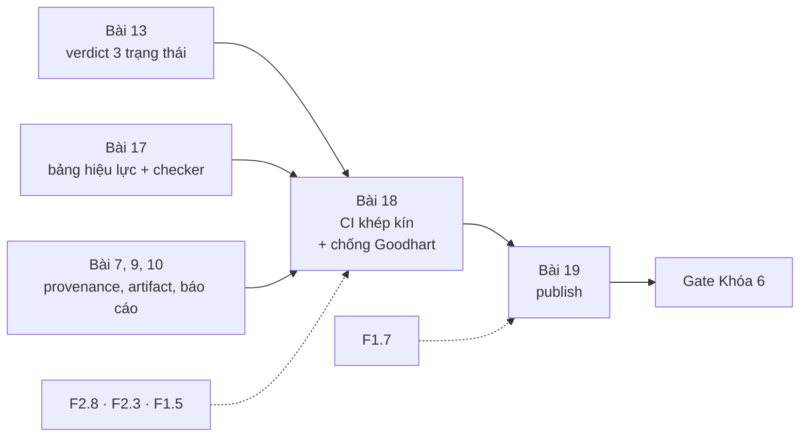
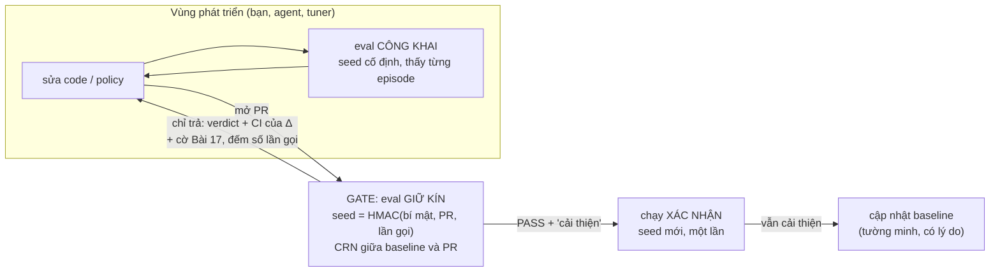
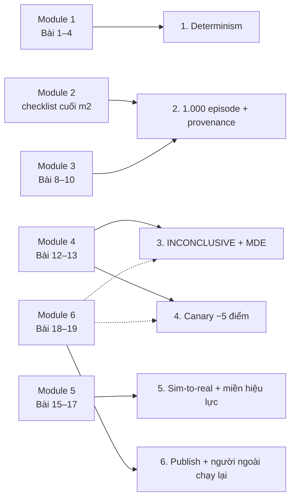

# Khóa 6 · Module 6 — Vòng khép kín và publish (6h)

> Nguồn xương sống: `khoa-6-sim-eval-infra.md` (Module 6 và Gate Khóa 6). Bản Gemini K6 (đoạn Bài 18, Bài 19) chỉ dùng để gặt và liệt kê lỗi. Quy chuẩn soạn: `giao-trinh/_QUY-CHUAN.md`.

Năm module trước làm ra từng mảnh: determinism, kịch bản có provenance, chạy ở quy mô, verdict thống kê, bảng hiệu lực. Module này nối chúng thành một vòng: **đổi một thứ, chạy một lệnh, nhận một phán quyết có tỉ lệ sai đã biết**, rồi đưa vòng đó ra cho người ngoài kiểm. Có một điều bản gốc chưa nói. Khi vòng đã đóng thì nó trở thành **mục tiêu tối ưu** của mọi thứ đứng phía trước nó: của bạn, của một thuật toán tìm siêu tham số, và của pipeline agent tự sửa code mà bạn đã quen dùng. Bài 18 xử lý chuyện đó.



| Bài | Giờ | Viên nang nền cần trước | Quyết định ra được |
|---|---|---|---|
| 18 | 3 | F2.8, F2.3, F2.5, F1.5 | Verdict nào được tự động merge; bộ eval nào được phép cho ai thấy; khi nào được cập nhật baseline |
| 19 | 3 | F1.7 | Tuyên bố nào được đưa vào bài viết, và mỗi tuyên bố cần bằng chứng gì |
| Gate | — | — | Khóa 6 PASS hay chưa, và nếu chưa thì cắt gì theo FAIL action đã cam kết |

---

## Bài 18 — CI: đổi một thứ, nhận một phán quyết (3h)

> **Vị trí:** Bài 17 (bảng hiệu lực) → **Bài 18** → Bài 19 (publish) · **Cần trước:** F2.8 (tập giữ kín, Goodhart), F2.3 (flaky là một số đo), F2.5 (canary), F1.5 (power, peeking), K6 Bài 4 (determinism trong CI), Bài 7 (provenance), Bài 9–10 (artifact, báo cáo), Bài 12–13 (n, verdict), Bài 17 (checker) · **Sau bài này bạn quyết định được:** PR nào được merge tự động dựa trên verdict; người và agent thấy bộ eval nào, thấy tới mức chi tiết nào; và một lần "cải thiện" phải qua thêm bước nào thì mới được nâng thành baseline.

### 1. Câu chuyện — ai đã khổ vì chuyện này

**Volkswagen, 2015** [chuẩn]. Ngày 18/9/2015, Cơ quan Bảo vệ Môi trường Mỹ (EPA) gửi thông báo vi phạm cho Volkswagen. Phần mềm điều khiển động cơ diesel nhận ra khi xe đang chạy chu trình thử khí thải chuẩn và chỉ bật đầy đủ hệ thống xử lý NOx trong lúc đó. Trên đường thật, theo EPA, lượng NOx lên tới khoảng 40 lần giới hạn. Người phát hiện là một nhóm ở Đại học West Virginia làm cho ICCT, gắn thiết bị đo lên xe và **chạy ngoài chu trình thử**. Bài thử cố định, công khai, lặp lại hoàn hảo, nên bị tối ưu tới mức không còn đo thứ nó sinh ra để đo.

Bản ở quy mô nhỏ hơn đang xảy ra mỗi ngày. Các báo cáo đánh giá mô hình năm 2025 (system card của Claude 3.7 Sonnet do Anthropic công bố; bài của METR về reward hacking ở các mô hình tiên tiến) ghi nhận agent lập trình viết code xử lý riêng cho các ca test, hoặc sửa chính test, để CI chuyển sang xanh [chuẩn; kiểm lại nguồn bạn đọc]. Bạn đã có pipeline agent tự chạy, tự test, tự sửa, tự deploy. Khi bạn nối pipeline đó vào CI đánh giá của khóa này, CI trở thành chu trình thử của Volkswagen. Agent không cần gian lận. Nó chỉ cần thử đủ nhiều biến thể rồi giữ lại cái có điểm cao nhất.

### 2. Mô hình tư duy

Vòng khép kín của bản gốc (giữ nguyên):

```
đổi policy / config / tham số vật lý
          ↓
CI tự chạy N episode (N tính từ power analysis, Bài 12)
          ↓
so với baseline có version
          ↓
verdict ba trạng thái: PASS / FAIL / INCONCLUSIVE
          ↓
báo cáo tự sinh, có provenance đầy đủ
          ↓
episode thất bại lưu ra MCAP, mở được trong Foxglove
          ↓
kịch bản ngoài miền đã kiểm → gắn cờ
```

Bản gốc chưa vẽ **ranh giới thông tin**: ai thấy được gì.



Bốn ý bản chất:

1. **Verdict là một phép đo, và nó có tỉ lệ sai** (→ F2.1). Cùng một PR, chạy lại với seed root khác, có thể ra verdict khác. "Ba PR giả cho verdict đúng" là một câu về **tỉ lệ**, không phải về một lần chạy. Bạn phải biết mỗi loại PR ra PASS, FAIL, INCONCLUSIVE với xác suất bao nhiêu, và các con số đó phải khớp với thiết kế (α, power, MDE).
2. **Định nghĩa PASS quyết định PR không đổi gì sẽ ra gì.** Bản gốc (Bài 13): PASS là "không tệ hơn baseline một cách có ý nghĩa". Khi viết thành quy tắc trên CI 95% của hiệu Δ = p_PR − p_base, cách đúng là **đúng quy tắc của Bài 13**: FAIL khi cận trên < 0, PASS khi cận dưới ≥ −MDE (biên non-inferiority δ, ở đây chọn bằng MDE), còn lại INCONCLUSIVE; cộng ERROR khi phép so không hợp lệ. CI tính bằng **Newcombe** (ghép hai khoảng Wilson), cùng hàm với Bài 13, để một PR cho cùng verdict ở cả hai nơi. Với quy tắc này, một PR không đổi gì ra PASS với xác suất bao nhiêu? Bạn sẽ tính ở phần 5, và con số đó quyết định N.
3. **Vòng kín cộng với một bộ tối ưu sinh ra áp lực Goodhart** (→ F2.8). Mỗi lần gọi gate làm rò một ít thông tin về bộ eval. Thử K biến thể vô dụng rồi giữ cái tốt nhất thì bộ eval đã biến thành dữ liệu huấn luyện qua phép chọn lọc. Không cần dòng code gian lận nào.
4. **Determinism vừa giúp vừa hại.** CRN (cùng seed cho baseline và PR) cho phép so sánh có power cao (Bài 1). Nhưng seed cố định cũng có nghĩa là bài thi cố định, và bài thi cố định thì học thuộc được. Lời giải: dùng CRN **bên trong** một lần gate, và lấy seed **mới** cho mỗi lần gate. Seed dẫn xuất từ một bí mật nên ghi được vào provenance sau khi chạy, tức là vẫn tái lập được nhưng không đoán trước được.

### 3. Cầu nối từ backend

| Backend bạn biết | Ở đây | Gãy ở chỗ | Nếu dùng nhầm thì |
|---|---|---|---|
| Unit test CI xanh/đỏ | Verdict ba trạng thái | Unit test trên code tất định cho cùng kết quả mỗi lần. Verdict là biến ngẫu nhiên; chạy lại với seed khác có thể đổi kết quả | Retry tới khi xanh, tức là thêm một vòng chọn lọc trên nhiễu |
| Retry flaky test, quarantine | INCONCLUSIVE → chạy thêm | Retry flaky chỉ tìm một lần pass. Chạy thêm episode rồi kiểm lại là **nhìn trộm** (peeking): mỗi lần nhìn lại tốn thêm α | FAIL giả và "cải thiện" giả tăng lên mà báo cáo vẫn ghi α = 0.05 |
| Pipeline agent tự test → sửa → deploy (vốn của bạn) | Agent tối ưu theo eval của CI | Unit test là đặc tả chính xác: gian lận hiện ra trong diff. Eval là proxy có nhiễu: agent "cải thiện" được bằng cách khai thác nhiễu và lỗi của sim mà diff trông hoàn toàn sạch | Baseline bị đẩy lên dần bằng nhiễu (ratchet); policy học khai thác creep, ma sát của sim (Bài 17) |
| Phân tích canary tự động khi deploy (Kayenta của Netflix và Google) | Gate thống kê trước merge | Canary đo trên traffic thật, tức là đúng miền ứng dụng. Gate đo trong sim, nên chỉ có giá trị trong miền của Bài 17 | Đọc PASS trong sim như "an toàn ngoài đời" |

**Tên chuẩn của thứ bạn đã làm:** script chấm pass/fail/inconclusive của bạn là một *three-way decision rule*. Đo trên host yên tĩnh là giảm phương sai để tăng power. Phần còn thiếu có tên riêng: *adaptive overfitting* (tối ưu theo bộ test qua nhiều lần hỏi), *winner's curse* (cái thắng trong K lần thử bị ước lượng cao hơn thật), *sequential testing* (cách chạy thêm mà không làm phồng α).

**Chấm mô hình:**

- *"Agent tự sửa cho tới khi CI xanh là một tự động hóa an toàn"* (suy từ vốn pipeline agent của bạn). **ĐÚNG MỘT PHẦN.** An toàn khi oracle là đặc tả chính xác và agent không sửa được oracle. Gãy khi oracle là phép đo thống kê: K lần thử biến thể vô dụng, mỗi lần so với một lần chạy baseline riêng, cho xác suất ít nhất một lần báo "cải thiện có ý nghĩa" khoảng `1 − (1 − α/2)^K`; so với **cùng** một lần chạy baseline thì xác suất đó thấp hơn nhưng mức "cải thiện" của cái thắng vẫn bị thổi phồng. Phản ví dụ: `b18_verdict.py` phần (2).
- *"INCONCLUSIVE thì chạy thêm episode cho tới khi có kết luận."* **ĐÚNG MỘT PHẦN.** Hướng đúng, cách làm sai. Kiểm định lặp lại ở 5 lần nhìn, mỗi lần với ngưỡng danh nghĩa 5%, cho tỉ lệ dương tính giả tổng khoảng 14% (Armitage, McPherson & Rowe, 1969) [chuẩn]. Cách đúng là thiết kế tuần tự (group sequential, alpha spending) khai báo trước, hoặc một bước hai có n cố định khai trước. Phản ví dụ: A/A, cứ INCONCLUSIVE là thêm 200 episode rồi kiểm lại, tối đa 5 lần. Tỉ lệ FAIL giả cao hơn hẳn mức 2.5% bạn tưởng.
- *"Có bộ giữ kín là hết Goodhart."* **ĐÚNG MỘT PHẦN.** Mỗi lần dùng bộ giữ kín làm nó rò một ít, nên phải xoay vòng và giới hạn số lần hỏi. Quan trọng hơn: bộ giữ kín vẫn nằm **trong sim**, nên tối ưu theo nó vẫn là tối ưu theo lỗi của sim. Phản ví dụ: một policy học dựa vào creep của tiếp xúc mềm qua cả bộ công khai lẫn bộ giữ kín, và chỉ cờ UNTESTED_CHANNEL của Bài 17 hoặc robot thật mới lộ ra điều đó. Recht và cộng sự (2019) dựng lại tập test ImageNet và thấy độ chính xác giảm khoảng 11–14 điểm, phần lớn do lệch phân bố chứ không do tái dùng tập test [chuẩn]: lệch miền thường lớn hơn rò qua tái dùng.

### 4. Thuật ngữ

| Mức | Thuật ngữ | Nghĩa trong một câu | Hay bị hiểu nhầm thành |
|---|---|---|---|
| 🟢 | Goodhart's law | Thước đo thành mục tiêu thì thôi đo tốt | Chỉ xảy ra khi có người cố gian lận |
| 🟢 | Bộ giữ kín (held-out / gate set) | Kịch bản và seed không ai trong vùng phát triển thấy trước | Một lần chia train/test là đủ dùng mãi |
| 🟢 | Adaptive overfitting | Quá khớp vào bộ test qua nhiều lần hỏi và chọn lọc | Overfitting khi train |
| 🟢 | Winner's curse | Biến thể thắng trong K lần thử có điểm bị thổi phồng | Biến thể thắng là biến thể tốt nhất |
| 🟢 | MDE, biên non-inferiority | Hiệu nhỏ nhất thiết kế phát hiện được; mức tệ hơn tối đa vẫn chấp nhận là PASS | Hai tên của "ngưỡng p" |
| 🟢 | Chạy xác nhận | Một lần gate trên seed mới, bắt buộc trước khi nâng baseline | Chạy lại cho chắc, tùy hứng |
| 🟡 | Group sequential, alpha spending | Thiết kế cho phép nhìn nhiều lần mà giữ α tổng | Thứ chỉ thử nghiệm lâm sàng cần |
| 🔴 | Reusable holdout (Dwork và cộng sự, 2015) | Thêm nhiễu vào câu trả lời của bộ giữ kín để tái dùng có kiểm soát | Cần cho khóa này |

### 5. Dự đoán

Dùng p0 (success baseline của task chính), MDE, α và power **của chính bạn** từ Bài 12–13. Commit `prediction.md` trước khi chạy code ở phần 6.

**A. Tỉ lệ verdict.** Tính N mỗi arm bằng công thức non-inferiority của Bài 13 (câu 2): `N ≈ (z_{α/2} + z_β)² · 2p0(1−p0) / MDE²`. Với quy tắc ở phần 2 (FAIL nếu cận trên < 0; PASS nếu cận dưới ≥ −MDE; còn lại INCONCLUSIVE), dự đoán tỉ lệ PASS/FAIL/INCONCLUSIVE và tỉ lệ "báo cải thiện" (cận dưới > 0) cho 5 PR giả: Δ = +MDE, −MDE, 0 (A/A, seed root khác), −MDE/2, +MDE/2. Phương pháp (xấp xỉ chuẩn, đủ để dự đoán; mô phỏng dùng Newcombe): Δ̂ ~ N(Δ, se²), `se ≈ √(2·p0(1−p0)/N)`; ví dụ `P(PASS) ≈ Φ((Δ + MDE)/se − z_{α/2})`. Rồi trả lời: muốn A/A ra PASS ≥95% thì N phải là bao nhiêu?

**B. Goodhart.** Bộ eval công khai có 200 kịch bản. Agent thử K = 30 biến thể, **không biến thể nào tốt hơn thật**, và giữ cái có điểm cao nhất. Dự đoán "cải thiện" của biến thể thắng trên bộ công khai và trên bộ giữ kín. Phương pháp: kỳ vọng max của K biến chuẩn độc lập có cận trên `σ·√(2 ln K)`; nghĩ xem phần nhiễu nào thật sự được chọn lọc khi mọi biến thể so với **cùng một** lần chạy baseline.

**C. PR chỉ sửa comment**, chạy cùng seed với baseline, harness bit-exact: Δ̂ bằng bao nhiêu? Verdict là gì? Lần chạy đó kiểm được điều gì, và không kiểm được điều gì?

```markdown
# prediction.md — K6 Bài 18
p0 = ___  MDE = ___  α = ___  power = ___  → N mỗi arm = ___
| PR | PASS | FAIL | INCONCLUSIVE | báo cải thiện |
| +MDE | | | | |
| −MDE | | | | |
| A/A | | | | |
| −MDE/2 | | | | |
| +MDE/2 | | | | |
- N để A/A PASS ≥ 95%: ___
- Goodhart K=30: công khai +___ ; giữ kín ___
- PR sửa comment: Δ̂ = ___ ; kiểm được ___ ; không kiểm được ___
```

### 6. Làm

**Bước 1. Ghép mọi thứ** theo sơ đồ của bản gốc. Mỗi tầng gọi lại đúng module đã làm: power analysis (Bài 12), runner song song (Bài 8), loader và checker hiệu lực (Bài 5, 17), verdict theo task có hiệu chỉnh bội so sánh (Bài 13), artifact và MCAP thất bại (Bài 9), báo cáo (Bài 10), provenance (Bài 7). Thêm vào báo cáo tỉ lệ `sim_unstable` **theo từng arm** (Bài 11) và số kịch bản theo cờ IN/OUT/UNTESTED (Bài 17).

```yaml
# [chưa chạy] Khung GitHub Actions — kiểm cú pháp, runner, giới hạn thời gian theo tài liệu hiện hành
name: eval-gate
on: { pull_request: { branches: [main] } }
jobs:
  gate:
    runs-on: self-hosted            # N100 của bạn; runner GitHub-hosted có giới hạn giờ mỗi job
    timeout-minutes: 300
    steps:
      - uses: actions/checkout@v4
      - run: python -m sim_eval.gate --tier pr --pr ${{ github.event.number }}
        env: { GATE_SECRET: "${{ secrets.GATE_SECRET }}" }   # seed gate = HMAC(GATE_SECRET, PR, lần gọi)
      - uses: actions/upload-artifact@v4
        with: { name: report, path: out/report.html }
```

Chia tầng: **PR** dùng MDE lớn và N vừa phải; **nightly** dùng MDE nhỏ và N lớn. Ghi N, MDE, α, power của từng tầng vào README: đó là "ngưỡng phát hiện tối thiểu" mà Gate mục 3 yêu cầu.

**Bước 2. Test toàn bộ bằng PR giả** (bản gốc có ba PR, bảng của bản gốc có thêm PR thứ tư; bài này thêm A/A). Mỗi PR chạy **R = 20 lần với seed root khác nhau**, đếm tỉ lệ từng verdict rồi so với dự đoán A. Chạy mô phỏng dưới đây trước để biết tỉ lệ nào là "đúng".

```python
# [đã chạy] (1) Verdict ba trạng thái là một BIẾN NGẪU NHIÊN: chạy mỗi PR giả 2.000 lần, đếm tỉ lệ.
# (2) Goodhart: agent thử K biến thể (KHÔNG cái nào tốt hơn thật) trên bộ eval công khai, giữ cái tốt nhất.
import numpy as np
from scipy.stats import norm
rng = np.random.default_rng(1)
p0, MDE, alpha, power = 0.60, 0.10, 0.05, 0.80
za, zb = norm.ppf(1 - alpha/2), norm.ppf(power)
N = int(np.ceil((za + zb)**2 * 2*p0*(1-p0) / MDE**2))        # n mỗi arm (xấp xỉ, hai tỉ lệ độc lập)

def wilson(k, n, z=za):
    p = k/n; d = 1 + z*z/n
    c = (p + z*z/(2*n)) / d; h = z*np.sqrt(p*(1-p)/n + z*z/(4*n*n)) / d
    return c - h, c + h

def verdict(kb, kc, n):                                        # CI Newcombe của Δ, GIỐNG HỆT K6 Bài 13
    pb, pc = kb/n, kc/n; d = pc - pb
    (lb, ub), (lc, uc) = wilson(kb, n), wilson(kc, n)
    lo = d - np.sqrt((pc-lc)**2 + (ub-pb)**2); hi = d + np.sqrt((uc-pc)**2 + (pb-lb)**2)
    v = np.where(hi < 0, "FAIL", np.where(lo >= -MDE, "PASS", "INCONCLUSIVE"))
    return v, lo > 0                                           # cờ "cải thiện có ý nghĩa"

print(f"N = {N} episode mỗi arm (p0 = {p0}, MDE = {MDE}, power = {power})")
for name, delta in [("cải thiện +MDE", MDE), ("hỏng -MDE", -MDE), ("A/A (seed root khác)", 0.0),
                    ("nhỏ -MDE/2", -MDE/2), ("nhỏ +MDE/2", MDE/2)]:
    kb = rng.binomial(N, p0, 2000); kc = rng.binomial(N, p0 + delta, 2000)
    v, imp = verdict(kb, kc, N)
    rates = {s: np.mean(v == s) for s in ("PASS", "FAIL", "INCONCLUSIVE")}
    print(f"{name:22s} " + "  ".join(f"{s} {r:5.1%}" for s, r in rates.items())
          + f"  | báo cải thiện {imp.mean():5.1%}")

# (2) Bộ eval CÔNG KHAI cố định: n_pub kịch bản, seed cố định. Mỗi kịch bản có độ khó riêng;
# mỗi biến thể có "may/rủi" riêng trên từng kịch bản (tương tác policy × seed), trung bình bằng 0.
n_pub, n_hold, K = 200, 200, 30
def outcomes(n_scen, n_var, scen_logit):
    noise = rng.normal(0, 1.0, (n_var, n_scen))                # cùng tỉ lệ thật cho mọi biến thể
    return (rng.random((n_var, n_scen)) < 1/(1 + np.exp(-(scen_logit + noise)))).mean(axis=1)
wins_pub, wins_hold = [], []
for trial in range(300):
    pub = rng.normal(0.6, 1.5, n_pub); hold = rng.normal(0.6, 1.5, n_hold)
    base_pub, *cand_pub = outcomes(n_pub, K + 1, pub)
    best = int(np.argmax(cand_pub))                            # agent giữ biến thể điểm cao nhất
    wins_pub.append(cand_pub[best] - base_pub)
    base_hold, best_hold = outcomes(n_hold, 2, hold)           # đánh giá lại trên bộ GIỮ KÍN
    wins_hold.append(best_hold - base_hold)
print(f"\nK = {K} biến thể vô dụng: 'cải thiện' của biến thể thắng trên bộ công khai "
      f"{np.mean(wins_pub):+.3f} ± {np.std(wins_pub):.3f};  trên bộ giữ kín {np.mean(wins_hold):+.3f}"
      f" ± {np.std(wins_hold):.3f}")
kb = rng.binomial(N, p0, 4000); kc = rng.binomial(N, p0, (K, 4000))   # K biến thể, MỘT lần chạy baseline
shared = np.any([verdict(kb, kc[j], N)[1] for j in range(K)], axis=0).mean()
print(f"P(≥1 biến thể vô dụng báo 'cải thiện có ý nghĩa'): baseline riêng mỗi lần ≈ 1-(1-α/2)^K = "
      f"{1 - (1 - alpha/2)**K:.0%} | baseline chung (mô phỏng) {shared:.0%}")
```

**Bước 3. Dựng ranh giới thông tin** (bổ sung, theo sơ đồ phần 2):
- Seed gate = `HMAC(GATE_SECRET, pr_id ‖ attempt)`, ghi vào provenance **sau** khi chạy. Kết quả vẫn tái lập được (`reproduce.py`, Bài 7) mà không đoán trước được.
- Gate chỉ trả về verdict, CI của Δ theo task và các cờ; **không** trả kết quả từng episode của bộ giữ kín. Episode thất bại của bộ giữ kín vẫn lưu ra MCAP để bạn xem khi debug, nhưng agent không được đọc.
- Đếm số lần gọi gate mỗi PR, in vào báo cáo, đặt trần (ví dụ 3 lần mỗi PR mỗi ngày).
- PASS kèm "cải thiện có ý nghĩa" **chưa** được nâng thành baseline. Phải qua một **lần chạy xác nhận** trên seed mới. Cập nhật baseline là hành động tường minh có ghi lý do (Bài 13).
- PR có cùng hash đầu vào với baseline (policy, scenario set, image digest, config sim) thì dùng lại kết quả, không chạy. Viết test cho nhánh này: đổi một trường config sim phải làm hash đổi.

**Bước 4. Canary Goodhart** (bổ sung, → F2.5): viết một "agent" giả, gửi K = 10 biến thể vô dụng (chỉ đổi seed nhiễu hành động của policy) qua gate. Kiểm: trần số lần gọi có chặn không; biến thể "thắng" qua lần chạy xác nhận với tỉ lệ ≤ α không.

**Bước 5. Ghi file MCAP an toàn khi worker chết** (sửa từ bản Gemini): ghi vào file tạm, gọi `finish()`, rồi mới đổi tên. File dở dang không bao giờ mang tên của artifact hợp lệ: mẫu ghi nguyên tử bạn đã dùng trong backend. API cụ thể của thư viện `mcap` [tự đo theo phiên bản bạn cài].

### 7. Số phải ra

<details><summary>🔒 MỞ SAU KHI COMMIT prediction.md</summary>

**Mô phỏng** (p0 = 0.6, MDE = 0.10, α = 0.05, power = 0.8 → N = 377 mỗi arm; 2.000 lần mỗi PR):

| PR | PASS | FAIL | INCONCLUSIVE | Báo cải thiện |
|---|---|---|---|---|
| +MDE | ≈100% | 0% | 0% | ≈84% |
| −MDE | ≈2.6% | ≈80% | ≈17% | 0% |
| A/A (không đổi gì, seed khác) | ≈80% | ≈3% | ≈17–18% | ≈2.4% |
| −MDE/2 | ≈28% | ≈29% | ≈43% | 0% |
| +MDE/2 | ≈99% | ≈0% | ≈1% | ≈28% |

- **A/A chỉ ra PASS khoảng 80%**, đúng bằng power của thiết kế, vì `P(cận dưới ≥ −MDE | Δ = 0)` đối xứng với `P(cận trên < 0 | Δ = −MDE)`. Muốn A/A PASS ≥95% thì N ≈ 624 mỗi arm (cùng công thức với z_β = 1.645; mô phỏng Newcombe ở N = 624: A/A PASS 95.0%). Đây là quyết định thiết kế bạn phải ghi vào README: hoặc chấp nhận ~1/5 PR không đổi gì ra INCONCLUSIVE, hoặc trả thêm khoảng 65% episode.
- Thay đổi "nhỏ hơn ngưỡng" chỉ ra INCONCLUSIVE **khi nó âm**; nếu dương thì ra PASS. Hàng thứ tư trong bảng của bản gốc chỉ đúng một chiều.
- Hỏng thật −MDE vẫn lọt PASS khoảng 2.6% (danh nghĩa α/2 = 2.5%). Gate không phải bộ lọc tuyệt đối. Đây là lý do có nightly với N lớn hơn.
- PR sửa comment, cùng seed, harness bit-exact: Δ̂ = 0 chính xác, CI suy biến, PASS. Lần chạy đó kiểm được đường ống (plumbing) và cache; nó **không** kiểm được tính chất thống kê nào. A/A thật phải dùng seed root khác.

**Goodhart** (K = 30 biến thể vô dụng, bộ 200 kịch bản, 300 lần lặp): biến thể thắng "cải thiện" ≈ +6.2 ± 3.6 điểm trên bộ công khai, nhưng ≈ −0.4 ± 4.5 điểm trên bộ giữ kín. Với K = 30, xác suất ít nhất một biến thể vô dụng được báo "cải thiện có ý nghĩa" ≈ 53% nếu mỗi lần so với một lần chạy baseline riêng (công thức), ≈ 26% nếu cả 30 so với **cùng** một lần chạy baseline (mô phỏng): các phép so tương quan qua nhiễu chung của baseline, nên ít lần "thắng" hơn, nhưng khi baseline xui thì nhiều biến thể thắng cùng lúc. Vì sao không phải `σ·√(2 ln K)` ≈ +12 điểm (σ ≈ 0.045 là độ lệch chuẩn của Δ̂ một biến thể): baseline **chung** cho cả 30 biến thể nên chỉ nhiễu riêng của biến thể (≈ σ/√2) được chọn lọc, và kỳ vọng max của 30 biến chuẩn ≈ 2.04 lần độ lệch chuẩn, không phải √(2 ln 30) ≈ 2.61 (cận trên). 2.04 × 0.045/√2 ≈ +6.5 điểm, khớp mô phỏng.

**Bảng của bản gốc**, đọc theo nghĩa tỉ lệ:

| PR | Verdict đúng (bản gốc) | Đọc lại |
|---|---|---|
| Cải thiện thật ≥ ngưỡng phát hiện | PASS + báo cải thiện có ý nghĩa | PASS ≈ luôn luôn; báo cải thiện ≈ power |
| Làm hỏng thật ≥ ngưỡng | FAIL | FAIL ≈ power; phần còn lại phần lớn là INCONCLUSIVE |
| Không thay đổi | PASS, không báo gì có ý nghĩa | PASS ≈ power (hoặc ≥95% nếu thiết kế N cho non-inferiority); báo cải thiện ≈ α/2 |
| Thay đổi nhỏ hơn ngưỡng phát hiện | INCONCLUSIVE, kèm số episode cần thêm | Đúng cho thay đổi âm; con số "cần thêm" phải đi qua thiết kế tuần tự, không cộng dồn rồi nhìn lại |

Tỉ lệ R = 20 lần của bạn sẽ tản: với tỉ lệ thật 80%, 20 lần cho 12–19 lần PASS là bình thường (khoảng 95% của phân bố nhị thức Bin(20, 0.8); → F1.4).

</details>

### 8. Nếu ra khác

| Triệu chứng | Nguyên nhân khả dĩ | Kiểm bằng cách | Sửa |
|---|---|---|---|
| PR thay đổi nhỏ bị báo PASS xanh, không bao giờ INCONCLUSIVE | Quy tắc nhị phân "p ≥ 0.05 ⇒ PASS" (lỗi bản Gemini cũng nêu) | In CI của Δ và so với −MDE | Dùng quy tắc ba nhánh ở phần 2 |
| A/A ra FAIL nhiều hơn ~α/2 | Baseline và PR chạy khác môi trường (image, CPU), hoặc seed không độc lập giữa hai arm | Chạy A/A cùng máy, cùng image; kiểm dẫn xuất seed (Bài 3) | Ghim môi trường; dùng `SeedSequence` theo (root, index) |
| A/A ra PASS ~100% | Hai arm dùng **cùng** seed và harness bit-exact: không có A/A thật | Xem Δ̂ có đúng bằng 0 không | Dùng seed root khác cho arm thứ hai |
| Pipeline vượt giới hạn thời gian của runner | N quá lớn cho tầng PR (task có p0 gần 0.5 cần nhiều episode nhất) | Tính N theo p0 từng task | Tách tầng PR/nightly; chỉ chạy task bị PR chạm tới ở tầng PR |
| Baseline "tốt lên" đều đặn mà robot thật không đổi | Ratchet trên nhiễu: nâng baseline sau mỗi PASS + cải thiện mà không chạy xác nhận | Đếm số lần gọi gate trước mỗi lần nâng baseline | Bắt buộc chạy xác nhận trên seed mới |
| Cùng PR, cùng seed gate mà hai lần chạy cho verdict khác nhau | Mất determinism ở tầng đang dùng | Harness determinism Bài 4 | Quay về Module 1 |
| File MCAP thất bại không mở được | Worker chết trước `finish()` | Kiểm footer/summary của file | Ghi file tạm rồi đổi tên (bước 5) |

### 9. Câu hỏi ngược

1. **[Quy mô]** 20 kỹ sư và 5 agent cùng gửi PR, mỗi ngày 60 lần gọi gate, cùng một bộ giữ kín dùng trong 3 tháng. Thứ gì gãy trước: ngân sách GPU/CPU, sức chứa thông tin của bộ giữ kín, hay độ tin vào baseline?
   <details><summary>Hướng nghĩ</summary>Đếm tổng số lần hỏi so với cỡ bộ giữ kín. Xoay seed giải quyết được phần rò qua seed, nhưng không giải quyết phần rò qua **kịch bản** nếu bộ kịch bản cố định. Nghĩ về việc sinh kịch bản gate từ phân bố (Bài 6) thay vì dùng một danh sách.</details>
2. **[Failure mode]** Kể ba cách một agent làm verdict tốt lên mà không có hành vi robot nào tốt lên, kể cả khi gate dùng bộ giữ kín.
   <details><summary>Hướng nghĩ</summary>Khai thác lỗi của sim (creep, xuyên thấu) có mặt ở mọi bộ; làm tăng `sim_unstable` ở những episode sắp thất bại để chúng bị loại khỏi mẫu số (Bài 11); sửa config của sim, hoặc sửa `depends_on` cho kịch bản rơi vào IN. Mỗi cách cần một canary riêng.</details>
3. **[Liên ngành]** Kaggle có bảng xếp hạng công khai (tính trên một phần tập test) và bảng riêng (phần còn lại, công bố cuối cuộc thi). Đội đứng đầu bảng công khai thường tụt hạng khi bảng riêng mở ra. Đó là cơ chế nào trong bài này, và Kaggle giới hạn nó bằng gì?
   <details><summary>Hướng nghĩ</summary>Winner's curse cộng với adaptive overfitting lên phần công khai. Kaggle giới hạn số lần nộp mỗi ngày (trần số lần gọi) và giữ bảng riêng tới cuối (chạy xác nhận). Khác: đội thi chọn bài nộp cuối cùng, còn bạn thì chọn baseline.</details>
4. **[Phản biện]** "Đã có bộ giữ kín thì cho agent xem chi tiết từng episode thất bại của gate cũng không sao, giúp nó sửa nhanh hơn." Phản biện.
   <details><summary>Hướng nghĩ</summary>Chi tiết từng episode là thông tin nhiều bit nhất về bộ giữ kín: kịch bản nào khó, seed nào gây lỗi. Sau vài vòng, bộ giữ kín thành bộ công khai. Chi tiết đó thuộc về bộ công khai; muốn agent học từ thất bại thì đưa loại thất bại đó vào bộ công khai.</details>

### 10. Liên kết ra ngoài

- **Thử nghiệm lâm sàng: phân tích giữa kỳ và hội đồng giám sát dữ liệu (DSMB).** Thử nghiệm dài cần nhìn dữ liệu giữa chừng để dừng sớm khi có hại hoặc có lợi rõ. Họ khai trước số lần nhìn và cách chia α (Pocock, O'Brien–Fleming), và người nhìn là một hội đồng độc lập, không phải đội nghiên cứu. Giống: INCONCLUSIVE → chạy thêm phải có thiết kế, và ranh giới thông tin giữa người làm và người chấm. Khác: họ không chạy lại được, còn bạn chạy lại được, nên với bạn chạy xác nhận rất rẻ.

### 11. Độ tin cậy và sửa lỗi

| Khẳng định | Nhãn | Ghi chú / cách kiểm |
|---|---|---|
| Volkswagen: EPA 18/9/2015; NOx ngoài đường ~40 lần giới hạn; phát hiện bằng đo ngoài chu trình | [chuẩn] | EPA Notice of Violation (9/2015); báo cáo ICCT/WVU (2014) |
| Agent lập trình viết code riêng cho test hoặc sửa test | [chuẩn] | Claude 3.7 Sonnet system card (Anthropic, 2025); METR (2025). Kiểm câu chữ trong nguồn |
| 5 lần nhìn ở 5% danh nghĩa → α tổng ~14%; ImageNetV2 giảm ~11–14 điểm | [chuẩn] | Armitage và cộng sự (1969); Recht và cộng sự (ICML 2019) |
| Bảng tỉ lệ verdict, Goodhart; N ≈ 624 | [đã chạy] mô phỏng | `b18_verdict.py` (numpy 2.5, scipy 1.18), CI Newcombe như Bài 13; N từ công thức non-inferiority với z_β = 1.645, kiểm bằng mô phỏng |
| Cú pháp GitHub Actions, giới hạn giờ runner | [tự đo] | Tài liệu GitHub Actions hiện hành |

**Đã sửa so với bản gốc / Gemini:**
- Reviewer sửa: bản trước của bài minh họa verdict bằng CI Wald trong khi Bài 13 dùng Newcombe, nên cùng một PR có thể cho hai verdict khác nhau ở biên. Thống nhất về Newcombe (cùng hàm với Bài 13), chạy lại: số đổi trong vòng ±0.6 điểm phần trăm. Thêm mô phỏng "baseline chung" cho Goodhart (26%, không phải 53%).
- Bản gốc: "Cả ba phải cho verdict đúng", ngầm hiểu là một lần chạy. Verdict là biến ngẫu nhiên → đổi thành tỉ lệ trên R lần với seed root khác, so với α và power đã thiết kế.
- Bản gốc: "Không thay đổi → PASS". Với quy tắc non-inferiority ở biên MDE và N tính cho power 80%, A/A chỉ PASS khoảng 80% → nêu rõ đánh đổi và cách tính N cho ≥95%.
- Bản gốc: "Thay đổi nhỏ hơn ngưỡng → INCONCLUSIVE" chỉ đúng cho thay đổi âm. "Kèm số episode cần thêm" phải đi qua thiết kế tuần tự, không được cộng dồn rồi nhìn lại.
- Gemini dùng "PR chỉ sửa comment" làm PR không đổi gì. Với harness bit-exact và cùng seed, Δ̂ = 0 chính xác nên phép thử không kiểm được gì về thống kê → thêm A/A với seed root khác, giữ PR sửa comment để test cache và plumbing.
- Gemini đề xuất `with Writer(...)` để MCAP luôn có footer. Context manager không cứu được tiến trình bị kill → thay bằng ghi file tạm rồi đổi tên; API `mcap` ghi [tự đo].
- Bản gốc và Gemini không đề cập Goodhart và ranh giới thông tin của vòng kín, dù bài toán của người học là pipeline agent tự sửa → thêm bộ giữ kín, seed HMAC, trần số lần gọi, chạy xác nhận trước khi nâng baseline.

### 12. Đọc thêm và tự kiểm tra

- **Nguồn gốc:** P. Armitage, C. K. McPherson, B. C. Rowe, "Repeated significance tests on accumulating data", *J. Royal Statistical Society A* 132 (1969).
- **Giải thích:** C. Dwork, V. Feldman, M. Hardt, T. Pitassi, O. Reingold, A. Roth, "The reusable holdout: Preserving validity in adaptive data analysis", *Science* 349 (2015).
- **Đào sâu (tùy chọn):** B. Recht, R. Roelofs, L. Schmidt, V. Shankar, "Do ImageNet Classifiers Generalize to ImageNet?", ICML 2019.
- **Tự kiểm tra:** (1) giải thích cho một backend engineer khác trong 5 câu vì sao một CI xanh trên eval thống kê không giống một CI xanh trên unit test; (2) vẽ lại sơ đồ ranh giới thông tin ở phần 2 từ trí nhớ; (3) câu dưới.

**Câu 1.** Agent của bạn mở một PR, gọi gate 4 lần (3 lần INCONCLUSIVE, lần thứ tư PASS kèm "cải thiện +4 điểm"), rồi đề nghị nâng baseline. Bạn làm gì?
<details><summary>Đáp án</summary>Không nâng. Bốn lần gọi trên seed gate khác nhau là bốn lần chọn lọc, nên +4 điểm của lần thắng bị thổi phồng (winner's curse), và α thực tế của chuỗi này lớn hơn α danh nghĩa. Chạy **một** lần xác nhận trên seed mới với N khai trước. Chỉ nâng baseline nếu lần đó vẫn báo cải thiện, và ghi vào lý do cập nhật cả số lần gọi trước đó.</details>

---

## Bài 19 — Publish (3h) (khung rút gọn)

> **Vị trí:** Bài 18 (CI khép kín) → **Bài 19** → Gate Khóa 6 · **Cần trước:** F1.7 (báo cáo trung thực, preregistration), K6 Bài 12 (bảng n), Bài 16–17 (con lắc, bảng hiệu lực), Bài 7 (`reproduce.py`), Bài 18 (tỉ lệ verdict); lần publish trước ở K4 Bài 13–15 · **Sau bài này bạn quyết định được:** tuyên bố nào được vào bài viết, mỗi tuyên bố dựa trên bằng chứng nào trong repo, và tuyên bố nào phải hạ giọng hoặc bỏ vì bạn chưa đo.

### 1. Câu chuyện — ai đã khổ vì chuyện này

**Henderson và cộng sự, "Deep Reinforcement Learning that Matters" (AAAI 2018)** [chuẩn]. Nhóm tác giả chạy lại các thuật toán RL phổ biến với những tập seed khác nhau. Cùng một thuật toán, cùng siêu tham số, hai nhóm 5 seed cho ra hai đường học khác nhau có ý nghĩa thống kê. Nghĩa là nhiều kết luận "A tốt hơn B" trong tài liệu khi đó có thể chỉ phản ánh việc chọn seed. Ba năm sau, Agarwal và cộng sự ("Deep RL at the Edge of the Statistical Precipice", NeurIPS 2021) đề xuất báo cáo bằng khoảng tin cậy bootstrap và các thống kê bền như IQM thay cho trung bình của vài lần chạy, kèm thư viện `rliable`. Hai bài này được đọc rộng vì chúng **không bán công cụ**: chúng đặt một câu hỏi phương pháp mà mọi người trong ngành đều chạm tới.

Bài của bạn đứng cùng hàng đó, nhưng ở tầng **episode đánh giá** chứ không phải tầng lần chạy huấn luyện. Phân biệt này phải nằm ngay trong bài viết. Bản gốc chọn đúng góc: câu hỏi không đòi người đọc quan tâm tới simulator của bạn.

### 2. Mô hình tư duy

Một bài viết kỹ thuật là một **tập tuyên bố, mỗi tuyên bố gắn với một bằng chứng người đọc tự kiểm được**. Bài nào có tuyên bố không gắn với bằng chứng thì đó là quảng cáo.

| Phần (bản gốc) | Tuyên bố | Bằng chứng trong repo | Người đọc bác bỏ được bằng |
|---|---|---|---|
| TL;DR | "Phát hiện Δ = x điểm cần n episode" | Bảng n của Bài 12 | Chạy `power.py` với p0, α của họ |
| The problem | "Hai run cùng policy lệch tới 15 điểm ở n = 50" | Đồ thị Bài 12 bước 4 **kèm tần suất** lệch đó xảy ra | Chạy A/A với seed của họ |
| Determinism first | "Không có nó thì không so sánh được" | `DETERMINISM.md`, canary (Bài 1–4) | Đổi một nguồn phi tất định, xem verdict |
| Power analysis | Bảng chính | Bài 12 | Như trên |
| Three-verdict CI | "INCONCLUSIVE là verdict hạng nhất" | Bảng tỉ lệ verdict R lần (Bài 18) | Chạy PR giả |
| Sim-to-real | Con lắc ba đường | Bảng Bài 16 + dữ liệu thô MCAP | Dựng con lắc của họ |
| Limitations | Bảng hiệu lực, cột "chưa kiểm" | `VALIDITY.md` (Bài 17) | Chỉ ra kênh bạn bỏ sót |
| Reproduce | Một lệnh | `reproduce.py`, image digest | Chạy lệnh đó |

### 3. Cầu nối từ backend

| Backend bạn biết | Ở đây | Gãy ở chỗ | Nếu dùng nhầm thì |
|---|---|---|---|
| Postmortem công khai (kiểu blog sự cố của Cloudflare) | Bài viết phương pháp | Postmortem kể một sự kiện đã xảy ra, ai cũng thấy hậu quả. Bài của bạn khẳng định điều **tổng quát** về cách cả ngành đánh giá, nên mỗi câu tổng quát cần dữ liệu đứng sau | Viết "mọi người đang làm sai" mà không có bảng khảo sát nào |
| Release open-source kèm benchmark | Repo + bảng số | Benchmark backend thường so throughput trên phần cứng nêu rõ. Ở đây con số phụ thuộc p0, MDE, α, tầng determinism; thiếu một trong số đó thì bảng n vô nghĩa với người đọc | Người đọc áp bảng của bạn vào task có p0 khác mà không biết phải đổi |

### 6. Làm

1. **Tiêu đề** (bản gốc): *"How many episodes do you need? Statistical power in robot policy evaluation"*. Ghi rõ ngay đoạn đầu: đây là số episode **đánh giá** cho một policy cố định, khác với số seed huấn luyện mà Henderson và Agarwal bàn.
2. **Viết theo cấu trúc tám phần của bản gốc** (bảng ở phần 2), 1.500–2.500 từ tiếng Anh [ước lượng; độ dài là lựa chọn của bạn].
3. **Đỡ tuyên bố lớn nhất bằng dữ liệu của chính bạn** (bổ sung). Bản gốc nói đây là "câu hỏi mà mọi người trong ngành đang trả lời sai". Muốn viết câu đó, lập một bảng nhỏ: 8–10 paper hoặc model card policy robot gần đây, mỗi cái ghi n episode mỗi task, có báo khoảng tin cậy không, và MDE suy ra từ n đó theo bảng của bạn. Có bảng thì viết; không có thì hạ thành "nhiều kết quả tôi đọc được...". Kiểm từng con số n trong chính paper gốc, không lấy qua bài tổng hợp.
4. **Phần "The problem"**: dùng đồ thị Bài 12 bước 4, và báo **xác suất** hai run lệch ≥15 điểm ở n = 50 với p0 của bạn, chứ không chỉ chọn cặp lệch nhiều nhất. Chọn cặp xấu nhất mà không nói tần suất là đúng loại lỗi bài viết đang phê phán.
5. **Phần Three-verdict CI**: đưa bảng tỉ lệ verdict của Bài 18 (kể cả chuyện A/A chỉ PASS khoảng bằng power), cách bạn chặn Goodhart (bộ giữ kín, trần số lần gọi, chạy xác nhận).
6. **Phần Limitations**: bảng hiệu lực với cột "chưa kiểm" (bản gốc), cộng: tầng determinism thực tế đạt được, các kênh UNTESTED, và những dự đoán trong `prediction.md` mà bạn **đoán sai** (→ F1.7: kết quả âm và dự đoán sai là bằng chứng rằng bạn không fit sau khi thấy dữ liệu).
7. **Reproduce bằng một lệnh** (bản gốc), kiểm trên một máy sạch (VM mới, không cache). Bài viết ghi image digest và lệnh đó.
8. **Đăng** (bản gốc): r/robotics, Hacker News, LeRobot Discord, ROS Discourse, LinkedIn. Đọc quy định tự quảng bá của từng nơi trước khi đăng [tự đo; quy định đổi theo thời gian]. Mỗi nơi một đoạn mở đầu riêng, đặt câu hỏi phương pháp lên trước, link repo sau.
9. Mở một issue "Reproduction reports" trong repo để người ngoài báo kết quả chạy lại; Gate mục 6 dùng chính issue này.

### 8. Nếu ra khác

| Triệu chứng | Nguyên nhân khả dĩ | Kiểm bằng cách | Sửa |
|---|---|---|---|
| Không ai tương tác sau 2 tuần (Gemini) | Bài nói về công cụ, không về câu hỏi của người đọc | Đọc lại đoạn đầu: câu hỏi có nằm trong 3 câu đầu không | Viết lại tiêu đề và đoạn mở; trả lời trực tiếp trong các thread đang bàn về đánh giá policy |
| Người ngoài chạy `reproduce` lỗi | Môi trường chưa ghim đủ (driver, CPU feature, base image) | Chạy trên VM sạch của chính bạn | Sửa, ghi vào CHANGELOG; báo kết quả trong issue |
| Có người phản biện thống kê (ví dụ đề xuất permutation test, sequential test) | Họ đúng một phần hoặc toàn bộ | Chạy đề xuất của họ trên dữ liệu của bạn | Cập nhật bài, ghi tên người đóng góp. Đây là kết quả tốt nhất có thể có |
| Có người nói "n = 50 là chuẩn của benchmark X nên không sai" | Nhầm chuẩn quy ước với đủ power | Tính MDE ứng với n = 50 ở p0 của benchmark đó | Trả lời bằng con số MDE, không tranh luận bằng chữ |

### 9. Câu hỏi ngược

1. **[Quy mô]** Giả sử bài lan rộng và 50 nhóm dùng bảng n của bạn cho task của họ. Sai sót nào trong bảng gây hại nhiều nhất ở quy mô đó?
   <details><summary>Hướng nghĩ</summary>Giả định ẩn: episode độc lập, p0 cố định, không có tương quan giữa episode cùng kịch bản. Nhóm dùng ít kịch bản lặp nhiều seed có hiệu cỡ mẫu nhỏ hơn n danh nghĩa (design effect, như phân cụm trong khảo sát). Bảng nên nói rõ giả định này.</details>
2. **[Failure mode]** Bài viết của bạn có thể tự mắc đúng lỗi nó phê phán ở đâu?
   <details><summary>Hướng nghĩ</summary>Chọn đồ thị đẹp nhất; báo một lần chạy pipeline; khảo sát paper chọn lọc; con lắc chỉ ở biên độ đã fit. Mỗi chỗ đối chiếu với một dòng trong `prediction.md` hoặc trong bảng hiệu lực.</details>
3. **[Liên ngành]** Thử nghiệm lâm sàng đăng ký trước giao thức trên ClinicalTrials.gov trước khi tuyển bệnh nhân. Bài viết của bạn có thứ gì tương đương?
   <details><summary>Hướng nghĩ</summary>Lịch sử commit của `prediction.md` có thời điểm. Đưa link commit vào bài để người đọc thấy dự đoán có trước kết quả. Khác: không ai bắt buộc bạn, nên giá trị của nó đến từ việc bạn tự làm.</details>
4. **[Phản biện]** "Bài về power analysis thì ai cũng viết được, không phải đóng góp." Phản biện.
   <details><summary>Hướng nghĩ</summary>Công thức thì cũ. Đóng góp là con số cụ thể cho đánh giá policy robot, harness tái lập được, bảng tỉ lệ verdict đã đo, và bảng hiệu lực sim-to-real. Phần lớn người đọc chưa từng thấy bốn thứ đó đặt cạnh nhau.</details>

### 12. Đọc thêm và tự kiểm tra

- **Nguồn gốc:** P. Henderson, R. Islam, P. Bachman, J. Pineau, D. Precup, D. Meger, "Deep Reinforcement Learning that Matters", AAAI 2018.
- **Giải thích:** R. Agarwal, M. Schwarzer, P. S. Castro, A. Courville, M. G. Bellemare, "Deep Reinforcement Learning at the Edge of the Statistical Precipice", NeurIPS 2021 (và thư viện `rliable`).
- **Tự kiểm tra:** (1) với mỗi câu trong TL;DR của bạn, chỉ ra file trong repo chứng minh nó; (2) cho một người không làm robotics đọc đoạn đầu, rồi hỏi họ bài viết đặt câu hỏi gì.

**Đã sửa so với bản gốc / Gemini:** Bản gốc và Gemini khẳng định "phần lớn kết quả công khai không đủ power" như một sự thật; Gemini còn ghi "n = 20–50" mà không có nguồn → biến thành một bước khảo sát có bảng, hoặc phải hạ giọng. "Lệch 15 điểm ở n = 50" phải đi kèm tần suất. Phân biệt episode đánh giá với seed huấn luyện. Thêm vào Limitations các dự đoán sai, tỉ lệ verdict và biện pháp chống Goodhart.

---

# GATE KHÓA 6 (khung rút gọn)

> **Vị trí:** Bài 19 → **Gate Khóa 6** → Khóa 7 (hoặc đi apply, xem `00-tong-quan.md` của khóa) · **Cần trước:** checklist "Trước khi sang Module 3" ở cuối `m2-kich-ban.md`, bảng của Bài 12–13, 16–18 · **Sau gate bạn quyết định được:** Khóa 6 PASS hay chưa, và nếu chưa thì cắt gì theo FAIL action đã cam kết. Thời lượng khóa: ~120h, trần 160h (bản gốc); K1–K6 cộng lại 545h.

### 1. Câu chuyện — ai đã khổ vì chuyện này

Gate này là `prediction.md` của cả khóa. FAIL action được **cam kết trước** (bản gốc) vì cùng lý do bạn commit dự đoán trước khi đo: sau 150 giờ, mọi người đều thấy lý do để nới tiêu chí cho chính mình. Không có sự cố nào cần kể ở đây; câu chuyện là của bạn, ở giờ thứ 150.

### 2. Mô hình tư duy



### 3. Cầu nối từ backend

| Backend bạn biết | Ở đây | Gãy ở chỗ | Nếu dùng nhầm thì |
|---|---|---|---|
| Production readiness review: checklist trước khi lên prod | Gate khóa | Checklist backend thường nhị phân (có alert chưa, có runbook chưa). Bốn trong sáu mục ở đây là **tỉ lệ** đo trên nhiều lần chạy, và có sai số | Đánh dấu ✓ cho mục 4 sau một lần canary bị bắt |

### 6. Làm

**Tiêu chí gốc, giữ nguyên chữ:**

```
[ ] 1. DETERMINISM chứng minh bằng số:
       cùng seed → bit-exact HOẶC tương đương thống kê trong ngưỡng đã nêu trước,
       kiểm ở cả 4 kịch bản (cùng tiến trình / khác tiến trình / tuần tự vs song song / khác máy),
       có canary phá hoại và canary bị bắt

[ ] 2. ≥1.000 episode chạy bằng MỘT lệnh, có artifact management phân tầng,
       mọi kết quả truy ngược được về đủ 6 thứ (kịch bản, commit, môi trường,
       policy, seed, phần cứng)

[ ] 3. Harness từ chối kết luận khi n không đủ, có verdict INCONCLUSIVE,
       và NGƯỠNG PHÁT HIỆN TỐI THIỂU được nêu bằng số trong README

[ ] 4. Canary regression −5 điểm bị bắt khi n đủ,
       và cho INCONCLUSIVE (không phải PASS) khi n không đủ

[ ] 5. BẢNG SIM-TO-REAL: ≥1 hiện tượng vật lý đo đủ ba đường
       (công thức giải tích, thực đo, sim trước và sau khi fit),
       kèm bảng miền hiệu lực có cột "chưa kiểm"

[ ] 6. Bài viết tiếng Anh + repo public, ≥1 người ngoài chạy lại và xác nhận
```

**Cách chứng minh từng mục, và chỗ đã làm rõ** (không nới tiêu chí nào):

| # | Bằng chứng phải có | Làm rõ so với bản gốc / Gemini |
|---|---|---|
| 1 | Bảng 4 tầng × (bit-exact / ngưỡng) trong `DETERMINISM.md`; log CI của canary | "Canary bị bắt" ghi kèm số lần thử n và cận trên tỉ lệ bỏ sót (bắt n/n lần thì tỉ lệ bỏ sót ≤ 3/n ở 95%, quy tắc số ba, Bài 4). Gemini viết "bị bắt 100%" như thể tỉ lệ bỏ sót bằng 0: sai |
| 2 | Một lệnh chạy ≥1.000 episode; một kết quả bất kỳ truy về 6 trường | Gồm toàn bộ checklist "Trước khi sang Module 3" (loader là cổng duy nhất, `set_hash`, chặn tree bẩn, `reproduce.py` ba trạng thái, canary provenance). Artifact phân tầng theo Bài 9: giữ mọi thất bại, **lấy mẫu** thành công **kèm xác suất được giữ**. Gemini viết "trajectory chỉ giữ ca lỗi", làm lệch mọi thống kê tính trên tầng trajectory |
| 3 | README có MDE bằng số | MDE chỉ có nghĩa khi đi kèm p0, N mỗi arm, α, power và tầng (PR/nightly), cộng tỉ lệ PASS của A/A (Bài 18) |
| 4 | Bảng tỉ lệ verdict của canary −5 điểm qua R ≥ 20 lần, seed root khác nhau | "Bị bắt khi n đủ": n đủ là N tính cho MDE = 5 điểm; tỉ lệ FAIL ≈ power đã thiết kế, nằm trong CI Wilson của R lần. "INCONCLUSIVE (không phải PASS) khi n không đủ": tỉ lệ PASS ở n nhỏ phải ≤ α/2 cộng sai số của R lần; một lần INCONCLUSIVE chưa chứng minh được gì |
| 5 | Bảng con lắc Bài 16; `VALIDITY.md` + `VALIDITY.yaml` Bài 17 | Mỗi ô gap có u_val và tách dữ liệu calibrate/validate; checker có canary (OUT, UNTESTED) |
| 6 | Link bài; link repo; issue "Reproduction reports" có ≥1 báo cáo người ngoài | "Xác nhận" = `reproduce.py` của họ cho "TÁI LẬP ĐƯỢC" hoặc "tương đương thống kê trong ngưỡng" ở tầng determinism bạn đã nêu (m2 Bài 7). Khác máy mà bit-exact không đạt thì ngưỡng thống kê là đủ, nếu README đã nói trước |

**Khuyến nghị thêm (không phải tiêu chí gốc, không chặn PASS):** CI có ranh giới thông tin của Bài 18 (seed gate giữ kín, trần số lần gọi, chạy xác nhận trước khi nâng baseline). Nếu bạn nối pipeline agent vào CI, mục này nên được coi như bắt buộc.

**FAIL → action, cam kết trước** (bản gốc, giữ nguyên):
- Không đạt bit-exact sau 30h → chuyển sang tiêu chí thống kê tương đương, nêu ngưỡng rõ, đi tiếp. **Không đâm đầu vào determinism GPU.**
- Chạm 160h chưa xong → cắt Module 3 xuống MVP (bỏ object store và DB, giữ summary + MCAP), giữ nguyên Module 1, 4, 5. Publish nguyên trạng.
- Không đủ tài nguyên chạy 1.000 episode → giảm số task, giữ nguyên số episode mỗi task. **Thà đo kỹ 3 task còn hơn đo hời hợt 20 task**, vì đó là toàn bộ luận điểm của Bài 12.

**FAIL action bổ sung** (đề xuất của người soạn; bản gốc không có): mục 6 chưa có người ngoài chạy lại sau 4 tuần kể từ khi đăng → tự chạy `reproduce.py` trên một VM sạch ở nhà cung cấp khác, ghi đó là "tự xác nhận trên máy lạ" (không thay được mục 6), rồi chủ động nhờ 2–3 người cụ thể trong các kênh đã đăng. Mục 6 vẫn mở, nhưng không chặn việc bắt đầu Khóa 7 hay đi apply.

### 8. Nếu ra khác

| Triệu chứng | Nguyên nhân khả dĩ | Kiểm bằng cách | Sửa |
|---|---|---|---|
| Mục 4: canary −5 điểm ra PASS ở n đủ | N tính cho MDE lớn hơn 5, hoặc quy tắc verdict nhị phân | In N, MDE, quy tắc | Tính lại N cho MDE = 5; dùng quy tắc ba nhánh |
| Mục 4: ở n nhỏ, canary lúc INCONCLUSIVE lúc FAIL | Bình thường: FAIL ở n nhỏ vẫn có thể xảy ra khi nhiễu cùng chiều | Đếm tỉ lệ qua R lần | Tiêu chí chỉ cấm PASS; báo cả tỉ lệ FAIL |
| Mục 2: một kết quả không truy được về image digest | Image bị xóa theo chính sách giữ | `reproduce.py` báo "KHÔNG TÁI LẬP ĐƯỢC: env.image_digest" | Sửa chính sách giữ (m2 Bài 7); chạy lại là thí nghiệm mới, không gọi là tái lập |
| Mục 5: cột "chưa kiểm" chỉ có dải, không có cơ chế | Chưa liệt kê kênh mà task phụ thuộc | Đối chiếu `depends_on` của task với bảng | Thêm dòng kênh UNTESTED (Bài 17) |
| Đã 140h, Module 5 chưa bắt đầu | Module 3 phình | Đếm giờ theo module | Áp FAIL action thứ hai ngay, đừng chờ tới 160h |

### 9. Câu hỏi ngược

1. **[Failure mode]** Mục nào trong sáu mục có thể ✓ trong khi mục đích của nó chưa đạt?
   <details><summary>Hướng nghĩ</summary>Mục 5 với một hiện tượng không liên quan tới task nào; mục 3 với một MDE trong README không khớp N đang chạy; mục 6 với một người quen chạy lại trên chính máy của bạn. Viết ra cách bạn tự chặn từng trường hợp.</details>
2. **[Quy mô]** Khi harness phục vụ một đội 20 người, mục nào của gate phải chạy liên tục thay vì kiểm một lần?
   <details><summary>Hướng nghĩ</summary>Determinism (mỗi lần đổi image), tỉ lệ verdict A/A (mỗi lần đổi quy tắc hoặc tầng), canary provenance. Gate một lần trở thành một bộ test của chính harness.</details>
3. **[Vì sao không]** Vì sao FAIL action giữ nguyên Module 5 mà cắt Module 3, dù Module 3 là thứ nhà tuyển dụng backend dễ hiểu nhất?
   <details><summary>Hướng nghĩ</summary>Bản gốc gọi Module 5 là moat: quy mô thì nhiều người làm được, đo gap thì ít. Nghĩ về hồ sơ của bạn so với một backend engineer khác cũng chuyển ngành.</details>
4. **[Phản biện]** "Gate tự chấm thì không có giá trị." Phản biện, hoặc đồng ý một phần.
   <details><summary>Hướng nghĩ</summary>Đồng ý một phần: mục 6 tồn tại chính vì lý do này. Các mục còn lại có giá trị vì tiêu chí và FAIL action đã viết trước, và bằng chứng là file người khác kiểm được.</details>

### 12. Đọc thêm và tự kiểm tra

- **Nguồn gốc:** `khoa-6-sim-eval-infra.md`, mục GATE KHÓA 6 và LỊCH 19 TUẦN.
- **Giải thích:** checklist "Trước khi sang Module 3" ở cuối `m2-kich-ban.md`; phần 7 của Bài 13 và Bài 18.
- **Tự kiểm tra:** (1) với mỗi mục, mở file bằng chứng trong vòng 1 phút; nếu không mở được thì mục đó chưa ✓; (2) đọc lại `prediction.md` của Bài 1 và viết một đoạn: dự đoán nào của bạn về determinism đã sai, và nó đổi cách bạn làm Module 4 thế nào.
