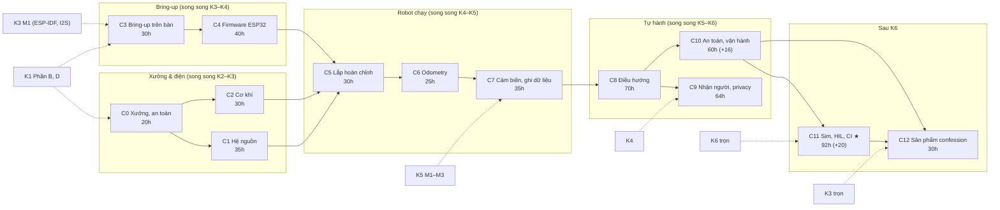

# Khóa 7 — Dựng robot từ xưởng: vừa build vừa học · Tổng quan

**Cho:** người đã qua K1 (cầm que đo, đọc logic analyzer, hàn header), **đang học bật tắt mỏ hàn**, chưa từng đi dây nguồn công suất, chưa từng cầm pin lithium dung lượng lớn, chưa từng lắp cơ khí. Không cần PASS K2–K6 trước: K7 là **đường ray song song** (mục 4).

**Thời lượng:** **561h lõi** (C0–C12, không tính tùy chọn) · **597h** nếu làm cả C10.4 (16h) và C11.6 (20h) `[ước lượng — tổng giờ bài + giờ lắp, ghi ở đầu từng file chặng]`. K7 gốc: 340h, trần 450h. **Đường lõi tối thiểu ≈ 366h** (mục 6; gồm C8 tối thiểu từ 2026-10-09).

**Chi phí phần cứng mới:** ~13,6–28,6 triệu VNĐ cho 13 chặng `[ước lượng 10/2026 — cộng tổng BOM của từng file, kiểm lại ở cửa hàng]`, chưa tính mini PC, ESP32-S3, logic analyzer, đồng hồ đã có từ K1–K5 (mục 5).

**Hợp đồng soạn:** `_KE-HOACH-K7.md` (mã chặng, mã bài, giờ, ràng buộc phần cứng mục 5, quyết định đã chốt mục 9). Văn bản chính thức của từng gate nằm **ở cuối file chặng đó**; file này chỉ tóm tắt.

---

## 1. Vì sao thiết kế lại

K7 gốc (`khoa-7-robot-hoan-chinh.md` + `khoa-7-phu-luc.md`) mở đầu bằng "Cho: người đã PASS Khóa 1–6". Danh sách mua chỉ một dòng ("khung xe 2 bánh + caster… driver motor, pin 3S/4S + BMS"). Không có bước lắp ráp, đi dây, bring-up hay an toàn pin nào. Nó là **bản đặc tả dự án cho người đã quen tay**, không phải giáo trình cho người đang học hàn.

Ba thay đổi:

1. **Vừa build vừa học, theo đúng thứ tự một người mới thật sự dựng robot:** xưởng → nguồn → cơ khí → bring-up trên bàn → firmware → lắp hoàn chỉnh → odometry → cảm biến/dữ liệu → điều hướng → nhận người → an toàn/vận hành → sim/HIL/CI → sản phẩm. Mọi bước lắp có checkpoint đo trước khi cấp điện.
2. **Đường ray song song** với K2–K6. C0–C6 bắt đầu được ngay sau K1 + K3 M1. Lý do: chỉ khi tự tay dựng robot mới cảm được độ khó của thế giới vật lý, và đó là chỗ mọi khóa K1–K6, F1–F7 được dùng thật. Để robot tới cuối lộ trình thì những khóa kia học trên dữ liệu của người khác.
3. **Hai sản phẩm cùng lúc:** con robot (artifact vật lý) và hệ thống data infra quanh nó (artifact dữ liệu). Mỗi chặng sinh ra cả hai; mỗi bench test thành **hạt giống regression test** cho HIL ở C11.

Phép so sánh dễ dùng: K7 mới giống **trunk-based development** — sau mỗi chặng robot vẫn chạy được ở phạm vi nhỏ hơn, không có nhánh "đang lắp dở" kéo dài nhiều tuần.
**Gãy ở chỗ:** trong phần mềm, một commit hỏng thì revert. Một lần cấp điện sai thì cháy linh kiện, hỏng pin, hoặc bỏng tay; không có revert. Hậu quả nếu dùng nhầm: "cứ cắm thử rồi sửa" — đúng ở backend, nguy hiểm ở đây. Vì vậy mới có quy tắc "một khối mới một lần" và "đo trước khi cấp điện".

---

## 2. Bản đồ chặng

Mũi tên liền: phụ thuộc giữa chặng. Mũi tên đứt: khóa chính phải xong trước. ★ = tiêu chí quan trọng nhất của cả khóa (tương quan sim–thật, C11 tiêu chí 5).

---

## 3. Bảng chặng

Giờ và tên bài lấy từ dòng tiêu đề của từng file. Giờ chặng = tổng bài + giờ lắp (phân bổ ghi ở đầu file).

| Chặng · file | Giờ | Bài khái niệm (giờ) | Làm ra được (vật lý · dữ liệu) | Gate gốc nhận về |
|---|---|---|---|---|
| **C0** Xưởng, dụng cụ, an toàn · `c00-xuong-an-toan.md` | 20 | C0.1 Bàn làm việc và đồ nghề (1,5, rút gọn) · C0.2 Điện gây hại bằng cách nào (3) · C0.3 Hàn dây, bấm đầu nối, co nhiệt (5) · C0.4 Nguồn bàn CV/CC (2,5) · C0.5 Sổ build và quy ước dây (1, rút gọn) | Bàn an toàn, đồ nghề đã kiểm, 10 mối hàn/đầu bấm đạt ba lớp kiểm (mắt, kéo, sụt áp) · `build-log/` có schema, `instruments.jsonl`, bảng màu dây | Mới |
| **C1** Hệ nguồn · `c01-he-nguon.md` | 35 | C1.1 Pin lithium, S/P, C-rate, BMS (4) · C1.2 Power budget là một bảng số đo (3) · C1.3 Dây, đầu nối, cầu chì (4) · C1.4 DC-DC (4) · C1.5 Lắp bo nguồn, đo dòng đỉnh (5) · C1.6 Sạc, bảo quản, pin hỏng (1,5, rút gọn) | Bo phân phối: pin → cầu chì chính → công tắc → nhánh motor qua relay E-stop / buck-boost 12 V / buck 5 V · `power/budget.csv` số đo, log INA226 ≥1 kHz | Mới |
| **C2** Cơ khí · `c02-co-khi.md` | 30 | C2.1 Lực, mô-men, chọn motor bằng số (6) · C2.2 Khung, trọng tâm, chống lật (5) · C2.3 Gá lắp, rung, strain relief (4) · C2.4 Đo và cân robot (5) | Khung có motor, bánh, caster, gá mini PC/pin (vật giả), cáp có giảm lực kéo · `mass_budget.csv`, `robot_params.yaml` | Mới |
| **C3** Bring-up trên bàn · `c03-bring-up-tren-ban.md` | 30 | C3.1 Motor, encoder, driver (5) · C3.2 H-bridge, back-EMF, dòng hãm (6) · C3.3 Encoder quadrature trên logic analyzer (5) · C3.4 PWM → vận tốc, vùng chết (6) · C3.5 Bring-up có kỷ luật (1, rút gọn) | Từng motor + driver + encoder chạy riêng từ ESP32 trên nguồn bàn, có capture · đường cong PWM→vận tốc ở 14,6 V và 12,0 V, dòng hãm | 7A (PWM, dòng hãm) |
| **C4** Firmware ESP32 · `c04-firmware-esp32.md` | 40 | C4.1 Timer, ISR, task, MCPWM/LEDC, PCNT (6) · C4.2 PID vận tốc và jitter (14) · C4.3 Giao thức host↔MCU → `ros2_control` (8) · C4.4 Failsafe trong firmware (6) | Vòng 100 Hz từ timer phần cứng, PCNT, MCPWM, giao thức có khung/CRC/sequence/lease, failsafe thử bằng lỗi thật · log jitter, test firmware tự động | 7A (jitter p99) |
| **C5** Lắp hoàn chỉnh · `c05-lap-hoan-chinh.md` | 30 | C5.1 Tích hợp cơ–điện, nhiễu, ground (6) · C5.2 ROS 2 trong Docker, `diff_drive_controller` (8) · C5.3 Teleop an toàn (5) · C5.4 Vận hành không màn hình (2, rút gọn) | Robot chạy pin, tay cầm có deadman, E-stop tạm cắt động lực · ROS 2 Jazzy trong Docker, `/odom`, `/joint_states` chuẩn | Mới |
| **C6** Odometry · `c06-odometry.md` | 25 | C6.1 Động học vi sai (5) · C6.2 UMBmark (9) · C6.3 Odometry không biết mình sai (4) | Robot đi vuông 2 m, sai số hệ thống đã hiệu chuẩn; sàn thử có trục · `data/c06/` UMBmark trước/sau, 20 lần thẳng 10 m | 7A (odometry, UMBmark) |
| **C7** Cảm biến, ghi dữ liệu · `c07-cam-bien-ghi-du-lieu.md` | 35 | C7.1 Gá cảm biến, TF tĩnh, USB (8) · C7.2 Timestamp ESP32 vs host (7) · C7.3 Sidecar MCAP, upload, audit (9) · C7.4 Data contract (4) | IMU + camera gá cứng, TF đúng REP-103/105 · sidecar MCAP, upload resumable, audit, Foxglove | 7A (ghi dữ liệu) |
| **C8** Định vị, điều hướng · `c08-dieu-huong.md` | 70 | C8.1 Marker hay lidar (3, rút gọn) · C8.2 Hiệu chuẩn camera, pose từ marker (12) · C8.3 Hợp nhất odom + marker, TF `map→odom→base_link` (14) · C8.4 Nav2 A→B (18) · C8.5 Session điều hướng (9) | Robot tự đi A→B 20 lần, tag đã đo · bảng độ chính xác marker, rule validation vật lý | 7B |
| **C9** Nhận người, privacy-first · `c09-nhan-nguoi-privacy.md` | 64 | C9.1 Quyền riêng tư, hai lớp đồng ý (14) · C9.2 Nhận diện và FAR/FRR (24) · C9.3 Đăng ký, xóa, audit log (12) · C9.4 Tích hợp vào điều hướng (14) | Nhận mặt on-device trên N100, LED nguồn camera nối cứng, nút nghe/từ chối · `PRIVACY.md`, FAR/FRR có CI, test xóa | 7C + Phụ lục A |
| **C10** An toàn, vận hành · `c10-an-toan-van-hanh.md` | 60 (+16) | C10.1 An toàn là tầng phần cứng (16) · C10.2 State machine và FMEA (18) · C10.3 Soak 72h (16 giờ người, 72h treo máy) · C10.4 HRI đo được (16, tùy chọn) | E-stop cứng (nút NC → relay → MOSFET xung giữ), bumper, watchdog độc lập · thời gian phản ứng từng tầng, FMEA đã test, dashboard soak | 7D + Phụ lục C |
| **C11** Sim, HIL, CI, vòng đời dữ liệu · `c11-sim-hil-ci.md` | 92 (+20) | C11.1 Model sim khớp robot thật (20) · C11.2 HIL và CI (24) · C11.3 Sim có dự đoán được thực tế không ★ (16) · C11.4 Đo MPC mua được gì (12) · C11.5 Vòng đời dữ liệu và fine-tune (20) · C11.6 Dự đoán quỹ đạo người (20, tùy chọn) | Bàn HIL (ESP32 thứ hai giả encoder), twin MuJoCo từ số đo, 120+ lần chạy thật · `sim/PARAMS.md`, `VALIDITY.yaml`, CI 1000 episode ba trạng thái | 7E + gate K7 + Phụ lục B, D |
| **C12** Sản phẩm confession · `c12-san-pham-confession.md` | 30 | C12.1 Audio trên robot: amp chung pin, nhiễu motor, ground loop (12) · C12.2 Luồng sản phẩm đầu–cuối (10) · C12.3 Demo, tổng kết, phỏng vấn (8, rút gọn) | Chuỗi audio K3 trên robot, một confession giao đầu–cuối · bảng nhiễu audio, bài viết chính, demo | 7E tiêu chí 8 + Phụ lục mục 4 |
| **Tổng lõi** | **561** | Tùy chọn: +36 → 597 | | |

---

## 4. Đường ray song song — chặng nào bắt đầu được khi nào

| Chặng | Cần trước (khóa chính) | Viên nang nền đọc đúng lúc | Chạy song song với |
|---|---|---|---|
| C0 | K1 Phần B (dụng cụ) | F5.7 | K2 |
| C1 | K1 trọn; tốt nhất sau K3 Bài 5–6 (amp, brownout) | F5.7, F1.1 | K2–K3 |
| C2 | C0 | F1.1 | K2–K3 |
| C3 | K1 Phần D (logic analyzer), K3 M1 (ESP-IDF, I2S) | F5.1, F5.2 | K3–K4 |
| C4 | C3; K3 M1 | F5.2, F5.3, F5.8 | K4 |
| C5 | C1, C2, C4 | F5.7 | K4 |
| C6 | C5 | F6.4, F1.1, F1.6 | K4–K5 |
| C7 | C6; K5 M1–M3 | F3.1, F3.4, F4.6 | K5 |
| C8 | C7 | F6.7, F6.8, F1.4 | K5–K6 |
| C9 | C8; K4 | F2.8, F1.4, F1.5 | K6 |
| C10 | C8 | F7.6, F5.3, F7.7 | K6 |
| C11 | C10; K6 trọn | F6.1–F6.6, F2.7, F2.6 | sau K6 |
| C12 | C10, C11.2; K3 trọn | F5.7, F7.4 | — |

Khi một chặng cần kỹ thuật mà khóa chính chưa dạy tới (ví dụ C4.2 đo jitter trước K5 Bài 8), bài K7 **tự chứa phiên bản tối thiểu** đủ để làm và trỏ `→ K5 Bài 8` cho bản đầy đủ. Không phải chờ.

Hai cách đi:

- **Song song (khuyến nghị):** K1 → (K2 ‖ C0–C2) → (K3 ‖ C3) → (K4 ‖ C4–C6) → (K5 ‖ C7–C8) → (K6 ‖ C9–C10) → C11 → C12. Robot lăn bánh (C5) ở khoảng giữa K4.
- **Tuần tự:** K1–K6 rồi K7. Được, nhưng K5 và K6 học trên dữ liệu không phải của robot mình, và robot tới muộn hơn ~2 năm.

---

## 5. Ngân sách giờ và tiền

### 5.1 Giờ theo chặng

| Nhóm | Chặng | Giờ lõi | Lũy kế |
|---|---|---|---|
| Xưởng & điện | C0, C1, C2 | 85 | 85 |
| Bring-up | C3, C4 | 70 | 155 |
| Robot chạy | C5, C6, C7 | 90 | 245 |
| Tự hành | C8, C9, C10 | 194 | 439 |
| Sim & sản phẩm | C11, C12 | 122 | 561 |
| Tùy chọn | C10.4, C11.6 | +36 | 597 |

C10.3 có thêm 72h **treo máy** (soak) không tính vào giờ người. Giờ ghi trong file là `[ước lượng]`; người mới thường vượt ở các chặng có lắp (C1, C5) vì làm lại mối hàn và chờ hàng.

### 5.2 Tiền theo chặng `[ước lượng 10/2026]`

Lấy từ dòng "Tổng Cn" ở mục 2 BOM của từng file. Mọi giá phải kiểm lại ở cửa hàng; nơi mua gợi ý ở C0 mục 2.

| Chặng | Tổng BOM | Phần lớn là | Không tính |
|---|---|---|---|
| C0 | 3,5–6tr | Nguồn bàn có giới hạn dòng, mỏ hàn, kìm bấm, đầu nối | Trừ nguồn bàn nếu đã mua ở K1 Bài 4 |
| C1 | 2,5–5tr | Pack 4S LiFePO4 có BMS, buck-boost 12 V ≥5 A, INA226 + shunt rời | Túi chống cháy tính ở đây |
| C2 | 2,5–5tr | Motor, bánh, máy khoan, cân | |
| C3 | 0,6–1tr | Driver | Mua driver sau khi có số dòng hãm |
| C4 | 0,5–1tr | ESP32-S3 dự phòng, linh kiện nhỏ | ESP32, logic analyzer đã có |
| C5 | 0,5–1,2tr | Đầu nối, E-stop tạm | Tay cầm nếu đã có |
| C6 | 0,4–1,1tr | Thước dây cấp chính xác, băng dán sàn | |
| C7 | 0,6–1,7tr | Camera USB, gá | IMU 0đ nếu dùng lại K5; object store tự chạy 0đ |
| C8 | 0,8–2tr | Tag in, ToF chướng ngại, chân máy | +1–3tr nếu chọn lidar ở C8.1 |
| C9 | 0,5–1,7tr | Camera mặt, LED, nút | Bộ tăng tốc AI |
| C10 | 0,7–1,5tr | Relay, nút nấm NC, watchdog ngoài, bumper | MCU thứ hai, cảm biến vực |
| C11 | 0,2–0,5tr | Linh kiện bàn HIL | Thuê GPU/máy (ghi vào `decisions.md`) |
| C12 | 0,3–0,9tr | Phần audio thêm cho robot | PCM5102A, INMP441, loa, amp đã có từ K3 |
| **Tổng** | **~13,6–28,6tr** | | Mini PC N100 (~3–4tr, đợt 2a) và đồ K1–K5 |

**Đọc con số này thế nào:** tiêu đề bài viết gốc nói "$300 office robot" (C12 tiêu chí 8, giữ nguyên chữ). Tổng BOM ước lượng ở trên, cộng mini PC, rõ ràng cao hơn $300 `[ước lượng]`. C12 đề xuất thay số trong tiêu đề bằng **tổng BOM thật** đo từ sổ build — tiêu chí không đổi, chỉ con số trong bài phải thật. Dải rộng (gấp đôi) vì gồm cả "mua lần đầu đồ nghề" (C0) và lựa chọn chưa chốt (lidar, bộ tăng tốc).

---

## 6. Tác động lên tổng lộ trình — không giấu

| Kịch bản | Giờ | Ở 6,5h/tuần |
|---|---|---|
| K1–K6 | 545h (K1 35 · K2 80 · K3 90 · K4 70 · K5 150 · K6 120) | ~84 tuần ≈ 1,6 năm |
| K1–K6 + K7 gốc | 885h | ≈ 2,6 năm |
| **K1–K6 + K7 mới lõi** | **1.106h** | ~170 tuần ≈ **3,3 năm** |
| K1–K6 + K7 mới có tùy chọn | 1.142h | ≈ 3,4 năm |
| K1–K6 + **đường lõi tối thiểu K7** | 545 + ~366 = **911h** | ≈ 2,7 năm |
| Khóa nền F1–F7 nếu học trọn | +245h | +0,7 năm |

`[ước lượng — chia giờ cho 6,5h/tuần, chưa tính tuần crunch]`. Ngân sách gốc là 650h; mọi kịch bản đều vượt. Viên nang F học **đúng lúc** (chỉ những mã trong cột "Viên nang nền" của bảng mục 4) thì ít hơn 245h nhiều. **Chọn kịch bản nào là quyết định của bạn**, ghi vào `decisions.md` ở tuần đầu, cùng với trần giờ (mục 7).

### Đường lõi tối thiểu (~366h)

Gần bằng giờ K7 gốc (340h), nhưng đi từ xưởng thay vì từ đặc tả:

| Phần | Giờ |
|---|---|
| C0–C7 trọn | 245 |
| **C8 tối thiểu**: khu thử, cảm biến chướng ngại, bản đồ, cây TF, C8.4 Nav2 A→B chỉ bằng odometry, checkpoint (`c08-dieu-huong.md`, đầu file) | ~27 |
| C10.1 An toàn tầng phần cứng + C10.2 State machine, FMEA | ~34 |
| C11.1 Model sim + C11.2 HIL, CI + C11.3 Sim có dự đoán được thực tế không ★ | ~60 |
| **Tổng** | **~366** |

Nếu chỉ làm được đường này, robot vẫn đi được (teleop, odometry đã hiệu chuẩn, **tự đi A→B quãng ngắn bằng Nav2**), **an toàn** (E-stop cứng, FMEA đã test), **có dữ liệu** (MCAP, audit, data contract), **có sim** và có câu trả lời cho câu hỏi ★ "sim có dự đoán đúng thực tế không". Đây đúng tinh thần "nếu chỉ làm được một phần, làm 7A và 7E" của bản gốc.

Bỏ trong đường tối thiểu: phần định vị tuyệt đối của C8 (C8.1, C8.2, EKF của C8.3, C8.5, Gate chặng 8), C9 (nhận người), C10.3 (soak), C11.4–C11.5, C12. **Không bao giờ bỏ C10.1–C10.2** trước khi cho robot chạy gần người.

**Đã quyết (2026-10-09):** C11.3 so 6 cấu hình **Nav2** giữa sim và thật, và C10.1 cần Nav2 chạy được. Vì vậy đường tối thiểu gồm **C8 tối thiểu** (cách (a) trong hai phương án đã nêu): Nav2 A→B chỉ bằng odometry, `map → odom` tĩnh, tuyến ngắn, không kidnapped. Chi tiết, checkpoint và hệ quả xuống C10.2/C11.3 ở đầu `c08-dieu-huong.md`. Phương án (b), đổi C11.3 sang controller có kịch bản, không dùng.

---

## 7. Trần giờ mới — thay 450h của K7 gốc

K7 gốc có trần **450h cho 340h kế hoạch** (≈ ×1,3). FAIL action của C7, C11 và C12 đã ghi rằng trần mới là quyết định của bạn, ghi trong `decisions.md`, và **trỏ về file này**. C9 có dòng "chạm trần giờ của chặng" trong bảng sửa lỗi gate.

**Đề xuất mặc định: trần mỗi chặng = giờ chặng × 1,3**, làm tròn lên. Giữ đúng tỉ lệ dư của bản gốc, nhưng áp từng chặng để phát hiện phình sớm (một chặng phình 50% bạn biết ngay, không phải đợi tới giờ thứ 450).

| Chặng | Giờ | Trần đề xuất (×1,3) | Trần đã ghi trong file chặng | Dùng |
|---|---|---|---|---|
| C0 | 20 | 26 | — | 26 |
| C1 | 35 | 46 | — | 46 |
| C2 | 30 | 39 | 40 (30 + 10 dư) | **40** (file chặng) |
| C3 | 30 | 39 | 40 (30 + 10 dư) | **40** (file chặng) |
| C4 | 40 | 52 | — | 52 |
| C5 | 30 | 39 | — | 39 |
| C6 | 25 | 33 | — | 33 |
| C7 | 35 | 46 | hoãn tiêu chí 1 nếu vượt trần bạn đặt | 46 |
| C8 | 70 | 91 | 110 (giữ của GATE 7B gốc) | **110** (file chặng, ngưỡng gốc) |
| C9 | 64 | 84 | ưu tiên tiêu chí 1, 2, 2b, 3, 7 nếu vượt | 84 |
| C10 | 60 | 78 | — | 78 (+21 nếu làm C10.4) |
| C11 | 92 | 120 | trần trong `decisions.md` | 120 (+26 nếu làm C11.6) |
| C12 | 30 | 39 | trần đã cam kết | 39 |
| **Tổng lõi** | **561** | **~732** | | **~753** |

Quy tắc:

- Khi file chặng đã có trần riêng (C2, C3, C8), **file chặng thắng** — không đổi ngưỡng gate. Cột "Dùng" chỉ điền chỗ trống.
- Trần **ghi vào `decisions.md` trước khi bắt đầu chặng**, không sửa lúc tới gate (C12 nói rõ điều này).
- Chạm trần → áp FAIL action của chặng đó (dừng, publish nguyên trạng, ghi cái gì xong/chưa). Mỗi chặng đã qua gate vẫn là một artifact.
- Giờ đếm trong sổ build (`build-log/cNN.md`), không ước đoán cuối tuần.
- **Trần không áp lên quy tắc an toàn.** Không có FAIL action nào cho phép bỏ một checkpoint đo hay một tiêu chí an toàn để kịp giờ.

---

## 8. Gate tổng — tóm tắt

Văn bản chính thức ở cuối từng file chặng. Ngưỡng gốc 7A–7E **giữ nguyên chữ**; chỗ sửa chỉ là cách đo, cách đọc và tiêu chí mới cho phần K7 gốc không có. Bảng dưới không thay thế gate nào.

| Gate | Tiêu chí chính (tóm tắt) | Nguồn | Ở đâu |
|---|---|---|---|
| C0 | Bàn an toàn; 10 mẫu đạt; nguồn bàn; hiểu ba đường gây hại; diễn tập sự cố; sổ build | Mới | `c00…` mục *Gate chặng 0* |
| C1 | Bo nguồn đúng sơ đồ, F0 sát pin; DC-DC đúng trên cả dải pack; E-stop 20/20 cắt động lực không cắt compute; log INA226 ≥1 kHz; budget là số đo; 30 phút trên pin; sạc lần đầu đúng quy trình | Mới | `c01…` |
| C2 | `motor_sizing.md` trước ngày mua; `mass_budget.csv`, `robot_params.yaml` có sai số; góc lật đo được; ba điểm tựa; vạch sơn; không pin thật trên khung | Mới | `c02…` |
| C3 | Đường cong PWM→vận tốc + vùng chết (7A-4 nguyên văn); counts 10 vòng; dòng hãm thật (không giữ trục bằng tay); driver chọn bằng bảng số | 7A | `c03…` |
| C4 | Bảng chân, boot an toàn; **jitter p99 (7A-3)**; PI trên bàn; giao thức; failsafe; hạt giống HIL | 7A | `c04…` |
| C5 | Kiểm nguội; cấp điện có bậc; nhiễu; ROS 2; PI khi chạm đất; teleop deadman; E-stop tạm | Mới + K7 gốc Bài 3 | `c05…` |
| C6 | Đi thẳng 10 m (7A-1); UMBmark đầy đủ (7A-2); bài viết UMBmark (7A-6); provenance | 7A | `c06…` |
| C7 | MCAP ghi, upload, mở Foxglove, tool K2 tìm ≥1 lỗi thật (7A-5); TF; timestamp có ngân sách; sidecar không ảnh hưởng vòng điều khiển | 7A | `c07…` |
| C8 | Hiệu chuẩn camera <0,5 px; bảng pose marker; ba đường odom/marker/fusion; A→B ≥19/20; 4 kịch bản ép hỏng; ≥4 rule vật lý; bài viết | 7B | `c08…` |
| C9 | Văn bản cho phép + đồng ý (đứng trước mọi tiêu chí đo); FAR/FRR có CI trung thực; test xóa; tích hợp. Không có văn bản → FAIL action NFC/QR | 7C + Phụ lục A | `c09…` |
| C10 | Thời gian phản ứng E-stop 20 lần; `docs/safety.md` các tầng; kẹp tốc độ firmware; FMEA mỗi dòng ≥1 lỗi thật; soak 72h theo hợp đồng commit trước; bài viết | 7D (+ Phụ lục C) | `c10…` |
| C11 | Sim truy về số đo; bảng sim-to-real; HIL bắt lỗi sim bỏ sót; CI 1000 episode ba trạng thái; **★ tương quan sim–thật 6 cấu hình**; vòng đời dữ liệu; fine-tune | 7E + gate K7 + Phụ lục B | `c11…` |
| C12 | Bài viết chính (tiêu chí 8 nguyên văn); 12a audio trên robot; 12b luồng sản phẩm 0 vi phạm bất biến; 12c demo; 12d tổng kết giờ/tiền thật | 7E-8 + mới | `c12…` (*gate tổng K7, phần sản phẩm*) |

**Tiêu chí ★ của cả K7 là C11 tiêu chí 5** (tương quan sim–thật). Nếu chỉ làm được một thứ trong C11–C12, làm nó; bài viết chính kể về nó.

---

## 9. Cách học khóa này

### Tuần thường (~6–7h)

- **Một buổi khái niệm (2–3h):** đọc bài khái niệm của bước sắp lắp, chạy mô phỏng Python của bài, **viết `prediction.md` và commit** trước khi mở khối 🔒.
- **Một hoặc hai buổi lắp (2–4h, liền mạch):** làm đúng các "Lắp bước k" của mục 5 trong file chặng, mỗi bước qua checkpoint đo. Một buổi lắp kết thúc ở trạng thái **an toàn và chạy được** (pin rút, robot chạy ở phạm vi nhỏ hơn), không dừng giữa một bước.
- **15 phút cuối mỗi buổi:** ghi sổ build (ảnh, số đo, lỗi, near miss, giờ thực). Sổ build là bộ dữ liệu đầu tiên, và giờ thực trong đó là đầu vào cho trần giờ.

### Tuần crunch (0–2h)

- **Chỉ đọc bài khái niệm**, làm câu tự kiểm, viết dự đoán cho bước tiếp. Đọc viên nang F sắp cần.
- Rà lại sổ build, phân loại lỗi, viết test tự động từ bench test đã làm (phần data infra không cần pin).
- **KHÔNG lắp, KHÔNG đụng pin hay dây nguồn khi mệt, buồn ngủ hay đang vội** (quy tắc cứng C0). Tuần crunch là tuần không có phần cứng, không phải tuần "lắp nhanh cho kịp".

### Dùng AI ở bước nào

- **Không ở bước dự đoán.** Con số trong `prediction.md` là của bạn; nếu hỏi AI trước thì phép so dự đoán–đo mất giá trị, và bạn không biết mô hình của mình sai ở đâu.
- **Không làm nguồn sự thật cho an toàn.** Sơ đồ đi dây, chân ESP32, định mức cầu chì, ngưỡng sạc: kiểm datasheet và đo. Bản Gemini K7 đã sai đủ chỗ (mục 13) để đây là quy tắc chứ không phải lời khuyên.
- **Ở bước giải thích, dùng prompt "chấm mô hình":** "Đây là mô hình của tôi về X. Chấm ĐÚNG / ĐÚNG MỘT PHẦN / SAI, chỉ chỗ gãy, đưa một phản ví dụ. Không khen." Đối chiếu câu trả lời với số đo của chính bạn.
- **Được dùng thoải mái** cho: viết script phân tích, parser log, dashboard, khung test — với điều kiện chạy và kiểm kết quả trên dữ liệu thật.

### Khi kết quả đo ra khác dự đoán

Mỗi bài có mục "Nếu ra khác". Thứ tự: nghi dụng cụ đo trước (đồng hồ ở đúng thang? sample rate đủ?), rồi nghi mạch, cuối cùng mới nghi lý thuyết. Ghi cả lần ra khác vào sổ build — đó là dữ liệu cho FMEA ở C10.2.

---

## 10. Quy tắc an toàn xuyên suốt

Gom từ mục 1 của C0, C1, C10. Mỗi chặng có mục An toàn riêng với quy tắc của nó; đây là những quy tắc **áp cho mọi chặng từ lúc chúng được đặt ra**.

**Bàn làm việc và dụng cụ (từ C0)**

- KHÔNG mở vỏ nguồn bàn, sạc, adapter (220 V và tụ còn tích điện sau khi rút phích).
- KHÔNG đeo nhẫn, đồng hồ kim loại, vòng tay khi làm với pin hoặc dây nguồn.
- KHÔNG đặt dụng cụ kim loại lên pin hoặc bo đang có điện.
- KHÔNG để mỏ hàn ngoài giá khi buông tay. Mỏ rơi thì để rơi, KHÔNG chụp.
- KHÔNG co nhiệt bằng bật lửa gần pin, cồn IPA, dung môi mở nắp.
- KHÔNG làm với pin hoặc dây nguồn khi mệt, buồn ngủ, đang vội.

**Cấp điện (từ C0, C1)**

- KHÔNG cấp điện cho mạch mới khi chưa đo điện trở giữa + và −. Gần 0 Ω thì không cấp.
- KHÔNG nối mạch vào đầu ra nguồn đang bật: tắt OUTPUT → nối → kiểm cực → bật. KHÔNG đặt `I_set` cao "cho chắc".
- KHÔNG nối pin vào mạch nào chưa qua đủ ba bước: đo điện trở khi tắt; cấp bằng nguồn bàn giới hạn dòng thấp và thấy đúng các điện áp; rồi mới pin.
- KHÔNG chạm que đồng hồ vào nguồn hay pin khi núm ở thang dòng hoặc que đỏ ở lỗ `10A` — đó là chập pack qua đồng hồ. Trước mỗi lần đo áp: "núm ở V DC, que đỏ ở lỗ VΩ".
- KHÔNG cấp điện cho mini PC hoặc ESP32 từ DC-DC chưa đo đầu ra lúc không tải.

**Pin (từ C1)**

- KHÔNG tự ghép cell rời, KHÔNG hàn lên cell, KHÔNG mở BMS. Dùng pack dựng sẵn có BMS.
- KHÔNG dùng LiPo RC trần trong K7 trừ khi có quy trình riêng và lý do trong `decisions.md`.
- KHÔNG sạc bằng sạc khác hóa học hoặc khác số S (LiFePO4 4S 14,6 V ≠ Li-ion 4S 16,8 V).
- KHÔNG sạc khi không có người trong phòng; KHÔNG sạc trên giường, sofa, thảm. Sạc trong túi chống cháy hoặc hộp kim loại, trên mặt không cháy.
- KHÔNG dùng pin phồng, móp, rò, có mùi lạ, đã rơi mạnh, nóng khi để yên: chuyển vào hộp kim loại có cát, xử lý theo C1.6.
- KHÔNG cắt hai dây pack bằng một nhát kìm, KHÔNG để hai đầu dây pin cùng trần một lúc.
- KHÔNG làm việc trên dây đang nối pin. Công tắc OFF chưa đủ: **rút XT60 của pin** rồi mới sửa.
- KHÔNG đặt cầu chì chính xa pin (giữ ≤10 cm `[ước lượng — thực hành phổ biến]`). KHÔNG thay cầu chì đứt bằng cầu chì lớn hơn, dây đồng, giấy bạc — cầu chì đứt là một số đo, tìm nguyên nhân trước.

**Robot chạy và thử lỗi (từ C10, áp từ lần đầu bánh quay)**

- KHÔNG dựa vào "E-stop" phần mềm (nút app, topic ROS, kill switch MQTT) làm đường dừng duy nhất trong bất kỳ phép thử nào. E-stop **cắt động lực, không cắt compute**.
- KHÔNG thay nút E-stop bằng công tắc NO hay nút nhấn nhả; chỉ dùng nút nấm NC tự khóa. KHÔNG để nhả nút làm robot chạy lại — phải có reset có chủ đích.
- KHÔNG thử lỗi lần đầu trên sàn: robot kê giá, **bánh không chạm đất**, tay trên nút E-stop. KHÔNG gây lỗi nào khi E-stop cứng chưa PASS.
- KHÔNG đứng trước hướng chạy khi thử trên sàn; đứng sau hoặc bên cạnh ≥1 m.
- KHÔNG cấp ESP32 chỉ bằng USB của mini PC; rút USB không được làm ESP32 mất điện.
- KHÔNG đo VM, cuộn relay, chuỗi E-stop bằng logic analyzer khi không qua phân áp hoặc opto (14,6 V vào kênh là cháy kênh, có thể cả cổng USB laptop).
- KHÔNG đưa robot vào soak khi chưa có biển báo, sự đồng ý của quản lý văn phòng, khu vực đã loại cầu thang. KHÔNG để robot sạc qua đêm khi không có người trong tòa nhà.

**Người và dữ liệu (từ C9)**

- Không có văn bản cho phép → không chạy nhận mặt, kể cả "tạm". Kích hoạt FAIL action NFC/QR.

Mỗi file chặng có bảng **"Sự cố — Làm ngay — KHÔNG làm"** (pin bốc khói, dây đỏ rực, dụng cụ chập). Đọc bảng của C0 và C1 **trước** lần đầu cầm pin, và in dán cạnh bàn.

---

## 11. Bản đồ vai trò

Rút từ `khoa-7-phu-luc.md` mục 4, ánh xạ sang chặng mới. Nguyên tắc: **biết mình KHÔNG làm vai nào quan trọng ngang biết mình làm vai nào.**

**Vai bạn thực sự đóng**

| Vai | Chặng | Bằng chứng |
|---|---|---|
| Systems / Robotics Architect | C1, C2, C4.3 (quyết định kiến trúc) | `decisions.md` |
| Embedded / Controls | C3, C4, C6 | Jitter p99, UMBmark, đường cong PWM |
| Localization & Navigation | C8 | Bảng độ chính xác marker, 20 lần A→B |
| Perception (applied) | C9 | ROC, FAR/FRR theo điều kiện |
| Safety & Reliability | C10 | FMEA đã test, thời gian phản ứng từng tầng |
| Simulation & Evaluation | C11 + K6 | Tương quan sim–thật, bảng miền hiệu lực |
| **Data Platform** | K5 + C7 | MCAP, audit, Foxglove, data contract |
| **Test & Validation** | C3, C4 (hạt giống) → C11.2 | CI ba trạng thái, HIL |
| MLOps (nhẹ) | C11.5 | Vòng fine-tune khép kín |
| Privacy / Compliance | C9.1, C9.3 | `PRIVACY.md`, test xóa dữ liệu |
| Technical Writer | Xuyên suốt | Các bài viết gate (C6, C8, C10, C12…) |

**Vai chạm nhẹ, đủ để nói chuyện:** Mechanical (C2 — "tôi không thiết kế cơ khí; tôi đo hệ quả của nó lên odometry"), Electrical (C1, C3, C10.1 — "tôi không vẽ PCB; tôi biết dòng hãm quyết định driver và nguồn vì tôi đo nó"), ML Research (C9, C11.5 — dùng pretrained, đo đánh đổi), HRI/UX (C10.4 nếu làm — "n=10 không kết luận được gì chắc").

**Vai cố tình bỏ:** Fleet Operations, Field Support, Sales/Solution Architect (chỉ tồn tại ở quy mô nhiều robot, nhiều khách). Legal không bỏ hẳn: C9.1 dùng Luật 91/2025 + NĐ 356/2025 (phụ lục gốc còn ghi NĐ 13/2023 — đã cập nhật ở C9).

Vị trí nhắm — robotics data infrastructure — là bốn ô: **Data Platform + Test & Validation + Simulation & Evaluation + MLOps**. K7 không biến bạn thành kỹ sư cơ khí hay chuyên gia control. Nó làm bạn thành người **đã tự tay tạo ra dữ liệu mà mình xây hạ tầng để xử lý**: khi team Controls nói "cần ghi joint state 1 kHz mà không ảnh hưởng control loop", bạn đã đo jitter của chính vòng lặp đó (C4, C7 tiêu chí 5).

---

## 12. Quyết định đã chốt khi soạn

Từ `_KE-HOACH-K7.md` mục 9 (2026-10-08). Mọi file chặng dùng nhất quán; muốn đổi thì đổi ở đó trước và ghi `decisions.md`.

- **Pin mặc định 4S LiFePO4** (C1.1): áp đầy 14,6 V gần định mức motor 12 V, ổn định nhiệt hơn NMC. Mini PC **bắt buộc qua buck-boost 12 V ≥5 A** (adapter EQ12 là 12 V 3 A = 36 W; chọn DC-DC theo 36 W + biên, không theo "6–25 W" của bản gốc).
- **Đo dòng:** INA226 + **shunt rời 50 A/75 mV** (module bán sẵn shunt 0,1 Ω chỉ tới ~0,8 A).
- **Cầu chì:** cầu chì chính sát pin + cầu chì từng nhánh; cuộn relay E-stop lấy từ pack qua cầu chì 1 A. Relay 5 chân có tiếp điểm 87a để đọc trạng thái.
- **Màu dây (C0.5):** đỏ VBAT, cam 12 V, tím 5 V, đen GND; I2C theo Qwiic (đỏ 3,3 V của Qwiic dán nhãn "3V3").
- **Motor mặc định sau tính toán C2.1:** JGB37-520 tỉ số 1:56, bánh 85 mm `[tự đo]` PPR, dòng. **Driver:** loại TB6612 (14,6 V > 13,5 V khuyến nghị; 1,2 A < dòng hãm), loại L298N (sụt áp BJT, tỏa nhiệt).
- **Thuật ngữ:** *dòng hãm* = stall current (rotor bị giữ đứng); *dòng phanh* = braking (H-bridge brake). Định nghĩa ở C3.1/C3.2; C4, C10 dùng đúng.
- **Lấy mẫu encoder:** chu kỳ lấy mẫu nhỏ hơn khe ngắn nhất giữa hai cạnh vài lần, không phải "trên Nyquist" (C3.3).
- **Giới hạn gia tốc phanh** chống lật (C2.2) lưu `decisions.md`; firmware C4.4 kẹp theo đó.
- **PCNT ESP-IDF** về 0 khi chạm limit → bật `accum_count` + watch point ở hai limit (mẹo trừ int16 không đủ).
- **Lệnh động lực mang lease** (đề xuất 200 ms) trên mỗi CMD; tiêu chí gate vẫn timeout ≤500 ms. FAULT dùng coast trừ khi C2.2 cho phép phanh.
- **Diễn giải `CONVENTIONS.md` mục 7:** vòng điều khiển nằm trong ESP32; dây USB dùng giao thức tối thiểu có spec + test; phía ROS dùng `ros2_control` + `diff_drive_controller`; micro-ROS là phương án so sánh ở C4.3. (Chờ người học ghi chính thức vào `CONVENTIONS.md`.)
- **Chân RELAY_HOLD** là GPIO đảo bằng phần mềm (không LEDC); bảng chân C4.1 dành chân VM_SENSE, RELAY_FB (87a), RESET, PRECHARGE (thống nhất với C10.1 — `_TRANG-THAI.md`).
- **Đường lõi tối thiểu gồm C8 tối thiểu** (người học quyết, 2026-10-09): Nav2 A→B chỉ bằng odometry, `map → odom` tĩnh, ~27h; tổng đường tối thiểu ~366h. Chi tiết ở đầu `c08-dieu-huong.md`.

Quyết định agent soạn tự đưa ra, **chờ người học duyệt**: C9 tốc độ thử gần người ≤0,3 m/s và cấm phát audio khi robot chạy; C11.5 ứng viên fine-tune mặc định là bộ dự đoán quãng dừng (không cần dữ liệu cá nhân).

---

## 13. Danh sách sửa lỗi so với K7 gốc và bản Gemini K7

Gom từ phần 11 của các bài (dòng "Đã sửa so với…", "Reviewer sửa"). Chi tiết và lý do ở bài tương ứng.

**Phạm vi, cấu trúc (K7 gốc)**

- Không có bài nào về an toàn điện/pin, lắp ráp, gá lắp, bố trí khối lượng, teleop, lắp hoàn chỉnh → bài mới ở C0, C1, C2.2–C2.3, C5.
- "Pin 3S/4S + BMS + sạc" không phân biệt hóa học, không nói áp pack trôi → chọn 4S LFP có lý do bằng số, tách rõ phạm vi BMS (C1.1).
- "Mini PC 6–25 W" → N100 có báo cáo ~34 W khi stress; chọn DC-DC theo 36 W + biên (C1.2).
- "DC-DC ổn áp 12 V ≥3 A" không nói loại → buck đơn không giữ 12 V trên cả dải pack; buck-boost ≥5 A (C1.4).
- Không có cầu chì nào ngoài "E-stop" → cầu chì chính sát pin + cầu chì nhánh theo dây (C1.3).
- "Đo dòng đỉnh lúc boot" không nói dụng cụ → đồng hồ không bắt đỉnh ms; INA226 bán sẵn chỉ tới ~0,8 A (C1.5).
- "Motor đủ mô-men" không có phương pháp, ví dụ 1:34 bánh 65 mm → phương pháp hai điều kiện, quán tính rotor, độ nhạy (C2.1).
- Đường kính bánh danh nghĩa 65 mm, để UMBmark gánh hết → đo tĩnh có sai số trước (C2.4), thêm phép lăn bánh và dự đoán có khoảng tin (C6.1).
- "Hàng chục nghìn xung mỗi giây" → vài nghìn tới ~10 nghìn với PPR 11; giữ kết luận dùng PCNT, sửa lý do (C3.3).
- Đường MCU↔host "USB-serial / micro-ROS" không có giao thức → giao thức có khung, CRC, sequence, lease (C4.3).
- Mâu thuẫn "5 nhịp × 100 ms" với "<500 ms" trong failsafe → sửa; kẹp từng bánh + gia tốc theo giới hạn chống lật (C4.4).
- Dựng ROS 2 + `ros2_control` ở Bài 8 (sau điều hướng) → chuyển về C5.2 vì C6 cần `/odom` chuẩn; nguồn ESP32 riêng chuyển từ Bài 15 về C5.1.
- Rule "pin giảm đơn điệu" (Bài 10) → sai vật lý, áp phục hồi khi tải giảm; dùng (V + I·R) làm mượt (C8.5).
- "Quãng odom ≈ quãng fusion để bắt trượt" → vòng tròn khi EKF fuse vận tốc odom; so với marker thô (C8.5).
- Nghị định 13/2023 như luật hiện hành → Luật 91/2025 + NĐ 356/2025; embedding vẫn là sinh trắc nhạy cảm (C9.1).
- "0/500 → FAR <0,6 %" không nêu giả định độc lập → cặp danh tính, bootstrap theo người, đo cả 1:1 và 1:N (C9.2).
- "grep toàn hệ thống" để chứng minh xóa → canary + khôi phục backup + thử so khớp (C9.3).
- "Sidecar ảnh hưởng jitter = 0" → ĐÚNG MỘT PHẦN; kiểm tương đương có δ trên cả ESP32 và host (C7.3, C11.5).
- "Pareto như Khóa 6 Bài 9" → K4 Bài 9; "bốn trục" → năm (C11.4).
- "$300" trong tiêu đề bài viết chính → giữ chữ tiêu chí, đề xuất thay bằng tổng BOM thật (C12).

**Bản Gemini K7**

- "Dòng hãm 4–8 lần dòng không tải", "đọc dòng cực đại trên đồng hồ" → thấp (thường 10–30 lần `[ước lượng]`); UT33D+ không bắt đỉnh ms (C3.1).
- "Chuyển sang `CLOCK_MONOTONIC` hoặc timer phần cứng" cho timestamp không đơn điệu → monotonic không bỏ trễ đường đi; timer MCU phải được ánh xạ (C7.2).
- IMU "~50 B/message" (thấp ~6 lần); ngưỡng "<15 %" tự đặt → không đưa vào gate (C7.3).
- Lật góc 180° → "bộ lọc thông thấp": sai, trung bình hai mode là hướng không thuộc mode nào (C8.2).
- RMS >1 px do "kích thước ô sai": sai, kích thước ô không ảnh hưởng RMS hay K (C8.2).
- `camera_link → camera_optical_frame` "x tiến, y trái, z lên": sai; frame quang học là z trước, x phải, y xuống (C8.3).
- "Dùng thời gian nhận gói làm mốc": sai, gắn trễ vào số đo (C8.3).
- "Covariance odometry từ phương sai UMBmark": UMBmark sửa sai số hệ thống; covariance lấy từ nhiễu vận tốc đo được (C6.3, C8.3).
- Costmap "0 tới 254" thiếu 253, 255; `publish_rate` của EKF thực ra là `frequency`; Jazzy mặc định MPPI (C8.4).
- "FMEA loại trừ lỗi im lặng": SAI — FMEA liệt kê những gì người viết nghĩ ra (C10.2).
- `WatchdogSec=` gọi là "hardware watchdog" → đó là watchdog service; phần cứng là `RuntimeWatchdogSec=` (C10.3).
- `inflation_radius` 1 m để "giữ khoảng cách xã hội" → thổi phồng quanh mọi vật cản, có thể chặn hành lang (C10.3).
- "Wilson CI cho trung vị Likert" → Wilson dành cho tỉ lệ (C10.4).
- "Giảm ma sát trượt để kéo dài quãng trôi" sai khi bánh lăn không trượt (C11.1).
- "Canary sụt ≥5 %, n = 1000: bắt 100 %" → bắt với xác suất ≈ power (C11.2).
- "ρ ≥ 0,80 là mạnh" với 6 cấu hình → ρ = 0,8 không đạt được với n = 6; ngưỡng một phía 5 % là 0,829 (C11.3).
- Các con số không nguồn (σ yaw 2°–8°, E-stop 2–5 ms, CPU <80 °C, fusion <25 cm, p95 <0,25 m) → bỏ hoặc gắn `[tự đo]`; giữ ngưỡng của bản gốc.

**Reviewer sửa (C0–C1, `_hop-nhat/review-khoa-7-c00-c01.md`)**

- XT60 "dấu + ở cạnh vát" là sai quy ước → tin ký hiệu đúc và đo (C0.3).
- "Cắm que đỏ sang lỗ mA" → họ UT33+ không có lỗ mA riêng; thêm cảnh báo chập pin qua thang dòng (C0.4, C1 mục 1).
- Thêm Lắp bước 3a: thứ tự gắn F0 + XT60 vào dây pin (C1).
- Firmware `(Wire.read() << 8) | Wire.read()` có thứ tự tính không xác định trong C++ → tách hai lần đọc; dây sense INA226 nối thẳng VBAT phải có cầu chì (C1.5).
- Dùng nguồn bàn làm sạc: thêm cảnh báo nguồn bàn không tự ngắt, sai số màn hình, pin xả ngược (C1.6).

**Còn chưa review độc lập:** C2–C12 (`_TRANG-THAI.md`). Ưu tiên review an toàn C2–C5 (motor quay lần đầu, cấp điện cả robot) và C8–C10 (tự đi gần người, dữ liệu mặt, E-stop) **trước khi** làm theo các chặng đó.
