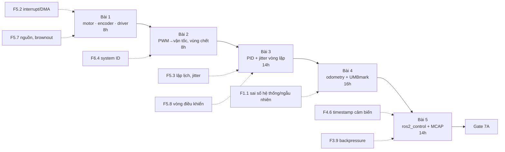

# 7A — Chassis, motor, encoder, odometry (60h · trần 80h)

> Khóa con đầu tiên của Khóa 7. Tổng quan cả khóa, bản đồ vai trò và ngân sách: `00-tong-quan.md`. File này giữ đủ bước, ngưỡng, giờ và FAIL action của `khoa-7-robot-hoan-chinh.md` (7A, Bài 1–5, Gate 7A), thêm phần bản chất, mô phỏng và sửa lỗi.

**Mua đợt này** (giữ nguyên bản gốc): khung xe 2 bánh + caster **đủ lớn chở mini PC + pin** (đừng mua khung mini thiết kế cho Pi), 2 motor DC có hộp số và encoder đủ mô-men cho tổng khối lượng, driver motor, pin 3S/4S + BMS + sạc, **mạch DC-DC ổn áp 12V ≥3A cho mini PC**, công tắc E-stop. ~2.5–4tr.

**Trước khi bấm mua, đọc hai bẫy mà bản gốc chưa nói** (chi tiết ở Bài 1, phần 6 và 11):

1. **Pin 3S + "DC-DC 12V" kiểu buck là cặp không chạy được.** Pin Li-ion 3S nằm trong khoảng ~9.0–12.6 V `[chuẩn — 3.0–4.2 V/cell]`, tức là dưới 12 V gần suốt chu kỳ xả. Mạch buck chỉ hạ áp. Muốn 12 V ổn định cho mini PC từ 3S cần **buck-boost**; hoặc dùng 4S (~12–16.8 V) + buck. Mini PC chịu được dải áp vào thấp hơn 12 V bao nhiêu là `[tự đo]`, đừng đoán.
2. **Áp pin quyết định luôn driver.** Driver phổ thông TB6612FNG có VM tối đa 15 V `[spec — datasheet Toshiba TB6612FNG, mục Absolute Maximum Ratings; kiểm bản bạn mua]`, nên không chạy thẳng từ 4S đầy (16.8 V). Chọn pin, DC-DC và driver **cùng một lúc**, bằng một bảng số.



**Quy ước cho cả file:** mỗi bài có thư mục `lab/7a-0N-<tên>/` với `prediction.md` commit **trước** khi cắm que đo. Mã code Python đều đã chạy trên laptop (numpy/matplotlib); khi chạy thử đã dùng `matplotlib.use("Agg")` và `savefig`, trên máy bạn có thể đổi sang `plt.show()`.

---

## Bài 1 — Motor, encoder, driver: ba thứ phải hiểu trước khi cấp điện (8h)

> **Vị trí:** (mở đầu 7A) → **Bài 1** → Bài 2 đường cong PWM · **Cần trước:** F5.2 (interrupt, DMA, bộ đếm phần cứng), F5.7 (nguồn, brownout), K3 Bài 6 (TN-3 brownout), K5 Bài 8 (GPIO + logic analyzer) · **Sau bài này bạn quyết định được:** chọn driver, pin và DC-DC bằng con số dòng hãm **đo được**, và chọn đếm encoder bằng PCNT phần cứng hay ngắt phần mềm dựa trên tần số cạnh tính ra.

**Câu hỏi của bài (giữ từ bản gốc):** một lệnh PWM biến thành bao nhiêu vòng quay?

### 1. Câu chuyện — ai đã khổ vì chuyện này

Rover Spirit trên sao Hỏa có sáu bánh, mỗi bánh một motor DC có hộp số. Từ năm 2004, đội vận hành thấy **dòng điện** của motor bánh trước bên phải tăng dần so với các bánh khác; họ giảm tải cho nó, có lúc cho rover lái lùi để kéo lê bánh đó, và đầu năm 2006 bánh này ngừng hẳn. Spirit chạy tiếp hàng năm trời bằng năm bánh, kéo lê bánh hỏng, cho tới khi sa lầy năm 2009 `[chuẩn — các báo cáo vận hành MER của NASA/JPL; chi tiết dòng điện theo ngày không kiểm ở đây]`. Bài học cho bạn không phải chuyện sao Hỏa: **dòng điện motor là tín hiệu sức khỏe đầu tiên và rẻ nhất**, và người ta chỉ đọc được nó nếu ngay từ đầu đã biết con số "bình thường" là bao nhiêu.

Lý do bài này đứng trước mọi dòng code: motor DC là một thiết bị **tự giới hạn dòng bằng chính chuyển động của nó**. Khi quay, nó sinh ra một điện áp ngược (back-EMF) chống lại nguồn; khi đứng yên — lúc khởi động, lúc bị kẹt, lúc đảo chiều — cái phanh tự nhiên đó biến mất và dòng chỉ còn bị chặn bởi điện trở cuộn dây. Mọi thứ chung nguồn với motor (ESP32, mini PC) sẽ cảm nhận khoảnh khắc đó. K3 TN-3 đã cho bạn thấy một cái amp nhỏ làm ESP32 brownout; ở đây là hai motor kéo cả một khối máy tính.

### 2. Mô hình tư duy

```
            R (cuộn dây)    L (cảm kháng)
  V_drv ──/\/\/\──────────(((((────────┐
   (PWM ·                              │   E = Ke·ω   (back-EMF, tỉ lệ tốc độ)
    V_bat)                           ( M )  τ = Kt·I   (mô-men, tỉ lệ dòng)
  GND ─────────────────────────────────┘

  Xác lập:   I = (V − Ke·ω) / R
  ω = 0  →   I = V / R                  ← khởi động, kẹt (stall)
  đảo chiều khi đang quay ω>0, V → −V:  I ≈ (−V − Ke·ω)/R  ← có thể tới ~2× dòng hãm
  Hộp số:    ω_bánh = ω_motor / N ,  τ_bánh ≈ τ_motor · N · η
  Encoder (trên trục motor): PPR xung/vòng motor, 2 kênh lệch 90° → 4 cạnh/xung
             counts_mỗi_vòng_bánh = PPR × N × 4
```

Bốn câu bản chất:

- **Motor DC là bộ chuyển đổi hai chiều**: điện áp ↔ tốc độ (qua Ke), dòng ↔ mô-men (qua Kt). Trong hệ SI, Ke và Kt là **cùng một số** (V·s/rad = N·m/A) `[chuẩn]`. Bạn đo được một cái thì có cái kia.
- **Dòng không tải** là dòng để thắng ma sát của chính motor + hộp số; **dòng hãm** `I_stall = V/R` là trần vật lý. Tỉ số giữa hai cái nói cho bạn biết cuộn dây "cứng" tới đâu, và driver/nguồn phải gánh đỉnh nào.
- **Encoder quadrature** mã hóa cả **lượng** quay lẫn **chiều** quay: hai kênh A, B lệch pha 90° tạo thành mã Gray 2 bit `00→01→11→10`. Chiều quay là chiều đi trong vòng mã đó. Mất một trạng thái nghĩa là mất thông tin chiều, không chỉ mất một count.
- **Đếm là trạng thái, không phải sự kiện có thể gửi lại.** Một cạnh bị bỏ lỡ không có log để replay; odometry lệch vĩnh viễn từ đó.

```
WaveDrom (dán vào wavedrom.com/editor.html) — quay thuận rồi đảo chiều:
{ "signal": [
  { "name": "A",     "wave": "0.1...0.....1...0." },
  { "name": "B",     "wave": "0...1...0.1...0..." },
  { "name": "AB",    "wave": "=.=.=.=.=.=.=.=.=.", "data": ["00","10","11","01","00","01","11","10","00"] },
  { "name": "count", "wave": "=.=.=.=.=.=.=.=.=.", "data": ["0","1","2","3","4","3","2","1","0"] }
]}
```

(Đọc: bốn trạng thái đầu là quay thuận, A đổi mức trước B; từ trạng thái thứ năm robot đảo chiều, B đổi mức trước A, mã Gray đi ngược vòng và count giảm. Mỗi bước chỉ **một** kênh đổi mức — đó là tính chất Gray giúp phát hiện "nhảy 2 bước". Gán chiều nào là "thuận" là quy ước của bạn, phải ghi vào `CONVENTIONS.md` cùng REP-103: bánh quay làm robot tiến theo `+x` thì count tăng.)

**Mô phỏng đồ chơi: vì sao đếm bằng ngắt phần mềm mất xung.** ISR được gọi ở mỗi cạnh nhưng chỉ đọc mức chân sau một độ trễ; thỉnh thoảng bị chặn lâu hơn (một ISR khác, cache flash tạm tắt, stack WiFi). Nếu trong lúc chờ có thêm cạnh xảy ra, ISR thấy mã Gray nhảy 2 bước — không biết đi chiều nào.

```python
# [đã chạy] Giải mã quadrature 4x: phần cứng (thấy mọi cạnh) vs ISR phần mềm (đọc trễ)
import numpy as np
rng = np.random.default_rng(0)
# bảng chuyển trạng thái Gray: (AB cũ, AB mới) -> +1 / -1 ; nhảy 2 bước = không xác định
STEP = {(0b00,0b01):+1,(0b01,0b11):+1,(0b11,0b10):+1,(0b10,0b00):+1}
STEP.update({(b, a): -1 for (a, b) in list(STEP)})
SEQ = [0b00, 0b01, 0b11, 0b10]
def run(edge_rate, n_edges=20000, lat_us=3.0, p_block=0.01, block_us=150.0):
    """Quay đều một chiều. ISR được gọi ở mỗi cạnh nhưng chỉ đọc chân sau độ trễ;
    thỉnh thoảng bị chặn (ISR khác, cache flash tắt, WiFi...) lâu block_us."""
    t_edge = np.arange(1, n_edges + 1) / edge_rate
    delay = lat_us + rng.uniform(0, block_us, n_edges) * (rng.random(n_edges) < p_block)
    t_read = t_edge + delay * 1e-6
    count, last, bad, busy_until = 0, SEQ[0], 0, 0.0
    for t in t_read:
        if t < busy_until:                       # ngắt đến khi ISR trước chưa xong: gộp
            continue
        k = np.searchsorted(t_edge, t, side="right")   # số cạnh đã xảy ra tới lúc đọc
        now = SEQ[k % 4]
        if now != last:
            s = STEP.get((last, now))
            if s is None: bad += 1               # nhảy 2 bước: mất thông tin chiều
            else: count += s
        last, busy_until = now, t + 2e-6
    return count, bad
for rpm_motor in (1000, 5000, 10000, 20000):
    rate = 11 * 4 * rpm_motor / 60               # PPR 11 trên trục motor, 4 cạnh/chu kỳ
    c, bad = run(rate)
    print(f"motor {rpm_motor:>5} rpm  cạnh/s={rate:>7.0f}  khoảng={1e6/rate:6.1f} µs  "
          f"đếm={c:>6}/20000  lỗi nhảy-2-bước={bad}")
```

Chạy nó, rồi đổi `block_us` và `p_block` để thấy: lỗi không phụ thuộc vào **trung bình** độ trễ ISR mà vào **đuôi** của nó so với khoảng cách giữa hai cạnh. Đó là cùng bài học p99 của backend, nhưng ở đây đuôi không làm chậm request — nó làm sai số đếm. Bộ đếm PCNT phần cứng giải mã trạng thái ngay ở mạch logic, không qua CPU, nên đuôi độ trễ của CPU không còn liên quan (→ F5.2).

### 3. Cầu nối từ backend

| Backend bạn biết | Ở đây | Gãy ở chỗ | Nếu dùng nhầm thì |
|---|---|---|---|
| Capacity planning theo **đỉnh**, không theo trung bình (thundering herd lúc cold start) | Driver và nguồn chọn theo dòng hãm/dòng khởi động, không theo dòng chạy | Đỉnh ở đây xảy ra **mỗi lần** robot khởi hành hay đảo chiều, không phải sự kiện hiếm; và nó kéo sụt áp cả những thiết bị không liên quan (ESP32, mini PC) | Chọn driver theo dòng chạy → driver tự ngắt quá nhiệt hoặc cháy MOSFET; mini PC reset mỗi lần robot đề-pa |
| Counter Prometheus: đơn điệu, có thể reset/wrap, đọc bằng `rate()` lấy hiệu | Bộ đếm PCNT 16-bit có dấu, tràn sau ±32767 count | Prometheus phát hiện reset vì counter chỉ tăng; encoder đếm **hai chiều**, nên wrap và đảo chiều trông giống nhau nếu bạn đọc quá thưa | Đọc chậm hơn nửa chu kỳ tràn → không phân biệt được "quay tới 33000" với "quay lùi 32536"; odometry nhảy |
| Gói UDP mất: chấp nhận, hoặc TCP retransmit | Cạnh encoder mất | Không có retransmit, không có số thứ tự; mất là mất vĩnh viễn và **không có dấu hiệu nào** trong dữ liệu (trừ lỗi nhảy 2 bước nếu bạn đếm nó) | Tin rằng "hiếm khi mất" là chấp nhận được như UDP telemetry → odometry trôi tích lũy, đổ lỗi cho hiệu chuẩn ở Bài 4 |
| NIC offload checksum/timestamp: việc lặp lại, cần đúng giờ thì đẩy xuống phần cứng | PCNT, MCPWM capture | Offload ở đây không phải tối ưu hiệu năng mà là điều kiện **đúng**; phần cứng cũng có giới hạn riêng (độ rộng counter, glitch filter) | Coi PCNT là "nhanh hơn" thay vì "đúng hơn" → vẫn đọc nó từ một vòng lặp quá chậm và mất wrap |

**Chấm mô hình:**

- *"Mọi thiết bị chung nguồn đều có lúc sụt áp vì chiếm dụng nguồn chung; ai cần ngưỡng áp duy trì thì bị ảnh hưởng"* (mô hình của bạn ở K3 lượt 11). **ĐÚNG MỘT PHẦN.** Đúng hướng, nhưng thiếu cơ chế: sụt áp = dòng đỉnh × trở kháng nguồn (nội trở pin, dây, mạch bảo vệ BMS) + L·di/dt của dây; và nó thiếu nửa còn lại của motor. **Phản ví dụ:** khi robot phanh gấp hoặc đảo chiều, motor thành máy phát và **bơm dòng ngược về nguồn** — điện áp bus **tăng** chứ không sụt. Một DC-DC không nhận dòng ngược có thể để áp đầu vào vọt lên; đó là lý do driver có diode/tụ và tại sao "sụt áp" chỉ là một nửa bức tranh.
- *"Encoder cho biết vị trí bánh, cứ đọc là có"* (mô hình trực giác chung). **SAI** ở chữ "đọc là có". Encoder tương đối chỉ cho **thay đổi**; vị trí là tổng tích lũy của mọi thay đổi đã **được thấy**. Phản ví dụ: reset ESP32 giữa chừng → count về 0, robot vẫn ở chỗ cũ; host không biết nếu không có số thứ tự/boot id.
- *"Đếm 1x cũng được, chỉ kém phân giải 4 lần"*. **ĐÚNG MỘT PHẦN.** Phân giải kém 4 lần là đúng. Nhưng đếm 1x trên kênh A mà không dùng B thì **mất chiều quay**: robot rung tại chỗ quanh một cạnh của A sẽ tích lũy count như đang chạy thẳng.

### 4. Thuật ngữ

| Mức | Thuật ngữ | Nghĩa trong một câu | Hay bị hiểu nhầm thành |
|---|---|---|---|
| 🟢 | Back-EMF (Ke·ω) | Điện áp motor tự sinh ra khi quay, chống lại nguồn | "Tổn hao" — thật ra nó là thứ giới hạn dòng khi chạy |
| 🟢 | Dòng hãm (stall current) | Dòng khi trục đứng yên dưới điện áp đầy, ≈ V/R | Dòng "khi quá tải nặng" — thực tế mỗi lần khởi động cũng chạm tới gần nó trong vài ms |
| 🟢 | Dòng không tải | Dòng để thắng ma sát nội khi quay tự do | Dòng "bình thường khi chạy" — chạy có tải lớn hơn nhiều |
| 🟢 | Quadrature, giải mã 4x | Hai kênh lệch 90°, đếm mọi cạnh của cả hai | "4x là nhân phần mềm cho mịn" — không, đó là 4 sự kiện vật lý khác nhau |
| 🟢 | PPR / CPR | Xung mỗi vòng (một kênh) / count mỗi vòng sau giải mã | Người bán ghi lẫn lộn, có khi ghi theo trục ra hộp số; phải đo |
| 🟢 | PCNT | Bộ đếm xung phần cứng của ESP32-S3, giải mã quadrature không qua CPU | "Thư viện đếm xung" — nó là ngoại vi silicon |
| 🟡 | Kt, Ke | Hằng số mô-men / hằng số back-EMF; bằng nhau trong SI | Hai thông số độc lập |
| 🟡 | H-bridge, slow/fast decay | Bốn khóa đảo chiều dòng; cách xả dòng lúc PWM tắt | Chi tiết điện tử không ảnh hưởng gì — nó đổi hình dạng đường cong ở Bài 2 |
| 🟡 | Glitch filter | Bỏ các xung ngắn hơn ngưỡng | Chống mọi nhiễu — nó chỉ bỏ xung **ngắn**, đặt quá tay thì bỏ luôn xung thật ở tốc độ cao |
| 🔴 | Thiết kế cuộn dây, từ trường motor, commutation | Thiết kế motor | — |

### 5. Dự đoán

**Đề:** với motor, hộp số, bánh và driver bạn đã mua, dự đoán bằng số:

1. `counts_mỗi_vòng_bánh` và `mm_mỗi_count`.
2. Tần số cạnh encoder lớn nhất trên **mỗi** motor (cạnh/giây) khi bánh quay ở tốc độ không tải, và khoảng thời gian giữa hai cạnh (µs). So với độ trễ ISR bạn đo được ở K5 (nếu có) — có nguy cơ mất xung không?
3. Dòng không tải, dòng hãm ở điện áp danh định; tỉ số hãm/không tải.
4. Điện trở cuộn dây `R` suy ra từ `V/I_stall` của datasheet; con số này có khớp khi bạn đo bằng ohm kế không?
5. Tổng dòng đỉnh khi **hai** motor cùng khởi động + mini PC đang boot. Pin/BMS/DC-DC/driver bạn mua có gánh nổi không?

**Tham số cần tra:**
- Datasheet/trang người bán của motor: điện áp danh định, tốc độ không tải (rpm ở trục ra), dòng không tải, dòng hãm, mô-men hãm, tỉ số truyền, PPR encoder **và nó tính trên trục nào**.
- Datasheet driver (TB6612FNG, DRV8833, BTS7960, Cytron MDD…): dòng liên tục, dòng đỉnh, VM tối đa, tần số PWM tối đa, có giới hạn dòng/ngắt nhiệt không.
- Thông số BMS: dòng xả liên tục/ngắt quá dòng. Thông số DC-DC: dải áp vào, buck hay buck-boost.
- Công suất mini PC: số bạn đã đo ở K2–K4 (lộ trình tổng mục 0.7 có bước đo công suất N100).

**Công thức/phương pháp:**
- `counts = PPR × N × 4`; `mm/count = π·D / counts`.
- `cạnh/s = PPR × 4 × rpm_motor / 60`, với `rpm_motor = rpm_bánh × N`.
- `I_stall ≈ V/R`; `Kt ≈ τ_stall / I_stall` (đổi kg·cm → N·m: × 0.0981).
- Đỉnh đảo chiều khi đang chạy tối đa: `≈ (V + Ke·ω)/R`.

```markdown
# prediction.md — 7A Bài 1
commit: <hash>  ngày: <yyyy-mm-dd>
## Tham số tra được (ghi nguồn từng dòng)
- PPR = ... (trên trục motor? nguồn: ...)   N = ...   D_bánh = ... mm
- V_danh định = ... V   rpm_không_tải(trục ra) = ...   I_không_tải = ... A   I_stall = ... A
- Driver: ... dòng liên tục ... A, đỉnh ... A, VM max ... V
## Dự đoán
| Đại lượng | Dự đoán | Cách tính |
|---|---|---|
| counts/vòng bánh | | |
| mm/count | | |
| cạnh/s tối đa mỗi motor | | |
| khoảng giữa hai cạnh (µs) | | |
| I_không_tải (A) | | |
| I_stall (A) | | |
| I_stall / I_không_tải | | |
| R cuộn dây (Ω) | | |
| Dòng đỉnh tổng lúc đề-pa (A) | | |
## Tôi sẽ ngạc nhiên nếu...
```

### 6. Làm

Giữ đủ sáu bước của bản gốc; thêm cách đo an toàn và sai số dụng cụ.

1. **Đọc trọn datasheet motor và driver.** Ghi: điện áp, dòng không tải, dòng hãm, PPR, tỉ số truyền. Ghi rõ PPR tính trên trục nào; nếu người bán chỉ ghi "CPR" hay "xung/vòng", đánh dấu "chưa rõ" — bước 5 sẽ trả lời.
2. **Tính `counts_mỗi_vòng_bánh` và `mm_mỗi_count`. Commit vào `prediction.md`.** (cùng các dự đoán ở phần 5)
3. **Cấp điện motor không tải, đo dòng bằng multimeter.** Nâng bánh lên khỏi mặt đất. UT33D+ ở thang 10 A có sai số ±(1% + 2 digit), phân giải 10 mA `[spec — thông số UNI-T UT33D+ theo nhà phân phối; kiểm manual của bạn]`; dòng không tải cỡ trăm mA sẽ chỉ có 1–2 chữ số có nghĩa ở thang này — dùng thang 200 mA nếu dòng nằm trong dải, và **nhớ chuyển que về cổng V sau khi đo**. Đo ở 2–3 điện áp (ví dụ 6 V, 9 V, 12 V): dòng không tải gần như không đổi theo áp, tốc độ tỉ lệ áp — đó là kiểm tra nhanh mô hình ở phần 2.
4. **Đo dòng hãm — sửa cách làm của bản gốc.** Bản gốc bảo giữ trục bằng tay 1–2 giây. Với motor có hộp số, thứ bạn chạm được là **trục ra**, nơi mô-men đã nhân với N (cỡ chục lần): giữ bằng tay vừa khó vừa có thể làm mẻ bánh răng nhựa. Làm theo thứ tự an toàn hơn:
   - (a) Ngắt điện. Đo **điện trở cuộn dây** `R` bằng ohm kế ở 5–6 vị trí góc trục khác nhau (xoay bánh một chút giữa các lần); chổi than làm số nhảy, lấy trung vị. Dự đoán `I_stall = V/R`. Que đo và tiếp xúc cộng thêm cỡ 0.1–0.3 Ω `[ước lượng]` — chập hai que đo lại để đo phần này rồi trừ đi.
   - (b) Kẹp chặt bánh vào một vật cố định (kẹp bàn, khối gỗ). Cấp **điện áp thấp** (ví dụ 3 V) qua thang 10 A, đọc dòng trong ≤2 giây, ngắt. Lặp ở 4–6 V nếu motor còn nguội. Fit `I = V/R`: dòng hãm ở điện áp danh định là ngoại suy tuyến tính.
   - (c) Chỉ khi cần con số trực tiếp ở điện áp đầy mới làm ≤1 giây, có cầu chì/nguồn có giới hạn dòng.
   - Sai số: đồng hồ cập nhật vài lần mỗi giây `[tự đo]` và không bắt được đỉnh vài ms lúc đóng điện; thứ bạn đọc là dòng hãm **gần xác lập**, đã nóng lên một chút (điện trở đồng tăng ~0.4%/°C `[chuẩn]`). Ghi rõ điều đó cạnh con số.
5. **Cắm logic analyzer vào hai kênh encoder. Quay bánh bằng tay đúng một vòng. Đếm số cạnh.** Trước khi cắm: kiểm điện áp mức cao của encoder bằng multimeter. Encoder Hall thường cấp 3.3–5 V với pull-up; nếu pull-up lên 5 V thì **không được** nối thẳng vào ESP32-S3 (GPIO không chịu 5 V `[spec — ESP32-S3 datasheet, Recommended Operating Conditions]`) — cấp encoder 3.3 V hoặc dùng mạch chuyển mức. Nối chung GND với logic analyzer. Sample rate: 1 MHz là dư cho quay tay (cạnh cách nhau cỡ ms).
6. **Lặp bước 5 với 10 vòng. Chia trung bình.** Dán băng dính đánh dấu trên bánh và trên khung; sai số căn vạch cỡ ±3° `[ước lượng]`, tức ±0.08% trên 10 vòng — nhỏ hơn ngưỡng 1% hơn chục lần, nên lệch lớn hơn thế là thật.
7. **(Thêm) Đếm bằng PCNT trên ESP32-S3** song song với logic analyzer khi quay bằng motor ở tốc độ tối đa trong 10 s: hai con số phải khớp tới ±vài count. ESP32-S3 có 4 đơn vị PCNT, mỗi đơn vị 2 kênh, bộ đếm 16-bit có dấu, có glitch filter `[spec — ESP-IDF Programming Guide, mục Pulse Counter, ESP32-S3]`. Cấu hình 4x dùng **một** đơn vị với hai kênh (kênh 1: cạnh A, mức B; kênh 2: cạnh B, mức A) như ví dụ `rotary_encoder` của ESP-IDF; tên hàm (`pcnt_new_unit`, `pcnt_new_channel`, `pcnt_channel_set_edge_action`, `pcnt_channel_set_level_action`, `pcnt_unit_set_glitch_filter`) `[tự đo — kiểm theo bản ESP-IDF bạn cài]`. Bật bộ tích lũy tràn (`accum_count` hoặc watch point ở giới hạn) để không mất wrap. Ở bước này logic analyzer là **trọng tài**: nó đếm độc lập với ESP32.
8. **(Thêm, 30 phút) Bảng power budget.** Một dòng cho mỗi tải: mini PC (idle / boot / tải nặng — số đo của bạn), 2 motor (chạy / khởi động / hãm), ESP32, driver logic. Cột: dòng ở áp pin, nguồn số liệu (đo/datasheet/ước lượng). Đối chiếu với BMS và DC-DC. Đây là "power budget là bảng số đo" mà bản gốc đòi ở phần kiến trúc.

### 7. Số phải ra

<details><summary>🔒 MỞ SAU KHI COMMIT prediction.md</summary>

| Kiểm tra | Kết quả đúng (bản gốc, giữ nguyên) | Ghi chú |
|---|---|---|
| Counts đếm được cho 10 vòng | Gần `10 × counts_mỗi_vòng_bánh` (ví dụ PPR 11, 1:34 → 14.960), lệch <1% | Ví dụ bản gốc: `11 × 34 × 4 = 1496` counts/vòng; bánh 65 mm → chu vi 204.2 mm → **0.136 mm/count**. Độ phân giải này rất tốt; vấn đề của odometry không nằm ở đây (Bài 4) |
| Dạng sóng encoder | Hai kênh vuông, **lệch pha 90°**. Đảo chiều quay → thứ tự cạnh đảo lại | Duty mỗi kênh không đúng 50% và pha không đúng 90° với Hall rẻ là bình thường (lệch vài chục độ vẫn giải mã được miễn bốn trạng thái phân biệt) `[chuẩn]` |
| Dòng không tải | Khớp datasheet trong ±30% | Datasheet thường ghi ở một điện áp; so đúng điện áp |
| Dòng hãm | **Gấp nhiều lần dòng không tải.** Ghi con số thật — nó quyết định driver và nguồn | Với motor DC nhỏ có hộp số, tỉ số hãm/không tải thường **cỡ 10–30 lần** `[ước lượng — dựa trên thông số motor JGA25/JGB37 phổ biến; tra đúng motor của bạn]`. Bản Gemini ghi "4–8 lần" — thấp; nếu bạn đo ra dưới 10 lần, nghi đồng hồ (thang/điện trở que) hoặc nguồn bị giới hạn dòng |
| PCNT vs logic analyzer ở tốc độ tối đa | Khớp ±vài count trên hàng chục nghìn | Lệch đều theo một hướng → kiểm glitch filter quá tay |

**Tần số cạnh với ví dụ bản gốc:** bánh không tải ~300 rpm `[ước lượng — loại 12 V 1:34 phổ biến]` → motor ~10.200 rpm → `11 × 4 × 10200 / 60 ≈ 7.500` cạnh/s mỗi motor, cạnh cách nhau ~130 µs. Đây là **vài nghìn**, không phải "hàng chục nghìn" như bản gốc viết; nhưng mô phỏng ở phần 2 cho thấy chỉ cần ISR thỉnh thoảng bị chặn >130 µs là đã mất cạnh. Encoder quang vài trăm PPR thì đúng là hàng chục nghìn cạnh/s.

**R suy ra vs R đo:** lệch 20–50% là thường gặp — tiếp xúc chổi than, que đo, và datasheet người bán Trung Quốc hay làm tròn. Nếu (a) và (b) khớp nhau trong ~20%, tin số đo của bạn hơn datasheet.

**Pin 3S + mini PC 12 V:** nếu bảng power budget của bạn cho thấy DC-DC là loại buck, nó **không** cho ra 12 V khi pin dưới ~12.5 V — tức gần như suốt thời gian chạy. Đây là phát hiện quan trọng nhất của bước 8 nếu bạn mua theo danh sách bản gốc mà không để ý.

</details>

### 8. Nếu ra khác

| Triệu chứng | Nguyên nhân khả dĩ | Kiểm bằng cách | Sửa |
|---|---|---|---|
| Counts bằng 1/4 dự đoán | Đang đếm 1x thay vì 4x | Xem cấu hình PCNT/decoder trong PulseView | Bật quadrature 4x |
| Counts bằng 1/2 | Đếm 2x, hoặc mất một kênh | Kênh B trên logic analyzer có chuyển mức không | Kiểm dây kênh B, pull-up |
| Counts lệch đúng một hệ số N (tỉ số truyền) | PPR người bán ghi theo trục ra, không phải trục motor | So counts/vòng bánh với PPR×4 | Sửa công thức, ghi vào `CONVENTIONS.md` |
| Hai kênh trùng pha | Đấu nhầm, hoặc encoder hỏng | Đổi dây A/B; quay rất chậm, xem có 4 trạng thái không | Đổi dây. Nếu trùng pha thật thì không xác định được chiều quay — đổi encoder |
| Counts nhảy lung tung khi quay nhanh | Mất xung do interrupt không kịp | So PCNT với logic analyzer | **Dùng PCNT phần cứng của ESP32-S3**, đừng đếm bằng ngắt phần mềm |
| PCNT ít hơn logic analyzer ở tốc độ cao, đủ ở tốc độ thấp | Glitch filter đặt dài hơn nửa độ rộng xung thật | Tính độ rộng xung ở tốc độ tối đa | Giảm ngưỡng filter |
| Count nhảy ±32768 thỉnh thoảng | Tràn bộ đếm 16-bit không được tích lũy | In count thô theo thời gian | Bật tích lũy tràn / đọc đủ nhanh và lấy hiệu có xử lý wrap |
| Dòng hãm đo thấp hơn V/R nhiều | Thang đo/que đo cộng điện trở; nguồn bàn giới hạn dòng; pin sụt áp | Đo áp ngay tại cọc motor lúc hãm | Dùng `I = V_tại_cọc / R`; ghi rõ điều kiện |
| ESP32 reset khi motor khởi động | Brownout do dòng khởi động (K3 TN-3, quy mô lớn hơn) | Ghi lý do reset (`esp_reset_reason`) | Tách nguồn logic, tụ bulk gần driver, soft-start (tăng PWM dần) |

### 9. Câu hỏi ngược

1. **[Nếu…thì]** Nếu bạn đổi từ pin 3S sang 4S mà giữ nguyên motor 12 V và giới hạn duty tối đa ở 75%, cái gì không đổi và cái gì đổi (tốc độ tối đa, dòng hãm, dòng khởi động, nhiệt driver)?
   <details><summary>Hướng nghĩ</summary>Điện áp **trung bình** tối đa giữ ~12 V nên tốc độ tối đa gần như không đổi. Nhưng dòng tức thời trong mỗi xung PWM do điện áp **đỉnh** và L quyết định; ripple dòng tăng. Dòng khởi động ở duty 75% vẫn ≈ 0.75·V_pin/R. Và driver phải chịu VM 16.8 V.</details>
2. **[Vì sao không]** Vì sao người ta không đặt encoder ở trục ra (sau hộp số) để khỏi lo tỉ số truyền?
   <details><summary>Hướng nghĩ</summary>Đặt trên trục motor được nhân phân giải thêm N lần miễn phí. Cái giá: backlash của hộp số nằm **ngoài** phép đo — encoder thấy motor quay nhưng bánh chưa nhúc nhích khi đổi chiều. Nghĩ xem điều đó ảnh hưởng gì tới PID ở tốc độ thấp và tới odometry khi robot đảo chiều liên tục.</details>
3. **[Quy mô]** Ở 100 robot, mỗi robot ghi dòng motor 100 Hz, bạn muốn phát hiện sớm motor sắp hỏng như Spirit. Cái gì gãy trước: lưu trữ, nhãn "bình thường" của từng motor, hay ngưỡng cảnh báo chung cho cả đội?
   <details><summary>Hướng nghĩ</summary>Hai motor cùng lô đã khác nhau vài phần trăm (Bài 2). Ngưỡng tuyệt đối chung sẽ hoặc báo động giả liên tục hoặc bỏ sót. Thứ cần có là baseline **theo từng motor** từ ngày lắp — tức là chính phép đo của bài này, được lưu như metadata có version.</details>
4. **[Failure mode]** Liệt kê ba cách mất count mà không có bất kỳ dấu hiệu lỗi nào trong dữ liệu, và với mỗi cách, một tín hiệu phụ có thể giúp phát hiện.
   <details><summary>Hướng nghĩ</summary>Mất cạnh do ISR; tràn counter đọc thưa; ESP32 reset âm thầm. Tín hiệu phụ: bộ đếm lỗi "nhảy 2 bước"; số thứ tự/boot id trong gói gửi host; so vận tốc bánh với gyro IMU khi quay tại chỗ.</details>
5. **[Liên ngành]** Chuột bi đời cũ và núm xoay âm lượng dùng đúng quadrature. Vì sao núm xoay rẻ tiền hay "nhảy hai nấc", và nó dạy gì về debounce so với glitch filter?
   <details><summary>Hướng nghĩ</summary>Tiếp điểm cơ nảy (bounce) sinh hàng loạt cạnh giả quanh một chuyển trạng thái; giải mã Gray hợp lệ sẽ cộng/trừ qua lại và tự triệt tiêu **nếu** không bỏ sót cạnh nào. Bỏ sót thì mới sai.</details>
6. **[Phản biện]** "Odometry 0.136 mm/count là quá đủ, không cần lo về encoder nữa." Bạn đồng ý tới đâu?
   <details><summary>Hướng nghĩ</summary>Phân giải không phải độ đúng. Xem lại F1.1: resolution, accuracy, precision là ba thứ. Bài 4 sẽ cho bạn thấy sai số lớn nhất đến từ đâu.</details>

### 10. Liên kết ra ngoài

- **Xe điện và phanh tái sinh.** Back-EMF là cơ chế xe điện thu hồi năng lượng khi phanh: motor thành máy phát, dòng chảy về pin. Giống: cùng phương trình `E = Ke·ω`. Khác: xe điện có pin và bộ quản lý được thiết kế để **nhận** dòng ngược; robot hobby của bạn thường không, nên năng lượng đó thành quá áp hoặc nhiệt trong driver.
- **Thiên văn và cơ khí chính xác.** Kính thiên văn dùng encoder quang hàng trăm nghìn vạch kèm nội suy sin/cos (encoder analog) — cùng ý tưởng hai kênh lệch 90°, nhưng đọc **giá trị analog** của hai kênh để biết vị trí **giữa** hai vạch. Khác: ở đó vấn đề là phân giải; ở robot của bạn, như Bài 4 sẽ chỉ ra, phân giải gần như không bao giờ là nút thắt.
- **Y sinh — đo dòng như đo sinh hiệu.** Bác sĩ ghi nhịp tim nền của từng bệnh nhân vì "bình thường" khác nhau giữa người. Baseline dòng motor theo từng motor là cùng tư duy: bất thường chỉ định nghĩa được so với chính nó.

### 11. Độ tin cậy và sửa lỗi

| Khẳng định | Nhãn | Ghi chú / cách kiểm |
|---|---|---|
| `I = (V − Ke·ω)/R`, Kt = Ke trong SI | [chuẩn] | Giáo khoa máy điện một chiều |
| Đảo chiều khi đang chạy kéo dòng tới ~2× dòng hãm | [chuẩn] | Trường hợp xấu nhất, bị chặn bởi L và giới hạn dòng của driver; tự đo bằng shunt + logic analyzer không đủ (cần đo analog) — chỉ suy luận |
| ESP32-S3: 4 đơn vị PCNT × 2 kênh, counter 16-bit có dấu, có glitch filter | [spec] | ESP-IDF Programming Guide, Pulse Counter (ESP32-S3); ESP32 đời đầu có 8 đơn vị |
| Tên hàm PCNT ESP-IDF v5 | [tự đo] | API driver PCNT đổi giữa v4 (legacy) và v5; kiểm theo bản cài |
| UT33D+: thang 10 A, ±(1%+2), phân giải 10 mA | [spec] | Theo thông số nhà phân phối; một nguồn ghi khác cho thang 10 A — kiểm manual |
| TB6612FNG VM tối đa 15 V | [spec] | Datasheet Toshiba; kiểm bản module bạn mua (module có thể thêm linh kiện giới hạn khác) |
| Tỉ số hãm/không tải 10–30× với gearmotor nhỏ | [ước lượng] | Từ thông số người bán các dòng JGA25/JGB37; tự đo là thứ duy nhất có giá trị |
| GPIO ESP32-S3 không chịu 5 V | [spec] | ESP32-S3 datasheet, điều kiện hoạt động khuyến nghị |
| Spirit: dòng bánh trước phải tăng từ 2004, bánh ngừng 2006 | [chuẩn] | Báo cáo vận hành MER (NASA/JPL); không kiểm số liệu chi tiết |

**Đã sửa so với bản gốc/Gemini:**
- Bản gốc bước 4 "giữ trục motor bằng tay tới khi ngừng quay": với gearmotor, thứ chạm được là trục ra đã nhân mô-men; đổi thành đo R + hãm có kẹp ở áp thấp rồi ngoại suy, điện áp đầy chỉ là bước tùy chọn có bảo vệ.
- Bản gốc "encoder ở tốc độ cao sinh hàng chục nghìn xung mỗi giây": với chính ví dụ PPR 11, 1:34 là ~7.500 cạnh/s mỗi motor; kết luận "dùng PCNT" vẫn đúng, nhưng vì đuôi độ trễ ISR chứ không vì tần số tuyệt đối cao.
- Bản gốc chưa nói: 3S + buck 12 V không cho ra 12 V; driver phải chịu áp pin đầy. Thêm vào đầu file và bước 8.
- Gemini: "dòng hãm 4–8 lần dòng không tải" — không có nguồn và thấp so với gearmotor nhỏ phổ biến; bỏ.
- Gemini: "đọc giá trị dòng cực đại trên đồng hồ" — UT33D+ không bắt được đỉnh ms; ghi rõ thứ đọc được là dòng hãm gần xác lập.

### 12. Đọc thêm và tự kiểm tra

- **Nguồn gốc:** datasheet motor + driver của bạn; ESP-IDF Programming Guide, mục *Pulse Counter (PCNT)* cho ESP32-S3; ESP32-S3 Technical Reference Manual, chương PCNT.
- **Giải thích:** Hughes & Drury, *Electric Motors and Drives* (chương động cơ DC) — mô hình back-EMF và đặc tính mô-men/tốc độ.
- **Đào sâu (tùy chọn):** ví dụ `peripherals/pcnt/rotary_encoder` trong repo ESP-IDF.
- **Tự kiểm tra:** (1) giải thích cho một backend engineer khác trong 5 câu vì sao dòng khởi động gần bằng dòng hãm; (2) vẽ lại mạch R–L–back-EMF và chuỗi Gray 00→01→11→10 từ trí nhớ; (3) hai câu dưới.

  (a) Motor PPR 13, hộp số 1:45, bánh 85 mm. Counts/vòng bánh ở 4x và mm/count?
  <details><summary>Đáp án</summary>13 × 45 × 4 = 2340 counts; π × 85 / 2340 ≈ 0.114 mm/count.</details>

  (b) Dòng không tải 0.25 A, dòng hãm đo được 3.2 A. Driver định mức 1.2 A liên tục, 3.2 A đỉnh có dùng thẳng được không?
  <details><summary>Đáp án</summary>Không an toàn nếu không có giới hạn dòng: mỗi lần khởi động/kẹt chạm 3.2 A (đúng trần đỉnh), đảo chiều khi đang chạy có thể vượt. Cần soft-start + giới hạn dòng phần mềm/phần cứng, hoặc driver lớn hơn. Và đó là **mỗi** motor — hai motor trên cùng pin thì nguồn thấy gấp đôi.</details>

---

## Bài 2 — Đường cong PWM → vận tốc, và vùng chết (8h)

> **Vị trí:** Bài 1 motor/encoder → **Bài 2** → Bài 3 PID · **Cần trước:** Bài 1 (đọc PCNT đúng), F6.4 (nhận dạng hệ thống bằng least squares), F6.1 (mô hình có miền hiệu lực), F1.6 (fit, residual) · **Sau bài này bạn quyết định được:** giá trị feedforward bù vùng chết cho **từng** motor và **từng** chiều, có chuẩn hóa theo điện áp pin hay không, và vì sao open-loop không bao giờ đủ để đi thẳng.

**Câu hỏi của bài (giữ từ bản gốc):** lệnh 20% PWM cho ra bao nhiêu m/s?

### 1. Câu chuyện — ai đã khổ vì chuyện này

Trong công nghiệp quá trình (giấy, hóa chất, lọc dầu), van điều khiển là "motor" của vòng điều khiển, và ma sát tĩnh của van — **stiction** — là thủ phạm kinh điển của các vòng lặp dao động mãi không dứt: bộ điều khiển đẩy tín hiệu tăng dần, van đứng im, tới ngưỡng thì van giật một cú vượt quá, bộ điều khiển kéo ngược lại, van lại đứng im. Cả một nhánh tài liệu chẩn đoán van ra đời từ chuyện này `[chuẩn — Choudhury, Shah & Thornhill, *Diagnosis of Process Nonlinearities and Valve Stiction*, Springer 2008]`. Robot của bạn có đúng hiện tượng đó ở mỗi bánh xe: dưới một ngưỡng PWM, bánh không nhúc nhích; qua ngưỡng, nó giật.

Câu trả lời ngây thơ cho câu hỏi của bài là "20% tốc độ tối đa". Câu trả lời thật, như bản gốc nói, **có thể là 0**. Và câu trả lời còn thật hơn: "tùy pin còn bao nhiêu, motor nóng chưa, bánh đang chạm đất hay đang treo, và bạn tăng lên tới 20% hay giảm xuống tới 20%". Bài này biến từng chữ "tùy" đó thành một con số đo được.

### 2. Mô hình tư duy

Cân bằng mô-men ở trạng thái xác lập, với `u = duty × V_bat` là điện áp trung bình đặt lên motor:

```
  mô-men điện  = Kt·(u − Ke·ω)/R
  mô-men cản   = τ_c (ma sát Coulomb, + tải)  +  b·ω (nhớt)

  ω = (Kt·u/R − τ_c) / (b + Kt·Ke/R)     khi đang quay
  bắt đầu quay khi Kt·u/R > τ_s           (ma sát tĩnh τ_s > τ_c)
  dừng khi       Kt·u/R < τ_c

v (m/s)
  │                                ___________  bão hòa (driver, nguồn sụt, giới hạn duty)
  │                         ______/
  │                   _____/            ← vùng gần tuyến tính: độ dốc ∝ V_bat
  │              ____/
  │         ↑   /  ↓ (đi xuống: còn quay tới u_c)
  │         │  /
  │─────────┘ /                        vùng chết: u < u_s khi đi lên
  └────────┼──┼───────────────────── duty
          u_c u_s   (theo VOLT thì hai ngưỡng này cố định; theo DUTY thì ∝ 1/V_bat)
```

Năm câu bản chất:

- **Vùng chết là ma sát nhìn qua lăng kính điện áp.** Ngưỡng bằng `R·τ/Kt` tính theo **volt**. Phần trăm PWM chỉ là volt chia cho áp pin, nên cùng một motor sẽ có "vùng chết 15%" lúc pin đầy và lớn hơn lúc pin yếu.
- **Có hai ngưỡng, không phải một.** Ma sát tĩnh lớn hơn ma sát động nên đi lên thì bánh bứt ra muộn, đi xuống thì bánh còn quay tới thấp hơn: **trễ (hysteresis)**. Bản gốc chỉ quét lên; bài này quét cả hai chiều.
- **Đoạn giữa gần tuyến tính** vì mọi số hạng trong phương trình trên đều tuyến tính khi đã quay. Phi tuyến nằm ở hai đầu: ma sát (đầu dưới) và giới hạn của driver/nguồn (đầu trên). Thêm một nguồn phi tuyến ở đầu dưới: chế độ xả dòng của H-bridge (slow/fast decay) làm dòng motor gián đoạn ở duty thấp `[chuẩn — tự đo trên driver của bạn]`.
- **Hai motor là hai bộ tham số.** R, Kt, τ_s, τ_c khác nhau vài phần trăm giữa hai motor "giống hệt". Cùng duty → hai vận tốc khác nhau → robot đi cong.
- **Mô hình này là một mô hình nhận dạng (system ID)**: bạn không tính Kt, τ_c từ lý thuyết, bạn fit chúng từ đường cong đo được, và chúng chỉ đúng trong điều kiện đã đo (→ F6.4, F6.1).

**Mô phỏng: quét lên, quét xuống, ở hai mức pin, rồi fit.**

```python
# [đã chạy] Quét PWM lên rồi xuống trên motor có ma sát tĩnh > ma sát động, rồi fit mô hình
import numpy as np, matplotlib; matplotlib.use("Agg"); import matplotlib.pyplot as plt
rng = np.random.default_rng(2)
R, KT, B_VISC = 2.0, 0.010, 2e-6     # ohm, N·m/A (=V·s/rad), N·m·s/rad -- trục motor
TAU_S, TAU_C = 9.0e-3, 6.0e-3        # ma sát tĩnh (bứt ra) > ma sát động (Coulomb)
GEAR, R_WHEEL = 34, 0.0325
def v_steady(u, moving):
    """Vận tốc bánh xác lập (m/s) ở điện áp trung bình u = duty * V_bat."""
    if not moving and KT * u / R <= TAU_S:          # chưa bứt ra khỏi ma sát tĩnh
        return 0.0, False
    w = (KT * u / R - TAU_C) / (B_VISC + KT * KT / R)   # cân bằng mô-men, back-EMF = KT*w
    return (max(w, 0) / GEAR * R_WHEEL, w > 0)
def sweep(v_bat, duties):
    out, moving = [], False
    for d in duties:
        v, moving = v_steady(d * v_bat, moving)
        out.append(v * (1 + 0.01 * rng.standard_normal()) if v else 0.0)
    return np.array(out)
up = np.arange(0, 1.0001, 0.02); down = up[::-1]
for vb in (12.6, 10.5):                              # pin đầy / gần cạn
    vu, vd = sweep(vb, up), sweep(vb, down)
    m = vu > 0
    k, c = np.polyfit(up[m], vu[m], 1)               # fit tuyến tính phần đang chạy
    naive = np.polyfit(up, vu, 1)                    # fit cả vùng chết: sai mô hình
    print(f"V_bat={vb}: bắt đầu quay ở duty {up[m][0]:.2f} (lên), dừng ở "
          f"{down[vd > 0][-1]:.2f} (xuống); fit: v={k:.3f}·d{c:+.3f} -> d0={-c/k:.3f}; "
          f"theo volt: u0={-c/k*vb:.2f} V")
    print(f"   lệnh cho 0.10 m/s: mô hình vùng chết d={(0.10-c)/k:.3f}, "
          f"fit ngây thơ d={(0.10-naive[1])/naive[0]:.3f}")
    plt.plot(up, vu, ".-", label=f"lên {vb} V"); plt.plot(down, vd, "x--", label=f"xuống {vb} V")
plt.xlabel("duty"); plt.ylabel("v bánh (m/s)"); plt.legend(); plt.savefig("b2_deadband.png")
```

Tham số trong mô phỏng là đồ chơi, chọn để vùng chết rơi vào dải bản gốc nêu; đừng chép chúng làm dự đoán. Thứ cần nhìn là **cấu trúc**: ba con số "bắt đầu quay", "dừng", "điểm cắt trục của đoạn tuyến tính" khác nhau, và con số nào đổi khi đổi `V_bat`, con số nào không.

### 3. Cầu nối từ backend

| Backend bạn biết | Ở đây | Gãy ở chỗ | Nếu dùng nhầm thì |
|---|---|---|---|
| Load test: quét concurrency, vẽ throughput/latency, tìm "đầu gối", không bao giờ giả định tuyến tính | Quét duty, vẽ vận tốc, tìm vùng chết/tuyến tính/bão hòa | Đường cong ở đây **phụ thuộc đường đi** (trễ): giá trị ở 14% tùy bạn tới từ 10% hay từ 20%. Load test hiếm khi có trễ mạnh như vậy | Quét một chiều, lấy một ngưỡng → feedforward sai ở nửa số trường hợp; robot giật khi khởi hành hoặc trôi khi dừng |
| Benchmark trên CPU có turbo/thermal throttling: kết quả phụ thuộc trạng thái nhiệt và tần số (K4) | Đường cong phụ thuộc áp pin và nhiệt motor | Bên CPU bạn **ghim** được tần số để có phép đo sạch; ở đây không ghim được áp pin, nhưng **đo** được nó và chuẩn hóa | Hiệu chuẩn lúc pin đầy rồi chạy tới lúc pin yếu → mọi feedforward sai dần theo thời gian, PID phải gánh |
| Bảng cấu hình tra cứu (lookup table) tinh chỉnh tay, commit vào repo | Bảng/hệ số bù vùng chết trong firmware | Bảng backend thường đúng mãi tới khi bạn đổi nó; bảng này **trôi** theo tuổi motor, nhiệt, sàn | Coi hệ số là hằng số, không gắn `calibration_id` → sáu tháng sau không biết robot chạy với bộ số nào |

**Chấm mô hình:**

- *"Trong một hệ vật lý có số tác nhân biết trước, thu đủ dữ liệu trong thời gian dài, mọi công thức vật lý gần như là hằng số, nên tầng model dự đoán được mọi biến số"* (mô hình của bạn ở K3 lượt 12). **ĐÚNG MỘT PHẦN.** Đúng là cấu trúc phương trình ổn định (cân bằng mô-men không đổi), và một mô hình fit từ dữ liệu dùng được. Sai ở chữ "hằng số": **tham số** trôi theo nhiệt, áp pin, tải, tuổi, và có trễ phụ thuộc lịch sử. **Phản ví dụ** ngay trong bài: cùng motor, cùng lệnh 14% PWM, buổi sáng pin đầy bánh quay, chiều pin yếu bánh đứng yên — dữ liệu buổi sáng "đầy đủ" tới đâu cũng không dự đoán được buổi chiều nếu mô hình không có biến `V_bat`. Mô hình đúng phải có **miền hiệu lực** và **biến trạng thái ẩn** được đưa ra ngoài (→ F6.1, F6.5).
- *"Hai motor cùng lô, cùng PWM thì robot đi thẳng"*. **SAI.** Phản ví dụ là dòng thứ ba của bảng "Số phải ra" bản gốc: vận tốc khác nhau vài phần trăm. Bài 4 sẽ cho bạn công thức biến vài phần trăm đó thành bao nhiêu mét lệch ngang.
- *"Bù vùng chết = cộng một hằng số d0 vào PWM"* (cách tutorial hay dạy). **ĐÚNG MỘT PHẦN.** Phải là d0 riêng cho mỗi motor và mỗi chiều; chọn ngưỡng **dừng** (ma sát động) hay ngưỡng **bứt ra** (ma sát tĩnh) cho kết quả khác nhau; chỉ cộng khi lệnh vận tốc khác 0, nếu không bánh rung quanh điểm 0 khi PID đổi dấu sai số liên tục.

### 4. Thuật ngữ

| Mức | Thuật ngữ | Nghĩa trong một câu | Hay bị hiểu nhầm thành |
|---|---|---|---|
| 🟢 | Duty cycle / PWM | Tỉ lệ thời gian bật; motor thấy điện áp trung bình `duty × V_bat` | "Phần trăm tốc độ" (lộ trình tổng xếp 🟡; ở Khóa 7 bạn dùng nó hằng ngày nên lên 🟢) |
| 🟢 | Vùng chết (deadband) | Dải lệnh không tạo ra chuyển động | Một con số cố định của motor |
| 🟢 | Ma sát tĩnh / động (stiction / Coulomb) | Lực cần để bứt ra / để duy trì chuyển động; tĩnh > động | Cùng một thứ |
| 🟢 | Trễ (hysteresis) | Đầu ra phụ thuộc đầu vào đã đi từ phía nào tới | Nhiễu đo |
| 🟢 | Feedforward | Phần lệnh tính sẵn từ mô hình, cộng vào đầu ra bộ điều khiển | "Một loại PID" |
| 🟢 | Nhận dạng hệ thống (system ID) | Fit tham số mô hình vật lý từ dữ liệu kích thích có chủ đích | "Train model" — ở đây mô hình có cấu trúc vật lý, chỉ vài tham số |
| 🟡 | Slow / fast decay | Cách H-bridge xả dòng trong pha tắt của PWM | Không ảnh hưởng — nó đổi độ tuyến tính ở duty thấp |
| 🟡 | Tần số PWM | Số chu kỳ bật/tắt mỗi giây | "Càng cao càng tốt" — tổn hao chuyển mạch tăng; quá thấp thì kêu và dòng gợn |
| 🔴 | Mô hình ma sát LuGre, Stribeck | Mô hình ma sát chi tiết vùng vận tốc rất thấp | — |

### 5. Dự đoán

**Đề:** trước khi quét, dự đoán cho motor trái và phải, hai chiều:

1. Vùng chết (duty) khi quét **lên**, không tải, pin đầy. Và theo volt.
2. Ngưỡng dừng khi quét **xuống** — thấp hơn bao nhiêu so với ngưỡng bứt ra?
3. Vận tốc tối đa (m/s) không tải.
4. Hai motor, cùng duty 50%: chênh vận tốc bao nhiêu phần trăm?
5. Bánh chạm đất, có tải: vùng chết đổi thế nào? Độ dốc đổi thế nào, và **mô hình ở phần 2 nói gì về độ dốc khi chỉ thêm mô-men tải hằng**?
6. Sau 10 phút chạy liên tục: đường cong dịch theo hướng nào? Liệt kê ít nhất hai cơ chế kéo theo hai hướng ngược nhau.
7. Pin từ đầy xuống gần cạn: vùng chết theo duty và độ dốc đổi bao nhiêu phần trăm?

**Tham số cần tra:**
- rpm không tải ở trục ra và điện áp tương ứng (datasheet motor) → vận tốc tối đa = rpm/60 × π·D.
- Kết quả Bài 1: R, I_không_tải (thay cho τ_c: `τ_c ≈ Kt × I_không_tải`), Kt.
- Datasheet driver: điện trở khóa (R_ds(on)) hoặc sụt áp ở dòng chạy; chế độ PWM mặc định của module (drive/brake hay drive/coast).
- Áp pin đầy/cạn theo số cell.

**Công thức/phương pháp:**
- Ngưỡng dừng theo volt: `u_c ≈ R × I_không_tải` (vì ở vận tốc gần 0, dòng cần để thắng ma sát ≈ dòng không tải). Duty: `u_c / V_bat`.
- Ngưỡng bứt ra lớn hơn — chưa có số tra được, đây là chỗ bạn **đoán và ghi lý do**.
- Fit: chỉ fit các điểm đang quay; `v = k·d + c` → `d0 = −c/k`; so `d0` với hai ngưỡng quan sát.

```markdown
# prediction.md — 7A Bài 2
commit: <hash>   V_bat lúc đo: ... V (đo bằng multimeter)
| Đại lượng | Trái tiến | Trái lùi | Phải tiến | Phải lùi | Cách tính |
|---|---|---|---|---|---|
| Duty bứt ra (lên) | | | | | |
| Duty dừng (xuống) | | | | | |
| u_c theo volt | | | | | |
| v_max không tải (m/s) | | | | | |
- Chênh vận tốc hai motor ở 50%: ... %
- Có tải: vùng chết ..., độ dốc ... (lý do: ...)
- Sau 10 phút: hướng dịch ..., cơ chế 1 ..., cơ chế 2 ...
- Pin cạn: vùng chết theo duty x..., độ dốc x...
## Tôi sẽ ngạc nhiên nếu...
```

### 6. Làm

Giữ sáu bước bản gốc, thêm ba chỗ để phép đo có nghĩa.

1. **Nâng bánh lên khỏi mặt đất. Quét PWM từ 0% tới 100%, bước 2%, mỗi bước giữ 2 giây và đo vận tốc từ encoder.** Bỏ 0.5 s đầu mỗi bước (quá độ cơ khí cỡ chục ms tới trăm ms), tính vận tốc từ hiệu count trên 1.5 s còn lại: phân giải vận tốc khi đó là 1 count/1.5 s ≈ 0.09 mm/s với 0.136 mm/count — không phải nguồn sai số đáng kể. **Ghi `V_bat` ở mỗi bước** (ADC ESP32 qua cầu phân áp, hiệu chuẩn hai điểm bằng multimeter; ADC ESP32 có phi tuyến ở hai đầu dải `[spec — ESP-IDF, mục ADC calibration]`).
2. **Lặp cho chiều ngược lại. Lặp cho cả hai motor. Bốn đường cong.** **(Thêm)** Mỗi đường quét **lên rồi xuống** liên tục, không dừng giữa chừng — đó là cách thấy trễ.
3. **Vẽ cả bốn lên một đồ thị.** Thêm một đồ thị thứ hai với trục hoành là **volt** (`duty × V_bat`) thay vì duty.
4. **Đánh dấu: vùng chết ở đâu, vùng tuyến tính ở đâu, bão hòa ở đâu.** Bằng số: ngưỡng bứt ra, ngưỡng dừng, `d0` fit, độ dốc, R² và residual của đoạn tuyến tính (→ F1.6). Đừng chọn ranh giới "tuyến tính" bằng mắt rồi báo R² cao — chọn quy tắc trước (ví dụ: bỏ 2 điểm đầu sau khi bứt ra và mọi điểm trên 90% duty), ghi quy tắc vào `prediction.md`.
5. **Lặp lại với bánh chạm đất, có tải** (đặt vật nặng lên robot). Bánh chạm đất thì không đo "vận tốc xác lập tại chỗ" được: cho robot chạy thẳng ở mỗi mức duty trên đoạn 2–3 m, lấy vận tốc trung bình từ encoder ở đoạn giữa. Ít mức hơn (ví dụ 10 mức) là chấp nhận được. So sánh.
6. **Chạy motor liên tục 10 phút rồi đo lại. Đường cong có dịch không?** Lặp 3 lần quét ở trạng thái nguội trước đó để biết **độ lặp lại** của chính phép quét; dịch nhỏ hơn độ lặp lại thì không kết luận được là "dịch".
7. **(Thêm) Lặp bước 1 khi pin đã xả** (sau buổi chạy dài, ghi `V_bat`). Đồ thị theo volt của hai lần có chồng lên nhau không?
8. **(Thêm) Ghi bảng hệ số** `deadband.yaml` với `calibration_id` (ví dụ `motors-01@2026-11-10-a`), một khối cho mỗi motor × chiều: `u_breakaway_V`, `u_stop_V`, `slope_mps_per_V`, điều kiện đo. Bài 3 dùng nó; Bài 5 ghi id vào metadata.

### 7. Số phải ra

<details><summary>🔒 MỞ SAU KHI COMMIT prediction.md</summary>

| Kiểm tra | Kỳ vọng (bản gốc) | Ghi chú thêm |
|---|---|---|
| Vùng chết | Thường **10–20% PWM**. Khác nhau giữa hai motor | Đó là ngưỡng **bứt ra** khi quét lên; ngưỡng dừng khi quét xuống thấp hơn, chênh vài điểm phần trăm là thường gặp `[ước lượng]`. Mô phỏng: bứt ra 16%, dừng 10%, `d0` fit ≈ 9.6% ở 12.6 V |
| Vùng tuyến tính | Phần giữa, tuyến tính khá tốt | Bản Gemini đặt "R² > 0.95 ở 25–85%" — không có nguồn; dùng quy tắc chọn đoạn bạn đã ghi trước |
| Hai motor cùng PWM | **Vận tốc khác nhau vài phần trăm.** Lý do cần PID riêng mỗi bánh, không open-loop | Bài 4: vài phần trăm này biến thành mét |
| Có tải vs không tải | Vùng chết rộng ra, độ dốc giảm | Mô hình ma sát hằng ở phần 2 **không** dự đoán độ dốc giảm khi chỉ thêm mô-men tải hằng — độ dốc theo volt chỉ phụ thuộc Kt, Ke, R, b. Nếu bạn thấy độ dốc giảm, tìm nguyên nhân: áp pin sụt dưới dòng lớn hơn (bạn có ghi `V_bat` không?), sụt áp trên driver, ma sát lăn tăng theo vận tốc. Đồ thị theo **volt đo tại cọc motor** sẽ phân biệt được |
| Sau 10 phút | Đường cong dịch nhẹ — motor nóng, ma sát đổi | Hướng dịch không xác định trước: R đồng tăng (~0.4%/°C) làm độ dốc giảm nhẹ; nam châm yếu đi khi nóng làm Ke giảm → tốc độ không tải tăng; mỡ hộp số loãng ra làm ma sát giảm → vùng chết hẹp lại `[chuẩn — hướng của từng cơ chế; độ lớn phải đo]`. Gemini khẳng định "dịch sang phải do điện trở tăng" — chỉ là một trong các cơ chế |
| Pin đầy → pin yếu (thêm) | — | Theo duty: vùng chết tăng và độ dốc giảm theo tỉ lệ `V_đầy/V_yếu` (mô phỏng 12.6→10.5 V: ~20%). Theo volt: hai đường gần như trùng. Kết luận thiết kế: **feedforward tính theo volt rồi chia cho `V_bat` đo được**, không lưu theo phần trăm |

Dòng "hai motor cùng PWM" là phát hiện quan trọng nhất của bản gốc: gửi cùng một PWM cho hai bánh và mong robot đi thẳng, nó sẽ đi cong. Luôn luôn. Dòng "pin đầy → pin yếu" là phát hiện quan trọng nhất của phần thêm: nếu bạn bỏ qua, mọi hệ số ở Bài 3 và Bài 4 đo lúc pin đầy sẽ lệch dần theo buổi chạy, và bạn sẽ đổ lỗi cho PID.

</details>

### 8. Nếu ra khác

| Triệu chứng | Nguyên nhân khả dĩ | Kiểm bằng cách | Sửa |
|---|---|---|---|
| Vùng chết >30% PWM | Hộp số kẹt, siết trục quá chặt; driver sụt áp; driver ở chế độ fast decay | Quay trục bằng tay tìm điểm sượng; đo áp tại cọc motor; đổi chế độ PWM của driver | Nới cơ khí; đổi chế độ decay; xem lại đường nguồn |
| Đường cong bão hòa rất sớm, không có đoạn tuyến tính | Nguồn không đủ dòng, DC-DC/BMS sụt áp khi tải tăng | Đo `V_bat` lúc motor ở 80% | Nguồn khỏe hơn, tụ bulk; ghi `V_bat` để tách nguyên nhân |
| Vận tốc nhảy loạn giữa các bước | Cửa sổ tính vận tốc quá ngắn (lượng tử); chưa bỏ quá độ | Vẽ count thô theo thời gian trong một bước | Cửa sổ ≥1 s; bỏ 0.5 s đầu |
| Đi lên và đi xuống trùng nhau hoàn toàn | Ma sát tĩnh ≈ ma sát động (hiếm), hoặc bước quét quá thô (2%) so với độ rộng trễ | Quét lại vùng 0–30% với bước 0.5% | Ghi lại; nếu thật sự không có trễ thì bù vùng chết đơn giản hơn |
| Đồ thị theo volt vẫn không trùng giữa pin đầy và pin yếu | Sụt áp dưới tải khác nhau; nhiệt khác nhau | Đo áp tại cọc motor thay vì ở pin | Dùng áp tại driver; ghi nhiệt độ |
| Bánh kêu rít ở duty thấp | Tần số PWM trong dải nghe thấy | Đổi tần số, nghe | Chọn tần số trên ~20 kHz nếu driver cho phép `[spec — kiểm tần số tối đa của driver]` |

### 9. Câu hỏi ngược

1. **[Nếu…thì]** Nếu bạn dùng ngưỡng **bứt ra** làm feedforward cho mọi lúc bánh đang quay, robot sẽ hành xử thế nào ở vận tốc đặt thấp? Còn nếu dùng ngưỡng **dừng**?
   <details><summary>Hướng nghĩ</summary>Một cái làm bánh quay nhanh hơn đặt khi đã quay (PID phải kéo xuống, dễ dao động quanh điểm dừng); một cái làm bánh khó khởi hành (PID phải tích phân lên ngưỡng bứt ra — đúng hiện tượng "giật" bản gốc mô tả). Có cách nào dùng cả hai tùy trạng thái đang quay hay không?</details>
2. **[Vì sao không]** Vì sao không bỏ hẳn PID, dùng bảng tra duty → vận tốc đo kỹ cho từng motor (pure feedforward)?
   <details><summary>Hướng nghĩ</summary>Liệt kê những biến bảng tra không thấy: tải, dốc sàn, nhiệt, pin, trễ. Feedforward làm phần lớn việc, feedback sửa phần còn lại — đó là kiến trúc chuẩn. Và nghĩ xem nó giống gì với cache + nguồn sự thật.</details>
3. **[Quy mô]** 100 robot, mỗi robot 2 motor, mỗi motor 2 chiều. Bạn muốn hiệu chuẩn vùng chết tự động mỗi tuần. Cái gì gãy trước: thời gian robot phải đứng yên để quét, việc phân biệt "motor đổi" với "phép đo nhiễu", hay việc quản lý 400 bộ hệ số có version?
   <details><summary>Hướng nghĩ</summary>Có thể ước lượng vùng chết **trực tuyến** từ dữ liệu vận hành (mỗi lần khởi hành là một lần đo ngưỡng bứt ra) thay vì quét riêng? Khi đó câu hỏi thành bài toán phát hiện thay đổi trên chuỗi thời gian, có độ lặp lại đã đo ở bước 6 làm ngưỡng nhiễu.</details>
4. **[Failure mode]** Một ngày robot bắt đầu khởi hành chậm hơn hẳn ở một bánh. Liệt kê ba nguyên nhân vật lý và một phép đo phân biệt chúng chỉ bằng dữ liệu bạn đã ghi.
   <details><summary>Hướng nghĩ</summary>Ma sát tăng (dị vật, mòn) → ngưỡng bứt ra theo volt tăng, độ dốc không đổi. Pin/dây yếu → theo duty xấu đi nhưng theo volt tại cọc thì không. Encoder mất xung → vận tốc đo thấp ở tốc độ cao nhưng ngưỡng bình thường.</details>
5. **[Liên ngành]** Van điều khiển trong nhà máy có stiction được chẩn đoán từ dữ liệu vận hành bằng cách nhìn đồ thị lệnh–vị trí thành hình bình hành. Bạn có thể vẽ đồ thị tương tự gì từ log robot?
   <details><summary>Hướng nghĩ</summary>Vẽ lệnh (volt) theo vận tốc đo trong các lần khởi hành/dừng. Hình bình hành ở gần gốc là chữ ký của trễ ma sát.</details>

### 10. Liên kết ra ngoài

- **Công nghiệp quá trình — stiction van.** Giống hệt cơ chế (ma sát tĩnh > động sinh dao động chu kỳ giới hạn khi có tích phân trong vòng). Khác: van chậm (giây tới phút), có cảm biến vị trí van riêng; motor của bạn nhanh (ms) và bạn chỉ có encoder.
- **Kinh tế học — trễ (hysteresis) thị trường lao động.** Thất nghiệp tăng trong suy thoái rồi không giảm về mức cũ khi kinh tế hồi phục — cùng ý "trạng thái phụ thuộc lịch sử". Khác: ở đó cơ chế gây tranh cãi; ở motor, cơ chế (ma sát tĩnh/động) rõ ràng và đo được.
- **Hàng không — đường cong lực đẩy động cơ phản lực** được hiệu chuẩn theo **nhiệt độ và áp suất không khí** (thông số chuẩn hóa) chứ không theo phần trăm cần ga thô. Cùng tư duy với "hiệu chuẩn theo volt, không theo duty": đưa biến môi trường ra ngoài để tham số còn lại ổn định.

### 11. Độ tin cậy và sửa lỗi

| Khẳng định | Nhãn | Ghi chú / cách kiểm |
|---|---|---|
| Ngưỡng vùng chết cố định theo volt, tỉ lệ nghịch áp pin theo duty | [chuẩn] | Từ cân bằng mô-men; kiểm bằng bước 7 |
| Ma sát tĩnh > ma sát động → trễ | [chuẩn] | Kiểm bằng quét lên/xuống |
| Slow/fast decay đổi tuyến tính ở duty thấp | [chuẩn] / [tự đo] | Độ lớn tùy driver và L/R của motor |
| Nóng lên: R tăng ~0.4%/°C (đồng), nam châm yếu đi, mỡ loãng ra | [chuẩn] | Hướng từng cơ chế; tổng hợp phải đo |
| Vùng chết 10–20% PWM | [ước lượng] | Theo bản gốc; phụ thuộc mạnh motor và áp pin |
| ADC ESP32 phi tuyến ở hai đầu dải | [spec] | ESP-IDF, mục ADC; hiệu chuẩn bằng multimeter |

**Đã sửa so với bản gốc/Gemini:**
- Bản gốc chỉ quét lên → thêm quét xuống để đo trễ; một ngưỡng duy nhất không đủ cho feedforward.
- Bản gốc không ghi áp pin → thêm `V_bat` mỗi bước và đồ thị theo volt; nếu không, "vùng chết %" là con số trôi theo buổi chạy (ý này gặt từ câu tự kiểm tra số 3 của Gemini, câu hay nhất trong bài của Gemini).
- Bản gốc "có tải: độ dốc giảm" được giữ làm kỳ vọng nhưng chỉ ra rằng mô hình ma sát hằng không đòi hỏi điều đó; nếu thấy, phải tìm nguyên nhân (sụt áp).
- Gemini: các số "3–8%", "mở rộng 5–10%", "R² > 0.95 ở 25–85%", "dịch sang phải do điện trở tăng" — không có nguồn hoặc chỉ là một cơ chế; bỏ hoặc gắn lại thành câu hỏi đo.

### 12. Đọc thêm và tự kiểm tra

- **Nguồn gốc:** datasheet driver (mục điều khiển PWM, chế độ brake/coast); datasheet motor.
- **Giải thích:** Åström & Murray, *Feedback Systems* (bản miễn phí của tác giả) — chương mô hình hóa và các phi tuyến bão hòa/vùng chết.
- **Đào sâu (tùy chọn):** Choudhury, Shah & Thornhill, *Diagnosis of Process Nonlinearities and Valve Stiction* — cách công nghiệp phát hiện ma sát tĩnh từ dữ liệu vận hành.
- **Tự kiểm tra:** (1) giải thích trong 5 câu vì sao "vùng chết 15%" không phải một thuộc tính của motor; (2) vẽ lại đồ thị có hai ngưỡng ở phần 2 từ trí nhớ; (3) hai câu dưới.

  (a) Deadband chiều tiến 12%, chiều lùi 16%. Cấu hình một hằng số chung 14% cho cả hai chiều thì sao?
  <details><summary>Đáp án</summary>Chiều tiến bù thừa 2 điểm → bánh quay nhanh hơn đặt ở tốc độ thấp, có thể không dừng hẳn được khi lệnh nhỏ; chiều lùi bù thiếu 2 điểm → PID phải tích phân phần thiếu → khởi hành lùi chậm và giật. Robot quay tại chỗ (một bánh tiến, một bánh lùi) sẽ lệch tâm quay.</details>

  (b) Pin xả từ 12.6 V xuống 10.5 V, driver nối thẳng pin. Đường cong duty → vận tốc đổi thế nào?
  <details><summary>Đáp án</summary>Theo duty: ngưỡng vùng chết tăng ~20% (×12.6/10.5), độ dốc giảm ~17% (×10.5/12.6), vận tốc tối đa giảm theo. Theo volt: gần như không đổi. Bù bằng cách tính lệnh theo volt rồi chia cho `V_bat` đo được.</details>

---

## Bài 3 — PID vận tốc bánh xe và jitter vòng lặp (14h)

> **Vị trí:** Bài 2 đường cong PWM → **Bài 3** → Bài 4 odometry · **Cần trước:** Bài 2 (`deadband.yaml`), F5.3 (lập lịch, WCET, jitter, priority inversion), F5.8 (PID, tần số lấy mẫu, trễ trong vòng), F1.2 (phân bố, percentile), K5 Bài 8 (GPIO marker + logic analyzer) · **Sau bài này bạn quyết định được:** kiến trúc chạy vòng điều khiển trên ESP32-S3 (timer phần cứng → task ưu tiên cao trên core nào), có tách WiFi ra core khác không, và con số jitter nào là ngưỡng an toàn **cho chính vòng của bạn** — bằng số đo, không bằng niềm tin.

**Câu hỏi của bài (giữ từ bản gốc):** vòng điều khiển chạy đúng 100 Hz hay chỉ gần đúng?

### 1. Câu chuyện — ai đã khổ vì chuyện này

Ngày 26/10/1977, trong lần thử hạ cánh tự do cuối cùng (ALT-5) của tàu con thoi Enterprise, phi công gặp **dao động do phi công gây ra (PIO)** ngay sát đường băng: tàu nảy lên xuống theo từng lần anh ta sửa lái. Phân tích sau đó chỉ ra **độ trễ thời gian** trong hệ điều khiển bay số (fly-by-wire) cùng giới hạn tốc độ của bộ chấp hành là yếu tố chính; NASA đã sửa phần mềm điều khiển bay trước các chuyến bay quỹ đạo `[chuẩn — tài liệu lịch sử chương trình ALT của NASA Dryden]`. Hai mươi năm sau, Mars Pathfinder (1997) liên tục tự reset trên sao Hỏa vì **priority inversion**: một task ưu tiên thấp giữ mutex mà task ưu tiên cao cần, bị task ưu tiên trung bình chen ngang; watchdog thấy task quan trọng trễ hạn và reset máy. Sửa bằng cách bật priority inheritance từ xa `[chuẩn — Mike Jones, "What really happened on Mars?" (1997), kèm thư giải thích của Glenn Reeves, JPL]`.

Hai câu chuyện, một bài học: trong vòng điều khiển, **thời điểm** là một phần của phép tính. Một backend trả lời đúng nhưng trễ 5 ms là một request chậm; một vòng điều khiển tính đúng nhưng trễ 5 ms là một **phép tính sai** — nó áp lệnh của quá khứ lên một hệ đã di chuyển.

### 2. Mô hình tư duy

Cấu trúc vòng lặp (giữ từ bản gốc):

```
mỗi 10ms:
    đọc encoder → tính vận tốc thực
    sai số = vận tốc mong muốn − vận tốc thực
    PWM = bù_vùng_chết + Kp·e + Ki·∫e + Kd·de/dt
    giới hạn PWM, chống windup
    xuất PWM
```

Và nó nằm trên trục thời gian như thế này:

```
ESP32 timer   |         |         |         |       (đều tuyệt đối theo thạch anh ESP32)
              ▼ t0      ▼ t0+10ms ▼         ▼
ISR           ▌ notify  ▌         ▌         ▌       độ trễ ngắt: thường ngắn, có đuôi
control task   ▐██████▌  ▐█████▌     ▐██████▌     ← bắt đầu muộn hơn tick một khoảng thay đổi
               │ đọc     │                            (= jitter), chạy một khoảng (= thời gian thực thi)
               │ PCNT    └─ xuất PWM
GPIO marker   _/‾‾‾‾‾‾\__/‾‾‾‾‾\_____/‾‾‾‾‾‾\__      logic analyzer đo cạnh lên (chu kỳ) và độ rộng (thực thi)
WiFi/khác            ██             ████            nếu cùng core và ưu tiên cao hơn → đẩy task ra sau
```

Bốn câu bản chất:

- **Trễ trong vòng ăn biên ổn định.** Mỗi chu kỳ trễ (đọc → tính → xuất) là thêm một khoảng hệ "chạy mù". Tới một mức trễ nào đó, cùng bộ hệ số PID đang ổn sẽ dao động rồi mất ổn định. Không có độ trễ nào là vô hại; chỉ có độ trễ nhỏ so với hằng số thời gian của hệ (→ F5.8).
- **Jitter phá ổn định qua hai đường.** (1) Bạn chia số count cho **T danh định** trong khi khoảng thật đã khác → đo sai vận tốc theo tỉ lệ `jitter/T`; (2) trễ thay đổi giữa các chu kỳ. Đường (1) thường lớn hơn và **sửa được rẻ**: đóng dấu thời gian lúc đọc PCNT và chia cho Δt thật.
- **Ba chi tiết tutorial hay bỏ** (bản gốc): bù vùng chết đứng **ngoài** PID (feedforward từ Bài 2); chống windup (kẹp tích phân khi đầu ra bão hòa); tính vận tốc cần lọc vì lượng tử: ở 10 ms và 0.05 m/s với 0.136 mm/count chỉ có 3–4 count mỗi chu kỳ. Hai cách: cửa sổ trượt nhiều chu kỳ (thêm trễ), hoặc đo **khoảng thời gian giữa các cạnh** (T-method) thay vì đếm cạnh trong khoảng thời gian (M-method).
- **Thành phần D** khuếch đại đúng thứ nhiễu lượng tử ở trên; vòng vận tốc motor DC nhỏ thường chỉ cần PI `[chuẩn]`. Nếu dùng D, lấy đạo hàm của **vận tốc đo** (không phải của sai số) và lọc nó.

**Mô phỏng: PI rời rạc trên motor bậc nhất, thêm trễ và jitter.**

```python
# [đã chạy] PI vận tốc rời rạc: trễ trong vòng và jitter phá ổn định thế nào
import numpy as np, matplotlib; matplotlib.use("Agg"); import matplotlib.pyplot as plt
TAU, GAIN = 0.06, 1.0          # motor bậc nhất: hằng số thời gian (s), m/s trên 1 đơn vị lệnh
T, DT, M_PER_COUNT = 0.010, 1e-4, 0.136e-3
def sim(kp, ki, delay_steps=0, jitter=0.0, true_dt=False, v_ref=0.3, t_end=1.0, seed=0):
    rng = np.random.default_rng(seed)
    t, v, pos, u, integ = 0.0, 0.0, 0.0, 0.0, 0.0
    queue = [0.0] * delay_steps            # lệnh tính xong nhưng chưa xuất
    next_tick, last_cnt, last_t = 0.0, 0, -T
    ts, vs = [], []
    while t < t_end:
        if t >= next_tick:                        # chu kỳ điều khiển
            cnt = int(pos / M_PER_COUNT)          # encoder lượng tử hóa
            dt_used = (t - last_t) if true_dt else T     # T danh định, hay Δt đo thật?
            v_meas = (cnt - last_cnt) * M_PER_COUNT / dt_used
            last_cnt, last_t = cnt, t
            e = v_ref - v_meas
            integ = np.clip(integ + e * T, -2, 2)          # kẹp tích phân (anti-windup)
            queue.append(np.clip(kp * e + ki * integ, -1, 1))
            u = queue.pop(0)
            next_tick += T + rng.uniform(-jitter, jitter)  # chu kỳ thật bị rung
        v += DT * (GAIN * u - v) / TAU
        pos += v * DT; t += DT
        ts.append(t); vs.append(v)
    vs = np.array(vs); ts = np.array(ts)
    over = (vs.max() - v_ref) / v_ref * 100
    rms = np.sqrt(np.mean((vs[ts > 0.6] - v_ref) ** 2)) * 1000
    return ts, vs, over, rms
KP, KI = 2.0, 30.0
print("trễ(chu kỳ) jitter(ms)  vọt lố(%)  RMS sau 0.6s (mm/s)")
for d in (0, 1, 2, 4):
    for j in (0.0, 0.5e-3, 2e-3):
        _, _, o, r = sim(KP, KI, d, j)
        print(f"{d:>6} {j*1e3:>10.1f} {o:>10.1f} {r:>12.1f}")
_, _, o, r = sim(KP, KI, 0, 2e-3, true_dt=True)
print(f"trễ 0, jitter 2 ms, chia cho Δt đo thật: vọt lố {o:.1f}%  RMS {r:.1f} mm/s")
for d in (0, 2, 4):
    ts, vs, _, _ = sim(KP, KI, d); plt.plot(ts, vs, label=f"trễ {d} chu kỳ")
plt.axhline(0.3, c="k", lw=.5); plt.xlabel("t (s)"); plt.ylabel("v (m/s)"); plt.legend()
plt.savefig("b3_pid.png")  # plt.show()
```

Đổi `delay_steps`, `jitter`, `TAU` và gain để trả lời các câu ở phần 5 **trước khi** mở phần 7. Mô hình là đồ chơi (motor bậc nhất, hằng số thời gian tự chọn); nó không dự đoán con số trên robot của bạn, nó cho bạn **hình dạng** của quan hệ trễ–vọt lố và jitter–nhiễu.

### 3. Cầu nối từ backend

| Backend bạn biết | Ở đây | Gãy ở chỗ | Nếu dùng nhầm thì |
|---|---|---|---|
| Autoscaler (HPA) flapping: metric trễ 30–60 s, scaler phản ứng với quá khứ, scale lên xuống liên tục | Trễ trong vòng PID → vọt lố, dao động | Đây là **cùng một toán** (vòng phản hồi có trễ); điểm gãy là thang thời gian và hậu quả: flapping tốn tiền, dao động bánh xe làm robot rung và odometry sai. Và scaler có cooldown; motor không "đợi" được | Thêm buffer/hàng đợi vào đường phản hồi "cho ổn định" → thêm trễ → kém ổn định hơn |
| Retry storm: khi service sập, client tích lũy request trong hàng đợi; service lên lại thì bị dội cả đống | **Integral windup**: PWM bão hòa, tích phân vẫn cộng; thoát bão hòa thì vọt lố | Giải pháp backend (bounded queue, drop, circuit breaker) **chính là** anti-windup (kẹp tích phân, ngừng tích phân khi bão hòa). Gãy: ở đây "drop" là bỏ thông tin sai số chứ không bỏ request của ai | Không kẹp tích phân vì "mất thông tin" → robot vọt lố nặng mỗi lần thoát dốc, đâm vào vật cản |
| GC pause / noisy neighbor làm p99 latency tăng | Ngắt WiFi, task ưu tiên cao hơn làm jitter vòng điều khiển tăng | Backend tối ưu **trung bình** và chịu đuôi; vòng điều khiển tối ưu **trường hợp xấu nhất** (→ F5.3). p99 thấp không chứng minh không có lần trễ 5 ms | Báo "p99 < 100 µs" từ 10 phút đo như một bảo đảm → gặp worst case lúc flash ghi NVS, robot giật |
| Đo trên host "yên tĩnh" để benchmark không nhiễu (vốn của bạn) | Đo jitter khi không tải, rồi **ép hỏng** bằng WiFi | Bạn đã quen loại nhiễu ra; ở đây nhiễu là **điều kiện vận hành thật** phải đo, không phải loại ra | Chỉ báo số "yên tĩnh" → con số đẹp không mô tả robot chạy thật |

**Chấm mô hình:**

- *"Bản chất không có realtime forward 100% nào giữa digital và analog, chuẩn ngành luôn có buffer ở giữa để ổn định, như proxy hứng streaming"* (mô hình của bạn ở K3 lượt 6). **ĐÚNG MỘT PHẦN.** Đúng cho luồng **dữ liệu** một chiều (audio, log, telemetry): buffer đổi trễ lấy liên tục. **Sai trong vòng phản hồi**: ở đây buffer là trễ, và trễ là mất ổn định. **Phản ví dụ:** mô phỏng ở trên — cùng bộ hệ số, chỉ thêm hàng đợi bốn chu kỳ giữa "tính xong" và "xuất lệnh", hệ từ ổn định sang dao động lớn. Vòng điều khiển muốn mẫu **mới nhất**, không muốn mẫu **đầy đủ**: chính sách đúng là "giữ cái mới nhất, bỏ cái cũ" (queue depth 1, QoS `KEEP_LAST 1` bên ROS 2), ngược với mặc định của proxy streaming.
- *"ESP32 thực tế chỉ làm dispatcher/coordinator, nhận lệnh từ chỗ khác rồi forward, không nên là nơi tạo hay xử lý"* (mô hình của bạn ở K3 lượt 3). **ĐÚNG MỘT PHẦN.** Đúng với audio ở Khóa 3. Ở đây ngược lại: ESP32 **là** bộ điều khiển — nó đóng vòng phản hồi, còn mini PC chỉ gửi vận tốc đặt. Ranh giới không chia theo "việc quan trọng/việc phụ" mà theo **yêu cầu thời gian**: thứ cần trễ nhỏ và tất định nằm ở MCU; thứ cần nhiều tính toán và chịu được trễ nằm ở Linux. **Phản ví dụ:** đặt PID trên mini PC, ESP32 chỉ forward PWM — vòng điều khiển giờ đi qua USB và scheduler Linux hai lần mỗi chu kỳ, cộng trễ và jitter của cả hai.
- *"Chạy từ timer phần cứng là xong, jitter sẽ ~0"*. **ĐÚNG MỘT PHẦN.** Timer phần cứng làm **tick** đều; còn việc của bạn chạy trong task được ISR đánh thức, nên thời điểm task bắt đầu vẫn phụ thuộc ai đang giữ CPU. Phản ví dụ: bước 6 (WiFi cùng core).

### 4. Thuật ngữ

| Mức | Thuật ngữ | Nghĩa trong một câu | Hay bị hiểu nhầm thành |
|---|---|---|---|
| 🟢 | Jitter (chu kỳ) | Độ lệch của từng chu kỳ so với chu kỳ đặt, báo bằng phân bố | Một con số trung bình |
| 🟢 | Thời gian thực thi / utilization | Phần chu kỳ vòng lặp thật sự chạy | Tải CPU toàn chip |
| 🟢 | PI / PID rời rạc | Bộ điều khiển tính mỗi T giây từ sai số, tổng sai số, biến thiên sai số | Công thức liên tục chép vào code là xong — T là một tham số của bộ hệ số |
| 🟢 | Anti-windup | Ngừng/kẹp tích phân khi đầu ra bão hòa | "Giới hạn PWM" — đó là bão hòa, không phải chống windup |
| 🟢 | Vọt lố, thời gian xác lập, sai số xác lập | Ba con số mô tả đáp ứng bước | "Phản hồi nhanh" chung chung |
| 🟢 | Trễ trong vòng (loop delay) | Thời gian từ lúc đo tới lúc lệnh tương ứng tác động | Latency chỉ làm chậm — ở đây nó làm dao động |
| 🟡 | M-method / T-method | Đếm cạnh trong khoảng cố định / đo thời gian giữa các cạnh | — |
| 🟡 | WCET, priority inversion | Thời gian thực thi xấu nhất; task ưu tiên cao bị chặn gián tiếp | (xem F5.3) |
| 🟡 | Biên pha / biên độ lợi (phase/gain margin) | Còn bao nhiêu trễ/gain nữa thì mất ổn định | Cần tính tay — biết tên, đo bằng mô phỏng là đủ |
| 🔴 | Root locus, thiết kế Bode, chứng minh ổn định | Lý thuyết điều khiển cổ điển (lộ trình xếp 🔴) | — |

### 5. Dự đoán

**Đề:**

1. Với mô phỏng ở phần 2 (`KP=2, KI=30`, T = 10 ms, τ = 60 ms): trễ bao nhiêu chu kỳ thì vọt lố vượt 50%? Bao nhiêu thì mất ổn định? Jitter ±2 ms làm RMS sai số tăng mấy lần? **Đoán trước, rồi mới chạy.**
2. Trên ESP32-S3 của bạn, kiến trúc timer phần cứng → ISR → task notify → task ưu tiên cao: chu kỳ p50, jitter p99 và tệ nhất, khi **không tải**.
3. Thời gian thực thi một chu kỳ (đọc 2 PCNT, 2 PI, 2 lần đặt PWM, ghi một mẫu vào ring buffer) và tỉ lệ sử dụng.
4. Jitter p99 và tệ nhất khi WiFi gửi log liên tục: (a) control task và WiFi **cùng core**; (b) **khác core**.
5. Sau tinh chỉnh: vọt lố, thời gian xác lập, sai số xác lập cho bước 0 → 0.3 m/s.

**Tham số cần tra:**
- ESP32-S3: số core, tần số CPU, core mặc định của stack WiFi (`CONFIG_ESP_WIFI_TASK_CORE_ID` hoặc tương đương trong menuconfig) `[tự đo theo bản ESP-IDF]`, tick FreeRTOS (`CONFIG_FREERTOS_HZ`).
- Độ trễ ngắt của ESP32-S3: tài liệu ESP-IDF mục *Interrupt allocation* và *Performance* cho con số tham khảo; con số thật là số bạn đo.
- Hằng số thời gian cơ học của bánh: ước từ đáp ứng bước open-loop (Bài 2: đặt duty bậc thang, xem bao lâu vận tốc đạt 63%).
- Logic analyzer: sample rate tối đa bền vững qua USB ở số kênh bạn dùng `[tự đo — clone fx2lafw 24 MHz thường không giữ được 24 MHz liên tục khi nhiều kênh]`.

**Công thức/phương pháp:**
- Chu kỳ thứ k: `T_k = t_rise[k+1] − t_rise[k]` từ cạnh lên GPIO marker. Jitter chu kỳ: phân bố `|T_k − 10 ms|`.
- Utilization: `mean(độ rộng xung marker) / 10 ms`; báo cả p99 độ rộng.
- Lượng tử vận tốc ở M-method: `Δv = mm_per_count / T`.
- Trễ chấp nhận được: so trễ vòng (tính bằng chu kỳ) với hằng số thời gian τ của bánh — mô phỏng cho bạn trực giác về tỉ lệ này.

```markdown
# prediction.md — 7A Bài 3
commit: <hash>
## Mô phỏng (đoán trước khi chạy)
- trễ làm vọt lố >50%: ... chu kỳ; mất ổn định: ... chu kỳ
- jitter ±2 ms → RMS tăng ... lần; chia cho Δt thật thì ...
## ESP32-S3
| Cấu hình | p50 chu kỳ | p99 |T−10ms| | tệ nhất | thực thi p99 | utilization |
|---|---|---|---|---|---|
| không tải | | | | | |
| WiFi cùng core | | | | | |
| WiFi khác core | | | | | |
## Đáp ứng bước 0 → 0.3 m/s (bánh chạm đất)
vọt lố ... %   xác lập ... ms   sai số xác lập ...
## Tôi sẽ ngạc nhiên nếu...
```

### 6. Làm

Giữ sáu bước bản gốc; thêm chi tiết đo và hai bước kiểm chéo.

1. **Implement PID trên ESP32-S3, chạy từ timer phần cứng (không phải `delay()` trong vòng lặp).** Kiến trúc khuyên dùng: timer phần cứng (`gptimer`) 100 Hz → ISR **chỉ** gọi `vTaskNotifyGiveFromISR` → task điều khiển ưu tiên cao, ghim vào một core (`xTaskCreatePinnedToCore`), chờ `ulTaskNotifyTake`. Mọi tính toán (kể cả dấu phẩy động) nằm trong task, không trong ISR `[tự đo — ESP-IDF có hạn chế dùng FPU trong ISR trên Xtensa; kiểm mục "Floating point" của tài liệu FreeRTOS ESP-IDF]`. Vì sao không `delay(10)`: chu kỳ thành `10 ms + thời gian thực thi`, trôi tích lũy; `vTaskDelay` cũng tương đối như vậy; `vTaskDelayUntil` thì tuyệt đối nhưng bị lượng tử theo tick FreeRTOS `[tự đo — tick mặc định khác nhau giữa ESP-IDF và Arduino-ESP32]`. Đọc PCNT kèm `esp_timer_get_time()` để có **Δt thật** cho phép tính vận tốc. Feedforward bù vùng chết đọc từ `deadband.yaml` của Bài 2 (theo volt, chia cho `V_bat`).
2. **Kéo GPIO lên/xuống ở đầu mỗi chu kỳ. Đo bằng logic analyzer trong 10 phút.** Đặt cạnh lên **ở dòng đầu tiên của task** (không phải trong ISR) — thứ bạn quan tâm là lúc **việc** bắt đầu. Về dung lượng: 10 phút ở 24 MHz là ~14 tỉ mẫu — PulseView không giữ nổi. Dùng `sigrok-cli` ghi ra file ở 1–2 MHz (`--config samplerate=1m --time 600s`, cú pháp `[tự đo]`), hoặc ghi nhiều đoạn 60 s. **Sai số của phép đo:** ±1 chu kỳ mẫu mỗi cạnh → ±2 µs cho một chu kỳ ở 1 MHz; thạch anh logic analyzer lệch vài chục ppm `[ước lượng]` → sai số tỉ lệ trên 10 ms chỉ cỡ 0.5 µs. Cả hai nhỏ hơn ngưỡng 100 µs nhiều lần. **Bẫy:** nếu bạn tính "độ trễ tuyệt đối so với lưới 10 ms lý tưởng" bằng đồng hồ của logic analyzer, hai thạch anh lệch nhau 20 ppm sinh ra độ trôi giả 12 ms sau 10 phút — phải trừ xu hướng tuyến tính trước (→ F4.1). Jitter **chu kỳ** không bị ảnh hưởng.
3. **Vẽ phân bố chu kỳ thật. Báo cáo p50/p95/p99 và giá trị tệ nhất.** 10 phút ở 100 Hz là 60.000 chu kỳ: p99 ước lượng tốt, nhưng **giá trị tệ nhất trong 10 phút không phải WCET** (→ F5.3, F1.2). Vẽ histogram trục log.
4. **Đo thời gian thực thi** (GPIO cao trong lúc tính, thấp lúc rảnh) → tỉ lệ sử dụng. Báo p50, p99, tệ nhất của độ rộng.
5. **Tinh chỉnh PID: đáp ứng bước, đo vọt lố, thời gian xác lập, sai số xác lập.** Ghi vận tốc đo mỗi chu kỳ vào ring buffer trong RAM (không in qua serial trong vòng lặp), xả ra sau. Tinh chỉnh **lần cuối với bánh chạm đất, robot đủ tải**: treo bánh thì quán tính nhỏ hơn nhiều, bộ hệ số tìm được trên không sẽ không đúng khi chạm đất. Bắt đầu P, thêm I tới khi hết sai số xác lập, chỉ thêm D nếu có lý do đo được.
6. **Ép hỏng:** thêm tải nặng lên CPU ESP32 (ví dụ gửi log qua WiFi liên tục), đo lại jitter. Làm **hai cấu hình**: control task cùng core với WiFi, và khác core. Thêm một lần ghi NVS/flash giữa chừng (flash ghi có thể tạm vô hiệu cache, chặn code không nằm trong IRAM `[chuẩn — tài liệu ESP-IDF về SPI flash và IRAM]`).
7. **(Thêm) Kiểm chéo bằng mô phỏng.** Ước τ cơ học từ một bước open-loop, đặt vào mô phỏng ở phần 2 với gain thật của bạn, so đáp ứng bước mô phỏng với đo. Lệch nhiều → mô hình bậc nhất chưa đủ (backlash, vùng chết) — ghi lại, đó là dữ liệu cho 7E Bài 18.
8. **(Thêm) Chứng minh hiệu ứng "chia cho Δt thật".** Cố tình tính vận tốc bằng T danh định, chạy cấu hình WiFi cùng core, so nhiễu vận tốc với cách dùng Δt đo.

### 7. Số phải ra

<details><summary>🔒 MỞ SAU KHI COMMIT prediction.md</summary>

**Bảng ngưỡng (giữ nguyên bản gốc):**

| Đại lượng | Ngưỡng |
|---|---|
| Chu kỳ vòng lặp p50 | Đúng bằng chu kỳ đặt (10 ms cho 100 Hz) |
| **Jitter p99** | **<100 µs** với timer phần cứng trên MCU |
| Tỉ lệ sử dụng CPU trong vòng lặp | <50%, để còn dư địa |
| Vọt lố sau tinh chỉnh | <10% |
| Thời gian xác lập | <200 ms |
| Sai số xác lập | ~0 (nhờ thành phần tích phân) |
| Jitter khi có tải WiFi | Tăng — **ghi lại con số.** Đây là lý do tách MCU khỏi máy Linux |

**Mô phỏng (đã chạy, `KP=2, KI=30`, τ=60 ms):**

| Trễ (chu kỳ) | Jitter | Vọt lố | RMS sai số sau 0.6 s |
|---|---|---|---|
| 0 | 0 | ~1% | ~1 mm/s |
| 0 | ±2 ms | ~12% | ~19 mm/s |
| 1 | 0 | ~16% | ~2 mm/s |
| 2 | 0 | ~48% | ~1 mm/s |
| 4 | 0 | ~118% | ~250 mm/s (dao động không tắt) |
| 0 | ±2 ms, chia cho Δt thật | ~1% | ~1 mm/s |

Đọc: trễ đẩy vọt lố lên rất nhanh, tới ~4 chu kỳ (40 ms, cỡ 2/3 hằng số thời gian) thì mất ổn định với bộ gain này. Jitter ±2 ms làm hỏng chủ yếu qua phép **đo** vận tốc; dùng Δt thật gần như xóa hết. Trên ESP32 với jitter cỡ chục µs, đường (1) chỉ gây nhiễu ~0.1–1% — vì vậy p99 <100 µs là đủ cho vòng 100 Hz này; nhưng cùng con số đó ở vòng 1 kHz thì đã là 10% chu kỳ.

**Câu phỏng vấn trong bản gốc** ("p99 dưới 80 µs, tăng lên 4 ms khi cho WiFi chạy cùng core") là **ví dụ minh họa câu chữ**, không phải số đo. Câu của bạn phải dùng số của bạn. Nếu WiFi khác core mà jitter vẫn tăng, nghi: ngắt WiFi được cấp cho core của bạn, tranh chấp bộ nhớ/cache, hoặc flash ghi.

**Thời gian thực thi:** hai PI + đọc PCNT + đặt PWM trên một core 240 MHz là việc cỡ vài chục µs hoặc ít hơn `[ước lượng]`; utilization dưới 1% là bình thường. Nếu bạn thấy hàng ms, gần như chắc có `printf`/ghi serial trong vòng.

</details>

### 8. Nếu ra khác

| Triệu chứng | Nguyên nhân khả dĩ | Kiểm bằng cách | Sửa |
|---|---|---|---|
| Jitter p99 cỡ ms ngay từ đầu | Vòng chạy bằng `vTaskDelay`/`delay`, ưu tiên task thấp, hoặc marker đặt sau một lệnh chặn | Xem có chu kỳ trôi đều (delay tương đối) hay nhảy (tranh CPU) | Timer phần cứng + notify; tăng ưu tiên; ghim core |
| Chu kỳ p50 = 10 ms + vài trăm µs | Chu kỳ = delay + thời gian thực thi | So p50 với độ rộng marker | Lịch tuyệt đối |
| Bánh giật mạnh, rít khi chạy chậm | Chưa bù vùng chết; Kd khuếch đại nhiễu lượng tử | Đặt Kd = 0, xem còn giật không | PI + feedforward vùng chết; lọc vận tốc / T-method |
| Vọt lố rất lớn khi thoát dốc hoặc đổi hướng | Integral windup | Log tích phân và PWM cùng lúc | Kẹp tích phân; ngừng tích phân khi bão hòa |
| Thời gian thực thi hàng ms | `printf`/serial trong vòng, tính double | Bỏ từng thứ, đo lại | Ring buffer + task ghi riêng ưu tiên thấp |
| Dao động nhỏ liên tục quanh vận tốc đặt ở tốc độ thấp | Lượng tử vận tốc + I lớn, hoặc trễ ma sát (Bài 2) | Tăng cửa sổ vận tốc, xem dao động đổi | T-method; giảm Ki; feedforward theo trạng thái đang quay |
| Bộ gain tốt khi treo bánh, dao động khi chạm đất | Quán tính/tải khác | So τ hai trường hợp | Tinh chỉnh khi chạm đất, đủ tải |
| Jitter tệ nhất có đỉnh hiếm vài ms | Ghi flash/NVS, ngắt khác, WiFi | Đánh dấu thời điểm các sự kiện đó bằng GPIO thứ hai | Đặt code điều khiển trong IRAM, dời ghi flash, tách core |

### 9. Câu hỏi ngược

1. **[Nếu…thì]** Nếu bạn tăng tần số vòng lên 1 kHz mà jitter tuyệt đối giữ nguyên, điều gì xấu đi và điều gì tốt lên? Lượng tử vận tốc ở M-method thì sao?
   <details><summary>Hướng nghĩ</summary>Trễ mỗi chu kỳ giảm (tốt cho ổn định), nhưng jitter thành phần trăm lớn hơn của chu kỳ, và số count mỗi chu kỳ chia 10 → nhiễu lượng tử vận tốc tăng 10 lần. Tần số cao hơn không tự động tốt hơn; nó đổi nút thắt sang cảm biến.</details>
2. **[Vì sao không]** Vì sao không chạy PID trên mini PC N100 với PREEMPT_RT và bỏ ESP32 khỏi vòng?
   <details><summary>Hướng nghĩ</summary>Mini PC không có GPIO/PCNT — encoder vẫn phải qua một MCU và USB, tức là thêm trễ USB hai chiều mỗi chu kỳ. Và dù có RT kernel, bạn chia CPU với perception và Nav2. Đặt câu hỏi ngược lại: khi nào công nghiệp **lại** chạy vòng trên Linux RT (EtherCAT, cánh tay robot)?</details>
3. **[Quy mô]** Đội 100 robot, firmware cập nhật OTA. Một bản cập nhật thêm logging làm jitter p99 tăng từ 30 µs lên 300 µs trên một nửa số robot (lô ESP32 khác revision). CI của bạn phải có gì để bắt được điều này trước khi đẩy ra cả đội?
   <details><summary>Hướng nghĩ</summary>Jitter là một **metric có ngưỡng** trong HIL (→ 7E Bài 19, F2.7): một ESP32 thật trên bàn, GPIO marker, logic analyzer hoặc bộ đếm timer độc lập, chạy mỗi build. Và ma trận phần cứng: đủ revision chip đang có ngoài thực địa.</details>
4. **[Failure mode]** Task điều khiển bị chặn 200 ms (một lỗi hiếm). Điều gì xảy ra với robot trong 200 ms đó, và bạn muốn hệ hành xử thế nào?
   <details><summary>Hướng nghĩ</summary>PWM giữ nguyên giá trị cuối — robot chạy mù. Cần một tầng độc lập (watchdog phần cứng, timeout lệnh) đưa về trạng thái an toàn. Đây là cửa vào 7D: an toàn không thể nằm trong chính task có thể bị chặn.</details>
5. **[Liên ngành]** Phi công lái máy bay có trễ điều khiển lớn được dạy "đừng sửa liên tục, sửa ít và chờ". Đó là thay đổi gì trong ngôn ngữ PID?
   <details><summary>Hướng nghĩ</summary>Giảm gain khi trễ lớn. Đổi tốc độ phản ứng lấy biên ổn định — đúng thứ mô phỏng cho thấy.</details>
6. **[Phản biện]** "Jitter p99 < 100 µs là ngưỡng chuẩn ngành." Bạn chấm câu đó thế nào?
   <details><summary>Hướng nghĩ</summary>Ngưỡng có nghĩa khi so với chu kỳ và với độ nhạy của vòng với trễ. 100 µs là 1% của 10 ms nhưng 10% của 1 ms. Một ngưỡng không kèm chu kỳ và cơ chế là con số ma thuật.</details>

### 10. Liên kết ra ngoài

- **Mạng máy tính — điều khiển tắc nghẽn TCP.** AIMD là một vòng phản hồi có trễ bằng RTT; bufferbloat (bộ đệm quá lớn ở router) làm RTT tăng và vòng phản ứng trễ, sinh dao động thông lượng. Giống: "buffer trong vòng phản hồi là trễ". Khác: TCP chịu được dao động; robot thì không.
- **Hàng không — PIO và tiêu chuẩn trễ tối đa.** Ngành bay đặt giới hạn trễ cho hệ điều khiển bay số sau các vụ PIO; trễ được coi là một "ngân sách" như ngân sách sai số thời gian của K5. Khác: ở đó con người nằm trong vòng.
- **Âm thanh số — jitter đồng hồ DAC.** Jitter của clock lấy mẫu biến thành nhiễu trên tín hiệu tái tạo, tỉ lệ với tần số tín hiệu. Cùng cơ chế "dùng thời gian danh định cho một mẫu lấy ở thời điểm khác" như đường (1) ở phần 2.

### 11. Độ tin cậy và sửa lỗi

| Khẳng định | Nhãn | Ghi chú / cách kiểm |
|---|---|---|
| Trễ trong vòng làm giảm biên ổn định | [chuẩn] | Mô phỏng; Åström & Murray |
| Jitter chủ yếu hại qua phép đo vận tốc dùng T danh định | [chuẩn] cho mô phỏng / [tự đo] trên robot | Bước 8 kiểm trực tiếp |
| Vòng vận tốc motor DC nhỏ thường chỉ cần PI | [chuẩn] | Thực hành phổ biến; không phải định luật |
| ESP-IDF hạn chế FPU trong ISR trên Xtensa | [tự đo] | Kiểm tài liệu FreeRTOS của ESP-IDF theo phiên bản |
| Tick FreeRTOS mặc định khác giữa ESP-IDF và Arduino-ESP32 | [tự đo] | Đọc `CONFIG_FREERTOS_HZ` trong sdkconfig |
| Ghi flash có thể chặn code ngoài IRAM | [chuẩn] | Tài liệu ESP-IDF về SPI flash API |
| Enterprise ALT-5 PIO do trễ hệ điều khiển bay | [chuẩn] | Tài liệu lịch sử NASA Dryden; chi tiết kỹ thuật không kiểm ở đây |
| Mars Pathfinder priority inversion | [chuẩn] | Mike Jones (1997) và thư trả lời của Glenn Reeves (JPL) |
| Clone logic analyzer không giữ 24 MHz liên tục | [tự đo] | Phụ thuộc USB host và số kênh |

**Đã sửa so với bản gốc/Gemini:**
- Câu phỏng vấn "p99 dưới 80 µs, tăng lên 4 ms khi WiFi cùng core" trong bản gốc là ví dụ câu chữ; đánh dấu rõ để không thành "số kỳ vọng".
- Bản gốc "đo trong 10 phút" không nói cách lưu: 10 phút ở 24 MHz vượt khả năng PulseView; thêm hướng dẫn sample rate và sai số dụng cụ, và bẫy trôi giữa hai thạch anh khi tính trễ tuyệt đối.
- Gemini: "chuyển toàn bộ logic đọc encoder và xuất PWM vào ngắt phần cứng" — đặt tính toán (nhất là dấu phẩy động) trong ISR là sai hướng trên ESP-IDF; ISR chỉ đánh thức task.
- Gemini và bản gốc không nói chỗ tinh chỉnh: bánh treo vs chạm đất cho hai hệ khác nhau; thêm yêu cầu tinh chỉnh cuối khi chạm đất.
- Thêm: dùng Δt đo thật thay T danh định khi tính vận tốc — sửa rẻ nhất cho tác hại của jitter, bản gốc chưa nêu.

### 12. Đọc thêm và tự kiểm tra

- **Nguồn gốc:** ESP-IDF Programming Guide: *General Purpose Timer*, *FreeRTOS (IDF)*, *Pulse Counter*, *SPI Flash API* (mục IRAM-safe).
- **Giải thích:** Åström & Murray, *Feedback Systems* — chương PID và "Implementation" (rời rạc hóa, windup, lọc đạo hàm).
- **Đào sâu (tùy chọn):** Brett Beauregard, loạt bài "Improving the Beginner's PID" — từng lỗi của PID ngây thơ và cách sửa, có code.
- **Tự kiểm tra:** (1) giải thích trong 5 câu cho một backend engineer vì sao buffer trong vòng phản hồi khác buffer trong pipeline; (2) vẽ lại timeline tick → ISR → task → marker từ trí nhớ; (3) hai câu dưới.

  (a) Ở 0.05 m/s, 0.136 mm/count, 10 ms: mỗi chu kỳ bao nhiêu count, và lượng tử vận tốc bao nhiêu phần trăm?
  <details><summary>Đáp án</summary>0.05 m/s × 10 ms = 0.5 mm ≈ 3.7 count. Lượng tử 1 count/10 ms = 13.6 mm/s ≈ 27% của 0.05 m/s. Vì vậy cần cửa sổ dài hơn hoặc T-method.</details>

  (b) Jitter ±0.5 ms trên chu kỳ 10 ms, vận tốc 0.3 m/s, tính vận tốc bằng T danh định. Sai số vận tốc cỡ bao nhiêu?
  <details><summary>Đáp án</summary>±5% → ±15 mm/s. Dùng Δt đo thật thì sai số này gần như biến mất, chỉ còn lượng tử count.</details>

---

## Bài 4 — Odometry và hiệu chuẩn UMBmark (16h)

> **Vị trí:** Bài 3 PID → **Bài 4** → Bài 5 ghi dữ liệu · **Cần trước:** Bài 1–3 (count đúng, vận tốc bánh bám đặt), F1.1 (sai số hệ thống vs ngẫu nhiên, resolution/accuracy/precision), F1.6 (fit, residual), F6.3 (tích phân số, sai số tích lũy), F6.8 (frame, hình học tối thiểu) · **Sau bài này bạn quyết định được:** robot của bạn cần hiệu chuẩn gì (tỉ số đường kính, khoảng cách bánh, tỉ lệ chung), hệ số nào nạp vào firmware/`diff_drive_controller`, và odometry một mình đủ cho quãng đường bao xa trước khi phải có định vị ngoài (7B).

**Câu hỏi của bài (giữ từ bản gốc):** robot nghĩ nó đang ở đâu, và nó sai bao nhiêu? **Đây là bài quan trọng nhất của 7A.**

### 1. Câu chuyện — ai đã khổ vì chuyện này

Đầu thập niên 1990, Johann Borenstein và Liqiang Feng ở Đại học Michigan làm việc với robot di động trong nhà và gặp đúng câu hỏi của bài này. Phép thử phổ biến lúc đó là cho robot chạy một hình vuông rồi đo nó về cách điểm xuất phát bao xa. Họ chỉ ra phép thử một chiều đó **có thể giấu lỗi**: sai số khoảng cách bánh và sai số đường kính bánh có thể triệt tiêu nhau ở một chiều chạy, khiến robot "về đúng chỗ" dù cả hai thông số đều sai. Lời giải của họ — chạy **cả hai chiều** và giải hai sai số từ hai cụm điểm dừng — là UMBmark, công bố đầy đủ trong Borenstein & Feng (1996), *Measurement and Correction of Systematic Odometry Errors in Mobile Robots*, IEEE Transactions on Robotics and Automation, 12(6) `[chuẩn — số tập/kỳ ghi khác nhau giữa bản in và bản preprint; kiểm khi trích]`. Paper báo cáo giảm sai số hệ thống khoảng một bậc độ lớn sau hiệu chuẩn `[chuẩn — theo tóm tắt của paper; kiểm lại]`.

Phía bên kia của câu chuyện: rover Spirit và Opportunity trên sao Hỏa trượt bánh trên cát và dốc tới mức odometry bánh xe báo đã đi trong khi rover gần như đứng yên; đội vận hành phải dùng **visual odometry** (so ảnh camera liên tiếp) cho những đoạn đó `[chuẩn — Maimone, Cheng & Matthies, "Two Years of Visual Odometry on the Mars Exploration Rovers", Journal of Field Robotics, 2007]`. Hai câu chuyện chia đúng hai loại sai số của bài: loại **sửa được bằng hiệu chuẩn** và loại **không**.

### 2. Mô hình tư duy

**Động học vi sai** (giữ từ bản gốc):

```
v = (v_phải + v_trái) / 2          vận tốc tiến
ω = (v_phải − v_trái) / B          vận tốc quay,  B = khoảng cách hai bánh
```

Mỗi chu kỳ, từ quãng đường hai bánh `dR, dL` (count × mm/count): `d = (dR + dL)/2`, `dθ = (dR − dL)/B`, rồi `x += d·cos(θ + dθ/2)`, `y += d·sin(θ + dθ/2)`, `θ += dθ`. Đơn giản — và **sai một cách có hệ thống**.

**Hai loại sai số** (giữ từ bản gốc):

| Loại | Nguồn | Sửa được không |
|---|---|---|
| **Hệ thống** | Sai đường kính bánh, sai khoảng cách bánh B, hai bánh không bằng nhau | **Có — bằng hiệu chuẩn** |
| **Phi hệ thống** | Trượt bánh, mặt sàn không đều, va chạm | Không. Phải dùng cảm biến ngoài (7B) |

**Chúng lớn lên theo quãng đường khác nhau** — đây là điều bản gốc ngụ ý mà không nói ra:

```
sai lệch
ngang      hệ thống (tỉ số đường kính sai ε):   y ≈ L²·ε / (2B)       ~ L²
  │                                    ╱
  │                                 ╱
  │                              ╱       ngẫu nhiên (nhiễu mỗi bước):  ~ L^1.5
  │                          ╱       ___...---‾‾‾
  │                     ╱ _..--‾‾
  │              _.-‾╱‾‾
  │_____...--‾‾ ╱                   trượt/va chạm: nhảy bậc, không có quy luật
  └────────────────────────── L (m)
  Sai tỉ lệ chung (cả hai bánh cùng sai):  lỗi CHIỀU DÀI ~ L, không gây lệch ngang
  Sai B:                                   lỗi GÓC mỗi lần quay ~ tỉ lệ góc quay
```

Vì sao `L²`: tỉ số đường kính sai làm robot đi theo một cung tròn có độ cong không đổi; góc lệch lớn tuyến tính theo quãng đường, và lệch ngang là tích phân của góc lệch. Sai số **góc** biến thành sai số **vị trí** khuếch đại theo khoảng cách — đây là chỗ odometry khác mọi phép đo một chiều bạn từng gặp.

**Mô phỏng 1 — hệ thống vs ngẫu nhiên theo quãng đường.**

```python
# [đã chạy] Dead reckoning: sai số hệ thống lớn theo L^2, ngẫu nhiên theo ~L^1.5
import numpy as np, matplotlib; matplotlib.use("Agg"); import matplotlib.pyplot as plt
rng = np.random.default_rng(0)
B, step, N = 0.25, 0.01, 1000          # wheelbase (m), bước 1 cm, 1000 bước = 10 m
EPS = 0.003                            # D_R/D_L - 1 (sai số hệ thống) -- thử 0.01
SIG = 0.02                             # nhiễu ngẫu nhiên mỗi bước, tỉ lệ quãng đường bánh
def drive(eps, sig, runs=300):
    """Robot tin mình đi thẳng (hai bánh quay bằng nhau). Trả về y thật theo quãng đường."""
    th = np.zeros(runs); y = np.zeros(runs); out = []
    for k in range(N):
        dR = step * (1 + eps / 2) * (1 + sig * rng.standard_normal(runs))
        dL = step * (1 - eps / 2) * (1 + sig * rng.standard_normal(runs))
        th += (dR - dL) / B
        y += (dR + dL) / 2 * np.sin(th)
        out.append(y.copy())
    return np.array(out)                # shape (N, runs)
d = np.arange(1, N + 1) * step
sys_only = drive(EPS, 0.0, runs=1)[:, 0]
rnd_only = drive(0.0, SIG).std(axis=1)
for L in (1, 2, 5, 10):
    i = int(L / step) - 1
    print(f"L={L:>2} m  hệ thống |y|={abs(sys_only[i])*100:7.2f} cm   ngẫu nhiên std(y)={rnd_only[i]*100:6.2f} cm")
for name, v in [("hệ thống", np.abs(sys_only)), ("ngẫu nhiên (std)", rnd_only)]:
    k = np.polyfit(np.log(d[100:]), np.log(v[100:]), 1)[0]
    print(f"độ dốc log-log {name}: {k:.2f}")
plt.loglog(d, np.abs(sys_only), label="hệ thống"); plt.loglog(d, rnd_only, label="ngẫu nhiên (std)")
plt.xlabel("quãng đường (m)"); plt.ylabel("lệch ngang (m)"); plt.legend(); plt.savefig("b4_drift.png")
```

**UMBmark — ý tưởng** (giữ từ bản gốc): chạy một hình vuông **theo chiều kim đồng hồ**, đo sai lệch cuối; chạy lại **ngược chiều**, đo sai lệch cuối. Sai số đường kính và sai số khoảng cách bánh gây ra sai lệch theo hai kiểu khác nhau dưới hai chiều chạy, nên từ hai bộ số giải ra được từng cái.

```
 Sai B (α: mỗi góc quay thiếu/thừa α)       Sai tỉ số đường kính (β: mỗi cạnh cong β)
 CW và CCW lệch ĐỐI XỨNG GƯƠNG              cong cùng chiều trong cả hai lần chạy:
                                             cộng vào góc quay ở chiều này,
   CCW ╭───╮      ╭───╮ CW                   trừ ở chiều kia
       │   │      │   │                     → một chiều có thể "về đúng chỗ" nhờ
       ╰─╮ ╳      ╳ ╭─╯                        hai lỗi triệt tiêu — lý do phải chạy hai chiều
```

Công thức (quy ước của file này: robot xuất phát ở một góc hình vuông, hướng `+x`; `(x, y)` là vị trí dừng **thật** trừ vị trí xuất phát; `x_cw`, `x_ccw` là trung bình của 5 lần mỗi chiều; L là cạnh hình vuông; xấp xỉ tuyến tính cho lỗi nhỏ):

```
α = (x_cw + x_ccw) / (−4L)          lỗi góc mỗi lần quay  → do B
β = (x_cw − x_ccw) / (−4L)          lỗi cong mỗi cạnh      → do D_R/D_L
   (kiểm chéo bằng y:  α ≈ (y_cw − y_ccw)/(−4L),   β ≈ (y_cw + y_ccw)/(−4L))
R   = (L/2) / sin(β/2)              bán kính cung robot thật sự đi khi tưởng đi thẳng
E_d = (R + B/2) / (R − B/2)         = D_R / D_L thật
E_b = (π/2) / (π/2 − α)             = B_thật / B_nominal
B_mới = E_b · B_nominal
c_L = 2/(E_d + 1),  c_R = 2·E_d/(E_d + 1)     hệ số nhân vào quãng đường mỗi bánh (trung bình = 1)
E_max,syst = max( |centroid CW|, |centroid CCW| )   chỉ số tổng hợp để so trước/sau
```

Cấu trúc công thức trùng với paper; **dấu** phụ thuộc quy ước hệ trục và chiều đo — quy ước ở đây đã được kiểm bằng mô phỏng dưới (tạo robot với sai số biết trước, chạy UMBmark, xem công thức có tìm lại được không). Nếu bạn dùng quy ước khác, kiểm lại bằng chính cách đó trước khi nạp hệ số vào robot.

**Mô phỏng 2 — UMBmark trên robot giả có tham số thật khác tham số firmware.**

```python
# [đã chạy] UMBmark trên robot giả: tham số thật ≠ tham số firmware tin
import numpy as np, matplotlib; matplotlib.use("Agg"); import matplotlib.pyplot as plt
rng = np.random.default_rng(1)
D_NOM, B_NOM, L = 0.065, 0.250, 2.0            # firmware tin: đường kính, wheelbase, cạnh vuông
D_L, D_R, B_ACT = 0.0650, 0.0652, 0.2475       # thật (bạn không biết) -- thử đổi
def square(direction, kL, kR, b_model, slip=0.002):
    """Robot đi hình vuông theo odometry của chính nó. direction +1=CCW, -1=CW.
    kL,kR: hệ số firmware nhân vào quãng đường bánh; b_model: B firmware dùng."""
    x = y = th = 0.0
    for _ in range(4):
        # thẳng: PID giữ quãng-đường-theo-firmware hai bánh bằng nhau = L
        sL, sR = L / kL, L / kR                 # quãng đường "nominal" mỗi bánh phải quay
        dL, dR = sL * D_L / D_NOM, sR * D_R / D_NOM   # quãng đường thật
        dL *= 1 + rng.normal(0, slip); dR *= 1 + rng.normal(0, slip)
        dth = (dR - dL) / B_ACT; d = (dL + dR) / 2
        x += d * np.cos(th + dth / 2); y += d * np.sin(th + dth / 2); th += dth
        # quay tại chỗ tới khi firmware tin đã quay 90°
        s = direction * (np.pi / 2) * b_model / 2   # quãng đường mỗi bánh theo firmware
        dR, dL = s / kR * D_R / D_NOM, -s / kL * D_L / D_NOM
        th += (dR - dL) / B_ACT; d = (dR + dL) / 2
        x += d * np.cos(th); y += d * np.sin(th)
    return x, y
def umbmark(kL, kR, b_model, n=5):
    cw = np.array([square(-1, kL, kR, b_model) for _ in range(n)])
    ccw = np.array([square(+1, kL, kR, b_model) for _ in range(n)])
    return cw, ccw
cw, ccw = umbmark(1, 1, B_NOM)
xcw, xccw = cw[:, 0].mean(), ccw[:, 0].mean()
alpha = (xcw + xccw) / (-4 * L)                # lỗi góc quay mỗi góc (rad) -> do B
beta = (xcw - xccw) / (-4 * L)                 # cong mỗi cạnh (rad)     -> do D_R/D_L
R = (L / 2) / np.sin(beta / 2)
E_d = (R + B_NOM / 2) / (R - B_NOM / 2)        # ước lượng D_R/D_L
E_b = (np.pi / 2) / (np.pi / 2 - alpha)        # ước lượng B_thật/B_nominal
cL, cR = 2 / (E_d + 1), 2 * E_d / (E_d + 1)
print(f"E_d={E_d:.5f} (thật {D_R/D_L:.5f})  B={E_b*B_NOM*1000:.2f} mm (thật {B_ACT*1000:.2f})")
cw2, ccw2 = umbmark(cL, cR, E_b * B_NOM)
def emax(a, b): return max(np.hypot(*a.mean(0)), np.hypot(*b.mean(0)))
print(f"E_max,syst trước={emax(cw,ccw)*100:.1f} cm  sau={emax(cw2,ccw2)*100:.1f} cm")
for p, m, lab in [(cw, "o", "CW trước"), (ccw, "s", "CCW trước"), (cw2, "x", "CW sau"), (ccw2, "+", "CCW sau")]:
    plt.scatter(p[:, 0], p[:, 1], marker=m, label=lab)
plt.axhline(0, c="k", lw=.5); plt.axvline(0, c="k", lw=.5); plt.axis("equal"); plt.legend()
plt.xlabel("x lệch (m)"); plt.ylabel("y lệch (m)"); plt.savefig("b4_umbmark.png")  # plt.show()
```

Đổi `D_R`, `B_ACT`, `slip` và xem: hiệu chuẩn tìm lại tham số tới đâu, phần dư sau hiệu chuẩn đến từ nhiễu hay từ chính xấp xỉ tuyến tính (đặt `slip=0` để tách hai thứ), và chạy UMBmark **lần hai** trên robot đã hiệu chỉnh có giảm tiếp không.

### 3. Cầu nối từ backend

| Backend bạn biết | Ở đây | Gãy ở chỗ | Nếu dùng nhầm thì |
|---|---|---|---|
| Event sourcing: trạng thái = fold của mọi sự kiện; đối soát (reconciliation) với nguồn ngoài như sao kê ngân hàng | Odometry = tích phân mọi bước encoder; 7B là "sao kê" (marker) | Sự kiện tài chính là số nguyên chính xác, lỗi là thiếu/thừa sự kiện. Ở đây **mỗi** bước có sai số liên tục, và sai số góc biến thành sai số vị trí **nhân theo khoảng cách** — không có tương đương trong số dư tài khoản | Nghĩ "đếm đúng thì tổng đúng" → tin odometry sau 50 m như tin số dư; robot lệch cả mét mà log trông hoàn hảo |
| Clock skew trong distributed tracing: offset hệ thống (sửa bằng NTP) vs jitter ngẫu nhiên (không sửa được) | Sai số hệ thống (hiệu chuẩn được) vs phi hệ thống | Offset đồng hồ không lớn lên theo bình phương thời gian; lỗi tỉ số bánh thì lớn lên theo bình phương quãng đường | Đánh giá odometry bằng sai số trên 1 m rồi ngoại suy tuyến tính ra 10 m → đánh giá thấp nhiều lần |
| Thử nghiệm đổi thứ tự (counterbalancing) để tách hiệu ứng thứ tự khỏi hiệu ứng thật; đo bất đối xứng mạng bằng cách đổi chiều | CW + CCW để tách hai sai số bị trộn | Tách được nhờ xấp xỉ tuyến tính; khi lỗi lớn hoặc có trượt nhiều, hai sai số cặp với nhau và phép tách chỉ gần đúng | Coi hệ số UMBmark là chính xác tuyệt đối; không chạy lại để kiểm → mang phần dư vào 7B mà không biết |
| Bias vs variance của một metric | Trung bình hai cụm điểm vs độ tản của cụm | Ở đây "bias" có cấu trúc vật lý (hai tham số), không chỉ là một hằng số dịch | Lấy trung bình chung 10 điểm (cả hai chiều) → hai lỗi gương triệt tiêu trong trung bình, kết luận sai là "không có lỗi hệ thống" |

**Chấm mô hình:**

- *"Encoder 0.136 mm/count là rất mịn, nên odometry chính xác"*. **SAI.** Nhầm resolution với accuracy (→ F1.1). **Phản ví dụ:** mô phỏng 1 — tỉ số đường kính lệch 0.3%, nhỏ hơn mức thước cặp phân biệt được trên lốp cao su, đã đủ cho lệch ngang cỡ nửa mét sau 10 m với phân giải encoder hoàn hảo.
- *"Hiệu chuẩn UMBmark xong thì odometry đúng"*. **ĐÚNG MỘT PHẦN.** Nó xóa phần lớn sai số hệ thống **trên sàn đã hiệu chuẩn, ở tốc độ đã hiệu chuẩn**. Phần ngẫu nhiên vẫn lớn lên theo quãng đường, trượt và va chạm vẫn nguyên. Phản ví dụ: bước 11–12 (thảm, đâm tường).
- *"Khi đo chưa cover đủ flag/khóa thì lúc runtime không thể đảm bảo; càng nhiều flag đo realtime thì càng kiểm soát được"* (mô hình của bạn ở K3 lượt 21). **ĐÚNG MỘT PHẦN.** Đúng là thứ không đo thì không điều khiển được. Sai ở chỗ ngầm định thêm flag trên **cùng một kênh** sẽ bắt được mọi tình huống. **Phản ví dụ:** robot đâm tường và bánh trượt tại chỗ — encoder vẫn đếm đều, vận tốc bánh đúng đặt, PID hài lòng; không có flag nào tính từ encoder phân biệt được "đang chạy" với "đang trượt tại chỗ". Trạng thái đó **không quan sát được** từ kênh này. Cần một kênh **độc lập** (IMU, dòng motor tăng, camera/marker ở 7B). Số lượng flag không thay được tính độc lập của nguồn đo.

### 4. Thuật ngữ

| Mức | Thuật ngữ | Nghĩa trong một câu | Hay bị hiểu nhầm thành |
|---|---|---|---|
| 🟢 | Odometry / dead reckoning | Ước lượng vị trí bằng tích phân chuyển động tự đo, không mốc ngoài | "Định vị" — nó chỉ là ước lượng tương đối, trôi không giới hạn |
| 🟢 | Động học vi sai | `v`, `ω` từ vận tốc hai bánh và B | Động học robot nói chung (lộ trình xếp 🔴; riêng hai dòng này là 🟢) |
| 🟢 | Sai số hệ thống / phi hệ thống | Lặp lại được, hiệu chuẩn được / ngẫu nhiên hoặc theo sự kiện | "Lớn / nhỏ" |
| 🟢 | UMBmark | Phép thử hình vuông hai chiều để tách và sửa lỗi B và tỉ số đường kính | "Một benchmark độ chính xác chung" — nó chỉ nhắm hai lỗi hệ thống chính |
| 🟢 | Wheelbase / track width (B) | Khoảng cách giữa hai điểm tiếp xúc bánh–sàn | Khoảng cách giữa hai mép ngoài bánh |
| 🟢 | Trượt bánh (slip) | Bánh quay mà mặt tiếp xúc không đi tương ứng | Lỗi encoder |
| 🟢 | Ground truth | Phép đo độc lập, chính xác hơn, dùng để chấm | "Số đúng tuyệt đối" — nó cũng có sai số, chỉ nhỏ hơn |
| 🟡 | E_d, E_b, E_max,syst | Tỉ số đường kính, tỉ lệ B thật/nominal, chỉ số lỗi hệ thống tổng hợp | — |
| 🟡 | Covariance của odometry | Độ bất định của pose, lớn dần theo quãng đường | Một hằng số điền một lần (Bài 5 bàn) |
| 🔴 | Hiệu chuẩn odometry bằng tối ưu phi tuyến, ước lượng tham số trực tuyến | Phương pháp nâng cao hơn UMBmark | — |

### 5. Dự đoán

**Đề:**

1. Từ đường kính hai bánh đo bằng thước cặp (Phần A) và B: robot đi 10 m theo odometry, lệch ngang bao nhiêu, lệch về bên nào? Lệch chiều dài bao nhiêu?
2. Bạn tin con số ở câu 1 tới đâu? Ước lượng sai số của chính phép đo đường kính bằng thước cặp trên lốp cao su, rồi lan truyền nó qua công thức (→ F1.1).
3. UMBmark 2 m × 2 m: hai cụm CW/CCW sẽ tách nhau bao xa? Cụm nào xa gốc hơn?
4. Sau hiệu chuẩn: `E_max,syst` giảm mấy lần? Độ tản trong mỗi cụm có giảm không?
5. Trên thảm so với gạch: sai lệch ngang và độ tản thay đổi thế nào?
6. Đâm nhẹ vào tường 2 giây rồi chạy tiếp: odometry sai bao nhiêu, và theo hướng nào?

**Tham số cần tra / đo trước:**
- `D_L`, `D_R` (thước cặp, đo 3 vị trí quanh lốp, có tải và không tải nếu được), `B` (hai cách: tâm–tâm mặt lốp, và mép trong–mép ngoài; ghi cả hai), mm/count từ Bài 1.
- Độ phân giải thước cặp (0.02 mm hoặc 0.01 mm tùy loại) và độ lún lốp khi có tải (`[tự đo]`).

**Công thức/phương pháp:**
- Tỉ số: `ε = D_R/D_L − 1`. Lệch ngang sau quãng L khi robot tưởng đi thẳng: `y ≈ L²·ε/(2B)` (dấu: `D_R > D_L` → cong sang trái).
- Sai tỉ lệ chung `s` (cả hai bánh): lỗi chiều dài `≈ s·L`.
- UMBmark: công thức ở phần 2; dùng mô phỏng 2 với tham số **của bạn** để dự đoán vị trí hai cụm.
- Lan truyền sai số: `σ_ε ≈ √2 · σ_D / D` nếu hai phép đo đường kính độc lập.

```markdown
# prediction.md — 7A Bài 4
commit: <hash>
## Đo tay
D_L = ... ± ... mm   D_R = ... ± ... mm   B = ... ± ... mm (cách đo: ...)
ε = ... ± ...
## Dự đoán
| Đại lượng | Dự đoán | Cách tính |
|---|---|---|
| Lệch ngang sau 10 m (m, trái/phải) | | L²ε/(2B) |
| Khoảng tin của dự đoán trên (do σ_ε) | | |
| Lệch chiều dài sau 10 m (%) | | |
| Tâm cụm CW (x, y) | | mô phỏng 2 |
| Tâm cụm CCW (x, y) | | mô phỏng 2 |
| E_max,syst trước / sau | | |
| Thảm vs gạch | | |
| Sau đâm tường | | |
## Tôi sẽ ngạc nhiên nếu...
```

### 6. Làm

Giữ đủ 12 bước (Phần A–D) của bản gốc. Thêm: điểm tham chiếu trên robot, thứ tự hiệu chuẩn, và sai số của thước.

**Chuẩn bị (thêm):** gắn một điểm tham chiếu ngay giữa trục hai bánh (đầu bút dạ chạm sàn, hoặc mũi kim/đầu laser chiếu xuống) — mọi phép đo vị trí đều là vị trí của điểm này. Thước dây đo điểm dừng có sai số cỡ ±3–5 mm `[ước lượng]`, nhỏ hơn nhiều so với độ lệch đang tìm. Chạy ở tốc độ thấp và gia tốc nhỏ (ví dụ 0.2 m/s, tăng tốc mềm): trượt khi tăng/giảm tốc là sai số phi hệ thống mà UMBmark không muốn thấy. Ghi `V_bat` đầu và cuối mỗi loạt.

**Phần A — đo tay trước.**
1. Đo đường kính hai bánh bằng thước cặp. Chúng **sẽ khác nhau**. Đo 3 vị trí quanh mỗi lốp; ghi cả trung bình và độ tản.
2. Đo B (khoảng cách giữa hai điểm tiếp xúc bánh–sàn). Khó hơn bạn nghĩ — bánh có bề rộng, điểm tiếp xúc không phải một điểm. Ghi khoảng `[B_min, B_max]` từ mép trong tới mép ngoài.
3. Ghi vào `prediction.md`: bạn nghĩ robot đi 10 m sẽ lệch ngang bao nhiêu? (kèm khoảng tin từ sai số thước)

**Phần B — đường thẳng.**
4. Dán băng dính làm đường thẳng 10 m. Cho robot chạy dọc theo, đo **sai lệch ngang** ở cuối và **sai lệch chiều dài** odometry báo so với thực đo. Robot chạy theo **odometry của chính nó** (lệnh vận tốc hai bánh bằng nhau, dừng khi odometry báo 10 m).
5. Lặp 10 lần. Báo cáo trung vị và độ lệch chuẩn. **(Thêm)** Từ lệch chiều dài trung bình, hiệu chỉnh **tỉ lệ chung** (mm/count trung bình) trước khi sang Phần C — UMBmark tách tỉ số và B, không tìm tỉ lệ chung.

**Phần C — UMBmark.**
6. Chạy hình vuông 2 m × 2 m, 5 lần theo chiều kim đồng hồ. Đánh dấu điểm dừng thật trên sàn mỗi lần. Đặt lại robot **đúng vị trí và hướng** xuất phát mỗi lần (dán khung chữ L cho hai bánh tựa vào); lỗi đặt hướng ban đầu 1° đã làm lệch ~3.5 cm ở cuối cạnh 2 m.
7. Lặp 5 lần ngược chiều kim đồng hồ.
8. Vẽ 10 điểm dừng lên một đồ thị. **Hai cụm sẽ tách nhau** — đó là dấu hiệu của sai số hệ thống.
9. Tính hệ số hiệu chỉnh cho đường kính bánh và cho B theo công thức UMBmark (phần 2). **(Thêm)** Tính α, β bằng cả công thức theo `x` và theo `y`; lệch nhau nhiều nghĩa là nhiễu lớn hoặc xấp xỉ tuyến tính đang gãy — ghi lại.
10. Nạp hệ số vào firmware. **Chạy lại toàn bộ.** (Đồ thị cuối có 20 điểm: 10 trước, 10 sau — đúng tiêu chí gate.) Nếu phần dư còn lớn mà độ tản nhỏ, chạy thêm một vòng UMBmark thứ hai: mô phỏng 2 cho thấy xấp xỉ tuyến tính để lại một phần dư nhỏ ngay cả khi không có nhiễu.

**Phần D — trượt bánh.**
11. Chạy trên 3 mặt sàn khác nhau (gạch, thảm, sàn gỗ). So sai lệch. Dùng **cùng** bộ hệ số đã hiệu chuẩn trên gạch.
12. Cho robot đâm nhẹ vào tường và tiếp tục chạy. Odometry sai bao nhiêu? **Nó không biết mình vừa đâm.** **(Thêm)** Ghi dòng motor (nếu có đo) hoặc PWM trong lúc đâm: tín hiệu nào **khác** encoder có thấy sự kiện này?

**Lưu lại:** `umbmark.yaml` với `calibration_id` mới (ví dụ `odom-01@2026-11-20-a`), `E_d`, `E_b`, `c_L`, `c_R`, `B_mới`, tỉ lệ chung, sàn, tốc độ, `V_bat`, 20 điểm dừng thô. Bài 5 đọc file này.

### 7. Số phải ra

<details><summary>🔒 MỞ SAU KHI COMMIT prediction.md</summary>

**Bảng của bản gốc (giữ nguyên ngưỡng):**

| Kiểm tra | Trước hiệu chuẩn | Sau hiệu chuẩn |
|---|---|---|
| Sai lệch ngang sau 10 m | Thường **0.3–1.0 m** | **<0.5 m, mục tiêu <5% quãng đường** |
| Sai lệch chiều dài | Vài phần trăm | <1% |
| Hai cụm UMBmark | Tách rõ | **Xích lại gần nhau** |
| Độ lặp lại (độ lệch chuẩn 10 lần) | Nhỏ hơn sai lệch trung bình | Không đổi nhiều — đó là sai số phi hệ thống |
| Trên thảm | Tệ hơn rõ rệt | Vẫn tệ hơn — hiệu chuẩn không sửa được trượt |
| Sau khi đâm tường | Odometry lệch hẳn, **và không tự biết** | Y hệt |

**Vì sao 0.3–1.0 m là bình thường:** với `B ≈ 0.25 m`, `y ≈ L²ε/(2B) = 200·ε` ở L = 10 m. Lệch 0.3–1.0 m tương ứng `ε ≈ 0.15–0.5%`, tức chênh **0.1–0.3 mm** trên đường kính 65 mm. Đó là cỡ độ lún khác nhau của hai lốp cao su, và gần sát giới hạn đo của thước cặp trên vật mềm. Kết luận: **dự đoán từ thước cặp ở câu 1 gần như chắc chắn sai** — sai cả độ lớn, có khi cả hướng — và khoảng tin của nó (câu 2) rộng tới mức chứa cả 0. Đó chính là lý do UMBmark tồn tại: phép thử vận hành khuếch đại lỗi 200 lần trước khi đo.

**Mô phỏng 1 (`ε = 0.3%`, B = 0.25 m):** lệch hệ thống ~0.6 m ở 10 m, độ dốc log–log 2.0; phần ngẫu nhiên (2% mỗi bước) ~0.2 m, độ dốc ~1.5. Ở 1 m hai phần ngang nhau; ở 10 m phần hệ thống gấp ~3 lần. Đây là lời giải thích bằng số cho câu bản gốc "sai số hệ thống là loại lớn hơn": nó **trở thành** loại lớn hơn khi quãng đường đủ dài.

**Mô phỏng 2 (D_R/D_L = 1.003, B thật nhỏ hơn 1%, cạnh 2 m, trượt 0.2%):** `E_max,syst` trước ~22–28 cm, sau ~2–5 cm tùy seed; không trượt thì phần dư ~1.4 cm (do xấp xỉ). Trên robot thật, giảm 5–10 lần là kết quả tốt; hai cụm "xích lại" chứ không trùng gốc (Gemini viết "thu về sát gốc (0,0)" — quá hứa).

**Nhắc lại tiêu chí gate:** <5% quãng đường, đo 10 lần, báo trung vị + độ lệch chuẩn. Nếu trung vị đạt nhưng độ lệch chuẩn lớn tới mức vài lần chạy vượt 0.5 m, báo trung thực cả hai — gate là trung vị, nhưng bài viết phải có cả phân bố.

**Ba dòng cuối của bảng gốc là lý do tồn tại của 7B.** Bạn vừa tự chứng minh bằng số rằng odometry một mình không đủ — đó là cách đúng để bước sang bài toán định vị, chứ không phải vì đọc được ở đâu đó.

</details>

### 8. Nếu ra khác

| Triệu chứng | Nguyên nhân khả dĩ | Kiểm bằng cách | Sửa |
|---|---|---|---|
| Hiệu chuẩn xong vẫn lệch nhiều | Còn sai số phi hệ thống lớn: caster kẹt, sàn nghiêng, bánh méo (bản gốc) | Chạy thẳng ở hai hướng ngược nhau trên cùng đường: lệch cùng phía tường → sàn nghiêng | Thay caster, chọn sàn phẳng, kiểm lốp |
| Hai cụm UMBmark trùng nhau ngay từ đầu | Sai số hệ thống đã nhỏ. Hiếm, nhưng tốt. Ghi lại (bản gốc) | So độ tản cụm với khoảng cách hai tâm | Ghi kết quả, vẫn làm Phần D |
| Độ lặp lại rất kém (std lớn) | Trượt bánh nhiều, hoặc PID chưa ổn định. Quay lại Bài 3 (bản gốc) | Log vận tốc bánh lúc tăng tốc/giảm tốc | Giảm gia tốc; kiểm đáp ứng bước |
| Hiệu chuẩn làm tệ hơn | Sai dấu do quy ước hệ trục khác quy ước công thức | Chạy mô phỏng 2 với dấu lỗi biết trước theo đúng cách bạn đo | Thống nhất quy ước, tính lại |
| α theo `x` và theo `y` lệch nhau nhiều | Nhiễu lớn, lỗi lớn (xấp xỉ tuyến tính gãy), đặt robot xuất phát lệch hướng | Xem độ tản của từng cụm | Thêm lần chạy, làm UMBmark lần hai sau khi đã hiệu chỉnh |
| Đường thẳng tốt, hình vuông vẫn lệch | B sai, nhưng tỉ số đường kính đúng | Đo góc thật của một lần quay 360° tại chỗ | Hiệu chỉnh B (E_b) |
| Kết quả đổi giữa buổi sáng và chiều | `V_bat`, nhiệt độ motor → feedforward lệch → bám vận tốc khác nhau giữa hai bánh lúc tăng tốc | So `V_bat` hai buổi | Bù theo volt (Bài 2); hiệu chuẩn ở điều kiện giữa |

### 9. Câu hỏi ngược

1. **[Nếu…thì]** Nếu bạn tăng B (đặt bánh xa nhau hơn) mà giữ nguyên ε, sai lệch ngang sau 10 m đổi thế nào? Còn độ nhạy của góc quay với lỗi đo B?
   <details><summary>Hướng nghĩ</summary>Nhìn vào `L²ε/(2B)`: B lớn hơn làm cùng một chênh vận tốc tạo ra ít góc hơn. Robot rộng hơn "đi thẳng" tốt hơn với cùng lốp — một quyết định cơ khí ảnh hưởng thẳng tới dữ liệu. Nhưng B lớn thì quay tại chỗ chà lốp nhiều hơn.</details>
2. **[Vì sao không]** Vì sao không dùng IMU (gyro) để thay hẳn phần góc của odometry, bỏ khỏi lo B?
   <details><summary>Hướng nghĩ</summary>Gyro có bias, tích phân bias thành trôi góc theo **thời gian** (không theo quãng đường). Robot đứng yên vẫn trôi. Odometry trôi theo quãng đường, gyro trôi theo thời gian — hai kiểu lỗi khác nhau, vì vậy kết hợp chúng có lợi (7B Bài 8). Đây cũng là một ví dụ "hai kênh độc lập" ở phần chấm mô hình.</details>
3. **[Quy mô]** 100 robot cùng mẫu, lốp mòn dần. Bạn không thể chạy UMBmark tay trên từng robot mỗi tháng. Bạn sẽ thiết kế gì để phát hiện robot nào cần hiệu chuẩn lại, chỉ từ dữ liệu vận hành và các lần robot thấy marker (7B)?
   <details><summary>Hướng nghĩ</summary>Mỗi lần thấy marker là một "điểm dừng có ground truth". Phần dư giữa odometry và marker, tách theo kiểu chuyển động (thẳng / quay trái / quay phải), là UMBmark làm liên tục. Chuỗi thời gian của các hệ số ước lượng là metric sức khỏe theo từng robot; `calibration_id` cho biết robot đang chạy bộ số nào.</details>
4. **[Failure mode]** Liệt kê ba sự kiện làm odometry sai mà **không** để lại dấu vết nào trong dữ liệu encoder, và với mỗi sự kiện chỉ ra một kênh độc lập có thể thấy nó.
   <details><summary>Hướng nghĩ</summary>Đâm tường (bánh trượt tại chỗ): dòng motor tăng, gia tốc IMU âm đột ngột. Bị nhấc lên và đặt chỗ khác ("kidnapped robot"): IMU thấy gia tốc z, camera/marker thấy cảnh khác. Trượt trên vũng nước: vận tốc gyro không khớp `ω` tính từ bánh.</details>
5. **[Liên ngành]** Hoa tiêu hàng hải tính "set and drift" — vận tốc và hướng của dòng chảy — từ chênh lệch giữa vị trí dead reckoning và một lần định vị thiên văn/GPS, rồi bù cho các giờ sau. So với UMBmark: giống ở đâu, khác ở đâu?
   <details><summary>Hướng nghĩ</summary>Giống: dùng mốc ngoài để ước lượng một sai số hệ thống và bù tiếp. Khác: dòng chảy đổi theo thời gian và vùng biển (hệ số "trôi" của môi trường), còn E_d, E_b là thuộc tính của robot. Câu hỏi tiếp: thảm trong văn phòng giống loại nào?</details>
6. **[Phản biện]** Một bài blog viết: "Sau hiệu chuẩn, robot của tôi đạt sai số 1% quãng đường." Bạn hỏi ba câu gì trước khi tin?
   <details><summary>Hướng nghĩ</summary>Trên quãng đường bao xa (vì lỗi không tuyến tính theo L)? Sai số ngang hay chiều dài hay khoảng cách Euclid? Bao nhiêu lần chạy, trung bình hay trung vị, phân bố thế nào, trên sàn nào? (→ F1.7 báo cáo trung thực)</details>

### 10. Liên kết ra ngoài

- **Dẫn đường quán tính (INS) trên máy bay và tàu ngầm.** Cùng là dead reckoning, cùng có sai số lớn dần không giới hạn, và cùng lời giải: cập nhật định kỳ từ mốc ngoài (GPS, sao, địa hình). Khác: INS trôi theo **thời gian** (tích phân hai lần gia tốc, sai số vị trí tăng nhanh hơn nhiều), odometry trôi theo **quãng đường** — robot đứng yên thì odometry không trôi, INS thì vẫn trôi.
- **Kế toán — đối soát cuối kỳ.** Sổ cái cập nhật theo từng giao dịch là "odometry" của doanh nghiệp; kiểm kê thực tế và sao kê ngân hàng là "marker". Chênh lệch có hệ thống (một khoản phí ngân hàng bị bỏ sót đều đặn) được sửa bằng điều chỉnh quy trình — "hiệu chuẩn"; chênh lệch ngẫu nhiên (mất mát) chỉ phát hiện được bằng kiểm kê.
- **Đo lường — phương pháp đảo chiều (reversal) trong đo độ thẳng/độ tròn.** Đo một chi tiết hai lần với chi tiết xoay 180° để tách sai số của dụng cụ khỏi sai số của chi tiết — đúng ý tưởng CW/CCW: đổi chiều để một nguồn lỗi đổi dấu còn nguồn kia giữ nguyên.

### 11. Độ tin cậy và sửa lỗi

| Khẳng định | Nhãn | Ghi chú / cách kiểm |
|---|---|---|
| Lệch ngang do tỉ số đường kính: `y ≈ L²ε/(2B)` | [chuẩn] | Xấp xỉ góc nhỏ; mô phỏng 1 cho độ dốc 2.0 |
| Sai số ngẫu nhiên mỗi bước → lệch ngang ~L^1.5 | [chuẩn] | Random walk của góc rồi tích phân; mô phỏng 1 cho ~1.5 |
| Công thức UMBmark (α, β, R, E_d, E_b, c_L, c_R) | [chuẩn] cấu trúc / [đã kiểm bằng mô phỏng] dấu | Không đọc được bản PDF paper trong phiên soạn (mạng chặn); dấu đã kiểm theo quy ước của file này bằng mô phỏng 2. Đối chiếu Borenstein & Feng (1996), mục tính hệ số hiệu chỉnh |
| Paper dùng hình vuông 4 m × 4 m, 5 lần mỗi chiều | [chuẩn] | Theo mô tả paper qua nguồn thứ cấp; bản gốc khóa dùng 2 m (tín hiệu nhỏ hơn, vẫn dùng được) |
| Hiệu chuẩn giảm sai số hệ thống ~một bậc độ lớn | [chuẩn — kiểm lại] | Theo tóm tắt paper |
| Lỗi đặt hướng 1° → ~3.5 cm sau 2 m | [chuẩn] | 2 m × tan(1°) |
| Lệch 0.3–1.0 m trước hiệu chuẩn | [ước lượng] | Bản gốc; khớp với ε 0.15–0.5% khi B ≈ 0.25 m |

**Đã sửa so với bản gốc/Gemini:**
- Bản gốc: "sai đường kính bánh 1% tạo ra sai lệch 10 cm sau 10 m". Đó là lỗi **chiều dài** khi **cả hai** bánh cùng sai 1%. Nếu 1% là chênh lệch **giữa** hai bánh, lệch **ngang** theo `L²ε/(2B)` lớn hơn hàng chục lần (với B ≈ 0.25 m: cỡ 2 m). Câu "sai B 2% làm mọi phép quay lệch 2%" giữ nguyên — đúng.
- Bản gốc chưa nói UMBmark không tìm **tỉ lệ chung**; thêm bước hiệu chỉnh tỉ lệ từ Phần B trước Phần C.
- Bản gốc chưa nói về dấu/quy ước: thêm công thức cụ thể, quy ước hệ trục và cách tự kiểm bằng mô phỏng.
- Gemini: "hai cụm thu về sát gốc tọa độ (0,0)" sau hiệu chuẩn — quá hứa; xấp xỉ tuyến tính và sai số phi hệ thống để lại phần dư.
- Gemini mô tả UMBmark chỉ bằng lời ("tổ hợp cụ thể", "hệ phương trình độc lập") không có công thức; thay bằng công thức và mô phỏng kiểm được.

### 12. Đọc thêm và tự kiểm tra

- **Nguồn gốc:** J. Borenstein & L. Feng (1996), *Measurement and Correction of Systematic Odometry Errors in Mobile Robots*, IEEE Transactions on Robotics and Automation, 12(6). Bản hội nghị trước đó: *UMBmark: A Benchmark Test for Measuring Odometry Errors in Mobile Robots* (SPIE, 1995).
- **Giải thích:** Siegwart, Nourbakhsh & Scaramuzza, *Introduction to Autonomous Mobile Robots* (2nd ed.), chương định vị — mô hình lỗi odometry và lan truyền covariance.
- **Đào sâu (tùy chọn):** Maimone, Cheng & Matthies (2007), *Two Years of Visual Odometry on the Mars Exploration Rovers*, Journal of Field Robotics — khi nào odometry bánh xe bị bỏ hẳn.
- **Tự kiểm tra:** (1) giải thích trong 5 câu cho một backend engineer vì sao một lỗi 0.3% thành nửa mét; (2) vẽ lại hình "CW/CCW gương vs cùng chiều" từ trí nhớ; (3) hai câu dưới.

  (a) Vì sao sai B làm quỹ đạo rẽ sai nhưng không làm lệch hướng khi robot đi thẳng hoàn hảo?
  <details><summary>Đáp án</summary>Khi đi thẳng, `v_phải = v_trái` nên `ω = 0` bất kể B là bao nhiêu; B chỉ xuất hiện khi chia chênh lệch vận tốc. Lỗi B chỉ lộ ra ở các lần quay — vì vậy hình vuông có 4 lần quay 90°.</details>

  (b) Hai tâm cụm CW và CCW đều lệch về cùng một phía trục `x` một lượng gần bằng nhau. Lỗi chủ yếu là B hay tỉ số đường kính?
  <details><summary>Đáp án</summary>`x_cw + x_ccw` lớn, `x_cw − x_ccw` ≈ 0 → α lớn, β nhỏ → lỗi chủ yếu ở B. (Với quy ước của file này; nếu quy ước khác, lặp lại suy luận từ công thức.)</details>

---
