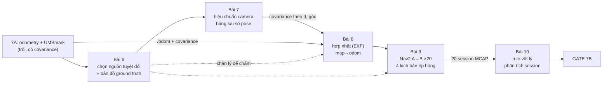
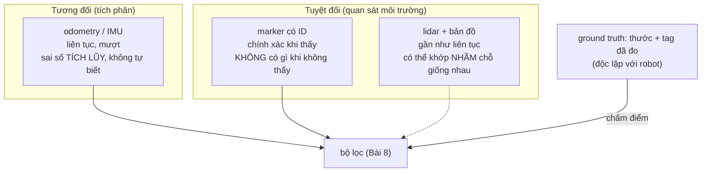
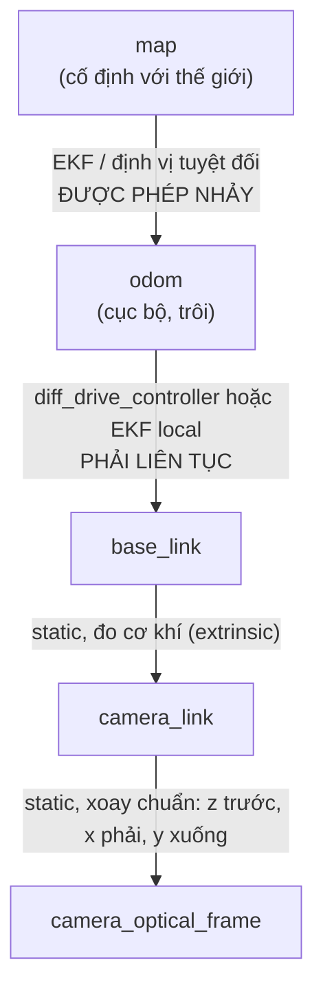
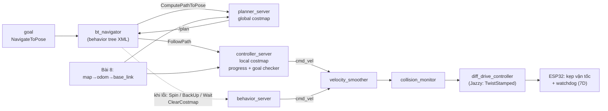

# 7B — Định vị và điều hướng (80h, trần 110h)

**Mua đợt này:** tùy đường bạn chọn ở Bài 6 — marker gần như 0đ (in giấy, dùng camera đã có), lidar 2D khoảng 1–3tr `[ước lượng, giá 10/2026]`.

**Vì sao khối này tồn tại.** 7A chứng minh một điều khó chịu: odometry trôi và **không tự biết mình trôi**. Mọi thứ phía sau (Nav2, nhận người ở 7C, state machine ở 7D, sim khớp thật ở 7E) đều giả định robot biết mình ở đâu với một độ bất định *đã đo*. 7B là chỗ "độ bất định đã đo" trở thành một trường dữ liệu có hậu quả vận hành: nó quyết định bộ lọc tin ai, robot dừng cách đích bao xa, và rule validation nào được phép bắn.



| Bài | Giờ | Viên nang nền cần trước | Quyết định ra được sau bài |
|---|---|---|---|
| 6 — Chọn đường: marker hay lidar | 6 | F1.1, F6.1 | Nguồn định vị tuyệt đối nào, ground truth lấy từ đâu và sai bao nhiêu |
| 7 — Hiệu chuẩn camera, độ chính xác pose | 16 | F1.1, F1.6, F6.2, F6.8, F4.6 | Tin số đo tag đến khoảng cách/góc nào; covariance điền gì |
| 8 — Hợp nhất odometry + marker | 20 | F6.7, F4.6, F6.8, F3.4 | Cấu hình EKF và cây TF; xử lý cú nhảy `map → odom` thế nào |
| 9 — Nav2 từ A tới B | 24 | F1.2, F1.4, F2.1, F7.6 | Gate "đi tới đích" của bạn phân biệt được robot tốt/xấu đến mức nào; recovery nào được phép |
| 10 — Ghi và phân tích session | 14 | F3.7, F3.4, F2.1, F7.5 | Rule vật lý nào đáng chạy tự động trên mọi session, rule nào là nhiễu |

Ký hiệu đường dẫn lab dùng trong file: `lab/7b-0N-<tên>/` với `prediction.md`, `results.md`, dữ liệu MCAP, script phân tích. Mọi `prediction.md` commit **trước** khi đo.

---

## Bài 6 — Chọn đường: marker hay lidar (6h) (khung rút gọn)

> **Vị trí:** 7A Gate (odometry đã hiệu chuẩn) → **Bài 6** → Bài 7 (hiệu chuẩn camera) · **Cần trước:** F1.1 (độ bất định của chính thước đo), F6.1 (mô hình có miền hiệu lực), K2 Bài 3 (frame và TF) · **Sau bài này bạn quyết định được:** dùng nguồn định vị tuyệt đối nào trong 7B, và bản đồ ground truth của bạn sai tới đâu — tức là sai số nhỏ nhất bạn còn *chấm được* ở Bài 8–9.

### 1. Câu chuyện — ai đã khổ vì chuyện này

Kho của Kiva Systems (Amazon mua năm 2012, nay là Amazon Robotics) giải bài định vị cho hàng nghìn robot bằng một lựa chọn trông "kém sang": dán lưới **mã fiducial 2D lên sàn**, robot có camera nhìn xuống đọc mã khi đi qua, giữa hai mã thì chạy bằng odometry `[chuẩn — mô tả công khai của hệ Kiva, chi tiết khoảng cách mã: tự tra]`. Họ chọn sửa môi trường để đổi lấy một thứ quý hơn: định vị tuyệt đối có ID duy nhất, không bao giờ nhầm chỗ này với chỗ kia, và lỗi thì lỗi **rõ ràng** (không thấy mã đúng hạn → dừng). Ở đầu kia, hệ AMR dùng lidar SLAM không sửa gì môi trường, nhưng trả giá ở chỗ khác: hành lang dài đối xứng, kho đổi bố cục theo mùa, và một lớp lỗi "định vị nhầm mà vẫn tự tin".

Lựa chọn của bạn ở bài này không phải về cảm biến. Nó là: **bạn chấp nhận loại thất bại nào**, và bạn có lấy được **chân lý để chấm** mọi thứ phía sau hay không. Bài 9 đòi "p95 sai lệch cuối" — p95 so với cái gì? Nếu câu trả lời là "so với pose robot tự báo", bạn đang dùng bị cáo làm thẩm phán.

### 2. Mô hình tư duy



Bản chất: mọi robot di động cần **một nguồn tương đối** (mượt, tần số cao, trôi) và **một nguồn tuyệt đối** (neo lại, gián đoạn hoặc mơ hồ). Hai đường marker/lidar khác nhau chủ yếu ở **kiểu thất bại**: marker thất bại kiểu *im lặng có ranh giới* (không thấy tag = không có số đo, ai cũng biết), lidar thất bại kiểu *có số đo nhưng sai* (scan khớp vào một đoạn hành lang giống hệt). Với người làm data/eval, kiểu thứ nhất dễ kiểm hơn nhiều. Và thứ tư, thứ quyết định với lộ trình này: tag đã đo bằng thước là **ground truth độc lập** — thứ duy nhất cho phép bạn chấm cả fusion lẫn lidar sau này.

**Ma trận quyết định.** Điền trọng số (tổng = 10) theo mục tiêu *của bạn*, nhân điểm 1–5, cộng. Điểm dưới đây là đánh giá định tính cho bối cảnh văn phòng nhỏ + N100 + vai trò robotics data infra; bạn được sửa, nhưng phải ghi lý do.

| Tiêu chí | Trọng số (bạn điền) | Marker (AprilTag) | Lidar 2D + SLAM/AMCL | Ghi chú |
|---|---|---|---|---|
| Chi phí | | 5 | 3 | Lidar 1–3tr `[ước lượng]` |
| Không phải sửa môi trường | | 1 | 5 | Văn phòng có cho dán tag không? Hỏi trước |
| Độ chính xác khi có tín hiệu | | 4 | 4 | Marker: phụ thuộc khoảng cách/góc — Bài 7 đo |
| Tính liên tục (phủ không gian) | | 2 | 5 | Marker cần mật độ tag đủ để luôn thấy ≥1 |
| Kiểu thất bại dễ phát hiện | | 5 | 2 | Marker: có ID, không mơ hồ; lidar: khớp nhầm |
| Cho ground truth độc lập | | 5 | 1 | Lidar tự vẽ bản đồ = tự chấm bài mình |
| Tải CPU trên N100 | | 3 | 3 | Cả hai: `[tự đo]` — detect tag 640×480 vs AMCL/SLAM |
| Phụ thuộc ánh sáng | | 2 | 5 | Camera cần sáng + phơi sáng ngắn (Bài 7 ép hỏng) |
| Quyền riêng tư (7C) | | 2 | 5 | Camera định vị cũng nhìn thấy người — vào thiết kế 7C Bài 11 |
| Giá trị học cho vai trò data infra | | 5 | 3 | Hiệu chuẩn camera + calibration artifact là kỹ năng khan hiếm |

Bản gốc khuyến nghị **marker trước, lidar sau nếu dư giờ**; phụ lục K7 mục 2b giữ nguyên quyết định này sau hai bản review. Ma trận cho thấy quyết định đó **nhạy** với hai trọng số: "không sửa môi trường" và "liên tục". Nếu văn phòng không cho dán tag, kết luận đảo ngược — và bạn vẫn cần ground truth bằng cách khác (đánh dấu điểm trên sàn, đo bằng thước).

### 3. Cầu nối từ backend

| Backend bạn biết | Ở đây | Gãy ở chỗ | Nếu dùng nhầm thì |
|---|---|---|---|
| Đồng hồ cục bộ trôi, định kỳ sync NTP về nguồn chuẩn | Odometry trôi, định kỳ neo về tag | NTP sync thường xuyên và mọi node đều nhận; tag chỉ có khi **camera nhìn thấy**, phụ thuộc vị trí robot. Khoảng mù không do bạn chọn tần số mà do hình học căn phòng | Thiết kế như thể "lúc nào cũng có sync" → robot đi vào vùng không tag 2 phút và Nav2 vẫn tin pose như lúc vừa thấy tag |
| Golden dataset / test oracle độc lập với hệ đang test (F2.1) | Bản đồ tag đo bằng thước | Oracle backend thường là dữ liệu chính xác tuyệt đối; oracle ở đây **có sai số** (thước, góc dán, tường không phẳng) và sai số đó đặt **sàn** cho mọi phép chấm | Báo "fusion sai 2 cm" khi ground truth của bạn tự nó sai ±1 cm theo vị trí và ±1° theo hướng → con số vô nghĩa |
| Primary key duy nhất vs tìm kiếm mờ (fuzzy match) | Tag có ID duy nhất vs scan matching | Đúng ở ý "khớp chính xác vs khớp gần đúng", gãy ở chỗ tag vẫn có **pose mơ hồ hình học** (Bài 7: một tag phẳng có thể cho hai nghiệm xoay) dù ID không mơ hồ | Tin "có ID là chắc chắn" → bỏ qua kiểm tra nhất quán pose, ăn nguyên cú lật hướng vào bộ lọc |

**Chấm mô hình:**

- *"Lidar đắt hơn nên chính xác hơn, marker là phương án nghèo."* — **SAI.** Độ chính xác cục bộ hai bên cùng cỡ; khác nhau ở *phủ* và *kiểu thất bại*. Phản ví dụ: kho Kiva/Amazon chọn fiducial cho hàng nghìn robot dù đủ tiền mua lidar, vì cần ID không mơ hồ và lỗi rõ ràng.
- *"Có ground truth = có sự thật tuyệt đối."* — **ĐÚNG MỘT PHẦN.** Ground truth là phép đo **độc lập và tốt hơn** hệ đang chấm, không phải sự thật. Phản ví dụ: tag dán lệch 1° so với giá trị ghi trong `landmarks.yaml` — robot đứng cách tag vài mét sẽ bị đẩy ngang một khoảng tỉ lệ với khoảng cách (tự tính ở bước 5 phần Làm), dù vị trí tâm tag đo đúng tới milimét.

### 6. Làm

1. **Quyết định**, ghi `decisions.md`: ma trận đã điền trọng số, kết quả, và *điều kiện khiến bạn đổi quyết định* (ví dụ: "nếu mật độ tag cần để phủ hành lang > N tag hoặc văn phòng không cho dán → chuyển lidar").
2. **In tag.** Họ `tag36h11` (họ được thư viện AprilTag khuyến nghị cho dùng chung `[spec — tài liệu AprilTag, AprilRobotics]`). In "Actual size/100%", giấy mờ (không bóng), bồi lên tấm phẳng cứng (mica, formex). Kích thước cạnh: chọn theo khoảng cách xa nhất bạn cần đọc — kiểm lại ở Bài 7.
3. **Đo kích thước thật** từng tag bằng thước cặp: cả cạnh ngang và cạnh dọc của **ô đen ngoài** (định nghĩa "tag size" khác nhau giữa thư viện — AprilTag 3 đo cạnh vùng đen ngoài, không tính viền trắng `[tự đo — đọc tài liệu thư viện bạn dùng]`). Bản gốc nói in thường sai "vài phần trăm"; con số này phụ thuộc máy in `[tự đo]`. Sai số kích thước đi **thẳng tỉ lệ** vào khoảng cách ước lượng (Z ∝ kích thước tag), nên ghi số đo thật cho từng ID, không dùng số thiết kế.
   - Sai số dụng cụ: thước cặp điện tử thường ±0.02–0.03 mm `[spec — xem nhãn thước của bạn]`; sai số thật bị chi phối bởi việc xác định mép mực, cỡ 0.1–0.2 mm `[ước lượng]`.
4. **Khảo sát văn phòng.** Vẽ sơ đồ, chọn gốc `map` (một góc tường), trục theo REP-103 (x, y trên sàn, z lên). Chọn vị trí tag sao cho mọi điểm trên lộ trình dự kiến của Bài 8–9 thấy ≥1 tag trong tầm đọc (tầm thật xác định ở Bài 7 — giờ dùng giả định và ghi rõ là giả định).
5. **Đo pose từng tag** (x, y, z, yaw) bằng thước dây/laser, **hai lần độc lập** (tốt nhất hai ngày khác nhau hoặc hai người). Lưu `config/landmarks.yaml` có `size_m` đo thật, pose, và **độ bất định ước lượng** cho từng con số.
   - Sai số dụng cụ: thước dây cấp II theo OIML/EU MID có sai số cho phép ±(0.3 + 0.2·L) mm, L tính bằng m `[spec — OIML R35 / MID, kiểm nhãn thước]`; sai số quy trình (võng thước, không vuông góc, tường cong) thường lớn hơn nhiều `[ước lượng]`. Yaw của tag là thứ khó đo nhất: dùng hai điểm cách xa nhau trên mép tấm bồi, tính góc bằng atan2.
   - **Tính trước khi đo:** với sai số yaw của tag δθ và khoảng cách quan sát d, pose robot suy ra bị lệch ngang khoảng d·δθ (rad). Viết con số cho δθ = 1° và d = 3 m vào `prediction.md`.
   <details><summary>🔒 MỞ SAU KHI COMMIT prediction.md</summary>

   d·δθ = 3 m × 0.01745 rad ≈ **5.2 cm**. Lớn hơn nhiều so với sai số vị trí tâm tag (vài mm). Hệ quả: (a) yaw của tag trên bản đồ phải được đo cẩn thận như vị trí; (b) nếu Bài 8 ra sai số hệ thống phụ thuộc *tag nào đang được nhìn*, nghi `landmarks.yaml` trước khi nghi bộ lọc; (c) độ bất định yaw của tag phải được cộng vào covariance khi suy pose robot từ tag ở Bài 8.
   </details>
6. **Ghi ngân sách sai số ground truth** vào `decisions.md`: vị trí ±? mm, yaw ±?°, kích thước ±? mm. Con số này là **sàn** của mọi phép chấm ở Bài 8–9: không được báo sai số nhỏ hơn nó.

### 8. Nếu ra khác

| Triệu chứng | Nguyên nhân khả dĩ | Kiểm bằng cách | Sửa |
|---|---|---|---|
| Cạnh ngang và dọc của tag lệch nhau rõ | Driver in co giãn (fit to page), lô giấy kéo lệch | Đo cả hai cạnh mọi tag | In lại 100%; nếu vẫn méo, ghi cả hai cạnh và chọn máy in khác |
| Hai lần đo pose tag lệch nhau vượt ngân sách đã đặt | Quy trình đo, không phải thước | Đo lần ba bởi người khác | Đổi phương pháp (laser + điểm mốc sàn), không lấy trung bình hai số lệch nhau mà không hiểu vì sao |
| Tag phồng/cong sau vài ngày | Dán 4 góc, giấy hút ẩm | Nhìn nghiêng, áp thước thẳng | Bồi tấm cứng, keo phủ toàn mặt |
| Không thể phủ lộ trình bằng số tag hợp lý | Văn phòng nhiều góc khuất | Vẽ tầm nhìn trên sơ đồ | Chấp nhận khoảng mù (Bài 8 đo nó) hoặc ghi điều kiện chuyển lidar vào `decisions.md` |

### 9. Câu hỏi ngược

1. **[Phản biện]** Bản gốc nói marker "cho bạn ground truth". Nhưng ở Bài 8 bạn lại đưa chính marker vào bộ lọc. Lúc đó marker còn là ground truth độc lập không?
   <details><summary>Hướng nghĩ</summary>Một nguồn đã vào bộ lọc thì không còn chấm được bộ lọc một cách độc lập trên cùng dữ liệu. Tách vai: ground truth để chấm là **điểm dừng đo bằng thước** (hoặc một tag *không* đưa vào bộ lọc, giữ làm tập giữ kín — nối F2.8). Giống không dùng tập train để báo accuracy.</details>
2. **[Quy mô]** 100 robot trong 10 văn phòng khác nhau, mỗi chỗ một bộ tag dán tay. Cái gì gãy trước: phần mềm, hay dữ liệu `landmarks.yaml`?
   <details><summary>Hướng nghĩ</summary>Bản đồ tag là một **dataset có version** cần provenance (ai đo, khi nào, thước nào), validation (tag trùng ID, tag bị dời), và cách phát hiện tag bị người ta gỡ/dán lại lệch. Nghĩ tới drift của "cấu hình môi trường" như schema drift (F3.7, F3.8).</details>
3. **[Failure mode]** Ai đó dời một tag 30 cm khi lau tường. Robot thấy gì, bộ lọc làm gì, bạn phát hiện bằng cách nào?
   <details><summary>Hướng nghĩ</summary>Không gì báo lỗi: tag vẫn có ID hợp lệ, pose hợp lệ. Dấu hiệu là sai khác có hệ thống *chỉ khi nhìn tag đó*, và innovation của bộ lọc lệch cùng một hướng. Đây là rule đáng có ở Bài 10: thống kê innovation theo tag ID.</details>
4. **[Vì sao không]** Vì sao không dùng luôn lidar SLAM tự vẽ bản đồ rồi lấy bản đồ đó làm chuẩn?
   <details><summary>Hướng nghĩ</summary>Bản đồ SLAM là sản phẩm của chính hệ đang được chấm; lỗi nhất quán của nó (ví dụ hành lang bị co 2%) không lộ ra khi so với chính nó. Cần một phép đo có nguồn sai số **khác** (thước).</details>
5. **[Liên ngành]** Trắc địa đặt mốc khống chế (benchmark, control point) đo bằng phương pháp chính xác hơn, rồi mọi phép đo chi tiết neo vào đó. Giống và khác gì với tag của bạn?
   <details><summary>Hướng nghĩ</summary>Giống: phân tầng độ chính xác, mốc có sai số được công bố. Khác: trắc địa có mạng lưới đo khép kín để tự kiểm (sai số khép), bạn đo từng tag riêng lẻ từ một gốc — sai số không kiểm chéo được trừ khi đo khép vòng.</details>

### 12. Đọc thêm và tự kiểm tra

- **Nguồn gốc:** E. Olson, "AprilTag: A robust and flexible visual fiducial system", ICRA 2011; J. Wang & E. Olson, "AprilTag 2", IROS 2016; S. Garrido-Jurado và cộng sự, "Automatic generation and detection of highly reliable fiducial markers under occlusion" (ArUco), Pattern Recognition 2014.
- **Giải thích:** REP-105 "Coordinate Frames for Mobile Platforms" (ros.org/reps/rep-0105.html) — đọc phần map/odom trước Bài 8.
- **Đào sâu (tùy chọn):** Thrun, Burgard, Fox — *Probabilistic Robotics*, chương về localization (bài toán toàn cục vs bám vết, kidnapped robot).
- **Tự kiểm tra:** (1) giải thích cho một backend engineer khác trong 5 câu vì sao robot cần cả nguồn tương đối lẫn tuyệt đối; (2) vẽ lại sơ đồ phần 2; (3) tag khai báo trong code là 150 mm nhưng thực tế 147 mm — robot đứng cách tag 2.00 m, khoảng cách ước lượng ra bao nhiêu, xa hay gần hơn thật?
  <details><summary>Đáp án</summary>Z ước lượng ∝ kích thước khai báo: 2.00 × 150/147 ≈ **2.04 m**, xa hơn thật ~4 cm. Sai hệ thống, lấy trung bình 1000 mẫu vẫn sai đúng 4 cm.</details>

---

## Bài 7 — Hiệu chuẩn camera và độ chính xác pose từ marker (16h)

> **Vị trí:** Bài 6 (bản đồ tag + ground truth) → **Bài 7** → Bài 8 (hợp nhất) · **Cần trước:** F1.1 (hệ thống vs ngẫu nhiên, lan truyền sai số), F1.6 (fit mô hình, residual, overfitting), F6.2 (verification vs validation vs calibration), F6.8 (frame, transform 4×4), F4.6 + K5 Bài 11 (rolling shutter, thời điểm phơi sáng) · **Sau bài này bạn quyết định được:** một phát hiện tag ở khoảng cách d, góc θ thì được đưa vào bộ lọc với covariance bao nhiêu — hay bị loại; và khi nào phải hiệu chuẩn lại camera.

**Câu hỏi gốc:** tag ở cách 2 m, camera nói nó cách bao nhiêu, và sai bao nhiêu?

### 1. Câu chuyện — ai đã khổ vì chuyện này

Kính viễn vọng Hubble phóng năm 1990 với gương chính bị mài sai hình dạng khoảng 2.2 µm ở mép — gương được mài **rất chính xác theo một hình sai**. Nguyên nhân (báo cáo của ủy ban Allen, 1990): dụng cụ kiểm tra chuẩn ("null corrector") được lắp lệch khoảng 1.3 mm. Mọi phép đo bằng dụng cụ đó đều khớp đẹp với mô hình; hai phép kiểm khác cho số lệch nhưng bị gạt đi vì "dụng cụ chính đáng tin hơn" `[chuẩn — Allen Report, NASA 1990]`. Sau đó phải lắp thêm bộ quang học hiệu chỉnh (COSTAR) trong chuyến bảo dưỡng 1993.

Hiệu chuẩn camera có đúng cấu trúc cái bẫy đó. Chỉ số mọi người nhìn — **reprojection error** — đo xem mô hình camera của bạn *khớp với chính các ảnh bạn dùng để fit* tốt đến đâu. Nó không đo xem khoảng cách camera báo có đúng với thước hay không. Một hiệu chuẩn có thể đạt 0.27 px trên tập ảnh của nó và vẫn sai tiêu cự vài phần trăm — tức là mọi khoảng cách tới tag sai vài phần trăm, có hệ thống, không lấy trung bình mà hết được. Bài này có hai nửa: làm hiệu chuẩn, rồi **chấm nó bằng một thứ nó không được nhìn thấy** (thước).

### 2. Mô hình tư duy

**Hình học một dòng.** Mô hình pinhole: điểm (X, Y, Z) trong frame quang học (z ra trước, x phải, y xuống — REP-103 cho camera) chiếu thành u = fx·X/Z + cx, v = fy·Y/Z + cy, rồi bị méo bởi ống kính (hệ số k1, k2, p1, p2, k3…). Một tag cạnh s ở khoảng cách Z trông rộng w ≈ f·s/Z pixel. Đảo lại: **Z ≈ f·s/w**. Mọi thứ của bài này nằm trong ba ký hiệu đó:

```
Z ≈ f · s / w
     │   │   └─ w: đo từ ảnh, nhiễu NGẪU NHIÊN ~ σ_px mỗi góc  → δZ ≈ Z²·σ_w/(f·s)   (tăng theo Z²)
     │   └───── s: cạnh tag, sai HỆ THỐNG (in, đo)             → δZ/Z = δs/s        (tăng theo Z)
     └───────── f: từ hiệu chuẩn, sai HỆ THỐNG                 → δZ/Z = δf/f        (tăng theo Z)
```

| Nguồn sai | Loại | Lấy trung bình 100 khung có giảm? | Phát hiện bằng |
|---|---|---|---|
| Nhiễu vị trí góc tag (pixel) | ngẫu nhiên | Có, nếu các khung độc lập (thường **không** hẳn) | std của 100 mẫu |
| Tiêu cự / méo sai | hệ thống, phụ thuộc vị trí trong ảnh | Không | So với thước ở nhiều khoảng cách |
| Kích thước tag khai báo sai | hệ thống, tỉ lệ | Không | Thước cặp (Bài 6) |
| Gốc đo của thước ≠ quang tâm camera | hệ thống, hằng số | Không | Fit Z_est = a·Z_thước + b |
| Mơ hồ hướng của tag phẳng | ngẫu nhiên nhưng **hai mode** | Không — trung bình của hai mode là một hướng sai | So hai nghiệm PnP |
| Nhòe, rolling shutter khi chuyển động | phụ thuộc vận tốc | Không | Đo khi robot quay |

**Vì sao hướng của tag phẳng khó.** Nhìn chính diện, xoay tag một góc nhỏ ψ quanh trục dọc làm bề rộng hình chiếu đổi theo cos ψ ≈ 1 − ψ²/2: **bậc hai**, tức là gần như không nhìn thấy ở bậc một. Thông tin về hướng chủ yếu đến từ hiệu ứng phối cảnh (cạnh gần to hơn cạnh xa), mà hiệu ứng này yếu dần khi tag ở xa. Hai nghiệm xoay đối xứng cho hình chiếu gần như giống nhau — đó là "pose ambiguity" của mục tiêu phẳng (Schweighofer & Pinz 2006). Và hướng quan trọng hơn bạn tưởng: vị trí *robot* trong `map` được suy ngược từ tag bằng phép biến đổi nghịch, nên một sai số hướng δψ ở khoảng cách d biến thành sai số vị trí ngang ≈ d·δψ.

**Mô phỏng 1 — reprojection error nhỏ chưa chắc đúng** (overfitting và nhầm lẫn tham số, → F1.6). Hiệu chuẩn trên điểm bàn cờ tổng hợp (biết sẵn camera thật), ba cách chụp, rồi chấm trên 30 ảnh giữ kín. Chạy và đọc ba dòng; **đừng mở phần 7 trước khi viết ra bạn nghĩ dòng nào tệ nhất ở cột "giữ kín" và cột fx**.

```python
# [đã chạy]  Reprojection error nhỏ chưa chắc đúng: hiệu chuẩn trên điểm tổng hợp, đo trên tập giữ kín
import numpy as np, cv2, warnings
warnings.filterwarnings("ignore")                         # ảnh B làm méo ngoại suy "bay" ở mép
rng = np.random.default_rng(4)
W, H = 640, 480
K_true = np.array([[600., 0, 320], [0, 600., 240], [0, 0, 1]])
D_true = np.array([-0.25, 0.08, 0, 0, 0])                 # méo thùng vừa phải
g = np.mgrid[0:9, 0:6].T.reshape(-1, 2) * 0.025           # bàn cờ 9x6 góc trong, ô 25 mm
obj = np.c_[g - g.mean(0), np.zeros(len(g))].astype(np.float32)

def views(n, tilt, dist, spread):
    O, I = [], []
    while len(O) < n:
        r = rng.uniform(-tilt, tilt, 3); r[2] *= 2
        t = np.array([*rng.uniform(-spread, spread, 2), rng.uniform(*dist)])
        uv, _ = cv2.projectPoints(obj, r, t, K_true, D_true)
        uv = uv.reshape(-1, 2) + rng.normal(0, 0.2, (len(obj), 2))   # nhiễu góc 0.2 px
        if (uv > 5).all() and (uv[:, 0] < W - 5).all() and (uv[:, 1] < H - 5).all():
            O.append(obj); I.append(uv.astype(np.float32))
    return O, I

def heldout_rms(K, D, O, I):
    e = []
    for o, i in zip(O, I):
        _, r, t = cv2.solvePnP(o, i, K, D)
        p, _ = cv2.projectPoints(o, r, t, K, D); e.append(np.linalg.norm(p.reshape(-1, 2) - i, axis=1))
    e = np.nan_to_num(np.concatenate(e), nan=1e9, posinf=1e9)       # điểm "bay" = lỗi cực lớn
    return np.percentile(e, 50), np.percentile(e, 95)

O_test, I_test = views(30, 0.6, (0.3, 0.9), 0.25)         # tập giữ kín: phủ cả mép ảnh, nhiều góc
cases = {"A: 20 ảnh, đa dạng":        (views(20, 0.6, (0.3, 0.9), 0.25), 0),
         "B: 8 ảnh chính diện, ở giữa": (views(8, 0.1, (0.5, 0.6), 0.03), 0),
         "C: như B + mô hình 8 hệ số":  (views(8, 0.1, (0.5, 0.6), 0.03), cv2.CALIB_RATIONAL_MODEL)}
for name, ((O, I), flag) in cases.items():
    rms, K, D, _, _ = cv2.calibrateCamera(O, I, (W, H), None, None, flags=flag)
    p50, p95 = heldout_rms(K, D, O_test, I_test)
    print(f"{name:30s} RMS train {rms:.2f} px | giữ kín p50 {p50:.2f} p95 {min(p95, 999):6.1f} px"
          f" | fx {K[0,0]:6.1f} (thật 600)")
```

Cần `pip install opencv-python-headless` (đã chạy với OpenCV 5.0; `calibrateCamera`, `solvePnP`, `projectPoints` ổn định từ 3.x `[tự đo theo bản bạn cài]`).

### 3. Cầu nối từ backend

| Backend bạn biết | Ở đây | Gãy ở chỗ | Nếu dùng nhầm thì |
|---|---|---|---|
| Training loss vs validation loss (ML) | Reprojection error trên ảnh hiệu chuẩn vs trên ảnh giữ kín | Ngay cả reprojection error **giữ kín** cũng chỉ đo nhất quán *trong ảnh*; tiêu cự và khoảng cách có thể bù trừ nhau (f to hơn + vật xa hơn cho cùng ảnh) nếu tập ảnh thiếu góc nghiêng. Cần một phép kiểm **có đơn vị mét** (thước) | Ship calibration với RMS đẹp, mọi khoảng cách lệch vài %, sai số đi thẳng vào bộ lọc như một bias không ai thấy |
| Health check trả 200 | "Phát hiện được tag" | Phát hiện thành công không nói gì về chất lượng pose; tag 20 px ở 4 m và tag 180 px ở 0.5 m đều là "detected" | Đưa mọi phát hiện vào bộ lọc với cùng covariance → bộ lọc tin số đo xa/nghiêng như số đo gần |
| Artifact có version (image digest, model registry) | `calibration_id` | Artifact backend không mục; calibration **mục theo vật lý**: va camera, đổi tiêu cự (autofocus!), nhiệt độ, đổi độ phân giải — code không đổi một dòng nào | Dữ liệu tháng sau gắn `calibration_id` cũ nhưng camera đã khác → dataset "hợp lệ" mà sai |
| Load test ở một mức RPS cho một con số p99 | Bảng sai số ở một điều kiện | Sai số pose là **hàm** của (khoảng cách, góc, ánh sáng, vận tốc), không phải một hằng số của hệ | Một số covariance cho mọi tình huống — đúng ở chỗ đo, sai ở mọi chỗ khác |

**Chấm mô hình:**

- *"Reprojection error < 0.5 px nghĩa là hiệu chuẩn tốt."* — **ĐÚNG MỘT PHẦN.** Điều kiện cần, không đủ. Nó bắt được bàn cờ cong, ảnh nhòe, góc phát hiện sai; nó không bắt được tập ảnh nghèo (thiếu góc nghiêng, không phủ mép ảnh) hay mô hình méo quá linh hoạt. Phản ví dụ: dòng C của mô phỏng 1 (xem số ở phần 7). Ngưỡng 0.5 px cũng phụ thuộc độ phân giải: 0.5 px ở 640×480 và ở 1920×1080 không cùng nghĩa.
- *"Lấy trung bình 100 mẫu thì sai số giảm 10 lần."* — **ĐÚNG MỘT PHẦN.** Chỉ phần ngẫu nhiên giảm, và chỉ giảm √100 lần nếu 100 mẫu **độc lập**. 100 khung liên tiếp của một cảnh đứng yên có chung ánh sáng, chung vị trí đặt tag, chung bias — chúng gần như một mẫu lặp 100 lần với nhiễu cảm biến khác nhau. Phản ví dụ: tag khai báo 150 mm, thật 147 mm — 100 hay 10.000 mẫu đều lệch đúng 2%.
- *"Sai số góc từ tag xấu hơn sai số vị trí"* (bản gốc). — **ĐÚNG MỘT PHẦN.** Độ và centimét không so trực tiếp được; phải quy về *hậu quả*: sai số hướng δψ ở khoảng cách d thành sai số vị trí robot ≈ d·δψ. Ở dạng đó, kết luận của bản gốc đúng và còn nặng hơn bản gốc nói. Nhưng chiều phụ thuộc theo góc nhìn thì bản gốc nói chưa trọn — để bạn tự tìm ở phần 5.
- *Mô hình của bạn ở K3 lượt 21:* "nếu lúc đo chưa cover đủ flag/khóa thì lúc runtime thực tế không thể đảm bảo mọi tình huống". — **ĐÚNG MỘT PHẦN.** Đúng là bảng sai số chỉ có giá trị trong vùng đã đo. Gãy ở chỗ "cover đủ" là không làm được: không gian điều kiện (khoảng cách × góc × ánh sáng × vận tốc × che khuất) là vô hạn. Ngành không cố đo hết; ngành **khai báo miền hiệu lực** (F6.1) và đặt **cổng runtime** loại số đo ngoài miền (tag < N px, góc > θ_max, vận tốc góc > ω_max → bỏ). Phản ví dụ cho "đo đủ là an toàn": bạn đo 20 ô lưới hoàn hảo, robot gặp tag bị nắng chiều rọi xiên — điều kiện không có trong lưới; cái cứu bạn là cổng runtime, không phải lưới dày hơn.

### 4. Thuật ngữ

| Mức | Thuật ngữ | Nghĩa trong một câu | Hay bị hiểu nhầm thành |
|---|---|---|---|
| 🟢 | Intrinsic calibration | Tham số bên trong camera: fx, fy, cx, cy, hệ số méo | Thuộc tính cố định của model camera (thật ra từng con một, và đổi khi đổi focus/độ phân giải) |
| 🟢 | Extrinsic | Vị trí/hướng camera so với frame khác (ở đây `base_link → camera_link`) | Một phần của hiệu chuẩn nội tại |
| 🟢 | Reprojection error | Khoảng cách (px) giữa điểm quan sát và điểm mô hình chiếu lại, thường báo RMS | Sai số khoảng cách (nó là sai số trong ảnh, đơn vị pixel) |
| 🟢 | `calibration_id` | Định danh có version của một lần hiệu chuẩn, gắn vào metadata mọi dữ liệu dùng nó (CONVENTIONS §4) | Tên file cấu hình |
| 🟡 | PnP (Perspective-n-Point) | Tìm pose camera từ n điểm 3D đã biết và hình chiếu 2D của chúng | Thuật toán phát hiện tag |
| 🟡 | Pose ambiguity (mục tiêu phẳng) | Hai hướng xoay khác nhau cho hình chiếu gần như nhau | Bug của thư viện |
| 🟡 | Hệ số méo (k1, k2, p1, p2, k3…) | Đa thức mô tả méo thùng/đệm và lệch tâm ống kính | "Càng nhiều hệ số càng chính xác" |
| 🟡 | Rolling shutter | Mỗi hàng ảnh phơi sáng ở thời điểm khác nhau | Chỉ ảnh hưởng ảnh "đẹp", không ảnh hưởng pose |
| 🟡 | Phương pháp Zhang | Hiệu chuẩn từ nhiều ảnh của một mặt phẳng đã biết (bàn cờ) | — |
| 🔴 | Bundle adjustment, mô hình fisheye/omni | Tối ưu đồng thời mọi tham số và điểm; mô hình ống kính góc rộng | Cần cho bài này |

### 5. Dự đoán

**Đề.** Với camera và tag của bạn, dự đoán trước khi đo:

1. Bề rộng tag tính bằng pixel ở 0.5, 1, 2, 3, 4 m (chính diện).
2. Độ lệch chuẩn của khoảng cách Z ở 1 m và 4 m, chính diện, nếu mỗi góc tag có nhiễu σ_px.
3. Bias của Z ở 1 m và 4 m nếu tiêu cự hiệu chuẩn lệch 2%.
4. Ở mỗi khoảng cách, góc nhìn nào (0°, 20°, 40°, 60°) cho **sai số hướng** (yaw của tag) tệ nhất? Góc nào cho **tỉ lệ phát hiện** tệ nhất? Hai câu trả lời có giống nhau không?
5. Sai số vị trí *robot* suy ngược từ một tag (không phải vị trí tag trong frame camera) ở 2 m chính diện: cỡ mm, cm hay dm?
6. Khoảng cách xa nhất còn phát hiện được tag, ở chính diện.
7. Reprojection error RMS bạn sẽ đạt; và nếu hiệu chuẩn hai lần với hai bộ ảnh khác nhau, fx lệch nhau bao nhiêu %.

**Tham số cần tra:**
- Độ phân giải bạn sẽ dùng (cố định, ghi vào artifact).
- fx gần đúng trước khi hiệu chuẩn: từ góc nhìn ngang HFOV trong datasheet camera, fx ≈ (W/2)/tan(HFOV/2). Nếu không có datasheet, đo: đặt thước dài ở khoảng cách biết trước, đếm pixel.
- s: cạnh tag đo bằng thước cặp ở Bài 6.
- σ_px: tài liệu không cho; đo bằng std vị trí một góc tag trong 100 khung tĩnh, hoặc giả định 0.1–0.5 px và ghi rõ là giả định.
- Ngưỡng phát hiện: tag36h11 có lưới 8×8 ô trong viền đen (6×6 bit + viền) `[spec — AprilTag]`; giả định mỗi ô cần ≥ ~2 px để giải mã `[ước lượng]`.

**Phương pháp:** dùng công thức ở phần 2 cho câu 1–3, 5 (gợi ý cho câu 5: d·δψ, nhưng bạn phải đoán δψ). Câu 4 lập luận bằng hình học (cos ψ). Sau khi commit dự đoán bằng tay, chạy mô phỏng 2 dưới đây với số của bạn — đó là **mô hình thứ hai**, không phải đáp án; thực đo mới là đáp án.

```python
# [đã chạy]  Mô phỏng PnP: nhiễu pixel ở 4 góc tag -> sai số pose theo khoảng cách và góc nhìn
import numpy as np
from scipy.optimize import least_squares
from scipy.spatial.transform import Rotation as R

fx = fy = 600.0; cx, cy = 320.0, 240.0      # camera 640x480 giả định (thay bằng K của bạn)
s = 0.15                                    # cạnh tag (m)
sigma_px = 0.3                              # nhiễu góc tag (pixel) — [ước lượng], tự đo
P = np.array([[-1, 1, 0], [1, 1, 0], [1, -1, 0], [-1, -1, 0]]) * s / 2   # 4 góc trong frame tag

def project(rvec, t, f=fx):
    Xc = R.from_rotvec(rvec).apply(P) + t   # frame quang học: z ra trước, x phải, y xuống
    return np.c_[f * Xc[:, 0] / Xc[:, 2] + cx, f * Xc[:, 1] / Xc[:, 2] + cy]

def solve(uv, x0):
    res = lambda p: (project(p[:3], p[3:]) - uv).ravel()
    return least_squares(res, x0).x

rng = np.random.default_rng(0)
print(" Z(m) góc  σZ(mm)  σX(mm)  σyaw(độ)  σcam_trong_frame_tag(mm)  tag(px)")
for Z in [0.5, 1, 2, 3, 4]:
    for ang in [0, 20, 40, 60]:
        rv = np.array([0, np.radians(ang), 0]); t = np.array([0, 0, Z])
        uv0 = project(rv, t)
        est = []
        for _ in range(200):
            p = solve(uv0 + rng.normal(0, sigma_px, uv0.shape), np.r_[rv, t] + 0.01)
            yaw = np.degrees(R.from_rotvec(p[:3]).as_euler("yxz")[0])
            cam = -R.from_rotvec(p[:3]).inv().apply(p[3:])   # vị trí camera trong frame tag
            est.append([p[5] - Z, p[3], yaw - ang, *cam])
        e = np.array(est); sc = np.sqrt(e[:, 3:].var(0).sum())
        w = np.ptp(uv0[:, 0])
        print(f"{Z:4.1f} {ang:4d} {1e3*e[:,0].std():7.1f} {1e3*e[:,1].std():7.1f}"
              f" {e[:,2].std():9.2f} {1e3*sc:12.0f} {w:14.0f}")

# Sai hệ thống: K sai 2% (f) hoặc tag in nhỏ hơn 2% -> lệch Z có hệ thống, trung bình không cứu
rv = np.zeros(3)
for Z in [1, 4]:
    t = np.array([0, 0, Z]); uv_true = project(rv, t, f=fx * 1.02)  # camera thật có f lớn hơn 2%
    p = solve(uv_true, np.r_[rv, t])
    print(f"f lệch 2%, Z={Z}: Z ước lượng = {p[5]:.3f} m (bias {1e3*(p[5]-Z):.0f} mm)")
```

Giới hạn của mô phỏng (ghi vào `prediction.md`): khởi tạo solver **ngay cạnh nghiệm đúng** nên nó không bao giờ rơi vào nghiệm lật — đây là trường hợp tốt nhất; σ_px giữ cố định dù thực tế góc tag nghiêng/xa bị phát hiện kém hơn; không có méo, nhòe, rolling shutter.

**Mẫu `lab/7b-02-camera-pose/prediction.md`:**

```markdown
# Dự đoán Bài 7 — commit trước khi hiệu chuẩn và đo
camera: <model>, độ phân giải: <W×H>, fx giả định: <…> (nguồn: datasheet HFOV / đo tay)
tag: s = <…> mm (thước cặp), σ_px giả định = <…>

| d (m) | w (px) | σZ chính diện (mm) | bias Z nếu f lệch 2% (mm) |
|---|---|---|---|
| 0.5 | | | |
| 1 | | | |
| 2 | | | |
| 3 | | | |
| 4 | | | |

Góc nhìn có sai số HƯỚNG tệ nhất: <…>  vì: <…>
Góc nhìn có tỉ lệ PHÁT HIỆN tệ nhất: <…>  vì: <…>
Sai số vị trí robot suy ngược ở 2 m chính diện: <mm/cm/dm>  vì: <…>
Khoảng cách phát hiện xa nhất: <…> m
RMS reprojection dự kiến: <…> px; fx giữa hai lần hiệu chuẩn lệch: <…> %
Điều tôi ít chắc nhất: <…>
```

### 6. Làm

**Phần A — Khóa camera trước khi hiệu chuẩn (1h).**

1. Liệt kê control của camera: `v4l2-ctl -d /dev/video0 --list-ctrls`. Tắt autofocus, đặt focus cố định; đặt phơi sáng thủ công, ngắn nhất mà ảnh còn đủ sáng; cố định độ phân giải. Tên control khác nhau theo driver/kernel (ví dụ `focus_automatic_continuous`, `auto_exposure`, `exposure_time_absolute`) `[tự đo — đọc output list-ctrls của bạn]`. **Autofocus bật = tiêu cự đổi = hiệu chuẩn mất hiệu lực.** Ghi toàn bộ giá trị control vào artifact.
2. Đọc sai số dụng cụ: thước cặp (bàn cờ, tag) ±0.02–0.03 mm `[spec nhãn thước]`, thước dây/laser cho khoảng cách ±1–3 mm `[spec nhãn]`, cộng sai số quy trình (gốc đo, vuông góc) cỡ vài mm `[ước lượng]`; thước đo góc/ứng dụng điện thoại ±1–2° `[ước lượng]`. Ghi vào `results.md` — con số này là sàn của bảng sai số.

**Phần B — Hiệu chuẩn nội tại (5h).**

3. In bàn cờ (ví dụ 9×6 góc trong), dán lên kính hoặc tấm phẳng cứng, đo cạnh ô bằng thước cặp. (Kích thước ô sai không làm hỏng fx/fy/méo — nó chỉ co giãn khoảng cách tới bàn cờ — nhưng bạn dùng nó để kiểm mét ở bước 7.)
4. Chụp ≥20 ảnh: phủ **cả bốn góc và mép ảnh**, nghiêng bàn cờ ±30–45° theo cả hai trục, nhiều khoảng cách. Giữ 5–10 ảnh riêng làm **tập giữ kín**, không đưa vào hiệu chuẩn. Có thể dùng `ros2 run camera_calibration cameracalibrator --size 9x6 --square 0.025 --ros-args -r image:=/camera/image_raw` `[tự đo tên gói/tham số trên Jazzy]` hoặc script OpenCV dưới đây.
5. Ghi **RMS reprojection error**, error từng ảnh, và độ lệch chuẩn của từng tham số nội tại (`calibrateCameraExtended` trả về). Bỏ ảnh chỉ khi có lý do vật lý (nhòe, góc phát hiện sai) — bỏ ảnh để hạ RMS là p-hacking (F1.5).
6. Tính reprojection error trên tập giữ kín (K cố định, chỉ giải pose từng ảnh).

```python
# [đã chạy]  trên 25 ảnh bàn cờ tổng hợp (OpenCV 5.0). Hiệu chuẩn + tập giữ kín; API [tự đo theo bản cài]
import glob, json, hashlib, numpy as np, cv2
COLS, ROWS, SQ = 9, 6, 0.025                       # góc trong, cạnh ô (m) — đo bằng thước cặp
files = sorted(glob.glob("calib_imgs/*.png")); held = files[::5]; train = [f for f in files if f not in held]
obj = np.zeros((COLS * ROWS, 3), np.float32); obj[:, :2] = np.mgrid[0:COLS, 0:ROWS].T.reshape(-1, 2) * SQ
crit = (cv2.TERM_CRITERIA_EPS + cv2.TERM_CRITERIA_MAX_ITER, 30, 1e-4)

def corners(fs):
    O, I, used = [], [], []
    for f in fs:
        g = cv2.imread(f, cv2.IMREAD_GRAYSCALE)
        ok, c = cv2.findChessboardCorners(g, (COLS, ROWS))
        if ok:
            O.append(obj); I.append(cv2.cornerSubPix(g, c, (5, 5), (-1, -1), crit)); used.append(f)
    return O, I, used, g.shape[::-1]

O, I, used, size = corners(train)
rms, K, D, rv, tv, std_in, _, per_view = cv2.calibrateCameraExtended(O, I, size, None, None)
Oh, Ih, _, _ = corners(held)
err = []
for o, i in zip(Oh, Ih):
    _, r, t = cv2.solvePnP(o, i, K, D)
    p, _ = cv2.projectPoints(o, r, t, K, D)
    err += list(np.linalg.norm(p.reshape(-1, 2) - i.reshape(-1, 2), axis=1))   # reshape: tránh broadcast sai
print(f"RMS train {rms:.3f} px, giữ kín RMS {np.sqrt(np.mean(np.square(err))):.3f} px, ảnh dùng {len(used)}")
print("σ(fx, fy, cx, cy) =", std_in.ravel()[:4])
art = {"calibration_id": "cam-front-01@2026-10-08-a", "K": K.tolist(), "D": D.ravel().tolist(),
       "size": size, "rms_train": rms, "rms_heldout": float(np.sqrt(np.mean(np.square(err)))),
       "images_sha256": hashlib.sha256(b"".join(open(f, "rb").read() for f in used)).hexdigest(),
       "camera_controls": "<dán output v4l2-ctl --list-ctrls>", "opencv": cv2.__version__}
json.dump(art, open("calibration.json", "w"), indent=2)
```

7. **Lưu artifact** có `calibration_id` và version (dạng `camera_info.yaml` cho ROS + file JSON metadata như trên). Từ đây mọi MCAP có camera mang `calibration_id` này trong metadata channel (CONVENTIONS §4). Hash bộ ảnh để tái tạo được (F3.8).

**Phần C — Đo độ chính xác pose (8h).**

8. Chọn thư viện phát hiện: OpenCV ArUco với từ điển `DICT_APRILTAG_36h11` (API `cv2.aruco.ArucoDetector` từ OpenCV 4.7), thư viện AprilTag C qua binding Python, hoặc gói ROS 2 `apriltag_ros` `[tự đo — API đổi giữa các bản]`. Giải pose bằng `cv2.solvePnPGeneric(..., flags=cv2.SOLVEPNP_IPPE_SQUARE)` để lấy **cả hai nghiệm** và reprojection error của mỗi nghiệm; ghi tỉ số hai error (gần 1 = mơ hồ).
9. **Kiểm mét trước:** chính diện, đặt tag ở 5 khoảng cách đo bằng thước. Fit Z_est = a·Z_thước + b. Hệ số a lệch 1 → sai tỉ lệ (f hoặc s); b ≠ 0 → gốc đo của thước khác quang tâm (bình thường, vài mm–cm; ghi lại và trừ đi).
10. **Lưới:** khoảng cách (0.5, 1, 2, 3, 4 m) × góc (0°, 20°, 40°, 60°). Mỗi ô 100 mẫu (giữ đúng gốc). Thêm: ở 3–4 ô, **gỡ và đặt lại tag** 3–5 lần, mỗi lần 100 mẫu — để thấy phần sai số do đặt (thứ 100 khung liên tiếp không chứa).
11. **Lập bảng** cho mỗi ô: bias và std **tách riêng** cho (khoảng cách, ngang, hướng tag), tỉ lệ phát hiện, tỉ số mơ hồ, và **sai số vị trí robot suy ngược** (biến đổi nghịch, như cột cuối mô phỏng 2). Vẽ heatmap.
12. **Ép hỏng:** ánh sáng yếu (đo lux bằng ứng dụng điện thoại, ±20–30% `[ước lượng]`); che một phần tag (một góc, một cạnh); robot quay tại chỗ 0.3 và 0.6 rad/s trong khi nhìn tag (nhòe + rolling shutter, → K5 Bài 11). Ghi tỉ lệ phát hiện và sai số.
13. **Fit mô hình covariance** cho Bài 8: σ_d(d, θ), σ_ngang(d, θ), σ_yaw(d, θ) dạng hàm đơn giản (ví dụ σ = a + b·d²) hoặc bảng tra có nội suy; và **cổng loại** (tag < N px, tỉ số mơ hồ > r, ω > ω_max → không đưa vào bộ lọc). Lưu thành `config/marker_noise.yaml`, có version gắn `calibration_id`.

### 7. Số phải ra

<details><summary>🔒 MỞ SAU KHI COMMIT prediction.md</summary>

**Mô phỏng 1** (OpenCV 5.0, seed cố định; p95 nhóm B dao động nhẹ giữa các lần chạy do đa luồng):

| Cách chụp | RMS train | Giữ kín p50 / p95 | fx (thật 600) |
|---|---|---|---|
| A: 20 ảnh đa dạng | 0.27 px | 0.22 / 0.5 px | 600.8 |
| B: 8 ảnh chính diện ở giữa | 0.27 px | 0.46 / ~115–130 px | 625.9 (+4.3%) |
| C: như B + mô hình 8 hệ số | 0.28 px | 0.33 / 1.0 px | 641.4 (+6.9%) |

Đọc: **cả ba RMS train như nhau.** B ngoại suy méo ra mép ảnh và nổ. C thậm chí qua được kiểm tra giữ kín ở mức chấp nhận được — nhưng fx sai ~7%, tức mọi khoảng cách sai ~7%. Chỉ phép kiểm có đơn vị mét (bước 9) bắt được C.

**Mô phỏng 2** (σ_px = 0.3, fx = 600, tag 15 cm, khởi tạo cạnh nghiệm đúng):

| d (m) | góc | σZ (mm) | σ yaw tag (°) | σ vị trí camera suy ngược (mm) | tag (px) |
|---|---|---|---|---|---|
| 0.5 | 0° | 0.6 | 0.65 | 8 | 180 |
| 1 | 0° | 2.4 | 2.8 | 67 | 90 |
| 1 | 60° | 3.3 | 0.25 | 7 | 45 |
| 2 | 0° | 11 | 6.0 | 301 | 45 |
| 2 | 60° | 13 | 0.46 | 27 | 23 |
| 4 | 0° | 46 | 9.1 | 820 | 22 |
| 4 | 60° | 52 | 1.0 | 107 | 11 |

f lệch 2% → Z lệch 2% (−20 mm ở 1 m, −78 mm ở 4 m): tuyến tính theo d.

Ba điều cần thấy:
1. **σZ tăng ~theo d²** (0.6 → 2.4 → 11 → 46 mm khi d gấp đôi mỗi bậc) — đúng với "bình phương khoảng cách" của bản gốc, *cho phần ngẫu nhiên*. Phần hệ thống (f, s) tăng tuyến tính.
2. **Sai số hướng tệ nhất ở chính diện, tốt hơn khi nghiêng** — ngược với kỳ vọng ngây thơ "60° tệ hơn nhiều". Lý do là cos ψ phẳng ở 0°. Cái tệ đi khi nghiêng là **kích thước tag trong ảnh** (45 → 11 px) và do đó tỉ lệ phát hiện, độ chính xác góc tag thật (σ_px thật tăng), và — với tag thật — nguy cơ lật nghiệm. Bản gốc gộp hai hiện tượng thành một dòng.
3. **Vị trí robot suy ngược từ một tag chính diện có thể sai hàng chục cm đến m** dù vị trí tag trong frame camera chỉ sai mm–cm. Đây là hệ quả d·δψ. Quyết định cho Bài 8: không đưa pose đầy đủ suy từ một tag chính diện ở xa vào bộ lọc với covariance nhỏ; hoặc dùng nhiều tag cùng lúc, hoặc nhận nghiêng, hoặc thổi phồng σ_x, σ_y theo d·σ_ψ.

**Thực đo — khoảng chấp nhận (từ bản gốc, đã chú thích):**

| Kiểm tra | Kỳ vọng | Ghi chú |
|---|---|---|
| RMS reprojection | **< 0.5 px**; > 1 px → hiệu chuẩn lại | Điều kiện cần. Thêm: giữ kín không lớn hơn train quá ~1.5× `[ước lượng]` |
| fx giữa hai lần hiệu chuẩn | lệch < ~1% `[ước lượng]` | Lệch nhiều → tập ảnh nghèo, không phải camera đổi |
| Sai số vị trí tag ở 1 m chính diện | cỡ **1–2 cm** (bản gốc) | Thường bị chi phối bởi bias (a, b ở bước 9) và sàn ground truth, không phải σ ngẫu nhiên (mm) |
| Ở 4 m | tệ hơn đáng kể | Ngẫu nhiên ~d², hệ thống ~d |
| Hướng tag | phụ thuộc mạnh vào góc nhìn | Xem điều 2 ở trên |
| Góc nhìn 60° | phát hiện kém hơn, tag nhỏ trong ảnh | Không nhất thiết hướng tệ hơn |
| Robot đang quay | nhòe → mất phát hiện hoặc sai số vọt | Tỉ lệ phụ thuộc phơi sáng; đo, không đoán |

Vì sao thực đo lệch mô phỏng là bình thường: σ_px thật khác 0.3 và tăng ở tag nhỏ/nghiêng; ống kính có méo dư; ground truth có sai số cỡ mm và độ; tag thật có thể lật nghiệm.
</details>

### 8. Nếu ra khác

| Triệu chứng | Nguyên nhân khả dĩ | Kiểm bằng cách | Sửa |
|---|---|---|---|
| RMS > 1 px | Bàn cờ cong, ảnh nhòe, góc phát hiện sai ở vài ảnh | Xem error từng ảnh (per-view), nhìn ảnh lớn nhất | Tấm phẳng cứng, chân máy, phơi sáng ngắn; bỏ ảnh có lý do vật lý |
| RMS đẹp nhưng khoảng cách sai một tỉ lệ cố định | Tag size sai, hoặc fx sai do tập ảnh thiếu góc nghiêng | Fit a ở bước 9; so fx hai lần hiệu chuẩn | Đo lại tag; chụp lại bộ ảnh có nghiêng mạnh và phủ mép |
| Khoảng cách lệch một hằng số | Gốc thước ≠ quang tâm | b ở bước 9 | Ghi b, trừ đi; đo theo hiệu khoảng cách |
| Hướng tag lật dấu thỉnh thoảng | Mơ hồ mục tiêu phẳng | Tỉ số reprojection error của hai nghiệm `solvePnPGeneric` | **Không** lọc thông thấp góc (trung bình hai mode = hướng sai). Chọn nghiệm nhất quán với pose dự đoán từ odometry, hoặc loại khi tỉ số gần 1, hoặc dùng nhiều tag |
| Hiệu chuẩn hôm qua tốt, hôm nay khoảng cách lệch | Autofocus bật lại, đổi độ phân giải, va camera | So control v4l2 với artifact | Khóa control trong launch; thêm kiểm "tag ở khoảng cách biết trước" lúc khởi động |
| Tag mất ngay khi robot quay | Phơi sáng dài (auto exposure) | Đọc giá trị exposure hiện tại | Phơi sáng thủ công ngắn, thêm đèn; ghi ω_max vào cổng loại |
| σ của 100 mẫu nhỏ bất thường (≈ 0) | Driver trả lại khung cũ, hoặc tag quá gần | Kiểm timestamp và hash khung | Kiểm pipeline ảnh; kênh "đơ" là lỗi dữ liệu (K5 Bài 16) |

### 9. Câu hỏi ngược

1. **[Nếu…thì]** Nếu bạn đổi từ 640×480 sang 1280×720 trên cùng camera, artifact hiệu chuẩn cũ còn dùng được không? Thử scale K? Khi nào được, khi nào không?
   <details><summary>Hướng nghĩ</summary>Scale K đúng chỉ khi chế độ mới là cùng vùng cảm biến lấy mẫu lại. Nhiều webcam đổi tỉ lệ khung bằng **cắt** (crop) vùng cảm biến → cx, cy, và cả fx hiệu dụng đổi. Đổi chế độ = `calibration_id` mới, trừ khi đã chứng minh được bằng phép kiểm mét.</details>
2. **[Failure mode]** Hiệu chuẩn "đẹp", bảng sai số đẹp, nhưng 3 tháng sau dataset cho thấy khoảng cách tới tag tăng dần 1% mỗi tháng. Bạn nghi gì, và rule nào ở Bài 10 lẽ ra phải bắt nó?
   <details><summary>Hướng nghĩ</summary>Nghi thứ đổi chậm: tag bị co/giãn/phồng, camera lỏng ngàm, focus trôi theo nhiệt. Rule: theo dõi residual trung bình theo tag ID và theo `calibration_id` theo thời gian — giống theo dõi drift của model trong production. Kiểm định kỳ một tag ở khoảng cách biết trước.</details>
3. **[Quy mô]** 100 robot, mỗi con một camera. Hiệu chuẩn từng con hay dùng một bộ tham số chung cho cùng model camera? Cái gì gãy trước?
   <details><summary>Hướng nghĩ</summary>Lượng hóa phân tán fx giữa các con (đo 5–10 con) so với ngân sách sai số. Nếu phân tán nhỏ hơn ngân sách, tham số chung + kiểm nhanh tại chỗ. Thứ gãy trước thường là **quy trình**: ai hiệu chuẩn, artifact lưu đâu, robot nào đang chạy calibration nào — một bài toán registry và lineage, không phải toán.</details>
4. **[Vì sao không]** Vì sao không bỏ hiệu chuẩn và để một mạng nơ-ron học thẳng pose từ ảnh tag?
   <details><summary>Hướng nghĩ</summary>Bạn mất phân tách hệ thống/ngẫu nhiên, mất tính chuyển giao sang camera khác, và mất khả năng nói *vì sao* sai. Hình học pinhole có 4–9 tham số với miền hiệu lực rõ; mạng có hàng triệu tham số và miền hiệu lực là "giống dữ liệu train". Câu hỏi đúng: phần nào của bài toán có mô hình vật lý tốt thì dùng nó (F6.1).</details>
5. **[Liên ngành]** Một máy CT trong bệnh viện được kiểm hằng ngày bằng "phantom" — vật mẫu hình học đã biết. Tương đương phantom của bạn là gì, và bạn chạy nó lúc nào?
   <details><summary>Hướng nghĩ</summary>Một tag cố định ở khoảng cách đã đo tại trạm sạc/điểm xuất phát: mỗi lần khởi động robot đo nó, so với giá trị biết. Lệch quá ngưỡng → cờ "calibration nghi ngờ" trong metadata. Đó là một canary cho calibration (F2.5).</details>

### 10. Liên kết ra ngoài

- **Đo lường pháp định (metrology, ISO/IEC 17025):** mọi dụng cụ có giấy hiệu chuẩn ghi *độ bất định* và *hạn hiệu lực*, truy nguyên tới chuẩn quốc gia. Giống: `calibration_id` + số đo độ bất định + điều kiện hết hạn. Khác: chuỗi truy nguyên của bạn dừng ở cái thước dây của bạn; không ai kiểm cái thước.
- **ML train/val/test:** reprojection error trên ảnh hiệu chuẩn = training loss; giữ kín = validation; phép kiểm mét bằng thước = test trên phân bố thật. Khác: trong ML, test set cùng loại với train; ở đây phép kiểm cuối dùng **đại lượng khác** (mét thay vì pixel) — một dạng kiểm tra metamorphic/khác kênh (F2.4) mà ML thường không có.
- **Thiên văn — Hubble:** câu chuyện ở phần 1 là bài học về việc tin một dụng cụ kiểm duy nhất. Giống: hai phép kiểm độc lập (ở đây: giữ kín và thước) bất đồng thì đó là tín hiệu, không phải nhiễu. Khác: bạn sửa được trong một buổi chiều.

### 11. Độ tin cậy và sửa lỗi

| Khẳng định | Nhãn | Ghi chú / cách kiểm |
|---|---|---|
| Z ≈ f·s/w; σZ ngẫu nhiên ~ d², bias do f, s ~ d | [chuẩn] | Mô phỏng 2 xác nhận; thực đo kiểm bằng bước 9–11 |
| Hướng của tag phẳng kém xác định nhất khi nhìn chính diện | [chuẩn] | Hình học cos ψ; Schweighofer & Pinz 2006; mô phỏng 2 |
| Kích thước ô bàn cờ sai không đổi K | [chuẩn] | Chiếu phối cảnh bất biến khi scale đồng thời vật và khoảng cách |
| Ngưỡng RMS < 0.5 px | [ước lượng] | Quy ước thực hành phổ biến, phụ thuộc độ phân giải và chất lượng phát hiện góc |
| Sai số in tag "vài phần trăm" | [tự đo] | Đo bằng thước cặp |
| Tên control v4l2, API ArUco/AprilTag, `solvePnPGeneric`, `calibrateCameraExtended` | [tự đo] | Theo bản OpenCV/kernel bạn cài |
| Hubble: gương sai do null corrector lệch ~1.3 mm | [chuẩn] | Allen Report (NASA, 1990) |

**Đã sửa so với bản gốc/Gemini:**
- Bản gốc: "Góc nhìn 60° tệ hơn nhiều so với chính diện" và "sai số góc yaw xấu hơn sai số vị trí" — gộp hai hiện tượng. Sửa: tách *tỉ lệ phát hiện/kích thước tag* (tệ đi khi nghiêng) khỏi *độ chính xác hướng* (tệ nhất ở chính diện); và quy sai số hướng về hậu quả vị trí d·δψ thay vì so độ với cm.
- Bản gốc: "sai số thường tăng theo bình phương khoảng cách" — đúng cho phần ngẫu nhiên của chiều sâu; phần hệ thống tăng tuyến tính. Đã tách.
- Bản gốc: 100 mẫu mỗi ô — giữ, nhưng thêm lần đặt lại tag vì 100 khung liên tiếp không độc lập.
- Gemini: lật góc 180° → "bổ sung bộ lọc thông thấp". Sai: trung bình hai mode cho một hướng không thuộc mode nào. Sửa: chọn nghiệm nhất quán với dự đoán / loại khi mơ hồ / nhiều tag.
- Gemini: reprojection error > 1 px do "kích thước ô khai báo sai". Sai: kích thước ô không ảnh hưởng reprojection error hay K (chỉ scale khoảng cách tới bàn cờ).
- Gemini: `v4l2-ctl ... exposure_absolute=100`. Tên control phụ thuộc driver; trên nhiều bản uvcvideo mới là `exposure_time_absolute` và cần đặt `auto_exposure` sang chế độ thủ công trước. Ghi `[tự đo]`.
- Gemini: "sai số yaw độ lệch chuẩn 2°–8°", "60° tăng 3–5 lần", "tỉ lệ nhận diện < 30% khi quay" — con số không có nguồn; bỏ khỏi khoảng chấp nhận, thay bằng yêu cầu đo.

### 12. Đọc thêm và tự kiểm tra

- **Nguồn gốc:** Z. Zhang, "A flexible new technique for camera calibration", IEEE TPAMI 2000. G. Schweighofer & A. Pinz, "Robust pose estimation from a planar target", IEEE TPAMI 2006. T. Collins & A. Bartoli, "Infinitesimal Plane-Based Pose Estimation", IJCV 2014 (nền của `SOLVEPNP_IPPE_SQUARE`).
- **Giải thích:** tài liệu OpenCV "Camera Calibration" (tutorial trong docs.opencv.org, mục calib3d).
- **Đào sâu (tùy chọn):** Hartley & Zisserman, *Multiple View Geometry in Computer Vision*, chương về mô hình camera và hiệu chuẩn.
- **Tự kiểm tra:** (1) giải thích cho một backend engineer khác trong 5 câu vì sao reprojection error giống training loss và chỗ nó khác; (2) vẽ lại khối `Z ≈ f·s/w` với ba mũi tên từ trí nhớ; (3) robot thấy một tag chính diện ở 3 m, hướng tag ước lượng có σ = 3°. Sai số vị trí ngang của robot trong `map` cỡ bao nhiêu nếu suy ngược từ tag này?
  <details><summary>Đáp án</summary>≈ d·σψ = 3 m × 0.052 rad ≈ **16 cm** (1σ), chưa tính sai số yaw của tag trên bản đồ (Bài 6). So với σ chiều sâu cỡ vài cm ở cùng khoảng cách: hướng chi phối.</details>

---

## Bài 8 — Hợp nhất odometry và marker (20h)

> **Vị trí:** Bài 7 (bảng sai số marker, `marker_noise.yaml`) → **Bài 8** → Bài 9 (Nav2) · **Cần trước:** F6.7 (ước lượng trạng thái: từ trung bình đến Kalman, covariance), F4.6 + K5 Bài 7–12 (thời điểm của phép đo, ngân sách sai số thời gian), F6.8 + K2 Bài 3 (frame, TF), F3.4 (ghép luồng khác tần số), 7A Bài 4–5 (UMBmark, covariance odometry) · **Sau bài này bạn quyết định được:** cấu hình bộ lọc (nguồn nào đưa đại lượng nào, với covariance nào, loại số đo nào), ai publish cạnh TF nào, và chính sách cho cú nhảy `map → odom`.

**Câu hỏi gốc:** hai nguồn, một cái trôi liên tục, một cái chính xác nhưng gián đoạn — kết hợp thế nào?

### 1. Câu chuyện — ai đã khổ vì chuyện này

Đầu thập niên 1960, nhóm của Stanley Schmidt ở NASA Ames phải giải bài định vị cho chuyến bay tới Mặt Trăng: hệ quán tính tích phân gia tốc và trôi theo thời gian; các phép đo tuyệt đối (ngắm sao bằng kính lục phân, radar từ mặt đất) thì chính xác hơn nhưng thưa và mỗi loại có sai số riêng. Họ đọc bài báo năm 1960 của Rudolf Kalman, mở rộng nó cho hệ phi tuyến (chính là EKF), và bộ lọc đó bay trên máy tính dẫn đường Apollo `[chuẩn — McGee & Schmidt, "Discovery of the Kalman Filter as a Practical Tool for Aerospace and Industry", NASA TM-86847, 1985]`. Người đi biển đã làm phiên bản thủ công từ nhiều thế kỷ trước: dead reckoning (hướng + tốc độ + thời gian) giữa hai lần đo sao, và khi có điểm đo sao, hoa tiêu quyết định *tin bao nhiêu* dựa trên trời có mây không, sóng có lớn không.

Thứ Kalman thêm vào không phải ý tưởng "trộn hai nguồn". Nó là **quy tắc trộn theo độ bất định đã khai báo**, và một trạng thái độ bất định *tự nở ra* khi không có số đo. Vì vậy cả bài này xoay quanh một điều mà CONVENTIONS ghi một dòng: covariance phải từ số đo thật, không để 0. Bộ lọc không biết sự thật; nó chỉ biết những gì bạn khai với nó.

### 2. Mô hình tư duy

```
                 PREDICT (mỗi /odom, 50 Hz)                 UPDATE (khi có /marker_pose)
 trạng thái x ──► x ← x + v·dt                    ──►  K = P / (P + R)          (1D)
 độ bất định P ──► P ← P + Q·dt   (NỞ ra)              x ← x + K·(z − x)        (kéo về số đo)
                                                       P ← (1 − K)·P           (CO lại)
   Q: odometry tệ cỡ nào mỗi giây (từ 7A)         R: marker tệ cỡ nào ở (d, θ) này (từ Bài 7)
```

Toàn bộ trực giác nằm ở **K = P/(P+R)**: nếu bộ lọc đang rất không chắc (P lớn) mà số đo tốt (R nhỏ), K → 1, nhảy theo số đo. Nếu bộ lọc đang chắc (P nhỏ) mà số đo tồi, K → 0, phớt lờ. Khai R = 0 là ra lệnh "tin tuyệt đối mọi phát hiện tag, kể cả nghiệm lật". Khai Q ≈ 0 là ra lệnh "odometry hoàn hảo", và bộ lọc sẽ phớt lờ marker. EKF trong `robot_localization` là cùng ý tưởng, nhiều chiều (x, y, yaw, vận tốc…), tuyến tính hóa quanh ước lượng hiện tại.

**Cây TF — ai publish cạnh nào (REP-105):**



Hai frame cho hai khách hàng có nhu cầu trái nhau: bộ điều khiển cần thứ **mượt** (vận tốc tính từ chênh pose không được giật) → làm việc trong `odom`; planner cần thứ **đúng** so với bản đồ → làm việc trong `map`. Mỗi cạnh TF chỉ được **một** node publish. `map → odom` không phải "vị trí robot"; nó là **phần hiệu chỉnh** = vị trí trong map trừ đi vị trí trong odom.

**Thời gian của một phát hiện tag:**

```
t (ms):   0        20       40       60       80      100
/odom:    o        o        o        o        o        o          50 Hz, stamp ≈ lúc đọc encoder
camera:   [phơi sáng]──truyền USB──[detect + PnP]──► publish
          ^ t_capture                                ^ t_publish  (trễ = t_publish − t_capture)
EKF:      nhận số đo ở t_publish; phải áp nó vào trạng thái TẠI t_capture
```

Nếu stamp = thời điểm nhận/xử lý, số đo "cũ" bị áp vào pose "mới": robot đi thẳng với vận tốc v bị kéo lùi một đoạn v·trễ; robot đang quay ω thì hướng sai ω·trễ (và sai ngang d·ω·trễ). Đây là F4.6 đi vào bộ lọc.

**Mô phỏng — Kalman 1D, odometry trôi + marker thưa** (20 phút, thấy tag 10 s mỗi phút, có một khoảng bị che 2 phút; so ba cấu hình). Chạy sau khi commit dự đoán:

```python
# [đã chạy]  Kalman 1D: odometry trôi (bias + nhiễu) + marker thưa. Không cần ROS.
import numpy as np, matplotlib
matplotlib.use("Agg")                       # trong bài có thể bỏ dòng này và dùng plt.show()
import matplotlib.pyplot as plt

dt, T, v = 0.02, 1200.0, 0.2                # 50 Hz, 20 phút, robot đi 0.2 m/s
n = int(T / dt); t = np.arange(n) * dt
x_true = v * t
rng = np.random.default_rng(1)
v_odom = v * 1.01 + rng.normal(0, 0.02, n)  # 1% sai hệ số bánh (UMBmark chưa sạch) + nhiễu
seen = (t % 60) < 10                        # thấy tag 10 s mỗi phút...
seen &= ~((t > 600) & (t < 720))            # ...trừ 2 phút bị che hẳn
seen &= (np.arange(n) % 5 == 0)             # camera 10 Hz
sig_m = 0.03                                # σ marker (m) — lấy từ bảng Bài 7

def run(q, r):
    x, P, out, Ps = 0.0, 0.0, [], []
    for k in range(n):
        x += v_odom[k] * dt; P += q * dt    # predict: tích phân odometry, độ bất định NỞ ra
        if seen[k]:
            z = x_true[k] + rng.normal(0, sig_m)
            K = P / (P + r)                 # tin ai hơn: tỉ lệ hai phương sai
            x += K * (z - x); P *= (1 - K)  # update: kéo về marker, độ bất định CO lại
        out.append(x); Ps.append(P)
    return np.array(out), np.sqrt(Ps)

x_odom = np.cumsum(v_odom * dt)
x_kf, s_kf = run(q=0.02**2, r=sig_m**2)     # q: phương sai trôi/giây, ước từ số đo
x_bad, _ = run(q=1e-8, r=sig_m**2)          # odometry khai quá tự tin (covariance ~0)

for name, x in [("odom thuần", x_odom), ("KF, Q hợp lý", x_kf), ("KF odom quá tự tin", x_bad)]:
    e = x - x_true
    print(f"{name:20s} sai cuối {e[-1]:+.3f} m  |sai| max {abs(e).max():.3f} m")
idx = np.flatnonzero(seen); g = np.argmax(np.diff(t[idx]))   # khoảng mù dài nhất
a, j = idx[g], idx[g + 1]                                      # mẫu cuối trước mù, mẫu đầu sau mù
print(f"mù {t[j]-t[a]:.0f} s: cuối mù sai {x_kf[j-1]-x_true[j-1]:+.3f} m, 1σ tự báo {s_kf[j-1]:.3f} m,"
      f" bước nhảy khi thấy lại {x_kf[j]-x_kf[j-1]:+.3f} m")

fig, ax = plt.subplots(2, 1, sharex=True, figsize=(8, 5))
ax[0].plot(t, x_odom - x_true, label="odom thuần")
ax[0].plot(t, x_kf - x_true, label="KF"); ax[0].plot(t, x_bad - x_true, label="KF, Q≈0")
ax[0].set_ylabel("sai số (m)"); ax[0].legend()
ax[1].plot(t, s_kf); ax[1].set_ylabel("1σ KF tự báo (m)"); ax[1].set_xlabel("t (s)")
plt.savefig("kf1d.png", dpi=100)            # plt.show()
```

Hai điều mô phỏng cố tình làm sai giống đời thật: odometry có **bias 1%** mà bộ lọc *không mô hình hóa* (nó chỉ biết nhiễu trắng q), và marker chỉ có trong một phần thời gian. Thử thêm: đổi khoảng che thành 5 phút (`t < 900`) và so "sai thật" với "1σ tự báo".

### 3. Cầu nối từ backend

| Backend bạn biết | Ở đây | Gãy ở chỗ | Nếu dùng nhầm thì |
|---|---|---|---|
| `CLOCK_MONOTONIC` vs `CLOCK_REALTIME` có NTP step (F4.3) | `odom` (mượt, trôi) vs `map` (đúng, được nhảy) | Đây là **kết nối sâu, không chỉ ví von**: cùng lý do tồn tại hai đồng hồ — đo khoảng thì cần thứ không nhảy, đối chiếu với thế giới thì cần thứ đúng. Gãy ở chỗ đồng hồ 1 chiều; pose có 3 bậc tự do và hiệu chỉnh hướng **xoay** cả frame `odom` quanh gốc, nên một sửa 2° ở xa gốc thành dịch chuyển lớn | Bộ điều khiển tính vận tốc từ pose trong `map` → mỗi lần thấy tag là một cú giật lệnh; giống đo latency bằng `CLOCK_REALTIME` và thấy giá trị âm sau NTP step |
| Đọc từ nhiều replica, lấy giá trị "đáng tin hơn" | Update Kalman: trộn theo nghịch đảo phương sai | Trọng số **đổi theo thời gian** (P nở khi không có số đo) và theo điều kiện số đo (R theo d, θ); backend thường gán độ tin cố định cho từng replica | Gán covariance hằng cho marker → số đo 4 m nghiêng kéo pose mạnh như số đo 0.5 m chính diện |
| Event đến muộn, watermark, xử lý lại cửa sổ (F3.3) | Số đo camera đến sau 50–150 ms `[ước lượng — tự đo]`, bộ lọc phải áp nó vào quá khứ (`robot_localization` có lịch sử trạng thái để xử lý lại, `[tự đo]` tham số) | Backend có thể tính lại kết quả cũ; robot **đã gửi lệnh motor** dựa trên ước lượng cũ — không rút lại được | Bỏ qua trễ hoặc stamp bằng thời điểm nhận → bias có hệ thống tỉ lệ với vận tốc, chỉ thấy khi robot chạy nhanh |
| Hard-code `confidence = 1.0` | Covariance = 0 | Trong backend, độ tin sai làm xếp hạng lệch; trong bộ lọc, phương sai 0 làm K = 1 (hoặc ma trận suy biến) — bộ lọc **ngừng nghe** mọi nguồn khác cho đại lượng đó | Một topic với covariance toàn 0 (mặc định của nhiều node!) chiếm quyền toàn bộ ước lượng |

**Chấm mô hình:**

- *"Fusion là lấy trung bình hai nguồn."* — **ĐÚNG MỘT PHẦN.** Là trung bình **có trọng số nghịch đảo phương sai**, trọng số đổi liên tục, và có bước *dự đoán* bằng mô hình chuyển động mà trung bình không có. Phản ví dụ: odometry báo 5.00 m với σ 1 m, marker báo 4.80 m với σ 2 cm — trung bình 4.90 m sai hơn chính marker.
- *"Kalman tự sửa được nếu covariance khai hơi sai."* — **SAI** theo nghĩa thường hiểu. Kalman tối ưu *khi mô hình và covariance đúng*; khai sai thì nó vẫn chạy, vẫn ra số mượt, và tự báo một độ bất định không khớp sai số thật. Phản ví dụ: dòng "KF odom quá tự tin" trong mô phỏng (số ở phần 7), và thí nghiệm khoảng mù 5 phút.
- *Mô hình của bạn ở K3 lượt 12:* "trong một system vật lý có số tác nhân biết trước, thu dữ liệu đủ lâu, mọi công thức vật lý gần như là hằng số, nên mọi biến số có thể được tầng AI model biểu diễn và dự đoán". — **ĐÚNG MỘT PHẦN.** Đúng ở chỗ: bước *predict* của Kalman chính là "dự đoán bằng mô hình", và mô hình động học bánh xe là một mô hình vật lý gần như hoàn hảo. Gãy ở chỗ: khi đại lượng cần biết là **tích phân** của thứ mô hình dự đoán (vị trí = ∫ vận tốc), một sai số tham số nhỏ cố định (1% bán kính bánh) tích lũy không giới hạn. Không mô hình nào, AI hay vật lý, loại bỏ được nhu cầu số đo tuyệt đối định kỳ; mô hình tốt chỉ kéo dài được khoảng cách giữa hai lần neo. Phản ví dụ: odometry đã hiệu chuẩn UMBmark vẫn trôi hàng mét sau 20 phút.

### 4. Thuật ngữ

| Mức | Thuật ngữ | Nghĩa trong một câu | Hay bị hiểu nhầm thành |
|---|---|---|---|
| 🟢 | Covariance (pose/twist) | Ma trận độ bất định của một ước lượng; đường chéo là phương sai từng đại lượng | Trường tùy chọn, để 0 cũng được |
| 🟢 | REP-105 `map`/`odom`/`base_link` | Ba frame: thế giới (được nhảy), cục bộ (liên tục), thân robot | `odom` là "vị trí robot" |
| 🟢 | TF tree | Cây biến đổi có thời gian; mỗi cạnh một publisher | Có thể nhiều node cùng publish một cạnh |
| 🟡 | Kalman filter / EKF | Ước lượng trạng thái bằng vòng predict–update có trọng số theo covariance; EKF tuyến tính hóa cho hệ phi tuyến | Bộ lọc làm mượt tín hiệu (low-pass) |
| 🟡 | Process noise Q / measurement noise R | Q: mô hình chuyển động tệ cỡ nào; R: số đo tệ cỡ nào | Tham số "tuning" chỉnh cho đẹp |
| 🟡 | Innovation (residual) | Hiệu giữa số đo và giá trị bộ lọc dự đoán cho số đo đó | Sai số của số đo |
| 🟡 | Gating / rejection threshold (Mahalanobis) | Loại số đo có innovation quá lớn so với độ bất định kỳ vọng | Lọc nhiễu thông thường |
| 🟡 | `robot_localization` | Gói ROS cài EKF/UKF tổng quát, cấu hình bằng YAML | Thứ phải tự viết lại |
| 🔴 | Particle filter / AMCL, UKF, observability, Lie group SE(2)/SE(3) | Các biến thể và lý thuyết sâu hơn | Cần cho bài này |

### 5. Dự đoán

**Đề.** Viết ra trước khi chạy robot:

1. Sai số vị trí của **odometry thuần** sau 20 phút chạy vòng văn phòng. Dùng số từ 7A: sai số hệ thống còn lại sau UMBmark (m/m quãng đường và độ/vòng), tốc độ trung bình, tổng quãng đường. Chú ý: sai số **hướng** δψ tích lũy làm sai số ngang tăng theo quãng đường × δψ — tức nhanh hơn tuyến tính.
2. Sai số của fusion tại các điểm dừng (median, max).
3. Che hết tag 2 phút: pose trôi bao xa? Bộ lọc **tự báo** σ bao nhiêu? Bằng, lớn hơn hay nhỏ hơn sai số thật — và vì sao?
4. Khi thấy tag lại: cú nhảy `map → odom` lớn cỡ nào?
5. Nếu stamp marker bằng thời điểm publish thay vì thời điểm chụp, với trễ đo được L (tự đo ở bước 6), robot đi 0.3 m/s và quay 0.5 rad/s: sai vị trí và sai hướng do stamp sai là bao nhiêu?
6. Nếu khai covariance của `/odom` (twist) bằng 0: hành vi bộ lọc khi thấy tag?

**Tham số cần tra:** kết quả UMBmark của bạn (7A Gate tiêu chí 2); bảng `marker_noise.yaml` (Bài 7); vận tốc trung bình; tỉ lệ thời gian thấy tag dọc lộ trình (ước từ sơ đồ Bài 6); trễ camera (đo ở bước 6).

**Phương pháp:** câu 1 bằng tích phân sai số hệ thống (gợi ý: sai hướng δψ mỗi mét → sai ngang ≈ δψ·s²/2 sau quãng s); câu 3–4 bằng mô phỏng 1D chỉnh tham số của bạn (rồi tự hỏi 1D bỏ sót gì so với 2D có hướng); câu 5 nhân trực tiếp.

**Mẫu `lab/7b-03-ekf-fusion/prediction.md`:**

```markdown
# Dự đoán Bài 8 — commit trước khi chạy 20 phút
Đầu vào: UMBmark sau hiệu chuẩn = <…>; v_tb = <…> m/s; quãng 20 phút = <…> m; tỉ lệ thấy tag = <…> %
| Cấu hình | Sai số vị trí tại điểm dừng (median / max) | Lý do |
|---|---|---|
| Odom thuần | | |
| Marker thuần (khi thấy) | | |
| Fusion | | |
Che 2 phút: trôi <…> m; σ bộ lọc tự báo <…> m; lớn/nhỏ hơn sai thật vì <…>
Cú nhảy khi thấy lại: <…> m
Stamp sai với trễ L = <…> ms: sai vị trí <…> cm, sai hướng <…>°
Covariance odom = 0 thì: <…>
Điều tôi ít chắc nhất: <…>
```

### 6. Làm

1. **Odometry chuẩn.** ROS 2 Jazzy trên mini PC; ESP32 → hardware interface `ros2_control` → `diff_drive_controller` → `nav_msgs/Odometry`. Ở Jazzy, controller publish trên `~/odom` (tức `/diff_drive_controller/odom` nếu không remap), có tham số `enable_odom_tf`, `odom_frame_id`, `base_frame_id`, `pose_covariance_diagonal`, `twist_covariance_diagonal` `[tự đo — kiểm `ros2 param list` trên bản bạn cài]`. Hai điều phải hiểu:
   - Covariance từ `diff_drive_controller` là **hằng số** bạn khai; covariance pose hằng số là vô nghĩa với một thứ trôi theo quãng đường. Vì vậy đưa **vận tốc** (vx, vyaw) của `/odom` vào EKF, không đưa pose x, y (hoặc dùng `odom0_differential`). Điền `twist_covariance_diagonal` từ nhiễu vận tốc đo được ở 7A (std vận tốc khi chạy đều), không từ "phương sai UMBmark" — UMBmark đo sai số **hệ thống**, đã được sửa; thứ còn lại là residual của nó cộng nhiễu.
   - Chỉ **một** node publish `odom → base_link`.
2. **Extrinsic tĩnh.** `base_link → camera_link` đo bằng thước (±mm) và góc (±°); `camera_link → camera_optical_frame` là phép xoay chuẩn (z ra trước, x phải, y xuống). Sai yaw lắp camera δ cũng sinh sai ngang d·δ như sai yaw tag ở Bài 6 — kiểm bằng một tag đặt thẳng trước robot ở 2 m: tag phải nằm trên trục x của `base_link`.
3. **Node marker → pose.** Phát hiện tag, PnP (Bài 7), áp **cổng loại** (kích thước px, tỉ số mơ hồ, ω), tính `T_map_base = T_map_tag · T_tag_cam · T_cam_base`, publish `geometry_msgs/msg/PoseWithCovarianceStamped` trên `/marker_pose`, `header.frame_id = map`, `header.stamp = thời điểm chụp ảnh`. Covariance 6×6 hàng-trước theo thứ tự (x, y, z, roll, pitch, yaw): σ từ `marker_noise.yaml` theo (d, θ), **cộng** độ bất định pose tag trong `landmarks.yaml`, **cộng** phần d·σψ quy ra x, y. Đếm số phát hiện bị loại lên `/diagnostics`.
4. **Cấu hình `robot_localization`.** Hai cách hợp lệ, chọn một, ghi `decisions.md`:
   - (a) Một EKF với `world_frame: map`, fuse twist từ `/odom` + pose từ `/marker_pose`, publish `map → odom`; `diff_drive_controller` publish `odom → base_link`.
   - (b) Hai EKF như tài liệu `robot_localization` gợi ý: EKF local (`world_frame: odom`) fuse các nguồn liên tục, publish `odom → base_link` (tắt TF của controller); EKF global (`world_frame: map`) fuse thêm marker, publish `map → odom`.

```yaml
# [chưa chạy]  (a) một EKF, world_frame = map. Cần ROS 2 + robot_localization; tên khóa theo params/ekf.yaml
# của nhánh ros2 — kiểm lại với bản Jazzy bạn cài.
ekf_filter_node:
  ros__parameters:
    frequency: 30.0
    two_d_mode: true
    publish_tf: true
    map_frame: map
    odom_frame: odom
    base_link_frame: base_link
    world_frame: map                 # EKF này publish map -> odom; odom -> base_link do controller lo
    odom0: /diff_drive_controller/odom
    #            x      y      z      roll   pitch  yaw    vx    vy     vz     vroll  vpitch vyaw  ax     ay     az
    odom0_config: [false, false, false, false, false, false, true, false, false, false, false, true, false, false, false]
    pose0: /marker_pose
    pose0_config: [true,  true,  false, false, false, true,  false, false, false, false, false, false, false, false, false]
    pose0_rejection_threshold: 5.0   # ngưỡng Mahalanobis; hiệu chỉnh từ phân bố innovation thật
    # process_noise_covariance: 15x15 — bắt đầu từ mặc định, đổi TỪNG giá trị một, ghi lý do
```

   (`vy = false` với robot vi sai vẫn đúng *về vật lý* là ≈0; nhiều cấu hình fuse vy = 0 như một số đo — tài liệu `robot_localization` bàn chuyện này, `[tự đo]`.)
5. **Thời gian.** Kiểm stamp: `ros2 topic echo /marker_pose --field header.stamp` so với `ros2 topic echo /clock` hoặc thời gian hệ thống; đo phân bố trễ (t_nhận − stamp) cho cả `/odom` và `/marker_pose` trong 5 phút. Cả hai luồng phải cùng miền đồng hồ (K5 Bài 7–12). Nếu ESP32 stamp nguồn, kiểm offset với host. Ghi trễ p50/p99 vào `results.md` — chúng vào câu 5 phần Dự đoán.
6. **Đo 20 phút.** Chạy vòng văn phòng (lái tay hoặc chuỗi waypoint đơn giản), **dừng tại 5+ điểm ground truth** đánh dấu trên sàn (tọa độ đo ở Bài 6, sai số sàn đã biết). Tại mỗi điểm ghi ba nguồn: `/odom` (đổi sang `map` bằng pose ban đầu), `/marker_pose` khi có, `/odometry/filtered`. Ghi MCAP toàn bộ (cần cho Bài 10).
   - Tùy chọn mạnh: giữ **một tag không đưa vào bộ lọc** (tập giữ kín) để chấm fusion bằng một nguồn độc lập, không chỉ ở điểm dừng.
7. **So ba đường.** Bảng sai số tại điểm dừng (median, max) + vẽ quỹ đạo ba nguồn trên sơ đồ. Thêm một cột **"bộ lọc trung thực?"**: tỉ lệ điểm dừng có sai số thật **theo từng trục** (x, y) nằm trong ±2σ bộ lọc tự báo cho trục đó (kỳ vọng ~95% mỗi trục nếu covariance khai đúng và sai số gần Gaussian; với 5–10 điểm thì chỉ thấy được sai lệch thô, F1.4).
8. **Ép hỏng.** Che camera 2 phút khi robot đang chạy. Ghi: sai số thật cuối khoảng che (dừng và đo), σ bộ lọc tự báo, độ lớn bước nhảy của `map → odom` khi bỏ che (đọc từ TF trong MCAP). Kiểm `odom → base_link` **không** nhảy.
9. **Quyết định về cú nhảy** → `decisions.md`. Các lựa chọn: (a) để nhảy (đúng REP-105; Nav2 replan được); (b) giới hạn tốc độ hiệu chỉnh — "slew" thay vì "step", trả giá bằng một khoảng pose sai có chủ ý; (c) chỉ nhận hiệu chỉnh lớn khi robot dừng; (d) nhảy nhưng phát sự kiện `relocalization` có cờ để Bài 10 và Nav2 biết. Ghi lý do và ngưỡng.

### 7. Số phải ra

<details><summary>🔒 MỞ SAU KHI COMMIT prediction.md</summary>

**Mô phỏng 1D** (seed cố định):

| Cấu hình | Sai cuối | \|sai\| max |
|---|---|---|
| Odom thuần (bias 1%) | +2.20 m | 2.20 m |
| KF, Q hợp lý | +0.10 m | 0.22 m |
| KF, odom khai quá tự tin (Q ≈ 0) | +0.48 m | 0.65 m |

Khoảng mù 120 s: sai thật cuối mù +0.22 m, σ tự báo 0.22 m, bước nhảy khi thấy lại −0.19 m. Đổi thành mù 300 s: sai thật +0.60 m nhưng σ tự báo chỉ 0.35 m — **bộ lọc tự tin quá mức**. Lý do: bias tạo sai số tăng **tuyến tính** theo thời gian, còn Q (nhiễu trắng) làm σ tăng theo **√t**. Ở 120 s hai đường cắt nhau gần như tình cờ do chọn q. Bài học cho robot thật: covariance odometry khai dạng nhiễu trắng sẽ **đánh giá thấp** sai số trong khoảng mù dài; nếu Bài 9 dựa vào σ để quyết định "còn đủ chắc để đi tiếp", cần thổi phồng hoặc giới hạn thời gian mù.

Q ≈ 0: bộ lọc tin odometry, mỗi lần thấy tag chỉ kéo về một chút, và sai số tích lũy gần như odometry thuần trong nửa đầu — đúng triệu chứng "EKF phớt lờ marker" ở phần 8.

**Thực đo (khoảng chấp nhận từ bản gốc):**

| Cấu hình | Sai số sau 20 phút |
|---|---|
| Odometry thuần | **Trôi liên tục, hàng mét** (tăng nhanh hơn tuyến tính khi có sai hướng) |
| Marker thuần | Chính xác khi thấy tag (Bài 7), **không có gì khi không thấy** |
| Fusion | **Trong vài chục cm** tại điểm dừng |
| Sau 2 phút mất tag | Trôi theo tốc độ trôi của odometry, rồi **nhảy về** khi thấy tag lại; `odom → base_link` không nhảy |

**Câu 5 (stamp sai):** sai vị trí = v·L, sai hướng = ω·L. Ví dụ L = 100 ms: 0.3 × 0.1 = 3 cm và 0.5 × 0.1 = 0.05 rad ≈ 2.9°; sai hướng này ở tag cách 3 m thành ~15 cm ngang. Nhỏ khi đứng yên, lớn khi quay — nên chỉ lộ khi robot vào cua.

**Câu 6:** covariance 0 trên vận tốc odom → bộ lọc coi vận tốc odometry là chân lý; tùy cài đặt, nó có thể thay 0 bằng một số rất nhỏ hoặc gặp ma trận suy biến `[tự đo — xem log/diagnostics của robot_localization]`. Triệu chứng thực tế: marker gần như không có tác dụng, hoặc ước lượng bất ổn.
</details>

### 8. Nếu ra khác

| Triệu chứng | Nguyên nhân khả dĩ | Kiểm bằng cách | Sửa |
|---|---|---|---|
| Robot "giật" trên Foxglove mỗi khi thấy tag, cả trong frame `odom` | Marker đang đi vào EKF có `world_frame: odom`, hoặc hai node cùng publish `odom → base_link` | `ros2 run tf2_ros tf2_monitor`; `ros2 run tf2_tools view_frames` xem publisher từng cạnh | Một publisher mỗi cạnh; marker chỉ vào EKF `world_frame: map` |
| EKF bám odometry, phớt lờ marker | Covariance marker quá lớn, covariance odometry quá nhỏ/0, hoặc gating loại hết marker | Đếm số marker bị loại; vẽ innovation | Điền covariance từ số đo; nới `pose0_rejection_threshold` *sau khi* xem phân bố innovation |
| Ước lượng nhảy loạn khi thấy tag xa | Covariance marker hằng số, không theo d, θ; nghiệm PnP lật | So innovation theo d; tỉ số mơ hồ | Covariance theo `marker_noise.yaml`; cổng loại |
| Sai hệ thống chỉ khi nhìn một tag cụ thể | Pose tag trong `landmarks.yaml` sai (đặc biệt yaw) | Innovation trung bình theo tag ID | Đo lại tag đó (Bài 6) |
| Sai lớn khi vào cua, nhỏ khi đi thẳng | Stamp marker = thời điểm nhận/xử lý; hoặc lệch đồng hồ hai luồng | Phân bố (t_nhận − stamp); so sai số theo ω | Stamp = thời điểm chụp; đồng bộ miền đồng hồ (K5) |
| Cảnh báo TF "extrapolation into the future/past", số đo bị bỏ | Stamp lệch đồng hồ, hoặc trễ vượt bộ đệm TF | Đo trễ; kiểm `use_sim_time` nhất quán | Sửa đồng hồ; không "sửa" bằng cách stamp thời điểm nhận |
| Ước lượng ra NaN/phân kỳ | Covariance 0 hoặc âm/không đối xứng; extrinsic camera sai trục (dùng trục thân x-trước cho frame quang học) | Kiểm ma trận trước khi publish; kiểm `camera_link → camera_optical_frame` | Validate covariance (đối xứng, xác định dương) trong node; dùng phép xoay quang học chuẩn |

### 9. Câu hỏi ngược

1. **[Phản biện]** Bản gốc nói "dùng thư viện, không tự viết EKF". Nhưng bạn vừa tự viết KF 1D. Ranh giới hợp lý giữa "hiểu đủ để cấu hình và chẩn đoán" và "tự cài" nằm ở đâu?
   <details><summary>Hướng nghĩ</summary>Bạn cần tự làm được: dự đoán bộ lọc phản ứng thế nào với một thay đổi covariance; đọc innovation; nhận ra bộ lọc không trung thực. Không cần: Jacobian, ổn định số, UKF. Giống dùng Postgres mà không viết query planner — nhưng phải đọc được `EXPLAIN`.</details>
2. **[Failure mode]** Bộ lọc báo σ = 5 cm, sai thật 40 cm, và không gì báo lỗi. Nguồn gốc nào có thể dẫn đến tình trạng "tự tin mà sai" này, và bạn phát hiện nó ở runtime bằng gì (không có ground truth)?
   <details><summary>Hướng nghĩ</summary>Bias không mô hình hóa, covariance khai nhỏ, số đo tương quan bị coi là độc lập. Ở runtime: innovation chuẩn hóa (NIS) — nếu bộ lọc trung thực, innovation/σ có phân bố biết trước; lệch kéo dài = bộ lọc đang nói dối. Đó là một rule cho Bài 10.</details>
3. **[Quy mô]** 100 robot, 1000 giờ dữ liệu. Bạn muốn biết robot nào có covariance khai sai mà không có ground truth. Dữ liệu nào trong MCAP cho phép làm điều đó?
   <details><summary>Hướng nghĩ</summary>Innovation và covariance của từng update (cần ghi lại, `robot_localization` không mặc định publish innovation — có thể tự tính từ `/marker_pose` và `/odometry/filtered` cùng stamp). Thống kê theo robot, theo tag, theo `calibration_id`. Quy mô làm việc này **dễ hơn** chứ không khó hơn: robot "lệch đàn" nổi lên.</details>
4. **[Nếu…thì]** Nếu thêm IMU (gyro) vào bộ lọc, bạn sẽ fuse đại lượng nào của IMU, và điều gì xảy ra với cú nhảy khi thấy tag lại?
   <details><summary>Hướng nghĩ</summary>Fuse vận tốc góc (vyaw), không fuse hướng tuyệt đối từ IMU không có từ kế. Sai hướng tích lũy chậm hơn → sai ngang trong khoảng mù nhỏ hơn → cú nhảy nhỏ hơn. Nhưng bias gyro cũng là một nguồn trôi — vẫn cần neo.</details>
5. **[Liên ngành]** NTP mặc định **slew** (điều chỉnh tốc độ đồng hồ) khi lệch nhỏ và **step** (nhảy) khi lệch lớn. Ánh xạ sang chính sách cú nhảy `map → odom` của bạn.
   <details><summary>Hướng nghĩ</summary>Hiệu chỉnh nhỏ → làm mượt trong vài trăm ms; hiệu chỉnh lớn (kidnapped, sau khoảng mù dài) → nhảy ngay + phát sự kiện + có thể dừng robot. Ngưỡng là một quyết định có đánh đổi: slew lâu = chạy với pose sai lâu. Ghi vào `decisions.md` cùng ngưỡng.</details>
6. **[Vì sao không]** Vì sao không đưa luôn pose x, y từ `/odom` vào bộ lọc cùng với marker?
   <details><summary>Hướng nghĩ</summary>Hai nguồn pose tuyệt đối mâu thuẫn ngày càng tăng (odom trôi), covariance pose của `diff_drive_controller` là hằng số không phản ánh trôi; bộ lọc bị kéo giữa hai "sự thật". Odom là phép đo **tương đối** — đưa nó vào dưới dạng vận tốc hoặc chế độ differential.</details>

### 10. Liên kết ra ngoài

- **Hàng không — INS/GNSS:** hệ quán tính trôi, GPS neo lại. Ngành phân biệt *loosely coupled* (đưa vị trí GPS đã tính vào bộ lọc) và *tightly coupled* (đưa thẳng khoảng cách giả tới từng vệ tinh). Giống: bạn đang làm loosely coupled (đưa pose đã giải PnP); bản tightly coupled là đưa 4 góc tag (pixel) vào bộ lọc — xử lý mơ hồ và tương quan tốt hơn, phức tạp hơn. Khác: GPS gần như liên tục; tag của bạn gián đoạn theo hình học.
- **NTP/PTP (F4.4, F4.5):** servo đồng hồ chính là một bộ lọc ước lượng offset và drift từ các số đo nhiễu, có chính sách step/slew. Giống: dự đoán bằng mô hình drift, sửa bằng số đo. Khác: đồng hồ có một chiều và số đo đều đặn; robot có hướng, và số đo phụ thuộc chỗ robot đứng.
- **Đo lường kinh tế (nowcasting):** cơ quan thống kê ước lượng GDP quý hiện tại từ chỉ báo tần số cao nhiễu, rồi hiệu chỉnh khi số chính thức ra (một "cú nhảy" được công bố kèm). Giống: hiệu chỉnh nhảy bậc là hành vi đúng, phải được *ghi nhãn* để người dùng không coi là biến động thật.

### 11. Độ tin cậy và sửa lỗi

| Khẳng định | Nhãn | Ghi chú / cách kiểm |
|---|---|---|
| `map → odom` được phép nhảy, `odom → base_link` phải liên tục | [spec] | REP-105 |
| Frame quang học: z trước, x phải, y xuống | [spec] | REP-103 (mục camera); CONVENTIONS §2 |
| Kalman/EKF trên Apollo, NASA Ames | [chuẩn] | McGee & Schmidt, NASA TM-86847 (1985) |
| Khóa `world_frame`, `odom0_config` (15 bool, thứ tự x…az), `pose0_rejection_threshold`, `odom0_differential` | [spec] | `params/ekf.yaml` nhánh ros2 của robot_localization; `[tự đo]` với bản Jazzy |
| `smooth_lagged_data`, `history_length` cho số đo trễ | [tự đo] | Không có trong file ekf.yaml mẫu; kiểm tài liệu bản cài |
| Tham số `diff_drive_controller` (covariance diagonal, `enable_odom_tf`, topic `~/odom`) | [tự đo] | `ros2 param list` trên Jazzy |
| Trễ camera 50–150 ms | [ước lượng] | Đo ở bước 5 |

**Đã sửa so với bản gốc/Gemini:**
- Bản gốc: "Cây TF đúng … | Khóa 3 Bài L3". Khóa 3 không có bài L3; "L3" là lớp lỗi số 3 (video ≠ parquet) của K2 Bài 11. Bài về frame và TF là **K2 Bài 3**. Đã sửa liên kết.
- Bản gốc: "Timestamp đồng bộ … | Khóa 5 Module 2" — giữ, ghi rõ K5 Bài 7–12.
- Gemini: kiểm `camera_link → camera_optical_frame` "theo chuẩn trục REP-103 (x tiến, y trái, z lên)". **Sai** — đó là trục thân. Frame quang học là z trước, x phải, y xuống. Dùng trục thân cho frame quang học là một nguồn phân kỳ kinh điển.
- Gemini: khi lệch đồng hồ "dùng thời gian nhận gói tin làm mốc đồng nhất". **Sai** — stamp theo thời điểm nhận gắn trễ xử lý vào số đo (bias tỉ lệ vận tốc). Đúng: stamp thời điểm chụp và đưa hai luồng về cùng miền đồng hồ (F4.6, K5).
- Gemini: "hiệp phương sai của odometry lấy từ phương sai UMBmark". Sửa: UMBmark đo và sửa sai số hệ thống; covariance vận tốc lấy từ nhiễu vận tốc đo được + residual sau hiệu chuẩn; và fuse vận tốc, không fuse pose hằng covariance.
- Gemini: "σ²_yaw của marker phải đặt rất lớn để tránh nhiễu lật góc". Sửa một phần: thổi phồng phương sai không xử lý được phân bố **hai mode**; cần cổng loại/chọn nghiệm (Bài 7). Còn σ_yaw thật phụ thuộc góc nhìn (lớn nhất khi chính diện).
- Gemini: cấu hình một EKF publish `map → odom` nhưng không nêu `world_frame: map` — thiếu khóa quyết định hành vi. Đã ghi rõ hai phương án (a)/(b).
- Gemini: "Fusion < 25 cm" như ngưỡng cứng — bản gốc chỉ nói "vài chục cm"; giữ cách nói của bản gốc, ngưỡng cụ thể do bạn đặt trong `prediction.md`.

### 12. Đọc thêm và tự kiểm tra

- **Nguồn gốc:** R. E. Kalman, "A New Approach to Linear Filtering and Prediction Problems", Journal of Basic Engineering, 1960. T. Moore & D. Stouch, "A Generalized Extended Kalman Filter Implementation for the Robot Operating System", IAS-13, 2014 (bài báo của `robot_localization`). REP-105.
- **Giải thích:** Thrun, Burgard, Fox — *Probabilistic Robotics*, chương 3 (Gaussian filters); hoặc tài liệu `robot_localization` (mục cấu hình và "preparing your sensor data").
- **Đào sâu (tùy chọn):** McGee & Schmidt (1985) — lịch sử Kalman ở Apollo, đọc để thấy các vấn đề số học họ gặp.
- **Tự kiểm tra:** (1) giải thích cho một backend engineer khác trong 5 câu vì sao có hai frame `map` và `odom` (dùng phép so sánh hai đồng hồ, và nói chỗ nó gãy); (2) vẽ lại vòng predict–update và cây TF từ trí nhớ; (3) P = 0.04 m², R = 0.01 m², bộ lọc ở x = 2.00 m, marker đo z = 2.20 m. x mới và P mới?
  <details><summary>Đáp án</summary>K = 0.04/(0.04+0.01) = 0.8; x = 2.00 + 0.8·0.20 = **2.16 m**; P = 0.2·0.04 = **0.008 m²** (σ ≈ 9 cm). P mới nhỏ hơn cả P lẫn R — hai nguồn độc lập cộng lại chắc hơn từng nguồn, *nếu* chúng thật sự độc lập.</details>

---

## Bài 9 — Nav2: từ A tới B (24h)

> **Vị trí:** Bài 8 (pose `map` có covariance trung thực) → **Bài 9** → Bài 10 (phân tích 20 session) · **Cần trước:** F1.2 (percentile từ ít mẫu), F1.4 (khoảng tin cậy cho tỉ lệ — Wilson), F2.1 (oracle: ai chấm "tới đích"), F7.6 (chế độ hỏng, FMEA), K6 Bài 11–12 (định nghĩa thành công bằng toán, bao nhiêu lần chạy là đủ) · **Sau bài này bạn quyết định được:** robot có "đi được A→B" hay không *với độ tin bao nhiêu*; recovery nào được phép, thử bao nhiêu lần, và khi nào phải dừng hẳn và báo lỗi.

**Câu hỏi gốc:** robot tự đi từ bàn của tôi tới bàn của đồng nghiệp, 20 lần liên tiếp, được không?

### 1. Câu chuyện — ai đã khổ vì chuyện này

Năm 2010, Willow Garage cho robot PR2 tự đi 26.2 dặm (một quãng marathon) trong tòa văn phòng của họ, có người đi lại, cửa đóng mở, ghế bị kéo lệch — và công bố số lần cần người can thiệp thay vì một video demo (Marder-Eppstein và cộng sự, "The Office Marathon", ICRA 2010). Stack điều hướng của bài đó trở thành navigation stack của ROS 1 (`move_base`): một vòng lặp cố định "lập đường → bám đường → kẹt thì xóa costmap, xoay, thử lại". Khi các công ty đem nó ra sản xuất, phần khó nhất hóa ra không phải thuật toán đường đi mà là **hành vi khi hỏng**: thử lại bao nhiêu lần, theo thứ tự nào, khi nào bỏ cuộc, và làm sao để thay đổi chính sách đó mà không viết lại C++. Nav2 (Macenski và cộng sự, "The Marathon 2", IROS 2020) trả lời bằng cách biến toàn bộ chính sách đó thành **behavior tree** cấu hình bằng XML.

Bài này vì vậy không phải bài "cài Nav2". Nó là bài **đo** một hệ có chính sách thất bại, bằng một gate có 20 mẫu — và hỏi gate đó thật sự phân biệt được gì.

### 2. Mô hình tư duy



Cây hành vi mặc định `navigate_to_pose_w_replanning_and_recovery.xml` của Jazzy, rút gọn `[spec — file trong nav2_bt_navigator, nhánh jazzy; tự đo bản cài]`:

```
RecoveryNode(number_of_retries=6)                      ← tổng số vòng "thử lại toàn bộ"
├── PipelineSequence
│   ├── RateController(1 Hz) → RecoveryNode(1): ComputePathToPose | ClearGlobalCostmap
│   └── RecoveryNode(1): FollowPath | ClearLocalCostmap
└── ReactiveFallback
    ├── GoalUpdated
    └── RoundRobin: ClearCostmaps → Spin(1.57 rad) → Wait(5 s) → BackUp(0.30 m, 0.15 m/s)
```

Ba điều bản chất:

1. **"SUCCEEDED" là phán quyết của chính robot về chính nó.** Goal checker so pose *ước lượng* với đích theo `xy_goal_tolerance` (mặc định 0.25 m trong `nav2_params.yaml` của Jazzy `[spec — tự đo bản cài]`). Sai số thật ở đích = phần dư goal checker cho phép **cộng** sai số định vị của Bài 8. Thước dây mới là oracle (F2.1).
2. **Recovery là hành động vật lý**, không phải retry thuần túy: xoay và lùi làm thay đổi thế giới (và lùi thì thường không có cảm biến phía sau).
3. **Giới hạn an toàn phải nằm ở nhiều tầng**: tham số controller, `velocity_smoother`, và cuối cùng là firmware ESP32 + E-stop (7D). Tham số Nav2 là cấu hình, cấu hình có thể gõ sai.

**Gate "≥19/20" đo được gì?** Mô phỏng (chạy sau khi trả lời câu 4–5 phần Dự đoán):

```python
# [đã chạy]  Gate "≥19/20" đo được gì? Wilson CI + xác suất qua gate theo tỉ lệ thành công thật
import numpy as np
from scipy.stats import binom, norm

def wilson(k, n, conf=0.95):
    z = norm.ppf(1 - (1 - conf) / 2); p = k / n
    c = (p + z*z/(2*n)) / (1 + z*z/n)
    h = z * np.sqrt(p*(1-p)/n + z*z/(4*n*n)) / (1 + z*z/n)
    return c - h, c + h

for k in [20, 19, 18]:
    lo, hi = wilson(k, 20); print(f"{k}/20 -> CI95 tỉ lệ thật [{lo:.2f}, {hi:.2f}]")

for p in [0.99, 0.95, 0.90, 0.80]:
    print(f"robot thật p={p:.2f}: P(qua gate ≥19/20) = {binom.sf(18, 20, p):.2f}")

# p95 của sai lệch cuối từ 20 lần: thực chất là mẫu thứ 19-20 sau khi sắp xếp
rng = np.random.default_rng(2)
true_p95 = np.percentile(np.abs(rng.normal(0, 0.08, 10**6)), 95)   # σ=8 cm giả định
est = [np.percentile(np.abs(rng.normal(0, 0.08, 20)), 95) for _ in range(5000)]
print(f"p95 thật {true_p95:.3f} m; p95 từ 20 mẫu: 5%–95% của ước lượng "
      f"[{np.percentile(est,5):.3f}, {np.percentile(est,95):.3f}] m")
```

### 3. Cầu nối từ backend

| Backend bạn biết | Ở đây | Gãy ở chỗ | Nếu dùng nhầm thì |
|---|---|---|---|
| Retry có giới hạn + backoff | `RecoveryNode(number_of_retries)` + chuỗi behavior | Retry backend đúng khi thao tác **idempotent** và không đổi thế giới. Spin/BackUp **đổi** vị trí robot, có thể tạo chính tình huống xấu hơn (lùi vào người phía sau); không có "backoff", chỉ có round-robin | Nghĩ "thử lại thêm vài lần cũng chẳng sao" → tăng retries, robot nhảy múa trước chướng ngại 3 phút, lùi va chân người |
| Xóa cache khi nghi dữ liệu cũ | `ClearCostmap` | Đúng phép so sánh (costmap là cache của quan sát) — gãy ở chỗ "cache" này là **thứ duy nhất giữ trí nhớ về chướng ngại ngoài tầm cảm biến**; xóa nó thì robot quên vật vừa thấy | Xóa costmap trước khi cảm biến quét lại → robot lao vào vật nó vừa né |
| Health check / timeout | `progress_checker` (mặc định Jazzy: phải đi 0.5 m trong 10 s `[spec — tự đo]`) | "Tiến triển" đo bằng pose **ước lượng**; bánh trượt quay tại chỗ thì odometry vẫn báo tiến triển | Robot kẹt bánh trên thảm mà không bị coi là kẹt |
| Circuit breaker mở → trả lỗi nhanh | Hết retries → action trả `ABORTED` | Sau khi breaker mở, hệ backend an toàn; robot bỏ cuộc vẫn **đang đứng ở đâu đó** (giữa hành lang, chắn cửa). "Trạng thái an toàn" phải được định nghĩa (7D) | Coi `ABORTED` là kết thúc câu chuyện, trong khi robot đứng chắn lối thoát hiểm |
| Rate limit ở API gateway | `vx_max` / `max_velocity` ≤ 0.5 m/s | Rate limit backend là chính sách; ở đây là **an toàn thân thể**. Một tầng cấu hình không đủ — phải có kẹp ở firmware | Gõ nhầm `vx_max: 5.0` trong một lần thử tham số |
| Data contract giữa producer/consumer | `Twist` vs `TwistStamped` trên `cmd_vel` | Ở Jazzy, `diff_drive_controller` đòi `TwistStamped`, Nav2 mặc định vẫn publish `Twist` (bật bằng `enable_stamped_cmd_vel`) `[spec — Nav2 migration Iron→Jazzy; ros2_controllers Jazzy release notes]`. Sai kiểu topic trong ROS 2 thường **im lặng**: không ai nhận | Robot đứng yên, không lỗi nào, mất nửa ngày |

**Chấm mô hình:**

- *"Recovery behavior chính là retry."* — **ĐÚNG MỘT PHẦN.** Cấu trúc giống (giới hạn số lần, chuỗi hành động khi lỗi). Gãy ở idempotency và tác dụng phụ vật lý. Phản ví dụ: BackUp 0.30 m khi có người đứng sau robot — một retry backend không bao giờ làm đau ai.
- *"Action trả SUCCEEDED nghĩa là robot đã tới đích."* — **ĐÚNG MỘT PHẦN.** Nghĩa là *ước lượng* đã vào vùng dung sai. Phản ví dụ: định vị lệch 30 cm (tag sai yaw, Bài 6) → Nav2 báo thành công 20/20, thước đo cho thấy robot dừng lệch có hệ thống.
- *"19/20 thành công nghĩa là robot thành công 95%."* — **ĐÚNG MỘT PHẦN.** 95% là ước lượng điểm; với n = 20, khoảng tin cậy rất rộng (số ở phần 7). Gate 20 lần là gate **khói** (smoke), không phải phép đo độ tin cậy.
- *Mô hình của bạn ở K3 lượt 21:* "có sẵn các kịch bản/các mode để vận hành chế độ tương ứng". — **ĐÚNG MỘT PHẦN.** Behavior tree chính là "các mode có sẵn". Gãy ở chỗ: bốn kịch bản ép hỏng của bài này là bốn mẫu từ một không gian vô hạn; thứ cứu hệ thống trong kịch bản thứ năm (không lường trước) là **hành vi mặc định khi không khớp mode nào**: dừng, báo lỗi rõ ràng, chờ người. Phản ví dụ: kidnapped robot không thuộc mode nào của BT mặc định — nếu không thiết kế, robot đi tiếp với pose sai.

### 4. Thuật ngữ

| Mức | Thuật ngữ | Nghĩa trong một câu | Hay bị hiểu nhầm thành |
|---|---|---|---|
| 🟢 | Kidnapped robot | Robot bị dời vị trí mà bộ định vị không biết; phép thử khả năng phát hiện "mình đang sai" | Kịch bản hiếm, không đáng test |
| 🟢 | Footprint / `robot_radius` | Hình bao robot dùng để kiểm va chạm trên costmap | Kích thước khung xe (phải là bao ngoài lớn nhất, kể cả dây, giá camera) |
| 🟡 | Costmap (global/local), inflation | Lưới chi phí: 0 trống, 253 chạm-nếu-tâm-ở-đây, 254 chướng ngại, 255 chưa biết; inflation tạo vùng đệm giảm dần | Bản đồ nhị phân trống/vật |
| 🟡 | Planner (NavFn, Smac) | Tìm đường toàn cục trên global costmap | Thứ quyết định robot đi mượt hay không |
| 🟡 | Controller (MPPI, RPP, DWB) | Sinh `cmd_vel` bám đường, tránh vật cục bộ; Jazzy mặc định MPPI | Một PID |
| 🟡 | Behavior tree, `bt_navigator` | Chính sách điều hướng và phục hồi dưới dạng cây XML | Chi tiết cài đặt, không cần đọc |
| 🟡 | Goal checker, progress checker | Điều kiện "tới đích" và "còn tiến triển" — trên pose ước lượng | Phép đo thật |
| 🟡 | `velocity_smoother`, `collision_monitor` | Làm mượt/giới hạn lệnh vận tốc; dừng/giảm tốc khi có vật trong vùng | Tầng an toàn cuối cùng (không phải — firmware và E-stop mới là) |
| 🟡 | Lifecycle node | Node Nav2 có trạng thái configure/activate; chưa active thì không làm gì | Node "chết" |
| 🔴 | Nội tại MPPI (sampling, critics), Smac Hybrid-A*, SLAM toolbox | Đào sâu thuật toán | Cần cho gate |

### 5. Dự đoán

**Đề.**

1. Số lần thành công trên 20.
2. Sai lệch vị trí cuối **đo bằng thước**: median và p95. Gợi ý: kết hợp `xy_goal_tolerance` với σ định vị của Bài 8 tại điểm B (B có thấy tag không?).
3. Thời gian A→B: median, và lần chậm nhất chậm hơn median bao nhiêu. Phân bố có hai cụm không? Vì sao?
4. Nếu robot thật có xác suất thành công mỗi lần là 0.90, xác suất nó vẫn qua gate ≥19/20 là bao nhiêu? (Tính bằng phân phối nhị thức trước khi chạy mô phỏng ở phần 2.)
5. p95 tính từ 20 mẫu có thể lệch p95 thật bao nhiêu?
6. Với từng kịch bản ép hỏng (hộp chắn, người cắt ngang, kidnapped, đích không tới được): hành vi dự kiến theo BT mặc định, và **thời gian tới khi bỏ cuộc** cho kịch bản đích không tới được (đọc BT + tham số progress checker để ước).
7. Kidnapped: với cấu hình Bài 8 (có `pose0_rejection_threshold`), khi robot bị nhấc sang chỗ khác và thấy một tag, bộ lọc nhận hay loại số đo đó? Hệ quả?

**Tham số cần tra:** file `nav2_params.yaml` bạn thật sự chạy (`ros2 param dump` từng server) — `xy_goal_tolerance`, `yaw_goal_tolerance`, `required_movement_radius`, `movement_time_allowance`, `vx_max`/`desired_linear_vel`/`max_vel_x` (tùy controller), `inflation_radius`, `robot_radius`/`footprint`; file BT XML đang dùng (`default_nav_to_pose_bt_xml` hoặc mặc định của bản cài); σ định vị tại B (Bài 8).

**Mẫu `lab/7b-04-nav2-ab/prediction.md`:**

```markdown
# Dự đoán Bài 9 — commit trước lần chạy đầu tiên
Cấu hình: controller <…>, xy_goal_tolerance <…>, vx_max <…>, BT <…>, commit nav2_params <hash>
Thành công: <…>/20
Sai lệch cuối (thước): median <…> m, p95 <…> m — lập luận: <tolerance + σ định vị tại B>
Thời gian: median <…> s, chậm nhất +<…>%; hai cụm? <có/không, vì…>
P(qua gate | p_thật = 0.90) = <…>;  p95 từ 20 mẫu lệch p95 thật tới <…>
| Kịch bản | Hành vi dự kiến | Thời gian tới khi dừng/bỏ cuộc | PASS nếu |
|---|---|---|---|
| Hộp chắn | | | |
| Người cắt ngang | | | |
| Kidnapped | | | |
| Đích không tới được | | | |
Điều tôi ít chắc nhất: <…>
```

### 6. Làm

**An toàn trước (không tính là bước tùy chọn):** E-stop vật lý trong tầm tay ở mọi lần chạy; người tham gia kịch bản 2 biết trước và đứng ở vị trí an toàn; chạy lần đầu ở 0.2 m/s.

1. **Bản đồ.** Với đường marker, vẽ tay occupancy grid từ số đo Bài 6: ảnh `map.pgm` (tường, bàn cố định là đen) + `map.yaml` (độ phân giải, ví dụ 0.05 m/px; `origin` khớp gốc `map` của `landmarks.yaml`). Kiểm: đặt robot ở một điểm ground truth, pose Bài 8 phải rơi đúng ô tương ứng trên bản đồ.
2. **Cảm biến chướng ngại** — chỗ bản gốc chưa nói. Đường marker cho bạn *định vị*, không cho *thấy vật cản*. Cấu hình mặc định Nav2 dùng nguồn `scan` (lidar) trong `voxel_layer`/`obstacle_layer`. Nếu không có lidar: (a) ToF/siêu âm qua ESP32 → `sensor_msgs/Range` → lớp range của costmap và/hoặc nguồn của `collision_monitor` `[tự đo — tên plugin theo bản cài]`; (b) camera độ sâu; (c) mua lidar (quay lại ma trận Bài 6). Ghi lựa chọn và **vùng mù** của nó (độ cao, góc) vào `decisions.md`. Không có cảm biến chướng ngại thì kịch bản 1–2 không có nghĩa.
3. **Cấu hình Nav2.** Bắt đầu từ `nav2_params.yaml` mặc định *của bản Jazzy bạn cài*. Mốc tham chiếu (bản jazzy của `nav2_bringup`, `[spec — tự đo]`): controller `nav2_mppi_controller::MPPIController` với `vx_max: 0.5`; `SimpleGoalChecker` `xy_goal_tolerance: 0.25`, `yaw_goal_tolerance: 0.25`; `SimpleProgressChecker` 0.5 m / 10 s; planner `nav2_navfn_planner::NavfnPlanner`, `tolerance: 0.5`; `inflation_radius: 0.70`, `cost_scaling_factor: 3.0`, `robot_radius: 0.22`; nguồn quan sát có `obstacle_max_range: 2.5`, `raytrace_max_range: 3.0`; `behavior_server` có `spin`, `backup`, `drive_on_heading`, `assisted_teleop`, `wait`; `velocity_smoother` `max_velocity: [0.5, 0.0, 2.0]`; có `collision_monitor`.
   - Đặt `robot_radius`/`footprint` theo **bao ngoài đo được** của robot bạn (mini PC + pin + giá camera).
   - `enable_stamped_cmd_vel: true` cho các node Nav2 publish/subscribe `cmd_vel` nếu `diff_drive_controller` của bạn đòi `TwistStamped` `[spec — Nav2 Iron→Jazzy migration; tự đo]`.
   - Giới hạn **≤0.5 m/s** ở ba tầng: controller, `velocity_smoother`, firmware ESP32 (kẹp cứng, 7D).
   - Đổi **từng tham số một**, mỗi lần commit `nav2_params.yaml` và ghi ảnh hưởng vào `decisions.md`.
4. **Độ lặp lại.** Cùng A, cùng B (đánh dấu băng dính, tọa độ đo trong frame `map`), **20 lần liên tiếp**. Mỗi lần ghi: kết quả action (mã lỗi nếu có), thời gian, pose cuối **Nav2 tự báo**, pose cuối **đo bằng thước** (x, y so với mốc; hướng bằng hai dấu trên thân robot), số lần recovery. Robot về A bằng cách nào (tự đi hay đặt tay) — ghi lại; đặt tay đưa sai số đặt vào phép đo.
   - Sai số dụng cụ: đo vị trí cuối bằng thước ±2–5 mm `[ước lượng — tùy cách đánh dấu tâm robot]`, hướng ±1° `[ước lượng]`.
5. **Phân bố.** Vẽ 20 điểm dừng (scatter) với vòng dung sai; báo median, p95 **và max**, kèm câu "n = 20: p95 ≈ phần tử lớn thứ 19–20". Báo tỉ lệ thành công kèm Wilson CI 95%. Vẽ thêm "sai số thật − sai số tự báo" — đó là sai số định vị lúc đứng ở B.
6. **Thời gian.** Phân bố thời gian 20 lần; đánh dấu lần nào có recovery.
7. **Ép hỏng, bốn kịch bản**, mỗi cái ghi MCAP và log BT (topic `/behavior_tree_log` hoặc tương đương `[tự đo]`):
   - **Hộp chắn** giữa đường khi robot đang đi.
   - **Người đi ngang** trước robot (bắt đầu ở tốc độ thấp).
   - **Kidnapped:** nhấc robot sang vị trí khác (hoặc xoay 180°) giữa chừng.
   - **Đích không tới được:** đích nằm trong vùng bị hộp bao kín.
8. **Ghi hành vi phục hồi** cho từng kịch bản: chuỗi behavior đã chạy, thời gian tới khi dừng/bỏ cuộc, mã kết quả. So với dự đoán.
9. **Thiết kế cho kidnapped** (nếu bước 7 cho thấy robot đi tiếp với pose sai): bộ phát hiện "lạc" — ví dụ N phát hiện tag liên tiếp bị loại bởi gating mà nhất quán với nhau → hủy goal, khởi tạo lại bộ lọc tại pose suy từ tag (`robot_localization` có dịch vụ `set_pose` `[tự đo tên dịch vụ]`), phát sự kiện `relocalization`, replan. Ghi ngưỡng N và lý do vào `decisions.md`.

### 7. Số phải ra

<details><summary>🔒 MỞ SAU KHI COMMIT prediction.md</summary>

**Ngưỡng của bản gốc (giữ nguyên):**

| Kiểm tra | Ngưỡng |
|---|---|
| Tỉ lệ tới đích thành công, 20 lần | **≥19/20** |
| Sai lệch vị trí cuối, p95 | Trong dung sai đã đặt (thường 0.25 m) — **đo bằng thước**, không phải pose tự báo |
| Thời gian, độ biến thiên | Ghi lại. Biến thiên lớn = đang phải phục hồi nhiều |
| Chắn đường | Lập lại đường đi hoặc phục hồi, **không đâm** |
| Kidnapped robot | Phát hiện được khi thấy tag, hoặc thất bại **một cách rõ ràng** — không im lặng đi lung tung |
| Đích không tới được | Từ bỏ sau N lần, báo lỗi. **Không lặp vô hạn** |

**Mô phỏng gate:**

| Kết quả | Wilson CI 95% cho tỉ lệ thật |
|---|---|
| 20/20 | [0.84, 1.00] |
| 19/20 | [0.76, 0.99] |
| 18/20 | [0.70, 0.97] |

| Tỉ lệ thật | P(qua ≥19/20) |
|---|---|
| 0.99 | 0.98 |
| 0.95 | 0.74 |
| 0.90 | 0.39 |
| 0.80 | 0.07 |

p95 thật (|N(0, 8 cm)|) = 0.157 m; p95 tính từ 20 mẫu nằm trong [0.100, 0.192] m ở 90% số lần lặp.

Đọc: một robot **tốt** (95%) trượt gate 1/4 số lần; một robot **tệ hơn rõ** (90%) vẫn qua gần 40% số lần. Gate 20 lần phân biệt được "rất tệ" với "khá", không phân biệt được 90% với 95%. Muốn phân biệt, cần hàng trăm lần chạy (K6 Bài 12) — đó là việc của sim + CI ở 7E, không phải của thước dây. Báo cáo trung thực: "19/20, CI95 [0.76, 0.99]", không phải "95%".

**Sai lệch cuối:** p95 thước ≈ tổng (theo bình phương) của phần dư goal checker (tới 0.25 m) và σ định vị tại B. Nếu B thấy tag gần, định vị chiếm phần nhỏ; nếu không, p95 thước có thể vượt dung sai dù 20/20 SUCCEEDED. Hai cụm thời gian (không recovery / có recovery) là bình thường.

**Kidnapped với gating:** số đo tag đúng sau khi bị nhấc có innovation rất lớn → bị **loại** như outlier → bộ lọc tiếp tục tin pose cũ → robot đi tiếp với pose sai, *im lặng*. Đây là đúng thất bại mà bản gốc cấm. Không gating thì bộ lọc nhảy (có thể qua trạng thái trung gian sai nếu sai hướng lớn). Cả hai đều cần bộ phát hiện "lạc" ở bước 9.

**Đích không tới được:** planner thất bại → BT chạy recovery round-robin, tối đa `number_of_retries` vòng → `ABORTED`. Thời gian phụ thuộc thứ tự behavior và tham số; đo, ghi lại, và kiểm nó **hữu hạn**.
</details>

### 8. Nếu ra khác

| Triệu chứng | Nguyên nhân khả dĩ | Kiểm bằng cách | Sửa |
|---|---|---|---|
| Robot không nhúc nhích, không có lỗi | `Twist` vs `TwistStamped` lệch; node Nav2 chưa active (lifecycle); `collision_monitor` đang chặn | `ros2 topic info -v /cmd_vel` (kiểu, publisher, subscriber); `ros2 lifecycle get`; log collision_monitor | Thống nhất kiểu message; kích hoạt lifecycle; kiểm vùng của collision_monitor |
| Xoay mòng mòng tại chỗ khi bắt đầu | Dấu `cmd_vel` góc hoặc dấu yaw odometry ngược; TF trễ | Lái tay quay trái, xem `/odom` yaw tăng? | Sửa dấu ở hardware interface/firmware; kiểm `frequency` của EKF |
| "Failed to make a plan" ở hành lang rộng | `inflation_radius`/footprint làm kín lối; `origin` bản đồ sai; đích nằm trong ô chiếm | Xem global costmap trên Foxglove | Giảm inflation hợp lý; sửa `map.yaml`; dời đích |
| Lắc qua lại quanh đích, không bao giờ SUCCEEDED | `xy_goal_tolerance` chặt hơn độ nhiễu định vị tại B | So σ pose tại B với dung sai | Nới dung sai **hoặc** cải thiện định vị tại B (thêm tag) — chọn có lý do |
| 20/20 SUCCEEDED nhưng thước cho thấy lệch có hệ thống | Định vị sai (tag yaw, extrinsic camera) | Sai số thật − tự báo, theo hướng | Quay lại Bài 6/8 |
| Đâm hộp/chân người | Vật thấp/cao hơn vùng cảm biến; footprint nhỏ hơn thật; costmap cập nhật chậm | Vẽ vùng nhìn của cảm biến; đo bao ngoài robot | Sửa footprint; thêm cảm biến/đổi góc; giảm tốc |
| Recovery lặp mãi | BT tùy biến thiếu giới hạn retries | Đọc XML | Giới hạn + test kịch bản 4 trong CI (7E) |
| Bánh trượt mà không bị coi là kẹt | Progress checker dùng pose ước lượng (odometry vẫn tăng) | So `/odom` với marker khi kẹt | Rule chéo odometry vs marker (Bài 10); dòng motor bất thường (7D) |

### 9. Câu hỏi ngược

1. **[Quy mô]** 100 robot, mỗi con 50 lần A→B mỗi ngày. Gate "19/20" còn ý nghĩa không? Bạn thay nó bằng gì?
   <details><summary>Hướng nghĩ</summary>5000 lần/ngày đủ để ước tỉ lệ lỗi với CI hẹp và theo dõi theo thời gian như một SLO (F7.4): tỉ lệ thành công, phân vị thời gian, số recovery/100 lần. Gate trở thành alert trên error budget, và phân tầng theo robot/tuyến/giờ để tìm nguyên nhân.</details>
2. **[Failure mode]** Tỉ lệ thành công 20/20 nhưng thời gian của lần 13 gấp ba. Nếu chỉ chấm "tới đích hay không", bạn bỏ sót điều gì?
   <details><summary>Hướng nghĩ</summary>Recovery thành công vẫn là một sự kiện suýt-hỏng (near miss). Ngành hàng không đếm near miss chứ không chỉ tai nạn. Bài 10 phải trả lời "vì sao lần 13 lâu" chỉ từ dữ liệu.</details>
3. **[Vì sao không]** Vì sao không tăng `number_of_retries` lên 50 để tỉ lệ thành công cao hơn?
   <details><summary>Hướng nghĩ</summary>Bạn đổi tỉ lệ thất bại lấy thời gian và rủi ro (mỗi recovery là một hành động vật lý). Và bạn làm đẹp metric mà không làm robot tốt hơn — Goodhart (F2.8). Đặt metric đi kèm: thời gian, số recovery.</details>
4. **[Nếu…thì]** Nếu đích B nằm ở chỗ camera không thấy tag nào, sai lệch cuối thay đổi thế nào, và gate p95 có còn đo cùng một thứ?
   <details><summary>Hướng nghĩ</summary>Sai số định vị tại B = trôi từ tag cuối cùng thấy được (Bài 8). Gate đổi từ "đo controller" thành "đo định vị + controller". Ghi rõ điều kiện đo trong báo cáo; đó là một biến của phép thử, không phải chi tiết.</details>
5. **[Liên ngành]** Phi công được huấn luyện coi **go-around** (bỏ hạ cánh, bay vòng lại) là thao tác bình thường, có quy trình, được khuyến khích khi tiếp cận không ổn định. Ánh xạ sang chính sách recovery/abort của robot.
   <details><summary>Hướng nghĩ</summary>Giống: tiêu chí "ổn định" xác định trước, bỏ cuộc là hành vi được thiết kế, không phải thất bại đáng xấu hổ. Khác: go-around đưa máy bay về trạng thái an toàn biết trước (độ cao, hướng); robot bỏ cuộc phải được thiết kế để có một trạng thái an toàn tương tự (dừng sát tường? quay về trạm?) — 7D.</details>
6. **[Phản biện]** Bản gốc chọn "≤0.5 m/s trong văn phòng". Lập luận cho con số đó bằng vật lý (động năng, quãng phanh với gia tốc và trễ thật của bạn) thay vì quy ước.
   <details><summary>Hướng nghĩ</summary>Động năng ½mv² với khối lượng robot cân thật; quãng dừng = v·t_trễ + v²/(2a). Trễ gồm chu kỳ costmap/controller + trễ cảm biến + trễ ESP32. Ra một con số; so với 0.5. Đây cũng là đầu vào của 7D.</details>

### 10. Liên kết ra ngoài

- **Hệ phân tán — saga và hành động bù:** khi một bước của giao dịch dài thất bại, saga chạy hành động bù (hoàn tiền, nhả chỗ). Giống recovery: chuỗi hành động có thứ tự khi lỗi. Khác: hành động bù trong saga được thiết kế để *đưa hệ về trạng thái hợp lệ*; spin/backup không đảm bảo điều đó — chúng là phép thử may rủi.
- **Hàng không — go-around** (xem câu 5): quy trình bỏ cuộc là một phần của thiết kế bình thường, có tiêu chí định lượng, được tập luyện.
- **Thử nghiệm lâm sàng — cỡ mẫu:** một thuốc không được công bố "hiệu quả 95%" từ 20 bệnh nhân; báo cáo đi kèm khoảng tin cậy và kế hoạch cỡ mẫu trước khi thử (preregistration). Giống: `prediction.md` + Wilson CI. Khác: robot rẻ để chạy lại hơn bệnh nhân — nên không có lý do gì để không chạy nhiều hơn khi cần (bằng sim ở 7E).

### 11. Độ tin cậy và sửa lỗi

| Khẳng định | Nhãn | Ghi chú / cách kiểm |
|---|---|---|
| Mặc định Jazzy: MPPI `vx_max 0.5`, goal tol 0.25/0.25, progress 0.5 m/10 s, NavFn `tolerance 0.5`, inflation 0.70, `cost_scaling_factor 3.0`, `robot_radius 0.22`, `obstacle_max_range 2.5`, behaviors spin/backup/drive_on_heading/assisted_teleop/wait, velocity_smoother 0.5 m/s, có collision_monitor | [spec] | `nav2_bringup/params/nav2_params.yaml` nhánh jazzy (đã đọc 10/2026); `[tự đo]` với bản bạn cài — mặc định đổi giữa các bản |
| BT mặc định: `number_of_retries=6`, round-robin ClearCostmaps → Spin 1.57 → Wait 5 → BackUp 0.30 m @0.15 | [spec] | `navigate_to_pose_w_replanning_and_recovery.xml` nhánh jazzy; `[tự đo]` |
| `diff_drive_controller` Jazzy đòi `TwistStamped`; Nav2 Jazzy có `enable_stamped_cmd_vel` mặc định false | [spec] | Nav2 migration guide Iron→Jazzy; ros2_controllers release notes Jazzy |
| Giá trị costmap 0/253/254/255 | [spec] | `nav2_costmap_2d` cost values |
| Office Marathon 26.2 dặm, PR2, 2010 | [chuẩn] | Marder-Eppstein et al., ICRA 2010 |
| Wilson CI, xác suất qua gate | [chuẩn] | Mô phỏng ở phần 2 |
| Tên lớp range sensor cho costmap, topic log BT, dịch vụ `set_pose` | [tự đo] | Theo bản cài |

**Đã sửa so với bản gốc/Gemini:**
- Bản gốc: tham số costmap `obstacle_range` — đó là tên ROS 1. Nav2 dùng `obstacle_max_range` (và `raytrace_max_range`) đặt trong từng nguồn quan sát.
- Bản gốc: "Controller: `max_vel`, `lookahead`" — tên phụ thuộc controller: MPPI (mặc định Jazzy) `vx_max`; Regulated Pure Pursuit `desired_linear_vel`, `lookahead_dist`; DWB `max_vel_x`.
- Bản gốc: "p95 trong dung sai (thường 0.25 m)" — 0.25 m là dung sai **goal checker trên pose ước lượng**. Đã làm rõ: gate đo bằng thước, và sai số thật = phần dư goal checker + sai số định vị.
- Bản gốc: đường marker không nói cảm biến chướng ngại. Đã thêm bước 2: marker không thấy vật cản; cần ToF/độ sâu/lidar, nếu không kịch bản 1–2 vô nghĩa.
- Thêm bẫy `Twist`/`TwistStamped` của Jazzy (không có trong bản gốc lẫn Gemini).
- Gemini: "costmap từ 0 (trống) đến 254 (vật cản)" — thiếu 253 (inscribed) và 255 (unknown); đã sửa.
- Gemini: "kiểm độ trễ xuất bản của EKF (`publish_rate` ≥ 30 Hz)" — tham số `robot_localization` là `frequency`.
- Gemini: chỉ nêu DWB/RPP; Jazzy mặc định MPPI. Gemini: động năng tính với 5 kg — đúng số học, nhưng robot mang N100 + pin có thể nặng hơn; dùng khối lượng cân thật.
- Gemini gate tiêu chí 4 viết "p95 < 0.25 m" như ngưỡng cứng; bản gốc viết "trong dung sai đã đặt". Giữ bản gốc.

### 12. Đọc thêm và tự kiểm tra

- **Nguồn gốc:** S. Macenski, F. Martín, R. White, J. Clavero, "The Marathon 2: A Navigation System", IROS 2020. E. Marder-Eppstein và cộng sự, "The Office Marathon: Robust Navigation in an Indoor Office Environment", ICRA 2010.
- **Giải thích:** docs.nav2.org — mục Configuration Guide (từng server), Behavior Trees, và Migration Guides (Iron → Jazzy).
- **Đào sâu (tùy chọn):** M. Colledanchise & P. Ögren, *Behavior Trees in Robotics and AI: An Introduction*, CRC Press 2018.
- **Tự kiểm tra:** (1) giải thích cho một backend engineer khác trong 5 câu vì sao recovery không phải retry; (2) vẽ lại sơ đồ Nav2 ở phần 2 từ trí nhớ, đánh dấu chỗ nào dùng pose ước lượng; (3) dung sai goal checker 0.25 m; định vị tại B có σ = 10 cm mỗi trục, không bias. Sai số thật ở đích có thể vượt 0.25 m không? Khoảng bao nhiêu trong trường hợp xấu?
  <details><summary>Đáp án</summary>Có. Phần dư goal checker có thể gần 0.25 m (robot dừng ngay khi *ước lượng* vào vùng), cộng sai số định vị 2D cỡ σ√2 ≈ 14 cm điển hình, tới 2–3σ ở đuôi. Trường hợp xấu cỡ 0.25 + 0.25–0.3 ≈ **0.5 m**. Vì thế gate phải đo bằng thước, và dung sai đặt ra phải tính cả định vị.</details>

---
