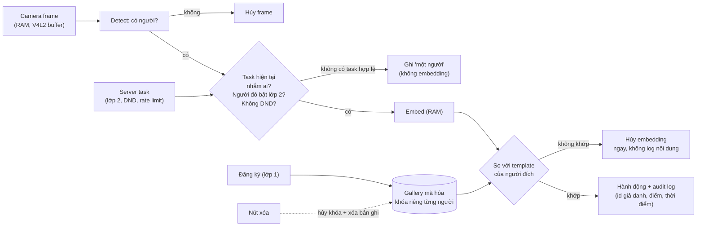
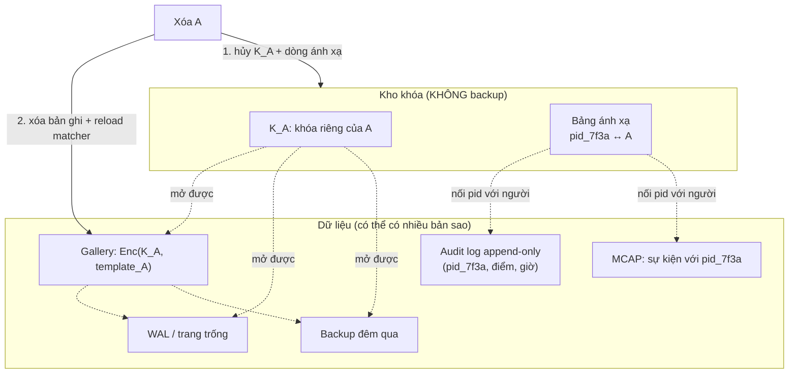
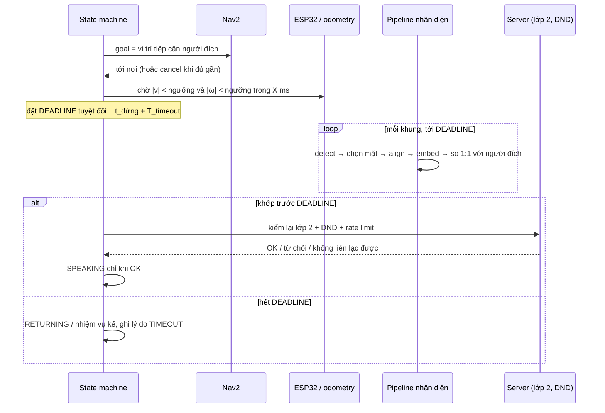
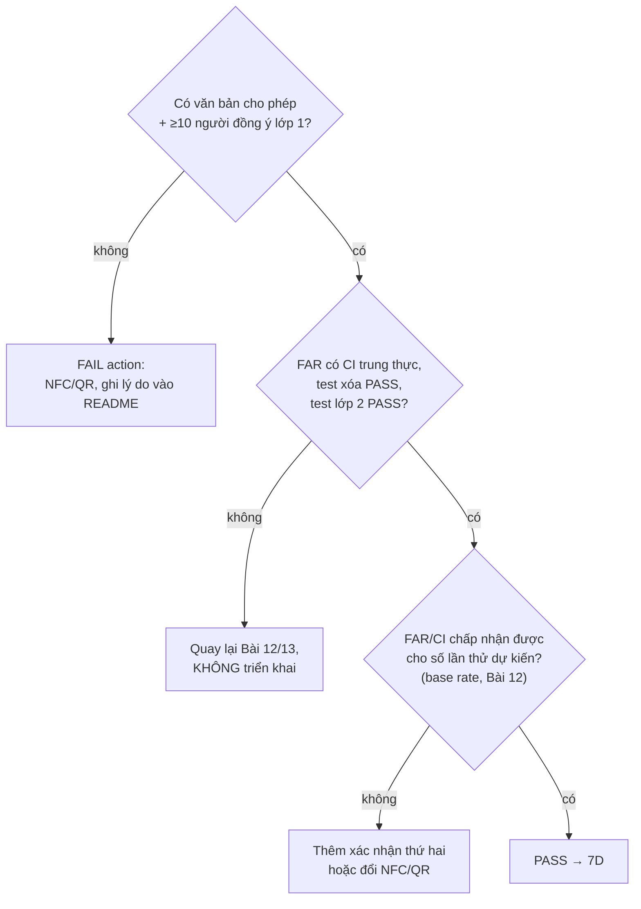

# Khóa 7 — 7C Nhận người on-device, privacy-first · 7D Tích hợp, an toàn, state machine

> Nguồn: `khoa-7-robot-hoan-chinh.md` (7C, 7D), `khoa-7-phu-luc.md` mục A (bắt buộc, gắn vào Bài 11) và mục C (nên làm, thành Bài 17b). Bản Gemini K7 chỉ dùng để gặt ví dụ; lỗi tìm thấy ghi ở phần 11 từng bài.

| Bài | Giờ | Nền cần trước | Quyết định ra được |
|---|---|---|---|
| 11 — Thiết kế quyền riêng tư trước khi viết code (+ phụ lục A) | 10 + 4 | F3.1, F3.8, F2.1 | Hệ thống có được tồn tại không; nếu có thì ranh giới dữ liệu ở đâu |
| 12 — Pipeline nhận diện và đo FAR/FRR | 24 | F1.4, F1.5, F2.1, F2.8 | Ngưỡng nằm ở đâu và vì sao; robot phải dừng trước khi nhận diện không |
| 13 — Đăng ký, xóa dữ liệu, audit log | 12 | F3.1, F3.5, F2.5 | Cơ chế xóa nào thật sự xóa; log nào được giữ bao lâu |
| 14 — Tích hợp nhận diện vào điều hướng | 14 | F1.2, F3.3, F5.3 | Timeout bao nhiêu, chọn ai khi nhiều người |
| Gate 7C | — | — | Giữ nhận diện mặt hay đổi sang NFC/QR |
| 15 — An toàn là một tầng phần cứng | 16 | F5.3, F5.7, F5.8 | Cái gì cắt nguồn motor, và nó độc lập với cái gì |
| 16 — State machine và phân tích chế độ hỏng | 18 | F7.6, F2.4, F2.5 | Dòng FMEA nào phải sửa trước |
| 17 — Soak 72 giờ trong văn phòng thật | 16 người + 72 treo máy | F7.6, F7.4, F1.4 | Robot đủ tin cậy để chạy không người trông chưa |
| 17b — HRI đo được (phụ lục C, nên làm) | 16 | F1.4, F1.5 | Cấu hình tốc độ/khoảng cách nào, và dữ liệu có đủ để chọn không |
| Gate 7D | — | — | Sang 7E hay quay lại sửa an toàn |

**Một chỉnh sửa pháp lý áp cho cả 7C.** Bản gốc viết theo **Nghị định 13/2023/NĐ-CP** (ban hành 17/4/2023, hiệu lực 1/7/2023). Từ **1/1/2026**, khung pháp lý đã đổi: **Luật Bảo vệ dữ liệu cá nhân số 91/2025/QH15** (Quốc hội thông qua 26/6/2025) và **Nghị định 356/2025/NĐ-CP** (ngày 31/12/2025) quy định chi tiết luật này, **thay thế Nghị định 13/2023** `[spec — theo phân tích của PwC, EY, VCCI; tự đối chiếu văn bản gốc trên Cổng thông tin văn bản pháp luật trước khi trích điều khoản]`. Dữ liệu sinh trắc dùng để nhận dạng vẫn thuộc **dữ liệu cá nhân nhạy cảm**, và xử lý nó đòi **đánh giá tác động xử lý dữ liệu** `[spec — như trên]`. Trong bài này, mọi chỗ bản gốc ghi "Nghị định 13/2023" được hiểu là "Luật 91/2025 + Nghị định 356/2025". README của bạn nên ghi cả hai: "thiết kế từ thời Nghị định 13, rà lại theo Luật 91/2025". Chính việc ghi như vậy cho người đọc thấy bạn theo dõi luật đã đổi.

---

# 7C — NHẬN NGƯỜI ON-DEVICE, PRIVACY-FIRST (60h + 4h phụ lục A)

**Mua đợt này** (giữ nguyên bản gốc): có thể 0đ. Thử **OpenVINO trên iGPU** của chính N100 trước (→ K4 Bài 11). Chỉ mua Coral USB hoặc module Hailo M.2 (~1.5–3tr `[ước lượng — giá tự kiểm]`, kiểm khe M.2 còn trống) **sau khi Bài 12 chứng minh là cần**.

---

## Bài 11 — Thiết kế quyền riêng tư trước khi viết dòng code nào (10h + 4h phụ lục A = 14h)

> **Vị trí:** Gate 7B → **Bài 11** → Bài 12 · **Cần trước:** K3 Bài 15 (moderation queue, kill switch), → F3.1 (log append-only), → F3.8 (lineage), → F2.1 (test là một phép đo) · **Sau bài này bạn quyết định được:** hệ thống nhận người này có được phép tồn tại không; nếu có, dữ liệu nào được sinh ra, ở đâu, sống bao lâu, ai được kích hoạt việc xử lý — hoặc kích hoạt FAIL action (đổi sang NFC/QR) có lý do.

### 1. Câu chuyện — ai đã khổ vì chuyện này

Tháng 11/2021, Meta (Facebook) tắt hệ thống nhận diện khuôn mặt trên Facebook và tuyên bố xóa **hơn một tỷ** template khuôn mặt `[chuẩn — thông báo chính thức của Meta, 11/2021]`. Trước đó mấy tháng, họ đã chấp nhận dàn xếp **650 triệu USD** trong vụ kiện tập thể theo luật BIPA của bang Illinois, luật đòi đồng ý bằng văn bản trước khi thu sinh trắc `[chuẩn — báo chí, phán quyết duyệt dàn xếp 2/2021]`. Bài học không nằm ở con số. Nó nằm ở thứ tự: **xây trước, nghĩ về quyền sau**, rồi trả tiền để gỡ. Một hệ thống sinh trắc khi đã chạy thì mỗi bản sao dữ liệu là một món nợ: backup, log, cache, tập test, model đã fine-tune.

Câu chuyện thứ hai là của chính dự án này (phụ lục A). V1 ở Khóa 3 là cái loa cố định đọc confession **ẩn danh**. Phiên bản Khóa 7 là robot **tự tìm đến một người được nhắc tên** và phát nội dung về họ trước mặt đồng nghiệp. Người nhận không chọn thời điểm, không chọn khán giả, và không rời đi được vì robot đi theo. Hai review bên ngoài đều mô tả kỹ cách làm nó chạy, không review nào hỏi nó **có nên** chạy không. Câu hỏi của bài là câu hỏi đó, và nó phải được trả lời **trước** dòng code đầu tiên, vì thiết kế dữ liệu quyết định code chứ không ngược lại.

### 2. Mô hình tư duy

Privacy by design không phải một danh sách thủ tục. Nó là **bản kiểm kê dữ liệu cộng vòng đời cộng cổng kích hoạt**: mỗi byte nhận dạng được sinh ra ở đâu, chảy qua đâu, ai mở cổng cho nó chảy, và nó chết lúc nào.



Bốn ý cốt lõi:

1. **Tối thiểu hóa ở nguồn, không phải lọc ở đích.** Dữ liệu không sinh ra thì không phải xóa, không rò, không phải giải thích. Ràng buộc 2 của bản gốc (người lạ chỉ là "một người") là đúng tinh thần này. Hình trên đẩy nó thêm một bước: **chỉ embed khi có task hợp lệ nhắm tới một người đã bật lớp 2**. Không có task thì không embed ai cả.
2. **Đồng ý là trạng thái có thể thu hồi giữa chừng**, không phải chữ ký một lần. Mọi cổng phải đọc trạng thái hiện tại, kể cả khi robot đang trên đường.
3. **Mặc định là tắt** (privacy by default — GDPR Điều 25(2) gọi đúng tên này `[spec — GDPR Art. 25]`). Lớp 2 mặc định TẮT không phải sự khiêm tốn, mà là điều kiện để "đồng ý" có nghĩa.
4. **Một bản sao không được kiểm kê là một bản sao không xóa được.** Bài 13 sẽ biến bản kiểm kê thành test.

**Hai lớp đồng ý (phụ lục A, bắt buộc):**

| Lớp | Đồng ý cái gì | Mặc định | Rút lại thế nào | Thực thi ở đâu |
|---|---|---|---|---|
| **1 — Sinh trắc** | Lưu template khuôn mặt để nhận diện | Không có (chưa đăng ký) | Nút xóa dữ liệu (Bài 13) | Gallery trên robot |
| **2 — Nhận tin** | Robot được tìm đến tôi và phát nội dung | **TẮT** | Bật/tắt bất cứ lúc nào | **Server tạo task** — robot không bao giờ nhận task nhắm tới người chưa bật |
| (đề xuất thêm) **3 — Dữ liệu đánh giá** | Giữ ảnh tập kiểm tra để đo lại FAR/FRR (Bài 12, 7E Bài 21) | Không | Xóa theo hạn ghi sẵn, hoặc khi người đó yêu cầu | Kho tách riêng, có ngày hết hạn |

Cộng ba cơ chế: **không làm phiền** (một chạm, có thời hạn, robot bỏ mọi task nhắm vào người đó), **giới hạn tần suất** (tối đa N tin/người nhận/ngày), **rời đi khi bị từ chối** (người nhận nói "không" hoặc bấm nút → robot dừng phát và đi, không hỏi lại).

Lớp 3 là đề xuất của giáo trình, không có trong bản gốc. Lý do ở phần 11: bản gốc đòi vừa "không lưu ảnh thô sau đăng ký" vừa "giữ tập kiểm tra riêng" để đo lại sau quantization, và hai điều này mâu thuẫn nếu không có một cơ sở đồng ý riêng cho ảnh đánh giá.

### 3. Cầu nối từ backend

| Backend bạn biết | Ở đây | Gãy ở chỗ | Nếu dùng nhầm thì |
|---|---|---|---|
| Kiểm quyền ở API gateway, không tin client | Lớp 2 kiểm ở **server tạo task**, robot không tự quyết | Quyền ở đây thu hồi được **giữa lúc task đang chạy**. Giống JWT không thu hồi được tới khi hết hạn: kiểm một lần lúc tạo task là không đủ | Người bật DND lúc robot cách 2 m vẫn bị đọc tin, vì robot mang theo "token" cũ |
| Soft delete (`deleted_at`) | Xóa sinh trắc | Soft delete là giữ nguyên dữ liệu nhạy cảm, chỉ giấu khỏi query | Vi phạm quyền xóa của chủ thể dữ liệu. Test "không còn nhận diện được" vẫn PASS, nên lỗi không ai thấy |
| Rate limit theo API key / người gọi | Giới hạn tần suất theo **người nhận** | Tác hại rơi vào người bị nhắm, không phải người gửi. Mười người gửi, mỗi người một tin, vẫn là mười lần một người bị robot tìm đến | Rate limit theo người gửi để lọt đúng kịch bản quấy rối tập thể |
| Feature flag mặc định tắt | Lớp 2 mặc định tắt | Flag do operator bật. Lớp 2 chỉ chủ thể được bật; operator bật hộ là vô hiệu | "Bật sẵn cho mọi người cho tiện test" là đúng hành vi phá thiết kế |
| Threat model STRIDE | Privacy threat model (LINDDUN: linking, identifying, non-repudiation, detecting, data disclosure, unawareness, non-compliance) `[chuẩn]` | STRIDE hỏi "kẻ tấn công làm gì". LINDDUN hỏi thêm "**chính hệ thống hoạt động đúng thiết kế** gây hại gì" | Hệ thống không bị hack nào vẫn gây hại: robot đúng người, đúng tin, sai bối cảnh |

**Tên chuẩn của thứ bạn đã làm:** pipeline agent tự chạy → test → báo cáo của bạn đã có "audit trail". Thứ còn thiếu là **retention policy cho chính audit trail** và câu hỏi "audit log có chứa dữ liệu cá nhân không" — với hệ sinh trắc, câu trả lời luôn là có.

**Chấm mô hình:**

- *"Chỉ lưu embedding, không lưu ảnh, thì dữ liệu không còn là sinh trắc / gần như ẩn danh."* — **SAI.** Embedding khuôn mặt là **template sinh trắc**: nó tồn tại đúng để nhận dạng duy nhất một người, nên nó vẫn là dữ liệu nhạy cảm. "Khó đảo ngược hơn ảnh" (lý do bản gốc ghi cho ràng buộc 3) chỉ đúng một phần: đã có công trình dựng lại ảnh mặt nhận ra được từ template sâu (Mai, Cao, Yuen, Jain, *On the Reconstruction of Face Images from Deep Face Templates*, IEEE TPAMI 2019) `[chuẩn]`. **Phản ví dụ:** không cần đảo ngược. Ai lấy được gallery chỉ cần tính embedding của ảnh đại diện công khai trên mạng xã hội rồi so cosine là biết template nào của ai. Không lưu ảnh giảm thiệt hại khi rò, chứ không đổi loại dữ liệu.
- *"Có đồng ý bằng văn bản là xong phần pháp lý."* — **ĐÚNG MỘT PHẦN.** Đồng ý là điều kiện cần. Nhưng trong quan hệ lao động, đồng ý khó "tự nguyện" vì lệch quyền lực: hướng dẫn về consent của Ủy ban Bảo vệ Dữ liệu châu Âu (EDPB Guidelines 05/2020) nói thẳng điều này `[spec]`. **Phản ví dụ:** quản lý ký cho phép, gửi form trong group chat của team, chín người ký trong một giờ. Người thứ mười ký vì ngại là người duy nhất không ký. Cách sửa: thu đồng ý qua kênh riêng, không có danh sách ai đã ký hiện công khai, và từ chối không có hệ quả gì.
- *"Moderation queue ở K3 Bài 15 đã xử lý rủi ro quấy rối rồi."* — **ĐÚNG MỘT PHẦN.** Moderation lọc **nội dung**. Rủi ro mới nằm ở **hành vi giao**: nhắm đích danh, công khai, có khuếch đại. **Phản ví dụ:** "Chúc mừng sinh nhật tuổi 40 của chị H!" qua moderation dễ dàng, nhưng được đọc to trước cả phòng cho một người không muốn ai biết tuổi mình.

### 4. Thuật ngữ

| Mức | Thuật ngữ | Nghĩa trong một câu | Hay bị hiểu nhầm thành |
|---|---|---|---|
| 🟢 | Privacy by design / by default | Bảo vệ dữ liệu là thuộc tính của kiến trúc; cấu hình mặc định là cấu hình ít thu thập nhất | Một trang chính sách viết sau khi code xong |
| 🟢 | Tối thiểu hóa dữ liệu (data minimisation) | Chỉ sinh ra và giữ dữ liệu cần cho mục đích đã nêu | Mã hóa thật mạnh rồi giữ hết |
| 🟢 | Giới hạn mục đích (purpose limitation) | Dữ liệu thu cho mục đích A không dùng cho B nếu chưa có cơ sở mới | "Đằng nào cũng có rồi, train thêm model luôn" |
| 🟢 | Template sinh trắc / embedding | Vector đặc trưng dùng để so khớp danh tính | Dữ liệu ẩn danh |
| 🟢 | Giả danh hóa vs ẩn danh hóa | Giả danh: thay tên bằng id, vẫn nối lại được nếu có bảng ánh xạ. Ẩn danh: không nối lại được | Hash email là ẩn danh (nó chỉ là giả danh) |
| 🟢 | Đồng ý tách lớp (granular consent) | Mỗi mục đích một đồng ý riêng, rút riêng được | Một checkbox "tôi đồng ý mọi điều khoản" |
| 🟡 | Đánh giá tác động xử lý dữ liệu (DPIA) | Hồ sơ phân tích rủi ro trước khi xử lý dữ liệu nhạy cảm | Thủ tục làm sau khi ra mắt |
| 🟡 | Crypto-shredding | Mã hóa mỗi chủ thể bằng một khóa riêng; xóa khóa = xóa dữ liệu ở mọi bản sao | Xóa file mã hóa |
| 🟡 | Bên kiểm soát / bên xử lý dữ liệu | Ai quyết định mục đích, ai chỉ xử lý theo lệnh | Không liên quan dự án cá nhân (bạn đang là bên kiểm soát) |
| 🔴 | Chi tiết thủ tục nộp hồ sơ DPIA cho cơ quan quản lý | Hỏi pháp chế công ty khi cần | — |

### 5. Dự đoán

Viết trước khi mở bất kỳ tài liệu pháp lý nào và trước khi viết `PRIVACY.md`:

1. **Kiểm kê:** liệt kê mọi nơi mà khuôn mặt, embedding, tên hoặc id của **một** người đã đăng ký có thể tồn tại trong toàn hệ thống (robot, server ở nhà, laptop dev, CI) sau 30 ngày vận hành. Đếm. Gợi ý cách nghĩ: lần theo một frame từ cảm biến tới mọi đích, gồm cả những đích bạn không chủ động ghi (bộ đệm hệ điều hành, swap, core dump, log stdout, backup).
2. **Kiểm được tới đâu:** với mỗi ràng buộc trong bảy ràng buộc, phân loại: *test tự động được* / *chỉ kiểm bằng review hoặc kiểm tra thủ công* / *không kiểm được, chỉ giảm được rủi ro*.
3. **Ba test của phụ lục A:** đoán test nào khó viết nhất và vì sao (người chưa bật lớp 2; bật DND khi robot cách 2 m; vượt giới hạn tần suất).
4. **Câu hỏi của quản lý:** đoán ba câu đầu tiên quản lý sẽ hỏi khi bạn xin phép lần hai.

```markdown
# prediction.md — Bài 11
- Ngày, commit:
- Số nơi dữ liệu của một người có thể tồn tại: N = __ ; danh sách:
- Phân loại 7 ràng buộc (auto / review / không kiểm được):
- Test khó nhất trong 3 test lớp 2, vì sao:
- 3 câu quản lý sẽ hỏi:
- Tôi sẽ đổi sang NFC/QR nếu: (điều kiện cụ thể)
```

### 6. Làm

**Phần A — tài liệu thiết kế (bản gốc, 10h).**

1. Viết `PRIVACY.md` với bảy ràng buộc, mỗi ràng buộc kèm **cơ chế kỹ thuật thực thi** và **test chứng minh**. Dùng bảng dưới làm khung, sửa theo thiết kế của bạn:

| # | Ràng buộc (bản gốc) | Cơ chế đề xuất | Test | Chỗ dễ gãy |
|---|---|---|---|---|
| 1 | Chỉ nhận diện người đã opt-in, có đồng ý bằng văn bản | Gallery chỉ nhận bản ghi có `consent_id` hợp lệ | Chèn template không có `consent_id` → bị từ chối | Template "tạm" lúc debug |
| 2 | Người chưa đăng ký chỉ là "một người" | Không embed khi không có task hợp lệ; embedding không khớp bị hủy trong RAM | Chạy pipeline với 100 khuôn mặt lạ, đếm byte ghi xuống đĩa và nội dung log | Log debug in vector; core dump; swap |
| 3 | Không lưu ảnh thô sau đăng ký | Ảnh chỉ sống trong RAM của tiến trình đăng ký | Quét thư mục dữ liệu và tìm file ảnh sau 50 lần đăng ký | Thư mục tạm của web framework khi upload |
| 4 | Embedding local, mã hóa, không lên cloud | Mã hóa theo từng người (khóa riêng), khóa chủ trong file quyền 600 hoặc TPM | Grep egress, kiểm cấu hình sync/backup | Script backup của 7A/K5 tự đẩy cả thư mục lên server |
| 5 | Nút xóa hoạt động thật, có test tự động | Xóa khóa của người đó + xóa bản ghi + reload matcher | Bài 13 | Backup, WAL, MCAP |
| 6 | Log mọi sự kiện nhận diện và việc ai xem log | Audit log append-only, id giả danh | Đọc log qua công cụ chính thức → có dòng "ai đọc" | Đọc thẳng file bằng `cat` thì không ai ghi lại |
| 7 | Dấu hiệu vật lý khi camera hoạt động | LED trên **đường nguồn đã đóng ngắt** của camera (Bài 13) | Đo: LED sáng ⇔ camera có điện | Camera dùng chung cho định vị marker (7B) thì luôn có điện |

2. Soạn mẫu đồng ý bằng tiếng Việt: thu gì, để làm gì, lưu ở đâu, bao lâu, cách rút lại. **Ba mẫu tách rời** cho lớp 1, lớp 2, lớp 3 (nếu dùng). Ghi rõ: "từ chối không ảnh hưởng gì tới công việc của bạn".
3. Thiết kế luồng đăng ký: ai chạy, ở đâu, xác nhận thế nào. Người đăng ký phải tự thao tác bước đồng ý, không phải bạn bấm hộ.
4. Thiết kế sơ đồ dữ liệu: vẽ lại hình ở phần 2 theo hệ thống thật của bạn, kèm **bảng kiểm kê** (cột: dữ liệu · nơi ở · định dạng · mã hóa · hạn giữ · cách xóa · test).
5. **Xin phép quản lý lần hai**, bằng văn bản. B2 ở Khóa 3 là cho loa cố định; robot di động có camera là phạm vi khác. Gửi kèm `PRIVACY.md`, mẫu đồng ý, và đoạn mô tả hai lớp đồng ý.
6. Viết một trang **DPIA rút gọn**: mục đích, dữ liệu, rủi ro (dùng bảy nhóm LINDDUN làm checklist), biện pháp, rủi ro còn lại. Không cần đúng biểu mẫu nhà nước; cần đúng tư duy.

**Phần B — hai lớp đồng ý (phụ lục A, 4h).**

7. Trong server task (kế thừa K3 Bài 14–15), thêm ba kiểm tra **ở bước tạo task**: lớp 2 đang bật; người nhận không ở DND; chưa vượt N tin/ngày/người nhận. Task bị từ chối phải có log lý do.
8. Thêm **kiểm tra lại ở robot** ngay trước khi phát (đọc trạng thái lớp 2 + DND mới nhất từ server). Đây là chỗ sửa lỗi "token cũ" ở phần 3. Nếu không liên lạc được server lúc đó: **không phát**.
9. Viết test tự động cho ba kịch bản của phụ lục A. Test "bật DND khi robot cách 2 m" chạy được ở mức server + mock robot ngay bây giờ; bản trên robot thật làm ở Bài 14.
10. Viết đoạn README theo mẫu của phụ lục A (đoạn "Lần lặp đầu, robot tìm đến bất kỳ ai được nhắc tên…").

**Không được bước sang Bài 12 nếu thiếu bất kỳ cái nào trong:** `PRIVACY.md`, mẫu đồng ý, văn bản cho phép của quản lý, ba test lớp 2 PASS ở mức server.

### 7. Số phải ra

<details><summary>🔒 MỞ SAU KHI COMMIT prediction.md</summary>

Bài này không có số đo. Có đầu ra và một bản kiểm kê để so với dự đoán.

**Bản kiểm kê tham chiếu** — một hệ thống điển hình theo kiến trúc Khóa 7 có ít nhất các nơi sau (dự đoán dưới 10 là bỏ sót tầng hệ điều hành và vận hành):

| # | Nơi | Thường bị quên vì |
|---|---|---|
| 1 | Buffer V4L2/driver camera, buffer của OpenCV/GStreamer | Không phải code của bạn |
| 2 | RAM tiến trình nhận diện (frame, embedding) | "Chỉ là RAM" |
| 3 | Swap / zswap | RAM bị đẩy xuống đĩa khi thiếu bộ nhớ |
| 4 | Core dump khi tiến trình crash | Chứa nguyên heap, gồm frame |
| 5 | Gallery DB + file WAL/journal | Bài 13 sẽ cho thấy xóa bản ghi chưa xóa byte |
| 6 | Backup của gallery (script K5/7A) | Chạy tự động, ở máy khác |
| 7 | MCAP trên robot và trên server | Topic debug có ảnh hoặc embedding |
| 8 | Audit log | Chứa id + thời điểm + vị trí = lịch di chuyển của một người |
| 9 | Log stdout/journald | `print(embedding)` khi debug |
| 10 | Thư mục tạm của web đăng ký | Framework lưu file upload ra đĩa trước khi trao cho code |
| 11 | Tập kiểm tra Bài 12 | Mâu thuẫn với ràng buộc 3 nếu không có lớp 3 |
| 12 | Model đã fine-tune ở 7E Bài 21 | Trọng số "nhớ" dữ liệu huấn luyện; không xóa được một người khỏi trọng số |
| 13 | Laptop dev, notebook phân tích, ảnh chụp màn hình dashboard | Ngoài robot |

**Phân loại ràng buộc thường gặp:** 1, 3, 5 test tự động được; 2 test được một phần (đếm byte ghi xuống, đọc log, nhưng không chứng minh được "không có nhánh code nào ghi"); 4 và 6 chủ yếu là review cấu hình + test mẫu; 7 kiểm bằng phép đo điện. Không ràng buộc nào được chứng minh tuyệt đối bằng test — đúng bản chất của bài toán oracle (→ F2.1): test chỉ chứng minh sự có mặt của lỗi.

**Test khó nhất** thường là DND giữa chừng, vì nó là bài toán **thu hồi trong hệ phân tán**: trạng thái đổi ở server trong khi robot đang thực thi, và robot có thể mất WiFi đúng lúc đó (dòng FMEA "mất WiFi" ở Bài 16 đang cho phép "chạy tiếp"). Bước 8 ("không liên lạc được thì không phát") là cách đóng lỗ hổng này.

**Đầu ra bắt buộc:** `PRIVACY.md` (7 ràng buộc, cơ chế, test) · mẫu đồng ý tách lớp · văn bản cho phép của quản lý · DPIA một trang · ba test lớp 2 PASS ở server · đoạn README.
</details>

### 8. Nếu ra khác

| Triệu chứng | Nguyên nhân khả dĩ | Kiểm bằng cách | Sửa |
|---|---|---|---|
| Quản lý không trả lời hoặc trả lời miệng | Phạm vi chưa rõ, sợ trách nhiệm | Hỏi lại: "anh/chị cần thêm thông tin gì để trả lời bằng văn bản" | Không có văn bản thì **kích hoạt FAIL action của Gate 7C** (NFC/QR). Không chạy "tạm" |
| Dưới 10 người tình nguyện | Ngại, không thấy lợi ích, sợ bị đánh giá | Hỏi ẩn danh lý do | Không ép. Đổi sang NFC/QR. Không đủ người là một kết quả, ghi vào README |
| Không viết được test cho một ràng buộc | Ràng buộc là thuộc tính âm ("không bao giờ ghi X") | Hỏi: có thể đo **một hệ quả** của nó không (số byte ghi, egress mạng) | Ghi rõ "kiểm bằng review + đo gián tiếp", đừng giả vờ có test |
| Thiết kế đòi camera định vị (7B) cũng là camera nhận mặt | Một camera cho hai mục đích | Liệt kê mục đích của từng luồng ảnh | Tách camera, hoặc chấp nhận LED chỉ báo "camera có điện" luôn sáng và thêm LED thứ hai "nhận diện đang chạy" (yếu hơn vì phần mềm điều khiển) — ghi đánh đổi vào `decisions.md` |
| Test lớp 2 PASS ở server nhưng robot vẫn nhận task cũ | Task đã nằm trong hàng đợi trên robot trước khi người dùng tắt | Tạo task, tắt lớp 2, xem robot có kiểm lại không | Bước 8: kiểm lại ngay trước khi phát |

### 9. Câu hỏi ngược

1. **[Failure mode]** Robot đang trên đường tới người A thì mất WiFi. A bấm DND trên điện thoại. Dòng FMEA "mất WiFi → chạy tiếp, buffer local" của Bài 16 và cơ chế DND ở bài này mâu thuẫn ở đâu, và bên nào phải thắng?
   <details><summary>Hướng nghĩ</summary>Đây là chọn giữa availability và consistency khi mạng chia cắt (CAP), áp vào một quyền chứ không phải một số dư. Khi không biết trạng thái đồng ý mới nhất, hành động nào có thể đảo ngược và hành động nào không? Đọc tin cho người không muốn nghe thì không rollback được.</details>
2. **[Quy mô]** Ở 100 robot trong 10 văn phòng, mỗi robot giữ gallery local. Một người bấm "xóa dữ liệu của tôi". Cái gì gãy trước: thời gian lan truyền lệnh xóa, robot đang offline, hay backup? Bạn hứa với người dùng thời hạn xóa bao lâu, và đo nó bằng gì?
   <details><summary>Hướng nghĩ</summary>Lệnh xóa là một sự kiện phải tới mọi bản sao, kể cả bản sao đang offline: giống tombstone trong DB phân tán. Thời hạn xóa thực chất là một SLO (→ F7.4) cần đo phân bố, không phải trung bình. Crypto-shredding thay đổi bài toán thế nào khi khóa chỉ nằm ở một chỗ?</details>
3. **[Phản biện]** Lớp 2 mặc định TẮT nghĩa là hầu hết đồng nghiệp sẽ không bao giờ nhận được tin, và robot gần như vô dụng. Đây là thiết kế giết sản phẩm hay là thứ làm sản phẩm tồn tại được?
   <details><summary>Hướng nghĩ</summary>So tỉ lệ bật lớp 2 bạn đoán với tỉ lệ bạn đo được sau một tháng. Nếu rất thấp, đó là tín hiệu về giá trị sản phẩm, không phải về cơ chế đồng ý. Phụ lục A gọi đây là "đánh đổi có chủ đích": giao ít tin hơn.</details>
4. **[Vì sao không]** Vì sao không mặc định dùng NFC/QR (FAIL action) ngay từ đầu, khi nó tránh gần hết rủi ro sinh trắc?
   <details><summary>Hướng nghĩ</summary>Liệt kê rủi ro mà NFC/QR **không** tránh được (vẫn nhắm đích danh, vẫn công khai). Rồi liệt kê thứ NFC/QR làm mất (bài đo FAR/FRR, câu chuyện portfolio). Một quyết định kỹ thuật tốt có thể là "làm cả hai, bật mặt chỉ khi đủ điều kiện".</details>
5. **[Liên ngành]** Thử nghiệm lâm sàng cho phép người tham gia rút lui bất cứ lúc nào, nhưng dữ liệu đã đưa vào phân tích trước thời điểm rút thường được giữ. Điều này tương ứng với gì ở robot của bạn (model đã fine-tune, báo cáo FAR đã công bố)?
   <details><summary>Hướng nghĩ</summary>Có thứ xóa được (template, ảnh), có thứ chỉ ngừng được (dùng tiếp trong tương lai), có thứ không gỡ được (con số trong bài viết đã đăng, trọng số model). Mẫu đồng ý phải nói trước thứ nào thuộc loại nào.</details>

### 10. Liên kết ra ngoài

- **Y sinh — đồng ý có hiểu biết (informed consent) và hội đồng đạo đức (IRB).** Giống: đồng ý phải cụ thể, tự nguyện, rút được, và người nghiên cứu không được tự phê duyệt cho mình. Khác: nghiên cứu y sinh có hội đồng độc lập duyệt trước; dự án của bạn chỉ có quản lý, người cũng có lợi ích trong dự án. Bài học mang về: tìm một người **không** có lợi ích để đọc `PRIVACY.md`.
- **Viễn thông — danh sách "không làm phiền" chống cuộc gọi rác.** Giống: người nhận đăng ký một lần, bên gửi bắt buộc tra trước khi gửi, kiểm ở phía gửi chứ không chờ người nhận chặn. Khác: danh sách đó tĩnh và theo ngày; DND của robot phải có hiệu lực **trong vài giây**, khi robot đang di chuyển.
- **Hệ phân tán — tombstone và thu hồi chứng chỉ.** Xóa trong hệ có nhiều bản sao là ghi thêm một sự kiện "đã xóa" rồi chờ nó lan đi (Cassandra tombstone, CRL/OCSP cho chứng chỉ). Khác: tombstone của DB vẫn giữ khóa của bản ghi; với sinh trắc, chính khóa định danh cũng có thể là dữ liệu cá nhân.

### 11. Độ tin cậy và sửa lỗi

| Khẳng định | Nhãn | Ghi chú / cách kiểm |
|---|---|---|
| Nghị định 13/2023 đã được thay bằng Luật 91/2025/QH15 + Nghị định 356/2025/NĐ-CP từ 1/1/2026 | [spec] | Theo phân tích của PwC, EY, VCCI. Đối chiếu văn bản gốc trước khi trích điều |
| Sinh trắc dùng để nhận dạng là dữ liệu nhạy cảm, xử lý cần DPIA | [spec] | Như trên; phạm vi DPIA các bản tóm tắt mô tả hơi khác nhau, kiểm văn bản |
| Meta xóa >1 tỷ template (11/2021); dàn xếp BIPA 650 triệu USD | [chuẩn] | Báo chí và thông báo của Meta |
| Template sâu có thể dựng lại ảnh mặt | [chuẩn] | Mai et al., IEEE TPAMI 2019 |
| GDPR Điều 25 (by design/by default), Điều 9 (dữ liệu đặc biệt), Điều 17 (xóa), Điều 35 (DPIA) | [spec] | Văn bản GDPR; dùng làm tham chiếu tư duy, không phải luật áp dụng ở Việt Nam |
| Đồng ý của người lao động khó coi là tự nguyện | [spec] | EDPB Guidelines 05/2020 on consent |

**Đã sửa so với bản gốc/Gemini:**
- Bản gốc và Gemini dùng Nghị định 13/2023 như luật hiện hành → cập nhật theo Luật 91/2025 + Nghị định 356/2025.
- Ràng buộc 3 ghi lý do "embedding khó đảo ngược hơn ảnh" như thể embedding an toàn → làm rõ embedding vẫn là dữ liệu sinh trắc nhạy cảm (chấm SAI ở phần 3).
- Bản gốc vừa đòi không lưu ảnh thô vừa đòi giữ tập kiểm tra riêng (Bài 12) → thêm lớp đồng ý 3 cho dữ liệu đánh giá, có hạn xóa.
- Bản gốc chỉ kiểm lớp 2 ở server lúc tạo task → thêm kiểm lại ở robot ngay trước khi phát, và "không liên lạc được thì không phát".
- Ràng buộc 7 không tính tới việc camera định vị (7B) có thể là cùng camera → nêu đánh đổi.
- Gemini mô tả nút xóa có thể là "nút bấm vật lý" xóa trong một click: nút vật lý trên robot không xác thực được ai bấm → ai cũng xóa được dữ liệu của người khác. Giữ nút xóa ở giao diện có xác thực.

### 12. Đọc thêm và tự kiểm tra

- **Nguồn gốc:** Luật Bảo vệ dữ liệu cá nhân số 91/2025/QH15 và Nghị định 356/2025/NĐ-CP (đọc phần định nghĩa dữ liệu nhạy cảm, đồng ý, quyền xóa, đánh giá tác động). GDPR Điều 5, 9, 17, 25, 35 để so.
- **Giải thích:** Ann Cavoukian, *Privacy by Design: The 7 Foundational Principles*.
- **Đào sâu (tùy chọn):** LINDDUN privacy threat modeling (nhóm DistriNet, KU Leuven).
- **Tự kiểm tra:** (1) giải thích cho một backend engineer khác trong 5 câu vì sao lớp 2 phải kiểm ở server **và** ở robot; (2) vẽ lại sơ đồ luồng dữ liệu ở phần 2 từ trí nhớ; (3) hai câu dưới.

  a. Một đồng nghiệp đề xuất: "lưu hash SHA-256 của embedding thay vì embedding cho an toàn". Có dùng được để nhận diện không?
  <details><summary>Đáp án</summary>Không. Hai ảnh cùng một người cho hai embedding khác nhau chút ít; hash biến chênh lệch nhỏ thành hai chuỗi hoàn toàn khác, nên không so được độ tương tự. Hash dùng được cho so khớp chính xác (mật khẩu), không cho so khớp gần đúng. Bảo vệ template là một lĩnh vực riêng (cancelable biometrics, mã hóa đồng cấu), 🔴 với bạn.</details>

  b. Vì sao "người chưa đăng ký chỉ là một người" là tối thiểu hóa dữ liệu ở nguồn, còn "embed mọi người rồi xóa nếu không khớp" thì yếu hơn?
  <details><summary>Đáp án</summary>Vì cách thứ hai vẫn **sinh ra** dữ liệu sinh trắc của người không đồng ý, dù trong thời gian ngắn, và mọi lỗi (log debug, core dump, swap) đều biến khoảnh khắc đó thành bản lưu. Cách tốt hơn nữa: chỉ embed khi có task hợp lệ nhắm tới một người đã bật lớp 2.</details>

---

## Bài 12 — Pipeline nhận diện và đo FAR/FRR (24h)

> **Vị trí:** Bài 11 → **Bài 12** → Bài 13 · **Cần trước:** → F1.4 (khoảng tin cậy cho tỉ lệ, Wilson, rule of three), → F1.5 (power, cỡ mẫu), → F2.1 (test có dương tính giả/âm tính giả), → F2.8 (tập giữ kín), → F1.3 (benchmark đúng cách), K4 Bài 8 (quantization), K4 Bài 11 (N100 + OpenVINO), K6 Bài 12 (bao nhiêu episode là đủ) · **Sau bài này bạn quyết định được:** ngưỡng nhận diện đặt ở đâu và viết được lý do bằng số; robot có phải dừng hẳn rồi mới nhận diện không; dùng precision nào trên thiết bị nào.

### 1. Câu chuyện — ai đã khổ vì chuyện này

Tháng 1/2020, cảnh sát Detroit bắt Robert Williams trước mặt vợ con vì một hệ thống nhận diện khuôn mặt đã "khớp" ảnh camera cửa hàng với ảnh bằng lái của anh. Người trong ảnh không phải anh. Đây là vụ bắt sai do nhận diện khuôn mặt đầu tiên được công bố rộng rãi ở Mỹ `[chuẩn — báo chí 6/2020, sau đó là vụ kiện dân sự]`. Cơ chế gây lỗi không bí ẩn: một ảnh mờ được tìm **1:N** trên một gallery hàng triệu người. Ngưỡng nào chặt mấy đi nữa, khi N đủ lớn thì gần như chắc chắn sẽ có ai đó vượt ngưỡng. Hệ thống trả ra "ứng viên giống nhất", và con người đọc nó như "kết quả".

Cùng thời gian đó, NIST công bố báo cáo NISTIR 8280 về hiệu ứng nhân khẩu học trong nhận diện khuôn mặt: với nhiều thuật toán, tỉ lệ dương tính giả chênh nhau **từ 10 đến 100 lần** giữa các nhóm dân số `[chuẩn — NISTIR 8280, 12/2019]`. Một con số FAR chung là trung bình che đi những nhóm tệ nhất. Hai bài học dẫn thẳng tới bài này: **FAR phụ thuộc vào cách bạn tìm (1:1 hay 1:N, N bao nhiêu)**, và **một con số trung bình không nói gì về người chịu thiệt nhiều nhất**.

### 2. Mô hình tư duy

Pipeline bốn bước: **detect → align → embed → match**. Ba bước đầu dùng model có sẵn; giá trị của bạn nằm ở bước bốn và ở việc **đo**.

```
 số lượng
   │   impostor                         genuine
   │    (khác người)                     (cùng người)
   │   ▄▄█▄▄                               ▄▄█▄▄
   │ ▄███████▄                           ▄███████▄
   │▄█████████▄                 ▄       ▄█████████▄
   ├───────────────────────────┃──────────────────────▶ cosine
   │                         ngưỡng t
   │        phần đuôi impostor ở phải t  = FAR
   │        phần đuôi genuine ở trái t   = FRR
```

Ba ý cốt lõi:

1. **FAR và FRR là diện tích hai cái đuôi.** Dời ngưỡng sang phải đổi FAR lấy FRR. Không có ngưỡng "đúng" — chỉ có ngưỡng đúng **với một bảng chi phí**. Ở đây nhận nhầm (đọc confession của A cho B nghe) đắt hơn nhiều so với không nhận ra (đứng lại một lát), nên ngưỡng nằm ở phía chặt. Đánh đổi này ghi vào `decisions.md` bằng lời.
2. **Cosine không phải xác suất** (phụ lục §3a). Nó là độ tương tự trong [−1, 1], không hiệu chuẩn. "Ngưỡng 0.95" và "95% chắc đúng người" là hai phát biểu khác hẳn. Báo cáo **ngưỡng + cặp FAR/FRR tại ngưỡng đó**, không báo cáo "độ chính xác %".
3. **Cái đuôi bạn quan tâm là vùng bạn có ít dữ liệu nhất.** Điểm vận hành nằm ở FAR rất thấp, nơi tập test của bạn có 0 hoặc 1 lỗi. Vì vậy đường **DET** (FAR và FRR vẽ trên thang probit/log) hữu ích hơn ROC tuyến tính, và mọi con số ở đó phải đi kèm khoảng tin cậy.

**1:1 hay 1:N — câu hỏi thiết kế bản gốc chưa tách.** Nếu robot đi tìm người đích A và chỉ hỏi "đây có phải A không?" (verification 1:1), xác suất nhận nhầm một người lạ thành A là FMR tại ngưỡng, **không** tăng theo kích thước gallery. Nếu robot hỏi "đây là ai trong gallery?" (identification 1:N), xác suất có ít nhất một template vượt ngưỡng xấp xỉ:

$$\text{FPIR}(N) \approx 1 - (1 - \text{FMR})^{N}$$

(giả định các so sánh độc lập — giả định này lạc quan khi gallery có người giống nhau). Thiết kế ở Bài 11 (chỉ embed khi có task, so với người đích) là 1:1, vừa ít dữ liệu hơn vừa không phình FAR theo N. Cái phình theo số lượng là **số khuôn mặt bạn kiểm trong một task** — mỗi khuôn mặt là một lần thử.

**Base rate.** Số lần nhận nhầm mỗi ngày = (số lần so khớp với người không phải đích mỗi ngày) × FMR. Một FMR nhìn rất nhỏ nhân với một văn phòng đông người vẫn có thể ra "vài lần một tuần". Báo cáo cả hai: tỉ lệ, và số sự kiện kỳ vọng trong một tuần vận hành.

Mô phỏng đồ chơi trước khi có camera: điểm genuine/impostor giả, mỗi **cặp danh tính** có độ giống riêng (anh em, cùng kiểu kính), cộng nhiễu từng ảnh.

```python
# [đã chạy] Mô phỏng đồ chơi: phân bố điểm genuine/impostor, FAR/FRR, DET, CI, gallery
import numpy as np, matplotlib
import matplotlib.pyplot as plt
from scipy.stats import beta, norm

rng = np.random.default_rng(7)
P, IMG = 10, 15                      # 10 người, 15 ảnh test mỗi người
# Điểm cosine giả: mỗi CẶP DANH TÍNH có độ giống riêng (anh em, cùng kính...) + nhiễu ảnh
pair_eff = {(i, j): rng.normal(0.05, 0.09) for i in range(P) for j in range(i+1, P)}
imp = np.array([pair_eff[k] + rng.normal(0, 0.05) for k in pair_eff for _ in range(IMG)])
gen = np.clip(rng.normal(0.45, 0.12, P * IMG * 3), -1, 1)

th = np.linspace(-0.2, 1.0, 1201)
FAR = np.array([(imp >= t).mean() for t in th])
FRR = np.array([(gen < t).mean() for t in th])

def cp_upper(k, n, conf=0.95):      # Clopper-Pearson một phía
    return 1.0 if k == n else beta.ppf(conf, k + 1, n - k)

op = th[np.argmax(FAR == 0)]        # ngưỡng thấp nhất cho FAR đo được = 0
k, n = int((imp >= op).sum()), imp.size
print(f"ngưỡng={op:.3f}  FAR={k}/{n}  FRR={(gen < op).mean():.3f}")
print(f"rule of three: {3/n:.4f}   CP một phía 95%: {cp_upper(k, n):.4f}")
print(f"nếu chỉ tính {len(pair_eff)} cặp danh tính độc lập: {cp_upper(0, len(pair_eff)):.4f}")

# Bootstrap theo cụm (cụm = cặp danh tính) cho FAR ở một ngưỡng lỏng hơn
t2 = np.quantile(imp, 0.99)
keys = list(pair_eff); groups = imp.reshape(len(keys), IMG)
naive = np.sqrt(0.01 * 0.99 / n)
boot = [(groups[rng.integers(0, len(keys), len(keys))] >= t2).mean() for _ in range(2000)]
print(f"FAR@t2=0.01  SE ngây thơ={naive:.4f}  SE bootstrap cụm={np.std(boot):.4f}")

for N in (1, 5, 10, 20, 30):        # 1:N, giả định độc lập giữa các template
    print(f"N={N:2d}  FPIR≈{1 - (1 - 1e-3) ** N:.4f}  (FMR 1:1 = 0.1%)")

plt.figure(figsize=(9, 4))
plt.subplot(1, 2, 1)
plt.hist(imp, 60, alpha=.6, label="impostor"); plt.hist(gen, 60, alpha=.6, label="genuine")
plt.axvline(op, c="k", ls="--"); plt.xlabel("cosine"); plt.legend()
plt.subplot(1, 2, 2)                 # DET: trục probit hai phía
m = (FAR > 0) & (FRR > 0) & (FAR < 1) & (FRR < 1)
plt.plot(norm.ppf(FAR[m]), norm.ppf(FRR[m]))
ticks = [1e-3, 1e-2, 0.05, 0.2, 0.5]
plt.xticks(norm.ppf(ticks), ticks); plt.yticks(norm.ppf(ticks), ticks)
plt.xlabel("FAR"); plt.ylabel("FRR"); plt.title("DET")
plt.tight_layout(); plt.show()
```

Trước khi chạy, đoán: ba dòng "rule of three", "CP một phía", "cặp danh tính độc lập" sẽ chênh nhau bao nhiêu lần, và SE bootstrap cụm lớn hơn hay nhỏ hơn SE ngây thơ. Kết quả ở phần 7.

### 3. Cầu nối từ backend

| Backend bạn biết | Ở đây | Gãy ở chỗ | Nếu dùng nhầm thì |
|---|---|---|---|
| Script chấm pass/fail/inconclusive của bạn | Ba vùng: dưới ngưỡng thấp = từ chối, trên ngưỡng cao = chấp nhận, ở giữa = **lấy mẫu lại** | Lấy mẫu lại frame kế tiếp không phải một phép thử độc lập: người đang cúi đầu thì frame sau vẫn cúi đầu (Bài 14) | Tính "3 lần thử thì FRR^3" và hứa latency mà thực tế không đạt |
| Tỉ lệ test pass trên N lần chạy CI | FAR ước lượng trên n cặp | n cặp impostor sinh từ 10 người **không** phải n phép thử độc lập; đơn vị độc lập gần với **cặp danh tính** hơn | Khoảng tin cậy hẹp giả tạo; tuyên bố FAR thấp hơn sự thật cả chục lần |
| "Accuracy 98%" của một classifier | Cặp FAR/FRR | Accuracy trộn hai loại lỗi theo tỉ lệ lớp. Trong văn phòng, gần hết lần so là impostor, nên "accuracy" gần như chỉ đo FAR | Một model trả "không phải A" cho mọi thứ đạt accuracy rất cao và vô dụng |
| Điểm của LLM-judge | Cosine similarity | Cả hai đều là điểm chưa hiệu chuẩn. Muốn đọc như xác suất phải hiệu chuẩn trên dữ liệu giữ kín (Platt, isotonic) | Đặt ngưỡng 0.9 "vì 90% là tốt" |
| Harness benchmark K4 | Latency từng bước pipeline | Quantization đổi **hai trục**: latency và phân bố điểm. Benchmark chỉ đo trục một | Ship cấu hình "nhanh hơn 2 lần" mà FAR tăng gấp nhiều lần |

**Chấm mô hình:**

- *"Ngưỡng cosine 0.95 nghĩa là chắc 95% đúng người."* — **SAI.** Cosine không có nghĩa xác suất. Cùng ngưỡng 0.95, hai model khác nhau cho FAR khác nhau hàng chục lần vì phân bố điểm của chúng khác nhau. **Phản ví dụ:** với nhiều model embedding mặt, cosine 0.95 giữa hai ảnh chụp ở hai buổi khác nhau hiếm khi xảy ra kể cả cho cùng một người, nên ngưỡng đó cho FRR rất cao. Chính bạn sẽ thấy điều này trong histogram genuine của mình `[tự đo]`.
- *"Đo 0/500 cặp không nhận nhầm → FAR < 0.6% ở mức 95%, xong."* — **ĐÚNG MỘT PHẦN.** Rule of three (3/n) đúng cho n phép thử **độc lập**. 500 cặp từ 10 người chỉ có 45 cặp danh tính; các ảnh của cùng một cặp danh tính tương quan mạnh. **Phản ví dụ:** có hai anh em ruột trong nhóm. Hoặc gần như mọi cặp ảnh giữa họ vượt ngưỡng, hoặc gần như không cặp nào. Thêm 1.000 ảnh nữa của mười người đó không làm bạn biết thêm gì về một người thứ mười một giống ai đó trong gallery.
- *"FAR tăng theo kích thước gallery."* (bản gốc) — **ĐÚNG MỘT PHẦN.** Đúng cho identification 1:N. Sai cho verification 1:1 với người đích. **Phản ví dụ:** gallery 30 người, robot chỉ so khuôn mặt trước mặt với template của A. Xác suất nhận nhầm người lạ thành A không phụ thuộc 29 template còn lại. Thí nghiệm "FAR theo kích thước gallery" vẫn đáng làm, nhưng phải ghi rõ đang đo chế độ nào.

### 4. Thuật ngữ

| Mức | Thuật ngữ | Nghĩa trong một câu | Hay bị hiểu nhầm thành |
|---|---|---|---|
| 🟢 | FAR / FRR | Tỉ lệ chấp nhận sai / từ chối sai ở mức **hệ thống** | Hai con số cố định của model |
| 🟡 | FMR / FNMR | Cùng ý nhưng ở mức **thuật toán so khớp**, theo ISO/IEC 19795-1; FAR/FRR còn tính cả lần không chụp được mặt | Từ đồng nghĩa hoàn toàn |
| 🟡 | FPIR / FNIR | Tỉ lệ dương tính giả / âm tính giả khi **tìm 1:N** (thuật ngữ NIST) | FAR của 1:1 |
| 🟢 | Genuine / impostor | Cặp cùng người / cặp khác người | — |
| 🟢 | ROC / DET | ROC: tỉ lệ chấp nhận đúng theo FAR. DET: FRR theo FAR trên thang probit, làm rõ vùng tỉ lệ nhỏ | ROC và DET là hai thứ đo khác nhau (cùng thông tin, khác cách vẽ) |
| 🟡 | EER | Ngưỡng tại đó FAR = FRR | Điểm vận hành nên chọn (hiếm khi đúng khi chi phí lỗi lệch nhau) |
| 🟢 | Điểm vận hành | Ngưỡng đã chọn + cặp FAR/FRR tại đó + lý do | "Ngưỡng tốt nhất" |
| 🟢 | Rule of three | 0 lỗi trong n phép thử độc lập → cận trên 95% xấp xỉ 3/n | Đúng cho mọi n phép đo, kể cả tương quan |
| 🟢 | Base rate fallacy | Quên rằng số dương tính giả tuyệt đối = tỉ lệ × số lần thử | — |
| 🟡 | Cluster bootstrap | Lấy mẫu lại theo **cụm** (người, cặp danh tính) thay vì theo từng cặp ảnh | Bootstrap thường |
| 🟡 | Doddington's zoo | Lỗi tập trung vào vài người: "dê" khó khớp, "cừu non" dễ bị giả, "sói" giả được người khác | Lỗi phân bố đều |
| 🔴 | Huấn luyện model nhận diện từ đầu | Không làm; dùng model có sẵn | — |

### 5. Dự đoán

**Tham số cần tra:**
- Model detect và embed bạn dùng (ví dụ họ model trong InsightFace: SCRFD/RetinaFace cho detect, ArcFace/MobileFaceNet cho embed) — số chiều embedding, kích thước input, giấy phép dùng của trọng số: tra **model card / README của repo model** `[tự đo — kiểm theo phiên bản bạn cài]`.
- Tiêu cự camera theo pixel `f_px` (từ hiệu chuẩn K7 Bài 7) và thời gian phơi sáng ở sáng tốt/sáng yếu (đọc từ V4L2: `v4l2-ctl -d /dev/video0 --list-ctrls`, mục exposure).
- Latency detect/embed trên CPU và iGPU: lấy từ số đo của bạn ở K4 Bài 11 làm điểm tựa.

**Đoán và ghi:**
1. Số cặp genuine và impostor bạn sẽ có: với P người, mỗi người m ảnh test, so mỗi ảnh test với template của mọi người khác → n_imp = P·m·(P−1) (nếu so với template) hoặc C(P·m, 2) trừ cặp cùng người (nếu so mọi cặp ảnh). Số **cặp danh tính** = P(P−1)/2.
2. Nếu FAR đo được là 0 tại điểm vận hành: cận trên 95% theo rule of three với n_imp, và theo số cặp danh tính. Tính cả hai.
3. FRR tại điểm vận hành, điều kiện tốt.
4. FPIR khi N = 5, 10, 20, 30 nếu FMR 1:1 tại ngưỡng của bạn là giá trị bạn vừa đoán ở câu 2.
5. Độ nhòe chuyển động theo pixel khi robot chạy: tịnh tiến `blur ≈ f_px · v · t_exp / Z`, quay `blur ≈ f_px · ω · t_exp`. Với v và ω là tốc độ thật của robot, Z là khoảng cách tới mặt. Cái nào lớn hơn?
6. Tỉ lệ FRR(đang chạy)/FRR(đứng yên), FRR(sáng yếu)/FRR(sáng tốt).
7. Latency p95 toàn pipeline trên CPU và trên iGPU; tốc độ tăng khi INT8; FAR có xấu đi không.
8. Base rate: ước lượng số lần robot so khớp với người không phải đích trong một tuần, nhân với FMR → số lần nhận nhầm kỳ vọng mỗi tuần.

```markdown
# prediction.md — Bài 12
- Model detect/embed + phiên bản + giấy phép:
- P = __ người, m = __ ảnh test/người -> n_gen = __, n_imp = __, cặp danh tính = __
- Nếu FAR = 0/n_imp: cận trên (rule of three) = __ ; theo cặp danh tính = __
- FRR @ điểm vận hành, sáng tốt, đứng yên: __ %
- FPIR(N=5/10/20/30): __ / __ / __ / __
- Nhòe: tịnh tiến __ px, quay __ px  -> nguyên nhân chính khi chạy là: __
- FRR chạy/đứng = __ ; FRR sáng yếu/sáng tốt = __
- Latency p95 CPU __ ms, iGPU __ ms; INT8 nhanh hơn __ lần; FAR INT8 so với FP32: __
- Nhận nhầm kỳ vọng / tuần: __
```

### 6. Làm

**Phần A — dựng gallery và tập kiểm tra.**
1. Đăng ký ≥10 người tình nguyện, có đồng ý lớp 1 (và lớp 3 cho ảnh đánh giá, Bài 11). Mỗi người ≥10 ảnh ở nhiều góc và điều kiện sáng.
2. **Giữ lại tập kiểm tra riêng** — ảnh không dùng để đăng ký. Tách **theo buổi chụp**, không theo ảnh ngẫu nhiên: ảnh đăng ký chụp một ngày, ảnh test chụp ngày khác, ánh sáng khác. Ảnh liền nhau trong một loạt chụp gần như trùng nhau; trộn chúng vào hai phía là rò rỉ dữ liệu (data leakage), FRR đo được sẽ đẹp giả.
3. Tạo template từ ảnh đăng ký (trung bình các embedding đã chuẩn hóa L2, rồi chuẩn hóa lại), **xóa ảnh đăng ký**. Ảnh test lưu ở kho lớp 3, mã hóa, có ngày hết hạn ghi trong `PRIVACY.md`.

**Phần B — đo đường cong.**
4. Tính điểm cho mọi cặp genuine và impostor trên tập test. Quét ngưỡng từ 0 tới 1, bước 0.01 (như bản gốc), **và** thêm các ngưỡng tại phân vị cao của phân bố impostor (vùng đuôi bước 0.01 quá thô). Tính FAR và FRR.
5. Vẽ ROC **và** DET. Đánh dấu điểm vận hành đã chọn. Ghi lý do chọn vào `decisions.md` bằng ngôn ngữ chi phí: "chấp nhận FRR x% để FAR ≤ y%, vì…".
6. **Áp dụng K6 Bài 12 và → F1.4:** báo cáo FAR tại điểm vận hành dưới dạng "k/n, cận trên 95% = …" theo Clopper-Pearson **và** theo bootstrap cụm (cụm = cặp danh tính). Nếu FAR đo được là 0/500 cặp, bạn **không** kết luận được FAR = 0 — bạn kết luận được "FAR < ~0.6% ở mức tin cậy 95% **nếu** 500 cặp độc lập", rồi viết thêm con số theo cặp danh tính. Viết đúng như vậy.
7. Lặp với gallery 5, 10, 20 người. Đo **cả hai chế độ**: 1:1 (so với một người đích chọn ngẫu nhiên) và 1:N (argmax trên gallery, có ngưỡng). Vẽ FAR/FPIR theo kích thước gallery, ngoại suy tới 30 người bằng công thức ở phần 2, ghi rõ giả định độc lập.

**Phần C — điều kiện thật.**
8. Đo lại trong bốn điều kiện: robot đứng yên vs đang chạy (ghi tốc độ thật và tốc độ quay); sáng tốt vs sáng yếu (đo lux bằng app điện thoại — sai số có thể vài chục phần trăm `[tự đo]`, chỉ dùng để phân nhóm); chính diện vs góc 45°; đeo kính/khẩu trang vs không. Chỉ ghi **điểm số** và nhãn điều kiện, không ghi ảnh.
9. Lập bảng FRR theo điều kiện, **mỗi ô kèm n và khoảng Wilson**. Với n = 30 lần thử mỗi ô, khoảng tin cậy rộng; nói rõ ô nào khác nhau có ý nghĩa, ô nào không.
10. Đo thời gian phơi sáng ở từng điều kiện ánh sáng (đọc từ driver) để kiểm dự đoán nhòe ở câu 5.

**Phần D — hiệu năng.**
11. Dùng **harness benchmark của K4**, đổi payload. Warmup, đo ở trạng thái ổn định nhiệt (→ F1.3). Đo p50/p95/p99 của từng bước, RAM peak, nhiệt độ CPU.
12. Thử quantization như K4 Bài 8, trên CPU và iGPU qua OpenVINO `[tự đo — API kiểm theo phiên bản cài]`: đo **cả hai trục** — latency và FAR/FRR trên cùng tập test. Tìm cấu hình "nhanh hơn nhưng hỏng" và ghi lại.

### 7. Số phải ra

<details><summary>🔒 MỞ SAU KHI COMMIT prediction.md</summary>

**Mô phỏng đồ chơi (phần 2)** — với seed trong code:

| Dòng in ra | Giá trị |
|---|---|
| Ngưỡng thấp nhất có FAR = 0 | ≈ 0.269, FAR = 0/675, FRR ≈ 6.9% |
| Rule of three / Clopper-Pearson một phía | ≈ 0.44% / ≈ 0.44% (trùng nhau khi k = 0) |
| Nếu đơn vị độc lập là 45 cặp danh tính | ≈ 6.4% — lớn hơn khoảng 15 lần |
| SE của FAR tại ngưỡng FAR = 1% | ngây thơ ≈ 0.38%, bootstrap cụm ≈ 0.76% — gấp đôi |
| FPIR với FMR 0.1% | N=5: 0.50% · 10: 1.0% · 20: 1.98% · 30: 2.96% |

Con số thật nằm giữa hai cực "675 cặp độc lập" và "45 cặp danh tính độc lập", tùy mức tương quan trong dữ liệu của bạn. Bootstrap cụm ước lượng mức đó từ dữ liệu.

**Thí nghiệm thật** (bản gốc, thêm nhãn):

| Kiểm tra | Kỳ vọng |
|---|---|
| FRR ở điểm vận hành, điều kiện tốt | Vài phần trăm `[ước lượng]` |
| FAR ở điểm vận hành | Rất thấp — **báo cáo kèm khoảng tin cậy, không báo cáo 0**. Với 10 người, cận trên trung thực là **phần trăm**, không phải phần nghìn |
| FAR theo kích thước gallery | 1:N: **tăng**, gần tuyến tính theo N khi FMR nhỏ. 1:1: gần như không đổi trong sai số |
| FRR khi robot đang chạy | **Tệ hơn rõ rệt** |
| FRR trong sáng yếu | Tệ hơn |
| Latency toàn pipeline trên N100 (CPU và iGPU) | Thang **hàng chục tới hàng trăm ms**, tùy model `[tự đo]` |
| Quantization | Nhanh hơn; **có mức làm FAR xấu đi** — tìm ra và ghi lại `[tự đo]` |

**Nhòe chuyển động — vì sao "đang chạy" tệ.** Ví dụ số: f_px ≈ 600, v = 0.3 m/s, t_exp = 10 ms, Z = 1.5 m → tịnh tiến ≈ 1.2 px. Quay ω = 0.5 rad/s → ≈ 3 px. Sáng yếu, t_exp = 33 ms → gấp ~3 lần cả hai `[ước lượng]`. Thường **quay và rung khung** gây nhòe nhiều hơn tịnh tiến, cộng rolling shutter (→ K5 Bài 11) và auto-exposure đang dò. Kết luận thiết kế không đổi so với bản gốc: **robot dừng hẳn rồi mới nhận diện**. Đó là một quyết định sản phẩm ra bởi phép đo.

**Base rate** — nếu FMR 1:1 tại ngưỡng là 0.1% và robot so khớp với người không phải đích 200 lần/tuần, kỳ vọng 0.2 lần nhận nhầm/tuần, tức khoảng một lần mỗi 5 tuần `[ước lượng]`. Với tin nhắn riêng tư, con số này dẫn tới quyết định thứ hai: **cần một tầng xác nhận thứ hai trước khi đọc nội dung nhạy cảm** (người nhận bấm nút xác nhận, hoặc robot nói "có tin cho [tên], bấm nút để nghe").
</details>

### 8. Nếu ra khác

| Triệu chứng | Nguyên nhân khả dĩ | Kiểm bằng cách | Sửa |
|---|---|---|---|
| FRR gần 0 ở mọi ngưỡng hợp lý | Rò rỉ: ảnh test gần trùng ảnh đăng ký | So timestamp/buổi chụp của hai tập | Tách theo buổi; chụp lại tập test ngày khác |
| FAR > 0 tập trung vào một hai cặp người | Doddington's zoo — người giống nhau thật | Bảng lỗi theo cặp danh tính | Báo cáo theo cặp; cân nhắc ngưỡng riêng hoặc xác nhận thứ hai cho cặp đó |
| Điểm genuine của một người thấp bất thường | Ảnh đăng ký xấu (ngược sáng, góc lệch) | Xem phân bố điểm theo người | Đăng ký lại theo quy trình chuẩn (chính diện, đủ sáng, vài góc nhẹ) |
| Pipeline > 500 ms/khung trên N100 | Chạy PyTorch CPU chưa tối ưu, chưa warmup, CPU đang hạ xung | Đo theo bước; xem nhiệt và tần số CPU | Export ONNX/OpenVINO, thử iGPU, giảm độ phân giải đầu vào detect |
| INT8 làm FAR tăng mạnh | Lượng tử hóa làm co phân bố điểm, đuôi impostor dày lên | Vẽ chồng histogram FP32 và INT8 | Tìm ngưỡng mới cho INT8 (ngưỡng thuộc về cặp model+precision), hoặc giữ phần cuối mạng ở precision cao hơn `[tự đo]` |
| FRR khi chạy không tệ hơn đứng yên | Tốc độ thử quá thấp, hoặc phơi sáng rất ngắn | Tính nhòe pixel bằng công thức phần 5 | Không sao — ghi đúng số. Quyết định "dừng rồi nhận diện" vẫn có thể đúng vì lý do khác (chọn khung, an toàn) |

### 9. Câu hỏi ngược

1. **[Quy mô]** 1.000 robot, mỗi robot so khớp 200 lần/tuần với người không phải đích, FMR 0.1%. Một tuần cả đội robot gây bao nhiêu lần nhận nhầm? Ai trong công ty phải đọc con số này, và nó đổi quyết định sản phẩm nào?
   <details><summary>Hướng nghĩ</summary>Tỉ lệ nhỏ × số lần lớn = sự kiện chắc chắn xảy ra. Ở quy mô đội robot, câu hỏi chuyển từ "có xảy ra không" sang "khi xảy ra thì hệ thống giới hạn thiệt hại thế nào": xác nhận thứ hai, nội dung nhạy cảm không đọc to.</details>
2. **[Failure mode]** Toàn bộ lỗi FAR của bạn đến từ một cặp người giống nhau. FAR trung bình vẫn đạt. Hệ thống có an toàn không, và với ai?
   <details><summary>Hướng nghĩ</summary>Trung bình che đi phân bố theo người (giống NISTIR 8280 ở thang nhóm dân số). Một chỉ số tốt hơn có thể là "FAR tệ nhất theo cặp danh tính". So với p99 latency vs trung bình (→ F1.2).</details>
3. **[Nếu…thì]** Nếu bạn dùng 1:N kèm luật biên (điểm người giống nhất trừ điểm người giống nhì phải lớn hơn δ), thay vì 1:1 với người đích, FAR đổi thế nào và privacy đổi thế nào?
   <details><summary>Hướng nghĩ</summary>Luật biên bắt được ca "trông giống A nhưng giống B hơn", điều 1:1 không thấy. Đổi lại, mọi khuôn mặt bị so với toàn bộ gallery, tức là hệ thống "biết ai đang ở đâu" nhiều hơn. Đây là đánh đổi an toàn–riêng tư, không có đáp án kỹ thuật thuần.</details>
4. **[Vì sao không]** Vì sao không chọn EER làm điểm vận hành, khi nó "cân bằng" hai loại lỗi?
   <details><summary>Hướng nghĩ</summary>EER cân bằng **tỉ lệ**, không cân bằng **chi phí**. Viết chi phí của một lần nhận nhầm và một lần không nhận ra theo cùng đơn vị, rồi tìm ngưỡng tối thiểu hóa chi phí kỳ vọng có tính base rate.</details>
5. **[Phản biện]** Bản Gemini đề xuất mở rộng tập impostor bằng bộ dữ liệu khuôn mặt công khai để có nhiều cặp hơn. Thêm dữ liệu thì CI hẹp hơn — vì sao vẫn có thể là ý tồi?
   <details><summary>Hướng nghĩ</summary>Hai câu hỏi: dữ liệu đó có đại diện cho người trong văn phòng bạn, với camera và ánh sáng của bạn không (domain shift)? Và dữ liệu đó có cơ sở pháp lý/giấy phép không — một số bộ dữ liệu mặt nổi tiếng đã bị chính tác giả rút lại vì vấn đề đồng ý. Đo FAR "chung" hẹp hơn không thay được FAR "của bạn".</details>
6. **[Liên ngành]** Sàng lọc ung thư bằng một xét nghiệm có độ đặc hiệu 99% trên một quần thể có tỉ lệ bệnh 0.5%: phần lớn kết quả dương tính là đúng hay sai? Bài toán robot của bạn giống ở đâu?
   <details><summary>Hướng nghĩ</summary>Định lý Bayes với base rate thấp. Ở robot, "bệnh" là "người trước mặt là người đích"; khi robot đi qua nhiều người không phải đích, một kết quả "khớp" có thể ít đáng tin hơn bạn nghĩ. Đó là lý do bắt robot dừng tại vị trí đã biết của người đích thay vì quét mọi người trên đường.</details>

### 10. Liên kết ra ngoài

- **Radar và lý thuyết phát hiện tín hiệu.** ROC ra đời từ bài toán radar thời Thế chiến II: tiếng vọng hay nhiễu, ngưỡng đặt đâu. Giống: hai phân bố, một ngưỡng, đánh đổi báo động giả với bỏ sót. Khác: radar có thể tăng năng lượng phát để kéo hai phân bố xa nhau; bạn kéo chúng xa nhau bằng cách **dừng robot, chờ người quay mặt** — tức là đổi thời gian lấy tách biệt.
- **Phát hiện gian lận thẻ.** Ngân hàng đặt ngưỡng theo chi phí bất đối xứng (chặn nhầm khách hàng tốt so với để lọt một giao dịch gian lận), và dùng xác nhận thứ hai (OTP, gọi điện) cho vùng xám. Giống hệt cấu trúc ba vùng + xác nhận thứ hai đề xuất ở phần 7. Khác: ngân hàng có hàng triệu nhãn để ước lượng đuôi; bạn có mười người.
- **Y khoa — độ nhạy, độ đặc hiệu, base rate.** FRR = 1 − độ nhạy, FAR = 1 − độ đặc hiệu. Câu 6 ở trên là bài tập kinh điển của y khoa và áp nguyên vẹn vào đây.

### 11. Độ tin cậy và sửa lỗi

| Khẳng định | Nhãn | Ghi chú / cách kiểm |
|---|---|---|
| Vụ Robert Williams (Detroit, 1/2020) | [chuẩn] | Báo chí 6/2020 và vụ kiện sau đó |
| NISTIR 8280: FPR chênh 10–100 lần giữa nhóm | [chuẩn] | NIST, 12/2019; tùy thuật toán |
| Rule of three: 0/n → cận trên 95% ≈ 3/n | [chuẩn] | Hanley & Lippman-Hand, JAMA 1983. Clopper-Pearson một phía cho k = 0: 1 − 0.05^(1/n) |
| FMR/FNMR vs FAR/FRR | [spec] | ISO/IEC 19795-1 |
| FPIR(N) ≈ 1 − (1 − FMR)^N | [chuẩn] | Giả định độc lập; lạc quan khi gallery có người giống nhau |
| Latency N100 "hàng chục tới hàng trăm ms" | [tự đo] | Phụ thuộc model, độ phân giải, thiết bị |
| Nhòe pixel từ công thức | [ước lượng] | Kiểm bằng phơi sáng đọc từ driver và tốc độ đo từ odometry |

**Đã sửa so với bản gốc/Gemini:**
- Bản gốc: "FAR tăng theo kích thước gallery" không tách 1:1 và 1:N → tách hai chế độ, đo cả hai.
- Bản gốc: "0/500 → FAR < ~0.6%" không nêu giả định độc lập → thêm đơn vị cặp danh tính và bootstrap cụm.
- Bản gốc: quét ngưỡng bước 0.01 → thêm ngưỡng tại phân vị đuôi; bước 0.01 quá thô ở vùng FAR nhỏ.
- Bản gốc: "xóa ảnh thô" và "giữ tập kiểm tra riêng" mâu thuẫn → tập test thuộc lớp đồng ý 3, có hạn (Bài 11).
- Gemini: tách 5 ảnh gallery / 15 ảnh test ngẫu nhiên từ cùng 20 ảnh → rò rỉ dữ liệu; sửa thành tách theo buổi chụp.
- Gemini: "ROC: FAR trục hoành log, FRR trục tung" → đó là cách vẽ gần với DET; ROC chuẩn vẽ tỉ lệ chấp nhận đúng theo FAR. Dạy cả hai, gọi đúng tên.
- Gemini: đưa số kỳ vọng không nhãn (FRR 2–5%, FRR khi chạy >30%, 50–180 ms, INT8 nhanh 1.5–2.5×) → bỏ khỏi thân bài; chỉ giữ dạng `[ước lượng]`/`[tự đo]` trong khối niêm phong.
- Gemini: đề xuất dùng bộ dữ liệu mặt công khai làm impostor không nêu rủi ro domain shift và giấy phép → thành câu hỏi phản biện.

### 12. Đọc thêm và tự kiểm tra

- **Nguồn gốc:** ISO/IEC 19795-1 (Biometric performance testing and reporting — Principles and framework). NIST FRTE (trước là FRVT) và NISTIR 8280.
- **Giải thích:** Hanley & Lippman-Hand, *If Nothing Goes Wrong, Is Everything All Right?*, JAMA 1983 (rule of three, 3 trang).
- **Đào sâu (tùy chọn):** Martin et al., *The DET Curve in Assessment of Detection Task Performance*, Eurospeech 1997.
- **Tự kiểm tra:** (1) giải thích cho một backend engineer khác trong 5 câu vì sao "accuracy 99%" là con số vô nghĩa ở đây; (2) vẽ lại hai phân bố và ngưỡng từ trí nhớ, tô FAR và FRR; (3) hai câu dưới.

  a. Bạn đo 0 lần nhận nhầm trên 1.000 cặp impostor. Viết câu báo cáo đúng.
  <details><summary>Đáp án</summary>"Tại ngưỡng t = …, quan sát 0/1.000 cặp impostor vượt ngưỡng; cận trên 95% của FAR là khoảng 0.3% nếu các cặp độc lập. Các cặp sinh từ P người (P(P−1)/2 cặp danh tính), nên cận trên thực tế lớn hơn; bootstrap theo cặp danh tính cho …". Không viết "FAR = 0".</details>

  b. Vì sao ngưỡng tìm được cho model FP32 không dùng lại được cho model INT8?
  <details><summary>Đáp án</summary>Ngưỡng là một điểm trên phân bố điểm của **một** cặp model+precision. Lượng tử hóa đổi phân bố (dịch, co, dày đuôi), nên cùng một con số cosine cho cặp FAR/FRR khác. Mỗi cấu hình phải được đo và chọn ngưỡng lại trên tập test.</details>

---

## Bài 13 — Đăng ký, xóa dữ liệu, và audit log (12h)

> **Vị trí:** Bài 12 → **Bài 13** → Bài 14 · **Cần trước:** Bài 11 (bản kiểm kê dữ liệu), → F3.1 (log append-only, segment), → F3.5 (idempotency), → F2.5 (canary lỗi cố ý, fault injection), → F3.8 (lineage) · **Sau bài này bạn quyết định được:** cơ chế xóa nào thật sự xóa (xóa bản ghi, xóa an toàn ở tầng file, hay hủy khóa); audit log giữ gì, bao lâu, và làm sao vừa không sửa được vừa xóa được; LED chỉ báo đấu vào đâu.

### 1. Câu chuyện — ai đã khổ vì chuyện này

Năm 2014, Matthew Brocker và Stephen Checkoway công bố *iSeeYou: Disabling the MacBook Webcam Indicator LED* (USENIX Security). Trên các MacBook đời cũ, đèn xanh cạnh webcam được coi là "nối cứng": camera chạy thì đèn sáng. Thật ra đèn do vi điều khiển trong module camera điều khiển, và firmware của vi điều khiển đó **nạp lại được từ phía người dùng**. Hai tác giả viết firmware mới để camera quay mà đèn tắt `[chuẩn]`. Bài học: một chỉ báo mà phần mềm có thể chạm tới thì không phải chỉ báo phần cứng, dù nó nằm trên bo mạch.

Câu chuyện thứ hai không cần tên công ty, vì nó xảy ra ở mọi hệ thống: người dùng bấm "xóa tài khoản", bản ghi biến mất khỏi bảng, test PASS — và dữ liệu vẫn nằm trong file WAL, trong trang trống của file DB, trong backup đêm qua, trong log debug, trong core dump tuần trước. Nghiên cứu về xóa dữ liệu trên SSD còn cho thấy lệnh ghi đè ở tầng file không đảm bảo xóa ô nhớ vật lý, vì bộ điều khiển flash ghi sang chỗ khác (Wei et al., *Reliably Erasing Data from Flash-Based Solid State Drives*, FAST 2011) `[chuẩn]`. "Xóa" là một thuộc tính phải **thiết kế ra**, không phải một câu lệnh.

### 2. Mô hình tư duy



Ý chính (crypto-shredding): **không đuổi theo từng bản sao. Làm cho mọi bản sao vô dụng cùng lúc** bằng cách mã hóa dữ liệu của mỗi người bằng một khóa riêng, và chỉ giữ khóa ở **một nơi nhỏ, không backup, xóa an toàn được**. Hủy khóa là xóa mọi bản sao — WAL, backup, sector SSD còn sót — vì chúng chỉ còn là byte mã hóa không mở được.

Ba hệ quả:
1. **Gallery không cần backup.** Mất gallery thì người dùng đăng ký lại; đó là cái giá rẻ. Backup gallery là tạo thêm bản sao không xóa được. Đây là chỗ thói quen "cái gì cũng backup" của backend phải đảo lại.
2. **Audit log ghi id giả danh (`pid`), không ghi tên.** Log có thể append-only và không sửa được; khi A bị xóa, dòng ánh xạ `pid ↔ A` bị hủy, log còn lại không nối được về A nữa. Vừa không sửa lịch sử, vừa tôn trọng quyền xóa. Giới hạn: một chuỗi sự kiện đủ dài (giờ, vị trí) vẫn có thể bị suy ngược ra người — nên log cũng phải có hạn giữ.
3. **MCAP không bao giờ chứa embedding hay ảnh**, chỉ chứa `pid` và điểm số. Như vậy lệnh xóa không đòi viết lại file MCAP bất biến.

**Audit log không sửa được** bằng chuỗi hash: mỗi dòng mang hash của dòng trước. Ai sửa hay xóa một dòng ở giữa thì mọi hash phía sau sai. Đây là tamper-evident (phát hiện được việc sửa), không phải tamper-proof (chặn được việc sửa) — kẻ có quyền ghi vẫn viết lại được toàn bộ chuỗi, trừ khi hash đầu chuỗi được gửi định kỳ ra một nơi khác.

**Thí nghiệm nhỏ trước khi viết code xóa:** `DELETE` trong SQLite có xóa byte khỏi đĩa không? Chạy và đoán trước 12 dòng kết quả.

```python
# [đã chạy] DELETE trong SQLite có xóa byte khỏi đĩa không? Tự kiểm.
import os, sqlite3, tempfile
print("mặc định của bản build này:", sqlite3.connect(":memory:").execute("PRAGMA secure_delete").fetchone())

MARK = b"USR_0042_NGUYEN_VAN_A"          # chuỗi nhận dạng giả để grep

def trial(secure: bool, wal: bool, cleanup: str) -> dict:
    d = tempfile.mkdtemp(); path = os.path.join(d, "gallery.db")
    con = sqlite3.connect(path)
    if wal:
        con.execute("PRAGMA journal_mode=WAL")
    con.execute(f"PRAGMA secure_delete={'ON' if secure else 'OFF'}")
    con.execute("CREATE TABLE g(id TEXT, emb BLOB)")
    for i in range(50):                  # 50 người, embedding rút gọn 256 byte cho nhiều dòng/trang
        uid = MARK if i == 42 else f"USR_{i:04d}".encode()
        con.execute("INSERT INTO g VALUES(?,?)", (uid, os.urandom(256)))
    con.commit()
    con.execute("DELETE FROM g WHERE id=?", (MARK,)); con.commit()
    if "vacuum" in cleanup:
        con.execute("VACUUM")
    if "ckpt" in cleanup:                # chép WAL vào DB rồi cắt WAL về 0 byte
        con.execute("PRAGMA wal_checkpoint(TRUNCATE)")
    found = {}
    for f in os.listdir(d):              # quét MỌI file cạnh DB: .db, -wal, -shm
        with open(os.path.join(d, f), "rb") as fh:
            found[f] = MARK in fh.read()
    con.close()
    return found

for secure in (False, True):
    for wal in (False, True):
        for cl in ("none", "vacuum", "vacuum+ckpt"):
            r = trial(secure, wal, cl)
            print(f"secure={secure!s:5} WAL={wal!s:5} {cl:12} còn dấu vết ở: {[f for f, v in r.items() if v]}")
```

### 3. Cầu nối từ backend

| Backend bạn biết | Ở đây | Gãy ở chỗ | Nếu dùng nhầm thì |
|---|---|---|---|
| `DELETE FROM users WHERE id=…` | Xóa template | Xóa ở DB là xóa **logic**: byte còn ở trang trống, WAL, replica, backup, sector SSD | Test "không còn nhận diện được" PASS trong khi dữ liệu sinh trắc vẫn khôi phục được |
| Event sourcing / Kafka log bất biến | Audit log append-only | Quyền xóa đụng tính bất biến. Kafka có compaction với tombstone; event store thường dùng crypto-shredding | Hoặc sửa log (mất tính kiểm toán), hoặc giữ tên trong log mãi (vi phạm) |
| Invalidate cache sau khi ghi DB | Reload matcher sau khi xóa | Cache nằm trong RAM **của robot**, robot có thể đang offline. Cache cũ = vẫn nhận ra người đã xóa | Người đã xóa vẫn được robot gọi tên vài phút hoặc vài giờ |
| Integration test với fixture | Test xóa đầu–cuối | Phải dùng **dữ liệu canary** có dấu hiệu biết trước, và tìm nó ở mọi kho, kể cả nơi đã nén/mã hóa | Grep không thấy vì backup nén, rồi kết luận "sạch" |
| Đèn trạng thái do app điều khiển | LED camera | Thứ phần mềm điều khiển được thì phần mềm bị chiếm cũng điều khiển được | Chỉ báo mất giá trị đúng lúc cần nó nhất |
| Backup mọi thứ, 3-2-1 | Gallery và kho khóa | Ở đây **không backup** kho khóa là tính năng | Backup kho khóa = crypto-shredding vô hiệu |

**Chấm mô hình:**

- *"Xóa bản ghi và test 'không còn nhận diện được' là đủ chứng minh đã xóa."* — **SAI.** Test đó chỉ chứng minh matcher không còn đọc bản ghi. **Phản ví dụ:** thí nghiệm SQLite ở trên — xem phần 7 để biết bao nhiêu cấu hình vẫn còn byte trên đĩa sau khi DELETE đã commit.
- *"Grep toàn bộ hệ thống không còn dấu vết là chứng minh."* (bản gốc, tiêu chí của Bài 13) — **ĐÚNG MỘT PHẦN.** Grep tìm được chuỗi rõ. Nó không tìm được embedding (mảng float), không tìm được dữ liệu đã nén hay đã mã hóa. **Phản ví dụ:** backup dạng `.tar.gz` chứa nguyên gallery — grep tên người trên file nén không ra gì. Cách sửa: canary có chuỗi đánh dấu **và** một ảnh probe; giải nén backup vào sandbox, khôi phục, rồi thử **so khớp** probe với mọi template khôi phục được. Không khớp được (vì khóa đã hủy) mới là bằng chứng.
- *Mô hình của bạn ở K3 lượt 6:* "bản chất không có forward 100% realtime… luôn có buffer ở giữa… để kiểm soát sự ổn định." — **ĐÚNG** cho luồng thời gian thực ở K3. Bài này chỉ ra mặt kia: **mỗi buffer là một bản sao**. Frame đi từ driver camera qua buffer V4L2, buffer của thư viện, buffer của tiến trình — và RAM không phải nơi an toàn tuyệt đối. **Phản ví dụ:** tiến trình nhận diện crash, systemd-coredump lưu nguyên heap xuống đĩa, gồm vài frame mặt người lạ. Hoặc máy thiếu RAM, kernel đẩy trang chứa frame xuống swap.

### 4. Thuật ngữ

| Mức | Thuật ngữ | Nghĩa trong một câu | Hay bị hiểu nhầm thành |
|---|---|---|---|
| 🟢 | Crypto-shredding | Mã hóa theo từng chủ thể, xóa bằng cách hủy khóa | Mã hóa toàn đĩa |
| 🟢 | Dữ liệu canary | Bản ghi giả có dấu hiệu biết trước, dùng để kiểm luồng xóa/rò rỉ | Dữ liệu test thường |
| 🟢 | Append-only, tamper-evident | Chỉ ghi thêm; sửa thì bị phát hiện (chuỗi hash) | Không thể sửa |
| 🟢 | Retention | Hạn giữ dữ liệu, kèm cơ chế xóa khi hết hạn | Xóa tay khi đầy đĩa |
| 🟡 | Data remanence | Dữ liệu còn sót sau khi "xóa" ở tầng thấp hơn | Chuyện chỉ có trong phim |
| 🟡 | `PRAGMA secure_delete`, `VACUUM`, `wal_checkpoint(TRUNCATE)` | Ba công cụ SQLite để byte đã xóa thật sự rời file | Một trong ba là đủ |
| 🟡 | Tombstone | Bản ghi "đã xóa" lan qua các bản sao | Xóa ngay |
| 🟡 | Load switch / high-side switch | Công tắc bán dẫn đóng ngắt đường nguồn | Relay |
| 🔴 | Xóa an toàn ở tầng SSD (ATA Secure Erase, TRIM, FTL) | Cần khi bán/thanh lý ổ, không cần cho thiết kế ở đây nếu đã crypto-shred | — |

### 5. Dự đoán

1. **SQLite:** với 12 cấu hình (secure_delete × WAL × dọn dẹp), đoán cấu hình nào còn chuỗi `USR_0042…` trong file nào. Chạy lệnh `python3 -c "import sqlite3; print(sqlite3.connect(':memory:').execute('PRAGMA secure_delete').fetchone())"` để biết mặc định trên máy bạn trước khi đoán.
2. **Canary sau xóa ngây thơ:** nếu chỉ `DELETE` bản ghi và reload matcher, đoán canary còn sót ở bao nhiêu nơi trong bản kiểm kê Bài 11.
3. **LED:** tra V_f của LED bạn chọn (datasheet LED hoặc bảng mua hàng; đo bằng chế độ diode của UT33D+). Tính `R = (V_nguồn − V_f) / I` với I mong muốn 5–10 mA. Đoán LED sáng/tắt trong bốn trạng thái: (a) camera cắm, không app nào mở; (b) app đang chụp; (c) công tắc nguồn camera tắt; (d) mini PC đang ngủ (suspend).
4. **Retention:** chọn hạn giữ audit log (ngày) và viết một câu lý do: ai cần đọc log này, để trả lời câu hỏi gì, trong bao lâu sau sự kiện.

```markdown
# prediction.md — Bài 13
- secure_delete mặc định trên máy: __
- Cấu hình còn dấu vết (liệt kê file): __
- Canary còn sót sau DELETE ngây thơ ở __ nơi: __
- LED: V_f = __ V, I = __ mA -> R = __ Ω; trạng thái (a)(b)(c)(d): __ __ __ __
- Retention audit log: __ ngày, vì: __
```

### 6. Làm

1. **Luồng đăng ký.** Giao diện web đơn giản trên LAN, **có xác thực** (người đăng ký chỉ đăng ký chính mình). Chụp ảnh **trực tiếp từ camera trên robot** ở phía server, không cho trình duyệt upload file: framework web thường lưu file upload vào file tạm trên đĩa khi vượt một ngưỡng kích thước `[tự đo — kiểm framework bạn dùng]`. Tạo embedding, người dùng tự xác nhận đồng ý, **ảnh chỉ sống trong RAM rồi bị bỏ**.
2. **Chặn đường rò xuống đĩa của tiến trình nhận diện và đăng ký:** tắt core dump cho dịch vụ (`LimitCORE=0` trong unit systemd), không cho dịch vụ dùng swap (`MemorySwapMax=0`, cần cgroup v2) hoặc mã hóa swap `[spec — systemd.exec, systemd.resource-control; tự đo trên máy]`. Không bao giờ `print`/log embedding.
3. **Lưu template mã hóa trên thiết bị, khóa riêng từng người.** Template của A mã hóa bằng khóa ngẫu nhiên K_A (ví dụ AES-GCM qua thư viện `cryptography` `[tự đo — API kiểm theo phiên bản]`); các K_x nằm trong kho khóa nhỏ, quyền 600, **loại khỏi mọi script backup**; khóa chủ của kho khóa nằm ở file riêng hoặc TPM nếu máy có. DB gallery bật `secure_delete` và sau mỗi lệnh xóa chạy `VACUUM` + `wal_checkpoint(TRUNCATE)` — thừa nếu crypto-shredding đúng, nhưng phòng trường hợp bạn sai.
4. **Nút xóa dữ liệu** (trên giao diện có xác thực): hủy K_A và dòng ánh xạ `pid ↔ A` → xóa bản ghi gallery → phát sự kiện `purge(pid)` cho matcher trên robot (ROS 2 service hoặc topic), matcher reload và **xác nhận lại** (ack). Thao tác phải idempotent (→ F3.5): bấm hai lần, hoặc robot nhận sự kiện hai lần, không lỗi.
5. **Test xóa đầu–cuối tự động** với người canary:
   - đăng ký canary bằng ảnh tổng hợp hoặc ảnh của chính bạn, tên chứa chuỗi đánh dấu duy nhất;
   - chạy một session ngắn: robot nhận diện canary, ghi MCAP, audit log ghi sự kiện, script backup chạy;
   - bấm xóa;
   - kiểm: (a) probe của canary không còn khớp trên robot, đo thời gian từ lúc bấm tới lúc matcher ack; (b) K_canary và dòng ánh xạ không còn; (c) quét byte chuỗi đánh dấu trong mọi file ở thư mục dữ liệu, WAL, log, journald, MCAP (MCAP nén thì giải nén trước); (d) giải nén backup vào sandbox, khôi phục gallery, thử so khớp probe với mọi template giải mã được → **không giải mã được** bản của canary; (e) các dòng audit log và sự kiện MCAP của canary vẫn còn nhưng `pid` không còn nối được với ai.
6. **Audit log:** mỗi lần nhận diện ghi thời điểm (monotonic + wall), `pid`, điểm cosine, quyết định. Đây cũng là dữ liệu nhạy cảm: chuỗi hash, hạn giữ riêng (xóa theo **segment** theo ngày, giống retention của Kafka), đọc qua một công cụ duy nhất có ghi "ai đọc lúc nào".
7. **LED camera nối phần cứng.** LED + điện trở đấu trên **đường 5 V đã qua công tắc** của camera: hoặc công tắc gạt tay nối tiếp VBUS camera, hoặc load switch do ESP32 điều khiển với LED ở phía tải. Bất biến cần giữ: *camera có điện ⇒ LED sáng*, bất kể ai bật công tắc. Đo bằng UT33D+: điện áp trên LED và VBUS camera trong bốn trạng thái ở phần 5. Đo dòng LED (nối tiếp) để kiểm phép tính điện trở.
8. Ghi kết quả vào `PRIVACY.md`: ràng buộc 3, 4, 5, 6, 7 giờ có test hoặc phép đo kèm theo.

### 7. Số phải ra

<details><summary>🔒 MỞ SAU KHI COMMIT prediction.md</summary>

**Thí nghiệm SQLite** (SQLite 3.45 trên Ubuntu 24.04, bản build này bật `SECURE_DELETE` mặc định — máy bạn có thể khác):

| secure_delete | WAL | Dọn dẹp | Còn dấu vết ở |
|---|---|---|---|
| OFF | không | không | **file .db** |
| OFF | không | VACUUM | sạch |
| OFF | có | không / VACUUM | **file -wal** |
| OFF | có | VACUUM + checkpoint TRUNCATE | sạch |
| ON | không | bất kỳ | sạch |
| ON | có | không / VACUUM | **file -wal** — `secure_delete` không xóa được bản ghi đã nằm trong WAL |
| ON | có | VACUUM + checkpoint TRUNCATE | sạch |

Hai bài học: (1) ở chế độ WAL, **không cấu hình nào sạch nếu thiếu checkpoint** — bản INSERT gốc vẫn nằm trong WAL; (2) hành vi mặc định phụ thuộc bản build, nên phải **test trên máy thật**, không suy từ tài liệu. Và "sạch ở tầng file" vẫn chưa phải "sạch ở tầng SSD" — đó là lý do crypto-shredding là lớp chính, ba lệnh SQLite chỉ là lớp phụ.

**Canary sau xóa ngây thơ:** thường còn ở ≥3 nơi: WAL hoặc trang trống, backup, và log/MCAP nếu có chỗ nào ghi tên thay cho `pid`.

**Bảng kết quả (bản gốc, sửa tiêu chí):**

| Kiểm tra | Kết quả đúng |
|---|---|
| Test xóa đầu–cuối | **PASS:** probe không khớp; khóa và ánh xạ đã hủy; không còn chuỗi đánh dấu ở dạng rõ trong mọi file (kể cả backup đã giải nén); bản backup của template **không giải mã được** |
| Thời gian từ bấm xóa tới matcher ack | Có số đo (p50/max qua ≥10 lần); robot offline thì ack đến khi robot online, và trong lúc đó robot **không** được nhận diện ai cả, hoặc phải kiểm tra danh sách thu hồi trước khi hành động — chọn một, ghi vào `decisions.md` |
| Ảnh thô sau đăng ký | Không tồn tại trong thư mục dữ liệu, thư mục tạm, journald; core dump bị tắt |
| Người chưa đăng ký | Phát hiện là "một người", **không có embedding nào được lưu** |
| LED camera | Sáng **khi và chỉ khi** camera có điện. Trạng thái (a) "cắm nhưng không app nào mở": nếu camera nối thẳng vào cổng USB không qua công tắc thì LED **sáng** — đúng với "có điện", nhưng không nói gì về "đang quay". Vì vậy công tắc nguồn là bắt buộc. Trạng thái (d): tùy BIOS có cấp VBUS khi suspend hay không `[tự đo]` |
| Ví dụ điện trở | LED đỏ V_f ≈ 2.0 V, I = 5 mA từ 5 V → R ≈ 600 Ω, chọn 680 Ω. LED trắng V_f ≈ 3.0 V → R ≈ 400 Ω, chọn 390–470 Ω `[ước lượng — V_f thật đo bằng chế độ diode]` |
</details>

### 8. Nếu ra khác

| Triệu chứng | Nguyên nhân khả dĩ | Kiểm bằng cách | Sửa |
|---|---|---|---|
| Chuỗi canary vẫn còn trong file .db | `secure_delete` tắt, chưa VACUUM | Chạy lại thí nghiệm SQLite với cấu hình của bạn | Bật `secure_delete`, VACUUM sau xóa; nhưng sửa gốc là crypto-shredding |
| Còn trong file `-wal` | Chưa checkpoint | `ls -l *.db-wal` sau khi xóa | `PRAGMA wal_checkpoint(TRUNCATE)` sau mỗi lần xóa |
| Backup khôi phục ra template của canary và **giải mã được** | Kho khóa bị backup cùng | Liệt kê đường dẫn trong cấu hình backup | Loại kho khóa khỏi backup; xoay khóa chủ |
| Robot vẫn gọi tên canary sau khi xóa | Matcher không reload, hoặc robot offline lúc xóa | Log ack của sự kiện purge | Bắt buộc ack; robot kiểm danh sách thu hồi khi reconnect trước khi hành động |
| Tìm thấy file ảnh trong `/tmp` | Upload qua trình duyệt, framework ghi file tạm | `find /tmp -newer <mốc>` sau một lần đăng ký | Chụp phía server từ camera; hoặc giới hạn tạm vào tmpfs + xóa ngay |
| LED sáng cả khi đã "tắt camera" trong app | LED nối VBUS không qua công tắc | Đo VBUS khi app đóng | Thêm công tắc/load switch; LED ở phía tải |
| Camera mất kết nối khi bật lại nguồn | Re-enumerate USB chậm, driver cần thời gian | Đo thời gian từ bật nguồn tới frame đầu | Đưa thời gian này vào ngân sách latency Bài 14, hoặc chỉ cắt nguồn khi robot về sạc |
| Audit log có tên thật | Code ghi tên cho dễ debug | Grep một tên đã biết | Chỉ ghi `pid`; công cụ đọc log tra ánh xạ khi người có quyền yêu cầu |

### 9. Câu hỏi ngược

1. **[Failure mode]** Kho khóa bị hỏng (thẻ nhớ lỗi, ghi dở khi mất điện). Hệ quả là gì, và vì sao đó lại là chế độ hỏng **chấp nhận được** của thiết kế này?
   <details><summary>Hướng nghĩ</summary>Mất kho khóa = mọi người phải đăng ký lại; không ai bị lộ dữ liệu. So sánh với chế độ hỏng ngược lại (kho khóa bị copy). Một thiết kế tốt chọn chế độ hỏng "mất tính năng" thay vì "mất quyền riêng tư". Bài 15 sẽ gặp lại đúng nguyên tắc này dưới tên fail-safe.</details>
2. **[Quy mô]** 100 robot, mỗi robot giữ gallery của cùng 300 người. Kho khóa đặt ở đâu: trên từng robot hay ở server? Mỗi lựa chọn làm gãy cái gì khi mạng chập chờn?
   <details><summary>Hướng nghĩ</summary>Khóa ở server: xóa ở một chỗ là xong, nhưng robot offline không nhận diện được ai (có thể là đúng hành vi). Khóa trên robot: nhận diện offline được, nhưng xóa phải lan tới 100 nơi và chờ ack. Đây là đánh đổi tính sẵn sàng với thời hạn xóa.</details>
3. **[Nếu…thì]** Nếu pháp chế công ty yêu cầu giữ audit log một năm để điều tra khiếu nại, còn người dùng yêu cầu xóa ngay, thiết kế `pid` + hủy ánh xạ có đáp ứng cả hai không? Còn kẽ hở nào?
   <details><summary>Hướng nghĩ</summary>Log vẫn còn, không nối được về người. Kẽ hở: suy ngược từ mẫu hành vi (giờ, vị trí, chuỗi sự kiện) — giả danh không phải ẩn danh. Có thể giảm bằng cách làm thô thời điểm/vị trí trong log giữ lâu.</details>
4. **[Vì sao không]** Vì sao không chỉ bật mã hóa toàn đĩa (LUKS) cho mini PC rồi coi là xong ràng buộc 4 và 5?
   <details><summary>Hướng nghĩ</summary>Mã hóa toàn đĩa bảo vệ khi **mất máy**. Khi máy đang chạy, đĩa đã mở, mọi tiến trình đọc được tất cả. Nó không xóa được **một người** — khóa đĩa là của cả đĩa. Hai mối đe dọa khác nhau, hai cơ chế khác nhau.</details>
5. **[Phản biện]** LED trên đường nguồn camera là chỉ báo thật. Nhưng robot còn có micro (K3) và có thể có camera thứ hai cho định vị. Một chỉ báo trung thực cho một cảm biến có làm người xung quanh tin nhầm về các cảm biến khác không?
   <details><summary>Hướng nghĩ</summary>Chỉ báo tạo niềm tin; niềm tin phủ rộng hơn phạm vi của chỉ báo. Hoặc mỗi cảm biến một chỉ báo, hoặc ghi rõ trên thân robot chỉ báo nào nói về cái gì.</details>

### 10. Liên kết ra ngoài

- **Event sourcing và GDPR.** Cộng đồng event sourcing gặp đúng mâu thuẫn "log bất biến vs quyền xóa" và đi tới cùng lời giải crypto-shredding: sự kiện chứa dữ liệu cá nhân được mã hóa bằng khóa theo chủ thể. Giống: log không bao giờ bị sửa. Khác: hệ của bạn còn có bản sao vật lý không qua log (WAL, swap, core dump), nên kiểm kê phải rộng hơn.
- **Công tắc ngắt phần cứng trên điện thoại/laptop.** Một số thiết bị hướng quyền riêng tư có công tắc vật lý cắt điện camera, micro, radio. Giống: bất biến "không có điện thì không thu được" không phụ thuộc phần mềm. Khác: họ cắt **nguồn**; LED của bạn chỉ **báo** nguồn — muốn đạt mức của họ thì công tắc phải nằm trong tay người dùng, không phải trong tay ESP32.
- **Lưu trữ hồ sơ ngân hàng.** Ngân hàng phải giữ hồ sơ giao dịch nhiều năm theo luật, đồng thời tôn trọng quyền của khách hàng. Họ tách "dữ liệu phải giữ" khỏi "dữ liệu có thể xóa" và giới hạn quyền truy cập theo mục đích. Giống câu 3 ở trên; khác ở chỗ ngân hàng có căn cứ pháp lý rõ để giữ, bạn thì không.

### 11. Độ tin cậy và sửa lỗi

| Khẳng định | Nhãn | Ghi chú / cách kiểm |
|---|---|---|
| iSeeYou: LED MacBook đời cũ tắt được bằng firmware | [chuẩn] | Brocker & Checkoway, USENIX Security 2014 |
| Ghi đè ở tầng file không đảm bảo xóa ô nhớ SSD | [chuẩn] | Wei et al., FAST 2011 |
| Kết quả SQLite ở bảng phần 7 | [tự đo] | Đã chạy trên SQLite 3.45.1, bản build bật SECURE_DELETE mặc định; chạy lại trên máy bạn |
| `LimitCORE=`, `MemorySwapMax=` trong systemd | [spec] | systemd.exec(5), systemd.resource-control(5); kiểm phiên bản systemd |
| Framework web ghi file upload ra đĩa khi vượt ngưỡng | [tự đo] | Phụ thuộc framework; kiểm bằng `find` sau upload |
| V_f LED và điện trở | [ước lượng] | Đo bằng chế độ diode |

**Đã sửa so với bản gốc/Gemini:**
- Bản gốc: "grep toàn bộ hệ thống không còn dấu vết" → grep không thấy embedding, dữ liệu nén, dữ liệu mã hóa; thay bằng canary + khôi phục backup + thử so khớp.
- Bản gốc: "không còn dấu vết trong MCAP đã ghi" → thiết kế để MCAP không bao giờ chứa dữ liệu cần xóa (chỉ `pid`), tránh phải viết lại log bất biến.
- Gemini: LED nối VBUS cổng USB, "khi ngắt kết nối driver LED phải tắt" → **sai**: đóng driver không cắt VBUS, LED vẫn sáng. LED chỉ trung thực khi nằm trên đường nguồn có công tắc.
- Gemini: `find / -name "*.jpg" -o -name "*.png"` trả về rỗng → trên toàn hệ thống lệnh này luôn ra file của hệ điều hành; giới hạn vào thư mục dữ liệu, `/tmp`, journald.
- Gemini: "không tệp ảnh nào từng xuất hiện trên SSD" chỉ nhờ xử lý trong RAM → bỏ qua swap, core dump, file tạm của framework; thêm bước 2.
- Gemini: chỉ xóa bản ghi SQLite + grep → bỏ qua WAL/trang trống; thêm thí nghiệm SQLite và crypto-shredding.

### 12. Đọc thêm và tự kiểm tra

- **Nguồn gốc:** tài liệu SQLite về `PRAGMA secure_delete`, chế độ WAL và checkpoint.
- **Giải thích:** Brocker & Checkoway, *iSeeYou: Disabling the MacBook Webcam Indicator LED*, USENIX Security 2014.
- **Đào sâu (tùy chọn):** Wei, Grupp, Spada, Swanson, *Reliably Erasing Data from Flash-Based Solid State Drives*, FAST 2011.
- **Tự kiểm tra:** (1) giải thích cho một backend engineer khác trong 5 câu vì sao kho khóa **không** được backup; (2) vẽ lại sơ đồ kho khóa/dữ liệu ở phần 2 từ trí nhớ; (3) hai câu dưới.

  a. Vì sao chuỗi hash làm audit log tamper-evident nhưng không tamper-proof, và cần thêm gì để kẻ có quyền ghi không viết lại được cả chuỗi?
  <details><summary>Đáp án</summary>Ai có quyền ghi có thể tính lại toàn bộ hash từ dòng bị sửa trở đi. Cần neo hash đầu chuỗi ra ngoài định kỳ (gửi về server khác, in vào một kênh mà người ghi không sửa được). Khi đó sửa lịch sử sẽ lệch với điểm neo.</details>

  b. Robot offline đúng lúc người dùng bấm xóa. Liệt kê hai hành vi hợp lệ của robot và một hành vi không hợp lệ.
  <details><summary>Đáp án</summary>Hợp lệ: (1) không nhận diện ai khi không xác nhận được danh sách thu hồi mới nhất; (2) nhận diện nhưng kiểm danh sách thu hồi ngay khi kết nối lại, trước mọi hành động phát tin, và chấp nhận rằng trong lúc offline nó có thể vẫn nhận ra người đã xóa (ghi rõ khoảng thời gian tối đa). Không hợp lệ: tiếp tục phát tin cho người đó vì "chưa nhận được lệnh xóa".</details>

---

## Bài 14 — Tích hợp nhận diện vào điều hướng (14h)

> **Vị trí:** Bài 13 → **Bài 14** → Gate 7C · **Cần trước:** K7 Bài 9 (Nav2 A→B), K3 Bài 14 (state machine), Bài 12 (FRR theo điều kiện), → F1.2 (phân bố, vì sao p99 của ít mẫu không đáng tin), → F3.3 (event time vs processing time), → F4.6 (thời điểm của một phép đo cảm biến) · **Sau bài này bạn quyết định được:** timeout nhận diện bao nhiêu giây và tính từ mốc nào; khi nhiều người trong khung thì kiểm ai, theo thứ tự nào, và có được đọc nội dung to không.

### 1. Câu chuyện — ai đã khổ vì chuyện này

*Kịch bản* (không phải sự cố có thật): robot dừng ở hành lang trước bàn người nhận. Người nhận cúi xuống bàn phím. Một đồng nghiệp đi ngang, khuôn mặt mới lọt vào khung, và bộ đếm timeout được **khởi động lại**. Người thứ hai đi ngang, lại khởi động lại. Robot đứng chắn lối đi 11 phút, ai cũng phải lách qua nó, cho tới khi có người bấm E-stop. Log ghi đầy đủ: mỗi khuôn mặt đều được xử lý đúng, mỗi timeout đều được đặt đúng. Không có dòng nào sai, cả hệ thống sai.

Lỗi "sự kiện mới làm mất lịch sử" có một tiền lệ thật nghiêm trọng: trong vụ xe tự lái Uber va chạm chết người ở Tempe (3/2018), báo cáo của NTSB ghi nhận hệ thống phân loại lại người đi bộ nhiều lần, và mỗi lần đổi lớp thì lịch sử theo dõi dùng để dự đoán quỹ đạo không được giữ `[chuẩn — NTSB HAR-19/03]`. Bài 16 kể chi tiết. Ở đây chỉ giữ một bài học: **bộ đếm thời gian và lịch sử theo dõi phải gắn với sự việc đang xảy ra (robot đang chờ người đích), không gắn với từng quan sát.**

### 2. Mô hình tư duy



Bốn ý cốt lõi:

1. **Deadline tuyệt đối, không phải timeout bị reset.** Đặt một mốc thời điểm khi robot đã đứng yên; mọi thứ xảy ra sau đó không dời mốc. Giống deadline propagation trong RPC: thời hạn đi theo yêu cầu, không đi theo từng lần thử lại.
2. **Thử lại nhiều khung không phải là nhiều phép thử độc lập.** Người cúi đầu ở khung này thì khung sau vẫn cúi đầu. Xác suất "trượt cả k khung" lớn hơn rất nhiều so với `FRR^k`. Mô phỏng dưới đây cho thấy chênh lệch.
3. **Mỗi khuôn mặt được kiểm là một lần thử impostor.** Kiểm ba khuôn mặt để tìm người đích là ba cơ hội nhận nhầm: xác suất nhận nhầm của một task ≈ `1 − (1 − FMR)^k`. Thứ tự kiểm (gần nhất trước) và dừng ngay khi khớp giúp giảm k.
4. **Đo thời gian bằng event time.** T0 là `header.stamp` của khung ảnh (thời điểm phơi sáng, → F4.6), không phải lúc callback chạy. Đo bằng thời điểm xử lý thì độ trễ của chính camera và hàng đợi biến mất khỏi số đo.

**Ngân sách thời gian** (điền số của bạn ở phần 5):

```
 t_thấy_người ──phanh──► t_dừng ──ổn định──► khung 1 ──► khung 2 ... khung k (khớp) ──kiểm server──► quyết định
 |◄─ v/a ──────────────►|◄─ X ms ─►|◄─ 1/fps + latency pipeline ─►| ... |◄── RTT server ──►|
```

```python
# [đã chạy] Thời gian tới lần khớp đầu: frame độc lập vs frame tương quan (Markov)
import numpy as np
rng = np.random.default_rng(1)
FPS, T_OUT, RUNS = 5, 4.0, 20000     # pipeline 5 khung/s, timeout 4 s
FRR_FRAME = 0.30                     # tỉ lệ trượt MỖI KHUNG (trung bình dài hạn như nhau)
STOP = 0.6                           # thời gian phanh + chờ đứng yên trước khung đầu (s)

def run_indep():
    for k in range(int(T_OUT * FPS)):
        if rng.random() > FRR_FRAME:
            return STOP + (k + 1) / FPS
    return np.inf                    # timeout -> đi tiếp

def run_markov(stay=0.95):
    # trạng thái "xấu" (cúi đầu, quay đi) kéo dài; xác suất giữ trạng thái = stay
    p_bad = FRR_FRAME                # phân bố dừng: P(xấu) = FRR_FRAME
    bad = rng.random() < p_bad
    for k in range(int(T_OUT * FPS)):
        if not bad:
            return STOP + (k + 1) / FPS
        # chuyển trạng thái giữ đúng tỉ lệ dừng p_bad
        p_bg = (1 - stay) * (1 - p_bad) / p_bad   # xấu -> tốt
        bad = rng.random() > p_bg if bad else rng.random() < (1 - stay)
    return np.inf

for name, f in (("độc lập", run_indep), ("tương quan", run_markov)):
    t = np.array([f() for _ in range(RUNS)])
    ok = t[np.isfinite(t)]
    print(f"{name:10}  timeout={np.mean(~np.isfinite(t)):.4f}  "
          f"p50={np.percentile(ok, 50):.2f}s  p95={np.percentile(ok, 95):.2f}s  "
          f"p99={np.percentile(ok, 99):.2f}s")
print("nếu tin độc lập, P(timeout) lý thuyết =", FRR_FRAME ** int(T_OUT * FPS))
```

Hai mô hình có **cùng** FRR mỗi khung (30%). Đoán trước: tỉ lệ timeout của mô hình tương quan gấp bao nhiêu lần con số lý thuyết `0.3^20`?

### 3. Cầu nối từ backend

| Backend bạn biết | Ở đây | Gãy ở chỗ | Nếu dùng nhầm thì |
|---|---|---|---|
| Timeout + retry với backoff | Lấy khung tiếp theo tới deadline | Retry backend giả định lỗi thoáng qua và độc lập; ở đây "lỗi" là trạng thái của người (cúi đầu, quay lưng) kéo dài nhiều giây | Ước lượng tỉ lệ timeout thấp hơn thực tế hàng nhiều bậc |
| Deadline propagation (gRPC deadline) | Mốc tuyệt đối từ lúc robot đứng yên | Ở đây "yêu cầu" là sự hiện diện vật lý của robot trên hành lang; chi phí chờ trả bằng lối đi của người khác, không bằng thread | Timer reset theo từng mặt → robot đứng mãi (kịch bản ở phần 1) |
| Chọn backend theo thứ tự xác định | Thứ tự kiểm khuôn mặt | Thứ tự bounding box từ detector đổi giữa các khung; muốn xác định phải sắp theo tiêu chí ổn định và theo dõi (track) qua khung | "Hành vi xác định" trên giấy, giật qua lại giữa hai người trong thực tế |
| Span trong distributed tracing | Latency đầu–cuối | Phải đánh dấu bằng thời điểm **sự kiện vật lý** (khung được phơi sáng), không phải lúc message tới | Số đo đẹp hơn thật một khoảng bằng độ trễ camera + hàng đợi |
| Kiểm quyền lại trước thao tác nhạy cảm (re-auth) | Kiểm lớp 2/DND ngay trước khi phát | Kiểm cần mạng; mạng có thể mất | Phát tin cho người vừa bật DND |

**Chấm mô hình:**

- *"Cho pipeline thử thêm vài khung thì xác suất trượt giảm theo hàm mũ."* — **ĐÚNG MỘT PHẦN.** Đúng với phần nhiễu thật sự ngẫu nhiên (nhòe, nhiễu cảm biến). Sai với phần do trạng thái của người. **Phản ví dụ:** người nhận đang gọi điện, quay mặt về phía cửa sổ 20 giây. Hai mươi khung liên tiếp đều trượt vì cùng một lý do.
- *"Robot đứng yên hẳn rồi mới nhận diện thì tổng thời gian luôn ngắn hơn."* (câu tự kiểm của Gemini coi là hiển nhiên) — **ĐÚNG MỘT PHẦN.** Dừng thêm thời gian phanh và thời gian ổn định; nó chỉ rút ngắn tổng thời gian khi FRR lúc chạy đủ cao để tiết kiệm nhiều khung. **Phản ví dụ:** hành lang sáng, người nhận nhìn thẳng về phía robot đang tới chậm; pipeline khớp từ khi robot còn cách 2 m, trước cả khi bắt đầu phanh. Quyết định "dừng rồi nhận diện" vẫn đúng, nhưng lý do chính là **FAR và hành vi xác định**, không phải tốc độ.

### 4. Thuật ngữ

| Mức | Thuật ngữ | Nghĩa trong một câu | Hay bị hiểu nhầm thành |
|---|---|---|---|
| 🟢 | Deadline vs timeout | Deadline là thời điểm tuyệt đối; timeout là khoảng thời gian thường bị đặt lại | Hai cách nói một thứ |
| 🟢 | Event time / processing time | Thời điểm sự việc xảy ra / thời điểm code xử lý nó | Như nhau nếu máy nhanh |
| 🟢 | Latency đầu–cuối, p50/p95/p99 | Phân bố thời gian từ T0 tới quyết định | Trung bình |
| 🟡 | Nav2 action, cancel goal | Giao diện action của ROS 2 để gửi/hủy mục tiêu điều hướng | Gọi hàm đồng bộ |
| 🟡 | Multi-object tracking | Gán cùng một id cho cùng một người qua nhiều khung | Detect lại từ đầu mỗi khung |
| 🟢 | Hysteresis | Hai ngưỡng khác nhau để vào và ra một trạng thái, chống giật | Một ngưỡng |
| 🔴 | Dự đoán quỹ đạo người | Phụ lục D, tùy chọn | — |

### 5. Dự đoán

**Tham số cần tra / lấy từ bài trước:** gia tốc hãm của robot (đo ở K7 Bài 2–3, hoặc đo bằng odometry khi lệnh vận tốc về 0); tốc độ khung thực tế của pipeline và latency từng bước (Bài 12); FRR mỗi khung khi đứng yên (Bài 12); RTT tới server qua WiFi văn phòng (`ping`, nhớ lấy phân bố không phải trung bình).

1. Với v = 0.5 m/s và gia tốc hãm a của robot bạn: thời gian phanh `v/a`, quãng phanh `v²/(2a)`.
2. Thời gian tới quyết định p50 và p95, theo cả hai định nghĩa T0: (A) từ khung đầu tiên thấy người đích khi đang tiếp cận; (B) từ lúc robot đứng yên.
3. Tỉ lệ timeout khi người đích có mặt, với timeout bạn chọn.
4. Để ước lượng p95 và p99 với sai số chấp nhận được, cần bao nhiêu lần chạy? (→ F1.2: p99 của 30 mẫu là gì?)
5. Kết quả mô phỏng: tỉ lệ timeout mô hình tương quan so với `0.3^20`.

```markdown
# prediction.md — Bài 14
- a_hãm = __ m/s² -> t_phanh = __ s, quãng phanh = __ m
- T0 kiểu A: p50 __ s, p95 __ s ; kiểu B: p50 __ s, p95 __ s
- Timeout chọn: __ s (tính từ mốc __); tỉ lệ timeout khi người đích có mặt: __
- Số lần chạy cần cho p95: __ ; cho p99: __ ; tôi sẽ chạy __ lần
- Mô phỏng: timeout tương quan / 0.3^20 ≈ __ lần
```

### 6. Làm

1. **Robot đi tới vùng có người → dừng → nhận diện → hành động.** Node điều phối: gửi goal Nav2 tới vị trí tiếp cận (cách bàn người đích 1–1.5 m, hướng về chỗ ngồi), khi tới nơi hoặc đủ gần thì cancel goal; chờ `|v|` và `|ω|` từ odometry dưới ngưỡng trong X ms; **lúc này** mới bật pipeline và đặt deadline.
2. **Xử lý các tình huống:**
   - *Nhiều người trong khung:* sắp mặt theo kích thước (gần nhất trước), theo dõi qua khung bằng IoU hoặc tracker đơn giản để thứ tự không giật; so **1:1 với người đích**; dừng ngay khi khớp; ghi số mặt đã kiểm (k) vào log. Khi có >1 người trong khung: **không đọc nội dung to**, chỉ nói "có tin cho [tên], bấm nút để nghe" — quyết định sản phẩm, ghi vào `decisions.md`.
   - *Người quay lưng:* không đủ điểm mốc hoặc góc mặt quá lớn → không embed khung đó.
   - *Người đi ngang qua:* track có vận tốc ngang lớn → bỏ qua.
3. **Timeout:** không nhận ra người đích trước deadline → đi tiếp/về, **không kẹt**. Deadline không bao giờ bị dời bởi sự kiện mới.
4. **Kiểm lại lớp 2 + DND + rate limit** với server ngay trước khi phát. Không liên lạc được server → không phát. Chạy test phụ lục A trên robot thật: bấm DND khi robot cách người đích 2 m → robot hủy task và quay về.
5. **Ghi toàn bộ vào MCAP:** sự kiện nhận diện (`pid`, điểm cosine, số mặt đã kiểm, lý do quyết định), chuyển trạng thái, deadline. **Không ghi ảnh**, không ghi embedding. Timestamp sự kiện lấy từ `header.stamp` của khung.
6. **Đo đầu–cuối:** p50/p95/p99 theo hai định nghĩa T0. Chạy **≥40 lần thật** cho p95; p99 chỉ báo cáo nếu đủ mẫu (vài trăm), nếu không ghi "không đủ mẫu", hoặc ước lượng p99 bằng phát lại (replay) log điểm số qua mô phỏng — và nói rõ đó là ước lượng.

### 7. Số phải ra

<details><summary>🔒 MỞ SAU KHI COMMIT prediction.md</summary>

**Mô phỏng (phần 2):**

| Mô hình | Tỉ lệ timeout | p50 | p95 | p99 |
|---|---|---|---|---|
| Độc lập | ≈ 0 (lý thuyết 3.5·10⁻¹¹) | 0.8 s | 1.2 s | 1.4 s |
| Tương quan (giữ trạng thái 95%/khung) | ≈ 2.8% | 0.8 s | 3.0 s | 4.2 s |

Cùng FRR mỗi khung, tỉ lệ timeout chênh khoảng **10⁹ lần**, và p95 từ thoải mái biến thành chạm ngưỡng 3 s. Trung vị không đổi — chỉ đuôi đổi. Đây là lý do đo p95 thật, không suy từ FRR.

**Thí nghiệm thật (bản gốc, thêm định nghĩa):**

| Kiểm tra | Ngưỡng |
|---|---|
| Thời gian từ thấy người tới quyết định, p95 | **< 3 s**, ghi rõ T0 kiểu A hay B, n bao nhiêu |
| Nhiều người trong khung | Hành vi xác định, được ghi rõ trong tài liệu; số mặt kiểm mỗi task có trong log |
| Không nhận ra ai | Đi tiếp sau deadline, **không kẹt**; deadline không bị dời bởi người đi ngang |
| DND lúc robot cách 2 m | Robot hủy task, không phát |
| MCAP | Không có topic ảnh, không có embedding |

**Số mẫu:** với 40 lần chạy, p95 là khoảng giá trị lớn thứ hai–ba; khoảng tin cậy của nó rộng. p99 cần cỡ vài trăm lần chạy mới có ý nghĩa (→ F1.2). Báo cáo p99 từ 30–40 lần chạy thật là báo cáo giá trị lớn nhất dưới một cái tên khác.

**Quãng phanh ví dụ:** v = 0.5 m/s, a = 1 m/s² → t = 0.5 s, quãng = 12.5 cm `[ước lượng — dùng a đo được của robot bạn]`.
</details>

### 8. Nếu ra khác

| Triệu chứng | Nguyên nhân khả dĩ | Kiểm bằng cách | Sửa |
|---|---|---|---|
| Robot đứng im rất lâu khi không nhận ra ai | Timer bị reset mỗi khi có mặt mới | Log: thời điểm đặt timer có lặp lại không | Deadline tuyệt đối, đặt một lần khi robot đứng yên |
| p95 > 5 s | Bật pipeline khi xe chưa dừng hẳn, vài khung đầu nhòe; hoặc khung bị xếp hàng sau inference chậm | So timestamp khung với thời điểm đứng yên; đo độ sâu hàng đợi | Chờ cờ đứng yên; xử lý khung **mới nhất** (bỏ khung cũ — giữ hàng đợi dài 1), giảm độ phân giải detect |
| Latency đo được thấp đáng ngờ | Dùng processing time làm T0 | So `header.stamp` với `now()` khi callback chạy | Dùng `header.stamp` |
| Giật qua lại giữa hai người | Thứ tự bbox không ổn định | Ghi thứ tự bbox qua 10 khung | Tracking + sắp ổn định + hysteresis |
| Phát tin cho người đứng cạnh | Ngưỡng quá lỏng hoặc kiểm quá nhiều mặt | Log điểm cosine và k | Ngưỡng theo Bài 12; giảm k; xác nhận bằng nút |
| Robot vẫn phát sau khi người nhận bật DND | Không kiểm lại server, hoặc kiểm nhưng dùng cache | Test DND ở 2 m | Kiểm trực tiếp; mất mạng thì không phát |

### 9. Câu hỏi ngược

1. **[Failure mode]** Người đích ngồi đúng chỗ nhưng đeo khẩu trang và cúi xuống. Robot timeout và đi. Ngày mai lặp lại. Hệ thống "hoạt động đúng thiết kế" mà người đó không bao giờ nhận được tin. Ai phát hiện ra điều này, bằng chỉ số nào?
   <details><summary>Hướng nghĩ</summary>Tỉ lệ timeout **theo người**, không theo task. Một chỉ số trung bình toàn hệ sẽ không lộ nó. Liên hệ "goats" trong Doddington's zoo ở Bài 12.</details>
2. **[Quy mô]** 20 robot trên cùng một tầng, mỗi robot dừng chắn hành lang trung bình 5 s mỗi task. Lúc nào tổng thời gian chắn đường trở thành vấn đề, và đo nó bằng gì?
   <details><summary>Hướng nghĩ</summary>Định luật Little (→ F7.1): số robot đang đứng chắn đường trung bình = tần suất task × thời gian đứng. Nhân với mật độ người qua lại. Bài 17b đo "thời gian robot đứng chắn lối".</details>
3. **[Nếu…thì]** Nếu pipeline chạy 5 khung/s nhưng camera xuất 30 khung/s, bạn xử lý khung nào? Hàng đợi khung có nên dài hơn 1 không?
   <details><summary>Hướng nghĩ</summary>Hàng đợi dài làm latency tăng mà không tăng thông tin — đây là backpressure và drop policy (→ F3.9). Với quyết định thời gian thực, khung mới nhất có giá trị nhất.</details>
4. **[Vì sao không]** Vì sao không để robot vừa đi vừa nhận diện, rồi chỉ dừng khi đã khớp?
   <details><summary>Hướng nghĩ</summary>Xem FRR khi chạy ở Bài 12, nhưng quan trọng hơn: khi đang chạy, robot đi qua nhiều người không phải đích, mỗi người là một lần thử impostor (base rate). Dừng ở vị trí đã biết của người đích làm giảm số lần thử.</details>
5. **[Liên ngành]** Hàng không có quy tắc "tiếp cận ổn định": nếu ở một độ cao xác định mà máy bay chưa ổn định thì bắt buộc bay vòng lại, không cố hạ cánh. Giống deadline ở đây chỗ nào?
   <details><summary>Hướng nghĩ</summary>Quyết định bỏ cuộc được cam kết **trước**, bằng một mốc khách quan, để không bị áp lực tình huống làm lệch. Khác: bay vòng lại có chi phí nhiên liệu và thời gian; robot bỏ task có chi phí là tin chưa giao — và cả hai đều rẻ hơn kết cục kia.</details>

### 10. Liên kết ra ngoài

- **Hàng không — stabilized approach và go-around.** Như câu 5. Giống: mốc quyết định tuyệt đối, đặt trước. Khác: phi công có thể ghi đè; robot của bạn thì không nên.
- **TCP retransmission timeout.** TCP ước lượng RTO từ phân bố RTT đo được (trung bình + nhiều lần độ lệch), không đặt cứng. Giống: timeout nên dựa trên phân bố đo được (thời gian tới khớp ở Bài 14). Khác: TCP thử lại vô hạn lần với backoff; robot có chi phí vật lý cho mỗi giây chờ, nên có trần cứng.
- **Database lock wait timeout.** Một transaction chờ khóa quá lâu bị hủy để không giữ tài nguyên mãi. Giống: robot đứng chắn hành lang là giữ một tài nguyên chung (lối đi). Khác: DB có thể rollback transaction; robot đứng chắn đường thì thời gian đã mất không lấy lại được.

### 11. Độ tin cậy và sửa lỗi

| Khẳng định | Nhãn | Ghi chú / cách kiểm |
|---|---|---|
| Uber Tempe 2018: phân loại lại làm mất lịch sử theo dõi | [chuẩn] | NTSB HAR-19/03 |
| Khung liên tiếp tương quan → tỉ lệ trượt không theo `FRR^k` | [chuẩn] | Mô phỏng phần 2; kiểm bằng log điểm theo khung của bạn |
| p95 < 3 s đạt được trên N100 | [tự đo] | Phụ thuộc pipeline Bài 12 và gia tốc hãm |
| API Nav2 action/cancel | [tự đo] | Kiểm theo phiên bản Nav2 Jazzy bạn cài |

**Đã sửa so với bản gốc/Gemini:**
- Bản gốc không định nghĩa T0 → hai định nghĩa (A, B), đo cả hai, dùng event time.
- Bản gốc đòi p50/p95/p99 mà không nói số mẫu; Gemini dùng 30 lần → p99 từ 30 mẫu vô nghĩa; chạy ≥40 lần cho p95, p99 chỉ báo cáo khi đủ mẫu.
- Gemini: "chọn mặt lớn nhất, không khớp thì chuyển sang mặt thứ hai" không tính mỗi mặt là một lần thử impostor → thêm `1 − (1 − FMR)^k` và ghi k vào log.
- Gemini: "đứng yên trước khi chụp rút ngắn tổng latency" như hiển nhiên → chấm ĐÚNG MỘT PHẦN, lý do chính của việc dừng là FAR và tính xác định.
- Bổ sung kiểm lại lớp 2/DND trên robot thật (test phụ lục A ở 2 m) và quy tắc không đọc to khi có nhiều người — bản gốc và Gemini không có.

### 12. Đọc thêm và tự kiểm tra

- **Nguồn gốc:** tài liệu Nav2 về action `NavigateToPose` và hủy goal `[tự đo — theo phiên bản]`.
- **Giải thích:** Dean & Barroso, *The Tail at Scale*, Communications of the ACM 2013 (vì sao đuôi phân bố quyết định trải nghiệm).
- **Đào sâu (tùy chọn):** NTSB, *Collision Between Vehicle Controlled by Developmental Automated Driving System and Pedestrian*, HAR-19/03.
- **Tự kiểm tra:** (1) giải thích cho một backend engineer khác trong 5 câu vì sao timeout ở đây phải là deadline tuyệt đối; (2) vẽ lại sơ đồ tuần tự ở phần 2 từ trí nhớ; (3) hai câu dưới.

  a. Ba người trong khung, FMR tại ngưỡng là 0.1%, robot kiểm cả ba trước khi khớp người thứ ba. Xác suất task này có ít nhất một lần nhận nhầm (trong hai người đầu) xấp xỉ bao nhiêu?
  <details><summary>Đáp án</summary>Hai lần thử impostor: 1 − (1 − 0.001)² ≈ 0.2%. Nếu kiểm theo thứ tự mà người đích nằm đầu, chỉ còn 0 lần thử impostor trước khi khớp — thứ tự kiểm là một biện pháp an toàn.</details>

  b. Vì sao hàng đợi khung dài làm latency tăng mà không làm tỉ lệ khớp tăng?
  <details><summary>Hướng nghĩ / đáp án</summary>Các khung trong hàng đợi đã cũ và tương quan với nhau; xử lý chúng tốn thời gian mà thêm rất ít thông tin mới. Theo định luật Little, độ dài hàng đợi = tốc độ đến × thời gian chờ: hàng đợi dài = chờ lâu. Bỏ khung cũ, giữ khung mới nhất.</details>

---

## Gate 7C (khung rút gọn)

> **Vị trí:** Bài 14 → **Gate 7C** → Bài 15 · **Cần trước:** Bài 11–14 · **Sau gate này bạn quyết định được:** giữ nhận diện khuôn mặt, hay đổi sang NFC/QR, và viết được lý do bằng số và bằng văn bản cho phép.

### 1. Câu chuyện

Gate này khác các gate trước ở một điểm: hai tiêu chí đầu **không phải kỹ thuật**. Không có văn bản cho phép hoặc không đủ người đồng ý thì không có phép đo nào cứu được. Bản gốc nói thẳng: quyết định **không** thu sinh trắc vì thiếu cơ sở pháp lý vững cũng là một câu chuyện phỏng vấn tốt. Đó không phải lời an ủi. Meta tắt nhận diện khuôn mặt năm 2021 sau khi đã trả giá (Bài 11); bạn có cơ hội ra cùng quyết định đó trước khi trả giá.

### 2. Mô hình tư duy



Một gate là một **phán quyết có điều kiện dừng được cam kết trước**. Thứ tự kiểm quan trọng: tiêu chí pháp lý và đồng ý đứng đầu vì nếu chúng FAIL thì mọi tiêu chí sau trở thành vô nghĩa, không phải "tạm bỏ qua".

### 3. Cầu nối từ backend

| Backend bạn biết | Ở đây | Gãy ở chỗ | Nếu dùng nhầm thì |
|---|---|---|---|
| Release gate / launch checklist | Gate 7C | Ở backend, gate FAIL thì hotfix rồi ship. Ở đây hai tiêu chí là **quyền của người khác**, không vá được bằng commit | "Chạy thử trước, xin phép sau" — đúng thứ tự mà Bài 11 được viết ra để chặn |
| CI ba trạng thái pass/fail/inconclusive | Tiêu chí 3–5 | FAR với 10 người gần như luôn "inconclusive" ở mức phần nghìn. Gate đòi **báo cáo trung thực**, không đòi số đẹp | Ép kết luận PASS từ 0/n |

### 6. Làm — checklist

```
[ ] 1. PRIVACY.md với 7 ràng buộc, mỗi ràng buộc có cơ chế và test (hoặc phép đo) chứng minh,
       ghi rõ ràng buộc nào chỉ kiểm được bằng review

[ ] 2. Đồng ý bằng văn bản của ≥10 người (lớp 1; lớp 3 nếu giữ ảnh test), thu qua kênh riêng,
       và văn bản cho phép của quản lý cho phạm vi robot di động có camera

[ ] 2b. (bổ sung từ phụ lục A — bắt buộc) Hai lớp đồng ý: 3 test PASS
        (chưa bật lớp 2 → bị từ chối ở server; DND khi robot cách 2 m → hủy task;
         vượt giới hạn tần suất → hoãn/từ chối có log)

[ ] 3. Đường ROC + DET đo trên tập kiểm tra tách theo buổi chụp, điểm vận hành có lý do
       bằng ngôn ngữ chi phí, FAR báo cáo KÈM KHOẢNG TIN CẬY (không báo cáo 0),
       gồm cả cận theo cặp danh tính / bootstrap cụm

[ ] 4. FAR theo kích thước gallery (5/10/20), ghi rõ chế độ 1:1 hay 1:N, có ngoại suy tới 30
       và nêu giả định độc lập

[ ] 5. Bảng FRR theo ≥4 điều kiện thật, gồm robot đang chuyển động, mỗi ô có n và khoảng Wilson

[ ] 6. Latency p50/p95/p99 trên thiết bị, ≥2 mức precision, đo cả hai trục (latency và FAR/FRR);
       p99 chỉ khi đủ mẫu

[ ] 7. Test xóa dữ liệu đầu–cuối PASS với canary (gồm backup khôi phục không giải mã được)

[ ] 8. Bài viết: "Privacy-by-design face recognition on a mobile robot: FAR, FRR, and the law"
       (ghi cả khung pháp lý cũ — Nghị định 13/2023 — và hiện hành — Luật 91/2025 + NĐ 356/2025)
```

**FAIL action (giữ nguyên bản gốc):** nếu không xin được phép, hoặc không đủ người tình nguyện → **bỏ hoàn toàn nhận diện mặt**, thay bằng NFC hoặc QR mỗi người tự cầm. Robot vẫn hoạt động đầy đủ, portfolio mất một bài viết nhưng không mất khóa con. Ghi rõ lý do đổi trong README. Giữ nguyên hai lớp đồng ý, DND và giới hạn tần suất — chúng không phụ thuộc cách nhận người.

### 8. Nếu ra khác

| Triệu chứng | Nguyên nhân khả dĩ | Kiểm bằng cách | Sửa |
|---|---|---|---|
| Mọi tiêu chí kỹ thuật PASS, thiếu văn bản quản lý | Xin phép muộn | — | FAIL action. Không có ngoại lệ |
| FAR cận trên theo cặp danh tính quá lớn để chấp nhận | 10 người là quá ít cho vùng FAR thấp | Tính cận trên với số cặp danh tính | Thêm xác nhận thứ hai (bấm nút) trước khi đọc nội dung; ghi giới hạn trong bài viết |
| Test xóa PASS nhưng backup chưa được kiểm | Test chỉ chạy trên robot | Khôi phục backup trong sandbox | Thêm bước (d) của Bài 13 vào test |
| Chạm trần giờ của 7C | Bài 12 phình | Đếm giờ | Ưu tiên tiêu chí 1, 2, 2b, 3, 7; cắt bớt 4–6, ghi rõ |

### 9. Câu hỏi ngược

1. **[Phản biện]** Tiêu chí 3 đòi báo cáo FAR kèm CI. Với 10 người, CI trung thực có thể lớn tới mức phần trăm. Một nhà tuyển dụng đọc con số đó sẽ nghĩ gì — và bạn muốn họ nghĩ gì?
   <details><summary>Hướng nghĩ</summary>Người đọc kỹ thuật tin con số có CI rộng hơn con số "0%". Cái bạn bán không phải FAR thấp mà là khả năng biết mình không biết gì.</details>
2. **[Quy mô]** Gate này được thiết kế cho một robot và 10 người. Tiêu chí nào sẽ là thứ gãy đầu tiên ở 1.000 người, và gãy theo kiểu nào?
   <details><summary>Hướng nghĩ</summary>Tiêu chí 4 (1:N) và base rate. Cũng là tiêu chí 2: thu đồng ý của 1.000 người là một quy trình vận hành, không phải một tờ giấy.</details>
3. **[Failure mode]** Sau gate, một người rút đồng ý lớp 1. Con số FAR trong bài viết đã đăng có dữ liệu của họ. Phải làm gì?
   <details><summary>Hướng nghĩ</summary>Xem câu 5 Bài 11: thứ gì xóa được, thứ gì chỉ ngừng dùng được. Mẫu đồng ý phải nói trước điều này; nếu chưa nói, đó là lỗi của mẫu.</details>

### 12. Đọc thêm và tự kiểm tra

- **Nguồn gốc:** `khoa-7-robot-hoan-chinh.md` (Gate 7C), `khoa-7-phu-luc.md` mục A.
- **Tự kiểm tra:** (1) giải thích cho một backend engineer khác trong 5 câu vì sao tiêu chí 1–2 đứng trước mọi tiêu chí đo; (2) vẽ lại sơ đồ quyết định ở phần 2.

**Đã sửa so với bản gốc:** thêm tiêu chí 2b (phụ lục A là bắt buộc nhưng gate gốc không có dòng nào kiểm nó); tiêu chí 3 thêm DET, tách tập test theo buổi, cận theo cặp danh tính; tiêu chí 4 ghi rõ chế độ 1:1/1:N; tiêu chí 5 thêm n và Wilson; tiêu chí 6 p99 chỉ khi đủ mẫu; tiêu chí 7 thêm canary và backup; tiêu chí 8 cập nhật khung pháp lý.

---

# 7D — TÍCH HỢP, AN TOÀN, STATE MACHINE (60h + 16h phụ lục C nếu làm)

**Mua đợt này** (giữ nguyên bản gốc): công tắc E-stop, relay công suất, công tắc va chạm, cảm biến vực. ~1tr `[ước lượng — giá tự kiểm]`. Thêm vào danh sách: **nút E-stop có tiếp điểm thường đóng (NC) loại mở cưỡng bức**, tự khóa khi nhấn, xoay hoặc kéo để nhả; relay có **dòng định mức DC** đủ cho dòng hãm của hai motor cộng biên (dòng định mức DC của tiếp điểm thường thấp hơn định mức AC in to trên vỏ `[chuẩn]`); điện trở kéo xuống cho các chân vào của driver motor nếu driver không có sẵn.

---

## Bài 15 — An toàn là một tầng phần cứng (16h)

> **Vị trí:** Gate 7C → **Bài 15** → Bài 16 · **Cần trước:** → F5.3 (lập lịch, trường hợp xấu nhất, jitter), → F5.7 (brownout, watchdog, nguồn), → F5.8 (vòng điều khiển), K3 Bài 16 (watchdog hai tầng), K7 Bài 1–3 (motor, driver, PID, jitter vòng lặp) · **Sau bài này bạn quyết định được:** cái gì cắt nguồn motor và nó độc lập với những gì; timeout watchdog bao nhiêu mili giây; giới hạn tốc độ đặt ở tầng nào và kiểm bằng gì.

### 1. Câu chuyện — ai đã khổ vì chuyện này

Therac-25 là máy xạ trị của AECL. Từ 1985 đến 1987, ít nhất sáu bệnh nhân bị chiếu quá liều hàng chục tới hàng trăm lần; một số người chết `[chuẩn — Leveson & Turner, *An Investigation of the Therac-25 Accidents*, IEEE Computer 1993]`. Thế hệ máy trước (Therac-6, Therac-20) có **interlock phần cứng**: công tắc và mạch độc lập ngăn chùm tia mạnh khi cấu hình cơ khí sai. Therac-25 bỏ phần lớn interlock đó và giao việc kiểm tra cho phần mềm. Hai lỗi phần mềm được tìm ra: một race condition khi kỹ thuật viên sửa thông số nhanh, và một biến cờ một byte được **cộng dồn** thay vì gán, cứ 256 lần thì tràn về 0 và bỏ qua một bước kiểm tra. Chi tiết đáng nhớ nhất: Leveson ghi nhận Therac-20 cũng có lỗi phần mềm tương tự, nhưng ở đó interlock phần cứng làm **đứt cầu chì** thay vì để bệnh nhân hứng tia. Phần mềm sai ở cả hai máy; chỉ một máy có tầng phần cứng đỡ.

Đây là bài người từ nền phần mềm dễ làm sai nhất, vì bản năng là giải quyết bằng code. Câu hỏi của bài: **khi phần mềm treo, cái gì dừng robot lại?** Nếu câu trả lời có chữ "code", "flag", "topic" hay "callback" thì chưa trả lời.

### 2. Mô hình tư duy

**Nguyên tắc: E-stop phải cắt nguồn động lực bằng phần cứng**, theo kiểu **cấp điện để chạy** (energize-to-run): motor chỉ có điện khi **mọi** điều kiện trong một chuỗi nối tiếp đều đang thỏa. Đứt dây, mất nguồn, rút giắc, chết chip — đều làm chuỗi hở, và trạng thái mặc định khi chuỗi hở là "motor không có điện".

```
 PIN 3S/4S ─[cầu chì]─┬──────────────────────── DC-DC 12 V ──► mini PC N100
                      │
                      ├──────────────────────── DC-DC 5 V ───► ESP32-S3   (nguồn RIÊNG,
                      │                                                    không lấy từ USB mini PC)
                      │
                      └──[tiếp điểm K1, thường mở]──► VM driver motor ──► motor trái/phải
                                    ▲
                                    │ hút khi cuộn có điện
  +5 V ─[E-stop NC]─[bumper NC (tùy chọn)]─[mạch giữ chỉ khi có xung từ ESP32]─[cuộn K1]─ GND
         nhấn = hở        chạm = hở             ESP32 treo / mất xung = hở
```

Hai kiểu đấu, khác nhau về bản chất:

| | Cấp điện để chạy (đúng) | Cấp điện để dừng (sai cho E-stop) |
|---|---|---|
| Nhấn E-stop | Mở chuỗi → cuộn relay mất điện → motor mất điện | Đóng một tín hiệu → phần mềm đọc → phần mềm ra lệnh dừng |
| Đứt dây E-stop | Motor dừng (lỗi lộ ra ngay) | **Không ai biết**, E-stop chết âm thầm |
| ESP32 treo | Xung giữ mất → motor dừng | Không ai đọc tín hiệu |
| Mất nguồn điều khiển | Motor dừng | Tùy may rủi |

**Bốn tầng an toàn** (bản gốc, sửa cột thời gian tầng 2):

| Tầng | Cơ chế | Phụ thuộc vào | Thời gian phản ứng |
|---|---|---|---|
| 0 | **E-stop vật lý** — mở chuỗi cuộn relay, cắt VM | Tiếp điểm, dây, relay | Thời gian nhả relay (vài ms tới chục ms, đo) |
| 1 | **Bumper, cảm biến vực** — nối cứng vào chân ngắt ESP32 (và tùy chọn vào chuỗi relay) | ESP32 sống | < 10 ms |
| 2 | **Watchdog trên ESP32** — mini PC không gửi heartbeat trong N ms → dừng motor | ESP32 sống | ≈ timeout (bản gốc: 5 nhịp × 100 ms = 500 ms) |
| 3 | Logic phần mềm trên mini PC — costmap, giới hạn tốc độ của Nav2 | Linux, ROS 2, Nav2, USB | ~100 ms trở lên |

Mỗi tầng bảo vệ cho tầng trên nó hỏng. Tầng 3 là tầng bạn giỏi nhất và là tầng **ít đáng tin nhất**. Và quan trọng hơn số tầng: **các tầng phải hỏng độc lập**. Hai tầng cùng lấy điện từ một chỗ, cùng chạy trên một chip, là một tầng.

**Timing** của một lần nhấn E-stop khi robot đang chạy:

```
 nút E-stop   ‾‾‾‾‾‾‾‾‾|_____________________________   (NC mở khi nhấn)
 cuộn K1      ‾‾‾‾‾‾‾‾‾|__ (dòng cuộn tắt dần, chậm hơn nếu chỉ có diode)
 tiếp điểm K1 ‾‾‾‾‾‾‾‾‾‾‾‾‾|_________________________   ← trễ nhả relay
 VM driver    ‾‾‾‾‾‾‾‾‾‾‾‾‾‾\____________________      ← tụ đầu vào xả
 tốc độ bánh  ‾‾‾‾‾‾‾‾‾‾‾‾‾‾‾‾\_____________          ← trôi tự do (dừng loại 0)
              |<-t_relay->|<-xả->|<---- trôi ---->|
```

Cắt nguồn motor là **dừng loại 0** theo IEC 60204-1 (ngắt năng lượng ngay, không điều khiển) `[spec — IEC 60204-1]`: robot **trôi** tới khi ma sát và hộp số hãm lại. Với robot nhỏ trên sàn phẳng, đó thường là trạng thái an toàn. Trên dốc thì không — "an toàn" phụ thuộc bối cảnh.

**Động năng và quãng dừng.** Robot 5 kg ở 0.5 m/s có động năng `½ × 5 × 0.5² = 0.625 J`. Ở 1.5 m/s thành ≈ 5.6 J — gấp 9 lần, vì động năng tỉ lệ bình phương vận tốc. Quãng dừng = `v · t_phản_ứng + v² / (2a)`. Ở 0.5 m/s, 100 ms phản ứng là 5 cm trước khi bắt đầu giảm tốc. Đó là lý do bumper ở tầng 1, không ở tầng 3, và **giới hạn 0.5 m/s đặt ở ESP32**, không chỉ ở Nav2.

**Watchdog là một phép đo có dương tính giả** (→ F2.1). Timeout ngắn: phát hiện mini PC treo nhanh, nhưng jitter của Linux làm dừng oan. Timeout dài: ít dừng oan, nhưng robot chạy mù lâu hơn. Mô phỏng với phân bố khoảng cách heartbeat giả định — thay bằng số đo của bạn:

```python
# [đã chạy] Watchdog heartbeat: chọn timeout = đánh đổi giữa dừng oan và phát hiện chậm
import numpy as np
rng = np.random.default_rng(3)
HOURS, PERIOD = 72, 0.100                      # heartbeat 10 Hz, mô phỏng 72 h
n = int(HOURS * 3600 / PERIOD)
# Khoảng cách giữa hai heartbeat tới ESP32: chu kỳ + jitter scheduler + thỉnh thoảng
# "khựng" (USB re-enumerate, GC, swap, log flush...). Phân bố GIẢ ĐỊNH, thay bằng số đo của bạn.
gap = PERIOD + rng.exponential(0.004, n)
stall = rng.random(n) < 2e-5                   # ~ vài lần/giờ
gap[stall] += rng.pareto(1.5, stall.sum()) * 0.15   # đuôi dày
print(f"p50={np.percentile(gap,50)*1e3:.0f} ms  p99.99={np.percentile(gap,99.99)*1e3:.0f} ms  max={gap.max()*1e3:.0f} ms")

CHECK = 0.010                                  # ESP32 kiểm watchdog mỗi 10 ms
for k in (2, 3, 5, 10):                        # timeout = k nhịp bị mất
    T = k * PERIOD
    false_trips = int((gap > T).sum())         # mini PC vẫn sống mà bị coi là chết
    worst_detect = T + CHECK                   # từ heartbeat cuối tới lúc ESP32 cắt PWM
    print(f"timeout {T*1e3:4.0f} ms: dừng oan {false_trips:4d} lần/{HOURS} h, "
          f"phát hiện chậm nhất {worst_detect*1e3:.0f} ms, "
          f"quãng trôi ở 0.5 m/s ≈ {0.5*worst_detect*100:.0f} cm")
```

### 3. Cầu nối từ backend

| Backend bạn biết | Ở đây | Gãy ở chỗ | Nếu dùng nhầm thì |
|---|---|---|---|
| Circuit breaker trong code | E-stop | Circuit breaker chạy **trong** tiến trình nó bảo vệ. Tiến trình treo thì breaker treo theo | E-stop là một topic ROS → mini PC treo là E-stop chết |
| Liveness probe + restart (Kubernetes) | Watchdog ESP32 | Ở backend, phản ứng với "chết" là **khởi động lại**. Ở đây là **dừng**. Khởi động lại một bộ điều khiển motor khi bánh đang quay là tạo thêm một trạng thái không xác định | Robot tự chạy tiếp sau khi mini PC reboot xong |
| Validate input ở API gateway | Kẹp tốc độ trong firmware ESP32 | Kiểm ở **điểm cuối cùng trước bộ chấp hành**, không phải ở cửa vào. Và kiểm **tốc độ đo được**, không chỉ lệnh | Kẹp `cmd_vel` nhưng encoder chết → PID windup → bánh vượt tốc |
| Defense in depth | Bốn tầng | Các tầng backend thường dùng chung hạ tầng (cùng cluster, cùng DNS). Tầng an toàn phải **hỏng độc lập**: khác nguồn, khác chip, khác dây | ESP32 lấy điện từ USB mini PC: mini PC mất nguồn kéo theo tầng 1 và 2 |
| Fail closed vs fail open | Fail-safe | "Closed" của bạn là từ chối request. "Safe" ở đây là **trạng thái vật lý**, và nó phụ thuộc bối cảnh (sàn phẳng vs dốc, tay máy đang cầm vật) | Coi "mất điện" là an toàn cho mọi robot |
| Health check đơn giản trả 200 | Heartbeat | Thread gửi heartbeat có thể sống trong khi vòng điều khiển chính đã treo | Watchdog luôn "xanh" trong khi robot chạy theo lệnh cũ |

**Chấm mô hình:**

- *"Logic an toàn viết kỹ, test kỹ thì đặt ở phần mềm cũng được, lại linh hoạt hơn."* — **SAI** cho chức năng dừng khẩn cấp. Test chứng minh sự có mặt của lỗi, không chứng minh sự vắng mặt. **Phản ví dụ:** Therac-25 — phần mềm đã chạy trên máy trước mà không gây tai nạn, vì có phần cứng đỡ; bỏ phần cứng thì cùng lớp lỗi đó gây chết người.
- *Mô hình của bạn ở K3 lượt 12:* "dùng AI model kết hợp prediction để thay thế cho kết quả của tầng vật lý… kết quả vẫn đảm bảo" — **ĐÚNG MỘT PHẦN** cho tối ưu hiệu năng, **SAI** cho an toàn. Dự đoán tốt làm robot hiếm khi cần dừng khẩn cấp; nó không thay được thứ dừng robot khi dự đoán sai hoặc khi máy chạy dự đoán treo. **Phản ví dụ:** model dự đoán quỹ đạo người chạy trên mini PC; mini PC kẹt vì swap. Không có dự đoán nào được tạo ra — chỉ tầng 0–2 còn làm việc.
- *"Kill switch ở K3 Bài 15 là E-stop rồi."* — **ĐÚNG MỘT PHẦN.** Kill switch K3 dừng **nội dung** (ngừng phát âm thanh) bằng phần mềm; hậu quả nếu nó hỏng là một câu nói lọt. E-stop dừng **năng lượng**; hậu quả nếu nó hỏng là va chạm. **Phản ví dụ:** kill switch K3 qua MQTT hoạt động hoàn hảo trong khi WiFi tốt; robot thì cần dừng cả khi WiFi chết.

### 4. Thuật ngữ

| Mức | Thuật ngữ | Nghĩa trong một câu | Hay bị hiểu nhầm thành |
|---|---|---|---|
| 🟢 | E-stop | Thiết bị dừng khẩn cấp do người kích hoạt, cắt năng lượng nguy hiểm | Một nút gọi hàm `stop()` |
| 🟢 | Fail-safe / energize-to-run | Hỏng thì về trạng thái an toàn; cần năng lượng để **duy trì** trạng thái nguy hiểm | Có code xử lý lỗi |
| 🟢 | Tiếp điểm NC / NO | Thường đóng / thường mở khi không tác động | — |
| 🟡 | Mở cưỡng bức (positive opening) | Tiếp điểm NC được cơ cấu ép mở, kể cả khi bị dính | NC thường |
| 🟡 | Dừng loại 0 / 1 / 2 (IEC 60204-1) | 0: cắt năng lượng ngay; 1: hãm có điều khiển rồi cắt; 2: hãm, giữ năng lượng | Mọi kiểu dừng như nhau |
| 🟢 | Common-cause failure | Một nguyên nhân làm hỏng nhiều tầng cùng lúc | Hai tầng là gấp đôi an toàn |
| 🟢 | Watchdog phần cứng vs phần mềm | Bộ đếm độc lập buộc hệ thống chứng minh mình còn sống | Một thread kiểm tra định kỳ |
| 🟡 | Thời gian nhả relay, diode flyback | Relay mở chậm hơn khi chỉ có diode dập xung cuộn | Relay mở tức thì |
| 🟢 | Debounce | Lọc rung tiếp điểm; với an toàn: **hành động ở cạnh đầu**, chỉ lọc khi nhả | Chờ ổn định rồi mới phản ứng |
| 🟡 | ISO 13850, ISO 13482, ISO 3691-4 | Chuẩn thiết kế E-stop; an toàn robot chăm sóc cá nhân; xe tự hành công nghiệp | Bắt buộc phải tuân thủ cho dự án cá nhân |
| 🔴 | Tính PL/SIL theo ISO 13849 / IEC 61508 | Định lượng mức an toàn chức năng | — |

### 5. Dự đoán

**Tham số cần tra:**
- Khối lượng robot: **cân thật**, kèm mini PC, pin, giá đỡ.
- Thời gian nhả (release/drop-out time) và dòng định mức DC của tiếp điểm: **datasheet relay** của bạn. Ghi cả điều kiện đo của datasheet (thường là cuộn không có mạch dập).
- Dòng hãm (stall current) của motor: datasheet motor hoặc số đo ở K7 Bài 1.
- Hành vi chân vào của driver khi không được lái (có điện trở kéo xuống nội không): **datasheet driver** (DRV8833, TB6612FNG, L298N… tùy loại bạn dùng).
- Chân strapping của ESP32-S3: **datasheet ESP32-S3**, mục Strapping Pins.
- Gia tốc hãm khi trôi tự do (không cấp điện): chưa có — đo trong bài.

**Đoán:**
1. Động năng ở 0.5 và 1.5 m/s với khối lượng thật.
2. Thời gian phản ứng đo được của từng tầng (trigger → PWM về 0, và trigger → VM về 0 với tầng 0).
3. Quãng trôi sau khi nhấn E-stop ở tốc độ tối đa.
4. Mô phỏng watchdog: timeout nào cho ≤1 lần dừng oan mỗi 72 h với phân bố giả định; rồi đoán lại sau khi đo phân bố heartbeat thật.
5. Khi rút nguồn ESP32 lúc motor đang chạy (VM vẫn có): motor làm gì?

```markdown
# prediction.md — Bài 15
- m = __ kg -> KE(0.5) = __ J, KE(1.5) = __ J
- t_nhả relay (datasheet) = __ ms; tôi đoán đo được = __ ms (vì mạch dập: __)
- Phản ứng: E-stop __ ms; bumper __ ms; watchdog __ ms (timeout chọn __ ms)
- Quãng trôi sau E-stop ở v_max: __ cm
- Rút nguồn ESP32 khi motor chạy: motor sẽ __ (vì chân vào driver __)
- Timeout watchdog theo mô phỏng: __ ms; sau khi đo heartbeat thật: __ ms
```

### 6. Làm

0. **Kiểm topology nguồn trước khi lắp gì.** ESP32 có nguồn 5 V riêng từ pin (qua DC-DC), không chỉ lấy từ USB của mini PC — nếu muốn giữ cả hai, dùng diode OR. Chân vào driver có điện trở kéo xuống (nội hoặc ngoài). PWM/DIR/EN **không** dùng chân strapping của ESP32-S3 `[spec — datasheet ESP32-S3; kiểm danh sách chân]`. Lý do: Bài 16 sẽ rút nguồn từng khối, và thiết kế phải sống sót trước khi test.
1. **E-stop vật lý cắt nguồn motor.** Tiếp điểm NC của nút nối tiếp cuộn relay; tiếp điểm NO của relay trên đường VM. Một tiếp điểm phụ (hoặc chân đọc qua cầu phân áp) báo trạng thái E-stop cho ESP32 để ghi log và **chốt** PWM = 0: khi nhả nút, motor **không** tự chạy lại; cần lệnh reset có chủ đích. **Test bằng cách rút cáp USB giữa mini PC và ESP32** — E-stop vẫn phải hoạt động. Thêm: test khi **rút nguồn ESP32**.
2. **Bumper** nối vào chân ngắt của ESP32, ưu tiên cao nhất, dừng motor trong ISR. Trong ISR chỉ làm việc tối thiểu và chắc chắn an toàn khi gọi từ ngắt: kéo chân EN/STBY của driver xuống bằng ghi GPIO, đặt cờ; việc khác để task xử lý `[tự đo — kiểm hàm nào của ESP-IDF gọi được từ ISR]`. Phản ứng ở cạnh đầu; debounce chỉ áp cho lúc nhả. Tùy chọn mạnh hơn: bumper NC nối thêm vào chuỗi cuộn relay.
3. **Watchdog:** mini PC gửi heartbeat 10 Hz, có **số thứ tự**, phát ra **từ chính vòng điều khiển** (cùng thread/callback tính lệnh vận tốc), không từ một thread riêng chỉ để gửi heartbeat. Mất 5 nhịp → ESP32 dừng motor. Bật thêm task watchdog của ESP-IDF để chính ESP32 treo thì nó reset (lúc reset, chân về trạng thái cao trở, điện trở kéo xuống giữ driver tắt). Đặt ESP32 đảo một chân debug mỗi khi nhận heartbeat hợp lệ để logic analyzer nhìn thấy được.
4. **Giới hạn tốc độ cứng trong firmware ESP32**: kẹp **từng bánh** (không chỉ vận tốc tịnh tiến — quay tại chỗ cũng làm một bánh chạy nhanh), kẹp **gia tốc**, và **giám sát tốc độ đo được**: bánh vượt giới hạn + biên quá X ms → dừng, bất kể lệnh là gì.
5. **Cảm biến vực** (nếu có cầu thang): IR hướng xuống, cũng ở tầng 1.
6. **Đo thời gian phản ứng của từng tầng bằng logic analyzer:** kênh 0 = tín hiệu kích hoạt (tiếp điểm nút/bumper, chân debug heartbeat), kênh 1 = PWM, kênh 2 = VM sau relay **qua cầu phân áp** về dưới 3.3 V (đừng cắm 12–16 V vào logic analyzer). Ở 24 MHz, độ phân giải ~42 ns — sai số của phép đo nằm ở việc định nghĩa "cạnh" (rung tiếp điểm), không ở dụng cụ. Watchdog: `kill -STOP` tiến trình gửi heartbeat (mô phỏng treo, khác `kill -9`), đo từ cạnh heartbeat cuối tới PWM = 0.
7. **Test E-stop 20 lần**, trong đó ≥5 lần đúng lúc robot đang chạy tốc độ cao nhất. Mỗi lần ghi: thời gian phản ứng, quãng trôi (từ encoder — encoder vẫn có điện từ ESP32 khi VM bị cắt).
8. **Gửi lệnh vận tốc 2 m/s từ mini PC**, và gửi lệnh quay tại chỗ tối đa: tốc độ đo được không vượt giới hạn.

### 7. Số phải ra

<details><summary>🔒 MỞ SAU KHI COMMIT prediction.md</summary>

**Mô phỏng watchdog** (phân bố giả định, seed trong code):

| Timeout | Dừng oan / 72 h | Phát hiện chậm nhất | Quãng chạy mù ở 0.5 m/s |
|---|---|---|---|
| 200 ms | 23 | 210 ms | ~11 cm |
| 300 ms | 15 | 310 ms | ~16 cm |
| 500 ms | 7 | 510 ms | ~26 cm |
| 1000 ms | 2 | 1010 ms | ~50 cm |

Không timeout nào cho 0 dừng oan với đuôi dày giả định; số thật phụ thuộc phân bố **đo được** của bạn. Bài học: chọn timeout là chọn điểm trên một đường đánh đổi, giống chọn ngưỡng ở Bài 12. Dừng oan là chế độ hỏng chấp nhận được; mỗi lần phải có log, và Bài 17 đếm chúng.

**Thí nghiệm thật** (bản gốc, sửa tiêu chí tầng 2):

| Tầng | Thời gian phản ứng đo được |
|---|---|
| E-stop vật lý | Giới hạn bởi relay: vài ms tới khoảng chục ms; dài hơn đáng kể nếu cuộn chỉ có diode flyback `[tự đo — so với datasheet]` |
| Bumper | **< 10 ms**. Độ trễ ngắt của ESP32 cỡ micro giây; phần lớn thời gian là cơ khí công tắc và chu kỳ PWM `[tự đo]` |
| Watchdog | **t(PWM = 0) − t(heartbeat cuối) ≤ timeout + chu kỳ kiểm + một chu kỳ PWM**. Với 5 nhịp ở 10 Hz: ≈ 500–520 ms. Tiêu chí "< 500 ms" của bản gốc không đạt được với timeout 500 ms; chọn tiêu chí theo timeout của bạn |
| Giới hạn tốc độ firmware | Không bao giờ vượt, kể cả khi mini PC gửi lệnh sai, kể cả khi quay tại chỗ |

| Kiểm tra | Kết quả đúng |
|---|---|
| E-stop 20 lần | **20/20 dừng.** Không có ngoại lệ |
| Rút cáp USB mini PC, bấm E-stop | Vẫn dừng |
| Rút nguồn ESP32 khi motor chạy | Motor dừng (chân vào driver bị kéo xuống); nếu motor chạy tiếp hoặc giật → sửa trước khi sang Bài 16 |
| Nhả E-stop | Motor **không** tự chạy lại |
| Gửi lệnh 2 m/s từ mini PC | Firmware kẹp về 0.5 m/s |

**Động năng:** 5 kg: 0.625 J ở 0.5 m/s, ≈ 5.6 J ở 1.5 m/s. Robot mang N100 + pin 3S/4S + khung thường nặng vài kg `[ước lượng — cân thật]`.

**20/20 nói được gì:** 0 lỗi trong 20 lần → cận trên 95% của xác suất hỏng mỗi lần là ≈ 3/20 = 15% (rule of three, → F1.4). Hai mươi lần không chứng minh E-stop tin cậy; nó **loại** những thiết kế hỏng thường xuyên. Độ tin cậy của E-stop đến từ **thiết kế** (NC, mở cưỡng bức, energize-to-run), không đến từ số lần test.
</details>

### 8. Nếu ra khác

| Triệu chứng | Nguyên nhân khả dĩ | Kiểm bằng cách | Sửa |
|---|---|---|---|
| Bấm E-stop, bánh vẫn quay thêm một đoạn | Bình thường nếu là trôi do quán tính; bất thường nếu VM không về 0 | Logic analyzer kênh VM | Nếu VM còn: E-stop đang cắt tín hiệu chứ không cắt nguồn; chuyển vào chuỗi cuộn relay |
| Relay nhả chậm hơn datasheet nhiều | Diode flyback đơn thuần làm dòng cuộn tắt chậm | Đo cuộn và tiếp điểm trên hai kênh | Diode + Zener (hoặc TVS) để dòng tắt nhanh hơn `[chuẩn — app note về coil suppression của hãng relay]` |
| Motor tự chạy lại khi nhả E-stop | Thiếu chốt | Nhả nút khi lệnh vận tốc ≠ 0 | ESP32 chốt PWM = 0 tới khi có reset có chủ đích |
| Bumper phản ứng > 50 ms | Đọc bằng polling trong task, hoặc debounce trước khi hành động | Đổi tín hiệu bumper với chân debug ISR | Ngắt cạnh; hành động ở cạnh đầu |
| Bumper tự kích khi motor tăng tốc | Nhiễu từ motor cảm ứng vào dây công tắc | Logic analyzer trên chân bumper khi chạy | Pull-up ngoài 1–4.7 kΩ, tụ 100 nF sát chân, đi dây xoắn với GND, tách xa dây motor |
| Dừng oan liên tục | Timeout ngắn so với jitter heartbeat thật | Histogram khoảng cách heartbeat (chân debug) | Nới timeout theo phân bố đo được; chạy node gửi heartbeat với ưu tiên thời gian thực (`chrt -f`, → F5.4) |
| Watchdog không bao giờ kích dù vòng điều khiển treo | Heartbeat gửi từ thread riêng còn sống | `kill -STOP` riêng thread điều khiển (hoặc chèn vòng lặp vô hạn) | Gửi heartbeat từ chính vòng điều khiển |
| Motor giật khi ESP32 khởi động | Chân PWM/EN là chân strapping hoặc thả nổi lúc reset | Logic analyzer từ lúc cấp nguồn ESP32 | Đổi chân; thêm kéo xuống |
| VM vọt áp khi cắt relay lúc đang chạy | Motor thành máy phát, không còn đường về pin | Kênh VM ở tốc độ cao | Tụ bulk và TVS trên VM của driver `[chuẩn]` |
| Tiếp điểm relay dính | Dòng hãm/hồ quang DC vượt định mức | Đo thông mạch tiếp điểm khi cuộn mất điện | Relay định mức DC cao hơn; cân nhắc hai relay nối tiếp |

### 9. Câu hỏi ngược

1. **[Failure mode]** Tiếp điểm relay bị dính (hàn dính do hồ quang DC). E-stop được nhấn, cuộn mất điện, nhưng VM vẫn còn. Thiết kế hiện tại có phát hiện được không? Thêm gì để phát hiện, và phát hiện rồi thì làm gì?
   <details><summary>Hướng nghĩ</summary>Một tầng an toàn cần được **giám sát** chính nó: đọc VM sau relay, so với trạng thái cuộn. Hai relay nối tiếp làm một lỗi dính đơn lẻ không còn đủ gây nguy hiểm — đây là ý tưởng dự phòng có giám sát trong các chuẩn an toàn máy. Khi phát hiện, ESP32 vẫn có thể đưa driver về tắt — tầng 1 đỡ tầng 0.</details>
2. **[Nếu…thì]** Nếu robot đứng trên đoạn dốc của bãi xe tầng hầm, "cắt điện motor" có còn là trạng thái an toàn không? Thiết kế đổi thế nào?
   <details><summary>Hướng nghĩ</summary>Trạng thái an toàn là thuộc tính của hệ thống trong bối cảnh, không của một linh kiện. Thang máy và tay máy dùng phanh **giữ bằng lò xo, nhả bằng điện**: mất điện thì phanh đóng. Hộp số tự hãm (trục vít) cũng là một lựa chọn.</details>
3. **[Vì sao không]** Vì sao không làm E-stop bằng một topic ROS 2 với QoS reliable, ưu tiên cao, gửi từ một nút trên điện thoại?
   <details><summary>Hướng nghĩ</summary>Liệt kê mọi thứ phải còn sống để topic đó dừng được motor: điện thoại, WiFi, router, mini PC, DDS, node, USB, ESP32. Mỗi thứ là một điểm hỏng đơn. So với chuỗi: nút → dây → cuộn relay. Một "E-stop từ xa" có giá trị như tầng 3, không thay tầng 0.</details>
4. **[Quy mô]** 100 robot, mỗi robot có E-stop. Sự kiện "E-stop được nhấn" trở thành một luồng dữ liệu. Bạn muốn ghi gì cho mỗi sự kiện, và chỉ số nào cho thấy thiết kế tương tác đang có vấn đề?
   <details><summary>Hướng nghĩ</summary>Ai nhấn (vận hành hay người qua đường), robot đang ở trạng thái nào, tốc độ bao nhiêu, cách người gần nhất bao xa. Tỉ lệ E-stop do người ngoài nhấn trên giờ vận hành là chỉ số HRI (Bài 17, 17b).</details>
5. **[Liên ngành]** Thanh điều khiển của lò phản ứng hạt nhân thường được giữ phía trên lõi bằng nam châm điện; mất điện thì chúng rơi vào lõi nhờ trọng lực. So với mạch relay của bạn.
   <details><summary>Hướng nghĩ</summary>Cùng nguyên lý: cần năng lượng để **giữ** trạng thái nguy hiểm, mất năng lượng thì về trạng thái an toàn bằng một lực tự nhiên (trọng lực / lò xo relay). Khác: lò phản ứng có nhiều kênh độc lập và biểu quyết; robot của bạn có một chuỗi.</details>

### 10. Liên kết ra ngoài

- **Hạt nhân — thanh điều khiển giữ bằng nam châm điện.** Như câu 5: energize-to-run ở thang lớn nhất. Khác: hệ thống dừng lò có nhiều kênh cảm biến độc lập và logic biểu quyết (ví dụ 2 trên 3) để vừa an toàn vừa tránh dừng oan — đúng đánh đổi watchdog ở bài này, giải bằng dự phòng thay vì nới timeout.
- **Đường sắt — thiết bị "người chết" (dead man's switch).** Lái tàu phải giữ hoặc tác động định kỳ lên một cần; không tác động thì tàu tự hãm. Giống: watchdog "chỉ giữ khi có xung" trong mạch relay — trạng thái tĩnh (kẹt) không đủ để giữ. Khác: ở tàu, thứ được giám sát là con người.
- **Thang máy — phanh an toàn.** Thang máy hiện đại có phanh đóng bằng lò xo và mở bằng điện, cùng bộ hãm khẩn cấp cơ khí kích hoạt khi cabin rơi quá tốc độ. Giống: giám sát **tốc độ đo được** độc lập với lệnh (bước 4). Khác: thang máy có trạng thái "đứng yên + phanh giữ"; robot trôi tự do sau khi cắt điện.

### 11. Độ tin cậy và sửa lỗi

| Khẳng định | Nhãn | Ghi chú / cách kiểm |
|---|---|---|
| Therac-25: ≥6 tai nạn quá liều 1985–1987, interlock phần cứng bị bỏ, lỗi race và tràn biến đếm 1 byte | [chuẩn] | Leveson & Turner, IEEE Computer, 1993 |
| Dừng loại 0/1/2 | [spec] | IEC 60204-1 |
| Relay nhả chậm hơn khi cuộn chỉ có diode flyback | [chuẩn] | App note về coil suppression của các hãng relay; đo bằng logic analyzer |
| Dòng định mức DC của tiếp điểm thấp hơn AC | [chuẩn] | Kiểm datasheet relay |
| Chân strapping ESP32-S3 (GPIO0, GPIO3, GPIO45, GPIO46) | [spec] | Datasheet ESP32-S3, mục Strapping Pins; kiểm theo revision |
| Bumper < 10 ms | [tự đo] | Phụ thuộc cơ khí công tắc và chu kỳ PWM |
| Phân bố heartbeat trong mô phỏng | [ước lượng] | Giả định; thay bằng phân bố đo bằng chân debug |

**Đã sửa so với bản gốc/Gemini:**
- Bản gốc: bảng bốn tầng ghi watchdog "~100 ms" nhưng bước làm là 5 nhịp ở 10 Hz (500 ms) và tiêu chí "< 500 ms" → thống nhất: phản ứng ≈ timeout + chu kỳ kiểm; tiêu chí theo timeout đã chọn bằng phân bố đo được.
- Bản gốc: không nói ESP32 lấy nguồn từ đâu, trong khi FMEA ở Bài 16 giả định ESP32 sống khi mini PC mất nguồn → thêm bước 0 (nguồn ESP32 riêng, kéo xuống chân driver, tránh chân strapping).
- Bản gốc: "dừng motor trong ISR" → chỉ thao tác tối thiểu, an toàn từ ngắt (ghi GPIO), kiểm hàm ESP-IDF nào gọi được từ ISR.
- Bổ sung: E-stop phải là NC trong chuỗi cuộn (energize-to-run) và có chốt chống tự chạy lại khi nhả — bản gốc chỉ nói "cắt nguồn".
- Bổ sung: heartbeat phải phát từ chính vòng điều khiển, có số thứ tự.
- Gemini: kẹp tốc độ chỉ trên `target_vx` → kẹp từng bánh, gia tốc, và giám sát tốc độ đo được.
- Gemini: "nice -20" cho node serial → nice chỉ đổi trọng số CFS, không phải ưu tiên thời gian thực; dùng `chrt -f` (SCHED_FIFO) và đo lại.
- Gemini: "E-stop < 5 ms theo quán tính nhả tiếp điểm" không nhãn → `[tự đo]`, phụ thuộc relay và mạch dập.
- Gemini: câu tự kiểm "mini PC mất nguồn trong khi ESP32 vẫn còn điện" ngầm giả định nguồn ESP32 độc lập — nêu thành điều kiện thiết kế.

### 12. Đọc thêm và tự kiểm tra

- **Nguồn gốc:** Leveson & Turner, *An Investigation of the Therac-25 Accidents*, IEEE Computer, 1993. IEC 60204-1 (mục dừng và dừng khẩn cấp), ISO 13850 (nguyên tắc thiết kế E-stop) — đọc tóm tắt, không cần mua chuẩn.
- **Giải thích:** Phil Koopman, *Better Embedded System Software* (2010), chương về watchdog timer.
- **Đào sâu (tùy chọn):** Nancy Leveson, *Engineering a Safer World* (MIT Press, 2011).
- **Tự kiểm tra:** (1) giải thích cho một backend engineer khác trong 5 câu vì sao E-stop phải là NC trong chuỗi cuộn relay; (2) vẽ lại sơ đồ nguồn và chuỗi relay ở phần 2 từ trí nhớ; (3) hai câu dưới.

  a. Robot 6 kg chạy 1.0 m/s. Động năng gấp bao nhiêu lần ở 0.5 m/s? Thời gian phản ứng 0.5 s (watchdog) thì robot đi thêm bao xa trước khi bắt đầu giảm tốc?
  <details><summary>Đáp án</summary>Gấp 4 lần (bình phương tỉ số vận tốc): 3 J so với 0.75 J. Đi thêm 1.0 × 0.5 = 50 cm trước khi bắt đầu giảm tốc — lý do watchdog không phải tầng chống va chạm, bumper mới là.</details>

  b. Thread gửi heartbeat và vòng điều khiển ở hai thread khác nhau. Vòng điều khiển kẹt trong một lời gọi blocking. Watchdog phản ứng thế nào?
  <details><summary>Đáp án</summary>Không phản ứng: heartbeat vẫn đều, ESP32 tiếp tục chạy theo lệnh vận tốc cuối cùng. Watchdog chỉ giám sát thứ phát ra heartbeat. Heartbeat phải được phát từ (hoặc mang bằng chứng tiến triển của) chính vòng điều khiển, ví dụ kèm số thứ tự của lần tính lệnh gần nhất.</details>

---
