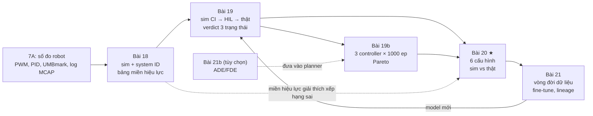
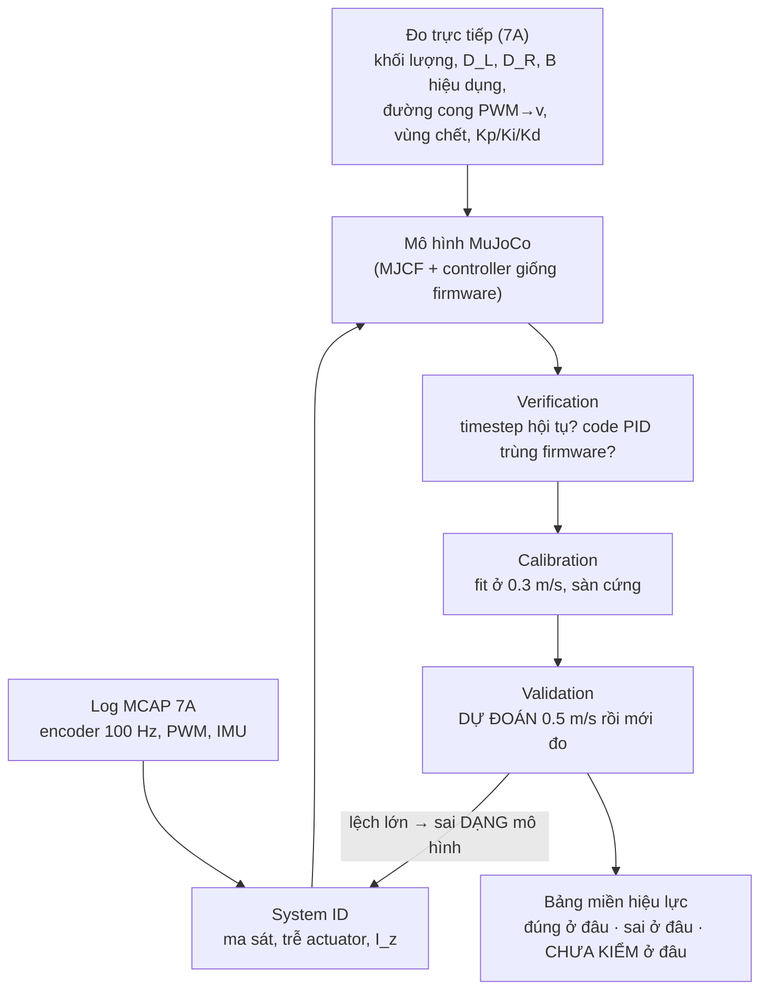
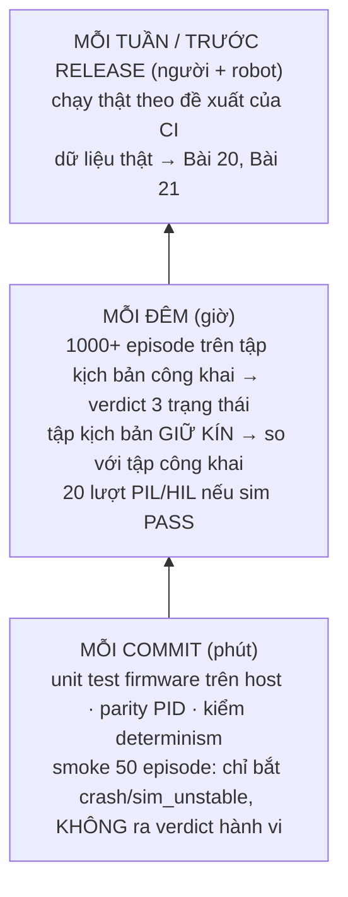
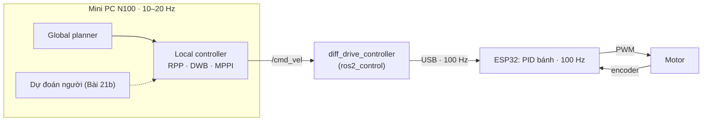

# Khóa 7 · 7E — Full test flow (80h gốc + 12h bắt buộc + 20h tùy chọn)

Không mua thêm gì. 7E gần như toàn phần mềm, và là chỗ Khóa 5 (hạ tầng dữ liệu) và Khóa 6 (sim và eval) được đem ra dùng trên một robot có thật. Bạn tự đóng cả sáu vai trong vòng đời dữ liệu mà chính bạn đã mô tả. Nguồn: `khoa-7-robot-hoan-chinh.md` (7E), `khoa-7-phu-luc.md` mục B (bắt buộc, gắn vào 7E) và mục D (tùy chọn).

| Bài | Giờ | Câu hỏi | Viên nang nền cần trước | Quyết định ra được |
|---|---|---|---|---|
| 18 — Sim khớp robot thật | 20 | Sim của robot này sai bao nhiêu, ở đâu? | F6.1, F6.2, F6.3, F6.4, F1.6 | Sim được phép phán quyết loại thay đổi nào |
| 19 — HIL và CI hành vi | 24 | Đổi một tham số Nav2, làm sao biết nó tốt hơn? | F2.7, F2.6, F2.3, F1.5, F2.8 | Cái gì chạy mỗi commit, mỗi đêm, mỗi tuần; N bao nhiêu |
| 19b — Đo MPC mua được gì | 12 | Controller dự đoán có đáng giá CPU của nó không? | F5.8, F1.2, F1.5 | Chọn controller nào cho Nav2, có lý do bằng số |
| 20 — Sim dự đoán thực tế? ★ | 16 | Phán quyết CI có đúng ngoài đời không? | F6.5, F1.4, F1.5 | Có được dùng sim để chọn cấu hình không |
| 21 — Vòng đời dữ liệu + fine-tune | 20 | Vòng đời sáu bước chạy được đầu–cuối chưa? | F3.8, F3.5, F3.7, F1.5 | Fine-tune cái gì, báo cải thiện hay INCONCLUSIVE |
| 21b — Dự đoán quỹ đạo người (tùy chọn) | 20 | Dự đoán người đi đâu có mua được gì cho planner không? | F1.2, F1.6, F2.8 | Có thêm bộ dự đoán vào local planner hay không |
| Gate 7E = Gate Khóa 7 | — | — | — | — |

Tổng 7E: 92h nếu làm 19b (bắt buộc theo phụ lục), 112h nếu thêm 21b. Trần cứng cả Khóa 7 vẫn là 450h.



---

## Bài 18 — Dựng mô hình sim khớp với robot thật (20h)

> **Vị trí:** K7 Bài 17 (soak 72h) → **Bài 18** → K7 Bài 19 (HIL và CI) · **Cần trước:** F6.1, F6.2, F6.3, F6.4, F1.6; K6 Bài 15–17 (đo gap, con lắc ba đường, bảng hiệu lực); K7 Bài 2–5 (đường cong PWM, PID, UMBmark, log MCAP) · **Sau bài này bạn quyết định được:** sim này được dùng để phán quyết loại thay đổi nào (tốc độ nào, mặt sàn nào, mức pin nào), và tham số nào còn phải đo thêm trước khi tin nó.

### 1. Câu chuyện — ai đã khổ vì chuyện này

Năm 1995, Nick Jakobi, Phil Husbands và Inman Harvey (Đại học Sussex) công bố "Noise and the reality gap: The use of simulation in evolutionary robotics". Nhóm này "tiến hóa" bộ điều khiển cho robot Khepera trong mô phỏng, rồi đem ra robot thật, và bộ điều khiển chạy rất đẹp trong sim hỏng ngoài đời. Cái tên **reality gap** ra đời từ đó. Kết luận của họ không phải "cần sim chi tiết hơn" mà là: mô phỏng đúng những gì quan trọng cho hành vi đang xét, đo những thứ đó từ robot thật, và cố tình thêm nhiễu ở chỗ mình không chắc [chuẩn — tên paper và tác giả; chi tiết thí nghiệm đọc trong paper].

Ba mươi năm sau, câu hỏi của nghề vẫn y nguyên, chỉ là đắt hơn: một đội AMR muốn đổi tham số Nav2 mà không phải vác robot ra sàn 50 lần, thì phải tin sim. Mà sim chỉ đáng tin nếu có ai đó đã **đo** xem nó sai bao nhiêu và sai ở đâu. Con lắc ở K6 Bài 16 là bài tập, còn bài này làm trên robot thật. Khác biệt chính: lần này nhiều tham số không đo trực tiếp được (ma sát, trễ, quán tính quay) mà phải **suy ra từ log**, và suy ra sai dạng thì bài sẽ bắt được bạn.

### 2. Mô hình tư duy



Bản chất có bốn ý:

1. **Ba động từ khác nhau** (→ F6.2): *verification* hỏi sim có giải đúng phương trình mình định giải không (timestep, code controller); *calibration* chỉnh tham số cho khớp dữ liệu; *validation* hỏi mô hình có **dự đoán** đúng dữ liệu nó chưa thấy không. Fit cho khớp rồi tuyên bố "sim đúng" là lấy calibration giả làm validation.
2. **Một con số không xác định được dạng mô hình.** Chỉnh một hệ số ma sát cho khớp quãng đường dừng ở 0.3 m/s luôn làm được, với bất kỳ dạng ma sát nào. Cái phân biệt các dạng là **đường cong** (vận tốc theo thời gian khi thả trôi) và **điểm làm việc khác** (0.5 m/s).
3. **Mỗi tham số là một bản ghi có nguồn gốc**: giá trị, đo bằng gì, sai số dụng cụ, ngày, `calibration_id`. Đây là provenance (→ F3.8) áp vào file MJCF.
4. **Miền hiệu lực là một sản phẩm, không phải lời xin lỗi.** Cột "chưa kiểm" cho Bài 20 biết lúc thứ hạng sai thì nên nghi chỗ nào trước.

Mô phỏng đồ chơi dưới đây cho thấy ý 2. "Robot thật" có ma sát Coulomb + nhớt. Ba mô hình đều khớp quãng đường dừng ở 0.3 m/s. Chạy rồi xem chúng nói gì ở 0.5 m/s (kết quả nằm ở phần 7).

```python
# [đã chạy] Bài 18 — khớp một con số ở 0.3 m/s không xác định được DẠNG ma sát
import numpy as np
from scipy.optimize import curve_fit
import matplotlib; matplotlib.use("Agg")      # trong bài: bỏ dòng này, dùng plt.show()
import matplotlib.pyplot as plt

B_TRUE, FC_TRUE = 1.2, 0.35        # "robot thật": dv/dt = -b*v - fc  khi thả trôi (1/s, m/s^2)
DT, Q = 0.01, 0.136e-3 / 0.01      # 100 Hz; lượng tử vận tốc = 0.136 mm/count / 10 ms

def v_coast(t, v0, b, fc):          # nghiệm giải tích, kẹp về 0 khi đã dừng
    if b < 1e-9:
        return np.maximum(v0 - fc * t, 0)
    return np.maximum((v0 + fc / b) * np.exp(-b * t) - fc / b, 0)

def s_stop(v0, b, fc):              # quãng trôi tới khi dừng
    if fc < 1e-9: return v0 / b
    if b < 1e-9:  return v0**2 / (2 * fc)
    return (v0 - fc / b * np.log(1 + b * v0 / fc)) / b

rng = np.random.default_rng(1)
t = np.arange(0, 1.0, DT)
v_log = np.round((v_coast(t, 0.3, B_TRUE, FC_TRUE) + rng.normal(0, 0.003, t.size)) / Q) * Q
s_meas = s_stop(0.3, B_TRUE, FC_TRUE)          # "đo bằng thước" ở 0.3 m/s

models = {   # mỗi mô hình được chỉnh cho KHỚP ĐÚNG s_meas ở 0.3 m/s, hoặc fit cả đường cong
    "A: chỉ nhớt (chỉnh b)":      (0.3 / s_meas, 0.0),
    "B: chỉ Coulomb (chỉnh fc)":  (0.0, 0.3**2 / (2 * s_meas)),
}
m = v_log > 0
(b_c, fc_c), cov = curve_fit(lambda tt, b, fc: v_coast(tt, 0.3, b, fc), t[m], v_log[m],
                             p0=[1.0, 0.2], bounds=([0, 0], [10, 5]))
models["C: fit cả đường cong"] = (b_c, fc_c)

print(f"{'mô hình':28s} {'b':>5s} {'fc':>5s} {'S(0.3)':>7s} {'S(0.5)':>7s} {'lệch@0.5':>8s}")
s_true5 = s_stop(0.5, B_TRUE, FC_TRUE)
for name, (b, fc) in models.items():
    s3, s5 = s_stop(0.3, b, fc), s_stop(0.5, b, fc)
    print(f"{name:28s} {b:5.2f} {fc:5.2f} {s3:7.3f} {s5:7.3f} {100*(s5/s_true5-1):+7.1f}%")
print(f"{'robot thật':28s} {B_TRUE:5.2f} {FC_TRUE:5.2f} {s_meas:7.3f} {s_true5:7.3f}")
print("độ lệch chuẩn tham số fit C:", np.sqrt(np.diag(cov)).round(3))

plt.step(t, v_log, where="post", label="log encoder (lượng tử)")
for name, (b, fc) in models.items():
    plt.plot(t, v_coast(t, 0.3, b, fc), label=name)
plt.xlabel("t (s)"); plt.ylabel("v (m/s)"); plt.legend(); plt.savefig("b18.png", dpi=80)
```

Trước khi chạy, ghi vào `prediction.md`: mô hình A và B lệch về **phía nào** ở 0.5 m/s, và vì sao (gợi ý: quãng dừng của ma sát nhớt thuần tỉ lệ với v₀, của Coulomb thuần tỉ lệ với v₀²).

### 3. Cầu nối từ backend

| Backend bạn biết | Ở đây | Gãy ở chỗ | Nếu dùng nhầm thì |
|---|---|---|---|
| Mock server dựng từ traffic ghi lại | Sim dựng từ số đo 7A | Mock **phát lại** phản hồi đã ghi nên không ngoại suy được gì. Sim **sinh** phản hồi từ phương trình nên ngoại suy được, nhưng chỉ trong miền mà dạng phương trình còn đúng | Coi sim như mock: chỉ test lại đúng các ca đã đo, phí cả sim. Coi sim như prod: tin cả kết quả trên thảm khi mới fit trên gạch |
| Fit mô hình dung lượng từ load test ở 30% utilization rồi dự báo ở 80% | Fit ma sát ở 0.3 m/s rồi dự đoán 0.5 m/s | Với hàng đợi bạn thường **biết trước dạng** (đầu gối M/M/1, → F7.1), chỉ fit thời gian phục vụ. Ở đây **dạng** cũng là ẩn số (Coulomb? nhớt? bậc hai? trễ?). Hai mô hình sai dạng vẫn khớp hoàn hảo tại điểm fit | Báo "sim khớp <5%" ở đúng điểm đã fit, rồi bất ngờ ở điểm làm việc khác. Giống capacity plan đúng ở tải hôm nay và sụp ở Black Friday |
| Dev/prod parity, config có version | Mọi tham số MJCF truy về một phép đo + `calibration_id` | Config phần mềm đứng yên cho tới khi có người đổi. Tham số vật lý **tự trôi**: motor nóng (7A Bài 2 bước 6), lốp mòn, pin tụt áp | Parity kiểm một lần rồi thôi. Ba tháng sau sim "khớp" với một con robot không còn tồn tại |
| Differential test: cùng input, so output hai bản implement | Chạy đúng code PID của firmware trên log thật, so với PID trong sim | Trong backend hai bản thường cùng ngôn ngữ, cùng kiểu số. Ở đây một bên là C trên ESP32 (float32, timer phần cứng), một bên là Python float64 với bước sim | Sim dùng một PID "gần giống". Đáp ứng bước lệch vì code khác, bạn lại đi chỉnh ma sát để bù cho lỗi code |

**Chấm mô hình:**

- *"Sim khớp số đo sau khi fit nghĩa là sim đúng."* → **SAI.** Khớp tại điểm đã fit là việc của calibration, chưa phải validation. Phản ví dụ: trong mô phỏng đồ chơi ở trên, mô hình A và B đều khớp đúng quãng dừng ở 0.3 m/s mà vẫn sai ở 0.5 m/s (bao nhiêu thì xem phần 7).
- *Mô hình của bạn ở K3 lượt 12:* "trong một system vật lý có số tác nhân tham gia là biết trước, được thu thập dữ liệu đầy đủ trong một khoảng thời gian dài, thì mọi công thức vật lý gần như là hằng số. nên mọi biến số có thể được tầng ai model biểu diễn và dự đoán được." → **ĐÚNG MỘT PHẦN.** Đúng: có đủ dữ liệu thì tham số ước lượng được, và đó chính là system identification. Gãy ở hai chỗ. (1) "Hằng số" chỉ là hằng số **khi cố định ngữ cảnh**: ma sát lăn đổi theo mặt sàn, đường cong PWM→v đổi theo điện áp pin và nhiệt độ motor. Thiếu biến ngữ cảnh trong log thì cái "hằng số" của bạn là trung bình của nhiều chế độ và không đúng ở chế độ nào. (2) Dữ liệu nhiều mà chỉ ở một điểm làm việc thì không cho biết **dạng** mô hình. Phản ví dụ: tiêu chí cuối của bài này. Một bộ tham số không khớp được cả thảm lẫn sàn cứng, dù bạn có bao nhiêu giờ log trên sàn cứng.
- *"Cứ thêm tham số tự do cho tới khi khớp hết bốn hiện tượng."* → **SAI.** Đó là overfitting (→ F1.6). Phản ví dụ: thêm một "hệ số hiệu chỉnh" riêng cho từng hiện tượng thì khớp được 100%, nhưng không dự đoán được hiện tượng thứ năm nào. Cách kiểm duy nhất là bước 5: dự đoán trước, đo sau.

### 4. Thuật ngữ

| Mức | Thuật ngữ | Nghĩa trong một câu | Hay bị hiểu nhầm thành |
|---|---|---|---|
| 🟢 | System identification | Ước lượng tham số (và chọn dạng) của mô hình động lực từ dữ liệu vào/ra đo được | "Chỉnh số trong sim cho tới khi đẹp" |
| 🟢 | Verification / Validation / Calibration | Giải đúng phương trình / dự đoán đúng dữ liệu chưa thấy / chỉnh tham số theo dữ liệu | Ba từ đồng nghĩa với "test" |
| 🟢 | Miền hiệu lực (validity envelope) | Vùng điều kiện mà sai số mô hình đã được đo và nằm trong ngưỡng | Danh sách lời xin lỗi |
| 🟢 | Ma sát Coulomb vs nhớt | Lực cản không đổi theo tốc độ vs lực cản tỉ lệ tốc độ | Một hệ số "friction" duy nhất |
| 🟢 | Trễ actuator | Thời gian từ lúc ra lệnh tới lúc bánh bắt đầu đổi tốc độ | Chỉ là trễ mạng, bỏ qua được |
| 🟡 | Identifiability | Dữ liệu có đủ thông tin để tách riêng từng tham số không | "Fit hội tụ là tham số đúng" |
| 🟡 | Tín hiệu kích thích (PRBS, chirp, multistep) | Lệnh đầu vào thiết kế để làm lộ động lực ở nhiều tần số/biên độ | Bước đơn là đủ |
| 🟡 | MJCF / URDF | Định dạng mô tả robot của MuJoCo / của ROS | Hai định dạng tương đương hoàn toàn |
| 🟡 | `frictionloss`, `damping`, `armature` (MuJoCo) | Ma sát khô ở khớp, ma sát nhớt ở khớp, quán tính rotor quy đổi | Ma sát tiếp xúc bánh–sàn |
| 🔴 | `solref` / `solimp`, mô hình lốp | Độ mềm tiếp xúc trong solver; biến dạng lốp | Thứ phải chỉnh đầu tiên khi quãng dừng sai |

### 5. Dự đoán

**Đề:** trước khi dựng sim, tính bằng công thức (đường thứ nhất trong ba đường) cho bốn hiện tượng, ở 0.3 m/s và 0.5 m/s, rồi đoán gap sim–thật sẽ lớn nhất ở hiện tượng nào.

**Tham số cần tra:**

| Tham số | Tra ở đâu |
|---|---|
| Đường kính hiệu dụng D_L, D_R; khoảng cách bánh B hiệu dụng | Kết quả UMBmark, K7 Bài 4 (đã nạp vào firmware) |
| Vùng chết, độ dốc PWM→v mỗi motor, mỗi chiều, có tải | K7 Bài 2 (bốn đường cong có tải) |
| Kp, Ki, Kd, giới hạn PWM, chống windup, cách lọc vận tốc | Firmware K7 Bài 3 (git hash) |
| Giới hạn gia tốc trong `diff_drive_controller` / Nav2 | File YAML cấu hình ros2_control và Nav2 trên robot |
| Khối lượng toàn robot (cả mini PC, pin, giá đỡ) | Cân, ghi vào power budget của 7A |
| Chế độ dừng của driver khi lệnh = 0 hoặc khi disable (coast hay brake) | Datasheet driver motor bạn đã mua (bảng logic IN1/IN2/EN) |

**Công thức:**

- Đi thẳng 5 m với vận tốc đặt v và giới hạn gia tốc a: t ≈ 5/v + v/(2a) + τ_trễ (pha tăng tốc mất v/(2a) so với chạy đều từ đầu).
- Quay tại chỗ, hai bánh ±v_w: ω = 2·v_w / B, nên t_360 = 2π/ω = π·B / v_w.
- Quãng dừng khi thả trôi từ v₀ (mô hình Coulomb + nhớt): S = v₀·τ_trễ + (1/b)·[v₀ − (f_c/b)·ln(1 + b·v₀/f_c)]. Khi dừng có điều khiển với giới hạn giảm tốc a: S ≈ v₀·τ_trễ + v₀²/(2a).
- Đáp ứng bước: vọt lố và thời gian xác lập đo ở K7 Bài 3. Dự đoán **chiều** lệch của sim: sim thiếu trễ thì vọt lố cao hơn hay thấp hơn thật?

**Phải đoán thêm:** (a) sau khi fit ở 0.3 m/s, quãng dừng ở 0.5 m/s trong sim lệch về phía nào so với thật, và vì sao; (b) bộ tham số fit trên sàn cứng chạy trên thảm sẽ sai ở hiện tượng nào nhiều nhất; (c) trong bốn tham số D, B, f_c, τ_trễ, sai 10% ở tham số nào làm hỏng hiện tượng "quay 360°" nhiều nhất.

```markdown
# prediction.md — 7E Bài 18
commit trước khi chạy sim và trước khi đo lại: <hash>

## Tham số đầu vào (mỗi dòng một nguồn)
| tham số | giá trị | nguồn (bài, file, calibration_id) | sai số dụng cụ |
|---|---|---|---|

## Tính bằng công thức
| hiện tượng | 0.3 m/s | 0.5 m/s | công thức dùng |
|---|---|---|---|
| đi thẳng 5 m: thời gian | | | |
| quay 360°: thời gian | | | |
| quãng dừng (chế độ: coast/brake/điều khiển) | | | |
| đáp ứng bước: vọt lố, t_xác lập | | | |

## Đoán
- gap lớn nhất ở hiện tượng: ___ vì ___
- quãng dừng 0.5 m/s sim (fit ở 0.3) sẽ lệch thật về phía: ___ vì ___
- trên thảm, hiện tượng hỏng nhiều nhất: ___
- tham số nhạy nhất cho quay 360°: ___
```

### 6. Làm

Giữ đủ sáu bước của bản gốc. Thêm bước 0 (verification), và yêu cầu sai số dụng cụ ở mỗi phép đo.

**Bước 0 — bảng nguồn gốc tham số và verification.** Lập `sim/PARAMS.md`: mỗi tham số trong MJCF một dòng gồm giá trị, phép đo, dụng cụ, sai số, ngày, `calibration_id`. Tham số không truy được nguồn phải mang nhãn `ASSUMED` và đi thẳng vào cột "chưa kiểm". Làm thêm hai việc verification:
- **Hội tụ timestep:** chạy cùng kịch bản ở `timestep` 2 ms và 1 ms. Nếu bốn đại lượng lệch nhau quá 1%, sai số số học đang lẫn vào gap vật lý (→ F6.3). Sửa cái đó trước khi fit bất cứ gì.
- **Parity controller:** lấy một log 7A (lệnh vận tốc + encoder), cho PID của sim chạy trên đúng chuỗi encoder đó, so chuỗi PWM nó xuất ra với PWM firmware đã ghi. Phải trùng tới mức lượng tử PWM. Đây là differential testing (→ F2.4). Cách sạch nhất là biên dịch đúng file C của firmware thành thư viện rồi gọi từ Python.

**Bước 1 — dựng MJCF từ số đo 7A.** Khung xương dưới đây chỉ để chỉ chỗ mỗi số đo đi vào file:

```xml
<!-- [chưa chạy] Khung MJCF robot vi sai — tên thuộc tính kiểm theo bản MuJoCo bạn cài [tự đo] -->
<mujoco model="office_bot">
  <option timestep="0.002"/>                          <!-- kiểm hội tụ ở bước 0 -->
  <worldbody>
    <geom name="floor" type="plane" size="10 10 0.1" friction="1.0 0.005 0.0001"/>  <!-- ASSUMED: sàn -->
    <body name="base_link" pos="0 0 0.05">
      <freejoint/>
      <inertial pos="0 0 0" mass="M_CÂN" diaginertia="IXX IYY IZ_FIT"/>  <!-- mass: cân; Iz: con lắc 2 dây hoặc fit -->
      <body name="wheel_l" pos="0  B_HD/2 0">           <!-- B hiệu dụng từ UMBmark -->
        <joint name="jl" type="hinge" axis="0 1 0" damping="B_FIT" frictionloss="FC_FIT" armature="J_ROTOR"/>
        <geom type="cylinder" size="DL/2 0.012" euler="90 0 0"/>   <!-- D_L từ UMBmark -->
      </body>
      <body name="wheel_r" pos="0 -B_HD/2 0"> ... DR ... </body>
      <body name="caster" pos="-0.12 0 -0.03"><geom type="sphere" size="0.015" friction="0.1 0 0"/></body>
    </body>
  </worldbody>
  <actuator>   <!-- mô-men từ PWM qua đường cong 7A; vùng chết và trễ đặt trong controller Python -->
    <motor joint="jl" gear="1" ctrlrange="-TMAX TMAX"/> <motor joint="jr" gear="1" ctrlrange="-TMAX TMAX"/>
  </actuator>
</mujoco>
```

Quán tính quay I_z đo được mà không cần fit, bằng **con lắc hai dây** (bifilar). Treo robot nằm ngang bằng hai dây song song dài L, cách nhau d, đối xứng qua trục đứng đi qua tâm khối. Xoắn nhẹ rồi thả, đo chu kỳ T bằng IMU trên robot (đúng kỹ năng K6 Bài 16). Khi đó I_z = m·g·d²·T² / (16π²·L) [chuẩn — suy từ mô-men phục hồi m·g·(d/2)²·θ/L]. Sai số chủ yếu đến từ L và d (thước ±1 mm), và từ chỗ tâm khối lệch khỏi trục.

**Bước 2 — controller trong sim.** Cùng PID, cùng bù vùng chết, cùng cách lọc vận tốc, cùng chu kỳ 10 ms, cùng giới hạn gia tốc của `diff_drive_controller`. MuJoCo không có sẵn trễ thuần cho actuator; dùng một ring buffer lệnh trong Python, độ dài τ_trễ/Δt [tự đo theo phiên bản: bộ lọc `dyntype` của actuator là trễ bậc nhất (lag), không phải trễ thuần].

**Bước 3 — ba đường × bốn hiện tượng** (giữ bảng gốc):

| Hiện tượng | Tính | Đo thật | Sim | Dụng cụ và sai số |
|---|---|---|---|---|
| Đi thẳng 5 m: thời gian, sai lệch ngang | Từ vận tốc đặt | 7A Bài 4 | Chạy sim | Thời gian lấy từ timestamp nguồn ESP32 trong MCAP (độ phân giải 10 ms), **không** bấm đồng hồ tay (phản xạ người ~0.2 s [ước lượng]). Sai lệch ngang: thước dây ±2 mm, hoặc marker 7B nếu đã có |
| Quay tại chỗ 360°: thời gian, sai lệch góc | Từ B và vận tốc | Thước đo góc | Chạy sim | Thước đo góc ±1°; tốt hơn là tích phân gyro z của IMU (nhớ bias, → F6.7) và đối chiếu với vạch trên sàn |
| Quãng đường dừng từ 0.5 m/s | Từ giảm tốc | Thước | Chạy sim | **Khai báo chế độ dừng** (thả trôi/coast, phanh driver/brake, hay giảm tốc có điều khiển). Băng dính đánh dấu điểm ra lệnh (dùng LED bật cùng lúc lệnh, quay video) và điểm dừng, ±5 mm |
| Đáp ứng bước vận tốc: vọt lố, thời gian xác lập | Từ tham số PID | 7A Bài 3 | Chạy sim | Encoder 100 Hz: lượng tử vận tốc 0.136 mm/count ÷ 10 ms = 13.6 mm/s mỗi count. Ở 0.3 m/s là ~4.5%; dùng cửa sổ trượt như Bài 3 |

Mỗi phép đo thật lặp ≥10 lần (như Bài 4). Báo trung vị và độ trải. **Ngưỡng "lệch <5%" chỉ có nghĩa khi độ trải giữa các lần chạy thật nhỏ hơn 5%.** Nếu bản thân robot thật đã dao động ±8% giữa các lần, so sim (một con số tất định) với trung vị thật mà đòi khớp 5% là đòi chuyện vô lý. Lúc đó hãy báo gap kèm độ trải thật.

**Bước 4 — system identification** (→ F6.4). Không chỉnh tay từng núm. Làm theo thứ tự:
1. **Kích thích có thiết kế:** thả trôi từ **nhiều** vận tốc (0.1, 0.2, 0.3 m/s) trên sàn cứng, cộng một chuỗi PWM multistep hoặc PRBS khi nâng bánh và khi chạm đất. Giữ riêng 0.5 m/s cho bước 5; không fit trên nó.
2. **Trễ trước:** đo τ_trễ từ log (thời điểm lệnh đổi → count encoder đầu tiên đổi), độ phân giải 10 ms. Cần chính xác hơn thì dùng GPIO + logic analyzer như Bài 3 (24 MHz → ~42 ns/mẫu).
3. **Ma sát sau:** fit cả **đường cong** v(t) khi thả trôi bằng least squares (mô hình C trong code ở phần 2), so ít nhất hai dạng (nhớt thuần, Coulomb + nhớt), báo residual và độ lệch chuẩn tham số. Chú ý: khi bánh **lăn không trượt**, quãng dừng do ma sát hệ truyền động quyết định (khớp: `frictionloss`, `damping`, cộng hãm từ driver), **không** do hệ số ma sát trượt bánh–sàn.
4. **I_z cuối cùng:** nếu đã đo bằng con lắc hai dây thì giữ nguyên, chỉ kiểm lại bằng đáp ứng quay. Nếu chưa thì fit từ bước quay.

**Bước 5 — kiểm tra chéo (phần G của K6 Bài 16).** Đóng băng tham số đã fit. Ghi dự đoán cho 0.5 m/s vào `prediction.md`, commit, rồi mới đo thật ở 0.5 m/s. Lệch lớn là một phát hiện, và nó trả lời câu hỏi dạng mô hình có sai không.

**Bước 6 — bảng miền hiệu lực.** Thêm cột so với K6 Bài 17:

| Hiện tượng | Miền đã kiểm (sàn · tốc độ · tải · điện áp pin · nhiệt motor) | Gap đo được (± độ trải thật) | Miền **chưa** kiểm | Cờ cho kịch bản Bài 19 |
|---|---|---|---|---|
| Đi thẳng | gạch · 0.1–0.5 m/s · không tải · 11.4–12.4 V · nguội | | thảm, dốc, pin <11 V | `in_envelope: floor=tile, v<=0.5` |
| … | | | | |

Chạy lại bốn hiện tượng trên thảm với **cùng** bộ tham số đó, ghi kết quả vào bảng. Thêm một dòng cho điện áp pin: đường cong PWM→v ở 7A đo ở một mức pin, còn pin 3S đi từ ~12.6 V lúc đầy xuống ~10–11 V lúc gần cạn [chuẩn — dải điện áp LiPo 3S; ngưỡng cắt theo BMS bạn mua]. Mô men motor ở cùng PWM đổi theo điện áp, nên nếu không mô hình hóa nó thì phải ghi nó vào cột "chưa kiểm".

### 7. Số phải ra

<details><summary>🔒 MỞ SAU KHI COMMIT prediction.md</summary>

**Ngưỡng của bản gốc (giữ nguyên):**

| Kiểm tra | Ngưỡng sau khi fit |
|---|---|
| Đi thẳng: thời gian | Lệch <5% (với điều kiện độ trải giữa các lần chạy thật <5%, xem bước 3) |
| Quay 360°: thời gian | Lệch <5% |
| Quãng đường dừng | Lệch <15%. **Ma sát là chỗ khó khớp nhất** |
| Đáp ứng bước | Hình dạng khớp, vọt lố lệch <20% |
| Ngoại suy sang tốc độ chưa fit | Lệch nhỏ nếu mô hình đúng dạng. **Lệch lớn là một phát hiện đáng viết** |
| Trên thảm vs sàn cứng | Một bộ tham số **không khớp được cả hai**. Đó là giới hạn, ghi vào bảng hiệu lực |

**Kết quả mô phỏng đồ chơi ở phần 2** (trên máy soạn bài; bạn chạy lại sẽ ra đúng số này vì seed cố định):

| Mô hình | b (1/s) | f_c (m/s²) | S(0.3) m | S(0.5) m | Lệch ở 0.5 m/s |
|---|---|---|---|---|---|
| A: chỉ nhớt (chỉnh cho khớp 1 số) | 3.84 | 0 | 0.078 | 0.130 | −25.2% |
| B: chỉ Coulomb (chỉnh cho khớp 1 số) | 0 | 0.58 | 0.078 | 0.217 | +24.7% |
| C: fit cả đường cong | 1.32 | 0.33 | 0.078 | 0.171 | −2.0% |
| Robot "thật" | 1.20 | 0.35 | 0.078 | 0.174 | — |

Cách đọc: cả ba mô hình đều khớp hoàn hảo ở 0.3 m/s. A và B vượt ngưỡng 15% ở 0.5 m/s, theo hai chiều ngược nhau. C chỉ đúng được vì đã dùng **hình dạng** đường cong thả trôi, không chỉ một con số. Độ lệch chuẩn của b (~0.07) lớn hơn nhiều so với f_c (~0.01): chỉ với một lần thả trôi từ 0.3 m/s, phần nhớt khó nhận dạng. Đó là lý do bước 4 thả trôi từ nhiều vận tốc.

**Kỳ vọng định tính cho robot thật:**
- Sau khi fit, đi thẳng và quay thường khớp dễ nhất, vì chúng chủ yếu phụ thuộc hình học (D, B) đã hiệu chuẩn bằng UMBmark và giới hạn gia tốc của controller. Nếu chúng lệch nhiều thì nghi B hiệu dụng hoặc caster cạ sàn, chưa phải ma sát.
- Quãng dừng ở chế độ thả trôi là khó nhất. Ở chế độ giảm tốc có điều khiển, nó gần như bị giới hạn gia tốc quyết định và khớp dễ, nên **đừng báo khớp 3% ở chế độ có điều khiển như thể đã khớp ma sát**.
- Sim thiếu trễ thường cho vọt lố **thấp** hơn thật: trễ trong vòng kín làm giảm biên pha (→ F5.8).
- Thảm: lực cản lăn lớn hơn rõ và có thể có trượt khi quay tại chỗ. Thời gian quay và quãng dừng hỏng trước.

Lệch so với các số này là bình thường. Robot, sàn và driver của bạn khác. Cái phải đúng là **quy trình**: dự đoán trước, đo sau, báo gap kèm độ trải.
</details>

### 8. Nếu ra khác

| Triệu chứng | Nguyên nhân khả dĩ | Kiểm bằng cách | Sửa |
|---|---|---|---|
| Quãng dừng sim ngắn hơn thật nhiều | Ma sát hệ truyền động trong sim quá lớn; hoặc sim đang "phanh" còn driver thật thả trôi | Đọc bảng logic driver; xem log PWM sau lệnh dừng | Khai báo đúng chế độ dừng; fit `frictionloss`/`damping` ở khớp, đừng đi chỉnh ma sát trượt bánh–sàn |
| Fit khớp ở 0.3 nhưng lệch >30% ở 0.5 m/s | Sai dạng ma sát; hoặc pin sụt áp khi dòng lớn | So residual của hai dạng mô hình; xem log điện áp pin lúc chạy 0.5 m/s | Thêm thành phần còn thiếu; thêm điện áp vào mô hình hoặc vào cột "chưa kiểm" |
| Sim đi thẳng tuyệt đối, thật lệch ngang | Sim dùng hai bánh và hai motor giống hệt nhau | So D_L/D_R và hai đường cong PWM trong MJCF với 7A | Nạp số đo riêng từng bánh, từng motor |
| Quay 360° lệch có hệ thống | B hiệu dụng sai; caster cạ ngang khi quay | Quay trên hai mặt sàn; quan sát caster | Dùng B từ UMBmark; mô hình caster ma sát thấp, hoặc ghi vào "chưa kiểm" |
| Đáp ứng bước sim đẹp hơn thật | Thiếu trễ, thiếu lượng tử encoder, PID sim khác firmware | Parity test ở bước 0 | Thêm trễ (ring buffer), lượng tử encoder, dùng đúng code C |
| Robot trong sim rung, nảy hoặc bay lên | Va chạm mesh chồng nhau, timestep lớn, quán tính phi vật lý | Bước 0 hội tụ timestep; kiểm `diaginertia` dương và thỏa bất đẳng thức tam giác | Hình học va chạm đơn giản (cylinder/sphere), giảm timestep |
| Kết quả đổi giữa sáng và chiều | Nhiệt motor, điện áp pin | Ghi nhiệt độ/điện áp vào metadata mỗi lần chạy | Đưa vào bảng hiệu lực như một chiều riêng |

### 9. Câu hỏi ngược

1. **[Nếu…thì]** Nếu chỉ còn 2 giờ robot thật, phép đo nào giảm độ bất định của sim nhiều nhất?
<details><summary>Hướng nghĩ</summary>Đây là câu hỏi về độ nhạy (→ F6.6). Lấy từng tham số, lệch nó ±10% trong sim, xem hiện tượng nào bạn quan tâm (Bài 19–20 dùng tỉ lệ tới đích và va chạm) đổi nhiều nhất. Đo thật cái nhạy nhất mà đang có nhãn ASSUMED. Thường thì đó không phải tham số bạn thấy "khoa học" nhất.</details>

2. **[Vì sao không]** Vì sao không bỏ qua system ID và dùng domain randomization thật rộng (→ F6.5, K6 Bài 14)?
<details><summary>Hướng nghĩ</summary>Randomization giúp policy bền hơn, nhưng mục tiêu ở 7E là để sim **phán quyết** giữa các cấu hình. Dải randomization rộng có thể làm mọi cấu hình trông như nhau, hoặc đặt trọng số vào những vùng ngoài đời không bao giờ xảy ra. Hai cách bổ sung nhau: đo cái gì đo được, randomize trong khoảng bất định đã đo được. Thử nghĩ xem lấy tâm và độ rộng của dải ở đâu ra.</details>

3. **[Quy mô]** Có 100 robot cùng mẫu. Một sim chung hay 100 bộ tham số? Ở 100 robot cái gì gãy trước?
<details><summary>Hướng nghĩ</summary>Hai robot cùng mẫu vẫn khác D, B, motor (7A Bài 2 cho thấy hai motor cùng lô đã khác nhau). Thứ gãy trước thường là quản lý: `calibration_id` nào đang nạp trên robot nào, hiệu chuẩn lại khi nào, kết quả CI cũ chạy với bộ tham số nào. Một hướng: sim chạy với phân bố tham số của cả đội (đo từ 100 lần hiệu chuẩn) thay vì một robot "trung bình".</details>

4. **[Failure mode]** Fit có thể "giấu" một nguyên nhân bằng một nguyên nhân khác không? Ví dụ trễ actuator bị hấp thụ vào ma sát.
<details><summary>Hướng nghĩ</summary>Có. Khi hai tham số tạo hiệu ứng giống nhau trên dữ liệu bạn có, fit chọn bất kỳ tổ hợp nào. Mô hình sẽ đúng ở mọi phép thử có cùng cấu trúc và sai khi cấu trúc đổi, ví dụ gia tốc lệnh khác hẳn. Muốn bắt được thì cần kích thích tách được hai hiệu ứng (trễ lộ ra ở thay đổi nhanh, ma sát lộ ra ở thả trôi chậm), và xem ma trận hiệp phương sai của tham số.</details>

5. **[Phản biện]** "Ba đường gặp nhau" có thể sai cả ba theo cùng một kiểu không?
<details><summary>Hướng nghĩ</summary>Công thức và sim có thể dùng chung một giả định sai (ví dụ cùng một giá trị B sai). Phép đo thật cũng có thể dùng cùng odometry mà bạn đang kiểm. Đây là lỗi chung nguồn (common-mode). Hãy tìm xem đường nào trong ba đường độc lập thật sự với hai đường kia, và đặt trọng tài ngoài (thước, marker) ở đâu.</details>

6. **[Liên ngành]** Vì sao quant tài chính tin mô hình Black–Scholes đã hiệu chuẩn ở một giá thực hiện (strike), nhưng không tin nó ở strike khác?
<details><summary>Hướng nghĩ</summary>Xem phần 10. Hãy tự nối "volatility smile" với "fit ở 0.3 m/s, sai ở 0.5 m/s".</details>

### 10. Liên kết ra ngoài

- **Tài chính: hiệu chuẩn mô hình định giá quyền chọn.** Black–Scholes giả định volatility không đổi. Hiệu chuẩn nó cho khớp giá thị trường ở một strike thì khớp, nhưng ở strike khác lại lệch, và đồ thị implied volatility theo strike có hình "nụ cười" (volatility smile) [chuẩn]. Giống: khớp một điểm không chứng minh được dạng mô hình. Khác: trong tài chính giá ở mọi strike đều quan sát được cùng lúc. Robot thì mỗi điểm làm việc là một thí nghiệm tốn công.
- **Hàng không: nhận dạng tham số khí động từ bay thử.** Kỹ sư bay thử cho máy bay thực hiện các đầu vào được thiết kế sẵn (ví dụ multistep "3-2-1-1") để nhận dạng các đạo hàm ổn định, rồi kiểm mô hình trên các manoeuvre khác trước khi đưa vào simulator huấn luyện phi công [chuẩn]. Giống: tín hiệu kích thích có thiết kế, tách dữ liệu fit và dữ liệu kiểm. Khác: họ có cảm biến và quy chuẩn phê duyệt simulator, bạn chỉ có encoder, IMU và thước.
- **Dược động học.** Nồng độ thuốc trong máu được fit bằng mô hình ngăn (compartment), với tham số thải trừ và phân bố lấy từ vài lần lấy máu. Lấy máu sai thời điểm thì hai tham số không tách được (không identifiable), giống trễ và ma sát ở câu hỏi 4.

### 11. Độ tin cậy và sửa lỗi

| Khẳng định | Nhãn | Ghi chú / cách kiểm |
|---|---|---|
| Kết quả mô phỏng đồ chơi ở phần 2 (số ở phần 7) | [đã chạy] | Seed cố định. Tham số "thật" là giả định, chỉ minh họa cơ chế |
| I_z = m·g·d²·T²/(16π²·L) cho con lắc hai dây | [chuẩn] | Suy từ mô-men phục hồi với góc nhỏ; kiểm bằng một vật có I_z biết trước (hộp đồng chất) |
| MuJoCo: `frictionloss`/`damping`/`armature` ở joint, `friction` ở geom, không có trễ thuần cho actuator | [tự đo] | Đọc XML Reference của bản MuJoCo bạn cài |
| Dải điện áp pin 3S ~12.6 V đầy, ~10–11 V gần cạn | [chuẩn] | Ngưỡng cắt thật theo BMS của bạn |
| Phản xạ bấm đồng hồ ~0.2 s | [ước lượng] | Tự đo: bấm theo một LED nhấp nháy ở chu kỳ biết trước |
| Trễ trong vòng kín làm đổi vọt lố (chiều: xem phần 7) | [chuẩn] | Trễ làm giảm biên pha (→ F5.8); kiểm bằng cách thêm/bớt trễ trong sim |

**Đã sửa so với bản gốc/Gemini:**
- Bản gốc ghi "Quãng đường dừng — Tính: từ giảm tốc" mà không nói chế độ dừng. Bài này bắt khai báo coast/brake/điều khiển, vì ba chế độ là ba hiện tượng vật lý khác nhau, và chỉ chế độ thả trôi mới thực sự kiểm ma sát.
- Gemini: "giảm hệ số ma sát trượt (sliding friction) để kéo dài quãng trôi phanh". Sai khi bánh lăn không trượt: lúc đó quãng dừng do ma sát hệ truyền động và chế độ driver quyết định, không do ma sát trượt bánh–sàn. Đã sửa ở bước 4 và phần 8.
- Gemini: "chỉnh `solref`/`solimp` để mô phỏng độ lún lốp" là cách sửa đầu tiên. Đã hạ xuống 🔴. Đó là núm của solver tiếp xúc; vặn nó trước khi kiểm hội tụ timestep và parity controller là sửa sai chỗ.
- Bản gốc: ngưỡng "lệch <5%" không kèm điều kiện. Đã thêm: ngưỡng chỉ có nghĩa khi độ trải giữa các lần chạy thật nhỏ hơn ngưỡng; báo gap kèm độ trải.
- Thêm bước 0 (verification: hội tụ timestep, parity controller), vì bản gốc chỉ có calibration và validation.

### 12. Đọc thêm và tự kiểm tra

- **Nguồn gốc:** MuJoCo Documentation (Google DeepMind), các mục *Modeling* và *XML Reference* (joint, geom, actuator). L. Ljung, *System Identification: Theory for the User* (chương về thiết kế thí nghiệm và chọn cấu trúc mô hình).
- **Giải thích:** N. Jakobi, P. Husbands, I. Harvey (1995), "Noise and the reality gap: The use of simulation in evolutionary robotics".
- **Đào sâu (tùy chọn):** NASA-STD-7009 (Standard for Models and Simulations): cách một tổ chức viết thành quy định "mô hình được tin tới đâu".
- **Tự kiểm tra:** (1) giải thích lại cho một backend engineer khác trong 5 câu vì sao "khớp sau khi fit" chưa phải validation; (2) vẽ lại sơ đồ ở phần 2 từ trí nhớ; (3) hai câu dưới.

<details><summary>Câu 3a: Bạn fit sim và thấy quãng dừng ở 0.3 m/s lệch 2%, ở 0.5 m/s lệch 4%, nhưng độ lệch chuẩn quãng dừng giữa 10 lần chạy thật là 12%. Kết luận được gì?</summary>
Chỉ kết luận được là sim nằm trong độ trải của robot thật. Không kết luận được "sim chính xác 2–4%", vì độ phân giải phép đo thật (±12% mỗi lần, khoảng ±4% cho trung vị của 10 lần) không đủ để phân biệt 2% với 4%. Muốn khẳng định chặt hơn thì phải tăng số lần đo hoặc giảm nguồn biến thiên (mặt sàn, pin).
</details>

<details><summary>Câu 3b: Vì sao bước 5 bắt commit dự đoán cho 0.5 m/s trước khi đo?</summary>
Nếu đo trước thì bạn sẽ, có ý thức hoặc không, chọn dạng mô hình và tham số khiến 0.5 m/s cũng khớp. Lúc đó 0.5 m/s trở thành dữ liệu fit và bạn mất phép validation duy nhất. Đây là preregistration (→ F1.7), và cũng là lý do tập test phải giữ kín ở Bài 19 (→ F2.8).
</details>

---

## Bài 19 — HIL và CI cho hành vi robot (24h)

> **Vị trí:** K7 Bài 18 (sim + bảng miền hiệu lực) → **Bài 19** → Bài 19b (đo MPC) và Bài 20 (sim có dự đoán thực tế không) · **Cần trước:** F2.7, F2.6, F2.3, F2.1, F1.5, F2.8, F7.1; K6 Bài 5, 6, 11, 12, 13, 18; K7 Bài 3, 9 · **Sau bài này bạn quyết định được:** cái gì chạy ở mỗi commit, cái gì chạy mỗi đêm, cái gì mới được ra sàn thật; N episode bao nhiêu; và một thay đổi Nav2 được merge, bị chặn, hay phải chạy thêm.

### 1. Câu chuyện — ai đã khổ vì chuyện này

Ngày 4/6/1996, Ariane 5 chuyến 501 tự hủy khoảng 40 giây sau khi rời bệ. Phần mềm của hệ quy chiếu quán tính (SRI) dùng lại từ Ariane 4 bị tràn khi chuyển một số dấu phẩy động 64-bit sang số nguyên 16-bit. Quỹ đạo của Ariane 5 cho ra giá trị mà Ariane 4 chưa bao giờ tạo ra. Báo cáo của Ủy ban điều tra (chủ tịch J. L. Lions) có một đoạn đáng in ra dán trên bàn: về kỹ thuật hoàn toàn có thể đưa gần như toàn bộ SRI thật vào các mô phỏng hệ thống vòng kín, nhưng vì nhiều lý do người ta quyết định dùng **đầu ra mô phỏng** của SRI thay cho SRI thật, và nếu SRI thật có mặt trong vòng thì lỗi đã có thể bị phát hiện [chuẩn — ESA, "Ariane 501 Inquiry Board report", 19/7/1996]. Biện pháp ESA đưa ra sau đó gồm làm môi trường thử nghiệm giống tên lửa thật hơn, và cho các tầng test (thiết bị, tầng, hệ thống) **chồng lên nhau** có chủ đích.

Đó là toàn bộ lý do HIL tồn tại: thứ thật được thay bằng mô hình ở đúng chỗ thì lỗi trốn ở đúng chỗ đó. Còn câu hỏi của bài này thì là của chính bạn từ đầu lộ trình: *"phải có nơi để environment show ra lỗi, metric, đúng và sai"*. Bài này dựng nơi đó, rồi chỉ ra những chỗ nó vẫn có thể nói dối.

### 2. Mô hình tư duy

**Ba mức của bản gốc, đặt đúng tên ngành** (→ F2.7):

| Mức | Chạy gì | Tốc độ | Bắt được gì | Tên chuẩn |
|---|---|---|---|---|
| Sim thuần | Toàn bộ trong MuJoCo, controller là code | ~1000 episode/giờ (mục tiêu) | Lỗi logic điều hướng, regression hành vi | SIL (software-in-the-loop) |
| "HIL" của bản gốc | Firmware thật trên ESP32 thật, encoder/PWM đi qua UART tới sim | Thời gian thực | Lỗi firmware, lỗi timing, lỗi giao tiếp | Đúng ra là **PIL** (processor-in-the-loop): bộ xử lý thật, I/O ảo |
| HIL điện | ESP32 thứ hai phát xung quadrature thật vào chân PCNT, đọc PWM thật bằng capture | Thời gian thực | Thêm: cấu hình ngoại vi (PCNT, bộ lọc nhiễu, tràn bộ đếm), ISR | HIL theo nghĩa ô tô |
| Thật | Robot thật, văn phòng thật | Vài lần/giờ | Mọi thứ còn lại | Field test |

Phân biệt PIL và HIL không phải chuyện chữ nghĩa. Nếu số đếm encoder được bơm vào firmware ở tầng phần mềm thì khối PCNT không chạy, và một lỗi xử lý tràn bộ đếm PCNT (bộ đếm 16-bit có dấu trên ESP32-S3 [spec — ESP32-S3 Technical Reference Manual, chương PCNT]) sẽ lọt qua cả "HIL" lẫn sim. Bạn đang có hai ESP32 từ K5 TN-1, nên HIL điện là một bước tùy chọn rẻ.

**Kim tự tháp cho chính repo của bạn:**



**Timing của cổng PIL** (một chu kỳ điều khiển 10 ms, MCU giữ nhịp):

```
t (ms)      0                                   10                                  20
ESP32       |tick: đọc count[k] → PID → PWM[k]  |tick: ...
UART TX     |=PWM[k],seq=k=>|
sim (host)                  |step 1ms ×10 (mô phỏng 10 ms)|
UART RX                                        |<=count[k+1],seq=k|
                            <------ phải xong trước tick sau, nếu không: deadline miss ----->
```

Sim bị khóa vào đồng hồ của MCU (lockstep theo tick). Nếu bước sim trên host chậm hơn thời gian thực, PIL đang test một thế giới mà thời gian chạy sai nhịp. Phải **đếm số lần trễ hạn** và coi PIL run đó là INCONCLUSIVE, giống cách bạn đếm coordinated omission khi benchmark (→ F1.3).

**Verdict ba trạng thái phải có một biên δ.** "PASS = không tệ hơn có ý nghĩa" (cách nói ở K6 Bài 13) khiến n nhỏ luôn PASS. Cách chặt hơn, theo kiểu kiểm định non-inferiority: khai báo trước δ = mức sụt lớn nhất mà bạn chấp nhận, rồi

- **PASS** khi chứng minh được "không tệ hơn quá δ": cận dưới của CI một phía cho hiệu (mới − cũ) > −δ;
- **FAIL** khi chứng minh được "tệ hơn": cận trên < 0;
- **INCONCLUSIVE** khi không chứng minh được gì.

Như vậy PASS phải **kiếm** được bằng dữ liệu. Mô phỏng nhị thức dưới đây (không cần MuJoCo) cho ra đặc tuyến vận hành của verdict. Dự đoán các con số trước khi chạy.

```python
# [đã chạy] Bài 19 — đặc tuyến vận hành của verdict ba trạng thái (không cần sim, chỉ cần nhị thức)
import numpy as np
from scipy.stats import norm
rng = np.random.default_rng(0)

def verdict(s_new, s_base, n, delta, alpha=0.05):
    """Ba trạng thái theo kiểu non-inferiority:
    PASS  = chứng minh được 'không tệ hơn quá delta'  (cận dưới CI của hiệu > -delta)
    FAIL  = chứng minh được 'tệ hơn'                   (cận trên CI của hiệu < 0)
    INCONCLUSIVE = còn lại."""
    p1, p0 = s_new / n, s_base / n
    se = np.sqrt(p1 * (1 - p1) / n + p0 * (1 - p0) / n)
    z = norm.ppf(1 - alpha)                       # một phía cho mỗi câu hỏi
    lo, hi = (p1 - p0) - z * se, (p1 - p0) + z * se
    return np.where(hi < 0, "FAIL", np.where(lo > -delta, "PASS", "INCONCLUSIVE"))

def n_needed(p, drop, alpha=0.05, power=0.8):    # một phía, hai nhóm bằng nhau
    q = p - drop; za, zb = norm.ppf(1 - alpha), norm.ppf(power)
    return int(np.ceil((za + zb) ** 2 * (p * (1 - p) + q * (1 - q)) / drop ** 2))

P_BASE, DELTA, REPS = 0.85, 0.05, 20000
for n in (100, 1000):
    print(f"\nn = {n} episode mỗi nhánh, baseline p = {P_BASE}, delta = {DELTA}")
    print(f"{'thay đổi thật':>14s}  {'PASS':>6s} {'INCONCL':>8s} {'FAIL':>6s}")
    for change in (0.0, -0.02, -0.05, -0.10):
        s0 = rng.binomial(n, P_BASE, REPS)
        s1 = rng.binomial(n, P_BASE + change, REPS)
        v = verdict(s1, s0, n, DELTA)
        frac = [np.mean(v == k) for k in ("PASS", "INCONCLUSIVE", "FAIL")]
        print(f"{change:+14.2f}  " + "  ".join(f"{f:6.1%}" for f in frac))
for p in (0.5, 0.7, 0.85, 0.95):
    print(f"n cần để phát hiện sụt 5 điểm từ p={p}: {n_needed(p, 0.05)} mỗi nhánh")
```

**Thông lượng là định luật Little.** Có L worker chạy song song, mỗi episode mất W giây đồng hồ thật (gồm khởi động Nav2, reset thế giới, ghi MCAP), thì thông lượng là λ = L/W (→ F7.1). Muốn 1000 episode trong 3600 s thì cần L/W ≥ 0.28 episode/s. Với 4 worker, mỗi episode không được quá ~14 s thời gian thật. Nếu episode dài 60 s thời gian mô phỏng, sim phải chạy nhanh hơn thời gian thực ít nhất ~4 lần, **kể cả Nav2**. Đó là chỗ con số "1000 episode/giờ" của bản gốc hay gãy.

### 3. Cầu nối từ backend

| Backend bạn biết | Ở đây | Gãy ở chỗ | Nếu dùng nhầm thì |
|---|---|---|---|
| Kim tự tháp test unit / integration / e2e | SIL / PIL-HIL / chạy thật | E2E backend vẫn gần tất định và rẻ; chạy thật ở đây ngẫu nhiên, đắt, có rủi ro vật lý, và **không tăng tốc được**. PIL/HIL bị khóa vào thời gian thực | Đặt quá nhiều kiểm ở tầng trên: CI chậm tới mức không ai đợi. Đặt quá ít: lỗi timing chỉ lộ ra trên sàn |
| Assert bằng nhau, test xanh/đỏ | Verdict thống kê 3 trạng thái với δ | Một episode là một phép thử Bernoulli; "xanh" của một run không nói gì | Hệ CI xanh mãi vì n quá nhỏ để thấy gì (đúng lỗi K6 Bài 13 muốn chặn) |
| Canary deploy (đẩy 1% traffic) | Canary **regression** cố ý chèn để kiểm CI | Canary backend kiểm bản mới; canary ở đây kiểm **chính bộ kiểm** (→ F2.5, mutation testing) | Không có canary: không biết CI có mù không. Chỉ có canary lớn: không biết ngưỡng phát hiện thật |
| Pipeline agent của bạn: tự chạy → test → sửa → deploy → báo cáo | Agent chỉnh tham số Nav2 tới khi CI PASS | Agent tối ưu **chính** cái thước đo. Đó là Goodhart (→ F2.8): nó sẽ tìm ra kẽ hở của sim (như Habitat cho trượt dọc tường, Bài 20) và của tập kịch bản cố định | CI báo cải thiện liên tục, robot thật không khá lên. Thiếu tập giữ kín thì bạn không có cách nào thấy điều đó |
| Mock dependency trong integration test | PIL: firmware thật, encoder/PWM ảo qua UART | Mock không có thời gian; PIL có **thời gian thật và trễ đường truyền** mà robot thật không có (robot đọc encoder tại chỗ) | Bắt nhầm "lỗi timing" do chính cổng PIL sinh ra, hoặc tưởng PIL đã phủ cả ngoại vi |

**Chấm mô hình:**

- *Câu của bạn ở đầu lộ trình:* "phải có nơi để environment show ra lỗi, metric, đúng và sai." → **ĐÚNG MỘT PHẦN.** Đúng: cần một môi trường tái lập được để quan sát hành vi. Gãy ở hai chỗ. (1) Môi trường chỉ "show" được lỗi trong miền nó mô phỏng đúng (Bài 18): sim không có caster kẹt thì không bao giờ cho thấy lỗi caster kẹt. (2) "Đúng và sai" thiếu trạng thái thứ ba; với dữ liệu ngẫu nhiên, câu trả lời trung thực thường là "chưa đủ bằng chứng". Phản ví dụ: ở n nhỏ, một regression thật 5 điểm thường không đủ bằng chứng để gọi là FAIL. Một hệ chỉ có đúng/sai buộc phải gọi nó là "đúng" (bạn sẽ tự ước lượng tần suất ở phần 5).
- *Mô hình của bạn ở K3 lượt 21:* "nếu lúc đo chưa cover đủ flag/khóa thì lúc runtime thực tế không thể đảm bảo mọi tình huống." → **ĐÚNG MỘT PHẦN.** Đúng: phủ kịch bản quyết định cái gì được kiểm. Gãy: không bao giờ phủ đủ, và thêm cờ/kịch bản không làm hội tụ về "đảm bảo mọi tình huống". Ngành giải bài này bằng ba thứ thay cho phủ toàn bộ: lấy mẫu có thống kê từ phân bố tình huống (cho ra xác suất có CI, không cho ra đảm bảo), đo xem sim có dự đoán thực tế không (Bài 20), và giám sát lúc chạy xem robot có đang ở ngoài miền đã kiểm không (cờ `in_envelope` từ Bài 18). Phản ví dụ: 1000 kịch bản với 0 va chạm chỉ cho bạn tỉ lệ va chạm < ~0.3% ở mức tin cậy 95% (quy tắc "3/n", → F1.4). Đó không phải 0.
- *"CI báo PASS thì thay đổi không gây regression."* → **SAI** nếu PASS chỉ nghĩa là "không thấy khác biệt". Phản ví dụ: với cách định nghĩa đó, ở n = 50 gần như mọi thay đổi đều PASS. Với định nghĩa non-inferiority ở phần 2, PASS nghĩa là "sụt không quá δ, có xác suất sai ≤ α". Đó là một khẳng định có biên.

### 4. Thuật ngữ

| Mức | Thuật ngữ | Nghĩa trong một câu | Hay bị hiểu nhầm thành |
|---|---|---|---|
| 🟢 | MIL / SIL / PIL / HIL | Mô hình / phần mềm / bộ xử lý thật / phần cứng thật ở trong vòng kín với thế giới mô phỏng | Mọi thứ có board thật đều là "HIL" |
| 🟢 | Kim tự tháp test robot | Nhiều kiểm rẻ ở dưới, ít kiểm đắt ở trên, mỗi tầng bắt một lớp lỗi riêng | Tầng trên thay được tầng dưới |
| 🟢 | Verdict ba trạng thái | PASS / FAIL / INCONCLUSIVE, mỗi cái có xác suất sai đã biết | PASS = "không thấy gì" |
| 🟢 | Biên non-inferiority δ | Mức sụt lớn nhất chấp nhận được, khai báo **trước** khi chạy | Ngưỡng chỉnh sau khi xem kết quả |
| 🟢 | MDE (minimum detectable effect) | Chênh lệch nhỏ nhất mà N hiện tại phát hiện được với power cho trước | "Độ chính xác" của CI |
| 🟢 | Tập kịch bản giữ kín | Kịch bản/seed mà người (và agent) chỉnh tham số không nhìn thấy | Tập test cố định, công khai |
| 🟢 | Goodhart | Khi một thước đo thành mục tiêu thì nó thôi đo cái nó từng đo | Chỉ là chuyện đạo đức |
| 🟡 | Lockstep / deadline miss trong PIL | Sim và MCU tiến cùng nhịp; lỡ nhịp thì run vô hiệu | PIL luôn đúng thời gian |
| 🟡 | Sensor model vs render | Mô phỏng phép đo bằng mô hình nhiễu thay vì dựng ảnh rồi chạy detector | Tương đương nhau |
| 🔴 | Rig HIL thương mại (dSPACE, NI) | Hệ HIL công nghiệp cho ECU | Thứ cần mua |

### 5. Dự đoán

**Đề:** trước khi viết dòng CI nào, trả lời bằng số.

1. **N cho verdict.** Lấy p kỳ vọng của baseline Nav2 trên tập kịch bản của bạn (ước từ 20 lần A→B ở K7 Bài 9, kèm CI Wilson). Chọn δ. Tính N mỗi nhánh để phát hiện sụt 5 điểm với α = 0.05 một phía, power 0.8. Công thức (xấp xỉ chuẩn, hai nhóm bằng nhau): N = (z₁₋α + z_power)² · [p(1−p) + q(1−q)] / Δ², với q = p − Δ. Rồi so với con số 1000 của bản gốc.
2. **Đặc tuyến verdict.** Với p = 0.85, δ = 0.05, n = 100 và n = 1000: đoán tỉ lệ PASS/INCONCLUSIVE/FAIL khi thay đổi thật là 0, −2, −5, −10 điểm. Chạy code ở phần 2 sau khi đã commit đoán.
3. **Thông lượng.** Đo W của một episode đầy đủ (khởi động, chạy, reset, ghi) trên máy chạy CI. Tính L cần để có 1000 episode < 1 giờ. Máy của bạn có đủ nhân **vật lý** không (N100 có 4 nhân, không hyperthreading [spec — Intel ARK, N100])?
4. **Ngân sách trễ của cổng PIL.** Gói PWM và gói count mỗi cái B byte; UART ở baud r với khung 10 bit/byte thì mỗi chiều mất 10·B/r giây. Cộng thời gian bước sim 10 ms trên host. Tổng có nhỏ hơn chu kỳ 10 ms với biên ≥ 2 lần không?
5. **Lớp lỗi.** Liệt kê 3 lỗi cụ thể của firmware bạn mà sim thuần không bắt được, rồi đánh dấu lỗi nào PIL (bơm số qua UART) bắt được và lỗi nào chỉ HIL điện bắt được.

```markdown
# prediction.md — 7E Bài 19
commit: <hash>

## N
- p baseline (từ K7 Bài 9): ___ [CI Wilson: ___]
- delta: ___ (lý do chọn: ___)
- N mỗi nhánh để phát hiện sụt 5 điểm: ___ ; so với 1000: ___

## Đặc tuyến (p=0.85, delta=0.05)
| thay đổi thật | n=100 PASS/INC/FAIL | n=1000 PASS/INC/FAIL |
|---|---|---|
| 0 | | |
| -0.02 | | |
| -0.05 | | |
| -0.10 | | |

## Thông lượng
- W đo được: ___ s ; L cần: ___ ; máy CI có ___ nhân vật lý

## PIL
- byte/gói: ___ ; baud: ___ ; thời gian truyền 2 chiều: ___ ms ; bước sim 10 ms mất: ___ ms

## Lớp lỗi
| lỗi | sim bắt? | PIL bắt? | HIL điện bắt? |
|---|---|---|---|
```

### 6. Làm

Giữ đủ sáu bước của bản gốc; thêm bước 0 (kim tự tháp) và bước 7 (tập giữ kín).

**Bước 0 — viết `TESTING.md` cho kim tự tháp.** Mỗi tầng ghi: chạy gì, khi nào chạy, mất bao lâu, chặn merge hay chỉ cảnh báo, bắt lớp lỗi nào. Smoke test mỗi commit **không** ra verdict hành vi; nó chỉ bắt crash, `sim_unstable` (K6 Bài 11) và vỡ determinism (K6 Bài 4).

**Bước 1 — cổng PIL.** Firmware có một tầng HAL cho encoder và PWM. Ở chế độ PIL, đổi **đúng tầng thấp nhất** sang nguồn/đích UART; mọi code phía trên (PID, bù vùng chết, watchdog, giao tiếp ros2_control) giữ nguyên từng byte. Thiết kế:
- Dùng một UART **riêng** cho cổng PIL (ESP32-S3 có 3 bộ điều khiển UART [spec — ESP32-S3 datasheet]) qua một adapter USB–UART. Giữ USB native cho kênh ros2_control như trên robot thật, để không trộn traffic của hai kênh.
- Gói tin nhị phân có `seq`, độ dài và CRC (giống giao thức K3/K5). Mỗi tick, MCU gửi PWM[k] kèm seq; host bước sim đủ 10 ms rồi trả count[k+1] kèm seq. Thiếu hoặc sai seq thì đếm lỗi.
- Đo vòng tròn trễ bằng GPIO + logic analyzer như K7 Bài 3: GPIO lên khi gửi, xuống khi nhận. Báo p50/p99, và **đếm deadline miss**. Run nào có deadline miss thì verdict INCONCLUSIVE.
- Tùy chọn HIL điện: ESP32 thứ hai đọc vận tốc bánh từ sim và phát xung quadrature A/B vào chân encoder thật của ESP32 robot; đọc PWM thật bằng chức năng capture. Khi đó PCNT và bộ lọc nhiễu cũng nằm trong vòng.

**Bước 2 — bộ kịch bản điều hướng** theo schema K6 Bài 5: điểm đầu, điểm đích, vị trí chướng ngại, ma sát sàn, người di động. Thêm hai trường: `in_envelope` (cờ từ bảng hiệu lực Bài 18, tính tự động từ tham số kịch bản) và `sensor_model` (định vị marker ở 7B được mô phỏng bằng **mô hình nhiễu** đo từ K7 Bài 7–8, hay bằng render camera + detector thật). Sensor model nhanh hơn nhiều nhưng bỏ qua lỗi phát hiện marker. Ghi lựa chọn vào cột "chưa kiểm".

**Bước 3 — sinh 1000 biến thể** theo K6 Bài 6, có `parent_scenario_id`, `variation_params`, hash bộ kịch bản.

**Bước 4 — tiêu chí thành công bằng toán** theo K6 Bài 11: tới đích trong dung sai, trong giới hạn thời gian, **không va chạm**, không vi phạm giới hạn tốc độ. Khai báo con số một lần trong file kịch bản (ví dụ `goal_tol`, `t_max`, `v_max`), không viết hai giá trị khác nhau ở hai chỗ. Phân loại thất bại: `timeout`, `collision`, `speed_violation`, `stuck_recovery_failed`, `sim_unstable`, `pil_deadline_miss`.

**Bước 5 — CI.** Mỗi thay đổi → N episode sim (N từ bước 6, không phải 1000 cố định) → verdict ba trạng thái theo δ đã khai báo, **theo từng nhóm kịch bản** và tổng, có hiệu chỉnh đa kiểm định (Bonferroni hoặc FDR, ghi rõ dùng cái nào, K6 Bài 13) → nếu PASS thì 20 lượt PIL → nếu PIL không có deadline miss và không có lỗi mới thì **đề xuất** chạy thật. Báo cáo tự sinh: tỉ lệ thành công + CI Wilson, phân loại thất bại, link MCAP episode hỏng, tỉ lệ kịch bản ngoài miền hiệu lực.

Thông lượng: đo W, chạy song song L worker với `use_sim_time` và `/clock` từ sim [tự đo — cách nối MuJoCo với ROS 2 và tốc độ tối đa Nav2 chịu được theo phiên bản bạn cài]. Nếu Nav2 là nút cổ chai, cân nhắc hai tầng: tầng nhanh chạy planner/controller tách khỏi ROS (gọi thư viện trực tiếp), tầng chậm chạy đủ stack ROS 2. Ghi rõ tầng nào cho verdict nào.

**Bước 6 — power analysis.** Dùng `n_needed` ở phần 2 với p baseline thật của bạn. Đặt N theo đó. Ghi **ngưỡng phát hiện tối thiểu** (MDE) ở N đó vào README (tiêu chí của K6 Bài 13).

**Bước 7 — tập kịch bản giữ kín (chống Goodhart).** Tách 20–30% kịch bản (theo `parent_scenario_id`, không phải theo episode, để tránh rò rỉ qua biến thể gần giống) thành tập kín. Người hoặc agent chỉnh tham số chỉ thấy kết quả tập công khai. CI vẫn chạy tập kín mỗi đêm và cảnh báo khi khoảng cách công khai − kín tăng dần qua các lần merge. Nếu dùng pipeline agent của bạn để tự chỉnh Nav2 thì bước này **bắt buộc**.

**Canary** (giữ ba canary của bản gốc, thêm một):
- C1 — chỉnh một tham số Nav2 làm xấu rõ rệt (ví dụ giảm mạnh giới hạn gia tốc khiến timeout tăng): CI phải FAIL.
- C2 — thay đổi nhỏ hơn MDE: ở N nhỏ, CI phải ra INCONCLUSIVE, **không phải PASS**.
- C3 — lỗi firmware chỉ PIL/HIL thấy: ví dụ một `printf` chặn trong task điều khiển khi buffer serial đầy, hoặc chuyển delta encoder sang `int16_t` rồi chạy ở tốc độ cao. Sim thuần PASS, PIL phải bắt.
- C4 — Goodhart: cố ý "tối ưu" một tham số trên tập công khai (chọn cái tốt nhất trong 20 lần thử), xem khoảng cách công khai − kín.

### 7. Số phải ra

<details><summary>🔒 MỞ SAU KHI COMMIT prediction.md</summary>

**Ngưỡng của bản gốc (giữ nguyên, chú thích thêm):**

| Kiểm tra | Ngưỡng | Chú thích |
|---|---|---|
| 1000 episode sim | < 1 giờ | Đo W và L; nếu không đạt, báo cáo nút cổ chai (thường là khởi động/reset Nav2) |
| Canary: chỉnh một tham số Nav2 làm xấu rõ rệt | **CI bắt được** | "Bắt được" là một xác suất (power), không phải 100% |
| Canary: thay đổi nhỏ hơn ngưỡng phát hiện | **INCONCLUSIVE**, không phải PASS | Đúng ở N nhỏ; xem đặc tuyến bên dưới |
| HIL bắt được lớp lỗi sim bỏ sót | ≥1 ví dụ thật, có ghi lại | Ghi rõ PIL hay HIL điện |

**Đặc tuyến verdict từ mô phỏng nhị thức (p = 0.85, δ = 0.05, α = 0.05 một phía, 20 000 lần lặp):**

| Thay đổi thật | n=100: PASS / INC / FAIL | n=1000: PASS / INC / FAIL |
|---|---|---|
| 0 | 26.5% / 68.4% / 5.1% | 93.1% / 1.9% / 4.9% |
| −2 điểm | 15.2% / 74.4% / 10.4% | 57.3% / 9.0% / 33.7% |
| −5 điểm (= δ) | 5.4% / 70.2% / 24.3% | 4.9% / 4.5% / 90.5% |
| −10 điểm | 0.7% / 43.3% / 56.1% | 0.0% / 0.0% / 100.0% |

Cách đọc:
- **Bảo đảm then chốt:** P(PASS | sụt đúng bằng δ) ≈ 5% ở cả hai n. Đó là α. PASS không còn rẻ nữa.
- Ở n = 100, phần lớn mọi thứ là INCONCLUSIVE. Hệ trung thực, chỉ là n quá nhỏ.
- FAIL khi không đổi gì ≈ 5%: tỉ lệ báo động giả. Có 20 nhóm kịch bản mà không hiệu chỉnh đa kiểm định thì đêm nào cũng có khoảng 1 báo động giả.
- **Vùng xám:** ở n = 1000, sụt 2 điểm cho PASS 57% và FAIL 34%. Thay đổi nằm gần độ phân giải của phép đo thì verdict lật qua lật lại giữa các lần chạy. Đó là một flaky test có thể đo được (→ F2.3). Hệ quả thực hành: khi verdict của cùng một thay đổi lật giữa hai lần chạy, đừng chạy lại cho tới khi được màu mình thích (peeking, → F1.5). Hãy tăng N theo một quy tắc đã khai báo trước.
- C2 "dưới ngưỡng → INCONCLUSIVE" đúng ở n nhỏ. Ở n lớn, một sụt 2 điểm *trong* biên δ = 5 có thể PASS một cách chính đáng (PASS nghĩa là "không tệ hơn quá δ"). Gate nên kiểm C2 ở n nhỏ.

**N cần để phát hiện sụt 5 điểm (một phía, α = 0.05, power 0.8):** p = 0.5 → 1231; p = 0.7 → 1082; p = 0.85 → 711; p = 0.95 → 341 mỗi nhánh. Bảng K6 Bài 12 cho số lớn hơn (ví dụ ~1560 ở p = 0.5) vì dùng kiểm định hai phía. Với regression, hỏi "có tệ hơn không" là câu hỏi một phía. Hệ quả: nếu baseline của bạn quanh 0.5–0.7 thì 1000 episode **không đủ** để phát hiện 5 điểm. Hoặc tăng N, hoặc nới MDE lên và ghi vào README.

**Kỳ vọng định tính:**
- Thông lượng: nếu mỗi episode khởi động lại Nav2, W thường bị thời gian khởi động chi phối. Giữ Nav2 sống và reset thế giới thường là cách gỡ đầu tiên [ước lượng — tự đo W trước/sau].
- PIL: lớp lỗi hay bắt được nhất là timing và giao tiếp (buffer serial đầy chặn task, watchdog do task giao tiếp treo, tràn số khi tốc độ cao). Lỗi cấu hình ngoại vi (PCNT, bộ lọc) chỉ HIL điện bắt.
- Tập kín: sau khi tối ưu trên tập công khai (C4), tỉ lệ thành công trên tập công khai cao hơn tập kín. Khoảng cách đó là lượng "học vẹt" mà bạn đo được.
</details>

### 8. Nếu ra khác

| Triệu chứng | Nguyên nhân khả dĩ | Kiểm bằng cách | Sửa |
|---|---|---|---|
| 1000 episode mất > 3 giờ | Render đồ họa bật; chạy tuần tự; khởi động Nav2 mỗi episode | Đo W chia theo pha (khởi động/chạy/reset/ghi) | Headless; L worker = số nhân vật lý; giữ Nav2 sống, reset thế giới |
| Kết quả đổi khi đổi số worker | Phi tất định do song song (thứ tự callback, seed dùng chung) | Chạy cùng kịch bản với L = 1 và L = 4, so hash kết quả | Seed dẫn xuất theo episode (K6 Bài 3), sim time thay wall time |
| Canary −5 điểm vẫn PASS | Không có δ (PASS = "không thấy gì"); hoặc gộp nhóm làm loãng | Chạy code phần 2 với đúng N và p của bạn | Verdict non-inferiority; kiểm theo nhóm kịch bản |
| Mọi thay đổi đều INCONCLUSIVE | N nhỏ so với MDE mong muốn | Tính MDE ở N hiện tại | Tăng N hoặc nới MDE và ghi vào README; đừng hạ chuẩn verdict |
| PIL lệch nhịp, deadline miss | Bước sim trên host chậm; gói text ASCII; baud thấp; USB-serial gom gói | Logic analyzer đo vòng tròn trễ; đếm seq | Gói nhị phân, baud cao hơn, tắt render, cố định tần số CPU host |
| PIL báo lỗi timing mà robot thật không có | Trễ do chính cổng PIL sinh ra | So trễ vòng tròn PIL với trễ đọc encoder tại chỗ | Ghi rõ ngưỡng trễ của cổng; đừng quy lỗi cho firmware khi trễ cổng vượt ngưỡng |
| Sim PASS nhưng robot thật giật cục | Thiếu trễ actuator hoặc lượng tử encoder trong sim; kịch bản ngoài miền hiệu lực | Xem cờ `in_envelope`; quay lại parity Bài 18 | Thêm trễ/lượng tử; đưa ra "chưa kiểm" |
| Tập công khai tăng đều, tập kín đứng yên | Goodhart: tham số khớp tập công khai | So hai đường qua các lần merge | Đổi mới tập kín định kỳ; giới hạn số lần agent được xem kết quả |

### 9. Câu hỏi ngược

1. **[Quy mô]** 100 robot, 50 commit/ngày, mỗi commit đòi 1000 episode. Cái gì gãy trước: compute, lưu trữ MCAP của episode hỏng, hay chính tỉ lệ báo động giả?
<details><summary>Hướng nghĩ</summary>Tính thử: 50 × N episode × W ÷ L. Rồi đếm báo động giả: 50 commit × số nhóm kịch bản × α. Có khi thứ gãy trước là lòng tin của team vào CI (báo động giả hằng ngày), không phải tiền máy. Nghĩ tới gom commit (batch theo đêm), test tuần tự (sequential testing, dừng sớm khi đã rõ), và chỉ giữ MCAP của episode thất bại cộng một mẫu nhỏ episode thành công.</details>

2. **[Failure mode]** Một thay đổi làm robot **chậm hơn nhưng an toàn hơn** (ít va chạm, nhiều timeout). Tỉ lệ thành công gộp không đổi. CI của bạn nói gì, và nó có nên nói thế không?
<details><summary>Hướng nghĩ</summary>Metric gộp che hai dịch chuyển ngược chiều nhau, giống bài học K4 "trung bình giữ nguyên, phân bố dịch". Verdict nên đặt trên từng loại thất bại, ít nhất là va chạm riêng với δ chặt hơn nhiều. Có những loại thất bại không được đem đổi lấy loại khác.</details>

3. **[Vì sao không]** Vì sao không bỏ PIL, đi thẳng từ sim ra robot thật, vì dù sao cũng phải chạy thật?
<details><summary>Hướng nghĩ</summary>So chi phí của một lần phát hiện lỗi ở mỗi tầng: thời gian, rủi ro vật lý, khả năng tái lập. Một lỗi timing hiếm (1/1000 chu kỳ) xuất hiện ngoài đời dưới dạng "robot thỉnh thoảng giật", không tái lập được. Trong PIL thì nó là một deadline miss có seq number. Nhớ lại bài học Ariane: tầng bị bỏ đi chính là chỗ lỗi trốn.</details>

4. **[Nếu…thì]** Nếu agent CI của bạn được phép đọc file kịch bản kín (dù chỉ để "debug"), chuyện gì xảy ra với giá trị của tập kín sau 3 tháng?
<details><summary>Hướng nghĩ</summary>Đây là nhiễm benchmark (→ F2.8). Rò rỉ không cần cố ý: chỉ cần agent thấy kết quả theo từng kịch bản là đủ để tối ưu dần. Hãy nghĩ cơ chế nào giống "tập test kín trên server" của các cuộc thi ML: chỉ trả một con số tổng, giới hạn số lần nộp.</details>

5. **[Liên ngành]** Thiết kế chip có pre-silicon verification (mô phỏng RTL → emulation trên FPGA → chip thật). Tầng nào ứng với PIL?
<details><summary>Hướng nghĩ</summary>Xem phần 10. Để ý chỗ giống (tốc độ giảm dần theo độ thật) và chỗ khác (ngành chip có formal verification cho một phần, robot gần như không).</details>

6. **[Phản biện]** "Verdict non-inferiority với δ" có phải chỉ là đẩy quyết định khó sang chỗ chọn δ không?
<details><summary>Hướng nghĩ</summary>Đúng là vậy, và đó là điểm mạnh: δ là một quyết định sản phẩm (sụt bao nhiêu thì chấp nhận được), được khai báo trước và ghi vào `decisions.md`. Nó không còn ẩn trong "n bao nhiêu thì thấy". Ai sở hữu δ? Bao lâu xem lại?</details>

### 10. Liên kết ra ngoài

- **Ô tô: X-in-the-loop cho ECU.** Ngành ô tô dùng MIL → SIL → PIL → HIL để kiểm ECU trước khi lên xe, và quy trình an toàn chức năng (ISO 26262) đòi bằng chứng kiểm thử ở các mức tích hợp [chuẩn]. Giống: đúng thang của bài này. Khác: họ có rig HIL thương mại mô phỏng cả tín hiệu điện của cảm biến, và có quy chuẩn bắt buộc. Bạn thì có hai ESP32 và một logic analyzer.
- **Thiết kế chip: mô phỏng RTL → emulation FPGA → silicon.** Mỗi tầng chậm hơn tầng trên nhiều bậc độ lớn về chu kỳ mô phỏng/giây, nhưng thật hơn [chuẩn]. Emulation chạy đúng logic thật nhưng I/O vẫn ảo, rất giống PIL. Khác: chip có formal verification chứng minh được tính chất cho mọi đầu vào; hành vi điều hướng thì gần như không.
- **Dược: tiền lâm sàng → pha I/II/III.** Mỗi pha đắt hơn, ít đối tượng hơn, gần thực tế hơn; pha III có tính cỡ mẫu từ power analysis và biên non-inferiority khai báo trước trong protocol [chuẩn]. Verdict non-inferiority ở phần 2 lấy thẳng từ đây.

### 11. Độ tin cậy và sửa lỗi

| Khẳng định | Nhãn | Ghi chú / cách kiểm |
|---|---|---|
| Ariane 501: dùng đầu ra mô phỏng của SRI trong mô phỏng hệ thống; có SRI thật thì có thể đã phát hiện lỗi | [chuẩn] | ESA, Inquiry Board report (J. L. Lions), 19/7/1996 |
| Đặc tuyến verdict và N cần | [đã chạy] | Xấp xỉ chuẩn; với p gần 0/1 hoặc n nhỏ, dùng Wilson/exact (K6 Bài 12) |
| ESP32-S3 có 3 UART; PCNT 16-bit có dấu | [spec] | ESP32-S3 datasheet và Technical Reference Manual; kiểm theo bản ESP-IDF bạn dùng |
| N100: 4 nhân, không HT | [spec] | Intel ARK; `lscpu` trên máy bạn |
| 1000 episode/giờ với Nav2 trong vòng | [tự đo] | Phụ thuộc W; đo |
| Cách nối MuJoCo ↔ ROS 2 và tốc độ Nav2 chạy nhanh hơn thời gian thực | [tự đo] | Theo phiên bản bạn cài |
| Quy tắc "3/n" cho 0 sự kiện | [chuẩn] | Cận trên 95% xấp xỉ 3/n (→ F1.4) |

**Đã sửa so với bản gốc/Gemini:**
- Bản gốc gọi "HIL" cho cấu hình firmware thật + I/O qua UART. Đó là PIL; đã đổi tên và thêm tầng HIL điện tùy chọn, vì PIL không phủ được ngoại vi (PCNT).
- Bản gốc: "CI: mỗi thay đổi → 1000 episode", đồng thời bước 6 đòi đặt N theo power analysis. Hai cái có thể mâu thuẫn, tùy p baseline (bạn tính ở phần 5, đối chiếu phần 7). Đã sửa: N theo power analysis, 1000 chỉ là mục tiêu thông lượng.
- Verdict ba trạng thái: thêm biên δ (non-inferiority), vì định nghĩa "PASS = không tệ hơn có ý nghĩa" để n nhỏ PASS miễn phí.
- Gemini: "Canary sụt ≥5% với n = 1000: bị bắt 100%". Sai: một kiểm định thiết kế với power 0.8 bắt được regression đúng bằng MDE khoảng 80% số lần. "Bắt được" là một xác suất, đo bằng mô phỏng ở phần 2.
- Gemini: tiêu chí thành công ghi |v| ≤ 0.55 m/s ở một chỗ và 0.5 m/s ở chỗ khác. Đã sửa thành "khai báo một lần trong file kịch bản".
- Gemini: "n khoảng 900–1000" cho sụt 5 điểm từ 85% mà không nói một phía hay hai phía. Con số đó khớp kiểm định hai phía; với câu hỏi một phía "có tệ hơn không" thì N nhỏ hơn đáng kể (số ở phần 7). Đã bắt ghi rõ.
- Thêm tập kịch bản giữ kín và canary Goodhart (C4). Bản gốc và Gemini đều thiếu, trong khi người học có pipeline agent tự chỉnh.

### 12. Đọc thêm và tự kiểm tra

- **Nguồn gốc:** ESA, *ARIANE 5 Flight 501 Failure — Report by the Inquiry Board* (1996). ESP32-S3 Technical Reference Manual (chương UART, PCNT).
- **Giải thích:** T. Winters, T. Manshreck, H. Wright, *Software Engineering at Google* (O'Reilly, 2020), các chương về testing (test size, flaky test, độ trung thực của test double).
- **Đào sâu (tùy chọn):** Will Wilson, "Testing Distributed Systems w/ Deterministic Simulation" (Strange Loop 2014): FoundationDB làm deterministic simulation thế nào (→ F2.6), để so với PIL vốn không tất định.
- **Tự kiểm tra:** (1) giải thích lại cho một backend engineer khác trong 5 câu vì sao CI robot cần INCONCLUSIVE và δ; (2) vẽ lại kim tự tháp và timing PIL từ trí nhớ; (3) hai câu dưới.

<details><summary>Câu 3a: CI chạy 1000 episode, baseline 0.82, bản mới 0.80, verdict INCONCLUSIVE. PM hỏi "vậy merge được không?". Trả lời thế nào?</summary>
Dữ liệu không bác được sụt tới δ, và cũng không chứng minh được sụt. Có ba lựa chọn hợp lệ: chạy thêm theo quy tắc đã khai báo (tới N đủ để có verdict); merge kèm cờ theo dõi nếu thay đổi có giá trị khác (ví dụ giảm CPU) và δ là mức rủi ro chấp nhận được; hoặc không merge. Không hợp lệ: chạy lại cùng N cho tới khi ra PASS.
</details>

<details><summary>Câu 3b: Vì sao tách tập kín theo parent_scenario_id chứ không theo episode?</summary>
Các biến thể sinh từ cùng một kịch bản cha gần như giống nhau. Nếu cha ở tập công khai còn con ở tập kín thì tối ưu trên tập công khai cũng là tối ưu trên tập kín, và khoảng cách công khai − kín bị đánh giá thấp. Đây là rò rỉ dữ liệu qua nhóm, giống chia train/test theo người chứ không theo ảnh ở 7C Bài 12.
</details>

---

## Bài 19b — Đo MPC mua được gì (12h, bắt buộc, từ phụ lục B)

> **Vị trí:** K7 Bài 19 (CI ba trạng thái) → **Bài 19b** → K7 Bài 20 · **Cần trước:** F5.8, F1.2, F1.5, F7.3; K4 Bài 9 (mặt Pareto); K7 Bài 3, 9, 19 · **Sau bài này bạn quyết định được:** dùng controller nào của Nav2 (pure pursuit, DWB hay MPPI) cho robot văn phòng này ở tốc độ này, với lý do bằng số trên năm trục, kể cả khi kết luận là "MPC không đáng".

> Theo `00-lo-trinh-tong.md` và `robotics-data-infra-roadmap.md`, lý thuyết điều khiển và MPC là 🔴 với bạn: chỉ đủ từ vựng. Bài này **không** dạy viết MPC. Nó dạy **đo** một tính năng đắt tiền xem nó mua được gì. Đó là việc của người làm eval infra, và là 🟢.

### 1. Câu chuyện — ai đã khổ vì chuyện này

MPC không sinh ra trong phòng lab robot. Nó sinh ra ở nhà máy lọc hóa dầu cuối thập niên 1970: Shell với DMC (Dynamic Matrix Control, Cutler và Ramaker), và nhóm Richalet ở Pháp với IDCOM [chuẩn — tổng hợp trong S. J. Qin, T. A. Badgwell, "A survey of industrial model predictive control technology", Control Engineering Practice, 2003]. Nhà máy kiếm tiền bằng cách chạy **sát ràng buộc**: nhiệt độ gần giới hạn, áp suất gần van an toàn. PID chỉ thấy sai số hiện tại và không biết ràng buộc; muốn an toàn thì phải đặt điểm làm việc xa giới hạn, tức là bỏ tiền trên bàn. MPC dùng một mô hình để cuộn tương lai vài phút, tối ưu cả chuỗi lệnh dưới ràng buộc, thực thi bước đầu, rồi làm lại ở chu kỳ sau (receding horizon). Nó đắt về tính toán, nhưng nhà máy có vài phút mỗi chu kỳ.

Robot di động chỉ có 50–100 ms mỗi chu kỳ. MPC lên robot được khi máy đủ nhanh để cuộn hàng nghìn quỹ đạo mỗi chu kỳ; MPPI (Model Predictive Path Integral, Williams và cộng sự, Georgia Tech, 2016–2017) là một dòng như vậy, và Nav2 có một controller MPPI [chuẩn; kiểm danh sách controller trong bản ROS 2 bạn cài]. Hai bản review ở phụ lục nhấn mạnh MPC như "một tầng riêng". Một bản còn viết: *"Robot giờ không xử lý realtime mà xử lý trước tương lai"*. Câu đó sai, và bài này bắt đầu từ chỗ sửa nó.

### 2. Mô hình tư duy

**MPC không thay vòng realtime; nó ngồi phía trên** (bảng của phụ lục B, giữ nguyên):

| Tầng | Chạy ở đâu | Chu kỳ | Tầm nhìn | Việc |
|---|---|---|---|---|
| Điều khiển | ESP32-S3 | 10 ms | 0 | PID vận tốc bánh. Tất định, jitter p99 < 100 µs |
| Local planner/controller | Mini PC N100 | 50–100 ms | 1.5–3 s | Sinh chuỗi lệnh vận tốc, tránh va chạm dự đoán |
| Global planner | Mini PC N100 | Khi cần | Cả hành trình | Đường đi trên bản đồ tĩnh |



Ba controller cần so, nói theo bản chất:
- **Regulated Pure Pursuit (RPP):** hình học. Nhắm một điểm phía trước trên đường đi, tính độ cong, giảm tốc theo luật. Rất rẻ. Không tự né thứ không có trên costmap.
- **DWB** (hậu duệ của Dynamic Window Approach, Fox–Burgard–Thrun 1997): lấy mẫu các cặp (v, ω) khả thi, cuộn mỗi cặp **như hằng số** trong ~1–2 s, chấm điểm bằng các "critic". Nó đã là một dạng dự đoán ngắn hạn.
- **MPPI:** lấy mẫu hàng nghìn **chuỗi** lệnh có nhiễu quanh kế hoạch cũ, cuộn qua mô hình động học, lấy trung bình có trọng số theo chi phí. Dự đoán giàu hơn và đắt hơn nhiều.

Vậy câu so sánh đúng không phải "phản ứng hay dự đoán". Nó là: **dự đoán giàu tới mức nào thì đáng với CPU nó tốn, trên kịch bản của bạn**. Mô phỏng đồ chơi dưới đây so một PD phản ứng (chỉ thấy người khi còn cách 1.5 m) với một MPC tầm nhìn 2 s **biết trước** người sẽ đứng chắn ở đâu, trên robot 1D, ở hai kịch bản: dễ (không ai chắn) và khó (người đứng chắn hành lang 4 s). Dự đoán trước, rồi chạy.

```python
# [đã chạy] Bài 19b — PID phản ứng vs MPC (tầm nhìn 2 s) trên robot 1D có ràng buộc
import numpy as np, time
from scipy.optimize import minimize
DT, T, AMAX, VMAX, GOAL, H = 0.1, 16.0, 0.8, 0.5, 5.0, 20   # 10 Hz như local planner

def xlim(t, scen):   # "khó": người đứng chắn ở x=2.5 m trong t∈[3,7] s → robot phải ở x<=2.0
    return 2.0 if (scen == "khó" and 3.0 <= t <= 7.0) else np.inf

def pid(x, v, t, scen, st):              # PD bám đích; chỉ THẤY người khi còn cách <=1.5 m
    target = min(GOAL, xlim(t, scen)) if xlim(t, scen) - x < 1.5 else GOAL
    return 1.2 * (target - x) - 2.0 * v

def mpc(x, v, t, scen, st):              # tối ưu chuỗi gia tốc 2 s, BIẾT trước người đứng đâu
    lim = np.array([xlim(t + (h + 1) * DT, scen) for h in range(H)])
    lim = np.where(np.isfinite(lim), lim, 1e9)
    rc = lambda g: np.cumsum(g[::-1])[::-1]           # tổng từ h tới cuối (để lan gradient ngược)
    def cost(a):                                       # trả về (giá trị, gradient giải tích)
        vs = v + np.cumsum(a) * DT; xs = x + np.cumsum(vs) * DT
        da = np.diff(np.r_[st.get("a", 0.0), a]) / DT
        ox, ov = np.maximum(0, xs - lim), np.maximum(0, vs - VMAX)
        J = np.sum((GOAL - xs)**2) + 0.5 * a @ a + 0.05 * da @ da + 1e5 * (ox @ ox + ov @ ov)
        gx = -2 * (GOAL - xs) + 2e5 * ox                         # dJ/dx_h
        gv = DT * rc(gx) + 2e5 * ov                               # dJ/dv_i
        gda = 0.1 * da / DT; gj = gda - np.r_[gda[1:], 0.0]       # dJ/da qua số hạng jerk
        return J, DT * rc(gv) + a + gj
    a0 = st.get("plan", np.zeros(H))
    res = minimize(cost, a0, jac=True, method="L-BFGS-B", bounds=[(-AMAX, AMAX)] * H)
    st["plan"] = np.r_[res.x[1:], res.x[-1]]   # warm start chu kỳ sau
    return res.x[0]

def episode(ctrl, scen):
    x = v = 0.0; st = {}; acc = []; clear = np.inf; tg = None; cpu = []
    for k in range(int(T / DT)):
        t = k * DT; t0 = time.perf_counter()
        a = float(np.clip(ctrl(x, v, t, scen, st), -AMAX, AMAX)); cpu.append(time.perf_counter() - t0)
        st["a"] = a; v = float(np.clip(v + a * DT, -VMAX, VMAX)); x += v * DT; acc.append(a)
        if np.isfinite(xlim(t, scen)): clear = min(clear, 2.5 - x)   # khoảng cách gần nhất tới người
        if tg is None and abs(GOAL - x) < 0.10 and abs(v) < 0.10: tg = round(t, 1)
    j = np.abs(np.diff(acc)) / DT
    return tg, np.percentile(j, 95), j.max(), clear, 1e3 * np.percentile(cpu, 99)

print("kịch bản bộ ĐK  t_tới_đích  jerk_p95  jerk_max  gần_người  cpu_p99(ms)")
for scen in ("dễ", "khó"):
    for name, c in (("PID", pid), ("MPC", mpc)):
        tg, jp, jm, cl, cpu = episode(c, scen)
        print(f"{scen:8s} {name:5s} {str(tg):>10s} {jp:9.2f} {jm:9.2f} {cl:10.2f} {cpu:11.2f}")
```

Bốn ý bản chất:
1. MPC mua được hai thứ: **nhìn trước** (preview) và **biết ràng buộc**. Kịch bản không có gì để nhìn trước và không chạm ràng buộc thì MPC xấp xỉ một controller đơn giản, chỉ đắt hơn.
2. MPC chỉ tốt bằng mô hình nó cuộn (Bài 18) và dự đoán nó nhận (người sẽ đi đâu, Bài 21b). Cuộn một mô hình sai thì tối ưu rất chính xác một tương lai không xảy ra.
3. Trong MPC thực tế, "ràng buộc" thường là **phạt** trong hàm chi phí (ràng buộc mềm), nên vẫn có thể lấn. An toàn cứng vẫn phải nằm ở tầng dưới (7D: E-stop, bumper).
4. "Mượt" phải định nghĩa thành số **trước khi** đo, vì cách tổng hợp (p95 hay max, theo episode hay gộp) có thể đảo kết luận.

### 3. Cầu nối từ backend

| Backend bạn biết | Ở đây | Gãy ở chỗ | Nếu dùng nhầm thì |
|---|---|---|---|
| Autoscaler phản ứng (HPA theo CPU hiện tại) | PID / pure pursuit: phản ứng với sai số hiện tại | Scale chậm thì latency tăng một lúc; phản ứng chậm thì robot chạm người. Ràng buộc ở đây là cứng | Coi một lần "chạm ràng buộc" như một lần p99 vượt SLO, có error budget. Va chạm không có error budget |
| Predictive autoscaling (dự báo traffic rồi scale trước) | MPC / MPPI: cuộn mô hình và dự báo người | Dự báo traffic sai thì tốn tiền; dự báo người sai thì MPC tự tin đi vào chỗ người sắp tới. Và hệ của bạn **thay đổi hành vi người** (người né robot), traffic thì không né autoscaler | Tin MPC vì "có dự báo" mà không đo chất lượng dự báo (Bài 21b) |
| Deadline của request (timeout 100 ms) | MPPI phải xong trong một chu kỳ controller | Request quá hạn bị hủy và client retry. Chu kỳ controller quá hạn thì robot chạy tiếp bằng lệnh cũ, không ai retry | Đo CPU% trung bình và thấy "còn dư", trong khi p99 thời gian một chu kỳ đã vượt hạn khi perception chạy cùng |
| A/B test hai bản, so CTR | 3 controller × 1000 episode, so 5 trục | Ở đây so được **ghép cặp**: cùng 1000 kịch bản, cùng seed cho cả ba controller (common random numbers). Backend A/B thường không ghép cặp được vì hai nhóm user khác nhau | Phân tích như hai mẫu độc lập là vứt đi phần lớn power mà thiết kế ghép cặp cho không |

**Chấm mô hình:**

- *Câu trong review (phụ lục mục 3c):* "Robot giờ không xử lý realtime mà xử lý trước tương lai." → **SAI.** Vòng 10 ms trên ESP32 vẫn chạy và vẫn là thứ giữ robot ổn định; MPC là một tầng thêm **phía trên**, chạy chậm hơn 5–10 lần. Phản ví dụ: tắt PID bánh, chỉ gửi lệnh MPPI ở 20 Hz thẳng xuống PWM; vùng chết và chênh lệch giữa hai motor (7A Bài 2) sẽ làm robot đi cong và giật, dù kế hoạch MPC có hoàn hảo.
- *"MPC luôn tốt hơn PID vì nó nhìn trước."* → **SAI.** Nó tốt hơn ở trục nào, trong kịch bản nào, với giá CPU bao nhiêu, là một phép đo. Phản ví dụ: trong kịch bản "dễ" của mô phỏng đồ chơi (không có gì để nhìn trước), so cột thời gian và jerk với cột CPU (phần 7).
- *"MPC mượt hơn."* → **ĐÚNG MỘT PHẦN.** Đúng khi cần né có dự báo, vì MPC giảm tốc sớm thay vì phanh gấp. Gãy ở hai chỗ: MPPI lấy mẫu ngẫu nhiên nên đầu ra tự nó có nhiễu và phải lọc (Nav2 MPPI có bước làm mượt [tự đo theo phiên bản]); và "mượt" theo p95 hay theo max cho kết luận khác nhau. Phản ví dụ: phần 7.

### 4. Thuật ngữ

| Mức | Thuật ngữ | Nghĩa trong một câu | Hay bị hiểu nhầm thành |
|---|---|---|---|
| 🟢 | PID | Lệnh = tổ hợp sai số hiện tại, tích lũy và tốc độ đổi | Thứ lỗi thời mà MPC thay thế |
| 🟡 | MPC / receding horizon | Tối ưu chuỗi lệnh trong tầm nhìn H theo mô hình và ràng buộc, thực thi bước đầu, lặp lại | Một thuật toán cụ thể |
| 🟡 | MPPI | MPC lấy mẫu: hàng nghìn chuỗi lệnh có nhiễu, trung bình có trọng số theo chi phí | "MPC thật" duy nhất |
| 🟡 | DWB / DWA | Lấy mẫu cặp (v, ω), cuộn như hằng số vài giây, chấm điểm bằng critic | Controller "phản ứng thuần" |
| 🟡 | Regulated Pure Pursuit | Bám điểm nhìn trước trên đường đi, giảm tốc theo độ cong và khoảng cách vật cản | Không có nhìn trước |
| 🟢 | Jerk | Đạo hàm của gia tốc (m/s³); cao là giật | Tính được trực tiếp từ odometry thô |
| 🟢 | Ràng buộc cứng vs mềm | Không bao giờ vi phạm vs vi phạm thì bị phạt | MPC bảo đảm không va chạm |
| 🟢 | Mặt Pareto | Tập cấu hình không bị cấu hình nào khác thắng ở mọi trục cùng lúc | Có một "tốt nhất" |
| 🟢 | Common random numbers | Cho các phương án chạy trên cùng kịch bản, cùng seed để so ghép cặp | Gian lận thống kê |
| 🔴 | Bộ giải QP, chứng minh ổn định MPC, MPPI theo lý thuyết thông tin | Nội tại thuật toán | Thứ cần học trước khi đo |

### 5. Dự đoán

**Đề A — mô phỏng đồ chơi (laptop, 30 phút).** Trước khi chạy code ở phần 2, điền: ở mỗi kịch bản (dễ/khó), controller nào thắng ở từng cột: thời gian tới đích, jerk p95, jerk max, khoảng cách gần nhất tới người, CPU p99. Thêm một câu: có cột nào mà p95 và max **chỉ hai hướng ngược nhau** không?

**Đề B — Nav2 thật trong CI của Bài 19.** Đoán thứ hạng ba controller trên năm trục ở mỗi nhóm kịch bản (người cắt ngang, người đứng chắn rồi tránh, hành lang hẹp hai người).

**Tham số cần tra:**

| Tham số | Tra ở đâu |
|---|---|
| Danh sách controller có sẵn | `ros2 pkg list \| grep -i controller` trong container Jazzy của bạn; trang Nav2 "Controller Plugins" [tự đo] |
| `controller_frequency`; tham số MPPI (số mẫu, số bước, `model_dt`) | File YAML Nav2 mặc định trong bản cài; docs.nav2.org, mục cấu hình MPPI |
| Tải CPU của perception chạy cùng | Kết quả 7C Bài 12 (p50/p95/p99 từng bước trên N100) |
| Nhiễu vị trí odometry và nhiễu gia tốc IMU | 7A Bài 4–5; datasheet IMU (noise density) |
| Giới hạn gia tốc trong `diff_drive_controller` | YAML ros2_control |

**Phương pháp cho trục jerk** (bắt buộc tính trước khi đo thật): sai phân bậc ba của tín hiệu vị trí có nhiễu trắng σ_x cho jerk với độ lệch chuẩn √20 · σ_x / Δt³ (hệ số 1, −3, 3, −1 có tổng bình phương bằng 20). Sai phân bậc một của gia tốc IMU cho √2 · σ_a / Δt. Thay σ và Δt của bạn vào, so với mức jerk bạn định phân biệt (cỡ 1 m/s³), rồi quyết định: lấy jerk từ tín hiệu nào, lọc bằng gì, ở tần số cắt nào. Ghi vào `prediction.md` **trước khi** xem dữ liệu.

```markdown
# prediction.md — 7E Bài 19b
commit: <hash>

## A. Đồ chơi
| kịch bản | trục | thắng (PID/MPC) | vì sao |
|---|---|---|---|
| dễ | t tới đích / jerk p95 / jerk max / CPU | | |
| khó | t tới đích / jerk p95 / jerk max / gần người / CPU | | |
- cột mà p95 và max ngược nhau: ___

## B. Nav2 (định nghĩa metric KHÓA ở đây)
- jerk: tín hiệu ___, lọc ___ Hz, tổng hợp: p95 trong episode rồi trung vị qua episode / max / ___
- khoảng cách gần nhất: footprint robot ↔ footprint người, nguồn ___
- CPU: % trung bình VÀ p99 thời gian một chu kỳ controller VÀ số lần lỡ chu kỳ, khi perception chạy cùng
| trục | RPP | DWB | MPPI | đoán thứ hạng |
|---|---|---|---|---|
```

### 6. Làm

Giữ sáu bước của phụ lục B.

1. **Cấu hình 3 controller** trong Nav2: một loại đơn giản (Regulated Pure Pursuit), một loại lấy mẫu (DWB), một loại cuộn mô hình (MPPI nếu bản cài có). Mỗi cấu hình là một file YAML có version, được hash vào provenance (K6 Bài 7). Chỉnh mỗi controller ở mức "mặc định hợp lý + giới hạn tốc độ của bạn", **cùng** giới hạn v, ω, gia tốc cho cả ba. Nếu không thì bạn đang so giới hạn chứ không so thuật toán.
2. **Bộ kịch bản có chướng ngại động** theo schema Bài 19: người đi cắt ngang ở nhiều góc và tốc độ, người đứng chắn rồi tránh, hành lang hẹp có hai người. Người trong sim di chuyển theo quỹ đạo có seed. Nếu đã làm Bài 21b thì dùng quỹ đạo người thật đã thu.
3. **Chạy N episode mỗi controller qua CI của Bài 19** (phụ lục ghi 1000; N lấy theo power analysis của Bài 19). Dùng **cùng** kịch bản và seed cho cả ba (common random numbers), rồi phân tích **ghép cặp**: với tỉ lệ thành công dùng McNemar trên các cặp bất đồng; với trục liên tục dùng bootstrap trên hiệu từng cặp kịch bản (→ F1.4, F1.5).
4. **Đo năm trục** (bản gốc ghi "bốn trục" nhưng bảng có năm dòng; đo đủ năm):

| Trục | Vì sao | Đo thế nào, sai số |
|---|---|---|
| Tỉ lệ tới đích | Cơ bản | Tiêu chí bằng toán Bài 19; CI Wilson |
| Thời gian tới đích | Controller mượt có thể chậm hơn | Chỉ trên episode thành công; báo p50/p90, đừng chỉ trung bình |
| Gia tốc và jerk p95 (cộng max) | Định lượng "mượt"; jerk cao là giật, người xung quanh khó chịu | Sim: từ trạng thái sim. Thật: IMU + lọc đã khai báo ở phần 5. Báo cả p95 và max |
| Khoảng cách gần nhất tới người | An toàn cảm nhận | Sim: ground truth. Thật: marker/khoảng cách đo; ghi sai số của phép đo này |
| Tải CPU trên N100 | MPPI nặng hơn nhiều; có chạy nổi cùng perception không | % CPU **và** p99 thời gian chu kỳ controller **và** số lần lỡ chu kỳ, đo khi pipeline 7C chạy cùng, tần số CPU ghi lại (K4 Bài 11) |

5. **Mặt Pareto** như **K4 Bài 9** (bản gốc ghi nhầm "Khóa 6 Bài 9"): ít nhất hai mặt cắt, an toàn × thời gian và mượt × CPU. Chọn điểm vận hành, ghi lý do và ràng buộc vào `decisions.md`.
6. **Xác nhận trên thật:** 20 lần mỗi controller, xen kẽ thứ tự (ABC, BCA, CAB…) để pin, giờ trong ngày và mật độ người không trùng với controller. Với **3** controller, tương quan hạng gần như vô nghĩa: chỉ có 6 thứ tự, nên khớp hoàn toàn do may rủi đã có xác suất 1/6. Vì vậy kiểm theo **từng cặp, từng trục**: chiều chênh lệch ngoài đời có cùng dấu với sim không, kèm CI. Phương pháp tương quan hạng đầy đủ để dành cho Bài 20, với 6 cấu hình.

### 7. Số phải ra

<details><summary>🔒 MỞ SAU KHI COMMIT prediction.md</summary>

**Kỳ vọng của phụ lục B (giữ nguyên):**

| Kiểm tra | Kỳ vọng |
|---|---|
| Tỉ lệ thành công giữa 3 controller | Có thể **không khác nhau đáng kể** ở kịch bản dễ |
| Jerk p95 | **Khác rõ rệt.** Đây là chỗ MPPI thắng (xem cảnh báo bên dưới) |
| Thời gian tới đích | Loại đơn giản có thể **nhanh hơn** |
| Tải CPU | MPPI cao hơn nhiều. Nếu > 70% trên N100, đó là một ràng buộc thật |
| Thứ hạng sim vs thật | Nên khớp; nếu không, kiểm miền hiệu lực (ở đây: theo từng cặp, xem bước 6) |

**Kết quả mô phỏng đồ chơi** (laptop khi soạn; cột CPU sẽ khác trên máy bạn, trên N100 thường chậm hơn [tự đo]):

| Kịch bản | Bộ ĐK | t tới đích (s) | jerk p95 (m/s³) | jerk max (m/s³) | Gần người nhất (m) | CPU p99 (ms/chu kỳ) |
|---|---|---|---|---|---|---|
| dễ | PID | 11.1 | 0.60 | 0.60 | — | 0.01 |
| dễ | MPC | 11.0 | 0.29 | 2.92 | — | ~20 |
| khó | PID | 14.2 | 0.60 | **10.42** | 0.51 | 0.01 |
| khó | MPC | 13.8 | **1.99** | 5.95 | **0.47** | ~27 |

Cách đọc:
- **Kịch bản dễ:** thời gian gần như bằng nhau; MPC tốn CPU gấp hơn ba bậc độ lớn để mua gần như không gì. Đây là dạng "kết quả âm đáng viết" mà phụ lục nói tới.
- **Kịch bản khó:** PD phản ứng phanh gấp khi bất ngờ thấy người, nên jerk max cao gần gấp đôi. Nhưng cú phanh đó chỉ chiếm vài chu kỳ, nên **jerk p95 của PD lại thấp hơn MPC**. Chọn p95 thì PID "mượt hơn"; chọn max thì MPC mượt hơn. Kết luận "MPPI thắng jerk p95" của phụ lục không tự đúng; nó tùy cách tổng hợp. Với cảm giác của người đứng cạnh, một cú giật mạnh có lẽ quan trọng hơn p95 (đây là một lựa chọn, ghi vào `decisions.md`).
- MPC tới đích sớm hơn vì giảm tốc sớm rồi đi tiếp ngay khi đường thông. Nó cũng **lấn ràng buộc mềm vài cm** (0.47 < 0.50 m). Đây là minh họa cho ý 3 ở phần 2: an toàn cứng không đặt ở MPC.
- CPU ~20–27 ms trên laptop, nằm trong ngân sách 100 ms ở 10 Hz, nhưng đây là bài 1D với 20 biến. MPPI thật cuộn hàng nghìn quỹ đạo 2D. Trên N100, khi perception chạy cùng, hãy đo p99 thời gian chu kỳ và số lần lỡ chu kỳ, đừng chỉ đo % trung bình.

**Kỳ vọng định tính cho Nav2 ở 0.5 m/s trong văn phòng nhỏ:**
- Kịch bản người đứng yên, hành lang rộng: ba controller gần như bằng nhau về thành công; RPP có thể nhanh nhất.
- Người cắt ngang bất ngờ: khác biệt lộ ra ở jerk max và khoảng cách gần nhất, và phụ thuộc mạnh vào việc local planner có **nhận dự đoán người** hay chỉ thấy vật cản tức thời trên costmap. Không có dự đoán thì MPPI chỉ cuộn một thế giới đứng yên, và lợi thế thu hẹp. Đây là cầu nối sang Bài 21b.
- Nếu controller đơn giản không thua ở trục nào mà nhẹ hơn nhiều, kết luận đúng là **MPC không đáng cho bài toán này**, kèm số. Đó là kết quả đáng viết nhất.
</details>

### 8. Nếu ra khác

| Triệu chứng | Nguyên nhân khả dĩ | Kiểm bằng cách | Sửa |
|---|---|---|---|
| Ba controller khác hẳn nhau về thời gian ở kịch bản dễ | Giới hạn v/ω/gia tốc không đồng nhất giữa ba YAML | Diff ba YAML ở các tham số giới hạn | Đồng nhất giới hạn, chạy lại |
| MPPI đi run rẩy, jerk cao ở mọi kịch bản | Nhiễu lấy mẫu chưa được lọc; số mẫu ít; trọng số làm mượt thấp | Vẽ /cmd_vel theo thời gian | Bật/tăng làm mượt theo docs bản cài; tăng số mẫu nếu CPU cho phép |
| Jerk thật lớn gấp chục lần sim | Đạo hàm của tín hiệu nhiễu (phần 5) | So phổ tín hiệu; jerk khi robot đứng yên (phải ~0) | Đổi tín hiệu nguồn, lọc thấp đã khai báo trước |
| CPU trung bình 50% nhưng robot thỉnh thoảng khựng | Chu kỳ controller lỡ hạn khi perception chạy đỉnh | Log thời gian mỗi chu kỳ, cảnh báo lỡ chu kỳ của controller server | Giảm số mẫu/horizon MPPI, ưu tiên CPU, hoặc chọn controller nhẹ hơn |
| MPPI thắng trong sim, thua ngoài đời | Mô hình động học MPPI cuộn khác robot thật (trễ, gia tốc); kịch bản ngoài miền hiệu lực | Cờ `in_envelope`; so giới hạn gia tốc thật (Bài 18) với `model_dt`/giới hạn trong MPPI | Nạp tham số đo được từ Bài 18 vào mô hình của MPPI |
| Không thấy khác biệt nào có ý nghĩa | N không đủ cho chênh lệch nhỏ; phân tích không ghép cặp | Tính MDE; so phân tích ghép cặp và không ghép cặp | Ghép cặp; nếu vẫn INCONCLUSIVE thì đó là kết quả |

### 9. Câu hỏi ngược

1. **[Vì sao không]** Vì sao không gửi thẳng lệnh MPPI xuống PWM và bỏ PID trên ESP32 cho "gọn"?
<details><summary>Hướng nghĩ</summary>So chu kỳ, jitter và những gì mỗi tầng biết. MPPI ở 10–20 Hz trên Linux có jitter thang mili-giây (K6/F5.4); PID bù vùng chết và chênh lệch motor ở 100 Hz với jitter micro-giây. Tách tầng theo thang thời gian là cùng một lý do bạn tách MCU khỏi Linux ở đầu Khóa 7.</details>

2. **[Quy mô]** 100 robot dùng MPPI, mỗi con một mini PC. Muốn đổi số mẫu MPPI từ giá trị A lên B. Cái gì gãy trước, và CI của bạn có bắt được không?
<details><summary>Hướng nghĩ</summary>Không phải mọi robot có cùng tải CPU: có con chạy thêm dịch vụ, có con nóng hơn và hạ xung. Một thay đổi an toàn trên CI (máy mát, không perception) có thể làm 10% đội robot lỡ chu kỳ. CI cần một tầng "điều kiện xấu nhất về compute" (giới hạn tần số CPU, chạy perception cùng). Nghĩ xem đó là SLO gì cho chu kỳ controller.</details>

3. **[Failure mode]** MPPI cuộn một mô hình robot không có trễ actuator, trong khi robot thật có trễ ba chu kỳ (Bài 18). Hành vi nào sẽ lộ ra ở kịch bản hành lang hẹp?
<details><summary>Hướng nghĩ</summary>Kế hoạch giả định robot phản ứng ngay, nên nó lên kế hoạch lách sát. Robot thật đến muộn hơn kế hoạch, controller sửa, rồi lại muộn: dao động, hoặc va chạm. Đây là lý do tham số Bài 18 phải đi vào mô hình MPPI chứ không chỉ vào sim.</details>

4. **[Nếu…thì]** Nếu thêm dự đoán quỹ đạo người (Bài 21b) vào MPPI mà jerk không giảm, khoảng cách gần nhất không tăng, thì nên kết luận dự đoán vô dụng, hay MPPI không dùng được dự đoán, hay kịch bản không cần dự đoán?
<details><summary>Hướng nghĩ</summary>Ba giả thuyết cho ba thí nghiệm khác nhau: thay dự đoán bằng **ground truth** tương lai (oracle) xem mức trần là bao nhiêu; giữ dự đoán nhưng đổi sang kịch bản người cắt ngang nhanh; đo ADE/FDE của dự đoán ở tầm 1–2 s. Oracle là công cụ chuẩn để tách "thành phần nào là nút cổ chai".</details>

5. **[Liên ngành]** Engine cờ vua tìm kiếm có độ sâu giới hạn, đi một nước, rồi tìm lại. Giống và khác MPC ở đâu?
<details><summary>Hướng nghĩ</summary>Cùng là receding horizon: lên kế hoạch xa, chỉ thực thi bước đầu. Khác: cờ có mô hình hoàn hảo (luật) và đối thủ đối kháng; robot có mô hình gần đúng và người không đối kháng nhưng phản ứng với robot. Hàm đánh giá ở lá cây cũng giống "chi phí cuối tầm" trong MPC.</details>

6. **[Phản biện]** "Đo trên 5 trục rồi vẽ Pareto" có thể bị lợi dụng để luôn chọn được thứ mình thích không?
<details><summary>Hướng nghĩ</summary>Có, nếu chọn trục, chọn cách tổng hợp và chọn trọng số **sau** khi xem kết quả. Đó là lý do phần 5 khóa định nghĩa metric trong `prediction.md`. Giống garden of forking paths (→ F1.5).</details>

### 10. Liên kết ra ngoài

- **Lọc hóa dầu: MPC công nghiệp.** Giống: dùng MPC khi giá trị nằm ở việc chạy sát ràng buộc và có mô hình đủ tốt; ngành này cũng nổi tiếng vì phải đo xem MPC trả lại bao nhiêu tiền so với chi phí bảo trì mô hình. Khác: chu kỳ phút so với 100 ms, và mô hình nhà máy được nhận dạng bằng các đợt step test kéo dài nhiều ngày [chuẩn — Qin & Badgwell 2003].
- **Tài chính: tái cân bằng danh mục có chi phí giao dịch.** Nhà quản lý quỹ tối ưu chuỗi giao dịch trong vài kỳ tới, chỉ thực hiện kỳ đầu, rồi tối ưu lại khi có giá mới. Đó là receding horizon. Giống: mô hình dự báo sai thì tối ưu càng tốt càng hại. Khác: trong tài chính "va chạm" chỉ là lỗ, có thể bù; ở đây không bù được.
- **Engine cờ:** xem câu hỏi 5.

### 11. Độ tin cậy và sửa lỗi

| Khẳng định | Nhãn | Ghi chú / cách kiểm |
|---|---|---|
| MPC sinh ra ở công nghiệp hóa dầu cuối 1970 (DMC của Shell, IDCOM) | [chuẩn] | Qin & Badgwell 2003 |
| Nav2 có RPP, DWB, MPPI | [tự đo] | Danh sách theo bản Jazzy bạn cài; tên tham số đổi giữa các bản |
| MPPI của Nav2 có bước làm mượt đầu ra | [tự đo] | Đọc docs.nav2.org mục MPPI theo phiên bản |
| Kết quả đồ chơi PID vs MPC | [đã chạy] | Robot 1D, ràng buộc mềm, người "biết trước". Minh họa cơ chế, không phải dự báo cho Nav2 |
| Nhiễu jerk khi sai phân bậc ba: √20·σ/Δt³ | [chuẩn] | Tổng bình phương hệ số sai phân (1, −3, 3, −1) |
| Với 3 phương án, P(thứ hạng khớp hoàn toàn do may rủi) = 1/6 | [chuẩn] | 3! = 6 thứ tự |

**Đã sửa so với bản gốc (phụ lục B):**
- "Vẽ mặt Pareto như Khóa 6 Bài 9": K6 Bài 9 là quản lý artifact; mặt Pareto ở **K4 Bài 9**. Đã sửa tham chiếu.
- "Đo bốn trục" nhưng bảng có năm dòng: đã sửa thành năm trục.
- "Xác nhận thật 20 lần mỗi controller, kiểm thứ hạng đúng phương pháp Bài 20": với 3 điểm, tương quan hạng không có sức thống kê. Đã đổi thành kiểm chiều chênh lệch theo cặp, theo trục, có CI.
- "Jerk p95 — đây là chỗ MPPI thắng": giữ làm kỳ vọng, nhưng thêm cảnh báo có số rằng p95 và max có thể chỉ hai hướng ngược nhau; định nghĩa metric phải khóa trước.
- "Tải CPU > 70%": thêm p99 thời gian chu kỳ và số lần lỡ chu kỳ, vì % CPU trung bình che đỉnh.
- Phân loại "đơn giản / lấy mẫu / cuộn mô hình" của phụ lục là đúng về thứ tự, nhưng DWB cũng cuộn quỹ đạo ngắn hạn. Đã nói rõ khác biệt nằm ở độ giàu của dự đoán, không phải "có hay không".
- Thêm thiết kế ghép cặp (common random numbers) và phân tích McNemar/bootstrap ghép cặp.

### 12. Đọc thêm và tự kiểm tra

- **Nguồn gốc:** S. J. Qin, T. A. Badgwell (2003), "A survey of industrial model predictive control technology", *Control Engineering Practice*. G. Williams và cộng sự (2017), "Information Theoretic MPC for Model-Based Reinforcement Learning", ICRA (MPPI).
- **Giải thích:** Tài liệu Nav2 (docs.nav2.org), mục Controller Plugins và hướng dẫn chọn controller. S. Macenski và cộng sự (2023), "Regulated Pure Pursuit for Robot Path Tracking", *Autonomous Robots*.
- **Đào sâu (tùy chọn):** D. Fox, W. Burgard, S. Thrun (1997), "The Dynamic Window Approach to Collision Avoidance", *IEEE Robotics & Automation Magazine*.
- **Tự kiểm tra:** (1) giải thích lại cho một backend engineer khác trong 5 câu vì sao MPC ngồi trên PID chứ không thay PID; (2) vẽ lại bảng ba tầng từ trí nhớ; (3) hai câu dưới.

<details><summary>Câu 3a: Kết quả: MPPI và RPP cùng 94% thành công, MPPI jerk max thấp hơn 40% (CI ghép cặp không chứa 0), CPU p99 chu kỳ 85 ms so với 6 ms, có 0.3% chu kỳ lỡ hạn khi perception chạy cùng. Chọn gì?</summary>
Không có đáp án "đúng" duy nhất; có lập luận đúng. MPPI mua được jerk max thấp hơn có ý nghĩa, đổi lại biên CPU gần cạn và đã có lỡ chu kỳ. Lỡ chu kỳ nghĩa là robot chạy bằng lệnh cũ, một rủi ro an toàn có thể lớn hơn cú giật. Hai lựa chọn hợp lý: RPP kèm giảm tốc sớm hơn quanh người (kiểm lại jerk), hoặc MPPI cấu hình nhẹ hơn (ít mẫu hơn) rồi đo lại cả hai trục. Ghi lựa chọn và ràng buộc vào `decisions.md`.
</details>

<details><summary>Câu 3b: Vì sao chạy cả ba controller trên cùng 1000 kịch bản lại tăng power so với 3 × 1000 kịch bản khác nhau?</summary>
Phần lớn phương sai của kết quả đến từ độ khó của kịch bản. Ghép cặp thì phương sai đó triệt tiêu khi lấy hiệu từng cặp, và chỉ còn lại khác biệt do controller. Với tỉ lệ thành công, chỉ những kịch bản mà hai controller cho kết quả khác nhau (cặp bất đồng) mang thông tin. Đó là McNemar.
</details>

---
