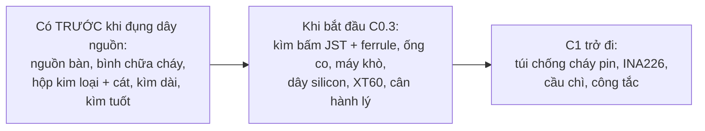
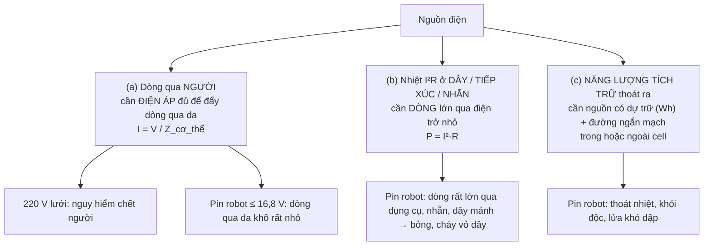
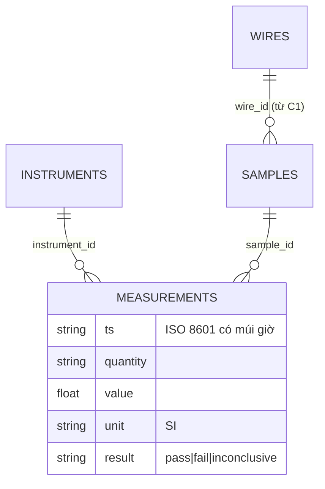

# Chặng 0 — Xưởng, dụng cụ, an toàn (20h)

> **Vị trí:** K1 Phần B (dụng cụ, mỏ hàn) → **C0** → C1 (hệ nguồn), C2 (cơ khí) · **Cần trước:** K1 Phần B (Bài 4–8); đọc → F5.7 · **Chạy song song với:** K2
> **Làm ra được:** bàn làm việc an toàn, bộ đồ nghề đã kiểm khi nhận, 10 mối hàn/đầu bấm đạt cả ba lớp kiểm (mắt, kéo, sụt áp) · sổ build `build-log/` có schema, `instruments.jsonl`, bảng quy ước dây · **Sau chặng này bạn quyết định được:** một mối nối có được phép mang dòng ampe hay phải làm lại; khi nào được phép cắm một khối mới vào nguồn, với giới hạn dòng bao nhiêu; làm gì trong 60 giây đầu khi pin bốc khói.

K1 Phần B dạy bạn cầm đồng hồ và hàn chân header ở 3,3 V, vài mA. Ở đó một mối hàn hỏng nghĩa là "cảm biến không trả lời". C0 chuyển sang thế giới của **ampe và pin**: dây mang 5–30 A, pin dự trữ hàng chục Wh, và một mối nối xấu biến thành nhiệt. Chặng này không lắp gì lên robot. Nó dựng xưởng, dạy tay, và lập sổ, để C1 (bo nguồn) không phải là lần đầu tiên bạn cầm dây nguồn.

**Phân bổ 20h** `[ước lượng]`:

| Phần | Giờ |
|---|---|
| Bài C0.1 Bàn làm việc và đồ nghề *(rút gọn)* | 1,5 |
| Bài C0.2 Điện gây hại bằng cách nào | 3 |
| Bài C0.3 Hàn dây, bấm đầu nối, co nhiệt | 5 |
| Bài C0.4 Nguồn bàn giới hạn dòng (CV/CC) | 2,5 |
| Bài C0.5 Sổ build và quy ước dây *(rút gọn)* | 1 |
| Lắp bước 1–6: dựng bàn, kiểm hàng, luyện trên phế liệu, 10 mẫu đạt, diễn tập sự cố | 6 |
| Gate chặng 0 | 1 |
| **Tổng** | **20** |

## 0. Bức tranh chặng

Sau chặng này chưa có robot. Có một **bàn thử** với ba vùng tách nhau và một đường dòng điện duy nhất đi qua nguồn bàn có giới hạn dòng:

```
  TƯỜNG 220 V ──[ổ có công tắc + CB/aptomat]──┐
                                               │  (KHÔNG có pin nào cắm vào ổ này khi không có người)
  ┌──────────────── BÀN (mặt gỗ/thảm silicon, không giấy vải) ─────────────────────┐
  │                                                                                 │
  │  VÙNG NÓNG (tay thuận)        VÙNG ĐIỆN                     VÙNG PIN (C1 trở đi) │
  │  ┌─────────┐ giá mỏ           ┌───────────┐ dây đo 18 AWG   ┌───────────────┐    │
  │  │ trạm hàn│ bùi nhùi         │ NGUỒN BÀN │──đỏ──┐          │ hộp kim loại  │    │
  │  └─────────┘ quạt hút khói →  │ V_set     │      ▼          │ + cát khô     │    │
  │  máy khò / bật lửa            │ I_set ◄── │   [ MẪU THỬ ]   │ túi chống cháy│    │
  │                               │ OUTPUT on │◄─đen─┘          └───────────────┘    │
  │                               └───────────┘   ▲ que đo UT33D+ (đo sụt áp)        │
  └─────────────────────────────────────────────────────────────────────────────────┘
   Trong tầm với ≤ 3 m: bình chữa cháy, xô cát/kìm cách điện, kính bảo hộ, cửa ra.
```

Dòng năng lượng duy nhất trong chặng: lưới 220 V → (bên trong vỏ nguồn bàn, bạn không mở) → đầu ra DC có trần dòng `I_set` → mẫu thử. Dòng dữ liệu: mỗi phép đo → một dòng JSONL trong `build-log/measurements.jsonl` → script kiểm schema.

## 1. An toàn của chặng

**Rủi ro của C0:** bỏng mỏ hàn (~350 °C) và máy khò; khói flux rosin (mẫn cảm hô hấp, K1 Bài 4); vụn đồng bắn vào mắt khi cắt dây; ngắn mạch qua dụng cụ kim loại; điện lưới 220 V **bên trong** nguồn bàn và sạc. Pin lithium lớn **chưa** dùng ở C0: bạn chỉ học về nó (C0.2) và chuẩn bị chỗ cho nó. Quy tắc dưới đây có hiệu lực tới hết K7.

**Quy tắc cứng:**
- KHÔNG mở vỏ nguồn bàn, sạc, adapter. Bên trong có 220 V và tụ còn tích điện sau khi rút phích.
- KHÔNG đeo nhẫn, đồng hồ kim loại, vòng tay khi làm với pin hoặc dây nguồn (Bài C0.2 giải thích vì sao).
- KHÔNG đặt dụng cụ kim loại lên pin hoặc lên bo đang có điện. Dụng cụ nằm ở khay riêng.
- KHÔNG cấp điện cho mẫu thử mới khi chưa đo điện trở giữa + và − của nó. Gần 0 Ω thì không cấp.
- KHÔNG nối mẫu thử vào đầu ra nguồn đang bật. Tắt OUTPUT → nối → kiểm cực → bật OUTPUT (Bài C0.4).
- KHÔNG đặt `I_set` cao "cho chắc" (Bài C0.4).
- KHÔNG để mỏ hàn ngoài giá khi buông tay. Mỏ rơi thì để rơi, KHÔNG chụp.
- KHÔNG co nhiệt bằng bật lửa gần pin, cồn IPA, dung môi đang mở nắp.
- KHÔNG sạc, xả, hay để pin cắm sạc khi không có người trong phòng (từ C1).
- KHÔNG dùng pin phồng, móp, rò, có mùi ngọt lạ, hoặc đã rơi mạnh: chuyển ngay vào hộp kim loại có cát (hủy theo C1.6).
- KHÔNG làm với pin hoặc dây nguồn khi mệt, buồn ngủ, đang vội. Tuần crunch chỉ đọc bài khái niệm.

**Khi sự cố xảy ra (in, dán cạnh bàn):**

| Sự cố | Làm ngay, theo thứ tự | KHÔNG |
|---|---|---|
| Mẫu thử/dây bốc khói trên nguồn bàn | OUTPUT OFF (hoặc rút phích nguồn bàn) → đợi 1 phút → mới chạm | Kéo dây bằng tay trần khi đang khói |
| Pin nóng bất thường, phồng, xì khí, bốc khói (từ C1) | (1) Không cúi mặt vào: khói pin có khí độc (HF và khí cháy) `[chuẩn]`. (2) Ngắt công tắc chính/rút XT60 **chỉ khi** không phải đưa tay qua luồng khói. (3) Chưa có lửa, pack nhỏ: kìm cách điện dài gắp vào hộp kim loại/xô cát, mang ra ngoài trời. (4) Rời phòng, đóng cửa | Cầm tay trần; đậy hộp kín khí; ném vào thùng rác |
| Pin có lửa | Rời phòng, gọi **114**. Với Li-ion, nước lượng lớn để **làm mát** là hợp lệ; bình bột ABC cho vật cháy xung quanh `[chuẩn — hướng dẫn của FAA cho pin thiết bị cá nhân cháy trong cabin và nhiều cơ quan cứu hỏa]` | Ở lại cứu đồ; tin lửa tắt là xong (cell có thể bùng lại sau nhiều giờ `[ước lượng]`) |
| Dụng cụ chập qua cực, có tia lửa | Ngắt nguồn phía xa (công tắc chính, phích); gạt dụng cụ bằng kìm cách điện | Giật bằng tay trần (nóng, có thể đã hàn dính) |
| Bỏng | Nước mát chảy ~20 phút `[chuẩn]`; bỏng rộng/bỏng điện → **115** | Kem đánh răng, dầu, đá lạnh trực tiếp |
| Hít khói pin, khó thở | Ra chỗ thoáng; ho/khó thở kéo dài → y tế, nói rõ đã hít khói pin lithium | — |

## 2. BOM chặng

Giá `[ước lượng 10/2026]`, kiểm lại ở cửa hàng. Nơi mua ở Hà Nội theo `docs/lo-trinh-edge-physical-ai-final.md` Phần 5: Linh Kiện Điện Tử 3M (Tạ Quang Bửu), Lập Trình Nhúng A-Z (Cầu Giấy), Chợ Trời (Thịnh Yên); online hshop.vn, nshopvn.com, mlab.com.vn… Dây silicon, XT60 thường có ở shop RC/drone. Món đã có từ K1 (UT33D+, mỏ hàn, kính bảo hộ) không lặp lại.

| Món | Thông số phải chọn | Vì sao (bằng số) | Giá | Kiểm khi nhận | Thay thế |
|---|---|---|---|---|---|
| **Nguồn bàn giới hạn dòng** | ≥30 V / ≥5 A, **nút OUTPUT riêng**, hiển thị V/I (10 mV / 1 mA), báo CV/CC; có OCP càng tốt | Pack 4S đầy 16,8 V `[chuẩn]` → cần > 17 V để giả lập pin; 5 A đủ thử mối nối, motor không tải (C3) `[ước lượng]` | 1–2tr | Bài C0.4 bước 1 | Không. Bắt buộc trước C1 |
| Dây đo banana–cá sấu | Lõi ≥18 AWG, kẹp bọc cách điện | Dây đo mảnh kèm nguồn rẻ nóng ở 5 A | 50–100k | Thông mạch | Tự làm sau C0.3 |
| Dây silicon đỏ + đen | 22, 18, 14 AWG, vài mét mỗi loại | Chịu nhiệt mỏ hàn, mềm, chịu rung; 14 AWG là cỡ dây chính dự kiến (C1.3 tính lại) `[ước lượng]` | 10–30k/m | Chữ in trên vỏ | Dây PVC làm phế liệu luyện |
| Kìm tuốt dây | Lỗ theo AWG hoặc tự động | Kìm cắt làm đứt sợi → giảm tiết diện | 100–300k | Tuốt 18 AWG không đứt sợi | — |
| Kìm bấm JST/Dupont | Ngàm open-barrel 22–28 AWG, có cóc (ví dụ IWISS SN-28B, Engineer PA-09) | Đầu JST-XH: 22–28 AWG, 3 A `[spec — catalog JST XH]` | 300–700k | Bấm thử, nhìn nghiêng | Không thay bằng kìm mỏ nhọn |
| Bộ đầu JST-XH + vỏ | 2–6 chân | Đầu tín hiệu chuẩn của K7 (`_KE-HOACH-K7.md` mục 5) | 80–150k | Cắm–rút thử | JST-PH |
| Kìm bấm ferrule + bộ ferrule | Ngàm vuông/lục giác, 0,25–6 mm² | Dây nhiều sợi trong cầu đấu vít toè sợi, lỏng dần | 250–500k | Ferrule không xoay | Không (KHÔNG nhúng thiếc, xem C0.3) |
| Đầu XT60 | Hàng có nhãn hãng (Amass) nếu tìm được | Cỡ 30 A liên tục `[spec — Amass, kiểm]`; hàng nhái chảy nhựa sớm `[ước lượng]` | 15–40k/cặp | Chạm mỏ 2 s nhựa không mềm | XT30 cho nhánh nhỏ |
| Ống co nhiệt + máy khò | Bộ 2:1 nhiều cỡ, vài ống 3:1 có keo; máy khò chỉnh nhiệt | Co đều, không cháy vỏ | 80–150k + 250–600k | Co thử | Bật lửa (xa pin, dung môi) |
| Kẹp ba tay, đầu mỏ dẹt 3–5 mm | Đế nặng; đầu đúng họ mỏ T12/936 của bạn | Hàn dây cần hai tay rảnh; dây 14 AWG và cốc XT60 hút nhiệt hơn chân header | 100–250k + 50–150k | Kẹp 14 AWG không trượt | Băng keo giấy trên bàn gỗ |
| Cân hành lý điện tử | Đến 25–50 kg | Kéo thử mối nối theo N (C0.3) | 80–150k | Treo chai nước 1,5 L | — |
| **Bình chữa cháy** | Bột ABC 1–2 kg | Vật cháy xung quanh pin | 200–400k | Kim áp ở vùng xanh, hạn dùng | Không |
| Hộp kim loại + cát khô, kìm cách điện cán dài | Hộp thép nắp đặt hờ; 2–5 kg cát; kìm ≥20 cm | Cách ly pin hỏng; tay xa pin | 150–400k | Hộp không thủng | Xô kim loại; kẹp gắp than |

**Tổng C0 `[ước lượng]`:** ~3,5–6tr gồm nguồn bàn (trừ đi nếu đã mua ở K1 Bài 4). Túi chống cháy cho pin mua ở C1, khi đã biết cỡ pack.

## 3. Dụng cụ và kỹ năng tay

Kỹ năng mới của chặng (chi tiết ở từng bài):

| Kỹ năng | Bài | Luyện trên phế liệu trước | Đạt trông thế nào |
|---|---|---|---|
| Tuốt dây không đứt sợi | C0.3 | 20 lần trên dây PVC thừa | Đầu đồng sáng, đủ sợi, xoắn gọn, không xước |
| Mạ thiếc đầu dây, nối dây thẳng, hàn XT60 | C0.3 | 6 mối nối, 2 cặp XT60 lỗi/thừa | Thiếc thấm đều, thấy hình sợi dưới lớp thiếc; không cục; vỏ không cháy |
| Bấm đầu JST-XH | C0.3 | 10 đầu thừa | Cánh trước ôm lõi, cánh sau ôm vỏ, không có sợi lòi ra |
| Bấm ferrule | C0.3 | 5 đầu | Không thấy sợi đồng ngoài ferrule; không xoay được |
| Co nhiệt | C0.3 | 5 ống | Ôm đều, phủ mối nối hai bên, không cháy, không phồng |

Hình mối header đạt/hỏng: K1 Bài 8; hình dây, đầu bấm, co nhiệt: Bài C0.3. Vận hành nguồn bàn và đo sụt áp: Bài C0.4, C0.3.

## 4. Sơ đồ đi dây

Chặng này chỉ có một "mạch": đồ gá thử mối nối, dùng lại ở C1.3 và C1.5.

```
                 dây đo 18 AWG (đỏ)                                 dây đo 18 AWG (đen)
  NGUỒN BÀN (+) ─────────────────┐                             ┌────────────────── (−) NGUỒN BÀN
  CC: I_set = 3–5 A              │   MẪU THỬ (dây 18 AWG đỏ)   │
  V_set = 2 V (thấp, chỉ đủ      ▼                             ▼
  để vào chế độ CC)          ●═══════════[ MỐI NỐI ]═══════════●
                                  ▲   ◄─── 50 mm ───►   ▲
                                  │   (span đo)         │
                                 que đỏ UT33D+         que đen UT33D+
                                 (thang mV thấp nhất)

  Dòng đi trên đường NGOÀI (kẹp cá sấu, điện trở kẹp không ảnh hưởng);
  điện áp đo trên đường TRONG, sát hai bên mối nối  →  R_mối = V_đo / I.
  Đối chứng: cùng span 50 mm trên đoạn dây NGUYÊN cùng loại, cùng dòng.
```

Màu và tiết diện ở đồ gá: đỏ = phía + của nguồn, đen = phía −; dây đo của nguồn ≥18 AWG. Quy ước đầy đủ ở Bài C0.5.

## 5. Trình tự chặng

C0.4 học trước bước đo sụt áp của C0.3, vì đồ gá ở mục 4 dùng nguồn bàn làm nguồn dòng.

1. **Học Bài C0.1.**
2. **Lắp bước 1 — Dựng bàn và vùng an toàn**
   - Làm: chia ba vùng như hình ở mục 0; dán tờ "Khi sự cố"; bình chữa cháy, hộp kim loại + cát, kìm dài trong ≤3 m, đặt **phía cửa**; ổ điện có công tắc và aptomat.
   - ✅ Checkpoint: ngồi ở ghế làm việc, trả lời: "khói bốc từ vùng pin, tôi ra cửa có phải đi qua nó không?" Phải là **không**. Chụp ảnh bàn.
   - Nếu sai: đổi vị trí vùng pin hoặc ghế, không đổi quy tắc.
3. **Lắp bước 2 — Kiểm hàng khi nhận** theo cột "Kiểm khi nhận" ở mục 2; khai báo dụng cụ đo vào `build-log/instruments.jsonl` (C0.5).
   - ✅ Checkpoint trước khi cắm nguồn bàn lần đầu: vỏ, dây, phích nguyên vẹn; công tắc 220/110 V phía sau (nếu có) ở **220 V**.
   - Nếu sai: đổi hàng; không tự sửa thiết bị dùng điện lưới.
4. **Học Bài C0.2** (commit `prediction.md` trước khi mở 🔒), rồi **Bài C0.4**, rồi **Bài C0.3**.
5. **Lắp bước 3 — Luyện trên phế liệu** theo bảng ở mục 3. Chỉ ghi số lần thử và tỉ lệ đạt.
   - ✅ Checkpoint: 5 mẫu luyện liên tiếp mỗi loại qua lớp kiểm bằng mắt (C0.3).
6. **Lắp bước 4 — Làm 10 mẫu đạt** (thành phần ở Gate tiêu chí 2), mỗi mẫu dán nhãn `J-001`…
   - ✅ Checkpoint trước khi cho dòng qua mẫu: hai đầu **cùng một dây** thông mạch kêu; giữa đỏ và đen của mẫu XT60 **không** kêu. Kêu = chập, không cấp dòng.
   - Nếu sai: cắt bỏ, làm lại; không "sửa" chỗ chập bằng cách hâm thêm.
7. **Lắp bước 5 — Đo sụt áp và kéo thử 10 mẫu** (C0.3 bước F), mỗi phép đo một dòng JSONL.
8. **Học Bài C0.5**, chạy script kiểm sổ.
9. **Lắp bước 6 — Diễn tập sự cố (khô, không pin)**
   - Làm: "pin giả" (hộp sữa rỗng gắn hai dây) ở vùng pin. Bấm giờ từ lúc hô "khói" → ngắt nguồn phía xa → gắp vào hộp kim loại bằng kìm dài → mang ra ngoài → đóng cửa phòng.
   - ✅ Checkpoint: trọn chuỗi, không phải tìm đồ, tay không đi qua phía trên pin giả.
   - Nếu sai: sửa bố trí (bước 1), diễn tập lại.
10. **Gate chặng 0.**

## 6. Lỗi người mới hay gặp

| Triệu chứng | Nguyên nhân khả dĩ | Kiểm bằng cách | Sửa |
|---|---|---|---|
| Nguồn bàn báo CC ngay khi bật, V gần 0 | Mẫu chập; dây đo chạm nhau; `I_set` quá nhỏ | OUTPUT OFF, đo Ω giữa + và − | Gỡ chập, hoặc tăng `I_set` có lý do |
| Nóng ở kẹp cá sấu, không ở mối nối | Điện trở tiếp xúc của kẹp | Sờ sau khi tắt | Kẹp to hơn; không ảnh hưởng phép đo Kelvin |
| Co nhiệt xong mới nhớ chưa luồn ống | Thứ tự thao tác | — | Cắt, làm lại; dán "LUỒN ỐNG TRƯỚC" lên kẹp ba tay |
| Sổ build bị bỏ sau 3 ngày | Ghi tay, nhiều trường | Đếm dòng/ngày | Lệnh ghi một dòng (C0.5); ghi ngay lúc đo |

Lỗi riêng của từng kỹ năng nằm ở phần 8 của mỗi bài.

## 7. Lăng kính data infra

**Dữ liệu chặng này sinh ra:**

| Luồng | File | Schema (rút gọn) | Tần số | Đơn vị (theo `CONVENTIONS.md`) |
|---|---|---|---|---|
| Phép đo thủ công | `build-log/measurements.jsonl` | `ts, stage, step, sample_id, quantity, value, unit, instrument_id, result, note` | theo sự kiện, ~50–100 dòng ở C0 `[ước lượng]` | SI: `V`, `A`, `ohm`, `N`; không `mA`, không `g` trong dữ liệu |
| Danh mục dụng cụ đo | `build-log/instruments.jsonl` | `instrument_id, model, serial, spec, fuse, checked_at` | khi mua/kiểm | — |
| Bảng dây | `wiring/wires.csv` | `wire_id, net, from, to, awg, color, length_m, fuse_a` | khi đi dây (rỗng ở C0, có header) | — |

**Test tự động sinh ra từ chặng này:**
- `validate_buildlog.py` (Bài C0.5) chạy trong CI của repo: mọi dòng đo đúng schema, đơn vị SI, dụng cụ đã khai báo. Đây là data contract đầu tiên bạn viết cho phần cứng (→ F3.7).
- **Hạt giống HIL cho C11:** phép thử "đo sụt áp qua mối nối ở dòng cố định" là một bench test có ngưỡng nhị phân. Ở C11.2 dạng này có thể thành bài kiểm tự động (nguồn lập trình được, INA226 đo áp, script chấm ba trạng thái); schema giữ nguyên.

**SLI của sổ build:** tỉ lệ dòng hợp lệ (100 %), độ trễ đo→ghi (cùng buổi), tỉ lệ mẫu có ảnh.

**Vai trò nghề:** Test & Validation (bench test có ngưỡng, sai số dụng cụ, ba trạng thái); Data Platform (schema, đơn vị, dụng cụ như bảng dimension, provenance từng con số).

## 8. Nhật ký build

Copy vào `build-log/c00.md`, một mục mỗi buổi:

```markdown

## 2026-MM-DD — buổi N (giờ bắt đầu–kết thúc, giờ thực: _._ h)
- Trạng thái người: tỉnh táo / mệt (mệt → chỉ đọc, không cấp điện)
- Mục tiêu buổi: (ví dụ: 5 đầu JST luyện + 2 mẫu J-003, J-004)
- Đã làm:
- Số đo (đã ghi vào measurements.jsonl? có/không; số dòng: __)
- Ảnh: build-log/img/c00/...
- Lỗi gặp (triệu chứng → nguyên nhân → sửa):
- Quyết định (ghi thêm vào decisions.md nếu ảnh hưởng chặng sau):
- Sự cố an toàn / suýt sự cố (near miss): không / có → mô tả, sửa bố trí gì
- Câu hỏi còn mở:
```

Ghi cả **suýt sự cố** (mỏ suýt rơi, kìm chạm hai cực): hàng không và y tế thu thập near miss vì chúng nhiều hơn sự cố thật và báo trước nó.

---

## Bài C0.1 — Bàn làm việc và đồ nghề: mua gì, vì sao (1,5h) (khung rút gọn)

> **Vị trí:** K1 Bài 4 (mua đợt 1) → **C0.1** → C0.2 · **Cần trước:** K1 Phần B · **Sau bài này bạn quyết định được:** món nào ở mục 2 phải có trước khi đụng dây nguồn, món nào để sau, và vùng pin trên bàn đặt ở đâu.

### 1. Câu chuyện — ai đã khổ vì chuyện này

Năm 2016 Samsung thu hồi khoảng 2,5 triệu Galaxy Note 7 vì pin cháy; máy thay thế cũng cháy, và sản phẩm bị dừng hẳn. Kết quả điều tra công bố 23/1/2017 (Samsung cùng UL, Exponent, TÜV Rheinland): pin của **hai nhà cung cấp, hai lỗi khác nhau**. Pin A: góc vỏ quá chật làm điện cực âm bị cong. Pin B: ba via của mối hàn siêu âm trên tab dương đâm thủng băng cách điện và màng ngăn; một số cell thiếu băng cách điện `[chuẩn — công bố của Samsung và tường thuật báo chí về buổi công bố]`.

Một tập đoàn có hàng trăm kỹ sư pin vẫn cháy vì **một ba via mối hàn và một góc vỏ chật**. Bạn không chế tạo cell, nhưng bạn sẽ hàn, bấm, ép dây sát pin. Đồ nghề đúng biến "khéo tay" thành "lặp lại được": kìm bấm đúng ngàm cho đầu bấm thứ 50 giống đầu thứ nhất; kìm mỏ nhọn thì không.

### 2. Mô hình tư duy



1. **Mỗi món an toàn trả lời một dòng trong bảng "Khi sự cố"** (mục 1). Món không gắn được với dòng nào thì chưa cần.
2. **Đồ nghề tay biến kỹ năng thành quy trình:** ngưỡng N và mV ở C0.3 chỉ có nghĩa khi dụng cụ cho kết quả lặp lại.
3. **Bố trí bàn là thiết kế đường thoát:** vùng pin xa người, gần cửa, không nằm giữa ghế và lối ra.

### 3. Cầu nối từ backend

| Backend bạn biết | Ở đây | Gãy ở chỗ | Nếu dùng nhầm thì |
|---|---|---|---|
| Runbook sự cố trong wiki | Tờ "Khi sự cố" cạnh bàn | Runbook backend đọc khi đã ngồi xuống. Ở đây bạn có vài giây, tay có thể đang cầm mỏ; quy trình phải **thuộc và đã diễn tập** (Lắp bước 6) | Tìm tờ giấy khi khói đã đầy bàn |
| Tách dev/production | Vùng nóng / điện / pin | Tách môi trường là cấu hình. Tách vùng là **khoảng cách vật lý**; một sợi dây vắt ngang là đã trộn | Dây mỏ hàn vắt qua vùng pin |

### 6. Làm

1. Đánh dấu món đã có từ K1; chia phần còn lại theo ba đợt ở phần 2, ghi lý do vào `decisions.md`.
2. Mua. Nguồn bàn: xem ảnh mặt trước, phải có nút OUTPUT riêng và chỉ báo CV/CC.
3. Lắp bước 1 và 2 ở mục 5; chụp `build-log/img/c00/ban-lam-viec.jpg`.

### 8. Nếu ra khác

| Triệu chứng | Nguyên nhân khả dĩ | Kiểm bằng cách | Sửa |
|---|---|---|---|
| Nguồn bàn không có nút OUTPUT | Mẫu rẻ nhất | Manual | Đổi nếu còn được; nếu không, chỉ nối tải khi nguồn **tắt hẳn** |
| Bàn quá nhỏ cho ba vùng | Phòng chật | — | Vùng pin là khay kim loại trên sàn gạch cạnh cửa; không bỏ vùng |
| Bình chữa cháy kim ở vùng đỏ, hết hạn | Hàng tồn | Tem | Đổi |

### 9. Câu hỏi ngược

1. **[Quy mô]** Xưởng cho 10 người cùng build robot: bố trí và bảng "Khi sự cố" đổi gì? Cái gì gãy trước?
<details><summary>Hướng nghĩ</summary>

Vùng sạc chung thành điểm rủi ro tập trung (nhiều pack, một phòng): cần tủ sạc riêng, báo khói, người kiểm quy tắc không sạc qua đêm. Dụng cụ chung (kìm bấm) cần kiểm định kỳ, nếu không mười người làm đầu bấm hỏng với cùng một kìm mòn.

</details>

2. **[Failure mode]** Bố trí của bạn qua checkpoint "đường ra cửa không qua vùng pin". Kể một tình huống nó vẫn hỏng.
<details><summary>Hướng nghĩ</summary>

Khói đi theo gió, không theo hình vẽ: quạt hút khói hàn có thể thổi khói pin về phía bạn. Từ C5 pin nằm trên xe, xe ở đâu vùng pin ở đó. Bố trí là giả định, kiểm lại mỗi chặng.

</details>

### 12. Đọc thêm và tự kiểm tra

- **Nguồn gốc:** công bố của Samsung về kết quả điều tra Galaxy Note 7 (news.samsung.com, 1/2017).
- **Tự kiểm tra:** (1) mỗi món an toàn ở mục 2 ứng với dòng nào trong bảng "Khi sự cố"? (2) vẽ lại bàn ba vùng và đường ra cửa từ trí nhớ.

---

## Bài C0.2 — Điện gây hại bằng cách nào: dòng, nhiệt, năng lượng pin (3h)

> **Vị trí:** C0.1 → **C0.2** → C0.4, C0.3; về sau → K7 C1.1 (hóa học pin, BMS), C1.3 (dây, cầu chì) · **Cần trước:** K1 Bài 1–2 (V, I, R, P), → F5.7 (đọc) · **Sau bài này bạn quyết định được:** với một nguồn cụ thể (pin 4S, nguồn bàn, ổ 220 V), mối nguy chính là điện giật, nhiệt, hay năng lượng tích trữ, và quy tắc nào ở mục 1 chặn mối nguy đó.

### 1. Câu chuyện — ai đã khổ vì chuyện này

Ngày 7/1/2013, pin lithium-ion của bộ APU trên một Boeing 787 của Japan Airlines bốc cháy khi máy bay đang đỗ ở sân bay Boston Logan. Chín ngày sau, pin chính của một 787 của All Nippon Airways bốc khói, máy bay hạ cánh khẩn cấp ở Nhật. FAA cấm bay toàn bộ đội 787 của Mỹ ngày 16/1/2013; các nhà chức trách khác làm theo. Tháng 4/2013 FAA duyệt thiết kế sửa: pin nằm trong hộp thép có đường thoát khí ra ngoài thân máy bay, thay cell và bộ sạc. Báo cáo cuối của NTSB (12/2014) kết luận: một cell trong pin 8 cell bị **ngắn mạch bên trong**, dẫn tới thoát nhiệt (thermal runaway) và lan sang các cell còn lại; Boeing đã giả định một cell hỏng sẽ không lan, và FAA không yêu cầu thử đủ cho kịch bản ngắn mạch bên trong `[chuẩn — NTSB, hồ sơ điều tra DCA13IA037]`.

Chi tiết đáng nhớ nhất với một người làm dữ liệu: khi chứng nhận, ước lượng xác suất pin gây khói là khoảng **một lần trong 10 triệu giờ bay**. Chủ tịch NTSB khi đó, Deborah Hersman, chỉ ra đội 787 mới bay chưa tới 100.000 giờ mà đã có hai sự kiện `[chuẩn — phát biểu của NTSB, 2/2013]`. Giả định "một cell hỏng không lan" chưa từng được đo; nó được suy ra.

### 2. Mô hình tư duy

Điện làm hại bạn theo **ba đường khác nhau**, mỗi đường có điều kiện riêng:



Ba câu bản chất:
1. **Dòng qua người phụ thuộc điện áp và tổng trở cơ thể, không phụ thuộc "nguồn mạnh cỡ nào".** Tổng trở cơ thể (chủ yếu là da) giảm khi điện áp tăng, khi da ướt, khi diện tích tiếp xúc lớn. Theo IEC 60479-1 (xoay chiều 50/60 Hz): ngưỡng cảm nhận cỡ **0,5 mA**, ngưỡng "buông ra được" (let-go) cỡ **5 mA**; ngưỡng rung thất (ventricular fibrillation) phụ thuộc thời gian dòng chạy, từ hàng trăm mA với xung vài chục ms xuống vài chục mA với dòng kéo dài nhiều giây `[chuẩn — IEC 60479-1; số VF đọc trên đường c1 của hình time/current, kiểm trên bản tiêu chuẩn]`. Với dòng một chiều, IEC 60479-1 ghi không có ngưỡng let-go xác định (co cơ xảy ra lúc đóng và ngắt dòng) và ngưỡng rung thất cao hơn nhiều so với xoay chiều cho cùng thời gian dài `[chuẩn — IEC 60479-1 mục 6; con số DC cụ thể chưa đối chiếu được với văn bản gốc]`.
2. **Nhiệt là I²R, nên dòng gấp đôi thì nhiệt gấp bốn.** Ngắn mạch pin không giật bạn; nó nung nóng thứ kim loại nằm giữa hai cực (cờ lê, nhẫn, dây 22 AWG), nhanh tới mức bạn không kịp phản ứng (mục 5 bạn tự tính).
3. **Pin là kho năng lượng không có công tắc bên trong.** Dòng ngắn mạch chỉ bị giới hạn bởi điện trở trong của cell và điện trở mạch ngoài: `I_sc = E / (R_trong + R_ngoài)`. BMS có thể cắt ngắn mạch **bên ngoài** (nếu nó còn hoạt động); không gì cắt được ngắn mạch **bên trong** cell, đó là kịch bản 787.

**Mô phỏng đồ chơi: chập pin 4S qua dây, dây nóng nhanh thế nào.** Mô hình đoạn nhiệt (bỏ qua tỏa nhiệt ra không khí, đúng cho vài giây đầu; càng lâu mô hình càng bi quan).

```python
# [đã chạy] Ngắn mạch pin qua dây: dòng bao nhiêu, dây nóng nhanh thế nào (mô hình đồ chơi)
import numpy as np

RHO20, ALPHA = 1.72e-8, 0.0039   # điện trở suất đồng ở 20 °C (Ω·m), hệ số nhiệt (1/K)  [chuẩn]
DENS, CP = 8960.0, 385.0         # khối lượng riêng (kg/m³), nhiệt dung riêng (J/(kg·K)) của đồng [chuẩn]
AWG_MM2 = {22: 0.326, 18: 0.823, 14: 2.08}   # tiết diện danh định [chuẩn]

def short_current(v_pack, r_int_pack, r_wire, r_contact=0.005):
    """Định luật Ohm cho cả vòng: pin là nguồn áp E nối tiếp điện trở trong."""
    return v_pack / (r_int_pack + r_wire + r_contact)

def heat_adiabatic(i_amp, awg, t_end=3.0, dt=1e-3, t0=25.0):
    """Không tính tỏa nhiệt ra ngoài (đúng cho vài giây đầu): dT/dt = I²·ρ(T) / (A²·d·c)."""
    a = AWG_MM2[awg] * 1e-6
    t = np.arange(0, t_end, dt)
    temp = np.empty_like(t); temp[0] = t0
    for k in range(1, len(t)):
        rho = RHO20 * (1 + ALPHA * (temp[k-1] - 20))
        temp[k] = temp[k-1] + i_amp**2 * rho / (a**2 * DENS * CP) * dt
    return t, temp

# Kịch bản: pack 4S Li-ion đầy (16,8 V), điện trở trong cả pack giả định 0,08 Ω [ước lượng],
# chập qua 0,5 m dây 22 AWG (hai chiều đi-về = 1 m).
r_wire22 = RHO20 / (AWG_MM2[22] * 1e-6) * 1.0
i_sc = short_current(16.8, 0.08, r_wire22)
print(f"R dây 22 AWG 1 m = {r_wire22*1000:.0f} mΩ ; dòng ngắn mạch ≈ {i_sc:.0f} A")

for awg in (22, 18, 14):
    for i in (10, 30, i_sc):
        t, T = heat_adiabatic(i, awg)
        hit = t[np.argmax(T >= 105)] if T.max() >= 105 else None   # 105 °C: vỏ PVC tốt [ước lượng]
        print(f"AWG {awg:2d}  I={i:5.0f} A  -> {'%.2f s' % hit if hit is not None else '>3 s'} tới 105 °C")

```

### 3. Cầu nối từ backend

| Backend bạn biết | Ở đây | Gãy ở chỗ | Nếu dùng nhầm thì |
|---|---|---|---|
| Blast radius: lỗi ở service có quyền lớn thì hại lớn | Năng lượng tích trữ (Wh) quyết định hậu quả tối đa | Blast radius backend giới hạn được bằng quyền và phân vùng. Năng lượng trong cell **không phân quyền được**: nó nằm sẵn ở đó, chỉ chờ một đường ngắn mạch | Coi pin "nhỏ" vì điện áp thấp, đặt nó cạnh giấy và vải |
| Circuit breaker ngắt khi lỗi | BMS ngắt khi quá dòng | Circuit breaker nằm giữa mọi caller và service. BMS nằm **ngoài** cell: ngắn mạch bên trong cell không đi qua BMS | Tin "có BMS là chập không sao", để cờ lê lên cực pin |
| Ước lượng xác suất lỗi từ thiết kế (SLO dự kiến) | Xác suất "1 trên 10 triệu giờ" của 787 | SLO backend được đo liên tục, sai thì thấy sau vài ngày. Xác suất lỗi hiếm của phần cứng không đo được trước khi có đủ giờ chạy, mà sự kiện đầu tiên đã là cháy | Tin con số trên datasheet thay cho biên an toàn vật lý (hộp kim loại, khoảng cách) |

**Chấm mô hình:**
- *"Pin robot chỉ 16,8 V, dưới mức nguy hiểm, nên an toàn."* — **ĐÚNG MỘT PHẦN.** Đúng cho đường (a): ở điện áp này, dòng qua da khô nhỏ. Gãy ở đường (b) và (c): cùng pin đó đẩy dòng đủ lớn để nung nóng nhẫn kim loại trên ngón tay bạn. Phản ví dụ: thợ điện ô tô (ắc quy 12 V) vẫn bị bỏng nặng do nhẫn hoặc cờ lê bắc qua cực ắc quy; đó là lý do quy tắc tháo nhẫn có ở khắp các hướng dẫn an toàn ắc quy `[chuẩn]`.
- *"BMS là lớp bảo vệ, có BMS rồi thì ngắn mạch không còn nguy."* — **SAI** như một khẳng định chung. BMS chỉ thấy dòng đi qua nó; ngắn mạch giữa hai điểm **trước** BMS (dây cân bằng, cực cell lộ ra) hoặc **bên trong** cell không đi qua MOSFET của BMS. Phản ví dụ: 787 có mạch giám sát và bảo vệ pin; ngắn mạch bên trong một cell vẫn lan ra toàn bộ pin.

### 4. Thuật ngữ

| Mức | Thuật ngữ | Nghĩa trong một câu | Hay bị hiểu nhầm thành |
|---|---|---|---|
| 🟢 | Ngắn mạch (short circuit) | Đường điện trở rất nhỏ giữa hai cực nguồn, dòng chỉ bị giới hạn bởi điện trở trong | "Mạch bị đứt" |
| 🟢 | Điện trở trong (internal resistance) | Điện trở nằm sẵn trong cell, làm áp tụt khi có dòng và giới hạn dòng ngắn mạch | Thông số không quan trọng |
| 🟢 | Wh (watt-giờ) | Năng lượng: V danh định × Ah | Ah (Ah không phải năng lượng nếu không có V) |
| 🟢 | Thoát nhiệt (thermal runaway) | Cell nóng → phản ứng sinh nhiệt → nóng thêm, tự duy trì, lan sang cell kế bên | "Pin nổ" ngay lập tức |
| 🟡 | Ngưỡng let-go | Dòng lớn nhất mà người còn tự buông vật đang cầm được | Ngưỡng chết người |
| 🟡 | Rung thất (ventricular fibrillation) | Tim co hỗn loạn, không bơm máu; nguyên nhân tử vong chính do điện giật | "Tim ngừng" (khác cơ chế) |

### 5. Dự đoán

Tạo `build-log/c00-prediction-C0.2.md` và commit **trước** khi mở 🔒 ở phần 7.

Tham số cần tra:
- Pack giả định: 4S2P cell 18650 dung lượng 3,0 Ah; điện áp danh định cell 3,6 V, đầy 4,2 V `[chuẩn cho NMC; kiểm datasheet cell bạn định mua ở C1]`.
- Điện trở trong một cell: tra datasheet một cell 18650 phổ biến (thường ghi "AC impedance" hoặc "internal resistance", đơn vị mΩ). Điện trở trong pack 4S2P = 4 × R_cell / 2, cộng dây nối và BMS.
- Tổng trở cơ thể tay–tay: bảng tổng trở trong IEC 60479-1 (bắt đầu ở 25 V; bạn sẽ phải ngoại suy về 16,8 V, ghi rõ là ngoại suy) hoặc tự đo (phần 6, bước 3).

```markdown
# C0.2 — dự đoán (YYYY-MM-DD, trước khi mở 🔒)
1. Năng lượng pack 4S2P 3,0 Ah (danh định): ___ Wh. So với giới hạn 100 Wh mang lên máy bay của IATA: trên/dưới?
2. Điện trở trong pack (từ datasheet cell): ___ mΩ. Dòng ngắn mạch khi chập qua 1 m dây 22 AWG (đi + về): ___ A.
3. Dây 22 AWG ở dòng câu 2 tới 105 °C sau ___ s; tới 1085 °C (đồng chảy) sau ___ s. Đoán trước, rồi chạy script ở phần 2 (đổi ngưỡng 105 thành 1085 cho vế sau).
4. Đổi sang 14 AWG cùng dòng: thời gian tới 105 °C tăng bao nhiêu lần? (gợi ý: tỉ lệ tiết diện, mũ mấy?)
5. Điện trở giữa hai bàn tay khô, cầm hai que đo, đo bằng UT33D+: ___ ; tay ướt: ___ .
6. Dòng qua người khi hai tay khô chạm hai cực pack 16,8 V: ___ mA. So với ngưỡng cảm nhận AC 0,5 mA: trên/dưới?
7. Một câu: với pin robot, đường (a), (b), (c) nào là mối nguy chính, vì sao.
```

### 6. Làm

1. **Tính** câu 1, 2 bằng tay, ghi công thức.
2. **Chạy** script ở phần 2 (copy vào `lab/c00/c02_nhiet.py`). Đổi: `r_int_pack` theo số bạn tra; chiều dài dây 0,2 m và 2 m; AWG 22/18/14. Ghi bảng kết quả vào `lab/c00/c02-ket-qua.md`. Lưu ý giới hạn mô hình: chỉ đúng cho vài giây đầu (bỏ qua tỏa nhiệt), bỏ qua việc điện áp pin tụt khi dòng lớn.
3. **Đo điện trở cơ thể** (an toàn: đồng hồ ở chế độ Ω chỉ đặt vài trăm mV tới vài V qua que `[tự đo — manual UT33D+]`):
   - UT33D+ chế độ Ω, thang cao nhất. Tay khô: cầm chặt que đỏ bằng tay trái, que đen bằng tay phải (nắm cả bàn tay quanh đầu kim loại). Đợi số ổn định 10 s. Ghi.
   - Lặp với ngón tay chạm nhẹ (diện tích nhỏ), rồi với tay vừa rửa còn ướt.
   - Sai số: đồng hồ đo ở điện áp thử rất thấp, mà tổng trở da **giảm** khi điện áp tăng; số đo được là **cận trên** của tổng trở ở 16,8 V và cao hơn nhiều so với ở 220 V.
4. **Đọc** tóm tắt NTSB về 787 (trang điều tra DCA13IA037 trên ntsb.gov); ghi một đoạn: lớp bảo vệ nào đã có, giả định nào sai. Thiếu quy tắc nào ở mục 1 cho đường (b), (c) thì thêm và ghi lý do.

### 7. Số phải ra

<details><summary>🔒 MỞ SAU KHI COMMIT prediction.md</summary>

| Câu | Số | Ghi chú |
|---|---|---|
| 1 | 4 × 3,6 V × 6,0 Ah = **86,4 Wh** | Dưới 100 Wh (IATA) nhưng không xa; ≈ 311 kJ, đủ đun sôi gần 1 lít nước từ 25 °C `[ước lượng]` |
| 2 | Cell 18650 công suất cao thường ghi cỡ 10–30 mΩ AC `[spec — tùy cell]`; pack 4S2P cỡ 20–60 mΩ + dây, BMS, mối nối. Script giả định 0,08 Ω tổng và ra **~120 A** qua 1 m dây 22 AWG (53 mΩ) | Thực tế thấp hơn chút (áp cell tụt, dây nóng làm R tăng), vẫn cỡ trăm ampe. BMS tốt cắt trong cỡ µs–ms `[spec — datasheet BMS]`; nếu không cắt, câu 3 áp dụng |
| 3 | 22 AWG ở ~120 A: tới 105 °C sau **~0,1 s**; đồng tới 1085 °C sau **~0,6 s** (đoạn nhiệt) | Vỏ dây bốc khói gần như tức thì. Vì vậy dây cân bằng mảnh của pack là chỗ nguy hiểm |
| 4 | Nhanh chậm theo **A²** ở cùng dòng: (2,08 / 0,326)² ≈ **41 lần** chậm hơn; script cho >3 s | Chọn dây theo dòng là chọn thời gian bạn có trước khi cháy |
| 5 | Tay khô nắm que: thường hàng chục kΩ tới vài trăm kΩ; ngón chạm nhẹ: cao hơn nhiều; tay ướt: thấp hơn rõ `[tự đo]` | Biến thiên lớn giữa người và lần đo là bình thường. Đó chính là lý do tiêu chuẩn dùng phân vị (5%, 50%, 95%) |
| 6 | Với tổng trở cỡ vài kΩ trở lên (vùng 25 V trong IEC 60479-1, ngoại suy), 16,8 V cho cỡ **vài mA trở xuống** | Dòng một chiều cỡ này thường không gây hại; điều đó không làm cho (b) và (c) bớt nguy hiểm |
| 7 | (b) và (c). Đường (a) chỉ là mối nguy chính khi đụng điện lưới | — |

</details>

### 8. Nếu ra khác

| Triệu chứng | Nguyên nhân khả dĩ | Kiểm bằng cách | Sửa |
|---|---|---|---|
| Dòng ngắn mạch tính ra vài nghìn A | Quên điện trở trong; dùng R_cell thay vì R_pack (4S nối tiếp cộng R) | Viết lại mạch tương đương | R_pack = (số cell nối tiếp × R_cell) / số nhánh song song |
| Đo điện trở cơ thể ra "OL" | Thang quá nhỏ; chạm quá nhẹ | Chuyển thang lớn nhất | Nắm chặt; nếu vẫn OL thì R > thang đo, ghi "> thang" |

### 9. Câu hỏi ngược

1. **[Quy mô]** Bạn vận hành 100 robot, mỗi con chạy 8 h/ngày. Giả sử xác suất một pack gặp sự cố khói là 1 trên 1 triệu giờ. Kỳ vọng bao nhiêu sự kiện mỗi năm? Nếu năm đầu có 2 sự kiện, bạn kết luận gì về con số "1 trên 1 triệu"?
<details><summary>Hướng nghĩ</summary>

100 × 8 × 365 ≈ 292.000 giờ/năm → kỳ vọng ~0,3 sự kiện. Thấy 2 khi kỳ vọng 0,3: xác suất Poisson của ≥2 là cỡ vài phần trăm, không chứng minh sai nhưng là tín hiệu mạnh (→ F1.5). Đó đúng là lập luận của NTSB với 787. Câu hỏi data infra: hệ của bạn có ghi đủ giờ chạy, nhiệt độ pack, số chu kỳ sạc để tính mẫu số không?

</details>

2. **[Failure mode]** Liệt kê ba đường ngắn mạch trên một robot có pack + BMS mà BMS không thấy được.
<details><summary>Hướng nghĩ</summary>

Dây cân bằng (balance lead) bị cắt hoặc kẹp vào khung kim loại; cực pack trước BMS lộ ra khi tháo vỏ; ngắn mạch trong cell do va đập hoặc đâm thủng. Mỗi đường cần một biện pháp vật lý (bọc, gá, hộp), không phải phần mềm.

</details>

3. **[Liên ngành]** Máy khử rung tim (defibrillator) cố ý đưa một xung dòng lớn qua tim. Vì sao điều trị được bằng chính thứ gây rung thất?
<details><summary>Hướng nghĩ</summary>

Rung thất là trạng thái hỗn loạn; một xung đủ lớn, ngắn, đúng lúc khử cực toàn bộ cơ tim cùng lúc để nút xoang lấy lại nhịp. Cùng một đại lượng (dòng qua tim), tác động phụ thuộc biên độ, thời gian, thời điểm trong chu kỳ tim. Đây là lý do IEC 60479 vẽ ngưỡng theo thời gian chứ không cho một con số.

</details>

### 10. Liên kết ra ngoài

- **Hàng không (787 sau 2013).** Giải pháp của Boeing không phải "cell không bao giờ hỏng" mà là **chứa hậu quả**: hộp thép, đường thoát khí ra ngoài. Giống: hộp kim loại + cát của bạn cũng là chứa hậu quả. Khác: họ chứng nhận bằng thử nghiệm phá hủy; bạn chỉ có diễn tập.
- **Ắc quy ô tô và điện tàu biển.** 12–24 V DC nhưng năng lượng và dòng ngắn mạch lớn hơn pin robot nhiều; quy tắc tháo nhẫn và che cực bằng nắp cách điện có từ lâu. Giống: mối nguy là nhiệt, không phải giật. Khác: ắc quy chì-axit không thoát nhiệt kiểu lithium, nhưng sinh khí hydro khi sạc.

### 11. Độ tin cậy và sửa lỗi

| Khẳng định | Nhãn | Ghi chú / cách kiểm |
|---|---|---|
| AC 50/60 Hz: cảm nhận ~0,5 mA, let-go ~5 mA | `[chuẩn]` | IEC 60479-1 (bản 2005 trở đi); bản cũ và nhiều tài liệu thứ cấp ghi let-go ~10 mA |
| VF phụ thuộc thời gian; DC không có ngưỡng let-go xác định | `[chuẩn]` | IEC 60479-1; số DC cụ thể chưa đối chiếu được với văn bản gốc, không đưa con số |
| Sự kiện 787: ngày, cấm bay, sửa tháng 4/2013, NTSB 12/2014 | `[chuẩn]` | ntsb.gov, DCA13IA037; tường thuật báo chí |
| "1 lần / 10 triệu giờ" vs 2 sự kiện < 100.000 giờ | `[chuẩn]` | Phát biểu của Deborah Hersman, 2/2013 |
| Note 7: hai lỗi pin A/B | `[chuẩn]` | Samsung 23/1/2017; chi tiết cơ chế từ tường thuật báo chí về buổi công bố |
| Nước dùng được để làm mát pin Li-ion cháy | `[chuẩn]` | Hướng dẫn FAA cho thiết bị điện tử cá nhân cháy trong cabin; hướng dẫn cứu hỏa nhiều nước |

Đã sửa so với nguồn: K7 gốc không có bài nào về an toàn điện/pin (chỉ một dòng "pin 3S/4S + BMS"); bài này mới. Lưu ý cho người đọc tài liệu khác: con số let-go "10 mA" hay gặp là giá trị cũ/thứ cấp; IEC 60479-1 hiện hành dùng ~5 mA làm giá trị chung.

### 12. Đọc thêm và tự kiểm tra

- **Nguồn gốc:** IEC 60479-1 *Effects of current on human beings and livestock — Part 1: General aspects* (đọc mục lục và hình time/current nếu tiếp cận được); NTSB, Aircraft Incident Report về pin 787 (DCA13IA037, 2014).
- **Giải thích:** Battery University (Cadex), các bài về an toàn lithium-ion và thermal runaway.
- **Đào sâu (tùy chọn):** IATA Lithium Battery Guidance Document (giới hạn Wh khi vận chuyển).
- **Tự kiểm tra:** (1) giải thích ba đường gây hại cho một backend engineer trong 5 câu; (2) vẽ lại sơ đồ ba nhánh từ trí nhớ; (3) chiếc cờ lê thép rơi bắc qua hai cực pack 4S. Đường nào? Làm gì?

<details><summary>Đáp án tự kiểm tra</summary>

(3) Đường (b), có thể dẫn tới (c) nếu pack nóng lên. Không giật cờ lê ra bằng tay trần (nóng, có thể đã hàn dính); ngắt công tắc chính nếu ở phía bên kia; nếu không, dùng kìm cách điện gạt ra; sau đó cách ly pack vào hộp kim loại và theo dõi nhiệt. Phòng ngừa: che cực, không đặt dụng cụ trên pin.

</details>

---

## Bài C0.3 — Hàn dây, bấm đầu nối, co nhiệt (5h)

> **Vị trí:** K1 Bài 8 (hàn header) → C0.4 (nguồn bàn, dùng làm nguồn dòng) → **C0.3** → C0.5; về sau → K7 C1.3, C1.5 (bo nguồn), C2.3 (strain relief) · **Cần trước:** K1 Bài 8, Bài C0.2, Bài C0.4; → F1.1 (sai số đo) · **Sau bài này bạn quyết định được:** một mối nối dây/đầu bấm có được phép mang dòng ampe trên robot hay phải cắt làm lại, dựa trên ba phép kiểm có ngưỡng.

### 1. Câu chuyện — ai đã khổ vì chuyện này

Ngày 2/9/1998, Swissair 111 (MD-11) rơi ngoài khơi Nova Scotia, 229 người chết. Báo cáo của cơ quan điều tra an toàn giao thông Canada (TSB, hồ sơ A98H0003) kết luận đám cháy bắt đầu từ **hồ quang điện ở dây điện** phía trên trần buồng lái, lan qua lớp cách nhiệt dễ cháy; vùng dây hỏng liên quan tới hệ thống giải trí lắp thêm `[chuẩn — báo cáo TSB 2003]`. Sau đó ngành hàng không đổi yêu cầu về vật liệu cách nhiệt và cách lắp dây.

Cơ chế ở robot của bạn giống nhau: **mối nối và dây là nơi điện năng thành nhiệt ngoài ý muốn**. Mối nối có điện trở gấp đôi bình thường không làm robot dừng; nó ấm lên mỗi lần motor kéo dòng, oxi hóa dần, điện trở tăng, ấm hơn nữa. Vòng phản hồi dương đó không có log.

### 2. Mô hình tư duy

**Ba cách nối dây, ba cơ chế:**

| Cách | Cơ chế | Mạnh ở | Yếu ở | Dùng ở K7 |
|---|---|---|---|---|
| Hàn (solder) | Thiếc ướt và tạo lớp liên kim với đồng (K1 Bài 8) | Điện trở thấp, làm được bằng mỏ | Thiếc thấm (wick) dọc dây làm đoạn dây **cứng**; chỗ chuyển cứng→mềm gãy khi rung | XT60, nối dây thẳng có co nhiệt + gá chống kéo |
| Bấm (crimp) | Ép biến dạng kim loại đầu cos quanh sợi đồng thành khối gần như kín khí | Chịu rung tốt, lặp lại được nếu đúng kìm | Sai ngàm/sai cỡ thì hỏng mà trông vẫn được | JST-XH tín hiệu, ferrule |
| Kẹp vít + ferrule | Vít ép ống đồng đã bấm | Tháo lắp được | Vít lỏng dần do rung nếu không kiểm | Cầu đấu, công tắc, cầu chì (C1) |

**Mối nối dây thẳng (inline splice) nhìn từ bên cạnh:**

```
 ĐẠT:   vỏ ═══════╗ sợi xoắn song song, thiếc thấm thấy hình sợi ╔═══════ vỏ
                  ╚══════════════════════════════════════════════╝
                   ←1–2 mm hở→   chiều dài chồng ≈ 15–20 mm   ←1–2 mm hở→
        ống co phủ: ◄─────────── mối + 5–10 mm mỗi bên ──────────►

 HỎNG:  (●)  cục thiếc tròn, không thấy sợi  → nhiệt không đủ, cold joint
        ═══╗~~~~~~~~ sợi rời lòi ra ngoài      → đâm thủng ống co, chập sang dây bên cạnh
        vỏ co rút/cháy đen 5 mm               → giữ mỏ quá lâu, dây PVC
        thiếc thấm tới 2 cm dưới vỏ           → đoạn cứng dài, gãy khi rung
```

**Đầu bấm open-barrel (JST-XH) nhìn từ bên cạnh:**

```
        cánh vỏ (insulation)   cánh lõi (conductor)     tiếp điểm
 ĐẠT:   ┌──┐ ôm VỎ dây        ┌──┐ ôm LÕI đồng, hình "B"   ┌─────────┐
  vỏ ═══╡▓▓╞═══ đồng ═════════╡▓▓╞═╗ ← lõi lòi ra 0,2–0,5 mm│ ═══════ │
        └──┘                  └──┘                         └─────────┘
 HỎNG:  cánh lõi ôm lên VỎ (tuốt quá ngắn)  → dẫn qua vài sợi, tuột khi kéo
        sợi đồng lòi ra ngoài cánh          → chập sang chân bên cạnh trong vỏ nhựa
        lõi thò quá dài vào vùng tiếp điểm  → không cắm hết vào vỏ, lỏng
        cánh bị cắt/rách                    → ngàm sai cỡ
```

Ba câu bản chất:
1. **Điện trở mối nối là thứ phải đo, không phải thứ nhìn.** Mối đạt có điện trở không lớn hơn một đoạn dây nguyên cùng chiều dài bao nhiêu. Thông mạch không phân biệt được 1 mΩ với 1 Ω.
2. **Mối nối không được gánh lực.** Thiếc yếu cơ học; đầu bấm chịu kéo có giới hạn. Lực kéo phải do gá dây (strain relief, → K7 C2.3) gánh, phép kéo thử chỉ chứng minh mối không hỏng ngay.
3. **Đo điện trở rất nhỏ cần tách đường dòng khỏi đường đo** (đo kiểu Kelvin, hình ở mục 4 của chặng): dòng đi qua kẹp, áp đo ngay hai bên mối nối, nên điện trở của kẹp và dây đo không lẫn vào kết quả.

### 3. Cầu nối từ backend

| Backend bạn biết | Ở đây | Gãy ở chỗ | Nếu dùng nhầm thì |
|---|---|---|---|
| Đo latency ở client gồm cả mạng; muốn biết thời gian xử lý thì đo trong service | Đo Kelvin: áp đo ngay hai bên mối, không ở đầu nguồn | Tracing tách được span bằng timestamp. Ở đây chỉ có một cách tách: **vị trí đặt que đo** | Đo áp ở cọc nguồn → cộng cả kẹp và dây đo, mọi mối nối đều "trượt" |
| Đối chứng A/A trước khi so A/B | Đo đoạn dây **nguyên** cùng loại, cùng span, cùng dòng trước khi đo mối | A/A ở backend lặp được hàng nghìn lần; ở đây bạn chỉ có vài phép đo, và đồng hồ có sai số riêng ở thang mV | Không có đối chứng → không biết 2 mV là tốt hay xấu |
| Test ba trạng thái pass/fail/inconclusive | Chấm mối nối khi chênh lệch nằm trong sai số đồng hồ | Bộ chấm backend có thể chạy lại miễn phí; đo lại ở đây tốn thời gian, và mỗi lần kéo thử làm mối yếu đi | Ép "pass" cho mối nằm trong vùng không chắc → đưa lên robot |

**Chấm mô hình:**
- *"Bấm xong hàn thêm thiếc vào đầu bấm cho chắc."* — **SAI.** Thiếc thấm vào khối bấm và dọc dây, biến chỗ cánh vỏ thành điểm chuyển cứng→mềm, nơi dây gãy khi rung; các tiêu chuẩn tay nghề (ví dụ IPC/WHMA-A-620) không chấp nhận hàn lên đầu bấm `[chuẩn]`. Phản ví dụ: đầu bấm JST hàn thêm qua được phép kéo hôm nay, gãy ở ngay sau cánh vỏ sau vài giờ rung trên robot.
- *"Nhúng thiếc đầu dây nhiều sợi trước khi bắt vào cầu đấu vít sẽ chắc hơn."* — **SAI.** Thiếc bị vít ép chảy chậm theo thời gian (cold flow), vít lỏng dần, điện trở tiếp xúc tăng, mối nóng lên `[chuẩn]`. Đúng: ferrule.
- *"Mối nối dẫn điện là đạt."* — **SAI** cho dây nguồn (K1 Bài 8 đã cho thấy với header). Phản ví dụ: mối nối 18 AWG chỉ thấm thiếc nửa số sợi vẫn kêu thông mạch, nhưng ở 5 A sụt áp gấp vài lần đoạn dây nguyên.

### 4. Thuật ngữ

| Mức | Thuật ngữ | Nghĩa trong một câu | Hay bị hiểu nhầm thành |
|---|---|---|---|
| 🟢 | AWG | Cỡ dây; số **càng lớn dây càng nhỏ** (22 AWG ≈ 0,33 mm², 14 AWG ≈ 2,1 mm²) `[chuẩn]` | Số lớn = dây to |
| 🟢 | Crimp (bấm) | Nối bằng ép biến dạng kim loại | "Kẹp tạm" |
| 🟢 | Ferrule (cos pin rỗng) | Ống đồng bấm lên đầu dây nhiều sợi trước khi vào cầu đấu vít | Đồ trang trí |
| 🟢 | Wicking | Thiếc thấm dọc sợi dây dưới vỏ | Dấu hiệu mối tốt |
| 🟢 | Ống co nhiệt 2:1 / 3:1 | Co còn 1/2 hoặc 1/3 đường kính; loại có keo kín và cứng hơn | Ống nào cũng được |
| 🟢 | Đo Kelvin (4 dây) | Tách đường cấp dòng và đường đo áp để đo điện trở nhỏ | Đo Ω bằng đồng hồ là đủ |
| 🟡 | Cold flow | Kim loại mềm (thiếc) chảy chậm dưới lực ép kéo dài | — |

### 5. Dự đoán

Tham số: điện trở dây đồng theo AWG (bảng AWG chuẩn, Ω/km ở 20 °C); sai số thang mV của UT33D+ (manual, hoặc K1 Bài 5); dòng 5 A đặt ở nguồn bàn chế độ CC.

```markdown
# C0.3 — dự đoán
1. Điện trở 50 mm dây 18 AWG nguyên: ___ mΩ. Sụt áp ở 5 A: ___ mV.
2. Thang mV thấp nhất của UT33D+: ___ ; độ phân giải ___ ; sai số ở số đọc câu 1: ± ___ mV (± ___ %).
3. Mối nối thẳng 18 AWG đạt: sụt áp qua span 50 mm có mối, so với đoạn nguyên: lớn hơn / nhỏ hơn / bằng? Vì sao?
4. Trong 10 mẫu đầu tiên của tôi, số mẫu FAIL ở từng lớp: mắt __, kéo __, sụt áp __.
5. Nếu dùng đồng hồ chế độ Ω trực tiếp hai đầu đoạn 50 mm, số đọc sẽ là ___ (gợi ý: điện trở que đo).
```

### 6. Làm

**A. Chuẩn bị.** Mỏ đầu dẹt 3–5 mm, nhiệt như K1 Bài 8 (cộng 20–30 °C cho dây 14 AWG nếu thiếc chảy chậm `[ước lượng]`); kẹp ba tay; kính; quạt khói. Luồn ống co **trước** mọi mối hàn.

**B. Tuốt dây.** Lỗ kìm đúng AWG (hoặc lỗ lớn hơn một cỡ với dây silicon vỏ dày). Chiều dài: 8–10 mm cho nối thẳng; theo chiều dài cánh lõi cho đầu bấm (đo trên đầu cos); bằng chiều dài ống ferrule. Xoắn nhẹ sợi theo chiều có sẵn. Đếm: không được đứt sợi nào; đứt → cắt bỏ, tuốt lại.

**C. Mạ thiếc đầu dây và nối thẳng (2 mẫu 18 AWG).**
1. Kẹp dây, chạm mặt dẹt mỏ dưới đầu dây, đưa thiếc lên phía trên: thiếc phải **thấm vào** giữa các sợi trong 1–3 s, bề mặt vẫn thấy hình sợi.
2. Đặt hai đầu đã mạ chồng song song 15–20 mm (hoặc xoắn kiểu lineman nếu dây mềm), hâm cả hai, thêm ít thiếc tới khi chảy liền.
3. Không lắc 3 s. Kiểm mắt theo hình ở phần 2. Kéo ống co về giữa, co bằng máy khò từ giữa ra hai đầu.

**D. Hàn XT60 (2 mẫu, dây 14 AWG đỏ/đen).**
1. Cắm XT60 cần hàn vào một đầu XT60 đối diện (giữ chân thẳng khi nhựa nóng).
2. Kẹp, mạ thiếc dây; luồn ống co hai dây; đổ thiếc đầy khoảng 2/3 cốc hàn.
3. Hâm cốc tới khi thiếc trong cốc chảy, nhúng dây đã mạ vào, giữ yên tới khi đông. Mỗi cốc ≤ 5 s; nhựa mềm hay chân nghiêng → dừng, để nguội.
4. Phía có điện (pin, nguồn) dùng **đầu cái** để chân có điện nằm khuất `[chuẩn — quy ước phổ biến]`. Đỏ vào cực có dấu "+" trên vỏ (cạnh vát).
5. Co nhiệt phủ hết cốc hàn.

**E. Bấm JST-XH (3 mẫu, 22 AWG) và ferrule (2 mẫu, 18 AWG).**
1. JST: đặt đầu cos vào ngàm đúng cỡ, **cánh lõi ở ngàm nhỏ, cánh vỏ ở ngàm lớn**; đưa dây vào tới khi lõi lòi ra 0,2–0,5 mm phía trước cánh lõi; bóp hết hành trình. Nhìn nghiêng theo hình ở phần 2. Sau khi qua kéo thử, cắm vào vỏ nhựa tới khi nghe "tách" và kéo nhẹ không ra.
2. Ferrule: luồn dây tới khi sợi chạm đáy ống (ngang mép đồng hoặc lòi ≤ 0,5 mm), bấm bằng ngàm vuông/lục giác đúng cỡ. Không thấy sợi nào ngoài ống; vặn không xoay.

**F. Kiểm ba lớp, theo thứ tự, ghi mỗi phép đo một dòng JSONL (Bài C0.5).**
1. **Mắt:** theo hình đạt/hỏng; chụp ảnh `sample_id`.
2. **Sụt áp (Kelvin):** đồ gá ở mục 4 của chặng. Nguồn bàn: OUTPUT OFF, V_set 2 V, I_set 5 A (dây 22 AWG của JST: 2 A), nối, OUTPUT ON, chờ màn hình báo CC và dòng ổn định. Đo áp trên span 50 mm của **đoạn nguyên** (đối chứng) rồi span 50 mm **chứa mối**, mỗi cái 3 lần, lấy trung vị. Giữ dòng ≤ 30 s mỗi lần. Tiêu chí của khóa này: `V_mối ≤ 1,5 × V_nguyên` → pass; vượt rõ ra ngoài → fail; nếu chênh nằm trong sai số đồng hồ ±(sai số hai phép đo) quanh ngưỡng → **inconclusive**, đo lại ở dòng cao hơn hoặc span dài hơn `[ước lượng — ngưỡng 1,5× là quy ước của khóa]`. Với XT60: đo từ dây bên này qua cặp đầu cắm sang dây bên kia; đối chứng là cùng chiều dài dây 14 AWG.
3. **Kéo thử:** treo mẫu vào cân hành lý, kéo đều tới ngưỡng, giữ 5 s; mối không được trượt, nứt, đổi hình. Ngưỡng tham chiếu theo bảng lực kéo tối thiểu UL 486A cho đầu cos: 22 AWG **36 N** (8 lbf), 18 AWG **89 N** (20 lbf), 16 AWG **133 N** (30 lbf) `[spec — UL 486A theo bảng tóm tắt của Cirris; kiểm bản tiêu chuẩn]`; 14 AWG dùng ngưỡng 16 AWG cho C0 `[ước lượng]`. Đầu JST-XH: dùng giá trị trong tài liệu crimp của JST nếu tìm được `[tự đo]`, không thì 36 N. Kéo thử làm sau đo sụt áp (kéo có thể làm hỏng mối).

**G. Kết thúc.** Mẫu đạt: dán nhãn, cất vào túi zip ghi `sample_id` (gate cần xem lại). Mẫu fail: cắt đôi theo chiều dọc bằng kìm cắt để nhìn bên trong (thiếc có thấm không, cánh bấm ôm gì), chụp ảnh. Đây là dữ liệu đắt nhất của bài.

### 7. Số phải ra

<details><summary>🔒 MỞ SAU KHI COMMIT prediction.md</summary>

| Câu | Số | Ghi chú |
|---|---|---|
| 1 | 18 AWG ≈ 20,9 mΩ/m `[chuẩn]` → 50 mm ≈ **1,05 mΩ** → ở 5 A ≈ **5,2 mV** | Dây nóng lên làm R tăng ~0,4 %/°C; giữ dòng ngắn |
| 2 | Nếu thang thấp nhất là 200,0 mV: độ phân giải 0,1 mV; sai số ±(0,5 % + 2 digit) ≈ ±0,23 mV ≈ **±4–5 %** ở 5,2 mV `[spec — kiểm manual]`. Nếu thang thấp nhất là 2 V: độ phân giải 1 mV, sai số ~±40 % → phải tăng span hoặc dùng INA226 (C1.5) | Đây là lý do có vùng inconclusive |
| 3 | Mối đạt thường **ngang hoặc thấp hơn** đoạn nguyên: vùng chồng có hai dây song song cộng thiếc | Mối cao hơn rõ = thấm thiếu, cold joint, hoặc vài sợi đứt |
| 5 | Chế độ Ω đọc ~0,1–0,5 Ω: gần như toàn bộ là que đo và tiếp xúc, không phải 1 mΩ của dây | Vì vậy cần đo Kelvin |

</details>

### 8. Nếu ra khác

| Triệu chứng | Nguyên nhân khả dĩ | Kiểm bằng cách | Sửa |
|---|---|---|---|
| Nhựa XT60 chảy, chân nghiêng | Giữ quá lâu; không cắm đầu đối diện | Nhìn | Bỏ mẫu; lần sau cắm đầu đối diện, mạ thiếc trước, hâm ngắn |
| V_mối nhỏ hơn V_nguyên rất nhiều | Que đo đặt ngoài span; mối có thiếc thấm dài | Đo lại khoảng cách hai que | Đánh dấu span bằng bút trước khi đo |
| JST tuột ở 10–20 N | Cánh lõi ôm vỏ; sai ngàm | Cắt dọc xem | Tuốt dài hơn, đúng ngàm |
| Ferrule xoay trên dây | Ferrule quá to so với dây | So cỡ in trên vỉ ferrule | Đúng cỡ mm²; không gập đôi dây để "lấp" |

### 9. Câu hỏi ngược

1. **[Quy mô]** Robot của bạn có khoảng 40 mối nối dây nguồn và tín hiệu `[ước lượng]`. Mỗi mối có xác suất 1 % hỏng trong năm đầu. Xác suất có ít nhất một mối hỏng là bao nhiêu? Ở 100 robot thì sao? Điều gì phải thay đổi trong cách bạn kiểm?
<details><summary>Hướng nghĩ</summary>

1 − 0,99⁴⁰ ≈ 33 % mỗi robot; ở 100 robot gần như chắc chắn có hỏng hằng tháng. Kiểm thủ công từng mối không mở rộng được; cần giám sát liên tục (sụt áp từng nhánh qua INA226, nhiệt) và thay vì "mối nào cũng tốt", thiết kế để một mối hỏng không gây cháy (cầu chì theo dây, → K7 C1.3).

</details>

2. **[Failure mode]** Mối nối qua cả ba lớp kiểm. Kể hai cơ chế khiến nó hỏng sau 3 tháng trên robot, và dữ liệu nào bắt được sớm.
<details><summary>Hướng nghĩ</summary>

Mỏi do rung ở điểm chuyển cứng→mềm; oxi hóa/lỏng làm điện trở tăng dần. Dữ liệu: sụt áp nhánh theo dòng (R hiệu dụng tăng theo tuần), nhiệt độ cục bộ, lỗi brownout rải rác. Một bench test lặp lại định kỳ cho ra chuỗi thời gian, không chỉ một điểm.

</details>

3. **[Liên ngành]** Ngành ô tô và hàng không dùng đầu bấm cho phần lớn bó dây thay vì hàn. Vì sao, và điều đó nói gì về robot di động?
<details><summary>Hướng nghĩ</summary>

Rung và chu kỳ nhiệt; đầu bấm bằng máy/kìm có kiểm định cho kết quả lặp lại và kiểm được bằng lực kéo theo lô. Robot di động có rung như xe, nên ưu tiên giống xe.

</details>

### 10. Liên kết ra ngoài

- **Sản xuất bó dây ô tô.** Máy bấm tự động có cảm biến lực bấm (crimp force monitoring) chấm từng đầu, kèm kéo thử lấy mẫu theo lô. Giống: ba lớp kiểm của bạn. Khác: họ có đường cong lực của mỗi lần bấm, tức là dữ liệu cho từng mẫu, bạn chỉ có ảnh và hai con số.

### 11. Độ tin cậy và sửa lỗi

| Khẳng định | Nhãn | Ghi chú / cách kiểm |
|---|---|---|
| Swissair 111: cháy bắt đầu từ hồ quang dây điện | `[chuẩn]` | Báo cáo TSB Canada A98H0003 (2003) |
| Lực kéo UL 486A: 22 AWG 8 lbf, 18 AWG 20 lbf, 16 AWG 30 lbf | `[spec]` | Bảng tóm tắt của Cirris; kiểm bản tiêu chuẩn |
| Không hàn lên đầu bấm; không nhúng thiếc dây vào cầu đấu vít | `[chuẩn]` | IPC/WHMA-A-620; hướng dẫn của nhà sản xuất cầu đấu |
| 18 AWG ≈ 20,9 mΩ/m | `[chuẩn]` | Bảng AWG |
| Ngưỡng sụt áp 1,5× đoạn nguyên | `[ước lượng]` | Quy ước của khóa; C1 có thể siết lại khi có INA226 |
| Thang mV của UT33D+ | `[tự đo]` | Kiểm manual |

Đã sửa so với nguồn: K1 Bài 8 bước J (luyện tùy chọn) chỉ yêu cầu "kéo thử" không có ngưỡng; ở đây thêm ngưỡng lực theo AWG và phép đo sụt áp có đối chứng.

### 12. Đọc thêm và tự kiểm tra

- **Nguồn gốc:** IPC/WHMA-A-620 (Requirements and Acceptance for Cable and Wire Harness Assemblies) — xem hình đầu bấm đạt/không đạt nếu tiếp cận được; tài liệu crimp của JST cho dòng XH.
- **Giải thích:** NASA Workmanship Standards (trang hình ảnh đầu bấm và mối hàn dây của NASA, nepp.nasa.gov) — có ảnh đạt/không đạt.
- **Tự kiểm tra:** (1) giải thích đo Kelvin cho một backend engineer trong 5 câu; (2) vẽ lại hình đầu bấm đạt/hỏng từ trí nhớ; (3) vì sao kéo thử làm sau đo sụt áp?

<details><summary>Đáp án tự kiểm tra</summary>

(3) Kéo thử có thể làm mối yếu đi hoặc đổi tiếp xúc; phép đo không phá hủy làm trước để số đo phản ánh mối như khi làm xong.

</details>

---

## Bài C0.4 — Nguồn bàn giới hạn dòng (CV/CC) (2,5h)

> **Vị trí:** C0.2 → **C0.4** → C0.3 (dùng nguồn bàn làm nguồn dòng); về sau → K7 C1.5, C3.5 (bring-up có giới hạn dòng) · **Cần trước:** K1 Bài 4 (đáp án tự kiểm tra câu 3), Bài C0.2; → F5.7 (brownout) · **Sau bài này bạn quyết định được:** đặt `V_set` và `I_set` bao nhiêu trước khi cấp điện cho một khối mới, và đọc màn hình CV/CC để biết khối đó đang hành xử bình thường hay đang chập.

### 1. Câu chuyện — ai đã khổ vì chuyện này

Kịch bản (giả định, rất phổ biến): board mới hàn có một tụ tantalum lắp ngược cực, cắm vào adapter 12 V/5 A. Adapter đẩy dòng lớn vào chỗ chập; tụ nổ, đường mạch cháy. Cùng board đó trên nguồn bàn đặt 12 V / 0,1 A: màn hình nhảy sang CC, áp tụt, không gì nóng, lỗi tìm bằng đồng hồ trong mười phút.

Nguồn bàn có giới hạn dòng tồn tại vì người làm phần cứng cần một thứ mà nguồn thường không có: **trần cho hậu quả của sai lầm**, đặt trước khi sai lầm xảy ra.

### 2. Mô hình tư duy

Nguồn bàn là một bộ điều khiển có hai giới hạn. Nó giữ `V = V_set` chừng nào dòng còn dưới `I_set` (chế độ CV, constant voltage); khi tải đòi nhiều hơn, nó giữ `I = I_set` và để điện áp tụt tới mức cần (chế độ CC, constant current). Điểm làm việc là giao của đường tải với "hình chữ nhật" giới hạn:

```
  V
  ▲
V_set ├────────────────●──────┐  ← CV: tải R lớn (R > V_set/I_set)
  │                    │      │
  │      tải R nhỏ →   ●      │  ← CC: V = I_set·R, tụt khi R giảm
  │                    │      │
  │                    ●      │
  0 └────────────────────┴──────► I
                     I_set
  Chuyển chế độ tại R = V_set / I_set. Công suất vào tải lớn nhất đúng tại điểm chuyển: V_set · I_set.
```

```python
# [đã chạy] Nguồn bàn CV/CC: nguồn chọn chế độ nào, tải nhận bao nhiêu V, I, W
import numpy as np
import matplotlib
matplotlib.use("Agg")            # bỏ dòng này nếu muốn plt.show()
import matplotlib.pyplot as plt

def psu(v_set, i_set, load_r):
    """Nguồn lý tưởng: giữ V = v_set trừ khi dòng vượt i_set; khi đó giữ I = i_set (V tự tụt)."""
    i_cv = v_set / load_r if load_r > 0 else np.inf
    if i_cv <= i_set:
        return "CV", v_set, i_cv
    return "CC", i_set * load_r, i_set

V_SET, I_SET = 3.0, 0.050                     # 3,0 V, 50 mA: điểm đặt bài thực hành
loads = [220, 100, 47, 22, 10, 0.05]          # Ω; 0,05 Ω ≈ một đoạn dây chập
print(f"R chuyển chế độ = V_set / I_set = {V_SET / I_SET:.0f} Ω")
print(" R(Ω)   mode   V(V)    I(mA)   P_tải(mW)")
for r in loads:
    mode, v, i = psu(V_SET, I_SET, r)
    print(f"{r:6.2f}   {mode}   {v:5.2f}   {i*1e3:6.1f}   {v*i*1e3:7.1f}")

# Đường đặc tính: quét R từ 1 kΩ xuống 0,1 Ω, vẽ điểm làm việc trên mặt phẳng V–I
rs = np.logspace(3, -1, 200)
pts = np.array([psu(V_SET, I_SET, r)[1:] for r in rs])
plt.plot(pts[:, 1] * 1e3, pts[:, 0], ".")
plt.xlabel("I (mA)"); plt.ylabel("V (V)"); plt.title("Điểm làm việc khi R giảm dần")
plt.savefig("cvcc.png")
```

Ba câu bản chất:
1. **CC không ngắt.** Nó hạ áp để giữ dòng. Mạch vẫn có điện; chỗ chập vẫn nhận `I_set`. Nếu `I_set` = 5 A và chỗ chập là một sợi dây 30 AWG, sợi dây vẫn cháy.
2. **Giới hạn có trễ, và tụ đầu ra không bị giới hạn.** Vòng điều khiển cần thời gian để phản ứng, và tụ lọc ở đầu ra nguồn xả thẳng vào tải lúc vừa nối `[chuẩn]`. Vì vậy: nối tải khi OUTPUT OFF.
3. **Màn hình nguồn là một dụng cụ đo có sai số riêng.** Số hiển thị V, I cần được đối chiếu với UT33D+ một lần và ghi lại.

### 3. Cầu nối từ backend

| Backend bạn biết | Ở đây | Gãy ở chỗ | Nếu dùng nhầm thì |
|---|---|---|---|
| Rate limiter (token bucket): vượt hạn mức thì làm chậm, không từ chối hết | Chế độ CC: vượt `I_set` thì hạ áp, vẫn cấp đúng `I_set` | Rate limiter giới hạn **tốc độ request**, request vẫn đúng nghĩa. CC làm thay đổi **điều kiện chạy** của tải: board số ở CC thường ở điện áp thấp hơn ngưỡng, brownout, reset liên tục (→ F5.7) | Thấy board "chạy chập chờn" ở CC, tưởng lỗi firmware |
| Circuit breaker: lỗi vượt ngưỡng thì mở mạch, từ chối mọi request | OCP (over-current protection, nếu có): vượt `I_set` thì **tắt đầu ra** | Circuit breaker có half-open tự thử lại. OCP thường chờ bạn bật lại bằng tay, và nhiều nguồn rẻ không có OCP | Tưởng nguồn mình có OCP; để chập ở CC hàng phút |
| Quota đặt rộng "cho chắc" để khỏi bị chặn nhầm | `I_set` đặt cao | Quota rộng chỉ tốn tài nguyên. `I_set` rộng là **nhiệt được phép** ở chỗ hỏng: `P = I_set² · R_chập` | Đặt 5 A cho board ăn 80 mA; chỗ chập có 5 A |

**Chấm mô hình:**
- Mô hình của bạn ở K3 lượt 11: *"mọi thiết bị khi chung nguồn… luôn có trường hợp sụt nguồn… vì chiếm dụng nguồn chung."* — **ĐÚNG MỘT PHẦN.** Đúng: sụt áp là thường trực khi tải biến thiên. Gãy ở chữ "chiếm dụng": không có cơ chế phân bổ nào như pool kết nối. Sụt áp là vật lý tức thời `V_tải = V_nguồn − I·R_nguồn+dây`; nó xảy ra cả khi **chỉ có một tải** nếu dây dài và mảnh, và gần như không xảy ra với nhiều tải nếu nguồn có trở kháng thấp và chưa chạm `I_set`. Phản ví dụ: một motor qua 2 m dây 22 AWG tự làm sụt áp chính nó; trong khi năm board nhỏ trên nguồn bàn ở CV không thấy sụt đáng kể. Khi chạm `I_set` thì khác hẳn: đó mới là "hết quota", và **mọi** tải trên đầu ra cùng mất áp.
- *"Đặt giới hạn dòng là an toàn rồi."* — **ĐÚNG MỘT PHẦN.** An toàn cho nguồn và giảm thiệt hại khi `I_set` sát dòng dự kiến. Phản ví dụ: `I_set` = 5 A, chỗ chập là một tụ SMD 0402: 5 A vẫn đủ làm nó cháy; nguồn chỉ hứa không vượt 5 A, không hứa chỗ hỏng không nóng.

### 4. Thuật ngữ

| Mức | Thuật ngữ | Nghĩa trong một câu | Hay bị hiểu nhầm thành |
|---|---|---|---|
| 🟢 | CV / CC | Chế độ giữ áp / giữ dòng; nguồn tự chuyển theo tải | Công tắc chọn chế độ |
| 🟢 | `V_set`, `I_set` | Hai trần đặt trước khi bật đầu ra | `I_set` = dòng nguồn "bơm" vào tải |
| 🟢 | OUTPUT ON/OFF | Bật/tắt đầu ra mà không tắt nguồn | Công tắc nguồn |
| 🟢 | OCP / OVP | Bảo vệ quá dòng / quá áp: tắt đầu ra | Có sẵn ở mọi nguồn |

### 5. Dự đoán

Linh kiện từ kit K1: điện trở 1/4 W 220, 100, 47, 22, 10 Ω; một LED đỏ 5 mm; một đoạn dây làm "chập". Điểm đặt: `V_set` = 3,0 V, `I_set` = 50 mA.

```markdown
# C0.4 — dự đoán
1. Với mỗi tải (220, 100, 47, 22, 10 Ω, dây chập): chế độ CV/CC, V, I, công suất trên điện trở.
2. Điện trở nào nhận công suất lớn nhất? Có điện trở 1/4 W nào bị quá công suất không?
3. LED đỏ nối thẳng (không điện trở) vào V_set = 5,0 V, I_set = 10 mA: chế độ? V hiển thị? LED sáng/cháy?
4. Sai lệch giữa màn hình nguồn và UT33D+ (thang 200 mA nối tiếp) ở tải 100 Ω: ± ___ mA.
```

### 6. Làm

1. **Kiểm nguồn lần đầu.** Đầu ra hở, `V_set` 5,00 V: đo bằng UT33D+ ở cọc ra. Nối tắt hai cọc bằng dây 18 AWG khi OUTPUT OFF, `I_set` = 0,10 A, OUTPUT ON: màn hình phải báo CC, I ≈ 0,10 A, V gần 0. Ghi cả hai vào `measurements.jsonl` với `instrument_id` của nguồn.
2. **Bảng tải.** Mỗi tải: OUTPUT OFF → đặt `V_set` = 3,0 V, `I_set` = 50 mA (đặt `I_set` bằng cách nối tắt đầu ra và vặn núm dòng nếu nguồn của bạn đặt theo cách đó, `[tự đo — manual]`) → nối tải → OUTPUT ON → ghi chế độ, V, I từ màn hình, V đo bằng UT33D+ trên hai chân điện trở. Sờ (sau khi OFF) điện trở nóng nhất.
3. **Đối chiếu dòng:** tải 100 Ω, UT33D+ ở thang 200 mA, **cắm que đỏ sang lỗ mA** và mắc nối tiếp. Xong thì **trả que đỏ về lỗ V** ngay (quên là đứt cầu chì 0,2 A ở lần đo áp tiếp theo `[spec — teardown UT33D+]`).
4. **LED không điện trở** (câu 3), OUTPUT OFF khi nối, chú ý cực (chân dài là +). Rồi thử `I_set` = 20 mA và 2 mA: độ sáng và V thay đổi thế nào.
5. **Nếu nguồn có OCP:** bật OCP, lặp lại phép nối tắt: đầu ra phải tắt. Ghi có/không.
6. **Quy trình bring-up một khối mới** (dùng từ C1 trở đi), viết vào `build-log/quy-trinh-cap-dien.md`:
   (a) đo Ω giữa + và − của khối khi chưa cấp; (b) `V_set` = điện áp danh định; `I_set` = dòng dự kiến × ~1,5 hoặc thấp hơn `[ước lượng]`; (c) OUTPUT OFF → nối → ON, nhìn màn hình 3 s: CC ngay = dừng, OFF; (d) sờ/ngửi trong 30 s đầu; (e) ghi dòng không tải.

### 7. Số phải ra

<details><summary>🔒 MỞ SAU KHI COMMIT prediction.md</summary>

| Tải | Chế độ | V (V) | I (mA) | P (mW) |
|---|---|---|---|---|
| 220 Ω | CV | 3,00 | 13,6 | 41 |
| 100 Ω | CV | 3,00 | 30,0 | 90 |
| 47 Ω | CC | 2,35 | 50 | 118 |
| 22 Ω | CC | 1,10 | 50 | 55 |
| 10 Ω | CC | 0,50 | 50 | 25 |
| Dây chập | CC | ~0 | 50 | ~0 |

- Câu 2: lớn nhất ở **47 Ω**, gần điểm chuyển 60 Ω nơi công suất cực đại là 3,0 × 0,05 = 150 mW; không con nào vượt 250 mW. Chênh vài % so với bảng là bình thường (sai số điện trở ±5 %, sai số màn hình).
- Câu 3: **CC**, I = 10 mA, V ≈ điện áp thuận của LED đỏ cỡ 1,8–2,1 V `[ước lượng — tra datasheet LED]`; LED sáng bình thường. Nguồn ở CC đang đóng vai điện trở hạn dòng. Nếu nối LED vào đầu ra **đang bật** ở 5 V, tụ đầu ra xả vào LED trước khi CC kịp phản ứng; LED có thể hỏng hoặc yếu đi `[tự đo — tùy nguồn]`.
- Câu 4: màn hình nguồn rẻ thường lệch vài mA ở thang này `[tự đo]`. Ghi số lệch vào `instruments.jsonl` của nguồn.

</details>

### 8. Nếu ra khác

| Triệu chứng | Nguyên nhân khả dĩ | Kiểm bằng cách | Sửa |
|---|---|---|---|
| Không bao giờ thấy CC | `I_set` đặt cao hơn mức tải đòi | Đọc `I_set` (nút xem/đặt) | Đặt lại 50 mA |
| CC ngay cả với 220 Ω | `I_set` gần 0; dây đo chập | Đo Ω tải khi OFF | Đặt lại; tách dây đo |
| UT33D+ báo 0 khi đo dòng | Cầu chì mA đã đứt; que ở lỗ V | Thông mạch qua cầu chì (manual) | Thay cầu chì đúng loại |
| V đo bằng UT33D+ thấp hơn màn hình khi tải lớn | Sụt áp trên dây đo và kẹp | Đo tại cọc nguồn rồi tại tải | Bình thường; dây ngắn, to hơn |

### 9. Câu hỏi ngược

1. **[Nếu…thì]** Nếu bạn cấp nguồn cho ESP32 (ăn ~80–240 mA, có đỉnh WiFi) với `I_set` = 100 mA, chuyện gì xảy ra lúc WiFi phát? Bạn sẽ thấy triệu chứng gì trong log, và làm sao phân biệt với lỗi firmware?
<details><summary>Hướng nghĩ</summary>

Đỉnh vượt `I_set` → nguồn vào CC → áp tụt dưới ngưỡng brownout → reset. Log thấy reset reason là brownout (→ F5.7). Phân biệt: màn hình nguồn nháy CC đúng lúc reset; tăng `I_set` có lý do thì hết. Giới hạn dòng an toàn quá chặt cũng sinh ra lỗi "phần mềm" giả.

</details>

2. **[Failure mode]** Nguồn bàn của bạn ở CC giữ 5 A vào một chỗ chập điện trở 0,1 Ω trong 10 phút vì bạn ra ngoài. Tính công suất ở chỗ chập; nó có nguy hiểm không? Còn nếu chỗ chập 1 Ω?
<details><summary>Hướng nghĩ</summary>

`P = I²R`: 2,5 W ở 0,1 Ω, 25 W ở 1 Ω. 25 W tập trung trong một linh kiện nhỏ đủ làm cháy nhựa. CC giới hạn dòng, không giới hạn nhiệt ở chỗ hỏng; và nó không ngắt. Vì vậy có quy tắc không để nguồn bật khi rời bàn.

</details>

3. **[Quy mô]** Ở C11 bạn có giàn HIL chạy CI hàng trăm lần/ngày, nguồn lập trình được cấp cho robot dưới test. Chính sách `I_set` nào hợp lý, và nguồn cần báo gì cho CI?
<details><summary>Hướng nghĩ</summary>

`I_set` theo pha (boot, chạy, motor) lấy từ power budget đo ở C1.2; chế độ CV/CC và dòng theo thời gian là một luồng dữ liệu; vào CC ngoài dự kiến là kết quả test, không phải nhiễu.

</details>

### 10. Liên kết ra ngoài

- **Sạc pin lithium (CC/CV).** Bộ sạc Li-ion sạc ở dòng không đổi tới điện áp đầy, rồi giữ áp không đổi trong khi dòng giảm dần `[chuẩn]`. Cùng hai chế độ, thứ tự ngược và có chủ đích. Bạn sẽ gặp lại ở → K7 C1.6.

### 11. Độ tin cậy và sửa lỗi

| Khẳng định | Nhãn | Ghi chú / cách kiểm |
|---|---|---|
| Hành vi CV/CC, điểm chuyển R = V_set/I_set | `[chuẩn]` | Mô phỏng ở phần 2, đo ở phần 6 |
| Tụ đầu ra xả vào tải khi nối lúc đang bật | `[chuẩn]` | Mức độ phụ thuộc nguồn `[tự đo]` |
| UT33D+ có thang 10 A và thang mA dùng cầu chì 0,2 A | `[spec]` | Đánh giá/teardown UT33D+ (lygte-info.dk); kiểm manual |
| Sai số màn hình nguồn | `[tự đo]` | Phần 6 bước 3 |

Đã sửa so với nguồn: K1 Bài 4 nói CC "không ngắt" nhưng chưa phân biệt CC với OCP và chưa nói về tụ đầu ra; bổ sung ở đây.

### 12. Đọc thêm và tự kiểm tra

- **Nguồn gốc:** manual của nguồn bàn bạn mua (mục CV/CC, OCP, cách đặt `I_set`).
- **Giải thích:** EEVblog (Dave Jones), các tập về nguồn bàn và chế độ CC.
- **Tự kiểm tra:** (1) vẽ lại hình chữ nhật CV/CC và điểm làm việc cho ba tải từ trí nhớ; (2) giải thích cho một backend engineer khác vì sao CC không phải circuit breaker; (3) `V_set` 12 V, `I_set` 0,2 A, tải 30 Ω: chế độ, V, I?

<details><summary>Đáp án tự kiểm tra</summary>

(3) 12/30 = 0,4 A > 0,2 A → **CC**, I = 0,2 A, V = 0,2 × 30 = 6 V.

</details>

---

## Bài C0.5 — Sổ build và quy ước dây (1h) (khung rút gọn)

> **Vị trí:** C0.3 → **C0.5** → Gate C0; về sau mọi chặng ghi vào cùng sổ; → K7 C7.4 (data contract của robot), C11.2 (HIL) · **Cần trước:** → F3.7 (đọc lướt), `CONVENTIONS.md` · **Sau bài này bạn quyết định được:** một con số trong sổ build có đủ để người khác (hoặc CI) tin và dùng lại không.

### 1. Câu chuyện — ai đã khổ vì chuyện này

Ở vụ 787 (Bài C0.2), lập luận mạnh nhất của NTSB là **đếm**: hai sự kiện trên chưa tới 100.000 giờ bay, và nó chỉ có được vì có người ghi giờ bay. Sau ba tháng, câu hỏi "mối J-007 lúc làm có điện trở bao nhiêu, giờ bao nhiêu" chỉ trả lời được nếu hôm nay ghi đúng `sample_id`, đơn vị, dụng cụ.

### 2. Mô hình tư duy

Sổ build là **dataset đầu tiên** của dự án, có ba bảng: `measurements` (fact), `instruments` (dimension), `wires` (dimension); ảnh và nhật ký Markdown là blob tham chiếu bằng khóa.



**Quy ước dây đề xuất** (commit vào `CONVENTIONS.md` mục mới "Dây"; đổi được, nhưng đổi thì ghi `decisions.md`):

| Net | Màu | Ghi chú |
|---|---|---|
| VBAT (sau cầu chì chính, chưa ổn áp) | Đỏ | Chỉ dùng đỏ cho VBAT |
| 12 V ổn áp (mini PC) | Cam | |
| 5 V logic | Tím | |
| 3,3 V | Trắng có nhãn "3V3" | |
| GND mọi loại | Đen | Không dùng đen cho thứ khác |
| I2C SDA / SCL | Xanh dương / Vàng | Theo quy ước Qwiic của SparkFun `[chuẩn]` |
| Encoder A / B | Xanh lá / Xám | Dây có sẵn của motor giữ nguyên màu nhà sản xuất `[tự đo]`, ghi vào `wires.csv` |
| Đường E-stop | Dây có nhãn đỏ ở hai đầu | → K7 C10.1 |

Màu chỉ là gợi ý thứ nhất; **nhãn `wire_id` ở hai đầu** và dòng trong `wires.csv` là sự thật.

### 3. Cầu nối từ backend

| Backend bạn biết | Ở đây | Gãy ở chỗ | Nếu dùng nhầm thì |
|---|---|---|---|
| Schema + validate ở CI | `validate_buildlog.py` | Schema backend kiểm dữ liệu máy sinh ra. Ở đây **người** nhập lúc tay còn cầm kìm; schema phải đủ ngắn để không bị bỏ | Schema 20 trường → sổ chết sau ba ngày |
| Bảng dimension (thiết bị, phiên bản) | `instruments.jsonl` | Dimension backend ít khi sai. Dụng cụ đo có **sai số và trạng thái** (cầu chì đứt, pin yếu) thay đổi theo thời gian | Con số đúng format nhưng đo bằng đồng hồ đứt cầu chì |

### 6. Làm

1. Tạo `build-log/`, `build-log/img/c00/`, `wiring/wires.csv` (chỉ header).
2. Copy và chạy script dưới đây trong CI (hoặc pre-commit hook) của repo.

```python
# [đã chạy] Kiểm sổ build: mỗi dòng JSONL là một phép đo; sai schema -> CI đỏ
import json, sys
from datetime import datetime

REQUIRED = {"ts": str, "stage": str, "step": str, "sample_id": str, "quantity": str,
            "value": (int, float), "unit": str, "instrument_id": str, "result": str}
UNITS = {"V", "A", "ohm", "W", "Wh", "s", "N", "degC", "m", "kg"}   # SI, không "mA", không "g"
RESULTS = {"pass", "fail", "inconclusive"}

def check(rec, instruments):
    errs = []
    for k, typ in REQUIRED.items():
        if k not in rec:
            errs.append(f"thiếu {k}")
        elif not isinstance(rec[k], typ) or isinstance(rec[k], bool):
            errs.append(f"{k} sai kiểu")
    if errs:
        return errs
    try:
        if datetime.fromisoformat(rec["ts"]).tzinfo is None:
            errs.append("ts thiếu múi giờ")
    except ValueError:
        errs.append("ts không phải ISO 8601")
    if rec["unit"] not in UNITS:
        errs.append(f"đơn vị '{rec['unit']}' ngoài danh sách SI")
    if rec["result"] not in RESULTS:
        errs.append(f"result '{rec['result']}' không thuộc {sorted(RESULTS)}")
    if rec["instrument_id"] not in instruments:
        errs.append(f"dụng cụ '{rec['instrument_id']}' chưa khai báo")
    return errs

def main(path_log, path_instr):
    instruments = {json.loads(l)["instrument_id"] for l in open(path_instr, encoding="utf-8") if l.strip()}
    bad = 0
    for n, line in enumerate(open(path_log, encoding="utf-8"), 1):
        if not line.strip():
            continue
        try:
            errs = check(json.loads(line), instruments)
        except json.JSONDecodeError as e:
            errs = [f"JSON hỏng: {e.msg}"]
        for e in errs:
            print(f"dòng {n}: {e}")
        bad += bool(errs)
    print(f"{bad} dòng lỗi")
    return 1 if bad else 0

if __name__ == "__main__":
    sys.exit(main(sys.argv[1], sys.argv[2]))
```

Chạy: `python3 validate_buildlog.py build-log/measurements.jsonl build-log/instruments.jsonl`. Đã thử với ba dòng mẫu: dòng thiếu múi giờ, `result: "ok"`, đơn vị `mA`, dụng cụ chưa khai báo đều bị bắt; mã thoát 1.

3. Một lệnh để ghi nhanh lúc đang đo (ví dụ shell function `m J-003 joint_resistance 0.00042 ohm dmm-ut33dplus-01 pass`) nối thêm một dòng JSONL. Ghi ngay, không chép lại sau.
4. Chuyển mọi số đo C0.3, C0.4 vào sổ; chạy script tới khi 0 dòng lỗi.

### 8. Nếu ra khác

| Triệu chứng | Nguyên nhân khả dĩ | Kiểm bằng cách | Sửa |
|---|---|---|---|
| Script báo hàng loạt lỗi đơn vị | Ghi `mA`, `mV` theo màn hình | Grep `"unit"` | Đổi sang SI khi ghi (0,050 A); hiển thị mA chỉ ở báo cáo |
| Không nhớ mẫu nào là J-005 | Không dán nhãn lúc làm | — | Nhãn trước, làm sau |
| Màu dây mua về không đủ | Thị trường | — | Dùng ống co màu ở hai đầu làm nhãn |

### 9. Câu hỏi ngược

1. **[Quy mô]** 100 robot, mỗi con có sổ build riêng. Cái gì trong schema này gãy trước?
<details><summary>Hướng nghĩ</summary>

`sample_id` và `instrument_id` không còn duy nhất toàn cục (cần tiền tố robot/xưởng); dụng cụ cần lịch hiệu chuẩn; ghi tay không mở rộng được, phải chuyển sang bench tự động ghi (C11.2). Đây là bài toán data catalog và lineage (→ F3.8).

</details>

2. **[Failure mode]** Sổ build hợp lệ 100 % theo schema nhưng vẫn sai. Kể hai cách.
<details><summary>Hướng nghĩ</summary>

Đúng đơn vị nhưng sai bậc (ghi 0,42 ohm thay vì 0,00042); đồ gá đặt que sai span. Validate theo schema khác validate theo vật lý (→ F3.7): thêm kiểm khoảng hợp lý cho từng `quantity`.

</details>

### 12. Đọc thêm và tự kiểm tra

- **Nguồn gốc:** `CONVENTIONS.md` của repo; REP-103 (đơn vị SI).
- **Giải thích:** SparkFun, trang giới thiệu hệ Qwiic (quy ước màu dây I2C).
- **Tự kiểm tra:** (1) viết lại 9 trường bắt buộc từ trí nhớ; (2) vì sao `unit` chỉ nhận SI trong dữ liệu?

---

## Gate chặng 0

Chặng mới (không có gate gốc tương ứng, `_KE-HOACH-K7.md` mục 7). Tiêu chí nhị phân; mọi số ở trong `build-log/`.

| # | Tiêu chí | PASS khi | FAIL action |
|---|---|---|---|
| 1 | Bàn làm việc an toàn | Ảnh bàn có ba vùng; bình chữa cháy, hộp kim loại + cát, kìm dài trong ≤3 m và đường ra cửa không qua vùng pin; tờ "Khi sự cố" dán cạnh bàn | Sửa bố trí, chụp lại |
| 2 | 10 mẫu đạt | Đủ: 2 nối thẳng 18 AWG, 2 XT60 trên 14 AWG, 3 JST-XH 22 AWG, 2 ferrule 18 AWG, 1 mẫu tùy chọn; **mỗi mẫu** pass cả ba lớp (mắt, sụt áp ≤ 1,5× đối chứng, kéo đạt ngưỡng) theo Bài C0.3; mẫu inconclusive không tính | Làm mẫu mới; mẫu fail cắt dọc, chụp, ghi nguyên nhân |
| 3 | Nguồn bàn | Bảng 6 tải của Bài C0.4 có trong sổ, chế độ CV/CC đúng với mô phỏng; lệch màn hình so với UT33D+ đã ghi; `quy-trinh-cap-dien.md` đã viết | Đo lại; nếu nguồn không vào CC khi nối tắt: không dùng nguồn đó cho C1 |
| 4 | Hiểu ba đường gây hại | `prediction.md` của C0.2 đã commit trước khi mở 🔒; trả lời từ trí nhớ: vì sao tháo nhẫn, vì sao BMS không chặn ngắn mạch trong cell, làm gì trong 60 s đầu khi pin bốc khói | Đọc lại Bài C0.2, trả lời lại sau 2 ngày |
| 5 | Diễn tập sự cố | Lắp bước 6 làm trọn chuỗi không phải tìm đồ, tay không đi qua phía trên pin giả; thời gian ghi vào sổ | Sửa bố trí, diễn tập lại |
| 6 | Sổ build | `validate_buildlog.py` trả 0 dòng lỗi trên toàn bộ số đo C0; `instruments.jsonl` khai báo UT33D+ (kèm định mức cầu chì đã kiểm) và nguồn bàn; quy ước dây đã commit vào `CONVENTIONS.md` | Sửa dữ liệu; không sửa script cho "qua" |

Gate PASS → mở C1 (hệ nguồn) và C2 (cơ khí). Chưa PASS tiêu chí 1, 3, 5 → **không** mua pin.
