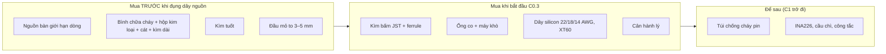

# Chặng 0 — Xưởng, dụng cụ, an toàn (20h)

> **Vị trí:** K1 Phần B (dụng cụ, mỏ hàn) → **C0** → C1 (hệ nguồn), C2 (cơ khí) · **Cần trước:** K1 Phần B (Bài 4–8); đọc → F5.7 · **Chạy song song với:** K2
> **Làm ra được:** bàn làm việc an toàn, bộ đồ nghề đã kiểm khi nhận, 10 mối hàn/đầu bấm đạt cả ba lớp kiểm (mắt, kéo, sụt áp) · sổ build `build-log/` có schema, `instruments.jsonl`, bảng quy ước dây · **Sau chặng này bạn quyết định được:** một mối nối có được phép mang dòng ampe hay phải làm lại; khi nào được phép cắm một khối mới vào nguồn, với giới hạn dòng bao nhiêu; làm gì trong 60 giây đầu khi pin bốc khói.

K1 Phần B dạy bạn cầm đồng hồ và hàn chân header ở 3,3 V, vài mA. Ở đó một mối hàn hỏng nghĩa là "cảm biến không trả lời". C0 chuyển sang thế giới của **ampe và pin**: dây mang 5–30 A, pin dự trữ hàng chục Wh, và một mối nối xấu biến thành nhiệt. Chặng này không lắp gì lên robot. Nó dựng xưởng, dạy tay, và lập sổ, để C1 (bo nguồn) không phải là lần đầu tiên bạn cầm dây nguồn.

**Phân bổ 20h** `[ước lượng]`:

| Phần | Giờ |
|---|---|
| Bài C0.1 Bàn làm việc và đồ nghề *(rút gọn)* | 1,5 |
| Bài C0.2 Điện gây hại bằng cách nào | 3 |
| Bài C0.3 Hàn dây, bấm đầu nối, co nhiệt | 5 |
| Bài C0.4 Nguồn bàn giới hạn dòng (CV/CC) | 2,5 |
| Bài C0.5 Sổ build và quy ước dây *(rút gọn)* | 1 |
| Lắp bước 1–6: dựng bàn, kiểm hàng, luyện trên phế liệu, 10 mẫu đạt, diễn tập sự cố | 6 |
| Gate chặng 0 | 1 |
| **Tổng** | **20** |

## 0. Bức tranh chặng

Sau chặng này chưa có robot. Có một **bàn thử** với ba vùng tách nhau và một đường dòng điện duy nhất đi qua nguồn bàn có giới hạn dòng:

```
  TƯỜNG 220 V ──[ổ có công tắc + CB/aptomat]──┐
                                               │  (KHÔNG có pin nào cắm vào ổ này khi không có người)
  ┌──────────────── BÀN (mặt gỗ/thảm silicon, không giấy vải) ─────────────────────┐
  │                                                                                 │
  │  VÙNG NÓNG (tay thuận)        VÙNG ĐIỆN                     VÙNG PIN (C1 trở đi) │
  │  ┌─────────┐ giá mỏ           ┌───────────┐ dây đo 18 AWG   ┌───────────────┐    │
  │  │ trạm hàn│ bùi nhùi         │ NGUỒN BÀN │──đỏ──┐          │ hộp kim loại  │    │
  │  └─────────┘ quạt hút khói →  │ V_set     │      ▼          │ + cát khô     │    │
  │  máy khò / bật lửa            │ I_set ◄── │   [ MẪU THỬ ]   │ túi chống cháy│    │
  │                               │ OUTPUT on │◄─đen─┘          └───────────────┘    │
  │                               └───────────┘   ▲ que đo UT33D+ (đo sụt áp)        │
  └─────────────────────────────────────────────────────────────────────────────────┘
   Trong tầm với ≤ 3 m: bình chữa cháy, xô cát/kìm cách điện, kính bảo hộ, cửa ra.
```

Dòng năng lượng duy nhất trong chặng: lưới 220 V → (bên trong vỏ nguồn bàn, bạn không mở) → đầu ra DC có trần dòng `I_set` → mẫu thử. Dòng dữ liệu: mỗi phép đo → một dòng JSONL trong `build-log/measurements.jsonl` → script kiểm schema.

## 1. An toàn của chặng

**Rủi ro cụ thể của C0:** bỏng mỏ hàn (~350 °C) và máy khò; khói flux rosin (mẫn cảm hô hấp, xem K1 Bài 4); vụn dây đồng bắn vào mắt khi cắt; ngắn mạch qua dụng cụ kim loại; điện lưới 220 V **bên trong** nguồn bàn và sạc. Pin lithium lớn **chưa** dùng trong C0. Bạn chỉ đọc về nó (Bài C0.2) và chuẩn bị chỗ cho nó (hộp kim loại, cát). Quy tắc dưới đây có hiệu lực từ C0 tới hết K7.

**Quy tắc cứng:**
- KHÔNG mở vỏ nguồn bàn, sạc, adapter, mini PC power brick. Mọi thứ bên trong có 220 V hoặc tụ còn tích điện sau khi rút phích.
- KHÔNG đeo nhẫn, đồng hồ kim loại, vòng tay khi làm với pin hoặc dây nguồn. Nhẫn bắc qua hai cực pin thành một vòng dây mang hàng trăm ampe sát da (Bài C0.2).
- KHÔNG đặt dụng cụ kim loại (kìm, tua vít, nhíp) lên trên pin hoặc trên bo mạch đang có điện. Dụng cụ đặt ở khay riêng.
- KHÔNG cấp điện cho mẫu thử mới mà chưa đo điện trở giữa + và − của nó. Gần 0 Ω thì không cấp.
- KHÔNG nối mẫu thử vào đầu ra nguồn đang bật. Tắt OUTPUT → nối → kiểm cực → bật OUTPUT (Bài C0.4 giải thích vì sao).
- KHÔNG đặt `I_set` cao "cho chắc". Đặt sát dòng dự kiến (Bài C0.4).
- KHÔNG để mỏ hàn ngoài giá khi buông tay, kể cả một giây. Mỏ rơi thì để rơi, KHÔNG chụp.
- KHÔNG co nhiệt bằng bật lửa ở gần pin, dung môi, cồn IPA đang mở nắp.
- KHÔNG sạc, xả, hay để pin cắm sạc khi không có người ở trong phòng (áp dụng từ C1).
- KHÔNG dùng pin phồng, móp, rò, có mùi ngọt lạ, hoặc đã rơi mạnh. Pin như vậy chuyển ngay vào hộp kim loại có cát (quy trình hủy ở C1.6).
- KHÔNG làm việc với pin hoặc dây nguồn khi mệt, buồn ngủ, hoặc đang vội. Tuần crunch chỉ đọc bài khái niệm.

**Khi sự cố xảy ra (dán tờ này cạnh bàn):**

| Sự cố | Làm ngay (theo thứ tự) | KHÔNG làm |
|---|---|---|
| Mối nối/dây bốc khói khi đang cấp nguồn bàn | Bấm OUTPUT OFF (hoặc rút phích nguồn bàn) → đợi 1 phút → mới chạm | Không kéo dây bằng tay trần khi đang khói |
| Pin nóng bất thường, phồng, xì khí, bốc khói (từ C1) | (1) Không cúi mặt vào; khói pin có khí độc (HF và các khí cháy) `[chuẩn]`. (2) Nếu ngắt được bằng công tắc chính hoặc rút XT60 mà **không phải đưa tay qua luồng khói**: ngắt. (3) Nếu chưa có lửa và pin nhỏ: dùng kìm cách điện dài gắp vào hộp kim loại/xô cát, đưa ra ngoài trời hoặc ban công thoáng. (4) Rời phòng, đóng cửa, mở thông gió từ bên ngoài nếu được. | Không cầm bằng tay trần; không bịt kín trong hộp kín khí (khí phải thoát được); không ném vào thùng rác |
| Pin có lửa | Rời phòng, gọi **114** (cứu hỏa VN). Pin Li-ion: nước lượng lớn để **làm mát** là hợp lệ, bình bột ABC dập vật cháy xung quanh `[chuẩn — hướng dẫn của nhiều cơ quan cứu hỏa; FAA khuyến nghị nước/chất lỏng không cồn để làm mát pin thiết bị trong cabin]` | Không ở lại "cứu đồ"; không tin lửa đã tắt là hết: cell có thể bùng lại sau nhiều giờ, theo dõi ở nơi an toàn ít nhất vài giờ `[ước lượng]` |
| Ngắn mạch có tia lửa, dụng cụ dính vào cực | Ngắt nguồn phía xa (công tắc chính, phích); không giật dụng cụ bằng tay trần. Sau đó: kiểm bỏng, kiểm pin/dây có nóng không | Không chạm phần kim loại đang nóng đỏ |
| Bỏng | Nước mát chảy ~20 phút `[chuẩn]`; bỏng rộng hoặc bỏng điện → **115** (cấp cứu) | Không bôi kem đánh răng, dầu, đá lạnh trực tiếp |
| Hít khói pin/cháy nhựa, thấy khó thở | Ra chỗ thoáng; khó thở, ho kéo dài → cơ sở y tế, nói rõ đã hít khói pin lithium | — |

## 2. BOM chặng

Giá `[ước lượng 10/2026]`, kiểm lại ở cửa hàng. Nơi mua ở Hà Nội theo `docs/lo-trinh-edge-physical-ai-final.md` (Phần 5): Linh Kiện Điện Tử 3M (Tạ Quang Bửu, Bách Khoa), Lập Trình Nhúng A-Z (Cầu Giấy), Chợ Trời (Thịnh Yên, Hai Bà Trưng); online: hshop.vn, nshopvn.com, mlab.com.vn, cytrontech.vn và các shop khác trong danh sách đó. Dây silicon, XT60, đầu bấm thường có ở shop đồ RC/drone `[ước lượng]`. Món đã mua ở K1 (UT33D+, mỏ hàn, phụ kiện hàn) không lặp lại ở đây.

| Món | Thông số phải chọn | Vì sao (bằng số) | Giá | Kiểm khi nhận hàng | Thay thế được bằng |
|---|---|---|---|---|---|
| **Nguồn bàn giới hạn dòng** | ≥30 V / ≥5 A, có **nút OUTPUT ON/OFF**, hiển thị V và I (độ phân giải 10 mV / 1 mA), báo CV/CC; có OCP là điểm cộng | Pack 4S đầy 16,8 V `[chuẩn]` → cần V > 17 V để giả lập pin; 5 A đủ cho thử mối nối và motor không tải ở C3 `[ước lượng]` | 1–2tr | Bài C0.4 bước 1: đo V hở mạch bằng UT33D+; nối tắt hai cực với I_set = 0,1 A → màn hình phải báo CC | Không thay được. Đây là món bắt buộc trước C1 |
| Dây đo banana–kẹp cá sấu cỡ lớn | Lõi ≥18 AWG, kẹp có vỏ cách điện | Dây đo mảnh đi kèm nguồn rẻ nóng ở 5 A | 50–100k | Thông mạch từng dây; vặn thử kẹp | Dây silicon 18 AWG + kẹp tự làm (sau C0.3) |
| Dây silicon nhiều sợi đỏ + đen | 22, 18, 14 AWG, mỗi loại vài mét | Silicon chịu nhiệt mỏ hàn, mềm, chịu rung; 14 AWG là cỡ dây chính dự kiến ở C1 `[ước lượng — C1.3 tính lại]` | 10–30k/m | Đọc chữ in trên vỏ (AWG, nhiệt độ); đếm sợi ở đầu cắt | Dây PVC cho luyện (chảy vỏ khi hàn, dùng làm "phế liệu") |
| Kìm tuốt dây | Loại có lỗ theo AWG hoặc loại tự động | Kìm cắt cắt đứt sợi đồng → giảm tiết diện | 100–300k | Tuốt thử 18 AWG: không đứt sợi nào | Dao rọc + kỹ năng (không khuyên) |
| Kìm bấm đầu JST/Dupont | Ngàm open-barrel cho 22–28 AWG (ví dụ loại IWISS SN-28B, Engineer PA-09) | Đầu JST-XH cho 22–28 AWG, 3 A `[spec — catalog JST XH]` | 300–700k | Bấm thử 1 đầu, xem hai cánh ôm lõi và hai cánh ôm vỏ | Không thay được bằng kìm mỏ nhọn |
| Bộ đầu JST-XH 2,54/2,5 mm + vỏ | 2–6 chân | Đầu tín hiệu chuẩn của K7 (`_KE-HOACH-K7.md` mục 5) | 80–150k | Đếm; thử cắm–rút | JST-PH (nhỏ hơn, 2 mm) |
| Kìm bấm cos pin rỗng (ferrule) + bộ ferrule | Ngàm vuông/lục giác, 0,25–6 mm² | Đầu dây nhiều sợi vào cầu đấu vít bị toè sợi, lỏng dần | 250–500k | Bấm thử 18 AWG; ferrule không xoay trên dây | Không có (KHÔNG thay bằng nhúng thiếc, xem C0.3) |
| Đầu XT60 (đực/cái) | Hàng có nhãn hãng (Amass) nếu tìm được | Định mức dòng liên tục cỡ 30 A `[spec — Amass, kiểm datasheet]`; hàng nhái nhựa chảy sớm `[ước lượng]` | 15–40k/cặp | Nhựa không biến dạng khi chạm mỏ 2 s; cắm–rút chặt | XT30 cho nhánh nhỏ |
| Ống co nhiệt | Bộ nhiều cỡ, tỉ lệ co 2:1; vài ống 3:1 có keo | Ống phải lọt qua mối nối trước khi co và ôm chặt dây sau khi co | 80–150k | Co thử một ống | — |
| Máy khò nhiệt | Có chỉnh nhiệt | Co đều, không cháy vỏ; an toàn hơn bật lửa | 250–600k | Thổi thử vào ống co | Bật lửa (giữ xa, chỉ khi xa pin và dung môi) |
| Kẹp ba tay (helping hands) hoặc ê tô nhỏ | Đế nặng, kẹp có bọc | Hàn dây cần hai tay rảnh: một mỏ, một thiếc | 100–250k | Kẹp dây 14 AWG không trượt | Băng keo giấy dán dây lên mặt bàn gỗ |
| Đầu mỏ dẹt to | Đục 3–5 mm (đúng họ mỏ T12/936 của bạn) | Dây 14–18 AWG và cốc XT60 hút nhiệt nhiều hơn chân header (K1 Bài 8) | 50–150k | Lắp, mạ thiếc, xem có bóng không | — |
| Cân hành lý điện tử | Đến 25–50 kg, độ phân giải 10 g | Thử kéo mối nối (C0.3) theo đơn vị N | 80–150k | Treo vật đã biết khối lượng (chai nước 1,5 L ≈ 1,5 kg) | Lò xo + thước (kém) |
| **Bình chữa cháy** | Bột ABC 1–2 kg (hoặc loại dùng được cho đồ điện) | Dập vật cháy xung quanh pin | 200–400k | Kim đồng hồ áp ở vùng xanh; đọc hạn | Không thay được |
| Hộp kim loại có nắp không kín khí + cát khô | Hộp đạn/hộp thép; 2–5 kg cát | Chỗ cách ly pin hỏng; cát dập lửa nhỏ và giữ nhiệt | 100–300k | Không có lỗ thủng; nắp đặt hờ được | Xô kim loại + cát |
| Túi chống cháy cho pin | Cỡ vừa pack của bạn | Sạc/cất pin ở C1 | 100–250k | — | Hộp kim loại trên |
| Kìm cách điện cán dài | Cán bọc cách điện, ≥20 cm | Gắp pin nóng/khói mà tay không gần | 80–200k | — | Kẹp gắp than |
| Kính bảo hộ | Có che hai bên | Vụn đồng khi cắt dây; thiếc bắn | 50–100k | — | — (đã mua ở K1 thì dùng lại) |

**Tổng C0 `[ước lượng]`:** ~3,5–6tr gồm nguồn bàn. Món đắt nhất là nguồn bàn và các kìm bấm. Nếu đã mua nguồn bàn ở K1 Bài 4 thì trừ đi.

## 3. Dụng cụ và kỹ năng tay

Kỹ năng mới của chặng (chi tiết ở từng bài):

| Kỹ năng | Bài | Luyện trên phế liệu trước | Đạt trông thế nào |
|---|---|---|---|
| Tuốt dây không đứt sợi | C0.3 | 20 lần trên dây PVC thừa | Đầu đồng sáng, đủ sợi, xoắn gọn, không xước |
| Mạ thiếc đầu dây, nối dây thẳng, hàn XT60 | C0.3 | 6 mối nối, 2 cặp XT60 lỗi/thừa | Thiếc thấm đều, thấy hình sợi dưới lớp thiếc; không cục; vỏ không cháy |
| Bấm đầu JST-XH | C0.3 | 10 đầu thừa | Cánh trước ôm lõi, cánh sau ôm vỏ, không có sợi lòi ra |
| Bấm ferrule | C0.3 | 5 đầu | Không thấy sợi đồng ngoài ferrule; không xoay được |
| Co nhiệt | C0.3 | 5 ống | Ôm đều, phủ mối nối hai bên, không cháy, không phồng |
| Vận hành nguồn bàn CV/CC | C0.4 | Với điện trở 1/4 W và LED | Đặt được V, I trước khi bật OUTPUT; đọc đúng chế độ |
| Đo sụt áp qua mối nối (đo kiểu Kelvin) | C0.3 + C0.4 | Một đoạn dây nguyên | Đo được mV ổn định, lặp lại được |

Hình mối hàn chân header tốt/hỏng đã có ở K1 Bài 8; hình cho dây, đầu bấm và co nhiệt nằm ở Bài C0.3.

## 4. Sơ đồ đi dây

Chặng này chỉ có một "mạch": đồ gá thử mối nối, dùng lại ở C1.3 và C1.5.

```
                 dây đo 18 AWG (đỏ)                                 dây đo 18 AWG (đen)
  NGUỒN BÀN (+) ─────────────────┐                             ┌────────────────── (−) NGUỒN BÀN
  CC: I_set = 3–5 A              │   MẪU THỬ (dây 18 AWG đỏ)   │
  V_set = 2 V (thấp, chỉ đủ      ▼                             ▼
  để vào chế độ CC)          ●═══════════[ MỐI NỐI ]═══════════●
                                  ▲   ◄─── 50 mm ───►   ▲
                                  │   (span đo)         │
                                 que đỏ UT33D+         que đen UT33D+
                                 (thang mV thấp nhất)

  Dòng đi trên đường NGOÀI (kẹp cá sấu, điện trở kẹp không ảnh hưởng);
  điện áp đo trên đường TRONG, sát hai bên mối nối  →  R_mối = V_đo / I.
  Đối chứng: cùng span 50 mm trên đoạn dây NGUYÊN cùng loại, cùng dòng.
```

Màu và tiết diện ở đồ gá: đỏ = phía + của nguồn, đen = phía −; dây đo của nguồn ≥18 AWG. Quy ước đầy đủ ở Bài C0.5.

## 5. Trình tự chặng

Thứ tự học: C0.4 đứng trước bước đo sụt áp của C0.3, vì đồ gá ở mục 4 dùng nguồn bàn làm nguồn dòng.

1. **Học Bài C0.1** (bàn làm việc, đồ nghề).
2. **Lắp bước 1 — Dựng bàn và vùng an toàn**
   - Làm: chia bàn ba vùng như hình ở mục 0; treo tờ "Khi sự cố" (mục 1) ở chỗ nhìn thấy; đặt bình chữa cháy, hộp kim loại + cát, kìm cách điện trong tầm ≤3 m, trên đường ra cửa chứ không phải phía trong phòng; ổ điện có công tắc. Kiểm aptomat (CB) của ổ điện đó.
   - ✅ Checkpoint: chụp ảnh bàn; tự trả lời bằng cách đứng ở ghế làm việc: "nếu khói bốc ra từ vùng pin, tôi đi ra cửa có phải đi qua nó không?" Phải là **không**.
   - Nếu sai: đổi vị trí vùng pin hoặc ghế, không đổi quy tắc.
3. **Lắp bước 2 — Kiểm hàng khi nhận**
   - Làm: kiểm từng món theo cột "Kiểm khi nhận hàng" ở mục 2; khai báo mỗi dụng cụ đo vào `build-log/instruments.jsonl` (Bài C0.5).
   - ✅ Checkpoint trước khi cấp điện cho nguồn bàn lần đầu: nhìn vỏ, dây nguồn, phích; công tắc chọn 220/110 V phía sau (nếu có) phải ở **220 V**. Sai vị trí thì không cắm.
   - Nếu sai: đổi hàng; không tự sửa thiết bị dùng điện lưới.
4. **Học Bài C0.2** (điện gây hại bằng cách nào). Commit `prediction.md` trước khi mở 🔒.
5. **Học Bài C0.4** (nguồn bàn CV/CC), làm phần thực hành trên điện trở 1/4 W và LED.
6. **Học Bài C0.3** (hàn dây, bấm đầu nối, co nhiệt).
7. **Lắp bước 3 — Luyện trên phế liệu**
   - Làm: theo bảng ở mục 3, trên dây PVC thừa và đầu nối thừa. Không ghi vào sổ như mẫu đạt; chỉ ghi số lần thử và tỉ lệ đạt.
   - ✅ Checkpoint: 5 mẫu luyện liên tiếp của mỗi loại đạt bước kiểm bằng mắt ở Bài C0.3.
   - Nếu sai: xem bảng "Nếu ra khác" của C0.3.
8. **Lắp bước 4 — Làm 10 mẫu đạt** (thành phần ở Gate tiêu chí 2). Mỗi mẫu có mã `J-001`… dán nhãn.
   - ✅ Checkpoint trước khi cho dòng qua mẫu: điện trở giữa hai đầu **cùng một dây** của mẫu phải gần 0 Ω (thông mạch kêu); giữa đỏ và đen của mẫu XT60 phải **không** kêu (hở). Kêu = chập, không cấp dòng.
   - Nếu sai: cắt bỏ, làm lại; không "sửa" mối chập bằng cách hâm thêm.
9. **Lắp bước 5 — Đo sụt áp và kéo thử 10 mẫu** theo đồ gá ở mục 4 và Bài C0.3 bước F. Ghi mỗi phép đo một dòng JSONL.
10. **Học Bài C0.5**, chạy script kiểm sổ.
11. **Lắp bước 6 — Diễn tập sự cố (khô, không pin)**
    - Làm: đặt một "pin giả" (hộp sữa rỗng gắn hai dây) ở vùng pin. Bấm giờ: từ lúc hô "khói" → ngắt nguồn phía xa → gắp vào hộp kim loại bằng kìm dài → mang ra ngoài → đóng cửa phòng.
    - ✅ Checkpoint: làm được trọn chuỗi mà không phải tìm đồ, không đưa tay qua phía trên pin giả.
    - Nếu sai: sửa bố trí bàn (bước 1), làm lại.
12. **Gate chặng 0.**

## 6. Lỗi người mới hay gặp

| Triệu chứng | Nguyên nhân khả dĩ | Kiểm bằng cách | Sửa |
|---|---|---|---|
| Nguồn bàn báo CC ngay khi bật, V gần 0 | Mẫu thử chập; dây đo chạm nhau; I_set quá nhỏ cho tải | Tắt OUTPUT, đo Ω giữa + và − của mẫu | Gỡ chập; hoặc tăng I_set có lý do |
| Dây nóng ở chỗ kẹp cá sấu, không phải ở mối nối | Điện trở tiếp xúc của kẹp lớn | Sờ (sau khi tắt) hoặc đo sụt áp qua kẹp | Kẹp chặt hơn, dùng kẹp lớn hơn; không ảnh hưởng phép đo Kelvin |
| Vỏ dây co rút, cháy khi hàn | Dây PVC; giữ mỏ quá lâu vì đầu mỏ nhỏ | Nhìn vỏ | Dây silicon, đầu mỏ to, thêm flux, giữ ngắn hơn |
| Mối nối đã co nhiệt rồi mới nhớ chưa luồn ống | Thứ tự thao tác | — | Cắt, làm lại. Dán quy tắc "luồn ống trước" lên kẹp ba tay |
| Đầu JST tuột khỏi dây khi kéo nhẹ | Cánh bấm ôm vỏ thay vì ôm lõi; tuốt quá ngắn | Nhìn nghiêng đầu bấm | Tuốt đúng chiều dài cánh lõi; đặt đúng ngàm theo cỡ |
| Số mV đo sụt áp nhảy lung tung | Que đo chạm hờ; dòng chưa ổn định; đo trên kẹp chứ không trên dây | Giữ que bằng kẹp; đọc dòng trên nguồn | Đo lại 3 lần, lấy trung vị (Bài C0.3) |
| Sổ build bị bỏ sau 3 ngày | Ghi tay, nhiều trường | Đếm số dòng/ngày | Một lệnh shell nối thêm dòng (Bài C0.5); ghi ngay lúc đo |

## 7. Lăng kính data infra

**Dữ liệu chặng này sinh ra:**

| Luồng | File | Schema (rút gọn) | Tần số | Đơn vị (theo `CONVENTIONS.md`) |
|---|---|---|---|---|
| Phép đo thủ công | `build-log/measurements.jsonl` | `ts, stage, step, sample_id, quantity, value, unit, instrument_id, result, note` | theo sự kiện, ~50–100 dòng ở C0 `[ước lượng]` | SI: `V`, `A`, `ohm`, `N`; không `mA`, không `g` trong dữ liệu |
| Danh mục dụng cụ đo | `build-log/instruments.jsonl` | `instrument_id, model, serial, spec, fuse, checked_at` | khi mua/kiểm | — |
| Ảnh | `build-log/img/c00/<sample_id>-<truoc|sau>.jpg` | tên file chứa `sample_id` | theo mẫu | — |
| Bảng dây | `wiring/wires.csv` | `wire_id, net, from, to, awg, color, length_m, fuse_a` | khi đi dây (rỗng ở C0, có header) | — |
| Nhật ký chặng | `build-log/c00.md` | mẫu ở mục 8 | mỗi buổi | — |

**Test tự động sinh ra từ chặng này:**
- `validate_buildlog.py` (Bài C0.5) chạy trong CI của repo: mọi dòng đo đúng schema, đơn vị SI, dụng cụ đã khai báo. Đây là data contract đầu tiên bạn viết cho phần cứng (→ F3.7).
- **Hạt giống HIL cho C11:** phép thử "đo sụt áp qua mối nối ở dòng cố định" là một bench test có ngưỡng nhị phân. Ở C11.2 cùng dạng này thành bài kiểm tự động: nguồn có thể lập trình đặt dòng, INA226 đo áp, script chấm pass/fail/inconclusive. Ở C0 bạn làm tay; schema đã giống hệt nên không phải viết lại.
- Phép thử nguồn bàn (bảng CV/CC với 6 tải, Bài C0.4) là **test hiệu chuẩn dụng cụ**: chạy lại mỗi khi nghi nguồn sai, so với lần đầu.

**SLI cho chính sổ build:** tỉ lệ dòng hợp lệ (mục tiêu 100% sau khi chạy script); độ trễ từ lúc đo tới lúc ghi (mục tiêu: ghi ngay, cùng buổi); tỉ lệ mẫu có ảnh trước/sau.

**Vai trò nghề:** Test & Validation (bench test có ngưỡng, sai số dụng cụ, ba trạng thái); Data Platform (schema, đơn vị, khai báo dụng cụ như một bảng dimension, provenance của từng con số).

## 8. Nhật ký build

Copy vào `build-log/c00.md`, một mục mỗi buổi:

```markdown
## 2026-MM-DD — buổi N (giờ bắt đầu–kết thúc, giờ thực: _._ h)
- Trạng thái người: tỉnh táo / mệt (mệt → chỉ đọc, không cấp điện)
- Mục tiêu buổi: (ví dụ: 5 đầu JST luyện + 2 mẫu J-003, J-004)
- Đã làm:
- Số đo (đã ghi vào measurements.jsonl? có/không; số dòng: __)
- Ảnh: build-log/img/c00/...
- Lỗi gặp (triệu chứng → nguyên nhân → sửa):
- Quyết định (ghi thêm vào decisions.md nếu ảnh hưởng chặng sau):
- Sự cố an toàn / suýt sự cố (near miss): không / có → mô tả, sửa bố trí gì
- Câu hỏi còn mở:
```

Ghi cả **suýt sự cố** (mỏ suýt rơi, kìm chạm hai cực). Ngành hàng không và y tế thu thập near miss vì chúng nhiều hơn sự cố thật hàng chục lần và báo trước sự cố thật; đây cũng là dữ liệu.

---

## Bài C0.1 — Bàn làm việc và đồ nghề: mua gì, vì sao (1,5h) (khung rút gọn)

> **Vị trí:** K1 Bài 4 (mua đợt 1) → **C0.1** → C0.2 · **Cần trước:** K1 Phần B · **Sau bài này bạn quyết định được:** món nào trong BOM ở mục 2 phải mua trước khi đụng dây nguồn, món nào để sau, và bàn của bạn đặt vùng pin ở đâu.

### 1. Câu chuyện — ai đã khổ vì chuyện này

Năm 2016, Samsung thu hồi khoảng 2,5 triệu chiếc Galaxy Note 7 vì pin cháy, rồi các máy thay thế cũng cháy, và Samsung dừng hẳn sản phẩm trong cùng năm. Báo cáo điều tra công bố 23/1/2017 (Samsung cùng UL, Exponent, TÜV Rheinland) kết luận lỗi nằm ở pin của **hai nhà cung cấp khác nhau, với hai lỗi khác nhau**: pin A có góc vỏ quá chật làm điện cực âm bị cong; pin B có ba via mối hàn siêu âm trên tab dương đâm thủng lớp cách điện và màng ngăn, một số cell thiếu băng cách điện `[chuẩn — công bố của Samsung 1/2017 và tường thuật báo chí về buổi công bố]`.

Bài học cho bàn làm việc của bạn: lỗi cháy pin của một tập đoàn có hàng trăm kỹ sư pin vẫn đến từ **một mối hàn có ba via và một góc vỏ chật vài phần mười milimét**. Bạn sẽ không chế tạo cell, nhưng bạn sẽ hàn, bấm, ép dây sát pin. Đồ nghề đúng là thứ biến "khéo tay" thành "lặp lại được": kìm bấm đúng ngàm cho ra đầu bấm giống nhau lần thứ 50 như lần thứ 1, còn kìm mỏ nhọn thì không.

### 2. Mô hình tư duy



Ba câu bản chất:
1. **Mỗi món an toàn trả lời một sự cố cụ thể.** Bình chữa cháy cho lửa lan ra vật xung quanh; hộp kim loại + cát cho pin đang nóng; kìm dài cho khoảng cách giữa tay và pin. Món nào không gắn được với một dòng trong bảng "Khi sự cố" ở mục 1 thì chưa cần.
2. **Đồ nghề tay biến kỹ năng thành quy trình.** Tiêu chí "đạt" của C0.3 (kéo được bao nhiêu N, sụt bao nhiêu mV) chỉ có nghĩa khi dụng cụ cho ra kết quả lặp lại.
3. **Bố trí bàn là thiết kế đường thoát.** Vùng pin xa người, gần cửa, không nằm giữa ghế và lối ra.

### 3. Cầu nối từ backend

| Backend bạn biết | Ở đây | Gãy ở chỗ | Nếu dùng nhầm thì |
|---|---|---|---|
| Runbook sự cố dán sẵn trong wiki | Tờ "Khi sự cố" cạnh bàn | Runbook backend đọc khi đã ngồi xuống, có thời gian. Ở đây bạn có vài giây, tay có thể đang cầm mỏ hàn; quy trình phải **thuộc và đã diễn tập** (Lắp bước 6) | Tìm tờ giấy lúc khói đã đầy bàn |
| Môi trường dev tách biệt production | Vùng nóng / vùng điện / vùng pin | Tách môi trường backend là logic, đổi bằng cấu hình. Tách vùng trên bàn là **khoảng cách vật lý**; một sợi dây vắt ngang là đã trộn hai vùng | Dây nguồn mỏ hàn vắt qua vùng pin; mỏ chạm vào vỏ pin |
| Tooling chuẩn hóa (formatter, linter) cho cả team | Kìm bấm đúng ngàm | Formatter cho ra output giống hệt nhau. Kìm bấm vẫn phụ thuộc tay: đặt sai ngàm hay sai vị trí thì vẫn ra đầu hỏng | Tin "có kìm xịn thì đầu nào cũng đạt", bỏ bước kiểm |

### 6. Làm

1. Đọc mục 1 và mục 2 của chặng. Đánh dấu món bạn đã có từ K1.
2. Chia BOM thành ba đợt như hình ở phần 2; ghi lý do vào `decisions.md` (ví dụ: "mua nguồn bàn đợt này vì C0.4 bắt buộc").
3. Đi mua hoặc đặt online. Với nguồn bàn: đọc ảnh mặt trước, phải thấy nút OUTPUT riêng và đèn/ký hiệu CV, CC.
4. Làm Lắp bước 1 và 2 ở mục 5.
5. Chụp ảnh bàn, lưu `build-log/img/c00/ban-lam-viec.jpg`.

### 8. Nếu ra khác

| Triệu chứng | Nguyên nhân khả dĩ | Kiểm bằng cách | Sửa |
|---|---|---|---|
| Nguồn bàn không có nút OUTPUT riêng | Mẫu rẻ nhất, đầu ra luôn bật | Đọc manual | Đổi hàng nếu còn được; nếu không, luôn nối tải khi nguồn **tắt hẳn** rồi mới bật công tắc nguồn |
| Bàn quá nhỏ cho ba vùng | Phòng chật | — | Vùng pin là một khay kim loại đặt trên sàn gạch cạnh cửa; không bỏ vùng |
| Cửa hàng không có XT60 hàng hãng | Thị trường | — | Mua hàng thường, kiểm nhựa bằng mỏ 2 s; ghi vào `decisions.md` |
| Bình chữa cháy hết hạn hoặc kim ở vùng đỏ | Hàng tồn | Đọc tem | Đổi |

### 9. Câu hỏi ngược

1. **[Vì sao không]** Vì sao không mua luôn túi chống cháy và INA226 ngay đợt này cho "đủ bộ"?
<details><summary>Hướng nghĩ</summary>

Mua theo câu hỏi, không theo danh sách (K1 Bài 4). C1 mới chọn hóa học và kích thước pin, mới biết túi cỡ nào. Mua sớm là cam kết sớm một quyết định chưa có dữ liệu, giống chọn database trước khi biết access pattern.

</details>

2. **[Quy mô]** Bạn dựng một xưởng cho 10 người cùng build robot. Bảng "Khi sự cố" và bố trí bàn thay đổi thế nào? Cái gì gãy trước?
<details><summary>Hướng nghĩ</summary>

Vùng sạc pin chung trở thành điểm rủi ro tập trung (nhiều pack, một phòng); cần tủ sạc riêng, phát hiện khói, quy tắc "không sạc qua đêm" có người kiểm. Dụng cụ chung (kìm bấm) cần kiểm định kỳ, nếu không mười người cùng làm đầu bấm hỏng với cùng một kìm mòn. Đây là chuyện của bất kỳ phòng lab robot nào.

</details>

3. **[Failure mode]** Bố trí của bạn qua checkpoint "đường ra cửa không đi qua vùng pin". Kể một tình huống bố trí đó vẫn hỏng.
<details><summary>Hướng nghĩ</summary>

Khói không đi theo đường bạn vẽ: nó lan theo luồng gió (quạt hút khói hàn có thể thổi khói pin về phía bạn). Robot hoàn chỉnh (từ C5) có pin trên xe, xe nằm ở đâu thì vùng pin ở đó. Bố trí là một giả định cần kiểm lại mỗi chặng.

</details>

### 12. Đọc thêm và tự kiểm tra

- **Nguồn gốc:** công bố của Samsung về kết quả điều tra Galaxy Note 7 (news.samsung.com, 1/2017).
- **Giải thích:** Adafruit Learning System, các bài về dụng cụ cơ bản cho xưởng điện tử.
- **Tự kiểm tra:** (1) mỗi món an toàn ở mục 2 ứng với dòng nào trong bảng "Khi sự cố"? (2) vẽ lại bàn của bạn với ba vùng và đường ra cửa từ trí nhớ.

---
