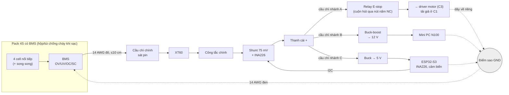

# Chặng 1 — Hệ nguồn (35h)

> **Vị trí:** C0 (xưởng, an toàn) → **C1** → C2 (cơ khí), C5 (lắp hoàn chỉnh dùng bo nguồn này) · **Cần trước:** K1 trọn; tốt nhất sau K3 Bài 5–6 (amp, brownout); C0 trọn (nguồn bàn CV/CC → K7 C0.4, đồ gá đo sụt áp → K7 C0.3); viên nang → F5.7, F1.1 · **Chạy song song với:** K2–K3
> **Làm ra được:** bo phân phối nguồn trên tấm đế: pin → cầu chì chính → công tắc chính → (a) nhánh motor qua relay E-stop → đầu ra cho driver; (b) buck-boost 12 V cho mini PC; (c) buck 5 V cho ESP32/logic · bảng power budget có số đo, log dòng–áp ≥1 kHz từ INA226, `wiring/wires.csv` đầy đủ · **Sau chặng này bạn quyết định được:** pin hóa học nào, mấy S; mini PC cần buck hay buck-boost; mỗi nhánh dây cỡ nào, cầu chì bao nhiêu ampe; robot chạy được bao lâu và dòng đỉnh có làm BMS cắt cả hệ không.

Chặng nguy hiểm nhất của K7. C0 cho bạn tay nghề với nguồn bàn có trần dòng vài ampe. C1 đưa vào một vật **không có trần dòng hữu ích**: pack lithium chập mạch có thể đẩy ra hàng trăm ampe trước khi BMS kịp cắt (Bài C1.1 tính con số này). Toàn bộ chặng xoay quanh một nguyên tắc: **pin là thứ cuối cùng được cắm vào**. Mọi khối được thử trên nguồn bàn có giới hạn dòng trước, từng khối một.

Chặng này chưa cần motor và driver (C3 mới có). Tải motor được thay bằng **tải giả**: bóng đèn ô tô 12 V 21 W (dây tóc nguội có điện trở thấp nên có dòng khởi động, giống motor) và điện trở công suất. Nếu đã có motor, có thể dùng thêm một motor kẹp chặt, không gắn bánh.

**Phân bổ 35h** `[ước lượng]`:

| Phần | Giờ |
|---|---|
| Bài C1.1 Pin lithium: hóa học, S/P, C-rate, BMS | 4 |
| Bài C1.2 Power budget là một bảng số đo | 3 |
| Bài C1.3 Dây, đầu nối, cầu chì | 4 |
| Bài C1.4 DC-DC: buck/boost/buck-boost | 4 |
| Bài C1.5 Lắp bo nguồn và đo dòng đỉnh | 5 |
| Bài C1.6 Sạc, bảo quản, xử lý pin hỏng *(rút gọn)* | 1,5 |
| Lắp bước 1–8 (nhận pin, đo tải, bó dây, thử DC-DC, lắp bo, cấp điện bằng nguồn bàn, gắn INA226, cấp điện bằng pin) | 11,5 |
| Gate chặng 1 | 2 |
| **Tổng** | **35** |

## 0. Bức tranh chặng

Sau chặng này: một tấm đế (mica hoặc gỗ ép) cỡ khổ A4, chưa lên khung xe (C2 làm khung, C5 mới gắn bo lên robot). Trên tấm đế là toàn bộ đường năng lượng của robot:



Ba điều đọc từ hình:
1. **E-stop chỉ nằm trên nhánh A.** Bấm E-stop: motor mất điện, mini PC và ESP32 vẫn sống để ghi log và báo cáo. Đây là quyết định kiến trúc (`_KE-HOACH-K7.md` mục 5); C10.1 làm E-stop cứng đầy đủ, C1 làm điểm cắt.
2. **Mỗi đường dây có cầu chì ở đầu nguồn của nó.** Cầu chì chính bảo vệ dây chính; cầu chì nhánh bảo vệ dây nhánh (Bài C1.3).
3. **Dòng điện về đi theo hình sao,** không nối tiếp qua nhau. Dòng motor không được chảy qua dây GND của ESP32.

Dòng dữ liệu mới: ESP32 đọc INA226 qua I2C ở ~1,5 kHz → USB serial → CSV trên laptop/mini PC → script phân tích → dòng tổng hợp vào `build-log/measurements.jsonl`.

## 1. An toàn của chặng

**Rủi ro cụ thể của C1** (theo mức nặng):
1. **Ngắn mạch pack.** Dòng hàng trăm ampe `[ước lượng — Bài C1.1 tính]`: dây đỏ rực trong vài giây, tia lửa hồ quang, kim loại bắn, bỏng tay. Hay xảy ra nhất khi: tuốt dây đang nối pin, dụng cụ kim loại rơi qua hai cực, hai đầu dây trần chạm nhau, cắm XT60 ngược bằng đầu tự hàn sai.
2. **Thermal runaway** (cell tự nóng lên không dừng, Bài C1.1): do sạc sai hóa học, sạc quá áp, pin bị đâm/móp, chập ngoài kéo dài, pin hỏng do xả quá sâu rồi bị sạc lại. Khói pin chứa khí độc và dễ cháy; cháy pin khó dập.
3. **Dây quá nóng / cháy vỏ** do dây quá nhỏ so với dòng, hoặc cầu chì to hơn sức chịu của dây.
4. **Đầu ra DC-DC sai áp** (biến trở chưa chỉnh, module sai): 16 V vào mini PC hoặc 12 V vào chân 5 V của ESP32 làm cháy thiết bị đắt tiền.
5. **Tia lửa khi cắm pin** vào tải có tụ lớn (dòng nạp tụ). Đầu XT60 bị rỗ dần; không nguy hiểm tức thời nhưng là dấu hiệu.

**Quy tắc cứng** (cộng thêm vào quy tắc C0, mục 1 của `c00-xuong-an-toan.md`):
- KHÔNG tự ghép cell rời thành pack, KHÔNG hàn trực tiếp lên cell. Dùng pack dựng sẵn có BMS tích hợp.
- KHÔNG dùng LiPo RC trần (không BMS) trong K7, trừ khi bạn đã có quy trình riêng và lý do ghi trong `decisions.md`.
- KHÔNG sạc bằng sạc khác hóa học hoặc khác số S. Sạc LiFePO4 4S (14,6 V) và sạc Li-ion 4S (16,8 V) **không** thay nhau được (Bài C1.6).
- KHÔNG sạc khi không có người trong phòng; KHÔNG sạc trên giường, sofa, thảm; sạc trong túi chống cháy hoặc hộp kim loại, trên mặt không cháy.
- KHÔNG nối pin vào mạch nào chưa qua đủ ba bước: (1) đo điện trở + và − của mạch khi tắt hết (không được gần 0 Ω); (2) cấp bằng nguồn bàn với giới hạn dòng thấp và thấy đúng các điện áp; (3) công tắc chính ở OFF lúc cắm XT60.
- KHÔNG làm việc trên dây đang nối pin. Muốn sửa: công tắc chính OFF → **rút XT60 của pin** → đặt đầu XT60 pin quay ra xa → mới sửa. Công tắc OFF chưa đủ vì đoạn từ pin tới công tắc vẫn có điện.
- KHÔNG để đầu dây trần nào nối với pin. Mọi đầu dây nối pin phải có đầu nối có vỏ hoặc được co nhiệt bọc kín trước khi nối phía kia.
- KHÔNG đặt cầu chì chính xa pin. Đoạn dây từ cực pin tới cầu chì chính là đoạn **không có gì bảo vệ**; giữ ≤10 cm `[ước lượng — thực hành phổ biến]`.
- KHÔNG thay cầu chì đứt bằng cầu chì lớn hơn, dây đồng, giấy bạc. Cầu chì đứt là một số đo: tìm nguyên nhân trước.
- KHÔNG cấp điện cho mini PC hoặc ESP32 từ DC-DC mà chưa đo đầu ra DC-DC lúc không tải bằng UT33D+.
- KHÔNG dùng pin phồng, móp, rơi mạnh, nóng bất thường khi để yên, hoặc có điện áp nghỉ dưới ngưỡng xả của BMS (Bài C1.6 nói xử lý thế nào).
- KHÔNG cố "mở BMS ra xem". Pack dựng sẵn bọc co nhiệt là một khối kín đối với người mới.

**Khi sự cố xảy ra:** dùng bảng "Khi sự cố" của C0 (đã dán cạnh bàn). Bổ sung riêng cho C1:

| Tình huống | Làm ngay | KHÔNG làm |
|---|---|---|
| Dây hoặc bo bốc khói khi đang nối pin | Công tắc chính OFF nếu với tới mà không đưa tay qua khói; nếu không: rút XT60 bằng kìm cách điện, hoặc rời đi. Sau đó đợi nguội ≥15 phút | Không giật dây bằng tay trần; không cắt dây đang mang dòng bằng kìm |
| Cầu chì nhánh đứt | Công tắc OFF → rút pin → đo điện trở nhánh đó → tìm chập → ghi vào sổ | Không thay ngay cầu chì mới rồi bật lại "xem sao" |
| Pin nóng khi đang sạc | Rút phích sạc ở ổ tường (không chạm pin) → để pin trong túi/hộp, theo dõi từ xa ≥1 h | Không tháo dây sạc khỏi pin nếu pin đang bốc khói |
| Mini PC tắt đột ngột khi robot chạy | Không phải sự cố an toàn ngay, nhưng là dấu hiệu BMS cắt hoặc DC-DC sụt. Ghi lại, đo ở Bài C1.5 | Không tăng ngưỡng bảo vệ để "hết tắt" |

## 2. BOM chặng

Giá `[ước lượng 10/2026]`, kiểm lại ở cửa hàng. Nơi mua theo `docs/lo-trinh-edge-physical-ai-final.md` Phần 5 và C0 mục 2. Pack LiFePO4 12 V cỡ nhỏ thường được bán cho đèn năng lượng mặt trời, máy câu cá, UPS mini, camera an ninh `[ước lượng]`. Món mặc định chọn ở Bài C1.1; dưới đây là cấu hình mặc định **4S LiFePO4**.

| Món | Thông số phải chọn | Vì sao (bằng số) | Giá | Kiểm khi nhận hàng | Thay thế được bằng |
|---|---|---|---|---|---|
| **Pack pin dựng sẵn** | 4S LiFePO4 12,8 V, 6–10 Ah (77–128 Wh), **BMS tích hợp** liên tục ≥15 A, ghi rõ ngưỡng quá dòng; dây ra ≥14 AWG | Budget ~34 W TB → ~1,8 h với 77 Wh dùng 80% (Bài C1.2, số ước lượng); BMS phải chịu tổng dòng đỉnh motor + mini PC (Bài C1.2) | 0,9–2tr | Đo điện áp nghỉ (Bài C1.1 bước 2); nhìn: không phồng, vỏ co nhiệt không rách; đọc nhãn: hóa học, S, Ah, dòng xả; hỏi/đòi thông số BMS | 4S2P Li-ion NMC 14,4 V có BMS (Bài C1.1 so sánh); **không** thay bằng LiPo RC trần |
| **Sạc đúng hóa học** | LiFePO4 4S, 14,6 V, 1–3 A, có đèn báo đầy, tự ngắt | Sạc 0,2–0,5C an toàn cho pack 6 Ah `[ước lượng]` (Bài C1.6) | 150–400k | Đo áp ra không tải: phải ≈14,6 V (với pack NMC 4S: 16,8 V) | Nguồn bàn CV/CC đặt 14,6 V + dòng ≤0,5C, **có người trông** |
| Cầu chì lưỡi ATO/ATC + đế cầu chì inline có nắp | Bộ 1, 2, 3, 5, 7,5, 10, 15 A; đế cho dây 14 AWG | Định mức 32 V DC, cắt được 1000 A `[spec — datasheet Littelfuse 0257/ATO]`, đủ cho pack 4S | 100–200k | Đo thông mạch từng cầu chì; đọc chữ in số ampe | Hộp cầu chì nhiều nhánh (fuse block 4–6 đường) có nắp |
| Công tắc chính | Ghi định mức **DC** ≥20 A, ≥24 V DC (công tắc ngắt pin xe máy/thuyền) | Nhiều công tắc rocker chỉ ghi định mức AC; ngắt DC khó hơn vì hồ quang không tự tắt ở điểm qua 0 `[chuẩn]` | 100–300k | Đo thông mạch ON/OFF; đọc định mức DC trên thân | Rút XT60 (là "công tắc" an toàn nhất, nhưng không tiện) |
| Relay E-stop | Relay ô tô 12 V, tiếp điểm 30–40 A, cuộn ~100–200 mA; có đế | Cắt nhánh motor; relay ô tô được thiết kế cho tải DC 12 V `[spec — đọc datasheet relay: dải áp cuộn hút, định mức tiếp điểm DC]` | 50–150k | Cấp 12 V từ nguồn bàn vào cuộn: nghe "tách", đo thông tiếp điểm; đo dòng cuộn | Contactor DC nhỏ (to, đắt hơn) |
| Nút E-stop nấm | Tiếp điểm **NC** (thường đóng), xoay để nhả, ≥22 mm | Mất điện cuộn hút = cắt; dây đứt cũng = cắt (an toàn khi hỏng, C10.1) | 50–150k | Đo: chưa bấm → thông; bấm → hở; xoay → thông lại | — |
| Diode 1N4007 (hoặc 1N5819) | — | Dập điện áp ngược của cuộn relay khi nhả `[chuẩn]` | <10k | Đo diode bằng UT33D+ | — |
| **Buck-boost 12 V cho mini PC** | Vào bao trùm dải pack (8–36 V là phổ biến), ra 12 V cố định hoặc chỉnh được, **≥5 A liên tục** | Mini PC dùng adapter 12 V 3 A (36 W) `[spec — nhãn adapter, kiểm máy bạn]`; có báo cáo N100 ăn ~34 W khi stress `[ước lượng — một người dùng đo, tự đo lại]` → chừa ~40% | 200–500k | Bài C1.4 bước 1: đo áp ra không tải ở Vin 10 / 13 / 14,6 V | Bộ ổn áp DC kín cho ô tô "8–40 V → 12 V 5 A" (thường là buck-boost); buck chỉ khi pack là 4S NMC và có ngắt mềm (Bài C1.4) |
| Buck 5 V cho logic | Đồng bộ (synchronous) nếu có, 3 A, vào ≥20 V | ESP32-S3 + INA226 + cảm biến ~0,2–0,5 A TB, đỉnh WiFi vài trăm mA `[ước lượng, đo ở C1.2]` | 50–150k | Đo áp ra không tải trước khi nối ESP32 | Module LM2596 (không đồng bộ, nóng hơn) |
| Module INA226 + shunt rời | INA226; shunt rời 50 A/75 mV (1,5 mΩ) có lỗ bắt vít | Áp shunt tối đa ±81,92 mV `[spec — TI INA226 datasheet]`; module bán sẵn hay gắn shunt 0,1 Ω (R100) → chỉ đo tới ~0,8 A `[tự đo: đọc chữ trên điện trở shunt module]` | 60–120k + 80–150k | `i2cdetect` (Bài C1.5); đọc chữ trên shunt | INA219 (bus tối đa 26 V, 12 bit) |
| Thanh cái/cầu đấu có nắp | 2 dãy (+ và GND) hoặc cầu đấu 6–8 cực ≥20 A | Điểm sao GND và điểm chia nhánh | 50–150k | Siết thử ferrule 14 AWG | Bus bar đồng tự làm (không khuyên cho người mới) |
| Tấm đế + standoff | Mica/gỗ ép 3–5 mm khổ A4; standoff nhựa M3 | Bo nguồn tách khỏi bàn, mang được lên khung ở C5 | 50–150k | — | Ván gỗ |
| Tụ hóa 1000 µF 35 V low-ESR ×2 | Áp ≥2× áp pack | Đặt sát đầu vào driver/tải giả (C1.4, C3) | 20–50k | Đúng cực; vỏ không phồng | — |
| Tải giả | Bóng đèn ô tô 12 V 21 W (loại P21W) + đuôi; điện trở nhôm 10 Ω 50 W | Bóng nguội có dòng khởi động cao hơn dòng chạy nhiều lần → luyện đo dòng đỉnh mà chưa cần motor (Bài C1.5) | 50–150k | Đo điện trở nguội của bóng (ghi lại) | Một motor JGB37 kẹp ê tô, không bánh |
| Nhiệt kế hồng ngoại | −30…+300 °C | Kiểm nhiệt mối nối, dây, DC-DC trong Gate | 200–400k | Đo cốc nước đá và nước sôi | Cặp nhiệt (nếu đồng hồ có) |
| Jack DC đực 5,5×2,5 mm có dây | Dây ≥18 AWG | Đầu vào mini PC `[spec — adapter EQ12 ghi 5,5×2,5 mm; tự đo cực tính trên nhãn]` | 20–50k | Đo cực tính bằng UT33D+ trước khi cắm | — |
| Dây silicon, XT60, ferrule, co nhiệt | 14, 16, 18, 22 AWG đỏ/đen | Đã mua ở C0, bổ sung | 100–200k | — | — |

**Tổng C1 `[ước lượng]`:** ~2,5–5tr. Pack và buck-boost là phần lớn.

## 3. Dụng cụ và kỹ năng tay

| Kỹ năng | Bài | Luyện trước trên phế liệu | Đạt trông thế nào |
|---|---|---|---|
| Hàn dây 14 AWG vào XT60 | C1.3 | 2 cặp XT60 thừa (đã làm ở C0.3) | Cốc đầy thiếc, bóng, dây không xoay; co nhiệt phủ hết kim loại; cực tính đúng màu |
| Bấm ferrule 14–16 AWG, siết cầu đấu | C1.3 | 5 đầu | Kéo 50 N không tuột; không sợi đồng ngoài ferrule |
| Đi dây trên tấm đế: chiều dài, buộc dây, strain relief | C1.5 | Vẽ trước bằng bút trên tấm đế | Không dây nào bị kéo căng; mỗi dây có nhãn `wire_id` |
| Chỉnh biến trở DC-DC | C1.4 | Trên nguồn bàn, không tải | Xoay chậm, đo áp ra liên tục; dán băng keo cố định sau khi chỉnh |
| Đo dòng qua shunt kiểu Kelvin | C1.5 | Đồ gá C0.3 | Dây cảm biến đi riêng từ hai mép shunt, không đi chung dây dòng |
| Thao tác cắm/rút pin theo thứ tự | Lắp bước 8 | Với pin giả (C0 bước 6) | Công tắc OFF → cắm → kiểm → ON; ngược lại khi rút |

**Mối nối 14 AWG khác 22 AWG ở chỗ nào:** dây to hút nhiệt nhanh, mỏ nhỏ không đủ nhiệt nên thiếc "bám bề mặt" mà không thấm vào lõi (mối hàn nguội: xám, sần, có ranh giới rõ giữa thiếc và dây). Dùng đầu mỏ dẹt lớn, nhiệt 360–400 °C cho thiếc có chì hoặc cao hơn chút cho không chì `[ước lượng — chỉnh theo trạm của bạn]`, giữ mỏ tới khi thiếc chảy **tự** lan vào sợi. Kiểm bằng đồ gá đo sụt áp ở C0.3: mối 14 AWG tốt có sụt áp gần bằng đoạn dây nguyên cùng chiều dài.

## 4. Sơ đồ đi dây

Cỡ dây, chiều dài là đề xuất ban đầu `[ước lượng]`; Bài C1.3 tính lại bằng số đo của bạn.

```
  PACK 4S (BMS trong)                                       (+) ĐỎ          (−) ĐEN
  B+ ─14AWG đỏ ≤10cm─[F0 15A]─[XT60 cái]═[XT60 đực]─14AWG─[SW chính ≥20A DC]─[SHUNT 1,5mΩ]──┐
  B− ─14AWG đen───────────────[XT60 cái]═[XT60 đực]─14AWG─────────────────────────────────┐  │
                                                                                           │  │
                                         ĐIỂM SAO GND (cầu đấu) ◄──────────────────────────┘  │
                                          │   │    │    │                                     ▼
                         16AWG đen ───────┘   │    │    │                         THANH CÁI + (cầu đấu)
                         (về từ driver)       │    │    │                            │      │      │      │
                           18AWG đen ─────────┘    │    │                    [FA 10A] [FB 5A] [FC 2A] [FD 1A]
                           (về từ buck-boost)      │    │                     16AWG   18AWG   22AWG   22AWG
                              22AWG đen ───────────┘    │                       │       │       │       │
                              (về từ buck 5V)           │                       │       │       │   NÚT E-STOP (NC)
                                 22AWG đen ─────────────┘                       │       │       │       │
                                 (về từ cuộn relay)                             │       │       │   cuộn RELAY 12V
                                                                                │       │       │   ║ 1N4007 song song,
                                                                     tiếp điểm RELAY    │       │   ║ vạch về phía +
                                                                       (30/87)  │       │       │       │
                                                                     ┌──────────┘       │       │       └→ GND sao
                                                          1000µF ═══ ĐẦU RA ĐỘNG LỰC    │       │
                                                          (sát tải)  → driver (C3) /    │       │
                                                                       tải giả ở C1      │       │
                                                                            BUCK-BOOST → 12 V ── 18AWG ── jack 5,5×2,5 → MINI PC
                                                                                  BUCK → 5 V ── 22AWG JST ── 5V/GND ESP32, INA226 VS
  INA226: IN+ / IN− nối hai mép shunt bằng 2 dây 24–26 AWG xoắn đôi (Kelvin); VBUS nối phía tải của shunt;
          SDA/SCL/3V3/GND về ESP32 bằng JST 4 chân; GND INA226 nối GND sao (không qua dây motor).
```

**Bảng dây** — ghi vào `wiring/wires.csv` (header đã có từ C0):

| wire_id | net | từ → tới | AWG | màu | dài (m) | cầu chì bảo vệ |
|---|---|---|---|---|---|---|
| W01 | PACK+ | B+ → F0 | 14 | đỏ | ≤0,10 | (không — đoạn không bảo vệ, giữ ngắn) |
| W02 | PACK+ | F0 → SW → shunt → thanh cái | 14 | đỏ | ~0,3 | F0 15 A |
| W03 | GND | B− → điểm sao | 14 | đen | ~0,3 | F0 (cùng mạch vòng) |
| W10/W11 | MOT+ / MOT_GND | FA → relay → đầu ra; về điểm sao | 16 | đỏ/đen | ~0,3 | FA 10 A |
| W20/W21 | VIN_PC / GND | FB → buck-boost; về điểm sao | 18 | đỏ/đen | ~0,25 | FB 5 A |
| W22/W23 | 12V_PC / GND | buck-boost → jack mini PC | 18 | đỏ/đen | ~0,4 | (giới hạn dòng của DC-DC) |
| W30/W31 | VIN_5V / GND | FC → buck 5 V; về điểm sao | 22 | đỏ/đen | ~0,25 | FC 2 A |
| W40 | ESTOP_COIL | FD → nút → cuộn → GND | 22 | vàng | ~0,5 | FD 1 A |
| W50 | SENSE± | mép shunt → INA226 | 24–26 xoắn | trắng/xanh | ~0,1 | không cần (dòng µA) |

Mã `F0, FA…FD` và `W01…` dán nhãn thật trên dây và cầu chì.

## 5. Trình tự chặng

Thứ tự: khái niệm pin → nhận pin (chưa nối gì) → đo tải từng khối trên nguồn bàn → bó dây → DC-DC trên nguồn bàn → lắp bo → cấp bằng nguồn bàn → đo dòng → mới tới pin.

1. **Học Bài C1.1** (pin, BMS). Commit `prediction.md` trước khi mở 🔒.
2. **Học Bài C1.6 phần 1–3 và 6** (sạc, bảo quản). Phải đọc trước khi nhận pin.
3. **Lắp bước 1 — Nhận pin và sạc, kiểm khi nhận** (Bài C1.1 phần 6 bước 1–3)
   - Làm: kiểm bằng mắt, đọc nhãn, đo điện áp nghỉ, ghi vào `measurements.jsonl`. Kiểm sạc không tải. Sạc lần đầu theo quy trình C1.6, có người trông.
   - ✅ Checkpoint: điện áp nghỉ của pack nằm trong dải của hóa học đó (bảng ở Bài C1.1); áp ra sạc không tải đúng hóa học (LFP 4S ≈14,6 V, NMC 4S ≈16,8 V). Sai một trong hai: không sạc.
   - Nếu sai: pack áp thấp dưới ngưỡng UV → xem C1.6 (không tự "kích"); sạc sai áp → đổi sạc.
4. **Học Bài C1.2** (power budget).
5. **Lắp bước 2 — Đo tải từng khối trên nguồn bàn** (Bài C1.2 phần 6)
   - Làm: mini PC trên nguồn bàn 12,0 V, I_set 4 A; ESP32 qua nguồn bàn 5,0 V, I_set 0,5 A; tải giả. Điền bảng budget phần idle/TB.
   - ✅ Checkpoint trước khi bật OUTPUT cho mini PC: cực tính jack 5,5×2,5 (đo bằng UT33D+: + ở chân giữa nếu nhãn adapter vẽ như vậy); V_set đọc đúng 12,0 V lúc OUTPUT OFF→ON không tải.
   - Nếu sai: nguồn bàn vào CC ngay khi mini PC khởi động → I_set thấp hơn dòng khởi động; tăng có lý do (ghi số), không đặt max.
6. **Học Bài C1.3** (dây, cầu chì).
7. **Lắp bước 3 — Làm bó dây chính và dây nhánh** (chưa nối gì vào pin)
   - Làm: pigtail pin (XT60 cái + F0 + 14 AWG), dây chính, dây nhánh theo bảng dây; ferrule mọi đầu vào cầu đấu; nhãn W.., F...
   - ✅ Checkpoint: mỗi mối 14/16 AWG đo sụt áp bằng đồ gá C0.3 ở 3 A; ghi; thông mạch từng dây; **không** thông giữa đỏ và đen của bất kỳ cặp nào.
   - Nếu sai: cắt, hàn lại; không hâm thêm thiếc lên mối nguội.
8. **Học Bài C1.4** (DC-DC).
9. **Lắp bước 4 — Thử từng DC-DC trên nguồn bàn** (Bài C1.4 phần 6)
   - Làm: đầu vào DC-DC từ nguồn bàn (I_set 1 A), không tải; chỉnh áp ra; quét Vin; rồi tải giả.
   - ✅ Checkpoint trước khi nối tải thật: áp ra không tải của buck-boost là 12,0 ± 0,2 V ở cả Vin thấp nhất và cao nhất của pack; buck 5 V là 5,0–5,2 V `[spec: ESP32-S3 DevKit chân 5V qua LDO — kiểm schematic board của bạn]`. Dán băng keo lên biến trở.
   - Nếu sai: xem bảng "Nếu ra khác" của C1.4.
10. **Lắp bước 5 — Lắp bo phân phối trên tấm đế** (chưa cấp điện)
    - Làm: bố trí: pin/XT60 một mép, công tắc và E-stop ở mép dễ với, DC-DC xa relay; bắt vít; đi dây theo sơ đồ mục 4; buộc dây; nút E-stop tạm gắn trên tấm đế.
    - ✅ Checkpoint (đồng hồ, không nguồn): điện trở thanh cái + ↔ điểm sao GND với công tắc ON, mọi cầu chì cắm, chưa nối tải: **không được gần 0 Ω** (DC-DC có tụ đầu vào nên số tăng dần là bình thường). Mỗi đầu ra (12 V, 5 V, động lực) ↔ GND: không gần 0 Ω. Bấm E-stop: thông mạch qua tiếp điểm relay không đổi (relay chưa có điện, tiếp điểm NO đang hở).
    - Nếu sai: gần 0 Ω → tìm chập bằng cách rút từng cầu chì nhánh cho tới khi số đổi.
11. **Lắp bước 6 — Cấp điện lần đầu bằng nguồn bàn giả lập pin**
    - Làm: nguồn bàn nối vào XT60 đực của bo (thay pin) qua dây ≥18 AWG; V_set 13,2 V, I_set 0,3 A; công tắc chính OFF → OUTPUT ON → công tắc chính ON. Đo áp mỗi nhánh không tải. Sau đó thêm tải **từng cái một**, tăng I_set vừa đủ: ESP32 → tải giả bóng đèn (nhả E-stop) → mini PC.
    - ✅ Checkpoint: không tải, dòng nguồn bàn chỉ vài chục mA (dòng tĩnh của DC-DC và cuộn relay khi nhả E-stop: cộng dòng cuộn đã đo); E-stop bấm → áp đầu ra động lực về ~0 V, 12 V và 5 V không đổi.
    - Nếu sai: nguồn bàn vào CC ngay lúc bật mà không tải → có chập hoặc tụ lớn đang nạp; OUTPUT OFF, đo lại bước 5.
12. **Học Bài C1.5**, **Lắp bước 7 — Gắn INA226, firmware log, đo dòng đỉnh** trên nguồn bàn (Bài C1.5 phần 6).
13. **Học Bài C1.6 phần còn lại.**
14. **Lắp bước 8 — Cấp điện bằng pin thật**
    - Làm: pin vừa sạc đầy (C1.6), nằm trong túi chống cháy cạnh bo; công tắc chính OFF; đo áp pin tại XT60 cái của pin; cắm XT60; ON. Lặp lại đo áp từng nhánh, rồi chuỗi thêm tải như bước 6. Chạy log INA226 ≥10 phút với mini PC chạy tải + bóng đèn bật/tắt theo chu kỳ.
    - ✅ Checkpoint trước khi cắm: (1) bo đã PASS bước 6 trên nguồn bàn, không sửa gì sau đó (nếu đã sửa: làm lại bước 5–6); (2) điện trở + ↔ GND của bo không gần 0 Ω; (3) công tắc OFF; (4) bình chữa cháy, kìm dài trong tầm tay. Sau khi ON: sờ (mu bàn tay, cách 1 cm trước) F0, công tắc, XT60 trong 1 phút đầu: không ấm lên rõ.
    - Nếu sai: bất kỳ mùi, tiếng lách tách, khói → công tắc OFF, rút XT60, ghi near-miss.
15. **Gate chặng 1.**

## 6. Lỗi người mới hay gặp

| Triệu chứng | Nguyên nhân khả dĩ | Kiểm bằng cách | Sửa |
|---|---|---|---|
| Mini PC tắt khi bật bóng đèn/motor, ESP32 vẫn sống | 12 V sụt dưới ngưỡng mini PC do buck-boost chạm giới hạn dòng hoặc UVLO; hoặc BMS cắt toàn bộ rồi bật lại | Log INA226 (V pack, I tổng) tại thời điểm tắt; đo đầu ra 12 V bằng ADC hoặc INA226 thứ hai | DC-DC dòng lớn hơn; tụ ở đầu vào DC-DC; ramp motor trong firmware (C4.4) |
| Toàn bộ hệ tắt rồi tự bật lại sau vài giây | BMS quá dòng (OC) cắt rồi tự phục hồi | Dòng đỉnh log so với ngưỡng OC trên thông số BMS | Giảm dòng đỉnh (ramp, giới hạn dòng driver) hoặc pack có BMS ngưỡng cao hơn; KHÔNG bỏ BMS |
| ESP32 reset khi relay đóng/nhả | Thiếu diode dập cuộn relay; GND ESP32 đi chung dây với dòng relay/motor | Đọc `esp_reset_reason()` (→ K3 Bài 6); xem dây GND | Diode song song cuộn; dây GND riêng về điểm sao |
| Cầu chì nhánh motor đứt khi bật bóng đèn | Cầu chì loại nhanh, dòng khởi động bóng nguội vượt | Log INA226 dòng đỉnh × thời gian; so với bảng thời gian–dòng (Bài C1.3) | Cầu chì đúng loại/đúng cỡ cho dây; không tăng quá sức chịu dây |
| XT60 ấm sau 10 phút ở 3 A | Mối hàn nguội, chân XT60 bị lỏng do nhiệt khi hàn | Đo sụt áp qua đầu nối ở dòng cố định (đồ gá C0) | Hàn lại; thay đầu |
| INA226 đọc dòng âm | IN+ và IN− đảo; hoặc shunt đặt phía về | Đọc giá trị khi không tải và khi có tải | Đảo hai dây sense; đặt shunt phía + |
| INA226 bão hòa ở ~0,8 A | Đang dùng shunt 0,1 Ω có sẵn trên module | Đọc chữ trên điện trở (R100 = 0,1 Ω) | Tháo shunt module, dùng shunt rời (Bài C1.5) |
| Áp ra buck 5 V đúng khi không tải, tụt khi WiFi ESP32 bật | Module buck rẻ, dây 5 V dài/mảnh, Dupont | Đo áp tại chân ESP32, không tại module | Dây ngắn hơn, JST thay Dupont, tụ 100 µF sát ESP32 |
| Tia lửa to mỗi lần cắm XT60 | Tụ đầu vào DC-DC và tụ 1000 µF nạp tức thời | Nghe/nhìn; công tắc chính ON hay OFF lúc cắm? | Cắm khi công tắc OFF (công tắc gánh tia lửa); tụ lớn hơn nữa thì cần mạch pre-charge (C10.1) |

## 7. Lăng kính data infra

**Dữ liệu chặng này sinh ra:**

| Luồng | File | Schema (rút gọn) | Tần số | Đơn vị |
|---|---|---|---|---|
| Log dòng–áp INA226 | `data/c01/power-<ts>.csv` → về sau topic `/power/raw` (C7) | `t_us` (đồng hồ ESP32, monotonic), `i_A`, `v_V` | ~1,5 kHz | A, V; t ghi µs dạng số nguyên, chuyển sang s khi phân tích |
| Tổng hợp mỗi phiên đo | `build-log/measurements.jsonl` | schema C0 + `quantity` ∈ {`current_peak`, `current_p99`, `current_mean`, `voltage_min`, `energy`, `sample_period`, `gap_count`} | theo phiên | A, V, Wh, s |
| Power budget | `power/budget.csv` | `load, rail, v_rail, i_idle, i_avg, i_peak, peak_ms, source` | khi đo lại | V, A, ms ghi trong tên cột |
| Bảng dây | `wiring/wires.csv` | như C0 | khi đi dây | — |
| Trạng thái pin (từ C5) | topic `/battery` | `sensor_msgs/msg/BatteryState` theo `CONVENTIONS.md` | 1 Hz | V, A |

`source` trong `budget.csv` nói số đó **từ đâu**: `measured:<file log>`, `datasheet:<tài liệu>`, `estimate:<lý do>`. Một power budget không có cột provenance giống một dashboard không ghi query: không ai biết số nào còn là đoán.

**Test tự động sinh ra từ chặng này (hạt giống cho C11.2):**
- `test_power_budget`: chạy `c12_budget.py` trên `budget.csv` mỗi khi đổi tải; FAIL nếu một kiểm vượt giới hạn. Thêm loa ở C12 mà quên đo lại → CI đỏ.
- `test_estop_isolation` (bench): bấm E-stop 20 lần, mỗi lần kiểm (a) áp động lực về dưới 1 V trong thời gian ngưỡng, (b) mini PC không mất heartbeat, (c) ESP32 không đổi `reset_reason`. Ở C11 bước này thành HIL: relay nhả bằng GPIO, script đọc log, chấm pass/fail/inconclusive.
- `test_brownout_margin`: chạy chuỗi tải chuẩn (bóng đèn bật/tắt 20 lần), kiểm `voltage_min` trên đường 12 V và 5 V còn trên ngưỡng có biên.

**SLI:** tỉ lệ mẫu bị lỡ (`gap_count`/số mẫu) của log INA226; độ phủ của budget (bao nhiêu % tải có `source=measured`); số lần BMS cắt ngoài ý muốn mỗi giờ chạy (về sau ở soak C10.3).

**Vai trò nghề:** Test & Validation (bench test có ngưỡng, ba trạng thái, test cô lập lỗi); Data Platform (log tần số cao, tổng hợp thành metric, provenance của từng dòng budget). Kỹ sư "Electrical" trong bảng vai trò của K7 gốc Phụ lục: "Tôi biết dòng hãm quyết định chọn driver và nguồn, vì tôi đo nó."

## 8. Nhật ký build

Copy vào `build-log/c01.md`, một mục mỗi buổi:

```markdown
## 2026-MM-DD — buổi N (giờ bắt đầu–kết thúc, giờ thực: _._ h)
- Trạng thái người: tỉnh táo / mệt (mệt → không nối pin hôm nay)
- Pin hôm nay: có nối / không · điện áp nghỉ đầu buổi: __ V · cuối buổi: __ V · có sạc: có/không (giờ bắt đầu–kết thúc, ai trông)
- Mục tiêu buổi:
- Đã làm (lắp bước số):
- Checkpoint: bước __ → PASS/FAIL, số đo: __ (đã ghi measurements.jsonl? số dòng: __)
- Log INA226: data/c01/power-____.csv · chu kỳ: __ µs · khoảng trống: __
- Ảnh: build-log/img/c01/...
- Lỗi gặp (triệu chứng → nguyên nhân → sửa):
- Cầu chì đứt: không / có (mã F__, nguyên nhân: __)
- Quyết định (ghi decisions.md nếu ảnh hưởng chặng sau): (vd: chọn 4S LFP; buck-boost model __)
- Near miss: không / có → mô tả, sửa bố trí gì
- Câu hỏi còn mở:
```

---
