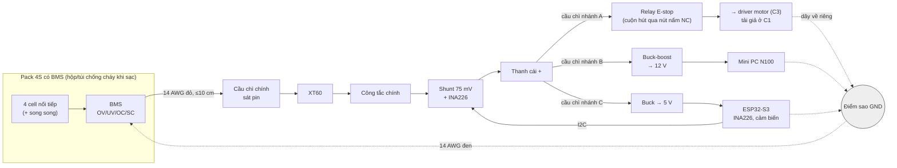

# Chặng 1 — Hệ nguồn (35h)

> **Vị trí:** C0 (xưởng, an toàn) → **C1** → C2 (cơ khí), C5 (lắp hoàn chỉnh dùng bo nguồn này) · **Cần trước:** K1 trọn; tốt nhất sau K3 Bài 5–6 (amp, brownout); C0 trọn (nguồn bàn CV/CC → K7 C0.4, đồ gá đo sụt áp → K7 C0.3); viên nang → F5.7, F1.1 · **Chạy song song với:** K2–K3
> **Làm ra được:** bo phân phối nguồn trên tấm đế: pin → cầu chì chính → công tắc chính → (a) nhánh motor qua relay E-stop → đầu ra cho driver; (b) buck-boost 12 V cho mini PC; (c) buck 5 V cho ESP32/logic · bảng power budget có số đo, log dòng–áp ≥1 kHz từ INA226, `wiring/wires.csv` đầy đủ · **Sau chặng này bạn quyết định được:** pin hóa học nào, mấy S; mini PC cần buck hay buck-boost; mỗi nhánh dây cỡ nào, cầu chì bao nhiêu ampe; robot chạy được bao lâu và dòng đỉnh có làm BMS cắt cả hệ không.

Chặng nguy hiểm nhất của K7. C0 cho bạn tay nghề với nguồn bàn có trần dòng vài ampe. C1 đưa vào một vật **không có trần dòng hữu ích**: pack lithium chập mạch có thể đẩy ra hàng trăm ampe trước khi BMS kịp cắt (mô phỏng ở → K7 C0.2; Bài C1.1 so ba cấu hình pack). Toàn bộ chặng xoay quanh một nguyên tắc: **pin là thứ cuối cùng được cắm vào**. Mọi khối được thử trên nguồn bàn có giới hạn dòng trước, từng khối một.

Chặng này chưa cần motor và driver (C3 mới có). Tải motor được thay bằng **tải giả**: bóng đèn ô tô 12 V 21 W (dây tóc nguội có điện trở thấp nên có dòng khởi động, giống motor) và điện trở công suất. Nếu đã có motor, có thể dùng thêm một motor kẹp chặt, không gắn bánh.

**Phân bổ 35h** `[ước lượng]`:

| Phần | Giờ |
|---|---|
| Bài C1.1 Pin lithium: hóa học, S/P, C-rate, BMS | 4 |
| Bài C1.2 Power budget là một bảng số đo | 3 |
| Bài C1.3 Dây, đầu nối, cầu chì | 4 |
| Bài C1.4 DC-DC: buck/boost/buck-boost | 4 |
| Bài C1.5 Lắp bo nguồn và đo dòng đỉnh | 5 |
| Bài C1.6 Sạc, bảo quản, xử lý pin hỏng *(rút gọn)* | 1,5 |
| Lắp bước 1–8 (nhận pin, đo tải, bó dây, thử DC-DC, lắp bo, cấp điện bằng nguồn bàn, gắn INA226, cấp điện bằng pin) | 11,5 |
| Gate chặng 1 | 2 |
| **Tổng** | **35** |

## 0. Bức tranh chặng

Sau chặng này: một tấm đế (mica hoặc gỗ ép) cỡ khổ A4, chưa lên khung xe (C2 làm khung, C5 mới gắn bo lên robot). Trên tấm đế là toàn bộ đường năng lượng của robot:



Ba điều đọc từ hình:
1. **E-stop chỉ nằm trên nhánh A.** Bấm E-stop: motor mất điện, mini PC và ESP32 vẫn sống để ghi log và báo cáo. Đây là quyết định kiến trúc (`_KE-HOACH-K7.md` mục 5); C10.1 làm E-stop cứng đầy đủ, C1 làm điểm cắt. Mạch C1 là **fail-safe** theo nghĩa hẹp: tiếp điểm thường hở (NO) của relay chỉ đóng khi cuộn hút có điện qua nút NC; mất cuộn, đứt dây, bấm nút, đứt FD đều = cắt `[chuẩn]`. Ba giới hạn phải biết, C10.1 xử lý: (a) **xoay nhả nút là động lực có lại ngay**, không có bước reset (C10.1 thêm mạch tự giữ); (b) diode song song cuộn làm relay nhả **chậm hơn** (dòng cuộn tắt dần qua diode) nên tiếp điểm mở chậm, hồ quang DC lâu hơn; đo thời gian nhả ở C10.1, có thể dùng diode + zener `[chuẩn]`; (c) relay đóng vào tụ 1000 µF phía driver có dòng nạp rất lớn, lâu dần có thể **hàn dính tiếp điểm**, tức E-stop hỏng ở trạng thái đóng mà không ai biết: kiểm mỗi lần khởi động rằng bấm E-stop làm áp động lực về ~0 (test `test_estop_isolation` ở mục 7). Relay 12 V của ô tô được thiết kế cho áp ắc quy ~9–16 V; đọc dải áp cuộn trong datasheet relay, kiểm nó còn hút chắc ở 10 V (pack cạn) và chịu được 14,6 V (pack đầy) `[spec — datasheet relay]`.
2. **Mỗi đường dây có cầu chì ở đầu nguồn của nó.** Cầu chì chính bảo vệ dây chính; cầu chì nhánh bảo vệ dây nhánh (Bài C1.3).
3. **Dòng điện về đi theo hình sao,** không nối tiếp qua nhau. Dòng motor không được chảy qua dây GND của ESP32.

Dòng dữ liệu mới: ESP32 đọc INA226 qua I2C ở ~1,5 kHz → USB serial → CSV trên laptop/mini PC → script phân tích → dòng tổng hợp vào `build-log/measurements.jsonl`.

## 1. An toàn của chặng

**Rủi ro cụ thể của C1** (theo mức nặng):
1. **Ngắn mạch pack.** Dòng hàng trăm ampe `[ước lượng — → K7 C0.2]`: dây đỏ rực trong vài giây, tia lửa hồ quang, kim loại bắn, bỏng tay. Hay xảy ra nhất khi: tuốt dây đang nối pin, dụng cụ kim loại rơi qua hai cực, hai đầu dây trần chạm nhau, cắm XT60 ngược bằng đầu tự hàn sai.
2. **Thermal runaway** (cell tự nóng lên không dừng, Bài C1.1): do sạc sai hóa học, sạc quá áp, pin bị đâm/móp, chập ngoài kéo dài, pin hỏng do xả quá sâu rồi bị sạc lại. Khói pin chứa khí độc và dễ cháy; cháy pin khó dập.
3. **Dây quá nóng / cháy vỏ** do dây quá nhỏ so với dòng, hoặc cầu chì to hơn sức chịu của dây.
4. **Đầu ra DC-DC sai áp** (biến trở chưa chỉnh, module sai): 16 V vào mini PC hoặc 12 V vào chân 5 V của ESP32 làm cháy thiết bị đắt tiền.
5. **Tia lửa khi cắm pin** vào tải có tụ lớn (dòng nạp tụ). Đầu XT60 bị rỗ dần; không nguy hiểm tức thời nhưng là dấu hiệu.

**Quy tắc cứng** (cộng thêm vào quy tắc C0, mục 1 của `c00-xuong-an-toan.md`):
- KHÔNG tự ghép cell rời thành pack, KHÔNG hàn trực tiếp lên cell. Dùng pack dựng sẵn có BMS tích hợp.
- KHÔNG dùng LiPo RC trần (không BMS) trong K7, trừ khi bạn đã có quy trình riêng và lý do ghi trong `decisions.md`.
- KHÔNG sạc bằng sạc khác hóa học hoặc khác số S. Sạc LiFePO4 4S (14,6 V) và sạc Li-ion 4S (16,8 V) **không** thay nhau được (Bài C1.6).
- KHÔNG sạc khi không có người trong phòng; KHÔNG sạc trên giường, sofa, thảm; sạc trong túi chống cháy hoặc hộp kim loại, trên mặt không cháy.
- KHÔNG nối pin vào mạch nào chưa qua đủ ba bước: (1) đo điện trở + và − của mạch khi tắt hết (không được gần 0 Ω); (2) cấp bằng nguồn bàn với giới hạn dòng thấp và thấy đúng các điện áp; (3) công tắc chính ở OFF lúc cắm XT60.
- KHÔNG chạm que đồng hồ vào pin khi núm đang ở thang dòng hoặc que đỏ ở lỗ `10A` (→ K7 C0.4 bước 3): đó là chập pack qua đồng hồ. Trước mỗi lần đo áp pin: "núm ở V DC, que đỏ ở lỗ VΩ". KHÔNG đo dòng của pin bằng đồng hồ; dòng pin chỉ đo bằng INA226 (Bài C1.5).
- KHÔNG cắt hai dây ra của pack bằng một nhát kìm, và KHÔNG để hai đầu dây pin cùng trần một lúc: lưỡi kìm bắc qua hai lõi là chập pack. Gắn F0 và XT60 vào dây pin theo đúng thứ tự ở Lắp bước 3a.
- KHÔNG làm việc trên dây đang nối pin. Muốn sửa: công tắc chính OFF → **rút XT60 của pin** → đặt đầu XT60 pin quay ra xa → mới sửa. Công tắc OFF chưa đủ vì đoạn từ pin tới công tắc vẫn có điện.
- KHÔNG để đầu dây trần nào nối với pin. Mọi đầu dây nối pin phải có đầu nối có vỏ hoặc được co nhiệt bọc kín trước khi nối phía kia.
- KHÔNG đặt cầu chì chính xa pin. Đoạn dây từ cực pin tới cầu chì chính là đoạn **không có gì bảo vệ**; giữ ≤10 cm `[ước lượng — thực hành phổ biến]`.
- KHÔNG thay cầu chì đứt bằng cầu chì lớn hơn, dây đồng, giấy bạc. Cầu chì đứt là một số đo: tìm nguyên nhân trước.
- KHÔNG cấp điện cho mini PC hoặc ESP32 từ DC-DC mà chưa đo đầu ra DC-DC lúc không tải bằng UT33D+.
- KHÔNG dùng pin phồng, móp, rơi mạnh, nóng bất thường khi để yên, hoặc có điện áp nghỉ dưới ngưỡng xả của BMS (Bài C1.6 nói xử lý thế nào).
- KHÔNG cố "mở BMS ra xem". Pack dựng sẵn bọc co nhiệt là một khối kín đối với người mới.

**Khi sự cố xảy ra:** dùng bảng "Khi sự cố" của C0 (đã dán cạnh bàn). Bổ sung riêng cho C1:

| Tình huống | Làm ngay | KHÔNG làm |
|---|---|---|
| Dây hoặc bo bốc khói khi đang nối pin | Công tắc chính OFF nếu với tới mà không đưa tay qua khói; nếu không: rút XT60 bằng kìm cách điện, hoặc rời đi. Sau đó đợi nguội ≥15 phút | Không giật dây bằng tay trần; không cắt dây đang mang dòng bằng kìm |
| Cầu chì nhánh đứt | Công tắc OFF → rút pin → đo điện trở nhánh đó → tìm chập → ghi vào sổ | Không thay ngay cầu chì mới rồi bật lại "xem sao" |
| Pin nóng khi đang sạc | Rút phích sạc ở ổ tường (không chạm pin) → để pin trong túi/hộp, theo dõi từ xa ≥1 h | Không tháo dây sạc khỏi pin nếu pin đang bốc khói |

## 2. BOM chặng

Giá `[ước lượng 10/2026]`, kiểm lại ở cửa hàng. Nơi mua theo `docs/lo-trinh-edge-physical-ai-final.md` Phần 5 và C0 mục 2. Pack LiFePO4 12 V cỡ nhỏ thường được bán cho đèn năng lượng mặt trời, máy câu cá, UPS mini, camera an ninh `[ước lượng]`. Món mặc định chọn ở Bài C1.1; dưới đây là cấu hình mặc định **4S LiFePO4**.

| Món | Thông số phải chọn | Vì sao (bằng số) | Giá | Kiểm khi nhận hàng | Thay thế được bằng |
|---|---|---|---|---|---|
| **Pack pin dựng sẵn** | 4S LiFePO4 12,8 V, 6–10 Ah (77–128 Wh), **BMS tích hợp** liên tục ≥15 A, ghi rõ ngưỡng quá dòng; dây ra ≥14 AWG | Wh quyết định bằng runtime tính ở Bài C1.2; BMS phải chịu tổng dòng đỉnh motor + mini PC (Bài C1.2) | 0,9–2tr | Đo điện áp nghỉ (Bài C1.1 bước 2); nhìn: không phồng, vỏ co nhiệt không rách; đọc nhãn: hóa học, S, Ah, dòng xả; hỏi/đòi thông số BMS | 4S2P Li-ion NMC 14,4 V có BMS (Bài C1.1 so sánh); **không** thay bằng LiPo RC trần |
| **Sạc đúng hóa học** | LiFePO4 4S, 14,6 V, 1–3 A, có đèn báo đầy, tự ngắt | Sạc 0,2–0,5C an toàn cho pack 6 Ah `[ước lượng]` (Bài C1.6) | 150–400k | Đo áp ra không tải: phải ≈14,6 V (với pack NMC 4S: 16,8 V) | Nguồn bàn CV/CC, **có người trông**, theo quy trình ở Bài C1.6 (V_set 14,4 V kiểm bằng đồng hồ, tự tháo khi dòng tụt) |
| Cầu chì lưỡi ATO/ATC + đế cầu chì inline có nắp | Bộ 1, 2, 3, 5, 7,5, 10, 15 A; đế cho dây 14 AWG | Định mức 32 V DC, cắt được 1000 A `[spec — datasheet Littelfuse 0257/ATO]`, đủ cho pack 4S | 100–200k | Đo thông mạch từng cầu chì; đọc chữ in số ampe | Hộp cầu chì nhiều nhánh (fuse block 4–6 đường) có nắp |
| Công tắc chính | Ghi định mức **DC** ≥20 A, ≥24 V DC (công tắc ngắt pin xe máy/thuyền) | Nhiều công tắc rocker chỉ ghi định mức AC; ngắt DC khó hơn vì hồ quang không tự tắt ở điểm qua 0 `[chuẩn]` | 100–300k | Đo thông mạch ON/OFF; đọc định mức DC trên thân | Rút XT60 (là "công tắc" an toàn nhất, nhưng không tiện) |
| Relay E-stop | Relay ô tô 12 V, tiếp điểm 30–40 A, cuộn ~100–200 mA; có đế | Cắt nhánh motor; relay ô tô được thiết kế cho tải DC 12 V `[spec — đọc datasheet relay: dải áp cuộn hút, định mức tiếp điểm DC]` | 50–150k | Cấp 12 V từ nguồn bàn vào cuộn: nghe "tách", đo thông tiếp điểm; đo dòng cuộn | Contactor DC nhỏ (to, đắt hơn) |
| Nút E-stop nấm | Tiếp điểm **NC** (thường đóng), xoay để nhả, ≥22 mm | Mất điện cuộn hút = cắt; dây đứt cũng = cắt (an toàn khi hỏng, C10.1) | 50–150k | Đo: chưa bấm → thông; bấm → hở; xoay → thông lại | — |
| Diode 1N4007 (hoặc 1N5819) | — | Dập điện áp ngược của cuộn relay khi nhả `[chuẩn]` | <10k | Đo diode bằng UT33D+ | — |
| **Buck-boost 12 V cho mini PC** | Vào bao trùm dải pack (8–36 V là phổ biến), ra 12 V cố định hoặc chỉnh được, **≥5 A liên tục** | Mini PC dùng adapter 12 V 3 A (36 W) `[spec — nhãn adapter, kiểm máy bạn]`; có báo cáo N100 ăn ~34 W khi stress `[ước lượng — một người dùng đo, tự đo lại]` → chừa ~40% | 200–500k | Bài C1.4 bước 1: đo áp ra không tải ở Vin 10 / 13 / 14,6 V | Bộ ổn áp DC kín cho ô tô "8–40 V → 12 V 5 A" (thường là buck-boost); buck chỉ khi pack là 4S NMC và có ngắt mềm (Bài C1.4) |
| Buck 5 V cho logic | Đồng bộ (synchronous) nếu có, 3 A, vào ≥20 V | ESP32-S3 + INA226 + cảm biến ~0,2–0,5 A TB, đỉnh WiFi vài trăm mA `[ước lượng, đo ở C1.2]` | 50–150k | Đo áp ra không tải trước khi nối ESP32 | Module LM2596 (không đồng bộ, nóng hơn) |
| Module INA226 + shunt rời | INA226; shunt rời 50 A/75 mV (1,5 mΩ) có lỗ bắt vít | Áp shunt tối đa ±81,92 mV `[spec — TI INA226 datasheet]`; module bán sẵn hay gắn shunt 0,1 Ω (R100) → chỉ đo tới ~0,8 A `[tự đo: đọc chữ trên điện trở shunt module]` | 60–120k + 80–150k | `i2cdetect` (Bài C1.5); đọc chữ trên shunt | INA219 (bus tối đa 26 V, 12 bit) |
| Thanh cái/cầu đấu có nắp | 2 dãy (+ và GND) hoặc cầu đấu 6–8 cực ≥20 A | Điểm sao GND và điểm chia nhánh | 50–150k | Siết thử ferrule 14 AWG | Bus bar đồng tự làm (không khuyên cho người mới) |
| Tấm đế + standoff | Mica/gỗ ép 3–5 mm khổ A4; standoff nhựa M3 | Bo nguồn tách khỏi bàn, mang được lên khung ở C5 | 50–150k | — | Ván gỗ |
| Tụ hóa 1000 µF 35 V low-ESR ×2 | Áp ≥2× áp pack | Đặt sát đầu vào driver/tải giả (C1.4, C3) | 20–50k | Đúng cực; vỏ không phồng | — |
| Tải giả | Bóng đèn ô tô 12 V 21 W (loại P21W) + đuôi; điện trở nhôm 10 Ω 50 W | Bóng nguội có dòng khởi động cao hơn dòng chạy nhiều lần → luyện đo dòng đỉnh mà chưa cần motor (Bài C1.5) | 50–150k | Đo điện trở nguội của bóng (ghi lại) | Một motor JGB37 kẹp ê tô, không bánh |
| Nhiệt kế hồng ngoại | −30…+300 °C | Kiểm nhiệt mối nối, dây, DC-DC trong Gate | 200–400k | Đo cốc nước đá và nước sôi | Cặp nhiệt (nếu đồng hồ có) |
| Jack DC đực 5,5×2,5 mm có dây | Dây ≥18 AWG | Đầu vào mini PC `[spec — adapter EQ12 ghi 5,5×2,5 mm; tự đo cực tính trên nhãn]` | 20–50k | Đo cực tính bằng UT33D+ trước khi cắm | — |
| Dây silicon, XT60, ferrule, co nhiệt | 14, 16, 18, 22 AWG đỏ/đen; 18 AWG cam; 22 AWG tím (quy ước C0.5) | Đã mua ở C0, bổ sung | 100–200k | — | — |

**Tổng C1 `[ước lượng]`:** ~2,5–5tr. Pack và buck-boost là phần lớn.

## 3. Dụng cụ và kỹ năng tay

| Kỹ năng | Bài | Luyện trước trên phế liệu | Đạt trông thế nào |
|---|---|---|---|
| Hàn dây 14 AWG vào XT60 | C1.3 | 2 cặp XT60 thừa (đã làm ở C0.3) | Cốc đầy thiếc, bóng, dây không xoay; co nhiệt phủ hết kim loại; cực tính đúng màu |
| Bấm ferrule 14–16 AWG, siết cầu đấu | C1.3 | 5 đầu | Kéo 50 N không tuột; không sợi đồng ngoài ferrule |
| Đi dây trên tấm đế: chiều dài, buộc dây, strain relief | C1.5 | Vẽ trước bằng bút trên tấm đế | Không dây nào bị kéo căng; mỗi dây có nhãn `wire_id` |
| Chỉnh biến trở DC-DC | C1.4 | Trên nguồn bàn, không tải | Xoay chậm, đo áp ra liên tục; dán băng keo cố định sau khi chỉnh |
| Đo dòng qua shunt kiểu Kelvin | C1.5 | Đồ gá C0.3 | Dây cảm biến đi riêng từ hai mép shunt, không đi chung dây dòng |
| Thao tác cắm/rút pin theo thứ tự | Lắp bước 8 | Với pin giả (C0 bước 6) | Công tắc OFF → cắm → kiểm → ON; ngược lại khi rút |

**Mối nối 14 AWG khác 22 AWG ở chỗ nào:** dây to hút nhiệt nhanh, mỏ nhỏ không đủ nhiệt nên thiếc "bám bề mặt" mà không thấm vào lõi (mối hàn nguội: xám, sần, có ranh giới rõ giữa thiếc và dây). Dùng đầu mỏ dẹt lớn, nhiệt 360–400 °C cho thiếc có chì hoặc cao hơn chút cho không chì `[ước lượng — chỉnh theo trạm của bạn]`, giữ mỏ tới khi thiếc chảy **tự** lan vào sợi. Kiểm bằng đồ gá đo sụt áp ở C0.3: mối 14 AWG tốt có sụt áp gần bằng đoạn dây nguyên cùng chiều dài.

## 4. Sơ đồ đi dây

Cỡ dây, chiều dài là đề xuất ban đầu `[ước lượng]`; Bài C1.3 tính lại bằng số đo của bạn.

```
  PACK 4S (BMS trong)                                       (+) ĐỎ          (−) ĐEN
  B+ ─14AWG đỏ ≤10cm─[F0 15A]─[XT60 cái]═[XT60 đực]─14AWG─[SW chính ≥20A DC]─[SHUNT 1,5mΩ]──┐
  B− ─14AWG đen───────────────[XT60 cái]═[XT60 đực]─14AWG─────────────────────────────────┐  │
                                                                                           │  │
                                         ĐIỂM SAO GND (cầu đấu) ◄──────────────────────────┘  │
                                          │   │    │    │                                     ▼
                         16AWG đen ───────┘   │    │    │                         THANH CÁI + (cầu đấu)
                         (về từ driver)       │    │    │                            │      │      │      │
                           18AWG đen ─────────┘    │    │                    [FA 10A] [FB 5A] [FC 2A] [FD 1A]
                           (về từ buck-boost)      │    │                     16AWG   18AWG   22AWG   22AWG
                              22AWG đen ───────────┘    │                       │       │       │       │
                              (về từ buck 5V)           │                       │       │       │   NÚT E-STOP (NC)
                                 22AWG đen ─────────────┘                       │       │       │       │
                                 (về từ cuộn relay)                             │       │       │   cuộn RELAY 12V
                                                                                │       │       │   ║ 1N4007 song song,
                                                                     tiếp điểm RELAY    │       │   ║ vạch về phía +
                                                                       (30/87)  │       │       │       │
                                                                     ┌──────────┘       │       │       └→ GND sao
                                                          1000µF ═══ ĐẦU RA ĐỘNG LỰC    │       │
                                                          (sát tải)  → driver (C3) /    │       │
                                                                       tải giả ở C1      │       │
                                                                            BUCK-BOOST → 12 V ── 18AWG cam ── jack 5,5×2,5 → MINI PC
                                                                                  BUCK → 5 V ── 22AWG tím, JST ── 5V/GND ESP32, INA226 VS
  INA226: IN+ / IN− nối hai mép shunt bằng 2 dây 24–26 AWG xoắn đôi (Kelvin); VBUS nối phía tải của shunt;
          SDA/SCL/3V3/GND về ESP32 bằng JST 4 chân; GND INA226 nối GND sao (không qua dây motor).
```

**Bảng dây** — ghi vào `wiring/wires.csv` (header đã có từ C0):

| wire_id | net | từ → tới | AWG | màu | dài (m) | cầu chì bảo vệ |
|---|---|---|---|---|---|---|
| W01 | PACK+ | B+ → F0 | 14 | đỏ | ≤0,10 | (không — đoạn không bảo vệ, giữ ngắn) |
| W02 | PACK+ | F0 → SW → shunt → thanh cái | 14 | đỏ | ~0,3 | F0 15 A |
| W03 | GND | B− → điểm sao | 14 | đen | ~0,3 | F0 (cùng mạch vòng) |
| W10/W11 | MOT+ / MOT_GND | FA → relay → đầu ra; về điểm sao | 16 | đỏ (nhãn MOT)/đen | ~0,3 | FA 10 A |
| W20/W21 | VIN_PC / GND | FB → buck-boost; về điểm sao | 18 | đỏ/đen | ~0,25 | FB 5 A |
| W22/W23 | 12V_PC / GND | buck-boost → jack mini PC | 18 | **cam**/đen | ~0,4 | (giới hạn dòng của DC-DC) |
| W30/W31 | VIN_5V / GND | FC → buck 5 V; về điểm sao | 22 | đỏ/đen | ~0,25 | FC 2 A |
| W40 | ESTOP_COIL | FD → nút → cuộn → GND | 22 | có nhãn đỏ ở hai đầu (quy ước C0.5) | ~0,5 | FD 1 A |
| W32/W33 | 5V / GND | buck 5 V → ESP32, INA226 VS | 22 | **tím**/đen | ~0,3 | (giới hạn dòng của buck) |
| W50 | SENSE± (+ VBUS) | mép shunt → INA226 | 24–26 xoắn đôi | màu không trùng net nguồn + nhãn SENSE | ~0,1 | **điện trở 10 Ω nối tiếp mỗi dây, đặt sát mép shunt** (xem dưới bảng) |
| W60 | I2C | INA226 → ESP32 (JST 4 chân) | 26 | Qwiic: đen GND, đỏ 3V3*, xanh dương SDA, vàng SCL | ~0,2 | — |

**Dây sense không mang dòng nhưng nối thẳng vào VBAT.** Dòng đo chỉ cỡ µA, nhưng nếu dây 26 AWG cọ thủng vỏ chạm GND, nó là một đường chập chỉ được F0 15 A bảo vệ, và dây 26 AWG cháy trước khi F0 kịp đứt. Hai cách: giữ dây sense ≤10 cm, buộc chặt, và đặt điện trở 10 Ω (1/4 W) nối tiếp mỗi dây **ngay tại mép shunt**: chập thì điện trở tự cháy hở như một cầu chì, dây không cháy. 10 Ω cũng là giá trị lọc đầu vào tối đa mà datasheet INA226 khuyên, vì dòng phân cực đầu vào chạy qua nó gây sai số offset/độ lợi `[spec — TI INA226 datasheet, mục input filtering; tự đo: đọc offset khi không tải]`. Cùng lý do cho dây VBUS.

Màu theo quy ước dây của → K7 C0.5: **đỏ VBAT, cam 12 V, tím 5 V, đen GND, I2C theo Qwiic**. *Cáp Qwiic dùng đỏ cho 3,3 V; trong bo nguồn đây là ngoại lệ duy nhất của "đỏ = VBAT", nên đầu JST của cáp I2C phải có nhãn "3V3". Mã `F0, FA…FD` và `W01…` dán nhãn thật trên dây và cầu chì.

## 5. Trình tự chặng

Thứ tự: khái niệm pin → nhận pin (chưa nối gì) → đo tải từng khối trên nguồn bàn → bó dây → DC-DC trên nguồn bàn → lắp bo → cấp bằng nguồn bàn → đo dòng → mới tới pin.

1. **Học Bài C1.1** (pin, BMS). Commit `prediction.md` trước khi mở 🔒.
2. **Học Bài C1.6 phần 1–3 và 6** (sạc, bảo quản). Phải đọc trước khi nhận pin.
3. **Lắp bước 1 — Nhận pin và sạc, kiểm khi nhận** (Bài C1.1 phần 6 bước 1–3)
   - Làm: kiểm bằng mắt, đọc nhãn, đo điện áp nghỉ, ghi vào `measurements.jsonl`. Kiểm sạc không tải. Sạc lần đầu theo quy trình C1.6, có người trông.
   - ✅ Checkpoint: điện áp nghỉ của pack nằm trong dải của hóa học đó (bảng ở Bài C1.1); áp ra sạc không tải đúng hóa học (LFP 4S ≈14,6 V, NMC 4S ≈16,8 V). Sai một trong hai: không sạc.
   - Nếu sai: pack áp thấp dưới ngưỡng UV → xem C1.6 (không tự "kích"); sạc sai áp → đổi sạc.
4. **Học Bài C1.2** (power budget).
5. **Lắp bước 2 — Đo tải từng khối trên nguồn bàn** (Bài C1.2 phần 6)
   - Làm: mini PC trên nguồn bàn 12,0 V, I_set 4 A; ESP32 qua nguồn bàn 5,0 V, I_set 0,5 A; tải giả. Điền bảng budget phần idle/TB.
   - ✅ Checkpoint trước khi bật OUTPUT cho mini PC: cực tính jack 5,5×2,5 (đo bằng UT33D+: + ở chân giữa nếu nhãn adapter vẽ như vậy); V_set đọc đúng 12,0 V lúc OUTPUT OFF→ON không tải.
   - Nếu sai: nguồn bàn vào CC ngay khi mini PC khởi động → I_set thấp hơn dòng khởi động; tăng có lý do (ghi số), không đặt max.
6. **Học Bài C1.3** (dây, cầu chì).
7. **Lắp bước 3 — Làm bó dây chính và dây nhánh** (chưa nối gì vào pin)
   - Làm: pigtail pin (XT60 cái + F0 + 14 AWG), dây chính, dây nhánh theo bảng dây; ferrule mọi đầu vào cầu đấu; nhãn W.., F...
   - **Bước 3a — Gắn F0 và XT60 cái vào pack** (thao tác nguy hiểm nhất của chặng, vì đây là lần duy nhất bạn làm trên dây **đang có điện**). Nếu pack có sẵn đầu nối: KHÔNG cắt dây pin; làm một dây chuyển (đầu nối đối diện của pack → 14 AWG ≤10 cm → F0 → XT60 cái), toàn bộ làm khi chưa cắm vào pack. Nếu pack ra dây trần: tỉnh táo, bàn trống, kính, không nhẫn/đồng hồ, pack trong khay chống cháy, bình chữa cháy trong tầm tay, rồi theo đúng thứ tự:
     1. Làm **một dây một lúc**. Dây đen (−) giữ nguyên lớp bọc/băng keo đầu dây, gập ra xa, cho tới bước 4.
     2. Dây đỏ (+): lắp đế cầu chì inline của F0 **khi chưa cắm cầu chì** (nối dây đỏ vào một đầu đế bằng mối nối thẳng của C0.3, co nhiệt). Từ lúc này mọi thứ phía sau đế cầu chì **không có điện**.
     3. Hàn đầu kia của đế cầu chì vào chân "+" của **XT60 cái** (→ K7 C0.3 bước D), co nhiệt phủ kín cốc hàn. Chân này chưa có điện vì F0 chưa cắm.
     4. Bóc băng dây đen, hàn vào chân "−" của XT60 cái, co nhiệt. Đây là mối duy nhất làm trên dây sống; vì chân "+" bên cạnh đang chết (F0 chưa cắm), một giọt thiếc hay ống co trượt cũng không gây chập. Đó là lý do **cầu chì trước, cực âm sau**.
     5. ✅ Checkpoint: đồng hồ ở **V DC, que ở lỗ VΩ**: giữa hai chân XT60 cái phải là **0 V** (F0 chưa cắm). Có áp → bạn đã nối dây đỏ vòng qua cầu chì, dừng lại. Rồi cắm F0 lúc XT60 để hở, đo lại: phải bằng OCV của pack. Bịt XT60 cái bằng nắp hoặc một đầu XT60 đực trống khi không dùng.
     - Nếu pack có cọc vít thay vì dây: nối dây **+ (đã có F0, F0 chưa cắm) trước, − sau**; tháo theo chiều ngược lại (− trước) `[chuẩn — quy ước ắc quy ô tô: cờ lê chạm khung khi đang vặn cọc còn lại không tạo vòng chập]`.
   - ✅ Checkpoint: mỗi mối 14/16 AWG đo sụt áp bằng đồ gá C0.3 ở 3 A; ghi; thông mạch từng dây; **không** thông giữa đỏ và đen của bất kỳ cặp nào.
   - Nếu sai: cắt, hàn lại; không hâm thêm thiếc lên mối nguội.
8. **Học Bài C1.4** (DC-DC).
9. **Lắp bước 4 — Thử từng DC-DC trên nguồn bàn** (Bài C1.4 phần 6)
   - Làm: đầu vào DC-DC từ nguồn bàn (I_set 1 A), không tải; chỉnh áp ra; quét Vin; rồi tải giả.
   - ✅ Checkpoint trước khi nối tải thật: áp ra không tải của buck-boost là 12,0 ± 0,2 V ở cả Vin thấp nhất và cao nhất của pack; buck 5 V là 5,0–5,2 V `[spec: ESP32-S3 DevKit chân 5V qua LDO — kiểm schematic board của bạn]`. Dán băng keo lên biến trở.
   - Nếu sai: xem bảng "Nếu ra khác" của C1.4.
10. **Lắp bước 5 — Lắp bo phân phối trên tấm đế** (chưa cấp điện)
    - Làm: bố trí: pin/XT60 một mép, công tắc và E-stop ở mép dễ với, DC-DC xa relay; bắt vít; đi dây theo sơ đồ mục 4; buộc dây; nút E-stop tạm gắn trên tấm đế.
    - ✅ Checkpoint (đồng hồ, không nguồn): điện trở thanh cái + ↔ điểm sao GND với công tắc ON, mọi cầu chì cắm, chưa nối tải: **không được gần 0 Ω** (DC-DC có tụ đầu vào nên số tăng dần là bình thường). Mỗi đầu ra (12 V, 5 V, động lực) ↔ GND: không gần 0 Ω. Bấm E-stop: thông mạch qua tiếp điểm relay không đổi (relay chưa có điện, tiếp điểm NO đang hở).
    - Nếu sai: gần 0 Ω → tìm chập bằng cách rút từng cầu chì nhánh cho tới khi số đổi.
11. **Lắp bước 6 — Cấp điện lần đầu bằng nguồn bàn giả lập pin**
    - Làm: nguồn bàn nối vào XT60 đực của bo (thay pin) qua dây ≥18 AWG; V_set 13,2 V, I_set 0,3 A; công tắc chính OFF → OUTPUT ON → công tắc chính ON (đặt I_set, CC khác OCP, và tụ đầu ra nguồn bàn xả vào tải khi nối nóng: → K7 C0.4, không lặp ở đây). Đo áp mỗi nhánh không tải. Sau đó thêm tải **từng cái một**, tăng I_set vừa đủ: ESP32 → tải giả bóng đèn (nhả E-stop) → mini PC.
    - ✅ Checkpoint: không tải, dòng nguồn bàn chỉ vài chục mA (dòng tĩnh của DC-DC và cuộn relay khi nhả E-stop: cộng dòng cuộn đã đo); E-stop bấm → áp đầu ra động lực về ~0 V, 12 V và 5 V không đổi.
    - Nếu sai: nguồn bàn vào CC ngay lúc bật mà không tải → có chập hoặc tụ lớn đang nạp; OUTPUT OFF, đo lại bước 5.
12. **Học Bài C1.5**, **Lắp bước 7 — Gắn INA226, firmware log, đo dòng đỉnh** trên nguồn bàn (Bài C1.5 phần 6).
13. **Học Bài C1.6 phần còn lại.**
14. **Lắp bước 8 — Cấp điện bằng pin thật**
    - Làm: pin vừa sạc đầy (C1.6), nằm trong túi chống cháy cạnh bo; công tắc chính OFF; đo áp pin tại XT60 cái của pin (núm V DC, que đỏ ở lỗ VΩ, đọc to trước khi chạm); cắm XT60; ON. Lặp lại đo áp từng nhánh, rồi chuỗi thêm tải như bước 6. Chạy log INA226 ≥10 phút với mini PC chạy tải + bóng đèn bật/tắt theo chu kỳ.
    - ✅ Checkpoint trước khi cắm: (1) bo đã PASS bước 6 trên nguồn bàn, không sửa gì sau đó (nếu đã sửa: làm lại bước 5–6); (2) điện trở + ↔ GND của bo không gần 0 Ω; (3) công tắc OFF; (4) bình chữa cháy, kìm dài trong tầm tay. Sau khi ON: sờ (mu bàn tay, cách 1 cm trước) F0, công tắc, XT60 trong 1 phút đầu: không ấm lên rõ.
    - Nếu sai: bất kỳ mùi, tiếng lách tách, khói → công tắc OFF, rút XT60, ghi near-miss.
15. **Gate chặng 1.**

## 6. Lỗi người mới hay gặp

| Triệu chứng | Nguyên nhân khả dĩ | Kiểm bằng cách | Sửa |
|---|---|---|---|
| Mini PC tắt khi bật bóng đèn/motor, ESP32 vẫn sống | 12 V sụt dưới ngưỡng mini PC do buck-boost chạm giới hạn dòng hoặc UVLO; hoặc BMS cắt toàn bộ rồi bật lại | Log INA226 (V pack, I tổng) tại thời điểm tắt; đo đầu ra 12 V bằng ADC hoặc INA226 thứ hai | DC-DC dòng lớn hơn; tụ ở đầu vào DC-DC; ramp motor trong firmware (C4.4) |
| Toàn bộ hệ tắt rồi tự bật lại sau vài giây | BMS quá dòng (OC) cắt rồi tự phục hồi | Dòng đỉnh log so với ngưỡng OC trên thông số BMS | Giảm dòng đỉnh (ramp, giới hạn dòng driver) hoặc pack có BMS ngưỡng cao hơn; KHÔNG bỏ BMS |
| ESP32 reset khi relay đóng/nhả | Thiếu diode dập cuộn relay; GND ESP32 đi chung dây với dòng relay/motor | Đọc `esp_reset_reason()` (→ K3 Bài 6); xem dây GND | Diode song song cuộn; dây GND riêng về điểm sao |
| Cầu chì nhánh motor đứt khi bật bóng đèn | Cầu chì loại nhanh, dòng khởi động bóng nguội vượt | Log INA226 dòng đỉnh × thời gian; so với bảng thời gian–dòng (Bài C1.3) | Cầu chì đúng loại/đúng cỡ cho dây; không tăng quá sức chịu dây |
| INA226 bão hòa ở ~0,8 A | Đang dùng shunt 0,1 Ω có sẵn trên module | Đọc chữ trên điện trở (R100 = 0,1 Ω) | Tháo shunt module, dùng shunt rời (Bài C1.5) |
| Áp ra buck 5 V đúng khi không tải, tụt khi WiFi ESP32 bật | Module buck rẻ, dây 5 V dài/mảnh, Dupont | Đo áp tại chân ESP32, không tại module | Dây ngắn hơn, JST thay Dupont, tụ 100 µF sát ESP32 |
| Tia lửa to mỗi lần cắm XT60 | Tụ đầu vào DC-DC và tụ 1000 µF nạp tức thời | Nghe/nhìn; công tắc chính ON hay OFF lúc cắm? | Cắm khi công tắc OFF (công tắc gánh tia lửa); tụ lớn hơn nữa thì cần mạch pre-charge (C10.1) |

## 7. Lăng kính data infra

**Dữ liệu chặng này sinh ra:**

| Luồng | File | Schema (rút gọn) | Tần số | Đơn vị |
|---|---|---|---|---|
| Log dòng–áp INA226 | `data/c01/power-<ts>.csv` → về sau topic `/power/raw` (C7) | `t_us` (đồng hồ ESP32, monotonic), `i_A`, `v_V` | ~1,5 kHz | A, V; t ghi µs dạng số nguyên, chuyển sang s khi phân tích |
| Tổng hợp mỗi phiên đo | `build-log/measurements.jsonl` | schema C0 + `quantity` ∈ {`current_peak`, `current_p99`, `current_mean`, `voltage_min`, `energy`, `sample_period`, `gap_count`} | theo phiên | A, V, Wh, s |
| Power budget | `power/budget.csv` | `load, rail, v_rail, i_idle, i_avg, i_peak, peak_ms, source` | khi đo lại | V, A, ms ghi trong tên cột |
| Bảng dây | `wiring/wires.csv` | như C0 | khi đi dây | — |
| Trạng thái pin (từ C5) | topic `/battery` | `sensor_msgs/msg/BatteryState` theo `CONVENTIONS.md` | 1 Hz | V, A |

`source` trong `budget.csv` nói số đó **từ đâu**: `measured:<file log>`, `datasheet:<tài liệu>`, `estimate:<lý do>`. Một power budget không có cột provenance giống một dashboard không ghi query: không ai biết số nào còn là đoán.

**Test tự động sinh ra từ chặng này (hạt giống cho C11.2):**
- `test_power_budget`: chạy `c12_budget.py` trên `budget.csv` mỗi khi đổi tải; FAIL nếu một kiểm vượt giới hạn. Thêm loa ở C12 mà quên đo lại → CI đỏ.
- `test_estop_isolation` (bench): bấm E-stop 20 lần, mỗi lần kiểm (a) áp động lực về dưới 1 V trong thời gian ngưỡng, (b) mini PC không mất heartbeat, (c) ESP32 không đổi `reset_reason`. Ở C11 bước này thành HIL: relay nhả bằng GPIO, script đọc log, chấm pass/fail/inconclusive.
- `test_brownout_margin`: chạy chuỗi tải chuẩn (bóng đèn bật/tắt 20 lần), kiểm `voltage_min` trên đường 12 V và 5 V còn trên ngưỡng có biên.

**SLI:** tỉ lệ mẫu bị lỡ (`gap_count`/số mẫu) của log INA226; độ phủ của budget (bao nhiêu % tải có `source=measured`); số lần BMS cắt ngoài ý muốn mỗi giờ chạy (về sau ở soak C10.3).

**Vai trò nghề:** Test & Validation (bench test có ngưỡng, ba trạng thái, test cô lập lỗi); Data Platform (log tần số cao, tổng hợp thành metric, provenance của từng dòng budget). Kỹ sư "Electrical" trong bảng vai trò của K7 gốc Phụ lục: "Tôi biết dòng hãm quyết định chọn driver và nguồn, vì tôi đo nó."

## 8. Nhật ký build

Copy vào `build-log/c01.md`, một mục mỗi buổi:

```markdown
## 2026-MM-DD — buổi N (giờ bắt đầu–kết thúc, giờ thực: _._ h)
- Trạng thái người: tỉnh táo / mệt (mệt → không nối pin hôm nay)
- Pin hôm nay: có nối / không · điện áp nghỉ đầu buổi: __ V · cuối buổi: __ V · có sạc: có/không (giờ bắt đầu–kết thúc, ai trông)
- Mục tiêu buổi:
- Đã làm (lắp bước số):
- Checkpoint: bước __ → PASS/FAIL, số đo: __ (đã ghi measurements.jsonl? số dòng: __)
- Log INA226: data/c01/power-____.csv · chu kỳ: __ µs · khoảng trống: __
- Ảnh: build-log/img/c01/...
- Lỗi gặp (triệu chứng → nguyên nhân → sửa):
- Cầu chì đứt: không / có (mã F__, nguyên nhân: __)
- Quyết định (ghi decisions.md nếu ảnh hưởng chặng sau): (vd: chọn 4S LFP; buck-boost model __)
- Near miss: không / có → mô tả, sửa bố trí gì
- Câu hỏi còn mở:
```

---

## Bài C1.1 — Pin lithium: hóa học, S/P, C-rate, BMS làm gì và không làm gì (4h)

> **Vị trí:** C0.2 (điện gây hại bằng cách nào) → **C1.1** → C1.2 · **Cần trước:** K7 C0.2, → F5.7 mục 2, → F1.1 · **Sau bài này bạn quyết định được:** mua pack hóa học nào, mấy S mấy P, BMS phải có thông số gì; và biết chính xác những rủi ro nào BMS **không** che.

### 1. Câu chuyện — ai đã khổ vì chuyện này

Câu chuyện Boeing 787 (2013) bạn đã đọc ở → K7 C0.2: chập **trong** một cell, lan ra cả pin. Đây là câu chuyện thứ hai, ở cỡ gần với bạn hơn. Tháng 8/2016 Samsung bán Galaxy Note 7; vài tuần sau, máy bắt đầu cháy khi đang sạc hoặc để yên. Samsung thu hồi, thay bằng máy dùng pin của nhà cung cấp thứ hai; máy thay thế cũng cháy; tháng 10/2016 Samsung dừng hẳn sản phẩm `[chuẩn — tin rộng rãi]`. Tháng 1/2017 Samsung công bố kết quả điều tra (cùng UL, Exponent, TÜV Rheinland): hai lỗi **khác nhau** ở hai loại pin. Pin A: điện cực âm bị uốn ở góc trên bên phải vỏ pin, dẫn tới chập trong. Pin B: ba-via (burr) mối hàn cao ở điện cực dương xuyên qua băng cách điện và lớp separator, chạm điện cực âm; một số pin thiếu hẳn băng cách điện `[chuẩn — công bố của Samsung 1/2017, báo chí kỹ thuật thuật lại]`.

Cả hai pin đều có mạch bảo vệ, cả hai điện thoại đều có quản lý sạc tinh vi. Không mạch nào ngăn được một mẩu kim loại xuyên qua separator **bên trong** cell. Đây là bài học trung tâm: BMS là một lớp bảo vệ có phạm vi xác định; bạn phải biết phạm vi đó, và mọi thứ ngoài phạm vi phải có lớp khác (chọn hóa học ổn định hơn, pack có nguồn gốc, sạc có người trông, chỗ sạc chứa được lửa).

### 2. Mô hình tư duy

```
 1 cell = nguồn áp phụ thuộc mức sạc (OCV) nối tiếp điện trở trong R_cell
     ┌────┐
  ───┤OCV ├──[R_cell]───          OCV(SOC): NMC 3,0 → 4,2 V, dốc đều
     └────┘                                 LFP 2,5 → 3,65 V, phẳng ở ~3,2–3,3 V giữa dải

 Pack xSyP:  áp ×S, dung lượng Ah ×P, năng lượng Wh ×S×P, R_pack = R_cell·S/P
 C-rate:     1C = dòng xả hết dung lượng trong 1 h (pack 6 Ah: 1C = 6 A, 2C = 12 A)

 ┌──────────────────────── PACK ────────────────────────┐
 │ [cell1]─[cell2]─[cell3]─[cell4]                      │
 │    │       │       │       │   ← dây cân bằng       │
 │  ┌─┴───────┴───────┴───────┴──┐   ┌──────────────┐   │
 │  │ IC giám sát: áp TỪNG cell, │──►│ 2 MOSFET     │──►│── P− (hoặc B−/C−)
 │  │ dòng (shunt), NTC          │   │ xả | sạc     │   │
 │  └────────────────────────────┘   └──────────────┘   │
 └──────────────────────────────────────────────────────┘
```

Bốn điều bản chất:
1. **Điện áp pack là một hàm của mức sạc**, không phải hằng số. "12 V" trên nhãn là áp danh định (nominal) ở giữa dải. 4S NMC đi từ ~16,8 V (đầy) xuống ~12 V (cạn); 4S LFP từ ~14,6 V xuống ~10 V `[chuẩn]`. Mọi tải phía sau phải sống được cả dải này (Bài C1.4).
2. **Dòng làm áp tụt tức thì:** V_đầu cực = OCV − I·R_pack. Pin già, lạnh, gần cạn thì R tăng → cùng dòng đỉnh, áp tụt sâu hơn.
3. **Năng lượng của pack lớn hơn mọi thứ khác trên bàn.** Pack 77 Wh = 277 kJ. Đổ hết năng lượng đó vào một chỗ (chập ngoài, chập trong) là cháy.
4. **BMS là một công tắc MOSFET do một IC giám sát điều khiển.** Nó chỉ làm được những gì IC nhìn thấy (áp từng cell, dòng qua shunt, có khi nhiệt độ) và công tắc cắt được (dòng ra/vào ở cực pack).

**BMS làm gì và KHÔNG làm gì** (pack dựng sẵn loại phổ biến; BMS "thông minh" có thêm báo SOC qua UART/Bluetooth):

| BMS làm (khi thông số ghi có) | BMS KHÔNG làm |
|---|---|
| Cắt sạc khi một cell vượt ngưỡng quá áp (OV) | Ngăn chập **trong** cell (lỗi sản xuất, móp, đâm thủng) → thermal runaway vẫn xảy ra (Note 7; 787 ở C0.2) |
| Cắt xả khi một cell dưới ngưỡng thấp áp (UV) | Báo trước cho mini PC tắt đúng cách: cắt UV là **cắt cứng**, mini PC mất điện như rút phích |
| Cắt xả khi dòng vượt ngưỡng quá dòng (OC) sau một khoảng trễ | Bảo vệ **dây nhánh** của bạn: ngưỡng OC của pack 20–30 A, dây 22 AWG của nhánh 5 V cháy trước đó rất lâu |
| Cắt rất nhanh khi ngắn mạch (SC), thường cỡ trăm µs `[ước lượng — đọc thông số BMS của bạn]` | Bảo vệ đoạn dây **trước** MOSFET; bảo vệ khi chính MOSFET hỏng chập (hỏng kiểu "luôn đóng" là kiểu hỏng có thật của MOSFET) |
| Cân bằng cell (thường thụ động, xả cell cao qua điện trở, vài chục mA) | Cân bằng nhanh một pack lệch nặng; thay sạc đúng hóa học (CC/CV là việc của sạc, BMS chỉ là chốt chặn cuối) |
| Cắt sạc khi lạnh/nóng (chỉ khi có NTC và ghi rõ) | Biết hóa học của chính nó nếu ai đó dùng sạc sai; biết pack đã rơi, phồng |

So ba lựa chọn cho robot này (số cell điển hình `[ước lượng]`; dải áp `[chuẩn]`):

| | 4S LiFePO4 (LFP) | 4S Li-ion NMC (18650) | 3S Li-ion NMC |
|---|---|---|---|
| Dải áp pack (cạn → đầy) | ~10 → 14,6 V, phẳng ~13,0–13,3 V | ~12 → 16,8 V, dốc | ~9 → 12,6 V |
| Mật độ năng lượng cell | thấp hơn (~90–160 Wh/kg) | cao hơn (~150–250 Wh/kg) | như NMC |
| Ổn định nhiệt | cao hơn rõ: khó vào runaway hơn, ít tỏa nhiệt hơn khi vào `[chuẩn]` | thấp hơn | như NMC |
| Tuổi thọ chu kỳ | ~2000+ `[ước lượng]` | ~300–1000 `[ước lượng]` | như NMC |
| Motor 12 V | áp đầy 14,6 V vượt 22% định mức | áp đầy 16,8 V vượt 40% | dưới 12 V gần suốt dải |
| Mini PC 12 V | cần **buck-boost** (Bài C1.4) | buck được nếu ngắt mềm đủ sớm, buck-boost dư dả | cần boost/buck-boost |
| Sạc | 14,6 V (3,65 V/cell) | 16,8 V (4,2 V/cell) | 12,6 V |

**Mặc định của K7 cho người mới: 4S LFP dựng sẵn có BMS.** Lý do theo thứ tự: an toàn nhiệt; áp đầy gần định mức motor 12 V; pack "12 V LiFePO4" có BMS và sạc riêng dễ mua. Cái giá: nặng hơn NMC cùng Wh, và bắt buộc buck-boost. Chọn 4S NMC nếu khối lượng là ràng buộc cứng sau C2.4; ghi vào `decisions.md`.

### 3. Cầu nối từ backend

| Backend bạn biết | Ở đây | Gãy ở chỗ | Nếu dùng nhầm thì |
|---|---|---|---|
| Circuit breaker / rate limiter ở gateway | BMS cắt khi quá dòng | Breaker bảo vệ **downstream** khỏi tải; BMS bảo vệ **chính pin** khỏi bạn. Nó không biết nhánh nào đang quá tải; và lỗi nằm trong cell thì không có request nào để chặn | Tin "có BMS rồi khỏi cầu chì nhánh" → dây nhỏ cháy trong khi BMS thấy dòng tổng vẫn dưới ngưỡng |
| Graceful shutdown khi nhận SIGTERM | Ngắt mềm theo áp pin trước ngưỡng UV | BMS cắt UV là SIGKILL. Không có SIGTERM trừ khi bạn tự đo áp (INA226, Bài C1.5) và tự tắt mini PC trước | Hệ file mini PC hỏng, MCAP mất đuôi (C7) vì mỗi lần pin cạn là một lần rút phích |
| Dung lượng đĩa: 1 TB là 1 TB | "6 Ah" | Dung lượng lấy ra được phụ thuộc dòng, nhiệt độ, tuổi, và áp cắt bạn chọn; 1C và 0,2C cho số khác nhau | Runtime thật ngắn hơn bảng tính; chạy tới UV thường xuyên làm pin già nhanh hơn |
| Supply chain: dependency có lỗ hổng từ upstream | Cell có lỗi sản xuất (Note 7) | Không có "bản vá": cell lỗi chỉ thay được bằng cách thu hồi vật lý; không quét được bằng công cụ | Mua pack rẻ không nguồn gốc vì "có BMS rồi" |

**Chấm mô hình:**
- *"Pack có BMS thì an toàn, cứ cắm vào là được."* — **SAI.** BMS che lỗi về áp và dòng ở cực pack. Phản ví dụ: Note 7 có mạch bảo vệ; burr mối hàn xuyên separator vẫn thành cháy. Gần hơn với bạn: BMS ngưỡng OC 25 A; nhánh 5 V dây 22 AWG chập ở 15 A → BMS không cắt, dây nóng chảy vỏ.
- *"Áp cao hơn thì nguy hiểm hơn, nên 3S an toàn hơn 4S."* — **ĐÚNG MỘT PHẦN.** Ở dải dưới 60 V DC, rủi ro chính với người là **năng lượng và dòng** (bỏng, cháy), không phải giật `[chuẩn — C0.2]`. Pack 3S cùng Wh có Ah lớn hơn và dòng lớn hơn cho cùng công suất; dây phải to hơn. Phản ví dụ: tính dòng chập cho 3S và 4S ở phần 5 rồi so (mô phỏng dây nóng ở → K7 C0.2).

### 4. Thuật ngữ

| Mức | Thuật ngữ | Nghĩa trong một câu | Hay bị hiểu nhầm thành |
|---|---|---|---|
| 🟢 | S / P (4S2P) | Số cell nối tiếp / số nhánh song song | "4S = 4 cell" (4S2P là 8 cell) |
| 🟢 | OCV, SOC | Áp hở mạch khi nghỉ; mức sạc 0–100% | "Đo áp lúc đang chạy là biết SOC" (áp lúc chạy đã trừ I·R) |
| 🟢 | C-rate | Dòng chia dung lượng, đơn vị 1/h | Định mức an toàn tuyệt đối (thực ra phụ thuộc nhiệt, tuổi) |
| 🟢 | BMS: OV/UV/OC/SC | Bốn ngưỡng cắt cơ bản | "Bảo vệ mọi thứ" |
| 🟢 | Thermal runaway | Cell tự nóng làm phản ứng tỏa nhiệt nhanh hơn, không tự dừng | "Cháy pin thông thường", dập là xong |
| 🟡 | Cân bằng thụ động/chủ động | Xả cell cao qua điện trở / chuyển năng lượng giữa cell | "Cân bằng = sạc" |

### 5. Dự đoán

Với pack bạn **định mua** (đọc từ trang bán: hóa học, xSyP, Ah; tra datasheet cell nếu shop ghi mã cell; nếu không, dùng số điển hình trong code dưới và ghi `[ước lượng]`):
1. Dải áp pack (cạn → đầy), năng lượng Wh.
2. Dòng chập ngoài ngay đầu pack, **trước khi BMS cắt**: I ≈ V_nom / (R_pack + R_dây). Tra R trong của cell (datasheet: "AC impedance" hoặc "DC IR").
3. Khi bạn đo OCV một pack mới nhận, nó nằm ở đâu trong dải (shop thường giao pin ở mức sạc lưu kho)?
4. Đo R_pack thô bằng điện trở 10 Ω 50 W: ΔV dự kiến bao nhiêu mV, và UT33D+ ở thang 20 V (độ phân giải 10 mV `[spec — tra manual]`) có đo nổi không?

Công thức (mô phỏng dây nóng khi chập đã có ở → K7 C0.2, không lặp): V_pack = S·V_cell; Wh = S·V_nom·P·Ah_cell; R_pack = R_cell·S/P; I_chập ≈ S·V_nom/(R_pack + R_dây). Tính cho cả ba cấu hình ở bảng so sánh, số cell điển hình 3,0 Ah, R_cell 20–30 mΩ, R_dây 10 mΩ `[ước lượng]` nếu chưa có datasheet.

Mẫu `prediction.md`:
```markdown
# C1.1 — dự đoán (commit trước khi đo)
- Pack: hóa học __, __S__P, __ Ah, nguồn số liệu: __
- Dải áp: __ → __ V; năng lượng: __ Wh
- R_cell (nguồn: __) → R_pack ≈ __ mΩ; I chập ngoài ≈ __ A
- OCV khi nhận: __ V (lý do: __)
- ΔV với tải 10 Ω: __ mV; UT33D+ đo được không: __ (vì __)
```

### 6. Làm

1. **Kiểm khi nhận** (bàn trống, không dụng cụ kim loại gần cực): nhìn 6 mặt (phồng, móp, rách co nhiệt, dây ra bị kẹp); đọc nhãn; chụp ảnh. Bất thường → không dùng (C1.6).
2. **Đo OCV** sau khi pack nghỉ ≥1 h ở nhiệt độ phòng: trước khi chạm, kiểm **núm ở 20 V DC, que đỏ ở lỗ VΩ** (không ở `10A`). UT33D+ thang 20 V DC (sai số tra manual, cỡ ±(0,5% + vài digit) `[spec — tra manual UT33D+]`), que đo vào **trong** đầu nối, không chạm hai cực cùng lúc bằng que. Ghi `quantity=ocv_pack`.
3. **Đo áp sạc không tải**, ghi `quantity=charger_vout`. Sạc lần đầu theo C1.6.
4. **Đo R_pack thô** (sau khi sạc, pack nghỉ 1 h): làm một dây tải: XT60 đực → 18 AWG → điện trở nhôm 10 Ω 50 W **bắt lên tấm nhôm hoặc đế kim loại** → về. Đo OCV ngay trước; nối tải 10 s; đọc V trong lúc tải; tháo. R ≈ (OCV − V_tải)/(V_tải/10 Ω). Lặp 3 lần, cách nhau 1 phút. Ghi cả độ phân giải: ΔV chỉ vài digit thì kết quả có bất định lớn (→ F1.1, bất định loại B = độ phân giải/√3). Số chính xác hơn có ở Bài C1.5 bằng INA226.
5. **Kiểm thông số BMS** (đọc, không thử): ngưỡng OC xả, trễ cắt OC, có SC không, có NTC không, cổng chung hay riêng (BMS dùng chung hay tách cực sạc và cực xả). Thiếu thông số nào → ghi `unknown` vào `decisions.md`, không đoán.

### 7. Số phải ra

<details><summary>🔒 MỞ SAU KHI COMMIT prediction.md</summary>

Với số điển hình (tính bằng công thức phần 5, đã kiểm bằng script):

| pack | V cạn | V danh định | V đầy | Wh | I chập (A) |
|---|---|---|---|---|---|
| 4S2P NMC 18650 | 12,0 | 14,4 | 16,8 | 86 | ~206 |
| 4S2P LFP 26650 | 10,0 | 12,8 | 14,6 | 77 | ~256 |
| 3S2P NMC 18650 | 9,0 | 10,8 | 12,6 | 65 | ~196 |

- Dòng chập **hàng trăm ampe** ở mọi lựa chọn. Áp thấp không cứu bạn; chỉ có BMS SC (nếu hoạt động), cầu chì sát pin và việc không để chập xảy ra.
- OCV khi nhận: shop thường giao pin ở mức sạc lưu kho (khoảng giữa dải; LFP thì nằm trên đoạn phẳng ~13,0–13,3 V nên OCV gần như **không nói được SOC** của LFP — đây là lý do người ta đếm coulomb thay vì đọc áp).
- ΔV với 10 Ω: I ≈ 1,3 A, R_pack ~40–80 mΩ → ΔV ~50–100 mV, tức 5–10 digit ở độ phân giải 10 mV: bất định ±10–20% chỉ riêng từ lượng tử hóa. Kết quả 3 lần lệch nhau 1–2 digit là bình thường. Nếu ΔV vài trăm mV: R lớn bất thường (pack già, dây ra mảnh, đầu nối kém, hoặc cell kém chất lượng).

</details>

### 8. Nếu ra khác

| Triệu chứng | Nguyên nhân khả dĩ | Kiểm bằng cách | Sửa |
|---|---|---|---|
| OCV = 0 V hoặc vài V | BMS đang ở trạng thái cắt (sau UV/SC), hoặc pack hỏng | Một số BMS cần nối sạc để "đánh thức" `[spec — đọc tài liệu pack]` | Nối sạc đúng hóa học, có người trông, 5 phút, đo lại; vẫn 0 V → trả hàng (C1.6) |
| OCV vượt V đầy của hóa học | Nhãn sai hóa học (pack NMC dán nhãn LFP hoặc ngược lại) | So với cả hai bảng dải áp | Không sạc; đối chiếu với người bán |
| R_pack lệch nhiều giữa 3 lần đo | Que đo không ổn định; điện trở nóng lên làm I đổi | Đo V và I cùng lúc (nguồn bàn không dùng được ở đây; dùng 2 đồng hồ nếu có) | Lấy trung vị, ghi `inconclusive` nếu chênh >30% |
| Pack ấm lên sau 10 s tải 1,3 A | Bất thường với 0,2C | Nhiệt kế IR | Dừng, xem C1.6 |

### 9. Câu hỏi ngược

1. **[Vì sao không]** Vì sao BMS đo áp **từng cell** mà không chỉ áp pack? Một pack 4S đo 14,0 V có thể đang nguy hiểm không?
   <details><summary>Hướng nghĩ</summary>

   14,0 V có thể là 3,5 × 4 hoặc 3,9 + 3,9 + 3,9 + 2,3. Cell yếu nhất quyết định. Giống p50 của cụm server đẹp trong khi một node đang chết: tổng hợp che phân bố.

   </details>
2. **[Failure mode]** Một MOSFET xả của BMS hỏng kiểu chập (luôn dẫn). Từ lúc đó, lớp bảo vệ nào còn lại giữa cell và một chỗ chập trên bo của bạn? Kiểu hỏng này có tự lộ ra không?
   <details><summary>Hướng nghĩ</summary>

   Chỉ còn cầu chì chính. Hỏng "luôn dẫn" là hỏng **im lặng**: robot vẫn chạy bình thường cho tới lần chập đầu tiên. Đây là lý do cần lớp bảo vệ độc lập (cầu chì không dùng chung cơ chế với BMS) và lý do kiểm định kỳ một bảo vệ chỉ được dùng khi có sự cố (→ F7.6, latent failure).

   </details>
3. **[Quy mô]** 100 robot, mỗi con một pack, chạy 8 h/ngày. Bạn không thể nhìn từng pack. Dữ liệu nào phải ghi từ hôm nay để phát hiện pack sắp hỏng trước khi nó phồng?
   <details><summary>Hướng nghĩ</summary>

   R trong ước lượng từ mỗi bước dòng (ΔV/ΔI từ log INA226), dung lượng thật mỗi chu kỳ (coulomb), nhiệt độ, số lần BMS cắt. Xu hướng theo thời gian của từng pack quan trọng hơn giá trị tuyệt đối. Đây là bài toán fleet health, giống theo dõi SMART của ổ đĩa.

   </details>
4. **[Phản biện]** "LFP an toàn hơn nên không cần túi chống cháy khi sạc." Bảo vệ hoặc bác.
   <details><summary>Hướng nghĩ</summary>

   "Ít nguy hiểm hơn" khác "không nguy hiểm": LFP vẫn có năng lượng lớn, vẫn cháy dây khi chập ngoài, khí thoát ra vẫn độc và dễ cháy. Quy tắc không phụ thuộc hóa học rẻ hơn quy tắc có điều kiện mà người mệt phải nhớ.

   </details>

### 10. Liên kết ra ngoài

- **Điện tử tiêu dùng (Note 7):** giống: một lỗi sản xuất lọt qua QA đi tới hàng triệu thiết bị; Samsung sau đó công bố quy trình kiểm pin 8 bước. Khác: bạn không có QA nhà máy, "QA" của bạn là mua pack có nguồn gốc, kiểm khi nhận và sạc có người trông.
- **Hàng không (787, C0.2):** giống: lỗi một thành phần không được phép lan; khác: phần mềm có thể restart thành phần hỏng, cell đã runaway thì không có "restart", chỉ có chứa và thoát khí.

### 11. Độ tin cậy và sửa lỗi

| Khẳng định | Nhãn | Ghi chú / cách kiểm |
|---|---|---|
| Hai lỗi pin Note 7 (điện cực uốn; burr mối hàn + thiếu băng cách điện) | [chuẩn] | Công bố Samsung 22–23/1/2017 và tóm tắt của UL/Exponent/TÜV; ghép lỗi với nhà cung cấp là do báo chí, Samsung không nêu chính thức |
| Dải áp NMC 3,0–4,2 V, LFP 2,5–3,65 V mỗi cell | [chuẩn] | Ngưỡng UV thật do BMS của bạn quyết định |
| R_cell 20–30 mΩ; mật độ năng lượng; tuổi thọ chu kỳ | [ước lượng] | Tra datasheet cell; tuổi thọ phụ thuộc độ sâu xả, nhiệt |
| Thời gian cắt SC của BMS cỡ trăm µs | [ước lượng] | Đọc thông số BMS; không tự thử bằng chập |
| Độ phân giải 10 mV ở thang 20 V UT33D+ | [spec] | UT33D+ 2000 count; tra manual |

**Đã sửa so với bản gốc:** K7 gốc ghi "pin 3S/4S + BMS + sạc" không phân biệt hóa học, không nói áp pack trôi; bài này chọn mặc định 4S LFP (thay vì để mở) với lý do bằng số, và tách rõ phạm vi của BMS. Đề xuất đổi mặc định so với `_KE-HOACH-K7.md` mục 5 (ví dụ 4S Li-ion): kế hoạch cho phép chọn, chọn LFP vì áp đầy gần định mức motor 12 V và ổn định nhiệt.

### 12. Đọc thêm và tự kiểm tra

- **Nguồn gốc:** Samsung Newsroom, infographic "Galaxy Note7: What We Discovered" (1/2017); datasheet cell của pack bạn mua.
- **Giải thích:** Battery University (Cadex), các mục về Li-ion và LiFePO4 — đọc có phê phán, số liệu thường là giá trị điển hình.
- **Đào sâu (tùy chọn):** datasheet một IC BMS 4S phổ biến (ví dụ họ BQ769x0 của TI): đọc phần ngưỡng và độ trễ để thấy BMS "nhìn" gì.
- **Tự kiểm tra:** (1) giải thích cho một backend engineer vì sao "pack có BMS" không thay cầu chì; (2) vẽ lại sơ đồ pack + BMS; (3) Pack 4S2P cell 3,5 Ah: 1C là bao nhiêu A? Dòng 7 A là bao nhiêu C?
  <details><summary>Đáp án</summary>

  Pack 2P → 7 Ah → 1C = 7 A; 7 A = 1C. (Nhầm phổ biến: lấy Ah của một cell.)

  </details>

## Bài C1.2 — Power budget là một bảng số đo (3h)

> **Vị trí:** C1.1 → **C1.2** → C1.3 (cỡ dây và cầu chì lấy từ bảng này) · **Cần trước:** K3 Bài 6 (dòng đầu tiên của power budget), K7 C0.4 (nguồn bàn), → F1.1 · **Sau bài này bạn quyết định được:** pack bao nhiêu Wh, BMS và cầu chì chính bao nhiêu A, và robot có chạy đủ một phiên làm việc không — bằng số đo, có cột nguồn gốc.

### 1. Câu chuyện — ai đã khổ vì chuyện này

Ngày 12/11/2014, tàu đổ bộ Philae của ESA chạm sao chổi 67P sau mười năm bay. Móc neo không bắn, Philae nảy lên và dừng ở chân một vách đá trong bóng tối. Kế hoạch năng lượng giả định pin mặt trời nhận nắng 6–7 giờ mỗi "ngày" sao chổi; thực tế tấm sáng nhất chỉ nhận khoảng 1 giờ 20 phút `[chuẩn — họp báo ESA, SpacePolicyOnline thuật lại]`. Philae chạy khoa học bằng pin sơ cấp (không sạc được) được 64 giờ rồi ngủ đông vì hết năng lượng `[spec — bài báo của nhóm vận hành, E3S Web of Conferences 2017]`. Đêm cuối, nhóm điều khiển tính còn khoảng 100 Wh, chuỗi lệnh cuối cần khoảng 80 Wh; họ chọn những phép đo nào được chạy dựa trên đúng phép tính đó.

Hai bài học cho robot của bạn. Một: power budget là thứ dùng để **ra quyết định lúc chạy**, không phải bảng trang trí trong tài liệu thiết kế. Hai: budget sai ở **giả định về môi trường** (ở đây là nắng), không phải ở phép cộng. Robot của bạn có giả định tương tự: "motor chỉ chạy 30% thời gian", "mini PC phần lớn idle". Đó là những dòng cần đo.

### 2. Mô hình tư duy

Power budget có **ba con số khác nhau cho mỗi tải**, phục vụ ba quyết định khác nhau:

| Con số | Quyết định nó điều khiển | Đo bằng |
|---|---|---|
| **P trung bình** theo kịch bản | Pack bao nhiêu Wh (thời gian chạy) | Năng lượng tích phân trên một phiên (Wh) chia thời gian |
| **I liên tục lớn nhất** (vài giây tới vài phút) | Cỡ dây, cầu chì, định mức DC-DC, dòng liên tục BMS | Dòng trung bình trên cửa sổ dài bằng hằng số thời gian nhiệt |
| **I đỉnh + độ dài đỉnh** (ms) | Ngưỡng OC của BMS, sụt áp gây brownout, cầu chì loại nhanh/chậm | Logger nhanh (Bài C1.5); đồng hồ và màn nguồn bàn **không** thấy |

```
 dòng phía pack (A)
  15 ┤        ▲ đỉnh trùng: 2 motor khởi động + mini PC boost CPU     ← BMS OC, brownout
     │        │▲
  10 ┤        ││
     │        ││        ▲ (một motor)
   5 ┤        ││        │                                            ← cầu chì, dây: nhìn vùng này
     │ ───────┘└──┐   ──┘└────────┐      ┌────────
   2 ┤            └───────────────┘──────┘            ← P TB → Wh → runtime
   0 ┼────────────────────────────────────────────► t
       idle    tăng tốc      chạy đều   dừng   quay đầu
```

**Tải công suất không đổi** là chỗ trực giác hay sai: mini PC qua DC-DC muốn ~P W bất kể áp pin. Pin càng cạn, áp càng thấp, **dòng càng lớn** (I = P/(η·V)). Đỉnh dòng tệ nhất xảy ra lúc pin gần cạn, đúng lúc R trong lớn nhất và áp đã thấp: ba điều xấu cùng một lúc.

### 3. Cầu nối từ backend

| Backend bạn biết | Ở đây | Gãy ở chỗ | Nếu dùng nhầm thì |
|---|---|---|---|
| Capacity planning: tổng request CPU/RAM của pod ≤ node | Tổng P TB ≤ năng lượng pack / thời gian; tổng I liên tục ≤ BMS, cầu chì | Kubernetes **throttle** pod vượt limit (chậm đi, còn sống). Nguồn không throttle: vượt ngưỡng là **cắt** toàn bộ, kể cả tải vô tội (mini PC) | Budget theo kiểu "overcommit vì không phải lúc nào cũng full" → mỗi lần đỉnh trùng là mini PC sập |
| p50/p99 latency | P TB / I đỉnh | Latency p99 làm chậm một request. Dòng đỉnh làm **mọi** tải trên cùng nguồn sụt áp cùng lúc (tương quan hoàn toàn) | Tối ưu theo trung bình, bỏ qua đỉnh 50 ms quyết định brownout |
| Burst credit (EC2 T-series) | Pin cho dòng đỉnh lớn hơn liên tục trong thời gian ngắn | Burst credit có số dư đọc được. "Credit" của dây và cầu chì là **nhiệt**, không có API, chỉ có đường cong thời gian–dòng (Bài C1.3) | Coi dòng đỉnh ngắn là "free" cho cả cầu chì loại nhanh |

**Chấm mô hình:**
- *"Power budget = cộng công suất trên nhãn các thiết bị."* — **SAI.** Nhãn adapter 36 W là định mức nguồn, không phải mức ăn; nhãn motor không ghi dòng khởi động/kẹt. Phản ví dụ: adapter mini PC 12 V 3 A, mini PC idle chỉ cỡ 1/5 con số đó `[ước lượng — đo ở phần 6]`; motor "12 V 0,3 A" (dòng không tải) kẹt ăn gấp nhiều lần (C3).
- *"Lấy tổng các đỉnh là an toàn nhất."* — **ĐÚNG MỘT PHẦN.** Đúng cho ngưỡng cắt (BMS OC) vì đỉnh **tương quan**: robot tăng tốc thì cả hai motor cùng khởi động, và đó cũng là lúc mini PC chạy planner. Sai nếu dùng tổng đỉnh để chọn dây và Wh: dây chọn theo dòng liên tục, Wh theo trung bình. Phản ví dụ: đỉnh trùng hơn chục ampe nhưng chỉ vài chục ms; chọn dây theo con số đó là phí khối lượng, trong khi BMS có trễ cắt dài hơn đỉnh thì vẫn an toàn.
- Mô hình của bạn ở K3 lượt 11 (sụt áp vì "chiếm dụng nguồn chung") đã được chấm ở → K7 C0.4. Điểm bổ sung ở quy mô pack: "hết quota" có thật ở **hai** chỗ: ngưỡng OC của BMS và giới hạn dòng của từng DC-DC. Chạm giới hạn DC-DC chỉ sập nhánh đó; chạm BMS sập tất cả.

### 4. Thuật ngữ

| Mức | Thuật ngữ | Nghĩa trong một câu | Hay bị hiểu nhầm thành |
|---|---|---|---|
| 🟢 | Power budget | Bảng tải × trạng thái → P TB, I liên tục, I đỉnh, có nguồn gốc số | Tổng công suất nhãn |
| 🟢 | Duty cycle (của tải) | Tỉ lệ thời gian tải ở trạng thái đó trong kịch bản | Duty cycle PWM (cùng chữ, khác nghĩa) |
| 🟢 | Inrush current | Dòng nạp tụ đầu vào khi vừa cấp điện | Dòng khởi động motor (khác cơ chế, cùng hệ quả) |
| 🟢 | Stall current (dòng hãm/kẹt) | Dòng khi motor bị giữ đứng yên ở áp đầy | Dòng định mức |
| 🟢 | Tải công suất không đổi | Tải sau DC-DC: áp vào giảm thì dòng vào tăng | Tải điện trở |
| 🟡 | Derating | Dùng linh kiện dưới định mức (ví dụ ≤80%) để chừa biên nhiệt, tuổi | Hệ số an toàn tùy hứng |

### 5. Dự đoán

Với từng tải, dự đoán P idle, P TB trong kịch bản "robot đi tuần 1 giờ" của bạn (tự viết kịch bản: bao nhiêu % thời gian chạy, đứng, xử lý ảnh), và I đỉnh. Tra: nhãn adapter mini PC; review công suất N100 (ghi nguồn, đánh dấu `[ước lượng]`); datasheet ESP32-S3 (dòng khi WiFi phát, mục "RF current consumption" `[spec]`); trang bán motor (dòng không tải, dòng kẹt nếu có). Chưa có motor: dùng tải giả bóng đèn 12 V 21 W làm "motor" ở C1, thay số thật ở C3.

Công thức: P_pack = Σ (V_rail·I_rail/η_rail); runtime = Wh_pack × tỉ lệ dùng được / P_TB; I đỉnh phía pack của tải qua DC-DC = V_rail·I_đỉnh/(η·V_pack_min).

Mẫu `prediction.md`:
```markdown
# C1.2 — dự đoán
Kịch bản 1 h: chạy __%, đứng __%, CPU nặng __%
| tải | P idle (W) | P TB (W) | I đỉnh (A) | nguồn số |
|---|---|---|---|---|
| mini PC | | | | |
| ESP32 + cảm biến | | | | |
| tải giả / motor ×2 | | | | |
P TB tổng: __ W · runtime với pack __ Wh dùng 80%: __ h
Tải nào chiếm lớn nhất trong P TB: __ ; trong I đỉnh: __
```

### 6. Làm

Dụng cụ: nguồn bàn (màn hình V/I: tra độ chính xác trong manual, thường cỡ ±(0,5–1% + vài digit) `[spec — manual nguồn của bạn]`, cập nhật chậm vài lần/giây), UT33D+, tải giả.

1. **Mini PC trên nguồn bàn.** V_set 12,0 V, I_set 4 A (trên dòng adapter 3 A một chút). Jack 5,5×2,5 đã kiểm cực (Lắp bước 2). Ghi dòng ở: (a) tắt máy nhưng còn cắm (dòng chờ); (b) boot: đọc số lớn nhất bạn kịp thấy và ghi `inconclusive` cho đỉnh vì màn nguồn quá chậm; (c) idle desktop/SSH 2 phút; (d) `stress-ng --cpu 4 --timeout 120s` (cài trong Docker hoặc host); (e) nếu đã có K4: chạy model perception thật. Mỗi trạng thái đọc 5 lần cách 10 s, ghi trung vị.
2. **ESP32-S3 trên nguồn bàn 5,0 V** (qua chân 5V/GND, không qua USB của PC để đo được): idle, WiFi kết nối và gửi liên tục.
3. **Tải giả:** bóng đèn 21 W ở 13,2 V: đo điện trở nguội bằng UT33D+ trước, rồi dòng khi sáng ổn định. Tỉ số R nóng / R nguội là gợi ý cho đỉnh khởi động sẽ đo ở C1.5.
4. **Điền `power/budget.csv`** với `source` đúng (`measured:` / `datasheet:` / `estimate:`). Cột `i_peak` của mini PC và tải giả để `estimate:` cho tới Bài C1.5.
5. **Chạy script:**

```python
# [đã chạy] Power budget: từ bảng số đo -> năng lượng, thời gian chạy, dòng đỉnh xấu nhất, kiểm giới hạn
import csv, sys
ETA = {"12V": 0.90, "5V": 0.85, "5V_pc": 1.0, "pack": 1.0}   # hiệu suất DC-DC nhánh [ước lượng]
PACK_WH, USABLE, V_MIN, V_NOM = 77, 0.80, 11.0, 13.2   # Wh nhãn; phần dùng được; V pack lúc cạn dưới tải; V danh định
# giới hạn [spec: đọc nhãn/datasheet BMS và cầu chì CỦA BẠN]
BMS_CONT, BMS_OC_TRIP, BMS_OC_DELAY_MS = 15.0, 25.0, 100   # A, A, ms
FUSE_MAIN = 15.0                                            # A

rows = list(csv.DictReader(open(sys.argv[1] if len(sys.argv) > 1 else "power/budget.csv", encoding="utf-8")))
p_avg = p_idle = i_pk_sum = 0.0; longest_peak = 0
for r in rows:
    if r["rail"] == "5V_pc":           # ăn qua USB mini PC: đã nằm trong số đo mini_pc
        continue
    v, eta = float(r["v_rail"]), ETA[r["rail"]]
    p_avg += v * float(r["i_avg"]) / eta
    p_idle += v * float(r["i_idle"]) / eta
    # dòng đỉnh phía pack: tải qua DC-DC là tải công suất -> lớn nhất khi pin cạn
    i_pk = float(r["i_peak"]) if r["rail"] == "pack" else v * float(r["i_peak"]) / eta / V_MIN
    i_pk_sum += i_pk; longest_peak = max(longest_peak, int(r["peak_ms"]) if r["rail"] == "pack" else 0)
    print(f"{r['load']:12s} P_TB {v * float(r['i_avg']) / eta:5.1f} W   I đỉnh phía pack {i_pk:5.2f} A")
i_avg = p_avg / V_NOM
print(f"\nP TB {p_avg:.1f} W (I TB ~{i_avg:.1f} A) · P chờ {p_idle:.1f} W")
print(f"Thời gian chạy: {PACK_WH * USABLE / p_avg:.1f} h · chờ: {PACK_WH * USABLE / p_idle:.1f} h")
print(f"Dòng đỉnh nếu MỌI đỉnh trùng nhau: {i_pk_sum:.1f} A, đỉnh motor dài nhất {longest_peak} ms")
checks = {"I TB < 80% BMS liên tục": i_avg < 0.8 * BMS_CONT,
          "I TB < 75% cầu chì chính": i_avg < 0.75 * FUSE_MAIN,
          "Đỉnh trùng < ngưỡng OC của BMS, hoặc ngắn hơn trễ cắt": i_pk_sum < BMS_OC_TRIP or longest_peak < BMS_OC_DELAY_MS}
for k, ok in checks.items():
    print(f"  {'PASS' if ok else 'FAIL'}  {k}")
print("  (cầu chì với đỉnh ngắn: tra đường cong thời gian–dòng, không so đỉnh với định mức)")
```

`power/budget.csv` mẫu (toàn số `[ước lượng]`, thay bằng số của bạn); lưu script thành `c12_budget.py`, chạy `python3 c12_budget.py power/budget.csv`:
```
load,rail,v_rail,i_idle,i_avg,i_peak,peak_ms,source
mini_pc,12V,12.0,0.55,1.10,3.00,3000,"estimate: review N100"
esp32_logic,5V,5.0,0.08,0.15,0.45,5,"estimate"
camera_usb,5V_pc,5.0,0.00,0.25,0.40,200,"estimate; ăn qua USB mini PC"
motor_L,pack,13.2,0.00,0.60,5.00,60,"estimate: thay bằng số C3"
motor_R,pack,13.2,0.00,0.60,5.00,60,"estimate"
amp_audio,pack,13.2,0.02,0.20,1.50,50,"estimate: C12.1"
```

### 7. Số phải ra

<details><summary>🔒 MỞ SAU KHI COMMIT prediction.md</summary>

Với CSV mẫu (không phải số của bạn), script in: P TB ~34 W, P chờ ~8 W, runtime ~1,8 h (chờ ~7,6 h), tổng đỉnh ~15,4 A, ba kiểm PASS. Ý nghĩa: với pack 77 Wh, robot **không** chạy cả buổi làm việc; nếu C10.3 cần soak dài thì phải có trạm sạc hoặc pack lớn hơn. Đây là quyết định của C1, không phải phát hiện ở C10.

Số đo của bạn, khoảng hợp lý `[ước lượng]`:
- Mini PC N100: idle cỡ 5–9 W; stress CPU cỡ 15–30 W; có báo cáo người dùng ~34 W khi stress nặng (một nguồn, kiểm lại). Dòng chờ khi tắt máy khác 0 (vài trăm mW tới ~1–2 W tùy BIOS, cổng USB/LAN còn cấp nguồn) — đó là lý do robot cắm pin để qua đêm vẫn hết pin.
- ESP32-S3: idle vài chục mA; WiFi phát vài trăm mA đỉnh `[spec — datasheet ESP32-S3, mục RF]`. Trung bình trên màn nguồn bàn thấp hơn đỉnh nhiều.
- Bóng 12 V 21 W: R nguội nhỏ hơn R nóng nhiều lần (dây tóc tungsten tăng điện trở mạnh theo nhiệt) → dòng lúc bật lớn hơn dòng sáng ổn định nhiều lần, kéo dài vài chục ms. Màn nguồn bàn không thấy; Bài C1.5 thấy.
- Tải chiếm lớn nhất trong P TB thường là **mini PC**, trong I đỉnh là **motor**. Hai tối ưu khác nhau: Wh giảm bằng quản lý tải compute; brownout giảm bằng ramp motor (C4.4).

</details>

### 8. Nếu ra khác

| Triệu chứng | Nguyên nhân khả dĩ | Kiểm bằng cách | Sửa |
|---|---|---|---|
| Mini PC không boot trên nguồn bàn, nguồn báo CC | I_set dưới dòng khởi động (tụ đầu vào + boot) | Tăng I_set từng 0,5 A | Ghi I_set tối thiểu boot được: đó là một số đo |
| Số dòng nhảy liên tục, không đọc được | Tải biến động nhanh hơn màn hình | Đọc 10 lần, lấy trung vị + min/max | Chấp nhận `inconclusive` cho đỉnh, đo lại ở C1.5 |

### 9. Câu hỏi ngược

1. **[Nếu…thì]** Nếu bạn thêm GPU ngoài (ví dụ Jetson ở tương lai) ăn 15 W trung bình, 25 W đỉnh, dòng nào trong budget đổi, quyết định phần cứng nào ở C1 phải làm lại?
   <details><summary>Hướng nghĩ</summary>

   Wh/runtime, I liên tục (dây chính, F0, BMS), I đỉnh trùng (BMS OC), thêm một nhánh DC-DC và cầu chì. Một tải mới chạm cả ba con số; đó là lý do budget phải là file chạy được trong CI, không phải ô Excel.

   </details>
2. **[Quy mô]** 100 robot cùng một budget. Sau 6 tháng runtime trung bình giảm 25%. Bạn phân biệt "pin già" với "phần mềm mới ăn điện hơn" bằng dữ liệu gì?
   <details><summary>Hướng nghĩ</summary>

   Năng lượng lấy ra mỗi chu kỳ (Wh, từ tích phân V·I) vs dung lượng danh định → pin; P TB theo phiên bản phần mềm → tải. Hai biến cần log riêng, có phiên bản phần mềm gắn vào mỗi phiên.

   </details>
3. **[Failure mode]** Budget đúng cho pin mới, ở 25 °C. Kể ba điều kiện làm cùng budget đó gây sập hệ.
   <details><summary>Hướng nghĩ</summary>

   Pin lạnh hoặc già (R tăng → sụt sâu hơn ở cùng đỉnh), pin gần cạn (tải công suất kéo dòng lớn hơn), motor kẹt vào thảm (đỉnh dài thành liên tục). Câu chuyện iPhone ở Bài C1.5 là đúng điều này.

   </details>

4. **[Phản biện]** "Lấy số datasheet nhân 1,5 là đủ, khỏi đo." Khi nào đúng?
   <details><summary>Hướng nghĩ</summary>

   Đúng cho linh kiện có datasheet đầy đủ, tải ổn định. Sai cho mini PC (phụ thuộc phần mềm), motor kẹt, mọi đỉnh ngắn: hệ số 1,5 vô nghĩa khi không biết phân bố.

   </details>

### 10. Liên kết ra ngoài

- **Không gian (Philae):** giống: budget quyết định chạy lệnh nào khi năng lượng cạn. Khác: Philae không sạc được và không có người tới thay pin; robot của bạn có, nên câu hỏi chuyển từ "còn đủ không" sang "về sạc lúc nào" (C10).
- **Điện lưới:** nhà máy điện lập kế hoạch theo **đỉnh** phụ tải (công suất lắp đặt) và theo **năng lượng** (nhiên liệu): đúng hai trục P đỉnh / Wh. Khác: lưới có nhiều nguồn chia tải; robot chỉ có một pack.

### 11. Độ tin cậy và sửa lỗi

| Khẳng định | Nhãn | Ghi chú / cách kiểm |
|---|---|---|
| Philae: 64 h khoa học trên pin, ~1 h 20 phút nắng/ngày thay vì 6–7 h, ~100 Wh còn / ~80 Wh cần | [spec]/[chuẩn] | Bài E3S 2017 của nhóm vận hành; họp báo ESA 14/11/2014 |
| Adapter EQ12: 12 V 3 A, jack 5,5×2,5 | [spec] | Đọc nhãn adapter của bạn |
| N100 idle <7 W, stress ~34 W | [ước lượng] | Một người dùng đo; đo lại |
| Hiệu suất DC-DC 85–90% | [ước lượng] | Đo ở Bài C1.4 |

**Đã sửa so với bản gốc:** K7 gốc ghi "mini PC 6–25 W", `_KE-HOACH-K7.md` mục 5 cũng vậy. Có báo cáo N100 ăn ~34 W khi stress; adapter định mức 36 W. Đề xuất: chọn DC-DC theo **36 W + biên**, không theo 25 W, cho tới khi số đo của bạn chứng minh khác.

### 12. Đọc thêm và tự kiểm tra

- **Nguồn gốc:** datasheet ESP32-S3 (Espressif), mục dòng tiêu thụ RF; nhãn adapter mini PC.
- **Giải thích:** K3 Bài 6 (brownout, dòng đầu tiên của budget); → F5.7.
- **Đào sâu (tùy chọn):** bài báo vận hành Philae (E3S Web of Conferences, 2017) — đọc phần quản lý năng lượng.
- **Tự kiểm tra:** (1) giải thích ba con số của một tải và quyết định mỗi số điều khiển; (2) vẽ lại hình dòng theo thời gian ở phần 2; (3) Mini PC 25 W qua DC-DC hiệu suất 90%: dòng phía pack ở 14,4 V và ở 10 V là bao nhiêu?
  <details><summary>Đáp án</summary>

  25/0,9/14,4 ≈ 1,93 A; 25/0,9/10 ≈ 2,78 A (khớp các dòng in cuối của code ở Bài C1.4). Dòng tăng ~44% khi pin cạn.

  </details>

## Bài C1.3 — Dây, đầu nối, cầu chì: tiết diện, sụt áp, nhiệt (4h)

> **Vị trí:** C1.2 → **C1.3** → C1.4 · **Cần trước:** K7 C0.2 (I²R), C0.3 (mối nối, đồ gá Kelvin), C1.2 (dòng liên tục mỗi nhánh) · **Sau bài này bạn quyết định được:** mỗi nhánh dùng dây cỡ nào và cầu chì bao nhiêu ampe, đặt ở đâu; và đọc được một cầu chì đứt như một số đo.

### 1. Câu chuyện — ai đã khổ vì chuyện này

Ngày 2/9/1998, chuyến Swissair 111 (MD-11) rơi xuống biển gần Nova Scotia, 229 người chết. Báo cáo của TSB Canada (2003) kết luận đám cháy nhiều khả năng bắt đầu từ **hồ quang điện** phía trên trần buồng lái; một đoạn cáp của hệ thống giải trí trên máy bay (IFEN, lắp thêm sau) có vết hồ quang nằm đúng vùng đó. Hồ quang **không làm nhảy aptomat**: aptomat trên máy bay thuộc loại thông dụng, không được thiết kế để bắt mọi kiểu hồ quang. Lửa bắt vào lớp phủ dễ cháy của chăn cách nhiệt rồi lan `[spec — TSB Canada, báo cáo A98H0003]`.

Hai điều cho bàn làm việc của bạn. Thiết bị bảo vệ chỉ bắt được kiểu lỗi nó được thiết kế để thấy: cầu chì nhiệt bắt **quá dòng kéo dài**, không bắt một mối nối lỏng đang tóe lửa ở 3 A. Và một **tải thêm vào sau** (IFEN; với bạn: loa ở C12, đèn, GPU) là chỗ lỗi hay vào, vì nó được đi dây khi thiết kế gốc đã xong.

### 2. Mô hình tư duy

```
  [PACK] ──F0── dây chính ──┬──FA── dây nhánh A (16 AWG) ── tải A
                            ├──FB── dây nhánh B (18 AWG) ── tải B
                            └──FC── dây nhánh C (22 AWG) ── tải C

  Quy tắc chọn, theo thứ tự:
   (1) I_liên tục của tải (C1.2)  ≤  0,75 × I_cầu chì       ← cầu chì không đứt oan
   (2) I_cầu chì  ≤  sức chịu nhiệt của DÂY nhánh            ← dây không cháy trước cầu chì
   (3) sụt áp nhánh ở I đỉnh ≤ vài % áp nhánh               ← tải không brownout
   (4) cầu chì đặt ở ĐẦU NGUỒN của dây nó bảo vệ, càng sát chỗ rẽ nhánh càng tốt
```

Bản chất: **cầu chì bảo vệ dây, không bảo vệ thiết bị.** Mini PC chết vì quá áp, không vì quá dòng; ESP32 chết trước khi cầu chì 2 A kịp đứt. Cầu chì là một dây chì được thiết kế để là **điểm yếu nhất có chủ đích** của đoạn dây: nóng chảy ở dòng thấp hơn dòng làm vỏ dây cháy. Nó là thiết bị nhiệt: đứt theo I²·t, nên đỉnh ngắn vượt định mức nhiều lần vẫn không làm đứt.

Đường cong thời gian–dòng của cầu chì lưỡi ATO (họ 0257) `[spec — datasheet Littelfuse 0257; số khác chút giữa các revision, kiểm bản bạn có]`:

| Dòng / định mức | 3–40 A: thời gian đứt (min – max) | 1–2 A: (min – max) |
|---|---|---|
| 110% | không đứt trước 100 h | như cột trái |
| 135% | 0,75 s – 600 s | 0,5 s – 600 s |
| 200% | 0,15 s – 5 s | 0,10 s – 5 s |
| 350% | 0,08 s – 0,5 s | 0,02 s – 0,5 s |

Đọc: một cầu chì 10 A chở 13,5 A có thể sống **10 phút**. Dây của nó phải chịu được mức đó suốt thời gian ấy.

**Bảng dây đồng** (tính bằng code dưới; R ở 20 °C `[chuẩn]`; dòng gợi ý là `[ước lượng]` thận trọng cho dây silicon đi trong bó, trong hộp kín, không phải con số "chassis wiring" lạc quan hay thấy trên mạng):

| AWG | mm² | mΩ/m | Dòng liên tục gợi ý (bó, trong hộp) | Dùng cho |
|---|---|---|---|---|
| 26 | 0,13 | 134 | ≤1 A | sense, I2C |
| 22 | 0,33 | 53 | ≤3 A | 5 V logic, cuộn relay |
| 18 | 0,82 | 21 | ≤7 A | 12 V mini PC |
| 16 | 1,31 | 13 | ≤10 A | nhánh motor |
| 14 | 2,08 | 8,3 | ≤15 A | dây chính |
| 12 | 3,31 | 5,2 | ≤20 A | dây chính nếu budget lớn |

```python
# [đã chạy] Tiết diện dây -> điện trở -> sụt áp và nhiệt tỏa trên dây, cho từng nhánh của robot
import math
RHO_CU = 1.72e-8          # ohm·m, đồng ở 20 °C [chuẩn]; ở 60 °C cao hơn ~16% (hệ số 0,0039/K)
def awg_mm2(n):           # đường kính AWG: d = 0,127 mm · 92^((36-n)/39) [chuẩn]
    d = 0.127 * 92 ** ((36 - n) / 39)
    return math.pi * d * d / 4
def r_per_m(n, temp_c=20):
    return RHO_CU / (awg_mm2(n) * 1e-6) * (1 + 0.0039 * (temp_c - 20))

print("AWG  mm²    mΩ/m(20°C)")
for n in (26, 24, 22, 20, 18, 16, 14, 12, 10):
    print(f"{n:3d} {awg_mm2(n):5.2f} {r_per_m(n)*1e3:8.2f}")

# điện trở tiếp xúc/linh kiện nối tiếp [ước lượng; đo bằng đồ gá Kelvin của C0]
XT60, VIT, CAUCHI, DUPONT = 0.001, 0.002, 0.006, 0.020
# nhánh: (tên, AWG, dài MỘT chiều m, I TB A, I đỉnh A, áp nhánh V, R tiếp xúc cộng thêm ohm)
branches = [("pack->bus chính", 14, 0.30, 5.0, 15.0, 13.2, 2*XT60 + CAUCHI + 2*VIT),
            ("bus->driver motor", 16, 0.30, 3.0, 12.0, 13.2, CAUCHI + 4*VIT),
            ("DC-DC->mini PC 12 V", 18, 0.40, 2.1, 3.0, 12.0, 2*VIT),
            ("buck 5 V->ESP32 JST", 22, 0.30, 0.5, 1.0, 5.0, 2*VIT),
            ("SAI: 5 V qua Dupont 26AWG", 26, 0.40, 0.5, 1.0, 5.0, 4*DUPONT)]
print("\nnhánh                    AWG  sụt áp TB  sụt áp đỉnh  %V đỉnh  W tỏa trên dây (TB)")
for name, n, L, i_avg, i_pk, v, r_extra in branches:
    R = r_per_m(n, 40) * 2 * L + r_extra   # dây đi + về (ấm 40 °C) + tiếp xúc
    print(f"{name:24s} {n:3d} {i_avg*R*1e3:7.0f} mV {i_pk*R*1e3:9.0f} mV {100*i_pk*R/v:7.1f}% {i_avg**2*R:8.3f}")
```

### 3. Cầu nối từ backend

| Backend bạn biết | Ở đây | Gãy ở chỗ | Nếu dùng nhầm thì |
|---|---|---|---|
| Timeout ở mỗi hop, ngắn dần về phía client | Cầu chì nhỏ dần từ pin ra nhánh (15 → 10 → 5 → 2 A) | Timeout so thời gian; cầu chì so **I²t**, và hai cầu chì nối tiếp có thể đứt cùng lúc khi chập nặng (không có "phối hợp" nếu không chọn kỹ) | Chập nhánh C làm đứt F0, sập cả robot thay vì một nhánh |
| Health check phát hiện service chết | Cầu chì phát hiện quá dòng | Mối nối lỏng tóe lửa ở dòng bình thường: không quá dòng, cầu chì "khỏe", vẫn cháy (Swissair) | Tin cầu chì thay kiểm mối nối (C0.3) và kiểm nhiệt (Gate) |

**Chấm mô hình:**
- *"Cầu chì to hơn thì an toàn hơn, khỏi đứt vặt."* — **SAI.** Cầu chì to hơn sức chịu dây biến dây thành cầu chì. Phản ví dụ: F 15 A trên dây 22 AWG; chập ở 12 A: cầu chì sống mãi, dây nóng chảy vỏ.
- *"Dây chọn theo bảng dòng tối đa là đủ."* — **ĐÚNG MỘT PHẦN.** Bảng nói về nhiệt; sụt áp và **điện trở tiếp xúc** thường quyết định trước. Phản ví dụ: chạy code trên và nhìn dòng "SAI: 5 V qua Dupont": dòng nằm trong "giới hạn" của dây mà sụt áp vẫn lớn nhất bảng tính theo %.

### 4. Thuật ngữ

| Mức | Thuật ngữ | Nghĩa trong một câu | Hay bị hiểu nhầm thành |
|---|---|---|---|
| 🟢 | AWG / mm² | Cỡ dây; AWG nhỏ = dây to | AWG lớn = dây to |
| 🟢 | Ampacity | Dòng liên tục dây chịu được với mức tăng nhiệt cho phép, phụ thuộc cách đi dây | Một con số cố định |
| 🟢 | I²t, đường cong thời gian–dòng | Cầu chì đứt theo năng lượng nhiệt | "Cầu chì 10 A đứt ở 10,1 A" |
| 🟢 | Interrupting rating | Dòng lớn nhất cầu chì cắt được an toàn ở áp định mức | Định mức dòng |
| 🟡 | Phối hợp bảo vệ (selectivity) | Chỉ cầu chì gần lỗi nhất đứt | Tự có khi cầu chì nhỏ dần |

### 5. Dự đoán

1. Với bảng dây ở mục 4 phần đầu chặng, tính sụt áp mỗi nhánh ở I TB và I đỉnh từ budget C1.2 (sửa `branches` trong code).
2. **Thí nghiệm đứt cầu chì có kiểm soát:** nguồn bàn V_set 5 V, I_set 5 A, nối qua cầu chì ATO **2 A** rồi nối tắt phía sau bằng dây 18 AWG. Dòng 250% định mức. Dự đoán thời gian đứt (khoảng) từ bảng thời gian–dòng (nội suy giữa 200% và 350%).
3. Sau 10 phút ở 5 A qua dây chính 14 AWG và qua mối XT60: nhiệt tăng bao nhiêu K?

Mẫu `prediction.md`:
```markdown
# C1.3 — dự đoán
| nhánh | AWG | I đỉnh | sụt áp đỉnh (mV, %) |
| ... |
Thời gian đứt cầu chì 2 A ở 5 A: __ s (khoảng __ – __ s)
ΔT dây 14 AWG / XT60 sau 10 phút 5 A: __ K / __ K
```

### 6. Làm

1. **Thí nghiệm cầu chì** (trước khi đụng pin): cầu chì nằm trên tấm gốm/gạch, không gần giấy; kính bảo hộ. OUTPUT OFF → nối → OUTPUT ON, bấm giờ bằng điện thoại quay video màn hình nguồn bàn (đọc frame). Lặp với 3 cầu chì. Ghi `quantity=fuse_open_time`, đơn vị `s`. Nguồn bàn giới hạn dòng nên đây là phép thử an toàn; **không bao giờ làm với pin**.
2. **Làm bó dây** (Lắp bước 3) theo bảng dây mục 4; dây chính 14 AWG đỏ/đen, nhánh theo bảng. Cầu chì inline của F0 nằm trên pigtail pin, cách cực pin ≤10 cm.
3. **Đo sụt áp mỗi mối nối và mỗi đầu XT60** bằng đồ gá Kelvin của C0.3, ở 3 A từ nguồn bàn. Ghi `quantity=joint_drop`.
4. **Thử nhiệt:** nguồn bàn CC 5 A qua dây chính + XT60 + F0 (đầu kia nối tắt), V_set vừa đủ; đo nhiệt kế IR ở 0, 5, 10 phút tại: giữa dây, XT60, đế cầu chì. Nhiệt kế IR đọc sai trên bề mặt bóng (phát xạ thấp): đo lên vỏ nhựa/băng keo đen dán lên kim loại `[chuẩn]`.

### 7. Số phải ra

<details><summary>🔒 MỞ SAU KHI COMMIT prediction.md</summary>

- Code với số mẫu: dây chính 14 AWG ~2% ở đỉnh 15 A (phần lớn do tiếp xúc + cầu chì, không do dây); nhánh 12 V 18 AWG <1%; Dupont 26 AWG ~4% ở 1 A. Điện trở **tiếp xúc** thường lớn hơn điện trở dây ở các nhánh ngắn: chất lượng mối nối quan trọng hơn tăng cỡ dây.
- Cầu chì 2 A ở 5 A (250%): dùng cột 1–2 A, nội suy giữa 200% và 350%: min ~0,02–0,10 s, max ~0,5–5 s; thực tế thường vài trăm ms tới 1–2 s. Nguồn bàn có thể chuyển CC chậm và tụ đầu ra xả trước (→ K7 C0.4) làm đỉnh đầu lớn hơn 5 A, cầu chì đứt sớm hơn dự đoán.
- 5 A qua 14 AWG: dây tăng vài K, gần như không cảm nhận; XT60 tốt tăng vài K; nếu một điểm tăng >15–20 K so với dây kế bên: mối nối đó có điện trở cao, làm lại.

</details>

### 8. Nếu ra khác

| Triệu chứng | Nguyên nhân khả dĩ | Kiểm bằng cách | Sửa |
|---|---|---|---|
| Cầu chì không đứt sau 30 s | Nguồn bàn đã hạ xuống dưới 5 A (V_set quá thấp để giữ 5 A qua R mạch) | Đọc chế độ CV/CC trên màn | Tăng V_set vừa đủ để vào CC |
| Sụt áp một mối gấp đôi mối khác cùng loại | Mối hàn nguội, sợi đứt | So với đối chứng dây nguyên | Làm lại mối |

### 9. Câu hỏi ngược

1. **[Vì sao không]** Vì sao không dùng một cầu chì chính duy nhất và bỏ cầu chì nhánh, khi BMS đã có quá dòng?
   <details><summary>Hướng nghĩ</summary>

   Cầu chì 15 A không bảo vệ dây 22 AWG. Mỗi dây cần một thiết bị có định mức ≤ sức chịu của chính dây đó, ở đầu nguồn của nó. Cùng logic: rate limit toàn cục không thay rate limit theo tenant.

   </details>
2. **[Failure mode]** Cầu chì nhánh motor đứt giữa hành trình. Robot ở trạng thái nào? An toàn hơn hay nguy hiểm hơn so với F0 đứt?
   <details><summary>Hướng nghĩ</summary>

   Motor mất điện (dừng), mini PC và ESP32 sống, ghi được sự kiện: lỗi "fail-safe" và quan sát được. F0 đứt: mất hết, không log. Thiết kế nhánh tách là để lỗi rơi vào kiểu thứ nhất.

   </details>
3. **[Quy mô]** 100 robot, mỗi con ~30 mối nối nguồn. Rung làm mỗi mối có xác suất lỏng nhỏ mỗi tháng. Bạn phát hiện mối lỏng từ xa bằng dữ liệu gì đã có ở C1?
   <details><summary>Hướng nghĩ</summary>

   R hiệu dụng của đường nguồn = ΔV/ΔI giữa INA226 ở pack và áp đo ở tải, theo thời gian. Mối lỏng làm R tăng dần, thường trước khi gây sự cố. Cần ít nhất hai điểm đo áp.

   </details>

4. **[Phản biện]** "Dùng dây 12 AWG cho mọi nhánh, khỏi tính." Bác bằng số.
   <details><summary>Hướng nghĩ</summary>

   Khối lượng và độ cứng dây (C2), đầu JST/ESP32 không nhận 12 AWG, và quan trọng nhất: cầu chì nhánh vẫn phải nhỏ cho **tải**, nên dây to không bỏ được việc tính cầu chì.

   </details>

### 10. Liên kết ra ngoài

- **Hàng không (Swissair 111 → AFCI):** sau các vụ hồ quang dây, ngành phát triển aptomat phát hiện hồ quang (arc-fault). Nhà ở Mỹ cũng bắt buộc AFCI ở nhiều phòng theo NEC `[chuẩn]`. Giống: thêm cảm biến cho kiểu lỗi mà bảo vệ nhiệt không thấy. Khác: robot của bạn dựa vào kiểm mối nối định kỳ thay vì thiết bị.
- **Ô tô:** hộp cầu chì nhiều nhánh, dây cỡ theo nhánh: đúng kiến trúc bo của bạn, và cầu chì lưỡi chính là chuẩn ô tô (ISO 8820).

### 11. Độ tin cậy và sửa lỗi

| Khẳng định | Nhãn | Ghi chú / cách kiểm |
|---|---|---|
| Swissair 111: hồ quang, cáp IFEN, aptomat không bắt mọi hồ quang | [spec] | TSB Canada, A98H0003, 2003; báo cáo không kết luận chắc dây nào là sự kiện đầu |
| Bảng thời gian–dòng ATO, 32 V DC, cắt 1000 A | [spec] | Datasheet Littelfuse 0257; kiểm revision. Reviewer sửa: hàng "100% ≥100 h" → "110% ≥100 h" theo datasheet; thêm cột 1–2 A (cầu chì 2 A của thí nghiệm dùng cột này) |
| R dây theo AWG | [chuẩn] | Công thức trong code |
| Dòng liên tục gợi ý theo AWG | [ước lượng] | Thận trọng; đo nhiệt ở phần 6 |
| R tiếp xúc XT60/vít/Dupont/cầu chì | [ước lượng] | Đo bằng đồ gá C0.3 |

**Đã sửa so với bản gốc:** K7 gốc không có cầu chì nào ngoài "E-stop"; thêm cầu chì chính sát pin và cầu chì nhánh theo dây.

### 12. Đọc thêm và tự kiểm tra

- **Nguồn gốc:** Littelfuse, datasheet ATO Blade Fuse (0257); TSB Canada, *Aviation Investigation Report A98H0003* (tóm tắt).
- **Giải thích:** K7 C0.2, C0.3.
- **Tự kiểm tra:** (1) giải thích "cầu chì bảo vệ dây" trong 5 câu; (2) vẽ lại sơ đồ cầu chì nhánh; (3) Nhánh 5 V dây 22 AWG, tải 0,5 A TB, 1 A đỉnh: cầu chì 2 A hay 5 A?
  <details><summary>Đáp án</summary>

  2 A: 0,5 A ≤ 0,75×2; 2 A ≤ ~3 A của 22 AWG. 5 A vượt sức chịu dây.

  </details>


## Bài C1.4 — DC-DC: buck/boost/buck-boost, ripple, pin cạn (4h)

> **Vị trí:** C1.3 → **C1.4** → C1.5 · **Cần trước:** C1.1 (áp pack trôi), C1.2 (tải công suất không đổi), K3 Bài 6 (brownout) · **Sau bài này bạn quyết định được:** mini PC cần buck hay buck-boost với pack của bạn, định mức dòng DC-DC bao nhiêu, và ngưỡng ngắt mềm đặt ở đâu.

### 1. Câu chuyện — vì sao người ta phải phát minh ra thứ này

Trước bộ nguồn xung, cách hạ áp phổ biến là ổn áp tuyến tính (linear regulator, ví dụ 7805): một transistor đóng vai điện trở tự chỉnh, **đốt** phần áp thừa thành nhiệt. Hạ 14,6 V xuống 5 V ở 1 A bằng cách đó: (14,6 − 5) × 1 = 9,6 W nhiệt, hiệu suất 34% `[chuẩn — tính trực tiếp]`; cần tản nhiệt to bằng bao diêm, và gần 2/3 pin thành nhiệt. Bộ nguồn xung (switching) thay điện trở bằng một công tắc đóng ngắt hàng trăm kHz và một cuộn cảm giữ năng lượng giữa các nhịp: hiệu suất 85–95% `[ước lượng — tùy module]`. Đó là lý do mọi laptop, điện thoại, robot dùng nó. Cái giá: nhiễu xung (ripple), đáp ứng chậm khi tải nhảy, và những kiểu hỏng riêng mà bài này đo.

### 2. Mô hình tư duy

```
 BUCK (hạ áp)            Vout = D·Vin       chỉ khi Vin > Vout + dropout
 Vin ─[SW]─┬─[L]─┬─ Vout
          [D]   [C]      D = tỉ lệ thời gian SW đóng (0..1)
 GND ──────┴─────┴─

 BOOST (tăng áp)         Vout = Vin/(1−D)   chỉ khi Vin < Vout
 BUCK-BOOST (4 công tắc) tự chuyển chế độ: Vin trên, dưới, hay xấp xỉ Vout đều ra Vout
```

Ba điều bản chất:
1. **DC-DC giữ công suất, không giữ dòng:** P_vào ≈ P_ra/η. Áp vào giảm → dòng vào tăng. Code dưới in dòng vào của mini PC 25 W ở năm mức áp pack. Định mức dòng vào/công tắc của module phải tính ở **Vin thấp nhất**.
2. **Buck cần headroom:** Vin phải lớn hơn Vout + dropout (vài trăm mV tới ~1 V tùy module `[ước lượng — tra datasheet IC trên module]`). Áp pack **dưới tải đỉnh** chứ không phải OCV mới là thứ so.
3. **UVLO (undervoltage lockout):** dưới một Vin nhất định, DC-DC tắt hẳn. Tắt → tải hết dòng → áp pack hồi lên → DC-DC bật lại → tải kéo dòng → sụt → tắt: **dao động bật/tắt**, mini PC reboot liên tục. Phải có ngắt mềm bằng phần mềm ở trên mức đó (C5.4, C10).

**Tính cụ thể cho mini PC 12 V** (code: OCV từng cell theo SOC `[ước lượng]`, R_pack 60 mΩ, tải TB 3 A, đỉnh 12 A):

```python
# [đã chạy] Buck hay buck-boost cho mini PC 12 V: bao nhiêu năng lượng pack dùng được?
import numpy as np
# Đường OCV theo SOC [ước lượng, dạng điển hình; đo lại pack của bạn ở C1.5]
soc = np.array([0, 5, 10, 20, 30, 40, 50, 60, 70, 80, 90, 100]) / 100
ocv = {"NMC": np.array([3.00, 3.30, 3.45, 3.55, 3.62, 3.68, 3.73, 3.80, 3.88, 3.97, 4.07, 4.20]),
       "LFP": np.array([2.50, 3.00, 3.15, 3.22, 3.26, 3.28, 3.29, 3.30, 3.31, 3.33, 3.36, 3.65])}
R_PACK = 0.06          # ohm, pack 2P + dây [ước lượng]
I_AVG, I_PEAK = 3.0, 12.0   # A: tải trung bình cả robot; đỉnh khi 2 motor khởi động/kẹt [ước lượng, đo ở C1.5]
V_OUT, DROPOUT = 12.0, 1.0  # buck cần Vin >= Vout + dropout [ước lượng, tra datasheet module]

s = np.linspace(0, 1, 1001)
print("pack    | V dưới tải TB  | buck: % năng lượng dùng được (TB / lúc đỉnh) | buck-boost (lúc đỉnh)")
for chem, cell in ocv.items():
    for S in (3, 4):
        v_ocv = S * np.interp(s, soc, cell)
        v_avg, v_pk = v_ocv - I_AVG * R_PACK, v_ocv - I_PEAK * R_PACK
        cutoff = S * cell[1]               # ngắt mềm ở ~5% SOC, trên ngưỡng UV của BMS
        frac = lambda ok: (v_ocv * ok).sum() / v_ocv.sum() * 100   # năng lượng ~ tổng OCV theo SOC
        buck_avg = frac(v_avg >= V_OUT + DROPOUT)
        buck_pk = frac(v_pk >= V_OUT + DROPOUT)
        bb_pk = frac(v_pk >= cutoff - I_PEAK * R_PACK)
        print(f"{S}S {chem} | {v_avg.min():5.2f}..{v_avg.max():5.2f} V | "
              f"{buck_avg:5.1f}% / {buck_pk:5.1f}%{'':22s}| {bb_pk:5.1f}%")
eta = 0.90
for vin in (16.8, 14.4, 13.0, 12.0, 10.0):   # tải công suất không đổi: pin càng cạn, dòng vào càng lớn
    print(f"Vin={vin:4.1f} V -> I_in = {25 / eta / vin:4.2f} A cho mini PC 25 W")
```

### 3. Cầu nối từ backend

| Backend bạn biết | Ở đây | Gãy ở chỗ | Nếu dùng nhầm thì |
|---|---|---|---|
| Adapter/proxy chuyển giao thức | DC-DC chuyển "định dạng" áp | Proxy có thể từ chối request lỗi; DC-DC hết headroom thì **lặng lẽ cho ra áp thấp hơn**, tải nhận dữ liệu "sai" (áp thấp) mà không có lỗi trả về | Tin "có DC-DC thì 12 V luôn là 12 V" |
| Retry storm khi service hồi phục | Dao động UVLO | Retry storm có backoff để dập. UVLO chỉ có hysteresis vài trăm mV `[ước lượng]`; R pack lớn hơn mức đó là dao động | Mini PC reboot vòng lặp lúc pin gần cạn, hỏng file |

**Chấm mô hình:**
- *"Cần 12 V từ pin 12 V thì khỏi DC-DC."* — **SAI.** 4S LFP đầy 14,6 V, cạn ~10 V; mini PC nhận dải đó trực tiếp là ngoài thông số `[spec — nhãn adapter 12 V; dung sai đầu vào N100 không công bố, tự đo không được: không thử]`. `_KE-HOACH-K7.md` mục 5: không được để mini PC ăn trực tiếp pin không ổn áp.
- *"Cứ buck là được, pin 4S luôn trên 12 V."* — **ĐÚNG MỘT PHẦN.** Đúng cho 4S NMC nếu ngắt mềm đủ cao (chạy code để biết mất bao nhiêu năng lượng). Sai cho 4S LFP (áp đoạn phẳng ~13,2 V, dưới tải đỉnh không còn đủ headroom) và 3S (luôn dưới). Phản ví dụ: con số buck/LFP ở 🔒.

### 4. Thuật ngữ

| Mức | Thuật ngữ | Nghĩa trong một câu | Hay bị hiểu nhầm thành |
|---|---|---|---|
| 🟢 | Buck / boost / buck-boost | Hạ / tăng / cả hai | "Buck-boost là hai module nối tiếp" |
| 🟢 | Dropout, headroom | Chênh áp tối thiểu vào–ra để còn ổn áp | Chỉ có ở LDO |
| 🟢 | UVLO | Ngưỡng Vin dưới đó DC-DC tắt | Bảo vệ pin (không, nó bảo vệ chính module) |
| 🟢 | Ripple | Gợn áp ra ở tần số đóng ngắt | Nhiễu ngẫu nhiên |
| 🟡 | Synchronous rectification | Thay diode bằng MOSFET để giảm tổn hao | Không đáng kể |
| 🟡 | Load transient response | Áp ra lệch bao nhiêu khi tải nhảy bậc | Ripple |

### 5. Dự đoán

1. Chạy code với pack bạn chọn (sửa `R_PACK`, `I_AVG`, `I_PEAK` theo C1.1–C1.2). Buck hay buck-boost? Dự đoán trước khi chạy.
2. Module buck-boost của bạn: tra IC trên module (đọc chữ trên chip; nhiều module phổ biến dùng IC có datasheet công khai) → dải Vin, UVLO, dòng công tắc. Hiệu suất ở Vin 10 / 13,2 / 14,6 V, tải ~2 A?
3. Áp ra 12 V lệch bao nhiêu khi tải nhảy 0 → 2 A?

### 6. Làm

Tải thử cho đầu ra 12 V: bóng 21 W (~1,75 A ở 12 V) hoặc điện trở nhôm 10 Ω 50 W (1,2 A) trên tấm nhôm. **Chưa dùng mini PC** cho tới bước 4.

1. **Không tải:** nguồn bàn → đầu vào module, I_set 0,5 A. Chỉnh biến trở (nếu có) cho Vout 12,0 V, đo bằng UT33D+ tại đầu ra. Quét Vin 10,0 → 14,6 V (hoặc 12 → 16,8 V cho NMC) từng 0,5 V: Vout có giữ không? Dán băng keo biến trở.
2. **Có tải, đo hiệu suất:** ở 3 điểm Vin, đọc V_in, I_in trên nguồn bàn, V_out bằng UT33D+, I_out tính từ R tải đo ở nhiệt độ làm việc (hoặc đo bằng thang 10 A của UT33D+, nhớ giới hạn thời gian đo dòng lớn trong manual `[spec — tra manual UT33D+]`). η = V_out·I_out / (V_in·I_in). Ghi sai số: η có bất định cỡ vài % do 4 phép đo cộng dồn (→ F1.1).
3. **Tìm UVLO:** tải gắn, giảm Vin từ từ tới khi Vout sụp; tăng lại tới khi Vout về. Ghi cả hai ngưỡng (hysteresis).
4. **Mini PC:** chỉ khi bước 1–3 PASS. Mini PC chạy `stress-ng`, Vin = mức thấp nhất của pack; theo dõi Vout. Ghi `quantity=dcdc_vout_min`.
5. Làm tương tự cho buck 5 V với ESP32 (ESP32 chỉ nối sau khi đo không tải 5,0–5,2 V).
6. Ripple: UT33D+ thang AC mV chỉ cho một con số RMS thô và có thể sai ở tần số cao `[spec — tra băng thông thang AC trong manual]`; ghi `inconclusive`. Đo đúng cần máy hiện sóng; logic analyzer không đo áp analog.

### 7. Số phải ra

<details><summary>🔒 MỞ SAU KHI COMMIT prediction.md</summary>

Code với số mẫu:

| pack | áp dưới tải TB | buck dùng được (TB / lúc đỉnh) | buck-boost |
|---|---|---|---|
| 3S NMC | 8,8–12,4 V | 0% / 0% | ~96% |
| 4S NMC | 11,8–16,6 V | ~96% / ~92% | ~96% |
| 3S LFP (tham khảo) | 7,3–10,8 V | 0% / 0% | ~96% |
| 4S LFP | 9,8–14,4 V | ~46% / ~8% | ~96% |

("dùng được" = phần năng lượng trên ngưỡng cần; buck-boost dừng ở ngắt mềm ~5% SOC.) Kết luận: **4S LFP bắt buộc buck-boost**: buck chỉ giữ được 12 V khi pin còn trên đoạn phẳng, và mỗi đỉnh dòng motor kéo áp xuống dưới headroom → mini PC brownout lúc tăng tốc. 4S NMC: buck dùng được nếu ngắt mềm ở ~13,5–14 V dưới tải; buck-boost vẫn cho biên rộng hơn khi pin già (R tăng). 3S: không có lựa chọn buck.

Đo thật: η module tốt ~85–93% ở 1–2 A; thấp hơn ở Vin thấp (dòng vào lớn hơn) và ở tải rất nhẹ. Vout lệch khi tải nhảy: vài chục tới vài trăm mV rồi về trong ms `[ước lượng]`; quá ±5% hoặc không về → module yếu. UVLO phụ thuộc IC; nếu UVLO của module **cao hơn** ngưỡng UV của BMS, DC-DC tắt trước BMS: tốt cho pin, nhưng vẫn là cắt cứng với mini PC.

</details>

### 8. Nếu ra khác

| Triệu chứng | Nguyên nhân khả dĩ | Kiểm bằng cách | Sửa |
|---|---|---|---|
| Vout không tải đúng, có tải tụt mạnh | Module định mức ảo; dây vào mảnh | Đo Vin tại chân module khi có tải | Module lớn hơn; dây vào ngắn/to |
| Module nóng >70 °C ở 2 A | Hiệu suất thấp, cuộn cảm bão hòa | IR thermometer; η đo được | Tản nhiệt, module khác, giảm dòng |
| Vout = Vin khi Vin < 12 V | Module chỉ là buck (bán nhầm) | Quét Vin ở bước 1 | Đổi module buck-boost thật |
| Mini PC reboot khi Vin thấp | UVLO dao động | Log Vin/Vout bằng INA226 (C1.5) | Ngắt mềm trên UVLO |

### 9. Câu hỏi ngược

1. **[Nếu…thì]** Nếu đổi pack sang 4S NMC, hai ngưỡng nào trên robot phải đổi theo? Chỗ nào trong code/firmware đang hard-code chúng?
   <details><summary>Hướng nghĩ</summary>

   Ngắt mềm theo áp (khác hẳn giữa hai hóa học), ngưỡng cảnh báo pin yếu, sạc. Chúng nên là cấu hình theo `battery.chemistry` trong một file, không rải rác.

   </details>
2. **[Failure mode]** Buck-boost hỏng kiểu "công tắc chập": Vout = Vin. Mini PC nhận 14,6 V. Lớp nào bắt được?
   <details><summary>Hướng nghĩ</summary>

   Không cầu chì nào (dòng bình thường). Cần giám sát áp ra (INA226 thứ hai, hoặc ADC ESP32 qua cầu chia) và một hành động (cắt nhánh). Đây là FMEA ở C10.2.

   </details>
3. **[Quy mô]** 100 robot, DC-DC từ hai lô hàng khác nhau. Dữ liệu nào cho biết lô nào yếu trước khi có hỏng hóc?
   <details><summary>Hướng nghĩ</summary>

   η và nhiệt theo tải, Vout min trong mỗi đỉnh, gắn mã lô vào metadata robot. Phân phối theo lô, không trung bình chung.

   </details>

4. **[Vì sao không]** Vì sao không nối hai module (boost lên 15 V rồi buck xuống 12 V) thay vì mua buck-boost?
   <details><summary>Hướng nghĩ</summary>

   Được, nhưng hai tầng nhân hiệu suất (0,9 × 0,9), hai UVLO, hai điểm hỏng. Buck-boost 4 công tắc làm trong một tầng.

   </details>

### 10. Liên kết ra ngoài

- **Điện thoại:** pin 1 cell 3,0–4,4 V nuôi các rail 0,8–3,3 V: buck là chính, boost cho đèn flash; IC quản lý nguồn (PMIC) chứa hàng chục DC-DC. Giống: rail theo tải. Khác: thiết kế chung một bo, không có dây dài giữa các khối.
- **Xe điện:** pack 400–800 V hạ xuống 12 V cho phụ tải qua DC-DC cách ly; hệ 12 V vẫn có ắc quy riêng để điện tử không chết khi pack chính cắt. Cùng ý "động lực và điều khiển tách nhau" như E-stop của bạn.

### 11. Độ tin cậy và sửa lỗi

| Khẳng định | Nhãn | Ghi chú / cách kiểm |
|---|---|---|
| Đường OCV theo SOC trong code | [ước lượng] | Dạng điển hình; đo đường xả thật ở Gate (log INA226) |
| Dropout ~1 V, η 85–93% | [ước lượng] | Tra datasheet IC trên module, đo bước 2 |
| Vout = D·Vin (buck), Vin/(1−D) (boost) | [chuẩn] | Lý tưởng, chế độ dẫn liên tục |
| Dung sai đầu vào mini PC | [tự đo — không thử quá áp] | Không công bố; giữ 12 V ±5% |

**Đã sửa so với bản gốc:** K7 gốc "DC-DC ổn áp 12 V ≥3 A" không nói loại; với pin 3S/4S và 4S LFP, buck đơn thuần không giữ 12 V trên cả dải. Nâng định mức lên ≥5 A theo C1.2 (36 W + biên, và dòng vào lớn hơn ở Vin thấp).

### 12. Đọc thêm và tự kiểm tra

- **Nguồn gốc:** datasheet IC chuyển đổi trên module của bạn (mục UVLO, efficiency curves).
- **Giải thích:** TI, *Basic Calculation of a Buck Converter's Power Stage* (application note SLVA477) và bản tương ứng cho boost (SLVA372) `[spec — tên tài liệu TI; kiểm số hiệu]`.
- **Tự kiểm tra:** (1) giải thích vì sao dòng vào tăng khi pin cạn; (2) vẽ lại ba sơ đồ buck/boost/buck-boost; (3) Buck lý tưởng 13,2 → 5 V: D bằng bao nhiêu?
  <details><summary>Đáp án</summary>

  D = 5/13,2 ≈ 0,38.

  </details>


## Bài C1.5 — Lắp bo nguồn và đo dòng đỉnh (INA226 hoặc shunt) (5h)

> **Vị trí:** C1.4 → **C1.5** → C1.6, Gate; log này thành `/battery` và `/power/raw` ở C5–C7 · **Cần trước:** C1.2, C1.4; K3 Bài 6 (đọc `reset_reason`, ADC nhanh); → F5.5 (lấy mẫu), → F1.2 (phân bố, p99) · **Sau bài này bạn quyết định được:** cột `i_peak` của budget có còn là ước lượng không; BMS/DC-DC/cầu chì có chịu được đỉnh thật không; và tần số lấy mẫu nào đủ để thấy đỉnh.

### 1. Câu chuyện — ai đã khổ vì chuyện này

Cuối 2016, nhiều iPhone 6 và 6s tự tắt khi pin còn 30–40%. Tháng 2/2017 Apple giải thích: pin lithium-ion kém khả năng đáp ứng **dòng đỉnh** khi lạnh, khi mức sạc thấp, hoặc khi già; một đỉnh tải của CPU kéo áp xuống dưới ngưỡng và thiết bị tắt để bảo vệ linh kiện. Bản iOS 10.2.1 thêm quản lý hiệu năng lúc tải đỉnh, giảm số lần tắt hơn 80% trên iPhone 6s `[chuẩn — thông báo Apple 2/2017, TechCrunch thuật lại]`. Cuối 2017, khi người dùng phát hiện máy bị làm chậm, Apple xin lỗi công khai và giảm giá thay pin `[chuẩn]`.

Trung bình dòng của điện thoại không đổi. Thứ thay đổi là **đỉnh** gặp **R trong tăng**. Công cụ đo trung bình (pin còn bao nhiêu %, màn nguồn bàn, đồng hồ vạn năng) không thấy gì bất thường. Robot của bạn có đúng cấu trúc đó, với motor thay CPU.

### 2. Mô hình tư duy

Mỗi dụng cụ đo là một **bộ lọc + bộ lấy mẫu**. Thứ bạn đọc là trung bình trong cửa sổ tích phân, lấy mỗi chu kỳ một lần:

```
 dòng thật   ____╱▔▔╲_____________          (đỉnh ~40 ms)
 DMM ~3 Hz   [========= 333 ms =========]   → một số trung bình, đỉnh bị "pha loãng"
 INA226 avg16 [35 ms][35 ms][35 ms]          → thấy có gì đó, đỉnh thấp hơn thật
 INA226 1,1ms |||||||||||||||||||||           → thấy hình dạng đỉnh
              shunt│bus│shunt│bus│…          ← ở chế độ shunt+bus, hai kênh LẦN LƯỢT, không đồng thời
```

INA226 `[spec — TI INA226 datasheet, SBOS547]`: đo áp trên shunt (±81,92 mV, LSB 2,5 µV) và áp bus (0–36 V, LSB 1,25 mV); thời gian chuyển đổi mỗi kênh chọn trong 140 µs … 8,244 ms; trung bình 1 … 1024 mẫu; chu kỳ có kết quả ≈ (t_shunt + t_bus) × số trung bình. ADC tích phân trong t_conv, nên nó tự lọc gợn PWM tần số cao, nhưng không bỏ sót đỉnh dài hơn t_conv.

UT33D+ `[spec — thông số nhà bán: thang DC 2000 µA / 20 mA / 200 mA / 10 A; review lygte-info: lỗ 10A riêng, cầu chì 10 A/250 V, mA dùng lỗ chung với V; teardown UT33D đời cũ thấy dây thay cầu chì 10 A → mở nắp kiểm; giới hạn thời gian đo 10 A và tốc độ cập nhật màn hình (vài lần/giây) — tự kiểm manual]`: thang 10 A đủ **lớn** cho dòng robot nhưng quá **chậm** cho đỉnh, và phải cắm que vào lỗ 10 A, nối tiếp vào mạch: một mối nối tạm trên đường dòng lớn.

**Chọn shunt:** R_shunt × I_max ≤ 81,92 mV. Module INA226 bán sẵn hay gắn shunt 0,1 Ω → I_max ≈ 0,82 A, không dùng được cho robot. Shunt rời 50 A/75 mV (1,5 mΩ): I_max ≈ 54 A, độ phân giải 2,5 µV/1,5 mΩ ≈ 1,7 mA, công suất tỏa ở 5 A chỉ ~38 mW. Đặt shunt ở **phía +** (high-side): shunt phía GND làm GND của tải lệch khỏi GND hệ theo dòng, đúng thứ ground sao muốn tránh.

```python
# [đã chạy] Cùng một cú khởi động motor, mỗi dụng cụ "thấy" dòng đỉnh bao nhiêu?
import numpy as np, matplotlib
matplotlib.use("Agg"); import matplotlib.pyplot as plt
dt = 10e-6; t = np.arange(0, 1.0, dt)                       # 1 s, bước 10 µs
I_RUN, I_START, TAU = 0.4, 5.0, 0.040                         # A, A, s [ước lượng, đo ở C3]
i = np.where(t >= 0.2, I_RUN + (I_START - I_RUN) * np.exp(-(t - 0.2) / TAU), 0.05)
i += 0.3 * np.sign(np.sin(2 * np.pi * 20e3 * t)) * (t >= 0.2)   # gợn PWM 20 kHz

def integrating_adc(i, t_conv, n_avg=1, gap=0.0):
    """ADC tích phân: mỗi mẫu = trung bình dòng trong t_conv; n_avg mẫu gộp thành 1 kết quả.
    gap = thời gian kênh kia (bus voltage) chiếm giữa hai lần đo shunt."""
    n_conv, n_gap = int(t_conv / dt), int(gap / dt)
    out, k = [], 0
    while k + n_conv <= len(i):
        out.append(i[k:k + n_conv].mean()); k += n_conv + n_gap
    out = np.array(out)
    m = len(out) // n_avg
    return out[:m * n_avg].reshape(m, n_avg).mean(axis=1), (t_conv + gap) * n_avg

cases = {"DMM ~3 lần/s (TB 0,33 s)": (0.333, 1, 0),
         "INA226 1,1 ms shunt+bus, avg 16": (1.1e-3, 16, 1.1e-3),
         "INA226 1,1 ms shunt+bus, avg 1": (1.1e-3, 1, 1.1e-3),
         "INA226 140 µs chỉ shunt, avg 1": (140e-6, 1, 0)}
print(f"đỉnh thật (lọc 140 µs): {integrating_adc(i, 140e-6)[0].max():.2f} A")
fig, ax = plt.subplots(figsize=(8, 4))
ax.plot(t * 1e3, i, lw=0.3, color="0.7", label="dòng thật")
for name, (tc, na, gap) in cases.items():
    y, period = integrating_adc(i, tc, na, gap)
    print(f"{name:34s} chu kỳ {period*1e3:7.2f} ms -> đỉnh thấy {y.max():4.2f} A")
    ax.step(np.arange(len(y)) * period * 1e3, y, where="post", label=name)
ax.set_xlim(150, 450); ax.set_xlabel("ms"); ax.set_ylabel("A"); ax.legend(fontsize=7)
plt.savefig("c15_lay_mau.png", dpi=120)        # trong bài có thể dùng plt.show()
```

### 3. Cầu nối từ backend

| Backend bạn biết | Ở đây | Gãy ở chỗ | Nếu dùng nhầm thì |
|---|---|---|---|
| Metric scrape 15 s của Prometheus, rate() trên cửa sổ | DMM, màn nguồn bàn | Prometheus thiếu spike thì thiếu một điểm trên dashboard. Ở đây spike bị bỏ sót chính là **nguyên nhân** reset/cắt | Kết luận "dòng chỉ 1 A, an toàn" từ đồng hồ |
| Histogram có bucket + max thay vì chỉ avg | Log 1,5 kHz → p99, max, thời gian trên ngưỡng | Ở backend max thường là outlier bỏ qua được. Ở đây max **là** con số thiết kế (BMS OC) | Báo cáo p99 thay max cho quyết định ngưỡng cắt |
| Coordinated omission (→ F1.3) | Logger chậm/đầy buffer làm lỡ đúng lúc tải nặng | Lúc motor khởi động cũng là lúc ESP32 bận nhất, USB có thể nghẽn | Mẫu bị lỡ rơi đúng vào đỉnh; đếm `gap_count` |

**Chấm mô hình:**
- *"Đồng hồ đo dòng 10 A thì đo được dòng đỉnh 8 A."* — **SAI.** Thang đo nói về **biên độ**, không nói về **thời gian**. Phản ví dụ: chạy mô phỏng trên và so dòng DMM với đỉnh thật.
- *"Lấy mẫu càng nhanh càng tốt."* — **ĐÚNG MỘT PHẦN.** Nhanh hơn thì nhiễu mỗi mẫu lớn hơn (t_conv ngắn, ít trung bình), log lớn hơn, I2C/USB dễ lỡ mẫu. Đủ nhanh nghĩa là t_conv ngắn hơn rõ so với độ dài đỉnh cần thấy (vài lần), không phải tối đa. Phản ví dụ: 140 µs chỉ-shunt bỏ mất kênh áp bus, trong khi bạn cần cả hai để tính sụt áp và R pack.

### 4. Thuật ngữ

| Mức | Thuật ngữ | Nghĩa trong một câu | Hay bị hiểu nhầm thành |
|---|---|---|---|
| 🟢 | Shunt | Điện trở rất nhỏ đã biết, đo dòng qua áp rơi trên nó | Cầu chì |
| 🟢 | High-side / low-side | Shunt phía + / phía GND | Như nhau |
| 🟢 | Conversion time, averaging | Cửa sổ tích phân của ADC; số mẫu gộp | Tần số lấy mẫu (chu kỳ = tổng các kênh × avg) |
| 🟢 | Kelvin (4 dây) | Dây đo áp đi riêng từ mép shunt | Nối chung với dây dòng |

### 5. Dự đoán

1. Chạy mô phỏng (đề, không phải đáp án): cấu hình nào thấy đỉnh trong khoảng 10% so với thật? Dự đoán trước.
2. Bóng 21 W: từ R nguội đo ở C1.2, dự đoán dòng đỉnh lúc bật ở 13,2 V (chặn trên: V/R_nguội, chưa tính R dây, pack).
3. Firmware dưới cho một cặp kết quả mỗi (t_shunt + t_bus) × avg. Ở I2C 400 kHz, một lần đọc thanh ghi 2 byte (ghi con trỏ + đọc) mất ~50 bit-time ≈ 125 µs: mỗi chu kỳ đọc 3 thanh ghi (cờ, shunt, bus) có kịp không, còn dư bao nhiêu?
4. R pack từ bước dòng: R = −ΔV_bus/ΔI. Dự đoán từ C1.1.

Mẫu `prediction.md`: bảng 4 dòng (cấu hình → đỉnh thấy), I đỉnh bóng đèn, chu kỳ, thời gian I2C/chu kỳ, R pack.

### 6. Làm

**Lắp** (Lắp bước 7, trên nguồn bàn, I_set 3 A):
1. Tháo shunt 0,1 Ω trên module INA226 (hoặc cắt nối), nối IN+ / IN− bằng hai dây xoắn tới hai **vít sense** nhỏ ở mép shunt rời (không phải vít dòng lớn), mỗi dây có điện trở 10 Ω sát mép shunt (mục 4). **IN+ ở phía pin, IN− ở phía tải**; ngược thì dòng đọc ra âm. Làm mọi việc này khi bo đang cấp bằng **nguồn bàn đã OUTPUT OFF**, không phải pin. Shunt nằm sau công tắc chính, trước thanh cái (sơ đồ mục 4). VBUS nối phía tải của shunt. Nguồn module (VS) 3,3 V từ ESP32; GND module về điểm sao.
2. ✅ Checkpoint trước khi cấp điện: đo thông mạch shunt (vài mΩ, UT33D+ chỉ báo ~0); IN+ và IN− **không** chạm GND; module không chạm kim loại tấm đế.
3. Quét I2C từ ESP32: thấy 0x40 (hoặc theo A0/A1). Nạp firmware:

```cpp
// [chưa chạy] ESP32-S3 + INA226: log dòng/áp ~1,5 kHz qua USB serial (Arduino-ESP32 core 3.x [tự đo])
#include <Wire.h>
const uint8_t ADDR = 0x40;          // A0=A1=GND [spec]; kiểm bằng quét I2C
const float R_SHUNT = 0.0015;       // ohm: shunt rời 50 A/75 mV [tự đo: nhãn shunt]
const float LSB_VSH = 2.5e-6, LSB_VBUS = 1.25e-3;   // V/bit [spec INA226]
void wr(uint8_t reg, uint16_t v) {
  Wire.beginTransmission(ADDR); Wire.write(reg); Wire.write(v >> 8); Wire.write(v & 0xFF);
  Wire.endTransmission();
}
uint16_t rd(uint8_t reg) {
  Wire.beginTransmission(ADDR); Wire.write(reg); Wire.endTransmission(false);
  Wire.requestFrom(ADDR, (uint8_t)2);
  uint8_t hi = Wire.read(), lo = Wire.read();   // tách ra: thứ tự tính hai vế của | trong C++ không xác định
  return (uint16_t)(hi << 8) | lo;
}
void setup() {
  Serial.begin(921600);
  Wire.begin(8, 9, 400000);          // SDA, SCL: chân theo bảng chân của bạn [tự đo]
  // 0x00 Configuration: bit14 giữ 1, AVG=000 (1 mẫu), VBUSCT=010 (332 µs), VSHCT=010 (332 µs),
  // MODE=111 (shunt + bus liên tục) -> 0x4097; một cặp kết quả mỗi ~664 µs
  wr(0x00, 0x4097);
  Serial.println("t_us,i_A,v_V");
}
void loop() {
  if (!(rd(0x06) & 0x0008)) return;  // Mask/Enable bit CVRF: có kết quả mới chưa (đọc là xóa cờ)
  uint32_t t = micros();
  float i = (int16_t)rd(0x01) * LSB_VSH / R_SHUNT;   // shunt voltage, có dấu
  float v = rd(0x02) * LSB_VBUS;                     // bus voltage
  Serial.printf("%lu,%.4f,%.4f\n", (unsigned long)t, i, v);
}
```

4. **Đối chứng tĩnh:** điện trở nhôm 10 Ω làm tải, nguồn bàn 13,2 V: so I của INA226 với màn nguồn bàn và thang 10 A của UT33D+ (đo ngắn, theo giới hạn thời gian trong manual). Đồng hồ ở thang dòng chỉ được mắc **nối tiếp** và chỉ trên **nguồn bàn**; xong bước này, que đỏ về lỗ VΩ, núm về V trước khi làm gì khác. Lệch >3–5% → kiểm R_SHUNT thật (shunt 75 mV có sai số ghi trên nhãn, thường 0,25–0,5% `[spec — nhãn shunt]`) và dây Kelvin.
5. **Đo đỉnh:** bật/tắt bóng 21 W 20 lần qua relay E-stop (nhả/bấm nút). Lưu log: `cat /dev/ttyACM0 > data/c01/power-$(date +%s).csv` (hoặc `pio device monitor`); thoát sau 30 s.
6. **Phân tích:**

```python
# [đã chạy] Đọc log INA226 (t_us,i_A,v_V) -> chu kỳ lấy mẫu thật, đỉnh, p99, năng lượng, sụt áp
import sys, numpy as np
d = np.genfromtxt(sys.argv[1] if len(sys.argv) > 1 else "log_c15.csv", delimiter=",", names=True)
t = (d["t_us"] - d["t_us"][0]) * 1e-6; i, v = d["i_A"], d["v_V"]
dt = np.diff(t)
nominal = np.median(dt)
gaps = int((dt > 1.5 * nominal).sum())          # mẫu bị lỡ: log không kịp, USB nghẽn
print(f"{len(t)} mẫu trong {t[-1]:.2f} s · chu kỳ trung vị {nominal*1e6:.0f} µs · {gaps} khoảng trống")
print(f"I: TB {i.mean():.2f} A · p99 {np.percentile(i, 99):.2f} A · max {i.max():.2f} A")
print(f"V: min {v.min():.3f} V (sụt {v.max() - v.min():.3f} V so với max)")
e_wh = np.sum(v[:-1] * i[:-1] * dt) / 3600      # tích phân hình chữ nhật trái
print(f"Năng lượng {e_wh*1e3:.1f} mWh · P TB {e_wh*3600/t[-1]:.2f} W")
thr = 0.8 * i.max()                             # đỉnh kéo dài bao lâu trên 80% max
above = i > thr
print(f"Thời gian trên {thr:.2f} A: {above.sum() * nominal * 1e3:.1f} ms tổng cộng")
```

   Chưa có phần cứng (hoặc để thử script trước): tạo log tổng hợp từ mô hình rồi phân tích nó.

```python
# [đã chạy] Log tổng hợp (KHÔNG phải số đo): nền 1,3 A + hai cú bật tải 4 A tắt dần 40 ms, ~0,2% mẫu rơi
import numpy as np
rng = np.random.default_rng(1); t = np.arange(0, 5, 664e-6)
i = 1.3 + 0.05 * rng.standard_normal(len(t))
for t0 in (1.0, 3.0): i += (t >= t0) * 4.0 * np.exp(-(t - t0).clip(0) / 0.04)
v = 13.2 - 0.06 * i; keep = rng.random(len(t)) > 0.002
with open("log_c15.csv", "w") as f:
    f.write("t_us,i_A,v_V\n")
    for a, b, c in zip(t[keep], i[keep], v[keep]): f.write(f"{int(a*1e6)},{b:.4f},{c:.4f}\n")
```

7. Lặp bước 5–6 **trên pin thật** ở Lắp bước 8, ở hai mức sạc: đầy và còn ~20%. So I đỉnh, V min, R pack (= −ΔV/ΔI ở cạnh bật đèn). Ghi các `quantity` ở mục 7 đầu chặng vào `measurements.jsonl`; cập nhật `i_peak`, `peak_ms` trong `budget.csv` với `source=measured:<file>`; chạy lại `c12_budget.py`.
8. **E-stop khi đang có tải:** bấm 20 lần khi bóng sáng; mỗi lần log 12 V/5 V vẫn đúng (ESP32 vẫn in, mini PC ping được), ESP32 không reset (`esp_reset_reason()` → K3 Bài 6).

### 7. Số phải ra

<details><summary>🔒 MỞ SAU KHI COMMIT prediction.md</summary>

Mô phỏng (đỉnh thật ~5,1 A, dài ~40 ms):

| Cấu hình | Chu kỳ | Đỉnh thấy |
|---|---|---|
| DMM ~3 lần/s | 333 ms | ~0,7 A |
| INA226 1,1 ms + bus, avg 16 | ~35 ms | ~2,8 A |
| INA226 1,1 ms + bus, avg 1 | 2,2 ms | ~5,0 A |
| INA226 140 µs chỉ shunt | 0,14 ms | ~5,1 A |

Số DMM phụ thuộc pha của cửa sổ so với đỉnh; con số nhỏ hơn thật nhiều lần là bản chất, không phải lỗi mô phỏng.

- Firmware: chu kỳ 664 µs. Ba lần đọc ~375 µs ở 400 kHz: kịp, dư ~290 µs, nhưng sát; thêm in serial chậm là bắt đầu lỡ mẫu → `gap_count` > 0. Thêm cờ CVRF bị đọc trễ thì một chu kỳ bị bỏ, không phải đọc trùng.
- Bóng 21 W: đỉnh lúc bật thường gấp nhiều lần dòng sáng ổn định (~1,6 A ở 13,2 V), trong vài chục ms; số thật bị chặn bởi R dây, cầu chì, pack nên thấp hơn V/R_nguội.
- Log mẫu tổng hợp (`log_c15.csv` tạo bằng mô hình, không phải phần cứng): ~7500 mẫu/5 s, chu kỳ 664 µs, ~15 khoảng trống, max ~5,3 A, p99 ~3,4 A, V min ~12,9 V. p99 thấp hơn max nhiều vì đỉnh chỉ chiếm <1% thời gian: đây là lý do max mới là số cho ngưỡng BMS.
- R pack đo bằng bước dòng: cùng bậc với C1.1 nhưng chính xác hơn nhiều (LSB bus 1,25 mV so với 10 mV). Ở mức sạc 20% R thường lớn hơn khi đầy `[ước lượng]`: đúng câu chuyện iPhone.

</details>

### 8. Nếu ra khác

| Triệu chứng | Nguyên nhân khả dĩ | Kiểm bằng cách | Sửa |
|---|---|---|---|
| I luôn 0 hoặc nhiễu ±vài chục mA khi không tải | Dây sense lỏng; offset | Nối tắt IN+/IN− tại module: đọc offset | Trừ offset đo được; siết vít sense |
| I đúng ở 1 A, sai 10% ở 5 A | Dây sense đặt trên vít dòng (cộng R tiếp xúc) | Dời sense vào vít riêng | Kelvin đúng |
| `gap_count` lớn | Serial chậm, in quá nhiều | Tăng baud; in nhị phân; giảm tốc | avg 2 hoặc t_conv lớn hơn có chủ đích |
| ESP32 reset khi relay nhả | Thiếu diode dập cuộn; GND chung đường | `reset_reason` | Diode; dây GND riêng |

### 9. Câu hỏi ngược

1. **[Failure mode]** INA226 treo bus I2C (SDA kẹt thấp) khi motor nhiễu. Những gì khác trên cùng bus chết theo? Thiết kế lại thế nào?
   <details><summary>Hướng nghĩ</summary>

   IMU cùng bus mất. Tách bus, phục hồi bus (9 xung SCL), watchdog đọc. Một bus là một miền lỗi chung.

   </details>
2. **[Quy mô]** 100 robot log 1,5 kHz × 2 kênh suốt ngày. Bao nhiêu dữ liệu/ngày, và bạn giữ gì?
   <details><summary>Hướng nghĩ</summary>

   Tự tính (byte/mẫu × tần số × giờ × robot). Giữ thô một cửa sổ quanh sự kiện (trigger theo ngưỡng), giữ tổng hợp (max, p99, Wh) mỗi phút: giống giữ trace có lấy mẫu + metric đầy đủ.

   </details>

3. **[Vì sao không]** Vì sao không dùng ADC của ESP32 đọc trực tiếp áp trên shunt 1,5 mΩ?
   <details><summary>Hướng nghĩ</summary>

   5 A chỉ cho 7,5 mV; offset và nhiễu ADC ESP32 cùng bậc hoặc lớn hơn `[spec — tra mục ADC trong datasheet ESP32-S3]`. Cần khuếch đại; INA226 đã làm việc đó, có ADC tích phân và LSB 2,5 µV.

   </details>
4. **[Liên ngành]** Đồng hồ điện nhà đo kWh, nhưng hóa đơn điện doanh nghiệp lớn có thể tính theo công suất đỉnh. Vì sao?
   <details><summary>Hướng nghĩ</summary>

   Lưới đầu tư theo đỉnh (biến áp, dây), bán theo năng lượng: đúng hai trục P đỉnh / Wh của C1.2, và đo đỉnh cần thiết bị khác.

   </details>

### 10. Liên kết ra ngoài

- **Điện thoại (iPhone 2016–17):** giống: đỉnh + R tăng → tắt; sửa bằng giới hạn đỉnh ở phần mềm. Robot làm tương tự bằng ramp motor (C4.4). Khác: Apple chịu phản ứng vì không nói với người dùng; với robot, mọi giới hạn như vậy phải ghi trong `decisions.md` và log.

### 11. Độ tin cậy và sửa lỗi

| Khẳng định | Nhãn | Ghi chú / cách kiểm |
|---|---|---|
| INA226: ±81,92 mV, LSB 2,5 µV / 1,25 mV, bus 0–36 V, t_conv 140 µs–8,244 ms, avg 1–1024 | [spec] | TI SBOS547 |
| Thanh ghi 0x00/0x01/0x02/0x06, mã cấu hình 0x4097 | [spec] | Kiểm bảng thanh ghi trong datasheet trước khi nạp |
| UT33D+ có thang 10 A, cập nhật chậm | [spec]/[tự đo] | Manual; review ghi cầu chì 10 A riêng cho thang 10 A |
| Firmware Arduino-ESP32 | [chưa chạy] | API Wire ổn định; chân SDA/SCL theo bảng chân C4.1 |
| Thông báo Apple iOS 10.2.1 | [chuẩn] | Thông báo 2/2017; thư xin lỗi 12/2017 |

**Đã sửa so với bản gốc:** K7 gốc "đo dòng đỉnh lúc boot và lúc tải nặng" không nói dụng cụ; ở đây chỉ rõ đồng hồ không đo được, và module INA226 bán sẵn thường có shunt 0,1 Ω chỉ đo tới ~0,8 A.

### 12. Đọc thêm và tự kiểm tra

- **Nguồn gốc:** TI, *INA226 datasheet* (SBOS547) — mục "Device Functional Modes", "Register Maps".
- **Giải thích:** → F5.5 (lấy mẫu, aliasing), → F1.2 (max vs p99).
- **Đào sâu (tùy chọn):** TI application note về đo dòng phía high-side và lựa chọn shunt.
- **Tự kiểm tra:** (1) giải thích vì sao đồng hồ 10 A không đo được đỉnh 8 A; (2) vẽ lại hình cửa sổ tích phân; (3) shunt 2 mΩ: I_max của INA226 và độ phân giải dòng?
  <details><summary>Đáp án</summary>

  81,92 mV / 2 mΩ ≈ 41 A; 2,5 µV / 2 mΩ = 1,25 mA.

  </details>


## Bài C1.6 — Sạc, bảo quản, xử lý pin hỏng (1,5h) (khung rút gọn)

> **Vị trí:** C1.1 → **C1.6** (phần 1–3, 6 đọc trước Lắp bước 1; còn lại trước Lắp bước 8) → Gate · **Cần trước:** C1.1, K7 C0 mục 1 (bảng sự cố) · **Sau bài này bạn quyết định được:** sạc ở đâu, bao lâu, ai trông; cất pin ở mức nào; khi nào một pack bị loại và đi đâu.

### 1. Câu chuyện — ai đã khổ vì chuyện này

Ngày 6/7/2016, CPSC (Mỹ) thu hồi khoảng 501.000 xe điện cân bằng (hoverboard) của 10 công ty: pack lithium-ion có thể quá nhiệt, bốc khói, cháy hoặc nổ; có ít nhất 99 báo cáo sự cố, gồm bỏng và thiệt hại tài sản. Chủ tịch CPSC nói các mẫu này được sản xuất và bán khi chưa có tiêu chuẩn an toàn nào `[spec — thông báo thu hồi CPSC 7/2016]`. Nhiều vụ xảy ra khi đang sạc, trong nhà. Pack của bạn cùng loại sản phẩm: pack phổ thông, nguồn gốc khó kiểm, sạc trong phòng ở.

### 2. Mô hình tư duy

```
 SẠC CC/CV (do SẠC làm, BMS chỉ là chốt chặn):
 I ▲ ━━━━━━━━━━━━━┓                 V ▲             ┏━━━━━━━━━━  V_max (LFP 3,65 V/cell · NMC 4,2 V/cell)
   │  CC (dòng cố định)┗━━┓            │        ┏━━━┛
   │                      ┗━━━ ngắt khi I < ~0,05–0,1C   │ ━━━━━┛  CV (áp cố định)
   └──────────────────────► t        └─────────────────────► t
```

| Việc | LFP 4S | NMC 4S | Vì sao |
|---|---|---|---|
| Áp sạc | 14,6 V | 16,8 V | Sạc NMC vào LFP: 4,2 V/cell, vượt xa 3,65 V → quá sạc, chỉ còn BMS OV chặn `[chuẩn]`. Sạc LFP vào NMC: thiếu sạc (an toàn, mất dung lượng) |
| Dòng sạc mặc định | ≤0,5C | ≤0,5C | Ít nóng; nhanh hơn chỉ khi datasheet cho phép `[ước lượng]` |
| Nhiệt độ sạc | không sạc dưới ~0 °C | như LFP | Mạ lithium khi sạc lạnh `[chuẩn]` |
| Cất lâu (>2 tuần) | ~50%: sạc đầy rồi xả khoảng một nửa Ah (đếm bằng INA226 hoặc chạy robot ~nửa runtime); áp nghỉ ~13,1–13,3 V chỉ là kiểm thô vì đường LFP phẳng | ~40–60% (~3,7–3,8 V/cell) | Ít lão hóa; không để cạn vì tự xả + dòng chờ BMS làm tụt dưới UV `[chuẩn]` |
| Kiểm khi cất | mỗi tháng đo áp nghỉ | như LFP | Tụt nhanh bất thường = cell hỏng |

### 3. Cầu nối từ backend

| Backend bạn biết | Ở đây | Gãy ở chỗ | Nếu dùng nhầm thì |
|---|---|---|---|
| Job chạy đêm không người trông, có alert | Sạc qua đêm | Alert báo **sau** sự cố; cháy pin cần người có mặt trong vài phút đầu | Sạc khi ngủ |
| Quarantine host nghi lỗi, không reimage rồi dùng lại | Pack phồng/rơi: loại, không "thử lại xem" | Host lỗi tắt là xong; pack hỏng vẫn chứa năng lượng khi đã rút ra | Cất pack phồng trong ngăn kéo |

### 6. Làm

**Sạc (mỗi lần):** pack trong túi chống cháy/hộp kim loại, trên gạch/gốm, cách vật dễ cháy ≥1 m, cạnh lối ra; bạn ở trong phòng, tỉnh. Đo áp nghỉ trước. Cắm sạc vào ổ **sau** khi nối pack (theo hướng dẫn sạc của bạn). 10 phút đầu: sờ/IR vỏ pack, sạc. Ghi giờ bắt đầu, giờ đầy, áp nghỉ sau 1 h. Pack ấm quá ~45 °C `[ước lượng]` khi sạc 0,5C: dừng, xem bảng sự cố C0.

**Lần sạc đầu tiên:** thêm: có thể dùng nguồn bàn CV/CC nếu muốn **thấy** đường CC→CV (ghi V, I mỗi 5 phút hoặc log INA226). Đây cũng là lần đo dung lượng nạp (Ah) đầu tiên. Nguồn bàn **không phải** bộ sạc, nên thêm bốn điều:
1. Đặt `V_set` khi đầu ra **hở**, đo bằng UT33D+ tại cọc ra, chỉnh tới **14,4 V** (3,60 V/cell) cho LFP 4S, không phải 14,6 V: màn nguồn rẻ lệch ±(0,5–1 %) cộng vài digit, tức có thể đẩy cell quá 3,65 V `[ước lượng — từ sai số màn hình]`. `I_set` = 0,2C.
2. OUTPUT OFF → nối pack (đúng cực, kiểm bằng đồng hồ) → OUTPUT ON. Ngắt theo thứ tự ngược: OUTPUT OFF → **tháo pack ngay**. KHÔNG để pack nối vào nguồn bàn đang tắt: nhiều nguồn bàn không chặn dòng ngược, pin xả ngược vào mạch đầu ra hoặc làm hỏng nó `[tự đo — manual nguồn của bạn]`.
3. Nguồn bàn **không tự ngắt** khi đầy: ở CV nó giữ 14,4 V mãi. Bạn tự ngắt khi dòng tụt dưới ~0,05C, và đặt hẹn giờ theo thời gian dự kiến (Ah thiếu / I_set + 1 h).
4. Không có báo đầy, không có cảm biến nhiệt: sờ/IR vỏ pack mỗi 10 phút.

**Loại pack khi:** phồng, móp, rách vỏ, mùi lạ, rơi mạnh, nóng khi để yên, áp nghỉ tụt >0,1 V/tuần khi cất `[ước lượng]`, hoặc đã xuống dưới UV và không lên lại với sạc đúng trong 5 phút.

**Xử lý pack bị loại:** chuyển ngay vào hộp kim loại có cát, để ngoài ban công/chỗ thoáng, xa vật cháy. Dán băng keo cách điện lên đầu nối. KHÔNG đục, cắt, đốt, ngâm nước muối "để xả" (phản ứng điện phân, ăn mòn, có thể sinh khí; không phải quy trình an toàn cho người mới). Mang tới điểm thu gom pin: ở Việt Nam có các chương trình thu gom pin cũ và rác điện tử (ví dụ chương trình "Việt Nam Tái Chế"; một số siêu thị điện máy có hộp thu pin) `[tự đo: hỏi trước họ có nhận pack lithium cỡ này không]`. KHÔNG vứt vào thùng rác sinh hoạt: pin bị ép trong xe rác là nguồn cháy.

### 8. Nếu ra khác

| Triệu chứng | Nguyên nhân khả dĩ | Kiểm bằng cách | Sửa |
|---|---|---|---|
| Sạc báo đầy ngay | Pack đầy sẵn; BMS cắt sạc (OV một cell do lệch) | Áp nghỉ pack | Đầy sẵn: bình thường. Lệch: pack cân bằng dần qua vài chu kỳ; không cải thiện → loại |
| Sạc không bao giờ báo đầy | Sạc sai áp (thấp), cell rò | Đo áp ra sạc không tải | Đổi sạc; cell rò → loại |
| Pack về 0 V sau khi cất 3 tháng | Tự xả + dòng chờ BMS | — | Theo tiêu chí loại; lần sau cất 50% và đo mỗi tháng |

### 9. Câu hỏi ngược

1. **[Failure mode]** Sạc "tự ngắt khi đầy" hỏng phần ngắt. Từ đó, chỉ còn lớp nào? Quy trình của bạn bắt được trước khi nguy hiểm không?
   <details><summary>Hướng nghĩ</summary>

   BMS OV, rồi không còn gì. Người trông + giờ sạc dự kiến (Ah thiếu / dòng sạc): quá giờ là dấu hiệu. Hai lớp độc lập là tối thiểu.

   </details>
2. **[Quy mô]** 20 robot sạc đêm ở văn phòng. Quy trình "có người trông" không còn khả thi. Thay bằng gì?
   <details><summary>Hướng nghĩ</summary>

   Tủ/kệ sạc chống cháy, sạc có giám sát nhiệt từng pack, phát hiện khói, cắt nguồn tự động, vị trí xa lối thoát hiểm. Quy trình con người được thay bằng thiết bị; đó là chi phí của quy mô.

   </details>

### 12. Đọc thêm và tự kiểm tra

- **Nguồn gốc:** CPSC, thông báo thu hồi "Self-Balancing Scooters/Hoverboards Recalled by 10 Firms" (7/2016); hướng dẫn sạc/cất trên tài liệu pack của bạn.
- **Giải thích:** K7 C0.2 (năng lượng pin), bảng sự cố C0 mục 1.
- **Tự kiểm tra:** (1) nói lại ba lớp giữa "sạc hỏng" và "cháy"; (2) LFP 4S cất ở bao nhiêu V? (3) sạc 16,8 V vào pack LFP 4S thì mỗi cell bị đẩy tới bao nhiêu V?
  <details><summary>Đáp án</summary>

  (2) ~50% SOC, xác định bằng đếm Ah chứ không bằng áp; áp nghỉ ~13,1–13,3 V chỉ là kiểm thô (đường OCV LFP phẳng, C1.1). (3) 16,8/4 = 4,2 V/cell, vượt 3,65 V; chỉ BMS OV còn chặn.

  </details>

## Gate chặng 1

Tiêu chí mới của chặng (không có trong K7 gốc; theo `_KE-HOACH-K7.md` mục 7: "C1: power budget đo được, bảo vệ"). Nhị phân; ghi mỗi tiêu chí một dòng `measurements.jsonl` (`step=C1-gate-N`) với `result` pass/fail/inconclusive.

| # | Tiêu chí | Cách kiểm | FAIL thì |
|---|---|---|---|
| 1 | Bo nguồn đúng sơ đồ: F0 ≤10 cm từ cực pin; mỗi nhánh có cầu chì ≤ sức chịu dây của nhánh; màu và nhãn theo C0.5; `wires.csv` đủ mọi dây | Đối chiếu bảng dây với bo, ảnh | Sửa trước mọi tiêu chí khác |
| 2 | Điện trở + ↔ GND của bo (tắt, cầu chì cắm) không gần 0 Ω; mọi mối 14/16 AWG có sụt áp ở 3 A trong ngưỡng C0.3 | UT33D+, đồ gá C0.3 | Làm lại mối |
| 3 | DC-DC: 12 V ra trong 12,0 V ± 5% và 5 V trong 5,0–5,25 V trên **cả dải áp pack**, ở tải thử; ngưỡng UVLO đã ghi | Bài C1.4 bước 1–3 | Module khác / loại khác (buck-boost) |
| 4 | E-stop: bấm 20/20 lần → áp đầu ra động lực < 1 V; 12 V, 5 V không đổi; mini PC không mất ping; ESP32 không reset | Bài C1.5 bước 8 + log | Kiểm cuộn relay, diode, GND sao |
| 5 | Log INA226 ≥1 kHz, `gap_count` < 1% số mẫu, đối chứng tĩnh lệch ≤5% so với nguồn bàn | Bài C1.5 bước 4–6 | Kelvin, baud, cấu hình |
| 6 | `power/budget.csv`: mọi tải có `i_idle`, `i_avg` là `measured:`; `i_peak` của mini PC và tải giả/motor là `measured:` từ log; `c12_budget.py` PASS cả ba kiểm với giới hạn BMS/cầu chì **thật** | Script trong CI | Đổi pack/BMS, ramp tải, hoặc ghi rõ giới hạn vận hành trong `decisions.md` |
| 7 | Chạy trên pin thật 30 phút (mini PC `stress-ng` + bóng đèn bật/tắt mỗi 10 s): không reset ngoài ý muốn; không điểm nào (dây, XT60, F0, đế cầu chì, DC-DC) tăng > 20 K so với nhiệt độ phòng | Log + nhiệt kế IR tại phút 0/15/30 | Tìm điểm nóng, làm lại; ngưỡng 20 K là đề xuất của chặng này |
| 8 | Sạc lần đầu đã làm đúng quy trình C1.6, có log V/I hoặc ghi chép mỗi 5 phút; pack đo áp nghỉ sau 1 h | Sổ build | Làm lại theo quy trình |
| 9 | `validate_buildlog.py` (C0.5) PASS trên `measurements.jsonl` của C1; `build-log/c01.md` có mục mỗi buổi, ghi near miss (kể cả "không") | CI | Bổ sung |
| 10 | `decisions.md` có: hóa học + S/P đã chọn và lý do; buck hay buck-boost và lý do (số từ C1.4); ngưỡng ngắt mềm dự kiến cho C5.4 | Đọc | Viết |

**Tự hỏi trước khi qua C2/C5:** nếu ngày mai bạn thêm một tải 15 W, bạn có biết phải đổi những gì không, chỉ bằng cách sửa một dòng CSV và chạy một script?
