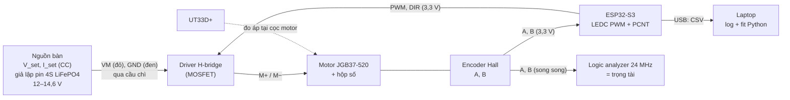
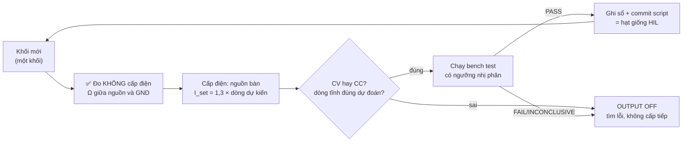

# Chặng 3 — Bring-up trên bàn (30h)

> **Vị trí:** C2 (cơ khí) → **C3** → C4 (firmware ESP32) · **Cần trước:** K1 Phần D và K1 Bài 7 (logic analyzer), K3 M1 (ESP-IDF); C0.4 (nguồn bàn CV/CC); đọc → F5.1, F5.2 · **Chạy song song với:** K3–K4
> **Làm ra được:** từng motor + driver + encoder chạy riêng trên bàn từ ESP32, nguồn bàn có giới hạn dòng thay pin, có capture logic analyzer · đường cong PWM → vận tốc (2 motor × 2 chiều, lên và xuống, ở 14,6 V và 12,0 V — hai đầu dải 4S LiFePO4 mặc định của C1), dòng hãm và dòng không tải đo được, `deadband.yaml` có `calibration_id`, capture `.sr` + CSV, các script bench test · **Sau chặng này bạn quyết định được:** driver nào (bằng số dòng hãm đo được), chế độ dừng nào (brake hay coast) cho từng tình huống, đếm encoder bằng PCNT hay ngắt, logic analyzer đặt sample rate bao nhiêu, và feedforward bù vùng chết cho từng motor, từng chiều.

C3 là lần đầu điện chạy qua motor. Bạn sẽ không cắm gì vào pin. Mọi thứ đi qua **nguồn bàn có giới hạn dòng** (C0.4), từng khối một: motor trần, rồi motor + driver, rồi + encoder, rồi + ESP32. Nguyên liệu lấy từ K7 gốc Bài 1 (motor, encoder, driver) và Bài 2 (PWM → vận tốc, vùng chết), viết lại cho người lần đầu cầm motor, và tách phần H-bridge, encoder trên logic analyzer thành bài riêng.

**Phân bổ 30h** `[ước lượng]`:

| Phần | Giờ |
|---|---|
| Bài C3.1 Motor, encoder, driver: ba thứ trong một vỏ | 5 |
| Bài C3.2 H-bridge: PWM, DIR, brake/coast, back-EMF, dòng hãm | 6 |
| Bài C3.3 Encoder quadrature trên logic analyzer | 5 |
| Bài C3.4 Đường cong PWM → vận tốc và vùng chết | 6 |
| Bài C3.5 Quy trình bring-up có kỷ luật *(rút gọn)* | 1 |
| Lắp bước 1–7 (bàn thử, motor trần, driver, encoder, ESP32, motor thứ hai, thử có tải) | 6 |
| Gate chặng 3 | 1 |
| **Tổng** | **30** |

## 0. Bức tranh chặng

Sau chặng này có một **bàn thử motor** (một motor một lúc; motor thứ hai đi lại đúng quy trình). Robot của C2 vẫn là xe đẩy tay; motor được tháo bánh hoặc khung được kê hở bánh.



Dòng năng lượng: lưới → nguồn bàn (trần dòng `I_set`) → driver → motor. Dòng dữ liệu: encoder → PCNT (đếm) → CSV qua USB → `bench/*.csv` → script fit → `deadband.yaml`; song song, encoder → logic analyzer → `.sr` → CSV → script giải mã độc lập. Hai đường đếm độc lập là có chủ đích: một cái kiểm cái kia.

## 1. An toàn của chặng

**Rủi ro cụ thể của C3:** bánh/trục quay bất ngờ khi ESP32 khởi động lại hoặc firmware lỗi (kẹp tay, kéo tóc, dây); motor bị giữ (hãm) quá lâu nóng cuộn dây, có mùi khét; driver nóng tới bỏng; điện áp ngược từ motor đang quay **bơm** về nguồn bàn khi phanh hoặc đảo chiều (Bài C3.2); chân GPIO ESP32-S3 cháy vì encoder pull-up 5 V; ngắn mạch đầu ra driver; robot lăn khỏi bàn.

**Quy tắc cứng:**
- KHÔNG dùng pin trong C3. Chỉ nguồn bàn, `I_set` đặt trước khi bật OUTPUT (C0.4). Pin vào ở C5.
- KHÔNG cấp điện motor khi chưa kẹp motor/khung vào bàn. Motor trần quay ở 12 V tự lăn, tự xoắn dây.
- KHÔNG để tay, tóc, dây, ống tay áo trong tầm bánh/trục khi ESP32 đang cắm USB, kể cả khi "chương trình đang dừng". Firmware mới nạp xong là đã có thể chạy.
- KHÔNG giữ trục ra bằng tay để đo dòng hãm (cách bản gốc K7 làm). Kẹp bánh bằng kẹp chữ C, đo ở áp thấp (Bài C3.1).
- KHÔNG giữ motor ở trạng thái hãm quá 2 s ở bất kỳ áp nào; đợi nguội (sờ vỏ không ấm) giữa các lần.
- KHÔNG nối encoder vào ESP32 trước khi đo mức cao của chân A/B bằng đồng hồ. Trên 3,6 V là không nối `[spec — ESP32-S3 datasheet, điều kiện hoạt động khuyến nghị: VDD tối đa 3,6 V]`.
- KHÔNG đảo chiều motor đang quay nhanh khi driver chạy trên nguồn bàn mà chưa có tụ bulk ở VM (Bài C3.2).
- KHÔNG cắm/rút dây motor, dây VM khi OUTPUT đang bật.
- KHÔNG dùng L298N (Bài C3.2 giải thích bằng số).

**Khi sự cố xảy ra:**

| Sự cố | Làm ngay | KHÔNG làm |
|---|---|---|
| Motor quay bất ngờ / không dừng | Bấm OUTPUT OFF của nguồn bàn (đây là "E-stop bàn thử": đặt nguồn trong tầm tay trái); rồi rút USB ESP32 | Không chụp bánh đang quay |
| Mùi khét, khói từ motor/driver | OUTPUT OFF; không chạm 1 phút; kiểm nhiệt bằng mu bàn tay đưa gần, không sờ | Không bật lại "xem có chạy không" |
| ESP32 nóng, không nhận USB sau khi nối encoder | Rút USB; đo mức chân A/B | Không cắm lại khi chưa tìm ra nguồn 5 V |
| Nguồn bàn báo OVP/áp vọt lên khi phanh | OUTPUT OFF; thêm tụ bulk, giảm tốc độ thử phanh | Không tắt OVP để "khỏi phiền" |

## 2. BOM chặng

Giá `[ước lượng 10/2026]`. Motor đã mua ở C2.

| Món | Thông số phải chọn | Vì sao (bằng số) | Giá | Kiểm khi nhận hàng | Thay thế được bằng |
|---|---|---|---|---|---|
| **Driver H-bridge MOSFET** ×2 kênh | V tối đa ≥ pack đầy + dư cho đỉnh áp khi phanh (4S LiFePO4 đầy 14,6 V → chọn ≥24 V); dòng liên tục ≥ dòng hãm đo ở C3.1, **hoặc** có giới hạn dòng; logic 3,3 V; PWM ≥20 kHz; ưu tiên có current sense | Bài C3.2 so bảng số | Xem dòng dưới | Đọc mã IC; đo không chập giữa VM và GND (ohm kế) | — |
| — lựa chọn A: Pololu DRV8874 carrier ×2 | 4,5–37 V, ~2,1 A liên tục, có điều tiết dòng và đầu ra current sense `[spec — trang Pololu #4035; kiểm]` | Giới hạn dòng phần cứng bảo vệ khi kẹt; đo dòng không cần INA226 | 250–400k/cái (nhập) | Có tản nhiệt/đủ đồng; jumper chế độ PH/EN | B |
| — lựa chọn B: Cytron MDD10A (2 kênh) | 5–30 V, 10 A liên tục/kênh, 30 A đỉnh (10 s), logic 3,3/5 V, PWM ≤20 kHz, **không** bảo vệ ngược cực, **không** current sense `[spec — Cytron user manual; kiểm bản Rev]` | Dư dòng nhiều lần; dễ mua ở VN; đo dòng bằng INA226 (→ K7 C1.5) | 400–600k | Rev2.0; nút test trên board | A |
| Tụ bulk cho VM | Điện phân ≥ 470 µF, điện áp ≥ 1,5× V pack đầy (≥ 35 V) | Hấp thụ dòng ngược khi phanh, giảm gợn | 10–30k | Đọc cực tính, điện áp trên vỏ | Tụ có sẵn trên driver (kiểm giá trị) |
| Cầu chì + đế cho VM bàn thử | Dây chảy/ô tô mini, 3–5 A | Bảo vệ dây khi `I_set` đặt cao lúc đo dòng hãm | 20–50k | — | Polyfuse (chậm hơn) |
| Đầu nối motor | XT30 hoặc cầu đấu vít + ferrule (C0.3) | Tháo lắp motor nhiều lần trong C3 | 20–50k | Kéo thử | Dupont: KHÔNG cho dây motor |
| Dây encoder nối dài + mạch chia áp (nếu encoder 5 V) | JST-XH; điện trở 10 kΩ/20 kΩ | Encoder có pull-up 5 V → 5 × 20/30 ≈ 3,3 V | 20k | Đo mức cao sau chia áp | IC chuyển mức (74LVC, TXS: kiểm tần số) |
| Kẹp chữ C, khối gỗ | — | Kẹp motor vào bàn; kẹp bánh khi đo dòng hãm | có từ C2 | — | — |

**Tổng C3 `[ước lượng]`:** 0,6–1tr (driver chiếm phần lớn). Không mua driver trước khi có số dòng hãm của C3.1 nếu được: làm C3.1 bước 1–4 chỉ cần motor + nguồn bàn.

**Đồ có sẵn từ kit Arduino:** biến trở 10k làm núm lệnh PWM có khóa "khởi động ở 0" cho C3.4 (`phu-luc-kit-arduino.md` P3, tùy chọn).

## 3. Dụng cụ và kỹ năng tay

| Kỹ năng | Bài | Luyện trước | Đạt trông thế nào |
|---|---|---|---|
| Nối motor thẳng vào nguồn bàn, đọc CV/CC | C3.1 | Với điện trở công suất hoặc bóng đèn 12 V | Đặt V, I trước; đọc chế độ đúng; đo áp **tại cọc motor** |
| Kẹp bánh/motor an toàn | C3.1 | Motor không cấp điện | Kẹp không trượt khi vặn tay mạnh; không kẹp vào vỏ hộp số nhựa |
| Cắm que logic analyzer song song với ESP32 | C3.3 | Từ K1 Bài 7 | GND chung; kẹp chắc; không chạm chân bên cạnh |
| Xuất capture PulseView ra CSV và giải mã bằng Python | C3.3 | Capture LED nháy (K1 Bài 7) | Script đếm khớp số cạnh nhìn bằng mắt trên đoạn ngắn |
| Nạp firmware ESP-IDF, đọc serial | C3.3 | K3 M1 | Log CSV sạch, không dòng rác |

## 4. Sơ đồ đi dây

```
   NGUỒN BÀN                                       DRIVER (một kênh)           MOTOR JGB37-520
   V_set=12,0 V  (+) ──đỏ 18 AWG──[cầu chì 3 A]──┬── VM                OUT1 ──── M+ (dây motor sẵn,
   I_set (xem bài)                               ═╪═ tụ bulk ≥470 µF/35 V        nhãn wire_id)
                 (−) ──đen 18 AWG────────────────┴── GND (công suất)   OUT2 ──── M−
                                                    GND (logic) ──┐   
   ESP32-S3 (cấp bằng USB laptop)                                  │           ENCODER (đầu cắm sẵn)
     GPIO6 ── PWM (EN) ───────────────────────────── EN/PWM        │            VCC ◄── 3V3 (trắng "3V3")
     GPIO7 ── DIR (PH) ───────────────────────────── PH/DIR        │            GND ◄── GND (đen)
     GND ──────────────────────────────────────────────────────────┘◄────────── (chung)
     GPIO4 ◄── A (xanh lá) ◄──────────────────────────────────────────────────── A
     GPIO5 ◄── B (xám)     ◄──────────────────────────────────────────────────── B
   LOGIC ANALYZER: D0 → A, D1 → B, D2 → PWM, D3 → DIR, GND → GND (cùng điểm GND logic)
```

| Chân ESP32-S3 | Tín hiệu | Ghi chú |
|---|---|---|
| GPIO4 | Encoder A | Vào PCNT (cạnh) |
| GPIO5 | Encoder B | Vào PCNT (mức) |
| GPIO6 | PWM → driver | LEDC, 20 kHz |
| GPIO7 | DIR → driver | — |
| GND | GND chung với driver logic, encoder, logic analyzer | — |

Chọn 4–7 vì tránh chân strapping (GPIO0, 3, 45, 46), chân USB (19, 20) và chân flash/PSRAM (26–32; 33–37 trên module PSRAM octal) `[spec — ESP32-S3 datasheet, mục Strapping Pins và GPIO; kiểm module của bạn]`. Đây chỉ là bảng chân bàn thử; bảng chân cả robot lập ở → K7 C4.1. Màu theo C0.5: đỏ chỉ cho dây VM/VBAT, đen chỉ GND, A xanh lá, B xám, 3,3 V trắng có nhãn.

Nguồn bàn có đầu ra **nổi** (không nối đất) hay không là `[tự đo — manual]`: nếu cọc (−) nối đất vỏ, laptop cắm sạc cũng nối đất, và GND bàn thử có hai đường về đất. Bàn thử vẫn chạy, nhưng ghi lại; đây là ví dụ đầu tiên của vòng đất (→ F5.7, K7 C5.1).

## 5. Trình tự chặng

1. **Học Bài C3.5** (quy trình bring-up), lập checklist `bench/checklist.md`.
2. **Học Bài C3.1.** Commit `prediction.md`.
3. **Lắp bước 1 — Bàn thử và motor trần trên nguồn bàn**
   - Làm: kẹp motor (tháo bánh, hoặc khung C2 kê hở bánh). Nối M+, M− **thẳng** vào nguồn bàn qua cầu chì, không driver.
   - ✅ Checkpoint trước khi cấp điện: ohm kế giữa M+ và M−: vài Ω (khớp số C2 Lắp bước 1), không phải ~0 Ω; giữa M+ và vỏ: hở. Nguồn bàn: OUTPUT OFF, V_set 3 V, I_set 0,5 A.
   - Nếu sai: ~0 Ω → chập dây hoặc cuộn dây; không cấp điện.
   - Làm tiếp các phép đo của C3.1 (R, dòng không tải, dòng hãm áp thấp).
4. **Học Bài C3.2**. Chọn driver bằng bảng số; mua nếu chưa có.
5. **Lắp bước 2 — Driver, chưa có motor**
   - ✅ Checkpoint trước khi cấp điện: ohm kế giữa VM và GND của driver: không gần 0 Ω (tụ sẽ làm số tăng dần, đó là bình thường); cực tính tụ bulk đúng. Nguồn bàn V_set 12 V, I_set 0,2 A; bật: dòng tĩnh của driver phải nhỏ (mA), **không** vào CC.
   - Nếu sai: vào CC ngay → chập; tắt, tìm.
6. **Lắp bước 3 — Driver + motor, PWM từ ESP32** (encoder chưa nối)
   - ✅ Checkpoint: I_set = 1,3 × dòng không tải đo ở C3.1 (motor không tải); firmware khởi động với duty 0. Logic analyzer trên PWM và DIR: thấy 20 kHz, duty đúng lệnh trước khi tăng I_set.
   - Làm: thí nghiệm brake/coast/đảo chiều của C3.2.
7. **Học Bài C3.3**.
8. **Lắp bước 4 — Encoder**
   - ✅ Checkpoint trước khi nối vào ESP32: cấp VCC encoder (3,3 V từ ESP32, hoặc 5 V nếu encoder đòi), quay tay, đo mức cao A và B bằng UT33D+: ≤3,6 V. Trên đó → chia áp.
   - Làm: capture tay 1 vòng, 10 vòng; PCNT vs logic analyzer ở tốc độ tối đa (C3.3).
9. **Học Bài C3.4**. Commit `prediction.md`.
10. **Lắp bước 5 — Quét PWM** motor thứ nhất (hai chiều, lên–xuống, ở 14,6 V và 12,0 V: nguồn bàn đóng vai pin đầy và pin gần cạn).
11. **Lắp bước 6 — Motor thứ hai:** lặp **từ Lắp bước 1** (không bỏ bước vì "giống motor kia"). Script bench test chạy y hệt.
12. **Lắp bước 7 — Có tải (tùy điều kiện):** robot C2 trên sàn, hai motor nối driver, nguồn bàn kéo dây (tether, người cầm dây), lệnh ≤0,3 m/s, theo C3.4 bước 5. Không làm được thì ghi nợ sang C5.
13. **Gate chặng 3.**

## 6. Lỗi người mới hay gặp

| Triệu chứng | Nguyên nhân khả dĩ | Kiểm bằng cách | Sửa |
|---|---|---|---|
| Nguồn bàn vào CC ngay khi motor khởi động, motor chạy chậm | `I_set` thấp hơn dòng khởi động (≈ dòng hãm) — nguồn bàn đang làm soft-start hộ bạn | Tăng I_set từng bước | Bình thường trên bàn; ghi lại vì pin sẽ **không** giới hạn như vậy (C3.1) |
| ESP32 reset khi motor đảo chiều | Nhiễu/sụt áp qua GND chung; dây GND logic chạy chung đường dòng motor | Ghi `esp_reset_reason`; đo GND bằng logic analyzer | GND logic về một điểm; dây motor xoắn, tách xa dây tín hiệu |
| Motor chỉ quay một chiều | DIR nối sai chân; driver ở chế độ khác (PWM/PWM thay vì PH/EN) | Logic analyzer trên DIR | Sửa jumper/chế độ driver theo datasheet |
| Áp nguồn bàn vọt lên khi dừng motor | Năng lượng phanh bơm ngược về nguồn (C3.2) | Nhìn màn hình V lúc dừng | Tụ bulk; phanh từ tốc độ thấp hơn; không đảo chiều khi đang nhanh |
| Driver nóng ở dòng nhỏ | Tần số PWM quá cao so với driver; hoặc driver BJT | Đọc datasheet | Hạ tần số trong giới hạn; đổi driver MOSFET |

## 7. Lăng kính data infra

**Dữ liệu chặng này sinh ra:**

| Luồng | File | Schema (rút gọn) | Tần số | Đơn vị |
|---|---|---|---|---|
| Phép đo thủ công (R, I0, I_hãm, mức encoder) | `build-log/measurements.jsonl` | schema C0.5 | theo sự kiện | `ohm`, `A`, `V` |
| Log quét PWM từ ESP32 | `bench/sweep_<motor>_<dir>_<V>_<ts>.csv` | `t_s, duty, dir, count, vbat_V` | 20 Hz | s, 1, 1, count, V |
| Capture encoder | `bench/cap/*.sr` + `*.csv` (sigrok) | kênh A, B, PWM, DIR | 1–24 MHz | mẫu |
| Hệ số vùng chết | `calib/deadband.yaml` | mỗi motor × chiều: `u_breakaway_V, u_stop_V, slope_mps_per_V, d0_fit_V, conditions` + `calibration_id` | mỗi lần hiệu chuẩn | V, m/s/V |
| Tham số motor | `calib/motors.yaml` | `R_ohm, I0_A, I_stall_A (ngoại suy + điều kiện), Ke, cpr` | mỗi motor | SI |

**Test tự động sinh ra từ chặng này (hạt giống HIL cho C11.2):**
- `bench_encoder_count`: quay motor đúng N giây ở duty cố định; PCNT và logic analyzer phải khớp ±vài count. Đây là **differential test** (→ F2.4): hai bộ đếm độc lập là oracle của nhau.
- `bench_sweep`: quét PWM, fit, so `calibration_id` mới với cũ; lệch quá độ lặp lại đo được → báo "motor đổi" (inconclusive nếu trong độ lặp lại). Phán quyết ba trạng thái như K6.
- `bench_stall_R`: đo R ở áp thấp; R tăng theo thời gian sống là tín hiệu mòn chổi than, hoặc mối nối xấu (C0.3).

**Metric/SLI:** độ lặp lại của phép quét (độ lệch giữa 3 lần quét nguội); tỉ lệ lỗi "nhảy 2 bước" của encoder; tỉ lệ khớp PCNT–LA.

**Vai trò nghề:** Test & Validation (bench test có oracle độc lập, ba trạng thái); Controls/Embedded (tham số motor có version). Kinh nghiệm "server mock để tự tạo bộ test chuẩn" của bạn có tên chuẩn ở đây: **test fixture** phần cứng (bàn thử + nguồn lập trình được) — khác ở chỗ fixture vật lý tự trôi (motor nóng, mòn) nên phải tự kiểm chính nó (→ F2.5).

## 8. Nhật ký build

Copy vào `build-log/c03.md`:

```markdown
## 2026-MM-DD — buổi N (giờ bắt đầu–kết thúc, giờ thực: _._ h)
- Trạng thái người: tỉnh táo / mệt (mệt → không cấp điện motor)
- Khối mới hôm nay (CHỈ MỘT): motor trần / driver / encoder / ESP32 / motor 2
- Nguồn bàn: V_set = ... V, I_set = ... A, có vào CC không, lúc nào
- Số đo (measurements.jsonl, số dòng: __); capture: bench/cap/...
- Firmware: git hash ...
- Lỗi gặp (triệu chứng → nguyên nhân → sửa):
- Quyết định (→ decisions.md: driver, chế độ dừng, tần số PWM...):
- Suýt sự cố (motor quay bất ngờ? mùi khét?):
- Câu hỏi còn mở:
```

---

## Bài C3.1 — Motor, encoder, driver: ba thứ trong một vỏ (5h)

> **Vị trí:** C2.1 (chọn motor bằng số) → **C3.1** → C3.2 · **Cần trước:** C0.4 (CV/CC), K1 Bài 5 (multimeter); đọc → F5.7 · **Sau bài này bạn quyết định được:** dòng mà driver, dây và cầu chì phải chịu (bằng dòng hãm **đo được**, không phải dòng chạy), và tham số motor nào ghi vào `calib/motors.yaml` làm baseline sức khỏe.

**Câu hỏi của bài (giữ từ K7 gốc Bài 1):** một lệnh PWM biến thành bao nhiêu vòng quay?

### 1. Câu chuyện — ai đã khổ vì chuyện này

Rover Spirit trên sao Hỏa có sáu bánh, mỗi bánh một motor DC có hộp số. Từ năm 2004, đội vận hành thấy **dòng điện** của motor bánh trước bên phải tăng dần so với các bánh khác; họ giảm tải cho nó, có lúc cho rover lái lùi để kéo lê bánh đó, và đầu năm 2006 bánh này ngừng hẳn. Spirit chạy tiếp bằng năm bánh cho tới khi sa lầy năm 2009 `[chuẩn — báo cáo vận hành MER của NASA/JPL; không kiểm số liệu chi tiết theo ngày]`. Bài học: **dòng motor là tín hiệu sức khỏe đầu tiên và rẻ nhất**, và chỉ đọc được nếu ngay từ đầu bạn biết con số "bình thường" của **chính motor đó**.

Lý do bài này đứng trước mọi dòng firmware: motor DC **tự giới hạn dòng bằng chính chuyển động của nó**. Khi quay, nó sinh điện áp ngược (back-EMF) chống lại nguồn; khi đứng yên — lúc khởi động, lúc kẹt — cái phanh tự nhiên đó biến mất, dòng chỉ còn bị chặn bởi điện trở cuộn dây.

### 2. Mô hình tư duy

```
            R (cuộn dây)    L                        MỘT VỎ, BA THỨ
  V_drv ──/\/\/\──────────(((((────┐                 ┌──────────┬──────────────┬───────────────┐
  (PWM ·                           │  E = Ke·ω       │ Motor DC │ Hộp số 1:N   │ Encoder Hall  │
   V_pack)                       ( M ) τ = Kt·I      │ V→tốc độ │ ×N mô-men    │ trên trục     │
  GND ─────────────────────────────┘                 │ I→mô-men │ ÷N tốc độ    │ MOTOR: PPR    │
                                                     │ R, Ke    │ backlash     │ ×4 (quadrature)│
  Xác lập:  I = (V − Ke·ω) / R                       └──────────┴──────────────┴───────────────┘
  ω = 0 (khởi động, kẹt):     I = V/R  = dòng hãm (stall)
  Không tải:  I = I0 (thắng ma sát)   ω0 ≈ (V − I0·R)/Ke
  counts mỗi vòng bánh = PPR × N × 4        mm mỗi count = π·D / counts
```

Bốn câu bản chất:

- **Motor DC là bộ chuyển đổi hai chiều**: điện áp ↔ tốc độ (qua Ke), dòng ↔ mô-men (qua Kt). Trong SI, Ke và Kt là **cùng một số** (V·s/rad = N·m/A) `[chuẩn]`. Đo được cái này là có cái kia.
- **Dòng không tải** là dòng thắng ma sát của motor + hộp số; **dòng hãm** `V/R` là trần vật lý. Mỗi lần khởi động từ đứng yên với lệnh bậc thang, motor chạm gần dòng hãm trong vài ms (thời gian đó do L/R và quán tính quyết định).
- **Dòng hãm tỉ lệ với áp.** Pack 4S LiFePO4 đầy (14,6 V) cho dòng hãm lớn hơn ~22% so với 12 V danh định motor. Driver và cầu chì chọn theo áp **đầy**.
- **Encoder đặt trên trục motor**, trước hộp số: được nhân phân giải N lần miễn phí, nhưng **không thấy** backlash hộp số. Bánh có thể chưa nhúc nhích khi encoder đã đếm.

Mô hình này là dạng tối thiểu; bản đầy đủ có L (quyết định gợn dòng trong mỗi chu kỳ PWM) và ma sát phụ thuộc tốc độ (C3.4).

### 3. Cầu nối từ backend

| Backend bạn biết | Ở đây | Gãy ở chỗ | Nếu dùng nhầm thì |
|---|---|---|---|
| Capacity planning theo đỉnh (thundering herd lúc cold start) | Driver, dây, cầu chì chọn theo dòng hãm/khởi động, không theo dòng chạy | Đỉnh ở đây xảy ra **mỗi lần** robot khởi hành, đảo chiều, chạm tường; không phải sự kiện hiếm. Và nó kéo sụt áp những thiết bị không liên quan (ESP32, mini PC) | Chọn driver theo dòng chạy 0,3 A → driver tự ngắt nhiệt hoặc cháy MOSFET mỗi lần robot đâm vào chân bàn |
| Baseline metric theo từng host (host này CPU idle 5% là bình thường) | `calib/motors.yaml`: R, I0, Ke của **từng** motor | Host đổi baseline khi đổi workload; motor đổi baseline vì **mòn và nhiệt**, chậm và liên tục | Một ngưỡng chung "I0 > 0,3 A là hỏng" cho mọi motor → báo động giả hoặc bỏ sót, như câu chuyện Spirit |
| Chạy load test trên staging có rate limiter | Nguồn bàn có `I_set` | Rate limiter staging không đổi hành vi app. `I_set` **đổi hành vi motor**: khi khởi động nó vào CC và làm soft-start hộ bạn | Bench test "khởi động êm" → lên pin, đỉnh dòng thật làm ESP32 brownout lần đầu ở C5 |

**Chấm mô hình:**

- *"Dòng ghi trên nhãn motor là dòng nó ăn."* **SAI.** Motor ăn dòng theo **mô-men tải**, từ I0 (không tải) tới V/R (kẹt). Phản ví dụ: cùng motor, bánh treo 0,15 A, bánh kẹt vào tường 2–3 A, chênh hơn chục lần.
- *"Nguồn bàn giới hạn dòng thì đo dòng hãm thoải mái."* **ĐÚNG MỘT PHẦN.** Nguồn bàn bảo vệ dây và nguồn; nó **không** bảo vệ cuộn dây khỏi nóng nếu `I_set` cao hơn dòng hãm và bạn giữ lâu. Và nếu `I_set` thấp hơn dòng hãm, bạn đo được `I_set`, không phải dòng hãm (nguồn đang ở CC, → K7 C0.4). Phản ví dụ: đặt I_set 1 A, kẹp bánh, màn hình báo 1,00 A ở 5 V — đó là con số của nguồn, không phải của motor.

### 4. Thuật ngữ

| Mức | Thuật ngữ | Nghĩa trong một câu | Hay bị hiểu nhầm thành |
|---|---|---|---|
| 🟢 | Back-EMF (Ke·ω) | Điện áp motor tự sinh khi quay, chống lại nguồn | "Tổn hao" — nó là thứ giới hạn dòng khi chạy |
| 🟢 | Dòng hãm (stall current) | Dòng khi trục **bị giữ đứng yên** ở một điện áp, ≈ V/R | Dòng **phanh** (braking current, C3.2) — tiếng Việt dễ lẫn; ở K7 "dòng hãm" luôn là stall |
| 🟢 | Dòng không tải I0 | Dòng thắng ma sát nội khi quay tự do | "Dòng bình thường khi chạy" — có tải lớn hơn nhiều |
| 🟢 | PPR / CPR | Xung mỗi vòng (một kênh) / count mỗi vòng sau giải mã 4x | Người bán ghi lẫn lộn, có khi theo trục ra; phải đo (C3.3) |
| 🟡 | Kt = Ke | Hằng số mô-men = hằng số back-EMF trong SI | Hai thông số độc lập |
| 🟡 | Backlash | Độ rơ hộp số khi đổi chiều | Lỗi lắp ráp — mọi hộp số bánh răng thẳng đều có |
| 🔴 | Thiết kế cuộn dây, commutation | Thiết kế motor | — |

### 5. Dự đoán

**Đề:** với motor bạn đã mua ở C2 (mặc định JGB37-520 12 V, tỉ số theo C2.1, bánh theo C2.4):

1. `counts_mỗi_vòng_bánh` và `mm_mỗi_count` (dùng D hiệu dụng của C2.4).
2. R cuộn dây suy từ listing (`V/I_hãm`), và R bạn sẽ đo được bằng ohm kế: lớn hơn hay nhỏ hơn?
3. Dòng không tải ở 12 V; dòng hãm ở 12 V và ở 14,6 V; tỉ số hãm/không tải.
4. Ke từ listing: `Ke ≈ (V − I0·R)/ω0_motor` (ω0 motor = rpm trục ra × N × 2π/60).
5. Với nguồn bàn đặt I_set = 1 A và motor không tải, khi bật OUTPUT ở 12 V: nguồn có vào CC không, trong bao lâu?
6. Tổng dòng đỉnh khi **hai** motor cùng khởi động ở 14,6 V. Nhánh động lực của C1 (cầu chì, dây) có gánh được không? (→ K7 C1.2, C1.3)

**Tham số cần tra:** listing motor (C2.1 đã lưu): V danh định, rpm không tải trục ra, I0, I_hãm, tỉ số N, PPR encoder và **tính trên trục nào**.

```markdown
# prediction.md — K7 C3.1
commit: <hash>  ngày: <yyyy-mm-dd>   motor: <T/P, mã, lô>
| Đại lượng | Dự đoán | Cách tính / nguồn |
|---|---|---|
| counts/vòng bánh | | PPR × N × 4 |
| mm/count | | π·D/counts |
| R (listing, Ω) | | V/I_hãm |
| R (ohm kế) lớn hơn/nhỏ hơn | | |
| I0 @12 V (A) | | |
| I_hãm @12 V / @14,6 V (A) | | |
| I_hãm / I0 | | |
| Ke (V·s/rad) | | |
| Nguồn vào CC khi khởi động? | | |
| Đỉnh 2 motor @14,6 V (A) | | |
## Tôi sẽ ngạc nhiên nếu...
```

### 6. Làm

Giữ bước 1–4 của K7 gốc Bài 1 (bước 5–6 về encoder ở C3.3), sửa bước 4 cho an toàn. Motor nối **thẳng** nguồn bàn (Lắp bước 1), không driver.

1. **Đọc trọn listing/datasheet motor** (và driver nếu đã có). Ghi: điện áp, I0, I_hãm, PPR (trục nào?), N. PPR "chưa rõ trục" → đánh dấu, C3.3 trả lời.
2. **Tính counts/vòng bánh và mm/count. Commit `prediction.md`.**
3. **Dòng không tải.** Kẹp motor, bánh tự do. Nguồn bàn: V_set 12,0 V, I_set 1,0 A, OUTPUT ON. Đợi 10 s (mỡ hộp số ấm lên, dòng ổn định). Đọc dòng trên màn nguồn; kiểm chéo bằng UT33D+ nối tiếp ở thang mA nếu dòng < 200 mA (nhớ chuyển que về cổng V sau đó) `[spec — UT33D+ manual: dải và cầu chì từng thang]`. Lặp ở 6 V và 9 V: I0 gần như không đổi theo áp, tốc độ tỉ lệ áp — kiểm nhanh mô hình phần 2. Ghi dòng ở thời điểm bật OUTPUT: màn nguồn có nháy sang CC không?
4. **Dòng hãm — không giữ trục bằng tay** (bản gốc K7 bảo giữ trục 1–2 s; với gearmotor thứ bạn chạm là trục ra đã nhân mô-men N lần, khó giữ và có thể mẻ bánh răng):
   - (a) OUTPUT OFF. Đo **R** bằng ohm kế ở 6 vị trí góc trục (xoay bánh một ít giữa các lần); chổi than làm số nhảy → lấy trung vị. Chập hai que đo để biết điện trở que (cỡ 0,1–0,3 Ω `[ước lượng]`), trừ đi.
   - (b) Kẹp **bánh** vào khối gỗ bằng kẹp chữ C (không kẹp vào vỏ hộp số nhựa). Nguồn bàn V_set 2,0 V, I_set 1,5 A. OUTPUT ON ≤2 s: nguồn phải ở **CV** (nếu báo CC, I_set đang thấp hơn V/R → tăng I_set hoặc giảm V). Đo áp **tại cọc motor** bằng UT33D+ cùng lúc (đọc màn nguồn cho dòng). `R = V_cọc / I`. Lặp ở 3 V, 4 V nếu motor còn nguội.
   - (c) **Cách CC (→ K7 C0.4):** I_set 1,0 A, V_set 8 V, bánh kẹp, OUTPUT ON ≤2 s: nguồn vào CC, giữ đúng 1,0 A, áp tụt tới `R × 1 A`. Áp đọc tại cọc chia 1,0 A là R ở dòng thật. Không bật OCP cho phép đo này: OCP **tắt** đầu ra khi chạm ngưỡng, còn CC **giữ** dòng ở ngưỡng.
   - (d) Ngoại suy: `I_hãm(12 V) = 12/R`, `I_hãm(14,6 V) = 14,6/R`. Chỉ khi cần số trực tiếp ở áp đầy mới làm ≤1 s với I_set = 1,3 × số ngoại suy (nếu số đó > 5 A, giới hạn nguồn bàn, thì **không** làm; tin ngoại suy).
   - Sai số: UT33D+ cập nhật vài lần/giây `[tự đo]`, không bắt đỉnh vài ms; R đồng tăng ~0,4 %/°C `[chuẩn]` nên lần đo sau nóng hơn lần trước; ghi nhiệt độ phòng và thứ tự đo.
5. **Ke:** sau C3.3 (có tốc độ từ encoder), `Ke = (V − I0·R)/ω_motor` ở 3 mức áp; fit đường thẳng. Ghi vào `calib/motors.yaml`.
6. **Tổng hợp** vào `calib/motors.yaml` (một khối mỗi motor) và một dòng `measurements.jsonl` mỗi phép đo. Chuyển dòng hãm @14,6 V cho C1.2/C1.3 (nếu C1 đã làm, đối chiếu cầu chì nhánh động lực).

### 7. Số phải ra

<details><summary>🔒 MỞ SAU KHI COMMIT prediction.md</summary>

| Kiểm tra | Kỳ vọng | Ghi chú |
|---|---|---|
| Dòng không tải | Khớp listing ±30% (giữ từ K7 gốc) | Listing JGB37 12 V hay ghi 0,1–0,15 A; so đúng điện áp |
| Dòng hãm | **Gấp nhiều lần dòng không tải** (giữ từ K7 gốc). Ghi con số thật — nó quyết định driver và nguồn | Gearmotor nhỏ thường 10–30 lần `[ước lượng]`; listing ví dụ: 2,4/0,15 = 16 lần. Bản Gemini ghi "4–8 lần": thấp; đo ra dưới 10 lần thì nghi que đo, I_set (nguồn ở CC), hoặc áp tại cọc thấp hơn áp đặt |
| R | Listing ví dụ 12/2,4 = 5 Ω; R đo lệch R suy ra 20–50% là thường gặp (chổi than, que đo, listing làm tròn) | (a) và (b)(c) khớp nhau trong ~20% thì tin số đo hơn listing |
| Dòng hãm @14,6 V | Lớn hơn @12 V đúng tỉ lệ 14,6/12 ≈ 1,22 | Ví dụ 5 Ω: ~2,9 A mỗi motor; hai motor khởi động cùng lúc ~6 A trên nhánh động lực |
| Khởi động với I_set 1 A | Nguồn **vào CC** vài chục tới vài trăm ms rồi về CV | Đó là nguồn bàn làm soft-start. Pin sẽ không làm vậy: đỉnh thật gần dòng hãm |
| counts/vòng bánh | PPR 11, N 56: 11 × 56 × 4 = **2464**; bánh 85 mm: π × 85 / 2464 ≈ **0,108 mm/count** | Phân giải rất tốt; vấn đề odometry không nằm ở đây (→ K7 C6) |

</details>

### 8. Nếu ra khác

| Triệu chứng | Nguyên nhân khả dĩ | Kiểm bằng cách | Sửa |
|---|---|---|---|
| Dòng hãm đo thấp hơn V/R nhiều | Nguồn ở CC (I_set thấp); que/kẹp cộng điện trở; áp tại cọc thấp hơn áp đặt | Nhìn chỉ báo CV/CC; đo áp tại cọc | `R = V_cọc/I`; tăng I_set có lý do |
| R nhảy lung tung giữa các góc trục | Chổi than tiếp xúc từng phân đoạn | 6 vị trí, trung vị | Bình thường; dùng cách (c) ở dòng thật |
| I0 cao bất thường ở một motor | Hộp số kẹt/thiếu mỡ, trục cong, gá xoắn (C2) | Tháo khỏi gá đo lại | Đổi motor hoặc sửa gá; ghi baseline |
| Motor kêu rè, I0 dao động mạnh | Bánh răng mẻ, vật lạ | Quay tay cảm nhận điểm sượng | Đổi motor |

### 9. Câu hỏi ngược

1. **[Nếu…thì]** Nếu C1 đổi sang pack 4S Li-ion NMC (đầy 16,8 V) mà giữ motor 12 V và kẹp duty tối đa 75%, cái gì không đổi và cái gì đổi (tốc độ tối đa, dòng hãm, dòng khởi động, áp driver phải chịu)?
<details><summary>Hướng nghĩ</summary>

Điện áp **trung bình** tối đa ~12,6 V nên tốc độ tối đa gần như không đổi. Nhưng trong mỗi xung PWM, motor thấy áp **đỉnh**; dòng khởi động ở duty 75% ≈ 0,75·V/R; driver phải chịu áp đầy cộng đỉnh khi phanh. Kẹp duty là kẹp **trung bình**, không phải kẹp đỉnh.

</details>

2. **[Quy mô]** 100 robot, mỗi robot ghi dòng motor 100 Hz, bạn muốn phát hiện sớm motor sắp hỏng như Spirit. Cái gì gãy trước: lưu trữ, nhãn "bình thường" của từng motor, hay ngưỡng cảnh báo chung cho cả đội?
<details><summary>Hướng nghĩ</summary>

Hai motor cùng lô đã khác nhau vài phần trăm (C3.4). Ngưỡng chung sẽ báo giả hoặc bỏ sót. Cần baseline theo từng motor từ ngày lắp — chính `calib/motors.yaml` của bài này, có version.

</details>

3. **[Failure mode]** Bench test "dòng không tải" của bạn PASS nhiều tháng liền, rồi robot bắt đầu brownout lúc khởi hành. Kể hai thay đổi mà phép đo I0 không thể thấy.
<details><summary>Hướng nghĩ</summary>

R giảm (hiếm) hoặc nội trở pin/dây tăng (phổ biến): I0 không đổi, nhưng đỉnh dòng × trở kháng nguồn tăng. Bench test đo motor, không đo đường nguồn. Test nào đo được cả hai?

</details>

4. **[Vì sao không]** Vì sao không đặt encoder ở trục ra để khỏi lo tỉ số truyền?
<details><summary>Hướng nghĩ</summary>

Mất hệ số N của phân giải; được thấy backlash. Điều nào quan trọng hơn cho PID tốc độ thấp và cho odometry khi đảo chiều liên tục?

</details>

### 10. Liên kết ra ngoài

- **Xe điện và phanh tái sinh.** Back-EMF là cơ chế xe điện thu hồi năng lượng: motor thành máy phát. Giống: `E = Ke·ω`. Khác: xe điện có pin và BMS được thiết kế để **nhận** dòng ngược; bàn thử của bạn (nguồn bàn) thì không (C3.2).
- **Y sinh, sinh hiệu nền.** Bác sĩ ghi nhịp tim nền của từng bệnh nhân vì "bình thường" khác nhau giữa người. `calib/motors.yaml` là sinh hiệu nền của từng motor.

### 11. Độ tin cậy và sửa lỗi

| Khẳng định | Nhãn | Ghi chú / cách kiểm |
|---|---|---|
| `I = (V − Ke·ω)/R`; Kt = Ke trong SI | [chuẩn] | Máy điện một chiều |
| Dòng hãm 10–30× I0 với gearmotor nhỏ | [ước lượng] | Từ listing JGA25/JGB37; tự đo |
| JGB37-520 12 V: I0 ~0,1–0,15 A, I_hãm 1,2–2,4 A tùy listing | [spec người bán] | Các listing mâu thuẫn; đo |
| R đồng tăng ~0,4 %/°C | [chuẩn] | Hệ số nhiệt điện trở của đồng |
| GPIO ESP32-S3 không chịu 5 V | [spec] | ESP32-S3 datasheet |
| CC giữ dòng, OCP tắt đầu ra | [chuẩn] | → K7 C0.4; kiểm manual nguồn của bạn |
| Spirit: dòng bánh trước phải tăng từ 2004, bánh ngừng 2006 | [chuẩn] | Báo cáo vận hành MER |

**Đã sửa so với bản gốc/Gemini:**
- K7 gốc Bài 1 bước 4 "giữ trục motor bằng tay": thay bằng đo R + hãm có kẹp ở áp thấp, cách CC của nguồn bàn, rồi ngoại suy; áp đầy chỉ là bước tùy chọn có giới hạn.
- Gemini "dòng hãm 4–8 lần dòng không tải" và "đọc giá trị dòng cực đại trên đồng hồ": bỏ; UT33D+ không bắt đỉnh ms.
- Ví dụ của K7 gốc (PPR 11, 1:34, bánh 65 mm → 1496 count, 0,136 mm/count) đổi sang ví dụ theo C2.1 (1:56, 85 mm); công thức giữ nguyên.

### 12. Đọc thêm và tự kiểm tra

- **Nguồn gốc:** listing/datasheet motor của bạn (đã lưu ở C2.1); manual nguồn bàn (CV/CC/OCP).
- **Giải thích:** Hughes & Drury, *Electric Motors and Drives* — chương motor DC.
- **Tự kiểm tra:** (1) giải thích trong 5 câu vì sao dòng khởi động gần bằng dòng hãm; (2) vẽ lại mạch R–L–back-EMF; (3) hai câu dưới.

  (a) Motor PPR 13, hộp số 1:45, bánh 85 mm. Counts/vòng bánh ở 4x và mm/count?
  <details><summary>Đáp án</summary>

  13 × 45 × 4 = 2340; π × 85 / 2340 ≈ 0,114 mm/count.

  </details>

  (b) Kẹp bánh, nguồn I_set 1,0 A ở CC, áp tại cọc đọc 4,6 V. R? Dòng hãm ở 14,6 V?
  <details><summary>Đáp án</summary>

  R = 4,6 Ω; 14,6/4,6 ≈ 3,2 A mỗi motor (chưa tính R tăng khi nóng, làm số thật thấp hơn một chút).

  </details>

---

## Bài C3.2 — H-bridge: PWM, DIR, brake/coast, back-EMF, dòng hãm (6h)

> **Vị trí:** C3.1 → **C3.2** → C3.3 · **Cần trước:** C3.1, C0.4; đọc → F5.7 · **Sau bài này bạn quyết định được:** mua driver nào (và vì sao không L298N, vì sao TB6612 thường quá nhỏ), PWM của bạn là drive/brake hay drive/coast, dừng robot bằng phanh hay thả trôi trong từng tình huống (lệnh dừng thường, mất heartbeat, E-stop), và bàn thử cần gì để năng lượng phanh không làm hỏng nguồn bàn.

### 1. Câu chuyện — ai đã khổ vì chuyện này

Tàu điện có phanh tái sinh: khi hãm, motor kéo thành máy phát và đẩy năng lượng ngược lên lưới tiếp điện, để một đoàn tàu khác đang tăng tốc dùng. Khi không có đoàn nào cần (đêm khuya, đoạn tuyến vắng), năng lượng đó **không có chỗ đi**; điện áp lưới tiếp điện tăng, và hệ thống phải chuyển sang đốt năng lượng phanh thành nhiệt trong **điện trở hãm** gắn trên tàu hoặc ở trạm, hoặc dùng bộ lưu trữ năng lượng ở trạm `[chuẩn — phanh tái sinh và phanh điện trở trong vận tải đường sắt điện]`. Ngành đường sắt tốn nhiều công sức cho đúng câu hỏi "năng lượng phanh đi đâu".

Bàn thử của bạn có cùng câu hỏi ở quy mô nhỏ: motor đang quay là một máy phát. Khi driver phanh hay đảo chiều, năng lượng đó đi vào đâu? Pin nhận được (có giới hạn, → K7 C1.1); **nguồn bàn thì thường không nhận** dòng ngược. H-bridge là bốn công tắc quyết định đường đi của năng lượng ấy.

### 2. Mô hình tư duy

```
              VM (pack/nguồn bàn) ──┬──────────────┬──  tụ bulk
                                    │              │
                                  [Q1]           [Q3]      Q = MOSFET, mỗi cái có diode thân (▲)
                                    │              │
                               OUT1 ●───( M )──────● OUT2
                                    │   E=Ke·ω     │
                                  [Q2]           [Q4]
                                    │              │
              GND ──────────────────┴──────────────┴──

  Trạng thái         Q1 Q2 Q3 Q4   Motor thấy          Dòng đi đâu
  Chạy tới            1  0  0  1   +VM                 nguồn → motor
  Chạy lùi            0  1  1  0   −VM                 nguồn → motor (ngược)
  Phanh (brake)       0  1  0  1   ngắn mạch (0 V)     vòng kín Q2–motor–Q4: I = −E/R, KHÔNG qua nguồn
  Thả trôi (coast)    0  0  0  0   hở                  dòng cảm ứng xả qua diode thân VỀ nguồn, rồi = 0
  CẤM (shoot-through) 1  1  .  .   ngắn mạch nguồn     → driver cần "dead time" giữa tắt và bật

  PWM kiểu drive/brake (slow decay): pha tắt = phanh.  PWM kiểu drive/coast (fast decay): pha tắt = thả trôi.
  Đảo chiều khi đang quay (plugging): motor thấy −VM − E  →  I ≈ −(VM + E)/R  ≈ đến 2× dòng hãm.
```

Năm câu bản chất:

1. **H-bridge là bốn công tắc, không phải bộ khuếch đại tuyến tính.** Mỗi MOSFET chỉ hoàn toàn bật hoặc hoàn toàn tắt; điện áp trung bình trên motor do **tỉ lệ thời gian** (duty) quyết định. Cuộn cảm L của motor làm dòng trơn ra giữa các xung `[chuẩn]`.
2. **Phanh ngắn mạch dùng chính back-EMF chống lại chuyển động.** Dòng phanh `E/R` tỉ lệ tốc độ: ở tốc độ không tải, nó cỡ dòng hãm; mô-men phanh vì thế cỡ mô-men hãm (C2.2 dùng số này để tính lật). Dòng này chạy trong vòng low-side, **không** đi qua nguồn: shunt đặt ở dây nguồn không thấy nó.
3. **Thả trôi trả năng lượng cuộn cảm về nguồn qua diode,** rồi motor quay tự do tới khi ma sát dừng nó. Đảo chiều khi đang quay đẩy năng lượng cơ **và** năng lượng nguồn vào điện trở cuộn dây: dòng lớn nhất, dừng nhanh nhất, nóng nhất.
4. **Năng lượng hồi về nguồn cần chỗ chứa.** Pin hấp thụ được trong giới hạn sạc của nó; nguồn bàn thường chỉ "nguồn" (source), không "hút" (sink): năng lượng nạp vào tụ đầu ra, áp tăng. Tụ bulk ở VM là bộ đệm có giới hạn cho năng lượng đó.
5. **Sụt áp trên driver là nhiệt.** MOSFET sụt `I·R_DS(on)` (vài trăm mΩ tổng hai khóa → vài trăm mV ở 1–2 A); driver BJT kiểu L298 sụt cỡ volt bất kể dòng nhỏ, và mỗi volt sụt × dòng là watt nhiệt.

**Bảng chọn driver bằng số** (mục 5 kế hoạch K7 yêu cầu giải thích L298N và TB6612):

| Driver | Áp motor tối đa | Dòng liên tục / đỉnh mỗi kênh | Sụt áp/kênh | Ghi chú |
|---|---|---|---|---|
| L298N (module) | 46 V `[spec — ST L298]` | 2 A `[spec]` | "Total drop" V_CEsat(H)+V_CEsat(L): 1,8 V điển hình, 3,2 V tối đa ở 1 A; 4,9 V tối đa ở 2 A `[spec — ST L298 datasheet, Electrical Characteristics]` | Transistor lưỡng cực (BJT): sụt cỡ volt; ở 2 A là tới ~10 W nhiệt mỗi kênh trong tản nhiệt; motor 12 V từ pack 12,8 V chỉ còn ~9–11 V |
| TB6612FNG | 15 V tuyệt đối tối đa, khuyến nghị ≤13,5 V `[spec — Toshiba TB6612FNG]` | 1,2 A trung bình / 3,2 A đỉnh `[spec]` | MOSFET, thấp | Pack LiFePO4 đầy 14,6 V **vượt** mức khuyến nghị, sát mức tuyệt đối, chưa tính đỉnh áp khi phanh; 1,2 A < dòng hãm JGB37 (C3.1) → thường quá nhỏ |
| DRV8874 (Pololu #4035) | 37 V | ~2,1 A liên tục; có điều tiết dòng `[spec — Pololu; kiểm]` | R_DS(on) cỡ vài trăm mΩ tổng `[spec — TI DRV8874; kiểm]` | Có current sense (IPROPI): đo được dòng phanh/hãm bằng ADC |
| Cytron MDD10A | 30 V | 10 A / 30 A (10 s) `[spec — Cytron]` | MOSFET, thấp | PWM thấp = phanh (drive/brake) `[spec — kiểm bảng logic manual]`; không current sense; không chống ngược cực |

**Mô phỏng: khởi động, rồi dừng bằng ba cách.** Tham số đồ chơi cỡ JGB37 ở 12 V (R = 5 Ω từ listing 2,4 A); thay bằng số đo C3.1.

```python
# [đã chạy] Một motor DC qua H-bridge: khởi động, rồi DỪNG bằng coast / brake / đảo chiều (plugging)
import numpy as np, matplotlib; matplotlib.use("Agg"); import matplotlib.pyplot as plt
V, R, L = 12.0, 5.0, 2e-3          # V, ohm, H  -- số ĐỒ CHƠI cỡ JGB37 (thay bằng số đo C3.1)
KE = 0.0107                        # V·s/rad = N·m/A (Kt = Ke trong SI)
TAU_C = KE * 0.15                  # ma sát ~ Kt × dòng không tải
J = 3e-6                           # kg·m² quy về trục motor (rotor + bánh + robot / N²) [ước lượng]
dt, T_on, T_end = 1e-5, 0.6, 3.0
def run(stop_mode):
    t = np.arange(0, T_end, dt); i = np.zeros_like(t); w = np.zeros_like(t)
    for k in range(1, len(t)):
        on = t[k] < T_on
        e = KE * w[k-1]
        if on or stop_mode == "plug":
            v = V if on else -V                       # đảo chiều khi đang quay
        elif stop_mode == "brake":
            v = 0.0                                   # hai đầu motor nối tắt qua low-side
        else:                                          # coast: mọi khóa mở, dòng chỉ chảy qua diode
            v = None
        if v is None:
            # dòng cảm ứng xả qua diode về nguồn (v ≈ ±(V+2·0.7)) rồi về 0, không đổi chiều
            vd = -np.sign(i[k-1]) * (V + 1.4) if abs(i[k-1]) > 1e-4 else e
            di = (vd - R*i[k-1] - e) / L * dt
            i[k] = 0.0 if i[k-1] * (i[k-1] + di) <= 0 else i[k-1] + di
        else:
            i[k] = i[k-1] + (v - R*i[k-1] - e) / L * dt
        tau = KE * i[k] - np.sign(w[k-1]) * TAU_C
        w[k] = w[k-1] + tau / J * dt
        if stop_mode == "plug" and not on and w[k] * w[k-1] < 0:
            w[k:] = 0; i[k:] = 0; break               # firmware ngắt khi tốc độ qua 0
    return t, i, w
for mode in ("coast", "brake", "plug"):
    t, i, w = run(mode)
    after = t >= T_on
    w_on = w[t < T_on][-1]
    slow = np.abs(w[after]) < 0.05 * w_on
    stop = (t[after][np.argmax(slow)] - T_on) if slow.any() else np.inf
    print(f"{mode:5s}: I khởi động đỉnh {i[t < T_on].max():5.2f} A, I chạy {i[t < T_on][-1]:4.2f} A, "
          f"I đỉnh khi dừng {i[after].min():6.2f} A, thời gian về <5% tốc độ {stop*1000:5.0f} ms")
    plt.plot(t, i, label=mode)
plt.xlabel("t (s)"); plt.ylabel("dòng motor (A)"); plt.legend(); plt.savefig("c3_hbridge.png")
```

### 3. Cầu nối từ backend

| Backend bạn biết | Ở đây | Gãy ở chỗ | Nếu dùng nhầm thì |
|---|---|---|---|
| `SIGTERM` (dừng có kiểm soát) vs `SIGKILL` | Phanh (dừng chủ động) vs thả trôi (bỏ điều khiển) | Ở server, `SIGKILL` là dừng **nhanh hơn**. Ở motor, "bỏ điều khiển" (coast) là dừng **chậm hơn** nhiều; dừng nhanh cần chủ động tiêu năng lượng | Coi "cắt PWM" là dừng an toàn → robot trôi tiếp hơn một giây; ngược lại phanh gấp robot cao → lật (C2.2) |
| Backpressure: producer đẩy vào consumer có hàng đợi giới hạn (→ F3.9) | Motor phanh đẩy năng lượng về nguồn; tụ bulk là hàng đợi; nguồn bàn không "tiêu thụ" | Hàng đợi backend đầy thì drop hoặc block, không ai bị thương. Tụ "đầy" thì **áp tăng** tới khi linh kiện yếu nhất hỏng; không có drop policy nào trừ khi bạn thiết kế (điện trở xả, giới hạn tốc độ phanh) | Thử đảo chiều tốc độ cao trên nguồn bàn không tụ → OVP nguồn bàn nhảy hoặc tụ/driver quá áp |

**Chấm mô hình:** *"Dữ liệu điện áp thấp không đủ công suất; thiết bị cần công suất (như loa) phải có nguồn riêng để khuếch đại, còn tín hiệu cứ thế chạy qua"* (mô hình của bạn ở K3 lượt 9, về amp loa). Áp sang motor: ESP32 gửi PWM 3,3 V vài mA, driver lấy năng lượng từ pack để "khuếch đại" thành ampe. **ĐÚNG MỘT PHẦN.** Đúng: tín hiệu điều khiển và năng lượng đi hai đường khác nhau, và driver lấy công suất từ nguồn riêng. Gãy ở hai chỗ: (1) H-bridge không khuếch đại **dạng sóng** như amp tuyến tính; nó đóng cắt, motor (L, quán tính) làm trơn; (2) năng lượng chảy **hai chiều**: motor đang quay đẩy năng lượng ngược về nguồn, điều không xảy ra với loa trong mô hình của bạn. Phản ví dụ: phanh motor đang chạy làm áp **nguồn bàn tăng** — một "loa" không bao giờ làm nguồn của amp tăng áp.

### 4. Thuật ngữ

| Mức | Thuật ngữ | Nghĩa trong một câu | Hay bị hiểu nhầm thành |
|---|---|---|---|
| 🟢 | H-bridge | Bốn công tắc cho phép đặt +V, −V, 0 (ngắn mạch) hoặc hở lên motor | Một con chip "điều khiển tốc độ" |
| 🟢 | Brake / coast | Ngắn mạch hai đầu motor / để hở | Hai tên của cùng việc "dừng" |
| 🟢 | Dòng phanh (braking current) | `E/R` chạy trong vòng ngắn mạch khi phanh | **Dòng hãm** (stall, C3.1); cùng cỡ ở tốc độ cao nhưng khác bản chất |
| 🟢 | Slow / fast decay | PWM có pha tắt là phanh / là thả trôi | Chi tiết không quan trọng — nó đổi độ tuyến tính đường cong ở C3.4 |
| 🟢 | Tụ bulk | Tụ lớn ở VM, đệm gợn và năng lượng hồi về | Tụ lọc nhiễu nhỏ |
| 🟡 | Shoot-through, dead time | Hai khóa cùng nhánh cùng dẫn; khoảng chờ chống điều đó | Lỗi phần mềm |
| 🟡 | R_DS(on) | Điện trở MOSFET khi bật | Không đổi theo nhiệt — tăng khi nóng |
| 🔴 | Thiết kế mạch kích cổng (gate driver), bootstrap | Thiết kế driver | — |

### 5. Dự đoán

**Đề (trước khi chạy mô phỏng và trước khi đo):**

1. Đỉnh dòng khi khởi động từ đứng yên ở 12 V: gần dòng không tải, gần dòng hãm, hay gấp đôi dòng hãm?
2. Đỉnh dòng khi **phanh** từ tốc độ không tải; khi **đảo chiều** từ tốc độ không tải. Dấu của dòng?
3. Xếp hạng thời gian dừng: coast, brake, plug. Coast chậm hơn brake bao nhiêu lần?
4. L298N ở 2 A: motor thấy bao nhiêu volt từ pack 12,8 V (trường hợp xấu nhất), và L298 tỏa bao nhiêu W mỗi kênh?
5. Driver nào trong bảng qua cả hai điều kiện (áp ≥ 14,6 V + dư, dòng ≥ dòng hãm @14,6 V bạn đo ở C3.1 hoặc có giới hạn dòng)?
6. Trên bàn thử: phanh motor đang chạy 12 V không tải, áp trên màn nguồn bàn đổi thế nào?

**Tham số cần tra:** R, I0, Ke của bạn (C3.1); datasheet driver: áp tối đa, dòng, R_DS(on), bảng logic (pha tắt PWM là brake hay coast), có current sense không; manual nguồn bàn: có OVP không, đầu ra có hút dòng (sink) không.

```markdown
# prediction.md — K7 C3.2
commit: <hash>   driver định mua: ...
- Đỉnh khởi động: ... A   phanh: ... A (dấu ...)   đảo chiều: ... A
- Thời gian dừng: ... > ... > ...   coast/brake ≈ ... lần
- L298N @2 A: motor thấy ... V, tỏa ... W/kênh
- Driver qua cả hai điều kiện: ...
- Nguồn bàn khi phanh: áp ...
## Tôi sẽ ngạc nhiên nếu...
```

### 6. Làm

1. Commit `prediction.md`. Chạy mô phỏng với R, Ke, I0 của bạn.
2. **Chọn driver bằng bảng số** (bảng phần 2 + số C3.1). Ghi vào `decisions.md`: dòng hãm @14,6 V đo được, driver, lý do loại L298N/TB6612 bằng số của bạn.
3. **Kiểm logic driver bằng logic analyzer (Lắp bước 3, chưa có motor rồi có motor không tải):** PWM 20 kHz, duty 25/50/75%, DIR hai mức. Đo duty trên PulseView qua ≥100 chu kỳ (→ K1 Bài 7). Đọc bảng logic driver: pha tắt của PWM là brake hay coast? Ghi vào `CONVENTIONS.md` phần phần cứng.
4. **Khởi động có giới hạn:** I_set = 1,3 × I0. Lệnh duty 0 → 100% bậc thang: nguồn bàn vào CC bao lâu? Tăng I_set lên 1,3 × dòng hãm ngoại suy (≤ giới hạn nguồn): còn vào CC không? (Đây là con số so với pin ở C5.1.)
5. **Ba cách dừng (sau Lắp bước 4, khi có encoder):** chạy không tải duty 100% ở 12 V, ổn định 3 s, rồi (a) brake, (b) coast nếu driver có (DRV8874 có trạng thái hở; MDD10A thì không — ghi "không thử được"), (c) đảo chiều **chỉ ở duty 50%** và chỉ khi đã có tụ bulk. Logic analyzer ghi kênh A, B và PWM; thời gian dừng = từ lệnh tới khi khoảng cách giữa hai cạnh A vượt 10 lần lúc chạy. Nhìn màn nguồn bàn lúc (a) và (c): áp có vọt không, bao nhiêu.
6. **(Tùy chọn) Dòng phanh:** nếu driver có current sense (DRV8874 IPROPI), đọc bằng ADC ESP32 vài kHz trong 0,5 s quanh lệnh phanh; hoặc INA226 + shunt rời **đặt trên dây motor** (→ K7 C1.5). Ghi đỉnh đo được, nói rõ tần số lấy mẫu (đỉnh ms bị bỏ lỡ nếu lấy mẫu thưa).
7. Ghi vào `calib/motors.yaml`: thời gian dừng brake/coast/plug từ duty 100% 12 V không tải, cho từng motor.

### 7. Số phải ra

<details><summary>🔒 MỞ SAU KHI COMMIT prediction.md</summary>

**Mô phỏng (tham số đồ chơi, 12 V, R 5 Ω):**

| Cách dừng | Đỉnh khởi động | Dòng chạy | Đỉnh khi dừng | Về <5% tốc độ |
|---|---|---|---|---|
| Coast | 2,37 A | 0,17 A | 0 (không đổi chiều) | ~1850 ms |
| Brake | 2,37 A | 0,17 A | −2,19 A | ~290 ms |
| Đảo chiều (plug) | 2,37 A | 0,17 A | −4,56 A | ~77 ms |

- Khởi động chạm **gần dòng hãm** (12/5 = 2,4 A): L chỉ làm chậm vài ms, quán tính giữ ω ≈ 0 trong lúc đó.
- Phanh: dòng ngược cỡ dòng hãm, vì E ở tốc độ không tải ≈ V − I0·R. Đảo chiều: gần **gấp đôi** dòng hãm. Driver định mức theo dòng hãm sẽ chịu được phanh, **không** chịu được đảo chiều tốc độ cao nếu không có giới hạn dòng.
- Coast dừng chậm hơn brake cỡ 6 lần trong mô phỏng; số thật phụ thuộc ma sát và quán tính (bánh treo khác robot trên sàn).
- **L298N @2 A:** sụt tới 4,9 V → motor thấy ~7,9 V từ pack 12,8 V; nhiệt ~2 A × 4,9 V ≈ 9,8 W mỗi kênh (trường hợp xấu nhất theo datasheet). Ở 1 A điển hình 1,8 V sụt, 1,8 W. So với MOSFET vài trăm mΩ: dưới 1 W ở 2 A.
- **TB6612FNG:** 14,6 V vượt khuyến nghị 13,5 V; dòng trung bình 1,2 A dưới dòng hãm đo được → loại cho JGB37 ở 4S LiFePO4. Với motor nhỏ hơn (JGA25) và pack 3S thì có thể dùng.
- **Bàn thử khi phanh/đảo chiều:** áp nguồn bàn **tăng** thoáng qua. Cỡ năng lượng: rotor không tải ½·J·ω² ≈ ½ × 1,5·10⁻⁶ × 1000² ≈ 0,75 J `[ước lượng — J từ C2.1]`. Nếu **toàn bộ** đổ vào tụ 470 µF đang ở 12 V: `½C(V₂² − V₁²) = 0,75` → V₂ ≈ 58 V. Thực tế phanh ngắn mạch tiêu năng lượng trong R cuộn dây (không về nguồn), coast chỉ trả năng lượng cuộn cảm, nên mức tăng nhỏ hơn nhiều; nhưng **đảo chiều** từ tốc độ cao với robot có tải (J quy đổi lớn hơn nhiều, C2.1) là trường hợp phải đo, không đoán. Đây là lý do của quy tắc "không đảo chiều khi đang nhanh trên nguồn bàn".

</details>

### 8. Nếu ra khác

| Triệu chứng | Nguyên nhân khả dĩ | Kiểm bằng cách | Sửa |
|---|---|---|---|
| Motor không dừng khi PWM = 0, trôi lâu | Driver ở chế độ coast khi PWM thấp | Bảng logic driver | Chọn chế độ brake hoặc lệnh phanh rõ ràng trong firmware |
| Nguồn bàn nhảy OVP hoặc tắt khi đảo chiều | Năng lượng về nguồn không hút được | Màn hình áp | Tụ bulk; giảm tốc trước khi đảo; điện trở xả (C10) |
| Đo dòng ở dây nguồn không thấy gì khi phanh | Dòng phanh chạy vòng low-side | Đặt shunt ở dây motor | Đúng vật lý; đo đúng chỗ |
| Motor giật mạnh, ESP32 reset khi đảo chiều | Đỉnh 2× dòng hãm + sụt áp/nhiễu GND | `esp_reset_reason`; I_set | Firmware: dốc lệnh (ramp) qua 0, không đảo bậc thang (→ K7 C4.4) |

### 9. Câu hỏi ngược

1. **[Nếu…thì]** Nếu E-stop (→ K7 C10.1) cắt nguồn động lực bằng relay trước driver, motor ở trạng thái gì: brake, coast, hay thứ khác? Năng lượng quay đi đâu khi VM không còn nối pack?
<details><summary>Hướng nghĩ</summary>

Driver mất nguồn: các MOSFET tắt (coast), nhưng diode thân vẫn dẫn: back-EMF nạp vào tụ VM của driver, đã bị cắt khỏi pack. Áp tụ tăng tới khi bằng E. Nghĩ xem điều đó có nghĩa gì cho quãng dừng và cho "E-stop cắt động lực, không cắt compute".

</details>

2. **[Quy mô]** Đội 100 robot sạc chung một dãy, mỗi robot phanh tái sinh vài chục lần mỗi giờ. Pin của robot nhận năng lượng phanh. Cái gì cần đo để biết điều đó có hại cho pin không?
<details><summary>Hướng nghĩ</summary>

Dòng sạc đỉnh vào pin lúc phanh so với giới hạn sạc của cell và BMS; khi pin đầy (14,6 V), pin không nhận thêm → áp bus vọt. Robot vừa sạc đầy rồi chạy xuống dốc là trường hợp xấu nhất.

</details>

3. **[Failure mode]** Bench test PASS với nguồn bàn; lên pin ở C5, driver chết sau một tuần. Kể hai cơ chế mà nguồn bàn đã che.
<details><summary>Hướng nghĩ</summary>

Nguồn bàn giới hạn dòng khởi động (soft-start hộ) — pin không; pin có nội trở thấp hơn nên đỉnh dòng lớn hơn. Đỉnh áp khi phanh: pin hấp thụ phần lớn nhưng dây dài có L tạo gai áp. Bench là mock, và mock nói dối ở đúng chỗ bạn không mô hình.

</details>

4. **[Vì sao không]** Vì sao không luôn dừng bằng đảo chiều (plugging), cách nhanh nhất?
<details><summary>Hướng nghĩ</summary>

Dòng gần 2× dòng hãm, lấy thêm năng lượng từ nguồn để phanh, nóng nhất, và phải ngắt đúng lúc tốc độ qua 0. Đó là một vòng điều khiển, không phải một lệnh.

</details>

### 10. Liên kết ra ngoài

- **Đường sắt điện (câu chuyện):** phanh tái sinh + điện trở hãm là đúng cặp "trả về nguồn nếu nhận được, đốt thành nhiệt nếu không". Khác: ở tàu là hàng MW và có hệ điều phối; ở bàn thử là vài J và một tụ.

### 11. Độ tin cậy và sửa lỗi

| Khẳng định | Nhãn | Ghi chú / cách kiểm |
|---|---|---|
| Bảng trạng thái H-bridge, slow/fast decay | [chuẩn] | Kiểm bảng logic **của driver bạn mua** |
| Đảo chiều ≈ đến 2× dòng hãm | [chuẩn] | Mô phỏng; bị chặn bởi L và giới hạn dòng driver |
| L298: total drop 1,8 V điển hình/3,2 V tối đa @1 A, 4,9 V tối đa @2 A | [spec] | ST L298 datasheet |
| TB6612FNG: 15 V tuyệt đối, 13,5 V khuyến nghị, 1,2 A/3,2 A | [spec] | Toshiba datasheet; kiểm bản module |
| DRV8874 carrier ~2,1 A liên tục, 37 V, current sense | [spec] | Trang Pololu #4035 (mức đỉnh mặc định có nguồn ghi khác nhau: kiểm) |
| MDD10A 5–30 V, 10 A/30 A (10 s), PWM thấp = phanh | [spec] | Cytron user manual; kiểm Rev |
| Năng lượng quay motor không tải ~0,75 J | [ước lượng] | Từ J ước lượng ở C2.1 |
| Phanh tái sinh/điện trở hãm ở tàu điện | [chuẩn] | Tài liệu kỹ thuật đường sắt điện |

**Đã sửa so với bản gốc/Gemini:** K7 gốc chỉ có H-bridge như một dòng thuật ngữ 🟡 (slow/fast decay) và "driver motor" một dòng trong danh sách mua; bài mới thêm bảng trạng thái, dòng phanh, năng lượng hồi về nguồn, bảng chọn driver bằng số, và tách "dòng hãm" (stall) khỏi "dòng phanh" (braking) vì tiếng Việt dễ lẫn.

### 12. Đọc thêm và tự kiểm tra

- **Nguồn gốc:** datasheet driver bạn chọn (bảng logic, R_DS(on), current sense); ST L298 datasheet; Toshiba TB6612FNG datasheet.
- **Giải thích:** TI, application note về điều khiển motor DC chổi than bằng H-bridge (chế độ decay) `[tự đo — tìm theo tên driver TI bạn dùng]`; Hughes & Drury, chương truyền động motor DC.
- **Tự kiểm tra:** (1) giải thích trong 5 câu vì sao phanh ngắn mạch không làm nguồn mất năng lượng mà coast lại trả năng lượng về nguồn; (2) vẽ lại bảng trạng thái từ trí nhớ; (3) câu dưới.

  Motor R = 4 Ω, đang quay với E = 10 V trên pack 12,8 V. Dòng khi phanh ngắn mạch? Khi đảo chiều?
  <details><summary>Đáp án</summary>

  Phanh: 10/4 = 2,5 A. Đảo chiều: (12,8 + 10)/4 = 5,7 A — vượt dòng liên tục của nhiều driver nhỏ.

  </details>

---

## Bài C3.3 — Encoder quadrature trên logic analyzer (5h)

> **Vị trí:** C3.2 → **C3.3** → C3.4 · **Cần trước:** K1 Bài 7 (sample rate, số mẫu), K3 M1 (ESP-IDF); đọc → F5.5, F5.2 · **Sau bài này bạn quyết định được:** đặt logic analyzer bao nhiêu MHz, bao nhiêu mẫu cho một capture encoder; đếm bằng PCNT hay ngắt; glitch filter bao nhiêu; và PPR người bán ghi có đúng không.

### 1. Câu chuyện — ai đã khổ vì chuyện này

Frank Gray ở Bell Labs nộp bằng sáng chế "Pulse code communication" năm 1947 (cấp 1953) cho một mã nhị phân trong đó hai giá trị liền nhau chỉ khác **một** bit `[chuẩn — US patent 2,632,058]`. Lý do: khi nhiều bit đổi cùng lúc, mạch đọc ở đúng khoảnh khắc chuyển tiếp có thể thấy một tổ hợp lai, một giá trị không có thật. Encoder quay dùng đúng ý đó: hai kênh A, B lệch 90° tạo mã Gray 2 bit `00→01→11→10`, mỗi bước chỉ một kênh đổi. Nhìn thấy **hai** kênh đổi giữa hai lần đọc nghĩa là đã bỏ lỡ một trạng thái, và chiều quay của bước đó mất luôn.

Đếm là **trạng thái**, không phải sự kiện có thể gửi lại. Một cạnh bị bỏ lỡ không có log để replay; odometry lệch vĩnh viễn từ đó. Bài này dùng logic analyzer làm **trọng tài độc lập** cho bộ đếm của ESP32.

### 2. Mô hình tư duy

```
WaveDrom (dán vào wavedrom.com/editor.html) — quay thuận rồi đảo chiều, lệch pha KHÔNG đúng 90°:
{ "signal": [
  { "name": "A",     "wave": "0.1...0.....1...0." },
  { "name": "B",     "wave": "0...1...0.1...0..." },
  { "name": "AB",    "wave": "=.=.=.=.=.=.=.=.=.", "data": ["00","10","11","01","00","01","11","10","00"] },
  { "name": "count", "wave": "=.=.=.=.=.=.=.=.=.", "data": ["0","1","2","3","4","3","2","1","0"] }
]}

  f_kênh = PPR × rpm_motor / 60           cạnh/s (4x) = 4 × f_kênh
  khe ngắn nhất giữa hai cạnh = (90° − lệch_pha) / 360° × (1 / f_kênh)
  Giải mã ĐÚNG cần mỗi trạng thái AB được lấy mẫu ít nhất một lần:
        chu kỳ lấy mẫu  <  khe ngắn nhất   (thoải mái: nhỏ hơn vài lần)
  Nyquist của f_kênh (fs > 2·f_kênh) KHÔNG đủ: nó nói về tần số, không về khe giữa hai kênh.
```

Bốn câu bản chất:

- **Quadrature mã hóa cả lượng lẫn chiều.** Chiều là hướng đi trong vòng Gray. Gán chiều nào là "+" là quy ước của bạn, ghi vào `CONVENTIONS.md` cùng REP-103: bánh quay làm robot tiến theo `+x` thì count tăng.
- **Tiêu chí lấy mẫu là khe ngắn nhất, không phải tần số.** Hall rẻ có lệch pha khác 90° và duty khác 50% `[chuẩn]`; khe ngắn nhất co lại, tiêu chí chặt hơn. Đây là trường hợp riêng của quy tắc K1 Bài 7: chọn sample rate theo chi tiết **ngắn nhất** cần thấy.
- **Trường hợp xấu nhất là áp pack đầy, duty 100%, không tải.** Firmware sẽ kẹp tốc độ (C4.4), nhưng bench test quét tới 100%, nên tính ở đó.
- **Logic analyzer và PCNT là hai bộ đếm độc lập.** PCNT giải mã trong silicon, không qua CPU, nên đuôi độ trễ ngắt không ảnh hưởng (→ F5.2); logic analyzer ghi mọi mẫu rồi bạn giải mã offline. Khớp nhau là bằng chứng; lệch nhau là một lỗi cần tìm.

**Mô phỏng: tần số cạnh ở trường hợp xấu nhất, và sample rate nào giải mã còn đúng.**

```python
# [đã chạy] Encoder quadrature qua logic analyzer: tần số cạnh tối đa, khe hở cạnh ngắn nhất,
# và sample rate thấp nhất mà giải mã 4x còn đúng (Nyquist của kênh KHÔNG phải là ngưỡng đúng)
import numpy as np
rng = np.random.default_rng(0)
PPR, N = 11, 56                       # xung/vòng trục motor (một kênh), tỉ số truyền -- [tự đo]
rpm_motor_max = 10000 * 14.6 / 12     # không tải ở áp pack ĐẦY (4S LiFePO4), duty 100%
PHASE_ERR = 30                        # độ lệch pha so với 90° (Hall rẻ) [ước lượng]
f_ch = PPR * rpm_motor_max / 60       # tần số mỗi kênh, Hz
edges = 4 * f_ch                      # cạnh/s sau giải mã 4x
gap_min = (90 - PHASE_ERR) / 360 / f_ch   # khe ngắn nhất giữa cạnh A và cạnh B
print(f"f kênh = {f_ch:.0f} Hz, cạnh/s = {edges:.0f}, khe lý tưởng = {1e6/edges:.0f} µs, "
      f"khe ngắn nhất (lệch pha {PHASE_ERR}°) = {gap_min*1e6:.0f} µs")
GRAY = [0b00, 0b01, 0b11, 0b10]
STEP = {(GRAY[k], GRAY[(k+1) % 4]): +1 for k in range(4)}
STEP.update({(b, a): -1 for (a, b) in list(STEP)})
def capture(fs, n_cycles=2000):
    """Sinh A/B có lệch pha + rung pha ngẫu nhiên, lấy mẫu ở fs, giải mã 4x từ mẫu."""
    T = 1 / f_ch
    k = np.arange(n_cycles)
    jit = lambda: rng.normal(0, 0.02 * T, n_cycles)           # rung 2% chu kỳ
    a_up, a_dn = k*T + jit(), k*T + T/2 + jit()
    ph = (90 - PHASE_ERR) / 360 * T
    b_up, b_dn = a_up + ph + jit()*0.5, a_dn + ph + jit()*0.5
    t = np.arange(0, n_cycles * T, 1 / fs)
    A = (np.searchsorted(a_up, t) > np.searchsorted(a_dn, t)).astype(int)
    B = (np.searchsorted(b_up, t) > np.searchsorted(b_dn, t)).astype(int)
    s = (A << 1) | B
    ch = np.flatnonzero(np.diff(s)) + 1
    cnt = bad = 0; last = s[0]
    for j in ch:
        st = STEP.get((last, s[j]))
        if st is None: bad += 1
        else: cnt += st
        last = s[j]
    return abs(cnt), bad, 4 * n_cycles
for fs in (24e6, 1e6, 3 / gap_min, 1 / gap_min, 4 * f_ch, 2.4 * f_ch):
    c, bad, truth = capture(fs)
    print(f"fs = {fs/1e3:8.1f} kHz ({fs/f_ch:6.1f}× f kênh): đếm {c}/{truth}, "
          f"nhảy-2-bước {bad}")
```

### 3. Cầu nối từ backend

| Backend bạn biết | Ở đây | Gãy ở chỗ | Nếu dùng nhầm thì |
|---|---|---|---|
| Scrape metrics mỗi 15 s: thưa thì mất spike | Lấy mẫu A/B thưa | Scrape thưa chỉ **mất chi tiết**; lấy mẫu encoder thưa **tạo ra số đếm sai có dấu sai**, trông hợp lệ | "Trên Nyquist là đủ" → decoder in count sai mà không báo lỗi gì ngoài "nhảy 2 bước" |
| Counter Prometheus đơn điệu, reset phát hiện được | PCNT 16-bit có dấu, đếm hai chiều, tràn ±32767 | Encoder đếm **hai chiều**; wrap và đảo chiều trông giống nhau nếu đọc quá thưa | Đọc chậm hơn nửa chu kỳ tràn → odometry nhảy; bật tích lũy tràn (`accum_count`) |
| Gói UDP mất: không ai biết | Cạnh encoder mất | Không retransmit, không số thứ tự; dấu hiệu duy nhất là "nhảy 2 bước" nếu bạn **đếm** nó | Không đếm lỗi nhảy 2 bước → trôi tích lũy, đổ lỗi cho hiệu chuẩn ở C6 |

**Chấm mô hình:**

- *"Encoder cho biết vị trí bánh, cứ đọc là có."* **SAI** ở "đọc là có". Encoder tương đối chỉ cho **thay đổi**; vị trí là tổng các thay đổi đã **được thấy**. Phản ví dụ: ESP32 reset giữa chừng → count về 0, bánh vẫn ở chỗ cũ.
- *"Đếm 1x cũng được, chỉ kém phân giải 4 lần."* **ĐÚNG MỘT PHẦN.** Đếm 1x trên A mà không dùng B thì **mất chiều**: bánh rung tại chỗ quanh một cạnh A cộng dồn count như đang chạy.

### 4. Thuật ngữ

| Mức | Thuật ngữ | Nghĩa trong một câu | Hay bị hiểu nhầm thành |
|---|---|---|---|
| 🟢 | Quadrature, giải mã 4x | Hai kênh lệch 90°, đếm mọi cạnh của cả hai | "4x là nhân phần mềm cho mịn" — 4 sự kiện vật lý khác nhau |
| 🟢 | Mã Gray | Mã mà giá trị liền nhau khác một bit | Một kiểu nén |
| 🟢 | PCNT | Bộ đếm xung phần cứng ESP32-S3 (4 đơn vị × 2 kênh, 16-bit có dấu, có glitch filter) `[spec — ESP-IDF Programming Guide, Pulse Counter]` | "Thư viện đếm xung" |
| 🟢 | Glitch filter | Bỏ xung ngắn hơn ngưỡng | Chống mọi nhiễu — đặt quá tay thì bỏ luôn xung thật ở tốc độ cao |
| 🟡 | Lệch pha, duty encoder | Mức Hall rẻ lệch khỏi 90°/50% | Hỏng — vẫn giải mã được nếu 4 trạng thái phân biệt |
| 🔴 | Encoder sin/cos nội suy | Encoder chính xác cao | — |

### 5. Dự đoán

**Đề:**
1. Với PPR, N của bạn và áp pack đầy 14,6 V: f_kênh, cạnh/s, khe ngắn nhất (giả sử lệch pha 30°).
2. Sample rate thấp nhất mà giải mã còn đúng; sample rate bạn sẽ chọn; số mẫu cho capture 10 s.
3. Đoán trước khi chạy mô phỏng: ở fs = 4 × f_kênh, giải mã đúng bao nhiêu phần trăm?
4. Quay tay 10 vòng bánh: số count (C3.1 đã tính counts/vòng). Lệch bao nhiêu thì nghi PPR người bán?
5. PCNT vs logic analyzer, motor chạy duty 100% 10 s: lệch bao nhiêu count?

```markdown
# prediction.md — K7 C3.3
commit: <hash>   PPR = ...  N = ...  rpm motor không tải @14,6 V = ... (từ C3.1)
- f_kênh = ... Hz; cạnh/s = ...; khe ngắn nhất = ... µs
- fs tối thiểu = ...; fs chọn = ...; số mẫu 10 s = ...
- fs = 4·f_kênh: đúng ...%
- 10 vòng tay: ... count; nghi PPR nếu lệch > ...
- PCNT vs LA: lệch ... count
## Tôi sẽ ngạc nhiên nếu...
```

### 6. Làm

Giữ bước 5–6 của K7 gốc Bài 1 và bước PCNT của bản 7A cũ.

1. **Trước khi cắm (Lắp bước 4):** cấp VCC encoder, quay tay, đo mức cao A, B bằng UT33D+. ≤3,6 V mới nối ESP32. Nối chung GND với logic analyzer.
2. **Quay tay đúng 1 vòng, rồi 10 vòng** (vạch băng dính trên bánh và khung; sai số căn vạch ±3° ≈ 0,08% trên 10 vòng `[ước lượng]`, nhỏ hơn ngưỡng 1% hơn chục lần). Logic analyzer 1 MHz, số mẫu đủ cho thời gian quay. Đổi chiều quay một lần ở cuối để thấy thứ tự cạnh đảo.
3. **Xuất CSV và giải mã độc lập:** PulseView *File → Export* (hoặc `sigrok-cli -i cap.sr -O csv > cap.csv`) `[tự đo — kiểm định dạng cột trên bản bạn cài]`, rồi:

```python
# [đã chạy] (trên CSV tổng hợp) Giải mã quadrature 4x từ capture logic analyzer xuất ra CSV
# Dùng: python3 decode_cap.py cap.csv <cột_A> <cột_B>   (cột tính từ 0; định dạng CSV của
# sigrok/PulseView [tự đo]: dòng chú thích bắt đầu bằng ';', có thể có dòng tiêu đề chữ)
import sys
NEXT = {0b00: 0b01, 0b01: 0b11, 0b11: 0b10, 0b10: 0b00}     # chiều "+" (quy ước của bạn)
path, ca, cb = sys.argv[1], int(sys.argv[2]), int(sys.argv[3])
count = bad = edges = 0
last = None
for line in open(path):
    f = line.strip().split(",")
    if not line[0].isdigit() or len(f) <= max(ca, cb):
        continue                                            # bỏ chú thích, tiêu đề
    s = (int(f[ca]) << 1) | int(f[cb])
    if last is not None and s != last:
        edges += 1
        if NEXT[last] == s:   count += 1
        elif NEXT[s] == last: count -= 1
        else:                 bad += 1                      # nhảy 2 bước: mất chiều
    last = s
print(f"cạnh = {edges}, count = {count:+d}, nhảy-2-bước = {bad}")
```

4. **Firmware bàn thử** (một motor, PWM + DIR + PCNT, in CSV 20 Hz; cũng dùng cho C3.4). Đây là firmware tối thiểu, không phải kiến trúc của C4.1.

```c
// [chưa chạy] Firmware bàn thử C3: LEDC 20 kHz + PCNT 4x + quét PWM, in CSV qua USB.
// API ESP-IDF v5 (ledc, driver/pulse_cnt) [tự đo — kiểm theo bản ESP-IDF bạn cài]
#include <stdio.h>
#include "driver/ledc.h"
#include "driver/gpio.h"
#include "driver/pulse_cnt.h"
#include "freertos/FreeRTOS.h"
#include "freertos/task.h"
#include "esp_timer.h"
#define PIN_A 4
#define PIN_B 5
#define PIN_PWM 6
#define PIN_DIR 7
#define VBAT 14.6f                 // áp nguồn bàn đang đặt (đo tại VM bằng UT33D+)
static pcnt_unit_handle_t pcnt;
static void pcnt_init(void) {
    pcnt_unit_config_t uc = { .low_limit = -32768, .high_limit = 32767, .flags.accum_count = 1 };
    pcnt_new_unit(&uc, &pcnt);
    pcnt_glitch_filter_config_t gf = { .max_glitch_ns = 1000 };   // << khe ngắn nhất (~75 µs)
    pcnt_unit_set_glitch_filter(pcnt, &gf);
    pcnt_chan_config_t ca = { .edge_gpio_num = PIN_A, .level_gpio_num = PIN_B };
    pcnt_chan_config_t cb = { .edge_gpio_num = PIN_B, .level_gpio_num = PIN_A };
    pcnt_channel_handle_t a, b;
    pcnt_new_channel(pcnt, &ca, &a);  pcnt_new_channel(pcnt, &cb, &b);
    pcnt_channel_set_edge_action(a, PCNT_CHANNEL_EDGE_ACTION_DECREASE, PCNT_CHANNEL_EDGE_ACTION_INCREASE);
    pcnt_channel_set_level_action(a, PCNT_CHANNEL_LEVEL_ACTION_KEEP, PCNT_CHANNEL_LEVEL_ACTION_INVERSE);
    pcnt_channel_set_edge_action(b, PCNT_CHANNEL_EDGE_ACTION_INCREASE, PCNT_CHANNEL_EDGE_ACTION_DECREASE);
    pcnt_channel_set_level_action(b, PCNT_CHANNEL_LEVEL_ACTION_KEEP, PCNT_CHANNEL_LEVEL_ACTION_INVERSE);
    pcnt_unit_add_watch_point(pcnt, 32767);  pcnt_unit_add_watch_point(pcnt, -32768);  // tích lũy tràn
    pcnt_unit_enable(pcnt);  pcnt_unit_clear_count(pcnt);  pcnt_unit_start(pcnt);
}
static void pwm_init(void) {       // 80 MHz / 20 kHz = 4000 bước -> độ phân giải 11 bit (2048)
    ledc_timer_config_t t = { .speed_mode = LEDC_LOW_SPEED_MODE, .duty_resolution = LEDC_TIMER_11_BIT,
        .timer_num = LEDC_TIMER_0, .freq_hz = 20000, .clk_cfg = LEDC_AUTO_CLK };
    ledc_timer_config(&t);
    ledc_channel_config_t c = { .gpio_num = PIN_PWM, .speed_mode = LEDC_LOW_SPEED_MODE,
        .channel = LEDC_CHANNEL_0, .timer_sel = LEDC_TIMER_0, .duty = 0 };
    ledc_channel_config(&c);
    gpio_set_direction(PIN_DIR, GPIO_MODE_OUTPUT);
}
static void set_duty(float d) {
    ledc_set_duty(LEDC_LOW_SPEED_MODE, LEDC_CHANNEL_0, (uint32_t)(d * 2047));
    ledc_update_duty(LEDC_LOW_SPEED_MODE, LEDC_CHANNEL_0);
}
void app_main(void) {
    set_duty(0); pwm_init(); set_duty(0); pcnt_init();   // duty 0 TRƯỚC mọi thứ khác
    vTaskDelay(pdMS_TO_TICKS(5000));                      // 5 s để tay rời khỏi bánh
    int dir = 1; gpio_set_level(PIN_DIR, dir > 0);
    printf("t_s,duty,dir,count,vbat_V\n");
    for (int k = 0; k <= 100; k++) {                      // lên 0→1 rồi xuống 1→0, bước 0,02
        float d = (k <= 50 ? k : 100 - k) * 0.02f;
        set_duty(d);
        for (int i = 0; i < 40; i++) {                    // giữ 2 s, in 20 Hz
            int c; pcnt_unit_get_count(pcnt, &c);
            printf("%.3f,%.2f,%d,%d,%.2f\n", esp_timer_get_time() / 1e6, d, dir, c, VBAT);
            vTaskDelay(pdMS_TO_TICKS(50));
        }
    }
    set_duty(0);
}
```

   Nhịp in 20 Hz bằng `vTaskDelay` có jitter vài ms; script C3.4 dùng `t_s` thật nên không sao. Vòng điều khiển 100 Hz từ timer phần cứng là việc của → K7 C4.1–C4.2.

5. **PCNT vs logic analyzer ở tốc độ tối đa:** duty 100%, 14,6 V, 10 s. Logic analyzer ở fs bạn chọn, ghi A, B; firmware in count đầu và cuối. So hai số. Đây là bench test `bench_encoder_count` (mục 7 của chặng).
6. **Glitch filter quá tay (thí nghiệm phá):** đặt `max_glitch_ns` lớn hơn nửa khe ngắn nhất (ví dụ 40000) — PCNT kém LA bao nhiêu ở tốc độ cao? Trả về 1000.
7. Ghi `cpr` đo được (count/vòng bánh) vào `calib/motors.yaml`; nếu lệch PPR × N × 4 quá 1%, ghi PPR thật.

### 7. Số phải ra

<details><summary>🔒 MỞ SAU KHI COMMIT prediction.md</summary>

**Mô phỏng (PPR 11, motor ~12.200 rpm không tải ở 14,6 V):** f_kênh ≈ 2,2 kHz; ~8.900 cạnh/s; khe lý tưởng ~112 µs, khe ngắn nhất với lệch pha 30° ~**75 µs**.

| fs | × f_kênh | Đếm đúng / 8000 | Nhảy 2 bước |
|---|---|---|---|
| 24 MHz, 1 MHz | ~10⁴, ~450 | 8000 | 0 |
| 3/khe ngắn nhất ≈ 40 kHz | 18 | 8000 | 0 |
| 1/khe ngắn nhất ≈ 13 kHz | 6 | ~7340 | ~330 |
| 4 × f_kênh ≈ 9 kHz | 4 | ~3930 | ~2000 |
| 2,4 × f_kênh (trên Nyquist) | 2,4 | ~1600 | ~3200 |

- **Trên Nyquist vẫn sai nặng**; ngay cả 6× f_kênh vẫn sai. Tiêu chí đúng là chu kỳ lấy mẫu nhỏ hơn khe ngắn nhất vài lần. 24 MHz dư hơn **hai nghìn lần**; giới hạn thật của logic analyzer ở bài này là thời lượng ghi và USB, nên 1 MHz × 10 s = 10 triệu mẫu là lựa chọn hợp lý.
- **Quay tay 10 vòng:** gần `10 × counts/vòng`, lệch <1% (giữ từ K7 gốc). Ví dụ PPR 11, 1:56: 24.640. Lệch đúng hệ số N → PPR người bán tính theo trục ra; lệch đúng 1/4 hay 1/2 → đếm 1x/2x hoặc mất một kênh.
- **Dạng sóng:** hai kênh vuông lệch pha ~90°; đảo chiều → thứ tự cạnh đảo (giữ từ K7 gốc). Lệch pha vài chục độ và duty khác 50% với Hall rẻ là bình thường.
- **PCNT vs LA:** khớp ±vài count trên hàng chục nghìn (chênh do thời điểm bắt đầu/kết thúc hai bộ đếm). Lệch đều theo một hướng, lớn dần theo tốc độ → glitch filter quá tay (thí nghiệm bước 6 cho thấy rõ).
- K7 gốc viết "encoder ở tốc độ cao sinh hàng chục nghìn xung mỗi giây": với PPR 11 trên trục motor là **vài nghìn tới ~10 nghìn** cạnh/s. Kết luận "dùng PCNT" vẫn đúng, nhưng vì đuôi độ trễ ngắt (một ngắt WiFi/flash chặn >75 µs là mất cạnh), không vì tần số tuyệt đối.

</details>

### 8. Nếu ra khác

| Triệu chứng | Nguyên nhân khả dĩ | Kiểm bằng cách | Sửa |
|---|---|---|---|
| Counts bằng 1/4 dự đoán | Đếm 1x | Cấu hình decoder/PCNT | Quadrature 4x (hai kênh PCNT) |
| Counts bằng 1/2 | Đếm 2x, hoặc mất kênh B | Kênh B trên LA có chuyển mức không | Dây kênh B, pull-up |
| Lệch đúng hệ số N | PPR theo trục ra | So counts/vòng bánh với PPR×4 | Sửa công thức, ghi `CONVENTIONS.md` |
| Hai kênh trùng pha | Đấu nhầm, encoder hỏng | Quay rất chậm, xem 4 trạng thái | Đổi dây; trùng pha thật thì đổi encoder |
| Count nhảy loạn khi chạy, đúng khi quay tay | Nhiễu motor; đếm bằng ngắt | So PCNT với LA; xem gai trên LA | PCNT; tách dây; glitch filter vừa đủ |
| Count nhảy ±32768 | Tràn 16-bit không tích lũy | In count thô | `accum_count` + watch point |
| Capture dừng sớm ở fs cao | USB không theo kịp | Thử fs thấp hơn (K1 Bài 7) | 1 MHz đủ |

### 9. Câu hỏi ngược

1. **[Quy mô]** 100 robot, mỗi robot 2 encoder; bạn muốn bench test `bench_encoder_count` chạy trong CI HIL mỗi đêm. Cái gì gãy trước: số logic analyzer, thời gian capture, hay định nghĩa "khớp" khi hai bộ đếm bắt đầu lệch thời điểm vài ms?
<details><summary>Hướng nghĩ</summary>

Oracle cần dung sai có cơ sở: lệch thời điểm bắt đầu × tốc độ đếm. Không có dung sai rõ → test flaky (→ F2.3). Có thể thay LA bằng một bộ đếm phần cứng thứ hai rẻ hơn không?

</details>

2. **[Failure mode]** Liệt kê ba cách mất count mà không có dấu hiệu lỗi nào trong dữ liệu, và một tín hiệu phụ cho mỗi cách.
<details><summary>Hướng nghĩ</summary>

Mất cạnh (đếm nhảy 2 bước nếu đếm bằng phần mềm); tràn counter (count thô); ESP32 reset âm thầm (boot id, số thứ tự gói → K7 C4.3); so tốc độ bánh với gyro khi quay tại chỗ (C7).

</details>

3. **[Phản biện]** "0,108 mm/count là quá đủ, không cần lo về encoder nữa."
<details><summary>Hướng nghĩ</summary>

Phân giải không phải độ đúng (→ F1.1). C6 sẽ cho thấy sai số lớn nhất đến từ đâu.

</details>

4. **[Liên ngành]** Núm xoay âm lượng rẻ tiền (quadrature tiếp điểm cơ) hay "nhảy hai nấc". Debounce khác glitch filter ở đâu?
<details><summary>Hướng nghĩ</summary>

Tiếp điểm nảy sinh cạnh giả; giải mã Gray hợp lệ cộng/trừ qua lại và tự triệt tiêu **nếu** không bỏ sót cạnh nào. Cả hai bộ lọc đều có thể bỏ xung thật nếu đặt quá tay.

</details>

### 10. Liên kết ra ngoài

- **Truyền thông số, mã Gray (câu chuyện):** cùng ý "chỉ một bit đổi mỗi bước" dùng trong điều chế QAM (gán mã Gray cho các điểm chòm sao để lỗi ký hiệu lân cận chỉ sai một bit). Khác: ở đó là giảm lỗi bit, ở encoder là phát hiện bỏ lỡ.

### 11. Độ tin cậy và sửa lỗi

| Khẳng định | Nhãn | Ghi chú / cách kiểm |
|---|---|---|
| ESP32-S3: 4 đơn vị PCNT × 2 kênh, 16-bit có dấu, glitch filter | [spec] | ESP-IDF Programming Guide (ESP32-S3), Pulse Counter |
| Tên hàm PCNT/LEDC ESP-IDF v5 | [tự đo] | API đổi giữa v4 (legacy) và v5 |
| LEDC 20 kHz cho tối đa 11 bit (80 MHz/20 kHz = 4000) | [chuẩn] | Tính từ xung nhịp APB 80 MHz; kiểm nguồn xung nhịp LEDC bạn chọn |
| Tiêu chí lấy mẫu theo khe ngắn nhất | [chuẩn] | Mô phỏng phần 2 |
| Bằng sáng chế Gray | [chuẩn] | US 2,632,058 |
| Định dạng CSV của sigrok | [tự đo] | Kiểm bản cài |

**Đã sửa so với bản gốc:** "hàng chục nghìn xung mỗi giây" → vài nghìn tới ~10 nghìn với PPR 11 (giữ kết luận PCNT, sửa lý do); thêm tiêu chí lấy mẫu theo khe ngắn nhất thay vì "trên Nyquist"; thêm giải mã độc lập từ CSV.

### 12. Đọc thêm và tự kiểm tra

- **Nguồn gốc:** ESP-IDF Programming Guide, *Pulse Counter (PCNT)* và *LED Control (LEDC)* cho ESP32-S3; ví dụ `peripherals/pcnt/rotary_encoder` trong repo ESP-IDF.
- **Giải thích:** K1 Bài 7 (lập kế hoạch capture); → F5.5.
- **Tự kiểm tra:** (1) giải thích trong 5 câu vì sao Nyquist của kênh không đủ; (2) vẽ lại chuỗi Gray hai chiều; (3) câu dưới.

  PPR 7, N 30, motor 9000 rpm, lệch pha 20°. Khe ngắn nhất? fs tối thiểu thoải mái?
  <details><summary>Đáp án</summary>

  f_kênh = 7 × 9000/60 = 1050 Hz; khe = 70/360/1050 ≈ 185 µs; fs ≥ vài lần 1/185 µs, ví dụ ≥ 20 kHz; 1 MHz dư nhiều.

  </details>

---

## Bài C3.4 — Đường cong PWM → vận tốc và vùng chết (6h)

> **Vị trí:** C3.3 → **C3.4** → C3.5, rồi → K7 C4.2 (PID dùng feedforward từ đây) · **Cần trước:** C3.3 (đếm đúng); đọc → F6.4, F1.6 · **Sau bài này bạn quyết định được:** feedforward bù vùng chết cho **từng** motor và **từng** chiều, lưu theo volt hay theo duty, và vì sao open-loop không bao giờ đủ để robot đi thẳng.

**Câu hỏi của bài (giữ từ K7 gốc Bài 2):** lệnh 20% PWM cho ra bao nhiêu m/s?

### 1. Câu chuyện — ai đã khổ vì chuyện này

Trong công nghiệp quá trình, ma sát tĩnh của van điều khiển (stiction) là thủ phạm kinh điển của vòng lặp dao động mãi không dứt: bộ điều khiển đẩy tín hiệu tăng dần, van đứng im, tới ngưỡng thì giật vượt quá, bộ điều khiển kéo ngược lại, van lại đứng im. Cả một nhánh tài liệu chẩn đoán van ra đời từ chuyện này `[chuẩn — Choudhury, Shah & Thornhill, *Diagnosis of Process Nonlinearities and Valve Stiction*, Springer 2008]`. Bánh xe của bạn có đúng hiện tượng đó: dưới một ngưỡng PWM bánh không nhúc nhích; qua ngưỡng, nó giật. Câu trả lời ngây thơ cho câu hỏi của bài là "20% tốc độ tối đa"; câu trả lời thật, như K7 gốc nói, **có thể là 0**.

### 2. Mô hình tư duy

```
  u = duty × V_pack  (điện áp trung bình lên motor)
  đang quay:   ω = (Kt·u/R − τ_c) / (b + Kt·Ke/R)
  bứt ra khi   Kt·u/R > τ_s      dừng khi   Kt·u/R < τ_c        (τ_s ma sát tĩnh > τ_c động)
v │                        ________ bão hòa (driver, nguồn, duty 100%)
  │                 ______/
  │           _____/          ← gần tuyến tính, độ dốc theo DUTY ∝ V_pack
  │      ↑   /  ↓ đi xuống còn quay tới u_c
  │──────┘  /                 vùng chết: đi lên phải tới u_s
  └──────┼──┼──────── duty     theo VOLT: u_c, u_s cố định; theo DUTY: ∝ 1/V_pack
        u_c u_s
```

- **Vùng chết là ma sát nhìn qua lăng kính điện áp**: ngưỡng `R·τ/Kt` tính theo **volt**. Phần trăm PWM chỉ là volt chia áp pack, nên cùng motor có vùng chết theo duty lớn hơn khi pin yếu.
- **Hai ngưỡng, không phải một**: đi lên bứt ra muộn, đi xuống dừng sớm hơn (trễ, hysteresis). K7 gốc chỉ quét lên; bài này quét cả hai.
- **Hai motor "giống hệt" là hai bộ tham số**: cùng duty, khác vận tốc vài phần trăm → robot đi cong.
- **Đây là nhận dạng hệ thống** (→ F6.4): fit vài tham số vật lý từ đường cong đo được, chỉ đúng trong điều kiện đã đo (→ F6.1).
- Ở bàn thử, nguồn bàn đóng vai pin: quét ở 14,6 V (LiFePO4 đầy) và 12,0 V (gần cạn) là cách sạch nhất để tách ảnh hưởng của áp pack.

**Mô phỏng: quét lên rồi xuống ở hai mức áp, rồi fit** (tham số đồ chơi cỡ JGB37 1:56, bánh 85 mm; đừng chép làm dự đoán).

```python
# [đã chạy] Quét PWM lên rồi xuống trên motor có ma sát tĩnh > ma sát động, rồi fit mô hình
import numpy as np, matplotlib; matplotlib.use("Agg"); import matplotlib.pyplot as plt
rng = np.random.default_rng(2)
R, KT, B_VISC = 5.0, 0.0107, 1e-6    # ohm, N·m/A (=V·s/rad), N·m·s/rad -- trục motor, số ĐỒ CHƠI
TAU_S, TAU_C = 4.0e-3, 2.5e-3        # ma sát tĩnh (bứt ra) > ma sát động (Coulomb), N·m
GEAR, R_WHEEL = 56, 0.0425
def v_steady(u, moving):
    """Vận tốc bánh xác lập (m/s) ở điện áp trung bình u = duty * V_bat."""
    if not moving and KT * u / R <= TAU_S:          # chưa bứt ra khỏi ma sát tĩnh
        return 0.0, False
    w = (KT * u / R - TAU_C) / (B_VISC + KT * KT / R)   # cân bằng mô-men, back-EMF = KT*w
    return (max(w, 0) / GEAR * R_WHEEL, w > 0)
def sweep(v_bat, duties):
    out, moving = [], False
    for d in duties:
        v, moving = v_steady(d * v_bat, moving)
        out.append(v * (1 + 0.01 * rng.standard_normal()) if v else 0.0)
    return np.array(out)
up = np.arange(0, 1.0001, 0.02); down = up[::-1]
for vb in (14.6, 12.0):                              # 4S LiFePO4 đầy / gần cạn
    vu, vd = sweep(vb, up), sweep(vb, down)
    m = vu > 0
    k, c = np.polyfit(up[m], vu[m], 1)               # fit tuyến tính phần đang chạy
    naive = np.polyfit(up, vu, 1)                    # fit cả vùng chết: sai mô hình
    print(f"V_bat={vb}: bắt đầu quay ở duty {up[m][0]:.2f} (lên), dừng ở "
          f"{down[vd > 0][-1]:.2f} (xuống); fit: v={k:.3f}·d{c:+.3f} -> d0={-c/k:.3f}; "
          f"theo volt: u0={-c/k*vb:.2f} V")
    print(f"   lệnh cho 0.10 m/s: mô hình vùng chết d={(0.10-c)/k:.3f}, "
          f"fit ngây thơ d={(0.10-naive[1])/naive[0]:.3f}")
    plt.plot(up, vu, ".-", label=f"lên {vb} V"); plt.plot(down, vd, "x--", label=f"xuống {vb} V")
plt.xlabel("duty"); plt.ylabel("v bánh (m/s)"); plt.legend(); plt.savefig("c3_deadband.png")
```

**Script phân tích log thật** (CSV từ firmware C3.3; fit theo volt, quy tắc chọn đoạn ghi trước):

```python
# [đã chạy] (trên CSV tổng hợp) Phân tích một lần quét PWM lên-xuống từ log ESP32
# CSV: t_s,duty,dir,count,vbat_V   (một dòng mỗi 50 ms; duty 0..1; dir +1/-1)
import sys, numpy as np
CPR = 11 * 56 * 4                     # count/vòng bánh -- thay bằng số ĐO ở C3.3
D = 0.085                             # m, đường kính bánh -- thay bằng số đo C2.4
SETTLE, HOLD = 0.5, 2.0               # bỏ 0,5 s đầu mỗi bước, mỗi bước giữ 2 s
d = np.genfromtxt(sys.argv[1], delimiter=",", names=True)
m_per_count = np.pi * D / CPR
step_id = np.cumsum(np.r_[0, np.diff(d["duty"]) != 0])        # đánh số bước theo duty đổi
rows = []
for s in np.unique(step_id):
    seg = d[step_id == s]
    keep = seg[seg["t_s"] - seg["t_s"][0] >= SETTLE]
    if len(keep) < 5: continue
    v = (keep["count"][-1] - keep["count"][0]) * m_per_count / (keep["t_s"][-1] - keep["t_s"][0])
    rows.append((seg["duty"][0], v, keep["vbat_V"].mean(), s))
duty, v, vb, sid = map(np.array, zip(*rows))
up = np.r_[True, np.diff(duty) > 0]                                # bước nào thuộc nửa đi lên
moving = np.abs(v) > 0.005                                         # >5 mm/s coi là quay
d_break = duty[up & moving].min()
d_stop = duty[~up & moving].min() if (~up & moving).any() else np.nan
# fit theo VOLT trên đoạn đi lên, bỏ 2 bước đầu sau khi bứt ra và mọi bước duty > 0,9
u = duty * vb
sel = up & moving & (duty >= np.sort(duty[up & moving])[2]) & (duty <= 0.9)
k, c = np.polyfit(u[sel], v[sel], 1)
res = v[sel] - (k * u[sel] + c)
r2 = 1 - (res**2).sum() / ((v[sel] - v[sel].mean())**2).sum()
print(f"V_bat trung bình {vb.mean():.2f} V | bứt ra duty {d_break:.2f} ({d_break*vb.mean():.2f} V) | "
      f"dừng duty {d_stop:.2f} ({d_stop*vb.mean():.2f} V)")
print(f"fit: v = {k:.4f}·u {c:+.4f}  (u theo volt) -> u0 = {-c/k:.2f} V, R² = {r2:.4f}, "
      f"residual lớn nhất {np.abs(res).max()*1000:.1f} mm/s, {sel.sum()} điểm")
```

### 3. Cầu nối từ backend

| Backend bạn biết | Ở đây | Gãy ở chỗ | Nếu dùng nhầm thì |
|---|---|---|---|
| Load test: quét concurrency, tìm "đầu gối", không giả định tuyến tính | Quét duty, tìm vùng chết/tuyến tính/bão hòa | Đường cong **phụ thuộc đường đi** (trễ): giá trị ở 14% tùy bạn tới từ 10% hay 20% | Quét một chiều → feedforward sai nửa số trường hợp; robot giật khi khởi hành hoặc trôi khi dừng |
| Benchmark CPU có turbo: ghim tần số để đo sạch (K4) | Đường cong phụ thuộc áp pack và nhiệt motor | Không ghim được áp pack trên robot, nhưng **đo** được và chuẩn hóa | Hiệu chuẩn lúc pin đầy rồi chạy tới lúc pin yếu → feedforward sai dần, PID gánh |
| Bảng cấu hình commit vào repo | `deadband.yaml` | Bảng backend đúng tới khi bạn đổi; bảng này **trôi** theo tuổi motor, nhiệt, sàn | Không gắn `calibration_id` → sáu tháng sau không biết robot chạy bộ số nào |

**Chấm mô hình:** *"Trong một hệ vật lý có số tác nhân biết trước, thu đủ dữ liệu trong thời gian dài, mọi công thức gần như là hằng số, nên tầng model dự đoán được mọi biến số"* (mô hình của bạn ở K3 lượt 12). **ĐÚNG MỘT PHẦN.** Cấu trúc phương trình ổn định, và mô hình fit từ dữ liệu dùng được. Sai ở "hằng số": **tham số** trôi theo nhiệt, áp pack, tải, tuổi, và có trễ phụ thuộc lịch sử. Phản ví dụ ngay trong bài: cùng motor, cùng lệnh 14% duty, pin đầy bánh quay, pin gần cạn bánh đứng yên — dữ liệu "đầy đủ" tới đâu cũng không dự đoán được nếu mô hình không có biến `V_pack`. Mô hình đúng có **miền hiệu lực** và đưa biến ẩn ra ngoài (→ F6.1, F6.5).

### 4. Thuật ngữ

| Mức | Thuật ngữ | Nghĩa trong một câu | Hay bị hiểu nhầm thành |
|---|---|---|---|
| 🟢 | Duty cycle / PWM | Tỉ lệ thời gian bật; motor thấy `duty × V_pack` trung bình | "Phần trăm tốc độ" |
| 🟢 | Vùng chết (deadband) | Dải lệnh không tạo chuyển động | Một con số cố định của motor |
| 🟢 | Ma sát tĩnh / động | Cần để bứt ra / để duy trì; tĩnh > động | Cùng một thứ |
| 🟢 | Feedforward | Phần lệnh tính sẵn từ mô hình, cộng vào đầu ra bộ điều khiển | "Một loại PID" |
| 🟢 | Nhận dạng hệ thống | Fit tham số mô hình vật lý từ dữ liệu kích thích có chủ đích | "Train model" — ở đây chỉ vài tham số có nghĩa vật lý |
| 🔴 | Ma sát LuGre, Stribeck | Mô hình ma sát chi tiết ở vận tốc rất thấp | — |

### 5. Dự đoán

**Đề:** cho motor trái, phải, hai chiều: (1) duty bứt ra khi quét lên, không tải, 14,6 V, và theo volt; (2) duty dừng khi quét xuống; (3) v tối đa không tải; (4) chênh vận tốc hai motor ở duty 50%; (5) có tải (Lắp bước 7): vùng chết, độ dốc đổi thế nào — và mô hình phần 2 nói gì về độ dốc khi chỉ thêm mô-men tải **hằng**? (6) sau 10 phút chạy: đường cong dịch hướng nào, hai cơ chế kéo ngược nhau; (7) 14,6 V → 12,0 V: vùng chết theo duty và độ dốc đổi bao nhiêu phần trăm.

**Tham số cần tra:** rpm không tải và R, I0 của bạn (C3.1); `τ_c ≈ Kt·I0` → ngưỡng dừng theo volt `u_c ≈ R·I0`; ngưỡng bứt ra lớn hơn — chưa tra được, **đoán và ghi lý do**.

```markdown
# prediction.md — K7 C3.4
commit: <hash>   V nguồn bàn đo tại VM: ... V
| Đại lượng | Trái tiến | Trái lùi | Phải tiến | Phải lùi | Cách tính |
|---|---|---|---|---|---|
| Duty bứt ra (lên) | | | | | |
| Duty dừng (xuống) | | | | | |
| u_c theo volt | | | | | |
| v_max không tải (m/s) | | | | | |
- Chênh v hai motor @50%: ... %   Có tải: ...   Sau 10 phút: ...   14,6→12,0 V: ...
- Quy tắc chọn đoạn tuyến tính (ghi TRƯỚC khi nhìn dữ liệu): ...
## Tôi sẽ ngạc nhiên nếu...
```

### 6. Làm

Giữ sáu bước của K7 gốc Bài 2, thêm ba chỗ để phép đo có nghĩa.

1. **Nâng bánh khỏi mặt đất. Quét PWM 0% → 100%, bước 2%, mỗi bước giữ 2 s, đo vận tốc từ encoder** (firmware C3.3). Bỏ 0,5 s đầu mỗi bước; vận tốc từ hiệu count trên 1,5 s còn lại: phân giải ~0,07 mm/s với 0,108 mm/count — không đáng kể. **(Thêm)** quét **lên rồi xuống** liên tục để thấy trễ.
2. **Lặp cho chiều ngược lại. Lặp cho cả hai motor. Bốn đường cong.**
3. **Vẽ cả bốn lên một đồ thị**; thêm đồ thị thứ hai trục hoành theo **volt**.
4. **Đánh dấu vùng chết, vùng tuyến tính, bão hòa** bằng số: bứt ra, dừng, `u0` fit, độ dốc, R², residual (script trên; quy tắc chọn đoạn đã ghi trong `prediction.md`).
5. **Có tải** (Lắp bước 7, tether): robot chạy thẳng 2–3 m ở mỗi mức, 10 mức duty, lấy vận tốc đoạn giữa. Không làm được ở C3 thì ghi nợ sang C5.
6. **Chạy liên tục 10 phút rồi đo lại.** Trước đó quét 3 lần ở trạng thái nguội để biết **độ lặp lại**; dịch nhỏ hơn độ lặp lại thì không kết luận "dịch".
7. **(Thêm) Lặp bước 1 ở 12,0 V.** Đồ thị theo volt của hai lần có chồng nhau không?
8. **(Thêm) Ghi `calib/deadband.yaml`** với `calibration_id` (ví dụ `motors-01@2026-11-10-a`), một khối cho mỗi motor × chiều: `u_breakaway_V`, `u_stop_V`, `slope_mps_per_V`, `u0_fit_V`, điều kiện đo (áp, nhiệt, có tải hay không). C4.2 dùng nó.

### 7. Số phải ra

<details><summary>🔒 MỞ SAU KHI COMMIT prediction.md</summary>

| Kiểm tra | Kỳ vọng (giữ từ K7 gốc) | Ghi chú thêm |
|---|---|---|
| Vùng chết | Thường **10–20% PWM**, khác nhau giữa hai motor | Đó là ngưỡng **bứt ra** khi quét lên; ngưỡng dừng thấp hơn vài điểm phần trăm `[ước lượng]`. Mô phỏng: 14,6 V bứt ra 14%, dừng 10%, `d0` fit 8%; 12,0 V: 16%, 10%, 9,7% |
| Vùng tuyến tính | Phần giữa, tuyến tính khá tốt | Chọn đoạn theo quy tắc ghi trước; R² cao do chọn bằng mắt là vô nghĩa |
| Hai motor cùng PWM | **Vận tốc khác nhau vài phần trăm** → PID riêng mỗi bánh, không open-loop | C6: vài phần trăm này thành mét |
| Có tải vs không tải | Vùng chết rộng ra, độ dốc giảm | Mô hình ma sát hằng **không** đòi độ dốc theo volt giảm khi chỉ thêm tải hằng (độ dốc chỉ phụ thuộc Kt, Ke, R, b). Thấy giảm thì tìm: sụt áp dưới dòng lớn (đo áp tại cọc), ma sát lăn tăng theo vận tốc |
| Sau 10 phút | Dịch nhẹ — motor nóng, ma sát đổi | R đồng tăng (~0,4%/°C) làm độ dốc giảm; nam châm yếu khi nóng làm Ke giảm → tốc độ không tải tăng; mỡ loãng làm vùng chết hẹp lại `[chuẩn — hướng; độ lớn phải đo]` |
| 14,6 V → 12,0 V (thêm) | — | Theo duty: vùng chết tăng, độ dốc giảm theo tỉ lệ 14,6/12 ≈ 1,22 (mô phỏng: độ dốc 0,99 → 0,82). Theo volt: hai đường gần trùng (`u0` ≈ 1,17 V cả hai). **Feedforward tính theo volt rồi chia cho `V_pack` đo được** |

Ở mô phỏng, lệnh cho 0,10 m/s cần duty 0,181 ở 14,6 V nhưng 0,220 ở 12,0 V; fit ngây thơ (cả vùng chết) lệch thêm ~0,01. Với pack LiFePO4 phẳng quanh 13 V phần lớn thời gian, chênh thực tế trong một buổi nhỏ hơn hai đầu dải; nhưng cuối buổi (đầu gối xả) nó trở lại.

</details>

### 8. Nếu ra khác

| Triệu chứng | Nguyên nhân khả dĩ | Kiểm bằng cách | Sửa |
|---|---|---|---|
| Vùng chết >30% | Hộp số kẹt, gá xoắn (C2); driver fast decay; sụt áp | Quay tay tìm điểm sượng; đo áp tại cọc | Sửa cơ khí; đổi chế độ decay |
| Bão hòa rất sớm | Nguồn bàn vào CC (I_set thấp) | Chỉ báo CC trên nguồn | Tăng I_set có lý do; ghi lại |
| Vận tốc nhảy giữa các bước | Chưa bỏ quá độ; cửa sổ ngắn | Vẽ count thô một bước | Cửa sổ ≥1 s, bỏ 0,5 s đầu |
| Lên và xuống trùng nhau | Bước quét quá thô so với trễ | Quét 0–30% bước 0,5% | Ghi lại; bù đơn giản hơn nếu thật không có trễ |
| Theo volt vẫn không trùng giữa hai mức áp | Áp tại motor ≠ áp đặt (sụt trên dây/driver), nhiệt khác | Đo áp tại cọc | Dùng áp tại driver; ghi nhiệt độ |

### 9. Câu hỏi ngược

1. **[Nếu…thì]** Dùng ngưỡng **bứt ra** làm feedforward mọi lúc bánh đang quay thì ở vận tốc thấp robot hành xử thế nào? Dùng ngưỡng **dừng** thì sao?
<details><summary>Hướng nghĩ</summary>

Một cái làm bánh nhanh hơn đặt khi đã quay; một cái làm khó khởi hành, PID phải tích phân lên ngưỡng bứt ra (giật). Dùng cả hai tùy trạng thái đang quay?

</details>

2. **[Quy mô]** 100 robot × 2 motor × 2 chiều, hiệu chuẩn vùng chết hằng tuần. Cái gì gãy trước: thời gian robot đứng yên để quét, phân biệt "motor đổi" với nhiễu đo, hay quản lý 400 bộ hệ số có version?
<details><summary>Hướng nghĩ</summary>

Ước lượng ngưỡng bứt ra **trực tuyến** từ mỗi lần khởi hành; khi đó thành phát hiện thay đổi trên chuỗi thời gian, với độ lặp lại đo ở bước 6 làm ngưỡng nhiễu.

</details>

3. **[Failure mode]** Một bánh bắt đầu khởi hành chậm hẳn. Ba nguyên nhân vật lý và một phép đo phân biệt chúng chỉ bằng dữ liệu đã ghi?
<details><summary>Hướng nghĩ</summary>

Ma sát tăng → ngưỡng theo volt tăng, độ dốc không đổi. Dây/pin yếu → theo duty xấu đi, theo volt tại cọc thì không. Encoder mất xung → vận tốc thấp ở tốc độ cao, ngưỡng bình thường.

</details>

4. **[Vì sao không]** Vì sao không bỏ PID, dùng bảng duty → vận tốc đo kỹ?
<details><summary>Hướng nghĩ</summary>

Bảng không thấy tải, dốc, nhiệt, pin, trễ. Feedforward làm phần lớn việc, feedback sửa phần còn lại — giống cache + nguồn sự thật.

</details>

### 10. Liên kết ra ngoài

- **Van công nghiệp (câu chuyện):** cùng cơ chế ma sát tĩnh > động sinh dao động khi có tích phân trong vòng. Khác: van chậm (giây), có cảm biến vị trí riêng; motor nhanh (ms), chỉ có encoder. Chẩn đoán van vẽ lệnh theo vị trí thành hình bình hành; bạn vẽ được volt theo vận tốc từ log khởi hành/dừng.
- **Hàng không:** lực đẩy động cơ phản lực được chuẩn hóa theo nhiệt độ và áp suất không khí chứ không theo phần trăm cần ga thô — cùng tư duy "hiệu chuẩn theo volt, không theo duty".

### 11. Độ tin cậy và sửa lỗi

| Khẳng định | Nhãn | Ghi chú / cách kiểm |
|---|---|---|
| Ngưỡng cố định theo volt, ∝ 1/V_pack theo duty | [chuẩn] | Cân bằng mô-men; kiểm bằng bước 7 |
| Ma sát tĩnh > động → trễ | [chuẩn] | Quét lên/xuống |
| Vùng chết 10–20% PWM | [ước lượng] | Theo K7 gốc; phụ thuộc motor và áp |
| Hướng dịch khi nóng của từng cơ chế | [chuẩn] | Độ lớn phải đo |

**Đã sửa so với bản gốc/Gemini:** thêm quét xuống (trễ); thêm áp pack mỗi phép đo và đồ thị theo volt (nguồn bàn đặt hai mức thay vì đợi pin xả); chỉ ra mô hình ma sát hằng không đòi "độ dốc giảm khi có tải" — nếu thấy phải tìm nguyên nhân; bỏ các số không nguồn của Gemini ("3–8%", "R² > 0,95 ở 25–85%", "dịch sang phải do điện trở tăng" như cơ chế duy nhất).

### 12. Đọc thêm và tự kiểm tra

- **Nguồn gốc:** datasheet driver (chế độ brake/coast của pha tắt PWM); listing motor.
- **Giải thích:** Åström & Murray, *Feedback Systems* (bản miễn phí của tác giả) — mô hình hóa, phi tuyến bão hòa/vùng chết.
- **Tự kiểm tra:** (1) 5 câu vì sao "vùng chết 15%" không phải thuộc tính của motor; (2) vẽ lại đồ thị hai ngưỡng; (3) câu dưới.

  Vùng chết chiều tiến 12%, chiều lùi 16%; cấu hình chung 14%. Hậu quả?
  <details><summary>Đáp án</summary>

  Tiến bù thừa → nhanh hơn đặt ở tốc độ thấp, khó dừng hẳn với lệnh nhỏ; lùi bù thiếu → PID tích phân phần thiếu, khởi hành lùi chậm và giật; quay tại chỗ lệch tâm.

  </details>

---

## Bài C3.5 — Quy trình bring-up có kỷ luật (1h) (khung rút gọn)

> **Vị trí:** đọc **trước** Lắp bước 1 của C3 (mục 5), áp dụng lại ở → K7 C5.1 (lần cấp pin đầu) và C11.2 (HIL) · **Cần trước:** C0.4 · **Sau bài này bạn quyết định được:** khối nào được cấp điện tiếp theo, với I_set bao nhiêu, và khi nào một bước "đạt" để sang bước sau.

### 1. Câu chuyện — ai đã khổ vì chuyện này

Ngành bán dẫn và phần cứng gọi giai đoạn cấp điện lần đầu cho một board mới là **bring-up**, và có quy trình gần như giống nhau ở mọi nơi: kiểm trở kháng nguồn trước khi cấp điện, cấp từ nguồn giới hạn dòng, bật từng miền nguồn, đo dòng tĩnh, rồi mới tới firmware. Lý do không phải hình thức: khi hai khối chưa kiểm cùng cấp điện mà có khói, bạn không biết khói của khối nào, và có khi mất cả hai. C3 có bốn khối mới (motor, driver, encoder, ESP32) và hai motor; nếu cắm tất cả cùng lúc, số tổ hợp lỗi là số bạn không muốn debug.

### 2. Mô hình tư duy



Ba câu: (1) **một khối mới một lần**, mỗi lần có checkpoint đo được; (2) **nâng giới hạn dòng theo bằng chứng**, không theo hy vọng; (3) **mỗi bước đạt để lại một script**, chạy lại được khi có gì đổi.

### 3. Cầu nối từ backend

| Backend bạn biết | Ở đây | Gãy ở chỗ | Nếu dùng nhầm thì |
|---|---|---|---|
| Canary deployment: đẩy một thay đổi tới một phần nhỏ, theo dõi, rồi mở rộng | Một khối mới, I_set thấp, rồi nâng dần | Canary lỗi thì rollback trong vài giây, không mất gì. Bring-up lỗi có thể **phá phần cứng** — không có rollback cho MOSFET đã cháy | Cắm motor 2 "vì giống motor 1" → motor 2 có dây encoder đấu ngược 5 V, ESP32 chết |
| Health check trước khi nhận traffic | Đo Ω và dòng tĩnh trước khi cấp tải | Health check backend là phần mềm. Ở đây "health check" đầu tiên là đồng hồ đo **khi tắt điện** | Bỏ qua bước đo Ω → chập phát hiện bằng khói |
| Test bạn đã tự viết: deterministic + AI review, pass/fail/inconclusive | Bench test có ngưỡng, ba trạng thái | Ở backend, input lặp lại y hệt. Ở đây motor nóng, nguồn trôi: test phải có điều kiện tiền đề (nhiệt, áp) và trả **inconclusive** khi điều kiện không thỏa | Test PASS lúc motor nguội, FAIL lúc nóng → "flaky", thật ra là thiếu điều kiện |

### 6. Làm

1. Viết `bench/checklist.md` từ mục 5 của chặng: mỗi khối một dòng gồm phép đo không cấp điện, I_set, dòng dự kiến (từ `prediction.md`), bench test, tiêu chí đạt.
2. Mỗi bench test là một script có đầu vào (motor_id, V, I_set, nhiệt độ phòng) và đầu ra ba trạng thái; kết quả nối vào `measurements.jsonl`.
3. Trước motor thứ hai: chạy lại **toàn bộ** checklist, không bỏ dòng nào.

### 8. Nếu ra khác

| Triệu chứng | Nguyên nhân khả dĩ | Kiểm bằng cách | Sửa |
|---|---|---|---|
| Muốn "nhảy cóc" vì bước trước đã đạt ở motor 1 | Thiên kiến | Checklist | Không nhảy; motor 2 là khối mới |
| Bench test kết quả khác nhau mỗi lần | Thiếu điều kiện tiền đề (nhiệt, áp) | Ghi nhiệt, áp mỗi lần | Thêm điều kiện, trả inconclusive khi ngoài khoảng |

### 9. Câu hỏi ngược

1. **[Quy mô]** Một xưởng lắp 100 robot mỗi tháng. Checklist của bạn thành gì? Cái gì gãy trước nếu vẫn làm tay?
<details><summary>Hướng nghĩ</summary>

Thành **đồ gá kiểm tra cuối dây chuyền** (end-of-line tester): nguồn lập trình được, đo tự động, ghi kết quả theo số serial. Gãy trước: thời gian mỗi robot và sai sót người. Đó là C11.2 ở quy mô nhà máy.

</details>

2. **[Failure mode]** Kể một lỗi bring-up từng khối **không** bắt được, chỉ lộ khi các khối chạy cùng nhau.
<details><summary>Hướng nghĩ</summary>

Nhiễu motor vào dây encoder hoặc GND chung làm ESP32 reset: mỗi khối riêng đều đạt. Đó là lý do C5.1 có checklist tích hợp riêng.

</details>

3. **[Vì sao không]** Vì sao không cắm hết rồi "debug sau" như chạy cả stack docker-compose rồi đọc log?
<details><summary>Hướng nghĩ</summary>

Log chỉ có khi hệ còn sống. Lỗi phần cứng có thể phá luôn thứ ghi log; và nhiều lỗi (chập, quá áp) không để lại dấu vết gì ngoài linh kiện hỏng.

</details>

### 12. Đọc thêm và tự kiểm tra

- **Nguồn gốc:** manual nguồn bàn (CV/CC/OCP); → K7 C0.4.
- **Giải thích:** ghi chú ứng dụng về board bring-up của các hãng bán dẫn (tìm theo "board bring-up checklist" của hãng chip bạn dùng) `[tự đo]`.
- **Tự kiểm tra:** (1) vẽ lại vòng bring-up từ trí nhớ; (2) với driver mới, I_set lần cấp điện đầu (chưa motor) là bao nhiêu và vì sao?

---

## Gate chặng 3

Theo `_KE-HOACH-K7.md` mục 7, phần PWM và dòng hãm của GATE 7A gốc về chặng này. Tiêu chí gốc giữ **nguyên văn** (đánh dấu "gốc"); các tiêu chí khác lấy từ "Số phải ra" của K7 gốc Bài 1 (ngưỡng giữ nguyên) hoặc mới.

```
[ ] 1. (gốc GATE 7A tiêu chí 4) Đường cong PWM→vận tốc cho 2 motor × 2 chiều,
       vùng chết xác định bằng số
       — cách đọc: số = ngưỡng bứt ra (lên), ngưỡng dừng (xuống), u0 fit, theo duty VÀ theo volt,
         trong calib/deadband.yaml có calibration_id
[ ] 2. (gốc K7 Bài 1) Counts 10 vòng quay tay lệch <1% so với dự đoán, mỗi motor;
       dạng sóng hai kênh lệch pha ~90°, đảo chiều thì thứ tự cạnh đảo (capture .sr lưu repo)
[ ] 3. (gốc K7 Bài 1) Dòng không tải khớp datasheet ±30%; dòng hãm ghi con số thật cho mỗi motor
       — cách đo: R ở áp thấp có kẹp + cách CC của nguồn bàn, ngoại suy tới 12 V và 14,6 V,
         ghi điều kiện; KHÔNG giữ trục bằng tay
[ ] 4. (mới) PCNT khớp logic analyzer ±vài count, duty 100%, 14,6 V, 10 s, mỗi motor
[ ] 5. (mới) Driver chọn bằng bảng số trong decisions.md: áp tối đa ≥ 14,6 V + dư,
       dòng liên tục ≥ dòng hãm đo được @14,6 V hoặc có giới hạn dòng
[ ] 6. (mới) Thời gian dừng brake (và coast nếu driver có) đo được, ghi calib/motors.yaml
[ ] 7. (mới) Bench test bench_encoder_count, bench_sweep, bench_stall_R là script trong repo,
       chạy lại được, kết quả ba trạng thái
[ ] 8. (mới) Không cấp điện khối nào mà không qua checkpoint đo + nguồn bàn có I_set (sổ build)
```

**FAIL action:** GATE 7A gốc: "chạm 80h chưa PASS → bỏ tiêu chí 5 (ghi dữ liệu), giữ 1–4". Áp sang chặng 3: chạm 40h (30h + 10h dư) chưa PASS → tiêu chí 1, 2, 3, 5, 8 bắt buộc; 4, 6, 7 ghi nợ trong `decisions.md`, trả ở C4 (tiêu chí 4 trả ở C4.1 khi PCNT vào firmware thật). Phần "có tải" của tiêu chí 1 (C3.4 bước 5) được phép trả ở C5. Không được nợ tiêu chí 8.
