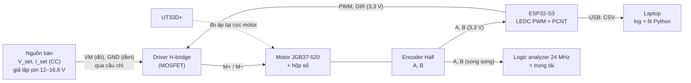

# Chặng 3 — Bring-up trên bàn (30h)

> **Vị trí:** C2 (cơ khí) → **C3** → C4 (firmware ESP32) · **Cần trước:** K1 Phần D và K1 Bài 7 (logic analyzer), K3 M1 (ESP-IDF); C0.4 (nguồn bàn CV/CC); đọc → F5.1, F5.2 · **Chạy song song với:** K3–K4
> **Làm ra được:** từng motor + driver + encoder chạy riêng trên bàn từ ESP32, nguồn bàn có giới hạn dòng thay pin, có capture logic analyzer · đường cong PWM → vận tốc (2 motor × 2 chiều, lên và xuống, hai mức áp), dòng hãm và dòng không tải đo được, `deadband.yaml` có `calibration_id`, capture `.sr` + CSV, các script bench test · **Sau chặng này bạn quyết định được:** driver nào (bằng số dòng hãm đo được), chế độ dừng nào (brake hay coast) cho từng tình huống, đếm encoder bằng PCNT hay ngắt, logic analyzer đặt sample rate bao nhiêu, và feedforward bù vùng chết cho từng motor, từng chiều.

C3 là lần đầu điện chạy qua motor. Bạn sẽ không cắm gì vào pin. Mọi thứ đi qua **nguồn bàn có giới hạn dòng** (C0.4), từng khối một: motor trần, rồi motor + driver, rồi + encoder, rồi + ESP32. Nguyên liệu lấy từ K7 gốc Bài 1 (motor, encoder, driver) và Bài 2 (PWM → vận tốc, vùng chết), viết lại cho người lần đầu cầm motor, và tách phần H-bridge, encoder trên logic analyzer thành bài riêng.

**Phân bổ 30h** `[ước lượng]`:

| Phần | Giờ |
|---|---|
| Bài C3.1 Motor, encoder, driver: ba thứ trong một vỏ | 5 |
| Bài C3.2 H-bridge: PWM, DIR, brake/coast, back-EMF, dòng hãm | 6 |
| Bài C3.3 Encoder quadrature trên logic analyzer | 5 |
| Bài C3.4 Đường cong PWM → vận tốc và vùng chết | 6 |
| Bài C3.5 Quy trình bring-up có kỷ luật *(rút gọn)* | 1 |
| Lắp bước 1–7 (bàn thử, motor trần, driver, encoder, ESP32, motor thứ hai, thử có tải) | 6 |
| Gate chặng 3 | 1 |
| **Tổng** | **30** |

## 0. Bức tranh chặng

Sau chặng này có một **bàn thử motor** (một motor một lúc; motor thứ hai đi lại đúng quy trình). Robot của C2 vẫn là xe đẩy tay; motor được tháo bánh hoặc khung được kê hở bánh.



Dòng năng lượng: lưới → nguồn bàn (trần dòng `I_set`) → driver → motor. Dòng dữ liệu: encoder → PCNT (đếm) → CSV qua USB → `bench/*.csv` → script fit → `deadband.yaml`; song song, encoder → logic analyzer → `.sr` → CSV → script giải mã độc lập. Hai đường đếm độc lập là có chủ đích: một cái kiểm cái kia.

## 1. An toàn của chặng

**Rủi ro cụ thể của C3:** bánh/trục quay bất ngờ khi ESP32 khởi động lại hoặc firmware lỗi (kẹp tay, kéo tóc, dây); motor bị giữ (hãm) quá lâu nóng cuộn dây, có mùi khét; driver nóng tới bỏng; điện áp ngược từ motor đang quay **bơm** về nguồn bàn khi phanh hoặc đảo chiều (Bài C3.2); chân GPIO ESP32-S3 cháy vì encoder pull-up 5 V; ngắn mạch đầu ra driver; robot lăn khỏi bàn.

**Quy tắc cứng:**
- KHÔNG dùng pin trong C3. Chỉ nguồn bàn, `I_set` đặt trước khi bật OUTPUT (C0.4). Pin vào ở C5.
- KHÔNG cấp điện motor khi chưa kẹp motor/khung vào bàn. Motor trần quay ở 12 V tự lăn, tự xoắn dây.
- KHÔNG để tay, tóc, dây, ống tay áo trong tầm bánh/trục khi ESP32 đang cắm USB, kể cả khi "chương trình đang dừng". Firmware mới nạp xong là đã có thể chạy.
- KHÔNG giữ trục ra bằng tay để đo dòng hãm (cách bản gốc K7 làm). Kẹp bánh bằng kẹp chữ C, đo ở áp thấp (Bài C3.1).
- KHÔNG giữ motor ở trạng thái hãm quá 2 s ở bất kỳ áp nào; đợi nguội (sờ vỏ không ấm) giữa các lần.
- KHÔNG nối encoder vào ESP32 trước khi đo mức cao của chân A/B bằng đồng hồ. Trên 3,6 V là không nối `[spec — ESP32-S3 datasheet, điều kiện hoạt động khuyến nghị: VDD tối đa 3,6 V]`.
- KHÔNG đảo chiều motor đang quay nhanh khi driver chạy trên nguồn bàn mà chưa có tụ bulk ở VM (Bài C3.2).
- KHÔNG cắm/rút dây motor, dây VM khi OUTPUT đang bật.
- KHÔNG dùng L298N (Bài C3.2 giải thích bằng số).

**Khi sự cố xảy ra:**

| Sự cố | Làm ngay | KHÔNG làm |
|---|---|---|
| Motor quay bất ngờ / không dừng | Bấm OUTPUT OFF của nguồn bàn (đây là "E-stop bàn thử": đặt nguồn trong tầm tay trái); rồi rút USB ESP32 | Không chụp bánh đang quay |
| Mùi khét, khói từ motor/driver | OUTPUT OFF; không chạm 1 phút; kiểm nhiệt bằng mu bàn tay đưa gần, không sờ | Không bật lại "xem có chạy không" |
| ESP32 nóng, không nhận USB sau khi nối encoder | Rút USB; đo mức chân A/B | Không cắm lại khi chưa tìm ra nguồn 5 V |
| Nguồn bàn báo OVP/áp vọt lên khi phanh | OUTPUT OFF; thêm tụ bulk, giảm tốc độ thử phanh | Không tắt OVP để "khỏi phiền" |

## 2. BOM chặng

Giá `[ước lượng 10/2026]`. Motor đã mua ở C2.

| Món | Thông số phải chọn | Vì sao (bằng số) | Giá | Kiểm khi nhận hàng | Thay thế được bằng |
|---|---|---|---|---|---|
| **Driver H-bridge MOSFET** ×2 kênh | V tối đa ≥ pack đầy + dư (4S: 16,8 V → ≥24 V); dòng liên tục ≥ dòng hãm đo ở C3.1, **hoặc** có giới hạn dòng; logic 3,3 V; PWM ≥20 kHz; ưu tiên có current sense | Bài C3.2 so bảng số | Xem dòng dưới | Đọc mã IC; đo không chập giữa VM và GND (ohm kế) | — |
| — lựa chọn A: Pololu DRV8874 carrier ×2 | 4,5–37 V, ~2,1 A liên tục, có điều tiết dòng và đầu ra current sense `[spec — trang Pololu #4035; kiểm]` | Giới hạn dòng phần cứng bảo vệ khi kẹt; đo dòng không cần INA226 | 250–400k/cái (nhập) | Có tản nhiệt/đủ đồng; jumper chế độ PH/EN | B |
| — lựa chọn B: Cytron MDD10A (2 kênh) | 5–30 V, 10 A liên tục/kênh, 30 A đỉnh (10 s), logic 3,3/5 V, PWM ≤20 kHz, **không** bảo vệ ngược cực, **không** current sense `[spec — Cytron user manual; kiểm bản Rev]` | Dư dòng nhiều lần; dễ mua ở VN; đo dòng bằng INA226 (→ K7 C1.5) | 400–600k | Rev2.0; nút test trên board | A |
| Tụ bulk cho VM | Điện phân ≥ 470 µF, điện áp ≥ 1,5× V pack đầy (≥ 35 V) | Hấp thụ dòng ngược khi phanh, giảm gợn | 10–30k | Đọc cực tính, điện áp trên vỏ | Tụ có sẵn trên driver (kiểm giá trị) |
| Cầu chì + đế cho VM bàn thử | Dây chảy/ô tô mini, 3–5 A | Bảo vệ dây khi `I_set` đặt cao lúc đo dòng hãm | 20–50k | — | Polyfuse (chậm hơn) |
| Đầu nối motor | XT30 hoặc cầu đấu vít + ferrule (C0.3) | Tháo lắp motor nhiều lần trong C3 | 20–50k | Kéo thử | Dupont: KHÔNG cho dây motor |
| Dây encoder nối dài + mạch chia áp (nếu encoder 5 V) | JST-XH; điện trở 10 kΩ/20 kΩ | Encoder có pull-up 5 V → 5 × 20/30 ≈ 3,3 V | 20k | Đo mức cao sau chia áp | IC chuyển mức (74LVC, TXS: kiểm tần số) |
| Kẹp chữ C, khối gỗ | — | Kẹp motor vào bàn; kẹp bánh khi đo dòng hãm | có từ C2 | — | — |

**Tổng C3 `[ước lượng]`:** 0,6–1tr (driver chiếm phần lớn). Không mua driver trước khi có số dòng hãm của C3.1 nếu được: làm C3.1 bước 1–4 chỉ cần motor + nguồn bàn.

## 3. Dụng cụ và kỹ năng tay

| Kỹ năng | Bài | Luyện trước | Đạt trông thế nào |
|---|---|---|---|
| Nối motor thẳng vào nguồn bàn, đọc CV/CC | C3.1 | Với điện trở công suất hoặc bóng đèn 12 V | Đặt V, I trước; đọc chế độ đúng; đo áp **tại cọc motor** |
| Kẹp bánh/motor an toàn | C3.1 | Motor không cấp điện | Kẹp không trượt khi vặn tay mạnh; không kẹp vào vỏ hộp số nhựa |
| Cắm que logic analyzer song song với ESP32 | C3.3 | Từ K1 Bài 7 | GND chung; kẹp chắc; không chạm chân bên cạnh |
| Xuất capture PulseView ra CSV và giải mã bằng Python | C3.3 | Capture LED nháy (K1 Bài 7) | Script đếm khớp số cạnh nhìn bằng mắt trên đoạn ngắn |
| Nạp firmware ESP-IDF, đọc serial | C3.3 | K3 M1 | Log CSV sạch, không dòng rác |

## 4. Sơ đồ đi dây

```
   NGUỒN BÀN                                       DRIVER (một kênh)           MOTOR JGB37-520
   V_set=12,0 V  (+) ──đỏ 18 AWG──[cầu chì 3 A]──┬── VM                OUT1 ──── M+ (dây motor sẵn,
   I_set (xem bài)                               ═╪═ tụ bulk ≥470 µF/35 V        nhãn wire_id)
                 (−) ──đen 18 AWG────────────────┴── GND (công suất)   OUT2 ──── M−
                                                    GND (logic) ──┐   
   ESP32-S3 (cấp bằng USB laptop)                                  │           ENCODER (đầu cắm sẵn)
     GPIO6 ── PWM (EN) ───────────────────────────── EN/PWM        │            VCC ◄── 3V3 (trắng "3V3")
     GPIO7 ── DIR (PH) ───────────────────────────── PH/DIR        │            GND ◄── GND (đen)
     GND ──────────────────────────────────────────────────────────┘◄────────── (chung)
     GPIO4 ◄── A (xanh lá) ◄──────────────────────────────────────────────────── A
     GPIO5 ◄── B (xám)     ◄──────────────────────────────────────────────────── B
   LOGIC ANALYZER: D0 → A, D1 → B, D2 → PWM, D3 → DIR, GND → GND (cùng điểm GND logic)
```

| Chân ESP32-S3 | Tín hiệu | Ghi chú |
|---|---|---|
| GPIO4 | Encoder A | Vào PCNT (cạnh) |
| GPIO5 | Encoder B | Vào PCNT (mức) |
| GPIO6 | PWM → driver | LEDC, 20 kHz |
| GPIO7 | DIR → driver | — |
| GND | GND chung với driver logic, encoder, logic analyzer | — |

Chọn 4–7 vì tránh chân strapping (GPIO0, 3, 45, 46), chân USB (19, 20) và chân flash/PSRAM (26–32; 33–37 trên module PSRAM octal) `[spec — ESP32-S3 datasheet, mục Strapping Pins và GPIO; kiểm module của bạn]`. Đây chỉ là bảng chân bàn thử; bảng chân cả robot lập ở → K7 C4.1. Màu theo C0.5: đỏ chỉ cho dây VM/VBAT, đen chỉ GND, A xanh lá, B xám, 3,3 V trắng có nhãn.

Nguồn bàn có đầu ra **nổi** (không nối đất) hay không là `[tự đo — manual]`: nếu cọc (−) nối đất vỏ, laptop cắm sạc cũng nối đất, và GND bàn thử có hai đường về đất. Bàn thử vẫn chạy, nhưng ghi lại; đây là ví dụ đầu tiên của vòng đất (→ F5.7, K7 C5.1).

## 5. Trình tự chặng

1. **Học Bài C3.5** (quy trình bring-up), lập checklist `bench/checklist.md`.
2. **Học Bài C3.1.** Commit `prediction.md`.
3. **Lắp bước 1 — Bàn thử và motor trần trên nguồn bàn**
   - Làm: kẹp motor (tháo bánh, hoặc khung C2 kê hở bánh). Nối M+, M− **thẳng** vào nguồn bàn qua cầu chì, không driver.
   - ✅ Checkpoint trước khi cấp điện: ohm kế giữa M+ và M−: vài Ω (khớp số C2 Lắp bước 1), không phải ~0 Ω; giữa M+ và vỏ: hở. Nguồn bàn: OUTPUT OFF, V_set 3 V, I_set 0,5 A.
   - Nếu sai: ~0 Ω → chập dây hoặc cuộn dây; không cấp điện.
   - Làm tiếp các phép đo của C3.1 (R, dòng không tải, dòng hãm áp thấp).
4. **Học Bài C3.2**. Chọn driver bằng bảng số; mua nếu chưa có.
5. **Lắp bước 2 — Driver, chưa có motor**
   - ✅ Checkpoint trước khi cấp điện: ohm kế giữa VM và GND của driver: không gần 0 Ω (tụ sẽ làm số tăng dần, đó là bình thường); cực tính tụ bulk đúng. Nguồn bàn V_set 12 V, I_set 0,2 A; bật: dòng tĩnh của driver phải nhỏ (mA), **không** vào CC.
   - Nếu sai: vào CC ngay → chập; tắt, tìm.
6. **Lắp bước 3 — Driver + motor, PWM từ ESP32** (encoder chưa nối)
   - ✅ Checkpoint: I_set = 1,3 × dòng không tải đo ở C3.1 (motor không tải); firmware khởi động với duty 0. Logic analyzer trên PWM và DIR: thấy 20 kHz, duty đúng lệnh trước khi tăng I_set.
   - Làm: thí nghiệm brake/coast/đảo chiều của C3.2.
7. **Học Bài C3.3**.
8. **Lắp bước 4 — Encoder**
   - ✅ Checkpoint trước khi nối vào ESP32: cấp VCC encoder (3,3 V từ ESP32, hoặc 5 V nếu encoder đòi), quay tay, đo mức cao A và B bằng UT33D+: ≤3,6 V. Trên đó → chia áp.
   - Làm: capture tay 1 vòng, 10 vòng; PCNT vs logic analyzer ở tốc độ tối đa (C3.3).
9. **Học Bài C3.4**. Commit `prediction.md`.
10. **Lắp bước 5 — Quét PWM** motor thứ nhất (hai chiều, lên–xuống, ở 16,8 V và 12,0 V).
11. **Lắp bước 6 — Motor thứ hai:** lặp **từ Lắp bước 1** (không bỏ bước vì "giống motor kia"). Script bench test chạy y hệt.
12. **Lắp bước 7 — Có tải (tùy điều kiện):** robot C2 trên sàn, hai motor nối driver, nguồn bàn kéo dây (tether, người cầm dây), lệnh ≤0,3 m/s, theo C3.4 bước 5. Không làm được thì ghi nợ sang C5.
13. **Gate chặng 3.**

## 6. Lỗi người mới hay gặp

| Triệu chứng | Nguyên nhân khả dĩ | Kiểm bằng cách | Sửa |
|---|---|---|---|
| Nguồn bàn vào CC ngay khi motor khởi động, motor chạy chậm | `I_set` thấp hơn dòng khởi động (≈ dòng hãm) — nguồn bàn đang làm soft-start hộ bạn | Tăng I_set từng bước | Bình thường trên bàn; ghi lại vì pin sẽ **không** giới hạn như vậy (C3.1) |
| ESP32 reset khi motor đảo chiều | Nhiễu/sụt áp qua GND chung; dây GND logic chạy chung đường dòng motor | Ghi `esp_reset_reason`; đo GND bằng logic analyzer | GND logic về một điểm; dây motor xoắn, tách xa dây tín hiệu |
| Motor chỉ quay một chiều | DIR nối sai chân; driver ở chế độ khác (PWM/PWM thay vì PH/EN) | Logic analyzer trên DIR | Sửa jumper/chế độ driver theo datasheet |
| Motor rít ở duty thấp | PWM trong dải nghe được | Logic analyzer đo tần số PWM | 20 kHz (LEDC 11 bit, Bài C3.3) |
| Count nhảy loạn khi motor chạy, đúng khi quay tay | Nhiễu từ dây motor vào dây encoder | Tách dây; xem PulseView có gai | Xoắn dây motor, tách cáp, glitch filter PCNT |
| Áp nguồn bàn vọt lên khi dừng motor | Năng lượng phanh bơm ngược về nguồn (C3.2) | Nhìn màn hình V lúc dừng | Tụ bulk; phanh từ tốc độ thấp hơn; không đảo chiều khi đang nhanh |
| Driver nóng ở dòng nhỏ | Tần số PWM quá cao so với driver; hoặc driver BJT | Đọc datasheet | Hạ tần số trong giới hạn; đổi driver MOSFET |

## 7. Lăng kính data infra

**Dữ liệu chặng này sinh ra:**

| Luồng | File | Schema (rút gọn) | Tần số | Đơn vị |
|---|---|---|---|---|
| Phép đo thủ công (R, I0, I_hãm, mức encoder) | `build-log/measurements.jsonl` | schema C0.5 | theo sự kiện | `ohm`, `A`, `V` |
| Log quét PWM từ ESP32 | `bench/sweep_<motor>_<dir>_<V>_<ts>.csv` | `t_s, duty, dir, count, vbat_V` | 20 Hz | s, 1, 1, count, V |
| Capture encoder | `bench/cap/*.sr` + `*.csv` (sigrok) | kênh A, B, PWM, DIR | 1–24 MHz | mẫu |
| Hệ số vùng chết | `calib/deadband.yaml` | mỗi motor × chiều: `u_breakaway_V, u_stop_V, slope_mps_per_V, d0_fit_V, conditions` + `calibration_id` | mỗi lần hiệu chuẩn | V, m/s/V |
| Tham số motor | `calib/motors.yaml` | `R_ohm, I0_A, I_stall_A (ngoại suy + điều kiện), Ke, cpr` | mỗi motor | SI |

**Test tự động sinh ra từ chặng này (hạt giống HIL cho C11.2):**
- `bench_encoder_count`: quay motor đúng N giây ở duty cố định; PCNT và logic analyzer phải khớp ±vài count. Đây là **differential test** (→ F2.4): hai bộ đếm độc lập là oracle của nhau.
- `bench_sweep`: quét PWM, fit, so `calibration_id` mới với cũ; lệch quá độ lặp lại đo được → báo "motor đổi" (inconclusive nếu trong độ lặp lại). Phán quyết ba trạng thái như K6.
- `bench_stall_R`: đo R ở áp thấp; R tăng theo thời gian sống là tín hiệu mòn chổi than, hoặc mối nối xấu (C0.3).

**Metric/SLI:** độ lặp lại của phép quét (độ lệch giữa 3 lần quét nguội); tỉ lệ lỗi "nhảy 2 bước" của encoder; tỉ lệ khớp PCNT–LA.

**Vai trò nghề:** Test & Validation (bench test có oracle độc lập, ba trạng thái); Controls/Embedded (tham số motor có version). Kinh nghiệm "server mock để tự tạo bộ test chuẩn" của bạn có tên chuẩn ở đây: **test fixture** phần cứng (bàn thử + nguồn lập trình được) — khác ở chỗ fixture vật lý tự trôi (motor nóng, mòn) nên phải tự kiểm chính nó (→ F2.5).

## 8. Nhật ký build

Copy vào `build-log/c03.md`:

```markdown
## 2026-MM-DD — buổi N (giờ bắt đầu–kết thúc, giờ thực: _._ h)
- Trạng thái người: tỉnh táo / mệt (mệt → không cấp điện motor)
- Khối mới hôm nay (CHỈ MỘT): motor trần / driver / encoder / ESP32 / motor 2
- Nguồn bàn: V_set = ... V, I_set = ... A, có vào CC không, lúc nào
- Số đo (measurements.jsonl, số dòng: __); capture: bench/cap/...
- Firmware: git hash ...
- Lỗi gặp (triệu chứng → nguyên nhân → sửa):
- Quyết định (→ decisions.md: driver, chế độ dừng, tần số PWM...):
- Suýt sự cố (motor quay bất ngờ? mùi khét?):
- Câu hỏi còn mở:
```

---
