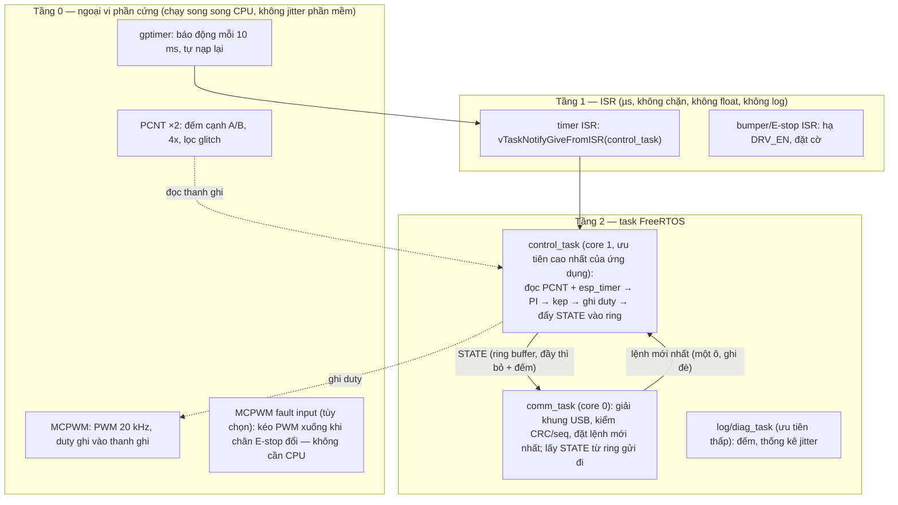
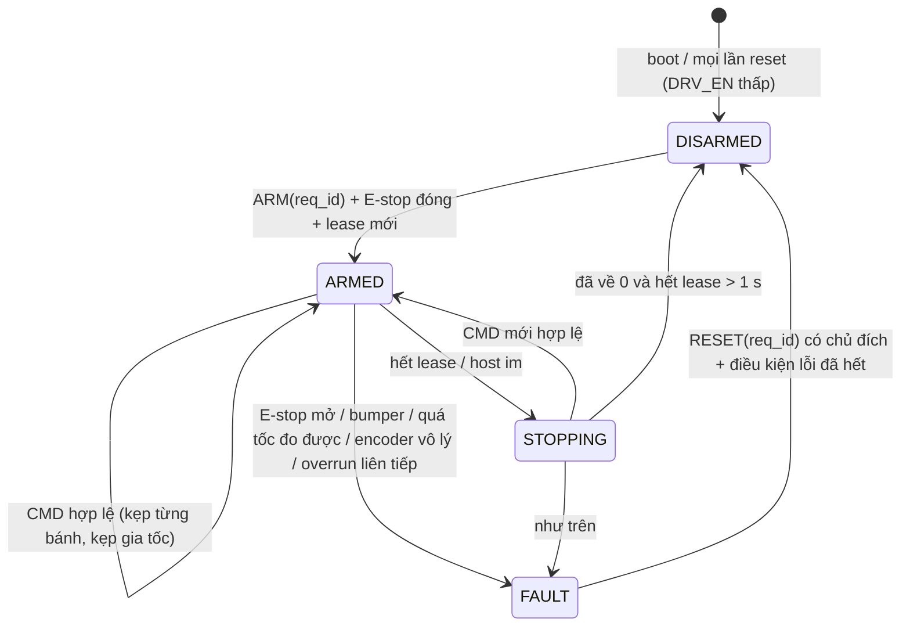

# Chặng 4 — Firmware ESP32 (40h)

> **Vị trí:** C3 (bring-up trên bàn) → **C4** → C5 (lắp hoàn chỉnh lần đầu) · **Cần trước:** C3 trọn (motor, driver, encoder chạy riêng từng cái; đường cong PWM→vận tốc và vùng chết ở C3.4), K3 M1 (ESP-IDF, I2S, giao thức credit ở K3 Bài 4), K5 Bài 8 (GPIO marker + logic analyzer); → F5.2, F5.3, F5.8 · **Chạy song song với:** K4
> **Làm ra được:** firmware ESP32-S3 chạy vòng điều khiển 100 Hz từ timer phần cứng, đếm encoder bằng PCNT, xuất PWM bằng MCPWM, nói chuyện với host qua một giao thức có khung, CRC, số thứ tự và lease, có failsafe đã thử bằng lỗi thật · bảng chân đã commit, log jitter vòng lặp 10 phút (không tải và có tải), bộ test tự động trên bàn (fuzz giao thức, kịch bản failsafe) là hạt giống HIL cho C11 · **Sau chặng này bạn quyết định được:** chân nào làm gì và vì sao không dùng chân kia; task điều khiển ở core nào, ưu tiên bao nhiêu; timeout lệnh bao nhiêu ms; firmware được phép tin host tới đâu, và khi nào nó tự dừng motor bất kể host nói gì.

C3 cho bạn từng khối chạy riêng, mỗi lần một motor, lệnh gõ tay. C4 biến các khối đó thành **một chương trình chạy liên tục mà không cần bạn nhìn**: nó đọc encoder, tính lệnh, xuất PWM 100 lần mỗi giây, nhận vận tốc đặt từ mini PC, và tự đưa motor về 0 khi có gì sai. Chặng này vẫn ở trên bàn: motor kẹp vào đồ gá, bánh quay tự do, động lực từ **nguồn bàn có giới hạn dòng**, chưa có pin. Robot hoàn chỉnh chạy bằng pin là việc của C5.

**Phân bổ 40h** `[ước lượng]`:

| Phần | Giờ |
|---|---|
| Bài C4.1 Kiến trúc firmware: timer, ISR, task, MCPWM/LEDC, PCNT | 6 |
| Bài C4.2 PID vận tốc bánh và jitter vòng lặp (K7 gốc Bài 3) | 14 |
| Bài C4.3 Giao thức host↔MCU: framing, CRC, sequence, heartbeat → `ros2_control` | 8 |
| Bài C4.4 Failsafe trong firmware: watchdog, timeout, kẹp tốc độ, trạng thái an toàn mặc định | 6 |
| Lắp bước 1–6: bảng chân, đồ gá bàn, dây tín hiệu, mạch kéo xuống, đo boot glitch, chạy test tự động | 4 |
| Gate chặng 4 | 2 |
| **Tổng** | **40** |

Phần failsafe phía firmware lấy từ K7 gốc Bài 15 (bước 3, 4); phần phần cứng của Bài 15 (relay, E-stop cắt động lực, watchdog độc lập) ở lại → K7 C10.1.

## 0. Bức tranh chặng

Sau chặng này bàn thử trông như sau. Khối mới so với C3: **giao thức với host**, **vòng 100 Hz chạy từ timer**, **failsafe**, và các đường cảm nhận (E-stop sense, bumper) dù E-stop thật chưa lắp.

```
   MINI PC N100 (hoặc laptop lúc đầu)                     ESP32-S3 DevKitC-1
  ┌──────────────────────────────┐   USB (native,     ┌────────────────────────────────────────────┐
  │ host_bench.py (C4.3, C4.4)   │   GPIO19/20)       │ gptimer 100 Hz ─ISR─notify─► control_task  │
  │  - gửi CMD(seq, ωL, ωR,      │◄══════════════════►│   (core 1, ưu tiên cao)                    │
  │    lease_ms) 50–100 Hz       │  khung COBS + CRC  │   đọc PCNT ×2 + esp_timer (Δt thật)        │
  │  - nhận STATE 100 Hz         │                    │   failsafe: lease, kẹp, giám sát tốc độ    │
  │  - fuzz, kịch bản lỗi        │                    │   PI ×2 + feedforward vùng chết (C3.4)     │
  │  - ghi JSONL/CSV             │                    │   MCPWM ──► PWM/DIR ×2, DRV_EN             │
  └──────────────────────────────┘                    │ comm_task (core 0, ưu tiên thấp hơn)       │
                                                       │ GPIO47 marker vòng · GPIO21 marker lệnh    │
                                                       └───┬───────────┬──────────────┬────────────┘
                                   logic analyzer ◄────────┘           │ PWM/DIR/EN   │ ENC A/B ×2 (3,3 V)
                                   (D0 marker, D1 PWM_L,               ▼              │
                                    D2 heartbeat, D3 EN)        ┌────────────┐   ┌────┴──────────┐
                                                                │ DRIVER     │──►│ MOTOR + ENC   │ ×2, kẹp vào
   NGUỒN BÀN (CC) ──đỏ── VM driver   (OUTPUT là "E-stop bàn")   │ (C3)       │   │ đồ gá, bánh   │ đồ gá, bánh
   I_set theo C3     ──đen── GND driver ── điểm sao ── GND ESP32└────────────┘   │ quay tự do    │ không chạm bàn
                                                                                  └───────────────┘
```

Dòng điện: nguồn bàn → driver → motor (dòng lớn, dây đỏ/đen to, về điểm sao); ESP32 ăn từ USB của host trong chặng này. Dòng dữ liệu: encoder → PCNT (phần cứng, không qua CPU) → task điều khiển → PWM; mỗi chu kỳ một bản ghi STATE đi lên host; host gửi CMD xuống. Thời gian: **một** nguồn nhịp là timer phần cứng của ESP32; host không đặt nhịp cho vòng điều khiển.

## 1. An toàn của chặng

**Rủi ro của C4:** bánh/motor quay bất ngờ (lúc nạp firmware, lúc boot, lúc bug đổi dấu lệnh); motor kẹt kéo dòng hãm làm nóng dây và driver; đưa điện áp 5 V của encoder hoặc 12–16 V của nhánh động lực vào chân ESP32 (chết chip, có khi chết cả cổng USB của host); tóc, dây đo, ống tay áo cuốn vào bánh hoặc hộp số. Năng lượng ở đây nhỏ hơn C1 (chưa có pin), nhưng motor có hộp số kẹp ngón tay đủ đau `[ước lượng]`.

**Quy tắc cứng:**
- KHÔNG cấp động lực (bật OUTPUT nguồn bàn cho driver) khi chưa nạp xong firmware và chưa thấy firmware báo trạng thái `DISARMED`. Nạp firmware luôn với OUTPUT **tắt**.
- KHÔNG để bánh chạm bàn khi chạy test tốc độ hoặc test lỗi. Motor kẹp vào đồ gá; bánh quay tự do trong không khí.
- KHÔNG đặt `I_set` của nguồn bàn cao hơn mức C3 đã ghi cho một motor chạy không tải cộng biên; test có dòng hãm làm riêng, ngắn, có người đứng cạnh.
- KHÔNG nối dây encoder vào chân ESP32 khi chưa đo điện áp mức cao của dây tín hiệu bằng UT33D+ (phải ≤ 3,3 V; xem mục 4).
- KHÔNG dùng chân strapping (GPIO0, 3, 45, 46), chân USB (19, 20), chân flash/PSRAM (26–32, và 33–37 nếu module có PSRAM octal) cho PWM, DIR, EN `[spec — ESP-IDF GPIO, ESP32-S3]`.
- KHÔNG để chân EN/STBY của driver thả nổi: luôn có điện trở kéo xuống ngoài, để ESP32 reset hay rút ra thì driver tắt.
- KHÔNG thử failsafe bằng cách "đợi xem nó có dừng không" với tay đặt gần bánh. Tay ở nút OUTPUT nguồn bàn.
- KHÔNG đeo dây đeo cổ, khăn, tóc dài thả khi làm cạnh bánh đang quay.

**Khi sự cố xảy ra:**

| Sự cố | Làm ngay | KHÔNG |
|---|---|---|
| Bánh quay khi không ra lệnh, hoặc không dừng | Bấm OUTPUT OFF nguồn bàn (đây là E-stop của bàn thử) | Rút USB ESP32 trước (driver có thể giữ trạng thái cuối nếu EN không có kéo xuống) |
| Ngón tay kẹt bánh/hộp số | OUTPUT OFF trước, gỡ tay sau | Giật tay ra khi motor còn điện |

## 2. BOM chặng

Phần lớn đã có (ESP32-S3, logic analyzer, motor + driver + encoder từ C3, nguồn bàn từ C0). Giá `[ước lượng 10/2026]`, kiểm lại ở cửa hàng.

| Món | Thông số phải chọn | Vì sao (bằng số) | Giá | Kiểm khi nhận hàng | Thay thế được bằng |
|---|---|---|---|---|---|
| ESP32-S3 DevKitC-1 **thứ hai** | Cùng model, cùng module (ví dụ WROOM-1 N8R8) với con chính | Dự phòng khi cháy chip; về sau làm bàn HIL ở C11.2 | 200–300k | Nạp blink, đọc `esptool.py chip_id` và loại flash/PSRAM | Bất kỳ dev board S3 nào, nhưng bảng chân phải làm lại |
| Bo breakout cầu đấu cho DevKit | Ra chân bằng cầu đấu vít hoặc JST-XH | Dupont lỏng khi rung; ở C5 robot rung thật | 60–150k | Thông mạch từng chân | Bo đục lỗ tự hàn header + JST |
| Điện trở 10 kΩ, 1 kΩ, 100 Ω | Gói các loại | Kéo xuống EN/PWM (10 kΩ); nối tiếp chân tín hiệu dài (100 Ω); cầu phân áp | 20–50k | Đo bằng UT33D+ | — |
| Opto (PC817) hoặc cầu phân áp cho E-stop sense | Opto 4 chân + điện trở | Tách đường 12–16 V khỏi chân 3,3 V (C10.1 dùng lại) | 10–30k | Đo bằng chế độ diode | Cầu phân áp có zener 3,3 V |
| Mạch chuyển mức (nếu encoder chỉ chạy 5 V) | 4 kênh, MOSFET (BSS138) hoặc 74LVC | ESP32-S3 không chịu 5 V trên chân `[spec — datasheet ESP32-S3, Absolute Maximum Ratings]` | 20–40k | Đo mức ra 3,3 V | Cầu phân áp 10k/20k (chỉ khi tần số xung thấp, kiểm cạnh bằng logic analyzer) |
| Dây USB-C ngắn có lõi ferrite | ≤ 0,5 m, loại có dây dữ liệu (không phải dây chỉ sạc) | Dây dài mỏng + nhiễu motor = mất kết nối (C5.1) | 50–120k | `lsusb` thấy thiết bị | — |
| Đồ gá kẹp motor | Kẹp chữ C, ke nhôm, hoặc khung C2 nếu đã xong | Motor có mô-men giật khi đổi chiều; tuột khỏi bàn | 50–150k | Lắc tay không xê dịch | Khung robot C2 lật ngửa, bánh lên trời |

**Tổng C4 `[ước lượng]`:** ~0,5–1tr.

## 3. Dụng cụ và kỹ năng tay

| Kỹ năng | Bài | Luyện trước | Đạt trông thế nào |
|---|---|---|---|
| Đo mức điện áp tín hiệu trước khi cắm vào MCU | Lắp bước 2 | Đo dây encoder khi quay tay chậm | Ghi được V_high, V_low; không cắm khi V_high > 3,6 V |
| Bấm JST-XH cho dây tín hiệu 4–6 chân, đánh nhãn hai đầu | Lắp bước 3 | Đã luyện ở C0.3 | Mỗi dây có `wire_id` trong `wiring/wires.csv` |
| Gắn kênh logic analyzer vào điểm đo có GND chung, chọn sample rate | C4.2 | K5 Bài 8 | Capture 10 phút không rớt mẫu; biết sai số mỗi cạnh |
| Nạp firmware, đọc log boot, đọc `esp_reset_reason` | C4.1 | K3 M1 | Biết chip vừa reset vì gì (brownout, WDT, nút, panic) |
| Đọc datasheet tìm bảng strapping, bảng chân có glitch lúc cấp điện | C4.1 | — | Bảng chân có cột "vì sao chân này" |

Kỹ năng tay mới ít; kỹ năng mới của chặng là **đo phần mềm bằng dụng cụ phần cứng**: đặt marker GPIO và đọc thời gian bằng logic analyzer thay vì tin `printf`.

## 4. Sơ đồ đi dây

**Bảng chân (pin budget) đề xuất** cho ESP32-S3-DevKitC-1 với module WROOM-1 N8R8 (8 MB flash, 8 MB PSRAM octal) `[tự đo — đọc chữ trên vỏ module; nếu module không có PSRAM octal thì GPIO33–37 dùng được]`. "Encoder ×4" và "PWM/DIR ×4" trong kế hoạch là 4 **tín hiệu** cho robot 2 bánh (A/B × 2; PWM/DIR × 2). Robot 4 bánh cần gấp đôi và dùng hết 4 unit PCNT của S3.

| Chức năng | GPIO | Ngoại vi | Hướng / kéo | Vì sao chân này |
|---|---|---|---|---|
| ENC_L_A / ENC_L_B | 4 / 5 | PCNT unit 0, kênh 0 và 1 | vào, kéo lên trong (+ lọc glitch PCNT) | Chân thường, không strapping. S3 có 4 unit PCNT, mỗi unit 2 kênh `[spec — ESP-IDF soc_caps ESP32-S3]` |
| ENC_R_A / ENC_R_B | 6 / 7 | PCNT unit 1 | vào | như trên |
| PWM_L / DIR_L | 15 / 16 | MCPWM0 operator 0 / GPIO | ra, **kéo xuống 10 kΩ ngoài** | Không strapping, không USB, không flash |
| PWM_R / DIR_R | 17 / 18 | MCPWM0 operator 1 / GPIO | ra, kéo xuống 10 kΩ ngoài | như trên |
| DRV_EN (STBY/nSLEEP) | 8 | GPIO | ra, **kéo xuống 10 kΩ ngoài** | Một chân tắt cả driver; ESP32 reset → chân cao trở → kéo xuống tắt driver |
| ISENSE_L / ISENSE_R | 1 / 2 | ADC1 CH0 / CH1 | vào analog | ADC2 dùng chung với Wi-Fi trên ESP32-S3; dùng ADC1 cho thứ cần đọc lúc Wi-Fi bật `[spec — ESP-IDF ADC]`. Chỉ dùng nếu driver C3 có chân current sense |
| I2C SDA / SCL | 10 / 11 | I2C0 | kéo lên 4,7 kΩ (nếu bo cảm biến chưa có) | INA226 (C1.5), IMU (C7). Dây xanh dương / vàng (Qwiic) |
| I2S BCLK / WS / DOUT / DIN | 12 / 13 / 14 / 9 | I2S0 | — | Để dành cho C12 (amp + mic); khai báo từ bây giờ để không bị chiếm |
| BUMPER_L / BUMPER_R | 39 / 40 | GPIO ngắt | vào, kéo lên; công tắc NC xuống GND | Đứt dây = chân lên cao = "đã va" (hỏng về phía an toàn). Chân JTAG pad, rảnh khi dùng JTAG qua USB |
| ESTOP_SENSE | 41 | GPIO ngắt + (tùy chọn) MCPWM fault | vào qua opto | Đọc trạng thái chuỗi E-stop (C5 tạm, C10.1 thật) |
| RELAY_HOLD | 42 | GPIO/LEDC | ra, kéo xuống ngoài | Xung giữ cho mạch relay ở C10.1; để dành |
| DBG_LOOP | 47 | GPIO | ra | Marker đầu/cuối mỗi chu kỳ điều khiển (C4.2) |
| DBG_CMD | 21 | GPIO | ra | Đảo mỗi khi nhận lệnh hợp lệ (C4.3, C4.4) |
| **Không dùng** | 0, 3, 45, 46 (strapping); 19, 20 (USB Serial/JTAG — đường nói chuyện với host); 26–32 và 33–37 với PSRAM octal (SPI flash/PSRAM); 43, 44 (UART0, log ROM) | — | — | `[spec — ESP-IDF GPIO, ESP32-S3]` |
| Kiểm theo bo | 38 hoặc 48 | LED RGB trên DevKitC-1 | — | Tùy revision bo `[tự đo — xem sơ đồ nguyên lý đúng revision]` |

Ngoài bảng trên: datasheet ESP32-S3 có mục liệt kê **chân có glitch lúc cấp điện** (xung ngắn trước khi firmware chạy) `[spec — datasheet ESP32-S3, tra mục về trạng thái chân lúc khởi động; kiểm theo revision]`. Đối chiếu với PWM/DIR/EN. Dù chân nào, thiết kế phải chịu được: điện trở kéo xuống + **DRV_EN chỉ lên cao sau khi firmware ARM** (C4.4) nghĩa là glitch trên PWM không làm motor quay vì driver đang tắt. Lắp bước 5 kiểm điều đó bằng logic analyzer.

**Sơ đồ dây bàn thử** (màu theo C0.5):

```
 NGUỒN BÀN (+) ──đỏ 18 AWG──────────────► VM driver
 NGUỒN BÀN (−) ──đen 18 AWG──► ĐIỂM SAO (ốc trên đồ gá) ◄──đen 18 AWG── GND driver (phía công suất)
                                   │
                                   └──đen 22 AWG──► GND ESP32 (một dây, không đi vòng qua motor)
 Motor L ◄══ dây motor (xoắn đôi, xa dây encoder ≥ 3 cm) ══ driver OUT_L     (tương tự motor R)

 ESP32 3V3 ──trắng "3V3"──► Vcc encoder L, R   (nếu encoder chạy 3,3 V — kiểm ở Lắp bước 2)
 ESP32 GND ──đen──────────► GND encoder
 ENC_L_A ◄──xanh lá── encoder L A        ENC_L_B ◄──xám── encoder L B     (giữ màu nhà sản xuất nếu có sẵn,
 ENC_R_A ◄──xanh lá── encoder R A        ENC_R_B ◄──xám── encoder R B      ghi vào wires.csv)
 GPIO15 ─[100 Ω]─┬─► PWM_L driver        GPIO8 ─[100 Ω]─┬─► EN/STBY driver
                 └[10 kΩ]─ GND                           └[10 kΩ]─ GND
 GPIO47 ──► logic analyzer D0 ;  GPIO15 ──► D1 ;  GPIO21 ──► D2 ;  GPIO8 ──► D3 ;  GND LA ── GND ESP32
```

Tiết diện: dây động lực bàn thử 18 AWG đủ cho dòng không tải và các lần thử dòng hãm ngắn có `I_set` giới hạn `[ước lượng — C1.3 tính lại cho robot]`; dây tín hiệu 22–26 AWG. Không có cầu chì riêng ở bàn thử: `I_set` của nguồn bàn đóng vai giới hạn dòng.

## 5. Trình tự chặng

1. **Học Bài C4.1** (commit `prediction.md` trước khi mở 🔒).
2. **Lắp bước 1 — Bảng chân**
   - Làm: chép bảng ở mục 4 vào `firmware/PINS.md`, sửa theo bo thật (đọc chữ trên module, sơ đồ nguyên lý DevKit đúng revision). Mỗi chân một dòng "vì sao". Commit. Từ nay đổi chân phải đổi file này trước, code sau.
   - ✅ Checkpoint: script nhỏ (hoặc `grep`) đối chiếu mọi `#define PIN_` trong firmware với `PINS.md`, và với danh sách cấm (0, 3, 19, 20, 26–37, 43–46). Không có chân nào trong danh sách cấm.
   - Nếu sai: đổi chân trong `PINS.md` trước, rồi code.
3. **Lắp bước 2 — Đo mức tín hiệu encoder trước khi cắm**
   - Làm: cấp Vcc cho encoder bằng nguồn bàn (chế độ CV, `I_set` 50 mA), lần lượt 3,3 V rồi 5 V nếu datasheet cho phép. Quay bánh thật chậm bằng tay; đo dây A so với GND bằng UT33D+ ở hai vị trí (mức cao, mức thấp).
   - ✅ Checkpoint trước khi cắm vào ESP32: V_high ≤ 3,6 V và V_low ≤ 0,4 V `[ước lượng — ngưỡng logic ESP32-S3 theo datasheet, VIH/VIL tỉ lệ VDD]`. Encoder chạy được ở 3,3 V thì cấp 3,3 V từ ESP32; nếu không, chèn mạch chuyển mức.
   - Nếu sai: không cắm. Ghi V_high vào sổ; đặt mạch chuyển mức.
4. **Lắp bước 3 — Dây tín hiệu và mạch kéo xuống**
   - Làm: đi dây theo mục 4, bấm JST, đánh nhãn, ghi `wiring/wires.csv`. Hàn 10 kΩ kéo xuống cho PWM_L, PWM_R, DRV_EN và 100 Ω nối tiếp.
   - ✅ Checkpoint trước khi cấp điện (USB rút, nguồn bàn tắt): đo Ω giữa GPIO8 và GND trên bo breakout: ≈ 10 kΩ (kéo xuống có mặt). Đo Ω giữa 3V3 và GND của ESP32: không gần 0 Ω. Đo Ω giữa VM driver và bất kỳ chân ESP32 nào: **OL** (hở).
   - Nếu sai: tìm chỗ chạm trước khi cắm USB.
5. **Học Bài C4.2**, làm phần 6 của bài (đo jitter, tinh chỉnh trên bàn).
6. **Lắp bước 4 — Đồ gá và lần quay đầu tiên dưới firmware mới**
   - Làm: kẹp motor; bánh không chạm gì. Nạp firmware với OUTPUT nguồn bàn tắt; mở log, thấy `DISARMED`. Bật OUTPUT. Gửi `ARM` rồi lệnh 1 rad/s cho bánh trái trong 2 s.
   - ✅ Checkpoint: bánh trái quay **đúng chiều** quy ước (tiến = dương theo REP-103 khi bánh lắp trên robot; ghi trong `PINS.md`), bánh phải đứng yên; STATE báo count tăng **dương**. Sai dấu ở encoder hoặc DIR là lỗi số 1 của chặng này.
   - Nếu sai: đảo dấu trong cấu hình (một chỗ duy nhất, `config.h`), không đảo dây "cho nhanh" mà không ghi lại.
7. **Học Bài C4.3**; chạy fuzz giao thức trên bàn.
8. **Học Bài C4.4**; chạy kịch bản failsafe (phần 6 của bài).
9. **Lắp bước 5 — Boot glitch**
   - Làm: logic analyzer D1 = PWM_L, D3 = DRV_EN, trigger theo cạnh lên của 3V3 ESP32 (qua cầu phân áp nếu cần) hoặc bắt đầu capture rồi cắm USB. Cấp nguồn ESP32 20 lần, mỗi lần 3 s; nhấn nút RST 10 lần; nạp firmware 3 lần, tất cả với **VM đang có điện** và bánh tự do.
   - ✅ Checkpoint: DRV_EN không có cạnh lên nào khi firmware chưa nhận `ARM`. Có glitch trên PWM là chấp nhận được **chỉ khi** DRV_EN thấp suốt lúc đó. Bánh không nhúc nhích lần nào.
   - Nếu sai: đổi chân EN, tăng kéo xuống (4,7 kΩ), kiểm firmware không cấu hình EN là output-high trước khi ARM.
10. **Lắp bước 6 — Chạy bộ test tự động** (`tests/bench/`: fuzz, failsafe, jitter) một lượt sạch, ghi kết quả vào sổ.
11. **Gate chặng 4.**

## 6. Lỗi người mới hay gặp

| Triệu chứng | Nguyên nhân khả dĩ | Kiểm bằng cách | Sửa |
|---|---|---|---|
| Đọc encoder ra số nhảy lung tung khi motor chạy, đúng khi quay tay | Nhiễu PWM motor cảm ứng vào dây encoder; thiếu lọc glitch | Logic analyzer trên dây A khi motor chạy | Lọc glitch PCNT, dây encoder xa dây motor, xoắn dây motor, GND một điểm |
| Count đúng vài giây rồi nhảy một khoảng rất lớn | PCNT về 0 khi chạm `high_limit`, code trừ hai lần đọc không xử lý | Chạy liên tục > 30.000 count, so tổng | `flags.accum_count` + watch point ở hai limit (Bài C4.1) |
| Bánh quay một cái lúc nạp firmware hoặc lúc cắm USB | Chân EN/PWM thả nổi hoặc là chân có glitch, thiếu kéo xuống | Lắp bước 5 | Kéo xuống ngoài; EN chỉ lên sau ARM |
| ESP32 reset mỗi lần mở cổng serial trên host | Mở cổng đổi DTR/RTS, mạch tự reset của DevKit/USB Serial/JTAG hiểu là lệnh reset | Đếm `boot_count` trong STATE trước/sau khi mở cổng | Cấu hình host không đụng DTR/RTS (Bài C4.3) `[tự đo]` |
| Vòng điều khiển chậm dần khi host không đọc serial | Ghi serial blocking trong task điều khiển, buffer TX đầy | Marker GPIO: độ rộng tăng khi đóng chương trình host | Task điều khiển không bao giờ ghi USB; ghi vào ring buffer, task khác gửi, đầy thì bỏ và đếm |

Lỗi riêng của từng bài ở phần 8 của bài.

## 7. Lăng kính data infra

**Dữ liệu chặng này sinh ra:**

| Luồng | Nơi | Schema (rút gọn) | Tần số | Đơn vị / ghi chú |
|---|---|---|---|---|
| STATE từ firmware | `logs/bench/state-*.jsonl` (C4), về sau `/joint_states` + `/diagnostics` qua `ros2_control` (C5) | `t_mcu_us, seq, boot_count, enc_l, enc_r (count tích lũy, int32+), w_l, w_r (rad/s), u_l, u_r (duty −1..1), state, fault_mask, last_cmd_seq, loop_overrun, jitter_max_us_1s` | 100 Hz | rad/s, s; count giữ nguyên dạng nguyên để tái tính được |
| Lệnh từ host | `logs/bench/cmd-*.jsonl` | `t_host_ns, seq, w_l_cmd, w_r_cmd, lease_ms` | 50–100 Hz | — |
| Capture marker | `captures/c04/*.sr` + bảng chu kỳ `.csv` | `k, t_rise_s, period_s, width_s` | 100 Hz trong 10 phút | s |
| Kết quả test bàn | `build-log/measurements.jsonl` (schema C0.5) | `quantity` = `loop_jitter_p99`, `fuzz_wrong_applied`, `failsafe_stop_time`… | theo lần chạy | SI: `s`, không `us` trong dữ liệu |

`clock_source` của `t_mcu_us` là `esp32_timer`; của `t_host_ns` là `host_unsynced` cho tới C7.2 (→ `CONVENTIONS.md` mục 4). `firmware_version` = git hash nhúng lúc build, có trong gói STATE đầu tiên sau boot và trong metadata.

**Test tự động sinh ra từ chặng này (hạt giống HIL cho C11.2):**
- `test_jitter`: chạy 10 phút, đọc capture logic analyzer, chấm p99 < 100 µs, ba trạng thái (pass / fail / inconclusive khi rớt mẫu hoặc < 10.000 chu kỳ).
- `test_protocol_fuzz`: host bơm 10⁵ khung có lỗi cố ý; firmware không áp dụng lệnh sai nào; bộ đếm `bad_crc` khớp số khung hỏng (sai lệch giải thích được).
- `test_failsafe_*`: mỗi kịch bản ở Bài C4.4 là một test có oracle là mô hình Python `s5_failsafe.py`. Ở C11.2 cùng test chạy trên bàn HIL, chỉ thay "bánh thật" bằng tín hiệu giả.

**SLI của firmware:** jitter p99/max theo cửa sổ 1 s, `loop_overrun`, tỉ lệ khung hỏng, số lần failsafe theo lý do, `boot_count` và lý do reset — metric như mọi service, nhưng **ngưỡng suy ra từ vật lý** (C4.2). Vai trò nghề: Test & Validation (bench test có oracle, fuzz, fault injection → F2.4, F2.5); Data Platform (schema có số thứ tự, đơn vị, phiên bản firmware).

## 8. Nhật ký build

Copy vào `build-log/c04.md`, một mục mỗi buổi:

```markdown

## 2026-MM-DD — buổi N (giờ bắt đầu–kết thúc, giờ thực: _._ h)
- Trạng thái người: tỉnh táo / mệt (mệt → chỉ đọc, không bật động lực)
- Firmware: git hash ____ ; ESP-IDF ____ ; bo ____ (module ____)
- Mục tiêu buổi:
- Đã làm:
- Số đo (measurements.jsonl, số dòng: __): jitter p50/p99/max ____ ; utilization ____ ; ...
- Capture: captures/c04/...
- Lỗi gặp (triệu chứng → nguyên nhân → sửa):
- Reset lạ của ESP32? lý do (esp_reset_reason): ____
- Quyết định (→ decisions.md nếu ảnh hưởng chặng sau; ví dụ timeout lệnh, core của task):
- Near miss (bánh quay bất ngờ, chạm dây động lực vào chân logic…):
- Câu hỏi còn mở:
```

---

## Bài C4.1 — Kiến trúc firmware: timer, ISR, task, MCPWM/LEDC, PCNT (6h)

> **Vị trí:** C3.3 (encoder trên logic analyzer), C3.5 (bring-up có kỷ luật) → **C4.1** → C4.2 · **Cần trước:** → F5.1, → F5.2 (interrupt, DMA, ring buffer), → F5.3 (ưu tiên, WCET); K3 M1 (dựng ESP-IDF) · **Sau bài này bạn quyết định được:** việc nào giao cho ngoại vi phần cứng (PCNT, MCPWM, timer), việc nào trong ISR, việc nào trong task ở core nào; và bảng chân cuối cùng.

### 1. Câu chuyện — ai đã khổ vì chuyện này

Ngày 20/7/1969, khi module Mặt Trăng của Apollo 11 đang hạ xuống, máy tính dẫn đường (AGC) bật liên tiếp các báo động 1202 và 1201: bộ điều phối việc (Executive) hết chỗ chứa việc cần chạy. Nguyên nhân, theo các kỹ sư MIT kể lại: radar hẹn gặp (rendezvous radar) ở một cấu hình công tắc khiến phần cứng giao tiếp gửi liên tục các xung "đếm" vào AGC; mỗi xung đánh cắp một chu kỳ máy, ăn mất một phần đáng kể thời gian CPU mà không ai lập ngân sách cho nó `[chuẩn — Don Eyles, "Tales from the Lunar Module Guidance Computer" (2004); tài liệu lịch sử NASA]`. Cuộc hạ cánh không bị hủy vì hệ điều hành của AGC do nhóm của Hal Laning thiết kế theo **ưu tiên**: khi quá tải, nó khởi động lại phần mềm, bỏ việc ít quan trọng, giữ việc dẫn đường và điều khiển. Kiểm soát mặt đất (Steve Bales, Jack Garman) quyết "GO" vì họ đã biết báo động đó nghĩa là gì.

Hai bài học cho firmware của bạn: (1) **nguồn ngắt bạn không tính đến** (ở ESP32 là Wi-Fi, USB, ghi flash) ăn thời gian của vòng điều khiển; (2) kiến trúc theo ưu tiên, với việc quan trọng nhất được bảo vệ, quyết định hệ suy giảm êm hay sụp. Bài này dựng đúng bộ xương đó.

### 2. Mô hình tư duy

Firmware điều khiển motor có **ba tầng thời gian**, và câu hỏi thiết kế đầu tiên là đặt mỗi việc vào tầng nào:



Bốn câu bản chất:
1. **Việc nào phần cứng làm được thì đừng để CPU làm.** Đếm cạnh encoder bằng ngắt GPIO là cách tutorial dạy; ở vài nghìn cạnh/giây mỗi bánh, mỗi cạnh là một ngắt cạnh tranh với vòng điều khiển, và cạnh đến dồn khi ngắt bị khóa thì mất. PCNT đếm trong phần cứng; CPU chỉ đọc một thanh ghi mỗi 10 ms.
2. **Nhịp đến từ một timer phần cứng, không từ `delay`.** Chu kỳ = thứ thạch anh quyết định, không phải "10 ms + thời gian chạy". ISR chỉ đánh thức task; tính toán nằm trong task (ISR ngắn thì độ trễ ngắt của mọi thứ khác ngắn).
3. **Hai luồng giữa task có hai chính sách khác nhau.** Lệnh từ host vào vòng điều khiển là **trạng thái**: chỉ cái mới nhất có nghĩa, ghi đè một ô (depth 1). Telemetry ra là **luồng**: hàng đợi có giới hạn, đầy thì bỏ và đếm (→ F3.9). Lẫn hai chính sách là lỗi kiến trúc phổ biến nhất.
4. **Bộ đếm PCNT không quấn vòng như số nguyên bù hai.** Theo tài liệu ESP-IDF, thanh ghi 16 bit có dấu **về 0** khi chạm `high_limit`/`low_limit` `[spec — ESP-IDF Programming Guide, Pulse Counter, ESP32-S3]`. Mẹo "trừ hai lần đọc theo kiểu int16" của các bộ đếm quấn vòng không cứu được; phải bật `flags.accum_count` và đặt watch point ở hai limit để driver cộng phần bị xóa vào bộ tích lũy.

**Mô phỏng đồ chơi: tràn PCNT.**

```python
# [đã chạy] PCNT ESP32-S3: bộ đếm 16 bit có dấu, VỀ 0 khi chạm high/low limit (không quấn kiểu bù hai)
import numpy as np

def pcnt_hw(true_counts, high=32767, low=-32768, accum=False):
    """Mô hình hành vi theo tài liệu ESP-IDF: chạm limit -> thanh ghi về 0.
    accum=True: driver cộng phần 'mất' vào bộ tích lũy (cần watch point ở high/low)."""
    reg, acc, out = 0, 0, []
    prev = 0
    for c in true_counts:
        for _ in range(abs(c - prev)):            # từng cạnh một
            reg += 1 if c > prev else -1
            if reg >= high or reg <= low:
                acc += reg; reg = 0                # tràn: về 0, (tùy chọn) ghi nhớ phần đã đếm
        prev = c
        out.append(reg + (acc if accum else 0))
    return np.array(out)

# Bánh quay đều về phía trước, 4x quadrature; đọc mỗi 10 ms
CPR_OUT = 11 * 4 * 30          # 11 xung/vòng trục motor x4 cạnh x tỉ số 30 [ước lượng, JGB37-520 tự đo]
rev_s = 0.5 / (np.pi * 0.08)   # 0,5 m/s, bánh D = 80 mm [ước lượng]
cps = CPR_OUT * rev_s          # count/giây
print(f"{CPR_OUT} count/vòng bánh; ở 0,5 m/s: {cps:.0f} count/s, {cps*0.01:.1f} count/chu kỳ 10 ms")
print(f"thời gian để chạy hết 32767 count: {32767/cps:.1f} s")

t = np.arange(0, 20, 0.01)
true = np.round(cps * t).astype(int)
reg = pcnt_hw(true)
reg_acc = pcnt_hw(true, accum=True)
d_naive = np.diff(reg)                                    # đọc thanh ghi rồi trừ
d_wrap16 = ((np.diff(reg) + 32768) % 65536) - 32768       # mẹo "trừ kiểu int16" của bộ đếm quấn
d_acc = np.diff(reg_acc)
bad = lambda d: int((d != np.diff(true)).sum())
print(f"chu kỳ sai: trừ thô={bad(d_naive)}  trừ int16 quấn={bad(d_wrap16)}  accum_count={bad(d_acc)}")
print("lỗi lớn nhất (count):", int(np.abs(d_naive - np.diff(true)).max()),
      int(np.abs(d_wrap16 - np.diff(true)).max()))
```

Mô hình là đồ chơi: tôi giả định thanh ghi về 0 đúng lúc chạm limit; thời điểm chính xác (chạm hay vượt) xê dịch ±1 count. Hình dạng của lỗi là thứ cần nhớ.

**Bộ xương firmware** (ESP-IDF v5.x; tên API kiểm trong header của bản bạn cài):

```c
// [chưa chạy] Bộ xương vòng 100 Hz: gptimer -> ISR notify -> task ghim core 1; PCNT có accum_count
#include "driver/gptimer.h"
#include "driver/pulse_cnt.h"
#include "esp_timer.h"
#include "freertos/FreeRTOS.h"
#include "freertos/task.h"

static TaskHandle_t s_ctrl;
static pcnt_unit_handle_t s_enc[2];

static bool IRAM_ATTR on_tick(gptimer_handle_t t, const gptimer_alarm_event_data_t *e, void *arg) {
    BaseType_t woken = pdFALSE;
    vTaskNotifyGiveFromISR(s_ctrl, &woken);          // ISR chỉ làm đúng một việc
    return woken == pdTRUE;                           // yêu cầu đổi ngữ cảnh nếu task ưu tiên cao vừa sẵn sàng
}

static void enc_init(int i, int gpio_a, int gpio_b) {
    pcnt_unit_config_t u = { .low_limit = -32768, .high_limit = 32767, .flags.accum_count = 1 };
    ESP_ERROR_CHECK(pcnt_new_unit(&u, &s_enc[i]));
    pcnt_glitch_filter_config_t f = { .max_glitch_ns = 1000 };   // chỉnh theo tần số cạnh lớn nhất [tự đo]
    ESP_ERROR_CHECK(pcnt_unit_set_glitch_filter(s_enc[i], &f));
    pcnt_chan_config_t ca = { .edge_gpio_num = gpio_a, .level_gpio_num = gpio_b };
    pcnt_chan_config_t cb = { .edge_gpio_num = gpio_b, .level_gpio_num = gpio_a };
    pcnt_channel_handle_t ha, hb;
    ESP_ERROR_CHECK(pcnt_new_channel(s_enc[i], &ca, &ha));
    ESP_ERROR_CHECK(pcnt_new_channel(s_enc[i], &cb, &hb));
    // 4x quadrature: theo ví dụ rotary_encoder của ESP-IDF
    pcnt_channel_set_edge_action(ha, PCNT_CHANNEL_EDGE_ACTION_DECREASE, PCNT_CHANNEL_EDGE_ACTION_INCREASE);
    pcnt_channel_set_level_action(ha, PCNT_CHANNEL_LEVEL_ACTION_KEEP, PCNT_CHANNEL_LEVEL_ACTION_INVERSE);
    pcnt_channel_set_edge_action(hb, PCNT_CHANNEL_EDGE_ACTION_INCREASE, PCNT_CHANNEL_EDGE_ACTION_DECREASE);
    pcnt_channel_set_level_action(hb, PCNT_CHANNEL_LEVEL_ACTION_KEEP, PCNT_CHANNEL_LEVEL_ACTION_INVERSE);
    ESP_ERROR_CHECK(pcnt_unit_add_watch_point(s_enc[i], 32767));   // bắt buộc để accum_count bù tràn
    ESP_ERROR_CHECK(pcnt_unit_add_watch_point(s_enc[i], -32768));
    ESP_ERROR_CHECK(pcnt_unit_enable(s_enc[i]));
    ESP_ERROR_CHECK(pcnt_unit_clear_count(s_enc[i]));                // tài liệu: clear sau khi thêm watch point
    ESP_ERROR_CHECK(pcnt_unit_start(s_enc[i]));
}

static void control_task(void *arg) {
int64_t t_last = esp_timer_get_time();
    for (;;) {
        ulTaskNotifyTake(pdTRUE, portMAX_DELAY);
        gpio_set_level(PIN_DBG_LOOP, 1);                      // marker: việc bắt đầu (C4.2 đo cạnh này)
        int now[2]; int64_t t = esp_timer_get_time();         // Δt THẬT, không dùng 10 ms danh định
        pcnt_unit_get_count(s_enc[0], &now[0]);
        pcnt_unit_get_count(s_enc[1], &now[1]);
        float dt = (t - t_last) * 1e-6f; t_last = t;
        // ... C4.2: vận tốc = (now-last)*rad_per_count/dt ; C4.4: failsafe ; PI ; ghi duty MCPWM
        gpio_set_level(PIN_DBG_LOOP, 0);                      // độ rộng xung = thời gian thực thi
    }
}

void app_main(void) {
    enc_init(0, PIN_ENC_L_A, PIN_ENC_L_B);
    enc_init(1, PIN_ENC_R_A, PIN_ENC_R_B);
    xTaskCreatePinnedToCore(control_task, "ctrl", 4096, NULL, configMAX_PRIORITIES - 2, &s_ctrl, 1);
    gptimer_handle_t tm;
    gptimer_config_t tc = { .clk_src = GPTIMER_CLK_SRC_DEFAULT, .direction = GPTIMER_COUNT_UP,
                            .resolution_hz = 1000000 };                       // 1 tick = 1 µs
    ESP_ERROR_CHECK(gptimer_new_timer(&tc, &tm));
    gptimer_event_callbacks_t cbs = { .on_alarm = on_tick };
    ESP_ERROR_CHECK(gptimer_register_event_callbacks(tm, &cbs, NULL));
    gptimer_alarm_config_t al = { .alarm_count = 10000, .reload_count = 0,
                                  .flags.auto_reload_on_alarm = true };        // 10 ms, tự nạp bằng phần cứng
    ESP_ERROR_CHECK(gptimer_set_alarm_action(tm, &al));
    ESP_ERROR_CHECK(gptimer_enable(tm));
    ESP_ERROR_CHECK(gptimer_start(tm));
}
```

**MCPWM hay LEDC cho PWM motor?** Cả hai sinh PWM bằng phần cứng. LEDC trên S3: 8 kênh, 4 timer, độ phân giải tối đa 14 bit, chỉ low-speed mode `[spec — ESP-IDF soc_caps ESP32-S3]`; đủ cho hai motor và dễ cấu hình. MCPWM: 2 nhóm, mỗi nhóm 3 timer/3 operator, có **đầu vào fault** (3 mỗi nhóm) và hành động "brake" khi fault, nghĩa là một chân GPIO có thể ép PWM về mức an toàn **không qua CPU** `[spec — ESP-IDF soc_caps ESP32-S3; API mcpwm_new_gpio_fault, mcpwm_operator_set_brake_on_fault, mcpwm_generator_set_action_on_brake_event]`. Khuyến nghị: MCPWM, vì C4.4 dùng fault input. Nếu thấy MCPWM rối ở lần đầu, LEDC trước, đổi sau; giữ một hàm `motor_set_duty(i, d)` để phần còn lại không biết khác biệt.

### 3. Cầu nối từ backend

| Backend bạn biết | Ở đây | Gãy ở chỗ | Nếu dùng nhầm thì |
|---|---|---|---|
| Offload sang hạ tầng (load balancer TLS termination, NIC checksum offload) | PCNT đếm cạnh, MCPWM sinh PWM | Offload backend để tiết kiệm CPU; ở đây offload để **không mất sự kiện** và không có jitter. CPU nhanh tới đâu cũng không bắt được cạnh đến lúc ngắt đang bị khóa | Đếm encoder bằng ngắt GPIO, chạy đúng trên bàn ở tốc độ thấp, mất count ở tốc độ cao |
| Cron / scheduler gọi job mỗi phút | gptimer + notify | Cron trễ vài giây không ai thấy; ở đây trễ là sai phép tính (C4.2). Và cron chạy job dù job trước chưa xong; vòng điều khiển phải **phát hiện** chu kỳ bị lỡ (overrun) và đếm, không chạy chồng | `vTaskDelay(10)` → chu kỳ trôi; hoặc chạy hai chu kỳ dồn sau một lần bị chặn |
| Thread pool + queue cho request | Task + notify/queue | Thread pool backend chia đều; ở đây **ưu tiên tĩnh** và ghim core là công cụ chính: task ưu tiên thấp không bao giờ được chạy khi task cao sẵn sàng | Để mọi task cùng ưu tiên "cho công bằng" → vòng điều khiển xếp hàng sau task log |

**Chấm mô hình:**
- *"ESP32 thực tế chỉ làm dispatcher/coordinator, nhận lệnh từ chỗ khác rồi forward, không nên là nơi tạo hay xử lý"* (mô hình của bạn ở K3 lượt 3). **ĐÚNG MỘT PHẦN.** Đúng cho audio K3, nơi nội dung đến từ host. Sai ở đây: ESP32 **là** bộ điều khiển, đóng vòng phản hồi; host chỉ gửi vận tốc đặt. Ranh giới chia theo **yêu cầu thời gian**, không theo "việc chính/việc phụ": thứ cần trễ nhỏ, tất định và phải chạy cả khi host treo nằm ở MCU. **Phản ví dụ:** PID trên mini PC, ESP32 chỉ chuyển tiếp PWM → mỗi chu kỳ đi qua USB và scheduler Linux hai lần; host treo 300 ms là 300 ms robot chạy với PWM cuối cùng.
- *"Timer phần cứng là xong, jitter sẽ bằng 0."* **ĐÚNG MỘT PHẦN.** Timer cho **tick** đều theo thạch anh. Thời điểm **việc** bắt đầu = tick + độ trễ ngắt + thời gian chờ CPU nếu có thứ ưu tiên cao hơn (ngắt Wi-Fi, vùng critical section, cache bị tắt khi ghi flash). **Phản ví dụ:** Bài C4.2 bước 6: Wi-Fi cùng core làm phân bố bắt đầu có đuôi dù tick vẫn đều.
- *"Trừ hai lần đọc bộ đếm theo int16 là xử lý được tràn."* **SAI** với PCNT của ESP-IDF. Đúng với bộ đếm quấn vòng mod 2¹⁶ (nhiều timer encoder của STM32 hoạt động như vậy `[chuẩn]`). **Phản ví dụ:** mô phỏng trên: mẹo int16 sai đúng ở chu kỳ tràn, lệch 32.767 count.

### 4. Thuật ngữ

| Mức | Thuật ngữ | Nghĩa trong một câu | Hay bị hiểu nhầm thành |
|---|---|---|---|
| 🟢 | ISR (interrupt service routine) | Hàm phần cứng gọi khi có sự kiện, chạy chen ngang mọi task | Chỗ để làm việc nhanh — đúng hơn: chỗ để làm **ít** việc |
| 🟢 | Task notification | Cơ chế FreeRTOS nhẹ nhất để ISR đánh thức một task | Queue (nặng hơn, mang dữ liệu) |
| 🟢 | PCNT | Ngoại vi đếm cạnh xung độc lập CPU, có lọc glitch, giải được quadrature | Bộ đếm 32/64 bit |
| 🟢 | Quadrature 4x | Đếm cả cạnh lên và xuống của A và B: 4 count mỗi chu kỳ xung | "PPR" — PPR là xung mỗi vòng **một kênh** |
| 🟢 | Strapping pin | Chân mà mức của nó lúc reset quyết định chế độ boot | Chân hỏng |
| 🟡 | MCPWM / LEDC | Hai ngoại vi PWM của ESP32; MCPWM có fault/brake cho motor | Như nhau |
| 🟡 | IRAM_ATTR | Đặt hàm vào RAM nội để chạy được khi cache flash tắt | Tối ưu tốc độ tùy chọn |

### 5. Dự đoán

Tạo `lab/c04/c41-prediction.md`, commit trước khi mở 🔒.

**Tham số cần tra:**
- Motor của bạn: số xung mỗi vòng **trục motor** một kênh (PPR) và tỉ số truyền (datasheet người bán, hoặc số đếm ở C3.3); đường kính bánh (C2.4).
- ESP32-S3: số unit PCNT, độ rộng bộ đếm, hành vi khi chạm limit (ESP-IDF Programming Guide → Peripherals → Pulse Counter, chọn target ESP32-S3); số kênh và độ phân giải tối đa LEDC; tần số clock nguồn của LEDC (APB 80 MHz) `[spec]`.
- Bảng strapping và bảng chân có glitch lúc cấp điện (datasheet ESP32-S3).

**Công thức:** count/vòng bánh = PPR × 4 × tỉ số truyền; count/s = count/vòng × v / (π·D); độ phân giải PWM tối đa ≈ log₂(f_clk / f_PWM) bit.

```markdown
# C4.1 — dự đoán (YYYY-MM-DD)
1. count/vòng bánh = ___ ; ở 0,5 m/s: ___ count/s ; ___ count mỗi chu kỳ 10 ms
2. Thời gian chạy liên tục tới khi PCNT chạm 32767: ___ s
3. Đọc thô và trừ: sai bao nhiêu chu kỳ trong 20 s? Mẹo trừ int16: sai ___ ; accum_count: sai ___
4. LEDC ở 20 kHz với clock 80 MHz: tối đa ___ bit ; một bước duty = ___ % 
5. Độ trễ ngắt ESP32-S3 (ước): ___ µs, tức ___ % chu kỳ 10 ms
6. Chân trong bảng chân của tôi có glitch lúc cấp điện: ___ ; motor có quay không? vì sao: ___
```

### 6. Làm

1. **Dựng project ESP-IDF** (bản v5.x bạn dùng ở K3; ghi phiên bản vào sổ). Tạo `firmware/` với `PINS.md`, `config.h` (một chỗ cho mọi dấu, hệ số, chân), `main/`.
2. **PCNT trước, motor sau.** Chỉ `enc_init` + task in count mỗi 0,5 s (không trong vòng 100 Hz). Quay bánh bằng tay đúng 10 vòng (đánh dấu bằng băng dính). So count với công thức. **Sai số phép thử:** bạn dừng lệch ± vài độ → ± vài count; dùng 10 vòng để sai số tương đối nhỏ.
3. **Kiểm tràn.** Cho motor chạy không tải (nguồn bàn, PWM cố định, chưa PID) đủ lâu để vượt 3 lần 32767 count. Ghi tổng count; so với số vòng đếm bằng cách khác (marker trên bánh + logic analyzer trên một kênh encoder, hoặc thời gian × tốc độ ổn định). Thử cả `accum_count = 0` để thấy lỗi thật.
4. **Lọc glitch.** Tính khoảng thời gian ngắn nhất giữa hai cạnh ở tốc độ tối đa (từ câu 1 nhân 1,5 biên). `max_glitch_ns` phải nhỏ hơn nhiều so với khoảng đó, và lớn hơn một chu kỳ APB (12,5 ns) `[spec — ESP-IDF PCNT]`. Ghi giá trị và lý do vào `config.h`.
5. **Timer + task + marker.** Nạp bộ xương ở phần 2, chưa có PI. Logic analyzer D0 trên GPIO47 ở 1–2 MHz trong 60 s: thấy xung 100 Hz đều. (Phân tích đầy đủ ở C4.2.)
6. **PWM.** `motor_set_duty(i, d)` bằng MCPWM (hoặc LEDC) ở tần số đã chọn ở C3.2 (thường ngoài dải nghe, ~20 kHz `[ước lượng]`; kiểm tần số tối đa của driver). Logic analyzer D1: tần số, duty 10/50/90 % đúng.
7. **Ghi bảng chân hoàn chỉnh** và commit (Lắp bước 1 kiểm lại).

### 7. Số phải ra

<details><summary>🔒 MỞ SAU KHI COMMIT prediction.md</summary>

| Câu | Với tham số trong mô phỏng (PPR 11, tỉ số 30, D 80 mm) | Ghi chú |
|---|---|---|
| 1 | 1320 count/vòng bánh; ~2626 count/s ở 0,5 m/s; ~26 count/chu kỳ | Số của bạn khác theo motor; công thức là thứ cần đúng |
| 2 | ~12,5 s | Robot chạy thẳng 10 m ở 0,5 m/s sẽ tràn hơn một lần |
| 3 | Trừ thô: 1 chu kỳ sai trong 20 s, lệch 32.767 count (~25 vòng bánh). Trừ int16: **cũng sai** đúng chu kỳ đó, cùng độ lệch. accum_count: 0 | Lỗi hiếm và rất lớn: kiểu lỗi test 5 giây không bắt được, chạy 10 m mới thấy |
| 4 | 80 MHz / 20 kHz = 4000 bước → 11 bit (2048 bước); một bước ≈ 0,05 % | Thừa đủ cho motor; vùng chết C3.4 lớn hơn bước duty hàng chục lần `[ước lượng]` |
| 5 | Cỡ vài µs hoặc thấp hơn `[ước lượng]`; ≪ 1 % chu kỳ | Độ trễ ngắt không phải nguồn jitter chính; tranh chấp CPU và cache mới là (C4.2) |
| 6 | Tùy bảng tra. Đáp án đúng về thiết kế: dù có glitch, motor **không** quay nếu DRV_EN có kéo xuống và chỉ lên sau ARM | Lắp bước 5 kiểm bằng đo, không bằng niềm tin |

</details>

### 8. Nếu ra khác

| Triệu chứng | Nguyên nhân khả dĩ | Kiểm bằng cách | Sửa |
|---|---|---|---|
| 10 vòng tay ra đúng ¼ số kỳ vọng | Chỉ đếm 1x (một kênh, một cạnh) | Xem cấu hình kênh | Hai kênh theo bộ xương (4x) |
| Count tăng khi quay lùi | Đảo A/B hoặc dấu | Quay tay hai chiều | Đổi dấu ở `config.h` |
| Count trôi khi bánh đứng yên, motor có điện | Nhiễu PWM vào dây encoder | Logic analyzer dây A khi duty 0 và 50 % | Lọc glitch; dây encoder xa dây motor; GND một điểm (→ C5.1) |
| `pcnt_unit_add_watch_point` báo lỗi | Hết watch point (S3 có 2 ngưỡng mỗi unit + 0 và limit) `[spec — kiểm]` | Đọc mã lỗi | Chỉ dùng hai limit |
| Bộ xương chạy, xung marker lệch 10,0 ms đều đều 1–2 % | Timer resolution/clock khác bạn tưởng | `gptimer_get_resolution` | Đọc lại, đừng tin số đặt |

### 9. Câu hỏi ngược

1. **[Nếu…thì]** Nếu dùng encoder quang 2048 PPR thay vì Hall 11 PPR (cùng tỉ số truyền), điều gì đổi trong thiết kế PCNT và trong phép tính vận tốc ở 10 ms?
<details><summary>Hướng nghĩ</summary>

Tần số cạnh tăng ~186 lần: lọc glitch phải nhỏ hơn, tràn đến sau vài phần mười giây, dây encoder dài thành vấn đề tín hiệu (cần vi sai). Lượng tử vận tốc lại tốt hơn nhiều. Không có encoder "tốt hơn" tuyệt đối; có encoder hợp với chu kỳ và tốc độ.

</details>

2. **[Vì sao không]** Vì sao không đặt cả PI vào ISR của timer cho "chắc chắn đúng giờ"?
<details><summary>Hướng nghĩ</summary>

ISR dài làm trễ mọi ngắt khác (USB, bumper); dấu phẩy động trong ISR bị hạn chế trên ESP-IDF `[tự đo — mục FreeRTOS/FPU của ESP-IDF]`; và không còn cơ chế ưu tiên để bảo vệ việc quan trọng hơn. Task ưu tiên cao được notify cho gần như cùng độ đúng giờ mà giữ ISR ngắn.

</details>

3. **[Quy mô]** 100 robot, ba lô bo ESP32-S3 khác revision (LED ở chân khác, module PSRAM khác). Bảng chân của bạn gãy thế nào và CI phát hiện bằng gì?
<details><summary>Hướng nghĩ</summary>

Bảng chân thành một **cấu hình theo biến thể phần cứng** có id, firmware đọc id bo lúc boot (eFuse, chân cấu hình) và từ chối chạy nếu không khớp. CI build cho mọi biến thể; HIL có ít nhất một bo mỗi biến thể (C11.2). Đây là bài toán "config drift" quen thuộc, nhưng hậu quả là motor quay khi boot.

</details>

4. **[Failure mode]** Dây encoder trái đứt khi robot đang chạy. PCNT đọc 0 mãi. Vòng PI làm gì, và bạn phát hiện bằng gì?
<details><summary>Hướng nghĩ</summary>

PI thấy vận tốc 0, sai số lớn, tích phân dồn, duty lên trần: bánh trái chạy hết tốc trong khi firmware tưởng nó đứng. Phát hiện bằng kiểm tính hợp lý: duty cao kéo dài mà count không đổi → lỗi encoder → dừng (C4.4). Một cảm biến chết im lặng nguy hiểm hơn một cảm biến chết ồn ào.

</details>

### 10. Liên kết ra ngoài

- **Điều khiển công nghiệp (PLC).** PLC chạy theo **scan cycle** cố định: đọc mọi đầu vào → tính → ghi mọi đầu ra, đo và báo động khi scan quá thời gian. Giống: vòng 100 Hz của bạn là một scan. Khác: PLC thường không có ngắt chen ngang tùy ý; mô hình đơn giản đó là lý do nó được tin trong nhà máy.
### 11. Độ tin cậy và sửa lỗi

| Khẳng định | Nhãn | Ghi chú / cách kiểm |
|---|---|---|
| ESP32-S3: 4 unit PCNT × 2 kênh; 2 nhóm MCPWM × 3 operator, 3 fault input mỗi nhóm; LEDC 8 kênh, 4 timer, 14 bit | `[spec]` | `soc_caps.h` của ESP32-S3 trong ESP-IDF (đã đọc bản release/v5.4) |
| PCNT về 0 khi chạm limit; `flags.accum_count` + watch point ở limit để bù; `pcnt_unit_clear_count` sau khi thêm watch point | `[spec]` | ESP-IDF Programming Guide, Pulse Counter (v5.4) |
| Strapping 0, 3, 45, 46; USB-JTAG 19, 20; SPI0/1 26–32; 33–37 với flash/PSRAM octal | `[spec]` | ESP-IDF GPIO, mục ESP32-S3 |
| ADC2 dùng chung với Wi-Fi | `[spec]` | ESP-IDF ADC; kiểm theo phiên bản |
| Chân có glitch lúc cấp điện | `[spec — chưa đối chiếu bảng]` | Datasheet ESP32-S3; Lắp bước 5 là phép kiểm thật |
| Apollo 11 1201/1202 do radar hẹn gặp đánh cắp chu kỳ | `[chuẩn]` | Don Eyles (2004); chi tiết phần trăm CPU không đưa vì các nguồn ghi khác nhau |
| Độ trễ ngắt cỡ µs | `[ước lượng]` | Đo bằng GPIO trong ISR vs tick, nếu cần |

**Đã sửa so với bản gốc/Gemini:** K7 gốc Bài 3 chỉ nói "chạy từ timer phần cứng"; bản 7A cũ có kiến trúc timer → notify → task nhưng không có bảng chân, PCNT, tràn bộ đếm hay MCPWM/LEDC; các phần đó mới. Gemini K7 đề xuất "chuyển toàn bộ đọc encoder và xuất PWM vào ngắt" — sai hướng: encoder thuộc PCNT, PWM thuộc MCPWM/LEDC, ISR chỉ đánh thức task. Bảng chân K7 gốc Bài 15 ghi strapping "GPIO0, 3, 45, 46" là đúng; thêm chân USB, flash/PSRAM octal, UART0 và lý do từng chân.

### 12. Đọc thêm và tự kiểm tra

- **Nguồn gốc:** ESP-IDF Programming Guide (target ESP32-S3): *General Purpose Timer*, *Pulse Counter*, *MCPWM*, *LED Control*, *GPIO*; ví dụ `examples/peripherals/pcnt/rotary_encoder` trong repo ESP-IDF; datasheet ESP32-S3 (strapping, trạng thái chân lúc boot).
- **Giải thích:** Don Eyles, *Tales from the Lunar Module Guidance Computer* (2004).
- **Đào sâu (tùy chọn):** ESP32-S3 Technical Reference Manual, chương PCNT và MCPWM.
- **Tự kiểm tra:** (1) giải thích cho một backend engineer trong 5 câu vì sao lệnh vào vòng điều khiển là "ô ghi đè" còn telemetry là "hàng đợi có giới hạn"; (2) vẽ lại hình ba tầng từ trí nhớ; (3) câu dưới.

  Encoder 7 PPR, tỉ số 50, bánh D 65 mm. Ở 0,5 m/s, bao lâu thì PCNT 16 bit chạm 32767?
  <details><summary>Đáp án</summary>

  7 × 4 × 50 = 1400 count/vòng; 0,5 / (π × 0,065) ≈ 2,45 vòng/s → ≈ 3428 count/s → ≈ 9,6 s.

  </details>

---

## Bài C4.2 — PID vận tốc bánh và jitter vòng lặp (14h)

> **Vị trí:** C4.1 → **C4.2** → C4.3; tinh chỉnh cuối khi bánh chạm đất ở C5 (Lắp bước 6 của C5) · **Cần trước:** C3.4 (đường cong PWM→vận tốc, vùng chết), → F5.3, → F5.8 (PID rời rạc, trễ trong vòng, vì sao jitter phá ổn định — bản đầy đủ), → F1.2 (percentile), K5 Bài 8 (GPIO marker + logic analyzer) · **Sau bài này bạn quyết định được:** task điều khiển ở core nào, có tách Wi-Fi sang core khác không, bộ hệ số PI nào, và con số jitter nào là ngưỡng an toàn **cho chính vòng của bạn** — bằng số đo.

**Câu hỏi của bài (giữ từ K7 gốc):** vòng điều khiển chạy đúng 100 Hz hay chỉ gần đúng?

### 1. Câu chuyện — ai đã khổ vì chuyện này

Ngày 26/10/1977, trong lần thử hạ cánh tự do cuối (ALT-5) của tàu con thoi Enterprise, phi công gặp dao động do phi công gây ra (PIO) sát đường băng; phân tích sau đó chỉ ra **độ trễ** trong hệ điều khiển bay số cùng giới hạn tốc độ bộ chấp hành là yếu tố chính, và NASA sửa phần mềm trước các chuyến bay quỹ đạo `[chuẩn — tài liệu lịch sử chương trình ALT, NASA Dryden]`. Năm 1997, Mars Pathfinder tự reset liên tục vì **priority inversion**: task ưu tiên thấp giữ mutex task ưu tiên cao cần, bị task ưu tiên trung bình chen; watchdog thấy việc quan trọng trễ hạn và reset máy; sửa bằng bật priority inheritance từ xa `[chuẩn — Mike Jones, "What really happened on Mars?" (1997), kèm thư của Glenn Reeves, JPL]`.

Một backend trả lời đúng nhưng trễ 5 ms là một request chậm. Một vòng điều khiển tính đúng nhưng trễ 5 ms là một **phép tính sai**: nó áp lệnh của quá khứ lên một hệ đã di chuyển.

### 2. Mô hình tư duy

Vòng lặp (giữ từ K7 gốc) và vị trí của nó trên trục thời gian:

```
mỗi 10 ms:  đọc encoder → vận tốc thực → e = v_đặt − v_thực
            duty = feedforward_vùng_chết(v_đặt) + Kp·e + Ki·∫e   (D chỉ khi có lý do đo được)
            kẹp duty, chống windup → xuất PWM

timer      |         |         |         |       tick đều theo thạch anh ESP32
           ▼ t0      ▼ +10 ms  ▼         ▼
ISR        ▌notify   ▌         ▌         ▌       độ trễ ngắt: ngắn, có đuôi
control     ▐█████▌   ▐████▌     ▐█████▌         bắt đầu muộn hơn tick một khoảng thay đổi (= jitter)
GPIO47     _/‾‾‾‾‾\___/‾‾‾‾\_____/‾‾‾‾‾\__       logic analyzer: cạnh lên → chu kỳ; độ rộng → thời gian thực thi
Wi-Fi/khác        ██            ████              cùng core + ưu tiên cao hơn → đẩy việc ra sau
```

Bốn câu bản chất (bản đầy đủ: → F5.8):
- **Trễ trong vòng ăn biên ổn định.** Mỗi khoảng "đo → tính → xuất" là thời gian hệ chạy mù. Không có độ trễ vô hại, chỉ có độ trễ nhỏ so với hằng số thời gian cơ học của bánh.
- **Jitter hại qua hai đường:** (1) chia count cho **T danh định** trong khi khoảng thật khác → sai vận tốc theo tỉ lệ jitter/T; (2) trễ thay đổi giữa các chu kỳ. Đường (1) thường lớn hơn và **sửa rẻ**: đóng dấu `esp_timer_get_time()` lúc đọc PCNT, chia cho Δt thật (bộ xương C4.1 đã làm).
- **Ba chi tiết tutorial hay bỏ** (K7 gốc): feedforward vùng chết đứng **ngoài** PID (số từ C3.4, theo volt, chia cho V_bus đo được); anti-windup (ngừng/kẹp tích phân khi duty bão hòa); vận tốc cần lọc vì lượng tử — ở vài count mỗi chu kỳ, một count là hàng chục phần trăm; dùng cửa sổ nhiều chu kỳ (thêm trễ) hoặc đo khoảng thời gian giữa các cạnh.
- **Thành phần D** khuếch đại đúng nhiễu lượng tử đó; vòng vận tốc motor DC nhỏ thường chỉ cần PI `[chuẩn]`.

**Mô phỏng PI có trễ và jitter:** dùng mô phỏng `[đã chạy]` của → F5.8 (PI vận tốc bánh 100 Hz, motor bậc nhất, trễ cố định/ngẫu nhiên), không chép lại ở đây. Đặt vào đó τ của bánh bạn (ước từ bước open-loop ở C3.4: thời gian đạt 63 % vận tốc cuối) và trễ θ đo được ở phần 6. Mô hình cho **hình dạng** quan hệ trễ–vọt lố và jitter–nhiễu, không cho con số của robot bạn. Bản 7A cũ của bài này cũng đã chạy một mô phỏng tương tự (PI, τ = 60 ms, encoder 0,136 mm/count): trễ 0 → 4 chu kỳ đẩy vọt lố từ ~1 % lên ~118 % (dao động không tắt); jitter ±2 ms với T danh định cho RMS sai số ~19 mm/s, chia cho Δt thật về ~1 mm/s.

**Phân tích capture: từ mẫu logic analyzer ra p50/p99/max.**

```python
# [đã chạy] Từ mẫu logic analyzer (kênh marker) -> phân bố chu kỳ, jitter p50/p99/max, utilization
import numpy as np

def edges(samples, fs):
    """samples: mảng 0/1 của một kênh; trả về thời điểm cạnh lên và cạnh xuống (s)."""
    d = np.diff(samples.astype(np.int8))
    return (np.flatnonzero(d == 1) + 1) / fs, (np.flatnonzero(d == -1) + 1) / fs

def report(rise, fall, t_nom=0.010):
    T = np.diff(rise)                                  # chu kỳ thật T_k
    jit = np.abs(T - t_nom)                            # jitter chu kỳ |T_k - T_nom|
    fall = fall[fall > rise[0]][: len(rise)]
    width = fall[: len(rise)] - rise[: len(fall)]      # độ rộng marker = thời gian thực thi
    k = np.arange(len(rise))                           # lệch so với lưới lý tưởng, đã bỏ xu hướng tuyến tính
    resid = rise - np.polyval(np.polyfit(k, rise, 1), k)   # (hai thạch anh lệch ppm -> trôi giả)
    q = lambda x, p: np.percentile(x, p) * 1e6
    print(f"n={len(T)} chu kỳ | T p50={q(T,50):.1f} µs")
    print(f"jitter chu kỳ: p50={q(jit,50):.1f}  p95={q(jit,95):.1f}  p99={q(jit,99):.1f}  max={jit.max()*1e6:.1f} µs")
    print(f"thực thi: p50={q(width,50):.1f}  p99={q(width,99):.1f} µs | utilization={width.mean()/t_nom*100:.2f} %")
    print(f"lệch khỏi lưới (sau detrend): p99={q(np.abs(resid),99):.1f} µs")
    return T, jit

if __name__ == "__main__":
    # Dữ liệu tổng hợp để thử script: 60 s, fs = 2 MHz, thạch anh lệch 30 ppm,
    # jitter đầu task ~ |N(0, 8 µs)|, thỉnh thoảng bị chặn 1,5 ms (ví dụ ghi flash).
    rng = np.random.default_rng(1)
    fs, n = 2e6, 6000
    tick = np.arange(n) * 0.010 * (1 + 30e-6)
    start = tick + np.abs(rng.normal(0, 8e-6, n)) + (rng.random(n) < 0.002) * 1.5e-3
    width = 40e-6 + rng.normal(0, 2e-6, n)
    s = np.zeros(int((tick[-1] + 0.02) * fs), np.uint8)
    for a, w in zip(start, width):
        s[int(a * fs): int((a + w) * fs)] = 1
    r, f = edges(s, fs)
    report(r, f)
```

Với capture thật: xuất kênh D0 từ PulseView/`sigrok-cli` ra dạng mẫu 0/1 (CSV hoặc nhị phân) rồi nạp vào `samples`; cú pháp xuất `[tự đo — kiểm `sigrok-cli --help` bản bạn cài]`. Ở 10 phút, xử lý theo từng đoạn 60 s cho đỡ RAM.

### 3. Cầu nối từ backend

| Backend bạn biết | Ở đây | Gãy ở chỗ | Nếu dùng nhầm thì |
|---|---|---|---|
| Autoscaler flapping: metric trễ, scaler phản ứng với quá khứ | Trễ trong vòng PI → vọt lố, dao động | **Cùng một toán** (vòng phản hồi có trễ); gãy ở thang thời gian và hậu quả: flapping tốn tiền, dao động bánh làm robot rung và odometry sai | Thêm hàng đợi vào đường phản hồi "cho ổn định" → thêm trễ → kém ổn định hơn |
| Retry storm sau khi service lên lại | Integral windup | Giải pháp backend (bounded queue, drop) **chính là** anti-windup; gãy: ở đây "drop" là bỏ thông tin sai số, không bỏ request của ai | Không kẹp tích phân → vọt lố mỗi lần thoát bão hòa, đâm vật cản |
| p99 latency, GC pause | Jitter p99, ngắt Wi-Fi/ghi flash | Backend tối ưu trung bình và chịu đuôi; vòng điều khiển cần **trường hợp xấu nhất** (→ F5.3). p99 thấp không chứng minh không có lần trễ 1,5 ms | Báo "p99 < 100 µs" như bảo đảm; robot giật lúc ghi NVS |

**Chấm mô hình:**
- *"Bản chất không có realtime forward 100 % giữa digital và analog, chuẩn ngành luôn có buffer ở giữa để ổn định, như proxy hứng streaming"* (mô hình của bạn ở K3 lượt 6). **ĐÚNG MỘT PHẦN.** Đúng cho luồng **dữ liệu** một chiều (audio, telemetry): buffer đổi trễ lấy liên tục. **Sai trong vòng phản hồi**: buffer là trễ, trễ là mất ổn định. **Phản ví dụ:** mô phỏng ở phần 2 — cùng bộ hệ số, thêm hàng đợi 4 chu kỳ giữa "tính xong" và "xuất", hệ từ ổn định sang dao động không tắt. Vòng điều khiển muốn mẫu **mới nhất**, không muốn mẫu **đầy đủ**.
- *"p99 < 100 µs nghĩa là vòng đủ tốt."* **ĐÚNG MỘT PHẦN.** Đúng là ngưỡng của gate (K7 gốc) và có lý do vật lý ở 100 Hz (phần 7). Gãy ở hai chỗ: p99 mù với sự kiện hiếm hơn 1 % — **phản ví dụ:** dữ liệu tổng hợp ở script trên có 0,2 % chu kỳ bị chặn 1,5 ms mà p99 vẫn ~20 µs; và cùng con số đó ở vòng 1 kHz là 10 % chu kỳ. Báo kèm **max** và **ngữ cảnh tải**.

### 4. Thuật ngữ

| Mức | Thuật ngữ | Nghĩa trong một câu | Hay bị hiểu nhầm thành |
|---|---|---|---|
| 🟢 | Jitter (chu kỳ) | Độ lệch của từng chu kỳ so với chu kỳ đặt, báo bằng phân bố | Một con số trung bình |
| 🟢 | Thời gian thực thi / utilization | Phần chu kỳ vòng lặp thật sự chạy | Tải CPU toàn chip |
| 🟢 | PI rời rạc | Bộ điều khiển tính mỗi T từ sai số và tổng sai số | Công thức liên tục chép vào code — T là một phần của bộ hệ số |
| 🟢 | Anti-windup | Ngừng/kẹp tích phân khi đầu ra bão hòa | "Giới hạn PWM" (đó là bão hòa) |
| 🟢 | Vọt lố, thời gian xác lập, sai số xác lập | Ba con số mô tả đáp ứng bước | "Phản hồi nhanh" |
| 🟢 | Feedforward | Phần lệnh tính trước từ mô hình (vùng chết, đường cong C3.4), không chờ sai số | Một dạng PID |
| 🟡 | M-method / T-method | Đếm cạnh trong khoảng cố định / đo thời gian giữa các cạnh | — |
| 🟡 | Biên pha / biên độ lợi | Còn bao nhiêu trễ/gain nữa thì mất ổn định (→ F5.8) | Phải tính tay |

### 5. Dự đoán

**Đề:**
1. Chạy mô phỏng F5.8 với τ của bạn: trễ toàn vòng θ bao nhiêu thì vọt lố > 50 %? (đoán trước)
2. Script phân tích chạy trên dữ liệu tổng hợp (0,2 % chu kỳ bị chặn 1,5 ms): p99 jitter ra cỡ nào? max ra cỡ nào?
3. Trên ESP32-S3 của bạn (timer → ISR → notify → task core 1): chu kỳ p50, jitter p99 và max, **không tải**.
4. Thời gian thực thi một chu kỳ (2 PCNT, 2 PI, 2 lần ghi duty, đẩy STATE vào ring) và utilization.
5. Jitter p99 và max khi Wi-Fi gửi log liên tục: (a) task điều khiển **cùng core** với Wi-Fi; (b) **khác core**; (c) thêm một lần ghi NVS mỗi giây.
6. Sau tinh chỉnh trên bàn (bánh treo, có vật quán tính nếu có): vọt lố, thời gian xác lập, sai số xác lập cho bước 0 → tương đương 0,3 m/s.

**Tham số cần tra:** core mặc định của stack Wi-Fi (`CONFIG_ESP_WIFI_TASK_CORE_ID` hoặc tương đương trong menuconfig) và `CONFIG_FREERTOS_HZ` `[tự đo theo bản ESP-IDF]`; τ cơ học (C3.4); sample rate bền vững của logic analyzer ở số kênh bạn dùng `[tự đo — clone fx2lafw thường không giữ 24 MHz liên tục]`.

**Công thức:** `T_k = t_rise[k+1] − t_rise[k]`; jitter = phân bố `|T_k − 10 ms|`; utilization = mean(độ rộng) / 10 ms; lượng tử vận tốc M-method = (m/count) / T.

```markdown
# C4.2 — dự đoán (YYYY-MM-DD)
## Mô phỏng
- θ cho vọt lố > 50 %: ___ ms ; θ đo được trên ESP32: ___ ms
- dữ liệu tổng hợp: p99 ≈ ___ µs, max ≈ ___ µs
## ESP32-S3
| Cấu hình | p50 chu kỳ | p99 jitter | max | thực thi p99 | utilization |
|---|---|---|---|---|---|
| không tải | | | | | |
| Wi-Fi cùng core | | | | | |
| Wi-Fi khác core | | | | | |
| + ghi NVS 1 Hz | | | | | |
## Đáp ứng bước trên bàn
vọt lố ___ %  xác lập ___ ms  sai số xác lập ___
## Tôi sẽ ngạc nhiên nếu...
```

### 6. Làm

Giữ sáu bước K7 gốc; thêm chi tiết đo và hai bước kiểm chéo.

1. **Implement PI trên ESP32-S3, chạy từ timer phần cứng** (bộ xương C4.1; không `delay()`). `vTaskDelay` cho chu kỳ tương đối (trôi); `vTaskDelayUntil` tuyệt đối nhưng lượng tử theo tick FreeRTOS `[tự đo]`. Tính toán trong task, không trong ISR. Feedforward vùng chết từ C3.4. Vận tốc = Δcount × (rad/count) / Δt thật.
2. **Marker GPIO47 ở dòng đầu và dòng cuối của task. Đo bằng logic analyzer trong 10 phút.** 10 phút ở 24 MHz là ~14 tỉ mẫu, PulseView không giữ nổi: ghi bằng `sigrok-cli` ở 1–2 MHz ra file, hoặc 10 đoạn 60 s. **Sai số phép đo:** ±1 chu kỳ mẫu mỗi cạnh → ±2 µs cho một chu kỳ ở 1 MHz; thạch anh logic analyzer lệch vài chục ppm `[ước lượng]` → ~0,5 µs trên 10 ms. Cả hai ≪ 100 µs. **Bẫy:** tính lệch khỏi lưới 10 ms tuyệt đối bằng đồng hồ logic analyzer thì hai thạch anh lệch 20 ppm sinh trôi giả 12 ms sau 10 phút — bỏ xu hướng tuyến tính trước (script đã làm; → F4.1). Jitter **chu kỳ** không bị ảnh hưởng.
3. **Vẽ phân bố chu kỳ, báo p50/p95/p99 và max.** 60.000 chu kỳ: p99 ước lượng tốt, nhưng **max trong 10 phút không phải WCET** (→ F5.3, F1.2). Histogram trục log.
4. **Thời gian thực thi** (độ rộng marker) → utilization; báo p50, p99, max.
5. **Tinh chỉnh PI: đáp ứng bước**, đo vọt lố, xác lập, sai số xác lập. Vận tốc mỗi chu kỳ vào ring buffer RAM, xả ra sau (không in serial trong vòng). Bắt đầu P, thêm I tới khi hết sai số xác lập, D chỉ khi có lý do đo được. **Trên bàn bánh treo quán tính nhỏ hơn robot thật nhiều**: bộ hệ số ở đây là điểm xuất phát; tinh chỉnh cuối khi chạm đất, đủ tải, ở C5.
6. **Ép hỏng:** Wi-Fi gửi log liên tục, đo lại jitter với hai cấu hình (cùng core, khác core); thêm ghi NVS/flash mỗi giây (ghi flash có thể tạm tắt cache, chặn code không nằm trong IRAM `[chuẩn — ESP-IDF, SPI Flash API, mục IRAM-safe]`). Marker thứ hai (GPIO21) đánh dấu lúc ghi flash để đối chiếu đỉnh.
7. **(Thêm) Kiểm chéo bằng mô phỏng:** đặt τ đo được, θ (marker lật lúc đọc PCNT và lúc ghi duty) và gain thật vào mô phỏng F5.8; so đáp ứng bước. Lệch nhiều → bậc nhất chưa đủ (backlash, vùng chết): ghi lại, đó là dữ liệu cho C11.1.
8. **(Thêm) Chứng minh "chia cho Δt thật":** cố tình dùng T danh định, chạy cấu hình Wi-Fi cùng core, so nhiễu vận tốc với Δt đo.

### 7. Số phải ra

<details><summary>🔒 MỞ SAU KHI COMMIT prediction.md</summary>

**Ngưỡng (giữ nguyên K7 gốc Bài 3 / Gate 7A tiêu chí 3):**

| Đại lượng | Ngưỡng |
|---|---|
| Chu kỳ p50 | Đúng bằng chu kỳ đặt (10 ms cho 100 Hz) |
| **Jitter p99** | **< 100 µs** với timer phần cứng trên MCU |
| Utilization trong vòng lặp | < 50 % |
| Vọt lố sau tinh chỉnh | < 10 % |
| Thời gian xác lập | < 200 ms |
| Sai số xác lập | ~0 (nhờ tích phân) |
| Jitter khi có tải Wi-Fi | Tăng — **ghi lại con số** |

**Mô phỏng:** con số phụ thuộc τ và hệ số của bạn; xem F5.8. Đọc chung: trễ trung bình ăn biên trước; jitter hại chủ yếu qua phép **đo** vận tốc nếu chia cho T danh định; ở jitter cỡ chục µs, đường (1) chỉ gây ~0,1–1 % nhiễu ở 100 Hz — vì vậy p99 < 100 µs đủ cho vòng này. *Đề xuất (không thay tiêu chí, theo F5.8):* báo cáo gate thêm một dòng "θ toàn vòng đo được / θ_max ước lượng".

**Dữ liệu tổng hợp:** p99 ≈ 20 µs, max ≈ 1,5 ms. Sự kiện 0,2 % nằm ngoài p99. Đây là lý do gate đòi báo **cả max** và số liệu có tải.

**ESP32-S3:** không tải, p99 thường cỡ vài µs tới vài chục µs `[ước lượng]`; thực thi hai PI + PCNT + duty trên core 240 MHz cỡ vài chục µs hoặc ít hơn, utilization < 1 % là bình thường. Thấy hàng ms → gần như chắc có `printf`/ghi serial trong vòng. Câu "p99 dưới 80 µs, lên 4 ms khi Wi-Fi cùng core" của K7 gốc là **ví dụ câu chữ**, không phải số kỳ vọng. Wi-Fi khác core mà jitter vẫn tăng: nghi ngắt Wi-Fi cấp cho core của bạn, tranh chấp bộ nhớ/cache, hoặc ghi flash (đỉnh trùng marker GPIO21).

</details>

### 8. Nếu ra khác

| Triệu chứng | Nguyên nhân khả dĩ | Kiểm bằng cách | Sửa |
|---|---|---|---|
| Jitter p99 cỡ ms ngay từ đầu | `vTaskDelay`/`delay`, ưu tiên thấp, marker sau lệnh chặn | Chu kỳ trôi đều (delay tương đối) hay nhảy (tranh CPU) | Timer + notify; tăng ưu tiên; ghim core |
| Bánh giật, rít ở tốc độ thấp | Thiếu feedforward vùng chết; Kd khuếch đại lượng tử | Kd = 0 | PI + feedforward; lọc vận tốc / T-method |
| Vọt lố lớn khi đổi chiều | Windup | Log tích phân và duty cùng lúc | Kẹp tích phân; ngừng tích phân khi bão hòa |
| Đỉnh jitter hiếm vài ms | Ghi flash/NVS, Wi-Fi, ngắt khác | Đối chiếu marker GPIO21 | Code điều khiển trong IRAM; dời ghi flash; tách core |
| Capture có chu kỳ 20 ms rải rác | Logic analyzer rớt mẫu qua USB | Mẫu đều không? số mẫu khớp thời gian? | Giảm sample rate/số kênh; đánh dấu inconclusive |

### 9. Câu hỏi ngược

1. **[Vì sao không]** Vì sao không chạy PID trên N100 với PREEMPT_RT và bỏ ESP32 khỏi vòng?
<details><summary>Hướng nghĩ</summary>

N100 không có PCNT/GPIO: encoder vẫn qua MCU và USB, thêm trễ USB hai chiều mỗi chu kỳ; CPU chia với perception và Nav2. Hỏi ngược: khi nào công nghiệp lại chạy vòng trên Linux RT (EtherCAT, cánh tay robot) và họ trả giá gì (→ F5.4)?

</details>

2. **[Quy mô]** 100 robot cập nhật OTA. Một bản thêm logging làm jitter p99 từ 30 µs lên 300 µs trên nửa đội (lô chip khác). CI phải có gì để chặn trước?
<details><summary>Hướng nghĩ</summary>

Jitter là metric có ngưỡng trong HIL (→ C11.2, F2.7): ESP32 thật trên bàn, marker, logic analyzer hoặc bộ đếm độc lập, mỗi build; ma trận phần cứng đủ biến thể đang có ngoài thực địa.

</details>

3. **[Failure mode]** Task điều khiển bị chặn 200 ms (lỗi hiếm). Robot làm gì trong 200 ms đó và bạn muốn gì?
<details><summary>Hướng nghĩ</summary>

PWM giữ giá trị cuối — robot chạy mù. Cần một thứ **ngoài** task đó: MCPWM fault, task watchdog, watchdog độc lập ở C10.1. Đó là C4.4.

</details>

4. **[Phản biện]** "Jitter p99 < 100 µs là ngưỡng chuẩn ngành." Chấm câu đó.
<details><summary>Hướng nghĩ</summary>

Ngưỡng có nghĩa khi gắn với chu kỳ và độ nhạy của vòng với trễ: 100 µs là 1 % của 10 ms, 10 % của 1 ms. Một ngưỡng không kèm chu kỳ và cơ chế là con số ma thuật — kể cả khi nó đúng cho vòng của bạn.

</details>

### 10. Liên kết ra ngoài

- **Mạng — điều khiển tắc nghẽn TCP và bufferbloat.** AIMD là vòng phản hồi có trễ bằng RTT; buffer router quá lớn làm RTT tăng và vòng phản ứng muộn, sinh dao động. Giống: buffer trong vòng phản hồi là trễ. Khác: TCP chịu được dao động; bánh xe thì không.
### 11. Độ tin cậy và sửa lỗi

| Khẳng định | Nhãn | Ghi chú / cách kiểm |
|---|---|---|
| Trễ trong vòng giảm biên ổn định | `[chuẩn]` | Mô phỏng; Åström & Murray; → F5.8 |
| Jitter hại chủ yếu qua phép đo vận tốc dùng T danh định | `[chuẩn]` mô phỏng / `[tự đo]` robot | Bước 8 kiểm trực tiếp |
| Vòng vận tốc motor DC nhỏ thường chỉ cần PI | `[chuẩn]` | Thực hành phổ biến |
| Ghi flash có thể chặn code ngoài IRAM | `[chuẩn]` | ESP-IDF, SPI Flash API |
| Core mặc định của Wi-Fi, tick FreeRTOS | `[tự đo]` | menuconfig / sdkconfig |
| Enterprise ALT-5; Pathfinder | `[chuẩn]` | NASA Dryden; Jones (1997) + Reeves |

**Đã sửa so với bản gốc/Gemini:** câu phỏng vấn "p99 dưới 80 µs, lên 4 ms" là ví dụ câu chữ, không phải số kỳ vọng; K7 gốc "đo 10 phút" không nói cách lưu và sai số dụng cụ — đã thêm sample rate, sai số mỗi cạnh, bẫy trôi hai thạch anh; Gemini "chuyển toàn bộ logic vào ngắt phần cứng" — sai hướng; thêm Δt thật; thêm yêu cầu báo **max** cạnh p99 (dữ liệu tổng hợp cho thấy p99 mù với sự kiện 0,2 %) — đây là cách đọc tiêu chí, không đổi ngưỡng 100 µs; tinh chỉnh cuối dời sang C5 khi bánh chạm đất (K7 gốc không nói chỗ tinh chỉnh).

### 12. Đọc thêm và tự kiểm tra

- **Nguồn gốc:** ESP-IDF Programming Guide: *General Purpose Timer*, *FreeRTOS (IDF)*, *SPI Flash API* (IRAM-safe).
- **Giải thích:** Åström & Murray, *Feedback Systems* — chương PID và phần hiện thực (rời rạc hóa, windup, lọc đạo hàm).
- **Đào sâu (tùy chọn):** Brett Beauregard, loạt bài "Improving the Beginner's PID".
- **Tự kiểm tra:** (1) giải thích trong 5 câu vì sao buffer trong vòng phản hồi khác buffer trong pipeline; (2) vẽ lại timeline tick → ISR → task → marker; (3) câu dưới.

  Jitter ±0,5 ms trên chu kỳ 10 ms, 0,3 m/s, vận tốc tính bằng T danh định: sai số vận tốc cỡ bao nhiêu?
  <details><summary>Đáp án</summary>

  ±5 % → ±15 mm/s. Dùng Δt thật thì gần như biến mất, chỉ còn lượng tử count.

  </details>

---

## Bài C4.3 — Giao thức host↔MCU: framing, CRC, sequence, heartbeat → `ros2_control` (8h)

> **Vị trí:** C4.2 → **C4.3** → C4.4; host side dùng ở C5.2 · **Cần trước:** K3 Bài 4 (giao thức credit: magic, `seq`, `len`), K5 Bài 6 (số thứ tự phát hiện mất gói — bản K7 tự chứa đủ phần cần), → F3.5 (idempotency), → F3.9 · **Sau bài này bạn quyết định được:** khung, CRC, ngữ nghĩa lệnh (lease, idempotent), và đi `ros2_control` + serial hay micro-ROS.

### 1. Câu chuyện — ai đã khổ vì chuyện này

Ngày 27/10/1980, ARPANET sập gần bốn giờ. Bit lỗi trong bộ nhớ một IMP sinh ra các bản tin cập nhật trạng thái cùng nguồn mang ba số thứ tự mà phép so sánh **vòng tròn** coi cái nào cũng mới hơn cái kia; mọi IMP chuyển tiếp chúng mãi, hàng đợi đầy, mạng ngừng. Bản tin không có checksum bảo vệ trong bộ nhớ, và giao thức không có đường thoát cho số thứ tự "không so sánh được" `[chuẩn — Eric Rosen, RFC 789 (1981)]`. Hai thứ bạn sắp viết — số thứ tự quấn vòng và kiểm toàn vẹn — là đúng hai thứ đã hỏng.

### 2. Mô hình tư duy

```
 host → MCU   CMD   : ver | type=0x10 | seq u16 | ωL f32 | ωR f32 | lease_ms u16          (14 B)
                ARM/RESET : ver | type | seq | req_id u32                                  (idempotent theo req_id)
 MCU → host   STATE : ver | type=0x80 | seq | t_mcu_us u64 | encL,encR i32 | ωL,ωR f32 | uL,uR f32 |
                      state u8 | fault_mask u16 | last_cmd_seq u16 | boot_count u16 | jitter_max_us u16 | overrun u16
 mỗi khung:   payload ‖ CRC-16(payload)  ──COBS──►  không còn byte 0x00  ──► + 0x00 làm dấu kết thúc
```

| Tầng | Câu hỏi nó trả lời | Cơ chế |
|---|---|---|
| Framing | Khung bắt đầu/kết thúc ở đâu, kể cả sau rác | COBS + 0x00 (hoặc SLIP, RFC 1055). Bên nhận cắt theo 0x00, **tự đồng bộ lại** sau một khung hỏng |
| Toàn vẹn | Khung có bị đổi bit không | CRC-16/CCITT (đủ cho khung < vài trăm byte); USB bulk đã có CRC, nhưng lỗi của **chính code bạn** (tràn buffer, ghi đè) thì không |
| Thứ tự, mất | Thiếu/lặp/cũ? | `seq` 16 bit, so sánh kiểu RFC 1982 (hiệu mod 2¹⁶ trong nửa dương); đếm lỗ hổng vào `/diagnostics` (`CONVENTIONS.md` mục 4) |
| Ngữ nghĩa | Lặp lại có hại không | CMD là **trạng thái tuyệt đối** (vận tốc đặt) → lặp vô hại; ARM/RESET mang `req_id`, MCU nhớ id cuối, lặp thì chỉ trả ACK |
| Sống còn | Host còn chỉ huy không | **Lease**: mỗi CMD tự nói "hợp lệ trong N ms"; hết hạn → đích 0. Mỗi CMD là một heartbeat, phát từ **chính** `write()` của hardware interface, không từ thread riêng |

**Vì sao vẫn phải có giao thức dù `CONVENTIONS.md` mục 7 ghi "không tự chế giao thức cho vòng điều khiển":** vòng điều khiển nằm **trong** ESP32; dây USB chỉ mang vận tốc đặt và trạng thái. Phía ROS, `ros2_control` là chuẩn (hardware interface + `diff_drive_controller`); phía dây, hoặc micro-ROS, hoặc một giao thức tối thiểu có spec và test — đó là thứ bài này viết.

```python
# [đã chạy] Khung host<->MCU: payload | CRC-16 -> COBS -> 0x00. Kiểm round-trip, bắt lỗi, tự đồng bộ lại
import struct, binascii, random

def cobs_enc(b: bytes) -> bytes:
    out, blk = bytearray(), bytearray()
    for x in b:
        if x == 0:
            out += bytes([len(blk) + 1]) + blk; blk.clear()
        else:
            blk.append(x)
            if len(blk) == 254:
                out += b"\xff" + blk; blk.clear()
    return bytes(out + bytes([len(blk) + 1]) + blk)

def cobs_dec(b: bytes) -> bytes:
    out, i = bytearray(), 0
    while i < len(b):
        c = b[i]
        if c == 0 or i + c > len(b): raise ValueError("cobs")
        out += b[i + 1:i + c]; i += c
        if c < 0xFF and i < len(b): out.append(0)
    return bytes(out)

crc16 = lambda d: binascii.crc_hqx(d, 0xFFFF)          # CRC-16/CCITT-FALSE (poly 0x1021, init 0xFFFF)
assert crc16(b"123456789") == 0x29B1                   # giá trị kiểm chuẩn của biến thể này

CMD = struct.Struct("<BBHffH")       # ver, type, seq, w_left rad/s, w_right rad/s, lease_ms
def frame(p): return cobs_enc(p + struct.pack("<H", crc16(p))) + b"\x00"
def unframe(f):
    raw = cobs_dec(f)
    if len(raw) < 3 or crc16(raw[:-2]) != struct.unpack("<H", raw[-2:])[0]: raise ValueError("crc")
    return raw[:-2]

class Rx:                                              # bên nhận: cắt theo 0x00, frame hỏng thì bỏ, đếm
    def __init__(s): s.buf, s.ok, s.bad = bytearray(), [], 0
    def feed(s, data):
        for x in data:
            if x: s.buf.append(x); continue
            try: s.ok.append(unframe(bytes(s.buf)))
            except ValueError: s.bad += 1
            s.buf.clear()

random.seed(0)
for n in (0, 1, 253, 254, 255, 600):                   # biên của COBS
    p = bytes(random.choice([0, 1, 0xFF, 7]) for _ in range(n))
    assert cobs_dec(cobs_enc(p)) == p and 0 not in cobs_enc(p)
msgs = [CMD.pack(1, 0x10, k & 0xFFFF, 1.5, -1.5, 300) for k in range(20000)]
stream = bytearray(b"\x13\x37 boot log, nua frame \x00")     # rác đầu dòng (bootloader log, nửa frame)
flipped = 0
for m in msgs:
    f = bytearray(frame(m))
    if random.random() < 0.05:                         # 5 % frame bị lật 1-3 bit ở chỗ bất kỳ
        for _ in range(random.randint(1, 3)):
            i = random.randrange(len(f)); f[i] ^= 1 << random.randrange(8)
        flipped += 1
    stream += f
rx = Rx(); rx.feed(stream)
wrong = sum(1 for p in rx.ok if p not in set(msgs))
print(f"gửi {len(msgs)}, làm hỏng {flipped}; nhận đúng {len(rx.ok)-wrong}, bị loại {rx.bad}, lọt sai {wrong}")
print("overhead mỗi lệnh:", len(frame(msgs[0])) - len(msgs[0]), "byte trên", len(msgs[0]))
```

Mã trên chạy cả biên COBS (0, 253, 254, 255 byte), rác đầu dòng, và 5 % khung bị lật 1–3 bit. Firmware C dùng đúng thuật toán đó (COBS ~25 dòng; CRC theo bảng hoặc `esp_crc16_*` trong ROM `[tự đo — kiểm biến thể CRC khớp với `binascii.crc_hqx(…, 0xFFFF)` bằng vector "123456789" → 0x29B1]`).

**Phía host: hardware interface `ros2_control`** (C++, nạp như plugin):

```cpp
// [chưa chạy] Khung SystemInterface cho Jazzy — API đổi giữa các bản: các bản Jazzy mới đánh dấu
// on_init(const HardwareInfo&) là deprecated, thay bằng on_init(const HardwareComponentInterfaceParams&). [tự đo]
class EspDiffDrive : public hardware_interface::SystemInterface {
  CallbackReturn on_activate(const rclcpp_lifecycle::State&) override;   // mở cổng KHÔNG đụng DTR/RTS, gửi ARM(req_id)
  CallbackReturn on_deactivate(const rclcpp_lifecycle::State&) override; // gửi CMD 0 + DISARM
  std::vector<hardware_interface::StateInterface> export_state_interfaces() override;     // position, velocity × 2 bánh
  std::vector<hardware_interface::CommandInterface> export_command_interfaces() override; // velocity × 2 bánh
  return_type read(const rclcpp::Time&, const rclcpp::Duration&) override;  // lấy STATE mới nhất (không chặn), count → rad
  return_type write(const rclcpp::Time&, const rclcpp::Duration&) override; // gửi CMD(seq++, ωL, ωR, lease_ms) mỗi chu kỳ
};
```

`read()`/`write()` chạy trong vòng của `controller_manager` (ví dụ 100 Hz): **không được chặn** chờ serial. Một thread đọc cổng ghi vào ô "STATE mới nhất"; `read()` chỉ copy. `read()` trả lỗi khi STATE cũ quá N chu kỳ → controller_manager dừng hardware (hành vi cụ thể `[tự đo]`).

**micro-ROS hay serial + `ros2_control`:**

| | micro-ROS (XRCE-DDS, agent trên host) | Serial tối thiểu + hardware interface |
|---|---|---|
| Message | ROS chuẩn ngay trên MCU | Tự định nghĩa, map sang `JointState` ở host |
| Phụ thuộc | Agent, bản ROS, RAM/flash trên MCU `[tự đo]` | Chỉ code của bạn |
| Thời gian, lease | Khó lý giải (hàng đợi XRCE, executor); lease tự viết thêm | Biết từng byte; lease nằm trong giao thức |
| `diff_drive_controller` | Vẫn cần hardware interface hoặc tự làm odometry | Cắm thẳng |

Mặc định K7: serial + `ros2_control` (`_KE-HOACH-K7.md` mục 5). micro-ROS là phương án so sánh; thử nếu còn giờ, đo cùng các số ở phần 7.

### 3. Cầu nối từ backend

| Backend bạn biết | Ở đây | Gãy ở chỗ | Nếu dùng nhầm thì |
|---|---|---|---|
| Length-prefix framing (gRPC, Kafka) | COBS + 0x00 | Length-prefix giả định luồng không mất byte (TCP); một byte hỏng ở trường độ dài làm lệch mọi khung sau. Dấu kết thúc tự đồng bộ lại | Đọc lệch vĩnh viễn sau một lần cắm lại cổng |
| Idempotency key cho POST | `req_id` cho ARM/RESET; CMD tuyệt đối | Backend lưu key nhiều giờ; MCU chỉ nhớ **id cuối**. CMD dạng **delta** ("tăng 0,1") thì không thể idempotent | Lệnh "tăng tốc" bị lặp khi retry → vượt tốc |
| Lease/TTL (etcd, ZooKeeper session) | `lease_ms` mỗi CMD | Hết lease ở backend → mất quyền; ở đây → **hành động vật lý** (giảm tốc về 0) | Heartbeat từ thread riêng: host chết một nửa, lease vẫn được gia hạn |
| Retry với backoff | Không retry CMD | Lệnh vận tốc cũ là sai; gửi lại cái mới nhất ở chu kỳ sau | Hàng đợi retry làm robot chạy theo lệnh 300 ms trước |

**Chấm mô hình:**
- *"USB đã có CRC và gửi lại, nên khỏi cần CRC ở tầng mình."* **ĐÚNG MỘT PHẦN.** Đúng cho lỗi trên dây USB `[chuẩn — USB bulk có CRC và retry]`. Sai vì lỗi còn sinh ở **hai đầu**: tràn ring buffer, ghi đè, mở cổng giữa khung, bootloader in log lúc reset. **Phản ví dụ:** K3 Bài 4 — lỗ hổng `seq` qua USB gần như chắc là bug framing của chính code.
- *"Heartbeat là một thread gửi ping 10 Hz."* **SAI** cho mục đích an toàn: thread ping sống trong khi vòng tính lệnh đã treo. Phản ví dụ ở C4.4.

### 4. Thuật ngữ

| Mức | Thuật ngữ | Nghĩa trong một câu | Hay bị hiểu nhầm thành |
|---|---|---|---|
| 🟢 | Framing / COBS / SLIP | Đánh dấu ranh giới khung trong luồng byte | Mã hóa bảo mật |
| 🟢 | CRC | Mã phát hiện lỗi (không sửa, không chống giả mạo) | Checksum cộng; chữ ký |
| 🟢 | Serial number arithmetic | So sánh số thứ tự quấn vòng (RFC 1982) | So sánh `>` thường |
| 🟢 | Lease | Quyền có thời hạn, phải gia hạn liên tục | Timeout một lần |
| 🟢 | Hardware interface (`ros2_control`) | Plugin nối controller với phần cứng qua state/command interface | Một node ROS |
| 🟡 | micro-ROS / XRCE-DDS | ROS 2 trên MCU qua agent trên host | ROS 2 đầy đủ trên ESP32 |

### 5. Dự đoán

```markdown
# C4.3 — dự đoán
1. Overhead của khung (COBS + CRC + 0x00) cho CMD 14 byte: ___ byte
2. 20.000 khung, 5 % bị lật 1–3 bit: nhận đúng ___, loại ___, lọt sai ___ ; vì sao số khung mất có thể > số khung bị làm hỏng: ___
3. Băng thông STATE 100 Hz + CMD 100 Hz: ___ kB/s, so với USB full-speed: ___
4. Mở cổng serial trên host làm ESP32 reset? (đoán có/không, vì sao): ___
5. seq 65535 → 0: phép so sánh của bạn coi 0 là mới hay cũ? ___
```

### 6. Làm

1. Chạy mã Python trên; viết COBS + CRC trong firmware, kiểm chéo bằng 1000 khung ngẫu nhiên do Python sinh (golden file → F2.4).
2. `comm_task` (core 0): đọc USB (USB Serial/JTAG driver, không chặn), cắt khung, kiểm, đặt ô "lệnh mới nhất". `control_task` đọc ô đó, không bao giờ ghi USB. STATE qua ring buffer, đầy thì bỏ và đếm.
3. **Đếm reset khi mở cổng:** `boot_count` (NVS, tăng mỗi boot — ghi ngoài vòng điều khiển) và `esp_reset_reason()` trong STATE đầu tiên. Mở/đóng cổng 20 lần từ host, cấu hình pyserial không đụng DTR/RTS (`dsrdtr=False, rtscts=False`, và đặt `dtr`, `rts` trước khi `open` `[tự đo — hành vi khác nhau giữa cổng USB Serial/JTAG native và cầu USB-UART của DevKit]`).
4. **Fuzz trên phần cứng:** host bơm 10⁵ khung: 90 % đúng, 10 % hỏng (lật bit, cắt cụt, lặp, seq cũ, rác). Đối chiếu: bộ đếm `bad_crc`, `stale_seq` của firmware với số host đã cố ý làm hỏng; **không** lệnh sai nào được áp (STATE `last_cmd_seq` chỉ nhận seq hợp lệ).
5. Đo độ trễ host→MCU: host ghi `t_host` khi gửi; MCU đảo GPIO21 khi áp lệnh; logic analyzer + một chân host không có (N100 không GPIO) → dùng vòng khứ hồi: thời gian từ gửi CMD seq=k tới nhận STATE có `last_cmd_seq=k`. Báo phân bố, không trung bình.
6. Viết hardware interface tối thiểu (C5.2 dùng); test bằng `ros2 control list_hardware_interfaces` `[tự đo]`.

### 7. Số phải ra

<details><summary>🔒 MỞ SAU KHI COMMIT prediction.md</summary>

| Câu | Số | Ghi chú |
|---|---|---|
| 1 | 4 byte (1 COBS + 2 CRC + 1 dấu kết thúc) | Mã Python in đúng số này |
| 2 | Gửi 20.000, làm hỏng 1060: nhận đúng 18.836, loại 1114, lọt sai **0** | Mất nhiều hơn số làm hỏng (~104 khung lành) vì bit lật trúng byte 0x00 kết thúc → khung hỏng dính vào khung sau. Lọt sai phải là 0; CRC-16 vẫn có xác suất lọt ~2⁻¹⁶ với lỗi nhiều bit ngẫu nhiên `[chuẩn]` |
| 3 | ~(50 + 18) B × 100 Hz ≈ 7 kB/s | USB full-speed 12 Mbit/s danh định; băng thông không phải vấn đề, **chặn** mới là |
| 4 | Có thể có `[tự đo]` | Lý do tồn tại của `boot_count`. Reset lúc mở cổng mà VM có điện = bánh có thể giật |
| 5 | Mới (hiệu (0 − 65535) mod 2¹⁶ = 1) | `>` thường coi là cũ → bỏ mọi lệnh sau 65535 khung (~11 phút ở 100 Hz) |

</details>

### 8. Nếu ra khác

| Triệu chứng | Nguyên nhân khả dĩ | Kiểm bằng cách | Sửa |
|---|---|---|---|
| Cứ ~11 phút robot "đóng băng" | So sánh seq bằng `>` | Chạy > 65.536 khung | RFC 1982 |
| `bad_crc` tăng đều khi không fuzz | Hai task cùng ghi USB, buffer đè | Khóa một writer duy nhất | Chỉ `comm_task` ghi |
| Khứ hồi có đuôi hàng chục ms | Host đọc theo `sleep`, hoặc USB autosuspend | Phân bố theo thời gian | Thread đọc chặn trên cổng; tắt autosuspend (C5.2) |
| ESP32 reset khi mở cổng | DTR/RTS | `boot_count` | Cấu hình cổng; với cầu UART có thể phải đổi cổng native |

### 9. Câu hỏi ngược

1. **[Failure mode]** Host gửi CMD đúng, nhưng thread tính lệnh của host bị kẹt và `write()` cứ gửi lại giá trị cũ với seq mới. Lease có bắt được không?
<details><summary>Hướng nghĩ</summary>

Không — lease chỉ chứng minh `write()` còn chạy. Cần bằng chứng tiến triển của **nguồn** lệnh: `diff_drive_controller` có `cmd_vel_timeout` (C5.3); ở MCU không thấy được. Mỗi tầng chỉ giám sát được thứ đi qua nó.

</details>

2. **[Quy mô]** 100 robot, firmware và hardware interface cập nhật không đồng thời. Trường `ver` đủ chưa?
<details><summary>Hướng nghĩ</summary>

Cần quy tắc tương thích (→ F3.2): MCU từ chối khung ver lạ và báo; host đọc `firmware_version` lúc kết nối, từ chối ARM nếu không khớp ma trận. Đây là schema evolution với hậu quả vật lý.

</details>

3. **[Liên ngành]** CAN bus trong ô tô không có số thứ tự trong khung chuẩn nhưng có cơ chế "alive counter" trong payload (AUTOSAR E2E). So với lease của bạn.
<details><summary>Hướng nghĩ</summary>

Alive counter + CRC trong payload chính là "bằng chứng tiến triển" từ nguồn ứng dụng, đi xuyên tầng truyền. Giống ý "heartbeat phát từ chính vòng tính lệnh". Kiểm chi tiết trong đặc tả AUTOSAR E2E nếu dùng.

</details>

4. **[Nếu…thì]** Nếu thay dây USB bằng Wi-Fi UDP, tầng nào trong bảng năm tầng phải đổi, tầng nào giữ nguyên?
<details><summary>Hướng nghĩ</summary>

Framing gần như thừa (UDP giữ ranh giới gói), CRC vẫn nên giữ; seq thành bắt buộc vì có đảo thứ tự; lease phải dài hơn đuôi trễ Wi-Fi (K5 Bài 6: đuôi dài) → robot chạy mù lâu hơn. Đó là lý do vòng điều khiển và lệnh vận tốc đi dây.

</details>

### 10. Liên kết ra ngoài

- **Mạng: RFC 789 và RFC 1982.** ARPANET 1980 dạy hai điều: số thứ tự quấn vòng cần quy tắc so sánh có đường thoát, và dữ liệu điều khiển cần kiểm toàn vẹn ngay cả trong bộ nhớ. RFC 1982 sau này chuẩn hóa phép so sánh; DNS dùng nó cho số serial zone.
### 11. Độ tin cậy và sửa lỗi

| Khẳng định | Nhãn | Ghi chú |
|---|---|---|
| ARPANET 27/10/1980, số thứ tự vòng, không checksum | `[chuẩn]` | RFC 789 |
| COBS overhead ≤ 1 byte/254 | `[chuẩn]` | Cheshire & Baker, IEEE/ACM ToN 1999 |
| `crc_hqx(…, 0xFFFF)` = CRC-16/CCITT-FALSE, "123456789" → 0x29B1 | `[chuẩn]` | assert trong mã đã chạy |
| API SystemInterface Jazzy | `[tự đo]` | Nhánh jazzy hiện đánh dấu deprecated `on_init(HardwareInfo)`; kiểm bản cài |
| Mở cổng gây reset | `[tự đo]` | Bước 3 |

**Đã sửa so với bản gốc/Gemini:** K7 gốc ghi đường MCU↔host "USB-serial / micro-ROS" mà không có giao thức; `CONVENTIONS.md` mục 7 "không tự chế giao thức cho vòng điều khiển" dễ đọc thành "không cần giao thức dây" — làm rõ: vòng nằm trên MCU, dây cần một giao thức tối thiểu có spec/test, phía ROS dùng `ros2_control`. Gemini K7: "task gửi heartbeat định kỳ 10 Hz" — đổi thành lease trên mỗi CMD phát từ `write()`. Bản Kiro K5 Bài 5–6 chưa có lúc soạn; bài tự chứa phần cần.

### 12. Đọc thêm và tự kiểm tra

- **Nguồn gốc:** RFC 1055 (SLIP), RFC 1982, RFC 789; Cheshire & Baker, *Consistent Overhead Byte Stuffing* (1999); tài liệu `ros2_control` — *Writing a Hardware Component* (bản Jazzy).
- **Giải thích:** ví dụ `ros2_control_demos` (diffbot) trong repo ros-controls.
- **Tự kiểm tra:** (1) giải thích cho một backend engineer vì sao CMD tuyệt đối thì idempotent còn delta thì không; (2) vẽ lại bảng năm tầng; (3) seq 16 bit ở 100 Hz quấn sau bao lâu?
  <details><summary>Đáp án</summary>

  65.536 / 100 ≈ 655 s ≈ 11 phút.

  </details>

---

## Bài C4.4 — Failsafe trong firmware: watchdog, timeout, kẹp tốc độ, trạng thái an toàn mặc định (6h)

> **Vị trí:** C4.3 → **C4.4** → C5.3 (teleop an toàn), → K7 C10.1 (E-stop cắt động lực, watchdog **độc lập**) · **Cần trước:** → F5.7 (watchdog), → F5.3, K3 Bài 16 (watchdog hai tầng) · **Sau bài này bạn quyết định được:** firmware dừng motor trong những trường hợp nào, sau bao lâu, và cần gì để chạy lại.

### 1. Câu chuyện — ai đã khổ vì chuyện này

Trong vụ *Bookout v. Toyota* (Oklahoma, 2013), chuyên gia phần mềm nhúng Michael Barr khai trước tòa, sau khi đọc mã nguồn bộ điều khiển bướm ga điện tử, rằng một task chính có thể "chết" trong khi các cơ chế giám sát không phát hiện, để bướm ga ở giá trị cuối; bồi thẩm đoàn phán Toyota có trách nhiệm `[chuẩn — lời khai và slide công khai của Barr, 2013]`. Cần đọc đúng: nghiên cứu của NASA NESC cho NHTSA (2011) không tìm thấy nguyên nhân điện tử cho các ca tăng tốc ngoài ý muốn, dù không loại trừ được hoàn toàn. Thứ đáng học không phải kết luận vụ án mà là câu hỏi Barr đặt ra: **khi task điều khiển chết, cái gì nhận ra, và nó có nằm ngoài task đó không?**

### 2. Mô hình tư duy



| Lớp trong firmware | Bắt được | Không bắt được |
|---|---|---|
| Lease trên mỗi CMD (C4.3) | Host treo, rút USB, hardware interface chết | Host gửi đều lệnh sai |
| Kẹp từng bánh + gia tốc | Lệnh vượt 0,5 m/s, quay tại chỗ quá nhanh | Encoder sai |
| Giám sát tốc độ **đo được** | Windup, dấu sai, lệnh lọt qua kẹp | Encoder chết im (đọc 0) |
| Kiểm tính hợp lý encoder | Duty cao lâu mà count không đổi (đứt dây, kẹt bánh) | — |
| Task WDT (`esp_task_wdt_add` cho `control_task`, `trigger_panic`) | Task điều khiển treo → chip reset → chân về cao trở → kéo xuống tắt driver → boot vào DISARMED | Chip treo hẳn mà WDT nội cũng chết (cùng chip) |
| MCPWM fault từ ESTOP_SENSE | E-stop mở → PWM ép thấp **không qua CPU** | Mất nguồn động lực thì việc này đã do relay làm (C10.1) |

Câu bản chất: **mọi lớp ở bảng trên nằm trên cùng một chip, cùng một nguồn 3,3 V.** Chúng là các tầng 1–2 của bốn tầng an toàn (K7 C10.1); tầng 0 (E-stop cắt động lực) và watchdog **độc lập** với ESP32 không thể nằm ở đây.

**Kẹp thế nào cũng là quyết định:** kẹp từng bánh độc lập đổi **độ cong** quỹ đạo (C5.3 có mô phỏng); co cả hai bánh cùng tỉ lệ giữ độ cong. Mô hình dưới dùng co tỉ lệ.

```python
# [đã chạy] Mô hình failsafe firmware (chạy mỗi 10 ms) — dùng làm oracle cho test trên bàn/HIL
R, V_MAX, A_MAX, DT = 0.04, 0.5, 1.0, 0.01        # bán kính bánh m, m/s, m/s², s  [ước lượng]
W_MAX = V_MAX / R                                  # kẹp theo TỪNG bánh (rad/s)

class Firmware:
    def __init__(s):
        s.state, s.last_seq, s.lease_end, s.t = "DISARMED", None, 0.0, 0.0
        s.target, s.out, s.over_t, s.reason = (0.0, 0.0), [0.0, 0.0], 0.0, "boot"
    def newer(s, seq):                             # so sánh số thứ tự 16 bit có quấn (RFC 1982)
        return s.last_seq is None or 0 < ((seq - s.last_seq) & 0xFFFF) < 0x8000
    def on_cmd(s, seq, wl, wr, lease_ms):
        if not s.newer(seq): return "stale"        # gói cũ/lặp: bỏ, không làm gì (idempotent)
        s.last_seq = seq
        if s.state != "ARMED": return "ignored"
        k = max(abs(wl), abs(wr), W_MAX) / W_MAX   # giữ tỉ lệ hai bánh -> giữ độ cong quỹ đạo
        s.target, s.lease_end = (wl / k, wr / k), s.t + min(lease_ms, 500) / 1000
        return "ok"
    def arm(s, estop_ok):                          # chỉ lệnh có chủ đích mới rời DISARMED/FAULT
        if estop_ok and s.state != "ARMED": s.state, s.reason = "ARMED", "armed"
    def fault(s, why): s.state, s.reason, s.target, s.out = "FAULT", why, (0.0, 0.0), [0.0, 0.0]
    def tick(s, estop_ok, w_meas):
        s.t += DT
        if not estop_ok: s.fault("estop")
        if s.state == "ARMED" and s.t > s.lease_end: s.target = (0.0, 0.0)   # hết lease -> đích 0
        over = max(abs(w) for w in w_meas) > 1.2 * W_MAX
        s.over_t = s.over_t + DT if over else 0.0
        if s.over_t >= 0.1: s.fault("overspeed")   # giám sát tốc độ ĐO được, bất kể lệnh
        step = A_MAX / R * DT                       # kẹp gia tốc
        for i in (0, 1):
            s.out[i] += max(-step, min(step, s.target[i] - s.out[i]))
        return tuple(s.out)

def run(name, steps):
    fw, log = Firmware(), []
    for k in range(steps):
        estop_ok = not (name == "estop" and k == 50)
        if k == 0: fw.arm(True)
        if name != "mat_lenh" or k < 20:
            log.append(fw.on_cmd(k & 0xFFFF, 50.0, 25.0, 200))   # host xin 2 m/s bánh trái
        if name == "lap_goi" and k == 30: log.append(fw.on_cmd(29, -50, -50, 200))
        w_meas = (99.0, 0) if name == "encoder_hong" and k > 60 else tuple(fw.out)
        out = fw.tick(estop_ok, w_meas)
    print(f"{name:13s} state={fw.state:8s} lý do={fw.reason:9s} out=({out[0]:5.2f},{out[1]:5.2f}) rad/s"
          f"  v_trái={out[0]*R:.2f} m/s  stale={log.count('stale')}")
for sc in ("binh_thuong", "mat_lenh", "lap_goi", "estop", "encoder_hong"):
    run(sc, 100)
```

Mô hình này là **oracle** cho test trên bàn: cùng kịch bản chạy trên firmware thật, so trạng thái và lý do.

### 3. Cầu nối từ backend

| Backend bạn biết | Ở đây | Gãy ở chỗ | Nếu dùng nhầm thì |
|---|---|---|---|
| Liveness probe + restart | Task WDT reset chip | Backend: chết → **khởi động lại và chạy tiếp**. Ở đây: reset → **DISARMED**, chờ người/host ARM | Firmware tự ARM sau reset: robot chạy tiếp theo lệnh cũ sau một lần treo |
| Validate ở API gateway | Kẹp ở firmware | Kẹp ở **điểm cuối trước bộ chấp hành**, và kiểm **đại lượng đo được**, không chỉ lệnh | Kẹp `cmd_vel` ở Nav2; encoder đảo dấu → windup → vượt tốc |
| Fail closed | Trạng thái an toàn mặc định | "Closed" backend là từ chối request; "an toàn" ở đây là trạng thái vật lý, phụ thuộc bối cảnh (sàn phẳng vs dốc) | Coi "PWM = 0" là an toàn ở mọi nơi |

**Chấm mô hình:**
- *"Dùng AI model kết hợp prediction để thay thế cho kết quả của tầng vật lý… kết quả vẫn đảm bảo"* (mô hình của bạn ở K3 lượt 12). **ĐÚNG MỘT PHẦN** cho hiệu năng (dự đoán tốt → hiếm phải dừng gấp), **SAI** cho failsafe. **Phản ví dụ:** mô hình dự đoán chạy trên N100; N100 kẹt swap; không có dự đoán nào được tạo, chỉ lease trong ESP32 còn làm việc.
- *"Càng nhiều flag/mode lúc đo thì runtime càng đảm bảo"* (mô hình của bạn ở K3 lượt 21). **ĐÚNG MỘT PHẦN.** Đúng là cần mode tường minh (state machine trên). Gãy: mỗi mode thêm là thêm chuyển trạng thái phải test; an toàn đến từ **ít** trạng thái với mặc định an toàn, không từ nhiều công tắc. **Phản ví dụ:** cờ `ALLOW_OVERSPEED_FOR_TEST` quên tắt khi build bản chạy thật.

### 4. Thuật ngữ

| Mức | Thuật ngữ | Nghĩa trong một câu | Hay bị hiểu nhầm thành |
|---|---|---|---|
| 🟢 | Fail-safe / trạng thái an toàn mặc định | Mọi đường lỗi kết thúc ở trạng thái ít nguy hiểm nhất, không cần code chạy đúng | Có code xử lý lỗi |
| 🟢 | Chốt lỗi (latch) | Lỗi giữ trạng thái tới khi được xóa có chủ đích | Tự hết khi điều kiện hết |
| 🟢 | Task WDT / Interrupt WDT | Bộ đếm trong ESP32 buộc task/ISR chứng minh còn sống | Watchdog độc lập (không — cùng chip) |
| 🟢 | Lease | (C4.3) | — |
| 🟡 | Kiểm tính hợp lý (plausibility check) | So hai đại lượng phải nhất quán (duty và count) | Kiểm khoảng giá trị |

### 5. Dự đoán

```markdown
# C4.4 — dự đoán
1. Chạy s5_failsafe.py: 5 kịch bản ra trạng thái và lý do gì? (đoán trước)
2. Lease 200 ms, CMD 100 Hz, rút USB khi bánh 0,5 m/s: PWM về 0 sau ___ ms (công thức: lease + chu kỳ kiểm + thời gian dốc giảm)
3. Lệnh ωL tương đương 2 m/s, ωR 1 m/s: firmware ra ___ / ___ m/s
4. Task điều khiển kẹt vòng lặp vô hạn (lệnh test): từ lúc kẹt tới lúc DRV_EN thấp ___ ms (tra timeout TWDT trong sdkconfig)
5. Sau reset do WDT, bánh làm gì nếu host vẫn gửi CMD? ___
```

### 6. Làm

Mỗi bước là một test tự động trong `tests/bench/` (host Python + logic analyzer), có oracle là mô hình trên. Bánh treo, tay ở OUTPUT nguồn bàn.

1. **Lease:** CMD 0,5 m/s rồi (a) dừng gửi, (b) rút USB, (c) `kill -STOP` tiến trình host. Đo bằng logic analyzer từ cạnh GPIO21 cuối (lệnh hợp lệ cuối) tới duty = 0 / DRV_EN thấp. 10 lần mỗi kiểu.
2. **Kẹp:** gửi 2 m/s thẳng, quay tại chỗ tối đa, và (2 m/s, 1 m/s). Tốc độ **đo bằng encoder** từng bánh ≤ 0,5 m/s quy đổi; tỉ lệ hai bánh giữ nguyên.
3. **Giám sát tốc độ đo được:** đảo dấu encoder trong `config.h` (lỗi cố ý → F2.5) → firmware phải vào FAULT `overspeed` hoặc `implausible`, không chạy tới trần.
4. **Encoder vô lý:** rút dây A/B một bánh khi đang chạy → FAULT trong ≤ ngưỡng bạn đặt (ví dụ 200 ms `[ước lượng]`).
5. **Task WDT:** lệnh test làm `control_task` treo; đo tới DRV_EN thấp; STATE đầu tiên sau boot báo `reset_reason = TASK_WDT` và `state = DISARMED`; bánh không quay dù host vẫn gửi CMD.
6. **ESTOP_SENSE:** mở chuỗi (công tắc thử trên bàn) → FAULT `estop`; đóng lại → vẫn FAULT tới khi RESET.
7. **Lặp/cũ:** phát lại khung cũ, khung trùng `req_id` → không đổi trạng thái (idempotent).

### 7. Số phải ra

<details><summary>🔒 MỞ SAU KHI COMMIT prediction.md</summary>

**Mô hình (đã chạy):** bình thường → ARMED, bánh trái 0,50 m/s, phải 0,25 m/s (co tỉ lệ 2:1); mất lệnh → ARMED, out 0 (hết lease, dốc về 0); lặp gói → 1 khung `stale` bị bỏ, không đổi; E-stop → FAULT `estop`; encoder hỏng (đọc tốc độ rất lớn) → FAULT `overspeed`.

| Phép thử | Đúng là |
|---|---|
| Lease (câu 2) | t ≈ 200 ms + ≤ 10 ms chu kỳ kiểm + dốc giảm (0,5 m/s ở 1 m/s² ≈ 0,5 s) nếu dừng có điều khiển; **tiêu chí theo timeout bạn chọn**, không theo một con số cố định |
| Kẹp (câu 3) | 0,5 / 0,25 m/s |
| TWDT (câu 4) | ≈ timeout TWDT (mặc định trong sdkconfig, thường vài giây `[tự đo]`) — **quá dài** cho an toàn motor. Lease mới là tầng phản ứng chính; TWDT bắt trường hợp chính lease cũng không chạy |
| Sau reset (câu 5) | Không quay: DISARMED tới khi ARM có chủ đích |

K7 gốc Bài 15: "mất 5 nhịp heartbeat 10 Hz → dừng" (500 ms) và "< 500 ms" là mâu thuẫn; tiêu chí đúng: **thời gian đo ≤ timeout + chu kỳ kiểm + một chu kỳ PWM**. Lease 200 ms ở đây là đề xuất (ngắn hơn 500 ms), chọn lại theo phân bố khoảng cách CMD đo được (mô phỏng watchdog ở → K7 C10.1).

</details>

### 8. Nếu ra khác

| Triệu chứng | Nguyên nhân khả dĩ | Kiểm bằng cách | Sửa |
|---|---|---|---|
| Rút USB, bánh chạy tiếp | Lease kiểm trong `comm_task` (task chết cùng USB) | Kiểm lease nằm ở đâu | Kiểm trong `control_task` |
| Dừng oan liên tục | Lease ngắn hơn đuôi khoảng cách CMD | Histogram GPIO21 | Nới theo phân bố đo; ưu tiên thời gian thực cho host (→ F5.4) |
| Sau reset bánh giật một cái | DRV_EN lên trước ARM; glitch | Lắp bước 5 | Như mục 6 chặng |
| Kẹp đúng lệnh nhưng bánh vẫn vượt | Windup, sai dấu | Log duty/tốc độ | Giám sát tốc độ đo được |

### 9. Câu hỏi ngược

1. **[Failure mode]** ESP32 mất nguồn 3,3 V trong khi VM còn. Lớp nào ở bảng trên còn làm việc?
<details><summary>Hướng nghĩ</summary>

Không lớp nào: chỉ còn điện trở kéo xuống trên EN. Vì vậy C10.1 cần relay cắt VM do một mạch **không** phụ thuộc ESP32 giữ.

</details>

2. **[Quy mô]** 100 robot báo FAULT theo lý do. Bạn muốn thấy gì trên dashboard, và tỉ lệ nào cho thấy thiết kế (không phải phần cứng) có vấn đề?
<details><summary>Hướng nghĩ</summary>

FAULT/giờ theo lý do, theo phiên bản firmware, theo robot. Dừng oan do lease tăng sau một bản host = lỗi phần mềm host; `implausible` tập trung ở vài robot = dây/encoder. Đây là phân tích chế độ hỏng có dữ liệu (→ C10.2, F7.6).

</details>

3. **[Nếu…thì]** Nếu robot đứng trên dốc, "PWM = 0" khi hết lease có còn an toàn?
<details><summary>Hướng nghĩ</summary>

Không nhất thiết: trôi xuống dốc. Phải có giữ vị trí (vòng vận tốc về 0 vẫn chạy) hoặc phanh cơ. Trạng thái an toàn là thuộc tính của hệ trong bối cảnh (→ C10.2).

</details>

4. **[Liên ngành]** Thiết bị y tế (bơm truyền dịch) báo động và dừng khi nghẹt đường truyền, không tự chạy lại. So với chốt lỗi của bạn.
<details><summary>Hướng nghĩ</summary>

Cùng nguyên tắc: lỗi an toàn cần **người xác nhận** để tiếp tục; tự phục hồi chỉ cho lỗi không an toàn. Khác: bơm truyền dịch phải cảnh báo con người tại chỗ; robot của bạn báo qua host.

</details>

### 10. Liên kết ra ngoài

- **Đường sắt — thiết bị người lái (dead man's switch).** Giữ trạng thái chạy cần tác động liên tục; im lặng thì hãm. Giống lease. Khác: thứ được giám sát là người, không phải phần mềm.
### 11. Độ tin cậy và sửa lỗi

| Khẳng định | Nhãn | Ghi chú |
|---|---|---|
| *Bookout v. Toyota*: lời khai về task death; NASA NESC 2011 không tìm thấy nguyên nhân điện tử | `[chuẩn]` | Lời khai là quan điểm chuyên gia trong vụ kiện, không phải kết luận kỹ thuật đồng thuận |
| API task WDT (`esp_task_wdt_init` nhận `esp_task_wdt_config_t`, `esp_task_wdt_add`, `esp_task_wdt_reset`) | `[spec]` | ESP-IDF v5.x header; kiểm bản cài |
| MCPWM fault → brake không qua CPU | `[spec]` | ESP-IDF MCPWM; hành vi thật `[tự đo]` bằng logic analyzer |
| Lease 200 ms | `[ước lượng]` | Đề xuất; chọn theo phân bố đo |

**Đã sửa so với bản gốc/Gemini:** từ K7 gốc Bài 15 chỉ lấy phần firmware (watchdog lệnh, kẹp tốc độ); sửa mâu thuẫn "5 nhịp × 100 ms" với "< 500 ms"; kẹp từng bánh + gia tốc + giám sát tốc độ đo được (Gemini chỉ kẹp `target_vx`); heartbeat phải đi từ chính đường tính lệnh (Gemini dùng task riêng); thêm: reset không tự ARM, kiểm tính hợp lý encoder, MCPWM fault.

### 12. Đọc thêm và tự kiểm tra

- **Nguồn gốc:** ESP-IDF: *Watchdogs*, *MCPWM* (fault, brake).
- **Giải thích:** Phil Koopman, *Better Embedded System Software* (2010), chương watchdog; Jack Ganssle, *Great Watchdog Timers for Embedded Systems*.
- **Đào sâu (tùy chọn):** NASA NESC, *Technical Assessment of Toyota Electronic Throttle Control* (2011).
- **Tự kiểm tra:** (1) giải thích vì sao task WDT không phải watchdog độc lập; (2) vẽ lại state machine; (3) host gửi CMD 100 Hz với lease 200 ms; host bị dừng giữa chừng 150 ms do GC. Robot làm gì?
  <details><summary>Đáp án</summary>

  Không gì: 150 ms < lease, CMD kế tiếp gia hạn. Nếu dừng 250 ms: vào STOPPING, giảm tốc; CMD mới đến thì trở lại ARMED.

  </details>

---

## Gate chặng 4

Giữ tiêu chí jitter của Gate 7A (tiêu chí 3) và ngưỡng K7 gốc Bài 3; phần firmware của Bài 15 (kẹp 0,5 m/s, dừng khi mất heartbeat). Mọi số ở `build-log/measurements.jsonl`.

| # | Tiêu chí | PASS khi | FAIL action |
|---|---|---|---|
| 1 | Bảng chân và boot an toàn | `PINS.md` commit, không chân cấm; Lắp bước 5: 20 lần cấp điện + 10 RST + 3 lần nạp, DRV_EN không lên trước ARM, bánh không nhúc nhích | Đổi chân/kéo xuống; **không** sang C5 |
| 2 | **Jitter (Gate 7A #3)** | Đo bằng logic analyzer ≥ 10 phút, **p99 < 100 µs**, kèm số liệu khi có tải (Wi-Fi cùng core, khác core); báo cả max; chu kỳ p50 = 10 ms; utilization < 50 % | Bảng phần 8 C4.2; không nới ngưỡng |
| 3 | PI trên bàn | Đáp ứng bước: vọt lố < 10 %, xác lập < 200 ms, sai số xác lập ~0 (bánh treo; đo lại khi chạm đất ở Gate C5) | Chỉnh lại; kiểm feedforward, windup |
| 4 | Encoder | 10 vòng tay khớp công thức; chạy > 3 lần 32767 count không lệch bậc | `accum_count` + watch point |
| 5 | Giao thức | Fuzz 10⁵ khung: 0 lệnh sai được áp; bộ đếm khớp lỗi cố ý; mở/đóng cổng 20 lần không tăng `boot_count` (hoặc đã có biện pháp ghi rõ) | Sửa framing/cổng |
| 6 | Failsafe | Mất lệnh (dừng gửi, rút USB, `kill -STOP`): dừng trong ≤ timeout đã chọn + chu kỳ kiểm + 1 chu kỳ PWM (timeout ≤ 500 ms như K7 gốc), 10/10 mỗi kiểu; lệnh 2 m/s → ≤ 0,5 m/s đo bằng encoder, kể cả quay tại chỗ; reset → DISARMED; E-stop sense chốt | **Không** chạy robot bằng pin ở C5 tới khi PASS |
| 7 | Hạt giống HIL | `tests/bench/` chạy một lệnh, ra pass/fail/inconclusive cho 2, 5, 6 | Viết lại test cho tới khi chạy không cần tay |

Gate PASS → C5. Tiêu chí 6 là điều kiện cứng trước khi motor nhận điện từ pin.
