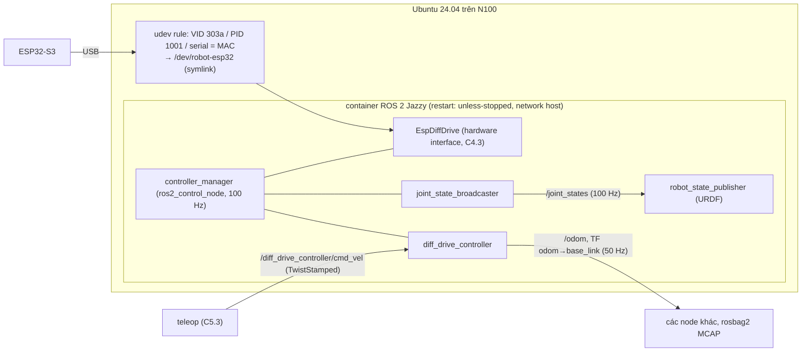

# Chặng 5 — Lắp hoàn chỉnh lần đầu (30h)

> **Vị trí:** C1 (hệ nguồn), C2 (cơ khí), C4 (firmware) → **C5** → C6 (odometry) · **Cần trước:** C1, C2, C4 trọn (Gate C4 tiêu chí 6 là điều kiện cứng); → F5.7; K3 Bài 6 (cố tình làm hỏng bằng nguồn) · **Chạy song song với:** K4
> **Làm ra được:** robot chạy bằng pin, điều khiển tay bằng tay cầm có deadman, có E-stop tạm cắt nhánh động lực · ROS 2 Jazzy trong Docker trên mini PC, `ros2_control` + `diff_drive_controller`, `/odom` và `/joint_states` chuẩn, log cấp điện và log nhiễu · **Sau chặng này bạn quyết định được:** robot đã được phép cấp pin chưa; nhiễu motor có đang làm hỏng logic không và sửa bằng gì; tốc độ teleop tối đa bao nhiêu và tầng nào giữ giới hạn đó; robot tự lên lại sau khi cắm pin hay cần người.

C1 làm bo nguồn, C2 làm khung, C4 làm firmware, mỗi thứ kiểm riêng. C5 là **lần đầu cắm tất cả vào nhau và cấp pin**. Đây là chặng có nhiều "lần đầu" nhất: lần đầu motor kéo dòng từ pin, lần đầu mini PC chạy trên robot, lần đầu robot chạy trên sàn. Nguyên tắc "một khối mới một lần" (kế hoạch K7 mục 2) ở chặng này thành một **trình tự cấp điện có bậc**: nguồn bàn trước pin, logic trước compute, compute trước động lực, bánh treo trước bánh chạm đất, 0,2 m/s trước 0,5 m/s.

Các quyết định đã chốt ở C1 được dùng nguyên (`_KE-HOACH-K7.md` mục 9): **pin 4S LiFePO4** (đầy 14,6 V), mini PC qua **buck-boost 12 V ≥ 5 A**, buck 5 V cho logic, **INA226 + shunt rời 50 A/75 mV**, cầu chì chính sát pin + cầu chì từng nhánh, **cuộn relay E-stop lấy từ pack qua cầu chì 1 A**. Màu dây: đỏ VBAT, cam 12 V, tím 5 V, đen GND, I2C theo Qwiic.

**Phân bổ 30h** `[ước lượng]`:

| Phần | Giờ |
|---|---|
| Bài C5.1 Tích hợp cơ–điện: checklist lần cấp điện đầu, nhiễu motor lên logic, ground, decoupling | 6 |
| Bài C5.2 ROS 2 trong Docker trên robot: `ros2_control` + `diff_drive_controller`, udev, USB passthrough | 8 |
| Bài C5.3 Teleop an toàn: deadman, giới hạn tốc độ, E-stop tạm | 5 |
| Bài C5.4 Vận hành không màn hình *(rút gọn)* | 2 |
| Lắp bước 1–8: lắp lên khung, kiểm nguội, cấp điện có bậc, sửa nhiễu, tinh chỉnh PI chạm đất, chạy sàn | 7 |
| Gate chặng 5 | 2 |
| **Tổng** | **30** |

## 0. Bức tranh chặng

Robot sau chặng này. Khối mới so với C4: pin thay nguồn bàn, mini PC lên khung, Docker + ROS 2, tay cầm, E-stop tạm.

```
                         ┌─────────────── KHUNG (C2) ───────────────────────────────────────────┐
  PIN 4S LiFePO4 ──XT60──┤ cầu chì chính ─ công tắc chính ─┬─ cầu chì 1 A ─[E-STOP tạm NC]─ cuộn relay ─ GND
  (≤14,6 V, đỏ/đen)      │   (bo nguồn C1)                 │                       ║ tiếp điểm NO
                         │                                 ├─ cầu chì nhánh ═══════╩═► VM DRIVER ═► MOTOR L/R
                         │                                 │                                (động lực, đỏ to)
                         │  shunt 50 A/75 mV ─ INA226 (I2C)├─ cầu chì nhánh ─ BUCK-BOOST 12 V ─cam─► MINI PC N100
                         │                                 └─ cầu chì nhánh ─ BUCK 5 V ─tím─► ESP32-S3, cảm biến
                         │                                                                      │
                         │  ĐIỂM SAO GND (bo nguồn) ◄── GND driver (to)  ◄── GND buck-boost ◄── GND buck 5 V
                         │                                                                      │
                         │  MINI PC: Docker ─ ROS 2 Jazzy ─ controller_manager ─ diff_drive ── USB ──┘
                         │           joy + teleop_twist_joy ◄── tay cầm (deadman)
                         └──────────────────────────────────────────────────────────────────────┘
```

E-stop tạm mở chuỗi cuộn relay → relay nhả → VM driver mất điện; **mini PC và ESP32 vẫn chạy** (E-stop cắt động lực, không cắt compute — kế hoạch mục 5). Dữ liệu: ESP32 → USB → hardware interface → `/joint_states` 100 Hz, `/odom` 50 Hz; INA226 → log dòng–áp; lệnh: tay cầm → `/joy` → `teleop_twist_joy` → `cmd_vel` → `diff_drive_controller` → hardware interface → CMD có lease → ESP32.

## 1. An toàn của chặng

**Rủi ro của C5:** robot chạy khỏi bàn hoặc lao vào người/chân bàn ở lần chạy đầu; ngắn mạch pin khi đi dây trong khung chật (dụng cụ, đầu cos chạm khung); cấp pin vào một bo có chỗ chập; dây kẹt vào bánh; mini PC tự khởi động và stack tự chạy lệnh cũ sau khi cắm pin; pin xả quá sâu khi để robot bật qua đêm.

**Quy tắc cứng:**
- KHÔNG cắm pin lần đầu khi chưa làm xong và ghi đủ **kiểm nguội** (Lắp bước 2) và chưa chạy toàn bộ robot bằng nguồn bàn có giới hạn dòng (Lắp bước 3).
- KHÔNG đi dây, vặn ốc trong khung khi pin đang cắm. Rút XT60 trước, không chỉ tắt công tắc.
- KHÔNG chạy robot trên bàn cao. Lần chạy đầu: robot kê trên khối gỗ, bánh không chạm gì. Lần chạy sàn đầu: khoảng trống ≥ 2 × 2 m, không người, không vật dễ vỡ, tốc độ teleop ≤ 0,2 m/s.
- KHÔNG teleop mà không có deadman. Thả tay = dừng.
- KHÔNG bỏ qua E-stop tạm "vì có deadman rồi". Hai thứ hỏng theo hai cách khác nhau (C5.3).
- KHÔNG để robot bật pin khi không có người trong phòng (quy tắc C0 với pin).
- KHÔNG dùng khung kim loại làm đường GND cho dòng motor.
- KHÔNG để firmware hay stack tự ARM sau khi khởi động. ARM luôn là một hành động có chủ đích (C4.4, C5.3).

**Khi sự cố xảy ra:**

| Sự cố | Làm ngay | KHÔNG |
|---|---|---|
| Robot chạy mất kiểm soát | Thả deadman; nếu không dừng: E-stop tạm; nếu không: công tắc chính | Chạy theo chụp robot bằng tay |
| Khói/mùi khét từ khung | Công tắc chính OFF (nếu không phải đưa tay qua khói), rút XT60, quy trình pin C0 | Mở khung khi còn khói |
| Cầu chì nhánh đứt lúc cấp điện | Rút pin; tìm chỗ chập bằng đo Ω (Lắp bước 2) | Thay cầu chì lớn hơn |
| Mini PC tắt/khởi động lại khi motor tăng tốc | Dừng chạy; ghi INA226; xem C5.1 | Chạy tiếp "cho quen" |

## 2. BOM chặng

Phần lớn đã có từ C1–C4. Giá `[ước lượng 10/2026]`.

| Món | Thông số phải chọn | Vì sao (bằng số) | Giá | Kiểm khi nhận hàng | Thay thế được bằng |
|---|---|---|---|---|---|
| Nút E-stop tạm | Nấm đỏ, tiếp điểm **NC**, tự khóa khi nhấn, xoay để nhả; định mức tiếp điểm ≥ dòng cuộn relay | Nối tiếp cuộn relay (dòng cuộn nhỏ, qua cầu chì 1 A của C1), không nối tiếp dòng motor | 80–200k | Đo thông mạch: nhả = thông, nhấn = OL | Công tắc NC bất kỳ có khóa (tạm); C10.1 chọn lại |
| Tay cầm có nút giữ | USB hoặc 2,4 GHz có dongle, Linux nhận là joystick | Cần một nút để làm deadman; `joy` đọc qua SDL `[tự đo]` | 200–600k | `ros2 run joy joy_enumerate_devices` thấy thiết bị `[tự đo]` | Bàn phím (không có deadman thật — chỉ dùng khi bánh treo) |
| Tụ gốm 100 nF 50 V | Vài chục cái | Hàn sát cực motor, dập nhiễu chổi than (C5.1) | 20–50k | — | — |
| Tụ bulk cho VM driver | 220–1000 µF, ≥ 25 V, low-ESR | Cấp dòng xung PWM tại chỗ, để dòng cạnh không đi qua dây dài (C5.1); 25 V > 14,6 V với biên | 20–60k | Đúng cực, đúng áp | Nhiều tụ nhỏ song song |
| Lõi ferrite kẹp | Cho cáp USB và dây motor | Giảm nhiễu tần cao dọc cáp `[ước lượng — hiệu quả tự đo]` | 30–80k | — | — |
| Khối kê robot | Gỗ/hộp, cao hơn bán kính bánh | Chạy thử bánh treo trên khung thật | 0 | Robot không lật khi bánh quay | Chồng sách dày |
| Băng dính sàn, thước dây 5 m | — | Vạch vùng chạy, đo quãng trôi | 50–100k | — | — |
| Bàn phím/màn hình mượn (lần đầu) | — | Vào BIOS bật Auto Power On (C5.4) | 0 | — | — |

**Tổng C5 `[ước lượng]`:** ~0,5–1,2tr (không tính tay cầm nếu đã có).

**Đồ có sẵn từ kit Arduino:** LED RGB + còi báo trạng thái, LCD1602 làm màn trạng thái headless (`phu-luc-kit-arduino.md` P4, P5, tùy chọn; P5 cần mạch chuyển mức BSS138).

## 3. Dụng cụ và kỹ năng tay

| Kỹ năng | Bài | Luyện trước | Đạt trông thế nào |
|---|---|---|---|
| Đo Ω giữa các ray khi tụ đang nạp (số chạy) | C5.1 | Đo một tụ 470 µF rời bằng UT33D+ | Biết đọc "số tăng dần" khác "đứng yên ở 0" |
| Hàn tụ 100 nF lên cực motor | C5.1 | Một motor thừa / tấm đồng | Chân ngắn, mối hàn không chạm vỏ trừ khi cố ý nối vỏ |
| Xoắn đôi dây motor, đi dây xa tín hiệu, cố định bằng dây rút | C5.1 | — | Không dây nào gần bánh; dây tín hiệu cách dây motor ≥ 3 cm |
| Strain relief cho cáp USB và XT60 trên khung | C2.3 (đã học) | — | Kéo cáp không truyền lực vào cổng |
| Đọc `dmesg -w`, `journalctl`, `docker logs` | C5.2 | — | Biết USB vừa ngắt hay ESP32 vừa reset |

## 4. Sơ đồ đi dây

Sơ đồ nguồn chi tiết thuộc C1 (bo nguồn); ở đây chỉ phần **tích hợp** mới của C5.

```
 BO NGUỒN C1                                     DRIVER                        MOTOR L
  VBAT sau cầu chì nhánh ═══đỏ (cỡ theo C1.3)═══► VM ──[tụ bulk sát chân VM]    ┌──────────┐
  điểm sao GND ◄════════đen (cùng cỡ)════════════ GND công suất        OUT_L ═══╪═ xoắn đôi ═╪═[100 nF]═ M ─ vỏ
                                                                                 └──────────┘ (100 nF mỗi cực → vỏ: tùy chọn)
  BUCK 5 V ─tím─► 5V ESP32 (chân 5V/VBUS của DevKit, xem cảnh báo dưới)
  điểm sao GND ◄─đen─ GND ESP32         (MỘT dây GND logic về điểm sao; GND driver logic nối GND ESP32 tại driver)
  BUCK-BOOST 12 V ─cam─► jack DC mini PC ;  GND ─đen─► điểm sao
  ESP32 USB native ──[ferrite]── cáp ≤ 0,5 m ── USB mini PC
  INA226 SDA/SCL ─xanh dương/vàng─► GPIO10/11 ESP32 ; 3V3 (đỏ Qwiic, nhãn "3V3")
  cuộn relay: pack ─ cầu chì 1 A ─ E-STOP NC ─ cuộn ─ GND ; dây chuỗi E-stop có nhãn đỏ hai đầu
  ESTOP_SENSE (GPIO41) ◄─ opto ◄─ điểm giữa E-STOP và cuộn
```

**Cảnh báo cấp nguồn ESP32 hai đường:** khi buck 5 V cấp vào chân 5V của DevKit **và** cáp USB từ mini PC cũng cấp VBUS, hai nguồn 5 V nối thẳng vào nhau qua bo. Có DevKit có diode giữa VBUS USB và đường 5V, có cái không `[tự đo — đọc sơ đồ nguyên lý đúng revision bo của bạn]`. Nếu không có diode: dùng cáp USB đã cắt dây VBUS, hoặc thêm diode OR (K7 gốc Bài 15 bước 0). Lý do giữ nguồn ESP32 từ buck 5 V: mini PC tắt thì ESP32 vẫn sống để dừng motor (C10.1 dựa vào điều này).

## 5. Trình tự chặng

1. **Học Bài C5.1.**
2. **Lắp bước 1 — Lắp mọi khối lên khung, chưa nối nguồn**
   - Làm: gá bo nguồn, driver, ESP32 (trên breakout C4), mini PC, pin (chưa cắm XT60) theo bố trí C2.2. Đi dây theo mục 4; ghi `wiring/wires.csv`. Tụ 100 nF trên cực motor, tụ bulk sát VM driver.
   - ✅ Checkpoint: lắc khung: không dây nào chạm bánh; mọi đầu cos/terminal có vỏ hoặc co nhiệt; XT60 pin rút ra, cực nằm trong vỏ.
   - Nếu sai: cố định lại trước khi đo.
3. **Lắp bước 2 — Kiểm nguội (pin rút, công tắc chính OFF)** — chi tiết ở C5.1 phần 6, bảng kiểm nguội.
   - ✅ Checkpoint: mọi dòng trong bảng PASS. Số an toàn (để mở): Ω giữa mỗi ray và GND **không được đứng yên gần 0 Ω**; số có thể chạy dần lên (tụ đang nạp từ dòng đo của đồng hồ) — đó là bình thường. Khung kim loại ↔ mọi ray: OL (trừ khi C1/C2 đã quyết nối khung với GND tại một điểm; khi đó chỉ GND thông khung).
   - Nếu sai: tháo từng nhánh (rút đầu nối) tới khi số trở lại bình thường; nhánh vừa rút là nhánh có lỗi.
4. **Lắp bước 3 — Cấp điện có bậc bằng nguồn bàn** (nguồn bàn thay pin qua XT60 giả, CV 13,0 V — giữa dải 4S LiFePO4 — CC giới hạn theo từng bậc; E-stop tạm **nhấn**):
   - Bậc a: chỉ buck 5 V + ESP32 (rút jack mini PC). `I_set` 0,5 A. Đo 5 V tại chân ESP32; ESP32 boot, báo `DISARMED`.
   - Bậc b: cắm mini PC. `I_set` 4 A `[ước lượng: 36 W / 13 V ≈ 2,8 A + biên; tự đo]`. Ghi dòng đỉnh lúc boot trên màn hình nguồn bàn và INA226.
   - Bậc c: nhả E-stop (relay hút), firmware vẫn DISARMED: đo dòng tĩnh của driver.
   - Bậc d: robot trên khối kê, ARM, teleop bằng lệnh `ros2 topic pub` 1 rad/s từng bánh (sau C5.2) hoặc `host_bench.py` (C4).
   - ✅ Checkpoint mỗi bậc: nguồn bàn ở CV (không vào CC); số dòng ghi vào sổ; nhiệt độ buck-boost, driver sờ được sau 5 phút. Vào CC ở bậc nào → dừng, tìm lỗi trước bậc kế.
   - Nếu sai: lùi một bậc.
5. **Học Bài C5.2.** Dựng Docker + ROS 2; `/odom` trên khối kê.
6. **Lắp bước 4 — Cấp pin lần đầu.** Lặp bậc a–d với pin thay nguồn bàn, INA226 ghi liên tục 1–10 Hz.
   - ✅ Checkpoint: áp pack lúc cắm khớp đo bằng UT33D+ trước khi cắm (± 0,1 V); dòng từng bậc khớp bước 3 trong vài chục %; không cầu chì nào đứt.
   - Nếu sai: rút XT60; so bậc lệch với bước 3.
7. **Lắp bước 5 — Bài tra tấn nhiễu** (C5.1 phần 6 bước 4): 200 lần đảo chiều tốc độ tối đa trên khối kê, đếm reset ESP32, ngắt USB, khung CRC hỏng, count trôi.
8. **Học Bài C5.3.** Teleop trên khối kê, rồi trên sàn ở 0,2 m/s, rồi 0,5 m/s.
9. **Lắp bước 6 — Tinh chỉnh PI khi chạm đất** (C4.2 bước 5, bánh chạm đất, robot đủ tải): đáp ứng bước 0 → 0,3 m/s, ghi vọt lố, xác lập, sai số xác lập.
10. **Lắp bước 7 — Đo quãng trôi khi E-stop** ở 0,2 và 0,5 m/s, 5 lần mỗi mức, từ encoder (encoder vẫn có điện khi VM bị cắt).
11. **Học Bài C5.4;** **Lắp bước 8 — Rút/cắm pin 5 lần,** robot tự lên, không chuyển động.
12. **Gate chặng 5.**

## 6. Lỗi người mới hay gặp

| Triệu chứng | Nguyên nhân khả dĩ | Kiểm bằng cách | Sửa |
|---|---|---|---|
| ESP32 reset khi motor đảo chiều | Rail 5 V/3,3 V tụt hoặc GND nhảy do dòng motor chạy qua GND chung | `esp_reset_reason` = brownout? INA226 bus 5 V min | GND hình sao, tụ bulk tại driver, buck riêng (C5.1) |
| `/dev/ttyACM0` thành `ttyACM1` sau khi cắm lại, container mất cổng | Tên do thứ tự enumerate; container giữ nút thiết bị cũ | `ls -l /dev/serial/by-id` | udev symlink + device cgroup rule (C5.2) |
| Robot quay ngược khi đẩy cần tiến | Dấu bánh/khoảng cách bánh sai, hoặc trái/phải đảo trong URDF | Lệnh tiến 0,1 m/s trên khối kê | Sửa một chỗ (URDF hoặc `config.h`), ghi `decisions.md` |
| Teleop chạy được nhưng `diff_drive_controller` bỏ lệnh | Jazzy nhận `TwistStamped`, teleop gửi `Twist` | `ros2 topic info -v` | `publish_stamped_twist: true` (C5.3) `[tự đo]` |
| Mini PC tắt khi đứng yên lâu | Pin cạn, BMS cắt; hoặc buck-boost quá nhiệt | INA226 log | Ngưỡng cảnh báo pin; tản nhiệt |
| Robot chạy thẳng bị lệch nhiều | Bình thường ở chặng này | — | C6 (UMBmark) |

## 7. Lăng kính data infra

**Dữ liệu chặng này sinh ra:**

| Luồng | Nơi | Message / schema | Tần số | Ghi chú |
|---|---|---|---|---|
| Encoder | `/joint_states` | `sensor_msgs/msg/JointState` (từ `joint_state_broadcaster`) | 100 Hz | `CONVENTIONS.md` mục 3 |
| Odometry | `/odom` + TF `odom → base_link` | `nav_msgs/msg/Odometry` | 50 Hz | Covariance để mặc định ở C5; điền từ UMBmark ở C6 |
| Lệnh | `/diff_drive_controller/cmd_vel` | `geometry_msgs/msg/TwistStamped` `[tự đo]` | 20–50 Hz | — |
| Nguồn | `logs/power/*.jsonl` (C5), về sau `/battery` | `t, v_bus, i, p` (SI) → `sensor_msgs/msg/BatteryState` | 1–10 Hz | INA226 + shunt 50 A/75 mV |
| Chẩn đoán | `/diagnostics` | `bad_crc`, `stale_seq`, `fault_mask`, `boot_count`, lý do reset | 1 Hz | `CONVENTIONS.md` mục 4: mất gói ghi ở đây, không chèn vào message cảm biến |
| Sự kiện cấp điện / nhiễu | `build-log/measurements.jsonl` | schema C0.5 | theo sự kiện | Kiểm nguội, dòng từng bậc, số reset |

Ghi bằng `ros2 bag record -s mcap` (`CONVENTIONS.md` mục 5) cho mọi lần chạy sàn từ C5; đây là những file MCAP đầu tiên của chính robot bạn, dùng lại ở C6 và C7.3.

**Test tự động sinh ra (hạt giống HIL/CI cho C11.2):** bảng kiểm nguội thành một checklist có mã từng dòng (mỗi dòng một phép đo có ngưỡng — ở C11.2 phần lớn tự động hóa được bằng INA226 và relay thử); "bài tra tấn nhiễu" (200 lần đảo chiều, đếm 4 loại sự kiện) thành test hồi quy chạy sau mỗi thay đổi dây/nguồn; test teleop-dừng (C5.3) thành kịch bản có oracle quãng dừng.

**SLI:** số reset ESP32 không do bật nguồn / giờ chạy; số lần USB ngắt / giờ; tỉ lệ khung hỏng; tần số thật của `/odom` và `/joint_states`; thời gian từ cắm pin tới stack sẵn sàng. Vai trò nghề: Test & Validation (checklist có ngưỡng, test hồi quy phần cứng); Data Platform (MCAP đầu tiên của robot, `/diagnostics` có ngữ nghĩa).

## 8. Nhật ký build

Copy vào `build-log/c05.md`:

```markdown

## 2026-MM-DD — buổi N (giờ bắt đầu–kết thúc, giờ thực: _._ h)
- Trạng thái người: tỉnh táo / mệt (mệt → không cấp pin, không chạy sàn)
- Pin: áp lúc bắt đầu ___ V (UT33D+), lúc kết thúc ___ V ; số chu kỳ sạc ___
- Firmware ___ ; image Docker (digest) ___ ; ros2_control/diff_drive (bản) ___
- Bậc cấp điện đã qua: a / b / c / d / pin
- Số đo (measurements.jsonl, số dòng __): dòng từng bậc ___ ; reset ESP32 ___ ; USB ngắt ___
- MCAP: bags/...
- Lỗi gặp (triệu chứng → nguyên nhân → sửa):
- Quyết định (→ decisions.md):
- Near miss (robot lao, dây kẹt bánh, dụng cụ chạm cực…):
- Câu hỏi còn mở:
```

---

## Bài C5.1 — Tích hợp cơ–điện: checklist lần cấp điện đầu, nhiễu motor lên logic, ground, decoupling (6h)

> **Vị trí:** C1.5 (lắp bo nguồn), C2.3 (gá lắp), C4 → **C5.1** → C5.2 · **Cần trước:** → F5.7 (brownout, decoupling, ground), K3 Bài 6 (cố tình làm hỏng bằng nguồn) · **Sau bài này bạn quyết định được:** robot đã được phép cắm pin chưa; một lần ESP32 reset hay USB ngắt khi motor chạy là lỗi nguồn/ground hay lỗi phần mềm, và sửa theo thứ tự nào.

### 1. Câu chuyện — ai đã khổ vì chuyện này

Ngày 14/11/1969, Apollo 12 bị sét đánh hai lần trong phút đầu sau khi phóng. Pin nhiên liệu ngắt khỏi bus, đèn báo động sáng khắp bảng, telemetry gửi về mặt đất thành số rác. Kỹ sư điều khiển John Aaron nhận ra mẫu số rác đó: ông từng thấy nó trong một buổi thử, khi bộ điều hòa tín hiệu (SCE) mất nguồn chuẩn. Ông đề nghị "SCE to AUX" — chuyển bộ đó sang nguồn phụ; Alan Bean gạt công tắc, dữ liệu trở lại, phi hành đoàn đưa pin nhiên liệu về bus và nhiệm vụ tiếp tục `[chuẩn — tài liệu lịch sử NASA về Apollo 12]`.

"Dữ liệu rác" ở đây không phải lỗi phần mềm hay cảm biến; nó là **nguồn và mốc điện áp** của khối đo bị xô lệch. Khi motor của bạn đảo chiều và ESP32 báo encoder nhảy, khung CRC hỏng, hay USB ngắt, câu hỏi đầu tiên cũng là của Aaron: mẫu này đã gặp ở đâu, và **mốc 0 V của khối này còn là 0 V không?**

### 2. Mô hình tư duy

Ba cơ chế để dòng motor làm hỏng logic, và mỗi cơ chế có cách sửa riêng:

| Cơ chế | Vật lý | Triệu chứng | Sửa đúng | Sửa sai hay gặp |
|---|---|---|---|---|
| (1) Dây GND chung | Dòng motor đi qua một đoạn dây mà logic cũng dùng làm mốc: ΔV = I·R + L·dI/dt | Encoder đếm sai, I2C lỗi, ESP32 reset khi tăng tốc/đảo chiều | GND hình sao: đường về motor **không** đi qua GND logic | "Thêm một dây GND nữa" chỗ bất kỳ (tạo vòng) |
| (2) Rail sụt | Pack có điện trở trong; motor kéo dòng hãm khi khởi động/đảo chiều → VBAT tụt; buck/buck-boost thiếu đầu vào | Mini PC tắt, ESP32 brownout | Buck riêng cho logic (đã có ở C1), tụ bulk tại driver, giới hạn gia tốc (C4.4) | Tụ thật to ở xa |
| (3) Nhiễu tần cao | Chổi than motor + cạnh PWM bức xạ và cảm ứng vào dây tín hiệu song song | Count trôi khi bánh đứng, USB ngắt ngẫu nhiên | Tụ 100 nF tại cực motor, dây motor xoắn đôi, tách xa dây tín hiệu, ferrite, lọc glitch PCNT | Lọc phần mềm (che triệu chứng, giữ nguyên nguyên nhân) |

Câu bản chất: **"GND" là một dây có điện trở và cảm kháng, không phải một điểm lý tưởng.** Hai chân cùng ghi GND chỉ có cùng điện thế khi không có dòng lớn chạy giữa chúng. Tụ bulk sát driver làm dòng xung của PWM khép vòng **tại chỗ** (tụ ↔ driver ↔ motor), không đi qua dây dài về pin — đó là lý do vị trí của tụ quan trọng hơn dung lượng.

```python
# [đã chạy] Dòng motor chạy qua dây GND chung: "0 V" của ESP32 không còn là 0 V của driver/encoder
import numpy as np
RHO = 1.72e-8                                   # Ω·m, đồng 20 °C [chuẩn]
MM2 = {22: 0.326, 18: 0.823, 14: 2.08}          # tiết diện AWG [chuẩn]
L_PER_M = 0.7e-6                                # H/m, dây đơn xa dây về [ước lượng, cỡ 0,5–1 µH/m]

def r_wire(awg, length): return RHO * length / (MM2[awg] * 1e-6)

def ground_shift(i_dc, di, t_edge, awg, length, r_contact=0.01):
    """Chênh áp giữa hai đầu đoạn GND chung: phần DC (I·R) và gai cảm kháng (L·dI/dt)."""
    r = r_wire(awg, length) + r_contact
    return i_dc * r, L_PER_M * length * di / t_edge

VDD, VIL, VIH = 3.3, 0.25 * 3.3, 0.75 * 3.3     # ngưỡng logic ESP32-S3 [spec — kiểm datasheet]
print(f"Ngưỡng: VIL ≤ {VIL:.2f} V, VIH ≥ {VIH:.2f} V -> biên nhiễu mức thấp ≈ {VIL:.2f} V")
cases = [  # (mô tả, I DC, bước dòng, thời gian cạnh, AWG, chiều dài GND chung)
    ("2 motor chạy đều, GND chung 22 AWG 0,3 m", 1.0, 1.0, 1e-6, 22, 0.3),
    ("2 motor hãm (stall), cùng dây",            8.0, 8.0, 1e-6, 22, 0.3),
    ("stall, GND chung 14 AWG 0,3 m",            8.0, 8.0, 1e-6, 14, 0.3),
    ("stall, GND hình sao (đoạn chung 2 cm 14 AWG)", 8.0, 8.0, 1e-6, 14, 0.02),
]
for name, i, di, te, awg, ln in cases:
    vdc, vspike = ground_shift(i, di, te, awg, ln)
    flag = "VƯỢT biên" if vdc + vspike > VIL else "trong biên"
    print(f"{name:46s} DC {vdc*1e3:6.1f} mV  gai {vspike:5.2f} V  -> {flag}")
# Tụ decoupling cấp được bao lâu khi rail bị kéo: t ≈ C·ΔV / I
for c_uF in (0.1, 10, 470):
    print(f"tụ {c_uF:6.1f} µF, ESP32 kéo 0,35 A, cho phép tụt 0,2 V: {c_uF*1e-6*0.2/0.35*1e6:8.1f} µs")
```

Bước dòng 8 A trong 1 µs ở mô phỏng là trường hợp xấu nhất: phía nguồn của H-bridge thật sự bị "chặt" ở mỗi cạnh PWM, nhưng nếu tụ bulk nằm sát VM thì phần lớn bước dòng đó khép vòng qua tụ, không qua đoạn GND chung. Hệ số cảm kháng 0,7 µH/m là `[ước lượng]`; con số thật phụ thuộc hình học dây.

### 3. Cầu nối từ backend

| Backend bạn biết | Ở đây | Gãy ở chỗ | Nếu dùng nhầm thì |
|---|---|---|---|
| Noisy neighbor trên cùng host | Motor và logic chung nguồn/GND | Backend: tranh CPU/IO làm chậm. Ở đây: tranh **mốc điện áp** làm **sai giá trị** (bit đọc nhầm), không chỉ chậm | Đi tìm bug firmware vài ngày cho một lỗi dây |
| Staged rollout / canary | Cấp điện có bậc (nguồn bàn → pin; logic → compute → động lực) | Rollout xấu thì rollback; cấp điện xấu có thể làm cháy, không rollback được. Bậc đầu phải **giới hạn năng lượng** (I_set), không chỉ giới hạn phạm vi | Cắm pin cho cả robot lần đầu "vì từng khối đã test" |
| Health check trước khi nhận traffic | Kiểm nguội (Ω giữa các ray) | Health check backend chạy **khi đã bật**; kiểm nguội chạy **khi chưa có điện** vì phát hiện chập sau khi bật là quá muộn | Bật trước rồi xem có khói không ("smoke test" theo nghĩa đen) |

**Chấm mô hình:**
- *"Mọi thiết bị điện khi chung nguồn, nhất là có xung vật lý, luôn có trường hợp sụt nguồn… thường trực trong hệ thống chung pin rack, cả điện dân dụng"* (mô hình của bạn ở K3 lượt 11). **ĐÚNG MỘT PHẦN.** Đúng cho cơ chế (2) và đúng là phổ biến. Thiếu cơ chế (1): rail **không** sụt mà mốc GND dịch — đo VBAT vẫn đẹp mà encoder vẫn đếm sai. **Phản ví dụ:** mô phỏng trên — dòng hãm qua 0,3 m dây 22 AWG làm GND logic lệch hàng trăm mV, gai vượt biên nhiễu mức thấp, trong khi điện áp pack không đổi đáng kể.
- *"Thêm tụ là hết nhiễu."* **SAI** như phát biểu chung (→ F5.7). Tụ cứu sự kiện ngắn hơn ~C·ΔV/I; dòng hãm kéo dài hàng trăm ms thì không tụ nào giữ được, và tụ không sửa được GND chung. Phản ví dụ: dòng cuối mô phỏng — 470 µF chỉ giữ được ESP32 cỡ vài trăm µs.

### 4. Thuật ngữ

| Mức | Thuật ngữ | Nghĩa trong một câu | Hay bị hiểu nhầm thành |
|---|---|---|---|
| 🟢 | GND hình sao (star ground) | Mọi đường về gặp nhau ở một điểm; dòng lớn không đi qua mốc của mạch nhỏ | "Nối GND đâu cũng được" |
| 🟢 | Ground bounce / ground shift | Mốc 0 V của một khối dịch đi do dòng chạy qua dây GND chung | Nhiễu ngẫu nhiên |
| 🟢 | Decoupling / tụ bulk | Tụ nhỏ sát chân cho xung ns–µs; tụ lớn sát tải cho xung µs–ms | Tụ to là đủ cho mọi thứ |
| 🟢 | Kiểm nguội (cold check) | Đo Ω, thông mạch, cực tính khi chưa cấp điện | Bước tùy chọn |
| 🟡 | Biên nhiễu (noise margin) | Khoảng giữa mức ra thật và ngưỡng VIL/VIH của bên nhận | — |
| 🟡 | Cảm kháng dây | Điện áp L·dI/dt sinh ra khi dòng đổi nhanh | Chỉ quan trọng ở RF |

### 5. Dự đoán

**Tham số cần tra:** VIL/VIH của ESP32-S3 (datasheet, mục DC characteristics); dòng hãm motor đo ở C3; cỡ và chiều dài dây GND thật trên robot (`wiring/wires.csv`); điện trở trong pack (C1.1/C1.5).

```markdown
# C5.1 — dự đoán
1. Chạy s6_ground.py (đoán trước): trường hợp nào vượt biên nhiễu? phần DC hay phần gai quyết định?
2. Ω giữa VBAT (sau công tắc chính, công tắc OFF→ON khi pin rút) và GND khi mọi khối đã cắm: số đọc làm gì trong 10 s đầu? ___
3. Dòng bậc a (logic) ___ A ; bậc b (mini PC boot, đỉnh) ___ A ; bậc c (driver tĩnh) ___ A
4. 200 lần đảo chiều trên khối kê, trước khi sửa gì: reset ESP32 ___ ; USB ngắt ___ ; count trôi khi đứng ___
```

### 6. Làm

1. **Bảng kiểm nguội** (pin rút, công tắc chính ở vị trí mà ray cần đo được nối; UT33D+ thang Ω; mỗi dòng một bản ghi `measurements.jsonl`, `step = "cold-NN"`):

| Mã | Đo giữa | Phải ra | Nếu sai |
|---|---|---|---|
| cold-01 | Cực + và − của XT60 phía robot | Không gần 0 Ω; có thể chạy dần lên do tụ đầu vào | Có chập trên VBAT: rút từng nhánh |
| cold-02 | VBAT sau cầu chì chính ↔ GND | Như cold-01; ghi giá trị sau 10 s | — |
| cold-03 | 12 V (ra buck-boost) ↔ GND | Không gần 0 Ω | Chập ở mini PC jack/dây cam |
| cold-04 | 5 V ↔ GND, 3V3 ↔ GND (tại ESP32) | Không gần 0 Ω | — |
| cold-05 | VBAT ↔ 12 V; VBAT ↔ 5 V | Không thông | DC-DC hỏng hoặc đấu nhầm |
| cold-06 | Khung kim loại ↔ VBAT, 12 V, 5 V | OL | Dây trầy chạm khung |
| cold-07 | Cực tính XT60 pin vs XT60 robot (đỏ ↔ đỏ) | Đúng | Không cắm; sửa đầu nối |
| cold-08 | Có mặt cầu chì đúng định mức ở mọi nhánh (nhìn + thông mạch) | Đủ, đúng số theo C1 | — |
| cold-09 | Hai cực VM driver ↔ chân bất kỳ của ESP32 | OL | Dây động lực chạm logic |
| cold-10 | E-stop nhấn: thông mạch cuộn relay | Hở | Đấu NC sai |

   **Sai số:** Ω đo trên mạch có tụ và bán dẫn không phải "điện trở" thật; đồng hồ cấp dòng nhỏ, tụ nạp dần nên số chạy. Phép đo này chỉ dùng để phát hiện **chập** (≈ 0 Ω đứng yên), không để định lượng. So với số cùng điểm đo bạn đã ghi khi lắp bo nguồn ở C1 (nếu có): lệch nhiều là dấu hiệu, không phải bằng chứng.
2. **Cấp điện có bậc** theo mục 5 chặng (Lắp bước 3, 4).
3. **Đo dòng thật bằng INA226** (shunt 50 A/75 mV: 1,5 mV/A; INA226 phân giải điện áp shunt 2,5 µV/LSB `[spec — datasheet TI INA226]` → ~1,7 mA/LSB): log 10 Hz suốt bậc a–d, đánh dấu sự kiện.
4. **Bài tra tấn nhiễu** (robot trên khối kê, pin): 200 lần đảo chiều −0,5 ↔ +0,5 m/s (firmware vẫn kẹp gia tốc; tạm nới giới hạn phanh **chỉ khi bánh treo** nếu muốn ép mạnh hơn, ghi rõ). Đếm: (a) reset ESP32 theo lý do (`boot_count`, `esp_reset_reason`), (b) USB ngắt (`dmesg -w | grep -i usb`), (c) `bad_crc` tăng, (d) count trôi khi bánh bị giữ đứng bằng kẹp nhưng motor kia chạy. Thêm logic analyzer trên một dây encoder khi motor kia đảo chiều.
5. **Sửa theo thứ tự, mỗi lần một thứ, đo lại sau mỗi thứ:** (i) GND hình sao đúng (GND logic một dây về điểm sao); (ii) tụ bulk sát VM; (iii) 100 nF tại cực motor; (iv) xoắn dây motor, tách khỏi dây tín hiệu; (v) ferrite USB; (vi) lọc glitch PCNT (chỉ sau khi phần cứng đã sạch). Bảng trước/sau là kết quả của bài.

### 7. Số phải ra

<details><summary>🔒 MỞ SAU KHI COMMIT prediction.md</summary>

| Câu | Số / kết luận | Ghi chú |
|---|---|---|
| 1 | Hai trường hợp "dòng hãm qua dây chung 0,3 m" vượt biên, do **gai L·dI/dt** (~1,7 V) chứ không do DC (~0,1–0,2 V); GND hình sao (đoạn chung 2 cm) trong biên | Tăng cỡ dây (14 AWG) giảm DC nhưng không giảm gai: cảm kháng gần như không phụ thuộc tiết diện. Sửa đúng là **hình học** (sao, tụ tại chỗ) |
| 2 | Số chạy dần lên (tụ đầu vào nạp), dừng ở vài trăm Ω tới hàng chục kΩ hoặc OL tùy DC-DC `[tự đo]` | Đứng yên gần 0 Ω = chập |
| 3 | Logic cỡ 0,1–0,3 A; mini PC boot đỉnh có thể tới ~2–3 A ở 13 V `[ước lượng từ 6–25 W và adapter 36 W]`; driver tĩnh nhỏ | Số thật là số INA226 của bạn; đây là hàng đầu tiên của power budget đo trên robot (C1.2) |
| 4 | Trước sửa: thường thấy ít nhất một loại sự kiện `[tự đo]`; sau sửa: mục tiêu 0 cho cả bốn (Gate C5 tiêu chí 3) | Kết quả "0 ngay từ đầu" cũng là kết quả; vẫn giữ test làm hồi quy |

</details>

### 8. Nếu ra khác

| Triệu chứng | Nguyên nhân khả dĩ | Kiểm bằng cách | Sửa |
|---|---|---|---|
| ESP32 reset `BROWNOUT` khi đảo chiều | Rail 5 V/3,3 V tụt | INA226 trên 5 V, hoặc ADC đọc 3V3 qua cầu phân áp, min-hold | Kiểm buck 5 V lấy từ đâu; tụ tại ESP32; kẹp gia tốc |
| Reset `TASK_WDT`/`PANIC` chỉ khi motor chạy | Nhiễu làm hỏng bộ nhớ/flash đọc? hiếm; thường là GND | Đổi motor sang nguồn bàn riêng, GND chung một điểm | GND hình sao |
| USB ngắt, ESP32 vẫn chạy | Nhiễu dọc cáp USB, GND vòng qua cáp | Cáp ngắn + ferrite; cáp USB cắt VBUS | Một đường GND giữa ESP32 và mini PC đi **qua** cáp USB → tránh vòng GND thứ hai song song |
| Mini PC tắt lúc motor khởi động | VBAT tụt dưới ngưỡng buck-boost | INA226 V_bus min | Kẹp gia tốc, kiểm cầu chì/dây nhánh, pin |
| Kiểm nguội cold-01 gần 0 Ω đứng yên | Chập thật | Rút từng nhánh | Không cấp điện |

### 9. Câu hỏi ngược

1. **[Failure mode]** Robot đã qua bài tra tấn với 0 sự kiện. Một tuần sau, sau khi gá thêm camera, ESP32 bắt đầu reset. Bạn bisect thế nào?
<details><summary>Hướng nghĩ</summary>

Chạy lại đúng bài tra tấn (đó là lý do nó là test hồi quy); so `wires.csv` trước/sau; camera USB kéo dòng 5 V hay thêm đường GND mới qua USB? Bisect theo tầng (→ F7.7): tháo camera, chạy lại.

</details>

2. **[Quy mô]** 100 robot lắp bởi ba người khác nhau. Bảng kiểm nguội đủ để đảm bảo cùng chất lượng không?
<details><summary>Hướng nghĩ</summary>

Checklist có mã từng dòng, ngưỡng, ảnh bắt buộc, và **ai đo** (người lắp khác người kiểm). Phần lớn tự động hóa bằng đồ gá thử (bed-of-nails) ở dây chuyền thật. Tỉ lệ fail theo người lắp là một metric.

</details>

3. **[Vì sao không]** Vì sao không cấp điện cho ESP32 từ USB mini PC luôn cho gọn, bỏ buck 5 V?
<details><summary>Hướng nghĩ</summary>

Mini PC tắt/khởi động lại thì ESP32 tắt theo: mất tầng dừng motor đúng lúc cần. Và GND của ESP32 khi đó đi qua mini PC, thêm một đường GND song song với điểm sao.

</details>

4. **[Liên ngành]** Thiết bị đo y sinh (ECG) đo tín hiệu cỡ mV trên một cơ thể nối với lưới 220 V. Họ giải bài "mốc 0 V" thế nào?
<details><summary>Hướng nghĩ</summary>

Khuếch đại vi sai (chỉ đo hiệu hai điểm, bỏ phần chung), cách ly nguồn, điện cực "right-leg drive" kéo điện thế chung. Giống: đừng tin mốc chung khi có dòng lớn. Khác: robot của bạn dùng tín hiệu số đơn cực; với dây dài người ta chuyển sang vi sai (RS-485, encoder vi sai).

</details>

### 10. Liên kết ra ngoài

- **Hàng không — checklist trước chuyến bay.** Checklist hàng không có thứ tự cố định, đọc–làm–xác nhận, và không bỏ dòng vì "lần trước ổn". Giống: bảng kiểm nguội có mã và thứ tự. Khác: checklist bay được tinh chỉnh qua hàng chục năm sự cố; của bạn mới có phiên bản 1, nên mỗi near miss phải thành một dòng mới.

### 11. Độ tin cậy và sửa lỗi

| Khẳng định | Nhãn | Ghi chú |
|---|---|---|
| Apollo 12: sét, SCE to AUX, John Aaron | `[chuẩn]` | Tài liệu lịch sử NASA |
| VIL/VIH ESP32-S3 = 0,25/0,75 VDD | `[spec — kiểm datasheet ESP32-S3, DC characteristics]` | Dùng trong mô phỏng |
| Cảm kháng dây ~0,5–1 µH/m | `[ước lượng]` | Phụ thuộc hình học |
| INA226 2,5 µV/LSB shunt | `[spec]` | Datasheet TI INA226 |
| Có/không diode VBUS trên DevKit | `[tự đo]` | Sơ đồ nguyên lý theo revision |

**Đã sửa so với bản gốc/Gemini:** K7 gốc không có bước lắp hoàn chỉnh, kiểm nguội hay cấp điện có bậc (bài mới); K7 gốc Bài 15 bước 0 (nguồn ESP32 riêng) chuyển lên đây vì C5 là lần đầu ESP32 có hai đường nguồn.

### 12. Đọc thêm và tự kiểm tra

- **Nguồn gốc:** datasheet ESP32-S3 (DC characteristics), datasheet TI INA226.
- **Giải thích:** Henry W. Ott, *Electromagnetic Compatibility Engineering* (Wiley, 2009) — chương grounding (đọc chọn lọc); → F5.7.
- **Tự kiểm tra:** (1) giải thích ba cơ chế cho một backend engineer trong 5 câu; (2) vẽ lại sơ đồ điểm sao của robot bạn từ trí nhớ; (3) vì sao 14 AWG không sửa được gai trong mô phỏng?
  <details><summary>Đáp án</summary>

  Gai = L·dI/dt; cảm kháng của dây phụ thuộc chủ yếu chiều dài và khoảng cách tới dây về, gần như không phụ thuộc tiết diện. Giảm bằng đoạn chung ngắn (hình sao) và tụ sát tải.

  </details>

---

## Bài C5.2 — ROS 2 trong Docker trên robot: `ros2_control` + `diff_drive_controller`, udev, USB passthrough (8h)

> **Vị trí:** C4.3 (giao thức, hardware interface) → **C5.2** → C5.3; `/odom` dùng ở C6, C8 · **Cần trước:** `CONVENTIONS.md` mục 2, 3, 6; K3 (ROS 2 cơ bản, Docker trên N100); C2.4 (bán kính bánh, khoảng cách bánh đo được) · **Sau bài này bạn quyết định được:** container nhìn thấy ESP32 bằng cách nào và còn thấy sau khi cắm lại không; giới hạn tốc độ đặt ở `diff_drive_controller` bao nhiêu và vì sao nó không thay được kẹp ở firmware.

### 1. Câu chuyện — ai đã khổ vì chuyện này

Nhiều năm, máy Linux có hai card mạng có thể khởi động với `eth0` và `eth1` **đổi chỗ** cho nhau: tên được cấp theo thứ tự driver nào dò xong trước, và thứ tự đó không ổn định giữa các lần boot. Tường lửa, cấu hình IP gắn theo tên áp nhầm card. systemd/udev (bản 197, 2013) đưa ra "predictable network interface names" (`enp3s0`…) gắn tên theo **vị trí phần cứng** thay vì thứ tự dò `[chuẩn — tài liệu freedesktop.org "Predictable Network Interface Names"]`. `/dev/ttyACM0` của ESP32 là đúng bài toán đó: tên theo thứ tự cắm. Camera USB ở C7 cũng sẽ là `ttyACM`/`video` khác; ngày robot khởi động với cổng đổi chỗ, hardware interface gửi lệnh motor vào nhầm thiết bị.

### 2. Mô hình tư duy



Ba câu bản chất:
1. **`diff_drive_controller` làm động học và odometry; hardware interface chỉ chuyển rad/s.** Lệnh (v, ω) → vận tốc hai bánh bằng `wheel_separation` và `wheel_radius` (C2.4); encoder → odometry. Hai tham số đó sai thì mọi thứ sau (C6, Nav2) sai theo — C6 hiệu chuẩn chúng.
2. **Container không "cắm" thiết bị; nó được cấp một nút thiết bị lúc tạo.** `--device /dev/robot-esp32` cấp nút mà symlink trỏ tới **lúc đó**; rút ra cắm lại, nút cũ trong container chết `[tự đo]`. Cách bền: mount `/dev` và cho phép theo số major (`device_cgroup_rules: ['c 166:* rmw']`, 166 là major của `ttyACM` `[chuẩn — danh sách số thiết bị của Linux; kiểm `ls -l /dev/ttyACM0`]`).
3. **Giới hạn ở `diff_drive_controller` là giới hạn trên (v, ω), không trên từng bánh.** v = 0,5 m/s và ω = 1 rad/s đều "hợp lệ" mà bánh ngoài chạy nhanh hơn 0,5 m/s. Firmware kẹp từng bánh; cách nó kẹp (độc lập hay co tỉ lệ) quyết định robot còn đi đúng đường cong không:

```python
# [đã chạy] Kẹp 0,5 m/s ở đâu và kẹp thế nào: (v, ω) hợp lệ ở Nav2/diff_drive vẫn có thể vượt ở TỪNG bánh
V_MAX, B = 0.5, 0.30          # giới hạn mỗi bánh (m/s), khoảng cách hai bánh (m) [ước lượng, đo ở C2.4]

def wheels(v, w):             # động học vi sai: v_trái, v_phải
    return v - w * B / 2, v + w * B / 2

def body(vl, vr):             # ngược lại: (v, ω) và bán kính quay
    v, w = (vl + vr) / 2, (vr - vl) / B
    return v, w, (v / w if abs(w) > 1e-9 else float("inf"))

def clamp_each(vl, vr):       # kẹp độc lập từng bánh
    c = lambda x: max(-V_MAX, min(V_MAX, x)); return c(vl), c(vr)

def clamp_scale(vl, vr):      # co cả hai cùng tỉ lệ
    k = max(abs(vl), abs(vr), V_MAX) / V_MAX; return vl / k, vr / k

print(f"{'lệnh (v, ω)':>16} | {'bánh T/P':>13} | {'kẹp từng bánh: R':>18} | {'co tỉ lệ: R':>12} | R mong muốn")
for v, w in [(0.5, 0.0), (0.4, 1.0), (0.5, 1.0), (0.0, 4.0), (0.3, -3.0), (2.0, 0.5)]:
    vl, vr = wheels(v, w)
    _, _, r0 = body(vl, vr)
    _, w1, r1 = body(*clamp_each(vl, vr))
    v2, w2, r2 = body(*clamp_scale(vl, vr))
    print(f"({v:4.1f}, {w:4.1f}) rad/s | {vl:5.2f} {vr:5.2f}  | {r1:8.3f} m (ω={w1:4.2f}) | {r2:8.3f} m | {r0:7.3f} m")
```

**Cấu hình (mẫu, kiểm theo bản cài):**

```bash
# [chưa chạy] /etc/udev/rules.d/99-robot.rules — serial lấy từ: udevadm info -a -n /dev/ttyACM0 | grep serial
SUBSYSTEM=="tty", ATTRS{idVendor}=="303a", ATTRS{idProduct}=="1001", ATTRS{serial}=="XX:XX:XX:XX:XX:XX", \
  SYMLINK+="robot-esp32", GROUP="dialout", MODE="0660"
# tắt autosuspend cho đúng thiết bị đó (USB ngủ = khung đến muộn) [tự đo]
ACTION=="add", SUBSYSTEM=="usb", ATTR{idVendor}=="303a", ATTR{idProduct}=="1001", TEST=="power/control", ATTR{power/control}="on"
# nạp lại: sudo udevadm control --reload && sudo udevadm trigger
```

```yaml
# [chưa chạy] compose.yaml — image ghim digest, không ":latest"
services:
  robot:
    image: ghcr.io/<bạn>/robot-jazzy@sha256:<digest>
    network_mode: host          # DDS discovery đơn giản nhất trên một máy
    ipc: host
    restart: unless-stopped     # C5.4
    volumes: ["/dev:/dev", "./config:/config:ro", "./bags:/bags"]
    device_cgroup_rules: ["c 166:* rmw"]          # ttyACM*; thêm 188 nếu dùng cầu USB-UART (ttyUSB*)
    environment: [ROS_DOMAIN_ID=17]
    command: ros2 launch robot_bringup bringup.launch.py port:=/dev/robot-esp32
```

```yaml
# [chưa chạy] config/controllers.yaml — tên tham số theo diff_drive_controller nhánh Jazzy; kiểm `ros2 param list`
controller_manager:
  ros__parameters:
    update_rate: 100
diff_drive_controller:
  ros__parameters:
    left_wheel_names: ["left_wheel_joint"]
    right_wheel_names: ["right_wheel_joint"]
    wheel_separation: 0.30        # C2.4 (đo), C6 hiệu chuẩn
    wheel_radius: 0.0425          # bánh 85 mm (C2.1), C6 hiệu chuẩn
    publish_rate: 50.0
    odom_frame_id: odom
    base_frame_id: base_link
    enable_odom_tf: true
    cmd_vel_timeout: 0.5          # s; mặc định của controller
    linear.x.max_velocity: 0.5
    linear.x.max_acceleration: 0.5      # C2.1
    linear.x.max_deceleration: -1.0     # giới hạn phanh chống lật, decisions.md (C2.2); dấu theo quy ước của bản cài [tự đo]
    angular.z.max_velocity: 2.0         # rad/s [ước lượng]
```

URDF cần khối `<ros2_control name="EspBase" type="system">` với `<plugin>` là hardware interface của bạn, tham số `port`, và hai `<joint>` có `command_interface velocity`, `state_interface position` + `velocity` (theo ví dụ diffbot của `ros2_control_demos`) `[tự đo]`.

### 3. Cầu nối từ backend

| Backend bạn biết | Ở đây | Gãy ở chỗ | Nếu dùng nhầm thì |
|---|---|---|---|
| Container stateless, `docker run` ở đâu cũng được | Container gắn với **phần cứng** của đúng robot này | Image tái lập được; quyền truy cập thiết bị và tên thiết bị là cấu hình của host, không nằm trong image | Image chạy trên laptop, trên robot không thấy cổng |
| Service discovery bằng tên DNS | udev symlink theo serial | DNS cập nhật động; nút thiết bị trong container **không** tự cập nhật khi cắm lại | Rút USB một lần, controller_manager lỗi mãi tới khi restart container |
| Rate limit ở API gateway | `max_velocity` ở `diff_drive_controller` | Gateway là điểm cuối; đây **không phải** điểm cuối — còn hardware interface, USB, firmware phía sau | Tin giới hạn Nav2/controller, bỏ kẹp firmware |

**Chấm mô hình:**
- *"Đặt `linear.x.max_velocity: 0.5` là robot không bao giờ quá 0,5 m/s."* **ĐÚNG MỘT PHẦN.** Đúng cho tâm robot khi đi thẳng. Gãy: (1) bánh ngoài khi quay vượt 0,5; (2) controller không thấy lỗi phía sau (encoder sai dấu, windup). **Phản ví dụ:** dòng (0,5; 1,0) trong mô phỏng — bánh phải 0,65 m/s.
- *"Docker là sandbox, chạy robot trong Docker thì an toàn hơn."* **SAI** theo nghĩa vật lý: container có toàn quyền gửi lệnh motor qua `/dev`. Docker cho tái lập môi trường (`CONVENTIONS.md` mục 6), không cho an toàn chức năng.

### 4. Thuật ngữ

| Mức | Thuật ngữ | Nghĩa trong một câu | Hay bị hiểu nhầm thành |
|---|---|---|---|
| 🟢 | `controller_manager` | Tiến trình chạy vòng read → update controller → write ở `update_rate` | Một node ROS bình thường |
| 🟢 | State / command interface | Biến mà hardware xuất ra (vị trí, vận tốc) và nhận vào (vận tốc đặt) | Topic |
| 🟢 | udev rule, symlink | Quy tắc đặt tên/quyền cho thiết bị khi nó xuất hiện | Driver |
| 🟢 | Device cgroup rule | Cho container quyền mở thiết bị theo số major/minor | `--privileged` (rộng hơn nhiều) |
| 🟡 | `TwistStamped` vs `Twist` | Lệnh vận tốc có/không header thời gian; Jazzy `diff_drive_controller` nhận bản có header `[tự đo]` | Như nhau |
| 🟡 | Restart policy | Docker tự chạy lại container theo điều kiện | Supervisor cho mọi lỗi |

### 5. Dự đoán

```markdown
# C5.2 — dự đoán
1. s7_clamp.py: lệnh (2,0; 0,5) với kẹp từng bánh độc lập → robot đi ___ ; với co tỉ lệ → ___
2. Rút/cắm USB ESP32 khi container đang chạy, cấu hình --device: ___ ; cấu hình /dev + cgroup rule: ___
3. `ros2 topic hz /odom` = ___ ; `/joint_states` = ___
4. Quay tay bánh trái đúng 1 vòng (robot trên khối kê, DISARMED): position trong /joint_states đổi ___ rad
5. Đẩy robot thẳng 1,00 m trên sàn (đo thước): /odom x = ___ (lệch do đâu?)
```

### 6. Làm

1. **Image:** Dockerfile từ `ros:jazzy` + `ros2_control`, `ros2_controllers`, `joy`, `teleop_twist_joy`, package hardware interface của bạn; build trên laptop, ghim digest (`CONVENTIONS.md` mục 6: đa kiến trúc). Ghi phiên bản `ros2_control` thật: `ros2 pkg xml ros2_control | grep version` `[tự đo]`.
2. **udev:** lấy serial bằng `udevadm info`, viết rule, kiểm `ls -l /dev/robot-esp32` sau 5 lần rút cắm (cả khi đổi cổng USB vật lý).
3. **Compose** theo mẫu; `docker compose up -d`; `docker logs -f`.
4. **URDF + controllers:** `wheel_separation`, `wheel_radius` từ C2.4; spawn `joint_state_broadcaster`, `diff_drive_controller` (`ros2 run controller_manager spawner …`); `ros2 control list_controllers` thấy `active` `[tự đo]`.
5. **Kiểm trên khối kê:** `ros2 topic hz /odom`, `/joint_states`; `ros2 run tf2_ros tf2_echo odom base_link`; quay tay 1 vòng bánh (câu 4); gửi `TwistStamped` 0,1 m/s bằng `ros2 topic pub` trong 2 s: hai bánh cùng chiều tiến.
6. **Rút cắm USB khi đang chạy** (bánh treo): hardware interface báo lỗi, firmware hết lease dừng bánh; cắm lại → symlink trở lại; ghi hệ thống tự phục hồi tới đâu (controller_manager có kích hoạt lại hardware không `[tự đo]`, hay cần restart container — khi đó restart policy + healthcheck là đường lui).
7. **Ghi MCAP** một lần chạy: `ros2 bag record -s mcap /odom /joint_states /tf /diagnostics`; `mcap doctor` sạch (`CONVENTIONS.md` mục 5).

### 7. Số phải ra

<details><summary>🔒 MỞ SAU KHI COMMIT prediction.md</summary>

| Câu | Kết quả | Ghi chú |
|---|---|---|
| 1 | Kẹp từng bánh: hai bánh về 0,5/0,5 → **đi thẳng** (R = ∞) thay vì cong R = 4 m. Co tỉ lệ: giữ R = 4 m ở tốc độ thấp hơn | Các dòng khác: (0,5; 1,0) kẹp từng bánh cho R = 0,85 m thay vì 0,5 m. Đường cong sai = Nav2 bám đường sai |
| 2 | `--device`: mất cổng tới khi tạo lại container `[tự đo]`; `/dev` + cgroup: thấy lại qua symlink | Hardware interface vẫn phải tự mở lại cổng |
| 3 | ≈ 50 Hz và ≈ 100 Hz (theo `publish_rate`, `update_rate`) | Lệch nhiều → CPU, executor, hoặc hardware `read()` bị chặn |
| 4 | 2π ≈ 6,28 rad (± vài count/2464) | Dấu âm → sửa một chỗ (URDF hoặc firmware) |
| 5 | Gần 1 m, lệch vài phần trăm là bình thường | Đường kính hiệu dụng ≠ danh định, trượt; C6 hiệu chuẩn |

</details>

### 8. Nếu ra khác

| Triệu chứng | Nguyên nhân khả dĩ | Kiểm bằng cách | Sửa |
|---|---|---|---|
| `diff_drive_controller` active nhưng bánh không quay | Gửi `Twist` thay `TwistStamped`, sai topic | `ros2 topic info -v /diff_drive_controller/cmd_vel` | Đúng kiểu, đúng topic |
| Container không mở được cổng | Thiếu cgroup rule/nhóm `dialout`, sai major | `ls -l` major thật | Sửa rule |
| `/odom` 50 Hz nhưng `/joint_states` giật | `read()` chặn chờ serial | Đo thời gian `read()` | Thread đọc riêng, `read()` chỉ copy (C4.3) |
| Robot quay khi lệnh tiến | Trái/phải đảo, dấu bánh | Lệnh từng bánh | Sửa URDF/`config.h`, ghi `decisions.md` |
| Không thấy topic từ laptop | DDS qua Wi-Fi, domain khác | `ROS_DOMAIN_ID`, multicast | Cấu hình DDS; hoặc Foxglove bridge |

### 9. Câu hỏi ngược

1. **[Quy mô]** 100 robot, mỗi con một ESP32 có serial khác nhau. udev rule theo serial gãy ở đâu?
<details><summary>Hướng nghĩ</summary>

Không thể viết tay rule cho từng robot; dùng rule theo VID/PID + vị trí cổng (`ID_PATH`), hoặc firmware tự báo vai trò khi kết nối. Thay ESP32 khi bảo hành không được làm đổi cấu hình. Đây là bài toán identity của thiết bị trong fleet.

</details>

2. **[Failure mode]** Container restart (do healthcheck) đúng lúc robot đang chạy 0,5 m/s. Chuỗi sự kiện là gì, ai dừng robot?
<details><summary>Hướng nghĩ</summary>

Hardware interface chết → CMD ngừng → firmware hết lease → giảm tốc theo a_phanh. Container lên lại → **không** tự ARM (C4.4). Nếu firmware không có lease, robot chạy với lệnh cuối cho tới khi container lên.

</details>

3. **[Vì sao không]** Vì sao không chạy ROS 2 trực tiếp trên host cho đỡ rắc rối thiết bị?
<details><summary>Hướng nghĩ</summary>

Được, và nhiều robot làm vậy. Docker mua tái lập (cùng image trên laptop, CI, robot; ghim phiên bản) và trả bằng cấu hình thiết bị, mạng, quyền. Quyết định dựa vào việc bạn có cần CI/HIL dùng cùng môi trường không (C11.2).

</details>

4. **[Nếu…thì]** Nếu `cmd_vel_timeout` đặt 0 (tắt), lớp nào còn dừng robot khi teleop chết?
<details><summary>Hướng nghĩ</summary>

Không lớp nào: `diff_drive_controller` giữ lệnh cuối, `write()` vẫn gửi CMD mới với lease mới; firmware thấy host khỏe. Lease chỉ bắt host/USB chết, không bắt nguồn lệnh chết (C4.3 câu 1).

</details>

### 10. Liên kết ra ngoài

- **Hạ tầng — "pets vs cattle".** Backend coi máy chủ là gia súc thay được. Robot là lai: image là gia súc, nhưng thiết bị gắn trên nó (ESP32 có serial, hiệu chuẩn bánh) là thú cưng có tên. Giống: tách phần tái lập được khỏi phần định danh. Khác: phần định danh ở robot là vật lý, không xóa và tạo lại được.

### 11. Độ tin cậy và sửa lỗi

| Khẳng định | Nhãn | Ghi chú |
|---|---|---|
| Tham số `diff_drive_controller` (`cmd_vel_timeout` mặc định 0,5 s, `publish_rate` 50 Hz, `linear.x.max_velocity`…) | `[spec — file tham số nhánh jazzy]` / `[tự đo]` | Nhánh phát triển có thể mới hơn bản binary; kiểm `ros2 param list` |
| Jazzy nhận `TwistStamped` trên `~/cmd_vel` | `[spec — header nhánh jazzy]` / `[tự đo]` | |
| ESP32-S3 USB Serial/JTAG VID:PID 303a:1001 | `[tự đo]` | `lsusb` |
| ttyACM major 166, ttyUSB 188 | `[chuẩn]` | `ls -l /dev/tty*` |
| `--device` không theo kịp cắm lại | `[tự đo]` | Bước 6 |
| Predictable interface names, systemd 197 | `[chuẩn]` | freedesktop.org |

**Đã sửa so với bản gốc/Gemini:** K7 gốc đặt "dựng ROS 2 trên mini PC, odometry qua hardware interface `ros2_control`" ở Bài 8 bước 1 (sau khi đã điều hướng); chuyển về đây vì C6 cần `/odom` chuẩn. Thêm udev, quyền thiết bị trong container, và giới hạn tốc độ theo từng bánh — K7 gốc chỉ nói "giới hạn 0,5 m/s ở ESP32".

### 12. Đọc thêm và tự kiểm tra

- **Nguồn gốc:** tài liệu `ros2_control` và `ros2_controllers` (diff_drive_controller) bản Jazzy; `ros2_control_demos` ví dụ diffbot; tài liệu udev (`man udev`); Docker Compose (`devices`, `device_cgroup_rules`, `restart`).
- **Giải thích:** freedesktop.org, *Predictable Network Interface Names*.
- **Tự kiểm tra:** (1) giải thích cho một backend engineer vì sao `--device` khác `/dev` + cgroup rule; (2) vẽ lại sơ đồ controller_manager; (3) v = 0,3 m/s, ω = 2 rad/s, B = 0,30 m: hai bánh bao nhiêu, có vượt 0,5 không?
  <details><summary>Đáp án</summary>

  v ∓ ωB/2 = 0,3 ∓ 0,3 → 0 và 0,6 m/s: bánh phải vượt 0,5; firmware co tỉ lệ về 0 và 0,5.

  </details>

---

## Bài C5.3 — Teleop an toàn: deadman, giới hạn tốc độ, E-stop tạm (5h)

> **Vị trí:** C5.2 → **C5.3** → C5.4; → K7 C10.1 (E-stop thật, relay giữ bằng watchdog độc lập), C10.2 (state machine) · **Cần trước:** C4.4 (lease, kẹp, ARM), → F2.1 (test là phép đo có dương tính giả) · **Sau bài này bạn quyết định được:** tốc độ teleop tối đa cho từng giai đoạn; khi một mắt xích hỏng, cái gì dừng robot và sau bao xa.

### 1. Câu chuyện — ai đã khổ vì chuyện này

Đêm 18/3/2018 ở Tempe, Arizona, một xe thử nghiệm tự lái của Uber ATG đâm chết bà Elaine Herzberg đang dắt xe đạp qua đường. NTSB (báo cáo HAR-19/03, 2019) ghi nhận: hệ thống phát hiện bà khoảng 5,6 giây trước va chạm nhưng phân loại sai liên tục và không dự đoán được đường đi; phanh khẩn cấp tự động của chính hãng xe bị tắt khi chạy chế độ tự lái; người lái an toàn — lớp dự phòng cuối — đang nhìn điện thoại; và tổ chức thiếu văn hóa an toàn để thấy rằng một người ngồi giám sát nhiều giờ sẽ mất tập trung `[chuẩn — NTSB HAR-19/03]`.

Teleop của bạn có một người trong vòng, giống người lái an toàn. Bài học: **một lớp an toàn dựa vào sự chú ý liên tục của người sẽ hỏng**; thiết kế phải làm cho *không chú ý* thành *dừng* (deadman), và phải có lớp không phụ thuộc người (lease, kẹp firmware, E-stop).

### 2. Mô hình tư duy

Mỗi mắt xích teleop hỏng theo một cách; mỗi cách có một lớp chặn riêng. Mô phỏng thời gian phát hiện và quãng dừng (trễ là `[ước lượng]`, thay bằng số đo của bạn):

```python
# [đã chạy] Teleop: mỗi đường hỏng dừng robot sau bao xa? (quãng = v·t_phát_hiện + v²/2a)
import numpy as np
rng = np.random.default_rng(7)
V = 0.5                      # m/s, trần firmware
A_CTRL = 1.0                 # m/s², giảm tốc có điều khiển = a_phanh trong decisions.md (C2.2) [ước lượng]
A_COAST = 0.8                # m/s², trôi sau khi cắt điện motor (ma sát + hộp số) [tự đo ở C5]
N = 20000

def lat(*parts):             # cộng các trễ (ms) dạng (min, max) đều -> mẫu (s)
    return sum(rng.uniform(a, b, N) for a, b in parts) / 1000

paths = {  # tên: (mẫu thời gian phát hiện, gia tốc hãm)
    "nhả deadman (teleop gửi 0)": (lat((5, 20), (0, 10), (0, 10), (0, 2), (0, 10)), A_CTRL),
    #          tay cầm->host, joy/teleop, controller 100 Hz, USB, vòng MCU 100 Hz [ước lượng]
    "teleop chết, cmd_vel_timeout 0,5 s": (0.5 + lat((0, 10), (0, 10)), A_CTRL),
    "host treo, lease firmware 0,2 s": (0.2 + lat((0, 10)), A_CTRL),
    "rút USB, lease firmware 0,2 s": (0.2 + lat((0, 10)), A_CTRL),
    "E-stop tạm (cắt động lực)": (lat((5, 15)), A_COAST),
    #          nhả tiếp điểm/relay [tự đo]
    "tay cầm mất sóng, joy giữ giá trị cuối": (np.full(N, np.inf), A_CTRL),
}
print(f"{'đường hỏng':40s} {'t p50':>7} {'t p99':>7}  quãng p99")
for name, (t, a) in paths.items():
    if not np.isfinite(t).all():
        print(f"{name:40s} {'∞':>7} {'∞':>7}  KHÔNG DỪNG"); continue
    d = V * t + V**2 / (2 * a)
    p50, p99 = np.percentile(t, 50), np.percentile(t, 99)
    print(f"{name:40s} {p50*1e3:6.0f}ms {p99*1e3:6.0f}ms  {np.percentile(d, 99)*100:6.1f} cm")
```

| Đường hỏng | Lớp chặn | Nằm ở đâu |
|---|---|---|
| Người thả tay | Deadman (`require_enable_button`) → teleop gửi một lệnh 0 | `teleop_twist_joy` |
| Teleop/joy chết, không còn `cmd_vel` | `cmd_vel_timeout` | `diff_drive_controller` |
| Host/container treo, USB rút | Lease | Firmware (C4.4) |
| Lệnh quá nhanh từ bất kỳ đâu | `scale_linear` → `max_velocity` → kẹp từng bánh | Teleop → controller → **firmware** |
| Mọi phần mềm đều sai | E-stop tạm: mở chuỗi cuộn relay, cắt VM | Phần cứng (C1 + nút) |
| **Tay cầm mất sóng nhưng `/joy` vẫn báo nút đang giữ** | Không lớp nào ở trên bắt được | Phải **test** và sửa (phần 6 bước 4) |

Dòng cuối là lý do bài này tồn tại: `joy` có `autorepeat_rate` (mặc định 20 Hz) — phát lại trạng thái cuối khi không đổi `[spec — README joy]`. Khi dongle mất sóng, trạng thái cuối có thể là "nút deadman đang giữ, cần đẩy tới" và tiếp tục được phát, tùy driver báo mất thiết bị thế nào `[tự đo]`. Đó là heartbeat từ thread riêng (C4.3) ở tầng người dùng.

### 3. Cầu nối từ backend

| Backend bạn biết | Ở đây | Gãy ở chỗ | Nếu dùng nhầm thì |
|---|---|---|---|
| Session timeout / re-auth | Deadman | Session hết hạn thì yêu cầu đăng nhập lại; deadman hết thì **dừng vật lý ngay**, và cần ARM lại có chủ đích | Deadman "dính" (sticky button) cho đỡ mỏi tay |
| Defense in depth | Năm lớp ở bảng trên | Lớp backend thường chung hạ tầng; ở đây các lớp phải **hỏng độc lập** (người, ROS, firmware, phần cứng) | Coi `max_velocity` và kẹp firmware là "trùng lặp", bỏ một cái |
| Feature flag tắt tính năng | E-stop tạm | Flag là phần mềm, đi qua mọi tầng có thể treo; E-stop cắt năng lượng, không đi qua phần mềm nào | E-stop là một nút trên tay cầm gửi topic |

**Chấm mô hình:**
- *"Có deadman thì không cần E-stop."* **SAI.** Deadman nằm trên đường phần mềm (tay cầm → joy → teleop → controller → USB → firmware); mọi mắt xích đó có thể treo hoặc giữ trạng thái cũ. **Phản ví dụ:** dòng cuối của mô phỏng — tay cầm mất sóng, joy phát lại trạng thái cuối, robot không dừng.
- *"Người điều khiển ở ngay đó, thấy nguy thì dừng — đủ an toàn."* **ĐÚNG MỘT PHẦN.** Đúng cho phút đầu. Gãy theo thời gian: sự chú ý giảm, phản xạ chậm. **Phản ví dụ:** Uber ATG 2018.

### 4. Thuật ngữ

| Mức | Thuật ngữ | Nghĩa trong một câu | Hay bị hiểu nhầm thành |
|---|---|---|---|
| 🟢 | Deadman (enable button) | Nút phải giữ liên tục để lệnh có hiệu lực | Nút bật/tắt |
| 🟢 | Teleop | Điều khiển từ xa có người trong vòng | Chế độ kém an toàn hơn tự hành (không nhất thiết) |
| 🟢 | Quãng dừng | v·t_phát_hiện + v²/(2a) | Chỉ phần phanh |
| 🟢 | E-stop tạm | Nút NC trong chuỗi cuộn relay của C1; bản đầy đủ ở C10.1 | Nút dừng phần mềm |
| 🟡 | Dừng loại 0 | Cắt năng lượng ngay, robot trôi (IEC 60204-1) | Phanh |
| 🟡 | Automation complacency | Người giám sát hệ tự động mất chú ý theo thời gian | Lười |

### 5. Dự đoán

```markdown
# C5.3 — dự đoán
1. s8_teleop.py (đoán trước): đường hỏng nào có quãng dừng p99 dài nhất mà vẫn dừng? đường nào không dừng?
2. Quãng trôi khi nhấn E-stop tạm ở 0,5 m/s trên sàn của bạn: ___ cm (cần a_trôi: đoán, rồi đo)
3. Tắt nguồn tay cầm khi đang giữ deadman và đẩy cần tới: robot ___
4. `ros2 topic pub` lệnh 2 m/s thẳng vào controller (bỏ qua teleop): tốc độ đo ___ m/s
```

### 6. Làm

1. **Cấu hình teleop:** `joy` + `teleop_twist_joy` với `require_enable_button: true`, `enable_button` = chỉ số nút bạn chọn (`ros2 topic echo /joy` để tìm) `[tự đo]`, `enable_turbo_button: -1` (tắt turbo), `scale_linear.x: 0.2` cho giai đoạn đầu, `publish_stamped_twist: true`, remap `cmd_vel` → `/diff_drive_controller/cmd_vel`. ARM firmware bằng một tổ hợp nút riêng (ví dụ giữ hai nút 1 s) qua một node nhỏ gọi lệnh ARM (C4.3) — không ARM tự động.
2. **E-stop tạm:** nút NC nối tiếp cuộn relay (chuỗi: pack → cầu chì 1 A → nút → cuộn → GND, theo C1). Gắn nút ở chỗ với tới được khi robot chạy về phía bạn. ESTOP_SENSE vào GPIO41 (C4).
   - ✅ Checkpoint trước khi cấp điện: nút nhả: thông mạch qua nút; nhấn: OL. Sau khi cấp điện, firmware DISARMED: nhấn/nhả → relay kêu "tách", VM driver (đo UT33D+) về 0 khi nhấn.
3. **Trên khối kê:** 10 lần mỗi kiểu: thả deadman; kill node teleop; `docker stop`; rút USB; nhấn E-stop. Đo thời gian tới bánh dừng (STATE + logic analyzer), so với mô phỏng.
4. **Tay cầm mất sóng:** giữ deadman, cần tới vừa phải (bánh treo); tắt nguồn tay cầm/rút dongle. Ghi robot làm gì. Nếu không dừng trong ≤ 1 s: thêm kiểm "tuổi" của `/joy` (node nhỏ chặn `cmd_vel` nếu `/joy` không đổi `header.stamp`/nội dung quá N ms — với autorepeat thì phải dựa vào sự kiện mất thiết bị của driver hoặc dùng tay cầm có báo kết nối) `[tự đo]`, rồi test lại tới khi dừng.
5. **Lệnh vượt tốc:** `ros2 topic pub` (2,0; 0) và (0; 6) rad/s vào controller; rồi tắt controller, gửi CMD 2 m/s thẳng qua host_bench.py (C4) — tốc độ đo bằng encoder ≤ 0,5 m/s mọi trường hợp.
6. **Lên sàn:** vùng trống 2 × 2 m, 0,2 m/s, 5 phút; rồi 0,5 m/s. Ghi MCAP. Đo quãng trôi E-stop 5 lần mỗi mức (Lắp bước 7).

### 7. Số phải ra

<details><summary>🔒 MỞ SAU KHI COMMIT prediction.md</summary>

| Câu | Kết quả | Ghi chú |
|---|---|---|
| 1 | Dài nhất mà vẫn dừng: teleop chết (chờ `cmd_vel_timeout` 0,5 s) → ~38 cm p99 ở 0,5 m/s. Không dừng: tay cầm mất sóng mà joy giữ trạng thái cuối | Nhả deadman ~15 cm, phần lớn là quãng phanh v²/2a ở 1 m/s²; lease 0,2 s ~23 cm |
| 2 | Phụ thuộc ma sát + hộp số; mô phỏng giả định 0,8 m/s² → ~16 cm `[tự đo]` | Hộp số giảm tốc lớn (1:56) thường hãm nhanh khi mất điện `[ước lượng]` |
| 3 | Chưa biết trước — là lý do có bước 4. Không dừng = lỗi phải sửa trước khi lên sàn | — |
| 4 | ≤ 0,5 m/s ở mọi bánh | Không → quay lại C4.4 |

Quãng dừng 15–40 cm ở 0,5 m/s là lý do vùng trống chạy thử và lý do bumper ở C10.1 (phản ứng ở tầng firmware, không qua host).

</details>

### 8. Nếu ra khác

| Triệu chứng | Nguyên nhân khả dĩ | Kiểm bằng cách | Sửa |
|---|---|---|---|
| Thả deadman, robot chạy thêm ~0,5 s | Teleop không gửi lệnh 0 khi nhả; chỉ dựa vào timeout | `ros2 topic echo` lúc nhả | Kiểm cấu hình teleop; bản teleop có `sent_disable_msg` `[tự đo]` |
| E-stop nhấn, bánh vẫn có lực | Nút nối sai (NO), hoặc relay dính | Đo VM sau relay khi nhấn | Đấu NC; thay relay; C10.1 |
| Robot giật khi nhả E-stop | Firmware không chốt; relay hút lại khi lệnh ≠ 0 | ESTOP_SENSE trong STATE | Chốt FAULT tới RESET (C4.4) |
| Dừng oan khi chạy xa | Wi-Fi/Bluetooth tay cầm yếu, joy báo mất | Log `/joy` | Dongle gần, cáp nối dài USB cho dongle |

### 9. Câu hỏi ngược

1. **[Failure mode]** Liệt kê mọi thứ phải còn sống để thả deadman dừng được robot. So với danh sách cho E-stop tạm.
<details><summary>Hướng nghĩ</summary>

Deadman: tay cầm, sóng, dongle, USB, kernel, joy, teleop, DDS, controller_manager, hardware interface, USB, ESP32 firmware, driver. E-stop: nút, dây, cuộn relay, tiếp điểm. Chuỗi ngắn hơn hỏng ít hơn.

</details>

2. **[Quy mô]** 100 robot teleop từ xa qua Internet (vận hành viên ở xa). Lớp nào ở bảng trên còn nguyên, lớp nào phải thiết kế lại?
<details><summary>Hướng nghĩ</summary>

Deadman qua mạng có trễ và mất gói cỡ trăm ms tới giây: thành một lease mạng; tốc độ cho phép phải giảm theo trễ (quãng dừng ∝ v·t). Kẹp firmware và E-stop tại chỗ giữ nguyên; cần người tại chỗ hoặc vùng cách ly.

</details>

3. **[Nếu…thì]** Nếu tăng `cmd_vel_timeout` lên 2 s để "đỡ giật khi Wi-Fi chập chờn", quãng dừng ở đường "teleop chết" thành bao nhiêu?
<details><summary>Hướng nghĩ</summary>

≈ 0,5 × 2 + 0,125 ≈ 1,1 m. Đổi độ mượt lấy một mét chạy mù. Sửa đúng là đưa đường lệnh ra khỏi Wi-Fi, không nới timeout.

</details>

4. **[Liên ngành]** Đường sắt dùng "vigilance device": lái tàu phải tác động định kỳ, không chỉ giữ một cần. Vì sao giữ liên tục chưa đủ?
<details><summary>Hướng nghĩ</summary>

Người bất tỉnh có thể vẫn đè lên cần (trạng thái kẹt). Đòi tác động **thay đổi** định kỳ phân biệt được "còn sống" với "kẹt" — đúng bài tay cầm mất sóng phát lại trạng thái cuối.

</details>

### 10. Liên kết ra ngoài

- **Đường sắt — deadman và vigilance.** Như câu 4: từ "giữ" chuyển sang "chứng minh còn sống bằng thay đổi". Giống: lease của firmware đòi CMD mới, không chấp nhận lặp lại. Khác: ở tàu, người là đối tượng giám sát; ở robot, cả người lẫn phần mềm.

### 11. Độ tin cậy và sửa lỗi

| Khẳng định | Nhãn | Ghi chú |
|---|---|---|
| Uber ATG Tempe 2018: phát hiện ~5,6 s trước, AEB hãng tắt, người lái mất tập trung | `[chuẩn]` | NTSB HAR-19/03 |
| `teleop_twist_joy`: `require_enable_button` (mặc định true), `enable_button` (mặc định 5), `publish_stamped_twist`, gửi một lệnh 0 khi nhả | `[spec — mã nguồn teleop_twist_joy]` | Nhánh jazzy không đọc được lúc soạn; đã đọc nhánh rolling/humble — kiểm bản cài |
| `joy` `autorepeat_rate` mặc định 20 Hz | `[spec — README joystick_drivers]` | Hành vi khi mất thiết bị `[tự đo]` |
| Trễ trong mô phỏng teleop, a_trôi | `[ước lượng]` | Thay bằng số đo |

**Đã sửa so với bản gốc/Gemini:** K7 gốc không có bài teleop; E-stop "tạm" ở C5 dùng đúng chuỗi cuộn relay của C1 thay vì một nút phần mềm; thêm test tay cầm mất sóng (lỗ hổng không lớp nào khác bắt).

### 12. Đọc thêm và tự kiểm tra

- **Nguồn gốc:** NTSB, *Collision Between Vehicle Controlled by Developmental Automated Driving System and Pedestrian, Tempe, Arizona, March 18, 2018* (HAR-19/03); README `joy`, `teleop_twist_joy`.
- **Giải thích:** IEC 60204-1 (mục dừng khẩn cấp, đọc tóm tắt).
- **Tự kiểm tra:** (1) kể năm lớp và mỗi lớp hỏng thế nào; (2) vẽ lại bảng đường hỏng–lớp chặn; (3) 0,5 m/s, phát hiện 0,2 s, a = 1 m/s²: quãng dừng?
  <details><summary>Đáp án</summary>

  0,5 × 0,2 + 0,25 / 2 = 0,10 + 0,125 = 0,225 m.

  </details>

---

## Bài C5.4 — Vận hành không màn hình: auto power on, SSH, restart policy (2h) (khung rút gọn)

> **Vị trí:** C5.3 → **C5.4** → Gate C5; soak 72h ở → K7 C10.3 · **Cần trước:** K3 Bài 17 (72 giờ không ai trông), C5.2 · **Sau bài này bạn quyết định được:** robot tự lên được sau khi cắm pin không, và lên tới trạng thái nào thì dừng chờ người.

### 1. Câu chuyện — ai đã khổ vì chuyện này

Ngày 21/1/2004 (sol 18), rover Spirit trên sao Hỏa ngừng gửi dữ liệu có nghĩa và rơi vào vòng khởi động lại liên tục. Nguyên nhân: hệ file trên bộ nhớ flash đầy file cũ, phần mềm khởi động cố gắn nó và hỏng mỗi lần. Đội JPL ra lệnh từ xa cho rover khởi động **không dùng flash**, dọn hệ file, và Spirit chạy tiếp thêm sáu năm `[chuẩn — tài liệu JPL về sự cố Spirit sol 18]`. Không ai cắm được màn hình vào một máy cách 100 triệu km; mọi thứ phải đi qua đường từ xa đã thiết kế sẵn, kể cả đường để sửa khi khởi động hỏng.

### 2. Mô hình tư duy

```
cắm pin → (BIOS: State After G3 = Power On) → Ubuntu → docker.service → compose (restart: unless-stopped)
       → container ROS 2 → controller_manager → hardware interface mở /dev/robot-esp32
       → ESP32 đã ở DISARMED từ trước (nguồn buck 5 V) → hệ dừng ở trạng thái "sẵn sàng, chưa ARM"
       → người: SSH để xem; tay cầm: tổ hợp ARM có chủ đích
```

Mục tiêu không phải "robot tự chạy lại" mà là "robot tự **lên tới trạng thái an toàn chờ lệnh**" và có đường vào từ xa để xem vì sao nếu không lên được.

### 3. Cầu nối từ backend

| Backend bạn biết | Ở đây | Gãy ở chỗ | Nếu dùng nhầm thì |
|---|---|---|---|
| `restart: always` + orchestrator | `restart: unless-stopped` + BIOS power on | Backend restart xong là nhận traffic; robot restart xong **không** được nhận lệnh chuyển động cũ | Stack lên lại và chạy tiếp lệnh trong hàng đợi |
| Server headless, SSH | Mini PC trên robot | Server có IPMI/console từ xa khi OS hỏng; N100 thì không — mất SSH là phải mang màn hình tới | Đổi cấu hình mạng qua SSH và tự khóa mình ngoài |

### 6. Làm

1. **BIOS:** cắm màn hình + bàn phím một lần, tìm mục kiểu "State After G3" / "AC Power Loss" / "Restore on AC Power Loss" → Power On; tắt "fast boot" nếu nó làm mất USB lúc khởi động `[tự đo — tên mục khác theo bản BIOS của EQ12]`. Chụp ảnh màn hình BIOS vào sổ.
2. **SSH:** khóa công khai, tắt đăng nhập bằng mật khẩu; IP cố định (DHCP reservation) hoặc mDNS; ghi trong `decisions.md`.
3. **Khởi động tự động:** `systemctl enable docker`; compose `restart: unless-stopped`; journald lưu bền (`Storage=persistent`) để đọc log của lần boot trước.
4. **Thời gian:** chrony đồng bộ khi có mạng; ghi `clock_source` đúng (→ C7.2).
5. **Thử:** rút XT60 khi đang chạy (robot trên khối kê, bánh treo), cắm lại, 5 lần. Đo: thời gian tới SSH được, tới `/odom` có dữ liệu; bánh không nhúc nhích tới khi ARM. Đọc `journalctl -b -1` để thấy lần tắt đột ngột.

### 8. Nếu ra khác

| Triệu chứng | Nguyên nhân khả dĩ | Kiểm bằng cách | Sửa |
|---|---|---|---|
| Cắm pin, mini PC không lên | BIOS chưa lưu; buck-boost cấp chậm/rung áp lúc cắm | Cắm adapter thật thay pin | Lưu BIOS; kiểm áp ra buck-boost lúc khởi động (INA226) |
| Container lên trước khi `/dev/robot-esp32` có | Thứ tự khởi động | `docker logs` | Hardware interface thử mở lại cổng; hoặc healthcheck |
| Hệ file hỏng sau vài lần rút pin | Tắt đột ngột khi đang ghi | `dmesg`, `fsck` | Ghi MCAP vào phân vùng riêng; lệnh tắt có chủ đích trước khi rút pin (C10.3 soak đếm lỗi này) |

### 9. Câu hỏi ngược

1. **[Failure mode]** Robot tự lên sau khi pin được thay, nhưng ESP32 đã ARM từ trước (không reset vì có nguồn riêng?) và host gửi lệnh cũ. Có thể xảy ra không?
<details><summary>Hướng nghĩ</summary>

Khi pin rút, cả buck 5 V mất điện → ESP32 reset → DISARMED. Nhưng nếu ESP32 được nuôi qua USB từ một nguồn khác (laptop debug) thì không. Trạng thái an toàn khi khởi động phải đúng với **mọi** đường nguồn; test bằng cách nghĩ ra đường nguồn lạ.

</details>

2. **[Quy mô]** 100 robot trong toà nhà, cập nhật image mỗi tuần. Restart policy + SSH đủ chưa?
<details><summary>Hướng nghĩ</summary>

Cần fleet management: phiên bản đang chạy của mỗi robot, rollout có canary, đường rollback không cần SSH tay (A/B partition hoặc image cũ giữ lại). Đây là chỗ kinh nghiệm backend của bạn có giá nhất — với thêm một điều kiện: mỗi bước rollout có thể làm robot di chuyển.

</details>

### 12. Đọc thêm và tự kiểm tra

- **Nguồn gốc:** Docker docs — restart policies; `man journald.conf`; tài liệu JPL/NASA về sự cố Spirit sol 18 (2004).
- **Tự kiểm tra:** (1) kể chuỗi từ cắm pin tới "sẵn sàng, chưa ARM"; (2) robot lên tới đâu thì dừng chờ người, và vì sao không xa hơn.

---

## Gate chặng 5

Chặng mới (`_KE-HOACH-K7.md` mục 7: "C5 — lắp hoàn chỉnh, teleop an toàn"); mang theo ngưỡng đáp ứng bước của K7 gốc Bài 3, đo lại khi bánh chạm đất. Mọi số ở `build-log/measurements.jsonl` và MCAP.

| # | Tiêu chí | PASS khi | FAIL action |
|---|---|---|---|
| 1 | Kiểm nguội | Bảng cold-01…10 đủ, PASS, ghi **trước** lần cắm pin đầu (timestamp) | Không cắm pin |
| 2 | Cấp điện có bậc | Bậc a–d bằng nguồn bàn rồi bằng pin; dòng từng bậc ghi bằng INA226; không cầu chì nào đứt | Lùi một bậc, tìm lỗi |
| 3 | Nhiễu | Bài tra tấn 200 lần đảo chiều + 10 phút teleop: 0 reset ESP32 không do bật nguồn, 0 lần USB ngắt, 0 count trôi khi bánh đứng; `bad_crc` = 0 hoặc giải thích được | Thang sửa ở C5.1 bước 5 |
| 4 | ROS 2 | `/odom` ≈ 50 Hz, `/joint_states` ≈ 100 Hz, TF `odom → base_link`; quay tay 1 vòng bánh → 2π rad; `/dev/robot-esp32` ổn định qua 5 lần rút cắm; một MCAP qua `mcap doctor` | C5.2 phần 8 |
| 5 | PI khi chạm đất (K7 gốc Bài 3) | Bánh chạm đất, đủ tải: vọt lố < 10 %, xác lập < 200 ms, sai số xác lập ~0 | Chỉnh lại; mô phỏng F5.8 với τ mới |
| 6 | Teleop an toàn | 10/10 mỗi kiểu: thả deadman, kill teleop, `docker stop`, rút USB → dừng; tay cầm mất sóng → dừng ≤ 1 s; lệnh 2 m/s và quay tại chỗ tối đa → ≤ 0,5 m/s đo bằng encoder trên sàn; giảm tốc ≤ a_phanh của `decisions.md` | **Không** chạy sàn quá vùng thử tới khi PASS |
| 7 | E-stop tạm | 10/10 cắt VM (đo) và dừng; nhả không tự chạy lại; quãng trôi ở 0,2 và 0,5 m/s ghi vào sổ (5 lần mỗi mức) | Sửa đấu nối; C10.1 làm bản đầy đủ (20/20) |
| 8 | Không màn hình | 5 lần rút/cắm pin: SSH được, `/odom` có dữ liệu, bánh không chuyển động tới khi ARM có chủ đích; thời gian lên ghi vào sổ | C5.4 phần 8 |

Gate PASS → C6 (odometry). Tiêu chí 1, 6, 7 không có ngoại lệ.
