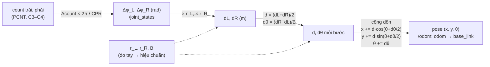
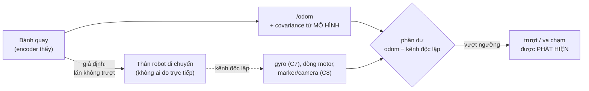

# Chặng 6 — Odometry (25h)

> **Vị trí:** C5 (robot chạy bằng pin, teleop, `/odom` từ `diff_drive_controller`) → **C6** → C7 (cảm biến và ghi dữ liệu) · **Cần trước:** K7 C5 trọn (đặc biệt C5.2 `ros2_control` + `diff_drive_controller`, C5.3 teleop có deadman và E-stop tạm); `hw/robot_params.yaml` của C2.4; → F1.1, F1.6, F6.4; đọc mục 2 của → F6.1; đọc mục 2 của → F6.7 trước Bài C6.3 · **Chạy song song với:** K4–K5
> **Làm ra được:** robot đi hình vuông 2 m theo odometry của chính nó với sai số hệ thống đã hiệu chuẩn; một sàn thử có trục tọa độ dán băng và đồ gá xuất phát · `data/c06/` (40 điểm dừng UMBmark trước/sau, 20 lần chạy thẳng 10 m, 3 mặt sàn, va chạm), `calib/umbmark.yaml` có `calibration_id`, bài viết "Calibrating differential drive odometry: UMBmark with numbers" · **Sau chặng này bạn quyết định được:** hệ số nào nạp vào `diff_drive_controller` (tỉ lệ chung, tỉ số đường kính, khoảng cách bánh); odometry một mình đủ cho quãng đường bao xa trước khi phải có định vị ngoài (C8); một hồ sơ hiệu chuẩn còn hợp lệ trên sàn nào, ở tốc độ và gia tốc nào; tín hiệu nào phải có để robot biết mình vừa trượt.

Con số trong `/odom` của C5 trông rất tự tin: sáu chữ số thập phân, 50 lần mỗi giây. C6 hỏi nó **sai bao nhiêu**, theo kiểu nào, phần nào sửa được. Không lắp khối điện nào mới; thứ bạn dựng là một **phép đo** (sàn có trục tọa độ, đồ gá, điểm tham chiếu, thước có sai số biết trước). Đây là chặng đầu tiên của K7 mà sản phẩm chính là một bộ dữ liệu có ground truth.

**Phân bổ 25h** `[ước lượng]`:

| Phần | Giờ |
|---|---|
| Lắp bước 1–3: sàn thử, trục tọa độ 3-4-5, đồ gá xuất phát chữ L, điểm tham chiếu trên robot, script chạy hình | 4 |
| Bài C6.1 Động học vi sai và odometry (gồm Phần A: đo tay, lăn bánh) | 5 |
| Bài C6.2 UMBmark: tách sai số đường kính và khoảng cách bánh (Phần B: thẳng 10 m; Phần C: UMBmark trước/sau) | 9 |
| Bài C6.3 Odometry không biết mình sai: trượt, va chạm (Phần D) | 4 |
| Bài viết UMBmark (tiêu chí 6 của Gate 7A gốc) + Gate chặng 6 | 3 |
| **Tổng** | **25** |


## 0. Bức tranh chặng

Robot sau chặng này trông giống hệt sau C5. Thứ mới nằm trên **sàn** và trong **file cấu hình**:

```
  SÀN THỬ (gạch, phẳng, ≥ 3 m × 3 m cho UMBmark; hành lang ≥ 11 m cho đường thẳng)

        y ▲  (trục y: băng giấy, vuông góc trục x bằng tam giác 3-4-5)
          │
          │          ┌ ─ ─ ─ ─ ─ ─ ─ ─ ┐   hình vuông 2 m (robot tự đi theo /odom,
          │                               KHÔNG có băng dọc cạnh để tránh "bám vạch")
          │          │                 │
          │
          │          │                 │
     ┌────┤
     │ L  │          └ ─ ─ ─ ─ ─ ─ ─ ─ ┘
     │khung◄── đồ gá xuất phát chữ L: hai bánh tựa vào, hướng +x
     └────●──────────────────────────────────────────►  x (trục x: băng giấy)
         gốc O = vị trí điểm tham chiếu khi robot nằm trong đồ gá

  TRÊN ROBOT: điểm tham chiếu chạm/chiếu xuống sàn đúng giữa trục hai bánh
              (bút dạ trong ống trượt, hoặc laser chấm thẳng xuống)

  DÒNG DỮ LIỆU:
  encoder ─► ESP32 (C4) ─► ros2_control hardware interface ─► diff_drive_controller ─► /odom
                                                                    ▲
                                       calib/umbmark.yaml ─────────┘ (hệ số mới, calibration_id)
  thước dây + ê-ke ─► data/c06/*.csv (điểm dừng THẬT) ─► umbmark_solve.py ─► calib/umbmark.yaml
  ros2 bag record /odom /joint_states ─► data/c06/bags/  (đối chiếu odometry với điểm dừng thật)
```

Dòng năng lượng không đổi so với C5. Dòng dữ liệu mới: hai nguồn "vị trí" độc lập (odometry của robot và thước của bạn) được đặt cạnh nhau. Toàn bộ chặng là việc đo khoảng cách giữa hai nguồn đó.

## 1. An toàn của chặng

**Rủi ro của C6:** robot lần đầu **tự đi** theo script, không có tay bạn trên cần teleop từng giây; đi 10 m một mạch; cố ý cho đâm tường (Bài C6.3); chạy nhiều giờ liền nên pin xả sâu hơn mọi chặng trước; người cúi sát sàn đo đạc ngay trên đường robot đi; người khác (đồng nghiệp, trẻ em, thú nuôi) đi ngang hành lang thử.

**Quy tắc cứng:**
- KHÔNG chạy script tự đi khi chưa thử E-stop tạm (C5.3) trong buổi đó: bấm E-stop khi bánh đang quay trên giá kê, bánh phải dừng. Ghi kết quả vào sổ.
- KHÔNG chạy script khi bạn không cầm nút E-stop tạm (hoặc deadman) trong tay. Script không thay cho người.
- KHÔNG đặt tốc độ thử trên 0,2 m/s trong chặng này, kể cả khi kẹp firmware (C4.4) cho phép cao hơn. Va chạm ở Bài C6.3 chỉ ở **≤ 0,1 m/s**.
- KHÔNG chạy gần cầu thang, cửa mở ra cầu thang, mép bậc, hoặc nơi có dây điện vắt ngang sàn. Hành lang 10 m phải có vật chắn ở cuối (thùng carton, gối) cách điểm dừng dự kiến ≥ 1 m.
- KHÔNG cúi đo điểm dừng khi robot chưa ở trạng thái an toàn (motor tắt, E-stop đang ấn hoặc controller đã dừng). Đầu và tay bạn ở ngang bánh xe.
- KHÔNG chạy khi `V_bat` đã chạm ngưỡng cảnh báo bạn đặt ở C1 (pin xả sâu làm robot đổi hành vi, và làm hỏng pin). Ghi `V_bat` đầu và cuối mỗi loạt.
- KHÔNG đâm tường bằng mặt có camera, mini PC lộ, hoặc pin lộ. Va chạm vào cản trước (nếu có) hoặc vào tấm xốp dán tường.

**Khi sự cố xảy ra:**

| Sự cố | Làm ngay | KHÔNG |
|---|---|---|
| Robot chạy thẳng không dừng ở cuối đường (script treo, odometry sai) | Bấm E-stop tạm; nếu không dừng: ngắt công tắc chính (C1) | Chạy theo chặn bằng chân hoặc tay |
| Robot quay tròn không dừng | E-stop tạm; đứng ngoài bán kính quay | Thò tay vào nhấc lên |
| Sau va chạm robot đẩy tường mãi, motor kêu ù, mùi nóng | E-stop; sờ vỏ motor sau 1 phút (mu bàn tay, chạm nhẹ) | Tiếp tục thử lại ngay khi motor đang nóng |

## 2. BOM chặng

Giá `[ước lượng 10/2026]`, kiểm lại ở cửa hàng. Chặng này rẻ: hầu hết là dụng cụ đo sàn.

| Món | Thông số phải chọn | Vì sao (bằng số) | Giá | Kiểm khi nhận hàng | Thay thế được bằng |
|---|---|---|---|---|---|
| Thước dây thép | 10 m, lưỡi rộng ≥ 19 mm, có ghi cấp chính xác (ví dụ "Class II") | Cấp II theo chuẩn đo lường châu Âu cho phép sai số ±(0,3 + 0,2·L) mm, L tính bằng m → ±2,3 mm ở 10 m `[spec — EU MID Annex MI-008, kiểm lại]`; nhỏ hơn rất nhiều so với độ lệch đang tìm | 150–400k | So vạch 1 m với thước thép 1 m; móc đầu trượt được đúng bằng bề dày móc | Thước dây 5 m (đo 10 m bằng hai lần, cộng sai số) |
| Thước thép 1 m + ê-ke thợ mộc | Vạch mm khắc, ê-ke 30 cm | Đo khoảng cách vuông góc từ điểm dừng tới trục | 100–250k | Ê-ke áp vào cạnh thước, lật mặt: khe hở hai lần phải như nhau | Ê-ke học sinh lớn |
| Băng keo giấy (masking tape) | 2 màu, rộng 24 mm, loại không để lại keo | Trục tọa độ trên sàn, đánh dấu điểm dừng | 30–60k | Dán thử 1 ngày lên sàn, bóc không để vết | Băng keo điện (kém: co dãn) |
| Bút dạ đầu mảnh + ống trượt, hoặc module laser chấm 5 mW chiếu xuống | Đầu bút ≤ 0,5 mm; ống cho bút trượt tự do và chạm sàn bằng trọng lượng của bút | Điểm tham chiếu giữa trục bánh; vết bút cho phép đo **sau** khi robot dừng | 20–80k | Vết chấm tròn, không nhòe | Mũi kim gắn lò xo |
| Gỗ hoặc nhôm định hình làm khung chữ L | Hai thanh ≥ 40 cm, vuông góc | Đồ gá xuất phát: đặt lại robot đúng vị trí và hướng mỗi lần | 50–100k | Kiểm vuông bằng tam giác 3-4-5 | Hai hộp sách nặng đặt vuông góc |
| Tấm xốp 2–3 cm | ~ 50 × 50 cm | Mặt tường cho va chạm ở C6.3 | 30–50k | — | Gối |
| Thảm thử | ≥ 1 × 3 m, loại văn phòng | Mặt sàn thứ hai ở C6.3 | 0–200k | — | Thảm sẵn có |

**Tổng C6 `[ước lượng]`:** ~0,4–1,1tr. Thước cặp đã có từ C2. Không có linh kiện điện mới.

## 3. Dụng cụ và kỹ năng tay

Kỹ năng mới của chặng là **đo sàn có sai số biết trước**. Không khó, nhưng người mới gần như luôn sai ở ba chỗ: móc đầu thước, góc vuông "bằng mắt", và đọc vạch nghiêng.

| Kỹ năng | Bài | Luyện trước | Đạt trông thế nào |
|---|---|---|---|
| Đọc thước dây đúng | Lắp bước 1 | Đo cùng một đoạn 2 m năm lần, hai cách (móc đầu và "bắt đầu từ vạch 10 cm") | Năm lần trong ±1 mm; hai cách khớp nhau trong ±1 mm |
| Dựng góc vuông bằng tam giác 3-4-5 | Lắp bước 1 | Dựng trên sàn với 0,6 / 0,8 / 1,0 m | Cạnh huyền đo được 1,000 m ± 2 mm |
| Đo tọa độ một chấm | Lắp bước 2 | Chấm 5 điểm bất kỳ, đo (x, y) hai lần cách nhau 10 phút | Hai lần lệch ≤ 2 mm mỗi trục |
| Đặt robot vào đồ gá | Lắp bước 3 | Đặt 10 lần, mỗi lần chấm điểm tham chiếu | 10 chấm nằm trong vòng tròn đường kính ≤ 3 mm |

**Móc đầu thước dây trượt là có chủ đích.** Móc kim loại ở đầu thước di chuyển đúng bằng bề dày của chính nó, để phép đo "móc vào mép" (kéo) và "tì vào vách" (đẩy) cùng đúng `[chuẩn]`. Móc bị cong (thước rơi nhiều lần) làm mọi phép đo lệch một hằng số. Cách tránh: đo từ vạch 10 cm (hoặc 100 mm) và trừ đi; thợ mộc gọi là "burn an inch". Ghi cách bạn dùng vào `instruments.jsonl`.


## 4. Sơ đồ đi dây

**Chặng này không có dây mới.** Mọi dây giữ nguyên như C5 và `wiring/wires.csv`. Nếu bạn gắn module laser chấm sàn thay cho bút, nó là một tải 5 V nhỏ, đi theo quy ước C0.5:

```
  buck 5 V logic (C1) ──[tím, 22 AWG]──► module laser (+)       qua JST-XH 2 chân, có nhãn wire_id
  GND (sao, phía logic) ─[đen, 22 AWG]──► module laser (−)
  Dòng: vài chục mA [tự đo bằng UT33D+ trên nguồn bàn trước khi gắn lên robot]
```

KHÔNG cấp laser từ chân GPIO của ESP32 trực tiếp (dòng chân giới hạn, và một chân GPIO không có lý do gì phải liên quan tới phép đo sàn). Làm theo "một khối mới một lần": thử laser trên nguồn bàn có giới hạn dòng (C0.4) trước, rồi mới nối vào nhánh 5 V.

Thay cho sơ đồ dây, chặng này có **sơ đồ sàn** ở mục 0 và bảng dữ liệu ở mục 7.

## 5. Trình tự chặng

1. **Lắp bước 1 — Dựng trục tọa độ trên sàn**
   - Làm: chọn sàn gạch phẳng ≥ 3 × 3 m. Dán trục x dài ≥ 2,5 m. Dựng trục y bằng tam giác 3-4-5. Đánh dấu gốc O bằng dấu cộng nhỏ trên băng. Chọn hành lang ≥ 11 m cho đường thẳng; dán một đường x dài 10 m, đánh dấu vạch 10,000 m.
   - ✅ Checkpoint: cạnh huyền của tam giác 3-4-5 đo được 1,000 m ± 2 mm; vạch 10 m đo lại hai lần lệch ≤ 2 mm. Ghi vào `measurements.jsonl` (`quantity: floor_axis_check`).
   - Nếu sai: dựng lại; KHÔNG "nắn" bằng cách kéo căng băng.
2. **Lắp bước 2 — Điểm tham chiếu trên robot**
   - Làm: gắn ống trượt cho bút (hoặc laser) sao cho đầu bút chạm sàn **đúng giữa đoạn nối tâm hai vết bánh**. Tìm điểm đó: đặt robot lên tờ giấy, lăn nhẹ 5 cm, hai vết bánh cho hai đường; điểm giữa của đoạn vuông góc nối hai đường.
   - ✅ Checkpoint: đặt robot, chấm, xoay robot 180° tại chỗ bằng tay quanh điểm chấm (nhấc nhẹ, đặt lại sao cho hai bánh đổi chỗ trên hai đường vết cũ), chấm lại: hai chấm cách nhau ≤ 3 mm. Lệch nhiều nghĩa là điểm tham chiếu không nằm trên trục bánh.
   - Nếu sai: dời ống trượt theo nửa khoảng lệch, làm lại.
3. **Lắp bước 3 — Đồ gá xuất phát và script chạy hình**
   - Làm: đặt khung chữ L sao cho khi hai bánh (hoặc mép khung robot) tựa vào, điểm tham chiếu trùng O và robot hướng +x. Cố định khung bằng băng keo. Cài `drive_shape.py` (Bài C6.2, mục 6).
   - ✅ Checkpoint trước khi chạy script lần đầu: robot trên giá kê (bánh không chạm sàn), chạy `drive_shape.py --shape straight --length 0.5`: bánh quay rồi tự dừng; bấm E-stop tạm giữa chừng một lần: bánh dừng. Đặt 10 lần vào đồ gá: 10 chấm trong vòng ≤ 3 mm.
   - Nếu sai: xem mục 6 (lỗi người mới).
4. **Học Bài C6.1.** Làm Phần A (đo tay, lăn bánh) và commit `prediction.md` **trước** khi robot tự đi lần đầu.
5. **Học Bài C6.2.** Phần B (thẳng 10 m × 10), hiệu chỉnh tỉ lệ chung, rồi Phần C (UMBmark trước), nạp hệ số, UMBmark sau, thẳng 10 m × 10 lần nữa.
   - ✅ Checkpoint trước khi nạp hệ số: chạy `umbmark_solve.py` trên điểm dừng **giả** sinh từ mô phỏng có sai số biết trước; script phải tìm lại đúng dấu (Bài C6.2, mục 6 bước 9).
6. **Học Bài C6.3.** Phần D: ba mặt sàn, va chạm.
7. **Viết bài** "Calibrating differential drive odometry: UMBmark with numbers".
8. **Gate chặng 6.**


## 6. Lỗi người mới hay gặp

| Triệu chứng | Nguyên nhân khả dĩ | Kiểm bằng cách | Sửa |
|---|---|---|---|
| Đo cùng một điểm dừng hai lần lệch 5–10 mm | Móc thước cong; đọc xiên; trục y không vuông | Đo lại từ vạch 10 cm; kiểm lại 3-4-5 | Dùng ê-ke áp trục; một người đọc, một người ghi |
| Robot đi ngắn hơn lệnh rõ rệt ngay từ đầu | `wheel_radius` trong cấu hình là bán kính danh định của nhà bán, không phải số đo; hoặc nhầm đường kính với bán kính | So cấu hình với `robot_params.yaml` (C2.4) | Dùng bán kính hiệu dụng đo được; đơn vị m |
| Robot quay 90° thành ~80° hay ~100° | `wheel_separation` là khoảng cách mép ngoài bánh | Đo lại B theo C6.1 | Dùng tâm vết bánh; để UMBmark tinh chỉnh |
| Kết quả buổi sáng khác buổi chiều | `V_bat` khác, nhiệt độ motor khác | So `V_bat` hai buổi | Chạy ở dải `V_bat` cố định, ghi vào điều kiện |
| Script dừng giữa hình, robot đứng yên | Timeout của controller hoặc của firmware (C4.4) vì script gửi lệnh thưa | Đếm tần số lệnh bằng `ros2 topic hz` | Script gửi lệnh đều ≥ 10 Hz `[tự đo theo timeout của bạn]` |

Lỗi riêng của từng phép đo nằm ở phần 8 của mỗi bài.

## 7. Lăng kính data infra

**Dữ liệu chặng này sinh ra:**

| Luồng | File | Schema (rút gọn) | Tần số / số lượng | Đơn vị (theo `CONVENTIONS.md`) |
|---|---|---|---|---|
| Đo tay hình học | `build-log/measurements.jsonl` | schema C0.5; `quantity`: `wheel_diameter_left`, `wheel_diameter_right`, `track_width_min`, `track_width_max`, `rollout_distance`… | ~30 dòng | `m` (không `mm` trong dữ liệu) |
| Điểm dừng | `data/c06/runs.csv` | `run_id, ts, test` (`straight10`/`umbmark_cw`/`umbmark_ccw`/`floor`/`bump`)`, calibration_id, floor, speed_mps, v_bat_start_V, v_bat_end_V, x_true_m, y_true_m, odom_x_m, odom_y_m, odom_yaw_rad, bag, note` | 10 + 10 + 20 + 20 + 6–12 dòng | `m`, `rad`, `V`, `m/s` |
| Odometry thô của mỗi lần chạy | `data/c06/bags/<run_id>/` (rosbag2 → MCAP) | `/odom` (`nav_msgs/msg/Odometry`), `/joint_states` (`sensor_msgs/msg/JointState`) | 50 Hz, 100 Hz `[theo cấu hình C5]` | SI, `rad` |
| Hồ sơ hiệu chuẩn | `calib/umbmark.yaml` | `calibration_id, parent_id, created_at, floor, speed_mps, v_bat_range_V, scale, E_d, E_b, c_L, c_R, B_new_m, alpha_rad, beta_rad, n_runs, runs_ref` | mỗi lần hiệu chuẩn | SI |

`calibration_id` theo mẫu trong `CONVENTIONS.md` mục 4 (`odom-01@2026-11-20-a`). Mỗi dòng trong `runs.csv` ghi `calibration_id` **đang chạy** lúc đó: thiếu cột này thì không ai tách được "trước" và "sau" sau ba tháng.

**Test tự động sinh ra từ chặng này (hạt giống HIL/CI cho C11):**
- **Golden replay:** một bag thật (`/joint_states` → `/odom`) và hàm odometry offline của bạn (Bài C6.1) phải cho cùng quỹ đạo trong dung sai; khi đổi phiên bản `diff_drive_controller` hay đổi tham số, CI chạy lại và so. Đây là regression test của **phép tính**, không của robot.
- **Metamorphic:** hoán đổi chuỗi encoder trái–phải thì quỹ đạo là ảnh gương qua trục x (→ F2.4, câu hỏi tự kiểm ở đó dùng đúng ví dụ này).
- **UMBmark là một bench test có ngưỡng:** ở C11.2 nó có thể chạy lại định kỳ trong sim với tham số nhiễu, và trên robot thật mỗi khi đổi bánh/lốp; `E_max,syst` là metric có lịch sử theo `calibration_id`.


**Covariance của `/odom`:** `diff_drive_controller` điền covariance từ tham số cấu hình **hằng số** (`pose_covariance_diagonal`, `twist_covariance_diagonal`) `[tự đo theo phiên bản ros2_controllers bạn cài]`, trong khi độ bất định thật của pose lớn dần theo quãng đường (Bài C6.2, C6.3). Ở chặng này bạn **đo** con số để điền (phương sai theo mét đi được, phương sai vận tốc); cách bộ hợp nhất dùng nó là việc của C8.3. Đừng điền theo mẫu trên mạng: đó là con số của robot người khác.

**Vai trò nghề:** Test & Validation (ground truth có sai số, thiết kế thí nghiệm hai chiều, ngưỡng gate); Data Platform (`calibration_id` như khóa phiên bản, bag gắn với điểm dừng thật, provenance từ thước tới hệ số).

## 8. Nhật ký build

Copy vào `build-log/c06.md`, một mục mỗi buổi:

```markdown

## 2026-MM-DD — buổi N (giờ bắt đầu–kết thúc, giờ thực: _._ h)
- Trạng thái người: tỉnh táo / mệt (mệt → chỉ phân tích dữ liệu, không chạy robot)
- E-stop tạm đã thử đầu buổi: có / không (không → không chạy script)
- Sàn: gạch / thảm / gỗ · nhiệt độ phòng: __ °C
- calibration_id đang nạp: odom-01@...
- V_bat đầu / cuối buổi: __ V / __ V
- Đã chạy: (ví dụ: umbmark_cw ×5, run_id c06-021…025)
- Số đo (đã vào runs.csv? có/không; số dòng: __) · bag: data/c06/bags/...
- Ảnh: sàn, vết chấm, đồ thị điểm dừng
- Lỗi gặp (triệu chứng → nguyên nhân → sửa):
- Quyết định (ghi decisions.md nếu đổi hệ số, đổi sàn chuẩn):
- Suýt sự cố: không / có → mô tả
- Câu hỏi còn mở:
```

---

## Bài C6.1 — Động học vi sai và odometry (5h)

> **Vị trí:** C5.2 (`/odom` đã chạy) → **C6.1** → C6.2 (UMBmark) · **Cần trước:** → F1.1 (sai số hệ thống/ngẫu nhiên, loại A/B, lan truyền), → F6.1 mục 2 (mô hình có miền), K7 C3.3 (encoder quadrature, count/vòng), K7 C2.4 (`robot_params.yaml`) · **Sau bài này bạn quyết định được:** đo đường kính bánh và khoảng cách bánh bằng phương pháp nào để con số đủ tin cho việc dự đoán độ lệch; tần số và công thức tích phân odometry nào là đủ; và con số ban đầu nào nạp vào `diff_drive_controller` trước khi hiệu chuẩn.

### 1. Câu chuyện — ai đã khổ vì chuyện này

Đêm 22/10/1707, hạm đội Anh của đô đốc Cloudesley Shovell trên đường về từ Địa Trung Hải đâm vào đá ngầm quần đảo Scilly; bốn tàu chìm, hơn một nghìn thủy thủ chết `[chuẩn — số người chết được ghi khác nhau giữa các nguồn, từ ~1.400 tới ~2.000]`. Các hoa tiêu tính vị trí bằng **dead reckoning**: hướng la bàn, tốc độ ước theo dây thả, thời gian, cộng dồn từng giờ. Mỗi giờ sai một chút. Không có mốc ngoài nào (kinh độ chưa đo được trên biển) để đặt lại số đó về đúng. Các phân tích về sau quy nguyên nhân cho tổ hợp sai số tích lũy của dead reckoning, hải đồ sai và dòng chảy chưa tính `[chuẩn — nguyên nhân chính xác còn tranh luận]`. Bảy năm sau, nghị viện Anh thông qua Longitude Act 1714, treo thưởng cho phương pháp đo kinh độ trên biển `[chuẩn]`.

Odometry bánh xe là dead reckoning của robot: cộng dồn quãng đường hai bánh, từng chu kỳ 20 ms, không có mốc ngoài. Câu hỏi của bài này là câu hỏi mà mọi hoa tiêu phải trả lời trước khi tin vị trí của mình: con số trong `/odom` được tính **từ những tham số nào**, các tham số đó đo **sai bao nhiêu**, và sai đó lớn lên thế nào theo quãng đường.

### 2. Mô hình tư duy

**Từ xung encoder tới pose** (đây là toàn bộ odometry vi sai):



`CPR` là count trên một vòng **trục ra bánh**: PPR của encoder × 4 (giải mã quadrature 4×) × tỉ số truyền (C3.3). Ba tham số `r_L`, `r_R`, `B` là tất cả những gì phương trình cần. Mọi sai số **hệ thống** của odometry nằm trong ba con số đó; mọi sai số **phi hệ thống** nằm ở chỗ giả định "bánh lăn không trượt" bị vi phạm (Bài C6.3).

**Động học vi sai** (giữ từ bản gốc): `v = (v_phải + v_trái)/2`, `ω = (v_phải − v_trái)/B`. Theo REP-103: `x` tiến, `y` trái, `ω > 0` là quay trái (ngược chiều kim đồng hồ nhìn từ trên). Pose ở frame `odom`, robot là `base_link` (REP-105, `CONVENTIONS.md` mục 2).

**Ba nguồn sai số, ba cỡ khác nhau.** Người mới hay lo nguồn nhỏ nhất:

| Nguồn | Ví dụ | Lớn lên theo quãng đường L | Sửa bằng |
|---|---|---|---|
| Công thức tích phân | Euler vs trung điểm vs cung tròn | ~1/f² (trung điểm), rất nhỏ ở 50 Hz | Chọn công thức (mô phỏng 1) |
| Tham số sai (hệ thống) | `r_R/r_L ≠ 1` thật, `B` sai | lệch ngang ~ L² (tỉ số), lỗi góc mỗi lần quay (B) | Hiệu chuẩn (C6.2) |
| Giả định sai (phi hệ thống) | trượt, va chạm, bánh nhấc | nhảy bậc, không có quy luật | Kênh đo độc lập (C6.3, C7, C8) |

**Mô phỏng 1 — công thức tích phân có đáng lo không.** Robot chạy cung tròn với vận tốc bánh không đổi, so vị trí sau nửa vòng với nghiệm chính xác.

```python
# [đã chạy] Ba cách cộng dồn một bước odometry: Euler, trung điểm, cung tròn chính xác
import numpy as np
B = 0.25                                # khoảng cách bánh (m)
vL, vR = 0.20, 0.30                     # vận tốc bánh (m/s) không đổi -> quỹ đạo là đường tròn
v, w = (vR + vL) / 2, (vR - vL) / B     # động học vi sai
R0, T = v / w, np.pi / w                # bán kính; thời gian đi nửa vòng -> đích thật (0, 2R0)
def run(method, f):
    n = int(round(T * f)); dt = T / n; x = y = th = 0.0
    for _ in range(n):
        d, dth = v * dt, w * dt         # quãng đường tâm, góc quay trong một bước
        if method == "euler":           # dùng hướng ĐẦU bước
            x += d * np.cos(th); y += d * np.sin(th)
        elif method == "midpoint":      # dùng hướng GIỮA bước (công thức phổ biến)
            x += d * np.cos(th + dth / 2); y += d * np.sin(th + dth / 2)
        else:                           # cung tròn chính xác khi v, w không đổi trong bước
            x += R0 * (np.sin(th + dth) - np.sin(th)); y -= R0 * (np.cos(th + dth) - np.cos(th))
        th += dth
    return np.hypot(x - 0.0, y - 2 * R0)  # sai số so với vị trí thật sau nửa vòng (m)
print(f"bán kính quay {R0:.3f} m, nửa vòng dài {v*T:.2f} m, mất {T:.1f} s")
for fr in (10, 50, 100):
    print(f"f={fr:>3} Hz  " + "  ".join(f"{m}={run(m, fr)*1000:10.5f} mm" for m in ("euler", "midpoint", "arc")))
fs = np.array([5, 10, 20, 50, 100, 200])
for m in ("euler", "midpoint"):
    e = [run(m, fr) for fr in fs]
    print(m, "độ dốc log-log:", round(np.polyfit(np.log(fs), np.log(e), 1)[0], 2))
```

**Mô phỏng 2 — đo tay có đủ để biết robot lệch về bên nào không** (→ F1.1). Bạn đọc được hai đường kính và một khoảng `B`. Giá trị thật nằm quanh số đọc với một độ bất định; lan truyền qua `y ≈ L²ε/(2B)`, `ε = D_R/D_L − 1`, bằng Monte Carlo.

```python
# [đã chạy] Lan truyền sai số đo tay (F1.1): dự đoán lệch ngang sau 10 m từ thước cặp vs từ phép lăn bánh
import numpy as np
rng = np.random.default_rng(0)
L, N = 10.0, 100_000                         # quãng đường (m), số mẫu Monte Carlo
B_lo, B_hi = 0.236, 0.264                    # B đo được dưới dạng khoảng [mép trong, mép ngoài] (m)
D_L, D_R = 0.06500, 0.06512                  # đường kính ĐỌC được (m) -- thay bằng số của bạn
# Hai phương pháp đo đường kính, sai số chuẩn (1 sigma) của MỖI bánh:
METHODS = {
    "thước cặp trên lốp cao su": 0.10e-3,    # loại B: lún lốp, vị trí kẹp, chia 0,02 mm (ước lượng)
    "lăn 10 vòng trên băng, thước dây": 1.0e-3 / (10 * np.pi),  # ±1 mm trên 10 chu vi
}
B = rng.uniform(B_lo, B_hi, N)               # loại B, phân bố đều: sigma = độ rộng / sqrt(12)
print(f"B = {(B_lo+B_hi)/2*1000:.1f} ± {(B_hi-B_lo)/np.sqrt(12)*1000:.1f} mm (1σ, phân bố đều)")
for name, s in METHODS.items():
    dl = D_L + s * rng.standard_normal(N)    # giá trị THẬT có thể có, cho số đọc đã biết
    dr = D_R + s * rng.standard_normal(N)
    eps = dr / dl - 1
    y = L**2 * eps / (2 * B)                 # lệch ngang (m), dương = sang trái
    lo, med, hi = np.percentile(y, [2.5, 50, 97.5])
    print(f"{name:34s} σ_D={s*1e3:.3f} mm  ε={np.mean(eps)*100:+.3f}%  "
          f"y10m: trung vị {med:+.2f} m, 95%: [{lo:+.2f}, {hi:+.2f}] m, P(sai hướng)={np.mean(y<0):.2f}")
```

σ của thước cặp trên lốp cao su (0,10 mm) là `[ước lượng]` loại B: độ chia 0,02 mm không phải độ bất định; lốp lún dưới ngàm kẹp, và đường kính dưới tải khác đường kính khi nhấc lên. Thay bằng số của bạn sau khi đo lặp ở Phần A.


### 3. Cầu nối từ backend

| Backend bạn biết | Ở đây | Gãy ở chỗ | Nếu dùng nhầm thì |
|---|---|---|---|
| Event sourcing: trạng thái = fold của mọi sự kiện | Pose = cộng dồn mọi `(dL, dR)` | Sự kiện tài chính là số nguyên chính xác; lỗi là thiếu/thừa sự kiện. Ở đây **mỗi** sự kiện mang sai số liên tục, và sai số **góc** biến thành sai số **vị trí** nhân theo quãng đường còn lại | Tin "đếm đủ xung thì vị trí đúng" như tin số dư tài khoản; robot lệch nửa mét mà log hoàn hảo |
| Số thứ tự tràn vòng (TCP sequence, RFC 1982 serial number arithmetic) | Bộ đếm PCNT phần cứng 16 bit tràn vòng; host lấy delta theo modulo (`unwrap_counts` ở mục 6) | TCP có cửa sổ bảo đảm hai số so sánh luôn cách nhau < nửa vòng. Ở đây "cửa sổ" là **tốc độ bánh × khoảng giữa hai lần đọc**: host bỏ lỡ gói đủ lâu thì delta đổi dấu, odometry nhảy ngược | Lấy hiệu thô không modulo: mỗi lần tràn là một cú nhảy hàng mét |

**Chấm mô hình:**

1. *"Encoder vài nghìn count mỗi vòng là rất mịn, nên odometry chính xác."* **SAI.** Nhầm độ phân giải với độ chính xác (→ F1.1). Độ phân giải chặn sai số **dưới**; tham số sai đặt sai số **trên** không phụ thuộc độ phân giải. **Phản ví dụ:** mô phỏng 2 giả định phân giải hoàn hảo (không lượng tử); chạy nó và xem dải dự đoán lệch ngang còn rộng thế nào chỉ vì đường kính đo bằng thước cặp.
2. *"Tăng tần số odometry từ 50 lên 200 Hz sẽ làm vị trí chính xác hơn."* **ĐÚNG MỘT PHẦN.** Đúng cho sai số tích phân (~1/f²), nhưng ở 50 Hz nó đã nhỏ hơn sai số tham số nhiều bậc. **Phản ví dụ:** nhân bốn tần số không đổi một milimét nào của độ lệch do hai lốp chênh 0,1 mm; Δcount mỗi bước nhỏ đi nên nhiễu lượng tử của vận tốc còn **tăng**.
3. *"Đo kỹ bằng thước cặp thì ít nhất cũng biết robot lệch về bên nào."* **SAI** với lốp cao su. **Phản ví dụ:** chạy mô phỏng 2 và đọc cột `P(sai hướng)` của dòng thước cặp. Phép **lăn bánh** đo đúng thứ odometry dùng (chu vi lăn có tải), và sai số chia cho số vòng lăn.

### 4. Thuật ngữ

| Mức | Thuật ngữ | Nghĩa trong một câu | Hay bị hiểu nhầm thành |
|---|---|---|---|
| 🟢 | Odometry / dead reckoning | Ước lượng pose bằng cộng dồn chuyển động tự đo, không mốc ngoài | "Định vị": nó chỉ là ước lượng tương đối, trôi không giới hạn |
| 🟢 | Động học vi sai | `v`, `ω` từ vận tốc hai bánh và `B` | Động học robot nói chung (lộ trình xếp 🔴; riêng hai dòng này là 🟢) |
| 🟢 | Track width / wheel separation (`B`) | Khoảng cách giữa hai điểm tiếp xúc bánh–sàn | Khoảng cách mép ngoài hai bánh |
| 🟢 | Bán kính lăn hiệu dụng | Quãng đường đi được trong một vòng bánh chia 2π, đo có tải | Bán kính danh định in trên hộp |
| 🟢 | CPR (count per revolution) | Count trên một vòng trục ra bánh: PPR × 4 × tỉ số truyền | PPR của encoder trên trục motor |
| 🟢 | Frame `odom`, `base_link` | Gốc odometry (liên tục, trôi) và thân robot (REP-105) | `map` (định vị tuyệt đối, C8) |
| 🟡 | Tích phân trung điểm / cung tròn chính xác | Hai cách cộng dồn một bước, sai số O(dt²) và 0 khi v, ω không đổi | — |

### 5. Dự đoán

**Đề:**
1. Từ `D_L`, `D_R` đo bằng thước cặp và `B` (dạng khoảng): robot đi thẳng 10 m theo odometry của chính nó lệch ngang bao nhiêu, về bên nào? Kèm khoảng 95 %.
2. Lặp câu 1 với `D_L`, `D_R` từ phép lăn bánh. Khoảng 95 % hẹp đi mấy lần? Hai phương pháp có cùng dấu không?
3. Robot đi thẳng 2 m theo odometry (cấu hình ban đầu): quãng đường thật chênh bao nhiêu phần trăm?
4. Robot quay tại chỗ 360° theo odometry: góc thật chênh bao nhiêu độ, nếu `wheel_separation` trong cấu hình là số bạn đo bằng mép ngoài hai bánh?
5. Ở 50 Hz, công thức trung điểm: sai số tích phân sau 10 m có đáng kể so với câu 1 không?

**Tham số cần tra / đo trước:**
- `D_L`, `D_R`: thước cặp, 3 vị trí quanh mỗi lốp, robot đứng trên sàn (có tải) và nhấc lên (không tải) nếu ngàm vào được. Ghi trung bình và độ tản.
- Phép lăn: mỗi bánh một dấu bút trên lốp; đẩy robot thẳng dọc băng 10 vòng bánh (đếm dấu chạm sàn); đánh dấu trên băng ở vòng 0 và vòng 10; đo khoảng cách bằng thước dây.
- `B_min` (mép trong–mép trong), `B_max` (mép ngoài–mép ngoài) của hai vết bánh; `B` danh định từ C2.4.
- `wheel_radius`, `wheel_separation` hiện có trong cấu hình `diff_drive_controller` của C5 (đọc file YAML, không đọc trí nhớ).
- CPR từ C3.3; tần số cập nhật controller từ cấu hình C5.

**Công thức/phương pháp:**
- `ε = D_R/D_L − 1`; lệch ngang `y ≈ L²·ε/(2B)`, dương = trái khi `D_R > D_L` (robot tưởng đi thẳng nên ra lệnh hai bánh cùng số vòng; bánh to hơn đi xa hơn).
- Lỗi chiều dài khi cả hai bánh cùng sai tỉ lệ `s`: `≈ s·L`.
- Lỗi góc khi quay tại chỗ với `B_cấu hình ≠ B_thật`: controller quay tới khi `(dR − dL)/B_cấu hình = 2π`, góc thật là `(dR − dL)/B_thật`.
- Độ bất định: chạy mô phỏng 2 với **số của bạn** (sửa `D_L`, `D_R`, `B_lo`, `B_hi`, σ).

```markdown
# prediction.md — K7 C6.1
commit: <hash>
## Đo tay (ghi dụng cụ, số lần đo, độ tản)
D_L (thước cặp) = ... ± ... mm   D_R (thước cặp) = ... ± ... mm
D_L (lăn 10 vòng) = ... ± ... mm D_R (lăn 10 vòng) = ... ± ... mm
B_min = ... mm  B_max = ... mm   B cấu hình hiện tại = ... mm   wheel_radius cấu hình = ... m
## Dự đoán
| Đại lượng | Dự đoán | Khoảng 95 % | Cách tính |
|---|---|---|---|
| Lệch ngang 10 m (thước cặp) | | | mô phỏng 2 |
| Lệch ngang 10 m (lăn bánh) | | | mô phỏng 2 |
| Lỗi chiều dài 2 m (%) | | | s·L |
| Lỗi góc khi quay 360° (độ) | | | B_cấu hình/B_thật |
| Sai số tích phân 10 m ở 50 Hz | | | mô phỏng 1 |
## Tôi sẽ ngạc nhiên nếu...
```

### 6. Làm

**Phần A — đo tay trước** (giữ ba bước của bản gốc, thêm phép lăn và độ bất định).

1. **Đường kính bằng thước cặp.** Đo `D_L`, `D_R`, 3 vị trí quanh mỗi lốp. Chúng **sẽ khác nhau**. Ghi từng lần vào `measurements.jsonl` (đơn vị `m`, `instrument_id` của thước cặp). Sai số: độ chia 0,02 mm `[spec của thước bạn có]`, nhưng độ bất định thật do lốp lún lớn hơn nhiều; ghi độ tản ba lần đo như loại A, cộng một biên loại B cho lún lốp.
2. **Đường kính bằng phép lăn (thêm).** Dán một băng thẳng dài ≥ 2,5 m. Vạch bút trắng trên mặt lốp mỗi bánh. Đặt robot (có pin, có tải như khi chạy) sao cho vạch bánh trái chạm băng, đánh dấu. Đẩy tay thật chậm, thẳng dọc băng, 10 vòng bánh trái, đánh dấu. Đo khoảng cách bằng thước dây: `D_L = khoảng cách / (10π)`. Lặp cho bánh phải. Làm ba lần mỗi bánh. Sai số chủ yếu: đọc thước (±1 mm `[ước lượng]`) và xác định đúng lúc vạch chạm sàn (nhìn ngang mặt sàn).
   - Cách kiểm độc lập (nếu `/joint_states` đã chạy): khi đẩy robot thẳng 2 m, `Δφ_L/Δφ_R` từ encoder cho trực tiếp `D_R/D_L` (cùng quãng đường, bánh nhỏ quay nhiều hơn). Điều kiện: đường đẩy thật sự thẳng; đẩy dọc một cạnh thước nhôm dài.
3. **Khoảng cách bánh `B`.** Khó hơn bạn nghĩ: bánh có bề rộng, điểm tiếp xúc không phải một điểm. Lăn robot qua tờ giấy có rắc bột mịn (hoặc giấy than) để lấy hai vết bánh; đo `B_min` (mép trong–mép trong) và `B_max` (mép ngoài–mép ngoài); lấy tâm hai vết làm số ban đầu. Ghi khoảng `[B_min, B_max]` vào sổ: đó là độ bất định loại B, phân bố đều.
4. **Ghi vào `prediction.md`:** chạy mô phỏng 2 với số của bạn; điền bảng; commit. Chỉ sau commit mới cho robot tự đi.
5. **Cập nhật cấu hình ban đầu.** Đặt `wheel_radius` = trung bình hai bán kính lăn, `wheel_separation` = tâm hai vết, các hệ số nhân (`left_wheel_radius_multiplier`, `right_wheel_radius_multiplier`, `wheel_separation_multiplier`) = 1,0 `[tự đo — tên tham số theo phiên bản `diff_drive_controller` bạn cài; đọc file tham số mẫu của gói]`. Ghi `calibration_id` đầu tiên (`odom-01@<ngày>-a`, `parent_id: null`) vào `calib/umbmark.yaml`.

**Kiểm nhanh trước UMBmark (thêm):**

6. **Thẳng 2 m:** robot trong đồ gá, `drive_shape.py --shape straight --length 2.0 --speed 0.2` (script ở Bài C6.2). Đo `x_true` của chấm cuối. Ba lần. Lỗi chiều dài `% = (x_true − 2,0)/2,0`.
7. **Quay 360°:** robot thẳng hàng với một băng, `drive_shape.py --shape spin --angle 6.283`; đo góc lệch bằng một thước 1 m đặt dọc thân (lệch ở đầu thước → `atan`). Ba lần mỗi chiều.
8. **Hàm odometry offline + test.** Copy file dưới vào `tools/odom_offline.py`, chạy test. Đây là bản tham chiếu để so với `/odom` của controller trên bag thật (golden replay, mục 7 của chặng).

```python
# [đã chạy] Odometry offline từ góc bánh (rad, như /joint_states) + hai test: metamorphic và golden
import numpy as np

def odom(phi_L, phi_R, r_L, r_R, B, mode="midpoint"):
    """phi_*: góc bánh tích lũy (rad) theo thời gian. Trả về x, y, theta (m, m, rad) theo REP-103."""
    dL, dR = np.diff(phi_L) * r_L, np.diff(phi_R) * r_R    # quãng đường mỗi bánh trong từng bước
    d, dth = (dL + dR) / 2, (dR - dL) / B                  # tiến, quay (dương = quay trái, CCW)
    th = np.concatenate([[0.0], np.cumsum(dth)])
    h = th[:-1] + (dth / 2 if mode == "midpoint" else 0)   # hướng dùng cho bước
    x = np.concatenate([[0.0], np.cumsum(d * np.cos(h))])
    y = np.concatenate([[0.0], np.cumsum(d * np.sin(h))])
    return x, y, th

def unwrap_counts(raw, bits=16):
    """Bộ đếm phần cứng tràn vòng (vd. 16 bit có dấu) -> tổng tích lũy. Giống số thứ tự TCP."""
    span = 1 << bits
    d = (np.diff(raw.astype(np.int64)) + span // 2) % span - span // 2   # delta trong [-span/2, span/2)
    return np.concatenate([[raw[0]], raw[0] + np.cumsum(d)])

if __name__ == "__main__":
    rng = np.random.default_rng(0)
    t = np.linspace(0, 10, 1001)
    phi_L = np.cumsum(np.r_[0, 6 + rng.normal(0, .5, 1000)]) * 0.01   # bánh trái ~6 rad/s
    phi_R = np.cumsum(np.r_[0, 7 + rng.normal(0, .5, 1000)]) * 0.01   # bánh phải nhanh hơn -> rẽ trái
    x, y, th = odom(phi_L, phi_R, 0.0325, 0.0325, 0.25)
    # Metamorphic: đổi trái-phải -> ảnh gương qua trục x (x giữ, y và theta đổi dấu)
    xm, ym, thm = odom(phi_R, phi_L, 0.0325, 0.0325, 0.25)
    assert np.allclose(xm, x) and np.allclose(ym, -y) and np.allclose(thm, -th), "metamorphic gương FAIL"
    # Metamorphic: góc x2, bán kính /2 -> quỹ đạo không đổi (bắt lỗi đơn vị)
    x2, y2, _ = odom(2 * phi_L, 2 * phi_R, 0.0325 / 2, 0.0325 / 2, 0.25)
    assert np.allclose(x2, x) and np.allclose(y2, y), "metamorphic tỉ lệ FAIL"
    # Bộ đếm 16 bit tràn vòng: tổng 200 000 count phải khôi phục đúng
    true = np.cumsum(rng.integers(0, 400, 1000)); raw = ((true + 32768) % 65536) - 32768
    assert np.array_equal(unwrap_counts(raw) - raw[0], true - true[0]), "unwrap FAIL"
    print(f"pass 3/3 · cuối: x={x[-1]:.3f} m y={y[-1]:.3f} m theta={th[-1]:.3f} rad")
```

Bộ đếm xung của ESP32-S3 (PCNT) là 16 bit có dấu `[spec — ESP32-S3 Technical Reference Manual, chương PCNT; kiểm]`. Firmware C4 có thể đã cộng dồn tràn ở ESP32 và gửi số 32/64 bit; nếu vậy `unwrap_counts` dùng ở tầng đó với `bits` tương ứng. Kiểm C4.3 của bạn gửi gì.

Lấy `/joint_states` từ bag ra numpy bằng `mcap` + `mcap-ros2-support` (như K2 Bài 5, 8b) hoặc `rosbag2_py` `[tự đo]`. Offline lệch `/odom` cùng bag quá vài mm sau 10 m: hai bên không cùng tham số hoặc không cùng công thức.

### 7. Số phải ra

<details><summary>🔒 MỞ SAU KHI COMMIT prediction.md</summary>

**Mô phỏng 1** (B = 0,25 m, bánh 0,20/0,30 m/s, nửa vòng 1,96 m):

| f | Euler | Trung điểm | Cung tròn |
|---|---|---|---|
| 10 Hz | ~25 mm | ~0,08 mm | 0 |
| 50 Hz | ~5 mm | ~0,003 mm | 0 |
| 100 Hz | ~2,5 mm | ~0,001 mm | 0 |

Độ dốc log–log: Euler −1,0, trung điểm −2,0. Ở 50 Hz với công thức trung điểm, sai số tích phân sau 10 m cỡ phần trăm milimét: **không đáng kể**. Euler ở 10 Hz thì đáng kể; đó là lý do chọn trung điểm (hoặc cung tròn), không phải lý do tăng tần số.

**Mô phỏng 2** (số đọc `D_L` = 65,00 mm, `D_R` = 65,12 mm, `B` ∈ [236, 264] mm):

| Phương pháp | σ_D | Lệch ngang 10 m (trung vị) | Khoảng 95 % | P(sai hướng) |
|---|---|---|---|---|
| Thước cặp | 0,10 mm | ~+0,37 m | ~[−0,5, +1,2] m | ~0,2 |
| Lăn 10 vòng | ~0,03 mm | ~+0,37 m | ~[+0,1, +0,6] m | ~0 |

Thước cặp không cho bạn biết chắc cả **dấu**. Phép lăn cho dấu và bậc độ lớn, nhưng khoảng vẫn rộng gấp vài lần chính trung vị ở biên trên. Trên robot của bạn, số cụ thể khác; hình dạng kết luận thường giữ. Nếu khoảng 95 % của bạn từ phép lăn vẫn chứa 0, hai bánh của bạn đã rất khớp, và UMBmark sẽ là phép đo duy nhất phân giải được.

**Kiểm nhanh:**
- Thẳng 2 m: lỗi chiều dài thường **vài phần trăm** với bán kính danh định, **< 1 %** với bán kính lăn `[ước lượng]`. Nếu > 5 %: nghi đơn vị (đường kính nạp vào ô bán kính) hoặc CPR sai.
- Quay 360° với `B` = mép ngoài: robot **quay quá** (controller tưởng B lớn hơn nên bắt bánh đi xa hơn). Cỡ lỗi = `B_cấu hình/B_thật − 1` nhân 360°; mép ngoài lớn hơn tâm vết một bề rộng lốp (25–30 mm trên B ~250 mm) → ~5–6 % → ~20° `[ước lượng]`. Dùng tâm vết bánh, lỗi còn vài độ, và lỗi đó đổi theo sàn (lốp chà khi quay tại chỗ, điểm tiếp xúc hiệu dụng dịch).
- Golden replay: offline và `/odom` khớp tới mm sau 10 m nếu cùng tham số và cùng công thức.

</details>

### 8. Nếu ra khác

| Triệu chứng | Nguyên nhân khả dĩ | Kiểm bằng cách | Sửa |
|---|---|---|---|
| `D` lăn nhỏ hơn `D` thước cặp rõ rệt | Lốp lún dưới tải: đúng là thứ bạn cần đo | — | Dùng `D` lăn; ghi cả hai vào `robot_params.yaml` |
| Offline và `/odom` lệch dần | Khác tham số (controller đọc file khác), khác công thức, hoặc `/joint_states` không đồng thời với `/odom` | In tham số controller đang chạy bằng `ros2 param dump` `[tự đo]` | Một nguồn tham số duy nhất (`calib/umbmark.yaml` sinh ra file YAML của controller) |
| Odometry nhảy hàng mét một lần | Tràn bộ đếm không xử lý; gói bị mất lâu | Tìm bước có `|Δcount|` gần nửa vòng đếm | `unwrap_counts`; firmware gửi bộ đếm 32 bit |
| Quay 360° lệch khác nhau giữa CW và CCW | Hai bánh chênh đường kính (cộng vào một chiều, trừ ở chiều kia) | So hai chiều | Đó là thứ UMBmark tách: sang C6.2 |
| Thẳng 2 m lệch chiều dài ~2× hoặc ~½ | Nhầm bán kính/đường kính; CPR thiếu hệ số 4 của giải mã 4× | So 1 vòng bánh đếm tay với `Δφ` | Sửa đơn vị/CPR ở C3–C5, ghi `decisions.md` |

### 9. Câu hỏi ngược

1. **[Nếu…thì]** Nếu bạn thay lốp cao su bằng bánh nhựa cứng cùng đường kính, cột "thước cặp" và cột "lăn bánh" trong mô phỏng 2 đổi thế nào? Odometry có tốt lên không?
<details><summary>Hướng nghĩ</summary>

Bánh cứng không lún: thước cặp đo gần đúng thứ odometry dùng, σ_D nhỏ lại. Nhưng bánh cứng ít bám: trượt (phi hệ thống) tăng, nhất là khi tăng tốc và quay tại chỗ. Bạn đổi một loại sai số lấy loại khác; câu hỏi đúng là quyết định nào cần loại nào nhỏ.

</details>

2. **[Vì sao không]** Vì sao không tính odometry trên ESP32 (nơi có bộ đếm, 100 Hz tất định) mà để `diff_drive_controller` tính trên host?
<details><summary>Hướng nghĩ</summary>

Cả hai làm được. MCU: không mất bước do host chậm, nhưng tham số nằm trong firmware. Host: tham số và công thức ở một chỗ, golden replay chạy trong CI; đổi lại phải nhận đủ bộ đếm. Gửi bộ đếm **tích lũy** thay vì delta thì mất gói không mất quãng đường.

</details>

3. **[Quy mô]** 100 robot cùng mẫu. Bạn không thể lăn bánh tay từng con. Trong dữ liệu vận hành thường ngày, tín hiệu nào cho bạn `D_R/D_L` của từng robot mà không cần thước?
<details><summary>Hướng nghĩ</summary>

Những đoạn robot đi thẳng có kiểm chứng ngoài (marker C8 đầu và cuối đoạn, hoặc gyro C7 báo ω ≈ 0): tỉ số tốc độ góc hai bánh trên các đoạn đó là ước lượng `D_R/D_L`. Cần điều kiện tiên quyết (không trượt, không quay), cỡ mẫu, và lịch sử theo `calibration_id`. Đây là UMBmark liên tục.

</details>

4. **[Failure mode]** Robot bị kẹt bánh caster nửa giây rồi tự gỡ. Pose trong `/odom` sai thế nào? Hàm offline của bạn có thấy không?
<details><summary>Hướng nghĩ</summary>

Caster kẹt kéo thân lệch hướng trong khi hai bánh chủ động vẫn quay như lệnh: encoder không thấy, offline cũng không thấy, vì cả hai dùng cùng dữ liệu. Đây là lớp lỗi của Bài C6.3: cần kênh không đi qua encoder.

</details>

### 10. Liên kết ra ngoài

- **Hàng hải: dead reckoning và "fix".** Hoa tiêu cộng dồn hướng và tốc độ, rồi định kỳ lấy một "fix" từ mốc ngoài (sao, đèn biển, GPS) và tính lại. Giống: sai số tích lũy không giới hạn giữa hai fix. Khác: tàu không có hai bánh để suy hướng từ hiệu số; la bàn đo hướng **trực tiếp**, nên sai số hướng không tự tích lũy như odometry vi sai.
- **Thiên văn: hiệu chuẩn bằng phép đo dài.** Đo chu vi lăn qua 10 vòng thay vì đo đường kính một lần là cùng ý với đo chu kỳ con lắc qua 50 dao động: kéo dài phép đo để chia sai số đọc cho N.

### 11. Độ tin cậy và sửa lỗi

| Khẳng định | Nhãn | Ghi chú / cách kiểm |
|---|---|---|
| `v = (vR+vL)/2`, `ω = (vR−vL)/B`, tích phân trung điểm | [chuẩn] | Mô phỏng 1 kiểm bậc sai số |
| Sai số tích phân trung điểm ~1/f², không đáng kể ở 50 Hz | [chuẩn] + [đã chạy] | Mô phỏng 1 |
| σ_D thước cặp trên lốp 0,10 mm | [ước lượng] | Thay bằng độ tản đo lặp của bạn + biên lún lốp |
| Scilly 1707, Longitude Act 1714 | [chuẩn] | Số người chết khác nhau giữa nguồn; nguyên nhân còn tranh luận |
| PCNT ESP32-S3 16 bit | [spec — kiểm TRM] | |
| Tên tham số `diff_drive_controller` (`wheel_radius`, `wheel_separation`, các `*_multiplier`, `*_covariance_diagonal`) | [tự đo] | Đọc tham số mẫu của gói theo phiên bản Jazzy bạn cài |

**Đã sửa / thêm so với bản gốc (Bài 4 Phần A):** bản gốc chỉ đo bằng thước cặp và yêu cầu dự đoán lệch ngang 10 m; thêm phép **lăn bánh** (đo đúng đại lượng odometry dùng, sai số chia cho số vòng) và yêu cầu dự đoán **có khoảng tin**; chỉ ra bằng mô phỏng rằng dự đoán từ thước cặp có thể sai cả dấu. Thêm kiểm nhanh 2 m / 360° và golden replay để tách lỗi tham số khỏi lỗi phần mềm trước khi chạy UMBmark. Câu bản gốc "sai đường kính bánh 1 % tạo ra sai lệch 10 cm sau 10 m" sửa ở Bài C6.2.

### 12. Đọc thêm và tự kiểm tra

- **Nguồn gốc:** REP-103, REP-105 (đơn vị, frame `odom`/`base_link`); tài liệu `diff_drive_controller` trong `ros2_controllers` (control.ros.org), mục tham số và odometry.
- **Giải thích:** Siegwart, Nourbakhsh & Scaramuzza, *Introduction to Autonomous Mobile Robots* (2nd ed.), chương động học robot di động và chương định vị (mô hình lỗi odometry).
- **Đào sâu (tùy chọn):** Dava Sobel, *Longitude* (1995) — lịch sử bài toán kinh độ và dead reckoning trên biển.
- **Tự kiểm tra:** (1) giải thích cho một backend engineer trong 5 câu vì sao encoder mịn không cứu được odometry; (2) vẽ lại sơ đồ từ count tới pose; (3) câu dưới.

<details><summary>Robot đi thẳng hoàn hảo 3 m, rồi quay tại chỗ. Lỗi nào trong ba tham số r_L, r_R, B ảnh hưởng tới pose trong đoạn thẳng, lỗi nào chỉ lộ ra khi quay?</summary>

Đoạn thẳng: `r_L`, `r_R` (tỉ lệ chung → lỗi chiều dài; tỉ số → robot thật đi cong dù odometry báo thẳng). `B` không xuất hiện vì `dR − dL ≈ 0`. Khi quay tại chỗ: `B` quyết định góc; tỉ số `r_R/r_L` làm tâm quay dịch và cộng/trừ vào góc theo chiều quay.

</details>

---

## Bài C6.2 — UMBmark: tách sai số đường kính và khoảng cách bánh (9h)

> **Vị trí:** C6.1 (tham số ban đầu, golden replay) → **C6.2** → C6.3 (sai số không hiệu chuẩn được) · **Cần trước:** → F1.1 (hệ thống/ngẫu nhiên), → F1.6 (fit, residual), → F6.4 (thiết kế kích thích để tham số nhận dạng được), → F1.7 (báo cáo trung thực) · **Sau bài này bạn quyết định được:** robot của bạn cần sửa tỉ lệ chung, tỉ số đường kính hay khoảng cách bánh; hệ số nào nạp vào `diff_drive_controller`; hồ sơ hiệu chuẩn này hợp lệ trong điều kiện nào; và odometry một mình đủ cho quãng đường bao xa trước khi C8 phải đặt lại nó.

**Câu hỏi của bài (giữ từ bản gốc):** robot nghĩ nó đang ở đâu, và nó sai bao nhiêu? Đây là bài quan trọng nhất của odometry.

### 1. Câu chuyện — ai đã khổ vì chuyện này

Đầu thập niên 1990, Johann Borenstein và Liqiang Feng ở Đại học Michigan làm với robot di động trong nhà. Phép thử phổ biến lúc đó: cho robot chạy một hình vuông rồi đo nó về cách điểm xuất phát bao xa. Họ chỉ ra phép thử **một chiều** có thể giấu lỗi: sai khoảng cách bánh và sai tỉ số đường kính có thể triệt tiêu nhau ở một chiều chạy, robot "về đúng chỗ" dù cả hai đều sai. Lời giải: chạy **cả hai chiều**, mỗi chiều 5 lần, và giải hai sai số từ hai cụm điểm dừng. Họ gọi nó là UMBmark (University of Michigan Benchmark) và công bố trong J. Borenstein & L. Feng, *Measurement and Correction of Systematic Odometry Errors in Mobile Robots*, IEEE Transactions on Robotics and Automation, tập 12, 1996 `[chuẩn — bản preprint của tác giả ghi số 5, tháng 10/1996; nhiều trích dẫn ghi số 6, tr. 869–880; kiểm IEEE Xplore khi trích]`. Paper dùng hình vuông 4 m `[chuẩn — theo mô tả của các bài trích dẫn]`; bản gốc khóa dùng 2 m cho vừa phòng.


### 2. Mô hình tư duy

**Hai sai số hệ thống, hai "chữ ký" hình học:**

```
 Sai B (α: mỗi lần quay thiếu/thừa α rad)    Sai tỉ số đường kính (β: mỗi cạnh cong β rad)
 → lỗi góc đổi DẤU theo chiều chạy           → cong CÙNG phía ở cả hai chiều chạy:
   (quay thiếu khi rẽ trái thì cũng thiếu       cộng vào góc rẽ ở chiều này,
    khi rẽ phải: hai hình đối xứng gương)        trừ ở chiều kia
                                             → một chiều có thể "về đúng chỗ" nhờ hai lỗi
   CCW ╭───╮      ╭───╮ CW                      triệt tiêu: lý do phải chạy hai chiều
       │   │      │   │
       ╰─╮ ╳      ╳ ╭─╯
```

**Vì sao lỗi tỉ số đường kính lớn lên theo L²** (bản gốc ngụ ý mà không nói): tỉ số sai làm robot đi theo một cung có độ cong không đổi; góc lệch tăng tuyến tính theo quãng đường, lệch ngang là tích phân của góc lệch. Sai số **góc** biến thành sai số **vị trí** khuếch đại theo khoảng cách. Phần ngẫu nhiên (nhiễu mỗi bước) là random walk của góc rồi tích phân, lớn lên cỡ L^1,5.

```python
# [đã chạy] Lệch ngang khi robot tin mình đi thẳng: hệ thống ~L^2, ngẫu nhiên ~L^1.5
import numpy as np
rng = np.random.default_rng(0)
B, step, N, EPS, SIG = 0.25, 0.01, 1000, 0.003, 0.02   # B (m), bước 1 cm × 1000 = 10 m, D_R/D_L−1, nhiễu/bước
def drive(eps, sig, runs):
    dR = step * (1 + eps / 2) * (1 + sig * rng.standard_normal((N, runs)))
    dL = step * (1 - eps / 2) * (1 + sig * rng.standard_normal((N, runs)))
    th = np.cumsum((dR - dL) / B, axis=0)
    return np.cumsum((dR + dL) / 2 * np.sin(th), axis=0)          # y thật theo quãng đường
d = np.arange(1, N + 1) * step
sys_y, rnd_y = np.abs(drive(EPS, 0, 1)[:, 0]), drive(0, SIG, 300).std(axis=1)
for L in (1, 2, 5, 10):
    i = int(L / step) - 1
    print(f"L={L:>2} m  hệ thống {sys_y[i]*100:6.2f} cm   ngẫu nhiên (std) {rnd_y[i]*100:6.2f} cm")
for name, v in [("hệ thống", sys_y), ("ngẫu nhiên", rnd_y)]:
    print(f"độ dốc log-log {name}: {np.polyfit(np.log(d[100:]), np.log(v[100:]), 1)[0]:.2f}")
```

**Công thức UMBmark** (quy ước của chặng này: robot xuất phát ở góc hình vuông, hướng `+x`, REP-103; `(x, y)` là **sai số điểm dừng** = vị trí dừng thật trừ vị trí dừng odometry báo, trong frame xuất phát; `x_cw`, `x_ccw` là trung bình 5 lần mỗi chiều; L là cạnh; xấp xỉ tuyến tính cho lỗi nhỏ):

```
α = (x_cw + x_ccw) / (−4L)          lỗi góc mỗi lần quay  → do B
β = (x_cw − x_ccw) / (−4L)          lỗi cong mỗi cạnh      → do D_R/D_L
   (kiểm chéo bằng y:  α ≈ (y_cw − y_ccw)/(−4L),   β ≈ (y_cw + y_ccw)/(−4L))
R   = (L/2) / sin(β/2)              bán kính cung robot thật đi khi tưởng đi thẳng
E_d = (R + B/2) / (R − B/2)         = D_R / D_L thật
E_b = (π/2) / (π/2 − α)             = B_thật / B_cấu hình
B_mới = E_b · B_cấu hình
c_L = 2/(E_d + 1),  c_R = 2·E_d/(E_d + 1)     hệ số nhân vào bán kính mỗi bánh (trung bình = 1)
E_max,syst = max( |tâm cụm CW|, |tâm cụm CCW| )   chỉ số tổng hợp để so trước/sau
```

Cấu trúc công thức trùng với paper (paper viết α, β theo độ). **Dấu** phụ thuộc quy ước hệ trục và chiều đo; quy ước ở đây đã kiểm bằng mô phỏng dưới: tạo robot có sai số biết trước, chạy UMBmark, xem công thức có tìm lại được không. Dùng quy ước khác thì kiểm lại bằng chính cách đó trước khi nạp hệ số. UMBmark **không** tìm tỉ lệ chung (cả hai bánh cùng to hơn): phải sửa nó trước, từ phép thẳng 10 m.

**Mô phỏng — UMBmark trên robot giả, kèm sai số của chính phép đo sàn.** Thêm vào bản của nguyên liệu cũ: thước dây có sai số, đặt robot vào đồ gá lệch hướng.

```python
# [đã chạy] UMBmark trên robot giả + sai số của chính phép đo sàn (thước dây, đặt hướng xuất phát)
import numpy as np, matplotlib; matplotlib.use("Agg"); import matplotlib.pyplot as plt
rng = np.random.default_rng(1)
D_NOM, B_NOM, L = 0.065, 0.250, 2.0              # firmware tin: đường kính, B, cạnh vuông (m)
D_L, D_R, B_ACT = 0.0650, 0.0652, 0.2475         # robot thật (bạn không biết) -- thử đổi
SLIP, TAPE, HEAD = 0.002, 0.003, np.radians(1.0) # trượt/bước, sai số thước dây (m, 1σ), lệch hướng đặt máy (1σ)
def square(sgn, kL, kR, b):
    """Đi hình vuông theo odometry của chính robot. sgn=+1 CCW, -1 CW. Trả về điểm dừng ĐO ĐƯỢC."""
    x = y = 0.0; th = HEAD * rng.standard_normal()           # đặt máy lệch hướng một chút
    for _ in range(4):
        dL = L / kL * D_L / D_NOM * (1 + SLIP * rng.standard_normal())
        dR = L / kR * D_R / D_NOM * (1 + SLIP * rng.standard_normal())
        dth = (dR - dL) / B_ACT; d = (dL + dR) / 2
        x += d * np.cos(th + dth / 2); y += d * np.sin(th + dth / 2); th += dth
        s = sgn * (np.pi / 2) * b / 2                         # firmware quay tới khi tin đã quay 90°
        th += (s / kR * D_R / D_NOM + s / kL * D_L / D_NOM) / B_ACT
    return np.array([x, y]) + TAPE * rng.standard_normal(2)  # thước dây cũng có sai số
def umbmark(kL=1.0, kR=1.0, b=B_NOM, n=5):
    return (np.array([square(-1, kL, kR, b) for _ in range(n)]),
            np.array([square(+1, kL, kR, b) for _ in range(n)]))
def solve(cw, ccw, b=B_NOM):
    (xcw, ycw), (xccw, yccw) = cw.mean(0), ccw.mean(0)
    a, bt = (xcw + xccw) / (-4 * L), (xcw - xccw) / (-4 * L)          # theo x
    a_y, bt_y = (ycw - yccw) / (-4 * L), (ycw + yccw) / (-4 * L)      # kiểm chéo theo y
    R = (L / 2) / np.sin(bt / 2)
    Ed, Eb = (R + b / 2) / (R - b / 2), (np.pi / 2) / (np.pi / 2 - a)
    return dict(alpha=a, alpha_y=a_y, beta=bt, beta_y=bt_y, E_d=Ed, E_b=Eb,
                c_L=2 / (Ed + 1), c_R=2 * Ed / (Ed + 1), B_new=Eb * b)
emax = lambda cw, ccw: max(np.hypot(*cw.mean(0)), np.hypot(*ccw.mean(0)))
cw, ccw = umbmark(); p = solve(cw, ccw)
print({k: round(float(v), 5) for k, v in p.items()})
print(f"thật: E_d={D_R/D_L:.5f}  B={B_ACT*1000:.1f} mm   ước lượng: B_new={p['B_new']*1000:.1f} mm")
cw2, ccw2 = umbmark(p["c_L"], p["c_R"], p["B_new"])
print(f"E_max,syst trước={emax(cw, ccw)*100:.1f} cm  sau={emax(cw2, ccw2)*100:.1f} cm")
print("độ tản trong cụm (std, cm) trước:", np.round(100*np.r_[cw.std(0), ccw.std(0)], 1),
      " sau:", np.round(100*np.r_[cw2.std(0), ccw2.std(0)], 1))
for pts, m, lab in [(cw, "o", "CW trước"), (ccw, "s", "CCW trước"), (cw2, "x", "CW sau"), (ccw2, "+", "CCW sau")]:
    plt.scatter(pts[:, 0], pts[:, 1], marker=m, label=lab)
plt.axhline(0, c="k", lw=.5); plt.axvline(0, c="k", lw=.5); plt.axis("equal"); plt.legend()
plt.xlabel("x lệch (m)"); plt.ylabel("y lệch (m)"); plt.savefig("c62_umbmark.png")  # plt.show()
```

Đặt `SLIP`, `TAPE`, `HEAD` về 0 từng cái để thấy phần dư đến từ đâu; đổi `seed` để thấy một lần UMBmark dao động bao nhiêu.

### 3. Cầu nối từ backend

| Backend bạn biết | Ở đây | Gãy ở chỗ | Nếu dùng nhầm thì |
|---|---|---|---|
| Clock skew trong tracing: offset hệ thống (sửa bằng NTP) vs jitter (không sửa) | Sai số hệ thống (hiệu chuẩn) vs phi hệ thống | Offset đồng hồ không lớn theo bình phương thời gian; lỗi tỉ số bánh lớn theo **bình phương quãng đường** | Đo sai số trên 1 m rồi ngoại suy tuyến tính ra 10 m → đánh giá thấp nhiều lần |
| Counterbalancing trong thí nghiệm A/B; đo bất đối xứng mạng bằng cách đổi chiều | CW + CCW tách hai sai số bị trộn | Tách được nhờ xấp xỉ tuyến tính; lỗi lớn hoặc trượt nhiều thì hai sai số cặp với nhau, phép tách chỉ gần đúng | Coi hệ số là chính xác tuyệt đối; không chạy lại để kiểm → mang phần dư sang C8 mà không biết |
| Bias vs variance của một metric | Tâm hai cụm vs độ tản trong cụm | "Bias" ở đây có cấu trúc vật lý (hai tham số), không phải một hằng số dịch | Lấy trung bình chung 10 điểm cả hai chiều: hai lỗi gương triệt tiêu trong trung bình, kết luận sai "không có lỗi hệ thống" |

**Chấm mô hình:**

1. *"Hiệu chuẩn UMBmark xong thì odometry đúng."* **ĐÚNG MỘT PHẦN.** Nó xóa phần lớn sai số hệ thống **trên sàn đã hiệu chuẩn, ở tốc độ và gia tốc đã hiệu chuẩn**. Phần ngẫu nhiên vẫn lớn lên theo quãng đường; trượt và va chạm vẫn nguyên (C6.3). **Phản ví dụ:** cùng hệ số, chạy trên thảm (Phần D).
2. *"Đặt robot vào đồ gá lệch 1° là phá hỏng UMBmark."* **ĐÚNG MỘT PHẦN.** Lệch hướng ban đầu xoay **cả** quỹ đạo quanh điểm xuất phát; điểm dừng nằm gần gốc nên bị dịch ít. Với phép **thẳng 10 m**, cùng 1° là một sai số lớn ở điểm cuối. **Phản ví dụ:** trong mô phỏng, đổi `HEAD` từ 0 lên 1° gần như không đổi `E_max,syst`; tự tính `10 m × tan 1°` cho phép thẳng.
3. *"Mỗi chiều chạy 5 lần là đủ, như paper."* **ĐÚNG MỘT PHẦN.** 5 lần là thiết kế của paper cho robot và sàn của họ. Đủ hay không phụ thuộc tỉ số giữa độ tản trong cụm và khoảng cách hai tâm cụm (→ F1.4, F1.5). **Phản ví dụ:** đổi `seed` trong mô phỏng và so `E_max` "sau" giữa các seed. Nếu độ tản cụm của bạn cỡ khoảng cách hai tâm, cần thêm lần chạy.

### 4. Thuật ngữ

| Mức | Thuật ngữ | Nghĩa trong một câu | Hay bị hiểu nhầm thành |
|---|---|---|---|
| 🟢 | Sai số hệ thống / phi hệ thống | Lặp lại được, hiệu chuẩn được / ngẫu nhiên hoặc theo sự kiện | "Lớn / nhỏ" |
| 🟢 | UMBmark | Phép thử hình vuông hai chiều để tách và sửa lỗi B và tỉ số đường kính | Benchmark độ chính xác chung: nó chỉ nhắm hai lỗi hệ thống |
| 🟢 | Ground truth | Phép đo độc lập, chính xác hơn, dùng để chấm | "Số đúng tuyệt đối": thước dây cũng có sai số |
| 🟢 | Tỉ lệ chung (scale) | Cả hai bánh cùng sai một tỉ lệ → lỗi chiều dài | Thứ UMBmark sửa |
| 🟡 | E_d, E_b, E_max,syst | Tỉ số đường kính, tỉ lệ B thật/cấu hình, chỉ số lỗi tổng hợp | — |
| 🟡 | Hồ sơ hiệu chuẩn có miền | Hệ số kèm sàn, tốc độ, gia tốc, `V_bat` lúc đo (→ F6.1) | Hằng số của robot |
| 🔴 | Hiệu chuẩn odometry bằng tối ưu phi tuyến, ước lượng tham số trực tuyến | Phương pháp nâng cao hơn UMBmark | — |

### 5. Dự đoán

**Đề:**
1. Robot đi thẳng 10 m theo odometry (cấu hình sau C6.1): lệch ngang bao nhiêu, về bên nào? Lệch chiều dài bao nhiêu? (Lấy lại từ prediction C6.1 hoặc sửa nếu kiểm nhanh 2 m đã cho thông tin mới, ghi lý do.)
2. Độ lệch chuẩn của 10 lần chạy thẳng so với trung vị: nhỏ hơn hay lớn hơn?
3. UMBmark 2 m × 2 m: hai cụm CW/CCW tách nhau bao xa? Cụm nào xa gốc hơn? Lỗi chủ yếu là B hay tỉ số?
4. Sau hiệu chuẩn: `E_max,syst` giảm mấy lần? Độ tản trong mỗi cụm có giảm không?
5. Sau hiệu chuẩn, chạy thẳng 10 m: có đạt tiêu chí gate (< 5 % quãng đường, trung vị) không?

**Tham số cần tra / đo trước:** `D_L`, `D_R`, `B` và độ bất định từ C6.1; hệ số đang nạp; tốc độ, gia tốc tối đa của controller (`linear.x.max_acceleration` hoặc tương đương `[tự đo]`); `V_bat` đầu buổi.

**Công thức/phương pháp:** `y ≈ L²ε/(2B)` cho câu 1; chạy mô phỏng UMBmark với `D_L`, `D_R`, `B_ACT` = số đo C6.1 của bạn và `B_NOM`, `D_NOM` = số đang nạp, để dự đoán vị trí hai cụm (câu 3, 4).

```markdown
# prediction.md — K7 C6.2
commit: <hash>
calibration_id đang nạp: odom-01@...-a
| Đại lượng | Dự đoán | Cách tính |
|---|---|---|
| Thẳng 10 m: lệch ngang trung vị (m, trái/phải) | | L²ε/(2B) |
| Thẳng 10 m: std 10 lần (m) | | |
| Thẳng 10 m: lệch chiều dài (%) | | |
| Tâm cụm CW (x, y) / CCW (x, y) (m) | | mô phỏng với số của tôi |
| Lỗi chủ yếu (B / tỉ số) | | |
| E_max,syst trước / sau (m) | | |
| Thẳng 10 m sau hiệu chuẩn: trung vị (% quãng đường) | | |
## Tôi sẽ ngạc nhiên nếu...
```

### 6. Làm

Giữ đủ các bước Phần B–C của bản gốc (bước 4–10), thêm điểm tham chiếu, thứ tự hiệu chuẩn, sai số của thước, và cách tính sai số điểm dừng.

**Chuẩn bị.** Mọi phép đo vị trí là vị trí của **điểm tham chiếu** (lắp bước 2). Thước dây đo điểm dừng có sai số cỡ ±2–3 mm `[ước lượng, gồm cấp thước và đọc vạch]`, nhỏ hơn nhiều so với độ lệch đang tìm. Chạy chậm, gia tốc nhỏ (0,2 m/s, giới hạn gia tốc trong controller): trượt khi tăng/giảm tốc là sai số phi hệ thống mà UMBmark không muốn thấy. Quay chậm (0,5 rad/s) để vượt quá đích ít. Ghi `V_bat` đầu và cuối mỗi loạt. Bật `ros2 bag record /odom /joint_states` cho mỗi lần chạy, tên thư mục = `run_id`.

**Script.** Robot đi theo `/odom` của chính nó: đi thẳng tới khi odometry báo đủ L, quay tới khi odometry báo đủ 90°. Cuối hình, script in pose cuối **theo odometry** trong frame xuất phát.

```python
# [chưa chạy] Cần ROS 2 Jazzy + diff_drive_controller (C5). Robot đi hình theo /odom của chính nó.
import argparse, math, rclpy
from rclpy.node import Node
from nav_msgs.msg import Odometry
from geometry_msgs.msg import TwistStamped     # Jazzy: diff_drive_controller nhận TwistStamped [tự đo]

def plan(a):
    """Danh sách bước ('go', mét) / ('turn', rad, dương = trái/CCW)."""
    if a.shape == "straight": return [("go", a.length)]
    if a.shape == "spin":     return [("turn", a.angle)]
    s = 1 if a.dir == "ccw" else -1             # hình vuông: 4 × (đi L, quay ±90°)
    return [("go", a.length), ("turn", s * math.pi / 2)] * 4

class Shape(Node):
    def __init__(self, a):
        super().__init__("drive_shape")
        self.a, self.steps, self.k, self.ref = a, plan(a), 0, None
        self.pub = self.create_publisher(TwistStamped, a.cmd_topic, 10)
        self.create_subscription(Odometry, a.odom_topic, self.on_odom, 10)
        self.pose = None
        self.create_timer(0.05, self.tick)        # gửi lệnh đều 20 Hz để không chạm timeout C4.4/C5
    def on_odom(self, m):
        q = m.pose.pose.orientation
        yaw = math.atan2(2 * (q.w * q.z + q.x * q.y), 1 - 2 * (q.y ** 2 + q.z ** 2))
        self.pose = (m.pose.pose.position.x, m.pose.pose.position.y, yaw)
    def send(self, v, w):
        c = TwistStamped(); c.header.stamp = self.get_clock().now().to_msg()
        c.twist.linear.x, c.twist.angular.z = v, w; self.pub.publish(c)
    def tick(self):
        if self.pose is None: return
        if not hasattr(self, "start"): self.start = self.pose
        if self.k >= len(self.steps):               # in pose CUỐI theo odometry, trong frame xuất phát
            self.send(0.0, 0.0); xs, ys, ts = self.start; x, y, yaw = self.pose
            dx, dy = x - xs, y - ys; c, s = math.cos(-ts), math.sin(-ts)
            print(f"odom_x_m={c*dx - s*dy:.4f} odom_y_m={s*dx + c*dy:.4f} odom_yaw_rad={yaw - ts:.4f}")
            raise SystemExit
        kind, target = self.steps[self.k]
        if self.ref is None: self.ref, self.acc_yaw, self.last_yaw = self.pose, 0.0, self.pose[2]
        x0, y0, _ = self.ref; x, y, yaw = self.pose
        if kind == "go":
            done = math.hypot(x - x0, y - y0) >= target
            self.send(0.0 if done else self.a.speed, 0.0)
        else:                                      # cộng dồn yaw (qua ±π an toàn)
            self.acc_yaw += math.atan2(math.sin(yaw - self.last_yaw), math.cos(yaw - self.last_yaw))
            self.last_yaw = yaw
            done = abs(self.acc_yaw) >= abs(target)
            self.send(0.0, 0.0 if done else math.copysign(self.a.turn_rate, target))
        if done: self.k, self.ref = self.k + 1, None

if __name__ == "__main__":
    p = argparse.ArgumentParser()
    p.add_argument("--shape", choices=["straight", "spin", "square"], default="square")
    p.add_argument("--dir", choices=["cw", "ccw"], default="ccw")
    p.add_argument("--length", type=float, default=2.0); p.add_argument("--angle", type=float, default=2 * math.pi)
    p.add_argument("--speed", type=float, default=0.2); p.add_argument("--turn_rate", type=float, default=0.5)
    p.add_argument("--cmd_topic", default="/diff_drive_controller/cmd_vel"); p.add_argument("--odom_topic", default="/odom")
    a = p.parse_args(); assert a.speed <= 0.2, "C6: tốc độ thử ≤ 0,2 m/s"
    rclpy.init(); n = Shape(a)
    try: rclpy.spin(n)
    except SystemExit: pass
    finally: n.send(0.0, 0.0); rclpy.shutdown()
```

Kiểu message lệnh, tên topic lệnh và topic odom phụ thuộc cấu hình C5 và phiên bản `diff_drive_controller` `[tự đo]`: kiểm bằng `ros2 topic list -t` trước khi chạy. Script dừng đột ngột ở đích; giới hạn gia tốc của controller làm mềm việc dừng. Nếu robot vượt đích khi quay quá vài độ, giảm `turn_rate`.

**Sai số điểm dừng.** Paper và bản gốc đo điểm dừng so với **gốc**, ngầm định robot tin mình đã về đúng gốc. Robot thật dừng hơi quá đích (trễ lệnh, quán tính), và chính odometry biết điều đó. Ghi cả `x_true, y_true` (thước) và `odom_x, odom_y` (script in), và dùng **`x = x_true − odom_x`, `y = y_true − odom_y`** trong công thức. Nếu `|odom_x|, |odom_y|` < 1 cm, hai cách gần như trùng; nếu lớn hơn, cách trừ odom tách được lỗi **điều khiển** (dừng quá) khỏi lỗi **odometry**.

**Phần B — đường thẳng.**

4. Đường thẳng 10 m đã dán (lắp bước 1). Robot trong đồ gá ở đầu đường, `drive_shape.py --shape straight --length 10`. Đo **sai lệch ngang** ở cuối (khoảng vuông góc từ chấm tới băng, ê-ke + thước thép) và **sai lệch chiều dài** (thật so với odometry báo).
5. Lặp 10 lần. Báo cáo **trung vị và độ lệch chuẩn**. **(Thêm)** Từ lệch chiều dài trung bình, sửa **tỉ lệ chung**: nhân `wheel_radius` với `x_true/odom_x` trung bình; `calibration_id` mới (`…-b`, `parent_id: …-a`). UMBmark tách tỉ số và B, không tìm tỉ lệ chung.

**Phần C — UMBmark.**

6. Hình vuông 2 m × 2 m, 5 lần CW (`--dir cw`). Đánh dấu điểm dừng thật mỗi lần (chấm bút, ghi số lần bên cạnh). Đặt lại robot **đúng vị trí và hướng** bằng đồ gá mỗi lần.
7. Lặp 5 lần CCW.
8. Vẽ 10 điểm sai số lên một đồ thị (`x` ngang, `y` dọc, gốc ở giữa). **Hai cụm sẽ tách nhau**: đó là dấu hiệu của sai số hệ thống.
9. Tính hệ số theo công thức ở phần 2: dùng hàm `solve()` của mô phỏng làm `tools/umbmark_solve.py`, đọc `runs.csv`. **Trước khi tin kết quả trên dữ liệu thật**, chạy nó trên điểm dừng giả của mô phỏng (biết `E_d`, `B` thật): phải tìm lại đúng dấu và gần đúng độ lớn. **(Thêm)** Tính α, β bằng cả công thức theo `x` và theo `y`; lệch nhau nhiều nghĩa là nhiễu lớn hoặc xấp xỉ tuyến tính đang gãy: ghi lại.
10. Nạp hệ số: `left_wheel_radius_multiplier = c_L`, `right_wheel_radius_multiplier = c_R`, `wheel_separation_multiplier = E_b` (hoặc sửa thẳng `wheel_separation = B_mới`) `[tự đo — tên tham số và việc hệ số nhân áp vào cả odometry lẫn lệnh vận tốc tùy phiên bản; đọc mã nguồn]`. `calibration_id` mới. **Chạy lại toàn bộ** Phần C (đồ thị cuối có 20 điểm: 10 trước, 10 sau, đúng tiêu chí gate) và Phần B (10 lần thẳng). Nếu phần dư còn lớn mà độ tản nhỏ, chạy thêm một vòng UMBmark: xấp xỉ tuyến tính để lại phần dư nhỏ ngay cả khi không có nhiễu.

**Lưu lại:** `calib/umbmark.yaml` (schema ở mục 7 của chặng), 40 dòng UMBmark + 20 dòng thẳng trong `runs.csv`, bag của mỗi lần chạy. Ghi **miền** của hồ sơ: sàn, tốc độ, gia tốc, dải `V_bat`, nhiệt độ phòng.

### 7. Số phải ra

<details><summary>🔒 MỞ SAU KHI COMMIT prediction.md</summary>

**Bảng của bản gốc (giữ nguyên ngưỡng):**

| Kiểm tra | Trước hiệu chuẩn | Sau hiệu chuẩn |
|---|---|---|
| Sai lệch ngang sau 10 m | Thường **0,3–1,0 m** | **< 0,5 m, mục tiêu < 5 % quãng đường** |
| Sai lệch chiều dài | Vài phần trăm | < 1 % |
| Hai cụm UMBmark | Tách rõ | **Xích lại gần nhau** |
| Độ lặp lại (độ lệch chuẩn 10 lần) | Nhỏ hơn sai lệch trung bình | Không đổi nhiều: đó là sai số phi hệ thống |

(Hai dòng thảm và va chạm của bảng gốc ở Bài C6.3.)

**Vì sao 0,3–1,0 m là bình thường:** với `B ≈ 0,25 m`, `y ≈ L²ε/(2B) = 200·ε` ở L = 10 m. Lệch 0,3–1,0 m tương ứng `ε ≈ 0,15–0,5 %`, tức chênh **0,1–0,3 mm** trên đường kính 65 mm: cỡ độ lún khác nhau của hai lốp cao su, sát giới hạn đo của thước cặp. Phép thử vận hành khuếch đại lỗi khoảng 200 lần trước khi đo. Đó là lý do UMBmark tồn tại.

**Mô phỏng sai số tích lũy** (`ε = 0,3 %`, B = 0,25 m): hệ thống ~0,6 m ở 10 m, độ dốc log–log 2,0; ngẫu nhiên (2 % mỗi bước) ~0,2 m, độ dốc ~1,5. Ở 1 m hai phần ngang nhau; ở 10 m phần hệ thống gấp ~3 lần. Câu của bản gốc "sai số hệ thống là loại lớn hơn" đúng khi quãng đường đủ dài.

**Mô phỏng UMBmark** (`D_R/D_L = 1,003`, B thật nhỏ hơn 1 %, cạnh 2 m, trượt 0,2 %, thước 3 mm, đặt hướng 1°): `E_max,syst` trước ~25 cm, sau ~6–10 cm tùy seed; B ước lượng trong ~2 mm của số thật; α, β theo x và theo y lệch nhau cỡ 20 % (nhiễu). Tắt trượt, thước và lệch hướng: sau còn ~1,4 cm, do xấp xỉ tuyến tính. Tắt riêng lệch hướng: gần như không đổi gì. Trên robot thật, giảm 3–10 lần là kết quả tốt; hai cụm "xích lại", không trùng gốc.

**Tiêu chí gate:** < 5 % quãng đường, đo 10 lần, báo trung vị + độ lệch chuẩn. Nếu trung vị đạt nhưng vài lần chạy vượt 0,5 m, báo trung thực cả hai: gate là trung vị, nhưng bài viết phải có cả phân bố.

</details>

### 8. Nếu ra khác

| Triệu chứng | Nguyên nhân khả dĩ | Kiểm bằng cách | Sửa |
|---|---|---|---|
| Hiệu chuẩn xong vẫn lệch nhiều | Còn sai số phi hệ thống lớn: caster kẹt, sàn nghiêng, bánh méo (bản gốc) | Chạy thẳng hai hướng ngược nhau trên cùng đường: lệch cùng phía tường → sàn nghiêng | Thay caster, chọn sàn phẳng, kiểm lốp |
| Hai cụm trùng nhau ngay từ đầu | Sai số hệ thống đã nhỏ. Hiếm, nhưng tốt. Ghi lại (bản gốc) | So độ tản cụm với khoảng cách hai tâm | Ghi kết quả, vẫn làm Phần D |
| Độ lặp lại rất kém (std lớn) | Trượt nhiều, hoặc PID chưa ổn định: quay lại C4.2 (bản gốc: Bài 3) | Log vận tốc bánh lúc tăng/giảm tốc trong bag | Giảm gia tốc; kiểm đáp ứng bước |
| Hiệu chuẩn làm tệ hơn | Sai dấu do quy ước khác; nhầm c_L với c_R | Chạy `umbmark_solve.py` trên dữ liệu giả có dấu lỗi biết trước | Thống nhất quy ước, tính lại |
| α theo x và theo y lệch nhau nhiều | Nhiễu lớn, lỗi lớn (xấp xỉ gãy), robot dừng quá đích nhiều | Xem độ tản cụm; xem `odom_x, odom_y` cuối | Thêm lần chạy; giảm `turn_rate`; UMBmark vòng hai |
| Đường thẳng tốt, hình vuông vẫn lệch | B sai, tỉ số đúng | Quay 360° tại chỗ, đo góc thật | Hiệu chỉnh B (E_b) |

### 9. Câu hỏi ngược

1. **[Nếu…thì]** Bạn tăng B (đặt bánh xa nhau hơn), giữ nguyên ε. Lệch ngang sau 10 m đổi thế nào? Còn độ nhạy của góc quay với sai số đo B?
<details><summary>Hướng nghĩ</summary>

Nhìn `L²ε/(2B)`: B lớn hơn thì cùng chênh vận tốc tạo ít góc hơn. Robot rộng hơn "đi thẳng" tốt hơn với cùng lốp: một quyết định cơ khí (C2) ảnh hưởng thẳng tới dữ liệu. Nhưng B lớn thì quay tại chỗ chà lốp nhiều hơn, và điểm tiếp xúc hiệu dụng khi quay càng khó xác định.

</details>

2. **[Quy mô]** 100 robot cùng mẫu, lốp mòn dần. Bạn không thể chạy UMBmark tay mỗi tháng. Thiết kế gì để biết robot nào cần hiệu chuẩn lại, chỉ từ dữ liệu vận hành và các lần robot thấy marker (C8)?
<details><summary>Hướng nghĩ</summary>

Mỗi lần thấy marker là một "điểm dừng có ground truth". Phần dư odometry–marker, tách theo kiểu chuyển động (thẳng / rẽ trái / rẽ phải), là UMBmark làm liên tục. Chuỗi thời gian của hệ số ước lượng theo từng robot là metric sức khỏe; `calibration_id` cho biết robot đang chạy bộ số nào; ngưỡng cảnh báo cần khoảng tin, không phải một điểm.

</details>

3. **[Failure mode]** Hồ sơ hiệu chuẩn tốt trên gạch được nạp vào robot chạy trên thảm cả tuần. Dữ liệu nào cho thấy chuyện đó, nếu không ai ghi sàn?
<details><summary>Hướng nghĩ</summary>

Không có trường nào trong `/odom` nói "sàn". Dấu hiệu gián tiếp: phần dư với marker đổi bậc khi robot sang khu thảm; dòng motor cao hơn ở cùng vận tốc. Bài học data infra: miền của hồ sơ phải nằm trong metadata, và bộ kiểm dữ liệu phải biết tiền điều kiện (→ F3.7).

</details>

4. **[Phản biện]** Một bài blog: "Sau hiệu chuẩn, robot của tôi đạt sai số 1 % quãng đường." Hỏi ba câu gì trước khi tin?
<details><summary>Hướng nghĩ</summary>

Trên quãng đường bao xa (lỗi không tuyến tính theo L)? Ngang, chiều dài hay Euclid? Bao nhiêu lần chạy, trung bình hay trung vị, phân bố thế nào, trên sàn nào, tốc độ nào? (→ F1.7)

</details>

### 10. Liên kết ra ngoài

- **Đo lường cơ khí: phương pháp đảo chiều (reversal).** Đo độ thẳng hay độ tròn hai lần với chi tiết xoay 180° để tách sai số của dụng cụ khỏi sai số của chi tiết: cùng ý CW/CCW. Khác: trong đo lường, hai nguồn lỗi thường cộng tuyến tính chính xác; ở robot, phép tách chỉ đúng tới bậc một.
- **Dẫn đường quán tính (INS).** Cùng là dead reckoning, cùng cần cập nhật từ mốc ngoài. Khác: INS trôi theo **thời gian** (tích phân hai lần gia tốc), odometry trôi theo **quãng đường**: robot đứng yên thì odometry không trôi, INS vẫn trôi.

### 11. Độ tin cậy và sửa lỗi

| Khẳng định | Nhãn | Ghi chú / cách kiểm |
|---|---|---|
| `y ≈ L²ε/(2B)`; ngẫu nhiên ~L^1,5 | [chuẩn] + [đã chạy] | Mô phỏng: độ dốc 2,00 và 1,52 |
| Công thức UMBmark (α, β, R, E_d, E_b, c_L, c_R) | [chuẩn] cấu trúc / [đã chạy] dấu | Không tải được PDF paper trong phiên soạn (mạng chặn); dấu kiểm theo quy ước chặng này bằng mô phỏng |
| Thông tin xuất bản: IEEE Trans. Robotics and Automation, tập 12, 1996 | [chuẩn] | Preprint ghi số 5 (10/1996); trích dẫn phổ biến ghi số 6, tr. 869–880. Kiểm IEEE Xplore |
| Lệch hướng xuất phát ít ảnh hưởng điểm dừng UMBmark | [đã chạy] | Mô phỏng với HEAD 0 và 1° |
| Lệch 0,3–1,0 m trước hiệu chuẩn | [ước lượng] | Bản gốc; khớp ε 0,15–0,5 % với B ≈ 0,25 m |

**Đã sửa so với bản gốc/Gemini:**
- Bản gốc: "sai đường kính bánh 1 % tạo ra sai lệch 10 cm sau 10 m". Đó là lỗi **chiều dài** khi **cả hai** bánh cùng sai 1 %. Nếu 1 % là chênh **giữa** hai bánh, lệch **ngang** theo `L²ε/(2B)` cỡ 2 m với B ≈ 0,25 m. Câu "sai B 2 % làm mọi phép quay lệch 2 %" giữ nguyên.
- Bản gốc chưa nói UMBmark không tìm **tỉ lệ chung**; thêm bước sửa tỉ lệ từ Phần B trước Phần C.
- Thêm quy ước dấu cụ thể và cách tự kiểm bằng mô phỏng.
- Thêm: sai số điểm dừng tính là **thật trừ odometry** để tách lỗi dừng quá đích (điều khiển) khỏi lỗi odometry; paper và bản gốc đo so với gốc.
- Nguyên liệu cũ viết "lỗi đặt hướng 1° làm lệch ~3,5 cm ở cuối cạnh 2 m" như lý do cần đồ gá cho UMBmark. Đúng cho điểm giữa đường và cho phép thẳng 10 m; với điểm **dừng** của UMBmark (gần gốc), lệch hướng ban đầu gần như không ảnh hưởng (mô phỏng). Đồ gá vẫn cần cho vị trí, và cho Phần B.
- Gemini: "hai cụm thu về sát gốc tọa độ (0,0)" sau hiệu chuẩn: quá hứa; Gemini mô tả UMBmark bằng lời, không có công thức: thay bằng công thức và mô phỏng.

### 12. Đọc thêm và tự kiểm tra

- **Nguồn gốc:** J. Borenstein & L. Feng (1996), *Measurement and Correction of Systematic Odometry Errors in Mobile Robots*, IEEE Transactions on Robotics and Automation, tập 12. Bản hội nghị trước đó: *UMBmark: A Benchmark Test for Measuring Odometry Errors in Mobile Robots* (SPIE, 1995).
- **Giải thích:** Siegwart, Nourbakhsh & Scaramuzza, *Introduction to Autonomous Mobile Robots* (2nd ed.), chương định vị: mô hình lỗi odometry, lan truyền covariance.
- **Đào sâu (tùy chọn):** đọc lớp odometry trong mã nguồn `diff_drive_controller` (repo `ros-controls/ros2_controllers`) để biết chính xác hệ số nhân của bạn đi vào đâu.
- **Tự kiểm tra:** (1) giải thích trong 5 câu vì sao lỗi 0,3 % thành nửa mét; (2) vẽ lại hình "CW/CCW gương vs cùng phía" từ trí nhớ; (3) hai câu dưới.

<details><summary>(a) Vì sao sai B làm quỹ đạo rẽ sai nhưng không làm lệch hướng khi robot đi thẳng hoàn hảo?</summary>

Khi đi thẳng, `v_phải = v_trái` nên `ω = 0` bất kể B; B chỉ xuất hiện khi chia chênh lệch vận tốc. Lỗi B chỉ lộ ra ở các lần quay, vì vậy hình vuông có bốn lần quay 90°.

</details>

<details><summary>(b) Tâm cụm CW và CCW đều lệch về cùng một phía trục x một lượng gần bằng nhau. Lỗi chủ yếu là B hay tỉ số?</summary>

`x_cw + x_ccw` lớn, `x_cw − x_ccw ≈ 0` → α lớn, β nhỏ → lỗi chủ yếu ở B (theo quy ước chặng này).

</details>

---

## Bài C6.3 — Odometry không biết mình sai: trượt, va chạm (4h)

> **Vị trí:** C6.2 (sai số hệ thống đã sửa) → **C6.3** → C7 (IMU: kênh độc lập đầu tiên), C8.3 (hợp nhất với marker) · **Cần trước:** → F6.7 mục 2 (ước lượng trạng thái, covariance), → F6.1 (miền hiệu lực, cạnh dốc) · **Sau bài này bạn quyết định được:** robot cần kênh đo nào ngoài encoder để phát hiện trượt và va chạm; giới hạn gia tốc nào giữ odometry trong miền đã hiệu chuẩn; và con số covariance trong `/odom` được phép mang nghĩa gì.

### 1. Câu chuyện — ai đã khổ vì chuyện này

Tháng 4/2005, rover Opportunity trên sao Hỏa lún vào một đụn cát mà đội vận hành sau đó đặt tên là Purgatory. Bánh tiếp tục quay theo lệnh trong khi rover gần như đứng yên; đội vận hành mất khoảng năm tuần để đưa nó ra `[chuẩn — kiểm chi tiết theo báo cáo của JPL]`. Ở những đoạn dốc và cát, odometry bánh xe của hai rover Spirit và Opportunity báo quãng đường mà rover không đi; đội dùng **visual odometry** (so ảnh camera liên tiếp) để biết rover thật sự đi bao xa và phát hiện trượt `[chuẩn — Maimone, Cheng & Matthies, "Two Years of Visual Odometry on the Mars Exploration Rovers", Journal of Field Robotics, 2007]`.

Bài C6.2 sửa loại sai số **lặp lại được**. Bài này đo loại còn lại: sai số xảy ra khi giả định "bánh lăn không trượt" bị vi phạm. Encoder đếm đúng mọi vòng quay. Vấn đề là vòng quay không còn tương ứng với chuyển động.

### 2. Mô hình tư duy



Ba ý bản chất:
1. **Odometry không thể tự phát hiện trượt**, vì phép tính và chứng cứ của nó cùng một nguồn. Mọi "flag" tính từ encoder (vận tốc, gia tốc bánh, sai số PID) đều mù với trạng thái "bánh quay, thân đứng yên" khi bánh quay đều.
2. **Covariance trong `/odom` là niềm tin của mô hình, không phải phép đo sai số.** Nó tăng mượt theo quãng đường (hoặc là hằng số cấu hình), không nhảy khi robot đâm tường. Một bộ ước lượng trạng thái (→ F6.7) chỉ thấy sai số khi có phép đo thứ hai để so: hiệu giữa hai nguồn (phần dư, trong Kalman gọi là innovation) là nơi trượt lộ ra.
3. **Trượt là "cạnh dốc" của miền** (→ F6.1): odometry gần như đúng tới khi lực kéo vượt ma sát, rồi sai hẳn. Hồ sơ hiệu chuẩn C6.2 chỉ hợp lệ khi gia tốc lệnh không vượt ngưỡng bám của sàn đang chạy.

**Mô phỏng — va chạm lệch tâm làm thân xoay 0,6 s, bánh vẫn lăn đều.** So sai số thật với niềm tin của odometry, rồi thử phát hiện bằng gyro (gyro thật gắn ở C7; ở đây là bản xem trước).

```python
# [đã chạy] Odometry không biết mình sai: va chạm làm robot xoay, encoder vẫn báo "đi thẳng"
import numpy as np, matplotlib; matplotlib.use("Agg"); import matplotlib.pyplot as plt
rng = np.random.default_rng(3)
f, T, v = 100.0, 20.0, 0.2                        # Hz, s, m/s
t = np.arange(0, T, 1 / f); dt = 1 / f
w_true = np.zeros_like(t)
bump = (t > 8) & (t < 8.6)                        # 0,6 s va chạm lệch tâm: thân xoay ...
w_true[bump] = 0.8                                # ... 0,8 rad/s, bánh vẫn lăn đều (trượt ngang)
w_wheel = 0.002 * rng.standard_normal(t.size)     # odometry: "đi thẳng" (nhiễu nhỏ từ encoder)
GYRO_BIAS, GYRO_SIG = 0.004, 0.003                # rad/s: bias sau hiệu chuẩn tĩnh, nhiễu trắng [ước lượng]
w_gyro = w_true + GYRO_BIAS + GYRO_SIG * rng.standard_normal(t.size)
def integrate(w):
    th = np.cumsum(w) * dt
    return np.cumsum(v * np.cos(th)) * dt, np.cumsum(v * np.sin(th)) * dt, th
x, y, th = integrate(w_true); xo, yo, tho = integrate(w_wheel)
err = np.hypot(x - xo, y - yo)
# "covariance" mà mô hình odometry tự báo: sigma vị trí ngang ~ k * L^1.5 (lấy k từ UMBmark)
k = 0.01                                          # m / m^1.5 [ước lượng, thay bằng số đo UMBmark của bạn]
L = v * t; sig_model = k * L ** 1.5
print(f"cuối chặng: sai số thật {err[-1]:.2f} m, odometry tự báo 1σ = {sig_model[-1]:.2f} m, "
      f"tỉ số {err[-1]/sig_model[-1]:.1f}σ")
# Kênh độc lập: phần dư r = ω_gyro − ω_bánh, trung bình trượt 0,1 s, ngưỡng từ 5 s đầu (đi thẳng êm)
r = np.convolve(w_gyro - w_wheel, np.ones(10) / 10)[: t.size]   # nhân quả: chỉ dùng mẫu quá khứ
calm = r[t < 5]; thr = calm.mean() + 6 * calm.std()
hit = t[r > thr]
print(f"ngưỡng {thr:.3f} rad/s; báo động đầu tiên t={hit[0]:.2f} s (va chạm bắt đầu 8,00 s); "
      f"số mẫu vượt ngưỡng ngoài va chạm: {np.sum((r > thr) & ~((t > 8) & (t < 8.7)))}")
fig, ax = plt.subplots(2, 1, sharex=True)
ax[0].plot(t, err, label="sai số thật"); ax[0].plot(t, 3 * sig_model, "--", label="3σ odometry tự báo"); ax[0].legend()
ax[1].plot(t, r, label="ω_gyro − ω_bánh"); ax[1].axhline(thr, ls="--", c="r"); ax[1].legend(); ax[1].set_xlabel("t (s)")
plt.savefig("c63_truot.png")                      # trong bài: plt.show()
```


### 3. Cầu nối từ backend

| Backend bạn biết | Ở đây | Gãy ở chỗ | Nếu dùng nhầm thì |
|---|---|---|---|
| Health check nội bộ xanh trong khi người dùng thấy lỗi; sửa bằng synthetic monitoring từ ngoài | Encoder, PID, `/odom` đều "khỏe" khi robot đâm tường | Probe backend có thể đi **cùng đường** với request thật. Ở đây kênh kiểm phải **khác vật lý** (quán tính, dòng điện, ảnh), không chỉ khác process | Thêm metric tính từ encoder rồi tưởng đã có giám sát độc lập |
| Reconciliation hai hệ thống (ledger vs ngân hàng) bằng phần dư | Phần dư gyro − bánh | Hai sổ kế toán so được tức thì và chính xác. Hai cảm biến có nhiễu, bias, trễ khác nhau: phần dư luôn khác 0, ngưỡng là quyết định thống kê có FP/FN (→ F2.1) | Ngưỡng 0 → báo động liên tục; ngưỡng quá cao → bỏ sót va chạm nhẹ |

**Chấm mô hình:**

1. *"Khi đo chưa cover đủ flag/khóa thì lúc runtime không thể đảm bảo; càng nhiều flag đo realtime thì càng kiểm soát được"* (mô hình của bạn ở K3 lượt 21). **ĐÚNG MỘT PHẦN.** Đúng: thứ không đo thì không điều khiển được. Gãy: ngầm định thêm flag trên **cùng một kênh** sẽ bắt được mọi tình huống. **Phản ví dụ:** robot đâm tường, bánh trượt tại chỗ, encoder đếm đều, vận tốc bánh đúng đặt, PID hài lòng; không flag nào tính từ encoder phân biệt "đang chạy" với "đang trượt tại chỗ". Trạng thái đó **không quan sát được** từ kênh này. Số lượng flag không thay được tính độc lập của nguồn đo.
2. *"trong một system vật lý có số tác nhân tham gia là biết trước, được thu thập dữ liệu đầy đủ trong một khoảng thời gian dài, thì mọi công thức vật lý gần như là hằng số. nên mọi biến số có thể được tầng ai model biểu diễn và dự đoán được"* (mô hình của bạn ở K3 lượt 12). **ĐÚNG MỘT PHẦN.** Đúng trong miền đã thấy: hệ số UMBmark ổn định trên cùng sàn, cùng tải. Gãy ở cạnh dốc: trượt, va chạm, sàn mới là **đổi chế độ**, không phải nhiễu quanh một hằng số; một model học từ encoder không thấy chúng vì đầu vào không chứa thông tin đó. **Phản ví dụ:** mô phỏng trên: dữ liệu encoder trong va chạm giống hệt dữ liệu đi thẳng.
3. *"Covariance trong `/odom` cho biết odometry đang sai bao nhiêu."* **SAI.** Nó là giả định của người cấu hình (hằng số trong `diff_drive_controller`) hoặc của mô hình nhiễu. **Phản ví dụ:** chạy mô phỏng ở mục 2 và so sai số thật cuối chặng với 1σ tự báo.

### 4. Thuật ngữ

| Mức | Thuật ngữ | Nghĩa trong một câu | Hay bị hiểu nhầm thành |
|---|---|---|---|
| 🟢 | Trượt (slip) | Bánh quay mà mặt tiếp xúc không đi tương ứng | Lỗi encoder |
| 🟢 | Kidnapped robot | Robot bị nhấc và đặt chỗ khác; odometry không biết | Lỗi hiếm, bỏ qua được |
| 🟢 | Phần dư / innovation | Hiệu giữa dự đoán của mô hình và phép đo độc lập | Sai số thật (nó gồm cả nhiễu của phép đo kia) |
| 🟡 | Covariance của odometry | Độ bất định mô hình tự báo cho pose, lớn dần theo quãng đường | Phép đo sai số |
| 🟡 | Kiểm tra nhất quán chéo (cross-check) | So hai kênh khác vật lý để phát hiện lỗi của một kênh | Dự phòng (redundancy) cùng loại |
| 🔴 | Chi-square gating, mô hình trượt bánh | Ngưỡng thống kê cho innovation; mô hình lực bánh–sàn | — |

### 5. Dự đoán

**Đề:**
1. Cùng hệ số hiệu chuẩn trên gạch, chạy thẳng 10 m trên thảm và trên sàn gỗ (5 lần mỗi sàn): lệch ngang trung vị và độ lệch chuẩn đổi thế nào so với gạch?
2. Robot chạy 0,1 m/s, đâm thẳng vào tấm xốp trên tường, script vẫn ra lệnh tiến thêm 2 s rồi lùi về: odometry sai bao nhiêu, theo hướng nào? Nếu đâm lệch một góc?
3. Trong 2 s đó, tín hiệu nào **khác** encoder thay đổi: PWM ra lệnh (PID tăng bù), dòng motor (nếu driver có current sense hoặc INA226 nhánh motor), `V_bat`?

**Tham số cần tra:** giới hạn PWM và kẹp trong firmware (C4.4); có current sense không (C3, C1.5); tần số log PWM.

**Phương pháp:** câu 2: lúc đâm thẳng, bánh hoặc **kẹt** (encoder dừng, PWM bão hòa) hoặc **quay trơn** (encoder chạy, thân đứng yên); dự đoán cái nào xảy ra trên sàn của bạn từ ma sát lốp–sàn và mô-men motor (C2.1).

```markdown
# prediction.md — K7 C6.3
commit: <hash>
| Đại lượng | Dự đoán | Lý do |
|---|---|---|
| Thảm vs gạch: lệch ngang trung vị / std | | |
| Gỗ vs gạch | | |
| Đâm thẳng 2 s: kẹt hay quay trơn? sai số odom (m) | | |
| Đâm lệch: sai số hướng (rad) | | |
| Tín hiệu nào khác encoder thấy va chạm | | |
## Tôi sẽ ngạc nhiên nếu...
```

### 6. Làm

**Phần D — trượt bánh** (giữ hai bước của bản gốc).

11. Chạy thẳng 10 m trên **3 mặt sàn** (gạch, thảm, sàn gỗ), 5 lần mỗi sàn, **cùng** bộ hệ số hiệu chuẩn trên gạch. Đo như Phần B. Ghi `floor` trong `runs.csv`.
12. Va chạm (tốc độ ≤ 0,1 m/s, tấm xốp trên tường, E-stop trong tay). Robot cách tường 1 m, script đi thẳng 1,5 m (tức là đẩy tường ~0,5 m theo odometry), rồi lùi 1 m. Đo vị trí thật cuối, so với odometry. **Nó không biết mình vừa đâm.** Lặp: đâm thẳng ×3, đâm lệch ~20° ×3. **(Thêm)** Ghi PWM (và dòng motor nếu đo được) trong bag: tín hiệu nào **khác** encoder thấy sự kiện? Nếu motor kêu ù và không quay quá 2 s: E-stop, cho nguội (dòng hãm của motor, C3.2).
13. **(Thêm)** Quay tại chỗ 360° trên thảm và trên gạch, so góc thật: trượt khi quay khác trượt khi đi thẳng.
14. **(Thêm)** Tính tham số để điền covariance: từ 10 lần chạy thẳng sau hiệu chuẩn (C6.2), phương sai lệch ngang chia L³ (mô hình ~L^1,5 cho σ) và phương sai lệch chiều dài chia L; ghi vào `calib/umbmark.yaml` dưới `noise_model` kèm sàn. Đây là số đo, không phải số mẫu trên mạng. C8.3 dùng nó.

Sau C7 (IMU đã gắn), quay lại bước 12 với gyro: Bài C7.4 có bước chạy lại.

### 7. Số phải ra

<details><summary>🔒 MỞ SAU KHI COMMIT prediction.md</summary>

**Bảng của bản gốc (giữ nguyên):**

| Kiểm tra | Trước hiệu chuẩn | Sau hiệu chuẩn |
|---|---|---|
| Trên thảm | Tệ hơn rõ rệt | Vẫn tệ hơn: hiệu chuẩn không sửa được trượt |
| Sau khi đâm tường | Odometry lệch hẳn, **và không tự biết** | Y hệt |

**Mô phỏng:** sai số thật cuối chặng ~1,1 m, trong khi 1σ tự báo ~0,08 m: vượt **hơn 10σ**. Phần dư gyro − bánh vượt ngưỡng ngay 0,01 s sau khi va chạm bắt đầu, không báo giả ở đoạn còn lại. Một va chạm 0,6 s làm hỏng odometry nhiều hơn toàn bộ sai số hệ thống còn lại sau UMBmark.

**Trên robot thật** `[ước lượng]`: thảm thường tăng cả trung vị (hệ số sai: bánh lún khác, tỉ lệ chung đổi) lẫn độ tản. Đâm thẳng: với lốp cao su trên gạch và motor giảm tốc mô-men lớn, hay gặp **quay trơn** (encoder chạy, odometry báo đi thêm gần đủ quãng lệnh); với sàn bám hơn, motor **kẹt**, PWM lên kịch kẹp, encoder dừng: odometry đúng một cách tình cờ. Đâm lệch: sai số **hướng** cỡ chục độ là thường, và sai hướng là loại tệ nhất vì nó nhân với mọi mét sau đó. PWM bão hòa và dòng motor tăng là hai tín hiệu ngoài encoder rẻ nhất; cả hai chỉ thấy **kẹt**, không thấy **quay trơn**. Gyro thấy xoay; chỉ camera/marker thấy "đứng yên khi bánh quay".

</details>

### 8. Nếu ra khác

| Triệu chứng | Nguyên nhân khả dĩ | Kiểm bằng cách | Sửa |
|---|---|---|---|
| Thảm không tệ hơn gạch | Thảm mỏng, lốp bám tốt, tốc độ thấp | Thử gia tốc lớn hơn (vẫn ≤ 0,2 m/s) | Ghi lại: miền của bạn rộng hơn dự đoán |
| Robot không đâm được, dừng trước tường | Có bumper/cảm biến từ C5 dừng lại; hoặc deadman | Kiểm cấu hình | Tốt; ghi lại, thử với tấm xốp mềm hơn để kích hoạt |

### 9. Câu hỏi ngược

1. **[Failure mode]** Liệt kê ba sự kiện làm odometry sai mà **không** để lại dấu vết trong dữ liệu encoder; với mỗi sự kiện, chỉ một kênh độc lập thấy nó.
<details><summary>Hướng nghĩ</summary>

Đâm tường, bánh quay trơn: camera/marker thấy đứng yên, dòng motor có thể tăng. Bị nhấc lên đặt chỗ khác: IMU thấy gia tốc z, camera thấy cảnh khác. Trượt ngang trên vũng nước khi quay: gyro không khớp ω từ bánh.

</details>

2. **[Quy mô]** 100 robot, mỗi con va chạm nhẹ vài lần một ngày. Bạn muốn đếm va chạm theo khu vực văn phòng để sửa bố trí. Dữ liệu nào cần ghi, ở tần số nào, và cái gì gãy đầu tiên khi bạn chỉ có `/odom`?
<details><summary>Hướng nghĩ</summary>

Chỉ có `/odom` thì không đếm được gì. Cần một sự kiện được phát hiện từ kênh độc lập, có timestamp nguồn, kèm pose ước lượng ở **sau** khi đã đặt lại bằng marker (vị trí lúc va chạm theo odometry đã sai). Bài toán trở thành bộ phát hiện có FP/FN và nhãn ground truth.

</details>

3. **[Vì sao không]** Vì sao không giảm tốc độ xuống 0,05 m/s để hết trượt?
<details><summary>Hướng nghĩ</summary>

Tốc độ thấp giảm trượt do gia tốc, không giảm trượt do va chạm, sàn ướt, bị đẩy. Và sản phẩm có ràng buộc thời gian. Giới hạn **gia tốc** theo sàn là đòn bẩy đúng hơn giới hạn tốc độ (→ F6.1 mục 5).

</details>

4. **[Liên ngành]** Air France 447 (2009): ống pitot đóng băng, ba nguồn vận tốc không khí mâu thuẫn nhau, autopilot tự ngắt `[chuẩn — báo cáo cuối của BEA, 2012]`. Hệ thống **phát hiện** được mâu thuẫn. Vì sao ba ống pitot vẫn không phải ba kênh độc lập theo nghĩa của bài này?
<details><summary>Hướng nghĩ</summary>

Cùng vật lý, cùng điều kiện băng: lỗi chung (common-mode). Phát hiện mâu thuẫn cần ít nhất hai kênh; **biết kênh nào đúng** cần kênh khác vật lý. Gyro và encoder khác vật lý; hai encoder thì không.

</details>

### 10. Liên kết ra ngoài

- **Hàng không: kiểm tra nhất quán giữa cảm biến khác loại.** Hệ dẫn đường so vận tốc quán tính với vận tốc không khí và GPS. Giống: phần dư giữa hai kênh khác vật lý là bộ phát hiện lỗi. Khác: máy bay có mô hình động lực rất tốt; robot văn phòng có mô hình trượt rất kém, nên ngưỡng phải lấy từ dữ liệu.

### 11. Độ tin cậy và sửa lỗi

| Khẳng định | Nhãn | Ghi chú / cách kiểm |
|---|---|---|
| Opportunity lún ở Purgatory 4/2005, ~5 tuần thoát | [chuẩn — kiểm] | Báo cáo JPL |
| Phát hiện va chạm bằng phần dư gyro − bánh | [đã chạy] mô phỏng / [tự đo] trên robot | Ngưỡng phụ thuộc gyro thật (C7) |
| Đâm thẳng: quay trơn hay kẹt tùy sàn/motor | [ước lượng] | Đo ở bước 12 |
| AF447, pitot đóng băng | [chuẩn] | BEA final report 2012 |

**Đã sửa/thêm so với bản gốc:** bản gốc dừng ở "nó không biết mình vừa đâm"; thêm bước tìm tín hiệu ngoài encoder, phân biệt kẹt và quay trơn (hai trường hợp cho dữ liệu encoder trái ngược nhau), và đo tham số nhiễu để điền covariance thay vì để trống hoặc chép số. Gemini (Bài 5) đề xuất điền covariance `/odom` "từ phương sai 10 lần chạy UMBmark": điểm dừng UMBmark là sai số **sau một quỹ đạo 8 m có bốn lần quay**, không phải phương sai mỗi mét; phải quy đổi theo mô hình (bước 14), và covariance tĩnh trong controller vẫn không phản ánh trượt.

### 12. Đọc thêm và tự kiểm tra

- **Nguồn gốc:** Maimone, Cheng & Matthies (2007), *Two Years of Visual Odometry on the Mars Exploration Rovers*, Journal of Field Robotics.
- **Giải thích:** Thrun, Burgard & Fox, *Probabilistic Robotics* (2005), chương mô hình chuyển động (motion model của odometry và vì sao nó phải xác suất).
- **Tự kiểm tra:** (1) giải thích trong 5 câu vì sao thêm metric từ encoder không phát hiện được trượt; (2) vẽ lại sơ đồ phần dư; (3) câu dưới.

<details><summary>Robot đâm tường, motor kẹt, encoder đứng yên 2 s. Odometry sai hay đúng trong 2 s đó? Còn lúc robot bật lại khỏi tường?</summary>

Trong 2 s kẹt: đúng một cách tình cờ (thân đứng yên, encoder đứng yên). Khi bật lại hoặc xoay khỏi tường: thân di chuyển do lực đàn hồi/va chạm, bánh có thể không quay tương ứng → sai. Odometry "đúng" không chứng minh mô hình còn hợp lệ.

</details>

---

## Gate chặng 6

Giữ tiêu chí 1, 2 và 6 của **GATE 7A gốc** (`_KE-HOACH-K7.md` mục 7: phần UMBmark về C6), nguyên ngưỡng. Thêm tiêu chí dữ liệu và an toàn của chặng mới. Mọi số nằm trong `data/c06/`, `calib/`, `build-log/`.

| # | Tiêu chí | PASS khi | FAIL action |
|---|---|---|---|
| 1 (gốc 7A-1) | Đi thẳng 10 m | Sai lệch ngang **< 5 % quãng đường**, đo **10 lần**, báo cáo **trung vị + độ lệch chuẩn** (sau hiệu chuẩn) | Xem C6.2 mục 8; UMBmark vòng hai; kiểm caster, sàn nghiêng |
| 2 (gốc 7A-2) | UMBmark đầy đủ | **5 lần CW + 5 lần CCW trước và sau** hiệu chuẩn, **đồ thị 20 điểm dừng**, hệ số hiệu chỉnh tính ra bằng số (`E_d`, `E_b`, `c_L`, `c_R`, `B_mới`) | Chạy lại phần còn thiếu; kiểm dấu bằng dữ liệu giả |
| 3 (gốc 7A-6) | Bài viết "Calibrating differential drive odometry: UMBmark with numbers" | Có bảng trước/sau, phân bố (không chỉ trung vị), sàn và tốc độ, kết quả thảm và va chạm, giới hạn đã biết | Viết lại phần thiếu |
| 4 | Dữ liệu có provenance | `runs.csv` đủ cột ở mục 7; mỗi dòng có `calibration_id` và bag tương ứng; `calib/umbmark.yaml` có `parent_id` và miền (sàn, tốc độ, `V_bat`) | Bổ sung; dòng thiếu bag đánh dấu, không xóa |
| 5 | Dự đoán trước, đo sau | `prediction.md` của C6.1, C6.2, C6.3 commit trước dữ liệu tương ứng (so thời gian commit với `ts` trong `runs.csv`) | Ghi trung thực vào bài viết; không viết lại dự đoán |
| 6 | Phép tính đã kiểm | `odom_offline.py` qua 3 test; golden replay trên ≥ 1 bag thật lệch `/odom` ≤ vài mm sau 10 m; `umbmark_solve.py` tìm lại đúng dấu trên dữ liệu giả | Sửa tham số/công thức tới khi khớp |
| 7 | An toàn | Sổ có dòng "E-stop tạm đã thử" ở **mọi** buổi chạy script; không chạy > 0,2 m/s; va chạm ≤ 0,1 m/s | Buổi thiếu: dữ liệu buổi đó vẫn giữ, nhưng chạy lại một buổi đủ quy trình trước Gate |

FAIL action "bỏ tiêu chí 5" của Gate 7A gốc áp vào phần ghi dữ liệu (Gate chặng 7); tiêu chí 1–3 ở đây không bỏ được. Gate PASS → mở C7.

