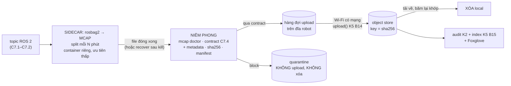

# Chặng 7 — Cảm biến và ghi dữ liệu (35h)

> **Vị trí:** C6 (odometry đã hiệu chuẩn) → **C7** → C8 (định vị và điều hướng) · **Cần trước:** K7 C6 trọn; K5 M1–M3 (K5 Bài 3–4 IMU qua I2C, K5 Bài 8–9 đo offset đồng hồ, K5 Bài 13–15 ingest MCAP, upload resumable, index); K2 M1–M2 (MCAP, `mcap recover`, tool audit `lerobot-audit`); → F3.1, F3.4, F4.6; đọc → F3.5, F3.7, F4.3, F5.5 khi tới bài tương ứng · **Chạy song song với:** K5
> **Làm ra được:** IMU và camera USB gá cứng trên robot, cây TF tĩnh `base_link → imu_link`, `base_link → camera_front_link → camera_front_optical_frame` đúng REP-103/105 · sidecar ghi MCAP trên mini PC, niêm phong + manifest, upload resumable lên object store, audit tự động, data contract của robot, layout Foxglove commit trong repo · **Sau chặng này bạn quyết định được:** gá IMU kiểu gì và đặt lọc bao nhiêu để rung motor không thành chuyển động ma; định dạng và độ phân giải camera nào vừa băng thông USB; timestamp mỗi luồng lấy từ đồng hồ nào và sai bao nhiêu ms; một file MCAP của robot được phép rời robot, được phép xóa local, được phép vào tập huấn luyện khi nào.

Sau C6 robot biết nó **nghĩ** mình ở đâu. C7 cho nó hai giác quan độc lập với bánh xe (quán tính và ảnh) và cho bạn hệ thống giữ lại mọi thứ robot thấy. Đây là chỗ K5 vào việc trên robot thật: không có khái niệm mới về MCAP hay upload, nhưng có ba thứ K5 trên bàn chưa gặp: **rung** của motor, **lịch** của một CPU đang bận chạy ROS 2, và một con robot chạy bằng pin rời khỏi tầm Wi-Fi.

**Phân bổ 35h** `[ước lượng]`:

| Phần | Giờ |
|---|---|
| Lắp bước 1–5: gá IMU (ba kiểu thử), gá camera, đi dây I2C + INT, URDF/TF, udev cho camera | 5 |
| Bài C7.1 Gá cảm biến: rung, frame, TF tĩnh, băng thông USB | 8 |
| Bài C7.2 Timestamp trên robot: source time ESP32 vs host | 7 |
| Bài C7.3 Sidecar MCAP, upload, audit (gồm Foxglove) | 9 |
| Bài C7.4 Data contract cho robot của chính mình | 4 |
| Gate chặng 7 | 2 |
| **Tổng** | **35** |


## 0. Bức tranh chặng

```
                    camera USB (UVC, MJPEG) ── cáp USB ngắn, có kẹp giảm lực kéo ──┐
                    gá cứng, nhìn thẳng trước, cao ~ __ cm                          │
   ┌──────────────── NÓC ROBOT ─────────────────────────────────┐                 │
   │   [camera_front_link]                                      │                 ▼
   │        ▲ x (trước)                                         │      ┌─────────────────────┐
   │        │                                                   │      │ MINI PC N100        │
   │   y ◄──● base_link (giữa trục bánh, trên sàn)              │      │ ROS 2 Jazzy/Docker  │
   │        │                                                   │      │ ├ ros2_control (C5) │
   │   [imu_link] gần base_link, trên đế giảm rung              │      │ ├ camera driver     │
   │      │ I2C (xanh dương SDA / vàng SCL) + INT + 3V3 + GND   │      │ ├ imu: stamp nguồn  │
   │      ▼                                                     │      │ ├ SIDECAR: rosbag2  │
   │   ESP32-S3 (C4) ── USB ───────────────────────────────────────►   │ │   → MCAP split    │
   │   ISR data-ready: t_src (esp_timer, µs) + seq                │      │ ├ sealer + manifest │
   └────────────────────────────────────────────────────────────┘      │ └ uploader (K5 B14) │
                                                                        └──────────┬──────────┘
                                                                                   │ Wi-Fi, resumable
                                                                        ┌──────────▼──────────┐
                                                                        │ SERVER / LAPTOP     │
                                                                        │ object store, index │
                                                                        │ audit (K2), Foxglove│
                                                                        └─────────────────────┘
```

Khối mới: IMU (qua ESP32), camera (thẳng vào mini PC), sidecar ghi dữ liệu, và đường dữ liệu ra khỏi robot. Dòng năng lượng: IMU ăn 3,3 V từ ESP32 (vài mA); camera ăn 5 V từ cổng USB của mini PC (vài trăm mA `[tự đo]`): cả hai thuộc nhánh compute/logic, **không** qua điểm cắt E-stop (E-stop cắt động lực, không cắt compute: `_KE-HOACH-K7.md` mục 5). Dòng dữ liệu: mọi luồng → topic ROS 2 chuẩn (`CONVENTIONS.md` mục 3) → MCAP → niêm phong → hàng đợi upload → object store → audit + index.

## 1. An toàn của chặng

**Rủi ro của C7:** khoan/vít gần pin và dây nguồn khi gá cảm biến; chập 3,3 V khi đi dây IMU lúc ESP32 đang có điện; camera và cáp USB vướng vào bánh; chạy robot nhiều giờ để thu dữ liệu (pin xả sâu, motor nóng); lần đầu robot chạy mà bạn **nhìn màn hình Foxglove** thay vì nhìn robot. Và một rủi ro không vật lý: camera ghi hình người trong văn phòng.

**Quy tắc cứng:**
- KHÔNG khoan, bắt vít trên khung khi pin còn cắm. Rút XT60 pin trước, che dây nguồn bằng bìa.
- KHÔNG đi dây IMU khi ESP32 có điện. Ngắt USB và nguồn 5 V logic; đo thông mạch trước khi cấp lại (mục 5, bước 3).
- KHÔNG để cáp camera/USB treo lỏng: kẹp cách bánh ≥ 3 cm, có điểm giảm lực kéo (C2.3) ở cả hai đầu.
- KHÔNG vừa lái robot vừa nhìn dashboard. Một người lái và cầm E-stop tạm; xem dữ liệu sau, hoặc người thứ hai xem.
- KHÔNG ghi hình người khác trong văn phòng khi họ chưa biết và chưa đồng ý. Ở C7, quay camera vào vùng thử không có người, hoặc báo trước và dán thông báo; KHÔNG upload ảnh có mặt người lên dịch vụ ngoài. Quy trình đồng ý đầy đủ là C9.1; ở đây chỉ cần quy tắc tối thiểu này, ghi vào `decisions.md`.
- KHÔNG chạy thu dữ liệu > 0,3 m/s ở chặng này `[đề xuất cho C7, dưới kẹp 0,5 m/s của C4.4]`.
- Các quy tắc pin và chạy tự động của C1, C6 vẫn có hiệu lực.

**Khi sự cố:** chập khi đi dây (khói, mùi nhựa, ESP32 nóng): rút USB và nguồn logic ngay, không chạm chip trong 1 phút, đo lại Ω giữa 3V3 và GND. Cáp vướng bánh: E-stop, tắt động lực, gỡ bằng tay khi bánh đã đứng yên.

## 2. BOM chặng

Giá `[ước lượng 10/2026]`, kiểm lại ở cửa hàng.

| Món | Thông số phải chọn | Vì sao (bằng số) | Giá | Kiểm khi nhận hàng | Thay thế được bằng |
|---|---|---|---|---|---|
| **IMU** ICM-42688-P (module breakout), hoặc dùng lại module đã mua ở K5 M0 | I2C/SPI, chân INT ra header, 3,3 V; có lọc chống aliasing (AAF) cấu hình được và FIFO | Nhiễu gyro ~2,8 mdps/√Hz, accel ~70 µg/√Hz `[spec — TDK DS ICM-42688-P, kiểm]`; AAF cho phép chặn rung motor trước khi hạ tần số (Bài C7.1) | 150–250k | `WHO_AM_I` = 0x47 (K5 Bài 3) | MPU-6050: rẻ, nhiều tài liệu, nhiễu cao hơn nhiều lần (gyro ~0,005 °/s/√Hz, accel ~400 µg/√Hz `[spec — PS-MPU-6000A-00, kiểm]`), DLPF thô hơn; nhiều nguồn ghi đã ngừng sản xuất `[kiểm trang TDK]`, hàng nhái nhiều (K5 Bài 3). Bosch BMI088 (quảng cáo chịu rung cho drone `[spec — Bosch, kiểm]`) nếu rung quá lớn |
| Đế giảm rung | Băng keo xốp hai mặt dày 1–3 mm; hoặc grommet cao su M3; tấm gel silicone | Thử ba kiểu ở C7.1, chọn bằng phổ rung đo được | 30–100k | — | Miếng cao su xe đạp |
| Dây I2C + INT | 5 sợi 24–26 AWG: SDA xanh dương, SCL vàng (C0.5), 3V3 trắng "3V3", GND đen, INT màu riêng có nhãn; dài ≤ 30 cm, đầu JST-XH | I2C 400 kHz không chịu dây dài, tụ ký sinh làm cạnh lên chậm `[chuẩn]` | 20–50k | Thông mạch từng sợi | Cáp Qwiic có sẵn (JST-SH) + adapter |
| **Camera USB** | UVC (không cần driver riêng), **MJPEG** 1280×720 @30 fps, **lấy nét cố định**, FOV ghi rõ, gá ren 1/4" hoặc lỗ vít | MJPEG vừa băng thông USB 2.0 (Bài C7.1); nét cố định để hiệu chuẩn ở C8.2 còn đúng (autofocus đổi tiêu cự) | 300–900k | `v4l2-ctl --list-formats-ext` liệt kê MJPEG 720p30 | Camera global shutter USB (đắt hơn, ít rolling shutter khi rung `[ước lượng]`) |
| Giá camera | Nhôm hoặc nhựa in dày, bắt **hai** vít vào khung | Một vít = trục xoay; rung làm camera lắc | 50–200k | Lắc tay không thấy dịch | — |
| Cáp USB ngắn + kẹp | 0,3–0,5 m, có kẹp dây | Cáp dài treo lỏng vướng bánh, lắc đầu nối | 50–100k | — | — |

**Tổng C7 `[ước lượng]`:** ~0,6–1,7tr (0 cho IMU nếu dùng lại K5). Object store: MinIO/Garage tự chạy trên laptop như K5 Bài 14 (0đ).

## 3. Dụng cụ và kỹ năng tay

| Kỹ năng | Bài | Luyện trước | Đạt trông thế nào |
|---|---|---|---|
| Gá cảm biến đúng hướng, ghi lại hướng | Lắp bước 1–2 | Vẽ trục x/y/z của chip (in trên module) lên băng keo cạnh module | Ảnh chụp có trục chip và trục `base_link` trên cùng khung hình |
| Đo offset gá bằng thước (x, y, z từ `base_link`) | Lắp bước 4 | Đo một điểm trên robot ba lần | Ba lần lệch ≤ 3 mm |
| Bấm JST-XH 5 chân, đi dây dọc khung | Lắp bước 3 | C0.3 | Dây không căng, có kẹp mỗi 10–15 cm |
| Đọc topo USB | Lắp bước 5 | `lsusb -t` trên laptop | Biết camera nằm trên controller/hub nào, tốc độ 480M hay 5000M |

`base_link` theo `CONVENTIONS.md`: gốc ở giữa trục hai bánh (đúng điểm tham chiếu của C6), `x` tiến, `y` trái, `z` lên. Mọi offset đo từ đó.

## 4. Sơ đồ đi dây

```
  ESP32-S3 (C4)                                         IMU ICM-42688-P (module)
  3V3  ──────────[trắng "3V3", 24 AWG]──────────────────► VDD / VDDIO
  GND  ──────────[đen, 24 AWG]──────────────────────────► GND
  GPIO_SDA ──────[xanh dương]───────────────────────────► SDA   (pull-up 4,7 kΩ lên 3V3: kiểm module đã có chưa)
  GPIO_SCL ──────[vàng]─────────────────────────────────► SCL
  GPIO_INT ◄─────[màu riêng, nhãn "IMU-INT"]────────────  INT1  (data-ready → ISR đóng dấu t_src)
                 dài ≤ 30 cm; xoắn SCL với một sợi GND nếu chạy gần dây motor
  Cùng bus I2C với INA226 (C1.5): địa chỉ INA226 0x40–0x4F, IMU 0x68/0x69 `[spec]` → không trùng; quét bus để xác nhận (K5 Bài 3)

  Mini PC  USB-A ──[cáp 0,3–0,5 m, kẹp hai đầu]──► camera UVC
           USB   ──[cáp C4]────────────────────────► ESP32-S3
```

**Bảng chân:** chân I2C và INT lấy từ bảng chân (pin budget) của C4.1, không chọn mới ở đây. Nếu bảng chưa có INT: chọn một GPIO **không** phải chân strapping (ESP32-S3: GPIO0, 3, 45, 46 `[spec — ESP32-S3 datasheet, mục Strapping Pins, kiểm]`) và không phải USB (GPIO19/20 `[spec]`), cập nhật bảng chân C4.1 và `wiring/wires.csv`. Màu INT không có trong quy ước C0.5: chọn một màu, thêm dòng vào `CONVENTIONS.md` mục "Dây", ghi `decisions.md`.

## 5. Trình tự chặng

1. **Học Bài C7.1** phần 1–5 (commit `prediction.md`).
2. **Lắp bước 1 — Gá IMU** gần `base_link` (càng gần trục bánh càng ít gia tốc hướng tâm khi quay), mặt chip song song sàn, trục x chip theo trục x robot nếu được. Làm **ba** đế để so: vít cứng qua standoff, băng xốp, grommet cao su.
   - ✅ Checkpoint: module không lắc khi gõ nhẹ bằng bút; không chạm khung kim loại ở mặt dưới (chập chân).
3. **Lắp bước 2 — Gá camera** bằng hai vít, nhìn thẳng trước, không thấy thân robot trong khung hình (hoặc thấy một phần cố định, ghi lại). Cáp kẹp hai đầu.
   - ✅ Checkpoint: lắc nhẹ robot, ảnh trên màn hình không giật lệch so với khung.
4. **Lắp bước 3 — Đi dây I2C + INT** theo mục 4, ESP32 **không** có điện.
   - ✅ Checkpoint trước khi cấp điện: Ω giữa 3V3 và GND của IMU **không** gần 0; thông mạch từng sợi đầu–cuối; không thông mạch giữa SDA và SCL. Cấp điện qua USB từ laptop (không phải pin) lần đầu.
   - Nếu sai: tháo, bấm lại đầu JST.
   - Sau cấp điện: quét bus thấy 0x68/0x69 và địa chỉ INA226; `WHO_AM_I` đúng (K5 Bài 3).
5. **Lắp bước 4 — URDF/TF tĩnh**: đo offset (x, y, z) của IMU và camera từ `base_link` bằng thước, góc gá bằng thước đo độ/ê-ke; thêm hai joint `fixed` vào URDF của C5 (Bài C7.1 mục 6).
   - ✅ Checkpoint: robot đứng yên, `/imu/data_raw` trong `imu_link` biến đổi sang `base_link` cho gia tốc ≈ +g theo `z` (rule `gravity_up`, Bài C7.4).
6. **Lắp bước 5 — Camera trên hệ thống**: udev rule cho tên thiết bị cố định (theo serial/đường cổng), đưa vào container (C5.2), chạy driver camera.
   - ✅ Checkpoint: `ros2 topic hz` của ảnh nén đạt fps đặt ±5 % trong 5 phút khi `ros2_control` cũng đang chạy.
7. **Làm Bài C7.1** mục 6 (đo rung, chọn đế và lọc; đo băng thông USB).
8. **Học và làm Bài C7.2** (timestamp).
9. **Học và làm Bài C7.3** (sidecar, upload, audit, Foxglove).
10. **Học và làm Bài C7.4** (data contract; chạy lại bước va chạm của C6.3 với gyro).
11. **Gate chặng 7.**

Robot vẫn chạy được ở phạm vi nhỏ hơn suốt chặng: teleop và odometry C5–C6 không phụ thuộc IMU, camera hay sidecar. Sidecar chết thì robot vẫn chạy (và Bài C7.3 kiểm đúng điều đó).

## 6. Lỗi người mới hay gặp

| Triệu chứng | Nguyên nhân khả dĩ | Kiểm bằng cách | Sửa |
|---|---|---|---|
| IMU đọc bình thường trên bàn, rác khi motor chạy | Nhiễu motor lên dây I2C; ground chung với đường dòng motor | Logic analyzer trên SDA/SCL khi motor chạy | Dây ngắn, xoắn với GND, tách xa dây motor; ground hình sao (C1) |
| `VIDIOC_STREAMON: No space left on device` | Hết băng thông isochronous USB (định dạng thô, hai camera chung controller) | `dmesg`, `lsusb -t` | MJPEG; độ phân giải thấp hơn; cổng/controller khác |
| Camera ra 15 fps dù đặt 30 | Phơi sáng tự động dài trong phòng tối; định dạng không hỗ trợ 30 fps | `v4l2-ctl --all` xem exposure | Tắt auto exposure, đặt exposure ≤ 1/fps; thêm đèn |
| Wi-Fi upload chậm/đứt khi camera cắm cổng USB 3 | Nhiễu băng 2,4 GHz từ USB 3 `[chuẩn — Intel white paper 2012]` | Đổi camera sang cổng USB 2, đo lại iperf3 | Cổng USB 2, cáp bọc chống nhiễu, Wi-Fi 5 GHz |
| TF đúng trên giấy, `gravity_up` FAIL | IMU úp ngược hoặc xoay 90° mà URDF chưa ghi | Đặt robot đứng yên, đọc accel thô | Sửa rpy trong URDF (Bài C7.1) |
| Ổ mini PC đầy sau một buổi | Ghi ảnh thô, không split, không xóa sau upload | `du -sh` thư mục bag | MJPEG nén; split; chính sách xóa sau xác nhận (Bài C7.3) |

## 7. Lăng kính data infra

**Dữ liệu chặng này sinh ra** (giữ tần số bản gốc Bài 5; message và frame theo `CONVENTIONS.md`):

| Luồng | Message | Topic | Frame | Tần số | Nguồn timestamp |
|---|---|---|---|---|---|
| Encoder | `sensor_msgs/msg/JointState` | `/joint_states` | — | 100 Hz | host (controller), `host_unsynced` |
| Lệnh PWM / lệnh vận tốc | lệnh của controller (ví dụ `TwistStamped`), PWM qua topic chẩn đoán của C4/C5 `[tự đo]` | `/cmd_vel`, PWM theo C5 | — | 100 Hz | host |
| IMU | `sensor_msgs/msg/Imu` | `/imu/data_raw` | `imu_link` | 200 Hz | nguồn ESP32 đã ánh xạ (`estimated`), hoặc host (Bài C7.2) |
| Đối chiếu đồng hồ | `sensor_msgs/msg/TimeReference` | `/esp32/time_reference` | — | 1–10 Hz | `header.stamp` = host nhận, `time_ref` = ESP32 |
| Odometry | `nav_msgs/msg/Odometry` | `/odom` | `odom` → `base_link` | 50 Hz | host |
| Pin | `sensor_msgs/msg/BatteryState` | `/battery` | — | 1 Hz | host |
| Camera | `sensor_msgs/msg/CompressedImage` + `CameraInfo` | `/camera_front/image/compressed` | `camera_front_optical_frame` | 10–30 fps | host lúc driver nhận (Bài C7.2) |
| TF tĩnh | `tf2_msgs/msg/TFMessage` | `/tf_static` | — | một lần (latched) | — |
| Chẩn đoán | `diagnostic_msgs/msg/DiagnosticArray` | `/diagnostics` | — | 1 Hz | host |

Metadata theo `CONVENTIONS.md` mục 4 (`metadata_version`, `calibration_id`, `clock_source`, `source_device_id`, `firmware_version`) đi vào **metadata của channel và Metadata record MCAP** lúc niêm phong (Bài C7.3), không chèn vào message. Mất gói host ↔ ESP32 đếm bằng số thứ tự ở tầng truyền, báo qua `/diagnostics`.

**Test tự động sinh ra (hạt giống HIL/CI cho C11):**
- Data contract (Bài C7.4) chạy trên mọi file sau niêm phong: là test của **pipeline ghi**, cũng là test hồi quy khi đổi firmware, đổi driver, đổi URDF.
- `kill -9` sidecar và rút Wi-Fi giữa phiên (Bài C7.3): file vẫn cứu được, upload tiếp tục, không trùng. Ở C11.2 thành kịch bản fault injection chạy định kỳ.
- Rule `gravity_up` chặn mọi file có TF/đơn vị IMU sai: một cấu hình URDF sai không bao giờ lọt vào dataset.

**SLI/SLO đề xuất (→ F7.4):** tỉ lệ file niêm phong qua contract; độ trễ ghi → có trên object store (p95); tỉ lệ mẫu IMU mất theo `seq`; số byte chờ upload trên robot; tuổi của file cũ nhất chưa upload.

**Vai trò nghề:** Data Platform (ingest, niêm phong, upload, index, contract) và Test & Validation (rule vật lý có tiền điều kiện, fault injection lên pipeline). Đây là phần giống nhất với công việc bạn nhắm tới.

## 8. Nhật ký build

Copy vào `build-log/c07.md`, một mục mỗi buổi:

```markdown

## 2026-MM-DD — buổi N (giờ bắt đầu–kết thúc, giờ thực: _._ h)
- Trạng thái người: tỉnh táo / mệt (mệt → chỉ phân tích dữ liệu, không khoan, không đi dây)
- E-stop tạm đã thử đầu buổi (nếu robot chạy): có / không
- Phần cứng đã đổi (gá, dây, cổng USB): ... · ảnh: build-log/img/c07/...
- firmware_version / URDF commit / calibration_id đang dùng: ...
- Phiên ghi: session_id, thời lượng, số file, tổng MB, đã upload? đã qua contract?
- Số đo (rung RMS, fps thật, offset/skew đồng hồ, jitter): vào measurements.jsonl? số dòng: __
- Lỗi gặp (triệu chứng → nguyên nhân → sửa):
- Có ghi hình người không? Ai đã đồng ý? (C9.1 sẽ thay dòng này bằng quy trình)
- Quyết định (ghi decisions.md):
- Câu hỏi còn mở:
```

---

## Bài C7.1 — Gá cảm biến: rung, frame, TF tĩnh, băng thông USB (8h)

> **Vị trí:** C6 → **C7.1** → C7.2 (timestamp) · **Cần trước:** K5 Bài 3–4 (IMU qua I2C, raw → SI), → F5.5 (Nyquist, aliasing), → F5.6 mục 2 (phổ, lọc), K2 Bài 3 (frame và TF), → F1.1 · **Sau bài này bạn quyết định được:** gá IMU bằng đế nào và đặt lọc bao nhiêu; IMU chạy ODR nào; camera chạy định dạng, độ phân giải, fps nào trên cổng nào; offset và góc gá nào đi vào URDF, ghi ở đâu.

### 1. Câu chuyện — ai đã khổ vì chuyện này

Cộng đồng autopilot mã nguồn mở cho drone (ArduPilot, PX4) học bài này bằng máy bay rơi: rung của cánh quạt đi qua khung vào accelerometer, bị lấy mẫu thành tín hiệu tần số thấp giả, bộ ước lượng tin đó là chuyển động thật, và máy bay mất độ cao hoặc tự trôi. Tài liệu ArduPilot có hẳn trang "Measuring Vibration": firmware ghi mức rung (log `VIBE`) và hướng dẫn coi mức rung vượt ngưỡng là lỗi phải sửa bằng đế giảm rung **trước** khi chỉnh bất kỳ tham số điều khiển nào `[chuẩn — ArduPilot docs, kiểm ngưỡng cụ thể]`.

Robot của bạn chậm hơn drone nhiều, nhưng có motor DC giảm tốc quay nhanh ngay cạnh IMU, gắn trên cùng tấm khung. Lỗi gá ở chặng này không làm robot rơi; nó làm **dữ liệu** sai theo cách trông rất hợp lý, và mọi thứ dùng dữ liệu đó (bộ hợp nhất C8.3, dataset C11.5) thừa hưởng lỗi.

### 2. Mô hình tư duy

Gá một cảm biến quyết định ba thứ, và mỗi thứ có một cách kiểm riêng:

| Gá quyết định | Sai thì | Kiểm bằng |
|---|---|---|
| **Tín hiệu vật lý nào tới cảm biến** (đường truyền rung) | Rung motor thành "chuyển động ma" sau khi lấy mẫu | Phổ rung đo trên robot (mô phỏng 1, mục 6) |
| **Dữ liệu được biểu diễn trong frame nào** (TF tĩnh) | Gia tốc, góc quay đúng độ lớn nhưng sai trục/sai dấu | Vật lý đã biết: đứng yên thì +g hướng lên (mô phỏng 2) |
| **Dữ liệu có ra khỏi được thiết bị không** (băng thông bus) | Rớt frame, camera không bật, nhiễu sang Wi-Fi | Tính ngân sách băng thông, đo fps thật |

**Mô phỏng 1 — rung 170 Hz lấy mẫu ở 200 Hz.** Tần số rung là giả định (`[ước lượng]`; bạn đo cái thật ở mục 6).

```python
# [đã chạy] Rung motor 170 Hz lấy mẫu ở ODR 200 Hz: không lọc chống aliasing -> "chuyển động ma" 30 Hz
import numpy as np
from scipy import signal
FS_IN, ODR, T = 8000, 200, 10.0                    # mô phỏng "liên tục" 8 kHz; IMU xuất 200 Hz; 10 s
t = np.arange(0, T, 1 / FS_IN)
motion = 0.3 * np.sin(2 * np.pi * 1.0 * t)         # chuyển động thật của thân: 1 Hz, 0,3 m/s²
vib = 2.0 * np.sin(2 * np.pi * 170 * t)            # rung từ motor/hộp số: 170 Hz, 2 m/s² [ước lượng]
a = motion + vib
step = FS_IN // ODR
raw = a[::step]                                    # (a) lấy mẫu tức thời, không lọc trước
sos = signal.butter(2, 50, fs=FS_IN, output="sos") # (b) lọc thông thấp 50 Hz TRƯỚC khi hạ tần số
filt = signal.sosfilt(sos, a)[::step]              #     (IMU làm việc này bên trong nếu bạn cấu hình đúng)
ts = t[::step]
def amp_at(x, f0):                                  # biên độ thành phần tần số f0 trong chuỗi 200 Hz
    X = np.fft.rfft(x * np.hanning(x.size)); f = np.fft.rfftfreq(x.size, 1 / ODR)
    return 2 * np.abs(X[np.argmin(abs(f - f0))]) / np.hanning(x.size).sum()
for name, x in [("không lọc", raw), ("lọc 50 Hz trước", filt)]:
    print(f"{name:16s} biên độ ở 1 Hz = {amp_at(x, 1):.2f}  ở 30 Hz (ma) = {amp_at(x, 30):.3f} m/s²"
          f"  | std(a − chuyển động thật) = {np.std(x - 0.3*np.sin(2*np.pi*ts)):.3f}")
```

Ba ý bản chất: (1) sau khi đã lấy mẫu, **không** phần mềm nào phân biệt được 30 Hz ma với 30 Hz thật (→ F5.5); lọc phải xảy ra **trước** bước hạ tần số, tức là trong chip (DLPF/AAF của IMU, nó lấy mẫu nội bộ ở tần số cao hơn ODR) hoặc bằng cơ khí (đế giảm rung). (2) Lọc có giá: trễ pha, nên băng thông lọc là thỏa hiệp với vòng điều khiển/ước lượng dùng IMU. (3) Đế mềm là một bộ lọc cơ khí thông thấp; quá mềm thì nó **cộng hưởng** ở tần số riêng của nó và khuếch đại rung ở đó.

**Mô phỏng 2 — TF tĩnh: kiểm rpy bằng câu hỏi "trục nào đi đâu".** URDF và `static_transform_publisher` dùng roll–pitch–yaw quanh trục cố định; nhầm thứ tự hay dấu là lỗi phổ biến nhất.

```python
# [đã chạy] Kiểm TF tĩnh trước khi tin: rpy của URDF -> ma trận, rồi hỏi "trục nào đi đâu"
import numpy as np
def rpy_to_R(r, p, y):
    """URDF/ROS: quay quanh trục CỐ ĐỊNH x (roll), rồi y (pitch), rồi z (yaw): R = Rz·Ry·Rx."""
    cx, sx, cy, sy, cz, sz = np.cos(r), np.sin(r), np.cos(p), np.sin(p), np.cos(y), np.sin(y)
    Rx = np.array([[1, 0, 0], [0, cx, -sx], [0, sx, cx]])
    Ry = np.array([[cy, 0, sy], [0, 1, 0], [-sy, 0, cy]])
    Rz = np.array([[cz, -sz, 0], [sz, cz, 0], [0, 0, 1]])
    return Rz @ Ry @ Rx
names = {"x": 0, "y": 1, "z": 2}
def where(R, parent="cha", child="con"):
    """Cột i của R = trục i của frame con, viết trong frame cha."""
    for ax, i in names.items():
        v = np.round(R[:, i], 3) + 0.0
        print(f"  trục {ax} của {child} = {v} trong {parent}")
# 1) camera_link (x trước, y trái, z lên, REP-103) -> camera_optical_frame (z trước, x phải, y xuống)
R = rpy_to_R(-np.pi / 2, 0, -np.pi / 2)
print("camera_link -> optical, rpy = (-pi/2, 0, -pi/2):"); where(R, "camera_link", "optical")
assert np.allclose(R[:, 2], [1, 0, 0]) and np.allclose(R[:, 0], [0, -1, 0]) and np.allclose(R[:, 1], [0, 0, -1])
# 2) IMU gắn úp ngược (chip quay mặt xuống), trục x của chip vẫn hướng trước: base_link -> imu_link
R_imu = rpy_to_R(np.pi, 0, 0)
print("base_link -> imu_link (úp ngược):"); where(R_imu, "base_link", "imu_link")
# Kiểm bằng vật lý: robot đứng yên, accel đo trong imu_link phải là +g theo trục lên của base_link
a_imu = R_imu.T @ np.array([0, 0, 9.81])           # lực riêng khi đứng yên: +g hướng LÊN (REP-103 z lên)
print("  accel đứng yên đọc ở imu_link:", np.round(a_imu, 2), "-> trục z của chip đọc âm là đúng")
```

Accelerometer đo **lực riêng** (specific force), không đo gia tốc: đứng yên trên bàn nó đọc +g hướng **lên** (K5 Bài 4). Đó là phép kiểm TF miễn phí mà bạn luôn có.

**Băng thông USB, bằng số** (→ F7.1 nếu muốn nhìn như một hàng đợi): USB 2.0 High-Speed 480 Mbit/s; truyền đẳng thời (isochronous, kiểu mà camera UVC dùng cho video) **đặt trước** băng thông mỗi vi khung 125 µs, tối đa 3 × 1024 byte mỗi endpoint mỗi vi khung, và tổng truyền định kỳ không quá 80 % vi khung `[spec — USB 2.0 Specification, mục 5.6 và 5.7]`. Ngân sách một luồng thô: `rộng × cao × byte/pixel × fps` (YUYV = 2 byte/pixel). MJPEG nén từng ảnh, kích thước đổi theo cảnh `[tự đo]`.

### 3. Cầu nối từ backend

| Backend bạn biết | Ở đây | Gãy ở chỗ | Nếu dùng nhầm thì |
|---|---|---|---|
| Prometheus scrape mỗi 15 s: một counter dao động nhanh trông như đứng yên hoặc dao động chậm | IMU ODR 200 Hz lấy mẫu rung 170 Hz | Exporter không có cách lọc trước khi scrape; IMU **có** (DLPF/AAF) và đế cơ khí cũng là bộ lọc. Ở đây bạn sửa được ở nguồn | "Tăng scrape rate là xong": tăng ODR mà không lọc vẫn alias rung ở tần số cao hơn nữa |
| Hợp đồng đơn vị/định dạng giữa service (ms hay s, UTC hay local) | TF tĩnh: dữ liệu IMU ở `imu_link`, người dùng cần `base_link` | Lỗi đơn vị backend thường làm số sai nhiều bậc, dễ thấy. Lỗi trục/dấu cho số **đúng độ lớn**, trông hợp lý | Robot "rẽ trái" trong dữ liệu khi thật ra rẽ phải; bộ hợp nhất C8.3 đánh nhau với odometry |
| QoS mạng: băng thông đặt trước vs best effort | Isochronous (video, đặt trước) vs bulk (ổ đĩa, serial) | Mạng backend cho bạn thử rồi chậm dần; USB isochronous **từ chối ngay** lúc mở luồng nếu không đủ chỗ đặt trước | Cắm thêm camera thứ hai, cái đầu đang chạy bình thường, cái sau báo lỗi khó hiểu |

**Chấm mô hình:**

1. *"IMU 200 Hz thì thấy đúng mọi chuyển động tới 100 Hz, phần trên 100 Hz chỉ bị mất."* **SAI.** Phần trên Nyquist không mất; nó **gập xuống** dưới 100 Hz và cộng vào tín hiệu thật. **Phản ví dụ:** mô phỏng 1: rung 170 Hz xuất hiện ở 30 Hz với nguyên biên độ.
2. *"Data đi qua dây data; cách đọc/ghi, schema phải dùng các dây khác như clock để phối hợp"* (mô hình của bạn ở K3 lượt 2), áp vào chuyện gá IMU: "dây I2C đúng, WHO_AM_I đúng thì dữ liệu đúng". **ĐÚNG MỘT PHẦN.** Đúng cho tầng truyền. Gãy ở chỗ ý nghĩa của ba con số accel (trục nào của **robot**) không nằm trên dây nào, cũng không nằm trong datasheet: nó nằm trong cách bạn vặn con chip vào khung, và chỉ được ghi lại trong URDF. **Phản ví dụ:** cùng chip, cùng dây, xoay 90° trên khung: mọi byte hợp lệ, `x` của chip thành `y` của robot.
3. *"Đế càng mềm càng tốt cho IMU."* **ĐÚNG MỘT PHẦN.** Mềm hơn cắt rung tần số cao tốt hơn, nhưng hạ tần số cộng hưởng của đế xuống; nếu nó rơi vào dải chuyển động thật hoặc dải rung khác (bánh lăn qua mạch gạch), đế khuếch đại. **Phản ví dụ:** IMU trên miếng xốp dày lắc lư khi robot tăng tốc, gyro thấy "nghiêng" không có thật.

### 4. Thuật ngữ

| Mức | Thuật ngữ | Nghĩa trong một câu | Hay bị hiểu nhầm thành |
|---|---|---|---|
| 🟢 | ODR (output data rate) | Tần số IMU xuất mẫu ra ngoài | Tần số lấy mẫu bên trong chip (thường cao hơn) |
| 🟢 | Aliasing | Thành phần trên Nyquist gập xuống thành tần số thấp giả | Mất dữ liệu tần số cao |
| 🟢 | DLPF / AAF | Lọc thông thấp số / chống aliasing bên trong IMU, trước khi hạ xuống ODR | Lọc phần mềm trên host (quá muộn) |
| 🟢 | Lực riêng (specific force) | Thứ accelerometer đo: gia tốc trừ trọng trường; đứng yên đọc +g lên | "Gia tốc của robot" |
| 🟢 | TF tĩnh, joint `fixed` | Biến đổi không đổi theo thời gian giữa hai frame, publish một lần trên `/tf_static` | Biến đổi đo một lần là đúng mãi (gá có thể xê dịch) |
| 🟢 | Optical frame | Frame camera theo quy ước ảnh: z trước, x phải, y xuống | `camera_link` (x trước, z lên) |
| 🟡 | Isochronous / bulk (USB) | Băng thông đặt trước, không gửi lại / phần còn lại, có gửi lại | "USB 480 Mbit/s là của mỗi thiết bị" |
| 🟡 | Tần số cộng hưởng của đế | Tần số đế giảm rung khuếch đại thay vì giảm | — |

### 5. Dự đoán

**Đề:**
1. Ở vận tốc robot 0,1 / 0,2 / 0,3 m/s, trục motor quay bao nhiêu Hz? Tần số "gear mesh" của cấp bánh răng đầu tiên? Ở ODR 200 Hz không lọc, những tần số đó alias về đâu?
2. RMS rung (accel, m/s²) trên ba kiểu đế (vít cứng, băng xốp, grommet) khi bánh quay trên giá kê ở 0,3 m/s: xếp hạng, và tỉ số giữa tốt nhất và tệ nhất.
3. Băng thông USB của camera ở ba chế độ: YUYV 640×480@30, YUYV 1280×720@30, MJPEG 1280×720@30. Chế độ nào **không thể** chạy trên USB 2.0? Hai camera YUYV 640×480@30 cùng một controller có chạy không?
4. Accel đứng yên trong `imu_link` của robot bạn (theo cách bạn đã gá): ba trục đọc gì?

**Tham số cần tra:** bán kính bánh (C6), tỉ số truyền và PPR (C3, datasheet motor), số răng bánh răng cấp đầu (nếu nhà bán có; không có thì bỏ câu đó); thanh ghi DLPF/AAF và ODR của IMU (datasheet ICM-42688-P mục cấu hình bộ lọc; MPU-6050: `CONFIG` 0x1A); định dạng camera hỗ trợ (`v4l2-ctl --list-formats-ext`); topo USB (`lsusb -t`).

**Công thức:** `f_motor = v / (2π r) × N_truyền`; alias của `f` ở ODR `fs`: `|f − k·fs|` nhỏ nhất với k nguyên; băng thông thô = `W × H × 2 × fps` byte/s; so với ~24,6 MB/s mỗi endpoint isochronous (3 × 1024 B × 8000 vi khung/s) và 80 % của bus.

```markdown
# prediction.md — K7 C7.1
commit: <hash>
| Đại lượng | Dự đoán | Cách tính |
|---|---|---|
| f_motor ở 0,1/0,2/0,3 m/s (Hz) | | |
| Alias ở ODR 200 Hz (Hz) | | |
| RMS rung: vít / xốp / grommet (m/s²) | | |
| Băng thông YUYV VGA30 / YUYV 720p30 / MJPEG 720p30 (MB/s) | | |
| Chế độ không chạy được trên USB 2.0 | | |
| Accel đứng yên trong imu_link (x, y, z) | | |
## Tôi sẽ ngạc nhiên nếu...
```

### 6. Làm

**A. Rung và lọc (3h).**
1. Firmware (C4) đặt IMU ở ODR cao nhất mà đường serial chịu được để **nhìn** phổ (ví dụ 1 kHz, gói nhỏ `[tự đo]`), DLPF/AAF **rộng nhất**. Đây là chế độ đo, không phải chế độ chạy.
2. Với từng đế (vít, xốp, grommet): robot trên giá kê, bánh quay ở 0,1 / 0,2 / 0,3 m/s, ghi 30 s mỗi mức; rồi robot chạy thẳng trên sàn gạch 0,2 m/s. Ghi `V_bat`.
3. Tính phổ (Welch, `scipy.signal.welch`, → F5.6) và RMS accel/gyro trên dải > 20 Hz cho mỗi lần. Tìm đỉnh: có trùng `f_motor`, bội của nó, hay tần số khác (bánh xe, caster)?
4. Chọn đế có RMS nhỏ nhất **mà** không có đỉnh cộng hưởng mới dưới 20 Hz. Đặt ODR chạy (200 Hz theo `CONVENTIONS.md`) và DLPF/AAF dưới ODR/2 với lề; ghi lý do và số vào `decisions.md`. Ghi lại 30 s ở cấu hình chạy: đỉnh rung còn bao nhiêu sau khi gập.
5. Ghi `calibration_id` của IMU (`imu-01@<ngày>-a`) cùng cấu hình bộ lọc; đo bias gyro tĩnh 10 phút (K5 Bài 4) **trên robot**, không phải trên bàn.

**B. TF tĩnh (2h).**
6. Đo offset IMU và camera từ `base_link` (thước thép, ±3 mm `[ước lượng]`; z tính từ mặt sàn). Ghi góc gá: nếu chip/camera thẳng hàng với khung, góc = 0 với độ bất định ±2° `[ước lượng]`.
7. Thêm vào URDF của C5 (dùng `robot_state_publisher` publish `/tf_static`):

```xml
<!-- [chưa chạy] Thêm vào URDF của C5. Số là VÍ DỤ: thay bằng số đo của bạn (m, rad). -->
<link name="imu_link"/>
<joint name="imu_joint" type="fixed">
  <parent link="base_link"/><child link="imu_link"/>
  <origin xyz="0.020 0.000 0.085" rpy="0 0 0"/>          <!-- úp ngược: rpy="3.14159 0 0" -->
</joint>
<link name="camera_front_link"/>
<joint name="camera_front_joint" type="fixed">
  <parent link="base_link"/><child link="camera_front_link"/>
  <origin xyz="0.120 0.000 0.210" rpy="0 0.10 0"/>        <!-- pitch dương = chúc xuống (REP-103) -->
</joint>
<link name="camera_front_optical_frame"/>
<joint name="camera_front_optical_joint" type="fixed">
  <parent link="camera_front_link"/><child link="camera_front_optical_frame"/>
  <origin xyz="0 0 0" rpy="-1.5708 0 -1.5708"/>           <!-- kiểm bằng mô phỏng 2 -->
</joint>
```

8. Kiểm bằng vật lý: robot đứng yên trên sàn phẳng, `ros2 run tf2_ros tf2_echo base_link imu_link` `[tự đo cú pháp]`, rồi biến đổi accel trung bình 10 s sang `base_link`: z ≈ +g, x, y ≈ 0 (trong dung sai dựng của sàn và gá). Quay robot tại chỗ bằng teleop: `ω_z` gyro trong `base_link` **dương** khi quay trái. Camera: giơ một vật trước robot lệch sang **trái**; trong ảnh nó phải ở nửa trái, và tọa độ x trong optical frame âm.
9. Quyết định **một** chỗ xử lý hướng gá: hoặc URDF ghi xoay (khuyến nghị: dữ liệu thô giữ trục chip, TF nói sự thật), hoặc firmware hoán trục trước khi gửi. Không làm cả hai. Ghi `decisions.md`.

**C. Camera và băng thông USB (3h).**
10. `lsusb -t`: camera và ESP32 nằm trên controller/hub nào, tốc độ bao nhiêu. `v4l2-ctl -d /dev/<camera> --list-formats-ext` `[tự đo]`.
11. Thử ba chế độ ở đề 3. Với mỗi chế độ: luồng có mở không (`dmesg` khi lỗi), fps thật trong 5 phút (`ros2 topic hz`), băng thông topic (`ros2 topic bw`), CPU của driver (`top`).
12. Chọn chế độ chạy (gợi ý xuất phát: MJPEG 1280×720 hoặc 640×480 ở 15–30 fps theo nhu cầu C8.2) và **khóa** exposure, white balance, focus (nếu có) bằng `v4l2-ctl` hoặc tham số driver `[tự đo tên tham số]`: tự động thay đổi những thứ này làm đổi thời điểm giữa phơi sáng (C7.2) và đổi tiêu cự (C8.2).
13. Nếu dùng Wi-Fi 2,4 GHz: đo `iperf3` từ robot về server với camera ở cổng USB 3 và ở cổng USB 2.
14. Chạy robot thẳng 0,2 m/s, xem ảnh: nhòe chuyển động và "lắc thạch" (rolling shutter khi rung). Ghi vào `decisions.md` nếu cần giảm exposure.

### 7. Số phải ra

<details><summary>🔒 MỞ SAU KHI COMMIT prediction.md</summary>

**Mô phỏng 1:** không lọc: thành phần ma 30 Hz biên độ **2,0 m/s²**, gần **7 lần** chuyển động thật 0,3 m/s²; std sai lệch ~1,4 m/s². Lọc thông thấp bậc 2 ở 50 Hz trước khi hạ tần số: ma còn ~0,17 m/s² (bậc 2 suy giảm ~ (170/50)² ≈ 12 lần), sai lệch ~0,12 m/s² (một phần là trễ pha của bộ lọc).

**Mô phỏng 2:** rpy `(−π/2, 0, −π/2)` đưa `z` optical về `x` của `camera_link`, `x` optical về `−y`, `y` optical về `−z`: đúng quy ước optical. IMU úp ngược: đứng yên đọc `a_z ≈ −g` ở chip, và URDF có `roll = π` biến nó thành +g trong `base_link`.

**Tần số motor** `[ước lượng]` với bánh r ≈ 32,5 mm, tỉ số truyền ~30–50: ở 0,2 m/s bánh ~1 vòng/s, trục motor ~30–50 Hz; ở 0,3 m/s ~45–75 Hz. Gear mesh của cấp đầu là bội số răng của tần số trục, thường hàng trăm Hz trở lên: đó là chỗ đỉnh phổ hay nằm, và ở 200 Hz không lọc chúng gập vào dải chuyển động.

**Đế** `[ước lượng]`: vít cứng thường cho RMS > 20 Hz cao nhất; xốp mỏng hoặc grommet giảm vài lần; xốp dày có thể xuất hiện cộng hưởng dưới 20 Hz. Số của bạn là số đúng.

**Băng thông USB:**

| Chế độ | Băng thông thô | Trên USB 2.0 HS |
|---|---|---|
| YUYV 640×480@30 | 18,4 MB/s | Một camera chạy được (< ~24,6 MB/s/endpoint) |
| YUYV 1280×720@30 | 55,3 MB/s | **Không thể**: vượt cả endpoint lẫn 80 % bus (48 MB/s). Camera thường chỉ cho YUYV 720p ở 5–10 fps |
| MJPEG 1280×720@30 | vài MB/s `[ước lượng 50–150 KB/ảnh]` | Chạy được; CPU giải nén nếu cần ảnh thô |

Hai camera YUYV VGA@30 trên một controller: tổng 36,8 MB/s < 48 MB/s nên **trên lý thuyết** vừa, nhưng nhiều camera UVC xin băng thông theo kích thước gói tối đa thay vì nhu cầu thật, nên camera thứ hai hay bị từ chối `[tự đo]`. Đó là lý do mặc định MJPEG.

**Accel đứng yên:** theo cách bạn gá; nếu chip phẳng, mặt lên: `(≈0, ≈0, ≈+9,8)` m/s² trong dung sai offset (K5 Bài 4).

</details>

### 8. Nếu ra khác

| Triệu chứng | Nguyên nhân khả dĩ | Kiểm bằng cách | Sửa |
|---|---|---|---|
| Phổ có đỉnh ở mọi tốc độ cùng một tần số | Cộng hưởng khung/đế, không phải motor | Gõ nhẹ khung khi motor tắt, xem phổ | Đổi đế; thêm điểm bắt vít cho tấm gá |
| Đỉnh dịch theo tốc độ, tỉ lệ đúng với `f_motor` | Rung motor/hộp số | — | Đế + lọc; kiểm motor có lệch tâm, bánh có đảo |
| Gyro đứng yên trên robot khác trên bàn | Nhiệt (gần driver/mini PC), ứng suất cơ khi siết vít | Đo bias theo nhiệt độ chip | Gá xa nguồn nhiệt; không siết vít ép module |
| `ω_z` âm khi quay trái | Trục z chip ngược, TF chưa ghi | Bước 8 | Sửa rpy URDF (hoặc hoán trục firmware, chỉ một nơi) |

### 9. Câu hỏi ngược

1. **[Quy mô]** 100 robot cùng thiết kế, lắp bởi 3 người khác nhau. Gá IMU lệch vài độ, đế mềm cứng khác nhau. Cái gì trong dataset gãy trước, và bạn phát hiện bằng dữ liệu nào mà không phải đi xem từng con?
<details><summary>Hướng nghĩ</summary>

TF tĩnh trong URDF là của **thiết kế**, không của **từng con**: lệch gá thành bias trục chéo (gravity rò sang x/y). Phát hiện bằng rule đứng yên (`gravity_up` mở rộng cho x/y) và phổ rung theo `robot_id`. Cần `calibration_id` theo từng robot cho cả TF, không chỉ cho hệ số.

</details>

2. **[Failure mode]** Một vít gá camera lỏng dần sau hai tuần. Dữ liệu nào lộ ra trước khi ai đó nhìn thấy bằng mắt?
<details><summary>Hướng nghĩ</summary>

Ảnh rung khi robot đứng yên mà motor chạy (rung tần số motor trong luồng ảnh); pose marker (C8) có phần dư lớn dần và có hướng; extrinsic hiệu chuẩn ở C8.2 không còn đúng. Một phép kiểm định kỳ: chụp một mục tiêu cố định khi robot ở trạm sạc.

</details>

3. **[Vì sao không]** Vì sao không cắm IMU thẳng vào mini PC qua một adapter USB–I2C, khỏi đi qua ESP32?
<details><summary>Hướng nghĩ</summary>

Được, nhưng mất thứ C7.2 cần: một đồng hồ tất định đóng dấu ngay lúc data-ready. Adapter USB–I2C bị host thăm dò theo lịch USB; thời điểm đọc trên host là thời điểm của lịch, không của mẫu. Và kiến trúc K7 đã quyết mọi tín hiệu phần cứng đi qua ESP32 (mini PC không có GPIO).

</details>

### 10. Liên kết ra ngoài

- **Âm thanh số: lọc chống aliasing trước ADC.** Mọi ADC âm thanh có lọc tương tự (hoặc oversampling + lọc số) trước khi hạ xuống 44,1/48 kHz; K3 đã gặp phía phát. Giống hệt nguyên lý. Khác: âm thanh biết trước dải quan tâm (20 Hz–20 kHz), robot phải **đo** dải rung của chính nó.

### 11. Độ tin cậy và sửa lỗi

| Khẳng định | Nhãn | Ghi chú / cách kiểm |
|---|---|---|
| Aliasing của rung khi không lọc trước | [chuẩn] + [đã chạy] | Mô phỏng 1 |
| ICM-42688-P: nhiễu gyro ~2,8 mdps/√Hz, accel ~70 µg/√Hz, AAF cấu hình được | [spec — kiểm] | TDK datasheet DS-000347 |
| MPU-6050: nhiễu ~0,005 °/s/√Hz, ~400 µg/√Hz; trạng thái sản xuất | [spec — kiểm] | PS-MPU-6000A-00; trang sản phẩm TDK |
| USB 2.0 HS: 3 × 1024 B/vi khung/endpoint isochronous, ≤ 80 % cho truyền định kỳ | [spec] | USB 2.0 Specification mục 5.6–5.7 |
| USB 3 gây nhiễu băng 2,4 GHz | [chuẩn] | Intel, *USB 3.0 Radio Frequency Interference Impact on 2.4 GHz Wireless Devices* (2012) |
| rpy optical `(−π/2, 0, −π/2)` | [chuẩn] + [đã chạy] | Mô phỏng 2 |
| ArduPilot đo rung và coi rung cao là lỗi | [chuẩn — kiểm ngưỡng] | ArduPilot docs, "Measuring Vibration" |
| Tên lệnh `v4l2-ctl`, `tf2_echo`, tham số driver camera | [tự đo] | Theo bản cài |

**Đã thêm so với bản gốc:** bản gốc Bài 5 liệt kê luồng IMU 200 Hz và camera 10–30 fps mà không nói gá, rung, TF hay băng thông. Thêm toàn bộ bài này; chọn IMU có AAF và giải thích; kiểm TF bằng vật lý thay vì tin URDF.

### 12. Đọc thêm và tự kiểm tra

- **Nguồn gốc:** REP-103 (đơn vị, quy ước trục, optical frame), REP-105; datasheet IMU bạn dùng (mục bộ lọc và ODR); USB 2.0 Specification chương 5 (kiểu truyền).
- **Giải thích:** ArduPilot docs, "Measuring Vibration" và "Vibration Damping".
- **Đào sâu (tùy chọn):** tài liệu `tf2` (docs.ros.org), mục static transforms và URDF.
- **Tự kiểm tra:** (1) giải thích trong 5 câu vì sao lọc trên host không cứu được aliasing ở ODR thấp; (2) vẽ lại bảng "gá quyết định ba thứ"; (3) câu dưới.

<details><summary>Camera chúc xuống 0,10 rad. Trong URDF, pitch của camera_front_link là +0,10 hay −0,10?</summary>

+0,10. Quay dương quanh trục y (hướng sang trái) theo quy tắc tay phải đưa trục x (trước) xuống dưới. Kiểm bằng `rpy_to_R(0, 0.1, 0)[:, 0]`: thành phần z âm.

</details>

---

## Bài C7.2 — Timestamp trên robot: source time ESP32 vs host (7h)

> **Vị trí:** C7.1 → **C7.2** → C7.3 (ghi) · **Cần trước:** → F4.6 (thời điểm của một phép đo), → F4.3 (đồng hồ trong máy tính), → F4.1 (ppm, drift), → F3.3 (event time vs processing time); K5 Bài 9 bước 7 (ping hai chiều ESP32 ↔ host), K5 Bài 8 (fit offset → drift) · **Sau bài này bạn quyết định được:** mỗi luồng trên robot đóng dấu bằng đồng hồ nào, ghi giá trị gì vào `header.stamp` và `clock_source`; ánh xạ ESP32 → host cần cập nhật bao lâu một lần; và sai số thời gian của từng luồng là bao nhiêu ms, ghi vào ngân sách.

### 1. Câu chuyện — ai đã khổ vì chuyện này

25/2/1991, Dhahran, Ả Rập Xê Út: một tổ hợp Patriot không đánh chặn được tên lửa Scud; 28 lính Mỹ chết. Báo cáo của GAO (IMTEC-92-26) chỉ ra nguyên nhân: đồng hồ hệ thống đếm thời gian theo phần mười giây và đổi ra giây bằng số dấu phẩy tĩnh 24 bit; 0,1 không biểu diễn chính xác được trong nhị phân, sai số nhỏ đó tích lũy, và sau khoảng 100 giờ chạy liên tục thời gian lệch ~0,34 s. Với mục tiêu bay ~1.676 m/s, cổng theo dõi lệch hơn nửa ki-lô-mét `[chuẩn — GAO/IMTEC-92-26, 1992]`.

Bài học không phải "dùng float 64 bit". Bài học là **sai số thời gian nhân với vận tốc thành sai số không gian**. Trên robot của bạn: gyro quay 2 rad/s, timestamp lệch 20 ms là 0,04 rad (hơn 2°) sai lệch hướng khi ghép với ảnh; một camera chạy 0,3 m/s với stamp lệch 50 ms là 1,5 cm pose marker đặt sai chỗ.

### 2. Mô hình tư duy

**Một mẫu IMU đi qua bốn đồng hồ** (ASCII timing, không theo tỉ lệ):

```
thời gian thật ─────┬──────────────────────────────────────────────────────────────►
                    │ mẫu được lấy (bên trong IMU, sau bộ lọc: trễ nhóm của DLPF)
IMU INT    ─────────┘‾‾‾‾\______                         
ESP32 ISR             ▲ t_src = esp_timer (µs từ lúc boot, thạch anh ESP32, trôi ~ppm)
                      │ đọc I2C 14 byte (~0,3 ms ở 400 kHz), đóng gói + seq
USB / serial               ═══[ hàng đợi TX ESP32 ]═══[ lịch USB ]═══[ driver host ]═══►
host                                                          ▲ t_rx = CLOCK của host
                                                              │ lúc process đọc được byte
ROS 2 publish                                                       ▲ header.stamp = ???
CPU host bận (Nav2, nén ảnh, GC) ─────────────[█████ 30 ms █████]──── gói dồn lại rồi xả cùng lúc
```

`t_src` có **thứ tự và khoảng cách đúng** (ISR chạy trong vài µs sau data-ready) nhưng ở **trục thời gian của ESP32**: gốc là lúc boot, tốc độ lệch host vài chục ppm. `t_rx` ở **đúng trục** của host nhưng mang toàn bộ trễ và jitter của đường đi. Không cái nào tự nó là đáp án. Đáp án là **ánh xạ** `t_src` sang trục host bằng một mô hình `t_host ≈ (t_src − b)/(1 + a)` (offset b, skew a), ước lượng từ các lượt ping hai chiều ít bị xếp hàng nhất (K5 Bài 9 bước 7, → F4.4), và **ghi cả hai** để làm lại được.

**Mô phỏng — 30 phút IMU 200 Hz, CPU host đôi khi bận.** Tham số trễ USB và tỉ lệ "kẹt" là kịch bản `[ước lượng]`; bạn đo phân bố thật ở mục 6.

```python
# [đã chạy] IMU 200 Hz: đóng dấu lúc host NHẬN vs lúc ESP32 LẤY MẪU (ánh xạ bằng ping hai chiều, K5 Bài 9 bước 7)
import numpy as np
rng = np.random.default_rng(7)
T, ODR, SKEW, OFF0 = 1800.0, 200, 25e-6, 3.7    # 30 phút; đồng hồ ESP32 nhanh 25 ppm; lệch gốc 3,7 s (đếm từ lúc boot)
esp = lambda t: t * (1 + SKEW) + OFF0           # đồng hồ ESP32 theo thời gian thật t (trục host)
def usb_delay(n):                                # trễ ESP32 -> host: USB + lập lịch; 2 % gói kẹt sau lúc CPU bận
    d = 0.0005 + rng.exponential(0.0007, n)
    stall = rng.random(n) < 0.02
    return d + stall * rng.uniform(0.005, 0.040, n)
ASYM = 0.0003                                   # chiều ESP32->host chậm hơn chiều host->ESP32 0,3 ms [giả định]
t_true = np.arange(0, T, 1 / ODR)               # thời điểm lấy mẫu thật
t_src = esp(t_true) + rng.normal(5e-6, 2e-6, t_true.size)        # ISR data-ready đóng dấu, trễ vài µs
t_rx = t_true + usb_delay(t_true.size) + ASYM
t_rx = np.maximum.accumulate(t_rx)              # cổng serial giao theo thứ tự: gói sau không tới trước gói trước
# Ping hai chiều mỗi 1 s: host t1 -> ESP32 t2=t3 -> host t4
t1 = np.arange(0.5, T, 1.0); d_up, d_dn = usb_delay(t1.size), usb_delay(t1.size) + ASYM
t2 = esp(t1 + d_up); t4 = t1 + d_up + d_dn
rtt = t4 - t1; off = t2 - (t1 + t4) / 2          # offset ước lượng (giả định đối xứng)
keep = np.zeros(t1.size, bool)
for k in range(0, t1.size, 30):                  # mỗi cửa sổ 30 s giữ ping có RTT nhỏ nhất (ít xếp hàng nhất)
    keep[k + np.argmin(rtt[k:k + 30])] = True
a, b = np.polyfit(t1[keep], off[keep], 1)        # off(t) ≈ a·t + b  -> skew và offset
t_map = (t_src - b) / (1 + a)                    # nghịch đảo: đưa timestamp nguồn về trục host
for name, s in [("host nhận (t_rx)", t_rx), ("nguồn đã ánh xạ", t_map)]:
    e = (s - t_true) * 1e3; j = np.diff(s) * 1e3
    print(f"{name:18s} sai số stamp (ms): p50 {np.median(e):6.3f}  p99 {np.percentile(e, 99):6.3f}  max {e.max():6.2f}"
          f" | dt p1/p99 = {np.percentile(j, 1):5.2f}/{np.percentile(j, 99):5.2f} ms (đúng: 5,00)")
print(f"skew ước lượng {a*1e6:.2f} ppm (thật {SKEW*1e6:.0f}); offset thô t_rx − t_src trôi "
      f"{((t_rx - t_src)[-1] - (t_rx - t_src)[0])*1e3:.1f} ms sau {T/60:.0f} phút")
```

**Ba ý bản chất:**
1. Sai số của stamp lúc nhận có **đuôi**: trung vị nhỏ, p99 lớn, và lớn nhất đúng lúc robot bận nhất (đang điều hướng, đang nén ảnh). Đuôi đó làm `dt` giữa hai mẫu liên tiếp gần 0 rồi gấp nhiều lần chu kỳ: bất kỳ phép tích phân nào dùng `dt` từ stamp (góc từ gyro) sai đúng lúc đó.
2. Ánh xạ nguồn → host cho sai số nhỏ và **không phụ thuộc tải**, nhưng có một bias không quan sát được: nửa phần bất đối xứng của đường đi–về (`ASYM` trong mô phỏng). Đó là sai số loại B, ghi biên của nó vào ngân sách (→ F4.7), không giả vờ bằng 0.
3. Camera không có đồng hồ nguồn chung với ESP32. Stamp của ảnh thường là lúc driver host nhận frame (hoặc timestamp của kernel cho buffer `[tự đo theo driver]`), muộn hơn **giữa phơi sáng** một lượng gồm phơi sáng/2, đọc cảm biến, nén MJPEG trong camera và truyền USB (→ F4.6). Lượng đó phần lớn **hằng số** cho một cấu hình cố định (đó là lý do khóa exposure ở C7.1), nên đo một lần bằng tương quan chéo với gyro và ghi vào calibration.

**Quyết định cho từng luồng** (mặc định đề xuất; bạn đổi được nếu số đo nói khác):

| Luồng | `header.stamp` | `clock_source` (metadata) | Ghi thêm |
|---|---|---|---|
| IMU | `t_src` đã ánh xạ về trục host | `estimated` (ánh xạ từ `esp32_timer`) | `/esp32/time_reference` (`time_ref` = `t_src` thô, `header.stamp` = `t_rx`), tham số ánh xạ trong Metadata record |
| Encoder / odom | lúc controller `read()` trên host | `host_unsynced` | sai số ≤ chu kỳ controller + trễ USB; ghi trong ngân sách |
| Camera | lúc driver nhận, **trừ** trễ hằng số đã đo | `estimated` sau khi bù; `host_unsynced` trước khi đo | trễ camera–IMU đo được → `calibration_id` của camera |
| Pin, chẩn đoán | lúc host nhận | `host_unsynced` | — |

### 3. Cầu nối từ backend

| Backend bạn biết | Ở đây | Gãy ở chỗ | Nếu dùng nhầm thì |
|---|---|---|---|
| Event time vs processing time (Kafka/Flink, → F3.3) | `t_src` vs `t_rx` | Trong backend, event time do đồng hồ producer gán và **mặc nhiên** coi là cùng trục (NTP). ESP32 không có NTP, gốc là lúc boot, tốc độ lệch ppm: event time **phải được ánh xạ** trước khi so với bất kỳ thứ gì | Ghép IMU với ảnh bằng `t_src` thô: lệch hàng giây (gốc boot), trôi thêm hàng chục ms mỗi giờ |
| NTP: bốn timestamp, chọn mẫu RTT nhỏ (→ F4.4) | Ping hai chiều host ↔ ESP32 qua USB | Hai đầu cùng một cáp 30 cm, nên RTT nhỏ; nhưng hướng vào/ra của USB có lịch khác nhau, bất đối xứng không đo được bằng chính ping | Báo "sai số đồng bộ 0,02 ms" (độ tản của fit) trong khi bias bất đối xứng lớn hơn nhiều lần |

**Chấm mô hình:**

1. *"`header.stamp` là thời điểm phép đo xảy ra."* **SAI** như một mặc định. Nó là bất kỳ giá trị nào code publish gán vào; nhiều driver gán `now()` lúc nhận. **Phản ví dụ:** mô phỏng: stamp lúc nhận lệch tới hàng chục ms ở p99 dù trường tên là `stamp`.
2. *"Ngay từ đầu người ta tạo ra buffer để đỡ thời gian trồi sụt; mọi thiết bị có clock riêng, phải có buffer để các giao thức hoạt động ổn định"* (mô hình của bạn ở K3 lượt 7). **ĐÚNG MỘT PHẦN.** Đúng: hai miền clock khác nhau gặp nhau qua hàng đợi, và hàng đợi hấp thụ jitter. Gãy: buffer hấp thụ jitter của **luồng**, nhưng **phá** thông tin thời điểm: sau hàng đợi TX, thời điểm byte tới không còn nói gì về thời điểm mẫu được lấy. **Phản ví dụ:** cột `dt` của stamp lúc nhận: hàng đợi xả 6 gói một lúc, `dt ≈ 0` sáu lần liên tiếp. Thông tin thời gian phải được **đóng dấu trước** buffer (ISR) và mang theo trong payload.
3. *"Chuyển hết sang CLOCK_MONOTONIC là hết lỗi timestamp."* **ĐÚNG MỘT PHẦN** (F4.3 đã chấm bản Gemini của câu này). Monotonic không nhảy lùi, nhưng vẫn là đồng hồ của **host lúc nhận**, vẫn mang toàn bộ trễ đường đi, và không so được giữa hai lần boot. **Phản ví dụ:** mô phỏng dùng đúng một đồng hồ host đơn điệu cho `t_rx` mà p99 vẫn lớn.

### 4. Thuật ngữ

| Mức | Thuật ngữ | Nghĩa trong một câu | Hay bị hiểu nhầm thành |
|---|---|---|---|
| 🟢 | Source time / receive time | Lúc mẫu được lấy (đồng hồ nguồn) / lúc host nhận (đồng hồ host) | Hai tên của cùng một thứ |
| 🟢 | Offset, skew, drift | Lệch gốc; lệch tốc độ (ppm); skew thay đổi theo nhiệt/thời gian | "Lệch đồng hồ" một con số |
| 🟢 | Ánh xạ đồng hồ (clock mapping) | Mô hình đưa timestamp nguồn về trục host, cập nhật định kỳ | Đồng bộ đồng hồ ESP32 (ESP32 không bị chỉnh) |
| 🟢 | `clock_source` | Metadata nói timestamp đến từ đâu (`CONVENTIONS.md` mục 4) | Thông tin trang trí |
| 🟢 | `boot_id` | Định danh lần boot; monotonic chỉ so được trong cùng `boot_id` | — |
| 🟡 | Trễ nhóm của bộ lọc | Bộ lọc thông thấp trong IMU làm mẫu "muộn" một lượng cố định | Trễ USB |
| 🟡 | `sensor_msgs/TimeReference` | Message chuẩn mang một mốc thời gian ngoài (`time_ref`) kèm lúc nhận | Message riêng tự chế |

### 5. Dự đoán

**Đề:**
1. Thạch anh của module ESP32-S3: dung sai bao nhiêu ppm? Sau 1 giờ, offset thô `t_rx − t_src` trôi tối đa bao nhiêu ms?
2. Robot rảnh vs robot chạy Nav2 + nén ảnh: p50 và p99 của `t_rx − t_mẫu thật` (ước lượng qua `t_rx` − ánh xạ) là bao nhiêu?
3. Ánh xạ nguồn → host cập nhật bằng ping mỗi 1 s, fit trên cửa sổ 5 phút: sai số còn lại là bao nhiêu? Bị chặn dưới bởi gì?
4. Trễ ảnh camera so với IMU (đã ánh xạ): bao nhiêu ms, dấu nào? Phần nào là hằng số?
5. Với `ω = 2 rad/s`, sai số góc khi ghép ảnh với gyro trước và sau bù trễ camera là bao nhiêu độ?

**Tham số cần tra:** dung sai thạch anh trên module (datasheet module ESP32-S3-WROOM, mục clock `[spec — kiểm]`); độ phân giải `esp_timer_get_time()` (µs, ESP-IDF `[spec]`); trễ nhóm DLPF đã chọn ở C7.1 (datasheet IMU); exposure đã khóa (C7.1).

**Phương pháp:** câu 1: ppm × 3600 s. Câu 2–3: chạy mô phỏng với phân bố trễ bạn đoán, rồi so với đo. Câu 4: tương quan chéo giữa `|ω_z|` gyro và độ dịch ảnh giữa hai frame (→ F4.6, F5.6). Câu 5: `Δθ ≈ ω·Δt`.

```markdown
# prediction.md — K7 C7.2
commit: <hash>
| Đại lượng | Dự đoán | Nguồn / cách tính |
|---|---|---|
| Dung sai thạch anh (ppm) → trôi 1 h (ms) | | |
| t_rx − t_thật: p50 / p99, rảnh (ms) | | |
| t_rx − t_thật: p50 / p99, tải nặng (ms) | | |
| Sai số sau ánh xạ (ms) và giới hạn | | |
| Trễ camera − IMU (ms, dấu) | | |
| Sai góc ở 2 rad/s trước / sau bù (độ) | | |
## Tôi sẽ ngạc nhiên nếu...
```

### 6. Làm

1. **Firmware: đóng dấu ở ISR.** Trong ISR data-ready (C4.1), ghi `t_src = esp_timer_get_time()` (int64, µs `[spec — ESP-IDF]`) và tăng `seq`; task đọc I2C sau đó, gói `{seq, t_src, raw[14]}` vào frame của giao thức C4.3. Không đọc I2C trong ISR. Đo bằng logic analyzer: cạnh INT tới cạnh chân đánh dấu trong ISR (nếu C4.2 có chân đánh dấu) phải ở mức µs.
2. **Ping hai chiều.** Thêm vào giao thức C4.3 một cặp lệnh ping/pong: host gửi `t1` (host), ESP32 trả `t2 = t3` (`esp_timer`), host ghi `t4`. Mỗi 1 s. Đây là bước 7 của K5 Bài 9, chuyển lên robot. Publish mỗi pong thành `/esp32/time_reference` (`header.stamp` = `t4`, `time_ref` = `t2`, `source = "esp32-01"`), cộng RTT trong `/diagnostics`.
3. **Ánh xạ trên host.** Node nhận IMU (hardware interface hoặc node riêng, xem quyết định dưới) giữ cửa sổ 5 phút các pong, mỗi 30 s chọn pong RTT nhỏ nhất, fit tuyến tính offset theo thời gian, ánh xạ `t_src` → `header.stamp`. Ghi tham số ánh xạ (`a`, `b`, RTT nhỏ nhất, cửa sổ) mỗi lần cập nhật vào `/diagnostics` để niêm phong (C7.3) đưa vào Metadata record. Khi ESP32 reset (`t_src` nhảy về gần 0, `seq` về 0): bỏ cửa sổ cũ, đánh dấu sự kiện, chờ đủ pong mới.
   - **Quyết định cần ghi `decisions.md`:** IMU đi qua `ros2_control` (`imu_sensor_broadcaster` của `ros2_controllers` publish `sensor_msgs/Imu`, stamp theo thời điểm cập nhật của controller manager `[tự đo theo phiên bản]`) hay qua node riêng publish stamp đã ánh xạ. Bắt đầu bằng cách nào đơn giản với kiến trúc C5 của bạn, **nhưng** luôn ghi `/esp32/time_reference` và `seq` để ánh xạ lại được offline; chuyển sang node riêng nếu bước 4 cho thấy stamp theo controller vượt ngân sách.
4. **Đo trong 30 phút rảnh + 30 phút tải.** Tải: chạy Nav2 rỗng hoặc `stress-ng --cpu 4` `[tự đo]` cộng nén ảnh camera. Từ bag: phân bố `t_rx − t_map` (p50/p99/max), `dt` giữa mẫu IMU theo `t_rx` và theo `t_map`, skew ước lượng theo thời gian (có đổi khi robot ấm lên không?), số `seq` bị nhảy (mất mẫu).
5. **Camera ↔ IMU.** Đặt robot trước một cảnh nhiều chi tiết (giá sách). Xoay robot qua lại bằng teleop (hoặc nhấc tay xoay nhẹ khi motor tắt) 10–20 lần trong 30 s. Tính tốc độ dịch ảnh giữa hai frame (ví dụ tương quan pha của ảnh xám) và `|ω_z|` của gyro; tương quan chéo hai chuỗi → trễ camera − IMU (→ F4.6). Lặp ba lần; trễ phải ổn định trong vài ms. Ghi vào calibration của camera (`calibration_id` mới), kèm exposure, độ phân giải, fps.
6. **Đồng hồ host.** Ghi `timedatectl` / trạng thái chrony: host đồng bộ NTP không; NTP có được phép **nhảy** (step) giữa phiên không `[tự đo cấu hình]`. Ghi `boot_id` (`/proc/sys/kernel/random/boot_id`) vào metadata mỗi file. Đây là điều kiện để `clock_source = host_unsynced` có nghĩa.
7. **Ngân sách sai số thời gian** (→ F4.7, K5 Bài 12): bảng mỗi luồng → nguồn sai số → loại A/B → biên. Kết luận bằng số: ghép IMU–ảnh đáng tin tới bao nhiêu ms.

### 7. Số phải ra

<details><summary>🔒 MỞ SAU KHI COMMIT prediction.md</summary>

**Bảng bản gốc (dòng đồng hồ), đã sửa cách đọc:**

| Kiểm tra | Bản gốc | Đọc đúng |
|---|---|---|
| Offset clock ESP32 ↔ mini PC | "Vài chục ms nếu không sync, và **trôi theo thời gian**" | Offset **thô** là tùy ý (gốc `esp_timer` là lúc boot, cỡ giây tới giờ). Thứ có nghĩa là phần **trôi**: vài chục ppm × 3600 s = **vài chục tới ~100 ms mỗi giờ** `[ước lượng với 10–30 ppm]`. Nếu không ánh xạ, sai lệch "vài chục ms" xuất hiện sau chừng một giờ, và tiếp tục lớn |

**Mô phỏng** (25 ppm, trễ USB 0,5 ms + mũ 0,7 ms, 2 % kẹt 5–40 ms, bất đối xứng 0,3 ms):

| Cách đóng dấu | p50 | p99 | max | `dt` p1/p99 (đúng 5 ms) |
|---|---|---|---|---|
| Host lúc nhận | ~1,4 ms | ~31 ms | ~45 ms | ~0 / ~27 ms |
| Nguồn đã ánh xạ | ~0,16 ms | ~0,17 ms | ~0,18 ms | ~4,99 / ~5,01 ms |

Skew ước lượng 25,01 ppm; trôi thô ~45 ms sau 30 phút. Sai số còn lại sau ánh xạ gần đúng bằng **nửa bất đối xứng** (0,15 ms): ping không thấy nó. Trên robot, p99 lúc nhận khi tải nặng có thể lớn hơn mô phỏng; số đo của bạn là số đúng.

**Camera** `[ước lượng]`: ảnh muộn hơn IMU vài chục ms với MJPEG 720p qua USB (phơi sáng/2 + đọc cảm biến ~một khung + nén + truyền); dấu: stamp lúc nhận **muộn** hơn giữa phơi sáng. Phần hằng số chiếm phần lớn; jitter còn lại cỡ vài ms. Ở 2 rad/s, 30 ms là ~3,4°; sau bù, vài ms là dưới 0,5°.

</details>

### 8. Nếu ra khác

| Triệu chứng | Nguyên nhân khả dĩ | Kiểm bằng cách | Sửa |
|---|---|---|---|
| Skew ước lượng nhảy giữa các cửa sổ | ESP32 reset (gốc đổi); RTT tối thiểu không đủ nhỏ | `seq` về 0? RTT min theo thời gian | Xử lý reset; cửa sổ dài hơn; ping dày hơn |
| Skew trôi chậm theo giờ chạy | Nhiệt độ ESP32/thạch anh đổi (→ F4.1) | Ghi nhiệt độ chip cạnh skew | Cửa sổ fit ngắn hơn; ghi skew theo thời gian vào metadata |
| Mất mẫu (`seq` nhảy) chỉ khi tải nặng | Hàng đợi RX host tràn; ESP32 bỏ gói khi TX đầy | Đếm theo tải | Tăng buffer, giảm ODR nếu cần, nhưng **đếm** mất (→ F3.9) |

### 9. Câu hỏi ngược

1. **[Vì sao không]** Vì sao không đồng bộ luôn đồng hồ ESP32 theo host (chỉnh `esp_timer`) thay vì ánh xạ trên host?
<details><summary>Hướng nghĩ</summary>

Chỉnh đồng hồ nguồn làm `t_src` nhảy hoặc đổi tốc độ giữa chừng, phá thứ tự và khoảng cách của chính dữ liệu thô; và mất khả năng làm lại phép ánh xạ offline với mô hình tốt hơn. Ánh xạ ở người dùng giữ dữ liệu thô bất biến (giống log append-only, → F3.1).

</details>

2. **[Quy mô]** 100 robot, mỗi con một ESP32, dữ liệu từ mọi robot ghép với nhau ở server (ví dụ hai robot thấy cùng một người). Đồng hồ nào là trục chung, và cái gì gãy trước?
<details><summary>Hướng nghĩ</summary>

Host mỗi robot cần đồng bộ về một trục chung (NTP/PTP qua mạng, → F4.4–F4.5); ánh xạ ESP32 → host vẫn cần cho từng robot. Gãy trước: host chạy NTP bị step giữa phiên, và robot không có mạng nhiều giờ. Metadata phải nói từng đoạn đang ở trục nào và tin được tới đâu.

</details>

3. **[Failure mode]** Ánh xạ của bạn có một bug: dùng `a` với dấu ngược. Trong 5 phút đầu không ai thấy gì. Sau 2 giờ thì sao? Rule nào ở C7.4 bắt được?
<details><summary>Hướng nghĩ</summary>

Dấu skew sai làm sai số lớn dần tuyến tính: 2 × skew × thời gian. Sau 2 giờ cỡ hàng trăm ms. Rule so `t_map` với `t_rx`: `t_map` không bao giờ được **muộn hơn** `t_rx` (mẫu không thể được lấy sau khi đã nhận), và `t_rx − t_map` không được trôi. Một rule nhân quả rẻ và mạnh.

</details>

### 10. Liên kết ra ngoài

- **Hàng không: flight data recorder.** Dữ liệu từ nhiều hệ con được ghi với khung thời gian của recorder; khi điều tra, nhóm phân tích phải căn lại độ trễ riêng của từng tham số. Giống: ghi thô kèm nguồn thời gian, căn chỉnh sau. Khác: FDR có chuẩn về tần số và trễ cho từng tham số; robot của bạn phải tự đo.

### 11. Độ tin cậy và sửa lỗi

| Khẳng định | Nhãn | Ghi chú / cách kiểm |
|---|---|---|
| Patriot Dhahran 1991: lệch ~0,34 s sau ~100 h, 28 người chết | [chuẩn] | GAO/IMTEC-92-26 |
| `esp_timer_get_time()` int64 µs từ lúc boot | [spec] | ESP-IDF API reference |
| Ánh xạ bằng ping RTT nhỏ nhất + fit tuyến tính; bias = nửa bất đối xứng | [chuẩn] + [đã chạy] | Mô phỏng; K5 Bài 9 bước 7 |
| Phân bố trễ USB và tỉ lệ kẹt trong mô phỏng | [ước lượng] | Đo ở bước 4 |
| `imu_sensor_broadcaster` stamp theo controller manager | [tự đo] | Đọc mã nguồn theo phiên bản |
| Trễ camera vài chục ms | [ước lượng] | Đo ở bước 5 |

**Đã sửa so với bản gốc/Gemini:**
- Bản gốc: "Offset clock ESP32 ↔ mini PC: vài chục ms nếu không sync". Offset thô là tùy ý (gốc boot); con số có nghĩa là **tốc độ trôi** (ppm → ms/giờ). Sửa cách đọc, giữ ý "trôi theo thời gian".
- Bản gốc bước 3 nói "đo offset bằng phương pháp của Khóa 5 Bài 9 bước 7": giữ, và nói rõ phương pháp đó cho ánh xạ có bias bất đối xứng không quan sát được.
- Gemini (Bài 5, "Nếu ra khác"): "chuyển sang `CLOCK_MONOTONIC` hoặc timer phần cứng" cho timestamp không đơn điệu: monotonic không bỏ trễ đường đi; timer phần cứng của MCU phải được **ánh xạ** trước khi dùng (F4.3 đã ghi lỗi này).

### 12. Đọc thêm và tự kiểm tra

- **Nguồn gốc:** GAO, *Patriot Missile Defense: Software Problem Led to System Failure at Dhahran, Saudi Arabia* (IMTEC-92-26, 1992); ESP-IDF API reference, `esp_timer`.
- **Giải thích:** → F4.6 và F4.7 của giáo trình này; tài liệu `sensor_msgs/TimeReference` (ROS 2 `common_interfaces`).
- **Đào sâu (tùy chọn):** Furgale, Rehder & Siegwart, *Unified Temporal and Spatial Calibration for Multi-Sensor Systems* (IROS 2013): ước lượng trễ camera–IMU như một tham số hiệu chuẩn (bộ công cụ Kalibr).
- **Tự kiểm tra:** (1) giải thích trong 5 câu vì sao `t_src` thô và `t_rx` đều không phải đáp án; (2) vẽ lại timing diagram bốn đồng hồ; (3) câu dưới.

<details><summary>File MCAP cũ chỉ có IMU với stamp lúc nhận, không có /esp32/time_reference. Có cứu được thời điểm lấy mẫu không?</summary>

Một phần. Nếu payload có `seq` và ODR cố định, dựng lại lưới thời gian `t_k = t_0 + k/ODR` rồi fit `t_0` và skew theo **đường bao dưới** của `t_rx − k/ODR` (mẫu ít bị trễ nhất). Không có `seq` thì mất gói và dồn gói không phân biệt được. Bài học: luôn ghi `seq` và tham chiếu đồng hồ, kể cả khi chưa dùng.

</details>

---

## Bài C7.3 — Sidecar MCAP, upload, audit (9h)

> **Vị trí:** C7.2 → **C7.3** → C7.4 (data contract) · **Cần trước:** K5 Bài 13 (ingest MCAP, `chunk_size`, `kill -9`), K5 Bài 14 (hàm `upload()` multipart resumable, chỉ xóa local khi băm khớp), K5 Bài 15 (index Parquet + DuckDB), K2 Bài 7 (`mcap recover`), K2 Bài 11–12 (bảy lớp lỗi L1–L7, tool `lerobot-audit`); → F3.1, F3.5, F3.9; K7 C4.2 (jitter vòng điều khiển) · **Sau bài này bạn quyết định được:** ghi luồng nào ở tần số nào vào file nào; khi nào một file được coi là xong, được rời robot, được xóa khỏi robot; mất mạng bao lâu thì robot vẫn không mất dữ liệu; và sidecar có được phép ảnh hưởng vòng điều khiển không (không), chứng minh bằng đo.

**Câu hỏi của bài (giữ từ bản gốc):** robot chạy xong, dữ liệu đi đâu?

### 1. Câu chuyện — ai đã khổ vì chuyện này

Bản gốc viết: "Đây là chỗ Khóa 5 vào việc. Không có khái niệm mới, chỉ có tích hợp", và kết thúc bằng một khoảnh khắc: công cụ audit bạn viết ở Khóa 2 để kiểm dataset của người khác giờ tìm ra lỗi trong dữ liệu do chính robot bạn tạo ra. Câu chuyện của bài là câu chuyện đó, và nó chỉ xảy ra nếu bạn **không** sửa dữ liệu bằng tay trước khi chạy tool.


### 2. Mô hình tư duy

**Đường đi của một file** (mỗi mũi tên là một điều kiện kiểm được, không phải một lời hứa):



**Ba ý bản chất:**
1. **Sidecar là một tiến trình khác, trên một máy khác vòng điều khiển.** Vòng PID chạy trên ESP32 (C4); sidecar chạy trên mini PC. Kiến trúc này làm ảnh hưởng **có thể** bằng 0, chứ không **tự động** bằng 0: đường duy nhất nối hai bên là USB-serial, và nếu firmware **chờ** khi hàng đợi TX đầy (host đọc chậm vì CPU bận), vòng điều khiển trễ theo. Phải đo.
2. **File chỉ "xong" khi đã niêm phong.** Trước đó nó là trạng thái tạm. Niêm phong = kiểm (`mcap doctor`, contract), gắn metadata mà message chuẩn không có (`CONVENTIONS.md` mục 4), băm, viết manifest. Băm **lúc niêm phong**, không lúc upload (K5 Bài 14 đã giải thích vì sao).
3. **Robot là một nút biên không tin được mạng.** Dung lượng đĩa chia cho tốc độ ghi là số giờ robot chịu được mất mạng (→ F7.1: hàng đợi là một bể chứa). Khi đầy: chính sách drop **có đếm** (→ F3.9), viết ra trước.

**Niêm phong bằng code** (chạy được không cần ROS; trên robot, đầu vào là file rosbag2 đã đóng):

```python
# [đã chạy với mcap 1.5.0] "Niêm phong" một file MCAP đã đóng: chép sang file mới + metadata, băm, viết manifest
import hashlib, json, os, sys
from mcap.reader import make_reader
from mcap.writer import Writer, CompressionType

def seal(src, dst, file_meta, channel_meta):
    """file_meta: dict[str,str] -> Metadata record 'robot'. channel_meta: {topic: dict[str,str]}."""
    with open(src, "rb") as fi, open(dst + ".part", "wb") as fo:
        r = make_reader(fi); w = Writer(fo, compression=CompressionType.ZSTD); w.start()
        schemas, chans, n = {}, {}, 0
        for sch, ch, msg in r.iter_messages(log_time_order=False):   # giữ thứ tự ghi gốc
            if sch is not None and sch.id not in schemas:
                schemas[sch.id] = w.register_schema(sch.name, sch.encoding, sch.data)
            if ch.id not in chans:
                meta = {**ch.metadata, **channel_meta.get(ch.topic, {})}
                chans[ch.id] = w.register_channel(ch.topic, ch.message_encoding,
                                                  schemas.get(ch.schema_id, 0), meta)
            w.add_message(chans[ch.id], msg.log_time, msg.data, msg.publish_time, msg.sequence); n += 1
        for m in r.iter_metadata():                                   # giữ metadata cũ (vd. của rosbag2)
            w.add_metadata(m.name, m.metadata)
        w.add_metadata("robot", file_meta); w.finish()
    os.replace(dst + ".part", dst)                                    # nguyên tử: không ai thấy file dở
    h = hashlib.sha256(open(dst, "rb").read()).hexdigest()
    manifest = {"file": os.path.basename(dst), "sha256": h, "messages": n, "source": os.path.basename(src), **file_meta}
    json.dump(manifest, open(dst + ".manifest.json", "w"), indent=1)
    return manifest

if __name__ == "__main__":                                            # thử trên một file giả 2 kênh
    with open("demo.mcap", "wb") as f:
        w = Writer(f); w.start()
        s = w.register_schema("demo/Imu", "jsonschema", b"{}")
        ci = w.register_channel("/imu/data_raw", "json", s); co = w.register_channel("/odom", "json", s)
        for i in range(1000):
            w.add_message(ci, i * 5_000_000, json.dumps({"seq": i}).encode(), i * 5_000_000, i)
            if i % 4 == 0: w.add_message(co, i * 5_000_000, b"{}", i * 5_000_000, i // 4)
        w.finish()
    m = seal("demo.mcap", "sealed.mcap",
             {"metadata_version": "1", "robot_id": "rb-01", "boot_id": "b-0042", "firmware_version": "a1b2c3d",
              "clock_source": "estimated", "clock_map": json.dumps({"skew_ppm": 25.0, "offset_s": 3.7})},
             {"/odom": {"calibration_id": "odom-01@2026-11-20-c"}, "/imu/data_raw": {"calibration_id": "imu-01@2026-11-25-a"}})
    with open("sealed.mcap", "rb") as f:
        r = make_reader(f); sm = r.get_summary()
        print({c.topic: c.metadata for c in sm.channels.values()})
        print([(x.name, x.metadata["robot_id"]) for x in r.iter_metadata() if x.name == "robot"])
        print("số message theo kênh:", {sm.channels[k].topic: v for k, v in sm.statistics.channel_message_counts.items()})
    print("manifest:", {k: m[k] for k in ("sha256", "messages")})
```

Đã chạy: metadata kênh (`calibration_id` cho `/odom`, `/imu/data_raw`) và Metadata record `robot` đọc lại đúng; đếm 1000/250 message. Giới hạn đã biết: hàm chỉ chép message và metadata (attachment của file nguồn bị bỏ: kiểm rosbag2 của bạn có ghi attachment không `[tự đo]`); băm đọc cả file vào RAM, file lớn thì băm theo khối như `sha256()` của K5 Bài 14. Chép lại tốn I/O bằng kích thước file; phương án rẻ hơn là để metadata trong manifest JSON đi kèm (mất tính tự mô tả của MCAP). Chọn một, ghi `decisions.md`.

### 3. Cầu nối từ backend

| Backend bạn biết | Ở đây | Gãy ở chỗ | Nếu dùng nhầm thì |
|---|---|---|---|
| Sidecar container (log shipper cạnh service) | rosbag2 trong container riêng cạnh `ros2_control` | Log shipper backend chỉ tranh CPU/IO. Ở đây có **đường vật lý** ngược về MCU (serial) và có pin: sidecar tốn CPU là tốn **Wh** | Tin "khác process thì không ảnh hưởng", không đo jitter; hoặc sidecar ăn 20 % pin không ai biết |
| Log rotation + shipping (Fluent Bit, Vector) có buffer đĩa | Split MCAP + hàng đợi upload trên đĩa robot | Log backend mất vài dòng thì sao; ở đây **một file** có thể là phiên duy nhất của một lỗi hiếm, và mất mạng hàng giờ là bình thường | Xóa file sau khi "đã gửi" (200 OK) thay vì sau khi băm lại khớp |

**Chấm mô hình:**

1. *"Bản chất không có realtime forward 100 % nào; luôn có buffer ở giữa để kiểm soát ổn định, như proxy hứng streaming 24/7"* (mô hình của bạn ở K3 lượt 6). **ĐÚNG MỘT PHẦN.** Đúng: sidecar là một chuỗi buffer (hàng đợi subscriber, cache của rosbag2, chunk MCAP, hàng đợi upload). Gãy: mỗi buffer là một **chỗ mất dữ liệu khi crash** và một **chỗ drop khi đầy**; proxy backend thường thả request và client thử lại, robot không gửi lại được quá khứ. **Phản ví dụ:** `kill -9` sidecar: mọi thứ trong chunk chưa đóng biến mất (K5 Bài 13 tính được bao nhiêu giây); không client nào gửi lại.
2. *"Sidecar chạy trên mini PC nên ảnh hưởng tới jitter vòng điều khiển bằng 0"* (bản gốc, Gemini lặp lại "giữ nguyên mức ban đầu"). **ĐÚNG MỘT PHẦN.** Đúng nếu firmware **không bao giờ chờ** khi gửi. **Phản ví dụ:** firmware gọi ghi USB-CDC có timeout trong task vòng điều khiển; CPU host bận 50 ms, host không đọc, buffer TX đầy, lệnh ghi chờ, chu kỳ PID trễ. Bước 6 mục 6 kiểm đúng chuyện này.

### 4. Thuật ngữ

| Mức | Thuật ngữ | Nghĩa trong một câu | Hay bị hiểu nhầm thành |
|---|---|---|---|
| 🟢 | Sidecar ghi dữ liệu | Tiến trình riêng subscribe và ghi, không nằm trong đường điều khiển | Một node "logger" trong cùng process với controller |
| 🟢 | Split / rotate | Đóng file sau N phút hoặc N MB, mở file mới | Chỉ để file nhỏ hơn (còn giới hạn vùng mất khi crash) |
| 🟢 | Niêm phong (seal) | Kiểm + gắn metadata + băm; từ đây file bất biến | Đóng file |
| 🟢 | Manifest | JSON đi kèm file: hash, đếm, metadata, nguồn | Index (index là ở server, K5 Bài 15) |
| 🟢 | Quarantine | Nơi giữ file FAIL contract: không upload, không xóa | Thùng rác |
| 🟡 | Storage preset/zstd của rosbag2 MCAP | Cấu hình nén và chunk của plugin MCAP `[tự đo]` | — |
| 🟡 | Layout Foxglove | File JSON mô tả panel; commit trong repo | Cấu hình cá nhân, không cần lưu |

### 5. Dự đoán

**Đề:**
1. Dung lượng mỗi giờ chạy (giữ đề bản gốc: "tính trước, đo sau"), từng luồng và tổng, chưa nén và sau zstd.
2. Ổ trống X GB, chừa 20 % an toàn: robot chịu mất mạng bao nhiêu giờ chạy?
3. `kill -9` sidecar giữa phiên: mất bao nhiêu **giây** dữ liệu mỗi luồng (K5 Bài 13 đề 3)?
4. Jitter p99 vòng điều khiển (C4.2) khi sidecar ghi + CPU host tải nặng, so với C4 không có sidecar.
5. Tool audit K2 chạy trên một phiên 30 phút của robot: lớp lỗi nào (L1–L7) bạn đoán sẽ có phát hiện thật?

**Tham số cần tra:** kích thước CDR của từng message (tính tay từ định nghĩa `.msg` như K5 Bài 13 đề 1: header, chuỗi, mảng covariance 9 hoặc 36 số `double`); kích thước ảnh MJPEG thật (`ros2 topic bw` ở C7.1); overhead record MCAP (spec MCAP, Message record); `chunk_size` của plugin MCAP trong rosbag2 `[tự đo]`; dung lượng trống (`df -h`).

**Công thức:** byte/giờ = Σ (byte/message + overhead) × Hz × 3600; giờ chịu mất mạng = 0,8 × trống / byte/giờ; giây mất khi kill ≈ chunk_size / tốc độ byte gộp.

```markdown
# prediction.md — K7 C7.3
commit: <hash>
| Luồng | B/message | Hz | MB/giờ |
|---|---|---|---|
| /imu/data_raw | | 200 | |
| /joint_states | | 100 | |
| /odom | | 50 | |
| /camera_front/image/compressed | | | |
| khác (cmd, battery, diagnostics, time_reference) | | | |
| **Tổng chưa nén / sau zstd** | | | |
Giờ chịu mất mạng: __ · Giây mất khi kill: __ · Jitter p99 có sidecar + tải: __ µs (C4: __ µs)
Lớp lỗi K2 dự đoán có phát hiện thật: __
## Tôi sẽ ngạc nhiên nếu...
```

### 6. Làm

Giữ đủ 7 bước của bản gốc Bài 5; thêm niêm phong, quarantine, fault injection và đo jitter có chủ đích.

1. **Sidecar trên mini PC** ghi MCAP song song với vòng điều khiển (bản gốc bước 1): container riêng (C5.2), chạy `ros2 bag record` với storage `mcap`, split theo thời gian (ví dụ 5 phút), preset nén zstd, danh sách topic tường minh (không `-a`), QoS khớp publisher (IMU/ảnh thường `best_effort`) `[tự đo — cờ cụ thể: `-s mcap`, `--max-bag-duration`, `--storage-preset-profile`, `--qos-profile-overrides-path` theo bản Jazzy bạn cài]`. Đặt `nice`/giới hạn CPU cho container. Backpressure: cache của recorder có giới hạn, đếm message bị drop (→ F3.9, K5 Bài 17 nếu đã học).
2. **Các luồng ghi** (bản gốc bước 2): encoder + vận tốc 100 Hz, lệnh PWM 100 Hz, IMU 200 Hz, pose odometry 50 Hz, pin, camera 10–30 fps; thêm `/esp32/time_reference`, `/tf_static`, `/diagnostics` (bảng mục 7 của chặng).
3. **Timestamp** (bản gốc bước 3): ESP32 đóng dấu ở nguồn, mini PC đóng dấu lúc nhận, **ghi cả hai** và `clock_source`; offset đo theo K5 Bài 9 bước 7 (đã làm ở C7.2).
4. **Message chuẩn** (bản gốc bước 4) theo `CONVENTIONS.md`: `nav_msgs/Odometry` có covariance (số đo C6.3 bước 14, không phải số mẫu), `sensor_msgs/JointState`, `sensor_msgs/Imu` (covariance từ nhiễu đo ở C7.1 bước 5, không để 0), `sensor_msgs/BatteryState`, frame theo REP-105, lấy từ `ros2_control` và rosbag2, không tự đóng gói. Metadata có version: `calibration_id` (chính là hệ số UMBmark của C6), `clock_source`, `sequence` (đếm mất gói qua `/diagnostics`).
5. **Niêm phong** (thêm): một dịch vụ nhỏ theo dõi thư mục bag; mỗi file đóng xong → `mcap doctor` → contract C7.4 → `seal()` (mục 2) với metadata từ `calib/`, `firmware_version`, `boot_id`, tham số ánh xạ đồng hồ → hàng đợi upload hoặc quarantine. File không đóng đúng (sidecar bị kill) → `mcap recover` (K2 Bài 7) trước, ghi `recovered=true` vào manifest.
6. **Upload resumable** (bản gốc bước 5): dùng `upload()` của K5 Bài 14 (multipart, key theo sha256, hỏi server đã có part nào, tải về băm lại trước khi xóa local). Thứ tự: cũ trước. Khi đĩa vượt ngưỡng: dừng ghi luồng ảnh trước, IMU/odom sau cùng, **đếm** và ghi sự kiện vào `/diagnostics` (chính sách viết trước, → F3.9).
7. **Fault injection (thêm):** (a) `kill -9` sidecar giữa phiên, khởi động lại: đếm giây mất mỗi luồng, so dự đoán; (b) tắt Wi-Fi 30 phút giữa upload, bật lại: upload tiếp từ part dở, không tạo object trùng; (c) robot vẫn chạy teleop bình thường trong cả (a) và (b).
8. **Jitter vòng điều khiển (thêm, kiểm câu bản gốc):** logic analyzer trên chân đánh dấu vòng lặp mà bạn dùng ở C4.2, 10 phút mỗi điều kiện: không sidecar / sidecar ghi / sidecar ghi + CPU host tải nặng + upload. So p99 với số Gate C4.
9. **Chạy tool audit Khóa 2** (bản gốc bước 6) lên dữ liệu robot thật. `lerobot-audit` đọc định dạng LeRobot, không đọc MCAP: viết **adapter** chuyển một file MCAP thành chuỗi thời gian mà detector cần (timestamp, `state` = vận tốc bánh đo, `action` = lệnh vận tốc bánh, khung ảnh). Lớp áp dụng được: L1 (đơn điệu), L2 (rớt/jitter: theo `seq` và `dt`), L4 (kênh đơ khi lệnh đổi), L5 (lệch pha lệnh → vận tốc), L6 (vật lý: đơn vị, dải); L3/L7 áp dụng một phần (số ảnh so với fps khai báo; metadata so với dữ liệu). Ghi lớp nào **không áp dụng** và vì sao, như K2 Bài 11 yêu cầu. Nó tìm thấy gì?
10. **Index** (thêm): chạy extractor của K5 Bài 15 trên file đã upload: tóm tắt mỗi giây vào Parquet, truy vấn DuckDB "những đoạn robot quay nhanh hơn 1 rad/s".
11. **Foxglove** (bản gốc bước 7): mở file từ object store, dựng layout: pose 2D (`/odom`, TF), vận tốc hai bánh đo vs lệnh, PWM, IMU (gyro z cạnh ω từ bánh), ảnh, `/diagnostics`. Xuất layout JSON vào `foxglove/layout-c07.json`, commit.
12. Đo dung lượng thật một giờ chạy (đề 1); so dự đoán.

### 7. Số phải ra

<details><summary>🔒 MỞ SAU KHI COMMIT prediction.md</summary>

**Bảng bản gốc (giữ, sửa cách đọc dòng đầu):**

| Kiểm tra | Bản gốc | Đọc đúng |
|---|---|---|
| Sidecar ảnh hưởng jitter vòng điều khiển | **0**: nó chạy trên mini PC, vòng điều khiển trên ESP32. Chứng minh bằng đo lại (C4.2) | Đích là 0 **trong sai số đo** (p99 ba điều kiện không khác nhau quá độ phân giải logic analyzer và độ dao động giữa hai lần đo cùng điều kiện). Nếu điều kiện "tải nặng" làm p99 tăng: firmware đang chờ TX; sửa firmware (gửi không chặn, bỏ gói **có đếm**), không sửa sidecar |
| Offset clock ESP32 ↔ mini PC | Vài chục ms nếu không sync, trôi theo thời gian | Xem C7.2 mục 7 |
| Tool Khóa 2 chạy trên dữ liệu robot | **Tìm thấy lỗi thật**: rớt gói, rớt frame camera, có thể lệch pha | Thường gặp nhất `[ước lượng]`: L2 trên ảnh (rớt frame khi CPU bận, khi phơi sáng tự động dài), L2 trên IMU khi tải nặng, L5 (trễ lệnh → vận tốc vài chục ms, bình thường cho motor có quán tính: đó là FP nếu ngưỡng viết cho tay máy), L1 nếu có luồng stamp bằng wall clock mà NTP chỉnh giữa phiên |
| Dữ liệu mỗi giờ chạy | Tính trước, đo sau | Dưới đây |

**Dung lượng** `[ước lượng — tính từ định nghĩa message, kiểm bằng file thật]`:

| Luồng | B/message (CDR + record MCAP ~31 B) | Hz | MB/giờ chưa nén |
|---|---|---|---|
| IMU (`Imu`: 3 mảng covariance 9 `double`, quaternion, 2 vector, header) | ~355 (CDR ~324) | 200 | ~255 |
| JointState (2 khớp, 3 mảng, 2 tên) | ~150–200 | 100 | ~55–70 |
| Odometry (2 covariance 36 `double`) | ~750 | 50 | ~135 |
| Camera MJPEG 720p (50–150 KB/ảnh) | — | 15 | ~2.700–8.100 |
| **Tổng** | | | **~3–9 GB/giờ, camera chiếm > 90 %** |

zstd nén mạnh các luồng nhiều số 0 (covariance, quaternion không dùng) nhưng gần như không nén được JPEG `[ước lượng]`. Hệ quả: quyết định về camera (độ phân giải, fps, chỉ ghi khi cần) là quyết định duy nhất đáng kể về dung lượng. Bản Gemini viết IMU "~50 B/message": thấp hơn ~6 lần, vì quên covariance và header.

**Kill -9:** mất tối đa khoảng một chunk chưa đóng; khi có ảnh trong cùng file, đó chỉ là phần giây (K5 Bài 13 tính ~0,4 s với hai camera); IMU một mình thì hàng chục giây. Số của bạn phụ thuộc `chunk_size` của rosbag2.

</details>

### 8. Nếu ra khác

| Triệu chứng | Nguyên nhân khả dĩ | Kiểm bằng cách | Sửa |
|---|---|---|---|
| Jitter p99 tăng khi sidecar + tải | Firmware chặn khi gửi; ESP32 in log text trong vòng lặp | Logic analyzer: chân đánh dấu trễ đúng lúc host bận | Gửi không chặn từ task riêng, ring buffer, đếm gói bỏ (C4) |
| File sau `kill -9` không mở được | Chưa có summary/index | `mcap doctor` | `mcap recover` (K2 Bài 7); split ngắn hơn |
| IMU trong bag thưa hơn 200 Hz | QoS không khớp; cache recorder đầy; CPU | `ros2 bag info`, đếm `seq` | QoS `best_effort` khớp; tăng cache có giới hạn; đếm drop |
| Upload xong mà file local vẫn còn | Băm lại không khớp → đúng là phải giữ | Log uploader | Điều tra (đĩa, ghi đè sau niêm phong); quarantine |
| Foxglove không hiện TF | `/tf_static` không có trong file (recorder khởi động sau `robot_state_publisher`, QoS transient local) | `ros2 bag info` | Ghi `/tf_static` với QoS durability đúng `[tự đo]`, hoặc chép TF vào metadata lúc niêm phong |

### 9. Câu hỏi ngược

1. **[Quy mô]** 100 robot, mỗi con 8 giờ/ngày. Dung lượng mỗi ngày, băng thông uplink văn phòng cần, và cái gì gãy trước: đĩa robot, Wi-Fi, object store hay chi phí?
<details><summary>Hướng nghĩ</summary>

Nhân số của bạn: hàng TB/ngày nếu ghi camera liên tục. Wi-Fi văn phòng chung gãy trước đĩa. Lời giải không phải băng thông lớn hơn mà là **ghi có chọn lọc**: luồng nhẹ ghi liên tục, ảnh chỉ ghi quanh sự kiện (trigger), giữ ring buffer vài phút trên robot. Đó là quyết định sản phẩm, có hậu quả cho dataset C11.5.

</details>

2. **[Failure mode]** Thiết kế một lỗi mà toàn bộ pipeline (niêm phong, upload, băm lại, audit) đều xanh nhưng dữ liệu vẫn sai cho C8.
<details><summary>Hướng nghĩ</summary>

`calibration_id` trong metadata trỏ tới hồ sơ UMBmark cũ trong khi controller đã nạp hồ sơ mới (metadata đọc từ file, không từ tham số đang chạy). Mọi băm khớp vì băm chứng minh toàn vẹn, không chứng minh đúng. Sửa: niêm phong đọc tham số **từ chính controller đang chạy** (`ros2 param`), và contract so tham số đó với `calib/`.

</details>

3. **[Vì sao không]** Vì sao không ghi thẳng lên object store qua Wi-Fi (streaming), bỏ đĩa robot?
<details><summary>Hướng nghĩ</summary>

Wi-Fi văn phòng mất kết nối là chuyện thường; streaming biến mỗi lần mất mạng thành mất dữ liệu, hoặc biến bộ nhớ RAM thành hàng đợi không giới hạn. Đĩa robot là buffer có thể tính bằng giờ. Streaming hợp cho một luồng nhẹ để giám sát trực tiếp (dashboard), không cho bản ghi chuẩn.

</details>

### 10. Liên kết ra ngoài

- **Thiên văn quan sát: pipeline từ kính về trung tâm dữ liệu.** Đài quan sát ghi tại chỗ, kiểm chất lượng và gắn metadata (header FITS) trước khi chuyển, giữ bản gốc tới khi trung tâm xác nhận. Giống: niêm phong ở nguồn, xóa sau xác nhận. Khác: kính thiên văn có đường truyền ổn định theo lịch; robot có Wi-Fi văn phòng.

### 11. Độ tin cậy và sửa lỗi

| Khẳng định | Nhãn | Ghi chú / cách kiểm |
|---|---|---|
| `seal()` giữ message, metadata kênh, Metadata record | [đã chạy] | mcap 1.5.0 Python; attachment không chép |
| Cờ `ros2 bag record` (`-s mcap`, split, preset, QoS override) | [tự đo] | Theo bản Jazzy cài |
| Kích thước CDR `Imu` ~324 B | [ước lượng] | Tính từ định nghĩa message + căn lề CDR; kiểm bằng `ros2 bag info` (byte/message) |
| Ảnh MJPEG 720p 50–150 KB | [ước lượng] | Đo ở C7.1 |
| Kill -9 mất ~một chunk | [chuẩn] | K5 Bài 13 đã đo với writer Python; rosbag2 `[tự đo]` |
| `lerobot-audit` không đọc MCAP, cần adapter | [chuẩn] | K2 M2 viết cho định dạng LeRobot |

**Đã sửa so với bản gốc/Gemini:**
- Bản gốc: jitter "0" do kiến trúc. Sửa: 0 là đích phải chứng minh trong sai số đo, và chỉ ra cơ chế phá nó (firmware chặn khi TX đầy).
- Bản gốc: "chạy tool audit Khóa 2" như thể chạy thẳng được. Tool đọc định dạng LeRobot; thêm adapter và bảng lớp lỗi áp dụng / không áp dụng.
- Gemini: IMU "~50 B/message" (thấp ~6 lần); "dung lượng sau 1 giờ khớp dự đoán với sai số < 15 %" là ngưỡng Gemini tự đặt, bản gốc chỉ nói "tính trước, đo sau": không đưa vào gate; "cấu hình writer flush chunk mỗi 5–10 giây": chunk MCAP đóng theo **kích thước**, không theo thời gian trong writer Python (K5 Bài 13); giới hạn vùng mất bằng split file hoặc chunk nhỏ hơn.
- Gemini: covariance `/odom` "từ phương sai 10 lần chạy UMBmark": xem C6.3 mục 11.

### 12. Đọc thêm và tự kiểm tra

- **Nguồn gốc:** MCAP Specification (mcap.dev/spec): Metadata record, Channel metadata, Chunk; tài liệu rosbag2 (README của `ros2/rosbag2`, mục storage plugin MCAP).
- **Giải thích:** Foxglove docs (docs.foxglove.dev), mục layouts và MCAP.
- **Đào sâu (tùy chọn):** → F3.5 (upload resumable, ngữ nghĩa object store), → F3.9 (drop policy).
- **Tự kiểm tra:** (1) giải thích trong 5 câu vì sao xóa file sau "200 OK" là sai; (2) vẽ lại sơ đồ đường đi của một file; (3) câu dưới.

<details><summary>Niêm phong tính sha256 trên file đã nén zstd. Sau này bạn đổi mức nén và niêm phong lại cùng dữ liệu: hash đổi. Đó là lỗi không?</summary>

Không phải lỗi, nhưng là một quyết định: hash của **bytes file** là danh tính của file, không của **nội dung logic**. Nếu cần danh tính logic (cùng message dù nén khác), băm theo message (ví dụ hash từng chunk sau giải nén, hoặc hash của danh sách message) và ghi cả hai vào manifest (→ F3.8).

</details>

---

## Bài C7.4 — Data contract cho robot của chính mình (4h)

> **Vị trí:** C7.3 → **C7.4** → C8 (dữ liệu điều hướng), C11.5 (vòng đời dữ liệu) · **Cần trước:** → F3.7 (schema vs vật lý), → F2.1 (test là phép đo có FP/FN), → F2.3 (ba trạng thái); K5 Bài 16 (validation theo vật lý) nếu đã học; K7 C0.5 (`validate_buildlog.py`: contract đầu tiên) · **Sau bài này bạn quyết định được:** rule nào **chặn** một file (quarantine), rule nào chỉ **gắn cờ**, rule nào trả "không kết luận được"; mỗi ngưỡng lấy từ phép đo nào của C6–C7.

### 1. Câu chuyện — ai đã khổ vì chuyện này

Mars Climate Orbiter (1999) mất vì một bên xuất xung lực theo lbf·s, bên kia hiểu là N·s `[chuẩn — Mishap Investigation Board]`. Dữ liệu hợp lệ về kiểu, sai về vật lý. K2 Bài 11 đã dùng câu chuyện này cho lớp L6/L7 trên dataset của người khác. Ở đây bạn là **bên sinh dữ liệu**: hợp đồng là lời hứa của robot bạn với mọi người dùng sau (bộ hợp nhất C8.3, sim C11.1, huấn luyện C11.5), viết trước khi họ tồn tại.

### 2. Mô hình tư duy

Một contract có ba tầng; schema chỉ là tầng đầu:

| Tầng | Ví dụ trên robot của bạn | Ai kiểm |
|---|---|---|
| **Cấu trúc** | kiểu message, hash schema, `frame_id`, tên topic, metadata bắt buộc | `mcap doctor`, so schema hash, so metadata |
| **Thời gian** | tần số ± dung sai, khoảng hở tối đa, đơn điệu, `t_map ≤ t_rx` (mẫu không thể lấy sau khi đã nhận) | đếm `seq`, `dt` |
| **Vật lý** (có **tiền điều kiện**) | đứng yên ≥ 1 s → `a_z(base_link) ≈ +g`, `|ω| ≈ 0`; đang chạy, không trượt → `ω_z` gyro ≈ ω từ bánh; covariance không toàn 0 | rule + tiền điều kiện; không thỏa tiền điều kiện → INCONCLUSIVE, không phải PASS |

Mỗi rule có **hành động**: `block` (file vào quarantine) chỉ cho lỗi làm hỏng mọi người dùng sau (TF sai, đơn vị sai, metadata thiếu); `flag` cho sự kiện thật của thế giới (va chạm, rớt gói có đếm). Va chạm không phải dữ liệu hỏng: nó là dữ liệu quý, được gắn cờ.

```python
# [đã chạy] Data contract cho robot của chính bạn: kiểm theo schema VÀ theo vật lý, mỗi rule có tiền điều kiện
import numpy as np
G = 9.80665
CONTRACT = {   # rút gọn; bản đầy đủ là YAML trong repo, có version và schema hash
  "imu":  {"rate_hz": 200, "rate_tol": 0.02, "max_gap_s": 0.05, "action_gap": "flag"},
  "rules": [
    # (tên, tiền điều kiện, kiểm, hành động)
    ("gravity_up", "đứng yên ≥1 s (bánh và lệnh = 0)", "a_z(base_link) ∈ g ± 0,3", "block"),  # TF/đơn vị sai -> chặn
    ("gyro_still", "đứng yên ≥1 s", "|ω| < 0,02 rad/s", "flag"),
    ("yaw_agree", "đang chạy, không quay gắt", "|ω_z gyro − ω bánh| < 0,1 rad/s", "flag"),   # trượt/va chạm
  ]}
def check(t, a_z, w_z, w_wheel, still):
    out = []
    dt = np.diff(t); gaps = np.sum(dt > CONTRACT["imu"]["max_gap_s"])
    rate = (t.size - 1) / (t[-1] - t[0])
    out.append(("rate", abs(rate / CONTRACT["imu"]["rate_hz"] - 1) < CONTRACT["imu"]["rate_tol"], f"{rate:.1f} Hz"))
    out.append(("gaps", gaps == 0, f"{gaps} khoảng hở > 50 ms"))
    out.append(("monotonic", np.all(dt > 0), f"{np.sum(dt <= 0)} lần lùi"))
    if still.sum() < 200:                                             # tiền điều kiện không thỏa -> không kết luận
        out.append(("gravity_up", None, "INCONCLUSIVE: không có ≥1 s đứng yên"))
    else:
        m = np.median(a_z[still]); out.append(("gravity_up", abs(m - G) < 0.3, f"a_z median {m:.2f}"))
        s = np.median(np.abs(w_z[still])); out.append(("gyro_still", s < 0.02, f"|ω| median {s:.3f}"))
    mv = ~still; r = np.abs(w_z[mv] - w_wheel[mv]); bad = np.sum(r > 0.1)
    out.append(("yaw_agree", bad == 0, f"{bad} mẫu lệch > 0,1 rad/s ({bad/ max(mv.sum(),1):.1%})"))
    return out
rng = np.random.default_rng(0)
t = np.arange(0, 60, 1 / 200); t = np.delete(t, np.s_[4000:4100])     # mất 0,5 s dữ liệu IMU
still = t < 10                                                        # 10 s đầu đứng yên
w_wheel = np.where(still, 0, 0.3 * np.sin(0.2 * t))
w_z = w_wheel + 0.003 + 0.004 * rng.standard_normal(t.size)
w_z[(t > 30) & (t < 30.5)] += 0.8                                     # va chạm: thân xoay, bánh không biết
for label, sgn in [("IMU gắn đúng", 1), ("IMU úp ngược, TF chưa sửa", -1)]:   # úp ngược: z của chip = −z thân
    a_z = sgn * (G + 0.05 * rng.standard_normal(t.size))
    print(f"== {label}")
    for name, ok, msg in check(t, a_z, sgn * w_z, w_wheel, still):
        st = "INCONCLUSIVE" if ok is None else ("PASS" if ok else "FAIL")
        act = next((r[3] for r in CONTRACT["rules"] if r[0] == name), CONTRACT["imu"]["action_gap"])
        print(f"  {name:11s} {st:12s} {msg:38s} hành động nếu FAIL: {act}")
```

Ngưỡng trong code là ví dụ; ngưỡng thật lấy từ số đo của bạn: dung sai `gravity_up` từ offset accel đo ở K5 Bài 4 và độ nghiêng sàn; `gyro_still` từ bias gyro trên robot (C7.1 bước 5); `yaw_agree` từ phần dư trên 10 lần chạy thẳng không va chạm (C6.2), cộng lề.

### 3. Cầu nối từ backend

| Backend bạn biết | Ở đây | Gãy ở chỗ | Nếu dùng nhầm thì |
|---|---|---|---|
| Data contract giữa team (schema registry, kiểu, nullable) | Contract của robot | Contract backend dừng ở kiểu và tính tương thích. Dữ liệu robot hợp lệ về kiểu vẫn có thể sai vật lý; rule vật lý cần **tiền điều kiện** về trạng thái thế giới | Contract xanh 100 % trên file có IMU úp ngược |
| Test ba trạng thái pass/fail/inconclusive (bạn đã tự làm) | Rule không thỏa tiền điều kiện → INCONCLUSIVE | Ở đây inconclusive có **nguyên nhân vật lý** (robot không đứng yên lần nào trong file) và sửa được bằng **quy trình** (mỗi phiên bắt đầu bằng 5 s đứng yên) | Coi inconclusive là pass; file không bao giờ được kiểm trọng lực |

**Chấm mô hình:**

1. *"Contract kiểm schema là đủ, vật lý là việc của người phân tích."* **SAI** với robot. **Phản ví dụ:** IMU úp ngược mà URDF chưa sửa: mọi message đúng kiểu, đúng frame_id, đúng tần số; chỉ rule vật lý `gravity_up` thấy. Người phân tích sau ba tháng sẽ không biết robot từng được gá thế nào.
2. *"Rule nào FAIL thì chặn file."* **ĐÚNG MỘT PHẦN.** Đúng cho lỗi làm hỏng mọi người dùng. Gãy cho sự kiện thật: chặn mọi file có va chạm là xóa đúng dữ liệu C8, C10 cần nhất. **Phản ví dụ:** `yaw_agree` FAIL ở cả hai lần chạy mô phỏng, nhưng lần đầu là một va chạm thật trên robot gá đúng.

### 4. Thuật ngữ

| Mức | Thuật ngữ | Nghĩa trong một câu | Hay bị hiểu nhầm thành |
|---|---|---|---|
| 🟢 | Data contract | Lời hứa có version của bên sinh về cấu trúc, thời gian, vật lý của dữ liệu | File schema |
| 🟢 | Tiền điều kiện của rule | Trạng thái thế giới phải đúng để rule có nghĩa | Bộ lọc dữ liệu |
| 🟢 | block / flag / inconclusive | Chặn file; gắn cờ sự kiện; không đủ điều kiện để kết luận | Ba mức nghiêm trọng |
| 🟡 | Schema hash | Băm định nghĩa message để phát hiện đổi schema âm thầm | Phiên bản gói |

### 5. Dự đoán

**Đề:** (1) Trên một phiên 30 phút thật của robot (C7.3), rule nào FAIL, rule nào INCONCLUSIVE? (2) Chạy lại bước va chạm của C6.3 (đâm thẳng và đâm lệch ở ≤ 0,1 m/s) với IMU: `yaw_agree` có thấy cả hai không? Có báo giả ở 10 lần chạy thẳng không va chạm không? (3) Rule tần số trung bình có bắt được một khoảng hở 0,5 s không?

**Tham số cần tra:** ngưỡng từ C6.2, C7.1, K5 Bài 4 như trên.

```markdown
# prediction.md — K7 C7.4
commit: <hash>
| Rule | Phiên 30 phút: PASS/FAIL/INCONCLUSIVE | Lý do |
|---|---|---|
| rate / gaps / monotonic / gravity_up / gyro_still / yaw_agree | | |
Va chạm thẳng: yaw_agree thấy? __ · va chạm lệch: __ · báo giả trên 10 lần chạy sạch: __
Tần số trung bình bắt khoảng hở 0,5 s? __
## Tôi sẽ ngạc nhiên nếu...
```

### 6. Làm

1. Viết `contract/robot-v1.yaml`: mỗi topic (message, schema hash, `frame_id`, tần số ± dung sai, khoảng hở tối đa, `clock_source` cho phép, `calibration_id` bắt buộc), mỗi rule (tiền điều kiện, kiểm, ngưỡng **kèm nguồn số đo**, hành động). Có `contract_version`; đổi ngưỡng = version mới, ghi `decisions.md`.
2. Mở rộng code ở mục 2 thành `tools/contract_check.py` đọc MCAP (adapter của C7.3), trả mã thoát: 0 = PASS, 1 = có `block`, 2 = chỉ `flag`/INCONCLUSIVE (giống quy ước ba trạng thái của K2 Bài 12). Thêm rule nhân quả từ C7.2: `t_map ≤ t_rx` và `t_rx − t_map` không trôi.
3. Quy trình phiên: mỗi phiên bắt đầu và kết thúc bằng **5 s đứng yên** (để `gravity_up`, `gyro_still` có tiền điều kiện). Ghi vào `procedure.md`.
4. **Kiểm chính contract** (→ F2.5): tiêm lỗi vào một file sạch: đổi dấu trục z IMU, xóa 0,5 s IMU, đổi `frame_id`, xóa metadata `calibration_id`. Mỗi lỗi phải bị đúng rule bắt; ghi bảng lỗi tiêm → rule bắt.
5. **Chạy lại va chạm C6.3 với IMU:** 3 lần đâm thẳng, 3 lần đâm lệch, 10 lần chạy thẳng sạch. Đếm TP/FP/FN của `yaw_agree`. Đây là phần "kênh độc lập" mà C6.3 đã hẹn.
6. Gắn `contract_check.py` vào bước niêm phong (C7.3 bước 5) và vào CI của repo (chạy trên một file mẫu cố định: test hồi quy của chính contract).

### 7. Số phải ra

<details><summary>🔒 MỞ SAU KHI COMMIT prediction.md</summary>

**Mô phỏng:** IMU gắn đúng: `rate` PASS (198,3 Hz, trong 2 %) **dù mất 0,5 s**; `gaps` FAIL (1 khoảng hở); `gravity_up` PASS; `yaw_agree` FAIL ở ~1 % mẫu (đúng đoạn va chạm). IMU úp ngược: `gravity_up` FAIL (a_z ≈ −9,8) → **block**; `yaw_agree` FAIL ở ~90 % mẫu (dấu gyro ngược). Tần số trung bình không bắt được khoảng hở: cần rule khoảng hở riêng.

**Robot thật** `[ước lượng]`: phiên 30 phút đầu tiên thường có `gaps` FAIL ở luồng ảnh hoặc IMU lúc tải nặng (nhất quán với C7.2, C7.3); `gravity_up` INCONCLUSIVE nếu chưa áp quy trình 5 s đứng yên. `yaw_agree` thấy va chạm **lệch** (thân xoay) rõ; va chạm **thẳng** có thể không thấy (thân không xoay): khớp với C6.3 mục 7 (gyro thấy xoay, không thấy "đứng yên khi bánh quay"). Báo giả thường đến từ quay tại chỗ (lốp chà, ω bánh không phản ánh ω thân): tiền điều kiện "không quay gắt" tồn tại vì thế.

</details>

### 8. Nếu ra khác

| Triệu chứng | Nguyên nhân khả dĩ | Kiểm bằng cách | Sửa |
|---|---|---|---|
| `gravity_up` FAIL nhẹ (lệch 0,3–0,5 m/s²) mà gá đúng | Offset accel chưa hiệu chuẩn; sàn nghiêng | Đo trên hai hướng ngược nhau của robot | Hiệu chuẩn offset (K5 Bài 4); nới ngưỡng **có nguồn** |
| `yaw_agree` báo giả khi quay | Lốp chà khi quay tại chỗ | Tách theo |ω lệnh| | Tiền điều kiện `|ω| < ngưỡng`, hoặc ngưỡng theo ω |

### 9. Câu hỏi ngược

1. **[Quy mô]** 100 robot, ba phiên bản firmware, hai loại IMU. Một contract hay nhiều? Cái gì trong YAML phải tách theo robot?
<details><summary>Hướng nghĩ</summary>

Cấu trúc và thời gian: một contract theo phiên bản phần mềm. Ngưỡng vật lý: theo **từng robot** (bias, gá), tham chiếu `calibration_id`. Contract trỏ tới calibration, không chép số vào. Đây là tách schema khỏi dữ liệu tham chiếu (→ F3.8).

</details>

2. **[Failure mode]** Contract của bạn PASS mọi file trong một tháng. Kể hai lý do khiến điều đó đáng lo.
<details><summary>Hướng nghĩ</summary>

Rule bị vô hiệu (đọc nhầm topic, tiền điều kiện không bao giờ thỏa → tất cả INCONCLUSIVE bị đếm như PASS); hoặc ngưỡng nới dần mỗi lần báo giả cho tới khi không bắt gì. Canary: mỗi tuần chạy contract trên bộ file tiêm lỗi cố định (→ F2.5).

</details>

3. **[Phản biện]** "Contract nên tự sửa dữ liệu khi được (ví dụ đảo dấu trục z nếu phát hiện úp ngược) thay vì chặn." Đồng ý tới đâu?
<details><summary>Hướng nghĩ</summary>

Sửa tự động biến bộ kiểm thành một phần của pipeline biến đổi, không ai kiểm nó nữa, và che nguyên nhân (URDF sai vẫn sai cho dữ liệu trực tiếp). Cho phép **biến đổi có phiên bản** ở tầng sau (file gốc giữ nguyên, bản sửa có lineage), không ở tầng kiểm.

</details>

### 10. Liên kết ra ngoài

- **Dược phẩm: tiêu chuẩn toàn vẹn dữ liệu ALCOA** (Attributable, Legible, Contemporaneous, Original, Accurate) trong hướng dẫn của cơ quan quản lý dược `[chuẩn]`. Giống: dữ liệu gốc bất biến, ghi đúng lúc, truy được nguồn. Khác: ALCOA nói về quy trình con người; contract robot tự động hóa phần lớn, nhưng tiền điều kiện (5 s đứng yên) vẫn là quy trình con người.

### 11. Độ tin cậy và sửa lỗi

| Khẳng định | Nhãn | Ghi chú / cách kiểm |
|---|---|---|
| Rule tần số trung bình không bắt khoảng hở 0,5 s | [đã chạy] | Mô phỏng |
| `gravity_up` bắt IMU úp ngược | [đã chạy] mô phỏng / [tự đo] robot | Bước 4 |
| `yaw_agree` không thấy va chạm thẳng không xoay | [ước lượng] | Bước 5 đo |
| Mars Climate Orbiter, đơn vị | [chuẩn] | Mishap Investigation Board 1999 |

**Đã thêm so với bản gốc:** bản gốc không có bài contract riêng cho robot (C7.4 là bài mới theo `_KE-HOACH-K7.md`); hẹn của C6.3 (chạy lại va chạm với IMU) thực hiện ở bước 5.

### 12. Đọc thêm và tự kiểm tra

- **Nguồn gốc:** → F3.7 và các nguồn ở đó; `CONVENTIONS.md` của repo.
- **Giải thích:** K2 Bài 11 (bảy lớp lỗi, oracle) của giáo trình này.
- **Tự kiểm tra:** (1) giải thích trong 5 câu vì sao rule vật lý cần tiền điều kiện; (2) viết lại ba tầng contract từ trí nhớ; (3) câu dưới.

<details><summary>Một file 5 phút robot chạy liên tục, không đứng yên lần nào. Contract trả gì cho gravity_up, và file có được upload không?</summary>

INCONCLUSIVE cho `gravity_up`/`gyro_still`. Upload được nếu chính sách là "block chỉ khi FAIL", nhưng manifest ghi INCONCLUSIVE, và người dùng sau biết file này chưa được kiểm trọng lực. Sửa nguồn: quy trình 5 s đứng yên đầu và cuối phiên.

</details>

---

## Gate chặng 7

Giữ tiêu chí 5 của **GATE 7A gốc** (phần ghi dữ liệu về C7, `_KE-HOACH-K7.md` mục 7), nguyên văn. Thêm tiêu chí của chặng mới.

| # | Tiêu chí | PASS khi | FAIL action |
|---|---|---|---|
| 1 (gốc 7A-5) | Dữ liệu ghi ra MCAP, upload được, mở được trong Foxglove, tool Khóa 2 chạy được và tìm ra ≥ 1 lỗi thật | Phiên ≥ 30 phút: file qua `ros2 bag info` và `mcap doctor` không lỗi (`CONVENTIONS.md` mục 5); có trên object store với sha256 khớp; mở trong Foxglove bằng layout đã commit; tool K2 (qua adapter) báo ≥ 1 phát hiện được **xác minh** bằng tay là lỗi thật (không phải FP) | Xem FAIL action gốc dưới bảng |
| 2 | TF tĩnh đúng | `gravity_up` PASS trên robot đứng yên; `ω_z` dương khi quay trái; kiểm vật bên trái ảnh ở bước C7.1-8 | Sửa URDF (một nơi duy nhất), đo lại |
| 3 | Rung và lọc có số | Phổ rung ba kiểu đế, lựa chọn đế + DLPF/AAF có lý do bằng số trong `decisions.md` | Đo lại bước C7.1-A |
| 4 | Timestamp có ngân sách | Skew/offset ESP32 ↔ host đo 30 phút rảnh + 30 phút tải; p50/p99 stamp lúc nhận vs ánh xạ; trễ camera–IMU đo và ghi vào calibration | Làm lại C7.2 bước 4–5 |
| 5 | Sidecar không ảnh hưởng vòng điều khiển | p99 jitter (C4.2) ba điều kiện không khác nhau quá sai số đo | Sửa firmware gửi không chặn; đo lại |
| 6 | Pipeline chịu lỗi | `kill -9` và mất Wi-Fi 30 phút: không mất quá dự đoán, không object trùng, file local chỉ xóa sau băm lại khớp | Sửa uploader/niêm phong theo K5 Bài 14 |
| 7 | Data contract | `contract/robot-v1.yaml` có nguồn cho mọi ngưỡng; bốn lỗi tiêm đều bị bắt; chạy trong niêm phong và CI | Sửa rule; không nới ngưỡng không nguồn |
| 8 | Dự đoán trước, đo sau | `prediction.md` C7.1–C7.4 commit trước dữ liệu; dung lượng/giờ dự đoán và đo đặt cạnh nhau | Ghi trung thực; không viết lại dự đoán |

**FAIL action (gốc Gate 7A):** "chạm 80h chưa PASS → bỏ tiêu chí 5 (ghi dữ liệu), giữ 1–4, publish, sang 7B. Phần ghi dữ liệu gắn lại sau ở 7E." Áp vào K7 mới: nếu C7 vượt trần giờ bạn đặt cho chặng (ghi trước trong `decisions.md`), **hoãn tiêu chí 1** (giữ tiêu chí 2–4 vì C8 cần TF và timestamp đúng), sang C8, và gắn lại phần ghi dữ liệu ở C11.5. Trần giờ cho chặng là quyết định của bạn: bản gốc chỉ cho trần của cả 7A (80h trên 60h); **đề xuất** dùng cùng tỉ lệ (~47h cho C7), không phải tiêu chí.

Gate PASS → mở C8.
