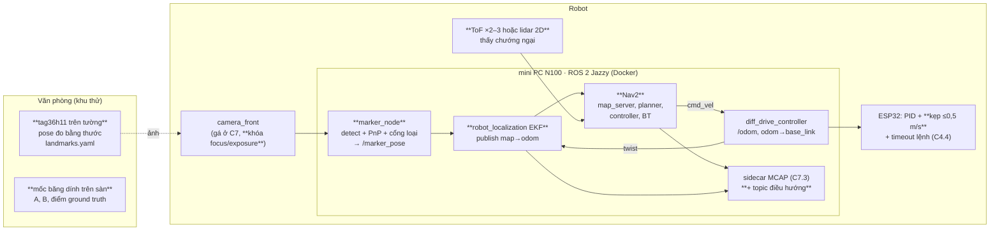
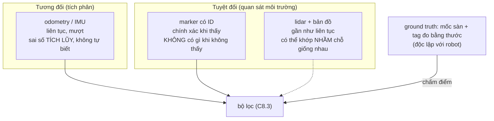
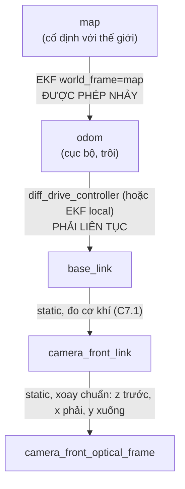
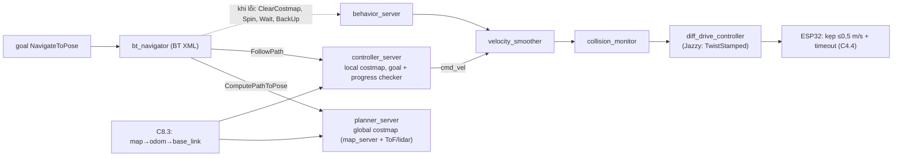
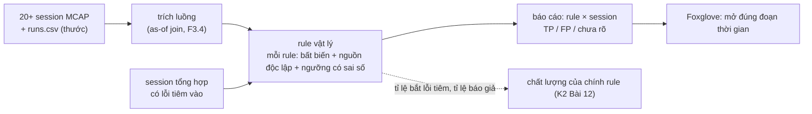

# Chặng 8 — Định vị và điều hướng (70h)

> **Vị trí:** C7 (cảm biến gá trên robot, TF tĩnh, ghi MCAP) → **C8** → C9 (nhận người), C10 (an toàn và vận hành) · **Cần trước:** C7 trọn (và qua đó C6 odometry đã hiệu chuẩn UMBmark); → F6.7, F6.8, F1.4; đọc K2 Bài 3 (frame và TF) · **Chạy song song với:** K5–K6
> **Làm ra được:** robot tự đi A→B 20 lần trong khu thử văn phòng, có tag dán tường đã đo, bản đồ occupancy vẽ từ số đo thước, cảm biến chướng ngại · bảng độ chính xác pose từ marker theo (khoảng cách × góc), artifact hiệu chuẩn camera có `calibration_id`, 20+ session MCAP điều hướng, bộ rule vật lý có test tổng hợp · **Sau chặng này bạn quyết định được:** tin một phát hiện tag tới khoảng cách và góc nào, với covariance bao nhiêu; ai publish cạnh TF nào và cú nhảy `map → odom` xử lý ra sao; gate "đi tới đích" của bạn phân biệt được robot tốt và xấu tới đâu; rule nào đáng chạy tự động trên mọi session.

C6 cho bạn một kết quả khó chịu: odometry trôi và **không tự biết mình trôi**. C8 thêm một nguồn tuyệt đối (tag dán tường, nhìn bằng camera), trộn hai nguồn bằng bộ lọc, rồi giao pose đó cho Nav2 để robot **tự đi**. Đây là lần đầu robot di chuyển mà không có tay bạn trên cần điều khiển, trước khi tầng an toàn phần cứng của C10 tồn tại. Vì vậy chặng này có phần an toàn dày hơn chặng trước, và tốc độ bị kẹp ở firmware chứ không chỉ ở Nav2.

Chặng này đến từ K7 gốc Bài 6–10 và GATE 7B (80h, trần 110h). Phần ROS 2 trong Docker và `/odom` chuẩn đã chuyển sang C5.2; gá cảm biến và TF tĩnh sang C7.1. Còn lại 70h:

**Phân bổ 70h** `[ước lượng]`:

| Phần | Giờ |
|---|---|
| Bài C8.1 Marker hay lidar *(rút gọn)* | 3 |
| Bài C8.2 Hiệu chuẩn camera và pose từ marker | 12 |
| Bài C8.3 Hợp nhất odometry và marker, cây TF | 14 |
| Bài C8.4 Nav2 từ A tới B | 18 |
| Bài C8.5 Ghi và phân tích session điều hướng | 9 |
| Lắp bước 1–6: khu thử, gá camera cho marker, in/bồi tag, dán và đo tag, cảm biến chướng ngại, bản đồ | 11 |
| Gate chặng 8 (gồm bài viết) | 3 |
| **Tổng** | **70** |

### Đường lõi tối thiểu: C8 tối thiểu (~27h)

Đã quyết 2026-10-09 (cách (a) ở `00-tong-quan.md` mục 6): đường lõi tối thiểu của K7 **gồm** một phần của C8. Lý do: C10.1 cần "Nav2 chạy được" (dòng Vị trí của C10.1), và C11.3 so cấu hình Nav2 giữa sim và thật trên đúng tuyến A→B của C8.4. Bản tối thiểu là **Nav2 A→B chỉ bằng odometry**: chưa có marker, chưa có EKF. Robot tự đi được những quãng ngắn, đo được, an toàn ở mức C8 cho phép. Nó chưa biết mình đang lạc.

| Phần | Giờ | Ghi chú |
|---|---|---|
| Lắp bước 1 — khu thử và quy tắc chạy tự động | 1 | Giữ nguyên, kể cả checkpoint kẹp tốc độ và timeout lệnh |
| Lắp bước 5 — cảm biến chướng ngại | 2 | Giữ nguyên. Không có nó thì không được chạy tự động |
| Lắp bước 6 — bản đồ từ số đo thước | 1,5 | Gốc `map` = mốc A. Checkpoint đổi: teleop từ A tới G1, G2, G3; pose odometry rơi đúng ô của mốc (lệch ≤ 2 ô) |
| C8.3, chỉ phần cây TF (mục 2 và 4 của bài) | 3 | Ai publish cạnh nào. `map → odom` là **biến đổi tĩnh đồng nhất**; không chạy EKF, không chạy AMCL |
| Bài C8.4 — Nav2 từ A tới B | 18 | Chạy với các sửa đổi dưới đây |
| Checkpoint C8 tối thiểu | 1,5 | Thay cho Gate chặng 8, xem dưới |
| **Tổng** | **~27** | `[ước lượng]` |

**Bỏ trong bản tối thiểu:** C8.1, C8.2 (hiệu chuẩn camera, pose từ marker), phần EKF của C8.3, Lắp bước 2–4 (gá camera cho marker, in và dán tag), C8.5, Gate chặng 8.

**Sửa đổi khi làm C8.4 theo bản tối thiểu:**
- `map → odom` tĩnh: `ros2 run tf2_ros static_transform_publisher --frame-id map --child-frame-id odom` (đồng nhất) `[tự đo — cú pháp đối số theo bản Jazzy bạn cài]`. Tắt AMCL trong `nav2_params.yaml`. Chỉ một publisher cho mỗi cạnh TF, đúng như C8.3 dạy.
- **Mỗi lần chạy bắt đầu đúng ở A, odometry bằng 0.** Đặt robot vào khung băng dính ở A, hướng theo vạch. Rồi đưa odometry về 0: kích hoạt lại `diff_drive_controller`, hoặc khởi động lại container nếu bản `ros2_controllers` của bạn không đặt lại odometry khi kích hoạt `[tự đo]`. Sai số đặt tay đi thẳng vào phép đo. Ghi nó ở cột `dat_tay` của `runs.csv`.
- **Tuyến ngắn.** Chọn B sao cho quãng A→B ≤ ~5 m và ít quay. Sai số odometry tích lũy theo quãng và theo góc quay (C6). Tính trước sai số kỳ vọng ở B từ số UMBmark của bạn, và so với `xy_goal_tolerance`. Nếu sai số kỳ vọng lớn hơn dung sai, rút ngắn tuyến, không nới dung sai.
- **"Sai thật − sai tự báo" giờ là sai số của odometry.** Đây là số quan trọng nhất của bản tối thiểu. Nó cho biết giới hạn của việc không có nguồn tuyệt đối, và là thứ C11.1 dùng khi dựng twin.
- **Bỏ kịch bản kidnapped** (bước 7) và bước 9. Không có nguồn tuyệt đối thì robot chắc chắn đi tiếp với pose sai, và chạy thử điều đó không dạy thêm gì mà thêm rủi ro. Ghi vào `decisions.md`: "chưa phát hiện được lạc". Ba kịch bản còn lại (hộp chắn, người cắt ngang ≤ 0,2 m/s, đích không tới được) **giữ nguyên**.
- Mọi quy tắc của mục 1 (An toàn của chặng) áp dụng **nguyên văn**. Bản tối thiểu không nới quy tắc nào.

**Checkpoint C8 tối thiểu** (không phải Gate chặng 8; không đổi ngưỡng nào của gate đó):
- [ ] Kẹp tốc độ firmware và timeout lệnh đã kiểm trong buổi chạy, số đo trong `measurements.jsonl`.
- [ ] Quãng dừng đo được (C8.4 bước 4), khoảng trống khu thử đủ theo mục 1.
- [ ] 20 lần A→B liên tiếp, mỗi lần một dòng `runs.csv` có MCAP. Báo tỉ lệ thành công kèm Wilson CI 95%, scatter điểm dừng đo bằng thước, phân bố "sai thật − sai tự báo".
- [ ] Ba kịch bản ép hỏng có MCAP + log BT, hành vi phục hồi ghi lại.
- [ ] `decisions.md` ghi: tuyến, sai số odometry kỳ vọng và đo được, giới hạn "không phát hiện được lạc".

Đề xuất (không phải ngưỡng gate): nếu tỉ lệ thành công thấp hơn khoảng 15/20, robot chưa đủ ổn định cho 120 lần chạy của C11.3. Quay lại C6 (hiệu chuẩn) hoặc làm C8 trọn trước.

**Hệ quả xuống các chặng sau:**
- C10.2, FMEA: dòng F07 (camera) và F10 (mất định vị) viết cho đường marker. Bản tối thiểu thay F10 bằng "trôi odometry không phát hiện được"; hành vi thiết kế: giới hạn quãng mỗi nhiệm vụ và đặt lại ở A (ghi chú ngay dưới bảng FMEA của C10.2).
- C11.3: tuyến A→B và các cấu hình Nav2 dùng đúng bản tối thiểu này. Twin trong sim cũng chạy chỉ bằng odometry, để so sim với thật trên cùng một kênh định vị.
- C9, C10.3 (soak), C11.4 cần định vị tuyệt đối và nằm ngoài đường tối thiểu. Muốn làm chúng thì làm C8 trọn: phần đã làm ở đây không phải làm lại.

Ký hiệu thư mục lab trong chặng: `lab/c08/<bài>/` với `prediction.md`, `results.md`, MCAP, script. Mọi `prediction.md` commit **trước** khi đo.

## 0. Bức tranh chặng

Robot sau chặng này, phần mới tô đậm bằng `**`:



Khu thử nhìn từ trên xuống (kịch bản ví dụ; bạn vẽ bản của mình ở Lắp bước 1):

```
  y ↑   tường có tag T1..T6 (tâm tag ≈ độ cao quang tâm camera)
    │ ┌──[T1]──────────[T2]──────────[T3]──┐
    │ │                                    │   [T4]
    │ │  A ■ ─ ─ ─ ─ ─ ─ ─ ─ ─ ─ ─ ─ ■ B    │
    │ │  (xuất phát)   bàn cố định  (đích)  │
    │ │                ▓▓▓▓▓▓              │
    │ │  ◆ G1        ◆ G2         ◆ G3     │   ◆ = điểm ground truth (băng dính, đo thước)
    │ └──[T6]────── cửa ─────────[T5]──────┘
    └──────────────────────────────────────→ x      gốc map = mốc O ở góc khu thử
       KHÔNG có cầu thang, bậc, cửa mở ra cầu thang trong hoặc sát khu thử
```

Dòng dữ liệu mới: ảnh → phát hiện tag → `/marker_pose` (có covariance theo khoảng cách, góc) → EKF → `map → odom` → Nav2 → `cmd_vel` → ESP32. Mọi topic đó cộng sự kiện của Nav2 đi vào MCAP, rồi vào bộ rule ở C8.5.

## 1. An toàn của chặng

**Rủi ro của C8:** robot **tự di chuyển** trong không gian có người: va chân, vấp chân người, kẹp ngón tay khi nhấc robot đang quay bánh, rơi xuống bậc/cầu thang (robot không có cảm biến mép sàn), đâm vật thấp ngoài vùng nhìn của cảm biến, kéo đổ đồ qua dây debug. Tầng an toàn phần cứng đầy đủ (E-stop cắt động lực qua relay, bumper, watchdog độc lập) **chưa có**: đó là C10.1. Ở C8 bạn chỉ có kẹp tốc độ và timeout lệnh trong firmware (C4.4) và E-stop tạm (C5.3). Thêm: máy đo laser (nếu dùng) là laser class 2, không chiếu vào mắt.

Động năng robot 5 kg ở 0,5 m/s chỉ vài jun `[ước lượng]`; mối nguy chính không phải lực va mà là **vấp, kẹp, rơi**, và robot làm điều bạn không ngờ (Nav2 lùi `BackUp` vào người đứng sau, xoay `Spin` quét cạnh bàn).

**Quy tắc cứng:**
- KHÔNG chạy tự động khi chưa kiểm **kẹp tốc độ ở firmware** trong buổi đó: robot kê bánh lên khỏi sàn, gửi lệnh 1,0 m/s bằng teleop, đo vận tốc bánh từ encoder; phải ≤0,5 m/s. Kẹp chỉ ở Nav2 là cấu hình, gõ nhầm một số là mất.
- KHÔNG chạy tự động khi chưa kiểm **timeout lệnh** (C4.4): đang chạy chậm, `docker stop` container Nav2 (hoặc rút cáp USB ESP32–mini PC); robot phải dừng trong thời gian timeout bạn đặt ở C4.4.
- KHÔNG chạy tự động khi không có **người quan sát cầm E-stop tạm** (C5.3) trong tầm với, đi kèm robot. Một người vừa gõ lệnh vừa quan sát chỉ được chạy ở ≤0,2 m/s.
- KHÔNG chạy trong khu có cầu thang, bậc, mép bục, cửa mở ra cầu thang; không chạy khi có người **không được báo trước** trong khu thử.
- KHÔNG để dây debug (USB, nguồn bàn) nối robot với bàn khi chạy tự động.
- KHÔNG nhấc robot khi động lực còn nối. Kịch bản kidnapped (C8.4): nhấn E-stop tạm → nhấc → đặt → nhả E-stop.
- KHÔNG tăng tốc độ tối đa của một cấu hình mới quá 0,2 m/s trước khi cấu hình đó chạy sạch 5 lần liên tiếp. 0,5 m/s là trần, không phải mục tiêu.
- KHÔNG đặt chướng ngại thử là người ở lần đầu. Kịch bản "người cắt ngang" chỉ với người đã được dặn, robot ≤0,2 m/s, người bước ngang ở khoảng cách ≥ 2 lần quãng dừng bạn tính ở C8.4.
- KHÔNG chạy robot tự đi khi bạn rời phòng. Chạy dài không người là C10.3, sau khi có tầng an toàn phần cứng.
- Khu thử phải có khoảng trống ≥ quãng dừng (tự tính ở C8.4: `d = v·t_trễ + v²/(2a)`) + 0,5 m giữa đường đi dự kiến và mọi vật dễ đổ.

**Khi sự cố xảy ra:**

| Sự cố | Làm ngay, theo thứ tự | KHÔNG |
|---|---|---|
| Robot lao về phía người, bậc, vật dễ vỡ | E-stop tạm; nếu không kịp, người quan sát chặn bằng **chân/vật cứng phía trước bánh** (robot nhẹ), không cúi tay | Chụp robot bằng tay khi bánh đang quay |
| Robot quay tròn/giật không dừng sau E-stop | Rút XT60/ngắt công tắc chính (C1) | Đợi "xem nó có tự dừng không" |
| Robot rơi khỏi bậc/lật | Ngắt công tắc chính; kiểm pin theo quy trình pin va đập của C1.6 trước khi dùng lại | Bật lại ngay để "xem còn chạy không" |
| Va chân người | Dừng, ghi near miss vào sổ build, xem MCAP vì sao không dừng; không chạy lại khi chưa biết nguyên nhân | Chạy tiếp "vì lần này nhẹ" |

## 2. BOM chặng

Giá `[ước lượng 10/2026]`, kiểm lại ở cửa hàng. Camera đã mua và gá ở C7; IMU ở C7. Nếu đã có thước dây, thước cặp, chân máy từ khóa trước thì không mua lại.

| Món | Thông số phải chọn | Vì sao (bằng số) | Giá | Kiểm khi nhận | Thay thế được bằng |
|---|---|---|---|---|---|
| Camera (đã có từ C7) | **Focus khóa được** (manual focus hoặc fixed focus), **exposure thủ công**; độ phân giải cố định (ví dụ 640×480 hoặc 1280×720) | Autofocus đổi tiêu cự → hiệu chuẩn mất hiệu lực (C8.2) | — | `v4l2-ctl -d /dev/videoN --list-ctrls` có control focus/exposure thủ công `[tự đo]` | Đổi camera nếu không khóa được focus |
| In tag | In laser trắng đen, giấy **mờ** (không bóng), "Actual size/100 %" | Giấy bóng phản chiếu đèn trần → mất phát hiện | 2–5k/tờ A4 | Đo hai cạnh ô đen bằng thước cặp | In phun (mép mực nhòe hơn) |
| Tấm bồi | Formex/foam board 3–5 mm hoặc mica, khổ A4 | Tag phải **phẳng**; giấy dán 4 góc phồng theo độ ẩm | 10–20k/tấm | Áp thước thẳng, khe ≤1 mm | Bìa carton cứng (kém hơn) |
| Keo bồi | Băng keo hai mặt mỏng phủ **toàn mặt**, hoặc keo xịt | Dán 4 góc = giấy cong giữa | 30–250k | Dán thử, để 2 ngày, nhìn nghiêng | — |
| Bàn cờ hiệu chuẩn | In 9×6 góc trong (ô 25–30 mm) hoặc ChArUco, bồi kính khung ảnh/formex khổ A3 | Bàn cờ cong làm hiệu chuẩn sai | 50–150k | Áp thước thẳng hai đường chéo | Màn hình laptop hiển thị bàn cờ (phẳng, nhưng phản chiếu) |
| Thước dây thép | 5–7,5 m, nhãn cấp chính xác (class II) | Đo pose tag, mốc sàn; class II cho phép ±(0,3 + 0,2·L) mm `[spec — OIML R35/MID, kiểm nhãn]` | 80–200k | Đối chiếu 1 m với thước cặp/thước lá | — |
| Máy đo khoảng cách laser *(tùy chọn)* | 30–40 m, ±2 mm `[spec — nhãn máy]` | Đo một người một mình; đo từ tường sang tường | 0,4–1,2tr | Đo một khoảng đã đo bằng thước dây | Thước dây + người giữ |
| Ê ke thợ (300 mm), thước thủy ngắn | — | Tag thẳng đứng, cạnh song song sàn | 60–150k | — | App thước thủy điện thoại (±0,5–1° `[ước lượng]`) |
| Băng dính sàn màu, bút lông | Băng dính giấy màu 24 mm | Mốc O, A, B, G1..Gn; vẽ dấu chữ thập | 20–40k | — | Phấn |
| Chân máy ảnh | Có ốc 1/4", cao ≥1 m | Đặt tag ở khoảng cách/góc biết trước khi đo lưới (C8.2) | 150–300k | Không rung khi chạm | Giá gỗ tự đóng |
| Cảm biến chướng ngại **(một trong hai)** | (a) 2–3 ToF VL53L1X (I2C, tới ~4 m `[spec — ST, điều kiện tốt]`), gắn ở mặt trước; (b) lidar 2D 360° (họ LD06/LD19, RPLIDAR A1/C1) | Marker cho **định vị**, không cho **thấy vật cản**; không có cảm biến này thì kịch bản chắn đường ở C8.4 vô nghĩa | (a) 120–250k/cái; (b) 1–3tr | (a) đọc khoảng cách tới tường đã đo; (b) quét thấy tường trên Foxglove | Camera độ sâu (đắt, nặng CPU) |

**Tổng C8 `[ước lượng]`:** ~0,8–2tr với đường marker + ToF; thêm 1–3tr nếu chọn lidar ở C8.1.

## 3. Dụng cụ và kỹ năng tay

Chặng này ít hàn, nhiều **đo**. Kỹ năng mới:

| Kỹ năng | Ở đâu | Luyện trước | Đạt trông thế nào |
|---|---|---|---|
| In tag đúng kích thước, đo bằng thước cặp | Lắp bước 3 | In 1 tag thử, đo cả hai cạnh | Hai cạnh lệch nhau ≤0,3 mm `[ước lượng]`; ghi số đo thật theo từng ID |
| Bồi tag phẳng | Lắp bước 3 | Bồi 1 tờ giấy trắng lên formex | Áp thước thẳng theo hai đường chéo, khe ≤1 mm; mép không bong sau 2 ngày |
| Dán tag thẳng đứng, đúng độ cao | Lắp bước 4 | Dán băng dính giấy làm khung trước | Thước thủy cạnh trên lệch ≤1°; tâm tag ở độ cao quang tâm camera ±10 cm |
| Kéo thước dây đúng cách | Lắp bước 4 | Đo cùng một khoảng 5 lần, ghi cả 5 | Thước căng, không võng, đầu móc tì đúng mốc; 5 số lệch nhau ≤3 mm |
| Đo từ hai mốc (giao hai đường tròn) | Lắp bước 4, Bài C8.1 | Đo một điểm đã biết | Đo khép (tag–tag trực tiếp) lệch với tính toán ≤ ngân sách bạn đặt |
| Gắn ToF / lidar chắc, đúng hướng | Lắp bước 5 | — | Không lắc khi gõ nhẹ; trục đo song song sàn (lidar) |

Cách kéo thước dây cho người mới: một người giữ đầu móc **tì** (không móc) vào tâm dấu chữ thập trên sàn; người kia kéo căng ngang mặt sàn, mắt nhìn thẳng góc xuống vạch số. Thước võng 1 cm ở giữa đoạn 4 m làm số đọc dài thêm chưa tới 0,1 mm `[ước lượng — hình học dây võng nhẹ]`; lỗi lớn hơn thường đến từ **đặt sai mốc** và **đọc nghiêng**, nên mỗi số đo hai lần, hai người hoặc hai ngày.

## 4. Sơ đồ đi dây

Chặng này chỉ thêm cảm biến chướng ngại. Camera là USB (C7.1).

```
  (a) ToF qua ESP32                                   (b) Lidar 2D qua mini PC
  buck 5 V/3V3 logic (C1) ──┬── VIN ToF#1 ── VIN ToF#2      lidar ──USB-UART (hoặc UART 3V3)── mini PC
  GND sao (C1)  ────────────┼── GND ─────── GND             nguồn lidar: 5 V từ buck logic,
  ESP32 SDA/SCL (bus I2C    ├── SDA ─────── SDA             KHÔNG lấy từ cổng USB nếu motor lidar
   đã quy hoạch ở C4.1) ────┴── SCL ─────── SCL             kéo dòng vượt cổng [tự đo dòng khởi động]
  ESP32 GPIO a ──────────────── XSHUT#1
  ESP32 GPIO b ───────────────────────────── XSHUT#2
  dây tín hiệu: 26–28 AWG, JST-PH/XH, quy ước màu C0.5; dài ≤30 cm, đi xa dây motor
```

- VL53L1X có địa chỉ I2C mặc định 0x29 `[spec — ST VL53L1X datasheet]`; nhiều cảm biến cùng bus cần chân XSHUT để bật từng cái và đổi địa chỉ lúc khởi động. Thêm các dòng vào **bảng chân** của C4.1 trước khi cắm (kiểm chân strapping ESP32-S3).
- ToF gửi lên host thành `sensor_msgs/msg/Range` trên `/tof/range` (hoặc `/tof_<vị trí>/range`), frame `tof_<vị trí>_link`, 30 Hz, theo CONVENTIONS §3. Thêm TF tĩnh `base_link → tof_<vị trí>_link` đo bằng thước.

Cây TF của chặng (theo CONVENTIONS §2 và REP-105); cạnh mới là `map → odom`:

```
map ──(EKF, ĐƯỢC NHẢY)──► odom ──(diff_drive_controller, LIÊN TỤC)──► base_link ─┬─(static)─► camera_front_link ─(static, xoay chuẩn)─► camera_front_optical_frame
                                                                                  ├─(static)─► imu_link
                                                                                  └─(static)─► tof_<vị trí>_link / laser_link
```

## 5. Trình tự chặng

1. **Lắp bước 1 — Khu thử và quy tắc chạy tự động** (1h)
   - Làm: chọn khu thử theo mục 1; hỏi người quản lý văn phòng trước khi dán gì lên tường; vẽ sơ đồ tay (kích thước đo thô); đánh dấu vùng cấm (bậc, cửa ra cầu thang, dây điện trên sàn); in tờ quy tắc mục 1 dán cạnh khu thử.
   - ✅ Checkpoint: kẹp tốc độ và timeout lệnh của C4.4 đã kiểm trong buổi (hai quy tắc đầu ở mục 1), ghi số đo vào `measurements.jsonl`.
   - Nếu sai: không sang bước sau; quay lại C4.4.
2. **Học Bài C8.1** → ghi quyết định marker/lidar vào `decisions.md`.
3. **Lắp bước 2 — Gá camera cho bài toán marker** (1,5h)
   - Làm: kiểm gá camera của C7.1 theo yêu cầu riêng của marker: (a) độ cao quang tâm cố định, đo bằng thước từ sàn (tag sẽ dán ở độ cao này); (b) camera nhìn ngang, ngẩng 0–10° (nhìn xuống sàn phí nửa ảnh); (c) gá **cứng**: gõ nhẹ vào thân robot, ảnh trên `rqt_image_view`/Foxglove không rung lắc lâu; (d) khóa focus và exposure bằng `v4l2-ctl`, ghi toàn bộ control vào file `config/camera_front_controls.txt`; (e) đánh dấu bút lên ốc gá (vạch ngang ốc–thân) để thấy ốc xoay.
   - ✅ Checkpoint: rút cắm USB camera, khởi động lại container: control đọc lại **giống** file đã ghi. Không giống → control không được áp lúc khởi động, sửa launch.
   - Nếu sai: camera không khóa được focus → đổi camera (mục 2) trước C8.2.
4. **Lắp bước 3 — In, đo, bồi tag** (2h)
   - Làm: chọn họ `tag36h11`, ID duy nhất cho từng tag (ghi ID ở mặt sau). Cạnh ô đen chọn theo tầm đọc cần có (C8.2 phần 5 cho cách tính; một mặc định hợp lý là ô đen 160 mm trên A4, viền trắng ≥1 ô). In 100 %, đo **cả hai cạnh** ô đen ngoài bằng thước cặp, ghi `size_m` thật của từng ID; bồi toàn mặt lên formex.
   - ✅ Checkpoint: hai cạnh lệch ≤0,3 mm; mặt tag phẳng (khe ≤1 mm dưới thước thẳng); không có hai tag trùng ID (script đọc `landmarks.yaml` kiểm trùng).
   - Nếu sai: in lại; không dùng tag méo "vì chỉ lệch chút".
5. **Học Bài C8.2** (hiệu chuẩn camera, bảng sai số trên chân máy).
6. **Lắp bước 4 — Dán và đo tag, mốc sàn** (3h)
   - Làm: dán mốc O (gốc `map`), A, B, G1..Gn trên sàn; dán tag (tâm ở độ cao quang tâm ±10 cm, thẳng đứng); đo pose từng tag theo phương pháp ở Bài C8.1 phần 6, **hai lần độc lập**; đo khép: khoảng cách trực tiếp giữa hai tag kề nhau, so với tọa độ tính ra. Ghi `config/landmarks.yaml` (`id, size_m, x, y, z, yaw, sigma_xy, sigma_yaw, measured_by, measured_at, tape_id`).
   - ✅ Checkpoint: hai lần đo lệch nhau trong ngân sách bạn đặt ở C8.1; sai số khép ≤ 2 × σ tính ra.
   - Nếu sai: đo lần ba bởi người khác; không lấy trung bình hai số lệch nhau mà không hiểu vì sao.
7. **Học Bài C8.3** (EKF, cây TF; chạy 20 phút có ground truth).
8. **Lắp bước 5 — Cảm biến chướng ngại** (2h)
   - Làm: gắn ToF (hoặc lidar) theo mục 4; ToF đặt sao cho phủ được vật cao 5–40 cm phía trước (vẽ nón nhìn trên giấy, ghi **vùng mù** vào `decisions.md`).
   - ✅ Checkpoint trước khi cấp điện: thông mạch GND ToF ↔ GND ESP32 kêu; giữa VIN và GND **không** kêu; nguồn 3V3 hay 5 V đúng với module (đọc chữ trên module). Sau khi cấp điện: `/tof/range` đọc tường đã đo ở 0,5/1/2 m, ghi sai số.
   - Nếu sai: không đọc được I2C → quét bus (K5 Bài 3), kiểm XSHUT.
9. **Lắp bước 6 — Dựng bản đồ văn phòng** (1,5h): vẽ occupancy grid từ số đo (Bài C8.4 phần 6, bước 1).
   - ✅ Checkpoint: đặt robot ở G1, G2, G3; pose từ C8.3 hiển thị trên Foxglove phải rơi đúng ô của mốc trên bản đồ (lệch ≤ 2 ô).
   - Nếu sai: thường do lật trục y của ảnh PGM hoặc sai `origin` (C8.4 phần 8).
10. **Học Bài C8.4** (Nav2, 20 lần A→B, 4 kịch bản ép hỏng).
11. **Học Bài C8.5** (rule trên 20+ session).
12. **Gate chặng 8.**

## 6. Lỗi người mới hay gặp

| Triệu chứng | Nguyên nhân khả dĩ | Kiểm bằng cách | Sửa |
|---|---|---|---|
| Hiệu chuẩn hôm qua tốt, hôm nay khoảng cách tới tag lệch vài % | Autofocus bật lại sau khi rút cắm camera; độ phân giải đổi | So control hiện tại với `camera_front_controls.txt` | Áp control trong launch; kiểm "tag ở khoảng cách biết trước" lúc khởi động (C8.2) |
| Tag phát hiện được buổi sáng, mất buổi chiều | Nắng xiên qua cửa sổ, chói trên tag | Chụp ảnh lúc mất | Giấy mờ; dời tag; ghi giờ/ánh sáng vào session |
| Tag bị người khác gỡ/dán lại lệch | Lau tường, dọn văn phòng | Rule innovation theo tag ID (C8.5) | Dán nhãn "thiết bị đo, xin đừng gỡ"; kiểm định kỳ |
| Robot đâm chân ghế dù có ToF | Chân ghế mảnh, thấp, ngoài nón ToF | Vẽ nón nhìn | Thêm ToF, đổi góc, hoặc lidar; giảm tốc |
| Robot đứng yên, không lỗi, Nav2 báo đang chạy | `Twist`/`TwistStamped` lệch kiểu trên `cmd_vel` (Jazzy) | `ros2 topic info -v /cmd_vel` | C8.4 phần 6, bước 3 |
| Bản đồ trên Foxglove soi gương so với thực tế | PGM hàng 0 ở trên, quên lật trục y | Đặt robot ở góc biết trước | C8.4 phần 6, bước 1 |

Lỗi riêng của từng bài ở phần 8 của bài.

## 7. Lăng kính data infra

**Dữ liệu chặng này sinh ra:**

| Luồng / artifact | Ở đâu | Schema / message | Tần số | Ghi chú (CONVENTIONS) |
|---|---|---|---|---|
| Bản đồ tag (ground truth) | `config/landmarks.yaml` | `id, size_m, x, y, z, yaw, sigma_*, measured_by, measured_at, tape_id` | khi đo | Dataset có version; mét, rad |
| Artifact hiệu chuẩn | `calib/camera_front/<calibration_id>/` | `camera_info.yaml` + `calibration.json` (K, D, RMS train/giữ kín, hash ảnh, control v4l2, bản OpenCV) | khi hiệu chuẩn | `calibration_id` vào metadata mọi MCAP (§4) |
| Mô hình nhiễu marker | `config/marker_noise.yaml` | σ theo (d, θ) + cổng loại, gắn `calibration_id` | khi đo lại | Đầu vào covariance của C8.3 |
| Pose từ marker | `/marker_pose` | `geometry_msgs/msg/PoseWithCovarianceStamped`, `frame_id = map`, stamp = thời điểm chụp | ≤ tần số camera | + `/diagnostics` đếm phát hiện bị loại |
| Pose hợp nhất | `/odometry/filtered`, TF `map→odom` | `nav_msgs/msg/Odometry` | 30 Hz `[ước lượng]` | Covariance thật, không 0 |
| Chướng ngại | `/tof/range` hoặc `/scan` | `Range` / `LaserScan` | 30 Hz / 5–10 Hz | |
| Điều hướng | `/plan`, `cmd_vel`, `/behavior_tree_log`, kết quả action, costmap (giảm tần số) | chuẩn Nav2 | xem C8.5 | Tên topic log BT `[tự đo]` |
| Bảng kết quả chạy | `lab/c08/c84/runs.csv` | `run_id, session_mcap, result, error_code, t_s, x_tu_bao, y_tu_bao, x_thuoc, y_thuoc, n_recovery, ghi_chu` | mỗi lần chạy | Một dòng mỗi lần; ground truth đo tay |

**Test tự động sinh ra từ chặng này (hạt giống cho C11):**
- "Tag ở khoảng cách biết trước" lúc khởi động (canary hiệu chuẩn, C8.2): lệch quá ngưỡng → cờ `calibration_suspect` trong metadata.
- Bốn kịch bản ép hỏng của C8.4 thành bốn kịch bản sim/HIL có phán quyết ba trạng thái ở C11.2 (PASS / FAIL / INCONCLUSIVE khi thiếu dữ liệu).
- Bộ rule vật lý của C8.5, mỗi rule có test tổng hợp (lỗi tiêm vào), chạy trên mọi session như CI cho dữ liệu (→ K2 Bài 12, K5 Bài 16, F3.7).

**SLI:** tỉ lệ thời gian có ít nhất một phát hiện tag hợp lệ; tỉ lệ phát hiện bị cổng loại; tỉ lệ A→B thành công kèm Wilson CI; số recovery/100 lần chạy; tỉ lệ session qua mọi rule.

**Vai trò nghề:** Test & Validation (oracle độc lập bằng thước, gate có khoảng tin cậy, kịch bản ép hỏng); Data Platform (calibration artifact + lineage, dataset `landmarks.yaml` có version, rule vật lý trên luồng); Sim & Eval (bảng sai số marker là mô hình cảm biến cho sim ở C11.1).

## 8. Nhật ký build

Copy vào `build-log/c08.md`, một mục mỗi buổi:

```markdown

## 2026-MM-DD — buổi N (giờ bắt đầu–kết thúc, giờ thực: _._ h)
- Trạng thái người: tỉnh táo / mệt (mệt → chỉ phân tích dữ liệu, không chạy tự động)
- Kiểm an toàn đầu buổi: kẹp tốc độ firmware ___ m/s (đo); timeout lệnh ___ ms (đo); người quan sát: ___
- Mục tiêu buổi:
- calibration_id đang dùng: ___ ; commit nav2_params: ___ ; commit landmarks.yaml: ___
- Đã làm / số lần chạy:
- Số đo (đã vào measurements.jsonl / runs.csv? số dòng: __)
- Ánh sáng (lux, app điện thoại), người trong khu thử:
- Lỗi gặp (triệu chứng → nguyên nhân → sửa):
- Near miss (robot suýt va, suýt rơi, tag bị gỡ…): không / có → mô tả
- Quyết định (→ decisions.md):
- Câu hỏi còn mở:
```

---

## Bài C8.1 — Marker hay lidar (3h) (khung rút gọn)

> **Vị trí:** C7 (camera đã gá, ghi MCAP) → **C8.1** → C8.2 · **Cần trước:** C6.3 (odometry không biết mình sai), → F1.1 (độ bất định của chính thước đo), → F6.1 (mô hình có miền hiệu lực), K2 Bài 3 (frame) · **Sau bài này bạn quyết định được:** dùng nguồn định vị tuyệt đối nào trong C8, ground truth lấy từ đâu và sai bao nhiêu, tức là sai số nhỏ nhất bạn còn *chấm được* ở C8.3–C8.4.

### 1. Câu chuyện — ai đã khổ vì chuyện này

Kho của Kiva Systems (Amazon mua năm 2012, nay là Amazon Robotics) giải bài định vị cho hàng nghìn robot bằng một lựa chọn trông "kém sang": dán lưới **mã fiducial 2D trên sàn**, robot có camera nhìn xuống đọc mã khi đi qua, giữa hai mã thì chạy bằng odometry `[chuẩn — mô tả công khai của hệ Kiva; khoảng cách mã: tự tra]`. Họ sửa môi trường để đổi lấy định vị tuyệt đối có ID duy nhất, không bao giờ nhầm chỗ này với chỗ kia, và lỗi thì lỗi **rõ ràng** (không thấy mã đúng hạn → dừng). Ở đầu kia, robot dùng lidar + bản đồ không sửa gì môi trường, nhưng trả giá ở chỗ khác: hành lang dài đối xứng, kho đổi bố cục, và một lớp lỗi "định vị nhầm mà vẫn tự tin".

Lựa chọn ở bài này không chỉ về cảm biến. Nó là: **bạn chấp nhận loại thất bại nào**, và bạn có **chân lý để chấm** mọi thứ phía sau hay không. Gate C8 đòi "p95 sai lệch cuối" — p95 so với cái gì? Nếu câu trả lời là "so với pose robot tự báo", bạn đang dùng bị cáo làm thẩm phán.

### 2. Mô hình tư duy



Mọi robot di động cần **một nguồn tương đối** (mượt, tần số cao, trôi) và **một nguồn tuyệt đối** (neo lại, gián đoạn hoặc mơ hồ). Marker và lidar khác nhau chủ yếu ở **kiểu thất bại**: marker thất bại kiểu *im lặng có ranh giới* (không thấy tag = không có số đo, ai cũng biết); lidar thất bại kiểu *có số đo nhưng sai* (scan khớp vào một đoạn hành lang giống hệt). Kiểu thứ nhất dễ kiểm hơn nhiều. Và: tag đo bằng thước là **ground truth độc lập**, thứ cho phép chấm cả fusion lẫn lidar về sau.

**Ma trận quyết định.** Điền trọng số (tổng = 10) theo mục tiêu *của bạn*, nhân điểm 1–5, cộng. Điểm dưới đây là đánh giá định tính cho văn phòng nhỏ + N100 + vai trò data infra; bạn được sửa, phải ghi lý do.

| Tiêu chí | Trọng số (bạn điền) | Marker (tag36h11) | Lidar 2D + bản đồ |
|---|---|---|---|
| Chi phí | | 5 | 3 (1–3tr `[ước lượng]`) |
| Không phải sửa môi trường | | 1 | 5 |
| Độ chính xác khi có tín hiệu | | 4 (phụ thuộc d, góc — C8.2 đo) | 4 |
| Phủ không gian liên tục | | 2 | 5 |
| Kiểu thất bại dễ phát hiện | | 5 | 2 |
| Cho ground truth độc lập | | 5 | 1 |
| Thấy chướng ngại | | 1 (cần thêm ToF) | 4 (chỉ ở mặt phẳng quét) |
| Tải CPU trên N100 | | 3 `[tự đo]` | 3 `[tự đo]` |
| Phụ thuộc ánh sáng | | 2 | 5 |
| Quyền riêng tư (C9.1) | | 2 (camera nhìn thấy người) | 5 |
| Giá trị học cho data infra | | 5 (hiệu chuẩn, calibration artifact) | 3 |

K7 gốc khuyến nghị **marker trước, lidar sau nếu dư giờ**; giữ nguyên. Ma trận nhạy với hai trọng số: "không sửa môi trường" và "liên tục". Văn phòng không cho dán tag thì kết luận đảo, và bạn vẫn cần ground truth bằng cách khác (mốc sàn đo thước). Dù chọn gì, **cảm biến chướng ngại là bắt buộc** cho C8.4: tag không cho robot thấy hộp chắn đường.

### 3. Cầu nối từ backend

| Backend bạn biết | Ở đây | Gãy ở chỗ | Nếu dùng nhầm thì |
|---|---|---|---|
| Đồng hồ cục bộ trôi, định kỳ sync NTP | Odometry trôi, định kỳ neo về tag | NTP sync đều đặn, mọi node nhận; tag chỉ có khi **camera thấy**, phụ thuộc chỗ robot đứng. Khoảng mù do hình học căn phòng, không do bạn chọn tần số | Thiết kế như thể "lúc nào cũng có sync": robot đi 2 phút qua vùng không tag mà Nav2 vẫn tin pose như vừa thấy tag |
| Golden dataset / oracle độc lập (F2.1) | Bản đồ tag đo bằng thước | Oracle backend thường chính xác tuyệt đối; oracle ở đây **có sai số** (thước, góc dán, tường cong) và sai số đó đặt **sàn** cho mọi phép chấm | Báo "fusion sai 2 cm" khi ground truth tự nó sai cỡ cm theo vị trí và cỡ độ theo hướng |
| Primary key duy nhất vs fuzzy match | Tag có ID vs scan matching | Đúng ở ý "khớp chính xác vs gần đúng"; gãy ở chỗ tag vẫn có **pose mơ hồ hình học** (C8.2: tag phẳng có hai nghiệm xoay) dù ID không mơ hồ | Tin "có ID là chắc": ăn nguyên cú lật hướng vào bộ lọc |

**Chấm mô hình:**
- *"Lidar đắt hơn nên chính xác hơn, marker là phương án nghèo."* — **SAI.** Độ chính xác cục bộ hai bên cùng cỡ; khác ở *phủ* và *kiểu thất bại*. Phản ví dụ: Kiva/Amazon chọn fiducial cho hàng nghìn robot dù đủ tiền mua lidar.
- *"Có ground truth = có sự thật tuyệt đối."* — **ĐÚNG MỘT PHẦN.** Ground truth là phép đo **độc lập và tốt hơn** hệ đang chấm, không phải sự thật. Phản ví dụ: tag dán lệch 1° so với giá trị trong `landmarks.yaml`; robot đứng cách tag vài mét bị đẩy ngang một khoảng tỉ lệ với khoảng cách (bạn tính ở phần 6), dù tâm tag đo đúng tới milimét.

### 6. Làm

1. **Quyết định**, ghi `decisions.md`: ma trận đã điền, kết quả, và *điều kiện khiến bạn đổi* (ví dụ "văn phòng không cho dán tag", "cần > N tag để phủ lộ trình").
2. **Định nghĩa "tag size"** cho thư viện bạn dùng. Với `tag36h11`, ảnh tag có 8×8 ô đen-trắng (6×6 bit + 1 ô viền đen mỗi bên) và cần thêm viền trắng `[spec — AprilTag, AprilRobotics]`; OpenCV ArUco và AprilTag 3 lấy cạnh **ô đen ngoài** làm kích thước `[tự đo — đọc tài liệu bản cài]`. Sai số kích thước đi **thẳng tỉ lệ** vào khoảng cách (Z ∝ s), nên `size_m` là số đo thước cặp của từng ID, không phải số thiết kế.
3. **Phương pháp đo pose tag (Lắp bước 4).** Hai mốc sàn A, B cách nhau 3–4 m dọc một trục của `map`. Đo khoảng cách từ A và từ B tới điểm chiếu của tâm tag xuống chân tường (dây dọi hoặc ê ke), tính (x, y) bằng giao hai đường tròn. Yaw: tag phẳng sát tường (kiểm bằng ê ke) thì yaw tag = hướng tường; đo hướng tường bằng **hai điểm cách xa nhau** trên chân tường. z: thước từ sàn tới tâm tag. Kiểm khép: kéo thước trực tiếp giữa hai tag kề nhau, so với khoảng cách tính từ tọa độ.
4. **Tính trước khi đo** (vào `prediction.md` của C8.1): (a) với sai số yaw tag δθ = 1° và khoảng cách quan sát d = 3 m, pose robot suy ra lệch ngang bao nhiêu? (b) mỗi lần kéo thước có σ = 3 mm: σ vị trí tag cỡ bao nhiêu, và σ yaw nếu đo yaw bằng hai mép tấm bồi (cách 0,25 m) so với hai điểm chân tường cách 2 m? Rồi chạy mô phỏng:

```python
# [đã chạy] Đo pose tag bằng thước dây từ hai mốc sàn A, B (giao hai đường tròn) — sai số theo vị trí và cách đo yaw
import numpy as np
rng = np.random.default_rng(0)
A, B = np.array([0.0, 0.0]), np.array([3.0, 0.0])   # hai mốc băng dính trên sàn, AB = 3 m dọc trục x của map
SIG = 0.003                                         # σ mỗi lần kéo thước (m): thước + võng + đặt đầu [ước lượng]

def locate(dA, dB):
    """Giao hai đường tròn tâm A, B; chọn nghiệm y > 0 (phía tường)."""
    L = np.linalg.norm(B - A); x = (dA**2 - dB**2 + L**2) / (2 * L)
    return np.array([x, np.sqrt(np.maximum(dA**2 - x**2, 0))])

def measure(P, n=20000):
    dA = np.linalg.norm(P - A) + rng.normal(0, SIG, n)
    dB = np.linalg.norm(P - B) + rng.normal(0, SIG, n)
    return np.array([locate(a, b) for a, b in zip(dA, dB)])

print("điểm (m)   σx(mm) σy(mm) | σyaw khi đo 2 điểm cách 0,25 m | cách 2 m")
for P in [(1.5, 1.0), (1.5, 3.0), (1.5, 6.0), (5.0, 3.0)]:
    P = np.array(P); e = measure(P) - P
    yaw = []
    for base in (0.25, 2.0):                       # tường song song trục x; đo hai điểm cách nhau `base`
        p1, p2 = measure(P - [base / 2, 0], 4000), measure(P + [base / 2, 0], 4000)
        d = p2 - p1; yaw.append(np.degrees(np.std(np.arctan2(d[:, 1], d[:, 0]))))
    print(f"({P[0]:.1f}, {P[1]:.1f})  {1e3*e[:,0].std():6.1f} {1e3*e[:,1].std():6.1f} | {yaw[0]:13.2f}°"
          f"{'':17s}| {yaw[1]:5.2f}°")
```

<details><summary>🔒 MỞ SAU KHI COMMIT prediction.md</summary>

(a) d·δθ = 3 m × 0,01745 rad ≈ **5,2 cm**, lớn hơn nhiều sai số tâm tag (vài mm). Yaw tag trên bản đồ phải đo cẩn thận như vị trí; nếu C8.3 ra sai số hệ thống phụ thuộc *tag nào đang được nhìn*, nghi `landmarks.yaml` trước khi nghi bộ lọc.

(b) Mô phỏng (σ = 3 mm mỗi lần kéo thước):

| Điểm (m) | σx (mm) | σy (mm) | σyaw, 2 điểm cách 0,25 m | σyaw, 2 điểm cách 2 m |
|---|---|---|---|---|
| (1,5; 1,0) | 2,5 | 3,8 | 1,22° | 0,13° |
| (1,5; 3,0) | 4,7 | 2,4 | 0,78° | 0,11° |
| (1,5; 6,0) | 8,8 | 2,2 | 0,70° | 0,10° |
| (5,0; 3,0) — ngoài đoạn AB | 6,8 | 7,1 | 2,35° | 0,34° |

Đọc: vị trí tag sai cỡ vài mm, tốt; **yaw đo bằng hai mép tấm bồi sai cỡ 1–2°**, đủ để đẩy pose robot lệch 5–12 cm ở 3–4 m. Đo yaw trên đường nền dài (chân tường 2 m) tốt hơn khoảng một bậc, *với giả định* tag dán phẳng sát tường. Điểm nằm xa hoặc ngoài đoạn AB (góc giữa hai sợi thước nhọn) sai nhiều hơn: đây là hình học "dilution of precision" giống GPS khi vệ tinh dồn một phía. Đặt cặp mốc mới cho mỗi bức tường thay vì đo mọi thứ từ một cặp.

</details>

5. **Ghi ngân sách sai số ground truth** vào `decisions.md`: vị trí ±? mm, yaw ±?°, kích thước ±? mm, mốc sàn ±? mm. Con số này là **sàn** của mọi phép chấm ở C8.3–C8.4: không được báo sai số nhỏ hơn nó.

### 8. Nếu ra khác

| Triệu chứng | Nguyên nhân khả dĩ | Kiểm bằng cách | Sửa |
|---|---|---|---|
| Cạnh ngang và dọc của tag lệch nhau rõ | Driver in co giãn (fit to page) | Đo cả hai cạnh mọi tag | In lại 100 %; vẫn méo thì đổi máy in |
| Hai lần đo pose tag lệch vượt ngân sách | Quy trình (đặt mốc, đọc nghiêng), không phải thước | Đo lần ba bởi người khác | Đổi phương pháp (thêm cặp mốc, máy laser); không lấy trung bình hai số lệch mà không hiểu vì sao |
| Sai số khép giữa hai tag lớn | Một trong hai tag đo sai, hoặc mốc A/B bị xê dịch (băng dính bị kéo) | Đo lại khoảng AB | Mốc bằng băng dính + dấu bút trên sàn; chụp ảnh mốc |
| Tag phồng/cong sau vài ngày | Dán 4 góc, giấy hút ẩm | Nhìn nghiêng, áp thước thẳng | Bồi toàn mặt |
| Không phủ được lộ trình với số tag hợp lý | Văn phòng nhiều góc khuất | Vẽ tầm nhìn trên sơ đồ | Chấp nhận khoảng mù (C8.3 đo nó) hoặc ghi điều kiện chuyển lidar |

### 9. Câu hỏi ngược

1. **[Phản biện]** Marker "cho bạn ground truth". Nhưng ở C8.3 bạn đưa chính marker vào bộ lọc. Lúc đó marker còn là ground truth độc lập không?
<details><summary>Hướng nghĩ</summary>

Một nguồn đã vào bộ lọc thì không còn chấm được bộ lọc một cách độc lập trên cùng dữ liệu. Tách vai: ground truth để chấm là **mốc sàn đo thước**, hoặc một tag *không* đưa vào bộ lọc, giữ làm tập giữ kín (→ F2.8). Giống không dùng tập train để báo accuracy.

</details>

2. **[Quy mô]** 100 robot trong 10 văn phòng, mỗi chỗ một bộ tag dán tay. Cái gì gãy trước: phần mềm, hay dữ liệu `landmarks.yaml`?
<details><summary>Hướng nghĩ</summary>

Bản đồ tag là một **dataset có version** cần provenance (ai đo, khi nào, thước nào), validation (trùng ID, tag bị dời) và cách phát hiện tag bị gỡ/dán lại lệch. Drift của "cấu hình môi trường" giống schema drift (→ F3.7, F3.8).

</details>

3. **[Failure mode]** Ai đó dời một tag 30 cm khi lau tường. Robot thấy gì, bộ lọc làm gì, bạn phát hiện bằng gì?
<details><summary>Hướng nghĩ</summary>

Không gì báo lỗi: ID hợp lệ, pose hợp lệ. Dấu hiệu là sai khác có hệ thống *chỉ khi nhìn tag đó*: innovation của bộ lọc lệch cùng một hướng. Đây là một rule ở C8.5 (innovation theo tag ID).

</details>

4. **[Liên ngành]** Trắc địa đặt mốc khống chế đo bằng phương pháp chính xác hơn, rồi mọi phép đo chi tiết neo vào đó. Giống và khác gì với tag của bạn?
<details><summary>Hướng nghĩ</summary>

Giống: phân tầng độ chính xác, mốc có sai số công bố. Khác: trắc địa đo **khép vòng** để tự kiểm (sai số khép); bạn chỉ có phép đo khép tag–tag ở Lắp bước 4 nếu chịu làm thêm.

</details>

### 12. Đọc thêm và tự kiểm tra

- **Nguồn gốc:** E. Olson, "AprilTag: A robust and flexible visual fiducial system", ICRA 2011; J. Wang & E. Olson, "AprilTag 2", IROS 2016; S. Garrido-Jurado và cộng sự, "Automatic generation and detection of highly reliable fiducial markers under occlusion" (ArUco), Pattern Recognition 2014.
- **Giải thích:** REP-105 "Coordinate Frames for Mobile Platforms" — đọc phần `map`/`odom` trước C8.3.
- **Đào sâu (tùy chọn):** Thrun, Burgard, Fox — *Probabilistic Robotics*, chương về localization (bám vết vs toàn cục, kidnapped robot).
- **Tự kiểm tra:** (1) giải thích trong 5 câu vì sao robot cần cả nguồn tương đối lẫn tuyệt đối; (2) vẽ lại sơ đồ phần 2; (3) tag khai báo 160 mm nhưng thật 157 mm; robot cách tag 2,00 m: khoảng cách ước lượng bao nhiêu, xa hay gần hơn thật?

<details><summary>Đáp án tự kiểm tra</summary>

(3) Z ước lượng ∝ kích thước khai báo: 2,00 × 160/157 ≈ **2,04 m**, xa hơn thật ~4 cm. Sai hệ thống: lấy trung bình 1000 mẫu vẫn lệch đúng 4 cm.

</details>

---

## Bài C8.2 — Hiệu chuẩn camera và pose từ marker (12h)

> **Vị trí:** C8.1 (bản đồ tag + ngân sách ground truth) → **C8.2** → C8.3 · **Cần trước:** → F1.1 (hệ thống vs ngẫu nhiên), → F1.6 (fit, residual, overfitting), → F6.2 (verification/validation/calibration), → F6.8 (frame, transform 4×4), → F4.6 + K5 Bài 11 (thời điểm phơi sáng, rolling shutter); Lắp bước 2–3 · **Sau bài này bạn quyết định được:** một phát hiện tag ở khoảng cách d, góc θ được đưa vào bộ lọc với covariance bao nhiêu, hay bị loại; và khi nào phải hiệu chuẩn lại camera.

**Câu hỏi gốc:** tag ở cách 2 m, camera nói nó cách bao nhiêu, và sai bao nhiêu?

### 1. Câu chuyện — ai đã khổ vì chuyện này

Kính viễn vọng Hubble phóng năm 1990 với gương chính mài sai hình dạng khoảng 2,2 µm ở mép: gương được mài **rất chính xác theo một hình sai**. Ủy ban Allen (1990) tìm ra nguyên nhân: dụng cụ kiểm tra chuẩn ("null corrector") lắp lệch khoảng 1,3 mm. Mọi phép đo bằng dụng cụ đó khớp đẹp với mô hình; hai phép kiểm khác cho số lệch nhưng bị gạt đi vì "dụng cụ chính đáng tin hơn" `[chuẩn — Allen Report, NASA 1990]`. Năm 1993 phải lắp bộ quang học hiệu chỉnh (COSTAR).

Hiệu chuẩn camera có đúng cấu trúc bẫy đó. Chỉ số ai cũng nhìn, **reprojection error**, đo xem mô hình camera *khớp với chính các ảnh dùng để fit* tốt đến đâu. Nó không đo khoảng cách camera báo có đúng với thước không. Một hiệu chuẩn có thể đạt 0,27 px và vẫn sai tiêu cự vài phần trăm, tức mọi khoảng cách tới tag sai vài phần trăm, có hệ thống. Bài này có hai nửa: làm hiệu chuẩn, rồi **chấm nó bằng thứ nó không được nhìn thấy** (thước).

### 2. Mô hình tư duy

Mô hình pinhole: điểm (X, Y, Z) trong frame quang học (z ra trước, x phải, y xuống) chiếu thành u = fx·X/Z + cx, v = fy·Y/Z + cy, rồi bị méo bởi ống kính (k1, k2, p1, p2, k3…). Tag cạnh s ở khoảng cách Z rộng w ≈ f·s/Z pixel. Đảo lại:

```
Z ≈ f · s / w
     │   │   └─ w: đo từ ảnh, nhiễu NGẪU NHIÊN σ_px mỗi góc  → δZ ≈ Z²·σ_w/(f·s)   (tăng theo Z²)
     │   └───── s: cạnh tag, sai HỆ THỐNG (in, đo)            → δZ/Z = δs/s        (tăng theo Z)
     └───────── f: từ hiệu chuẩn, sai HỆ THỐNG                → δZ/Z = δf/f        (tăng theo Z)
```

| Nguồn sai | Loại | Lấy trung bình 100 khung có giảm? | Phát hiện bằng |
|---|---|---|---|
| Nhiễu vị trí góc tag | ngẫu nhiên | Có, nếu khung độc lập (thường **không** hẳn) | std của 100 mẫu |
| Góc tag bị kéo vào trong có hệ thống (chế độ tinh chỉnh góc) | hệ thống, tăng khi tag nhỏ | Không | So với thước ở nhiều khoảng cách |
| Tiêu cự / méo sai | hệ thống, theo vị trí trong ảnh | Không | Fit Z_est = a·Z_thước + b |
| Kích thước tag khai báo sai | hệ thống, tỉ lệ | Không | Thước cặp (Lắp bước 3) |
| Mơ hồ hướng của tag phẳng | ngẫu nhiên nhưng **hai mode** | Không — trung bình hai mode là hướng sai | Tỉ số reprojection error hai nghiệm PnP |

**Vì sao hướng của tag phẳng khó.** Nhìn chính diện, xoay tag góc nhỏ ψ quanh trục dọc làm bề rộng hình chiếu đổi theo cos ψ ≈ 1 − ψ²/2: **bậc hai**, gần như vô hình ở bậc một. Thông tin hướng đến từ phối cảnh (cạnh gần to hơn cạnh xa), yếu dần khi tag ở xa. Hai nghiệm xoay đối xứng cho hình chiếu gần giống nhau: "pose ambiguity" của mục tiêu phẳng (Schweighofer & Pinz 2006). Và hướng quan trọng hơn bạn tưởng: vị trí *robot* trong `map` suy ngược từ tag, nên sai số hướng δψ ở khoảng cách d thành sai số ngang ≈ d·δψ.

**Mô phỏng 1 — reprojection error nhỏ chưa chắc đúng** (→ F1.6). Hiệu chuẩn trên điểm bàn cờ tổng hợp (biết camera thật), ba cách chụp, chấm trên 30 ảnh giữ kín. **Trước khi chạy**, viết ra dòng nào bạn nghĩ tệ nhất ở cột "giữ kín" và cột fx. Cần `pip install opencv-python-headless`.

```python
# [đã chạy] OpenCV 5.0.0. Reprojection error nhỏ chưa chắc đúng: hiệu chuẩn trên điểm tổng hợp, đo trên tập giữ kín
import numpy as np, cv2, warnings
warnings.filterwarnings("ignore")                         # ảnh B làm méo ngoại suy "bay" ở mép
rng = np.random.default_rng(4)
W, H = 640, 480
K_true = np.array([[600., 0, 320], [0, 600., 240], [0, 0, 1]])
D_true = np.array([-0.25, 0.08, 0, 0, 0])                 # méo thùng vừa phải
g = np.mgrid[0:9, 0:6].T.reshape(-1, 2) * 0.025           # bàn cờ 9x6 góc trong, ô 25 mm
obj = np.c_[g - g.mean(0), np.zeros(len(g))].astype(np.float32)

def views(n, tilt, dist, spread):
    O, I = [], []
    while len(O) < n:
        r = rng.uniform(-tilt, tilt, 3); r[2] *= 2
        t = np.array([*rng.uniform(-spread, spread, 2), rng.uniform(*dist)])
        uv, _ = cv2.projectPoints(obj, r, t, K_true, D_true)
        uv = uv.reshape(-1, 2) + rng.normal(0, 0.2, (len(obj), 2))   # nhiễu góc 0.2 px
        if (uv > 5).all() and (uv[:, 0] < W - 5).all() and (uv[:, 1] < H - 5).all():
            O.append(obj); I.append(uv.astype(np.float32))
    return O, I

def heldout_rms(K, D, O, I):
    e = []
    for o, i in zip(O, I):
        _, r, t = cv2.solvePnP(o, i, K, D)
        p, _ = cv2.projectPoints(o, r, t, K, D); e.append(np.linalg.norm(p.reshape(-1, 2) - i, axis=1))
    e = np.nan_to_num(np.concatenate(e), nan=1e9, posinf=1e9)       # điểm "bay" = lỗi cực lớn
    return np.percentile(e, 50), np.percentile(e, 95)

O_test, I_test = views(30, 0.6, (0.3, 0.9), 0.25)         # tập giữ kín: phủ cả mép ảnh, nhiều góc
cases = {"A: 20 ảnh, đa dạng":        (views(20, 0.6, (0.3, 0.9), 0.25), 0),
         "B: 8 ảnh chính diện, ở giữa": (views(8, 0.1, (0.5, 0.6), 0.03), 0),
         "C: như B + mô hình 8 hệ số":  (views(8, 0.1, (0.5, 0.6), 0.03), cv2.CALIB_RATIONAL_MODEL)}
for name, ((O, I), flag) in cases.items():
    rms, K, D, _, _ = cv2.calibrateCamera(O, I, (W, H), None, None, flags=flag)
    p50, p95 = heldout_rms(K, D, O_test, I_test)
    print(f"{name:30s} RMS train {rms:.2f} px | giữ kín p50 {p50:.2f} p95 {min(p95, 999):6.1f} px"
          f" | fx {K[0,0]:6.1f} (thật 600)")
```

### 3. Cầu nối từ backend

| Backend bạn biết | Ở đây | Gãy ở chỗ | Nếu dùng nhầm thì |
|---|---|---|---|
| Training loss vs validation loss | Reprojection error trên ảnh hiệu chuẩn vs ảnh giữ kín | Ngay cả error **giữ kín** chỉ đo nhất quán *trong ảnh*; tiêu cự và khoảng cách bù trừ nhau (f to hơn + vật xa hơn cho cùng ảnh) khi tập ảnh thiếu góc nghiêng. Cần phép kiểm **có đơn vị mét** | Ship calibration RMS đẹp, mọi khoảng cách lệch vài %, đi thẳng vào bộ lọc thành bias không ai thấy |
| Health check trả 200 | "Phát hiện được tag" | Phát hiện thành công không nói gì về chất lượng pose; tag 20 px ở 4 m và 180 px ở 0,5 m đều "detected" | Mọi phát hiện vào bộ lọc với cùng covariance |
| Artifact có version (image digest) | `calibration_id` | Artifact backend không mục; calibration **mục theo vật lý**: va camera, autofocus, nhiệt, đổi độ phân giải — code không đổi một dòng | Dữ liệu tháng sau gắn `calibration_id` cũ cho camera đã khác: dataset "hợp lệ" mà sai |

**Chấm mô hình:**
- *"Reprojection error < 0,5 px nghĩa là hiệu chuẩn tốt."* — **ĐÚNG MỘT PHẦN.** Điều kiện cần. Nó bắt bàn cờ cong, ảnh nhòe, góc phát hiện sai; không bắt được tập ảnh nghèo hay mô hình méo quá linh hoạt. Phản ví dụ: dòng C của mô phỏng 1. Ngưỡng 0,5 px còn phụ thuộc độ phân giải.
- *"Lấy trung bình 100 mẫu thì sai số giảm 10 lần."* — **ĐÚNG MỘT PHẦN.** Chỉ phần ngẫu nhiên giảm, và chỉ √100 lần nếu mẫu **độc lập**; 100 khung liên tiếp chung ánh sáng, chỗ đặt, bias. Phản ví dụ: tag khai 160 mm, thật 157 mm: 10.000 mẫu vẫn lệch ~2 %.
- *"Sai số góc từ tag xấu hơn sai số vị trí"* (K7 gốc). — **ĐÚNG MỘT PHẦN.** Độ và cm không so trực tiếp được; quy về hậu quả d·δψ thì kết luận đúng và còn nặng hơn bản gốc nói. Nhưng chiều phụ thuộc theo góc nhìn bản gốc nói ngược (bạn tự tìm ở phần 5).
- *Mô hình của bạn ở K3 lượt 21:* "nếu lúc đo chưa cover đủ flag/khóa thì lúc runtime thực tế không thể đảm bảo mọi tình huống". — **ĐÚNG MỘT PHẦN.** Bảng sai số chỉ có giá trị trong vùng đã đo. Gãy ở chỗ "cover đủ" không làm được: không gian (khoảng cách × góc × ánh sáng × vận tốc × che khuất) vô hạn. Ngành **khai báo miền hiệu lực** (→ F6.1) và đặt **cổng runtime** loại số đo ngoài miền (tag < N px, tỉ số mơ hồ, ω > ω_max). Phản ví dụ: lưới 20 ô hoàn hảo, robot gặp tag bị nắng chiều rọi xiên; thứ cứu bạn là cổng runtime, không phải lưới dày hơn.

### 4. Thuật ngữ

| Mức | Thuật ngữ | Nghĩa trong một câu | Hay bị hiểu nhầm thành |
|---|---|---|---|
| 🟢 | Intrinsic calibration | fx, fy, cx, cy, hệ số méo của **từng** camera | Thuộc tính cố định của model camera |
| 🟢 | Extrinsic | Pose camera so với frame khác (`base_link → camera_front_link`) | Một phần của hiệu chuẩn nội tại |
| 🟢 | Reprojection error | Khoảng cách (px) giữa điểm quan sát và điểm mô hình chiếu lại | Sai số khoảng cách |
| 🟢 | `calibration_id` | Định danh có version của một lần hiệu chuẩn, gắn vào metadata mọi dữ liệu dùng nó (CONVENTIONS §4) | Tên file cấu hình |
| 🟡 | PnP (Perspective-n-Point) | Tìm pose từ n điểm 3D đã biết và hình chiếu 2D của chúng | Thuật toán phát hiện tag |
| 🟡 | Pose ambiguity (mục tiêu phẳng) | Hai hướng xoay khác nhau cho hình chiếu gần như nhau | Bug thư viện |
| 🟡 | Corner refinement | Bước tinh chỉnh góc tag tới dưới pixel sau khi phát hiện | Tùy chọn trang trí |

### 5. Dự đoán

**Đề.** Với camera và tag của bạn, trước khi đo:
1. Bề rộng tag (px) ở 0,5; 1; 2; 3; 4 m, chính diện.
2. σ của Z ở 1 m và 4 m, chính diện, nếu mỗi góc tag nhiễu σ_px.
3. Bias của Z ở 1 m và 4 m nếu tiêu cự hiệu chuẩn lệch 2 %.
4. Ở mỗi khoảng cách, góc nhìn nào (0°, 20°, 40°, 60°) cho **sai số hướng** tệ nhất? Góc nào cho **tỉ lệ phát hiện** tệ nhất? Hai câu trả lời có giống nhau không?
5. Sai số vị trí *robot* suy ngược từ một tag ở 2 m chính diện: cỡ mm, cm hay dm?
6. Bề rộng tag tối thiểu (px) để còn phát hiện; từ đó khoảng cách xa nhất, chính diện.
7. RMS reprojection bạn sẽ đạt; hiệu chuẩn hai lần với hai bộ ảnh, fx lệch nhau bao nhiêu %.

**Tham số cần tra:** độ phân giải cố định; fx gần đúng từ HFOV trong datasheet camera, fx ≈ (W/2)/tan(HFOV/2) (không có datasheet: đặt thước dài ở khoảng cách biết trước, đếm pixel); s từ thước cặp; σ_px: đo std vị trí một góc tag trong 100 khung tĩnh, hoặc giả định 0,1–0,5 px và ghi là giả định; ngưỡng phát hiện: tag36h11 có 8 ô dọc cạnh ô đen, giả định mỗi ô cần ~2–3 px `[ước lượng]`.

**Phương pháp:** công thức phần 2 cho câu 1–3, 5 (câu 5: d·δψ, bạn phải đoán δψ); câu 4 bằng lập luận cos ψ. Sau khi commit, chạy mô phỏng 2 với số của bạn. Đó là **mô hình thứ hai**, không phải đáp án; thực đo mới là đáp án.

```python
# [đã chạy] Mô phỏng PnP: nhiễu pixel ở 4 góc tag -> sai số pose theo khoảng cách và góc nhìn (~20 s)
import numpy as np
from scipy.optimize import least_squares
from scipy.spatial.transform import Rotation as R

fx = fy = 600.0; cx, cy = 320.0, 240.0      # camera 640x480 giả định (thay bằng K của bạn)
s = 0.15                                    # cạnh tag (m)
sigma_px = 0.3                              # nhiễu góc tag (pixel) — [ước lượng], tự đo
P = np.array([[-1, 1, 0], [1, 1, 0], [1, -1, 0], [-1, -1, 0]]) * s / 2   # 4 góc trong frame tag

def project(rvec, t, f=fx):
    Xc = R.from_rotvec(rvec).apply(P) + t   # frame quang học: z ra trước, x phải, y xuống
    return np.c_[f * Xc[:, 0] / Xc[:, 2] + cx, f * Xc[:, 1] / Xc[:, 2] + cy]

def solve(uv, x0):
    res = lambda p: (project(p[:3], p[3:]) - uv).ravel()
    return least_squares(res, x0).x

rng = np.random.default_rng(0)
print(" Z(m) góc  σZ(mm)  σX(mm)  σyaw(độ)  σcam_trong_frame_tag(mm)  tag(px)")
for Z in [0.5, 1, 2, 3, 4]:
    for ang in [0, 20, 40, 60]:
        rv = np.array([0, np.radians(ang), 0]); t = np.array([0, 0, Z])
        uv0 = project(rv, t)
        est = []
        for _ in range(200):
            p = solve(uv0 + rng.normal(0, sigma_px, uv0.shape), np.r_[rv, t] + 0.01)
            yaw = np.degrees(R.from_rotvec(p[:3]).as_euler("yxz")[0])
            cam = -R.from_rotvec(p[:3]).inv().apply(p[3:])   # vị trí camera trong frame tag
            est.append([p[5] - Z, p[3], yaw - ang, *cam])
        e = np.array(est); sc = np.sqrt(e[:, 3:].var(0).sum())
        w = np.ptp(uv0[:, 0])
        print(f"{Z:4.1f} {ang:4d} {1e3*e[:,0].std():7.1f} {1e3*e[:,1].std():7.1f}"
              f" {e[:,2].std():9.2f} {1e3*sc:12.0f} {w:14.0f}")

# Sai hệ thống: K sai 2% (f) hoặc tag in nhỏ hơn 2% -> lệch Z có hệ thống, trung bình không cứu
rv = np.zeros(3)
for Z in [1, 4]:
    t = np.array([0, 0, Z]); uv_true = project(rv, t, f=fx * 1.02)  # camera thật có f lớn hơn 2%
    p = solve(uv_true, np.r_[rv, t])
    print(f"f lệch 2%, Z={Z}: Z ước lượng = {p[5]:.3f} m (bias {1e3*(p[5]-Z):.0f} mm)")
```

Giới hạn (ghi vào `prediction.md`): solver khởi tạo **cạnh nghiệm đúng** nên không bao giờ rơi vào nghiệm lật (trường hợp tốt nhất); σ_px cố định dù tag nghiêng/xa phát hiện kém hơn; không méo, nhòe, rolling shutter.

**Mẫu `lab/c08/c82/prediction.md`:**

```markdown
# Dự đoán C8.2 — commit trước khi hiệu chuẩn và đo
camera: <model>, độ phân giải <W×H>, fx giả định <…> (nguồn: HFOV / đo tay); tag s = <…> mm; σ_px giả định <…>
| d (m) | w (px) | σZ chính diện (mm) | bias Z nếu f lệch 2 % (mm) |
|---|---|---|---|
| 0.5 | | | |
| 1 | | | |
| 2 | | | |
| 3 | | | |
| 4 | | | |
Góc có sai số HƯỚNG tệ nhất: <…> vì <…>;  góc có tỉ lệ PHÁT HIỆN tệ nhất: <…> vì <…>
Sai số vị trí robot suy ngược ở 2 m chính diện: <mm/cm/dm>
Tag tối thiểu <…> px → khoảng cách xa nhất <…> m
RMS reprojection <…> px; fx giữa hai lần hiệu chuẩn lệch <…> %
Điều tôi ít chắc nhất: <…>
```

### 6. Làm

**Phần A — Khóa camera (1h).** `v4l2-ctl -d /dev/videoN --list-ctrls`; tắt autofocus, focus cố định; exposure thủ công, ngắn nhất mà ảnh còn đủ sáng; cố định độ phân giải. Tên control đổi theo driver/kernel (ví dụ `focus_automatic_continuous`, `auto_exposure`, `exposure_time_absolute`) `[tự đo — đọc output của bạn]`. Lưu vào `config/camera_front_controls.txt` (Lắp bước 2). Ghi sai số dụng cụ (thước cặp, thước dây/laser, thước góc ±1–2° `[ước lượng]`) vào `results.md`: đó là sàn của bảng sai số.

**Phần B — Hiệu chuẩn nội tại (4h).**
1. Bàn cờ phẳng (mục 2), đo cạnh ô bằng thước cặp. Cạnh ô sai không làm hỏng fx/fy/méo (chỉ co giãn khoảng cách tới bàn cờ), nhưng bạn cần nó đúng để kiểm mét.
2. Chụp ≥20 ảnh phủ **cả bốn góc và mép ảnh**, nghiêng ±30–45° theo hai trục, nhiều khoảng cách. Tách 5 ảnh làm **tập giữ kín**. Có thể dùng gói ROS `camera_calibration` (`cameracalibrator`) `[tự đo tên gói/tham số trên Jazzy]` hoặc script dưới.
3. Ghi RMS, error từng ảnh (`calibrateCameraExtended` trả `perViewErrors`), σ từng tham số nội tại. Bỏ ảnh chỉ khi có lý do vật lý (nhòe, góc sai); bỏ ảnh để hạ RMS là p-hacking (→ F1.5). Tập giữ kín: giữ K, D cố định, `solvePnP` từng ảnh rồi `projectPoints`, tính RMS (chuỗi `findChessboardCorners → cornerSubPix → calibrateCameraExtended` đã chạy trên OpenCV 5.0.0 với 25 ảnh tổng hợp).

4. Lưu artifact: `camera_info.yaml` cho ROS + `calibration.json` (`calibration_id`, K, D, kích thước ảnh, RMS train và giữ kín, error từng ảnh, SHA-256 bộ ảnh, nội dung `camera_front_controls.txt`, `cv2.__version__`), trong `calib/camera_front/<calibration_id>/`. Từ đây mọi MCAP có camera mang `calibration_id` này trong metadata (CONVENTIONS §4); hash bộ ảnh để tái tạo được (→ F3.8).

**Phần C — Phát hiện tag và pose bằng OpenCV hiện hành (1h).** API ArUco của OpenCV đã đổi: từ 4.7 module nằm trong `objdetect` với lớp `ArucoDetector`; trên OpenCV 5.0.0 (đã kiểm) **không còn** `DetectorParameters_create`, `Dictionary_get`, `drawMarker`, `estimatePoseSingleMarkers`. Bài viết/ví dụ cũ trên mạng dùng các hàm này sẽ lỗi `AttributeError`. Pose giải bằng `solvePnPGeneric(..., SOLVEPNP_IPPE_SQUARE)` để lấy **cả hai nghiệm** và error của từng nghiệm. Chạy thử trên ảnh tổng hợp trước khi đụng camera; dự đoán trước: chế độ tinh chỉnh góc mặc định là gì, và nó có làm lệch Z không?

```python
# [đã chạy] OpenCV 5.0.0: phát hiện tag36h11 trên ảnh tổng hợp, so 2 kiểu tinh chỉnh góc, PnP hai nghiệm (~10 s)
import numpy as np, cv2
rng = np.random.default_rng(0)
DICT = cv2.aruco.getPredefinedDictionary(cv2.aruco.DICT_APRILTAG_36h11)
K = np.array([[600., 0, 320], [0, 600., 240], [0, 0, 1]]); D = np.zeros(5)
S, SS = 0.16, 4                                    # cạnh ô đen ngoài (m); hệ số siêu lấy mẫu khi vẽ
tag = cv2.aruco.generateImageMarker(DICT, 7, 800)  # 800 px = 8 ô đen; thêm viền trắng 1 ô (100 px)
tag = cv2.copyMakeBorder(tag, 100, 100, 100, 100, cv2.BORDER_CONSTANT, value=255)
src = np.float32([[99.5, 99.5], [899.5, 99.5], [899.5, 899.5], [99.5, 899.5]])
obj = np.array([[-1, 1, 0], [1, 1, 0], [1, -1, 0], [-1, -1, 0]], np.float32) * S / 2  # thứ tự IPPE_SQUARE

def render(Z, yaw, blur):
    Rm = cv2.Rodrigues(np.array([0., np.radians(yaw), 0]))[0] @ cv2.Rodrigues(np.array([np.pi, 0., 0]))[0]
    uv, _ = cv2.projectPoints(obj, cv2.Rodrigues(Rm)[0], np.array([0., 0., Z]), K, D)
    uv = uv.reshape(4, 2)
    H = cv2.getPerspectiveTransform(src, ((uv + 0.5) * SS - 0.5).astype(np.float32))
    big = cv2.warpPerspective(tag, H, (640 * SS, 480 * SS), flags=cv2.INTER_LINEAR, borderValue=140)
    img = cv2.resize(big, (640, 480), interpolation=cv2.INTER_AREA).astype(float)
    if blur: img = cv2.GaussianBlur(img, (0, 0), blur)
    return np.clip(img + rng.normal(0, 3, img.shape), 0, 255).astype(np.uint8), np.ptp(uv[:, 0])

def detector(method):
    p = cv2.aruco.DetectorParameters(); p.cornerRefinementMethod = method
    return cv2.aruco.ArucoDetector(DICT, p)

dets = {"NONE": detector(cv2.aruco.CORNER_REFINE_NONE), "SUBPIX": detector(cv2.aruco.CORNER_REFINE_SUBPIX)}
print(" Z(m) yaw blur tag(px) | phát hiện, Z_est trung bình theo kiểu tinh chỉnh góc | tỉ số err (SUBPIX)")
for Z, yaw, blur in [(1, 0, 0), (2, 0, 0), (2, 60, 0), (2, 0, 1.5), (4, 0, 0), (4, 60, 0), (6, 0, 0), (8, 0, 0)]:
    row, ratio = [], []
    for name, det in dets.items():
        ok, zs = 0, []
        for _ in range(20):
            img, w = render(Z, yaw, blur)
            c, ids, _ = det.detectMarkers(img)
            if ids is None or 7 not in ids.ravel(): continue
            ok += 1; c = c[list(ids.ravel()).index(7)].reshape(4, 2)
            n, rv, tv, err = cv2.solvePnPGeneric(obj, c, K, D, flags=cv2.SOLVEPNP_IPPE_SQUARE)
            zs.append(tv[0][2, 0])
            if name == "SUBPIX": ratio.append(err[1, 0] / err[0, 0])
        row.append(f"{name} {ok/20:4.2f} {np.mean(zs) if zs else float('nan'):6.3f}")
    print(f"{Z:4.0f} {yaw:4d} {blur:4.1f} {w:6.0f} | {' | '.join(row)} | {np.median(ratio) if ratio else float('nan'):6.1f}")
```

Lựa chọn khác: thư viện AprilTag C qua binding Python, hoặc gói ROS 2 `apriltag_ros` `[tự đo — API và tham số đổi giữa các bản]`. Dù dùng gì, ghi tên + phiên bản vào `calibration.json`.

**Phần D — Bảng độ chính xác pose (5h).** Tag trên chân máy, camera trên robot đứng yên.
5. **Kiểm mét trước:** chính diện, tag ở 5 khoảng cách đo bằng thước. Fit Z_est = a·Z_thước + b. a ≠ 1 → sai tỉ lệ (f, s, hoặc góc bị kéo vào); b ≠ 0 → gốc thước khác quang tâm (bình thường, ghi lại, trừ đi).
6. **Lưới:** khoảng cách (0,5; 1; 2; 3; 4 m) × góc (0°, 20°, 40°, 60°), mỗi ô **100 mẫu** (giữ đúng gốc). Ở 3–4 ô, **gỡ và đặt lại tag** 3–5 lần, mỗi lần 100 mẫu: phần sai số do đặt là thứ 100 khung liên tiếp không chứa.
7. **Lập bảng** mỗi ô: bias và std **tách riêng** cho khoảng cách, ngang, hướng tag; tỉ lệ phát hiện; tỉ số mơ hồ; và **sai số vị trí robot suy ngược** (biến đổi nghịch). Vẽ heatmap.
8. **Ép hỏng:** ánh sáng yếu (lux bằng app điện thoại, ±20–30 % `[ước lượng]`); che một góc, một cạnh tag; robot quay tại chỗ 0,3 và 0,6 rad/s khi nhìn tag (nhòe + rolling shutter, → K5 Bài 11). Ghi tỉ lệ phát hiện và sai số.
9. **Fit mô hình nhiễu** cho C8.3: σ_d(d, θ), σ_ngang(d, θ), σ_yaw(d, θ) dạng hàm đơn giản (ví dụ σ = a + b·d²) hoặc bảng tra nội suy; và **cổng loại** (tag < N px, tỉ số err2/err1 < r, |ω| > ω_max → không đưa vào bộ lọc). Lưu `config/marker_noise.yaml` gắn `calibration_id`.
10. **Canary hiệu chuẩn:** một tag cố định ở khoảng cách đã đo, nhìn thấy từ điểm xuất phát A. Mỗi lần khởi động, node đo nó 50 khung, so với giá trị biết; lệch quá ngưỡng → cờ `calibration_suspect` vào metadata session.

### 7. Số phải ra

<details><summary>🔒 MỞ SAU KHI COMMIT prediction.md</summary>

**Mô phỏng 1** (OpenCV 5.0.0, seed cố định; p95 dòng B dao động nhẹ giữa các lần chạy):

| Cách chụp | RMS train | Giữ kín p50 / p95 | fx (thật 600) |
|---|---|---|---|
| A: 20 ảnh đa dạng | 0,27 px | 0,22 / 0,5 px | 600,8 |
| B: 8 ảnh chính diện ở giữa | 0,27 px | 0,45 / ~129 px | 625,9 (+4,3 %) |
| C: như B + mô hình 8 hệ số | 0,28 px | 0,33 / 1,0 px | 641,4 (+6,9 %) |

Cả ba RMS train như nhau. B ngoại suy méo ra mép ảnh và nổ. C qua kiểm tra giữ kín ở mức chấp nhận được, nhưng fx sai ~7 %: mọi khoảng cách sai ~7 %. Chỉ phép kiểm có đơn vị mét (bước 5) bắt được C.

**Mô phỏng 2** (σ_px = 0,3; fx = 600; tag 15 cm; khởi tạo cạnh nghiệm đúng):

| d (m) | góc | σZ (mm) | σ yaw tag (°) | σ vị trí camera suy ngược (mm) | tag (px) |
|---|---|---|---|---|---|
| 0,5 | 0° | 0,6 | 0,65 | 8 | 180 |
| 1 | 0° | 2,4 | 2,8 | 67 | 90 |
| 1 | 60° | 3,3 | 0,25 | 7 | 45 |
| 2 | 0° | 11 | 6,0 | 301 | 45 |
| 2 | 60° | 13 | 0,46 | 27 | 23 |
| 4 | 0° | 46 | 9,1 | 820 | 22 |
| 4 | 60° | 52 | 1,0 | 107 | 11 |

f lệch 2 % → Z lệch 2 % (−20 mm ở 1 m, −78 mm ở 4 m): tuyến tính theo d.

1. **σZ tăng ~theo d²** (0,6 → 2,4 → 11 → 46 mm khi d gấp đôi): đúng "bình phương khoảng cách" của bản gốc, *cho phần ngẫu nhiên*. Phần hệ thống (f, s) tăng tuyến tính.
2. **Sai số hướng tệ nhất ở chính diện, tốt hơn khi nghiêng.** Cái tệ đi khi nghiêng là **kích thước tag trong ảnh** (45 → 23 → 11 px), do đó tỉ lệ phát hiện. Hai câu ở đề 4 có hai đáp án khác nhau.
3. **Vị trí robot suy ngược từ một tag chính diện có thể sai hàng chục cm tới gần 1 m** dù vị trí tag trong frame camera chỉ sai mm–cm: hệ quả d·δψ. Quyết định cho C8.3: không đưa pose suy từ một tag chính diện ở xa vào bộ lọc với covariance nhỏ; thổi phồng σ_x, σ_y theo d·σ_ψ, ưu tiên khi thấy ≥2 tag, hoặc nhận số đo nghiêng.

**Phần C — phát hiện trên ảnh tổng hợp** (tag 160 mm, 640×480, fx 600, nhiễu 3 mức xám, 20 ảnh mỗi dòng):

| Z, góc, nhòe | tag (px) | NONE: phát hiện, Z_est | SUBPIX: phát hiện, Z_est | err2/err1 (SUBPIX) |
|---|---|---|---|---|
| 1 m, 0°, 0 | 96 | 1,00; 1,010 | 1,00; 1,002 | 1,2 |
| 2 m, 0°, 0 | 48 | 1,00; **NaN** | 1,00; 2,015 | 1,5 |
| 2 m, 60°, 0 | 24 | 1,00; 2,044 | 1,00; 2,026 | 11,0 |
| 2 m, 0°, σ 1,5 px | 48 | 1,00; NaN | 1,00; 2,026 | 1,6 |
| 4 m, 0°, 0 | 24 | 1,00; 4,165 | 1,00; 4,103 | 1,7 |
| 4 m, 60°, 0 | 12 | 0 | 0 | — |
| 6 m, 0°, 0 | 16 | 0,05 | 0 | — |
| 8 m, 0°, 0 | 12 | 0 | 0 | — |

Đọc:
- Trên OpenCV 5.0.0, `DetectorParameters().cornerRefinementMethod` mặc định là `CORNER_REFINE_NONE` (0): góc tag ra **số nguyên pixel**, bị kéo vào trong ~1 px; Z lệch **+1 % ở 1 m, +4 % ở 4 m**, hệ thống, tăng khi tag nhỏ. SUBPIX giảm còn +0,2 % tới +2,6 %, chưa hết. Bước 5 (fit a, b bằng thước) là chỗ bắt và hiệu chỉnh bias này.
- Với góc nguyên pixel, tag chính diện cho tứ giác gần hoàn hảo và IPPE trả **NaN** (cả hai nghiệm). Node phải kiểm `isfinite` trước khi publish.
- Ngưỡng phát hiện trên ảnh sắc nét tổng hợp: ~16–24 px (2–3 px mỗi ô). Ảnh thật nhòe hơn, ngưỡng cao hơn; đo.
- err2/err1 ≈ 1–2 ở chính diện (hai nghiệm gần như ngang nhau: mơ hồ), ≈ 11 ở 60° (phân biệt rõ). Khớp hình học ở phần 2.

**Thực đo — khoảng chấp nhận (bản gốc, đã chú thích):** RMS **< 0,5 px** (> 1 px → hiệu chuẩn lại; giữ kín không quá ~1,5× train `[ước lượng]`); fx giữa hai lần hiệu chuẩn lệch < ~1 % `[ước lượng]`; sai số vị trí tag ở 1 m chính diện cỡ **1–2 cm**, chi phối bởi bias (a, b ở bước 5) và sàn ground truth chứ không bởi σ ngẫu nhiên (mm); ở 4 m tệ hơn đáng kể (ngẫu nhiên ~d², hệ thống ~d); 60° phát hiện kém hơn nhưng hướng **không** tệ hơn; robot quay: mất phát hiện hoặc sai số vọt, phụ thuộc exposure.

</details>

### 8. Nếu ra khác

| Triệu chứng | Nguyên nhân khả dĩ | Kiểm bằng cách | Sửa |
|---|---|---|---|
| RMS > 1 px | Bàn cờ cong, ảnh nhòe, góc sai ở vài ảnh | Error từng ảnh | Tấm phẳng, chân máy, exposure ngắn; bỏ ảnh có lý do vật lý |
| RMS đẹp nhưng khoảng cách sai một tỉ lệ | Tag size sai; fx sai do tập ảnh thiếu nghiêng; corner refinement NONE | Fit a; so fx hai lần hiệu chuẩn; đổi chế độ tinh chỉnh | Đo lại tag; chụp lại có nghiêng và phủ mép; SUBPIX/APRILTAG + hiệu chỉnh a |
| Pose NaN thỉnh thoảng | Góc nguyên pixel (NONE) + tag chính diện | Đếm NaN theo ô | Bật tinh chỉnh góc; lọc `isfinite` |
| Hướng tag lật dấu thỉnh thoảng | Mơ hồ mục tiêu phẳng | Tỉ số err2/err1 | **Không** lọc thông thấp góc. Chọn nghiệm nhất quán với dự đoán từ odometry, loại khi tỉ số gần 1, hoặc dùng nhiều tag |
| Hôm qua tốt, hôm nay lệch | Autofocus bật lại, đổi độ phân giải, va camera | Canary bước 10; so control | Áp control trong launch |
| Tag mất ngay khi robot quay | Exposure dài | Đọc exposure hiện tại | Exposure thủ công ngắn, thêm đèn; ghi ω_max vào cổng loại |

### 9. Câu hỏi ngược

1. **[Nếu…thì]** Đổi từ 640×480 sang 1280×720 trên cùng camera: artifact cũ còn dùng được không? Thử scale K?
<details><summary>Hướng nghĩ</summary>

Scale K chỉ đúng khi chế độ mới lấy mẫu lại cùng vùng cảm biến. Nhiều webcam đổi tỉ lệ khung bằng **cắt** vùng cảm biến → cx, cy và fx hiệu dụng đổi. Đổi chế độ = `calibration_id` mới, trừ khi chứng minh được bằng kiểm mét.

</details>

2. **[Failure mode]** Ba tháng sau, khoảng cách tới tag tăng dần 1 %/tháng. Bạn nghi gì, rule nào lẽ ra bắt nó?
<details><summary>Hướng nghĩ</summary>

Thứ đổi chậm: tag co giãn/phồng, camera lỏng ngàm, focus trôi theo nhiệt. Rule: residual trung bình theo tag ID và theo `calibration_id` theo thời gian, cộng canary bước 10. Giống theo dõi drift của model trong production.

</details>

3. **[Quy mô]** 100 robot, mỗi con một camera. Hiệu chuẩn từng con hay dùng chung tham số cho cùng model?
<details><summary>Hướng nghĩ</summary>

Đo phân tán fx giữa 5–10 con, so với ngân sách sai số. Phân tán nhỏ hơn ngân sách → tham số chung + canary tại chỗ. Thứ gãy trước thường là **quy trình**: ai hiệu chuẩn, artifact lưu đâu, robot nào đang chạy calibration nào: bài toán registry và lineage.

</details>

4. **[Liên ngành]** Máy CT trong bệnh viện được kiểm hằng ngày bằng "phantom", vật mẫu hình học đã biết. Phantom của bạn là gì, chạy lúc nào?
<details><summary>Hướng nghĩ</summary>

Tag canary ở điểm xuất phát (bước 10), đo mỗi lần khởi động. Đó là canary cho calibration (→ F2.5): lỗi được phát hiện trước khi nhiễm vào dữ liệu cả ngày.

</details>

### 10. Liên kết ra ngoài

- **Đo lường pháp định (ISO/IEC 17025):** dụng cụ có giấy hiệu chuẩn ghi độ bất định và hạn hiệu lực, truy nguyên tới chuẩn quốc gia. Giống: `calibration_id` + độ bất định + điều kiện hết hạn. Khác: chuỗi truy nguyên của bạn dừng ở cái thước dây; không ai kiểm cái thước.
- **ML train/val/test:** reprojection error trên ảnh hiệu chuẩn = training loss; giữ kín = validation; kiểm mét bằng thước = test trên phân bố thật. Khác: phép kiểm cuối dùng **đại lượng khác** (mét thay pixel), một dạng kiểm tra khác kênh (→ F2.4) mà ML thường không có.

### 11. Độ tin cậy và sửa lỗi

| Khẳng định | Nhãn | Ghi chú / cách kiểm |
|---|---|---|
| Z ≈ f·s/w; σZ ngẫu nhiên ~d², bias do f, s ~d | `[chuẩn]` | Mô phỏng 2; thực đo bước 5–7 |
| Hướng tag phẳng kém xác định nhất khi chính diện | `[chuẩn]` | cos ψ; Schweighofer & Pinz 2006; mô phỏng 2 và Phần C |
| OpenCV 5.0.0: `ArucoDetector`, `generateImageMarker`, không còn `estimatePoseSingleMarkers`/`DetectorParameters_create`; `cornerRefinementMethod` mặc định NONE | `[spec — đã kiểm trên opencv-python-headless 5.0.0]` | Bản 4.x khác: `[tự đo]` |
| Bias Z theo chế độ tinh chỉnh góc (số ở 🔒 phần 7) | `[đã chạy trên ảnh tổng hợp]` | Ảnh thật: đo bằng fit a ở bước 5 |
| Ngưỡng RMS < 0,5 px | `[ước lượng]` | Quy ước thực hành, phụ thuộc độ phân giải |
| Hubble: null corrector lệch ~1,3 mm | `[chuẩn]` | Allen Report, NASA 1990 |

**Đã sửa so với bản gốc/Gemini:**
- K7 gốc Bài 7: "góc nhìn 60° tệ hơn nhiều" và "sai số góc yaw xấu hơn sai số vị trí" gộp hai hiện tượng. Sửa: tách *tỉ lệ phát hiện/kích thước tag* (tệ đi khi nghiêng) khỏi *độ chính xác hướng* (tệ nhất ở chính diện); quy sai số hướng về hậu quả d·δψ.
- K7 gốc: "sai số tăng theo bình phương khoảng cách": đúng cho phần ngẫu nhiên của chiều sâu; phần hệ thống tăng tuyến tính.
- Mới: ảnh hưởng của chế độ tinh chỉnh góc mặc định và trường hợp IPPE trả NaN (🔒 phần 7); danh sách API ArUco đã bị gỡ trên OpenCV 5.0.0.
- Gemini: lật góc 180° → "bộ lọc thông thấp". Sai: trung bình hai mode là hướng không thuộc mode nào.
- Gemini: RMS > 1 px do "kích thước ô khai báo sai": sai, kích thước ô không ảnh hưởng RMS hay K. Gemini: "σ yaw 2°–8°", "60° tăng 3–5 lần", "nhận diện < 30 % khi quay": không nguồn, bỏ.
- Gemini: `exposure_absolute=100`. Tên control phụ thuộc driver; nhiều bản uvcvideo mới dùng `exposure_time_absolute` và cần `auto_exposure` thủ công trước `[tự đo]`.
- Kiểm lại số của bản nháp 7B (mô phỏng 1, 2): chạy lại trên OpenCV 5.0.0 + SciPy 1.18, trùng tới chữ số đã in.

### 12. Đọc thêm và tự kiểm tra

- **Nguồn gốc:** Z. Zhang, "A flexible new technique for camera calibration", IEEE TPAMI 2000; G. Schweighofer & A. Pinz, "Robust pose estimation from a planar target", IEEE TPAMI 2006; T. Collins & A. Bartoli, "Infinitesimal Plane-Based Pose Estimation", IJCV 2014 (nền của `SOLVEPNP_IPPE_SQUARE`).
- **Giải thích:** tài liệu OpenCV, tutorial "Camera Calibration" và "Detection of ArUco Markers" (đọc đúng phiên bản bạn cài).
- **Đào sâu (tùy chọn):** Hartley & Zisserman, *Multiple View Geometry in Computer Vision*, chương mô hình camera.
- **Tự kiểm tra:** (1) giải thích trong 5 câu vì sao reprojection error giống training loss và chỗ nó khác; (2) vẽ lại khối `Z ≈ f·s/w` với ba mũi tên; (3) robot thấy một tag chính diện ở 3 m, hướng tag có σ = 3°. Sai số ngang của robot trong `map` cỡ bao nhiêu nếu suy từ tag này?

<details><summary>Đáp án tự kiểm tra</summary>

(3) ≈ d·σψ = 3 m × 0,052 rad ≈ **16 cm** (1σ), chưa tính sai số yaw của tag trên bản đồ (C8.1). So với σ chiều sâu vài cm ở cùng khoảng cách: hướng chi phối.

</details>

---

## Bài C8.3 — Hợp nhất odometry và marker, cây TF `map→odom→base_link` (14h)

> **Vị trí:** C8.2 (`marker_noise.yaml`) → **C8.3** → C8.4 · **Cần trước:** → F6.7 (ước lượng trạng thái, Kalman trực giác, covariance), → F6.8 + K2 Bài 3 (frame, TF), → F4.6 + K5 Bài 7 (thời điểm của phép đo, ngân sách sai số thời gian), → F3.4 (ghép luồng khác tần số), C6.2 (UMBmark), C5.2 (`diff_drive_controller`) · **Sau bài này bạn quyết định được:** nguồn nào đưa đại lượng nào vào bộ lọc với covariance nào, số đo nào bị loại, ai publish cạnh TF nào, và chính sách cho cú nhảy `map → odom`.

**Câu hỏi gốc:** hai nguồn, một cái trôi liên tục, một cái chính xác nhưng gián đoạn — kết hợp thế nào?

### 1. Câu chuyện — ai đã khổ vì chuyện này

Đầu thập niên 1960, nhóm của Stanley Schmidt ở NASA Ames phải định vị cho chuyến bay tới Mặt Trăng: hệ quán tính trôi theo thời gian; phép đo tuyệt đối (ngắm sao, radar mặt đất) chính xác hơn nhưng thưa, mỗi loại một kiểu sai. Họ đọc bài báo năm 1960 của Rudolf Kalman, mở rộng cho hệ phi tuyến (chính là EKF), và bộ lọc đó bay trên máy tính dẫn đường Apollo `[chuẩn — McGee & Schmidt, NASA TM-86847, 1985]`. Hoa tiêu đã làm bản thủ công từ nhiều thế kỷ trước: dead reckoning giữa hai lần đo sao, và khi có điểm đo sao thì quyết định *tin bao nhiêu* tùy trời có mây, sóng có lớn.

Kalman không thêm ý tưởng "trộn hai nguồn". Ông thêm **quy tắc trộn theo độ bất định đã khai báo**, và một độ bất định *tự nở ra* khi không có số đo. Cả bài xoay quanh một dòng của CONVENTIONS: covariance phải từ số đo thật, không để 0. Bộ lọc không biết sự thật; nó chỉ biết những gì bạn khai.

### 2. Mô hình tư duy

```
                 PREDICT (mỗi /odom, 50 Hz)                 UPDATE (khi có /marker_pose)
 trạng thái x ──► x ← x + v·dt                    ──►  K = P / (P + R)          (1D)
 độ bất định P ──► P ← P + Q·dt   (NỞ ra)              x ← x + K·(z − x)        (kéo về số đo)
                                                       P ← (1 − K)·P           (CO lại)
   Q: odometry tệ cỡ nào mỗi giây (C6)            R: marker tệ cỡ nào ở (d, θ) này (C8.2)
```

Trực giác nằm ở **K = P/(P+R)**: bộ lọc đang rất không chắc (P lớn) mà số đo tốt (R nhỏ) → K → 1, nhảy theo số đo; bộ lọc đang chắc mà số đo tồi → K → 0, phớt lờ. Khai R = 0 là ra lệnh "tin tuyệt đối mọi phát hiện tag, kể cả nghiệm lật". Khai Q ≈ 0 là "odometry hoàn hảo", bộ lọc sẽ phớt lờ marker. EKF trong `robot_localization` là cùng ý tưởng, nhiều chiều (x, y, yaw, vận tốc…), tuyến tính hóa quanh ước lượng hiện tại. Toán đầy đủ: → F6.7.

**Cây TF — ai publish cạnh nào (REP-105):**



Hai frame cho hai khách hàng trái nhu cầu: bộ điều khiển cần thứ **mượt** (vận tốc tính từ chênh pose không được giật) → làm việc trong `odom`; planner cần thứ **đúng** so với bản đồ → làm việc trong `map`. Mỗi cạnh TF chỉ **một** node publish. `map → odom` không phải "vị trí robot"; nó là **phần hiệu chỉnh** = pose trong map "trừ" pose trong odom.

**Thời gian của một phát hiện tag:**

```
t (ms):   0        20       40       60       80      100
/odom:    o        o        o        o        o        o          50 Hz
camera:   [phơi sáng]──truyền USB──[detect + PnP]──► publish
          ^ t_capture                                ^ t_publish
EKF:      nhận ở t_publish; phải áp số đo vào trạng thái TẠI t_capture
```

Stamp bằng thời điểm nhận/xử lý thì số đo "cũ" bị áp vào pose "mới": đi thẳng vận tốc v bị kéo lùi v·trễ; đang quay ω thì hướng sai ω·trễ. Đây là F4.6 đi vào bộ lọc.

**Mô phỏng — Kalman 1D, odometry trôi + marker thưa** (20 phút, thấy tag 10 s mỗi phút, một khoảng che 2 phút). Chạy sau khi commit dự đoán:

```python
# [đã chạy] Kalman 1D: odometry trôi (bias + nhiễu) + marker thưa. Không cần ROS.
import numpy as np, matplotlib
matplotlib.use("Agg")                       # trong bài có thể bỏ dòng này và dùng plt.show()
import matplotlib.pyplot as plt

dt, T, v = 0.02, 1200.0, 0.2                # 50 Hz, 20 phút, robot đi 0.2 m/s
n = int(T / dt); t = np.arange(n) * dt
x_true = v * t
rng = np.random.default_rng(1)
v_odom = v * 1.01 + rng.normal(0, 0.02, n)  # 1% sai hệ số bánh (UMBmark chưa sạch) + nhiễu
seen = (t % 60) < 10                        # thấy tag 10 s mỗi phút...
seen &= ~((t > 600) & (t < 720))            # ...trừ 2 phút bị che hẳn
seen &= (np.arange(n) % 5 == 0)             # camera 10 Hz
sig_m = 0.03                                # σ marker (m) — lấy từ bảng C8.2

def run(q, r):
    x, P, out, Ps = 0.0, 0.0, [], []
    for k in range(n):
        x += v_odom[k] * dt; P += q * dt    # predict: tích phân odometry, độ bất định NỞ ra
        if seen[k]:
            z = x_true[k] + rng.normal(0, sig_m)
            K = P / (P + r)                 # tin ai hơn: tỉ lệ hai phương sai
            x += K * (z - x); P *= (1 - K)  # update: kéo về marker, độ bất định CO lại
        out.append(x); Ps.append(P)
    return np.array(out), np.sqrt(Ps)

x_odom = np.cumsum(v_odom * dt)
x_kf, s_kf = run(q=0.02**2, r=sig_m**2)     # q: phương sai trôi/giây, ước từ số đo
x_bad, _ = run(q=1e-8, r=sig_m**2)          # odometry khai quá tự tin (covariance ~0)

for name, x in [("odom thuần", x_odom), ("KF, Q hợp lý", x_kf), ("KF odom quá tự tin", x_bad)]:
    e = x - x_true
    print(f"{name:20s} sai cuối {e[-1]:+.3f} m  |sai| max {abs(e).max():.3f} m")
idx = np.flatnonzero(seen); g = np.argmax(np.diff(t[idx]))   # khoảng mù dài nhất
a, j = idx[g], idx[g + 1]                                      # mẫu cuối trước mù, mẫu đầu sau mù
print(f"mù {t[j]-t[a]:.0f} s: cuối mù sai {x_kf[j-1]-x_true[j-1]:+.3f} m, 1σ tự báo {s_kf[j-1]:.3f} m,"
      f" bước nhảy khi thấy lại {x_kf[j]-x_kf[j-1]:+.3f} m")

fig, ax = plt.subplots(2, 1, sharex=True, figsize=(8, 5))
ax[0].plot(t, x_odom - x_true, label="odom thuần")
ax[0].plot(t, x_kf - x_true, label="KF"); ax[0].plot(t, x_bad - x_true, label="KF, Q≈0")
ax[0].set_ylabel("sai số (m)"); ax[0].legend()
ax[1].plot(t, s_kf); ax[1].set_ylabel("1σ KF tự báo (m)"); ax[1].set_xlabel("t (s)")
plt.savefig("kf1d.png", dpi=100)            # plt.show()
```

Mô phỏng cố tình sai giống đời thật: odometry có **bias 1 %** mà bộ lọc *không mô hình hóa* (nó chỉ biết nhiễu trắng q). Thử thêm: khoảng che 5 phút (`t < 900`), so "sai thật" với "1σ tự báo".

### 3. Cầu nối từ backend

| Backend bạn biết | Ở đây | Gãy ở chỗ | Nếu dùng nhầm thì |
|---|---|---|---|
| `CLOCK_MONOTONIC` vs `CLOCK_REALTIME` có NTP step (→ F4.3) | `odom` (mượt, trôi) vs `map` (đúng, được nhảy) | **Kết nối sâu, không chỉ ví von:** cùng lý do có hai đồng hồ — đo khoảng cần thứ không nhảy, đối chiếu thế giới cần thứ đúng. Gãy ở chỗ đồng hồ một chiều; pose có 3 bậc tự do, sửa hướng **xoay** cả frame `odom` quanh gốc, nên sửa 2° ở xa gốc thành dịch chuyển lớn | Controller tính vận tốc từ pose `map` → mỗi lần thấy tag là một cú giật lệnh; giống đo latency bằng `CLOCK_REALTIME` rồi thấy số âm |
| Đọc nhiều replica, lấy cái "đáng tin hơn" | Update theo nghịch đảo phương sai | Trọng số **đổi theo thời gian** (P nở khi không có số đo) và theo điều kiện số đo (R theo d, θ) | Covariance hằng cho marker: số đo 4 m chính diện kéo pose mạnh như 0,5 m |
| Event đến muộn, watermark (→ F3.3) | Số đo camera đến sau 50–150 ms `[ước lượng — tự đo]` | Backend tính lại được kết quả cũ; robot **đã gửi lệnh motor** theo ước lượng cũ | Stamp bằng thời điểm nhận → bias tỉ lệ vận tốc, chỉ lộ khi vào cua |
| Hard-code `confidence = 1.0` | Covariance = 0 | Phương sai 0 làm K = 1 hoặc ma trận suy biến: bộ lọc **ngừng nghe** nguồn khác | Một topic covariance toàn 0 (mặc định của nhiều node!) chiếm quyền ước lượng |

**Chấm mô hình:**
- *"Fusion là lấy trung bình hai nguồn."* — **ĐÚNG MỘT PHẦN.** Là trung bình **trọng số nghịch đảo phương sai**, trọng số đổi liên tục, cộng bước *dự đoán* bằng mô hình chuyển động. Phản ví dụ: odom báo 5,00 m (σ 1 m), marker báo 4,80 m (σ 2 cm); trung bình 4,90 m sai hơn chính marker.
- *"Kalman tự sửa được nếu covariance khai hơi sai."* — **SAI** theo nghĩa thường hiểu. Kalman tối ưu *khi mô hình và covariance đúng*; khai sai thì vẫn chạy, vẫn ra số mượt, và tự báo độ bất định không khớp sai số thật. Phản ví dụ: dòng "KF odom quá tự tin" và thí nghiệm mù 5 phút.
- *Mô hình của bạn ở K3 lượt 12:* "trong một system vật lý có số tác nhân biết trước, thu dữ liệu đủ lâu, mọi công thức vật lý gần như là hằng số, nên mọi biến số có thể được tầng AI model biểu diễn và dự đoán". — **ĐÚNG MỘT PHẦN.** Bước *predict* chính là "dự đoán bằng mô hình", và động học bánh xe là mô hình gần như hoàn hảo. Gãy ở chỗ: đại lượng cần biết là **tích phân** của thứ mô hình dự đoán (vị trí = ∫ vận tốc), nên sai tham số nhỏ cố định (1 % bán kính bánh) tích lũy không giới hạn. Không mô hình nào bỏ được nhu cầu số đo tuyệt đối định kỳ; mô hình tốt chỉ kéo dài khoảng giữa hai lần neo. Phản ví dụ: odometry đã qua UMBmark vẫn trôi hàng mét sau 20 phút.

### 4. Thuật ngữ

| Mức | Thuật ngữ | Nghĩa trong một câu | Hay bị hiểu nhầm thành |
|---|---|---|---|
| 🟢 | Covariance (pose/twist) | Ma trận độ bất định; đường chéo là phương sai từng đại lượng | Trường tùy chọn, để 0 được |
| 🟢 | REP-105 `map`/`odom`/`base_link` | Thế giới (được nhảy), cục bộ (liên tục), thân robot | `odom` là "vị trí robot" |
| 🟢 | TF tree | Cây biến đổi có thời gian; mỗi cạnh một publisher | Nhiều node cùng publish một cạnh |
| 🟡 | Kalman / EKF | Vòng predict–update trọng số theo covariance; EKF tuyến tính hóa cho hệ phi tuyến | Bộ lọc làm mượt (low-pass) |
| 🟡 | Q / R | Q: mô hình chuyển động tệ cỡ nào; R: số đo tệ cỡ nào | Tham số "tuning" chỉnh cho đẹp |
| 🟡 | Innovation, NIS | Hiệu số đo − dự đoán; NIS = innovation² chuẩn hóa theo covariance kỳ vọng | Sai số của số đo |
| 🟡 | Gating (Mahalanobis) | Loại số đo có innovation quá lớn so với độ bất định | Lọc nhiễu thường |
| 🔴 | Particle filter/AMCL, UKF, Lie group SE(2) | Biến thể và lý thuyết sâu hơn | Cần cho bài này |

### 5. Dự đoán

1. Sai số vị trí **odometry thuần** sau 20 phút chạy vòng văn phòng, từ số UMBmark còn lại của bạn (C6.2), tốc độ và quãng đường. Gợi ý: sai hướng δψ mỗi mét → sai ngang ≈ δψ·s²/2 sau quãng s, nhanh hơn tuyến tính.
2. Sai số fusion tại các điểm dừng ground truth (median, max).
3. Che hết tag 2 phút: pose trôi bao xa? Bộ lọc **tự báo** σ bao nhiêu, lớn hay nhỏ hơn sai thật, vì sao?
4. Khi thấy tag lại: cú nhảy `map → odom` lớn cỡ nào?
5. Stamp marker = thời điểm publish, trễ đo được L, robot 0,3 m/s và quay 0,5 rad/s: sai vị trí và sai hướng?
6. Khai covariance twist của `/odom` bằng 0: bộ lọc làm gì khi thấy tag?

**Tham số cần tra:** UMBmark sau hiệu chuẩn (C6.2); `marker_noise.yaml`; vận tốc trung bình; tỉ lệ thời gian thấy tag dọc lộ trình (ước từ sơ đồ C8.1); trễ camera (bước 5). Câu 3–4: mô phỏng 1D chỉnh tham số của bạn (rồi tự hỏi 1D bỏ sót gì so với 2D có hướng).

```markdown
# Dự đoán C8.3 — commit trước khi chạy 20 phút
UMBmark còn lại <…>; v_tb <…> m/s; quãng 20 phút <…> m; tỉ lệ thấy tag <…> %
| Cấu hình | Sai tại điểm dừng (median / max) | Lý do |
|---|---|---|
| Odom thuần | | |
| Marker thuần (khi thấy) | | |
| Fusion | | |
Che 2 phút: trôi <…> m; σ tự báo <…> m; lớn/nhỏ hơn sai thật vì <…>; cú nhảy <…> m
Stamp sai, L = <…> ms: <…> cm, <…>°;  covariance odom = 0 thì <…>
```

### 6. Làm

1. **Odometry vào bộ lọc dưới dạng vận tốc.** `diff_drive_controller` (C5.2) publish `nav_msgs/Odometry` trên `~/odom` với tham số `pose_covariance_diagonal`, `twist_covariance_diagonal`, `enable_odom_tf` `[tự đo — ros2 param list trên Jazzy]`. Covariance pose của controller là **hằng số** bạn khai: vô nghĩa với thứ trôi theo quãng đường. Đưa **vận tốc** (vx, vyaw) vào EKF, không đưa pose x, y. Điền `twist_covariance_diagonal` từ std vận tốc khi chạy đều (C6), không từ "phương sai UMBmark": UMBmark đo sai số **hệ thống** đã được sửa. Chỉ **một** node publish `odom → base_link`.
2. **Extrinsic.** `base_link → camera_front_link` từ C7.1. Kiểm bằng tag đặt thẳng trước robot ở 2 m, đo bằng thước: tag phải nằm trên trục x của `base_link`. Sai yaw lắp camera δ sinh sai ngang d·δ như sai yaw tag.
3. **`marker_node`.** Phát hiện tag, PnP (C8.2), cổng loại, `isfinite`, tính `T_map_base = T_map_tag · T_tag_cam · T_cam_base`, publish `geometry_msgs/msg/PoseWithCovarianceStamped` trên `/marker_pose`, `frame_id = map`, **`stamp = thời điểm chụp`**. Covariance 6×6 hàng-trước (x, y, z, roll, pitch, yaw): σ từ `marker_noise.yaml` theo (d, θ), **cộng** độ bất định pose tag trong `landmarks.yaml`, **cộng** d·σψ quy ra x, y; kiểm đối xứng, xác định dương trước khi publish. Đếm phát hiện bị loại lên `/diagnostics`. Khi thấy ≥2 tag, ưu tiên giải pose từ cả hai (8 góc) thay vì từng tag riêng.
4. **`robot_localization`.** Chọn một, ghi `decisions.md`: (a) một EKF `world_frame: map`, fuse twist `/odom` + pose `/marker_pose`, publish `map → odom`; controller publish `odom → base_link`. (b) Hai EKF như tài liệu `robot_localization` gợi ý: local (`world_frame: odom`) publish `odom → base_link` (tắt TF của controller), global (`world_frame: map`) publish `map → odom`.

```yaml
# [chưa chạy] (a) một EKF, world_frame = map. Cần ROS 2 Jazzy + robot_localization; tên khóa theo
# params/ekf.yaml nhánh ros2 — kiểm lại với bản bạn cài.
ekf_filter_node:
  ros__parameters:
    frequency: 30.0
    two_d_mode: true
    publish_tf: true
    map_frame: map
    odom_frame: odom
    base_link_frame: base_link
    world_frame: map                 # EKF này publish map -> odom
    odom0: /diff_drive_controller/odom
    #            x      y      z      roll   pitch  yaw    vx    vy     vz     vroll  vpitch vyaw  ax     ay     az
    odom0_config: [false, false, false, false, false, false, true, false, false, false, false, true, false, false, false]
    pose0: /marker_pose
    pose0_config: [true,  true,  false, false, false, true,  false, false, false, false, false, false, false, false, false]
    pose0_rejection_threshold: 5.0   # ngưỡng Mahalanobis; chỉnh từ phân bố innovation thật
```

5. **Thời gian.** Đo phân bố trễ (t_nhận − stamp) của `/odom` và `/marker_pose` trong 5 phút; ghi p50/p99. Hai luồng phải cùng miền đồng hồ (K5 Bài 7; C7.2 nếu ESP32 stamp nguồn).
6. **Chạy 20 phút** quanh khu thử (teleop hoặc chuỗi waypoint), **dừng ở ≥5 điểm ground truth** G1..Gn. Ghi ba nguồn tại mỗi điểm: `/odom` (đổi sang `map` bằng pose ban đầu), `/marker_pose` khi có, `/odometry/filtered`; đo vị trí thật robot bằng thước từ mốc (tâm robot đánh dấu trên thân). MCAP toàn bộ (cần cho C8.5). Tùy chọn mạnh: giữ **một tag không vào bộ lọc** làm tập giữ kín.
7. **So ba đường:** bảng sai số tại điểm dừng (median, max), vẽ quỹ đạo ba nguồn; thêm cột **"bộ lọc trung thực?"**: tỉ lệ điểm dừng có sai thật mỗi trục nằm trong ±2σ tự báo (kỳ vọng ~95 % nếu covariance đúng; với 5–10 điểm chỉ thấy sai lệch thô, → F1.4).
8. **Ép hỏng:** che camera 2 phút khi đang chạy, dừng và đo ở cuối khoảng che; ghi sai thật, σ tự báo, bước nhảy `map → odom` khi bỏ che (đọc TF trong MCAP). Kiểm `odom → base_link` **không** nhảy.
9. **Chính sách cú nhảy** → `decisions.md`: (a) để nhảy (đúng REP-105, Nav2 replan được); (b) slew thay step, trả giá bằng một khoảng pose sai có chủ ý; (c) chỉ nhận hiệu chỉnh lớn khi robot dừng; (d) nhảy + phát sự kiện `relocalization` có cờ cho C8.5 và Nav2. Ghi ngưỡng và lý do.

### 7. Số phải ra

<details><summary>🔒 MỞ SAU KHI COMMIT prediction.md</summary>

**Mô phỏng 1D** (seed cố định, đã chạy lại):

| Cấu hình | Sai cuối | \|sai\| max |
|---|---|---|
| Odom thuần (bias 1 %) | +2,20 m | 2,20 m |
| KF, Q hợp lý | +0,10 m | 0,22 m |
| KF, odom khai quá tự tin (Q ≈ 0) | +0,48 m | 0,65 m |

Mù 120 s: sai thật cuối mù +0,22 m, σ tự báo 0,22 m, nhảy −0,19 m khi thấy lại. Mù 300 s: sai thật **+0,60 m** nhưng σ tự báo chỉ **0,35 m**: bộ lọc tự tin quá mức. Bias làm sai số tăng **tuyến tính** theo thời gian, còn Q (nhiễu trắng) làm σ tăng theo **√t**; ở 120 s hai đường cắt nhau gần như tình cờ. Bài học: covariance odometry khai dạng nhiễu trắng **đánh giá thấp** sai số trong khoảng mù dài; nếu C8.4 dựa vào σ để quyết định "còn đủ chắc để đi tiếp", cần thổi phồng hoặc giới hạn thời gian mù.

Q ≈ 0: bộ lọc tin odometry, mỗi lần thấy tag chỉ kéo về một chút: đúng triệu chứng "EKF phớt lờ marker".

**Thực đo (khoảng chấp nhận của bản gốc):** odometry thuần **trôi liên tục, hàng mét** (nhanh hơn tuyến tính khi có sai hướng); marker thuần chính xác khi thấy tag (C8.2), **không có gì khi không thấy**; fusion **trong vài chục cm** tại điểm dừng; sau 2 phút mất tag trôi theo tốc độ trôi của odometry rồi **nhảy về**, `odom → base_link` không nhảy.

**Câu 5:** sai vị trí = v·L, sai hướng = ω·L. L = 100 ms: 3 cm và 0,05 rad ≈ 2,9°; sai hướng này ở tag cách 3 m thành ~15 cm ngang. Chỉ lộ khi vào cua.

**Câu 6:** covariance 0 trên vận tốc odom → bộ lọc coi vận tốc odometry là chân lý; tùy bản cài, nó thay 0 bằng số rất nhỏ hoặc gặp ma trận suy biến `[tự đo — log của robot_localization]`. Triệu chứng: marker gần như vô tác dụng, hoặc ước lượng bất ổn.

</details>

### 8. Nếu ra khác

| Triệu chứng | Nguyên nhân khả dĩ | Kiểm bằng cách | Sửa |
|---|---|---|---|
| Robot "giật" mỗi khi thấy tag, cả trong frame `odom` | Marker vào EKF `world_frame: odom`, hoặc hai node cùng publish `odom → base_link` | `ros2 run tf2_ros tf2_monitor`; `ros2 run tf2_tools view_frames` | Một publisher mỗi cạnh; marker chỉ vào EKF `world_frame: map` |
| EKF bám odometry, phớt lờ marker | Covariance marker quá lớn, odom quá nhỏ/0, hoặc gating loại hết | Đếm marker bị loại; vẽ innovation | Covariance từ số đo; nới ngưỡng *sau khi* xem phân bố innovation |
| Sai hệ thống chỉ khi nhìn một tag | Pose tag trong `landmarks.yaml` sai (nhất là yaw) | Innovation trung bình theo tag ID | Đo lại tag (Lắp bước 4) |
| Sai lớn khi vào cua, nhỏ khi đi thẳng | Stamp = thời điểm nhận; lệch đồng hồ | Phân bố (t_nhận − stamp); sai số theo ω | Stamp thời điểm chụp; cùng miền đồng hồ |
| "Extrapolation into the future/past", số đo bị bỏ | Lệch đồng hồ, trễ vượt bộ đệm TF | Đo trễ; `use_sim_time` nhất quán | Sửa đồng hồ; không stamp thời điểm nhận |
| Ước lượng NaN/phân kỳ | Covariance 0, âm, không đối xứng; trục quang học bị dùng như trục thân | Validate trước khi publish | Kiểm ma trận; xoay quang học chuẩn |

### 9. Câu hỏi ngược

1. **[Failure mode]** Bộ lọc báo σ = 5 cm, sai thật 40 cm, không gì báo lỗi. Nguồn gốc nào gây "tự tin mà sai", và phát hiện ở runtime bằng gì khi không có ground truth?
<details><summary>Hướng nghĩ</summary>

Bias không mô hình hóa, covariance khai nhỏ, số đo tương quan bị coi là độc lập. Runtime: NIS — nếu bộ lọc trung thực, innovation chuẩn hóa có phân bố biết trước (χ²); lệch kéo dài = bộ lọc đang nói dối. Một rule cho C8.5.

</details>

2. **[Quy mô]** 100 robot, 1000 giờ dữ liệu, không ground truth. Muốn biết robot nào khai covariance sai: dữ liệu nào trong MCAP cho phép?
<details><summary>Hướng nghĩ</summary>

Innovation và covariance của từng update (`robot_localization` không mặc định publish innovation; tự tính từ `/marker_pose` và `/odometry/filtered` cùng stamp). Thống kê theo robot, tag, `calibration_id`. Ở quy mô, robot "lệch đàn" tự nổi lên: dễ hơn chứ không khó hơn.

</details>

3. **[Vì sao không]** Vì sao không đưa luôn pose x, y của `/odom` vào bộ lọc cùng marker?
<details><summary>Hướng nghĩ</summary>

Hai nguồn pose tuyệt đối mâu thuẫn ngày càng tăng (odom trôi), covariance pose của controller là hằng số; bộ lọc bị kéo giữa hai "sự thật". Odom là phép đo **tương đối**: đưa dưới dạng vận tốc hoặc chế độ differential.

</details>

4. **[Liên ngành]** NTP mặc định **slew** khi lệch nhỏ và **step** khi lệch lớn. Ánh xạ sang chính sách cú nhảy ở bước 9.
<details><summary>Hướng nghĩ</summary>

Hiệu chỉnh nhỏ → làm mượt vài trăm ms; hiệu chỉnh lớn (kidnapped, sau khoảng mù dài) → nhảy ngay + phát sự kiện + có thể dừng robot. Slew lâu = chạy với pose sai lâu. Ngưỡng là quyết định có đánh đổi.

</details>

### 10. Liên kết ra ngoài

- **Hàng không — INS/GNSS:** quán tính trôi, GPS neo lại. *Loosely coupled* đưa vị trí GPS đã tính vào bộ lọc; *tightly coupled* đưa thẳng khoảng cách giả tới từng vệ tinh. Giống: bạn đang loosely coupled (pose đã giải PnP); tightly coupled là đưa 4 góc tag (pixel) vào bộ lọc, xử lý mơ hồ tốt hơn, phức tạp hơn. Khác: GPS gần như liên tục; tag gián đoạn theo hình học.
- **Servo đồng hồ PTP (→ F4.5):** một bộ lọc ước lượng offset và drift từ số đo nhiễu, có chính sách step/slew. Khác: đồng hồ một chiều, số đo đều đặn; robot có hướng, số đo phụ thuộc chỗ đứng.

### 11. Độ tin cậy và sửa lỗi

| Khẳng định | Nhãn | Ghi chú / cách kiểm |
|---|---|---|
| `map → odom` được nhảy, `odom → base_link` liên tục | `[spec]` | REP-105 |
| Frame quang học z trước, x phải, y xuống | `[spec]` | REP-103; CONVENTIONS §2 |
| EKF trên Apollo | `[chuẩn]` | McGee & Schmidt, NASA TM-86847 (1985) |
| Khóa `world_frame`, `odom0_config` (15 bool), `pose0_rejection_threshold` | `[spec]` | `params/ekf.yaml` nhánh ros2 của robot_localization; `[tự đo]` với bản Jazzy |
| Tham số `diff_drive_controller` (covariance diagonal, `enable_odom_tf`) | `[tự đo]` | `ros2 param list` |
| Trễ camera 50–150 ms | `[ước lượng]` | Đo ở bước 5 |

**Đã sửa so với bản gốc/Gemini:**
- K7 gốc Bài 8: "Cây TF … | Khóa 3 Bài L3": không có bài đó; bài về frame/TF là **K2 Bài 3**.
- Gemini: `camera_link → camera_optical_frame` "theo REP-103 (x tiến, y trái, z lên)": **sai**, đó là trục thân; frame quang học là z trước, x phải, y xuống.
- Gemini: lệch đồng hồ thì "dùng thời gian nhận gói tin làm mốc": **sai**, gắn trễ xử lý vào số đo (bias tỉ lệ vận tốc). Đúng: stamp thời điểm chụp, đưa hai luồng về cùng miền đồng hồ.
- Gemini: "hiệp phương sai odometry lấy từ phương sai UMBmark": sửa — UMBmark sửa sai số hệ thống; covariance vận tốc lấy từ nhiễu vận tốc đo được; fuse vận tốc.
- Gemini: "σ²_yaw marker đặt rất lớn để tránh lật góc": sửa một phần — thổi phồng phương sai không xử lý được phân bố **hai mode**; cần cổng loại/chọn nghiệm (C8.2).
- Gemini: "Fusion < 25 cm" như ngưỡng cứng; bản gốc nói "vài chục cm"; giữ bản gốc.
- Số mô phỏng 1D của bản nháp 7B: chạy lại, trùng.

### 12. Đọc thêm và tự kiểm tra

- **Nguồn gốc:** R. E. Kalman, "A New Approach to Linear Filtering and Prediction Problems", 1960; T. Moore & D. Stouch, "A Generalized Extended Kalman Filter Implementation for the Robot Operating System", IAS-13, 2014; REP-105.
- **Giải thích:** Thrun, Burgard, Fox — *Probabilistic Robotics*, chương 3; tài liệu `robot_localization` (mục "Preparing your sensor data").
- **Đào sâu (tùy chọn):** McGee & Schmidt (1985).
- **Tự kiểm tra:** (1) giải thích trong 5 câu vì sao có hai frame `map` và `odom` (dùng phép so hai đồng hồ, nói chỗ nó gãy); (2) vẽ lại vòng predict–update và cây TF; (3) P = 0,04 m², R = 0,01 m², x = 2,00 m, marker đo z = 2,20 m. x mới, P mới?

<details><summary>Đáp án tự kiểm tra</summary>

(3) K = 0,04/0,05 = 0,8; x = 2,00 + 0,8·0,20 = **2,16 m**; P = 0,2·0,04 = **0,008 m²** (σ ≈ 9 cm). P mới nhỏ hơn cả P lẫn R: hai nguồn độc lập cộng lại chắc hơn từng nguồn, *nếu* thật sự độc lập.

</details>

---

## Bài C8.4 — Nav2 từ A tới B (18h)

> **Vị trí:** C8.3 (pose `map` có covariance trung thực) → **C8.4** → C8.5 · **Cần trước:** → F1.2 (percentile từ ít mẫu), → F1.4 (Wilson), → F2.1 (oracle: ai chấm "tới đích"), → F7.6 (chế độ hỏng), K6 Bài 11–12 (thành công bằng toán, bao nhiêu lần chạy là đủ), C4.4 (kẹp tốc độ, timeout), C5.3 (teleop, E-stop tạm); Lắp bước 5–6 · **Sau bài này bạn quyết định được:** robot có "đi được A→B" hay không *với độ tin bao nhiêu*; recovery nào được phép, bao nhiêu lần, và khi nào dừng hẳn và báo lỗi.

**Câu hỏi gốc:** robot tự đi từ bàn của tôi tới bàn của đồng nghiệp, 20 lần liên tiếp, được không?

### 1. Câu chuyện — ai đã khổ vì chuyện này

Năm 2010, Willow Garage cho robot PR2 tự đi 26,2 dặm (một quãng marathon) trong tòa văn phòng có người đi lại, cửa đóng mở, ghế bị kéo lệch, và công bố **số lần cần người can thiệp** thay vì một video demo (Marder-Eppstein và cộng sự, "The Office Marathon", ICRA 2010). Stack của bài đó thành navigation stack ROS 1 (`move_base`): vòng cố định "lập đường → bám đường → kẹt thì xóa costmap, xoay, thử lại". Khi đem ra sản xuất, phần khó nhất hóa ra là **hành vi khi hỏng**: thử lại bao nhiêu, thứ tự nào, khi nào bỏ cuộc, đổi chính sách mà không viết lại C++. Nav2 (Macenski và cộng sự, "The Marathon 2", IROS 2020) trả lời bằng **behavior tree** cấu hình bằng XML.

Bài này vì vậy không phải bài "cài Nav2". Nó là bài **đo** một hệ có chính sách thất bại, bằng một gate 20 mẫu, và hỏi gate đó phân biệt được gì.

### 2. Mô hình tư duy



Cây hành vi mặc định `navigate_to_pose_w_replanning_and_recovery.xml` (nhánh jazzy, rút gọn) `[spec — đã đọc 10/2026; tự đo bản cài]`:

```
RecoveryNode(number_of_retries=6)
├── PipelineSequence
│   ├── RateController(1 Hz) → RecoveryNode(1): ComputePathToPose | [WouldAPlannerRecoveryHelp → ClearGlobalCostmap]
│   └── RecoveryNode(1): FollowPath | [WouldAControllerRecoveryHelp → ClearLocalCostmap]
└── Sequence: [WouldAControllerRecoveryHelp | WouldAPlannerRecoveryHelp]   ← recovery CHỈ chạy khi mã lỗi cho là có ích
    └── ReactiveFallback: GoalUpdated | RoundRobin: ClearCostmaps → Spin(1,57 rad) → Wait(5 s) → BackUp(0,30 m, 0,15 m/s)
```

1. **"SUCCEEDED" là phán quyết của robot về chính nó.** Goal checker so pose *ước lượng* với đích theo `xy_goal_tolerance`. Sai số thật ở đích = phần dư goal checker cho phép **cộng** sai số định vị C8.3. Thước dây mới là oracle (→ F2.1).
2. **Recovery là hành động vật lý**, không phải retry: xoay và lùi đổi thế giới, và lùi thì không có cảm biến phía sau.
3. **Giới hạn an toàn phải ở nhiều tầng:** controller, `velocity_smoother`, `collision_monitor`, và cuối cùng firmware ESP32 (C4.4). Tham số Nav2 là cấu hình; cấu hình gõ nhầm được.

**Robot dừng được trong bao xa?** Quãng dừng = v·t_trễ + v²/(2a), trễ gồm cảm biến + chu kỳ costmap/controller + ESP32.

```python
# [đã chạy] Quãng dừng = v·t_trễ + v²/(2a): robot tự đi phải dừng được trước khi tới chân người
import numpy as np
M = 5.0                                         # kg — thay bằng khối lượng cân ở C2.4
for a in (0.5, 1.0):                            # gia tốc phanh thực (m/s²) — đo ở C8.4 bước an toàn [tự đo]
    for t_lat in (0.15, 0.4):                   # trễ: cảm biến + costmap + controller + ESP32 (s) [ước lượng]
        for v in (0.2, 0.3, 0.5):
            d = v * t_lat + v**2 / (2 * a)
            print(f"a={a:.1f} m/s²  trễ={t_lat:.2f} s  v={v:.1f} m/s -> quãng dừng {100*d:5.1f} cm,"
                  f" động năng {0.5*M*v*v:.2f} J")
```

**Gate "≥19/20" đo được gì?** (chạy sau khi trả lời câu 4–5 phần Dự đoán):

```python
# [đã chạy]  Gate "≥19/20" đo được gì? Wilson CI + xác suất qua gate theo tỉ lệ thành công thật
import numpy as np
from scipy.stats import binom, norm

def wilson(k, n, conf=0.95):
    z = norm.ppf(1 - (1 - conf) / 2); p = k / n
    c = (p + z*z/(2*n)) / (1 + z*z/n)
    h = z * np.sqrt(p*(1-p)/n + z*z/(4*n*n)) / (1 + z*z/n)
    return c - h, c + h

for k in [20, 19, 18]:
    lo, hi = wilson(k, 20); print(f"{k}/20 -> CI95 tỉ lệ thật [{lo:.2f}, {hi:.2f}]")

for p in [0.99, 0.95, 0.90, 0.80]:
    print(f"robot thật p={p:.2f}: P(qua gate ≥19/20) = {binom.sf(18, 20, p):.2f}")

# p95 của sai lệch cuối từ 20 lần: thực chất là mẫu thứ 19-20 sau khi sắp xếp
rng = np.random.default_rng(2)
true_p95 = np.percentile(np.abs(rng.normal(0, 0.08, 10**6)), 95)   # σ=8 cm giả định
est = [np.percentile(np.abs(rng.normal(0, 0.08, 20)), 95) for _ in range(5000)]
print(f"p95 thật {true_p95:.3f} m; p95 từ 20 mẫu: 5%–95% của ước lượng "
      f"[{np.percentile(est,5):.3f}, {np.percentile(est,95):.3f}] m")
```

### 3. Cầu nối từ backend

| Backend bạn biết | Ở đây | Gãy ở chỗ | Nếu dùng nhầm thì |
|---|---|---|---|
| Retry có giới hạn + backoff | `RecoveryNode(number_of_retries)` + chuỗi behavior | Retry đúng khi thao tác **idempotent** và không đổi thế giới. Spin/BackUp **đổi** vị trí robot, có thể tạo tình huống xấu hơn (lùi vào người phía sau) | Tăng retries "cho chắc": robot nhảy múa trước chướng ngại 3 phút, lùi vào chân người |
| Xóa cache khi nghi dữ liệu cũ | `ClearCostmap` | Costmap đúng là cache của quan sát; gãy ở chỗ nó là **thứ duy nhất nhớ chướng ngại ngoài tầm cảm biến** | Xóa costmap rồi lao vào vật vừa né (ToF hẹp, không thấy lại) |
| Health check / timeout | `progress_checker` | "Tiến triển" đo bằng pose **ước lượng**; bánh trượt quay tại chỗ thì odometry vẫn báo tiến | Kẹt bánh trên thảm mà không bị coi là kẹt |
| Circuit breaker mở → trả lỗi nhanh | Hết retries → `ABORTED` | Robot bỏ cuộc vẫn **đang đứng đâu đó** (chắn cửa); trạng thái an toàn phải được định nghĩa (C10.2) | Coi `ABORTED` là hết chuyện |
| Data contract producer/consumer | `Twist` vs `TwistStamped` trên `cmd_vel` | Jazzy: `diff_drive_controller` nhận `TwistStamped`; Nav2 Jazzy mặc định vẫn publish `Twist`, bật `enable_stamped_cmd_vel: true` để đổi (Kilted mới đổi mặc định) `[spec — tài liệu nav2_util jazzy, thông báo Nav2; tự đo]`. Sai kiểu topic trong ROS 2 **im lặng** | Robot đứng yên, không lỗi, mất nửa ngày |

**Chấm mô hình:**
- *"Recovery behavior chính là retry."* — **ĐÚNG MỘT PHẦN.** Cấu trúc giống (giới hạn số lần, chuỗi hành động). Gãy ở idempotency và tác dụng phụ vật lý. Phản ví dụ: BackUp 0,30 m khi có người đứng sau.
- *"SUCCEEDED nghĩa là robot đã tới đích."* — **ĐÚNG MỘT PHẦN.** Nghĩa là *ước lượng* vào vùng dung sai. Phản ví dụ: tag sai yaw (C8.1) → 20/20 SUCCEEDED, thước cho thấy dừng lệch có hệ thống.
- *"19/20 nghĩa là thành công 95 %."* — **ĐÚNG MỘT PHẦN.** 95 % là ước lượng điểm; với n = 20 khoảng tin cậy rất rộng. Gate 20 lần là gate **khói** (smoke).
- *Mô hình của bạn ở K3 lượt 21:* "có sẵn các kịch bản/các mode để vận hành chế độ tương ứng". — **ĐÚNG MỘT PHẦN.** Behavior tree chính là "các mode có sẵn". Gãy ở chỗ bốn kịch bản ép hỏng là bốn mẫu từ không gian vô hạn; thứ cứu hệ trong kịch bản thứ năm là **hành vi mặc định khi không khớp mode nào**: dừng, báo lỗi rõ, chờ người. Phản ví dụ: kidnapped không thuộc mode nào của BT mặc định; không thiết kế thì robot đi tiếp với pose sai.

### 4. Thuật ngữ

| Mức | Thuật ngữ | Nghĩa trong một câu | Hay bị hiểu nhầm thành |
|---|---|---|---|
| 🟢 | Kidnapped robot | Robot bị dời mà bộ định vị không biết | Kịch bản hiếm, không đáng test |
| 🟢 | Footprint / `robot_radius` | Hình bao dùng kiểm va chạm trên costmap | Kích thước khung (phải là bao ngoài lớn nhất, kể cả giá camera, dây) |
| 🟡 | Costmap, inflation | Lưới chi phí: 0 trống, 253 inscribed, 254 chướng ngại, 255 chưa biết; inflation tạo vùng đệm | Bản đồ nhị phân |
| 🟡 | Planner / controller | Đường toàn cục (NavFn, Smac) / sinh `cmd_vel` bám đường (Jazzy mặc định MPPI) | Một PID |
| 🟡 | Goal / progress checker | "Tới đích", "còn tiến triển" — trên pose ước lượng | Phép đo thật |
| 🟡 | Lifecycle node | Node Nav2 phải configure/activate mới chạy | Node "chết" |
| 🔴 | Nội tại MPPI, Smac Hybrid-A*, SLAM toolbox | Đào sâu thuật toán | Cần cho gate |

### 5. Dự đoán

1. Số lần thành công trên 20.
2. Sai lệch cuối **đo bằng thước**: median và p95 (gợi ý: `xy_goal_tolerance` + σ định vị tại B; B có thấy tag không?).
3. Thời gian A→B: median; lần chậm nhất chậm hơn bao nhiêu; phân bố có hai cụm không?
4. Robot thật thành công 0,90 mỗi lần: xác suất vẫn qua gate ≥19/20? (nhị thức, tính tay trước)
5. p95 từ 20 mẫu lệch p95 thật tới đâu?
6. Quãng dừng ở 0,2 và 0,5 m/s với trễ và gia tốc phanh của bạn (đo: lệnh dừng từ 0,3 m/s, quay video cạnh thước).
7. Mỗi kịch bản ép hỏng (hộp chắn, người cắt ngang, kidnapped, đích không tới được): hành vi theo BT mặc định, thời gian tới khi bỏ cuộc. Đích không tới được: planner trả mã lỗi gì, và `WouldAPlannerRecoveryHelp` có cho recovery chạy không?
8. Kidnapped với `pose0_rejection_threshold` của C8.3: robot bị nhấc sang chỗ khác và thấy một tag; bộ lọc nhận hay loại? Hệ quả?

**Tham số cần tra:** `ros2 param dump` từng server: `xy_goal_tolerance`, `required_movement_radius`, `movement_time_allowance`, `vx_max` (MPPI), `inflation_radius`, `robot_radius`/`footprint`; file BT đang dùng; σ định vị tại B (C8.3).

```markdown
# Dự đoán C8.4 — commit trước lần chạy đầu tiên
controller <…>, xy_goal_tolerance <…>, vx_max <…>, BT <…>, commit nav2_params <hash>
Thành công <…>/20; sai lệch thước median <…> p95 <…> m (lập luận <…>); thời gian median <…> s, chậm nhất +<…> %
P(qua gate | p = 0.90) = <…>; p95 từ 20 mẫu lệch tới <…>; quãng dừng 0.2 / 0.5 m/s: <…> / <…> cm
| Kịch bản | Hành vi dự kiến | Thời gian tới dừng/bỏ cuộc | PASS nếu |
|---|---|---|---|
| Hộp chắn | | | |
| Người cắt ngang | | | |
| Kidnapped | | | |
| Đích không tới được | | | |
```

### 6. Làm

**An toàn trước (không tùy chọn):** mục 1 của chặng; người quan sát cầm E-stop tạm mỗi lần chạy; lần đầu 0,2 m/s.

1. **Bản đồ (Lắp bước 6).** Vẽ occupancy grid từ số đo C8.1: tường, bàn, tủ cố định là đen. Gốc `map` = mốc O, khớp `landmarks.yaml`. Script dưới tạo `map.pgm` + `map.yaml` cho `map_server` và kiểm ngược một điểm; chú ý hai bẫy: PGM có **hàng 0 ở trên** (y lớn nhất), và `origin` là pose của **pixel dưới-trái**.

```python
# [đã chạy] Vẽ bản đồ occupancy cho Nav2 map_server từ số đo thước (frame map, mét) -> map.pgm + map.yaml
import numpy as np
RES = 0.05                                    # m/ô
X0, Y0, W, H = -0.5, -0.5, 9.0, 7.0           # khung bản đồ trong frame map (m); gốc map = mốc A trên sàn
FREE, OCC = 254, 0                            # trắng = trống, đen = vật (mode trinary, negate 0)
walls = [((-0.2, -0.2), (8.2, 0.0)), ((-0.2, -0.2), (0.0, 6.2)),      # (góc dưới-trái, góc trên-phải), m
         ((-0.2, 6.0), (8.2, 6.2)), ((8.0, -0.2), (8.2, 6.2)),
         ((3.0, 2.0), (4.6, 2.8)),                                     # bàn cố định đo bằng thước
         ((6.0, 4.5), (8.0, 6.0))]                                     # tủ
nx, ny = int(round(W / RES)), int(round(H / RES))
grid = np.full((ny, nx), FREE, np.uint8)      # grid[j, i]: j = hàng theo trục y của MAP (j=0 ở y nhỏ nhất)
for (xa, ya), (xb, yb) in walls:
    i0, i1 = int(np.floor((xa - X0) / RES)), int(np.ceil((xb - X0) / RES))
    j0, j1 = int(np.floor((ya - Y0) / RES)), int(np.ceil((yb - Y0) / RES))
    grid[max(j0, 0):j1, max(i0, 0):i1] = OCC
img = grid[::-1]                              # PGM: hàng 0 ở TRÊN cùng = y LỚN nhất. Quên lật = bản đồ soi gương
with open("map.pgm", "wb") as f:
    f.write(f"P5\n{nx} {ny}\n255\n".encode()); f.write(img.tobytes())
with open("map.yaml", "w") as f:              # origin = pose của pixel DƯỚI-TRÁI trong frame map
    f.write(f"image: map.pgm\nmode: trinary\nresolution: {RES}\norigin: [{X0}, {Y0}, 0.0]\n"
            "negate: 0\noccupied_thresh: 0.65\nfree_thresh: 0.25\n")

def cell(x, y):                               # kiểm ngược: điểm (x, y) của map rơi vào pixel nào của ảnh
    i = int((x - X0) / RES); j = int((y - Y0) / RES)
    return img[ny - 1 - j, i]
print("ảnh", nx, "x", ny, "| giữa bàn (3.8, 2.4):", cell(3.8, 2.4), "| lối đi (2.0, 4.0):", cell(2.0, 4.0),
      "| góc tủ (7.5, 5.5):", cell(7.5, 5.5))
```

2. **Cảm biến chướng ngại (Lắp bước 5).** Mặc định Nav2 dùng nguồn `scan` (lidar) trong `obstacle_layer`/`voxel_layer`. Với ToF: `sensor_msgs/Range` vào lớp range của costmap (`nav2_costmap_2d::RangeSensorLayer`) và/hoặc làm nguồn của `collision_monitor` `[tự đo — tên plugin, tham số theo bản cài]`. Ghi **vùng mù** (độ cao, góc) vào `decisions.md`. Không có cảm biến chướng ngại thì kịch bản 1–2 vô nghĩa.
3. **Cấu hình Nav2.** Bắt đầu từ `nav2_params.yaml` của bản Jazzy bạn cài. Mốc tham chiếu (nhánh jazzy của `nav2_bringup`, đã đọc 10/2026) `[spec — tự đo]`: MPPI `vx_max: 0.5`; goal checker 0,25 m / 0,25 rad; progress checker 0,5 m / 10 s; NavFn `tolerance: 0.5`; `inflation_radius: 0.70`, `cost_scaling_factor: 3.0`; `robot_radius: 0.22`; `obstacle_max_range: 2.5`, `raytrace_max_range: 3.0`; `velocity_smoother` `max_velocity: [0.5, 0.0, 2.0]`, `max_accel: [2.5, 0.0, 3.2]`; có `collision_monitor`; file mẫu có `amcl` (lidar) — đường marker **tắt** AMCL vì EKF đã publish `map → odom` (hai publisher một cạnh).
   - `robot_radius`/`footprint` theo **bao ngoài đo được** (C2.4).
   - `max_accel` mẫu 2,5 m/s² có thể vượt gia tốc mà khung của bạn chịu được không lật (C2.2): đặt theo số của bạn.
   - `enable_stamped_cmd_vel: true` cho các node Nav2 publish/subscribe `cmd_vel` nếu controller đòi `TwistStamped`.
   - Trần **≤0,5 m/s** ở ba tầng: controller, `velocity_smoother`, firmware. Đổi **từng tham số một**, commit `nav2_params.yaml`, ghi ảnh hưởng vào `decisions.md`.
4. **Đo quãng dừng** (câu 6): robot 0,3 m/s, lệnh dừng (hủy goal, và riêng: nhấn E-stop tạm); video cạnh thước. Tính a và t_trễ; kiểm khoảng trống khu thử theo mục 1.
5. **Độ lặp lại.** Cùng A, cùng B (băng dính, tọa độ đo trong `map`), **20 lần liên tiếp**. Mỗi lần một dòng `runs.csv` (mục 7 của chặng): kết quả action + mã lỗi, thời gian, pose cuối **tự báo**, pose cuối **đo thước** (tâm robot đánh dấu trên thân, hướng bằng hai dấu), số recovery, MCAP. Robot về A tự đi hay đặt tay: ghi lại (đặt tay đưa sai số đặt vào phép đo). Sai số dụng cụ: ±2–5 mm vị trí, ±1° hướng `[ước lượng]`.
6. **Phân bố:** scatter 20 điểm dừng với vòng dung sai; median, p95 **và max** kèm câu "n = 20: p95 ≈ phần tử lớn thứ 19–20"; tỉ lệ thành công kèm Wilson CI 95 %; vẽ "sai thật − sai tự báo". Thời gian: phân bố, đánh dấu lần có recovery.
7. **Ép hỏng, bốn kịch bản** (mỗi cái MCAP + log BT, topic `/behavior_tree_log` `[tự đo]`): **hộp chắn** đặt giữa đường khi robot đang đi (hộp cao hơn đỉnh nón ToF thấp nhất); **người cắt ngang** (người đã được dặn, robot ≤0,2 m/s, mục 1); **kidnapped**: E-stop → nhấc robot sang chỗ khác (hoặc xoay 180°) → đặt → nhả E-stop; **đích không tới được**: đích trong vùng bị hộp bao kín.
8. **Ghi hành vi phục hồi** mỗi kịch bản: chuỗi behavior, thời gian tới dừng/bỏ cuộc, mã kết quả; so với dự đoán.
9. **Thiết kế cho kidnapped** nếu bước 7 cho thấy robot đi tiếp với pose sai: bộ phát hiện "lạc", ví dụ N phát hiện tag liên tiếp bị gating loại mà nhất quán với nhau → hủy goal, đặt lại bộ lọc tại pose suy từ tag (`robot_localization` có dịch vụ `set_pose` `[tự đo tên]`), phát sự kiện `relocalization`, replan. Ghi N và lý do.

### 7. Số phải ra

<details><summary>🔒 MỞ SAU KHI COMMIT prediction.md</summary>

**Ngưỡng của bản gốc (giữ nguyên):**

| Kiểm tra | Ngưỡng |
|---|---|
| Tới đích thành công, 20 lần | **≥19/20** |
| Sai lệch vị trí cuối, p95 | Trong dung sai đã đặt (thường 0,25 m), **đo bằng thước** |
| Thời gian, độ biến thiên | Ghi lại. Biến thiên lớn = đang phục hồi nhiều |
| Chắn đường | Lập lại đường hoặc phục hồi, **không đâm** |
| Kidnapped | Phát hiện khi thấy tag, hoặc thất bại **rõ ràng**, không im lặng đi lung tung |
| Đích không tới được | Từ bỏ sau N lần, báo lỗi. **Không lặp vô hạn** |

**Quãng dừng** (script, khối lượng 5 kg): ở a = 0,5 m/s², trễ 0,15–0,4 s: **7–12 cm ở 0,2 m/s, 33–45 cm ở 0,5 m/s**; a = 1 m/s²: 5–10 cm và 20–33 cm. Động năng 0,10 J ở 0,2 m/s, 0,62 J ở 0,5 m/s. Quãng dừng tăng gần theo v² khi phanh yếu: từ 0,2 lên 0,5 m/s quãng dừng gấp 3–5 lần. Đó là lý do "người cắt ngang" chỉ làm ở 0,2 m/s, và 0,5 m/s là trần.

**Gate:**

| Kết quả | Wilson CI 95 % | | Tỉ lệ thật | P(qua ≥19/20) |
|---|---|---|---|---|
| 20/20 | [0,84; 1,00] | | 0,99 | 0,98 |
| 19/20 | [0,76; 0,99] | | 0,95 | 0,74 |
| 18/20 | [0,70; 0,97] | | 0,90 | 0,39 |
| | | | 0,80 | 0,07 |

p95 thật của |N(0; 8 cm)| = 0,157 m; p95 từ 20 mẫu nằm trong [0,100; 0,192] m ở 90 % số lần lặp. Robot **tốt** (95 %) trượt gate 1/4 số lần; robot **tệ hơn rõ** (90 %) vẫn qua gần 40 %. Gate 20 lần phân biệt "rất tệ" với "khá", không phân biệt 90 % với 95 %; muốn vậy cần hàng trăm lần chạy (K6 Bài 12): việc của sim + CI ở C11.2. Báo cáo trung thực: "19/20, CI95 [0,76; 0,99]", không phải "95 %".

**Sai lệch cuối:** p95 thước ≈ tổng (bình phương) của phần dư goal checker (tới 0,25 m) và σ định vị tại B. B thấy tag gần thì định vị chiếm phần nhỏ; không thì p95 thước có thể vượt dung sai dù 20/20 SUCCEEDED. Hai cụm thời gian (không/có recovery) là bình thường.

**Kidnapped với gating:** số đo tag đúng sau khi bị nhấc có innovation rất lớn → bị **loại** như outlier → bộ lọc tin pose cũ → robot đi tiếp với pose sai, *im lặng*: đúng thất bại bản gốc cấm. Không gating thì bộ lọc nhảy (có thể qua trạng thái trung gian sai). Cả hai cần bộ phát hiện "lạc" ở bước 9.

**Đích không tới được:** planner thất bại → nếu `WouldAPlannerRecoveryHelp` nhận mã lỗi là "có ích" thì round-robin recovery tối đa 6 vòng, rồi `ABORTED`; nếu không, abort sớm. Thời gian phụ thuộc mã lỗi và tham số: đo, ghi, kiểm nó **hữu hạn**.

</details>

### 8. Nếu ra khác

| Triệu chứng | Nguyên nhân khả dĩ | Kiểm bằng cách | Sửa |
|---|---|---|---|
| Robot không nhúc nhích, không lỗi | `Twist`/`TwistStamped` lệch; node chưa active; `collision_monitor` đang chặn | `ros2 topic info -v /cmd_vel`; `ros2 lifecycle get`; log collision_monitor | Thống nhất kiểu; kích hoạt lifecycle; kiểm vùng collision_monitor |
| Xoay mòng mòng khi bắt đầu | Dấu `cmd_vel` góc hoặc yaw odometry ngược | Teleop quay trái, `/odom` yaw tăng? | Sửa dấu ở hardware interface/firmware |
| Pose nhảy qua lại liên tục giữa hai giá trị | AMCL và EKF cùng publish `map → odom` | `view_frames` | Tắt AMCL |
| "Failed to make a plan" ở lối rộng | Inflation/footprint làm kín lối; `origin` sai; đích trong ô chiếm | Global costmap trên Foxglove | Giảm inflation có lý do; sửa `map.yaml` |
| Bản đồ soi gương/lệch so với thật | Quên lật trục y của PGM; `origin` là góc trên-trái | Đặt robot ở G1–G3 | Script bước 1 |
| Lắc quanh đích, không SUCCEEDED | Dung sai chặt hơn nhiễu định vị tại B | σ pose tại B | Nới dung sai **hoặc** thêm tag gần B — chọn có lý do |
| 20/20 SUCCEEDED nhưng thước lệch có hệ thống | Định vị sai (yaw tag, extrinsic) | Sai thật − tự báo theo hướng | Quay lại C8.1/C8.3 |
| Đâm hộp/chân người | Vật ngoài nón ToF; footprint nhỏ hơn thật; costmap chậm | Vẽ nón nhìn; đo bao ngoài | Sửa footprint; thêm cảm biến; giảm tốc |
| Bánh trượt mà không bị coi là kẹt | Progress checker dùng pose ước lượng | So `/odom` với marker | Rule odom vs marker (C8.5) |

### 9. Câu hỏi ngược

1. **[Quy mô]** 100 robot, mỗi con 50 lần A→B mỗi ngày. Gate "19/20" còn ý nghĩa? Thay bằng gì?
<details><summary>Hướng nghĩ</summary>

5000 lần/ngày đủ ước tỉ lệ lỗi với CI hẹp, theo dõi như SLO (→ F7.4): tỉ lệ thành công, phân vị thời gian, recovery/100 lần, phân tầng theo robot/tuyến/giờ. Gate thành alert trên error budget.

</details>

2. **[Failure mode]** 20/20 thành công nhưng lần 13 lâu gấp ba. Chỉ chấm "tới hay không" thì bỏ sót gì?
<details><summary>Hướng nghĩ</summary>

Recovery thành công vẫn là near miss; hàng không đếm near miss chứ không chỉ tai nạn. C8.5 phải trả lời "vì sao lần 13 lâu" chỉ từ dữ liệu.

</details>

3. **[Vì sao không]** Vì sao không tăng `number_of_retries` lên 50 cho tỉ lệ thành công cao hơn?
<details><summary>Hướng nghĩ</summary>

Đổi thất bại lấy thời gian và rủi ro (mỗi recovery là hành động vật lý), làm đẹp metric mà robot không tốt hơn: Goodhart (→ F2.8). Đặt metric đi kèm: thời gian, số recovery.

</details>

4. **[Liên ngành]** Phi công coi **go-around** (bỏ hạ cánh, bay vòng lại) là thao tác bình thường, có tiêu chí định lượng. Ánh xạ sang recovery/abort.
<details><summary>Hướng nghĩ</summary>

Giống: tiêu chí "ổn định" định trước, bỏ cuộc là hành vi được thiết kế. Khác: go-around đưa máy bay về trạng thái an toàn biết trước; robot bỏ cuộc phải có trạng thái an toàn tương tự (dừng sát tường? về A?): C10.2.

</details>

### 10. Liên kết ra ngoài

- **Hệ phân tán — saga:** bước giao dịch dài thất bại thì chạy hành động bù. Giống recovery: chuỗi có thứ tự khi lỗi. Khác: hành động bù được thiết kế để đưa hệ về trạng thái hợp lệ; spin/backup không đảm bảo điều đó.
- **Thử nghiệm lâm sàng — cỡ mẫu:** không ai công bố thuốc "hiệu quả 95 %" từ 20 bệnh nhân; có CI và kế hoạch cỡ mẫu trước (preregistration = `prediction.md`). Khác: robot rẻ để chạy lại hơn bệnh nhân, nhất là trong sim (C11).

### 11. Độ tin cậy và sửa lỗi

| Khẳng định | Nhãn | Ghi chú / cách kiểm |
|---|---|---|
| Mặc định `nav2_params.yaml` jazzy (MPPI `vx_max 0.5`, goal 0,25/0,25, progress 0,5 m/10 s, NavFn 0,5, inflation 0,70, `robot_radius 0.22`, smoother 0,5 m/s và `max_accel` 2,5, có collision_monitor và amcl) | `[spec]` | Đã đọc nhánh jazzy 10/2026; `[tự đo]` bản cài |
| BT mặc định: 6 retries, recovery có điều kiện `WouldA…RecoveryHelp`, round-robin ClearCostmaps → Spin 1,57 → Wait 5 → BackUp 0,30 @0,15 | `[spec]` | `navigate_to_pose_w_replanning_and_recovery.xml` nhánh jazzy |
| Jazzy: controller nhận `TwistStamped`; Nav2 mặc định `Twist`, `enable_stamped_cmd_vel` | `[spec]` | Tài liệu nav2_util (jazzy), thông báo Nav2 về TwistStamped |
| Giá trị costmap 0/253/254/255 | `[spec]` | `nav2_costmap_2d` |
| `map.yaml`: `origin` = pixel dưới-trái; PGM hàng 0 ở trên | `[spec]` | Tài liệu map_server; script bước 1 kiểm ngược |
| Tên lớp range, topic log BT, dịch vụ `set_pose` | `[tự đo]` | Theo bản cài |

**Đã sửa so với bản gốc/Gemini:**
- K7 gốc: `obstacle_range` là tên ROS 1; Nav2 dùng `obstacle_max_range`/`raytrace_max_range` trong từng nguồn quan sát.
- K7 gốc: "Controller: `max_vel`, `lookahead`": tên phụ thuộc controller (MPPI `vx_max`; RPP `desired_linear_vel`, `lookahead_dist`; DWB `max_vel_x`).
- K7 gốc: "p95 trong dung sai (thường 0,25 m)": 0,25 m là dung sai goal checker trên pose **ước lượng**; gate đo bằng thước.
- K7 gốc: đường marker không nói cảm biến chướng ngại; đã thêm (Lắp bước 5, bước 2).
- Bản nháp 7B: mô tả BT thiếu điều kiện `WouldAControllerRecoveryHelp`/`WouldAPlannerRecoveryHelp` (recovery chỉ chạy theo mã lỗi); đã sửa sau khi đọc XML nhánh jazzy. Thêm: tắt AMCL của file mẫu; `max_accel` mẫu so với chống lật C2.2.
- Gemini: costmap "0 tới 254" thiếu 253, 255; `publish_rate` của EKF thực ra là `frequency`; chỉ nêu DWB/RPP trong khi Jazzy mặc định MPPI; "p95 < 0,25 m" như ngưỡng cứng — giữ cách viết của bản gốc.

### 12. Đọc thêm và tự kiểm tra

- **Nguồn gốc:** S. Macenski và cộng sự, "The Marathon 2: A Navigation System", IROS 2020; E. Marder-Eppstein và cộng sự, "The Office Marathon", ICRA 2010.
- **Giải thích:** docs.nav2.org — Configuration Guide, Behavior Trees, Migration Guides (Iron → Jazzy).
- **Đào sâu (tùy chọn):** M. Colledanchise & P. Ögren, *Behavior Trees in Robotics and AI*, CRC Press 2018.
- **Tự kiểm tra:** (1) giải thích trong 5 câu vì sao recovery không phải retry; (2) vẽ lại sơ đồ Nav2, đánh dấu chỗ dùng pose ước lượng; (3) dung sai 0,25 m, định vị tại B σ = 10 cm mỗi trục, không bias: sai thật ở đích có vượt 0,25 m được không, cỡ bao nhiêu trong trường hợp xấu?

<details><summary>Đáp án tự kiểm tra</summary>

(3) Có. Phần dư goal checker có thể gần 0,25 m, cộng sai số định vị 2D cỡ σ√2 ≈ 14 cm điển hình, tới 2–3σ ở đuôi: trường hợp xấu cỡ **0,5 m**. Vì thế gate đo bằng thước, và dung sai phải tính cả định vị.

</details>

---

## Bài C8.5 — Ghi và phân tích session điều hướng (9h)

> **Vị trí:** C8.4 (20+ session MCAP, `runs.csv`) → **C8.5** → Gate chặng 8; về sau → C10.3 (soak), C11.2 (CI) · **Cần trước:** C7.3 (sidecar MCAP, audit), → F3.7 (validate theo vật lý), → F3.4 (ghép luồng), → F2.1 (detector là một phép đo), → F7.5 (dashboard có chủ đích); K2 Bài 11–12 (lớp lỗi, detector + lỗi tiêm vào), K5 Bài 16 (validation theo vật lý) · **Sau bài này bạn quyết định được:** rule vật lý nào đáng chạy tự động trên mọi session, rule nào chỉ là nhiễu, và ghi topic nào ở tần số nào.

### 1. Câu chuyện — ai đã khổ vì chuyện này

Tháng 9/1999, Mars Climate Orbiter tiến vào khí quyển sao Hỏa quá thấp và mất. Báo cáo của ủy ban điều tra: phần mềm mặt đất của nhà thầu xuất xung lực điều chỉnh quỹ đạo theo pound-force·giây, phần mềm điều hướng của JPL đọc như newton·giây `[chuẩn — Mishap Investigation Board, Phase I Report, 11/1999]`. File đúng định dạng, đúng tên trường, đúng kiểu số. Mọi kiểm tra theo schema đều qua. Trong nhiều tháng bay, các đội điều hướng thấy quỹ đạo lệch dần so với dự đoán, nhưng không có quy trình nào biến sự lệch đó thành một cảnh báo phải xử lý.

Session điều hướng của bạn có cùng loại lỗi: pose nhảy 40 cm mà không có lý do, bánh quay mà xe đứng, odometry về 0 giữa chừng. Message vẫn hợp lệ. Thứ bắt được chúng là **rule vật lý**: kiểm một bất biến mà thế giới thật phải tuân theo, dùng một nguồn **độc lập** với thứ đang bị kiểm.

### 2. Mô hình tư duy



Ba điều bản chất:
1. **Một rule là một phép đo có dương tính giả và âm tính giả** (→ F2.1). Nó phải được chấm trên lỗi tiêm vào trước khi được tin trên dữ liệu thật.
2. **Rule chỉ mạnh bằng tính độc lập của nguồn đối chiếu.** EKF của C8.3 fuse vận tốc odometry, nên quãng đường theo fusion **chứa** quãng odometry: so hai thứ đó để bắt trượt bánh là so một thứ với chính nó. Đối chiếu đúng là odometry vs **marker** (không qua bộ lọc) giữa hai lần thấy tag.
3. **Bất biến phải là bất biến vật lý thật, không phải trực giác.** "Áp pin giảm đơn điệu" sai: áp đầu cực = OCV − I·R_trong, nên mỗi lần robot dừng (I giảm) áp **tăng lại**. Thứ đơn điệu là điện tích đã xả (coulomb counting) hoặc áp đã bù I·R.

**Mô phỏng — session tổng hợp, 5 lỗi tiêm vào, rule ngây thơ vs rule đã sửa** (R_trong giả định 0,12 Ω; trên robot thật fit nó từ cặp (V, I) của INA226, C1.5). Đoán trước rule nào bắn ở đâu:

```python
# [đã chạy] Session tổng hợp có lỗi tiêm vào + 5 rule vật lý; so rule "ngây thơ" với rule đã sửa
import numpy as np
rng = np.random.default_rng(3); dt = 0.02; t = np.arange(0, 120, dt); n = len(t)
v_true = np.where((t % 30) < 22, 0.3, 0.0)                 # đi 22 s, dừng 8 s, lặp lại
v_odom = v_true + rng.normal(0, 0.005, n)
slip = (t > 40) & (t < 43); v_true[slip] = 0.0; v_odom[slip] = 0.4   # LỖI 1: bánh quay trượt, xe đứng
v_odom[(t > 70) & (t < 70.1)] = 0.62                        # LỖI 2: vọt tốc > 0,5 m/s
x_true = np.cumsum(v_true) * dt; x_odom = np.cumsum(v_odom) * dt
x_odom[t >= 110] -= x_odom[int(110 / dt)]                  # LỖI 4: controller khởi động lại, odom về 0
seen = (np.arange(n) % 50 == 0) & ((t % 30) > 20)          # thấy tag 1 lần/s, chỉ quanh lúc dừng
x_marker = np.where(seen, x_true + rng.normal(0, 0.01, n), np.nan)
corr = np.zeros(n); reloc = np.zeros(n, bool)               # map->odom: nhảy khi thấy tag, CÓ cờ
for k in np.flatnonzero(seen):
    corr[k:] += 0.5 * (x_marker[k] - (x_odom[k] + corr[k])); reloc[k] = True
corr[int(95 / dt):] += 0.4                                  # LỖI 3: nhảy 0,4 m KHÔNG có cờ
x_map = x_odom + corr
I = 0.3 + 2.5 * (v_true > 0) + rng.normal(0, 0.05, n)       # dòng pin (A): cao khi chạy
V = 16.4 - 0.004 * t - 0.12 * I + rng.normal(0, 0.003, n)   # áp = OCV giảm chậm − I·R_trong (0,12 Ω)
V[t > 100] += 0.3                                            # LỖI 5: thay pin nóng giữa session, không ghi sự kiện
VMAX, EPS = 0.5, 0.03

def report(name, mask): ks = np.flatnonzero(mask); print(f"{name:42s} bắn {len(ks):4d} mẫu" +
                                   (f", đầu tiên t={t[ks[0]]:.1f} s" if len(ks) else ""))
report("R1 tốc độ odom > 0,5 m/s", np.abs(v_odom) > VMAX + EPS)
report("R2 odom->base_link nhảy > v_max·dt", np.abs(np.diff(x_odom, prepend=0)) > VMAX * dt + 0.005)
jump = np.abs(np.diff(x_map - x_odom, prepend=0)) > 0.05
report("R3 map nhảy mà KHÔNG có cờ relocalization", jump & ~reloc)
ks = np.flatnonzero(seen)                                   # R4: so quãng odom với quãng MARKER (độc lập)
d_odom = np.diff(x_odom[ks]); d_mark = np.diff(x_marker[ks])
bad = np.abs(d_odom - d_mark) > 0.15 + 0.1 * np.abs(d_mark)
print(f"{'R4 odom vs marker giữa hai lần thấy tag':42s} bắn {bad.sum():4d} cửa sổ, t={t[ks[1:]][bad].round(0)}")
d_fus = x_map[ks[1:] - 1] - x_map[ks[:-1]]                # quãng theo fusion ngay TRƯỚC lần sửa kế tiếp
bad_n = np.abs(d_odom - d_fus) > 0.15 + 0.1 * np.abs(d_fus)
print(f"{'R4 ngây thơ: odom vs fusion, cùng cửa sổ':42s} bắn {bad_n.sum():4d} cửa sổ, t={t[ks[1:]][bad_n].round(0)}")
report("R5 ngây thơ: áp pin tăng > 0,2 V trong 5 s", (V - np.r_[np.full(250, np.inf), V[:-250]]) > 0.2)
Vc = np.convolve(V + 0.12 * I, np.ones(250) / 250, "valid")            # bù I·R, trung bình trượt 5 s
report("R5 sửa: (V + I·R) làm mượt tăng > 0,05 V/5 s", np.r_[np.zeros(499, bool), Vc[250:] - Vc[:-250] > 0.05])
```

### 3. Cầu nối từ backend

| Backend bạn biết | Ở đây | Gãy ở chỗ | Nếu dùng nhầm thì |
|---|---|---|---|
| Data quality check (not null, range, unique) | Rule vật lý | Check backend kiểm từng giá trị; rule vật lý kiểm **quan hệ giữa các luồng theo thời gian** (∫v ≈ Δx, áp theo dòng) và cần mô hình vật lý + sai số | Chỉ kiểm range từng trường: 0,4 m/s hợp lệ, trong khi xe đứng yên |
| Alert rule trên metric | Rule chạy trên session | Alert backend có lịch sử FP/FN từ on-call; rule mới **chưa có số đo chất lượng** cho tới khi bạn tiêm lỗi | Rule báo giả mỗi lần robot dừng: người ta tắt nó, cùng với lần báo thật |
| Integration test so hai service | So odometry với fusion | Hai service độc lập; fusion **phụ thuộc** odometry | Test luôn xanh vì so một thứ với chính nó |
| Trace để debug request chậm | Timeline BT + recovery + costmap | Trace backend có span cha–con; session robot phải **ghép theo thời gian** nhiều luồng không có ID chung | Không trả lời được "lần 13 vì sao lâu" |

**Chấm mô hình:**
- *"Pin giảm đơn điệu"* (K7 gốc Bài 10) và *"áp nhảy tăng > 0,2 V trong < 5 s là bất thường"* (Gemini). — **SAI** như phát biểu. Áp đầu cực phục hồi mỗi khi dòng giảm (dừng, hết tăng tốc); đếm số lần R5 ngây thơ bắn trong mô phỏng trên đoạn chưa có lỗi pin nào. Bản sửa: rule trên (V + I·R) làm mượt, hoặc trên điện tích xả. Phản ví dụ thực tế: robot dừng ở B, áp tăng vài trăm mV trong vài giây.
- *"Quãng odometry ≈ quãng theo pose fusion, lệch thì bánh trượt"* (K7 gốc, Gemini Rule 3). — **ĐÚNG MỘT PHẦN.** Ý đúng: so hai cách đo quãng đường. Gãy ở chỗ fusion lấy vận tốc từ chính odometry; xem R4 ngây thơ phản ứng thế nào với lỗi trượt trong mô phỏng. Bản sửa so với marker thô.
- *"Vị trí không nhảy quá v_max·dt, trừ khi có hiệu chỉnh định vị có cờ"* (K7 gốc). — **ĐÚNG**, khi tách làm hai rule: `odom → base_link` **không bao giờ** được nhảy (R2); `map → odom` được nhảy **chỉ khi** có sự kiện relocalization (R3, cần chính sách bước 9 của C8.3).

### 4. Thuật ngữ

| Mức | Thuật ngữ | Nghĩa trong một câu | Hay bị hiểu nhầm thành |
|---|---|---|---|
| 🟢 | Bất biến vật lý (invariant) | Quan hệ thế giới thật luôn thỏa, có sai số biết trước | Ngưỡng chọn cho đẹp |
| 🟢 | Lỗi tiêm vào (fault injection) | Lỗi biết trước cài vào dữ liệu để đo tỉ lệ bắt của rule | Test đơn vị thường |
| 🟢 | Tỉ lệ báo giả / bỏ sót | FP rate / FN rate của rule | Chỉ đếm số lần bắn |
| 🟡 | Coulomb counting | Tích phân dòng để biết điện tích đã xả | Đo áp |
| 🟡 | Downsampling khi ghi | Ghi topic nặng ở tần số thấp hơn tần số publish | Mất dữ liệu (là quyết định, phải ghi) |

### 5. Dự đoán

1. Chạy mô phỏng trong đầu: mỗi rule (R1–R5, cả bản ngây thơ) bắn ở lỗi nào, bao nhiêu lần?
2. Dung lượng một giờ session nếu ghi: ảnh nén 640×480 ở 30 Hz; `/odometry/filtered` 30 Hz; `/odom` 50 Hz; TF; global costmap của bản đồ C8.4 ở 1 Hz; local costmap 3 × 3 m ở 2 Hz. Topic nào chiếm phần lớn?
3. Trên 20 session thật của C8.4, rule nào bắn ít nhất một lần? Ít nhất một bất thường thật bạn đoán sẽ gặp là gì?

**Tham số cần tra:** cỡ một khung JPEG thật của camera bạn (`ros2 topic bw`); kích thước `map.pgm`; `publish_frequency` của hai costmap trong `nav2_params.yaml`; cỡ message (`ros2 topic bw` hoặc `mcap info`).

```markdown
# Dự đoán C8.5 — commit trước khi chạy rule trên dữ liệu thật
Mô phỏng: R1 <…> R2 <…> R3 <…> R4 <…> R4 ngây thơ <…> R5 ngây thơ <…> R5 sửa <…>
Dung lượng/giờ: ảnh <…> MB, odom+filtered <…> MB, costmap <…> MB, tổng <…> MB; lớn nhất: <…>
20 session thật: rule sẽ bắn <…>; bất thường thật dự đoán <…>
```

### 6. Làm

1. **Mở rộng sidecar MCAP** (C7.3): pose ước lượng `/odometry/filtered`, `/marker_pose` + `/diagnostics` của marker_node, TF, `/plan`, `cmd_vel` (cả đầu vào và đầu ra `velocity_smoother`), `/tof/range` hoặc `/scan`, log BT + kết quả action, sự kiện `relocalization`, `/battery`, costmap **giảm tần số**. Metadata session: `calibration_id`, commit `nav2_params`, commit `landmarks.yaml`, `run_id` khớp `runs.csv`, cờ `calibration_suspect`.
2. **Ngân sách dung lượng** (câu 2). Quyết định ghi ảnh hay không. Ảnh camera trong văn phòng là **dữ liệu có người**: mặc định C8 ghi phát hiện tag (góc, ID, pose), **không** ghi ảnh; ảnh chỉ trong phiên chẩn đoán có báo trước, xóa theo hạn. Thiết kế đầy đủ ở C9.1. Ghi vào `decisions.md`.
3. **Layout Foxglove** `layouts/c08_nav.json` (commit): 3D/2D với bản đồ, TF, `/plan`, vệt pose, tag; biểu đồ `cmd_vel` chồng vận tốc `/odom`; biểu đồ σ tự báo (từ covariance) chồng innovation; biểu đồ V, I pin; bảng sự kiện (goal, recovery, relocalization, rule bắn).
4. **Viết ≥4 rule** (`rules/nav_physics.py`), mỗi rule ghi rõ: bất biến, nguồn độc lập, ngưỡng **kèm nguồn sai số** của ngưỡng. Bộ tối thiểu: R1 tốc độ ≤ trần + sai số vận tốc odometry; R2 `odom → base_link` liên tục; R3 nhảy `map → odom` phải có cờ; R4 odometry vs marker giữa hai lần thấy tag; R5 pin trên (V + I·R) hoặc điện tích. Rule nên có thêm: NIS của EKF nằm trong dải χ² (C8.3 câu hỏi 1); innovation trung bình theo tag ID (C8.1 câu hỏi 3); `cmd_vel` khác 0 kéo dài mà vận tốc đo ≈ 0 (kẹt).
5. **Test tổng hợp cho từng rule:** mỗi rule một session có lỗi tiêm vào (bắt được, đúng thời điểm) và một session sạch (không bắn). Dùng cách sinh như mô phỏng ở phần 2, nhưng ghi ra MCAP thật để đi đúng đường đọc của tool (K2 Bài 12). Báo tỉ lệ bắt trên ≥20 lần tiêm ngẫu nhiên mỗi loại lỗi.
6. **Chạy trên mọi session thật** (20 lần A→B + 4 kịch bản ép hỏng + 20 phút của C8.3). Mỗi lần bắn: mở Foxglove đúng đoạn, phân loại **thật / báo giả / chưa rõ**, ghi nguyên nhân. Báo giả → sửa ngưỡng có lý do (không phải "cho hết đỏ"), ghi vào lịch sử rule.
7. **Câu hỏi "lần chạy thứ N vì sao lâu"**: chọn lần chậm nhất của C8.4, trả lời chỉ bằng dashboard + log, ghi chuỗi nguyên nhân (ví dụ: tag bị che → σ tăng → … ). Rồi kiểm bằng ghi chép sổ build.

### 7. Số phải ra

<details><summary>🔒 MỞ SAU KHI COMMIT prediction.md</summary>

**Mô phỏng:**

| Rule | Bắn | Ý nghĩa |
|---|---|---|
| R1 tốc độ | 4 mẫu, t = 70,0 s | Bắt vọt tốc (LỖI 2) |
| R2 odom liên tục | 1 mẫu, t = 110,0 s | Bắt odometry reset (LỖI 4) |
| R3 nhảy không cờ | 1 mẫu, t = 95,0 s | Bắt nhảy 0,4 m không cờ (LỖI 3); các lần sửa có cờ không bắn |
| R4 odom vs marker | 2 cửa sổ, kết thúc t = 51 và 111 s | Bắt trượt 40–43 s (LỖI 1) và reset |
| R4 ngây thơ (odom vs fusion) | **0** | Mù với cả trượt lẫn reset: fusion chứa odometry |
| R5 ngây thơ (áp tăng > 0,2 V/5 s) | **1399 mẫu**, từ t = 22 s | Báo giả mỗi lần dừng; vô dụng |
| R5 sửa (V + I·R) | bắn từ t = 101,2 s | Bắt thay pin không ghi sự kiện (LỖI 5); không báo giả lúc dừng |

R4 bắt trượt chậm: chỉ khi thấy tag tiếp theo (t = 51 s, ~8 s sau). Độ trễ phát hiện của rule là một thuộc tính phải báo cùng tỉ lệ bắt.

**Dung lượng/giờ `[ước lượng — kiểm bằng ros2 topic bw]`:** ảnh JPEG 30–60 kB × 30 Hz ≈ **3–6,5 GB/h**; `/odom` + `/odometry/filtered` (~0,7 kB mỗi message vì hai covariance 6×6 kiểu double) ≈ 0,2 GB/h; global costmap 180 × 140 ô ≈ 25 kB × 1 Hz ≈ 90 MB/h; local costmap 60 × 60 ô × 2 Hz ≈ 26 MB/h; TF, ToF, `cmd_vel`, BT log: vài chục MB/h. Ảnh chiếm > 90 %. Không ghi ảnh: cỡ 0,3–0,4 GB/h.

**Thực đo — khoảng chấp nhận (bản gốc):** ≥4 rule vật lý, **mỗi cái có test tổng hợp**; trên session thật **bắt được ≥1 bất thường thật**; dashboard trả lời được "lần chạy thứ N vì sao lâu" chỉ bằng cách nhìn. Bất thường thật hay gặp trên robot mới `[ước lượng]`: một lần `map → odom` nhảy lớn sau đoạn mù, trượt bánh khi Spin trên thảm, trễ camera vọt khi CPU N100 bận, odometry reset khi controller khởi động lại. Không bắt được gì trên 20+ session: nghi rule quá lỏng trước khi kết luận robot hoàn hảo; kiểm bằng lỗi tiêm vào.

</details>

### 8. Nếu ra khác

| Triệu chứng | Nguyên nhân khả dĩ | Kiểm bằng cách | Sửa |
|---|---|---|---|
| R2 bắn liên tục khi robot chạy bình thường | So pose `map` thay vì `odom`; ngưỡng bỏ quên jitter dt | Rule đọc frame nào; phân bố dt | R2 trên `odom → base_link`, dùng dt thật từng mẫu |
| R4 bắn mọi session | UMBmark chưa sạch (C6); marker bias theo d (C8.2) | Tỉ lệ d_odom/d_marker theo session | Hiệu chỉnh tham số; ngưỡng theo sai số hai nguồn |
| Rule không bắn ở lỗi tiêm vào trên MCAP | Đọc sai topic/kiểu; thời gian ghi vs thời gian message lẫn lộn | So log_time với header.stamp | Thống nhất một trục thời gian (→ F3.3) |
| File MCAP vài GB mỗi lần chạy | Ghi ảnh thô/30 Hz, costmap ở tần số publish | `mcap info` theo channel | Bước 2: không ghi ảnh, giảm tần số costmap |
| Không trả lời được "vì sao lâu" | Thiếu log BT hoặc kết quả action | Danh sách channel | Bổ sung bước 1, chạy lại một lần |

### 9. Câu hỏi ngược

1. **[Quy mô]** 100 robot × 8 h/ngày. Rule chạy trên robot hay trên server? Rule nào phải chạy **trên robot**, và vì sao?
<details><summary>Hướng nghĩ</summary>

Rule cần phản ứng (R1 tốc độ, R2 odom nhảy, kẹt) phải chạy trên robot và nối vào state machine (C10.2), vì server biết sau hàng phút. Rule thống kê (innovation theo tag, drift calibration) chạy trên server qua nhiều session, nhiều robot. Chi phí đọc 800 giờ MCAP/ngày là bài toán index và columnar (→ F3.6).

</details>

2. **[Failure mode]** Rule R4 dùng marker làm nguồn độc lập. Khi nào marker **không** còn độc lập với odometry?
<details><summary>Hướng nghĩ</summary>

Khi `marker_node` dùng pose dự đoán từ odometry để chọn nghiệm PnP (C8.2) hoặc để gating: một odometry sai có thể làm chọn nhầm nghiệm "nhất quán với nó". Độc lập là thuộc tính của **cả đường xử lý**, không chỉ của cảm biến.

</details>

3. **[Phản biện]** Gate đòi "bắt được ≥1 bất thường thật". Nếu robot của bạn thật sự sạch, gate này khuyến khích điều gì?
<details><summary>Hướng nghĩ</summary>

Khuyến khích nới ngưỡng tới khi rule bắn (Goodhart, → F2.8). Cách đọc đúng: bằng chứng rule hoạt động là **tỉ lệ bắt lỗi tiêm vào**; "bất thường thật" chứng minh rule có ích trên phân bố thật. Robot sạch thì chạy thêm điều kiện khó (thảm, ánh sáng yếu, khoảng mù dài) thay vì nới rule.

</details>

### 10. Liên kết ra ngoài

- **Điện lực — state estimation lưới điện:** trung tâm điều độ ước lượng trạng thái lưới từ hàng nghìn phép đo dư thừa và dùng **phần dư** để phát hiện "bad data" (thiết bị đo hỏng, số đo bị sửa). Giống: kiểm nhất quán giữa các nguồn qua mô hình vật lý (định luật Kirchhoff ↔ ∫v = Δx). Khác: lưới có độ dư thừa cao (nhiều phép đo cho một trạng thái); robot của bạn thường chỉ có hai nguồn, nên phát hiện được là "có gì sai", ít khi định vị được "nguồn nào sai".

### 11. Độ tin cậy và sửa lỗi

| Khẳng định | Nhãn | Ghi chú / cách kiểm |
|---|---|---|
| Mars Climate Orbiter: lbf·s vs N·s, mất 9/1999 | `[chuẩn]` | NASA MCO Mishap Investigation Board, Phase I (11/1999) |
| Áp đầu cực = OCV − I·R_trong; phục hồi khi dòng giảm | `[chuẩn]` | Đo bằng INA226 (C1.5) |
| Số bắn của R1–R5 | `[đã chạy]` | Mô phỏng phần 2, seed cố định |
| Dung lượng/giờ | `[ước lượng]` | `ros2 topic bw`, `mcap info` |

**Đã sửa so với bản gốc/Gemini:**
- K7 gốc Bài 10 rule "pin giảm đơn điệu": sai vật lý (áp phục hồi khi tải giảm). Sửa: (V + I·R) làm mượt hoặc điện tích xả. Gemini Rule 4 (> 0,2 V trong < 5 s) cùng lỗi (mô phỏng phần 2, số ở 🔒).
- K7 gốc + Gemini Rule 3: "quãng odom ≈ quãng fusion" để bắt trượt: vòng tròn khi EKF fuse vận tốc odom. Sửa: so với marker thô. Gemini câu tự kiểm 2 ("odometry báo 0,4 m/s, EKF báo đứng yên") sai vì cùng lý do: EKF chỉ biết đứng yên khi có marker.
- K7 gốc: "vị trí không nhảy quá v_max·dt trừ khi có hiệu chỉnh" giữ, tách thành R2 (odom) và R3 (map).
- Gemini: "dashboard chỉ ra robot phải Spin 2 lần do có người chắn" là kết quả bịa trước khi có dữ liệu; bỏ. Gemini: "báo động giả = 0 trên đoạn thẳng" như tiêu chí: không có trong gate gốc; giữ làm đề xuất (đo FP rate), không thêm vào gate.
- Thêm: ảnh camera trong session là dữ liệu có người, mặc định không ghi (→ C9.1).

### 12. Đọc thêm và tự kiểm tra

- **Nguồn gốc:** NASA, *Mars Climate Orbiter Mishap Investigation Board Phase I Report* (1999); tài liệu MCAP (mcap.dev) về channel, metadata, index.
- **Giải thích:** tài liệu Foxglove về layout và panel; K5 Bài 16.
- **Đào sâu (tùy chọn):** A. Abur & A. Gómez Expósito, *Power System State Estimation: Theory and Implementation* (chương bad data detection).
- **Tự kiểm tra:** (1) giải thích trong 5 câu vì sao rule vật lý cần nguồn độc lập; (2) vẽ lại sơ đồ phần 2; (3) robot dừng ở B, áp pin tăng từ 15,62 lên 15,90 V trong 3 s, dòng giảm từ 2,8 A xuống 0,3 A. Có bất thường không, nếu R_trong ≈ 0,12 Ω?

<details><summary>Đáp án tự kiểm tra</summary>

(3) I·R giảm (2,8 − 0,3) × 0,12 = 0,30 V; áp tăng 0,28 V: khớp phục hồi do tải giảm, **không** bất thường. (V + I·R) trước: 15,62 + 0,336 = 15,96 V; sau: 15,90 + 0,036 = 15,94 V: gần như không đổi.

</details>

---

## Gate chặng 8

Tiêu chí giữ nguyên GATE 7B của K7 gốc; phần chú thích chỉ nói cách đo và cách đọc.

```
[ ] 1. Hiệu chuẩn camera có reprojection error <0.5px, lưu thành artifact có version
       (calibration_id; camera_info.yaml + calibration.json có RMS train và giữ kín, hash ảnh, control v4l2)

[ ] 2. Bảng độ chính xác pose từ marker: ≥5 khoảng cách × ≥3 góc, ≥100 mẫu mỗi ô
       (bias và std tách riêng; kèm fit Z_est = a·Z_thước + b; marker_noise.yaml gắn calibration_id)

[ ] 3. So sánh ba đường (odom / marker / fusion) trên 20 phút chạy thật, có ground truth
       (ground truth = mốc sàn đo thước, ngân sách sai số ghi trong decisions.md; có cột "bộ lọc trung thực?")

[ ] 4. A→B 20 lần liên tiếp, ≥19 thành công, phân bố pose cuối có p95
       (pose cuối đo bằng THƯỚC; báo kèm Wilson CI 95 % và max; p95 trong dung sai đã đặt)

[ ] 5. 4 kịch bản ép hỏng, mỗi cái có hành vi xác định và được ghi log
       (hộp chắn, người cắt ngang, kidnapped, đích không tới được; MCAP + log BT; thời gian tới khi dừng là hữu hạn)

[ ] 6. ≥4 rule validation vật lý, bắt được ≥1 bất thường thật trong 20 session
       (mỗi rule có test tổng hợp với lỗi tiêm vào; mỗi lần bắn đã phân loại thật/báo giả/chưa rõ)

[ ] 7. Bài viết: "Measuring navigation repeatability on a $200 robot"
       (số kèm khoảng tin cậy; nói rõ 20 lần là gate khói, không phải phép đo độ tin cậy)
```

Thêm, bắt buộc vì đây là chặng đầu robot tự đi (an toàn, không thay tiêu chí gốc): kẹp tốc độ firmware và timeout lệnh đã đo trong **mọi** buổi chạy tự động (sổ build); không có near miss nào chưa được phân tích.

**FAIL action (giữ của bản gốc):** chạm 110h chưa PASS → bỏ tiêu chí 5 và 6, giữ 1–4, publish, sang C9. Tiêu chí an toàn ở trên không bỏ được. *Đề xuất (không thay tiêu chí):* vì phần ROS 2/`/odom` và gá cảm biến đã chuyển sang C5, C7, chặng mới là 70h; trần ~100h (cùng tỉ lệ 110/80 của bản gốc) là mốc hợp lý hơn để dừng lại xem xét.

**Gate này không chứng minh:** robot an toàn khi không có người quan sát (đó là C10), hay tỉ lệ thành công thật cao hơn ~76 % (cận dưới CI của 19/20). Hai điều đó là việc của C10.3 và C11.2.
