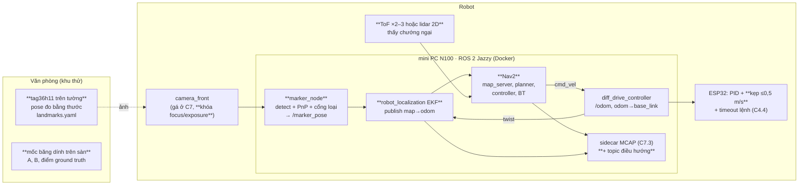
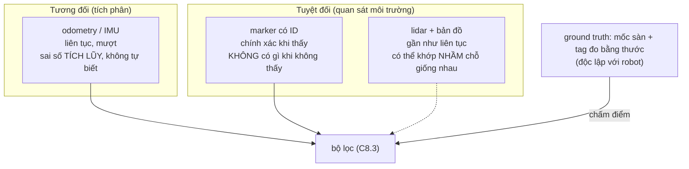

# Chặng 8 — Định vị và điều hướng (70h)

> **Vị trí:** C7 (cảm biến gá trên robot, TF tĩnh, ghi MCAP) → **C8** → C9 (nhận người), C10 (an toàn và vận hành) · **Cần trước:** C7 trọn (và qua đó C6 odometry đã hiệu chuẩn UMBmark); → F6.7, F6.8, F1.4; đọc K2 Bài 3 (frame và TF) · **Chạy song song với:** K5–K6
> **Làm ra được:** robot tự đi A→B 20 lần trong khu thử văn phòng, có tag dán tường đã đo, bản đồ occupancy vẽ từ số đo thước, cảm biến chướng ngại · bảng độ chính xác pose từ marker theo (khoảng cách × góc), artifact hiệu chuẩn camera có `calibration_id`, 20+ session MCAP điều hướng, bộ rule vật lý có test tổng hợp · **Sau chặng này bạn quyết định được:** tin một phát hiện tag tới khoảng cách và góc nào, với covariance bao nhiêu; ai publish cạnh TF nào và cú nhảy `map → odom` xử lý ra sao; gate "đi tới đích" của bạn phân biệt được robot tốt và xấu tới đâu; rule nào đáng chạy tự động trên mọi session.

C6 cho bạn một kết quả khó chịu: odometry trôi và **không tự biết mình trôi**. C8 thêm một nguồn tuyệt đối (tag dán tường, nhìn bằng camera), trộn hai nguồn bằng bộ lọc, rồi giao pose đó cho Nav2 để robot **tự đi**. Đây là lần đầu robot di chuyển mà không có tay bạn trên cần điều khiển, trước khi tầng an toàn phần cứng của C10 tồn tại. Vì vậy chặng này có phần an toàn dày hơn chặng trước, và tốc độ bị kẹp ở firmware chứ không chỉ ở Nav2.

Chặng này đến từ K7 gốc Bài 6–10 và GATE 7B (80h, trần 110h). Phần ROS 2 trong Docker và `/odom` chuẩn đã chuyển sang C5.2; gá cảm biến và TF tĩnh sang C7.1. Còn lại 70h:

**Phân bổ 70h** `[ước lượng]`:

| Phần | Giờ |
|---|---|
| Bài C8.1 Marker hay lidar *(rút gọn)* | 3 |
| Bài C8.2 Hiệu chuẩn camera và pose từ marker | 12 |
| Bài C8.3 Hợp nhất odometry và marker, cây TF | 14 |
| Bài C8.4 Nav2 từ A tới B | 18 |
| Bài C8.5 Ghi và phân tích session điều hướng | 9 |
| Lắp bước 1–6: khu thử, gá camera cho marker, in/bồi tag, dán và đo tag, cảm biến chướng ngại, bản đồ | 11 |
| Gate chặng 8 (gồm bài viết) | 3 |
| **Tổng** | **70** |

Ký hiệu thư mục lab trong chặng: `lab/c08/<bài>/` với `prediction.md`, `results.md`, MCAP, script. Mọi `prediction.md` commit **trước** khi đo.

## 0. Bức tranh chặng

Robot sau chặng này, phần mới tô đậm bằng `**`:



Khu thử nhìn từ trên xuống (kịch bản ví dụ; bạn vẽ bản của mình ở Lắp bước 1):

```
  y ↑   tường có tag T1..T6 (tâm tag ≈ độ cao quang tâm camera)
    │ ┌──[T1]──────────[T2]──────────[T3]──┐
    │ │                                    │   [T4]
    │ │  A ■ ─ ─ ─ ─ ─ ─ ─ ─ ─ ─ ─ ─ ■ B    │
    │ │  (xuất phát)   bàn cố định  (đích)  │
    │ │                ▓▓▓▓▓▓              │
    │ │  ◆ G1        ◆ G2         ◆ G3     │   ◆ = điểm ground truth (băng dính, đo thước)
    │ └──[T6]────── cửa ─────────[T5]──────┘
    └──────────────────────────────────────→ x      gốc map = mốc O ở góc khu thử
       KHÔNG có cầu thang, bậc, cửa mở ra cầu thang trong hoặc sát khu thử
```

Dòng dữ liệu mới: ảnh → phát hiện tag → `/marker_pose` (có covariance theo khoảng cách, góc) → EKF → `map → odom` → Nav2 → `cmd_vel` → ESP32. Mọi topic đó cộng sự kiện của Nav2 đi vào MCAP, rồi vào bộ rule ở C8.5.

## 1. An toàn của chặng

**Rủi ro của C8:** robot **tự di chuyển** trong không gian có người: va chân, vấp chân người, kẹp ngón tay khi nhấc robot đang quay bánh, rơi xuống bậc/cầu thang (robot không có cảm biến mép sàn), đâm vật thấp ngoài vùng nhìn của cảm biến, kéo đổ đồ qua dây debug. Tầng an toàn phần cứng đầy đủ (E-stop cắt động lực qua relay, bumper, watchdog độc lập) **chưa có**: đó là C10.1. Ở C8 bạn chỉ có kẹp tốc độ và timeout lệnh trong firmware (C4.4) và E-stop tạm (C5.3). Thêm: máy đo laser (nếu dùng) là laser class 2, không chiếu vào mắt.

Động năng robot 5 kg ở 0,5 m/s chỉ vài jun `[ước lượng]`; mối nguy chính không phải lực va mà là **vấp, kẹp, rơi**, và robot làm điều bạn không ngờ (Nav2 lùi `BackUp` vào người đứng sau, xoay `Spin` quét cạnh bàn).

**Quy tắc cứng:**
- KHÔNG chạy tự động khi chưa kiểm **kẹp tốc độ ở firmware** trong buổi đó: robot kê bánh lên khỏi sàn, gửi lệnh 1,0 m/s bằng teleop, đo vận tốc bánh từ encoder; phải ≤0,5 m/s. Kẹp chỉ ở Nav2 là cấu hình, gõ nhầm một số là mất.
- KHÔNG chạy tự động khi chưa kiểm **timeout lệnh** (C4.4): đang chạy chậm, `docker stop` container Nav2 (hoặc rút cáp USB ESP32–mini PC); robot phải dừng trong thời gian timeout bạn đặt ở C4.4.
- KHÔNG chạy tự động khi không có **người quan sát cầm E-stop tạm** (C5.3) trong tầm với, đi kèm robot. Một người vừa gõ lệnh vừa quan sát chỉ được chạy ở ≤0,2 m/s.
- KHÔNG chạy trong khu có cầu thang, bậc, mép bục, cửa mở ra cầu thang; không chạy khi có người **không được báo trước** trong khu thử.
- KHÔNG để dây debug (USB, nguồn bàn) nối robot với bàn khi chạy tự động.
- KHÔNG nhấc robot khi động lực còn nối. Kịch bản kidnapped (C8.4): nhấn E-stop tạm → nhấc → đặt → nhả E-stop.
- KHÔNG tăng tốc độ tối đa của một cấu hình mới quá 0,2 m/s trước khi cấu hình đó chạy sạch 5 lần liên tiếp. 0,5 m/s là trần, không phải mục tiêu.
- KHÔNG đặt chướng ngại thử là người ở lần đầu. Kịch bản "người cắt ngang" chỉ với người đã được dặn, robot ≤0,2 m/s, người bước ngang ở khoảng cách ≥ 2 lần quãng dừng bạn tính ở C8.4.
- KHÔNG chạy robot tự đi khi bạn rời phòng. Chạy dài không người là C10.3, sau khi có tầng an toàn phần cứng.
- Khu thử phải có khoảng trống ≥ quãng dừng (tự tính ở C8.4: `d = v·t_trễ + v²/(2a)`) + 0,5 m giữa đường đi dự kiến và mọi vật dễ đổ.

**Khi sự cố xảy ra:**

| Sự cố | Làm ngay, theo thứ tự | KHÔNG |
|---|---|---|
| Robot lao về phía người, bậc, vật dễ vỡ | E-stop tạm; nếu không kịp, người quan sát chặn bằng **chân/vật cứng phía trước bánh** (robot nhẹ), không cúi tay | Chụp robot bằng tay khi bánh đang quay |
| Robot quay tròn/giật không dừng sau E-stop | Rút XT60/ngắt công tắc chính (C1) | Đợi "xem nó có tự dừng không" |
| Robot rơi khỏi bậc/lật | Ngắt công tắc chính; kiểm pin theo quy trình pin va đập của C1.6 trước khi dùng lại | Bật lại ngay để "xem còn chạy không" |
| Va chân người | Dừng, ghi near miss vào sổ build, xem MCAP vì sao không dừng; không chạy lại khi chưa biết nguyên nhân | Chạy tiếp "vì lần này nhẹ" |

## 2. BOM chặng

Giá `[ước lượng 10/2026]`, kiểm lại ở cửa hàng. Camera đã mua và gá ở C7; IMU ở C7. Nếu đã có thước dây, thước cặp, chân máy từ khóa trước thì không mua lại.

| Món | Thông số phải chọn | Vì sao (bằng số) | Giá | Kiểm khi nhận | Thay thế được bằng |
|---|---|---|---|---|---|
| Camera (đã có từ C7) | **Focus khóa được** (manual focus hoặc fixed focus), **exposure thủ công**; độ phân giải cố định (ví dụ 640×480 hoặc 1280×720) | Autofocus đổi tiêu cự → hiệu chuẩn mất hiệu lực (C8.2) | — | `v4l2-ctl -d /dev/videoN --list-ctrls` có control focus/exposure thủ công `[tự đo]` | Đổi camera nếu không khóa được focus |
| In tag | In laser trắng đen, giấy **mờ** (không bóng), "Actual size/100 %" | Giấy bóng phản chiếu đèn trần → mất phát hiện | 2–5k/tờ A4 | Đo hai cạnh ô đen bằng thước cặp | In phun (mép mực nhòe hơn) |
| Tấm bồi | Formex/foam board 3–5 mm hoặc mica, khổ A4 | Tag phải **phẳng**; giấy dán 4 góc phồng theo độ ẩm | 10–20k/tấm | Áp thước thẳng, khe ≤1 mm | Bìa carton cứng (kém hơn) |
| Keo bồi | Băng keo hai mặt mỏng phủ **toàn mặt**, hoặc keo xịt | Dán 4 góc = giấy cong giữa | 30–250k | Dán thử, để 2 ngày, nhìn nghiêng | — |
| Bàn cờ hiệu chuẩn | In 9×6 góc trong (ô 25–30 mm) hoặc ChArUco, bồi kính khung ảnh/formex khổ A3 | Bàn cờ cong làm hiệu chuẩn sai | 50–150k | Áp thước thẳng hai đường chéo | Màn hình laptop hiển thị bàn cờ (phẳng, nhưng phản chiếu) |
| Thước dây thép | 5–7,5 m, nhãn cấp chính xác (class II) | Đo pose tag, mốc sàn; class II cho phép ±(0,3 + 0,2·L) mm `[spec — OIML R35/MID, kiểm nhãn]` | 80–200k | Đối chiếu 1 m với thước cặp/thước lá | — |
| Máy đo khoảng cách laser *(tùy chọn)* | 30–40 m, ±2 mm `[spec — nhãn máy]` | Đo một người một mình; đo từ tường sang tường | 0,4–1,2tr | Đo một khoảng đã đo bằng thước dây | Thước dây + người giữ |
| Ê ke thợ (300 mm), thước thủy ngắn | — | Tag thẳng đứng, cạnh song song sàn | 60–150k | — | App thước thủy điện thoại (±0,5–1° `[ước lượng]`) |
| Băng dính sàn màu, bút lông | Băng dính giấy màu 24 mm | Mốc O, A, B, G1..Gn; vẽ dấu chữ thập | 20–40k | — | Phấn |
| Chân máy ảnh | Có ốc 1/4", cao ≥1 m | Đặt tag ở khoảng cách/góc biết trước khi đo lưới (C8.2) | 150–300k | Không rung khi chạm | Giá gỗ tự đóng |
| Cảm biến chướng ngại **(một trong hai)** | (a) 2–3 ToF VL53L1X (I2C, tới ~4 m `[spec — ST, điều kiện tốt]`), gắn ở mặt trước; (b) lidar 2D 360° (họ LD06/LD19, RPLIDAR A1/C1) | Marker cho **định vị**, không cho **thấy vật cản**; không có cảm biến này thì kịch bản chắn đường ở C8.4 vô nghĩa | (a) 120–250k/cái; (b) 1–3tr | (a) đọc khoảng cách tới tường đã đo; (b) quét thấy tường trên Foxglove | Camera độ sâu (đắt, nặng CPU) |

**Tổng C8 `[ước lượng]`:** ~0,8–2tr với đường marker + ToF; thêm 1–3tr nếu chọn lidar ở C8.1.

## 3. Dụng cụ và kỹ năng tay

Chặng này ít hàn, nhiều **đo**. Kỹ năng mới:

| Kỹ năng | Ở đâu | Luyện trước | Đạt trông thế nào |
|---|---|---|---|
| In tag đúng kích thước, đo bằng thước cặp | Lắp bước 3 | In 1 tag thử, đo cả hai cạnh | Hai cạnh lệch nhau ≤0,3 mm `[ước lượng]`; ghi số đo thật theo từng ID |
| Bồi tag phẳng | Lắp bước 3 | Bồi 1 tờ giấy trắng lên formex | Áp thước thẳng theo hai đường chéo, khe ≤1 mm; mép không bong sau 2 ngày |
| Dán tag thẳng đứng, đúng độ cao | Lắp bước 4 | Dán băng dính giấy làm khung trước | Thước thủy cạnh trên lệch ≤1°; tâm tag ở độ cao quang tâm camera ±10 cm |
| Kéo thước dây đúng cách | Lắp bước 4 | Đo cùng một khoảng 5 lần, ghi cả 5 | Thước căng, không võng, đầu móc tì đúng mốc; 5 số lệch nhau ≤3 mm |
| Đo từ hai mốc (giao hai đường tròn) | Lắp bước 4, Bài C8.1 | Đo một điểm đã biết | Đo khép (tag–tag trực tiếp) lệch với tính toán ≤ ngân sách bạn đặt |
| Gắn ToF / lidar chắc, đúng hướng | Lắp bước 5 | — | Không lắc khi gõ nhẹ; trục đo song song sàn (lidar) |

Cách kéo thước dây cho người mới: một người giữ đầu móc **tì** (không móc) vào tâm dấu chữ thập trên sàn; người kia kéo căng ngang mặt sàn, mắt nhìn thẳng góc xuống vạch số. Thước võng 1 cm ở giữa đoạn 4 m làm số đọc dài thêm chưa tới 0,1 mm `[ước lượng — hình học dây võng nhẹ]`; lỗi lớn hơn thường đến từ **đặt sai mốc** và **đọc nghiêng**, nên mỗi số đo hai lần, hai người hoặc hai ngày.

## 4. Sơ đồ đi dây

Chặng này chỉ thêm cảm biến chướng ngại. Camera là USB (C7.1).

```
  (a) ToF qua ESP32                                   (b) Lidar 2D qua mini PC
  buck 5 V/3V3 logic (C1) ──┬── VIN ToF#1 ── VIN ToF#2      lidar ──USB-UART (hoặc UART 3V3)── mini PC
  GND sao (C1)  ────────────┼── GND ─────── GND             nguồn lidar: 5 V từ buck logic,
  ESP32 SDA/SCL (bus I2C    ├── SDA ─────── SDA             KHÔNG lấy từ cổng USB nếu motor lidar
   đã quy hoạch ở C4.1) ────┴── SCL ─────── SCL             kéo dòng vượt cổng [tự đo dòng khởi động]
  ESP32 GPIO a ──────────────── XSHUT#1
  ESP32 GPIO b ───────────────────────────── XSHUT#2
  dây tín hiệu: 26–28 AWG, JST-PH/XH, quy ước màu C0.5; dài ≤30 cm, đi xa dây motor
```

- VL53L1X có địa chỉ I2C mặc định 0x29 `[spec — ST VL53L1X datasheet]`; nhiều cảm biến cùng bus cần chân XSHUT để bật từng cái và đổi địa chỉ lúc khởi động. Thêm các dòng vào **bảng chân** của C4.1 trước khi cắm (kiểm chân strapping ESP32-S3).
- ToF gửi lên host thành `sensor_msgs/msg/Range` trên `/tof/range` (hoặc `/tof_<vị trí>/range`), frame `tof_<vị trí>_link`, 30 Hz, theo CONVENTIONS §3. Thêm TF tĩnh `base_link → tof_<vị trí>_link` đo bằng thước.

Cây TF của chặng (theo CONVENTIONS §2 và REP-105); cạnh mới là `map → odom`:

```
map ──(EKF, ĐƯỢC NHẢY)──► odom ──(diff_drive_controller, LIÊN TỤC)──► base_link ─┬─(static)─► camera_front_link ─(static, xoay chuẩn)─► camera_front_optical_frame
                                                                                  ├─(static)─► imu_link
                                                                                  └─(static)─► tof_<vị trí>_link / laser_link
```

## 5. Trình tự chặng

1. **Lắp bước 1 — Khu thử và quy tắc chạy tự động** (1h)
   - Làm: chọn khu thử theo mục 1; hỏi người quản lý văn phòng trước khi dán gì lên tường; vẽ sơ đồ tay (kích thước đo thô); đánh dấu vùng cấm (bậc, cửa ra cầu thang, dây điện trên sàn); in tờ quy tắc mục 1 dán cạnh khu thử.
   - ✅ Checkpoint: kẹp tốc độ và timeout lệnh của C4.4 đã kiểm trong buổi (hai quy tắc đầu ở mục 1), ghi số đo vào `measurements.jsonl`.
   - Nếu sai: không sang bước sau; quay lại C4.4.
2. **Học Bài C8.1** → ghi quyết định marker/lidar vào `decisions.md`.
3. **Lắp bước 2 — Gá camera cho bài toán marker** (1,5h)
   - Làm: kiểm gá camera của C7.1 theo yêu cầu riêng của marker: (a) độ cao quang tâm cố định, đo bằng thước từ sàn (tag sẽ dán ở độ cao này); (b) camera nhìn ngang, ngẩng 0–10° (nhìn xuống sàn phí nửa ảnh); (c) gá **cứng**: gõ nhẹ vào thân robot, ảnh trên `rqt_image_view`/Foxglove không rung lắc lâu; (d) khóa focus và exposure bằng `v4l2-ctl`, ghi toàn bộ control vào file `config/camera_front_controls.txt`; (e) đánh dấu bút lên ốc gá (vạch ngang ốc–thân) để thấy ốc xoay.
   - ✅ Checkpoint: rút cắm USB camera, khởi động lại container: control đọc lại **giống** file đã ghi. Không giống → control không được áp lúc khởi động, sửa launch.
   - Nếu sai: camera không khóa được focus → đổi camera (mục 2) trước C8.2.
4. **Lắp bước 3 — In, đo, bồi tag** (2h)
   - Làm: chọn họ `tag36h11`, ID duy nhất cho từng tag (ghi ID ở mặt sau). Cạnh ô đen chọn theo tầm đọc cần có (C8.2 phần 5 cho cách tính; một mặc định hợp lý là ô đen 160 mm trên A4, viền trắng ≥1 ô). In 100 %, đo **cả hai cạnh** ô đen ngoài bằng thước cặp, ghi `size_m` thật của từng ID; bồi toàn mặt lên formex.
   - ✅ Checkpoint: hai cạnh lệch ≤0,3 mm; mặt tag phẳng (khe ≤1 mm dưới thước thẳng); không có hai tag trùng ID (script đọc `landmarks.yaml` kiểm trùng).
   - Nếu sai: in lại; không dùng tag méo "vì chỉ lệch chút".
5. **Học Bài C8.2** (hiệu chuẩn camera, bảng sai số trên chân máy).
6. **Lắp bước 4 — Dán và đo tag, mốc sàn** (3h)
   - Làm: dán mốc O (gốc `map`), A, B, G1..Gn trên sàn; dán tag (tâm ở độ cao quang tâm ±10 cm, thẳng đứng); đo pose từng tag theo phương pháp ở Bài C8.1 phần 6, **hai lần độc lập**; đo khép: khoảng cách trực tiếp giữa hai tag kề nhau, so với tọa độ tính ra. Ghi `config/landmarks.yaml` (`id, size_m, x, y, z, yaw, sigma_xy, sigma_yaw, measured_by, measured_at, tape_id`).
   - ✅ Checkpoint: hai lần đo lệch nhau trong ngân sách bạn đặt ở C8.1; sai số khép ≤ 2 × σ tính ra.
   - Nếu sai: đo lần ba bởi người khác; không lấy trung bình hai số lệch nhau mà không hiểu vì sao.
7. **Học Bài C8.3** (EKF, cây TF; chạy 20 phút có ground truth).
8. **Lắp bước 5 — Cảm biến chướng ngại** (2h)
   - Làm: gắn ToF (hoặc lidar) theo mục 4; ToF đặt sao cho phủ được vật cao 5–40 cm phía trước (vẽ nón nhìn trên giấy, ghi **vùng mù** vào `decisions.md`).
   - ✅ Checkpoint trước khi cấp điện: thông mạch GND ToF ↔ GND ESP32 kêu; giữa VIN và GND **không** kêu; nguồn 3V3 hay 5 V đúng với module (đọc chữ trên module). Sau khi cấp điện: `/tof/range` đọc tường đã đo ở 0,5/1/2 m, ghi sai số.
   - Nếu sai: không đọc được I2C → quét bus (K5 Bài 3), kiểm XSHUT.
9. **Lắp bước 6 — Dựng bản đồ văn phòng** (1,5h): vẽ occupancy grid từ số đo (Bài C8.4 phần 6, bước 1).
   - ✅ Checkpoint: đặt robot ở G1, G2, G3; pose từ C8.3 hiển thị trên Foxglove phải rơi đúng ô của mốc trên bản đồ (lệch ≤ 2 ô).
   - Nếu sai: thường do lật trục y của ảnh PGM hoặc sai `origin` (C8.4 phần 8).
10. **Học Bài C8.4** (Nav2, 20 lần A→B, 4 kịch bản ép hỏng).
11. **Học Bài C8.5** (rule trên 20+ session).
12. **Gate chặng 8.**

## 6. Lỗi người mới hay gặp

| Triệu chứng | Nguyên nhân khả dĩ | Kiểm bằng cách | Sửa |
|---|---|---|---|
| Hiệu chuẩn hôm qua tốt, hôm nay khoảng cách tới tag lệch vài % | Autofocus bật lại sau khi rút cắm camera; độ phân giải đổi | So control hiện tại với `camera_front_controls.txt` | Áp control trong launch; kiểm "tag ở khoảng cách biết trước" lúc khởi động (C8.2) |
| Tag phát hiện được buổi sáng, mất buổi chiều | Nắng xiên qua cửa sổ, chói trên tag | Chụp ảnh lúc mất | Giấy mờ; dời tag; ghi giờ/ánh sáng vào session |
| Tag bị người khác gỡ/dán lại lệch | Lau tường, dọn văn phòng | Rule innovation theo tag ID (C8.5) | Dán nhãn "thiết bị đo, xin đừng gỡ"; kiểm định kỳ |
| Robot đâm chân ghế dù có ToF | Chân ghế mảnh, thấp, ngoài nón ToF | Vẽ nón nhìn | Thêm ToF, đổi góc, hoặc lidar; giảm tốc |
| Robot đứng yên, không lỗi, Nav2 báo đang chạy | `Twist`/`TwistStamped` lệch kiểu trên `cmd_vel` (Jazzy) | `ros2 topic info -v /cmd_vel` | C8.4 phần 6, bước 3 |
| Bản đồ trên Foxglove soi gương so với thực tế | PGM hàng 0 ở trên, quên lật trục y | Đặt robot ở góc biết trước | C8.4 phần 6, bước 1 |

Lỗi riêng của từng bài ở phần 8 của bài.

## 7. Lăng kính data infra

**Dữ liệu chặng này sinh ra:**

| Luồng / artifact | Ở đâu | Schema / message | Tần số | Ghi chú (CONVENTIONS) |
|---|---|---|---|---|
| Bản đồ tag (ground truth) | `config/landmarks.yaml` | `id, size_m, x, y, z, yaw, sigma_*, measured_by, measured_at, tape_id` | khi đo | Dataset có version; mét, rad |
| Artifact hiệu chuẩn | `calib/camera_front/<calibration_id>/` | `camera_info.yaml` + `calibration.json` (K, D, RMS train/giữ kín, hash ảnh, control v4l2, bản OpenCV) | khi hiệu chuẩn | `calibration_id` vào metadata mọi MCAP (§4) |
| Mô hình nhiễu marker | `config/marker_noise.yaml` | σ theo (d, θ) + cổng loại, gắn `calibration_id` | khi đo lại | Đầu vào covariance của C8.3 |
| Pose từ marker | `/marker_pose` | `geometry_msgs/msg/PoseWithCovarianceStamped`, `frame_id = map`, stamp = thời điểm chụp | ≤ tần số camera | + `/diagnostics` đếm phát hiện bị loại |
| Pose hợp nhất | `/odometry/filtered`, TF `map→odom` | `nav_msgs/msg/Odometry` | 30 Hz `[ước lượng]` | Covariance thật, không 0 |
| Chướng ngại | `/tof/range` hoặc `/scan` | `Range` / `LaserScan` | 30 Hz / 5–10 Hz | |
| Điều hướng | `/plan`, `cmd_vel`, `/behavior_tree_log`, kết quả action, costmap (giảm tần số) | chuẩn Nav2 | xem C8.5 | Tên topic log BT `[tự đo]` |
| Bảng kết quả chạy | `lab/c08/c84/runs.csv` | `run_id, session_mcap, result, error_code, t_s, x_tu_bao, y_tu_bao, x_thuoc, y_thuoc, n_recovery, ghi_chu` | mỗi lần chạy | Một dòng mỗi lần; ground truth đo tay |

**Test tự động sinh ra từ chặng này (hạt giống cho C11):**
- "Tag ở khoảng cách biết trước" lúc khởi động (canary hiệu chuẩn, C8.2): lệch quá ngưỡng → cờ `calibration_suspect` trong metadata.
- Bốn kịch bản ép hỏng của C8.4 thành bốn kịch bản sim/HIL có phán quyết ba trạng thái ở C11.2 (PASS / FAIL / INCONCLUSIVE khi thiếu dữ liệu).
- Bộ rule vật lý của C8.5, mỗi rule có test tổng hợp (lỗi tiêm vào), chạy trên mọi session như CI cho dữ liệu (→ K2 Bài 12, K5 Bài 16, F3.7).

**SLI:** tỉ lệ thời gian có ít nhất một phát hiện tag hợp lệ; tỉ lệ phát hiện bị cổng loại; tỉ lệ A→B thành công kèm Wilson CI; số recovery/100 lần chạy; tỉ lệ session qua mọi rule.

**Vai trò nghề:** Test & Validation (oracle độc lập bằng thước, gate có khoảng tin cậy, kịch bản ép hỏng); Data Platform (calibration artifact + lineage, dataset `landmarks.yaml` có version, rule vật lý trên luồng); Sim & Eval (bảng sai số marker là mô hình cảm biến cho sim ở C11.1).

## 8. Nhật ký build

Copy vào `build-log/c08.md`, một mục mỗi buổi:

```markdown

## 2026-MM-DD — buổi N (giờ bắt đầu–kết thúc, giờ thực: _._ h)
- Trạng thái người: tỉnh táo / mệt (mệt → chỉ phân tích dữ liệu, không chạy tự động)
- Kiểm an toàn đầu buổi: kẹp tốc độ firmware ___ m/s (đo); timeout lệnh ___ ms (đo); người quan sát: ___
- Mục tiêu buổi:
- calibration_id đang dùng: ___ ; commit nav2_params: ___ ; commit landmarks.yaml: ___
- Đã làm / số lần chạy:
- Số đo (đã vào measurements.jsonl / runs.csv? số dòng: __)
- Ánh sáng (lux, app điện thoại), người trong khu thử:
- Lỗi gặp (triệu chứng → nguyên nhân → sửa):
- Near miss (robot suýt va, suýt rơi, tag bị gỡ…): không / có → mô tả
- Quyết định (→ decisions.md):
- Câu hỏi còn mở:
```

---

## Bài C8.1 — Marker hay lidar (3h) (khung rút gọn)

> **Vị trí:** C7 (camera đã gá, ghi MCAP) → **C8.1** → C8.2 · **Cần trước:** C6.3 (odometry không biết mình sai), → F1.1 (độ bất định của chính thước đo), → F6.1 (mô hình có miền hiệu lực), K2 Bài 3 (frame) · **Sau bài này bạn quyết định được:** dùng nguồn định vị tuyệt đối nào trong C8, ground truth lấy từ đâu và sai bao nhiêu, tức là sai số nhỏ nhất bạn còn *chấm được* ở C8.3–C8.4.

### 1. Câu chuyện — ai đã khổ vì chuyện này

Kho của Kiva Systems (Amazon mua năm 2012, nay là Amazon Robotics) giải bài định vị cho hàng nghìn robot bằng một lựa chọn trông "kém sang": dán lưới **mã fiducial 2D trên sàn**, robot có camera nhìn xuống đọc mã khi đi qua, giữa hai mã thì chạy bằng odometry `[chuẩn — mô tả công khai của hệ Kiva; khoảng cách mã: tự tra]`. Họ sửa môi trường để đổi lấy định vị tuyệt đối có ID duy nhất, không bao giờ nhầm chỗ này với chỗ kia, và lỗi thì lỗi **rõ ràng** (không thấy mã đúng hạn → dừng). Ở đầu kia, robot dùng lidar + bản đồ không sửa gì môi trường, nhưng trả giá ở chỗ khác: hành lang dài đối xứng, kho đổi bố cục, và một lớp lỗi "định vị nhầm mà vẫn tự tin".

Lựa chọn ở bài này không chỉ về cảm biến. Nó là: **bạn chấp nhận loại thất bại nào**, và bạn có **chân lý để chấm** mọi thứ phía sau hay không. Gate C8 đòi "p95 sai lệch cuối" — p95 so với cái gì? Nếu câu trả lời là "so với pose robot tự báo", bạn đang dùng bị cáo làm thẩm phán.

### 2. Mô hình tư duy



Mọi robot di động cần **một nguồn tương đối** (mượt, tần số cao, trôi) và **một nguồn tuyệt đối** (neo lại, gián đoạn hoặc mơ hồ). Marker và lidar khác nhau chủ yếu ở **kiểu thất bại**: marker thất bại kiểu *im lặng có ranh giới* (không thấy tag = không có số đo, ai cũng biết); lidar thất bại kiểu *có số đo nhưng sai* (scan khớp vào một đoạn hành lang giống hệt). Kiểu thứ nhất dễ kiểm hơn nhiều. Và: tag đo bằng thước là **ground truth độc lập**, thứ cho phép chấm cả fusion lẫn lidar về sau.

**Ma trận quyết định.** Điền trọng số (tổng = 10) theo mục tiêu *của bạn*, nhân điểm 1–5, cộng. Điểm dưới đây là đánh giá định tính cho văn phòng nhỏ + N100 + vai trò data infra; bạn được sửa, phải ghi lý do.

| Tiêu chí | Trọng số (bạn điền) | Marker (tag36h11) | Lidar 2D + bản đồ |
|---|---|---|---|
| Chi phí | | 5 | 3 (1–3tr `[ước lượng]`) |
| Không phải sửa môi trường | | 1 | 5 |
| Độ chính xác khi có tín hiệu | | 4 (phụ thuộc d, góc — C8.2 đo) | 4 |
| Phủ không gian liên tục | | 2 | 5 |
| Kiểu thất bại dễ phát hiện | | 5 | 2 |
| Cho ground truth độc lập | | 5 | 1 |
| Thấy chướng ngại | | 1 (cần thêm ToF) | 4 (chỉ ở mặt phẳng quét) |
| Tải CPU trên N100 | | 3 `[tự đo]` | 3 `[tự đo]` |
| Phụ thuộc ánh sáng | | 2 | 5 |
| Quyền riêng tư (C9.1) | | 2 (camera nhìn thấy người) | 5 |
| Giá trị học cho data infra | | 5 (hiệu chuẩn, calibration artifact) | 3 |

K7 gốc khuyến nghị **marker trước, lidar sau nếu dư giờ**; giữ nguyên. Ma trận nhạy với hai trọng số: "không sửa môi trường" và "liên tục". Văn phòng không cho dán tag thì kết luận đảo, và bạn vẫn cần ground truth bằng cách khác (mốc sàn đo thước). Dù chọn gì, **cảm biến chướng ngại là bắt buộc** cho C8.4: tag không cho robot thấy hộp chắn đường.

### 3. Cầu nối từ backend

| Backend bạn biết | Ở đây | Gãy ở chỗ | Nếu dùng nhầm thì |
|---|---|---|---|
| Đồng hồ cục bộ trôi, định kỳ sync NTP | Odometry trôi, định kỳ neo về tag | NTP sync đều đặn, mọi node nhận; tag chỉ có khi **camera thấy**, phụ thuộc chỗ robot đứng. Khoảng mù do hình học căn phòng, không do bạn chọn tần số | Thiết kế như thể "lúc nào cũng có sync": robot đi 2 phút qua vùng không tag mà Nav2 vẫn tin pose như vừa thấy tag |
| Golden dataset / oracle độc lập (F2.1) | Bản đồ tag đo bằng thước | Oracle backend thường chính xác tuyệt đối; oracle ở đây **có sai số** (thước, góc dán, tường cong) và sai số đó đặt **sàn** cho mọi phép chấm | Báo "fusion sai 2 cm" khi ground truth tự nó sai cỡ cm theo vị trí và cỡ độ theo hướng |
| Primary key duy nhất vs fuzzy match | Tag có ID vs scan matching | Đúng ở ý "khớp chính xác vs gần đúng"; gãy ở chỗ tag vẫn có **pose mơ hồ hình học** (C8.2: tag phẳng có hai nghiệm xoay) dù ID không mơ hồ | Tin "có ID là chắc": ăn nguyên cú lật hướng vào bộ lọc |

**Chấm mô hình:**
- *"Lidar đắt hơn nên chính xác hơn, marker là phương án nghèo."* — **SAI.** Độ chính xác cục bộ hai bên cùng cỡ; khác ở *phủ* và *kiểu thất bại*. Phản ví dụ: Kiva/Amazon chọn fiducial cho hàng nghìn robot dù đủ tiền mua lidar.
- *"Có ground truth = có sự thật tuyệt đối."* — **ĐÚNG MỘT PHẦN.** Ground truth là phép đo **độc lập và tốt hơn** hệ đang chấm, không phải sự thật. Phản ví dụ: tag dán lệch 1° so với giá trị trong `landmarks.yaml`; robot đứng cách tag vài mét bị đẩy ngang một khoảng tỉ lệ với khoảng cách (bạn tính ở phần 6), dù tâm tag đo đúng tới milimét.

### 6. Làm

1. **Quyết định**, ghi `decisions.md`: ma trận đã điền, kết quả, và *điều kiện khiến bạn đổi* (ví dụ "văn phòng không cho dán tag", "cần > N tag để phủ lộ trình").
2. **Định nghĩa "tag size"** cho thư viện bạn dùng. Với `tag36h11`, ảnh tag có 8×8 ô đen-trắng (6×6 bit + 1 ô viền đen mỗi bên) và cần thêm viền trắng `[spec — AprilTag, AprilRobotics]`; OpenCV ArUco và AprilTag 3 lấy cạnh **ô đen ngoài** làm kích thước `[tự đo — đọc tài liệu bản cài]`. Sai số kích thước đi **thẳng tỉ lệ** vào khoảng cách (Z ∝ s), nên `size_m` là số đo thước cặp của từng ID, không phải số thiết kế.
3. **Phương pháp đo pose tag (Lắp bước 4).** Hai mốc sàn A, B cách nhau 3–4 m dọc một trục của `map`. Đo khoảng cách từ A và từ B tới điểm chiếu của tâm tag xuống chân tường (dây dọi hoặc ê ke), tính (x, y) bằng giao hai đường tròn. Yaw: tag phẳng sát tường (kiểm bằng ê ke) thì yaw tag = hướng tường; đo hướng tường bằng **hai điểm cách xa nhau** trên chân tường. z: thước từ sàn tới tâm tag. Kiểm khép: kéo thước trực tiếp giữa hai tag kề nhau, so với khoảng cách tính từ tọa độ.
4. **Tính trước khi đo** (vào `prediction.md` của C8.1): (a) với sai số yaw tag δθ = 1° và khoảng cách quan sát d = 3 m, pose robot suy ra lệch ngang bao nhiêu? (b) mỗi lần kéo thước có σ = 3 mm: σ vị trí tag cỡ bao nhiêu, và σ yaw nếu đo yaw bằng hai mép tấm bồi (cách 0,25 m) so với hai điểm chân tường cách 2 m? Rồi chạy mô phỏng:

```python
# [đã chạy] Đo pose tag bằng thước dây từ hai mốc sàn A, B (giao hai đường tròn) — sai số theo vị trí và cách đo yaw
import numpy as np
rng = np.random.default_rng(0)
A, B = np.array([0.0, 0.0]), np.array([3.0, 0.0])   # hai mốc băng dính trên sàn, AB = 3 m dọc trục x của map
SIG = 0.003                                         # σ mỗi lần kéo thước (m): thước + võng + đặt đầu [ước lượng]

def locate(dA, dB):
    """Giao hai đường tròn tâm A, B; chọn nghiệm y > 0 (phía tường)."""
    L = np.linalg.norm(B - A); x = (dA**2 - dB**2 + L**2) / (2 * L)
    return np.array([x, np.sqrt(np.maximum(dA**2 - x**2, 0))])

def measure(P, n=20000):
    dA = np.linalg.norm(P - A) + rng.normal(0, SIG, n)
    dB = np.linalg.norm(P - B) + rng.normal(0, SIG, n)
    return np.array([locate(a, b) for a, b in zip(dA, dB)])

print("điểm (m)   σx(mm) σy(mm) | σyaw khi đo 2 điểm cách 0,25 m | cách 2 m")
for P in [(1.5, 1.0), (1.5, 3.0), (1.5, 6.0), (5.0, 3.0)]:
    P = np.array(P); e = measure(P) - P
    yaw = []
    for base in (0.25, 2.0):                       # tường song song trục x; đo hai điểm cách nhau `base`
        p1, p2 = measure(P - [base / 2, 0], 4000), measure(P + [base / 2, 0], 4000)
        d = p2 - p1; yaw.append(np.degrees(np.std(np.arctan2(d[:, 1], d[:, 0]))))
    print(f"({P[0]:.1f}, {P[1]:.1f})  {1e3*e[:,0].std():6.1f} {1e3*e[:,1].std():6.1f} | {yaw[0]:13.2f}°"
          f"{'':17s}| {yaw[1]:5.2f}°")
```

<details><summary>🔒 MỞ SAU KHI COMMIT prediction.md</summary>

(a) d·δθ = 3 m × 0,01745 rad ≈ **5,2 cm**, lớn hơn nhiều sai số tâm tag (vài mm). Yaw tag trên bản đồ phải đo cẩn thận như vị trí; nếu C8.3 ra sai số hệ thống phụ thuộc *tag nào đang được nhìn*, nghi `landmarks.yaml` trước khi nghi bộ lọc.

(b) Mô phỏng (σ = 3 mm mỗi lần kéo thước):

| Điểm (m) | σx (mm) | σy (mm) | σyaw, 2 điểm cách 0,25 m | σyaw, 2 điểm cách 2 m |
|---|---|---|---|---|
| (1,5; 1,0) | 2,5 | 3,8 | 1,22° | 0,13° |
| (1,5; 3,0) | 4,7 | 2,4 | 0,78° | 0,11° |
| (1,5; 6,0) | 8,8 | 2,2 | 0,70° | 0,10° |
| (5,0; 3,0) — ngoài đoạn AB | 6,8 | 7,1 | 2,35° | 0,34° |

Đọc: vị trí tag sai cỡ vài mm, tốt; **yaw đo bằng hai mép tấm bồi sai cỡ 1–2°**, đủ để đẩy pose robot lệch 5–12 cm ở 3–4 m. Đo yaw trên đường nền dài (chân tường 2 m) tốt hơn khoảng một bậc, *với giả định* tag dán phẳng sát tường. Điểm nằm xa hoặc ngoài đoạn AB (góc giữa hai sợi thước nhọn) sai nhiều hơn: đây là hình học "dilution of precision" giống GPS khi vệ tinh dồn một phía. Đặt cặp mốc mới cho mỗi bức tường thay vì đo mọi thứ từ một cặp.

</details>

5. **Ghi ngân sách sai số ground truth** vào `decisions.md`: vị trí ±? mm, yaw ±?°, kích thước ±? mm, mốc sàn ±? mm. Con số này là **sàn** của mọi phép chấm ở C8.3–C8.4: không được báo sai số nhỏ hơn nó.

### 8. Nếu ra khác

| Triệu chứng | Nguyên nhân khả dĩ | Kiểm bằng cách | Sửa |
|---|---|---|---|
| Cạnh ngang và dọc của tag lệch nhau rõ | Driver in co giãn (fit to page) | Đo cả hai cạnh mọi tag | In lại 100 %; vẫn méo thì đổi máy in |
| Hai lần đo pose tag lệch vượt ngân sách | Quy trình (đặt mốc, đọc nghiêng), không phải thước | Đo lần ba bởi người khác | Đổi phương pháp (thêm cặp mốc, máy laser); không lấy trung bình hai số lệch mà không hiểu vì sao |
| Sai số khép giữa hai tag lớn | Một trong hai tag đo sai, hoặc mốc A/B bị xê dịch (băng dính bị kéo) | Đo lại khoảng AB | Mốc bằng băng dính + dấu bút trên sàn; chụp ảnh mốc |
| Tag phồng/cong sau vài ngày | Dán 4 góc, giấy hút ẩm | Nhìn nghiêng, áp thước thẳng | Bồi toàn mặt |
| Không phủ được lộ trình với số tag hợp lý | Văn phòng nhiều góc khuất | Vẽ tầm nhìn trên sơ đồ | Chấp nhận khoảng mù (C8.3 đo nó) hoặc ghi điều kiện chuyển lidar |

### 9. Câu hỏi ngược

1. **[Phản biện]** Marker "cho bạn ground truth". Nhưng ở C8.3 bạn đưa chính marker vào bộ lọc. Lúc đó marker còn là ground truth độc lập không?
<details><summary>Hướng nghĩ</summary>

Một nguồn đã vào bộ lọc thì không còn chấm được bộ lọc một cách độc lập trên cùng dữ liệu. Tách vai: ground truth để chấm là **mốc sàn đo thước**, hoặc một tag *không* đưa vào bộ lọc, giữ làm tập giữ kín (→ F2.8). Giống không dùng tập train để báo accuracy.

</details>

2. **[Quy mô]** 100 robot trong 10 văn phòng, mỗi chỗ một bộ tag dán tay. Cái gì gãy trước: phần mềm, hay dữ liệu `landmarks.yaml`?
<details><summary>Hướng nghĩ</summary>

Bản đồ tag là một **dataset có version** cần provenance (ai đo, khi nào, thước nào), validation (trùng ID, tag bị dời) và cách phát hiện tag bị gỡ/dán lại lệch. Drift của "cấu hình môi trường" giống schema drift (→ F3.7, F3.8).

</details>

3. **[Failure mode]** Ai đó dời một tag 30 cm khi lau tường. Robot thấy gì, bộ lọc làm gì, bạn phát hiện bằng gì?
<details><summary>Hướng nghĩ</summary>

Không gì báo lỗi: ID hợp lệ, pose hợp lệ. Dấu hiệu là sai khác có hệ thống *chỉ khi nhìn tag đó*: innovation của bộ lọc lệch cùng một hướng. Đây là một rule ở C8.5 (innovation theo tag ID).

</details>

4. **[Liên ngành]** Trắc địa đặt mốc khống chế đo bằng phương pháp chính xác hơn, rồi mọi phép đo chi tiết neo vào đó. Giống và khác gì với tag của bạn?
<details><summary>Hướng nghĩ</summary>

Giống: phân tầng độ chính xác, mốc có sai số công bố. Khác: trắc địa đo **khép vòng** để tự kiểm (sai số khép); bạn chỉ có phép đo khép tag–tag ở Lắp bước 4 nếu chịu làm thêm.

</details>

### 12. Đọc thêm và tự kiểm tra

- **Nguồn gốc:** E. Olson, "AprilTag: A robust and flexible visual fiducial system", ICRA 2011; J. Wang & E. Olson, "AprilTag 2", IROS 2016; S. Garrido-Jurado và cộng sự, "Automatic generation and detection of highly reliable fiducial markers under occlusion" (ArUco), Pattern Recognition 2014.
- **Giải thích:** REP-105 "Coordinate Frames for Mobile Platforms" — đọc phần `map`/`odom` trước C8.3.
- **Đào sâu (tùy chọn):** Thrun, Burgard, Fox — *Probabilistic Robotics*, chương về localization (bám vết vs toàn cục, kidnapped robot).
- **Tự kiểm tra:** (1) giải thích trong 5 câu vì sao robot cần cả nguồn tương đối lẫn tuyệt đối; (2) vẽ lại sơ đồ phần 2; (3) tag khai báo 160 mm nhưng thật 157 mm; robot cách tag 2,00 m: khoảng cách ước lượng bao nhiêu, xa hay gần hơn thật?

<details><summary>Đáp án tự kiểm tra</summary>

(3) Z ước lượng ∝ kích thước khai báo: 2,00 × 160/157 ≈ **2,04 m**, xa hơn thật ~4 cm. Sai hệ thống: lấy trung bình 1000 mẫu vẫn lệch đúng 4 cm.

</details>

---

## Bài C8.2 — Hiệu chuẩn camera và pose từ marker (12h)

> **Vị trí:** C8.1 (bản đồ tag + ngân sách ground truth) → **C8.2** → C8.3 · **Cần trước:** → F1.1 (hệ thống vs ngẫu nhiên), → F1.6 (fit, residual, overfitting), → F6.2 (verification/validation/calibration), → F6.8 (frame, transform 4×4), → F4.6 + K5 Bài 11 (thời điểm phơi sáng, rolling shutter); Lắp bước 2–3 · **Sau bài này bạn quyết định được:** một phát hiện tag ở khoảng cách d, góc θ được đưa vào bộ lọc với covariance bao nhiêu, hay bị loại; và khi nào phải hiệu chuẩn lại camera.

**Câu hỏi gốc:** tag ở cách 2 m, camera nói nó cách bao nhiêu, và sai bao nhiêu?

### 1. Câu chuyện — ai đã khổ vì chuyện này

Kính viễn vọng Hubble phóng năm 1990 với gương chính mài sai hình dạng khoảng 2,2 µm ở mép: gương được mài **rất chính xác theo một hình sai**. Ủy ban Allen (1990) tìm ra nguyên nhân: dụng cụ kiểm tra chuẩn ("null corrector") lắp lệch khoảng 1,3 mm. Mọi phép đo bằng dụng cụ đó khớp đẹp với mô hình; hai phép kiểm khác cho số lệch nhưng bị gạt đi vì "dụng cụ chính đáng tin hơn" `[chuẩn — Allen Report, NASA 1990]`. Năm 1993 phải lắp bộ quang học hiệu chỉnh (COSTAR).

Hiệu chuẩn camera có đúng cấu trúc bẫy đó. Chỉ số ai cũng nhìn, **reprojection error**, đo xem mô hình camera *khớp với chính các ảnh dùng để fit* tốt đến đâu. Nó không đo khoảng cách camera báo có đúng với thước không. Một hiệu chuẩn có thể đạt 0,27 px và vẫn sai tiêu cự vài phần trăm, tức mọi khoảng cách tới tag sai vài phần trăm, có hệ thống. Bài này có hai nửa: làm hiệu chuẩn, rồi **chấm nó bằng thứ nó không được nhìn thấy** (thước).

### 2. Mô hình tư duy

Mô hình pinhole: điểm (X, Y, Z) trong frame quang học (z ra trước, x phải, y xuống) chiếu thành u = fx·X/Z + cx, v = fy·Y/Z + cy, rồi bị méo bởi ống kính (k1, k2, p1, p2, k3…). Tag cạnh s ở khoảng cách Z rộng w ≈ f·s/Z pixel. Đảo lại:

```
Z ≈ f · s / w
     │   │   └─ w: đo từ ảnh, nhiễu NGẪU NHIÊN σ_px mỗi góc  → δZ ≈ Z²·σ_w/(f·s)   (tăng theo Z²)
     │   └───── s: cạnh tag, sai HỆ THỐNG (in, đo)            → δZ/Z = δs/s        (tăng theo Z)
     └───────── f: từ hiệu chuẩn, sai HỆ THỐNG                → δZ/Z = δf/f        (tăng theo Z)
```

| Nguồn sai | Loại | Lấy trung bình 100 khung có giảm? | Phát hiện bằng |
|---|---|---|---|
| Nhiễu vị trí góc tag | ngẫu nhiên | Có, nếu khung độc lập (thường **không** hẳn) | std của 100 mẫu |
| Góc tag bị kéo vào trong có hệ thống (chế độ tinh chỉnh góc) | hệ thống, tăng khi tag nhỏ | Không | So với thước ở nhiều khoảng cách |
| Tiêu cự / méo sai | hệ thống, theo vị trí trong ảnh | Không | Fit Z_est = a·Z_thước + b |
| Kích thước tag khai báo sai | hệ thống, tỉ lệ | Không | Thước cặp (Lắp bước 3) |
| Mơ hồ hướng của tag phẳng | ngẫu nhiên nhưng **hai mode** | Không — trung bình hai mode là hướng sai | Tỉ số reprojection error hai nghiệm PnP |

**Vì sao hướng của tag phẳng khó.** Nhìn chính diện, xoay tag góc nhỏ ψ quanh trục dọc làm bề rộng hình chiếu đổi theo cos ψ ≈ 1 − ψ²/2: **bậc hai**, gần như vô hình ở bậc một. Thông tin hướng đến từ phối cảnh (cạnh gần to hơn cạnh xa), yếu dần khi tag ở xa. Hai nghiệm xoay đối xứng cho hình chiếu gần giống nhau: "pose ambiguity" của mục tiêu phẳng (Schweighofer & Pinz 2006). Và hướng quan trọng hơn bạn tưởng: vị trí *robot* trong `map` suy ngược từ tag, nên sai số hướng δψ ở khoảng cách d thành sai số ngang ≈ d·δψ.

**Mô phỏng 1 — reprojection error nhỏ chưa chắc đúng** (→ F1.6). Hiệu chuẩn trên điểm bàn cờ tổng hợp (biết camera thật), ba cách chụp, chấm trên 30 ảnh giữ kín. **Trước khi chạy**, viết ra dòng nào bạn nghĩ tệ nhất ở cột "giữ kín" và cột fx. Cần `pip install opencv-python-headless`.

```python
# [đã chạy] OpenCV 5.0.0. Reprojection error nhỏ chưa chắc đúng: hiệu chuẩn trên điểm tổng hợp, đo trên tập giữ kín
import numpy as np, cv2, warnings
warnings.filterwarnings("ignore")                         # ảnh B làm méo ngoại suy "bay" ở mép
rng = np.random.default_rng(4)
W, H = 640, 480
K_true = np.array([[600., 0, 320], [0, 600., 240], [0, 0, 1]])
D_true = np.array([-0.25, 0.08, 0, 0, 0])                 # méo thùng vừa phải
g = np.mgrid[0:9, 0:6].T.reshape(-1, 2) * 0.025           # bàn cờ 9x6 góc trong, ô 25 mm
obj = np.c_[g - g.mean(0), np.zeros(len(g))].astype(np.float32)

def views(n, tilt, dist, spread):
    O, I = [], []
    while len(O) < n:
        r = rng.uniform(-tilt, tilt, 3); r[2] *= 2
        t = np.array([*rng.uniform(-spread, spread, 2), rng.uniform(*dist)])
        uv, _ = cv2.projectPoints(obj, r, t, K_true, D_true)
        uv = uv.reshape(-1, 2) + rng.normal(0, 0.2, (len(obj), 2))   # nhiễu góc 0.2 px
        if (uv > 5).all() and (uv[:, 0] < W - 5).all() and (uv[:, 1] < H - 5).all():
            O.append(obj); I.append(uv.astype(np.float32))
    return O, I

def heldout_rms(K, D, O, I):
    e = []
    for o, i in zip(O, I):
        _, r, t = cv2.solvePnP(o, i, K, D)
        p, _ = cv2.projectPoints(o, r, t, K, D); e.append(np.linalg.norm(p.reshape(-1, 2) - i, axis=1))
    e = np.nan_to_num(np.concatenate(e), nan=1e9, posinf=1e9)       # điểm "bay" = lỗi cực lớn
    return np.percentile(e, 50), np.percentile(e, 95)

O_test, I_test = views(30, 0.6, (0.3, 0.9), 0.25)         # tập giữ kín: phủ cả mép ảnh, nhiều góc
cases = {"A: 20 ảnh, đa dạng":        (views(20, 0.6, (0.3, 0.9), 0.25), 0),
         "B: 8 ảnh chính diện, ở giữa": (views(8, 0.1, (0.5, 0.6), 0.03), 0),
         "C: như B + mô hình 8 hệ số":  (views(8, 0.1, (0.5, 0.6), 0.03), cv2.CALIB_RATIONAL_MODEL)}
for name, ((O, I), flag) in cases.items():
    rms, K, D, _, _ = cv2.calibrateCamera(O, I, (W, H), None, None, flags=flag)
    p50, p95 = heldout_rms(K, D, O_test, I_test)
    print(f"{name:30s} RMS train {rms:.2f} px | giữ kín p50 {p50:.2f} p95 {min(p95, 999):6.1f} px"
          f" | fx {K[0,0]:6.1f} (thật 600)")
```

### 3. Cầu nối từ backend

| Backend bạn biết | Ở đây | Gãy ở chỗ | Nếu dùng nhầm thì |
|---|---|---|---|
| Training loss vs validation loss | Reprojection error trên ảnh hiệu chuẩn vs ảnh giữ kín | Ngay cả error **giữ kín** chỉ đo nhất quán *trong ảnh*; tiêu cự và khoảng cách bù trừ nhau (f to hơn + vật xa hơn cho cùng ảnh) khi tập ảnh thiếu góc nghiêng. Cần phép kiểm **có đơn vị mét** | Ship calibration RMS đẹp, mọi khoảng cách lệch vài %, đi thẳng vào bộ lọc thành bias không ai thấy |
| Health check trả 200 | "Phát hiện được tag" | Phát hiện thành công không nói gì về chất lượng pose; tag 20 px ở 4 m và 180 px ở 0,5 m đều "detected" | Mọi phát hiện vào bộ lọc với cùng covariance |
| Artifact có version (image digest) | `calibration_id` | Artifact backend không mục; calibration **mục theo vật lý**: va camera, autofocus, nhiệt, đổi độ phân giải — code không đổi một dòng | Dữ liệu tháng sau gắn `calibration_id` cũ cho camera đã khác: dataset "hợp lệ" mà sai |

**Chấm mô hình:**
- *"Reprojection error < 0,5 px nghĩa là hiệu chuẩn tốt."* — **ĐÚNG MỘT PHẦN.** Điều kiện cần. Nó bắt bàn cờ cong, ảnh nhòe, góc phát hiện sai; không bắt được tập ảnh nghèo hay mô hình méo quá linh hoạt. Phản ví dụ: dòng C của mô phỏng 1. Ngưỡng 0,5 px còn phụ thuộc độ phân giải.
- *"Lấy trung bình 100 mẫu thì sai số giảm 10 lần."* — **ĐÚNG MỘT PHẦN.** Chỉ phần ngẫu nhiên giảm, và chỉ √100 lần nếu mẫu **độc lập**; 100 khung liên tiếp chung ánh sáng, chỗ đặt, bias. Phản ví dụ: tag khai 160 mm, thật 157 mm: 10.000 mẫu vẫn lệch ~2 %.
- *"Sai số góc từ tag xấu hơn sai số vị trí"* (K7 gốc). — **ĐÚNG MỘT PHẦN.** Độ và cm không so trực tiếp được; quy về hậu quả d·δψ thì kết luận đúng và còn nặng hơn bản gốc nói. Nhưng chiều phụ thuộc theo góc nhìn bản gốc nói ngược (bạn tự tìm ở phần 5).
- *Mô hình của bạn ở K3 lượt 21:* "nếu lúc đo chưa cover đủ flag/khóa thì lúc runtime thực tế không thể đảm bảo mọi tình huống". — **ĐÚNG MỘT PHẦN.** Bảng sai số chỉ có giá trị trong vùng đã đo. Gãy ở chỗ "cover đủ" không làm được: không gian (khoảng cách × góc × ánh sáng × vận tốc × che khuất) vô hạn. Ngành **khai báo miền hiệu lực** (→ F6.1) và đặt **cổng runtime** loại số đo ngoài miền (tag < N px, tỉ số mơ hồ, ω > ω_max). Phản ví dụ: lưới 20 ô hoàn hảo, robot gặp tag bị nắng chiều rọi xiên; thứ cứu bạn là cổng runtime, không phải lưới dày hơn.

### 4. Thuật ngữ

| Mức | Thuật ngữ | Nghĩa trong một câu | Hay bị hiểu nhầm thành |
|---|---|---|---|
| 🟢 | Intrinsic calibration | fx, fy, cx, cy, hệ số méo của **từng** camera | Thuộc tính cố định của model camera |
| 🟢 | Extrinsic | Pose camera so với frame khác (`base_link → camera_front_link`) | Một phần của hiệu chuẩn nội tại |
| 🟢 | Reprojection error | Khoảng cách (px) giữa điểm quan sát và điểm mô hình chiếu lại | Sai số khoảng cách |
| 🟢 | `calibration_id` | Định danh có version của một lần hiệu chuẩn, gắn vào metadata mọi dữ liệu dùng nó (CONVENTIONS §4) | Tên file cấu hình |
| 🟡 | PnP (Perspective-n-Point) | Tìm pose từ n điểm 3D đã biết và hình chiếu 2D của chúng | Thuật toán phát hiện tag |
| 🟡 | Pose ambiguity (mục tiêu phẳng) | Hai hướng xoay khác nhau cho hình chiếu gần như nhau | Bug thư viện |
| 🟡 | Corner refinement | Bước tinh chỉnh góc tag tới dưới pixel sau khi phát hiện | Tùy chọn trang trí |

### 5. Dự đoán

**Đề.** Với camera và tag của bạn, trước khi đo:
1. Bề rộng tag (px) ở 0,5; 1; 2; 3; 4 m, chính diện.
2. σ của Z ở 1 m và 4 m, chính diện, nếu mỗi góc tag nhiễu σ_px.
3. Bias của Z ở 1 m và 4 m nếu tiêu cự hiệu chuẩn lệch 2 %.
4. Ở mỗi khoảng cách, góc nhìn nào (0°, 20°, 40°, 60°) cho **sai số hướng** tệ nhất? Góc nào cho **tỉ lệ phát hiện** tệ nhất? Hai câu trả lời có giống nhau không?
5. Sai số vị trí *robot* suy ngược từ một tag ở 2 m chính diện: cỡ mm, cm hay dm?
6. Bề rộng tag tối thiểu (px) để còn phát hiện; từ đó khoảng cách xa nhất, chính diện.
7. RMS reprojection bạn sẽ đạt; hiệu chuẩn hai lần với hai bộ ảnh, fx lệch nhau bao nhiêu %.

**Tham số cần tra:** độ phân giải cố định; fx gần đúng từ HFOV trong datasheet camera, fx ≈ (W/2)/tan(HFOV/2) (không có datasheet: đặt thước dài ở khoảng cách biết trước, đếm pixel); s từ thước cặp; σ_px: đo std vị trí một góc tag trong 100 khung tĩnh, hoặc giả định 0,1–0,5 px và ghi là giả định; ngưỡng phát hiện: tag36h11 có 8 ô dọc cạnh ô đen, giả định mỗi ô cần ~2–3 px `[ước lượng]`.

**Phương pháp:** công thức phần 2 cho câu 1–3, 5 (câu 5: d·δψ, bạn phải đoán δψ); câu 4 bằng lập luận cos ψ. Sau khi commit, chạy mô phỏng 2 với số của bạn. Đó là **mô hình thứ hai**, không phải đáp án; thực đo mới là đáp án.

```python
# [đã chạy] Mô phỏng PnP: nhiễu pixel ở 4 góc tag -> sai số pose theo khoảng cách và góc nhìn (~20 s)
import numpy as np
from scipy.optimize import least_squares
from scipy.spatial.transform import Rotation as R

fx = fy = 600.0; cx, cy = 320.0, 240.0      # camera 640x480 giả định (thay bằng K của bạn)
s = 0.15                                    # cạnh tag (m)
sigma_px = 0.3                              # nhiễu góc tag (pixel) — [ước lượng], tự đo
P = np.array([[-1, 1, 0], [1, 1, 0], [1, -1, 0], [-1, -1, 0]]) * s / 2   # 4 góc trong frame tag

def project(rvec, t, f=fx):
    Xc = R.from_rotvec(rvec).apply(P) + t   # frame quang học: z ra trước, x phải, y xuống
    return np.c_[f * Xc[:, 0] / Xc[:, 2] + cx, f * Xc[:, 1] / Xc[:, 2] + cy]

def solve(uv, x0):
    res = lambda p: (project(p[:3], p[3:]) - uv).ravel()
    return least_squares(res, x0).x

rng = np.random.default_rng(0)
print(" Z(m) góc  σZ(mm)  σX(mm)  σyaw(độ)  σcam_trong_frame_tag(mm)  tag(px)")
for Z in [0.5, 1, 2, 3, 4]:
    for ang in [0, 20, 40, 60]:
        rv = np.array([0, np.radians(ang), 0]); t = np.array([0, 0, Z])
        uv0 = project(rv, t)
        est = []
        for _ in range(200):
            p = solve(uv0 + rng.normal(0, sigma_px, uv0.shape), np.r_[rv, t] + 0.01)
            yaw = np.degrees(R.from_rotvec(p[:3]).as_euler("yxz")[0])
            cam = -R.from_rotvec(p[:3]).inv().apply(p[3:])   # vị trí camera trong frame tag
            est.append([p[5] - Z, p[3], yaw - ang, *cam])
        e = np.array(est); sc = np.sqrt(e[:, 3:].var(0).sum())
        w = np.ptp(uv0[:, 0])
        print(f"{Z:4.1f} {ang:4d} {1e3*e[:,0].std():7.1f} {1e3*e[:,1].std():7.1f}"
              f" {e[:,2].std():9.2f} {1e3*sc:12.0f} {w:14.0f}")

# Sai hệ thống: K sai 2% (f) hoặc tag in nhỏ hơn 2% -> lệch Z có hệ thống, trung bình không cứu
rv = np.zeros(3)
for Z in [1, 4]:
    t = np.array([0, 0, Z]); uv_true = project(rv, t, f=fx * 1.02)  # camera thật có f lớn hơn 2%
    p = solve(uv_true, np.r_[rv, t])
    print(f"f lệch 2%, Z={Z}: Z ước lượng = {p[5]:.3f} m (bias {1e3*(p[5]-Z):.0f} mm)")
```

Giới hạn (ghi vào `prediction.md`): solver khởi tạo **cạnh nghiệm đúng** nên không bao giờ rơi vào nghiệm lật (trường hợp tốt nhất); σ_px cố định dù tag nghiêng/xa phát hiện kém hơn; không méo, nhòe, rolling shutter.

**Mẫu `lab/c08/c82/prediction.md`:**

```markdown
# Dự đoán C8.2 — commit trước khi hiệu chuẩn và đo
camera: <model>, độ phân giải <W×H>, fx giả định <…> (nguồn: HFOV / đo tay); tag s = <…> mm; σ_px giả định <…>
| d (m) | w (px) | σZ chính diện (mm) | bias Z nếu f lệch 2 % (mm) |
|---|---|---|---|
| 0.5 | | | |
| 1 | | | |
| 2 | | | |
| 3 | | | |
| 4 | | | |
Góc có sai số HƯỚNG tệ nhất: <…> vì <…>;  góc có tỉ lệ PHÁT HIỆN tệ nhất: <…> vì <…>
Sai số vị trí robot suy ngược ở 2 m chính diện: <mm/cm/dm>
Tag tối thiểu <…> px → khoảng cách xa nhất <…> m
RMS reprojection <…> px; fx giữa hai lần hiệu chuẩn lệch <…> %
Điều tôi ít chắc nhất: <…>
```

### 6. Làm

**Phần A — Khóa camera (1h).** `v4l2-ctl -d /dev/videoN --list-ctrls`; tắt autofocus, focus cố định; exposure thủ công, ngắn nhất mà ảnh còn đủ sáng; cố định độ phân giải. Tên control đổi theo driver/kernel (ví dụ `focus_automatic_continuous`, `auto_exposure`, `exposure_time_absolute`) `[tự đo — đọc output của bạn]`. Lưu vào `config/camera_front_controls.txt` (Lắp bước 2). Ghi sai số dụng cụ (thước cặp, thước dây/laser, thước góc ±1–2° `[ước lượng]`) vào `results.md`: đó là sàn của bảng sai số.

**Phần B — Hiệu chuẩn nội tại (4h).**
1. Bàn cờ phẳng (mục 2), đo cạnh ô bằng thước cặp. Cạnh ô sai không làm hỏng fx/fy/méo (chỉ co giãn khoảng cách tới bàn cờ), nhưng bạn cần nó đúng để kiểm mét.
2. Chụp ≥20 ảnh phủ **cả bốn góc và mép ảnh**, nghiêng ±30–45° theo hai trục, nhiều khoảng cách. Tách 5 ảnh làm **tập giữ kín**. Có thể dùng gói ROS `camera_calibration` (`cameracalibrator`) `[tự đo tên gói/tham số trên Jazzy]` hoặc script dưới.
3. Ghi RMS, error từng ảnh (`calibrateCameraExtended` trả `perViewErrors`), σ từng tham số nội tại. Bỏ ảnh chỉ khi có lý do vật lý (nhòe, góc sai); bỏ ảnh để hạ RMS là p-hacking (→ F1.5). Tập giữ kín: giữ K, D cố định, `solvePnP` từng ảnh rồi `projectPoints`, tính RMS (chuỗi `findChessboardCorners → cornerSubPix → calibrateCameraExtended` đã chạy trên OpenCV 5.0.0 với 25 ảnh tổng hợp).

4. Lưu artifact: `camera_info.yaml` cho ROS + `calibration.json` (`calibration_id`, K, D, kích thước ảnh, RMS train và giữ kín, error từng ảnh, SHA-256 bộ ảnh, nội dung `camera_front_controls.txt`, `cv2.__version__`), trong `calib/camera_front/<calibration_id>/`. Từ đây mọi MCAP có camera mang `calibration_id` này trong metadata (CONVENTIONS §4); hash bộ ảnh để tái tạo được (→ F3.8).

**Phần C — Phát hiện tag và pose bằng OpenCV hiện hành (1h).** API ArUco của OpenCV đã đổi: từ 4.7 module nằm trong `objdetect` với lớp `ArucoDetector`; trên OpenCV 5.0.0 (đã kiểm) **không còn** `DetectorParameters_create`, `Dictionary_get`, `drawMarker`, `estimatePoseSingleMarkers`. Bài viết/ví dụ cũ trên mạng dùng các hàm này sẽ lỗi `AttributeError`. Pose giải bằng `solvePnPGeneric(..., SOLVEPNP_IPPE_SQUARE)` để lấy **cả hai nghiệm** và error của từng nghiệm. Chạy thử trên ảnh tổng hợp trước khi đụng camera; dự đoán trước: chế độ tinh chỉnh góc mặc định là gì, và nó có làm lệch Z không?

```python
# [đã chạy] OpenCV 5.0.0: phát hiện tag36h11 trên ảnh tổng hợp, so 3 kiểu tinh chỉnh góc, PnP hai nghiệm
import numpy as np, cv2
rng = np.random.default_rng(0)
DICT = cv2.aruco.getPredefinedDictionary(cv2.aruco.DICT_APRILTAG_36h11)
K = np.array([[600., 0, 320], [0, 600., 240], [0, 0, 1]]); D = np.zeros(5)
S, SS = 0.16, 4                                    # cạnh ô đen ngoài (m); hệ số siêu lấy mẫu khi vẽ
tag = cv2.aruco.generateImageMarker(DICT, 7, 800)  # 800 px = 8 ô đen; thêm viền trắng 1 ô (100 px)
tag = cv2.copyMakeBorder(tag, 100, 100, 100, 100, cv2.BORDER_CONSTANT, value=255)
src = np.float32([[99.5, 99.5], [899.5, 99.5], [899.5, 899.5], [99.5, 899.5]])
obj = np.array([[-1, 1, 0], [1, 1, 0], [1, -1, 0], [-1, -1, 0]], np.float32) * S / 2  # thứ tự IPPE_SQUARE

def render(Z, yaw, blur):
    Rm = cv2.Rodrigues(np.array([0., np.radians(yaw), 0]))[0] @ cv2.Rodrigues(np.array([np.pi, 0., 0]))[0]
    uv, _ = cv2.projectPoints(obj, cv2.Rodrigues(Rm)[0], np.array([0., 0., Z]), K, D)
    uv = uv.reshape(4, 2)
    H = cv2.getPerspectiveTransform(src, ((uv + 0.5) * SS - 0.5).astype(np.float32))
    big = cv2.warpPerspective(tag, H, (640 * SS, 480 * SS), flags=cv2.INTER_LINEAR, borderValue=140)
    img = cv2.resize(big, (640, 480), interpolation=cv2.INTER_AREA).astype(float)
    if blur: img = cv2.GaussianBlur(img, (0, 0), blur)
    return np.clip(img + rng.normal(0, 3, img.shape), 0, 255).astype(np.uint8), np.ptp(uv[:, 0])

def detector(method):
    p = cv2.aruco.DetectorParameters(); p.cornerRefinementMethod = method
    return cv2.aruco.ArucoDetector(DICT, p)

dets = {"NONE": detector(cv2.aruco.CORNER_REFINE_NONE), "SUBPIX": detector(cv2.aruco.CORNER_REFINE_SUBPIX)}
print(" Z(m) yaw blur tag(px) | phát hiện, Z_est trung bình theo kiểu tinh chỉnh góc | tỉ số err (SUBPIX)")
for Z, yaw, blur in [(1, 0, 0), (2, 0, 0), (2, 60, 0), (2, 0, 1.5), (4, 0, 0), (4, 60, 0), (6, 0, 0), (8, 0, 0)]:
    row, ratio = [], []
    for name, det in dets.items():
        ok, zs = 0, []
        for _ in range(20):
            img, w = render(Z, yaw, blur)
            c, ids, _ = det.detectMarkers(img)
            if ids is None or 7 not in ids.ravel(): continue
            ok += 1; c = c[list(ids.ravel()).index(7)].reshape(4, 2)
            n, rv, tv, err = cv2.solvePnPGeneric(obj, c, K, D, flags=cv2.SOLVEPNP_IPPE_SQUARE)
            zs.append(tv[0][2, 0])
            if name == "SUBPIX": ratio.append(err[1, 0] / err[0, 0])
        row.append(f"{name} {ok/20:4.2f} {np.mean(zs) if zs else float('nan'):6.3f}")
    print(f"{Z:4.0f} {yaw:4d} {blur:4.1f} {w:6.0f} | {' | '.join(row)} | {np.median(ratio) if ratio else float('nan'):6.1f}")
```

Lựa chọn khác: thư viện AprilTag C qua binding Python, hoặc gói ROS 2 `apriltag_ros` `[tự đo — API và tham số đổi giữa các bản]`. Dù dùng gì, ghi tên + phiên bản vào `calibration.json`.

**Phần D — Bảng độ chính xác pose (5h).** Tag trên chân máy, camera trên robot đứng yên.
5. **Kiểm mét trước:** chính diện, tag ở 5 khoảng cách đo bằng thước. Fit Z_est = a·Z_thước + b. a ≠ 1 → sai tỉ lệ (f, s, hoặc góc bị kéo vào); b ≠ 0 → gốc thước khác quang tâm (bình thường, ghi lại, trừ đi).
6. **Lưới:** khoảng cách (0,5; 1; 2; 3; 4 m) × góc (0°, 20°, 40°, 60°), mỗi ô **100 mẫu** (giữ đúng gốc). Ở 3–4 ô, **gỡ và đặt lại tag** 3–5 lần, mỗi lần 100 mẫu: phần sai số do đặt là thứ 100 khung liên tiếp không chứa.
7. **Lập bảng** mỗi ô: bias và std **tách riêng** cho khoảng cách, ngang, hướng tag; tỉ lệ phát hiện; tỉ số mơ hồ; và **sai số vị trí robot suy ngược** (biến đổi nghịch). Vẽ heatmap.
8. **Ép hỏng:** ánh sáng yếu (lux bằng app điện thoại, ±20–30 % `[ước lượng]`); che một góc, một cạnh tag; robot quay tại chỗ 0,3 và 0,6 rad/s khi nhìn tag (nhòe + rolling shutter, → K5 Bài 11). Ghi tỉ lệ phát hiện và sai số.
9. **Fit mô hình nhiễu** cho C8.3: σ_d(d, θ), σ_ngang(d, θ), σ_yaw(d, θ) dạng hàm đơn giản (ví dụ σ = a + b·d²) hoặc bảng tra nội suy; và **cổng loại** (tag < N px, tỉ số err2/err1 < r, |ω| > ω_max → không đưa vào bộ lọc). Lưu `config/marker_noise.yaml` gắn `calibration_id`.
10. **Canary hiệu chuẩn:** một tag cố định ở khoảng cách đã đo, nhìn thấy từ điểm xuất phát A. Mỗi lần khởi động, node đo nó 50 khung, so với giá trị biết; lệch quá ngưỡng → cờ `calibration_suspect` vào metadata session.

### 7. Số phải ra

<details><summary>🔒 MỞ SAU KHI COMMIT prediction.md</summary>

**Mô phỏng 1** (OpenCV 5.0.0, seed cố định; p95 dòng B dao động nhẹ giữa các lần chạy):

| Cách chụp | RMS train | Giữ kín p50 / p95 | fx (thật 600) |
|---|---|---|---|
| A: 20 ảnh đa dạng | 0,27 px | 0,22 / 0,5 px | 600,8 |
| B: 8 ảnh chính diện ở giữa | 0,27 px | 0,45 / ~129 px | 625,9 (+4,3 %) |
| C: như B + mô hình 8 hệ số | 0,28 px | 0,33 / 1,0 px | 641,4 (+6,9 %) |

Cả ba RMS train như nhau. B ngoại suy méo ra mép ảnh và nổ. C qua kiểm tra giữ kín ở mức chấp nhận được, nhưng fx sai ~7 %: mọi khoảng cách sai ~7 %. Chỉ phép kiểm có đơn vị mét (bước 5) bắt được C.

**Mô phỏng 2** (σ_px = 0,3; fx = 600; tag 15 cm; khởi tạo cạnh nghiệm đúng):

| d (m) | góc | σZ (mm) | σ yaw tag (°) | σ vị trí camera suy ngược (mm) | tag (px) |
|---|---|---|---|---|---|
| 0,5 | 0° | 0,6 | 0,65 | 8 | 180 |
| 1 | 0° | 2,4 | 2,8 | 67 | 90 |
| 1 | 60° | 3,3 | 0,25 | 7 | 45 |
| 2 | 0° | 11 | 6,0 | 301 | 45 |
| 2 | 60° | 13 | 0,46 | 27 | 23 |
| 4 | 0° | 46 | 9,1 | 820 | 22 |
| 4 | 60° | 52 | 1,0 | 107 | 11 |

f lệch 2 % → Z lệch 2 % (−20 mm ở 1 m, −78 mm ở 4 m): tuyến tính theo d.

1. **σZ tăng ~theo d²** (0,6 → 2,4 → 11 → 46 mm khi d gấp đôi): đúng "bình phương khoảng cách" của bản gốc, *cho phần ngẫu nhiên*. Phần hệ thống (f, s) tăng tuyến tính.
2. **Sai số hướng tệ nhất ở chính diện, tốt hơn khi nghiêng.** Cái tệ đi khi nghiêng là **kích thước tag trong ảnh** (45 → 23 → 11 px), do đó tỉ lệ phát hiện. Hai câu ở đề 4 có hai đáp án khác nhau.
3. **Vị trí robot suy ngược từ một tag chính diện có thể sai hàng chục cm tới gần 1 m** dù vị trí tag trong frame camera chỉ sai mm–cm: hệ quả d·δψ. Quyết định cho C8.3: không đưa pose suy từ một tag chính diện ở xa vào bộ lọc với covariance nhỏ; thổi phồng σ_x, σ_y theo d·σ_ψ, ưu tiên khi thấy ≥2 tag, hoặc nhận số đo nghiêng.

**Phần C — phát hiện trên ảnh tổng hợp** (tag 160 mm, 640×480, fx 600, nhiễu 3 mức xám, 20 ảnh mỗi dòng):

| Z, góc, nhòe | tag (px) | NONE: phát hiện, Z_est | SUBPIX: phát hiện, Z_est | err2/err1 (SUBPIX) |
|---|---|---|---|---|
| 1 m, 0°, 0 | 96 | 1,00; 1,010 | 1,00; 1,002 | 1,2 |
| 2 m, 0°, 0 | 48 | 1,00; **NaN** | 1,00; 2,015 | 1,5 |
| 2 m, 60°, 0 | 24 | 1,00; 2,044 | 1,00; 2,026 | 11,0 |
| 2 m, 0°, σ 1,5 px | 48 | 1,00; NaN | 1,00; 2,026 | 1,6 |
| 4 m, 0°, 0 | 24 | 1,00; 4,165 | 1,00; 4,103 | 1,7 |
| 4 m, 60°, 0 | 12 | 0 | 0 | — |
| 6 m, 0°, 0 | 16 | 0,05 | 0 | — |
| 8 m, 0°, 0 | 12 | 0 | 0 | — |

Đọc:
- Trên OpenCV 5.0.0, `DetectorParameters().cornerRefinementMethod` mặc định là `CORNER_REFINE_NONE` (0): góc tag ra **số nguyên pixel**, bị kéo vào trong ~1 px; Z lệch **+1 % ở 1 m, +4 % ở 4 m**, hệ thống, tăng khi tag nhỏ. SUBPIX giảm còn +0,2 % tới +2,6 %, chưa hết. Bước 5 (fit a, b bằng thước) là chỗ bắt và hiệu chỉnh bias này.
- Với góc nguyên pixel, tag chính diện cho tứ giác gần hoàn hảo và IPPE trả **NaN** (cả hai nghiệm). Node phải kiểm `isfinite` trước khi publish.
- Ngưỡng phát hiện trên ảnh sắc nét tổng hợp: ~16–24 px (2–3 px mỗi ô). Ảnh thật nhòe hơn, ngưỡng cao hơn; đo.
- err2/err1 ≈ 1–2 ở chính diện (hai nghiệm gần như ngang nhau: mơ hồ), ≈ 11 ở 60° (phân biệt rõ). Khớp hình học ở phần 2.

**Thực đo — khoảng chấp nhận (bản gốc, đã chú thích):** RMS **< 0,5 px** (> 1 px → hiệu chuẩn lại; giữ kín không quá ~1,5× train `[ước lượng]`); fx giữa hai lần hiệu chuẩn lệch < ~1 % `[ước lượng]`; sai số vị trí tag ở 1 m chính diện cỡ **1–2 cm**, chi phối bởi bias (a, b ở bước 5) và sàn ground truth chứ không bởi σ ngẫu nhiên (mm); ở 4 m tệ hơn đáng kể (ngẫu nhiên ~d², hệ thống ~d); 60° phát hiện kém hơn nhưng hướng **không** tệ hơn; robot quay: mất phát hiện hoặc sai số vọt, phụ thuộc exposure.

</details>

### 8. Nếu ra khác

| Triệu chứng | Nguyên nhân khả dĩ | Kiểm bằng cách | Sửa |
|---|---|---|---|
| RMS > 1 px | Bàn cờ cong, ảnh nhòe, góc sai ở vài ảnh | Error từng ảnh | Tấm phẳng, chân máy, exposure ngắn; bỏ ảnh có lý do vật lý |
| RMS đẹp nhưng khoảng cách sai một tỉ lệ | Tag size sai; fx sai do tập ảnh thiếu nghiêng; corner refinement NONE | Fit a; so fx hai lần hiệu chuẩn; đổi chế độ tinh chỉnh | Đo lại tag; chụp lại có nghiêng và phủ mép; SUBPIX/APRILTAG + hiệu chỉnh a |
| Pose NaN thỉnh thoảng | Góc nguyên pixel (NONE) + tag chính diện | Đếm NaN theo ô | Bật tinh chỉnh góc; lọc `isfinite` |
| Hướng tag lật dấu thỉnh thoảng | Mơ hồ mục tiêu phẳng | Tỉ số err2/err1 | **Không** lọc thông thấp góc. Chọn nghiệm nhất quán với dự đoán từ odometry, loại khi tỉ số gần 1, hoặc dùng nhiều tag |
| Hôm qua tốt, hôm nay lệch | Autofocus bật lại, đổi độ phân giải, va camera | Canary bước 10; so control | Áp control trong launch |
| Tag mất ngay khi robot quay | Exposure dài | Đọc exposure hiện tại | Exposure thủ công ngắn, thêm đèn; ghi ω_max vào cổng loại |

### 9. Câu hỏi ngược

1. **[Nếu…thì]** Đổi từ 640×480 sang 1280×720 trên cùng camera: artifact cũ còn dùng được không? Thử scale K?
<details><summary>Hướng nghĩ</summary>

Scale K chỉ đúng khi chế độ mới lấy mẫu lại cùng vùng cảm biến. Nhiều webcam đổi tỉ lệ khung bằng **cắt** vùng cảm biến → cx, cy và fx hiệu dụng đổi. Đổi chế độ = `calibration_id` mới, trừ khi chứng minh được bằng kiểm mét.

</details>

2. **[Failure mode]** Ba tháng sau, khoảng cách tới tag tăng dần 1 %/tháng. Bạn nghi gì, rule nào lẽ ra bắt nó?
<details><summary>Hướng nghĩ</summary>

Thứ đổi chậm: tag co giãn/phồng, camera lỏng ngàm, focus trôi theo nhiệt. Rule: residual trung bình theo tag ID và theo `calibration_id` theo thời gian, cộng canary bước 10. Giống theo dõi drift của model trong production.

</details>

3. **[Quy mô]** 100 robot, mỗi con một camera. Hiệu chuẩn từng con hay dùng chung tham số cho cùng model?
<details><summary>Hướng nghĩ</summary>

Đo phân tán fx giữa 5–10 con, so với ngân sách sai số. Phân tán nhỏ hơn ngân sách → tham số chung + canary tại chỗ. Thứ gãy trước thường là **quy trình**: ai hiệu chuẩn, artifact lưu đâu, robot nào đang chạy calibration nào: bài toán registry và lineage.

</details>

4. **[Liên ngành]** Máy CT trong bệnh viện được kiểm hằng ngày bằng "phantom", vật mẫu hình học đã biết. Phantom của bạn là gì, chạy lúc nào?
<details><summary>Hướng nghĩ</summary>

Tag canary ở điểm xuất phát (bước 10), đo mỗi lần khởi động. Đó là canary cho calibration (→ F2.5): lỗi được phát hiện trước khi nhiễm vào dữ liệu cả ngày.

</details>

### 10. Liên kết ra ngoài

- **Đo lường pháp định (ISO/IEC 17025):** dụng cụ có giấy hiệu chuẩn ghi độ bất định và hạn hiệu lực, truy nguyên tới chuẩn quốc gia. Giống: `calibration_id` + độ bất định + điều kiện hết hạn. Khác: chuỗi truy nguyên của bạn dừng ở cái thước dây; không ai kiểm cái thước.
- **ML train/val/test:** reprojection error trên ảnh hiệu chuẩn = training loss; giữ kín = validation; kiểm mét bằng thước = test trên phân bố thật. Khác: phép kiểm cuối dùng **đại lượng khác** (mét thay pixel), một dạng kiểm tra khác kênh (→ F2.4) mà ML thường không có.

### 11. Độ tin cậy và sửa lỗi

| Khẳng định | Nhãn | Ghi chú / cách kiểm |
|---|---|---|
| Z ≈ f·s/w; σZ ngẫu nhiên ~d², bias do f, s ~d | `[chuẩn]` | Mô phỏng 2; thực đo bước 5–7 |
| Hướng tag phẳng kém xác định nhất khi chính diện | `[chuẩn]` | cos ψ; Schweighofer & Pinz 2006; mô phỏng 2 và Phần C |
| OpenCV 5.0.0: `ArucoDetector`, `generateImageMarker`, không còn `estimatePoseSingleMarkers`/`DetectorParameters_create`; `cornerRefinementMethod` mặc định NONE | `[spec — đã kiểm trên opencv-python-headless 5.0.0]` | Bản 4.x khác: `[tự đo]` |
| Bias Z do tinh chỉnh góc (+1…+4 % NONE, +0,2…+2,6 % SUBPIX) | `[đã chạy trên ảnh tổng hợp]` | Ảnh thật: đo bằng fit a ở bước 5 |
| Ngưỡng RMS < 0,5 px | `[ước lượng]` | Quy ước thực hành, phụ thuộc độ phân giải |
| Hubble: null corrector lệch ~1,3 mm | `[chuẩn]` | Allen Report, NASA 1990 |

**Đã sửa so với bản gốc/Gemini:**
- K7 gốc Bài 7: "góc nhìn 60° tệ hơn nhiều" và "sai số góc yaw xấu hơn sai số vị trí" gộp hai hiện tượng. Sửa: tách *tỉ lệ phát hiện/kích thước tag* (tệ đi khi nghiêng) khỏi *độ chính xác hướng* (tệ nhất ở chính diện); quy sai số hướng về hậu quả d·δψ.
- K7 gốc: "sai số tăng theo bình phương khoảng cách": đúng cho phần ngẫu nhiên của chiều sâu; phần hệ thống tăng tuyến tính.
- Mới: bias do `CORNER_REFINE_NONE` mặc định và NaN từ IPPE với góc nguyên pixel; danh sách API ArUco đã bị gỡ trên OpenCV 5.0.0.
- Gemini: lật góc 180° → "bộ lọc thông thấp". Sai: trung bình hai mode là hướng không thuộc mode nào.
- Gemini: RMS > 1 px do "kích thước ô khai báo sai": sai, kích thước ô không ảnh hưởng RMS hay K. Gemini: "σ yaw 2°–8°", "60° tăng 3–5 lần", "nhận diện < 30 % khi quay": không nguồn, bỏ.
- Gemini: `exposure_absolute=100`. Tên control phụ thuộc driver; nhiều bản uvcvideo mới dùng `exposure_time_absolute` và cần `auto_exposure` thủ công trước `[tự đo]`.
- Kiểm lại số của bản nháp 7B (mô phỏng 1, 2): chạy lại trên OpenCV 5.0.0 + SciPy 1.18, trùng tới chữ số đã in.

### 12. Đọc thêm và tự kiểm tra

- **Nguồn gốc:** Z. Zhang, "A flexible new technique for camera calibration", IEEE TPAMI 2000; G. Schweighofer & A. Pinz, "Robust pose estimation from a planar target", IEEE TPAMI 2006; T. Collins & A. Bartoli, "Infinitesimal Plane-Based Pose Estimation", IJCV 2014 (nền của `SOLVEPNP_IPPE_SQUARE`).
- **Giải thích:** tài liệu OpenCV, tutorial "Camera Calibration" và "Detection of ArUco Markers" (đọc đúng phiên bản bạn cài).
- **Đào sâu (tùy chọn):** Hartley & Zisserman, *Multiple View Geometry in Computer Vision*, chương mô hình camera.
- **Tự kiểm tra:** (1) giải thích trong 5 câu vì sao reprojection error giống training loss và chỗ nó khác; (2) vẽ lại khối `Z ≈ f·s/w` với ba mũi tên; (3) robot thấy một tag chính diện ở 3 m, hướng tag có σ = 3°. Sai số ngang của robot trong `map` cỡ bao nhiêu nếu suy từ tag này?

<details><summary>Đáp án tự kiểm tra</summary>

(3) ≈ d·σψ = 3 m × 0,052 rad ≈ **16 cm** (1σ), chưa tính sai số yaw của tag trên bản đồ (C8.1). So với σ chiều sâu vài cm ở cùng khoảng cách: hướng chi phối.

</details>

---
