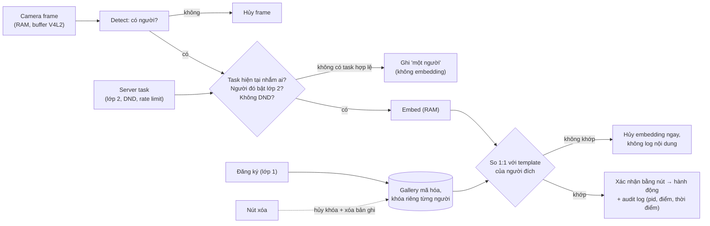

# Chặng 9 — Nhận người, privacy-first (64h)

> **Vị trí:** C8 (robot tự đi A→B) → **C9** → C10 (an toàn, vận hành; chạy song song được), C11 (sim, HIL, CI); C12 dùng lại toàn bộ C9 · **Cần trước:** K7 C8 (C8.2 hiệu chuẩn camera, C8.4 Nav2), K4 (Bài 8 quantization, Bài 11 N100 + OpenVINO), K3 Bài 14–15 (state machine, moderation); → F2.8, F1.4, F1.5, F2.1, F3.5 · **Chạy song song với:** K6
> **Làm ra được:** camera nhận mặt gá trên cột ở đúng độ cao, LED báo nguồn camera nối phần cứng, pipeline nhận diện chạy on-device trên N100, nút "nghe tin / từ chối" · `PRIVACY.md`, hai lớp đồng ý có test, gallery mã hóa từng người, test xóa đầu–cuối bằng canary, audit log chuỗi hash, đường DET với FAR/FRR có khoảng tin cậy, bảng FRR theo điều kiện · **Sau chặng này bạn quyết định được:** robot có được phép nhận mặt người không, hay đổi sang NFC/QR; nếu có thì ngưỡng nằm ở đâu, viết bằng ngôn ngữ chi phí và kèm cận trên; robot dừng hẳn rồi mới nhận diện hay không; camera gá ở độ cao nào.

C8 cho robot biết **mình ở đâu**. C9 cho nó biết **ai đang đứng trước mặt**, và đây là chặng duy nhất của K7 mà câu hỏi đầu tiên không phải kỹ thuật. Một robot di động có camera nhận mặt trong văn phòng xử lý dữ liệu sinh trắc học của đồng nghiệp bạn. Nếu không có văn bản cho phép và đồng ý của người tham gia, chặng này kết thúc ở FAIL action (NFC/QR) mà không mất gì của khóa: robot vẫn chạy, hai lớp đồng ý vẫn giữ.

Phần build của chặng nhỏ (một cột gá camera, một công tắc USB có LED, một nút bấm), phần đo lớn. Nguyên liệu chính là K7 gốc Bài 11–14, Gate 7C và Phụ lục A, đã đổi mã và sửa (phần 11 của từng bài).

**Phân bổ 64h** `[ước lượng]` (giờ lắp nằm trong giờ của bài dùng nó, để giữ giờ bài như gốc):

| Phần | Giờ | Trong đó lắp |
|---|---|---|
| Bài C9.1 Quyền riêng tư trước dòng code đầu tiên, hai lớp đồng ý | 14 (10 + 4 Phụ lục A) | 0 |
| Bài C9.2 Pipeline nhận diện và FAR/FRR | 24 | ~4: lắp bước 1–3 (cột, camera, ánh sáng, model on-device) |
| Bài C9.3 Đăng ký, xóa dữ liệu, audit log | 12 | ~2: lắp bước 4 (LED + công tắc nguồn camera) |
| Bài C9.4 Tích hợp nhận diện vào điều hướng | 14 | ~1: lắp bước 5 (nút); gồm 1h duyệt gate |
| **Tổng** | **64** | |

## 0. Bức tranh chặng

Robot sau C9: thêm một **cột** đứng trên khung, đầu cột là camera nhận mặt nhìn hơi ngửa lên, cạnh nó là LED đỏ chỉ sáng khi camera có điện. Camera dùng cho marker ở C8 giữ nguyên chỗ cũ. Không có dữ liệu ảnh nào rời khỏi RAM của mini PC.

```
                 ┌──────── SERVER Ở NHÀ / LAPTOP ─────────────────────────────┐
                 │ consent service: lớp 2 (bật/tắt), DND, rate limit          │
                 │ task service (kế thừa K3 Bài 14–15) ── chỉ tạo task hợp lệ │
                 │ kho khóa? KHÔNG — khóa từng người nằm trên robot (C9.3)    │
                 └─────────────────────────▲──────────────────────────────────┘
                                           │ WiFi: task, kiểm lại trước khi phát, purge(pid) + ack
   [LED đỏ]◄─VBUS sau công tắc             │
   [CAM mặt] ◄─USB─[công tắc VBUS]─┐   ┌───┴──────────── MINI PC N100 ──────────────────────┐
      │  cột 0,8–1,0 m (C9.2)      └──►│ detect → (chỉ khi có task) align → embed → so 1:1 │
      │                                │ gallery mã hóa, kho khóa (không backup)            │
   [CAM marker C7/C8]─USB─────────────►│ audit log chuỗi hash · MCAP: chỉ pid + điểm, KHÔNG ảnh│
                                       └───────────────┬────────────────────────────────────┘
   [NÚT nghe/từ chối]─JST─► ESP32 ─────── serial ──────┘   (nút đi qua ESP32 như mọi tín hiệu, → C4.1)
```

Dòng dữ liệu nhận dạng: khung ảnh (RAM) → có người? → có task hợp lệ nhắm người đã bật lớp 2? → embedding (RAM) → so với **một** template (người đích) → điểm số + `pid` vào audit log và MCAP. Mọi nhánh khác: hủy trong RAM.

## 1. An toàn của chặng

**Rủi ro vật lý:** robot tiến lại gần người ngồi/đứng (va chân, kẹp chân ghế); cột cao làm trọng tâm cao hơn, dễ lật khi phanh (→ K7 C2.2); chập VBUS–GND khi tự cắt cáp USB (cổng USB mini PC tự ngắt hoặc hỏng); đèn chiếu sáng thêm làm chói mắt người.

**Rủi ro cho người khác (quyền riêng tư):** quay hoặc nhận diện người chưa đồng ý; rò gallery; robot đọc tin cho nhầm người; audit log thành lịch di chuyển của một người.

**Quy tắc cứng:**
- KHÔNG bật pipeline nhận diện (bước embed) trước khi có: văn bản cho phép của quản lý cho **robot di động có camera**, `PRIVACY.md`, và ba test lớp 2 PASS ở server (C9.1).
- KHÔNG chụp, lưu ảnh của người chưa ký đồng ý lớp 1 (và lớp 3 nếu là ảnh đánh giá). Người lạ trong khung chỉ là "một người".
- KHÔNG ghi topic ảnh của camera mặt vào MCAP, kể cả "chỉ để debug". KHÔNG `print`/log embedding.
- KHÔNG backup kho khóa (C9.3). KHÔNG đẩy gallery lên cloud.
- KHÔNG chạy thử tiếp cận người với tốc độ trên **0,3 m/s** trong vùng có người, và KHÔNG chạy khi không cầm E-stop tạm/deadman (→ K7 C5.3). Người tham gia thử phải biết trước buổi thử. (0,3 m/s là đề xuất của chặng, thấp hơn trần 0,5 m/s của firmware ở C4.4.)
- KHÔNG lắp cột cao khi chưa tính lại trọng tâm và thử phanh gấp trên bàn thử (→ K7 C2.2).
- KHÔNG cắt cáp USB khi đang cắm vào mini PC. Đo điện trở VBUS–GND sau khi sửa: gần 0 Ω thì không cắm.
- KHÔNG dùng đèn hồng ngoại công suất cao tự chế để "nhìn trong tối".

**Khi sự cố xảy ra:**

| Sự cố | Làm ngay, theo thứ tự | KHÔNG |
|---|---|---|
| Robot đọc tin cho nhầm người | Kill switch audio (K3 Bài 15) → dừng task → ghi sự cố vào `incidents.md` với `pid`, điểm, ngưỡng, số mặt đã kiểm → báo người gửi và người bị nhầm | Sửa ngưỡng ngay tại chỗ rồi chạy tiếp |
| Phát hiện file ảnh/embedding trên đĩa ngoài chỗ được phép | Dừng dịch vụ → ghi lại đường dẫn, thời điểm → xóa an toàn → tìm đường rò (C9.3 bước 2) → ghi vào `PRIVACY.md` | Xóa im lặng |
| Mất máy/rò gallery | Hủy toàn bộ khóa (crypto-shred, C9.3) → báo người tham gia → kiểm nghĩa vụ thông báo theo Luật 91/2025 + Nghị định 356/2025 (bản tóm tắt nêu mốc 72 giờ cho thông báo lộ dữ liệu nhạy cảm `[spec — theo bản phân tích của luật sư; đối chiếu toàn văn]`) | Chờ "xem có ai biết không" |
| Robot lật khi phanh gần người | E-stop → dựng lên khi đã tắt động lực → kiểm cột, camera, pin (va đập → C1.6) | Chạy tiếp khi chưa kiểm pin |
| Ai đó yêu cầu dừng camera | Gạt công tắc nguồn camera (LED tắt) ngay, không tranh luận | Giải thích rằng "camera không lưu gì" trong khi vẫn để chạy |

## 2. BOM chặng

Giá `[ước lượng 10/2026]`, kiểm lại ở cửa hàng. Nguyên tắc mua của K7 gốc giữ nguyên: **0đ cho tăng tốc** cho tới khi C9.2 đo chứng minh CPU + iGPU N100 không đủ.

| Món | Thông số phải chọn | Vì sao (bằng số) | Giá | Kiểm khi nhận | Thay thế được bằng |
|---|---|---|---|---|---|
| Camera nhận mặt USB (UVC) | 720p–1080p, HFOV 60–80°, lấy nét cố định, có chỉnh exposure tay qua V4L2 | Mặt cách 1–1,5 m cần ≳30 px giữa hai mắt (mô phỏng ở mục 3) `[ước lượng]`; exposure tay để đo nhòe (C9.2) | 300–800k | `v4l2-ctl --list-formats-ext`, `--list-ctrls` có `exposure_time_absolute` (hoặc tương đương) `[tự đo]` | Dùng chung camera marker C8: rẻ hơn nhưng LED luôn sáng, một luồng ảnh hai mục đích (C9.1, phần 8) |
| Cáp USB có công tắc trên dây (inline switch), hoặc cáp nối dài để tự cắt | Công tắc cắt **VBUS**, không cắt D+/D− | Bất biến "camera có điện ⇔ LED sáng" cần một điểm cắt nguồn trong tay người (C9.3) | 30–80k | Đo thông mạch VBUS khi bật/tắt | Load switch do ESP32 điều khiển (yếu hơn: phần mềm chạm được) |
| LED đỏ 3–5 mm + điện trở | Màu khác LED nguồn của robot; điện trở tính ở C9.3 | Người xung quanh phân biệt được "camera có điện" | <10k | Chế độ diode của UT33D+ đo V_f | — |
| Cột gá | Nhôm định hình 2020 hoặc ống nhựa cứng, 0,6–0,8 m trên mặt khung; ke góc, ốc T | Camera ở 0,9–1,0 m nhìn mặt người ngồi gần chính diện (mục 3) | 80–200k | Thẳng, không ọp ẹp khi lắc | Ống PVC + kẹp |
| Ngàm camera | Ốc 1/4"-20, có khớp chỉnh nghiêng và khóa | Góc ngửa chỉnh được rồi khóa chặt; lỏng = đổi hình học giữa các buổi đo | 50–150k | Siết xong không tự xoay khi rung | In 3D |
| Nút bấm lớn "nghe / từ chối" | Nút arcade 30 mm (hai nút hai màu) hoặc một nút + nhấn giữ | Xác nhận thứ hai trước khi đọc nội dung (C9.2 phần 7, C9.4) | 30–80k | Thông mạch khi nhấn | Nút trên điện thoại người nhận |
| Đo ánh sáng | App lux trên điện thoại, hoặc lux kế rẻ | Chỉ để **phân nhóm** sáng tốt/sáng yếu; sai số có thể vài chục phần trăm `[tự đo]` | 0–400k | So hai thiết bị cùng chỗ | — |
| Đầu đọc NFC RC522 + thẻ, hoặc mã QR in | Chỉ mua khi kích hoạt FAIL action | Thay nhận mặt hoàn toàn | 50–150k | Đọc được UID | QR (0đ) |
| Coral USB / Hailo M.2 | **Chỉ sau C9.2**, khi số đo chứng minh cần | Kỷ luật K4 | 1,5–3tr | Kiểm khe M.2 trống | — |

**Tổng C9 `[ước lượng]`:** ~0,5–1,7tr (không tính bộ tăng tốc).

## 3. Dụng cụ và kỹ năng tay

| Kỹ năng | Bài | Luyện trên phế liệu | Đạt trông thế nào |
|---|---|---|---|
| Mở vỏ cáp USB, tách dây VBUS, hàn nối dây mảnh 26–28 AWG | C9.3 | Một cáp USB hỏng: tuốt, hàn, co nhiệt 3 lần | Không đứt sợi, mối hàn nhỏ, co nhiệt phủ kín; lớp chống nhiễu (shield) không chạm lõi |
| Hàn LED + điện trở, kiểm cực | C9.3 | 2 LED thừa | Chân dài (anode) về phía +; đo chế độ diode thấy sáng mờ |
| Dựng cột, siết ke góc, khóa ngàm | C9.2 | — | Lắc đầu cột bằng tay: camera không đổi góc; ốc có khóa (→ C2.3) |
| Đo FOV và góc ngửa | C9.2 | — | Thước dán tường + ảnh chụp, sai số ghi lại |

**Hình học gá camera — tính trước khi khoan.** Robot ≤5 kg thường thấp; camera đặt trên khung (~0,3 m) nhìn mặt người ngồi từ dưới lên. Script dưới cho biết với một độ cao, góc ngửa và khoảng cách, mặt người ngồi/đứng có lọt khung không, mặt rộng bao nhiêu pixel, và camera nhìn mặt từ dưới lên bao nhiêu độ (góc càng lớn, mặt càng giống "nhìn từ cằm", nhận diện càng tệ `[tự đo ở C9.2]`).

```python
# [đã chạy] Gá camera nhìn người: mặt có lọt khung không, mấy pixel, ngửa bao nhiêu độ
import numpy as np

W, H = 1280, 720                 # độ phân giải đặt cho camera
HFOV = np.radians(70)            # tra datasheet/đo ở C8.2; [ước lượng] cho webcam phổ thông
f_px = (W / 2) / np.tan(HFOV / 2)
VFOV = 2 * np.arctan((H / 2) / f_px)
FACE_W, IOD = 0.15, 0.063        # bề rộng mặt, khoảng cách hai mắt (m) [ước lượng, người lớn]
FACE_Z = {"ngồi": 1.15, "đứng": 1.60}   # độ cao mắt (m) [ước lượng, đo đồng nghiệp]

def check(h_cam, tilt_deg, dist):
    """h_cam: độ cao camera; tilt: ngửa lên (độ); dist: khoảng cách ngang tới mặt."""
    out = []
    for pose, zf in FACE_Z.items():
        elev = np.degrees(np.arctan2(zf - h_cam, dist))     # góc từ camera lên mắt
        off = elev - tilt_deg                                 # lệch so với trục quang
        inside = abs(off) < np.degrees(VFOV / 2) - 5          # chừa 5° cho cả khuôn mặt
        rng3d = np.hypot(dist, zf - h_cam)
        out.append(f"{pose}: ngửa {elev:4.0f}°, lệch trục {off:+4.0f}°, "
                   f"{'TRONG' if inside else 'NGOÀI'} khung, mặt {f_px*FACE_W/rng3d:3.0f} px, "
                   f"mắt-mắt {f_px*IOD/rng3d:3.0f} px")
    return out

print(f"f_px={f_px:.0f}  VFOV={np.degrees(VFOV):.0f}°")
for h, tilt in ((0.30, 0), (0.30, 25), (0.70, 10), (1.00, 5)):
    for d in (1.0, 1.5):
        print(f"\n h={h:.2f} m tilt={tilt}° d={d} m")
        for line in check(h, tilt, d):
            print("   ", line)
```

Trước khi chạy, đoán: camera đặt thẳng trên khung (0,3 m, không ngửa) có thấy mặt người ngồi cách 1 m không? Kết quả và quyết định độ cao cột nằm ở C9.2 phần 7. Lưu ý: cột cao 1 m mang camera + LED (và loa ở C12) làm trọng tâm cao lên; tính lại góc lật ở C2.2 trước khi lắp.

## 4. Sơ đồ đi dây

Chặng này có hai mạch nhỏ. Cả hai không đụng nhánh động lực.

```
 (A) CÔNG TẮC NGUỒN CAMERA + LED  — trên cáp USB giữa mini PC và camera mặt

  MINI PC USB-A ──┬─ VBUS (đỏ trong cáp*) ──[CÔNG TẮC]──┬────────────── VBUS ──► CAMERA
                  │                                      │
                  │                                   [R ~470 Ω–1 kΩ, tính ở C9.3]
                  │                                      │
                  │                                   LED đỏ (anode ↑, cathode ↓)
                  │                                      │
                  ├─ GND (đen trong cáp*) ───────────────┴────────────── GND ──► CAMERA
                  ├─ D+ (xanh lá*) ─────────────────────────────────────────────► (không cắt)
                  └─ D− (trắng*)   ─────────────────────────────────────────────► (không cắt)
   * màu dây trong cáp USB là quy ước phổ biến, không đảm bảo [tự đo bằng thông mạch].
     Hai đầu đoạn đã sửa: co nhiệt có nhãn "5V_CAM" (quy ước C0.5: nhãn wire_id là sự thật).
   LED nằm PHÍA CAMERA của công tắc: camera có điện ⇔ LED sáng, bất kể phần mềm.

 (B) NÚT "NGHE / TỪ CHỐI" → ESP32 (C9.4)
   GPIO_BTN_LISTEN ──[nút xanh, NO]── GND     (pull-up nội; nhấn = LOW)
   GPIO_BTN_REFUSE ──[nút đỏ, NO]──── GND
   JST-XH 3 chân, dây 22–26 AWG, màu tín hiệu theo C0.5; thêm 2 dòng vào bảng chân ESP32 (C4.1).
```

Nút ở đây là **đầu vào sản phẩm** (người nhận chọn nghe), không phải đường an toàn, nên NO là đủ; nút kill audio của K3 Bài 15 vẫn là NC và đi đường riêng. Bảng dây: thêm `W70 5V_CAM`, `W71 LED_CAM`, `W72 BTN` vào `wiring/wires.csv`.

## 5. Trình tự chặng

1. **Học Bài C9.1** (gồm Phụ lục A). Xin văn bản cho phép. Thu đồng ý. Không có văn bản → nhảy thẳng tới Gate chặng 9, kích hoạt FAIL action.
2. **Học Bài C9.2 phần 1–5** (dự đoán, commit `prediction.md`).
3. **Lắp bước 1 — Cột và camera**
   - Làm: chạy script mục 3 với FOV thật của camera (đo: dán thước lên tường cách camera 1,00 m, đọc bề rộng nhìn thấy, `HFOV = 2·atan(rộng/2 / 1,00)`); chọn độ cao và góc ngửa; dựng cột, khóa ngàm; khai báo `face_camera_link` là TF tĩnh từ `base_link` theo cách của → K7 C7.1 (REP-105, REP-103).
   - ✅ Checkpoint trước khi chạy robot: robot đứng yên, đẩy nhẹ đỉnh cột về phía trước: robot không nghiêng bánh lên; phanh gấp từ 0,3 m/s trên sàn: không lật (đo lại theo C2.2 nếu có thay đổi lớn khối lượng).
   - Nếu sai: hạ cột, dời pin xuống thấp/ra sau, hoặc mở rộng chân đế caster.
4. **Lắp bước 2 — Ánh sáng nơi thử.** Đo lux ở 5 vị trí bàn người tham gia, hai thời điểm (sáng, chiều muộn); ghi chỗ ngược sáng (cửa sổ sau lưng người ngồi).
   - ✅ Checkpoint: bảng lux có ≥10 ô, mỗi ô có thiết bị đo và giờ.
5. **Lắp bước 3 — Pipeline on-device chạy trên N100** (C9.2 phần 6, phần A): chạy detect trên luồng camera, **chưa embed ai** (chưa có gallery); đo FPS và latency detect.
   - ✅ Checkpoint: `ls` thư mục dữ liệu và `/tmp` sau 10 phút chạy: không có file ảnh mới; MCAP không có topic ảnh camera mặt.
6. **Học và làm hết Bài C9.2** (gallery, đo DET, điều kiện thật, hiệu năng).
7. **Học Bài C9.3. Lắp bước 4 — Công tắc nguồn camera + LED** theo mục 4(A).
   - ✅ Checkpoint trước khi cắm vào mini PC: rút cáp khỏi mọi thiết bị; đo Ω giữa VBUS và GND ở đầu USB-A: **không** gần 0 Ω (phải thấy LED + R, cỡ trăm Ω trở lên, hoặc hở mạch khi công tắc tắt); đo thông mạch D+, D− hai đầu: thông; D+ với VBUS: không thông.
   - Nếu sai: cắt bỏ đoạn sửa, làm lại; KHÔNG thử "cắm xem có cháy không".
8. **Học Bài C9.4. Lắp bước 5 — Nút nghe/từ chối** theo mục 4(B), thêm vào firmware (→ C4.1) và giao thức host (→ C4.3).
   - ✅ Checkpoint: log ESP32 in đúng sự kiện nhấn/nhả 20/20 lần; không có sự kiện ma khi robot chạy (motor gây nhiễu lên dây dài → C5.1).
9. **Gate chặng 9.**

## 6. Lỗi người mới hay gặp

| Triệu chứng | Nguyên nhân khả dĩ | Kiểm bằng cách | Sửa |
|---|---|---|---|
| Mặt người ngồi bị cắt ở mép trên khung | Camera thấp, không ngửa | Script mục 3 với số thật | Cột cao hơn hoặc ngửa thêm; ghi vào `decisions.md` |
| Điểm genuine giảm dần qua các buổi | Ngàm lỏng, góc ngửa trôi | Chụp tường thước ở đầu mỗi buổi | Khóa ngàm; ghi góc vào sổ build |
| Camera mất sau khi gạt công tắc lại | USB re-enumerate chậm, đổi `/dev/videoN` | `dmesg -w` khi gạt | Dùng đường dẫn `/dev/v4l/by-id/…`; đo thời gian tới frame đầu |
| Mặt tối đen trước cửa sổ | Auto-exposure đo theo nền sáng | Xem `exposure` và histogram | Đổi vị trí tiếp cận (người nhận không quay lưng ra cửa sổ), hoặc chế độ ưu tiên vùng mặt nếu camera có `[tự đo]` |
| LED không sáng sau khi hàn | Ngược cực | Chế độ diode | Đảo LED |
| Nút nhảy sự kiện khi motor chạy | Dây nút dài chạy cạnh dây motor, không lọc | Log khi chạy motor không ai nhấn | Debounce phần mềm, dây xoắn, đi xa dây motor (→ C5.1) |

## 7. Lăng kính data infra

**Dữ liệu chặng này sinh ra** (không có ảnh, không có embedding ngoài gallery mã hóa):

| Luồng | Nơi | Schema rút gọn | Tần số | Hạn giữ |
|---|---|---|---|---|
| Sự kiện nhận diện | MCAP topic `/recognition/event` | `header.stamp` (thời điểm khung), `task_id`, `pid_target`, `score`, `k_faces_checked`, `decision` (`match`/`no_match`/`skip_pose`/`timeout`), `model_id`, `threshold_id` | theo khung có mặt, ≤ FPS pipeline | như MCAP thường (C7.3), vì không có dữ liệu cần xóa |
| Audit log | `audit/YYYY-MM-DD.jsonl` (segment theo ngày) | `ts_wall`, `ts_mono`, `boot_id`, `pid`, `score`, `decision`, `actor`, `prev_hash`, `hash` | theo sự kiện | riêng, ngắn (C9.3) |
| Ai đọc audit | cùng chuỗi | `actor`, `query`, `ts` | khi đọc | như audit |
| Điểm đánh giá | `eval/scores-<session>.parquet` (lớp 3) | `pid_a`, `pid_b`, `session`, `condition`, `score`, `model_id`, `precision` | khi đo | hạn ghi trong `PRIVACY.md` |
| Đồng ý | server, bảng `consent_events` (append-only) | `pid`, `layer`, `state`, `ts`, `channel` | khi đổi | theo luật/`PRIVACY.md` |

**Test tự động sinh ra từ chặng này (hạt giống cho C11.2):**
- `test_consent_server`: ba test lớp 2 (chưa bật → từ chối; DND giữa chừng → hủy; vượt rate limit → hoãn/từ chối có log). Chạy được không cần robot.
- `test_delete_e2e`: canary đăng ký → session → backup → xóa → kiểm năm điều (C9.3). Bản HIL ở C11.2 chạy trên robot thật.
- `test_decision_replay`: phát lại log điểm số qua logic quyết định (deadline, thứ tự mặt, k) và kiểm bất biến; tất định, chạy trong CI (→ F2.4).
- `test_no_image_topics`: quét mọi MCAP mới, FAIL nếu có kênh ảnh camera mặt hoặc trường có tên `embedding`.

**SLI/SLO:** thời gian xóa (bấm → matcher ack) p95 và max (→ F7.4: một SLO freshness ngược); thời gian tới quyết định p95 (C9.4); tỉ lệ timeout **theo người**; số lần nhận nhầm đã biết (báo cùng số lần thử, có cận trên).

**Vai trò nghề:** Privacy/Compliance (kiểm kê dữ liệu, DPIA, test xóa), Test & Validation (FAR/FRR có CI, split theo người/phiên), Data Platform (schema không chứa dữ liệu cần xóa, retention theo segment). Bản đồ vai trò đầy đủ ở → K7 C12.3.

## 8. Nhật ký build

Copy vào `build-log/c09.md`, một mục mỗi buổi:

```markdown

## 2026-MM-DD — buổi N (giờ bắt đầu–kết thúc, giờ thực: _._ h)
- Trạng thái người: tỉnh táo / mệt (mệt → chỉ đọc, không chạy robot gần người)
- Mục tiêu buổi:
- Người tham gia có mặt (chỉ ghi pid, KHÔNG ghi tên): __ ; tất cả đã biết trước buổi thử? có/không
- Hình học camera: độ cao __ m, góc ngửa __° (đo đầu buổi), ngàm đã khóa? có/không
- Ánh sáng: lux tại vị trí thử __ (thiết bị __), ngược sáng? có/không
- Model + precision + ngưỡng đang dùng: model_id __, threshold_id __
- Số đo (ghi vào measurements.jsonl? có/không; số dòng: __)
- Kiểm rò: file ảnh mới trong data/, /tmp? không/có → xử lý
- Lỗi gặp (triệu chứng → nguyên nhân → sửa):
- Quyết định (ghi decisions.md nếu ảnh hưởng chặng sau):
- Sự cố / suýt sự cố (va người, nhận nhầm, rò dữ liệu): không / có → incidents.md
- Câu hỏi còn mở:
```

---

## Bài C9.1 — Quyền riêng tư trước dòng code đầu tiên, hai lớp đồng ý (14h)

> **Vị trí:** Gate C8 → **C9.1** → C9.2 · **Cần trước:** K3 Bài 15 (moderation queue, kill switch), → F3.1 (log append-only), → F3.8 (lineage), → F2.1 (test là một phép đo) · **Sau bài này bạn quyết định được:** hệ thống nhận người này có được phép tồn tại không; nếu có thì dữ liệu nào được sinh ra, ở đâu, sống bao lâu, ai mở cổng cho việc xử lý; hoặc kích hoạt FAIL action (NFC/QR) có lý do.

### 1. Câu chuyện — ai đã khổ vì chuyện này

Tháng 11/2021, Meta tắt hệ thống nhận diện khuôn mặt trên Facebook và tuyên bố xóa **hơn một tỷ** template khuôn mặt `[chuẩn — thông báo của Meta, 11/2021]`. Trước đó mấy tháng, họ chấp nhận dàn xếp **650 triệu USD** trong vụ kiện tập thể theo luật BIPA của bang Illinois, luật đòi đồng ý bằng văn bản trước khi thu sinh trắc `[chuẩn — phán quyết duyệt dàn xếp, 2/2021]`. Bài học nằm ở thứ tự: **xây trước, nghĩ về quyền sau**, rồi trả tiền để gỡ. Một hệ sinh trắc đã chạy thì mỗi bản sao dữ liệu là một món nợ: backup, log, cache, tập test, model đã fine-tune.

Câu chuyện thứ hai là của chính dự án (Phụ lục A của K7 gốc). V1 ở K3 là cái loa cố định đọc confession **ẩn danh**. Phiên bản K7 là robot **tự tìm đến một người được nhắc tên** và phát nội dung về họ trước mặt đồng nghiệp. Người nhận không chọn thời điểm, không chọn khán giả, và không rời đi được vì robot đi theo. Hai bản review bên ngoài đều mô tả kỹ cách làm nó chạy, không bản nào hỏi nó **có nên** chạy không. Bài này trả lời câu đó trước dòng code đầu tiên, vì thiết kế dữ liệu quyết định code chứ không ngược lại.

### 2. Mô hình tư duy

Privacy by design là **bản kiểm kê dữ liệu + vòng đời + cổng kích hoạt**: mỗi byte nhận dạng được sinh ra ở đâu, chảy qua đâu, ai mở cổng cho nó chảy, và nó chết lúc nào.



Bốn ý cốt lõi:
1. **Tối thiểu hóa ở nguồn, không lọc ở đích.** Dữ liệu không sinh ra thì không phải xóa, không rò, không phải giải thích. Ràng buộc 2 của bản gốc (người lạ chỉ là "một người") đúng tinh thần này; hình trên đẩy thêm một bước: **chỉ embed khi có task hợp lệ nhắm tới một người đã bật lớp 2**.
2. **Đồng ý là trạng thái thu hồi được giữa chừng**, không phải chữ ký một lần. Mọi cổng đọc trạng thái hiện tại, kể cả khi robot đang trên đường.
3. **Mặc định là tắt** (privacy by default, GDPR Điều 25(2) gọi đúng tên `[spec — GDPR Art. 25]`). Lớp 2 mặc định TẮT là điều kiện để "đồng ý" có nghĩa.
4. **Một bản sao không được kiểm kê là một bản sao không xóa được.** C9.3 biến bản kiểm kê thành test.

**Hai lớp đồng ý (Phụ lục A, bắt buộc) + một lớp đề xuất:**

| Lớp | Đồng ý cái gì | Mặc định | Rút lại thế nào | Thực thi ở đâu |
|---|---|---|---|---|
| **1 — Sinh trắc** | Lưu template khuôn mặt để nhận diện | Chưa đăng ký | Nút xóa dữ liệu (C9.3) | Gallery trên robot |
| **2 — Nhận tin** | Robot được tìm đến tôi và phát nội dung | **TẮT** | Bật/tắt bất cứ lúc nào | **Server tạo task** và **robot kiểm lại ngay trước khi phát** |
| (đề xuất) **3 — Dữ liệu đánh giá** | Giữ ảnh tập kiểm tra để đo lại FAR/FRR (C9.2, C11.5) | Không | Hết hạn ghi sẵn, hoặc khi yêu cầu | Kho riêng, mã hóa, có ngày hết hạn |

Cộng ba cơ chế: **không làm phiền** (DND: một chạm, có thời hạn, robot bỏ mọi task nhắm người đó), **giới hạn tần suất** (tối đa N tin/**người nhận**/ngày), **rời đi khi bị từ chối** (người nhận nói "không" hoặc bấm nút đỏ → robot dừng phát và đi, không hỏi lại). Lớp 3 là đề xuất của giáo trình: bản gốc vừa đòi "không lưu ảnh thô sau đăng ký" vừa đòi "giữ tập kiểm tra riêng", và hai điều đó mâu thuẫn nếu ảnh đánh giá không có cơ sở đồng ý riêng.

**Khung pháp lý hiện hành** (thống nhất với → K3 Bài 15): Luật Bảo vệ dữ liệu cá nhân số **91/2025/QH15** (thông qua 26/6/2025, hiệu lực 1/1/2026) và **Nghị định 356/2025/NĐ-CP** (ký 31/12/2025, hiệu lực 1/1/2026) quy định chi tiết luật, **thay thế Nghị định 13/2023/NĐ-CP**. Dữ liệu sinh trắc học vẫn thuộc nhóm dữ liệu cá nhân **nhạy cảm**; xử lý đòi hồ sơ **đánh giá tác động xử lý dữ liệu cá nhân** (DPIA), và theo các bản phân tích, Nghị định 356 ban hành biểu mẫu DPIA mới, có cơ chế Bộ Công an thẩm định hồ sơ và yêu cầu cập nhật định kỳ `[spec — theo bản phân tích của EY, PwC Việt Nam (2026); đọc toàn văn trước khi trích điều]`. Có nguồn coi giọng nói là sinh trắc học, nên giọng đã clone ở K3 và mic trên robot (→ K7 C12.1) cũng đi theo cùng nguyên tắc. Đây không phải tư vấn pháp lý; với dự án ở công ty, hỏi pháp chế.

### 3. Cầu nối từ backend

| Backend bạn biết | Ở đây | Gãy ở chỗ | Nếu dùng nhầm thì |
|---|---|---|---|
| Kiểm quyền ở API gateway, không tin client | Lớp 2 kiểm ở server tạo task | Quyền ở đây thu hồi được **giữa lúc task đang chạy**. Giống JWT không thu hồi được tới khi hết hạn: kiểm một lần lúc tạo task là không đủ | Người bật DND lúc robot cách 2 m vẫn bị đọc tin, vì robot mang "token" cũ |
| Soft delete (`deleted_at`) | Xóa sinh trắc | Soft delete giữ nguyên dữ liệu nhạy cảm, chỉ giấu khỏi query | Vi phạm quyền xóa; test "không còn nhận diện được" vẫn PASS nên không ai thấy |
| Rate limit theo API key / người gọi | Giới hạn theo **người nhận** | Tác hại rơi vào người bị nhắm. Mười người gửi, mỗi người một tin, vẫn là mười lần một người bị robot tìm đến | Lọt đúng kịch bản quấy rối tập thể |
| Feature flag mặc định tắt | Lớp 2 mặc định tắt | Flag do operator bật. Lớp 2 chỉ chủ thể được bật; operator bật hộ là vô hiệu | "Bật sẵn cho mọi người cho tiện test" phá thiết kế |
| Threat model STRIDE | Privacy threat model LINDDUN (linking, identifying, non-repudiation, detecting, data disclosure, unawareness, non-compliance) `[chuẩn]` | STRIDE hỏi "kẻ tấn công làm gì"; LINDDUN hỏi thêm "**hệ hoạt động đúng thiết kế** gây hại gì" | Không bị hack nào mà vẫn gây hại: đúng người, đúng tin, sai bối cảnh |

**Tên chuẩn của thứ bạn đã làm:** pipeline agent tự chạy → test → báo cáo của bạn đã có audit trail. Thứ còn thiếu là **retention cho chính audit trail** và câu hỏi "audit log có chứa dữ liệu cá nhân không"; với hệ sinh trắc, câu trả lời luôn là có.

**Chấm mô hình:**
- *"Chỉ lưu embedding, không lưu ảnh, thì gần như ẩn danh."* — **SAI.** Embedding mặt là **template sinh trắc**: nó tồn tại để nhận dạng duy nhất một người. "Khó đảo ngược hơn ảnh" (lý do bản gốc ghi cho ràng buộc 3) chỉ đúng một phần: đã có công trình dựng lại ảnh mặt nhận ra được từ template sâu (Mai, Cao, Yuen, Jain, *On the Reconstruction of Face Images from Deep Face Templates*, IEEE TPAMI 2019) `[chuẩn]`. Phản ví dụ không cần đảo ngược: ai lấy được gallery chỉ cần tính embedding từ ảnh đại diện công khai rồi so cosine là biết template nào của ai.
- *"Có đồng ý bằng văn bản là xong phần pháp lý."* — **ĐÚNG MỘT PHẦN.** Đồng ý là điều kiện cần. Trong quan hệ lao động, đồng ý khó "tự nguyện" vì lệch quyền lực; EDPB Guidelines 05/2020 on consent nói thẳng `[spec]`. Phản ví dụ: quản lý gửi form trong group chat của team, chín người ký trong một giờ, người thứ mười ký vì ngại. Sửa: thu qua kênh riêng, không công khai ai đã ký, từ chối không có hệ quả.
- *"Moderation queue ở K3 Bài 15 đã xử lý rủi ro quấy rối."* — **ĐÚNG MỘT PHẦN.** Moderation lọc **nội dung**; rủi ro mới nằm ở **hành vi giao**: nhắm đích danh, công khai, có khuếch đại. Phản ví dụ: "Chúc mừng sinh nhật tuổi 40 của chị H!" qua moderation dễ dàng, nhưng được đọc to trước cả phòng cho người không muốn ai biết tuổi mình.

### 4. Thuật ngữ

| Mức | Thuật ngữ | Nghĩa trong một câu | Hay bị hiểu nhầm thành |
|---|---|---|---|
| 🟢 | Privacy by design / by default | Bảo vệ dữ liệu là thuộc tính kiến trúc; cấu hình mặc định là cấu hình ít thu thập nhất | Trang chính sách viết sau khi code xong |
| 🟢 | Tối thiểu hóa dữ liệu | Chỉ sinh ra và giữ dữ liệu cần cho mục đích đã nêu | Mã hóa thật mạnh rồi giữ hết |
| 🟢 | Giới hạn mục đích | Dữ liệu thu cho A không dùng cho B nếu chưa có cơ sở mới | "Có rồi thì train thêm model luôn" |
| 🟢 | Template sinh trắc / embedding | Vector đặc trưng dùng để so khớp danh tính | Dữ liệu ẩn danh |
| 🟢 | Giả danh hóa vs ẩn danh hóa | Giả danh: thay tên bằng id, nối lại được nếu có bảng ánh xạ; ẩn danh: không nối lại được | Hash email là ẩn danh |
| 🟢 | Đồng ý tách lớp (granular consent) | Mỗi mục đích một đồng ý, rút riêng được | Một checkbox "đồng ý mọi điều khoản" |
| 🟡 | DPIA (đánh giá tác động xử lý dữ liệu cá nhân) | Hồ sơ phân tích rủi ro trước khi xử lý dữ liệu nhạy cảm | Thủ tục làm sau khi ra mắt |
| 🟡 | Bên kiểm soát / bên xử lý | Ai quyết định mục đích / ai xử lý theo lệnh | Không liên quan dự án cá nhân (bạn đang là bên kiểm soát) |
| 🔴 | Thủ tục nộp hồ sơ DPIA | Hỏi pháp chế khi cần | — |

### 5. Dự đoán

Viết trước khi mở tài liệu pháp lý nào và trước khi viết `PRIVACY.md`:
1. **Kiểm kê:** liệt kê mọi nơi mà khuôn mặt, embedding, tên hoặc id của **một** người đã đăng ký có thể tồn tại trong toàn hệ (robot, server ở nhà, laptop dev, CI) sau 30 ngày vận hành. Đếm. Gợi ý: lần theo một frame từ cảm biến tới mọi đích, kể cả đích bạn không chủ động ghi (bộ đệm hệ điều hành, swap, core dump, stdout, backup).
2. **Kiểm được tới đâu:** với bảy ràng buộc ở phần 6, phân loại *test tự động được* / *chỉ kiểm bằng review* / *không kiểm được, chỉ giảm rủi ro*.
3. **Ba test của Phụ lục A:** test nào khó viết nhất và vì sao.
4. Ba câu đầu tiên quản lý sẽ hỏi khi bạn xin phép lần hai.

```markdown
# prediction.md — C9.1
- Ngày, commit:
- Số nơi dữ liệu của một người có thể tồn tại: N = __ ; danh sách:
- Phân loại 7 ràng buộc (auto / review / không kiểm được):
- Test khó nhất trong 3 test lớp 2, vì sao:
- 3 câu quản lý sẽ hỏi:
- Tôi sẽ đổi sang NFC/QR nếu: (điều kiện cụ thể)
```

### 6. Làm

**Phần A — tài liệu thiết kế (10h).**
1. Viết `PRIVACY.md` với bảy ràng buộc của bản gốc, mỗi ràng buộc kèm **cơ chế** và **test**:

| # | Ràng buộc (bản gốc) | Cơ chế đề xuất | Test | Chỗ dễ gãy |
|---|---|---|---|---|
| 1 | Chỉ nhận diện người đã opt-in, có đồng ý bằng văn bản | Gallery chỉ nhận bản ghi có `consent_id` hợp lệ | Chèn template không có `consent_id` → bị từ chối | Template "tạm" lúc debug |
| 2 | Người chưa đăng ký chỉ là "một người" | Không embed khi không có task hợp lệ; embedding không khớp hủy trong RAM | 100 khuôn mặt lạ: đếm byte ghi xuống đĩa, đọc log | Log debug in vector; core dump; swap |
| 3 | Không lưu ảnh thô sau đăng ký | Ảnh chỉ sống trong RAM tiến trình đăng ký | Quét thư mục dữ liệu, `/tmp` sau 50 lần đăng ký | Thư mục tạm của web framework |
| 4 | Embedding local, mã hóa, không lên cloud | Khóa riêng từng người; khóa chủ quyền 600 hoặc TPM | Grep egress, kiểm cấu hình sync/backup | Script backup của C7.3 đẩy cả thư mục |
| 5 | Nút xóa hoạt động thật, có test tự động | Hủy khóa + xóa bản ghi + reload matcher | C9.3 | Backup, WAL, MCAP |
| 6 | Log mọi sự kiện nhận diện và việc ai xem log | Audit log append-only, `pid` | Đọc qua công cụ chính thức → có dòng "ai đọc" | `cat` thẳng file thì không ai ghi |
| 7 | Dấu hiệu vật lý khi camera hoạt động | LED trên **đường nguồn đã qua công tắc** (C9.3, mục 4 của chặng) | LED sáng ⇔ camera có điện | Dùng chung camera marker thì luôn có điện |

2. Mẫu đồng ý tiếng Việt, **tách rời** cho lớp 1, 2, 3: thu gì, để làm gì, lưu ở đâu, bao lâu, rút lại thế nào, **thứ gì xóa được / chỉ ngừng dùng được / không gỡ được** (con số đã công bố). Ghi rõ "từ chối không ảnh hưởng gì tới công việc của bạn".
3. Luồng đăng ký: người đăng ký **tự** thao tác bước đồng ý; bạn không bấm hộ.
4. Vẽ lại sơ đồ phần 2 theo hệ thật + **bảng kiểm kê** (dữ liệu · nơi ở · định dạng · mã hóa · hạn giữ · cách xóa · test).
5. **Xin phép quản lý lần hai, bằng văn bản.** Văn bản ở K3 là cho loa cố định; robot di động có camera là phạm vi khác. Gửi kèm `PRIVACY.md`, mẫu đồng ý, đoạn mô tả hai lớp.
6. Một trang **DPIA rút gọn**: mục đích, dữ liệu, rủi ro (bảy nhóm LINDDUN làm checklist), biện pháp, rủi ro còn lại. Không cần đúng biểu mẫu nhà nước; cần đúng tư duy. Nếu triển khai thật ở công ty, biểu mẫu theo Nghị định 356 là việc của pháp chế.

**Phần B — hai lớp đồng ý (Phụ lục A, 4h).**

7. Trong server task (kế thừa K3 Bài 14–15), thêm ba kiểm tra **ở bước tạo task**: lớp 2 đang bật; người nhận không DND; chưa vượt N tin/ngày/người nhận. Task bị từ chối có log lý do.
8. **Kiểm lại ở robot** ngay trước khi phát (đọc trạng thái lớp 2 + DND mới nhất). Không liên lạc được server lúc đó: **không phát**.
9. Test tự động ba kịch bản Phụ lục A, mức server + mock robot. Bản trên robot thật ở C9.4.
10. Đoạn README theo mẫu Phụ lục A: *"Lần lặp đầu, robot tìm đến bất kỳ ai được nhắc tên. Chúng tôi nhận ra đây là một kênh nhắm-cá-nhân có khuếch đại, khác về bản chất với loa đọc ẩn danh. Thiết kế hiện tại đòi hai lớp đồng ý tách biệt, có trạng thái không-làm-phiền, và giới hạn tần suất. Robot có thể giao ít tin hơn; đó là đánh đổi có chủ đích."* Ghi thêm: "thiết kế từ thời Nghị định 13/2023, rà lại theo Luật 91/2025 + Nghị định 356/2025".

**Không sang C9.2 nếu thiếu:** `PRIVACY.md`, mẫu đồng ý, văn bản cho phép, ba test lớp 2 PASS ở server.

### 7. Số phải ra

<details><summary>🔒 MỞ SAU KHI COMMIT prediction.md</summary>

Bài này không có số đo; có đầu ra và một bản kiểm kê để so với dự đoán. **Bản kiểm kê tham chiếu** (dự đoán dưới 10 là bỏ sót tầng hệ điều hành và vận hành):

| # | Nơi | Thường bị quên vì |
|---|---|---|
| 1 | Buffer V4L2/driver, buffer OpenCV/GStreamer | Không phải code của bạn |
| 2 | RAM tiến trình nhận diện | "Chỉ là RAM" |
| 3 | Swap / zswap | RAM bị đẩy xuống đĩa |
| 4 | Core dump khi crash | Chứa nguyên heap, gồm frame |
| 5 | Gallery DB + WAL/journal | C9.3: xóa bản ghi chưa xóa byte |
| 6 | Backup gallery (script C7.3) | Chạy tự động, ở máy khác |
| 7 | MCAP trên robot và server | Topic debug có ảnh/embedding |
| 8 | Audit log | id + thời điểm + vị trí = lịch di chuyển |
| 9 | stdout/journald | `print(embedding)` khi debug |
| 10 | Thư mục tạm của web đăng ký | Framework lưu upload ra đĩa |
| 11 | Tập kiểm tra C9.2 | Mâu thuẫn ràng buộc 3 nếu không có lớp 3 |
| 12 | Model đã fine-tune (→ K7 C11.5) | Trọng số "nhớ" dữ liệu; không gỡ một người khỏi trọng số |
| 13 | Laptop dev, notebook, ảnh chụp màn hình dashboard | Ngoài robot |

**Phân loại thường gặp:** 1, 3, 5 test tự động được; 2 test được một phần (đếm byte ghi, đọc log, không chứng minh được "không nhánh code nào ghi"); 4 và 6 chủ yếu review cấu hình + test mẫu; 7 kiểm bằng phép đo điện. Không ràng buộc nào được chứng minh tuyệt đối bằng test (→ F2.1: test chỉ chứng minh sự có mặt của lỗi).

**Test khó nhất** thường là DND giữa chừng: bài toán **thu hồi trong hệ phân tán**, trạng thái đổi ở server trong khi robot đang thực thi, và robot có thể mất WiFi đúng lúc đó. Bước 8 đóng lỗ hổng này.

</details>

### 8. Nếu ra khác

| Triệu chứng | Nguyên nhân khả dĩ | Kiểm bằng cách | Sửa |
|---|---|---|---|
| Quản lý không trả lời, hoặc trả lời miệng | Phạm vi chưa rõ, sợ trách nhiệm | Hỏi "anh/chị cần thêm thông tin gì để trả lời bằng văn bản" | Không có văn bản → FAIL action của Gate chặng 9. Không chạy "tạm" |
| Dưới 10 người tình nguyện | Ngại, không thấy lợi ích | Hỏi ẩn danh lý do | Không ép; đổi NFC/QR; ghi vào README như một kết quả |
| Không viết được test cho một ràng buộc | Ràng buộc là thuộc tính âm ("không bao giờ ghi X") | Đo được **một hệ quả** không (byte ghi, egress)? | Ghi "kiểm bằng review + đo gián tiếp", đừng giả vờ có test |
| Muốn dùng camera marker C8 làm camera mặt | Một camera, hai mục đích | Liệt kê mục đích từng luồng ảnh | Tách camera (BOM), hoặc chấp nhận LED "có điện" luôn sáng + LED thứ hai "nhận diện đang chạy" (yếu hơn vì phần mềm điều khiển); ghi `decisions.md` |
| Test lớp 2 PASS ở server nhưng robot vẫn chạy task cũ | Task nằm trong hàng đợi robot trước khi người dùng tắt | Tạo task, tắt lớp 2, xem robot có kiểm lại không | Bước 8 |

### 9. Câu hỏi ngược

1. **[Failure mode]** Robot đang tới người A thì mất WiFi; A bấm DND. Dòng FMEA "mất WiFi → chạy tiếp, buffer local" (→ K7 C10.2) và DND mâu thuẫn ở đâu, bên nào phải thắng?
<details><summary>Hướng nghĩ</summary>

Chọn giữa availability và consistency khi mạng chia cắt (CAP), áp vào một quyền chứ không phải một số dư. Khi không biết trạng thái đồng ý mới nhất, hành động nào đảo ngược được? Đọc tin cho người không muốn nghe thì không rollback được. Điều hướng chạy tiếp được; phát thì không.

</details>

2. **[Quy mô]** 100 robot trong 10 văn phòng, mỗi robot giữ gallery local. Một người bấm "xóa dữ liệu của tôi". Cái gì gãy trước: thời gian lan truyền, robot đang offline, hay backup? Bạn hứa thời hạn xóa bao lâu và đo bằng gì?
<details><summary>Hướng nghĩ</summary>

Lệnh xóa là sự kiện phải tới mọi bản sao, kể cả bản đang offline: giống tombstone trong DB phân tán. Thời hạn xóa là một SLO (→ F7.4), đo phân bố. Luật mới còn đặt thời hạn phản hồi yêu cầu của chủ thể (bản phân tích nêu 2 ngày làm việc phản hồi, 15 ngày thực hiện `[spec — kiểm toàn văn]`), nên SLO của bạn phải nằm trong đó. Crypto-shredding với khóa ở một chỗ đổi bài toán thế nào?

</details>

3. **[Phản biện]** Lớp 2 mặc định TẮT nghĩa là hầu hết đồng nghiệp không bao giờ nhận tin, robot gần như vô dụng. Thiết kế giết sản phẩm hay làm sản phẩm tồn tại được?
<details><summary>Hướng nghĩ</summary>

So tỉ lệ bật lớp 2 bạn đoán với tỉ lệ đo được sau một tháng. Rất thấp là tín hiệu về giá trị sản phẩm, không phải về cơ chế đồng ý. Phụ lục A gọi đây là "đánh đổi có chủ đích".

</details>

4. **[Vì sao không]** Vì sao không dùng NFC/QR ngay từ đầu, khi nó tránh gần hết rủi ro sinh trắc?
<details><summary>Hướng nghĩ</summary>

Liệt kê rủi ro NFC/QR **không** tránh được (vẫn nhắm đích danh, vẫn công khai). Rồi liệt kê thứ nó làm mất (bài đo FAR/FRR, câu chuyện portfolio). Một quyết định tốt có thể là "làm cả hai, bật mặt chỉ khi đủ điều kiện".

</details>

5. **[Liên ngành]** Thử nghiệm lâm sàng cho rút lui bất cứ lúc nào, nhưng dữ liệu đã phân tích trước thời điểm rút thường được giữ. Ở robot của bạn, cái gì tương ứng?
<details><summary>Hướng nghĩ</summary>

Có thứ xóa được (template, ảnh), có thứ chỉ ngừng được (dùng tiếp trong tương lai), có thứ không gỡ được (con số trong bài viết đã đăng, trọng số model). Mẫu đồng ý phải nói trước thứ nào thuộc loại nào.

</details>

### 10. Liên kết ra ngoài

- **Y sinh — informed consent và hội đồng đạo đức (IRB).** Giống: đồng ý cụ thể, tự nguyện, rút được; người nghiên cứu không tự duyệt cho mình. Khác: nghiên cứu y sinh có hội đồng độc lập; bạn chỉ có quản lý, người cũng có lợi ích trong dự án. Mang về: tìm một người **không** có lợi ích để đọc `PRIVACY.md`.
- **Viễn thông — danh sách "không làm phiền".** Giống: người nhận đăng ký một lần, bên gửi bắt buộc tra trước khi gửi. Khác: danh sách đó tĩnh theo ngày; DND của robot phải có hiệu lực **trong vài giây**, khi robot đang di chuyển.
- **Hệ phân tán — tombstone, thu hồi chứng chỉ (CRL/OCSP).** Xóa trong hệ nhiều bản sao là ghi thêm sự kiện "đã xóa" rồi chờ nó lan. Khác: tombstone của DB giữ khóa bản ghi; với sinh trắc, chính khóa định danh có thể là dữ liệu cá nhân.

### 11. Độ tin cậy và sửa lỗi

| Khẳng định | Nhãn | Ghi chú / cách kiểm |
|---|---|---|
| Luật 91/2025/QH15 (26/6/2025) + NĐ 356/2025/NĐ-CP (31/12/2025), hiệu lực 1/1/2026, thay NĐ 13/2023; sinh trắc là dữ liệu nhạy cảm; DPIA | `[spec]` | Đối chiếu qua bản phân tích của EY, PwC Việt Nam, trang pháp luật (kiểm 10/2026); thống nhất với K3 Bài 15. Đọc toàn văn trước khi trích điều |
| Biểu mẫu DPIA mới, Bộ Công an thẩm định; mốc 72 giờ thông báo lộ dữ liệu; 2 ngày làm việc/15 ngày cho yêu cầu chủ thể | `[spec]` | Theo bản phân tích pháp lý thứ cấp; chưa đối chiếu điều khoản gốc |
| Meta xóa >1 tỷ template (11/2021); dàn xếp BIPA 650 triệu USD | `[chuẩn]` | Thông báo của Meta, báo chí |
| Template sâu dựng lại được ảnh mặt | `[chuẩn]` | Mai et al., IEEE TPAMI 2019 |
| GDPR Điều 25, 9, 17, 35 | `[spec]` | Tham chiếu tư duy, không phải luật áp dụng ở Việt Nam |
| Đồng ý của người lao động khó coi là tự nguyện | `[spec]` | EDPB Guidelines 05/2020 |

**Đã sửa so với bản gốc/Gemini:** (1) bản gốc và Gemini dùng Nghị định 13/2023 như luật hiện hành → Luật 91/2025 + NĐ 356/2025; (2) ràng buộc 3 ngụ ý embedding an toàn → embedding vẫn là sinh trắc nhạy cảm; (3) "không lưu ảnh thô" mâu thuẫn "giữ tập kiểm tra" → đề xuất lớp 3 có hạn xóa; (4) lớp 2 chỉ kiểm ở server lúc tạo task → thêm kiểm lại ở robot, mất mạng thì không phát; (5) ràng buộc 7 không tính camera dùng chung → nêu đánh đổi, BOM tách camera; (6) Gemini mô tả nút xóa có thể là nút vật lý trên robot → nút vật lý không xác thực được ai bấm, ai cũng xóa được dữ liệu người khác; giữ nút xóa ở giao diện có xác thực.

### 12. Đọc thêm và tự kiểm tra

- **Nguồn gốc:** Luật Bảo vệ dữ liệu cá nhân 91/2025/QH15 và Nghị định 356/2025/NĐ-CP (định nghĩa dữ liệu nhạy cảm, đồng ý, quyền xóa, đánh giá tác động); GDPR Điều 5, 9, 17, 25, 35 để so.
- **Giải thích:** Ann Cavoukian, *Privacy by Design: The 7 Foundational Principles*.
- **Đào sâu (tùy chọn):** LINDDUN privacy threat modeling (nhóm DistriNet, KU Leuven).
- **Tự kiểm tra:** (1) giải thích cho một backend engineer trong 5 câu vì sao lớp 2 phải kiểm ở server **và** ở robot; (2) vẽ lại sơ đồ phần 2 từ trí nhớ; (3) hai câu dưới.

  a. Đồng nghiệp đề xuất lưu hash SHA-256 của embedding thay vì embedding "cho an toàn". Có nhận diện được không?
  <details><summary>Đáp án</summary>

  Không. Hai ảnh cùng một người cho hai embedding khác nhau chút ít; hash biến chênh lệch nhỏ thành hai chuỗi hoàn toàn khác, nên không so được độ tương tự. Hash dùng cho so khớp chính xác (mật khẩu), không cho so khớp gần đúng. Bảo vệ template là lĩnh vực riêng (cancelable biometrics, mã hóa đồng cấu), 🔴 với bạn.

  </details>

  b. Vì sao "chỉ embed khi có task hợp lệ" mạnh hơn "embed mọi người rồi xóa nếu không khớp"?
  <details><summary>Đáp án</summary>

  Cách thứ hai vẫn **sinh ra** dữ liệu sinh trắc của người không đồng ý, dù ngắn, và mọi lỗi (log debug, core dump, swap) biến khoảnh khắc đó thành bản lưu. Không sinh thì không có gì để rò.

  </details>

---

## Bài C9.2 — Pipeline nhận diện và FAR/FRR (24h)

> **Vị trí:** C9.1 → **C9.2** → C9.3 · **Cần trước:** → F1.4 (Wilson, rule of three, bootstrap theo đơn vị độc lập), → F1.5 (power, cỡ mẫu), → F2.1 (test có FP/FN), → F2.8 (split theo người và phiên; ngưỡng chọn trên tập khác tập báo cáo), → F1.3 (benchmark), K4 Bài 8 (quantization), K4 Bài 11 (N100 + OpenVINO), K6 Bài 12 (bao nhiêu là đủ), K7 C8.2 (tiêu cự `f_px`) · **Sau bài này bạn quyết định được:** ngưỡng nằm ở đâu, viết lý do bằng số; robot có phải dừng hẳn rồi mới nhận diện không; camera gá cao bao nhiêu; dùng precision nào trên thiết bị nào.

### 1. Câu chuyện — ai đã khổ vì chuyện này

Tháng 1/2020, cảnh sát Detroit bắt Robert Williams trước mặt vợ con vì một hệ thống nhận diện khuôn mặt "khớp" ảnh camera cửa hàng với ảnh bằng lái của anh. Người trong ảnh không phải anh; đây là vụ bắt sai do nhận diện khuôn mặt đầu tiên được công bố rộng rãi ở Mỹ `[chuẩn — báo chí 6/2020, sau đó là vụ kiện dân sự]`. Cơ chế không bí ẩn: một ảnh mờ được tìm **1:N** trên gallery hàng triệu người; N đủ lớn thì gần như chắc có ai đó vượt ngưỡng, hệ trả "ứng viên giống nhất", và con người đọc nó như "kết quả".

Cùng thời gian, NISTIR 8280 cho thấy với nhiều thuật toán, tỉ lệ dương tính giả chênh **10 tới 100 lần** giữa các nhóm dân số `[chuẩn — NIST, 12/2019]`. Hai bài học dẫn thẳng tới bài này: **FAR phụ thuộc cách tìm (1:1 hay 1:N, N bao nhiêu)**, và **một con số trung bình không nói gì về người chịu thiệt nhiều nhất**.

### 2. Mô hình tư duy

Pipeline bốn bước: **detect → align → embed → match**. Ba bước đầu dùng model có sẵn; giá trị của bạn nằm ở bước bốn và ở việc **đo**.

```
 số lượng
   │   impostor (khác người)                genuine (cùng người)
   │    ▄▄█▄▄                                  ▄▄█▄▄
   │  ▄███████▄                              ▄███████▄
   │ ▄█████████▄                   ▄        ▄█████████▄
   ├─────────────────────────────┃────────────────────────▶ cosine
   │                           ngưỡng t
   │   đuôi impostor ở phải t = FAR     đuôi genuine ở trái t = FRR
```

1. **FAR và FRR là diện tích hai cái đuôi.** Dời ngưỡng đổi FAR lấy FRR. Không có ngưỡng "đúng", chỉ có ngưỡng đúng **với một bảng chi phí**. Nhận nhầm (đọc confession của A cho B) đắt hơn nhiều so với không nhận ra (đứng lại một lát), nên ngưỡng nằm phía chặt; ghi vào `decisions.md` bằng lời.
2. **Cosine không phải xác suất.** Nó là độ tương tự trong [−1, 1], chưa hiệu chuẩn. Báo **ngưỡng + cặp FAR/FRR tại ngưỡng**, không báo "độ chính xác %".
3. **Cái đuôi bạn quan tâm là vùng bạn có ít dữ liệu nhất.** Điểm vận hành nằm ở FAR rất thấp, nơi tập test có 0 hoặc 1 lỗi. Vì vậy dùng đường **DET** (FAR, FRR trên thang probit) và mọi con số kèm khoảng tin cậy.
4. **Cặp ảnh không độc lập.** 675 cặp impostor sinh từ 10 người chỉ có 45 **cặp danh tính**; ảnh của cùng một cặp người tương quan mạnh. Đơn vị độc lập gần với **người** hơn là cặp ảnh, nên CI tính bằng **bootstrap theo người** (→ F1.4, F2.1).
5. **Ngưỡng chọn trên tập nào thì không báo cáo trên tập đó** (→ F2.8). Chọn "ngưỡng thấp nhất cho FAR = 0" trên một tập rồi báo FAR trên chính tập đó luôn ra 0, theo định nghĩa.

**1:1 hay 1:N.** Robot đi tìm A và hỏi "đây có phải A không" (verification 1:1): xác suất nhận nhầm người lạ thành A là FMR tại ngưỡng, **không** tăng theo kích thước gallery. Hỏi "đây là ai trong gallery" (identification 1:N): xác suất ít nhất một template vượt ngưỡng ≈ `FPIR(N) ≈ 1 − (1 − FMR)^N` (giả định so sánh độc lập; lạc quan khi gallery có người giống nhau). Thiết kế C9.1 là 1:1. Thứ phình theo số lượng là **số khuôn mặt bạn kiểm trong một task** (C9.4). **Base rate:** số lần nhận nhầm/tuần = số lần so với người không phải đích/tuần × FMR.

Mô phỏng đồ chơi trước khi có camera: mỗi cặp danh tính có độ giống riêng (anh em, cùng kiểu kính) cộng nhiễu từng ảnh; hai buổi chụp cho hai tập DEV và REPORT.

```python
# [đã chạy] Đồ chơi FAR/FRR: chọn ngưỡng trên tập DEV, báo cáo trên tập REPORT, CI ba cách
import numpy as np, matplotlib
matplotlib.use("Agg")                     # trong bài có thể bỏ dòng này và dùng plt.show()
import matplotlib.pyplot as plt
from scipy.stats import beta, norm

rng = np.random.default_rng(7)
P, IMG = 10, 15                           # 10 người; mỗi CẶP người có 15 cặp ảnh mỗi tập
# Mỗi cặp danh tính có độ giống riêng (anh em, cùng kiểu kính...) + nhiễu từng ảnh
pairs = [(i, j) for i in range(P) for j in range(i + 1, P)]
eff = {p: rng.normal(0.05, 0.09) for p in pairs}
def impostor():                           # ma trận (số cặp danh tính) x IMG
    return np.array([[eff[p] + rng.normal(0, 0.05) for _ in range(IMG)] for p in pairs])
imp_dev, imp_rep = impostor(), impostor()  # hai buổi chụp khác nhau
gen_dev = np.clip(rng.normal(0.45, 0.12, P * IMG * 3), -1, 1)
gen_rep = np.clip(rng.normal(0.45, 0.12, P * IMG * 3), -1, 1)

t_op = imp_dev.max() + 1e-6               # ngưỡng thấp nhất cho FAR = 0 trên DEV
k, n = int((imp_rep >= t_op).sum()), imp_rep.size
frr_k, frr_n = int((gen_rep < t_op).sum()), gen_rep.size
print(f"t_op={t_op:.3f}  REPORT: FAR={k}/{n}  FRR={frr_k}/{frr_n}={frr_k/frr_n:.3f}")

def cp_upper(k, n, conf=0.95):            # Clopper-Pearson một phía
    return 1.0 if k == n else beta.ppf(conf, k + 1, n - k)
def wilson(k, n, z=1.96):
    p = k / n; c = (p + z*z/(2*n)) / (1 + z*z/n)
    h = z * np.sqrt(p*(1-p)/n + z*z/(4*n*n)) / (1 + z*z/n); return c - h, c + h
print(f"FAR cận trên 95%: coi {n} cặp ảnh độc lập = {cp_upper(k, n):.4f}; "
      f"coi {len(pairs)} cặp danh tính = {cp_upper(int((imp_rep >= t_op).any(1).sum()), len(pairs)):.4f}")
lo, hi = wilson(frr_k, frr_n); print(f"FRR Wilson 95%: [{lo:.3f}, {hi:.3f}]")

# Bootstrap THEO NGƯỜI: rút lại 10 người có hoàn lại, lấy mọi cặp giữa những người được rút
idx = {p: r for r, p in enumerate(pairs)}
def boot_far(t, B=2000):
    out = []
    for _ in range(B):
        s = rng.integers(0, P, P)
        rows = [idx[(min(a, b), max(a, b))] for x, a in enumerate(s) for b in s[x+1:] if a != b]
        out.append((imp_rep[rows] >= t).mean() if rows else 0.0)
    return np.array(out)
t2 = np.quantile(imp_dev, 0.99)           # ngưỡng lỏng hơn, FAR ~1%
far2 = (imp_rep >= t2).mean(); b = boot_far(t2)
print(f"FAR@t2={far2:.4f}  SE ngây thơ={np.sqrt(far2*(1-far2)/n):.4f}  "
      f"SE bootstrap theo người={b.std():.4f}  CI95=[{np.quantile(b,.025):.4f}, {np.quantile(b,.975):.4f}]")
for N in (1, 5, 10, 20, 30):              # 1:N, giả định các so sánh độc lập
    print(f"N={N:2d}  FPIR≈{1 - (1 - 1e-3) ** N:.4f}  (FMR 1:1 = 0.1%)")

th = np.linspace(-0.2, 1.0, 1201); allimp = imp_rep.ravel()
FAR = np.array([(allimp >= t).mean() for t in th]); FRR = np.array([(gen_rep < t).mean() for t in th])
m = (FAR > 0) & (FRR > 0) & (FAR < 1) & (FRR < 1)
plt.figure(figsize=(9, 4)); plt.subplot(1, 2, 1)
plt.hist(allimp, 60, alpha=.6, label="impostor"); plt.hist(gen_rep, 60, alpha=.6, label="genuine")
plt.axvline(t_op, c="k", ls="--"); plt.xlabel("cosine"); plt.legend()
plt.subplot(1, 2, 2); plt.plot(norm.ppf(FAR[m]), norm.ppf(FRR[m]))
tk = [1e-3, 1e-2, 0.05, 0.2, 0.5]; plt.xticks(norm.ppf(tk), tk); plt.yticks(norm.ppf(tk), tk)
plt.xlabel("FAR"); plt.ylabel("FRR"); plt.title("DET (tập REPORT)"); plt.tight_layout(); plt.savefig("det.png")
```

Trước khi chạy, đoán: FAR trên REPORT tại ngưỡng "FAR = 0 trên DEV" có còn 0 không; hai cận trên chênh nhau bao nhiêu lần; SE bootstrap theo người lớn hơn SE ngây thơ bao nhiêu lần.

### 3. Cầu nối từ backend

| Backend bạn biết | Ở đây | Gãy ở chỗ | Nếu dùng nhầm thì |
|---|---|---|---|
| Script chấm pass/fail/inconclusive | Ba vùng: dưới ngưỡng thấp = từ chối, trên ngưỡng cao = chấp nhận, giữa = lấy khung tiếp | Khung kế tiếp không phải phép thử độc lập: người đang cúi đầu thì khung sau vẫn cúi (C9.4) | Tính "3 lần thử thì FRR³", hứa latency không đạt |
| Tỉ lệ pass trên N lần chạy CI | FAR ước lượng trên n cặp | n cặp từ 10 người **không** là n phép thử độc lập | CI hẹp giả tạo, FAR tuyên bố thấp hơn thật cả chục lần |
| Tune hyperparameter rồi báo điểm trên chính tập tune | Chọn ngưỡng trên tập test rồi báo FAR trên tập đó | Ngưỡng là một tham số đã fit; báo trên tập fit là báo điểm train (→ F2.8) | "FAR = 0" đúng theo định nghĩa, sai về thế giới |
| "Accuracy 98%" | Cặp FAR/FRR | Trong văn phòng gần hết lần so là impostor, nên accuracy gần như chỉ đo FAR | Model trả "không phải A" cho mọi thứ đạt accuracy rất cao và vô dụng |

**Chấm mô hình:**
- *"Ngưỡng cosine 0,95 nghĩa là chắc 95% đúng người."* (một bản review, Phụ lục mục 3a) — **SAI.** Cosine không có nghĩa xác suất; cùng ngưỡng, hai model cho FAR khác nhau hàng chục lần. Phản ví dụ: với nhiều model embedding mặt, cosine 0,95 giữa hai ảnh hai buổi khác nhau hiếm khi xảy ra kể cả cùng một người, nên ngưỡng đó cho FRR rất cao `[tự đo trên histogram genuine của bạn]`.
- *"Đo 0/500 cặp không nhận nhầm → FAR < 0,6% ở 95%, xong."* (K7 gốc Bài 12) — **ĐÚNG MỘT PHẦN.** Rule of three đúng cho n phép thử **độc lập**. Phản ví dụ: có hai anh em ruột trong nhóm; hoặc gần mọi cặp ảnh giữa họ vượt ngưỡng, hoặc gần như không cặp nào. Thêm 1.000 ảnh của mười người đó không cho bạn biết gì về người thứ mười một.
- *"FAR tăng theo kích thước gallery."* (bản gốc) — **ĐÚNG MỘT PHẦN.** Đúng cho 1:N; sai cho 1:1: robot so với template của A thì 29 template còn lại không ảnh hưởng.

### 4. Thuật ngữ

| Mức | Thuật ngữ | Nghĩa trong một câu | Hay bị hiểu nhầm thành |
|---|---|---|---|
| 🟢 | FAR / FRR | Tỉ lệ chấp nhận sai / từ chối sai ở mức **hệ thống** | Hai con số cố định của model |
| 🟡 | FMR / FNMR | Cùng ý ở mức **thuật toán so khớp** (ISO/IEC 19795-1); FAR/FRR tính cả lần không chụp được mặt | Đồng nghĩa hoàn toàn |
| 🟡 | FPIR / FNIR | Dương/âm tính giả khi tìm 1:N (thuật ngữ NIST) | FAR của 1:1 |
| 🟢 | Genuine / impostor | Cặp cùng người / khác người | — |
| 🟢 | ROC / DET | ROC: tỉ lệ chấp nhận đúng theo FAR; DET: FRR theo FAR trên thang probit | Hai phép đo khác nhau (cùng thông tin, khác cách vẽ) |
| 🟢 | Điểm vận hành | Ngưỡng + cặp FAR/FRR + lý do | "Ngưỡng tốt nhất" |
| 🟢 | Rule of three | 0 lỗi trong n phép thử độc lập → cận trên 95% ≈ 3/n | Đúng cho mọi n phép đo kể cả tương quan |
| 🟢 | Bootstrap theo người | Rút lại **người**, giữ mọi cặp của họ | Bootstrap từng cặp ảnh |
| 🟡 | Doddington's zoo | Lỗi tập trung vào vài người ("dê" khó khớp, "cừu non" dễ bị giả, "sói" giả được người khác) | Lỗi phân bố đều |

### 5. Dự đoán

**Tham số cần tra:** model detect/embed bạn dùng (số chiều embedding, kích thước input, **giấy phép trọng số**: tra model card/README của repo model `[tự đo]`); `f_px` của camera mặt (đo theo C8.2 hoặc từ FOV đo ở lắp bước 1); exposure ở sáng tốt/yếu (`v4l2-ctl -d /dev/video0 --list-ctrls`); latency CPU/iGPU của bạn ở K4 Bài 11 làm điểm tựa.

1. Chạy script mục 3 của chặng: camera 0,3 m không ngửa có thấy mặt người ngồi cách 1 m không? Độ cao và góc ngửa bạn chọn.
2. P người, m ảnh test/người: số cặp genuine, impostor, cặp danh tính `P(P−1)/2`.
3. Mô phỏng ở phần 2: FAR trên REPORT tại ngưỡng chọn trên DEV; hai cận trên; tỉ số SE bootstrap/SE ngây thơ.
4. FRR tại điểm vận hành, điều kiện tốt. FPIR với N = 5, 10, 20, 30 nếu FMR 1:1 là con số bạn đoán.
5. Nhòe chuyển động: tịnh tiến `blur ≈ f_px·v·t_exp/Z`, quay `blur ≈ f_px·ω·t_exp`, với v, ω thật của robot. Cái nào lớn hơn?
6. FRR(chạy)/FRR(đứng), FRR(sáng yếu)/FRR(sáng tốt). Latency p95 CPU và iGPU; INT8 nhanh hơn bao nhiêu; FAR có xấu đi không.
7. Base rate: số lần so với người không phải đích trong một tuần × FMR = số lần nhận nhầm kỳ vọng/tuần.

```markdown
# prediction.md — C9.2
- Camera: h = __ m, ngửa __°; 0,3 m không ngửa thấy mặt người ngồi? __
- Model detect/embed + phiên bản + giấy phép:
- P = __, m = __ -> n_gen = __, n_imp = __, cặp danh tính = __
- Mô phỏng: FAR REPORT @ ngưỡng DEV = __ ; cận trên (cặp ảnh) __ / (cặp danh tính) __ ; SE bootstrap/ngây thơ = __
- FRR @ điểm vận hành, sáng tốt, đứng yên: __ % ; FPIR(5/10/20/30): __
- Nhòe: tịnh tiến __ px, quay __ px ; FRR chạy/đứng = __ ; sáng yếu/tốt = __
- Latency p95 CPU __ ms, iGPU __ ms; INT8 nhanh hơn __ lần; FAR INT8 vs FP32: __
- Nhận nhầm kỳ vọng / tuần: __
```

### 6. Làm

**Phần A — pipeline on-device trên N100 (lắp bước 1–3).**
1. Dựng cột, chọn độ cao/góc theo câu 1 (mục 5 của chặng). Đo lux theo lắp bước 2.
2. Chọn model **có giấy phép dùng được**. Một lựa chọn gọn: YuNet (detect) + SFace (embed) trong OpenCV Zoo, chạy bằng module DNN của OpenCV trên CPU `[tự đo — kiểm giấy phép và phiên bản]`. Trọng số pretrained của InsightFace phổ biến nhưng README ghi chỉ cho nghiên cứu phi thương mại `[tự đo — đọc lại]`. Sau đó export sang OpenVINO để thử iGPU (→ K4 Bài 11).

```python
# [chưa chạy] Khung pipeline với OpenCV (cv2 >= 4.8 có FaceDetectorYN/FaceRecognizerSF) [tự đo theo phiên bản]
import cv2
det = cv2.FaceDetectorYN.create("face_detection_yunet_2023mar.onnx", "", (1280, 720), 0.8, 0.3, 20)
rec = cv2.FaceRecognizerSF.create("face_recognition_sface_2021dec.onnx", "")
def score_against(frame, target_feat):
    det.setInputSize((frame.shape[1], frame.shape[0]))
    _, faces = det.detect(frame)                       # detect: KHÔNG phụ thuộc có task hay không
    if faces is None:
        return []
    faces = sorted(faces, key=lambda f: -f[2] * f[3])  # mặt lớn (gần) trước: thứ tự ổn định hơn
    out = []
    for f in faces:                                    # chỉ gọi khi đã có task hợp lệ (C9.1)
        feat = rec.feature(rec.alignCrop(frame, f))     # embedding sống trong RAM, không log
        out.append(float(rec.match(feat, target_feat, cv2.FaceRecognizerSF_FR_COSINE)))
    return out                                         # chỉ điểm số đi tiếp
```
   Tài liệu OpenCV gợi ý ngưỡng cosine cho SFace (0,363) `[spec — tài liệu OpenCV; tự đo]`; **không dùng** con số đó làm điểm vận hành, ngưỡng của bạn đến từ DET đo trên camera và văn phòng của bạn.

**Phần B — gallery và tập kiểm tra.**
3. Đăng ký ≥10 người tình nguyện có đồng ý lớp 1 (và lớp 3 cho ảnh đánh giá). Mỗi người ≥10 ảnh, nhiều góc và điều kiện sáng.
4. **Tách theo buổi chụp, không theo ảnh:** buổi 1 = đăng ký; buổi 2 = **DEV** (chọn ngưỡng); buổi 3 = **REPORT** (báo cáo), ngày khác, ánh sáng khác. Trộn ảnh liền nhau vào hai phía là rò rỉ.
5. Template = trung bình các embedding đã chuẩn hóa L2, chuẩn hóa lại; **xóa ảnh đăng ký**. Ảnh DEV/REPORT ở kho lớp 3, mã hóa, ngày hết hạn ghi trong `PRIVACY.md`. Lưu **điểm số** ra `eval/scores-<session>.parquet` để phân tích lại không cần ảnh.

**Phần C — đường cong và điểm vận hành.**
6. Tính điểm mọi cặp genuine/impostor. Quét ngưỡng 0→1 bước 0,01 (như bản gốc) **và** thêm ngưỡng tại phân vị cao của phân bố impostor (bước 0,01 quá thô ở vùng FAR nhỏ).
7. Vẽ ROC **và** DET trên DEV; chọn điểm vận hành; ghi lý do bằng ngôn ngữ chi phí: "chấp nhận FRR x% để FAR ≤ y%, vì…".
8. **Báo cáo trên REPORT:** FAR dạng "k/n, cận trên 95% = …" theo Clopper–Pearson coi cặp ảnh độc lập, **và** theo cặp danh tính, **và** CI bootstrap theo người (→ F1.4). FRR kèm Wilson. Nếu FAR đo được là 0/500, viết: "FAR < ~0,6% ở mức 95% **nếu** 500 cặp độc lập; theo P(P−1)/2 cặp danh tính thì cận trên là …". Không viết "FAR = 0".
9. Gallery 5, 10, 20 người, **hai chế độ**: 1:1 (so với một người đích ngẫu nhiên) và 1:N (argmax có ngưỡng). Vẽ FAR/FPIR theo kích thước gallery, ngoại suy tới 30 bằng công thức phần 2, ghi giả định độc lập.

**Phần D — điều kiện thật.**
10. Đo lại bốn điều kiện: đứng yên vs đang chạy (ghi v, ω thật từ odometry, ≤0,3 m/s gần người); sáng tốt vs yếu (nhóm theo lux); chính diện vs 45°; kính/khẩu trang vs không. Chỉ ghi **điểm số** và nhãn điều kiện, không ghi ảnh.
11. Bảng FRR theo điều kiện, **mỗi ô có n và Wilson**; nói rõ ô nào khác nhau có ý nghĩa (→ F1.5). Thêm một hàng "góc ngửa" (camera ở độ cao bạn chọn so với một độ cao thấp hơn), vì đó là quyết định gá của chặng.
12. Đọc exposure ở từng điều kiện sáng (kiểm câu 5).

**Phần E — hiệu năng.**
13. Harness của K4, đổi payload. Warmup, đo ở trạng thái nhiệt ổn định (→ F1.3), theo nhịp camera chứ không vòng `for`. p50/p95/p99 từng bước, RAM peak, nhiệt, tần số CPU.
14. Quantization như K4 Bài 8, CPU và iGPU qua OpenVINO `[tự đo]`: đo **cả hai trục** trên cùng tập REPORT. Mỗi cặp model+precision có **ngưỡng riêng**, chọn lại trên DEV. Tìm cấu hình "nhanh hơn nhưng hỏng" và ghi lại. Chỉ cân nhắc mua Coral/Hailo nếu không cấu hình nào đạt ngân sách latency của C9.4.

### 7. Số phải ra

<details><summary>🔒 MỞ SAU KHI COMMIT prediction.md</summary>

**Gá camera (script mục 3 của chặng, HFOV 70°, 1280×720):** camera 0,3 m không ngửa **không** thấy mặt người ngồi hay đứng ở 1–1,5 m (mặt nằm ngoài VFOV ~43°). Ngửa 25° thì thấy người ngồi, nhưng mặt bị nhìn từ dưới lên **30–40°**. Ở 1,0 m độ cao, ngửa 5°: người ngồi gần chính diện (6–9°), mặt ~90–136 px, mắt–mắt ~38–57 px; người đứng gần thì ra khỏi khung. Quyết định đề xuất: **cột ~0,9–1,0 m, nhắm người ngồi ở bàn** (người nhận tin thường ngồi); người đứng thì robot lùi xa hơn hoặc dùng nút. Kiểm lại trọng tâm (C2.2).

**Mô phỏng phần 2** (seed trong code):

| Dòng in ra | Giá trị |
|---|---|
| Ngưỡng chọn trên DEV (FAR DEV = 0) | ≈ 0,269 |
| FAR trên REPORT | **3/675** (không còn 0); FRR ≈ 4,9%, Wilson [3,3%; 7,3%] |
| Cận trên 95%: coi 675 cặp ảnh độc lập | ≈ 1,1% |
| Coi 45 cặp danh tính (2 cặp có lỗi) | ≈ 13% — lớn hơn hơn 10 lần |
| FAR tại ngưỡng lỏng (FAR DEV = 1%) trên REPORT | ≈ 2,7%; SE ngây thơ ≈ 0,6%, SE bootstrap theo người ≈ 2,7% (gấp ~4 lần), CI ≈ [0; 9,5%] |
| FPIR với FMR 0,1% | N=5: 0,50% · 10: 1,0% · 20: 1,98% · 30: 2,96% |

Bài học: ngưỡng chọn ở tập này không giữ FAR ở tập khác; 3 lỗi đến từ 2 cặp người; với 10 người, cận trên trung thực là **phần trăm**.

**Thí nghiệm thật (bản gốc, thêm nhãn):**

| Kiểm tra | Kỳ vọng |
|---|---|
| FRR ở điểm vận hành, điều kiện tốt | Vài phần trăm `[ước lượng]` |
| FAR ở điểm vận hành | Rất thấp, **báo kèm khoảng tin cậy, không báo 0** |
| FAR theo kích thước gallery | 1:N **tăng**, gần tuyến tính theo N khi FMR nhỏ; 1:1 gần như không đổi trong sai số |
| FRR khi robot đang chạy | **Tệ hơn rõ rệt** |
| FRR trong sáng yếu; FRR khi camera thấp nhìn ngửa | Tệ hơn |
| Latency toàn pipeline trên N100 (CPU, iGPU) | Thang hàng chục tới hàng trăm ms, tùy model `[tự đo]` |
| Quantization | Nhanh hơn; **có mức làm FAR xấu đi** `[tự đo]` |

**Nhòe:** f_px ≈ 900, v = 0,3 m/s, t_exp = 10 ms, Z = 1,5 m → tịnh tiến ≈ 1,8 px; ω = 0,5 rad/s → quay ≈ 4,5 px; sáng yếu t_exp = 33 ms → gấp ~3 lần `[ước lượng]`. Quay và rung khung (cột cao rung nhiều hơn) gây nhòe hơn tịnh tiến, cộng rolling shutter (→ K5 Bài 11) và auto-exposure đang dò. Kết luận giữ như bản gốc: **robot dừng hẳn rồi mới nhận diện**, quyết định sản phẩm ra bởi phép đo.

**Base rate:** FMR 0,1% × 200 lần so với người không phải đích/tuần ≈ 0,2 lần nhận nhầm/tuần, khoảng một lần mỗi 5 tuần `[ước lượng]`. Hệ quả: cần **xác nhận thứ hai** trước khi đọc nội dung ("có tin cho [tên], bấm nút xanh để nghe"), đó là lý do có nút ở lắp bước 5.

</details>

### 8. Nếu ra khác

| Triệu chứng | Nguyên nhân khả dĩ | Kiểm bằng cách | Sửa |
|---|---|---|---|
| FRR gần 0 ở mọi ngưỡng hợp lý | Rò rỉ: ảnh test gần trùng ảnh đăng ký | So buổi chụp của hai tập | Tách theo buổi; chụp lại ngày khác |
| FAR REPORT = 0 nhưng ngưỡng chọn trên chính REPORT | Không tách DEV/REPORT | Đọc lại script | Chọn trên DEV, báo trên REPORT |
| FAR > 0 tập trung vào một hai cặp người | Doddington's zoo, người giống nhau thật | Bảng lỗi theo cặp danh tính | Báo theo cặp; xác nhận thứ hai cho cặp đó |
| Điểm genuine của một người thấp bất thường | Ảnh đăng ký xấu (ngược sáng, ngửa nhiều) | Phân bố điểm theo người | Đăng ký lại: chính diện, đủ sáng, đúng độ cao camera |
| Pipeline > 500 ms/khung | PyTorch CPU chưa tối ưu, chưa warmup, CPU hạ xung | Đo theo bước; nhiệt, tần số | ONNX/OpenVINO, iGPU, giảm độ phân giải detect |
| INT8 làm FAR tăng mạnh | Phân bố điểm co lại, đuôi impostor dày | Chồng histogram FP32/INT8 | Ngưỡng mới cho INT8, hoặc giữ phần cuối mạng ở precision cao `[tự đo]` |

### 9. Câu hỏi ngược

1. **[Quy mô]** 1.000 robot, mỗi robot so 200 lần/tuần với người không phải đích, FMR 0,1%. Một tuần cả đội gây bao nhiêu lần nhận nhầm? Ai phải đọc con số đó, nó đổi quyết định sản phẩm nào?
<details><summary>Hướng nghĩ</summary>

Tỉ lệ nhỏ × số lần lớn = sự kiện chắc chắn xảy ra (~200/tuần). Câu hỏi chuyển từ "có xảy ra không" sang "hệ giới hạn thiệt hại thế nào": xác nhận thứ hai, nội dung nhạy cảm không đọc to.

</details>

2. **[Failure mode]** Toàn bộ lỗi FAR đến từ một cặp người giống nhau; FAR trung bình vẫn đạt. Hệ có an toàn không, và với ai?
<details><summary>Hướng nghĩ</summary>

Trung bình che phân bố theo người (giống NISTIR 8280 ở thang nhóm dân số). Chỉ số tốt hơn: FAR tệ nhất theo cặp danh tính. So với p99 vs trung bình (→ F1.2).

</details>

3. **[Vì sao không]** Vì sao không chọn EER làm điểm vận hành?
<details><summary>Hướng nghĩ</summary>

EER cân bằng **tỉ lệ**, không cân bằng **chi phí**. Viết chi phí hai loại lỗi cùng đơn vị, tìm ngưỡng tối thiểu chi phí kỳ vọng có tính base rate.

</details>

4. **[Phản biện]** Bản Gemini đề xuất thêm bộ dữ liệu mặt công khai làm impostor để CI hẹp hơn. Vì sao vẫn có thể là ý tồi?
<details><summary>Hướng nghĩ</summary>

Domain shift (camera, góc ngửa, ánh sáng văn phòng của bạn) và cơ sở pháp lý/giấy phép: một số bộ dữ liệu mặt nổi tiếng đã bị chính tác giả rút vì vấn đề đồng ý. FAR "chung" hẹp hơn không thay được FAR "của bạn".

</details>

### 10. Liên kết ra ngoài

- **Radar và lý thuyết phát hiện tín hiệu.** ROC ra đời từ bài toán radar: tiếng vọng hay nhiễu, ngưỡng đặt đâu. Giống: hai phân bố, một ngưỡng. Khác: radar tăng công suất phát để kéo hai phân bố xa nhau; bạn kéo chúng xa nhau bằng cách **dừng robot, gá camera đúng độ cao**, đổi thời gian và cơ khí lấy tách biệt.
- **Phát hiện gian lận thẻ.** Ngưỡng theo chi phí bất đối xứng, xác nhận thứ hai (OTP) cho vùng xám: đúng cấu trúc ba vùng + nút xác nhận. Khác: ngân hàng có hàng triệu nhãn để ước lượng đuôi; bạn có mười người.

### 11. Độ tin cậy và sửa lỗi

| Khẳng định | Nhãn | Ghi chú / cách kiểm |
|---|---|---|
| Vụ Robert Williams; NISTIR 8280 (FPR chênh 10–100 lần) | `[chuẩn]` | Báo chí 6/2020; NIST 12/2019, tùy thuật toán |
| Rule of three; Clopper–Pearson cho k = 0: 1 − 0,05^(1/n) | `[chuẩn]` | Hanley & Lippman-Hand, JAMA 1983 |
| FMR/FNMR vs FAR/FRR | `[spec]` | ISO/IEC 19795-1 |
| YuNet/SFace trong OpenCV Zoo; ngưỡng gợi ý 0,363 | `[spec]` | Tài liệu OpenCV; kiểm phiên bản, giấy phép |
| Trọng số InsightFace chỉ cho nghiên cứu phi thương mại | `[tự đo]` | Đọc README repo InsightFace hiện tại |
| Hình học gá camera, nhòe | `[ước lượng]` | Script đã chạy; thay FOV, độ cao mắt đo được |
| Latency N100 | `[tự đo]` | — |

**Đã sửa so với bản gốc/Gemini:** (1) "FAR tăng theo gallery" không tách 1:1/1:N → đo cả hai; (2) "0/500 → FAR < 0,6%" không nêu giả định độc lập → thêm cặp danh tính và **bootstrap theo người** (bản cũ của nguyên liệu bootstrap theo cặp danh tính; đổi theo → F2.1, F2.8); (3) chọn điểm vận hành và báo FAR trên cùng tập → tách DEV/REPORT theo buổi (→ F2.8); mô phỏng sửa theo, cho thấy FAR REPORT ≠ 0; (4) bước 0,01 quá thô ở đuôi → thêm ngưỡng tại phân vị; (5) Gemini tách 5/15 ảnh ngẫu nhiên từ cùng 20 ảnh → rò rỉ, sửa thành tách theo buổi; (6) Gemini gọi đồ thị FAR log/FRR là "ROC" → đó gần với DET, dạy cả hai; (8) bản gốc không có bước gá camera → thêm hình học độ cao/góc ngửa, đo như một điều kiện FRR; (9) thêm kiểm giấy phép trọng số model.

### 12. Đọc thêm và tự kiểm tra

- **Nguồn gốc:** ISO/IEC 19795-1 (biometric performance testing); NIST FRTE (trước là FRVT) và NISTIR 8280.
- **Giải thích:** Hanley & Lippman-Hand, *If Nothing Goes Wrong, Is Everything All Right?*, JAMA 1983.
- **Đào sâu (tùy chọn):** Martin et al., *The DET Curve in Assessment of Detection Task Performance*, Eurospeech 1997.
- **Tự kiểm tra:** (1) giải thích trong 5 câu vì sao "accuracy 99%" vô nghĩa ở đây; (2) vẽ lại hai phân bố và ngưỡng, tô FAR, FRR; (3) hai câu dưới.

  a. 0 lần nhận nhầm trên 1.000 cặp impostor ở tập REPORT. Viết câu báo cáo đúng.
  <details><summary>Đáp án</summary>

  "Tại ngưỡng t = … (chọn trên tập DEV), quan sát 0/1.000 cặp impostor vượt ngưỡng trên tập REPORT; cận trên 95% của FAR ≈ 0,3% nếu các cặp độc lập. Các cặp sinh từ P người (P(P−1)/2 cặp danh tính), nên cận trên thực tế lớn hơn; bootstrap theo người cho …". Không viết "FAR = 0".

  </details>

  b. Vì sao ngưỡng của model FP32 không dùng lại cho INT8?
  <details><summary>Đáp án</summary>

  Ngưỡng là một điểm trên phân bố điểm của **một** cặp model+precision. Lượng tử hóa dịch, co, làm dày đuôi phân bố; cùng con số cosine cho cặp FAR/FRR khác. Mỗi cấu hình chọn ngưỡng lại trên DEV, báo trên REPORT.

  </details>

---
