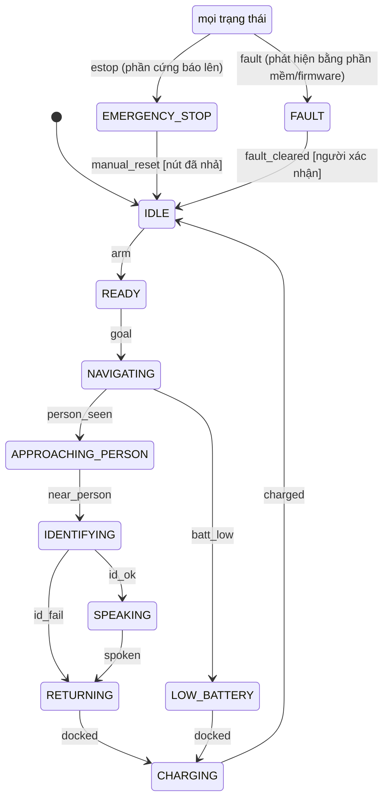

# Chặng 10 — An toàn và vận hành (60h + 16h tùy chọn)

> **Vị trí:** C8 (điều hướng; C9 nhận người chạy song song hoặc trước) → **C10** → C11 (sim twin, HIL, CI), C12 (sản phẩm) · **Cần trước:** C1 trọn (điểm cắt E-stop, cầu chì cuộn FD 1 A → K7 C1.3), C4 trọn (bảng chân, lease, kẹp tốc độ, ARM/DISARMED → K7 C4.4), C5.3 (E-stop tạm, teleop), C8.4 (Nav2 chạy A→B); K3 Bài 15–17 (kill switch, watchdog hai tầng, soak 72h); viên nang → F7.6, F5.3, F7.7, đọc lại → F5.7, F7.4, F1.4 · **Chạy song song với:** K6
> **Làm ra được:** chuỗi E-stop cứng (nút NC → cuộn relay → MOSFET "xung giữ"), bumper hai bên, watchdog phần cứng độc lập với firmware ESP32, đường đo trạng thái relay; state machine có bảng chuyển đầy đủ · bảng thời gian phản ứng từng tầng đo bằng logic analyzer kèm quãng dừng, bảng FMEA có S/O/D đã test bằng lỗi thật, soak 72h trong văn phòng với hợp đồng SLO, dashboard vận hành, báo cáo "Failure mode analysis for a small office robot" · **Sau chặng này bạn quyết định được:** cái gì cắt năng lượng motor và nó độc lập với những gì; E-stop của robot là dừng loại 0 hay loại 1 và vì sao; dòng FMEA nào sửa trước; robot đã được phép chạy trong văn phòng không người trông chưa.

C4 làm cho firmware **tự dừng** khi host im lặng hoặc gửi lệnh vô lý. C5 gắn một E-stop tạm. Cả hai vẫn có cùng một điểm yếu: chúng tin vào ESP32. C10 trả lời câu hỏi còn lại của K7: **khi chính bộ điều khiển hỏng, cái gì dừng robot?** Rồi nó đưa robot ra văn phòng có người thật 72 giờ, và đo xem toàn bộ hệ có giữ được lời hứa không.

**Phân bổ 60h** `[ước lượng]` (giữ giờ của K7 gốc Bài 15, 16, 17):

| Phần | Giờ |
|---|---|
| Bài C10.1 An toàn là một tầng phần cứng (K7 gốc Bài 15) | 16 |
| Bài C10.2 State machine và FMEA (K7 gốc Bài 16) | 18 |
| Bài C10.3 Soak 72h trong văn phòng thật (K7 gốc Bài 17) | 16 người + 72 treo máy |
| Lắp bước 1–7: bo an toàn, nút E-stop trên thân, bumper, watchdog ngoài, đường đo relay, nút RESET, kiểm trước khi chạy | 7 |
| Gate chặng 10 (gồm bài viết) | 3 |
| **Tổng lõi** | **60** |
| Bài C10.4 HRI đo được *(tùy chọn, K7 Phụ lục C)* | +16 |

Đường lõi tối thiểu của K7 (`_KE-HOACH-K7.md` mục 3) gồm C10.1–C10.2 (34h). C10.3 cần C8 chạy được; nếu đi đường tối thiểu, làm soak 72h ở chế độ teleop/tuần tra cố định thay cho Nav2 và ghi rõ trong báo cáo.

## 0. Bức tranh chặng

Robot sau chặng này. Khối **mới** đánh dấu `*`; còn lại đã có từ C1–C9.

```
                         ┌────────────────────────── MINI PC N100 ──────────────────────────┐
                         │ Nav2 (C8) · nhận người (C9) · *state machine* · MCAP sidecar (C7) │
                         │ *ops_exporter* (metrics soak) · ros2_control hardware interface    │
                         └───────────────┬────────────────────────────────────▲───────────┘
                                         │ CMD (seq, ω, lease) 50–100 Hz       │ STATE 100 Hz
                                         ▼                                     │ (+ fault_mask, estop, relay)
 ┌───────────────────────── ESP32-S3 (vòng 100 Hz, C4) ─────────────────────────────────────┐
 │ lease + kẹp tốc độ (C4.4) · *ISR bumper* · *đọc ESTOP_SENSE, RELAY_FB* · *RESET*        │
 │ *đảo RELAY_HOLD từ CHÍNH task điều khiển, chỉ khi mọi kiểm tra đạt*                       │
 └───────┬─────────────────────────┬────────────────────────────┬──────────────────────────┘
         │ RELAY_HOLD (xung)        │ PWM/DIR/DRV_EN              │ BUMPER_L/R (NC), ENC
         ▼                          ▼                             ▲
  *[MẠCH XUNG GIỮ]* ──► gate Q1     DRIVER ──► MOTOR L/R ─────────┘
                         │          ▲ VM
 PACK 4S ─FD 1A─[E-STOP NC]─[cuộn K1]─┘(Q1 hạ cuộn xuống GND)
     └──FA 10A──[tiếp điểm K1: 30→87]──► VM driver          30→87a (khi nhả) ──► *RELAY_FB*
```

Ba đường dừng **không chung điểm hỏng đơn** với nhau ở phía "dừng":
1. **Người nhấn nút** → chuỗi cuộn hở → relay nhả → mất VM. Không đi qua chip nào.
2. **ESP32 treo / reset / mất nguồn** → chân RELAY_HOLD ngừng đảo → mạch xung giữ xả → Q1 tắt → relay nhả. Không cần ESP32 "quyết định" gì.
3. **ESP32 sống, phát hiện lỗi** (bumper, lease hết hạn, tốc độ đo vượt, encoder vô lý) → hãm có điều khiển, DRV_EN thấp, và ngừng đảo RELAY_HOLD.

Mini PC không nằm trên đường dừng nào. Nó chỉ có thể **xin** dừng (tầng 3) hoặc **ngừng xin chạy** (lease hết hạn → tầng 2).

Dòng dữ liệu mới: sự kiện an toàn (`estop`, `bumper`, `wd_trip`, `relay_fb`) trong STATE → `/diagnostics` + topic sự kiện → MCAP; chuyển trạng thái của state machine → log JSONL có lý do; capture logic analyzer của mỗi lần đo phản ứng → `captures/c10/`; metric soak → dashboard.

## 1. An toàn của chặng

**Rủi ro cụ thể của C10** (theo mức nặng):
1. **Robot chạy khi bạn tin nó đã dừng.** Chặng này cố ý gây lỗi (rút encoder, treo ESP32, `kill` tiến trình) trên robot có động lực. Mỗi phép thử là một lần robot có thể chạy theo lệnh cũ.
2. **Va chạm người trong soak.** Robot 5 kg `[ước lượng — số cân ở C2.4]` chạy giữa đồng nghiệp 72 giờ. Người không biết thí nghiệm, trẻ em, người dùng gậy, người cúi buộc dây giày.
3. **Lật/rơi:** bậc cửa, cầu thang, mép bàn khi chạy thử trên bàn.
4. **Tiếp điểm relay dính** (hồ quang DC khi cắt dòng lớn): E-stop nhấn mà VM còn.
5. **Quá áp VM khi relay mở lúc motor đang quay** (motor thành máy phát, nạp tụ đầu vào driver qua diode thân MOSFET).

**Quy tắc cứng** (cộng thêm quy tắc C0, C1, C4, C5):
- KHÔNG gây lỗi (fault injection) nào khi E-stop cứng chưa PASS bước kiểm ở Lắp bước 7. Thứ tự là C10.1 trước C10.2, không đảo.
- KHÔNG thử lỗi lần đầu trên sàn. Lần đầu mỗi kịch bản: robot kê trên giá, **bánh không chạm đất**, tay kia đặt trên nút E-stop. Chỉ khi PASS trên giá mới thử trên sàn, tốc độ thấp trước.
- KHÔNG đứng trước hướng chạy của robot khi thử lỗi trên sàn. Đứng sau hoặc bên cạnh, cách ≥1 m, cầm nút E-stop không dây hoặc đứng cạnh nút trên thân.
- KHÔNG dựa vào "E-stop" phần mềm (nút trên app, topic ROS, kill switch MQTT của K3) làm đường dừng duy nhất trong bất kỳ phép thử nào.
- KHÔNG cắm nguồn ESP32 từ USB của mini PC làm nguồn **duy nhất** (C1 đã cấp buck 5 V riêng). Rút USB phải không làm ESP32 mất điện.
- KHÔNG để nhả nút E-stop làm robot chạy lại. Phải có hành động reset có chủ đích (Lắp bước 6).
- KHÔNG thay nút E-stop bằng công tắc thường mở (NO) hay nút nhấn nhả. Chỉ dùng nút nấm NC tự khóa, xoay/kéo để nhả.
- KHÔNG đưa robot vào soak khi chưa có: biển báo trên thân ("Robot thử nghiệm — nhấn nút ĐỎ để dừng — liên hệ <tên, số máy>"), sự đồng ý của người quản lý văn phòng, khu vực đã loại cầu thang/bậc (hoặc cảm biến vực đã test), và lịch sạc **có người** (C1.6).
- KHÔNG chạy soak qua đêm khi không có người trong tòa nhà nếu robot đang sạc. Robot đỗ, tắt công tắc chính, hoặc sạc có người trông.
- KHÔNG đo VM, cuộn relay hay chuỗi E-stop bằng logic analyzer mà không qua cầu phân áp hoặc opto. 14,6 V vào kênh logic analyzer là cháy kênh (và có thể cổng USB laptop).

**Khi sự cố xảy ra:**

| Tình huống | Làm ngay | KHÔNG làm |
|---|---|---|
| Robot không dừng khi nhấn E-stop | Công tắc chính OFF; nếu robot đang chạy về phía người: chặn bằng vật mềm (ghế có đệm, thùng carton), không bằng chân tay | Đuổi theo và túm bánh; giữ nút nhấn rồi nhìn |
| Robot chạm người trong soak | Nhấn E-stop; hỏi người có sao không; dừng soak; ghi near miss/sự cố với thời gian, tốc độ (từ log), khoảng cách | Tiếp tục soak "vì chỉ chạm nhẹ"; sửa log |
| Mùi khét, khói từ bo an toàn/relay | Công tắc chính OFF, rút XT60 (theo C1) | Nhấn E-stop rồi bỏ đi (E-stop không cắt compute và bo nguồn) |
| Relay dính (VM còn sau E-stop) | Công tắc chính OFF; đánh dấu relay hỏng; thay; ghi vào FMEA như một sự cố thật | Gõ relay cho nhả rồi dùng tiếp |

Sau mỗi sự cố hoặc near miss: postmortem không đổ lỗi một trang (→ F7.7), một dòng FMEA mới hoặc sửa dòng cũ, một test mới (hạt giống HIL cho C11.2).

## 2. BOM chặng

Phần lớn đã có (relay K1 và nút E-stop từ C1, opto từ C4, bumper nếu đã gắn ở C5). Giá `[ước lượng 10/2026]`, kiểm lại ở cửa hàng. Tổng K7 gốc cho đợt này: ~1tr.

| Món | Thông số phải chọn | Vì sao (bằng số) | Giá | Kiểm khi nhận hàng | Thay thế được bằng |
|---|---|---|---|---|---|
| Nút E-stop nấm **thứ hai** gắn trên thân (hoặc thay nút C1) | NC, **mở cưỡng bức** (positive opening, ký hiệu ⊝ trên khối tiếp điểm), tự khóa, xoay để nhả, đầu ≥30 mm màu đỏ trên nền vàng | Mở cưỡng bức: cơ cấu ép tiếp điểm NC tách ra kể cả khi tiếp điểm bị dính `[spec — IEC 60947-5-1 phụ lục K; kiểm ký hiệu trên khối tiếp điểm]` | 100–300k | Đo: chưa nhấn thông, nhấn hở, xoay thông lại; nhìn ký hiệu ⊝ | Nút C1 nếu đã đạt các thông số này |
| Relay K1 loại **5 chân (changeover)** | 12 V, tiếp điểm 30/87/87a, ≥30 A; datasheet ghi **thời gian nhả** và định mức tiếp điểm DC | Chân 87a cho tín hiệu "relay đã nhả" độc lập với VM (mục 4). Định mức DC thấp hơn AC `[chuẩn]` | 50–150k | Cấp 12 V vào cuộn: 30–87 thông; bỏ điện: 30–87a thông | Relay 4 chân của C1 + đo VM (kém hơn, mục 4) |
| Zener 1 W + diode 1N4007 | Áp Zener + áp pack đầy + ~1 V < Vds max của Q1, còn dư ≥15%: 18–24 V khi Q1 ≥40 V; **≤10 V khi Q1 là AO3400 (30 V)** | Diode + Zener cho dòng cuộn tắt nhanh hơn chỉ diode → relay nhả nhanh hơn `[chuẩn — app note coil suppression của hãng relay; tự đo]` | <20k | Đo chế độ diode | TVS hai chiều |
| MOSFET kênh N logic-level (Q1) | Vgs(th) ≤1,5 V, Rds(on) **ghi ở Vgs = 2,5 V**, Vds ≥40 V, gói SOT-23 hoặc TO-220 | Cổng chỉ được lái bằng mạch xung giữ (~2 V, mục 4); dòng cuộn relay ~100–200 mA `[spec — đo ở C1]` | 5–20k | Đo chế độ diode thân D–S | Transistor NPN + điện trở (tính lại mạch) |
| Linh kiện mạch xung giữ | 2 tụ 1 µF (gốm, ≥10 V), 2 diode Schottky (BAT54/1N5819), 100 kΩ, 10 kΩ kéo xuống | Mô phỏng ở Bài C10.1 phần 2 | <30k | — | IC supervisor có watchdog (phương án C, Bài C10.1) |
| Bumper ×2 | Công tắc hành trình (microswitch có cần lăn) **dùng chân NC**, thanh cản mềm (xốp EVA/ống PU) phủ mặt trước | Đứt dây = "đã va" (hỏng về phía an toàn, bảng chân C4) | 50–150k | Đo NC thông khi chưa ấn; lực ấn để kích (cân hành lý C0) | Thanh cản + 2–3 công tắc song song logic (nối tiếp NC) |
| Cảm biến vực *(nếu khu soak có bậc)* | IR khoảng cách hướng xuống (ví dụ Sharp GP2Y0A41) hoặc ToF VL53L0X | Phát hiện mép bậc trước bánh trước | 100–250k ×2 | Đo trên sàn tối màu và sàn sáng | Loại khu có bậc khỏi bản đồ (Nav2 keepout) |
| Nút RESET | Nút nhấn NO nhỏ, gắn cạnh E-stop, có nắp hoặc lõm để không chạm nhầm | Khởi động lại là hành động có chủ đích, tại robot `[spec — IEC 60204-1 9.2.3.4 / ISO 13850: reset không tự khởi động lại]` | 20–50k | Đo NO | Nút trên app teleop (kém hơn: không tại máy) |
| Cầu phân áp đo | 47 kΩ / 10 kΩ ×3 (VM_SENSE, RELAY_FB, COIL_SENSE) + tụ 100 nF | 14,6 V → ≈2,6 V, an toàn cho ESP32 và logic analyzer | <20k | Đo tỉ số trên nguồn bàn | Opto PC817 |
| TVS trên VM driver | Đơn hướng, áp đánh thủng trên áp pack đầy (ví dụ dòng SMBJ 18–20 V; tra datasheet) | Kẹp xung khi relay mở lúc motor quay | 10–30k | Đúng cực | Tụ bulk lớn hơn (không thay được hoàn toàn) |
| Tiền nạp VM | P-MOSFET (Vds ≥30 V) + NPN lái + 100 Ω 3 W + 1N4007 | Tránh tiếp điểm K1 đóng vào tụ rỗng (hàn dính, C10.1) | 20–50k | Đo Ω đường tiền nạp khi Q2 tắt: hở | Relay/contactor có định mức inrush lớn (vẫn nên tiền nạp) |
| Biển báo, dây buộc, băng dính sàn | In A5 ép plastic | Người lạ biết đây là gì và dừng nó thế nào | 30–50k | — | — |

**Tổng C10 `[ước lượng]`:** ~0,7–1,5tr (không tính MCU thứ hai, cảm biến vực).

**Đồ có sẵn từ kit Arduino:** relay 5 V của kit để diễn tập phép đo "chỉ diode / diode + Zener" trên mạch 5 V trước khi đo relay K1 (`phu-luc-kit-arduino.md` P1, tùy chọn). Relay kit **không** được dùng trong chuỗi E-stop (lý do ở đầu phụ lục).

## 3. Dụng cụ và kỹ năng tay

| Kỹ năng | Bài | Luyện trước | Đạt trông thế nào |
|---|---|---|---|
| Hàn mạch nhỏ trên bo đục lỗ (mạch xung giữ, cầu phân áp) | Lắp bước 1 | Một cầu phân áp thừa | Mối bóng; không cầu thiếc giữa hai lỗ; đo Ω từng nhánh trước khi cấp điện |
| Gắn nút E-stop trên thân: khoan lỗ 22 mm, chống xoay | Lắp bước 2 | Lỗ trên tấm phế liệu cùng vật liệu | Nút không xoay khi vặn nhả; đầu nấm cao hơn mọi thứ xung quanh; với được từ phía sau và hai bên |
| Cơ khí bumper: hành trình, điểm kích | Lắp bước 3 | Gá một công tắc trên tấm gỗ, ấn bằng cân | Kích ở lực nhỏ (ghi N) **trước** khi thân robot chạm vật; nhả về đúng vị trí |
| Logic analyzer 6 kênh, trigger theo cạnh, đọc thời gian giữa hai cạnh | C10.1 | K5 Bài 8, C4.2 | Biết sai số mỗi cạnh; biết định nghĩa "cạnh" khi tiếp điểm rung |

**Đo trên chuỗi có tiếp điểm cơ khí:** khi nút E-stop mở, tiếp điểm **rung** (bounce) vài trăm µs tới vài ms `[ước lượng — đo]`. Logic analyzer 24 MHz thấy từng lần rung. Quy ước của chặng: thời điểm kích hoạt là **cạnh đầu tiên** chuỗi hở; thời điểm kết thúc là **cạnh đầu tiên** của tín hiệu đích sau đó ổn định ≥10 ms. Ghi quy ước này vào `captures/c10/README.md` để mọi số đo cùng nghĩa.

## 4. Sơ đồ đi dây

Mở rộng chuỗi cuộn của C1 (FD 1 A → nút E-stop NC → cuộn K1 → GND). Thay đổi: thêm Q1 ở phía thấp của cuộn, mạch xung giữ, ba đường đo. Màu theo C0.5; dây chuỗi E-stop có nhãn đỏ ở hai đầu (C0.5).

```
  THANH CÁI + ──[FD 1A]──┬──[E-STOP NC ⊝]──●COIL_SENSE──[cuộn K1 (85→86)]──┬── D Q1 (AO3400 30 V → Zener ≤10 V; Q1 ≥40 V → Zener 20 V)
  (VBAT 10–14,6 V)       │                  │                  ║ D1 1N4007    │   S ── GND sao
                         │                47k                  ║ nối tiếp     │   G ◄── mạch xung giữ
                         │                  ├──► ESTOP_SENSE   ║ Zener V_Z    │
                         │                10k  (GPIO41, qua    ║ (dập nhanh)  │
                         │                  ┴   100 nF)        ╚═════════════╝
                         │
  THANH CÁI + ──[FA 10A]──── 30 ●──────┐ K1
                                       ├──● 87 ──► VM driver ──[TVS]──[1000 µF]── driver ── motor L/R
                                       │           └─47k─┬─10k─┴ GND   → VM_SENSE (ADC1, ví dụ GPIO 1/2 nếu
                                       │                 └────────────    không dùng current sense; ghi PINS.md)
                                       └──● 87a ─47k─┬─10k─ GND         → RELAY_FB (cao = relay ĐÃ NHẢ)
                                                     └────────────────► logic analyzer D2 + GPIO rảnh

  MẠCH XUNG GIỮ (giữa ESP32 và gate Q1):
  RELAY_HOLD (GPIO42) ─[C1 1µF]─●a──[D2 BAT54 →]──●g──► gate Q1
       └─10k─ GND (kéo xuống)   │                  ├─[C2 1µF]─ GND
                                └──[D1 BAT54, anode GND]   └─[R2 100k]─ GND

  BUMPER_L/R: COM ─ GND ; NC ─ GPIO39/40 (kéo lên trong + 4,7k ngoài, 100 nF sát chân) — đứt dây = chân cao = "va"
  RESET: nút NO giữa GPIO rảnh và GND (kéo lên) — gán chân trong firmware/PINS.md
  TIỀN NẠP: COIL_SENSE ─[Q2 phía cao, lái bởi GPIO PRECHARGE, kéo về tắt]─[100 Ω 3 W]─[1N4007 →]─ VM driver
  Logic analyzer: D0 COIL_SENSE (qua cầu chia) · D1 RELAY_HOLD · D2 RELAY_FB · D3 DRV_EN · D4 ENC_L_A · D5 BUMPER_L
```

Đọc sơ đồ:
- **Chọn cặp Q1–Zener cùng nhau.** Khi Q1 tắt, dòng cuộn chạy qua D1 + Zener và cực D của Q1 lên tới V_pack + V_Z + ~0,7 V `[chuẩn]`. Với Zener 20 V đó là ~35 V: AO3400 (V_DS 30 V `[spec — datasheet AOS AO3400]`) bị đánh thủng. Hai cặp hợp lệ: AO3400 + Zener 9,1–10 V (đỉnh ~25 V), hoặc MOSFET ≥40 V có R_DS(on) ghi ở 2,5 V + Zener 20 V. Shopee 10/2026 không có MOSFET loại sau mà có lượt bán (`_MUA-SAM-K7.md` mục 0.2). Ghi cặp đã chọn vào `decisions.md`; phép đo "chỉ diode vs diode + Zener" ở phần 6 giữ nguyên.
- **Nút E-stop và Q1 nối tiếp:** cuộn K1 có điện khi và chỉ khi nút chưa nhấn **và** Q1 đang dẫn. Q1 chỉ dẫn khi RELAY_HOLD **đang đảo** (Bài C10.1 phần 2). Một chân kẹt cao, kẹt thấp, thả nổi, hay ESP32 mất điện đều làm Q1 tắt.
- **Chân 87a cho biết relay đã nhả,** độc lập với VM. Không dùng "VM về 0" làm mốc kết thúc: khi relay mở lúc motor còn quay, motor phát ngược qua diode thân của driver và giữ VM trên tụ 1000 µF một lúc. VM_SENSE dùng để phát hiện **relay dính** (87a chưa lên mà VM vẫn còn sau khi cuộn mất điện, hoặc VM còn khi 87a đã lên).
- **Đồng thời 87 và 87a** không bao giờ cùng nối với 30. Nếu RELAY_FB cao và VM_SENSE cao kéo dài hơn thời gian xả tụ đã đo → tiếp điểm 87 dính hoặc đi dây sai.
- Relay 4 chân của C1 (không có 87a) vẫn dùng được: khi đó mốc "relay nhả" lấy bằng VM_SENSE **khi motor đứng yên** (không có back-EMF), và ghi giới hạn này.
- Chân GPIO cho VM_SENSE, RELAY_FB, RESET chưa có trong bảng chân đề xuất của C4: chọn chân rảnh không thuộc danh sách cấm của C4 (strapping, USB, flash/PSRAM, UART0), ADC1 cho VM_SENSE, và **sửa `firmware/PINS.md` trước khi sửa code** (quy tắc C4).

**Bảng dây bổ sung** vào `wiring/wires.csv`:

| wire_id | net | từ → tới | AWG | màu | cầu chì |
|---|---|---|---|---|---|
| W41 | ESTOP_CHAIN | nút E-stop thân → cuộn K1 (thay nút tạm C1/C5) | 22 | nhãn đỏ hai đầu | FD 1 A |
| W42 | COIL_LOW | cuộn K1 (86) → D Q1 | 22 | nhãn đỏ | FD |
| W43 | RELAY_HOLD | GPIO42 → mạch xung giữ | 26 | trắng, nhãn HOLD | — |
| W44 | RELAY_FB | 87a → cầu chia → GPIO | 22 → 26 | nhãn FB | FA (phía 87a) |
| W45 | VM_SENSE | VM → cầu chia → ADC1 | 26 | nhãn VMS | — (dòng µA) |
| W46/W47 | BUMPER_L/R | công tắc → GPIO39/40, xoắn với GND | 26 | xanh lá/GND đen | — |

## 5. Trình tự chặng

Thứ tự: hiểu → lắp phần cứng an toàn → kiểm trên giá → đo phản ứng → state machine → FMEA và gây lỗi → soak. Không đảo.

1. **Học Bài C10.1 phần 1–5.** Commit `prediction.md` trước khi mở 🔒.
2. **Lắp bước 1 — Bo an toàn trên bo đục lỗ** (mạch xung giữ, Q1, cầu phân áp, đế relay 5 chân)
   - Làm: hàn theo mục 4; nhãn từng điểm đo; chưa nối vào robot.
   - ✅ Checkpoint trước khi cấp điện (đồng hồ, không nguồn): Ω gate Q1 ↔ GND ≈ 100 kΩ (R2 có mặt, gate không thả nổi); Ω RELAY_HOLD ↔ GND ≈ 10 kΩ; tỉ số mỗi cầu chia đúng (cấp 12,0 V nguồn bàn, đo ra ≈ 2,1 V); diode và Zener đúng chiều (vạch diode về phía +).
   - ✅ Checkpoint trên nguồn bàn (I_set 0,3 A, 12 V cho chuỗi cuộn; 3,3 V từ máy phát xung hoặc ESP32 thứ hai cho RELAY_HOLD): không xung → relay **không** hút; xung 50 Hz → relay hút sau một khoảng (ghi ms); ngắt xung → relay nhả (ghi ms); chân kẹt 3,3 V liên tục → relay **không** giữ.
   - Nếu sai: relay hút khi không có xung → Q1 bị lái từ chỗ khác hoặc gate thả nổi; relay không bao giờ hút → Vg quá thấp so với Vgs(th) của Q1 (đo Vg bằng UT33D+ khi đang có xung, so với mô phỏng).
3. **Lắp bước 2 — Nút E-stop trên thân**: vị trí với được từ phía sau và hai bên, cao nhất trên robot; thay nút tạm của C5; dây W41 đi theo khung, có strain relief.
   - ✅ Checkpoint (không nguồn): công tắc chính OFF, đo thông mạch FD → cuộn K1: chưa nhấn thông, nhấn hở, xoay thông. Lắc mạnh dây ở hai đầu khi đo: số không chập chờn.
4. **Lắp bước 3 — Bumper**: gá hai công tắc NC sau thanh cản; đo lực kích bằng cân hành lý (ghi N); thanh cản chạm vật **trước** mọi phần cứng của thân.
   - ✅ Checkpoint: firmware đọc BUMPER_L/R = "chưa va" khi chưa ấn; rút giắc bumper → firmware báo "va" (đứt dây hỏng về phía an toàn).
5. **Lắp bước 4 — Nối bo an toàn vào robot**: chuỗi cuộn của C1 đi qua Q1; RELAY_HOLD, RELAY_FB, VM_SENSE, ESTOP_SENSE vào ESP32 theo `PINS.md` đã sửa.
   - ✅ Checkpoint trước khi cấp điện: Ω VM driver ↔ GND không gần 0 Ω; Ω mọi chân ESP32 ↔ VBAT: OL; cầu chì FD là 1 A, không lớn hơn.
6. **Lắp bước 5 — Firmware**: đảo RELAY_HOLD **trong task điều khiển** sau khi mọi kiểm tra của chu kỳ đạt (Bài C10.1 phần 6 bước 2); đọc ESTOP_SENSE, RELAY_FB, VM_SENSE vào STATE; chốt `ESTOP_LATCHED` (Bài C10.1).
7. **Lắp bước 6 — RESET có chủ đích**: robot chỉ đảo RELAY_HOLD lại khi (a) chuỗi E-stop đóng (ESTOP_SENSE), (b) nút RESET trên thân vừa được nhấn, (c) host gửi `ARM`; rồi tiền nạp VM qua Q2 tới ≥95% VBAT, mới phát xung giữ. Nhả nút E-stop thôi thì relay không hút.
   - ✅ Checkpoint (trên giá, bánh không chạm đất): nhấn E-stop khi bánh quay → relay nhả; xoay nhả nút → **relay không hút**, bánh không quay; nhấn RESET + ARM → relay hút, bánh vẫn đứng (lệnh 0) tới khi có lệnh mới.
8. **Lắp bước 7 — Kiểm trước khi chạy** (làm lại trước mỗi buổi thử lỗi và mỗi ngày soak; in thành checklist 2 phút): nhấn E-stop trên giá → relay nhả (nghe "tách", RELAY_FB lên); giữ nút RESET của ESP32 (chân EN) khi bánh quay → relay nhả; rút USB mini PC khi bánh quay → bánh dừng trong thời gian lease (C4.4), relay vẫn giữ nếu ESP32 sống; ấn bumper → bánh dừng.
9. **Học Bài C10.1 phần 6–12**: đo thời gian phản ứng từng tầng, 20 lần E-stop, quãng dừng.
10. **Học Bài C10.2**: state machine; FMEA có S/O/D; gây lỗi từng dòng, trên giá rồi trên sàn.
11. **Học Bài C10.3**: hợp đồng soak, dashboard, 72h.
12. *(Tùy chọn)* **Bài C10.4** chạy cùng hoặc ngay sau soak.
13. **Gate chặng 10.**

## 6. Lỗi người mới hay gặp

| Triệu chứng | Nguyên nhân khả dĩ | Kiểm bằng cách | Sửa |
|---|---|---|---|
| Relay "rè", hút nhả liên tục | Vg ở vùng giữa: Q1 dẫn một phần, dòng cuộn quanh ngưỡng giữ | Đo Vg khi đảo; so Vgs(th) | MOSFET Vgs(th) thấp hơn, hoặc tăng C1 / tần số đảo (mô phỏng C10.1) |
| Relay vẫn giữ khi ESP32 treo | RELAY_HOLD do LEDC/timer phần cứng phát; ngoại vi chạy tiếp khi CPU treo | Treo task điều khiển bằng lệnh debug, xem D1 | Đảo bằng ghi GPIO trong task điều khiển (C10.1) |
| Cầu chì FD đứt khi nhấn E-stop nhiều lần | Hồ quang/điện áp cảm ứng cuộn không có đường xả khi tiếp điểm nút mở | Diode/Zener có đúng chỗ (song song cuộn) không | Lắp đúng; cầu chì giữ 1 A |
| Dashboard xanh nhưng robot đứng yên hàng giờ | Metric chỉ báo "tiến trình sống", không báo tiến triển | So "quãng đường/giờ" với "nhiệm vụ đã giao" | Thêm SLI tiến triển (C10.3) |

Lỗi riêng của từng bài ở phần 8 của bài.

## 7. Lăng kính data infra

**Dữ liệu chặng này sinh ra:**

| Luồng | Nơi | Schema (rút gọn) | Tần số | Ghi chú |
|---|---|---|---|---|
| Sự kiện an toàn | topic `/safety/events` + MCAP; JSONL `logs/safety/*.jsonl` | `t_mcu_us, boot_count, seq, kind ∈ {estop, estop_release, reset, bumper_l, bumper_r, wd_trip, lease_expired, overspeed, relay_fb, relay_weld_suspect}, state, v_l, v_r, cmd_seq` | theo sự kiện | Một sự kiện = một dòng; không gộp |
| Chuyển trạng thái | `/state_machine/transitions` + JSONL | `t_mono_ns, t_wall, boot_id, from, event, to, accepted (bool), reason, source_node` | theo sự kiện | Chuyển bị chặn cũng ghi (`accepted=false`) |
| Đo phản ứng | `captures/c10/*.sr`, `build-log/measurements.jsonl` | `quantity ∈ {estop_relay_release_time, bumper_stop_time, wd_relay_release_time, lease_stop_time, coast_distance, brake_distance}`, `value`, `unit=s` hoặc `m`, `n`, `max`, `instrument` | theo lần đo | SI: `s`, `m`; báo max và n, không chỉ mean (→ F1.4) |
| Kết quả gây lỗi | `fmea/results.csv` | `fmea_id, trial, robot_state, speed, injected_at, detected_at, safe_state_at, observed, expected, pass` | theo lần thử | Mỗi dòng FMEA ≥1 lần thử, khuyến nghị ở ≥2 trạng thái |
| Metric soak | Prometheus/CSV `ops/metrics-*.csv` | counter: `estop_total{who}`, `bumper_total`, `wd_trip_total`, `interventions_total{kind}`, `recoveries_total`; gauge: `battery_v`, `cpu_temp_c`, `disk_free_pct`, `rss_bytes{node}` | 10–60 s | Counter cho sự kiện, gauge cho trạng thái (→ F7.5) |

**Test tự động sinh ra từ chặng này (hạt giống cho C11.2):**
- `test_fsm_table`: mọi cặp (trạng thái, sự kiện) có kết quả định nghĩa; property test chuỗi ngẫu nhiên (Bài C10.2) chạy trong CI, không cần phần cứng.
- `test_hold_circuit`: trên bàn HIL, ESP32 thứ hai giả lập "treo" (ngừng đảo, kẹt cao, kẹt thấp, high-Z) và đo RELAY_FB; oracle là bảng thời gian đã đo ở C10.1.
- `test_fmea_<id>`: mỗi dòng FMEA test được ở tầng nào (SIL, HIL, bàn, thực địa) thì có một test ở tầng đó (→ F2.7). Dòng chỉ test được trên robot thật ghi rõ "thực địa, thủ công", tần suất lặp lại.

**SLI vận hành** (C10.3): completeness và freshness theo luồng, can thiệp tay/72h, sự cố an toàn, E-stop theo người nhấn, quãng đường/giờ, thời gian ở mỗi trạng thái. **Không SLI nào cho chức năng E-stop**: nó là ràng buộc nhị phân kiểm trước mỗi ngày, không có error budget (→ F7.4).

**Vai trò nghề:** Test & Validation (fault injection có oracle, FMEA gắn test); Data Platform (sự kiện an toàn có schema, audit được); fleet ops (dashboard, postmortem).

## 8. Nhật ký build

Copy vào `build-log/c10.md`, một mục mỗi buổi:

```markdown

## 2026-MM-DD — buổi N (giờ bắt đầu–kết thúc, giờ thực: _._ h)
- Trạng thái người: tỉnh táo / mệt (mệt → không gây lỗi trên robot có động lực)
- Firmware: git hash ____ ; bo an toàn rev ____ ; relay ____ (datasheet t_release ____ ms)
- Checklist trước khi chạy (Lắp bước 7): E-stop ☐  EN-reset ☐  rút USB ☐  bumper ☐
- Mục tiêu buổi:
- Đo (measurements.jsonl, số dòng __): t_release E-stop max/n ____ ; quãng trôi ____ ; ...
- Capture: captures/c10/...
- Gây lỗi (fmea_id → kết quả → pass/fail):
- Sự cố / near miss (ai, ở đâu, tốc độ, khoảng cách) → postmortem: ____
- Quyết định (→ decisions.md): dừng loại 0/1; phương án watchdog A/B/C; timeout ____
- Câu hỏi còn mở:
```

---

## Bài C10.1 — An toàn là một tầng phần cứng: E-stop, relay, bumper, watchdog độc lập, đo thời gian phản ứng (16h)

> **Vị trí:** C8.4 (Nav2 chạy được) → **C10.1** → C10.2 · **Cần trước:** → F5.7 (watchdog, brownout), → F5.3 (trường hợp xấu nhất), → F5.8 (trễ trong vòng), → F1.4 (quy tắc ba); K7 C1.3 (cầu chì cuộn), C4.4 (lease, kẹp tốc độ, ARM), C5.3 (E-stop tạm); K3 Bài 15–16 (kill switch, watchdog hai tầng) · **Sau bài này bạn quyết định được:** cái gì cắt năng lượng motor và nó độc lập với những gì; watchdog độc lập làm bằng mạch xung giữ, MCU thứ hai hay IC supervisor; E-stop của robot là dừng loại 0 hay loại 1; con số "thời gian phản ứng" nào được ghi vào README.

### 1. Câu chuyện — ai đã khổ vì chuyện này

Therac-25 là máy xạ trị của AECL. Từ 1985 đến 1987, ít nhất sáu bệnh nhân bị chiếu quá liều rất nặng; một số người chết `[chuẩn — Leveson & Turner, *An Investigation of the Therac-25 Accidents*, IEEE Computer, 1993]`. Thế hệ trước (Therac-6, Therac-20) có **interlock phần cứng**: công tắc và mạch độc lập ngăn chùm tia mạnh khi cấu hình cơ khí sai. Therac-25 bỏ phần lớn interlock đó và giao việc kiểm tra cho phần mềm. Hai lỗi được tìm ra: một race condition khi kỹ thuật viên sửa thông số nhanh, và một biến cờ một byte bị **cộng dồn** thay vì gán, cứ 256 lần thì tràn về 0 và bỏ qua một bước kiểm tra. Chi tiết đáng nhớ nhất trong báo cáo của Leveson: Therac-20 cũng có lỗi phần mềm tương tự, nhưng ở đó interlock phần cứng làm **đứt cầu chì** thay vì để bệnh nhân hứng tia. Phần mềm sai ở cả hai máy; chỉ một máy có tầng phần cứng đỡ.

Câu hỏi của bài: **khi phần mềm treo, cái gì dừng robot lại?** Nếu câu trả lời có chữ "code", "flag", "topic" hay "callback" thì chưa trả lời. Và câu hỏi khó hơn mà K7 gốc chỉ nêu trong một ô FMEA: **khi chính ESP32 treo, cái gì cắt relay?** Mini PC không có GPIO; ESP32 là bộ điều khiển duy nhất chạm vào motor. Bài này thiết kế thứ đó.

### 2. Mô hình tư duy

**Nguyên tắc 1 — cấp điện để chạy (energize-to-run).** Motor chỉ có năng lượng khi **mọi** điều kiện trong một chuỗi nối tiếp đang thỏa. Đứt dây, mất nguồn, rút giắc, chết chip — đều làm chuỗi hở, và trạng thái mặc định khi chuỗi hở là "motor không có năng lượng".

**Nguyên tắc 2 — bốn tầng, hỏng độc lập.**

| Tầng | Cơ chế | Còn hoạt động khi nào | Kiểu dừng |
|---|---|---|---|
| 0 | E-stop: nút NC trong chuỗi cuộn K1 | Có pin. Không cần chip nào | Cắt năng lượng (loại 0) |
| 0b | Watchdog độc lập: mạch xung giữ trên Q1 | Không cần ESP32 *đúng*; ESP32 *sai* thì chuỗi hở | Cắt năng lượng (loại 0) |
| 1 | Bumper, cảm biến vực → ISR ESP32 | ESP32 sống | Hãm có điều khiển, rồi tắt driver |
| 2 | Lease/kẹp tốc độ/giám sát tốc độ đo (C4.4) | ESP32 sống | Hãm có điều khiển |
| 3 | Nav2: costmap, giới hạn tốc độ, state machine | Linux, ROS 2, USB, ESP32 sống | Giảm tốc theo kế hoạch |

Hai tầng cùng lấy điện từ một chỗ, cùng chạy trên một chip, là một tầng. Tầng 3 là tầng bạn giỏi nhất và **ít đáng tin nhất**.

**Nguyên tắc 3 — E-stop không phải "dừng mềm".** IEC 60204-1 định nghĩa ba loại dừng `[spec — IEC 60204-1, mục về chức năng dừng]`: **loại 0** cắt năng lượng tới bộ chấp hành ngay (dừng không điều khiển: robot trôi); **loại 1** hãm có điều khiển trong khi vẫn cấp năng lượng, rồi cắt năng lượng khi đã dừng; **loại 2** hãm và **giữ** năng lượng. ISO 13850 (thiết kế chức năng dừng khẩn cấp) chỉ cho phép E-stop là loại 0 **hoặc** 1, chọn theo đánh giá rủi ro; loại 2 không được; nút phải tự khóa, và **nhả/reset nút không được tự khởi động lại máy** `[spec — ISO 13850, IEC 60204-1 mục 9.2.3.4 theo trích dẫn của các hãng; đọc tóm tắt, không cần mua chuẩn]`. Vậy:
- Nút đỏ trên thân → loại 0 (mặc định của bài) hoặc loại 1 (phần 6 bước 7, tùy chọn).
- "Dừng" trên app teleop, nút `STOP` trong state machine, kill switch MQTT của K3, `cancel` goal Nav2 → **dừng mềm** (về bản chất là loại 2: driver vẫn có điện, chỉ lệnh bằng 0). Hữu ích, nên có, **không được gọi là E-stop** trong README, dashboard hay bài viết.

**Watchdog độc lập: mạch "xung giữ".** Một tín hiệu **tĩnh** (cao hay thấp) không chứng minh được gì về chip phát ra nó: chip treo vẫn giữ chân ở mức cuối. Một tín hiệu **động** (đang đảo) chứng minh có code đang chạy tới dòng đảo. Mạch bơm điện tích chỉ cho cổng Q1 đủ áp khi chân RELAY_HOLD đang đổi mức; kẹt ở bất kỳ mức nào thì tụ cổng xả qua R2 và relay nhả. Mô phỏng đồ chơi trước khi hàn:

```python
# [đã chạy] Mạch "xung giữ" (bơm điện tích): relay chỉ được giữ khi chân ESP32 ĐANG ĐẢO.
# Mô hình đồ chơi: u(t) -> C1 -> nút a; D1 (GND->a), D2 (a->g); C2 và R2 ở cổng MOSFET g.
import numpy as np
VDD, VF, RS = 3.3, 0.30, 150.0        # mức GPIO; Vf diode Schottky [ước lượng]; R nối tiếp + diode
C1, C2, R2 = 1e-6, 1e-6, 100e3        # [ước lượng] chọn để thử; thay bằng linh kiện của bạn
VTH = 1.0                             # Vgs dưới mức này coi như MOSFET tắt [spec: datasheet MOSFET của bạn]
dt = 2e-6

def run(signal, T):
    va = vg = 0.0; vc1 = 0.0          # vc1 = u - va (áp trên C1)
    out = []
    for k in range(int(T / dt)):
        t = k * dt
        u = signal(t)
        va = u - vc1
        i1 = max(0.0, (-VF - va) / RS)          # D1 dẫn khi va < -Vf (nạp C1 lúc u thấp)
        i2 = max(0.0, (va - VF - vg) / RS)      # D2 dẫn khi va > vg + Vf (đẩy điện tích sang C2)
        vc1 += (i2 - i1) * dt / C1              # KCL tại nút a
        vg += (i2 - vg / R2) * dt / C2
        if k % 500 == 0: out.append((t, vg))
    return np.array(out)

sq = lambda f: (lambda t: VDD if (t * f) % 1 < 0.5 else 0.0)
cases = {
    "đảo 50 Hz (vòng 100 Hz chạy)":           (lambda t: sq(50)(t) if t < 0.6 else 0.0),
    "đảo 50 Hz rồi KẸT CAO ở 0,6 s":         (lambda t: sq(50)(t) if t < 0.6 else VDD),
    "LEDC 1 kHz vẫn chạy khi CPU treo":       (lambda t: sq(1000)(t)),
    "chân kẹt cao từ đầu (thả nổi kéo lên)":  (lambda t: VDD),
}
for name, s in cases.items():
    r = run(s, 1.0)
    on = r[(r[:, 0] > 0.4) & (r[:, 0] < 0.6), 1]
    below = r[(r[:, 0] > 0.6) & (r[:, 1] < VTH), 0]
    t_off = f"{(below[0]-0.6)*1e3:.0f} ms sau 0,6 s" if below.size else "KHÔNG BAO GIỜ"
    print(f"{name:<40} Vg lúc chạy {on.min():.2f}–{on.max():.2f} V; Vg < {VTH} V: {t_off}")
```

Ba điều mô phỏng buộc bạn nghĩ (đáp án số ở phần 7): mạch phân biệt "đang đảo" với "kẹt" thế nào; vì sao **nguồn của xung** quan trọng hơn mạch (dòng thứ ba); và thời gian từ lúc ngừng đảo tới lúc Q1 tắt phụ thuộc linh kiện nào.

**Ba phương án watchdog độc lập** (kế hoạch K7 mục 5 cho phép "watchdog ngoài hoặc MCU thứ hai"):

| | A. Mạch xung giữ (mặc định) | B. MCU thứ hai | C. IC supervisor có watchdog (ví dụ TPS3823) |
|---|---|---|---|
| Phát hiện | ESP32 ngừng đảo / kẹt mức | Bất kỳ logic bạn viết: xung, tốc độ encoder, nhất quán lệnh | Không có cạnh WDI trong khoảng timeout |
| Thêm phần mềm | 0 dòng | Một firmware nữa, cần test, cần cập nhật | 0 dòng |
| Timeout | RC, chỉnh bằng linh kiện, trôi theo nhiệt/dung sai tụ | Đặt bằng code | Cố định theo datasheet; TPS3823 điển hình 1,6 s, tối thiểu 0,9 s `[spec — TI SLVS165; kiểm bảng thông số]` |
| Bẫy | Xung phải phát từ đúng chỗ (phần 3) | Nguồn chung với ESP32 = hỏng chung; tự nó cũng treo được | **WDI để hở có thể làm vô hiệu watchdog** `[spec — kiểm mục WDI của datasheet]`: ESP32 reset → chân cao trở → watchdog tắt. Phải kéo chân hoặc chọn IC khác |
| Hợp với | Người mới, robot một bo | Khi cần giám sát tốc độ độc lập (giống thang máy) | Khi timeout ~1 s chấp nhận được |

**Ba giới hạn của mạch E-stop ở C1 và cách bài này đóng chúng.** Mạch C1 (cuộn K1 ăn từ pack qua FD 1 A, nút NC nối tiếp, diode song song cuộn) là **điểm cắt** đúng hướng, chưa phải chức năng dừng khẩn cấp đầy đủ:

| Giới hạn ở C1 | Hậu quả | Xử lý ở C10.1 | Còn lại (ghi vào FMEA) |
|---|---|---|---|
| (1) Nhả nút là cuộn có điện lại ngay | VM trở lại không cần thao tác nào; trái ISO 13850 (reset không được tự khởi động lại) | Q1 nối tiếp cuộn chỉ dẫn khi có xung giữ; firmware chỉ phát xung sau **RESET trên thân + ARM** (Lắp bước 6). Kiểm bằng checkpoint "nhả nút, relay không hút" | Chốt nằm ở firmware: một bug phát xung sớm làm mất chốt. Phương án chặt hơn: mạch tự giữ phần cứng (relay tín hiệu nhỏ K0 có tiếp điểm tự giữ song song nút RESET, nối tiếp trong chuỗi cuộn) |
| (2) Chỉ có diode dập cuộn → nhả chậm | t_relay dài hơn, quãng trôi dài hơn | Diode + Zener (hoặc TVS) song song cuộn; **đo cả hai** cấu hình (phần 6 bước 6) | Q1 phải chịu V_pack + V_Z |
| (3) Tiếp điểm đóng vào tụ 1000 µF của driver | Dòng nạp tụ chỉ bị giới hạn bởi điện trở dây và tiếp điểm (rất nhỏ) → đỉnh hàng chục tới hàng trăm A trong µs `[ước lượng: ΔV / R_vòng]` → tiếp điểm có thể **hàn dính**: E-stop hỏng ở trạng thái đóng, im lặng | **Tiền nạp**: trước khi phát xung giữ, firmware bật Q2 (công tắc phía cao: P-MOSFET + NPN lái, kéo về tắt) nối **nút COIL_SENSE** (sau nút E-stop) qua 100 Ω 3 W + diode vào VM; chờ VM_SENSE ≥ 95% VBAT (τ = R·C ≈ 0,1 s với 1000 µF) rồi mới đóng K1, tắt Q2. Nguồn tiền nạp lấy **sau nút**, nên nhấn E-stop cắt cả đường này. Chọn relay có định mức dòng khởi động/DC đủ `[spec — datasheet relay, mục inrush]`. **Giám sát tiếp điểm** bằng 87a (RELAY_FB) như một tiếp điểm phụ: cuộn mất điện mà 87a không đóng → `relay_weld`, chặn ARM | Q2 kẹt dẫn để lại đường ≤0,15 A vào VM khi watchdog cắt (không khi nhấn nút): dòng F15 trong FMEA C10.2, kiểm bằng VM_SENSE khi DISARMED |

**Đo cái gì, chính xác:** "thời gian phản ứng" là một khoảng giữa **hai cạnh có định nghĩa** trên logic analyzer. Với tầng 0: cạnh đầu COIL_SENSE xuống (chuỗi hở) → cạnh đầu RELAY_FB lên (87a đóng). Không dùng "VM về 0": motor đang quay phát ngược vào tụ VM qua diode thân của driver. "Robot dừng" là một đại lượng khác: quãng từ kích hoạt tới khi encoder hết xung, đo bằng encoder (vẫn có điện từ buck 5 V khi VM mất).

```
 COIL_SENSE  ‾‾‾‾‾|_|‾|________________________________   (nút mở, tiếp điểm rung)
 dòng cuộn   ‾‾‾‾‾‾‾\______                                (tắt dần; chậm hơn nhiều nếu chỉ có diode)
 RELAY_FB    _____________|‾‾‾‾‾‾‾‾‾‾‾‾‾‾‾‾‾‾‾‾‾‾‾‾‾‾‾‾‾   ← 87a đóng: "đã nhả"
 VM          ‾‾‾‾‾‾‾‾‾‾‾‾‾‾‾‾\‾‾‾‾\_______                  ← back-EMF giữ VM khi bánh còn quay
 ENC_L_A     |_|‾|_|‾|_|‾|_|‾|__|‾‾|___|‾‾‾‾|______        ← xung thưa dần: trôi (loại 0)
             |<- t_relay ->|<------- quãng trôi -------->|
```

**Quãng dừng = v · t_phản_ứng + v² / (2a).** Động năng ½mv²: robot 5 kg ở 0,5 m/s có 0,625 J; ở 1,5 m/s gấp 9 lần. Mô phỏng nhỏ để thấy một điều trái trực giác về loại 0:

```python
# [đã chạy] Quãng dừng theo tầng an toàn: d = v·t_phản_ứng + v²/(2a). Mọi số đầu vào là GIẢ ĐỊNH.
import numpy as np
m = 5.0                                  # kg [ước lượng] -> thay bằng số cân ở C2.4
v = np.array([0.3, 0.5, 1.0, 1.5])       # m/s; 0,5 là trần firmware (C4.4)
a_coast, a_brake = 0.8, 2.0              # m/s² [ước lượng]: trôi tự do (dừng loại 0) vs hãm có điều khiển
layers = {                               # (tên, t phản ứng giả định [s], kiểu dừng)
    "T0 E-stop -> relay": (0.015, "coast"),
    "T1 bumper -> ISR":   (0.005, "brake"),
    "T2 watchdog/lease":  (0.25,  "brake"),
    "T3 Nav2/costmap":    (0.30,  "brake"),
}
print("v (m/s) | KE (J) | " + " | ".join(layers))
for vi in v:
    cells = []
    for t, kind in layers.values():
        a = a_coast if kind == "coast" else a_brake
        cells.append(f"{100*(vi*t + vi**2/(2*a)):5.1f} cm")
    print(f"{vi:7.1f} | {0.5*m*vi**2:6.3f} | " + " | ".join(cells))
```

### 3. Cầu nối từ backend

| Backend bạn biết | Ở đây | Gãy ở chỗ | Nếu dùng nhầm thì |
|---|---|---|---|
| Circuit breaker trong code | E-stop | Circuit breaker chạy **trong** tiến trình nó bảo vệ; tiến trình treo thì breaker treo theo | E-stop là một topic ROS → mini PC kẹt swap là E-stop chết |
| Liveness probe + restart (Kubernetes) | Watchdog độc lập | Backend phản ứng với "chết" bằng **khởi động lại**. Ở đây là **cắt năng lượng và chờ người** | ESP32 reset xong tự ARM, robot chạy tiếp theo lệnh cũ |
| Heartbeat do một thread riêng gửi | Xung RELAY_HOLD | Thread heartbeat sống khi phần việc chính đã treo. Xung phải đi ra từ **chính** chỗ làm việc, sau khi việc xong | Đảo bằng LEDC hoặc trong ISR timer → watchdog luôn "xanh" khi task điều khiển treo |
| Defense in depth | Bốn tầng | Các tầng backend hay dùng chung hạ tầng (cùng DNS, cùng cluster). Tầng an toàn phải khác nguồn, khác chip, khác dây | ESP32 ăn từ USB mini PC: mini PC mất nguồn kéo theo tầng 0b, 1, 2 |
| Graceful shutdown (SIGTERM, drain) | Dừng loại 1 | Graceful shutdown phụ thuộc tiến trình còn chạy đúng. Loại 1 cũng vậy, nên phải có **bộ hẹn giờ phần cứng** cắt năng lượng dù việc hãm có xong hay không | Loại 1 viết bằng firmware thuần: ESP32 treo giữa lúc hãm thì không bao giờ cắt |

**Chấm mô hình:**
- *"Logic an toàn viết kỹ, test kỹ thì đặt ở phần mềm cũng được, lại linh hoạt hơn."* — **SAI** cho chức năng dừng khẩn cấp. Test cho thấy sự có mặt của lỗi, không chứng minh sự vắng mặt. **Phản ví dụ:** Therac-25: cùng lớp lỗi phần mềm, máy có interlock phần cứng làm đứt cầu chì, máy không có thì làm chết người.
- *Mô hình của bạn ở K3 lượt 12:* "dùng AI model kết hợp prediction để thay thế cho kết quả của tầng vật lý… kết quả vẫn đảm bảo" — **ĐÚNG MỘT PHẦN** cho hiệu năng, **SAI** cho an toàn. Dự đoán tốt làm robot hiếm khi cần dừng khẩn cấp; nó không thay được thứ dừng robot khi dự đoán sai hoặc khi máy chạy dự đoán treo. **Phản ví dụ:** model dự đoán quỹ đạo người chạy trên mini PC; mini PC kẹt vì swap. Không có dự đoán nào được tạo ra; chỉ tầng 0–2 còn làm việc.
- *"Dừng loại 0 là an toàn nhất vì không phụ thuộc phần mềm."* — **ĐÚNG MỘT PHẦN.** Đúng về **độ tin cậy** của việc dừng. Sai về **quãng dừng**: trôi tự do có gia tốc hãm nhỏ hơn hãm chủ động, nên ở cùng tốc độ robot có thể đi xa hơn so với khi tầng 2 hãm. **Phản ví dụ:** chạy mô phỏng quãng dừng ở trên với a_coast nhỏ hơn a_brake; rồi đo thật ở bước 7. Đây là lý do ISO 13850 cho phép loại 1.

### 4. Thuật ngữ

| Mức | Thuật ngữ | Nghĩa trong một câu | Hay bị hiểu nhầm thành |
|---|---|---|---|
| 🟢 | E-stop | Thiết bị dừng khẩn cấp do người kích hoạt, cắt năng lượng nguy hiểm | Nút gọi `stop()` |
| 🟢 | Dừng loại 0 / 1 / 2 (IEC 60204-1) | 0: cắt năng lượng ngay; 1: hãm có điều khiển rồi cắt; 2: hãm, giữ năng lượng | Mọi kiểu dừng như nhau |
| 🟢 | Dừng mềm | Dừng bằng lệnh phần mềm, driver vẫn có điện | E-stop |
| 🟢 | Energize-to-run / fail-safe | Cần năng lượng để **duy trì** trạng thái nguy hiểm | Có code xử lý lỗi |
| 🟢 | Tiếp điểm NC / NO; 87 / 87a | Thường đóng / thường mở; chân thường mở / thường đóng của relay ô tô | — |
| 🟡 | Mở cưỡng bức (positive opening) | Cơ cấu ép tiếp điểm NC tách ra kể cả khi dính | NC thường |
| 🟢 | Tín hiệu động (xung giữ, charge pump) | Chỉ "đang đổi" mới giữ được trạng thái chạy | Tín hiệu mức cao |
| 🟡 | Thời gian nhả relay, mạch dập cuộn | Relay mở chậm hơn khi cuộn chỉ có diode | Relay mở tức thì |
| 🟡 | Reset có chủ đích | Khởi động lại là một hành động riêng, sau khi nguy cơ đã xử lý | Nhả nút là xong |
| 🔴 | PL/SIL theo ISO 13849 / IEC 61508 | Định lượng mức an toàn chức năng | — |

### 5. Dự đoán

**Tham số cần tra:**
- Khối lượng robot: số cân ở C2.4 (kèm pin, mini PC).
- Thời gian nhả và dòng cuộn của K1: **datasheet relay** (ghi điều kiện đo, thường là cuộn **không** có mạch dập); dòng cuộn đo ở C1.
- Vgs(th) và đường Id–Vgs của Q1: **datasheet MOSFET**; có đủ dẫn dòng cuộn ở Vg mô phỏng không?
- Trạng thái chân ESP32-S3 khi reset và khi giữ nút EN: datasheet ESP32-S3 (mục về trạng thái chân lúc khởi động); kiểm theo revision.
- Gia tốc trôi a_coast: chưa có — đo ở bước 7. Gia tốc hãm a_brake: từ C4/C5 nếu đã đo, không thì đo.
- Timeout lease đã chọn ở C4.4: `firmware/config.h` của bạn.

**Đoán:**
1. Động năng ở 0,5 và 1,5 m/s với khối lượng thật.
2. Thời gian phản ứng từng tầng: E-stop → RELAY_FB; giữ EN ESP32 → RELAY_FB; treo task điều khiển → RELAY_FB; bumper → DRV_EN thấp; host im lặng → PWM = 0.
3. Quãng trôi sau E-stop ở 0,5 m/s; quãng hãm sau bumper ở 0,5 m/s.
4. Mô phỏng xung giữ: Vg khi đang đảo; thời gian Q1 tắt khi ngừng đảo; trường hợp LEDC.
5. Rút nguồn 5 V của ESP32 khi motor đang chạy (VM còn): motor làm gì, relay làm gì?
6. Relay chỉ có diode so với diode + Zener: nhả chậm hơn bao nhiêu lần?

```markdown
# prediction.md — C10.1   (commit: <hash>, ngày: <yyyy-mm-dd>)
- m = __ kg -> KE(0.5) = __ J, KE(1.5) = __ J
- K1: t_release datasheet = __ ms (điều kiện: __); đoán đo được: chỉ diode __ ms, diode+Zener __ ms
- Phản ứng: E-stop __ ms; EN giữ __ ms; treo task __ ms; bumper __ ms; lease __ ms (timeout C4.4 = __)
- Quãng trôi E-stop ở 0,5 m/s: __ cm (a_coast đoán __); quãng hãm bumper: __ cm
- Mô phỏng: Vg đảo = __ V; tắt sau __ ms; LEDC: __
- Rút 5 V ESP32 khi chạy: motor __, relay __ vì __
- Chọn: dừng loại __ ; watchdog phương án __ vì __
```

### 6. Làm

0. **Kiểm topology trước khi đo** (đã làm ở C1/C4, kiểm lại trên robot hoàn chỉnh): ESP32 ăn từ buck 5 V của bo nguồn, không chỉ từ USB mini PC; DRV_EN, PWM có kéo xuống ngoài; không chân điều khiển motor nào là chân strapping (bảng chân C4). Lý do: C10.2 sẽ rút nguồn từng khối, thiết kế phải sống sót trước khi test.
1. **E-stop vật lý cắt năng lượng motor** (Lắp bước 1–2, 4). Nút NC nối tiếp cuộn K1; tiếp điểm 30→87 trên VM. ESTOP_SENSE vào ESP32 để ghi log và **chốt**: `ESTOP_LATCHED` đặt PWM = 0, DRV_EN thấp, ngừng đảo RELAY_HOLD; chỉ xóa theo điều kiện reset ba phần (Lắp bước 6). **Test bằng cách rút cáp USB giữa mini PC và ESP32** — E-stop vẫn phải hoạt động. Thêm: test khi **rút nguồn 5 V của ESP32**.
2. **Watchdog độc lập** (phương án A mặc định). Firmware đảo RELAY_HOLD **trong task điều khiển 100 Hz** (C4.1), là dòng cuối của chu kỳ, chỉ khi: lease còn hạn, không có cờ lỗi, không `ESTOP_LATCHED`, tốc độ đo trong giới hạn. Ghi bằng `gpio_set_level` đảo trạng thái; **không** dùng LEDC/MCPWM/timer phần cứng cho chân này, **không** đảo trong ISR `[tự đo — kiểm API theo phiên bản ESP-IDF bạn cài]`. Kiểm ba cách "treo" bằng một lệnh debug chỉ có ở bản build thử (`FAULT_HANG_TASK`: task điều khiển vào vòng lặp vô hạn; `FAULT_HANG_ALL`: tắt ngắt rồi lặp vô hạn) và một cách vật lý (giữ nút EN). Nếu chọn phương án B hoặc C, viết lý do vào `decisions.md` và thay mạch tương ứng; phép đo giống hệt.
3. **Bumper** nối vào chân ngắt ESP32 (GPIO39/40 theo bảng chân C4), phản ứng ở **cạnh đầu**; debounce chỉ áp cho lúc nhả. Trong ISR chỉ làm việc tối thiểu, an toàn khi gọi từ ngắt: kéo DRV_EN xuống bằng ghi GPIO, đặt cờ; việc hãm có điều khiển và log để task làm `[tự đo — kiểm hàm nào gọi được từ ISR]`. Tùy chọn: chân NC thứ hai của bumper nối thêm vào chuỗi cuộn (khi đó bumper cũng là dừng loại 0, quãng dừng đổi: so ở bước 7).
4. **Giới hạn tốc độ cứng** là việc của C4.4 (kẹp từng bánh, kẹp gia tốc, giám sát tốc độ đo). Ở đây **kiểm lại trên robot hoàn chỉnh**: gửi `cmd_vel` 2 m/s và lệnh quay tại chỗ tối đa từ mini PC, ghi tốc độ đo từ encoder.
5. **Cảm biến vực** (nếu khu soak có bậc): IR/ToF hướng xuống, vào tầng 1 như bumper. Test trên mép bàn **có tấm chắn** bên dưới, tốc độ thấp.
6. **Đo thời gian phản ứng của từng tầng bằng logic analyzer** (kênh ở mục 4; 24 MHz → độ phân giải ~42 ns; sai số thật nằm ở định nghĩa cạnh khi tiếp điểm rung, không ở dụng cụ). Mỗi tầng ≥10 lần, ghi **max và n** (không ghi mean):
   - T0: cạnh đầu COIL_SENSE xuống → cạnh đầu RELAY_FB lên. Làm hai cấu hình dập cuộn: chỉ diode, diode + Zener.
   - T0b: cạnh cuối RELAY_HOLD → RELAY_FB lên, cho `FAULT_HANG_TASK`, `FAULT_HANG_ALL`, giữ EN, rút 5 V ESP32.
   - T1: cạnh đầu BUMPER_L → DRV_EN xuống (hoặc PWM = 0).
   - T2: `kill -STOP` tiến trình gửi lệnh trên mini PC (mô phỏng treo, khác `kill -9`); cạnh DBG_CMD cuối (C4) → PWM = 0. Lặp lại khi rút USB.
7. **Test E-stop 20 lần**, ≥5 lần ở tốc độ tối đa (0,5 m/s), trên sàn, đường thẳng có đánh dấu. Mỗi lần ghi: t_relay, **quãng trôi** (count encoder từ cạnh kích hoạt tới xung cuối × chu vi bánh / số count mỗi vòng, từ C6), và đo thước dây vết bánh (đối chứng: trượt bánh làm encoder đọc thiếu). Từ quãng trôi và v, tính a_coast. Làm 5 lần bumper ở cùng tốc độ để có quãng hãm.
8. **Tùy chọn — dừng loại 1.** Nếu quãng trôi ở bước 7 lớn hơn mức bạn chấp nhận (ghi tiêu chí trước, ví dụ theo khoảng trống trước bumper), làm loại 1: nút E-stop có **hai** khối tiếp điểm NC; khối 1 vào ESTOP_SENSE (ESP32 hãm ngay), khối 2 vào chuỗi cuộn **qua một bộ trễ nhả phần cứng** (relay trễ nhả hoặc RC trên mạch giữ, ví dụ 300 ms) → năng lượng bị cắt sau thời gian trễ **dù ESP32 hãm hay không**. Đo lại bước 7. Không bao giờ làm loại 1 mà thiếu bộ trễ phần cứng.
9. **Viết bảng "Bốn tầng"** vào `docs/safety.md`: tầng, cơ chế, phụ thuộc gì, max đo được (n), kiểu dừng, quãng dừng ở 0,5 m/s. Đây là tiêu chí gate 2.

### 7. Số phải ra

<details><summary>🔒 MỞ SAU KHI COMMIT prediction.md</summary>

**Mô phỏng xung giữ** (linh kiện trong code):

| Trường hợp | Vg khi chạy | Q1 tắt (Vg < 1 V) |
|---|---|---|
| Đảo 50 Hz rồi ngừng ở mức thấp | ~2,0–2,4 V (gợn theo chu kỳ) | ~70 ms sau khi ngừng |
| Đảo 50 Hz rồi kẹt cao | như trên | ~170 ms (lần sạc cuối nằm ở cạnh lên) |
| LEDC 1 kHz chạy tiếp khi CPU treo | ~2,7 V | **không bao giờ** — mạch đúng, nguồn xung sai |
| Kẹt cao từ đầu | ~0,1–0,2 V | relay không bao giờ hút |

Thời gian tắt tỉ lệ với R2·C2 (τ = 0,1 s) và phụ thuộc Vg lúc ngừng; dung sai tụ gốm (thường ±10–20%, giảm theo áp DC đặt lên) làm nó trôi `[chuẩn — kiểm datasheet tụ]`. Vg ~2 V là **sát** cho nhiều MOSFET: phải đọc đường Id–Vgs, không chỉ Vgs(th). Nếu Q1 không dẫn đủ: tăng C1, tăng tần số đảo, hoặc dùng mức 5 V qua mạch chuyển mức.

**Mô phỏng quãng dừng** (a_coast 0,8, a_brake 2,0 m/s², giả định): ở 0,5 m/s, T0 (trôi) ~16 cm, T1 (bumper hãm) ~7 cm, T2 ~19 cm, T3 ~21 cm. Ở 1,5 m/s, T0 ~143 cm. Đọc đúng: E-stop **chắc chắn** dừng nhất nhưng không phải **ngắn** nhất; khi a_coast thật nhỏ (hộp số trơn, bánh nhẹ ma sát) thì loại 1 đáng làm.

**Thí nghiệm thật** (tiêu chí gốc giữ nguyên, sửa cách đọc tầng 2):

| Tầng | Thời gian phản ứng đo được |
|---|---|
| E-stop vật lý | Giới hạn bởi relay: vài ms tới khoảng chục ms với diode + Zener; dài hơn rõ (có thể gấp vài lần) nếu cuộn chỉ có diode `[tự đo — so với datasheet]` |
| Watchdog độc lập (T0b) | ≈ thời gian xả mạch giữ (chục tới trăm ms theo linh kiện) + t_relay. Giữ EN và rút 5 V cho cùng cỡ số `[tự đo]` |
| Bumper | **< 10 ms** (gốc). Trễ ngắt ESP32 cỡ µs; phần lớn là cơ khí công tắc và chu kỳ PWM `[tự đo]` |
| Watchdog lease (T2) | **t(PWM = 0) − t(lệnh cuối) ≤ timeout + chu kỳ kiểm + một chu kỳ PWM.** Tiêu chí "< 500 ms" của gốc không đạt được nếu timeout là 500 ms; tiêu chí đúng là bất đẳng thức này với timeout bạn chọn ở C4.4 |
| Giới hạn tốc độ firmware | Không bao giờ vượt, kể cả khi mini PC gửi lệnh sai, kể cả quay tại chỗ |

| Kiểm tra | Kết quả đúng |
|---|---|
| E-stop 20 lần | **20/20 dừng.** Không có ngoại lệ |
| Rút cáp USB mini PC, bấm E-stop | Vẫn dừng |
| Rút 5 V ESP32 khi motor chạy | Relay nhả (T0b), driver tắt (kéo xuống); nếu motor chạy tiếp hoặc giật → sửa trước C10.2 |
| `FAULT_HANG_TASK`, `FAULT_HANG_ALL` | Relay nhả trong T0b đã đo; nếu không → xung đang phát từ ngoại vi hoặc ISR |
| Nhả E-stop | Motor **không** tự chạy lại; relay không hút khi chưa RESET + ARM |
| Gửi lệnh 2 m/s từ mini PC | Firmware kẹp về 0,5 m/s |

**Động năng:** 5 kg: 0,625 J ở 0,5 m/s, ≈5,6 J ở 1,5 m/s.

**20/20 nói được gì:** 0 lỗi trong 20 lần → cận trên 95% của xác suất hỏng mỗi lần ≈ 3/20 = 15% (quy tắc ba, → F1.4). Hai mươi lần **loại** thiết kế hỏng thường xuyên; độ tin cậy của E-stop đến từ **thiết kế** (NC, mở cưỡng bức, energize-to-run, không có chip trên đường), không từ số lần test.

</details>

### 8. Nếu ra khác

| Triệu chứng | Nguyên nhân khả dĩ | Kiểm bằng cách | Sửa |
|---|---|---|---|
| Bấm E-stop, RELAY_FB không lên | Nút đang cắt tín hiệu chứ không ở chuỗi cuộn; relay 4 chân đọc nhầm | Đo thông mạch nút ↔ cuộn | Đưa nút vào chuỗi cuộn; dùng relay 5 chân |
| RELAY_FB lên nhưng VM_SENSE còn lâu | Bình thường khi bánh còn quay (back-EMF); bất thường nếu bánh đã đứng | So với ENC_L_A | Bánh đứng mà VM còn → tiếp điểm 87 dính hoặc dây đi vòng: thay relay |
| Relay nhả chậm hơn datasheet nhiều | Diode flyback đơn thuần | Hai cấu hình dập | Diode + Zener (Q1 phải chịu V_pack + V_Z) |
| Relay giữ khi `FAULT_HANG_TASK` | Đảo từ LEDC, timer, hoặc ISR | Xem code nơi đảo | Đảo trong task điều khiển (bước 2) |
| Bumper phản ứng > 50 ms | Polling trong task, hoặc debounce trước khi hành động | Đổi tín hiệu bumper với chân debug ISR | Ngắt cạnh; hành động ở cạnh đầu |
| Dừng oan theo lease liên tục | Timeout ngắn so với jitter lệnh thật của mini PC | Histogram khoảng cách lệnh (DBG_CMD) | Quay về C4.4: chọn timeout từ phân bố đo; chạy node gửi lệnh với `chrt -f` (→ F5.4) |
| VM vọt áp khi relay mở lúc chạy nhanh | Motor thành máy phát, không còn đường về pin | VM_SENSE ở 0,5 m/s | TVS + tụ bulk trên VM driver `[chuẩn]` |

### 9. Câu hỏi ngược

1. **[Failure mode]** Tiếp điểm 87 dính. E-stop nhấn, cuộn mất điện, VM vẫn còn. Thiết kế hiện tại phát hiện được không, bằng tín hiệu nào, và phát hiện rồi thì làm gì?
   <details><summary>Hướng nghĩ</summary>

   Relay changeover có tiếp điểm gắn cơ khí: nếu 87 dính, 87a thường **không** đóng được, nên RELAY_FB không lên trong khi COIL_SENSE đã xuống — mâu thuẫn đo được. ESP32 vẫn tắt driver (tầng 1 đỡ tầng 0) và chặn ARM tới khi thay relay. Hai relay nối tiếp làm một lỗi dính đơn lẻ không đủ gây nguy hiểm; đó là ý tưởng dự phòng có giám sát trong các chuẩn an toàn máy.

   </details>
2. **[Nếu…thì]** Nếu robot đứng trên đoạn dốc (bãi xe tầng hầm, ram dốc cho xe lăn), "cắt năng lượng motor" còn là trạng thái an toàn không? Thiết kế đổi thế nào?
   <details><summary>Hướng nghĩ</summary>

   Trạng thái an toàn là thuộc tính của hệ trong bối cảnh. Thang máy, tay máy dùng phanh **lò xo đóng, điện mở**: mất điện thì phanh giữ. Hộp số trục vít tự hãm là phương án khác. Câu hỏi đi kèm: robot có được phép tới vùng dốc không — đó là quyết định ở bản đồ (C8), không ở relay.

   </details>
3. **[Quy mô]** 100 robot, mỗi robot có E-stop, watchdog độc lập, bumper. Sự kiện an toàn thành một luồng dữ liệu. Bạn ghi gì mỗi sự kiện, và chỉ số nào cho thấy một **thiết kế** (không phải một robot) có vấn đề?
   <details><summary>Hướng nghĩ</summary>

   Ai kích hoạt, robot ở trạng thái nào, tốc độ, khoảng cách người gần nhất, t_relay đo được (từ RELAY_FB), phiên bản firmware/bo. Chỉ số: phân bố t_relay theo lô relay (relay già nhả chậm dần là lỗi tích lũy → F7.6), tỉ lệ T0b kích hoạt theo phiên bản firmware (watchdog trip là firmware treo), tỉ lệ E-stop do người ngoài nhấn trên giờ chạy (HRI, C10.4).

   </details>
4. **[Vì sao không]** Vì sao không làm E-stop bằng một topic ROS 2 QoS reliable gửi từ nút trên điện thoại?
   <details><summary>Hướng nghĩ</summary>

   Đếm những thứ phải còn sống để topic đó dừng được motor (điện thoại, WiFi, mini PC, DDS, USB, ESP32) so với chuỗi nút → dây → cuộn. Muốn từ xa thật: bộ phát chuyên dụng mà **mất sóng = dừng** (tín hiệu động).

   </details>

### 10. Liên kết ra ngoài

- **Đường sắt — thiết bị "người chết" (dead man's switch) và vigilance device.** Lái tàu phải tác động định kỳ lên một cần; không tác động thì tàu tự hãm. Giống mạch xung giữ: một trạng thái tĩnh (người ngủ gục đè lên cần) không đủ để giữ, phải có **thay đổi** định kỳ. Khác: thứ được giám sát là con người.
- **Thang máy — bộ khống chế vượt tốc (governor) và phanh an toàn.** Thang máy có cơ cấu cơ khí kích hoạt phanh an toàn khi cabin vượt tốc độ, độc lập với bộ điều khiển. Giống: giám sát **tốc độ đo được** độc lập với lệnh (phương án B của bạn). Khác: thang máy có trạng thái "đứng yên + phanh giữ"; robot của bạn trôi tự do sau khi cắt điện.

### 11. Độ tin cậy và sửa lỗi

| Khẳng định | Nhãn | Ghi chú / cách kiểm |
|---|---|---|
| Therac-25: ≥6 tai nạn quá liều 1985–1987, bỏ interlock phần cứng, race condition và tràn biến 1 byte | [chuẩn] | Leveson & Turner, IEEE Computer, 1993 |
| Dừng loại 0/1/2; E-stop chỉ loại 0 hoặc 1; reset không tự khởi động lại | [spec] | IEC 60204-1, ISO 13850 (qua tài liệu của các hãng như ABB, Kollmorgen); kiểm bản chuẩn nếu trích điều khoản |
| Mở cưỡng bức theo IEC 60947-5-1 phụ lục K | [spec] | Ký hiệu trên khối tiếp điểm nút |
| TPS3823: timeout điển hình 1,6 s, tối thiểu 0,9 s; WDI để hở có thể vô hiệu watchdog | [spec] | TI SLVS165; các nguồn thứ cấp mô tả hành vi WDI khác nhau — đọc datasheet bản mới |
| Relay nhả chậm hơn khi cuộn chỉ có diode | [chuẩn] | App note coil suppression của hãng relay; đo |
| LEDC/ngoại vi chạy tiếp khi CPU treo | [chuẩn] | Ngoại vi phần cứng chạy theo clock riêng; tự kiểm bằng `FAULT_HANG_ALL` |
| Kết quả mô phỏng xung giữ, quãng dừng | [đã chạy] | Linh kiện và gia tốc là giả định |
| Bumper < 10 ms; t_relay thật | [tự đo] | Logic analyzer |

**Đã sửa so với bản gốc / nguyên liệu cũ / Gemini:**
- Gốc: watchdog "~100 ms" trong bảng nhưng bước làm 5 nhịp × 100 ms, tiêu chí "< 500 ms" → phản ứng ≈ timeout + chu kỳ kiểm; tiêu chí là bất đẳng thức theo timeout chọn ở C4.4 (không đổi ngưỡng gate).
- Gốc: FMEA đòi relay "do một đường độc lập điều khiển" nhưng không thiết kế đường đó → thêm watchdog độc lập (ba phương án, mặc định xung giữ) và bẫy LEDC/ISR.
- Gốc: không phân biệt E-stop với dừng mềm, không nói loại dừng → loại 0/1/2 (IEC 60204-1, ISO 13850); loại 1 chỉ với bộ trễ phần cứng; NC mở cưỡng bức, chốt, reset ba phần.
- Gốc ngầm lấy "VM về 0" làm mốc → dùng chân 87a; VM bị back-EMF giữ. Phần heartbeat/timeout của nguyên liệu cũ chuyển về C4.4.
- Mạch C1 (theo review C0–C1): nhả nút là có điện lại, chỉ diode dập cuộn, tiếp điểm đóng vào tụ 1000 µF → chốt RESET + ARM qua xung giữ, diode + Zener có đo, tiền nạp VM qua Q2 + giám sát tiếp điểm bằng 87a (bảng "Ba giới hạn", phần 2).
- Gemini: "E-stop 2–5 ms theo quán tính nhả" không nhãn → `[tự đo]`; "nice -20" → `chrt -f`; "dừng khựng ngay lập tức" → loại 0 là trôi, quãng trôi là số đo riêng.

### 12. Đọc thêm và tự kiểm tra

- **Nguồn gốc:** Leveson & Turner, *An Investigation of the Therac-25 Accidents*, IEEE Computer, 1993. IEC 60204-1 (mục chức năng dừng, dừng khẩn cấp) và ISO 13850 — đọc tóm tắt của hãng thiết bị an toàn.
- **Giải thích:** Phil Koopman, *Better Embedded System Software* (2010), chương về watchdog timer.
- **Đào sâu (tùy chọn):** Nancy Leveson, *Engineering a Safer World* (MIT Press, 2011).
- **Tự kiểm tra:** (1) giải thích cho một backend engineer trong 5 câu vì sao xung giữ phải đi ra từ task điều khiển; (2) vẽ lại chuỗi FD → nút → cuộn → Q1 và mạch xung giữ từ trí nhớ; (3) câu dưới.

  a. Robot 6 kg chạy 1,0 m/s. Động năng gấp bao nhiêu lần ở 0,5 m/s? Thời gian phản ứng 0,5 s (lease) thì robot đi thêm bao xa trước khi bắt đầu giảm tốc?
  <details><summary>Đáp án</summary>

  Gấp 4 lần (3 J so với 0,75 J). Đi thêm 1,0 × 0,5 = 50 cm trước khi giảm tốc — lý do lease không phải tầng chống va chạm; bumper mới là.

  </details>

---

## Bài C10.2 — State machine và FMEA: mỗi thành phần chết thì chuyện gì xảy ra (18h)

> **Vị trí:** C10.1 → **C10.2** → C10.3 · **Cần trước:** → F7.6 (soak, chế độ hỏng, FMEA, vì sao RPN xếp sai — đọc trọn trước bài này), → F2.5 (fault injection), → F2.4 (property-based test), → F2.7 (tầng test); K3 Bài 14–15 (state machine confession, moderation queue, kill switch); K7 C4.4 (trạng thái an toàn của firmware), C10.1 (E-stop đã PASS) · **Sau bài này bạn quyết định được:** dòng FMEA nào sửa trước; sau mỗi loại lỗi robot phải ở trạng thái nào và ai được phép đưa nó ra khỏi đó; dòng nào test được trong CI, dòng nào chỉ test được trên robot thật.

### 1. Câu chuyện — ai đã khổ vì chuyện này

Tối 2/10/2023 ở San Francisco, một xe người lái tông một người đi bộ và hất chị vào làn của một robotaxi Cruise. Robotaxi phanh nhưng vẫn va và chèn lên người. Rồi nó làm đúng điều đã được thiết kế cho "sau va chạm": **tấp vào lề**. Báo cáo kỹ thuật của Exponent do Cruise thuê kết luận hệ thống đã phát hiện và theo dõi đúng người đi bộ, nhưng **phân loại sai va chạm thành va chạm bên hông**, và chính phân loại đó kích hoạt thao tác tấp lề, kéo lê chị khoảng 20 feet (~6 m) `[chuẩn — tóm tắt báo cáo Exponent và Quinn Emanuel, công bố 1/2024; TechCrunch, Axios 25/1/2024]`. Cruise thu hồi phần mềm của cả đội xe; giấy phép ở California bị đình chỉ, phần lớn vì cách công ty báo cáo sự việc với cơ quan quản lý `[chuẩn — cùng nguồn]`.

Điều đáng học cho bài này không phải nhận diện. Lỗi nằm ở **chuyển trạng thái sau một sự kiện bất thường**: một hành vi phục hồi hợp lý cho đa số tình huống ("đừng đứng giữa đường") gây hại nhiều hơn chính va chạm, vì điều kiện để chọn nó sai. Một bảng FMEA tốt hỏi không chỉ "cái gì hỏng" mà "**phản ứng của ta với hỏng** có thể hỏng thế nào". Robot của bạn có cùng câu hỏi: sau bumper chạm, lùi lại, quay đầu hay đứng yên?

### 2. Mô hình tư duy

**Ba tầng trạng thái, một chiều sự thật.**

```
  PHẦN CỨNG (chuỗi cuộn K1, RELAY_FB)        ← sự thật cuối cùng về năng lượng motor
        │ báo lên (ESTOP_SENSE, RELAY_FB)
  ESP32 (C4.4): DISARMED · ARMED · ESTOP_LATCHED · FAULT     ← sự thật về lệnh tới driver
        │ báo lên (STATE.state, fault_mask)
  MINI PC: state machine nhiệm vụ (bên dưới)  ← chỉ quyết định "nên làm gì tiếp"
```

Trạng thái an toàn được **báo lên**, không bao giờ được **ra lệnh xuống** để thoát. Mini PC không thể đưa ESP32 ra khỏi `ESTOP_LATCHED`; chỉ RESET trên thân + ARM (C10.1) làm được. State machine trên mini PC là tầng 3: nó tránh được tình huống xấu, nó không bảo đảm an toàn.

**State machine nhiệm vụ** (gốc, thêm `FAULT` tách khỏi `EMERGENCY_STOP`):



Bốn tính chất bạn muốn chứng minh, không chỉ hy vọng:
1. **Toàn phần:** mọi cặp (trạng thái, sự kiện) có kết quả định nghĩa — chuyển, hoặc **bị chặn và ghi log**. Không có cặp "không ai nghĩ tới".
2. **Ưu tiên:** `estop`, `fault` dẫn tới trạng thái an toàn từ **mọi** trạng thái.
3. **Không tự thoát:** `EMERGENCY_STOP` chỉ ra bằng `manual_reset` khi nút đã nhả; nhả nút (`estop_released`) không đổi trạng thái.
4. **Mỗi chuyển có log:** thời gian monotonic + wall, trạng thái cũ, sự kiện, trạng thái mới, chấp nhận hay bị chặn, lý do.

Viết state machine dạng **bảng** (dict), không dạng `if/else` rải rác, để kiểm được bằng máy. Mô phỏng: bảng 11 trạng thái × 15 sự kiện, một guard cho reset, và property test bằng chuỗi sự kiện ngẫu nhiên (→ F2.4):

```python
# [đã chạy] State machine dạng BẢNG + kiểm mọi cặp (trạng thái, sự kiện) + property test bằng chuỗi ngẫu nhiên.
import itertools, random, sys
S = ["IDLE", "READY", "NAVIGATING", "APPROACHING_PERSON", "IDENTIFYING", "SPEAKING",
     "RETURNING", "CHARGING", "LOW_BATTERY", "FAULT", "EMERGENCY_STOP"]
E = ["arm", "goal", "person_seen", "near_person", "id_ok", "id_fail", "spoken", "docked",
     "batt_low", "fault", "fault_cleared", "estop", "estop_released", "manual_reset", "charged"]
T = {("IDLE", "arm"): "READY", ("READY", "goal"): "NAVIGATING",
     ("NAVIGATING", "person_seen"): "APPROACHING_PERSON", ("APPROACHING_PERSON", "near_person"): "IDENTIFYING",
     ("IDENTIFYING", "id_ok"): "SPEAKING", ("IDENTIFYING", "id_fail"): "RETURNING",
     ("SPEAKING", "spoken"): "RETURNING", ("RETURNING", "docked"): "CHARGING",
     ("LOW_BATTERY", "docked"): "CHARGING", ("CHARGING", "charged"): "IDLE",
     ("FAULT", "fault_cleared"): "IDLE", ("EMERGENCY_STOP", "manual_reset"): "IDLE"}
for s in S:                                         # sự kiện ưu tiên: định nghĩa cho MỌI trạng thái
    if s != "EMERGENCY_STOP": T[(s, "estop")] = "EMERGENCY_STOP"
    if s not in ("EMERGENCY_STOP", "FAULT"): T[(s, "fault")] = "FAULT"
    if s in {"READY", "NAVIGATING", "APPROACHING_PERSON", "IDENTIFYING", "SPEAKING", "RETURNING"}:
        T[(s, "batt_low")] = "LOW_BATTERY"
# cố ý: "estop_released" không có dòng nào -> nhả nút KHÔNG phải reset (ISO 13850)
GUARD = {("EMERGENCY_STOP", "manual_reset"): lambda hw: not hw["estop"]}
if len(sys.argv) > 1: GUARD = {}                    # chạy "python3 fsm.py noguard" để thấy lỗi

def step(s, e, hw, log):
    nxt = T.get((s, e))
    if nxt is None or not GUARD.get((s, e), lambda hw: True)(hw):
        log.append(("REJECT", s, e)); return s      # chặn + ghi log lý do, giữ nguyên trạng thái
    log.append(("OK", s, e, nxt)); return nxt

print(f"{len(S)}x{len(E)} = {len(S)*len(E)} cặp; có chuyển: {len(T)}; còn lại bị chặn và ghi log")
random.seed(7); first = None; n_bad = 0
for trial in range(20000):
    s, hw, log = "IDLE", {"estop": False}, []
    for e in random.choices(E, k=40):
        if e == "estop": hw["estop"] = True          # chuỗi relay mở (phần cứng)
        if e == "estop_released": hw["estop"] = False
        s = step(s, e, hw, log)
        broken = (hw["estop"] and s != "EMERGENCY_STOP" and log[-1][0] == "OK" and log[-1][1] == "EMERGENCY_STOP")
        if broken:
            n_bad += 1; first = first or log[-6:]
print(f"vi phạm 'rời EMERGENCY_STOP khi nút vẫn đang nhấn': {n_bad}")
if first: print("phản ví dụ (6 bước cuối):", *first, sep="\n  ")
```

Chạy hai lần: có guard và `noguard`. Dự đoán trước (phần 5) số vi phạm ở lần thứ hai và phản ví dụ trông thế nào.

**FMEA theo chế độ hỏng, có S/O/D** (→ F7.6 cho định nghĩa, lịch sử, và vì sao RPN xếp sai; bài này không lặp lại). Thang cho robot văn phòng của bạn — viết vào `fmea/scales.md` **trước** khi chấm, để không chấm theo cảm giác:

| Điểm | S — nghiêm trọng | O — khả năng xảy ra (trong 72h soak) | D — khó phát hiện trước khi gây hại |
|---|---|---|---|
| 9–10 | Có thể gây thương tích, cháy | Gần như chắc chắn, nhiều lần | Không có cơ chế phát hiện, hoặc cơ chế chưa từng được test |
| 7–8 | Va chạm vật, hỏng phần cứng đắt | Vài lần | Phát hiện sau khi hậu quả bắt đầu |
| 4–6 | Robot dừng giữa lối, cần người | Có thể một lần | Phát hiện trong vài giây, đã test |
| 2–3 | Mất dữ liệu, nhiệm vụ trễ | Hiếm, đã thấy ở hệ tương tự | Phát hiện ngay, đã test nhiều trạng thái |
| 1 | Không ai nhận ra | Chưa từng thấy, cơ chế vật lý khó xảy ra | Không thể không phát hiện (phần cứng chặn) |

**Quy tắc ưu tiên của chặng:** xét **S trước**: mọi dòng S ≥ 9 phải có biện pháp **chặn hậu quả bằng phần cứng hoặc firmware độc lập** (C10.1), bất kể RPN. Sau đó mới xếp theo O, D. Vẫn ghi cột RPN, vì nó giúp so sánh *trong cùng mức S* và vì gate gốc không cấm nó; chỉ không dùng nó làm thứ tự duy nhất `[chuẩn — AIAG–VDA 2019 Action Priority, xem F7.6]`.

### 3. Cầu nối từ backend

| Backend bạn biết | Ở đây | Gãy ở chỗ | Nếu dùng nhầm thì |
|---|---|---|---|
| State machine đơn hàng/workflow (K3 Bài 14) | State machine nhiệm vụ robot | Đơn hàng sai trạng thái thì sửa DB. Robot sai trạng thái thì nó đang **di chuyển** trong lúc sai | Cho phép `READY → NAVIGATING` khi `FAULT` chưa xóa vì "chỉ là log lỗi" |
| Idempotent retry khi lỗi | Hành vi phục hồi (recovery) của Nav2 | Retry ở backend không đổi thế giới. Recovery của robot (lùi, xoay) **là chuyển động** gần chỗ vừa có sự cố | Lùi lại sau bumper khi người vừa ngã phía sau — bài học Cruise |
| Risk register likelihood × impact | FMEA S/O/D | Tích ba thang thứ bậc trộn "hiếm nhưng gây thương tích" với "thường mà phiền" (→ F7.6) | Sửa "upload chậm" trước "relay không cắt" |
| Feature flag tắt tính năng hỏng | Degraded mode (chạy giảm cấp) | Tắt một tính năng backend thường an toàn. Robot mất camera mà vẫn chạy bằng odometry là **chạy mù dần**, sai số tăng theo quãng đường (C6.3) | Cho robot "về trạm bằng odometry" 30 m sau khi mất camera |

**Chấm mô hình:**
- *Bản Gemini K7 (Bài 16 gốc): "FMEA là công cụ kỹ thuật an toàn bắt buộc để loại trừ các lỗi im lặng."* — **SAI.** FMEA liệt kê những chế độ hỏng người viết nghĩ ra; nó không loại trừ gì, và lỗi im lặng thật sự là lỗi không ai nghĩ tới hoặc cơ chế phát hiện tự hỏng. Phân tích đầy đủ và cách nói đúng: → F7.6 mục 6, khẳng định (a). Hệ quả cho bài này: bảng phải có **dòng cho chính các cơ chế phát hiện** (watchdog, mạch xung giữ, ESTOP_SENSE), vì đó là chỗ lỗi im lặng sống.
- *"Sau lỗi, robot về trạng thái an toàn = dừng."* — **ĐÚNG MỘT PHẦN.** Dừng là an toàn cho đa số lỗi trên sàn phẳng. Gãy: (1) dừng giữa cửa thoát hiểm, đầu cầu thang, lối đi hẹp là một nguy cơ khác (chặn lối); (2) "dừng" phải nói rõ là loại nào (giữ năng lượng hay cắt). **Phản ví dụ:** pin yếu → robot dừng ngay giữa hành lang lúc 18h, nằm đó tới sáng. Hành vi thiết kế đúng là "về trạm ở ngưỡng còn đủ năng lượng để về", và FMEA ghi ngưỡng đó bằng số từ power budget (C1.2).
- *"Gây lỗi một lần, hành vi khớp thiết kế → dòng FMEA PASS."* — **ĐÚNG MỘT PHẦN.** Một lần là n = 1 cho xác suất phát hiện (→ F2.5), và lỗi phụ thuộc thời điểm: rút encoder khi đứng yên khác hẳn khi đang tăng tốc (PID windup). **Phản ví dụ:** encoder đứt lúc đứng yên → không có gì xảy ra, test "PASS"; đứt lúc 0,5 m/s → PID thấy vận tốc 0, đẩy PWM lên max. Mỗi dòng thử ở ≥2 trạng thái.

### 4. Thuật ngữ

| Mức | Thuật ngữ | Nghĩa trong một câu | Hay bị hiểu nhầm thành |
|---|---|---|---|
| 🟢 | State machine toàn phần | Mọi cặp (trạng thái, sự kiện) có kết quả định nghĩa | Vẽ được sơ đồ |
| 🟢 | Chế độ hỏng (failure mode) | Một cách cụ thể thành phần không làm đúng chức năng | Tên linh kiện |
| 🟢 | S/O/D, RPN | Nghiêm trọng, xảy ra, khó phát hiện; RPN = tích | Một số khách quan |
| 🟢 | Fault injection | Cố ý gây lỗi để kiểm phát hiện và phản ứng | Test thường |
| 🟢 | Degraded mode | Chạy với chức năng giảm khi một phần hỏng | Chạy bình thường chậm hơn |
| 🟡 | Common-cause failure | Một nguyên nhân (sụt áp, nhiệt, rung) hỏng nhiều thành phần | Hai lỗi độc lập trùng nhau |
| 🟡 | FTA | Cây lỗi từ hậu quả xuống tổ hợp nguyên nhân | FMEA |
| 🟡 | STPA | Phân tích tai nạn do tương tác điều khiển, không chỉ hỏng linh kiện | — |

### 5. Dự đoán

**Tham số cần tra:** timeout lease, ngưỡng giám sát tốc độ (C4.4 `config.h`); ngưỡng pin "về trạm" từ power budget C1.2 (năng lượng cần để về từ điểm xa nhất của bản đồ C8 + biên); thời gian camera được phép mất trước khi dừng (từ sai số odometry theo quãng đường ở C6.3); dòng hãm motor (C3) cho ngưỡng "kẹt".

**Đoán:**
1. Mô phỏng state machine: bao nhiêu cặp bị chặn? Có guard: số vi phạm? Không guard: số vi phạm, và phản ví dụ ngắn nhất trông thế nào?
2. Mỗi dòng FMEA ở bảng phần 6: điền S/O/D của bạn, RPN, thứ tự sửa theo "S trước"; dòng nào RPN xếp khác "S trước"?
3. Mỗi kịch bản gây lỗi: phát hiện bằng gì, sau bao lâu (ms), robot dừng ở đâu (trạng thái ESP32 + trạng thái nhiệm vụ), cần ai để ra khỏi đó.
4. Rút encoder trái khi đang chạy 0,5 m/s **trước** khi có giám sát tính hợp lý: robot làm gì trong 500 ms đầu?

```markdown
# prediction.md — C10.2
1. cặp bị chặn __ ; có guard: __ vi phạm ; noguard: __ ; phản ví dụ: __
2. | fmea_id | S | O | D | RPN | thứ tự RPN | thứ tự S-trước |
4. encoder trái đứt ở 0,5 m/s: __ (vì PID __), phát hiện sau __ ms bằng __
3. (mỗi kịch bản một dòng) | id | phát hiện bằng | t (ms) | trạng thái ESP32 | trạng thái nhiệm vụ | ai reset |
```

### 6. Làm

1. **Implement state machine dạng bảng** trên mini PC (một node, một hàng đợi sự kiện đơn luồng — mọi callback chỉ **đẩy sự kiện vào hàng đợi**, một vòng duy nhất xử lý và đổi trạng thái; không có hai luồng cùng ghi trạng thái). Mọi chuyển có log theo schema mục 7 của chặng, kể cả chuyển bị chặn. Trạng thái `EMERGENCY_STOP` và `FAULT` lấy từ STATE của ESP32, không tự suy.
2. **Test bảng trong CI**: `test_fsm_table` (toàn phần), property test như mô phỏng (≥10⁴ chuỗi), và một test cố ý bỏ guard phải FAIL (canary cho chính bài test, → F2.5).
3. **Viết FMEA** `fmea/fmea.csv` theo chế độ hỏng, các cột: `id, chức năng, chế độ hỏng, nguyên nhân, hậu quả cục bộ, hậu quả hệ thống, S, phát hiện bằng, D, O, RPN, hành vi thiết kế, trạng thái sau lỗi, ai reset, tầng test (SIL/HIL/bàn/thực địa), cách gây lỗi thật`. Bắt đầu từ 9 dòng của gốc (đã viết lại thành chế độ hỏng) và thêm các dòng về cơ chế phát hiện và lỗi chung nguồn:

| id | Chế độ hỏng | Nguyên nhân ví dụ | Phát hiện bằng | Hành vi thiết kế | Gây lỗi thật bằng |
|---|---|---|---|---|---|
| F01 | Mất WiFi | AP xa, nhiễu | Heartbeat mạng, `iw` | Chạy tiếp nhiệm vụ cục bộ, buffer MCAP local, về trạm khi xong; kill switch K3 qua MQTT **không còn** → chặn nội dung mới (dừng mềm phát âm) | Tắt AP / `nmcli radio wifi off` |
| F02 | Mini PC treo (tiến trình điều khiển) | Kẹt swap, deadlock | Lease hết hạn ở ESP32 (C4.4) | ESP32 hãm, DISARMED; state machine coi là FAULT khi sống lại | `kill -STOP` node điều khiển; `kill -9` riêng |
| F03 | Mini PC mất nguồn 12 V | DC-DC chết, sụt áp | Lease ở ESP32 | Như F02; ESP32 vẫn sống nhờ buck 5 V riêng | Rút jack 12 V mini PC khi chạy |
| F04 | ESP32 treo | Bug firmware, ngắt kẹt | **Mạch xung giữ (C10.1)**; mini PC mất STATE | Relay nhả (T0b); mini PC → FAULT | `FAULT_HANG_TASK`, `FAULT_HANG_ALL` |
| F05 | ESP32 reset lặp | Brownout, panic | `boot_count`, `esp_reset_reason` trong STATE | DISARMED sau mỗi boot; không tự ARM | Giữ/nhả EN; sụt áp 5 V bằng nguồn bàn (trên giá) |
| F06 | Encoder một bên đứt dây | Giắc lỏng do rung | Tính hợp lý: PWM lớn mà count không đổi > X ms; lệch vận tốc hai bánh so với lệnh quay | ESP32 dừng, FAULT `enc_l_implausible` | Rút giắc encoder khi đứng yên **và** khi 0,5 m/s |
| F07 | Camera chết/mất frame | USB rớt, quá nhiệt | Không có frame mới > T | Dừng khi độ bất định pose (C8.3) vượt ngưỡng, không dừng ngay | Rút USB camera; che ống kính |
| F08 | Pin yếu | Chạy lâu, lạnh | INA226 (C1.5) | LOW_BATTERY ở ngưỡng đủ năng lượng để về (số từ C1.2) | Hạ ngưỡng trong config (giả lập) **và** một lần chạy pin thật xuống ngưỡng |
| F09 | Motor kẹt | Vật kẹt bánh, thảm | Dòng (current sense C3) hoặc PWM cao + tốc độ ~0 | Cắt PWM bánh đó, FAULT `stall` | Chặn bánh bằng tay **qua khối gỗ**, ở giới hạn dòng nguồn bàn trước |
| F10 | Mất định vị | Không thấy marker lâu | Covariance pose (C8.3) | Dừng, chờ thấy tag; không tự xoay tìm khi có người gần | Che marker; đưa robot vào vùng không tag |
| F11 | **Mạch xung giữ hỏng: Q1 chập D–S** | MOSFET hỏng thường ở dạng chập | Không tự phát hiện được bằng xung. Kiểm định kỳ: ngừng đảo → RELAY_FB phải lên | Kiểm ở Lắp bước 7 mỗi ngày; E-stop vẫn hoạt động (nút nối tiếp) | Nối tắt D–S bằng dây (trên giá) → kiểm hàng ngày phải FAIL |
| F12 | Relay K1 dính tiếp điểm | Hồ quang DC | RELAY_FB không lên khi COIL_SENSE xuống (C10.1) | ESP32 giữ driver tắt, chặn ARM, FAULT `relay_weld` | Không gây thật được an toàn → giả lập bằng rút dây RELAY_FB; ghi D cao hơn |
| F15 | Q2 tiền nạp kẹt dẫn | MOSFET chập, GPIO kẹt cao | VM_SENSE > ngưỡng khi DISARMED và K1 nhả | FAULT `precharge_stuck`, chặn ARM; nhấn nút vẫn cắt đường này | Nối tắt Q2 bằng dây (trên giá), quan sát VM_SENSE |
| F13 | **Sụt áp chung** (common cause) | Dòng khởi động motor + pin yếu | INA226, `boot_count` cả hai máy | Không cả hai cùng reset rồi tự chạy; DISARMED, chờ người | Nguồn bàn thay pin, hạ áp từ từ (trên giá) |
| F14 | Kill switch K3 / moderation không phản hồi | Daemon chết | Healthcheck daemon | Không phát nội dung chưa duyệt (K3 Bài 15) | `kill -9` daemon |

   Dòng F11–F13 là các dòng bảng gốc không có: chính cơ chế phát hiện hỏng và lỗi chung nguồn.

   **Nếu đi đường lõi tối thiểu (C8 tối thiểu, chỉ odometry, xem `c08-dieu-huong.md`):** F07 bỏ nếu camera không dùng cho định vị. F10 đổi thành *"trôi odometry không phát hiện được"*. Không có cơ chế phát hiện tức thời nên D cao. Hành vi thiết kế: mỗi nhiệm vụ không vượt quãng đã kiểm ở checkpoint C8 tối thiểu, và luôn bắt đầu từ A đã đặt lại odometry. Gây lỗi thật bằng cách đặt robot lệch khỏi A 20 cm rồi chạy ở ≤ 0,2 m/s, người quan sát cầm E-stop, xem robot tới đâu. Ghi giới hạn này trong `decisions.md`.
4. **Gây lỗi thật từng dòng** (gate: mỗi dòng đã test bằng lỗi thật). Quy trình mỗi lần: viết dự đoán ở `prediction.md` → robot trên giá, tay ở E-stop → gây lỗi → ghi `fmea/results.csv` (mục 7 của chặng) → nếu PASS trên giá, lặp trên sàn ở tốc độ thấp → rồi ở 0,5 m/s. Mỗi dòng ≥2 trạng thái (đứng yên / đang chạy; hoặc NAVIGATING / SPEAKING). Đo **thời gian phát hiện** và **thời gian về trạng thái an toàn** bằng log (và logic analyzer cho F04, F06).
5. **Ghi hành vi thực tế, so cột thiết kế, sửa chỗ khác.** Mỗi chỗ khác là một issue; sửa xong gây lỗi lại. Một dòng **không test được bằng lỗi thật** (F12) ghi rõ cách giả lập và giới hạn; không đánh dấu PASS như các dòng khác.
6. **Moderation queue và kill switch của K3: dùng lại nguyên vẹn** (gốc). Kiểm hai điều: kill switch dừng **nội dung** (âm thanh) chứ không phải E-stop; và khi WiFi mất (F01), robot không phát nội dung chưa duyệt (fail closed cho nội dung).
7. **Chuyển trạng thái không hợp lệ bị chặn, có log**: gửi 20 sự kiện sai thứ tự từ một script (ví dụ `spoken` khi `NAVIGATING`, `manual_reset` khi nút còn nhấn), kiểm log có đủ 20 dòng `accepted=false`.

### 7. Số phải ra

<details><summary>🔒 MỞ SAU KHI COMMIT prediction.md</summary>

**Mô phỏng state machine** (seed trong code): 165 cặp, 37 cặp có chuyển, 128 cặp bị chặn và ghi log. Có guard: **0** vi phạm. Không guard: **hàng chục nghìn** lần vi phạm trên 20.000 chuỗi (lần chạy mẫu: 15.399) — phản ví dụ ngắn nhất là `estop` → `manual_reset` trong khi nút chưa nhả. Một lỗi mà test tay theo "luồng chính" không bao giờ gặp, vì người test luôn nhả nút trước khi reset. Ở robot thật, phần cứng vẫn giữ relay nhả (nút đang nhấn), nhưng trạng thái phần mềm và phần cứng đã **lệch nhau**: khi nút được nhả, hệ ở `IDLE`/`READY` mà không ai chủ động reset.

**Tiêu chí gốc (giữ nguyên):**

| Kiểm tra | Ngưỡng |
|---|---|
| Mỗi dòng FMEA (≥8) | Test được bằng lỗi thật, hành vi khớp thiết kế (dòng chỉ giả lập được: ghi rõ, không tính là "lỗi thật") |
| Chuyển trạng thái không hợp lệ | Bị chặn, có log |
| Sau mọi lỗi | Robot ở trạng thái **an toàn**, xác định, không phải trạng thái không xác định |

**Số tham khảo** `[tự đo]`: F02/F03 phát hiện ≈ timeout lease; F04 ≈ T0b đã đo ở C10.1; F06 phụ thuộc ngưỡng tính hợp lý (thường vài chục tới vài trăm ms). Câu 4: không có giám sát tính hợp lý, PID thấy vận tốc trái = 0 nên đẩy PWM trái lên trần (windup); robot **quay** về phía bánh còn lại cho tới khi lease, giám sát tốc độ bánh phải, hoặc bumper dừng nó. Đây là lý do F06 phải có kiểm tính hợp lý ở **firmware**, không chỉ ở mini PC.

**Thứ tự sửa:** nhiều người chấm F01 (WiFi) O rất cao, D thấp, S thấp → RPN có thể **cao hơn** F04/F11 (S = 10, O thấp). Theo "S trước", F04, F11, F12, F13 đứng đầu; F01 chỉ sửa sau. Nếu bảng của bạn xếp F01 lên đầu theo RPN, đó chính là lỗi F7.6 mô tả.

</details>

### 8. Nếu ra khác

| Triệu chứng | Nguyên nhân khả dĩ | Kiểm bằng cách | Sửa |
|---|---|---|---|
| Rút encoder khi chạy, robot quay vòng 1–3 s rồi mới dừng | PID windup; chỉ có giám sát ở mini PC | Log `u_l`, `w_l` 100 Hz | Kiểm tính hợp lý trong firmware: \|u\| lớn mà count không đổi > X ms → FAULT; kẹp tích phân |
| State machine crash khi nhiều sự kiện dồn | Nhiều callback cùng ghi trạng thái | Log có hai chuyển cùng timestamp từ hai luồng | Hàng đợi sự kiện, một vòng xử lý |
| Robot dừng oan khi WiFi chập chờn | F01 được nối nhầm với dừng | Log chuyển trạng thái quanh lúc mất WiFi | Tách: mất WiFi không phải sự kiện an toàn |
| Sau mất camera robot "về trạm" và lạc | Degraded mode dùng odometry quá xa | Quãng đường từ lúc mất camera | Giới hạn quãng đường chạy mù theo sai số C6.3; quá thì dừng, chờ |
| Sau sụt áp, ESP32 và mini PC cùng reset, robot tự chạy tiếp nhiệm vụ | Nhiệm vụ được khôi phục từ đĩa và tự ARM | Log boot hai máy | Sau boot luôn DISARMED; khôi phục nhiệm vụ cần người xác nhận |

### 9. Câu hỏi ngược

1. **[Failure mode]** Viết một dòng FMEA cho chính **state machine**: nó có thể hỏng theo những cách nào mà không dòng nào khác trong bảng bắt được?
   <details><summary>Hướng nghĩ</summary>

   Kẹt ở một trạng thái vì sự kiện ra không bao giờ tới (thiếu timeout trong trạng thái — `IDENTIFYING` chờ mãi); trạng thái lệch với ESP32 sau khi node khởi động lại; hàng đợi sự kiện đầy và drop `estop`. Mỗi trạng thái nên có thời gian tối đa và sự kiện `timeout` của nó.

   </details>
2. **[Quy mô]** 100 robot, mỗi tuần mỗi robot vài chục sự kiện FAULT. Bạn biến `fmea/results.csv` và log chuyển trạng thái thành gì để cập nhật cột O bằng số đo thay vì đoán?
   <details><summary>Hướng nghĩ</summary>

   O trở thành **tỉ lệ đo được** theo chế độ hỏng trên giờ chạy, có khoảng tin cậy (→ F1.4), theo phiên bản firmware/phần cứng. FMEA thành một bảng sống nối với dữ liệu đội xe; chế độ hỏng mới (không khớp dòng nào) là tín hiệu đáng nhất — lỗi bạn chưa nghĩ tới.

   </details>
3. **[Nếu…thì]** Nếu bumper chạm và state machine chọn "lùi 20 cm rồi đi vòng" làm hành vi phục hồi, cần điều kiện gì để lựa chọn đó không lặp lại bài học Cruise?
   <details><summary>Hướng nghĩ</summary>

   Biết phía sau trống (cảm biến phía sau, hoặc chỉ lùi trên đường vừa đi qua và trong cửa sổ thời gian ngắn); phân biệt "chạm vật tĩnh" với "chạm người" (không biết thì coi là người); giới hạn số lần thử rồi dừng chờ người. Khi không chắc, đứng yên là phục hồi an toàn nhất.

   </details>
4. **[Vì sao không]** Vì sao nút "Resume" trên app không được gửi lệnh thoát `EMERGENCY_STOP` xuống ESP32?
   <details><summary>Hướng nghĩ</summary>

   Reset là hành động **tại máy**, sau khi người thấy nguy cơ đã hết (ISO 13850); app có thể ở phòng khác. Cho tầng 3 quyền thoát tầng 0 là đảo chiều sự thật.

   </details>

### 10. Liên kết ra ngoài

- **Ô tô — ISO 26262 và "safe state".** Ngành ô tô định nghĩa cho mỗi lỗi một trạng thái an toàn và **thời gian chịu lỗi** (fault tolerant time interval): từ lúc lỗi xảy ra tới lúc hậu quả nguy hiểm có thể xảy ra; phát hiện + phản ứng phải nhanh hơn khoảng đó. Giống: cột "t phát hiện" và "trạng thái sau lỗi" của bạn. Khác: họ tính khoảng thời gian đó từ vật lý xe cho từng lỗi; bạn có thể làm tương tự bằng quãng dừng C10.1.
- **Phân tích hệ thống — STPA (Leveson).** Thay vì hỏi "linh kiện nào hỏng", STPA hỏi "lệnh điều khiển nào, ở thời điểm nào, gây nguy hiểm" — đúng loại lỗi của Cruise (lệnh tấp lề đúng về kỹ thuật, sai về ngữ cảnh). Tranh luận FMEA vs STPA: → F7.6, phần "Tranh luận đang mở trong nghề".

### 11. Độ tin cậy và sửa lỗi

| Khẳng định | Nhãn | Ghi chú / cách kiểm |
|---|---|---|
| Cruise 2/10/2023: phân loại sai va chạm → tấp lề, kéo lê ~20 ft; thu hồi phần mềm; đình chỉ giấy phép California | [chuẩn] | Báo cáo Exponent/Quinn Emanuel (1/2024) qua TechCrunch, Axios; con số mét giữa các nguồn tin khác nhau — trích "khoảng 20 feet" |
| AIAG–VDA 2019 thay RPN bằng Action Priority | [chuẩn] | → F7.6 |
| ISO 26262: safe state, fault tolerant time interval | [chuẩn] | Tóm tắt công khai; không cần mua chuẩn |
| Kết quả mô phỏng state machine | [đã chạy] | Seed 7; số vi phạm phụ thuộc phân bố sự kiện ngẫu nhiên |
| MOSFET hỏng thường ở dạng chập | [chuẩn] | Kiến thức chung về hỏng bán dẫn công suất; vì vậy F11 cần kiểm định kỳ |
| Thời gian phát hiện từng dòng | [tự đo] | `fmea/results.csv` |

**Đã sửa so với bản gốc / Gemini (không đổi gate):**
- Gốc: "FMEA" theo **thành phần**, thiếu nguyên nhân và S/O/D → theo chế độ hỏng, thêm S/O/D, RPN, tầng test, dòng cho cơ chế phát hiện (F11, F12) và lỗi chung nguồn (F13). Gate (≥8 dòng, mỗi dòng gây lỗi thật) giữ nguyên.
- Gốc: `EMERGENCY_STOP` gộp mọi lỗi → tách `FAULT` (phần mềm phát hiện, người xác nhận) khỏi `EMERGENCY_STOP` (phần cứng, reset tại máy).
- Gemini: "FMEA loại trừ lỗi im lặng" → SAI (→ F7.6). "Dừng < 500 ms khi mất kết nối/sensor" như tiêu chí chung → không có trong gate; thời gian theo từng dòng, camera dừng theo độ bất định pose như gốc. "Kill switch đưa về EMERGENCY_STOP" → kill switch K3 là dừng mềm nội dung. "Tắt WiFi" ngang hàng lỗi an toàn → F01 không phải sự kiện an toàn.

### 12. Đọc thêm và tự kiểm tra

- **Nguồn gốc:** AIAG & VDA, *FMEA Handbook* (2019), phần Design FMEA và Action Priority (sách trả phí; nhiều tóm tắt công khai).
- **Giải thích:** báo cáo công khai của Cruise về sự cố 2/10/2023 (tóm tắt báo cáo Exponent và Quinn Emanuel, 1/2024).
- **Đào sâu (tùy chọn):** Nancy Leveson & John Thomas, *STPA Handbook* (MIT, 2018, miễn phí).
- **Tự kiểm tra:** (1) giải thích cho một backend engineer vì sao state machine trên mini PC không được thoát E-stop; (2) vẽ lại ba tầng trạng thái và chiều báo lên; (3) câu hỏi:

  Bảng FMEA có dòng "ESP32 treo → mạch xung giữ cắt relay", test 10/10 PASS bằng `FAULT_HANG_TASK`. Bảng còn thiếu dòng nào để dòng này thật sự đáng tin?
  <details><summary>Đáp án</summary>

  Dòng cho **chính mạch xung giữ**: Q1 chập (cắt không bao giờ xảy ra), tụ C2 rò hoặc đổi giá trị (timeout trôi), firmware mới vô tình đảo chân từ ISR hoặc LEDC. Và một kiểm định kỳ (Lắp bước 7) để biến lỗi im lặng của mạch thành lỗi lộ ra mỗi ngày. Thêm `FAULT_HANG_ALL` và giữ EN như các cách treo khác.

  </details>

---

## Bài C10.3 — Soak 72 giờ trong văn phòng thật: hợp đồng SLO, error budget, dashboard vận hành (16h người, 72h treo máy)

> **Vị trí:** C10.2 → **C10.3** → Gate chặng 10, C11 · **Cần trước:** **K3 Bài 17** (soak 72h đầu tiên: hợp đồng soak, `soak_monitor.py`, quy tắc ba, fit độ dốc — bài này dùng lại, không dạy lại), → F7.4 (SLI/SLO/error budget), → F7.5 (dashboard, counter vs gauge), → F7.6 (soak bắt được gì), → F7.7 (postmortem), → F1.4; K7 C7.3 (sidecar MCAP, audit), C10.1–C10.2 PASS · **Sau bài này bạn quyết định được:** robot đã đủ tin cậy để chạy không người trông chưa, và được phép viết câu nào về độ tin cậy đó; luồng nào, metric nào được lên dashboard.

### 1. Câu chuyện — ai đã khổ vì chuyện này

Tháng 7/2017, một robot an ninh Knightscope K5 tuần tra khu Washington Harbour (Georgetown, Washington DC) lăn xuống mấy bậc và rơi vào đài phun nước. Theo quản lý tòa nhà, robot mới ở đó khoảng một tuần, trong lúc Knightscope lập trình và lập bản đồ khu vực; không ai bị thương, và công ty gọi đó là "sự việc riêng lẻ" đang điều tra `[chuẩn — Washington Post, NPR, CBS News, 7/2017; nguyên nhân chính xác chưa công bố, có nguồn nêu khả năng bị phá]`. Một năm trước, một robot K5 khác ở Stanford Shopping Center va vào một em bé 16 tháng tuổi (C10.4).

Cả hai xảy ra ở **môi trường thật**. Soak ở K3 Bài 17 kiểm một hộp đứng yên trên bàn; soak ở đây kiểm một vật **di chuyển** giữa người, bậc cửa, dây sạc trên sàn, ghế bị kéo ra giữa lối, WiFi giờ cao điểm. F7.6 gọi đó là lỗi "kích hoạt theo môi trường": chỉ soak trong môi trường thật mới bắt được.

### 2. Mô hình tư duy

**Soak là một phép đo SLO viết trước** (K3 Bài 17 đã làm điều này; → F7.4). Khác ở robot: thêm SLI về an toàn và chuyển động, và mẫu số của completeness phải sống qua reboot.

| SLI | Định nghĩa đếm (viết trước) | Ngưỡng (gốc, giữ nguyên) | Khi = 0, được phép nói gì |
|---|---|---|---|
| Sự cố an toàn | Va chạm người; va vật làm hỏng/đổ; rơi/lật; nhiệt/khói; E-stop không cắt. Near miss ghi riêng | **0** | Cận trên 95% ≈ 3/72 h⁻¹ (quy tắc ba, → F1.4), hoặc 3/km theo quãng đường |
| Can thiệp tay | Mọi hành động ngoài vận hành bình thường: SSH sửa, restart, bế robot, gỡ kẹt, cắm lại dây. **Không** tính: cắm sạc (nếu chưa có trạm), RESET sau E-stop do **người khác** nhấn (ghi riêng) | **0** (ngoài sạc) | Như trên |
| Completeness dữ liệu | **Theo từng luồng**; mẫu số từ `seq` trong mỗi `boot_id` **và** khoảng trống theo thời gian (freshness), mục dưới | **≥ 99%** | Budget còn lại mỗi luồng |
| E-stop bị người khác nhấn | Đếm theo người nhấn + **hỏi vì sao** (nguyên văn) | Ghi lại và hỏi | Dữ liệu thiết kế tương tác (C10.4) |
| Phản hồi định tính | Hỏi đồng nghiệp | Thu thập, đưa vào báo cáo | — |
| Xu hướng (thêm, không gate) | RSS mỗi node, đĩa, nhiệt CPU và **bộ đếm throttle**, áp pin cuối mỗi chu kỳ sạc, t_relay của kiểm hàng ngày | Báo độ dốc + đơn vị | Thời điểm dự kiến chạm ngưỡng |

**Đếm "đủ dữ liệu" khi có reboot.** Đếm theo `seq` (F7.4) bắt được message mất **trên đường** (USB, hàng đợi, ghi đĩa). Nó mù với hai thứ: nguồn **im** (driver treo không publish, `seq` không tăng) và khoảng **trước khi** nguồn khởi động lại. Mô phỏng ba cách đếm trên cùng 72h tổng hợp có 2 lần reboot và một cảm biến pin im 3h:

```python
# [đã chạy] Ba cách đếm "đủ dữ liệu" trong soak 72 h có reboot. Dữ liệu TỔNG HỢP, không phải số đo.
import numpy as np
rng = np.random.default_rng(10)
H = 72 * 3600                                     # giây
BOOT_GAP = 40                                     # s không có message sau mỗi lần boot [ước lượng]
def stream(rate, drop, boots, silent=None):
    """Trả về (boot_id, seq, t). seq về 0 sau mỗi boot. 'silent' = nguồn im (không sinh message, seq KHÔNG tăng)."""
    out, edges = [], [0, *boots, H]
    for b, (t0, t1) in enumerate(zip(edges[:-1], edges[1:])):
        t = np.arange(t0 + BOOT_GAP, t1, 1 / rate)
        if silent: t = t[~((t > silent[0]) & (t < silent[1]))]
        seq = np.arange(t.size)                   # nguồn đánh số cái nó THẬT SỰ sinh ra
        keep = rng.random(t.size) > drop          # mất trên đường (USB, hàng đợi, ghi đĩa)
        out += list(zip([b] * keep.sum(), seq[keep], t[keep]))
    return np.array(out)
boots = [20 * 3600, 51 * 3600]                    # 2 lần reboot trong 72 h
cfg = {"odom 50 Hz": (50, 0.002, None), "imu 200 Hz": (200, 0.001, None),
       "battery 1 Hz": (1, 0.0, (30 * 3600, 33 * 3600)),   # INA226 treo 3 h, driver không publish
       "state 10 Hz": (10, 0.0005, None)}
print(f"{'luồng':<13}{'theo seq':>10}{'theo giờ tường':>16}{'giờ có dữ liệu mới (<5 s)':>28}")
for name, (rate, drop, silent) in cfg.items():
    r = stream(rate, drop, boots, silent)
    by_seq = len(r) / sum(r[r[:, 0] == b, 1].max() + 1 for b in np.unique(r[:, 0]))
    by_wall = len(r) / (rate * H)
    gaps = np.diff(np.concatenate([[0], r[:, 2], [H]]))    # khoảng trống giữa hai message liên tiếp
    fresh = 1 - np.clip(gaps - 5, 0, None).sum() / H        # tỉ lệ thời gian message mới nhất < 5 s tuổi
    print(f"{name:<13}{by_seq:>10.3%}{by_wall:>16.3%}{fresh:>28.3%}")
```

**Error budget của soak** (→ F7.4): budget = 1% × 72h, **tính riêng cho mỗi luồng** (tự đổi ra phút ở phần Dự đoán). Mỗi lần reboot tiêu một phần (thời gian khởi động tới lúc luồng có lại); mỗi lần cảm biến im tiêu phần còn lại. Budget cho bạn một câu hỏi vận hành cụ thể: "còn bao nhiêu lần reboot nữa thì FAIL?" — không phải để chấp nhận reboot, mà để biết reboot tốn bao nhiêu.

**Dashboard có chủ đích** (→ F7.5): mỗi ô trả lời một câu hỏi viết trước; không có ô nào chỉ vì "có dữ liệu".

```
┌─ CÓ AN TOÀN KHÔNG? ───────────────┬─ CÓ ĐANG LÀM VIỆC KHÔNG? ─────────┬─ DỮ LIỆU CÓ ĐỦ KHÔNG? ───────────┐
│ sự cố an toàn (counter): 0        │ trạng thái hiện tại + thời gian   │ completeness/luồng + budget còn  │
│ near miss (counter, có ghi chú)   │ quãng đường/giờ (tiến triển)      │ freshness/luồng (tuổi msg mới)   │
│ E-stop theo người nhấn (counter)  │ nhiệm vụ xong / giao              │ upload: tồn đọng MB, tuổi file   │
│ bumper, wd_trip, lease (counter)  │ recovery Nav2 / giờ               │ audit C7.3 PASS/FAIL theo session│
├─ CÓ ĐANG HỎNG DẦN KHÔNG? ─────────┼─ NĂNG LƯỢNG ──────────────────────┼─ CAN THIỆP ──────────────────────┤
│ RSS/node: độ dốc MB/h (fit/boot)  │ áp pin, % ước lượng, lần sạc      │ can thiệp tay (counter + lý do)  │
│ đĩa trống %, dự báo ngày đầy      │ BMS cắt (counter), sụt áp min     │ reboot: boot_id, lý do           │
│ nhiệt CPU + throttle (counter)    │ thời gian về trạm khi LOW_BATTERY │ thời gian tới ổn định sau reboot │
└───────────────────────────────────┴───────────────────────────────────┴──────────────────────────────────┘
```

### 3. Cầu nối từ backend

| Backend bạn biết | Ở đây | Gãy ở chỗ | Nếu dùng nhầm thì |
|---|---|---|---|
| Soak trên staging (K3 Bài 17) | Soak giữa người | Staging không có người qua lại, bậc cửa, ghế bị kéo | Lấy kết quả soak trên bàn để tuyên bố robot an toàn trong văn phòng |
| SLO availability 99,9% | "0 sự cố an toàn" | An toàn **không có budget** (→ F7.4): một sự cố là FAIL, không "tiêu budget" | Viết "SLO an toàn 99,9%" |
| `Restart=always` + alert khi crash loop | Robot tự phục hồi | Restart che lỗi: dashboard xanh, robot đứng yên vì node khởi động lại liên tục. Mỗi restart là một dòng log cần đếm | 0 can thiệp tay nhưng 300 lần restart, không ai thấy |
| Watchdog phần cứng của server (IPMI) | `RuntimeWatchdogSec` của systemd trên mini PC | Reboot mini PC giữa lúc robot chạy là một sự kiện vật lý: lease ở ESP32 phải dừng robot trước | Bật watchdog mini PC mà chưa test F02/F03 |

**Chấm mô hình:**
- *Bản Gemini K7 (Bài 17): soak 72h là "bộ lọc khắt khe nhằm phát hiện các lỗi tích lũy chậm: rò rỉ bộ nhớ… cho tới khi bị OOM killer giết."* — **ĐÚNG MỘT PHẦN.** Chỉ khi rò đủ nhanh để chạm OOM trong 72h, hoặc khi bạn **báo độ dốc**. Phân tích và phản ví dụ: → F7.6 mục 6, khẳng định (b). Ở robot: dùng `soak_monitor.py` của K3 Bài 17 và fit trong từng `boot_id`.
- *"0 can thiệp tay trong 72h nghĩa là robot chạy được không người trông."* — **ĐÚNG MỘT PHẦN.** Bằng chứng, nhưng yếu: quy tắc ba cho cận trên tỉ lệ can thiệp ~0,04/h (khoảng một lần mỗi ngày). Và "không can thiệp" có thể chỉ vì robot đứng yên phần lớn thời gian. **Phản ví dụ:** robot kẹt ở trạng thái `IDENTIFYING` 40 giờ; không ai can thiệp, không có sự cố. Phải đi kèm SLI tiến triển (quãng đường, nhiệm vụ xong).

### 4. Thuật ngữ

| Mức | Thuật ngữ | Nghĩa trong một câu | Hay bị hiểu nhầm thành |
|---|---|---|---|
| 🟢 | Hợp đồng soak | Bảng SLI/ngưỡng/định nghĩa đếm commit trước khi chạy | Checklist sau khi chạy |
| 🟢 | Completeness vs freshness | Đủ message so với số nguồn đã sinh; nguồn có đang sinh không | Một thứ |
| 🟢 | Near miss | Suýt gây sự cố, không có hậu quả | Không đáng ghi |
| 🟢 | SLI tiến triển | Robot có đang làm việc không (quãng đường, nhiệm vụ) | Uptime |
| 🟡 | `RuntimeWatchdogSec` vs `WatchdogSec=` | Watchdog phần cứng cho cả máy (system.conf) vs watchdog phần mềm cho một service (`sd_notify`) | Cùng một thứ |

### 5. Dự đoán

**Tham số cần tra:** runtime pin và thời gian sạc từ power budget C1.2 (bao nhiêu chu kỳ sạc trong 72h, có ai cắm sạc ban đêm không); công suất trung bình đo ở K3 Bài 17 bước 6 và C1.2; tỉ lệ drop từng luồng đo ở C7.3; thời gian từ boot tới khi mọi luồng có lại (đo một lần trước soak); số người qua khu vực mỗi giờ (đếm 15 phút ở giờ cao điểm).

**Đoán:**
1. Mô phỏng: luồng nào PASS 99% theo từng cách đếm? Cách đếm nào bắt cảm biến pin im?
2. Budget mỗi luồng (phút) và số lần reboot tối đa trước khi luồng chậm nhất FAIL, với thời gian khởi động bạn đo được.
3. Số lần E-stop do người khác nhấn, số lần bumper, số lần recovery Nav2 trong 72h.
4. Độ dốc RSS của node lớn nhất (MB/h), nhiệt CPU tối đa, có throttle không.
5. Câu được phép viết vào README nếu mọi thứ PASS.

```markdown
# prediction.md — C10.3   (commit: <hash>, giờ bắt đầu dự kiến: ____)
1. odom/imu/battery/state: seq ___ ; tường ___ ; freshness ___ ; cái bắt được pin im: ___
2. budget ___ phút/luồng ; boot→đủ luồng ___ s ; reboot tối đa ___
3. E-stop người khác ___ ; bumper ___ ; recovery ___ ; near miss ___
4. RSS ___ MB/h (node ___) ; CPU max ___ °C ; throttle ___
5. README: "___"   Câu cấm: "___"
Quyết định trước: sạc ban đêm ở đâu ___ ; robot làm gì 19h–7h ___ ; ai là người liên hệ ___
```

### 6. Làm

0. **Hợp đồng soak** (bước 0 của K3 Bài 17, mở rộng): bảng SLI ở phần 2 với định nghĩa đếm; lịch nhiệm vụ (tuần tra A→B→C, hoặc nhiệm vụ của C9/C12); khu vực (bản đồ C8, keepout cho cầu thang/bậc); giờ chạy và giờ nghỉ; ai được nhấn RESET; cách hỏi người đã nhấn E-stop. Commit cùng `prediction.md` **trước** khi bắt đầu.
1. **Chuẩn bị tự phục hồi**: mọi node trong systemd/Docker có restart policy (C5.4) **và** bộ đếm restart vào metric; BIOS Auto Power On (đã kiểm ở C5.4/K3); watchdog mini PC chỉ bật sau khi F02/F03 PASS: `RuntimeWatchdogSec=` trong `/etc/systemd/system.conf` dùng `/dev/watchdog` nếu chipset có (`iTCO_wdt` trên nhiều máy Intel) `[tự đo — `ls /dev/watchdog*`, `wdctl`]`; `WatchdogSec=` trong unit là watchdog **của service** qua `sd_notify`, không phải phần cứng. Task watchdog ESP32 đã có từ C4.
2. **Chạy 72 giờ trong văn phòng, có người qua lại thật** (gốc). Biển báo trên thân; báo trước đồng nghiệp bằng một tin nhắn ngắn (robot làm gì, nút đỏ để dừng, gọi ai). Kiểm trước khi chạy (Lắp bước 7) **mỗi sáng**, ghi t_relay mỗi ngày.
3. **Yêu cầu: 0 sự cố an toàn, 0 can thiệp tay** cho vận hành bình thường (được phép can thiệp cho sạc nếu chưa có trạm tự động) (gốc).
4. **Theo dõi** (gốc): quãng đường, số lần phục hồi, số lần E-stop bị bấm và bởi ai, pin, nhiệt độ, completeness. Dùng `soak_monitor.py` của K3 Bài 17 (RSS, fd, đĩa, nhiệt, throttle, `boot_id`) cho mini PC; thêm exporter nhỏ cho counter an toàn từ STATE và log chuyển trạng thái. Sự kiện là **counter**.
5. **Hỏi đồng nghiệp phản hồi** (gốc): ai thấy khó chịu, khi nào, vì sao. Mỗi lần E-stop do người khác nhấn: hỏi trong ngày, ghi nguyên văn. Đây là dữ liệu thật và thuộc về báo cáo. (Khảo sát có cấu trúc, A/B: C10.4.)
6. **Ghi toàn bộ ra MCAP, chạy audit (C7.3), dựng dashboard** (gốc) theo bố cục phần 2. Completeness theo cả `seq` và freshness, theo từng luồng, nối qua `boot_id`.
7. **Mỗi sự cố, near miss, can thiệp: postmortem một trang** (→ F7.7) → dòng FMEA mới/sửa (C10.2) → test mới (C11.2).
8. **Báo cáo**: bảng "Số phải ra", đoạn "Được phép nói / Không được phép nói" bằng số (quy tắc ba), độ dốc mọi đại lượng tích lũy kèm đơn vị, phản hồi nguyên văn, ảnh dashboard.

### 7. Số phải ra

<details><summary>🔒 MỞ SAU KHI COMMIT prediction.md</summary>

**Mô phỏng ba cách đếm** (seed 10):

| Luồng | Theo seq | Theo giờ tường | Freshness (<5 s) |
|---|---|---|---|
| odom 50 Hz | 99,80% | 99,75% | 99,96% |
| imu 200 Hz | 99,90% | 99,85% | 99,96% |
| battery 1 Hz (im 3h) | **100,00%** | 95,79% | **95,79%** |
| state 10 Hz | 99,95% | 99,90% | 99,96% |

Đếm theo `seq` báo luồng pin hoàn hảo trong khi 3 giờ không có số đo pin nào — đúng loại lỗi làm robot không biết mình sắp hết pin. Budget 1% × 72h = 43,2 phút mỗi luồng; hai lần reboot × 40 s tiêu ~1,3 phút (~3% budget); không lớn, nhưng `seq` không thấy nó. Cách viết SLO đúng cho soak: completeness theo `seq` (mất trên đường) **và** freshness (nguồn im), cả hai ≥ 99% theo từng luồng. Ngưỡng 99% của gốc giữ nguyên; chỉ làm rõ cách đếm.

**Tiêu chí gốc:**

| Đại lượng | Ngưỡng |
|---|---|
| Sự cố an toàn | **0** |
| Can thiệp tay | **0** (ngoài sạc) |
| Completeness dữ liệu | **≥ 99%** (mỗi luồng; theo seq và freshness) |
| E-stop bị người khác bấm | Ghi lại **và hỏi vì sao** — dữ liệu về thiết kế tương tác |
| Phản hồi định tính | Thu thập, đưa vào báo cáo |

**Được phép viết** (nếu PASS): *"72h trong văn phòng, N km, 0 sự cố an toàn, 0 can thiệp ngoài sạc. Với cỡ mẫu này, cận trên 95% của tỉ lệ sự cố là khoảng 3/72 ≈ 0,04 lần/giờ."* **Cấm:** *"robot an toàn"*, *"không bao giờ va chạm"*, *"sẵn sàng triển khai"*.

</details>

### 8. Nếu ra khác

| Triệu chứng | Nguyên nhân khả dĩ | Kiểm bằng cách | Sửa |
|---|---|---|---|
| Node restart hàng trăm lần, dashboard vẫn xanh | Restart policy che crash | Counter restart theo node | Alert theo tốc độ restart; tìm nguyên nhân; mỗi restart tính vào hợp đồng nếu ảnh hưởng nhiệm vụ |
| Completeness theo seq ~100% nhưng có lỗ trên đồ thị | Nguồn im (driver treo) | Freshness theo luồng | Healthcheck driver; SLI freshness |
| Robot đứng yên hàng giờ, không lỗi | Kẹt trạng thái thiếu timeout (C10.2 câu 1) | Thời gian ở mỗi trạng thái | Timeout cho mọi trạng thái chờ |
| Mini PC reboot ban đêm | Watchdog phần cứng quá chặt, hoặc BMS cắt khi pin cạn | `journalctl -b -1`, log INA226 | Nới `RuntimeWatchdogSec`; quy trình đỗ/sạc ban đêm |

### 9. Câu hỏi ngược

1. **[Quy mô]** 100 robot ở 20 văn phòng, mỗi robot một soak 72h trước khi bàn giao. Cái gì trong quy trình của bạn gãy trước: dashboard, hỏi người nhấn E-stop, hay postmortem?
   <details><summary>Hướng nghĩ</summary>

   Hỏi người bằng tay không lên quy mô: thành form ngắn gắn QR trên thân. Postmortem cho mỗi sự kiện thành phân loại tự động + postmortem cho nhóm. Dashboard theo robot thành dashboard theo đội, với bội so sánh (→ F7.4 câu 1): vài robot sẽ "vi phạm" chỉ do may rủi.

   </details>
2. **[Failure mode]** Soak PASS mọi tiêu chí, nhưng tuần sau robot đâm vào một chân bàn mới. Soak của bạn đã bỏ sót loại lỗi nào, và có phải lỗi của soak không?
   <details><summary>Hướng nghĩ</summary>

   Lỗi môi trường mới (bàn mới không có trong bản đồ, chân bàn mảnh dưới mặt phẳng quét của cảm biến). Soak chỉ phủ môi trường **trong 72h đó**. Không phải lỗi của soak; là lỗi nếu bạn tuyên bố soak chứng minh nhiều hơn.

   </details>
3. **[Phản biện]** "Đếm can thiệp tay là vô nghĩa vì bạn tự quyết định cái gì là can thiệp." Đáp lại thế nào?
   <details><summary>Hướng nghĩ</summary>

   Đúng nếu định nghĩa viết sau. Hợp đồng commit trước (có hash, ngày) là preregistration (→ F1.7); một người khác đọc log và định nghĩa phải đếm ra cùng số. Đó là oracle độc lập với người chạy thí nghiệm.

   </details>
4. **[Vì sao không]** Vì sao không cho robot sạc tự động qua đêm để soak "liên tục 72h"?
   <details><summary>Hướng nghĩ</summary>

   Sạc lithium không người trông vi phạm C1.6; trạm sạc tự chế là một nguồn rủi ro mới cần FMEA riêng. Định nghĩa lại trong hợp đồng: 72h chạy tích lũy, đêm đỗ với công tắc chính tắt.

   </details>

### 10. Liên kết ra ngoài

- **Hàng không — thử nghiệm bay tuyến (route proving).** Trước khi một hãng khai thác loại máy bay mới, nhà chức trách có thể yêu cầu các chuyến bay chứng minh trên tuyến thật, với tổ bay và quy trình thật. Giống: môi trường thật lộ lỗi mà thử nghiệm nhà sản xuất không thấy. Khác: hàng không có tiêu chí và giám sát viên độc lập; bạn có hợp đồng commit trước thay cho giám sát viên.

### 11. Độ tin cậy và sửa lỗi

| Khẳng định | Nhãn | Ghi chú / cách kiểm |
|---|---|---|
| Knightscope K5 rơi vào đài phun nước, Washington Harbour, 7/2017, ở đó khoảng một tuần | [chuẩn] | Washington Post, NPR, CBS News; nguyên nhân chưa công bố |
| `RuntimeWatchdogSec` (system.conf, `/dev/watchdog`) khác `WatchdogSec=` (unit, `sd_notify`) | [chuẩn] | `man systemd-system.conf`, `man systemd.service` |
| N100/EQ12 có watchdog phần cứng (`iTCO_wdt`) | [tự đo] | `ls /dev/watchdog*`, `wdctl` |
| Kết quả mô phỏng ba cách đếm | [đã chạy] | Dữ liệu tổng hợp; thời gian khởi động 40 s là giả định |

**Đã sửa so với bản gốc / Gemini (không đổi ngưỡng):**
- Gốc: "completeness ≥ 99%" không nói cách đếm → theo từng luồng, mẫu số `seq` trong mỗi `boot_id` **cộng** freshness; ngưỡng giữ nguyên.
- Gốc: "0 can thiệp tay" chưa có định nghĩa → định nghĩa trong hợp đồng commit trước (theo K3 Bài 17).
- Gemini: "Kích hoạt Hardware Watchdog trên chipset Intel (`WatchdogSec=`)" → `WatchdogSec=` là watchdog của service; watchdog phần cứng là `RuntimeWatchdogSec=` trong system.conf, và chỉ bật sau khi F02/F03 PASS.
- Gemini: "nhiệt CPU < 80 °C" như ngưỡng nghiệm thu → không có trong gate gốc; giữ "ghi lại + bộ đếm throttle" như K3 Bài 17.
- Gemini: "giảm tốc tiếp cận xuống 0,25–0,3 m/s; tăng `inflation_radius` để giữ khoảng cách xã hội tối thiểu 1,0 m" → `inflation_radius` thổi phồng chi phí quanh **mọi** vật cản trong costmap (tường, bàn), không riêng người; đặt 1 m có thể chặn lối đi hẹp. Khoảng cách với người là việc của lớp riêng (layer người, giới hạn tốc độ theo vùng) và được đo ở C10.4, không đặt theo cảm tính.
- Gemini: completeness = số nhận / (ODR danh định × thời gian) → mẫu số phụ thuộc ODR thật và reboot (→ F7.4; mô phỏng ở trên).
- Gemini: `MemoryMax=` + restart để "tự phục hồi" khi rò RAM → che lỗi tích lũy; được phép như biện pháp tạm **chỉ khi** restart được đếm và độ dốc vẫn báo cáo.

### 12. Đọc thêm và tự kiểm tra

- **Nguồn gốc:** *The Site Reliability Workbook* (O'Reilly, 2018), chương "Data Processing Pipelines" (freshness, coverage).
- **Giải thích:** K3 Bài 17 (soak đầu tiên của bạn) và → F7.6, F7.4.
- **Tự kiểm tra:** (1) giải thích cho một backend engineer vì sao "0 can thiệp" phải đi kèm SLI tiến triển; (2) vẽ lại dashboard sáu ô từ trí nhớ, mỗi ô một câu hỏi; (3) câu hỏi:

  Soak 72h, robot chạy được 9 km, 0 sự cố. Cận trên 95% của tỉ lệ sự cố theo km là bao nhiêu? Muốn nói "dưới 1 sự cố / 100 km" với 95% tin cậy cần bao nhiêu km không sự cố?
  <details><summary>Đáp án</summary>

  Quy tắc ba: ≤ 3/9 ≈ **0,33 sự cố/km**. Muốn ≤ 0,01/km cần ≈ 3/0,01 = **300 km** không sự cố — khoảng 33 lần soak như vậy. Con số cho thấy vì sao công ty xe tự hành báo cáo hàng triệu dặm.

  </details>

---

## Bài C10.4 — HRI đo được (tùy chọn, 16h)

> **Vị trí:** C10.3 (chạy cùng hoặc ngay sau soak) → **C10.4** → C11, C12 · **Cần trước:** → F1.4 (Wilson, bootstrap), → F1.5 (power, cỡ mẫu), K6 Bài 12 (bao nhiêu episode là đủ), K7 C9.1 (hai lớp đồng ý: đo phản ứng người mà không lưu ảnh), C8.5 (session điều hướng) · **Sau bài này bạn quyết định được:** cấu hình tốc độ/khoảng cách dừng nào khi gần người, và dữ liệu của bạn có đủ để chọn không.

### 1. Câu chuyện — ai đã khổ vì chuyện này

Tháng 7/2016, ở Stanford Shopping Center (Palo Alto), một robot an ninh Knightscope K5 nặng khoảng 300 pound va vào một em bé 16 tháng tuổi. Mẹ em kể robot đâm vào đầu, làm em ngã, rồi tiếp tục đi qua chân em; em bị trầy và sưng, chụp X-quang không gãy. Knightscope nói dữ liệu cảm biến cho thấy robot đã **đổi hướng để tránh và dừng**, và em bé chạy vào robot. Trung tâm thương mại tạm ngừng các robot; công ty xin lỗi gia đình `[chuẩn — CNBC, The Register, 7/2016; hai bên mô tả mâu thuẫn]`.

Hai bài học: "robot đã dừng" và "người thấy an toàn" là hai đại lượng khác nhau; và khi có tranh chấp, chỉ **dữ liệu đo trước tranh chấp** (khoảng cách, tốc độ, ai đổi hướng trước) có giá trị. HRI không mềm; nó đo được bằng dữ liệu bạn đã ghi cộng một khảo sát ngắn.

### 2. Mô hình tư duy

**Proxemics** (Edward T. Hall, *The Hidden Dimension*, 1966): người Mỹ trong nghiên cứu của Hall giữ các vùng khoảng cách: thân mật (~0–0,45 m), cá nhân (~0,45–1,2 m), xã hội (~1,2–3,6 m), công cộng (xa hơn) `[chuẩn — số khác theo văn hóa; nghiên cứu HRI đo lại cho robot]`. Robot vào vùng cá nhân của người lạ thì người **phản ứng** — và phản ứng đo được.

| Phần | Đo gì | Từ đâu | Loại số |
|---|---|---|---|
| A. Hành vi robot | Khoảng cách gần nhất tới người (phân bố); tốc độ khi có người trong 2 m; dừng hẳn hay chỉ giảm tốc khi người cắt ngang; thời gian robot chắn lối | Log `/odom`, detections C9 (vị trí người, không ảnh) | Phân bố, percentile |
| B. Phản ứng người | **Người có đổi hướng để tránh robot không** (chỉ số tốt nhất: người phải né = robot đang lấn); tần suất người dừng lại | Quỹ đạo người trích từ camera **trên robot**, chỉ lưu số (C9.1) | Tỉ lệ theo lần gặp |
| C. Khảo sát | Thang 1–5: thoải mái; đoán được; muốn tiếp tục. Một câu mở: "điều gì khiến bạn khó chịu nhất" | n ≥ 10 đồng nghiệp, sau soak | Phân bố, nguyên văn |
| D. A/B | Tốc độ gần người 0,5 vs 0,3 m/s; khoảng dừng 1,0 vs 1,5 m | Đo lại A, B, C cho mỗi cấu hình | So sánh có khoảng tin cậy |

Với n nhỏ, câu hỏi đúng không phải "B tốt hơn A không" mà "**dữ liệu của tôi có thấy được** một khác biệt cỡ nào". Mô phỏng (số giả định):

```python
# [đã chạy] HRI với cỡ mẫu nhỏ: Wilson cho tỉ lệ, bootstrap cho trung vị Likert, và cỡ hiệu ứng thấy được.
import numpy as np
from scipy import stats
rng = np.random.default_rng(4)
def wilson(k, n, z=1.96):
    p = k / n; d = 1 + z**2 / n
    c = (p + z**2 / (2 * n)) / d; h = z * np.sqrt(p * (1 - p) / n + z**2 / (4 * n**2)) / d
    return c - h, c + h
# (1) Tỉ lệ người đổi hướng né robot, hai cấu hình (SỐ GIẢ ĐỊNH — thay bằng đếm từ log của bạn)
for name, k, n in (("A: 0,5 m/s, dừng 1,0 m", 14, 40), ("B: 0,3 m/s, dừng 1,5 m", 8, 40)):
    lo, hi = wilson(k, n); print(f"{name}: {k}/{n} = {k/n:.0%}  CI95 Wilson [{lo:.0%}, {hi:.0%}]")
print("Fisher exact A vs B: p =", round(stats.fisher_exact([[14, 26], [8, 32]])[1], 3))
# Cặp đi qua của CÙNG một người không độc lập: 40 lần có thể chỉ là 12 người -> n hiệu dụng nhỏ hơn.

# (2) Khảo sát n = 10, thang 1–5 "thấy thoải mái"
likert = np.array([4, 5, 3, 4, 2, 4, 5, 3, 4, 1])
boots = np.median(rng.choice(likert, (10000, likert.size)), axis=1)
print(f"Likert trung vị {np.median(likert)}, bootstrap CI95 [{np.percentile(boots, 2.5):.1f}, {np.percentile(boots, 97.5):.1f}]")
k4 = (likert >= 4).sum(); lo, hi = wilson(k4, likert.size)
print(f"'thoải mái' (>=4): {k4}/10, CI95 Wilson [{lo:.0%}, {hi:.0%}]")

# (3) A/B trên cùng 10 người (thiết kế cặp): cần chênh bao nhiêu điểm Likert để power 80%?
def power(delta, sd_diff=1.2, n=10, sims=4000):
    hits = 0
    for _ in range(sims):
        d = np.clip(np.round(rng.normal(delta, sd_diff, n)), -4, 4)
        hits += stats.wilcoxon(d, zero_method="zsplit").pvalue < 0.05 if np.any(d) else 0
    return hits / sims
for delta in (0.5, 1.0, 1.5):
    print(f"chênh thật {delta} điểm, n=10 cặp: power ≈ {power(delta):.0%}")
```

### 3. Cầu nối từ backend

| Backend bạn biết | Ở đây | Gãy ở chỗ | Nếu dùng nhầm thì |
|---|---|---|---|
| A/B test UI với hàng triệu user | A/B tốc độ robot với ~10 người | Không có cỡ mẫu; người học dần robot (hiệu ứng mới lạ giảm theo ngày); cùng người lặp lại nhiều lần | Tuyên bố "B giảm 43% số người né" từ 14 vs 8 |
| NPS / khảo sát hài lòng | Likert 1–5 | Thang thứ bậc: trung bình "3,6" không có nghĩa số học vững; n = 10 cho khoảng rất rộng | Báo "điểm thoải mái 3,5/5" như số đo |

**Chấm mô hình:**
- *Bản Gemini K7: "Đảm bảo khi phát hiện người trong bán kính 2 m, vận tốc xe luôn giảm xuống dưới 0,3 m/s."* — **CHƯA RÕ → ĐÚNG MỘT PHẦN.** Là một **giả thuyết thiết kế** hợp lý, không phải kết luận của bài; gốc yêu cầu **đo** tốc độ trong 2 m và so hai cấu hình. Gãy: "phát hiện người" có FRR (C9.2): người không được phát hiện thì luật không áp. **Phản ví dụ:** người ngồi xổm sau ghế không được detector thấy; robot đi 0,5 m/s qua cách 0,8 m.

### 4. Thuật ngữ

| Mức | Thuật ngữ | Nghĩa trong một câu | Hay bị hiểu nhầm thành |
|---|---|---|---|
| 🟢 | Proxemics | Nghiên cứu khoảng cách người giữ với nhau theo quan hệ | Quy tắc cố định cho mọi văn hóa |
| 🟢 | Avoidance / path deviation | Người đổi hướng để né robot, đo bằng lệch khỏi đường thẳng | Va chạm |
| 🟢 | Likert | Thang thứ bậc 1–5 | Thang khoảng cách đều |
| 🟢 | Power, effect size tối thiểu thấy được | Xác suất thấy khác biệt nếu nó có thật; cỡ khác biệt nhỏ nhất dữ liệu thấy được | p-value |
| 🟡 | Hiệu ứng mới lạ (novelty effect) | Hành vi người đổi trong những ngày đầu gặp robot | Nhiễu ngẫu nhiên |

### 5. Dự đoán

**Tham số cần tra:** số lần gặp người mỗi giờ (đếm từ log soak C10.3); FRR detector người của bạn (C9.2) ở khoảng cách 1–3 m; quãng dừng ở 0,3 và 0,5 m/s (C10.1); số đồng nghiệp sẵn sàng trả lời. **Phương pháp:** Wilson cho tỉ lệ, bootstrap cho trung vị, power bằng mô phỏng (→ F1.5, K6 Bài 12).

```markdown
# prediction.md — C10.4
- Khoảng cách gần nhất p5 / p50: A ___ m ; B ___ m
- Tỉ lệ người né: A ___ ; B ___ ; khoảng Wilson có chồng nhau không: ___
- Likert n=10: trung vị ___, CI ___ ; power để thấy chênh 1 điểm: ___
- Quyết định nếu khoảng chồng nhau: ___ (viết TRƯỚC khi có dữ liệu)
```

### 6. Làm

1. **Phần A, từ log** (gốc 1–4): từ session C10.3, tính phân bố khoảng cách gần nhất tới người (p5, p50), tốc độ robot khi có người trong 2 m, số lần người cắt ngang mà robot chỉ giảm tốc (không dừng hẳn), tổng thời gian robot chắn lối (đứng yên trong vùng hành lang đã khoanh trên bản đồ).
2. **Phần B, từ camera, không lưu ảnh** (gốc 5–6): pipeline C9 xuất quỹ đạo người (vị trí theo thời gian trong frame `map`) và xóa frame ngay; tính độ lệch hướng của người trong cửa sổ 3 s trước khi tới gần robot; định nghĩa "né" (ví dụ lệch > X m so với đường thẳng ngoại suy) **trước** khi xem dữ liệu. Áp hai lớp đồng ý (C9.1): biển báo và lựa chọn không tham gia.
3. **Phần C, khảo sát n ≥ 10 sau soak** (gốc 7–8): ba câu Likert + một câu mở. Ẩn danh; người trả lời biết số liệu dùng làm gì.
4. **Phần D, A/B** (gốc 9–10): hai cấu hình (tốc độ gần người 0,5 vs 0,3 m/s; khoảng dừng 1,0 vs 1,5 m), mỗi cấu hình ≥1 ngày, đổi thứ tự nếu chạy được hai đợt (giảm hiệu ứng mới lạ). Đo lại A, B, C. **Áp dụng K6 Bài 12:** với n = 10 người, khảo sát có sức mạnh thống kê rất thấp; báo cáo khoảng tin cậy, không tuyên bố quá dữ liệu.
5. **Báo cáo** một trang: bảng A/B có khoảng tin cậy, câu trả lời mở nguyên văn, quyết định cấu hình và lý do (gồm cả "dữ liệu không đủ để chọn, chọn B vì an toàn hơn về vật lý: quãng dừng C10.1").

### 7. Số phải ra

<details><summary>🔒 MỞ SAU KHI COMMIT prediction.md</summary>

**Mô phỏng** (số giả định): A 14/40 = 35% (Wilson ~22–50%), B 8/40 = 20% (~10–35%); Fisher p ≈ 0,21 — **không** kết luận được dù B "thấp hơn gần một nửa". Likert 6/10 chọn ≥4, Wilson ~31–83%; trung vị 4, bootstrap ~3–4,5. Power với 10 cặp: chênh thật 0,5 điểm ~12%, 1 điểm ~50%, 1,5 điểm ~87%: chỉ khác biệt rất lớn mới thấy được.

**Kỳ vọng gốc:**

| Kiểm tra | Kỳ vọng |
|---|---|
| Tỉ lệ người đổi hướng tránh robot | **Nên giảm** khi robot chậm và dừng sớm hơn |
| Khảo sát n = 10, thang 1–5 | Khoảng tin cậy **rất rộng**. Báo cáo trung thực, coi là tín hiệu định tính |
| Câu mở | Thường có giá trị hơn con số. Đưa nguyên văn vào báo cáo |

"n = 10 nên khảo sát này không kết luận được gì chắc chắn, nhưng đây là những gì người ta nói" là một đoạn mạnh: cùng kỷ luật thống kê cho dữ liệu định tính lẫn định lượng.

</details>

### 8. Nếu ra khác

| Triệu chứng | Nguyên nhân khả dĩ | Kiểm bằng cách | Sửa |
|---|---|---|---|
| Khoảng cách gần nhất nhỏ hơn khoảng dừng cấu hình | Người không được phát hiện (FRR), hoặc người đi tới robot | Xem frame detection quanh sự kiện (số, không ảnh) | Ghi hai trường hợp riêng; FRR là giới hạn của luật |
| Tỉ lệ né giảm dần theo ngày ở cả hai cấu hình | Hiệu ứng mới lạ | Tỉ lệ theo ngày | Đổi thứ tự cấu hình; so cùng ngày trong tuần |
| 40 lần gặp nhưng chỉ 8 người | Cùng người lặp lại | Đếm người khác nhau (ẩn danh theo phiên) | Báo cả hai số; n hiệu dụng gần số người |

### 9. Câu hỏi ngược

1. **[Quy mô]** 100 robot ở 20 văn phòng. Chỉ số HRI nào bạn đưa lên dashboard đội xe, và chỉ số nào chỉ có nghĩa trong một văn phòng?
   <details><summary>Hướng nghĩ</summary>

   Tỉ lệ E-stop do người ngoài nhấn trên giờ chạy, tỉ lệ người né trên lần gặp — so được giữa văn phòng nếu chuẩn hóa theo lưu lượng người. Câu mở và văn hóa khoảng cách thì theo nơi. Với 20 văn phòng, A/B thành thí nghiệm theo cụm.

   </details>
2. **[Failure mode]** Cấu hình B (chậm, dừng xa) làm người né ít hơn nhưng robot chắn lối lâu hơn và người phải vòng qua robot đang đứng yên. Chỉ số nào của bạn thấy được điều đó?
   <details><summary>Hướng nghĩ</summary>

   "Thời gian chắn lối" (phần A.4) và "người né" phải đọc cùng nhau: một robot đứng yên giữa hành lang cũng bị né. Tối ưu một chỉ số (Goodhart, → F2.8) có thể đẩy vấn đề sang chỉ số kia.

   </details>
3. **[Liên ngành]** William H. Whyte đo hành vi người đi bộ ở quảng trường đô thị bằng quan sát (thập niên 1970). Giống và khác cách bạn đo người quanh robot?
   <details><summary>Hướng nghĩ</summary>

   Giống: đo hành vi thay vì hỏi ý kiến. Khác: camera trên chính robot là vật người đang phản ứng với — quan sát đổi hành vi được quan sát.

   </details>
4. **[Phản biện]** "Chọn B vì an toàn hơn về vật lý, khảo sát không cần" — đúng ở đâu?
   <details><summary>Hướng nghĩ</summary>

   Đúng khi B không tệ hơn ở chỉ số khác (chắn lối, nhiệm vụ trễ). Khảo sát vẫn cho câu mở — loại thông tin không có trong log.

   </details>

### 10. Liên kết ra ngoài

- **Ô tô tự hành — "lái quá rụt rè" cũng là lỗi.** Xe tự hành dừng/chậm quá mức gây bất ngờ cho người lái phía sau và chắn đường. Giống: tối ưu "an toàn cục bộ" (dừng xa) có giá ở người khác (chắn lối). Khác: xe có luật giao thông làm chuẩn chung; văn phòng thì không.

### 11. Độ tin cậy và sửa lỗi

| Khẳng định | Nhãn | Ghi chú / cách kiểm |
|---|---|---|
| Knightscope K5, Stanford Shopping Center 7/2016, em bé 16 tháng; mô tả của gia đình và công ty mâu thuẫn | [chuẩn] | CNBC, The Register, 7/2016 |
| Vùng proxemics của Hall | [chuẩn] | Hall, *The Hidden Dimension*, 1966; khác theo văn hóa |
| Kết quả mô phỏng Wilson, bootstrap, power | [đã chạy] | Số đầu vào giả định; sd chênh 1,2 điểm là giả định |

**Đã sửa so với bản gốc / Gemini:** giữ nguyên Phụ lục C (phần A–D, n ≥ 10, kỳ vọng). Thêm: định nghĩa "né" viết trước, n hiệu dụng theo số người, hiệu ứng mới lạ. Gemini: "khoảng tin cậy Wilson cho điểm trung vị Likert" → Wilson dành cho **tỉ lệ** (ví dụ tỉ lệ chọn ≥4); trung vị dùng bootstrap hoặc báo cả phân bố. Gemini: "< 0,3 m/s trong 2 m" và "inflation_radius 1,0 m" là giả thuyết/cấu hình chưa đo, không phải kết quả (C10.3 phần 11).

### 12. Đọc thêm và tự kiểm tra

- **Nguồn gốc:** Edward T. Hall, *The Hidden Dimension* (1966).
- **Giải thích:** Kruse, Pandey, Alami, Kirsch, *Human-aware robot navigation: A survey*, Robotics and Autonomous Systems, 2013.
- **Tự kiểm tra:** (1) giải thích vì sao "người né robot" tốt hơn "khảo sát hài lòng" làm chỉ số chính; (2) vẽ bảng A–D; (3) câu hỏi:

  Bạn thấy 3/12 người né ở cấu hình B và 6/12 ở A. Viết một câu báo cáo trung thực.
  <details><summary>Đáp án</summary>

  "B: 3/12 (25%), A: 6/12 (50%); với 12 lần gặp mỗi cấu hình, khoảng tin cậy hai bên chồng nhau rộng (Wilson ~9–53% và ~25–75%), nên dữ liệu không đủ để nói B giảm số người né. Chọn B vì quãng dừng ngắn hơn (C10.1), không vì khảo sát này."

  </details>

---

## Gate chặng 10 (khung rút gọn)

> **Vị trí:** C10.1–C10.3 (+ C10.4) → **Gate** → C11 (sim twin, HIL, CI), C12 · Tiêu chí là **GATE 7D của K7 gốc, giữ nguyên ngưỡng**; cột "Bằng chứng" chỉ làm rõ cách đo.

```
[ ] 1. E-stop vật lý cắt nguồn động lực, test 20/20, hoạt động cả khi mini PC chết
[ ] 2. Bốn tầng an toàn, thời gian phản ứng từng tầng đo bằng logic analyzer
[ ] 3. Giới hạn tốc độ cứng ở firmware, chứng minh bằng cách gửi lệnh vượt ngưỡng
[ ] 4. Bảng FMEA ≥8 dòng, MỖI DÒNG đã test bằng cách gây lỗi thật
[ ] 5. Soak 72h trong văn phòng, 0 sự cố an toàn, 0 can thiệp, completeness ≥99%
[ ] 6. Bài viết: "Failure mode analysis for a small office robot"
```

| # | Bằng chứng (đường dẫn trong repo) | FAIL khi |
|---|---|---|
| 1 | `measurements.jsonl` 20 dòng `estop_relay_release_time` (≥5 ở 0,5 m/s) + capture; video ngắn rút USB rồi nhấn; thêm: rút 5 V ESP32, `FAULT_HANG_TASK` → RELAY_FB lên | Bất kỳ lần nào không dừng; relay hút lại khi nhả nút mà chưa RESET + ARM |
| 2 | `docs/safety.md`: bảng tầng 0, 0b, 1, 2, 3 — cơ chế, phụ thuộc gì, max (n), kiểu dừng (loại 0/1/mềm), quãng dừng ở 0,5 m/s; captures `captures/c10/` | Tầng nào thiếu số đo logic analyzer; tầng 2 tiêu chí ghi "< 500 ms" với timeout 500 ms (phải là bất đẳng thức theo timeout, C10.1 phần 7) |
| 3 | Log gửi `cmd_vel` 2 m/s và quay tại chỗ tối đa; tốc độ đo từ encoder | Bất kỳ mẫu tốc độ bánh nào vượt trần + biên đã khai báo |
| 4 | `fmea/fmea.csv` (S/O/D, RPN, thứ tự S-trước) + `fmea/results.csv` (mỗi dòng ≥1 lần gây lỗi thật, khuyến nghị ≥2 trạng thái) | Dòng chưa test; dòng chỉ giả lập được mà ghi PASS như lỗi thật; trạng thái sau lỗi không xác định |
| 5 | Hợp đồng soak (commit trước), dashboard, báo cáo: completeness **mỗi luồng** theo `seq` và freshness, can thiệp theo định nghĩa, sự cố/near miss, E-stop do người khác + lý do, phản hồi nguyên văn | Một sự cố an toàn; một can thiệp ngoài sạc; luồng nào < 99%; hợp đồng viết sau khi chạy |
| 6 | Bài viết (tiếng Anh, 1.500–3.000 từ): kiến trúc bốn tầng, watchdog độc lập, bảng FMEA rút gọn, kết quả gây lỗi, soak với cận trên (quy tắc ba), điều chưa chứng minh được | Dùng "safe", "never fails" không kèm phạm vi bằng chứng; gọi dừng mềm là E-stop |

**Tùy chọn (Phụ lục C, nếu làm C10.4):** báo cáo A/B có khoảng tin cậy, n ≥ 10 khảo sát, câu mở nguyên văn, quyết định cấu hình có lý do.

**FAIL action:**
- 1–3 FAIL → quay lại C10.1; **không** làm C10.2–C10.3 trên robot có động lực tới khi PASS.
- 4 FAIL → sửa dòng đó, gây lỗi lại; nếu sửa đụng firmware, chạy lại 1–3.
- 5 FAIL → postmortem (→ F7.7), sửa, **chạy lại trọn 72h** (không cộng dồn hai lần soak). Sự cố an toàn → thêm dòng FMEA và test HIL trước khi soak lại.
- 6 → viết lại tới khi mỗi khẳng định có bằng chứng ở hàng 1–5.

**Quyết định ghi vào `decisions.md`:** dừng loại 0 hay 1; phương án watchdog độc lập A/B/C; timeout lease (từ C4.4, đo lại); có cho robot chạy không người trông không, ở giờ nào, khu nào.

**Câu hỏi ngược cho gate:** [Phản biện] Gate gốc yêu cầu "0 can thiệp" và "0 sự cố" trong 72h; một reviewer nói ngưỡng này "quá dễ vì 72h quá ngắn". Trả lời bằng quy tắc ba: gate này loại được gì và không loại được gì? Ngưỡng giữ nguyên; ghi giới hạn vào bài viết.

- **Đọc thêm:** → F7.6 mục "Tranh luận đang mở trong nghề" (RPN, Action Priority hay STPA) trước khi viết bài số 6.
