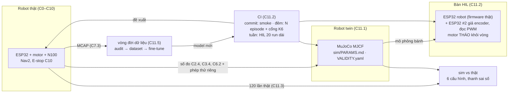

# Chặng 11 — Sim twin, HIL, CI, vòng đời dữ liệu (92h + 20h tùy chọn)

> **Vị trí:** C10 (E-stop cứng, state machine, soak 72h) → **C11** → C12 (sản phẩm) · **Cần trước:** K7 C10 (bắt buộc: chạy thật hàng trăm lần trong văn phòng có người); K6 trọn (Bài 1–19 + Gate); → F6.1–F6.6, F2.6, F2.7, F2.8; số đo của C2.4, C3.4, C4.2, C6.2, C7.3, C8.5, C9.2 · **Chạy song song với:** không (sau K6)
> **Làm ra được:** bàn HIL (ESP32 robot thật + ESP32 thứ hai giả encoder, đọc PWM thật, motor tháo khỏi vòng), robot twin MuJoCo dựng từ số đo, 120+ lần chạy thật có ghi chép · `sim/PARAMS.md` có nguồn gốc từng tham số, `VALIDITY.yaml` của robot, CI nightly ba trạng thái + ERROR, đồ thị sim–thật 6 cấu hình có thanh sai số, một vòng fine-tune có lineage đầy đủ · **Sau chặng này bạn quyết định được:** sim của robot này được phép phán quyết loại thay đổi nào và không được phép phán quyết loại nào; cái gì chạy mỗi commit, mỗi đêm, mỗi tuần; controller Nav2 nào, có lý do bằng số; một model mới được triển khai hay báo INCONCLUSIVE.

K6 dựng toàn bộ máy móc đánh giá trên robot giả lập: determinism, kịch bản là dữ liệu, power analysis, cổng regression ba trạng thái có biên δ, bảng hiệu lực theo kênh, chống Goodhart. F6 và F2 cho lý thuyết: V&V, nhận dạng hệ thống, X-in-the-loop. Chặng này **không dạy lại** những thứ đó. Nó đem chúng ra dùng trên một con robot mà bạn tự hàn từng mối nối, và hỏi câu mà K6 Bài 15 để dành cho Khóa 7 (mức đo thứ 4, "chuyển giao hiệu năng"): **phán quyết trong sim có dự đoán được kết quả ngoài văn phòng không?** Mọi bench test bạn để lại từ C0 đến C10 với nhãn "hạt giống HIL cho C11" được thu hoạch ở đây.

**Phân bổ 92h lõi + 20h tùy chọn** `[ước lượng]`:

| Phần | Giờ | Trong đó lắp/chạy thật |
|---|---|---|
| Bài C11.1 Model sim khớp robot thật | 20 | ~8 (phép thử riêng cho I_z, trễ, hãm; 4 hiện tượng × 10 lần × 2 tốc độ × 2 sàn) |
| Bài C11.2 HIL và CI cho hành vi robot | 24 | ~8 (bàn HIL, đo trễ vòng tròn, máy CI) |
| Bài C11.3 ★ Sim có dự đoán được thực tế không | 16 | ~8 (120 lần chạy thật) |
| Bài C11.4 Controller tầng giữa: đo MPC mua được gì | 12 | ~4 (60 lần chạy thật, đo CPU trên N100) |
| Bài C11.5 Vòng đời dữ liệu đầy đủ và fine-tune | 20 | ~6 (thu dữ liệu, thuê GPU nếu cần, triển khai lại) |
| Gate chặng 11 (= GATE 7E và gate Khóa 7 phần sim/CI) | trong giờ các bài | — |
| **Tổng lõi** | **92** | |
| Bài C11.6 Dự đoán quỹ đạo người *(tùy chọn)* | 20 | ~8 (thu quỹ đạo người, chạy lại C11.4) |

Đường lõi tối thiểu của K7 (`_KE-HOACH-K7.md` mục 3) chỉ giữ C11.1–C11.3 (60h). C11.3 là tiêu chí ★: nếu chỉ còn sức cho một bài, làm nó, kể cả với một sim còn thô.

## 0. Bức tranh chặng

Robot sau chặng này trông y như sau C10. Thứ mới là **ba bản sao** của nó và một vòng khép kín nối chúng:



Dòng điện mới duy nhất của chặng nằm trên **bàn HIL**: hai ESP32 cấp từ USB, chung GND, tín hiệu 3,3 V; driver motor không nối. Dòng dữ liệu mới: kịch bản → episode sim/HIL → MCAP + một dòng summary mỗi episode → cổng regression của K6 Bài 13 → báo cáo; và lần chạy thật → `data/c11/real_runs.csv` → đồ thị sim–thật.

## 1. An toàn của chặng

**Rủi ro của C11:** robot chạy **hàng trăm lần** trong văn phòng có người (C11.3: 6 × 20; C11.4: 3 × 20), nhiều lần với cấu hình cố ý xấu (giới hạn gia tốc cao, inflation nhỏ, controller lỡ chu kỳ); bàn HIL có hai đầu ra số có thể "đánh nhau" trên cùng một chân; compute quá tải trên N100 làm controller chạy bằng lệnh cũ; dữ liệu có mặt người bị đưa lên GPU thuê.

**Quy tắc cứng:**
- KHÔNG chạy thật bất kỳ cấu hình nào khi Gate chặng 10 chưa PASS (E-stop cứng, bumper, watchdog độc lập đã đo thời gian phản ứng).
- KHÔNG chạy thật cấu hình chưa qua sim CI và chưa qua 20 run HIL không có lỗi mới. Đây là thứ tự của CI, không phải gợi ý.
- KHÔNG nới kẹp tốc độ firmware (C4.4) để "thử cho nhanh". Mọi cấu hình Nav2 ở C11.3–C11.4 chạy **dưới** kẹp đó; kẹp là trần, cấu hình chỉ được thấp hơn.
- KHÔNG chạy loạt thật khi không có người cầm điều khiển E-stop trong tầm với, mắt nhìn robot. Một người, một robot, không làm việc khác.
- KHÔNG chạy loạt thật trong giờ có khách, trẻ em, người dùng xe lăn/gậy ở khu vực thử, trừ khi đã có thỏa thuận và kịch bản riêng. Thông báo trước cho đồng nghiệp theo `PRIVACY.md` (C9.1): thời gian, khu vực, camera ghi gì.
- KHÔNG nối ESP32 #2 vào chân encoder của ESP32 robot khi đầu nối encoder của motor thật **còn cắm** vào chân đó. Rút JST encoder motor trước, rồi mới cắm dây giả lập. Hai đầu ra đẩy–kéo nối nhau là chập qua chân GPIO.
- KHÔNG cấp nguồn driver motor trên bàn HIL. Tháo dây PWM/DIR khỏi driver (hoặc tháo driver); PWM chỉ đi vào ESP32 #2. "Motor giả" nghĩa là **không có motor nào quay**.
- KHÔNG đưa ảnh/video có mặt người lên GPU thuê hoặc dịch vụ ngoài khi người đó chưa đồng ý lớp dùng-cho-huấn-luyện (C9.1, C9.3). Mặc định của C11.5 là fine-tune trên dữ liệu **không có người**.

**Khi sự cố xảy ra:**

| Sự cố | Làm ngay | KHÔNG |
|---|---|---|
| Robot không dừng khi controller lỡ chu kỳ, hoặc đi lệch về phía người | E-stop. Ghi `run_id`, thời điểm, cấu hình | Đuổi theo robot bằng tay; chạy tiếp cấu hình đó "xem có lặp lại không" |
| Robot chạm người/vật (dù nhẹ) | E-stop. Hỏi người. Dừng **cả loạt** của cấu hình đó, ghi `incidents.md` (C10.2) | Coi là "một lần thất bại" rồi chạy tiếp; xóa run khỏi dữ liệu |
| ESP32 trên bàn HIL nóng, mùi khét | Rút cả hai USB | Rút một cái rồi đo tiếp |
| N100 nhiệt cao, hạ xung khi chạy perception + MPPI | Dừng loạt, ghi nhiệt và tần số CPU | Tháo nắp, thổi quạt bàn rồi chạy tiếp như cũ (đổi điều kiện giữa loạt) |

## 2. BOM chặng

Chặng này gần như toàn phần mềm. Giá `[ước lượng 10/2026]`, kiểm lại.

| Món | Thông số phải chọn | Vì sao (bằng số) | Giá | Kiểm khi nhận | Thay thế được bằng |
|---|---|---|---|---|---|
| ESP32-S3 DevKitC-1 thứ hai | Cùng model với con robot | Đã mua ở C4 làm dự phòng; ở đây là "thế giới" của bàn HIL | 0 (đã có) | Nạp blink | Bất kỳ S3 nào, bảng chân làm lại |
| Adapter USB–UART cho cổng HIL | 3,3 V, ≥ 921 600 baud ổn định; biết chip (FT232R/CP2102/CH340) | Gói 16 byte hai chiều ở 921 600 baud ≈ 0,35 ms; nhưng adapter có thể giữ gói tới **latency timer** (FTDI mặc định 16 ms `[spec — FTDI AN232B-04; tự đo trên máy bạn]`) | 50–150k | Loopback TX–RX, đo trễ bằng logic analyzer | USB native của ESP32 #2 làm cầu nối |
| Dây Dupont cái–cái, header, băng nhãn | 10–20 sợi, màu theo C0.5 | Bàn HIL đi dây tạm, phải tháo lắp nhiều lần | 30–50k | Thông mạch | JST-XH bấm sẵn (C0.3) |
| Thước dây 5 m, băng dính sàn, thước đo góc hoặc vạch 360° dán sàn | ±1 mm, ±1° | Ba đường của C11.1; lần chạy thật C11.3 | 50–150k | So hai thước | Marker C8 làm trọng tài |
| Dây và móc treo con lắc hai dây | Dây không giãn ~1 m, hai móc trên xà chắc | I_z không nhận dạng được từ phép quay đều (C11.1) | 30–80k | Treo vật mẫu biết I_z | Phép thử bước góc vòng hở (C11.1) |
| Máy chạy CI | ≥ 8 nhân **vật lý**, 16 GB RAM, Docker | 1000 episode/giờ cần L/W ≥ 0,28 episode/s (C11.2); N100 có 4 nhân, không HT `[spec — Intel ARK]`, và đang là máy của robot | 0 nếu có desktop; thuê VM ~0,3–1 USD/giờ `[ước lượng]` | `lscpu`, chạy thử 50 episode | Chạy đêm trên N100 khi robot sạc (chậm, chỉ để smoke) |
| GPU thuê (C11.5, nếu fine-tune model ảnh) | Theo cỡ model; vài giờ | N100 không train được model ảnh trong thời gian hợp lý (K4 Bài 11) | ~0,3–2 USD/giờ `[ước lượng]` | Chạy thử 1 epoch nhỏ | Không fine-tune model ảnh; chọn ứng viên không cần GPU (C11.5) |

**Tổng C11 `[ước lượng]`:** 0,2–0,5tr phần cứng; phần thuê máy tùy bạn chọn, ghi vào `decisions.md`.

## 3. Dụng cụ và kỹ năng tay

| Kỹ năng | Bài | Luyện trước | Đạt trông thế nào |
|---|---|---|---|
| Đo trễ vòng tròn bằng GPIO + logic analyzer (marker lên khi gửi, xuống khi nhận) | C11.2 | Loopback UART thuần trên ESP32 #2 | Histogram trễ có ≥ 10⁵ mẫu; p50, p99, max; không rớt mẫu (sigrok báo) |
| Đi dây bàn HIL hai MCU chung GND | C11.2 | Một kênh quadrature trước, so PCNT với số xung đã phát | Số đếm PCNT khớp số xung phát ±0 ở tốc độ thấp |
| Con lắc hai dây | C11.1 | Treo một hộp đồng chất biết I_z | I_z hộp mẫu lệch < 5 % so với công thức |
| Thả trôi có đánh dấu | C11.1 | Ba lần ở 0,1 m/s | Điểm lệnh và điểm dừng có băng dính, ảnh, ±5 mm |
| Chạy loạt thật có kỷ luật | C11.3 | 5 lần cấu hình baseline | Mỗi lần một dòng `real_runs.csv` ngay sau khi chạy, không ghi bù cuối buổi |

## 4. Sơ đồ đi dây

Chỉ bàn HIL có dây mới. Tên chân bên ESP32 robot lấy từ `firmware/PINS.md` (C4.1); bên ESP32 #2 bạn tự chọn và ghi vào `hil/PINS_HIL.md`.

```
  HOST (máy CI) ── USB ──► ESP32 #2 "THẾ GIỚI"           ESP32 ROBOT (DUT, firmware thật) ◄── USB native ── HOST
                          (nhận vận tốc bánh từ sim,       (kênh ros2_control như trên robot)
                           phát quadrature, đo PWM)
     ┌──────────────────────────────────────────────────────────────────────────────┐
     │ ESP32 #2 GPIO (3,3 V)   ──[dây vàng/xanh lá]──►  ENC_L_A, ENC_L_B (DUT, PCNT)   │  JST encoder motor
     │ ESP32 #2 GPIO (3,3 V)   ──[dây vàng/xanh lá]──►  ENC_R_A, ENC_R_B (DUT, PCNT)   │  ĐÃ RÚT khỏi DUT
     │ ESP32 #2 capture/PCNT   ◄──[dây xanh dương]───  PWM_L, DIR_L, PWM_R, DIR_R (DUT) │  Driver motor
     │ ESP32 #2 GPIO           ──[dây trắng]────────►  BUMPER, ESTOP_SENSE (DUT)       │  KHÔNG cấp nguồn
     │ GND ════════════════════[đen, ngắn]═══════════  GND                              │
     └──────────────────────────────────────────────────────────────────────────────┘
  Cổng PIL tùy chọn (C11.2 mức 1): USB–UART ──► UART riêng của DUT (TX/RX/GND), KHÔNG dùng chung UART0 console.
  Marker đo trễ: GPIO_MARK của DUT ──► logic analyzer CH0;  GPIO_MARK của #2 ──► CH1;  GND chung.
```

| Tín hiệu | Từ → tới | Mức | Vì sao |
|---|---|---|---|
| Quadrature giả (A/B mỗi bánh) | #2 → DUT, đúng chân PCNT của C4 | 3,3 V đẩy–kéo | PCNT, bộ lọc glitch và xử lý tràn của DUT nằm **trong** vòng (→ F2.7 mục 5) |
| PWM/DIR | DUT → #2 | 3,3 V | Đo duty thật bằng capture, không tin giá trị DUT "kể" qua UART |
| Bumper, E-stop sense | #2 → DUT | 3,3 V, đúng cực tính C10.1 | Kịch bản failsafe C4.4/C10.2 chạy được trên bàn |
| GND | chung, một điểm | — | Không có GND chung thì mức logic không xác định |

Tốc độ phát xung cần có: ở 0,5 m/s và 0,108 mm/count (C3, ví dụ 1:56, bánh 85 mm) là ~4.600 count/s mỗi bánh, tức một cạnh mỗi ~216 µs. Phát bằng ngoại vi (RMT hoặc MCPWM) thay vì vòng `delay` `[tự đo — API theo bản ESP-IDF]`.

## 5. Trình tự chặng

1. **Học Bài C11.1** phần 1–5, commit `prediction.md`.
2. **Lắp bước 1 — Phép thử riêng cho tham số ẩn** (chi tiết ở C11.1 bước 2): con lắc hai dây cho I_z (nếu C2.4 chưa làm); trễ lệnh→bánh bằng GPIO + logic analyzer trên bàn; thả trôi và phanh với **bánh nhấc khỏi sàn** rồi **trên sàn**.
   - ✅ Checkpoint trước khi treo: robot **không** có pin thật và mini PC thật (thay vật giả cùng khối lượng như C2); dây chịu ≥ 3 lần trọng lượng; móc trên xà đã thử treo.
   - Nếu sai: không treo; dùng phép thử bước góc vòng hở (C11.1) thay cho con lắc.
3. **Lắp bước 2 — Bốn hiện tượng × ba đường** trên sàn gạch và thảm (C11.1 bước 3–6).
   - ✅ Checkpoint trước mỗi buổi: E-stop C10 thử một lần, ghi sổ; pin trong dải điện áp đã khai trong `prediction.md`.
4. **Học Bài C11.2**, commit `prediction.md`.
5. **Lắp bước 3 — Bàn HIL** theo mục 4.
   - ✅ Checkpoint trước khi cắm USB lần đầu: driver motor không có nguồn; JST encoder motor đã rút khỏi DUT; thông mạch GND giữa hai bo kêu; giữa 3V3 và GND mỗi bo **không** kêu.
   - ✅ Checkpoint chức năng: phát đúng 10.000 xung A/B ở 100 Hz; PCNT của DUT đọc đúng 10.000 (40.000 nếu đếm 4x); ở tốc độ tối đa, so với logic analyzer.
   - Nếu sai: số đếm thiếu ở tốc độ cao → bộ lọc glitch của PCNT đặt quá dài (C3.3); số đếm ngược dấu → đảo A/B.
6. **Lắp bước 4 — Máy CI và tầng đêm** (C11.2 bước 3–6).
7. **Học Bài C11.3**, commit dự đoán **và** khai báo trước 6 cấu hình, n, phương pháp phân tích.
8. **Lắp bước 5 — 120 lần chạy thật** theo lịch xen kẽ (C11.3 bước 4).
   - ✅ Checkpoint mỗi lần: người cầm E-stop; cấu hình đang nạp khớp `config_hash` trong `real_runs.csv`.
9. **Học Bài C11.4**, 60 lần chạy thật (cùng quy tắc bước 8).
10. **Học Bài C11.5**: một vòng dữ liệu đầy đủ, một fine-tune, triển khai lại qua CI.
11. *(Tùy chọn)* **Bài C11.6.**
12. **Gate chặng 11.**

## 6. Lỗi người mới hay gặp

| Triệu chứng | Nguyên nhân khả dĩ | Kiểm bằng cách | Sửa |
|---|---|---|---|
| Sim quay tại chỗ chậm hơn động học ~25 % dù dt nhỏ | Hệ số ma sát tiếp xúc của caster bị lấy theo **max** của hai geom (sàn μ = 1), caster cày sàn | Script verification C11.1; đọc `friction`/`priority` trong XML reference | `priority` cho caster (C11.1 phần 2) |
| PCNT trên bàn HIL đếm thiếu ở tốc độ cao | Phát xung bằng vòng lặp phần mềm; bộ lọc glitch dài hơn nửa chu kỳ xung | Logic analyzer trên chân DUT | Phát bằng RMT/MCPWM; chỉnh lọc theo C3.3 |
| Run HIL nào cũng ERROR "lỡ hạn" dù p99 trễ chỉ vài ms | Đuôi phân bố trễ + run dài (C11.2 phần 2); latency timer adapter | Đếm lỡ hạn theo tick, không chỉ p99 | Latency timer 1 ms, host yên tĩnh, hoặc chia run |
| Kết quả CI đổi khi đổi số worker | Seed dùng chung, wall time thay sim time | Cùng kịch bản L=1 và L=4, so hash | K6 Bài 3 (seed dẫn xuất), `use_sim_time` |
| 6 điểm sim–thật "không tương quan" | n = 20 không đủ phân biệt 6 cấu hình gần nhau | Phân tích power ở C11.3 **trước** khi chạy thật | Chọn cấu hình trải rộng hơn; hoặc báo INCONCLUSIVE |
| Fine-tune "cải thiện" rõ trên test nhưng không thấy ngoài đời | Chia train/test theo lần chạy, không theo phiên | C11.5 phần 2 | Chia theo phiên/người/ngày |

## 7. Lăng kính data infra

**Dữ liệu chặng này sinh ra:**

| Luồng | File | Schema (rút gọn) | Tần số | Ghi chú |
|---|---|---|---|---|
| Tham số twin | `sim/PARAMS.md` + `sim/params.yaml` | `name, value, unit, std, method, conditions, measured_at, calibration_id, status` (`MEASURED`/`FITTED`/`ASSUMED`) | khi đo lại | Kéo từ `hw/robot_params.yaml` (C2.4), `calib/motors.yaml`, `calib/deadband.yaml` (C3), `calib/umbmark.yaml` (C6.2) bằng script, **không chép tay** |
| Bảng hiệu lực robot | `sim/VALIDITY.yaml` | Như K6 Bài 17 (kênh, điểm đã đo, gap, u_val, `depends_on`) | khi đo thêm | Checker `b17_validity.py` của K6 dùng lại nguyên |
| Summary episode sim/HIL | `ci/runs/<run_id>/summary.parquet` | `episode_id, scenario_id, parent_scenario_id, seed, arm, tier (sil/hil), success, failure_class, t_goal_s, min_dist_m, jerk_p95, deadline_miss, validity_flag, config_hash, sim_params_hash, firmware_version` | 1 dòng/episode | Schema tầng summary K6 Bài 9 + 4 cột mới |
| Lần chạy thật | `data/c11/real_runs.csv` | `run_id, ts, config_id, config_hash, scenario_id, operator, floor, v_bat_start_V, success, failure_class, t_goal_s, estop_used, people_present, mcap, note` | 1 dòng/lần | Ghi ngay sau lần chạy |
| Trễ cổng HIL | `hil/latency/*.sr` + histogram CSV | `k, t_send_s, t_recv_s, rtt_s, seq_ok` | mỗi build | SI, `s` |
| Lineage vòng dữ liệu | `lineage/*.json` | `artifact_id, kind, content_hash, parents[], producer, params_hash, created_at` | mỗi artifact | → F3.8 |

**Test tự động thu hoạch ở chặng này** (hạt giống các chặng trước để lại; tên test giữ nguyên tên chặng gốc đặt):

| Hạt giống | Từ | Chạy ở tầng nào của C11.2 |
|---|---|---|
| `bench_encoder_count` (PCNT vs logic analyzer) | C3 | HIL: #2 phát số xung biết trước, oracle là chính số xung đã phát |
| `test_jitter`, `test_protocol_fuzz`, `test_failsafe_*` | C4 | HIL mỗi build firmware; fuzz và failsafe chạy được cả SIL (code C biên dịch cho host) |
| Golden replay odometry, metamorphic trái–phải | C6 | Mỗi commit (SIL, tất định) |
| UMBmark trong sim với tham số nhiễu | C6 | Mỗi tuần; so `E_max,syst` sim với `calib/umbmark.yaml` |
| Bốn kịch bản ép hỏng Nav2, rule vật lý trên session | C8 | Đêm (SIL) + dữ liệu thật mỗi session |
| `test_decision_replay`, `test_no_image_topics`, `test_delete_e2e` | C9 | Mỗi commit / mỗi MCAP mới / mỗi tuần trên robot thật |
| Đo sụt áp mối nối ở dòng cố định | C0 | Không tự động ở C11 (cần nguồn lập trình được); ghi vào "chưa tự động hóa" |

**SLI của chặng:** thời gian một đêm CI; tỉ lệ episode ERROR (harness hỏng) tách khỏi INCONCLUSIVE; tỉ lệ kịch bản OUT/UNTESTED; độ trễ "lần chạy thật → dòng trong `real_runs.csv`"; thời gian "kết thúc thí nghiệm → link Foxglove" (C11.5).

**Vai trò nghề:** Simulation & Evaluation (C11.1, C11.3), Test & Validation (C11.2, C11.4), Data Platform + MLOps nhẹ (C11.5). Bốn ô mà phụ lục K7 gốc mục 4 gọi là đích của bạn đều nằm trong chặng này.

## 8. Nhật ký build

Copy vào `build-log/c11.md`:

```markdown
## 2026-MM-DD — buổi N (giờ thực: _._ h) · bài C11.x
- Trạng thái người: tỉnh táo / mệt (mệt → không chạy loạt thật; chỉ đọc kết quả CI)
- Mục tiêu buổi:
- Cấu hình/commit đang thử: config_hash ___ · sim_params_hash ___ · firmware ___
- Chạy thật: số lần ___ ; E-stop dùng ___ lần ; người có mặt: có/không
- Số đo (đã vào real_runs.csv / measurements.jsonl? số dòng ___)
- Dự đoán đã commit trước dữ liệu? hash ___
- Lỗi gặp (triệu chứng → nguyên nhân → sửa):
- Quyết định (→ decisions.md):
- Suýt sự cố:
- Câu hỏi còn mở:
```

---
