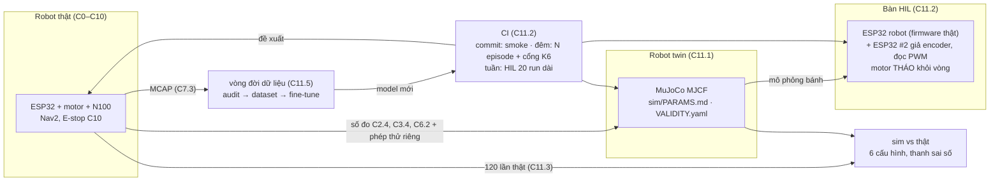
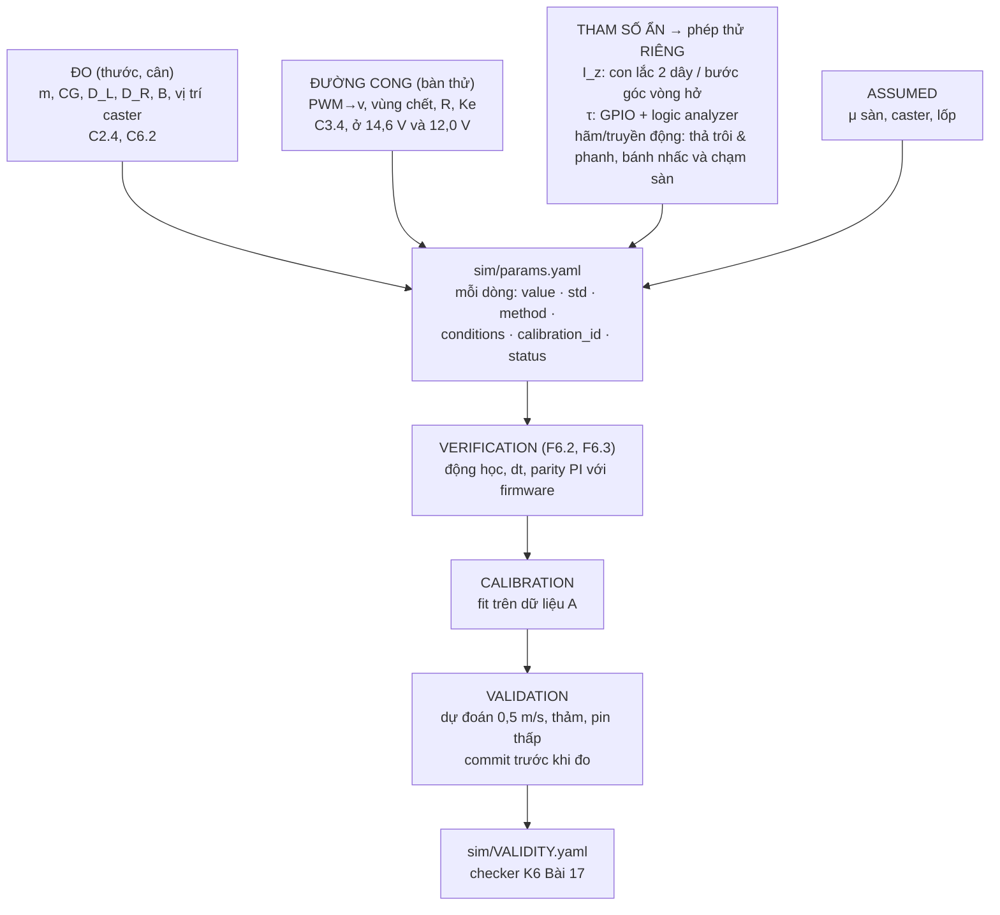

# Chặng 11 — Sim twin, HIL, CI, vòng đời dữ liệu (92h + 20h tùy chọn)

> **Vị trí:** C10 (E-stop cứng, state machine, soak 72h) → **C11** → C12 (sản phẩm) · **Cần trước:** K7 C10 (bắt buộc: chạy thật hàng trăm lần trong văn phòng có người); K6 trọn (Bài 1–19 + Gate); → F6.1–F6.6, F2.6, F2.7, F2.8; số đo của C2.4, C3.4, C4.2, C6.2, C7.3, C8.5, C9.2 · **Chạy song song với:** không (sau K6)
> **Làm ra được:** bàn HIL (ESP32 robot thật + ESP32 thứ hai giả encoder, đọc PWM thật, motor tháo khỏi vòng), robot twin MuJoCo dựng từ số đo, 120+ lần chạy thật có ghi chép · `sim/PARAMS.md` có nguồn gốc từng tham số, `VALIDITY.yaml` của robot, CI nightly ba trạng thái + ERROR, đồ thị sim–thật 6 cấu hình có thanh sai số, một vòng fine-tune có lineage đầy đủ · **Sau chặng này bạn quyết định được:** sim của robot này được phép phán quyết loại thay đổi nào và không được phép phán quyết loại nào; cái gì chạy mỗi commit, mỗi đêm, mỗi tuần; controller Nav2 nào, có lý do bằng số; một model mới được triển khai hay báo INCONCLUSIVE.

K6 dựng toàn bộ máy móc đánh giá trên robot giả lập: determinism, kịch bản là dữ liệu, power analysis, cổng regression ba trạng thái có biên δ, bảng hiệu lực theo kênh, chống Goodhart. F6 và F2 cho lý thuyết: V&V, nhận dạng hệ thống, X-in-the-loop. Chặng này **không dạy lại** những thứ đó. Nó đem chúng ra dùng trên một con robot mà bạn tự hàn từng mối nối, và hỏi câu mà K6 Bài 15 để dành cho Khóa 7 (mức đo thứ 4, "chuyển giao hiệu năng"): **phán quyết trong sim có dự đoán được kết quả ngoài văn phòng không?** Mọi bench test bạn để lại từ C0 đến C10 với nhãn "hạt giống HIL cho C11" được thu hoạch ở đây.

**Phân bổ 92h lõi + 20h tùy chọn** `[ước lượng]`:

| Phần | Giờ | Trong đó lắp/chạy thật |
|---|---|---|
| Bài C11.1 Model sim khớp robot thật | 20 | ~8 (phép thử riêng cho I_z, trễ, hãm; 4 hiện tượng × 10 lần × 2 tốc độ × 2 sàn) |
| Bài C11.2 HIL và CI cho hành vi robot | 24 | ~8 (bàn HIL, đo trễ vòng tròn, máy CI) |
| Bài C11.3 ★ Sim có dự đoán được thực tế không | 16 | ~8 (120 lần chạy thật) |
| Bài C11.4 Controller tầng giữa: đo MPC mua được gì | 12 | ~4 (60 lần chạy thật, đo CPU trên N100) |
| Bài C11.5 Vòng đời dữ liệu đầy đủ và fine-tune | 20 | ~6 (thu dữ liệu, thuê GPU nếu cần, triển khai lại) |
| Gate chặng 11 (= GATE 7E và gate Khóa 7 phần sim/CI) | trong giờ các bài | — |
| **Tổng lõi** | **92** | |
| Bài C11.6 Dự đoán quỹ đạo người *(tùy chọn)* | 20 | ~8 (thu quỹ đạo người, chạy lại C11.4) |

Đường lõi tối thiểu của K7 (`_KE-HOACH-K7.md` mục 3) chỉ giữ C11.1–C11.3 (60h). C11.3 là tiêu chí ★: nếu chỉ còn sức cho một bài, làm nó, kể cả với một sim còn thô.

## 0. Bức tranh chặng

Robot sau chặng này trông y như sau C10. Thứ mới là **ba bản sao** của nó và một vòng khép kín nối chúng:



Dòng điện mới duy nhất của chặng nằm trên **bàn HIL**: hai ESP32 cấp từ USB, chung GND, tín hiệu 3,3 V; driver motor không nối. Dòng dữ liệu mới: kịch bản → episode sim/HIL → MCAP + một dòng summary mỗi episode → cổng regression của K6 Bài 13 → báo cáo; và lần chạy thật → `data/c11/real_runs.csv` → đồ thị sim–thật.

## 1. An toàn của chặng

**Rủi ro của C11:** robot chạy **hàng trăm lần** trong văn phòng có người (C11.3: 6 × 20; C11.4: 3 × 20), nhiều lần với cấu hình cố ý xấu (giới hạn gia tốc cao, inflation nhỏ, controller lỡ chu kỳ); bàn HIL có hai đầu ra số có thể "đánh nhau" trên cùng một chân; compute quá tải trên N100 làm controller chạy bằng lệnh cũ; dữ liệu có mặt người bị đưa lên GPU thuê.

**Quy tắc cứng:**
- KHÔNG chạy thật bất kỳ cấu hình nào khi Gate chặng 10 chưa PASS (E-stop cứng, bumper, watchdog độc lập đã đo thời gian phản ứng).
- KHÔNG chạy thật cấu hình chưa qua sim CI và chưa qua 20 run HIL không có lỗi mới. Đây là thứ tự của CI, không phải gợi ý.
- KHÔNG nới kẹp tốc độ firmware (C4.4) để "thử cho nhanh". Mọi cấu hình Nav2 ở C11.3–C11.4 chạy **dưới** kẹp đó; kẹp là trần, cấu hình chỉ được thấp hơn.
- KHÔNG chạy loạt thật khi không có người cầm điều khiển E-stop trong tầm với, mắt nhìn robot. Một người, một robot, không làm việc khác.
- KHÔNG chạy loạt thật trong giờ có khách, trẻ em, người dùng xe lăn/gậy ở khu vực thử, trừ khi đã có thỏa thuận và kịch bản riêng. Thông báo trước cho đồng nghiệp theo `PRIVACY.md` (C9.1): thời gian, khu vực, camera ghi gì.
- KHÔNG nối ESP32 #2 vào chân encoder của ESP32 robot khi đầu nối encoder của motor thật **còn cắm** vào chân đó. Rút JST encoder motor trước, rồi mới cắm dây giả lập. Hai đầu ra đẩy–kéo nối nhau là chập qua chân GPIO.
- KHÔNG cấp nguồn driver motor trên bàn HIL. Tháo dây PWM/DIR khỏi driver (hoặc tháo driver); PWM chỉ đi vào ESP32 #2. "Motor giả" nghĩa là **không có motor nào quay**.
- KHÔNG đưa ảnh/video có mặt người lên GPU thuê hoặc dịch vụ ngoài khi người đó chưa đồng ý lớp dùng-cho-huấn-luyện (C9.1, C9.3). Mặc định của C11.5 là fine-tune trên dữ liệu **không có người**.

**Khi sự cố xảy ra:**

| Sự cố | Làm ngay | KHÔNG |
|---|---|---|
| Robot không dừng khi controller lỡ chu kỳ, hoặc đi lệch về phía người | E-stop. Ghi `run_id`, thời điểm, cấu hình | Đuổi theo robot bằng tay; chạy tiếp cấu hình đó "xem có lặp lại không" |
| Robot chạm người/vật (dù nhẹ) | E-stop. Hỏi người. Dừng **cả loạt** của cấu hình đó, ghi `incidents.md` (C10.2) | Coi là "một lần thất bại" rồi chạy tiếp; xóa run khỏi dữ liệu |
| ESP32 trên bàn HIL nóng, mùi khét | Rút cả hai USB | Rút một cái rồi đo tiếp |
| N100 nhiệt cao, hạ xung khi chạy perception + MPPI | Dừng loạt, ghi nhiệt và tần số CPU | Tháo nắp, thổi quạt bàn rồi chạy tiếp như cũ (đổi điều kiện giữa loạt) |

## 2. BOM chặng

Chặng này gần như toàn phần mềm. Giá `[ước lượng 10/2026]`, kiểm lại.

| Món | Thông số phải chọn | Vì sao (bằng số) | Giá | Kiểm khi nhận | Thay thế được bằng |
|---|---|---|---|---|---|
| ESP32-S3 DevKitC-1 thứ hai | Cùng model với con robot | Đã mua ở C4 làm dự phòng; ở đây là "thế giới" của bàn HIL | 0 (đã có) | Nạp blink | Bất kỳ S3 nào, bảng chân làm lại |
| Adapter USB–UART cho cổng HIL | 3,3 V, ≥ 921 600 baud ổn định; biết chip (FT232R/CP2102/CH340) | Gói 16 byte hai chiều ở 921 600 baud ≈ 0,35 ms; nhưng adapter có thể giữ gói tới **latency timer** (FTDI mặc định 16 ms `[spec — FTDI AN232B-04; tự đo trên máy bạn]`) | 50–150k | Loopback TX–RX, đo trễ bằng logic analyzer | USB native của ESP32 #2 làm cầu nối |
| Dây Dupont cái–cái, header, băng nhãn | 10–20 sợi, màu theo C0.5 | Bàn HIL đi dây tạm, phải tháo lắp nhiều lần | 30–50k | Thông mạch | JST-XH bấm sẵn (C0.3) |
| Thước dây 5 m, băng dính sàn, thước đo góc hoặc vạch 360° dán sàn | ±1 mm, ±1° | Ba đường của C11.1; lần chạy thật C11.3 | 50–150k | So hai thước | Marker C8 làm trọng tài |
| Dây và móc treo con lắc hai dây | Dây không giãn ~1 m, hai móc trên xà chắc | I_z không nhận dạng được từ phép quay đều (C11.1) | 30–80k | Treo vật mẫu biết I_z | Phép thử bước góc vòng hở (C11.1) |
| Máy chạy CI | ≥ 8 nhân **vật lý**, 16 GB RAM, Docker | 1000 episode/giờ cần L/W ≥ 0,28 episode/s (C11.2); N100 có 4 nhân, không HT `[spec — Intel ARK]`, và đang là máy của robot | 0 nếu có desktop; thuê VM ~0,3–1 USD/giờ `[ước lượng]` | `lscpu`, chạy thử 50 episode | Chạy đêm trên N100 khi robot sạc (chậm, chỉ để smoke) |
| GPU thuê (C11.5, nếu fine-tune model ảnh) | Theo cỡ model; vài giờ | N100 không train được model ảnh trong thời gian hợp lý (K4 Bài 11) | ~0,3–2 USD/giờ `[ước lượng]` | Chạy thử 1 epoch nhỏ | Không fine-tune model ảnh; chọn ứng viên không cần GPU (C11.5) |

**Tổng C11 `[ước lượng]`:** 0,2–0,5tr phần cứng; phần thuê máy tùy bạn chọn, ghi vào `decisions.md`.

## 3. Dụng cụ và kỹ năng tay

| Kỹ năng | Bài | Luyện trước | Đạt trông thế nào |
|---|---|---|---|
| Đo trễ vòng tròn bằng GPIO + logic analyzer (marker lên khi gửi, xuống khi nhận) | C11.2 | Loopback UART thuần trên ESP32 #2 | Histogram trễ có ≥ 10⁵ mẫu; p50, p99, max; không rớt mẫu (sigrok báo) |
| Đi dây bàn HIL hai MCU chung GND | C11.2 | Một kênh quadrature trước, so PCNT với số xung đã phát | Số đếm PCNT khớp số xung phát ±0 ở tốc độ thấp |
| Con lắc hai dây | C11.1 | Treo một hộp đồng chất biết I_z | I_z hộp mẫu lệch < 5 % so với công thức |
| Thả trôi có đánh dấu | C11.1 | Ba lần ở 0,1 m/s | Điểm lệnh và điểm dừng có băng dính, ảnh, ±5 mm |
| Chạy loạt thật có kỷ luật | C11.3 | 5 lần cấu hình baseline | Mỗi lần một dòng `real_runs.csv` ngay sau khi chạy, không ghi bù cuối buổi |

## 4. Sơ đồ đi dây

Chỉ bàn HIL có dây mới. Tên chân bên ESP32 robot lấy từ `firmware/PINS.md` (C4.1); bên ESP32 #2 bạn tự chọn và ghi vào `hil/PINS_HIL.md`.

```
  HOST (máy CI) ── USB ──► ESP32 #2 "THẾ GIỚI"           ESP32 ROBOT (DUT, firmware thật) ◄── USB native ── HOST
                          (nhận vận tốc bánh từ sim,       (kênh ros2_control như trên robot)
                           phát quadrature, đo PWM)
     ┌──────────────────────────────────────────────────────────────────────────────┐
     │ ESP32 #2 GPIO (3,3 V)   ──[dây vàng/xanh lá]──►  ENC_L_A, ENC_L_B (DUT, PCNT)   │  JST encoder motor
     │ ESP32 #2 GPIO (3,3 V)   ──[dây vàng/xanh lá]──►  ENC_R_A, ENC_R_B (DUT, PCNT)   │  ĐÃ RÚT khỏi DUT
     │ ESP32 #2 capture/PCNT   ◄──[dây xanh dương]───  PWM_L, DIR_L, PWM_R, DIR_R (DUT) │  Driver motor
     │ ESP32 #2 GPIO           ──[dây trắng]────────►  BUMPER, ESTOP_SENSE (DUT)       │  KHÔNG cấp nguồn
     │ GND ════════════════════[đen, ngắn]═══════════  GND                              │
     └──────────────────────────────────────────────────────────────────────────────┘
  Cổng PIL tùy chọn (C11.2 mức 1): USB–UART ──► UART riêng của DUT (TX/RX/GND), KHÔNG dùng chung UART0 console.
  Marker đo trễ: GPIO_MARK của DUT ──► logic analyzer CH0;  GPIO_MARK của #2 ──► CH1;  GND chung.
```

| Tín hiệu | Từ → tới | Mức | Vì sao |
|---|---|---|---|
| Quadrature giả (A/B mỗi bánh) | #2 → DUT, đúng chân PCNT của C4 | 3,3 V đẩy–kéo | PCNT, bộ lọc glitch và xử lý tràn của DUT nằm **trong** vòng (→ F2.7 mục 5) |
| PWM/DIR | DUT → #2 | 3,3 V | Đo duty thật bằng capture, không tin giá trị DUT "kể" qua UART |
| Bumper, E-stop sense | #2 → DUT | 3,3 V, đúng cực tính C10.1 | Kịch bản failsafe C4.4/C10.2 chạy được trên bàn |
| GND | chung, một điểm | — | Không có GND chung thì mức logic không xác định |

Tốc độ phát xung cần có: ở 0,5 m/s và 0,108 mm/count (C3, ví dụ 1:56, bánh 85 mm) là ~4.600 count/s mỗi bánh, tức một cạnh mỗi ~216 µs. Phát bằng ngoại vi (RMT hoặc MCPWM) thay vì vòng `delay` `[tự đo — API theo bản ESP-IDF]`.

## 5. Trình tự chặng

1. **Học Bài C11.1** phần 1–5, commit `prediction.md`.
2. **Lắp bước 1 — Phép thử riêng cho tham số ẩn** (chi tiết ở C11.1 bước 2): con lắc hai dây cho I_z (nếu C2.4 chưa làm); trễ lệnh→bánh bằng GPIO + logic analyzer trên bàn; thả trôi và phanh với **bánh nhấc khỏi sàn** rồi **trên sàn**.
   - ✅ Checkpoint trước khi treo: robot **không** có pin thật và mini PC thật (thay vật giả cùng khối lượng như C2); dây chịu ≥ 3 lần trọng lượng; móc trên xà đã thử treo.
   - Nếu sai: không treo; dùng phép thử bước góc vòng hở (C11.1) thay cho con lắc.
3. **Lắp bước 2 — Bốn hiện tượng × ba đường** trên sàn gạch và thảm (C11.1 bước 3–6).
   - ✅ Checkpoint trước mỗi buổi: E-stop C10 thử một lần, ghi sổ; pin trong dải điện áp đã khai trong `prediction.md`.
4. **Học Bài C11.2**, commit `prediction.md`.
5. **Lắp bước 3 — Bàn HIL** theo mục 4.
   - ✅ Checkpoint trước khi cắm USB lần đầu: driver motor không có nguồn; JST encoder motor đã rút khỏi DUT; thông mạch GND giữa hai bo kêu; giữa 3V3 và GND mỗi bo **không** kêu.
   - ✅ Checkpoint chức năng: phát đúng 10.000 xung A/B ở 100 Hz; PCNT của DUT đọc đúng 10.000 (40.000 nếu đếm 4x); ở tốc độ tối đa, so với logic analyzer.
   - Nếu sai: số đếm thiếu ở tốc độ cao → bộ lọc glitch của PCNT đặt quá dài (C3.3); số đếm ngược dấu → đảo A/B.
6. **Lắp bước 4 — Máy CI và tầng đêm** (C11.2 bước 3–6).
7. **Học Bài C11.3**, commit dự đoán **và** khai báo trước 6 cấu hình, n, phương pháp phân tích.
8. **Lắp bước 5 — 120 lần chạy thật** theo lịch xen kẽ (C11.3 bước 4).
   - ✅ Checkpoint mỗi lần: người cầm E-stop; cấu hình đang nạp khớp `config_hash` trong `real_runs.csv`.
9. **Học Bài C11.4**, 60 lần chạy thật (cùng quy tắc bước 8).
10. **Học Bài C11.5**: một vòng dữ liệu đầy đủ, một fine-tune, triển khai lại qua CI.
11. *(Tùy chọn)* **Bài C11.6.**
12. **Gate chặng 11.**

## 6. Lỗi người mới hay gặp

| Triệu chứng | Nguyên nhân khả dĩ | Kiểm bằng cách | Sửa |
|---|---|---|---|
| Sim quay tại chỗ chậm hơn động học ~25 % dù dt nhỏ | Hệ số ma sát tiếp xúc của caster bị lấy theo **max** của hai geom (sàn μ = 1), caster cày sàn | Script verification C11.1; đọc `friction`/`priority` trong XML reference | `priority` cho caster (C11.1 phần 2) |
| PCNT trên bàn HIL đếm thiếu ở tốc độ cao | Phát xung bằng vòng lặp phần mềm; bộ lọc glitch dài hơn nửa chu kỳ xung | Logic analyzer trên chân DUT | Phát bằng RMT/MCPWM; chỉnh lọc theo C3.3 |
| Run HIL nào cũng ERROR "lỡ hạn" dù p99 trễ chỉ vài ms | Đuôi phân bố trễ + run dài (C11.2 phần 2); latency timer adapter | Đếm lỡ hạn theo tick, không chỉ p99 | Latency timer 1 ms, host yên tĩnh, hoặc chia run |
| Kết quả CI đổi khi đổi số worker | Seed dùng chung, wall time thay sim time | Cùng kịch bản L=1 và L=4, so hash | K6 Bài 3 (seed dẫn xuất), `use_sim_time` |
| 6 điểm sim–thật "không tương quan" | n = 20 không đủ phân biệt 6 cấu hình gần nhau | Phân tích power ở C11.3 **trước** khi chạy thật | Chọn cấu hình trải rộng hơn; hoặc báo INCONCLUSIVE |
| Fine-tune "cải thiện" rõ trên test nhưng không thấy ngoài đời | Chia train/test theo lần chạy, không theo phiên | C11.5 phần 2 | Chia theo phiên/người/ngày |

## 7. Lăng kính data infra

**Dữ liệu chặng này sinh ra:**

| Luồng | File | Schema (rút gọn) | Tần số | Ghi chú |
|---|---|---|---|---|
| Tham số twin | `sim/PARAMS.md` + `sim/params.yaml` | `name, value, unit, std, method, conditions, measured_at, calibration_id, status` (`MEASURED`/`FITTED`/`ASSUMED`) | khi đo lại | Kéo từ `hw/robot_params.yaml` (C2.4), `calib/motors.yaml`, `calib/deadband.yaml` (C3), `calib/umbmark.yaml` (C6.2) bằng script, **không chép tay** |
| Bảng hiệu lực robot | `sim/VALIDITY.yaml` | Như K6 Bài 17 (kênh, điểm đã đo, gap, u_val, `depends_on`) | khi đo thêm | Checker `b17_validity.py` của K6 dùng lại nguyên |
| Summary episode sim/HIL | `ci/runs/<run_id>/summary.parquet` | `episode_id, scenario_id, parent_scenario_id, seed, arm, tier (sil/hil), success, failure_class, t_goal_s, min_dist_m, jerk_p95, deadline_miss, validity_flag, config_hash, sim_params_hash, firmware_version` | 1 dòng/episode | Schema tầng summary K6 Bài 9 + 4 cột mới |
| Lần chạy thật | `data/c11/real_runs.csv` | `run_id, ts, config_id, config_hash, scenario_id, operator, floor, v_bat_start_V, success, failure_class, t_goal_s, estop_used, people_present, mcap, note` | 1 dòng/lần | Ghi ngay sau lần chạy |
| Trễ cổng HIL | `hil/latency/*.sr` + histogram CSV | `k, t_send_s, t_recv_s, rtt_s, seq_ok` | mỗi build | SI, `s` |
| Lineage vòng dữ liệu | `lineage/*.json` | `artifact_id, kind, content_hash, parents[], producer, params_hash, created_at` | mỗi artifact | → F3.8 |

**Test tự động thu hoạch ở chặng này** (hạt giống các chặng trước để lại; tên test giữ nguyên tên chặng gốc đặt):

| Hạt giống | Từ | Chạy ở tầng nào của C11.2 |
|---|---|---|
| `bench_encoder_count` (PCNT vs logic analyzer) | C3 | HIL: #2 phát số xung biết trước, oracle là chính số xung đã phát |
| `test_jitter`, `test_protocol_fuzz`, `test_failsafe_*` | C4 | HIL mỗi build firmware; fuzz và failsafe chạy được cả SIL (code C biên dịch cho host) |
| Golden replay odometry, metamorphic trái–phải | C6 | Mỗi commit (SIL, tất định) |
| UMBmark trong sim với tham số nhiễu | C6 | Mỗi tuần; so `E_max,syst` sim với `calib/umbmark.yaml` |
| Bốn kịch bản ép hỏng Nav2, rule vật lý trên session | C8 | Đêm (SIL) + dữ liệu thật mỗi session |
| `test_decision_replay`, `test_no_image_topics`, `test_delete_e2e` | C9 | Mỗi commit / mỗi MCAP mới / mỗi tuần trên robot thật |
| Đo sụt áp mối nối ở dòng cố định | C0 | Không tự động ở C11 (cần nguồn lập trình được); ghi vào "chưa tự động hóa" |

**SLI của chặng:** thời gian một đêm CI; tỉ lệ episode ERROR (harness hỏng) tách khỏi INCONCLUSIVE; tỉ lệ kịch bản OUT/UNTESTED; độ trễ "lần chạy thật → dòng trong `real_runs.csv`"; thời gian "kết thúc thí nghiệm → link Foxglove" (C11.5).

**Vai trò nghề:** Simulation & Evaluation (C11.1, C11.3), Test & Validation (C11.2, C11.4), Data Platform + MLOps nhẹ (C11.5). Bốn ô mà phụ lục K7 gốc mục 4 gọi là đích của bạn đều nằm trong chặng này.

## 8. Nhật ký build

Copy vào `build-log/c11.md`:

```markdown
## 2026-MM-DD — buổi N (giờ thực: _._ h) · bài C11.x
- Trạng thái người: tỉnh táo / mệt (mệt → không chạy loạt thật; chỉ đọc kết quả CI)
- Mục tiêu buổi:
- Cấu hình/commit đang thử: config_hash ___ · sim_params_hash ___ · firmware ___
- Chạy thật: số lần ___ ; E-stop dùng ___ lần ; người có mặt: có/không
- Số đo (đã vào real_runs.csv / measurements.jsonl? số dòng ___)
- Dự đoán đã commit trước dữ liệu? hash ___
- Lỗi gặp (triệu chứng → nguyên nhân → sửa):
- Quyết định (→ decisions.md):
- Suýt sự cố:
- Câu hỏi còn mở:
```

---

## Bài C11.1 — Model sim khớp robot thật (20h)

> **Vị trí:** C10 → **C11.1** → C11.2 (HIL, CI) và C11.3 (sim dự đoán thực tế) · **Cần trước:** → F6.1, F6.2, F6.3, F6.4, F6.6, F1.6; K6 Bài 15–17 (ba đường, phần G "fit ở một điểm, dự đoán điểm khác", u_val, bảng hiệu lực và checker); K7 C2.4 (`hw/robot_params.yaml`), C3.4 (`calib/deadband.yaml`, `calib/motors.yaml`), C4.2 (PI, trễ θ), C6.2 (`calib/umbmark.yaml`) · **Sau bài này bạn quyết định được:** sim này được dùng để phán quyết loại thay đổi nào (tốc độ nào, sàn nào, mức pin nào), và tham số nào phải có phép thử riêng trước khi tin nó.

### 1. Câu chuyện — ai đã khổ vì chuyện này

Mùa hè 1901, anh em Wright bay thử tàu lượn thứ hai ở Kitty Hawk. Lực nâng chỉ khoảng một phần ba con số họ tính từ bảng của Otto Lilienthal. Bảng đó dùng **hệ số Smeaton**, một hằng số của công thức lực khí động được đo từ năm 1759 và dùng suốt hơn trăm năm với giá trị khoảng 0,005. Hằng số có nguồn gốc, có tên tuổi, có trong sách. Vấn đề là bay thử không tách được nó khỏi hệ số nâng của cánh: tàu lượn chỉ cho ra một con số tổng là "nâng kém". Mùa thu năm đó họ dựng một ống gió nhỏ trong xưởng xe đạp, đo riêng từng thứ trên các mẫu cánh, và ra hệ số Smeaton gần 0,0033 `[chuẩn — lịch sử anh em Wright, ví dụ tài liệu giáo dục của NASA Glenn Research Center về ống gió Wright 1901; con số làm tròn]`. Tàu lượn 1902 bay đúng như tính.

Bài học không phải "số trong sách sai". Bài học là: **phép thử toàn hệ không nhận dạng được tham số bên trong**; tham số nào phép thử toàn hệ không nhìn thấy thì phải có một đồ gá riêng cho nó. Robot của bạn có đúng ba tham số như vậy (F6.4 đã chỉ ra khi chấm bản Gemini): quán tính quay I_z, trễ lệnh→bánh, và cách robot dừng (hãm của driver cộng ma sát hệ truyền động). Bài này dựng "ống gió" cho từng cái, và cho thấy bốn hiện tượng của bản gốc nhìn thấy gì, không nhìn thấy gì.

### 2. Mô hình tư duy



Bốn ý bản chất:

1. **Phép thử vòng kín che vật lý bên trong.** "Đi thẳng 5 m" và "quay 360°" chạy qua PI của firmware và giới hạn gia tốc. PI bù gần hết ma sát, khối lượng, hằng số motor; kết quả còn lại chủ yếu là hình học (D, B) và giới hạn controller. Khớp 5 % ở hai phép thử này nói rằng hình học và controller trong sim đúng. Nó **không** nói gì về động lực học.
2. **Mỗi tham số ẩn có phép thử riêng, và phép thử đó phải có độ nhạy với nó.** Chạy mô phỏng dưới đây trước khi đọc tiếp: nó tính, cho sáu phép thử, kết quả đổi bao nhiêu phần trăm khi mỗi tham số tăng 10 %. Ô gần 0 nghĩa là phép thử đó **mù** với tham số đó; fit tham số đó từ phép thử đó là chọn số tùy ý.
3. **Verification trước, fit sau.** Một sim chưa qua kiểm động học có thể có lỗi lớn hơn mọi gap vật lý bạn định đo, và không ai thấy vì không có gì crash. Bước 0 của phần 6 có một ví dụ thật, đã chạy.
4. **Tham số mang theo điều kiện đo** (→ F6.1). Đường cong PWM→v của C3.4 đo ở 14,6 V và 12,0 V; ma sát truyền động đo khi hộp số nguội; μ sàn đo trên gạch sạch. Sim dựng từ các số đó chỉ đúng trong **giao** các điều kiện ấy. Đó là nội dung của `VALIDITY.yaml`, không phải phần ghi chú.

```python
# [đã chạy] C11.1 — phép thử nào "nhìn thấy" tham số nào? Độ nhạy chuẩn hóa của 6 phép thử
import numpy as np
P0 = dict(m=4.5, Iz=0.07, g=2.1, ke=17.0, b=0.3, fc=0.25, tau=0.02)   # đồ chơi, KHÔNG phải robot bạn
B, DT, CPC = 0.25, 0.001, 0.108e-3          # khoảng cách bánh, bước sim, m/count (C3: 1:56, 85 mm)

def run(p, test, T=12.0):
    v = w = x = th = 0.0; lag = int(round(p["tau"] / DT)); buf = [(0.0, 0.0, "drive")] * (lag + 1)
    cL = cR = 0; iL = iR = 0.0; uL = uR = 0.0; mode = "drive"; vref = 0.0; out = []
    for k in range(int(T / DT)):
        t = k * DT
        if k % 10 == 0:                                   # firmware 100 Hz: PI bánh trên encoder lượng tử
            nL, nR = int((x - th * B / 2) / CPC), int((x + th * B / 2) / CPC)
            mL, mR = (nL - cL) * CPC / 0.01, (nR - cR) * CPC / 0.01; cL, cR = nL, nR
            tgt = {"thang": 0.3, "quay": 0.15, "buoc": 0.3, "coast": 0.5, "brake": 0.5}.get(test, 0)
            vref = min(tgt, vref + 0.5 * 0.01) if test != "buoc" else tgt       # giới hạn gia tốc 0.5 m/s²
            sL, sR = (-vref, vref) if test == "quay" else (vref, vref)
            iL += (sL - mL) * 0.01; iR += (sR - mR) * 0.01
            uL = np.clip(p["ke"] * sL + 20 * (sL - mL) + 150 * iL, -12, 12)   # feedforward + PI
            uR = np.clip(p["ke"] * sR + 20 * (sR - mR) + 150 * iR, -12, 12)
            if test in ("coast", "brake") and t >= 4.0: mode = test             # lệnh dừng ở t = 4 s
            if test == "xoay_hở": uL, uR = (-6.0, 6.0) if t >= 0.5 else (0.0, 0.0)
        buf.append((uL, uR, mode)); aL, aR, md = buf.pop(0)                   # trễ actuator thuần
        vl, vr = v - w * B / 2, v + w * B / 2
        FL, FR = [(p["g"] * (u - p["ke"] * s) if md == "drive" else 0.0 if md == "coast"
                   else -p["g"] * p["ke"] * s) for u, s in ((aL, vl), (aR, vr))]
        v += DT * ((FL + FR) / p["m"] - p["b"] * v - p["fc"] * np.tanh(v / 1e-3))
        w += DT * ((B / 2) * (FR - FL) / p["Iz"] - p["m"] * (B / 2) * (p["fc"] * np.tanh(w / 1e-2) + p["b"] * w * B / 2) / p["Iz"])
        x += v * DT; th += w * DT; out.append((t, x, v, th, w))
    return np.array(out)

def observe(p, test):
    o = run(p, test, 20.0 if test == "thang" else 12.0); t, x, v, th, w = o.T
    if test == "thang":  return t[np.argmax(x >= 5.0)]                        # thời gian đi 5 m
    if test == "quay":   return t[np.argmax(th >= 2 * np.pi)]                 # thời gian quay 360°
    if test in ("coast", "brake"): return x[-1] - x[t >= 4.0][0]              # quãng dừng sau lệnh
    if test == "buoc":   return v[t < 2].max() / 0.3 - 1                      # vọt lố
    if test == "xoay_hở": return w[np.argmax(t >= 0.6)]                        # ω sau 100 ms vòng hở

tests = ["thang", "quay", "coast", "brake", "buoc", "xoay_hở"]
y0 = {s: observe(P0, s) for s in tests}
print(f"{'phép thử':8s} {'y0':>8s} " + " ".join(f"{k:>6s}" for k in P0))
for s in tests:
    row = []
    for k in P0:
        p = dict(P0); p[k] *= 1.10
        row.append(100 * (observe(p, s) - y0[s]) / abs(y0[s]))
    print(f"{s:8s} {y0[s]:8.3f} " + " ".join(f"{r:+6.1f}" for r in row))
```

Mô hình đồ chơi: lực mỗi bánh `g·(u − ke·v_bánh)` khi driver dẫn (back-EMF tạo ra "ma sát nhớt điện"), bằng 0 khi thả trôi (coast, driver hở), bằng `−g·ke·v_bánh` khi phanh (brake, ngắn mạch hai cực motor, → C3.2); cộng ma sát lăn/truyền động `b·v + f_c·sgn(v)`; trễ thuần τ; PI 100 Hz trên encoder lượng tử 0,108 mm/count. "xoay_hở" là phép thử thêm: bước điện áp ngược chiều hai bánh, **không** qua PI, đo tốc độ góc sau 100 ms bằng gyro.

### 3. Cầu nối từ backend

| Backend bạn biết | Ở đây | Gãy ở chỗ | Nếu dùng nhầm thì |
|---|---|---|---|
| Mock server dựng từ traffic ghi lại | Sim dựng từ số đo C2–C6 | Mock **phát lại** phản hồi đã ghi, không ngoại suy được. Sim **sinh** phản hồi từ phương trình nên ngoại suy được, nhưng chỉ trong miền dạng phương trình còn đúng | Coi sim như mock: chỉ test lại đúng các ca đã đo. Coi sim như prod: tin cả kết quả trên thảm khi mới đo trên gạch |
| E2E test qua API công khai: đo latency tổng, không thấy bên trong | "Đi thẳng 5 m", "quay 360°" qua PI firmware | E2E backend còn có trace để thấy từng span. Vòng kín vật lý **hấp thụ** sai số bên trong: PI tăng duty bù ma sát sai, kết quả cuối vẫn khớp | Báo "sim khớp <5 %" trong khi ma sát, I_z, trễ trong sim có thể sai gấp đôi. Lộ ra khi đổi controller (C11.4) |
| Config có version, parity dev/prod | `params.yaml` có `calibration_id`, kéo tự động từ file hiệu chuẩn | Config phần mềm đứng yên tới khi ai đó đổi. Tham số vật lý **tự trôi**: motor nóng, lốp mòn, pin tụt áp | Kiểm parity một lần. Ba tháng sau sim khớp một robot không còn tồn tại |
| Differential test hai bản implement | PI trong sim vs PI firmware chạy trên cùng chuỗi encoder đã ghi | Hai bên khác ngôn ngữ, khác kiểu số (float32 trên ESP32 vs float64), khác cách chia Δt | Sim dùng PI "gần giống". Đáp ứng bước lệch vì code khác, bạn đi chỉnh ma sát để bù lỗi code |

**Chấm mô hình:**

- *"Sim khớp cả bốn hiện tượng của bản gốc trong ngưỡng, vậy sim đúng."* → **SAI.** Hai trong bốn hiện tượng chạy vòng kín và gần như mù với động lực học (phần 7 có số). Phản ví dụ: trong mô phỏng ở phần 2, tăng ma sát, khối lượng hay trễ 10 % không đổi thời gian đi 5 m và thời gian quay 360° tới 0,1 %. Hai phép thử đó vẫn đáng làm, nhưng để kiểm **hình học và controller**, và phải ghi đúng như vậy trong `VALIDITY.yaml`.
- *Bản Gemini K7 Bài 18: fit ma sát, I_z, trễ "cho tới khi đường cong khớp" từ bốn phép thử.* Đã chấm ở → F6.4 mục 6 (khẳng định (a), **ĐÚNG MỘT PHẦN**). Không chấm lại; bài này biến ba chỗ gãy F6.4 chỉ ra thành ba phép thử riêng ở phần 6 bước 2.
- *Mô hình của bạn ở K3 lượt 12:* "có đủ dữ liệu trong thời gian dài thì mọi công thức vật lý gần như là hằng số, tầng AI biểu diễn và dự đoán được." → **ĐÚNG MỘT PHẦN.** Đúng: đủ dữ liệu thì ước lượng được tham số, đó là nhận dạng hệ thống. Gãy ở chỗ "đủ dữ liệu" phải là dữ liệu **có độ nhạy** với tham số. Phản ví dụ: hàng nghìn giờ log robot đi theo Nav2 (vòng kín, quay đều) không chứa thông tin nào về I_z, vì cột I_z trong bảng độ nhạy của các phép thử vòng kín bằng 0. Thêm dữ liệu cùng loại không đổi số 0 đó.

### 4. Thuật ngữ

| Mức | Thuật ngữ | Nghĩa trong một câu | Hay bị hiểu nhầm thành |
|---|---|---|---|
| 🟢 | Độ nhạy chuẩn hóa | % đổi của kết quả khi tham số đổi 1 % (hoặc 10 %) | Hệ số tương quan |
| 🟢 | Nhận dạng được (identifiability) | Dữ liệu có đủ thông tin để tách riêng từng tham số | "Fit hội tụ là tham số đúng" |
| 🟢 | Vòng hở / vòng kín | Lệnh đi thẳng tới actuator / lệnh qua bộ điều khiển có phản hồi | Hai cách chạy cho cùng thông tin |
| 🟢 | Coast / brake (thả trôi / phanh) | Driver hở mạch motor / ngắn mạch motor, dòng phanh tạo hãm | Hai tên của "dừng" |
| 🟢 | `status` của tham số | `MEASURED` / `FITTED` / `ASSUMED`, quyết định tham số vào cột nào của `VALIDITY.yaml` | Chú thích tùy chọn |
| 🟡 | `armature`, `damping`, `frictionloss` (MuJoCo, ở joint) | Quán tính rotor quy đổi, ma sát nhớt, ma sát khô của khớp | Ma sát bánh–sàn |
| 🟡 | `priority` của geom (MuJoCo) | Geom ưu tiên cao quyết định tham số tiếp xúc; cùng ưu tiên thì lấy max | Tham số hiệu năng |
| 🟡 | Tín hiệu kích thích (PRBS, multistep) | Lệnh thiết kế để làm lộ động lực ở nhiều tần số (→ F6.4) | Bước đơn là đủ |
| 🔴 | `solref`/`solimp`, mô hình lốp | Độ mềm tiếp xúc trong solver | Núm vặn đầu tiên khi sai |

### 5. Dự đoán

**Đề A — bảng độ nhạy (laptop, 30 phút).** Trước khi chạy code ở phần 2, đánh dấu vào bảng 6 phép thử × 7 tham số: ô nào ≈ 0, ô nào lớn nhất mỗi hàng, và **dấu** của ô (m, τ) ở hàng "buoc" (vọt lố). Thêm một câu: muốn biết I_z, chỉ dùng phép thử nào được, và nó lẫn với tham số nào?

**Đề B — robot thật.** Tính bằng công thức cho 0,3 và 0,5 m/s:

| Tham số cần tra | Tra ở đâu |
|---|---|
| m, CG, D_L, D_R, B hiệu dụng, I_z (nếu đã treo ở C2.4) | `hw/robot_params.yaml` (C2.4), `calib/umbmark.yaml` (C6.2) |
| Vùng chết, độ dốc PWM→v mỗi motor, mỗi chiều, ở 14,6 V và 12,0 V | `calib/deadband.yaml` (C3.4) |
| R, Ke, cpr | `calib/motors.yaml` (C3.1, C3.3) |
| Kp, Ki, lọc vận tốc, giới hạn gia tốc, kẹp tốc độ, chế độ PWM của driver (drive/brake hay drive/coast) | Firmware C4 (git hash), C3.2, YAML `diff_drive_controller` |
| Chế độ dừng khi lệnh = 0 và khi mất heartbeat | C3.2 (bảng logic driver), C4.4 |

Công thức: đi thẳng 5 m với trần gia tốc a: `t ≈ 5/v + v/(2a) + τ`; quay tại chỗ, hai bánh ±v_w: `t_360 = π·B/v_w`; thả trôi từ v₀ (Coulomb + nhớt): `S = v₀·τ + (1/b)·[v₀ − (f_c/b)·ln(1 + b·v₀/f_c)]`; phanh ngắn mạch: thêm hãm nhớt `g·ke/m` cho mỗi bánh vào b.

**Đoán thêm:** (a) quãng dừng **brake** hay **coast** ngắn hơn, gấp mấy lần; (b) sau khi fit thả trôi ở 0,1–0,3 m/s, dự đoán ở 0,5 m/s lệch về phía nào nếu bạn chỉ fit một dạng ma sát; (c) trên thảm, hiện tượng nào hỏng trước; (d) chạy script verification ở phần 6 bước 0: quay tại chỗ trong sim chậm hơn động học bao nhiêu % ở dt = 2 ms, và giảm dt có sửa được không.

```markdown
# prediction.md — K7 C11.1
commit trước khi chạy sim và trước khi đo: <hash>
## A. Bảng độ nhạy: ô ≈ 0 ___ ; lớn nhất mỗi hàng ___ ; dấu (buoc, m) ___ (buoc, tau) ___
   I_z nhìn thấy bởi ___ , lẫn với ___
## B. Ba đường (công thức)
| hiện tượng | 0.3 m/s | 0.5 m/s | công thức | tham số dùng (calibration_id) |
|---|---|---|---|---|
| đi thẳng 5 m | | | | |
| quay 360° | | | | |
| quãng dừng coast / brake | | | | |
| bước 0→0.3: vọt lố, t_xác lập | | | | |
- brake/coast: ___ lần ; 0.5 m/s lệch về phía ___ vì ___ ; thảm hỏng trước ở ___
- verification dt=2 ms: quay chậm hơn ___ % ; giảm dt sửa được? ___
```

### 6. Làm

Giữ đủ sáu bước của bản gốc; thêm bước 0 (verification) và bước 2 (phép thử riêng). Mọi phép đo thật ghi sai số dụng cụ.

**Bước 0 — `PARAMS.md`, verification.** Viết script kéo tham số từ các file hiệu chuẩn (C2.4, C3, C6.2) vào `sim/params.yaml`; tham số không truy được nguồn mang `status: ASSUMED` và tự vào cột "chưa kiểm". Rồi ba kiểm verification, **trước** khi fit:
- *Động học* (→ F6.2 mục 9): lệnh tốc độ bánh không đổi; ở trạng thái xác lập, chuyển động thân phải khớp động học tính từ góc bánh trong sim. Script dưới đây làm việc đó và quét dt.
- *Hội tụ timestep* (→ F6.3 mục 9): nếu chênh giữa dt = 2 ms và 1 ms nhỏ hơn 1/10 gap sim–thật, dt không phải nút cần vặn.
- *Parity PI*: lấy một log C4/C6 (lệnh + encoder), cho PI của sim chạy trên đúng chuỗi encoder đó, so chuỗi duty với duty firmware đã ghi; phải trùng tới mức lượng tử PWM. Cách sạch nhất: biên dịch đúng file C của firmware thành thư viện, gọi từ Python (→ F2.4, differential test). Đây cũng là SIL của C11.2.

```python
# [đã chạy] (mujoco 3.15.0 — kiểm theo bản bạn cài) Verification robot twin TRƯỚC khi fit bất cứ gì:
# lệnh tốc độ bánh không đổi; ở trạng thái xác lập (giây cuối), so chuyển động thân với động học
# tính từ GÓC BÁNH THẬT trong sim: đi thẳng Δx vs R·Δφ_tb, quay Δθ vs R·(Δφ_R−Δφ_L)/B. Quét timestep.
import numpy as np, mujoco
R, B, M = 0.0425, 0.25, 4.5          # bánh 85 mm, khoảng cách bánh, khối lượng: lấy từ hw/robot_params.yaml
XML = """<mujoco><option timestep="DT" integrator="implicitfast"/>
<worldbody><geom type="plane" size="20 20 .1" friction="1 0.005 0.0001"/>
 <body pos="0 0 RR"><freejoint/>
  <geom type="box" size=".15 .12 .03" pos="-.05 0 .03" mass="MM"/>
  <body pos="0 HB 0"><joint name="jl" type="hinge" axis="0 1 0" damping="0.001" armature="0.003"/>
   <geom type="cylinder" size="RR .012" euler="90 0 0" mass=".1"/></body>
  <body pos="0 -HB 0"><joint name="jr" type="hinge" axis="0 1 0" damping="0.001" armature="0.003"/>
   <geom type="cylinder" size="RR .012" euler="90 0 0" mass=".1"/></body>
  <geom type="sphere" size=".015" pos="-.18 0 CZ" mass=".02" friction="0.02 0 0" PRIO/>
 </body></worldbody>
<actuator><velocity joint="jl" kv="5"/><velocity joint="jr" kv="5"/></actuator></mujoco>"""

def build(dt, prio):
    return (XML.replace("DT", str(dt)).replace("RR", str(R)).replace("MM", str(M)).replace("HB", str(B / 2))
            .replace("CZ", str(-R + 0.015)).replace("PRIO", 'priority="1"' if prio else ""))

def yaw(q):
    w, x, y, z = q; return np.arctan2(2 * (w * z + x * y), 1 - 2 * (y * y + z * z))

def slip(dt, prio, vl, vr, T=4.0):
    m = mujoco.MjModel.from_xml_string(build(dt, prio)); d = mujoco.MjData(m)
    d.ctrl[:] = [vl / R, vr / R]; th = prev = 0.0; rec = []
    for _ in range(int(T / dt)):
        mujoco.mj_step(m, d); y = yaw(d.qpos[3:7]); th += (y - prev + np.pi) % (2 * np.pi) - np.pi; prev = y
        rec.append((d.qpos[0], th, d.qpos[7], d.qpos[8]))
    a, b = np.array(rec[-int(1 / dt)]), np.array(rec[-1]); dl, dr = b[2] - a[2], b[3] - a[3]
    if vl == vr: return 100 * ((b[0] - a[0]) / (R * (dl + dr) / 2) - 1)
    return 100 * ((b[1] - a[1]) / (R * (dr - dl) / B) - 1)

print("caster priority   dt(ms)   trượt đi thẳng   trượt quay tại chỗ")
for prio in (False, True):
    for dt in (0.004, 0.002, 0.001):
        print(f"{str(prio):15s} {dt*1e3:6.1f}   {slip(dt, prio, .3, .3):+13.2f}%   {slip(dt, prio, -.15, .15):+16.2f}%")
```

`armature` không phải để cho đẹp: quán tính rotor quy đổi qua hộp số (J_rotor·N²) lớn hơn nhiều quán tính bánh, và thiếu nó thì actuator `velocity` với bánh nhẹ làm sim mất ổn định ngay bước đầu (đã thử). Giá trị 0,003 kg·m² là `ASSUMED` cho tới khi bạn có J_rotor từ datasheet motor hoặc từ phép thử vòng hở bánh nhấc.

**Bước 1 — MJCF từ `params.yaml`.** Sinh MJCF bằng template (như `build()` ở trên), không sửa tay số trong XML. Geom va chạm đơn giản (cylinder/sphere/box), quán tính từ `params.yaml`, caster có `priority`. Actuator: thay `velocity` bằng `motor` (mô-men) và đặt PI firmware, bù vùng chết, lọc vận tốc, chu kỳ 10 ms, giới hạn gia tốc trong Python, như mô hình đồ chơi ở phần 2. MuJoCo không có trễ thuần cho actuator; dùng ring buffer lệnh dài τ/Δt (thuộc tính `dyntype` là trễ bậc nhất, không phải trễ thuần `[tự đo — XML reference theo bản cài]`).

**Bước 2 — ba phép thử riêng cho ba tham số ẩn.**
- **I_z.** Con lắc hai dây theo C2.4 bước 6 (công thức và điều kiện an toàn ở đó). Nếu không treo được: phép thử "xoay_hở" ở phần 2 trên robot thật, gyro IMU (C7) ở ≥ 200 Hz, nhiều biên độ điện áp; nhớ I_z lẫn với g/ke trong phép thử này, nên g và ke phải đến từ C3 trước.
- **Trễ τ lệnh→bánh.** Trên bàn (bánh nhấc), firmware bật GPIO_MARK đúng lúc ghi duty mới; logic analyzer ghi GPIO_MARK và kênh A encoder; τ = từ cạnh marker tới khi khoảng giữa hai cạnh encoder bắt đầu ngắn lại. Đo cả trễ host→ESP32 (lệnh `/cmd_vel` → khung serial → duty) bằng marker phía host nếu có (C4.3). Độ phân giải: 24 MHz → ~42 ns, không còn là giới hạn; giới hạn là định nghĩa "bắt đầu đổi".
- **Hãm và ma sát truyền động.** Bốn tổ hợp: {bánh nhấc, trên sàn} × {coast, brake}, mỗi tổ hợp thả từ 0,1 / 0,2 / 0,3 m/s, ghi encoder 100 Hz. Bánh nhấc tách ma sát hộp số + motor khỏi lăn trên sàn; coast vs brake tách hãm điện của driver khỏi ma sát. Fit **cả đường cong** v(t), so ít nhất hai dạng (nhớt thuần; Coulomb + nhớt), báo residual và độ lệch chuẩn tham số (→ F6.4). Giữ 0,5 m/s ra ngoài, không fit.

**Bước 3 — ba đường × bốn hiện tượng** (bảng gốc, thêm dụng cụ và sai số):

| Hiện tượng | Tính | Đo thật | Sim | Dụng cụ, sai số; **kiểm gì** |
|---|---|---|---|---|
| Đi thẳng 5 m: thời gian, sai lệch ngang | Từ vận tốc đặt, trần gia tốc | Như C6.2 | Chạy sim | Thời gian từ timestamp nguồn ESP32 trong MCAP (10 ms), không bấm đồng hồ tay; sai lệch ngang ±2 mm bằng thước hoặc marker C8. **Kiểm hình học + controller** |
| Quay tại chỗ 360°: thời gian, sai lệch góc | `π·B/v_w` | Vạch 360° trên sàn, ±1°; gyro z | Chạy sim | **Kiểm B + controller**; không nhìn thấy I_z |
| Quãng đường dừng từ 0,5 m/s | Công thức phần 5, **khai báo chế độ dừng** | Băng dính tại điểm lệnh (LED bật cùng lệnh, quay video) và điểm dừng, ±5 mm | Chạy sim | **Kiểm hãm/ma sát** (coast) hoặc giới hạn giảm tốc (dừng có điều khiển). Đừng báo khớp ở chế độ có điều khiển như thể đã khớp ma sát |
| Đáp ứng bước vận tốc: vọt lố, t_xác lập | Từ PI, τ | Như C4.2 | Chạy sim | Lượng tử vận tốc 0,108 mm/count ÷ 10 ms = 10,8 mm/s/count (~3,6 % ở 0,3 m/s); cửa sổ trượt như C4.2. **Kiểm τ, g, ke, m** (chúng lẫn nhau, xem bảng độ nhạy) |

Mỗi phép đo thật lặp ≥ 10 lần, báo trung vị và độ trải. **Ngưỡng "lệch < 5 %" chỉ có nghĩa khi độ trải giữa các lần chạy thật nhỏ hơn 5 %**; nếu không, báo gap kèm độ trải và u_val (K6 Bài 15). Ghi `v_bat` đầu và cuối mỗi lần.

**Bước 4 — system identification theo thứ tự.** Hình học (đo) → đường cong motor (C3) → τ (bàn) → hãm/ma sát (bước 2) → I_z (treo hoặc vòng hở). Không chỉnh tay từng núm; mỗi tham số fit từ phép thử có độ nhạy lớn nhất với nó và nhỏ với phần còn lại.

**Bước 5 — kiểm chéo.** Đóng băng tham số. Dự đoán bốn hiện tượng ở 0,5 m/s, ở **pin thấp** (gần 12,0 V, đầu dưới của dải C3 đã đo) và trên **thảm**, commit, rồi mới đo (phương pháp phần G của K6 Bài 16).

**Bước 6 — `VALIDITY.yaml` theo kênh.** Kênh của robot (gợi ý): `hinh_hoc` (D, B), `controller` (PI, giới hạn), `truyen_dong_tha_troi`, `ham_driver`, `quay_quan_tinh` (I_z), `tre_lenh`, `lan_san` (theo loại sàn), `dien_ap_pin`. Mỗi kịch bản Nav2 khai `depends_on`; checker `b17_validity.py` của K6 Bài 17 gắn cờ IN/OUT/UNTESTED. Chạy lại bốn hiện tượng trên thảm với **cùng** bộ tham số, ghi vào bảng.

### 7. Số phải ra

<details><summary>🔒 MỞ SAU KHI COMMIT prediction.md</summary>

**Ngưỡng của bản gốc (giữ nguyên):**

| Kiểm tra | Ngưỡng sau khi fit | Cách đọc thêm |
|---|---|---|
| Đi thẳng: thời gian | Lệch < 5 % | Khi độ trải thật < 5 %; kiểm hình học + controller, không phải động lực học |
| Quay 360°: thời gian | Lệch < 5 % | Như trên |
| Quãng đường dừng | Lệch < 15 % — **ma sát là chỗ khó khớp nhất** | Khai báo chế độ dừng |
| Đáp ứng bước | Hình dạng khớp, vọt lố lệch < 20 % | Sau khi có τ từ bàn |
| Ngoại suy sang tốc độ chưa fit | Lệch nhỏ nếu mô hình đúng dạng; **lệch lớn là một phát hiện đáng viết** | |
| Trên thảm vs sàn cứng | Một bộ tham số **không khớp được cả hai** — ghi vào bảng hiệu lực | Kênh `lan_san` có hai điểm đo, không nội suy giữa chúng |

**Bảng độ nhạy đồ chơi** (% đổi kết quả khi tham số +10 %):

| Phép thử | y0 | m | I_z | g | ke | b | f_c | τ |
|---|---|---|---|---|---|---|---|---|
| đi thẳng 5 m (s) | 16,96 | 0,0 | 0,0 | 0,0 | 0,0 | 0,0 | 0,0 | 0,0 |
| quay 360° (s) | 5,38 | 0,0 | 0,0 | 0,0 | 0,0 | 0,0 | 0,0 | 0,0 |
| thả trôi từ 0,5 (m) | 0,372 | −0,5 | 0,0 | −0,5 | 0,0 | −2,5 | **−7,1** | +0,3 |
| phanh từ 0,5 (m) | 0,037 | +6,4 | 0,0 | −6,3 | −6,1 | −0,1 | −0,9 | +2,7 |
| bước 0→0,3: vọt lố | 0,285 | −11,8 | 0,0 | +12,7 | −4,9 | −0,4 | +1,1 | **+9,6** |
| bước góc vòng hở (rad/s @100 ms) | 1,933 | −0,6 | **−4,7** | +5,1 | −4,8 | −0,1 | −0,5 | −1,2 |

Cách đọc:
- Hai hàng đầu bằng 0 ở mọi cột: thời gian do vận tốc đặt, trần gia tốc và hình học quyết định (B không nằm trong danh sách tham số của đồ chơi). Đó là lý do khớp 5 % dễ, và vì sao khớp 5 % không chứng minh gì về vật lý bên trong.
- Thả trôi nhìn thấy f_c và b, gần như không thấy gì khác: phép thử đúng cho ma sát truyền động. Phanh nhìn thấy `g·ke/m` (hãm điện) và τ: phanh ngắn hơn thả trôi khoảng 10 lần trong đồ chơi, nên ở chế độ phanh, sai số ma sát gần như không lộ ra.
- I_z chỉ xuất hiện ở bước góc vòng hở, và cùng cỡ với g, ke: muốn I_z thì g và ke phải biết trước (từ C3), nếu không chỉ nhận dạng được tỉ số. Đúng như F6.4 đã chỉ ra về J.
- Vọt lố tăng theo τ và giảm theo m: hai tham số đẩy ngược chiều nhau, nên một sim thiếu trễ có thể vẫn khớp vọt lố nếu khối lượng sai đúng kiểu. Đo τ trên bàn để chặn lối thoát đó.

**Verification MuJoCo** (mujoco 3.15.0):

| caster `priority` | dt 4 ms | 2 ms | 1 ms |
|---|---|---|---|
| không: trượt thẳng / quay | −2,4 % / −30,1 % | −2,4 % / −26,7 % | −2,9 % / −25,7 % |
| có | −0,25 % / −0,97 % | −0,25 % / −0,98 % | −0,26 % / −1,01 % |

Caster khai `friction="0.02"` nhưng sàn khai 1; với cùng `priority`, MuJoCo lấy **max** của hai geom cho tiếp xúc (K6 Bài 17 phần B đã đo đúng quy tắc này trên mặt nghiêng), nên caster thực chất có μ = 1 và cày sàn khi robot quay. Giảm dt không sửa gì. Đây là một gap 25 % mà không có tham số vật lý nào trong robot của bạn gây ra; nếu không làm verification, bạn sẽ fit I_z hoặc ma sát để bù nó. Sau khi sửa, phần dư (~1 % khi quay) đến từ tiếp xúc mềm và bánh trụ có bề rộng (cọ khi quay tại chỗ); ghi vào `VALIDITY.yaml` như sàn số học của sim.

**Kỳ vọng định tính cho robot thật:**
- Đi thẳng và quay khớp dễ. Lệch nhiều thì nghi B hiệu dụng, caster cạ, hoặc hai motor khác nhau mà sim dùng chung một đường cong.
- Thả trôi là khó nhất. Nhiều driver (ví dụ MDD10A, một lựa chọn ở C3.2) chạy PWM kiểu drive/brake: "lệnh 0" trên robot của bạn có thể là **phanh**, không phải thả trôi. Đọc lại bảng logic driver bạn đã chọn ở C3.2 trước khi kết luận.
- Sim thiếu trễ cho vọt lố **thấp** hơn thật (trễ ăn biên pha, → F5.8, C4.2).
- Thảm: lực cản lăn lớn hơn, có trượt khi quay tại chỗ. Quãng dừng và thời gian quay hỏng trước.
- Pin: LiFePO4 4S đi từ 14,6 V lúc vừa sạc qua vùng phẳng ~13 V tới ngưỡng BMS `[chuẩn: 3,65 V/cell sạc đầy; ngưỡng cắt theo BMS bạn mua]`. Đường cong C3.4 có hai đầu 14,6 V và 12,0 V; ngoài dải đó là OUT.

Lệch khỏi các số này là bình thường; robot, sàn và driver của bạn khác. Cái phải đúng là **quy trình**.

</details>

### 8. Nếu ra khác

| Triệu chứng | Nguyên nhân khả dĩ | Kiểm bằng cách | Sửa |
|---|---|---|---|
| Sim quay chậm hơn động học hàng chục % | Quy tắc max của tham số tiếp xúc; caster cày sàn | Script bước 0, có/không `priority` | `priority` cho caster; hoặc caster là body có joint bi xoay |
| Sim mất ổn định ngay khi chạy (QACC NaN) | Bánh nhẹ, actuator cứng, thiếu `armature` | Thêm `armature`, `implicitfast` | Lấy J_rotor·N² từ datasheet hoặc fit bánh nhấc |
| Quãng dừng sim ngắn hơn thật nhiều | Sim đang phanh, driver thật thả trôi (hoặc ngược lại) | Bảng logic driver (C3.2); log duty sau lệnh dừng | Khai đúng chế độ; fit ma sát ở khớp, không ở `friction` bánh–sàn |
| Fit khớp 0,3 nhưng lệch > 30 % ở 0,5 m/s | Sai dạng ma sát; pin sụt áp ở dòng lớn | Residual hai dạng; log `v_bat` lúc chạy | Thêm thành phần thiếu; điện áp vào mô hình hoặc vào "chưa kiểm" |
| Sim đi thẳng tuyệt đối, thật lệch ngang | Hai bánh/motor giống hệt trong sim | So D_L/D_R, hai đường cong motor trong `params.yaml` | Nạp số riêng từng bánh, từng motor, từng chiều |
| Đáp ứng bước sim đẹp hơn thật | Thiếu trễ, thiếu lượng tử encoder, PI sim khác firmware | Parity PI bước 0 | Ring buffer trễ, lượng tử, code C thật |
| I_z fit ra âm hoặc nhảy giữa các lần | Fit từ phép thử vòng kín (độ nhạy 0) | Bảng độ nhạy | Con lắc hai dây hoặc bước góc vòng hở |
| Kết quả đổi sáng/chiều | Nhiệt hộp số, pin | `v_bat`, nhiệt độ trong metadata | Chiều riêng trong `VALIDITY.yaml` |

### 9. Câu hỏi ngược

1. **[Nếu…thì]** Chỉ còn 2 giờ robot thật. Phép đo nào giảm bất định của **quyết định ở C11.3** nhiều nhất?
<details><summary>Hướng nghĩ</summary>

Độ nhạy phải tính với **kết quả bạn quan tâm** (tỉ lệ tới đích, va chạm ở C11.3), không với bốn hiện tượng (→ F6.6). Lệch từng tham số `ASSUMED` ±10 % trong sim, xem tỉ lệ thành công đổi bao nhiêu; đo thật cái nhạy nhất. Thường không phải tham số "khoa học" nhất.

</details>

2. **[Vì sao không]** Vì sao không bỏ system ID, randomize I_z, τ, ma sát thật rộng (K6 Bài 14)?
<details><summary>Hướng nghĩ</summary>

K6 Bài 14 và F6.5 đã đo DR mua được gì cho **policy**. Ở đây sim phải **phán quyết giữa các cấu hình**; dải randomize rộng có thể làm mọi cấu hình trông như nhau, hoặc đặt trọng số vào vùng không bao giờ xảy ra. Tâm và độ rộng dải lấy từ đâu, nếu không phải từ phép đo của bài này?

</details>

3. **[Quy mô]** 100 robot cùng mẫu. Một twin chung hay 100 bộ `params.yaml`? Ở 100 robot cái gì gãy trước?
<details><summary>Hướng nghĩ</summary>

Hai motor cùng lô đã khác nhau (C3). Thứ gãy trước thường là quản lý: `calibration_id` nào trên robot nào, hiệu chuẩn lại khi nào, kết quả CI cũ chạy với bộ nào. Một hướng: CI chạy với **phân bố** tham số đo từ cả đội, và đo lại phân bố đó định kỳ như một SLI.

</details>

4. **[Failure mode]** Trễ τ có thể bị fit "hấp thụ" vào khối lượng không?
<details><summary>Hướng nghĩ</summary>

Xem hàng "bước" của bảng độ nhạy: τ và m đẩy vọt lố ngược chiều. Fit chỉ trên vọt lố cho một đường thẳng các cặp (m, τ) cùng khớp. Mô hình đúng ở mọi phép thử cùng cấu trúc, sai khi đổi giới hạn gia tốc hay đổi controller (C11.4). Muốn chặn: đo τ độc lập, nhìn ma trận hiệp phương sai của tham số fit.

</details>

5. **[Phản biện]** "Ba đường gặp nhau" có thể sai cả ba theo cùng một kiểu không?
<details><summary>Hướng nghĩ</summary>

Công thức và sim cùng dùng `params.yaml`: chung một B sai. Phép đo thật dùng odometry đang kiểm. Đó là lỗi chung nguồn. Đường nào thật sự độc lập? Đặt trọng tài ngoài (thước, marker C8) ở đâu?

</details>

6. **[Liên ngành]** Quant tin Black–Scholes đã hiệu chuẩn ở một strike nhưng không tin ở strike khác. Nối với bước 5.
<details><summary>Hướng nghĩ</summary>

Xem phần 10. Tự nối "volatility smile" với "fit ở 0,3 m/s, sai ở 0,5 m/s".

</details>

### 10. Liên kết ra ngoài

- **Tài chính: hiệu chuẩn mô hình định giá quyền chọn.** Black–Scholes giả định volatility không đổi. Hiệu chuẩn cho khớp giá ở một strike thì khớp, ở strike khác lệch; đồ thị implied volatility theo strike có hình "nụ cười" `[chuẩn]`. Giống: khớp một điểm không chứng minh dạng mô hình. Khác: giá ở mọi strike quan sát được cùng lúc, miễn phí; mỗi điểm làm việc của robot là một thí nghiệm tốn công.
- **Dược động học.** Nồng độ thuốc trong máu được fit bằng mô hình ngăn với tham số hấp thu và thải trừ từ vài lần lấy máu. Lấy máu sai thời điểm thì hai tham số không tách được, đúng như τ và m ở câu hỏi 4. Giống: thiết kế thời điểm đo quyết định tham số nào nhận dạng được. Khác: không thể "nhấc bánh" một bệnh nhân để đo riêng từng ngăn.
- **Hàng không, ống gió và bay thử** (câu chuyện phần 1): ống gió đo riêng hệ số khí động, bay thử kiểm mô hình tổng. Hai tầng ấy chính là bước 2 và bước 3 của bài.

### 11. Độ tin cậy và sửa lỗi

| Khẳng định | Nhãn | Ghi chú / cách kiểm |
|---|---|---|
| Bảng độ nhạy đồ chơi | [đã chạy] | numpy 2.5; tham số giả định, chỉ minh họa cấu trúc độ nhạy |
| Verification MuJoCo, caster cày sàn khi không có `priority` | [đã chạy] | mujoco 3.15.0; quy tắc max/priority: MuJoCo docs *Contact parameters* `[tự đo theo bản cài]` |
| Hệ số Smeaton ~0,005 truyền thống, anh em Wright đo ~0,0033 | [chuẩn] | Tài liệu lịch sử, NASA Glenn; con số làm tròn |
| Thiếu `armature` + actuator `velocity` cứng → mất ổn định | [đã chạy] | Phụ thuộc kv, khối lượng bánh, dt |
| 0,108 mm/count, 10,8 mm/s mỗi count ở 100 Hz | [ước lượng] | Theo ví dụ C3 (PPR 11 × 56 × 4, bánh 85 mm); thay bằng cpr đo ở C3.3 |
| LiFePO4: 3,65 V/cell khi sạc đầy | [chuẩn] | Ngưỡng cắt theo BMS |
| MuJoCo không có trễ thuần cho actuator | [tự đo] | XML reference, mục actuator/`dyntype` |

**Đã sửa so với bản gốc/Gemini và nguyên liệu cũ (`_nguyen-lieu-cu/7e`, chưa qua reviewer):**
- Nguyên liệu cũ dùng pin 3S (12,6 V → 10–11 V) và encoder 0,136 mm/count. Đã đổi theo quyết định chốt của K7 (`_KE-HOACH-K7.md` mục 9): 4S LiFePO4, JGB37-520 1:56, bánh 85 mm.
- Nguyên liệu cũ có mô phỏng "fit ma sát ở một tốc độ, sai ở tốc độ khác". Bỏ, vì K6 Bài 16 phần F–G đã làm đúng thí nghiệm đó trên con lắc. Thay bằng bảng độ nhạy: thứ K6 chưa có và là lý do cụ thể cho ba phép thử riêng.
- Bản gốc coi bốn hiện tượng là phép thử của "sim khớp". Hai trong bốn chạy vòng kín và mù với động lực học; đã ghi rõ mỗi hiện tượng kiểm cái gì.
- Bản gốc "chỉnh ma sát, quán tính, độ trễ cho tới khi khớp" → mỗi tham số ẩn có phép thử riêng có độ nhạy (sửa theo F6.4).
- Bản gốc không nói chế độ dừng; đã bắt khai coast/brake/có điều khiển, và chỉ ra driver mặc định của C3.2 có thể phanh khi lệnh 0.
- Gemini: "giảm hệ số ma sát trượt để kéo dài quãng trôi" sai khi bánh lăn không trượt; "chỉnh `solref`/`solimp` trước" hạ xuống 🔴 (đã có trong nguyên liệu cũ, giữ).
- Thêm verification có số đo (quy tắc max của tiếp xúc), vì bản gốc chỉ có calibration và validation.

### 12. Đọc thêm và tự kiểm tra

- **Nguồn gốc:** MuJoCo Documentation (Google DeepMind), mục *Modeling*, *XML Reference* (joint, geom, actuator, contact parameters). L. Ljung, *System Identification: Theory for the User* (thiết kế thí nghiệm, chọn cấu trúc mô hình).
- **Giải thích:** → F6.4 (nhận dạng hệ thống, cond(X)), → F6.2 (V/V/C).
- **Đào sâu (tùy chọn):** NASA-STD-7009 (Standard for Models and Simulations).
- **Tự kiểm tra:** (1) giải thích cho một backend engineer khác trong 5 câu vì sao "đi thẳng khớp 3 %" không chứng minh ma sát trong sim đúng; (2) vẽ lại sơ đồ ở phần 2 từ trí nhớ; (3) hai câu dưới.

<details><summary>Câu 3a: Sim khớp quãng dừng ở 0,3 m/s lệch 2 %, ở 0,5 m/s lệch 4 %, độ lệch chuẩn giữa 10 lần thật là 12 %. Kết luận được gì?</summary>

Chỉ kết luận được sim nằm trong độ trải của robot thật. Không kết luận được "sim chính xác 2–4 %": sai số chuẩn của trung vị 10 lần còn cỡ ±4 %, không phân biệt được 2 % với 4 %. Muốn chặt hơn: tăng số lần, hoặc giảm nguồn biến thiên (sàn, pin), và báo u_val (K6 Bài 15).

</details>

<details><summary>Câu 3b: Bạn chỉ có log Nav2 thật 200 giờ. Fit được những tham số nào của twin?</summary>

Những tham số có độ nhạy trên dữ liệu đó: hình học (qua odometry đối chiếu marker), giới hạn controller, có thể trễ host→bánh nếu log có lệnh và encoder cùng đồng hồ. I_z, hãm driver, ma sát truyền động gần như không: dữ liệu vòng kín, quay đều, ít khi thả trôi. Nhiều dữ liệu không thay được dữ liệu có độ nhạy.

</details>

---
