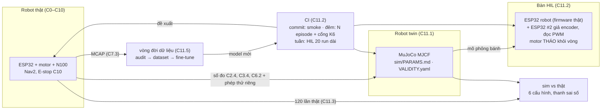
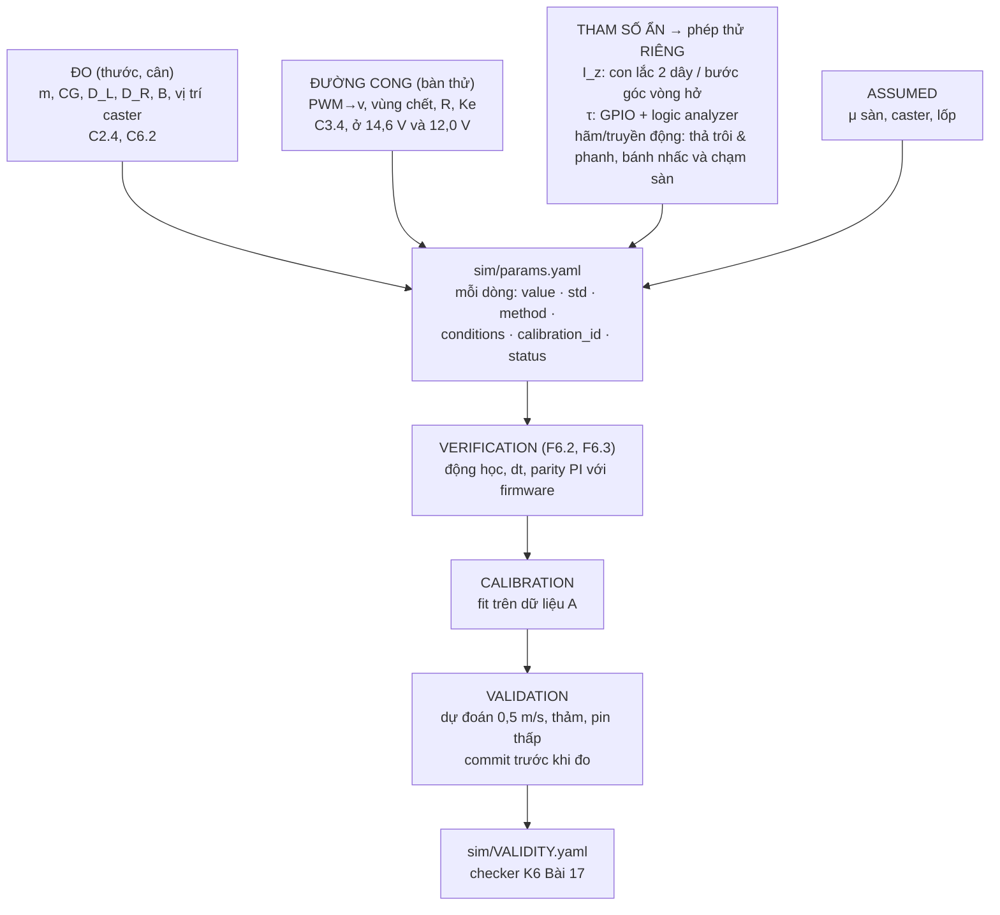
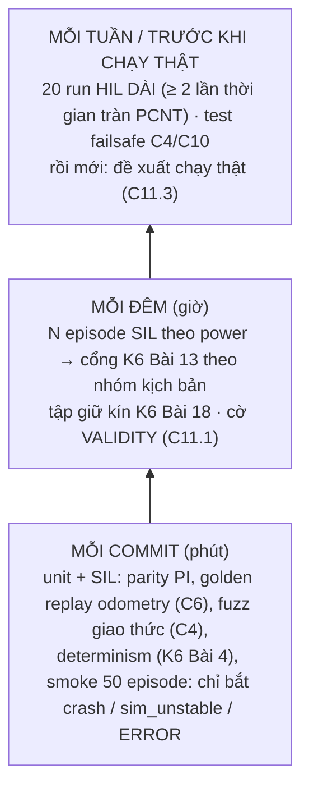
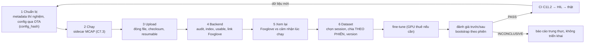

# Chặng 11 — Sim twin, HIL, CI, vòng đời dữ liệu (92h + 20h tùy chọn)

> **Vị trí:** C10 (E-stop cứng, state machine, soak 72h) → **C11** → C12 (sản phẩm) · **Cần trước:** K7 C10 (bắt buộc: chạy thật hàng trăm lần trong văn phòng có người); K6 trọn (Bài 1–19 + Gate); → F6.1–F6.6, F2.6, F2.7, F2.8; số đo của C2.4, C3.4, C4.2, C6.2, C7.3, C8.5, C9.2 · **Chạy song song với:** không (sau K6)
> **Làm ra được:** bàn HIL (ESP32 robot thật + ESP32 thứ hai giả encoder, đọc PWM thật, motor tháo khỏi vòng), robot twin MuJoCo dựng từ số đo, 120+ lần chạy thật có ghi chép · `sim/PARAMS.md` có nguồn gốc từng tham số, `VALIDITY.yaml` của robot, CI nightly ba trạng thái + ERROR, đồ thị sim–thật 6 cấu hình có thanh sai số, một vòng fine-tune có lineage đầy đủ · **Sau chặng này bạn quyết định được:** sim của robot này được phép phán quyết loại thay đổi nào và không được phép phán quyết loại nào; cái gì chạy mỗi commit, mỗi đêm, mỗi tuần; controller Nav2 nào, có lý do bằng số; một model mới được triển khai hay báo INCONCLUSIVE.

K6 dựng toàn bộ máy móc đánh giá trên robot giả lập: determinism, kịch bản là dữ liệu, power analysis, cổng regression ba trạng thái có biên δ, bảng hiệu lực theo kênh, chống Goodhart. F6 và F2 cho lý thuyết: V&V, nhận dạng hệ thống, X-in-the-loop. Chặng này **không dạy lại** những thứ đó. Nó đem chúng ra dùng trên một con robot mà bạn tự hàn từng mối nối, và hỏi câu mà K6 Bài 15 để dành cho Khóa 7 (mức đo thứ 4, "chuyển giao hiệu năng"): **phán quyết trong sim có dự đoán được kết quả ngoài văn phòng không?** Mọi bench test bạn để lại từ C0 đến C10 với nhãn "hạt giống HIL cho C11" được thu hoạch ở đây.

**Phân bổ 92h lõi + 20h tùy chọn** `[ước lượng]`:

| Phần | Giờ | Trong đó lắp/chạy thật |
|---|---|---|
| Bài C11.1 Model sim khớp robot thật | 20 | ~8 (phép thử riêng cho I_z, trễ, hãm; 4 hiện tượng × 10 lần × 2 tốc độ × 2 sàn) |
| Bài C11.2 HIL và CI cho hành vi robot | 24 | ~8 (bàn HIL, đo trễ vòng tròn, máy CI) |
| Bài C11.3 ★ Sim có dự đoán được thực tế không | 16 | ~8 (120 lần chạy thật) |
| Bài C11.4 Controller tầng giữa: đo MPC mua được gì | 12 | ~4 (60 lần chạy thật, đo CPU trên N100) |
| Bài C11.5 Vòng đời dữ liệu đầy đủ và fine-tune | 20 | ~6 (thu dữ liệu, thuê GPU nếu cần, triển khai lại) |
| Gate chặng 11 (= GATE 7E và gate Khóa 7 phần sim/CI) | trong giờ các bài | — |
| **Tổng lõi** | **92** | |
| Bài C11.6 Dự đoán quỹ đạo người *(tùy chọn)* | 20 | ~8 (thu quỹ đạo người, chạy lại C11.4) |

Đường lõi tối thiểu của K7 (`_KE-HOACH-K7.md` mục 3) chỉ giữ C11.1–C11.3 (60h). C11.3 là tiêu chí ★: nếu chỉ còn sức cho một bài, làm nó, kể cả với một sim còn thô.

## 0. Bức tranh chặng

Robot sau chặng này trông y như sau C10. Thứ mới là **ba bản sao** của nó và một vòng khép kín nối chúng:



Dòng điện mới duy nhất của chặng nằm trên **bàn HIL**: hai ESP32 cấp từ USB, chung GND, tín hiệu 3,3 V; driver motor không nối. Dòng dữ liệu mới: kịch bản → episode sim/HIL → MCAP + một dòng summary mỗi episode → cổng regression của K6 Bài 13 → báo cáo; và lần chạy thật → `data/c11/real_runs.csv` → đồ thị sim–thật.

## 1. An toàn của chặng

**Rủi ro của C11:** robot chạy **hàng trăm lần** trong văn phòng có người (C11.3: 6 × 20; C11.4: 3 × 20), nhiều lần với cấu hình cố ý xấu (giới hạn gia tốc cao, inflation nhỏ, controller lỡ chu kỳ); bàn HIL có hai đầu ra số có thể "đánh nhau" trên cùng một chân; compute quá tải trên N100 làm controller chạy bằng lệnh cũ; dữ liệu có mặt người bị đưa lên GPU thuê.

**Quy tắc cứng:**
- KHÔNG chạy thật bất kỳ cấu hình nào khi Gate chặng 10 chưa PASS (E-stop cứng, bumper, watchdog độc lập đã đo thời gian phản ứng).
- KHÔNG chạy thật cấu hình chưa qua sim CI và chưa qua 20 run HIL không có lỗi mới. Đây là thứ tự của CI, không phải gợi ý.
- KHÔNG nới kẹp tốc độ firmware (C4.4) để "thử cho nhanh". Mọi cấu hình Nav2 ở C11.3–C11.4 chạy **dưới** kẹp đó; kẹp là trần, cấu hình chỉ được thấp hơn.
- KHÔNG chạy loạt thật khi không có người cầm điều khiển E-stop trong tầm với, mắt nhìn robot. Một người, một robot, không làm việc khác.
- KHÔNG chạy loạt thật trong giờ có khách, trẻ em, người dùng xe lăn/gậy ở khu vực thử, trừ khi đã có thỏa thuận và kịch bản riêng. Thông báo trước cho đồng nghiệp theo `PRIVACY.md` (C9.1): thời gian, khu vực, camera ghi gì.
- KHÔNG nối ESP32 #2 vào chân encoder của ESP32 robot khi đầu nối encoder của motor thật **còn cắm** vào chân đó. Rút JST encoder motor trước, rồi mới cắm dây giả lập. Hai đầu ra đẩy–kéo nối nhau là chập qua chân GPIO.
- KHÔNG cấp nguồn driver motor trên bàn HIL. Tháo dây PWM/DIR khỏi driver (hoặc tháo driver); PWM chỉ đi vào ESP32 #2. "Motor giả" nghĩa là **không có motor nào quay**.
- KHÔNG đưa ảnh/video có mặt người lên GPU thuê hoặc dịch vụ ngoài khi người đó chưa đồng ý lớp dùng-cho-huấn-luyện (C9.1, C9.3). Mặc định của C11.5 là fine-tune trên dữ liệu **không có người**.

**Khi sự cố xảy ra:**

| Sự cố | Làm ngay | KHÔNG |
|---|---|---|
| Robot không dừng khi controller lỡ chu kỳ, hoặc đi lệch về phía người | E-stop. Ghi `run_id`, thời điểm, cấu hình | Đuổi theo robot bằng tay; chạy tiếp cấu hình đó "xem có lặp lại không" |
| Robot chạm người/vật (dù nhẹ) | E-stop. Hỏi người. Dừng **cả loạt** của cấu hình đó, ghi `incidents.md` (C10.2) | Coi là "một lần thất bại" rồi chạy tiếp; xóa run khỏi dữ liệu |
| ESP32 trên bàn HIL nóng, mùi khét | Rút cả hai USB | Rút một cái rồi đo tiếp |
| N100 nhiệt cao, hạ xung khi chạy perception + MPPI | Dừng loạt, ghi nhiệt và tần số CPU | Tháo nắp, thổi quạt bàn rồi chạy tiếp như cũ (đổi điều kiện giữa loạt) |

## 2. BOM chặng

Chặng này gần như toàn phần mềm. Giá `[ước lượng 10/2026]`, kiểm lại.

| Món | Thông số phải chọn | Vì sao (bằng số) | Giá | Kiểm khi nhận | Thay thế được bằng |
|---|---|---|---|---|---|
| ESP32-S3 DevKitC-1 thứ hai | Cùng model với con robot | Đã mua ở C4 làm dự phòng; ở đây là "thế giới" của bàn HIL | 0 (đã có) | Nạp blink | Bất kỳ S3 nào, bảng chân làm lại |
| Adapter USB–UART cho cổng HIL | 3,3 V, ≥ 921 600 baud ổn định; biết chip (FT232R/CP2102/CH340) | Gói 16 byte hai chiều ở 921 600 baud ≈ 0,35 ms; nhưng adapter có thể giữ gói tới **latency timer** (FTDI mặc định 16 ms `[spec — FTDI AN232B-04; tự đo trên máy bạn]`) | 50–150k | Loopback TX–RX, đo trễ bằng logic analyzer | USB native của ESP32 #2 làm cầu nối |
| Dây Dupont cái–cái, header, băng nhãn | 10–20 sợi, màu theo C0.5 | Bàn HIL đi dây tạm, phải tháo lắp nhiều lần | 30–50k | Thông mạch | JST-XH bấm sẵn (C0.3) |
| Thước dây 5 m, băng dính sàn, thước đo góc hoặc vạch 360° dán sàn | ±1 mm, ±1° | Ba đường của C11.1; lần chạy thật C11.3 | 50–150k | So hai thước | Marker C8 làm trọng tài |
| Dây và móc treo con lắc hai dây | Dây không giãn ~1 m, hai móc trên xà chắc | I_z không nhận dạng được từ phép quay đều (C11.1) | 30–80k | Treo vật mẫu biết I_z | Phép thử bước góc vòng hở (C11.1) |
| Máy chạy CI | ≥ 8 nhân **vật lý**, 16 GB RAM, Docker | 1000 episode/giờ cần L/W ≥ 0,28 episode/s (C11.2); N100 có 4 nhân, không HT `[spec — Intel ARK]`, và đang là máy của robot | 0 nếu có desktop; thuê VM ~0,3–1 USD/giờ `[ước lượng]` | `lscpu`, chạy thử 50 episode | Chạy đêm trên N100 khi robot sạc (chậm, chỉ để smoke) |
| GPU thuê (C11.5, nếu fine-tune model ảnh) | Theo cỡ model; vài giờ | N100 không train được model ảnh trong thời gian hợp lý (K4 Bài 11) | ~0,3–2 USD/giờ `[ước lượng]` | Chạy thử 1 epoch nhỏ | Không fine-tune model ảnh; chọn ứng viên không cần GPU (C11.5) |

**Tổng C11 `[ước lượng]`:** 0,2–0,5tr phần cứng; phần thuê máy tùy bạn chọn, ghi vào `decisions.md`.

## 3. Dụng cụ và kỹ năng tay

| Kỹ năng | Bài | Luyện trước | Đạt trông thế nào |
|---|---|---|---|
| Đo trễ vòng tròn bằng GPIO + logic analyzer (marker lên khi gửi, xuống khi nhận) | C11.2 | Loopback UART thuần trên ESP32 #2 | Histogram trễ có ≥ 10⁵ mẫu; p50, p99, max; không rớt mẫu (sigrok báo) |
| Đi dây bàn HIL hai MCU chung GND | C11.2 | Một kênh quadrature trước, so PCNT với số xung đã phát | Số đếm PCNT khớp số xung phát ±0 ở tốc độ thấp |
| Con lắc hai dây | C11.1 | Treo một hộp đồng chất biết I_z | I_z hộp mẫu lệch < 5 % so với công thức |
| Thả trôi có đánh dấu | C11.1 | Ba lần ở 0,1 m/s | Điểm lệnh và điểm dừng có băng dính, ảnh, ±5 mm |
| Chạy loạt thật có kỷ luật | C11.3 | 5 lần cấu hình baseline | Mỗi lần một dòng `real_runs.csv` ngay sau khi chạy, không ghi bù cuối buổi |

## 4. Sơ đồ đi dây

Chỉ bàn HIL có dây mới. Tên chân bên ESP32 robot lấy từ `firmware/PINS.md` (C4.1); bên ESP32 #2 bạn tự chọn và ghi vào `hil/PINS_HIL.md`.

```
  HOST (máy CI) ── USB ──► ESP32 #2 "THẾ GIỚI"           ESP32 ROBOT (DUT, firmware thật) ◄── USB native ── HOST
                          (nhận vận tốc bánh từ sim,       (kênh ros2_control như trên robot)
                           phát quadrature, đo PWM)
     ┌──────────────────────────────────────────────────────────────────────────────┐
     │ ESP32 #2 GPIO (3,3 V)   ──[dây vàng/xanh lá]──►  ENC_L_A, ENC_L_B (DUT, PCNT)   │  JST encoder motor
     │ ESP32 #2 GPIO (3,3 V)   ──[dây vàng/xanh lá]──►  ENC_R_A, ENC_R_B (DUT, PCNT)   │  ĐÃ RÚT khỏi DUT
     │ ESP32 #2 capture/PCNT   ◄──[dây xanh dương]───  PWM_L, DIR_L, PWM_R, DIR_R (DUT) │  Driver motor
     │ ESP32 #2 GPIO           ──[dây trắng]────────►  BUMPER, ESTOP_SENSE (DUT)       │  KHÔNG cấp nguồn
     │ GND ════════════════════[đen, ngắn]═══════════  GND                              │
     └──────────────────────────────────────────────────────────────────────────────┘
  Cổng PIL tùy chọn (C11.2 mức 1): USB–UART ──► UART riêng của DUT (TX/RX/GND), KHÔNG dùng chung UART0 console.
  Marker đo trễ: GPIO_MARK của DUT ──► logic analyzer CH0;  GPIO_MARK của #2 ──► CH1;  GND chung.
```

| Tín hiệu | Từ → tới | Mức | Vì sao |
|---|---|---|---|
| Quadrature giả (A/B mỗi bánh) | #2 → DUT, đúng chân PCNT của C4 | 3,3 V đẩy–kéo | PCNT, bộ lọc glitch và xử lý tràn của DUT nằm **trong** vòng (→ F2.7 mục 5) |
| PWM/DIR | DUT → #2 | 3,3 V | Đo duty thật bằng capture, không tin giá trị DUT "kể" qua UART |
| Bumper, E-stop sense | #2 → DUT | 3,3 V, đúng cực tính C10.1 | Kịch bản failsafe C4.4/C10.2 chạy được trên bàn |
| GND | chung, một điểm | — | Không có GND chung thì mức logic không xác định |

Tốc độ phát xung cần có: ở 0,5 m/s và 0,108 mm/count (C3, ví dụ 1:56, bánh 85 mm) là ~4.600 count/s mỗi bánh, tức một cạnh mỗi ~216 µs. Phát bằng ngoại vi (RMT hoặc MCPWM) thay vì vòng `delay` `[tự đo — API theo bản ESP-IDF]`.

## 5. Trình tự chặng

1. **Học Bài C11.1** phần 1–5, commit `prediction.md`.
2. **Lắp bước 1 — Phép thử riêng cho tham số ẩn** (chi tiết ở C11.1 bước 2): con lắc hai dây cho I_z (nếu C2.4 chưa làm); trễ lệnh→bánh bằng GPIO + logic analyzer trên bàn; thả trôi và phanh với **bánh nhấc khỏi sàn** rồi **trên sàn**.
   - ✅ Checkpoint trước khi treo: robot **không** có pin thật và mini PC thật (thay vật giả cùng khối lượng như C2); dây chịu ≥ 3 lần trọng lượng; móc trên xà đã thử treo.
   - Nếu sai: không treo; dùng phép thử bước góc vòng hở (C11.1) thay cho con lắc.
3. **Lắp bước 2 — Bốn hiện tượng × ba đường** trên sàn gạch và thảm (C11.1 bước 3–6).
   - ✅ Checkpoint trước mỗi buổi: E-stop C10 thử một lần, ghi sổ; pin trong dải điện áp đã khai trong `prediction.md`.
4. **Học Bài C11.2**, commit `prediction.md`.
5. **Lắp bước 3 — Bàn HIL** theo mục 4.
   - ✅ Checkpoint trước khi cắm USB lần đầu: driver motor không có nguồn; JST encoder motor đã rút khỏi DUT; thông mạch GND giữa hai bo kêu; giữa 3V3 và GND mỗi bo **không** kêu.
   - ✅ Checkpoint chức năng: phát đúng 10.000 xung A/B ở 100 Hz; PCNT của DUT đọc đúng 10.000 (40.000 nếu đếm 4x); ở tốc độ tối đa, so với logic analyzer.
   - Nếu sai: số đếm thiếu ở tốc độ cao → bộ lọc glitch của PCNT đặt quá dài (C3.3); số đếm ngược dấu → đảo A/B.
6. **Lắp bước 4 — Máy CI và tầng đêm** (C11.2 bước 3–6).
7. **Học Bài C11.3**, commit dự đoán **và** khai báo trước 6 cấu hình, n, phương pháp phân tích.
8. **Lắp bước 5 — 120 lần chạy thật** theo lịch xen kẽ (C11.3 bước 4).
   - ✅ Checkpoint mỗi lần: người cầm E-stop; cấu hình đang nạp khớp `config_hash` trong `real_runs.csv`.
9. **Học Bài C11.4**, 60 lần chạy thật (cùng quy tắc bước 8).
10. **Học Bài C11.5**: một vòng dữ liệu đầy đủ, một fine-tune, triển khai lại qua CI.
11. *(Tùy chọn)* **Bài C11.6.**
12. **Gate chặng 11.**

## 6. Lỗi người mới hay gặp

| Triệu chứng | Nguyên nhân khả dĩ | Kiểm bằng cách | Sửa |
|---|---|---|---|
| Sim quay tại chỗ chậm hơn động học ~25 % dù dt nhỏ | Hệ số ma sát tiếp xúc của caster bị lấy theo **max** của hai geom (sàn μ = 1), caster cày sàn | Script verification C11.1; đọc `friction`/`priority` trong XML reference | `priority` cho caster (C11.1 phần 2) |
| PCNT trên bàn HIL đếm thiếu ở tốc độ cao | Phát xung bằng vòng lặp phần mềm; bộ lọc glitch dài hơn nửa chu kỳ xung | Logic analyzer trên chân DUT | Phát bằng RMT/MCPWM; chỉnh lọc theo C3.3 |
| Run HIL nào cũng ERROR "lỡ hạn" dù p99 trễ chỉ vài ms | Đuôi phân bố trễ + run dài (C11.2 phần 2); latency timer adapter | Đếm lỡ hạn theo tick, không chỉ p99 | Latency timer 1 ms, host yên tĩnh, hoặc chia run |
| Kết quả CI đổi khi đổi số worker | Seed dùng chung, wall time thay sim time | Cùng kịch bản L=1 và L=4, so hash | K6 Bài 3 (seed dẫn xuất), `use_sim_time` |
| 6 điểm sim–thật "không tương quan" | n = 20 không đủ phân biệt 6 cấu hình gần nhau | Phân tích power ở C11.3 **trước** khi chạy thật | Chọn cấu hình trải rộng hơn; hoặc báo INCONCLUSIVE |
| Fine-tune "cải thiện" rõ trên test nhưng không thấy ngoài đời | Chia train/test theo lần chạy, không theo phiên | C11.5 phần 2 | Chia theo phiên/người/ngày |

## 7. Lăng kính data infra

**Dữ liệu chặng này sinh ra:**

| Luồng | File | Schema (rút gọn) | Tần số | Ghi chú |
|---|---|---|---|---|
| Tham số twin | `sim/PARAMS.md` + `sim/params.yaml` | `name, value, unit, std, method, conditions, measured_at, calibration_id, status` (`MEASURED`/`FITTED`/`ASSUMED`) | khi đo lại | Kéo từ `hw/robot_params.yaml` (C2.4), `calib/motors.yaml`, `calib/deadband.yaml` (C3), `calib/umbmark.yaml` (C6.2) bằng script, **không chép tay** |
| Bảng hiệu lực robot | `sim/VALIDITY.yaml` | Như K6 Bài 17 (kênh, điểm đã đo, gap, u_val, `depends_on`) | khi đo thêm | Checker `b17_validity.py` của K6 dùng lại nguyên |
| Summary episode sim/HIL | `ci/runs/<run_id>/summary.parquet` | `episode_id, scenario_id, parent_scenario_id, seed, arm, tier (sil/hil), success, failure_class, t_goal_s, min_dist_m, jerk_p95, deadline_miss, validity_flag, config_hash, sim_params_hash, firmware_version` | 1 dòng/episode | Schema tầng summary K6 Bài 9 + 4 cột mới |
| Lần chạy thật | `data/c11/real_runs.csv` | `run_id, ts, config_id, config_hash, scenario_id, operator, floor, v_bat_start_V, success, failure_class, t_goal_s, estop_used, people_present, mcap, note` | 1 dòng/lần | Ghi ngay sau lần chạy |
| Trễ cổng HIL | `hil/latency/*.sr` + histogram CSV | `k, t_send_s, t_recv_s, rtt_s, seq_ok` | mỗi build | SI, `s` |
| Lineage vòng dữ liệu | `lineage/*.json` | `artifact_id, kind, content_hash, parents[], producer, params_hash, created_at` | mỗi artifact | → F3.8 |

**Test tự động thu hoạch ở chặng này** (hạt giống các chặng trước để lại; tên test giữ nguyên tên chặng gốc đặt):

| Hạt giống | Từ | Chạy ở tầng nào của C11.2 |
|---|---|---|
| `bench_encoder_count` (PCNT vs logic analyzer) | C3 | HIL: #2 phát số xung biết trước, oracle là chính số xung đã phát |
| `test_jitter`, `test_protocol_fuzz`, `test_failsafe_*` | C4 | HIL mỗi build firmware; fuzz và failsafe chạy được cả SIL (code C biên dịch cho host) |
| Golden replay odometry, metamorphic trái–phải | C6 | Mỗi commit (SIL, tất định) |
| UMBmark trong sim với tham số nhiễu | C6 | Mỗi tuần; so `E_max,syst` sim với `calib/umbmark.yaml` |
| Bốn kịch bản ép hỏng Nav2, rule vật lý trên session | C8 | Đêm (SIL) + dữ liệu thật mỗi session |
| `test_decision_replay`, `test_no_image_topics`, `test_delete_e2e` | C9 | Mỗi commit / mỗi MCAP mới / mỗi tuần trên robot thật |
| Đo sụt áp mối nối ở dòng cố định | C0 | Không tự động ở C11 (cần nguồn lập trình được); ghi vào "chưa tự động hóa" |

**SLI của chặng:** thời gian một đêm CI; tỉ lệ episode ERROR (harness hỏng) tách khỏi INCONCLUSIVE; tỉ lệ kịch bản OUT/UNTESTED; độ trễ "lần chạy thật → dòng trong `real_runs.csv`"; thời gian "kết thúc thí nghiệm → link Foxglove" (C11.5).

**Vai trò nghề:** Simulation & Evaluation (C11.1, C11.3), Test & Validation (C11.2, C11.4), Data Platform + MLOps nhẹ (C11.5). Bốn ô mà phụ lục K7 gốc mục 4 gọi là đích của bạn đều nằm trong chặng này.

## 8. Nhật ký build

Copy vào `build-log/c11.md`:

```markdown
## 2026-MM-DD — buổi N (giờ thực: _._ h) · bài C11.x
- Trạng thái người: tỉnh táo / mệt (mệt → không chạy loạt thật; chỉ đọc kết quả CI)
- Mục tiêu buổi:
- Cấu hình/commit đang thử: config_hash ___ · sim_params_hash ___ · firmware ___
- Chạy thật: số lần ___ ; E-stop dùng ___ lần ; người có mặt: có/không
- Số đo (đã vào real_runs.csv / measurements.jsonl? số dòng ___)
- Dự đoán đã commit trước dữ liệu? hash ___
- Lỗi gặp (triệu chứng → nguyên nhân → sửa):
- Quyết định (→ decisions.md):
- Suýt sự cố:
- Câu hỏi còn mở:
```

---

## Bài C11.1 — Model sim khớp robot thật (20h)

> **Vị trí:** C10 → **C11.1** → C11.2 (HIL, CI) và C11.3 (sim dự đoán thực tế) · **Cần trước:** → F6.1, F6.2, F6.3, F6.4, F6.6, F1.6; K6 Bài 15–17 (ba đường, phần G "fit ở một điểm, dự đoán điểm khác", u_val, bảng hiệu lực và checker); K7 C2.4 (`hw/robot_params.yaml`), C3.4 (`calib/deadband.yaml`, `calib/motors.yaml`), C4.2 (PI, trễ θ), C6.2 (`calib/umbmark.yaml`) · **Sau bài này bạn quyết định được:** sim này được dùng để phán quyết loại thay đổi nào (tốc độ nào, sàn nào, mức pin nào), và tham số nào phải có phép thử riêng trước khi tin nó.

### 1. Câu chuyện — ai đã khổ vì chuyện này

Mùa hè 1901, anh em Wright bay thử tàu lượn thứ hai ở Kitty Hawk. Lực nâng chỉ khoảng một phần ba con số họ tính từ bảng của Otto Lilienthal. Bảng đó dùng **hệ số Smeaton**, một hằng số của công thức lực khí động được đo từ năm 1759 và dùng suốt hơn trăm năm với giá trị khoảng 0,005. Hằng số có nguồn gốc, có tên tuổi, có trong sách. Vấn đề là bay thử không tách được nó khỏi hệ số nâng của cánh: tàu lượn chỉ cho ra một con số tổng là "nâng kém". Mùa thu năm đó họ dựng một ống gió nhỏ trong xưởng xe đạp, đo riêng từng thứ trên các mẫu cánh, và ra hệ số Smeaton gần 0,0033 `[chuẩn — lịch sử anh em Wright, ví dụ tài liệu giáo dục của NASA Glenn Research Center về ống gió Wright 1901; con số làm tròn]`. Tàu lượn 1902 bay đúng như tính.

Bài học không phải "số trong sách sai". Bài học là: **phép thử toàn hệ không nhận dạng được tham số bên trong**; tham số nào phép thử toàn hệ không nhìn thấy thì phải có một đồ gá riêng cho nó. Robot của bạn có đúng ba tham số như vậy (F6.4 đã chỉ ra khi chấm bản Gemini): quán tính quay I_z, trễ lệnh→bánh, và cách robot dừng (hãm của driver cộng ma sát hệ truyền động). Bài này dựng "ống gió" cho từng cái, và cho thấy bốn hiện tượng của bản gốc nhìn thấy gì, không nhìn thấy gì.

### 2. Mô hình tư duy



Bốn ý bản chất:

1. **Phép thử vòng kín che vật lý bên trong.** "Đi thẳng 5 m" và "quay 360°" chạy qua PI của firmware và giới hạn gia tốc. PI bù gần hết ma sát, khối lượng, hằng số motor; kết quả còn lại chủ yếu là hình học (D, B) và giới hạn controller. Khớp 5 % ở hai phép thử này nói rằng hình học và controller trong sim đúng. Nó **không** nói gì về động lực học.
2. **Mỗi tham số ẩn có phép thử riêng, và phép thử đó phải có độ nhạy với nó.** Chạy mô phỏng dưới đây trước khi đọc tiếp: nó tính, cho sáu phép thử, kết quả đổi bao nhiêu phần trăm khi mỗi tham số tăng 10 %. Ô gần 0 nghĩa là phép thử đó **mù** với tham số đó; fit tham số đó từ phép thử đó là chọn số tùy ý.
3. **Verification trước, fit sau.** Một sim chưa qua kiểm động học có thể có lỗi lớn hơn mọi gap vật lý bạn định đo, và không ai thấy vì không có gì crash. Bước 0 của phần 6 có một ví dụ thật, đã chạy.
4. **Tham số mang theo điều kiện đo** (→ F6.1). Đường cong PWM→v của C3.4 đo ở 14,6 V và 12,0 V; ma sát truyền động đo khi hộp số nguội; μ sàn đo trên gạch sạch. Sim dựng từ các số đó chỉ đúng trong **giao** các điều kiện ấy. Đó là nội dung của `VALIDITY.yaml`, không phải phần ghi chú.

```python
# [đã chạy] C11.1 — phép thử nào "nhìn thấy" tham số nào? Độ nhạy chuẩn hóa của 6 phép thử
import numpy as np
P0 = dict(m=4.5, Iz=0.07, g=2.1, ke=17.0, b=0.3, fc=0.25, tau=0.02)   # đồ chơi, KHÔNG phải robot bạn
B, DT, CPC = 0.25, 0.001, 0.108e-3          # khoảng cách bánh, bước sim, m/count (C3: 1:56, 85 mm)

def run(p, test, T=12.0):
    v = w = x = th = 0.0; lag = int(round(p["tau"] / DT)); buf = [(0.0, 0.0, "drive")] * (lag + 1)
    cL = cR = 0; iL = iR = 0.0; uL = uR = 0.0; mode = "drive"; vref = 0.0; out = []
    for k in range(int(T / DT)):
        t = k * DT
        if k % 10 == 0:                                   # firmware 100 Hz: PI bánh trên encoder lượng tử
            nL, nR = int((x - th * B / 2) / CPC), int((x + th * B / 2) / CPC)
            mL, mR = (nL - cL) * CPC / 0.01, (nR - cR) * CPC / 0.01; cL, cR = nL, nR
            tgt = {"thang": 0.3, "quay": 0.15, "buoc": 0.3, "coast": 0.5, "brake": 0.5}.get(test, 0)
            vref = min(tgt, vref + 0.5 * 0.01) if test != "buoc" else tgt       # giới hạn gia tốc 0.5 m/s²
            sL, sR = (-vref, vref) if test == "quay" else (vref, vref)
            iL += (sL - mL) * 0.01; iR += (sR - mR) * 0.01
            uL = np.clip(p["ke"] * sL + 20 * (sL - mL) + 150 * iL, -12, 12)   # feedforward + PI
            uR = np.clip(p["ke"] * sR + 20 * (sR - mR) + 150 * iR, -12, 12)
            if test in ("coast", "brake") and t >= 4.0: mode = test             # lệnh dừng ở t = 4 s
            if test == "xoay_hở": uL, uR = (-6.0, 6.0) if t >= 0.5 else (0.0, 0.0)
        buf.append((uL, uR, mode)); aL, aR, md = buf.pop(0)                   # trễ actuator thuần
        vl, vr = v - w * B / 2, v + w * B / 2
        FL, FR = [(p["g"] * (u - p["ke"] * s) if md == "drive" else 0.0 if md == "coast"
                   else -p["g"] * p["ke"] * s) for u, s in ((aL, vl), (aR, vr))]
        v += DT * ((FL + FR) / p["m"] - p["b"] * v - p["fc"] * np.tanh(v / 1e-3))
        w += DT * ((B / 2) * (FR - FL) / p["Iz"] - p["m"] * (B / 2) * (p["fc"] * np.tanh(w / 1e-2) + p["b"] * w * B / 2) / p["Iz"])
        x += v * DT; th += w * DT; out.append((t, x, v, th, w))
    return np.array(out)

def observe(p, test):
    o = run(p, test, 20.0 if test == "thang" else 12.0); t, x, v, th, w = o.T
    if test == "thang":  return t[np.argmax(x >= 5.0)]                        # thời gian đi 5 m
    if test == "quay":   return t[np.argmax(th >= 2 * np.pi)]                 # thời gian quay 360°
    if test in ("coast", "brake"): return x[-1] - x[t >= 4.0][0]              # quãng dừng sau lệnh
    if test == "buoc":   return v[t < 2].max() / 0.3 - 1                      # vọt lố
    if test == "xoay_hở": return w[np.argmax(t >= 0.6)]                        # ω sau 100 ms vòng hở

tests = ["thang", "quay", "coast", "brake", "buoc", "xoay_hở"]
y0 = {s: observe(P0, s) for s in tests}
print(f"{'phép thử':8s} {'y0':>8s} " + " ".join(f"{k:>6s}" for k in P0))
for s in tests:
    row = []
    for k in P0:
        p = dict(P0); p[k] *= 1.10
        row.append(100 * (observe(p, s) - y0[s]) / abs(y0[s]))
    print(f"{s:8s} {y0[s]:8.3f} " + " ".join(f"{r:+6.1f}" for r in row))
```

Mô hình đồ chơi: lực mỗi bánh `g·(u − ke·v_bánh)` khi driver dẫn (back-EMF tạo ra "ma sát nhớt điện"), bằng 0 khi thả trôi (coast, driver hở), bằng `−g·ke·v_bánh` khi phanh (brake, ngắn mạch hai cực motor, → C3.2); cộng ma sát lăn/truyền động `b·v + f_c·sgn(v)`; trễ thuần τ; PI 100 Hz trên encoder lượng tử 0,108 mm/count. "xoay_hở" là phép thử thêm: bước điện áp ngược chiều hai bánh, **không** qua PI, đo tốc độ góc sau 100 ms bằng gyro.

### 3. Cầu nối từ backend

| Backend bạn biết | Ở đây | Gãy ở chỗ | Nếu dùng nhầm thì |
|---|---|---|---|
| Mock server dựng từ traffic ghi lại | Sim dựng từ số đo C2–C6 | Mock **phát lại** phản hồi đã ghi, không ngoại suy được. Sim **sinh** phản hồi từ phương trình nên ngoại suy được, nhưng chỉ trong miền dạng phương trình còn đúng | Coi sim như mock: chỉ test lại đúng các ca đã đo. Coi sim như prod: tin cả kết quả trên thảm khi mới đo trên gạch |
| E2E test qua API công khai: đo latency tổng, không thấy bên trong | "Đi thẳng 5 m", "quay 360°" qua PI firmware | E2E backend còn có trace để thấy từng span. Vòng kín vật lý **hấp thụ** sai số bên trong: PI tăng duty bù ma sát sai, kết quả cuối vẫn khớp | Báo "sim khớp <5 %" trong khi ma sát, I_z, trễ trong sim có thể sai gấp đôi. Lộ ra khi đổi controller (C11.4) |
| Config có version, parity dev/prod | `params.yaml` có `calibration_id`, kéo tự động từ file hiệu chuẩn | Config phần mềm đứng yên tới khi ai đó đổi. Tham số vật lý **tự trôi**: motor nóng, lốp mòn, pin tụt áp | Kiểm parity một lần. Ba tháng sau sim khớp một robot không còn tồn tại |
| Differential test hai bản implement | PI trong sim vs PI firmware chạy trên cùng chuỗi encoder đã ghi | Hai bên khác ngôn ngữ, khác kiểu số (float32 trên ESP32 vs float64), khác cách chia Δt | Sim dùng PI "gần giống". Đáp ứng bước lệch vì code khác, bạn đi chỉnh ma sát để bù lỗi code |

**Chấm mô hình:**

- *"Sim khớp cả bốn hiện tượng của bản gốc trong ngưỡng, vậy sim đúng."* → **SAI.** Hai trong bốn hiện tượng chạy vòng kín và gần như mù với động lực học (phần 7 có số). Phản ví dụ: trong mô phỏng ở phần 2, tăng ma sát, khối lượng hay trễ 10 % không đổi thời gian đi 5 m và thời gian quay 360° tới 0,1 %. Hai phép thử đó vẫn đáng làm, nhưng để kiểm **hình học và controller**, và phải ghi đúng như vậy trong `VALIDITY.yaml`.
- *Bản Gemini K7 Bài 18: fit ma sát, I_z, trễ "cho tới khi đường cong khớp" từ bốn phép thử.* Đã chấm ở → F6.4 mục 6 (khẳng định (a), **ĐÚNG MỘT PHẦN**). Không chấm lại; bài này biến ba chỗ gãy F6.4 chỉ ra thành ba phép thử riêng ở phần 6 bước 2.
- *Mô hình của bạn ở K3 lượt 12:* "có đủ dữ liệu trong thời gian dài thì mọi công thức vật lý gần như là hằng số, tầng AI biểu diễn và dự đoán được." → **ĐÚNG MỘT PHẦN.** Đúng: đủ dữ liệu thì ước lượng được tham số, đó là nhận dạng hệ thống. Gãy ở chỗ "đủ dữ liệu" phải là dữ liệu **có độ nhạy** với tham số. Phản ví dụ: hàng nghìn giờ log robot đi theo Nav2 (vòng kín, quay đều) không chứa thông tin nào về I_z, vì cột I_z trong bảng độ nhạy của các phép thử vòng kín bằng 0. Thêm dữ liệu cùng loại không đổi số 0 đó.

### 4. Thuật ngữ

| Mức | Thuật ngữ | Nghĩa trong một câu | Hay bị hiểu nhầm thành |
|---|---|---|---|
| 🟢 | Độ nhạy chuẩn hóa | % đổi của kết quả khi tham số đổi 1 % (hoặc 10 %) | Hệ số tương quan |
| 🟢 | Nhận dạng được (identifiability) | Dữ liệu có đủ thông tin để tách riêng từng tham số | "Fit hội tụ là tham số đúng" |
| 🟢 | Vòng hở / vòng kín | Lệnh đi thẳng tới actuator / lệnh qua bộ điều khiển có phản hồi | Hai cách chạy cho cùng thông tin |
| 🟢 | Coast / brake (thả trôi / phanh) | Driver hở mạch motor / ngắn mạch motor, dòng phanh tạo hãm | Hai tên của "dừng" |
| 🟢 | `status` của tham số | `MEASURED` / `FITTED` / `ASSUMED`, quyết định tham số vào cột nào của `VALIDITY.yaml` | Chú thích tùy chọn |
| 🟡 | `armature`, `damping`, `frictionloss` (MuJoCo, ở joint) | Quán tính rotor quy đổi, ma sát nhớt, ma sát khô của khớp | Ma sát bánh–sàn |
| 🟡 | `priority` của geom (MuJoCo) | Geom ưu tiên cao quyết định tham số tiếp xúc; cùng ưu tiên thì lấy max | Tham số hiệu năng |
| 🟡 | Tín hiệu kích thích (PRBS, multistep) | Lệnh thiết kế để làm lộ động lực ở nhiều tần số (→ F6.4) | Bước đơn là đủ |
| 🔴 | `solref`/`solimp`, mô hình lốp | Độ mềm tiếp xúc trong solver | Núm vặn đầu tiên khi sai |

### 5. Dự đoán

**Đề A — bảng độ nhạy (laptop, 30 phút).** Trước khi chạy code ở phần 2, đánh dấu vào bảng 6 phép thử × 7 tham số: ô nào ≈ 0, ô nào lớn nhất mỗi hàng, và **dấu** của ô (m, τ) ở hàng "buoc" (vọt lố). Thêm một câu: muốn biết I_z, chỉ dùng phép thử nào được, và nó lẫn với tham số nào?

**Đề B — robot thật.** Tính bằng công thức cho 0,3 và 0,5 m/s:

| Tham số cần tra | Tra ở đâu |
|---|---|
| m, CG, D_L, D_R, B hiệu dụng, I_z (nếu đã treo ở C2.4) | `hw/robot_params.yaml` (C2.4), `calib/umbmark.yaml` (C6.2) |
| Vùng chết, độ dốc PWM→v mỗi motor, mỗi chiều, ở 14,6 V và 12,0 V | `calib/deadband.yaml` (C3.4) |
| R, Ke, cpr | `calib/motors.yaml` (C3.1, C3.3) |
| Kp, Ki, lọc vận tốc, giới hạn gia tốc, kẹp tốc độ, chế độ PWM của driver (drive/brake hay drive/coast) | Firmware C4 (git hash), C3.2, YAML `diff_drive_controller` |
| Chế độ dừng khi lệnh = 0 và khi mất heartbeat | C3.2 (bảng logic driver), C4.4 |

Công thức: đi thẳng 5 m với trần gia tốc a: `t ≈ 5/v + v/(2a) + τ`; quay tại chỗ, hai bánh ±v_w: `t_360 = π·B/v_w`; thả trôi từ v₀ (Coulomb + nhớt): `S = v₀·τ + (1/b)·[v₀ − (f_c/b)·ln(1 + b·v₀/f_c)]`; phanh ngắn mạch: thêm hãm nhớt `g·ke/m` cho mỗi bánh vào b.

**Đoán thêm:** (a) quãng dừng **brake** hay **coast** ngắn hơn, gấp mấy lần; (b) sau khi fit thả trôi ở 0,1–0,3 m/s, dự đoán ở 0,5 m/s lệch về phía nào nếu bạn chỉ fit một dạng ma sát; (c) trên thảm, hiện tượng nào hỏng trước; (d) chạy script verification ở phần 6 bước 0: quay tại chỗ trong sim chậm hơn động học bao nhiêu % ở dt = 2 ms, và giảm dt có sửa được không.

```markdown
# prediction.md — K7 C11.1
commit trước khi chạy sim và trước khi đo: <hash>
## A. Bảng độ nhạy: ô ≈ 0 ___ ; lớn nhất mỗi hàng ___ ; dấu (buoc, m) ___ (buoc, tau) ___
   I_z nhìn thấy bởi ___ , lẫn với ___
## B. Ba đường (công thức)
| hiện tượng | 0.3 m/s | 0.5 m/s | công thức | tham số dùng (calibration_id) |
|---|---|---|---|---|
| đi thẳng 5 m | | | | |
| quay 360° | | | | |
| quãng dừng coast / brake | | | | |
| bước 0→0.3: vọt lố, t_xác lập | | | | |
- brake/coast: ___ lần ; 0.5 m/s lệch về phía ___ vì ___ ; thảm hỏng trước ở ___
- verification dt=2 ms: quay chậm hơn ___ % ; giảm dt sửa được? ___
```

### 6. Làm

Giữ đủ sáu bước của bản gốc; thêm bước 0 (verification) và bước 2 (phép thử riêng). Mọi phép đo thật ghi sai số dụng cụ.

**Bước 0 — `PARAMS.md`, verification.** Viết script kéo tham số từ các file hiệu chuẩn (C2.4, C3, C6.2) vào `sim/params.yaml`; tham số không truy được nguồn mang `status: ASSUMED` và tự vào cột "chưa kiểm". Rồi ba kiểm verification, **trước** khi fit:
- *Động học* (→ F6.2 mục 9): lệnh tốc độ bánh không đổi; ở trạng thái xác lập, chuyển động thân phải khớp động học tính từ góc bánh trong sim. Script dưới đây làm việc đó và quét dt.
- *Hội tụ timestep* (→ F6.3 mục 9): nếu chênh giữa dt = 2 ms và 1 ms nhỏ hơn 1/10 gap sim–thật, dt không phải nút cần vặn.
- *Parity PI*: lấy một log C4/C6 (lệnh + encoder), cho PI của sim chạy trên đúng chuỗi encoder đó, so chuỗi duty với duty firmware đã ghi; phải trùng tới mức lượng tử PWM. Cách sạch nhất: biên dịch đúng file C của firmware thành thư viện, gọi từ Python (→ F2.4, differential test). Đây cũng là SIL của C11.2.

```python
# [đã chạy] (mujoco 3.15.0 — kiểm theo bản bạn cài) Verification robot twin TRƯỚC khi fit bất cứ gì:
# lệnh tốc độ bánh không đổi; ở trạng thái xác lập (giây cuối), so chuyển động thân với động học
# tính từ GÓC BÁNH THẬT trong sim: đi thẳng Δx vs R·Δφ_tb, quay Δθ vs R·(Δφ_R−Δφ_L)/B. Quét timestep.
import numpy as np, mujoco
R, B, M = 0.0425, 0.25, 4.5          # bánh 85 mm, khoảng cách bánh, khối lượng: lấy từ hw/robot_params.yaml
XML = """<mujoco><option timestep="DT" integrator="implicitfast"/>
<worldbody><geom type="plane" size="20 20 .1" friction="1 0.005 0.0001"/>
 <body pos="0 0 RR"><freejoint/>
  <geom type="box" size=".15 .12 .03" pos="-.05 0 .03" mass="MM"/>
  <body pos="0 HB 0"><joint name="jl" type="hinge" axis="0 1 0" damping="0.001" armature="0.003"/>
   <geom type="cylinder" size="RR .012" euler="90 0 0" mass=".1"/></body>
  <body pos="0 -HB 0"><joint name="jr" type="hinge" axis="0 1 0" damping="0.001" armature="0.003"/>
   <geom type="cylinder" size="RR .012" euler="90 0 0" mass=".1"/></body>
  <geom type="sphere" size=".015" pos="-.18 0 CZ" mass=".02" friction="0.02 0 0" PRIO/>
 </body></worldbody>
<actuator><velocity joint="jl" kv="5"/><velocity joint="jr" kv="5"/></actuator></mujoco>"""

def build(dt, prio):
    return (XML.replace("DT", str(dt)).replace("RR", str(R)).replace("MM", str(M)).replace("HB", str(B / 2))
            .replace("CZ", str(-R + 0.015)).replace("PRIO", 'priority="1"' if prio else ""))

def yaw(q):
    w, x, y, z = q; return np.arctan2(2 * (w * z + x * y), 1 - 2 * (y * y + z * z))

def slip(dt, prio, vl, vr, T=4.0):
    m = mujoco.MjModel.from_xml_string(build(dt, prio)); d = mujoco.MjData(m)
    d.ctrl[:] = [vl / R, vr / R]; th = prev = 0.0; rec = []
    for _ in range(int(T / dt)):
        mujoco.mj_step(m, d); y = yaw(d.qpos[3:7]); th += (y - prev + np.pi) % (2 * np.pi) - np.pi; prev = y
        rec.append((d.qpos[0], th, d.qpos[7], d.qpos[8]))
    a, b = np.array(rec[-int(1 / dt)]), np.array(rec[-1]); dl, dr = b[2] - a[2], b[3] - a[3]
    if vl == vr: return 100 * ((b[0] - a[0]) / (R * (dl + dr) / 2) - 1)
    return 100 * ((b[1] - a[1]) / (R * (dr - dl) / B) - 1)

print("caster priority   dt(ms)   trượt đi thẳng   trượt quay tại chỗ")
for prio in (False, True):
    for dt in (0.004, 0.002, 0.001):
        print(f"{str(prio):15s} {dt*1e3:6.1f}   {slip(dt, prio, .3, .3):+13.2f}%   {slip(dt, prio, -.15, .15):+16.2f}%")
```

`armature` không phải để cho đẹp: quán tính rotor quy đổi qua hộp số (J_rotor·N²) lớn hơn nhiều quán tính bánh, và thiếu nó thì actuator `velocity` với bánh nhẹ làm sim mất ổn định ngay bước đầu (đã thử). Giá trị 0,003 kg·m² là `ASSUMED` cho tới khi bạn có J_rotor từ datasheet motor hoặc từ phép thử vòng hở bánh nhấc.

**Bước 1 — MJCF từ `params.yaml`.** Sinh MJCF bằng template (như `build()` ở trên), không sửa tay số trong XML. Geom va chạm đơn giản (cylinder/sphere/box), quán tính từ `params.yaml`, caster có `priority`. Actuator: thay `velocity` bằng `motor` (mô-men) và đặt PI firmware, bù vùng chết, lọc vận tốc, chu kỳ 10 ms, giới hạn gia tốc trong Python, như mô hình đồ chơi ở phần 2. MuJoCo không có trễ thuần cho actuator; dùng ring buffer lệnh dài τ/Δt (thuộc tính `dyntype` là trễ bậc nhất, không phải trễ thuần `[tự đo — XML reference theo bản cài]`).

**Bước 2 — ba phép thử riêng cho ba tham số ẩn.**
- **I_z.** Con lắc hai dây theo C2.4 bước 6 (công thức và điều kiện an toàn ở đó). Nếu không treo được: phép thử "xoay_hở" ở phần 2 trên robot thật, gyro IMU (C7) ở ≥ 200 Hz, nhiều biên độ điện áp; nhớ I_z lẫn với g/ke trong phép thử này, nên g và ke phải đến từ C3 trước.
- **Trễ τ lệnh→bánh.** Trên bàn (bánh nhấc), firmware bật GPIO_MARK đúng lúc ghi duty mới; logic analyzer ghi GPIO_MARK và kênh A encoder; τ = từ cạnh marker tới khi khoảng giữa hai cạnh encoder bắt đầu ngắn lại. Đo cả trễ host→ESP32 (lệnh `/cmd_vel` → khung serial → duty) bằng marker phía host nếu có (C4.3). Độ phân giải: 24 MHz → ~42 ns, không còn là giới hạn; giới hạn là định nghĩa "bắt đầu đổi".
- **Hãm và ma sát truyền động.** Bốn tổ hợp: {bánh nhấc, trên sàn} × {coast, brake}, mỗi tổ hợp thả từ 0,1 / 0,2 / 0,3 m/s, ghi encoder 100 Hz. Bánh nhấc tách ma sát hộp số + motor khỏi lăn trên sàn; coast vs brake tách hãm điện của driver khỏi ma sát. Fit **cả đường cong** v(t), so ít nhất hai dạng (nhớt thuần; Coulomb + nhớt), báo residual và độ lệch chuẩn tham số (→ F6.4). Giữ 0,5 m/s ra ngoài, không fit.

**Bước 3 — ba đường × bốn hiện tượng** (bảng gốc, thêm dụng cụ và sai số):

| Hiện tượng | Tính | Đo thật | Sim | Dụng cụ, sai số; **kiểm gì** |
|---|---|---|---|---|
| Đi thẳng 5 m: thời gian, sai lệch ngang | Từ vận tốc đặt, trần gia tốc | Như C6.2 | Chạy sim | Thời gian từ timestamp nguồn ESP32 trong MCAP (10 ms), không bấm đồng hồ tay; sai lệch ngang ±2 mm bằng thước hoặc marker C8. **Kiểm hình học + controller** |
| Quay tại chỗ 360°: thời gian, sai lệch góc | `π·B/v_w` | Vạch 360° trên sàn, ±1°; gyro z | Chạy sim | **Kiểm B + controller**; không nhìn thấy I_z |
| Quãng đường dừng từ 0,5 m/s | Công thức phần 5, **khai báo chế độ dừng** | Băng dính tại điểm lệnh (LED bật cùng lệnh, quay video) và điểm dừng, ±5 mm | Chạy sim | **Kiểm hãm/ma sát** (coast) hoặc giới hạn giảm tốc (dừng có điều khiển). Đừng báo khớp ở chế độ có điều khiển như thể đã khớp ma sát |
| Đáp ứng bước vận tốc: vọt lố, t_xác lập | Từ PI, τ | Như C4.2 | Chạy sim | Lượng tử vận tốc 0,108 mm/count ÷ 10 ms = 10,8 mm/s/count (~3,6 % ở 0,3 m/s); cửa sổ trượt như C4.2. **Kiểm τ, g, ke, m** (chúng lẫn nhau, xem bảng độ nhạy) |

Mỗi phép đo thật lặp ≥ 10 lần, báo trung vị và độ trải. **Ngưỡng "lệch < 5 %" chỉ có nghĩa khi độ trải giữa các lần chạy thật nhỏ hơn 5 %**; nếu không, báo gap kèm độ trải và u_val (K6 Bài 15). Ghi `v_bat` đầu và cuối mỗi lần.

**Bước 4 — system identification theo thứ tự.** Hình học (đo) → đường cong motor (C3) → τ (bàn) → hãm/ma sát (bước 2) → I_z (treo hoặc vòng hở). Không chỉnh tay từng núm; mỗi tham số fit từ phép thử có độ nhạy lớn nhất với nó và nhỏ với phần còn lại.

**Bước 5 — kiểm chéo.** Đóng băng tham số. Dự đoán bốn hiện tượng ở 0,5 m/s, ở **pin thấp** (gần 12,0 V, đầu dưới của dải C3 đã đo) và trên **thảm**, commit, rồi mới đo (phương pháp phần G của K6 Bài 16).

**Bước 6 — `VALIDITY.yaml` theo kênh.** Kênh của robot (gợi ý): `hinh_hoc` (D, B), `controller` (PI, giới hạn), `truyen_dong_tha_troi`, `ham_driver`, `quay_quan_tinh` (I_z), `tre_lenh`, `lan_san` (theo loại sàn), `dien_ap_pin`. Mỗi kịch bản Nav2 khai `depends_on`; checker `b17_validity.py` của K6 Bài 17 gắn cờ IN/OUT/UNTESTED. Chạy lại bốn hiện tượng trên thảm với **cùng** bộ tham số, ghi vào bảng.

### 7. Số phải ra

<details><summary>🔒 MỞ SAU KHI COMMIT prediction.md</summary>

**Ngưỡng của bản gốc (giữ nguyên):**

| Kiểm tra | Ngưỡng sau khi fit | Cách đọc thêm |
|---|---|---|
| Đi thẳng: thời gian | Lệch < 5 % | Khi độ trải thật < 5 %; kiểm hình học + controller, không phải động lực học |
| Quay 360°: thời gian | Lệch < 5 % | Như trên |
| Quãng đường dừng | Lệch < 15 % — **ma sát là chỗ khó khớp nhất** | Khai báo chế độ dừng |
| Đáp ứng bước | Hình dạng khớp, vọt lố lệch < 20 % | Sau khi có τ từ bàn |
| Ngoại suy sang tốc độ chưa fit | Lệch nhỏ nếu mô hình đúng dạng; **lệch lớn là một phát hiện đáng viết** | |
| Trên thảm vs sàn cứng | Một bộ tham số **không khớp được cả hai** — ghi vào bảng hiệu lực | Kênh `lan_san` có hai điểm đo, không nội suy giữa chúng |

**Bảng độ nhạy đồ chơi** (% đổi kết quả khi tham số +10 %):

| Phép thử | y0 | m | I_z | g | ke | b | f_c | τ |
|---|---|---|---|---|---|---|---|---|
| đi thẳng 5 m (s) | 16,96 | 0,0 | 0,0 | 0,0 | 0,0 | 0,0 | 0,0 | 0,0 |
| quay 360° (s) | 5,38 | 0,0 | 0,0 | 0,0 | 0,0 | 0,0 | 0,0 | 0,0 |
| thả trôi từ 0,5 (m) | 0,372 | −0,5 | 0,0 | −0,5 | 0,0 | −2,5 | **−7,1** | +0,3 |
| phanh từ 0,5 (m) | 0,037 | +6,4 | 0,0 | −6,3 | −6,1 | −0,1 | −0,9 | +2,7 |
| bước 0→0,3: vọt lố | 0,285 | −11,8 | 0,0 | +12,7 | −4,9 | −0,4 | +1,1 | **+9,6** |
| bước góc vòng hở (rad/s @100 ms) | 1,933 | −0,6 | **−4,7** | +5,1 | −4,8 | −0,1 | −0,5 | −1,2 |

Cách đọc:
- Hai hàng đầu bằng 0 ở mọi cột: thời gian do vận tốc đặt, trần gia tốc và hình học quyết định (B không nằm trong danh sách tham số của đồ chơi). Đó là lý do khớp 5 % dễ, và vì sao khớp 5 % không chứng minh gì về vật lý bên trong.
- Thả trôi nhìn thấy f_c và b, gần như không thấy gì khác: phép thử đúng cho ma sát truyền động. Phanh nhìn thấy `g·ke/m` (hãm điện) và τ: phanh ngắn hơn thả trôi khoảng 10 lần trong đồ chơi, nên ở chế độ phanh, sai số ma sát gần như không lộ ra.
- I_z chỉ xuất hiện ở bước góc vòng hở, và cùng cỡ với g, ke: muốn I_z thì g và ke phải biết trước (từ C3), nếu không chỉ nhận dạng được tỉ số. Đúng như F6.4 đã chỉ ra về J.
- Vọt lố tăng theo τ và giảm theo m: hai tham số đẩy ngược chiều nhau, nên một sim thiếu trễ có thể vẫn khớp vọt lố nếu khối lượng sai đúng kiểu. Đo τ trên bàn để chặn lối thoát đó.

**Verification MuJoCo** (mujoco 3.15.0):

| caster `priority` | dt 4 ms | 2 ms | 1 ms |
|---|---|---|---|
| không: trượt thẳng / quay | −2,4 % / −30,1 % | −2,4 % / −26,7 % | −2,9 % / −25,7 % |
| có | −0,25 % / −0,97 % | −0,25 % / −0,98 % | −0,26 % / −1,01 % |

Caster khai `friction="0.02"` nhưng sàn khai 1; với cùng `priority`, MuJoCo lấy **max** của hai geom cho tiếp xúc (K6 Bài 17 phần B đã đo đúng quy tắc này trên mặt nghiêng), nên caster thực chất có μ = 1 và cày sàn khi robot quay. Giảm dt không sửa gì. Đây là một gap 25 % mà không có tham số vật lý nào trong robot của bạn gây ra; nếu không làm verification, bạn sẽ fit I_z hoặc ma sát để bù nó. Sau khi sửa, phần dư (~1 % khi quay) đến từ tiếp xúc mềm và bánh trụ có bề rộng (cọ khi quay tại chỗ); ghi vào `VALIDITY.yaml` như sàn số học của sim.

**Kỳ vọng định tính cho robot thật:**
- Đi thẳng và quay khớp dễ. Lệch nhiều thì nghi B hiệu dụng, caster cạ, hoặc hai motor khác nhau mà sim dùng chung một đường cong.
- Thả trôi là khó nhất. Nhiều driver (ví dụ MDD10A, một lựa chọn ở C3.2) chạy PWM kiểu drive/brake: "lệnh 0" trên robot của bạn có thể là **phanh**, không phải thả trôi. Đọc lại bảng logic driver bạn đã chọn ở C3.2 trước khi kết luận.
- Sim thiếu trễ cho vọt lố **thấp** hơn thật (trễ ăn biên pha, → F5.8, C4.2).
- Thảm: lực cản lăn lớn hơn, có trượt khi quay tại chỗ. Quãng dừng và thời gian quay hỏng trước.
- Pin: LiFePO4 4S đi từ 14,6 V lúc vừa sạc qua vùng phẳng ~13 V tới ngưỡng BMS `[chuẩn: 3,65 V/cell sạc đầy; ngưỡng cắt theo BMS bạn mua]`. Đường cong C3.4 có hai đầu 14,6 V và 12,0 V; ngoài dải đó là OUT.

Lệch khỏi các số này là bình thường; robot, sàn và driver của bạn khác. Cái phải đúng là **quy trình**.

</details>

### 8. Nếu ra khác

| Triệu chứng | Nguyên nhân khả dĩ | Kiểm bằng cách | Sửa |
|---|---|---|---|
| Sim quay chậm hơn động học hàng chục % | Quy tắc max của tham số tiếp xúc; caster cày sàn | Script bước 0, có/không `priority` | `priority` cho caster; hoặc caster là body có joint bi xoay |
| Sim mất ổn định ngay khi chạy (QACC NaN) | Bánh nhẹ, actuator cứng, thiếu `armature` | Thêm `armature`, `implicitfast` | Lấy J_rotor·N² từ datasheet hoặc fit bánh nhấc |
| Quãng dừng sim ngắn hơn thật nhiều | Sim đang phanh, driver thật thả trôi (hoặc ngược lại) | Bảng logic driver (C3.2); log duty sau lệnh dừng | Khai đúng chế độ; fit ma sát ở khớp, không ở `friction` bánh–sàn |
| Fit khớp 0,3 nhưng lệch > 30 % ở 0,5 m/s | Sai dạng ma sát; pin sụt áp ở dòng lớn | Residual hai dạng; log `v_bat` lúc chạy | Thêm thành phần thiếu; điện áp vào mô hình hoặc vào "chưa kiểm" |
| Sim đi thẳng tuyệt đối, thật lệch ngang | Hai bánh/motor giống hệt trong sim | So D_L/D_R, hai đường cong motor trong `params.yaml` | Nạp số riêng từng bánh, từng motor, từng chiều |
| Đáp ứng bước sim đẹp hơn thật | Thiếu trễ, thiếu lượng tử encoder, PI sim khác firmware | Parity PI bước 0 | Ring buffer trễ, lượng tử, code C thật |
| I_z fit ra âm hoặc nhảy giữa các lần | Fit từ phép thử vòng kín (độ nhạy 0) | Bảng độ nhạy | Con lắc hai dây hoặc bước góc vòng hở |
| Kết quả đổi sáng/chiều | Nhiệt hộp số, pin | `v_bat`, nhiệt độ trong metadata | Chiều riêng trong `VALIDITY.yaml` |

### 9. Câu hỏi ngược

1. **[Nếu…thì]** Chỉ còn 2 giờ robot thật. Phép đo nào giảm bất định của **quyết định ở C11.3** nhiều nhất?
<details><summary>Hướng nghĩ</summary>

Độ nhạy phải tính với **kết quả bạn quan tâm** (tỉ lệ tới đích, va chạm ở C11.3), không với bốn hiện tượng (→ F6.6). Lệch từng tham số `ASSUMED` ±10 % trong sim, xem tỉ lệ thành công đổi bao nhiêu; đo thật cái nhạy nhất. Thường không phải tham số "khoa học" nhất.

</details>

2. **[Vì sao không]** Vì sao không bỏ system ID, randomize I_z, τ, ma sát thật rộng (K6 Bài 14)?
<details><summary>Hướng nghĩ</summary>

K6 Bài 14 và F6.5 đã đo DR mua được gì cho **policy**. Ở đây sim phải **phán quyết giữa các cấu hình**; dải randomize rộng có thể làm mọi cấu hình trông như nhau, hoặc đặt trọng số vào vùng không bao giờ xảy ra. Tâm và độ rộng dải lấy từ đâu, nếu không phải từ phép đo của bài này?

</details>

3. **[Quy mô]** 100 robot cùng mẫu. Một twin chung hay 100 bộ `params.yaml`? Ở 100 robot cái gì gãy trước?
<details><summary>Hướng nghĩ</summary>

Hai motor cùng lô đã khác nhau (C3). Thứ gãy trước thường là quản lý: `calibration_id` nào trên robot nào, hiệu chuẩn lại khi nào, kết quả CI cũ chạy với bộ nào. Một hướng: CI chạy với **phân bố** tham số đo từ cả đội, và đo lại phân bố đó định kỳ như một SLI.

</details>

4. **[Failure mode]** Trễ τ có thể bị fit "hấp thụ" vào khối lượng không?
<details><summary>Hướng nghĩ</summary>

Xem hàng "bước" của bảng độ nhạy: τ và m đẩy vọt lố ngược chiều. Fit chỉ trên vọt lố cho một đường thẳng các cặp (m, τ) cùng khớp. Mô hình đúng ở mọi phép thử cùng cấu trúc, sai khi đổi giới hạn gia tốc hay đổi controller (C11.4). Muốn chặn: đo τ độc lập, nhìn ma trận hiệp phương sai của tham số fit.

</details>

5. **[Phản biện]** "Ba đường gặp nhau" có thể sai cả ba theo cùng một kiểu không?
<details><summary>Hướng nghĩ</summary>

Công thức và sim cùng dùng `params.yaml`: chung một B sai. Phép đo thật dùng odometry đang kiểm. Đó là lỗi chung nguồn. Đường nào thật sự độc lập? Đặt trọng tài ngoài (thước, marker C8) ở đâu?

</details>

6. **[Liên ngành]** Quant tin Black–Scholes đã hiệu chuẩn ở một strike nhưng không tin ở strike khác. Nối với bước 5.
<details><summary>Hướng nghĩ</summary>

Xem phần 10. Tự nối "volatility smile" với "fit ở 0,3 m/s, sai ở 0,5 m/s".

</details>

### 10. Liên kết ra ngoài

- **Tài chính: hiệu chuẩn mô hình định giá quyền chọn.** Black–Scholes giả định volatility không đổi. Hiệu chuẩn cho khớp giá ở một strike thì khớp, ở strike khác lệch; đồ thị implied volatility theo strike có hình "nụ cười" `[chuẩn]`. Giống: khớp một điểm không chứng minh dạng mô hình. Khác: giá ở mọi strike quan sát được cùng lúc, miễn phí; mỗi điểm làm việc của robot là một thí nghiệm tốn công.
- **Dược động học.** Nồng độ thuốc trong máu được fit bằng mô hình ngăn với tham số hấp thu và thải trừ từ vài lần lấy máu. Lấy máu sai thời điểm thì hai tham số không tách được, đúng như τ và m ở câu hỏi 4. Giống: thiết kế thời điểm đo quyết định tham số nào nhận dạng được. Khác: không thể "nhấc bánh" một bệnh nhân để đo riêng từng ngăn.
- **Hàng không, ống gió và bay thử** (câu chuyện phần 1): ống gió đo riêng hệ số khí động, bay thử kiểm mô hình tổng. Hai tầng ấy chính là bước 2 và bước 3 của bài.

### 11. Độ tin cậy và sửa lỗi

| Khẳng định | Nhãn | Ghi chú / cách kiểm |
|---|---|---|
| Bảng độ nhạy đồ chơi | [đã chạy] | numpy 2.5; tham số giả định, chỉ minh họa cấu trúc độ nhạy |
| Verification MuJoCo, caster cày sàn khi không có `priority` | [đã chạy] | mujoco 3.15.0; quy tắc max/priority: MuJoCo docs *Contact parameters* `[tự đo theo bản cài]` |
| Hệ số Smeaton ~0,005 truyền thống, anh em Wright đo ~0,0033 | [chuẩn] | Tài liệu lịch sử, NASA Glenn; con số làm tròn |
| Thiếu `armature` + actuator `velocity` cứng → mất ổn định | [đã chạy] | Phụ thuộc kv, khối lượng bánh, dt |
| 0,108 mm/count, 10,8 mm/s mỗi count ở 100 Hz | [ước lượng] | Theo ví dụ C3 (PPR 11 × 56 × 4, bánh 85 mm); thay bằng cpr đo ở C3.3 |
| LiFePO4: 3,65 V/cell khi sạc đầy | [chuẩn] | Ngưỡng cắt theo BMS |
| MuJoCo không có trễ thuần cho actuator | [tự đo] | XML reference, mục actuator/`dyntype` |

**Đã sửa so với bản gốc/Gemini và nguyên liệu cũ (`_nguyen-lieu-cu/7e`, chưa qua reviewer):**
- Nguyên liệu cũ dùng pin 3S (12,6 V → 10–11 V) và encoder 0,136 mm/count. Đã đổi theo quyết định chốt của K7 (`_KE-HOACH-K7.md` mục 9): 4S LiFePO4, JGB37-520 1:56, bánh 85 mm.
- Nguyên liệu cũ có mô phỏng "fit ma sát ở một tốc độ, sai ở tốc độ khác". Bỏ, vì K6 Bài 16 phần F–G đã làm đúng thí nghiệm đó trên con lắc. Thay bằng bảng độ nhạy: thứ K6 chưa có và là lý do cụ thể cho ba phép thử riêng.
- Bản gốc coi bốn hiện tượng là phép thử của "sim khớp". Hai trong bốn chạy vòng kín và mù với động lực học; đã ghi rõ mỗi hiện tượng kiểm cái gì.
- Bản gốc "chỉnh ma sát, quán tính, độ trễ cho tới khi khớp" → mỗi tham số ẩn có phép thử riêng có độ nhạy (sửa theo F6.4).
- Bản gốc không nói chế độ dừng; đã bắt khai coast/brake/có điều khiển, và chỉ ra driver mặc định của C3.2 có thể phanh khi lệnh 0.
- Gemini: "giảm hệ số ma sát trượt để kéo dài quãng trôi" sai khi bánh lăn không trượt; "chỉnh `solref`/`solimp` trước" hạ xuống 🔴 (đã có trong nguyên liệu cũ, giữ).
- Thêm verification có số đo (quy tắc max của tiếp xúc), vì bản gốc chỉ có calibration và validation.

### 12. Đọc thêm và tự kiểm tra

- **Nguồn gốc:** MuJoCo Documentation (Google DeepMind), mục *Modeling*, *XML Reference* (joint, geom, actuator, contact parameters). L. Ljung, *System Identification: Theory for the User* (thiết kế thí nghiệm, chọn cấu trúc mô hình).
- **Giải thích:** → F6.4 (nhận dạng hệ thống, cond(X)), → F6.2 (V/V/C).
- **Đào sâu (tùy chọn):** NASA-STD-7009 (Standard for Models and Simulations).
- **Tự kiểm tra:** (1) giải thích cho một backend engineer khác trong 5 câu vì sao "đi thẳng khớp 3 %" không chứng minh ma sát trong sim đúng; (2) vẽ lại sơ đồ ở phần 2 từ trí nhớ; (3) hai câu dưới.

<details><summary>Câu 3a: Sim khớp quãng dừng ở 0,3 m/s lệch 2 %, ở 0,5 m/s lệch 4 %, độ lệch chuẩn giữa 10 lần thật là 12 %. Kết luận được gì?</summary>

Chỉ kết luận được sim nằm trong độ trải của robot thật. Không kết luận được "sim chính xác 2–4 %": sai số chuẩn của trung vị 10 lần còn cỡ ±4 %, không phân biệt được 2 % với 4 %. Muốn chặt hơn: tăng số lần, hoặc giảm nguồn biến thiên (sàn, pin), và báo u_val (K6 Bài 15).

</details>

<details><summary>Câu 3b: Bạn chỉ có log Nav2 thật 200 giờ. Fit được những tham số nào của twin?</summary>

Những tham số có độ nhạy trên dữ liệu đó: hình học (qua odometry đối chiếu marker), giới hạn controller, có thể trễ host→bánh nếu log có lệnh và encoder cùng đồng hồ. I_z, hãm driver, ma sát truyền động gần như không: dữ liệu vòng kín, quay đều, ít khi thả trôi. Nhiều dữ liệu không thay được dữ liệu có độ nhạy.

</details>

---

## Bài C11.2 — HIL và CI cho hành vi robot (24h)

> **Vị trí:** C11.1 (twin + `VALIDITY.yaml`) → **C11.2** → C11.3, C11.4 · **Cần trước:** → F2.7 (trọn, kể cả bài tập tràn bộ đếm 16 bit ở mục 5), F2.6, F2.3, F2.5, F7.1; K6 Bài 3–6, 8, 11–13, 18 (seed, kịch bản, runner, predicate, cổng ba trạng thái + ERROR, tập giữ kín: **dùng nguyên, không dạy lại**); test bàn của C3, C4 · **Sau bài này bạn quyết định được:** cái gì chạy mỗi commit, mỗi đêm, mỗi tuần; N episode mỗi nhánh; một run HIL dài bao nhiêu và khi nào nó là ERROR; một thay đổi Nav2/firmware được merge, bị chặn, hay phải chạy thêm.

### 1. Câu chuyện — ai đã khổ vì chuyện này

Ngày 20/12/2019, tàu Starliner của Boeing bay thử không người lái (OFT). Đồng hồ thời gian nhiệm vụ của tàu lấy giá trị từ tên lửa Atlas V ở sai thời điểm (sai vị trí bộ nhớ, theo các mô tả sau đó) và lệch khoảng 11 giờ; tàu nghĩ mình đang ở pha khác, đốt quá nhiều nhiên liệu giữ tư thế và không lên được trạm vũ trụ. Trong lúc bay, đội mặt đất còn phát hiện một lỗi phần mềm thứ hai có thể làm hai module va nhau khi tách. Boeing giải thích với báo chí rằng họ đã chia nhiệm vụ thành từng đoạn và test kỹ từng đoạn, vì một lần chạy liền từ phóng tới ghép nối mất hơn 25 giờ; ở chỗ nối giữa các đoạn, dữ liệu của tên lửa thật được thay bằng giả lập `[chuẩn — báo chí 2019–2020 dẫn lời Boeing và nhóm đánh giá độc lập NASA–Boeing; kiểm báo cáo chính thức nếu cần chi tiết]`.

F2.7 đã kể Ariane 501 cho cùng bài học "lỗi trốn ở đúng chỗ thứ thật bị thay bằng thứ giả". Starliner thêm một chiều: **độ dài**. Lỗi chỉ hiện sau nhiều giờ chạy liền; test chia đoạn ngắn, mỗi đoạn đều xanh. Robot của bạn có đúng loại lỗi đó: bộ đếm PCNT 16 bit tràn sau vài mét (F2.7 mục 5), rò bộ nhớ trong task giao tiếp, watchdog chỉ nổ khi buffer đầy dần. Bài này dựng nơi những lỗi đó lộ ra, và chỉ ra chỗ nơi đó tự nói dối.

### 2. Mô hình tư duy

**Bảng "thật / giả" cho từng tầng** (F2.7 yêu cầu viết bảng này cho cổng của chính bạn):

| Tầng | Firmware | PCNT, lọc glitch | PWM thật | Timer, ISR, task | Thế giới (bánh, sàn) | Nav2 | Tốc độ | Tên chuẩn |
|---|---|---|---|---|---|---|---|---|
| SIL | code C biên dịch cho host | giả (biến `int16_t` nếu bạn nhớ) | giả | giả | MuJoCo | thật | nhanh hơn thời gian thực | SIL |
| PIL qua UART (bản gốc gọi "HIL") | thật trên ESP32 | **bỏ qua**: số đếm bơm vào biến | giả (DUT "kể" duty) | thật | MuJoCo | thật | thời gian thực | PIL |
| **HIL điện** (bàn mục 4) | thật | **thật**: #2 phát xung vào chân | **thật**: #2 capture | thật | MuJoCo + #2 | thật | thời gian thực | HIL |
| Robot thật | thật | thật | thật + motor | thật | thật | thật | vài lần/giờ | field test |

"Motor giả" ở bàn này nghĩa là: mọi thứ **sau** chân PWM (H-bridge, dead-time, dòng phanh, sụt nguồn khi khởi động) nằm ngoài vòng. Bàn HIL mù với các lỗi đó (F2.7 mục 12 đã hỏi đúng câu này); C3 và C10 phủ chúng.

**Kim tự tháp của repo:**



**Ai giữ nhịp.** Trên bàn HIL, timer phần cứng của ESP32 robot chạy theo thạch anh như ngoài đời; không ai tạm dừng được nó. Vậy sim trên host phải **đuổi kịp thời gian thực**: mỗi 10 ms, host đọc duty do #2 đo được, bước sim 10 ms, gửi vận tốc bánh mới cho #2 phát xung. Trễ quá 10 ms thì #2 phát tiếp vận tốc cũ, và thế giới của firmware lệch nhịp với vật lý.

```
t (ms)    0                       10                      20
DUT       |tick: PCNT→PI→duty     |tick                   |tick
#2        |capture duty ──USB──►  host                    |phát xung theo v[k] ──────►
host            |step sim 10 ms|──USB──► #2 nhận v[k+1]  |
                <──────── phải xong trước tick kế; trễ = deadline miss ────────>
```

Có thể làm ngược lại (MCU chờ host rồi mới chạy tick: "lockstep ảo"), nhưng khi đó timer không còn là timer thật, và lỗi timing, thứ đáng giá nhất của tầng này, biến mất. Bài này giữ timer thật, chấp nhận deadline miss, và **đếm** nó.

**Một lần lỡ hạn làm run vô hiệu: run đó là ERROR**, không phải INCONCLUSIVE. Theo cổng của K6 Bài 13, ERROR là "phép so sánh không hợp lệ, dụng cụ hỏng", INCONCLUSIVE là "thiếu bằng chứng". Lỡ hạn là dụng cụ hỏng. Cái bẫy nằm ở thống kê đuôi: p99 trễ thấp không có nghĩa run sạch. Một run 2 phút có 12.000 tick; lỡ 1/5.000 tick là gần như run nào cũng hỏng. Mô phỏng (phân bố giả định, bạn thay bằng số đo):

```python
# [đã chạy] C11.2 — cổng HIL khóa nhịp vào timer ESP32 (10 ms): một run có ≥1 lần lỡ hạn là ERROR.
# Mọi phân bố dưới đây là GIẢ ĐỊNH đồ chơi; thay bằng số đo GPIO + logic analyzer của bạn.
import numpy as np
rng = np.random.default_rng(11)
TICK, BYTES, BAUD = 10e-3, 16, 921_600          # chu kỳ, byte/gói mỗi chiều, baud cổng HIL
uart = 2 * BYTES * 10 / BAUD                    # 10 bit/byte (8N1), hai chiều

def rtt(n, lat_timer, spike_p):
    sim = rng.lognormal(np.log(0.8e-3), 0.5, n)                 # bước sim 10 ms + bridge Python
    spike = np.where(rng.random(n) < spike_p, rng.uniform(8e-3, 30e-3, n), 0.0)   # GC, scheduler, swap
    usb = rng.uniform(0, lat_timer, n)                          # adapter USB–UART gom gói tới latency timer
    return uart + sim + spike + usb

cfgs = {"A: latency_timer 16 ms": (16e-3, 2e-4), "B: latency_timer 1 ms": (1e-3, 2e-4),
        "C: B + host yên tĩnh (CPU riêng, tắt GUI)": (1e-3, 2e-6)}
N = 2_000_000
print(f"UART thuần hai chiều: {uart*1e3:.2f} ms")
for name, (lt, sp) in cfgs.items():
    r = rtt(N, lt, sp); q = np.mean(r > TICK)
    runs = "  ".join(f"{T:>3d}s: {1-(1-q)**int(T/TICK):6.1%}" for T in (30, 120, 600))
    print(f"{name:40s} p50 {np.median(r)*1e3:5.2f} p99 {np.percentile(r,99)*1e3:5.2f} ms  "
          f"P(lỡ/tick) {q:.1e}  P(run ERROR) {runs}")
```

**Thông lượng tầng đêm là định luật Little** (→ F7.1): L worker, mỗi episode mất W giây thật (khởi động, chạy, reset, ghi MCAP) thì λ = L/W. 1000 episode/giờ cần L/W ≥ 0,28/s: 4 worker thì W ≤ ~14 s. Episode 60 s thời gian mô phỏng nghĩa là sim **kể cả Nav2** phải nhanh hơn thời gian thực ít nhất 4 lần. K6 Bài 8 đã đo phần runner; phần mới ở đây là Nav2 trong vòng, thứ thường là nút cổ chai `[tự đo]`.

### 3. Cầu nối từ backend

| Backend bạn biết | Ở đây | Gãy ở chỗ | Nếu dùng nhầm thì |
|---|---|---|---|
| Kim tự tháp unit / integration / e2e | SIL / HIL / chạy thật | E2E backend vẫn gần tất định và tăng tốc được. HIL bị khóa vào thời gian thực, chạy thật thì ngẫu nhiên, đắt, có rủi ro vật lý | Dồn kiểm lên tầng trên: CI chậm tới mức không ai đợi. Bỏ tầng giữa: lỗi timing chỉ lộ trên sàn văn phòng |
| SLO "p99 latency < X" | Ngân sách trễ mỗi tick của cổng HIL | SLO cho phép 1 % vượt; một run HIL **không cho phép lần nào**. Đơn vị cần tính là run, không phải request | Báo "p99 3,5 ms, cổng ổn", trong khi 40 % run dài là ERROR (phần 7) |
| Mock dependency trong integration test | PIL: số đếm bơm qua UART | Mock không có thời gian; PIL có thời gian thật **và** trễ đường truyền mà robot thật không có | Quy lỗi timing do chính cổng sinh ra cho firmware; hoặc tưởng PIL đã phủ ngoại vi |
| Canary deploy | Canary regression cố ý chèn để kiểm CI | Canary ở đây kiểm **chính bộ kiểm** (→ F2.5) | Không có canary: không biết CI mù tới đâu |
| Load test ngắn, nhiều lần | Run HIL ngắn, nhiều lần | Lỗi tích lũy (tràn, rò, buffer đầy dần) cần **một** run dài, không cần nhiều run ngắn | 1000 run × 10 s xanh, robot thật hỏng ở mét thứ 4 |

**Chấm mô hình:**

- *Câu của bạn ở đầu lộ trình:* "phải có nơi để environment show ra lỗi, metric, đúng và sai." → **ĐÚNG MỘT PHẦN.** Đúng: cần môi trường tái lập được để quan sát hành vi. Gãy ở ba chỗ. (1) Môi trường chỉ "show" lỗi ở phần **thật** trong vòng: bàn HIL không có motor thì không bao giờ show dòng phanh làm ESP32 brownout. (2) "Đúng và sai" thiếu hai trạng thái: INCONCLUSIVE (thiếu bằng chứng) và ERROR (môi trường hỏng); K6 Bài 13 đã thêm. (3) Môi trường cũng có tỉ lệ hỏng của chính nó. Phản ví dụ: cấu hình B ở phần 2, p99 trễ 3,5 ms nhưng phần lớn run 2 phút là ERROR; một hệ chỉ có đúng/sai sẽ gán các lần lỡ hạn đó cho firmware.
- *"Thêm thật nhiều run HIL ngắn là đủ."* → **SAI** cho lớp lỗi tích lũy. Phản ví dụ: PCNT 16 bit với 0,108 mm/count tràn sau một quãng cố định; run ngắn hơn thời gian đi hết quãng đó không bao giờ thấy lỗi xử lý tràn, dù chạy bao nhiêu lần (bạn tính quãng ở phần 5).

### 4. Thuật ngữ

| Mức | Thuật ngữ | Nghĩa trong một câu | Hay bị hiểu nhầm thành |
|---|---|---|---|
| 🟢 | SIL / PIL / HIL | Phần mềm / bộ xử lý thật / phần cứng thật trong vòng với thế giới mô phỏng (→ F2.7) | Mọi thứ có board thật là "HIL" |
| 🟢 | Bảng thật/giả | Liệt kê từng tín hiệu là thật hay mô phỏng ở mỗi tầng | Tài liệu thừa |
| 🟢 | Deadline miss, run ERROR | Host không kịp trong một tick; run đó không dùng làm bằng chứng | Một loại INCONCLUSIVE |
| 🟢 | Latency timer (adapter USB–UART) | Adapter giữ gói nhỏ tới khi đủ hoặc hết hạn | Trễ của UART |
| 🟢 | Thông lượng λ = L/W | Little cho runner CI | "Thêm worker là nhanh hơn" |
| 🟡 | Lockstep ảo | MCU chờ host mới chạy tick | Cách làm "đúng hơn" |
| 🟡 | Sensor model vs render | Mô phỏng phép đo bằng mô hình nhiễu thay vì dựng ảnh + chạy detector | Tương đương |
| 🔴 | Rig HIL thương mại (dSPACE, NI) | HIL công nghiệp cho ECU | Thứ cần mua |

### 5. Dự đoán

Trả lời bằng số trước khi viết dòng CI nào:

1. **N.** p baseline: tỉ lệ A→B từ 20 lần ở C8.4 (kèm CI Wilson). Chọn δ (quyết định sản phẩm, `decisions.md`). Tính N mỗi nhánh để phát hiện sụt 5 điểm với **đúng quy tắc của cổng K6 Bài 13** (CI 95 % hai phía, power 0,8), công thức của K6 Bài 12. So với 1000 của bản gốc.
2. **Thông lượng.** Đo W (khởi động, chạy, reset, ghi) trên máy CI. L cần để 1000 episode < 1 giờ? Máy có bao nhiêu nhân **vật lý** (`lscpu`)?
3. **Ngân sách tick của cổng HIL.** B byte mỗi gói, baud r, khung 10 bit/byte: mỗi chiều 10·B/r. Cộng bước sim, cộng latency timer adapter (đọc sysfs `latency_timer` nếu adapter FTDI `[tự đo]`). Rồi: với xác suất lỡ mỗi tick q, run dài T giây ERROR với xác suất bao nhiêu? Đoán ba dòng của mô phỏng phần 2 trước khi chạy.
4. **Độ dài run HIL tối thiểu.** Với cpr và đường kính đo ở C3.3, PCNT 16 bit có dấu tràn sau bao nhiêu mét, bao nhiêu giây ở 0,5 m/s? (Phương pháp: F2.7 mục 5.)
5. **Lớp lỗi.** Ba lỗi cụ thể của firmware **bạn** đã viết ở C4: sim thuần bắt? PIL qua UART bắt? HIL điện bắt?

```markdown
# prediction.md — K7 C11.2
commit: <hash>
## N: p_base ___ [Wilson ___] ; δ ___ (lý do ___) ; N mỗi nhánh ___ ; đủ với 1000? ___
## Thông lượng: W ___ s ; L cần ___ ; nhân vật lý ___
## Tick HIL: UART ___ ms ; sim ___ ms ; latency timer ___ ms
   P(run ERROR) 30 s / 120 s / 600 s — cấu hình A ___ B ___ C ___
## Tràn PCNT: ___ m ; ___ s ở 0.5 m/s → run HIL dài ≥ ___ s
## Lớp lỗi
| lỗi | SIL | PIL | HIL điện |
|---|---|---|---|
```

### 6. Làm

Giữ đủ sáu bước của bản gốc; thêm bước 0 (kim tự tháp) và bước 7 (giữ kín). Phần thống kê dùng nguyên K6.

**Bước 0 — `TESTING.md`.** Mỗi tầng: chạy gì, khi nào, mất bao lâu, chặn merge hay cảnh báo, lớp lỗi bắt được, bảng thật/giả. Đưa các hạt giống ở mục 7 của chặng vào đúng tầng.

**Bước 1 — cổng HIL.** Firmware có tầng HAL cho encoder, PWM, bumper, E-stop sense; ở bàn HIL **không đổi một byte firmware**: tín hiệu giả đi vào chân thật (mục 4). Trình tự:
- ESP32 #2 nhận vận tốc bánh từ host qua USB, phát quadrature bằng ngoại vi; capture duty và DIR của DUT, gửi về host mỗi 10 ms có `seq`.
- Đo trễ vòng tròn host↔#2 bằng GPIO marker + logic analyzer ≥ 10⁵ tick: p50, p99, max, **số lần lỡ hạn**. Chỉnh trước khi chạy run nào: latency timer, gói nhị phân, host yên tĩnh (K5, K6 Bài 8: tắt GUI, cố định tần số CPU).
- Run nào có ≥ 1 lỡ hạn hoặc `seq` sai → ERROR, ghi `failure_class = hil_deadline_miss`.
- *(Mức thấp hơn, tùy chọn)* PIL qua UART riêng của DUT: rẻ, nhanh dựng, nhưng **mù với PCNT**. Nếu làm, ghi rõ trong `TESTING.md`.

**Bước 2 — kịch bản** theo schema K6 Bài 5: điểm đầu, đích, chướng ngại, ma sát sàn, người di động; thêm `depends_on` (kênh của `VALIDITY.yaml`, C11.1) và `sensor_model` (định vị marker mô phỏng bằng **mô hình nhiễu** đo ở C8.2 `config/marker_noise.yaml`, hay render + detector thật). Sensor model nhanh hơn nhiều nhưng bỏ qua lỗi phát hiện marker: ghi vào cột "chưa kiểm".

**Bước 3 — 1000 biến thể** theo K6 Bài 6 (`parent_scenario_id`, `variation_params`, seed theo danh tính).

**Bước 4 — tiêu chí thành công bằng toán** theo K6 Bài 11: tới đích trong dung sai, trong `t_max`, không va chạm, không vượt `v_max`; khai **một lần** trong file kịch bản. Phân loại: `timeout`, `collision`, `speed_violation`, `stuck_recovery_failed`, `sim_unstable`, `hil_deadline_miss`. Hai loại cuối là ERROR.

**Bước 5 — CI.** Thay đổi → N episode SIL → cổng K6 Bài 13 **theo nhóm kịch bản** và tổng (Bonferroni phía FAIL như K6) → nếu PASS: 20 run HIL **dài** (≥ 2 lần thời gian tràn PCNT ở tốc độ tối đa của kịch bản), kịch bản chọn theo lớp lỗi chứ không ngẫu nhiên (F2.7 khẳng định (b)) → nếu không có ERROR và không có lỗi mới: **đề xuất** chạy thật. Báo cáo tự sinh như K6 Bài 10 + tỉ lệ OUT/UNTESTED + tỉ lệ ERROR theo tầng. Phán quyết HIL viết dạng "không thấy lỗi thuộc lớp X, Y, Z trong 20 run, mỗi run T giây"; 0/20 chỉ cho cận trên ~14 % (F2.3).

Thông lượng: `use_sim_time` + `/clock` từ sim `[tự đo — cách nối MuJoCo ↔ ROS 2 và tốc độ Nav2 chịu được theo bản cài]`. Nếu Nav2 là cổ chai: giữ Nav2 sống và reset thế giới thay vì khởi động lại; hoặc hai tầng: planner/controller gọi thư viện trực tiếp cho verdict nhanh, đủ stack ROS 2 cho verdict tích hợp. Ghi tầng nào cho verdict nào.

**Bước 6 — power analysis** (K6 Bài 12) với p baseline thật; đặt N theo đó; ghi MDE vào README.

**Bước 7 — tập giữ kín:** áp nguyên thiết kế K6 Bài 18 (seed dẫn xuất từ bí mật, tách theo `parent_scenario_id`, giới hạn số lần gọi). Bắt buộc nếu pipeline agent của bạn được phép chỉnh tham số Nav2.

**Canary** (giữ ba của bản gốc, thêm một):
- C1 — một tham số Nav2 làm xấu rõ (giảm mạnh giới hạn gia tốc → timeout tăng): CI phải FAIL. "Bắt được" là một xác suất ≈ power.
- C2 — thay đổi nhỏ hơn MDE: ở N nhỏ, INCONCLUSIVE, **không phải PASS**. Kiểm như một tỉ lệ qua nhiều lần chạy, không bằng một run (K6 Bài 13 câu 5).
- C3 — lỗi firmware chỉ HIL thấy: cố ý đổi odometry sang đọc số đếm tuyệt đối 16 bit (cách A của F2.7), hoặc đặt bộ lọc glitch PCNT dài hơn nửa chu kỳ xung ở tốc độ tối đa. SIL (nếu không dùng đúng kiểu thanh ghi) và PIL qua UART phải PASS; HIL điện phải bắt.
- C4 — Goodhart: "tối ưu" một tham số trên tập công khai (chọn tốt nhất trong 20 lần), xem khoảng cách công khai − kín (K6 Bài 18).

### 7. Số phải ra

<details><summary>🔒 MỞ SAU KHI COMMIT prediction.md</summary>

**Ngưỡng của bản gốc (giữ nguyên):**

| Kiểm tra | Ngưỡng | Chú thích |
|---|---|---|
| 1000 episode sim | < 1 giờ | Đo W, L; không đạt thì báo cổ chai (thường là khởi động/reset Nav2) |
| Canary: chỉnh một tham số Nav2 làm xấu rõ | **CI bắt được** | Một xác suất ≈ power, đo qua nhiều lần |
| Canary: thay đổi nhỏ hơn ngưỡng phát hiện | **INCONCLUSIVE**, không phải PASS | Ở N nhỏ; ở N lớn một sụt trong biên δ có thể PASS chính đáng |
| HIL bắt được lớp lỗi sim bỏ sót | ≥ 1 ví dụ thật, có ghi lại | Ghi rõ HIL điện hay PIL |

**N với quy tắc cổng K6 Bài 13** (CI 95 % hai phía, power 0,8, sụt 5 điểm): p = 0,95 → ~430; p = 0,85 → ~900; p = 0,7 → ~1.370; p = 0,5 → ~1.560 mỗi nhánh (công thức K6 Bài 12). Baseline Nav2 dưới khoảng 0,88 thì 1000 episode **không đủ** cho MDE 5 điểm: tăng N hoặc nới MDE, ghi README. 1000 còn lại là mục tiêu thông lượng.

**Mô phỏng cổng HIL** (phân bố giả định):

| Cấu hình | p50 / p99 trễ | P(lỡ / tick) | P(run ERROR) 30 s / 120 s / 600 s |
|---|---|---|---|
| A: latency timer 16 ms | 9,3 / 17,3 ms | 0,45 | 100 % / 100 % / 100 % |
| B: latency timer 1 ms | 1,7 / 3,5 ms | 1,8·10⁻⁴ | 41 % / 88 % / 100 % |
| C: B + host yên tĩnh | 1,7 / 3,5 ms | 3·10⁻⁶ | 0,9 % / 3,5 % / 16,5 % |

UART thuần hai chiều chỉ 0,35 ms. Cách đọc: (1) adapter giữ gói tới latency timer ăn hết ngân sách trước khi sim chạy dòng nào; (2) B và C có **cùng p99**, khác nhau 10–40 lần về tỉ lệ run hỏng: thứ quyết định là đuôi hiếm (GC, scheduler), thứ p99 không nhìn thấy; (3) run dài để bắt tràn PCNT lại chính là run dễ ERROR nhất. Hai yêu cầu kéo ngược nhau, và cách gỡ là dọn host (C), không phải rút ngắn run.

**Tràn PCNT** với 0,108 mm/count: 32.767 count ≈ 3,5 m ≈ 7 s ở 0,5 m/s. Run HIL ≥ 15 s ở tốc độ tối đa là đủ vượt hai lần.

**Kỳ vọng định tính:** lớp lỗi HIL hay bắt nhất là timing và giao tiếp (buffer serial đầy chặn task, watchdog do task giao tiếp treo, xử lý tràn khi chạy lâu); cấu hình ngoại vi (lọc glitch) chỉ HIL điện bắt. Nếu mỗi episode khởi động lại Nav2, W thường bị thời gian khởi động chi phối `[ước lượng — tự đo W trước/sau]`.

</details>

### 8. Nếu ra khác

| Triệu chứng | Nguyên nhân khả dĩ | Kiểm bằng cách | Sửa |
|---|---|---|---|
| 1000 episode mất > 3 giờ | Render bật; khởi động Nav2 mỗi episode; L > nhân vật lý | W theo pha | Headless; giữ Nav2 sống; L = nhân vật lý |
| Kết quả đổi theo số worker | Seed dùng chung, wall time | L = 1 vs L = 4, so hash | K6 Bài 3; `use_sim_time` |
| Canary C1 vẫn PASS | Không có δ; gộp nhóm làm loãng | Cổng K6 với đúng N, p | Verdict theo nhóm kịch bản |
| Mọi thay đổi INCONCLUSIVE | N nhỏ so với MDE | MDE ở N hiện tại | Tăng N hoặc nới MDE trong README; không hạ chuẩn cổng |
| Hầu hết run HIL ERROR | Latency timer; host ồn; gói text | Histogram trễ, đếm lỡ hạn | Latency timer 1 ms, gói nhị phân, host yên tĩnh |
| PCNT trên bàn đếm thiếu | Phát xung bằng phần mềm; lọc glitch dài | Logic analyzer trên chân DUT | RMT/MCPWM; lọc theo C3.3 |
| HIL báo lỗi mà robot thật không có | Trễ do chính cổng | So trễ cổng với ngân sách | Ghi ngưỡng cổng; không quy cho firmware |
| Sim PASS, robot thật giật | Thiếu trễ/lượng tử trong sim; kịch bản OUT | Cờ VALIDITY; parity C11.1 | Thêm trễ, lượng tử; đưa vào "chưa kiểm" |

### 9. Câu hỏi ngược

1. **[Quy mô]** 100 robot, 50 commit/ngày, mỗi commit N episode SIL + 20 run HIL. Cái gì gãy trước: compute, số bàn HIL, lưu MCAP, hay lòng tin vào CI?
<details><summary>Hướng nghĩ</summary>

HIL không song song hóa được bằng tiền thuê máy: mỗi run chiếm một bàn trong thời gian thật. 50 × 20 × 15 s là bao nhiêu bàn? Gom commit theo đêm, chỉ chạy HIL cho thay đổi chạm firmware, và đếm báo động giả theo ngày như một SLI.

</details>

2. **[Failure mode]** Một thay đổi làm robot chậm hơn nhưng an toàn hơn: ít va chạm, nhiều timeout, tỉ lệ thành công gộp không đổi. CI nói gì?
<details><summary>Hướng nghĩ</summary>

Metric gộp che hai dịch chuyển ngược chiều. Đặt cổng riêng cho va chạm với δ chặt hơn nhiều; có những loại thất bại không được đem đổi lấy loại khác.

</details>

3. **[Vì sao không]** Vì sao không làm lockstep ảo (MCU chờ host) cho hết ERROR?
<details><summary>Hướng nghĩ</summary>

Khi đó timer không còn là timer, ISR không cạnh tranh với thời gian thật, và lớp lỗi timing biến mất khỏi tầng sinh ra để bắt nó. Bạn sẽ có một PIL tất định đẹp. Tầng nào trong kim tự tháp đang làm việc đó rồi?

</details>

4. **[Nếu…thì]** Agent CI được phép đọc kết quả từng kịch bản của tập kín "để debug". Sau 3 tháng tập kín còn giá trị gì?
<details><summary>Hướng nghĩ</summary>

Nhiễm benchmark (→ F2.8, K6 Bài 18). Chỉ trả một con số tổng và CI của Δ, giới hạn số lần gọi.

</details>

5. **[Liên ngành]** Thiết kế chip: mô phỏng RTL → emulation FPGA → silicon. Tầng nào ứng với bàn HIL của bạn?
<details><summary>Hướng nghĩ</summary>

Xem phần 10; chú ý cái gì là thật, cái gì là ảo ở mỗi tầng, và vì sao chip có formal verification còn điều hướng thì gần như không.

</details>

### 10. Liên kết ra ngoài

- **Ô tô: X-in-the-loop cho ECU.** MIL → SIL → PIL → HIL trước khi lên xe; ISO 26262 đòi bằng chứng ở nhiều mức tích hợp `[chuẩn]`. Giống: đúng thang của bài. Khác: rig thương mại mô phỏng cả tín hiệu điện cảm biến, có quy chuẩn; bạn có hai ESP32 và một logic analyzer.
- **Chip: RTL → emulation FPGA → silicon.** Mỗi tầng chậm hơn nhiều bậc nhưng thật hơn; emulation chạy logic thật với I/O ảo, rất giống PIL `[chuẩn]`. Khác: chip có formal verification chứng minh tính chất cho mọi đầu vào.
- **Dược: tiền lâm sàng → pha I/II/III.** Mỗi pha đắt hơn, ít đối tượng hơn, gần thật hơn; pha III có cỡ mẫu từ power analysis và biên non-inferiority khai trước `[chuẩn]`. Cổng K6 lấy thẳng từ đây; C11.3 là "theo dõi sau lưu hành": thuốc đã duyệt có thật sự hiệu quả ngoài bệnh viện thử nghiệm không.

### 11. Độ tin cậy và sửa lỗi

| Khẳng định | Nhãn | Ghi chú / cách kiểm |
|---|---|---|
| Starliner OFT: đồng hồ lệch ~11 giờ; test chia đoạn, chạy liền > 25 giờ | [chuẩn] | Báo chí 2019–2020 dẫn lời Boeing/NASA; báo cáo chính thức để kiểm chi tiết |
| Mô phỏng cổng HIL | [đã chạy] | Phân bố trễ là giả định; thay bằng số đo |
| FTDI latency timer mặc định 16 ms, chỉnh được qua sysfs | [spec] / [tự đo] | FTDI AN232B-04; chip khác (CP2102, CH340) hành vi khác |
| PCNT ESP32-S3 16 bit có dấu | [spec] | ESP32-S3 TRM, chương PCNT (F2.7) |
| N theo quy tắc K6 | [chuẩn] | Công thức hai tỉ lệ, K6 Bài 12 |
| Nav2 nhanh hơn thời gian thực bao nhiêu lần | [tự đo] | Theo bản cài và máy CI |

**Đã sửa so với bản gốc/Gemini và nguyên liệu cũ:**
- Bản gốc gọi "HIL" cho firmware thật + I/O qua UART. Đó là PIL, mù với PCNT (F2.7). Bài này lấy **HIL điện** (encoder giả vào chân thật, PWM thật được capture) làm cổng chính, PIL là mức tùy chọn.
- Nguyên liệu cũ cho run có deadline miss là INCONCLUSIVE. Sửa thành **ERROR**, đúng định nghĩa cổng K6 Bài 13 (dụng cụ hỏng ≠ thiếu bằng chứng).
- Nguyên liệu cũ tính lại đặc tuyến verdict và N bằng quy tắc một phía riêng. Bỏ, dùng nguyên quy tắc và mô phỏng của K6 Bài 13 để repo chỉ có một định nghĩa PASS; N tính lại theo quy tắc đó (lớn hơn số một phía của nguyên liệu cũ).
- Bản gốc "1000 episode cố định" và "N theo power" có thể mâu thuẫn; N theo power, 1000 là mục tiêu thông lượng.
- Thêm yêu cầu run HIL **dài** và ngân sách lỡ hạn tính theo run, vì p99 che đuôi.
- Gemini: "canary sụt ≥ 5 % với n = 1000: bắt 100 %" → bắt với xác suất ≈ power. Gemini: tiêu chí |v| ≤ 0,55 ở một chỗ, 0,5 ở chỗ khác → khai một lần trong kịch bản. Gemini: "HIL bắt tràn 16 bit mà sim hoàn toàn bỏ sót" → đã chấm ở F2.7.

### 12. Đọc thêm và tự kiểm tra

- **Nguồn gốc:** ESP32-S3 Technical Reference Manual (PCNT, RMT, MCPWM capture). FTDI, AN232B-04 *Data Throughput, Latency and Handshaking*.
- **Giải thích:** → F2.7 (bảng tầng), K6 Bài 13 và 18 (cổng, giữ kín).
- **Đào sâu (tùy chọn):** J. Dean, L. A. Barroso, "The Tail at Scale", *Communications of the ACM* 2013: vì sao đuôi hiếm thống trị khi một đơn vị công việc gồm nhiều bước.
- **Tự kiểm tra:** (1) giải thích cho một backend engineer khác vì sao một run HIL với p99 3,5 ms vẫn có thể là ERROR; (2) vẽ lại bảng thật/giả và timing tick từ trí nhớ; (3) câu dưới.

<details><summary>Câu 3: Run HIL dài 20 s, xanh 20/20. Bạn được phép viết câu nào vào báo cáo?</summary>

"Trong 20 run HIL điện, mỗi run 20 s ở tốc độ tới 0,5 m/s (vượt ngưỡng tràn PCNT ~2 lần), 0 lỗi thuộc các lớp {tràn bộ đếm, lỡ chu kỳ điều khiển, watchdog, giao thức}; 0 run ERROR. Cận trên 95 % cho tỉ lệ run có lỗi thuộc các lớp đó ~14 %." Không được viết "firmware không có lỗi timing", và không nói gì về H-bridge, motor, nguồn.

</details>

---

## Bài C11.3 — Sim có dự đoán được thực tế không ★ (16h)

> **Vị trí:** C11.2 (CI ba trạng thái) và C11.4 → **C11.3** → C11.5 · **Cần trước:** → F6.5 (đặc biệt khẳng định (c) ở mục 6), F1.4, F1.5, F2.8; K6 Bài 12 (Wilson), Bài 15 (mức đo 4 "chuyển giao hiệu năng", để dành cho K7); C11.1 `VALIDITY.yaml` · **Sau bài này bạn quyết định được:** sim của bạn có được dùng để **chọn cấu hình** thay cho chạy thật không, cho loại thay đổi nào, với độ tin bao nhiêu; và khi kết quả yếu, nó yếu vì sim hay vì phép đo chưa đủ mạnh.

### 1. Câu chuyện — ai đã khổ vì chuyện này

Năm 2019–2020, nhóm Kadian và cộng sự (Georgia Tech, Facebook AI Research) hỏi đúng câu của bài này cho cả một lĩnh vực: các model điều hướng thắng trong simulator Habitat có thắng trên robot thật không? Họ dựng bản quét 3D của một phòng lab, chạy 9 model trong sim và trên robot LoCoBot thật trong chính phòng đó. Hệ số tương quan sim–thật trên tỉ lệ thành công ban đầu là **0,18**. Nguyên nhân lớn: agent học cách khai thác động lực va chạm của sim, **trượt dọc tường** để đi tắt qua chỗ ngoài đời không đi được. Chỉnh tham số sim (bỏ trượt), tương quan lên **0,844** `[chuẩn — Kadian và cộng sự, "Sim2Real Predictivity: Does Evaluation in Simulation Predict Real-World Performance?", IEEE RA-L 2020; kiểm định nghĩa hệ số trong paper]`.

Hai điều đáng giữ. Thứ nhất, cả một cuộc thi đã xếp hạng model bằng sim trước khi ai đó đo xem thứ hạng ấy có nghĩa không. Thứ hai, câu trả lời không phải "sim tốt/xấu" mà là **một con số có thể đo, có thể sửa**. Bản gốc K7 gọi đây là gate cuối và câu hỏi hay nhất của khóa. Bài này thêm thứ bản gốc chưa có: với 6 cấu hình và 20 lần thật mỗi cấu hình, con số đó **nhìn thấy được gì**, trước khi bạn bỏ ra 120 lần chạy.

### 2. Mô hình tư duy

```
 p_thật ▲            y = x (sim đúng tuyệt đối)
   1.0  │           ╱
        │         ╱       ● C5   thanh dọc: Wilson 95 %, n = 20 (rộng ±15–20 điểm)
        │       ╱   ● C4  ┃      thanh ngang: Wilson, n = 1000 (hẹp)
        │     ╱  ● C3 ┃   ┃
        │   ╱ ● C2┃   ┃         sim lạc quan: điểm nằm DƯỚI đường y = x — bình thường
        │ ╱●C1 ┃             thứ hạng giữ: điểm đi lên theo trục x — điều cần đo
        ╱──┃──────────────► p_sim
       0.5                1.0
```

Bốn ý bản chất:

1. **Câu hỏi là quyết định, không phải giá trị tuyệt đối.** Sim gần như luôn lạc quan (không có bụi, lốp mòn, người bất ngờ). Thứ cần là: nếu sim nói A tốt hơn B, ngoài đời A có tốt hơn B không. Đó là mức đo 4 của K6 Bài 15.
2. **Với 6 cấu hình, ρ Spearman là một biến rời rạc thô.** Chỉ có 720 thứ tự; ρ nhảy theo bước 0,057; ngưỡng một phía 5 % cho n = 6 là ρ ≥ 0,829 (bảng chính xác), và ρ = 0,8 thậm chí không phải giá trị đạt được. "ρ ≥ 0,80 là mạnh" (Gemini) không phải tiêu chí.
3. **Power phải tính trước khi chạy thật.** n = 20 cho thanh sai số ±15–20 điểm. Nếu 6 cấu hình chỉ cách nhau vài điểm trong sim, thứ hạng thật là **không xác định** bất kể sim tốt cỡ nào, và ρ thấp không nói gì về sim. Thứ bạn kiểm soát được là **độ trải** của cấu hình trong sim và n thật. Mô phỏng dưới đây cho một sim **xếp hạng đúng hoàn toàn**, thật kém hơn sim một khoảng cố định trên thang logit, và hỏi bạn thấy gì.
4. **Có ước lượng tốt hơn ρ trên 6 điểm.** Hồi quy logistic số lần thành công thật theo logit(p_sim) dùng cả 120 lần chạy, không chỉ 6 thứ hạng; độ dốc > 0 nghĩa là sim mang thông tin dự đoán. Báo cả hai: ρ (bản gốc yêu cầu) và độ dốc có CI.

```python
# [đã chạy] C11.3 ★ — 6 cấu hình × 20 lần thật: ρ Spearman nhìn thấy được gì?
# Giả định: sim xếp hạng ĐÚNG HOÀN TOÀN, thật = sim lệch lạc quan (logit dịch xuống), rồi tung đồng xu n=20.
import numpy as np
from scipy.stats import spearmanr, norm
from scipy.special import logit, expit
rng = np.random.default_rng(20)
REPS, N_SIM = 4000, 1000
RHO_CRIT = 0.829          # ngưỡng một phía α=0.05 cho n=6 (bảng chính xác) — tra lại, xem phần 11

def logit_slope(k, n, x):                   # hồi quy logistic số đếm thật theo logit(p_sim), Newton 20 bước
    X = np.c_[np.ones_like(x), x]; b = np.zeros(2)
    for _ in range(20):
        p = expit(X @ b); W = n * p * (1 - p)
        H = X.T @ (X * W[:, None]); b += np.linalg.solve(H, X.T @ (k - n * p))
    return b[1], np.sqrt(np.linalg.inv(H)[1, 1])

def study(p_sim_true, n_real, shift=-0.7):
    p_real = expit(logit(p_sim_true) + shift)              # thật kém hơn sim, nhưng CÙNG thứ tự
    out = []
    for _ in range(REPS):
        ps = rng.binomial(N_SIM, p_sim_true) / N_SIM      # sim cũng có nhiễu (n = 1000)
        k = rng.binomial(n_real, p_real)
        rho = spearmanr(ps, k).statistic
        b, se = logit_slope(k, n_real, logit(np.clip(ps, 1e-3, 1 - 1e-3)))
        out.append((rho, b - norm.ppf(0.95) * se > 0))    # độ dốc > 0 ở mức một phía 5%
    rho, slope_ok = np.array(out).T
    return np.nanmean(rho >= RHO_CRIT), np.nanmean(rho <= 0), np.nanmedian(rho), slope_ok.mean()

designs = {"hẹp 0.80–0.95": np.linspace(.80, .95, 6), "rộng 0.55–0.95": np.linspace(.55, .95, 6)}
print(f"{'dải p_sim':16s} {'n thật':>6s} {'P(ρ≥0.829)':>11s} {'P(ρ≤0)':>8s} {'ρ trung vị':>10s} {'P(dốc>0)':>9s}")
for name, ps in designs.items():
    for n in (20, 50):
        a, z, med, s = study(ps, n)
        print(f"{name:16s} {n:6d} {a:11.1%} {z:8.1%} {med:10.2f} {s:9.1%}")
# phân bố null: sim KHÔNG liên quan gì tới thật (mọi cấu hình thật như nhau)
null = [spearmanr(np.arange(6), rng.binomial(20, 0.7, 6)).statistic for _ in range(REPS)]
print(f"null (thật như nhau, n=20): P(ρ≥0.829) = {np.nanmean(np.array(null) >= RHO_CRIT):.1%}")
```

(Khi 6 số đếm thật trùng hết, ρ không xác định; `nanmean` bỏ qua các lần đó. scipy có thể in cảnh báo.)

### 3. Cầu nối từ backend

| Backend bạn biết | Ở đây | Gãy ở chỗ | Nếu dùng nhầm thì |
|---|---|---|---|
| Metric offline của hệ gợi ý dự đoán kết quả A/B online | p_sim dự đoán p_thật | Ở web bạn có hàng chục thí nghiệm A/B, mỗi cái hàng triệu user. Ở đây 6 điểm, mỗi điểm 20 lần | Đọc ρ của 6 điểm như đọc tương quan của 60 thí nghiệm |
| Load test ở staging dự đoán prod | Sim dự đoán văn phòng | Staging thiếu traffic thật nhưng cùng code, cùng máy. Sim thiếu cả **cơ chế** (kênh UNTESTED) | Coi khác biệt sim–thật là "hệ số quy đổi" cố định, nhân vào là xong |
| Shadow traffic: chạy song song, so kết quả từng request | Ghép cặp sim–thật theo kịch bản | Request phát lại tất định; lần chạy thật không phát lại được, người đi lại khác nhau mỗi lần | Kỳ vọng từng lần chạy thật khớp từng episode sim |

**Chấm mô hình:**

- *Gemini K7 Bài 20: "Tương quan mạnh (ρ ≥ 0,80): thứ tự được bảo toàn."* → **SAI** như một tiêu chí. Với n = 6, ρ = 0,8 không đạt được; giá trị gần nhất dưới 0,829 là 0,771, mà phân bố null cho P(ρ ≥ 0,771) ≈ 5,1 %. Ngưỡng không gắn power cũng vô nghĩa: phản ví dụ ở phần 7, sim xếp hạng đúng hoàn toàn, thiết kế "hẹp" với n = 20 chỉ đạt ρ ≥ 0,829 khoảng một phần ba số lần.
- *Gemini: "Nếu thanh sai số của hai cấu hình chồng lấn, không được kết luận chúng khác nhau."* → **ĐÚNG MỘT PHẦN.** Không chồng lấn là điều kiện đủ cho khác biệt; chồng lấn **không** chứng minh giống nhau, và hai CI 95 % chồng lấn một phần vẫn có thể có hiệu khác 0 có ý nghĩa. Phản ví dụ: kiểm hiệu bằng CI của hiệu (Newcombe, K6 Bài 13), không bằng mắt nhìn hai thanh.
- *Gemini: "ρ ≤ 0 → mô hình trễ hoặc động học bánh sai dạng."* → đã chấm ở → F6.5 mục 6 (c), **ĐÚNG MỘT PHẦN**: kiểm power và CI của ρ trước. Phần 7 cho số: với sim đúng hoàn toàn, thiết kế hẹp, n = 20, P(ρ ≤ 0) ≈ 2 %.
- *Gemini: "Sim gần như luôn lạc quan hơn thực tế."* → **ĐÚNG MỘT PHẦN.** Thường đúng cho tỉ lệ thành công khi sim thiếu nhiễu. Sai khi sim **khắt khe** hơn: va chạm trong sim tính theo footprint hình học, ngoài đời robot cạ nhẹ không ai ghi; người trong sim đi theo quỹ đạo không né robot, người thật né. Phản ví dụ: kịch bản có người cắt ngang dày, sim có thể bi quan hơn.

### 4. Thuật ngữ

| Mức | Thuật ngữ | Nghĩa trong một câu | Hay bị hiểu nhầm thành |
|---|---|---|---|
| 🟢 | Tương quan hạng Spearman ρ | Tương quan của thứ hạng hai dãy | Đo độ khớp giá trị tuyệt đối |
| 🟢 | Phân bố null, giá trị tới hạn | Phân bố của ρ khi không có liên hệ; ngưỡng cắt α | "0,8 là mạnh" |
| 🟢 | Power của một nghiên cứu xác nhận | Xác suất thấy liên hệ khi liên hệ có thật | Chỉ có trong A/B |
| 🟢 | Độ dốc hiệu chuẩn (calibration slope) | Hồi quy kết quả thật theo dự đoán; dốc 1 = dự đoán đúng thang, > 0 = có thông tin | Pearson của 6 điểm |
| 🟢 | Xen kẽ khối (blocked interleaving) | Thứ tự chạy cấu hình được xáo theo khối để pin, giờ, người không trùng cấu hình | Chạy hết cấu hình này rồi tới cấu hình kia |
| 🟡 | Kendall τ | Tương quan hạng dựa trên cặp cùng chiều/ngược chiều; dễ diễn giải hơn với n nhỏ | Thay thế bắt buộc cho Spearman |
| 🟡 | Parametric bootstrap | Lấy mẫu lại số đếm thật từ Binomial(n, p̂) để có phân bố của ρ̂ | Bootstrap 6 cấu hình |

### 5. Dự đoán

**Khai báo trước (preregistration, → F1.7), commit trước lần chạy thật đầu tiên:**
1. **6 cấu hình** khác nhau đáng kể (tham số Nav2, giới hạn tốc độ dưới kẹp firmware, controller từ C11.4, inflation). Ghi `config_hash` từng cái.
2. **p_sim** của từng cấu hình (từ CI đêm, 1000 episode, trên **đúng tuyến** sẽ chạy thật: bản đồ văn phòng, điểm A và B của C8.4). Nếu 6 giá trị trải hẹp hơn ~15 điểm, đổi cấu hình **trước** khi chạy thật.
3. **Power:** chạy code phần 2 với 6 giá trị p_sim của bạn và độ lệch (shift) bạn đoán. Ghi P(ρ ≥ 0,829) và P(dốc > 0) ở n = 20. Dưới ~50 % thì tăng n cho cấu hình nào, hoặc đổi cấu hình.
4. **Đoán:** ρ, độ dốc, cấu hình nào bị xếp sai nếu có, và vì sao (kênh nào trong `VALIDITY.yaml`).
5. **Phân tích khóa trước:** Spearman + parametric bootstrap; hồi quy logistic + CI độ dốc; với mỗi cặp có CI sim tách nhau: chiều chênh lệch ngoài đời cùng dấu không.

```markdown
# prediction.md — K7 C11.3 (commit TRƯỚC lần chạy thật đầu tiên)
| config_id | mô tả | config_hash | p_sim [Wilson] | cờ VALIDITY trên tuyến thật | p_thật đoán |
|---|---|---|---|---|---|
- độ trải p_sim: ___ điểm ; shift đoán (logit): ___
- power ở n=20: P(ρ≥0.829) ___ ; P(dốc>0) ___ → n thật chọn: ___
- ρ đoán ___ ; dốc đoán ___ ; cấu hình dễ bị xếp sai: ___ vì kênh ___
- thứ tự chạy (khối xen kẽ, seed ___): ___
```

### 6. Làm

Giữ đủ sáu bước của bản gốc; thêm bước 0 và chi tiết đo.

**Bước 0 — khai báo trước** như phần 5. Không đổi cấu hình, n hay phương pháp phân tích sau khi đã chạy thật lần đầu; nếu buộc phải đổi, ghi lý do và báo cả hai.

**Bước 1 — 6 cấu hình.** Ưu tiên khác nhau về cơ chế: controller (C11.4), giới hạn tốc độ/gia tốc, inflation, tham số recovery. Cấu hình nào dựa vào kênh OUT/UNTESTED trên tuyến thật (checker C11.1) vẫn được chọn, nhưng **đánh dấu trước**: đó là giả thuyết cho bước 6.

**Bước 2 — 1000 episode sim mỗi cấu hình** qua tầng đêm của C11.2, cùng kịch bản và seed cho cả 6 (K6 Bài 1), kịch bản lấy mẫu từ phân bố **của văn phòng thật**: cùng bản đồ, cùng A–B, mật độ người như giờ bạn sẽ chạy thật. Tỉ lệ thành công + Wilson.

**Bước 3 — 20 lần thật mỗi cấu hình**, cùng định nghĩa thành công (K6 Bài 11) áp lên MCAP thật, không phán bằng mắt. Thứ tự **xen kẽ theo khối**: 20 khối, mỗi khối 6 cấu hình theo thứ tự xáo, để pin, giờ trong ngày, mật độ người không trùng với cấu hình. Ghi `real_runs.csv` ngay sau mỗi lần. Lần nào dùng E-stop: ghi `failure_class`, không xóa.

**Bước 4 — đồ thị** p_sim (x) vs p_thật (y), 6 điểm, thanh sai số Wilson **hai trục**, đường y = x đứt nét. Vẽ thêm đường hồi quy logistic.

**Bước 5 — con số.** ρ Spearman (bản gốc) kèm phân bố từ parametric bootstrap (lấy mẫu lại k_i ~ Binomial(20, p̂_i), p_sim ~ Binomial(1000, p̂_sim,i), 2000 lần): báo trung vị và khoảng 2,5–97,5 %. Kendall τ. Độ dốc logistic + CI. Lệch tuyệt đối trung bình p_sim − p_thật.

**Bước 6 — điều tra chỗ xếp sai.** Cấu hình nào lệch khỏi xu hướng nhiều nhất (residual hồi quy)? Nó có dựa vào kênh OUT/UNTESTED không (đã đánh dấu ở bước 1)? Mở MCAP các lần thất bại thật: phân loại thất bại có khác sim không (ví dụ sim thất bại vì timeout, thật thất bại vì marker mất)? Mỗi giả thuyết thành một dòng mới trong `VALIDITY.yaml` hoặc một kịch bản mới cho C11.2. Không chỉnh sim **rồi tính lại ρ trên cùng 120 lần chạy**: đó là calibration trên tập kiểm, mất validation duy nhất bạn có (F6.2). Sim sửa xong thì cần một loạt thật mới, dù nhỏ.

### 7. Số phải ra

<details><summary>🔒 MỞ SAU KHI COMMIT prediction.md</summary>

**Bảng của bản gốc (giữ nguyên):**

| Kiểm tra | Kết quả đúng |
|---|---|
| Tỉ lệ tuyệt đối sim vs thật | **Sim thường lạc quan hơn.** Bình thường, ghi lại độ lệch |
| Thứ hạng | **Nên tương quan mạnh.** Đây là điều thực sự quan trọng |
| Cấu hình bị xếp hạng sai | Nếu có, kiểm nó có nằm ngoài miền hiệu lực không |
| Tương quan yếu | **Vẫn là kết quả, và là kết quả quan trọng**: sim chưa dùng được để ra quyết định |

Thêm một dòng đọc: "tương quan yếu" chỉ được viết **sau** khi đã báo power của thiết kế. Nếu power thấp, kết luận đúng là INCONCLUSIVE, không phải "sim không dự đoán được".

**Mô phỏng phần 2** (sim xếp hạng đúng hoàn toàn, thật lệch logit −0,7, 4000 lần lặp):

| Dải p_sim | n thật | P(ρ ≥ 0,829) | P(ρ ≤ 0) | ρ trung vị | P(độ dốc > 0) |
|---|---|---|---|---|---|
| hẹp 0,80–0,95 | 20 | 32,5 % | 2,1 % | 0,75 | 69,5 % |
| hẹp 0,80–0,95 | 50 | 57,9 % | 0,1 % | 0,89 | 96,3 % |
| rộng 0,55–0,95 | 20 | 74,1 % | 0,0 % | 0,93 | 99,8 % |
| rộng 0,55–0,95 | 50 | 93,7 % | 0,0 % | 0,99 | 100 % |

Null (thật như nhau, n = 20): P(ρ ≥ 0,829) = 2,1 % (thấp hơn 5 % danh nghĩa vì số đếm trùng nhau).

Cách đọc:
- Với thiết kế hẹp và n = 20 của bản gốc, **một sim hoàn hảo** chỉ vượt ngưỡng ρ khoảng 1/3 số lần; ρ trung vị 0,75. Kết luận "sim yếu" từ một lần như vậy là sai trong phần lớn trường hợp.
- Độ trải của cấu hình mua nhiều hơn n: đi từ hẹp sang rộng ở n = 20 tốt hơn giữ hẹp và tăng lên n = 50, và rẻ hơn 2,5 lần về giờ chạy thật.
- Độ dốc logistic có power cao hơn hẳn ρ ở cùng dữ liệu, vì nó dùng số đếm chứ không chỉ thứ hạng.
- ρ ≤ 0 với sim hoàn hảo hiếm (≤ 2 %) nhưng không bằng 0. Gặp nó: kiểm power và bootstrap trước, rồi mới nghi sim (F6.5).

**Câu bạn được phép viết** khi tương quan mạnh: *"Trên 6 cấu hình × (1000 sim + 20 thật), xếp hạng sim tương quan với xếp hạng thật ρ = __ [khoảng bootstrap __, __], độ dốc hiệu chuẩn __ [CI __]; thiết kế có power __ % để thấy một sim xếp hạng đúng; các cấu hình dựa vào kênh __ nằm ngoài miền đã kiểm."* Khi yếu và power đủ: *"Sim không dự đoán được thứ hạng trên tuyến này, và đây là kênh nghi ngờ."* Cả hai đều là kết quả. Chỉ có "tôi không đo" là thất bại.

</details>

### 8. Nếu ra khác

| Triệu chứng | Nguyên nhân khả dĩ | Kiểm bằng cách | Sửa |
|---|---|---|---|
| Mọi cấu hình sim ~100 %, thật 60–70 % | Kịch bản sim không giống tuyến thật (trần của eval) | So phân bố kịch bản sim với điều kiện lúc chạy thật | Lấy mẫu kịch bản từ văn phòng thật; **không** thêm nhiễu trượt bánh trước khi đo gap theo kênh (F6.5) |
| Thanh sai số thật chồng lấn hết | Cấu hình quá gần nhau | Độ trải p_sim đã khai ở phần 5 | Làm lại thiết kế; báo INCONCLUSIVE cho loạt này |
| Một cấu hình lệch xa xu hướng | Kênh OUT/UNTESTED (trượt dọc vật cản, caster kẹt, marker mất) | Cờ bước 1; phân loại thất bại thật vs sim | Dòng mới trong `VALIDITY.yaml`; kịch bản mới cho C11.2 |
| p_thật trôi dần theo thứ tự chạy | Pin, giờ, người quen robot | p_thật theo khối | Đã xen kẽ thì phân tích có khối; nếu chưa, chạy lại |
| ρ cao nhưng độ dốc ≈ 0 | Một cấu hình rất tệ kéo cả hai | Bỏ-một-ra (leave-one-out) | Báo cả hai; nói rõ phụ thuộc một điểm |

### 9. Câu hỏi ngược

1. **[Quy mô]** 100 robot ở 20 văn phòng. Sim dự đoán thứ hạng ở văn phòng thứ 21 không? Đơn vị độc lập là gì?
<details><summary>Hướng nghĩ</summary>

Văn phòng, không phải lần chạy (F2.8, câu quy mô). Có 20 văn phòng × 6 cấu hình thì ước lượng được ρ **theo văn phòng** và độ biến thiên của nó. Văn phòng nào sim dự đoán kém là văn phòng nào có kênh UNTESTED.

</details>

2. **[Failure mode]** Agent của bạn chọn cấu hình bằng sim suốt 3 tháng. ρ đo ở tháng đầu còn đúng không?
<details><summary>Hướng nghĩ</summary>

Câu chuyện Habitat: tối ưu trong sim đẩy cấu hình về đúng chỗ sim sai. ρ đo trên 6 cấu hình "tự nhiên" không áp cho cấu hình đã được tối ưu theo sim. Cần lặp lại C11.3 định kỳ với cấu hình **đã được chọn bởi sim**.

</details>

3. **[Vì sao không]** Vì sao không chạy 6 cấu hình × 100 lần thật cho chắc?
<details><summary>Hướng nghĩ</summary>

Tính giờ người và rủi ro: 600 lần chạy có người cầm E-stop. So với mua độ trải cấu hình (phần 7). Và nếu chạy thật 100 lần mỗi cấu hình thì bạn cần sim để làm gì?

</details>

4. **[Phản biện]** "Sim dự đoán đúng thứ hạng 6 cấu hình" có đủ để dùng sim cho cấu hình thứ 7 không?
<details><summary>Hướng nghĩ</summary>

Chỉ khi cấu hình thứ 7 đi qua cùng các kênh và cùng miền. Một cấu hình mới đi qua kênh mới là ngoại suy (K6 Bài 17). Checker là thứ trả lời, không phải ρ.

</details>

5. **[Liên ngành]** Dự báo thời tiết kiểm tra "dự báo 70 % mưa" thế nào khi mỗi ngày chỉ mưa hoặc không?
<details><summary>Hướng nghĩ</summary>

Xem phần 10: gom nhiều dự báo cùng mức xác suất, so tần suất thật, vẽ reliability diagram. Độ dốc hiệu chuẩn của bạn là phiên bản 6 điểm của nó.

</details>

### 10. Liên kết ra ngoài

- **Khí tượng: kiểm định dự báo xác suất.** Dịch vụ khí tượng đánh giá dự báo bằng reliability diagram (dự báo 70 % thì có mưa khoảng 70 % số ngày không) và skill score so với dự báo khí hậu `[chuẩn]`. Giống: đánh giá một mô hình bằng kết quả nhị phân ngoài đời, cần nhiều lần mới nói được gì. Khác: họ có hàng nghìn ngày mỗi năm; bạn có 120 lần chạy.
- **Hệ gợi ý: tương quan offline–online.** Đội recsys đo xem metric offline có dự đoán kết quả A/B không, vì chọn model bằng metric offline rẻ hơn hàng trăm lần. Giống: đúng câu hỏi của bài. Khác: mỗi điểm của họ là một A/B triệu user, thanh sai số gần như không có.
- **Habitat** (phần 1): sim được sửa sau khi đo predictivity, không phải trước.

### 11. Độ tin cậy và sửa lỗi

| Khẳng định | Nhãn | Ghi chú / cách kiểm |
|---|---|---|
| Kadian và cộng sự: 9 model, tương quan 0,18 → 0,844 sau chỉnh sim | [chuẩn] | RA-L 2020, arXiv 1912.06321; họ định nghĩa hệ số riêng (SRCC), đọc định nghĩa |
| n = 6: ngưỡng một phía 5 % là ρ ≥ 0,829; P(ρ ≥ 0,771) ≈ 5,1 %; P(ρ = 1) = 1/720 | [đã chạy] | Liệt kê đủ 720 hoán vị khi soạn; khớp bảng Spearman thông dụng |
| Bảng power | [đã chạy] | Giả định shift logit −0,7 và p_sim đều; thay bằng số của bạn |

**Đã sửa so với bản gốc/Gemini:**
- Bản gốc: "tính tương quan hạng" không kèm power hay CI. Thêm phân tích power trước khi chạy, bootstrap tham số, độ dốc logistic; giữ ρ vì bản gốc yêu cầu.
- Gemini: "ρ ≥ 0,80 = mạnh" → ngưỡng gắn với phân bố null n = 6 (0,829) **và** power của thiết kế.
- Gemini: thanh sai số chồng lấn → "không được kết luận khác nhau" → dùng CI của hiệu.
- Gemini: "sim gần như luôn lạc quan" → thường, không luôn.
- Gemini: "tự tin dùng CI để merge mà không cần thử nghiệm ngoài sàn" khi ρ cao → chỉ trong miền đã kiểm, và phải lặp lại khi cấu hình được chọn bởi sim (câu hỏi 2).
- Gemini: "ρ ≤ 0 → mô hình sai dạng; tăng n lên 40–50 cho 2 cấu hình dẫn đầu" → kiểm power trước (F6.5); thiết kế lại độ trải thường rẻ hơn tăng n.

### 12. Đọc thêm và tự kiểm tra

- **Nguồn gốc:** A. Kadian và cộng sự, "Sim2Real Predictivity: Does Evaluation in Simulation Predict Real-World Performance?", IEEE Robotics and Automation Letters, 2020.
- **Giải thích:** → F6.5 mục 6; → F1.4 (Wilson, bootstrap); K6 Bài 15 (bốn mức đo gap).
- **Đào sâu (tùy chọn):** D. S. Wilks, *Statistical Methods in the Atmospheric Sciences*, chương kiểm định dự báo.
- **Tự kiểm tra:** (1) giải thích cho một backend engineer khác vì sao ρ = 0,6 trên 6 cấu hình chưa nói "sim tệ"; (2) vẽ lại đồ thị phần 2; (3) câu dưới.

<details><summary>Câu 3: p_sim của 6 cấu hình: 0,91 0,92 0,93 0,93 0,94 0,95. Bạn sắp chạy thật. Làm gì?</summary>

Dừng. Độ trải 4 điểm, nhỏ hơn nhiều thanh sai số ±15–20 điểm của n = 20: thứ hạng thật gần như ngẫu nhiên bất kể sim. Thay cấu hình để trải rộng (khác controller, giới hạn tốc độ, inflation); hoặc chuyển sang kịch bản khó hơn để p_sim xuống vùng giữa, nơi khác biệt lộ ra. Ghi lý do vào `prediction.md` trước khi chạy.

</details>

---

## Bài C11.4 — Controller tầng giữa: đo MPC mua được gì (12h)

> **Vị trí:** C11.2 (CI) → **C11.4** → C11.3 (dùng các controller này làm cấu hình) · **Cần trước:** → F5.8, F1.2, F1.5; K4 Bài 9 (mặt Pareto); K6 Bài 1 (CRN, ghép cặp); C4.2 (PI 100 Hz), C9.2 (tải CPU perception trên N100) · **Sau bài này bạn quyết định được:** controller Nav2 nào (Regulated Pure Pursuit, DWB hay MPPI) cho robot này ở tốc độ này, với lý do bằng số trên năm trục, kể cả khi kết luận là "MPC không đáng".

> MPC và lý thuyết điều khiển là 🔴 với bạn (`robotics-data-infra-roadmap.md`): chỉ đủ từ vựng. Bài này **không** dạy viết MPC. Nó dạy **đo** một tính năng đắt tiền xem nó mua được gì: việc của người làm eval, và là 🟢.

### 1. Câu chuyện — ai đã khổ vì chuyện này

MPC sinh ra ở nhà máy lọc hóa dầu cuối thập niên 1970: DMC của Shell (Cutler, Ramaker) và IDCOM của nhóm Richalet `[chuẩn — S. J. Qin, T. A. Badgwell, "A survey of industrial model predictive control technology", Control Engineering Practice, 2003]`. Nhà máy kiếm tiền bằng cách chạy **sát ràng buộc**. PID chỉ thấy sai số hiện tại, không biết ràng buộc, nên phải đặt điểm làm việc xa giới hạn. MPC cuộn một mô hình vài phút tới, tối ưu cả chuỗi lệnh dưới ràng buộc, thực thi bước đầu, rồi làm lại (receding horizon). Nhà máy có vài phút mỗi chu kỳ. Robot có 50–100 ms. MPPI (Williams và cộng sự, Georgia Tech, 2016–2017) lấy mẫu hàng nghìn chuỗi lệnh mỗi chu kỳ, và Nav2 có một controller MPPI `[tự đo — danh sách controller theo bản Jazzy cài]`. Một bản review trong phụ lục K7 gốc viết: *"Robot giờ không xử lý realtime mà xử lý trước tương lai."* Câu đó sai, và bài này bắt đầu từ chỗ sửa nó.

### 2. Mô hình tư duy

**MPC không thay vòng realtime; nó ngồi phía trên** (bảng phụ lục B, giữ nguyên):

| Tầng | Chạy ở đâu | Chu kỳ | Tầm nhìn | Việc |
|---|---|---|---|---|
| Điều khiển | ESP32-S3 | 10 ms | 0 | PI vận tốc bánh (C4.2). Tất định, jitter p99 < 100 µs |
| Local controller | N100 | 50–100 ms | 1,5–3 s | Chuỗi lệnh vận tốc, tránh va chạm dự đoán |
| Global planner | N100 | khi cần | cả hành trình | Đường đi trên bản đồ tĩnh |

Ba controller, nói theo bản chất: **RPP** hình học, bám điểm phía trước, giảm tốc theo luật, rất rẻ; **DWB** (hậu duệ Dynamic Window, Fox–Burgard–Thrun 1997) lấy mẫu cặp (v, ω), cuộn mỗi cặp như hằng số 1–2 s, chấm bằng critic: đã là dự đoán ngắn hạn; **MPPI** lấy mẫu hàng nghìn **chuỗi** lệnh có nhiễu, cuộn qua mô hình, trung bình có trọng số theo chi phí. Câu so sánh đúng không phải "phản ứng hay dự đoán" mà là **dự đoán giàu tới mức nào thì đáng CPU, trên kịch bản của bạn**.

Mô phỏng đồ chơi: robot 1D, một PD phản ứng chỉ thấy người khi còn cách 1,5 m, so với một MPC tầm nhìn 2 s **biết trước** người đứng chắn ở đâu, trên hai kịch bản: dễ (không ai chắn) và khó (người chắn hành lang 4 s). Dự đoán rồi chạy.

```python
# [đã chạy] C11.4 — PD phản ứng vs MPC (tầm nhìn 2 s) trên robot 1D có ràng buộc
import numpy as np, time
from scipy.optimize import minimize
DT, T, AMAX, VMAX, GOAL, H = 0.1, 16.0, 0.8, 0.5, 5.0, 20   # 10 Hz như local planner

def xlim(t, scen):   # "khó": người đứng chắn ở x=2.5 m trong t∈[3,7] s → robot phải ở x<=2.0
    return 2.0 if (scen == "khó" and 3.0 <= t <= 7.0) else np.inf

def pd(x, v, t, scen, st):               # PD bám đích; chỉ THẤY người khi còn cách <=1.5 m
    target = min(GOAL, xlim(t, scen)) if xlim(t, scen) - x < 1.5 else GOAL
    return 1.2 * (target - x) - 2.0 * v

def mpc(x, v, t, scen, st):              # tối ưu chuỗi gia tốc 2 s, BIẾT trước người đứng đâu
    lim = np.array([xlim(t + (h + 1) * DT, scen) for h in range(H)])
    lim = np.where(np.isfinite(lim), lim, 1e9)
    rc = lambda g: np.cumsum(g[::-1])[::-1]           # tổng từ h tới cuối (để lan gradient ngược)
    def cost(a):                                       # trả về (giá trị, gradient giải tích)
        vs = v + np.cumsum(a) * DT; xs = x + np.cumsum(vs) * DT
        da = np.diff(np.r_[st.get("a", 0.0), a]) / DT
        ox, ov = np.maximum(0, xs - lim), np.maximum(0, vs - VMAX)
        J = np.sum((GOAL - xs)**2) + 0.5 * a @ a + 0.05 * da @ da + 1e5 * (ox @ ox + ov @ ov)
        gx = -2 * (GOAL - xs) + 2e5 * ox                         # dJ/dx_h
        gv = DT * rc(gx) + 2e5 * ov                               # dJ/dv_i
        gda = 0.1 * da / DT; gj = gda - np.r_[gda[1:], 0.0]       # dJ/da qua số hạng jerk
        return J, DT * rc(gv) + a + gj
    a0 = st.get("plan", np.zeros(H))
    res = minimize(cost, a0, jac=True, method="L-BFGS-B", bounds=[(-AMAX, AMAX)] * H)
    st["plan"] = np.r_[res.x[1:], res.x[-1]]   # warm start chu kỳ sau
    return res.x[0]

def episode(ctrl, scen):
    x = v = 0.0; st = {}; acc = []; clear = np.inf; tg = None; cpu = []
    for k in range(int(T / DT)):
        t = k * DT; t0 = time.perf_counter()
        a = float(np.clip(ctrl(x, v, t, scen, st), -AMAX, AMAX)); cpu.append(time.perf_counter() - t0)
        st["a"] = a; v = float(np.clip(v + a * DT, -VMAX, VMAX)); x += v * DT; acc.append(a)
        if np.isfinite(xlim(t, scen)): clear = min(clear, 2.5 - x)   # khoảng cách gần nhất tới người
        if tg is None and abs(GOAL - x) < 0.10 and abs(v) < 0.10: tg = round(t, 1)
    j = np.abs(np.diff(acc)) / DT
    return tg, np.percentile(j, 95), j.max(), clear, 1e3 * np.percentile(cpu, 99)

print("kịch bản bộ ĐK  t_tới_đích  jerk_p95  jerk_max  gần_người  cpu_p99(ms)")
for scen in ("dễ", "khó"):
    for name, c in (("PD", pd), ("MPC", mpc)):
        tg, jp, jm, cl, cpu = episode(c, scen)
        print(f"{scen:8s} {name:5s} {str(tg):>10s} {jp:9.2f} {jm:9.2f} {cl:10.2f} {cpu:11.2f}")
```

Bốn ý: (1) MPC mua hai thứ, **nhìn trước** và **biết ràng buộc**; không có gì để nhìn trước thì nó là controller đơn giản đắt tiền. (2) MPC chỉ tốt bằng mô hình nó cuộn (C11.1) và dự đoán nó nhận (C11.6). (3) Ràng buộc trong MPC thực tế thường là **phạt mềm**, có thể lấn; an toàn cứng nằm ở C10. (4) "Mượt" phải định nghĩa thành số **trước khi** đo, vì p95 và max có thể chỉ hai hướng ngược nhau.

### 3. Cầu nối từ backend

| Backend bạn biết | Ở đây | Gãy ở chỗ | Nếu dùng nhầm thì |
|---|---|---|---|
| Autoscaler phản ứng (theo CPU hiện tại) | PD/RPP | Scale chậm thì latency tăng một lúc; robot phản ứng chậm thì chạm người, không có error budget | Coi một lần lấn khoảng cách như một lần vượt SLO |
| Predictive autoscaling | MPC/MPPI cuộn mô hình + dự báo người | Traffic không né autoscaler; người **né robot**, nên dự báo đổi chính thứ nó dự báo | Tin MPC vì "có dự báo" mà không đo chất lượng dự báo (C11.6) |
| Deadline request 100 ms | MPPI phải xong trong một chu kỳ | Request quá hạn bị hủy, client retry. Chu kỳ quá hạn thì robot chạy tiếp lệnh cũ, không ai retry | Đo CPU % trung bình "còn dư" trong khi p99 chu kỳ đã vượt hạn khi perception chạy cùng |
| A/B hai bản, hai nhóm user | 3 controller × cùng kịch bản, cùng seed | Ở đây ghép cặp được (CRN, K6 Bài 1); A/B web thường không | Phân tích như hai mẫu độc lập: vứt phần lớn power |

**Chấm mô hình:**
- *Phụ lục K7 gốc mục 3c (câu trong review):* "Robot giờ không xử lý realtime mà xử lý trước tương lai." → **SAI.** Vòng 10 ms trên ESP32 vẫn chạy và vẫn giữ robot ổn định; MPC là tầng thêm phía trên, chậm hơn 5–10 lần. Phản ví dụ: bỏ PI bánh, gửi lệnh MPPI 20 Hz thẳng xuống PWM; vùng chết và chênh lệch hai motor (C3.4) làm robot đi cong và giật dù kế hoạch hoàn hảo.
- *"MPC mượt hơn."* → **ĐÚNG MỘT PHẦN.** Đúng khi cần né có dự báo: giảm tốc sớm thay vì phanh gấp. Gãy: MPPI lấy mẫu ngẫu nhiên nên đầu ra có nhiễu, cần làm mượt `[tự đo theo bản Nav2]`; và p95 với max cho kết luận khác nhau. Phản ví dụ: phần 7, kịch bản dễ.

### 4. Thuật ngữ

| Mức | Thuật ngữ | Nghĩa trong một câu | Hay bị hiểu nhầm thành |
|---|---|---|---|
| 🟡 | MPC / receding horizon | Tối ưu chuỗi lệnh trong tầm nhìn, thực thi bước đầu, lặp lại | Một thuật toán cụ thể |
| 🟡 | MPPI, DWB, RPP | Ba controller Nav2: lấy mẫu chuỗi / lấy mẫu cặp (v, ω) / hình học | "MPC thật" chỉ có MPPI |
| 🟢 | Jerk | Đạo hàm gia tốc (m/s³) | Tính trực tiếp được từ odometry thô |
| 🟢 | Ràng buộc cứng vs mềm | Không bao giờ vi phạm vs bị phạt khi vi phạm | MPC bảo đảm không va chạm |
| 🟢 | Mặt Pareto | Tập cấu hình không bị cái nào thắng ở mọi trục (K4 Bài 9) | Có một "tốt nhất" |
| 🟢 | Lỡ chu kỳ controller | Chu kỳ tính xong muộn hơn hạn; robot dùng lệnh cũ | CPU cao |
| 🔴 | Bộ giải QP, ổn định MPC, lý thuyết MPPI | Nội tại thuật toán | Cần học trước khi đo |

### 5. Dự đoán

**A — đồ chơi (30 phút):** mỗi kịch bản, controller nào thắng ở từng cột (t tới đích, jerk p95, jerk max, gần người, CPU)? Có cột nào p95 và max chỉ hai hướng ngược nhau?

**B — Nav2 trong CI C11.2:** thứ hạng 3 controller trên 5 trục ở ba nhóm kịch bản (người cắt ngang, người đứng chắn rồi tránh, hành lang hẹp hai người).

| Tham số cần tra | Tra ở đâu |
|---|---|
| Controller có sẵn; tham số MPPI (số mẫu, số bước, `model_dt`) | Container Jazzy của bạn; docs.nav2.org mục controller plugins `[tự đo]` |
| Tải CPU perception chạy cùng | C9.2 (p50/p95/p99 trên N100) |
| Nhiễu odometry và gia tốc IMU | C6, C7; datasheet IMU |

**Phương pháp cho trục jerk** (khóa trước khi xem dữ liệu): sai phân bậc ba của vị trí có nhiễu trắng σ_x cho độ lệch chuẩn jerk √20·σ_x/Δt³ (hệ số 1, −3, 3, −1); sai phân bậc một của gia tốc IMU cho √2·σ_a/Δt. Thay σ, Δt của bạn, so với mức cần phân biệt (~1 m/s³), rồi chọn tín hiệu, bộ lọc, tần số cắt.

```markdown
# prediction.md — K7 C11.4
## A. Đồ chơi: | kịch bản | trục | thắng | vì sao | ; cột p95/max ngược nhau: ___
## B. Metric KHÓA ở đây: jerk từ ___ lọc ___ Hz, tổng hợp ___ ; khoảng cách gần nhất từ ___ ;
##    CPU: % trung bình VÀ p99 thời gian chu kỳ VÀ số lần lỡ chu kỳ, perception chạy cùng
| trục | RPP | DWB | MPPI | thứ hạng đoán |
```

### 6. Làm

Giữ sáu bước của phụ lục B.
1. **Cấu hình 3 controller** (RPP, DWB, MPPI nếu bản cài có), mỗi cái một YAML có version, hash vào provenance (K6 Bài 7). **Cùng** giới hạn v, ω, gia tốc cho cả ba, dưới kẹp firmware; nếu không, bạn so giới hạn chứ không so thuật toán. Nạp τ, giới hạn gia tốc đo ở C11.1 vào mô hình của MPPI.
2. **Kịch bản có chướng ngại động** theo schema C11.2: người cắt ngang ở nhiều góc và tốc độ, người đứng chắn rồi tránh, hành lang hẹp hai người; quỹ đạo người có seed (hoặc quỹ đạo thật từ C11.6).
3. **N episode mỗi controller qua CI C11.2** (phụ lục ghi 1000; N theo power), **cùng** kịch bản và seed cho cả ba, phân tích **ghép cặp**: McNemar cho tỉ lệ thành công, bootstrap trên hiệu từng cặp kịch bản cho trục liên tục (→ F1.5).
4. **Năm trục** (phụ lục ghi "bốn trục" nhưng bảng có năm dòng): tỉ lệ tới đích (Wilson); thời gian tới đích trên episode thành công (p50/p90); jerk p95 **và** max; khoảng cách gần nhất tới người (sim: ground truth; thật: marker/đo, ghi sai số); CPU trên N100: % **và** p99 thời gian chu kỳ **và** số lần lỡ chu kỳ, khi pipeline C9 chạy cùng, ghi tần số CPU.
5. **Mặt Pareto** như **K4 Bài 9**, ít nhất hai mặt cắt (an toàn × thời gian, mượt × CPU). Chọn điểm vận hành, ghi `decisions.md`.
6. **Xác nhận trên thật:** 20 lần mỗi controller, xen kẽ theo khối như C11.3. Với **3** controller, tương quan hạng gần như vô nghĩa (3! = 6 thứ tự, khớp do may đã 1/6); kiểm **theo cặp, theo trục**: chiều chênh lệch ngoài đời có cùng dấu với sim không, kèm CI. Ba controller này đi tiếp vào 6 cấu hình của C11.3.

### 7. Số phải ra

<details><summary>🔒 MỞ SAU KHI COMMIT prediction.md</summary>

**Kỳ vọng của phụ lục B (giữ nguyên):** tỉ lệ thành công có thể **không khác nhau đáng kể** ở kịch bản dễ; jerk p95 **khác rõ**, "chỗ MPPI thắng" (xem cảnh báo); loại đơn giản có thể **nhanh hơn**; MPPI tốn CPU hơn nhiều, **> 70 % trên N100 là một ràng buộc thật**; thứ hạng sim vs thật nên khớp, không khớp thì kiểm miền hiệu lực.

**Đồ chơi** (cột CPU là laptop lúc soạn, dao động giữa các lần chạy; N100 chậm hơn `[tự đo]`):

| Kịch bản | Bộ ĐK | t tới đích (s) | jerk p95 | jerk max (m/s³) | gần người (m) | CPU p99 (ms) |
|---|---|---|---|---|---|---|
| dễ | PD | 11,1 | 0,60 | 0,60 | — | 0,01 |
| dễ | MPC | 11,0 | **0,29** | 2,92 | — | ~25–35 |
| khó | PD | 14,2 | **0,60** | 10,42 | 0,51 | 0,02 |
| khó | MPC | 13,8 | 1,99 | **5,95** | 0,47 | ~45–50 |

- **Dễ:** thời gian như nhau; MPC tốn CPU hơn ba bậc độ lớn; p95 nói MPC mượt hơn, max nói PD mượt hơn. Không có gì để nhìn trước thì MPC mua gần như không gì.
- **Khó:** PD phanh gấp khi bất ngờ thấy người, jerk max gần gấp đôi; nhưng cú phanh chỉ vài chu kỳ nên **jerk p95 của PD thấp hơn**. "MPPI thắng jerk p95" của phụ lục không tự đúng; nó tùy cách tổng hợp. Với người đứng cạnh, một cú giật mạnh có lẽ quan trọng hơn p95: một lựa chọn, ghi `decisions.md`.
- MPC tới sớm hơn vì giảm tốc sớm, và **lấn ràng buộc mềm 3 cm** (0,47 < 0,50 m): an toàn cứng không đặt ở MPC.
- Bài 1D này có 20 biến; MPPI cuộn hàng nghìn quỹ đạo 2D. Trên N100 khi perception chạy cùng, đo p99 chu kỳ và số lần lỡ, đừng chỉ đo %.

**Nav2 ở 0,5 m/s trong văn phòng nhỏ** `[ước lượng]`: người đứng yên, hành lang rộng → ba controller gần như bằng nhau, RPP có thể nhanh nhất. Người cắt ngang → khác biệt ở jerk max và khoảng cách gần nhất, phụ thuộc mạnh việc local controller có **nhận dự đoán người** không; không có thì MPPI cuộn một thế giới đứng yên (cầu sang C11.6). Nếu controller đơn giản không thua ở trục nào mà nhẹ hơn nhiều: **MPC không đáng cho bài toán này**, kèm số. Đó là kết quả đáng viết nhất.

</details>

### 8. Nếu ra khác

| Triệu chứng | Nguyên nhân khả dĩ | Kiểm bằng cách | Sửa |
|---|---|---|---|
| Ba controller khác hẳn về thời gian ở kịch bản dễ | Giới hạn v/ω/gia tốc không đồng nhất | Diff ba YAML | Đồng nhất, chạy lại |
| MPPI run rẩy mọi kịch bản | Nhiễu lấy mẫu chưa lọc; ít mẫu | Vẽ `/cmd_vel` | Làm mượt theo docs bản cài; tăng mẫu nếu CPU cho phép |
| Jerk thật lớn gấp chục lần sim | Đạo hàm của tín hiệu nhiễu | Jerk khi robot đứng yên (phải ~0) | Đổi tín hiệu, lọc đã khóa trước |
| CPU trung bình 50 % mà robot thỉnh thoảng khựng | Lỡ chu kỳ khi perception chạy đỉnh | Log thời gian từng chu kỳ | Giảm mẫu/horizon, ưu tiên CPU, hoặc controller nhẹ |
| MPPI thắng sim, thua thật | Mô hình MPPI cuộn khác robot (trễ, gia tốc) | So `model_dt`, giới hạn với C11.1 | Nạp tham số C11.1 vào MPPI |

### 9. Câu hỏi ngược

1. **[Quy mô]** 100 robot MPPI. Tăng số mẫu từ A lên B an toàn trên CI (máy mát, không perception). Cái gì gãy trước ngoài đội?
<details><summary>Hướng nghĩ</summary>

Robot nóng hạ xung, robot chạy thêm dịch vụ: một phần đội bắt đầu lỡ chu kỳ. CI cần tầng "compute xấu nhất" (giới hạn tần số CPU, perception chạy cùng) và một SLO cho chu kỳ controller.

</details>

2. **[Failure mode]** MPPI cuộn mô hình không có trễ; robot thật trễ ba chu kỳ. Hành lang hẹp sẽ ra sao?
<details><summary>Hướng nghĩ</summary>

Kế hoạch lách sát giả định robot phản ứng ngay; robot đến muộn, controller sửa, lại muộn: dao động hoặc va chạm. Tham số C11.1 phải vào mô hình MPPI, không chỉ vào sim.

</details>

3. **[Nếu…thì]** Thêm dự đoán người (C11.6) vào MPPI mà jerk không giảm, khoảng cách không tăng. Dự đoán vô dụng, MPPI không dùng được, hay kịch bản không cần?
<details><summary>Hướng nghĩ</summary>

Ba giả thuyết, ba thí nghiệm: thay dự đoán bằng **tương lai thật** (oracle) để xem trần; đổi sang kịch bản cắt ngang nhanh; đo ADE/FDE ở 1–2 s. Oracle là công cụ chuẩn để tìm thành phần cổ chai.

</details>

4. **[Phản biện]** Năm trục + Pareto có thể bị dùng để luôn chọn được thứ mình thích không?
<details><summary>Hướng nghĩ</summary>

Có, nếu chọn trục, cách tổng hợp, trọng số **sau** khi xem kết quả: garden of forking paths (→ F1.5). Vì vậy phần 5 khóa metric.

</details>

### 10. Liên kết ra ngoài

- **Lọc hóa dầu:** MPC đáng khi giá trị nằm ở chạy sát ràng buộc và mô hình đủ tốt; ngành này cũng phải đo MPC trả lại bao nhiêu so với chi phí bảo trì mô hình. Khác: chu kỳ phút so với 100 ms; mô hình nhận dạng bằng step test nhiều ngày `[chuẩn — Qin & Badgwell 2003]`.
- **Engine cờ:** tìm sâu giới hạn, đi một nước, tìm lại: receding horizon. Khác: luật cờ là mô hình hoàn hảo, đối thủ đối kháng; robot có mô hình gần đúng và người không đối kháng nhưng phản ứng với robot.

### 11. Độ tin cậy và sửa lỗi

| Khẳng định | Nhãn | Ghi chú |
|---|---|---|
| Nguồn gốc MPC công nghiệp | [chuẩn] | Qin & Badgwell 2003 |
| Nav2 có RPP, DWB, MPPI; MPPI có bước làm mượt | [tự đo] | Theo bản Jazzy cài |
| Kết quả đồ chơi PD vs MPC | [đã chạy] | Chạy lại khi soạn chặng này; số thời gian/jerk khớp nguyên liệu cũ, CPU dao động |
| √20·σ/Δt³ | [chuẩn] | Tổng bình phương hệ số sai phân |

**Đã sửa so với phụ lục B và nguyên liệu cũ:** "Pareto như Khóa 6 Bài 9" → **K4 Bài 9**; "bốn trục" → năm; "xác nhận thật theo phương pháp Bài 20" với 3 điểm → kiểm theo cặp, theo trục; "jerk p95 là chỗ MPPI thắng" → giữ làm kỳ vọng, thêm phản ví dụ p95/max; "CPU > 70 %" → thêm p99 chu kỳ và số lần lỡ; thêm CRN và McNemar. Nguyên liệu cũ gọi bộ phản ứng là "PID" trong khi code là PD: đổi tên.

### 12. Đọc thêm và tự kiểm tra

- **Nguồn gốc:** Qin & Badgwell (2003); G. Williams và cộng sự (2017), "Information Theoretic MPC for Model-Based Reinforcement Learning", ICRA.
- **Giải thích:** docs.nav2.org, mục controller plugins; S. Macenski và cộng sự (2023), "Regulated Pure Pursuit for Robot Path Tracking", *Autonomous Robots*.
- **Đào sâu:** Fox, Burgard, Thrun (1997), "The Dynamic Window Approach to Collision Avoidance".
- **Tự kiểm tra:** (1) giải thích trong 5 câu vì sao MPC ngồi trên PI chứ không thay PI; (2) vẽ lại bảng ba tầng; (3) câu dưới.

<details><summary>Câu 3: MPPI và RPP cùng 94 % thành công; MPPI jerk max thấp hơn 40 % (CI ghép cặp không chứa 0); CPU p99 chu kỳ 85 ms vs 6 ms; 0,3 % chu kỳ lỡ hạn khi perception chạy cùng. Chọn gì?</summary>

Không có đáp án duy nhất, có lập luận đúng. Lỡ chu kỳ nghĩa là robot chạy bằng lệnh cũ: rủi ro an toàn có thể lớn hơn cú giật. Hai lựa chọn hợp lý: RPP kèm giảm tốc sớm quanh người (đo lại jerk), hoặc MPPI nhẹ hơn (ít mẫu) rồi đo lại cả hai trục. Ghi lựa chọn và ràng buộc vào `decisions.md`.

</details>

---

## Bài C11.5 — Vòng đời dữ liệu đầy đủ và fine-tune (20h)

> **Vị trí:** C11.3 → **C11.5** → C12 (và quay lại C11.2 với model mới) · **Cần trước:** → F3.5, F3.7, F3.8, F2.8, F1.5; K6 Bài 7 (provenance), Bài 12–13; C7.3 (sidecar MCAP, upload resumable, audit), C8.5, C9.1–C9.3 (đồng ý, xóa dữ liệu) · **Sau bài này bạn quyết định được:** fine-tune cái gì (và cái gì không, vì privacy), chia dữ liệu theo đơn vị nào, và một model mới được triển khai hay báo INCONCLUSIVE.

### 1. Câu chuyện — ai đã khổ vì chuyện này

Năm 2018, Zech và cộng sự huấn luyện mạng phát hiện viêm phổi trên X-quang ngực từ nhiều bệnh viện ở Mỹ. Trên tập kiểm tra cùng nguồn, kết quả tốt; trên dữ liệu bệnh viện khác, kết quả giảm rõ trong một số cấu hình. Họ chỉ ra mạng có thể nhận ra **bệnh viện** từ ảnh (dấu hiệu từ thiết bị, cách đặt nhãn), và tỉ lệ bệnh khác nhau giữa các bệnh viện, nên "nhận ra bệnh viện" trở thành một lối tắt để đoán bệnh `[chuẩn — Zech và cộng sự, "Variable generalization performance of a deep learning model to detect pneumonia in chest radiographs: A cross-sectional study", PLOS Medicine, 2018]`. Mỗi phiên chạy của robot là một "bệnh viện" nhỏ: sàn hôm đó bụi hay sạch, pin đầy hay vơi, hộp số nóng hay nguội. Chia dữ liệu theo lần chạy thay vì theo phiên, model sẽ học nhận ra phiên.

Bản gốc đặt đúng kỳ vọng: huấn luyện thật trên N100 gần như không khả thi (K4 Bài 11 cho thấy riêng inference đã nặng); luồng thực tế và cũng là luồng công nghiệp là **thu trên biên → huấn luyện trên GPU thuê → nén → triển khai xuống biên**. Đó là kiến trúc đúng, ghi vào `decisions.md` kèm số đo.

### 2. Mô hình tư duy



Bốn ý: (1) Mỗi mũi tên là một artifact có `content_hash` và cha (→ F3.8); "vòng khép kín" nghĩa là từ một model đang chạy trên robot truy ngược được tới từng MCAP đã dạy nó. (2) **Đơn vị độc lập là phiên** (hoặc người, hoặc ngày), không phải lần chạy; mọi feature tương quan với phiên (thời điểm, mức pin, tên file) mở cửa cho lối tắt. (3) CI nào áp cho model nào: model **trong vòng điều khiển** (dự đoán quãng dừng đi vào planner) đánh giá được bằng sim C11.2; model **perception** (nhận người) không, trừ khi sim render ảnh, vì C11.2 dùng sensor model; nó cần eval offline trên tập giữ kín theo người (C9.2). (4) Privacy là ràng buộc thiết kế: trọng số đã fine-tune "nhớ" dữ liệu và không gỡ được một người khỏi trọng số (C9.3, dòng 12 bảng xóa); yêu cầu xóa của một người đã có trong tập fine-tune nghĩa là bỏ model đó và huấn luyện lại.

Mô phỏng: bộ dự đoán quãng dừng học từ log thả trôi (ứng viên thứ hai của bản gốc), so với "hằng số" từ sim C11.1, chia theo lần chạy vs theo phiên.

```python
# [đã chạy] C11.5 — "fine-tune" bộ dự đoán quãng dừng từ log thả trôi thật (đồ chơi).
# Mỗi phiên (buổi chạy) có hiệu ứng riêng: bụi sàn, nhiệt hộp số, mức pin. Chia theo lần chạy hay theo phiên?
import numpy as np
rng = np.random.default_rng(5)
S, R = 24, 12                                    # 24 phiên × 12 lần thả trôi mỗi phiên
sess = np.repeat(np.arange(S), R)
v0 = rng.uniform(0.15, 0.5, S * R)
vbat = np.repeat(rng.uniform(12.0, 14.4, S), R)                  # V, mức pin của phiên (LiFePO4 4S)
t_s = np.repeat(np.arange(S) * 86400.0, R) + rng.uniform(0, 3600, S * R)   # thời điểm chạy
eff = np.repeat(rng.normal(0, 0.012, S), R)                      # hiệu ứng phiên (m), không đo được
stop = 0.55 * v0**2 + 0.03 * v0 * (vbat - 13) + eff + rng.normal(0, 0.004, S * R)

def base(v):  return v**2 / (2 * 0.9)          # "hằng số" cũ: giảm tốc 0.9 m/s² lấy từ sim C11.1
def knn(Xtr, ytr, Xte, k=3):                    # mô hình "học được": kNN trên (v0, vbat, thời điểm)
    sc = Xtr.std(0); d = (((Xte[:, None, :] - Xtr[None]) / sc) ** 2).sum(-1)
    return ytr[np.argsort(d, 1)[:, :k]].mean(1)
X = np.c_[v0, vbat, t_s]

def evaluate(test_mask):
    tr, te = ~test_mask, test_mask
    e_b = np.abs(base(v0[te]) - stop[te]); e_k = np.abs(knn(X[tr], stop[tr], X[te]) - stop[te])
    return e_b, e_k, sess[te]

def boot_by_session(e_b, e_k, s, B=2000):     # CI của cải thiện MAE, lấy mẫu lại THEO PHIÊN
    u = np.unique(s); out = []
    for _ in range(B):
        pick = rng.choice(u, u.size); idx = np.concatenate([np.flatnonzero(s == p) for p in pick])
        out.append(e_b[idx].mean() - e_k[idx].mean())
    return np.percentile(out, [2.5, 97.5])

rand = rng.random(S * R) < 0.3                                   # chia ngẫu nhiên theo LẦN CHẠY
grp = np.isin(sess, rng.choice(S, 7, replace=False))             # chia theo PHIÊN: 7 phiên giữ kín
for name, m in (("chia theo lần chạy", rand), ("chia theo phiên", grp)):
    e_b, e_k, s = evaluate(m); lo, hi = boot_by_session(e_b, e_k, s)
    print(f"{name:18s} MAE hằng số {1e3*e_b.mean():5.1f} mm | kNN {1e3*e_k.mean():5.1f} mm | "
          f"cải thiện {1e3*(e_b.mean()-e_k.mean()):5.1f} mm, CI95 [{1e3*lo:5.1f}, {1e3*hi:5.1f}]")
```

### 3. Cầu nối từ backend

| Backend bạn biết | Ở đây | Gãy ở chỗ | Nếu dùng nhầm thì |
|---|---|---|---|
| Pipeline ETL có retry, idempotency | Upload resumable, audit, index (C7.3) | Lỗi ETL thường ồn ào; dữ liệu robot hỏng vật lý (timestamp lệch, encoder nhảy) đi qua mọi schema check (F3.7) | Dataset "sạch" về schema, sai về vật lý, dạy model sai |
| Feature store, train/test split ngẫu nhiên | Chia theo phiên/người/ngày | Request web gần độc lập; lần chạy cùng phiên chia chung sàn, pin, nhiệt | Cải thiện "có ý nghĩa" trên test, biến mất trên robot |
| Blue/green deploy model, rollback | Model mới → CI → HIL → thật, triển khai lại | Rollback web tức thì; rollback một model đã học dữ liệu người không xóa được dữ liệu trong trọng số | Hứa với người dùng "xóa khi yêu cầu" mà model vẫn mang dữ liệu họ |

**Chấm mô hình:**
- *Gemini K7 Bài 21: "Sidecar ảnh hưởng jitter: bằng 0 (jitter p99 vẫn < 100 µs)".* → **ĐÚNG MỘT PHẦN.** "Bằng 0" không đo được; đo được là "chênh lệch nhỏ hơn biên δ đã khai, ở độ phân giải của phép đo" (kiểm tương đương, TOST, K6 Bài 13). Và p99 < 100 µs là ngưỡng tuyệt đối, không phải phép so có/không sidecar. Phản ví dụ: sidecar đẩy p99 từ 40 lên 90 µs vẫn "< 100 µs" mà rõ ràng có ảnh hưởng.
- *Gemini: "Cho robot chạy 5 lượt ngoài sàn để xác nhận vòng lặp đã đóng."* → **ĐÚNG MỘT PHẦN.** 5 lượt là smoke test cho đường ống (model chạy được, không crash), không phải bằng chứng hiệu quả; 5/5 thành công cho cận dưới Wilson khoảng 57 %.
- *F2.8 khẳng định (c) về fine-tune nhận người* đã chấm ở đó (**ĐÚNG MỘT PHẦN**: chia theo người và phiên).

### 4. Thuật ngữ

| Mức | Thuật ngữ | Nghĩa trong một câu | Hay bị hiểu nhầm thành |
|---|---|---|---|
| 🟢 | Group split | Chia theo đơn vị phụ thuộc (phiên, người, ngày) | Chia ngẫu nhiên có stratify |
| 🟢 | Lối tắt (shortcut learning) | Model học tín hiệu tương quan với nhãn trong dữ liệu, không phải cơ chế | Overfitting thông thường |
| 🟢 | Lineage | Chuỗi artifact có hash và cha, từ MCAP tới model (→ F3.8) | Log thời gian |
| 🟢 | Bootstrap theo cụm | Lấy mẫu lại cả phiên, không lấy mẫu lại từng lần | Bootstrap thường |
| 🟡 | Machine unlearning | Gỡ ảnh hưởng của một mẫu khỏi model đã huấn luyện | Thứ đã giải quyết xong |

### 5. Dự đoán

1. **Thời gian vòng đời** (ngưỡng gốc < 10 phút từ kết thúc thí nghiệm tới link Foxglove): ước kích thước MCAP một phiên (tần số × kích thước message từ C7), băng thông Wi-Fi văn phòng đo thật (`iperf3`), thời gian audit và index. Bước nào chiếm nhiều nhất?
2. **Chọn ứng viên fine-tune** trong ba của bản gốc (nhận người → FRR; dự đoán quãng dừng; phân loại "vùng hay kẹt") theo: cần dữ liệu người không, đánh giá được bằng sim không, cần GPU không.
3. **Đồ chơi:** cải thiện MAE và CI khi chia theo lần chạy vs theo phiên; dấu của cải thiện ở cách chia thứ hai.

```markdown
# prediction.md — K7 C11.5
## Vòng đời: MCAP ___ MB ; Wi-Fi ___ MB/s ; upload ___ s ; audit ___ s ; tổng ___ phút ; bước lớn nhất ___
## Ứng viên: ___ vì ___ (dữ liệu người? ___ sim đánh giá được? ___ GPU? ___)
## Đồ chơi: theo lần chạy ___ mm [__,__] ; theo phiên ___ mm [__,__]
## δ cho model mới (khai TRƯỚC): ___
```

### 6. Làm

**Bước 1 — sáu bước vòng đời, bấm giờ từng bước** (bản gốc): chuẩn bị (metadata, OTA config có `config_hash`) → chạy (sidecar MCAP C7.3) → upload (đóng file, checksum, resumable) → backend (audit, metadata, index, usable, link Foxglove) → xem lại → dataset (chọn session đạt, chuyển định dạng training, audit lần cuối, version). Tự động hóa tới link Foxglove; mỗi artifact ghi một dòng `lineage/*.json`.

**Bước 2 — sidecar không ảnh hưởng vòng điều khiển.** Đo jitter vòng ESP32 (`test_jitter` C4) **và** thời gian chu kỳ `controller_manager`/`diff_drive_controller` trên N100, có và không có sidecar, xen kẽ 10 khối mỗi bên; kiểm tương đương với δ khai trước.

**Bước 3 — fine-tune một thứ có thật.** Mặc định: **bộ dự đoán quãng dừng** từ log thả trôi/phanh của C11.1 và các session thật (không dữ liệu người, không cần GPU, đi vào planner nên CI C11.2 đánh giá được). Nhận người (giảm FRR theo bảng C9.2) chỉ khi có đồng ý lớp dùng-cho-huấn-luyện, chia theo người và phiên, và có kế hoạch huấn luyện lại khi có yêu cầu xóa. "Vùng hay kẹt" từ lịch sử recovery C8.5 nếu đủ dữ liệu.

**Bước 4 — đo trước/sau** bằng kỷ luật K6 Bài 12–13: tập giữ kín **theo phiên**, CI bằng bootstrap theo phiên, δ khai trước. Cải thiện phải vượt khoảng tin cậy, nếu không: **INCONCLUSIVE**.

**Bước 5 — triển khai lại và đóng vòng:** model mới → CI C11.2 (SIL + HIL) → chạy thật (C11.3 nếu nó đổi cấu hình) → dữ liệu mới vào bước 1. Lineage từ model trên robot về MCAP phải truy được bằng một lệnh.

### 7. Số phải ra

<details><summary>🔒 MỞ SAU KHI COMMIT prediction.md</summary>

**Ngưỡng bản gốc (giữ nguyên):**

| Kiểm tra | Ngưỡng | Cách đọc |
|---|---|---|
| Toàn vòng đời từ kết thúc thí nghiệm tới link Foxglove | < 10 phút, tự động | Bấm giờ từng bước; bước lớn nhất thường là upload ảnh camera `[ước lượng]` |
| Sidecar ảnh hưởng jitter vòng điều khiển | **0, đo lại và chứng minh** | Đọc là: tương đương trong δ ở độ phân giải đo (TOST), trên cả ESP32 lẫn host |
| Fine-tune: cải thiện | **Vượt khoảng tin cậy**, hoặc INCONCLUSIVE trung thực | CI theo phiên |
| Vòng khép kín | Ít nhất **một vòng đầy đủ** | Có lineage truy ngược |

**Đồ chơi:**

| Cách chia | MAE hằng số | MAE kNN | Cải thiện [CI 95 % theo phiên] |
|---|---|---|---|
| Theo lần chạy | 12,5 mm | 8,3 mm | +4,2 [+1,2; +7,3] mm |
| Theo phiên (7 phiên kín) | 8,4 mm | 15,0 mm | **−6,6** [−13,7; −0,4] mm |

Chia theo lần chạy, kNN tìm hàng xóm **cùng phiên** qua feature thời điểm và hưởng hiệu ứng phiên: "cải thiện có ý nghĩa". Chia theo phiên, cùng model **tệ hơn** hằng số. Hai tập kiểm khác nhau nên MAE hằng số cũng khác; phép so đúng là cải thiện trong từng cách chia. Bỏ feature thời điểm chưa đủ: mức pin cũng là hằng số theo phiên.

</details>

### 8. Nếu ra khác

| Triệu chứng | Nguyên nhân khả dĩ | Kiểm bằng cách | Sửa |
|---|---|---|---|
| Vòng đời > 10 phút | Upload ảnh đầy đủ; audit đọc lại cả file | Bấm giờ từng bước | Upload ưu tiên metadata + kênh nhẹ; audit theo chunk/index MCAP |
| Upload treo khi Wi-Fi chập chờn | Upload không resumable | Ngắt Wi-Fi giữa chừng | Resumable, idempotent theo hash (F3.5) |
| Cải thiện trên test, không thấy trên robot | Chia theo lần chạy; feature mang danh tính phiên | So hai cách chia | Group split; bỏ feature danh tính |
| Model mới PASS CI nhưng không đổi gì | Model perception, CI dùng sensor model | Bảng "CI nào cho model nào" | Eval offline giữ kín theo người |

### 9. Câu hỏi ngược

1. **[Quy mô]** 100 robot, 1000 giờ dữ liệu/tháng. Cái gì gãy trước: băng thông upload, chi phí lưu, hay thời gian người xem lại ở bước 5?
<details><summary>Hướng nghĩ</summary>

Bước 5 không mở rộng theo số robot. Nghĩ tới xem lại có lấy mẫu (giữ mọi thất bại, lấy mẫu thành công, K6 Bài 9 nhớ trọng số), và rule tự động thay người ở phần lớn session.

</details>

2. **[Failure mode]** Một người rút đồng ý sau khi model nhận người đã fine-tune trên ảnh họ. Bạn làm gì, và thiết kế nào lẽ ra tránh được?
<details><summary>Hướng nghĩ</summary>

Không gỡ được khỏi trọng số: bỏ model, huấn luyện lại không có họ, ghi audit (C9.3). Thiết kế tránh được: không fine-tune trên mặt người; hoặc tập fine-tune có hạn dùng và lịch huấn luyện lại định kỳ.

</details>

3. **[Vì sao không]** Vì sao không huấn luyện thẳng trên N100 cho "edge AI" đúng nghĩa?
<details><summary>Hướng nghĩ</summary>

Lấy số K4 Bài 11 cho inference, nhân với số bước huấn luyện. Và N100 còn đang chạy Nav2, perception, sidecar: huấn luyện tranh CPU với vòng chu kỳ controller (C11.4).

</details>

### 10. Liên kết ra ngoài

- **Y học: đánh giá đa trung tâm.** Sau các phát hiện như của Zech, đánh giá model y tế chuyển sang kiểm ngoài (external validation) ở bệnh viện không tham gia huấn luyện. Giống: đơn vị độc lập là nơi thu dữ liệu. Khác: họ có ủy ban đạo đức và quy định; bạn có `PRIVACY.md`.
- **Kiểm toán tài chính: dấu vết kiểm toán.** Mỗi con số trong báo cáo truy được về chứng từ gốc. Lineage của model là audit trail của dữ liệu.

### 11. Độ tin cậy và sửa lỗi

| Khẳng định | Nhãn | Ghi chú |
|---|---|---|
| Zech và cộng sự 2018 | [chuẩn] | PLOS Medicine; chi tiết cấu hình đọc trong paper |
| Đồ chơi chia theo phiên | [đã chạy] | Hiệu ứng phiên là giả định |
| Wilson cận dưới cho 5/5 ≈ 57 % | [chuẩn] | Tính lại bằng hàm Wilson của K6 |

**Đã sửa so với bản gốc/Gemini:** "sidecar ảnh hưởng jitter = 0" → kiểm tương đương có δ, trên cả ESP32 và host; Gemini "jitter p99 vẫn < 100 µs" là ngưỡng tuyệt đối, không phải phép so. Gemini "Sim CI 1000 episode" cho model perception → sim dùng sensor model không đánh giá model perception. Gemini "5 lượt thật xác nhận vòng" → smoke test. Gemini "mở rộng test lên 300–500 mẫu" → đơn vị đếm là phiên/người, không phải mẫu. Thêm ràng buộc privacy khi fine-tune trên người (C9.3, phụ lục 3b K7 gốc). Thứ tự ứng viên của bản gốc giữ nguyên trong danh sách, nhưng mặc định đổi sang dự đoán quãng dừng vì không cần dữ liệu người và đánh giá được bằng CI; ghi lý do ở bước 3.

### 12. Đọc thêm và tự kiểm tra

- **Nguồn gốc:** Zech và cộng sự (2018), PLOS Medicine.
- **Giải thích:** → F2.8 (split theo đơn vị), → F3.8 (lineage).
- **Đào sâu:** S. Kaufman và cộng sự, "Leakage in Data Mining: Formulation, Detection, and Avoidance", ACM TKDD 2012.
- **Tự kiểm tra:** (1) giải thích trong 5 câu vì sao "cải thiện có CI không chứa 0" ở dòng đầu bảng phần 7 vẫn sai; (2) vẽ lại vòng đời; (3) câu dưới.

<details><summary>Câu 3: Bạn bỏ feature thời điểm, giữ (v0, vbat). Chia theo lần chạy vẫn cho cải thiện. Đã hết rò rỉ chưa?</summary>

Chưa chắc: vbat là hằng số theo phiên trong dữ liệu này nên vẫn mang danh tính phiên. Kiểm bằng group split; nếu cải thiện chỉ còn ở cách chia theo lần chạy thì đó là rò rỉ.

</details>

---

## Bài C11.6 — Dự đoán quỹ đạo người (20h, tùy chọn)

> **Vị trí:** C11.4 → **C11.6** → chạy lại C11.4 với dự đoán · **Cần trước:** → F1.2, F1.6, F2.8; C9.1 (privacy), C8 (định vị), C11.4 · **Sau bài này bạn quyết định được:** có thêm bộ dự đoán người vào local controller hay không, và bộ nào.

### 1. Câu chuyện — ai đã khổ vì chuyện này

Năm 2020, Schöller và cộng sự cho thấy một **mô hình vận tốc không đổi** (CVM), không học gì, vượt nhiều mạng neural dự đoán người đi bộ trên các benchmark công khai thời đó; phân tích của họ gợi ý mạng học các prior của môi trường làm hại khả năng tổng quát hóa `[chuẩn — Schöller, Aravantinos, Lay, Knoll, "What the Constant Velocity Model Can Teach Us About Pedestrian Motion Prediction", IEEE RA-L 2020]`. Phụ lục D của K7 gốc đoán đúng: baseline vận tốc không đổi "mạnh hơn bạn tưởng", và mô hình phức tạp có thể không mua được gì ở 1–2 s.

### 2. Mô hình tư duy

Hai chỉ số chuẩn (phụ lục D): **ADE** (sai số trung bình trên cả quỹ đạo dự đoán) và **FDE** (sai số ở điểm cuối tầm), bằng mét, ở 1, 2, 3 s. Ba điều bản chất: (1) sai số tăng theo tầm vì người rẽ, dừng, nói chuyện; (2) "vận tốc không đổi" không phải một mô hình mà là một họ: vận tốc ước từ đâu quyết định tất cả, vì vị trí quan sát từ camera có nhiễu và đạo hàm khuếch đại nhiễu (giống jerk ở C11.4); (3) dự đoán chỉ đáng giá nếu nó đổi **hành vi** robot (C11.4), không phải nếu ADE đẹp.

```python
# [đã chạy] C11.6 — ADE/FDE của ba bộ dự đoán đơn giản trên quỹ đạo người TỔNG HỢP (đồ chơi).
# Người đi ~1.2 m/s, thỉnh thoảng rẽ hoặc dừng nói chuyện; vị trí quan sát có nhiễu như detector từ camera.
import numpy as np
rng = np.random.default_rng(6)
HZ, OBS, SIG = 10, 10, 0.08                      # 10 Hz, 1 s quan sát, nhiễu vị trí 8 cm (giả định)

def walk(n=80):
    p, h, sp, out = np.zeros(2), rng.uniform(0, 2 * np.pi), rng.normal(1.2, 0.15), []
    for _ in range(n):
        if rng.random() < 0.02: h += rng.normal(0, 1.2)          # rẽ
        if rng.random() < (0.01 if sp > 0 else 0.05): sp = 0.0 if sp > 0 else rng.normal(1.2, 0.15)  # dừng/đi
        h += rng.normal(0, 0.03); p = p + sp / HZ * np.array([np.cos(h), np.sin(h)]); out.append(p)
    return np.array(out)

def predict(obs, H, kind):
    if kind == "đứng yên": v = np.zeros(2)
    elif kind == "CV 2 điểm": v = (obs[-1] - obs[-2]) * HZ                      # vận tốc từ 2 mẫu cuối
    else: v = np.polyfit(np.arange(OBS) / HZ, obs, 1)[0]                          # CV fit tuyến tính 1 s
    start = obs[-1] if kind != "CV fit 1 s" else np.polyval(np.polyfit(np.arange(OBS) / HZ, obs, 1), (OBS - 1) / HZ)
    return start + v * (np.arange(1, H + 1) / HZ)[:, None]

res = {k: {1: [], 2: [], 3: []} for k in ("đứng yên", "CV 2 điểm", "CV fit 1 s")}
for _ in range(3000):
    tr = walk(); t0 = rng.integers(OBS, len(tr) - 30); obs = tr[t0 - OBS:t0] + rng.normal(0, SIG, (OBS, 2))
    for k in res:
        for hs in (1, 2, 3):
            H = hs * HZ; e = np.linalg.norm(predict(obs, H, k) - tr[t0:t0 + H], axis=1)
            res[k][hs].append((e.mean(), e[-1]))
print("bộ dự đoán      " + "  ".join(f"ADE/FDE@{h}s" for h in (1, 2, 3)) + "   (m, trung bình | FDE p90@3s)")
for k, r in res.items():
    a = {h: np.array(r[h]) for h in r}
    print(f"{k:14s} " + "  ".join(f"{a[h][:,0].mean():.2f}/{a[h][:,1].mean():.2f}  " for h in (1, 2, 3))
          + f"  | {np.percentile(a[3][:,1], 90):.2f}")
```

### 3. Cầu nối từ backend

| Backend bạn biết | Ở đây | Gãy ở chỗ | Nếu dùng nhầm thì |
|---|---|---|---|
| Dự báo traffic bằng trung bình trượt | CV với vận tốc lọc | Traffic không phản ứng với dự báo; người phản ứng với robot | Đánh giá dự đoán trên dữ liệu robot **đứng yên** rồi dùng khi robot **di chuyển** |
| Baseline "naive forecast" trong time series | Đứng yên / CV | Baseline time series ít nhạy nhiễu đo; ở đây vận tốc từ vị trí nhiễu | So mô hình học được với một CV ước vận tốc tệ, tưởng mình thắng |

**Chấm mô hình:** *"Mô hình học sâu dự đoán người tốt hơn vận tốc không đổi."* → **ĐÚNG MỘT PHẦN**: có thể ở tầm dài và cảnh đông; ở 1–2 s trong văn phòng nhỏ, CVM là baseline khó thắng (Schöller 2020). Phản ví dụ: phần 7, chỉ đổi **cách ước vận tốc** đã làm FDE@1 s giảm gần 4 lần.

### 4. Thuật ngữ

| Mức | Thuật ngữ | Nghĩa | Hay bị hiểu nhầm thành |
|---|---|---|---|
| 🟢 | ADE / FDE | Sai số trung bình / cuối tầm, mét | Một con số không cần tầm |
| 🟢 | CVM | Ngoại suy vận tốc ước từ quan sát gần nhất | Mô hình "ngây thơ" luôn thua |
| 🟡 | Đa phương thức (multimodal) | Dự đoán nhiều khả năng có xác suất (rẽ trái/phải) | ADE của dự đoán trung bình |

### 5. Dự đoán

Trước khi chạy code: xếp hạng ba bộ dự đoán ở 1 s và 3 s; "CV 2 điểm" có thua "đứng yên" không, và vì sao (gợi ý: nhiễu vận tốc ≈ √2·σ·HZ). Với dữ liệu thật: FDE@1 s và @3 s của CV tốt nhất; mô hình học được có thắng CV ở 1–2 s không.

```markdown
# prediction.md — K7 C11.6
- thứ hạng @1s ___ @3s ___ ; CV 2 điểm thua đứng yên? ___ vì ___
- dữ liệu thật: FDE CV @1s ___ m @3s ___ m ; model học thắng ở 1–2 s? ___
```

### 6. Làm

1. **Thu ground truth từ văn phòng** (phụ lục D): robot đứng yên, nhiều giờ, chỉ lưu **tọa độ theo thời gian**, không lưu ảnh (`PRIVACY.md`, C9.1; `test_no_image_topics` C9 chạy trên MCAP). Thông báo cho người trong văn phòng.
2. **Ba mô hình:** CVM (thử nhiều cách ước vận tốc), CVM + ràng buộc bản đồ (không đi xuyên tường), một mô hình học được nếu dữ liệu đủ.
3. **ADE/FDE** ở 1, 2, 3 s trên tập kiểm **chia theo ngày** (F2.8, C11.5), báo trung bình và p90.
4. **Đưa dự đoán vào local controller**, chạy lại C11.4 với oracle (tương lai thật trong sim) làm trần, đo jerk max và khoảng cách gần nhất.

### 7. Số phải ra

<details><summary>🔒 MỞ SAU KHI COMMIT prediction.md</summary>

**Kỳ vọng phụ lục D (giữ nguyên):** FDE của CV ở 1 s **nhỏ**; ở 3 s lớn hơn nhiều; mô hình phức tạp **có thể không cải thiện đáng kể ở 1–2 s** (kết quả đáng viết); đưa vào planner: đo bằng CI của C11.4.

**Đồ chơi** (m):

| Bộ dự đoán | ADE/FDE @1 s | @2 s | @3 s | FDE p90 @3 s |
|---|---|---|---|---|
| đứng yên | 0,58 / 1,03 | 1,07 / 1,99 | 1,55 / 2,91 | 3,97 |
| CV 2 điểm | 0,87 / 1,52 | 1,61 / 3,03 | 2,37 / 4,58 | 7,78 |
| CV fit 1 s | **0,23 / 0,39** | 0,43 / 0,87 | 0,68 / 1,46 | 3,37 |

Nhiễu 8 cm ở 10 Hz cho nhiễu vận tốc 2 điểm ~1,1 m/s, cỡ chính tốc độ đi bộ: "CV 2 điểm" thua cả "đứng yên". Cùng một CV, ước vận tốc trên 1 s cho FDE@1 s nhỏ hơn gần 4 lần. FDE tăng gần tuyến tính theo tầm; đuôi p90 ở 3 s do rẽ và dừng. So mô hình học được với "CV 2 điểm" là thắng một đối thủ tự làm hỏng.

</details>

### 8. Nếu ra khác

| Triệu chứng | Nguyên nhân | Kiểm | Sửa |
|---|---|---|---|
| CV thua "đứng yên" | Vận tốc từ vài mẫu nhiễu | Phổ vận tốc ước lượng | Lọc/fit dài hơn, khai trước |
| Model học thắng trên test, không giúp robot | Dữ liệu thu khi robot đứng yên; người phản ứng khác khi robot đi | So dữ liệu có/không robot di chuyển | Thu thêm khi robot đi; đo bằng C11.4 |

### 9. Câu hỏi ngược

1. **[Failure mode]** Người né robot. Dự đoán học từ dữ liệu robot đứng yên sai theo hướng nào khi robot chạy về phía họ?
<details><summary>Hướng nghĩ</summary>Hệ thống thay đổi chính thứ nó dự đoán (C11.4, cầu nối autoscaler). Dự đoán quá thẳng; MPPI có thể quá thận trọng hoặc "nhường" mãi.</details>

2. **[Quy mô]** 100 robot ghi tọa độ người cả ngày. Đó còn là "chỉ tọa độ, không ảnh" theo nghĩa privacy không?
<details><summary>Hướng nghĩ</summary>Quỹ đạo theo thời gian ở nơi làm việc nhận dạng lại được người (bàn ngồi, giờ đến). Cần tổng hợp, hạn lưu, hoặc không lưu ID xuyên phiên; ghi vào `PRIVACY.md`.</details>

### 10. Liên kết ra ngoài

- **Hàng không: tránh va chạm (TCAS).** Ngoại suy tuyến tính vị trí máy bay khác trong vài chục giây để cảnh báo `[chuẩn]`. Giống: CV ở tầm ngắn là xương sống. Khác: máy bay không dừng giữa trời để nói chuyện.

### 11. Độ tin cậy và sửa lỗi

| Khẳng định | Nhãn | Ghi chú |
|---|---|---|
| Schöller và cộng sự 2020 | [chuẩn] | RA-L 2020, arXiv 1903.07933 |
| Bảng ADE/FDE | [đã chạy] | Quỹ đạo tổng hợp; tham số đi/dừng/rẽ là giả định |

**Đã sửa so với phụ lục D:** thêm cảnh báo cách ước vận tốc quyết định baseline; chia tập kiểm theo ngày; thêm oracle khi đưa vào planner; thêm rủi ro privacy của quỹ đạo.

### 12. Đọc thêm và tự kiểm tra

- **Nguồn gốc:** Schöller và cộng sự (2020). D. Helbing, P. Molnár, "Social force model for pedestrian dynamics", Physical Review E, 1995.
- **Tự kiểm tra:** giải thích vì sao CV 2 điểm thua đứng yên trong bảng phần 7, chỉ bằng σ và HZ.

---

## Gate chặng 11

Giữ nguyên tiêu chí 1–7 của **GATE 7E — và gate Khóa 7** (`_KE-HOACH-K7.md` mục 7); tiêu chí 8 (bài viết chính) chuyển sang C12. Cột "Cách đọc" chỉ làm rõ phương pháp đo, **không đổi ngưỡng**.

| # | Tiêu chí (nguyên văn gốc) | Cách đọc / bằng chứng | FAIL action |
|---|---|---|---|
| 1 | Model sim dựng từ số đo thật, MỌI tham số truy được về một phép đo | `sim/params.yaml` sinh bằng script từ file hiệu chuẩn; tham số `ASSUMED` liệt kê và nằm trong `VALIDITY.yaml`; verification C11.1 bước 0 đã chạy | Đo bổ sung (C11.1 bước 2); không gắn số tay |
| 2 | Bảng sim-to-real ≥ 4 hiện tượng, ba đường mỗi hiện tượng, kèm bảng miền hiệu lực có cột "chưa kiểm" | Ghi mỗi hiện tượng kiểm kênh nào; gap kèm độ trải thật; thảm vs gạch | Làm phần thiếu; ngưỡng C11.1 phần 7 giữ nguyên |
| 3 | Cổng HIL chạy được, bắt được ≥ 1 lớp lỗi mà sim thuần bỏ sót | HIL điện (encoder giả vào PCNT); bảng thật/giả trong `TESTING.md`; canary C3 bị bắt; tỉ lệ run ERROR báo riêng | Dọn host, latency timer; nếu chỉ có PIL, ghi rõ PIL và lớp lỗi nó mù |
| 4 | CI: 1000 episode < 1 giờ, verdict ba trạng thái, canary regression bị bắt, canary dưới ngưỡng cho INCONCLUSIVE | Cổng K6 Bài 13 (+ ERROR); N theo power, MDE trong README; canary là tỉ lệ qua nhiều lần chạy | Báo cổ chai thông lượng; không hạ chuẩn cổng |
| 5 ★ | TƯƠNG QUAN SIM–THẬT: 6 cấu hình × (1000 sim + 20 thật), đồ thị có thanh sai số, tương quan hạng báo cáo bằng số | Khai báo trước (C11.3 phần 5); power của thiết kế; ρ + bootstrap; độ dốc logistic; cấu hình xếp sai đối chiếu `VALIDITY.yaml` | Power thấp → báo INCONCLUSIVE kèm số, thiết kế lại độ trải; **không** chỉnh sim rồi tính lại trên cùng dữ liệu |
| 6 | Vòng đời dữ liệu đầy đủ chạy đầu–cuối < 10 phút tự động | Bấm giờ từng bước; sidecar: kiểm tương đương jitter ESP32 và host | Tối ưu bước lớn nhất; ghi số |
| 7 | Một vòng fine-tune khép kín, cải thiện đo bằng kỷ luật thống kê | Chia theo phiên/người; CI bootstrap theo phiên; δ khai trước; lineage từ model về MCAP | INCONCLUSIVE trung thực là PASS tiêu chí này; tuyên bố cải thiện không có CI là FAIL |
| (C12) | Bài viết chính "Does your sim predict reality? Closing the loop on a $300 office robot" | Viết ở C12.3, dùng số của tiêu chí 5 | — |

Thêm hai tiêu chí của chặng mới (không thay tiêu chí gốc):
- **8 · An toàn chạy loạt:** mọi dòng `real_runs.csv` có người cầm E-stop; không cấu hình nào vượt kẹp firmware; mọi va chạm có dòng `incidents.md`. FAIL → dữ liệu buổi đó giữ, đánh dấu; chạy lại buổi đủ quy trình.
- **9 · Dự đoán trước, đo sau:** `prediction.md` của C11.1–C11.5 commit trước dữ liệu tương ứng (so thời gian commit với `ts`). FAIL → ghi trung thực vào báo cáo, không viết lại dự đoán.

**Tiêu chí 5 là tiêu chí ★.** Nếu chỉ làm được một thứ trong chặng, làm nó.

**FAIL action chung (gốc):** chạm trần giờ → dừng ở bài đang làm, publish nguyên trạng, viết bài tổng kết nói rõ cái gì xong, cái gì chưa. Với ngân sách K7 mới, "trần" là con số bạn đã ghi trong `decisions.md` (`_KE-HOACH-K7.md` mục 3), không phải 450h của bản gốc.
