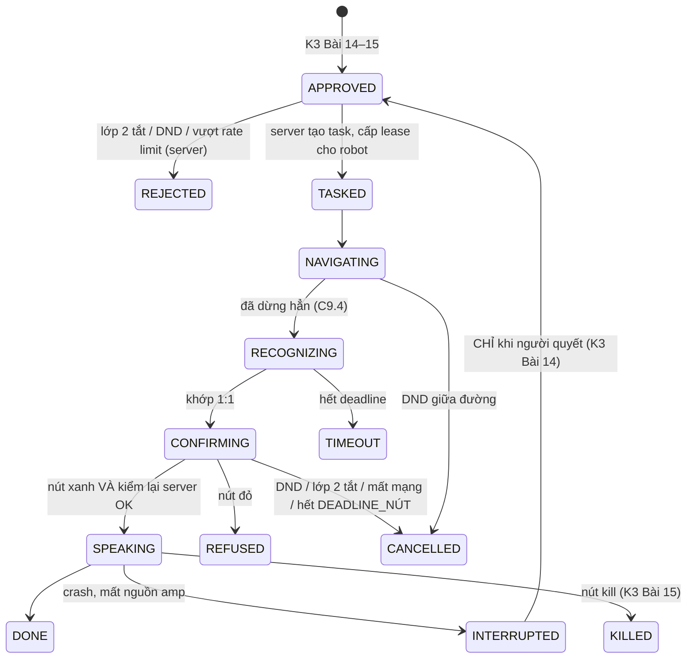
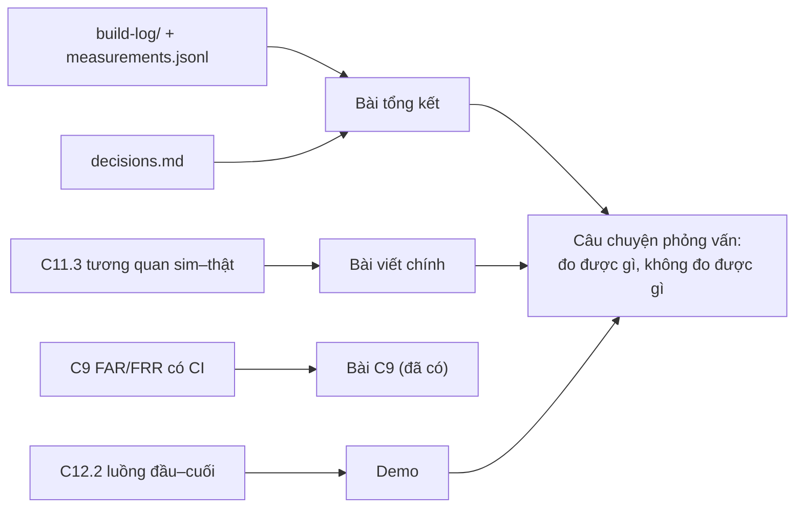

# Chặng 12 — Sản phẩm: robot confession (30h)

> **Vị trí:** C10 (an toàn, vận hành), C11.2 (HIL, CI) → **C12** → hết K7 · **Cần trước:** K3 trọn (chuỗi phát, moderation, kill switch, soak), K7 C9 (nhận người, hai lớp đồng ý), C10, C11.2; → F5.7, F7.4 · **Chạy song song với:** — (chặng cuối)
> **Làm ra được:** chuỗi audio K3 gắn trên robot (amp ăn từ pack qua cầu chì riêng, loa trên cột, đường tín hiệu chống nhiễu, kill switch NC), robot giao một confession đầu–cuối · bảng nhiễu audio theo cấu hình đo được, jitter vòng điều khiển trước/sau khi thêm audio, state machine sản phẩm có test bất biến, SLO đầu–cuối, demo, bài viết chính và bài tổng kết · **Sau chặng này bạn quyết định được:** amp ăn nguồn ở đâu và tín hiệu đi dây thế nào; audio chạy chung ESP32 với vòng điều khiển hay tách MCU; robot có được phát khi đang chạy không; câu chuyện phỏng vấn của bạn nói gì và **không** nói gì.

Đây là chỗ hai đường ray gặp nhau: chuỗi audio của K3 (cái loa đọc confession ẩn danh) và con robot của K7 (đi tìm một người). Ý định sản phẩm gốc là năm version: loa → giọng tự clone → camera chào hỏi → tự đi tới người được nhắc tên → tay máy (`docs/Claude-Xây dựng robot confession…md`). Bản review đầu tiên đã chấm V4 là bước nhảy ~10 lần độ khó so với V1–V3, và Phụ lục A chỉ ra V4 là **một sản phẩm khác về bản chất**: kênh nhắm cá nhân có khuếch đại. C12 ghép V1 + V2 + V3 + V4 thành một luồng có kiểm soát, đo được, và dừng được.

**Phân bổ 30h** `[ước lượng]`:

| Phần | Giờ | Trong đó lắp |
|---|---|---|
| Bài C12.1 Gắn chuỗi audio lên robot | 12 | ~5: lắp bước 1–4 |
| Bài C12.2 Luồng sản phẩm đầu–cuối và state machine sản phẩm | 10 | ~1: lắp bước 5 (chạy đầu–cuối) |
| Bài C12.3 Demo, bài tổng kết, câu chuyện phỏng vấn *(rút gọn)* | 8 | gồm Gate chặng 12 (= gate tổng K7 phần sản phẩm) |
| **Tổng** | **30** | |

## 0. Bức tranh chặng

Robot sau C12: trên cột (C9) thêm một loa nhỏ quay về phía trước; trong khung thêm một module amp class-D ăn thẳng từ pack qua cầu chì riêng; tín hiệu từ ESP32 đi I2S tới DAC rồi bằng cáp xoắn đôi tới amp. E-stop vẫn chỉ cắt động lực; audio có đường cắt riêng (kill switch NC của K3 Bài 15).

```
 PACK 4S ─[F0]─ SW ─ shunt ─ THANH CÁI + ─┬─[FA]─ relay E-stop ─ driver ─ motor   (C1, C10.1)
                                          ├─[FB]─ buck-boost 12 V ─ mini PC
                                          ├─[FC]─ buck 5 V ─ ESP32, DAC, mic
                                          ├─[FD]─ cuộn relay E-stop
                                          └─[FE mới]─ AMP class-D (8–26 V) ═══ loa (BTL, không cọc nào là GND)
                                                 ▲ IN+  IN−  (giả vi sai, cáp xoắn đôi)
 ESP32 ─I2S─► PCM5102A ─OUT ─────────────────────┘    │
            (XSMT) ◄── nút KILL NC (K3 Bài 15)        └── GND tham chiếu của DAC (dây thứ hai của cặp xoắn)
 GND: mọi đường về ĐIỂM SAO (C1); dòng motor KHÔNG đi qua đoạn GND mà DAC và amp cùng dùng.
```

Dòng dữ liệu sản phẩm: Google Form → ingest + state machine (K3 Bài 14) → moderation (K3 Bài 15) → kiểm lớp 2/DND/rate limit (C9.1) → task → Nav2 (C8.4) → dừng, nhận diện, nút xác nhận (C9.4) → kiểm lại server → streamer (K3 Bài 16) → loa → về.

## 1. An toàn của chặng

**Rủi ro:** nhánh nguồn mới từ pack (chập ở amp hoặc dây loa → dòng lớn); dây loa BTL bị nối xuống GND (hỏng tầng ra amp); âm lượng lớn sát tai người (robot đứng 1–1,5 m trước mặt); robot di chuyển khi đang phát, người nhận đi theo robot; nội dung nhạy cảm phát cho nhầm người (C9).

**Quy tắc cứng:**
- KHÔNG nối amp vào thanh cái khi chưa có cầu chì FE riêng và chưa thử trên nguồn bàn giới hạn dòng (C0.4).
- KHÔNG nối bất kỳ cọc loa nào xuống GND, kể cả kẹp GND của que đo hay logic analyzer (BTL, → K3 Bài 5).
- KHÔNG cắm/rút loa khi amp đang có điện.
- KHÔNG để robot chạy khi đang phát: trạng thái `SPEAKING` chỉ vào được từ `STOPPED` và giữ lệnh vận tốc bằng 0 (C12.2). Đây là quy tắc sản phẩm và an toàn cùng lúc.
- KHÔNG đặt âm lượng theo cảm giác: trần âm lượng nằm trong firmware/host, chọn bằng đo (C12.1), không có nút "to hơn" vượt trần.
- KHÔNG coi E-stop là nút tắt tiếng. E-stop cắt động lực; nút kill cắt audio (K3 Bài 15). Hai nút, hai đường, cả hai thử định kỳ.
- KHÔNG phát khi pack dưới ngưỡng điện áp đã đo cho amp (clipping và sụt áp kéo theo brownout, → K3 Bài 6).
- KHÔNG demo trước người chưa biết về dự án; người được nhắc tên trong demo phải là người đã bật lớp 2.

**Khi sự cố xảy ra:**

| Sự cố | Làm ngay | KHÔNG |
|---|---|---|
| Amp hoặc dây loa nóng, có mùi khét | Gạt công tắc chính (hoặc rút XT60 pack) → đợi → kiểm cầu chì FE và dây | Rút dây loa bằng tay trần khi còn điện |
| Loa phát nội dung cho nhầm người hoặc nội dung chưa duyệt | Bấm kill (L2: XSMT/mute phần cứng) → task `KILLED` → `incidents.md` | Tắt app rồi tin là đã im |
| Tiếng rú (feedback) khi bật mic | Kill → hạ gain mic/loa | Đứng che loa bằng tay rồi chạy tiếp |

## 2. BOM chặng

Giá `[ước lượng 10/2026]`. Món đã có từ K3 (PCM5102A, INMP441, loa 4 Ω, amp PAM8403, nút kill) dùng lại; chỉ mua thêm thứ cần cho robot.

| Món | Thông số phải chọn | Vì sao (bằng số) | Giá | Kiểm khi nhận | Thay thế được bằng |
|---|---|---|---|---|---|
| Module amp class-D ăn từ pack | Dải nguồn bao trọn pack (4S Li-ion 12–16,8 V `[chuẩn]`), **đầu vào vi sai**, có chân shutdown/mute; ví dụ họ TPA3110D2 (nguồn 8–26 V `[spec — datasheet TI, kiểm]`) | Không cần buck riêng; đầu vào vi sai cho phép nối giả vi sai (C12.1) | 80–200k | Đọc mã chip trên module; đo dòng nghỉ trên nguồn bàn | PAM8403/MAX98357A trên nhánh 5 V (nguồn 2,5–5,5 V `[spec]`): tăng tải buck 5 V và dùng chung rail với logic |
| Loa full-range có hộp | 4–8 Ω, 3–5 W, đường kính 50–80 mm | Robot đứng 1–1,5 m trước người; cần ~1 W thật `[ước lượng]` | 50–200k | Đo Ω DC (thấp hơn danh định, → K3 Bài 5) | Loa của K3 |
| Cầu chì FE + giá | Định mức theo dòng đỉnh amp đo được (C12.1), cỡ 2–3 A `[ước lượng]` | Bảo vệ dây nhánh amp (C1.3) | 20–50k | — | — |
| Tụ bulk sát amp | 470–1000 µF, ≥25 V | Gánh dòng đỉnh, giảm gợn từ nhánh motor (→ K3 Bài 6) | 10–30k | Cực tính, điện áp ghi trên vỏ | — |
| Cáp tín hiệu audio | Xoắn đôi có lưới chống nhiễu (cáp mic/cáp audio), 0,3–0,6 m | Tín hiệu line-level đi gần dây motor | 20–50k/m | Thông mạch, lưới không chạm lõi | Hai dây 26 AWG tự xoắn |
| Vòng ferrite kẹp | Cho dây 3–6 mm | Giảm nhiễu tần số cao trên dây motor/dây nguồn amp `[tự đo — hiệu quả phụ thuộc tần số]` | 10–30k/cái | — | — |
| (tùy chọn) ESP32-S3 thứ hai | DevKit như K1 | Nếu audio làm jitter vòng điều khiển vượt ngưỡng C4 (C12.1) | 150–250k | — | Dùng chung ESP32 nếu đo đạt |
| (tùy chọn) Bộ cách ly ground loop | Biến áp audio 3,5 mm | Cắt vòng đất khi không sửa được đi dây | 50–100k | — | Sửa đi dây (ưu tiên) |

**Tổng C12 `[ước lượng]`:** ~0,3–0,9tr.

## 3. Dụng cụ và kỹ năng tay

| Kỹ năng | Bài | Luyện trên phế liệu | Đạt trông thế nào |
|---|---|---|---|
| Đi dây tín hiệu xa dây công suất: tách bó, cắt ngang 90° | C12.1 | — | Cáp audio không chạy song song dây motor đoạn nào dài hơn vài cm; ảnh trước/sau |
| Hàn cáp có lưới chống nhiễu, nối lưới **một đầu** | C12.1 | 2 đầu cáp thừa | Lưới xoắn gọn, co nhiệt, không chạm lõi; đầu kia cắt và bọc |
| Đo nhiễu bằng mic + phổ (thay máy hiện sóng) | C12.1 | Ghi phòng yên tĩnh 30 s | Phổ có đơn vị dBFS, ghi gain, khoảng cách, vị trí mic |
| Gá loa trên cột, chống rung | C12.1 | — | Gõ nhẹ khung khi phát: không có tiếng lạch cạch; ốc có khóa (C2.3) |

## 4. Sơ đồ đi dây

```
 NHÁNH NGUỒN AMP (mới)                                      ĐƯỜNG TÍN HIỆU (giả vi sai)
 THANH CÁI + ─[FE 2–3 A]─ 20AWG đỏ ─┬─ AMP PVCC              PCM5102A OUT_L ───┐ cặp xoắn có lưới
                                    ═╪═ 1000 µF sát amp       PCM5102A AGND  ───┤ (lưới nối GND
 ĐIỂM SAO GND ───── 20AWG đen ──────┴─ AMP GND                                  │  CHỈ phía DAC)
                                                              ────────────────► AMP IN+  (L)
 AMP OUT+ ═══ 20AWG (cặp xoắn) ═══ LOA +                      ────────────────► AMP IN−  (L)
 AMP OUT− ═══                ═══ LOA −   (KHÔNG cọc nào về GND)
 AMP /SD ◄── GPIO ESP32 qua nút KILL NC (mức mất điện/đứt dây = shutdown) — theo K3 Bài 15 tầng L2
```

| wire_id | net | từ → tới | AWG | màu | dài (m) | cầu chì |
|---|---|---|---|---|---|---|
| W80/W81 | VIN_AMP / GND | FE → amp; về điểm sao | 20 | đỏ (nhãn AMP)/đen | ~0,3 | FE |
| W82 | SPK± | amp → loa | 20, xoắn | màu loa, nhãn SPK | ~0,6 (lên cột) | — |
| W83 | AUDIO_L± | DAC → amp IN± | cáp xoắn có lưới | nhãn AUD | ≤0,5 | — |
| W84 | AMP_SD | nút kill → amp /SD | 24 | nhãn đỏ hai đầu (đường an toàn audio) | ~0,5 | — |

Cập nhật `power/budget.csv` dòng `amp_audio` bằng số đo thật (C1.2 đã để sẵn dòng ước lượng; CI `test_power_budget` của C1 sẽ đỏ nếu quên).

## 5. Trình tự chặng

1. **Học Bài C12.1 phần 1–5**, commit `prediction.md`.
2. **Lắp bước 1 — Amp trên bàn, nguồn bàn.** V_set = 12,0 V rồi 16,8 V (hai đầu dải pack), I_set 1 A; loa nối; phát sin 1 kHz ở mức trần dự kiến.
   - ✅ Checkpoint trước khi cấp điện: Ω giữa PVCC và GND của amp không gần 0; Ω giữa từng cọc loa và GND: **hở** (BTL); cực tính tụ bulk đúng.
   - Nếu sai: không cấp điện; tìm chập.
3. **Lắp bước 2 — Nhánh FE trên robot.** Cầu chì FE, dây W80/W81 về điểm sao, amp gá trong khung xa driver motor.
   - ✅ Checkpoint: công tắc chính OFF; Ω thanh cái + → GND không gần 0; FE đã lắp đúng định mức; đo dòng nghỉ amp khi bật (INA226 hoặc UT33D+ thang A nối tiếp).
4. **Lắp bước 3 — Đo nhiễu ba cấu hình** (C12.1 phần 6): đơn cực → giả vi sai → giả vi sai + đi dây lại/ferrite. Bánh nhấc khỏi sàn.
5. **Lắp bước 4 — Kill switch và jitter.** Thử kill L2 trên robot khi đang phát; đo jitter vòng điều khiển C4 có/không có task audio.
   - ✅ Checkpoint: kill làm loa im trong thời gian đo được ở K3 Bài 15, kể cả khi daemon bị `SIGSTOP`; jitter p99 vẫn trong ngưỡng gate C4.
6. **Học Bài C12.2**, chạy test bất biến; **lắp bước 5 — một confession đầu–cuối** trên robot thật với người đã bật lớp 2.
7. **Bài C12.3**: demo, bài viết chính, bài tổng kết; **Gate chặng 12**.

## 6. Lỗi người mới hay gặp

| Triệu chứng | Nguyên nhân khả dĩ | Kiểm bằng cách | Sửa |
|---|---|---|---|
| Tiếng rè theo tốc độ motor | GND tín hiệu đi chung đoạn với dòng motor; đầu vào đơn cực | So nhiễu khi motor chạy/không, amp mute/không | Giả vi sai; dời đường GND (C12.1) |
| Ù đều 50/100 Hz chỉ khi cắm sạc hoặc màn hình | Vòng đất qua sạc/HDMI/USB của laptop | Rút từng cáp ngoài | Chỉ đo khi robot chạy pin; nếu bắt buộc cắm, cách ly |
| ESP32 reset khi phát bass lớn lúc motor tăng tốc | Sụt áp nhánh chung (→ K3 Bài 6, F5.7) | `esp_reset_reason()`, log INA226 | Amp ăn từ pack qua FE, không từ buck 5 V; tụ bulk; không phát khi chạy |
| Tiếng bụp khi bật/tắt robot | Amp lên nguồn trước khi DAC ổn định | Nghe lúc bật | Giữ /SD thấp tới khi ESP32 sẵn sàng |
| Tiếng méo dần khi pin cạn | Amp clip sớm hơn ở điện áp thấp | Phát sin ở 12 V và 16,8 V trên nguồn bàn | Chọn lại trần âm lượng (C12.1) |
| Loa lạch cạch khi phát | Cột/loa rung | Gõ khung | Đệm cao su, siết ốc khóa |

## 7. Lăng kính data infra

**Dữ liệu chặng này sinh ra:**

| Luồng | Nơi | Schema rút gọn | Ghi chú |
|---|---|---|---|
| Đo nhiễu audio | `lab/c12/noise-<cấu hình>.wav` + `measurements.jsonl` | `config`, `motor_pwm`, `amp_state`, `mic_gain`, `distance_m`, `noise_dbfs_band`, `instrument_id` | Ghi âm **im lặng số** (không có giọng người); mic đặt cố định |
| Sự kiện sản phẩm | MCAP `/product/event` + DB server | `confession_id` (không nội dung), `delivery_id`, `state_from`, `state_to`, `reason`, `t_event` (wall + mono + `boot_id`) | Nội dung confession KHÔNG vào MCAP |
| Jitter vòng điều khiển | như C4 | thêm cột `audio_active` | So hai phân bố |

**Test tự động (hạt giống cho C11.2):** `test_product_invariants` (C12.2: không phát khi lớp 2 tắt/DND tại thời điểm phát, không phát một tin hai lần, không phát khi đang chạy); `test_audio_noise_floor` (HIL: chạy motor theo lịch cố định, ghi mic, FAIL nếu nhiễu trong dải thoại vượt mức đã ghi ở gate C12); `test_jitter_with_audio`; `test_power_budget` (C1) với dòng amp thật.

**SLI/SLO đầu–cuối** (→ F7.4): từ lúc confession được duyệt tới lúc phát xong cho người nhận đã xác nhận; ghép từ SLI của K3 (ingest, TTS, phát) và C9 (thời gian tới quyết định, timeout theo người). Hợp đồng soak của K3 Bài 17 dùng lại cho luồng sản phẩm.

**Vai trò nghề:** Systems Architect (ghép hai state machine, chọn ranh giới MCU), Test & Validation (bất biến sản phẩm, HIL), Technical Writer (bài viết chính). Bản đồ đầy đủ ở C12.3.

## 8. Nhật ký build

Copy vào `build-log/c12.md`:

```markdown

## 2026-MM-DD — buổi N (giờ bắt đầu–kết thúc, giờ thực: _._ h)
- Trạng thái người: tỉnh táo / mệt (mệt → chỉ đọc, không đụng nhánh nguồn)
- Mục tiêu buổi:
- Cấu hình audio: amp __, nguồn amp __, đầu vào đơn cực/giả vi sai, ferrite có/không
- Pack: điện áp đầu buổi __ V, cuối buổi __ V
- Số đo (measurements.jsonl, số dòng: __); file ghi âm: __
- Jitter vòng điều khiển có audio: p99 __ µs (n = __)
- Confession chạy đầu–cuối: delivery_id __, kết thúc ở trạng thái __, lý do __
- Lỗi gặp (triệu chứng → nguyên nhân → sửa):
- Quyết định (decisions.md):
- Sự cố / suýt sự cố: không / có → incidents.md
- Câu hỏi còn mở:
```

---

## Bài C12.1 — Gắn chuỗi audio lên robot: amp chung pin, nhiễu motor vào audio, ground loop (12h)

> **Vị trí:** K3 Bài 5–6 (amp, nguồn, brownout) + C1 (bo nguồn) + C10.1 → **C12.1** → C12.2 · **Cần trước:** K3 Bài 5 (BTL, công suất), K3 Bài 6 (trở kháng nguồn, sụt áp, ground loop), K3 Bài 15 (kill switch bốn tầng), K7 C1.3, C1.5 (log INA226), C4.2 (jitter), C5.1 (nhiễu motor lên logic, ground); → F5.7, F5.6 (phổ), F1.5 · **Sau bài này bạn quyết định được:** amp ăn nguồn từ pack hay từ 5 V; tín hiệu nối đơn cực hay giả vi sai; audio chạy chung ESP32 với vòng điều khiển hay tách MCU; trần âm lượng bao nhiêu và đặt ở đâu.

### 1. Câu chuyện — ai đã khổ vì chuyện này

Giới âm thanh chuyên nghiệp khổ với tiếng ù hàng chục năm, và cách "chữa" phổ biến nhất từng là cắt chân tiếp đất an toàn của phích cắm thiết bị ("lifting the ground"): hết ù, và vỏ kim loại thiết bị mất đường thoát khi có chạm điện. Năm 1995, Neil Muncy công bố *Noise Susceptibility in Analog and Digital Signal Processing Systems* (Journal of the Audio Engineering Society) chỉ ra một nguyên nhân gốc rất cụ thể mà ông gọi là **"pin 1 problem"**: lưới chống nhiễu của cáp cân bằng được nối vào mass mạch tín hiệu bên trong thiết bị thay vì vào vỏ, nên dòng chạy trên lưới đi xuyên qua đường mass của mạch khuếch đại `[chuẩn]`. Tiêu chuẩn AES48 sau đó quy định cách nối lưới cáp vào vỏ thiết bị `[spec — AES48, tên chuẩn chắc chắn; điều khoản chưa đối chiếu]`. Bài học: nhiễu không "ở trong không khí"; nó đi theo **đường dòng điện cụ thể**, và chữa đúng là dời đường đó, không phải cắt bỏ một lớp bảo vệ.

Robot của bạn có phiên bản nhỏ của cùng chuyện, cộng thêm một tải mà phòng thu không có: hai motor kéo vài ampe, bật tắt 20.000 lần mỗi giây. K3 Bài 6 cho bạn thấy sụt áp trên bàn với một cái amp; ở đây cái amp đứng cạnh nguồn nhiễu lớn nhất robot.

### 2. Mô hình tư duy

Nhiễu motor tới loa theo năm đường. Mỗi đường có một cách đo và một cách chữa riêng:

| # | Đường | Cơ chế | Đo bằng | Chữa |
|---|---|---|---|---|
| 1 | **Trở kháng GND chung** | Dòng motor đi qua đoạn GND mà DAC và amp cùng tham chiếu: `V_nhiễu = I_motor · R_chung` xuất hiện **như tín hiệu** ở đầu vào đơn cực | Nhiễu đổi theo PWM motor khi amp bật, biến mất khi amp mute | GND hình sao (C1), đầu vào **giả vi sai** |
| 2 | **Nguồn chung** | Gợn dòng motor làm gợn áp pack; amp ăn từ pack nhận gợn đó, bị nén bởi PSRR của amp | Nhiễu còn khi tín hiệu vào bằng 0 và đầu vào đã vi sai | Tụ bulk sát amp, cầu chì/dây nhánh riêng, PSRR tra datasheet |
| 3 | **Vòng đất (ground loop)** | Hai đường GND giữa hai khối (dây GND + vỏ USB/lưới cáp) tạo một vòng; từ trường của dòng motor xuyên vòng sinh điện áp; dòng chia giữa hai đường | Ù/rè đổi khi rút một cáp (USB, sạc, HDMI) | Một đường GND giữa hai khối; lưới cáp nối một đầu; vòng nhỏ |
| 4 | **Ghép từ/điện dung** | Dây tín hiệu chạy song song dây motor | Nhiễu đổi khi dời dây | Xoắn đôi, cắt ngang 90°, tách bó |
| 5 | **Âm học** | Tiếng hộp số, bánh, sàn vào mic (khi robot nghe người) | Mic ghi khi amp tắt hẳn | Không nghe/không phát khi chạy; gain staging (→ K3 Bài 7) |

Hai ý bản chất:
1. **"GND" không phải một điểm, mà là một dây có điện trở.** Hai điểm cùng gọi là GND cách nhau vài chục mΩ đồng; nhân với vài ampe là vài chục mV, cùng bậc với nhiễu nghe rõ trên loa. Ở logic 3,3 V với ngưỡng hàng trăm mV, vài chục mV vô hại (C5.1); ở line-level audio thì không.
2. **Vi sai đổi "đo so với GND" thành "đo hiệu hai dây đi cùng nhau".** Nối dây thứ hai của cặp xoắn vào GND **tại DAC** (giả vi sai): điện áp rơi trên GND chung xuất hiện như nhau trên cả hai dây (chế độ chung) và bị amp nén theo CMRR. Đây là cùng nguyên lý với CAN, RS-485, USB, LVDS.

Mô phỏng đồ chơi: dòng motor có PWM 20 kHz, gợn theo vòng quay và một cú tăng tốc; đoạn GND chung 10 mΩ; so ba cách nối.

```python
# [đã chạy] Nhiễu motor vào audio qua GND dùng chung: đầu vào đơn cực vs giả vi sai
import numpy as np
FS, T = 200_000, 0.5                       # mô phỏng 200 kHz trong 0,5 s
t = np.arange(0, T, 1 / FS)
# Dòng motor (2 bánh) [ước lượng — thay bằng log INA226 của C1.5]:
pwm = (np.mod(t * 20_000, 1) < 0.6)                    # PWM 20 kHz, duty 60 %
i_avg = 1.2 + 0.4 * np.sin(2 * np.pi * 37 * t)         # gợn theo vòng quay/chổi than ~37 Hz
i_avg += 3.0 * np.exp(-(t - 0.25) / 0.04) * (t > 0.25) # cú tăng tốc lúc t = 0,25 s
i_mot = i_avg * (0.7 + 0.6 * pwm)                      # gợn dòng ở tần số PWM (tụ bulk gánh phần lớn)
speech = 0.5 * np.sin(2 * np.pi * 220 * t)             # "giọng" 0,5 V đỉnh ở đầu vào amp

def audible(x):                            # lọc thông thấp 8 kHz (thô) rồi lấy RMS: phần nghe được
    k = int(FS / 8000); return np.convolve(x, np.ones(k) / k, mode="same")
def db(a, b): return 20 * np.log10(np.sqrt(np.mean(a**2)) / np.sqrt(np.mean(b**2)))

R_SHARED = 0.010                           # 10 mΩ đoạn GND chung giữa DAC và amp [ước lượng]
v_gnd = i_mot * R_SHARED                   # điện áp rơi trên đoạn GND chung
for name, cmrr_db in (("đơn cực (IN− nối GND tại amp)", None),
                      ("giả vi sai, CMRR 40 dB", 40), ("giả vi sai, CMRR 60 dB", 60)):
    # Đơn cực: amp thấy cả v_gnd như tín hiệu. Giả vi sai: v_gnd là chung chế độ, bị nén CMRR lần.
    leak = v_gnd if cmrr_db is None else v_gnd / 10 ** (cmrr_db / 20)
    noise = audible(leak - leak.mean())
    print(f"{name:32s} nhiễu nghe được {1e3*np.sqrt(np.mean(noise**2)):6.2f} mVrms  "
          f"SNR so giọng {db(audible(speech), noise):5.1f} dB")
for r in (0.002, 0.010, 0.050):            # dây GND chung càng dài/mảnh càng tệ
    n = audible(i_mot * r - (i_mot * r).mean())
    print(f"R_shared={1e3*r:4.0f} mΩ, đơn cực: SNR {db(audible(speech), n):5.1f} dB")
```

Trước khi chạy, đoán: đơn cực với 10 mΩ cho SNR so với giọng bao nhiêu dB; giả vi sai CMRR 40 dB cải thiện bao nhiêu. Lưu ý giới hạn mô hình: SNR so với giọng không phải toàn bộ câu chuyện, vì **giữa hai câu** loa chỉ phát nhiễu; tai so nhiễu với im lặng, không với giọng.

### 3. Cầu nối từ backend

| Backend bạn biết | Ở đây | Gãy ở chỗ | Nếu dùng nhầm thì |
|---|---|---|---|
| Noisy neighbor trên cùng host | Motor và amp cùng pack, cùng GND | Không có scheduler hay cgroup chia công bằng; vật lý chia theo Ohm trên **phần trở kháng dùng chung** | Tìm "process gây nhiễu" trong firmware audio |
| Gửi kèm baseline để so sánh (diff thay vì giá trị tuyệt đối) | Giả vi sai: gửi kèm GND tham chiếu của DAC | Chỉ khử được phần **giống nhau** trên hai dây; CMRR hữu hạn và giảm ở tần số cao `[spec — datasheet amp]` | Tin vi sai khử mọi nhiễu, bỏ qua đường 2 (nguồn) và 5 (âm học) |
| Tách workload ồn sang node riêng | ESP32 thứ hai cho audio | Tách node backend tốn tiền; tách MCU tốn chân, dây, một giao thức nữa, và một điểm hỏng nữa | Tách sớm khi chưa đo jitter; hoặc không tách khi jitter đã vượt |
| Chạy batch job ngoài giờ cao điểm | Không phát khi motor chạy | Ở backend đây là tối ưu chi phí; ở đây nó là **ràng buộc an toàn và sản phẩm** (người nhận không đuổi theo robot) | Cho phép "phát trong lúc đi cho nhanh" |

**Chấm mô hình:**
- *"Mọi điểm GND đều là 0 V."* — **SAI.** GND là tham chiếu ta chọn; mỗi đoạn dây GND có điện trở và điện cảm. Phản ví dụ: đo bằng UT33D+ thang mV giữa GND ở DAC và GND ở amp khi motor tăng tốc: số khác 0 và nhảy theo dòng (multimeter chỉ thấy trung bình; phần nhanh bạn nghe được trên loa).
- *"Thêm tụ to là hết nhiễu."* — **ĐÚNG MỘT PHẦN.** Tụ bulk gánh dòng nhanh qua R_s nguồn (đường 2, → K3 Bài 6), nhưng không làm gì với đường 1: điện áp rơi trên đoạn GND chung do dòng motor **đi qua** đoạn đó, không do amp thiếu dòng. Phản ví dụ: thêm 2200 µF ở amp, tiếng rè theo PWM motor vẫn nguyên; đổi sang giả vi sai thì giảm rõ.
- *Mô hình của bạn ở K3 lượt 11* ("chung nguồn… chiếm dụng nguồn chung là xảy ra") — đã chấm **ĐÚNG MỘT PHẦN** ở K3 Bài 6; bản sửa ở đó ("thứ cần quản lý là trở kháng chung, không phải chung nguồn") là chính xác điều bài này đo trên robot.

### 4. Thuật ngữ

| Mức | Thuật ngữ | Nghĩa trong một câu | Hay bị hiểu nhầm thành |
|---|---|---|---|
| 🟢 | Trở kháng chung (common impedance) | Đoạn dây/đầu nối mà dòng của hai mạch cùng đi qua | "Chung nguồn" |
| 🟢 | Đơn cực / vi sai / giả vi sai | Đo so với GND / đo hiệu hai dây / dây thứ hai là GND tham chiếu của bên gửi | Vi sai cần nguồn ±V |
| 🟢 | Chế độ chung (common mode) | Phần điện áp giống nhau trên cả hai dây | Nhiễu nói chung |
| 🟡 | CMRR | Tỉ số nén chế độ chung của đầu vào vi sai, dB | Khử mọi nhiễu |
| 🟡 | PSRR | Tỉ số nén gợn nguồn của mạch, dB | Không liên quan audio |
| 🟢 | Ground loop | Hai đường GND song song giữa hai khối tạo vòng có dòng/điện áp cảm ứng | Có hai GND |
| 🟢 | GND hình sao | Mọi nhánh về một điểm, không nối tiếp qua nhau | Nối hết GND vào khung |
| 🟡 | Gain staging | Đặt mức đúng ở mỗi tầng để tín hiệu dùng hết dải trước tầng nhiễu | Tăng âm lượng ở cuối |
| 🔴 | Thiết kế EMC đạt chuẩn | Đo bức xạ/miễn nhiễm theo tiêu chuẩn | Cần cho robot cá nhân |

### 5. Dự đoán

**Tham số cần tra/đo:** R của đoạn GND chung trong cấu hình đơn cực (đo bằng đồ gá Kelvin của C0.3: dòng cố định từ nguồn bàn, đo mV); dạng dòng motor từ log INA226 của C1.5 (biên độ gợn, đỉnh lúc tăng tốc); CMRR và PSRR của amp (datasheet, mục electrical characteristics `[spec]`); dòng nghỉ và dòng đỉnh amp ở trần âm lượng (đo lắp bước 1); jitter p99 vòng điều khiển ở gate C4.

1. Chạy mô phỏng với R_chung **đo được** và dòng motor của bạn: SNR đơn cực, giả vi sai.
2. Đo thật (phần 6 bước 4): xếp hạng 6 ô (motor tắt/chạy 60 % × ba cấu hình) theo mức nhiễu dải thoại; đỉnh phổ nằm ở tần số nào (PWM có nghe được không? gợn quay?).
3. Dòng đỉnh amp ở trần âm lượng → định mức FE.
4. Trần âm lượng chọn ở 12 V hay 16,8 V, vì sao.
5. Jitter p99 khi có task audio trên cùng ESP32: tăng, giảm, hay không đổi trong sai số? Bạn tách MCU nếu p99 vượt bao nhiêu?

```markdown
# prediction.md — C12.1
- R_chung đo = __ mΩ; dòng motor gợn __ A, đỉnh __ A
- Mô phỏng: SNR đơn cực __ dB; giả vi sai (CMRR __ dB) __ dB
- Xếp hạng 6 ô nhiễu (thấp → cao): __ ; đỉnh phổ dự kiến ở __ Hz vì __
- Dòng amp: nghỉ __ A, đỉnh __ A -> FE = __ A
- Trần âm lượng chọn ở __ V vì __
- Jitter p99 có audio: __ µs (không audio: __ µs); tách MCU nếu > __
```

### 6. Làm

**A — Amp trên bàn (lắp bước 1).** Nguồn bàn 12,0 V và 16,8 V, I_set 1 A. Phát sin 1 kHz số (→ K3 Bài 7: sin tạo bằng code) ở các mức −20, −12, −6 dBFS. Ghi dòng nguồn (màn hình nguồn bàn, chỉ trung bình) và nghe/nhìn clipping ở **cả hai** điện áp. Chọn **trần âm lượng** theo câu 4 của dự đoán và kiểm nó ở cả hai đầu dải pack. Đo SPL ở 1 m bằng app điện thoại (sai số lớn, chỉ để so tương đối `[tự đo]`); mục tiêu là nghe rõ ở 1–1,5 m, không to hơn giọng nói to.

**B — Nhánh FE trên robot (lắp bước 2).** Theo mục 4 của chặng. Định mức FE theo dòng đỉnh đo ở A và tiết diện dây (→ C1.3).

**C — Đo nhiễu ba cấu hình (lắp bước 3).** Bánh nhấc khỏi sàn, robot đứng trên bàn thử.
1. Mic INMP441 (hoặc điện thoại) đặt cố định cách loa 10 cm, gain cố định, ghi 10 s mỗi ô. DAC phát **im lặng số** (toàn 0).
2. Ma trận đo: motor {tắt, 30 %, 60 %, cú tăng tốc} × amp {mute qua /SD, bật} × cấu hình {(i) đơn cực: IN− nối GND tại amp; (ii) giả vi sai: IN− nối AGND của DAC qua dây thứ hai của cặp xoắn; (iii) (ii) + đi dây lại xa dây motor + ferrite trên dây motor}. Hiệu giữa "amp bật" và "amp mute" là phần **điện** đi qua loa; phần còn lại là âm học (đường 5).
3. Phân tích mỗi file bằng script dưới; ghi `noise_dbfs_band` vào `measurements.jsonl`.

```python
# [đã chạy] Mức nhiễu trong dải thoại (dBFS) và các đỉnh phổ từ một file WAV ghi bằng mic
import sys, numpy as np
from scipy.io import wavfile
from scipy.signal import welch

def analyse(path, band=(100, 4000)):
    fs, x = wavfile.read(path)
    scale = np.iinfo(x.dtype).max if np.issubdtype(x.dtype, np.integer) else 1.0
    x = (x[:, 0] if x.ndim > 1 else x).astype(np.float64) / scale   # về thang full-scale ±1
    f, pxx = welch(x - x.mean(), fs, nperseg=4096)            # mật độ phổ công suất (FS²/Hz)
    sel = (f >= band[0]) & (f <= band[1])
    p_band = pxx[sel].sum() * (f[1] - f[0])                    # công suất trong dải
    top = f[sel][np.argsort(pxx[sel])[-3:]][::-1]             # 3 đỉnh lớn nhất
    return 10 * np.log10(p_band + 1e-20), top

if __name__ == "__main__":
    if len(sys.argv) > 1:
        for p in sys.argv[1:]:
            db, top = analyse(p); print(f"{p}: {db:6.1f} dBFS trong 100–4000 Hz, đỉnh {np.round(top)} Hz")
    else:                                                      # tự thử bằng dữ liệu tổng hợp
        fs = 16000; t = np.arange(0, 5, 1 / fs); rng = np.random.default_rng(0)
        quiet = 0.001 * rng.standard_normal(t.size)
        motor = quiet + 0.01 * np.sin(2 * np.pi * 150 * t) + 0.004 * np.sin(2 * np.pi * 740 * t)
        for name, sig in (("quiet", quiet), ("motor", motor)):
            wavfile.write(f"{name}.wav", fs, (sig * 32767).astype(np.int16))
            db, top = analyse(f"{name}.wav"); print(f"{name}: {db:6.1f} dBFS, đỉnh {np.round(top)} Hz")
```
   Chạy `python3 band.py lab/c12/*.wav`. Không có file: chạy không tham số để tự thử bằng dữ liệu tổng hợp. Sai số: ghi lặp 3 lần mỗi ô, báo trung vị và khoảng; chênh dưới ~1–2 dB giữa hai ô là không phân biệt được `[ước lượng]`.

**D — Kill switch và jitter (lắp bước 4).**
4. Kill L2 (nút NC → XSMT và /SD) khi đang phát trên robot; đo thời gian bấm → im như K3 Bài 15, lặp ≥10 lần, kể cả khi daemon bị `SIGSTOP`.
5. Task audio trên ESP32 điều khiển: pin task I2S/ring buffer vào **nhân không chạy vòng điều khiển**, ưu tiên thấp hơn vòng điều khiển `[tự đo — API FreeRTOS/ESP-IDF theo phiên bản]`. Đo jitter p99 vòng điều khiển 100 Hz (cách đo của C4.2) **có** và **không** phát audio, ≥10.000 chu kỳ mỗi bên; so hai phân bố (→ F1.5), không so hai con số. Nếu p99 vượt ngưỡng gate C4: tách audio sang ESP32-S3 thứ hai (ESP32 của K3), nối với mini PC bằng USB riêng.

**E — (tùy chọn) Mic để nghe người.** Đọc một câu cố định ở 1 m, motor tắt và motor chạy; SNR giọng so nền (→ K3 Bài 7: gain staging). Kết luận thường dẫn tới cùng quy tắc: **không nghe và không phát khi đang chạy**.

### 7. Số phải ra

<details><summary>🔒 MỞ SAU KHI COMMIT prediction.md</summary>

**Mô phỏng phần 2** (dòng motor giả định, R_chung 10 mΩ, giọng 0,5 V đỉnh):

| Cấu hình | Nhiễu nghe được | SNR so giọng |
|---|---|---|
| Đơn cực | ~6,6 mVrms | ~35 dB |
| Giả vi sai, CMRR 40 dB | ~0,07 mVrms | ~75 dB |
| Giả vi sai, CMRR 60 dB | ~0,01 mVrms | ~95 dB |
| Đơn cực, R_chung 2 / 10 / 50 mΩ | — | ~49 / 35 / 21 dB |

Mỗi lần R_chung gấp 5, SNR mất ~14 dB (20·log₁₀5): nhiễu tỉ lệ tuyến tính với R_chung và I_motor. ~35 dB nghĩa là giữa hai câu, loa phát tiếng rè nghe rõ ở 1 m `[ước lượng]`. CMRR thật của amp thấp hơn ở tần số cao và phụ thuộc cân bằng trở kháng hai dây, nên 40 dB là con số an toàn để dự đoán, không phải lời hứa.

**Đo thật — hướng phải thấy** `[tự đo]`:
- Amp mute: mức nhiễu gần như không đổi giữa ba cấu hình (chỉ còn âm học: tiếng hộp số tăng theo PWM).
- Amp bật, đơn cực: nhiễu tăng theo PWM motor và vọt lên ở cú tăng tốc; giả vi sai giảm rõ; đi dây lại + ferrite giảm thêm ít hơn.
- PWM 20 kHz nằm ngoài tai và ngoài dải mic 16 kHz; thứ nghe thấy là **gợn tần số thấp** (vòng quay, chổi than, thay đổi tải) và sản phẩm trộn của chúng. Đỉnh ở 50/100 Hz chỉ khi cắm sạc/cáp ngoài là vòng đất qua lưới điện.
- Trần âm lượng: chọn ở 12 V. Ở 16,8 V cùng mức số cho cùng điện áp ra (amp khuếch đại theo gain cố định), nhưng biên clip cao hơn; chọn ở 16,8 V thì robot clip khi pin cạn.
- Jitter: task audio đúng nhân, đúng ưu tiên thường không đổi p99 vòng điều khiển ngoài sai số; ISR I2S/DMA chung nhân với vòng điều khiển, hoặc log in qua UART trong vòng lặp, thì p99 tăng. Đây là dữ liệu cho quyết định tách MCU, không phải lời hứa.

</details>

### 8. Nếu ra khác

| Triệu chứng | Nguyên nhân khả dĩ | Kiểm bằng cách | Sửa |
|---|---|---|---|
| Giả vi sai không giảm nhiễu | Dây IN− vẫn nối GND tại amp ở chỗ khác (module có jumper/IN− nối sẵn GND) | Thông mạch IN− với GND amp khi DAC đã tháo | Đọc sơ đồ module; cắt jumper `[tự đo]` |
| Nhiễu như nhau khi amp mute và bật | Đó là âm học, không phải điện | Mic xa robot, motor bọc vải | Chỉ chữa bằng quy tắc "không phát khi chạy" |
| Ù 50 Hz chỉ khi laptop cắm vào robot | Vòng đất qua laptop–sạc–lưới | Rút sạc laptop | Đo khi chạy pin; cách ly USB nếu bắt buộc cắm |
| FE đứt khi phát bass lớn | FE nhỏ hơn dòng đỉnh, hoặc cầu chì loại tác động nhanh | Log INA226 nhánh amp | Định mức theo đường cong thời gian–dòng (C1.3) |
| Jitter p99 tăng khi phát | Task audio cùng nhân vòng điều khiển; ISR dài | Ghi nhân của từng task | Pin task đúng nhân; ISR chỉ đặt cờ (→ K3 Bài 15); tách MCU |
| ESP32 reset khi phát lúc motor tăng tốc | Amp ăn từ 5 V chung logic | `esp_reset_reason()` | Amp từ pack qua FE; không phát khi chạy |

### 9. Câu hỏi ngược

1. **[Failure mode]** Amp ăn từ pack. BMS cắt pack khi quá dòng lúc motor kẹt; amp mất nguồn giữa câu trong khi DAC (từ buck 5 V có tụ) còn sống thêm vài chục ms. Nghe thấy gì, và state machine phải ghi trạng thái gì?
<details><summary>Hướng nghĩ</summary>

Có thể là tiếng bụp, rồi im; mini PC cũng có thể tắt theo (cùng pack). Confession đang `SPEAKING` thành `INTERRUPTED` sau khởi động lại (K3 Bài 14), và chỉ người được đưa lại hàng đợi. Liên hệ thứ tự lên/xuống nguồn: /SD phải xuống trước khi nguồn amp mất.

</details>

2. **[Quy mô]** 100 robot, mỗi con đi dây tay. Nhiễu audio ở con thứ 37 kém hơn trung vị 15 dB. Bạn phát hiện bằng gì trước khi khách hàng nghe thấy?
<details><summary>Hướng nghĩ</summary>

`test_audio_noise_floor` trong HIL/end-of-line test với ngưỡng từ phân bố đo được của đội; lưu kết quả theo serial robot (→ F3.8). Đi dây tay là nguồn biến thiên lớn nhất; đó là lý do sản xuất dùng dây dựng sẵn.

</details>

3. **[Vì sao không]** Vì sao không dùng amp I2S (MAX98357A) cho gọn: không DAC, không dây analog?
<details><summary>Hướng nghĩ</summary>

Đường số tới tận amp khử đường 1 và 4 ở phía tín hiệu, nhưng MAX98357A ăn 2,5–5,5 V `[spec]`: chung rail 5 V với logic, công suất nhỏ hơn, và nhánh 5 V phải gánh thêm dòng loa (đường 2 quay lại ở chỗ nguy hiểm hơn). Đo, đừng chọn theo độ gọn.

</details>

4. **[Liên ngành]** Máy điện tim (ECG) đo tín hiệu cỡ mV trên một cơ thể đang "nhiễm" 50 Hz từ lưới điện qua điện dung ký sinh. Họ làm gì?
<details><summary>Hướng nghĩ</summary>

Khuếch đại vi sai CMRR rất cao, và mạch "right-leg drive" chủ động kéo điện áp chế độ chung của cơ thể về gần mass máy `[chuẩn]`. Giống: vi sai khử chế độ chung. Khác: họ chủ động triệt chế độ chung; bạn chỉ thụ động nén nó.

</details>

5. **[Nếu…thì]** Nếu sản phẩm đòi robot vừa đi vừa nói ("tôi đang tới bàn anh A"), thiết kế nào trong bài này phải đổi, và cái giá là gì?
<details><summary>Hướng nghĩ</summary>

Nhiễu đường 1–5 đều lớn nhất lúc chạy; nội dung lúc chạy phải là câu không nhạy cảm, âm lượng thấp; quy tắc "SPEAKING chỉ từ STOPPED" tách thành hai trạng thái (thông báo vs nội dung). Mỗi trạng thái thêm là một hàng FMEA thêm (→ C10.2).

</details>

### 10. Liên kết ra ngoài

- **Âm thanh chuyên nghiệp — đường cân bằng (balanced line) và "pin 1 problem".** Giống: vi sai khử chế độ chung; lưới nối một đầu/vào vỏ. Khác: phòng thu chạy dây hàng chục mét qua nhiều thiết bị cắm lưới điện; robot của bạn dài nửa mét nhưng có nguồn nhiễu vài ampe ngay cạnh.
- **CAN bus trong ô tô.** Tín hiệu vi sai trên cặp xoắn vì cùng lý do: motor, bơm, đánh lửa ngay cạnh. Khác: CAN là số, chỉ cần phân biệt hai mức; audio analog thì mọi mV nhiễu đều nghe thấy.

### 11. Độ tin cậy và sửa lỗi

| Khẳng định | Nhãn | Ghi chú / cách kiểm |
|---|---|---|
| Muncy 1995, "pin 1 problem" | `[chuẩn]` | JAES 1995; AES48 về nối lưới cáp (điều khoản chưa đối chiếu) |
| TPA3110D2 nguồn 8–26 V, đầu vào vi sai | `[spec]` | Datasheet TI; kiểm mã chip trên module bạn mua |
| MAX98357A, PAM8403 nguồn 2,5–5,5 V | `[spec]` | Datasheet tương ứng |
| Số mô phỏng nhiễu | `[ước lượng]` | Script đã chạy; thay dòng motor, R_chung đo được |
| Jitter không đổi khi task audio đúng nhân | `[tự đo]` | Đo theo C4.2 |
| SPL đo bằng app điện thoại | `[tự đo]` | Chỉ so tương đối |

**Đã sửa so với bản gốc/Gemini:** K7 gốc không có bài này (chỉ "tiêu chí 8" bài viết và kiến trúc ghi "State machine + mod (K3)"); bài mới theo `_KE-HOACH-K7.md`. Không dùng lại số đo audio của K3 làm số trên robot: K3 đo trên bàn với nguồn USB; robot có pack, motor và đường GND khác.

### 12. Đọc thêm và tự kiểm tra

- **Nguồn gốc:** datasheet amp bạn dùng (mục PSRR, CMRR, đầu vào vi sai, /SD); datasheet PCM5102A (XSMT).
- **Giải thích:** Henry Ott, *Electromagnetic Compatibility Engineering* (Wiley), các chương về grounding và cáp.
- **Đào sâu (tùy chọn):** Neil Muncy, *Noise Susceptibility in Analog and Digital Signal Processing Systems*, JAES 1995.
- **Tự kiểm tra:** (1) giải thích năm đường nhiễu cho một backend engineer trong 5 câu; (2) vẽ lại sơ đồ giả vi sai từ trí nhớ; (3) câu dưới.

  a. Đoạn GND chung 20 mΩ, gợn dòng motor 1 A, đầu vào đơn cực. Điện áp nhiễu ở đầu vào amp bao nhiêu, và với amp gain 26 dB thì ra loa bao nhiêu?
  <details><summary>Đáp án</summary>

  20 mV ở đầu vào; 26 dB ≈ ×20 → ~0,4 V ở loa, rất rõ. Giả vi sai với CMRR 40 dB đưa đầu vào hiệu dụng xuống ~0,2 mV → ~4 mV ở loa.

  </details>

---

## Bài C12.2 — Luồng sản phẩm đầu–cuối và state machine sản phẩm (10h)

> **Vị trí:** C12.1 → **C12.2** → C12.3 · **Cần trước:** K3 Bài 14 (ingest, dedupe, state machine, compare-and-set, `INTERRUPTED`), K3 Bài 15 (moderation, kill), K3 Bài 16 (daemon, watchdog), K3 Bài 17 (hợp đồng soak), K7 C9.1 (hai lớp đồng ý), C9.4 (đi → dừng → nhận diện → xác nhận), C10.2 (state machine an toàn, FMEA), C11.2 (HIL/CI ba trạng thái); → F7.4, F2.4, F2.5, F3.5 · **Sau bài này bạn quyết định được:** ai sở hữu trạng thái của một lần giao tin (server hay robot); crash hoặc mất mạng ở từng trạng thái thì phát lại, bỏ, hay hỏi người; SLO đầu–cuối của sản phẩm là gì và đo bằng gì.

### 1. Câu chuyện — ai đã khổ vì chuyện này

Ngày 1/8/2012, Knight Capital triển khai phần mềm giao dịch mới lên 8 máy chủ; một máy không được cập nhật. Phần mềm mới dùng lại một cờ cũ từng bật chức năng "Power Peg" đã ngừng dùng nhiều năm; trên máy cũ, cờ đó kích hoạt lại đoạn code chết. Trong khoảng 45 phút, hệ thống gửi hàng triệu lệnh, Knight lỗ khoảng 460 triệu USD; báo cáo của SEC (2013) ghi nhận công ty không có quy trình kiểm tra triển khai và không có cơ chế dừng khẩn cấp đủ nhanh `[chuẩn — SEC, lệnh xử phạt Knight Capital, 10/2013]`.

Ba điều của vụ này nằm đúng trong bài: một thành phần mang **trạng thái cũ** trong hệ đang chạy trạng thái mới; một **mã trạng thái bị dùng lại** với nghĩa khác; và một tác dụng phụ ra thế giới thật (lệnh khớp trên thị trường) không rollback được. Robot của bạn có cả ba: robot offline mang trạng thái đồng ý cũ (C9.1), state machine K3 và state machine robot dễ trùng tên trạng thái, và câu đã phát vào không khí thì không thu lại được.

### 2. Mô hình tư duy

Hệ có **hai** state machine trực giao, và luồng sản phẩm là giao thức giữa chúng:
- **Lần giao tin (delivery)**, sống ở **server**, là nguồn sự thật: mở rộng state machine K3 Bài 14 (`RECEIVED → … → APPROVED`) bằng các trạng thái giao tới một người.
- **Nhiệm vụ của robot (mission)**, sống trên robot: đi, dừng, nhận diện, xác nhận, phát, về (C9.4), nằm **trên** state machine an toàn của C10.2. Trạng thái an toàn (E-stop, lỗi) luôn thắng.



**Sáu bất biến** (viết thành test, không viết thành lời hứa):
1. Không bao giờ vào `SPEAKING` khi, **tại thời điểm đó**, lớp 2 của người nhận đang tắt hoặc đang DND.
2. Mỗi `delivery_id` vào `SPEAKING` tối đa một lần (at-most-once: tác dụng phụ vật lý, không rollback; → K3 Bài 14).
3. `SPEAKING` ⇒ robot ở `STOPPED`, lệnh vận tốc bằng 0 (C12.1).
4. Kill thắng mọi trạng thái; thoát `KILLED` chỉ bằng hành động tường minh.
5. Rate limit tính theo **người nhận** (C9.1).
6. Nội dung confession không vào MCAP, log robot hay audit; robot chỉ nhận nó dạng luồng audio lúc `SPEAKING`.

**Ai sở hữu gì:** server sở hữu delivery; robot giữ một **lease** có hạn cho delivery đang làm và báo từng chuyển trạng thái kèm `delivery_id` (khóa idempotency, → F3.5). Mất mạng: robot được đi tiếp, dừng, nhận diện; **không được vào `SPEAKING`** (bất biến 1 không kiểm được khi offline). Kết nối lại: robot đối chiếu (reconcile) trạng thái với server trước mọi hành động mới.

Mô phỏng đồ chơi: sinh chuỗi sự kiện ngẫu nhiên (tạo task, tới nơi, khớp, phát, xong, đổi DND, đổi lớp 2, mất mạng, crash, khởi động lại) và kiểm bất biến 1–2. Hai **đột biến** (→ F2.5): bỏ kiểm lại trước khi phát; tự phát lại sau crash.

```python
# [đã chạy] Luồng sản phẩm như state machine + bất biến, kiểm bằng chuỗi sự kiện ngẫu nhiên
import random

def run(seed, recheck_before_speak=True, auto_retry=False, steps=200):
    rnd = random.Random(seed)
    consent = {"A": True, "B": False}          # lớp 2 (server là nguồn sự thật)
    dnd = {"A": False, "B": False}
    online, spoken, log = True, [], []
    msgs = [{"id": i, "to": rnd.choice("AB"), "st": "APPROVED"} for i in range(4)]
    for _ in range(steps):
        ev = rnd.choice(["create", "arrive", "match", "speak", "finish", "toggle_dnd",
                         "toggle_consent", "net", "crash", "restart"])
        m = rnd.choice(msgs); who = m["to"]
        if ev == "create" and m["st"] == "APPROVED":
            # server chỉ tạo task khi lớp 2 bật, không DND (rate limit bỏ qua cho gọn)
            m["st"] = "TASKED" if consent[who] and not dnd[who] else "REJECTED"
        elif ev == "arrive" and m["st"] == "TASKED":
            m["st"] = "RECOGNIZING"
        elif ev == "match" and m["st"] == "RECOGNIZING":
            m["st"] = "CONFIRMING"             # chờ người nhận bấm nút "nghe"
        elif ev == "speak" and m["st"] == "CONFIRMING":
            ok = (online and consent[who] and not dnd[who]) if recheck_before_speak else True
            if ok:
                m["st"] = "SPEAKING"; spoken.append((m["id"], who, consent[who], dnd[who]))
            else:
                m["st"] = "CANCELLED"
        elif ev == "finish" and m["st"] == "SPEAKING":
            m["st"] = "DONE"
        elif ev == "restart" and m["st"] == "INTERRUPTED" and auto_retry:
            m["st"] = "CONFIRMING"             # ĐỘT BIẾN: tự phát lại sau crash
        elif ev == "toggle_dnd":
            dnd[who] = not dnd[who]
        elif ev == "toggle_consent":
            consent[who] = not consent[who]
        elif ev == "net":
            online = not online
        elif ev == "crash" and m["st"] == "SPEAKING":
            m["st"] = "INTERRUPTED"            # K3 Bài 14: chỉ NGƯỜI được đưa về QUEUED
        log.append((ev, m["id"], m["st"]))
    return spoken, log

def violations(spoken):
    ids = [s[0] for s in spoken]
    v1 = [s for s in spoken if not s[2] or s[3]]   # phát khi lớp 2 tắt hoặc đang DND
    v2 = len(ids) - len(set(ids))                  # phát một tin hai lần
    return len(v1), v2

for recheck, retry in ((True, False), (False, False), (True, True)):
    res = [violations(run(s, recheck, retry)[0]) for s in range(5000)]
    print(f"kiểm lại trước khi phát={recheck!s:5} tự phát lại sau crash={retry!s:5}: "
          f"sai đồng ý {sum(a > 0 for a, _ in res)}/5000, phát hai lần {sum(b > 0 for _, b in res)}/5000")
```

Đoán trước: mỗi đột biến bị 5.000 chuỗi ngẫu nhiên bắt được bao nhiêu lần? Đột biến nào "khó thấy" hơn, và điều đó nói gì về việc tin "5.000 lần test ngẫu nhiên xanh"?

### 3. Cầu nối từ backend

| Backend bạn biết | Ở đây | Gãy ở chỗ | Nếu dùng nhầm thì |
|---|---|---|---|
| Saga / workflow orchestration (Temporal, Step Functions) với bước bù (compensation) | Delivery qua nhiều bước, nhiều hệ | Bước `SPEAKING` **không có bù**: câu đã phát không thu lại được. Saga chỉ dùng được cho các bước trước nó | Thiết kế "lỗi thì retry cả saga", phát lại nội dung nhạy cảm |
| Idempotency key | `delivery_id` | Key backend đảm bảo **ghi** một lần; ở đây đảm bảo **cố gắng phát** tối đa một lần, chấp nhận mất thay vì trùng | Retry ở tầng streamer "cho chắc" |
| Distributed lock/lease | Robot giữ lease delivery | Hết lease khi offline không làm robot "biết" mình mất quyền; chỉ có quy tắc cục bộ (không phát khi không kiểm được) giữ an toàn | Robot offline phát bằng lease đã hết hạn |
| Feature flag dùng lại | Enum trạng thái dùng lại giữa K3 và robot | Hai state machine cùng tên `QUEUED`/`DONE` mà khác nghĩa (vụ Knight) | Dashboard đếm `DONE` lẫn "phát xong" và "nhiệm vụ robot xong" |
| SLO latency của API | SLO đầu–cuối của sản phẩm | Phần lớn thời gian là **chờ người** (người vắng bàn, chưa bấm nút); đó không phải latency hệ thống | SLO "p95 < 10 phút" bị vi phạm vì người đi ăn trưa, đội tối ưu nhầm chỗ |

**Chấm mô hình:**
- *"State machine của K3 thêm vài trạng thái cho robot là xong."* — **ĐÚNG MỘT PHẦN.** Trạng thái tin nhắn mở rộng được; nhưng nhiệm vụ robot là state machine **thứ hai** chạy trên máy khác, có trạng thái an toàn riêng, và hai cái chỉ gặp nhau qua mạng. Phản ví dụ: robot crash khi đang `SPEAKING`; server vẫn thấy `SPEAKING` cho tới khi lease hết; nếu server tự chuyển về `APPROVED` "để giao lại" thì vi phạm bất biến 2.
- *"Muốn chắc thì làm exactly-once."* — **SAI** cho tác dụng phụ vật lý. Không transaction nào bao được cả DB và không khí (→ K3 Bài 14). Phản ví dụ: robot phát xong câu cuối thì mất điện trước khi ghi `DONE`; sau khởi động, hệ không phân biệt được "đã phát hết" với "đang phát dở". Chọn kiểu hỏng: mất (`INTERRUPTED`, người quyết) thay vì trùng.
- *"Chạy 5.000 chuỗi ngẫu nhiên không vi phạm là hệ đúng."* — **SAI.** Phản ví dụ ngay trong mô phỏng: một đột biến chỉ lộ ra ở một phần nhỏ chuỗi (phần 7). Test ngẫu nhiên đo được "bao nhiêu chuỗi lộ lỗi", nên phải đi kèm đột biến cố ý để biết bộ test bắt được loại lỗi nào (→ F2.5), và kịch bản có chủ đích cho đường hiếm.

### 4. Thuật ngữ

| Mức | Thuật ngữ | Nghĩa trong một câu | Hay bị hiểu nhầm thành |
|---|---|---|---|
| 🟢 | Bất biến (invariant) | Mệnh đề phải đúng ở mọi trạng thái hệ có thể đạt | Một test case |
| 🟢 | At-most-once / at-least-once | Tác dụng tối đa một lần (có thể mất) / ít nhất một lần (có thể trùng) | "Exactly-once" có sẵn |
| 🟢 | Lease | Quyền có thời hạn, phải gia hạn | Khóa vĩnh viễn |
| 🟢 | Reconcile | Đối chiếu trạng thái cục bộ với nguồn sự thật sau khi kết nối lại | Đồng bộ một chiều |
| 🟡 | Saga, compensation | Chuỗi bước có bước bù khi lỗi | Transaction phân tán |
| 🟡 | Model checking (TLA+) | Duyệt **mọi** trạng thái đạt được của một mô hình thay vì lấy mẫu | Test ngẫu nhiên nhiều hơn |
| 🟢 | SLO đầu–cuối | Mục tiêu trên phân bố thời gian từ duyệt tới phát xong | Tổng latency các service |

### 5. Dự đoán

1. Đếm trạng thái và chuyển trạng thái của hai state machine (delivery, mission) bạn sẽ cài; chuyển nào đi qua mạng.
2. Mô phỏng: số chuỗi vi phạm cho mỗi cấu hình (đúng; bỏ kiểm lại; tự phát lại sau crash).
3. Với mỗi điểm hỏng {mất WiFi ở `NAVIGATING`, ở `CONFIRMING`, ở `SPEAKING`; crash mini PC ở `SPEAKING`; kill ở `SPEAKING`; pack cạn ở `RECOGNIZING`}: trạng thái cuối của delivery và mission.
4. SLO đầu–cuối: chia thời gian một lần giao thành phần hệ thống (ingest, TTS, đi, nhận diện, kiểm server, phát) và phần chờ người (vắng bàn, bấm nút). Đoán phần trăm mỗi phần.
5. Với 10 lần giao thật không lần nào phát nhầm người: cận trên 95% của tỉ lệ phát nhầm là bao nhiêu (→ F1.4)?

```markdown
# prediction.md — C12.2
- Delivery: __ trạng thái, __ chuyển; mission: __ / __ ; chuyển qua mạng: __
- Mô phỏng: đúng __/5000 ; bỏ kiểm lại __/5000 ; tự phát lại __/5000 (phát hai lần)
- Bảng 6 điểm hỏng → (delivery, mission): __
- Thời gian một lần giao: hệ thống __ %, chờ người __ %
- 0 phát nhầm / 10 lần giao: cận trên 95% = __
```

### 6. Làm

1. **Delivery state machine ở server.** Mở rộng bảng của K3 Bài 14: bảng `deliveries` (`delivery_id`, `confession_id`, `recipient_pid`, `state`, `lease_owner`, `lease_until`, `attempt`), chuyển trạng thái bằng compare-and-set (`UPDATE … WHERE state = ?`), CHECK ràng buộc tập trạng thái hợp lệ; bảng `delivery_events` append-only. Đặt tên trạng thái **khác** tên của state machine K3 và mission (không dùng lại `QUEUED`, `DONE` cho hai nghĩa).
2. **Mission ở robot** (node của C9.4) báo mọi chuyển trạng thái lên server kèm `delivery_id`, `attempt`, timestamp (wall + mono + `boot_id`). Lệnh `speak(delivery_id)` từ robot chỉ được server chấp nhận nếu: delivery ở `CONFIRMING`, lease còn hạn, lớp 2 bật, không DND, chưa vượt rate limit (kiểm **trong cùng một transaction** với chuyển sang `SPEAKING`).
3. **Test bất biến** chuyển mô phỏng phần 2 thành test thật trên code của bạn: sinh chuỗi sự kiện ngẫu nhiên (thư viện property-based như Hypothesis, `[tự đo — API]`, → F2.4) chạy với server thật và mission giả; giữ hai đột biến như **canary** của bộ test (→ F2.5): CI phải đỏ khi bật đột biến. Thêm **kịch bản có chủ đích** cho đường hiếm (crash đúng lúc `SPEAKING` rồi khởi động lại).
4. **Kịch bản HIL** (đưa vào C11.2, ba trạng thái): DND ở 2 m; nút đỏ; không bấm nút; WiFi tắt ở `CONFIRMING`; kill giữa câu; rút nguồn mini PC ở `SPEAKING` (trên bàn thử, bánh nhấc).
5. **Lắp bước 5 — chạy đầu–cuối trên robot thật** với người đã bật lớp 2: ≥10 lần giao, trộn ≥5 lần có lỗi tiêm (danh sách bước 4). Mỗi lần ghi trạng thái cuối, lý do, thời gian từng chặng.
6. **SLO đầu–cuối** (→ F7.4): định nghĩa SLI "phát xong cho người nhận đã xác nhận, tính từ `APPROVED`", tách **thời gian hệ thống** khỏi **thời gian chờ người**; đặt SLO trên phần hệ thống. Hợp đồng soak của K3 Bài 17 dùng lại cho một ngày vận hành sản phẩm nếu bạn chạy soak (→ C10.3).
7. `decisions.md`: ai sở hữu delivery, hành vi offline, chính sách `INTERRUPTED`, SLO.

### 7. Số phải ra

<details><summary>🔒 MỞ SAU KHI COMMIT prediction.md</summary>

**Mô phỏng phần 2** (200 sự kiện/chuỗi, 5.000 chuỗi):

| Cấu hình | Vi phạm bất biến 1 (sai đồng ý) | Vi phạm bất biến 2 (phát hai lần) |
|---|---|---|
| Đúng (kiểm lại ngay trước khi phát, không tự phát lại) | 0/5000 | 0/5000 |
| Đột biến: bỏ kiểm lại trước khi phát | ~2.475/5000 | 0/5000 |
| Đột biến: tự phát lại sau crash | 0/5000 | **~12/5000** |

Đột biến thứ nhất lộ ở gần nửa số chuỗi; đột biến thứ hai chỉ ở ~0,24%, vì nó cần crash đúng lúc `SPEAKING` rồi khởi động lại rồi phát lại cùng tin. Một bộ test ngẫu nhiên 100 chuỗi gần như chắc bỏ lỡ nó (xác suất lộ ≈ 1 − (1 − 0,0024)¹⁰⁰ ≈ 21%). Đó là lý do có kịch bản có chủ đích, và lý do người làm hệ phân tán dùng model checking cho giao thức nhỏ kiểu này.

**Bảng điểm hỏng (thiết kế đúng):**

| Điểm hỏng | Delivery | Mission |
|---|---|---|
| Mất WiFi ở `NAVIGATING` | giữ `TASKED`/`NAVIGATING` tới hết lease → `CANCELLED` | đi tiếp hoặc về; không phát |
| Mất WiFi ở `CONFIRMING` | `CANCELLED` | không phát, về |
| Mất WiFi ở `SPEAKING` | `SPEAKING` tới khi robot báo lại (đã nhận luồng thì phát nốt hoặc dừng theo chính sách đã ghi) | — |
| Crash mini PC ở `SPEAKING` | `INTERRUPTED`, người quyết | khởi động lại, reconcile, không tự phát |
| Kill ở `SPEAKING` | `KILLED` | im ngay (L2), về khi được lệnh |
| Pack cạn ở `RECOGNIZING` | hết lease → `CANCELLED` | về sạc / an toàn (C10.2) |

**Thời gian:** phần chờ người thường lớn hơn phần hệ thống nhiều lần `[tự đo]`; SLO đặt trên phần hệ thống, phần chờ người báo riêng như một chỉ số sản phẩm.

**0/10 phát nhầm:** cận trên 95% ≈ 1 − 0,05^(1/10) ≈ **26%** (rule of three: 30%). Mười lần giao không chứng minh gì về an toàn; thứ giữ an toàn là bất biến có test, nút xác nhận và ngưỡng của C9.2.

</details>

### 8. Nếu ra khác

| Triệu chứng | Nguyên nhân khả dĩ | Kiểm bằng cách | Sửa |
|---|---|---|---|
| Test bất biến xanh cả khi bật đột biến | Bộ sinh sự kiện không tạo được chuỗi cần thiết | Đếm số chuỗi đi qua `SPEAKING` rồi crash | Tăng độ dài chuỗi, thêm kịch bản có chủ đích |
| Delivery kẹt `SPEAKING` mãi | Robot crash, không ai chuyển sang `INTERRUPTED` | Lease hết hạn mà state không đổi | Job ở server chuyển `SPEAKING` hết lease → `INTERRUPTED` |
| Robot phát lại tin sau khi khởi động | Mission tự resume từ trạng thái lưu cục bộ | Log reconcile | Reconcile trước mọi hành động; không bao giờ tự resume `SPEAKING` |
| Dashboard đếm "DONE" gấp đôi | Hai state machine cùng tên trạng thái | Grep enum | Đổi tên, tách bảng |
| SLO vi phạm toàn vào giờ trưa | Đo cả thời gian chờ người | Tách SLI | SLO trên phần hệ thống |

### 9. Câu hỏi ngược

1. **[Quy mô]** 20 robot, 300 người, 50 confession/ngày. Cái gì trong thiết kế này gãy trước: lease, rate limit theo người nhận, hay phân task cho robot?
<details><summary>Hướng nghĩ</summary>

Phân task: hai robot nhận hai tin cho cùng một người cùng lúc → rate limit phải kiểm ở server trong transaction cấp lease, không ở robot. Đây là đoạn "cái gì đổi ở N=10" mà Phụ lục mục 2a đề nghị viết thay vì xây fleet management.

</details>

2. **[Failure mode]** Server và robot lệch đồng hồ 3 phút; lease tính bằng thời gian wall của server. Hỏng ở đâu?
<details><summary>Hướng nghĩ</summary>

Robot tưởng lease còn hạn khi server đã thu hồi (hoặc ngược lại). Lease nên tính bằng thời gian của **một** bên (server), robot chỉ dùng khoảng thời gian tương đối theo monotonic clock của nó với biên an toàn (→ F4.3, F4.8).

</details>

3. **[Vì sao không]** Vì sao không để robot giữ hàng đợi tin và tự giao khi offline, cho "available"?
<details><summary>Hướng nghĩ</summary>

Tin nằm trên robot là bản sao nội dung nhạy cảm ngoài server, và giao khi offline phá bất biến 1. Sản phẩm này chọn consistency cho hành động không đảo ngược được (C9.1, câu 1).

</details>

4. **[Liên ngành]** Trong hàng không, checklist trước khi cất cánh có các mục "đọc–làm–xác nhận" do hai người. Bước "nút xanh + kiểm lại server" giống và khác chỗ nào?
<details><summary>Hướng nghĩ</summary>

Giống: hai xác nhận độc lập trước hành động không đảo ngược được. Khác: phi công phụ được huấn luyện; người nhận tin không, nên lời nhắc phải đủ rõ để bấm đúng, và "không bấm" phải là an toàn.

</details>

### 10. Liên kết ra ngoài

- **Giao dịch tài chính — Knight Capital.** Như phần 1: trạng thái cũ trên một nút, mã dùng lại, không có dừng nhanh. Khác: thị trường có circuit breaker toàn sàn; robot của bạn có kill switch phần cứng, nên lỗi lan tối đa một câu.
- **Hệ phân tán — TLA+ ở AWS.** Đội AWS đã dùng TLA+ để kiểm thiết kế giao thức của nhiều dịch vụ và tìm được lỗi cần chuỗi bước dài mà test không chạm tới (Newcombe et al., *How Amazon Web Services Uses Formal Methods*, CACM 2015) `[chuẩn]`. Giống: đột biến thứ hai của bạn là loại lỗi đó ở thang nhỏ. Khác: giao thức của bạn đủ nhỏ để viết mô hình trong một buổi chiều (🟡, tùy chọn).

### 11. Độ tin cậy và sửa lỗi

| Khẳng định | Nhãn | Ghi chú / cách kiểm |
|---|---|---|
| Knight Capital 1/8/2012: 8 máy chủ, một máy không cập nhật, cờ dùng lại, ~45 phút, ~460 triệu USD | `[chuẩn]` | Lệnh của SEC (10/2013) |
| Số mô phỏng | `[ước lượng]` | Script đã chạy; phụ thuộc mô hình sự kiện đồ chơi |
| Clopper–Pearson 0/10 ≈ 26% | `[chuẩn]` | 1 − 0,05^(1/10) |
| AWS dùng TLA+ | `[chuẩn]` | Newcombe et al., CACM 2015 |
| API Hypothesis | `[tự đo]` | Theo phiên bản cài |

**Đã sửa so với bản gốc/Gemini:** K7 gốc chỉ ghi "State machine + mod (K3)" trong kiến trúc và không có bài luồng sản phẩm; bài mới. Bổ sung so với K3: tách delivery khỏi mission, lease + reconcile, cấm vào `SPEAKING` khi không kiểm được server, `SPEAKING` chỉ từ `STOPPED`, SLO tách thời gian chờ người.

### 12. Đọc thêm và tự kiểm tra

- **Nguồn gốc:** SEC, *In the Matter of Knight Capital Americas LLC* (2013).
- **Giải thích:** Brandur Leach, *Implementing Stripe-like Idempotency Keys in Postgres* (đã dùng ở K3 Bài 14).
- **Đào sâu (tùy chọn):** Newcombe et al., *How Amazon Web Services Uses Formal Methods*, CACM 2015.
- **Tự kiểm tra:** (1) giải thích trong 5 câu vì sao robot offline không được vào `SPEAKING`; (2) vẽ lại state machine delivery từ trí nhớ; (3) câu dưới.

  a. Robot phát xong câu cuối, mất điện trước khi báo `DONE`. Sau khởi động, delivery nên ở trạng thái nào, và vì sao không tự đánh dấu `DONE`?
  <details><summary>Đáp án</summary>

  `INTERRUPTED` (sau khi lease hết hoặc khi robot reconcile). Hệ không phân biệt được "đã phát hết" với "phát dở"; đánh dấu `DONE` là đoán. Người quyết: hỏi người nhận đã nghe hết chưa. Chọn mất/hỏi thay vì trùng.

  </details>

---

## Bài C12.3 — Demo, bài tổng kết, câu chuyện phỏng vấn (8h) (khung rút gọn)

> **Vị trí:** C12.2 → **C12.3** → Gate chặng 12 = gate tổng K7 phần sản phẩm · **Cần trước:** mọi gate chặng đã PASS hoặc đã kích hoạt FAIL action có ghi lý do; C11.3 (tương quan sim–thật) cho bài viết chính; → F1.7 (báo cáo trung thực) · **Sau bài này bạn quyết định được:** bài viết chính kể câu chuyện nào, demo cho xem gì và **không** cho xem gì, và trong phỏng vấn bạn nhận vai nào, từ chối vai nào.

Giờ: demo 2h, bài viết chính và bài tổng kết 4h, trang "cái gì đổi ở N = 10" + bản đồ vai trò 1h, gate 1h.

### 1. Câu chuyện — ai đã khổ vì chuyện này

K7 gốc kết thúc bằng "ba điều mang đi", và điều thứ ba là một câu phỏng vấn mẫu: *"Tôi hiệu chuẩn odometry bằng UMBmark và giảm sai lệch từ ngần này xuống ngần này. Tôi đo jitter vòng điều khiển ở p99 và biết vì sao phải tách MCU khỏi Linux. Tôi đo FAR kèm khoảng tin cậy thay vì báo cáo số không. Tôi đo được sim của tôi dự đoán đúng thứ hạng thực tế trên sáu cấu hình. Và đây là chỗ nó **không** đúng, cùng lý do."* Không ai cần bạn kể rằng nó chạy được; họ cần biết bạn đo được nó chạy tốt tới đâu. Phụ lục mục 4 thêm vế còn lại: biết mình **không** làm vai nào quan trọng ngang biết mình làm vai nào.

### 2. Mô hình tư duy

Ba sản phẩm cuối, mỗi cái trả lời một câu hỏi khác, cho một người đọc khác:

| Sản phẩm | Người đọc | Câu hỏi nó trả lời | Bằng chứng |
|---|---|---|---|
| **Demo** (video ≤3 phút) | Ai cũng xem | Nó có thật không, và khi hỏng thì hỏng an toàn không | Một lần giao đầu–cuối + hai lỗi tiêm (DND ở 2 m, kill giữa câu) |
| **Bài viết chính** "Does your sim predict reality? Closing the loop on a $300 office robot" | Kỹ sư robotics/data infra | Sim của bạn dự đoán được thực tế tới đâu | Tiêu chí 5 (★) của C11, bảng miền hiệu lực có cột "chưa kiểm" |
| **Bài tổng kết** | Bạn của 2 năm sau, nhà tuyển dụng đọc kỹ | Cái gì xong, cái gì chưa, đã sửa gì, tốn bao nhiêu giờ và tiền | Sổ build, `decisions.md`, số giờ thật so kế hoạch |



### 3. Cầu nối từ backend

| Backend bạn biết | Ở đây | Gãy ở chỗ | Nếu dùng nhầm thì |
|---|---|---|---|
| Postmortem không đổ lỗi | Bài tổng kết | Postmortem viết về một sự cố; bài tổng kết viết về **một dự án**, gồm cả phần không làm và lý do | Bài tổng kết thành danh sách tính năng |
| Demo sản phẩm cho khách | Video demo | Demo SaaS giấu lỗi; demo robot cho xem lỗi **được xử lý** mới có giá trị với người làm robot | Video chỉ có lần chạy đẹp nhất; người xem kỹ hỏi "lần thứ 20 thì sao" |
| Architecture review "scale lên 10x" | Trang "cái gì đổi ở N = 10" (Phụ lục mục 2a) | Ở backend bạn thường đã chạy N; ở đây bạn **chưa** có robot thứ hai, nên trang này là suy luận có ghi giả định | Viết như đã chứng minh |

### 6. Làm

1. **Demo.** Kịch bản viết trước, quay một lần liền mạch (không cắt ghép giữa các trạng thái): đăng nội dung **tổng hợp** do người nhận tự viết cho chính mình (không dùng confession thật) → duyệt → robot đi → dừng → nhận diện → nút xanh → phát → về. Rồi hai lần lỗi: DND khi robot cách 2 m; kill giữa câu. Chỉ quay người đã đồng ý **cho cả việc quay video và công bố**; người khác lọt khung thì làm mờ hoặc quay lại. Dòng chữ cuối video: số lần giao thật, số lần lỗi, cận trên tỉ lệ phát nhầm (C12.2).
2. **Bài viết chính** (tiêu chí 8 của gate gốc): cấu trúc gợi ý: câu hỏi → robot và data infra trong một đoạn → model sim từ số đo (C11.1) → sáu cấu hình × (1000 sim + 20 thật), đồ thị có thanh sai số, tương quan hạng bằng số (C11.3) → **chỗ sim sai và vì sao** → bảng miền hiệu lực có cột "chưa kiểm" → cách tái lập. "$300" trong tiêu đề là con số của K7 gốc; thay bằng tổng BOM thật của bạn (cộng các chặng C0–C12 trong `decisions.md`) *(đề xuất, không đổi tiêu chí)*.
3. **Bài tổng kết:** mỗi chặng một đoạn: gate PASS/FAIL action, giờ thật so kế hoạch, một con số đáng nhớ, một lỗi lớn nhất đã sửa; tổng giờ và tiền thật; danh sách việc chưa làm. Nếu dừng vì chạm trần giờ, bài này **là** sản phẩm (FAIL action gốc).
4. **Trang "cái gì đổi ở N = 10"** (một trang, Phụ lục mục 2a): tranh chấp bản đồ, phân phối task (C12.2 câu 1), băng thông upload (C7.3), phiên bản model không đồng nhất giữa robot (C11.5), lan truyền lệnh xóa và thời hạn xóa (C9.3), rate limit theo người nhận trên nhiều robot. Không xây fleet management.
5. **Bản đồ vai trò trong README** (rút từ Phụ lục mục 4, đổi mã sang chặng mới):

| Vai | Bạn làm ở đâu | Bằng chứng |
|---|---|---|
| Systems / Robotics Architect | Kiến trúc MCU + mini PC + server; C12.2 | `decisions.md` |
| Embedded / Controls | C3, C4, C6 | Jitter p99, UMBmark, đường cong PWM |
| Localization & Navigation | C8 | Bảng độ chính xác marker, 20 lần A→B |
| Perception (applied) | C9.2 | DET, FAR/FRR theo điều kiện có CI |
| Safety & Reliability | C10 | FMEA đã test bằng lỗi thật, thời gian phản ứng E-stop |
| Simulation & Evaluation | C11 + K6 | Tương quan sim–thật, miền hiệu lực |
| **Data Platform** | K5 + C7 | MCAP, audit, Foxglove, data contract |
| **Test & Validation** | C11.2 + bất biến C12.2 | CI ba trạng thái, HIL, đột biến làm canary |
| MLOps (nhẹ) | C11.5 | Vòng fine-tune khép kín |
| Privacy / Compliance | C9.1, C9.3 | `PRIVACY.md`, test xóa canary |
| Technical Writer | Xuyên suốt | Bài C9, bài viết chính, bài tổng kết |

   **Vai chạm nhẹ** (nói gì): Mechanical ("tôi mua khung sẵn và đo hệ quả của nó lên odometry", C2, C6); Electrical ("tôi không vẽ PCB; tôi đo dòng hãm và thiết kế đường cắt E-stop", C1, C3, C10.1); ML Research ("tôi dùng model pretrained, đo model nào chạy được trên phần cứng nào với đánh đổi gì", K4, C9.2); HRI ("tôi đo n = 10 và biết n = 10 không kết luận được gì chắc", C10.4 nếu làm). **Vai cố tình bỏ:** Fleet Operations, Field Support, Sales/Solution Architect (lý do: quy mô); Legal: không bỏ hẳn, bạn biết Luật 91/2025 + Nghị định 356/2025 áp vào đâu và biết khi nào phải hỏi pháp chế.
6. **Câu chuyện phỏng vấn:** viết lại câu mẫu ở phần 1 bằng **số của bạn**, mỗi vế trỏ tới một file. Thêm một câu về C12: hai state machine, bất biến có test, và đột biến mà 5.000 chuỗi ngẫu nhiên chỉ bắt được vài lần. Luận điểm của Phụ lục: vị trí bạn nhắm là bốn ô Data Platform + Test & Validation + Simulation & Evaluation + MLOps, và bạn là người **đã tự tạo ra dữ liệu mà mình xây hạ tầng để xử lý**.

### 8. Nếu ra khác

| Triệu chứng | Nguyên nhân khả dĩ | Kiểm bằng cách | Sửa |
|---|---|---|---|
| C11.3 chưa xong, không có số cho bài viết chính | Chạm giờ ở C11 | Gate C11 | Viết bài với phần đã đo, ghi rõ tiêu chí ★ chưa đạt; không đổi tiêu đề thành lời hứa |
| Tương quan sim–thật thấp | Đó là kết quả | Bảng miền hiệu lực | Viết đúng như vậy: "sim không dự đoán được X, vì Y"; đây vẫn là bài viết chính |
| Đồng nghiệp không muốn lên video | Quyền của họ | — | Quay với chính bạn làm người nhận; ghi lý do trong mô tả video |
| Demo thất bại khi quay | Robot thật | Sổ build | Quay lại; giữ bản thất bại, dùng trong bài tổng kết |

### 9. Câu hỏi ngược

1. **[Phản biện]** Một nhà tuyển dụng nói: "robot confession nghe như đồ chơi". Câu trả lời nào **không** phòng thủ?
<details><summary>Hướng nghĩ</summary>

Đồng ý phần đó (sản phẩm nhỏ, một robot), rồi chỉ vào thứ không phải đồ chơi: hai lớp đồng ý có test, FAR kèm CI, sim–thật có số, bất biến có đột biến làm canary. Sản phẩm là cái cớ; vòng đo là thứ bạn bán.

</details>

2. **[Quy mô]** Nếu một công ty AMR hỏi "bạn sẽ làm gì ở tuần đầu với 100 robot của chúng tôi", phần nào của K7 bạn mang sang được nguyên, phần nào không?
<details><summary>Hướng nghĩ</summary>

Mang được: kỷ luật dự đoán trước, schema/data contract, test ba trạng thái, câu hỏi "sim dự đoán thứ hạng không". Không mang nguyên: số đo của một robot; mọi thứ trên trang "N = 10" là giả định cần kiểm.

</details>

3. **[Failure mode]** Bài viết chính đăng xong, một người đọc chạy lại không ra số. Bạn đã chuẩn bị gì để đó là một cuộc trao đổi chứ không phải một sự cố?
<details><summary>Hướng nghĩ</summary>

Lockfile, seed, dữ liệu thô có hash, `prediction.md` có commit trước số (→ F2.2, F1.7, K4 Bài 14–15). Bất đồng có bằng chứng là thứ bài viết muốn tạo ra.

</details>

### 12. Đọc thêm và tự kiểm tra

- **Nguồn gốc:** `khoa-7-robot-hoan-chinh.md` (GATE 7E, "Ba điều mang đi"), `khoa-7-phu-luc.md` mục 2a, mục 4; `docs/lo-trinh-edge-physical-ai-final.md` Phần 4 (kiến trúc V1, bốn quyết định phải tự bảo vệ).
- **Tự kiểm tra:** (1) nói câu chuyện phỏng vấn của bạn trong 90 giây, mỗi vế có một con số; (2) kể tên hai vai bạn cố tình bỏ và vì sao.

---

## Gate chặng 12 — gate tổng Khóa 7, phần sản phẩm

Gate này nhận **tiêu chí 8** của GATE 7E/gate Khóa 7 gốc (bài viết chính) và Phụ lục mục 4 (→ `_KE-HOACH-K7.md` mục 7). Tiêu chí 1–7 của gate gốc nằm ở → K7 C11 (Gate chặng 11). **Gate Khóa 7 PASS** = Gate chặng 11 (tiêu chí 1–7, ★ là tiêu chí 5) + Gate chặng 12 (tiêu chí 8 và các tiêu chí sản phẩm dưới), với mọi gate chặng C0–C10 đã PASS hoặc đã kích hoạt FAIL action có ghi lý do.

```
— Tiêu chí gốc (giữ nguyên) —
[ ] 8. Bài viết chính: "Does your sim predict reality? Closing the loop on a $300 office robot"
       (đã đăng; số trong bài trỏ tới dữ liệu và code tái lập được)

— Tiêu chí sản phẩm của chặng (mới, không thay tiêu chí gốc) —
[ ] 12a. Audio trên robot: bảng nhiễu dải thoại theo 3 cấu hình × motor {tắt, chạy} × amp {mute, bật},
         mỗi ô lặp 3 lần; jitter p99 vòng điều khiển có/không audio vẫn trong ngưỡng gate C4;
         kill L2 trên robot đo được (≥10 lần, kể cả daemon SIGSTOP)
[ ] 12b. Luồng sản phẩm: ≥10 lần giao đầu–cuối trên robot thật, ≥5 lần có lỗi tiêm;
         0 lần vi phạm bất biến 1–3; test bất biến trong CI, hai đột biến làm canary khiến CI đỏ;
         SLO đầu–cuối định nghĩa và đo, tách thời gian chờ người
[ ] 12c. Demo ≤3 phút một lần quay liền: một lần giao + DND ở 2 m + kill giữa câu;
         mọi người trong video đã đồng ý quay và công bố
[ ] 12d. Bài tổng kết (gồm giờ và tiền thật so kế hoạch), trang "cái gì đổi ở N = 10",
         bản đồ vai trò trong README
```

**Tiêu chí ★ của Khóa 7 vẫn là tiêu chí 5 ở C11** (tương quan sim–thật). Nếu chỉ làm được một thứ trong C11–C12, làm nó; bài viết chính kể về nó.

**FAIL action (giữ nguyên tinh thần bản gốc):** chạm trần giờ đã cam kết → dừng ở chặng đang làm, publish nguyên trạng, viết một **bài tổng kết** nói rõ cái gì xong, cái gì chưa. Mỗi chặng đã qua gate vẫn là một artifact. Trần của K7 gốc là 450h cho 340h kế hoạch; K7 mới có kế hoạch lõi 561h, nên trần mới là quyết định của bạn, ghi trong `decisions.md` từ đầu khóa (→ `00-tong-quan.md` của K7), không phải sửa lúc tới gate.

| Triệu chứng | Sửa |
|---|---|
| 12b có một lần vi phạm bất biến | FAIL. Sửa, thêm kịch bản tái hiện vào CI, chạy lại đủ 10 lần |
| Bài viết chính chưa có số ★ | Đăng với số đã có và ghi rõ; tiêu chí 8 PASS khi bài trung thực về phạm vi, không khi số đẹp |
| 12a nhiễu không giảm được dưới mức chấp nhận | Giữ quy tắc "không phát khi chạy", ghi mức nhiễu thật trong bài tổng kết; không chặn gate nếu bất biến 3 được giữ |

**Đã sửa so với bản gốc:** tiêu chí 8 giữ nguyên chữ; ghi chú "$300" là đề xuất thay bằng tổng BOM thật (không đổi tiêu chí); tiêu chí 12a–12d là mới, theo `_KE-HOACH-K7.md` (C12: chuỗi audio trên robot, luồng sản phẩm, demo, tổng kết); FAIL action gốc gắn với trần 450h của K7 gốc, ở đây giữ cơ chế và trỏ trần về `decisions.md` vì tổng giờ K7 đã đổi.
