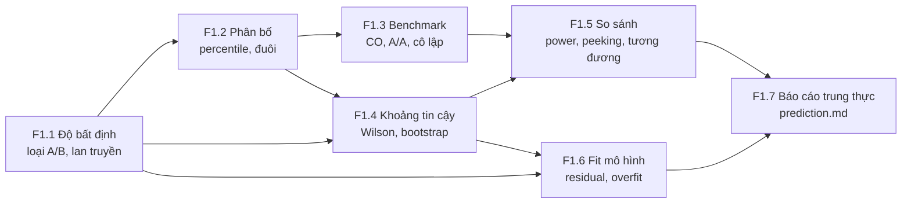

# F1 — Khoa học đo lường và thống kê thực nghiệm (31h)

> Khóa nền, học **đúng lúc**: không đọc một mạch từ đầu, mà mở viên nang ngay trước bài chính cần nó (bảng dưới). Tổng 31h = F1.1 5h · F1.2 4h · F1.3 5h · F1.4 4h · F1.5 6h · F1.6 4h · F1.7 3h. Giờ này **đã nằm trong** ngân sách các bài chính trỏ tới nó chỉ một phần; phần còn lại cộng thêm vào tổng lộ trình (xem `00-lo-trinh-tong.md` và `khoa-7/_KE-HOACH-K7.md` mục 3 — tổng đã vượt 650h, không giấu).

## Vì sao khóa nền này tồn tại

Cả lộ trình là một chuỗi phép đo: điện áp ở K1, độ trễ ở K3, latency và success rate ở K4, offset đồng hồ ở K5, success rate của 10.000 episode ở K6, FAR/FRR và sai số odometry ở K7. Thiếu F1, bạn sẽ hụt ở đúng những chỗ này:

- **K1 Bài 5, Bài 9** — đọc `2.47 V` mà không biết nó là `2.47 ± 0.04 V`, nên "dự đoán lệch 1%" không phân biệt được sai lý thuyết với sai dụng cụ.
- **K3 Bài 9** — đo round-trip bằng vòng `send; recv` và báo p99 đẹp trong khi tai nghe tiếng tách (coordinated omission).
- **K4 Bài 7–9, Bài 13** — viết "INT8 bảo toàn chất lượng" từ 72% vs 70% trên 50 episode (bản Gemini đã viết đúng câu này).
- **K6 Bài 12–13** — CI báo PASS cho mọi thay đổi chỉ vì n quá nhỏ để bắt được gì.
- **K7 C9.2** — báo "FAR = 0%" sau 500 lần thử.

Các bài chính dạy *làm*; F1 dạy *tin được bao nhiêu vào cái vừa làm*. Người học này đã có vốn backend mạnh (SLO, p99, A/B, CI); F1 không dạy lại các tên đó mà chỉ ra chỗ chúng gãy khi dụng cụ đo là vật lý và n là vài chục thay vì vài triệu.

## Mindset cốt lõi

1. **Một con số không có độ bất định không phải là kết quả.** Người làm đo lường tin điều này vì trước GUM (1993) các phòng đo quốc gia báo "±" mỗi nơi một kiểu và không so được với nhau; vì OPERA 2011 công bố neutrino nhanh hơn ánh sáng ở mức 6σ thống kê trong khi nguyên nhân là một đầu nối cáp quang lỏng (sai số hệ thống, không có trong ±).
2. **Phân bố, không phải trung bình.** Người làm hệ thống tin điều này vì người dùng (và robot) sống ở đuôi: một request chạm 100 backend gần như chắc chắn gặp p99 của ít nhất một cái (Dean & Barroso, *The Tail at Scale*, 2013).
3. **Dụng cụ đo cũng là một hệ cần kiểm.** Gil Tene chỉ ra hầu hết công cụ load test thời đó bỏ sót đúng những mẫu chậm nhất; Mytkowicz và cộng sự (ASPLOS 2009) cho thấy chỉ đổi kích thước biến môi trường UNIX cũng đủ đảo kết luận "tối ưu O3 nhanh hơn O2".
4. **"Không thấy khác biệt" không phải "không có khác biệt".** Ngành dược phải phát minh equivalence/non-inferiority trial vì thuốc generic không thể được duyệt bằng "thử nghiệm không bác bỏ được giả thuyết bằng nhau".
5. **Cam kết trước, nhìn sau.** Sau khi các thử nghiệm tim mạch lớn của NHLBI phải đăng ký trước kết cục chính (từ 2000), tỉ lệ báo "có lợi ích" rơi từ 57% (17/30) xuống 8% (2/25) (Kaplan & Irvin, PLOS ONE 2015) — không phải vì thuốc tệ đi.

## Bản đồ viên nang



### Học đúng lúc

| Viên nang | Học trước bài chính | Giờ |
|---|---|---|
| F1.1 Độ bất định | K1 Bài 1, Bài 5, Bài 9, Bài 10 · K3 Bài 3, Bài 8, Bài 9 · K4 Bài 2, Bài 3 · K5 Bài 4, Bài 7 · K6 Bài 15, Bài 16 · K7 C1, C2, C6 | 5 |
| F1.2 Phân bố | K2 Bài 2, Bài 10 · K3 Bài 6, Bài 8–11 · K4 Bài 2, Bài 3, Bài 9 · K5 Bài 4, Bài 15 · K6 Bài 10, Bài 15 · K7 C4.2 | 4 |
| F1.3 Benchmark | K2 Bài 7 · K3 Bài 9, Bài 11, Bài 12 · K4 Bài 3–6, Bài 14 · K6 Bài 2, Bài 8 · K7 C9.2, C11.2 | 5 |
| F1.4 Khoảng tin cậy | K1 Bài 6 · K2 Bài 10–12 · K3 Bài 10, Bài 11, Bài 17 · K4 Bài 7, Bài 13 · K5 Bài 3 · K6 Bài 4, Bài 6, Bài 10, Bài 12, Bài 15 · K7 C8.2–C8.4, C9.2, C10.1 | 4 |
| F1.5 So sánh hai thứ | K2 Bài 11 · K4 Bài 3, Bài 7–9, Bài 13 · K6 Bài 1, Bài 6, Bài 10, Bài 12, Bài 13 · K7 C9.2, C11.2–C11.4 | 6 |
| F1.6 Fit mô hình | K1 Bài 6 · K3 Bài 17 · K4 Bài 10 · K5 Bài 8, Bài 10 · K6 Bài 16 · K7 C3.4, C6.2, C8.2, C11.1 | 4 |
| F1.7 Báo cáo trung thực | Trước `prediction.md` đầu tiên (K1 Bài 9) · K1 Bài 11 · K2 Bài 10 · K3 Bài 8, Bài 17, Gate · K4 Bài 3, Bài 13, Bài 15, Gate · K5 Bài 2 · K6 Bài 7, Bài 10, Bài 11 | 3 |

Thứ tự tối thiểu nếu tuần crunch: F1.1 mục 2 + 6 trước K1 Bài 5; F1.2 mục 2 + 6 trước K3 Bài 8; F1.5 mục 2 + 6 trước K4 Bài 7. Mục 6 (Lăng kính đánh giá) là phần đáng giữ nhất của mỗi viên nang.

## Bạn đã làm cái này rồi

| Bạn đã làm trong backend/AI-harness | Tên chuẩn | Còn thiếu | Viên nang |
|---|---|---|---|
| Đo trên host "yên tĩnh" để tránh test nhiễu | Cô lập nhiễu; **active benchmarking** (Brendan Gregg); bằng chứng cô lập là **A/A test** | Chứng minh bằng số: hai phiên cùng cấu hình khác nhau bao nhiêu (sàn nhiễu); đơn vị độc lập là *phiên*, không phải *lần lặp* | F1.3 |
| Script chấm pass / fail / inconclusive | Kiểm định ba trạng thái; **non-inferiority / equivalence test (TOST)**; **power analysis** | "Inconclusive" phải tính ra được: CI của hiệu chạm cả hai phía của biên; cần bao nhiêu mẫu nữa để thoát | F1.5 |
| Model AI review, chấm điểm | Phép đo có sai số; LLM-as-judge | Độ bất định của chính dụng cụ chấm (→ F2.1, F2.8) | F1.1, F1.4 |
| Hệ metrics p50/p95/p99 | Ước lượng quantile, HDR histogram | p99 của 100 mẫu gần như là một mẫu; trung bình các p99 không phải p99 | F1.2 |
| Retry cho đến khi test xanh | (trong thống kê) **optional stopping / peeking** | Tỉ lệ báo sai thật xa hơn α danh nghĩa nhiều lần | F1.5 |
| Ghi kỳ vọng trước khi chạy load test | **Preregistration**; ở đây là `prediction.md` | Phải cam kết cả *cách phân tích* (metric chính, quy tắc loại outlier, biên tương đương), không chỉ con số đoán | F1.7 |

---

## F1.1 — Mọi con số là một ước lượng (5h)

> **Dùng cho:** K1 Bài 1, 5, 9, 10 · K3 Bài 3, 8, 9 · K4 Bài 2–3 · K5 Bài 4, 7 · K6 Bài 15–16 · K7 C1, C2, C6 · **Cần trước:** không · **Sau viên nang này bạn đánh giá được:** một con số đo (điện áp, offset đồng hồ, latency trung bình) có kèm độ bất định đúng cách không, sai số nào trung bình hóa được và sai số nào không, và một phép so "lệch x%" có nghĩa hay chỉ là nhiễu dụng cụ.

### 1. Câu chuyện

Tháng 9/2011, thí nghiệm OPERA báo neutrino bay từ CERN tới Gran Sasso (730 km) đến sớm khoảng 60 ns so với ánh sáng, với độ bất định thống kê nhỏ tới mức kết quả đạt 6σ `[chuẩn]`. Nhóm không tin chính mình, công bố để người khác tìm lỗi. Tháng 2/2012, lỗi được tìm thấy: một đầu nối cáp quang lỏng trong chuỗi đồng bộ GPS và một bộ dao động lệch tần số `[chuẩn]`. Cả hai là **sai số hệ thống**: lặp lại 16.000 sự kiện không làm chúng nhỏ đi, chỉ làm thanh sai số thống kê co lại quanh một giá trị sai. 6σ đo độ chắc của *phần ngẫu nhiên*, không nói gì về phần hệ thống.

Câu chuyện thứ hai nhỏ hơn và gần bạn hơn. Cho tới cuối thập niên 1970, mỗi phòng đo quốc gia báo "±" theo một cách: nơi cộng tuyến tính, nơi cộng bình phương, nơi chỉ ghi độ lệch chuẩn của các lần đo lặp và quên sai số của chính dụng cụ. BIPM lập nhóm làm việc năm 1980; kết quả là *Guide to the Expression of Uncertainty in Measurement* (GUM), xuất bản 1993, nay là JCGM 100:2008 `[chuẩn]`. NIST tóm tắt thành Technical Note 1297 (Taylor & Kuyatt, 1994) `[chuẩn]`. GUM không phát minh toán mới; nó phát minh một **giao thức** để hai phòng đo hiểu nhau — đúng loại thứ một backend engineer trân trọng.

### 2. Mô hình tư duy

```
                 giá trị thật (không ai biết)
                          │
   sai số hệ thống ──────►│◄── lệch cố định: gain/offset dụng cụ, trễ cáp, nhiệt
   (bias, bất biến khi    │
    lặp lại)              ▼
                 trung bình dài hạn của dụng cụ
                          │
   sai số ngẫu nhiên ────►│◄── nhiễu: mỗi lần đọc một khác
   (giảm theo 1/√N        │
    khi lấy trung bình)   ▼
                 một số đọc trên màn hình  ── làm tròn bởi resolution
```

Bốn chữ thường bị trộn:

| Chữ | Nghĩa | Ví dụ UT33D+ thang 20 V |
|---|---|---|
| **Resolution** (độ phân giải) | Bước nhỏ nhất dụng cụ hiển thị | 0,01 V |
| **Precision** (độ chụm, repeatability) | Các lần đọc lặp gần nhau tới đâu | tự đo: std của 10 lần đọc |
| **Accuracy / trueness** (độ đúng) | Trung bình dài hạn gần giá trị thật tới đâu | spec ±(0,5% + 2 digit) `[spec — manual UT33D+, kiểm bản bạn có]` |
| **Uncertainty** (độ bất định) | Khoảng mà bạn *tin* giá trị thật nằm trong, gộp mọi nguồn | ngân sách bên dưới |

**GUM chia nguồn theo cách bạn biết về chúng, không theo bản chất:**
- **Loại A** — đánh giá bằng thống kê từ chính dữ liệu lặp: `u_A = s / √N`.
- **Loại B** — đánh giá bằng mọi thông tin khác: spec nhà sản xuất, chứng chỉ hiệu chuẩn, độ phân giải, kinh nghiệm. Spec cho dạng "±a" mà không nói phân bố → coi là phân bố đều, `u_B = a / √3`. Độ phân giải Δ → `u_res = (Δ/2)/√3`.
- Gộp (khi các nguồn độc lập): `u_c = √(u_A² + u_B² + u_res² + …)`. Báo **U = k·u_c** với hệ số phủ k = 2 (≈ 95% nếu gần chuẩn) và **ghi rõ k**.

**Lan truyền** cho y = f(x₁, x₂, …): `u_y² ≈ Σ (∂f/∂xᵢ)² uᵢ² + 2 Σ (∂f/∂xᵢ)(∂f/∂xⱼ) cov(xᵢ, xⱼ)`. Hai hệ quả dùng hằng ngày: với tích/thương, **sai số tương đối** cộng bình phương; và **số hạng hiệp phương sai** — hai phép đo dùng cùng một dụng cụ thì sai số gain của dụng cụ đó tương quan, và trong một tỉ số nó *triệt tiêu*. Khi f phi tuyến mạnh hoặc sai số lớn, bỏ đạo hàm, chạy **Monte Carlo** (GUM Supplement 1, JCGM 101:2008 `[chuẩn]`): rút ngẫu nhiên đầu vào theo phân bố, tính y, xem phân bố của y (→ F6.6).

**Chữ số có nghĩa**: làm tròn U tới 1–2 chữ số có nghĩa, rồi làm tròn giá trị tới cùng vị trí thập phân. `2.48831 ± 0.0382 V` → `2.488 ± 0.038 V (k=2)`. Chữ số sau vị trí đó là tiếng ồn bạn đang in ra.

### 3. Cầu nối từ backend

| Backend bạn biết | Ở đây | Gãy ở chỗ | Nếu dùng nhầm thì |
|---|---|---|---|
| Metric là sự thật: `latency_ms = 23` | Mọi số đo là ước lượng có ± | Trong backend dụng cụ đo (đồng hồ hệ thống) thường chính xác hơn hiện tượng nhiều bậc nên ± bị bỏ qua mà không sao; ở đây dụng cụ (multimeter, logic analyzer 24 MHz, timestamp USB) thường *cùng cỡ* hiện tượng | So "dự đoán 2,50 V, đo 2,47 V, lệch 1,2% → lý thuyết sai" trong khi U của đồng hồ là ±0,04 V |
| Chạy nhiều lần rồi lấy trung bình để "khử nhiễu" | Chỉ khử loại ngẫu nhiên | Bias của dụng cụ giống nhau ở mọi lần đọc; trung bình 1000 lần hội tụ chắc chắn về **giá trị sai** | Báo `2.4883 ± 0.0002 V` — chính xác tới 0,2 mV về một số sai 18 mV |
| Clock skew giữa hai server: trừ timestamp là ra | Offset đo được ± độ bất định của chính phép đo | Hai timestamp lấy ở hai tầng khác nhau (kernel/app, → F4.3) mang trễ hệ thống khác nhau; hiệu của chúng có bias | Tuyên bố "offset 0,2 µs" khi trọng tài đo chỉ phân giải được 1 µs (→ F4.7) |
| Dashboard hiển thị 6 chữ số | Chữ số có nghĩa | Số chữ số in ra là quyết định của code, không phải của phép đo | Người đọc tin vào độ chính xác bạn không có |

**Chấm mô hình:**

- *"Lặp đủ nhiều lần thì sai số về 0."* — **SAI.** Chỉ đúng cho phần ngẫu nhiên và chỉ khi các lần đo độc lập. Phản ví dụ: OPERA (16.000 sự kiện, bias 60 ns); hoặc bài tập ở mục 5. Hệ quả cho nghề: một pipeline tự động lặp 10.000 lần cho thanh sai số đẹp không thay được một lần kiểm bằng dụng cụ khác (trọng tài, → F4.7).
- *"Đồng hồ hiển thị nhiều chữ số hơn thì chính xác hơn."* — **SAI.** Đã chấm ở K1 Bài 5: resolution ≠ accuracy. Một đồng hồ 6000 count ±1% hiển thị nhiều chữ số hơn UT33D+ ±0,5% mà kém đúng hơn.
- *"Sai số của tỉ số bằng tổng sai số hai phép đo."* — **ĐÚNG MỘT PHẦN.** Đúng (cộng bình phương các sai số tương đối) khi hai phép đo độc lập. Khi dùng cùng một đồng hồ, cùng thang, sai số gain tương quan dương và **triệt tiêu một phần** trong tỉ số. Phản ví dụ: tỉ số Vout/Vin của voltage divider đo bằng một chiếc đồng hồ có độ bất định nhỏ hơn hẳn khi đo bằng hai chiếc (bài tập mục 5 đo được bao nhiêu).

**Tên chuẩn của thứ bạn đã làm:** khi bạn đặt một request "biết đáp án" qua mock server để kiểm pipeline đo, đó là **đo chuẩn tham chiếu (reference standard / check standard)**: đo một thứ đã biết giá trị để ước lượng bias của hệ đo. Trong đo lường, việc này lặp lại định kỳ và vẽ thành **control chart**. Thứ còn thiếu: ghi bias đó vào ngân sách như một nguồn loại B, và kiểm lại khi đổi môi trường.

### 4. Thuật ngữ

| Mức | Thuật ngữ | Nghĩa trong một câu | Hay bị hiểu nhầm thành |
|---|---|---|---|
| 🟢 | Uncertainty (độ bất định) | Khoảng hợp lý quanh số đo chứa giá trị thật, gộp mọi nguồn | "Sai số" = hiệu với giá trị thật (không biết được) |
| 🟢 | Systematic vs random error | Lệch cố định vs dao động mỗi lần | Cùng một thứ, chỉ khác độ lớn |
| 🟢 | Resolution / precision / accuracy | Bước hiển thị / độ chụm / độ đúng | Ba chữ đồng nghĩa |
| 🟢 | Type A / Type B | Đánh giá bằng thống kê từ dữ liệu / bằng thông tin khác | A = ngẫu nhiên, B = hệ thống (sai: một sai số hệ thống đã biết spec được xử lý như loại B, nhưng loại B cũng có thể là ngẫu nhiên) |
| 🟢 | Combined / expanded uncertainty, k | u_c gộp; U = k·u_c | Quên ghi k |
| 🟡 | Lan truyền sai số, hệ số nhạy | ∂f/∂x nhân u_x | Chỉ cộng các ± |
| 🟡 | Covariance / correlated errors | Hai sai số đi cùng nhau | Luôn coi độc lập |
| 🟡 | Monte Carlo (GUM Supplement 1) | Lan truyền bằng mô phỏng | Chỉ cho bài toán khó |
| 🔴 | Welch–Satterthwaite, bậc tự do hiệu dụng | Hiệu chỉnh k khi u_A dựa trên ít mẫu | Cần ngay (biết tên là đủ) |

### 5. Bài tập dự đoán

**Đề.** Voltage divider của K1 Bài 9: Vin thật 4,98 V, Vout thật 2,47 V. Đồng hồ giả lập theo spec UT33D+ thang 20 V: ±(0,5% số đọc + 2 digit), resolution 0,01 V; mỗi *chiếc* đồng hồ có một gain và offset cố định rút đều trong spec; mỗi lần đọc có nhiễu 4 mV. Dự đoán trước khi chạy:

1. Đọc Vout 1, 10, 1000 lần bằng *một* chiếc đồng hồ. Sai số thật của trung bình (so với 2,47) có giảm theo N không? SEM giảm tới đâu?
2. Ngân sách GUM cho một kết quả trung bình 10 lần: u_A, u_B, u_res, u_c, U (k=2). Nguồn nào chiếm ưu thế?
3. Tỉ số Vout/Vin: độ lệch chuẩn của tỉ số khi đo cả hai bằng **cùng một** đồng hồ so với **hai** đồng hồ khác nhau — tỉ lệ giữa hai số khoảng bao nhiêu?

**Tham số cần tra:** spec DC V trong manual UT33D+ của bạn (bản bạn có, không phải bản trên mạng), thang bạn thực sự dùng. **Phương pháp:** u_B = nửa độ rộng spec / √3; với câu 3 viết u_r/r bằng lan truyền tuyến tính cho trường hợp độc lập, rồi lập luận gain triệt tiêu ở trường hợp cùng đồng hồ.

```markdown
# prediction.md — F1.1
1. Sai số thật khi N=1/10/1000: ___ / ___ / ___ ; SEM N=1000: ___
2. u_A=___ u_B=___ u_res=___ → U(k=2)=___ ; nguồn trội: ___
3. std(ratio) cùng đồng hồ / hai đồng hồ ≈ ___
Độ tự tin (1–5): ___   Tôi sẽ ngạc nhiên nếu: ___
```

```python
# [đã chạy] F1.1 — trung bình nhiều lần không khử sai số hệ thống; tỉ số dùng chung một đồng hồ
import numpy as np
rng = np.random.default_rng(1)
V_IN, V_OUT = 4.98, 2.47          # giá trị thật (V) — trong đời thật bạn không biết
LSB = 0.01                         # thang 20 V của đồng hồ 2000 count
A_PCT, B_DIG = 0.5, 2              # spec ±(0.5% số đọc + 2 digit) — loại B
NOISE = 0.004                      # nhiễu ngẫu nhiên mỗi lần đọc (V), giả định

def make_meter():
    """Mỗi chiếc đồng hồ có một sai số gain + offset CỐ ĐỊNH, nằm trong spec."""
    gain = rng.uniform(-A_PCT, A_PCT) / 100
    offset = rng.uniform(-B_DIG, B_DIG) * LSB
    return lambda v, n: np.round((v * (1 + gain) + offset
                                  + rng.normal(0, NOISE, n)) / LSB) * LSB

# (1) Một đồng hồ, đọc 1, 10, 1000 lần: trung bình hội tụ về đâu?
m = make_meter()
for n in (1, 10, 1000):
    r = m(V_OUT, n)
    print(f"n={n:5d}  mean={r.mean():.4f}  sem={r.std(ddof=1)/np.sqrt(n) if n>1 else float('nan'):.4f}"
          f"  sai so that={r.mean()-V_OUT:+.4f}")

# (2) Ngân sách GUM cho MỘT số đọc 2.47 V (loại A từ 10 lần, loại B từ spec)
r = m(V_OUT, 10)
uA = r.std(ddof=1) / np.sqrt(10)
half = A_PCT/100 * r.mean() + B_DIG * LSB       # nửa độ rộng spec
uB = half / np.sqrt(3)                           # phân bố đều → chia √3
uRes = (LSB / 2) / np.sqrt(3)                    # độ phân giải
uc = np.sqrt(uA**2 + uB**2 + uRes**2)
print(f"uA={uA:.4f} uB={uB:.4f} uRes={uRes:.4f} uc={uc:.4f}  U(k=2)={2*uc:.3f} V")

# (3) Tỉ số Vout/Vin: cùng một đồng hồ vs hai đồng hồ khác nhau (Monte Carlo 20 000 đồng hồ)
same, diff = [], []
for _ in range(20000):
    a = make_meter(); b = make_meter()
    same.append(a(V_OUT, 1)[0] / a(V_IN, 1)[0])
    diff.append(a(V_OUT, 1)[0] / b(V_IN, 1)[0])
true = V_OUT / V_IN
for name, x in (("cung dong ho", same), ("hai dong ho", diff)):
    x = np.array(x)
    print(f"{name:13s} ratio std={x.std():.5f}  bias={x.mean()-true:+.5f}")
```

<details><summary>🔒 MỞ SAU KHI COMMIT prediction.md</summary>

Kết quả khi chạy (seed 1, numpy 2.x):

| | N=1 | N=10 | N=1000 |
|---|---|---|---|
| Trung bình | 2,4900 | 2,4890 | 2,4883 |
| SEM | — | 0,0010 | 0,0002 |
| Sai số thật | +0,020 | +0,019 | **+0,018** |

Sai số thật gần như không đổi: chiếc đồng hồ này có gain/offset đẩy số đọc lên ~18 mV, và trung bình 1000 lần hội tụ chắc chắn về 2,488. SEM 0,2 mV là độ chắc *về giá trị sai đó*.

Ngân sách: u_A ≈ 0,002 V, u_B ≈ 0,019 V, u_res ≈ 0,003 V → u_c ≈ 0,019 V, **U(k=2) ≈ 0,038 V**. Loại B (spec) trội gấp ~9 lần loại A. Kết quả báo đúng: `2.489 ± 0.038 V (k=2)`; sai số thật +0,018 V nằm trong U, tức là giao thức GUM đã làm đúng việc của nó.

Tỉ số: std ≈ 0,0016 (cùng đồng hồ) vs 0,0035 (hai đồng hồ), tỉ lệ ~2,1 lần. Cùng đồng hồ, gain triệt tiêu; phần còn lại đến từ offset (±2 digit không tỉ lệ với số đọc) và nhiễu. Nếu bạn đoán "bằng nhau" thì mô hình độc lập của bạn đã bỏ số hạng hiệp phương sai.

Lệch so với máy bạn: các số cụ thể đổi theo seed và phiên bản numpy; tỉ lệ ~2 lần và việc u_B trội là bền.

</details>

### 6. Lăng kính đánh giá

Checklist khi đọc một con số đo (của bạn, của bài chính, của Gemini, của paper):

1. Có độ bất định không? Có ghi **k** hoặc mức tin cậy không?
2. Độ bất định gồm những nguồn nào? Chỉ có std của các lần lặp (loại A) là dấu hiệu quên spec dụng cụ.
3. Số chữ số có khớp với U không?
4. Có nguồn sai số hệ thống nào **không giảm khi lặp** (trễ cáp, tầng timestamp, nhiệt, gain dụng cụ) không? Đã kiểm bằng một dụng cụ độc lập (trọng tài) chưa?
5. Khi so dự đoán với đo: hiệu có lớn hơn √(U_dự_đoán² + U_đo²) không? Nếu không, "lệch x%" không mang thông tin.
6. Hai phép đo trong một phép tính dùng chung dụng cụ không (tương quan)?

Kết luận: **ĐÚNG** nếu 1–6 thỏa; **SAI** nếu một khẳng định dựa vào chữ số nằm dưới U hoặc coi trung bình là khử bias; **CHƯA RÕ** nếu thiếu ± mà không suy ra được.

**Khẳng định mẫu — tự chấm trước khi mở:**

(a) Bản Gemini K5 Bài 12 (tự kiểm tra): *"Bạn bắt buộc phải công bố: 'Offset nhỏ hơn 1,5 µs với độ bất định/sai số của phép đo là 1,5 µs'. Bạn không được phép công bố con số 0,2 µs vì nó nằm dưới ngưỡng phân giải của chính công cụ đo độc lập."*

(b) Bản Gemini K3 Bài 9: *"Thực hiện phép đo lặp lại ít nhất 10 lần cho mỗi cấu hình. Ghi lại trung vị (median) và độ lệch chuẩn (std), không được báo cáo một con số duy nhất."*

(c) Bản Gemini K5 Bài 7: *"Bạn không cộng các độ trễ, mà cộng các khoảng bất định / sai số đo lường."*

<details><summary>🔒 Đáp án</summary>

(a) **ĐÚNG MỘT PHẦN.** Tinh thần đúng (không tuyên bố độ chính xác dưới khả năng của trọng tài), cách viết sai. Hai chỗ: (1) "nhỏ hơn 1,5 µs với độ bất định 1,5 µs" lẫn lộn hai dạng báo cáo — hoặc báo `0.2 ± 1.5 µs (k=2)`, hoặc báo cận `|offset| ≤ 1.7 µs (95%)`; không có lý do gì cấm in 0,2 nếu kèm ±. (2) Ngưỡng là **độ bất định của phép đo** (gộp resolution, trễ đường đo, jitter), không chỉ "ngưỡng phân giải"; resolution chỉ là một nguồn loại B trong đó.

(b) **ĐÚNG MỘT PHẦN.** "Không báo một con số" đúng. Nhưng median đi với std là cặp lệch: median cho phân bố lệch, std nhạy outlier; nên đi median với IQR/percentile, hoặc mean với std/SEM. Và std của 10 lần lặp chỉ là loại A: nó không chứa sai số hệ thống của phép đo độ trễ (ví dụ trễ của mic, của bộ đếm), là thứ thường trội ở K3 Bài 9. Mười lần cũng quá ít để nói gì về đuôi (→ F1.2).

(c) **ĐÚNG MỘT PHẦN.** Trong ngân sách sai số thời gian, độ trễ *đã biết và ổn định* được bù (trừ đi), phần còn lại là bất định của độ trễ đó — câu này đúng tinh thần. Nhưng "cộng" phải hiểu là **cộng bình phương** nếu các nguồn độc lập (cộng tuyến tính chỉ khi tương quan hoàn toàn hoặc khi muốn cận xấu nhất, và phải nói rõ là cận xấu nhất). Độ trễ *không bù* (ví dụ chưa đo) thì vẫn là sai số hệ thống, phải cộng vào như bias.

</details>

### 7. Câu hỏi ngược

1. **[Vì sao không]** Vì sao GUM không cho phép chỉ báo std của các lần lặp, dù đó là con số "khách quan" nhất bạn có?
   <details><summary>Hướng nghĩ</summary>

   "Khách quan" ở đây là khách quan về nhiễu, im lặng về bias. Nghĩ về người đọc kết quả của bạn với một dụng cụ khác: họ cần biết cái gì để so?

   </details>
2. **[Quy mô]** 100 robot, mỗi con một IMU cùng mẫu mã. Bias gyro mỗi con là loại A hay loại B, ngẫu nhiên hay hệ thống — từ góc nhìn một robot và từ góc nhìn cả đội?
   <details><summary>Hướng nghĩ</summary>

   Cùng một sai số đổi phân loại khi đổi tổng thể bạn quan tâm. Với một robot nó là bias cố định (phải hiệu chuẩn từng con); với đội, phân bố bias giữa các con là ngẫu nhiên — trung bình đội có thể đúng trong khi từng con sai. Dữ liệu train gộp từ 100 robot thừa hưởng cái nào?

   </details>
3. **[Failure mode]** Pipeline tự động của bạn ghi `uncertainty` vào mọi message (đúng CONVENTIONS). Sáu tháng sau đổi firmware cảm biến, cấu hình lọc nội bộ khác đi. Trường `uncertainty` có tự sai không? Ai phát hiện?
   <details><summary>Hướng nghĩ</summary>

   Độ bất định là một giả định gắn với một cấu hình dụng cụ, có hạn dùng. Nghĩ về `calibration_id` và một check standard định kỳ (control chart) như một bài test chạy theo lịch.

   </details>
4. **[Nếu…thì]** Nếu bạn đo dòng LED bằng cách đo áp trên điện trở 220 Ω ±5% rồi chia, nguồn nào trội: đồng hồ hay điện trở? Đổi sang điện trở 1% thì sao?
   <details><summary>Hướng nghĩ</summary>

   Thương → sai số tương đối cộng bình phương. Tính tỉ lệ của mỗi số hạng; nguồn trội quyết định tiền nên tiêu vào đâu.

   </details>
5. **[Phản biện]** "Độ bất định chỉ là thủ tục giấy tờ, kỹ sư giỏi nhìn số là biết đúng sai." Tìm một tình huống trong lộ trình mà câu này dẫn tới một quyết định mua sắm hoặc kiến trúc sai.
   <details><summary>Hướng nghĩ</summary>

   K5 Bài 7–9: chọn PTP phần cứng vs phần mềm dựa trên số offset đo bằng chính đồng hồ đang được đồng bộ.

   </details>

### 8. Liên kết ra ngoài

- **Thiên văn — Hubble (1990).** Gương chính mài sai dạng vì dụng cụ kiểm (null corrector) đặt lệch khoảng 1,3 mm `[chuẩn]`; các phép kiểm khác cho dấu hiệu bất thường nhưng bị gạt đi để tin dụng cụ chính. Giống: sai số hệ thống của dụng cụ kiểm, lặp lại không lộ ra. Khác: ở đây có dụng cụ độc lập mà không ai coi là trọng tài.
- **Tài chính — mark-to-model.** Giá trị một tài sản không giao dịch là "số đo" có độ bất định mô hình; báo một con số không ± đã góp phần vào 2008. Giống: một số không ± trông như sự thật. Khác: bias ở đây có người hưởng lợi.
- **Hệ phân tán — NTP.** NTP báo cả offset lẫn *root dispersion* (cận độ bất định tích lũy qua các tầng stratum) `[chuẩn — RFC 5905]`. Đây là GUM chạy trong giao thức: mỗi tầng cộng thêm bất định của mình (→ F4.4).

### 9. Áp vào khóa chính

- **K1 Bài 5, 9:** mỗi bảng đo có cột U(k=2); "dự đoán khớp" nghĩa là |đo − dự đoán| ≤ √(U_đo² + U_dự_đoán²). Quyết định đổi: không sửa lý thuyết khi lệch nằm trong ngân sách.
- **K3 Bài 9:** tách ngân sách độ trễ thành phần bù được (bias đã đo) và phần bất định; dùng một trọng tài (logic analyzer) để kiểm bias của đường đo phần mềm.
- **K5 Bài 7:** ngân sách sai số thời gian chính là bảng GUM; cộng bình phương các nguồn độc lập, cộng tuyến tính các bias chưa bù.
- **K6 Bài 15–16, K7 C6:** sai số odometry gồm phần hệ thống (đường kính bánh, khoảng cách bánh — UMBmark tách và hiệu chuẩn được) và phần ngẫu nhiên (trượt). Trung bình nhiều vòng không sửa được đường kính sai.

### 10. Độ tin cậy

| Khẳng định | Nhãn | Ghi chú / cách kiểm |
|---|---|---|
| GUM xuất bản 1993, nay JCGM 100:2008; Supplement 1 = JCGM 101:2008 | [chuẩn] | bipm.org, mục JCGM |
| NIST TN 1297 (Taylor & Kuyatt, 1994) | [chuẩn] | trang NIST "Uncertainty of Measurement Results" |
| OPERA: ~60 ns sớm, nguyên nhân đầu nối cáp quang + dao động | [chuẩn] | thông cáo CERN/OPERA 2012 |
| Spec UT33D+ ±(0,5% + 2 digit) DC V | [spec] | kiểm manual bản bạn có; K1 Bài 5 dùng cùng số |
| Spec không nói phân bố → coi đều, chia √3 | [chuẩn] | GUM 4.3.7 |
| Kết quả mô phỏng mục 5 | [đã chạy] | seed cố định |

Đã sửa so với Gemini: (K5 Bài 12) cách báo "nhỏ hơn 1,5 µs với độ bất định 1,5 µs" → báo `giá trị ± U (k)` hoặc cận có mức tin cậy; (K3 Bài 9) median đi với std → median đi với IQR/percentile, và std lặp chỉ là loại A.

### 11. Đọc thêm và tự kiểm tra

- **Nguồn gốc:** JCGM 100:2008 (GUM), miễn phí trên trang BIPM — đọc mục 3 và 4.
- **Giải thích:** NIST Technical Note 1297 (Taylor & Kuyatt) — 20 trang, đủ để dùng.
- **Đào sâu (tùy chọn):** John R. Taylor, *An Introduction to Error Analysis* (sách giáo khoa, chương 1–3).
- **Tự kiểm tra:** (1) giải thích cho một backend engineer vì sao trung bình 1000 lần đọc không làm số đúng hơn; (2) vẽ lại sơ đồ mục 2 từ trí nhớ; (3) câu hỏi:

  Đồng hồ đọc 3,30 V ở thang 20 V, spec ±(0,5% + 2 digit). U(k=2) là bao nhiêu?
  <details><summary>Đáp án</summary>

  Nửa độ rộng = 0,005 × 3,30 + 2 × 0,01 = 0,0365 V → u_B = 0,0365/√3 ≈ 0,021 V; cộng u_res = 0,005/√3 ≈ 0,003 V → u_c ≈ 0,021 V → **U ≈ 0,043 V**, báo `3.30 ± 0.04 V (k=2)`. Chưa tính loại A (đo lặp để thêm vào).

  </details>

---
