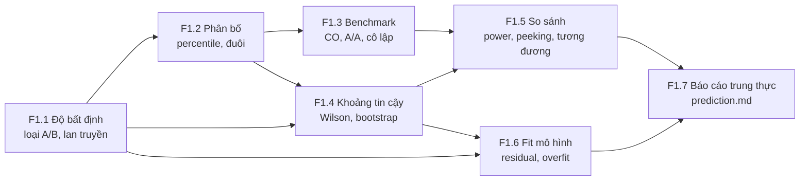
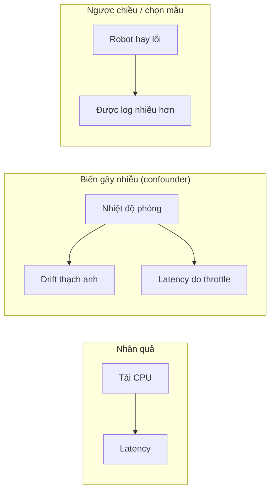
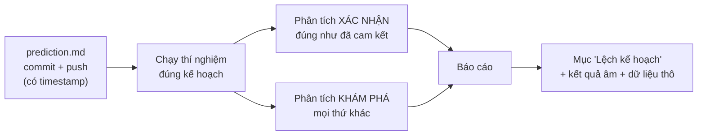

# F1 — Khoa học đo lường và thống kê thực nghiệm (31h)

> Khóa nền, học **đúng lúc**: không đọc một mạch từ đầu, mà mở viên nang ngay trước bài chính cần nó (bảng dưới). Tổng 31h = F1.1 5h · F1.2 4h · F1.3 5h · F1.4 4h · F1.5 6h · F1.6 4h · F1.7 3h. Giờ này **đã nằm trong** ngân sách các bài chính trỏ tới nó chỉ một phần; phần còn lại cộng thêm vào tổng lộ trình (xem `00-lo-trinh-tong.md` và `khoa-7/_KE-HOACH-K7.md` mục 3 — tổng đã vượt 650h, không giấu).

## Vì sao khóa nền này tồn tại

Cả lộ trình là một chuỗi phép đo: điện áp ở K1, độ trễ ở K3, latency và success rate ở K4, offset đồng hồ ở K5, success rate của 10.000 episode ở K6, FAR/FRR và sai số odometry ở K7. Thiếu F1, bạn sẽ hụt ở đúng những chỗ này:

- **K1 Bài 5, Bài 9** — đọc `2.47 V` mà không biết nó là `2.47 ± 0.04 V`, nên "dự đoán lệch 1%" không phân biệt được sai lý thuyết với sai dụng cụ.
- **K3 Bài 9** — đo round-trip bằng vòng `send; recv` và báo p99 đẹp trong khi tai nghe tiếng tách (coordinated omission).
- **K4 Bài 7–9, Bài 13** — viết "INT8 bảo toàn chất lượng" từ 72% vs 70% trên 50 episode (bản Gemini đã viết đúng câu này).
- **K6 Bài 12–13** — CI báo PASS cho mọi thay đổi chỉ vì n quá nhỏ để bắt được gì.
- **K7 C9.2** — báo "FAR = 0%" sau 500 lần thử.

Các bài chính dạy *làm*; F1 dạy *tin được bao nhiêu vào cái vừa làm*. Người học này đã có vốn backend mạnh (SLO, p99, A/B, CI); F1 không dạy lại các tên đó mà chỉ ra chỗ chúng gãy khi dụng cụ đo là vật lý và n là vài chục thay vì vài triệu.

## Mindset cốt lõi

1. **Một con số không có độ bất định không phải là kết quả.** Người làm đo lường tin điều này vì trước GUM (1993) các phòng đo quốc gia báo "±" mỗi nơi một kiểu và không so được với nhau; vì OPERA 2011 công bố neutrino nhanh hơn ánh sáng ở mức 6σ thống kê trong khi nguyên nhân là một đầu nối cáp quang lỏng (sai số hệ thống, không có trong ±).
2. **Phân bố, không phải trung bình.** Người làm hệ thống tin điều này vì người dùng (và robot) sống ở đuôi: một request chạm 100 backend gần như chắc chắn gặp p99 của ít nhất một cái (Dean & Barroso, *The Tail at Scale*, 2013).
3. **Dụng cụ đo cũng là một hệ cần kiểm.** Gil Tene chỉ ra hầu hết công cụ load test thời đó bỏ sót đúng những mẫu chậm nhất; Mytkowicz và cộng sự (ASPLOS 2009) cho thấy chỉ đổi kích thước biến môi trường UNIX cũng đủ đảo kết luận "tối ưu O3 nhanh hơn O2".
4. **"Không thấy khác biệt" không phải "không có khác biệt".** Ngành dược phải phát minh equivalence/non-inferiority trial vì thuốc generic không thể được duyệt bằng "thử nghiệm không bác bỏ được giả thuyết bằng nhau".
5. **Cam kết trước, nhìn sau.** Sau khi các thử nghiệm tim mạch lớn của NHLBI phải đăng ký trước kết cục chính (từ 2000), tỉ lệ báo "có lợi ích" rơi từ 57% (17/30) xuống 8% (2/25) (Kaplan & Irvin, PLOS ONE 2015) — không phải vì thuốc tệ đi.

## Bản đồ viên nang



### Học đúng lúc

| Viên nang | Học trước bài chính | Giờ |
|---|---|---|
| F1.1 Độ bất định | K1 Bài 1, Bài 5, Bài 9, Bài 10 · K3 Bài 3, Bài 8, Bài 9 · K4 Bài 2, Bài 3 · K5 Bài 4, Bài 7 · K6 Bài 15, Bài 16 · K7 C1, C2, C6 | 5 |
| F1.2 Phân bố | K2 Bài 2, Bài 10 · K3 Bài 6, Bài 8–11 · K4 Bài 2, Bài 3, Bài 9 · K5 Bài 4, Bài 15 · K6 Bài 10, Bài 15 · K7 C4.2 | 4 |
| F1.3 Benchmark | K2 Bài 7 · K3 Bài 9, Bài 11, Bài 12 · K4 Bài 3–6, Bài 14 · K6 Bài 2, Bài 8 · K7 C9.2, C11.2 | 5 |
| F1.4 Khoảng tin cậy | K1 Bài 6 · K2 Bài 10–12 · K3 Bài 10, Bài 11, Bài 17 · K4 Bài 7, Bài 13 · K5 Bài 3 · K6 Bài 4, Bài 6, Bài 10, Bài 12, Bài 15 · K7 C8.2–C8.4, C9.2, C10.1 | 4 |
| F1.5 So sánh hai thứ | K2 Bài 11 · K4 Bài 3, Bài 7–9, Bài 13 · K6 Bài 1, Bài 6, Bài 10, Bài 12, Bài 13 · K7 C9.2, C11.2–C11.4 | 6 |
| F1.6 Fit mô hình | K1 Bài 6 · K3 Bài 17 · K4 Bài 10 · K5 Bài 8, Bài 10 · K6 Bài 16 · K7 C3.4, C6.2, C8.2, C11.1 | 4 |
| F1.7 Báo cáo trung thực | Trước `prediction.md` đầu tiên (K1 Bài 9) · K1 Bài 11 · K2 Bài 10 · K3 Bài 8, Bài 17, Gate · K4 Bài 3, Bài 13, Bài 15, Gate · K5 Bài 2 · K6 Bài 7, Bài 10, Bài 11 | 3 |

Thứ tự tối thiểu nếu tuần crunch: F1.1 mục 2 + 6 trước K1 Bài 5; F1.2 mục 2 + 6 trước K3 Bài 8; F1.5 mục 2 + 6 trước K4 Bài 7. Mục 6 (Lăng kính đánh giá) là phần đáng giữ nhất của mỗi viên nang.

## Bạn đã làm cái này rồi

| Bạn đã làm trong backend/AI-harness | Tên chuẩn | Còn thiếu | Viên nang |
|---|---|---|---|
| Đo trên host "yên tĩnh" để tránh test nhiễu | Cô lập nhiễu; **active benchmarking** (Brendan Gregg); bằng chứng cô lập là **A/A test** | Chứng minh bằng số: hai phiên cùng cấu hình khác nhau bao nhiêu (sàn nhiễu); đơn vị độc lập là *phiên*, không phải *lần lặp* | F1.3 |
| Script chấm pass / fail / inconclusive | Kiểm định ba trạng thái; **non-inferiority / equivalence test (TOST)**; **power analysis** | "Inconclusive" phải tính ra được: CI của hiệu chạm cả hai phía của biên; cần bao nhiêu mẫu nữa để thoát | F1.5 |
| Model AI review, chấm điểm | Phép đo có sai số; LLM-as-judge | Độ bất định của chính dụng cụ chấm (→ F2.1, F2.8) | F1.1, F1.4 |
| Hệ metrics p50/p95/p99 | Ước lượng quantile, HDR histogram | p99 của 100 mẫu gần như là một mẫu; trung bình các p99 không phải p99 | F1.2 |
| Retry cho đến khi test xanh | (trong thống kê) **optional stopping / peeking** | Tỉ lệ báo sai thật xa hơn α danh nghĩa nhiều lần | F1.5 |
| Ghi kỳ vọng trước khi chạy load test | **Preregistration**; ở đây là `prediction.md` | Phải cam kết cả *cách phân tích* (metric chính, quy tắc loại outlier, biên tương đương), không chỉ con số đoán | F1.7 |

---

## F1.1 — Mọi con số là một ước lượng (5h)

> **Dùng cho:** K1 Bài 1, 5, 9, 10 · K3 Bài 3, 8, 9 · K4 Bài 2–3 · K5 Bài 4, 7 · K6 Bài 15–16 · K7 C1, C2, C6 · **Cần trước:** không · **Sau viên nang này bạn đánh giá được:** một con số đo (điện áp, offset đồng hồ, latency trung bình) có kèm độ bất định đúng cách không, sai số nào trung bình hóa được và sai số nào không, và một phép so "lệch x%" có nghĩa hay chỉ là nhiễu dụng cụ.

### 1. Câu chuyện

Tháng 9/2011, thí nghiệm OPERA báo neutrino bay từ CERN tới Gran Sasso (730 km) đến sớm khoảng 60 ns so với ánh sáng, với độ bất định thống kê nhỏ tới mức kết quả đạt 6σ `[chuẩn]`. Nhóm không tin chính mình, công bố để người khác tìm lỗi. Tháng 2/2012, lỗi được tìm thấy: một đầu nối cáp quang lỏng trong chuỗi đồng bộ GPS và một bộ dao động lệch tần số `[chuẩn]`. Cả hai là **sai số hệ thống**: lặp lại 16.000 sự kiện không làm chúng nhỏ đi, chỉ làm thanh sai số thống kê co lại quanh một giá trị sai. 6σ đo độ chắc của *phần ngẫu nhiên*, không nói gì về phần hệ thống.

Câu chuyện thứ hai nhỏ hơn và gần bạn hơn. Cho tới cuối thập niên 1970, mỗi phòng đo quốc gia báo "±" theo một cách: nơi cộng tuyến tính, nơi cộng bình phương, nơi chỉ ghi độ lệch chuẩn của các lần đo lặp và quên sai số của chính dụng cụ. BIPM lập nhóm làm việc năm 1980; kết quả là *Guide to the Expression of Uncertainty in Measurement* (GUM), xuất bản 1993, nay là JCGM 100:2008 `[chuẩn]`. NIST tóm tắt thành Technical Note 1297 (Taylor & Kuyatt, 1994) `[chuẩn]`. GUM không phát minh toán mới; nó phát minh một **giao thức** để hai phòng đo hiểu nhau — đúng loại thứ một backend engineer trân trọng.

### 2. Mô hình tư duy

```
                 giá trị thật (không ai biết)
                          │
   sai số hệ thống ──────►│◄── lệch cố định: gain/offset dụng cụ, trễ cáp, nhiệt
   (bias, bất biến khi    │
    lặp lại)              ▼
                 trung bình dài hạn của dụng cụ
                          │
   sai số ngẫu nhiên ────►│◄── nhiễu: mỗi lần đọc một khác
   (giảm theo 1/√N        │
    khi lấy trung bình)   ▼
                 một số đọc trên màn hình  ── làm tròn bởi resolution
```

Bốn chữ thường bị trộn:

| Chữ | Nghĩa | Ví dụ UT33D+ thang 20 V |
|---|---|---|
| **Resolution** (độ phân giải) | Bước nhỏ nhất dụng cụ hiển thị | 0,01 V |
| **Precision** (độ chụm, repeatability) | Các lần đọc lặp gần nhau tới đâu | tự đo: std của 10 lần đọc |
| **Accuracy / trueness** (độ đúng) | Trung bình dài hạn gần giá trị thật tới đâu | spec ±(0,5% + 2 digit) `[spec — manual UT33D+, kiểm bản bạn có]` |
| **Uncertainty** (độ bất định) | Khoảng mà bạn *tin* giá trị thật nằm trong, gộp mọi nguồn | ngân sách bên dưới |

**GUM chia nguồn theo cách bạn biết về chúng, không theo bản chất:**
- **Loại A** — đánh giá bằng thống kê từ chính dữ liệu lặp: `u_A = s / √N`.
- **Loại B** — đánh giá bằng mọi thông tin khác: spec nhà sản xuất, chứng chỉ hiệu chuẩn, độ phân giải, kinh nghiệm. Spec cho dạng "±a" mà không nói phân bố → coi là phân bố đều, `u_B = a / √3`. Độ phân giải Δ → `u_res = (Δ/2)/√3`.
- Gộp (khi các nguồn độc lập): `u_c = √(u_A² + u_B² + u_res² + …)`. Báo **U = k·u_c** với hệ số phủ k = 2 (≈ 95% nếu gần chuẩn) và **ghi rõ k**.

**Lan truyền** cho y = f(x₁, x₂, …): `u_y² ≈ Σ (∂f/∂xᵢ)² uᵢ² + 2 Σ (∂f/∂xᵢ)(∂f/∂xⱼ) cov(xᵢ, xⱼ)`. Hai hệ quả dùng hằng ngày: với tích/thương, **sai số tương đối** cộng bình phương; và **số hạng hiệp phương sai** — hai phép đo dùng cùng một dụng cụ thì sai số gain của dụng cụ đó tương quan, và trong một tỉ số nó *triệt tiêu*. Khi f phi tuyến mạnh hoặc sai số lớn, bỏ đạo hàm, chạy **Monte Carlo** (GUM Supplement 1, JCGM 101:2008 `[chuẩn]`): rút ngẫu nhiên đầu vào theo phân bố, tính y, xem phân bố của y (→ F6.6).

**Chữ số có nghĩa**: làm tròn U tới 1–2 chữ số có nghĩa, rồi làm tròn giá trị tới cùng vị trí thập phân. `2.48831 ± 0.0382 V` → `2.488 ± 0.038 V (k=2)`. Chữ số sau vị trí đó là tiếng ồn bạn đang in ra.

### 3. Cầu nối từ backend

| Backend bạn biết | Ở đây | Gãy ở chỗ | Nếu dùng nhầm thì |
|---|---|---|---|
| Metric là sự thật: `latency_ms = 23` | Mọi số đo là ước lượng có ± | Trong backend dụng cụ đo (đồng hồ hệ thống) thường chính xác hơn hiện tượng nhiều bậc nên ± bị bỏ qua mà không sao; ở đây dụng cụ (multimeter, logic analyzer 24 MHz, timestamp USB) thường *cùng cỡ* hiện tượng | So "dự đoán 2,50 V, đo 2,47 V, lệch 1,2% → lý thuyết sai" trong khi U của đồng hồ là ±0,04 V |
| Chạy nhiều lần rồi lấy trung bình để "khử nhiễu" | Chỉ khử loại ngẫu nhiên | Bias của dụng cụ giống nhau ở mọi lần đọc; trung bình 1000 lần hội tụ chắc chắn về **giá trị sai** | Báo `2.4883 ± 0.0002 V` — chính xác tới 0,2 mV về một số sai 18 mV |
| Clock skew giữa hai server: trừ timestamp là ra | Offset đo được ± độ bất định của chính phép đo | Hai timestamp lấy ở hai tầng khác nhau (kernel/app, → F4.3) mang trễ hệ thống khác nhau; hiệu của chúng có bias | Tuyên bố "offset 0,2 µs" khi trọng tài đo chỉ phân giải được 1 µs (→ F4.7) |
| Dashboard hiển thị 6 chữ số | Chữ số có nghĩa | Số chữ số in ra là quyết định của code, không phải của phép đo | Người đọc tin vào độ chính xác bạn không có |

**Chấm mô hình:**

- *"Lặp đủ nhiều lần thì sai số về 0."* — **SAI.** Chỉ đúng cho phần ngẫu nhiên và chỉ khi các lần đo độc lập. Phản ví dụ: OPERA (16.000 sự kiện, bias 60 ns); hoặc bài tập ở mục 5. Hệ quả cho nghề: một pipeline tự động lặp 10.000 lần cho thanh sai số đẹp không thay được một lần kiểm bằng dụng cụ khác (trọng tài, → F4.7).
- *"Sai số của tỉ số bằng tổng sai số hai phép đo."* — **ĐÚNG MỘT PHẦN.** Đúng (cộng bình phương các sai số tương đối) khi hai phép đo độc lập. Khi dùng cùng một đồng hồ, cùng thang, sai số gain tương quan dương và **triệt tiêu một phần** trong tỉ số. Phản ví dụ: tỉ số Vout/Vin của voltage divider đo bằng một chiếc đồng hồ có độ bất định nhỏ hơn hẳn khi đo bằng hai chiếc (bài tập mục 5 đo được bao nhiêu).

**Tên chuẩn của thứ bạn đã làm:** khi bạn đặt một request "biết đáp án" qua mock server để kiểm pipeline đo, đó là **đo chuẩn tham chiếu (reference standard / check standard)**: đo một thứ đã biết giá trị để ước lượng bias của hệ đo. Trong đo lường, việc này lặp lại định kỳ và vẽ thành **control chart**. Thứ còn thiếu: ghi bias đó vào ngân sách như một nguồn loại B, và kiểm lại khi đổi môi trường.

### 4. Thuật ngữ

| Mức | Thuật ngữ | Nghĩa trong một câu | Hay bị hiểu nhầm thành |
|---|---|---|---|
| 🟢 | Uncertainty (độ bất định) | Khoảng hợp lý quanh số đo chứa giá trị thật, gộp mọi nguồn | "Sai số" = hiệu với giá trị thật (không biết được) |
| 🟢 | Systematic vs random error | Lệch cố định vs dao động mỗi lần | Cùng một thứ, chỉ khác độ lớn |
| 🟢 | Resolution / precision / accuracy | Bước hiển thị / độ chụm / độ đúng | Ba chữ đồng nghĩa |
| 🟢 | Type A / Type B | Đánh giá bằng thống kê từ dữ liệu / bằng thông tin khác | A = ngẫu nhiên, B = hệ thống (sai: một sai số hệ thống đã biết spec được xử lý như loại B, nhưng loại B cũng có thể là ngẫu nhiên) |
| 🟢 | Combined / expanded uncertainty, k | u_c gộp; U = k·u_c | Quên ghi k |
| 🟡 | Lan truyền sai số, hệ số nhạy | ∂f/∂x nhân u_x | Chỉ cộng các ± |
| 🟡 | Covariance / correlated errors | Hai sai số đi cùng nhau | Luôn coi độc lập |
| 🟡 | Monte Carlo (GUM Supplement 1) | Lan truyền bằng mô phỏng | Chỉ cho bài toán khó |
| 🔴 | Welch–Satterthwaite, bậc tự do hiệu dụng | Hiệu chỉnh k khi u_A dựa trên ít mẫu | Cần ngay (biết tên là đủ) |

### 5. Bài tập dự đoán

**Đề.** Voltage divider của K1 Bài 9: Vin thật 4,98 V, Vout thật 2,47 V. Đồng hồ giả lập theo spec UT33D+ thang 20 V: ±(0,5% số đọc + 2 digit), resolution 0,01 V; mỗi *chiếc* đồng hồ có một gain và offset cố định rút đều trong spec; mỗi lần đọc có nhiễu 4 mV. Dự đoán trước khi chạy:

1. Đọc Vout 1, 10, 1000 lần bằng *một* chiếc đồng hồ. Sai số thật của trung bình (so với 2,47) có giảm theo N không? SEM giảm tới đâu?
2. Ngân sách GUM cho một kết quả trung bình 10 lần: u_A, u_B, u_res, u_c, U (k=2). Nguồn nào chiếm ưu thế?
3. Tỉ số Vout/Vin: độ lệch chuẩn của tỉ số khi đo cả hai bằng **cùng một** đồng hồ so với **hai** đồng hồ khác nhau — tỉ lệ giữa hai số khoảng bao nhiêu?

**Tham số cần tra:** spec DC V trong manual UT33D+ của bạn (bản bạn có, không phải bản trên mạng), thang bạn thực sự dùng. **Phương pháp:** u_B = nửa độ rộng spec / √3; với câu 3 viết u_r/r bằng lan truyền tuyến tính cho trường hợp độc lập, rồi lập luận gain triệt tiêu ở trường hợp cùng đồng hồ.

```markdown
# prediction.md — F1.1
1. Sai số thật khi N=1/10/1000: ___ / ___ / ___ ; SEM N=1000: ___
2. u_A=___ u_B=___ u_res=___ → U(k=2)=___ ; nguồn trội: ___
3. std(ratio) cùng đồng hồ / hai đồng hồ ≈ ___
Độ tự tin (1–5): ___   Tôi sẽ ngạc nhiên nếu: ___
```

```python
# [đã chạy] F1.1 — trung bình nhiều lần không khử sai số hệ thống; tỉ số dùng chung một đồng hồ
import numpy as np
rng = np.random.default_rng(1)
V_IN, V_OUT = 4.98, 2.47          # giá trị thật (V) — trong đời thật bạn không biết
LSB = 0.01                         # thang 20 V của đồng hồ 2000 count
A_PCT, B_DIG = 0.5, 2              # spec ±(0.5% số đọc + 2 digit) — loại B
NOISE = 0.004                      # nhiễu ngẫu nhiên mỗi lần đọc (V), giả định

def make_meter():
    """Mỗi chiếc đồng hồ có một sai số gain + offset CỐ ĐỊNH, nằm trong spec."""
    gain = rng.uniform(-A_PCT, A_PCT) / 100
    offset = rng.uniform(-B_DIG, B_DIG) * LSB
    return lambda v, n: np.round((v * (1 + gain) + offset
                                  + rng.normal(0, NOISE, n)) / LSB) * LSB

# (1) Một đồng hồ, đọc 1, 10, 1000 lần: trung bình hội tụ về đâu?
m = make_meter()
for n in (1, 10, 1000):
    r = m(V_OUT, n)
    print(f"n={n:5d}  mean={r.mean():.4f}  sem={r.std(ddof=1)/np.sqrt(n) if n>1 else float('nan'):.4f}"
          f"  sai so that={r.mean()-V_OUT:+.4f}")

# (2) Ngân sách GUM cho MỘT số đọc 2.47 V (loại A từ 10 lần, loại B từ spec)
r = m(V_OUT, 10)
uA = r.std(ddof=1) / np.sqrt(10)
half = A_PCT/100 * r.mean() + B_DIG * LSB       # nửa độ rộng spec
uB = half / np.sqrt(3)                           # phân bố đều → chia √3
uRes = (LSB / 2) / np.sqrt(3)                    # độ phân giải
uc = np.sqrt(uA**2 + uB**2 + uRes**2)
print(f"uA={uA:.4f} uB={uB:.4f} uRes={uRes:.4f} uc={uc:.4f}  U(k=2)={2*uc:.3f} V")

# (3) Tỉ số Vout/Vin: cùng một đồng hồ vs hai đồng hồ khác nhau (Monte Carlo 20 000 đồng hồ)
same, diff = [], []
for _ in range(20000):
    a = make_meter(); b = make_meter()
    same.append(a(V_OUT, 1)[0] / a(V_IN, 1)[0])
    diff.append(a(V_OUT, 1)[0] / b(V_IN, 1)[0])
true = V_OUT / V_IN
for name, x in (("cung dong ho", same), ("hai dong ho", diff)):
    x = np.array(x)
    print(f"{name:13s} ratio std={x.std():.5f}  bias={x.mean()-true:+.5f}")
```

<details><summary>🔒 MỞ SAU KHI COMMIT prediction.md</summary>

Kết quả khi chạy (seed 1, numpy 2.x):

| | N=1 | N=10 | N=1000 |
|---|---|---|---|
| Trung bình | 2,4900 | 2,4890 | 2,4883 |
| SEM | — | 0,0010 | 0,0002 |
| Sai số thật | +0,020 | +0,019 | **+0,018** |

Sai số thật gần như không đổi: chiếc đồng hồ này có gain/offset đẩy số đọc lên ~18 mV, và trung bình 1000 lần hội tụ chắc chắn về 2,488. SEM 0,2 mV là độ chắc *về giá trị sai đó*.

Ngân sách: u_A ≈ 0,002 V, u_B ≈ 0,019 V, u_res ≈ 0,003 V → u_c ≈ 0,019 V, **U(k=2) ≈ 0,038 V**. Loại B (spec) trội gấp ~9 lần loại A. Kết quả báo đúng: `2.489 ± 0.038 V (k=2)`; sai số thật +0,018 V nằm trong U, tức là giao thức GUM đã làm đúng việc của nó.

Tỉ số: std ≈ 0,0016 (cùng đồng hồ) vs 0,0035 (hai đồng hồ), tỉ lệ ~2,1 lần. Cùng đồng hồ, gain triệt tiêu; phần còn lại đến từ offset (±2 digit không tỉ lệ với số đọc) và nhiễu. Nếu bạn đoán "bằng nhau" thì mô hình độc lập của bạn đã bỏ số hạng hiệp phương sai.

Lệch so với máy bạn: các số cụ thể đổi theo seed và phiên bản numpy; tỉ lệ ~2 lần và việc u_B trội là bền.

</details>

### 6. Lăng kính đánh giá

Checklist khi đọc một con số đo (của bạn, của bài chính, của Gemini, của paper):

1. Có độ bất định không? Có ghi **k** hoặc mức tin cậy không?
2. Độ bất định gồm những nguồn nào? Chỉ có std của các lần lặp (loại A) là dấu hiệu quên spec dụng cụ.
3. Số chữ số có khớp với U không?
4. Có nguồn sai số hệ thống nào **không giảm khi lặp** (trễ cáp, tầng timestamp, nhiệt, gain dụng cụ) không? Đã kiểm bằng một dụng cụ độc lập (trọng tài) chưa?
5. Khi so dự đoán với đo: hiệu có lớn hơn √(U_dự_đoán² + U_đo²) không? Nếu không, "lệch x%" không mang thông tin.
6. Hai phép đo trong một phép tính dùng chung dụng cụ không (tương quan)?

Kết luận: **ĐÚNG** nếu 1–6 thỏa; **SAI** nếu một khẳng định dựa vào chữ số nằm dưới U hoặc coi trung bình là khử bias; **CHƯA RÕ** nếu thiếu ± mà không suy ra được.

**Khẳng định mẫu — tự chấm trước khi mở:**

(a) Bản Gemini K5 Bài 12 (tự kiểm tra): *"Bạn bắt buộc phải công bố: 'Offset nhỏ hơn 1,5 µs với độ bất định/sai số của phép đo là 1,5 µs'. Bạn không được phép công bố con số 0,2 µs vì nó nằm dưới ngưỡng phân giải của chính công cụ đo độc lập."*

(b) Bản Gemini K3 Bài 9: *"Thực hiện phép đo lặp lại ít nhất 10 lần cho mỗi cấu hình. Ghi lại trung vị (median) và độ lệch chuẩn (std), không được báo cáo một con số duy nhất."*

(c) Bản Gemini K5 Bài 7: *"Bạn không cộng các độ trễ, mà cộng các khoảng bất định / sai số đo lường."*

<details><summary>🔒 Đáp án</summary>

(a) **ĐÚNG MỘT PHẦN.** Tinh thần đúng (không tuyên bố độ chính xác dưới khả năng của trọng tài), cách viết sai. Hai chỗ: (1) "nhỏ hơn 1,5 µs với độ bất định 1,5 µs" lẫn lộn hai dạng báo cáo — hoặc báo `0.2 ± 1.5 µs (k=2)`, hoặc báo cận `|offset| ≤ 1.7 µs (95%)`; không có lý do gì cấm in 0,2 nếu kèm ±. (2) Ngưỡng là **độ bất định của phép đo** (gộp resolution, trễ đường đo, jitter), không chỉ "ngưỡng phân giải"; resolution chỉ là một nguồn loại B trong đó.

(b) **ĐÚNG MỘT PHẦN.** "Không báo một con số" đúng. Nhưng median đi với std là cặp lệch: median cho phân bố lệch, std nhạy outlier; nên đi median với IQR/percentile, hoặc mean với std/SEM. Và std của 10 lần lặp chỉ là loại A: nó không chứa sai số hệ thống của phép đo độ trễ (ví dụ trễ của mic, của bộ đếm), là thứ thường trội ở K3 Bài 9. Mười lần cũng quá ít để nói gì về đuôi (→ F1.2).

(c) **ĐÚNG MỘT PHẦN.** Trong ngân sách sai số thời gian, độ trễ *đã biết và ổn định* được bù (trừ đi), phần còn lại là bất định của độ trễ đó — câu này đúng tinh thần. Nhưng "cộng" phải hiểu là **cộng bình phương** nếu các nguồn độc lập (cộng tuyến tính chỉ khi tương quan hoàn toàn hoặc khi muốn cận xấu nhất, và phải nói rõ là cận xấu nhất). Độ trễ *không bù* (ví dụ chưa đo) thì vẫn là sai số hệ thống, phải cộng vào như bias.

</details>

### 7. Câu hỏi ngược

1. **[Vì sao không]** Vì sao GUM không cho phép chỉ báo std của các lần lặp, dù đó là con số "khách quan" nhất bạn có?
   <details><summary>Hướng nghĩ</summary>

   "Khách quan" ở đây là khách quan về nhiễu, im lặng về bias. Nghĩ về người đọc kết quả của bạn với một dụng cụ khác: họ cần biết cái gì để so?

   </details>
2. **[Quy mô]** 100 robot, mỗi con một IMU cùng mẫu mã. Bias gyro mỗi con là loại A hay loại B, ngẫu nhiên hay hệ thống — từ góc nhìn một robot và từ góc nhìn cả đội?
   <details><summary>Hướng nghĩ</summary>

   Cùng một sai số đổi phân loại khi đổi tổng thể bạn quan tâm. Với một robot nó là bias cố định (phải hiệu chuẩn từng con); với đội, phân bố bias giữa các con là ngẫu nhiên — trung bình đội có thể đúng trong khi từng con sai. Dữ liệu train gộp từ 100 robot thừa hưởng cái nào?

   </details>
3. **[Failure mode]** Pipeline tự động của bạn ghi `uncertainty` vào mọi message (đúng CONVENTIONS). Sáu tháng sau đổi firmware cảm biến, cấu hình lọc nội bộ khác đi. Trường `uncertainty` có tự sai không? Ai phát hiện?
   <details><summary>Hướng nghĩ</summary>

   Độ bất định là một giả định gắn với một cấu hình dụng cụ, có hạn dùng. Nghĩ về `calibration_id` và một check standard định kỳ (control chart) như một bài test chạy theo lịch.

   </details>
4. **[Nếu…thì]** Nếu bạn đo dòng LED bằng cách đo áp trên điện trở 220 Ω ±5% rồi chia, nguồn nào trội: đồng hồ hay điện trở? Đổi sang điện trở 1% thì sao?
   <details><summary>Hướng nghĩ</summary>

   Thương → sai số tương đối cộng bình phương. Tính tỉ lệ của mỗi số hạng; nguồn trội quyết định tiền nên tiêu vào đâu.

   </details>

### 8. Liên kết ra ngoài

- **Thiên văn — Hubble (1990).** Gương chính mài sai dạng vì dụng cụ kiểm (null corrector) đặt lệch khoảng 1,3 mm `[chuẩn]`; các phép kiểm khác cho dấu hiệu bất thường nhưng bị gạt đi để tin dụng cụ chính. Giống: sai số hệ thống của dụng cụ kiểm, lặp lại không lộ ra. Khác: ở đây có dụng cụ độc lập mà không ai coi là trọng tài.
- **Hệ phân tán — NTP.** NTP báo cả offset lẫn *root dispersion* (cận độ bất định tích lũy qua các tầng stratum) `[chuẩn — RFC 5905]`. Đây là GUM chạy trong giao thức: mỗi tầng cộng thêm bất định của mình (→ F4.4).

### 9. Áp vào khóa chính

- **K1 Bài 5, 9:** mỗi bảng đo có cột U(k=2); "dự đoán khớp" nghĩa là |đo − dự đoán| ≤ √(U_đo² + U_dự_đoán²). Quyết định đổi: không sửa lý thuyết khi lệch nằm trong ngân sách.
- **K3 Bài 9:** tách ngân sách độ trễ thành phần bù được (bias đã đo) và phần bất định; dùng một trọng tài (logic analyzer) để kiểm bias của đường đo phần mềm.
- **K5 Bài 7:** ngân sách sai số thời gian chính là bảng GUM; cộng bình phương các nguồn độc lập, cộng tuyến tính các bias chưa bù.
- **K6 Bài 15–16, K7 C6:** sai số odometry gồm phần hệ thống (đường kính bánh, khoảng cách bánh — UMBmark tách và hiệu chuẩn được) và phần ngẫu nhiên (trượt). Trung bình nhiều vòng không sửa được đường kính sai.

### 10. Độ tin cậy

| Khẳng định | Nhãn | Ghi chú / cách kiểm |
|---|---|---|
| GUM xuất bản 1993, nay JCGM 100:2008; Supplement 1 = JCGM 101:2008 | [chuẩn] | bipm.org, mục JCGM |
| NIST TN 1297 (Taylor & Kuyatt, 1994) | [chuẩn] | trang NIST "Uncertainty of Measurement Results" |
| OPERA: ~60 ns sớm, nguyên nhân đầu nối cáp quang + dao động | [chuẩn] | thông cáo CERN/OPERA 2012 |
| Spec UT33D+ ±(0,5% + 2 digit) DC V | [spec] | kiểm manual bản bạn có; K1 Bài 5 dùng cùng số |
| Spec không nói phân bố → coi đều, chia √3 | [chuẩn] | GUM 4.3.7 |
| Kết quả mô phỏng mục 5 | [đã chạy] | seed cố định |

Đã sửa so với Gemini: (K5 Bài 12) cách báo "nhỏ hơn 1,5 µs với độ bất định 1,5 µs" → báo `giá trị ± U (k)` hoặc cận có mức tin cậy; (K3 Bài 9) median đi với std → median đi với IQR/percentile, và std lặp chỉ là loại A.

### 11. Đọc thêm và tự kiểm tra

- **Nguồn gốc:** JCGM 100:2008 (GUM), miễn phí trên trang BIPM — đọc mục 3 và 4.
- **Giải thích:** NIST Technical Note 1297 (Taylor & Kuyatt) — 20 trang, đủ để dùng.
- **Đào sâu (tùy chọn):** John R. Taylor, *An Introduction to Error Analysis* (sách giáo khoa, chương 1–3).
- **Tự kiểm tra:** (1) giải thích cho một backend engineer vì sao trung bình 1000 lần đọc không làm số đúng hơn; (2) vẽ lại sơ đồ mục 2 từ trí nhớ; (3) câu hỏi:

  Đồng hồ đọc 3,30 V ở thang 20 V, spec ±(0,5% + 2 digit). U(k=2) là bao nhiêu?
  <details><summary>Đáp án</summary>

  Nửa độ rộng = 0,005 × 3,30 + 2 × 0,01 = 0,0365 V → u_B = 0,0365/√3 ≈ 0,021 V; cộng u_res = 0,005/√3 ≈ 0,003 V → u_c ≈ 0,021 V → **U ≈ 0,043 V**, báo `3.30 ± 0.04 V (k=2)`. Chưa tính loại A (đo lặp để thêm vào).

  </details>

---

## F1.2 — Phân bố, không phải trung bình (4h)

> **Dùng cho:** K2 Bài 2, 10 · K3 Bài 6, 8–11 · K4 Bài 2, 3, 9 · K5 Bài 4, 15 · K6 Bài 10, 15 · K7 C4.2 · **Cần trước:** F1.1 · **Sau viên nang này bạn đánh giá được:** một bảng latency/jitter có đủ mẫu để tin đuôi không, một percentile có được gộp đúng không, và metric nào (p99, max, tỉ lệ trễ hạn) đúng cho câu hỏi đang hỏi.

### 1. Câu chuyện

Năm 2013, Jeff Dean và Luiz Barroso viết *The Tail at Scale* (Communications of the ACM) từ kinh nghiệm vận hành Google `[chuẩn]`. Lập luận trung tâm là một phép tính: nếu mỗi server chỉ chậm 1% số lần, một request phải chạm 100 server sẽ chậm với xác suất 1 − 0,99¹⁰⁰ ≈ 63%. Cái "hiếm" ở tầng thành phần trở thành cái "thường" ở tầng hệ thống. Từ đó ngành backend chuyển từ mean sang p99, p99.9 — và bạn đã sống trong thế giới đó 8 năm.

Robot thêm một lớp: một control loop 100 Hz không hỏi "request điển hình mất bao lâu" mà hỏi "trong một giờ, bao nhiêu lần vòng lặp trễ hạn, và có lần nào trễ **hai chu kỳ liền** không". Đó là lý do roadmap ghi "vì sao p99 không phải chỉ số đúng ở đây" (`robotics-data-infra-roadmap.md`, L3). Và đó là lý do câu hỏi thứ hai của viên nang này quan trọng: **muốn nói về đuôi, bạn cần bao nhiêu mẫu?** Ở backend bạn có hàng triệu request mỗi giờ nên câu hỏi này hiếm khi đau. Ở K4 bạn có 200 lần inference; ở K7 C9 bạn có 500 lần thử nhận diện.

### 2. Mô hình tư duy

```
số mẫu
 │█
 │██
 │████                       đuôi dài: 2% mẫu bị stall
 │██████                     (GC, swap, flush, throttle)
 │████████                           ┌──────────────┐
 │██████████▄▄▂▂▁▁ ▁    ▁  ▁   ▁ ▁ ▁▁ ▁ ▁▁  ▁   ▁
 └──┬────┬───────────────────────────┬─────────────► ms
   p50  mean                        p99
        (bị đuôi kéo sang phải; không mô tả mẫu nào cả)
```

Ba ý cốt lõi:

1. **Percentile là một ước lượng có sai số, và sai số ở đuôi lớn.** Với n mẫu, số mẫu vượt p99 thật trung bình chỉ là n × 1%: n = 100 → **một** mẫu. p99 của 100 mẫu vì thế gần như là "mẫu lớn thứ nhất hoặc thứ hai", và việc mẫu stall có rơi vào lô của bạn hay không là chuyện may rủi (xác suất không có mẫu nào vượt p99 thật là 0,99¹⁰⁰ ≈ 37%). Không cần giả định phân bố, số mẫu vượt một quantile p là biến nhị thức Bin(n, 1−p) — đây cũng là cách dựng khoảng tin cậy cho percentile (→ F1.4).
2. **Percentile không cộng, không trung bình được.** Trung bình của các p99 từng phút không phải p99 của cả giờ; p99 của A + p99 của B không phải p99 của A+B. Muốn gộp phải gộp **phân bố** (histogram), rồi đọc percentile từ histogram gộp. **HDR histogram** (Gil Tene) làm việc này với bucket theo thang log và độ chính xác tương đối cố định (ví dụ 2–3 chữ số có nghĩa), bộ nhớ cố định, cộng được giữa máy và giữa phút `[chuẩn — hdrhistogram.org]`.
3. **Đếm theo lần hay đếm theo thời gian là hai phân bố khác nhau.** "1% lần chạy mất 800 ms" khác hẳn "1% thời gian": nếu lần thường mất 30 ms, thời gian nằm trong lần chậm là 8 / (0,99 × 30 + 8) ≈ 21% `[ước lượng]`. Người dùng (và robot) trải nghiệm phân bố theo thời gian — đây là gốc của coordinated omission (→ F1.3) và nghịch lý chờ xe buýt (inspection paradox).

**Metric đúng cho câu hỏi đúng:**

| Câu hỏi | Metric | Cần bao nhiêu mẫu `[ước lượng]` |
|---|---|---|
| Năng lực, throughput, chi phí, định luật Little | **mean** (đúng, không thay được) | ít |
| Trải nghiệm điển hình | p50 + IQR | vài chục |
| SLO kiểu backend | p99, p99.9 | ≳ vài nghìn cho p99 ổn định; ≥ 299 chỉ để có một cận trên 95% không tham số |
| Control loop có deadline | **tỉ lệ trễ hạn** P(t > deadline), **max** theo cửa sổ, **số lần trễ liên tiếp** | phụ thuộc tỉ lệ cần chứng minh (rule of three, → F1.4) |
| Jitter đồng bộ | phân bố của sai lệch so với chu kỳ lý tưởng, p99 và max của \|sai lệch\| | như trên |

### 3. Cầu nối từ backend

| Backend bạn biết | Ở đây | Gãy ở chỗ | Nếu dùng nhầm thì |
|---|---|---|---|
| p99 trên dashboard Prometheus | p99 của 100–200 lần inference (K4) | Prometheus có hàng triệu mẫu mỗi cửa sổ; bạn có vài trăm. Số mẫu vượt p99 là đơn vị lẻ | So "p99 A = 180 ms, B = 160 ms" và chọn B, trong khi hai số dao động ±80 ms giữa các lần chạy |
| `histogram_quantile()` trên bucket cố định | Bucket phải hợp với dải đo | Bucket mặc định (ms → s) quá thô cho jitter µs của K5 | p99 = cận trên của bucket, không phải số đo |
| Trung bình các p99 theo instance để ra "p99 toàn hệ" | Gộp histogram | Percentile không tuyến tính | Đánh giá thấp đuôi, nhất là khi phút đông tải cũng là phút hay stall |
| SLO "p99 < 200 ms" | Deadline cứng 10 ms của control loop | 1% vi phạm là *được phép* trong SLO; trong vòng điều khiển, hai lần trễ liền có thể làm mất ổn định (→ F5.8) | Pass SLO mà robot vẫn giật |
| "Không bao giờ báo mean" | Mean vẫn cần cho Little và năng lực | Little L = λW dùng **W trung bình**; dimensioning buffer theo đuôi nhưng tính hàng đợi theo mean | Bỏ mean đi rồi không tính được buffer cần bao nhiêu |

**Chấm mô hình:**

- *"Jitter là phương sai của latency"* (`robotics-data-infra-roadmap.md`, mục 2.4). — **ĐÚNG MỘT PHẦN.** Đủ làm định nghĩa nhập môn. Gãy ở hai chỗ: (1) phương sai bị chi phối bởi vài outlier và không nói hình dạng — hai hệ cùng std có thể một hệ đều đặn, một hệ đa số hoàn hảo nhưng thỉnh thoảng trễ 5 ms; (2) jitter trong điều khiển và đồng hồ thường đo **sai lệch so với lịch lý tưởng** (period jitter, cycle-to-cycle jitter), không phải độ phân tán của latency end-to-end. Phản ví dụ: vòng lặp có latency hằng số nhưng chu kỳ trôi chậm (drift) — phương sai latency ≈ 0, mà lịch lệch ngày càng xa.
- *"p99 = 1% số lần chậm, nên robot giật 1% thời gian."* — **SAI.** Lẫn phân bố theo lần với phân bố theo thời gian (ý 3 ở mục 2) và lẫn "chậm hơn p99" với "chậm hơn deadline". Phản ví dụ: mục 6 khẳng định (a).
- *"Có 100 mẫu thì báo p99 được, chỉ là kém chính xác hơn."* — **SAI ở mức thực dụng.** Bài tập mục 5 cho thấy khoảng dao động của p99 từ 100 mẫu rộng đến mức con số không giúp ra quyết định nào. Nên báo max kèm n, hoặc p90/p95 kèm CI.

**Tên chuẩn của thứ bạn đã làm:** hệ metrics của bạn với p50/p95/p99 là **mô tả phân bố bằng quantile (summary statistics)**; nếu bạn từng gộp histogram từ nhiều instance thay vì gộp percentile, đó đã là cách làm đúng của HDR/t-digest/DDSketch. Thứ còn thiếu: luôn đi kèm **n** và một khoảng tin cậy cho percentile, và chọn metric theo câu hỏi (tỉ lệ trễ hạn cho deadline).

### 4. Thuật ngữ

| Mức | Thuật ngữ | Nghĩa trong một câu | Hay bị hiểu nhầm thành |
|---|---|---|---|
| 🟢 | Histogram | Đếm số mẫu theo khoảng giá trị | Biểu đồ trang trí |
| 🟢 | Percentile / quantile pXX | Giá trị mà XX% mẫu nhỏ hơn | Một số đo chính xác như mean |
| 🟢 | Long tail (đuôi dài) | Phần ít mẫu nhưng rất lớn ở bên phải | Nhiễu nên bỏ |
| 🟢 | Deadline miss rate | P(t > deadline) theo cửa sổ | p99 |
| 🟡 | HDR histogram / t-digest / DDSketch | Cấu trúc gộp được để ước lượng quantile ở bộ nhớ cố định | Thư viện tùy chọn |
| 🟡 | Order statistic | Mẫu thứ k khi xếp tăng dần | — |
| 🟡 | Bimodal (hai đỉnh) | Hai cơ chế khác nhau trong một phân bố (cache hit/miss, đường nhanh/chậm) | Một phân bố rộng |
| 🟡 | Inspection paradox | Lấy mẫu theo thời gian thiên về khoảng dài | — |
| 🔴 | Extreme value theory | Mô hình riêng cho cực trị (Gumbel, GPD) | Cần cho K-series (biết tên là đủ) |

### 5. Bài tập dự đoán

**Đề.** Độ trễ giả lập: lognormal quanh 20 ms (σ log = 0,25), cộng 2% mẫu bị stall thêm 80–200 ms. Dự đoán trước khi chạy:

1. p99 thật (từ 5 triệu mẫu) khoảng bao nhiêu? Lặp 2000 lần "đo 100 mẫu rồi tính p99": 90% kết quả nằm trong khoảng nào? Với 1000 và 10.000 mẫu?
2. Một lô 10.000 mẫu: mean, p50, p99, max — mean gần p50 hay xa?
3. 60 phút, số request mỗi phút khác nhau (50–2000), phút đông thì stall nhiều hơn. Trung bình của 60 giá trị p99-từng-phút lớn hơn hay nhỏ hơn p99 gộp?
4. Fan-out 1, 10, 100 backend, mỗi cái chậm 1% số lần: xác suất ít nhất một cái chậm?

**Phương pháp:** câu 1 dùng lập luận "n × 1% mẫu vượt p99", xác suất 0,99ⁿ không có mẫu nào vượt; câu 3 nghĩ xem phút nào chiếm nhiều trọng số trong gộp.

```markdown
# prediction.md — F1.2
1. p99 thật ≈ ___ ms ; 90% của p99(n=100) ∈ [___, ___] ; n=1000: [___, ___] ; n=10000: [___, ___]
2. mean=___ p50=___ p99=___ max=___
3. trung bình p99 từng phút  (>, <, ≈)  p99 gộp, vì ___
4. ___ / ___ / ___
```

```python
# [đã chạy] F1.2 — p99 của 100 mẫu dao động bao nhiêu; trung bình các p99 ≠ p99
import numpy as np
rng = np.random.default_rng(2)

def latency(n, p_stall=0.02):
    """Độ trễ (ms): lognormal quanh ~20 ms, cộng p_stall mẫu bị 'stall' 80–200 ms (GC, swap, I/O)."""
    base = rng.lognormal(mean=np.log(20), sigma=0.25, size=n)
    stall = rng.random(n) < p_stall
    base[stall] += rng.uniform(80, 200, stall.sum())
    return base

true_p99 = np.percentile(latency(5_000_000), 99)
print(f"p99 'that' (5M mau): {true_p99:.1f} ms")

for n in (100, 1000, 10000):
    est = np.array([np.percentile(latency(n), 99) for _ in range(2000)])
    lo, hi = np.percentile(est, [5, 95])
    print(f"n={n:6d}: p99 uoc luong 90% nam trong [{lo:6.1f}, {hi:6.1f}] ms")

# Mean che giấu gì: mean, p50, p99, max của một lô 10 000 mẫu
x = latency(10000)
print("mean=%.1f p50=%.1f p99=%.1f max=%.1f" % (x.mean(), *np.percentile(x, [50, 99]), x.max()))

# Trung bình p99 từng phút ≠ p99 gộp: phút đông request cũng là phút hay stall
loads = rng.integers(50, 2000, 60)
minutes = [latency(L, p_stall=0.04 * L / 2000) for L in loads]
avg_p99 = np.mean([np.percentile(m, 99) for m in minutes])
all_p99 = np.percentile(np.concatenate(minutes), 99)
print(f"trung binh p99 tung phut={avg_p99:.1f}  p99 gop={all_p99:.1f}")

# Fan-out: 1 request chạm k backend, mỗi backend chậm (>p99) với xác suất 1%
for k in (1, 10, 100):
    print(f"fan-out {k:3d}: P(it nhat 1 backend cham) = {1-0.99**k:.2f}")
```

<details><summary>🔒 MỞ SAU KHI COMMIT prediction.md</summary>

Kết quả (seed 2):

| | Giá trị |
|---|---|
| p99 thật | ≈ 160 ms |
| 90% của p99 ước lượng, n = 100 | [33, 200] ms |
| n = 1000 | [120, 183] ms |
| n = 10.000 | [150, 170] ms |
| Lô 10.000: mean / p50 / p99 / max | 23,6 / 20,1 / 164 / 223 ms |
| Trung bình p99 từng phút vs p99 gộp | 131 vs 177 ms |
| Fan-out 1 / 10 / 100 | 0,01 / 0,10 / 0,63 |

Đọc: với 100 mẫu, p99 có thể ra **33 ms** (lô không trúng mẫu stall nào — gần như chỉ là đỉnh của phần lognormal) hoặc 200 ms. Một con số trong khoảng đó không phân biệt được "hệ không có stall" với "hệ stall 2%". Đó là câu trả lời cho "vì sao p99 của 100 mẫu không đáng tin": nó được quyết định bởi khoảng một mẫu.

Mean (23,6) gần p50 (20,1) vì đuôi chỉ 2% — mean che đuôi theo kiểu *lặng lẽ*: nó dịch 3,5 ms, không ai thấy gì bất thường.

Trung bình p99 từng phút thấp hơn p99 gộp nhiều vì các phút ít request (ít stall) được tính trọng số ngang phút đông. Với tải đều, hai số gần nhau hơn; dấu và độ lớn phụ thuộc tương quan tải–stall, nên quy tắc là: **gộp histogram, không gộp percentile**.

Mẹo nhớ: muốn có một cận trên 95% không tham số cho p99 bằng max của mẫu cần 0,99ⁿ ≤ 0,05 → **n ≥ 299**.

</details>

### 6. Lăng kính đánh giá

Checklist cho mọi bảng latency/jitter:

1. **n** là bao nhiêu? n × (1 − p) — số mẫu đứng sau percentile được báo — có ≥ ~10 không?
2. Percentile được tính từ mẫu thô/histogram gộp, hay là trung bình của percentile?
3. Có histogram (hoặc ít nhất p50, p90, p99, max) không? Phân bố có hai đỉnh không?
4. Metric có khớp câu hỏi không (deadline → tỉ lệ trễ hạn; năng lực → mean)?
5. Đếm theo lần hay theo thời gian? Bộ đo có bỏ sót mẫu khi hệ chậm không (→ F1.3)?
6. Có warm-up bị trộn vào không (vài lần đầu chậm làm đuôi giả)?

**Khẳng định mẫu — tự chấm:**

(a) Bản gốc K4 Bài 2, tự kiểm tra: *"Nếu 1% số lần chạy mất 800 ms và control loop cần 100 ms, robot mất ổn định 1% thời gian — nghe thì nhỏ, nhưng ở 30 Hz là 18 lần mỗi phút."* (bản Gemini nhắc lại ý này với p50 = 80 ms, p99 = 900 ms.)

(b) Bản Gemini K4 Bài 2: *"Model có p50 = 100 ms nhưng p99 = 900 ms … p99 lệch gấp 9 lần p50 là dấu hiệu môi trường chưa được cô lập."*

(c) Bản gốc K4 Bài 2 và checklist gate K4 bản Gemini: *"Không báo cáo mean."* / *"TUYỆT ĐỐI KHÔNG báo cáo mean."*

<details><summary>🔒 Đáp án</summary>

(a) **ĐÚNG MỘT PHẦN.** Ý chính đúng (mean che deadline miss). Ba chỗ gãy: (1) "1% số lần" ≠ "1% thời gian": nếu lần thường ~30 ms, 1% lần mất 800 ms chiếm ~21% thời gian chạy; (2) ở 30 Hz một inference 800 ms không thể là "một lần trong 30 lần mỗi giây" — vòng lặp đã đứng 24 chu kỳ, nên đếm "18 lần mỗi phút" dưới giả định lịch vẫn chạy đều là coordinated omission ngay trong lời giải thích (→ F1.3); (3) với p50 = 80 ms và deadline 100 ms (bản Gemini), tỉ lệ vượt deadline chỉ biết nằm giữa 1% và 50% — không suy ra từ p50/p99 được, phải đo P(t > 100 ms) trực tiếp.

(b) **ĐÚNG MỘT PHẦN.** Tỉ số p99/p50 lớn là *triệu chứng* đáng điều tra, có thể do throttle/swap/tranh chấp. Nhưng nó cũng có thể là bản chất workload: số token đầu ra thay đổi, cache hit/miss, nhánh code khác nhau → phân bố hai đỉnh dù máy hoàn toàn yên. Phân biệt bằng: A/A trên máy đã cô lập (→ F1.3), tương quan latency với nhiệt/clock/kích thước input, và nhìn histogram (hai đỉnh rõ → cơ chế, không phải nhiễu).

(c) **ĐÚNG MỘT PHẦN.** Đúng nếu nghĩa là "không báo **chỉ** mean". Sai nếu bỏ hẳn: mean là thứ duy nhất cộng được qua các tầng của latency budget theo kỳ vọng, là W trong định luật Little (dimensioning hàng đợi, → F7.1), là thứ quyết định throughput và năng lượng. Báo cáo đúng: mean + p50 + p99 + max + n (+ histogram).

</details>

### 7. Câu hỏi ngược

1. **[Quy mô]** 100 robot mỗi con báo p99 latency của mình mỗi phút lên dashboard. Đội vận hành muốn "p99 của cả đội". Bạn thiết kế dữ liệu gửi lên thế nào, và chi phí lưu trữ cho 1000 giờ là bao nhiêu với HDR histogram so với lưu mẫu thô?
   <details><summary>Hướng nghĩ</summary>

   Một HDR histogram 3 chữ số có nghĩa cho dải 1 µs–1 h cỡ vài chục KB không nén, nén còn nhỏ hơn nhiều `[ước lượng — tự đo bằng thư viện hdrhistogram]`. So với 100 Hz × 3600 s × 8 byte mỗi robot mỗi giờ. Và: một histogram cố định có che mất thông tin *thời điểm* của đuôi không?

   </details>
2. **[Failure mode]** Bạn tính p99 jitter vòng điều khiển trên ESP32 từ log gửi qua USB-serial. Khi CPU bận, log bị drop. p99 bạn thấy lệch về phía nào?
   <details><summary>Hướng nghĩ</summary>

   Mất mẫu không ngẫu nhiên: nó tương quan với đúng lúc hệ bận — cùng họ với coordinated omission. Đếm số mẫu kỳ vọng vs nhận được (sequence number) là bước đầu (→ F3.9).

   </details>
3. **[Vì sao không]** Vì sao không dùng std × 3 để ước lượng "trường hợp xấu" như trong phân phối chuẩn?
   <details><summary>Hướng nghĩ</summary>

   Thử với dữ liệu mục 5: mean + 3·std so với p99.9 và max. Phân bố latency bị chặn dưới, lệch phải, nhiều khi hai đỉnh.

   </details>
4. **[Phản biện]** "Robot cần max, không cần p99." Đúng không? Max có tính chất gì làm nó khó dùng làm SLO?
   <details><summary>Hướng nghĩ</summary>

   Max chỉ tăng theo n — chạy lâu hơn thì max lớn hơn, nên max phải luôn đi kèm cửa sổ (max mỗi giờ). Và một deadline cứng thật thì cần chứng minh từ phân tích worst-case (WCET, → F5.3), không chỉ từ đo.

   </details>

### 8. Liên kết ra ngoài

- **Mạng — bufferbloat.** Router đo "throughput trung bình" tốt trong khi độ trễ đuôi của gói tương tác tăng hàng trăm ms. Giống: metric trung bình che trải nghiệm đuôi. Khác: ở đây chính buffer (thứ "tối ưu" mean) tạo ra đuôi.
- **Tài chính — Value at Risk.** VaR 99% là percentile của phân phối lỗ; năm 2008 cho thấy VaR ước lượng từ vài năm dữ liệu "yên bình" đánh giá thấp đuôi. Giống: percentile cao từ ít mẫu đại diện. Khác: ngành tài chính chuyển sang Expected Shortfall (trung bình *phần đuôi*) vì VaR không nói đuôi sâu tới đâu — tương tự việc báo max/độ sâu đuôi bên cạnh p99.

### 9. Áp vào khóa chính

- **K3 Bài 9–10:** độ trễ end-to-end báo histogram + p50/p99/max + n; đường cong underrun là **tỉ lệ trễ hạn** theo kích thước buffer, không phải p99.
- **K4 Bài 2–3:** chạy đủ iteration để n × 1% ≥ 10 (≥ 1000) nếu muốn báo p99; nếu không, báo p95/p90 và nói rõ.
- **K5 Bài 15, K6 Bài 10:** lưu histogram (gộp được), không lưu percentile đã tính sẵn theo phút.
- **K7 C4.2:** jitter vòng 100 Hz báo bằng phân bố sai lệch so với lịch timer, max theo giờ, và số lần trễ liên tiếp.

### 10. Độ tin cậy

| Khẳng định | Nhãn | Ghi chú / cách kiểm |
|---|---|---|
| Dean & Barroso, *The Tail at Scale*, CACM 2013; ví dụ 1 − 0,99¹⁰⁰ ≈ 63% | [chuẩn] | phép tính tự kiểm |
| HDR histogram: độ chính xác tương đối cố định, gộp được | [chuẩn] | hdrhistogram.org |
| n ≥ 299 để max là cận trên 95% một phía cho p99 | [chuẩn] | 0,99²⁹⁹ ≈ 0,0495 |
| "1% lần 800 ms ≈ 21% thời gian" | [ước lượng] | giả định lần thường 30 ms |
| Kết quả mục 5 | [đã chạy] | seed 2 |

Đã sửa so với bản gốc/Gemini: (K4 Bài 2 gốc và Gemini) "1% số lần chậm = robot giật 1% thời gian" → phân biệt theo lần/theo thời gian, đo trực tiếp tỉ lệ trễ hạn; (K4 Bài 2 Gemini) "p99/p50 = 9 là dấu hiệu chưa cô lập" → là triệu chứng, cần A/A và histogram để phân biệt với workload hai đỉnh; (K4 gate Gemini) "tuyệt đối không báo mean" → báo mean *cùng* percentile.

### 11. Đọc thêm và tự kiểm tra

- **Nguồn gốc:** Dean & Barroso, "The Tail at Scale", *Communications of the ACM* 56(2), 2013.
- **Giải thích:** Gil Tene, bài nói "How NOT to Measure Latency" (nhiều bản ghi hình, ví dụ Strange Loop 2015) — nửa đầu về percentile và histogram.
- **Đào sâu (tùy chọn):** tài liệu HdrHistogram (hdrhistogram.org).
- **Tự kiểm tra:** (1) giải thích cho đồng nghiệp vì sao p99 của 100 mẫu là "một mẫu"; (2) vẽ lại histogram đuôi dài và vị trí mean/p50/p99; (3) câu hỏi:

  Bạn có 200 lần đo latency. Báo p99 hay p95, và vì sao?
  <details><summary>Đáp án</summary>

  200 × 1% = 2 mẫu sau p99; 200 × 5% = 10 mẫu sau p95. Báo p95 (kèm CI) và max kèm n = 200; nếu cần p99 thật thì đo thêm tới ≳ 1000.

  </details>

---

## F1.3 — Benchmark đúng cách (5h)

> **Dùng cho:** K2 Bài 7 · K3 Bài 9, 11, 12 · K4 Bài 3–6, 14 · K6 Bài 2, 8 · K7 C9.2, C11.2 · **Cần trước:** F1.1, F1.2 · **Sau viên nang này bạn đánh giá được:** một benchmark có đo đúng thứ nó tuyên bố không (service time hay trải nghiệm), "đã cô lập nhiễu" có được chứng minh bằng số không, và hai cấu hình khác nhau thật hay chỉ khác phiên đo.

### 1. Câu chuyện

Năm 2009, Mytkowicz, Diwan, Hauswirth và Sweeney công bố *Producing Wrong Data Without Doing Anything Obviously Wrong!* (ASPLOS) `[chuẩn]`. Họ đo một câu hỏi kinh điển — tối ưu `-O3` có nhanh hơn `-O2` không — và cho thấy chỉ cần đổi **kích thước biến môi trường UNIX** hoặc **thứ tự link file object** là đủ đổi kết luận, vì hai thứ đó dịch địa chỉ stack/code và làm thay đổi hành vi cache, căn lề. Không ai trong số các paper họ khảo sát kiểm soát hai yếu tố đó. Bài học: môi trường đo có những biến bạn không biết là biến; cách duy nhất để biết kết luận có bền không là **thay đổi ngẫu nhiên những thứ không được phép quan trọng** và xem kết luận còn đứng không.

Câu chuyện thứ hai bạn có thể đã gặp mà không biết tên. Gil Tene (Azul Systems) chỉ ra rằng hầu hết công cụ load test thời đó, kể cả `wrk`, đo sai đúng lúc quan trọng nhất: khi hệ đứng 1 giây, công cụ vòng kín *ngừng gửi* trong 1 giây đó, nên chỉ ghi **một** mẫu chậm thay vì hàng trăm request lẽ ra đã phải chờ. Ông gọi đó là **coordinated omission** — bộ đo "phối hợp" với hệ bị đo để bỏ sót mẫu xấu — và viết `wrk2` (tốc độ gửi cố định, tính latency từ thời điểm *lẽ ra* gửi) cùng HdrHistogram để sửa `[chuẩn]`. K3 Bài 9 đã gặp đúng hiện tượng này ở đường host → ESP32.

### 2. Mô hình tư duy

**Vòng đời một lần chạy benchmark:**

```
latency
  │▇
  │▇▇  cold: nạp model, JIT, page cache trống, cấp phát lần đầu
  │ ▇▅▃
  │    ▂▂▁▁▁▁▁▁▁▁▁▁▁▁▁▁▁▁▁▁▁▁▁▁▃▃▄▄▅▅▅▅▅▅    ← throttle: nhiệt/công suất kéo clock xuống
  │    │← warmup →│←──── steady state ────→│
  └───────────────────────────────────────────────► thời gian / iteration
       bỏ đi, nhưng ĐO     đây là thứ báo       phát hiện bằng telemetry clock/nhiệt
       và báo riêng        cáo (nếu tồn tại)    chạy song song, không đoán
```

Không có gì đảm bảo steady state tồn tại: Barrett và cộng sự (*Virtual Machine Warmup Blows Hot and Cold*, OOPSLA 2017) cho thấy nhiều cặp VM–benchmark không bao giờ ổn định, hoặc "ổn định" ở mức chậm hơn lúc đầu `[chuẩn]`. Quy tắc warmup phải viết ra (ví dụ "bỏ N lần đầu, N chọn bằng đồ thị") và kiểm, không phải mặc định.

**Coordinated omission trên trục thời gian** (lịch 10 ms/request, hệ đứng 50 ms):

```
lịch lẽ ra gửi:  |    |    |    |    |    |    |    |      (mỗi | = 10 ms)
hệ:              ─ok─ ─ok─ ███████ đứng 50 ms ███ ─ok─ ─ok─
vòng kín ghi:    1ms  1ms  51ms ................  1ms  1ms   → 1 mẫu xấu
lịch cố định:    1ms  1ms  51 41 31 21 11 ....... 1ms  1ms   → 5 mẫu xấu
```

Vòng kín đo **service time** (hệ mất bao lâu cho request nó *đã nhận*). Lịch cố định đo **response time** như một client có nhịp riêng (camera 30 Hz, loa 24 kHz, vòng điều khiển 100 Hz) trải nghiệm. Robot gần như luôn là client có nhịp riêng.

**Cô lập nhiễu, ba tầng:**

| Tầng | Làm gì | Bằng chứng đã làm được |
|---|---|---|
| Loại bỏ | governor `performance`, tắt turbo nếu cần, không chạy gì khác, ghim CPU (`taskset`, → F5.4) | log `cpupower`/`turbostat` đi kèm kết quả |
| Quan sát (**active benchmarking**) | trong lúc chạy, dùng `perf`, `vmstat`, `nvidia-smi`, nhiệt, clock để xác nhận nút thắt là thứ bạn nghĩ | telemetry đồng thời lưu **cùng file** kết quả |
| Định lượng (**A/A test**) | chạy cùng một cấu hình ở nhiều **phiên** độc lập (khởi động lại tiến trình, ngày khác, setup tháo lắp) | độ lệch giữa phiên = sàn nhiễu của mọi so sánh A/B |

Ý quan trọng nhất ở dòng cuối: **đơn vị lặp độc lập là phiên, không phải iteration**. 500 iteration trong một phiên chia sẻ cùng nhiệt độ, cùng bố cục bộ nhớ, cùng trạng thái clock; chúng không phải 500 phép đo độc lập về "cấu hình A". Coi chúng là độc lập là **pseudo-replication** — lỗi kinh điển trong sinh thái học (Hurlbert, 1984) `[chuẩn]`.

### 3. Cầu nối từ backend

| Backend bạn biết | Ở đây | Gãy ở chỗ | Nếu dùng nhầm thì |
|---|---|---|---|
| Load test bằng `wrk`/k6 vòng kín | Harness gọi `model(x)` liên tục trong `for` | Đo service time; robot có nhịp camera nên trải nghiệm response time | p99 đẹp, robot vẫn giật; kết luận "model không phải nút thắt" sai |
| Host yên tĩnh | Cô lập + chứng minh bằng A/A | "Yên tĩnh" là tuyên bố; A/A là số đo. Trên N100 nguồn nhiễu là công suất (PL1/PL2) và nhiệt hộp kín, không phải tiến trình khác | Hai cấu hình chạy hai ngày khác nhau, "khác biệt" chỉ là nhiệt độ phòng |
| Bỏ vài request đầu khi load test | Warmup có quy tắc | JIT/cache của model và driver GPU có thể cần hàng chục–trăm lần; có thể không bao giờ steady | Báo số của trạng thái chuyển tiếp như steady |
| Perf test trong CI so với baseline cố định | So hai phân bố, nhiều phiên | Runner CI dùng chung, phương sai giữa phiên lớn | Perf test flaky, cả đội tắt nó (→ F2.3) |
| Mock server để có workload chuẩn | Input cố định, seed cố định | Model có latency phụ thuộc input (số token, độ phức tạp ảnh); một input cố định là một điểm, không phải phân bố workload | Benchmark nhanh với input mẫu, chậm với input thật |

**Chấm mô hình:**

- *"Đo trên host yên tĩnh là đủ để tin kết quả"* (thứ bạn đã làm). — **ĐÚNG MỘT PHẦN.** Đúng hướng: loại bỏ nhiễu ngoài là bước một. Gãy: (1) nhiễu không chỉ từ tiến trình khác mà từ chính phần cứng (nhiệt, công suất, bố cục bộ nhớ — Mytkowicz 2009); (2) không có A/A thì bạn không biết sàn nhiễu còn lại là bao nhiêu. Phản ví dụ: N100 không chạy gì khác, nhưng phiên chạy sau 10 phút tải nặng có clock thấp hơn phiên đầu vì giới hạn công suất dài hạn `[tự đo — turbostat]`.
- *"Chạy 1000 iteration trong một phiên thì khoảng tin cậy hẹp nên kết luận chắc."* — **SAI.** CI tính từ iteration chỉ phủ nhiễu *trong* phiên. Phản ví dụ: bài tập mục 5 — hai phiên *cùng cấu hình* bị t-test trên iteration báo "khác nhau có ý nghĩa" phần lớn số lần.
- Mô hình của bạn ở K3 lượt 21: *"nếu lúc đo chưa cover đủ flag/khóa thì lúc runtime thực tế không thể đảm bảo mọi tình huống."* — **ĐÚNG MỘT PHẦN.** Đúng: điều kiện benchmark phải đại diện cho chế độ vận hành (nhiệt, tải, input), nếu không số đo không chuyển được sang runtime. Gãy: "cover đủ" không đạt được bằng cách thêm flag — không gian tổ hợp nổ; thứ người trong nghề làm là (1) định nghĩa **operating envelope** đã đo và nói rõ ngoài đó không bảo đảm, (2) đo phân bố workload thật thay vì liệt kê, (3) giám sát lúc chạy để phát hiện khi ra khỏi envelope (→ F7.5). Phản ví dụ: benchmark đã cover mọi chế độ batch/streaming nhưng chỉ chạy 5 phút; soak 72h lộ rò bộ nhớ không flag nào bắt được (K3 Bài 17).

**Tên chuẩn của thứ bạn đã làm:** host yên tĩnh = **noise isolation**; xem telemetry trong lúc chạy = **active benchmarking** (Brendan Gregg); chạy lại cùng cấu hình để xem lệch bao nhiêu = **A/A test** (từ thử nghiệm online, Kohavi và cộng sự). Thứ còn thiếu: chọn **phiên** làm đơn vị phân tích, và báo sàn nhiễu A/A cạnh mọi tuyên bố "nhanh hơn x%".

### 4. Thuật ngữ

| Mức | Thuật ngữ | Nghĩa trong một câu | Hay bị hiểu nhầm thành |
|---|---|---|---|
| 🟢 | Warmup / steady state | Giai đoạn chuyển tiếp đầu / giai đoạn số đo ổn định | Luôn có, luôn sau vài lần |
| 🟢 | Coordinated omission | Bộ đo vòng kín bỏ sót mẫu đúng lúc hệ chậm | Lỗi hiếm của công cụ cũ |
| 🟢 | Open-loop vs closed-loop load | Gửi theo lịch cố định vs gửi khi nhận được trả lời | Hai cách cho cùng kết quả |
| 🟢 | A/A test | So cấu hình với chính nó để đo sàn nhiễu | Lãng phí thời gian |
| 🟢 | Active benchmarking | Quan sát hệ trong lúc benchmark để xác nhận nút thắt | Chỉ là "nhìn htop" |
| 🟡 | Service time vs response time | Thời gian xử lý vs thời gian client chờ (gồm xếp hàng) | Đồng nghĩa |
| 🟡 | Pseudo-replication | Coi các mẫu phụ thuộc là độc lập | Lặp nhiều = chắc |
| 🟡 | Thermal / power throttling | Hạ clock do nhiệt / giới hạn công suất (PL1/PL2) | Chỉ do nhiệt |
| 🔴 | Randomized layout (Stabilizer, Curtsinger & Berger 2013) | Xáo bố cục bộ nhớ mỗi lần chạy để khử bias bố cục | Cần cho lộ trình này |

### 5. Bài tập dự đoán

**Đề A — coordinated omission.** Dịch vụ giả lập: service time 1 ms (phân bố mũ); cứ mỗi 10 s hệ đứng 1 s. Chạy 100 s. (a) Vòng kín: gửi tiếp ngay khi nhận trả lời. (b) Lịch cố định 100 request/s, latency tính từ thời điểm lẽ ra gửi. Dự đoán p50, p99, p99.9 và số mẫu của mỗi cách.

**Đề B — A/A.** Mỗi phiên có độ lệch riêng (std 0,8 ms) cộng nhiễu iteration (std 2 ms), mean 20 ms. Hai phiên *cùng cấu hình*, 500 iteration mỗi phiên, t-test trên iteration: tỉ lệ báo "khác nhau" (p < 0,05) là bao nhiêu? So với t-test trên mean của 5 phiên mỗi bên?

**Phương pháp:** A — đếm: 10 lần đứng × bao nhiêu mẫu mỗi lần ở mỗi cách; tỉ lệ thời gian hệ đứng. B — SE của hiệu khi coi iteration độc lập là √(2·2²/500); hiệu thật giữa hai phiên có std √2·0,8. So hai số.

```markdown
# prediction.md — F1.3
A. vòng kín: n≈___ p50=___ p99=___ p99.9=___ ; lịch cố định: n≈___ p50=___ p99=___ p99.9=___
B. tỉ lệ báo sai (đơn vị = iteration) ≈ ___ ; (đơn vị = phiên, 5 vs 5) ≈ ___
```

```python
# [đã chạy] F1.3 — coordinated omission: đo vòng kín vs lịch cố định trên cùng một hệ
import numpy as np
rng = np.random.default_rng(3)
T_END = 100.0                               # giây mô phỏng
def service_time(t):
    """1 ms bình thường; cứ mỗi 10 s hệ 'đứng' 1 s (GC dài, flush đĩa, throttle)."""
    stall_left = max(0.0, 1.0 - (t % 10.0)) if (t % 10.0) < 1.0 else 0.0
    return stall_left + rng.exponential(0.001)

# (a) Vòng kín: gửi request kế tiếp ngay khi nhận được trả lời (kiểu while: send; recv)
t, closed = 0.5, []                         # bắt đầu lệch pha 0.5 s
while t < T_END:
    s = service_time(t); closed.append(s); t += s
# (b) Lịch cố định 100 req/s; độ trễ tính từ lúc request LẼ RA được gửi
rate, free_at, opened = 100, 0.5, []
for k in range(int((T_END - 0.5) * rate)):
    intended = 0.5 + k / rate
    start = max(intended, free_at)          # phải chờ hệ rảnh (hàng đợi FIFO)
    free_at = start + service_time(start)
    opened.append(free_at - intended)

for name, x in (("vong kin", closed), ("lich co dinh", opened)):
    x = np.array(x) * 1000
    p = np.percentile(x, [50, 99, 99.9])
    print(f"{name:12s} n={len(x):6d}  p50={p[0]:7.2f}  p99={p[1]:7.1f}  p99.9={p[2]:7.1f}  max={x.max():7.1f} ms")
```

```python
# [đã chạy] F1.3 — A/A test: hai phiên CÙNG cấu hình, so bằng t-test trên từng lần lặp
import numpy as np
from scipy import stats
rng = np.random.default_rng(4)
SESSION_SD = 0.8    # ms: lệch giữa các phiên (nhiệt, tần số CPU, vị trí bộ nhớ, ...) — giả định
ITER_SD = 2.0       # ms: nhiễu giữa các lần lặp trong một phiên
def session(n_iter=500):
    shift = rng.normal(0, SESSION_SD)       # mỗi phiên rút MỘT giá trị lệch, dùng chung cho cả phiên
    return 20 + shift + rng.normal(0, ITER_SD, n_iter)

trials, fp_iter, fp_sess = 2000, 0, 0
for _ in range(trials):
    a, b = session(), session()
    fp_iter += stats.ttest_ind(a, b).pvalue < 0.05          # coi 500 lần lặp là 500 mẫu độc lập
    A = [session().mean() for _ in range(5)]; B = [session().mean() for _ in range(5)]
    fp_sess += stats.ttest_ind(A, B).pvalue < 0.05          # đơn vị = phiên, 5 phiên mỗi bên
print(f"A/A bao 'khac nhau' (don vi = lan lap): {fp_iter/trials:.2f}")
print(f"A/A bao 'khac nhau' (don vi = phien)  : {fp_sess/trials:.2f}")
```

<details><summary>🔒 MỞ SAU KHI COMMIT prediction.md</summary>

**A** (seed 3):

| | n | p50 | p99 | p99.9 | max |
|---|---|---|---|---|---|
| Vòng kín | ~89.800 | 0,7 ms | 4,6 ms | 7,0 ms | 1001 ms |
| Lịch cố định | 9.950 | 0,8 ms | **906 ms** | 994 ms | 1004 ms |

Hệ đứng 10% thời gian. Vòng kín gửi ~90.000 request trong 90 s "khỏe" và chỉ 10 request trong 10 s đứng → 10 mẫu xấu trên 90.000 (0,01%), không chạm tới p99.9. Lịch cố định ghi ~1000 mẫu xấu (10%) → p99 gần 1 s. Cùng một hệ, p99 lệch ~200 lần. Max giống nhau: max không bị coordinated omission, chỉ tần suất bị.

**B** (seed 4): đơn vị = iteration → báo "khác nhau" **~82%** số lần dù hai phiên giống hệt; đơn vị = phiên (5 vs 5) → ~4%, đúng α. SE khi coi iteration độc lập ≈ 0,13 ms, nhỏ hơn nhiều std hiệu giữa hai phiên ≈ 1,1 ms. Con số 82% phụ thuộc tỉ lệ SESSION_SD / (ITER_SD/√n): n iteration càng lớn, lỗi càng tệ — "đo nhiều hơn" làm kết luận sai *chắc hơn*.

</details>

### 6. Lăng kính đánh giá

Checklist cho mọi benchmark:

1. Vòng kín hay lịch cố định? Câu hỏi là service time hay trải nghiệm của client có nhịp?
2. Warmup: quy tắc là gì, có đồ thị không, có kiểm steady state tồn tại không?
3. Telemetry đồng thời (clock, nhiệt, công suất, tải) có lưu cùng kết quả không?
4. Có A/A không? Sàn nhiễu giữa phiên là bao nhiêu, và hiệu được tuyên bố có vượt nó không?
5. Đơn vị độc lập là gì (phiên, máy, ngày)? CI tính trên đơn vị đó hay trên iteration?
6. Workload có đại diện không (input cố định hay phân bố input thật)?
7. Benchmark có thể bị "nhận ra" và tối ưu riêng không (đường đặc biệt cho input mẫu)?

**Khẳng định mẫu — tự chấm:**

(a) Bản gốc K4 Bài 6, Số phải ra: *"Đã cô lập: biến thiên nhiệt độ ±2 °C · cờ throttle không bật · tương quan latency–nhiệt độ: không có · p99/p50 gần nhau."*

(b) Bản Gemini K4 Bài 3 (mẫu `METHODOLOGY.md`): *"Số lượt đo chính thức (M iterations), kèm khoảng tin cậy thống kê."*

(c) K2 Bài 7 (bài chính): *"Chạy mỗi phép đo 5 lần, bỏ lần đầu (cache lạnh), báo trung vị và min–max."*

<details><summary>🔒 Đáp án</summary>

(a) **ĐÚNG MỘT PHẦN.** Ba dòng đầu là điều kiện cần hợp lý (ngưỡng giữ nguyên như gốc). Chỗ gãy: "tương quan latency–nhiệt độ: không có" khi nhiệt độ gần như hằng số là phép thử **không có sức mạnh** — không thể thấy tương quan với một biến không đổi; vắng tương quan ở đây không chứng minh gì (cùng họ lỗi "không bác bỏ = chứng minh", → F1.5). Trên N100, clock có thể bị hạ do **giới hạn công suất** dù nhiệt phẳng — cần log clock thật. Bằng chứng mạnh hơn: (1) bước 3 của chính bài gốc — cố tình gây throttle để biết nó trông thế nào (giữ nguyên, đây là phần tốt nhất); (2) A/A giữa các phiên; (3) clock thật đồng thời. "p99/p50 gần nhau" phụ thuộc workload (→ F1.2), không phải dấu hiệu cô lập thuần.

(b) **ĐÚNG MỘT PHẦN.** Có CI là đúng. Nếu CI tính từ M iteration trong một phiên thì đó là pseudo-replication: CI phủ nhiễu trong phiên, không phủ phương sai giữa phiên (bài tập B). Methodology cần: số phiên độc lập, CI tính trên phiên (hoặc mô hình hai tầng), sàn nhiễu A/A.

(c) **ĐÚNG** cho câu hỏi của K2 Bài 7 (xếp hạng chunk size ở trạng thái cache ấm, với chênh lệch lớn hơn nhiều lần dao động), với hai lưu ý: (1) bỏ lần cache lạnh là *chọn* trả lời câu hỏi "cache ấm" — nếu robot đọc file lần đầu sau khi ghi, lần lạnh mới là câu trả lời đúng, nên báo riêng chứ không vứt; (2) 5 lần chỉ đủ khi khác biệt lớn so với min–max; với khác biệt nhỏ cần A/A và nhiều phiên.

</details>

### 7. Câu hỏi ngược

1. **[Nếu…thì]** Nếu harness K4 đổi từ vòng kín sang lịch cố định 10 Hz và model mất trung bình 150 ms, chuyện gì xảy ra với hàng đợi, và con số nào giờ có nghĩa?
   <details><summary>Hướng nghĩ</summary>

   Utilization > 1 → hàng đợi tăng không giới hạn (→ F7.1). Một client robot thật không xếp hàng vô hạn: nó **drop** khung cũ. Vậy lịch cố định cần một drop policy, và metric trở thành tỉ lệ khung bị drop + tuổi của quan sát khi dùng (→ F3.9).

   </details>
2. **[Quy mô]** CI chạy perf test trên 20 runner dùng chung. Thiết kế A/A thế nào để biết ngưỡng "regression" nhỏ nhất bạn phát hiện được mà không báo động giả mỗi ngày?
   <details><summary>Hướng nghĩ</summary>

   Chạy A/A định kỳ, ước lượng phân bố hiệu giữa runner và giữa ngày; ngưỡng phát hiện ≈ vài lần std của hiệu đó. Cân nhắc đo cặp (A và B xen kẽ trên cùng runner, cùng phiên) để triệt nhiễu giữa runner — thiết kế cặp (→ F1.5).

   </details>
3. **[Failure mode]** Model của bạn nhanh bất thường trên tập input benchmark vì có cache kết quả theo hash input. Benchmark nào phát hiện được, benchmark nào không?
   <details><summary>Hướng nghĩ</summary>

   Input lặp lại → đo cache. Dieselgate là phiên bản công nghiệp: hệ nhận ra đang bị kiểm tra. Biện pháp: input mới mỗi lần, input giữ kín, kiểm phân bố latency theo input (→ F2.8).

   </details>

### 8. Liên kết ra ngoài

- **Ô tô — Dieselgate (2015).** Phần mềm động cơ Volkswagen nhận ra chu trình kiểm khí thải và chạy chế độ sạch chỉ khi bị kiểm `[chuẩn]`. Giống: benchmark đo hành vi dưới điều kiện kiểm, không phải vận hành. Khác: ở đây là cố ý; trong ML, overfit vào benchmark xảy ra không cần ai cố ý (Goodhart, → F2.8).
- **Thử nghiệm online — A/A.** Các nền tảng A/B lớn chạy A/A thường xuyên để phát hiện lỗi chính pipeline đo: một A/A báo "khác biệt có ý nghĩa" nhiều hơn α là dấu hiệu hệ đo hỏng (Kohavi, Tang, Xu, *Trustworthy Online Controlled Experiments*, 2020) `[chuẩn]`. Giống: A/A kiểm dụng cụ. Khác: ở đó đơn vị là người dùng, n hàng triệu; ở đây đơn vị là phiên, n vài chục.

### 9. Áp vào khóa chính

- **K3 Bài 9:** đo chặng host → ESP32 bằng lịch cố định, báo cả hai và giải thích chênh.
- **K4 Bài 3–6:** `METHODOLOGY.md` ghi: quy tắc warmup + đồ thị, telemetry đồng thời, số phiên độc lập, sàn nhiễu A/A, và đơn vị của CI. Mọi "nhanh hơn x%" phải lớn hơn sàn A/A.
- **K6 Bài 2, 8:** throughput theo số worker: lặp theo phiên (khởi động lại pool), không theo episode trong cùng pool.
- **K7 C9.2, C11.2:** latency nhận diện đo theo nhịp camera (lịch cố định), không theo vòng `for`.

### 10. Độ tin cậy

| Khẳng định | Nhãn | Ghi chú / cách kiểm |
|---|---|---|
| Mytkowicz et al., ASPLOS 2009: env size và link order đổi kết luận O2/O3 | [chuẩn] | paper gốc |
| Gil Tene: coordinated omission, `wrk2`, HdrHistogram | [chuẩn] | repo `giltene/wrk2`, bài nói "How NOT to Measure Latency" |
| Barrett et al., OOPSLA 2017: nhiều VM không đạt steady state | [chuẩn] | paper gốc |
| Active benchmarking (Brendan Gregg) | [chuẩn] | brendangregg.com/activebenchmarking.html |
| N100 bị hạ clock theo giới hạn công suất khi tải kéo dài | [tự đo] | `turbostat` 15 phút tải nặng; giá trị PL1/PL2 do BIOS máy đặt |
| Kết quả mục 5 | [đã chạy] | seed 3, 4 |

Đã sửa so với bản gốc/Gemini: (K4 Bài 6 gốc) "tương quan latency–nhiệt độ: không có" không phải bằng chứng khi nhiệt không biến thiên → thêm log clock thật và A/A (giữ nguyên ngưỡng ±2 °C và bước cố tình gây throttle của gốc); (K4 Bài 3 Gemini) CI trên M iteration → CI trên phiên độc lập.

### 11. Đọc thêm và tự kiểm tra

- **Nguồn gốc:** Mytkowicz, Diwan, Hauswirth, Sweeney, "Producing Wrong Data Without Doing Anything Obviously Wrong!", ASPLOS 2009.
- **Giải thích:** Gil Tene, "How NOT to Measure Latency" (bài nói); Brendan Gregg, trang "Active Benchmarking".
- **Đào sâu (tùy chọn):** Barrett et al., "Virtual Machine Warmup Blows Hot and Cold", OOPSLA 2017.
- **Tự kiểm tra:** (1) giải thích coordinated omission cho đồng nghiệp bằng hình trục thời gian; (2) vẽ lại vòng đời một lần chạy benchmark; (3) câu hỏi:

  Bạn chạy A 3 phiên, B 3 phiên, xen kẽ ABABAB. Vì sao xen kẽ tốt hơn AAABBB?
  <details><summary>Đáp án</summary>

  AAABBB trộn hiệu A/B với mọi trôi theo thời gian (nhiệt phòng tăng, máy nóng dần, cache hệ thống ấm dần): B luôn chạy ở "buổi chiều". Xen kẽ (hoặc thứ tự ngẫu nhiên) cắt tương quan giữa cấu hình và thời điểm — đó là ngẫu nhiên hóa, cùng tinh thần với Mytkowicz.

  </details>

---

## F1.4 — Khoảng tin cậy và bootstrap (4h)

> **Dùng cho:** K1 Bài 6 · K2 Bài 10–12 · K3 Bài 10, 11, 17 · K4 Bài 7, 13 · K5 Bài 3 · K6 Bài 4, 6, 10, 12, 15 · K7 C8.2–C8.4, C9.2, C10.1 · **Cần trước:** F1.1, F1.2 · **Sau viên nang này bạn đánh giá được:** một "± x%" hay một khoảng tin cậy có được dựng bằng phương pháp phủ đúng không (Wald hay Wilson, bootstrap ở đâu thì gãy), và "0 lỗi trong n lần" cho phép tuyên bố gì.

### 1. Câu chuyện

Công thức `p ± 1,96·√(p(1−p)/n)` (khoảng **Wald**) có trong hầu hết giáo trình nhập môn và trong vô số dashboard. Năm 2001, Brown, Cai và DasGupta (*Interval Estimation for a Binomial Proportion*, Statistical Science) chỉ ra nó tệ hơn người ta tưởng nhiều: độ phủ thật dao động thất thường theo n và p, có những tổ hợp n khá lớn mà khoảng "95%" chỉ phủ đúng 80–90% số lần, và với p gần 0 hay 1 nó vỡ hẳn — ví dụ 0 lỗi thì Wald cho khoảng [0, 0] `[chuẩn]`. Họ khuyến nghị Wilson (1927) hoặc Agresti–Coull cho phần lớn trường hợp. Agresti & Coull đã đặt tên cho bài học này từ 1998: *"Approximate is better than 'exact'"* `[chuẩn]`.

Câu chuyện thứ hai từ y khoa. Năm 1983, Hanley và Lippman-Hand viết trên JAMA *"If nothing goes wrong, is everything all right?"* `[chuẩn]`: một thử nghiệm 100 bệnh nhân không ai bị tác dụng phụ không chứng minh thuốc an toàn; nó chỉ cho phép nói tỉ lệ tác dụng phụ **dưới khoảng 3/n** với độ tin cậy 95% — **rule of three**. Đây đúng là câu K7 C9.2 phải viết về FAR sau khi thử n lần không nhận nhầm ai.

### 2. Mô hình tư duy

**CI là tính chất của *thủ tục*, không phải của một khoảng.** "95%" nghĩa là: nếu lặp lại cả thí nghiệm nhiều lần và mỗi lần dựng khoảng theo cùng cách, 95% số khoảng đó chứa giá trị thật. Một khoảng cụ thể thì hoặc chứa hoặc không. Độ phủ thật của một thủ tục kiểm được bằng mô phỏng — và đó là cách duy nhất người trong nghề tin một phương pháp CI mới.

```
giá trị thật p ─────────────┼───────────────
lần 1   ├──────────────┤    │                   phủ
lần 2          ├────────────┼──────┤            phủ
lần 3                       │   ├─────────┤     KHÔNG phủ
lần 4      ├────────────────┼──┤                phủ
 ...    (thủ tục 95% → ~95/100 dòng cắt đường thẳng đứng)
```

**Chọn thủ tục theo loại đại lượng:**

| Đại lượng | Dùng | Tránh | Ghi chú |
|---|---|---|---|
| Tỉ lệ (success rate, FAR) | **Wilson** | Wald khi n nhỏ hoặc p gần 0/1 | Clopper–Pearson ("exact") phủ ≥ 95% nhưng rộng hơn cần thiết |
| 0 sự kiện trong n | **rule of three**: cận trên 95% một phía ≈ 3/n | báo "0%" | Chính xác: 1 − 0,05^(1/n) |
| Mean | t-interval (phân bố không quá lệch, n ≳ 30) hoặc bootstrap | ±2·std (đó là độ trải của *dữ liệu*, không phải của mean) | SEM = s/√n |
| Percentile | CI theo thứ tự thống kê (nhị thức), hoặc bootstrap khi n × (1 − p) đủ lớn | bootstrap p99 với n = 100 | → F1.2 |
| Đại lượng phức tạp (tỉ số, hiệu median, RTF) | **bootstrap** | công thức tự chế | Resample theo **đơn vị độc lập** |
| Chuỗi thời gian, dữ liệu theo phiên | block bootstrap / bootstrap theo phiên | resample từng mẫu | → F1.3 pseudo-replication |

**Bootstrap trong một câu:** coi mẫu của bạn là "tổng thể thu nhỏ", rút lại có hoàn lại n phần tử nhiều lần, tính thống kê mỗi lần, đọc phân bố đó (Efron, 1979) `[chuẩn]`. Nó gãy khi mẫu không chứa thông tin về thứ bạn hỏi: p99 của 100 mẫu được quyết định bởi ~1 mẫu, nên mọi resample chỉ xáo lại cùng 1–2 giá trị đuôi — bootstrap không thể tạo ra đuôi mà mẫu chưa thấy.

### 3. Cầu nối từ backend

| Backend bạn biết | Ở đây | Gãy ở chỗ | Nếu dùng nhầm thì |
|---|---|---|---|
| Error rate = lỗi / tổng trên dashboard | Tỉ lệ có CI | Backend có n hàng triệu nên CI ≈ 0 và bị bỏ qua; eval robot có n = 20–500 | Báo success 80% (16/20) như một sự thật, trong khi Wilson cho ~[58%, 92%] |
| Eval LLM trên 50 prompt, "model B tốt hơn 4%" | Cùng bài toán tỉ lệ | Cùng gãy: n nhỏ | Đổi model theo nhiễu |
| "Chưa từng thấy lỗi này trên prod" | Rule of three | Không thấy trong n lần chỉ cho cận trên ~3/n, và chỉ khi các lần độc lập | "FAR = 0%" trên 500 khung hình của cùng 5 người — n hiệu dụng là 5 |
| Error bar ±std trên đồ thị | CI của mean dùng SEM | std mô tả dữ liệu, SEM mô tả độ chắc của mean | Hai cấu hình trông "chồng nhau" dù khác nhau rõ (hoặc ngược lại) |

**Chấm mô hình:**

- *"Hai khoảng tin cậy chồng lên nhau thì hai thứ không khác nhau."* — **SAI.** Phép thử đúng là CI của **hiệu**. Hai CI 95% có thể chồng lên một ít mà hiệu vẫn có ý nghĩa ở 5% (chồng nhau cho phép tới khoảng ¼ chiều dài mỗi khoảng khi hai SE bằng nhau `[chuẩn]`). Phản ví dụ: hai mean 10,0 và 11,0, mỗi SE 0,3: CI [9,41; 10,59] và [10,41; 11,59] chồng nhau, nhưng hiệu 1,0 có SE 0,42 → CI hiệu [0,17; 1,83], không chứa 0. Ngược lại "không chồng → khác nhau" thì đúng (bảo thủ).
- *"CI 95% nghĩa là 95% xác suất giá trị thật nằm trong khoảng này."* — **ĐÚNG MỘT PHẦN.** Về mặt kỹ thuật, đó là định nghĩa của *credible interval* Bayes; CI tần suất là tính chất của thủ tục. Trong thực hành, với prior phẳng và n vừa, hai khoảng gần trùng nhau, nên cách hiểu này hiếm khi gây quyết định sai. Gãy khi bạn có thông tin trước mạnh (ví dụ biết model không thể tốt hơn 100%) hoặc khi n rất nhỏ.
- *"Bootstrap thay được mọi công thức."* — **SAI.** Bài tập mục 5 đo độ phủ thật của bootstrap cho p99 với n = 100.

**Tên chuẩn của thứ bạn đã làm:** khi bạn chạy lại test nhiều lần để "xem nó có ổn định không", bạn đang ước lượng một tỉ lệ (pass rate) bằng mắt. Tên chuẩn: **ước lượng khoảng cho tỉ lệ nhị thức**; với flaky test, → F2.3.

### 4. Thuật ngữ

| Mức | Thuật ngữ | Nghĩa trong một câu | Hay bị hiểu nhầm thành |
|---|---|---|---|
| 🟢 | Confidence interval (CI) | Khoảng dựng bằng thủ tục phủ giá trị thật x% số lần | Xác suất của một khoảng cụ thể |
| 🟢 | Coverage (độ phủ) | Tỉ lệ thật mà thủ tục phủ, kiểm bằng mô phỏng | Luôn bằng con số danh nghĩa |
| 🟢 | Wilson interval | CI cho tỉ lệ, phủ tốt khi n nhỏ, không vượt [0, 1] | Một biến thể hiếm dùng |
| 🟢 | Rule of three | 0/n sự kiện → cận trên 95% ≈ 3/n | "0 lỗi = an toàn" |
| 🟢 | SEM vs std | Độ chắc của mean vs độ trải của dữ liệu | Thay cho nhau |
| 🟡 | Bootstrap | Resample có hoàn lại để ước lượng phân bố của thống kê | Thuốc chữa mọi thứ |
| 🟡 | Clopper–Pearson | CI "exact" bảo thủ cho tỉ lệ | Chính xác nhất nên tốt nhất |
| 🟡 | Effective sample size | Số đơn vị độc lập thật | n = số dòng log |
| 🔴 | BCa bootstrap, studentized bootstrap | Biến thể hiệu chỉnh lệch | Cần ngay |

### 5. Bài tập dự đoán

**Đề.** Dự đoán trước khi chạy:

1. Độ phủ thật của khoảng "95%" Wald và Wilson cho tỉ lệ, với n ∈ {20, 50} và p ∈ {0,5; 0,8; 0,95}. Ô nào Wald tệ nhất?
2. Wilson 95% cho 37/50.
3. 0 lỗi trong 500 lần: cận trên theo rule of three, và theo Clopper–Pearson 95% hai phía.
4. Bootstrap percentile 95% cho p99 của lognormal: độ phủ thật với n = 100 và n = 1000?

**Phương pháp:** câu 1 — độ phủ chính xác = tổng xác suất nhị thức của các k mà khoảng dựng từ k chứa p (code duyệt mọi k, không cần mô phỏng). Câu 3 — lưu ý một phía hay hai phía.

```markdown
# prediction.md — F1.4
1. Wald n=20: p=.5 ___ p=.8 ___ p=.95 ___ ; Wilson tương ứng ___ ___ ___ ; (n=50 tương tự)
2. Wilson 37/50 = [___, ___]
3. rule of three ___ ; Clopper–Pearson ___
4. độ phủ bootstrap p99: n=100 ___ ; n=1000 ___
```

```python
# [đã chạy] F1.4 — độ phủ thật của khoảng 95%: Wald vs Wilson cho tỉ lệ; bootstrap cho p99
import numpy as np
from scipy import stats
rng = np.random.default_rng(5)
z = 1.96
def wald(k, n):
    p = k / n; h = z * np.sqrt(p * (1 - p) / n); return p - h, p + h
def wilson(k, n):
    p = k / n; d = 1 + z**2 / n
    c = (p + z**2 / (2 * n)) / d
    h = z * np.sqrt(p * (1 - p) / n + z**2 / (4 * n**2)) / d
    return c - h, c + h

# Độ phủ chính xác: duyệt mọi k với xác suất nhị thức (không cần mô phỏng)
for n in (20, 50):
    for p in (0.5, 0.8, 0.95):
        k = np.arange(n + 1); w = stats.binom.pmf(k, n, p)
        cw = sum(wi for ki, wi in zip(k, w) if wald(ki, n)[0] <= p <= wald(ki, n)[1])
        cs = sum(wi for ki, wi in zip(k, w) if wilson(ki, n)[0] <= p <= wilson(ki, n)[1])
        print(f"n={n:3d} p={p:.2f}  phu Wald={cw:.3f}  phu Wilson={cs:.3f}")

# Kiểm tay với scipy (scipy >= 1.7): 37/50
print("Wilson 37/50:", stats.binomtest(37, 50).proportion_ci(method="wilson"))
print("0/500 rule of three: tren ~", 3 / 500, " | Clopper-Pearson:",
      stats.binomtest(0, 500).proportion_ci(method="exact").high)

# Bootstrap percentile cho p99 khi chỉ có n mẫu: độ phủ có đạt 95% không?
def draw(n): return rng.lognormal(np.log(20), 0.5, n)
true = np.exp(np.log(20) + 0.5 * stats.norm.ppf(0.99))
for n in (100, 1000):
    hit = 0
    for _ in range(400):
        x = draw(n)
        boots = np.percentile(rng.choice(x, (1000, n)), 99, axis=1)
        lo, hi = np.percentile(boots, [2.5, 97.5]); hit += lo <= true <= hi
    print(f"bootstrap p99, n={n:5d}: do phu = {hit/400:.2f}")
```

<details><summary>🔒 MỞ SAU KHI COMMIT prediction.md</summary>

| n | p | Phủ Wald | Phủ Wilson |
|---|---|---|---|
| 20 | 0,50 | 0,959 | 0,959 |
| 20 | 0,80 | 0,921 | 0,956 |
| 20 | 0,95 | **0,639** | 0,925 |
| 50 | 0,50 | 0,935 | 0,935 |
| 50 | 0,80 | 0,938 | 0,951 |
| 50 | 0,95 | 0,920 | 0,962 |

Wald sập ở n = 20, p = 0,95: "95%" thật ra là 64%, vì 36% số lần bạn quan sát 20/20 và Wald cho khoảng [1, 1]. Đây đúng là vùng của robot tốt (success cao, n nhỏ). Wilson cũng không hoàn hảo (0,925) — độ phủ của tỉ lệ rời rạc luôn dao động; nó chỉ dao động quanh đúng chỗ.

Wilson 37/50 ≈ [0,604; 0,841] — rộng ~24 điểm cho một con số "74%".

0/500: rule of three 0,6%; Clopper–Pearson hai phía 95% cho cận trên 0,735% (vì đó là 97,5% một phía); cận trên 95% *một phía* chính xác 1 − 0,05^(1/500) ≈ 0,597%. Hai cách đều đúng, phải nói đang dùng cái nào.

Bootstrap p99: độ phủ ≈ **0,62** với n = 100, ≈ 0,93 với n = 1000. Với n = 100 khoảng bootstrap trông hợp lý nhưng sai hơn một phần ba số lần.

</details>

### 6. Lăng kính đánh giá

Checklist cho mọi "± x" và mọi khoảng:

1. Khoảng của cái gì: dữ liệu (std), mean (SEM/CI), tỉ lệ, hay hiệu? Mức tin cậy bao nhiêu?
2. Thủ tục nào? Tỉ lệ với n nhỏ hoặc p gần 0/1 mà dùng Wald → nghi.
3. n là số **đơn vị độc lập** chưa (episode, người, phiên), hay số khung/iteration?
4. Khoảng có đối xứng không? Tỉ lệ gần biên mà khoảng đối xứng → Wald.
5. 0 sự kiện → có cận trên (rule of three) thay vì "0%" không?
6. So sánh hai thứ bằng chồng CI hay bằng CI của hiệu?
7. Bootstrap: resample theo đơn vị nào, n × (1 − p) có đủ cho percentile được hỏi không?

**Khẳng định mẫu — tự chấm:**

(a) Bản gốc và bản Gemini K6 Bài 12: *"Với n = 50, khoảng tin cậy rộng tới gần ±14%. Nghĩa là 50% và 63% hoàn toàn không thể phân biệt được về mặt thống kê."*

(b) Bản Gemini K7 (Bài 12 gốc → K7 C9.2): *"Nếu thử nghiệm 500 lần không xảy ra lỗi nhận nhầm nào, kết luận 'FAR = 0%' là sai … FAR < 0,6% (95% CI), tuyệt đối không ghi 0%."*

(c) Bản gốc K6 Bài 12, tự kiểm tra: *"78% vs 71%, n = 50 mỗi bên. Tin được không? → Không. CI mỗi bên khoảng ±12 điểm; hai khoảng chồng lên nhau rất nhiều. Cần khoảng 700 episode mỗi bên."*

<details><summary>🔒 Đáp án</summary>

(a) **ĐÚNG MỘT PHẦN.** Con số ±13,9 đúng (Wald tại p = 0,5; Wilson cho [36,6%; 63,4%] với 25/50, gần như trùng). "50% và 63% không phân biệt được" đúng nếu nghĩa là "đo được 50% không loại trừ giá trị thật 63%". Nếu nghĩa là so **hai cấu hình đo được** 50% và 63%, thì phải dùng CI của hiệu, rộng hơn ~√2 lần (±19,6 điểm) — kết luận vẫn là không phân biệt được, nhưng lý do là CI của hiệu chứa 0, không phải CI từng bên chồng nhau.

(b) **ĐÚNG**, với hai điều kiện phải ghi ra: (1) 0,6% là cận trên 95% **một phía** (Clopper–Pearson hai phía cho 0,73%); (2) 500 lần phải là 500 **lần thử độc lập** (nhiều người lạ khác nhau, nhiều điều kiện) — 500 khung hình liên tiếp của 5 người lạ cho n hiệu dụng gần 5, và cận trên thật gần 3/5 = 60%.

(c) **ĐÚNG MỘT PHẦN.** Kết luận "không tin được" đúng. Lập luận "hai khoảng chồng nhau" là phép thử sai (xem Chấm mô hình); phép thử đúng là CI hiệu ≈ +7 ± 17 điểm, chứa 0. "~700 mỗi bên": công thức chuẩn (α = 0,05 hai phía, power 0,8, không hiệu chỉnh liên tục) cho ~610 mỗi bên; 700 là con số bảo thủ chấp nhận được (→ F1.5 tính lại).

</details>

### 7. Câu hỏi ngược

1. **[Quy mô]** K6 chạy 10.000 episode trên 50 task, 200 episode mỗi task. CI tổng hẹp (±1 điểm) nhưng CI từng task rộng (±7 điểm). Báo cáo cho ai con số nào, và khi nào con số tổng gây hiểu lầm?
   <details><summary>Hướng nghĩ</summary>

   Tổng trả lời "trung bình trên phân bố task này"; nó che task sập (K4: trung bình giữ nguyên, task dịch chuyển). Và CI tổng ±1 điểm giả định phân bố task cố định — đổi bộ task thì sao? Đó là phương sai thứ hai (giữa task), thường lớn hơn.

   </details>
2. **[Failure mode]** Bạn bootstrap CI cho success rate bằng cách resample **episode**, nhưng 200 episode của một task chạy trên 4 seed môi trường, mỗi seed 50 episode giống nhau phần lớn. CI của bạn hẹp hơn hay rộng hơn thật?
   <details><summary>Hướng nghĩ</summary>

   Pseudo-replication lần nữa (→ F1.3). Resample theo seed (cluster bootstrap) và so độ rộng.

   </details>
3. **[Nếu…thì]** Nếu yêu cầu sản phẩm là "FAR < 0,1% với độ tin cậy 95%", cần tối thiểu bao nhiêu lần thử độc lập không lỗi? Nếu có 1 lỗi thì sao?
   <details><summary>Hướng nghĩ</summary>

   Rule of three đảo ngược cho 0 lỗi; với 1 lỗi dùng Clopper–Pearson/Poisson (cận trên ~4,74/n). Tính ra rồi hỏi: tìm được bao nhiêu người lạ khác nhau trong văn phòng?

   </details>
4. **[Liên ngành]** Thăm dò dư luận báo "biên sai số ±3%" với ~1000 người. Con số đó là gì và nó bỏ qua nguồn sai nào mà bài toán eval robot cũng có?
   <details><summary>Hướng nghĩ</summary>

   ±3% ≈ 1,96·√(0,25/1000) chỉ là sai số lấy mẫu; nó bỏ qua bias chọn mẫu và người không trả lời — tương ứng bộ task/kịch bản không đại diện cho môi trường thật (sim-to-real, → F6.5).

   </details>

### 8. Liên kết ra ngoài

- **Y khoa — rule of three (Hanley & Lippman-Hand, JAMA 1983).** Giống hệt FAR: không thấy tác dụng phụ ≠ an toàn. Khác: y khoa có quy định bắt buộc cỡ mẫu an toàn trước khi cấp phép; eval robot thì chưa.
- **Thiên văn — giới hạn trên.** Khi không phát hiện được tín hiệu (ví dụ một hạt giả thuyết), các nhóm báo **upper limit** ở mức tin cậy cho trước thay vì "không tồn tại". Giống: cách báo kết quả âm có thông tin (→ F1.7). Khác: họ có mô hình nhiễu nền chi tiết, phải trừ nền trước khi lấy cận.

### 9. Áp vào khóa chính

- **K2 Bài 10–12:** tỉ lệ episode lỗi trong audit kèm Wilson; 0 lỗi → cận trên.
- **K3 Bài 17:** 72 giờ không sự cố → cận trên tỉ lệ sự cố theo giờ (rule of three dạng Poisson: 3/72 sự cố mỗi giờ).
- **K4 Bài 7, 13:** mọi success rate kèm Wilson; mọi so sánh dùng CI của hiệu.
- **K6 Bài 12:** harness in CI Wilson cạnh mọi tỉ lệ (giữ nguyên yêu cầu của bản gốc).
- **K7 C8, C9.2, C10.1:** sai số định vị theo ô lưới kèm CI; FAR/FRR kèm cận; thời gian phản ứng E-stop báo max + n (không báo mean).

### 10. Độ tin cậy

| Khẳng định | Nhãn | Ghi chú / cách kiểm |
|---|---|---|
| Brown, Cai, DasGupta 2001: Wald phủ kém, khuyến nghị Wilson/Agresti–Coull | [chuẩn] | Statistical Science 16(2) |
| Agresti & Coull 1998 "Approximate is better than 'exact'" | [chuẩn] | The American Statistician |
| Hanley & Lippman-Hand 1983, rule of three | [chuẩn] | JAMA 249 |
| Efron 1979, bootstrap | [chuẩn] | Annals of Statistics |
| Hai CI 95% chồng ≤ ~¼ chiều dài vẫn có thể có ý nghĩa (SE bằng nhau) | [chuẩn] | Cumming & Finch 2005 |
| `proportion_ci(method="wilson")` có từ scipy 1.7 | [tự đo] | kiểm theo phiên bản bạn cài |
| Kết quả mục 5 | [đã chạy] | scipy 1.18, seed 5 |

Đã sửa so với bản gốc/Gemini: (K6 Bài 12 gốc, tự kiểm tra) lập luận bằng "hai CI chồng nhau" → dùng CI của hiệu; "~700 mỗi bên" → ~610 (không hiệu chỉnh), 700 là bảo thủ; (K7 Gemini, FAR) thêm điều kiện "một phía" và "lần thử độc lập".

### 11. Đọc thêm và tự kiểm tra

- **Nguồn gốc:** Brown, Cai, DasGupta, "Interval Estimation for a Binomial Proportion", *Statistical Science* 16(2), 2001.
- **Giải thích:** Alex Reinhart, *Statistics Done Wrong* (đọc miễn phí tại statisticsdonewrong.com), chương về khoảng tin cậy và cỡ mẫu.
- **Đào sâu (tùy chọn):** Efron & Tibshirani, *An Introduction to the Bootstrap* (1993).
- **Tự kiểm tra:** (1) giải thích "95% là tính chất của thủ tục" bằng hình mục 2; (2) vẽ lại bảng "chọn thủ tục theo đại lượng"; (3) câu hỏi:

  Robot đi A→B thành công 20/20 lần. Viết câu báo cáo đúng.
  <details><summary>Đáp án</summary>

  "20/20 (100%), Wilson 95%: [83,9%; 100%]" — hoặc tỉ lệ thất bại < 3/20 = 15% (95% một phía). Không viết "100% đáng tin cậy". Và nói 20 lần chạy trong điều kiện nào (một tuyến, một buổi, một người đứng gần?) vì đó là phạm vi của khoảng.

  </details>

---

## F1.5 — So sánh hai thứ (6h)

> **Dùng cho:** K2 Bài 11 · K4 Bài 3, 7–9, 13 · K6 Bài 1, 6, 10, 12, 13 · K7 C9.2, C11.2–C11.4 · **Cần trước:** F1.3, F1.4 · **Sau viên nang này bạn đánh giá được:** một tuyên bố "A tốt hơn / bằng / không kém B" có đủ căn cứ không; một phán quyết PASS/FAIL/INCONCLUSIVE có được định nghĩa đúng không; một thí nghiệm có đủ power trước khi chạy không; và kết quả có bị làm hỏng bởi nhìn trộm hay so quá nhiều thứ không.

### 1. Câu chuyện

Năm 2009, Craig Bennett và cộng sự đặt một con cá hồi **đã chết** vào máy fMRI, cho nó "xem" ảnh người trong các tình huống xã hội, và phân tích như một nghiên cứu thật. Không hiệu chỉnh bội so sánh, vài voxel trong não cá "hoạt động có ý nghĩa thống kê" `[chuẩn — poster/bài báo của Bennett, Baird, Miller, Wolford]`. Điểm của họ: hàng chục nghìn voxel × α = 0,05 thì phải có vài trăm "phát hiện". Bài báo đoạt giải Ig Nobel 2012 và đẩy lĩnh vực sang dùng hiệu chỉnh bội so sánh làm mặc định.

Câu chuyện thứ hai là thứ ngành dược phải phát minh. Một thuốc generic muốn thay thuốc gốc phải chứng minh nó **tương đương**, không phải "không thấy khác". Nếu chấp nhận "không bác bỏ được giả thuyết bằng nhau" làm bằng chứng, nhà sản xuất chỉ cần làm thử nghiệm thật nhỏ — càng ít bệnh nhân, càng dễ "không thấy khác". Vì vậy cơ quan quản lý đòi điều ngược lại: khoảng tin cậy 90% của tỉ số hấp thu (generic/gốc) phải nằm **gọn trong** [80%, 125%] `[chuẩn — quy tắc bioequivalence của FDA/EMA]`. Đó chính là TOST (two one-sided tests, Schuirmann 1987). Gánh chứng minh nằm ở người muốn nói "bằng nhau", và thử nghiệm nhỏ thì *không* chứng minh được gì.

Bản Gemini K4 Bài 13 viết câu mà quy tắc này sinh ra để chặn: *"INT8 bảo toàn được chất lượng của mô hình trong phạm vi sai số ngẫu nhiên"*, từ 73% vs 71% trên 50 episode.

### 2. Mô hình tư duy

**Bốn ô của mọi kiểm định:**

| | Thật ra **không** khác | Thật ra **có** khác (cỡ Δ) |
|---|---|---|
| Kết luận "khác" | dương tính giả, xác suất **α** | đúng, xác suất **power = 1 − β** |
| Kết luận "không khác" | đúng | âm tính giả, xác suất **β** |

α bạn chọn (0,05). **Power phụ thuộc n, Δ và độ ồn** — và với n nhỏ nó rất thấp. "Không thấy khác" khi power 22% là kết quả mà 78% số lần bạn sẽ nhận được *dù khác biệt có thật*. Đó là lý do "không bác bỏ được" không phải bằng chứng của "bằng nhau".

**Ba phán quyết, đọc từ CI của hiệu d = mới − cũ** (biên δ cam kết trước):

```
                       −δ            0            +δ
                        ┆            ┆             ┆
 FAIL            ├────────┤          ┆             ┆   cả khoảng < 0: kém hơn thật
 INCONCLUSIVE      ├─────┼───────────┼────┤        ┆   chạm −δ và 0: chưa biết
 PASS (không kém)       ┆   ├────────┼───────┤     ┆   cả khoảng > −δ
 TƯƠNG ĐƯƠNG            ┆      ├─────┼───┤         ┆   gọn trong (−δ, +δ)
 TỐT HƠN                ┆            ┆ ├─────┤     ┆   cả khoảng > 0
```

- **Non-inferiority** (PASS cho CI regression): cận dưới CI > −δ. Một phía.
- **Equivalence** ("bảo toàn chất lượng"): CI 90% nằm trong (−δ, +δ) = TOST ở α = 0,05.
- **Superiority** ("tốt hơn"): cận dưới CI > 0.
- Còn lại là **INCONCLUSIVE**, và nó có số: cần thêm bao nhiêu mẫu để CI co đủ.

δ là **quyết định sản phẩm**, không phải thống kê: "tụt bao nhiêu điểm success thì tôi không chấp nhận đổi lấy tốc độ?" Viết vào `prediction.md`/`METHODOLOGY.md` trước khi chạy (→ F1.7).

**Effect size trước p-value.** Báo d và CI của d. p-value chỉ nói "dữ liệu này có bất ngờ không nếu không có khác biệt"; nó không nói khác biệt lớn tới đâu, và với n đủ lớn mọi khác biệt vô nghĩa đều có p nhỏ.

**Power và cỡ mẫu cho hai tỉ lệ** (α hai phía, power 1 − β):

```
n mỗi nhóm ≈ [ z₁₋α/₂ · √(2·p̄(1−p̄)) + z₁₋β · √(p₁(1−p₁) + p₂(1−p₂)) ]² / (p₂ − p₁)²
```

n tăng theo **1/Δ²**: muốn phát hiện khác biệt nhỏ một nửa cần gấp bốn lần mẫu.

**Hai cách làm hỏng α mà không biết:**
- **Nhìn trộm (peeking / optional stopping):** xem kết quả sau mỗi lô và dừng khi p < 0,05. Mỗi lần nhìn là một cơ hội báo sai; tỉ lệ báo sai thật vượt xa 5%. Cách sửa: cố định n trước (từ power analysis), hoặc dùng thiết kế tuần tự có ngân sách α (O'Brien–Fleming, alpha spending; 🔴 với lộ trình này).
- **Bội so sánh:** m phép thử độc lập ở α → P(≥ 1 báo sai) = 1 − (1 − α)^m. Sửa bằng Bonferroni (α/m, bảo thủ), Holm (ít bảo thủ hơn, vẫn kiểm soát FWER), hoặc Benjamini–Hochberg (kiểm soát tỉ lệ phát hiện sai, FDR). Ghi rõ dùng cái nào.

**Thiết kế cặp:** chạy A và B trên **cùng** seed/kịch bản rồi so từng cặp (McNemar cho nhị phân, t-test cặp cho liên tục) loại được phương sai giữa kịch bản, thường giảm n cần thiết đáng kể. Đây là lý do K6 dùng seed cố định.

### 3. Cầu nối từ backend

| Backend bạn biết | Ở đây | Gãy ở chỗ | Nếu dùng nhầm thì |
|---|---|---|---|
| Script pass/fail/inconclusive của bạn | Non-inferiority / TOST + power | "Inconclusive" của bạn thường là ngưỡng cảm tính; ở đây nó là "CI chạm cả −δ và 0", tính được, và kèm số mẫu cần thêm | Inconclusive trở thành thùng rác, hoặc pass im lặng |
| `assert latency < 200` trong CI | Assert trên một ước lượng có nhiễu | Một mẫu dưới ngưỡng không chứng minh phân bố dưới ngưỡng | Test flaky ở biên, hoặc pass vì may (→ F2.3) |
| Retry test đỏ cho tới khi xanh | Optional stopping | Mỗi retry là một lần "nhìn"; P(xanh ít nhất một lần) → 1 | Regression thật lọt qua bằng retry |
| A/B test web với triệu user | A/B với 50 episode | Web có power gần 100% cho khác biệt 1%; ở đây power cho khác biệt 10 điểm là ~20% | Mang thói quen "p > 0,05 → giữ nguyên" sang, coi là "bằng nhau" |
| Dashboard 50 metric, cảnh báo khi một cái lệch | Bội so sánh | 50 metric × α = 2,5 báo động giả mỗi lượt | Alert fatigue, rồi tắt alert |

**Chấm mô hình:**

- *"p > 0,05 nghĩa là hai cái như nhau."* — **SAI.** Đó là "không bác bỏ được", phụ thuộc power. Phản ví dụ: mục 5 — power để phát hiện 71% → 81% với n = 50 mỗi bên chỉ khoảng 1/5.
- *"PASS = không tệ hơn baseline một cách có ý nghĩa thống kê"* (định nghĩa trong bản gốc và bản Gemini K6 Bài 13). — **SAI**, và chính bản gốc mâu thuẫn với nó: bảng "Số phải ra" của gốc đòi canary −5 điểm với n = 50 phải ra INCONCLUSIVE, nhưng với n = 50 canary −5 điểm gần như không bao giờ "tệ hơn có ý nghĩa", nên theo định nghĩa này nó ra PASS. Định nghĩa đúng: PASS khi cận dưới CI của hiệu > −δ.
- Script pass/fail/inconclusive bạn đã viết. — **ĐÚNG MỘT PHẦN** (chấm theo mô tả trong quy chuẩn): có trạng thái thứ ba là thứ hầu hết CI thiếu. Thiếu: biên δ cam kết trước, CI của hiệu làm tiêu chí, và power analysis để biết inconclusive cần bao nhiêu mẫu nữa. Phản ví dụ: nếu inconclusive định nghĩa là "p trong khoảng 0,05–0,2", một regression lớn đo bằng n rất nhỏ (p = 0,4) sẽ ra PASS.
**Tên chuẩn của thứ bạn đã làm:** pass/fail/inconclusive = **kiểm định ba trạng thái**, phần pass là **non-inferiority test**, phần "bằng nhau" là **equivalence test (TOST)**; câu "cần thêm bao nhiêu" là **power analysis / sample size calculation**. Retry đến khi xanh = **optional stopping**.

### 4. Thuật ngữ

| Mức | Thuật ngữ | Nghĩa trong một câu | Hay bị hiểu nhầm thành |
|---|---|---|---|
| 🟢 | α, β, power | Tỉ lệ báo sai, tỉ lệ bỏ sót, xác suất phát hiện khác biệt thật | Power là tính chất của dữ liệu đã có |
| 🟢 | Effect size (Δ, d) | Độ lớn khác biệt, kèm CI | p-value nhỏ = khác biệt lớn |
| 🟢 | Non-inferiority, margin δ | "Không kém hơn quá δ" | "Không khác có ý nghĩa" |
| 🟢 | Equivalence, TOST | CI nằm gọn trong (−δ, +δ) | p > 0,05 |
| 🟢 | Peeking / optional stopping | Dừng khi thấy kết quả đẹp | Tiết kiệm thời gian vô hại |
| 🟢 | Multiple comparisons, Bonferroni, BH/FDR | Hiệu chỉnh khi thử nhiều giả thuyết | Chỉ cần cho nghiên cứu y khoa |
| 🟡 | Paired design, McNemar | So từng cặp cùng kịch bản | Như hai mẫu độc lập |
| 🟡 | Minimum detectable effect (MDE) | Khác biệt nhỏ nhất phát hiện được với n, α, power cho trước | — |
| 🔴 | Sequential testing, alpha spending, mSPRT | Nhìn nhiều lần mà vẫn giữ α | Cần ngay (biết tên là đủ) |

### 5. Bài tập dự đoán

**Đề.** Dự đoán trước khi chạy:

1. Phán quyết (biên δ = 5 điểm, CI 90%) cho: (i) FP16 35/50 vs INT8 36/50; (ii) 1420/2000 vs 1460/2000; (iii) 284/400 vs 244/400.
2. n mỗi nhóm (α = 0,05 hai phía, power 0,8) để phát hiện 0,50 → 0,60; 0,80 → 0,85; 0,71 → 0,78; 0,71 → 0,73.
3. Power thật khi n = 50 mỗi bên, khác biệt thật 71% → 81%.
4. A/A (cả hai 70%), xem kết quả sau mỗi 10 episode tới 500, dừng ngay khi p < 0,05: tỉ lệ báo "có khác biệt"?
5. 20 task, α = 0,05, không hiệu chỉnh: P(ít nhất một báo động giả)?

**Lưu ý đề:** bản Gemini viết "73% vs 71% trên 50 episode". Với n = 50, mỗi episode là 2 điểm, nên tỉ lệ luôn là số chẵn: 73% và 71% **không thể** xảy ra trên đúng 50 episode (trừ khi là trung bình nhiều task/seed — tức là n khác). Đề dùng 70% vs 72%.

```markdown
# prediction.md — F1.5
1. (i) ___ (ii) ___ (iii) ___
2. ___ / ___ / ___ / ___
3. power ≈ ___
4. tỉ lệ báo sai khi nhìn trộm 50 lần ≈ ___
5. ___
Biên δ tôi chấp nhận cho K4 (tụt success tối đa đổi lấy tốc độ): ___ điểm, vì ___
```

```python
# [đã chạy] F1.5 — ba phán quyết, power, và cái giá của nhìn trộm
import numpy as np
from scipy import stats
rng = np.random.default_rng(6)
Z = stats.norm.ppf

def diff_ci(k1, n1, k2, n2, conf=0.95):
    """CI Newcombe (ghép hai khoảng Wilson) cho p2 - p1. Đủ tốt cho n vài chục trở lên."""
    l1, u1 = stats.binomtest(k1, n1).proportion_ci(conf, "wilson")
    l2, u2 = stats.binomtest(k2, n2).proportion_ci(conf, "wilson")
    p1, p2 = k1 / n1, k2 / n2; d = p2 - p1
    return d, d - np.hypot(p2 - l2, u1 - p1), d + np.hypot(u2 - p2, p1 - l1)

def verdict(k_base, n_base, k_new, n_new, margin):
    """margin: mức tụt tối đa chấp nhận được, cam kết TRƯỚC khi chạy (ví dụ 0.05).
    Dùng CI 90% hai phía = hai kiểm định một phía α=0.05 (TOST / non-inferiority)."""
    d, lo, hi = diff_ci(k_base, n_base, k_new, n_new, conf=0.90)
    if lo > -margin: v = "PASS (không kém hơn quá margin)"
    elif hi < 0:     v = "FAIL (kém hơn thật)"
    else:            v = "INCONCLUSIVE (chưa đủ dữ liệu để nói gì)"
    return f"d={d:+.3f} CI90=[{lo:+.3f},{hi:+.3f}] -> {v}"

print("FP16 71% vs INT8 73%, n=50 :", verdict(35, 50, 36, 50, margin=0.05))   # n=50 không thể ra 71% hay 73%: gần nhất 70% vs 72%
print("cùng tỉ lệ, n=2000          :", verdict(1420, 2000, 1460, 2000, margin=0.05))
print("tụt 10 điểm, n=400          :", verdict(284, 400, 244, 400, margin=0.05))

def n_per_arm(p1, p2, alpha=0.05, power=0.8):
    pb = (p1 + p2) / 2
    num = Z(1 - alpha / 2) * np.sqrt(2 * pb * (1 - pb)) + Z(power) * np.sqrt(p1*(1-p1) + p2*(1-p2))
    return int(np.ceil((num / (p2 - p1)) ** 2))
for p1, p2 in ((0.5, 0.6), (0.8, 0.85), (0.71, 0.78), (0.71, 0.73)):
    print(f"n moi nhom de phat hien {p1:.2f}->{p2:.2f}: {n_per_arm(p1, p2)}")

# Power thực tế khi chỉ có n=50 mỗi bên, chênh thật 10 điểm (mô phỏng z-test hai tỉ lệ)
def ztest_p(k1, k2, n):
    p = (k1 + k2) / (2 * n); se = np.sqrt(2 * p * (1 - p) / n)
    return 2 * stats.norm.sf(np.abs(k2 - k1) / n / np.where(se == 0, np.inf, se))
k1 = rng.binomial(50, 0.71, 20000); k2 = rng.binomial(50, 0.81, 20000)
print(f"power n=50, 71%->81%: {(ztest_p(k1, k2, 50) < 0.05).mean():.2f}")

# Nhìn trộm: A/A (không có khác biệt), xem kết quả sau mỗi 10 episode, dừng khi p<0.05
runs, stop_any = 4000, 0
for _ in range(runs):
    a = rng.random(500) < 0.7; b = rng.random(500) < 0.7
    looks = np.arange(10, 501, 10)
    p = ztest_p(np.cumsum(a)[looks - 1], np.cumsum(b)[looks - 1], looks)
    stop_any += (p < 0.05).any()
print(f"A/A, nhin tron 50 lan: ty le bao 'co khac biet' = {stop_any/runs:.2f}")
print(f"20 task, alpha=0.05, khong hieu chinh: P(>=1 bao dong gia) = {1-0.95**20:.2f}")
```

<details><summary>🔒 MỞ SAU KHI COMMIT prediction.md</summary>

| Câu | Kết quả (seed 6) |
|---|---|
| 1(i) 35/50 vs 36/50 | d = +0,02, CI90 [−0,13; +0,17] → **INCONCLUSIVE** |
| 1(ii) 1420/2000 vs 1460/2000 | d = +0,02, CI90 [−0,003; +0,043] → PASS (không kém quá 5 điểm; cũng gọn trong ±5 → tương đương) |
| 1(iii) 284/400 vs 244/400 | d = −0,10, CI90 [−0,15; −0,05] → FAIL |
| 2 | 388 · 906 · 608 · **7911** mỗi nhóm |
| 3 | power ≈ 0,22 |
| 4 | ≈ 0,32 (danh nghĩa 0,05) |
| 5 | 0,64 |

Cùng d = +2 điểm, n = 50 cho INCONCLUSIVE, n = 2000 cho PASS. Câu đúng cho K4 với n = 50: *"không phân biệt được, và cũng không chứng minh được tương đương; CI của hiệu [−13; +17] điểm"* — khớp cách viết của K4 Bài 13 bài chính.

Muốn phân biệt 71% với 73% cần ~7900 episode **mỗi** cấu hình. Đó là lý do câu "INT8 thông minh hơn" và câu "INT8 bảo toàn chất lượng" đều không viết được từ 50 episode.

Nhìn trộm 50 lần đẩy tỉ lệ báo sai từ 5% lên ~32%, dù mỗi lần nhìn "đúng chuẩn".

</details>

### 6. Lăng kính đánh giá

Checklist cho mọi tuyên bố so sánh:

1. Tuyên bố loại nào: tốt hơn, không kém, tương đương, hay khác nhau? Phép thử có khớp loại đó không?
2. Có báo hiệu kèm CI không, hay chỉ p-value / chỉ hai con số?
3. Biên δ có được cam kết **trước** không?
4. n có khớp với power analysis cho Δ quan tâm không? Nếu "không thấy khác", power là bao nhiêu?
5. n có được cố định trước không, hay dừng khi thấy đẹp?
6. Bao nhiêu phép so được thực hiện (task, metric, cấu hình)? Có hiệu chỉnh không, dùng gì?
7. Có dùng thiết kế cặp được mà không dùng không?
8. Con số có khả thi với n không (ví dụ 73% trên 50)?

**Khẳng định mẫu — tự chấm:**

(a) Bản Gemini K4 Bài 13, tự kiểm tra: *"INT8 73% vs FP16 71% trên 50 episode … Cách viết đúng là: 'INT8 bảo toàn được chất lượng của mô hình trong phạm vi sai số ngẫu nhiên'."*

(b) Bản gốc và bản Gemini K6 Bài 13: *"PASS: không tệ hơn baseline một cách có ý nghĩa thống kê (ở mức α = 0,05)."*

(c) Bản gốc K6 Bài 12, Số phải ra: *"Hai run cùng policy, n = 50: chênh lệch quan sát có thể tới 10–15 điểm dù không có khác biệt thật."*

(d) Bản Gemini K7 (Bài 19 gốc → K7 C11.2): *"Với baseline 85%, để phát hiện mức sụt 5 điểm với α = 0,05 và power 0,8, số episode cần thiết n là khoảng 900–1.000."*

<details><summary>🔒 Đáp án</summary>

(a) **SAI**, hai lỗi. (1) Nhầm "không bác bỏ được" với "chứng minh tương đương": CI90 của hiệu ≈ [−13; +17] điểm, rộng hơn mọi biên hợp lý; muốn nói "bảo toàn" phải có CI gọn trong ±δ đã cam kết. (2) 73% và 71% không thể xảy ra trên đúng 50 episode. Câu đúng: "không phân biệt được ở n = 50; CI của hiệu [−13, +17] điểm; không chứng minh được tương đương".

(b) **SAI.** Với định nghĩa này, n càng nhỏ càng dễ PASS — hệ thưởng cho việc đo ít. Chính bảng "Số phải ra" của bài gốc (canary −5 điểm, n = 50 → INCONCLUSIVE) chỉ đúng nếu PASS được định nghĩa là "cận dưới CI của hiệu > −δ". Giữ nguyên tiêu chí của gốc, sửa định nghĩa.

(c) **ĐÚNG MỘT PHẦN** — đúng chiều, đánh giá thấp độ lớn. Mô phỏng (p = 0,5): một nửa số cặp lệch ≥ 6 điểm, 10% lệch ≥ 16 điểm, 5% lệch ≥ 20 điểm, 1% lệch ≥ 26 điểm. "Tới 10–15" làm người đọc nghĩ 15 là trần.

(d) **ĐÚNG MỘT PHẦN.** Số ~906 khớp công thức chuẩn — nhưng là **mỗi nhóm** (tổng ~1800), với kiểm định **hai phía**. Bài toán regression là một phía (chỉ sợ tụt): một phía α = 0,05 cần ~713 mỗi nhóm. Phải nói rõ "mỗi nhóm" và "một hay hai phía"; nếu baseline đã có n lớn sẵn thì chỉ candidate cần chạy thêm.

</details>

### 7. Câu hỏi ngược

1. **[Quy mô]** K6 có 50 task, mỗi đêm so candidate với baseline trên từng task. Bonferroni ở α = 0,05 cho α mỗi task = 0,001. Power mỗi task sụt bao nhiêu, và FDR có phải lựa chọn tốt hơn cho CI chặn merge không?
   <details><summary>Hướng nghĩ</summary>

   Đặt câu hỏi về chi phí: báo động giả (chặn merge oan) vs bỏ sót (regression vào main). FWER hợp khi một báo động giả rất đắt; FDR hợp khi bạn sẽ điều tra các phát hiện. Và cân nhắc kiểm định tổng trước, từng task sau (gatekeeping).

   </details>
2. **[Failure mode]** Agent tự chạy eval, thấy INCONCLUSIVE, tự chạy thêm 50 episode, lặp đến khi PASS. Hệ của bạn vừa phát minh lại thứ gì, và sửa bằng gì?
   <details><summary>Hướng nghĩ</summary>

   Optional stopping tự động hóa. Sửa: n tối đa cố định trước, hoặc ngân sách α tuần tự; và log mọi lần nhìn (→ F1.7, → F2.8 Goodhart).

   </details>
3. **[Nếu…thì]** Nếu chạy FP16 và INT8 trên **cùng** 50 seed và 45 cặp có cùng kết quả, chỉ 5 cặp khác, phép thử nào dùng, và CI có hẹp hơn so với coi hai nhóm độc lập không?
   <details><summary>Hướng nghĩ</summary>

   McNemar: thông tin nằm trong các cặp bất đồng. Tính CI của hiệu theo cặp và so với Newcombe.

   </details>

### 8. Liên kết ra ngoài

- **Dược — bioequivalence.** CI 90% của tỉ số trong [80%, 125%] (TOST). Giống hệt "INT8 tương đương FP16". Khác: biên do cơ quan quản lý đặt từ dược lý; ở đây bạn tự đặt, nên phải đặt trước và công khai.
- **Web A/B — peeking.** Evan Miller, *"How Not To Run an A/B Test"* (2010) phổ biến bài toán nhìn trộm; Johari và cộng sự (KDD 2017) đưa kiểm định tuần tự "always valid" vào nền tảng thương mại `[chuẩn]`.

### 9. Áp vào khóa chính

- **K4 Bài 7–9, 13:** viết δ vào `METHODOLOGY.md` trước khi chạy; báo hiệu + CI; dùng ba (thực ra năm) phán quyết. K4 Bài 13 bài chính đã có script ba phán quyết — script ở mục 5 là cùng logic, kiểm chéo với nó.
- **K6 Bài 12–13:** power analysis quyết định n; PASS = non-inferiority; canary −5 điểm ở n = 50 ra INCONCLUSIVE (tiêu chí gốc giữ nguyên, giờ đúng theo định nghĩa); ghi MDE trong README (tiêu chí gốc).
- **K2 Bài 11:** kiểm soát FP theo dataset, không theo phép thử (bội so sánh).
- **K7 C11.3–C11.4:** "MPC mua được gì" là superiority test với δ thực dụng; "sim dự đoán được thực tế" là bài toán tương đương giữa hai nguồn có n rất khác nhau (sim 1000, thật 20).

### 10. Độ tin cậy

| Khẳng định | Nhãn | Ghi chú / cách kiểm |
|---|---|---|
| Cá hồi chết fMRI (Bennett et al.), Ig Nobel 2012 | [chuẩn] | |
| Bioequivalence: CI 90% tỉ số trong 80–125% | [chuẩn] | hướng dẫn FDA/EMA |
| TOST (Schuirmann 1987) | [chuẩn] | J. Pharmacokinetics and Biopharmaceutics |
| Công thức n mỗi nhóm không hiệu chỉnh liên tục; bảng K6 Bài 12 gốc (385, 903, 1560) khớp | [chuẩn] | chạy code mục 5 |
| CI Newcombe (ghép Wilson) cho hiệu tỉ lệ | [chuẩn] | Newcombe 1998, Statistics in Medicine |
| Kết quả mục 5 | [đã chạy] | seed 6 |

Đã sửa so với bản gốc/Gemini: (K4 Bài 13 Gemini) "bảo toàn chất lượng" từ n = 50 → không chứng minh được tương đương; 73%/71% không khả thi với n = 50; (K6 Bài 13 gốc + Gemini) định nghĩa PASS → non-inferiority với δ, giữ nguyên các tiêu chí "Số phải ra"; (K6 Bài 12 gốc) "chênh tới 10–15 điểm" → phân bố thật rộng hơn; (K7 Gemini) n ~900–1000 → ghi rõ mỗi nhóm, hai phía; một phía ~713.

### 11. Đọc thêm và tự kiểm tra

- **Nguồn gốc:** Daniël Lakens, "Equivalence Tests: A Practical Primer for t Tests, Correlations, and Meta-Analyses", *Social Psychological and Personality Science*, 2017.
- **Giải thích:** Alex Reinhart, *Statistics Done Wrong* — các chương về power, nhìn trộm và bội so sánh.
- **Đào sâu (tùy chọn):** Kohavi, Tang, Xu, *Trustworthy Online Controlled Experiments* (2020).
- **Tự kiểm tra:** (1) giải thích cho đồng nghiệp vì sao test nhỏ hơn thì dễ "PASS" hơn nếu định nghĩa sai; (2) vẽ lại hình năm phán quyết; (3) câu hỏi:

  Thay đổi của bạn: 412/500 vs baseline 405/500, δ = 3 điểm. Phán quyết?
  <details><summary>Đáp án</summary>

  d = +1,4 điểm; CI90 xấp xỉ ±4 điểm → [−2,6; +5,4]. Cận dưới −2,6 > −3 → **PASS (không kém)** nhưng sát biên; chưa "tốt hơn" (CI chứa 0); không "tương đương" (cận trên +5,4 > +3). Chạy lại `verdict(405, 500, 412, 500, 0.03)` để lấy số chính xác.

  </details>

---

## F1.6 — Fit mô hình vào số đo (4h)

> **Dùng cho:** K1 Bài 6 · K3 Bài 17 · K4 Bài 10 · K5 Bài 8, 10 · K6 Bài 16 · K7 C3.4, C6.2, C8.2, C11.1 · **Cần trước:** F1.1, F1.4 · **Sau viên nang này bạn đánh giá được:** một đường fit có mô tả đúng hiện tượng không (nhìn residual, không nhìn R²), tham số fit được tin tới đâu, dự đoán ngoài dải đo có hợp lệ không, và một tương quan có cho phép kết luận nhân quả không.

### 1. Câu chuyện

Năm 1973, Francis Anscombe dựng bốn bộ dữ liệu 11 điểm có **cùng** mean x, mean y, phương sai, hệ số tương quan (≈ 0,816) và **cùng** đường hồi quy y ≈ 3 + 0,5x `[chuẩn]`. Vẽ ra thì: bộ một là đường thẳng có nhiễu; bộ hai là đường cong hoàn hảo; bộ ba là đường thẳng hoàn hảo với một điểm ngoại lai kéo lệch; bộ bốn là mười điểm cùng một x và một điểm xa quyết định toàn bộ độ dốc. Mục đích của ông: chống lại niềm tin rằng con số tính ra chính xác hơn hình vẽ. Bài học đến nay vẫn là bước một: **vẽ trước, fit sau, và vẽ residual sau khi fit**.

Năm 2008, Google Flu Trends ước lượng tỉ lệ cúm từ tần suất tìm kiếm; năm 2013 nó dự đoán gấp khoảng đôi số ca thật ở đỉnh mùa (Lazer và cộng sự, *The Parable of Google Flu*, Science 2014) `[chuẩn]`. Mô hình chọn từ hàng chục triệu cụm từ những cái tương quan với dữ liệu cúm quá khứ — và nhiều cái chỉ tương quan vì cùng mùa đông. Đó là overfitting và tương quan giả cùng lúc, ở quy mô lớn nhất từng thấy.

### 2. Mô hình tư duy

```
số đo  =  mô hình(x; θ)  +  residual
            │                  │
            │                  └─ phải trông như nhiễu: không xu hướng, không cong,
            │                     không đổi độ rộng theo x, không tương quan theo thời gian
            └─ chỉ hợp lệ trong miền dữ liệu đã thấy (→ F6.1)
```

Năm câu hỏi theo thứ tự:

1. **Vẽ.** Dữ liệu có dạng gì? Có vùng chết, bão hòa, điểm gãy, hai cụm?
2. **Chọn họ mô hình từ vật lý nếu có.** Motor DC có vùng chết (ma sát tĩnh) và bão hòa (back-EMF, áp nguồn); đồng hồ có offset + skew (+ drift theo nhiệt) (→ F4.1). Mô hình ít tham số có nghĩa vật lý ngoại suy tốt hơn đa thức nhiều bậc.
3. **Fit, rồi nhìn residual.** Dấu residual theo x có chạy thành dải (+ + + − − − + + +) không? Đó là dấu hiệu sai họ mô hình. **R² cao không nói mô hình đúng**: R² đo phần phương sai được giải thích, nên một đường thẳng qua một đường cong đơn điệu vẫn có R² > 0,9.
4. **Tham số có CI.** Độ dốc từ least squares có sai số chuẩn; với nhiều tham số tương quan (ví dụ vùng chết và gain), CI từng cái có thể rộng dù đường cong tổng khớp. Báo CI, không báo bốn chữ số thập phân. Nếu x cũng có nhiễu đáng kể (nhiệt độ đo bằng cảm biến rẻ), độ dốc least squares bị **kéo về 0** (errors-in-variables, regression dilution) `[chuẩn]`.
5. **Kiểm trên dữ liệu không dùng để fit.** Sai số trên tập huấn luyện luôn giảm khi thêm tham số; sai số trên dữ liệu giữ lại (hold-out, leave-one-out, cross-validation) thì giảm rồi tăng. Điểm thấp nhất là độ phức tạp bạn đủ dữ liệu để trả.

**Tương quan ≠ nhân quả** — ba cấu trúc cho cùng một tương quan:



Cách duy nhất chắc chắn để tách nhân quả là **can thiệp**: tự đặt x (cố tình đổi nhiệt độ, cố tình đổi tải) với các yếu tố khác giữ nguyên hoặc ngẫu nhiên hóa. Trong phòng lab của bạn điều này thường làm được — lợi thế lớn so với dữ liệu quan sát của web.

### 3. Cầu nối từ backend

| Backend bạn biết | Ở đây | Gãy ở chỗ | Nếu dùng nhầm thì |
|---|---|---|---|
| Capacity planning: fit latency theo QPS bằng đường thẳng | Fit PWM → vận tốc, drift → nhiệt độ | Hệ thật có đầu gối (hàng đợi, → F7.1), vùng chết, bão hòa; đường thẳng sai nhất đúng ở chỗ bạn cần (biên) | Dự đoán robot đi 0,09 m/s ở duty 10% trong khi nó đứng yên |
| Train/test split trong ML | Hold-out cho fit vật lý | Dữ liệu chuỗi thời gian: chia ngẫu nhiên làm rò thông tin (điểm kề nhau gần giống nhau) | LOO báo sai số thấp, ngoài đời sai to |
| "Hai metric cùng tăng trên dashboard → cái này gây ra cái kia" | Tương quan trong log robot | Confounder phổ biến: nhiệt, thời điểm trong ngày, phiên bản firmware | Sửa nhầm chỗ, bug thật vẫn còn |
| Feature leakage | Fit dùng biến chứa sẵn đáp án | Ví dụ: dùng timestamp host để ước lượng trễ host | Mô hình "hoàn hảo" vô dụng |

**Chấm mô hình:**

- Mô hình của bạn ở K3 lượt 12: *"trong một system vật lý có số tác nhân biết trước, được thu thập dữ liệu đầy đủ trong thời gian dài, thì mọi công thức vật lý gần như là hằng số, nên mọi biến số có thể được tầng AI model biểu diễn và dự đoán."* — **ĐÚNG MỘT PHẦN.** Đúng: trong miền dữ liệu đã thấy và với hệ dừng (stationary), mô hình học từ dữ liệu nội suy rất tốt — đó là lý do system ID và learned dynamics hoạt động. Gãy ở ba chỗ: (1) **ngoại suy** ra ngoài dải đã thấy (nhiệt độ mới, tải mới) không được bảo đảm, và hệ vật lý thay đổi (mòn bánh, pin già, firmware mới) nên "hằng số" trôi; (2) mô hình học từ quan sát học **tương quan**, nên dự đoán tốt khi không ai can thiệp nhưng có thể sai khi bạn can thiệp (đổi controller làm đổi phân bố trạng thái); (3) "thu thập đầy đủ" là giả định không kiểm được — đuôi hiếm (→ F1.2) là chỗ thiếu dữ liệu nhất. Phản ví dụ: Google Flu Trends — hàng tỉ truy vấn, vẫn gãy khi hành vi tìm kiếm đổi.
- *"R² > 0,95 nghĩa là quan hệ tuyến tính."* — **SAI.** Phản ví dụ: bài tập mục 5, đường cong vùng chết + bão hòa có R² tuyến tính ≈ 0,95.
- *"Thêm bậc đa thức đến khi khớp mọi điểm là tốt nhất."* — **SAI.** Sai số huấn luyện → 0 trong khi sai số trên điểm giữ lại tăng vọt.

**Tên chuẩn của thứ bạn đã làm:** nếu bạn từng chạy load test ở vài mức QPS rồi kẻ đường để dự đoán khi nào cần thêm máy, đó là **hồi quy để ngoại suy** — và bạn đã biết nó gãy ở đầu gối. Thứ còn thiếu: nhìn residual có hệ thống, CI cho tham số, và hold-out.

### 4. Thuật ngữ

| Mức | Thuật ngữ | Nghĩa trong một câu | Hay bị hiểu nhầm thành |
|---|---|---|---|
| 🟢 | Least squares | Chọn tham số làm tổng bình phương residual nhỏ nhất | "Fit" nói chung |
| 🟢 | Residual | Số đo trừ mô hình | Rác bỏ đi |
| 🟢 | R² | Phần phương sai giải thích được | Độ đúng của mô hình |
| 🟢 | Overfitting / hold-out / cross-validation | Khớp nhiễu / dữ liệu giữ lại / chấm trên nhiều cách chia | Chỉ là chuyện ML |
| 🟢 | Correlation vs causation, confounder | Đi cùng nhau vs gây ra; biến thứ ba gây cả hai | — |
| 🟡 | Extrapolation | Dự đoán ngoài dải x đã đo | Như nội suy |
| 🟡 | Errors-in-variables | x cũng có nhiễu → độ dốc bị kéo về 0 | Chỉ y có nhiễu |
| 🟡 | Heteroscedasticity | Độ rộng residual đổi theo x | — |
| 🟡 | Rank correlation (Spearman) | Tương quan thứ tự | Bền với mọi thứ, kể cả n nhỏ |
| 🔴 | Regularization (ridge/lasso), AIC/BIC | Phạt độ phức tạp | Cần cho fit vài tham số |

### 5. Bài tập dự đoán

**Đề.** "Robot thật" có vận tốc bánh theo duty PWM: 0 dưới 15% (vùng chết), trên đó tăng dạng 1,2·(1 − e^{−(d−15)/45}) m/s; nhiễu đo 3% + 0,01 m/s; 21 điểm duty 0–100%. Dự đoán trước khi chạy:

1. R² của đường thẳng?
2. Mẫu dấu residual theo duty (chuỗi +/−) trông thế nào?
3. Đường thẳng dự đoán gì ở duty 10%?
4. Bậc đa thức nào (1, 2, 3, 6, 10) cho sai số leave-one-out (LOO) nhỏ nhất? Bậc 10 thì sao?
5. Mô hình vật lý 3 tham số (vmax, d0, tau) so với đa thức tốt nhất theo LOO?

```markdown
# prediction.md — F1.6
1. R² ≈ ___   2. dấu residual: ___   3. v(10%) ≈ ___ m/s
4. bậc tốt nhất theo LOO: ___ ; bậc 10: LOO ___ (so với train) ___
5. vật lý vs đa thức tốt nhất: ___
```

```python
# [đã chạy] F1.6 — R² cao không có nghĩa là mô hình đúng; residual nói thật; chọn bậc bằng dữ liệu giữ lại
import numpy as np
import matplotlib; matplotlib.use("Agg"); import matplotlib.pyplot as plt
rng = np.random.default_rng(7)
# "Robot thật": vùng chết dưới duty 15%, bão hòa dần ở duty cao, nhiễu đo 3%
duty = np.linspace(0, 100, 21)
def true_speed(d): return np.where(d < 15, 0.0, 1.2 * (1 - np.exp(-(d - 15) / 45)))
v = true_speed(duty) * (1 + rng.normal(0, 0.03, duty.size)) + rng.normal(0, 0.01, duty.size)

a, b = np.polyfit(duty, v, 1)
res = v - (a * duty + b)
r2 = 1 - res.var() / v.var()
print(f"fit thang: v = {a:.4f}*duty + {b:+.3f}   R2 = {r2:.3f}")
print("dau residual theo duty:", "".join("+" if r > 0 else "-" for r in res))
print(f"du doan o duty=10%: {a*10+b:+.3f} m/s (that: {true_speed(10):.3f})")

# Chọn bậc đa thức: sai số trên tập huấn luyện vs leave-one-out
for deg in (1, 2, 3, 6, 10):
    train = np.mean((np.polyval(np.polyfit(duty, v, deg), duty) - v) ** 2)
    loo = np.mean([(np.polyval(np.polyfit(np.delete(duty, i), np.delete(v, i), deg), duty[i]) - v[i]) ** 2
                   for i in range(duty.size)])
    print(f"bac {deg:2d}: MSE train={train:.5f}  MSE LOO={loo:.5f}")

# Mô hình có vật lý: vùng chết d0 + bão hòa (3 tham số), cũng chấm bằng LOO
from scipy.optimize import curve_fit
def phys(d, vmax, d0, tau): return np.where(d < d0, 0.0, vmax * (1 - np.exp(-(d - d0) / tau)))
loo = np.mean([(phys(duty[i], *curve_fit(phys, np.delete(duty, i), np.delete(v, i), p0=(1, 10, 40))[0]) - v[i]) ** 2
               for i in range(duty.size)])
print(f"vat ly 3 tham so: tham so={np.round(curve_fit(phys, duty, v, p0=(1, 10, 40))[0], 2)}  MSE LOO={loo:.5f}")

fig, ax = plt.subplots(1, 2, figsize=(9, 3.5))
ax[0].plot(duty, v, "o"); ax[0].plot(duty, a * duty + b); ax[0].set_xlabel("duty %"); ax[0].set_ylabel("m/s")
ax[1].axhline(0, color="k", lw=0.5); ax[1].plot(duty, res, "o-"); ax[1].set_title("residual")
plt.tight_layout(); plt.savefig("f16.png")   # trong bài: plt.show()
```

<details><summary>🔒 MỞ SAU KHI COMMIT prediction.md</summary>

| | Kết quả (seed 7) |
|---|---|
| R² đường thẳng | **0,946** |
| Dấu residual | `+-----+++++++++++----` — dương ở 0%, âm ở vùng chết–đầu dốc, dương ở giữa, âm ở cuối: hình chữ S của một đường cong bị ép thẳng |
| v(10%) dự đoán | +0,089 m/s (thật: 0) |
| LOO: bậc 1 / 2 / 3 / 6 / 10 | 0,0085 / 0,0049 / 0,0031 / **0,0017** / 0,0319 |
| Train bậc 10 | 0,00017 (nhỏ nhất) — trong khi LOO tệ nhất |
| Vật lý 3 tham số | vmax ≈ 1,09, d0 ≈ 16,2%, tau ≈ 37,6; **LOO 0,00034** — tốt hơn đa thức tốt nhất ~5 lần |

Ba bài học: R² 0,946 trông "tốt" mà mô hình sai họ (residual có cấu trúc); đa thức bậc 10 khớp nhiễu — train nhỏ nhất, LOO lớn nhất; mô hình vật lý 3 tham số thắng vì đúng họ, và tham số của nó có nghĩa (d0 là vùng chết bạn cần cho firmware K7 C4). Trên máy bạn, `polyfit` bậc 10 có thể in cảnh báo điều kiện kém (`RankWarning`) — đó cũng là một tín hiệu.

</details>

### 6. Lăng kính đánh giá

Checklist cho mọi đường fit:

1. Có hình dữ liệu thô và hình residual không?
2. Residual có cấu trúc (dải dấu, cong, loe ra, tương quan theo thời gian) không?
3. Họ mô hình chọn vì vật lý hay vì "khớp nhất"? Số tham số so với số điểm?
4. Tham số có CI không? Tham số có nghĩa vật lý và nằm trong dải hợp lý không?
5. Có kiểm trên dữ liệu giữ lại không? Chia giữ lại có tôn trọng thời gian/phiên không?
6. Dự đoán có ra ngoài dải x đã đo không?
7. Tương quan được diễn giải nhân quả? Có biến gây nhiễu nào (thời gian, nhiệt) đi cùng x không? Có can thiệp không?
8. Với tương quan hạng / tương quan trên ít điểm: n là bao nhiêu, và mỗi điểm có sai số bao nhiêu?

**Khẳng định mẫu — tự chấm:**

(a) Bản Gemini K7 (Bài 2 gốc → K7 C3.4), Số phải ra: *"Đoạn giữa (khoảng 25%–85% PWM) có hệ số tương quan tuyến tính R² > 0,95."*

(b) Bản Gemini K5 Bài 10: *"Quan hệ drift vs nhiệt độ tạo thành đường cong rõ ràng (parabol hoặc tuyến tính), R² > 0,85 — chứng minh …"* (bối cảnh: hai ESP32 nối ngắt 1 Hz, con #2 được sấy nóng rồi để nguội rồi làm lạnh trong 6 giờ, BME280 dán lên vỏ con #2, drift tính bằng cửa sổ trượt 120 s rồi fit đa thức bậc hai theo nhiệt độ).

(c) Bản Gemini K7 (Bài 20 gốc → K7 C11.3): *"Chọn 6 cấu hình → chạy 1.000 sim → chạy 20 real → vẽ đồ thị 6 điểm → tính tương quan hạng Spearman; tương quan mạnh (ρ ≥ 0,80): thứ tự hiệu năng được bảo toàn giữa mô phỏng và thực tế."*

<details><summary>🔒 Đáp án</summary>

(a) **ĐÚNG MỘT PHẦN.** Giới hạn fit vào đoạn giữa là đúng (tách vùng chết và bão hòa ra). Nhưng R² > 0,95 không chứng minh tuyến tính (bài tập mục 5 có R² 0,946 trên toàn dải của một đường cong rõ); tiêu chí đúng là residual không có cấu trúc trên đoạn đó, và tham số (vùng chết, gain) có CI. Phần cứng thật còn có trễ (hysteresis) giữa tăng và giảm duty — đo cả hai chiều.

(b) **ĐÚNG MỘT PHẦN.** Thiết kế thí nghiệm tốt (có con đối chứng, có cả nóng lẫn nguội). Ba chỗ gãy: (1) dạng đường cong phải đến từ datasheet thạch anh (AT-cut là bậc ba, tuning-fork 32 kHz là parabol — quy chuẩn mục 7), không phải "parabol hoặc tuyến tính, cái nào khớp"; (2) R² phụ thuộc dải nhiệt quét: dải rộng cho R² cao gần như bất kể mô hình — tiêu chí đúng là residual; (3) BME280 trên vỏ đo nhiệt *vỏ/không khí*, thạch anh nóng/nguội trễ hơn, cộng thêm trễ của cửa sổ 120 s → đồ thị drift theo nhiệt sẽ là một **vòng trễ** (nhánh nóng lệch nhánh nguội). Một đa thức fit chung hai nhánh có thể đạt R² > 0,85 mà residual là hai dải ngược dấu. Fit riêng từng nhánh, hoặc chỉ dùng các đoạn nhiệt đã ổn định. Con #1 ở nhiệt độ phòng cũng trôi theo phòng — nó là mốc, không phải sự thật (→ F4.7).

(c) **ĐÚNG MỘT PHẦN.** Ý "tương quan hạng quan trọng hơn khớp tuyệt đối" đúng và hay. Gãy ở số: với 6 điểm, ρ ≥ 0,80 xảy ra do ngẫu nhiên ~3% (một phía) dù không có tương quan thật; và mỗi điểm "real" có CI Wilson ±~20 điểm ở n = 20, nên thứ tự của 6 cấu hình ngoài đời *tự nó* không chắc. Cần CI cho ρ (bootstrap theo episode trong từng cấu hình), hoặc chọn cấu hình cách xa nhau đủ để thứ tự thật rõ, và báo "không đủ dữ liệu" là một kết quả được phép.

</details>

### 7. Câu hỏi ngược

1. **[Quy mô]** Bạn fit đường PWM → vận tốc cho 100 robot. Tham số khác nhau giữa các con. Lưu một mô hình chung hay 100 mô hình? Có cách nào ở giữa?
   <details><summary>Hướng nghĩ</summary>

   Mô hình phân cấp (hierarchical / partial pooling): mỗi con có tham số riêng nhưng "co" về trung bình đội khi dữ liệu của nó ít. Gắn tham số với `calibration_id` và ngày đo — tham số cũng trôi (mòn).

   </details>
2. **[Failure mode]** Fit clock offset bằng đường thẳng trên cửa sổ 10 phút, áp dụng để bù timestamp suốt 8 giờ. Lỗi lớn dần theo dạng nào, và làm sao phát hiện khi đang chạy?
   <details><summary>Hướng nghĩ</summary>

   Ngoại suy theo thời gian với skew đổi theo nhiệt. Theo dõi residual trực tuyến (so với một mốc độc lập như PPS), fit lại theo cửa sổ trượt — đó là cái servo của PTP làm (→ F4.5).

   </details>
3. **[Vì sao không]** Vì sao không luôn dùng neural net cho mọi fit, vì nó xấp xỉ được mọi hàm?
   <details><summary>Hướng nghĩ</summary>

   21 điểm, 3 tham số vật lý có nghĩa vs hàng nghìn tham số không nghĩa. Bạn cần d0 cho firmware — mạng nơ-ron không đưa bạn d0. Khi nào thì đổi ngược lại (rất nhiều dữ liệu, vật lý không rõ)?

   </details>
4. **[Liên ngành]** Thử nghiệm lâm sàng ngẫu nhiên hóa để tránh confounder. Trong K6/K7, ngẫu nhiên hóa thứ tự chạy cấu hình giải quyết confounder nào?
   <details><summary>Hướng nghĩ</summary>

   Thời gian (nhiệt phòng, pin xả dần, sàn bẩn dần). Chạy toàn bộ A rồi toàn bộ B trộn hiệu cấu hình với hiệu thời gian (→ F1.3 câu xen kẽ).

   </details>

### 8. Liên kết ra ngoài

- **Kinh tế lượng — Lucas critique.** Quan hệ học từ dữ liệu quá khứ đổi khi chính sách đổi, vì người trong hệ phản ứng với chính sách. Giống: mô hình học từ log của controller cũ dự đoán sai khi thay controller. Khác: ở robot, "người phản ứng" là vật lý và phân bố trạng thái, không phải kỳ vọng.
- **Thiên văn — định luật Hubble.** Hubble 1929 fit vận tốc theo khoảng cách với độ dốc ~500 km/s/Mpc; giá trị hiện nay ~70 `[chuẩn]` — sai vì hiệu chuẩn khoảng cách (sai số hệ thống ở *x*), không phải vì fit. Giống: errors-in-variables và bias ở biến độc lập. Khác: họ không làm can thiệp được, chỉ có dữ liệu quan sát.

### 9. Áp vào khóa chính

- **K5 Bài 8, 10:** fit offset = a·t + b, nhìn residual theo thời gian (residual gồm jitter ngắt của *cả hai* chip, lượng tử timestamp và độ cong do nhiệt đổi trong cửa sổ fit); drift theo nhiệt fit riêng nhánh nóng và nhánh nguội.
- **K6 Bài 16:** ba đường (lý thuyết, sim, thật) so bằng residual và CI tham số, không bằng R².
- **K7 C3.4, C6.2:** fit PWM → vận tốc bằng mô hình vùng chết + bão hòa, báo d0 kèm CI; UMBmark tách hai tham số hệ thống (đường kính, khoảng cách bánh) — kiểm residual sau hiệu chuẩn chỉ còn phần ngẫu nhiên.
- **K7 C11.1:** fit tham số sim (ma sát, quán tính) trên một tốc độ, **kiểm ở tốc độ khác** (hold-out theo điều kiện) — bản Gemini đã ghi chính lỗi này ở mục "Nếu ra khác" của Bài 18 gốc.

### 10. Độ tin cậy

| Khẳng định | Nhãn | Ghi chú / cách kiểm |
|---|---|---|
| Anscombe 1973, bốn bộ cùng thống kê, r ≈ 0,816 | [chuẩn] | The American Statistician 27(1) |
| Google Flu Trends dự đoán gấp ~2 lần đỉnh 2013 | [chuẩn] | Lazer et al., Science 343, 2014 |
| Errors-in-variables kéo độ dốc về 0 | [chuẩn] | regression dilution |
| Spearman n = 6: P(ρ ≥ 0,8 \| độc lập) ≈ 2,9% một phía | [chuẩn] | tính chính xác bằng hoán vị (720 hoán vị) |
| Hubble 1929 ~500 km/s/Mpc; nay ~70 | [chuẩn] | |
| Kết quả mục 5 | [đã chạy] | seed 7 |

Đã sửa so với Gemini: (K7 Bài 2 gốc) R² > 0,95 làm tiêu chí tuyến tính → residual không cấu trúc + CI tham số; (K5 Bài 10) dạng đường cong theo loại thạch anh; R² thay bằng residual; xử lý vòng trễ nhiệt nóng/nguội; (K7 Bài 20 gốc) Spearman 6 điểm cần CI và tính đến sai số mỗi điểm.

### 11. Đọc thêm và tự kiểm tra

- **Nguồn gốc:** F. J. Anscombe, "Graphs in Statistical Analysis", *The American Statistician*, 1973.
- **Giải thích:** Lazer, Kennedy, King, Vespignani, "The Parable of Google Flu: Traps in Big Data Analysis", *Science*, 2014.
- **Đào sâu (tùy chọn):** Russ Tedrake, *Underactuated Robotics* (miễn phí online), chương system identification.
- **Tự kiểm tra:** (1) giải thích cho đồng nghiệp vì sao R² không chấm được mô hình; (2) vẽ lại ba sơ đồ nhân quả; (3) câu hỏi:

  Log 1000 giờ cho thấy robot có firmware mới va chạm ít hơn 30%. Kết luận được firmware mới an toàn hơn không? Cần gì thêm?
  <details><summary>Đáp án</summary>

  Chưa. Firmware mới có thể được cài cho robot ở khu vực ít người, sau đợt sửa cơ khí, hoặc chạy vào mùa vắng (confounder); robot hay va chạm có thể bị rút khỏi đội trước khi cập nhật (chọn mẫu). Cần: so trong cùng điều kiện (cùng khu, cùng thời gian), tốt nhất ngẫu nhiên hóa robot nào được cập nhật (A/B có kiểm soát), rồi so tỉ lệ có CI (→ F1.5).

  </details>

---

## F1.7 — Báo cáo trung thực (3h)

> **Dùng cho:** trước `prediction.md` đầu tiên (K1 Bài 9) · K1 Bài 11 · K2 Bài 10 · K3 Bài 8, 17, Gate · K4 Bài 3, 13, 15, Gate · K5 Bài 2 · K6 Bài 7, 10, 11 · **Cần trước:** F1.5 (lướt) · **Sau viên nang này bạn đánh giá được:** một kết quả là xác nhận (đã cam kết trước) hay khám phá (tìm ra sau khi xem), một báo cáo có đủ để người khác kiểm không, và một `prediction.md` có thực sự cam kết điều gì không.

### 1. Câu chuyện

Năm 1974, Richard Feynman kể trong bài nói *Cargo Cult Science* (Caltech) về giá trị điện tích electron `[chuẩn]`. Millikan đo nó bằng giọt dầu năm 1909–1913, ra số hơi nhỏ (một phần do giá trị độ nhớt không khí sai). Những người đo sau ra số lớn hơn một chút, rồi lớn hơn một chút nữa, dần dần trong nhiều năm, mới tới giá trị đúng. Vì sao không nhảy một lần? Feynman giải thích: khi ai đó ra số cao hơn Millikan nhiều, họ nghĩ mình sai và tìm lỗi; khi ra số gần Millikan, họ không tìm. Họ loại bỏ có chọn lọc — không ai gian lận, chỉ là dừng kiểm tra đúng lúc số "trông đúng".

Năm 2000, NHLBI bắt đầu yêu cầu các thử nghiệm lớn đăng ký trước kết cục chính trên ClinicalTrials.gov. Kaplan và Irvin (PLOS ONE, 2015) so 55 thử nghiệm tim mạch lớn: trước 2000, 17/30 (57%) báo lợi ích có ý nghĩa ở kết cục chính; sau 2000, 2/25 (8%) `[chuẩn]`. Họ cẩn thận nói đây là liên hệ, không phải chứng minh nhân quả — nhưng cách giải thích hợp lý nhất là: khi không còn chọn được kết cục nào "đẹp" sau khi xem dữ liệu, phần lớn "lợi ích" biến mất. Đó là thứ `prediction.md` của bạn làm, ở quy mô một người.

### 2. Mô hình tư duy



**Cam kết cái gì** (preregistration không chỉ là "đoán số"):

| Mục | Ví dụ K4 | Vì sao phải cam kết |
|---|---|---|
| Câu hỏi và kết cục chính (primary endpoint) | p50 end-to-end và success rate LIBERO | Chặn việc chọn metric đẹp nhất sau khi xem |
| Dự đoán + khoảng + độ tự tin | p50 GPU 80–150 ms, tự tin 2/5 | Đo trực giác của bạn (calibration) |
| Phép phân tích | Wilson, CI hiệu Newcombe, δ = 5 điểm | Chặn đổi test cho tới khi p < 0,05 |
| Quy tắc loại dữ liệu | bỏ 20 iteration warmup; loại episode crash sim, báo số lượng | Chặn loại outlier có chọn lọc (Millikan) |
| Quy tắc dừng | n = 50 mỗi task, không nhìn trước | Chặn peeking (→ F1.5) |
| Điều sẽ làm bạn ngạc nhiên | "INT8 nhanh hơn FP16 trên N100 dưới 1,2 lần" | Biến dự đoán thành thứ sai được |

Phân tích khám phá **được phép và có giá trị** — chỉ phải dán nhãn "khám phá", và kết quả của nó là giả thuyết cho lần đo sau, không phải kết luận. **Lệch kế hoạch** cũng được phép (kế hoạch hiếm khi sống sót qua phần cứng thật) — chỉ phải ghi lệch gì, khi nào, vì sao, *trước hay sau* khi thấy kết quả.

**Báo cáo đủ để kiểm:** mọi số có ± và n (→ F1.1, F1.4); dữ liệu thô có link; kết quả âm và cấu hình thất bại có mặt; mục giới hạn viết trước khi người khác viết hộ.

### 3. Cầu nối từ backend

| Backend bạn biết | Ở đây | Gãy ở chỗ | Nếu dùng nhầm thì |
|---|---|---|---|
| SLO đặt trước khi launch | Preregistration | SLO thường được sửa sau sự cố mà không ai ghi đã sửa; ở đây lịch sử git của `prediction.md` là bằng chứng | Báo "đạt mục tiêu" với mục tiêu đã dời |
| TDD: viết test trước code | Viết tiêu chí trước dữ liệu | Test TDD sửa được lặng lẽ cùng code; preregistration phải đông cứng (commit có timestamp, không amend) | "Dự đoán" sửa sau khi chạy — vô giá trị |
| ADR (architecture decision record) | Ghi quyết định + lý do + thời điểm | ADR ghi quyết định thiết kế; ở đây ghi cả cách *đánh giá* quyết định | — |
| Postmortem không đổ lỗi | Kết quả âm, mục "lệch kế hoạch" | Postmortem viết sau sự cố; kết quả âm phải viết dù không ai hỏi | Thiên lệch công bố: chỉ thứ chạy được mới được viết |
| Dashboard chọn khung thời gian đẹp để demo | Forking paths | Mỗi lựa chọn nhỏ vô hại; tổng của chúng thì không | Bài tập mục 5 |

**Chấm mô hình:**

- *"`prediction.md` chỉ để luyện trực giác."* — **ĐÚNG MỘT PHẦN.** Đó là một nửa (so dự đoán với kết quả qua nhiều bài cho bạn biết trực giác mình lệch theo hướng nào — calibration). Nửa kia là chức năng **bảo vệ phân tích**: nó cố định metric, test, quy tắc loại dữ liệu trước khi bạn thấy số. Thiếu nửa này, mọi bài có "Số phải ra" đều mở cửa cho forking paths.
- *"Sửa cách phân tích sau khi thấy dữ liệu là gian lận."* — **SAI.** Là chuyện bình thường; chỉ gian lận khi giấu. Phản ví dụ: bạn phát hiện timestamp lấy sai tầng sau khi chạy (→ F4.3) — phải sửa, và báo cả hai kết quả với ghi chú.
- *"Kết quả âm không đáng viết."* — **SAI.** "N100 không chạy nổi model 3B vì hết RAM" tiết kiệm cho người đọc một tuần (K4 Bài 13 bài chính đã nói rõ). Thiếu kết quả âm, tài liệu chung của nghề đánh giá quá cao mọi kỹ thuật (file drawer problem).

**Tên chuẩn của thứ bạn đã làm:** ghi kỳ vọng trước khi chạy load test = **preregistration**; pipeline agent tự báo cáo sau khi chạy = **automated reporting** — thứ còn thiếu là phân biệt trong báo cáo cái gì đã cam kết trước và cái gì agent tự tìm ra sau, vì một agent chạy nhiều phân tích sẽ tự đi vào khu vườn lối rẽ.

### 4. Thuật ngữ

| Mức | Thuật ngữ | Nghĩa trong một câu | Hay bị hiểu nhầm thành |
|---|---|---|---|
| 🟢 | Preregistration | Cam kết câu hỏi, metric, phân tích trước khi có dữ liệu | Chỉ đoán số |
| 🟢 | Confirmatory vs exploratory | Kiểm điều đã cam kết vs tìm điều mới | Exploratory là không nghiêm túc |
| 🟢 | Primary endpoint | Một kết cục chính quyết định kết luận | Mọi metric ngang nhau |
| 🟢 | Negative result | Kết quả không như kỳ vọng / không có hiệu ứng | Thất bại |
| 🟡 | Garden of forking paths (Gelman & Loken) | Nhiều lựa chọn phân tích nhỏ phụ thuộc dữ liệu | Chỉ là p-hacking cố ý |
| 🟡 | HARKing | Đặt giả thuyết sau khi biết kết quả rồi trình bày như có trước | — |
| 🟡 | Publication bias / file drawer | Kết quả âm không được công bố | — |
| 🔴 | Registered report | Tạp chí duyệt phương pháp trước khi có kết quả | Cần cho lộ trình này |

### 5. Bài tập dự đoán

**Đề A.** A/A: hai nhóm giống hệt, 30 lần chạy mỗi nhóm, mỗi lần ghi 3 metric tương quan với nhau. "Nhà phân tích" thử 3 metric × 3 quy tắc loại outlier (không loại, |z| > 2,5, |z| > 2) × 2 test (t-test, Mann–Whitney) = 18 đường, rồi báo đường có p nhỏ nhất. Dự đoán tỉ lệ báo "có khác biệt" khi (i) cam kết trước một đường, (ii) chọn đường đẹp nhất sau khi xem.

**Đề B.** Dùng hàm `fmt` dưới: dự đoán cách in của `fmt(2.48831, 0.0382, "V")`, `fmt(163.94, 41.2, "ms")`, và `fmt(0.2, 0, "us")`.

**Phương pháp:** A — 18 đường không độc lập (cùng dữ liệu), nên tỉ lệ thấp hơn 1 − 0,95¹⁸ ≈ 60%; nhưng cao hơn 5% bao nhiêu? Ước lượng rồi chạy.

```markdown
# prediction.md — F1.7
A. (i) ___ (ii) ___   — 18 đường tương quan nên tôi đoán nằm giữa 5% và 60% ở ___ vì ___
B. ___ / ___ / ___
```

```python
# [đã chạy] F1.7 — "khu vườn lối rẽ": không có hiệu ứng thật, nhưng chọn cách phân tích SAU khi thấy số
import numpy as np
from scipy import stats
rng = np.random.default_rng(8)
def one_study(n=30):
    # A và B giống hệt nhau (A/A). Mỗi lần chạy ghi 3 metric tương quan với nhau.
    base = rng.normal(0, 1, (2, n, 1))
    m = base + rng.normal(0, 1, (2, n, 3))           # m[:, :, j] = metric j
    paths = []
    for j in range(3):                                # chọn metric nào
        for cut in (None, 2.5, 2.0):                  # bỏ outlier theo ngưỡng nào (|z| > cut)
            for test in ("t", "mw"):                  # t-test hay Mann-Whitney
                a, b = m[0, :, j], m[1, :, j]
                if cut:
                    a = a[np.abs(stats.zscore(a)) < cut]; b = b[np.abs(stats.zscore(b)) < cut]
                p = (stats.ttest_ind(a, b).pvalue if test == "t"
                     else stats.mannwhitneyu(a, b).pvalue)
                paths.append(p)
    return paths[0], min(paths)                       # đường đã cam kết trước vs đường "đẹp nhất"
res = np.array([one_study() for _ in range(3000)])
print(f"cam ket truoc (1 duong)     : FPR = {(res[:,0] < 0.05).mean():.3f}")
print(f"chon sau khi xem (18 duong) : FPR = {(res[:,1] < 0.05).mean():.3f}")
```

```python
# [đã chạy] F1.7 — in một con số kèm độ bất định, làm tròn theo độ bất định (2 chữ số có nghĩa)
import math
def fmt(value, U, unit="", k=2):
    """value ± U (k=2): U giữ 2 chữ số có nghĩa, value làm tròn tới cùng vị trí thập phân."""
    if U <= 0 or not math.isfinite(U):
        return f"{value} {unit} (KHÔNG có độ bất định — đừng báo số này)"
    dec = 1 - math.floor(math.log10(U))               # vị trí chữ số có nghĩa thứ 2 của U
    return f"{round(value, dec):.{max(dec,0)}f} ± {round(U, dec):.{max(dec,0)}f} {unit} (k={k})"
print(fmt(2.48831, 0.0382, "V"))        # số đọc multimeter
print(fmt(0.7213, 0.124, ""))           # tỉ lệ thành công n=50 (dùng Wilson thì CI không đối xứng!)
print(fmt(163.94, 41.2, "ms"))          # p99 từ 1000 mẫu
print(fmt(0.2, 0, "us"))
```

<details><summary>🔒 MỞ SAU KHI COMMIT prediction.md</summary>

A (seed 8): cam kết trước ≈ **0,05**; chọn sau khi xem ≈ **0,30**. Mười tám lựa chọn "hợp lý", không cái nào gian lận, đẩy tỉ lệ báo sai lên gấp sáu. Người phân tích không cần biết mình đã thử 18 đường — chỉ cần dừng khi thấy đường đẹp (Millikan).

B: `2.488 ± 0.038 V (k=2)` · `164 ± 41 ms (k=2)` · `0.2 us (KHÔNG có độ bất định — đừng báo số này)`. Dòng tỉ lệ in `0.72 ± 0.12` — đúng làm tròn, nhưng với tỉ lệ nên báo khoảng Wilson bất đối xứng thay vì ± (→ F1.4); hàm này cho đại lượng có sai số gần đối xứng.

</details>

### 6. Lăng kính đánh giá

Checklist cho một báo cáo/bài viết/README kết quả:

1. Có tài liệu cam kết trước (prediction, methodology) với timestamp không? Báo cáo có tách xác nhận và khám phá không?
2. Kết cục chính có khớp với cái đã cam kết không? Có metric nào "mới xuất hiện" ở phần kết luận không?
3. Quy tắc loại dữ liệu có được nêu, kèm **số lượng** đã loại không?
4. Có mục "lệch kế hoạch" không? (Không có lệch nào là đáng nghi hơn có vài lệch.)
5. Kết quả âm / cấu hình thất bại có mặt không?
6. Mọi số có ± và n? Chữ số khớp với U? Có link dữ liệu thô?
7. Dự đoán có **sai được** không (khoảng hẹp đủ để sai), hay rộng tới mức đúng với mọi kết quả?

**Khẳng định mẫu — tự chấm:**

(a) Bản Gemini K4 Bài 13, tự kiểm tra: *"Methodology được viết dài hơn Results vì các con số trong Results sẽ lỗi thời rất nhanh khi có model hoặc phần cứng mới, còn methodology chặt chẽ chứng minh bạn nắm phương pháp luận."*

(b) Bản Gemini K7 (Phụ lục C / HRI → K7 C10.4): *"Báo cáo kèm khoảng tin cậy và nêu rõ cỡ mẫu n = 10 mang tính chất tín hiệu định tính, không tuyên bố vượt quá dữ liệu."*

(c) Mẫu tự dựng (kiểu `prediction.md` hay gặp): *"Dự đoán: latency p50 trên N100 sẽ khoảng 50–5000 ms. Độ tự tin: 5/5."*

<details><summary>🔒 Đáp án</summary>

(a) **ĐÚNG MỘT PHẦN.** Kết luận (methodology quan trọng hơn) đúng; lý do chính bị đặt lệch. Lý do chính không phải "số lỗi thời" mà là: không có methodology thì người đọc **không kiểm được** số có đúng không và **không chạy lại được** (K4 Bài 14–15). Một số mới tinh mà không có methodology cũng vô dụng như một số cũ.

(b) **ĐÚNG**, với một bổ sung: n = 10 thì báo số đếm ("7/10 người thấy robot dễ đoán"), kèm Wilson ([40%, 89%]), không báo "70%". Và vì là định tính, ghi trước câu hỏi khảo sát và thang điểm (cam kết trước) — khảo sát nhỏ là chỗ forking paths dễ nhất (chọn câu hỏi nào để báo).

(c) **SAI** như một dự đoán: khoảng hai bậc độ lớn không thể sai, nên không cam kết gì và không kiểm được trực giác. Độ tự tin 5/5 cho một khoảng rộng như vậy là đúng nhưng vô nghĩa. Dự đoán có ích: khoảng hẹp đủ để có thể sai (ví dụ trong một hệ số 2–3), kèm cách tính (FLOP/băng thông, → F7.2) và độ tự tin thật.

</details>

### 7. Câu hỏi ngược

1. **[Failure mode]** Agent của bạn chạy eval, phân tích, viết báo cáo tự động mỗi đêm. Thiết kế thế nào để báo cáo phân biệt được kết luận đã cam kết trước và "phát hiện" agent tìm ra trong 200 lát cắt dữ liệu?
   <details><summary>Hướng nghĩ</summary>

   File cam kết trong repo (metric chính, test, δ), agent chỉ được ghi kết luận cho các mục trong file đó; mọi thứ khác vào mục "khám phá" kèm số lát cắt đã xem (để người đọc tự hiệu chỉnh bội so sánh).

   </details>
2. **[Quy mô]** Sau 100 bài với `prediction.md`, bạn có 500 cặp (dự đoán khoảng 80%, kết quả). Làm gì với chúng?
   <details><summary>Hướng nghĩ</summary>

   Đo calibration: bao nhiêu % kết quả rơi vào khoảng "80%" của bạn? Theo chủ đề nào bạn quá tự tin? Đó là dữ liệu về dụng cụ đo quan trọng nhất của bạn — chính bạn (forecasting, Tetlock).

   </details>
3. **[Vì sao không]** Vì sao không chỉ công bố dữ liệu thô và để người đọc tự phân tích, khỏi cần preregistration?
   <details><summary>Hướng nghĩ</summary>

   Dữ liệu thô cần thiết nhưng không đủ: người đọc không biết bạn đã chọn đo cái gì, dừng khi nào, loại gì trước khi ghi. Lựa chọn thiết kế nằm trước dữ liệu.

   </details>
4. **[Liên ngành]** Hàng không bắt ghi checklist và quyết định trước khi cất cánh; ngân hàng bắt ghi lý do giao dịch trước khi đặt lệnh. Cái chung với `prediction.md` là gì?
   <details><summary>Hướng nghĩ</summary>

   Ghi trước để lý do không bị viết lại theo kết quả (hindsight bias). Khác: ở đó có kiểm toán bên ngoài; ở đây kiểm toán viên là bạn của sáu tháng sau.

   </details>

### 8. Liên kết ra ngoài

- **Y khoa — đăng ký thử nghiệm.** ICMJE (2005) yêu cầu đăng ký thử nghiệm lâm sàng trước khi tuyển bệnh nhân để được đăng trên các tạp chí thành viên `[chuẩn]`. Giống: cam kết kết cục chính. Khác: có cơ quan bên ngoài giữ bản đăng ký; bạn dùng git và push lên remote (timestamp không do bạn sửa được).
- **Tâm lý học — khủng hoảng tái lập.** Open Science Collaboration (Science, 2015) lặp lại 100 nghiên cứu, khoảng 36% bản lặp cho kết quả có ý nghĩa thống kê so với ~97% bản gốc `[chuẩn]`. Giống: kết quả "đẹp" từ nhiều lựa chọn phân tích không tái lập. Khác: robot có thể chạy lại thí nghiệm rẻ hơn nhiều — tận dụng (K4 Bài 15: người reproduce).

### 9. Áp vào khóa chính

- **Mọi bài có `prediction.md`:** thêm ba dòng cố định — kết cục chính, phép phân tích (test + δ), quy tắc loại dữ liệu và dừng. Commit + push trước khi chạy; không amend.
- **K4 Bài 13 (bài viết), K4 Gate:** mục "Deviations from plan" và "Negative results"; bảng số qua `fmt`/Wilson.
- **K3 Bài 17, K6 Bài 7, 10:** báo cáo tự sinh tách "xác nhận" và "khám phá"; provenance cho mọi số (→ F3.8).
- **K6 Bài 11:** "định nghĩa thành công bằng toán" chính là kết cục chính — viết và commit trước khi chạy policy đầu tiên.

### 10. Độ tin cậy

| Khẳng định | Nhãn | Ghi chú / cách kiểm |
|---|---|---|
| Feynman, *Cargo Cult Science* (1974), câu chuyện giọt dầu Millikan | [chuẩn] | bài nói, in trong *Surely You're Joking, Mr. Feynman!* |
| Kaplan & Irvin 2015: 17/30 (57%) vs 2/25 (8%) | [chuẩn] | PLOS ONE 10(8), đã kiểm |
| Open Science Collaboration 2015: ~36% bản lặp có ý nghĩa | [chuẩn] | Science 349 |
| ICMJE yêu cầu đăng ký thử nghiệm (2005) | [chuẩn] | |
| Gelman & Loken, "garden of forking paths" | [chuẩn] | bài 2013/2014 |
| Kết quả mục 5 | [đã chạy] | seed 8 |

Đã sửa so với Gemini: (K4 Bài 13) lý do methodology quan trọng là kiểm được và chạy lại được, không phải "số lỗi thời"; (K7 HRI) báo số đếm + Wilson thay vì phần trăm.

### 11. Đọc thêm và tự kiểm tra

- **Nguồn gốc:** Kaplan & Irvin, "Likelihood of Null Effects of Large NHLBI Clinical Trials Has Increased over Time", *PLOS ONE*, 2015.
- **Giải thích:** Richard Feynman, "Cargo Cult Science" (1974) — ngắn, đọc trong 20 phút.
- **Đào sâu (tùy chọn):** Nosek và cộng sự, "The Preregistration Revolution", *PNAS*, 2018.
- **Tự kiểm tra:** (1) giải thích cho đồng nghiệp vì sao 18 lựa chọn vô hại thành một lỗi lớn; (2) vẽ lại sơ đồ xác nhận/khám phá; (3) câu hỏi:

  Sau khi chạy, bạn thấy 3/50 episode crash do lỗi sim không liên quan model. Loại chúng ra được không?
  <details><summary>Đáp án</summary>

  Được, nếu quy tắc đã cam kết trước ("loại episode crash sim, báo số lượng") — hoặc nếu chưa cam kết thì ghi vào "lệch kế hoạch", báo kết quả **cả hai cách** (có và không loại), và kiểm crash có phân bố đều giữa hai cấu hình không (crash nhiều hơn ở INT8 thì nó *là* kết quả).

  </details>

---

## Tranh luận đang mở trong nghề

**1. p-value và kiểm định, hay ước lượng và Bayes?** Một phía (nhiều nhà thống kê, tuyên bố của ASA về p-value năm 2016) cho rằng ngưỡng 0,05 gây ra nhị phân giả và nên thay bằng ước lượng hiệu + CI, hoặc phân tích Bayes với prior công khai. Phía kia cho rằng quyết định kỹ thuật (merge hay không, đổi model hay không) cuối cùng *là* nhị phân, và kiểm định với α, power cam kết trước là cách kiểm soát tỉ lệ sai dài hạn rõ nhất. Viên nang này đi giữa: báo hiệu + CI luôn, ra phán quyết bằng CI so với δ. Bayes (🟡) đáng học khi bạn có prior thật (ví dụ hàng trăm lần so sánh trước đó).

**2. Báo min, median hay percentile cho benchmark?** Cộng đồng micro-benchmark (ví dụ BenchmarkTools.jl, Chen & Revels 2016) lập luận dùng min vì nhiễu chỉ cộng thêm thời gian; người làm hệ thống (Tene, Gregg) lập luận rằng đuôi chính là sản phẩm. Hai phía trả lời hai câu hỏi khác nhau — "code này tốn bao nhiêu" vs "hệ này trải nghiệm ra sao" — và tranh luận thường là vì không ai nói câu hỏi.

**3. Eval robot với vài chục episode có đủ không?** Nhiều paper VLA/manipulation báo success rate trên vài chục episode mỗi task và so các phương pháp chênh vài điểm (K6 Bài 12 gốc đã nêu). Phía bảo vệ: chạy thật đắt, sim có gap, và chênh lớn vẫn thấy được. Phía phê phán: không có CI thì không biết chênh nào là thật. Hướng đang được thử: thiết kế cặp, đánh giá tuần tự, và báo CI bắt buộc.

**4. Preregistration cho công việc kỹ thuật khám phá?** Phía nghi ngờ: kỹ thuật là lặp nhanh, cam kết trước làm chậm và không hợp với việc "chưa biết hỏi gì". Phía ủng hộ: chỉ cần cam kết cho các tuyên bố *xác nhận*; phần khám phá cứ tự do, miễn dán nhãn. Với người học này, `prediction.md` ngắn là mức đủ rẻ để luôn làm.

## Bài kiểm tra cuối khóa nền (6–8h, tính vào giờ K4 Bài 13 hoặc làm riêng)

**Đề.** Viết một "báo cáo so sánh" hoàn chỉnh cho câu hỏi thật của bạn ở K4: *cấu hình B (ví dụ INT8 trên N100) có thể thay cấu hình A (FP16 trên N100) không?* Nếu chưa có số đo K4, dùng dữ liệu tổng hợp (script dưới) — bài kiểm tra chấm **phương pháp**, không chấm số.

1. **F1.7** — Commit `prediction.md` trước: kết cục chính (p50 end-to-end và success rate), δ cho success, ngưỡng "nhanh hơn có ý nghĩa" cho latency, quy tắc warmup, quy tắc loại dữ liệu, n và quy tắc dừng, dự đoán có khoảng.
2. **F1.3** — Mỗi cấu hình chạy **≥ 5 phiên** xen kẽ ABABA…; mỗi phiên khởi động lại tiến trình. Thêm một **A/A** (A vs A) để đo sàn nhiễu giữa phiên. Lưu telemetry clock/nhiệt cùng kết quả.
3. **F1.2** — Mỗi cấu hình: histogram gộp, mean/p50/p95/max + n; giải thích vì sao bạn báo (hoặc không báo) p99.
4. **F1.4** — CI cho p50 theo phiên (bootstrap theo phiên); Wilson cho success rate.
5. **F1.5** — Phán quyết năm trạng thái cho success (FAIL / INCONCLUSIVE / PASS không kém / tương đương / tốt hơn); nếu INCONCLUSIVE, power analysis: cần bao nhiêu episode nữa.
6. **F1.1, F1.6** — Ngân sách bất định cho một con số latency (timer resolution, overhead harness đo bằng model rỗng); nếu có số đo ở vài kích thước input, fit latency theo kích thước và nhìn residual.
7. Báo cáo một trang: bảng số với ± và n, phán quyết, mục "lệch kế hoạch", kết quả âm, link dữ liệu thô.

**Dữ liệu tổng hợp khi chưa có số đo K4** (thay bằng số thật khi có):

```python
# [đã chạy] Sinh dữ liệu tổng hợp cho bài kiểm tra cuối F1 — thay bằng số đo K4 khi có
import numpy as np, json
rng = np.random.default_rng(2026)
def phien(cfg, n_iter=300):
    lech = rng.normal(0, 6)                                  # lệch giữa phiên (ms) — giả định
    base, stall = {"A": (180, 0.01), "B": (120, 0.03)}[cfg]  # B nhanh hơn nhưng hay stall hơn — giả định
    x = rng.lognormal(np.log(base + lech), 0.15, n_iter)
    s = rng.random(n_iter) < stall; x[s] += rng.uniform(200, 600, s.sum())
    return x.round(2).tolist()
data = {"latency_ms": {f"{c}{i}": phien(c) for i in range(5) for c in "AB"},
        "success": {"A": [int(v) for v in rng.random(50) < 0.72],
                    "B": [int(v) for v in rng.random(50) < 0.66]}}
json.dump(data, open("f1_final_synthetic.json", "w"))
print({k: (np.median(v), len(v)) for k, v in list(data["latency_ms"].items())[:2]},
      sum(data["success"]["A"]), sum(data["success"]["B"]))
```

**Tự chấm** bằng checklist mục 6 của cả bảy viên nang. Báo cáo PASS khi một người đọc chỉ có báo cáo + `prediction.md` + dữ liệu thô tái tạo được mọi con số và đồng ý với mọi phán quyết.
