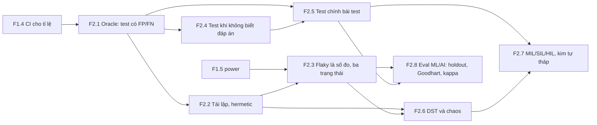
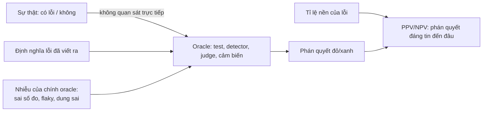
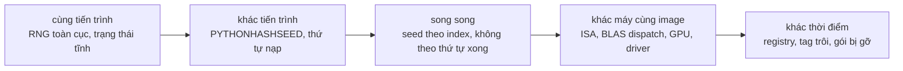
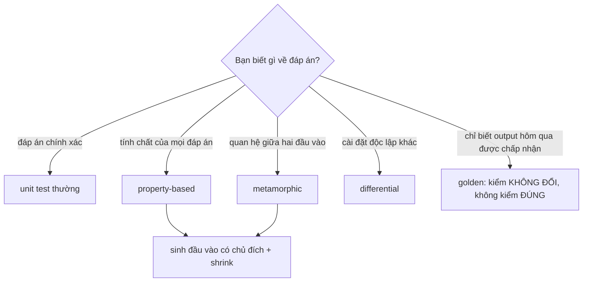
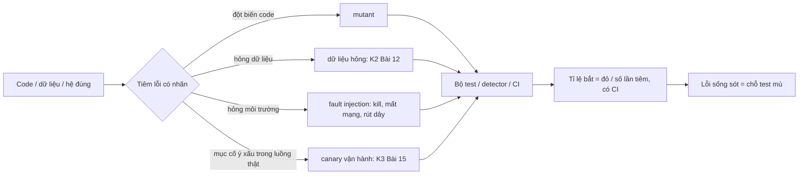
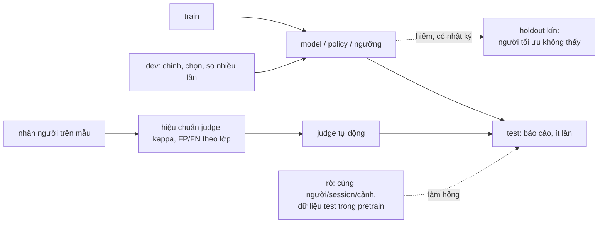

# F2 — Kỹ nghệ kiểm thử và đánh giá (36h)

> Khóa nền, học **đúng lúc** theo bảng bên dưới, không học một mạch. Tám viên nang: F2.1 (4h) · F2.2 (4h) · F2.3 (4h) · F2.4 (5h) · F2.5 (4h) · F2.6 (5h) · F2.7 (4h) · F2.8 (6h). Mọi bài tập Python chạy trên laptop; bản đã chạy thử: Python 3.13, numpy 2.5, scipy 1.18, hypothesis 6.168.
> Cần trước cho cả khóa: F1.4 (khoảng tin cậy cho tỉ lệ, Wilson) và F1.5 (power, cỡ mẫu). Hai viên nang đó trả lời "bao nhiêu mẫu"; F2 trả lời "phép đo tên là *test* này đang đo cái gì, và sai theo kiểu nào".

## Vì sao khóa nền này tồn tại

Từ Khóa 2 trở đi, gần như mọi gate đều là **một bài test chạy trên một bài test**: detector lỗi dữ liệu phải được đo bằng lỗi tiêm vào (K2 Bài 12), predicate "thành công" của sim có tỉ lệ sai riêng (K6 Bài 11), CI phải trả INCONCLUSIVE thay vì PASS khi thiếu episode (K6 Bài 13, K7 C11.2), FAR "bằng 0" phải được viết thành một cận trên (K7 C9.2). Thiếu F2 thì đọc các bài đó sẽ hụt ở ba chỗ:

1. **Coi test là sự thật thay vì phép đo.** Khi đó "CI xanh" được đọc là "không có lỗi", và mọi canary, mutation, tập giữ kín trong K2–K7 trông như thủ tục thừa.
2. **Không phân biệt được "không tái lập được" với "có bug".** K4 Bài 7 và K6 Bài 1–4 đòi bạn cam kết loại determinism nào ở tầng nào; không có F2.2–F2.3 thì mọi lệch giữa hai lần chạy đều thành "bug" hoặc đều thành "nhiễu".
3. **Không biết phải test cái gì khi không có đáp án.** Dữ liệu robot thật không có nhãn đúng; sim không có nghiệm giải tích. K2 Bài 12, K4 Bài 10, K6 Bài 6 dùng property-based, differential, metamorphic test mà không dạy lại chúng.

## Mindset cốt lõi

1. **Một bài test là một dụng cụ đo có tỉ lệ dương tính giả và âm tính giả.** Người trong nghề tin điều này vì họ đã sống với hai kiểu hỏng: test "luôn xanh" vì chính nó không chạy (Apple *goto fail*, F2.5) và test "hay đỏ vô cớ" đến mức kỹ sư học cách bấm chạy lại (Google, F2.3).
2. **Một kết quả không tái lập được thì không so sánh được, và không so sánh được thì không có kết luận.** FoundationDB phải viết lại cả runtime để mọi nguồn ngẫu nhiên đi qua một seed (F2.6); cộng đồng học tăng cường phát hiện nhiều "cải tiến" chỉ là nhiễu seed (K6 Bài 1).
3. **"Chưa biết" là một phán quyết hợp lệ, và phải có tên.** Hệ chỉ có PASS/FAIL sẽ biến "không đủ dữ liệu" thành PASS. Ngành thử thuốc đã khổ vì đúng chuyện này: "không thấy khác biệt có ý nghĩa" bị đọc thành "không có khác biệt", dù thử nghiệm quá nhỏ để thấy bất cứ thứ gì (F2.3).
4. **Chính bài test cũng phải bị test.** Một bộ test chưa từng đỏ là một bộ test chưa được chứng minh là nhìn thấy gì (F2.5).
5. **Thước đo bị tối ưu hóa thì sẽ ngừng đo cái nó từng đo** (Goodhart). Volkswagen làm phần mềm nhận ra chu trình thử khí thải; benchmark công khai bị "học thuộc". Vì vậy luôn cần một tập mà người tối ưu không nhìn thấy (F2.8).

## Bản đồ viên nang



### Học đúng lúc

| Viên nang | Giờ | Học trước bài chính nào (bài đầu tiên cần nó in đậm) | Bài khác dùng lại |
|---|---|---|---|
| F2.1 Oracle, FP/FN | 4 | mục 1–3 trước **K1 Bài 5** (multimeter như bộ phân loại); trọn trước **K2 Bài 11** | K1 Bài 7, 9, 11, 12; K2 Bài 10, 12; K3 Bài 9, 15, 17; K4 Bài 3, 7; K5 Bài 3, 9; K6 Bài 10, 11, 15; K7 C9.2 |
| F2.2 Tái lập, hermetic | 4 | **K2 Bài 5** (seed cho dữ liệu tổng hợp) | K2 Bài 12; K3 Bài 12; K4 Bài 3, 7, 14, 15; K6 Bài 1–3, 5–7 |
| F2.3 Flaky, ba trạng thái | 4 | **K1 Bài 14** (gate) ở mức đọc; trọn trước **K2 Bài 11** | K3 Gate; K4 Bài 3, 7, 9, 14, Gate; K6 Bài 3, 4, 13, 18; K7 C11.2 |
| F2.4 Không biết đáp án | 5 | **K2 Bài 9** (đọc lướt), trọn trước **K2 Bài 12** | K1 Bài 7, 13; K3 Bài 15; K4 Bài 10; K6 Bài 4, 6 |
| F2.5 Test chính bài test | 4 | **K2 Bài 5** (bước canary cho round-trip test) | K2 Bài 6, 12; K3 Bài 6, 9, 11, 14, 15; K4 Bài 8, 14; K5 Bài 9, 14; K6 Bài 4, 7, 11; K7 C10.2 |
| F2.6 DST, chaos | 5 | **K6 Bài 1** (đọc lướt mục 1–2), trọn trước **K6 Bài 3** | K6 Bài 4; K3 Bài 14 (fault injection); K7 C11 |
| F2.7 X-in-the-loop | 4 | **K7 C4** (test firmware tự động trên bàn), trọn trước **K7 C11.2** | K2 Bài 5 (SIL với dữ liệu tổng hợp); K7 C10.2, C11.3 |
| F2.8 Eval ML/AI | 6 | **K2 Bài 10** (khi định giao việc xem video cho VLM); trọn trước **K4 Bài 7** | K3 Bài 15; K4 Bài 9; K6 Bài 11, 14; K7 C9.2, C11.3, C11.5 |

Tuần crunch (0–2h): chỉ đọc mục 1–3 và mục 6 (Lăng kính đánh giá) của viên nang mà bài chính tuần tới cần; bỏ bài tập dự đoán sang tuần sau, **không** đọc đáp án trước.

## Bạn đã làm cái này rồi

| Bạn đã làm (backend/AI-harness) | Tên chuẩn | Bạn còn thiếu | Viên nang |
|---|---|---|---|
| Dựng môi trường local tái tạo được các service | Hermetic test, môi trường tái lập | Ghim **lockfile có hash** và **image digest** (không phải tag); ghi lại những gì không ghim được (CPU, driver, kernel) | F2.2 |
| Server mock để tự tạo bộ test chuẩn | Test double (fake/stub), golden dataset, known-answer test | **Canary lỗi cố ý**: chứng minh bộ test đỏ khi có lỗi; đo tỉ lệ bắt | F2.5 |
| Script chấm pass/fail/inconclusive | Phán quyết ba trạng thái (kiểm định với vùng "chưa đủ bằng chứng") | **Power**: vì sao inconclusive, cần thêm bao nhiêu mẫu, và biên chấp nhận δ được chọn trước | F2.3 (+F1.5) |
| Model AI review kết quả | LLM-as-judge | **Hiệu chuẩn**: Cohen's kappa với người trên tập đã gán nhãn, có khoảng tin cậy; đo lại khi đổi model/prompt | F2.8 |
| Agent tự chạy → test → sửa → deploy → báo cáo | Closed-loop CI, self-healing pipeline | **Goodhart**: agent tối ưu để qua test, không phải để đúng. Cần tập test giữ kín mà agent không đọc/sửa được | F2.8, F2.5 |
| Đo trên host "yên tĩnh" | Cô lập nhiễu, active benchmarking | Chứng minh bằng số rằng đã cô lập được (A/A test) | F1.3 (không thuộc F2) |
| Hệ metrics quan sát/eval | Observability, eval harness | Biết giới hạn phát hiện của chính hệ (MDE) và in nó ra | F2.3, F7.5 |

**Gãy ở chỗ:** trong backend, test gần như luôn tất định và có đáp án: `GET /users/1` trả đúng JSON hay không. Ở robot, đáp án thường không tồn tại (dữ liệu thật không có nhãn), đầu ra là một tỉ lệ có nhiễu (500 episode sim), và môi trường có vật lý mà bạn không viết ra. Nếu mang nguyên phản xạ "assert bằng, đỏ thì sửa, xanh thì ship" sang, bạn sẽ ship những thay đổi mà CI chưa từng có đủ sức để thấy.

---

## F2.1 — Bài toán oracle: test là một phép đo có dương tính giả/âm tính giả (4h)

> **Dùng cho:** K1 Bài 5, 7, 11, 12 · K2 Bài 10–12 · K3 Bài 15, 17 · K4 Bài 3, 7 · K6 Bài 11 · K7 C9.2 · **Cần trước:** F1.4 (CI cho tỉ lệ) · **Sau viên nang này bạn đánh giá được:** mọi khẳng định dạng "test xanh nên đúng", "detector bắt được lỗi", "FAR = 0", "CI đỏ là có bug": nó đang nói về độ nhạy, độ đặc hiệu hay giá trị dự đoán, và đã đo cái nào.

### 1. Câu chuyện

**Mars Polar Lander (1999).** Mỗi chân hạ cánh có một cảm biến báo chạm đất; khi nó báo, phần mềm tắt động cơ hãm. Ban điều tra (JPL Special Review Board, 2000) kết luận nguyên nhân khả dĩ nhất: lúc **bung chân** ở độ cao lớn, cú giật làm cảm biến phát một tín hiệu ngắn; phần mềm ghi nhận tín hiệu đó, và khi bắt đầu đọc cảm biến ở gần mặt đất thì coi như đã chạm đất, tắt động cơ khi còn đang rơi [chuẩn: theo báo cáo điều tra; không có dữ liệu bay để xác nhận]. Thử nghiệm sau tai nạn trên một lander tương tự tái hiện được tín hiệu giả khi bung chân. Cảm biến chạm đất là một **oracle**: một thứ trả lời câu "đã xảy ra chưa?". Nó có dương tính giả, và hệ thống được thiết kế như thể nó không có.

Trong phần mềm, cái tên này có từ lâu. Elaine Weyuker (1982, *On Testing Non-Testable Programs*) chỉ ra rằng phần lớn lý thuyết test ngầm giả định có một oracle hoàn hảo, trong khi nhiều chương trình đáng test nhất lại là loại không ai biết đáp án đúng. Barr, Harman, McMinn, Shahbaz, Yoo (IEEE TSE 2015) gọi đây là **bài toán oracle** và xem nó là nút thắt của tự động hóa test. Ở robot, bạn gặp nó ngay từ K1: đồng hồ vạn năng là oracle của "điện trở đạt ±5%", và chính nó có sai số.

### 2. Mô hình tư duy

Mọi test, detector, predicate, judge là một **bộ phân loại** đặt trên một sự thật bạn không nhìn trực tiếp:

| | Thật sự có lỗi | Thật sự không lỗi |
|---|---|---|
| **Test đỏ** | TP (bắt đúng) | **FP** (đỏ giả, false alarm) |
| **Test xanh** | **FN** (lọt lỗi) | TN |

Bốn con số bạn có thể hỏi, và chúng **không thay nhau được**:

- **Độ nhạy** (sensitivity, recall, TPR, "tỉ lệ bắt") = TP/(TP+FN): có lỗi thì test đỏ bao nhiêu lần. Đây là thứ F2.5 đo bằng canary.
- **Độ đặc hiệu** (specificity) = TN/(TN+FP); 1 − nó là tỉ lệ đỏ giả.
- **Giá trị dự đoán dương** (PPV, precision) = TP/(TP+FP): **khi CI đỏ**, xác suất thật sự có lỗi. Nó phụ thuộc **tỉ lệ nền** (bao nhiêu PR thật sự có lỗi), không chỉ phụ thuộc test.
- **Giá trị dự đoán âm** (NPV): khi CI xanh, xác suất thật sự không lỗi.

Ba câu bản chất:
1. Một oracle chỉ "đúng" so với một **định nghĩa**. "Test đúng" nghĩa là test khớp định nghĩa lỗi bạn đã viết ra; nếu định nghĩa thiếu, test đúng vẫn lọt lỗi (K6 Bài 11: cờ `success` mặc định của môi trường là một định nghĩa người khác viết).
2. Gộp nhiều test làm **tỉ lệ đỏ giả của cả bộ** tăng theo số test, dù từng test rất sạch. Đây là bội so sánh (F1.5) đội lốt CI.
3. Khi lỗi hiếm, một test rất tốt vẫn có thể có PPV thấp: phần lớn lần đỏ là đỏ giả. Đây là định lý Bayes, không phải chuyện chất lượng code test.



### 3. Cầu nối từ backend

| Backend bạn biết | Ở đây | Gãy ở chỗ | Nếu dùng nhầm thì |
|---|---|---|---|
| `assert response == expected` | So output sim/cảm biến với golden | Backend có đáp án chính xác; ở đây đáp án có nhiễu nên phải có **dung sai**, và dung sai chính là ngưỡng của một bộ phân loại | Chọn dung sai theo cảm tính: quá chặt → đỏ giả liên tục; quá lỏng → nuốt lỗi thật |
| Alert trên dashboard (PagerDuty) | Detector lỗi dữ liệu (K2 Bài 12), rule bất thường (K7 C8.5) | Bạn đã biết alert fatigue; nhưng ở backend hiếm ai đo **tỉ lệ bắt**, vì sự cố thật hiếm và không có nhãn. Ở đây bạn **tự tiêm lỗi** nên đo được | Báo "detector có 0 đỏ giả" mà không nói nó bắt được bao nhiêu phần lỗi |
| Health check `/healthz` trả 200 | Cảm biến/predicate báo "OK" | Health check backend kiểm "tiến trình còn sống". Oracle vật lý (cảm biến chạm đất, predicate success) kiểm **một suy luận về thế giới**, có thể bị đánh lừa bởi một sự kiện khác (cú giật khi bung chân) | Tin "OK" như tin 200, và hệ hành động trên một dương tính giả |
| Code review: "reviewer thấy ổn" | LLM/VLM-judge, người chấm tay | Reviewer cũng là oracle có FN; khác ở chỗ ở đây bạn có thể **đo** nó trên tập có nhãn (F2.8) | Gọi judge là "ground truth" |

**Tên chuẩn của thứ bạn đã làm:** script chấm deterministic + model AI review của bạn là một **hệ hai oracle**. Câu hỏi chưa ai trả lời trong hệ đó: hai oracle bất đồng thì tin ai, và mỗi cái sai bao nhiêu phần trăm?

**Chấm mô hình:**

- *"Test xanh nghĩa là code đúng."* — **SAI.** Test xanh chỉ nghĩa là không có test nào trong bộ phát hiện được sai lệch so với định nghĩa đã viết. Dijkstra (1970): test chỉ ra được sự có mặt của bug, không chỉ ra được sự vắng mặt. **Phản ví dụ:** detector "frame bị trùng" của bạn kiểm `timestamp[i] == timestamp[i-1]`; dataset có frame trùng nội dung nhưng timestamp được gán lại khi ghi. Detector xanh, dữ liệu vẫn hỏng.
- *"Test đỏ nghĩa là có bug."* — **ĐÚNG MỘT PHẦN.** Đúng nếu test không có đỏ giả. Với 200 test, mỗi cái đỏ giả rất hiếm, xác suất **cả bộ** đỏ vô cớ trong một lần chạy vẫn có thể lớn (bài tập mục 5 cho bạn tính). **Phản ví dụ (kịch bản):** một bộ kiểm tra offset PTP gồm 30 phép kiểm, mỗi phép đặt ngưỡng ở p99 của chính phân bố lúc hệ khỏe: mỗi lần chạy, xác suất có ít nhất một phép đỏ dù không có lỗi nào là 1 − 0.99³⁰, khoảng một phần tư.
- *"Nếu lúc đo chưa cover đủ flag/khóa thì lúc runtime thực tế không thể đảm bảo mọi tình huống"* (mô hình của bạn ở K3 lượt 21). — **ĐÚNG MỘT PHẦN.** Chiều này đúng: không đo thì không đảm bảo. Nhưng câu ngầm hứa chiều ngược lại, rằng cover đủ flag thì đảm bảo được, và chiều đó sai vì hai lý do: (1) mỗi phép đo có FN của riêng nó, nên "đã đo, xanh" vẫn chỉ là xác suất; (2) không gian tình huống của hệ vật lý không liệt kê hết được bằng flag. **Phản ví dụ:** Mars Polar Lander có test cảm biến chạm đất; thứ thiếu là một tình huống (tín hiệu giả khi bung chân) không nằm trong danh sách tình huống được test.

### 4. Thuật ngữ

| Mức | Thuật ngữ | Nghĩa trong một câu | Hay bị hiểu nhầm thành |
|---|---|---|---|
| 🟢 | Oracle | Thứ quyết định một kết quả là đúng hay sai | Luôn đúng |
| 🟢 | FP / FN | Đỏ khi không có lỗi / xanh khi có lỗi | Hai mặt của cùng một con số |
| 🟢 | Độ nhạy (recall, TPR, tỉ lệ bắt) | P(đỏ \| có lỗi) | P(có lỗi \| đỏ) |
| 🟢 | PPV (precision) | P(có lỗi \| đỏ), phụ thuộc tỉ lệ nền | Thuộc tính cố định của test |
| 🟢 | Dung sai (tolerance) | Ngưỡng của một oracle so sánh số có nhiễu | Hằng số kỹ thuật "cho đẹp" |
| 🟡 | ROC | Đường đánh đổi TPR–FPR khi quét ngưỡng | Chỉ dùng cho ML |
| 🟡 | Tỉ lệ nền (base rate) | Phần trường hợp thật sự có lỗi | Không liên quan đến chất lượng test |
| 🟡 | Test oracle tiềm ẩn (implicit oracle) | Oracle không cần đáp án: crash, exception, NaN, vi phạm bất biến | "Không phải test thật" |
| 🔴 | Lý thuyết phát hiện tín hiệu (SDT) đầy đủ, d′ | Khung tâm lý-vật lý cho phân loại có nhiễu | Cần cho khóa này |

### 5. Bài tập dự đoán

**Đề (≤1h):**
1. Bộ CI có 200 test độc lập, mỗi test đỏ giả với xác suất f mỗi lần chạy. Với f = 0.1%, 0.5%, 1%: xác suất một lần chạy cả bộ có ít nhất một test đỏ vô cớ?
2. 5% số PR thật sự có lỗi. Bộ test bắt được 70% lỗi. Tỉ lệ đỏ giả của cả bộ lấy từ câu 1 với f = 0.5%. Khi CI đỏ, xác suất PR thật sự có lỗi là bao nhiêu?
3. Oracle dung sai: output mới = output cũ + nhiễu số học (σ = 1e-4); một bug làm output lệch thêm 5e-4. Quét dung sai 1e-4 … 4e-4: FP và FN ở mỗi mức? Dung sai nào bạn chọn, và theo tiêu chí gì?

**Phương pháp:** câu 1: `1 − (1 − f)²⁰⁰`. Câu 2: Bayes, `PPV = b·s / (b·s + (1−b)·F)`. Câu 3: mô phỏng. Viết `prediction.md` trước, rồi chạy:

```markdown
# prediction.md — F2.1
1. P(≥1 đỏ giả) với f=0.1% / 0.5% / 1%: __ / __ / __
2. PPV khi CI đỏ: __  (trực giác trước khi tính: "phần lớn lần đỏ là bug thật"? có/không)
3. Dung sai tôi chọn: __ ; lý do: __ ; FP/FN tôi đoán ở mức đó: __ / __
Tôi KHÔNG chắc về: __
```

```python
# [đã chạy] — Python 3.13, numpy 2.5
# Một bộ test là một bộ phân loại: tính P(đỏ giả), PPV của "CI đỏ", và đánh đổi dung sai.
import numpy as np
rng = np.random.default_rng(7)

# (a) 200 test, mỗi test đỏ giả độc lập với xác suất f mỗi lần chạy
for f in (0.001, 0.005, 0.01):
    print(f"f={f:.3f}: P(ít nhất 1 test đỏ giả / lần chạy suite) = {1-(1-f)**200:.2f}")

# (b) PR có bug thật với tỉ lệ nền b; suite bắt bug với độ nhạy s; đỏ giả cả suite = F
b, s, F = 0.05, 0.70, 1-(1-0.005)**200
ppv = b*s / (b*s + (1-b)*F)
print(f"P(PR thật sự có bug | CI đỏ) = {ppv:.2f}")

# (c) oracle dung sai: output mới = output cũ + nhiễu số (sigma) [+ bug dịch delta]
sigma, delta, n = 1e-4, 5e-4, 100_000
clean = np.abs(rng.normal(0, sigma, n))
buggy = np.abs(rng.normal(delta, sigma, n))
for tol in (1e-4, 2e-4, 3e-4, 4e-4):
    fp = np.mean(clean > tol)     # đỏ khi không có bug
    fn = np.mean(buggy <= tol)    # xanh khi có bug
    print(f"tol={tol:.0e}: FP={fp:.3f}  FN={fn:.3f}")
```

<details><summary>🔒 MỞ SAU KHI COMMIT prediction.md</summary>

| Câu | Kết quả chạy | Đọc thế nào |
|---|---|---|
| 1 | 0.18 / 0.63 / 0.87 | Ở f = 0.5%, gần hai phần ba số lần chạy có ít nhất một đỏ vô cớ. Đây là cơ chế sinh ra văn hóa "bấm chạy lại" (F2.3) |
| 2 | PPV ≈ 0.05 | Khi CI đỏ, chỉ khoảng 1/20 khả năng là bug thật. Không phải vì test kém (độ nhạy 70% là tốt) mà vì đỏ giả của cả bộ lớn hơn nhiều so với tỉ lệ nền của bug |
| 3 | tol 1e-4: FP 0.317, FN 0.000 · 2e-4: 0.046 / 0.001 · 3e-4: 0.002 / 0.023 · 4e-4: 0.000 / 0.158 | Không có dung sai "đúng"; có dung sai ứng với **giá** của từng loại sai. Nếu đỏ giả làm người ta tắt test, chọn 3e-4. Nếu lọt lỗi nguy hiểm (FAR nhận diện ở K7 C9.2), nghiêng về phía chặt và trả giá bằng điều tra |

Nếu bạn đoán câu 2 trên 0.5: đó là **base rate neglect**, lỗi trực giác phổ biến nhất về oracle. Cách sửa trong hệ thật: giảm đỏ giả của từng test (hermetic, F2.2), tách bộ nhanh/bộ chậm, và đo PPV thật bằng cách ghi lại mỗi lần đỏ là bug thật hay không.

Mô phỏng câu 3 giả định nhiễu chuẩn và bug là dịch chuyển cố định. Bug thật thường không như vậy: có bug chỉ lệch ở một phần nhỏ đầu vào, nên FN thật lớn hơn số ở đây.

</details>

### 6. Lăng kính đánh giá

Checklist khi đọc một khẳng định về test/detector/judge:
1. Oracle ở đây là gì, và nó kiểm theo **định nghĩa** nào? Định nghĩa đó có viết ra được không?
2. Khẳng định nói về độ nhạy, đỏ giả, hay PPV? Có lẫn hai cái không?
3. Con số được đo trên bao nhiêu trường hợp, có khoảng tin cậy không (F1.4)? "0 lỗi" đi kèm n bao nhiêu?
4. Các trường hợp có **độc lập** không, hay cùng người, cùng session, cùng seed?
5. Tỉ lệ nền ở nơi triển khai có giống nơi đo không?
6. Có đo trên lỗi **đã biết đáp án** (canary, lỗi tiêm vào) không, hay chỉ trên dữ liệu "trông ổn"?

Chấm ĐÚNG / ĐÚNG MỘT PHẦN / SAI / CHƯA RÕ:

**(a)** *"Nếu FAR đo được là 0/500 cặp, bạn không kết luận được FAR = 0; bạn kết luận được FAR < ~0.6% ở mức tin cậy 95%."* (K7 gốc Bài 12, nay là K7 C9.2)

**(b)** *"Độ nhạy của Canary test: bắt được lỗi 100% khi có ô nhiễm RNG toàn cục."* (Gemini K6 Bài 4, bảng Số phải ra)

**(c)** *"Continuity test: dây tốt < 1 Ω. Luôn test dây trước."* (`robotics-data-infra-roadmap.md`)

**(d)** *"Phép kiểm 'điện trở đạt ±5%' bằng đồng hồ ±1% là một bộ phân loại có FP/FN, vì chính đồng hồ có sai số."* (K1 Bài 5)

<details><summary>🔒 Đáp án gập</summary>

- **(a) ĐÚNG MỘT PHẦN.** Số học đúng: quy tắc ba cho 0/n là cận trên ≈ 3/n = 0.6% (một phía, 95%). Giả định bị bỏ qua: 500 cặp **độc lập**. Với 10 người, 500 cặp "khác người" được tạo từ chỉ 45 cặp người; nếu hai người giống nhau thì mọi ảnh của họ cùng dễ nhầm. Số cặp hiệu dụng gần 45 hơn 500, và cận trên thật rộng hơn nhiều. Cách viết đúng: báo cận trên theo **cặp người**, hoặc bootstrap theo người.
- **(b) SAI như cách viết.** "100%" là một tỉ lệ ước lượng từ vài lần chạy canary; 5/5 cho cận trên của tỉ lệ bỏ sót khoảng 45% (một phía, 95%). Chưa kể chính bài K6 Bài 4 chỉ ra canary đó không chạy bộ test thật. Đúng ra: "bắt k/n lần chèn, cận dưới 95% của tỉ lệ bắt là …".
- **(c) ĐÚNG**, và là ví dụ hiếm của oracle gần như hoàn hảo: dây tốt dưới 1 Ω, dây đứt là hở mạch; khoảng cách giữa hai phân bố rất lớn nên ngưỡng nào hợp lý cũng phân loại đúng. Nó chỉ trở thành ĐÚNG MỘT PHẦN khi dùng cho câu hỏi khác (đứt ngầm chập chờn khi rung: lúc đo thì liền).
- **(d) ĐÚNG.** Gần biên ±5%, một điện trở 5.4% lệch có thể đọc ra 4.6% và ngược lại. FP/FN tập trung trong dải rộng bằng sai số đồng hồ quanh biên. Đây là mô hình đúng cho mọi kiểm tra ngưỡng trong K1–K7.

</details>

### 7. Câu hỏi ngược

1. **[Quy mô]** Bộ audit K2 có 7 lớp lỗi × 50 dataset × vài nghìn episode. Ở quy mô 100 robot, 1000 giờ dữ liệu mỗi tuần, cái gì gãy trước: độ nhạy, đỏ giả, hay năng lực của người xem báo cáo?
   <details><summary>Hướng nghĩ</summary>Số lần đỏ tuyệt đối tăng tuyến tính theo dữ liệu, sức người xem thì không. Tính số cờ mỗi tuần với tỉ lệ đỏ giả hiện tại. Khi PPV thấp, người ta bỏ đọc; lúc đó độ nhạy bằng 0 trên thực tế dù trên giấy vẫn cao.</details>
2. **[Failure mode]** Oracle và hệ được test dùng chung một hàm (ví dụ cùng hàm `to_meters()` để sinh golden và để tính output). Lỗi gì không bao giờ bị phát hiện?
   <details><summary>Hướng nghĩ</summary>Lỗi chung (common-mode). Oracle phải độc lập ở chỗ nó kiểm. Hàng không gọi đây là dissimilar redundancy. Nghĩ xem golden của bạn được sinh bằng code nào.</details>
3. **[Vì sao không]** Vì sao không đặt mọi dung sai thật chặt rồi "điều tra mọi lần đỏ"?
   <details><summary>Hướng nghĩ</summary>Điều tra có giá. Khi giá điều tra × số đỏ giả vượt ngân sách, người ta ngừng điều tra, và test chặt trở thành test bị lờ. Dung sai là một quyết định kinh tế có số.</details>
4. **[Nếu…thì]** Nếu tỉ lệ nền của lỗi tăng gấp 10 (giai đoạn đầu bring-up K7 C3), PPV của cùng bộ test đổi thế nào? Có nên dùng cùng ngưỡng ở giai đoạn ổn định không?
   <details><summary>Hướng nghĩ</summary>Thay b vào công thức Bayes. Ngưỡng tối ưu phụ thuộc tỉ lệ nền và giá của từng loại sai, nên có lý do để đổi ngưỡng theo giai đoạn, miễn là ghi lại.</details>
5. **[Phản biện]** "Test có FP/FN" có làm mất ý nghĩa của test không?
   <details><summary>Hướng nghĩ</summary>Ngược lại: mọi dụng cụ đo đều có sai số, và biết sai số là thứ biến nó thành dụng cụ. Thứ mất ý nghĩa là test không biết sai số của chính mình.</details>

### 8. Liên kết ra ngoài

- **Y học sàng lọc.** Xét nghiệm có độ nhạy và đặc hiệu cao vẫn cho phần lớn kết quả dương tính là giả khi bệnh hiếm; vì thế y học tách *sàng lọc* (nhạy, rẻ) khỏi *xác nhận* (đặc hiệu, đắt). Giống: đúng cấu trúc CI nhanh/CI chậm. Khác: bác sĩ biết tỉ lệ nền từ dịch tễ học; bạn phải tự đo tỉ lệ nền của bug.
- **Radar và lý thuyết phát hiện tín hiệu.** Đường ROC sinh ra để chọn ngưỡng phát hiện máy bay trong nhiễu radar. Giống: một ngưỡng, hai loại sai, đánh đổi liên tục. Khác: nhiễu radar có mô hình vật lý; "nhiễu" của một bộ test (flaky, hạ tầng) thường không có mô hình nào.

### 9. Áp vào khóa chính

- **K1 Bài 5, 7, 9:** mỗi phép kiểm ngưỡng (±5%, capture "sạch", đo điện áp chia) viết thành "phân loại với sai số dụng cụ ±…"; không thấy glitch trên logic analyzer không chứng minh không có glitch (K1 Bài 7 tự tính xác suất bỏ lỡ).
- **K2 Bài 11–12:** mỗi detector báo cả TPR theo độ lớn lỗi và FPR có khoảng tin cậy; quyết định ngưỡng nào được ship.
- **K6 Bài 11:** predicate thành công là một oracle; lấy mẫu episode, chấm tay, tính FP/FN của chính predicate trước khi tin bất cứ tỉ lệ thành công nào.
- **K7 C9.2:** FAR/FRR là đúng cặp FP/FN; FAR báo bằng cận trên, và bootstrap theo người, không theo cặp ảnh.

### 10. Độ tin cậy

| Khẳng định | Nhãn | Ghi chú / cách kiểm |
|---|---|---|
| Nguyên nhân khả dĩ của Mars Polar Lander là tín hiệu giả khi bung chân | [chuẩn] | Theo báo cáo JPL Special Review Board (2000); báo cáo tự nói không có dữ liệu bay để xác nhận |
| Weyuker 1982; Barr và cộng sự 2015 định nghĩa bài toán oracle | [chuẩn] | Tên bài và tác giả đã kiểm; không đưa URL |
| Số trong bài tập mục 5 | [đã chạy] | Mô phỏng, phụ thuộc giả định độc lập và nhiễu chuẩn |
| Quy tắc ba ≈ 3/n | [chuẩn] | Xấp xỉ của cận trên một phía 95%; chính xác: 1 − 0.05^(1/n) |
| Đã sửa: K7 gốc Bài 12 dùng 500 cặp như mẫu độc lập | sửa | Thêm điều kiện độc lập và bootstrap theo người (đáp án 6a) |

### 11. Đọc thêm và tự kiểm tra

- **Nguồn gốc:** Barr, Harman, McMinn, Shahbaz, Yoo, *The Oracle Problem in Software Testing: A Survey*, IEEE Transactions on Software Engineering, 2015.
- **Giải thích:** *Software Engineering at Google* (Winters, Manshreck, Wright, O'Reilly 2020; đọc miễn phí tại abseil.io/resources/swe-book), chương 11 *Testing Overview*.
- **Đào sâu (tùy chọn):** Weyuker, *On Testing Non-Testable Programs*, The Computer Journal, 1982.
- **Tự kiểm tra:** (1) giải thích cho một backend engineer khác trong 5 câu vì sao "CI đỏ" có thể có PPV 5%; (2) vẽ lại bảng 2×2 và hình oracle từ trí nhớ; (3) câu hỏi:

<details><summary>Câu hỏi: detector của bạn có 0 đỏ giả trên 1000 episode sạch và bắt 9/10 lỗi tiêm. Viết một câu báo cáo trung thực.</summary>

"Trên 1000 episode sạch không có cờ nào (cận trên 95% của tỉ lệ đỏ giả ≈ 0.3%); trên 10 lỗi tiêm, bắt 9 (Wilson 95% cho tỉ lệ bắt khoảng 0.60–0.98)." Thêm: lỗi tiêm có độ lớn bao nhiêu, và các episode có độc lập không.

</details>

---

## F2.2 — Tái lập và hermetic: môi trường, lockfile, seed, nguồn phi tất định (4h)

> **Dùng cho:** K2 Bài 5, 12 · K3 Bài 12 · K4 Bài 3, 7, 14, 15 · K6 Bài 1–3, 5–7 · **Cần trước:** F2.1 · **Sau viên nang này bạn đánh giá được:** một khẳng định "chạy lại ra đúng như cũ" đang hứa ở **tầng nào** (cùng tiến trình, khác tiến trình, khác máy, khác thời điểm), và thứ gì đã được ghim, thứ gì chỉ được ghi lại, thứ gì bị bỏ quên.

### 1. Câu chuyện

**left-pad (3/2016).** Một tác giả gỡ khỏi npm gói `left-pad` khoảng mười dòng code. Hàng nghìn dự án phụ thuộc gián tiếp vào nó, trong đó có Babel và React, bỗng không build được, vì quá trình build tải phụ thuộc **tại thời điểm build** từ một registry ngoài tầm kiểm soát. npm sau đó đổi chính sách gỡ gói [chuẩn]. Bài học không phải "npm tệ", mà là: một build đọc thứ gì đó từ thế giới bên ngoài lúc chạy là một build có **đầu vào ẩn**. Hôm nay nó xanh, mai nó đỏ, và code của bạn không đổi một dòng.

Google đi tới cùng kết luận từ phía test: *Software Engineering at Google* (chương 11, 14) phân test theo **kích thước** (small/medium/large) chủ yếu theo việc test được phép chạm vào gì: tiến trình khác, mạng, đĩa, đồng hồ. Test small phải **hermetic**: mọi thứ nó cần nằm trong nó. Lý do họ đưa ra là đo được: test càng chạm nhiều tài nguyên ngoài thì càng chậm và càng flaky [chuẩn]. Dự án Reproducible Builds (Debian và nhiều bản phân phối, từ khoảng 2013) đặt chuẩn khắt khe hơn: build cùng mã nguồn ở hai nơi phải ra **cùng từng byte**, để ai cũng kiểm được binary không bị cài cắm [chuẩn].

### 2. Mô hình tư duy

Một lần chạy là một hàm. Tái lập là việc làm cho **mọi đối số của hàm hiện ra**:

```
kết_quả = f( code@commit, phụ_thuộc@lockfile+hash, môi_trường@image_digest,
             dữ_liệu@hash_nội_dung, cấu_hình, seed,
             phần_cứng (CPU/ISA, GPU, driver), thời_gian, thứ_tự_lập_lịch, mạng )
```

Mỗi đối số rơi vào một trong ba ô, và trung thực là nói rõ ô nào:

| Ô | Nghĩa | Ví dụ |
|---|---|---|
| **Ghim** | Cố định, ai chạy lại cũng có đúng giá trị đó | commit, lockfile có hash, image theo **digest** `sha256:…` (không theo tag), hash dataset, seed |
| **Ghi lại** | Không cố định được, nhưng lưu kèm kết quả để giải thích chênh lệch | model CPU và mức tập lệnh (AVX2/AVX-512), GPU + driver + CUDA, kernel, nhiệt độ, `lscpu` |
| **Biến thành đầu vào có tên** | Nguồn ngẫu nhiên được đưa qua cửa có seed | RNG riêng mỗi env (`default_rng(seed_root + env_index)`), mạng/đồng hồ giả trong sim (F2.6) |
| (ô thứ tư, không ai muốn) **Rò rỉ** | Đầu vào ẩn chưa ai liệt kê | RNG toàn cục, thứ tự cộng float đa luồng, `os.listdir`, giờ hệ thống, `latest` |

Hai hệ quả mà người mới hay bỏ sót:
1. **Cộng số thực không có tính kết hợp.** `(a+b)+c ≠ a+(b+c)` ở bit cuối. Mọi thứ đổi thứ tự cộng (số luồng, kernel GPU, thư viện BLAS chọn đường SIMD khác theo CPU) đổi bit cuối. Trong hệ hỗn loạn như mô phỏng tiếp xúc, bit cuối ở bước 50 có thể thành kết quả khác ở bước 500 (→ F6.3).
2. **Tái lập có tầng.** Cùng tiến trình ⊂ khác tiến trình ⊂ khác máy cùng lớp CPU ⊂ khác lớp máy ⊂ khác thời điểm (một năm sau, registry đã đổi). Mỗi tầng cần ghim thêm thứ. Câu "tái lập được" không kèm tầng là câu chưa có nghĩa.



### 3. Cầu nối từ backend

| Backend bạn biết | Ở đây | Gãy ở chỗ | Nếu dùng nhầm thì |
|---|---|---|---|
| `docker compose up` dựng môi trường local giống prod | Image cho sim/benchmark | Container dùng chung **kernel, CPU, GPU driver** của host. Hermetic với thư viện, không hermetic với phần cứng | Tin "cùng Dockerfile thì cùng kết quả" và đổ lỗi cho code khi runner CI có CPU khác |
| `FROM python:3.12` | Base image theo tag | Tag là con trỏ có thể dời; digest mới là nội dung | Build lại sau ba tháng ra image khác mà không ai biết |
| `pip freeze > requirements.txt` | Lockfile | `pip freeze` ghi phiên bản, không ghi hash, không ghi gói hệ thống (apt), không ghi CUDA | Người reproduce cài đúng phiên bản nhưng khác bản build của wheel, khác cuDNN |
| Faker/random trong test có `seed(42)` | Seed cho dữ liệu tổng hợp, sim | Một seed toàn cục bị **mọi** hàm dùng chung; thêm một lời gọi random ở đâu đó là dịch toàn bộ chuỗi phía sau | Thêm một detector làm đổi dữ liệu tổng hợp của detector khác, golden đỏ hàng loạt |
| Môi trường local tái tạo được (bạn đã làm) | Hermetic test | Ở backend, "giống prod" đo bằng hành vi API. Ở đây đo bằng **bit của số thực**, và chỗ lệch có thể nằm trong tập lệnh CPU | Nói "môi trường giống nhau" mà không có `lscpu` của hai bên |

**Tên chuẩn của thứ bạn đã làm:** môi trường local tái tạo được = *hermetic environment*. Thứ còn thiếu: **lockfile có hash + image digest** làm provenance (K6 Bài 7), và danh sách "ghi lại" cho những gì không ghim được.

**Chấm mô hình:**

- *"Docker làm cho môi trường hermetic."* — **ĐÚNG MỘT PHẦN.** Docker ghim userspace (thư viện, Python, file). Nó không ghim kernel, CPU, GPU driver, và không ghim chính nó nếu bạn build lại từ tag. **Phản ví dụ:** cùng image digest, NumPy/OpenBLAS chọn kernel AVX-512 trên máy CI và AVX2 trên N100; tổng của một phép nhân ma trận lệch ở bit cuối [tự đo: so `np.show_config()` và hash output trên hai máy].
- *"Đặt seed ở đầu chương trình là đủ."* — **SAI** với code có song song hoặc có nhiều thành phần dùng RNG. Seed toàn cục cho một **chuỗi**; ai rút số trước thì ăn số đó. **Phản ví dụ:** 8 worker lấy seed từ một RNG chung theo thứ tự xong việc; chạy tuần tự và song song cho các episode khác nhau với cùng "seed 42".

### 4. Thuật ngữ

| Mức | Thuật ngữ | Nghĩa trong một câu | Hay bị hiểu nhầm thành |
|---|---|---|---|
| 🟢 | Hermetic | Test/build không đọc gì ngoài đầu vào đã khai báo | "Chạy trong Docker" |
| 🟢 | Lockfile có hash | Danh sách phụ thuộc ghim phiên bản **và** hash file tải về (`uv.lock`, `pip-compile --generate-hashes`) | `pip freeze` |
| 🟢 | Image digest | Định danh nội dung của image (`@sha256:…`) | Tag (`:latest`, `:3.12`) |
| 🟢 | Dẫn xuất seed | Seed con tính từ seed gốc + định danh cố định (env index, episode id) | Một seed toàn cục |
| 🟢 | Bit-exact vs tương đương thống kê | Giống từng bit vs giống trong ngưỡng đã cam kết trước | Hai mức của cùng một thứ; thứ hai là "cố không nổi" |
| 🟡 | `PYTHONHASHSEED` | Cố định hash của `str` → thứ tự duyệt `set` | Ảnh hưởng `dict` (dict giữ thứ tự chèn từ Python 3.7) |
| 🟡 | Reproducible build, `SOURCE_DATE_EPOCH` | Build ra cùng byte; biến môi trường thay giờ hệ thống trong artifact | Cần cho dự án này |
| 🔴 | Nix/Guix, Bazel remote execution | Hệ build hermetic triệt để | Bắt buộc để có kết quả tái lập |

### 5. Bài tập dự đoán

**Đề (≤1h):**
1. Một triệu số float64 ngẫu nhiên. Cộng theo 5 hoán vị khác nhau, và một lần theo thứ tự đã sắp. Có bao nhiêu giá trị tổng khác nhau? Chênh lệch lớn nhất cỡ bao nhiêu chữ số thập phân?
2. Bản Gemini K6 Bài 3 đề xuất: làm tròn quỹ đạo về 6 chữ số rồi SHA-256, "làm tròn đóng vai trò ngưỡng giữa bit-exact và tương đương thống kê". Quỹ đạo 1000 bước × 10 chiều, giá trị cỡ ±1. Lần chạy thứ hai lệch ngẫu nhiên ±ε ở mỗi giá trị (thứ tự cộng khác, **không có bug**). Với ε = 1e-12 và 1e-10: tỉ lệ cặp lần chạy cho hash khác nhau?

**Phương pháp:** câu 2 có lời giải gần đúng trước khi chạy: một giá trị "lật" khi nó nằm trong khoảng ε quanh một biên làm tròn; các biên cách nhau 1e-6. Xác suất một giá trị lật ≈ E|δ| / 1e-6; với N giá trị, P(hash khác) ≈ 1 − exp(−N · E|δ| / 1e-6). Tính tay trước.

```markdown
# prediction.md — F2.2
1. Số tổng khác nhau: __ ; lệch ở chữ số thập phân thứ: __
2. P(hash khác) với eps=1e-12: __ ; eps=1e-10: __ (tính tay theo công thức)
3. Kết luận của tôi về "làm tròn rồi hash" trước khi chạy: __
```

```python
# [đã chạy] — Python 3.13, numpy 2.5
# (a) Cộng float không kết hợp: cùng dữ liệu, khác thứ tự cộng -> khác bit.
# (b) "Làm tròn 6 chữ số rồi hash" có phải dung sai không?
import hashlib, numpy as np
rng = np.random.default_rng(0)

x = rng.normal(size=1_000_000)
sums = {repr(np.sum(x[rng.permutation(x.size)])) for _ in range(5)}  # 5 thứ tự cộng
sums.add(repr(np.sort(x).sum()))                                      # cộng theo thứ tự đã sắp
print(len(sums), "giá trị khác nhau:", sorted(sums))

def h(traj, decimals=6):
    return hashlib.sha256(np.round(traj, decimals).tobytes()).hexdigest()[:12]

# Quỹ đạo T bước x D chiều; lần chạy thứ hai lệch 1e-12 (thứ tự cộng khác, KHÔNG có bug)
T, D, trials = 1000, 10, 2000
for eps in (1e-12, 1e-10):
    flips = 0
    for _ in range(trials):
        a = rng.uniform(-1, 1, (T, D))
        flips += h(a) != h(a + rng.uniform(-eps, eps, a.shape))
    print(f"eps={eps:.0e}: tỉ lệ hash khác nhau = {flips/trials:.3f}")
```

<details><summary>🔒 MỞ SAU KHI COMMIT prediction.md</summary>

Kết quả chạy:

```
4 giá trị khác nhau: ['np.float64(998.5706494386209)', 'np.float64(998.5706494386213)', 'np.float64(998.5706494386214)', 'np.float64(998.5706494386541)']
eps=1e-12: tỉ lệ hash khác nhau = 0.005
eps=1e-10: tỉ lệ hash khác nhau = 0.392
```

- Câu 1: cùng một triệu số, chỉ đổi thứ tự cộng, ra 4 tổng khác nhau; các hoán vị ngẫu nhiên lệch nhau ở chữ số thập phân thứ 12–13, cộng theo thứ tự đã sắp lệch sớm hơn (chữ số thập phân thứ 11): cộng hết các số âm trước làm tổng tạm thời phình tới hàng trăm nghìn, và mỗi phép cộng vào một tổng lớn mất nhiều bit hơn. Không có thứ tự nào là "đúng"; chỉ có thứ tự được ghim hoặc không.
- Câu 2: tính tay: E|δ| = ε/2, N = 10⁴. Với ε = 1e-12: N·ε/2/1e-6 = 0.005 → ~0.5%. Với ε = 1e-10: 0.5 → 1 − e^(−0.5) ≈ 0.39. Mô phỏng khớp công thức.
- Đọc: làm tròn **không phải** dung sai. Dung sai là "|a − b| < tol"; làm tròn là "a và b rơi vào cùng ô lưới", và hai số cách nhau 1e-15 vẫn có thể rơi vào hai ô khác nhau nếu nằm sát biên. Hash sau làm tròn vẫn là phép so **bằng**, chỉ là có tỉ lệ đỏ giả nhỏ hơn và khó đoán hơn. Muốn tương đương thống kê thì so trực tiếp bằng dung sai trên giá trị (hoặc trên chỉ số tóm tắt), không qua hash. Hash dành cho cam kết bit-exact.
- Thêm một tầng: trong sim tiếp xúc, ε không đứng yên mà **tăng theo thời gian** (F6.3), nên tỉ lệ lật thực tế còn cao hơn mô phỏng này, và tăng theo độ dài episode.

</details>

### 6. Lăng kính đánh giá

Checklist khi đọc một khẳng định về tái lập:
1. Tái lập ở **tầng nào**? Cùng tiến trình, khác tiến trình, song song, khác máy, khác thời điểm?
2. Bit-exact hay tương đương thống kê? Nếu tương đương: dung sai bao nhiêu, trên đại lượng nào, cam kết **trước** khi chạy chưa?
3. Cái gì được ghim (commit, lockfile **có hash**, image **digest**, hash dữ liệu, seed)? Cái gì chỉ được ghi lại (CPU, GPU, driver)? Cái gì bị bỏ quên?
4. Seed được dẫn xuất thế nào khi chạy song song?
5. Có ai **đã thử** chạy lại ở tầng đó chưa, hay chỉ là thiết kế?

Chấm:

**(a)** *"Dùng lockfile (`uv.lock` hoặc `requirements.txt` có hash sha256) đảm bảo môi trường thực thi được đóng băng tuyệt đối theo thời gian."* (Gemini K4 Bài 14)

**(b)** *"Khác máy (cùng Docker, cùng kiến trúc CPU): Bit-exact hoặc sai lệch rất nhỏ nằm hoàn toàn trong ngưỡng làm tròn quy định."* (Gemini K6 Bài 3, Số phải ra)

**(c)** *"Tính nhất quán khi rebuild Docker image: build lại từ đầu trên một máy sạch cho ra phiên bản thư viện giống hệt (đối chiếu `pip freeze` khớp 100%)."* (Gemini K6 Bài 2)

**(d)** *"Cùng seed thì 3 lần chạy phải giống hệt; khác là có bug."* (K4 gốc Bài 7 và Gemini K4 Bài 7)

<details><summary>🔒 Đáp án gập</summary>

- **(a) ĐÚNG MỘT PHẦN.** Lockfile có hash đóng băng **gói Python**: đúng phiên bản, đúng file. Nó không đóng băng interpreter, gói hệ thống, CUDA/cuDNN, driver, phần cứng; và nó không đảm bảo gói **còn tồn tại** trên registry sau một năm (left-pad; PyPI cho phép "yank"). "Tuyệt đối theo thời gian" cần thêm: image theo digest được **lưu lại** (registry riêng hoặc `docker save`), và wheel được cache.
- **(b) ĐÚNG MỘT PHẦN.** "Cùng kiến trúc" (x86-64) chưa đủ: hai CPU x86-64 có thể khác mức tập lệnh, và BLAS/MKL/MuJoCo chọn đường code theo CPU lúc chạy. Và "nằm trong ngưỡng làm tròn" là sai khái niệm (bài tập mục 5): làm tròn không phải ngưỡng. Đúng ra: khóa golden theo **lớp máy**; lớp máy chưa có golden thì so bằng dung sai đã cam kết và báo INCONCLUSIVE cho phần hash (đúng như K6 Bài 4 đã làm).
- **(c) ĐÚNG MỘT PHẦN.** Tiêu chí kiểm được và tốt hơn không kiểm. Nhưng `pip freeze` khớp không nói gì về gói apt, base image (nếu `FROM` theo tag thì base đã có thể đổi), hay bản build của wheel. Tiêu chí mạnh hơn: image digest hoặc so danh sách hash file; hoặc tốt nhất, so **output** của một quick-run trên hai image.
- **(d) ĐÚNG MỘT PHẦN** (đã chấm chi tiết ở K4 Bài 7). Chỉ đúng khi **cùng máy, cùng image, đã bật cờ tất định**. Khác máy/khác image thì lệch vài episode là bình thường và phải so bằng khoảng tin cậy. Cùng máy, cùng image, có cờ mà vẫn khác mới là nguồn ngẫu nhiên chưa kiểm soát.

</details>

### 7. Câu hỏi ngược

1. **[Quy mô]** 100 robot, mỗi con một image build vào ngày khác nhau từ cùng Dockerfile. Một năm sau cần tái tạo kết quả eval của robot số 37. Cái gì gãy trước?
   <details><summary>Hướng nghĩ</summary>Image không được lưu theo digest; base image tag đã trôi; wheel bị yank. Nghĩ xem dữ liệu nào phải đi kèm mỗi episode (digest, commit, hash dataset) ngay lúc ghi, không phải lúc cần.</details>
2. **[Failure mode]** Bạn thêm một detector mới dùng `np.random` toàn cục vào K2 Bài 12. Ba golden của detector khác đổi. Vì sao, và thiết kế API nào làm chuyện này không thể xảy ra?
   <details><summary>Hướng nghĩ</summary>Chuỗi RNG dùng chung. API: mọi hàm nhận `rng` hoặc `seed` làm đối số; cấm RNG toàn cục bằng lint hoặc test.</details>
3. **[Vì sao không]** Vì sao không đơn giản chạy mọi thứ đơn luồng trên CPU để có bit-exact?
   <details><summary>Hướng nghĩ</summary>Giá: chậm hàng chục lần, và bạn tái lập được một cấu hình không ai triển khai. Đôi khi đúng cho bộ seed canh gác nhỏ; sai cho eval quy mô.</details>
4. **[Liên ngành]** Phòng thí nghiệm ướt (sinh học) gọi việc này là gì, và họ ghi lại những gì mà bạn chưa ghi?
   <details><summary>Hướng nghĩ</summary>Lab notebook, lô hóa chất (lot number), hiệu chuẩn thiết bị, nhiệt độ phòng. Tương đương: phiên bản firmware cảm biến, nhiệt độ N100 (K4 Bài 6).</details>
5. **[Phản biện]** "Tái lập bit-exact là xa xỉ; chỉ cần tái lập thống kê." Khi nào câu này đúng, khi nào nó là cớ để lười?
   <details><summary>Hướng nghĩ</summary>Đúng cho kết luận về tỉ lệ. Sai cho debug: một lỗi hiếm cần tái hiện đúng episode đó, và chỉ bit-exact (ở ít nhất một tầng) cho bạn điều ấy (F2.6).</details>

### 8. Liên kết ra ngoài

- **Reproducible Builds (Debian, Arch, NixOS).** Giống: liệt kê và loại bỏ đầu vào ẩn (giờ build, đường dẫn, thứ tự file). Khác: mục tiêu là an ninh chuỗi cung ứng (ai cũng kiểm được binary), không phải so sánh khoa học; và build không có số thực hỗn loạn.
- **Khoa học tính toán (khí hậu, thiên văn).** Mô hình khí hậu chạy trên siêu máy tính khác nhau cho quỹ đạo khác nhau vì thứ tự cộng; cộng đồng chấp nhận "tái lập theo khí hậu" (thống kê), không theo "thời tiết" (quỹ đạo). Giống hệt cam kết tương đương thống kê của K6 Bài 1. Khác: họ có ensemble hàng chục lần chạy làm thước đo nhiễu nền.
- **Kế toán: sổ cái và chứng từ.** Mỗi con số phải truy được về chứng từ gốc có định danh. Giống: hash dữ liệu, commit, digest. Khác: kế toán không có "bit cuối".

### 9. Áp vào khóa chính

- **K2 Bài 5, 12:** mọi hàm sinh dữ liệu tổng hợp nhận `seed`, dẫn xuất seed con theo tên lớp lỗi; thêm detector không được đổi golden của detector cũ.
- **K3 Bài 12, K4 Bài 14:** ghi `pip freeze`, hash trọng số, `lscpu`; nâng lên lockfile có hash + image digest; quyết định cái gì đóng băng, cái gì chỉ ghi lại.
- **K6 Bài 1–3:** viết `DETERMINISM.md` theo **bảng tầng** ở mục 2; mỗi tầng: cam kết, cách kiểm, cái gì ghim.
- **K6 Bài 7:** provenance = danh sách đầy đủ đối số của hàm ở mục 2.

### 10. Độ tin cậy

| Khẳng định | Nhãn | Ghi chú / cách kiểm |
|---|---|---|
| left-pad 2016 làm vỡ build nhiều dự án, npm đổi chính sách | [chuẩn] | Sự kiện được ghi nhận rộng rãi |
| Phân loại test small/medium/large theo tài nguyên được chạm | [chuẩn] | *Software Engineering at Google*, ch. 11, 14 |
| BLAS chọn kernel theo CPU lúc chạy, có thể lệch bit giữa máy | [tự đo] | `np.show_config()`, chạy cùng phép nhân ma trận lớn trên hai máy, so hash |
| `dict` Python giữ thứ tự chèn; `PYTHONHASHSEED` ảnh hưởng `set` của `str` | [spec] | Tài liệu Python (3.7+ về dict); docs biến môi trường |
| Số trong bài tập | [đã chạy] | Mô phỏng, khớp công thức xấp xỉ |
| Đã sửa: Gemini K6 Bài 3 coi làm tròn trước khi hash là ngưỡng tương đương thống kê | sửa | Làm tròn không phải dung sai; chứng minh bằng mô phỏng mục 5 |

### 11. Đọc thêm và tự kiểm tra

- **Nguồn gốc:** *Software Engineering at Google*, chương 11 (*Testing Overview*, phần test size và hermeticity) và 14 (*Larger Testing*).
- **Giải thích:** reproducible-builds.org, trang *Definitions* và danh mục nguồn phi tất định thường gặp.
- **Đào sâu (tùy chọn):** Goldberg, *What Every Computer Scientist Should Know About Floating-Point Arithmetic*, ACM Computing Surveys, 1991.
- **Tự kiểm tra:** (1) giải thích trong 5 câu vì sao "cùng Dockerfile" không đủ; (2) vẽ lại bảng bốn ô (ghim / ghi lại / đầu vào có tên / rò rỉ); (3) câu hỏi:

<details><summary>Câu hỏi: kết quả K4 của bạn lệch 1 episode/500 khi người khác chạy trên GPU khác. Ba câu nào bạn viết trong README?</summary>

(1) Cam kết: bit-exact chỉ trên cùng lớp máy + image digest X; khác lớp máy là tương đương thống kê. (2) Cách so: CI của tỉ lệ thành công, không so số episode. (3) Đã ghi lại cấu hình phần cứng của cả hai phía, và chênh lệch nằm trong khoảng tin cậy (hoặc không, và đây là điều tra tiếp theo).

</details>

---

## F2.3 — Flaky test là một số đo: ước lượng tỉ lệ flake, quarantine, phán quyết ba trạng thái (4h)

> **Dùng cho:** K1 Bài 14 · K2 Bài 11, 12 · K3 Gate · K4 Bài 3, 7, 9, 14, Gate · K6 Bài 3, 4, 12, 13, 18 · K7 C11.2 · **Cần trước:** F2.1, F2.2, F1.4, F1.5 · **Sau viên nang này bạn đánh giá được:** một phán quyết PASS/FAIL/INCONCLUSIVE có được định nghĩa đúng không (có biên δ, có power), một test "thỉnh thoảng đỏ" đang đỏ với tỉ lệ bao nhiêu, và chính sách chạy lại đang che giấu cái gì.

### 1. Câu chuyện

Google Testing Blog, *Flaky Tests at Google and How We Mitigate Them* (John Micco, 2016): khoảng 1,5% lượt chạy test cho kết quả flaky và gần 16% số test có một mức flaky nào đó [chuẩn: số liệu theo bài blog]. Luo, Hariri, Eloussi, Marinov (FSE 2014, *An Empirical Analysis of Flaky Tests*) đọc các commit sửa flaky trong 51 dự án mã nguồn mở và thấy ba nguyên nhân hàng đầu: **chờ bất đồng bộ** (sleep cố định thay vì chờ điều kiện), **concurrency**, và **phụ thuộc thứ tự test** [chuẩn: thứ hạng theo paper; tỉ lệ cụ thể kiểm lại trong bảng của paper]. Cả ba đều là đầu vào ẩn (F2.2) đội lốt "test xấu".

Cái giá thật không nằm ở thời gian chạy lại. Nó nằm ở thói quen: khi đỏ vô cớ đủ thường, đỏ mất nghĩa, và một lỗi thật **cũng chập chờn** (race condition, lỗi chỉ hiện khi tải cao) bị chạy lại cho tới khi xanh.

Vế thứ hai của viên nang có lịch sử ở y học. Altman và Bland viết trên BMJ (1995) một bài ngắn có tên chính là thông điệp: *Absence of evidence is not evidence of absence*. Nhiều thử nghiệm lâm sàng quá nhỏ đã báo "không có khác biệt có ý nghĩa" và bị đọc thành "thuốc không có tác dụng" (hoặc "không có hại"). Hệ CI chỉ có PASS/FAIL mắc đúng lỗi đó mỗi ngày: không đủ episode để thấy sụt giảm, nên báo PASS.

### 2. Mô hình tư duy

**Một test không có "kết quả"; nó có một xác suất đỏ** p trên một cấu hình (code, môi trường, máy). Test tất định là trường hợp đặc biệt p ∈ {0, 1}. "Flaky" là 0 < p < 1, và p là một **tham số phải ước lượng**, có khoảng tin cậy như mọi tỉ lệ (F1.4).

**Phán quyết ba trạng thái** là đặt khoảng tin cậy của chênh lệch Δ = (mới − baseline) cạnh **một biên δ đã chọn trước** ("sụt quá δ thì không chấp nhận"):

```
                     -δ                    0
  ───────────────────┼─────────────────────┼──────────►  Δ (mới − baseline)
  [=====]            │                     │              CI nằm trọn dưới 0     → FAIL (tệ hơn có ý nghĩa)
               [=====│=====]               │              CI vắt qua -δ          → INCONCLUSIVE
                     │   [=========]       │              CI nằm trọn trên -δ    → PASS (không tệ hơn quá δ)
         [===========│=====================│====]         CI rộng (n nhỏ)       → INCONCLUSIVE
```

Ba câu bản chất:
1. **PASS phải là một khẳng định có bằng chứng**, không phải "không tìm thấy bằng chứng FAIL". Muốn vậy cần δ. Không có δ thì ở n nhỏ mọi thứ đều "không tệ hơn có ý nghĩa", và INCONCLUSIVE không bao giờ xuất hiện.
2. **INCONCLUSIVE có cách thoát**: power analysis (F1.5) cho biết cần bao nhiêu episode để CI hẹp hơn δ. Phán quyết INCONCLUSIVE tốt luôn in kèm con số đó.
3. **Mọi phán quyết là ngẫu nhiên.** Kể cả với n "đủ", một thay đổi tệ đúng bằng biên vẫn có xác suất không bị FAIL (power < 1), và một thay đổi vô hại vẫn có xác suất bị FAIL (α). Phán quyết được thiết kế, không được hứa.

### 3. Cầu nối từ backend

| Backend bạn biết | Ở đây | Gãy ở chỗ | Nếu dùng nhầm thì |
|---|---|---|---|
| `pytest --reruns 3`, retry trong CI | Chạy lại test sim khi đỏ | Retry biến "đỏ với xác suất q" thành "đỏ với xác suất qʳ⁺¹". Nó che flake hạ tầng **và** che lỗi thật chập chờn | Một race condition làm robot dừng sai 30% số lần lọt qua CI gần như chắc chắn |
| Quarantine test flaky (tách khỏi bộ chặn merge) | Cách ly seed/kịch bản flaky | Quarantine đúng nghĩa có **hạn** và có người sở hữu; không có thì nó là thùng rác | Bộ kịch bản quarantine lớn dần, chứa đúng những tình huống khó nhất |
| Script pass/fail/inconclusive của bạn (bạn đã làm) | Phán quyết ba trạng thái | Ở eval LLM của bạn, INCONCLUSIVE thường là "judge không chắc". Ở đây INCONCLUSIVE là **thiếu power so với một δ**, tính được bằng số | Gắn INCONCLUSIVE theo cảm giác "gần ngưỡng" thay vì theo CI và δ |
| SLO: "99.9% request < 200 ms" | Tiêu chí gate dạng tỉ lệ | SLO đo trên hàng triệu request; gate robot đo trên vài chục tới vài nghìn episode, CI rộng hơn hàng chục lần | Báo "đạt 99%" từ 100 lần thử, cận dưới Wilson còn quanh 95% |

**Tên chuẩn của thứ bạn đã làm:** pass/fail/inconclusive = **kiểm định với vùng không kết luận**; dạng chặt chẽ của nó trong thống kê là **kiểm định không kém hơn** (non-inferiority, có biên δ) và **kiểm định tương đương** (TOST). Thứ còn thiếu: **power** (vì sao inconclusive, cần thêm bao nhiêu mẫu) và việc chọn δ **trước** khi nhìn dữ liệu.

**Chấm mô hình:**

- *"Test đỏ rồi chạy lại xanh thì là flake hạ tầng, bỏ qua được."* — **SAI.** Một lần đỏ rồi xanh chỉ nói p nằm giữa 0 và 1; nó không nói nguyên nhân nằm ở hạ tầng hay ở code. **Phản ví dụ:** watchdog firmware reset khi tác vụ serial bị chặn quá 100 ms, chỉ xảy ra khi host bận; test HIL đỏ 1/5 lần. Chạy lại xanh; lỗi lên robot.
- *"Ba trạng thái: PASS = không tệ hơn baseline có ý nghĩa; FAIL = tệ hơn có ý nghĩa; INCONCLUSIVE = không đủ episode."* (K6 gốc Bài 13) — **ĐÚNG MỘT PHẦN.** Tinh thần đúng, định nghĩa thiếu biên. "Không tệ hơn có ý nghĩa" **chính là** trạng thái của mọi so sánh thiếu episode, nên hai dòng PASS và INCONCLUSIVE chồng lên nhau; viết code theo đúng câu chữ thì INCONCLUSIVE không bao giờ được trả về. **Phản ví dụ:** n = 50, sụt thật 5 điểm: CI của Δ rộng hơn 5 điểm nhiều lần và chứa 0, nên "không tệ hơn có ý nghĩa" → PASS theo câu chữ. Sửa: PASS khi cận dưới CI > −δ (bài tập mục 5). Đây là sửa **cách đọc** tiêu chí, không đổi ngưỡng của bài gốc.

### 4. Thuật ngữ

| Mức | Thuật ngữ | Nghĩa trong một câu | Hay bị hiểu nhầm thành |
|---|---|---|---|
| 🟢 | Tỉ lệ flake | P(đỏ) của một test trên một cấu hình cố định, có CI | "Test hơi chập chờn" |
| 🟢 | Quarantine | Tách test flaky khỏi bộ chặn merge, có hạn và chủ sở hữu | Xóa test |
| 🟢 | Biên δ (non-inferiority margin) | Mức sụt lớn nhất còn chấp nhận, chọn trước | Ngưỡng ý nghĩa α |
| 🟢 | MDE (minimum detectable effect) | Chênh lệch nhỏ nhất phát hiện được với n, α, power cho trước | Chênh lệch nhỏ nhất "quan trọng" |
| 🟢 | INCONCLUSIVE | CI của Δ vắt qua biên; kèm số episode cần thêm | Lỗi của hệ CI |
| 🟡 | Kiểm định tương đương (TOST) | Chứng minh |Δ| < δ bằng hai kiểm định một phía | Không bác bỏ được H₀ |
| 🟡 | Ghép cặp (paired, McNemar) | Cùng seed/init chạy cả hai cấu hình, so theo cặp | So hai tỉ lệ độc lập |
| 🟡 | Kiểm định tuần tự (SPRT) | Dừng sớm có kiểm soát khi bằng chứng đủ | Nhìn trộm rồi dừng khi p < 0.05 (F1.5) |
| 🔴 | Mô hình Bayes phân cấp cho flake theo test × máy | Ước lượng flake chia sẻ thông tin giữa test | Cần ở quy mô này |

### 5. Bài tập dự đoán

**Đề (≤2h):**
1. Test đỏ 0/20, 0/300, 1/50, 3/1000 lần. Với mỗi trường hợp: CI Wilson 95% của tỉ lệ flake, và cận trên một phía 95%.
2. Một lỗi thật làm test đỏ với xác suất q. CI cho chạy lại r lần (xanh một lần là qua). Với q = 0.1, 0.3, 0.6 và r = 0, 2: xác suất lỗi lọt?
3. Cần bao nhiêu lần chạy xanh liên tiếp để nói "flake < 1%" (95%, một phía)?
4. Baseline 80%, biên δ = 5 điểm, phán quyết theo hình ở mục 2. Mỗi phía n episode độc lập. Với thay đổi thật Δ = 0, −5, −10 điểm và n = 50, 200, 1000, 3000: tỉ lệ PASS / INCONCLUSIVE / FAIL?

**Phương pháp:** câu 1 dùng hàm Wilson (F1.4) và phân phối Beta cho cận trên Clopper-Pearson. Câu 2: lọt khi ít nhất một trong r+1 lần xanh: `1 − q^(r+1)`. Câu 3: `(1 − 0.01)^n < 0.05`. Câu 4: mô phỏng 4000 lần mỗi ô.

```markdown
# prediction.md — F2.3
1. Cận trên 95% của 0/20: __ ; 0/300: __
2. q=0.3, r=2: P(lọt) = __
3. Số lần chạy: __
4. Δ=0, n=1000: P(PASS) ≈ __ ; Δ=-5, n=1000: P(FAIL) ≈ __ ; Δ=0, n=50: phán quyết hay gặp nhất __
   Gemini K7 nói canary -5 điểm ở n=1000 "bị bắt 100%". Tôi đoán: __
```

```python
# [đã chạy] — Python 3.13, numpy 2.5, scipy 1.18
# Flake là một tỉ lệ: ước lượng có khoảng tin cậy, và cái giá của "retry cho tới khi xanh".
import numpy as np
from scipy.stats import beta

def wilson(k, n, z=1.96):
    p = k / n; d = 1 + z*z/n
    c = (p + z*z/(2*n)) / d; h = z*np.sqrt(p*(1-p)/n + z*z/(4*n*n)) / d
    return max(0, c-h), min(1, c+h)

for k, n in [(0, 20), (0, 300), (1, 50), (3, 1000)]:
    lo, hi = wilson(k, n)
    cp_hi = beta.ppf(0.95, k+1, n-k) if k < n else 1.0  # cận trên 1 phía (Clopper-Pearson)
    print(f"{k}/{n} đỏ: Wilson95=[{lo:.4f}, {hi:.4f}]  cận trên 1 phía 95%={cp_hi:.4f}")

# Bug thật nhưng chập chờn: làm test đỏ với xác suất q. CI cho phép r lần chạy lại.
for q in (0.1, 0.3, 0.6):
    for r in (0, 2):
        print(f"q={q}, retry={r}: P(bug lọt, CI xanh) = {1 - q**(r+1):.3f}")

# Số lần chạy cần để nói "flake < 1%" khi chưa thấy lần đỏ nào (95%, một phía)
n = int(np.ceil(np.log(0.05) / np.log(1 - 0.01)))
print("cần", n, "lần chạy xanh liên tiếp")
```

```python
# [đã chạy] — Python 3.13, numpy 2.5
# Phán quyết ba trạng thái = khoảng tin cậy của chênh lệch đặt cạnh một biên delta.
import numpy as np
rng = np.random.default_rng(1)
P0, DELTA, Z = 0.80, 0.05, 1.96            # baseline 80%, biên chấp nhận 5 điểm

def verdict(k_new, k_base, n):
    pn, pb = k_new / n, k_base / n
    d = pn - pb
    se = np.sqrt(pn*(1-pn)/n + pb*(1-pb)/n)
    lo, hi = d - Z*se, d + Z*se
    if hi < 0:       return "FAIL"           # tệ hơn có ý nghĩa
    if lo > -DELTA:  return "PASS"           # chứng minh được: không tệ hơn quá biên
    return "INCONCLUSIVE"                    # khoảng còn chứa cả "ổn" lẫn "tệ quá biên"

for true_change in (0.0, -0.05, -0.10):
    for n in (50, 200, 1000, 3000):
        out = [verdict(rng.binomial(n, P0 + true_change), rng.binomial(n, P0), n)
               for _ in range(4000)]
        frac = {v: out.count(v) / len(out) for v in ("PASS", "INCONCLUSIVE", "FAIL")}
        print(f"Δ thật={true_change:+.2f} n={n:5d} " +
              "  ".join(f"{k}={v:.2f}" for k, v in frac.items()))
```

<details><summary>🔒 MỞ SAU KHI COMMIT prediction.md</summary>

Câu 1–3:

| | Wilson 95% | Cận trên 1 phía 95% |
|---|---|---|
| 0/20 | [0, 0.161] | 0.139 |
| 0/300 | [0, 0.013] | 0.010 |
| 1/50 | [0.004, 0.105] | 0.091 |
| 3/1000 | [0.001, 0.009] | 0.008 |

Retry: q = 0.1 → lọt 0.900 (r=0), 0.999 (r=2); q = 0.3 → 0.700 / 0.973; q = 0.6 → 0.400 / 0.784. Cần **299** lần xanh liên tiếp để nói flake < 1%.

Đọc: "chạy 20 lần không đỏ lần nào" vẫn tương thích với flake tới khoảng 14%. Và hai lần retry biến một lỗi đỏ 30% số lần thành lỗi lọt 97% số lần.

Câu 4:

| Δ thật | n | PASS | INCONCLUSIVE | FAIL |
|---|---|---|---|---|
| 0 | 50 | 0.10 | 0.87 | 0.03 |
| 0 | 200 | 0.24 | 0.73 | 0.03 |
| 0 | 1000 | 0.80 | 0.17 | 0.03 |
| 0 | 3000 | 0.97 | 0.00 | 0.03 |
| −5 | 50 | 0.03 | 0.88 | 0.09 |
| −5 | 200 | 0.03 | 0.76 | 0.21 |
| −5 | 1000 | 0.02 | 0.20 | 0.77 |
| −5 | 3000 | 0.00 | 0.00 | 1.00 |
| −10 | 50 | 0.01 | 0.76 | 0.23 |
| −10 | 200 | 0.00 | 0.35 | 0.65 |
| −10 | 1000 | 0.00 | 0.00 | 1.00 |

Đọc:
- Ở n = 50, phán quyết trung thực gần như luôn là INCONCLUSIVE, với cả thay đổi vô hại lẫn thay đổi tệ 10 điểm. Đó là đúng: dữ liệu không đủ.
- Ở n = 1000, canary −5 điểm bị FAIL khoảng **77%**, không phải 100%. Con số này khớp thiết kế: bảng power của K6 Bài 12 cho ~903–905 episode mỗi nhóm để có power 0.8 với 0.80 → 0.85 (đã kiểm lại bằng công thức). Câu "bị bắt 100%" là đọc power như một lời hứa.
- FAIL ở Δ = 0 ổn định khoảng 3%: đó là α một phía của quy tắc (CI 95% hai phía → ~2.5% mỗi phía, cộng sai lệch của xấp xỉ Wald). Chạy 20 task cùng lúc thì kỳ vọng khoảng một task FAIL giả mỗi lần nếu không hiệu chỉnh bội so sánh (K6 Bài 13 bước 4).
- PASS ở Δ = −5 ≈ 2–3%: thay đổi tệ **đúng bằng biên** vẫn có thể PASS với xác suất cỡ α. Muốn chắc hơn thì chọn δ chặt hơn hoặc n lớn hơn, và đó là quyết định có giá.

</details>

### 6. Lăng kính đánh giá

Checklist khi đọc một phán quyết hoặc một chính sách test:
1. Phán quyết so cái gì với cái gì: tỉ lệ, CI của Δ, hay một con số bằng?
2. Có biên δ không, chọn trước hay sau khi thấy dữ liệu?
3. Có in MDE / số episode cần thêm khi INCONCLUSIVE không?
4. "Bắt được 100%", "0 flake" dựa trên bao nhiêu lần thử?
5. Có chính sách retry không? Nếu có, nó áp cho test chặn merge hay chỉ cho test thông tin?
6. So sánh có ghép cặp được không (cùng seed/init cả hai nhánh)? Nếu được mà không làm, đang bỏ phí power.
7. Bao nhiêu phép so sánh cùng lúc (task, metric), đã hiệu chỉnh chưa?

Chấm:

**(a)** *"Canary phá hoại (sụt giảm ≥5%) với n = 1.000: bị bắt 100% → trả về phán quyết FAIL."* (Gemini K7 Bài 19)

**(b)** *"Chạy 50 episode thấy tỉ lệ giảm từ 80% xuống 75%. Do n = 50 có sai số ±11%, CI bắt buộc phải trả về INCONCLUSIVE."* (Gemini K7 Bài 19)

**(c)** *"0.80 → 0.85 (chênh 5 điểm): n cần mỗi nhóm ~903."* (K6 gốc Bài 12, bảng power)

**(d)** *"Không thay đổi gì → PASS, tỉ lệ báo động giả gần α sau hiệu chỉnh."* (K6 gốc Bài 13, Số phải ra)

<details><summary>🔒 Đáp án gập</summary>

- **(a) SAI.** Với n đặt theo power 0.8, xác suất bắt là khoảng 0.8 (mô phỏng: 0.77). "100%" chỉ đúng nếu n lớn hơn nhiều (n = 3000 trong mô phỏng) hoặc canary làm sụt nhiều hơn biên. Cách viết đúng cho tiêu chí: "chạy canary m lần, tỉ lệ FAIL khớp power thiết kế trong khoảng tin cậy". Lưu ý: tiêu chí của bài gốc K7 Bài 19 là "CI bắt được" một thay đổi **làm xấu rõ rệt**, không phải −5 điểm; giữ nguyên tiêu chí đó, chỉ đọc nó như một tỉ lệ.
- **(b) ĐÚNG MỘT PHẦN.** Kết luận INCONCLUSIVE đúng. Lý do được nêu chưa đúng: ±11 điểm là nửa độ rộng CI của **một** tỉ lệ (Wilson ở p = 0.8, n = 50); CI của **chênh lệch** hai tỉ lệ độc lập rộng hơn, khoảng ±16 điểm. Và nếu baseline có n lớn (đã đo kỹ), CI của Δ hẹp lại về gần ±11. Viết đúng: nêu CI của Δ.
- **(c) ĐÚNG.** Công thức hai tỉ lệ, α = 0.05 hai phía, power 0.8 cho ~905. Điều kiện: hai nhóm **độc lập**. Nếu ghép cặp theo seed/init, cần ít hơn.
- **(d) ĐÚNG MỘT PHẦN.** "Báo động giả gần α" đúng cho phần FAIL. Nhưng "không thay đổi → PASS" chỉ xảy ra với xác suất bằng power của phía PASS: ở n = 1000 là ~80%, còn ~17% INCONCLUSIVE (mô phỏng). Đọc tiêu chí như tỉ lệ: "PASS với tần suất khớp power thiết kế, FAIL ≈ α". Không đổi tiêu chí gốc.

</details>

### 7. Câu hỏi ngược

1. **[Quy mô]** 2000 kịch bản × 3 lớp máy × mỗi đêm. Mỗi kịch bản flake 0.2%. Bao nhiêu đỏ giả mỗi đêm, và ai đọc chúng? Cơ chế nào ở Google/ngành giải quyết chuyện này?
   <details><summary>Hướng nghĩ</summary>Khoảng 12 mỗi đêm. Cần tự động gom đỏ theo chữ ký (stack, kịch bản, lớp máy), ước lượng flake theo lịch sử, chỉ báo khi tỉ lệ tăng có ý nghĩa. Flake là chuỗi thời gian, không phải sự kiện.</details>
2. **[Failure mode]** Bạn chạy thêm episode cho tới khi phán quyết hết INCONCLUSIVE. Có gì sai?
   <details><summary>Hướng nghĩ</summary>Nhìn trộm (peeking, F1.5): dừng khi thấy kết quả mình muốn làm tăng α. Dùng kế hoạch tuần tự có kiểm soát (SPRT, group sequential) hoặc chốt n trước.</details>
3. **[Vì sao không]** Vì sao không đặt δ = 0 ("không được tệ hơn chút nào")?
   <details><summary>Hướng nghĩ</summary>Chứng minh "không tệ hơn chút nào" cần n vô hạn. δ là phát biểu sản phẩm: sụt bao nhiêu thì người dùng thấy, và phải viết ra trước.</details>
4. **[Nếu…thì]** Nếu dùng chung seed/init cho cả nhánh mới và baseline (ghép cặp), bảng mục 5 đổi thế nào?
   <details><summary>Hướng nghĩ</summary>Phần lớn episode cho cùng kết quả ở hai nhánh; chỉ cặp bất đồng mang thông tin (McNemar). Phương sai của Δ giảm mạnh khi tương quan cao, nên INCONCLUSIVE giảm ở cùng n. Đây là lợi thế sim có mà A/B web không có (K4 Bài 7).</details>
5. **[Liên ngành]** Thử thuốc generic dùng kiểm định tương đương sinh học (bioequivalence) với biên 80–125%. Biên đó ở đâu ra, và biên của bạn ở đâu ra?
   <details><summary>Hướng nghĩ</summary>Biên của cơ quan quản lý là một quy ước có lý do lâm sàng, ghi trong hướng dẫn. Biên của bạn phải có lý do sản phẩm, ghi trong `decisions.md`.</details>

### 8. Liên kết ra ngoài

- **Thử nghiệm lâm sàng: non-inferiority và tương đương sinh học.** Giống hệt cấu trúc: biên chọn trước, CI của chênh lệch, ba kết luận. Khác: biên được cơ quan quản lý duyệt, và nhìn trộm bị cấm bằng quy trình (ủy ban giám sát dữ liệu độc lập).
- **Sản xuất: acceptance sampling.** Nhà máy lấy mẫu một lô, chấp nhận/từ chối theo kế hoạch lấy mẫu có rủi ro nhà sản xuất (α) và rủi ro người mua (β) ghi rõ. Giống: phán quyết là thiết kế có hai loại rủi ro. Khác: lô hàng tĩnh; bộ test của bạn chạy trên hệ đổi mỗi commit.

### 9. Áp vào khóa chính

- **K1 Bài 14, K3 Gate, K4 Gate:** tiêu chí "gần đạt" là INCONCLUSIVE có lý do, không phải PASS; ghi số đo cần thêm.
- **K4 Bài 7, 9:** so cấu hình bằng CI của Δ, ghép cặp theo seed; "trội" là phán quyết ba trạng thái.
- **K6 Bài 3–4:** flake của bộ test determinism là một tỉ lệ có CI; seed canh gác chọn theo nhánh hiếm.
- **K6 Bài 12–13, 18 và K7 C11.2:** cài `verdict()` có δ và in MDE; kiểm hệ CI bằng canary và đọc kết quả canary như tỉ lệ khớp power, không như "bắt 100%".

### 10. Độ tin cậy

| Khẳng định | Nhãn | Ghi chú / cách kiểm |
|---|---|---|
| ~1,5% lượt chạy flaky, ~16% test có flaky (Google) | [chuẩn] | Theo bài blog Micco 2016, không phải paper có phương pháp công bố đầy đủ |
| Ba nguyên nhân hàng đầu: async wait, concurrency, test order | [chuẩn] | Luo và cộng sự FSE 2014; tỉ lệ phần trăm cụ thể không đưa vì nguồn thứ cấp trích lệch nhau |
| Bảng power K6 gốc Bài 12 | [đã chạy] | Kiểm lại bằng công thức hai tỉ lệ: 93 / 387 / 1565 / 199 / 905 |
| Mô phỏng phán quyết ba trạng thái | [đã chạy] | Xấp xỉ Wald; với p gần 0/1 nên dùng Newcombe/Wilson cho chênh lệch |
| Đã sửa: định nghĩa PASS thiếu biên δ (K6 gốc Bài 13); "bắt 100%" (Gemini K7 Bài 19) | sửa | Chỉ sửa cách đọc tiêu chí, không đổi ngưỡng |

### 11. Đọc thêm và tự kiểm tra

- **Nguồn gốc:** Luo, Hariri, Eloussi, Marinov, *An Empirical Analysis of Flaky Tests*, FSE 2014.
- **Giải thích:** John Micco, *Flaky Tests at Google and How We Mitigate Them*, Google Testing Blog, 2016; và Altman & Bland, *Absence of evidence is not evidence of absence*, BMJ 1995 (một trang).
- **Đào sâu (tùy chọn):** Walker & Nowacki, *Understanding Equivalence and Noninferiority Testing*, Journal of General Internal Medicine, 2011.
- **Tự kiểm tra:** (1) giải thích trong 5 câu vì sao PASS cần δ; (2) vẽ lại hình bốn khoảng CI cạnh −δ và 0; (3) câu hỏi:

<details><summary>Câu hỏi: hệ CI của bạn trả PASS cho 98% PR trong 3 tháng. Đó là tin tốt hay tin xấu?</summary>

Chưa rõ. Nếu n theo power và phần lớn PR thật sự vô hại, tỉ lệ PASS ~80–97% là hợp lý. Nếu INCONCLUSIVE gần như không bao giờ xuất hiện dù n nhỏ, nhiều khả năng định nghĩa PASS thiếu δ. Kiểm: chạy canary −δ và Δ = 0, xem tần suất ba phán quyết có khớp thiết kế không.

</details>

---

## F2.4 — Test khi không biết đáp án: property-based, metamorphic, differential, golden file (5h)

> **Dùng cho:** K1 Bài 7, 13 · K2 Bài 9, 12 · K3 Bài 15 · K4 Bài 10 · K6 Bài 4, 6 · **Cần trước:** F2.1, F2.2 · **Sau viên nang này bạn đánh giá được:** một bộ test cho thứ không có đáp án (bộ ước lượng, detector, sim, model) đang kiểm **tính đúng**, **sự nhất quán**, hay chỉ **sự không đổi**; và tính chất được kiểm có điều kiện tiên quyết nào bị giấu.

### 1. Câu chuyện

**Csmith (2011).** Không ai có "đáp án đúng" cho output của một trình biên dịch C trên một chương trình ngẫu nhiên. Yang, Chen, Eide, Regehr (PLDI 2011, *Finding and Understanding Bugs in C Compilers*) làm việc đó mà không cần đáp án: sinh chương trình C hợp lệ ngẫu nhiên, biên dịch bằng nhiều trình biên dịch và nhiều mức tối ưu, rồi so output. Bất đồng là có ít nhất một bên sai. Họ báo hơn 325 bug cho GCC và LLVM [chuẩn: theo paper]. Kỹ thuật này tên là **differential testing**, được McKeeman đặt tên năm 1998.

**DeepTest (2018).** Mô hình lái tự động dự đoán góc lái từ ảnh camera. Đáp án đúng cho một ảnh mới? Không ai biết. Tian, Pei, Jana, Ray (ICSE 2018) dùng **quan hệ metamorphic**: thêm mưa, sương, đổi độ sáng một cách vừa phải thì góc lái không nên đổi nhiều. Vi phạm quan hệ là một phát hiện, dù không biết đáp án của từng ảnh. Họ tìm được hàng nghìn hành vi sai trên các model công khai [chuẩn: theo paper]. Ý tưởng metamorphic testing có từ T.Y. Chen và cộng sự (báo cáo kỹ thuật HKUST, 1998).

Tiền thân của property-based testing là **QuickCheck** (Claessen & Hughes, ICFP 2000) cho Haskell: viết tính chất, để máy sinh đầu vào, và khi gãy thì **thu nhỏ** (shrink) phản ví dụ về dạng đơn giản nhất. Hypothesis (David MacIver) mang nó sang Python.

### 2. Mô hình tư duy

Bạn không biết `f(x)` đúng là bao nhiêu. Bạn vẫn có thể biết một trong bốn thứ:

| Bạn biết | Kỹ thuật | Kiểm | Ví dụ robot |
|---|---|---|---|
| Một **tính chất** mọi output phải thỏa | Property-based | `P(f(x))` với x sinh ngẫu nhiên có chủ đích | quaternion có chuẩn 1; timestamp tăng; FAR ∈ [0,1]; đọc lại MCAP = ghi vào |
| Một **quan hệ** giữa nhiều lần gọi | Metamorphic | `R(f(x), f(T(x)))` | dịch tín hiệu k mẫu → lag ước lượng dịch k; xoay cả thế giới → odometry xoay theo |
| Một **cài đặt khác** của cùng thứ | Differential | `f₁(x) ≈ f₂(x)` | ONNX vs PyTorch; script inference gốc vs adapter của bạn; float64 vs float32 |
| **Output cũ** đã được chấp nhận | Golden file / snapshot | `f(x) == golden(x)` | golden hash quỹ đạo (K6 Bài 4) |

Ba câu bản chất:
1. Bốn kỹ thuật kiểm **bốn thứ khác nhau**: property kiểm *không vô lý*; metamorphic kiểm *nhất quán*; differential kiểm *đồng thuận*; golden kiểm *không đổi*. Chỉ property và metamorphic có thể chạm vào **tính đúng**, và chỉ một phần.
2. Một tính chất luôn có **điều kiện tiên quyết**. "Lag ước lượng dịch đúng k" chỉ đúng khi tín hiệu có biến thiên và đủ chồng lấn. Viết tính chất mà không viết điều kiện là viết một test sẽ đỏ giả (F2.1), và chính bộ sinh ngẫu nhiên sẽ tìm ra điều đó cho bạn.
3. Giá trị lớn nhất của property-based không phải là "chạy ngẫu nhiên nhiều lần" mà là **tìm và thu nhỏ phản ví dụ**: từ một tín hiệu 400 mẫu gãy, nó đưa bạn về tín hiệu 16 mẫu, độ trễ 1, offset 5.



### 3. Cầu nối từ backend

| Backend bạn biết | Ở đây | Gãy ở chỗ | Nếu dùng nhầm thì |
|---|---|---|---|
| Jest snapshot / approval test | Golden file, golden hash | Snapshot chỉ nói "giống hôm qua". Hôm qua có thể đã sai; và ở robot, golden đổi cả khi máy đổi (F2.2) | Golden được "update" theo phản xạ, và một hồi quy thật được ghi thành chuẩn mới |
| Contract test giữa service (Pact) | Contract test adapter model (K4 Bài 10) | Contract kiểm **hình dạng**; hai model cùng trả `(1, chunk, 7)` float32 vẫn có thể khác đơn vị | Tin harness vì "schema khớp" |
| Fuzzing input của API | Property-based với bộ sinh có cấu trúc | Fuzz backend tìm crash. Ở đây tìm **vi phạm tính chất số học/vật lý**, nên bộ sinh phải tạo đầu vào có nghĩa (tín hiệu có offset, có khoảng đứng yên), không chỉ byte ngẫu nhiên | Test xanh vì bộ sinh không bao giờ tạo ra loại tín hiệu cảm biến thật hay có |
| Server mock tự tạo bộ test chuẩn (bạn đã làm) | Dữ liệu tổng hợp có ground truth | Mock của bạn biết đáp án vì bạn viết nó. Đó là **known-answer test**, rất tốt cho harness, nhưng chỉ kiểm được thứ bạn đã nghĩ tới | Detector chỉ bắt đúng loại lỗi mà chính bạn đã tiêm |

**Tên chuẩn của thứ bạn đã làm:** server mock = *test double* (fake) + *golden dataset*. Thứ còn thiếu cho robot: quan hệ metamorphic cho dữ liệu thật (không có nhãn), và differential với một cài đặt **độc lập** (không chung hàm với thứ được test).

**Chấm mô hình:**

- *"Property-based test là test ngẫu nhiên; chạy 100 ví dụ xanh nghĩa là tính chất đúng."* — **ĐÚNG MỘT PHẦN.** Có ngẫu nhiên, nhưng bộ sinh của Hypothesis cố ý dồn về biên (0, rỗng, rất lớn, lặp lại), lưu phản ví dụ cũ để chạy lại, và thu nhỏ khi gãy. "100 ví dụ xanh" vẫn chỉ là một mẫu: nó nói về những vùng bộ sinh đã chạm. **Phản ví dụ:** bộ sinh tín hiệu không có offset DC thì một bộ ước lượng quên trừ trung bình có thể xanh 100/100 lần, vì lỗi chỉ hiện khi có offset. Bài tập mục 5 cho bạn kiểm điều này.
- *"Differential test với bản tham chiếu là đủ để tin adapter."* — **ĐÚNG MỘT PHẦN.** Bắt được mọi chỗ adapter **lệch** tham chiếu. Không bắt được chỗ hai bên **cùng sai**: nếu script gốc của model dùng thống kê chuẩn hóa của dataset khác dataset của bạn, adapter khớp tham chiếu tuyệt đối và vẫn sai. **Phản ví dụ:** cả hai dùng `stats.json` của LIBERO cho robot của bạn.

### 4. Thuật ngữ

| Mức | Thuật ngữ | Nghĩa trong một câu | Hay bị hiểu nhầm thành |
|---|---|---|---|
| 🟢 | Property-based test | Kiểm một tính chất trên nhiều đầu vào sinh tự động, thu nhỏ khi gãy | Test ngẫu nhiên |
| 🟢 | Quan hệ metamorphic (MR) | Quan hệ phải đúng giữa output của các đầu vào liên quan | Tính chất của một output |
| 🟢 | Differential test | So hai cài đặt của cùng đặc tả | Test hồi quy |
| 🟢 | Golden file / snapshot | Output cũ được chấp nhận, dùng làm tham chiếu | Đáp án đúng |
| 🟢 | Điều kiện tiên quyết (`assume`) | Vùng đầu vào mà tính chất được hứa | Lách để test xanh |
| 🟡 | Shrinking | Thu nhỏ phản ví dụ về dạng tối giản | Tính năng phụ |
| 🟡 | Stateful testing (rule-based) | Sinh **chuỗi thao tác** và kiểm bất biến sau mỗi bước | Chỉ cho CRUD |
| 🟡 | Fuzzing có hướng (coverage-guided) | Sinh đầu vào theo độ phủ code (AFL, libFuzzer) | Property-based |
| 🔴 | Sinh MR tự động, search-based testing | Nghiên cứu, chưa cần | Công cụ sẵn dùng |

### 5. Bài tập dự đoán

**Đề (≤2h, cần `pip install hypothesis`):** hai hàm ước lượng độ trễ giữa hai tín hiệu bằng cross-correlation (cùng loại bộ ước lượng bạn dùng ở K2 Bài 11–12, K3 Bài 9, F4.6). Bản thứ hai "gọn hơn": quên trừ trung bình. Quan hệ metamorphic: **dịch tín hiệu b đi k mẫu so với a thì ước lượng phải ra đúng k**.
1. Khi bộ sinh có offset DC (`dc` từ 0 tới 10), bản nào qua, bản nào gãy? Nếu gãy, phản ví dụ sau khi shrink trông thế nào (n, k, dc)?
2. Bỏ dòng `assume(abs(k) <= n // 4)`. Bản **đúng** có còn qua không? Vì sao?
3. Không có Hypothesis: bạn sẽ chọn những đầu vào tay nào để bắt được bản lỗi?

```markdown
# prediction.md — F2.4
1. lag_ok: qua/gãy __ ; lag_buggy: qua/gãy __ ; phản ví dụ tôi đoán: n≈__ k≈__ dc≈__
2. Bỏ assume, lag_ok: __ ; lý do: __
3. Đầu vào tay: __
```

```python
# [đã chạy] — Python 3.13, numpy 2.5, hypothesis 6.168 (pip install hypothesis)
# Không biết "lag đúng" của dữ liệu thật -> kiểm QUAN HỆ giữa các lần gọi (metamorphic).
import numpy as np
from hypothesis import given, assume, settings, strategies as st

def lag_ok(a, b):
    """Số mẫu b trễ hơn a, ước lượng bằng cross-correlation đầy đủ."""
    c = np.correlate(b - b.mean(), a - a.mean(), mode="full")
    return int(np.argmax(c)) - (len(a) - 1)

def lag_buggy(a, b):
    """Bản 'gọn hơn': quên trừ trung bình."""
    c = np.correlate(b, a, mode="full")
    return int(np.argmax(c)) - (len(a) - 1)

def relation(est):
    @settings(max_examples=300, deadline=None, database=None, derandomize=True)
    @given(seed=st.integers(0, 2**32 - 1), n=st.integers(16, 400),
           k=st.integers(-60, 60), dc=st.floats(0, 10))
    def prop(seed, n, k, dc):
        assume(abs(k) <= n // 4)   # tính chất chỉ đúng khi đủ chồng lấn; xóa dòng này thử xem
        x = np.random.default_rng(seed).normal(size=n + 130) + dc   # cảm biến có offset DC
        a = x[65:65 + n]                       # tín hiệu gốc
        b = x[65 - k:65 - k + n]               # cùng tín hiệu, trễ k mẫu
        got = est(a, b)
        assert got == k, f"n={n} k={k} dc={dc:.2f} -> ước lượng {got}"
    return prop

for name, f in [("lag_ok", lag_ok), ("lag_buggy", lag_buggy)]:
    try:
        relation(f)(); print(name, ": qua 300 ví dụ")
    except AssertionError as e:
        print(name, ": GÃY,", str(e).splitlines()[0][:70])
```

<details><summary>🔒 MỞ SAU KHI COMMIT prediction.md</summary>

Kết quả chạy (với `derandomize=True` nên lặp lại được):

```
lag_ok : qua 300 ví dụ
lag_buggy : GÃY, n=16 k=1 dc=5.00 -> ước lượng 0
```

Bỏ `assume`:

```
lag_ok : GÃY, n=16 k=-11 dc=0.00 -> ước lượng 4
lag_buggy : GÃY, n=16 k=-11 dc=0.00 -> ước lượng 1
```

- Câu 1: không trừ trung bình thì cross-correlation của tín hiệu có offset bị cộng thêm một "tam giác" `dc²·(số mẫu chồng lấn)`, cực đại ở lag 0, kéo ước lượng về 0. Phản ví dụ đã thu nhỏ là dạng dễ debug nhất: tín hiệu ngắn nhất cho phép, độ trễ nhỏ nhất khác 0, offset là một số tròn.
- Câu 2: **chính bản đúng** gãy. Với n = 16 và k = −11 chỉ còn 5 mẫu chồng lấn; một đỉnh ngẫu nhiên ở lag khác thắng đỉnh thật. Không phải bug của bộ ước lượng, mà là tính chất được viết thiếu điều kiện. Bộ sinh ngẫu nhiên tìm ra giới hạn hiệu lực của bộ ước lượng cho bạn, và đó là thông tin đáng ghi vào docstring ("cần chồng lấn ≥ … mẫu").
- Câu 3: đầu vào tay tốt nhất là **tín hiệu có offset lớn và độ trễ nhỏ khác 0**. Nếu bạn không nghĩ ra offset, bạn vừa thấy vì sao bộ sinh phải mô hình hóa tín hiệu thật (cảm biến hầu như luôn có offset).
- `derandomize=True` biến chính Hypothesis thành tất định (F2.2): CI không đỏ lúc có lúc không. Đánh đổi: không khám phá vùng mới mỗi lần chạy. Cách hay dùng: tất định trong CI chặn merge, ngẫu nhiên trong job hằng đêm, và lưu phản ví dụ tìm được thành test cố định.

</details>

### 6. Lăng kính đánh giá

Checklist khi đọc một bộ test cho thứ không có đáp án:
1. Mỗi test thuộc loại nào trong bốn loại? Nó kiểm đúng, nhất quán, đồng thuận, hay không đổi?
2. Tính chất/quan hệ có điều kiện tiên quyết không, viết ra chưa?
3. Bộ sinh có tạo được đầu vào giống dữ liệu thật hay gặp (offset, đứng yên, NaN, mất mẫu, timestamp trùng) không?
4. Differential: hai cài đặt có **độc lập** không, hay chung một hàm/chung file cấu hình?
5. Golden: được tạo bởi ai, khi nào, đã có ai kiểm golden đúng chưa, và quy trình cập nhật có lý do không?
6. Phản ví dụ tìm được có được lưu thành test cố định không?

Chấm:

**(a)** *"Test metamorphic: cài lag k vào action thì k\* ước lượng phải dịch đúng k (±1) so với khi chưa cài, với mọi k ∈ [−5, 5]."* (K2 Bài 12)

**(b)** *"Reproducibility test: chạy N seed cố định, băm hash quỹ đạo và đối chiếu với tập golden hash đã commit sẵn. Bất kỳ sự sai lệch nào… "* (Gemini K6 Bài 4) — được trình bày như kiểm tra tính đúng của sim.

**(c)** *"Thứ bảo vệ bạn [khỏi lỗi đơn vị/chuẩn hóa giữa các model] là differential test với script inference gốc của từng model."* (K4 Bài 10)

<details><summary>🔒 Đáp án gập</summary>

- **(a) ĐÚNG**, với điều kiện ngầm cần nói ra: action phải **có chuyển động** trong cửa sổ (đoạn đứng yên dài làm lag không xác định được), và cửa sổ phải dài hơn nhiều so với 5 mẫu. Dung sai ±1 là hợp lý cho ước lượng theo mẫu nguyên. Bài tập mục 5 cho thấy quan hệ này gãy ngay ở bản đúng nếu chồng lấn quá ít.
- **(b) ĐÚNG MỘT PHẦN.** Golden hash là test **không đổi** (hồi quy của determinism), rất có giá trị. Nó không nói gì về tính đúng của sim: một sim sai vật lý, tất định, sẽ khớp golden mãi mãi. Tính đúng của sim là việc của validation (F6.2, K6 Bài 16).
- **(c) ĐÚNG MỘT PHẦN.** Đúng là công cụ bắt lỗi lệch so với cách tác giả model dùng nó. Không bắt được lỗi **chung** của cả hai (thống kê chuẩn hóa sai cho robot của bạn, frame tọa độ khác). Bổ sung một tính chất vật lý độc lập: action khử chuẩn hóa phải nằm trong giới hạn khớp của robot thật.

</details>

### 7. Câu hỏi ngược

1. **[Quy mô]** Bộ property test của detector K2 chạy 300 ví dụ mỗi tính chất × 7 lớp lỗi. Ở 50 dataset và 10 phiên bản detector, cái gì gãy trước: thời gian CI, hay khả năng tìm phản ví dụ mới?
   <details><summary>Hướng nghĩ</summary>Tách CI tất định (nhanh) khỏi job khám phá hằng đêm. Kho phản ví dụ tăng dần là tài sản; mỗi phản ví dụ thành một test hồi quy rẻ.</details>
2. **[Failure mode]** Quan hệ metamorphic "xoay cả thế giới 90° thì quỹ đạo xoay theo" cho sim navigation. Khi nào nó đỏ mà sim không sai?
   <details><summary>Hướng nghĩ</summary>Khi có thứ không xoay theo: trọng lực không, nhưng sàn nghiêng thì có; costmap rời rạc trên lưới thẳng hàng với trục; ánh sáng/camera cố định. Mỗi lần đỏ như vậy dạy bạn một bất đối xứng thật của hệ.</details>
3. **[Vì sao không]** Vì sao không dùng LLM làm oracle cho mọi thứ không có đáp án?
   <details><summary>Hướng nghĩ</summary>Nó là một oracle có FP/FN chưa đo (F2.8), và không thu nhỏ phản ví dụ. Có thể dùng để đề xuất quan hệ metamorphic, rồi kiểm quan hệ bằng code.</details>
4. **[Liên ngành]** Vật lý dùng định luật bảo toàn để kiểm mô phỏng (năng lượng, động lượng). Đó là loại test nào trong bốn loại?
   <details><summary>Hướng nghĩ</summary>Property (bất biến) và metamorphic (đối xứng → bảo toàn, định lý Noether). Khác: với tiếp xúc và ma sát, năng lượng không bảo toàn; tính chất đúng là "không tăng" (F6.3).</details>
5. **[Phản biện]** Golden file có còn đáng giữ khi nó không kiểm tính đúng?
   <details><summary>Hướng nghĩ</summary>Có, nếu dùng đúng chỗ: phát hiện thay đổi không chủ đích, với quy trình cập nhật có lý do. Sai khi dùng thay cho validation.</details>

### 8. Liên kết ra ngoài

- **Trình biên dịch (Csmith, YARPGen).** Giống: differential trên đầu vào sinh ngẫu nhiên có cấu trúc. Khác: chương trình C có ngữ nghĩa xác định (khi tránh undefined behavior) nên bất đồng chắc chắn là bug; hai model robot có thể bất đồng mà cả hai đều chấp nhận được.
- **Kiểm toán số liệu thống kê (định luật Benford, kiểm tổng chéo).** Không biết số đúng, nhưng biết quan hệ: tổng các dòng bằng tổng cột, phân bố chữ số đầu. Giống: metamorphic/property trên dữ liệu thật. Khác: vi phạm Benford chỉ là dấu hiệu, không phải bằng chứng.
- **Đo lường: so liên phòng thí nghiệm (interlaboratory comparison).** Hai phòng đo cùng mẫu bằng phương pháp khác; bất đồng vượt độ bất định là có vấn đề ở ít nhất một bên. Đây là differential testing của ngành đo lường, và nó cũng không bắt được sai số chung của cả hai.

### 9. Áp vào khóa chính

- **K2 Bài 9, 12:** đọc lại MCAP/LeRobot = ghi vào (property); cài lỗi biết trước → detector báo đúng vị trí (metamorphic); viết điều kiện tiên quyết của từng quan hệ.
- **K3 Bài 15:** "chưa duyệt thì không bao giờ tới player" là một tính chất trên **mọi chuỗi thao tác**: dùng stateful testing thay vì vài ví dụ.
- **K4 Bài 10:** differential với script gốc + một tính chất vật lý độc lập cho action.
- **K6 Bài 4, 6:** golden hash cho không đổi; property cho generator (sinh lại cùng `set_hash`); metamorphic cho kịch bản.

### 10. Độ tin cậy

| Khẳng định | Nhãn | Ghi chú / cách kiểm |
|---|---|---|
| Csmith tìm >325 bug GCC/LLVM | [chuẩn] | Theo paper PLDI 2011 |
| DeepTest dùng biến đổi ảnh làm quan hệ metamorphic, tìm hàng nghìn hành vi sai | [chuẩn] | ICSE 2018; con số chính xác xem paper |
| QuickCheck 2000; metamorphic testing T.Y. Chen 1998 | [chuẩn] | |
| API Hypothesis (`given`, `assume`, `settings(derandomize=…)`) | [tự đo] | Đã chạy với 6.168; kiểm theo phiên bản bạn cài |
| Kết quả bài tập | [đã chạy] | |

### 11. Đọc thêm và tự kiểm tra

- **Nguồn gốc:** Chen, Kuo, Liu, Poon, Towey, Tse, Zhou, *Metamorphic Testing: A Review of Challenges and Opportunities*, ACM Computing Surveys, 2018.
- **Giải thích:** tài liệu Hypothesis (hypothesis.readthedocs.io), mục *Quickstart* và bài *What is property-based testing?* trên hypothesis.works.
- **Đào sâu (tùy chọn):** Yang, Chen, Eide, Regehr, *Finding and Understanding Bugs in C Compilers*, PLDI 2011.
- **Tự kiểm tra:** (1) giải thích bốn loại test trong 5 câu cho đồng nghiệp chỉ quen snapshot test; (2) vẽ lại cây quyết định ở mục 2; (3) câu hỏi:

<details><summary>Câu hỏi: viết một quan hệ metamorphic cho bộ tính odometry vi sai (K7 C6.1), kèm điều kiện tiên quyết.</summary>

Ví dụ: hoán đổi chuỗi xung encoder trái và phải → quỹ đạo là ảnh gương qua trục x của robot (θ đổi dấu, y đổi dấu, x giữ nguyên). Điều kiện: hai bánh cùng đường kính trong mô hình, khoảng cách bánh đối xứng quanh tâm. Một quan hệ khác: nhân mọi số xung với 2 và chia đường kính bánh cho 2 → quỹ đạo không đổi (kiểm việc dùng đúng đơn vị).

</details>

---

## F2.5 — Kiểm tra chính bài test: mutation testing, fault injection, canary lỗi cố ý (4h)

> **Dùng cho:** K2 Bài 5, 6, 12 · K3 Bài 6, 9, 11, 14, 15 · K4 Bài 8, 14 · K5 Bài 9, 14 · K6 Bài 4, 7, 11, 13 · K7 C10.2, C11.2 · **Cần trước:** F2.1, F2.4 · **Sau viên nang này bạn đánh giá được:** một bộ test/detector/hệ CI đã được **chứng minh** là nhìn thấy lỗi chưa, nhìn thấy loại lỗi nào, với tỉ lệ bao nhiêu; và một "canary" có thật sự đi qua bộ phát hiện không.

### 1. Câu chuyện

**Apple "goto fail" (2/2014, CVE-2014-1266).** Trong hàm kiểm chữ ký của trao đổi khóa TLS, một dòng `goto fail;` bị lặp lại. Dòng thứ hai luôn chạy, nhảy qua bước kiểm chữ ký cuối cùng với biến lỗi đang bằng 0, nên hàm báo "hợp lệ" cho chữ ký không hợp lệ [chuẩn]. Mọi kết nối TLS **hợp lệ** vẫn chạy đúng, nên mọi test "đường vui" đều xanh. Thứ duy nhất bắt được nó là một **test âm**: đưa vào một chữ ký sai và đòi phải bị từ chối. Đó chính là canary lỗi cố ý ở dạng nhỏ nhất.

Ý tưởng đo bộ test bằng lỗi tự tạo có từ DeMillo, Lipton, Sayward (*Hints on Test Data Selection*, IEEE Computer 1978): sinh các **đột biến** (mutant) nhỏ của chương trình (đổi `<` thành `<=`, đổi hằng số, bỏ dấu trừ) và xem bộ test "giết" được bao nhiêu. Hai giả thuyết đứng sau: lập trình viên thường viết gần đúng (lỗi thật nhỏ, giống đột biến), và test bắt được lỗi nhỏ thường bắt được lỗi ghép từ chúng (coupling effect) [chuẩn]. Google đưa mutation testing vào code review ở quy mô lớn, hiện đột biến sống sót như một bình luận trên diff thay vì một con số tổng (Petrović & Ivanković, ICSE-SEIP 2018) [chuẩn].

Ngay trong giáo trình này đã có một ví dụ thật: khi soạn K4 Bài 14, phiên bản đầu của `compare.py` dùng `max()` trên chuỗi phán quyết; `"PASS" > "INCONCLUSIVE"` theo thứ tự chữ cái nên một chỉ số vượt ngưỡng vẫn ra PASS. Ba file giả có kết quả biết trước bắt được nó. Công cụ chấm cũng cần được chấm.

### 2. Mô hình tư duy

F2.1 nói test là một bộ phân loại. Viên nang này là cách **đo độ nhạy** của bộ phân loại đó: bạn không có lỗi thật có nhãn, nên bạn **tự tạo lỗi có nhãn**.



| Hình thức | Tiêm vào đâu | Đo cái gì | Ở khóa nào |
|---|---|---|---|
| Mutation testing | Code của hệ được test | Bộ test có kiểm **giá trị** không, hay chỉ chạy qua code | K6 Bài 4, K3 Bài 15 |
| Lỗi dữ liệu tổng hợp | Dữ liệu đầu vào | TPR của detector theo độ lớn lỗi | K2 Bài 12 |
| Fault injection | Môi trường: tiến trình, mạng, nguồn, dây | Hệ phát hiện và phản ứng đúng | K3 Bài 14, K7 C10.2 |
| Canary vận hành | Luồng thật, liên tục | Bộ lọc **vẫn còn** hoạt động hôm nay | K3 Bài 15 |

Ba câu bản chất:
1. **Coverage đo việc code được chạy; mutation score đo việc kết quả được kiểm.** Một test gọi hàm mà không assert gì có coverage 100% và mutation score 0.
2. **Một canary phải đi qua đúng bộ phát hiện và đủ lớn so với ngưỡng của nó.** Canary nhỏ hơn dung sai, hay canary chạy ở một đường code mà CI không chạy, không đo được gì.
3. **Đột biến sống sót có hai loại:** chỗ test mù (thêm test), và **đột biến tương đương** (không đổi hành vi, không giết được). Phân biệt hai loại là việc của người, và đó là lý do mutation score hiếm khi đạt 100% trên code thật.

### 3. Cầu nối từ backend

| Backend bạn biết | Ở đây | Gãy ở chỗ | Nếu dùng nhầm thì |
|---|---|---|---|
| Code coverage (Codecov, 80% gate) | Mutation score | Coverage không biết test có assert gì | Ăn mừng 95% coverage cho bộ test chỉ kiểm "không crash" |
| Canary deploy (1% traffic) | Canary lỗi cố ý | Cùng tên, khác hướng: canary deploy hỏi "code mới có hỏng không"; canary ở đây hỏi "**bộ phát hiện** có mù không" | Nói "có canary" và đồng nghiệp hiểu sang canary deploy |
| Chaos engineering (Chaos Monkey) | Fault injection lên robot (rút dây encoder, `kill -9`) | Kill pod trong backend được dọn bằng scheduler. Ở robot, "lỗi" là vật lý: motor vẫn quay trong lúc phần mềm khởi động lại | Tiêm lỗi khi robot đang chạy mà chưa có E-stop phần cứng (K7 C10.1) |
| Server mock tạo bộ test chuẩn (bạn đã làm) | Known-answer test | Mock của bạn chứng minh hệ đúng **trên đầu vào tốt**. Thiếu: đầu vào **xấu** đã biết, để chứng minh test đỏ | Bộ test chưa từng đỏ, không ai biết nó có nhìn thấy gì không |
| Agent tự test → sửa → deploy (bạn đã làm) | Mutation testing như tín hiệu cho agent | Agent sửa code cho tới khi test xanh; nếu test yếu, agent có thể "sửa" bằng cách làm test yếu hơn | Mutation score giảm qua từng vòng agent mà không ai thấy (F2.8, Goodhart) |

**Tên chuẩn của thứ bạn đã làm:** server mock = known-answer test. **Thiếu:** bộ canary phá hoại, chạy định kỳ, có tỉ lệ bắt được báo cáo như một chỉ số.

**Chấm mô hình:**

- *"Coverage cao thì bộ test tốt."* — **SAI** như một phát biểu đủ. Coverage là điều kiện cần yếu (code không chạy thì chắc chắn không được kiểm). **Phản ví dụ:** một test gọi `verdict()` với 20 bộ tham số ngẫu nhiên và chỉ assert `result in {"PASS", "FAIL", "INCONCLUSIVE"}`: chạy qua mọi dòng, coverage 100%, và gần như không đột biến nào bị giết (đổi nhãn PASS ↔ INCONCLUSIVE vẫn là một nhãn hợp lệ). Bài tập mục 5 đo khoảng cách này trên một bộ test trông hợp lý hơn nhiều.
- *"Canary chỉ cần làm output thay đổi."* — **SAI.** Canary phải làm **bộ phát hiện** đổi phán quyết. Đổi output mà bộ phát hiện không đọc chỗ đó thì canary "thành công" còn test vẫn mù (xem khẳng định (a) mục 6, và K6 Bài 4 chấm canary của Gemini).

### 4. Thuật ngữ

| Mức | Thuật ngữ | Nghĩa trong một câu | Hay bị hiểu nhầm thành |
|---|---|---|---|
| 🟢 | Canary lỗi cố ý | Lỗi đã biết, tiêm vào để kiểm bộ phát hiện còn nhìn thấy | Canary deploy |
| 🟢 | Fault injection | Gây lỗi môi trường có chủ đích (crash, mất mạng, rút dây) | Phá hoại bừa |
| 🟢 | Mutation score | Số đột biến bị giết / số đột biến không tương đương | Coverage |
| 🟢 | Test âm (negative test) | Test đòi hệ **từ chối** một đầu vào xấu | Test cho trường hợp lỗi của chính test |
| 🟡 | Đột biến tương đương | Đột biến không đổi hành vi quan sát được | Đột biến sống sót |
| 🟡 | Toán tử đột biến | Quy tắc sinh đột biến: đổi so sánh, hằng, bỏ lệnh | — |
| 🟡 | mutmut, cosmic-ray (Python), PIT (Java) | Công cụ mutation testing | Phải chạy trên cả codebase |
| 🔴 | Higher-order mutants, mutant subsumption | Nghiên cứu | Cần ở dự án cá nhân |

### 5. Bài tập dự đoán

**Đề (≤1h30):** hàm phán quyết ba trạng thái của F2.3 (PASS khi cận dưới CI > −δ, FAIL khi cận trên < 0). Một script nhỏ sinh đột biến bằng `ast`: đổi toán tử so sánh, bỏ dấu trừ ở `-delta`, đổi hằng `0 → 1`, đổi nhãn phán quyết. Hai bộ test: **WEAK** (2 ví dụ "đường vui": một FAIL rõ, một PASS rõ) và **STRONG** (thêm 4 ví dụ ở biên).
1. Có bao nhiêu đột biến? WEAK giết bao nhiêu? Đột biến nào sống?
2. WEAK có coverage dòng bao nhiêu phần trăm?
3. STRONG có giết hết không? Nếu có, vì sao mỗi test biên được thêm vào?

```markdown
# prediction.md — F2.5
1. Số đột biến: __ ; WEAK giết: __ ; sống: __
2. Coverage dòng của WEAK: __ %
3. STRONG giết hết? __ ; test biên nào giết đột biến nào: __
```

```python
# [đã chạy] — Python 3.13 (chỉ thư viện chuẩn)
# Mutation testing đồ chơi: sinh từng đột biến của hàm phán quyết, xem bộ test nào "giết" được.
import ast

SRC = '''
def verdict(lo, hi, delta):
    if hi < 0:
        return "FAIL"
    if lo > -delta:
        return "PASS"
    return "INCONCLUSIVE"
'''
CONST = {0: 1, "FAIL": "INCONCLUSIVE", "PASS": "INCONCLUSIVE", "INCONCLUSIVE": "PASS"}
SWAP = {ast.Lt: ast.LtE, ast.LtE: ast.Lt, ast.Gt: ast.GtE, ast.GtE: ast.Gt}

class Mutate(ast.NodeTransformer):
    def __init__(self, target): self.i, self.target, self.desc = -1, target, None
    def _hit(self): self.i += 1; return self.i == self.target
    def visit_Compare(self, node):            # đổi < thành <=, > thành >= ...
        self.generic_visit(node)
        if self._hit(): self.desc = f"đổi toán tử dòng {node.lineno}"; node.ops = [SWAP[type(node.ops[0])]()]
        return node
    def visit_UnaryOp(self, node):            # bỏ dấu trừ: -delta -> delta
        self.generic_visit(node)
        if self._hit(): self.desc = f"bỏ dấu trừ dòng {node.lineno}"; return node.operand
        return node
    def visit_Constant(self, node):           # 0 -> 1, đổi nhãn phán quyết
        if node.value in CONST and self._hit():
            self.desc = f"đổi hằng {node.value!r} dòng {node.lineno}"
            return ast.Constant(CONST[node.value])
        return node

def build(target):
    m = Mutate(target); tree = ast.fix_missing_locations(m.visit(ast.parse(SRC)))
    ns = {}; exec(compile(tree, "<mutant>", "exec"), ns); return ns["verdict"], m.desc

WEAK = [((-0.20, -0.10, 0.05), "FAIL"), ((0.01, 0.08, 0.05), "PASS")]   # chỉ "đường vui"
STRONG = WEAK + [((-0.10, 0.02, 0.05), "INCONCLUSIVE"),                 # khoảng vắt qua biên
                 ((-0.03, 0.0, 0.05), "PASS"),                           # hi đúng bằng 0
                 ((-0.05, 0.03, 0.05), "INCONCLUSIVE"),                  # lo đúng bằng biên
                 ((-0.04, 0.03, 0.05), "PASS")]                          # cần dấu trừ ở -delta

for name, suite in [("WEAK", WEAK), ("STRONG", STRONG)]:
    killed = survived = 0; t = 0
    while True:
        f, desc = build(t); t += 1
        if desc is None: break                 # hết điểm đột biến
        dead = any(f(*args) != want for args, want in suite)
        killed += dead; survived += not dead
        if not dead: print(f"  [{name}] sống sót: {desc}")
    print(f"{name}: giết {killed}/{killed + survived} -> mutation score {killed/(killed+survived):.2f}")
```

<details><summary>🔒 MỞ SAU KHI COMMIT prediction.md</summary>

Kết quả chạy:

```
  [WEAK] sống sót: đổi toán tử dòng 3
  [WEAK] sống sót: đổi toán tử dòng 5
  [WEAK] sống sót: đổi hằng 'INCONCLUSIVE' dòng 7
WEAK: giết 4/7 -> mutation score 0.57
STRONG: giết 7/7 -> mutation score 1.00
```

- Câu 1: 7 đột biến (2 toán tử so sánh, 1 dấu trừ, 4 hằng). WEAK giết 4, để sống 3: cả hai biên (`<` vs `<=` ở dòng 3 và 5) và nhánh INCONCLUSIVE.
- Câu 2: WEAK chạy qua dòng 3, 4, 5, 6 nhưng **không** chạy dòng 7 (`return "INCONCLUSIVE"`), nên coverage dòng ~83%. Đột biến ở dòng 7 sống vì không bao giờ chạy; hai đột biến biên sống dù dòng của chúng **được chạy**. Đó là khoảng cách giữa coverage và mutation score.
- Câu 3: STRONG giết hết. Ví dụ "khoảng vắt qua biên" giết đột biến nhãn INCONCLUSIVE; "hi đúng bằng 0" giết `<` → `<=` ở dòng 3; "lo đúng bằng biên" giết `>` → `>=` ở dòng 5; "cần dấu trừ" là ví dụ mà bỏ dấu trừ đổi phán quyết dù cả hai test đường vui không thấy.
- Lưu ý: test ở biên chính xác (`lo == -delta`) trên số thực chỉ có nghĩa khi giá trị biểu diễn chính xác được; `-0.05` và `-delta` với `delta = 0.05` cho cùng float nên ở đây ổn. Trong code thật, quyết định `<` hay `<=` ở biên CI hiếm khi quan trọng về thống kê; quan trọng là **có quyết định và có test ghi nó lại**.

</details>

### 6. Lăng kính đánh giá

Checklist khi đọc một khẳng định "test/detector/CI hoạt động":
1. Bộ phát hiện đã từng **đỏ** trên lỗi đã biết chưa? Bao nhiêu lần tiêm, bắt bao nhiêu, CI là gì?
2. Canary có đi qua **đúng** bộ phát hiện và đúng đường code mà CI chạy không?
3. Độ lớn canary so với ngưỡng/dung sai của bộ phát hiện? Canary nhỏ hơn ngưỡng thì không đo gì; canary quá lớn thì chỉ đo được lỗi thô.
4. Có quét **nhiều độ lớn** (đường cong TPR theo độ lớn lỗi) hay một điểm?
5. Canary có chạy **định kỳ** (bộ phát hiện có thể hỏng sau này) hay chỉ một lần lúc viết?
6. Fault injection lên phần cứng: có điều kiện an toàn trước khi tiêm không?

Chấm:

**(a)** *"Bước 7 — canary cho chính test. Sửa tạm một dòng trong bộ ghi (ví dụ `acc[i] + 1e-9` khi ghi, hoặc bỏ `finish()`), chạy lại round-trip, xác nhận test đỏ."* (K2 Bài 5, đối chiếu với script round-trip trong cùng bài)

**(b)** *"Canary phá hoại −5 điểm với n = 50 → INCONCLUSIVE (tuyệt đối không được trả về PASS)."* (Gemini K6 Bài 13)

**(c)** *"Test từng dòng [FMEA] bằng cách gây lỗi thật: rút dây encoder, ngắt WiFi, `kill -9` tiến trình trên mini PC, chặn bánh xe, che camera, mô phỏng pin yếu."* (K7 gốc Bài 16, nay K7 C10.2)

**(d)** *"`compare.py` ra PASS dù một chỉ số OUT → test script bằng file giả có kết quả biết trước."* (K4 Bài 14, bảng Nếu ra khác)

<details><summary>🔒 Đáp án gập</summary>

- **(a) ĐÚNG MỘT PHẦN, và canary `+1e-9` đúng là thứ sẽ lộ ra lỗ hổng.** Script round-trip của K2 Bài 5 assert số message, `sequence`, và so một trường giữa hai đường giải mã; còn so giá trị với `acc` thì chỉ **in ra** (`print(... np.array_equal(got, acc))`), không assert. Với canary `acc[i] + 1e-9` lúc ghi, script in "bằng nhau từng bit: False" nhưng **không đỏ**. Canary "bỏ `finish()`" thì đỏ (file thiếu summary). Sửa: thêm `assert np.array_equal(got, acc)` (MCAP lưu byte, nên đòi bit-exact là đúng). Đây là minh họa hoàn hảo cho mindset 4: chỉ khi chạy canary bạn mới biết test có nhìn thấy không. (Lỗ hổng này có thật trong bản nháp K2 Bài 5 và đã được sửa bằng đúng dòng assert trên; khẳng định mẫu giữ nguyên để bạn tự chấm.)
- **(b) ĐÚNG MỘT PHẦN.** Với quy tắc có biên δ = 5 điểm, PASS ở Δ = −5 vẫn xảy ra với xác suất cỡ α (mô phỏng F2.3: ~3%). Chạy canary **một lần** và thấy PASS chưa chắc là bug của CI. "Tuyệt đối" phải thay bằng "tần suất PASS không vượt α đã thiết kế, kiểm bằng m lần canary".
- **(c) ĐÚNG**, và là fault injection đúng nghĩa. Hai bổ sung: một lần gây lỗi là n = 1 cho tỉ lệ phát hiện; lỗi phụ thuộc thời điểm (rút dây lúc đang tăng tốc vs lúc đứng yên) cần lặp ở nhiều trạng thái. Và chỉ làm sau khi E-stop phần cứng đã được kiểm (K7 C10.1).
- **(d) ĐÚNG.** Known-answer test cho chính công cụ chấm, và nó đã bắt một lỗi thật khi soạn bài. Mở rộng: giữ ba file giả đó trong CI như test cố định.

</details>

### 7. Câu hỏi ngược

1. **[Quy mô]** Mutation testing toàn bộ harness K6 (vài nghìn dòng) với mỗi lần chạy test mất 5 phút. Bao nhiêu đột biến, bao nhiêu giờ máy? Google làm gì để nó khả thi?
   <details><summary>Hướng nghĩ</summary>Chỉ sinh đột biến trên dòng **vừa đổi** trong diff, bỏ đột biến ở code không quan trọng (log), hiện vài đột biến sống sót trong review thay vì một con số. Bạn có thể làm tương tự: mutation chỉ cho `verdict()`, `success_criteria`, detector.</details>
2. **[Failure mode]** Canary vận hành trong hàng đợi kiểm duyệt (K3 Bài 15): thỉnh thoảng chèn một nội dung giả rõ ràng phải bị từ chối. Điều gì có thể làm canary **lọt ra loa**?
   <details><summary>Hướng nghĩ</summary>Canary phải bị chặn bởi một cơ chế **khác** bộ lọc đang được kiểm (cờ nội bộ ở tầng player). Nếu chỉ dựa vào bộ lọc, canary lọt đúng lúc bộ lọc hỏng, tức đúng lúc nó có giá trị nhất.</details>
3. **[Vì sao không]** Vì sao không tiêm lỗi ngẫu nhiên vào mọi chỗ thay vì chọn canary có chủ đích?
   <details><summary>Hướng nghĩ</summary>Lỗi ngẫu nhiên đo độ nhạy "trung bình" trên một phân bố lỗi không giống lỗi thật. Canary có chủ đích đo đúng lớp lỗi bạn sợ nhất. Cần cả hai: ngẫu nhiên để tìm chỗ mù bất ngờ, có chủ đích để có số báo cáo.</details>
4. **[Liên ngành]** Hàng không có "kiểm tra trước chuyến bay" cho chính hệ cảnh báo (nút test đèn cảnh báo cháy). Đó là loại nào trong bảng mục 2?
   <details><summary>Hướng nghĩ</summary>Canary vận hành: tiêm tín hiệu đã biết ở đầu vào của bộ phát hiện, kiểm đầu ra. Khác: nút test thường kiểm từ cảm biến trở đi, không kiểm chính cảm biến, nên vẫn có vùng mù.</details>
5. **[Phản biện]** "Mutation score là một chỉ số nữa để bị Goodhart." Đúng không?
   <details><summary>Hướng nghĩ</summary>Đúng: test viết để giết đột biến cụ thể, không để kiểm hành vi. Google tránh bằng cách không đặt ngưỡng tổng, chỉ hiện đột biến sống sót cho người review quyết định.</details>

### 8. Liên kết ra ngoài

- **Hàng không: test hệ cảnh báo trước chuyến bay; chuông báo cháy định kỳ.** Giống: chứng minh bộ phát hiện còn sống bằng tín hiệu đã biết. Khác: tín hiệu test thường đi vào giữa chuỗi, không vào đầu cảm biến.
- **An ninh: red team, pentest.** Đội tấn công có chủ đích để đo khả năng phát hiện của đội phòng thủ. Giống: lỗi có nhãn để đo độ nhạy. Khác: đối thủ thích nghi, nên tỉ lệ bắt hôm nay không dự đoán được tỉ lệ bắt ngày mai.
- **Y sinh: mẫu đối chứng dương (positive control).** Mỗi lô xét nghiệm chạy kèm một mẫu chắc chắn dương tính; mẫu đó âm thì cả lô bị hủy. Đây là canary đúng nghĩa trong phòng thí nghiệm, và là thói quen bạn nên mang sang mọi lần chạy detector.

### 9. Áp vào khóa chính

- **K2 Bài 5–6:** mỗi test round-trip/tương thích phải có một canary làm nó đỏ; kiểm rằng phép so **có assert**.
- **K2 Bài 12:** lỗi tiêm vào là canary có nhãn; báo TPR theo độ lớn lỗi, có CI.
- **K3 Bài 14–15:** fault injection bằng điểm crash điều khiển qua biến môi trường; canary vận hành cho moderation có cơ chế chặn độc lập.
- **K6 Bài 4, 13:** canary cho determinism và cho phán quyết thống kê; đọc kết quả canary như tỉ lệ (F2.3).
- **K7 C10.2:** mỗi dòng FMEA có ít nhất một lần gây lỗi thật, lặp ở nhiều trạng thái, sau khi E-stop đã đạt.

### 10. Độ tin cậy

| Khẳng định | Nhãn | Ghi chú / cách kiểm |
|---|---|---|
| goto fail: dòng `goto fail;` lặp làm bỏ qua kiểm chữ ký | [chuẩn] | CVE-2014-1266, mã nguồn Apple đã công bố |
| DeMillo, Lipton, Sayward 1978; coupling effect | [chuẩn] | |
| Google hiện đột biến trong code review | [chuẩn] | Petrović & Ivanković, ICSE-SEIP 2018 |
| Script round-trip K2 Bài 5 (bản nháp) không assert giá trị — đã sửa | [đã kiểm] | Đọc trực tiếp `khoa-2/m1-mcap-cong-cu.md` (đoạn script đọc lại) |
| Kết quả bài tập | [đã chạy] | |

### 11. Đọc thêm và tự kiểm tra

- **Nguồn gốc:** DeMillo, Lipton, Sayward, *Hints on Test Data Selection: Help for the Practicing Programmer*, IEEE Computer, 1978.
- **Giải thích:** Petrović, Ivanković, *State of Mutation Testing at Google*, ICSE-SEIP 2018.
- **Đào sâu (tùy chọn):** tài liệu `mutmut` (công cụ Python) để chạy thật trên `verdict()` và detector của bạn [tự đo theo phiên bản].
- **Tự kiểm tra:** (1) giải thích khác nhau giữa coverage và mutation score trong 5 câu; (2) vẽ lại hình "tiêm lỗi có nhãn → tỉ lệ bắt"; (3) câu hỏi:

<details><summary>Câu hỏi: thiết kế canary cho detector "frame bị đơ" của K2 sao cho nó đo được ngưỡng thật của detector.</summary>

Tiêm đoạn đơ với **nhiều độ dài** (từ dưới tới trên ngưỡng), ở nhiều khớp, trong đoạn đang chuyển động và đoạn đứng yên; mỗi độ dài lặp đủ lần để có CI. Kết quả là đường TPR theo độ dài đoạn đơ; ngưỡng thật là chỗ đường cong qua mức bạn yêu cầu. Thêm canary ở đoạn robot đứng yên để đo đỏ giả (đơ thật và đứng yên thật trông giống nhau).

</details>

---

## F2.6 — Deterministic simulation testing và chaos (FoundationDB, TigerBeetle, Antithesis, Jepsen) (5h)

> **Dùng cho:** K6 Bài 1, 3, 4 · K3 Bài 14 · K7 C11 · **Cần trước:** F2.2, F2.3, F2.4 (bất biến làm oracle) · **Sau viên nang này bạn đánh giá được:** một hệ thống tuyên bố "đã test bằng mô phỏng" đang tất định ở tầng nào, lỗi tìm được có tái hiện được không, và oracle của nó là gì; và phân biệt được sim vật lý tất định với **test tất định của cả stack phần mềm**.

### 1. Câu chuyện

**FoundationDB.** Will Wilson, *Testing Distributed Systems w/ Deterministic Simulation* (Strange Loop 2014), kể cách đội FoundationDB xây cơ sở dữ liệu phân tán có giao dịch: toàn bộ hệ chạy trên một runtime đơn luồng; mạng, đĩa, đồng hồ, lập lịch đều đi qua giao diện có **bản giả lập** điều khiển bằng một seed. Trong mô phỏng, cả cụm máy chạy trong một tiến trình, thời gian được "tua nhanh", và các macro kiểu `BUGGIFY` cố ý bật những hành vi hiếm (gói đến chậm, đĩa trả lỗi, tiến trình chết) với xác suất cao hơn đời thật nhiều lần. Lỗi tìm được, dù sau hàng triệu lần chạy, tái hiện bằng đúng seed đó [chuẩn: theo bài nói].

Từ đó: **TigerBeetle** có VOPR, bộ mô phỏng chạy cụm replica trong một tiến trình với mạng và lưu trữ giả lập, kể cả lỗi hỏng đĩa [chuẩn]. **Antithesis** (do người từ FoundationDB lập) làm một hypervisor tất định để áp kỹ thuật này cho phần mềm bất kỳ, không cần viết lại theo runtime riêng [chuẩn].

Ở phía ngược lại là **Jepsen** (Kyle Kingsbury, từ 2013): không mô phỏng gì cả. Chạy cơ sở dữ liệu thật trên cụm thật, cắt mạng thật, làm lệch đồng hồ thật, ghi lại **lịch sử thao tác** từ phía client, rồi dùng bộ kiểm (Knossos cho linearizability, Elle cho mức cô lập giao dịch) để tìm lịch sử vi phạm cam kết của hệ. Jepsen đã chỉ ra vi phạm ở nhiều hệ nổi tiếng [chuẩn]. Và **Chaos Monkey** của Netflix (khoảng 2011) giết máy ngẫu nhiên **trong production** để buộc hệ chịu lỗi thật.

### 2. Mô hình tư duy

| | DST (FoundationDB, VOPR, Antithesis) | Jepsen | Chaos (Chaos Monkey) |
|---|---|---|---|
| Chạy ở đâu | Mô phỏng, một tiến trình | Cụm thật, môi trường test | Production |
| Tất định? | Có: seed → toàn bộ lần chạy | Không | Không |
| Tái hiện lỗi | Chạy lại seed | Đọc lịch sử, cố tái tạo | Postmortem |
| Oracle | Bất biến kiểm trong code (F2.4) | Bộ kiểm lịch sử theo mô hình nhất quán | Chỉ số SLO, cảnh báo |
| Bắt được | Lỗi logic dưới mọi thứ tự sự kiện được mô phỏng | Lỗi của **hệ thật**, kể cả thứ mô phỏng không có | Lỗi vận hành, cấu hình, phụ thuộc |
| Mù với | Thứ không được mô phỏng (bug kernel, phần cứng, thư viện bên ngoài) | Thứ tự sự kiện hiếm mà không tạo ra được | Phần lớn lỗi hiếm |

Bốn nguyên lý của DST, mỗi cái có lý do lịch sử:
1. **Mọi nguồn phi tất định đứng sau một giao diện**, và trong test giao diện đó trả lời theo seed (F2.2 mục 2, ô "đầu vào có tên").
2. **Khuếch đại lỗi hiếm.** Đời thật mất gói 0.1%; trong mô phỏng cho 10%. Mục tiêu không phải tái tạo đời thật mà là **đi tới** những thứ tự sự kiện hiếm trong số lần chạy có hạn.
3. **Nén thời gian.** Timeout 30 giây chạy trong micro giây, nên một lần chạy mô phỏng "nhiều giờ" tốn vài giây.
4. **Oracle là bất biến**, kiểm liên tục: "mỗi lệnh áp dụng đúng một lần", "không hai leader cùng nhiệm kỳ". Không cần biết output đúng của từng bước.

Điểm dễ nhầm cho robot: MuJoCo tất định **cho vật lý**. Một stack ROS 2 + Nav2 chạy trong sim với đồng hồ thời gian thực, executor đa luồng và DDS **không** tất định, dù sim bên dưới tất định. DST cho robot nghĩa là đưa cả thứ tự message và thời gian vào cửa có seed (đồng hồ sim, `use_sim_time`, executor đơn luồng hoặc có lập lịch xác định), không chỉ seed vật lý.

### 3. Cầu nối từ backend

| Backend bạn biết | Ở đây | Gãy ở chỗ | Nếu dùng nhầm thì |
|---|---|---|---|
| Integration test với Testcontainers (Kafka, Postgres thật) | Test stack robot trong sim | Container thật mang theo lập lịch thật: thứ tự sự kiện mỗi lần khác, lỗi hiếm không tái hiện | Gặp lỗi một lần trong 500 lần chạy CI, không bao giờ thấy lại, đóng ticket "không tái hiện được" |
| Retry + idempotency key (bạn biết) | Bất biến "đúng một lần" trong DST | Ở backend bạn thiết kế idempotency rồi **tin** nó. DST **thử** nó dưới mọi thứ tự trễ/mất gói | Dedupe giữ trong RAM, mất khi tiến trình khởi động lại; chưa ai mô phỏng crash nên chưa ai thấy |
| Chaos engineering trên Kubernetes | Fault injection lên robot (K3 Bài 14, K7 C10.2) | Kill pod an toàn vì có bản sao; kill tiến trình điều khiển robot đang chạy là một sự kiện vật lý | Làm chaos lên robot thật mà chưa có watchdog và E-stop độc lập |
| Replay log production để debug | Replay MCAP vào stack | Replay đưa lại **dữ liệu**, không đưa lại **thứ tự lập lịch**; stack có thể xử lý khác lần đầu | Tin "replay ra kết quả khác" là bug mới, trong khi nó là phi tất định cũ |

**Chấm mô hình:**

- *"Sim vật lý tất định nên test robot trong sim là deterministic simulation testing."* — **ĐÚNG MỘT PHẦN.** Phần vật lý tất định; phần phần mềm (thứ tự callback, thời điểm message, thread) thì chưa chắc. **Phản ví dụ:** Nav2 trong sim, cùng seed vật lý, hai lần chạy cho hai quỹ đạo khác nhau vì costmap cập nhật trước hay sau planner tùy lập lịch.
- *"Chaos test trong production là đủ, không cần mô phỏng."* — **ĐÚNG MỘT PHẦN.** Chaos bắt được lỗi của hệ thật mà mô phỏng không có. Nhưng nó đi qua rất ít thứ tự sự kiện, và lỗi nó tìm được không tái hiện. Hai thứ bổ sung nhau; Theo bài nói của Wilson, FoundationDB dùng cả hai: mô phỏng là chính, cộng một cụm máy thật bị bật tắt nguồn liên tục để bắt thứ mô phỏng không có [chuẩn: theo bài nói, chi tiết kiểm lại trong video].

### 4. Thuật ngữ

| Mức | Thuật ngữ | Nghĩa trong một câu | Hay bị hiểu nhầm thành |
|---|---|---|---|
| 🟢 | Deterministic simulation testing (DST) | Chạy cả hệ phần mềm trong mô phỏng mà mọi nguồn phi tất định đi qua một seed | Mô phỏng vật lý tất định |
| 🟢 | Bất biến (invariant) | Điều phải luôn đúng, kiểm liên tục làm oracle | Assert cuối test |
| 🟢 | Fault amplification ("buggify") | Cho lỗi hiếm xảy ra thường hơn trong mô phỏng | Mô phỏng sai thực tế |
| 🟢 | Tái hiện bằng seed | seed + **cùng build** → cùng lần chạy | seed một mình là đủ |
| 🟡 | Jepsen, lịch sử, linearizability | Kiểm hệ thật bằng lịch sử thao tác so với mô hình nhất quán | Benchmark hiệu năng |
| 🟡 | Chaos engineering | Tiêm lỗi vào hệ thật, thường là production | Phá bừa |
| 🟡 | Nén thời gian (simulated time) | Đồng hồ giả nhảy tới sự kiện kế tiếp | Chạy nhanh hơn thời gian thực |
| 🔴 | Hypervisor tất định, record–replay (rr) | Tất định hóa phần mềm không sửa được | Cần cho dự án này |

### 5. Bài tập dự đoán

**Đề (≤1h30):** một client gửi 20 lệnh "cộng 1" tới server qua mạng có trễ ngẫu nhiên và mất gói; chưa nhận ack sau một timeout thì gửi lại. Server **không** khử trùng lặp. Bất biến: bộ đếm cuối cùng bằng đúng 20. Mọi ngẫu nhiên đi qua `random.Random(seed)`; thời gian là thời gian mô phỏng (hàng đợi sự kiện).
1. Với xác suất mất gói 0.1% ("đời thật") và 10% ("buggify"): bao nhiêu trong 2000 seed vi phạm bất biến?
2. Chạy lại seed vi phạm đầu tiên hai lần: hash của toàn bộ chuỗi sự kiện có giống nhau không?
3. Thêm khử trùng lặp theo mã lệnh ở server: còn seed nào vi phạm? Bộ mô phỏng này **chưa** mô phỏng điều gì mà khử trùng lặp kiểu này sẽ gãy?

```markdown
# prediction.md — F2.6
1. Số seed vi phạm / 2000: p_drop=0.001: __ ; p_drop=0.1: __
2. Hai lần chạy cùng seed: cùng hash? __
3. Có dedupe: __ seed vi phạm ; điều chưa mô phỏng: __
```

```python
# [đã chạy] — Python 3.13 (chỉ thư viện chuẩn)
# Deterministic simulation testing đồ chơi: mọi nguồn phi tất định (trễ mạng, mất gói,
# thứ tự sự kiện) đi qua MỘT rng có seed. Lỗi tìm được thì tái hiện được bằng đúng seed đó.
import heapq, random, hashlib

def run(seed, p_drop, dedupe, n_ops=20):
    rng = random.Random(seed)
    q, t, trace = [], 0.0, []                 # hàng đợi sự kiện (thời điểm, thứ tự, sự kiện)
    counter, seen, acked = 0, set(), set()
    def send(at, ev):
        if rng.random() < p_drop: return      # mạng "nuốt" gói
        heapq.heappush(q, (at + rng.expovariate(1 / 5.0), len(trace) + len(q), ev))
    for op in range(n_ops):                   # client gửi lệnh "cộng 1", có số thứ tự op
        send(op * 10.0, ("req", op)); heapq.heappush(q, (op * 10.0 + 60, -1, ("timeout", op)))
    while q:
        t, _, (kind, op) = heapq.heappop(q); trace.append((round(t, 6), kind, op))
        if kind == "req":                     # server
            if not dedupe or op not in seen: counter += 1; seen.add(op)
            send(t, ("ack", op))
        elif kind == "ack": acked.add(op)
        elif kind == "timeout" and op not in acked:   # client: chưa có ack -> gửi lại
            send(t, ("req", op)); heapq.heappush(q, (t + 60, -1, ("timeout", op)))
    digest = hashlib.sha256(repr(trace).encode()).hexdigest()[:10]
    return counter == n_ops, digest           # bất biến: mỗi lệnh được áp dụng đúng một lần

for p_drop in (0.001, 0.1):                   # thực tế hiếm vs. "buggify" trong sim
    fails = [s for s in range(2000) if not run(s, p_drop, dedupe=False)[0]]
    print(f"p_drop={p_drop}: {len(fails)}/2000 seed vi phạm, seed đầu tiên = {fails[:1]}")
s = next(s for s in range(20000) if not run(s, 0.1, dedupe=False)[0])
print("tái hiện seed", s, ":", run(s, 0.1, False), run(s, 0.1, False))
bad = sum(not run(s, 0.1, dedupe=True)[0] for s in range(2000))
print("có dedupe theo op-id, số seed vi phạm / 2000 =", bad)
```

<details><summary>🔒 MỞ SAU KHI COMMIT prediction.md</summary>

Kết quả chạy:

```
p_drop=0.001: 47/2000 seed vi phạm, seed đầu tiên = [11]
p_drop=0.1: 1756/2000 seed vi phạm, seed đầu tiên = [0]
tái hiện seed 0 : (False, '2b2971409a') (False, '2b2971409a')
có dedupe theo op-id, số seed vi phạm / 2000 = 0
```

- Câu 1: ở mức "đời thật", khoảng 2% số lần chạy lộ bug (mất ack → client gửi lại → server cộng hai lần; thêm vài trường hợp trễ quá timeout). Ở mức buggify, gần như lần nào cũng lộ. Trong CI với 20 seed, mức đời thật cho xác suất **không thấy gì** khoảng (1 − 47/2000)²⁰ ≈ 0.62. Khuếch đại lỗi là thứ biến "hiếm" thành "chắc chắn thấy".
- Câu 2: cùng seed, cùng hash chuỗi sự kiện. Đây là giá trị cốt lõi: lỗi không còn là "thỉnh thoảng", nó có địa chỉ. Điều kiện: **cùng code**. Đổi một dòng làm thay đổi số lần gọi `rng`, seed 0 sẽ đi một đường khác.
- Câu 3: 0/2000 với mô phỏng này. Nhưng `seen` nằm trong RAM của server, và mô phỏng **không có crash server**. Thêm sự kiện "server khởi động lại, mất `seen`" là bất biến gãy lại. Thứ không được mô phỏng thì không được test, và đó là giới hạn số một của DST.

</details>

### 6. Lăng kính đánh giá

Checklist khi đọc "đã test bằng mô phỏng / bằng chaos":
1. Nguồn phi tất định nào đã đi qua seed? Thời gian, mạng, đĩa, lập lịch thread, thứ tự message, RNG?
2. Tái hiện lỗi cần những gì: seed + commit + build + image? Có lưu đủ không?
3. Oracle là gì: bất biến nào, kiểm lúc nào (liên tục hay cuối)?
4. Lỗi hiếm có được khuếch đại không, hay mô phỏng theo xác suất đời thật?
5. Mô phỏng **không** có gì (crash, mất điện, đĩa đầy, lệch đồng hồ, phần cứng)?
6. Với chaos/Jepsen: có lịch sử đủ để kiểm sau không, hay chỉ có "không thấy lỗi"?

Chấm:

**(a)** *"Một bug tìm thấy sau hàng triệu giờ mô phỏng được tái hiện bằng đúng seed đó, mỗi lần, trên máy laptop."* (K6 Bài 1, kể về FoundationDB)

**(b)** *"Cùng seed, chạy tuần tự vs song song 8 env: bit-exact nếu áp dụng đúng công thức dẫn xuất seed `seed_root + env_index`."* (Gemini K6 Bài 3)

**(c)** *"Thêm một nhiễu cực nhỏ (1e-12) vào trạng thái đầu, vẽ khoảng cách giữa hai quỹ đạo theo thời gian trên trục log: độ dốc đường thẳng phản ánh sự phân kỳ theo hàm mũ của hệ tiếp xúc hỗn loạn."* (Gemini K6 Bài 3, Bước 5)

<details><summary>🔒 Đáp án gập</summary>

- **(a) ĐÚNG MỘT PHẦN.** Đúng với điều kiện ngầm: cùng **build** (cùng code, cùng trình biên dịch, cùng phiên bản thư viện giả lập). Seed không phải tọa độ tuyệt đối; nó là tọa độ trong một phiên bản code. Hệ DST nghiêm túc lưu seed **cùng** commit/build id cho mỗi lỗi.
- **(b) ĐÚNG MỘT PHẦN.** Dẫn xuất seed theo index (không theo thứ tự xong việc) là điều kiện cần, và đúng hướng. Chưa đủ: mỗi worker có thể dùng số luồng BLAS/OpenMP khác khi chạy song song (thứ tự cộng khác, F2.2). Và **phép cộng** `seed_root + env_index` có va chạm: `seed_root = 0, env 1` và `seed_root = 1, env 0` cho cùng seed, nên hai lần chạy "khác seed gốc" dùng chung luồng ngẫu nhiên. Dùng `np.random.default_rng([seed_root, env_index])` hoặc `SeedSequence(seed_root).spawn(n)`.
- **(c) ĐÚNG MỘT PHẦN.** Cách đo đúng. Nhưng đường thẳng trên trục log chỉ có trong **pha** tăng theo hàm mũ; khoảng cách bão hòa khi đạt cỡ không gian trạng thái (vật đã rơi hay chưa). Với tiếp xúc, phân kỳ thường **nhảy bậc** (một bên có tiếp xúc, bên kia không) thay vì tăng trơn; độ dốc khi đó không phải số mũ Lyapunov. Đọc đồ thị theo pha, đừng fit một đường thẳng qua tất cả (→ F6.3).

</details>

### 7. Câu hỏi ngược

1. **[Quy mô]** 1000 kịch bản K6 × 10 seed mỗi đêm. Bạn muốn phát hiện một lỗi chỉ xảy ra khi message `/odom` tới muộn hơn 50 ms, đời thật 1/10 000 lần. Không khuếch đại, xác suất thấy trong một đêm? Khuếch đại tới 1/100?
   <details><summary>Hướng nghĩ</summary>Tính số lần có cơ hội (message mỗi episode × episode). Khuếch đại đổi "vài tháng mới thấy một lần" thành "đêm nào cũng thấy". Giá: phải lọc lỗi chỉ xuất hiện dưới khuếch đại phi thực tế (vẫn là bug, nhưng ưu tiên khác).</details>
2. **[Failure mode]** DST của bạn xanh 10 000 seed. Robot thật vẫn kẹt khi WiFi chập chờn. Liệt kê ba thứ mô phỏng của bạn có thể đã không có.
   <details><summary>Hướng nghĩ</summary>Trễ có tương quan theo thời gian (burst), không độc lập; tái kết nối DDS mất vài giây; đồng hồ hai máy lệch nhau (F4). Mỗi cái là một mô hình lỗi phải thêm vào bộ giả lập.</details>
3. **[Vì sao không]** Vì sao không chạy cả ROS 2 trong một hypervisor tất định kiểu Antithesis ngay từ đầu?
   <details><summary>Hướng nghĩ</summary>Có thể, nhưng giá và độ phức tạp cao; và lỗi bạn quan tâm nhiều nhất ở K6 là nhiễu thống kê của policy, không phải race của middleware. Bắt đầu bằng executor đơn luồng + đồng hồ sim cho phần quan trọng.</details>
4. **[Liên ngành]** Ngành chip (EDA) mô phỏng mạch bằng simulator tất định theo chu kỳ trước khi tape-out. Giống và khác DST thế nào?
   <details><summary>Hướng nghĩ</summary>Giống: mọi thứ tự sự kiện tái hiện được, oracle là assertion (SystemVerilog Assertions). Khác: mô hình phần cứng gần như đầy đủ; DST phần mềm luôn có phần "thế giới bên ngoài" không mô phỏng được.</details>
5. **[Phản biện]** "DST chỉ tìm được lỗi trong mô hình của chính bạn về thế giới." Đó có phải lý do để không làm?
   <details><summary>Hướng nghĩ</summary>Mọi test đều thế. Câu hỏi là mô hình lỗi có mở rộng được không, và có kênh nào (Jepsen-style, robot thật) đưa lỗi mới về bộ mô phỏng.</details>

### 8. Liên kết ra ngoài

- **Hàng không: mô phỏng chuyến bay với lỗi tiêm (iron bird).** Giống: chạy đi chạy lại tình huống hiếm (hỏng động cơ, cảm biến kẹt) với tần suất cao hơn đời thật. Khác: iron bird có phần cứng thật trong vòng (F2.7), không tất định tuyệt đối.
- **Tài chính: backtest với dữ liệu lịch sử.** Giống: replay tất định một chuỗi sự kiện. Khác: backtest chỉ có **một** lịch sử thị trường; DST sinh vô số lịch sử, và backtest dễ bị overfit vào lịch sử đó (Goodhart, F2.8).
- **Cơ sở dữ liệu: Jepsen.** Giống DST ở oracle (mô hình nhất quán). Khác ở triết lý: chạy hệ thật, chấp nhận không tái hiện được, đổi lấy việc thấy lỗi mà không ai nghĩ tới để mô phỏng.

### 9. Áp vào khóa chính

- **K6 Bài 1:** cam kết determinism ghi rõ tầng **phần mềm** (thứ tự callback, đồng hồ) tách khỏi tầng vật lý.
- **K6 Bài 3–4:** dẫn xuất seed bằng tuple/`SeedSequence`, không bằng phép cộng; lưu seed cùng commit và image digest cho mỗi lỗi.
- **K3 Bài 14:** fault injection điểm crash qua biến môi trường là bước đầu của DST: mỗi điểm crash là một "sự kiện có tên".
- **K7 C11:** CI sim cho Nav2 dùng `use_sim_time` và ghi lại thứ tự message; khuếch đại trễ/mất gói trong sim để tìm lỗi phục hồi trước khi gặp ở văn phòng.

### 10. Độ tin cậy

| Khẳng định | Nhãn | Ghi chú / cách kiểm |
|---|---|---|
| Kiến trúc mô phỏng của FoundationDB, BUGGIFY | [chuẩn] | Theo bài nói Strange Loop 2014 và tài liệu FoundationDB |
| VOPR của TigerBeetle mô phỏng cụm, mạng, lỗi lưu trữ | [chuẩn] | Tài liệu và blog TigerBeetle |
| Antithesis: hypervisor tất định | [chuẩn] | Trang chủ Antithesis |
| Jepsen dùng Knossos, Elle | [chuẩn] | jepsen.io; Kingsbury & Alvaro, *Elle*, VLDB 2020 |
| Va chạm của `seed_root + env_index` | [chuẩn] | Số học; khuyến nghị dùng `SeedSequence` theo tài liệu NumPy |
| Kết quả bài tập | [đã chạy] | |

### 11. Đọc thêm và tự kiểm tra

- **Nguồn gốc:** Will Wilson, *Testing Distributed Systems w/ Deterministic Simulation*, Strange Loop 2014 (video công khai).
- **Giải thích:** các báo cáo phân tích trên jepsen.io (đọc một bài bất kỳ để thấy cấu trúc: cam kết của hệ → lịch sử → vi phạm).
- **Đào sâu (tùy chọn):** tài liệu kiến trúc TigerBeetle về VOPR (repo `tigerbeetle/tigerbeetle`, thư mục docs).
- **Tự kiểm tra:** (1) giải thích trong 5 câu vì sao DST mua được khả năng tái hiện; (2) vẽ lại bảng DST/Jepsen/Chaos; (3) câu hỏi:

<details><summary>Câu hỏi: thêm sự kiện "server khởi động lại" vào mô phỏng ở mục 5. Thiết kế dedupe nào giữ được bất biến?</summary>

`seen` phải bền vững và được ghi **cùng lúc** với việc cộng (cùng một giao dịch, hoặc ghi log trước rồi áp dụng). Nếu ghi `seen` sau khi cộng mà crash giữa hai bước, bất biến vẫn gãy. Đây đúng là bài toán exactly-once của F3.5 và K3 Bài 14, và mô phỏng sẽ tìm ra khe giữa hai bước nếu bạn cho crash xảy ra ở mọi điểm.

</details>

---

## F2.7 — Các tầng X-in-the-loop: MIL/SIL/HIL, kim tự tháp test cho robot (4h)

> **Dùng cho:** K7 C4 (test firmware trên bàn), C10.2, **C11.2** (HIL và CI cho hành vi robot), C11.3 · K2 Bài 5 (SIL với dữ liệu tổng hợp) · **Cần trước:** F2.1, F2.5, F2.6 · **Sau viên nang này bạn đánh giá được:** một tầng test (sim, HIL, bàn, thực địa) bắt được **lớp lỗi nào mà tầng khác không bắt**, thứ gì trong vòng là thật và thứ gì là giả, và một khẳng định "HIL bắt được X" có đúng với cách cổng HIL được dựng không.

### 1. Câu chuyện

**Ariane 5, chuyến bay 501 (4/6/1996).** 37 giây sau khi phóng, cả hai hệ quán tính (SRI, chính và dự phòng chạy cùng phần mềm) ngừng hoạt động: một phép chuyển số thực 64 bit sang số nguyên có dấu 16 bit của một đại lượng liên quan vận tốc ngang bị tràn. Phần mềm được dùng lại từ Ariane 4, nơi giá trị đó không bao giờ lớn tới vậy; quỹ đạo của Ariane 5 thì có. Báo cáo của Ban điều tra (Inquiry Board, 7/1996) ghi rằng dữ liệu quỹ đạo Ariane 5 không nằm trong đặc tả của SRI, và các thử nghiệm hệ thống không kiểm SRI một cách đầy đủ trong vòng kín với điều kiện bay thực tế; trong đó có khuyến nghị dựng cơ sở thử với càng nhiều thiết bị thật càng tốt, đưa vào dữ liệu đầu vào thực tế, và chạy thử nghiệm hệ thống vòng kín trọn vẹn [chuẩn: theo báo cáo Inquiry Board 1996; diễn đạt lại, không trích nguyên văn].

Bài học không phải "phải dùng HIL". Bài học là: **mỗi tầng test có một danh sách thứ là thật và thứ là giả**, và lỗi sống ở đúng chỗ bạn đã thay thứ thật bằng thứ giả. Ở Ariane 5, thứ bị thay là quỹ đạo và chính SRI. Kiểu lỗi ấy (tràn số nguyên 16 bit) là thứ bạn sẽ gặp ở bộ đếm encoder của ESP32.

### 2. Mô hình tư duy

Ngành ô tô và hàng không gọi các tầng theo thứ được đặt "trong vòng" (in the loop) cùng với mô hình của thế giới (plant):

| Tầng | Bộ điều khiển là | Thế giới là | Thời gian | Bắt được | Mù với |
|---|---|---|---|---|---|
| **MIL** (model) | Mô hình thuật toán (Python/Simulink) | Mô hình | Tùy, thường nhanh hơn thật | Lỗi thiết kế thuật toán | Mọi lỗi cài đặt |
| **SIL** (software) | **Code thật** biên dịch cho máy host | Mô hình | Tùy | Lỗi logic của code thật, lỗi tích hợp phần mềm | Kiểu số của MCU (nếu host khác), timing, ngoại vi |
| **PIL** (processor) | Code thật chạy **trên MCU đích** | Mô hình, trao đổi qua cổng debug/serial | Thường không thời gian thực | Trình biên dịch đích, kiểu số, tràn, tốc độ tính | Ngoại vi, điện, timing thật |
| **HIL** (hardware) | MCU/ECU thật với **I/O điện thật** | Mô hình chạy **thời gian thực**, nối vào chân I/O | Thời gian thực bắt buộc | Ngoại vi, ngắt, timing, watchdog, giao thức | Cơ khí, điện công suất, thế giới thật |
| **Bàn / thực địa** | Thật | Thật | Thật | Mọi thứ còn lại | Không lặp lại được, đắt, nguy hiểm |

```
  số lượng test        tầng                         giá mỗi lần chạy / độ thật
  ████████████████     unit + property (Python, C trên host)       rẻ, giây
  ██████████           SIL: firmware C trên host + mô hình; ROS 2 + MuJoCo
  ████                 PIL/HIL: ESP32 thật, thế giới mô phỏng       phút, cần bàn
  ██                   bàn: motor thật trên giá (K7 C3)
  █                    thực địa: robot trong văn phòng              giờ, rủi ro
```

Ba câu bản chất:
1. Một tầng có giá trị bằng **những lớp lỗi chỉ nó bắt được**. Nếu HIL chỉ bắt lại những gì SIL đã bắt, nó là chi phí, không phải bảo hiểm.
2. "HIL" là một **danh sách thứ thật**, không phải một nhãn. Cổng HIL của K7 gốc Bài 19 cho ESP32 "nhận số đếm giả lập qua UART thay vì đọc encoder thật": khi đó bộ đếm phần cứng PCNT **không** nằm trong vòng. Theo bảng trên, đó gần với PIL có timing thật hơn là HIL đầy đủ. Không sai, nhưng phải biết nó mù với gì.
3. Tầng trên **ít lần chạy** nên không làm được thống kê như tầng dưới: 20 lần HIL hay 20 lần thực địa là phép thử **lớp lỗi** (có hay không), không phải phép đo tỉ lệ thành công chính xác (F2.3).

### 3. Cầu nối từ backend

| Backend bạn biết | Ở đây | Gãy ở chỗ | Nếu dùng nhầm thì |
|---|---|---|---|
| Kim tự tháp test (unit → integration → e2e) | Kim tự tháp X-in-the-loop | Ở backend, e2e chạy cùng loại máy với prod. Ở robot, tầng dưới chạy trên **máy khác loại** (x86 vs Xtensa/RISC-V), khác kiểu số, khác timing | Unit test Python xanh cho thuật toán sẽ chạy bằng `int16_t` trên MCU |
| Staging giống prod | HIL | Staging có hết thành phần thật trừ người dùng. HIL thay **thế giới vật lý** bằng mô hình phải chạy kịp thời gian thực | Mô hình sim chạy chậm hơn chu kỳ điều khiển; firmware thấy dữ liệu đến trễ và "lỗi timing" là của bàn test |
| Contract test với mock dependency | SIL với plant mô phỏng | Mock trả đúng hợp đồng bạn viết. Plant mô phỏng có động lực học, và sai của nó **tích lũy** qua vòng kín | Controller được "tune" cho sai số của mô hình, không cho robot |
| e2e test chạy hằng đêm | Thực địa | e2e lặp lại được. Thực địa không: sàn, pin, người qua lại đổi mỗi lần | So hai lần thực địa như hai lần e2e, kết luận từ một lần chạy |

**Chấm mô hình:**

- *"Unit test và SIL đủ dày thì không cần HIL."* — **SAI** cho firmware. Kiểu số, ngắt, DMA, watchdog, ngoại vi chỉ có trên MCU thật. **Phản ví dụ:** ESP32 reset do watchdog khi một ISR encoder chạy quá lâu ở tốc độ bánh cao; SIL không có ISR, không có watchdog phần cứng. Bài tập mục 5 cho bạn một phản ví dụ thứ hai, về kiểu số.
- *"Có HIL thì bắt được mọi lỗi firmware."* — **SAI.** HIL chỉ bắt lỗi ở phần **thật** trong vòng. Cổng HIL bơm số đếm qua UART thì cấu hình sai bộ lọc glitch của PCNT (lọc mất xung thật khi bánh quay nhanh) không bao giờ hiện, vì PCNT không nằm trong vòng.

### 4. Thuật ngữ

| Mức | Thuật ngữ | Nghĩa trong một câu | Hay bị hiểu nhầm thành |
|---|---|---|---|
| 🟢 | SIL | Code thật chạy trên host với thế giới mô phỏng | Mô phỏng thuật toán |
| 🟢 | HIL | Phần cứng điều khiển thật, I/O điện thật, thế giới mô phỏng thời gian thực | Mọi test có MCU cắm USB |
| 🟢 | Plant model | Mô hình của thứ được điều khiển (động cơ, robot, môi trường) | Mô hình ML |
| 🟢 | Kim tự tháp test | Nhiều test rẻ ở dưới, ít test đắt ở trên, mỗi tầng một lớp lỗi | Tầng trên "tốt hơn" |
| 🟡 | MIL, PIL | Mô hình trong vòng; code chạy trên CPU đích qua cổng debug | Bước thừa |
| 🟡 | V-model | Mỗi mức đặc tả có một mức kiểm tra tương ứng | Waterfall |
| 🟡 | Thời gian thực của plant | Sim phải hoàn thành mỗi bước trong chu kỳ thật | Chạy càng nhanh càng tốt |
| 🔴 | ISO 26262 / DO-178C | Chuẩn an toàn ô tô / hàng không quy định mức test | Cần cho robot văn phòng |

### 5. Bài tập dự đoán

**Đề (≤1h):** bánh xe đường kính 65 mm, encoder 11 xung/vòng × 4 (quadrature) × hộp số 30 (đây là **giả định**; ở K7 C3.3 bạn thay bằng số của motor thật). Robot chạy thẳng 0,4 m/s, vòng điều khiển 100 Hz, 30 s. Bộ đếm phần cứng 16 bit có dấu [spec: PCNT của ESP32-S3 là bộ đếm 16 bit có dấu; tra *ESP32-S3 Technical Reference Manual*, chương Pulse Count Controller, và kiểm theo phiên bản ESP-IDF].
1. Sau bao nhiêu mét, bao nhiêu giây thì bộ đếm tràn?
2. Ba cách tính quãng đường: SIL Python (số nguyên không tràn), "MCU cách A" (đổi số đếm tuyệt đối 16 bit ra mét), "MCU cách B" (cộng dồn **hiệu** giữa hai lần đọc, phép trừ cũng 16 bit). Mỗi cách ra bao nhiêu mét sau 30 s?
3. Lỗi của cách A bị bắt ở tầng nào trong: (i) unit test Python, (ii) SIL biên dịch C với `int16_t`, (iii) HIL bơm số đếm qua UART vào biến `int32_t`, (iv) HIL có bộ phát xung thật vào chân PCNT, (v) bàn với motor thật?

```markdown
# prediction.md — F2.7
1. Tràn sau __ m, __ s
2. SIL: __ m ; MCU cách A: __ m ; MCU cách B: __ m
3. Bắt ở tầng: __ ; lọt ở tầng: __
```

```python
# [đã chạy] — Python 3.13, numpy 2.5
# Cùng một thuật toán odometry, chạy ở hai tầng: SIL (Python, số nguyên không tràn)
# và "giống MCU" (bộ đếm 16 bit có dấu, như thanh ghi PCNT). Tầng nào thấy lỗi?
import numpy as np

TICKS_PER_REV = 1320          # GIẢ ĐỊNH: 11 xung x4 (quadrature) x hộp số 30 -> tra motor của bạn
WHEEL_D = 0.065               # m, GIẢ ĐỊNH
M_PER_TICK = np.pi * WHEEL_D / TICKS_PER_REV
v, dt, T = 0.4, 0.01, 30.0    # chạy thẳng 0.4 m/s, vòng 100 Hz, 30 s

true_ticks = np.round(np.arange(0, T, dt) * v / M_PER_TICK).astype(np.int64)
hw16 = true_ticks.astype(np.int16)                    # thanh ghi 16 bit tự quấn vòng

# Cách A: firmware đổi SỐ ĐẾM TUYỆT ĐỐI ra mét
dist_sil_A = true_ticks[-1] * M_PER_TICK
dist_mcu_A = int(hw16[-1]) * M_PER_TICK
# Cách B: firmware lấy HIỆU giữa hai lần đọc, phép trừ cũng trong 16 bit
d16 = np.diff(hw16).astype(np.int16)                  # quấn vòng triệt tiêu trong phép trừ
dist_mcu_B = (int(hw16[0]) + d16.astype(np.int64).sum()) * M_PER_TICK

print(f"tràn sau {32767 * M_PER_TICK:.2f} m (= {32767 * M_PER_TICK / v:.1f} s ở {v} m/s)")
print(f"SIL cách A: {dist_sil_A:.2f} m | MCU cách A: {dist_mcu_A:.2f} m | MCU cách B: {dist_mcu_B:.2f} m")
```

<details><summary>🔒 MỞ SAU KHI COMMIT prediction.md</summary>

Kết quả chạy:

```
tràn sau 5.07 m (= 12.7 s ở 0.4 m/s)
SIL cách A: 12.00 m | MCU cách A: 1.86 m | MCU cách B: 12.00 m
```

- Câu 1: ~5 m, ~13 s. Một hành lang văn phòng. Lỗi này không cần điều kiện hiếm; nó cần một lần chạy dài hơn mọi lần test trên bàn (thường vài giây).
- Câu 2: cách A ra một con số **trông hợp lý** (1,86 m, dương, cỡ đúng) nhưng sai hoàn toàn: không có NaN, không crash. Cách B đúng dù thanh ghi tràn nhiều lần, vì hiệu hai số 16 bit tính trong 16 bit triệt tiêu phần quấn vòng (miễn là giữa hai lần đọc bánh quay ít hơn 32 767 xung, ở đây ~25 xung/chu kỳ). Đây là kỹ thuật chuẩn cho bộ đếm tràn, và là lý do ESP-IDF có tùy chọn tích lũy số đếm khi chạm giới hạn [tự đo: tên tùy chọn theo phiên bản ESP-IDF].
- Câu 3: (i) lọt (Python int không tràn); (ii) **bắt** nếu SIL dùng đúng kiểu `int16_t` của thanh ghi và chạy đủ lâu; (iii) **lọt**: cổng HIL bỏ qua thanh ghi; (iv) bắt, nếu test chạy quá ~13 s mô phỏng; (v) bắt, nếu motor chạy đủ lâu và có người so với quãng đường thật. Tầng "cao hơn" không tự động bắt nhiều hơn; tầng nào có **thứ thật chứa lỗi** trong vòng mới bắt.
- Nếu motor của bạn có encoder nhiều xung hơn (ví dụ 7 PPR × 4 × 100 = 2800 xung/vòng [ước lượng: tùy motor]), tràn đến sớm hơn nữa.

</details>

### 6. Lăng kính đánh giá

Checklist khi đọc một khẳng định về tầng test:
1. Trong vòng, thứ gì **thật**, thứ gì **mô phỏng**? Viết ra cho từng tín hiệu (encoder, PWM, nguồn, đồng hồ).
2. Lớp lỗi được hứa (tràn số, ngắt, timing) có nằm ở thành phần thật không?
3. Plant model có chạy kịp thời gian thực không? Đo, đừng giả định.
4. Tầng này chạy bao nhiêu lần? Kết luận là "có/không có lớp lỗi" hay là một tỉ lệ?
5. Có ví dụ lỗi **thật** mà chỉ tầng này bắt được không (tiêu chí của K7 gốc Bài 19)?
6. Kết quả tầng dưới có được dùng để quyết định chạy tầng trên không, và ngưỡng chuyển tầng là gì?

Chấm:

**(a)** *"HIL bắt được lớp lỗi mà mô phỏng thuần túy (chạy trên Python/C++ x86) hoàn toàn bỏ sót: lỗi tràn số nguyên 16-bit trên MCU, hiện tượng ngắt interrupt bị nghẽn, trôi timer thời gian thực, hoặc watchdog kích hoạt do task serial bị khóa."* (Gemini K7 Bài 19)

**(b)** *"CI: mỗi thay đổi → 1000 episode sim → verdict ba trạng thái → nếu PASS thì 20 lần chạy HIL → nếu PASS thì đề xuất chạy thật."* (K7 gốc Bài 19, bước 5)

**(c)** *"Ba mức test, mỗi mức nhanh và rẻ hơn mức dưới: sim thuần (1000 episode/giờ), HIL (thời gian thực), thật (vài lần/giờ)."* (K7 gốc Bài 19)

**(d)** *"Hàng không/ô tô (SIL): phần mềm điều khiển được kiểm bằng tín hiệu cảm biến tổng hợp trước khi lên phần cứng."* (K2 Bài 5)

<details><summary>🔒 Đáp án gập</summary>

- **(a) ĐÚNG MỘT PHẦN.** Ngắt nghẽn, timer, watchdog do task bị khóa: đúng là lớp lỗi cần MCU thật. Tràn 16 bit: **không** "hoàn toàn bỏ sót" ở SIL, nếu SIL biên dịch đúng code C với đúng kiểu dữ liệu; và **có thể lọt** HIL nếu cổng HIL bỏ qua thanh ghi tràn (bài tập mục 5). Viết đúng: "lớp lỗi phụ thuộc phần cứng có trong vòng HIL".
- **(b) ĐÚNG MỘT PHẦN.** Thứ tự tầng hợp lý. Nhưng 20 lần HIL là phép thử lớp lỗi, không phải phép so tỉ lệ: 0/20 lỗi chỉ cho cận trên ~14% (F2.3). Phán quyết HIL nên là "không thấy lỗi thuộc các lớp X, Y, Z trong 20 lần, mỗi lần dài T giây", kèm danh sách lớp lỗi và độ dài; và các lần HIL nên chọn kịch bản **chạy lâu** (bắt tràn, rò bộ nhớ) chứ không lấy ngẫu nhiên. Không đổi số 20 của bài gốc.
- **(c) ĐÚNG.** Đọc theo chiều từ dưới lên: sim nhanh hơn HIL (HIL bị khóa vào thời gian thực), HIL rẻ và an toàn hơn thật. Con số "1000 episode/giờ" là mục tiêu của bài, phụ thuộc máy [tự đo].
- **(d) ĐÚNG.** Đó đúng là SIL. Cần nói thêm: ở hai ngành đó, tín hiệu tổng hợp đến từ mô hình đã được validate với dữ liệu thật; dữ liệu tổng hợp của K2 Bài 5 chỉ đủ để kiểm đường ống, không đủ để kiểm thuật toán ước lượng.

</details>

### 7. Câu hỏi ngược

1. **[Quy mô]** 100 robot, mỗi lần đổi firmware phải qua HIL. Một bàn HIL chạy 20 kịch bản × 60 s. Bao nhiêu bàn HIL cho 10 PR firmware mỗi ngày? Cái gì gãy trước: số bàn, hay độ lệch giữa các bàn?
   <details><summary>Hướng nghĩ</summary>Tính giờ-bàn. Nhiều bàn thì bàn cũng cần "hiệu chuẩn" lẫn nhau (cùng firmware, cùng kết quả?), giống golden theo lớp máy ở F2.2. Bàn HIL hỏng là một nguồn flake mới.</details>
2. **[Failure mode]** Plant model trong HIL chạy chậm hơn chu kỳ 10 ms ở 5% số bước. Firmware thấy gì, và lỗi bạn quan sát thuộc về ai?
   <details><summary>Hướng nghĩ</summary>Dữ liệu encoder đến trễ/không đều: giống jitter thật nhưng do bàn test. Phải log thời gian bước của plant và loại các lần chạy vượt ngân sách, hoặc báo INCONCLUSIVE cho chúng.</details>
3. **[Vì sao không]** Vì sao không bỏ hẳn sim và chỉ test thật, vì robot văn phòng rẻ?
   <details><summary>Hướng nghĩ</summary>Số lần chạy: để có power cho sụt 5 điểm cần cỡ nghìn episode (F2.3); thực địa làm vài lần/giờ. Và lỗi an toàn không thể "thử nhiều lần" trên người thật.</details>
4. **[Liên ngành]** Ngành ô tô chạy HIL cho ECU phanh hàng nghìn giờ. Họ có gì mà bạn không có?
   <details><summary>Hướng nghĩ</summary>Plant model đã validate kỹ, phần cứng HIL thương mại có I/O điện thật ở mức tín hiệu, và chuẩn quy định độ phủ. Bạn có: một ESP32, một UART, và quyền chọn đúng 3–5 lớp lỗi đáng đưa vào vòng.</details>
5. **[Phản biện]** "Kim tự tháp test là lỗi thời; nên dùng 'chiếc cúp' (nhiều integration test)." Áp vào robot thì sao?
   <details><summary>Hướng nghĩ</summary>Tranh luận ở web là về giá viết/sửa test. Ở robot, giá chạy tầng trên tăng theo thời gian thực và rủi ro vật lý, nên hình dạng bị chi phối bởi vật lý, không bởi sở thích. Nhưng SIL (tầng giữa) đáng dày hơn unit test thuần thuật toán.</details>

### 8. Liên kết ra ngoài

- **Hàng không: iron bird.** Một khung máy bay mặt đất có hệ thủy lực, bộ chấp hành, máy tính bay thật, khí động học mô phỏng. Giống: HIL đầy đủ. Khác: quy mô và chuẩn chứng nhận (DO-178C) quy định độ phủ test cho từng mức phần mềm.
- **Y sinh: thử nghiệm in silico → in vitro → in vivo → lâm sàng.** Giống: kim tự tháp, mỗi tầng một lớp lỗi (độc tính tế bào, chuyển hóa toàn cơ thể), số lượng giảm dần lên trên. Khác: chuyển tầng được quy định bởi cơ quan quản lý, và tầng trên có rủi ro đạo đức.
- **Bán dẫn: simulation → emulation (FPGA) → silicon.** Giống: thay dần thứ giả bằng thứ thật; emulation chạy nhanh hơn simulation nhưng ít quan sát được hơn. Khác: tape-out là điểm không quay lại, nên đầu tư vào tầng dưới lớn hơn nhiều so với robot.

### 9. Áp vào khóa chính

- **K7 C4:** viết test firmware chạy được ở hai nơi: SIL (code C biên dịch trên host với đúng kiểu dữ liệu) và trên ESP32; liệt kê lớp lỗi cho mỗi nơi.
- **K7 C10.2:** mỗi dòng FMEA ghi tầng nào kiểm nó (SIL, HIL, bàn, thực địa).
- **K7 C11.2:** khi dựng cổng HIL, viết bảng "thật / mô phỏng" cho từng tín hiệu; ít nhất một kịch bản HIL chạy đủ lâu để vượt mọi giới hạn bộ đếm; ghi ví dụ lỗi thật mà chỉ HIL bắt được (tiêu chí gốc).
- **K7 C11.3:** tầng sim có giá trị chỉ khi xếp hạng cấu hình khớp thực địa; đó là validation của cả kim tự tháp.

### 10. Độ tin cậy

| Khẳng định | Nhãn | Ghi chú / cách kiểm |
|---|---|---|
| Ariane 501: tràn khi chuyển float 64 bit sang int 16 bit trong SRI, phần mềm dùng lại từ Ariane 4 | [chuẩn] | Báo cáo Inquiry Board 1996 |
| Báo cáo khuyến nghị thử nghiệm vòng kín với thiết bị thật và dữ liệu thực tế | [chuẩn] | Diễn đạt lại; trích nguyên văn thì đọc mục khuyến nghị của báo cáo |
| PCNT ESP32-S3 là bộ đếm 16 bit có dấu | [spec] | ESP32-S3 TRM, chương PCNT; kiểm lại |
| Thông số motor/encoder trong bài tập | [ước lượng] | Giả định; thay bằng số của motor thật (K7 C3) |
| Kết quả bài tập | [đã chạy] | |
| Đã sửa: Gemini K7 Bài 19 nói HIL bắt tràn 16 bit mà sim "hoàn toàn bỏ sót" | sửa | Phụ thuộc kiểu dữ liệu trong SIL và cách dựng cổng HIL |

### 11. Đọc thêm và tự kiểm tra

- **Nguồn gốc:** *ARIANE 5 Flight 501 Failure, Report by the Inquiry Board* (J.-L. Lions, chủ tịch), Paris, 19/7/1996.
- **Giải thích:** *Software Engineering at Google*, chương 14 *Larger Testing* (độ trung thực của test, khi nào cần môi trường thật).
- **Đào sâu (tùy chọn):** Mike Cohn, *Succeeding with Agile* (2009), phần kim tự tháp test; đọc cùng phản biện "testing trophy" để thấy tranh luận bên web.
- **Tự kiểm tra:** (1) giải thích MIL/SIL/PIL/HIL cho đồng nghiệp backend trong 5 câu; (2) vẽ lại bảng tầng và kim tự tháp; (3) câu hỏi:

<details><summary>Câu hỏi: cổng HIL của bạn gửi PWM về sim qua UART. Lỗi nào của driver motor thật (H-bridge) không bao giờ hiện trong HIL này?</summary>

Mọi thứ sau chân PWM: dead-time, tần số PWM sai làm motor kêu/nóng, dòng hãm khi đổi chiều, sụt nguồn khi motor khởi động làm ESP32 brownout (F5.7, K7 C3.2). Muốn kéo một phần vào vòng: đo PWM thật bằng logic analyzer hoặc capture của chính ESP32 thay vì gửi giá trị duty qua UART.

</details>

---

## F2.8 — Eval cho hệ ML/AI: tập giữ kín, Goodhart, LLM-as-judge và hiệu chuẩn (kappa), nhiễm benchmark (6h)

> **Dùng cho:** K1 (dùng AI như dụng cụ đo) · K2 Bài 10, 12 · K3 Bài 15 · K4 Bài 7, 9 · K6 Bài 11, 14 · K7 C9.2, C11.3, C11.5 · **Cần trước:** F2.1, F2.3, F2.5, F1.4 · **Sau viên nang này bạn đánh giá được:** một con số eval có còn đo được thứ nó tuyên bố không (sau khi đã bị tối ưu, bị nhìn nhiều lần, hoặc bị rò vào dữ liệu huấn luyện), và một judge tự động đáng tin đến đâu so với người.

### 1. Câu chuyện

**Volkswagen, 2015.** Cơ quan môi trường Mỹ (EPA) thông báo rằng phần mềm điều khiển động cơ diesel của Volkswagen nhận ra khi xe đang chạy theo chu trình thử khí thải và chỉ khi đó mới bật đầy đủ hệ xử lý khí thải; trên đường thật, lượng NOx cao hơn mức cho phép nhiều lần [chuẩn]. Đây là Goodhart ở dạng thuần nhất: khi phép đo trở thành mục tiêu, hệ được tối ưu để **nhận ra phép đo**, không để đạt thứ phép đo đại diện. Charles Goodhart nêu quy luật này năm 1975 cho chính sách tiền tệ; câu quen thuộc "khi một thước đo trở thành mục tiêu, nó thôi là thước đo tốt" là cách Marilyn Strathern diễn đạt lại (1997) [chuẩn].

Ở ML, Goodhart có ba đường vào. **Tối ưu thích nghi:** chọn cấu hình tốt nhất trên cùng tập eval nhiều lần, con số của cấu hình thắng bị thổi phồng. **Nhiễm:** dữ liệu test lọt vào dữ liệu huấn luyện. Zhang và cộng sự (NeurIPS 2024) dựng GSM1k, một bộ đề toán mới cùng độ khó với GSM8k; vài họ model giảm điểm rõ trên bộ mới (tới 8 điểm trong bản hội nghị, 13 điểm trong bản preprint đầu), dấu hiệu đã "học" bộ cũ [chuẩn: theo paper]. **Judge bị tối ưu:** khi thước đo là một LLM chấm điểm, hệ có thể học cách làm vừa lòng judge. Zheng và cộng sự (NeurIPS 2023, MT-Bench) báo GPT-4 làm judge đạt trên 80% đồng ý với người, ngang mức người với người, và cũng chỉ ra các thiên lệch: thứ tự trình bày, độ dài câu trả lời, ưu ái câu trả lời của chính mình [chuẩn: theo paper].

Một kết quả làm dịu bớt: Recht và cộng sự (ICML 2019) dựng lại tập test ImageNet theo đúng quy trình cũ; độ chính xác của mọi model tụt khoảng 11–14 điểm, nhưng **thứ hạng** giữa các model gần như giữ nguyên [chuẩn]. Nghĩa là tập test bị dùng lại nhiều năm làm lệch con số tuyệt đối, nhưng chưa chắc làm sai phép so sánh. Biết khi nào mình cần con số tuyệt đối, khi nào chỉ cần thứ hạng, là một nửa của eval.

### 2. Mô hình tư duy



Bốn ý bản chất:
1. **Mỗi lần nhìn tập eval để ra quyết định là tiêu một ít tính độc lập của nó.** Chọn max trên K cấu hình là một lần nhìn K lần. Tập dev để tiêu; tập test để báo cáo; holdout kín để kiểm tra rằng dev chưa bị tiêu cạn.
2. **Chia tập theo đơn vị độc lập**, không theo mẫu. Ảnh của cùng một người, frame của cùng một episode, episode của cùng một kịch bản: chia ngẫu nhiên theo ảnh/frame là rò.
3. **Judge là oracle (F2.1), đo nó như oracle.** Trên một mẫu có nhãn người: ma trận nhầm lẫn, độ nhạy theo lớp, và **Cohen's kappa** = (đồng ý quan sát − đồng ý do ngẫu nhiên) / (1 − đồng ý do ngẫu nhiên). Kappa trừ đi phần đồng ý mà một judge "luôn nói PASS" cũng có được khi lớp lệch.
4. **Eval của agent tự sửa là một vòng Goodhart khép kín.** Agent thấy test, sửa tới khi xanh. Không có tập test agent không đọc/sửa được, "xanh" chỉ còn đo khả năng làm test xanh.

### 3. Cầu nối từ backend

| Backend bạn biết | Ở đây | Gãy ở chỗ | Nếu dùng nhầm thì |
|---|---|---|---|
| Model AI review kết quả (bạn đã làm) | LLM/VLM-as-judge | Bạn dùng judge; chưa đo judge. Với lớp lệch (90% episode thành công), "đồng ý 90%" có thể là judge không nhìn gì | Báo tỉ lệ thành công do judge chấm, sai lệch theo hướng judge thiên |
| Agent tự test → sửa → deploy (bạn đã làm) | Closed-loop CI với policy/detector | Agent tối ưu để qua test. Ở ML, "sửa" có thể là chỉnh ngưỡng, đổi seed, lọc dữ liệu khó | Mutation score, độ khó dữ liệu test giảm dần qua các vòng mà con số trên dashboard tăng |
| Bộ eval cố định chạy mỗi release | Benchmark (LIBERO), tập kịch bản K6 | Bộ cố định bị tối ưu theo thời gian (bởi bạn, bởi cộng đồng); gần trần thì mất khả năng phân biệt | Báo "SOTA trên LIBERO" như năng lực tổng quát |
| A/B test có holdout user | Holdout kịch bản/người/session | A/B holdout là để đo hiệu ứng dài hạn; ở đây holdout là để **phát hiện overfit vào chính tập eval** | Dùng holdout để chọn cấu hình, rồi nó thành dev |
| Train/test split theo `random_split` | Split theo nhóm (người, session, kịch bản) | Dữ liệu robot có cấu trúc nhóm mạnh; mẫu trong nhóm gần như trùng | FRR "tốt" vì người trong test đã có trong train |

**Tên chuẩn của thứ bạn đã làm:** model AI review = *LLM-as-judge*; agent tự test-sửa-deploy = *closed-loop CI*. **Thiếu:** hiệu chuẩn judge bằng kappa trên tập gán nhãn (có CI, có độ nhạy theo lớp, đo lại khi đổi model/prompt); và **tập giữ kín** agent không chạm được.

**Chấm mô hình:**

- *"Judge đồng ý với người 90% là judge tốt."* — **SAI** khi lớp lệch. **Phản ví dụ:** khi phần lớn episode thành công, một judge "luôn nói PASS" không nhìn video nào vẫn đạt % đồng ý cao. Bài tập mục 5 cho bạn tính nó cao bao nhiêu, và kappa của nó.
- *"Agent sửa code tới khi toàn bộ test xanh thì code đúng."* — **SAI.** Test xanh sau khi agent được phép sửa cả code lẫn test là một phép đo đã bị tối ưu (Goodhart). **Phản ví dụ (kịch bản):** agent nới dung sai của test golden từ 1e-6 lên 1e-2 để "sửa" một test đỏ; mọi thứ xanh, hồi quy thật lọt. Phòng: test giữ kín ngoài quyền ghi của agent, và mutation/canary chạy định kỳ (F2.5).

### 4. Thuật ngữ

| Mức | Thuật ngữ | Nghĩa trong một câu | Hay bị hiểu nhầm thành |
|---|---|---|---|
| 🟢 | Tập giữ kín (holdout) | Dữ liệu không dùng cho bất kỳ quyết định nào cho tới lần báo cáo | Tập test được nhìn mỗi ngày |
| 🟢 | Goodhart | Thước đo bị tối ưu thì ngừng đo thứ nó đại diện | "Metric xấu" |
| 🟢 | Rò dữ liệu (leakage) | Thông tin của test lọt vào train/chọn lựa | Chỉ là trùng file |
| 🟢 | Split theo nhóm | Chia theo người/session/kịch bản, không theo mẫu | `random_split` |
| 🟢 | Cohen's kappa | Đồng ý giữa hai người chấm, đã trừ phần do ngẫu nhiên | % đồng ý |
| 🟡 | Nhiễm benchmark (contamination) | Dữ liệu test có trong dữ liệu huấn luyện (pretrain) | Gian lận cố ý |
| 🟡 | Overfit thích nghi (adaptive overfitting) | Lệch lạc do chọn nhiều lần trên cùng tập | Overfit của model khi train |
| 🟡 | Thiên lệch judge (vị trí, độ dài, tự ưu ái) | Lỗi hệ thống của LLM-judge | Nhiễu ngẫu nhiên |
| 🟡 | Reward hacking | Policy khai thác lỗ hổng của reward/predicate | Policy "thông minh" |
| 🔴 | Reusable holdout (Thresholdout), differential privacy cho eval | Kỹ thuật cho phép dùng lại holdout có kiểm soát | Cần ở dự án cá nhân |

### 5. Bài tập dự đoán

**Đề (≤2h):**
- **(A) Hiệu chuẩn judge.** 300 episode, 10% thất bại thật. Người chấm lệch 5% so với sự thật. Hai judge: "luôn nói PASS", và "judge thật" bắt 45% ca hỏng, báo nhầm 3% ca tốt. So với nhãn người: % đồng ý thô và kappa (bootstrap CI 95%) của mỗi judge?
- **(B) Goodhart đồ chơi.** 50 cấu hình, tỉ lệ thành công **thật** của tất cả đều 60%. Mỗi cấu hình chạy 200 episode trên tập eval; chọn cấu hình cao nhất. Tỉ lệ thành công trung bình của "người thắng" trên tập eval? Chạy lại người thắng trên 200 episode holdout: bao nhiêu?

**Phương pháp:** (A): kappa theo định nghĩa, bootstrap theo episode. (B): trước khi chạy, ước lượng bằng tay: độ lệch chuẩn của một tỉ lệ ở n = 200, p = 0.6, và kỳ vọng của max của 50 biến chuẩn (khoảng +2,2 độ lệch chuẩn) [chuẩn: thống kê thứ tự].

```markdown
# prediction.md — F2.8
A. "luôn PASS": đồng ý __ , kappa __ ; "judge thật": đồng ý __ , kappa __ [__, __]
B. Người thắng trên eval: __ % ; trên holdout: __ %
   Ước lượng tay độ thổi phồng: __ điểm
```

```python
# [đã chạy] — Python 3.13, numpy 2.5
# (A) Hiệu chuẩn LLM-judge: % đồng ý thô vs Cohen's kappa, có bootstrap CI.
# (B) Goodhart đồ chơi: chọn cấu hình tốt nhất trên tập eval, đo lại trên tập giữ kín.
import numpy as np
rng = np.random.default_rng(3)

def kappa(a, b):
    po = np.mean(a == b)
    pe = np.mean(a) * np.mean(b) + np.mean(1 - a) * np.mean(1 - b)
    return (po - pe) / (1 - pe) if pe < 1 else 0.0

n, base_fail = 300, 0.10
truth = (rng.random(n) < base_fail).astype(int)            # 1 = episode thất bại thật
human = np.where(rng.random(n) < 0.05, 1 - truth, truth)    # người chấm: lệch 5%
judges = {
    "luôn nói PASS": np.zeros(n, int),
    "judge thật":   np.where(truth == 1, rng.random(n) < 0.45,      # bắt 45% ca hỏng
                             rng.random(n) < 0.03).astype(int),    # báo nhầm 3% ca tốt
}
for name, j in judges.items():
    boot = []
    for _ in range(2000):
        i = rng.integers(0, n, n); boot.append(kappa(human[i], j[i]))
    lo, hi = np.percentile(boot, [2.5, 97.5])
    print(f"{name:14s} đồng ý thô={np.mean(human == j):.2f}  kappa={kappa(human, j):.2f} "
          f"[{lo:.2f}, {hi:.2f}]")

# (B) K cấu hình, tỉ lệ thành công THẬT đều bằng 0.60. Chọn max trên tập eval n_eval episode.
K, n_eval, p_true, reps = 50, 200, 0.60, 2000
best_eval, best_hold = [], []
for _ in range(reps):
    obs = rng.binomial(n_eval, p_true, K) / n_eval
    best_eval.append(obs.max())
    best_hold.append(rng.binomial(n_eval, p_true) / n_eval)  # chạy lại "người thắng" trên holdout
print(f"cấu hình thắng: trên eval {np.mean(best_eval):.3f}, trên holdout {np.mean(best_hold):.3f}, "
      f"thật {p_true}")
```

<details><summary>🔒 MỞ SAU KHI COMMIT prediction.md</summary>

Kết quả chạy:

```
luôn nói PASS  đồng ý thô=0.89  kappa=0.00 [0.00, 0.00]
judge thật     đồng ý thô=0.90  kappa=0.34 [0.16, 0.51]
cấu hình thắng: trên eval 0.677, trên holdout 0.601, thật 0.6
```

(A) Hai judge có % đồng ý gần như bằng nhau (0.89 vs 0.90). Kappa tách chúng ra: 0 cho judge không nhìn gì, 0.34 cho judge thật, với CI rộng (0.16–0.51) dù có 300 episode, vì chỉ khoảng 30 ca thất bại mang thông tin. Bài học thực hành:
- Lấy mẫu **phân tầng** khi gán nhãn hiệu chuẩn (nhiều ca thất bại hơn tỉ lệ tự nhiên), như K6 Bài 11 bước 5 làm (25 thành công, 25 thất bại theo predicate), rồi báo độ nhạy và đặc hiệu theo lớp.
- Thang Landis & Koch (1977) gọi 0.21–0.40 là "fair"; thang đó là quy ước, không phải chuẩn. Câu hỏi đúng là: với độ nhạy 45% cho ca hỏng, judge này dùng để làm gì? Làm bộ lọc ưu tiên thì có thể; làm oracle báo tỉ lệ thành công thì không.

(B) Người thắng trên eval trông như 67.7%; trên holdout về 60.1%, đúng giá trị thật. Thổi phồng ~7.7 điểm. Ước lượng tay: SD = √(0.6·0.4/200) ≈ 3.5 điểm; max của 50 ≈ +2.2 SD ≈ +7.6 điểm. Mọi cấu hình đều như nhau, nhưng quy trình "chọn max rồi báo cáo con số đó" luôn cho ra một "cải tiến". Đây là lý do K4 Bài 9 thêm bước xác nhận holdout cho điểm Pareto được chọn, và câu hỏi ngược của K6 Bài 11 chỉ ra cần tập kịch bản giữ kín khi chọn ngưỡng.

</details>

### 6. Lăng kính đánh giá

Checklist khi đọc một con số eval:
1. Con số này đo trên tập nào, và tập đó đã được dùng cho bao nhiêu quyết định trước đó?
2. Có tập giữ kín không? Ai có quyền nhìn nó, bao nhiêu lần, có nhật ký không?
3. Split theo đơn vị nào? Có cùng người/session/kịch bản/cảnh ở cả hai phía không?
4. Dữ liệu test có thể có trong dữ liệu huấn luyện của model nền (pretrain) không?
5. Nếu dùng judge: đã hiệu chuẩn trên bao nhiêu mẫu có nhãn, kappa và độ nhạy theo lớp bao nhiêu, có CI không, lúc nào đo lại (đổi model/prompt)?
6. Có dấu hiệu thiên lệch judge (thứ tự, độ dài, tự ưu ái) được kiểm chưa?
7. Kết luận cần con số tuyệt đối hay chỉ cần thứ hạng?

Chấm:

**(a)** *"Trong một nghiên cứu công khai, mô hình GR00T-N1.6 khi nén INT8 (PTQ + QAT) trên Jetson AGX Orin cho tỷ lệ thành công trung bình giống hệt bản FP16 (đều đạt 61.07%)."* (Gemini K4 Bài 8)

**(b)** *"Strong LLM judges like GPT-4 … achieving over 80% agreement, the same level of agreement between humans."* (Zheng và cộng sự 2023, MT-Bench) — dùng làm căn cứ để thay người chấm bằng GPT-4 cho episode robot của bạn.

**(c)** *"Fine-tune model nhận diện người trên dữ liệu văn phòng thật (ánh sáng, góc, nhòe chuyển động) → đo lại FRR theo bảng Bài 12."* (K7 gốc Bài 21, nay K7 C11.5)

**(d)** *"Reward > ngưỡng [là định nghĩa thành công sai vì] reward là đại lượng dùng để train, không phải để đánh giá. Reward hacking. Dùng cờ `success` có sẵn của môi trường: bạn không biết nó định nghĩa thế nào. Đọc source, đừng tin."* (K6 gốc Bài 11)

<details><summary>🔒 Đáp án gập</summary>

- **(a) CHƯA RÕ.** Không tìm được nguồn để kiểm, và bản Gemini không dẫn nguồn có thể truy. Nếu có thật, "giống hệt đến hai chữ số thập phân" cần giải thích: cùng episode, cùng seed, và INT8 không đổi một phán quyết nào? Hay chỉ trùng trung bình trong khi từng episode khác? Câu hỏi để chấm: n bao nhiêu, CI bao nhiêu, ghép cặp không, bao nhiêu episode lật kết quả. Không dùng câu này làm căn cứ.
- **(b) ĐÚNG MỘT PHẦN.** Đúng cho bối cảnh của paper: so sánh **cặp** câu trả lời chat, judge là GPT-4, % đồng ý (không phải kappa), trên phân bố câu hỏi của MT-Bench. Không chuyển được sang "episode robot có thành công không" từ video: khác nhiệm vụ, khác phương thức, khác phân bố lớp. Phải đo lại trên tập của bạn.
- **(c) ĐÚNG MỘT PHẦN.** Hướng đúng (dữ liệu đúng miền). Thiếu: chia train/test **theo người và theo phiên**, không theo ảnh; nếu người trong tập đo FRR đã có trong tập fine-tune, FRR giảm vì model nhớ người, không vì model tốt lên. Và ngưỡng chọn trên tập nào thì không báo FAR/FRR trên chính tập đó.
- **(d) ĐÚNG.** Đó chính là Goodhart (reward là mục tiêu tối ưu) và bài toán oracle (cờ `success` là định nghĩa người khác viết). Bổ sung: predicate của bạn cũng là một oracle cần đo FP/FN (K6 Bài 11 bước 5).

</details>

### 7. Câu hỏi ngược

1. **[Quy mô]** 1000 giờ dữ liệu robot từ 100 robot ở 20 văn phòng. Split theo đơn vị nào để con số eval dự đoán được hiệu năng ở văn phòng thứ 21?
   <details><summary>Hướng nghĩ</summary>Theo văn phòng (đơn vị triển khai). Split theo episode sẽ cho con số đẹp và vô dụng cho câu hỏi đó. Cái giá: ít đơn vị độc lập (20), nên CI rộng.</details>
2. **[Failure mode]** Bạn dùng VLM chấm "thành công" cho 10 000 episode sim. Một tháng sau đổi sang phiên bản VLM mới. Tỉ lệ thành công nhảy 4 điểm. Policy tốt lên hay judge đổi?
   <details><summary>Hướng nghĩ</summary>Không phân biệt được nếu không có tập hiệu chuẩn cố định chấm bằng cả hai judge. Judge là một phần của dụng cụ đo; đổi judge là đổi dụng cụ, phải hiệu chuẩn lại như đổi multimeter.</details>
3. **[Vì sao không]** Vì sao không dùng luôn holdout để chọn cấu hình, cho "dữ liệu được dùng hết"?
   <details><summary>Hướng nghĩ</summary>Holdout dùng để chọn thì thành dev, và bạn mất thứ duy nhất phát hiện được Goodhart. Có kỹ thuật cho phép dùng lại holdout có kiểm soát (Dwork và cộng sự 2015), nhưng cái giá là chỉ nhận câu trả lời đã thêm nhiễu.</details>
4. **[Liên ngành]** Kaggle có public leaderboard và private leaderboard. Hiện tượng "shake-up" khi công bố private nói gì?
   <details><summary>Hướng nghĩ</summary>Người tối ưu theo public leaderboard (nhìn hàng trăm lần) bị tụt hạng ở private. Đó là thí nghiệm Goodhart lặp lại công khai; bài tập (B) là phiên bản đồ chơi.</details>
5. **[Phản biện]** Recht và cộng sự thấy thứ hạng ImageNet giữ nguyên trên tập test mới. Vậy lo Goodhart có thừa không?
   <details><summary>Hướng nghĩ</summary>Với thứ hạng giữa các model khác nhau nhiều, có thể. Với việc chọn giữa các cấu hình gần nhau (đúng việc bạn làm ở K4 Bài 9, K6), độ thổi phồng cùng cỡ với khác biệt bạn đang đo, nên không thừa.</details>

### 8. Liên kết ra ngoài

- **Y học: điểm cuối thay thế (surrogate endpoint).** Thuốc làm giảm một chỉ số xét nghiệm (đích tối ưu) mà không giảm tử vong, đôi khi còn tăng. Giống: tối ưu thước đo thay vì mục tiêu. Khác: hậu quả đo bằng mạng người, nên ngành có quy trình phê duyệt riêng cho surrogate.
- **Kiểm định khí thải và an toàn ô tô.** Dieselgate là Goodhart cố ý; nhưng cũng có dạng vô ý: xe được tối ưu cho đúng các bài crash test chuẩn. Ngành đáp lại bằng cách thêm bài test mới không báo trước (ví dụ va chạm lệch nhỏ). Đó là "holdout" của ngành ô tô.

### 9. Áp vào khóa chính

- **K2 Bài 10, 12:** VLM chỉ làm bộ lọc ứng viên sau khi đo kappa và độ nhạy theo lớp trên mẫu tự chấm; giữ một tập dataset không dùng để chỉnh ngưỡng detector.
- **K3 Bài 15:** LLM moderation hiệu chuẩn trên tập có nhãn; nội dung đối kháng nghĩa là FN đo hôm nay là cận dưới.
- **K4 Bài 7, 9:** LIBERO là benchmark công khai gần trần, nhiễm và tối ưu thích nghi đều có thể; điểm Pareto được chọn phải xác nhận trên holdout.
- **K6 Bài 11, 14:** tập kịch bản giữ kín cho ngưỡng và cho domain randomization; predicate là oracle cần đo.
- **K7 C9.2, C11.5:** split theo người và phiên; ngưỡng FAR chọn trên tập khác tập báo cáo.
- **K7 C11.3:** "sim dự đoán thứ hạng thực tế" chính là câu hỏi Recht hỏi cho ImageNet, ở quy mô 6 cấu hình.

### 10. Độ tin cậy

| Khẳng định | Nhãn | Ghi chú / cách kiểm |
|---|---|---|
| Volkswagen dùng phần mềm nhận ra chu trình thử khí thải (2015) | [chuẩn] | Thông báo vi phạm của EPA, 9/2015 |
| Goodhart 1975; diễn đạt của Strathern 1997 | [chuẩn] | |
| GSM1k: tụt tới 8 điểm (bản NeurIPS 2024), 13 điểm (preprint v1) | [chuẩn] | Zhang và cộng sự, đã kiểm hai phiên bản abstract |
| MT-Bench: >80% đồng ý, ngang người–người; thiên lệch vị trí/độ dài/tự ưu ái | [chuẩn] | Zheng và cộng sự 2023, abstract |
| ImageNetV2: tụt 11–14 điểm, thứ hạng gần như giữ | [chuẩn] | Recht và cộng sự, ICML 2019 |
| Khẳng định GR00T-N1.6 INT8 = FP16 = 61.07% | không kiểm được | Đánh dấu CHƯA RÕ, không dùng |
| Kết quả bài tập | [đã chạy] | |

### 11. Đọc thêm và tự kiểm tra

- **Nguồn gốc:** Zheng và cộng sự, *Judging LLM-as-a-Judge with MT-Bench and Chatbot Arena*, NeurIPS 2023 (Datasets and Benchmarks).
- **Giải thích:** Recht, Roelofs, Schmidt, Shankar, *Do ImageNet Classifiers Generalize to ImageNet?*, ICML 2019.
- **Đào sâu (tùy chọn):** Dwork, Feldman, Hardt, Pitassi, Reingold, Roth, *The reusable holdout: Preserving validity in adaptive data analysis*, Science, 2015.
- **Tự kiểm tra:** (1) giải thích trong 5 câu vì sao % đồng ý không đủ để tin một judge; (2) vẽ lại sơ đồ dev/test/holdout/hiệu chuẩn; (3) câu hỏi:

<details><summary>Câu hỏi: viết quy trình hiệu chuẩn VLM-judge cho predicate thành công ở K6, đủ để người khác chạy lại.</summary>

(1) Lấy mẫu có seed, phân tầng theo phán quyết judge (ví dụ 50 PASS, 50 FAIL theo judge). (2) Người chấm mù (không thấy phán quyết judge), theo định nghĩa viết sẵn; nếu được, hai người chấm để có kappa người–người làm trần. (3) Báo ma trận nhầm lẫn, độ nhạy/đặc hiệu theo lớp có CI, kappa có bootstrap CI. (4) Cố định phiên bản judge + prompt + hash; đổi bất kỳ thứ gì thì chạy lại bước 1–3. (5) Hiệu chỉnh tỉ lệ thành công báo cáo theo FP/FN đo được, hoặc nói rõ hướng thiên lệch.

</details>

---

## Tranh luận đang mở trong nghề

**1. Determinism bit-exact có đáng giá không?** Một phía (FoundationDB, TigerBeetle, cộng đồng DST): bit-exact ở ít nhất một tầng là điều kiện để debug lỗi hiếm; không có nó thì mỗi lỗi hiếm là một bóng ma. Phía kia (nhiều nhóm ML/robot học): chi phí giữ bit-exact trên GPU và đa luồng quá cao, cái cần là tương đương thống kê và đủ episode; lỗi hiếm của policy là chuyện phân bố, không phải chuyện một episode. Hai phía thường nói về hai loại lỗi khác nhau (lỗi phần mềm vs hiệu năng policy), và K6 Bài 1 bắt bạn chọn theo tầng thay vì theo phe.

**2. LLM-as-judge thay được người chấm không?** Một phía: đồng ý với người ngang mức người–người, rẻ hơn nhiều bậc, nhất quán hơn người mệt. Phía kia: thiên lệch có hệ thống (độ dài, vị trí, tự ưu ái), có thể bị tối ưu ngược, và khi judge và model được đánh giá cùng họ thì lỗi chung không bao giờ lộ. Điểm đồng thuận đang hình thành: judge dùng được **sau khi** hiệu chuẩn trên dữ liệu của chính nhiệm vụ, và phải hiệu chuẩn lại mỗi lần đổi judge.

**3. Benchmark tĩnh có còn ý nghĩa?** Một phía: thứ hạng trên benchmark cũ vẫn dự đoán thứ hạng trên dữ liệu mới (Recht 2019), nên benchmark tĩnh vẫn hữu ích để so sánh. Phía kia: với model nền huấn luyện trên dữ liệu internet, nhiễm là mặc định, và benchmark gần trần (LIBERO, GSM8k) không còn phân biệt được; cần eval động, tập riêng không công bố, hoặc eval trên robot thật. Với người làm robot, câu hỏi thực tế là: benchmark nào dự đoán được **thứ hạng thực địa** của bạn (K7 C11.3).

**4. Mock hay đồ thật trong test?** Một phía (nhiều nhóm backend, và chính *Software Engineering at Google* chương 13): ưu tiên đồ thật hoặc fake chất lượng cao, vì mock chỉ kiểm điều bạn tin về dependency. Phía kia: đồ thật chậm, flaky, không hermetic. Ở robot, phiên bản của tranh luận này là sim vs HIL vs thực địa (F2.7), và câu trả lời là bảng "thật/giả" theo lớp lỗi chứ không phải một lựa chọn.

---

## Bài kiểm tra cuối khóa nền

**Bối cảnh:** dùng chính hạ tầng của bạn ở K6 (harness sim + CI ba trạng thái). Nếu chưa tới K6, dùng bộ audit dữ liệu K2 Bài 12 và thay "episode" bằng "dataset/episode có lỗi tiêm". Thời gian gợi ý 8–10h, chia 3–4 tuần.

**Sản phẩm:** một file `EVAL-CARD.md` trong repo, mỗi mục một bảng số, kèm script tái tạo, và `prediction.md` commit **trước** khi chạy từng phần.

| # | Mục | Viên nang | Tiêu chí đạt |
|---|---|---|---|
| 1 | **Oracle:** FP/FN của predicate thành công (hoặc detector) trên ≥ 50 mẫu tự chấm mù, phân tầng | F2.1 | Ma trận nhầm lẫn + độ nhạy/đặc hiệu có CI Wilson; PPV ở tỉ lệ nền thật |
| 2 | **Tái lập:** bảng tầng (cùng tiến trình → khác máy) với cam kết, cách kiểm, cái gì ghim, cái gì ghi lại | F2.2 | Ít nhất 3 tầng đã **chạy thử**, có kết quả; seed dẫn xuất không bằng phép cộng |
| 3 | **Flake:** tỉ lệ flake của bộ CI nhanh, ước lượng từ lịch sử hoặc ≥ 100 lần chạy lặp | F2.3 | Tỉ lệ có CI; chính sách retry viết ra, kèm xác suất lọt của lỗi chập chờn q = 0.3 |
| 4 | **Phán quyết:** `verdict()` có δ, in MDE; mô phỏng tần suất ba phán quyết ở Δ = 0, −δ, −2δ với n thực tế của bạn | F2.3 | Tần suất khớp thiết kế (α, power) trong sai số mô phỏng |
| 5 | **Không đáp án:** ≥ 2 quan hệ metamorphic hoặc property cho generator/bộ ước lượng của bạn, có điều kiện tiên quyết | F2.4 | Ít nhất một phản ví dụ thật được tìm và lưu thành test cố định (hoặc giải thích vì sao không có sau ≥ 1000 ví dụ) |
| 6 | **Test của test:** mutation trên `verdict()` + bộ canary cho CI (−δ, 0, lỗi determinism) | F2.5 | Mutation score có danh sách đột biến sống và lý do; tỉ lệ bắt của canary có CI |
| 7 | **DST-lite:** một bất biến cho đường ingest/upload (K3 Bài 14 hoặc K5 Bài 14), mô phỏng có seed với mất gói + crash | F2.6 | Tìm và tái hiện được bằng seed ít nhất một vi phạm ở bản chưa sửa; bản sửa qua ≥ 1000 seed |
| 8 | **Tầng:** bảng "thật/giả" cho từng tín hiệu ở mỗi tầng bạn có (SIL, HIL nếu có, thực địa) và lớp lỗi mỗi tầng bắt | F2.7 | Mỗi lớp lỗi quan trọng có ít nhất một tầng có thứ thật chứa nó |
| 9 | **Eval:** tập giữ kín (theo đơn vị độc lập), nhật ký truy cập; nếu dùng judge: kappa có CI | F2.8 | Một lần chọn cấu hình được xác nhận trên holdout; độ chênh eval–holdout được báo |

**Tự chấm cuối:** viết 10 câu "Tôi KHÔNG chắc về: …" cho chính `EVAL-CARD.md`. Một eval card không có dòng nào như vậy là eval card chưa được đọc bằng lăng kính của khóa này.

<details><summary>🔒 Gợi ý chấm (mở sau khi nộp)</summary>

Các lỗi hay gặp nhất khi tự làm bài này, theo thứ tự:
1. Mục 1 chấm không mù (thấy phán quyết của predicate trước khi chấm), làm kappa/độ nhạy bị thổi phồng.
2. Mục 4 kiểm `verdict()` bằng **một** lần chạy mỗi canary rồi kết luận; phải là tần suất trên nhiều lần mô phỏng.
3. Mục 6 canary đi qua đường code CI không chạy (ví dụ chỉ có trong job hằng đêm), nên bộ nhanh "bắt 0%" và người làm nghĩ canary hỏng.
4. Mục 9 holdout chia theo episode trong khi kịch bản lặp lại giữa các episode.
5. Mục 2 ghi "khác máy: bit-exact" mà chưa từng chạy trên máy thứ hai.

Nếu mục 7 không tìm được vi phạm nào ở bản chưa sửa: hoặc mô phỏng thiếu sự kiện (crash, trùng lặp), hoặc bất biến viết quá lỏng. Đó là kết quả đáng ghi, không phải thất bại.

</details>
