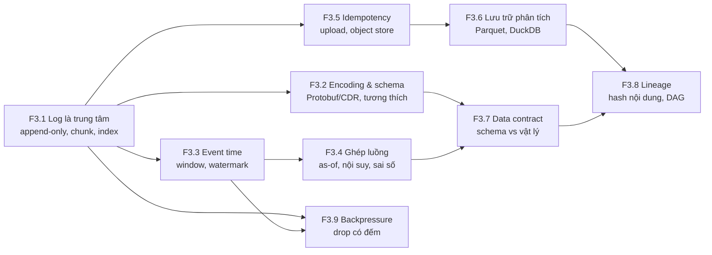
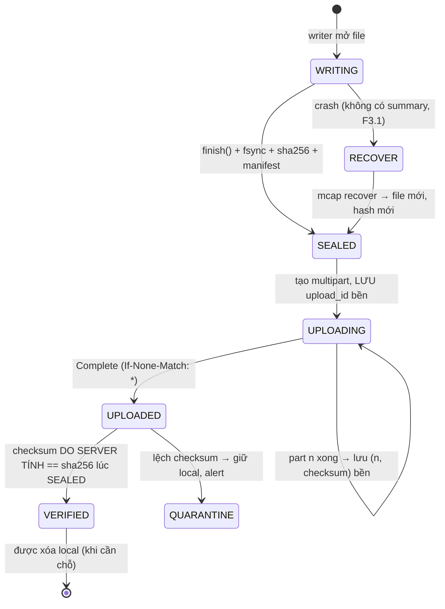
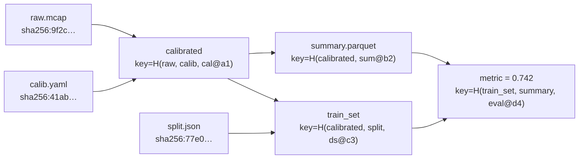

# F3 — Hệ thống dữ liệu và xử lý luồng (39h)

> Khóa nền, học **đúng lúc**: không đọc một mạch, mở viên nang ngay trước bài chính cần nó (bảng dưới). Tổng 39h = F3.1 4h · F3.2 4h · F3.3 5h · F3.4 5h · F3.5 4h · F3.6 4h · F3.7 5h · F3.8 4h · F3.9 4h. Giờ này chỉ một phần nằm trong ngân sách các bài chính; phần còn lại cộng thêm vào tổng lộ trình (đã vượt 650h, xem `00-lo-trinh-tong.md` và `khoa-7/_KE-HOACH-K7.md` mục 3).
>
> **Cách đọc khóa này cho người đã quen Kafka:** mỗi viên nang có mục 3 *Cầu nối* nói gọn phần bạn đã biết (đọc lướt) và dồn sức vào cột **Gãy ở chỗ**. Phần đáng làm nhất là mục 5 (bài tập Python, ≤2h) và mục 6 (Lăng kính đánh giá).

## Vì sao khóa nền này tồn tại

Bạn đã vận hành log, hàng đợi, schema registry, retry idempotent. Với dữ liệu robot, những thứ đó vẫn đúng **hình dạng** nhưng sai ở bốn giả định mà backend ngầm dựa vào:

1. **Thời gian của sự kiện do một đồng hồ vật lý trôi đóng dấu**, không phải do broker cấp. Không có `LogAppendTime` nào làm trọng tài.
2. **Dữ liệu là tín hiệu liên tục được lấy mẫu**, không phải sự kiện rời rạc. Ghép hai luồng là bài toán xử lý tín hiệu (as-of, nội suy, aliasing), không phải join theo khóa.
3. **Dữ liệu sai vẫn đúng schema.** Đơn vị, hướng trục, cảm biến đơ, đồng hồ lùi: không parser nào kêu.
4. **Mất một message là mất vĩnh viễn một phép đo.** Không có retry từ upstream; thứ duy nhất cứu dataset là việc đã mất được **đếm**.

Thiếu F3, bạn sẽ hụt ở đúng những chỗ này:

- **K2 Bài 4, 7** — đọc MCAP như "Kafka segment trong một file" rồi ngạc nhiên khi file bị `kill -9` không có index nào.
- **K2 Bài 6, 8b** — thêm trường proto3 "an toàn hai chiều" và nhận `0.0 °C` cho toàn bộ dữ liệu cũ.
- **K5 Bài 13** — ghép camera 30 Hz với IMU 200 Hz theo `log_time` và nhúng jitter USB vào dữ liệu fusion; hoặc resample về 30 Hz và biến rung motor thành một dao động không có thật.
- **K5 Bài 14** — xóa file local sau `200 OK` của một file đang ghi dở.
- **K5 Bài 16** — tin rằng "schema bắt được sai đơn vị" (bản gốc viết đúng câu này).
- **K5 Bài 17, K3 Bài 16** — chọn "block producer" vì nghe an toàn, thực ra dời chỗ mất dữ liệu sang driver USB, nơi không ai đếm.
- **K6 Bài 7, 9** — cache kết quả theo `mtime` và đem báo cáo một con số không ai tái tạo được.
- **K7 C7.3, C7.4** — sidecar MCAP, upload, audit và data contract cho robot của chính bạn: đây là nơi cả chín viên nang gặp nhau.

## Mindset cốt lõi

1. **Log bất biến là nguồn sự thật; mọi bảng, index, dataset là view dẫn xuất tái tạo được.** Người làm hạ tầng dữ liệu tin điều này vì họ đã sống qua cảnh N hệ thống nối với nhau bằng N² pipeline mỗi cái tự chép dữ liệu theo cách riêng (Jay Kreps mô tả đúng cảnh này ở LinkedIn, *The Log*, 2013 `[chuẩn]`). Ở robot, log là file MCAP; dataset LeRobot, bảng index DuckDB, bộ split train/test là view.
2. **Thời điểm đo là một ước lượng có sai số, ghi kèm nguồn gốc của nó.** Người làm xử lý luồng tin "event time ≠ processing time" vì Google từng phải viết lại pipeline batch thành streaming và phát hiện kết quả đổi theo lúc dữ liệu tới (Akidau và cộng sự, *The Dataflow Model*, VLDB 2015 `[chuẩn]`). Người làm robot tin thêm một bước: event time do một thạch anh trôi vài chục ppm đóng dấu, nên nó cần `clock_source` và mô hình quy đổi đi kèm.
3. **Schema bảo vệ bytes, không bảo vệ nghĩa.** Mars Climate Orbiter (1999) mất vì một bên xuất lbf·s, bên kia đọc như N·s: dữ liệu đúng định dạng file giao tiếp, sai đơn vị `[chuẩn]`.
4. **Drop được phép; drop im lặng thì không.** Mạng Internet sống sót qua congestion collapse năm 1986 vì Van Jacobson biến *gói bị drop* thành tín hiệu đo được (1988) `[chuẩn]`. Một dataset biết mình thủng ở đâu thì dùng được; một dataset thủng mà không biết thì độc hại.
5. **Mọi kết quả phải truy ngược được tới bytes đầu vào, code và tham số.** Bảng tính của Reinhart–Rogoff (2010) bỏ sót dòng trong một công thức trung bình; chỉ phát hiện khi một nghiên cứu sinh xin được file gốc (Herndon, Ash, Pollin, 2013) `[chuẩn]`.

## Bản đồ viên nang



### Học đúng lúc

| Viên nang | Học trước bài chính | Giờ |
|---|---|---|
| F3.1 Log là trung tâm | K2 Bài 1 (lướt), **K2 Bài 4**, K2 Bài 7 · K5 Bài 13 · K6 Bài 9 · K7 C7.3 | 4 |
| F3.2 Encoding và schema evolution | K1 Bài 10 (lướt) · K2 Bài 6, **Bài 8b**, Bài 9 · K4 Bài 10 · K5 Bài 4, Bài 13 · K6 Bài 5, Bài 9 · K7 C7.4 | 4 |
| F3.3 Event time vs processing time | **K2 Bài 2** · K5 Bài 7, **Bài 13** · K7 C7.2 | 5 |
| F3.4 Ghép luồng khác tần số | K2 Bài 1 (lướt), Bài 11 · **K5 Bài 13** · K7 C7 (trọn chặng), C8.3 | 5 |
| F3.5 Idempotency, upload, object store | K3 Bài 14 · **K5 Bài 14** · K6 Bài 9 · K7 C7.3 | 4 |
| F3.6 Lưu trữ phân tích | K2 Bài 9 · **K5 Bài 15** · K6 Bài 9 | 4 |
| F3.7 Chất lượng dữ liệu, data contract | K1 Bài 11 (lướt), Bài 12 · K2 Bài 6, Bài 10, **Bài 11** · K4 Bài 15 · **K5 Bài 16** · K6 Bài 5, Bài 17 · K7 C7.4 | 5 |
| F3.8 Lineage và provenance | K2 Bài 9 · K3 Bài 6 · K4 Bài 8, **Bài 14** · K5 Bài 15 · K6 Bài 6, **Bài 7**, Bài 9, Bài 10 · K7 C11.5 | 4 |
| F3.9 Backpressure và drop policy | K1 Bài 3, Bài 7 (lướt) · K3 Bài 4, Bài 10, Bài 16 · K4 Bài 3 · **K5 Bài 17** · K6 Bài 8 · K7 C7.3 | 4 |

Tuần crunch: đọc mục 3 + 6 của F3.1 trước K2 Bài 4; F3.3 + F3.4 mục 2, 5, 6 trước K5 Bài 13; F3.7 mục 6 trước K5 Bài 16; F3.9 mục 5 trước K5 Bài 17. Nếu chỉ còn sức cho một viên nang, chọn **F3.4**: nó là chỗ vốn backend của bạn ít giúp nhất.

## Bạn đã làm cái này rồi

| Bạn đã làm trong backend/AI-harness | Tên chuẩn | Còn thiếu khi sang dữ liệu robot | Viên nang |
|---|---|---|---|
| Kafka topic, consumer offset, replay từ đầu | Log-centric architecture; event sourcing | Không có broker cấp offset; địa chỉ là (chunk, `log_time`); index chỉ có khi file đóng đúng cách | F3.1 |
| Schema registry, Avro/Protobuf, rule BACKWARD/FORWARD | Schema evolution | Không có registry ở thời điểm ghi; kiểm dời sang CI và ingest; tương thích ngữ nghĩa (đơn vị, giá trị 0 của enum) | F3.2 |
| Flink/Kafka Streams window, `CreateTime` | Event time, watermark | Đồng hồ nguồn trôi; lateness tăng theo thời gian phiên; event time là *giữa phơi sáng*, không phải lúc gửi | F3.3 |
| Stream–stream join, lookup join | As-of join, interval join | Nội suy, aliasing khi resample, ngân sách sai số căn chỉnh; không có khóa nghiệp vụ | F3.4 |
| Idempotency key, retry với backoff, outbox | Effectively-once, content addressing | Đơn vị dữ liệu là file nhiều GB đang được ghi; điều kiện xóa local; checksum do server tính | F3.5 |
| Data warehouse, partition theo ngày, ClickHouse | Columnar storage, zone map, lakehouse | Raw không vào DB; index là tóm tắt có chủ đích (max, count, không phải mean) | F3.6 |
| Validate request bằng JSON Schema, Great Expectations | Data contract, data quality | Rule theo vật lý cần *giả định trạng thái* (đứng yên) và có tỉ lệ báo động giả phải đo (→ F2.1) | F3.7 |
| Docker image digest, lockfile, cache build | Provenance, content-addressed cache | Dataset và calibration cũng là đầu vào cần hash; mtime không phải danh tính | F3.8 |
| Rate limit, 429, DLQ | Backpressure, load shedding | Upstream là cảm biến không biết chờ; block = drop ở chỗ không đếm | F3.9 |

---

## F3.1 — Log là trung tâm: append-only, offset, segment, index (Kafka ↔ MCAP) (4h)

> **Dùng cho:** K2 Bài 1, 4, 7 · K5 Bài 13 · K6 Bài 9 · K7 C7.3 · **Cần trước:** không (vốn Kafka) · **Sau viên nang này bạn đánh giá được:** một khẳng định kiểu "file log này chịu được crash / đọc ngẫu nhiên được / đọc một topic nhỏ thì nhanh" là ĐÚNG, SAI hay còn tùy cấu hình nào; và chọn kích thước chunk bằng số thay vì mặc định.

### 1. Câu chuyện

Năm 2013, Jay Kreps (đồng tác giả Kafka) viết *The Log: What every software engineer should know about real-time data's unifying abstraction*. Luận điểm: write-ahead log của database, commit log của hệ phân tán, và hàng đợi tích hợp dữ liệu giữa các team là **cùng một thứ** — một chuỗi bản ghi chỉ nối thêm, có thứ tự, đánh địa chỉ bằng vị trí. Có nó, mỗi hệ thống tiêu thụ chỉ cần nhớ "tôi đã đọc tới đâu"; thiếu nó, mỗi cặp hệ thống phải tự viết pipeline chép dữ liệu `[chuẩn]`.

Ngành robot đi con đường riêng tới cùng kết luận. rosbag (ROS 1) là một log nối thêm có index ở cuối file. rosbag2 thời đầu dùng **SQLite** làm định dạng lưu: tiện truy vấn, nhưng ghi tốc độ cao và chịu crash kém hơn một log thuần, và file không tự mang định nghĩa message. Foxglove thiết kế **MCAP** (2022) quay lại dạng log: chunk nén, index thưa, schema nhúng; từ ROS 2 Iron (2023), MCAP là storage mặc định của rosbag2 `[spec: ROS 2 Iron release notes — kiểm theo bản bạn dùng]`. Bài học của vòng đi vòng lại này: thứ tối ưu cho *ghi trên robot* (append, chịu crash, không cần server) khác thứ tối ưu cho *truy vấn trên desktop* (index, random access). Một định dạng tốt tách hai việc đó ra, và trả giá ở chỗ nối giữa chúng.

### 2. Mô hình tư duy

```
 Kafka partition (nhiều file, có broker)          MCAP (một file, không có broker)
 ┌──────────────┐ ┌──────────────┐               ┌────┬────────┬────────┬─────┬─────────┬──────┬────┐
 │ 000.log      │ │ 512.log      │  ...          │Hdr │Chunk 1 │Chunk 2 │ ... │ Summary │Footer│Mgc │
 │ 000.index ◄──┼─┤ 512.index    │               │    │(zstd)  │(zstd)  │     │ChunkIdx │      │    │
 │ 000.timeindex│ │ 512.timeindex│               │    │+MsgIdx │+MsgIdx │     │Stats    │      │    │
 └──────────────┘ └──────────────┘               └────┴────────┴────────┴─────┴─────────┴──────┴────┘
  index cập nhật liên tục trong lúc ghi;           index chi tiết của chunk ghi ngay sau chunk;
  crash → broker quét segment cuối, dựng lại       index tổng (Summary) chỉ ghi khi finish();
  địa chỉ = offset toàn cục do broker cấp          địa chỉ = (byte offset chunk, log_time)
```

Bốn khái niệm, mỗi cái là một nút vặn:

| Khái niệm | Nó mua gì | Nó trả bằng gì |
|---|---|---|
| **Append-only** | Ghi tuần tự (nhanh nhất trên mọi loại đĩa), không có cập nhật tại chỗ nên crash chỉ hỏng *đuôi* | Không sửa được bản ghi cũ; sửa = ghi bản mới + view dẫn xuất |
| **Segment / chunk** | Đơn vị nén, đơn vị xóa (retention), đơn vị kiểm CRC | Dữ liệu trong chunk đang mở nằm trong RAM: **bán kính vụ nổ** khi process chết |
| **Offset / địa chỉ** | Consumer nhớ được vị trí, replay được | MCAP không có offset toàn cục; `sequence` do nguồn cấp, có thể bằng 0 `[spec: MCAP, Message record: "Optional message counter"]` |
| **Index thưa** | Tìm theo thời gian không cần quét | Index ở *cuối* file chỉ tồn tại nếu file đóng đúng cách |

Câu then chốt: **trong một log, crash-safety và random access kéo về hai phía.** Kafka giải bằng file index riêng cập nhật liên tục và một broker luôn sống để dựng lại. MCAP không có broker, nên chọn: data section tự đủ để *quét* lại (mỗi chunk có độ dài, CRC), còn index nhanh là phần thưởng cho file đóng đúng. Công cụ `mcap recover` tồn tại vì đúng lựa chọn này.

### 3. Cầu nối từ backend

Đã có ở K2 Bài 4 bảng đối chiếu Kafka segment ↔ MCAP và lời chấm mô hình *"MCAP chỉ là Kafka trong một file"* (**ĐÚNG MỘT PHẦN**, bốn chỗ gãy: không offset toàn cục, index chỉ có khi `finish()`, channel xen kẽ trong chunk, không broker/retention). Không lặp lại; đọc ở đó. Dưới đây là các phép so sánh *khác*.

| Backend bạn biết | Ở đây | Gãy ở chỗ | Nếu dùng nhầm thì |
|---|---|---|---|
| Database WAL: ghi log trước, áp vào bảng sau, checkpoint | MCAP là log; dataset/index là "bảng" | WAL bị cắt bỏ sau checkpoint; log robot **không bao giờ** cắt bỏ — nó là nguồn sự thật duy nhất của một phép đo không lặp lại được | Coi MCAP là file tạm, xóa sau khi "đã import vào DB", rồi không tái tạo được khi sửa bug extractor (→ F3.8) |
| Kafka `acks=all` + replication: một broker chết không mất gì | Writer MCAP trên một máy, không replica | Độ bền của Kafka đến từ *bản sao trên máy khác*, không từ fsync. Robot không có máy khác cho tới khi upload (→ F3.5) | Suy "kill -9 không mất gì nhiều" thành "mất điện không mất gì": page cache chưa xuống đĩa là phần mất thêm |
| Consumer group đọc song song nhiều partition | Đọc song song nhiều file MCAP, hoặc nhiều chunk trong một file | Song song theo chunk chỉ được khi có ChunkIndex (file đóng đúng); thứ tự toàn cục giữa các chunk theo `log_time` phải tự merge | Ghép kết quả các worker theo thứ tự xong việc, không theo thời gian |

**Chấm mô hình:**

- *"Append-only nghĩa là crash không bao giờ làm hỏng file."* — **ĐÚNG MỘT PHẦN.** Append-only giới hạn chỗ hỏng ở **đuôi**: không bản ghi cũ nào bị ghi đè dở. Gãy: (a) đuôi đó có thể là cả chunk đang mở, tức vài giây dữ liệu; (b) reader dùng index sẽ coi cả file là hỏng vì footer/summary không có; (c) một bản ghi bị cắt giữa chừng mà không có độ dài + CRC thì reader không biết dừng ở đâu. Phản ví dụ: bài tập mục 5 — so số message reader theo index và reader quét lấy lại được từ cùng một file bị kill.
- *Mô hình của bạn ở K3 lượt 6: "luôn phải có buffer để ổn định… đánh đổi bằng RAM".* — Đã chấm **ĐÚNG MỘT PHẦN** ở K5 Bài 13. Thêm một góc ở đây: chunk của log chính là buffer đó, và nó có *ba* giá, không phải một: RAM, độ trễ trước khi dữ liệu xuống đĩa, và lượng dữ liệu mất khi chết. Kích thước chunk chọn bằng cả ba.

**Tên chuẩn của thứ bạn đã làm:** khi bạn replay một topic Kafka từ offset 0 để dựng lại một service sau khi sửa bug, đó là **event sourcing / kappa architecture**: trạng thái là hàm của log. Với robot, "sửa bug extractor rồi chạy lại trên toàn bộ MCAP" là cùng mẫu. Còn thiếu: log của bạn ở backend được giữ bởi retention có chủ đích; log robot phải được giữ *vĩnh viễn* và có hash (→ F3.8), vì không có upstream nào phát lại.

### 4. Thuật ngữ

| Mức | Thuật ngữ | Nghĩa trong một câu | Hay bị hiểu nhầm thành |
|---|---|---|---|
| 🟢 | Append-only log | Chuỗi bản ghi chỉ nối thêm, có thứ tự | "Không bao giờ hỏng" |
| 🟢 | Chunk / segment | Khối bản ghi nén và kiểm cùng nhau | Đơn vị chỉ để nén |
| 🟢 | Summary / footer / index | Phần cuối file trỏ vào chunk theo thời gian, channel | Luôn có |
| 🟢 | `log_time` vs `publish_time` vs `header.stamp` | Lúc ghi / lúc publish / lúc đo | Ba tên của một thứ (→ F3.3) |
| 🟢 | Recover / reindex | Quét data section, dựng lại summary | Phép màu cứu mọi file |
| 🟡 | Message index vs chunk index | Index trong chunk vs index các chunk | — |
| 🟡 | Kappa / lambda architecture | Một log cho cả batch và stream / hai đường riêng | — |
| 🔴 | Định dạng nhị phân chi tiết từng opcode MCAP | Tra spec khi cần | — |

### 5. Bài tập dự đoán

Một log đồ chơi giống tinh thần MCAP: message IMU thô (header 14 byte + 6 × int16), gom thành chunk nén zlib có độ dài + CRC32, index chỉ ghi ở footer khi đóng file. Mô phỏng `kill -9` ở một message ngẫu nhiên (chunk đang mở trong RAM mất, không có footer). Chạy với chunk = 20, 200, 2000 message.

**Dự đoán trước khi chạy** (ghi vào `prediction.md`):

1. Reader theo index đọc được bao nhiêu message từ file bị kill?
2. Reader quét tuần tự (dừng ở chunk hỏng) mất trung bình bao nhiêu message với chunk = 200? Mất tối đa bao nhiêu? Đổi ra giây ở 200 Hz.
3. Tỉ lệ nén tăng hay giảm theo kích thước chunk? Từ 20 lên 200 và từ 200 lên 2000, bước nào được nhiều hơn? Vì sao (gợi ý: zlib cần "xem" bao nhiêu byte để học được dữ liệu lặp)?
4. Với IMU 200 Hz + camera, chunk tính theo **byte** (MCAP mặc định tính theo byte, kiểm `chunk_size` của writer bạn dùng `[tự đo]`) thì một chunk 1 MiB chứa bao nhiêu giây IMU khi chỉ có IMU, và khi xen với ảnh 60 kB/frame ở 30 fps? Hệ quả cho bán kính vụ nổ của IMU?

Phương pháp: mất do kill = số message trong chunk đang mở = phân bố đều trên [0, chunk). Câu 4 tính tay từ byte/message (K5 Bài 13 đo được ~370 byte/message IMU trong MCAP).

```python
# [đã chạy] Log append-only đồ chơi: chunk nén + CRC, index chỉ ghi ở footer khi đóng file
import struct, zlib, io, numpy as np
rng = np.random.default_rng(7)
HDR = struct.Struct("<QHI")                       # log_time_ns, channel_id, độ dài payload
def imu_payload(i):                               # 6 × int16 giống gói IMU thô, nhiễu nhỏ
    v = np.array([0, 0, 16384, 0, 0, 0]) + rng.integers(-40, 40, 6)
    return v.astype("<i2").tobytes()

def write_log(n_msgs, chunk_msgs, kill_at=None):
    f, index, buf = io.BytesIO(), [], []
    f.write(b"TOYLOG01")
    def flush():
        raw = b"".join(buf); comp = zlib.compress(raw, 6)
        index.append((f.tell(), len(buf)))
        f.write(struct.pack("<4sII", b"CHNK", len(comp), zlib.crc32(raw)) + comp)
        buf.clear()
    for i in range(n_msgs):
        if i == kill_at: return f.getvalue()      # kill -9: chunk đang trong RAM mất, không có footer
        p = imu_payload(i); buf.append(HDR.pack(i * 5_000_000, 1, len(p)) + p)
        if len(buf) == chunk_msgs: flush()
    if buf: flush()
    f.write(b"INDX" + b"".join(struct.pack("<QI", o, c) for o, c in index)
            + struct.pack("<I", len(index)) + b"TOYLOG01")
    return f.getvalue()

def read_by_index(data):                          # reader nhanh: nhảy thẳng tới footer
    if not data.endswith(b"TOYLOG01") or len(data) < 20: return None
    return struct.unpack("<I", data[-12:-8])[0]   # số chunk theo index

def recover_by_scan(data):                        # reader chậm: quét tuần tự, dừng ở chunk hỏng
    pos, n = 8, 0
    while data[pos:pos+4] == b"CHNK":
        L, crc = struct.unpack("<II", data[pos+4:pos+12]); body = data[pos+12:pos+12+L]
        if len(body) < L or zlib.crc32(raw := zlib.decompress(body)) != crc: break
        n += len(raw) // (HDR.size + 12); pos += 12 + L
    return n

N, raw_size = 10_000, 10_000 * (HDR.size + 12)
print("chunk | nén x | index sau kill | mất TB sau kill (msg) | mất max")
for chunk in (20, 200, 2000):
    full = write_log(N, chunk)
    lost = []
    for _ in range(40):
        k = int(rng.integers(1, N))
        d = write_log(N, chunk, kill_at=k)
        assert read_by_index(d) is None
        lost.append(k - recover_by_scan(d))
    print(f"{chunk:5d} | {raw_size/len(full):5.2f} | không có      | {np.mean(lost):10.0f} | {max(lost):6d}")
```

<details><summary>🔒 MỞ SAU KHI COMMIT prediction.md</summary>

Kết quả một lần chạy (seed 7, Python 3 + numpy; số "mất" dao động vài chục message giữa các seed):

| chunk | nén × | index sau kill | mất TB | mất max |
|---|---|---|---|---|
| 20 | 1,51 | không có | 9 | 19 |
| 200 | 1,92 | không có | 100 | 192 |
| 2000 | 2,01 | không có | 860 | 1807 |

1. **Không đọc được gì** qua index: footer không tồn tại. Đây là chỗ khác Kafka (broker tự dựng lại index khi khởi động).
2. Mất trung bình ≈ chunk/2 ≈ 100 message = **0,5 s ở 200 Hz**, tối đa gần một chunk (~1 s). Mọi chunk đã flush còn nguyên và quét lại được nhờ độ dài + CRC.
3. Tỉ lệ nén tăng theo chunk nhưng **lợi ích giảm dần**: 20→200 được nhiều (1,51→1,92), 200→2000 gần như không (→2,01). Chunk quá nhỏ thì header nén và từ điển chưa kịp học; vượt vài chục kB thì zlib (cửa sổ 32 kB) không thấy thêm gì. Vì vậy chunk lớn mua thêm rất ít nén nhưng mua thêm nhiều rủi ro mất dữ liệu.
4. Chỉ IMU: 1 MiB / 370 B ≈ 2830 message ≈ **14 s** IMU nằm trong RAM trước khi xuống đĩa. Xen với ảnh: luồng vào ≈ 30 × 60 kB + 200 × 370 B ≈ 1,87 MB/s, chunk 1 MiB đầy sau ≈ 0,56 s → bán kính vụ nổ của IMU chỉ ~0,56 s. **Cùng một `chunk_size`, bán kính vụ nổ theo thời gian khác nhau 25 lần tùy luồng nào đi chung file.** Đây là lý do K2 Bài 7 bắt chọn chunk bằng số đo, và là một lý do để tách luồng nhỏ quan trọng sang file/writer riêng.

</details>

### 6. Lăng kính đánh giá

Checklist khi đọc một khẳng định hay một kết quả về log/MCAP:

1. **Crash nào?** `kill -9` (process chết, OS sống: mất phần còn trong buffer của process) khác mất điện (mất thêm page cache chưa fsync) khác đĩa đầy (ghi dừng giữa record). Khẳng định không nói rõ là CHƯA RÕ.
2. **Reader nào?** Reader theo index, reader quét, hay `mcap recover`? "File đọc được" luôn phải đi kèm tên reader.
3. **Địa chỉ là gì?** Nếu tài liệu nói "offset" cho MCAP, hỏi: byte offset hay số thứ tự? Ai cấp? Có thể trùng không?
4. **Đọc một channel tốn bao nhiêu?** Có chunk nào chỉ chứa channel đó không, hay mọi chunk đều xen ảnh?
5. **Chunk tính theo byte hay theo thời gian, và luồng nào đi chung?** Bán kính vụ nổ đổi theo trộn luồng (mục 5 câu 4).
6. **Ai giữ bản sao thứ hai, từ lúc nào?** Trước khi upload VERIFIED (→ F3.5), độ bền = độ bền của một ổ đĩa trên robot.

**Khẳng định mẫu để tự chấm** (ĐÚNG / ĐÚNG MỘT PHẦN / SAI + vì sao):

- (a) Gemini, K5 Bài 13, bảng "Số phải ra": *"Sau 10 lần `kill -9`: file vẫn đọc được tới chunk hoàn chỉnh cuối cùng; mất mát tối đa chỉ là chunk đang dở. Cấu trúc append-only của MCAP bảo toàn dữ liệu khi mất điện."*
- (b) Bản gốc K5 Bài 13: *"MCAP append-only cho phép phục hồi file ghi dở."*
- (c) *"Đọc topic IMU 200 Hz từ một file MCAP 50 GB có camera thì nhanh, vì MCAP có index theo channel."*

<details><summary>🔒 MỞ SAU KHI COMMIT prediction.md</summary>

- (a) **ĐÚNG MỘT PHẦN.** Vế đầu đúng *với reader quét hoặc sau `mcap recover`*; với `mcap info`/reader theo index thì file không có summary là lỗi (K2 Bài 4 bước 4 cho thấy CLI báo lỗi). "Mất tối đa là chunk đang dở" đúng cho `kill -9`; vế cuối **sai**: `kill -9` không phải mất điện — mất điện còn mất phần đã `write()` nhưng nằm trong page cache, và có thể để lại một chunk ghi dở giữa chừng. Hai thí nghiệm khác nhau (K5 Bài 13 vs Bài 14).
- (b) **ĐÚNG MỘT PHẦN.** Cho phép, nhưng không tự động: cần một bước `recover` có chủ đích trong pipeline ingest, và phần trong chunk đang mở thì không phục hồi được. Câu đúng: "data section tự mô tả đủ để quét lại; phần đã flush phục hồi được bằng `mcap recover`; phần trong RAM của writer thì mất."
- (c) **ĐÚNG MỘT PHẦN.** Index cho biết chunk nào *có* message IMU và ở đâu trong chunk. Nhưng nếu writer xen IMU và ảnh trong cùng chunk (mặc định thường là vậy), *mọi* chunk đều có IMU → phải tải và giải nén gần như toàn bộ 50 GB. Nhanh chỉ khi luồng nhỏ nằm ở chunk riêng hoặc file riêng (K2 Bài 7 đo đúng điều này).

</details>

### 7. Câu hỏi ngược

1. **[Vì sao không]** Vì sao MCAP không fsync sau mỗi chunk để mất điện chỉ mất đúng chunk đang mở?
   <details><summary>Hướng nghĩ</summary>

   Tính chi phí: fsync trên SSD/eMMC tốn từ dưới 1 ms tới hàng chục ms `[tự đo: fio --fsync=1]`, và chặn writer. Ở chunk 0,5 s thì chấp nhận được; ở chunk nhỏ thì không. Đây là chính sách của *ứng dụng ghi*, không phải của định dạng. Hỏi tiếp: fsync có giúp gì nếu ổ nói dối (cache ghi không có tụ dự phòng)?

   </details>
2. **[Quy mô]** 100 robot × 8 h/ngày, mỗi robot 24 GB/ngày. Một job sửa bug cần chạy lại extractor trên một năm dữ liệu. Cái gì gãy trước: băng thông đọc object store, CPU giải nén, hay việc tìm đúng file?
   <details><summary>Hướng nghĩ</summary>

   ≈ 876 TB/năm `[ước lượng: 100 × 24 GB × 365]`. Tính thời gian đọc ở vài GB/s tổng. Hỏi: có cần đọc ảnh không? Nếu IMU nằm xen trong chunk ảnh thì có. Quyết định bố trí chunk ở robot hôm nay quyết định chi phí reprocess năm sau.

   </details>
3. **[Failure mode]** Writer ghi đúng, file đóng đúng, nhưng thẻ nhớ đổi một bit trong một chunk giữa file. Reader theo index và reader quét mỗi bên thấy gì? Pipeline của bạn phát hiện ở đâu?
   <details><summary>Hướng nghĩ</summary>

   CRC của chunk (nếu writer ghi CRC — MCAP cho phép để 0 `[spec]`, kiểm writer của bạn) bắt được. Reader quét kiểu "dừng ở chunk hỏng" sẽ bỏ cả phần còn lại; reader theo index nhảy qua được. Hash cả file lúc niêm phong (→ F3.5, F3.8) bắt được trước khi xóa local.

   </details>
4. **[Liên ngành]** Hộp đen máy bay (FDR) ghi liên tục vào một vòng nhớ 25 giờ. Nó giống và khác log robot ở chỗ nào về "cái gì là nguồn sự thật" và "cái gì bị ghi đè"?
   <details><summary>Hướng nghĩ</summary>

   FDR là ring buffer: cũ bị đè, chỉ đoạn cuối trước sự cố quan trọng. Log robot cho học máy cần *toàn bộ* lịch sử. Nhưng trên robot thiếu đĩa (mất mạng nhiều ngày), bạn sẽ cần chính sách kiểu FDR cho luồng ưu tiên thấp (→ F3.9).

   </details>
5. **[Phản biện]** "Dùng Parquet thẳng trên robot, bỏ MCAP, vì cuối cùng dataset cũng là Parquet." Lập luận mạnh nhất cho và chống?
   <details><summary>Hướng nghĩ</summary>

   Chống: Parquet ghi footer một lần, file đang ghi bị cắt thường không cứu được bằng công cụ chuẩn; ghi từng dòng 200 Hz vào columnar cần buffer lớn; ảnh không hợp cột. Cho: bỏ một bước chuyển đổi, LeRobot v3 dùng Parquet + MP4. Xem phần "Tranh luận đang mở" cuối file.

   </details>

### 8. Liên kết ra ngoài

- **Database WAL và LSM-tree** (LevelDB, RocksDB): memtable trong RAM = chunk đang mở; SSTable bất biến = chunk đã flush; compaction = view dẫn xuất. Khác: WAL được cắt bỏ sau flush, log robot thì không.
- **Git**: object store bất biến định địa chỉ theo nội dung + ref trỏ vào. Giống "log là sự thật, branch là view". Khác: git không có thứ tự thời gian toàn cục; log cảm biến thì chỉ có thứ tự thời gian.

### 9. Áp vào khóa chính

- **K2 Bài 4, 7:** dùng checklist mục 6 khi đọc `mcap info`, khi cắt file thử recover, khi chọn chunk size bằng ba con số (nén, I/O đọc một channel, bán kính vụ nổ).
- **K5 Bài 13:** tách thí nghiệm `kill -9` khỏi thí nghiệm mất điện; ghi rõ reader nào đọc được bao nhiêu. Cân nhắc writer riêng cho IMU.
- **K6 Bài 9:** output episode là log bất biến; mọi bảng tổng hợp là view dẫn xuất có thể xóa và dựng lại.
- **K7 C7.3:** sidecar MCAP trên robot cần quy trình "đóng file → niêm phong → hash → upload" (→ F3.5); file không đóng đúng đi qua bước recover trước khi vào hàng đợi upload.

### 10. Độ tin cậy

| Khẳng định | Nhãn | Ghi chú / cách kiểm |
|---|---|---|
| Summary và Summary Offset là phần tùy chọn của MCAP; `sequence` là bộ đếm tùy chọn | `[spec]` | MCAP Specification, mục File structure và Message record |
| MCAP là storage mặc định của rosbag2 từ Iron | `[spec]` | Release notes ROS 2 Iron; kiểm `ros2 bag record --help` trên Jazzy |
| Kafka dựng lại index khi broker khởi động sau crash | `[chuẩn]` | Tài liệu Kafka, log recovery |
| Số message mất khi kill ngẫu nhiên, tỉ lệ nén theo chunk | `[đã chạy]` | Mô phỏng mục 5 |
| Chi phí fsync trên ổ của robot | `[tự đo]` | `fio --fsync=1` trên đúng ổ |

### 11. Đọc thêm và tự kiểm tra

- **Nguồn gốc:** MCAP Specification (mcap.dev, mục Specification).
- **Giải thích:** Jay Kreps, *The Log: What every software engineer should know about real-time data's unifying abstraction* (LinkedIn Engineering blog, 2013).
- **Đào sâu:** Martin Kleppmann, *Designing Data-Intensive Applications*, chương 3 (log-structured storage) và chương 11 (log-based message brokers).
- **Tự kiểm tra:** (1) giải thích cho một backend engineer trong 5 câu vì sao một file MCAP bị kill vẫn còn dữ liệu nhưng `mcap info` báo lỗi; (2) vẽ lại hình mục 2 từ trí nhớ; (3) câu hỏi:

  Robot ghi IMU + ảnh chung một writer, chunk 4 MiB, zstd. Bạn muốn giảm bán kính vụ nổ của IMU xuống dưới 0,5 s mà không đổi chunk của ảnh. Hai cách?
  <details><summary>Đáp án</summary>

  (1) Writer/file riêng cho luồng nhỏ (IMU, odom, diagnostics) với chunk nhỏ; (2) cùng file nhưng flush theo **thời gian** (đóng chunk mỗi ≤0,5 s bất kể kích thước) nếu writer hỗ trợ `[tự đo]`. Cách (1) còn giúp đọc IMU không phải giải nén ảnh.

  </details>

---

## F3.2 — Encoding và schema evolution: Protobuf/CDR/Avro, quy tắc tương thích, file tự mô tả (4h)

> **Dùng cho:** K2 Bài 6, 8b, 9 · K4 Bài 10 · K5 Bài 4, 13 · K6 Bài 5, 9 · K7 C7.4 · **Cần trước:** F3.1 · **Sau viên nang này bạn đánh giá được:** một thay đổi schema có an toàn ở tầng nào (bytes / code / nghĩa); một con số "byte/message" dùng để tính dung lượng có đáng tin không; một thông tin mới nên vào payload, metadata channel hay topic riêng.

### 1. Câu chuyện

Sáng 1/8/2012, Knight Capital triển khai code giao dịch mới lên tám server. Code mới **dùng lại một cờ** trong message lệnh, cờ này nhiều năm trước điều khiển một tính năng đã bỏ tên Power Peg. Một server không được cập nhật. Trên server đó, code cũ vẫn còn, đọc cờ theo nghĩa cũ và bắn lệnh liên tục. Trong khoảng 45 phút, công ty lỗ khoảng 460 triệu USD (theo lệnh của SEC năm 2013) `[chuẩn]`. Không có byte nào sai định dạng. Cùng một bit, hai reader, hai nghĩa.

Đây chính là lý do quy tắc đầu tiên của Protobuf là *không bao giờ dùng lại số hiệu trường; đánh dấu `reserved`* `[spec: protobuf.dev, "Updating A Message Type"]`. Với dữ liệu robot, rủi ro còn kéo dài hơn: một file ghi năm 2026 sẽ được đọc năm 2031 bằng code mà người ghi chưa từng thấy. K2 Bài 6 đã cho bạn bảng quy tắc theo tầng wire/code/nghĩa; viên nang này lo phần K2 chưa nói: **mỗi họ encoding chọn đặt thông tin schema ở đâu, và hệ quả của lựa chọn đó**.

### 2. Mô hình tư duy

Mọi encoding trả lời một câu: *reader biết cấu trúc của bytes nhờ đâu?*

| Họ | Thông tin cấu trúc nằm ở | Kích thước một message | Tiến hóa schema | Gặp ở đâu trong lộ trình |
|---|---|---|---|---|
| **JSON** | Trong từng message (tên trường lặp lại) | Lớn, phụ thuộc giá trị | Tự do, không ai kiểm | metadata nhỏ, config |
| **Protobuf** | Số hiệu trường + wire type trong từng trường; tên ở schema ngoài | **Phụ thuộc giá trị** (varint, trường bằng 0 bị bỏ) | Theo số hiệu: thêm/bỏ trường an toàn ở tầng wire | `imu.proto` K2, Foxglove schema |
| **CDR** (ROS 2) | Hoàn toàn ở schema ngoài; bytes chỉ là các trường xếp liền nhau có căn lề | Gần như cố định theo kiểu (`sensor_msgs/Imu` = 324 B với `frame_id` 8 ký tự, K5 Bài 13) | **Gần như không có**: thêm một trường làm lệch mọi trường sau; đổi định nghĩa = kiểu mới | mọi message ROS 2 |
| **Avro** | Schema của writer, bắt buộc phải có lúc đọc; bytes không có tag | Nhỏ nhất | Phân giải writer schema ↔ reader schema, có default | Kafka + registry |
| **Parquet/Arrow** | Footer/schema của file, theo cột | Tính theo cột, không theo message | Thêm cột dễ, đổi kiểu khó | LeRobot, F3.6 |

```
 Protobuf (TLV)        [tag=4|LEN][...Vec3...][tag=5|LEN][...][tag=7|LEN]"imu-01..."
                        ↑ reader lạ gặp tag 9 → giữ lại như unknown field, đọc tiếp
 CDR (vị trí cố định)  [encap 4][sec 4][nsec 4][len 4]"imu_link\0"[pad 3][quat 32][cov 72]...
                        ↑ chèn thêm 1 trường giữa → mọi byte phía sau đọc lệch, không lỗi nào báo
```

**File tự mô tả** (MCAP nhúng schema theo channel; Parquet nhúng schema ở footer) chuyển câu hỏi từ "reader có schema không" sang "**code của tôi**, viết theo schema X, đọc file mang schema Y có đúng nghĩa không". Schema nhúng giải quyết tầng bytes. Nó không mang theo đơn vị nếu bạn không ghi, không mang theo nghĩa của giá trị 0, không mang theo thư viện giải mã.

Hệ quả thực hành cho ROS 2: vì CDR không có câu chuyện tiến hóa, quy ước của repo là **không sửa message chuẩn; thứ chuẩn không có thì vào metadata channel hoặc topic riêng** (`CONVENTIONS.md` mục 4). rosbag (ROS 1) từng có "migration rules" để đọc bag cũ sau khi đổi message; rosbag2 không có cơ chế tương đương `[tự đo — kiểm tài liệu rosbag2 bản Jazzy]`.

### 3. Cầu nối từ backend

| Backend bạn biết | Ở đây | Gãy ở chỗ | Nếu dùng nhầm thì |
|---|---|---|---|
| Kafka + Confluent: message mang **schema ID** 5 byte, schema ở registry | MCAP mang **cả schema** trong file | Registry là dịch vụ phải sống; 10 năm sau có thể không còn. File tự mô tả sống độc lập nhưng không có ai chặn schema sai lúc ghi | Ghi schema ID thay vì schema vào file robot "cho gọn" → file mồ côi khi registry đổi |
| Protobuf trong gRPC: kích thước message ít quan trọng | Protobuf ghi 200 Hz × nhiều giờ | Kích thước **phụ thuộc giá trị** (varint, trường mang giá trị mặc định) — mục 5 đo bao nhiêu | Tính dung lượng từ một message mẫu "đẹp" → lệch so với dữ liệu thật |
| Thêm giá trị enum mới vào API | Thêm trường enum vào message cảm biến | proto3: reader mới đọc dữ liệu cũ thấy **giá trị số 0** của enum. Nếu số 0 mang nghĩa thật, dữ liệu cũ bị gán nghĩa đó | Toàn bộ file cũ bị gán một nguồn đồng hồ mà chúng không hề khai (dự đoán ở mục 5) |
| JSON schema linh hoạt, thêm field tùy ý | CDR của ROS 2 | CDR không có tag; reader dùng schema khác writer đọc ra rác có hình dạng hợp lệ | Sửa `sensor_msgs/Imu` cục bộ "thêm 1 trường" → Foxglove/rosbag2 của người khác đọc lệch |

**Chấm mô hình:**

- *"Protobuf luôn nhỏ hơn CDR."* — **ĐÚNG MỘT PHẦN.** Với `ImuSample` của repo, một mẫu đầy đủ nhỏ hơn 324 B của `sensor_msgs/Imu` CDR (mục 5 đo bao nhiêu) — nhưng hai message không mang cùng thông tin (`sensor_msgs/Imu` có quaternion và ba ma trận covariance). So sánh đúng phải cùng nội dung. Phản ví dụ: một message toàn `double` khác 0 và không có trường rỗng thì Protobuf tốn thêm 1 byte tag mỗi trường so với CDR.
- *"Schema nhúng trong file nên đọc được mãi mãi."* — **ĐÚNG MỘT PHẦN.** Bytes giải mã được nếu còn thư viện cho encoding đó. Gãy: schema `ros2msg` cần đủ định nghĩa phụ thuộc (MCAP nối chúng vào một chuỗi); nghĩa (đơn vị, frame, giá trị 0) không nằm trong schema; và code đọc theo tên trường vỡ khi tên đổi. Phản ví dụ: file năm 2026 có `clock_source` enum mà số 0 là "ESP32"; reader năm 2031 đọc đúng bytes, gán sai nghĩa cho mọi file trước khi trường đó tồn tại.

**Tên chuẩn của thứ bạn đã làm:** khi bạn chọn Avro + registry với chế độ `BACKWARD_TRANSITIVE` để consumer mới đọc được mọi bản cũ, bạn đang làm **schema evolution có kiểm ở thời điểm ghi**. Ở robot, cổng kiểm đó dời sang **CI của repo schema** (`buf breaking` cho `.proto`) và **ingest** (từ chối hoặc gắn cờ file mang schema chưa đăng ký). Còn thiếu: test tương thích *ngữ nghĩa* bằng golden file (K2 Bài 6) — không công cụ breaking-check nào làm thay.

### 4. Thuật ngữ

| Mức | Thuật ngữ | Nghĩa trong một câu | Hay bị hiểu nhầm thành |
|---|---|---|---|
| 🟢 | Encoding / serialization | Cách biến cấu trúc thành bytes | Schema |
| 🟢 | Self-describing file | File mang schema của chính nó | File mang cả nghĩa |
| 🟢 | Varint, implicit presence (proto3) | Số nhỏ tốn ít byte; trường bằng mặc định không được ghi | Mọi trường luôn được ghi |
| 🟢 | Enum zero value | Giá trị mặc định khi trường vắng mặt | Một lựa chọn như mọi lựa chọn khác |
| 🟢 | CDR, căn lề (alignment) | Encoding vị trí cố định của DDS/ROS 2 | Có tag như Protobuf |
| 🟡 | Writer schema / reader schema (Avro) | Hai schema được phân giải lúc đọc | — |
| 🟡 | XCDR2, kiểu appendable/mutable (DDS-XTypes) | Biến thể CDR có hỗ trợ tiến hóa | ROS 2 mặc định đã dùng `[tự đo]` |
| 🔴 | Chi tiết wire format từng kiểu | Tra spec khi viết parser | — |

### 5. Bài tập dự đoán

Dùng `GỐC/src/proto/sensors/v1/imu.proto` (lớp đã sinh sẵn `imu_pb2.py`, cần `protobuf` cài trong Python; không cần `protoc`). Script dựng một bản v2 bằng code: thêm `ClockSource clock_source = 9` với enum *thiết kế vội* `ESP32_TIMER = 0, HOST_PTP = 1, HOST_UNSYNCED = 2`.

**Dự đoán** (ghi `prediction.md`, tính tay trước — mỗi trường Protobuf = tag 1 byte + giá trị; `double` 8 byte; chuỗi/message con = tag + độ dài + nội dung; varint 7 bit mỗi byte):

1. Một `ImuSample` đầy đủ (giá trị trong hàm `sample()`) dài bao nhiêu byte?
2. Nếu `ax` và `gz` đo được **đúng 0.0**, message ngắn đi bao nhiêu byte?
3. `sequence` = 1, 300, 2³²−1: kích thước đổi thế nào?
4. Đọc bytes v1 bằng lớp v2: `clock_source` ra giá trị nào?
5. v2 ghi `clock_source = HOST_PTP`; một service v1 parse rồi serialize lại (ví dụ một bước lọc cũ trong pipeline), v2 đọc lại: còn `HOST_PTP` không?
6. Dung lượng một giờ IMU 200 Hz bằng `ImuSample` (chưa tính overhead MCAP), so với con số "~50 byte/mẫu, 36 MB/giờ" của bản gốc K5 Bài 13.

```python
# [đã chạy] Kích thước Protobuf phụ thuộc giá trị; enum mới đọc dữ liệu cũ ra gì
import sys; sys.path.insert(0, "/home/user/robotics-lab/src")   # GỐC/src — sửa theo máy bạn
from proto.sensors.v1 import imu_pb2
from google.protobuf import descriptor_pb2, descriptor_pool, message_factory, timestamp_pb2

def sample(ax=0.01, gz=-0.0005, seq=123456):
    m = imu_pb2.ImuSample(frame_id="imu_link", sequence=seq,
                          calibration_id="imu-01@2026-11-02-a", source_device_id="esp32-01")
    m.stamp.seconds, m.stamp.nanos = 1_791_504_000, 123_456_789
    m.linear_acceleration.x, m.linear_acceleration.y, m.linear_acceleration.z = ax, -0.02, 9.787
    m.angular_velocity.x, m.angular_velocity.y, m.angular_velocity.z = 0.001, 0.002, gz
    m.acceleration_covariance.extend([4e-4, 0, 0, 0, 4e-4, 0, 0, 0, 4e-4])
    return m

print("Q1 đủ trường            :", len(sample().SerializeToString()), "byte")
print("Q2 ax = gz = 0.0 đúng   :", len(sample(ax=0.0, gz=0.0).SerializeToString()), "byte")
for s in (1, 300, 2**32 - 1):
    print(f"Q3 sequence={s:<11d}:", len(sample(seq=s).SerializeToString()), "byte")

# v2: thêm enum clock_source số hiệu 9 — dựng descriptor bằng code, không cần protoc
fdp = descriptor_pb2.FileDescriptorProto()
imu_pb2.DESCRIPTOR.CopyToProto(fdp)
fdp.name = "imu_v2.proto"; fdp.package = "sensors.v2"
enum = fdp.enum_type.add(name="ClockSource")
for i, n in enumerate(["CLOCK_SOURCE_ESP32_TIMER", "CLOCK_SOURCE_HOST_PTP", "CLOCK_SOURCE_HOST_UNSYNCED"]):
    enum.value.add(name=n, number=i)                       # thiết kế VỘI: giá trị 0 mang nghĩa thật
msg = next(m for m in fdp.message_type if m.name == "ImuSample")
for f in msg.field:
    if f.type_name.startswith(".sensors.v1"): f.type_name = f.type_name.replace("v1", "v2")
msg.field.add(name="clock_source", number=9, type=descriptor_pb2.FieldDescriptorProto.TYPE_ENUM,
              type_name=".sensors.v2.ClockSource", label=descriptor_pb2.FieldDescriptorProto.LABEL_OPTIONAL)
pool = descriptor_pool.DescriptorPool()
pool.AddSerializedFile(timestamp_pb2.DESCRIPTOR.serialized_pb)
V2 = message_factory.GetMessageClass(pool.Add(fdp).message_types_by_name["ImuSample"])

old_bytes = sample().SerializeToString()                  # file ghi năm 2026 bằng v1
v2 = V2.FromString(old_bytes)
enum_t = V2.DESCRIPTOR.fields_by_name["clock_source"].enum_type
print("Q4 v1 đọc bằng v2       :", enum_t.values_by_number[v2.clock_source].name)
new = V2.FromString(old_bytes); new.clock_source = 1      # v2 ghi HOST_PTP
back = imu_pb2.ImuSample.FromString(new.SerializeToString())
print("Q5 v2→v1→v2 giữ field 9 :", V2.FromString(back.SerializeToString()).clock_source)
```

<details><summary>🔒 MỞ SAU KHI COMMIT prediction.md</summary>

Chạy với `protobuf` 7.36 (Python):

| Câu | Kết quả | Vì sao |
|---|---|---|
| 1 | **190 byte** | stamp 13 · frame_id 10 · sequence 4 · hai Vec3 29 mỗi cái · covariance packed 74 (số 0 trong mảng packed vẫn được ghi) · hai chuỗi ID 21 + 10 |
| 2 | **172 byte** (−18) | mỗi `double` bằng 0.0 không được ghi: mất 1 byte tag + 8 byte |
| 3 | 188 / 189 / 192 byte | varint: 1 → 1 byte, 300 → 2, 2³²−1 → 5 (so với 123456 → 3) |
| 4 | **`CLOCK_SOURCE_ESP32_TIMER`** | trường vắng → giá trị số 0 của enum. Mọi file trước v2 bị gán "đóng dấu bằng ESP32" |
| 5 | **Còn (=1)** | v1 giữ trường lạ số 9 như unknown field và ghi lại nguyên vẹn (proto3 từ bản 3.5 giữ unknown fields `[spec]`) |
| 6 | ≈ 190 × 200 × 3600 ≈ **137 MB/giờ** | gần 4 lần "36 MB/giờ"; `sensor_msgs/Imu` CDR trong MCAP ≈ 265 MB/giờ (K5 Bài 13) |

Sửa thiết kế: số 0 của mọi enum là `CLOCK_SOURCE_UNSPECIFIED`, và reader coi UNSPECIFIED là "không biết" (quy ước style guide của Protobuf/Buf `[spec]`). Câu 2–3 là lý do không lấy **một** message mẫu để ước dung lượng: lấy phân bố kích thước trên dữ liệu thật.

</details>

### 6. Lăng kính đánh giá

Checklist khi đọc một thay đổi schema hay một con số kích thước:

1. Thay đổi an toàn ở **tầng nào**: bytes, code (tên, JSON, đường dẫn Foxglove), hay nghĩa? Khẳng định không nói tầng là CHƯA RÕ.
2. Encoding nào? Quy tắc của Protobuf **không** áp cho CDR, và ngược lại.
3. Trường mới vắng mặt trong dữ liệu cũ thì reader thấy gì — và giá trị đó có trùng một giá trị vật lý hợp lệ không (0 °C, 0 m/s², enum 0)?
4. Con số "byte/message" đo trên dữ liệu thật hay một mẫu tay? Có tính overhead container không?
5. Thông tin mới là **theo message** (payload/topic riêng), **theo luồng, không đổi trong file** (metadata channel), hay **theo file** (Metadata record / Attachment)?
6. Có golden file cũ trong repo để test đọc lại không?

**Khẳng định mẫu để tự chấm:**

- (a) `robotics-data-infra-roadmap.md`, bảng thuật ngữ: *"Schema evolution / backward compatibility — Bạn đã biết. Đây là lợi thế."*
- (b) Gemini, K5 Bài 13: *"Các trường `calibration_id`, `clock_source`, `sequence` không nằm trong định dạng message ROS 2 chuẩn, do đó chúng phải được lưu vào trường metadata của channel MCAP."*
- (c) `khoa-5/m3-data-stack.md` (bản đã soạn), giải thích con số của bản gốc: *"…vì 50 byte là kích thước `ImuSample` Protobuf tự chế ở Khóa 2."*

<details><summary>🔒 MỞ SAU KHI COMMIT prediction.md</summary>

- (a) **ĐÚNG MỘT PHẦN.** Lợi thế thật ở tầng bytes với Protobuf/Avro. Gãy ở ba chỗ người backend ít gặp: CDR của ROS 2 gần như không có tiến hóa (→ không sửa message chuẩn); không có registry chặn lúc ghi (robot offline); và tương thích ngữ nghĩa (đơn vị, enum 0, giá trị mặc định trùng giá trị vật lý) quan trọng hơn tương thích bytes vì dữ liệu sống nhiều năm.
- (b) **ĐÚNG MỘT PHẦN, sai với `sequence`.** `calibration_id`, `clock_source` không đổi trong suốt luồng → metadata channel là chỗ đúng (`CONVENTIONS.md` mục 4). `sequence` đổi **mỗi message**; metadata channel là một map tĩnh ghi một lần khi tạo channel, không chứa được giá trị theo message. Chỗ đúng: trường `sequence` của Message record MCAP (spec: *"Optional message counter to detect message gaps"*) hoặc topic chẩn đoán như `CONVENTIONS.md` quy định. Bản gốc K5 Bài 13 viết "`sequence` → metadata hoặc topic chẩn đoán": nửa đầu cùng lỗi.
- (c) **SAI theo số đo.** Mục 5: `ImuSample` đầy đủ là 190 byte, không phải 50. ~50 B chỉ khớp với **gói thô từ MCU** (6 × int16 + timestamp + header, như K2 Bài 1 viết) hoặc một `ImuSample` thiếu covariance và ID. Kết luận của K5 (bản gốc thiếu 7 lần so với `sensor_msgs/Imu`) vẫn đúng; chỉ lời giải thích nguồn gốc con số cần sửa — đã ghi vào ghi chú cho người điều phối.

</details>

### 7. Câu hỏi ngược

1. **[Nếu…thì]** Nếu firmware ESP32 gửi `ImuSample` Protobuf qua serial, còn host đổi sang `sensor_msgs/Imu` CDR để ghi, thì bước chuyển đó phải làm gì với trường vắng mặt (covariance chưa đo)?
   <details><summary>Hướng nghĩ</summary>

   CDR không có "vắng mặt": phải điền số. REP/`sensor_msgs/Imu` có quy ước: covariance toàn 0 = "không biết", phần tử [0] = −1 = "không có ước lượng" `[spec: comment trong Imu.msg]`. Đây là nơi presence của Protobuf phải được dịch sang một quy ước giá trị.

   </details>
2. **[Quy mô]** 100 robot chạy 4 bản firmware khác nhau, mỗi bản ghi schema hơi khác cùng tên `sensors.v1.ImuSample`. Ở bước ingest, bạn phát hiện bằng gì?
   <details><summary>Hướng nghĩ</summary>

   Hash nội dung schema nhúng (không phải tên) làm khóa; bảng đăng ký "hash schema → được chấp nhận / cần migration"; file mang hash lạ vào quarantine. Đây là registry, chỉ là chạy ở ingest thay vì ở producer.

   </details>
3. **[Failure mode]** Một bước pipeline đọc MCAP, sửa một trường, ghi file mới bằng lớp Protobuf **cũ** đã biên dịch. Trường mới v2 còn không? Với JSON thì sao?
   <details><summary>Hướng nghĩ</summary>

   Nhị phân: còn (unknown fields, câu 5 mục 5). Nếu bước đó đi qua JSON (`MessageToJson`) hoặc dựng message mới bằng tay từ các trường nó biết: mất âm thầm.

   </details>
4. **[Vì sao không]** Vì sao ROS 2 không dùng Protobuf trên dây để có tiến hóa schema miễn phí?
   <details><summary>Hướng nghĩ</summary>

   ROS 2 xây trên DDS, chuẩn OMG có CDR từ thời CORBA; vị trí cố định cho phép zero-copy và kích thước biết trước, hợp với hệ thời gian thực. Đánh đổi: tiến hóa bằng tên kiểu mới. Không phải ai đúng ai sai; là ưu tiên khác.

   </details>

### 8. Liên kết ra ngoài

- **HL7/DICOM trong y tế**: ảnh DICOM mang hàng trăm thẻ tự mô tả; bệnh viện vẫn gặp lỗi vì thẻ "private" mỗi hãng một nghĩa. Giống: tự mô tả không đủ nghĩa. Khác: có ủy ban chuẩn hóa từ điển thẻ.
- **FITS trong thiên văn**: file ảnh từ 1981 vẫn đọc được vì header văn bản mô tả trục và đơn vị (`BUNIT`, `CTYPE`). Giống: file tự mô tả sống lâu hơn phần mềm. Khác: FITS đặt đơn vị *vào chuẩn*, thứ Protobuf không làm.

### 9. Áp vào khóa chính

- **K2 Bài 6:** thêm vào bộ test một trường enum mới với golden file v1; kiểm enum 0 là `UNSPECIFIED`.
- **K2 Bài 8b, K5 Bài 13:** dùng mục 6 câu 5 để quyết định chỗ cho `clock_source` (metadata channel), `sequence` (Message record hoặc `/diagnostics`), `calibration_id` (metadata channel), bảng hiệu chuẩn (Attachment).
- **K5 Bài 13:** tính dung lượng/giờ từ phân bố kích thước message thật, không từ một mẫu.
- **K7 C7.4:** data contract cho robot ghi rõ encoding, hash schema và quy ước giá trị "không biết".

### 10. Độ tin cậy

| Khẳng định | Nhãn | Ghi chú / cách kiểm |
|---|---|---|
| Knight Capital: cờ dùng lại, một server không cập nhật, ~460 triệu USD, ~45 phút | `[chuẩn]` | SEC Administrative Proceeding 34-70694 (2013) |
| Không dùng lại số hiệu trường, dùng `reserved` | `[spec]` | protobuf.dev, "Updating A Message Type" |
| Kích thước message, giá trị enum khi vắng, số phận unknown field | `[đã chạy]` | Mục 5, protobuf Python 7.36 |
| `sensor_msgs/Imu` CDR = 324 B | `[đã chạy ở K5 Bài 13]` | `len(m.data)` trên MCAP thật |
| rosbag2 không có migration rule như rosbag1 | `[tự đo]` | Tài liệu rosbag2 bản Jazzy |

### 11. Đọc thêm và tự kiểm tra

- **Nguồn gốc:** Protocol Buffers documentation — "Encoding" và "Updating A Message Type" (protobuf.dev).
- **Giải thích:** Kleppmann, *Designing Data-Intensive Applications*, chương 4 (Encoding and Evolution) — so Thrift/Protobuf/Avro theo đúng câu "schema nằm ở đâu".
- **Đào sâu:** MCAP Specification, mục Schema/Channel và phụ lục "Well-known encodings" (ros2msg, protobuf).
- **Tự kiểm tra:** (1) giải thích cho backend engineer trong 5 câu vì sao không sửa `sensor_msgs/Imu` dù "chỉ thêm một trường"; (2) vẽ lại bảng mục 2 cột "thông tin cấu trúc nằm ở"; (3) câu hỏi:

  Bạn thêm `optional double temperature_c = 9` (có presence). Đọc file cũ: `HasField` trả gì, giá trị đọc ra là gì, và vì sao cách này tốt hơn `double temperature_c = 9`?
  <details><summary>Đáp án</summary>

  `HasField("temperature_c")` = False, giá trị đọc ra 0.0. Có presence nên code phân biệt được "không đo" với "0 °C"; không có presence thì không (K2 Bài 6 Chấm mô hình 2).

  </details>

---

## F3.3 — Event time vs processing time: window, watermark, dữ liệu đến muộn (5h)

> **Dùng cho:** K2 Bài 2 · K5 Bài 7, 13 · K7 C7.2 · **Cần trước:** F3.1; nên có F4.1 (ppm, drift) và F4.6 (thời điểm của một phép đo) · **Sau viên nang này bạn đánh giá được:** một timestamp trong file là thời điểm của *cái gì*, đo bằng đồng hồ nào; một cửa sổ/watermark có đóng sớm quá không; và một tỉ lệ "dữ liệu muộn" là do mạng, do hàng đợi hay do **đồng hồ trôi**.

### 1. Câu chuyện

Tyler Akidau và nhóm ở Google viết *Streaming 101* (2015) và *The Dataflow Model* (VLDB 2015) sau nhiều năm vận hành MillWheel và FlumeJava. Ví dụ họ dùng: điểm số của một trò chơi di động. Người chơi trên máy bay, điện thoại offline, điểm được gửi lên khi hạ cánh vài giờ sau. Nếu bạn cộng điểm theo **giờ server nhận** (processing time), bảng xếp hạng của giờ 14:00 chứa điểm chơi lúc 9:00. Nếu cộng theo **giờ chơi** (event time), bạn phải trả lời câu khó: *khi nào thì chắc đã nhận đủ điểm của 9:00?* Câu trả lời của họ là **watermark** — một ước lượng (không phải bảo đảm) rằng "dữ liệu có event time trước T có lẽ đã tới hết" — cộng với **allowed lateness** và cơ chế phát lại kết quả khi dữ liệu muộn vẫn tới `[chuẩn]`.

Robot thêm một tầng mà điện thoại không có. Điện thoại đóng dấu bằng đồng hồ đã đồng bộ NTP. ESP32 đóng dấu bằng timer đếm µs từ lúc boot, chạy bằng thạch anh lệch vài chục ppm (→ F4.1). *Kịch bản:* một phiên ghi 3 giờ, host quy đổi `esp_timer` sang giờ host bằng offset đo lúc khởi động và không bù drift. Pipeline đóng cửa sổ 1 s theo đồng hồ host với dung sai 50 ms. Lúc đầu không có gì lạ. Sau một lúc, tỉ lệ "dữ liệu muộn" bắt đầu tăng, không có sự cố mạng nào. Không ai đổi code. Đồng hồ trôi đã âm thầm biến thành độ muộn. Bài tập mục 5 dựng lại đúng kịch bản này.

### 2. Mô hình tư duy

Một mẫu IMU có ít nhất **bốn** thời điểm. Chỉ cái đầu tiên là sự thật; ba cái còn lại là ước lượng hoặc nhật ký:

```
 thời gian thật ─────●──────────────────────────────────────────────►
                     │ t_phys: lúc gia tốc kế lấy mẫu (giữa cửa sổ lọc của chip, → F4.6)
 đồng hồ ESP32  ─────●  esp_timer = t_phys·(1+ε) + θ   (ε ~ ±10–50 ppm, θ = gốc lúc boot)
                     │   ↓ mô hình quy đổi (offset + drift), có version = clock_source
 header.stamp   ─────●  ước lượng t_phys trên trục host  ← EVENT TIME (dùng để ghép, cửa sổ)
                     ╲
                      ╲ trễ USB + driver + hàng đợi (ms, đuôi dài, có lúc kẹt 100+ ms)
 publish_time   ───────────●  lúc node publish                 ┐
 log_time       ─────────────●  lúc writer ghi vào MCAP        ┘ PROCESSING TIME (nhật ký)
```

Định nghĩa trong MCAP: `log_time` là *"Time at which the message was recorded"*, `publish_time` là *"Time at which the message was published. If not available, must be set to the log time"* `[spec: MCAP, Message record]`. Không trường nào trong hai trường đó là thời điểm đo; thời điểm đo nằm trong payload (`header.stamp`).

**Window và watermark trong một hình:**

```
 event time (stamp) →  [ 9.0 ─────────── 10.0 )[ 10.0 ──────── 11.0 )
 watermark W(t) = "mọi mẫu có stamp < W đã tới"
 cửa sổ [9,10) đóng khi W ≥ 10.0;  mẫu stamp=9.97 tới sau đó = DỮ LIỆU MUỘN → bỏ / side output / phát lại kết quả
 Hai cách dựng W:
   (1) theo dữ liệu:   W = (stamp lớn nhất đã thấy của nguồn chậm nhất) − L    ← đúng khi mỗi nguồn tới theo thứ tự
   (2) theo đồng hồ host: W = now_host − L                                    ← phổ biến trên robot, NGẦM GIẢ ĐỊNH stamp và host cùng trục
```

Ba điều khác backend, mỗi cái là một quyết định:

1. **Watermark phải tính theo từng nguồn rồi lấy min.** Một nguồn kẹt 200 ms (camera USB) giữ watermark của cả pipeline lại. Lấy max thì nguồn kẹt thành "muộn".
2. **Độ muộn có ba thành phần cộng lại:** trễ truyền (đuôi dài), kẹt hàng đợi (→ F3.9), và **sai số mô hình đồng hồ** (lệch offset + drift chưa bù). Thành phần cuối *tăng theo thời gian phiên* nếu drift không được bù. L phải bao cả ba, và chỉ tự đo được: phân bố `log_time − header.stamp` (K2 Bài 2) theo từng luồng, theo thời gian.
3. **Event time có thể lùi.** ESP32 reboot (timer về 0), NTP/PTP bước đồng hồ host, đổi mô hình quy đổi giữa phiên. Đây không phải lỗi dữ liệu để xóa; là **sự kiện** cần ghi lại (đổi `clock_source`/epoch) và tách phiên.

### 3. Cầu nối từ backend

| Backend bạn biết | Ở đây | Gãy ở chỗ | Nếu dùng nhầm thì |
|---|---|---|---|
| Flink `BoundedOutOfOrdernessWatermarks(L)` | Dung sai muộn L cho luồng cảm biến | Trong Flink, L bao *out-of-order*; ở đây L còn phải bao **drift tích lũy**, thứ tăng tuyến tính theo giờ chạy | Chọn L từ một phiên 10 phút, ra hiện trường 3 giờ thì drop tăng dần |
| Kafka `CreateTime` (đồng hồ producer đã NTP) | `header.stamp` từ timer MCU | `CreateTime` cùng thang với giờ thế giới, sai số ms; timer MCU có gốc riêng và tốc độ riêng, phải qua mô hình quy đổi | Ghi thẳng µs-từ-boot vào `stamp` → mẫu nằm ở năm 1970 (đã chấm ở K5 Bài 13) |
| `LogAppendTime` do broker cấp, đơn điệu | `log_time` của writer | Không phải trọng tài cho thời điểm đo; nhiều thread ghi thì `log_time` có thể không đơn điệu giữa các channel | Sort/ghép theo `log_time` cho tiện, nhúng jitter USB vào dữ liệu |
| Dữ liệu muộn → side output, sửa kết quả sau | Mẫu muộn → không được bỏ âm thầm | Một mẫu bỏ vì muộn là phép đo mất vĩnh viễn (→ F3.9). Pipeline online (điều khiển) được phép bỏ; pipeline ghi dataset thì không | Writer ghi file áp chính sách cửa sổ của bộ điều khiển → lỗ trong dataset không ai đếm |

**Chấm mô hình:**

- *Mô hình của bạn ở K3 lượt 7: "mỗi thiết bị có khái niệm về clock, về thời gian của chúng … dù giới hạn tốc độ lại nhưng mọi thứ vẫn lệch clock nhau … nên phải có buffer, để các giao thức có nguồn để hoạt động."* — **ĐÚNG MỘT PHẦN.** Đúng: mỗi thiết bị có thời gian riêng, và chúng lệch nhau. Gãy: buffer hấp thụ **lệch tốc độ tức thời** (burst, jitter), không sửa **lệch đồng hồ**. Lệch đồng hồ cần một *mô hình* (offset + drift, ước lượng liên tục, → F4.4–F4.6) và một trường ghi lại mô hình nào đã dùng (`clock_source`). Phản ví dụ: mục 5 câu 5 — tính xem một dung sai cố định che được drift 40 ppm trong bao lâu; tăng buffer chỉ dời thời điểm hỏng.
- *"Sort theo timestamp là xong thứ tự."* — Đã chấm **SAI** ở K5 Bài 13 (hai đồng hồ khác gốc, khác tốc độ). Thêm: ngay cả trong một nguồn, sau reboot thứ tự theo `stamp` khác thứ tự thật.

**Tên chuẩn của thứ bạn đã làm:** khi bạn tính SLA "độ tươi dữ liệu" bằng `now − event_timestamp` trên dashboard, bạn đang đo **event-time skew** (Akidau gọi là *skew* giữa event time và processing time). Còn thiếu ở robot: tách skew thành phần truyền (đuôi, ổn định) và phần đồng hồ (trôi đều). Phần sau là tín hiệu để **sửa đồng hồ**, không phải để tăng L.

### 4. Thuật ngữ

| Mức | Thuật ngữ | Nghĩa trong một câu | Hay bị hiểu nhầm thành |
|---|---|---|---|
| 🟢 | Event time / processing time | Lúc sự việc xảy ra / lúc hệ thống thấy nó | `publish_time` là event time |
| 🟢 | `header.stamp`, `publish_time`, `log_time` | Thời điểm đo (ước lượng) / publish / ghi | Ba tên một thứ |
| 🟢 | Watermark | Ước lượng "dữ liệu trước T đã tới hết" | Bảo đảm |
| 🟢 | Allowed lateness, late data | Độ muộn còn chấp nhận / mẫu tới sau khi cửa sổ đóng | Lỗi mạng |
| 🟢 | `clock_source`, mô hình quy đổi | Đồng hồ nào + công thức nào sinh ra stamp | Chi tiết triển khai không cần lưu |
| 🟡 | Tumbling / sliding / session window | Cửa sổ rời / chồng / theo khoảng lặng | — |
| 🟡 | Trigger, accumulation (Dataflow) | Khi nào phát kết quả, phát lại thì cộng dồn hay thay | — |
| 🔴 | Exactly-once window state trong Flink | Không cần cho robot một máy | — |

### 5. Bài tập dự đoán

Mô phỏng 1 giờ IMU 200 Hz. ESP32 chậm 40 ppm so với host; host quy đổi bằng offset lúc boot, **không bù drift**. Trễ USB 2 ms + jitter mũ trung bình 1 ms. Mỗi 10 s, USB/đĩa kẹt 120 ms vắt qua ranh giới cửa sổ. Cửa sổ 1 s theo `stamp`, đóng khi đồng hồ host vượt `cuối cửa sổ + L`.

**Dự đoán:**

1. Sau 1 giờ, `stamp` lệch thời gian thật bao nhiêu ms? Dấu nào?
2. Với L = 20 ms, 50 ms, 150 ms: tỉ lệ mẫu muộn tổng, và nó **đổi thế nào giữa 10 phút đầu và 10 phút cuối**?
3. Với L = 50 ms, khoảng phút thứ mấy drift bắt đầu tự gây muộn (không cần kẹt)?
4. Đếm mẫu trong mỗi cửa sổ 1 s theo processing time và theo event time: min/max mỗi cách? Cách nào cho thấy drift?
5. Với L = 150 ms, sau bao nhiêu giờ thì lại bắt đầu muộn?

Tham số cần tra cho máy thật: ppm của thạch anh ESP32 (`[spec]` datasheet module, thường ghi ±10 ppm tại 25 °C cho thạch anh 40 MHz; sống thật thì đo ở K5 Bài 10), phân bố trễ USB (K2 Bài 2 hoặc K5 Bài 8).

```python
# [đã chạy] Watermark theo đồng hồ host + đồng hồ nguồn trôi: dữ liệu "muộn" sinh ra từ đâu
import numpy as np
rng = np.random.default_rng(3)
T, F = 3600.0, 200                                   # 1 giờ IMU 200 Hz
t_true = np.arange(0, T, 1 / F)                      # thời điểm vật lý đo (không ai thấy trực tiếp)
DRIFT = -40e-6                                       # đồng hồ ESP32 chậm 40 ppm so với host
stamp = t_true * (1 + DRIFT)                         # header.stamp sau khi quy đổi offset LÚC BOOT, không bù drift
lat = 0.002 + rng.exponential(0.001, t_true.size)    # trễ USB + driver: 2 ms + jitter
ph = (t_true - 9.95) % 10.0                          # mỗi 10 s: USB/disk kẹt 120 ms, vắt qua
stall = ph < 0.12                                    # ranh giới cửa sổ (9.95 → 10.07 s)
lat[stall] += 0.12 - ph[stall]                       # mẫu dồn lại, xả một lượt khi hết kẹt
arrive = t_true + lat                                # host nhận (processing time)

def late_fraction(L):
    # cửa sổ 1 s theo event time (stamp); đóng khi đồng hồ host vượt (cuối cửa sổ + L)
    w_end = np.floor(stamp) + 1.0
    late = arrive > w_end + L
    blocks = late.reshape(6, -1).mean(axis=1)        # tỉ lệ muộn theo từng khối 10 phút
    return late.mean(), blocks

for L in (0.020, 0.050, 0.150):
    tot, blocks = late_fraction(L)
    print(f"L={L*1e3:4.0f} ms  muộn tổng {tot:7.2%}  theo 10 phút:", " ".join(f"{b:6.1%}" for b in blocks))

# cùng dữ liệu, đếm theo cửa sổ processing time (thời điểm host nhận)
cnt_proc = np.bincount(np.floor(arrive).astype(int))[:3599]
cnt_event = np.bincount(np.floor(stamp).astype(int))[:3599]
print("đếm/cửa sổ theo processing time: min", cnt_proc.min(), "max", cnt_proc.max())
print("đếm/cửa sổ theo event time    : min", cnt_event.min(), "max", cnt_event.max())
print("lệch stamp so với t_true sau 1 giờ (ms):", round((t_true[-1] - stamp[-1]) * 1e3, 1))
```

<details><summary>🔒 MỞ SAU KHI COMMIT prediction.md</summary>

| L | muộn tổng | 10 phút đầu → 10 phút cuối |
|---|---|---|
| 20 ms | 6,27% | 0,7% → 12,2% |
| 50 ms | 4,17% | 0,6% → 9,5% |
| 150 ms | 0,00% | 0% suốt giờ đầu |

1. **144 ms**, `stamp` chậm hơn thật (40 ppm × 3600 s).
2. Tỉ lệ muộn **tăng tuyến tính theo thời gian phiên**. Phần nền ~0,5% ở 10 phút đầu là các mẫu bị kẹt 70 ms qua ranh giới (10 mẫu mỗi 10 s). Phần tăng dần là drift.
3. Drift + trễ nền ≈ 50 ms khi 40 ppm × t ≈ 47 ms → t ≈ **20 phút**. Mô phỏng: khối 10–20 phút còn 0,9%, khối 20–30 phút nhảy lên 2,3%.
4. Theo processing time: **190–210** mẫu/cửa sổ — đợt kẹt dồn mẫu sang cửa sổ sau, nhìn như tần số dao động ±5% dù cảm biến đều tuyệt đối. Theo event time: **200–201**; cửa sổ thỉnh thoảng có 201 là dấu vết của drift (đồng hồ nguồn chậm nên 1 s "theo nó" dài hơn 1 s thật). Đếm theo processing time là đo hàng đợi, không đo cảm biến.
5. Drift tự vượt ~150 ms sau ≈ 148 ms / 40 ppm ≈ 3 700 s, **khoảng 1 giờ 2 phút**; phiên 3 giờ sẽ hỏng ở giờ thứ hai. Sửa đúng: bù drift (ước lượng liên tục offset + tốc độ, → F4.6) và tăng `clock_source` version, không tăng L.

</details>

### 6. Lăng kính đánh giá

Checklist khi gặp một timestamp, một cửa sổ, hay một con số "dữ liệu muộn":

1. Timestamp này là **thời điểm của cái gì** (đo, publish, ghi, nhận)? Do **đồng hồ nào** đóng dấu, quy đổi bằng **mô hình nào**, mô hình có version không?
2. Cửa sổ/watermark dựng **theo dữ liệu** hay **theo đồng hồ host**? Nếu theo host: ngầm giả định stamp và host cùng trục — giả định đó được kiểm ở đâu?
3. Watermark tính **theo từng nguồn** rồi lấy min, hay gộp?
4. L được chọn từ **phân bố đo được** (đuôi nào, phiên dài bao nhiêu), hay từ cảm giác?
5. Tỉ lệ muộn **có xu hướng theo thời gian phiên** không? Có → nghi đồng hồ trước khi nghi mạng.
6. Mẫu muộn đi đâu: bỏ (có đếm?), side output, hay sửa kết quả? Pipeline này là điều khiển online hay ghi dataset?
7. Event time **lùi** thì sao: reboot, bước đồng hồ? Có tách phiên/epoch không?

**Khẳng định mẫu để tự chấm:**

- (a) Gemini, K5 Bài 13, bước 2: *"Ghi cả `publish_time` (timestamp lúc cảm biến đo) và `log_time` (timestamp lúc daemon host ghi)."*
- (b) Bản gốc K5 Bài 16, bảng rule: *"Timestamp đơn điệu tăng — Thời gian một chiều — Bất kỳ vi phạm nào."*
- (c) *"Đặt watermark đủ rộng thì không còn dữ liệu muộn."*

<details><summary>🔒 MỞ SAU KHI COMMIT prediction.md</summary>

- (a) **SAI** ở định nghĩa. Theo spec MCAP, `publish_time` là lúc message được publish (không có thì bằng `log_time`); thời điểm đo nằm trong payload, `header.stamp`. Dùng `publish_time` làm thời điểm đo là nhúng trễ driver + node vào dữ liệu. Phần đúng: ghi cả hai thời gian processing để chẩn đoán hàng đợi.
- (b) **ĐÚNG MỘT PHẦN.** Đúng như một rule *cảnh báo* trên `header.stamp` **của một nguồn trong một epoch đồng hồ**. Sai nếu áp lên `log_time` gộp nhiều channel (có thể không đơn điệu hợp lệ), và sai nếu coi mọi vi phạm là dữ liệu hỏng: reboot ESP32 hay bước PTP tạo ra lùi thời gian hợp lệ, cần ghi thành sự kiện và tách epoch, không xóa. Bài tập F3.7 cho thấy rule này bắt được timestamp lùi 12 ms mà không rule nào khác bắt.
- (c) **SAI.** Watermark heuristic chỉ là ước lượng (Akidau). Với drift chưa bù, độ muộn tăng không giới hạn theo thời gian phiên (mục 5 câu 5). Với đuôi dài (USB kẹt, GC, swap), luôn có mẫu vượt mọi L hữu hạn. L càng rộng thì kết quả càng trễ — đánh đổi độ đầy đủ lấy độ tươi, không xóa được nó.

</details>

### 7. Câu hỏi ngược

1. **[Nếu…thì]** Nếu bạn bù drift bằng hồi quy tuyến tính trên các cặp (esp_timer, host_time) *sau khi phiên kết thúc*, cửa sổ online và dataset offline sẽ thấy hai event time khác nhau. Cái nào ghi vào `header.stamp`?
   <details><summary>Hướng nghĩ</summary>

   Một lựa chọn: ghi raw counter + mô hình online vào file; dataset là view dẫn xuất áp mô hình offline tốt hơn, có version (→ F3.8). Đây là "log là sự thật, view tái tạo được" áp vào thời gian.

   </details>
2. **[Quy mô]** 100 robot, mỗi robot 6 luồng, mỗi luồng một đồng hồ. Watermark toàn đội tính thế nào, và một robot mất mạng 3 ngày làm gì với nó?
   <details><summary>Hướng nghĩ</summary>

   Watermark per-robot, per-stream; xử lý theo phiên của từng robot thay vì cửa sổ toàn cục. Robot offline = trò chơi di động trên máy bay của Akidau: batch hóa theo phiên khi dữ liệu tới.

   </details>
3. **[Failure mode]** Host chạy NTP và bị bước đồng hồ lùi 300 ms giữa phiên. Những trường nào trong file bị ảnh hưởng, những trường nào không?
   <details><summary>Hướng nghĩ</summary>

   `log_time` (nếu lấy từ CLOCK_REALTIME) và mọi stamp quy đổi qua giờ host. Timer ESP32 thô không bị. Đây là lý do giữ raw counter và dùng CLOCK_MONOTONIC cho đo khoảng (→ F4.3).

   </details>
4. **[Liên ngành]** Thiên văn dùng thang thời gian TDB/TT và ghi rõ trạm nào, đồng hồ nào cho mỗi quan sát. Giống `clock_source` ở đâu, khác ở đâu?
   <details><summary>Hướng nghĩ</summary>

   Giống: thời điểm luôn đi kèm thang đo và phép quy đổi. Khác: thiên văn quy đổi có mô hình vật lý chuẩn hóa quốc tế; robot tự xây mô hình và phải tự version.

   </details>
5. **[Vì sao không]** Vì sao không đóng dấu tất cả ở host lúc nhận cho đơn giản, khỏi cần đồng hồ MCU?
   <details><summary>Hướng nghĩ</summary>

   Receive time = thời điểm đo + trễ USB có đuôi dài; jitter vài ms nhúng thẳng vào dữ liệu. Ước lượng sai số: ở 2 rad/s, 3 ms jitter = 0,006 rad sai lệch góc mỗi lần ghép (→ F3.4). Đóng dấu tại nguồn + mô hình quy đổi cho sai số nhỏ hơn và đo được.

   </details>

### 8. Liên kết ra ngoài

- **Tài chính:** sàn giao dịch đóng dấu lệnh theo đồng hồ của sàn (processing time của sàn) nhưng quy định MiFID II buộc đồng bộ đồng hồ tới 100 µs cho giao dịch tần số cao `[chuẩn — kiểm RTS 25]`. Giống: thời điểm là dữ liệu có sai số được quy định. Khác: có một trọng tài pháp lý; robot không có.
- **Mạng (RTP/VoIP):** gói RTP mang timestamp của nguồn theo đồng hồ lấy mẫu; bên nhận dùng jitter buffer (L) và báo cáo độ trôi qua RTCP. Đúng mô hình mục 2, đã chạy hàng tỉ cuộc gọi.

### 9. Áp vào khóa chính

- **K2 Bài 2:** vẽ `log_time − header.stamp` theo thời gian phiên; độ dốc khác 0 = drift chưa bù, không phải mạng.
- **K5 Bài 7, 13:** ghi `clock_source` + version mô hình quy đổi; chọn L từ phân bố đo được của luồng chậm nhất (K5 Bài 13 phần 2 đã dùng `L_max` để mở rộng truy vấn theo `log_time`).
- **K7 C7.2:** source time ESP32 vs host là câu hỏi của chính viên nang này trên robot thật; kiểm tỉ lệ muộn theo giờ chạy trong soak.

### 10. Độ tin cậy

| Khẳng định | Nhãn | Ghi chú / cách kiểm |
|---|---|---|
| Định nghĩa `log_time`, `publish_time` | `[spec]` | MCAP Specification, Message record |
| Watermark là heuristic; event time vs processing time | `[chuẩn]` | Akidau, Streaming 101/102; Dataflow Model, VLDB 2015 |
| Tỉ lệ muộn theo L và theo thời gian phiên | `[đã chạy]` | Mục 5, mô hình đồ chơi |
| Thạch anh ESP32 ±10 ppm | `[spec — kiểm datasheet module bạn mua]` | Đo thật ở K5 |
| MiFID II 100 µs cho HFT | `[chuẩn — kiểm RTS 25]` | Không ảnh hưởng nội dung chính |

### 11. Đọc thêm và tự kiểm tra

- **Nguồn gốc:** Akidau et al., *The Dataflow Model: A Practical Approach to Balancing Correctness, Latency, and Cost in Massive-Scale, Unbounded, Out-of-Order Data Processing* (VLDB 2015).
- **Giải thích:** Tyler Akidau, *Streaming 101* và *Streaming 102* (O'Reilly Radar, 2015–2016).
- **Đào sâu:** Kleppmann, *DDIA* chương 11, mục "Reasoning About Time".
- **Tự kiểm tra:** (1) giải thích cho backend engineer trong 5 câu vì sao "dữ liệu muộn" tăng dần mà mạng không đổi; (2) vẽ lại hình bốn thời điểm từ trí nhớ; (3) câu hỏi:

  Cửa sổ đếm theo processing time báo IMU "chỉ có 190 mẫu/s" trong một giây. Ba giả thuyết, và một phép kiểm phân biệt chúng?
  <details><summary>Đáp án</summary>

  (1) Cảm biến thật sự rớt mẫu; (2) hàng đợi kẹt, mẫu dồn sang giây sau; (3) đồng hồ host bị bước. Kiểm: đếm theo `header.stamp` và nhìn `sequence` — đủ 200 và `sequence` liên tục → (2) hoặc (3), không phải (1); nhìn cửa sổ kế bên có 210 không.

  </details>

---

## F3.4 — Ghép luồng khác tần số: as-of join, nội suy, resampling, sai số căn chỉnh (5h)

> **Dùng cho:** K2 Bài 1 (lướt), Bài 11 · K5 Bài 13 · K7 C7, C8.3 · **Cần trước:** F3.3; F4.6 (thời điểm của một phép đo); F5.5 (Nyquist, aliasing) nên đọc mục 2 · **Sau viên nang này bạn đánh giá được:** một bảng "đã đồng bộ" ghép camera với IMU bằng phương pháp nào, sai số căn chỉnh tới đâu (ms và đơn vị vật lý), có bịa dữ liệu trong lỗ hổng không, và có tạo ra tần số không tồn tại không.

### 1. Câu chuyện

Năm 1991, Charles Lee và Mark Ready công bố cách đoán một giao dịch chứng khoán là lệnh mua hay bán: so giá khớp với giá chào mua/bán **đang hiệu lực tại thời điểm khớp**. Đó là một as-of join: với mỗi giao dịch, lấy báo giá gần nhất *trước* nó. Vấn đề họ gặp: báo giá và giao dịch đi qua hai đường báo cáo khác nhau với độ trễ khác nhau, nên "báo giá gần nhất trước giao dịch" theo timestamp thường là báo giá *sai*. Họ đề nghị lùi báo giá 5 giây — quy tắc "5-second rule" — một hiệu chỉnh cho độ lệch đồng hồ giữa hai luồng `[chuẩn: Lee & Ready, Journal of Finance, 1991]`. Ba mươi năm sau, khi dữ liệu có timestamp mili giây rồi micro giây, giới nghiên cứu vẫn tranh luận độ lùi đúng là bao nhiêu. Phép join thì dễ; **sai số căn chỉnh** mới là nội dung.

Ghép IMU 200 Hz với camera 30 Hz là đúng bài toán đó với thêm hai cái bẫy mà tài chính ít gặp: tín hiệu **liên tục** (nên nội suy là hợp lệ, và cũng vì thế mà dễ bịa), và tín hiệu **có tần số** (nên lấy mẫu lại có thể sinh ra dao động không tồn tại).

### 2. Mô hình tư duy

```
 IMU 200 Hz   |    |    |    |    |    |    |    |    |    |    |    |    |    |   (5 ms)
 camera 30 Hz ├──── phơi sáng ────┤ stamp = giữa phơi sáng (→ F4.6)
                       ▲ t_cam
   as-of (backward):  lấy mẫu IMU cuối cùng ≤ t_cam      → nhân quả, trễ 0..5 ms, TB 2,5 ms
   nearest:           mẫu gần nhất                        → không nhân quả, lệch 0..2,5 ms
   linear interp:     nội suy giữa hai mẫu kề             → không nhân quả, sai số ≈ h²/8·|x''|
   interval join:     mọi mẫu IMU trong [t_cam−Δ, t_cam+Δ] → giữ phân bố, để downstream quyết
```

**Ngân sách sai số căn chỉnh** cho một đại lượng x(t) (ví dụ vận tốc góc):

| Nguồn | Độ lớn trên x | Giảm bằng |
|---|---|---|
| Lệch đồng hồ còn lại δ giữa hai luồng | ≈ \|dx/dt\| · δ | đồng bộ tốt hơn (F4.5, F4.6) |
| Phương pháp ghép | as-of: ≈ \|dx/dt\| · h/2 trung bình; nội suy: ≤ h²/8 · \|d²x/dt²\| | đổi phương pháp |
| Định nghĩa thời điểm camera sai (đầu phơi sáng thay vì giữa, rolling shutter) | ≈ \|dx/dt\| · t_exp/2, khác nhau theo hàng ảnh | đóng dấu đúng (F4.6) |
| Lỗ hổng trong luồng nhanh | không giới hạn nếu nội suy xuyên lỗ | tolerance, mask |

K5 Bài 13 đã có mô phỏng cho thấy khi δ vượt cỡ một chu kỳ IMU thì phương pháp ghép hết quan trọng. Viên nang này lo ba cái bẫy **không nằm trong công thức nội suy**:

1. **Resampling là lọc.** "Đưa IMU về 30 Hz cho gọn" là lấy mẫu lại ở 30 Hz; mọi thành phần trên 15 Hz (rung motor, rung khung) **gập** xuống dưới 15 Hz (aliasing, → F5.5). Hạ tần số đúng = lọc thông thấp trước, rồi mới lấy mẫu; hoặc đừng hạ, giữ cửa sổ mẫu IMU quanh mỗi frame.
2. **Nội suy xuyên lỗ là bịa dữ liệu.** `np.interp` vui vẻ nối thẳng qua một khoảng USB rớt 250 ms. Kết quả mượt, không NaN, sai.
3. **As-of không có tolerance trả về mẫu cũ bất kỳ.** `merge_asof` mặc định không giới hạn tuổi mẫu: frame trong lỗ hổng được gắn mẫu IMU từ trước lỗ.

### 3. Cầu nối từ backend

| Backend bạn biết | Ở đây | Gãy ở chỗ | Nếu dùng nhầm thì |
|---|---|---|---|
| Stream–stream join theo khóa (Flink interval join, Kafka Streams `JoinWindows`) | Ghép theo **thời gian**, không có khóa | Join backend ghép sự kiện rời rạc; không ai nội suy giữa hai đơn hàng. Tín hiệu vật lý liên tục nên nội suy được — chỉ cho đại lượng liên tục (không cho cờ trạng thái, ảnh; quaternion phải slerp) | Nội suy cờ `range_status` ra 0,5; trung bình hai ảnh |
| SQL `ASOF JOIN` (DuckDB, kdb+ `aj`, `pd.merge_asof`) | Đúng công cụ | Mặc định không có giới hạn tuổi mẫu; chiều mặc định là *backward* (nhân quả). Phải đặt tolerance theo chu kỳ luồng nhanh | Lỗ hổng biến thành mẫu cũ hợp lệ |
| Downsample metrics (avg mỗi phút) cho dashboard | Downsample tín hiệu cảm biến | Metric backend hiếm khi có tần số tuần hoàn cao; rung cơ khí có. Lấy mẫu thưa không lọc = aliasing, trung bình theo khối là một bộ lọc thô có búp phụ | Thấy một dao động tần số thấp trong dataset, đi tìm nguồn không tồn tại |
| Clock skew giữa hai service: chấp nhận vài ms | Lệch vài ms giữa camera và IMU | Ở 2 rad/s, 5 ms lệch = 0,01 rad ≈ 0,6° mỗi lần ghép `[ước lượng]`; với hiệu chuẩn camera–IMU hay fusion, đó là sai số hệ thống | Mô hình học được độ trễ cố định như một đặc trưng của robot |

**Chấm mô hình:**

- *"Cứ resample mọi luồng về một lưới chung 30 Hz rồi join theo chỉ số, đơn giản nhất."* — **SAI** cho luồng có thành phần trên 15 Hz. Phản ví dụ: bài tập mục 5 Bẫy 1 — tính trước rung 40 Hz sẽ hiện ở đâu trong chuỗi 30 Hz. Đúng khi: đã lọc thông thấp trước (và chấp nhận mất thông tin rung), hoặc tín hiệu vốn chậm (nhiệt độ, pin).
- *"`merge_asof` là as-of join, dùng là xong."* — **ĐÚNG MỘT PHẦN.** Đúng thuật toán. Thiếu ba tham số quyết định nghĩa: `direction` (backward = nhân quả, cho dữ liệu huấn luyện policy chạy online; nearest/forward = nhìn trước tương lai), `tolerance` (tuổi mẫu tối đa), và cả hai bảng phải **sort theo cùng một thời gian event đã quy đổi**. Phản ví dụ: mục 5 Bẫy 3.

**Tên chuẩn của thứ bạn đã làm:** khi bạn ghép log request với metric hạ tầng "theo phút gần nhất" để debug, bạn đang làm **as-of join với zero-order hold**. Còn thiếu ở robot: ghi **tuổi mẫu** (khoảng cách thời gian giữa hai bên ghép) thành một cột của bảng kết quả, để mọi người dùng sau biết sai số căn chỉnh của từng dòng — giống cách K5 Bài 15 biến sai số sync thành một trường dữ liệu.

### 4. Thuật ngữ

| Mức | Thuật ngữ | Nghĩa trong một câu | Hay bị hiểu nhầm thành |
|---|---|---|---|
| 🟢 | As-of join | Ghép mỗi dòng với dòng gần nhất trước nó theo thời gian | Join bằng nhau theo timestamp |
| 🟢 | Tolerance / tuổi mẫu | Khoảng cách tối đa cho phép giữa hai bên ghép | Tùy chọn |
| 🟢 | Nội suy tuyến tính, slerp | Nối thẳng giữa hai mẫu; nội suy quaternion | Dùng được cho mọi kênh |
| 🟢 | Aliasing, lọc chống aliasing | Tần số cao gập xuống khi lấy mẫu thưa; lọc trước khi hạ tần số | Chỉ chuyện âm thanh |
| 🟢 | Sai số căn chỉnh (alignment error) | Sai lệch giá trị do ghép lệch thời điểm | Bằng nửa chu kỳ |
| 🟡 | Interval join | Ghép với *mọi* mẫu trong một khoảng | — |
| 🟡 | Zero-order hold | Giữ giá trị cũ tới mẫu sau | — |
| 🔴 | Resampling đa pha (polyphase) | `scipy.signal.resample_poly` làm hộ | — |

### 5. Bài tập dự đoán

IMU 200 Hz đo vận tốc góc = quay chậm 0,5 Hz biên độ 1 rad/s + rung motor **40 Hz** biên độ 0,4 rad/s. USB rớt 250 ms IMU tại t = 8 s. Camera 30 Hz, stamp giữa phơi sáng, **đã cùng đồng hồ** (để tách riêng ba bẫy khỏi lỗi đồng hồ).

**Dự đoán:**

1. Bẫy 1: nội suy IMU tại các mốc camera (30 Hz), không lọc trước. Trong phổ của chuỗi 30 Hz, đỉnh lớn nhất trên 2 Hz nằm ở tần số nào? (công thức: tần số gập = |f − k·f_s| nhỏ nhất)
2. Bẫy 2: bao nhiêu frame camera rơi vào lỗ? Sai số lớn nhất khi nội suy xuyên lỗ cỡ bao nhiêu (so với biên độ các thành phần)?
3. Bẫy 3: `merge_asof` backward không tolerance trả bao nhiêu NaN? Mẫu IMU được gắn cũ nhất là bao nhiêu ms? Với tolerance 7,5 ms (1,5 chu kỳ IMU) thì bao nhiêu NaN?

```python
# [đã chạy] Ghép IMU 200 Hz vào camera 30 Hz: ba cái bẫy không nằm ở công thức nội suy
import numpy as np, pandas as pd
rng = np.random.default_rng(5)
T = 20.0
def gyro(t):   # quay chậm 0.5 Hz + rung motor 40 Hz (rad/s)
    return 1.0 * np.sin(2*np.pi*0.5*t) + 0.4 * np.sin(2*np.pi*40*t)
t_imu = np.arange(0, T, 1/200)
x_imu = gyro(t_imu) + rng.normal(0, 0.01, t_imu.size)
gap = (t_imu > 8.0) & (t_imu < 8.25)                      # USB rớt 250 ms IMU
t_imu_g, x_imu_g = t_imu[~gap], x_imu[~gap]
t_cam = np.arange(0.01, T, 1/30)                         # mốc giữa phơi sáng, đã cùng clock

# Bẫy 1: "resample IMU về 30 Hz cho gọn" = nội suy tại mốc camera, không lọc trước
x30 = np.interp(t_cam, t_imu_g, x_imu_g)
spec = np.abs(np.fft.rfft((x30 - x30.mean()) * np.hanning(x30.size)))
f = np.fft.rfftfreq(x30.size, 1/30)
band = f > 2                                              # bỏ vùng quay chậm
print("B1 đỉnh phổ lớn nhất trên 2 Hz của chuỗi 30 Hz: %.1f Hz" % f[band][spec[band].argmax()])

# Bẫy 2: nội suy xuyên qua lỗ hổng — trông mượt, là dữ liệu bịa
in_gap = (t_cam > 8.0) & (t_cam < 8.25)
err = np.abs(np.interp(t_cam[in_gap], t_imu_g, x_imu_g) - gyro(t_cam[in_gap]))
print("B2 số frame camera rơi vào lỗ: %d, sai số max khi nội suy xuyên lỗ: %.2f rad/s" % (in_gap.sum(), err.max()))

# Bẫy 3: merge_asof không tolerance lặng lẽ gắn mẫu cũ
cam = pd.DataFrame({"t": t_cam}); imu = pd.DataFrame({"t": t_imu_g, "gyro": x_imu_g})
j0 = pd.merge_asof(cam, imu, on="t", direction="backward")
j1 = pd.merge_asof(cam, imu, on="t", direction="backward", tolerance=0.0075)
age = t_cam - imu["t"].to_numpy()[np.searchsorted(t_imu_g, t_cam, side="right") - 1]
print("B3 không tolerance: NaN =", j0.gyro.isna().sum(), "| tuổi mẫu max = %.0f ms" % (age.max()*1e3))
print("B3 tolerance 7.5 ms: NaN =", j1.gyro.isna().sum())
```

<details><summary>🔒 MỞ SAU KHI COMMIT prediction.md</summary>

| Câu | Kết quả | Đọc |
|---|---|---|
| 1 | Đỉnh ở **10,0 Hz** | 40 − 30 = 10 Hz. Rung 40 Hz biến thành "dao động 10 Hz" với cùng biên độ; không bộ lọc nào phía sau tách ra được nữa |
| 2 | **8 frame**, sai số max ≈ **0,42 rad/s** | ≈ biên độ rung: nội suy xuyên lỗ xóa rung và trả về đường thẳng trông hợp lý |
| 3 | Không tolerance: **0 NaN**, mẫu cũ nhất **243 ms**. Tolerance 7,5 ms: **8 NaN** | Đúng 8 frame trong lỗ hiện ra như thiếu dữ liệu, thay vì dữ liệu cũ |

Hệ quả thiết kế: bảng ghép nên có cột `imu_age_ms` (tuổi mẫu) và cột cờ "nội suy/giữ/thiếu"; hạ tần số chỉ sau lọc thông thấp (`scipy.signal.decimate` hoặc `resample_poly` có lọc sẵn); với ứng dụng cần rung (phát hiện va chạm, chẩn đoán motor), giữ cửa sổ mẫu IMU gốc quanh mỗi frame thay vì một giá trị.

</details>

### 6. Lăng kính đánh giá

Checklist khi gặp một bảng/dataset "đã đồng bộ" hay một con số sai số căn chỉnh:

1. Hai luồng có được đưa về **cùng một trục event time** trước khi ghép không (F3.3)? Ghép theo `log_time` là CHƯA RÕ cho tới khi chứng minh trễ nhỏ hơn ngân sách.
2. Phương pháp: as-of, nearest, nội suy, interval? **Nhân quả** hay không, và ứng dụng có cần nhân quả không (train policy chạy online)?
3. Có **tolerance** không? Có cột tuổi mẫu không? Lỗ hổng hiện ra thế nào?
4. Có **hạ tần số** không? Nếu có, lọc trước chưa, và tín hiệu có năng lượng trên Nyquist mới không?
5. Thời điểm của camera là đầu, giữa hay cuối phơi sáng, hay lúc nhận frame?
6. Sai số căn chỉnh được báo bằng **ms và bằng đơn vị vật lý** (rad, m/s²) ở tốc độ thay đổi điển hình, hay chỉ "đã sync"?
7. Kênh nào được nội suy: chỉ đại lượng liên tục? quaternion có slerp?

**Khẳng định mẫu để tự chấm:**

- (a) `robotics-data-infra-roadmap.md`: *"Nội suy (interpolation) — Hai stream khác tần số → phải nội suy về cùng mốc thời gian. Đây là code bạn sẽ viết."*
- (b) Gemini, K5 Bài 17, bảng ưu tiên drop: luồng camera — *"Mất một khung nhìn, nhưng thuật toán thị giác có thể nội suy."*
- (c) *"Ghép bằng as-of với IMU 200 Hz thì sai số căn chỉnh là 2,5 ms."*

<details><summary>🔒 MỞ SAU KHI COMMIT prediction.md</summary>

- (a) **ĐÚNG MỘT PHẦN.** Đúng là bạn sẽ viết code ghép. Sai ở chữ "phải nội suy": as-of (nhân quả) là lựa chọn đúng cho dữ liệu huấn luyện một policy chạy online, vì nội suy dùng mẫu tương lai; interval join giữ thông tin rung; và nội suy chỉ hợp lệ cho kênh liên tục, có tolerance. Thiếu hẳn: aliasing khi đưa về "cùng mốc" thưa hơn.
- (b) **ĐÚNG MỘT PHẦN.** Một bộ ước lượng trạng thái online có thể *dự đoán qua* frame thiếu. Nhưng trong **dataset**, frame thiếu phải được ghi là thiếu (mask, bản ghi drop, → F3.9), không được nội suy ảnh để lấp. Nội suy ảnh tạo dữ liệu không ai quan sát.
- (c) **ĐÚNG MỘT PHẦN.** 2,5 ms là sai số *trung bình của riêng phương pháp* (nửa chu kỳ, phân bố đều 0–5 ms). Sai số căn chỉnh tổng còn cộng lệch đồng hồ δ, định nghĩa thời điểm camera (giữa phơi sáng, rolling shutter), và phải đổi sang đơn vị vật lý. Ngoài ra, với tỉ số 200/30 = 20/3, mốc camera chỉ rơi vào ba pha cố định của chu kỳ IMU, nên sai số có cấu trúc lặp chứ không đều (K5 Bài 13).

</details>

### 7. Câu hỏi ngược

1. **[Nếu…thì]** Nếu camera có rolling shutter 30 ms từ hàng đầu tới hàng cuối, "thời điểm của frame" là gì khi ghép với IMU? Interval join giúp gì?
   <details><summary>Hướng nghĩ</summary>

   Mỗi hàng ảnh có thời điểm riêng (→ F4.6, K5 Bài 11). Một giá trị IMU cho cả frame là xấp xỉ; giữ cả cửa sổ IMU trong [đầu phơi sáng hàng đầu, cuối phơi sáng hàng cuối] cho phép downstream bù theo hàng.

   </details>
2. **[Quy mô]** 1 000 giờ dữ liệu, bạn đổi phương pháp ghép (as-of → nội suy). Phải tính lại cái gì, và nếu bảng ghép là "nguồn sự thật" thì sao?
   <details><summary>Hướng nghĩ</summary>

   Nếu bảng ghép là view dẫn xuất từ MCAP (F3.1, F3.8), chỉ chạy lại job. Nếu bảng ghép đã thay raw (raw bị xóa cho tiết kiệm), phương pháp ghép bị đông cứng vĩnh viễn. Đây là lý do không xóa raw.

   </details>
3. **[Failure mode]** Hai luồng ghép rất khớp trong lab, lệch rõ trên robot thật chạy 30 phút. Ba giả thuyết theo thứ tự nên kiểm?
   <details><summary>Hướng nghĩ</summary>

   Drift chưa bù (lệch tăng theo thời gian, F3.3); trễ thay đổi theo tải CPU (camera đóng dấu lúc nhận); nhiệt độ làm đổi tần số thạch anh. Vẽ độ lệch ước lượng (cross-correlation theo cửa sổ, F4.6) theo thời gian phiên.

   </details>
4. **[Liên ngành]** Y sinh ghép ECG 500 Hz với huyết áp 125 Hz và SpO₂ 1 Hz trên monitor ICU. Họ giải bài toán ghép thế nào, và cái gì giống robot?
   <details><summary>Hướng nghĩ</summary>

   Thiết bị cùng một máy dùng chung đồng hồ; ghép theo sự kiện (đỉnh R của ECG) thay vì theo lưới. Giống: neo vào một sự kiện vật lý chung (như TN-1 GPIO chung ở K5 Bài 8). Khác: thiết bị y tế được chứng nhận cùng đồng hồ; robot ghép từ linh kiện rời.

   </details>
5. **[Vì sao không]** Vì sao không nâng IMU lên 1 kHz để sai số as-of còn 0,5 ms?
   <details><summary>Hướng nghĩ</summary>

   Khi δ đồng hồ là vài ms thì sai số phương pháp đã không phải phần trội. Còn băng thông, CPU, và bộ lọc nội của chip (ODR cao thì nhiễu khác). Tối ưu thành phần nhỏ nhất của ngân sách là lãng phí.

   </details>

### 8. Liên kết ra ngoài

- **Tài chính (kdb+/q `aj`, TAQ):** as-of join là phép toán hạng nhất của cơ sở dữ liệu tick; câu chuyện Lee–Ready ở mục 1. Giống: bài toán lệch đồng hồ giữa hai luồng báo cáo. Khác: giá là bậc thang (zero-order hold là đúng nghĩa), không nội suy.
- **Âm thanh số:** chuyển 48 kHz → 44,1 kHz bắt buộc qua bộ lọc chống aliasing; đó là lý do "sample rate converter" là một khối có tên trong mọi DAW. Giống hệt bẫy 1. Khác: âm thanh có đồng hồ chung chính xác, robot thì không.

### 9. Áp vào khóa chính

- **K2 Bài 11:** lớp lỗi về đồng bộ cần oracle là sai số căn chỉnh *đo được*; dùng checklist mục 6 để viết định nghĩa lớp lỗi.
- **K5 Bài 13:** quyết định as-of hay nội suy theo ứng dụng (nhân quả hay không), đặt tolerance theo chu kỳ, ghi cột tuổi mẫu; không hạ tần số khi chưa lọc.
- **K7 C7, C8.3:** hợp nhất odometry 50 Hz với pose marker 30 Hz có trễ xử lý ảnh: thời điểm của pose là lúc chụp, không phải lúc tính xong; ghép bằng as-of trên lịch sử odometry (đây là cách bộ ước lượng trạng thái xử lý đo muộn).

### 10. Độ tin cậy

| Khẳng định | Nhãn | Ghi chú / cách kiểm |
|---|---|---|
| Lee & Ready 1991, quy tắc 5 giây | `[chuẩn]` | Journal of Finance 46(2), 1991 |
| Sai số nội suy tuyến tính ≤ h²/8·max\|x''\| | `[chuẩn]` | Giải tích số |
| Kết quả ba bẫy ở mục 5 | `[đã chạy]` | pandas 3.0, numpy |
| `merge_asof` mặc định `direction="backward"`, không tolerance | `[spec]` | Tài liệu pandas `merge_asof`; kiểm bản bạn cài |
| 0,6° sai lệch ở 2 rad/s, 5 ms | `[ước lượng]` | 2 × 0,005 = 0,01 rad |

### 11. Đọc thêm và tự kiểm tra

- **Nguồn gốc:** Lee & Ready, *Inferring Trade Direction from Intraday Data*, Journal of Finance (1991) — đọc phần về độ lệch thời gian báo giá.
- **Giải thích:** tài liệu `pandas.merge_asof` và DuckDB `ASOF JOIN` — đọc kỹ tham số `direction`, `tolerance`, `by`.
- **Đào sâu:** Furgale, Rehder, Siegwart, *Unified Temporal and Spatial Calibration for Multi-Sensor Systems* (IROS 2013; công cụ Kalibr) — cách ước lượng độ lệch thời gian camera–IMU như một tham số.
- **Tự kiểm tra:** (1) giải thích cho backend engineer trong 5 câu vì sao "resample về 30 Hz" có thể tạo ra dao động không có thật; (2) vẽ lại hình mốc IMU/camera và bốn phương pháp; (3) câu hỏi:

  Một bảng ghép có cột `imu_age_ms`. Phân bố của nó cho as-of trên IMU 200 Hz đều đặn trông thế nào, và một đỉnh phụ ở ~100 ms nói gì?
  <details><summary>Đáp án</summary>

  Đều đặn: dồn trong 0–5 ms (với 200/30 thì chỉ ba giá trị lặp lại). Đỉnh ở ~100 ms: có lỗ hổng IMU (USB kẹt/rớt) và tolerance quá rộng hoặc không có — các frame đó đang mang mẫu cũ.

  </details>

---

## F3.5 — Idempotency, exactly-once, upload resumable, ngữ nghĩa object store (4h)

> **Dùng cho:** K3 Bài 14 · K5 Bài 14 · K6 Bài 9 · K7 C7.3 · **Cần trước:** F3.1; F2.5 (fault injection) nên có · **Sau viên nang này bạn đánh giá được:** một thiết kế upload có thật sự "không mất, không trùng" không, dưới những lỗi nào; điều kiện xóa file local có đủ chặt không; và một khẳng định về checksum/ETag có kiểm cái mình tưởng nó kiểm không.

### 1. Câu chuyện

Phần này đúng nghề bạn nhất; câu chuyện ngắn. Tới tháng 12/2020, Amazon S3 chỉ bảo đảm *eventual consistency* cho một số thao tác: một object vừa ghi có thể chưa hiện trong `LIST`. Các pipeline Hadoop/Spark ghi output lên S3 rồi liệt kê để đọc tiếp thỉnh thoảng thiếu file mà không báo lỗi. Netflix viết hẳn một công cụ (s3mper, 2014) chỉ để *phát hiện* listing không nhất quán `[chuẩn]`. Từ 12/2020, S3 bảo đảm strong read-after-write consistency cho mọi PUT/LIST `[spec: thông báo AWS 12/2020]`, và từ 8/2024 hỗ trợ ghi có điều kiện `If-None-Match: *` cho PutObject và CompleteMultipartUpload `[spec: AWS S3 User Guide, "conditional writes"]`. Ngữ nghĩa của object store **đổi theo thời gian và theo nhà cung cấp** (MinIO, GCS, R2 không giống hệt S3). Thiết kế upload của bạn dựa trên ngữ nghĩa nào phải được ghi ra và test, không được nhớ.

Phần robot thêm: đơn vị dữ liệu là **file nhiều GB vừa được ghi xong trên một ổ duy nhất**, đường mạng đứt là trạng thái bình thường, và bản local là bản sao duy nhất cho tới khi bản trên store được *chứng minh* đúng.

### 2. Mô hình tư duy



Ba ý tưởng, mỗi cái đã có tên trong nghề bạn:

1. **Exactly-once không tồn tại trên đường truyền; effectively-once thì có**: at-least-once (retry tới khi chắc) + **thao tác idempotent** ở đích. Idempotent ở object store = cùng key, cùng nội dung, ghi lần hai không đổi gì.
2. **Key quyết định idempotency.** Key theo **nội dung** (sha256) thì retry vô hại và hai bản khác nội dung không bao giờ đè nhau. Key theo **tên** thì phụ thuộc chính sách ghi đè. Key **mới mỗi lần thử** (UUID) thì mọi response bị mất thành một bản trùng.
3. **Điểm commit phải đo được.** "Xóa local" là thao tác không đảo ngược, nên điều kiện của nó phải là một bằng chứng *do bên kia tạo ra* (checksum server tính trên bytes nó nhận), không phải một trạng thái *bên mình nghĩ* (đã gửi xong, HTTP 200).

Ngữ nghĩa object store cần nhớ (S3; kiểm lại với store bạn dùng `[tự đo]` cho MinIO):

| Thuộc tính | S3 | Hệ quả |
|---|---|---|
| PUT là nguyên tử cả object; không append, không ghi dở hiện ra | `[spec]` | Không có "object bị cắt" do mạng đứt giữa PUT — nhưng có object đúng bytes của một **file đã bị cắt từ trước** |
| Multipart: part 5 MiB–5 GiB (trừ part cuối), tối đa 10 000 part; object chỉ hiện khi Complete | `[spec]` | Resume = `ListParts` theo `upload_id`; part bỏ dở vẫn tính tiền tới khi Abort (đặt lifecycle rule) |
| ETag của object multipart **không phải MD5 của cả file** (dạng `md5-của-các-md5-N`) | `[chuẩn]` | So ETag với `md5sum` local luôn lệch; dùng checksum bổ sung (SHA-256/CRC) mà S3 tính và trả về, hoặc tải về băm lại |
| Cùng key: ghi sau thắng; `If-None-Match: *` → 412 nếu key đã có | `[spec]` | Key theo tên + không điều kiện = có thể đè; có điều kiện = bản đầu (có thể là bản hỏng) thắng mãi |
| Strong read-after-write từ 12/2020 | `[spec]` | `HEAD` ngay sau Complete là kiểm hợp lệ |

### 3. Cầu nối từ backend

| Backend bạn biết | Ở đây | Gãy ở chỗ | Nếu dùng nhầm thì |
|---|---|---|---|
| Idempotency key trên API thanh toán (Stripe-style), server nhớ key 24h | Key object = sha256 nội dung | Server thanh toán *nhớ* key và trả lại response cũ; object store không nhớ request, nó chỉ có trạng thái hiện tại của key. Idempotency phải nằm **trong cách đặt key**, không trong header | Gửi header `Idempotency-Key` lên S3 và tưởng được bảo vệ |
| Kafka EOS (KIP-98): producer idempotent + transaction, đọc–xử lý–ghi trong Kafka | Robot → object store qua mạng đứt | EOS chỉ bao phạm vi *bên trong Kafka*; hiệu ứng ra ngoài (gửi email, phát âm thanh, xóa file local) không quay lui được (đã chấm ở K3 Bài 14) | Coi "dùng hạ tầng có exactly-once" là xong cho cả bước xóa local |
| Outbox pattern: ghi DB + ghi outbox trong một transaction | Hàng đợi upload bền trên robot | Ở đây "transaction" cần cả **fsync file dữ liệu** và **fsync trạng thái hàng đợi**; thứ tự sai (ghi trạng thái SEALED trước khi file xuống đĩa) → mất điện để lại trạng thái nói dối | Sau mất điện, hàng đợi trỏ tới file 0 byte |
| Retry với backoff khi 5xx | Retry upload trên robot | Ổn; nhưng retry **sau khi mất response** của một PUT đã thành công là tình huống *phổ biến* trên Wi-Fi yếu, không phải hiếm | Key UUID → bản trùng tỉ lệ thuận với tỉ lệ mất response |

**Chấm mô hình:**

- *"Upload lại cùng file thì vô hại vì S3 ghi đè."* — **ĐÚNG MỘT PHẦN.** Vô hại nếu key xác định và nội dung giống. Gãy: (a) key sinh mới mỗi lần thử → trùng; (b) cùng key, nội dung khác (file được upload khi chưa SEALED, rồi upload lại bản đủ) → bản nào thắng phụ thuộc thứ tự và điều kiện ghi. Phản ví dụ: mục 5.
- Đã chấm ở nơi khác, không lặp: *"`upload_file()` trả về thành công thì xóa local được"* — **SAI** (K5 Bài 14); *"Exactly-once là bài toán đã có lời giải"* — **ĐÚNG MỘT PHẦN** (K3 Bài 14).

**Tên chuẩn của thứ bạn đã làm:** dedupe theo hash nội dung khi import dữ liệu là **content-addressable storage** (git, Docker registry, Bazel cache đều dựa trên nó). Còn thiếu ở robot: định nghĩa *nội dung* là file **đã niêm phong**, và hash được tính **một lần lúc SEALED** rồi đi kèm file như danh tính của nó suốt vòng đời (→ F3.8).

### 4. Thuật ngữ

| Mức | Thuật ngữ | Nghĩa trong một câu | Hay bị hiểu nhầm thành |
|---|---|---|---|
| 🟢 | At-least-once / at-most-once / effectively-once | Có thể trùng / có thể mất / trùng nhưng vô hại nhờ idempotent | "Exactly-once" end-to-end |
| 🟢 | Idempotent | Làm hai lần = làm một lần | Retry an toàn trong mọi trường hợp |
| 🟢 | Multipart upload, `upload_id`, `ListParts` | Upload theo phần, resume được | Tự resume |
| 🟢 | Conditional write (`If-None-Match`, `If-Match`) | Ghi chỉ khi key chưa có / đang đúng phiên bản | Khóa phân tán |
| 🟢 | Content addressing | Key = hash nội dung | Chỉ để dedupe |
| 🟢 | Seal / niêm phong | File đóng, fsync, hash xong, không đổi nữa | "Writer đã thoát" |
| 🟡 | ETag multipart, checksum bổ sung (SHA-256, CRC) | Định danh phiên bản / bằng chứng toàn vẹn | ETag = MD5 file |
| 🟡 | Lifecycle rule, abort incomplete multipart | Dọn part bỏ dở | — |
| 🔴 | Giao thức tus | Upload resumable qua HTTP chung | — |

### 5. Bài tập dự đoán

Một object store đồ chơi (dict) có ghi có điều kiện (`setdefault` ≈ `If-None-Match: *`). Mỗi lần PUT: 10% mất trước khi tới store, 5% **store đã ghi nhưng response mất**. Client retry tới khi thấy 200. 2 000 file; 5 file bị đẩy lên lần đầu khi writer **chưa đóng** (bản bị cắt một nửa), sau đó lượt chính đẩy toàn bộ bản đúng. Ba cách đặt key: UUID mỗi lần thử, tên file, sha256 nội dung.

**Dự đoán:**

1. Kỳ vọng số bản trùng với key UUID? (Gợi ý: mỗi lần thử có ba kết cục; số lần "đã ghi nhưng mất response" trước lần thành công đầu tiên có kỳ vọng p_after / p_success.)
2. Key theo tên + ghi có điều kiện: bao nhiêu file mất bản đúng? Nếu bỏ điều kiện (ghi sau thắng) thì sao?
3. Key sha256: số object? Có bản trùng không? Thứ gì còn thừa trên store và phát hiện bằng gì?

```python
# [đã chạy] Retry + cách đặt key quyết định trùng lặp và hỏng âm thầm
import hashlib, random, uuid
random.seed(11)
P_LOST_BEFORE, P_LOST_AFTER = 0.10, 0.05   # request mất trước khi tới store / store đã ghi, response mất

def put(store, key, body):
    r = random.random()
    if r < P_LOST_BEFORE: raise TimeoutError
    store.setdefault(key, body)             # ghi có điều kiện kiểu If-None-Match: * (key có rồi thì giữ bản cũ)
    if r < P_LOST_BEFORE + P_LOST_AFTER: raise TimeoutError
    return 200

def upload(store, name, body, key_of):
    n = 0
    while True:                              # retry tới khi thấy 200, cùng hàm sinh key
        n += 1
        try: put(store, key_of(name, body), body); return n
        except TimeoutError: pass

full = {f"robot01/2026-11-02/{i:05d}.mcap": f"mcap-{i}|".encode() * 50 for i in range(2000)}
early = [n for i, n in enumerate(full) if i % 400 == 399]   # 5 file bị đẩy lên khi writer CHƯA đóng

keys = {"uuid mỗi lần thử": lambda n, b: str(uuid.uuid4()),
        "tên file":         lambda n, b: n,
        "sha256 nội dung":  lambda n, b: hashlib.sha256(b).hexdigest()}
for label, key_of in keys.items():
    store, tries = {}, 0
    for n in early: tries += upload(store, n, full[n][: len(full[n]) // 2], key_of)   # bản bị cắt
    for n, b in full.items(): tries += upload(store, n, b, key_of)                    # lượt chính
    by_content = {}
    for v in store.values(): by_content[v] = by_content.get(v, 0) + 1
    dup = sum(c - 1 for c in by_content.values())
    lost = sum(1 for n, b in full.items() if b not in by_content)       # bản đúng không có trên store
    print(f"{label:17s}| lần thử {tries} | object {len(store)} | bản trùng {dup} | file mất bản đúng {lost}")
```

<details><summary>🔒 MỞ SAU KHI COMMIT prediction.md</summary>

| Key | Lần thử | Object | Bản trùng | File mất bản đúng |
|---|---|---|---|---|
| UUID mỗi lần thử | 2 344 | 2 115 | **110** | 0 |
| Tên file | 2 386 | 2 000 | 0 | **5** |
| sha256 nội dung | 2 342 | 2 005 | 0 | 0 |

1. Kỳ vọng 2 005 × 0,05/0,85 ≈ **118**; ra 110 (dao động thống kê). Tỉ lệ trùng = tỉ lệ mất response / tỉ lệ thành công — nó không giảm khi bạn retry "cẩn thận hơn".
2. **5 file**: bản bị cắt tới trước, giành key, bản đúng bị 412 (ở đây: `setdefault` giữ bản cũ) mãi mãi, mọi request đều "thành công". Bỏ điều kiện thì lần này bản đúng đè lên — nhưng chỉ vì nó tới sau; đảo thứ tự (retry của bản cũ tới muộn) thì bản hỏng đè bản đúng. Key theo tên chỉ an toàn khi **chỉ file đã SEALED mới được vào hàng đợi** và có kiểm checksum sau Complete.
3. **2 005 object**, không trùng; 5 object thừa là bản bị cắt, **mồ côi** (không manifest nào trỏ tới). Phát hiện bằng đối soát store ↔ manifest (job gom rác), và chúng không bao giờ che bản đúng. Cách sửa gốc vẫn là cấm upload trước SEALED.

</details>

### 6. Lăng kính đánh giá

Checklist cho một thiết kế upload/ingest:

1. Đơn vị upload là gì, và **trạng thái nào** của nó được phép vào hàng đợi (SEALED hay "file tồn tại")?
2. Key đặt thế nào? Retry sau khi **mất response** tạo ra gì?
3. Ngữ nghĩa store giả định (ghi đè, điều kiện, consistency) có được **ghi ra và test** trên đúng store (S3/MinIO/khác) không?
4. Điều kiện xóa local là bằng chứng **do server tạo** (checksum server tính) hay trạng thái **phía mình** (200 OK, đã gửi đủ byte)?
5. Trạng thái hàng đợi và file được fsync theo **thứ tự** nào? Mất điện ở giữa hai bước để lại gì?
6. Phần bỏ dở (multipart chưa Complete, object mồ côi) được dọn bằng gì?
7. Lỗi nào đã được **tiêm thật** (mất mạng, mất response, mất điện, đĩa đầy) và mỗi lỗi bao nhiêu lần (→ F1.4: 10 lần thành công không chứng minh tỉ lệ hỏng nhỏ)?

**Khẳng định mẫu để tự chấm:**

- (a) Gemini, K5 Bài 14, "Nếu kết quả ra khác": *"[ETag multipart không khớp] → Tính toán và so sánh SHA-256 metadata bằng cách gắn custom header `x-amz-meta-sha256` lúc khởi tạo upload."*
- (b) Gemini, K5 Bài 14, "Số phải ra": *"Ngắt mạng giữa lúc upload: không bao giờ upload lại từ đầu; tiếp tục chính xác từ part chưa hoàn thành."*
- (c) *"Đặt key là `robot01/2026-11-02/00042.mcap` là idempotent rồi, retry bao nhiêu cũng được."*

<details><summary>🔒 MỞ SAU KHI COMMIT prediction.md</summary>

- (a) **SAI như một phép kiểm toàn vẹn.** `x-amz-meta-*` là user metadata: server lưu nguyên chuỗi client gửi, **không tính hay đối chiếu** gì. So "metadata sha256" với sha256 local là so client với chính nó. Phép kiểm thật: dùng checksum bổ sung mà S3 *tự tính* trên bytes nhận được (SHA-256/CRC32/CRC64NVME tùy loại; với multipart có dạng tổng hợp theo part hoặc full-object tùy thuật toán `[spec: S3 User Guide, "Checking object integrity" — kiểm theo SDK bạn dùng]`), hoặc tải về và băm lại. Ghi sha256 vào metadata vẫn hữu ích — làm *danh tính* để đối chiếu sau, không làm bằng chứng.
- (b) **ĐÚNG MỘT PHẦN.** Đúng là mục tiêu và làm được bằng `upload_id` lưu bền + `ListParts`. Gãy: part đã lên nhưng crash trước khi lưu trạng thái → upload lại part đó (vô hại, cùng số part ghi đè); `upload_id` có thể đã bị lifecycle rule abort nếu robot offline lâu → phải bắt đầu lại từ đầu, và thiết kế phải coi đó là hợp lệ, không phải lỗi. "Không bao giờ" là tiêu chí test cho kịch bản ngắt mạng ngắn, không phải bất biến.
- (c) **ĐÚNG MỘT PHẦN.** Idempotent khi nội dung dưới key đó không bao giờ đổi — tức chỉ file đã SEALED được upload, và tên không bị tái dùng (ví dụ bộ đếm file reset sau khi cài lại OS, hai robot cùng ID). Phản ví dụ: mục 5, 5 file mất bản đúng mà mọi request đều thành công. Thêm sha256 vào key hoặc kiểm checksum sau Complete để đóng lỗ này.

</details>

### 7. Câu hỏi ngược

1. **[Quy mô]** Robot ghi 24 GB/ngày, mất mạng 3 ngày, ổ còn trống 100 GB. Tính bằng định luật Little (→ F7.1) lượng dữ liệu trong hàng đợi và thời gian xả khi có mạng lại ở 20 MB/s. Cái gì gãy trước?
   <details><summary>Hướng nghĩ</summary>

   72 GB tồn sau 3 ngày; xả 72 GB ở 20 MB/s ≈ 1 giờ, *trong lúc* vẫn ghi thêm ~1 GB/giờ. Ổ chịu được ~4 ngày. Ngày thứ 5 cần chính sách drop/retention theo ưu tiên (F3.9), quyết định trước, không lúc 3h sáng.

   </details>
2. **[Failure mode]** Mất điện đúng lúc giữa "đổi trạng thái thành VERIFIED" và "xóa file". Khởi động lại thấy gì, làm gì? Ngược lại: xóa file rồi mới ghi trạng thái?
   <details><summary>Hướng nghĩ</summary>

   Thứ tự đúng: ghi VERIFIED bền → xóa → ghi DELETED. Crash ở giữa: thấy VERIFIED + file còn → xóa lại (idempotent). Thứ tự ngược: thấy file mất + trạng thái UPLOADED → không biết đã verify chưa. Đây là write-ahead logging cho một thao tác hệ thống file.

   </details>
3. **[Vì sao không]** Vì sao không dùng `rsync` hay `rclone` thay cho tự viết uploader?
   <details><summary>Hướng nghĩ</summary>

   Có thể, và thường nên. Câu hỏi đúng: công cụ đó có (a) chỉ lấy file đã SEALED, (b) kiểm checksum phía server, (c) báo trạng thái để bước xóa dựa vào không? `rclone` có `--checksum` và hỗ trợ hash theo backend `[tự đo]`. Tự viết chỉ khi không ghép được ba điều đó.

   </details>
4. **[Liên ngành]** Ngân hàng chuyển tiền liên ngân hàng dùng số tham chiếu duy nhất và đối soát cuối ngày. Giống quy trình robot→store ở đâu?
   <details><summary>Hướng nghĩ</summary>

   Key duy nhất (idempotency) + đối soát độc lập (reconciliation) giữa hai sổ = sha256 + job đối soát manifest ↔ store. Khác: ngân hàng có thể đảo giao dịch; robot không tạo lại được dữ liệu đã xóa.

   </details>

### 8. Liên kết ra ngoài

- **Docker registry / OCI:** layer định danh bằng digest sha256; push lại layer đã có là no-op. Giống content addressing ở đây. Khác: registry kiểm digest phía server khi nhận — đúng thứ bạn cần đòi hỏi ở bước VERIFIED.
- **Thư viện số (LOCKSS, "Lots Of Copies Keep Stuff Safe"):** nhiều bản ở nhiều nơi, định kỳ so hash để phát hiện mục nát bit. Giống: niềm tin vào dữ liệu đến từ đối chiếu độc lập. Khác: họ bảo quản hàng thập kỷ; robot chỉ cần tới khi bản trên store được xác minh.

### 9. Áp vào khóa chính

- **K3 Bài 14:** khóa dedupe là danh tính ổn định của *ý định* (confession ID), không phải hash nội dung có thể sửa; F3.5 cho bạn từ vựng để phân biệt hai trường hợp.
- **K5 Bài 14:** dùng sơ đồ trạng thái mục 2 làm thiết kế; test đủ bốn lỗi (mất mạng, **mất response**, mất điện, đĩa đầy); điều kiện xóa = checksum server tính khớp sha256 lúc SEALED.
- **K6 Bài 9:** output 10 000 episode đặt key theo hash nội dung, manifest trỏ tới; chạy lại job không nhân đôi artifact.
- **K7 C7.3:** sidecar trên robot thật; đo tỉ lệ mất response trên Wi-Fi văn phòng để biết UUID-key sẽ đẻ bao nhiêu bản trùng.

### 10. Độ tin cậy

| Khẳng định | Nhãn | Ghi chú / cách kiểm |
|---|---|---|
| S3 strong consistency từ 12/2020 | `[spec]` | Thông báo AWS "Amazon S3 now delivers strong read-after-write consistency" |
| `If-None-Match` cho PutObject/CompleteMultipartUpload, 412 khi key có | `[spec]` | AWS S3 User Guide, conditional writes (8/2024) |
| Giới hạn multipart 5 MiB/10 000 part | `[spec]` | AWS S3 User Guide, multipart upload limits |
| Checksum bổ sung, full-object CRC cho multipart | `[spec — kiểm theo SDK]` | AWS S3 User Guide, "Checking object integrity" |
| MinIO hỗ trợ đủ các ngữ nghĩa trên | `[tự đo]` | Test trực tiếp ở K5 Bài 14 |
| Số trong bảng mục 5 | `[đã chạy]` | Mô phỏng |

### 11. Đọc thêm và tự kiểm tra

- **Nguồn gốc:** AWS S3 User Guide — các mục *Uploading and copying objects using multipart upload*, *Checking object integrity*, *conditional writes*.
- **Giải thích:** Kleppmann, *DDIA* chương 11, mục "Fault Tolerance" (exactly-once, idempotence) và chương 12, mục "The end-to-end argument for databases".
- **Đào sâu:** Saltzer, Reed, Clark, *End-to-End Arguments in System Design* (1984) — vì sao kiểm toàn vẹn phải làm ở hai đầu cuối, đúng lý do bước VERIFIED tồn tại.
- **Tự kiểm tra:** (1) giải thích cho backend engineer trong 5 câu vì sao 200 OK không phải điều kiện xóa; (2) vẽ lại sơ đồ trạng thái từ trí nhớ; (3) câu hỏi:

  Mỗi lần thử PUT có 3% mất response sau khi store đã ghi, 87% thành công. Dùng key UUID cho 10 000 file, kỳ vọng bao nhiêu bản trùng?
  <details><summary>Đáp án</summary>

  10 000 × 0,03 / 0,87 ≈ **345**. Không phụ thuộc số lần retry tối đa, chỉ phụ thuộc tỉ lệ hai kết cục.

  </details>

---

## F3.6 — Lưu trữ phân tích: columnar (Parquet), partition, index, catalog, DuckDB (4h)

> **Dùng cho:** K2 Bài 9 · K5 Bài 15 · K6 Bài 9 · **Cần trước:** F3.1, F3.5 · **Sau viên nang này bạn đánh giá được:** một câu truy vấn trên dữ liệu cảm biến sẽ đọc bao nhiêu byte và vì sao; một bảng tóm tắt/index có trả lời được câu hỏi người ta định hỏi không; và một khẳng định "Parquet nhỏ/nhanh" đúng trong điều kiện nào.

### 1. Câu chuyện

Năm 2010 Google công bố Dremel: truy vấn tương tác trên hàng nghìn tỉ dòng bằng cách lưu **theo cột** và chỉ đọc cột câu hỏi cần. Twitter và Cloudera dựng Parquet (2013) theo ý tưởng đó cho hệ Hadoop `[chuẩn]`. Mười năm sau, DuckDB (Raasveldt & Mühleisen, từ 2019) đưa cùng kiểu engine vào **trong process**, đọc thẳng file Parquet trên laptop hay object store, không cần server `[chuẩn]`. Với một người học có một mini PC và vài trăm GB dữ liệu, đây là thay đổi lớn: câu hỏi "ClickHouse hay TimescaleDB" của bản gốc K5 Bài 15 có thêm một lựa chọn không phải vận hành gì.

Nhưng câu hỏi khó của K5 Bài 15 không nằm ở engine. Nó là: *"cho tôi mọi lúc gia tốc vượt 2g trong tuần qua"* — câu trả lời đúng phụ thuộc vào việc bảng tóm tắt giữ **max** hay **mean**, theo **giây** hay theo **phiên**, sort theo **thời gian** hay không. Engine nhanh nhất cũng không cứu được một bảng tóm tắt đã vứt đi thông tin cần.

### 2. Mô hình tư duy

```
 Parquet file
 ┌──────────────── row group 0 (≈100k dòng) ───────────────┐┌── row group 1 ──┐ ... ┌─ footer ─────────────────┐
 │ column chunk t_ns │ column chunk ax │ ay │ az            ││                 │     │ schema                    │
 │  [page][page]...  │  [page]...      │    │               ││                 │     │ mỗi row group × mỗi cột:  │
 └───────────────────────────────────────────────────────────┘└─────────────────┘     │  offset, size, min, max,  │
                                                                                      │  null_count, encoding     │
 Truy vấn WHERE t_ns BETWEEN a AND b:                                                  └───────────────────────────┘
   1. đọc footer → 2. bỏ row group có [min,max] không giao [a,b] (zone map) → 3. chỉ đọc cột cần
```

Ba nút vặn quyết định byte phải đọc:

| Nút | Làm gì | Chỉ có tác dụng khi |
|---|---|---|
| **Partition** (thư mục `date=…/device=…`) | Bỏ cả file theo tên | Truy vấn lọc theo đúng khóa partition; partition không quá nhỏ (hàng nghìn file bé = chậm) |
| **Sort key trong file** | Làm min/max của row group *hẹp* → zone map loại được | Dữ liệu được ghi theo thứ tự khóa (thời gian cho cảm biến) |
| **Chọn cột** | Không đọc cột không cần | Luôn có tác dụng — lợi thế cốt lõi của columnar |

Và một tầng nằm trên: **bảng tóm tắt** (index) là view dẫn xuất từ raw (F3.1), chọn **thống kê bảo toàn câu hỏi**. Câu hỏi "có vượt ngưỡng không" cần max (và min); "có thiếu dữ liệu không" cần count; "phân bố dt" cần histogram, không cần mean. Mean là thống kê làm mất đúng thứ người ta hay tìm: sự kiện hiếm.

**Catalog** (Hive metastore, Apache Iceberg, Delta Lake) 🟡: bảng các file thuộc về một "bảng logic", có snapshot và schema. Ở quy mô một robot, một file manifest + quy ước thư mục là đủ; ở 100 robot thì catalog bắt đầu đáng giá (xóa an toàn, time travel, tránh đọc file đang ghi).

### 3. Cầu nối từ backend

| Backend bạn biết | Ở đây | Gãy ở chỗ | Nếu dùng nhầm thì |
|---|---|---|---|
| ClickHouse `ORDER BY` + sparse primary index, partition by month | Parquet sort + row group stats, partition thư mục | Cùng ý tưởng (zone map). Khác: Parquet là **file bất biến**; muốn "insert" là ghi file mới; sort chỉ có nếu writer sort trước khi ghi | Append từng lô nhỏ không sort → hàng nghìn file nhỏ, zone map vô dụng |
| Index B-tree cho tra cứu điểm | Không có trong Parquet | Columnar tối ưu quét nhiều dòng ít cột; tra một dòng theo khóa vẫn phải đọc cả page | Dùng Parquet làm kho key-value cho metadata phiên |
| Time-series DB nén tốt (Gorilla, delta-of-delta) | Parquet với float cảm biến có nhiễu | Mã hóa mặc định (dictionary + snappy) **không** hợp float nhiễu; cần chọn encoding (delta cho timestamp, byte-stream-split cho float) | Kỳ vọng nén 10× từ kinh nghiệm metrics, nhận file to hơn raw (mục 5) |
| Materialized view / rollup theo phút | Bảng tóm tắt theo giây | Rollup backend thường là sum/count/avg cho dashboard; ở đây câu hỏi là sự kiện hiếm → max/min/count, và phải giữ con trỏ về raw | Rollup bằng avg, mất toàn bộ cú va |

**Chấm mô hình:**

- *"Parquet là định dạng nén, nên dữ liệu cảm biến sẽ nhỏ đi nhiều."* — **ĐÚNG MỘT PHẦN.** Parquet nén tốt dữ liệu lặp và có thứ tự (timestamp đều, cờ trạng thái, ID). Float nhiễu gần như không nén được bằng thuật toán không mất mát. Phản ví dụ: mục 5 câu 1 — so byte/dòng của cấu hình mặc định với float32 thô.
- Đã chấm ở K5 Bài 15, không lặp: *"Không nhét raw 200 Hz vào ClickHouse vì DB sẽ phình"* — **ĐÚNG MỘT PHẦN** (lý do thật là một nguồn sự thật + video không vào DB + chi phí ở quy mô đội).

**Tên chuẩn của thứ bạn đã làm:** khi bạn tách log ứng dụng thô (S3) khỏi bảng metric tổng hợp (Prometheus/ClickHouse) và dashboard chỉ đọc bảng tổng hợp, đó là kiến trúc **lakehouse/medallion** thô sơ: bronze (raw) → silver (đã làm sạch, chuẩn hóa) → gold (tóm tắt cho câu hỏi). Còn thiếu ở robot: tầng gold phải giữ **con trỏ về raw** (sha256 file + khoảng thời gian), vì mọi câu trả lời cuối cùng đều được kiểm bằng cách mở MCAP trong Foxglove.

### 4. Thuật ngữ

| Mức | Thuật ngữ | Nghĩa trong một câu | Hay bị hiểu nhầm thành |
|---|---|---|---|
| 🟢 | Columnar storage | Lưu cùng cột liền nhau | Chỉ để nén |
| 🟢 | Row group, column chunk, page, footer | Các tầng của file Parquet | — |
| 🟢 | Zone map / min-max statistics, predicate pushdown | Bỏ khối mà min/max không giao điều kiện | Index như B-tree |
| 🟢 | Partition (Hive-style) | Chia file theo giá trị khóa vào thư mục | Càng nhiều càng tốt |
| 🟢 | Bảng tóm tắt, thống kê bảo toàn câu hỏi | View dẫn xuất giữ đúng thống kê cần | Mean là đủ |
| 🟡 | Encoding: dictionary, delta, byte-stream-split | Cách biến cột thành bytes trước nén | Nén |
| 🟡 | Catalog: Iceberg, Delta Lake, Hive metastore | Danh sách file + snapshot của một bảng logic | Cần ngay |
| 🔴 | Bloom filter trong Parquet | Cho tra cứu điểm; ít dùng cho cảm biến | — |

### 5. Bài tập dự đoán

6 giờ IMU 200 Hz (4,32 triệu dòng: `t_ns` int64, `ax, ay, az` float32, nhiễu 0,05 m/s²), có 30 "cú va" một mẫu với |a| ≈ 25 m/s². Ghi hai file Parquet, row group 100 000 dòng: một file **sort theo thời gian**, một file **xáo trộn**. Script cần `pip install duckdb pyarrow` và ghi ~230 MB ra thư mục hiện tại.

**Dự đoán:**

1. Byte/dòng của Parquet mặc định (pyarrow: dictionary + snappy) so với float32 thô (8 + 3×4 = 20 byte)?
2. Truy vấn cửa sổ 10 s giữa phiên: file sort phải đọc bao nhiêu row group trong 44? File xáo trộn? Thời gian chênh bao nhiêu lần?
3. Bảng tóm tắt theo giây (21 600 dòng): bao nhiêu giây có **max**|a| > 2g? Bao nhiêu giây có **mean**|a| > 2g?

```python
# [đã chạy] Parquet + DuckDB: thống kê min/max mỗi row group quyết định đọc bao nhiêu
import numpy as np, pyarrow as pa, pyarrow.parquet as pq, duckdb, time, os
rng = np.random.default_rng(2)
N = 200 * 3600 * 6                                    # 6 giờ IMU 200 Hz
t = np.arange(N, dtype=np.int64) * 5_000_000          # ns
a = rng.normal([0, 0, 9.787], 0.05, (N, 3)).astype(np.float32)
hits = rng.choice(N, 30, replace=False)               # 30 cú va: một mẫu |a| ≈ 25 m/s²
a[hits, 0] += 23.0
tbl = pa.table({"t_ns": t, "ax": a[:, 0], "ay": a[:, 1], "az": a[:, 2]})
pq.write_table(tbl, "sorted.parquet", row_group_size=100_000)
pq.write_table(tbl.take(rng.permutation(N)), "shuffled.parquet", row_group_size=100_000)
print("byte/dòng: sorted %.1f | shuffled %.1f | float32 thô 20.0" % (
    os.path.getsize("sorted.parquet") / N, os.path.getsize("shuffled.parquet") / N))

lo, hi = 3 * 3600 * 10**9, (3 * 3600 + 10) * 10**9    # cửa sổ 10 s giữa phiên
for f in ("sorted.parquet", "shuffled.parquet"):
    md = pq.ParquetFile(f).metadata
    touch = sum(1 for i in range(md.num_row_groups)
                if (s := md.row_group(i).column(0).statistics).max >= lo and s.min < hi)
    t0 = time.perf_counter()
    n = duckdb.sql(f"SELECT count(*) FROM '{f}' WHERE t_ns >= {lo} AND t_ns < {hi}").fetchone()[0]
    print(f"{f:17s} row group phải đọc {touch:3d}/{md.num_row_groups} | {n} dòng | {1e3*(time.perf_counter()-t0):.1f} ms")

# index tóm tắt mỗi giây: dùng max hay mean để tìm cú va?
duckdb.sql("""CREATE TABLE s AS SELECT t_ns // 1000000000 AS sec,
              max(sqrt(ax*ax+ay*ay+az*az)) AS amax, avg(sqrt(ax*ax+ay*ay+az*az)) AS amean,
              count(*) AS n FROM 'sorted.parquet' GROUP BY sec""")
g2 = 2 * 9.80665
print("giây có max|a| > 2g :", duckdb.sql(f"SELECT count(*) FROM s WHERE amax  > {g2}").fetchone()[0])
print("giây có mean|a| > 2g:", duckdb.sql(f"SELECT count(*) FROM s WHERE amean > {g2}").fetchone()[0])
print("dòng trong bảng tóm tắt:", duckdb.sql("SELECT count(*) FROM s").fetchone()[0])
```

<details><summary>🔒 MỞ SAU KHI COMMIT prediction.md</summary>

Chạy với pyarrow 25.0, duckdb 1.5 trên máy sandbox (thời gian của bạn sẽ khác; tỉ lệ mới đáng so):

| Câu | Kết quả |
|---|---|
| 1 | sort **25,4** B/dòng, xáo trộn 26,6 B/dòng — **lớn hơn** 20 B thô |
| 2 | sort: **1/44** row group, ~7 ms; xáo trộn: **44/44**, ~27 ms (≈4×; trên object store qua mạng chênh lệch lớn hơn nhiều vì mỗi row group là một lần đọc từ xa) |
| 3 | max: **30** giây; mean: **0** giây; tóm tắt 21 600 dòng |

Vì sao câu 1 ngược kỳ vọng: dictionary encoding thử trên float nhiễu thất bại (gần như mọi giá trị khác nhau) rồi rơi về plain, snappy không nén được nhiễu, `t_ns` int64 lưu plain. Đổi cấu hình (đã chạy cùng dữ liệu): zstd + tắt dictionary → 16,0 B/dòng; + `DELTA_BINARY_PACKED` cho `t_ns` → 10,4; + `BYTE_STREAM_SPLIT` cho float → **9,8 B/dòng**. Encoding đúng quan trọng hơn thuật toán nén.

Câu 3: một mẫu 25 m/s² trong 200 mẫu ~9,8 nâng mean thêm ~0,08 m/s². Bảng tóm tắt bằng mean không bao giờ tìm thấy cú va; bằng max thì tìm thấy tất cả, và trỏ đúng giây để mở raw.

</details>

### 6. Lăng kính đánh giá

Checklist khi đọc thiết kế index/kho phân tích hoặc một con số "truy vấn mất X giây":

1. Câu hỏi được viết ra **trước** chưa (K5 Bài 15 bắt 5 câu)? Mỗi câu cần **thống kê nào** và **độ mịn thời gian nào**?
2. Bảng tóm tắt giữ max/min/count/histogram hay chỉ mean? Có con trỏ về raw (file hash + khoảng thời gian)?
3. Dữ liệu có **sort** theo khóa lọc chính trong file không? Row group bao nhiêu dòng? Bao nhiêu file nhỏ?
4. Partition theo khóa mà truy vấn thật sự lọc?
5. Con số thời gian truy vấn: cache nóng hay lạnh, local hay object store, bao nhiêu dữ liệu (→ F1.3)?
6. "Nén tốt" đo trên dữ liệu nào, encoding nào?

**Khẳng định mẫu để tự chấm:**

- (a) Gemini, K5 Bài 15: bảng `robot_telemetry_index` mỗi **phiên** một dòng với `max_accel_magnitude`, và tuyên bố hệ thống trả lời được *"mọi thời điểm |a| > 2g trong khoảng thời gian X"*.
- (b) Gemini, K5 Bài 15: *"|a| > 2g (|a| > 19.57 m/s² tại Hà Nội)"*.
- (c) *"Parquet + DuckDB trên một máy đủ cho 7 ngày dữ liệu một robot; không cần DB server."*

<details><summary>🔒 MỞ SAU KHI COMMIT prediction.md</summary>

- (a) **ĐÚNG MỘT PHẦN.** Bảng theo phiên trả lời được "phiên nào có cú va", không trả lời "mọi lúc": độ mịn thời gian bị vứt. Cần thêm bảng tóm tắt theo giây (hoặc bảng sự kiện vượt ngưỡng do extractor ghi), mỗi dòng có con trỏ về file + thời điểm.
- (b) **ĐÚNG MỘT PHẦN.** Số học đúng với g địa phương 9,787. Nhưng "2g" trong datasheet và trong hầu hết ngưỡng va chạm dùng **g chuẩn** g_n = 9,80665 m/s² (2g = 19,61). Chênh 0,04 m/s² không đáng kể so với nhiễu, nhưng định nghĩa ngưỡng phải ghi trong data contract (F3.7); hai team dùng hai định nghĩa sẽ đếm khác nhau ở biên.
- (c) **ĐÚNG** với quy mô đó, có điều kiện. 7 ngày × 200 Hz ≈ 121 triệu dòng IMU `[ước lượng]` — mục 5 quét 4,3 triệu dòng trong vài chục ms; tóm tắt theo giây còn ~600 000 dòng. Điều kiện: file được sort theo thời gian, encoding hợp lý, không hàng nghìn file nhỏ. Kiểm bằng cách đo đúng tiêu chí "dưới 2 giây" của K5 Bài 15 (tiêu chí gốc, không đổi). Gãy khi nhiều người/dịch vụ cùng ghi và đọc đồng thời — lúc đó cần catalog hoặc server.

</details>

### 7. Câu hỏi ngược

1. **[Quy mô]** 100 robot × 1 năm. Partition theo `date/device` cho bao nhiêu thư mục, mỗi thư mục bao nhiêu file nếu mỗi file MCAP sinh một file Parquet? Cái gì gãy trước?
   <details><summary>Hướng nghĩ</summary>

   36 500 thư mục, mỗi cái hàng chục file → hàng triệu file nhỏ; LIST trên object store và mở footer từng file thành nút thắt. Gom (compaction) file theo ngày, hoặc catalog (Iceberg) giữ danh sách file thay vì LIST.

   </details>
2. **[Failure mode]** Extractor có bug tính |a| bằng g thay vì m/s² trong hai tuần. Bảng tóm tắt sai, raw đúng. Sửa thế nào và làm sao biết những báo cáo nào đã dùng bảng sai?
   <details><summary>Hướng nghĩ</summary>

   Raw là nguồn sự thật → chạy lại extractor (idempotent, đặt tên theo sha256 nguồn + version extractor). Biết báo cáo nào bị ảnh hưởng = lineage (F3.8): báo cáo ghi version extractor/hash bảng nó đọc.

   </details>
3. **[Vì sao không]** Vì sao không lưu ảnh camera vào Parquet như một cột `binary`?
   <details><summary>Hướng nghĩ</summary>

   Được (một số dataset LeRobot dạng ảnh lưu PNG trong cột Parquet `[tự đo — kiểm dataset cụ thể]`), nhưng: ảnh JPEG không nén thêm, row group lớn, đọc metadata ảnh phải lướt qua byte ảnh. LeRobot v3 tách video MP4 + Parquet cho state/action (K2 Bài 9). Cột dữ liệu lớn và cột nhỏ có kiểu truy cập khác nhau.

   </details>
4. **[Liên ngành]** Thiên văn (LSST/Rubin) xử lý hàng chục TB/đêm và phát cảnh báo "có gì đó thay đổi" trong vài phút. Họ lưu ảnh thô và bảng nguồn sáng tách biệt. Giống kiến trúc MCAP + Parquet ở đâu?
   <details><summary>Hướng nghĩ</summary>

   Giống hệt: raw bất biến + catalog nguồn (bảng) cho truy vấn + con trỏ về ảnh. Khác: họ có pipeline chuẩn hóa toàn cộng đồng và dữ liệu công khai theo chu kỳ phát hành có version.

   </details>

### 8. Liên kết ra ngoài

- **Data warehouse (Snowflake, BigQuery):** micro-partition + min/max metadata là cùng zone map; giá tính theo byte quét, nên sort/cluster key là quyết định tài chính. Giống: byte đọc là chi phí. Khác: dữ liệu robot có một trục thống trị (thời gian), nên quyết định sort gần như hiển nhiên.
- **Kiểm toán tài chính:** báo cáo tổng hợp luôn truy được về chứng từ gốc (audit trail). Giống yêu cầu con trỏ về raw. Khác: kế toán cộng tiền (sum có nghĩa), cảm biến tìm cực trị.

### 9. Áp vào khóa chính

- **K2 Bài 9:** đọc Parquet của LeRobot bằng `pyarrow.parquet.ParquetFile(...).metadata` trước khi đọc dữ liệu: row group, thống kê, encoding — biết tool sẽ đọc bao nhiêu.
- **K5 Bài 15:** DuckDB + Parquet là lựa chọn mặc định một máy; bảng tóm tắt theo giây với max/min/count, partition `date/device`, sort theo thời gian; đo tiêu chí <2 s lạnh và nóng.
- **K6 Bài 9:** kết quả 10 000 episode vào một bảng Parquet (một dòng mỗi episode, cột metric + hash artifact), không 10 000 file JSON.

### 10. Độ tin cậy

| Khẳng định | Nhãn | Ghi chú / cách kiểm |
|---|---|---|
| Dremel 2010, Parquet 2013, DuckDB 2019 | `[chuẩn]` | Melnik et al., VLDB 2010; Raasveldt & Mühleisen, SIGMOD 2019 (demo) |
| Byte/dòng theo encoding, row group bị đọc, max vs mean | `[đã chạy]` | Mục 5, pyarrow 25.0, duckdb 1.5 |
| g chuẩn 9,80665 m/s² | `[chuẩn]` | Định nghĩa CGPM 1901 |
| 7 ngày ≈ 121 triệu dòng | `[ước lượng]` | 200 × 86 400 × 7 |

### 11. Đọc thêm và tự kiểm tra

- **Nguồn gốc:** Apache Parquet format specification (parquet.apache.org, mục File Format và Encodings).
- **Giải thích:** Kleppmann, *DDIA* chương 3, mục "Column-Oriented Storage".
- **Đào sâu:** tài liệu DuckDB, mục "Parquet" (đọc phần filter pushdown và `parquet_metadata()`).
- **Tự kiểm tra:** (1) giải thích cho backend engineer trong 5 câu vì sao file sort và file xáo trộn cùng nội dung lại khác 44 lần số row group phải đọc; (2) vẽ lại cấu trúc Parquet và ba bước truy vấn; (3) câu hỏi:

  Truy vấn "các giây IMU thiếu mẫu" trên bảng tóm tắt cần cột nào, và vì sao không dùng được bảng chỉ có max/mean?
  <details><summary>Đáp án</summary>

  Cần `count` (so với 200) — tốt hơn nữa là count theo `sequence` kỳ vọng. Max/mean của các mẫu *có mặt* không nói gì về mẫu vắng mặt.

  </details>

---

## F3.7 — Chất lượng dữ liệu và data contract: validate theo schema vs theo vật lý (5h)

> **Dùng cho:** K1 Bài 11 (lướt), 12 · K2 Bài 6, 10, 11 · K4 Bài 15 · K5 Bài 16 · K6 Bài 5, 17 · K7 C7.4 · **Cần trước:** F3.2, F3.4; F2.1 (test là phép đo có FP/FN) · **Sau viên nang này bạn đánh giá được:** một bộ kiểm tra dữ liệu bắt được lớp lỗi nào và mù với lớp nào; một rule vật lý có tiền điều kiện gì và tỉ lệ báo động giả bao nhiêu; một "data contract" có nói gì về nghĩa hay chỉ về kiểu.

### 1. Câu chuyện

4/6/1996, Ariane 5 chuyến bay 501 tự hủy 37 giây sau khi phóng. Báo cáo của ủy ban điều tra (Lions report) chỉ ra: phần mềm hệ dẫn đường quán tính dùng lại từ Ariane 4 chuyển một giá trị liên quan đến vận tốc ngang (horizontal bias) từ số thực 64 bit sang số nguyên có dấu 16 bit. Trên Ariane 4, quỹ đạo bảo đảm giá trị đó không bao giờ vượt dải 16 bit, nên phép chuyển không được bảo vệ. Ariane 5 tăng tốc ngang nhanh hơn; giá trị vượt dải, ngoại lệ không được xử lý, cả hai máy tính dẫn đường (cùng phần mềm) dừng `[chuẩn: Ariane 501 Inquiry Board report, 1996]`.

Không ai vi phạm kiểu dữ liệu. Thứ bị vi phạm là một **hợp đồng ngầm về vật lý**: "giá trị này nằm trong dải mà quỹ đạo của chúng ta cho phép". Hợp đồng đó chưa từng được viết ra, nên khi bên sinh dữ liệu (quỹ đạo tên lửa) đổi, bên dùng (phần mềm cũ) không biết. Mars Climate Orbiter (K2 Bài 3, Bài 6) là phiên bản đơn vị của cùng câu chuyện. Data contract tồn tại để viết những giả định này ra, và validator theo vật lý tồn tại để kiểm chúng trên dữ liệu thật.

### 2. Mô hình tư duy

Bốn tầng kiểm, mỗi tầng cần một loại kiến thức khác và bắt một lớp lỗi khác:

| Tầng | Kiểm cái gì | Cần biết gì | Bắt được | Mù với |
|---|---|---|---|---|
| **1. Cú pháp / schema** | Giải mã được, đủ trường, đúng kiểu, không NaN | Schema | file hỏng, trường thiếu | mọi lỗi nghĩa |
| **2. Ngữ nghĩa tĩnh** | Dải đo của chip, `frame_id` hợp lệ, đơn vị theo quy ước (REP-103) | Datasheet, `CONVENTIONS.md` | giá trị bất khả (âm cho ToF, vượt full-scale) | sai đơn vị nằm trong dải, đảo trục |
| **3. Vật lý theo trạng thái** | \|a\| ≈ g *khi đứng yên*; trọng lực hướng +z của `imu_link` *khi robot nằm ngang*; nhiệt độ đổi chậm; gyro có nhiễu | Vật lý + trạng thái hiện tại + TF | sai scale, lắp ngược, kênh đơ | lỗi khi tiền điều kiện không thỏa |
| **4. Chéo cảm biến / thời gian** | va chạm thấy trên cả IMU và camera; `dt ≈ 1/ODR`; stamp đơn điệu trong một epoch; odometry và IMU cùng chiều quay | Hai nguồn độc lập | lệch đồng bộ, một nguồn sai | cả hai cùng sai một cách |

Hai điều làm tầng 3–4 khác hẳn validate backend:

1. **Mỗi rule vật lý có tiền điều kiện.** "|a| ≈ g" chỉ đúng khi đứng yên. Rule không kiểm tiền điều kiện sẽ báo động mỗi khi robot chạy (mục 5). Tiền điều kiện thường cần *một cảm biến khác* (gyro ≈ 0, lệnh vận tốc = 0) — tức rule tầng 3 đã ngầm là rule tầng 4.
2. **Mỗi rule là một detector có FP/FN** (→ F2.1). Ngưỡng lấy từ phân bố trên dữ liệu lành (nhiễu đo được ở K5 Bài 4), không từ cảm giác; tỉ lệ báo động giả phải đo và ghi (tiêu chí của K5 Bài 16).

**Data contract** = schema (tầng 1) + ngữ nghĩa (đơn vị, frame, dải, tần số, `clock_source`, nghĩa của giá trị "không biết") + cam kết vận hành (độ đầy đủ, độ tươi). Hành động khi vi phạm phải được định sẵn: **chặn** (không vào dataset), **cách ly** (quarantine, chờ người), hay **gắn cờ** (vào dataset với cột chất lượng).

### 3. Cầu nối từ backend

| Backend bạn biết | Ở đây | Gãy ở chỗ | Nếu dùng nhầm thì |
|---|---|---|---|
| JSON Schema / Pydantic validate request | Tầng 1–2 | Request sai → trả 400, client gửi lại. Phép đo sai → không ai gửi lại; chặn = mất dữ liệu, nên phải chọn chặn/cách ly/gắn cờ | Reject cả phiên vì 0,1% mẫu vượt dải |
| Great Expectations / dbt tests (`not_null`, `accepted_values`, `between`) | Tầng 2 | Kiểm từng dòng độc lập. Rule vật lý kiểm **cửa sổ** (phương sai, đạo hàm) và **trạng thái** (đứng yên), và giữa **nhiều luồng** | Viết `between(-160, 160)` cho gia tốc và tưởng đã validate vật lý |
| Contract test giữa service (Pact) | Data contract giữa firmware/driver và dataset | Pact kiểm hình dạng response; contract cảm biến phải kiểm **nghĩa** bằng dữ liệu tham chiếu (golden file, phép đo tĩnh đã biết đáp án) | Contract xanh trong khi driver mới xuất g thay vì m/s² |
| Anomaly detection trên metric (3σ) | Phát hiện bất thường cảm biến | Metric backend hiếm khi có định luật; cảm biến có (trọng lực, bảo toàn). Rule từ định luật có FP thấp hơn nhiều và giải thích được | Dùng 3σ thống kê cho thứ có thể kiểm bằng vật lý, nhận hàng trăm cảnh báo không ai đọc |

**Chấm mô hình:**

- *"Schema chặt là đủ để đảm bảo dữ liệu đúng."* — Đã chấm **SAI** ở K2 Bài 6 (phản ví dụ: `z = 1.0` vì driver xuất g; `lerobotpusht` lưu pixel). Không lặp.
- *"Rule |a| = g bắt được mọi lỗi lắp đặt IMU."* — **SAI.** Gợi ý: chuẩn của một vectơ thay đổi thế nào khi bạn quay hoặc lật hệ trục? Phản ví dụ: mục 5 câu 2. Bộ kiểm lắp đặt cần thêm thông tin hình học (TF tĩnh).

**Tên chuẩn của thứ bạn đã làm:** script chấm pass/fail/inconclusive của bạn chính là một **data quality gate** có ba hành động; "inconclusive" ở đây là **quarantine**. Còn thiếu: đo chính cái gate — tỉ lệ báo động giả trên dữ liệu lành và tỉ lệ bắt trên lỗi tiêm có độ lớn biết trước (K2 Bài 12 làm đúng điều này cho detector; → F2.5).

### 4. Thuật ngữ

| Mức | Thuật ngữ | Nghĩa trong một câu | Hay bị hiểu nhầm thành |
|---|---|---|---|
| 🟢 | Data contract | Schema + nghĩa + cam kết vận hành giữa bên sinh và bên dùng | Schema |
| 🟢 | Validate theo vật lý | Kiểm dữ liệu bằng định luật và trạng thái | Kiểm dải giá trị |
| 🟢 | Tiền điều kiện của rule | Trạng thái mà rule mới đúng (đứng yên, nằm ngang) | Không cần ghi |
| 🟢 | Quarantine / flag / block | Ba hành động khi vi phạm | Chỉ có reject |
| 🟢 | Tỉ lệ báo động giả của rule | P(báo \| dữ liệu lành) | Bằng 0 nếu rule "đúng vật lý" |
| 🟡 | Kiểm tra chéo cảm biến | Dùng nguồn độc lập làm oracle | — |
| 🟡 | Golden reference / phép đo tĩnh | Bộ dữ liệu biết đáp án để kiểm contract | — |
| 🔴 | Công cụ data-quality thương mại | Biết tên là đủ | — |

### 5. Bài tập dự đoán

IMU đứng yên 10 s (200 Hz, nhiễu acc 0,02 m/s², gyro 0,002 rad/s), g địa phương 9,787. Sáu biến thể: lành; driver xuất **g** thay vì m/s²; IMU **lắp ngược** mà TF không đổi; **đảo trục** x↔z; gyro y **đơ** từ giây thứ 3; timestamp **lùi 12 ms** giữa phiên; và một biến thể **lành nhưng robot đang chạy** (tăng tốc 0,4 m/s² + rung 35 Hz biên độ 1,5 m/s² trên trục x).

Năm bộ kiểm: schema (hữu hạn, trong ±16 g và ±2000 dps); |a| ≈ g (dung sai 0,05); hướng trọng lực theo +z; kênh "sống" (độ lệch chuẩn cửa sổ 1 s > 0); timestamp đơn điệu.

**Dự đoán:** điền bảng 7 × 5, ô nào "BẮT". Đặc biệt: (1) schema bắt được gì? (2) |a| ≈ g bắt được lắp ngược và đảo trục không? (3) với robot đang chạy, rule nào báo động, và đó là TP hay FP? (Tính tay: |a| ≈ g + ⟨(0,4 + 1,5·sin)²⟩ / 2g.)

```python
# [đã chạy] Validate theo schema vs theo vật lý: IMU 10 s, năm kiểu lỗi + một đoạn robot đang chạy
import numpy as np
rng = np.random.default_rng(4)
G = 9.787                                             # g địa phương (Hà Nội), m/s²
def clean(n=2000):
    t = np.arange(n) * 0.005
    acc = rng.normal([0, 0, G], 0.02, (n, 3)); gyr = rng.normal(0, 0.002, (n, 3))
    return t, acc, gyr
faults = {}
t, a, g = clean(); faults["lành"] = (t, a, g)
t, a, g = clean(); faults["đơn vị g thay m/s²"] = (t, a / G, g)
t, a, g = clean(); a[:, 2] *= -1; faults["IMU lắp ngược, TF không đổi"] = (t, a, g)
t, a, g = clean(); a[:, [0, 2]] = a[:, [2, 0]]; faults["đảo trục x↔z"] = (t, a, g)
t, a, g = clean(); g[600:, 1] = g[599, 1]; faults["gyro y đơ"] = (t, a, g)
t, a, g = clean(); t[1000:] -= 0.012; faults["timestamp lùi 12 ms"] = (t, a, g)
t, a, g = clean(); a[:, 0] += 0.4 + 1.5 * np.sin(2*np.pi*35*t); faults["lành, robot đang chạy"] = (t, a, g)

def schema_ok(t, a, g):        # kiểu đúng, không NaN, trong dải đo ±16 g, ±2000 dps
    return bool(np.isfinite(a).all() and np.isfinite(g).all()
                and (np.abs(a) <= 16 * 9.80665).all() and (np.abs(g) <= np.radians(2000)).all())
def r_norm(t, a, g):    return abs(np.linalg.norm(a, axis=1).mean() - G) < 0.05      # |a| ≈ g khi đứng yên
def r_dir(t, a, g):     return a[:, 2].mean() > 0.9 * G                                # trọng lực theo +z của imu_link
def r_alive(t, a, g):   return (np.lib.stride_tricks.sliding_window_view(g, 200, axis=0).std(axis=-1) > 1e-6).all()
def r_mono(t, a, g):    return (np.diff(t) > 0).all()

print(f"{'lỗi':30s} schema |a|=g hướng sống đơn_điệu")
for name, (t, a, g) in faults.items():
    res = [schema_ok(t, a, g)] + [r(t, a, g) for r in (r_norm, r_dir, r_alive, r_mono)]
    print(f"{name:30s} " + "  ".join("ok " if x else "BẮT" for x in res))
```

<details><summary>🔒 MỞ SAU KHI COMMIT prediction.md</summary>

| Biến thể | schema | \|a\|=g | hướng | sống | đơn điệu |
|---|---|---|---|---|---|
| lành | ok | ok | ok | ok | ok |
| đơn vị g thay m/s² | ok | **BẮT** | **BẮT** | ok | ok |
| lắp ngược, TF không đổi | ok | ok | **BẮT** | ok | ok |
| đảo trục x↔z | ok | ok | **BẮT** | ok | ok |
| gyro y đơ | ok | ok | ok | **BẮT** | ok |
| timestamp lùi 12 ms | ok | ok | ok | ok | **BẮT** |
| lành, robot đang chạy | ok | **BẮT (FP)** | ok | ok | ok |

1. Schema **không bắt lỗi nào**: mọi biến thể đều hữu hạn, đúng kiểu, trong dải đo.
2. |a| ≈ g **mù** với lắp ngược và đảo trục (chuẩn bất biến khi quay).
3. Robot đang chạy: |a| tăng ≈ (0,16 + 1,125)/19,57 ≈ 0,066 m/s² > dung sai 0,05 → **báo động giả**. Rule cần tiền điều kiện "đứng yên" (gyro ≈ 0 và lệnh vận tốc = 0 trong cửa sổ). Nới dung sai để hết FP thì mất khả năng bắt lỗi scale nhỏ: đó là đánh đổi TPR/FPR của F2.1.

Mỗi lỗi được đúng một (hoặc hai) rule bắt; không rule nào bắt hết. Một bộ validator là một *danh mục* rule có ma trận "lỗi × rule" như trên, được duy trì như test suite.

</details>

### 6. Lăng kính đánh giá

Checklist khi đọc một bộ validate, một data contract, hay một tuyên bố "dữ liệu sạch":

1. Mỗi kiểm thuộc **tầng nào** (cú pháp / ngữ nghĩa tĩnh / vật lý theo trạng thái / chéo)? Tầng 3–4 có không?
2. Mỗi rule vật lý có ghi **tiền điều kiện** và cách kiểm tiền điều kiện không?
3. Ngưỡng lấy từ đâu: nhiễu đo được (số, nguồn) hay cảm giác? **FPR trên dữ liệu lành** đã đo chưa, với khoảng tin cậy (→ F1.4)?
4. Có **ma trận lỗi × rule** không: lỗi tiêm nào được rule nào bắt? Lớp lỗi nào **không** rule nào bắt?
5. Hành động khi vi phạm: chặn, cách ly, gắn cờ? Có ghi vào dữ liệu (cột chất lượng) không?
6. Contract có ghi nghĩa của giá trị "không biết" (covariance 0, enum 0, NaN) và định nghĩa ngưỡng (g chuẩn hay địa phương)?

**Khẳng định mẫu để tự chấm:**

- (a) Bản gốc K5 Bài 16, Khái niệm: *"Schema validation bắt được: thiếu trường, sai kiểu, sai đơn vị đo."*
- (b) Bản gốc K5 Bài 16, Số phải ra: *"Rule |a| = g — Phát hiện được sai scale factor ngay lập tức."*
- (c) Bản gốc K5 Bài 16, bảng rule: *"Gyro có phương sai > 0 — mọi cảm biến thật đều có nhiễu — σ = 0 trong >1 s = kênh đơ."*

<details><summary>🔒 MỞ SAU KHI COMMIT prediction.md</summary>

- (a) **SAI ở vế cuối.** Schema bắt thiếu trường và sai kiểu; nó **không** bắt sai đơn vị — `double` mang m/s² và `double` mang g giống hệt nhau với parser. Chính đoạn sau của bài gốc ("sai scale factor tạo ra dữ liệu hoàn toàn hợp lệ về cấu trúc") mâu thuẫn với câu này. Sửa: "Schema bắt thiếu trường, sai kiểu; sai đơn vị chỉ bắt được khi đơn vị được *kiểm* bằng vật lý (|a| khi đứng yên) hoặc dải bất khả."
- (b) **ĐÚNG MỘT PHẦN.** Đúng khi có đoạn đứng yên và sai scale đủ lớn so với dung sai (g thay m/s² lệch ~90%: bắt ngay). Gãy: "ngay lập tức" chỉ đúng *trong đoạn đứng yên*; sai scale 0,3% (≈0,03 m/s²) nằm dưới dung sai 0,05 thì không bắt; và rule mù với lắp ngược/đảo trục (mục 5).
- (c) **ĐÚNG MỘT PHẦN.** Ý tưởng đúng: kênh thật luôn có nhiễu. Hai chỗ gãy: (1) nếu host đọc thanh ghi **nhanh hơn ODR** của chip, nó đọc lại cùng một mẫu nhiều lần → các giá trị liên tiếp giống hệt nhau mà kênh không đơ (phải so theo bộ đếm mẫu/data-ready, không theo lần đọc); (2) nếu nhiễu nhỏ hơn một LSB ở thang đo thô, chuỗi có thể đứng yên trên một mã số trong thời gian dài. Kiểm σ của *mẫu mới* (theo data-ready hoặc `sequence`) và so với nhiễu kỳ vọng tính từ datasheet + LSB (→ F5.5).

</details>

### 7. Câu hỏi ngược

1. **[Failure mode]** Rule nào của bạn sẽ im lặng khi **cả** IMU và odometry cùng sai một cách (ví dụ cả hai đọc qua một ESP32 có đồng hồ bị nhảy)?
   <details><summary>Hướng nghĩ</summary>

   Rule chéo chỉ mạnh khi hai nguồn độc lập. Chung MCU, chung đồng hồ, chung nguồn điện = chế độ hỏng chung (common-mode). Cần một nguồn thật sự độc lập: camera qua đường USB khác, đồng hồ khác.

   </details>
2. **[Quy mô]** 20 rule × 6 luồng × 100 robot, mỗi rule FPR 0,1% mỗi phút. Mỗi ngày bao nhiêu cảnh báo giả? Ai đọc?
   <details><summary>Hướng nghĩ</summary>

   20 × 6 × 100 × 1 440 × 0,001 ≈ 17 000 cảnh báo/ngày `[ước lượng]`. Gom theo phiên, chỉ báo khi rule vượt ngưỡng theo tỉ lệ trong phiên, đưa vào cột chất lượng thay vì alert. Đây là bài toán bội so sánh (→ F1.5) mặc áo vận hành.

   </details>
3. **[Vì sao không]** Vì sao không để một mô hình ML học "dữ liệu bình thường" rồi báo bất thường, thay vì viết rule tay?
   <details><summary>Hướng nghĩ</summary>

   Được làm lớp bổ sung. Nhưng: rule vật lý giải thích được, không cần dữ liệu lỗi để học, và bắt được lỗi *có hệ thống từ ngày đầu* (sai đơn vị trên mọi file) — thứ mô hình học "bình thường" từ chính dữ liệu đó sẽ coi là bình thường.

   </details>
4. **[Liên ngành]** Trạm khí tượng (WMO) kiểm chất lượng quan trắc bằng kiểm dải, kiểm tốc độ thay đổi, kiểm nhất quán giữa các biến và giữa các trạm lân cận. So với bốn tầng ở mục 2?
   <details><summary>Hướng nghĩ</summary>

   Gần như trùng khớp: range check, step/persistence check (= kênh đơ), internal consistency, spatial consistency (= chéo). Khác: họ có hàng chục năm dữ liệu khí hậu để đặt ngưỡng; bạn có vài phiên.

   </details>

### 8. Liên kết ra ngoài

- **Hàng không, giám sát cảm biến dư (sensor voting):** máy bay có ba bộ ADIRU, so chéo và loại bộ lệch. Giống tầng 4. Khác: phần cứng dư thật sự độc lập; robot của bạn thường không có dư, nên dùng *đại lượng* khác (odometry vs IMU) làm phép so.
- **Y sinh, xử lý tín hiệu ECG:** thuật toán phát hiện điện cực tuột (lead-off) — tín hiệu phẳng hoặc bão hòa — là "kênh đơ" của y khoa; thiết bị gắn cờ vào bản ghi thay vì xóa. Giống chính sách gắn cờ.

### 9. Áp vào khóa chính

- **K1 Bài 12:** ACK trên I2C là tầng 1 của "dữ liệu từ chip"; WHO_AM_I đúng không nói gì về giá trị đúng.
- **K2 Bài 10, 11:** mỗi lớp lỗi trong bảy lớp gắn với một tầng ở mục 2 và một oracle; ghi lớp nào ngoài tầm mọi detector.
- **K5 Bài 16:** dùng ma trận lỗi × rule mục 5 làm khung; mỗi rule ghi tiền điều kiện; giữ tiêu chí PASS gốc (≥1 rule bắt lỗi thật) và đo FPR như bản gốc yêu cầu.
- **K6 Bài 17:** "giới hạn hiệu lực" của sim là tiền điều kiện của một mô hình — cùng tư duy với tiền điều kiện của rule.
- **K7 C7.4:** viết data contract cho robot của chính bạn: schema hash, đơn vị, frame, dải, ODR, `clock_source`, nghĩa giá trị "không biết", rule + tiền điều kiện + hành động.

### 10. Độ tin cậy

| Khẳng định | Nhãn | Ghi chú / cách kiểm |
|---|---|---|
| Ariane 501: chuyển 64-bit float → 16-bit int của horizontal bias, phần mềm từ Ariane 4 | `[chuẩn]` | Ariane 501 Inquiry Board report (J. L. Lions, 1996) |
| Ma trận bắt/mù trong mục 5 | `[đã chạy]` | Dữ liệu tổng hợp; với IMU thật phải đo lại |
| Đọc nhanh hơn ODR cho giá trị lặp | `[spec — kiểm datasheet chip: thanh ghi data-ready]` | Đo ở K5 Bài 4 |
| WMO quality control: range/step/persistence/consistency | `[chuẩn]` | WMO Guide to Instruments and Methods of Observation |

### 11. Đọc thêm và tự kiểm tra

- **Nguồn gốc:** *Ariane 5 Flight 501 Failure — Report by the Inquiry Board* (1996).
- **Giải thích:** Andrew Jones, *Driving Data Quality with Data Contracts* (Packt, 2023) — phần định nghĩa contract; đọc với con mắt "nghĩa vật lý ở đâu".
- **Đào sâu:** `sensor_msgs/msg/Imu.msg` (comment về covariance và giá trị "không biết") và REP-103 — hai chỗ cộng đồng ROS viết hợp đồng ngữ nghĩa thành văn.
- **Tự kiểm tra:** (1) giải thích cho backend engineer trong 5 câu vì sao |a| = g không bắt được IMU lắp ngược; (2) vẽ lại bảng bốn tầng; (3) câu hỏi:

  Viết tiền điều kiện cho rule "|a| ≈ g" bằng các tín hiệu robot có sẵn, và một cách đo FPR của nó.
  <details><summary>Đáp án</summary>

  Ví dụ: trong cửa sổ 1 s, |ω| < 0,02 rad/s (gyro), lệnh `cmd_vel` = 0, encoder không đổi. FPR: chạy rule trên các phiên đã kiểm tay là lành (đứng yên thật), đếm cửa sổ báo động / tổng cửa sổ thỏa tiền điều kiện, báo kèm khoảng Wilson (→ F1.4).

  </details>

---

## F3.8 — Lineage và provenance: hash nội dung, DAG, tái tạo mọi kết quả (4h)

> **Dùng cho:** K2 Bài 9 · K3 Bài 6 · K4 Bài 8, 14 · K5 Bài 15 · K6 Bài 6, 7, 9, 10 · K7 C11.5 · **Cần trước:** F3.1, F3.5; F2.2 (hermetic, nguồn phi tất định) nên đọc cùng · **Sau viên nang này bạn đánh giá được:** một con số trong báo cáo có truy ngược được tới bytes đầu vào, code và tham số không; một cơ chế cache/"idempotent" có chạy lại đúng những gì cần chạy lại không; và một phép so hash có so đúng thứ cần so không.

### 1. Câu chuyện

Năm 2006–2007, nhóm của Anil Potti ở Duke công bố các "chữ ký gen" dự đoán bệnh nhân ung thư nào đáp ứng hóa trị nào; ba thử nghiệm lâm sàng dùng chúng để chọn thuốc cho bệnh nhân. Hai nhà thống kê ở MD Anderson, Keith Baggerly và Kevin Coombes, cố tái tạo kết quả từ dữ liệu công bố và tìm thấy: nhãn mẫu bị lệch một dòng, nhãn "nhạy/kháng" bị đảo, mẫu bị lặp. Họ gọi công việc này là *forensic bioinformatics* (Annals of Applied Statistics, 2009). Các thử nghiệm bị dừng năm 2010, hàng loạt bài báo bị rút `[chuẩn]`. Mất ba năm, không phải vì lỗi khó, mà vì **không có đường đi được ghi lại** từ file dữ liệu gốc tới con số trong bài báo.

Pipeline dữ liệu robot của bạn có đúng hình dạng đó: MCAP → recover → calibrate → ghép luồng → tóm tắt → split train/test → train → eval → báo cáo. Mỗi mũi tên là một chỗ có thể lệch một dòng. Câu hỏi của viên nang: khi một con số trong báo cáo K6 hay bài viết K4 sai, bạn mất ba phút hay ba năm để tìm ra vì sao?

### 2. Mô hình tư duy



Ba ý tưởng:

1. **Danh tính của một artifact = hash của mọi thứ quyết định nó**: nội dung đầu vào (không phải tên, không phải mtime), version code của bước, tham số, và môi trường (→ F2.2). Hai artifact cùng danh tính thì thay được nhau; khác danh tính thì không.
2. **DAG là provenance có thể chạy được.** Ghi lại đồ thị (bước nào đọc gì, sinh gì, với khóa nào) thì vừa trả lời được "con số này từ đâu" (đi ngược), vừa trả lời "đổi calib thì cái gì phải tính lại" (đi xuôi).
3. **Hai loại hash, hai câu hỏi.** *Hash bytes* (sha256 file) trả lời "có phải đúng file này không" — dùng cho raw và cho upload (F3.5). *Hash nội dung chuẩn hóa* (canonical: dữ liệu đã sort, không kèm metadata của writer) trả lời "dữ liệu có giống không" — dùng khi so output giữa hai lần chạy, vì bytes của Parquet chứa cả version thư viện (`created_by: parquet-cpp-arrow version 25.0.1` trong footer, `[đã chạy]`).

**Early cutoff** 🟡: nếu một bước chạy lại nhưng output có cùng hash nội dung như lần trước, các bước phía sau không cần chạy lại. Hệ build Bazel và Shake làm đúng điều này; pipeline dữ liệu ít khi làm, nên thường chạy lại quá nhiều.

### 3. Cầu nối từ backend

| Backend bạn biết | Ở đây | Gãy ở chỗ | Nếu dùng nhầm thì |
|---|---|---|---|
| `make` / cache build theo mtime | Pipeline xử lý MCAP | mtime đổi khi `touch`, copy, giải nén; *không* đổi khi `rsync -t`, `git checkout` đặt mtime cũ, hay khi sửa nội dung mà giữ mtime. Dữ liệu đi qua nhiều máy, mtime vô nghĩa | Chạy lại toàn bộ một năm dữ liệu vì một `touch`; hoặc tệ hơn, không chạy lại khi nội dung đã đổi (mục 5) |
| Docker layer cache, Bazel remote cache (content-addressed) | Đúng mô hình cần | Build backend hash code; ở đây phải hash cả **dataset và calibration**, thứ không nằm trong repo | Cache hit trên kết quả tính bằng calib cũ |
| Distributed tracing (trace ID qua các service) | Lineage | Trace sống vài ngày, cho một request. Lineage sống bằng tuổi của dataset (năm), cho một artifact | Ghi lineage vào hệ observability có retention 14 ngày |
| Git commit hash trong log deploy | Version code của bước | Đã chấm ở K6 Bài 7 (dirty tree, dependency, digest giả) | — |

**Chấm mô hình:**

- *"Đặt tên output theo hash của input là idempotent, chạy lại an toàn."* — **ĐÚNG MỘT PHẦN.** Idempotent theo nghĩa không nhân bản. Gãy: nếu khóa **thiếu version code**, sau khi sửa bug extractor, output mới có cùng tên với output cũ; pipeline kiểu "đã có thì bỏ qua" sẽ **không chạy lại**, còn kiểu "ghi đè" thì làm mất bản cũ mà báo cáo cũ đang trỏ tới. Phản ví dụ: mục 5 thay đổi 3 — thử bỏ code version khỏi khóa và dự đoán lại.
- Đã chấm ở K6 Bài 7, không lặp: *"Thiếu một trong sáu trụ cột thì không tái lập; đủ sáu là tái lập được"* (**ĐÚNG MỘT PHẦN**); hàm `collect_provenance` của Gemini với `local-dev` (**SAI**: fail mở).

**Tên chuẩn của thứ bạn đã làm:** pipeline agent "chạy → test → sửa → deploy → báo cáo" của bạn có log; nếu mỗi bước ghi (input hash, code version, output hash) thì log đó là một **provenance graph** theo nghĩa W3C PROV (entity–activity–agent). Còn thiếu: dùng nó **ngược** — từ một con số sai, tự động liệt kê mọi báo cáo khác dùng cùng input bị nhiễm.

### 4. Thuật ngữ

| Mức | Thuật ngữ | Nghĩa trong một câu | Hay bị hiểu nhầm thành |
|---|---|---|---|
| 🟢 | Provenance / lineage | Nguồn gốc và đường đi của một artifact | Log |
| 🟢 | Content hash / content addressing | Danh tính = hash nội dung | Hash tên file |
| 🟢 | Cache key | Hash của mọi thứ quyết định output | Hash input |
| 🟢 | DAG pipeline | Bước và phụ thuộc thành đồ thị không chu trình | Script tuần tự |
| 🟢 | Manifest | File liệt kê artifact + hash của một lần chạy | README |
| 🟡 | Canonical hash | Hash sau chuẩn hóa (sort, bỏ metadata writer) | sha256 file |
| 🟡 | Early cutoff | Dừng lan truyền khi output không đổi | — |
| 🟡 | W3C PROV, OpenLineage | Chuẩn mô tả lineage | Cần ngay |
| 🔴 | Hệ orchestrator cụ thể (Airflow, Dagster…) | Chọn khi có nhiều người | — |

### 5. Bài tập dự đoán

Một DAG bốn bước như hình mục 2. Mỗi bước có khóa cache = hash(tên bước, danh tính các đầu vào, code version). Hai chế độ danh tính đầu vào: **content** (hash nội dung) và **mtime** (hash tên + mtime). Chạy lần đầu (mọi bước chạy), rồi thử ba thay đổi:

1. `touch calib.yaml` — nội dung không đổi, mtime đổi.
2. Đổi nội dung `split.json` (seed 1 → 2) nhưng **giữ mtime** (như `rsync -t`, hoặc `git checkout` một bản cũ).
3. Đổi code bước `summary` (`sum@b2` → `sum@b3`).

**Dự đoán:** với mỗi chế độ × mỗi thay đổi, bước nào chạy lại? Thay đổi nào cho kết quả **sai** (không chạy lại khi phải chạy), thay đổi nào chỉ **phí** (chạy lại khi không cần)?

```python
# [đã chạy] DAG nhỏ với khóa cache = hash(nội dung đầu vào + code + tham số) vs khóa theo mtime
import hashlib, json
H = lambda *xs: hashlib.sha256(json.dumps(xs, sort_keys=True).encode()).hexdigest()[:12]

# đầu vào: (nội dung, mtime). "code" của mỗi bước là một chuỗi phiên bản.
inputs = {"raw.mcap": ("bytes-raw-v1", 100), "calib.yaml": ("bias=0.01", 100), "split.json": ("seed=1", 100)}
dag = {   # bước: (danh sách đầu vào, code_version)
    "calibrated": (["raw.mcap", "calib.yaml"], "cal@a1"),
    "summary":    (["calibrated"],             "sum@b2"),
    "train_set":  (["calibrated", "split.json"], "ds@c3"),
    "metric":     (["train_set", "summary"],   "eval@d4"),
}
def run(inputs, dag, mode, cache):
    out, reran = {}, []
    for step, (deps, code) in dag.items():            # dict đã theo thứ tự topo
        def ident(d):
            if d in out: return out[d]
            content, mtime = inputs[d]
            return H(content) if mode == "content" else H(d, mtime)
        key = H(step, [ident(d) for d in deps], code)
        if key not in cache: reran.append(step); cache[key] = H("result", key)
        out[step] = cache[key] if mode == "content" else key
    return reran, out["metric"]

for mode in ("content", "mtime"):
    cache = {}
    run(inputs, dag, mode, cache)                                     # lần đầu: chạy hết
    a = dict(inputs); a["calib.yaml"] = ("bias=0.01", 200)            # 1) chỉ `touch` calib, nội dung y nguyên
    b = dict(inputs); b["split.json"] = ("seed=2", 100)               # 2) đổi nội dung split, GIỮ mtime (rsync -t, git checkout)
    c = dict(dag);    c["summary"] = (["calibrated"], "sum@b3")       # 3) đổi code bước summary
    for label, (i, d) in {"touch calib": (a, dag), "đổi split giữ mtime": (b, dag), "đổi code summary": (inputs, c)}.items():
        print(f"{mode:7s} | {label:20s} | chạy lại: {run(i, d, mode, cache)[0]}")
```

<details><summary>🔒 MỞ SAU KHI COMMIT prediction.md</summary>

| Thay đổi | content | mtime |
|---|---|---|
| `touch calib` | không gì | **cả 4 bước** (phí) |
| đổi split, giữ mtime | `train_set`, `metric` | **không gì** (sai: báo cáo dùng split cũ, không ai biết) |
| đổi code summary | `summary`, `metric` | `summary`, `metric` |

Chế độ mtime vừa phí vừa sai; chế độ content đúng cả ba. Lưu ý dòng 3: `metric` chạy lại vì danh tính output của `summary` trong mô phỏng sinh từ khóa. Nếu danh tính output là hash **nội dung output** và code mới cho ra summary giống hệt (ví dụ chỉ đổi comment), `metric` không cần chạy lại: đó là early cutoff — mô phỏng này không có, Bazel có.

</details>

### 6. Lăng kính đánh giá

Checklist khi gặp một con số trong báo cáo, một dataset, hay một cơ chế cache:

1. Từ con số này, đi ngược được tới **sha256 của mọi raw** không? Bằng tay hay bằng manifest máy đọc được?
2. Khóa cache/danh tính có đủ: nội dung input, **version code**, tham số, môi trường, **calibration**?
3. Danh tính dựa trên **nội dung** hay tên/mtime/đường dẫn?
4. So hash để kiểm "tái lập": so **bytes** hay **nội dung chuẩn hóa**? Bytes khác vì version thư viện có bị đọc thành "không tái lập" không?
5. Khi sửa một bug ở bước giữa, có liệt kê được mọi artifact và báo cáo phía sau bị ảnh hưởng không?
6. Thiếu một trường provenance thì hệ **fail đóng** (từ chối/gắn nhãn thăm dò) hay **fail mở** (điền mặc định)?

**Khẳng định mẫu để tự chấm:**

- (a) `khoa-5/m3-data-stack.md`, K5 Bài 15 bước 3: *"Extractor phải idempotent: chạy lại trên cùng file cho ra cùng file Parquet (đặt tên theo sha256 của MCAP nguồn), để sửa bug extractor rồi chạy lại toàn bộ là an toàn."*
- (b) *"Để kiểm pipeline tái lập, so sha256 của file Parquet output giữa hai lần chạy."*
- (c) *"Raw đã có hash và nằm trên object store, nên provenance của dataset đã đủ."*

<details><summary>🔒 MỞ SAU KHI COMMIT prediction.md</summary>

- (a) **ĐÚNG MỘT PHẦN.** Đúng hướng (danh tính theo nội dung nguồn, chạy lại không nhân bản). Gãy đúng ở mục đích được nêu: nếu tên chỉ gồm sha256 nguồn, output sau khi sửa bug **trùng tên** output lỗi. Bỏ qua-nếu-đã-có → bug fix không có hiệu lực; ghi đè → báo cáo cũ trỏ vào dữ liệu đã đổi. Sửa: tên = H(sha256 nguồn, version extractor, tham số), giữ cả hai bản, manifest chỉ bản nào là hiện hành. (Ghi chú cho người điều phối: đề nghị sửa câu này trong K5 Bài 15.)
- (b) **ĐÚNG MỘT PHẦN.** Đủ điều kiện (cùng bytes ⇒ cùng dữ liệu), không cần điều kiện: footer Parquet ghi `created_by` với version thư viện, encoding/nén/kích thước row group đổi bytes mà không đổi dữ liệu. Nâng pyarrow sẽ làm phép so báo "không tái lập". So **hash nội dung chuẩn hóa** (đọc bảng, sort theo khóa, hash các cột) hoặc so có dung sai cho float (→ F2.2).
- (c) **SAI.** Raw có hash chỉ là nút đầu của DAG. Dataset còn phụ thuộc calibration nào, phương pháp ghép nào (F3.4), version extractor, split và seed. Thiếu chúng, hai dataset "từ cùng raw" khác nhau mà không biết vì sao.

</details>

### 7. Câu hỏi ngược

1. **[Quy mô]** 1 000 giờ dữ liệu, 50 bước pipeline, 20 version calibration. Manifest lớn tới đâu, và truy vấn "báo cáo nào dùng calib v7" chạy trên cái gì?
   <details><summary>Hướng nghĩ</summary>

   Lineage là dữ liệu dạng đồ thị; ở quy mô này nó vào một bảng (Parquet/SQLite) các cạnh (input_hash, step, code, output_hash). Câu hỏi là một truy vấn bao đóng bắc cầu. Đây là lý do K5 Bài 15 có câu "dữ liệu nào được ghi với calibration_id cũ".

   </details>
2. **[Failure mode]** Hai lần chạy cùng khóa cache cho output khác nhau. Khóa của bạn thiếu gì?
   <details><summary>Hướng nghĩ</summary>

   Nguồn phi tất định chưa đưa vào khóa: seed, số thread, phiên bản thư viện ngoài lockfile, phần cứng (→ F2.2, K6 Bài 3). Cache hit trên bước phi tất định là che giấu biến thiên.

   </details>
3. **[Vì sao không]** Vì sao không lưu lại *mọi* artifact trung gian mãi mãi cho chắc?
   <details><summary>Hướng nghĩ</summary>

   Tính dung lượng: mỗi bước có thể nhân dữ liệu. Có DAG + code version + raw thì artifact trung gian **tái tạo được**, nên chỉ cần giữ raw + manifest + những artifact đắt tính lại. Provenance thay cho lưu trữ.

   </details>
4. **[Liên ngành]** Chuỗi lưu ký bằng chứng (chain of custody) trong pháp y: mỗi lần chuyển tay có chữ ký và niêm phong. Giống và khác lineage dữ liệu?
   <details><summary>Hướng nghĩ</summary>

   Giống: mỗi bước ghi ai, khi nào, trạng thái niêm phong (hash). Khác: bằng chứng vật lý không sao chép được, dữ liệu thì có — nên với dữ liệu, hash thay chữ ký, và câu hỏi là "bản này có đúng là bản đó không".

   </details>

### 8. Liên kết ra ngoài

- **Nix / Guix:** mỗi gói là hash của toàn bộ đầu vào build; hai máy cùng hash thì cùng kết quả (khi build tất định). Đây là mô hình mục 2 áp cho phần mềm. Khác: dữ liệu cảm biến không build lại được từ nguồn — raw là gốc rễ không có công thức.
- **Sổ thí nghiệm điện tử (ELN) trong sinh học:** ghi lô thuốc thử, máy, người, giao thức cho mỗi thí nghiệm. Giống: calibration và thiết bị là đầu vào. Khác: ELN do người ghi; lineage dữ liệu phải do máy ghi, vì người quên.

### 9. Áp vào khóa chính

- **K2 Bài 9:** ghi phiên bản format và hash file của dataset LeRobot mà tool audit đọc; báo cáo audit trỏ về đúng hash đó.
- **K4 Bài 14:** "người khác chạy lại được" = manifest có hash model, dataset eval, lockfile, script; người reproduce so **hash nội dung** output chứ không so bytes.
- **K5 Bài 15:** khóa của extractor gồm version extractor (khẳng định (a)); bảng index có cột `source_sha256` và `extractor_version`.
- **K6 Bài 6, 7, 9, 10:** kịch bản sinh ra có `parent_id` + tham số (lineage của kịch bản); manifest của 10 000 episode; báo cáo nêu hash của mọi thứ nó đọc.
- **K7 C11.5:** vòng fine-tune: model mới phải truy được về dataset (hash) và từng phiên robot (hash MCAP) đã vào dataset đó.

### 10. Độ tin cậy

| Khẳng định | Nhãn | Ghi chú / cách kiểm |
|---|---|---|
| Vụ Duke/Potti, Baggerly & Coombes 2009 | `[chuẩn]` | Annals of Applied Statistics 3(4), 2009 |
| Reinhart–Rogoff, Herndon–Ash–Pollin 2013 | `[chuẩn]` | Cambridge Journal of Economics, 2014 (bản working paper 2013) |
| Footer Parquet ghi `created_by` với version | `[đã chạy]` | `pq.ParquetFile(...).metadata.created_by` |
| Bảng chạy lại trong mục 5 | `[đã chạy]` | Mô phỏng |

### 11. Đọc thêm và tự kiểm tra

- **Nguồn gốc:** Baggerly & Coombes, *Deriving chemosensitivity from cell lines: Forensic bioinformatics and reproducible research in high-throughput biology*, Annals of Applied Statistics (2009).
- **Giải thích:** Mokhov, Mitchell, Peyton Jones, *Build Systems à la Carte* (ICFP 2018) — khung chung cho mtime vs content hash, early cutoff; đọc với con mắt pipeline dữ liệu.
- **Đào sâu:** W3C PROV-Overview (2013) — từ vựng entity/activity/agent.
- **Tự kiểm tra:** (1) giải thích cho backend engineer trong 5 câu vì sao mtime không phải danh tính của dữ liệu; (2) vẽ lại DAG mục 2 và đánh dấu bước nào chạy lại khi đổi calib; (3) câu hỏi:

  Bạn phát hiện calib v7 sai dấu trục y. Liệt kê ba thứ manifest phải trả lời được để biết phạm vi thiệt hại.
  <details><summary>Đáp án</summary>

  (1) Mọi artifact có calib v7 trong khóa (đi xuôi DAG); (2) mọi báo cáo/model đọc các artifact đó; (3) raw nào bị ảnh hưởng (để chạy lại với calib v8) — và xác nhận raw vẫn còn trên store.

  </details>

---

## F3.9 — Backpressure và drop policy: hàng đợi có giới hạn, load shedding, đếm cái đã drop (4h)

> **Dùng cho:** K1 Bài 3, 7 (lướt) · K3 Bài 4, 10, 16 · K4 Bài 3 · K5 Bài 17 · K6 Bài 8 · K7 C7.3 · **Cần trước:** F3.1, F3.3; F7.1 (định luật Little) nên đọc mục 2 · **Sau viên nang này bạn đánh giá được:** một chính sách tràn hàng đợi mất dữ liệu ở đâu, có đếm được không, độ trễ tối đa bao nhiêu; và một tuyên bố "không mất mẫu nào" / "audit khớp bản ghi drop" có nghĩa gì.

### 1. Câu chuyện

Tháng 10/1986, đường mạng giữa Lawrence Berkeley Lab và UC Berkeley — cách nhau vài trăm mét — tụt thông lượng từ 32 kbit/s xuống 40 bit/s. Các máy gửi TCP thời đó gặp mất gói thì gửi lại ngay, làm hàng đợi router càng đầy, càng mất gói, càng gửi lại: *congestion collapse*. Van Jacobson và Mike Karels (1988) sửa bằng cách coi **gói bị drop là tín hiệu đo được** và giảm tốc khi thấy nó `[chuẩn: Jacobson, "Congestion Avoidance and Control", SIGCOMM 1988]`. Hai mươi năm sau, Jim Gettys đặt tên cho bệnh ngược lại: *bufferbloat* — router có buffer quá lớn, không bao giờ drop, nên độ trễ phình tới hàng giây và tín hiệu nghẽn đến quá muộn `[chuẩn]`.

Hai bài học cho robot: buffer lớn không phải an toàn, nó chỉ đổi mất mát thành trễ; và drop chỉ có ích khi **ai đó thấy và đếm** nó. Khác Internet ở một điểm then chốt: TCP gửi lại được gói bị drop. Cảm biến thì không — mẫu IMU lúc 10:15:03.215 chỉ tồn tại một lần.

### 2. Mô hình tư duy

Mỗi mắt xích từ cảm biến tới đĩa là một hàng đợi có giới hạn. Câu hỏi cho từng mắt: **đầy thì làm gì, và ai đếm?**

```
 chip IMU      MCU ring      USB/serial      kernel/driver     node ROS 2        writer queue      đĩa
 [FIFO 1 KB] → [buffer N] → [endpoint] → [tty/v4l2 buffers] → [QoS KEEP_LAST d] → [bounded queue] → [fsync]
  overflow     drop-oldest?  NAK/retry     overrun counter     ghi đè cũ nhất      CHÍNH SÁCH CỦA BẠN
  flag (spec)  bạn viết      (bulk)        (có thể có)         (đếm? [tự đo])      đếm 100%
     │             │                           │                    │                  │
     └── sequence trên MCU nhìn thấy lỗ phía sau nó ───────────────────────────────────┘
         audit trên file nhìn thấy MỌI lỗ = tổng drop đã đếm + drop ở mắt không có bộ đếm
```

Sáu chính sách khi đầy, và cái giá:

| Chính sách | Mất gì | Trễ | Đếm được không | Hợp với |
|---|---|---|---|---|
| **Block** (backpressure lên producer) | Không mất *ở đây* — mất ở mắt phía trước, nơi không ai chờ được | tăng tới khi phía trước tràn | Chỉ nếu mắt phía trước có bộ đếm | Producer có thể chờ (file, mạng); **không** hợp với cảm biến |
| **Drop-newest** (tail drop) | Mẫu mới tới | trễ tối đa = cả hàng đợi | Có, nếu bạn đếm | Cần giữ liền mạch đoạn cũ |
| **Drop-oldest** (head drop, ring buffer) | Mẫu cũ nhất | trễ thấp hơn, dữ liệu tươi | Có | Điều khiển online: cái mới quan trọng hơn |
| **Ưu tiên** (shed luồng ít quan trọng trước) | Ảnh trước IMU | tùy luồng | Có, theo luồng | Ghi dataset nhiều luồng |
| **Thưa ra** (decimate có chủ đích) | Một phần tần số | thấp | Có, là cấu hình | Luồng dư tần số (→ F3.4: lọc trước khi thưa) |
| **Giảm chất lượng** (độ phân giải, quality JPEG) | Thông tin trong mỗi mẫu | thấp | Có, ghi vào metadata | Video |

Định luật Little cho trễ: trễ trung bình qua hàng đợi = số phần tử trong hàng / tốc độ ra (L = λW, → F7.1). Hàng đợi có giới hạn là **giới hạn trễ** bạn chọn; hàng đợi không giới hạn là để OOM killer chọn hộ.

Quy tắc của nghề, không thương lượng: **mỗi mắt có chính sách ghi ra giấy và một bộ đếm; bộ đếm được ghi vào chính file dữ liệu** (bản gốc K5 Bài 17 bước 3), vì file sống lâu hơn hệ monitoring.

### 3. Cầu nối từ backend

| Backend bạn biết | Ở đây | Gãy ở chỗ | Nếu dùng nhầm thì |
|---|---|---|---|
| Backpressure trong Reactive Streams / Kafka consumer pause | Block producer cảm biến | Upstream backend *chờ được* (client giữ request, Kafka giữ log). Cảm biến không chờ: FIFO 1 KB của chip tràn sau vài chục ms, ESP32 ring buffer tràn sau vài trăm ms | Chọn "block" vì "không mất gì", dời mất mát sang driver không có bộ đếm (mục 5) |
| HTTP 429 + retry-after | Load shedding | 429 nói với client "gửi lại sau"; không có "sau" cho một phép đo | Thiết kế retry cho mẫu đã drop |
| DLQ (dead letter queue) | Không có tương đương cho mẫu bị drop | DLQ giữ message để xử lý lại; mẫu bị drop không còn để giữ — chỉ còn **bản ghi về việc drop** | Tưởng "có DLQ" là không mất |
| Metric `dropped_total` trên Prometheus | Bộ đếm drop | Prometheus retention vài tuần, tách khỏi dữ liệu. Người mở MCAP năm sau không thấy | Dataset có lỗ, bằng chứng về lỗ đã bị xóa theo retention |

**Chấm mô hình:**

- *"Block producer là chính sách an toàn nhất vì không có gì bị drop."* — **SAI** với nguồn là cảm biến. Block không xóa mất mát, nó đẩy mất mát lên mắt xích phía trước — thường là bộ đệm driver hoặc FIFO của chip, nơi không có bộ đếm nào của bạn. Phản ví dụ: mục 5 — so cột "mất không đếm" của block với các chính sách khác.
- *Mô hình của bạn ở K3 lượt 6 ("luôn phải có buffer để ổn định")* — đã chấm **ĐÚNG MỘT PHẦN** ở K5 Bài 13. Góc của viên nang này: buffer không làm mất mát biến mất; nó chọn **khi nào** mất (sau bao lâu tràn) và **ở đâu** mất. Thiết kế đúng chọn chỗ mất là chỗ có bộ đếm.

**Tên chuẩn của thứ bạn đã làm:** khi bạn đặt `max.poll.records`, giới hạn hàng đợi worker và trả 503 lúc quá tải, đó là **load shedding** ở tầng ứng dụng. Còn thiếu ở robot: **đối soát** (reconciliation) giữa số drop tự khai và số lỗ quan sát được — chênh lệch là bằng chứng của một mắt xích chưa có bộ đếm.

### 4. Thuật ngữ

| Mức | Thuật ngữ | Nghĩa trong một câu | Hay bị hiểu nhầm thành |
|---|---|---|---|
| 🟢 | Bounded queue | Hàng đợi có trần | Tối ưu bộ nhớ |
| 🟢 | Backpressure | Báo ngược để producer chậm lại | Không mất dữ liệu |
| 🟢 | Drop-newest / drop-oldest | Bỏ cái mới tới / bỏ cái cũ nhất | Như nhau |
| 🟢 | Load shedding theo ưu tiên | Bỏ luồng ít quan trọng trước | Ngẫu nhiên |
| 🟢 | Drop record / bộ đếm drop | Bản ghi lúc nào, luồng nào, bao nhiêu, vì sao | Log debug |
| 🟢 | Đối soát lỗ hổng | So số lỗ audit thấy với số drop đã khai | Phải bằng nhau |
| 🟡 | ROS 2 QoS: history depth, reliability, "message lost" event | Cấu hình hàng đợi pub/sub | Có bộ đếm mặc định `[tự đo]` |
| 🟡 | Bufferbloat, AQM (CoDel) | Buffer quá lớn; drop chủ động theo trễ | — |
| 🔴 | Lý thuyết hàng đợi mạng chi tiết | → F7.1 đủ dùng | — |

### 5. Bài tập dự đoán

Một writer nhận IMU (200 Hz, 370 B/message — con số K5 Bài 13) và ảnh JPEG (30 fps, 60 kB). Đĩa ghi 3 MB/s nhưng mỗi 10 s kẹt 400 ms (fsync/flash). Hàng đợi trước writer tối đa 0,5 MB. Bốn chính sách: block (mô hình hóa: message không vào được hàng đợi bị mất ở driver, không ai đếm), drop-newest, drop-oldest, ưu tiên IMU (bỏ ảnh cũ nhất trước).

**Dự đoán:**

1. Tốc độ vào trung bình (MB/s)? Trong 400 ms kẹt, bao nhiêu MB dồn lại so với trần 0,5 MB? Có tràn không?
2. Trong 60 s, mỗi chính sách: bao nhiêu IMU và ảnh bị drop **có đếm**? Bao nhiêu mất **không đếm**?
3. Vì sao drop-newest lại bỏ nhiều IMU hơn ảnh, dù IMU nhỏ?
4. Trễ tối đa qua hàng đợi của mỗi chính sách? Vì sao drop-oldest thấp hơn?

```python
# [đã chạy] Hàng đợi có giới hạn trước writer: chính sách drop và cái gì đếm được
import numpy as np
from collections import deque
DT, T = 0.001, 60.0                                  # bước mô phỏng 1 ms, 60 s
IMU_B, CAM_B = 370, 60_000                           # byte/message (IMU CDR+MCAP; ảnh JPEG ~60 kB)
DISK = 3.0e6                                         # writer ghi 3 MB/s bình thường
def disk_rate(t): return 0.0 if (t % 10) > 9.6 else DISK   # mỗi 10 s: fsync/flash kẹt 400 ms
CAP = 0.5e6                                          # hàng đợi tối đa 0.5 MB trong RAM

def sim(policy):
    q, qbytes, credit = deque(), 0, 0.0
    drops = {"imu": 0, "cam": 0}; maxlat = 0.0; usb_lost = 0
    for k in range(int(T / DT)):
        t = k * DT
        new = [("imu", IMU_B, t)] * (k % 5 == 0) + [("cam", CAM_B, t)] * (k % 33 == 0)
        for m in new:
            if qbytes + m[1] <= CAP: q.append(m); qbytes += m[1]; continue
            if policy == "block":                    # chặn producer: driver USB tự tràn, không ai đếm
                usb_lost += 1
            elif policy == "drop-newest":
                drops[m[0]] += 1
            elif policy == "drop-oldest":
                while q and qbytes + m[1] > CAP:
                    o = q.popleft(); qbytes -= o[1]; drops[o[0]] += 1
                q.append(m); qbytes += m[1]
            elif policy == "ưu tiên IMU":            # bỏ ảnh cũ nhất trước, IMU chỉ bỏ khi hết ảnh
                cams = [x for x in q if x[0] == "cam"]
                while cams and qbytes + m[1] > CAP:
                    o = cams.pop(0); q.remove(o); qbytes -= o[1]; drops["cam"] += 1
                if qbytes + m[1] <= CAP: q.append(m); qbytes += m[1]
                else: drops[m[0]] += 1
        credit += disk_rate(t) * DT
        while q and credit >= q[0][1]:
            m = q.popleft(); qbytes -= m[1]; credit -= m[1]; maxlat = max(maxlat, t - m[2])
        if not q: credit = min(credit, CAM_B)
    return drops, usb_lost, maxlat

for p in ("block", "drop-newest", "drop-oldest", "ưu tiên IMU"):
    d, u, L = sim(p)
    print(f"{p:12s} | drop đếm được imu={d['imu']:4d} cam={d['cam']:3d} | mất không đếm={u:4d} | trễ max {L*1e3:5.0f} ms")
```

<details><summary>🔒 MỞ SAU KHI COMMIT prediction.md</summary>

| Chính sách | Drop đếm được (IMU / ảnh) | Mất không đếm | Trễ max |
|---|---|---|---|
| block | 0 / 0 | **173** | 400 ms |
| drop-newest | **146** / 27 | 0 | 400 ms |
| drop-oldest | 57 / 27 | 0 | **265 ms** |
| ưu tiên IMU | **0** / 30 | 0 | 395 ms |

1. Vào ≈ 30,3 × 60 kB + 200 × 370 B ≈ **1,89 MB/s**; 400 ms kẹt dồn ≈ 0,76 MB > 0,5 MB → tràn mỗi chu kỳ 10 s.
2. Bảng trên. Block: **cùng cỡ mất mát** như các chính sách khác nhưng **không một bộ đếm nào** thấy — dataset có lỗ mà file không biết.
3. Khi hàng đợi gần đầy vì ảnh, khoảng trống còn lại thường < 60 kB nhưng vẫn ≥ 370 B lúc thì có lúc không; IMU tới **thường xuyên gấp 6,6 lần** ảnh nên gặp hàng đầy nhiều lần hơn. Drop-newest phạt luồng tới dày, bất kể nó nhỏ hay quan trọng.
4. Drop-oldest đẩy ra phần cũ nhất, nên phần còn lại trong hàng luôn tươi: trễ ≈ (dung lượng hàng đợi còn giữ)/tốc độ xả nhỏ hơn. Ưu tiên IMU đổi 3 ảnh thêm lấy 0 IMU mất. Không chính sách nào "đúng" chung; đúng là chính sách **được chọn có chủ đích và có bộ đếm**.

Mô hình đồ chơi bỏ qua bộ đệm driver thật (có thể giữ thêm vài trăm ms trước khi tràn); trên máy thật, đo ngưỡng tràn theo K5 Bài 17 bước 4.

</details>

### 6. Lăng kính đánh giá

Checklist khi đọc một thiết kế ingest hay một tuyên bố về mất dữ liệu:

1. Liệt kê **mọi mắt xích** từ cảm biến tới đĩa. Mắt nào có giới hạn, chính sách gì, **bộ đếm ở đâu**?
2. Chính sách "block" ở mắt nào? Mất mát bị đẩy lên mắt nào, mắt đó có đếm không?
3. Bộ đếm drop được ghi **vào file dữ liệu** hay chỉ vào monitoring?
4. Trễ tối đa (Little) có chấp nhận được cho người dùng dữ liệu (điều khiển online vs ghi dataset)?
5. Có **đối soát**: lỗ do audit thấy (từ `sequence`, `dt`) so với drop đã khai? Chênh lệch được giải thích?
6. "Không mất mẫu nào" được chứng minh bằng `sequence` liên tục từ **nguồn**, hay chỉ bằng "writer không báo lỗi"?

**Khẳng định mẫu để tự chấm:**

- (a) Gemini, K5 Bài 17, bước 4: *"[Số lỗ hổng Audit Tool K2 quét được] và [tổng số mẫu daemon K5 tự khai báo drop] — hai con số này bắt buộc phải khớp nhau hoàn toàn."*
- (b) Gemini, K5 Bài 17: *"Không bao giờ được drop ngẫu nhiên theo kiểu First-In-First-Out khi tràn hàng đợi"*, và bảng ưu tiên: IMU — *"Cấm drop."*
- (c) Bản gốc K5 Bài 17: *"Được phép drop, nhưng phải ghi lại việc đã drop … Một dataset có lỗ hổng mà im lặng thì độc hại."*

<details><summary>🔒 MỞ SAU KHI COMMIT prediction.md</summary>

- (a) **ĐÚNG MỘT PHẦN.** Khớp hoàn toàn chỉ khi mọi mắt xích có thể mất đều có bộ đếm. Quan hệ đúng là: lỗ audit thấy ≥ drop đã khai; **chênh lệch = mất ở mắt không có bộ đếm** (USB, driver, FIFO chip). Chính phần "Nếu kết quả ra khác" của Gemini thừa nhận điều này (USB controller tự drop frame, daemon không biết). Tiêu chí gốc của K5 Bài 17 ("tool phát hiện đúng những lỗ hổng đã được ghi nhận") giữ nguyên; cách đọc đúng: mọi lỗ đã khai phải được audit thấy, và mọi lỗ audit thấy mà không có bản ghi phải được truy ra mắt xích gây ra.
- (b) **ĐÚNG MỘT PHẦN.** Ý đúng: có thứ bậc ưu tiên thay vì một hàng đợi chung (mục 5: ưu tiên IMU đưa drop IMU về 0). Gãy: "FIFO" ở đây trộn hai việc — thứ tự phục vụ (FIFO) và chính sách tràn (drop-newest/oldest) là hai trục độc lập; và "cấm drop" IMU là lời hứa không giữ được — khi đĩa kẹt đủ lâu, hàng IMU cũng tràn. Câu đúng: IMU có ngân sách riêng và bộ đếm riêng, drop cuối cùng, và việc drop IMU kích hoạt cảnh báo mức cao.
- (c) **ĐÚNG.** Đây là mindset cốt lõi 4. Bổ sung một điều kiện để nó vận hành được: "ghi lại" phải là bản ghi máy đọc được, trong chính file, kèm đủ (thời điểm, luồng, số lượng, lý do, mắt xích), để audit đối soát được.

</details>

### 7. Câu hỏi ngược

1. **[Quy mô]** 100 robot ghi cùng lúc lên một NAS qua Wi-Fi. Mắt xích nào thành điểm drop chung, và chính sách nào ở robot giúp hay hại toàn đội?
   <details><summary>Hướng nghĩ</summary>

   Ghi local trước, upload sau (F3.5) tách drop ghi khỏi mạng. Nếu robot ghi thẳng lên NAS, nghẽn mạng thành drop cảm biến trên cả 100 robot cùng lúc — chế độ hỏng chung. Upload cần backpressure thật (nó chờ được); ghi cảm biến thì không.

   </details>
2. **[Failure mode]** Bộ đếm drop của bạn là một biến `int` trong RAM, ghi vào file khi đóng file. Process bị `kill -9`. Còn gì?
   <details><summary>Hướng nghĩ</summary>

   Mất bộ đếm cùng chunk đang mở (F3.1). Ghi drop record như một message trên topic chẩn đoán ngay khi drop (đi cùng dữ liệu vào chunk), không chờ đóng file.

   </details>
3. **[Nếu…thì]** Nếu bạn tăng hàng đợi lên 50 MB để "không bao giờ drop", điều gì xảy ra với trễ và với bộ điều khiển đọc cùng luồng?
   <details><summary>Hướng nghĩ</summary>

   Bufferbloat: trễ có thể lên hàng chục giây (Little); bộ điều khiển nhận dữ liệu cũ. Tách đường ghi (được phép trễ) khỏi đường điều khiển (cần tươi, drop-oldest, hàng ngắn).

   </details>
4. **[Liên ngành]** Phòng cấp cứu dùng phân loại (triage) khi quá tải: ai được xử lý trước, ai chờ, và ghi lại quyết định. Giống chính sách ưu tiên ở đâu?
   <details><summary>Hướng nghĩ</summary>

   Giống: tiêu chí ưu tiên quyết định trước khi quá tải, mọi quyết định có hồ sơ. Khác: bệnh nhân chờ được (block), phép đo thì không — triage dữ liệu là chọn ai *bị bỏ*, không phải ai *chờ*.

   </details>

### 8. Liên kết ra ngoài

- **Router và AQM (CoDel, Nichols & Jacobson 2012):** drop chủ động dựa trên *thời gian một gói nằm trong hàng*, không dựa trên độ dài hàng. Giống: giới hạn trễ là mục tiêu, drop là công cụ. Khác: TCP phản ứng với drop bằng giảm tốc; cảm biến không phản ứng.
- **Thu dữ liệu vật lý hạt (trigger system ở LHC):** va chạm xảy ra ~40 MHz, chỉ giữ được cỡ vài nghìn sự kiện/giây; hệ trigger quyết định giữ gì trong micro giây và ghi **chính xác** tỉ lệ đã bỏ (prescale, dead time) để tính lại tiết diện `[chuẩn — kiểm số theo thí nghiệm cụ thể]`. Đây là phiên bản cực đoan của "drop được, nhưng phải đếm".

### 9. Áp vào khóa chính

- **K3 Bài 4, 10:** ring buffer DMA là mắt xích có chính sách (underrun = phát số 0) — đếm underrun như đếm drop.
- **K3 Bài 16:** watchdog và streamer daemon: hàng đợi giữa các tầng có trần và bộ đếm.
- **K5 Bài 17:** vẽ chuỗi mắt xích mục 2 cho rig của bạn; mỗi mắt ghi chính sách + bộ đếm; drop record vào topic chẩn đoán trong MCAP; đối soát với audit K2 theo cách đọc ở khẳng định (a). Không đổi tiêu chí gốc.
- **K6 Bài 8:** worker pool song song có hàng đợi có trần; episode bị bỏ vì timeout là drop phải đếm vào báo cáo (mẫu số của success rate).
- **K7 C7.3:** trên robot thật, thêm bộ đếm ở ESP32 (`sequence`) và đọc bộ đếm overrun của driver nếu có `[tự đo]`.

### 10. Độ tin cậy

| Khẳng định | Nhãn | Ghi chú / cách kiểm |
|---|---|---|
| Congestion collapse 1986, 32 kbit/s → 40 bit/s; Jacobson 1988 | `[chuẩn]` | Jacobson, SIGCOMM 1988, phần mở đầu |
| Bufferbloat (Gettys), CoDel (Nichols & Jacobson, ACM Queue 2012) | `[chuẩn]` | |
| ROS 2 QoS KEEP_LAST ghi đè mẫu cũ; sự kiện message lost tùy RMW | `[spec — kiểm tài liệu QoS ROS 2 Jazzy và RMW bạn dùng]` | |
| Số trong bảng mục 5 | `[đã chạy]` | Mô hình đồ chơi, không có bộ đệm driver |

### 11. Đọc thêm và tự kiểm tra

- **Nguồn gốc:** Van Jacobson, *Congestion Avoidance and Control* (SIGCOMM 1988).
- **Giải thích:** Kathleen Nichols & Van Jacobson, *Controlling Queue Delay* (ACM Queue, 2012).
- **Đào sâu:** tài liệu ROS 2, mục "Quality of Service settings" (history, depth, reliability, deadline, các QoS event).
- **Tự kiểm tra:** (1) giải thích cho backend engineer trong 5 câu vì sao "block" với cảm biến là drop không đếm; (2) vẽ lại chuỗi mắt xích của rig bạn và đánh dấu mắt chưa có bộ đếm; (3) câu hỏi:

  Audit thấy 412 mẫu IMU thiếu trong một phiên; drop record trong file khai 380. Bước tiếp theo?
  <details><summary>Đáp án</summary>

  Xác định 32 mẫu còn lại mất ở đâu: so `sequence` của ESP32 (lỗ trước hay sau USB?), đọc bộ đếm overrun driver, đối chiếu thời điểm lỗ với thời điểm kẹt đĩa. Mắt xích tìm ra được thêm bộ đếm; không sửa audit cho "khớp".

  </details>

---

## Tranh luận đang mở trong nghề

**1. Nguồn sự thật nên là log (MCAP) hay bảng (Parquet/LeRobot)?**
- *Phía log:* ghi trên robot cần append, chịu crash, nhiều luồng khác tần số, schema theo message; MCAP/rosbag2 làm đúng việc đó, và mọi định dạng huấn luyện là view dẫn xuất (F3.1, F3.8).
- *Phía bảng:* thứ cuối cùng người ta đọc là bảng đã đồng bộ theo frame; giữ hai định dạng là hai nơi lệch nhau; LeRobot v3 (Parquet + MP4) và các nhóm làm học máy quy mô lớn đi thẳng vào định dạng huấn luyện.
- *Điểm chưa ngã ngũ:* phép ghép (F3.4) nằm ở đâu — lúc ghi (đông cứng một phương pháp) hay lúc đọc (tốn tính toán, nhưng đổi được).

**2. Schema-on-write hay schema-on-read cho dữ liệu cảm biến?**
- *Chặt lúc ghi:* từ chối/cách ly mọi thứ vi phạm contract ngay ở ingest; dataset luôn sạch.
- *Lỏng lúc ghi:* nhận tất cả, gắn cờ chất lượng, để người dùng chọn; vì dữ liệu "lỗi" (cảm biến đơ, va chạm bất thường) thường chính là dữ liệu đáng giá nhất cho test và cho học hành vi hiếm.
- Hai phía đồng ý ở một điểm: không xóa raw.

**3. Exactly-once có phải mục tiêu đáng theo đuổi?**
- *Một phía:* hạ tầng nên cung cấp exactly-once (Kafka EOS, Flink checkpoint) để người viết pipeline khỏi nghĩ.
- *Phía kia (lập luận end-to-end):* hiệu ứng ra ngoài hệ không bao giờ exactly-once; thiết kế đúng là at-least-once + idempotent + đối soát, và nói thẳng như vậy.

**4. Đồng bộ phần cứng hay căn chỉnh bằng phần mềm?**
- *Phần cứng:* trigger chung, PTP, đóng dấu tại nguồn — sai số nhỏ và biết trước (F4.5, K5 Bài 8–9).
- *Phần mềm:* ước lượng độ lệch thời gian như một tham số hiệu chuẩn từ chính dữ liệu (cross-correlation, Kalibr) — rẻ, áp được cho dữ liệu cũ, nhưng giả định độ lệch ổn định trong phiên.
- Nghề thực tế làm cả hai; tranh luận là ngân sách nên dồn vào đâu trước.

## Bài kiểm tra cuối khóa nền — "Sổ dữ liệu của một phiên" (≈8–10h, ngoài giờ các viên nang)

Gắn vào rig K5 (IMU qua ESP32 + webcam trên mini PC) hoặc, nếu chưa có phần cứng hay thư mục `data/`, một **bộ sinh dữ liệu tổng hợp** ghép từ các script mục 5: `f33` (đồng hồ trôi, kẹt USB), `f34` (rung 40 Hz, lỗ hổng), `f37` (lỗi cảm biến), `f39` (đĩa kẹt). Mục tiêu: một phiên 30 phút đi trọn vòng đời, và **mỗi lỗi bị một artifact có tên bắt được, hoặc được khai là chưa ai bắt**.

**Làm:**

1. **Chuỗi mắt xích** (F3.9): sơ đồ từ chip tới object store; mỗi mắt ghi giới hạn, chính sách khi đầy, bộ đếm ở đâu.
2. **Log** (F3.1–F3.3): ghi phiên vào MCAP (hoặc log đồ chơi F3.1 nếu chưa cài `mcap`): `header.stamp` theo mô hình đồng hồ có version trong metadata `clock_source`; `sequence` từ nguồn; drop record trên topic chẩn đoán.
3. **Contract** (F3.2, F3.7): một file YAML: hash schema, đơn vị, frame, dải, ODR, `clock_source`, nghĩa của "không biết", danh mục rule + tiền điều kiện + hành động.
4. **Ghép** (F3.4): bảng camera ↔ IMU bằng as-of có tolerance, cột `imu_age_ms`; ngân sách sai số căn chỉnh bằng ms và rad/s.
5. **Upload** (F3.5): trạng thái WRITING → SEALED → … → VERIFIED; key theo nội dung; điều kiện xóa local.
6. **Index** (F3.6): Parquet tóm tắt theo giây (max/min/count), DuckDB trả lời 5 câu hỏi của K5 Bài 15.
7. **Lineage** (F3.8): manifest với hash raw, calib, version từng bước; `make reproduce` dựng lại index từ raw và so **hash nội dung chuẩn hóa**.

**Tiêm năm lỗi**, mỗi lỗi một lần chạy riêng, ghi trước vào `prediction.md` artifact nào sẽ bắt: (i) drift 40 ppm không bù; (ii) USB kẹt 300 ms; (iii) driver xuất g thay m/s²; (iv) `kill -9` writer giữa phiên; (v) upload lặp do mất response.

**PASS khi:** mỗi lỗi có tên artifact đã bắt nó (rule, bộ đếm, đối soát, trạng thái upload), *hoặc* được khai "chưa bắt" kèm lý do và đề xuất; `reproduce` từ raw ra cùng hash nội dung; báo cáo một trang nêu rõ những gì phiên này **không** chứng minh.

<details><summary>🔒 MỞ SAU KHI COMMIT prediction.md</summary>

Dấu hiệu bài làm đúng hướng (không phải đáp án duy nhất):

- (i) bắt bởi xu hướng tăng của `log_time − header.stamp` theo thời gian phiên và tỉ lệ muộn tăng dần (F3.3), **không** bởi rule giá trị nào.
- (ii) bắt bởi lỗ trong `sequence` *hoặc* bởi khoảng `dt` lớn mà `sequence` liên tục (tùy mắt xích nào tràn) và bởi đối soát lỗ audit ↔ drop record (F3.9); cột `imu_age_ms` phình ở các frame trùng thời điểm (F3.4).
- (iii) bắt bởi rule |a| ≈ g có tiền điều kiện đứng yên và rule hướng trọng lực (F3.7); schema xanh.
- (iv) bắt bởi trạng thái RECOVER trong hàng đợi upload và số message mất ≈ nửa chunk (F3.1, F3.5).
- (v) không sinh object trùng nếu key theo nội dung (F3.5); nếu bài làm dùng key theo tên mà vẫn đúng, phải chỉ ra điều kiện SEALED nào giữ cho nó đúng.

Một bài làm có ít nhất một lỗi được khai thật thà là "chưa bắt được" thường đáng tin hơn bài làm báo bắt được cả năm.

</details>
