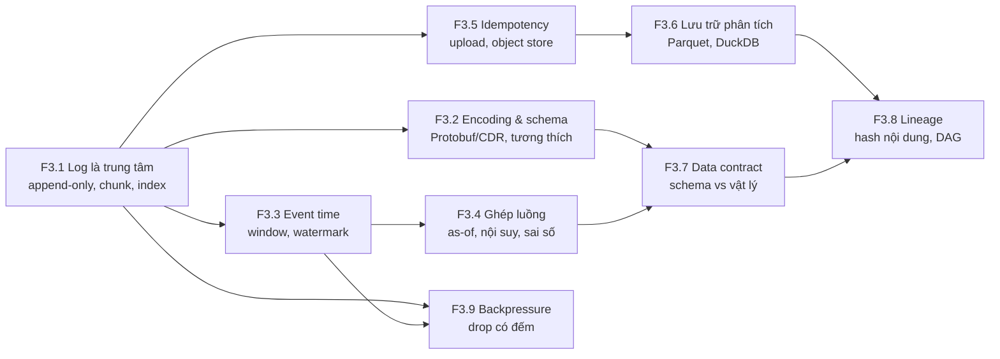

# F3 — Hệ thống dữ liệu và xử lý luồng (39h)

> Khóa nền, học **đúng lúc**: không đọc một mạch, mở viên nang ngay trước bài chính cần nó (bảng dưới). Tổng 39h = F3.1 4h · F3.2 4h · F3.3 5h · F3.4 5h · F3.5 4h · F3.6 4h · F3.7 5h · F3.8 4h · F3.9 4h. Giờ này chỉ một phần nằm trong ngân sách các bài chính; phần còn lại cộng thêm vào tổng lộ trình (đã vượt 650h, xem `00-lo-trinh-tong.md` và `khoa-7/_KE-HOACH-K7.md` mục 3).
>
> **Cách đọc khóa này cho người đã quen Kafka:** mỗi viên nang có mục 3 *Cầu nối* nói gọn phần bạn đã biết (đọc lướt) và dồn sức vào cột **Gãy ở chỗ**. Phần đáng làm nhất là mục 5 (bài tập Python, ≤2h) và mục 6 (Lăng kính đánh giá).

## Vì sao khóa nền này tồn tại

Bạn đã vận hành log, hàng đợi, schema registry, retry idempotent. Với dữ liệu robot, những thứ đó vẫn đúng **hình dạng** nhưng sai ở bốn giả định mà backend ngầm dựa vào:

1. **Thời gian của sự kiện do một đồng hồ vật lý trôi đóng dấu**, không phải do broker cấp. Không có `LogAppendTime` nào làm trọng tài.
2. **Dữ liệu là tín hiệu liên tục được lấy mẫu**, không phải sự kiện rời rạc. Ghép hai luồng là bài toán xử lý tín hiệu (as-of, nội suy, aliasing), không phải join theo khóa.
3. **Dữ liệu sai vẫn đúng schema.** Đơn vị, hướng trục, cảm biến đơ, đồng hồ lùi: không parser nào kêu.
4. **Mất một message là mất vĩnh viễn một phép đo.** Không có retry từ upstream; thứ duy nhất cứu dataset là việc đã mất được **đếm**.

Thiếu F3, bạn sẽ hụt ở đúng những chỗ này:

- **K2 Bài 4, 7** — đọc MCAP như "Kafka segment trong một file" rồi ngạc nhiên khi file bị `kill -9` không có index nào.
- **K2 Bài 6, 8b** — thêm trường proto3 "an toàn hai chiều" và nhận `0.0 °C` cho toàn bộ dữ liệu cũ.
- **K5 Bài 13** — ghép camera 30 Hz với IMU 200 Hz theo `log_time` và nhúng jitter USB vào dữ liệu fusion; hoặc resample về 30 Hz và biến rung motor 40 Hz thành dao động 10 Hz không có thật.
- **K5 Bài 14** — xóa file local sau `200 OK` của một file đang ghi dở.
- **K5 Bài 16** — tin rằng "schema bắt được sai đơn vị" (bản gốc viết đúng câu này).
- **K5 Bài 17, K3 Bài 16** — chọn "block producer" vì nghe an toàn, thực ra dời chỗ mất dữ liệu sang driver USB, nơi không ai đếm.
- **K6 Bài 7, 9** — cache kết quả theo `mtime` và đem báo cáo một con số không ai tái tạo được.
- **K7 C7.3, C7.4** — sidecar MCAP, upload, audit và data contract cho robot của chính bạn: đây là nơi cả chín viên nang gặp nhau.

## Mindset cốt lõi

1. **Log bất biến là nguồn sự thật; mọi bảng, index, dataset là view dẫn xuất tái tạo được.** Người làm hạ tầng dữ liệu tin điều này vì họ đã sống qua cảnh N hệ thống nối với nhau bằng N² pipeline mỗi cái tự chép dữ liệu theo cách riêng (Jay Kreps mô tả đúng cảnh này ở LinkedIn, *The Log*, 2013 `[chuẩn]`). Ở robot, log là file MCAP; dataset LeRobot, bảng index DuckDB, bộ split train/test là view.
2. **Thời điểm đo là một ước lượng có sai số, ghi kèm nguồn gốc của nó.** Người làm xử lý luồng tin "event time ≠ processing time" vì Google từng phải viết lại pipeline batch thành streaming và phát hiện kết quả đổi theo lúc dữ liệu tới (Akidau và cộng sự, *The Dataflow Model*, VLDB 2015 `[chuẩn]`). Người làm robot tin thêm một bước: event time do một thạch anh trôi vài chục ppm đóng dấu, nên nó cần `clock_source` và mô hình quy đổi đi kèm.
3. **Schema bảo vệ bytes, không bảo vệ nghĩa.** Mars Climate Orbiter (1999) mất vì một bên xuất lbf·s, bên kia đọc như N·s: dữ liệu đúng định dạng file giao tiếp, sai đơn vị `[chuẩn]`.
4. **Drop được phép; drop im lặng thì không.** Mạng Internet sống sót qua congestion collapse năm 1986 vì Van Jacobson biến *gói bị drop* thành tín hiệu đo được (1988) `[chuẩn]`. Một dataset biết mình thủng ở đâu thì dùng được; một dataset thủng mà không biết thì độc hại.
5. **Mọi kết quả phải truy ngược được tới bytes đầu vào, code và tham số.** Bảng tính của Reinhart–Rogoff (2010) bỏ sót dòng trong một công thức trung bình; chỉ phát hiện khi một nghiên cứu sinh xin được file gốc (Herndon, Ash, Pollin, 2013) `[chuẩn]`.

## Bản đồ viên nang



### Học đúng lúc

| Viên nang | Học trước bài chính | Giờ |
|---|---|---|
| F3.1 Log là trung tâm | K2 Bài 1 (lướt), **K2 Bài 4**, K2 Bài 7 · K5 Bài 13 · K6 Bài 9 · K7 C7.3 | 4 |
| F3.2 Encoding và schema evolution | K1 Bài 10 (lướt) · K2 Bài 6, **Bài 8b**, Bài 9 · K4 Bài 10 · K5 Bài 4, Bài 13 · K6 Bài 5, Bài 9 · K7 C7.4 | 4 |
| F3.3 Event time vs processing time | **K2 Bài 2** · K5 Bài 7, **Bài 13** · K7 C7.2 | 5 |
| F3.4 Ghép luồng khác tần số | K2 Bài 1 (lướt), Bài 11 · **K5 Bài 13** · K7 C7 (trọn chặng), C8.3 | 5 |
| F3.5 Idempotency, upload, object store | K3 Bài 14 · **K5 Bài 14** · K6 Bài 9 · K7 C7.3 | 4 |
| F3.6 Lưu trữ phân tích | K2 Bài 9 · **K5 Bài 15** · K6 Bài 9 | 4 |
| F3.7 Chất lượng dữ liệu, data contract | K1 Bài 11 (lướt), Bài 12 · K2 Bài 6, Bài 10, **Bài 11** · K4 Bài 15 · **K5 Bài 16** · K6 Bài 5, Bài 17 · K7 C7.4 | 5 |
| F3.8 Lineage và provenance | K2 Bài 9 · K3 Bài 6 · K4 Bài 8, **Bài 14** · K5 Bài 15 · K6 Bài 6, **Bài 7**, Bài 9, Bài 10 · K7 C11.5 | 4 |
| F3.9 Backpressure và drop policy | K1 Bài 3, Bài 7 (lướt) · K3 Bài 4, Bài 10, Bài 16 · K4 Bài 3 · **K5 Bài 17** · K6 Bài 8 · K7 C7.3 | 4 |

Tuần crunch: đọc mục 3 + 6 của F3.1 trước K2 Bài 4; F3.3 + F3.4 mục 2, 5, 6 trước K5 Bài 13; F3.7 mục 6 trước K5 Bài 16; F3.9 mục 5 trước K5 Bài 17. Nếu chỉ còn sức cho một viên nang, chọn **F3.4**: nó là chỗ vốn backend của bạn ít giúp nhất.

## Bạn đã làm cái này rồi

| Bạn đã làm trong backend/AI-harness | Tên chuẩn | Còn thiếu khi sang dữ liệu robot | Viên nang |
|---|---|---|---|
| Kafka topic, consumer offset, replay từ đầu | Log-centric architecture; event sourcing | Không có broker cấp offset; địa chỉ là (chunk, `log_time`); index chỉ có khi file đóng đúng cách | F3.1 |
| Schema registry, Avro/Protobuf, rule BACKWARD/FORWARD | Schema evolution | Không có registry ở thời điểm ghi; kiểm dời sang CI và ingest; tương thích ngữ nghĩa (đơn vị, giá trị 0 của enum) | F3.2 |
| Flink/Kafka Streams window, `CreateTime` | Event time, watermark | Đồng hồ nguồn trôi; lateness tăng theo thời gian phiên; event time là *giữa phơi sáng*, không phải lúc gửi | F3.3 |
| Stream–stream join, lookup join | As-of join, interval join | Nội suy, aliasing khi resample, ngân sách sai số căn chỉnh; không có khóa nghiệp vụ | F3.4 |
| Idempotency key, retry với backoff, outbox | Effectively-once, content addressing | Đơn vị dữ liệu là file nhiều GB đang được ghi; điều kiện xóa local; checksum do server tính | F3.5 |
| Data warehouse, partition theo ngày, ClickHouse | Columnar storage, zone map, lakehouse | Raw không vào DB; index là tóm tắt có chủ đích (max, count, không phải mean) | F3.6 |
| Validate request bằng JSON Schema, Great Expectations | Data contract, data quality | Rule theo vật lý cần *giả định trạng thái* (đứng yên) và có tỉ lệ báo động giả phải đo (→ F2.1) | F3.7 |
| Docker image digest, lockfile, cache build | Provenance, content-addressed cache | Dataset và calibration cũng là đầu vào cần hash; mtime không phải danh tính | F3.8 |
| Rate limit, 429, DLQ | Backpressure, load shedding | Upstream là cảm biến không biết chờ; block = drop ở chỗ không đếm | F3.9 |

---

## F3.1 — Log là trung tâm: append-only, offset, segment, index (Kafka ↔ MCAP) (4h)

> **Dùng cho:** K2 Bài 1, 4, 7 · K5 Bài 13 · K6 Bài 9 · K7 C7.3 · **Cần trước:** không (vốn Kafka) · **Sau viên nang này bạn đánh giá được:** một khẳng định kiểu "file log này chịu được crash / đọc ngẫu nhiên được / đọc một topic nhỏ thì nhanh" là ĐÚNG, SAI hay còn tùy cấu hình nào; và chọn kích thước chunk bằng số thay vì mặc định.

### 1. Câu chuyện

Năm 2013, Jay Kreps (đồng tác giả Kafka) viết *The Log: What every software engineer should know about real-time data's unifying abstraction*. Luận điểm: write-ahead log của database, commit log của hệ phân tán, và hàng đợi tích hợp dữ liệu giữa các team là **cùng một thứ** — một chuỗi bản ghi chỉ nối thêm, có thứ tự, đánh địa chỉ bằng vị trí. Có nó, mỗi hệ thống tiêu thụ chỉ cần nhớ "tôi đã đọc tới đâu"; thiếu nó, mỗi cặp hệ thống phải tự viết pipeline chép dữ liệu `[chuẩn]`.

Ngành robot đi con đường riêng tới cùng kết luận. rosbag (ROS 1) là một log nối thêm có index ở cuối file. rosbag2 thời đầu dùng **SQLite** làm định dạng lưu: tiện truy vấn, nhưng ghi tốc độ cao và chịu crash kém hơn một log thuần, và file không tự mang định nghĩa message. Foxglove thiết kế **MCAP** (2022) quay lại dạng log: chunk nén, index thưa, schema nhúng; từ ROS 2 Iron (2023), MCAP là storage mặc định của rosbag2 `[spec: ROS 2 Iron release notes — kiểm theo bản bạn dùng]`. Bài học của vòng đi vòng lại này: thứ tối ưu cho *ghi trên robot* (append, chịu crash, không cần server) khác thứ tối ưu cho *truy vấn trên desktop* (index, random access). Một định dạng tốt tách hai việc đó ra, và trả giá ở chỗ nối giữa chúng.

### 2. Mô hình tư duy

```
 Kafka partition (nhiều file, có broker)          MCAP (một file, không có broker)
 ┌──────────────┐ ┌──────────────┐               ┌────┬────────┬────────┬─────┬─────────┬──────┬────┐
 │ 000.log      │ │ 512.log      │  ...          │Hdr │Chunk 1 │Chunk 2 │ ... │ Summary │Footer│Mgc │
 │ 000.index ◄──┼─┤ 512.index    │               │    │(zstd)  │(zstd)  │     │ChunkIdx │      │    │
 │ 000.timeindex│ │ 512.timeindex│               │    │+MsgIdx │+MsgIdx │     │Stats    │      │    │
 └──────────────┘ └──────────────┘               └────┴────────┴────────┴─────┴─────────┴──────┴────┘
  index cập nhật liên tục trong lúc ghi;           index chi tiết của chunk ghi ngay sau chunk;
  crash → broker quét segment cuối, dựng lại       index tổng (Summary) chỉ ghi khi finish();
  địa chỉ = offset toàn cục do broker cấp          địa chỉ = (byte offset chunk, log_time)
```

Bốn khái niệm, mỗi cái là một nút vặn:

| Khái niệm | Nó mua gì | Nó trả bằng gì |
|---|---|---|
| **Append-only** | Ghi tuần tự (nhanh nhất trên mọi loại đĩa), không có cập nhật tại chỗ nên crash chỉ hỏng *đuôi* | Không sửa được bản ghi cũ; sửa = ghi bản mới + view dẫn xuất |
| **Segment / chunk** | Đơn vị nén, đơn vị xóa (retention), đơn vị kiểm CRC | Dữ liệu trong chunk đang mở nằm trong RAM: **bán kính vụ nổ** khi process chết |
| **Offset / địa chỉ** | Consumer nhớ được vị trí, replay được | MCAP không có offset toàn cục; `sequence` do nguồn cấp, có thể bằng 0 `[spec: MCAP, Message record: "Optional message counter"]` |
| **Index thưa** | Tìm theo thời gian không cần quét | Index ở *cuối* file chỉ tồn tại nếu file đóng đúng cách |

Câu then chốt: **trong một log, crash-safety và random access kéo về hai phía.** Kafka giải bằng file index riêng cập nhật liên tục và một broker luôn sống để dựng lại. MCAP không có broker, nên chọn: data section tự đủ để *quét* lại (mỗi chunk có độ dài, CRC), còn index nhanh là phần thưởng cho file đóng đúng. Công cụ `mcap recover` tồn tại vì đúng lựa chọn này.

### 3. Cầu nối từ backend

Đã có ở K2 Bài 4 bảng đối chiếu Kafka segment ↔ MCAP và lời chấm mô hình *"MCAP chỉ là Kafka trong một file"* (**ĐÚNG MỘT PHẦN**, bốn chỗ gãy: không offset toàn cục, index chỉ có khi `finish()`, channel xen kẽ trong chunk, không broker/retention). Không lặp lại; đọc ở đó. Dưới đây là các phép so sánh *khác*.

| Backend bạn biết | Ở đây | Gãy ở chỗ | Nếu dùng nhầm thì |
|---|---|---|---|
| Database WAL: ghi log trước, áp vào bảng sau, checkpoint | MCAP là log; dataset/index là "bảng" | WAL bị cắt bỏ sau checkpoint; log robot **không bao giờ** cắt bỏ — nó là nguồn sự thật duy nhất của một phép đo không lặp lại được | Coi MCAP là file tạm, xóa sau khi "đã import vào DB", rồi không tái tạo được khi sửa bug extractor (→ F3.8) |
| Kafka `acks=all` + replication: một broker chết không mất gì | Writer MCAP trên một máy, không replica | Độ bền của Kafka đến từ *bản sao trên máy khác*, không từ fsync. Robot không có máy khác cho tới khi upload (→ F3.5) | Suy "kill -9 không mất gì nhiều" thành "mất điện không mất gì": page cache chưa xuống đĩa là phần mất thêm |
| Consumer group đọc song song nhiều partition | Đọc song song nhiều file MCAP, hoặc nhiều chunk trong một file | Song song theo chunk chỉ được khi có ChunkIndex (file đóng đúng); thứ tự toàn cục giữa các chunk theo `log_time` phải tự merge | Ghép kết quả các worker theo thứ tự xong việc, không theo thời gian |

**Chấm mô hình:**

- *"Append-only nghĩa là crash không bao giờ làm hỏng file."* — **ĐÚNG MỘT PHẦN.** Append-only giới hạn chỗ hỏng ở **đuôi**: không bản ghi cũ nào bị ghi đè dở. Gãy: (a) đuôi đó có thể là cả chunk đang mở, tức vài giây dữ liệu; (b) reader dùng index sẽ coi cả file là hỏng vì footer/summary không có; (c) một bản ghi bị cắt giữa chừng mà không có độ dài + CRC thì reader không biết dừng ở đâu. Phản ví dụ: bài tập mục 5 — file bị kill có 100% chunk đã flush còn nguyên, nhưng reader theo index đọc được 0 message.
- *Mô hình của bạn ở K3 lượt 6: "luôn phải có buffer để ổn định… đánh đổi bằng RAM".* — Đã chấm **ĐÚNG MỘT PHẦN** ở K5 Bài 13. Thêm một góc ở đây: chunk của log chính là buffer đó, và nó có *ba* giá, không phải một: RAM, độ trễ trước khi dữ liệu xuống đĩa, và lượng dữ liệu mất khi chết. Kích thước chunk chọn bằng cả ba.

**Tên chuẩn của thứ bạn đã làm:** khi bạn replay một topic Kafka từ offset 0 để dựng lại một service sau khi sửa bug, đó là **event sourcing / kappa architecture**: trạng thái là hàm của log. Với robot, "sửa bug extractor rồi chạy lại trên toàn bộ MCAP" là cùng mẫu. Còn thiếu: log của bạn ở backend được giữ bởi retention có chủ đích; log robot phải được giữ *vĩnh viễn* và có hash (→ F3.8), vì không có upstream nào phát lại.

### 4. Thuật ngữ

| Mức | Thuật ngữ | Nghĩa trong một câu | Hay bị hiểu nhầm thành |
|---|---|---|---|
| 🟢 | Append-only log | Chuỗi bản ghi chỉ nối thêm, có thứ tự | "Không bao giờ hỏng" |
| 🟢 | Chunk / segment | Khối bản ghi nén và kiểm cùng nhau | Đơn vị chỉ để nén |
| 🟢 | Summary / footer / index | Phần cuối file trỏ vào chunk theo thời gian, channel | Luôn có |
| 🟢 | `log_time` vs `publish_time` vs `header.stamp` | Lúc ghi / lúc publish / lúc đo | Ba tên của một thứ (→ F3.3) |
| 🟢 | Recover / reindex | Quét data section, dựng lại summary | Phép màu cứu mọi file |
| 🟡 | Message index vs chunk index | Index trong chunk vs index các chunk | — |
| 🟡 | Kappa / lambda architecture | Một log cho cả batch và stream / hai đường riêng | — |
| 🔴 | Định dạng nhị phân chi tiết từng opcode MCAP | Tra spec khi cần | — |

### 5. Bài tập dự đoán

Một log đồ chơi giống tinh thần MCAP: message IMU thô (header 14 byte + 6 × int16), gom thành chunk nén zlib có độ dài + CRC32, index chỉ ghi ở footer khi đóng file. Mô phỏng `kill -9` ở một message ngẫu nhiên (chunk đang mở trong RAM mất, không có footer). Chạy với chunk = 20, 200, 2000 message.

**Dự đoán trước khi chạy** (ghi vào `prediction.md`):

1. Reader theo index đọc được bao nhiêu message từ file bị kill?
2. Reader quét tuần tự (dừng ở chunk hỏng) mất trung bình bao nhiêu message với chunk = 200? Mất tối đa bao nhiêu? Đổi ra giây ở 200 Hz.
3. Tỉ lệ nén tăng hay giảm theo kích thước chunk? Từ 20 lên 200 và từ 200 lên 2000, bước nào được nhiều hơn? Vì sao (gợi ý: zlib cần "xem" bao nhiêu byte để học được dữ liệu lặp)?
4. Với IMU 200 Hz + camera, chunk tính theo **byte** (MCAP mặc định tính theo byte, kiểm `chunk_size` của writer bạn dùng `[tự đo]`) thì một chunk 1 MiB chứa bao nhiêu giây IMU khi chỉ có IMU, và khi xen với ảnh 60 kB/frame ở 30 fps? Hệ quả cho bán kính vụ nổ của IMU?

Phương pháp: mất do kill = số message trong chunk đang mở = phân bố đều trên [0, chunk). Câu 4 tính tay từ byte/message (K5 Bài 13 đo được ~370 byte/message IMU trong MCAP).

```python
# [đã chạy] Log append-only đồ chơi: chunk nén + CRC, index chỉ ghi ở footer khi đóng file
import struct, zlib, io, numpy as np
rng = np.random.default_rng(7)
HDR = struct.Struct("<QHI")                       # log_time_ns, channel_id, độ dài payload
def imu_payload(i):                               # 6 × int16 giống gói IMU thô, nhiễu nhỏ
    v = np.array([0, 0, 16384, 0, 0, 0]) + rng.integers(-40, 40, 6)
    return v.astype("<i2").tobytes()

def write_log(n_msgs, chunk_msgs, kill_at=None):
    f, index, buf = io.BytesIO(), [], []
    f.write(b"TOYLOG01")
    def flush():
        raw = b"".join(buf); comp = zlib.compress(raw, 6)
        index.append((f.tell(), len(buf)))
        f.write(struct.pack("<4sII", b"CHNK", len(comp), zlib.crc32(raw)) + comp)
        buf.clear()
    for i in range(n_msgs):
        if i == kill_at: return f.getvalue()      # kill -9: chunk đang trong RAM mất, không có footer
        p = imu_payload(i); buf.append(HDR.pack(i * 5_000_000, 1, len(p)) + p)
        if len(buf) == chunk_msgs: flush()
    if buf: flush()
    f.write(b"INDX" + b"".join(struct.pack("<QI", o, c) for o, c in index)
            + struct.pack("<I", len(index)) + b"TOYLOG01")
    return f.getvalue()

def read_by_index(data):                          # reader nhanh: nhảy thẳng tới footer
    if not data.endswith(b"TOYLOG01") or len(data) < 20: return None
    return struct.unpack("<I", data[-12:-8])[0]   # số chunk theo index

def recover_by_scan(data):                        # reader chậm: quét tuần tự, dừng ở chunk hỏng
    pos, n = 8, 0
    while data[pos:pos+4] == b"CHNK":
        L, crc = struct.unpack("<II", data[pos+4:pos+12]); body = data[pos+12:pos+12+L]
        if len(body) < L or zlib.crc32(raw := zlib.decompress(body)) != crc: break
        n += len(raw) // (HDR.size + 12); pos += 12 + L
    return n

N, raw_size = 10_000, 10_000 * (HDR.size + 12)
print("chunk | nén x | index sau kill | mất TB sau kill (msg) | mất max")
for chunk in (20, 200, 2000):
    full = write_log(N, chunk)
    lost = []
    for _ in range(40):
        k = int(rng.integers(1, N))
        d = write_log(N, chunk, kill_at=k)
        assert read_by_index(d) is None
        lost.append(k - recover_by_scan(d))
    print(f"{chunk:5d} | {raw_size/len(full):5.2f} | không có      | {np.mean(lost):10.0f} | {max(lost):6d}")
```

<details><summary>🔒 MỞ SAU KHI COMMIT prediction.md</summary>

Kết quả một lần chạy (seed 7, Python 3 + numpy; số "mất" dao động vài chục message giữa các seed):

| chunk | nén × | index sau kill | mất TB | mất max |
|---|---|---|---|---|
| 20 | 1,51 | không có | 9 | 19 |
| 200 | 1,92 | không có | 100 | 192 |
| 2000 | 2,01 | không có | 860 | 1807 |

1. **Không đọc được gì** qua index: footer không tồn tại. Đây là chỗ khác Kafka (broker tự dựng lại index khi khởi động).
2. Mất trung bình ≈ chunk/2 ≈ 100 message = **0,5 s ở 200 Hz**, tối đa gần một chunk (~1 s). Mọi chunk đã flush còn nguyên và quét lại được nhờ độ dài + CRC.
3. Tỉ lệ nén tăng theo chunk nhưng **lợi ích giảm dần**: 20→200 được nhiều (1,51→1,92), 200→2000 gần như không (→2,01). Chunk quá nhỏ thì header nén và từ điển chưa kịp học; vượt vài chục kB thì zlib (cửa sổ 32 kB) không thấy thêm gì. Vì vậy chunk lớn mua thêm rất ít nén nhưng mua thêm nhiều rủi ro mất dữ liệu.
4. Chỉ IMU: 1 MiB / 370 B ≈ 2830 message ≈ **14 s** IMU nằm trong RAM trước khi xuống đĩa. Xen với ảnh: luồng vào ≈ 30 × 60 kB + 200 × 370 B ≈ 1,87 MB/s, chunk 1 MiB đầy sau ≈ 0,56 s → bán kính vụ nổ của IMU chỉ ~0,56 s. **Cùng một `chunk_size`, bán kính vụ nổ theo thời gian khác nhau 25 lần tùy luồng nào đi chung file.** Đây là lý do K2 Bài 7 bắt chọn chunk bằng số đo, và là một lý do để tách luồng nhỏ quan trọng sang file/writer riêng.

</details>

### 6. Lăng kính đánh giá

Checklist khi đọc một khẳng định hay một kết quả về log/MCAP:

1. **Crash nào?** `kill -9` (process chết, OS sống: mất phần còn trong buffer của process) khác mất điện (mất thêm page cache chưa fsync) khác đĩa đầy (ghi dừng giữa record). Khẳng định không nói rõ là CHƯA RÕ.
2. **Reader nào?** Reader theo index, reader quét, hay `mcap recover`? "File đọc được" luôn phải đi kèm tên reader.
3. **Địa chỉ là gì?** Nếu tài liệu nói "offset" cho MCAP, hỏi: byte offset hay số thứ tự? Ai cấp? Có thể trùng không?
4. **Đọc một channel tốn bao nhiêu?** Có chunk nào chỉ chứa channel đó không, hay mọi chunk đều xen ảnh?
5. **Chunk tính theo byte hay theo thời gian, và luồng nào đi chung?** Bán kính vụ nổ đổi theo trộn luồng (mục 5 câu 4).
6. **Ai giữ bản sao thứ hai, từ lúc nào?** Trước khi upload VERIFIED (→ F3.5), độ bền = độ bền của một ổ đĩa trên robot.

**Khẳng định mẫu để tự chấm** (ĐÚNG / ĐÚNG MỘT PHẦN / SAI + vì sao):

- (a) Gemini, K5 Bài 13, bảng "Số phải ra": *"Sau 10 lần `kill -9`: file vẫn đọc được tới chunk hoàn chỉnh cuối cùng; mất mát tối đa chỉ là chunk đang dở. Cấu trúc append-only của MCAP bảo toàn dữ liệu khi mất điện."*
- (b) Bản gốc K5 Bài 13: *"MCAP append-only cho phép phục hồi file ghi dở."*
- (c) *"Đọc topic IMU 200 Hz từ một file MCAP 50 GB có camera thì nhanh, vì MCAP có index theo channel."*

<details><summary>🔒 MỞ SAU KHI COMMIT prediction.md</summary>

- (a) **ĐÚNG MỘT PHẦN.** Vế đầu đúng *với reader quét hoặc sau `mcap recover`*; với `mcap info`/reader theo index thì file không có summary là lỗi (K2 Bài 4 bước 4 cho thấy CLI báo lỗi). "Mất tối đa là chunk đang dở" đúng cho `kill -9`; vế cuối **sai**: `kill -9` không phải mất điện — mất điện còn mất phần đã `write()` nhưng nằm trong page cache, và có thể để lại một chunk ghi dở giữa chừng. Hai thí nghiệm khác nhau (K5 Bài 13 vs Bài 14).
- (b) **ĐÚNG MỘT PHẦN.** Cho phép, nhưng không tự động: cần một bước `recover` có chủ đích trong pipeline ingest, và phần trong chunk đang mở thì không phục hồi được. Câu đúng: "data section tự mô tả đủ để quét lại; phần đã flush phục hồi được bằng `mcap recover`; phần trong RAM của writer thì mất."
- (c) **ĐÚNG MỘT PHẦN.** Index cho biết chunk nào *có* message IMU và ở đâu trong chunk. Nhưng nếu writer xen IMU và ảnh trong cùng chunk (mặc định thường là vậy), *mọi* chunk đều có IMU → phải tải và giải nén gần như toàn bộ 50 GB. Nhanh chỉ khi luồng nhỏ nằm ở chunk riêng hoặc file riêng (K2 Bài 7 đo đúng điều này).

</details>

### 7. Câu hỏi ngược

1. **[Vì sao không]** Vì sao MCAP không fsync sau mỗi chunk để mất điện chỉ mất đúng chunk đang mở?
   <details><summary>Hướng nghĩ</summary>

   Tính chi phí: fsync trên SSD/eMMC tốn từ dưới 1 ms tới hàng chục ms `[tự đo: fio --fsync=1]`, và chặn writer. Ở chunk 0,5 s thì chấp nhận được; ở chunk nhỏ thì không. Đây là chính sách của *ứng dụng ghi*, không phải của định dạng. Hỏi tiếp: fsync có giúp gì nếu ổ nói dối (cache ghi không có tụ dự phòng)?

   </details>
2. **[Quy mô]** 100 robot × 8 h/ngày, mỗi robot 24 GB/ngày. Một job sửa bug cần chạy lại extractor trên một năm dữ liệu. Cái gì gãy trước: băng thông đọc object store, CPU giải nén, hay việc tìm đúng file?
   <details><summary>Hướng nghĩ</summary>

   ≈ 876 TB/năm `[ước lượng: 100 × 24 GB × 365]`. Tính thời gian đọc ở vài GB/s tổng. Hỏi: có cần đọc ảnh không? Nếu IMU nằm xen trong chunk ảnh thì có. Quyết định bố trí chunk ở robot hôm nay quyết định chi phí reprocess năm sau.

   </details>
3. **[Failure mode]** Writer ghi đúng, file đóng đúng, nhưng thẻ nhớ đổi một bit trong một chunk giữa file. Reader theo index và reader quét mỗi bên thấy gì? Pipeline của bạn phát hiện ở đâu?
   <details><summary>Hướng nghĩ</summary>

   CRC của chunk (nếu writer ghi CRC — MCAP cho phép để 0 `[spec]`, kiểm writer của bạn) bắt được. Reader quét kiểu "dừng ở chunk hỏng" sẽ bỏ cả phần còn lại; reader theo index nhảy qua được. Hash cả file lúc niêm phong (→ F3.5, F3.8) bắt được trước khi xóa local.

   </details>
4. **[Liên ngành]** Hộp đen máy bay (FDR) ghi liên tục vào một vòng nhớ 25 giờ. Nó giống và khác log robot ở chỗ nào về "cái gì là nguồn sự thật" và "cái gì bị ghi đè"?
   <details><summary>Hướng nghĩ</summary>

   FDR là ring buffer: cũ bị đè, chỉ đoạn cuối trước sự cố quan trọng. Log robot cho học máy cần *toàn bộ* lịch sử. Nhưng trên robot thiếu đĩa (mất mạng nhiều ngày), bạn sẽ cần chính sách kiểu FDR cho luồng ưu tiên thấp (→ F3.9).

   </details>
5. **[Phản biện]** "Dùng Parquet thẳng trên robot, bỏ MCAP, vì cuối cùng dataset cũng là Parquet." Lập luận mạnh nhất cho và chống?
   <details><summary>Hướng nghĩ</summary>

   Chống: Parquet ghi footer một lần, file đang ghi bị cắt thường không cứu được bằng công cụ chuẩn; ghi từng dòng 200 Hz vào columnar cần buffer lớn; ảnh không hợp cột. Cho: bỏ một bước chuyển đổi, LeRobot v3 dùng Parquet + MP4. Xem phần "Tranh luận đang mở" cuối file.

   </details>

### 8. Liên kết ra ngoài

- **Database WAL và LSM-tree** (LevelDB, RocksDB): memtable trong RAM = chunk đang mở; SSTable bất biến = chunk đã flush; compaction = view dẫn xuất. Khác: WAL được cắt bỏ sau flush, log robot thì không.
- **Git**: object store bất biến định địa chỉ theo nội dung + ref trỏ vào. Giống "log là sự thật, branch là view". Khác: git không có thứ tự thời gian toàn cục; log cảm biến thì chỉ có thứ tự thời gian.

### 9. Áp vào khóa chính

- **K2 Bài 4, 7:** dùng checklist mục 6 khi đọc `mcap info`, khi cắt file thử recover, khi chọn chunk size bằng ba con số (nén, I/O đọc một channel, bán kính vụ nổ).
- **K5 Bài 13:** tách thí nghiệm `kill -9` khỏi thí nghiệm mất điện; ghi rõ reader nào đọc được bao nhiêu. Cân nhắc writer riêng cho IMU.
- **K6 Bài 9:** output episode là log bất biến; mọi bảng tổng hợp là view dẫn xuất có thể xóa và dựng lại.
- **K7 C7.3:** sidecar MCAP trên robot cần quy trình "đóng file → niêm phong → hash → upload" (→ F3.5); file không đóng đúng đi qua bước recover trước khi vào hàng đợi upload.

### 10. Độ tin cậy

| Khẳng định | Nhãn | Ghi chú / cách kiểm |
|---|---|---|
| Summary và Summary Offset là phần tùy chọn của MCAP; `sequence` là bộ đếm tùy chọn | `[spec]` | MCAP Specification, mục File structure và Message record |
| MCAP là storage mặc định của rosbag2 từ Iron | `[spec]` | Release notes ROS 2 Iron; kiểm `ros2 bag record --help` trên Jazzy |
| Kafka dựng lại index khi broker khởi động sau crash | `[chuẩn]` | Tài liệu Kafka, log recovery |
| Mất trung bình ≈ chunk/2 khi kill ngẫu nhiên | `[đã chạy]` | Mô phỏng mục 5 |
| Chi phí fsync trên ổ của robot | `[tự đo]` | `fio --fsync=1` trên đúng ổ |

### 11. Đọc thêm và tự kiểm tra

- **Nguồn gốc:** MCAP Specification (mcap.dev, mục Specification).
- **Giải thích:** Jay Kreps, *The Log: What every software engineer should know about real-time data's unifying abstraction* (LinkedIn Engineering blog, 2013).
- **Đào sâu:** Martin Kleppmann, *Designing Data-Intensive Applications*, chương 3 (log-structured storage) và chương 11 (log-based message brokers).
- **Tự kiểm tra:** (1) giải thích cho một backend engineer trong 5 câu vì sao một file MCAP bị kill vẫn còn dữ liệu nhưng `mcap info` báo lỗi; (2) vẽ lại hình mục 2 từ trí nhớ; (3) câu hỏi:

  Robot ghi IMU + ảnh chung một writer, chunk 4 MiB, zstd. Bạn muốn giảm bán kính vụ nổ của IMU xuống dưới 0,5 s mà không đổi chunk của ảnh. Hai cách?
  <details><summary>Đáp án</summary>

  (1) Writer/file riêng cho luồng nhỏ (IMU, odom, diagnostics) với chunk nhỏ; (2) cùng file nhưng flush theo **thời gian** (đóng chunk mỗi ≤0,5 s bất kể kích thước) nếu writer hỗ trợ `[tự đo]`. Cách (1) còn giúp đọc IMU không phải giải nén ảnh.

  </details>

---

## F3.2 — Encoding và schema evolution: Protobuf/CDR/Avro, quy tắc tương thích, file tự mô tả (4h)

> **Dùng cho:** K2 Bài 6, 8b, 9 · K4 Bài 10 · K5 Bài 4, 13 · K6 Bài 5, 9 · K7 C7.4 · **Cần trước:** F3.1 · **Sau viên nang này bạn đánh giá được:** một thay đổi schema có an toàn ở tầng nào (bytes / code / nghĩa); một con số "byte/message" dùng để tính dung lượng có đáng tin không; một thông tin mới nên vào payload, metadata channel hay topic riêng.

### 1. Câu chuyện

Sáng 1/8/2012, Knight Capital triển khai code giao dịch mới lên tám server. Code mới **dùng lại một cờ** trong message lệnh, cờ này nhiều năm trước điều khiển một tính năng đã bỏ tên Power Peg. Một server không được cập nhật. Trên server đó, code cũ vẫn còn, đọc cờ theo nghĩa cũ và bắn lệnh liên tục. Trong khoảng 45 phút, công ty lỗ khoảng 460 triệu USD (theo lệnh của SEC năm 2013) `[chuẩn]`. Không có byte nào sai định dạng. Cùng một bit, hai reader, hai nghĩa.

Đây chính là lý do quy tắc đầu tiên của Protobuf là *không bao giờ dùng lại số hiệu trường; đánh dấu `reserved`* `[spec: protobuf.dev, "Updating A Message Type"]`. Với dữ liệu robot, rủi ro còn kéo dài hơn: một file ghi năm 2026 sẽ được đọc năm 2031 bằng code mà người ghi chưa từng thấy. K2 Bài 6 đã cho bạn bảng quy tắc theo tầng wire/code/nghĩa; viên nang này lo phần K2 chưa nói: **mỗi họ encoding chọn đặt thông tin schema ở đâu, và hệ quả của lựa chọn đó**.

### 2. Mô hình tư duy

Mọi encoding trả lời một câu: *reader biết cấu trúc của bytes nhờ đâu?*

| Họ | Thông tin cấu trúc nằm ở | Kích thước một message | Tiến hóa schema | Gặp ở đâu trong lộ trình |
|---|---|---|---|---|
| **JSON** | Trong từng message (tên trường lặp lại) | Lớn, phụ thuộc giá trị | Tự do, không ai kiểm | metadata nhỏ, config |
| **Protobuf** | Số hiệu trường + wire type trong từng trường; tên ở schema ngoài | **Phụ thuộc giá trị** (varint, trường bằng 0 bị bỏ) | Theo số hiệu: thêm/bỏ trường an toàn ở tầng wire | `imu.proto` K2, Foxglove schema |
| **CDR** (ROS 2) | Hoàn toàn ở schema ngoài; bytes chỉ là các trường xếp liền nhau có căn lề | Gần như cố định theo kiểu (`sensor_msgs/Imu` = 324 B với `frame_id` 8 ký tự, K5 Bài 13) | **Gần như không có**: thêm một trường làm lệch mọi trường sau; đổi định nghĩa = kiểu mới | mọi message ROS 2 |
| **Avro** | Schema của writer, bắt buộc phải có lúc đọc; bytes không có tag | Nhỏ nhất | Phân giải writer schema ↔ reader schema, có default | Kafka + registry |
| **Parquet/Arrow** | Footer/schema của file, theo cột | Tính theo cột, không theo message | Thêm cột dễ, đổi kiểu khó | LeRobot, F3.6 |

```
 Protobuf (TLV)        [tag=4|LEN][...Vec3...][tag=5|LEN][...][tag=7|LEN]"imu-01..."
                        ↑ reader lạ gặp tag 9 → giữ lại như unknown field, đọc tiếp
 CDR (vị trí cố định)  [encap 4][sec 4][nsec 4][len 4]"imu_link\0"[pad 3][quat 32][cov 72]...
                        ↑ chèn thêm 1 trường giữa → mọi byte phía sau đọc lệch, không lỗi nào báo
```

**File tự mô tả** (MCAP nhúng schema theo channel; Parquet nhúng schema ở footer) chuyển câu hỏi từ "reader có schema không" sang "**code của tôi**, viết theo schema X, đọc file mang schema Y có đúng nghĩa không". Schema nhúng giải quyết tầng bytes. Nó không mang theo đơn vị nếu bạn không ghi, không mang theo nghĩa của giá trị 0, không mang theo thư viện giải mã.

Hệ quả thực hành cho ROS 2: vì CDR không có câu chuyện tiến hóa, quy ước của repo là **không sửa message chuẩn; thứ chuẩn không có thì vào metadata channel hoặc topic riêng** (`CONVENTIONS.md` mục 4). rosbag (ROS 1) từng có "migration rules" để đọc bag cũ sau khi đổi message; rosbag2 không có cơ chế tương đương `[tự đo — kiểm tài liệu rosbag2 bản Jazzy]`.

### 3. Cầu nối từ backend

| Backend bạn biết | Ở đây | Gãy ở chỗ | Nếu dùng nhầm thì |
|---|---|---|---|
| Kafka + Confluent: message mang **schema ID** 5 byte, schema ở registry | MCAP mang **cả schema** trong file | Registry là dịch vụ phải sống; 10 năm sau có thể không còn. File tự mô tả sống độc lập nhưng không có ai chặn schema sai lúc ghi | Ghi schema ID thay vì schema vào file robot "cho gọn" → file mồ côi khi registry đổi |
| Protobuf trong gRPC: kích thước message ít quan trọng | Protobuf ghi 200 Hz × nhiều giờ | Kích thước **phụ thuộc giá trị**: trục bằng 0.0 đúng thì biến mất, `sequence` lớn tốn thêm byte | Tính dung lượng từ một message mẫu "đẹp" (nhiều số 0) → thiếu |
| Thêm giá trị enum mới vào API | Thêm trường enum vào message cảm biến | proto3: reader mới đọc dữ liệu cũ thấy **giá trị số 0** của enum. Nếu số 0 mang nghĩa thật, dữ liệu cũ bị gán nghĩa đó | Toàn bộ file cũ hiện là `clock_source = ESP32_TIMER` (bài tập mục 5) |
| JSON schema linh hoạt, thêm field tùy ý | CDR của ROS 2 | CDR không có tag; reader dùng schema khác writer đọc ra rác có hình dạng hợp lệ | Sửa `sensor_msgs/Imu` cục bộ "thêm 1 trường" → Foxglove/rosbag2 của người khác đọc lệch |

**Chấm mô hình:**

- *"Protobuf luôn nhỏ hơn CDR."* — **ĐÚNG MỘT PHẦN.** Với `ImuSample` của repo, một mẫu đầy đủ ~190 B so với 324 B của `sensor_msgs/Imu` CDR — nhưng hai message không mang cùng thông tin (`sensor_msgs/Imu` có quaternion và ba ma trận covariance). So sánh đúng phải cùng nội dung. Phản ví dụ: một message toàn `double` khác 0 và không có trường rỗng thì Protobuf tốn thêm 1 byte tag mỗi trường so với CDR.
- *"Schema nhúng trong file nên đọc được mãi mãi."* — **ĐÚNG MỘT PHẦN.** Bytes giải mã được nếu còn thư viện cho encoding đó. Gãy: schema `ros2msg` cần đủ định nghĩa phụ thuộc (MCAP nối chúng vào một chuỗi); nghĩa (đơn vị, frame, giá trị 0) không nằm trong schema; và code đọc theo tên trường vỡ khi tên đổi. Phản ví dụ: file năm 2026 có `clock_source` enum mà số 0 là "ESP32"; reader năm 2031 đọc đúng bytes, gán sai nghĩa cho mọi file trước khi trường đó tồn tại.

**Tên chuẩn của thứ bạn đã làm:** khi bạn chọn Avro + registry với chế độ `BACKWARD_TRANSITIVE` để consumer mới đọc được mọi bản cũ, bạn đang làm **schema evolution có kiểm ở thời điểm ghi**. Ở robot, cổng kiểm đó dời sang **CI của repo schema** (`buf breaking` cho `.proto`) và **ingest** (từ chối hoặc gắn cờ file mang schema chưa đăng ký). Còn thiếu: test tương thích *ngữ nghĩa* bằng golden file (K2 Bài 6) — không công cụ breaking-check nào làm thay.

### 4. Thuật ngữ

| Mức | Thuật ngữ | Nghĩa trong một câu | Hay bị hiểu nhầm thành |
|---|---|---|---|
| 🟢 | Encoding / serialization | Cách biến cấu trúc thành bytes | Schema |
| 🟢 | Self-describing file | File mang schema của chính nó | File mang cả nghĩa |
| 🟢 | Varint, implicit presence (proto3) | Số nhỏ tốn ít byte; trường bằng mặc định không được ghi | Mọi trường luôn được ghi |
| 🟢 | Enum zero value | Giá trị mặc định khi trường vắng mặt | Một lựa chọn như mọi lựa chọn khác |
| 🟢 | CDR, căn lề (alignment) | Encoding vị trí cố định của DDS/ROS 2 | Có tag như Protobuf |
| 🟡 | Writer schema / reader schema (Avro) | Hai schema được phân giải lúc đọc | — |
| 🟡 | XCDR2, kiểu appendable/mutable (DDS-XTypes) | Biến thể CDR có hỗ trợ tiến hóa | ROS 2 mặc định đã dùng `[tự đo]` |
| 🔴 | Chi tiết wire format từng kiểu | Tra spec khi viết parser | — |

### 5. Bài tập dự đoán

Dùng `GỐC/src/proto/sensors/v1/imu.proto` (lớp đã sinh sẵn `imu_pb2.py`, cần `protobuf` cài trong Python; không cần `protoc`). Script dựng một bản v2 bằng code: thêm `ClockSource clock_source = 9` với enum *thiết kế vội* `ESP32_TIMER = 0, HOST_PTP = 1, HOST_UNSYNCED = 2`.

**Dự đoán** (ghi `prediction.md`, tính tay trước — mỗi trường Protobuf = tag 1 byte + giá trị; `double` 8 byte; chuỗi/message con = tag + độ dài + nội dung; varint 7 bit mỗi byte):

1. Một `ImuSample` đầy đủ (giá trị trong hàm `sample()`) dài bao nhiêu byte?
2. Nếu `ax` và `gz` đo được **đúng 0.0**, message ngắn đi bao nhiêu byte?
3. `sequence` = 1, 300, 2³²−1: kích thước đổi thế nào?
4. Đọc bytes v1 bằng lớp v2: `clock_source` ra giá trị nào?
5. v2 ghi `clock_source = HOST_PTP`; một service v1 parse rồi serialize lại (ví dụ một bước lọc cũ trong pipeline), v2 đọc lại: còn `HOST_PTP` không?
6. Dung lượng một giờ IMU 200 Hz bằng `ImuSample` (chưa tính overhead MCAP), so với con số "~50 byte/mẫu, 36 MB/giờ" của bản gốc K5 Bài 13.

```python
# [đã chạy] Kích thước Protobuf phụ thuộc giá trị; enum mới đọc dữ liệu cũ ra gì
import sys; sys.path.insert(0, "/home/user/robotics-lab/src")   # GỐC/src — sửa theo máy bạn
from proto.sensors.v1 import imu_pb2
from google.protobuf import descriptor_pb2, descriptor_pool, message_factory, timestamp_pb2

def sample(ax=0.01, gz=-0.0005, seq=123456):
    m = imu_pb2.ImuSample(frame_id="imu_link", sequence=seq,
                          calibration_id="imu-01@2026-11-02-a", source_device_id="esp32-01")
    m.stamp.seconds, m.stamp.nanos = 1_791_504_000, 123_456_789
    m.linear_acceleration.x, m.linear_acceleration.y, m.linear_acceleration.z = ax, -0.02, 9.787
    m.angular_velocity.x, m.angular_velocity.y, m.angular_velocity.z = 0.001, 0.002, gz
    m.acceleration_covariance.extend([4e-4, 0, 0, 0, 4e-4, 0, 0, 0, 4e-4])
    return m

print("Q1 đủ trường            :", len(sample().SerializeToString()), "byte")
print("Q2 ax = gz = 0.0 đúng   :", len(sample(ax=0.0, gz=0.0).SerializeToString()), "byte")
for s in (1, 300, 2**32 - 1):
    print(f"Q3 sequence={s:<11d}:", len(sample(seq=s).SerializeToString()), "byte")

# v2: thêm enum clock_source số hiệu 9 — dựng descriptor bằng code, không cần protoc
fdp = descriptor_pb2.FileDescriptorProto()
imu_pb2.DESCRIPTOR.CopyToProto(fdp)
fdp.name = "imu_v2.proto"; fdp.package = "sensors.v2"
enum = fdp.enum_type.add(name="ClockSource")
for i, n in enumerate(["CLOCK_SOURCE_ESP32_TIMER", "CLOCK_SOURCE_HOST_PTP", "CLOCK_SOURCE_HOST_UNSYNCED"]):
    enum.value.add(name=n, number=i)                       # thiết kế VỘI: giá trị 0 mang nghĩa thật
msg = next(m for m in fdp.message_type if m.name == "ImuSample")
for f in msg.field:
    if f.type_name.startswith(".sensors.v1"): f.type_name = f.type_name.replace("v1", "v2")
msg.field.add(name="clock_source", number=9, type=descriptor_pb2.FieldDescriptorProto.TYPE_ENUM,
              type_name=".sensors.v2.ClockSource", label=descriptor_pb2.FieldDescriptorProto.LABEL_OPTIONAL)
pool = descriptor_pool.DescriptorPool()
pool.AddSerializedFile(timestamp_pb2.DESCRIPTOR.serialized_pb)
V2 = message_factory.GetMessageClass(pool.Add(fdp).message_types_by_name["ImuSample"])

old_bytes = sample().SerializeToString()                  # file ghi năm 2026 bằng v1
v2 = V2.FromString(old_bytes)
enum_t = V2.DESCRIPTOR.fields_by_name["clock_source"].enum_type
print("Q4 v1 đọc bằng v2       :", enum_t.values_by_number[v2.clock_source].name)
new = V2.FromString(old_bytes); new.clock_source = 1      # v2 ghi HOST_PTP
back = imu_pb2.ImuSample.FromString(new.SerializeToString())
print("Q5 v2→v1→v2 giữ field 9 :", V2.FromString(back.SerializeToString()).clock_source)
```

<details><summary>🔒 MỞ SAU KHI COMMIT prediction.md</summary>

Chạy với `protobuf` 7.36 (Python):

| Câu | Kết quả | Vì sao |
|---|---|---|
| 1 | **190 byte** | stamp 13 · frame_id 10 · sequence 4 · hai Vec3 29 mỗi cái · covariance packed 75 · hai chuỗi ID 21 + 10 |
| 2 | **172 byte** (−18) | mỗi `double` bằng 0.0 không được ghi: mất 1 byte tag + 8 byte |
| 3 | 188 / 189 / 192 byte | varint: 1 → 1 byte, 300 → 2, 2³²−1 → 5 (so với 123456 → 3) |
| 4 | **`CLOCK_SOURCE_ESP32_TIMER`** | trường vắng → giá trị số 0 của enum. Mọi file trước v2 bị gán "đóng dấu bằng ESP32" |
| 5 | **Còn (=1)** | v1 giữ trường lạ số 9 như unknown field và ghi lại nguyên vẹn (proto3 từ bản 3.5 giữ unknown fields `[spec]`) |
| 6 | ≈ 190 × 200 × 3600 ≈ **137 MB/giờ** | gần 4 lần "36 MB/giờ"; `sensor_msgs/Imu` CDR trong MCAP ≈ 265 MB/giờ (K5 Bài 13) |

Sửa thiết kế: số 0 của mọi enum là `CLOCK_SOURCE_UNSPECIFIED`, và reader coi UNSPECIFIED là "không biết" (quy ước style guide của Protobuf/Buf `[spec]`). Câu 2–3 là lý do không lấy **một** message mẫu để ước dung lượng: lấy phân bố kích thước trên dữ liệu thật.

</details>

### 6. Lăng kính đánh giá

Checklist khi đọc một thay đổi schema hay một con số kích thước:

1. Thay đổi an toàn ở **tầng nào**: bytes, code (tên, JSON, đường dẫn Foxglove), hay nghĩa? Khẳng định không nói tầng là CHƯA RÕ.
2. Encoding nào? Quy tắc của Protobuf **không** áp cho CDR, và ngược lại.
3. Trường mới vắng mặt trong dữ liệu cũ thì reader thấy gì — và giá trị đó có trùng một giá trị vật lý hợp lệ không (0 °C, 0 m/s², enum 0)?
4. Con số "byte/message" đo trên dữ liệu thật hay một mẫu tay? Có tính overhead container không?
5. Thông tin mới là **theo message** (payload/topic riêng), **theo luồng, không đổi trong file** (metadata channel), hay **theo file** (Metadata record / Attachment)?
6. Có golden file cũ trong repo để test đọc lại không?

**Khẳng định mẫu để tự chấm:**

- (a) `robotics-data-infra-roadmap.md`, bảng thuật ngữ: *"Schema evolution / backward compatibility — Bạn đã biết. Đây là lợi thế."*
- (b) Gemini, K5 Bài 13: *"Các trường `calibration_id`, `clock_source`, `sequence` không nằm trong định dạng message ROS 2 chuẩn, do đó chúng phải được lưu vào trường metadata của channel MCAP."*
- (c) `khoa-5/m3-data-stack.md` (bản đã soạn), giải thích con số của bản gốc: *"…vì 50 byte là kích thước `ImuSample` Protobuf tự chế ở Khóa 2."*

<details><summary>🔒 MỞ SAU KHI COMMIT prediction.md</summary>

- (a) **ĐÚNG MỘT PHẦN.** Lợi thế thật ở tầng bytes với Protobuf/Avro. Gãy ở ba chỗ người backend ít gặp: CDR của ROS 2 gần như không có tiến hóa (→ không sửa message chuẩn); không có registry chặn lúc ghi (robot offline); và tương thích ngữ nghĩa (đơn vị, enum 0, giá trị mặc định trùng giá trị vật lý) quan trọng hơn tương thích bytes vì dữ liệu sống nhiều năm.
- (b) **ĐÚNG MỘT PHẦN, sai với `sequence`.** `calibration_id`, `clock_source` không đổi trong suốt luồng → metadata channel là chỗ đúng (`CONVENTIONS.md` mục 4). `sequence` đổi **mỗi message**; metadata channel là một map tĩnh ghi một lần khi tạo channel, không chứa được giá trị theo message. Chỗ đúng: trường `sequence` của Message record MCAP (spec: *"Optional message counter to detect message gaps"*) hoặc topic chẩn đoán như `CONVENTIONS.md` quy định. Bản gốc K5 Bài 13 viết "`sequence` → metadata hoặc topic chẩn đoán": nửa đầu cùng lỗi.
- (c) **SAI theo số đo.** Mục 5: `ImuSample` đầy đủ là 190 byte, không phải 50. ~50 B chỉ khớp với **gói thô từ MCU** (6 × int16 + timestamp + header, như K2 Bài 1 viết) hoặc một `ImuSample` thiếu covariance và ID. Kết luận của K5 (bản gốc thiếu 7 lần so với `sensor_msgs/Imu`) vẫn đúng; chỉ lời giải thích nguồn gốc con số cần sửa — đã ghi vào ghi chú cho người điều phối.

</details>

### 7. Câu hỏi ngược

1. **[Nếu…thì]** Nếu firmware ESP32 gửi `ImuSample` Protobuf qua serial, còn host đổi sang `sensor_msgs/Imu` CDR để ghi, thì bước chuyển đó phải làm gì với trường vắng mặt (covariance chưa đo)?
   <details><summary>Hướng nghĩ</summary>

   CDR không có "vắng mặt": phải điền số. REP/`sensor_msgs/Imu` có quy ước: covariance toàn 0 = "không biết", phần tử [0] = −1 = "không có ước lượng" `[spec: comment trong Imu.msg]`. Đây là nơi presence của Protobuf phải được dịch sang một quy ước giá trị.

   </details>
2. **[Quy mô]** 100 robot chạy 4 bản firmware khác nhau, mỗi bản ghi schema hơi khác cùng tên `sensors.v1.ImuSample`. Ở bước ingest, bạn phát hiện bằng gì?
   <details><summary>Hướng nghĩ</summary>

   Hash nội dung schema nhúng (không phải tên) làm khóa; bảng đăng ký "hash schema → được chấp nhận / cần migration"; file mang hash lạ vào quarantine. Đây là registry, chỉ là chạy ở ingest thay vì ở producer.

   </details>
3. **[Failure mode]** Một bước pipeline đọc MCAP, sửa một trường, ghi file mới bằng lớp Protobuf **cũ** đã biên dịch. Trường mới v2 còn không? Với JSON thì sao?
   <details><summary>Hướng nghĩ</summary>

   Nhị phân: còn (unknown fields, câu 5 mục 5). Nếu bước đó đi qua JSON (`MessageToJson`) hoặc dựng message mới bằng tay từ các trường nó biết: mất âm thầm.

   </details>
4. **[Vì sao không]** Vì sao ROS 2 không dùng Protobuf trên dây để có tiến hóa schema miễn phí?
   <details><summary>Hướng nghĩ</summary>

   ROS 2 xây trên DDS, chuẩn OMG có CDR từ thời CORBA; vị trí cố định cho phép zero-copy và kích thước biết trước, hợp với hệ thời gian thực. Đánh đổi: tiến hóa bằng tên kiểu mới. Không phải ai đúng ai sai; là ưu tiên khác.

   </details>

### 8. Liên kết ra ngoài

- **HL7/DICOM trong y tế**: ảnh DICOM mang hàng trăm thẻ tự mô tả; bệnh viện vẫn gặp lỗi vì thẻ "private" mỗi hãng một nghĩa. Giống: tự mô tả không đủ nghĩa. Khác: có ủy ban chuẩn hóa từ điển thẻ.
- **FITS trong thiên văn**: file ảnh từ 1981 vẫn đọc được vì header văn bản mô tả trục và đơn vị (`BUNIT`, `CTYPE`). Giống: file tự mô tả sống lâu hơn phần mềm. Khác: FITS đặt đơn vị *vào chuẩn*, thứ Protobuf không làm.

### 9. Áp vào khóa chính

- **K2 Bài 6:** thêm vào bộ test một trường enum mới với golden file v1; kiểm enum 0 là `UNSPECIFIED`.
- **K2 Bài 8b, K5 Bài 13:** dùng mục 6 câu 5 để quyết định chỗ cho `clock_source` (metadata channel), `sequence` (Message record hoặc `/diagnostics`), `calibration_id` (metadata channel), bảng hiệu chuẩn (Attachment).
- **K5 Bài 13:** tính dung lượng/giờ từ phân bố kích thước message thật, không từ một mẫu.
- **K7 C7.4:** data contract cho robot ghi rõ encoding, hash schema và quy ước giá trị "không biết".

### 10. Độ tin cậy

| Khẳng định | Nhãn | Ghi chú / cách kiểm |
|---|---|---|
| Knight Capital: cờ dùng lại, một server không cập nhật, ~460 triệu USD, ~45 phút | `[chuẩn]` | SEC Administrative Proceeding 34-70694 (2013) |
| Không dùng lại số hiệu trường, dùng `reserved` | `[spec]` | protobuf.dev, "Updating A Message Type" |
| Kích thước 190/172/188–192 byte; enum vắng → 0; unknown field được giữ | `[đã chạy]` | Mục 5, protobuf Python 7.36 |
| `sensor_msgs/Imu` CDR = 324 B | `[đã chạy ở K5 Bài 13]` | `len(m.data)` trên MCAP thật |
| rosbag2 không có migration rule như rosbag1 | `[tự đo]` | Tài liệu rosbag2 bản Jazzy |

### 11. Đọc thêm và tự kiểm tra

- **Nguồn gốc:** Protocol Buffers documentation — "Encoding" và "Updating A Message Type" (protobuf.dev).
- **Giải thích:** Kleppmann, *Designing Data-Intensive Applications*, chương 4 (Encoding and Evolution) — so Thrift/Protobuf/Avro theo đúng câu "schema nằm ở đâu".
- **Đào sâu:** MCAP Specification, mục Schema/Channel và phụ lục "Well-known encodings" (ros2msg, protobuf).
- **Tự kiểm tra:** (1) giải thích cho backend engineer trong 5 câu vì sao không sửa `sensor_msgs/Imu` dù "chỉ thêm một trường"; (2) vẽ lại bảng mục 2 cột "thông tin cấu trúc nằm ở"; (3) câu hỏi:

  Bạn thêm `optional double temperature_c = 9` (có presence). Đọc file cũ: `HasField` trả gì, giá trị đọc ra là gì, và vì sao cách này tốt hơn `double temperature_c = 9`?
  <details><summary>Đáp án</summary>

  `HasField("temperature_c")` = False, giá trị đọc ra 0.0. Có presence nên code phân biệt được "không đo" với "0 °C"; không có presence thì không (K2 Bài 6 Chấm mô hình 2).

  </details>

---
