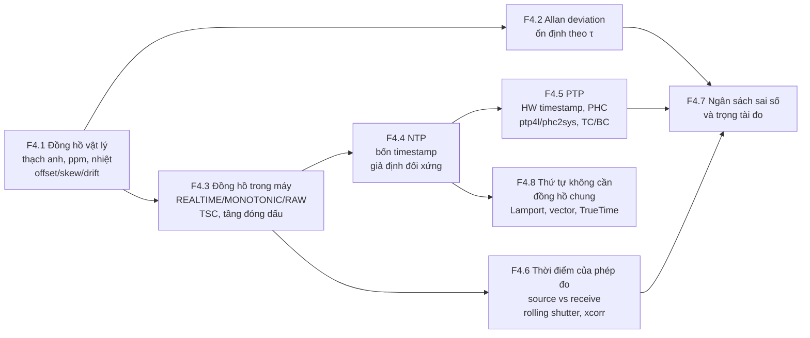
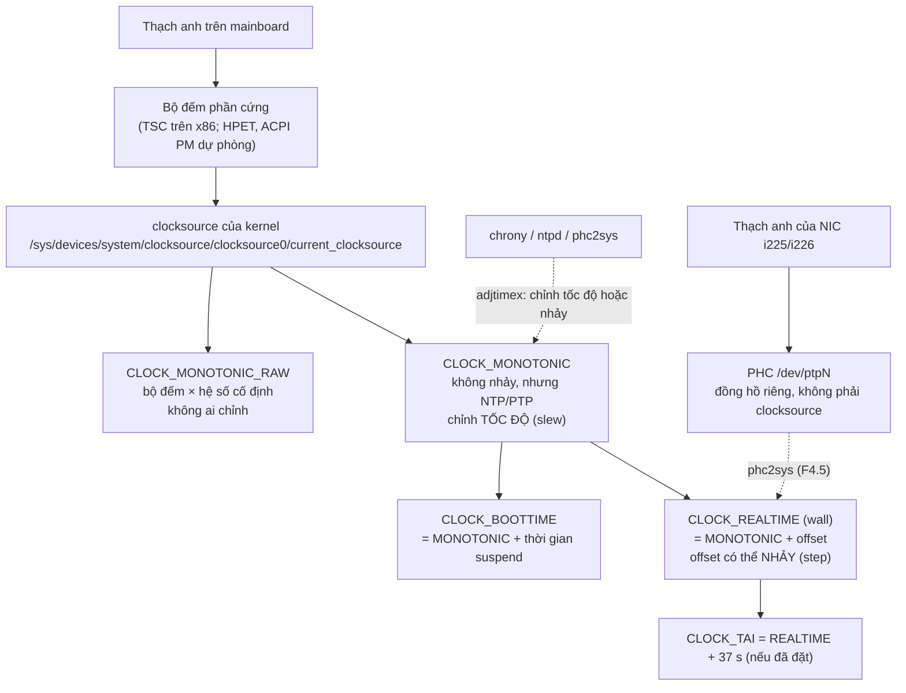
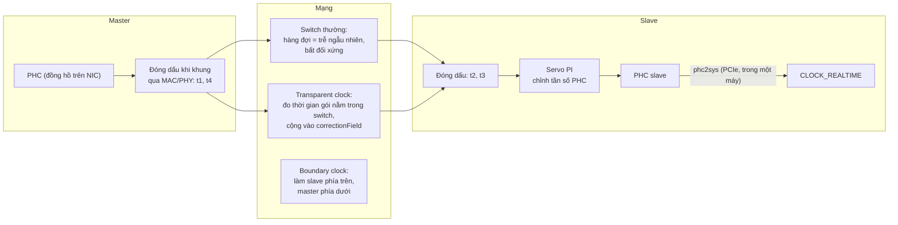
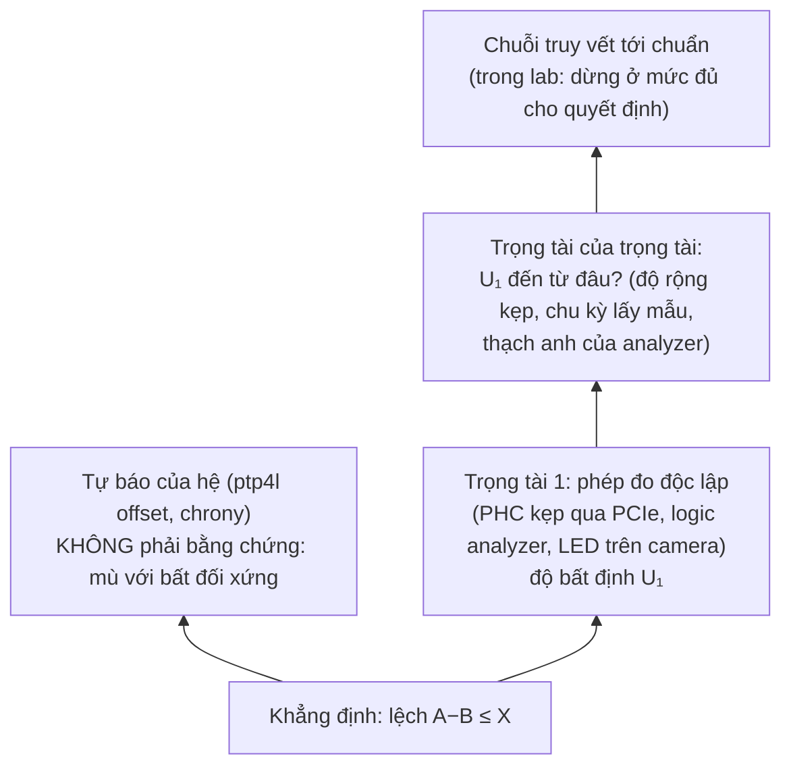

# F4 — Thời gian và đồng hồ (34h)

> Khóa nền, học **đúng lúc**: mở viên nang ngay trước bài chính cần nó (bảng dưới), không đọc một mạch. Tổng 34h = F4.1 5h · F4.2 4h · F4.3 4h · F4.4 3h · F4.5 6h · F4.6 5h · F4.7 4h · F4.8 3h. Một phần số giờ này trùng với phần "khái niệm" của K5 Module 2; phần còn lại cộng thêm vào tổng lộ trình, vốn đã vượt ngân sách 650h (xem `00-lo-trinh-tong.md` và `khoa-7/_KE-HOACH-K7.md` mục 3), không giấu.
>
> **Thuật ngữ dùng xuyên khóa (đã thống nhất ở K2 Bài 2):** *offset* = lệch pha (hai đồng hồ chỉ khác nhau bao nhiêu giây tại một thời điểm); *skew* = lệch tần số (chạy nhanh/chậm hơn nhau bao nhiêu, đơn vị ppm = µs mỗi giây); *drift* = sự thay đổi của skew (theo nhiệt độ, theo tuổi). Tài liệu đo lường tần số gọi skew là *fractional frequency offset* `y` và gọi drift là *frequency drift*; cùng một thứ.

## Vì sao khóa nền này tồn tại

Robot là một hệ phân tán nhỏ: camera, IMU, encoder, ESP32, mini PC, mỗi thứ một miếng thạch anh, không cái nào biết "giờ thật". Toàn bộ giá trị của dữ liệu robot (fusion, học từ demo, so sim với thật) dựa trên câu hỏi "hai mẫu này có thật sự cùng lúc không". Thiếu F4, bạn sẽ hụt ở đúng những chỗ này:

- **K1 Bài 3 câu 9, K1 Bài 13** — tin rằng hai thạch anh "cùng 48 kHz" thì FIFO giữa chúng không bao giờ tràn.
- **K2 Bài 2, Bài 11** — đọc `log_time − stamp` tăng dần và gọi nhầm skew là drift, hoặc nhầm hàng đợi phình với đồng hồ trôi; viết detector "timestamp không đơn điệu" mà không biết nguyên nhân nằm ở tầng nào.
- **K3 Bài 9** — chia RTT cho hai để có độ trễ một chiều mà không biết đó là giả định đối xứng của NTP.
- **K5 Bài 7–12** (Module 2, xương sống của cả lộ trình) — lập ngân sách sai số thời gian, chạy PTP, đo drift theo nhiệt, đo rolling shutter. Bản Gemini của chính module này đã sai ở ba chỗ thuộc F4 (hệ số nhiệt thạch anh, cờ `-p` của ptp4l, công thức số hàng sáng); các bài chính đã sửa, F4 cho bạn lý do để tự bắt được lỗi kiểu đó lần sau.
- **K6 Bài 15** — so quỹ đạo sim với thật mà chưa căn thời gian, rồi gọi sai lệch do căn lệch là "sim-to-real gap".
- **K7 C7.2** — đóng dấu IMU trên robot bằng đồng hồ host lúc nhận, rồi thắc mắc vì sao odometry và camera lệch nhau khi CPU bận.

Bài chính dạy *làm*; F4 dạy *timestamp này đúng tới đâu, sai vì đâu, và ai có quyền nói nó đúng*.

## Mindset cốt lõi

1. **Không có "bây giờ" trong máy tính; chỉ có một ước lượng kèm khoảng sai.** Google phải xây TrueTime cho Spanner (2012) trả về khoảng `[earliest, latest]` thay vì một con số, và Meta khi chuyển datacenter sang PTP cũng đưa ra API trả về "Window of Uncertainty" `{earliest_ns, latest_ns}` (Meta Engineering, 11/2022). Họ tin điều này vì hệ thống giả định "đồng hồ của tôi đúng" đã tạo ra lỗi nhất quán dữ liệu không ai tái tạo được.
2. **Sai số đồng hồ là hàm của thời gian kể từ lần đồng bộ cuối.** Patriot ở Dhahran (1991) không sai vì một lỗi lớn mà vì một lỗi cỡ 1 ppm tích lũy 100 giờ. Một con số "độ chính xác đồng bộ" không ghi "sau bao lâu" là vô nghĩa.
3. **Đóng dấu càng gần sự kiện vật lý càng tốt; mỗi tầng phần mềm thêm một lớp jitter không bù được.** IEEE 1588 ra đời (2002) gần như chỉ để dời chỗ đóng dấu từ phần mềm xuống phần cứng mạng; thuật toán bốn timestamp thì NTP đã có từ thập niên 1980.
4. **Con số đồng bộ do chính hệ đồng bộ tự báo không phải bằng chứng.** Bất đối xứng đường truyền là vô hình với mọi giao thức trao đổi gói; ptp4l phải có tùy chọn `delayAsymmetry` để con người khai báo thứ máy không tự thấy. Cần một trọng tài đo độc lập.
5. **Khi chỉ cần thứ tự, đừng dùng đồng hồ.** Lamport (1978) chỉ ra thứ tự nhân quả lấy được mà không cần đồng hồ chung; Cloudflare mất DNS một phần vào ngày giây nhuận 1/1/2017 vì code tính khoảng thời gian bằng đồng hồ treo tường và nhận về một số âm.

## Bản đồ viên nang



### Học đúng lúc

| Viên nang | Học trước bài chính | Giờ |
|---|---|---|
| F4.1 Đồng hồ vật lý | K1 Bài 3 (câu 9 hai thạch anh), K1 Bài 13 · K2 Bài 2 · K3 Bài 3 · K5 Bài 7, Bài 8, Bài 10 · K7 C7.2 | 5 |
| F4.2 Allan deviation | K5 Bài 10 · K2 Bài 5 (mô hình nhiễu IMU tổng hợp, mục bias instability), Bài 8 (cửa sổ trung bình để thấy trôi gyro) · K5 Bài 4 (gyro: bias vs nhiễu trắng) | 4 |
| F4.3 Đồng hồ trong máy tính | K2 Bài 2, Bài 11 · K3 Bài 14, Bài 17 (`boot_id`, monotonic qua reboot) · K5 Bài 1 (PHC, `ethtool -T`), Bài 9, Bài 13 · K6 Bài 3 (đồng hồ treo tường trong logic) · K7 C7.2 | 4 |
| F4.4 NTP | K3 Bài 8, Bài 9 (RTT/2) · K5 Bài 6, Bài 9 | 3 |
| F4.5 PTP | K5 Bài 1 (chỉ phần PHC và hardware timestamping), K5 Bài 9 | 6 |
| F4.6 Thời điểm của một phép đo cảm biến | K1 Bài 7 · K2 Bài 2 (nên đọc), Bài 11 · K3 Bài 9, Bài 13 · K5 Bài 6, Bài 11, Bài 13 · K6 Bài 15 · K7 C7.2 | 5 |
| F4.7 Ngân sách sai số và trọng tài | K1 Bài 7 · K3 Bài 8, Bài 9 · K5 Bài 1, Bài 2, Bài 7, Bài 12 | 4 |
| F4.8 Thứ tự không cần đồng hồ chung | K5 Bài 8–9 (đọc thêm) · trước khi thiết kế log sự kiện nhiều node ở K7 C7.3 | 3 |

Thứ tự tối thiểu nếu tuần crunch: F4.1 mục 2 + 6 trước K2 Bài 2; F4.4 mục 2 trước K3 Bài 9; F4.5 mục 2 + 6 và F4.7 mục 2 + 6 trước K5 Bài 9. Mục 6 (Lăng kính đánh giá) là phần đáng giữ nhất của mỗi viên nang.

## Bạn đã làm cái này rồi

| Bạn đã làm trong backend/AI-harness | Tên chuẩn | Còn thiếu | Viên nang |
|---|---|---|---|
| Dùng `time.monotonic()` để đo thời lượng, `time.time()` để ghi log | Monotonic vs wall clock (`CLOCK_MONOTONIC`, `CLOCK_REALTIME`) | Monotonic vẫn bị NTP *slew* (chỉnh tốc độ); chỉ `CLOCK_MONOTONIC_RAW` là không. Monotonic chỉ có nghĩa trong một `boot_id` | F4.3 |
| Ghép log nhiều service theo timestamp để dựng trace; thấy span con "bắt đầu trước" span cha | Clock skew trong distributed tracing; quan hệ *happens-before* | Biết cận sai của từng đồng hồ; dùng quan hệ nhân quả (gọi → trả lời) để sắp thứ tự thay vì so giờ | F4.4, F4.8 |
| Dựa vào thứ tự offset trong một partition Kafka thay vì timestamp | Total order do một sequencer (log) cấp, không do đồng hồ | Hiểu vì sao giữa các partition thì không có thứ tự, và khi nào cần vector clock | F4.8 |
| Lease / lock có TTL, timeout dựa trên giờ | Lease (Gray & Cheriton, 1989) — đúng chỉ khi skew giữa các máy có cận | Tính cận đó bằng ppm × thời lượng lease; biết điều gì xảy ra khi VM bị dừng | F4.1, F4.8 |
| Đo latency giữa hai máy bằng hiệu timestamp hai đầu | One-way delay; cần hai đồng hồ đã đồng bộ | Sai số đồng bộ cộng thẳng vào số đo; RTT/2 giả định đối xứng | F4.4, F4.7 |
| Chạy chrony/ntpd trên server mà không nhìn | NTP, clock discipline, file drift (`/var/lib/chrony/drift`, đơn vị ppm) | File đó chính là ước lượng skew của máy bạn; đọc `chronyc tracking` để biết máy tự nhận sai bao nhiêu (và vì sao không tin hẳn) | F4.1, F4.4 |

---

## F4.1 — Đồng hồ vật lý: thạch anh, ppm, nhiệt độ, lão hóa; mô hình offset/skew/drift (5h)

> **Dùng cho:** K1 Bài 3, Bài 13 · K2 Bài 2 · K3 Bài 3 · K5 Bài 7, 8, 10 · K7 C7.2 · **Cần trước:** không (F1.1 nếu muốn phần độ bất định) · **Sau viên nang này bạn đánh giá được:** một con số "ppm" là loại nào (dung sai, hệ số nhiệt, lão hóa), hệ số nhiệt có đúng loại thạch anh không, và "sync X phút một lần là đủ" có đứng được không.

### 1. Câu chuyện

Patriot ở Dhahran (1991) đã kể ở K5 Bài 7: mỗi tick 0,1 s thiếu ~9,5×10⁻⁸ s do 0,1 bị cắt trong thanh ghi 24 bit, sau ~100 giờ lệch ~0,34 s [spec: GAO/IMTEC-92-26; Skeel 1992]. Đổi sang đơn vị viên nang này: 9,5×10⁻⁸ / 0,1 ≈ **1 ppm**. Không thạch anh nào hỏng: một đồng hồ lệch 1 ppm, không ai đặt lại, trong một hệ giả định thời gian của mình đúng.

Gần như mọi đồng hồ bạn gặp là thạch anh [chuẩn]. 32 768 Hz của mọi RTC là 2¹⁵ (chia đôi 15 lần ra 1 Hz); thạch anh âm thoa (tuning fork) ở tần số này nhỏ, rẻ, ít điện, đổi lại nhạy nhiệt — chỗ bản Gemini của K5 đã nhầm (mục 6).

### 2. Mô hình tư duy

**Mô hình ba số hạng.** So với một chuẩn, sai lệch thời gian `x(t)` của một đồng hồ viết được thành:

```
x(t) = x₀  +  y₀·t  +  ½·D·t²  +  ε(t)
       offset  skew     drift      nhiễu (F4.2)
       (s)     (ppm)    (ppm/s, ppm/ngày, hoặc ppm theo °C)
```

```
offset x(t)
  │                                   ╱  drift ≠ 0: đường cong (skew đổi theo nhiệt/tuổi)
  │                               ╱ ╱
  │                          ╱ ╱
  │                   ╱  ╱ ─ ─ ─ ─ ─   skew ≠ 0, drift = 0: đường thẳng, độ dốc = ppm
  │           ╱ ─ ─ ─
  │══════════════════════════════════  chỉ offset: đường ngang (bù một lần là xong)
  └──────────────────────────────────► t (từ lần sync cuối)
```

Đổi đơn vị phải thuộc: `y` ppm = `y` µs mỗi giây = `3,6·y` ms mỗi giờ = `86,4·y` ms mỗi ngày [chuẩn]. Thứ đo được luôn là **hiệu** skew của hai đồng hồ, không phải skew so với "giờ thật".

**Skew đến từ đâu.** Một con số ppm trong datasheet là một trong năm thứ khác nhau; tài liệu kém trộn chúng:

| Thành phần | Nghĩa | Cỡ điển hình | Đặc tính |
|---|---|---|---|
| Frequency tolerance (ở 25 °C) | Lệch lúc xuất xưởng | ±10…±50 ppm [spec: datasheet thông dụng] | Cố định từng con → đo một lần là bù được |
| Frequency stability theo nhiệt | Δf/f trên dải nhiệt làm việc | Xem bảng dưới | Thay đổi khi nhiệt đổi → **drift** |
| Aging | Lệch theo thời gian sử dụng | ±1…±5 ppm/năm đầu [spec: datasheet thông dụng] | Không thấy trong một phiên đo |
| Load capacitance (pulling) | Tụ tải trên board khác tụ nhà sản xuất chỉ định | vài ppm mỗi pF [ước lượng] | "Cùng thạch anh, khác board, khác ppm" |
| Nguồn, rung, sốc | Điện áp nuôi, gia tốc | nhỏ, trừ sốc mạnh | Thường bỏ qua ở mức ppm |

**Hai loại thạch anh, hai đường cong nhiệt — đây là chỗ hay sai nhất.**

| | Tuning-fork 32,768 kHz | AT-cut (MHz: 24, 25, 40 MHz…) |
|---|---|---|
| Có ở đâu | RTC, đồng hồ đeo tay, RTC slow clock tùy chọn của MCU | Clock chính của MCU (ESP32-S3: 40 MHz), NIC (PHC), USB, logic analyzer, CPU |
| Dạng đường cong | **Parabol**: Δf/f = k·(T − T₀)², T₀ ≈ 25 °C | **Bậc ba** (chữ S nằm ngang): Δf/f ≈ a₁·(T − T₀) + a₃·(T − T₀)³, điểm uốn quanh 25–30 °C |
| Hệ số | k ≈ −0,034 ± 0,006 ppm/°C² điển hình, có loại tới −0,04 [spec: datasheet Raltron RT2012, Geyer KX-327S] | a₃ ≈ 10⁻⁴ ppm/°C³ (gần như cố định theo vật lý tinh thể); a₁ phụ thuộc góc cắt, cỡ ±0,1…0,4 ppm/°C [ước lượng; xem Vig, tutorial mục 4] |

Vì sao khác: tuning-fork rung uốn, độ cứng của lát thạch anh đổi theo nhiệt bậc hai; AT-cut rung trượt theo bề dày, góc cắt ~35°15′ được chọn để hệ số bậc một gần 0 quanh nhiệt độ phòng, còn lại đường bậc ba [chuẩn: Vig]. Tốt hơn nữa: TCXO (bù nhiệt, ±0,5…±2 ppm), OCXO (lò ổn nhiệt, cỡ 10⁻⁸) [spec: datasheet thông dụng]. **Dao động RC** trong chip (RTC slow clock mặc định của ESP32-S3) lệch tới phần trăm, không phải ppm [spec: ESP32-S3 TRM, chương Reset and Clock].

Mô phỏng: robot sync lúc khởi động ở 25 °C rồi ấm dần tới ~55 °C; tuning-fork vs AT-cut, có và không bù skew tĩnh.

```python
# [đã chạy] F4.1 — tuning-fork 32,768 kHz (parabol) vs AT-cut MHz (bậc ba): robot nóng 25 → 55 °C
import numpy as np
import matplotlib.pyplot as plt

def tuning_fork(T, k=-0.034, T0=25.0):        # ppm; k điển hình −0,034 ± 0,006 ppm/°C²
    return k * (T - T0) ** 2

def at_cut(T, a1=-0.2, a3=1.0e-4, T0=25.0):   # ppm; a1, a3 [ước lượng] — tra datasheet thật
    return a1 * (T - T0) + a3 * (T - T0) ** 3

OFFSET0 = 8.0                                  # ppm: sai tần số tĩnh ở 25 °C (dung sai xuất xưởng)
t = np.arange(0, 1800.0, 1.0)                  # 30 phút, bước 1 s; sync lúc t = 0
T = 25 + 30 * (1 - np.exp(-t / 300))           # ấm dần tới ~55 °C, hằng số thời gian 5 phút

for name, f in (("tuning-fork", tuning_fork), ("AT-cut", at_cut)):
    y = OFFSET0 + f(T)                         # skew (ppm)
    phase_ms = np.cumsum(y) * 1e-3             # offset (ms) = tích phân skew
    resid_ms = np.cumsum(y - y[0]) * 1e-3      # nếu lúc sync đã bù skew tĩnh: chỉ còn phần nhiệt
    print(f"{name:12s} skew@55°C={y[-1]:+7.2f} ppm | offset 10': {phase_ms[599]:7.2f} ms"
          f" | sau bù: {resid_ms[599]:+7.2f} ms (10'), {resid_ms[-1]:+7.2f} ms (30')")

Ts = np.linspace(-40, 85, 126)                  # vẽ hai đường cong nhiệt cạnh nhau
plt.plot(Ts, tuning_fork(Ts), label="tuning-fork"); plt.plot(Ts, at_cut(Ts), label="AT-cut")
plt.xlabel("°C"); plt.ylabel("Δf/f (ppm)"); plt.legend(); plt.show()
```

Ba câu bản chất: (1) offset là tích phân của skew, nên sai số **lớn dần** kể từ lần sync; (2) bù skew tĩnh xóa số hạng tuyến tính, drift nhiệt thì không, nên chu kỳ sync do drift quyết định, không do ppm datasheet; (3) "thạch anh" không phải một loại: hệ số nhiệt loại này áp cho loại kia có thể sai một bậc.

### 3. Cầu nối từ backend

| Backend bạn biết | Ở đây | Gãy ở chỗ | Nếu dùng nhầm thì |
|---|---|---|---|
| Clock skew giữa server, "chạy NTP là xong" | Mỗi thạch anh có skew riêng, đổi theo nhiệt | NTP chạy liên tục che skew; ESP32 trên robot thường không ai sửa | Ghép IMU (đồng hồ ESP32) với camera (host); sau 1 giờ lệch hàng chục ms, không exception nào |
| Producer/consumer với hàng đợi | Hai đầu chạy theo hai thạch anh (I2S, UART, USB audio) | Backend xả hàng đợi khi tải giảm; chênh tốc độ do ppm là **vĩnh viễn, một chiều** | Tăng buffer chỉ hoãn ngày tràn/cạn; cách đúng: một bên theo clock bên kia, hoặc ASRC |
| Config đúng thì giá trị đúng (`sample_rate=48000`) | Tần số danh định ≠ tần số thật | Tần số thật = ý định × (1 + skew) | Tin hai thiết bị "48 kHz" có cùng số mẫu sau 1 giờ (K1 Bài 3 câu 9) |

**Chấm mô hình:**

- *Mô hình của bạn ở K3 lượt 7:* "mỗi thiết bị có thời gian của chúng... nếu không giới hạn thì thời gian ở mọi thiết bị sẽ lệch nhau... nên phải giới hạn lại". — **ĐÚNG MỘT PHẦN.** Đúng: *mỗi thiết bị có thời gian riêng* — tiền đề của F4. Sai nguyên nhân: tần số tối đa bị chặn bởi critical path và công suất (đã chấm ở K3); thời gian lệch không vì chạy nhanh mà vì mỗi thạch anh rung hơi khác danh định. Phản ví dụ: hai ESP32-S3 cùng 40 MHz danh định, chạy xa dưới trần chip, vẫn lệch vài đến vài chục ppm (K5 Bài 8).
- *"Datasheet ghi ±10 ppm nên đồng hồ của tôi lệch tối đa 10 ppm."* — **ĐÚNG MỘT PHẦN.** ±10 ppm thường là *tolerance ở 25 °C*; nhiệt, aging, tụ tải cộng thêm; và so hai đồng hồ thì hiệu có thể gấp đôi. Phản ví dụ: một con +9, một con −9, ở 50 °C thêm vài ppm: hiệu > 18 ppm.

**Tên chuẩn của thứ bạn đã làm:** file `/var/lib/chrony/drift` trên server của bạn chứa một con số ppm: ước lượng **skew** của thạch anh máy đó, lưu để lần boot sau khỏi học lại [spec: chrony.conf(5), `driftfile`]. Chrony gọi nó là "drift"; luôn đọc theo đơn vị: ppm là skew, ppm/°C hay ppm/ngày là drift. Thứ còn thiếu: con số đó đổi bao nhiêu khi máy nóng lên.

### 4. Thuật ngữ

| Mức | Thuật ngữ | Nghĩa trong một câu | Hay bị hiểu nhầm thành |
|---|---|---|---|
| 🟢 | Offset | Hai đồng hồ khác nhau bao nhiêu tại một thời điểm | Đại lượng cố định |
| 🟢 | Skew (fractional frequency offset, ppm) | Tốc độ chạy khác nhau bao nhiêu; ppm = µs mỗi giây | "Lệch cố định" (đó là offset) |
| 🟢 | Drift | Skew thay đổi theo nhiệt độ/thời gian | Đồng nghĩa với skew (roadmap dùng lẫn) |
| 🟢 | Tolerance vs stability vs aging | Lệch xuất xưởng / theo nhiệt / theo năm | Một con số ppm duy nhất |
| 🟡 | Tuning-fork vs AT-cut | 32,768 kHz parabol vs MHz bậc ba | "Thạch anh có hệ số −0,04 ppm/°C²" (chỉ đúng loại tuning-fork) |
| 🟡 | TCXO / OCXO | Thạch anh có bù nhiệt / trong lò ổn nhiệt | Chỉ có trong thiết bị quân sự |
| 🔴 | Activity dip, hysteresis nhiệt | Nhảy tần số bất thường; lên/xuống nhiệt không trùng đường | Cần ngay (chỉ biết tên, cho K5 Bài 10) |

### 5. Bài tập dự đoán

**Đề.** Dự đoán, commit, rồi mới chạy mô phỏng mục 2:

1. Skew ở ~55 °C mỗi loại (gồm 8 ppm tĩnh).
2. Offset sau 10 phút nếu **không** bù gì. Loại nào lệch nhiều hơn? (Cẩn thận dấu.)
3. Nếu lúc sync đã bù skew tĩnh: phần còn lại sau 10 và 30 phút.
4. Muốn phần còn lại < 1 ms, sync lại sau tối đa bao nhiêu giây?
5. Gemini K5 Bài 10 dùng −0,04 ppm/°C² cho thạch anh ESP32. Tin nó thì chu kỳ sync dài hay ngắn hơn cần thiết, bao nhiêu lần?

**Tham số cần tra:** với phần cứng thật, datasheet thạch anh 40 MHz trên module ESP32-S3 và *ESP32-S3 Hardware Design Guidelines* (mục External Crystal Clock Source); bài này dùng tham số trong code. **Phương pháp:** câu 1 thay T = 55; câu 2 tích phân skew theo thời gian (nhiệt tiến tới 55 theo hàm mũ, trung bình 10 phút thấp hơn 55); câu 4 tìm thời điểm đầu tiên |phần dư| vượt 1 ms.

```markdown
# prediction.md — F4.1
1. skew@55°C: tuning-fork ___ ppm ; AT-cut ___ ppm
2. offset 10' không bù: TF ___ ms ; AT ___ ms ; lớn hơn: ___
3. phần dư sau bù (10'/30'): TF ___/___ ms ; AT ___/___ ms
4. chu kỳ sync để < 1 ms: TF ___ s ; AT ___ s
5. Tin Gemini thì chu kỳ sync ___ (dài/ngắn) hơn cần thiết khoảng ___ lần
Độ tự tin (1–5): ___   Tôi sẽ ngạc nhiên nếu: ___
```

<details><summary>🔒 MỞ SAU KHI COMMIT prediction.md</summary>

Kết quả (tất định):

| | Tuning-fork | AT-cut |
|---|---|---|
| Skew ở ~55 °C | −22,5 ppm (8 − 30,6) | +4,7 ppm (8 − 6 + 2,7) |
| Offset 10 phút, không bù | −2,2 ms | +3,2 ms |
| Phần dư sau bù skew tĩnh, 10 phút / 30 phút | −7,0 / −41,3 ms | −1,6 / −5,6 ms |
| Sync lại sau tối đa (phần dư < 1 ms) | ~250 s | ~420 s |

Câu 2 là bẫy: không bù gì thì tuning-fork lại có |offset| *nhỏ hơn* sau 10 phút, vì phần nhiệt âm triệt tiêu một phần skew tĩnh dương — một phép thử ngắn cho kết luận "loại này tốt hơn" vì tình cờ về dấu. Câu 3 mới là câu đúng: sau khi bù cái bù được, phần nhiệt của tuning-fork lớn hơn AT-cut 4–7 lần (drift thuần nhiệt ở 55 °C: −30,6 vs −3,3 ppm).

Câu 5: dùng −0,04 ppm/°C² (tuning-fork) cho thạch anh 40 MHz AT-cut, bạn dự đoán drift do nhiệt lớn gấp ~10 lần thực tế (với a₁ giả định ở đây), nên chọn chu kỳ sync **ngắn hơn** cần thiết — tốn sync, không nguy hiểm. Chiều ngược lại mới nguy hiểm: đo board AT-cut rồi áp cho RTC 32 kHz → chu kỳ sync quá dài. Ở K5 Bài 10, kỳ vọng "vọt thêm 10–30 ppm" sẽ khiến bạn tưởng thí nghiệm hỏng khi chỉ thấy vài ppm. a₁ ở đây là giả định; đổi a₁ thì số đổi, nhưng AT-cut trong 15–55 °C vẫn lệch cỡ vài ppm còn tuning-fork hàng chục ppm ở hai đầu dải.

</details>

### 6. Lăng kính đánh giá

Checklist khi đọc một khẳng định về độ chính xác đồng hồ:

1. Con số ppm là **loại nào**: tolerance ở 25 °C, stability theo nhiệt, aging, hay hiệu đo giữa hai đồng hồ?
2. Hệ số nhiệt có thuộc **đúng loại dao động** (tuning-fork 32 kHz / AT-cut MHz / TCXO / RC trong chip)?
3. Có ghi **sau bao lâu kể từ lần sync**? ppm × thời gian mới ra giây.
4. Tách phần **bù được** (offset, skew tĩnh) khỏi phần **không bù được bằng một lần đo** (drift nhiệt, nhiễu)?
5. "Lệch 20 ppm" so với chuẩn nào, chuẩn đó lệch bao nhiêu?
6. offset/skew/drift dùng nhất quán? Nếu không, đọc theo đơn vị, không theo chữ.

**ĐÚNG** nếu 1–6 rõ; **SAI** nếu áp hệ số sai loại hoặc nhầm đơn vị; **CHƯA RÕ** nếu thiếu loại ppm hoặc thiếu khoảng thời gian.

**Khẳng định mẫu — tự chấm trước khi mở:**

(a) Bản Gemini K5 Bài 10, phần tự kiểm tra: *"Nếu một robot AMR chạy ngoài trời từ bóng râm (25 °C) ra mặt đường nhựa nắng nóng (55 °C), dựa trên hệ số nhiệt thông thường của thạch anh (k ≈ −0.04 ppm/°C²), điều gì sẽ xảy ra với clock offset..."* (ngữ cảnh: thạch anh của ESP32-S3).

(b) `robotics-data-infra-roadmap.md` mục 3.1: *"Clock drift / skew — Hai đồng hồ chạy lệch nhau dần. Thạch anh thường 20–50 ppm → 20–50 µs lệch mỗi giây → 72–180 ms mỗi giờ. Đây là lý do phải sync."*

(c) Bản Gemini K5 Bài 10, bảng "Số phải ra": *"Phản ứng khi hơ nóng: Drift thay đổi rõ rệt (có thể vọt lên thêm 10–30 ppm hoặc tụt dốc tùy lát cắt thạch anh)."* và *"Quan hệ Drift vs. Nhiệt độ: tạo thành đường cong rõ ràng (parabol hoặc tuyến tính), R² > 0.85."*

<details><summary>🔒 Đáp án</summary>

(a) **SAI** (quy chuẩn mục 7). −0,034…−0,04 ppm/°C² là hệ số parabol của **tuning-fork 32,768 kHz**. Thạch anh 40 MHz của ESP32-S3 là AT-cut, bậc ba, trong 25–55 °C lệch cỡ vài ppm chứ không ~36 ppm. Tra datasheet thật hoặc đo (K5 Bài 10); câu hỏi đúng nếu đổi thành "RTC 32 kHz của robot".

(b) **ĐÚNG MỘT PHẦN.** Đổi đơn vị đúng (20 ppm × 3600 s = 72 ms). Ba chỗ sửa: (1) "drift / skew" dùng lẫn — đây là **skew**; (2) "20–50 ppm" là tolerance thạch anh rẻ nói chung; module ESP32 thường chặt hơn vì WiFi cần tần số chính xác [tự đo: Hardware Design Guidelines], và cái đo được là **hiệu** hai đồng hồ; (3) skew tĩnh bù được bằng một lần ước lượng; lý do phải sync *định kỳ* là drift (nhiệt, aging) và nhiễu.

(c) **ĐÚNG MỘT PHẦN.** "Rõ rệt" đúng nếu nghĩa là lớn hơn sai số ước lượng skew (F4.2). "Vọt thêm 10–30 ppm" là kỳ vọng của tuning-fork, quá lớn cho AT-cut ở 25–55 °C. "Parabol hoặc tuyến tính" bỏ sót dạng đúng **bậc ba**; trong dải hẹp nó gần tuyến tính, fit bậc hai có thể cho R² cao mà hệ số vô nghĩa ngoài dải. R² > 0,85 là Gemini thêm; gate gốc chỉ yêu cầu drift "đổi rõ rệt" và ghi hysteresis nếu có.

</details>

### 7. Câu hỏi ngược

1. **[Vì sao không]** Vì sao không gắn TCXO cho mọi ESP32 trên robot cho xong chuyện?
   <details><summary>Hướng nghĩ</summary>

   Ngân sách sai số (F4.7): nếu đóng dấu đã sai ±1 ms do USB, giảm drift 5 → 0,5 ppm đổi được bao nhiêu khi đằng nào cũng sync mỗi phút? Tiền tiêu vào số hạng lớn nhất.

   </details>
2. **[Quy mô]** 100 robot, mỗi con một ESP32. Phân bố skew giữa các con trông thế nào, và một hằng số bù "trung bình đội" có ích gì không?
   <details><summary>Hướng nghĩ</summary>

   Tolerance ngẫu nhiên giữa các con, cố định trong một con: trung bình đội ~0 trong khi từng con ±10 ppm. Bù theo từng thiết bị, lưu theo `device_id` + firmware.

   </details>
3. **[Failure mode]** Robot đứng sạc ở 25 °C, sync lúc khởi động, chạy 20 phút ngoài nắng, quay về. Dữ liệu ghép IMU–camera tốt ở đầu và cuối, tệ ở giữa. Một detector kiểm offset chỉ ở đầu và cuối episode sẽ thấy gì?
   <details><summary>Hướng nghĩ</summary>

   Offset là tích phân của skew; skew đi ra rồi quay về thì offset không về 0 nhưng có thể nhỏ ở cuối. Hai điểm không thấy được đường cong; cần sự kiện chung định kỳ.

   </details>
4. **[Phản biện]** "ppm nhỏ thế, robot chỉ chạy 30 phút một episode, bỏ qua được." Tính cho trường hợp nào thì đúng, trường hợp nào thì sai.
   <details><summary>Hướng nghĩ</summary>

   So skew × thời lượng với dung sai của ứng dụng: log nhiệt 1 Hz vs ghép IMU 200 Hz vs VIO quay 3 rad/s (sai góc = ω × Δt).

   </details>

### 8. Liên kết ra ngoài

- **GPS.** Đồng hồ vệ tinh chạy nhanh hơn mặt đất ~38 µs/ngày do hiệu ứng tương đối (≈ 4,4×10⁻¹⁰), được chỉnh tần số trước khi phóng; không chỉnh thì × tốc độ ánh sáng ≈ 11 km/ngày sai vị trí [chuẩn: Ashby, Living Reviews in Relativity 2003]. Giống: sai tần số nhỏ × thời gian × hệ số khuếch đại lớn. Khác: ở GPS nguyên nhân biết trước; trên robot drift nhiệt phải đo.

### 9. Áp vào khóa chính

- **K1 Bài 3 câu 9, Bài 13:** trên một link I2S bên nhận dùng BCLK của bên phát nên không trôi; trôi xuất hiện giữa hai miền clock độc lập (ổn định buffer không thay được ASRC/clock chung).
- **K2 Bài 2:** độ dốc `log_time − stamp` đọc ra ppm; cong theo giờ trong ngày thì nghĩ tới nhiệt.
- **K3 Bài 3:** thạch anh 24 MHz của analyzer (vài chục ppm) nhỏ hơn tiêu chí 1% nhiều bậc — không cần trọng tài tốt hơn.
- **K5 Bài 7:** dòng "drift thạch anh" ghi loại thạch anh, dải nhiệt, thời gian từ sync. **K5 Bài 8:** độ dốc fit là *hiệu skew* hai ESP32. **K5 Bài 10:** kỳ vọng bậc ba/gần tuyến tính quanh phòng cho clock 40 MHz; thấy parabol rõ thì kiểm đang đo đồng hồ nào (RTC slow clock hay esp_timer).
- **K7 C7.2:** chọn chu kỳ sync ESP32 ↔ host theo drift đo được ở nhiệt độ làm việc thật của robot, không theo ppm datasheet.

### 10. Độ tin cậy

| Khẳng định | Nhãn | Ghi chú / cách kiểm |
|---|---|---|
| Patriot: ~0,34 s sau ~100 giờ, 9,5×10⁻⁸ s/tick (≈ 1 ppm) | [spec] | Skeel 1992; GAO/IMTEC-92-26; chi tiết ở K5 Bài 7 |
| Tuning-fork k ≈ −0,034 ± 0,006 ppm/°C², T₀ = 25 ± 5 °C | [spec] | Datasheet tuning-fork 32,768 kHz (ví dụ Raltron RT2012); có loại −0,036, −0,04 |
| AT-cut: bậc ba, a₃ ≈ 10⁻⁴ ppm/°C³, a₁ theo góc cắt | [chuẩn] / [ước lượng] cho số | Vig; tra datasheet của bạn |
| ESP32-S3: thạch anh 40 MHz cho clock chính; RTC slow clock mặc định là RC nội; dung sai yêu cầu | [spec] / [tự đo] cho dung sai | ESP32-S3 TRM chương clock; Hardware Design Guidelines |
| Tolerance ±10…±50 ppm, aging ±1…±5 ppm/năm | [spec] | Datasheet thông dụng; đổi theo hãng |
| Kết quả mô phỏng mục 5 | [đã chạy] | a₁, a₃ là giả định; reviewer chạy lại khớp |

Đã sửa so với bản gốc/Gemini: (Gemini K5 Bài 10) −0,04 ppm/°C² áp cho thạch anh MHz → hệ số tuning-fork 32 kHz; AT-cut bậc ba, lệch nhỏ hơn nhiều trong dải phòng (quy chuẩn mục 7); "vọt thêm 10–30 ppm khi hơ nóng" → vài ppm cho AT-cut, tự đo. (Roadmap 3.1) "drift/skew" dùng lẫn → tách theo thuật ngữ thống nhất.

Reviewer sửa: rút câu chuyện Patriot thành trỏ về K5 Bài 7 (tránh kể lại); câu AT-cut "góc cắt triệt tiêu bậc một và bậc hai" → góc cắt làm hệ số bậc một gần 0, đường còn lại bậc ba.

### 11. Đọc thêm và tự kiểm tra

- **Nguồn gốc:** John R. Vig, *Quartz Crystal Resonators and Oscillators for Frequency Control and Timing Applications — A Tutorial* (U.S. Army) — phần đường cong nhiệt theo góc cắt và aging.
- **Giải thích:** một datasheet tuning-fork 32,768 kHz (mục Frequency-temperature) đặt cạnh datasheet thạch anh 40 MHz trên module của bạn.
- **Đào sâu (tùy chọn):** R. Skeel, *Roundoff Error and the Patriot Missile* (SIAM News, 1992).
- **Tự kiểm tra:** (1) giải thích vì sao "đã NTP" trên server không giúp gì cho IMU trên ESP32; (2) vẽ lại hình ba đường offset; (3) câu hỏi:

  Hai ESP32 lệch nhau 12 ppm. Ghép dữ liệu theo timestamp của từng con, không sync lại. Sau 40 phút, hai mẫu "cùng lúc" thật ra cách nhau bao lâu? IMU 200 Hz thì đó là bao nhiêu mẫu?
  <details><summary>Đáp án</summary>

  12 µs/s × 2400 s = 28,8 ms ≈ 5,8 mẫu ở 200 Hz (chu kỳ 5 ms). Đây chỉ là phần skew; nếu nhiệt đổi trong 40 phút, cộng thêm phần drift.

  </details>

---

## F4.2 — Đo độ ổn định: Allan deviation, vì sao độ lệch chuẩn không đủ (4h)

> **Dùng cho:** K5 Bài 10 · K2 Bài 5 (nhiễu IMU tổng hợp) · K5 Bài 4 (gyro đứng yên) · **Cần trước:** F4.1, F1.2 · **Sau viên nang này bạn đánh giá được:** một con số "độ ổn định" của đồng hồ hoặc IMU có ý nghĩa không (ở thang thời gian nào), một cửa sổ ước lượng skew/bias dài bao nhiêu là hợp lý, và một khẳng định kiểu "lấy trung bình lâu hơn sẽ chính xác hơn" đúng tới đâu.

### 1. Câu chuyện

Thập niên 1960, các phòng thí nghiệm so đồng hồ nguyên tử với nhau và gặp chuyện vô lý: càng ghi lâu, độ lệch chuẩn của tần số đo được càng **lớn**, không hội tụ. Nguyên nhân: nhiễu tần số của bộ dao động không phải nhiễu trắng; nó có thành phần flicker (1/f) và random walk, mà với các loại nhiễu đó phương sai thông thường phụ thuộc vào độ dài chuỗi — nó không phải một tính chất của đồng hồ mà là của thí nghiệm. David W. Allan (NBS, nay là NIST) đề xuất năm 1966 dùng phương sai của **hiệu hai trung bình liên tiếp** thay cho phương sai quanh trung bình chung [chuẩn: D. W. Allan, *Statistics of Atomic Frequency Standards*, Proc. IEEE 54(2), 1966]. Đại lượng đó hội tụ cho mọi loại nhiễu đồng hồ thực tế, và vẽ theo thang thời gian τ thì cho biết luôn *loại* nhiễu. Nó thành chuẩn ngành (IEEE Std 1139) và được ngành con quay mượn nguyên văn để đặc tả IMU (IEEE Std 952) [chuẩn].

Gần bạn hơn: IMU tổng hợp ở K2 Bài 5 (`np.random.normal` + bias tuyến tính) có std đẹp và ổn định. Gyro MEMS thật đứng yên một đêm thì trung bình phút đầu và phút cuối khác nhau nhiều hơn σ/√N dự đoán, vì bias "đi dạo". Std không thấy chuyện đó; Allan deviation thấy.

### 2. Mô hình tư duy

**Định nghĩa bằng lời:** chia chuỗi tần số (hoặc tốc độ góc của gyro) thành các khối dài τ, lấy trung bình mỗi khối, rồi hỏi: **hai khối liên tiếp khác nhau bao nhiêu?** Allan variance là một nửa trung bình bình phương của hiệu đó:

```
σ_y²(τ) = ½ · ⟨ (ȳ_{k+1} − ȳ_k)² ⟩          (ȳ_k = trung bình khối thứ k, mỗi khối dài τ)
```

Viết theo phase `x` (sai lệch thời gian, F4.1): `σ_y²(τ) = ⟨(x_{k+2} − 2x_{k+1} + x_k)²⟩ / (2τ²)` — sai phân bậc hai, nên một offset hằng *và* một skew hằng đều bị triệt tiêu; chỉ phần thay đổi còn lại. Đây chính là câu hỏi người làm đồng bộ quan tâm: "nếu tôi ước lượng tần số trong τ giây rồi dùng nó cho τ giây tiếp theo, sai bao nhiêu?"

**Đọc độ dốc trên đồ thị log–log** (với y là tần số; với gyro thay y bằng tốc độ góc):

```
log σ_y(τ)
  │╲  τ^-1   white PM: jitter của timestamp (ISR, USB) — trung bình cực có lợi
  │ ╲
  │  ╲╲  τ^-1/2  white FM: nhiễu trắng trên tần số / "angle random walk" của gyro
  │    ╲╲___
  │         ‾‾‾‾───  τ^0  flicker FM: sàn — "bias instability" của gyro; trung bình thêm vô ích
  │                 ╱
  │               ╱  τ^+1/2  random walk FM / "rate random walk": trung bình lâu hơn còn HẠI
  │             ╱ ╱  τ^+1   drift tuyến tính (nhiệt, aging)
  └──────────────────────────► log τ
       điểm thấp nhất = cửa sổ ước lượng tốt nhất
```

[chuẩn: W. J. Riley, *Handbook of Frequency Stability Analysis*, NIST SP 1065, 2008, bảng các loại nhiễu]. Vì sao std không đủ: std của chuỗi là **một con số**, trộn tất cả thang thời gian; với random walk nó còn lớn dần theo độ dài chuỗi, tức là nó đo độ dài thí nghiệm của bạn chứ không đo đồng hồ.

Một hệ quả bạn dùng ngay ở K5: nếu chỉ có jitter timestamp σ_x độc lập (white PM), sai phân bậc hai có phương sai `(1 + 4 + 1)·σ_x² = 6σ_x²`, nên `σ_y(τ) = √3·σ_x/τ`. Jitter ISR 1 µs, τ = 100 s → 1,7×10⁻⁸ = 0,017 ppm [ước lượng: suy từ định nghĩa]. Jitter cỡ mili-giây (đóng dấu lúc host nhận qua USB) → lớn hơn ba bậc. Chỗ bạn đóng dấu (F4.3, F4.6) quyết định cửa sổ phải dài bao nhiêu.

Mô phỏng: ba chuỗi tần số (white FM, random walk FM, tổng), tính overlapping Allan deviation bằng tay, so với std.

```python
# [đã chạy] F4.2 — Allan deviation: white FM (τ^−1/2) vs random-walk FM (τ^+1/2); std thì không phân biệt được
import numpy as np
import matplotlib.pyplot as plt
rng = np.random.default_rng(42)
tau0, N = 1.0, 200_000                       # 1 mẫu tần số/giây, ~55 giờ

def adev(y, tau0, ms):
    """Overlapping Allan deviation từ chuỗi tần số tương đối y (đã chia đều tau0)."""
    x = np.concatenate([[0.0], np.cumsum(y) * tau0])        # phase (s) = tích phân tần số
    out = []
    for m in ms:
        d = x[2*m:] - 2*x[m:-m] + x[:-2*m]                 # sai phân bậc hai của phase
        out.append(np.sqrt(np.mean(d**2) / (2 * (m*tau0)**2)))
    return np.array(out)

wfm  = 1e-6 * rng.standard_normal(N)                       # white FM: 1 ppm mỗi mẫu, độc lập
rwfm = 1e-8 * np.cumsum(rng.standard_normal(N))            # random walk FM: tần số "đi bộ ngẫu nhiên"
mix  = wfm + rwfm

ms = np.unique(np.logspace(0, np.log10(N // 20), 30).astype(int))
for name, y in (("white FM", wfm), ("random walk FM", rwfm), ("tổng", mix)):
    a = adev(y, tau0, ms)
    slope = np.polyfit(np.log10(ms[:8]), np.log10(a[:8]), 1)[0]
    slope_hi = np.polyfit(np.log10(ms[-8:]), np.log10(a[-8:]), 1)[0]
    print(f"{name:15s} std(1 giờ đầu)={np.std(y[:3600]):.2e}  std(cả chuỗi)={np.std(y):.2e}"
          f"  dốc τ nhỏ={slope:+.2f}  dốc τ lớn={slope_hi:+.2f}  min ADEV={a.min():.1e} tại τ={ms[a.argmin()]} s")
    plt.loglog(ms * tau0, a, "o-", ms=3, label=name)
plt.xlabel("τ (s)"); plt.ylabel("σ_y(τ)"); plt.grid(which="both", alpha=.3); plt.legend()
plt.show()
```

Muốn dùng thư viện thay vì tự viết: gói `allantools` (Python) có `oadev`, `mdev`, `tdev` [tự đo: kiểm tên hàm theo phiên bản cài]. Tự viết một lần để hiểu, rồi dùng thư viện để có khoảng tin cậy.

### 3. Cầu nối từ backend

| Backend bạn biết | Ở đây | Gãy ở chỗ | Nếu dùng nhầm thì |
|---|---|---|---|
| Latency p99 / std trên dashboard 1 giờ | Allan deviation theo τ | Metric backend thường giả định quá trình dừng (stationary): đo lâu hơn thì ước lượng tốt hơn. Đồng hồ/IMU có nhiễu không dừng; std phụ thuộc độ dài cửa sổ | Báo "độ ổn định 0,2 ppm" từ 10 phút dữ liệu, rồi thấy 2 ppm sau một đêm và tưởng phần cứng hỏng |
| Moving average để làm mượt metric | Ước lượng skew/bias bằng cửa sổ trượt | Ở backend cửa sổ dài chỉ làm chậm phản ứng; ở đây cửa sổ dài hơn điểm cực tiểu Allan làm ước lượng **tệ hơn** (random walk, drift lấn vào) | Chọn cửa sổ ước lượng bias gyro 10 phút "cho chắc", ước lượng còn kém hơn cửa sổ 1 phút |
| So hai phiên benchmark bằng hiệu trung bình | Allan variance = phương sai của hiệu hai trung bình liên tiếp | Rất gần nhau! Đây chính là "A/A test" ở mọi thang thời gian. Khác: Allan quét mọi τ và đọc độ dốc để biết *loại* nhiễu | Chỉ so ở một thang, bỏ sót trôi chậm (benchmark sáng vs chiều khác nhau vì nhiệt phòng máy) |

**Chấm mô hình:**

- *"Thêm dữ liệu thì ước lượng luôn chính xác hơn."* — **ĐÚNG MỘT PHẦN.** Đúng cho nhiễu trắng (σ/√N). Sai khi có random walk hoặc drift: sau điểm cực tiểu Allan, kéo dài cửa sổ làm ước lượng tệ đi. Phản ví dụ: một gyro có bias đi dạo — trung bình cả đêm cho bias của *cả đêm*, không phải bias lúc bạn dùng nó.
- *"Std của gyro đứng yên là chỉ số chất lượng của gyro."* — **SAI** như một chỉ số độc lập. Std phụ thuộc băng thông (bộ lọc DLPF, ODR) và độ dài ghi. Datasheet đặc tả bằng *noise density* (°/s/√Hz) và, với IMU tốt, bằng ARW và bias instability đọc từ đồ thị Allan. Phản ví dụ: đổi DLPF từ 20 Hz sang 200 Hz, std tăng ~√10 lần, gyro vẫn là gyro đó.

**Tên chuẩn của thứ bạn đã làm:** chạy benchmark ở hai thời điểm để xem có ổn không là đang dò thang thời gian mà nhiễu còn trắng; Allan deviation là phiên bản có hệ thống (*stability analysis*). Thứ còn thiếu: đọc độ dốc để biết nhiễu nào trội và cửa sổ nào tối ưu.

### 4. Thuật ngữ

| Mức | Thuật ngữ | Nghĩa trong một câu | Hay bị hiểu nhầm thành |
|---|---|---|---|
| 🟢 | Allan deviation σ_y(τ) | Hai trung bình liên tiếp dài τ khác nhau bao nhiêu (RMS/√2) | Một con số duy nhất |
| 🟢 | τ (averaging time) | Độ dài khối trung bình | Thời lượng thí nghiệm |
| 🟡 | White PM / white FM / flicker FM / random walk FM | Bốn loại nhiễu, dốc −1, −1/2, 0, +1/2 | Mọi nhiễu đều "trắng" |
| 🟡 | ARW, bias instability, rate random walk (IMU) | Ba điểm đọc trên đồ thị Allan của gyro | Thông số tự do của nhà sản xuất |
| 🟡 | Noise density (°/s/√Hz, µg/√Hz) | Nhiễu trắng chuẩn hóa theo băng thông | Std |
| 🟡 | Overlapping ADEV | Dùng mọi khối chồng nhau, ít nhiễu ước lượng hơn | Một phương pháp khác |
| 🔴 | Modified ADEV, TDEV, MTIE | Biến thể phân biệt white/flicker PM, sai số thời gian cho viễn thông | Cần cho lộ trình này |

### 5. Bài tập dự đoán

**Đề.** Với ba chuỗi trong mô phỏng (white FM σ = 1 ppm mỗi mẫu 1 s; random walk FM bước 0,01 ppm mỗi giây; tổng), dự đoán trước khi chạy:

1. Độ dốc log–log ở τ nhỏ và τ lớn của mỗi chuỗi.
2. Std của 1 giờ đầu so với std của cả ~55 giờ: chuỗi nào hai con số gần bằng nhau, chuỗi nào khác xa? Khác bao nhiêu lần (cỡ)?
3. Với chuỗi tổng: τ tại cực tiểu và giá trị cực tiểu.
4. Áp vào K5 Bài 10: bạn ước lượng skew giữa hai ESP32 bằng fit đường thẳng trong cửa sổ W. Jitter timestamp là 1 µs (ISR) hoặc 1 ms (host nhận qua USB). Với W = 120 s, 1 điểm/giây, sai số chuẩn của độ dốc là bao nhiêu ppm trong mỗi trường hợp?

**Tham số cần tra:** không (dùng tham số trong code). Với IMU thật của bạn ở K5 Bài 4: noise density và bias instability trong datasheet (bảng Gyroscope/Accelerometer specifications). **Phương pháp:** câu 3: white FM cho `σ₁/√τ`; random walk FM với bước q mỗi giây cho `q·√(τ/3)` [chuẩn: Riley, SP 1065]; đặt hai biểu thức bằng nhau để tìm giao điểm τ*; ở giao điểm hai thành phần độc lập cộng bình phương. Câu 4: sai số chuẩn độ dốc của hồi quy tuyến tính `σ_slope = σ_x·√(12 / (N·W²))` với N điểm trải đều trên W (→ F1.6).

```markdown
# prediction.md — F4.2
1. dốc (nhỏ/lớn): white FM ___/___ ; RWFM ___/___ ; tổng ___/___
2. std 1h vs cả chuỗi: white FM ___ ; RWFM ___ (gấp ~___ lần)
3. chuỗi tổng: τ* ≈ ___ s ; ADEV min ≈ ___
4. σ_slope W=120 s: jitter 1 µs → ___ ppm ; jitter 1 ms → ___ ppm
Độ tự tin (1–5): ___   Tôi sẽ ngạc nhiên nếu: ___
```

<details><summary>🔒 MỞ SAU KHI COMMIT prediction.md</summary>

Kết quả khi chạy (seed 42):

| Chuỗi | std 1 giờ đầu | std cả chuỗi | dốc τ nhỏ | dốc τ lớn | min ADEV |
|---|---|---|---|---|---|
| white FM | 1,00e−6 | 1,00e−6 | −0,50 | −0,48 | (giảm mãi) |
| random walk FM | 1,6e−7 | 7,7e−7 | +0,44 | +0,39 | — |
| tổng | 1,02e−6 | 1,26e−6 | −0,50 | +0,38 | 1,1e−7 tại τ ≈ 160 s |

- Std của white FM không phụ thuộc độ dài chuỗi; std của random walk tăng ~5 lần từ 1 giờ lên 55 giờ (và sẽ tăng nữa nếu ghi lâu hơn). Đó là lý do Allan phải phát minh đại lượng mới.
- Dốc random walk đo được +0,4 thay vì +0,5 lý thuyết: một lần chạy random walk có phương sai ước lượng lớn ở τ lớn (ít khối độc lập). Đọc độ dốc trên vài thập kỷ τ, đừng tin hai điểm cuối.
- Giao điểm lý thuyết: σ₁/√τ = q·√(τ/3) → τ* = √3·σ₁/q = √3 × 100 ≈ 173 s; ở đó mỗi thành phần ≈ 7,6e−8, tổng (cộng bình phương) ≈ 1,07e−7. Mô phỏng: 1,1e−7 tại ~160 s.
- Câu 4: jitter 1 µs → ~0,003 ppm; jitter 1 ms → ~2,6 ppm. Cùng phương pháp, cùng cửa sổ, khác ba bậc chỉ vì chỗ đóng dấu. Với 1 ms jitter, cửa sổ 120 s **không đủ** để thấy drift vài ppm theo nhiệt của AT-cut (F4.1); với ISR timestamp thì dư sức.

</details>

### 6. Lăng kính đánh giá

Checklist khi đọc một khẳng định về độ ổn định (đồng hồ, IMU, hay metric bất kỳ có trôi):

1. Con số ổn định đi kèm **thang thời gian τ** nào? "0,1 ppm" ở τ = 1 s và ở τ = 1 giờ là hai khẳng định khác nhau.
2. Là std, Allan deviation, hay noise density? Có băng thông/ODR đi kèm không?
3. Độ dài dữ liệu đủ không? Ước lượng ở τ cần ít nhất ~10 khối τ độc lập.
4. Loại nhiễu nào trội ở τ quan tâm (đọc độ dốc)? Nhiễu trắng thì trung bình có ích; random walk/drift thì không.
5. Cửa sổ ước lượng (bias, skew) được chọn có căn cứ (gần cực tiểu Allan) hay theo cảm giác?
6. Phép đo có chứa jitter timestamp (white PM) che mất thứ đang đo ở τ nhỏ không?

**Khẳng định mẫu — tự chấm trước khi mở:**

(a) Bản Gemini K5 Bài 12, bảng ngân sách, dòng biến thiên nhiệt: *"Sai số của phép đo: Sai số cửa sổ trượt (≈ 1 – 2 ppm)"* (ngữ cảnh: skew ước lượng bằng cửa sổ trượt 120 s từ timestamp ESP32 ở Bài 10).

(b) Bản Gemini K5 Bài 10, bảng "Nếu ra khác": *"Đồ thị Drift vs. T nhảy loạn xạ: cửa sổ trượt tính đạo hàm quá ngắn (< 30 s), khiến interrupt jitter lấn át độ dốc trôi thật. → Tăng cửa sổ trượt lên để triệt tiêu nhiễu jitter ngẫu nhiên."*

(c) K2 Bài 5 (đáp án đã gập trong bài chính): *"Trung bình k mẫu nhiễu trắng có σ/√k ... Cửa sổ 1,5–2 s là đủ (nhưng cửa sổ dài làm mờ biến đổi nhanh; với gyro thật, bias instability làm phép tính này lạc quan)."*

<details><summary>🔒 Đáp án</summary>

(a) **CHƯA RÕ → thường SAI.** Sai số ước lượng skew phụ thuộc chỗ đóng dấu: với timestamp esp_timer trong ISR (jitter ~µs), cửa sổ 120 s cho sai số cỡ phần nghìn ppm, không phải 1–2 ppm; chỉ khi dùng timestamp host nhận qua USB (jitter ~ms) con số 1–2 ppm mới hợp lý. Một ngân sách phải ghi phương pháp cho ra con số, không thì không chấm được. Thiết kế của K5 Bài 8 (host chỉ để *ghép cạnh*, esp_timer để *đo*) chính là để rơi vào trường hợp tốt.

(b) **ĐÚNG MỘT PHẦN.** Ở τ nhỏ, jitter (white PM, dốc −1) thật sự trội và tăng cửa sổ có ích. Nhưng "tăng lên" không có điểm dừng là sai: cửa sổ dài hơn hằng số thời gian thay đổi nhiệt sẽ làm mờ chính drift bạn đang muốn thấy (trong thí nghiệm sốc nhiệt, drift *là* tín hiệu, không phải nhiễu). Cách chọn có căn cứ: vẽ Allan deviation của chuỗi offset lúc nhiệt ổn định để biết từ τ nào jitter hết trội, rồi chọn cửa sổ ngắn nhất vượt qua τ đó.

(c) **ĐÚNG.** Đúng cả hai nửa: σ/√k cho nhiễu trắng, và cảnh báo rằng bias instability (sàn phẳng trên đồ thị Allan) làm σ/√k lạc quan khi k lớn. Thứ có thể thêm: con số "đủ" nên kiểm bằng Allan deviation của dữ liệu gyro thật thay vì giả định trắng.

</details>

### 7. Câu hỏi ngược

1. **[Vì sao không]** Vì sao không dùng std của hiệu các mẫu liên tiếp (sai phân bậc một) thay cho Allan (sai phân bậc hai của phase)?
   <details><summary>Hướng nghĩ</summary>

   Sai phân bậc một của tần số *là* Allan ở τ = τ₀. Câu hỏi thật là: vì sao làm việc với *trung bình khối* ở nhiều τ — vì thông tin nằm ở cách con số đổi theo τ. Sai phân bậc hai của phase xóa offset và skew hằng; bậc một của phase chỉ xóa offset.

   </details>
2. **[Quy mô]** 100 robot ghi IMU đứng yên 10 phút mỗi lần khởi động để ước lượng bias. Với 1000 giờ dữ liệu, bạn có thể học được gì về đội IMU mà một datasheet không cho?
   <details><summary>Hướng nghĩ</summary>

   Phân bố bias instability theo con, theo nhiệt, theo tuổi; con nào lệch khỏi đội (dấu hiệu hỏng). Nhưng 10 phút chỉ cho τ tới ~1 phút với đủ khối — không thấy random walk dài hạn. Muốn thấy phải có vài phiên dài.

   </details>
3. **[Failure mode]** Dataset của bạn có channel `gyro_bias_estimate` tính bằng trung bình 30 s lúc robot đứng yên. Firmware mới đổi ODR từ 200 Hz lên 1 kHz và bật DLPF khác. Con số nào trong pipeline âm thầm sai?
   <details><summary>Hướng nghĩ</summary>

   Noise density giữ nguyên nhưng std mẫu đổi theo băng thông; mọi ngưỡng "std > X là hỏng" trong detector giờ sai. Bias ước lượng thì vẫn đúng nếu cửa sổ tính theo giây, sai nếu tính theo số mẫu.

   </details>
4. **[Liên ngành]** Trong tài chính, "volatility scaling" giả định biến động tăng theo √thời gian. Đó là giả định loại nhiễu nào, và khi nào nó gãy?
   <details><summary>Hướng nghĩ</summary>

   Giá là random walk → lợi nhuận là nhiễu trắng → √t. Gãy khi lợi nhuận có tương quan (mean reversion hoặc momentum) — đúng như đọc độ dốc khác ±1/2 trên đồ thị Allan.

   </details>

### 8. Liên kết ra ngoài

- **Định vị quán tính (hàng không, tàu ngầm).** IEEE Std 952 dùng Allan variance để đặc tả con quay quang học; ARW và bias instability là hai con số đầu tiên người ta nhìn khi chọn IMU [chuẩn]. Giống hệt cách đọc ở đây (thay tần số bằng tốc độ góc). Khác: họ có bàn quay và buồng nhiệt để tách từng thành phần.
- **Viễn thông.** Mạng đồng bộ (SDH, 5G fronthaul) đặc tả wander bằng TDEV và MTIE — họ hàng của Allan theo thời gian thay vì tần số (ITU-T G.810 và họ chuẩn G.82x) [chuẩn]. Giống: đặc tả theo thang thời gian. Khác: họ quan tâm sai số pha cực đại trong cửa sổ, không chỉ RMS.

### 9. Áp vào khóa chính

- **K5 Bài 10:** trước khi hơ nóng, vẽ Allan deviation của chuỗi offset trong 2 giờ baseline. Từ đó chọn cửa sổ trượt (thay cho con số 120 s cảm tính) và ghi sai số skew của cửa sổ đó vào ngân sách Bài 12.
- **K5 Bài 4:** gyro đứng yên 1 giờ (nếu được, một đêm) → Allan → đọc ARW và bias instability, so với datasheet. Quyết định: cửa sổ ước lượng bias lúc khởi động robot dài bao nhiêu.
- **K2 Bài 5:** nếu muốn IMU tổng hợp "giống thật" hơn, thêm một thành phần random walk vào bias và kiểm bằng Allan rằng đồ thị có đủ ba đoạn.
- **K7 C7.2 / C8:** tham số nhiễu IMU cho bộ lọc (covariance) lấy từ Allan của chính IMU trên robot, không từ datasheet.

### 10. Độ tin cậy

| Khẳng định | Nhãn | Ghi chú / cách kiểm |
|---|---|---|
| Allan 1966, Proc. IEEE 54(2) | [chuẩn] | — |
| Độ dốc −1, −1/2, 0, +1/2, +1 cho các loại nhiễu | [chuẩn] | Riley, NIST SP 1065, 2008 |
| White PM: σ_y(τ) = √3·σ_x/τ (σ_x jitter độc lập mỗi mẫu) | [chuẩn] | Suy trực tiếp từ định nghĩa; kiểm bằng mô phỏng thêm một chuỗi jitter |
| RWFM: σ_y = q·√(τ/3) | [chuẩn] | Riley SP 1065; kiểm bằng mô phỏng mục 5 |
| IEEE Std 952 dùng Allan cho con quay | [chuẩn] | — |
| `allantools` có `oadev` | [tự đo] | Kiểm theo phiên bản cài |
| Kết quả mô phỏng | [đã chạy] | seed 42 |

Đã sửa so với Gemini: (K5 Bài 12) "sai số cửa sổ trượt ≈ 1–2 ppm" không kèm phương pháp → phụ thuộc chỗ đóng dấu, với timestamp ISR nhỏ hơn ba bậc; (K5 Bài 10) "tăng cửa sổ trượt để triệt tiêu jitter" → chọn cửa sổ theo cực tiểu Allan, vì cửa sổ dài làm mờ chính drift theo nhiệt.

Reviewer sửa: phản ví dụ ở Chấm mô hình lộ τ tối ưu của bài tập mục 5 → thay bằng phản ví dụ không lộ số; chạy lại mô phỏng (seed 42), số trong khối 🔒 khớp.

### 11. Đọc thêm và tự kiểm tra

- **Nguồn gốc:** W. J. Riley, *Handbook of Frequency Stability Analysis*, NIST Special Publication 1065 (2008), miễn phí trên trang NIST — chương 5 (các loại nhiễu, độ dốc).
- **Giải thích:** D. W. Allan, *Statistics of Atomic Frequency Standards*, Proc. IEEE 54(2), 1966 — đọc phần mở đầu để thấy vấn đề ông gặp.
- **Đào sâu (tùy chọn):** IEEE Std 952 (phụ lục về Allan variance cho con quay), hoặc một application note về Allan variance của hãng IMU bạn dùng.
- **Tự kiểm tra:** (1) giải thích cho một backend engineer vì sao std của một chuỗi random walk "không phải tính chất của đồng hồ"; (2) vẽ lại sơ đồ năm độ dốc từ trí nhớ; (3) câu hỏi:

  Đồ thị Allan của gyro: tại τ = 1 s đọc 0,005 °/s, dốc −1/2 tới τ ≈ 50 s rồi phẳng ở 0,0007 °/s. Ước lượng bias bằng trung bình 10 s và bằng trung bình 10 phút — cái nào tốt hơn?
  <details><summary>Đáp án</summary>

  Trung bình 10 s: σ ≈ 0,005/√10 ≈ 0,0016 °/s (vẫn trên dốc −1/2). Trung bình 10 phút: đã ở vùng phẳng, ≈ 0,0007 °/s — tốt hơn khoảng 2 lần nhưng không phải √60 lần như nhiễu trắng hứa. Quá vùng phẳng (nếu có dốc +1/2) thì cửa sổ dài còn tệ hơn. Cửa sổ ~1 phút đã lấy gần hết lợi ích.

  </details>

---

## F4.3 — Đồng hồ trong máy tính: wall/monotonic/raw, TSC, clocksource, timestamp ở kernel/driver/app (4h)

> **Dùng cho:** K2 Bài 2, Bài 11 · K3 Bài 14, Bài 17 · K5 Bài 1, Bài 9, Bài 13 · K6 Bài 3 · K7 C7.2 · **Cần trước:** F4.1 · **Sau viên nang này bạn đánh giá được:** một timestamp trong log/MCAP đến từ đồng hồ nào, có thể nhảy hay bị chỉnh tốc độ không, có so được với timestamp của máy khác/lần boot khác không, và mang theo trễ của tầng nào.

### 1. Câu chuyện

Nửa đêm UTC ngày 1/1/2017 có một giây nhuận. Một phần DNS của Cloudflare bắt đầu lỗi: code Go của họ lấy hai lần `time.Now()`, trừ nhau để có thời lượng, và vì đồng hồ treo tường bị kéo lùi một giây, kết quả là **âm**; con số âm đi vào một hàm sinh số ngẫu nhiên vốn chỉ nhận số dương và làm tiến trình panic [chuẩn: Cloudflare blog, *How and why the leap second affected Cloudflare DNS*, 1/2017]. Sau sự cố đó (và nhiều báo cáo tương tự), Go 1.9 (8/2017) thay đổi `time.Time` để mang thêm một số đọc **monotonic** ẩn, và phép trừ hai thời điểm dùng số đó [chuẩn: Go 1.9 release notes; thiết kế của Russ Cox]. Năm năm trước đó, giây nhuận 30/6/2012 đã làm nhiều server Linux treo CPU 100% vì một lỗi trong cách kernel xử lý timer quanh giây nhuận (Reddit, Mozilla và nhiều hệ Java/MySQL bị ảnh hưởng) [chuẩn].

Bài học không phải "giây nhuận nguy hiểm" (năm 2022 CGPM đã quyết định bỏ giây nhuận chậm nhất vào 2035 [chuẩn]). Bài học là: **trong một máy có nhiều đồng hồ, mỗi cái hứa một điều khác nhau**, và code chọn nhầm cái thì đúng 364 ngày một năm.

### 2. Mô hình tư duy

**Từ thạch anh tới `time.time()`** (Linux x86, đơn giản hóa):



Lời hứa của từng đồng hồ [spec: `man 2 clock_gettime`]:

| Đồng hồ | Có nhảy? | Bị chỉnh tốc độ? | Qua suspend | Qua reboot / sang máy khác | Dùng cho |
|---|---|---|---|---|---|
| `CLOCK_REALTIME` | Có (đặt giờ tay, NTP step, giây nhuận) | Có | Tiếp tục | **So được** (nếu đã đồng bộ) | Timestamp dữ liệu nhiều máy, giờ con người đọc |
| `CLOCK_MONOTONIC` | Không | **Có** (slew) | Dừng | Không — gốc là lúc boot | Thời lượng, timeout trong một tiến trình |
| `CLOCK_MONOTONIC_RAW` | Không | Không | Dừng | Không | Đo tần số thô của phần cứng, so sánh đồng hồ |
| `CLOCK_BOOTTIME` | Không | Có | **Tính cả** | Không | Thời lượng khi máy có thể ngủ |
| PHC `/dev/ptpN` | Có thể (ptp4l step) | Có (servo) | — | So được nếu PTP | Hardware timestamp gói mạng (F4.5) |

**Tầng đóng dấu.** Cùng một gói tin hay một dòng serial, timestamp khác nhau tùy *ai* đọc đồng hồ và *lúc nào*:

```
sự kiện ──► [phần cứng] ──► [driver/kernel] ──► [hàng đợi socket/tty] ──► [scheduler] ──► [app: time.time()]
             HW timestamp     SW timestamp          chờ                       chờ          app timestamp
             (NIC: PHC)       (SO_TIMESTAMPNS)                                              (+ USB polling ~1 ms,
             ±ns              ±µs                                                            + jitter scheduler)
```

Với USB-serial (ESP32-S3 qua USB Full Speed), kernel không đóng dấu từng byte; host poll thiết bị theo khung 1 ms [spec: USB 2.0, full speed frame 1 ms], nên timestamp phía app mang thêm 0–1 ms lượng tử cộng jitter scheduler. Đó là lý do K5 Bài 8 đóng dấu **trên ESP32** (esp_timer trong ISR) và chỉ dùng thời gian host để ghép cặp. Với Ethernet, `SO_TIMESTAMPING` cho lấy timestamp phần cứng của NIC [spec: kernel `Documentation/networking/timestamping.rst`]; `ethtool -T <iface>` cho biết NIC hỗ trợ gì và PHC nào.

**Ba con số về biểu diễn** (đo trên máy của bạn ở mục 5): đọc đồng hồ qua vDSO tốn cỡ chục ns khi clocksource là `tsc` [ước lượng; nếu rơi về `hpet` thì thành syscall, chậm hơn nhiều]; `float64` giây Unix hiện nay chỉ phân giải được bước cỡ một phần tư µs; `int64` nano-giây tràn vào năm 2262. ROS 2 và MCAP dùng số nguyên ns [spec: `builtin_interfaces/Time`, MCAP spec].

**TSC và vì sao nó đáng tin bây giờ.** Bộ đếm chu kỳ CPU từng đổi tốc độ theo tần số CPU và dừng khi CPU ngủ sâu; CPU hiện đại có *invariant TSC* (cờ `constant_tsc`, `nonstop_tsc` trong `/proc/cpuinfo`): đếm đều bất kể P-state/C-state [chuẩn]. Kernel tự kiểm tra và có thể loại TSC nếu thấy không ổn (dmesg: "clocksource tsc unstable"), rơi về HPET [chuẩn]. Trong VM, clocksource thường là `kvm-clock`.

### 3. Cầu nối từ backend

| Backend bạn biết | Ở đây | Gãy ở chỗ | Nếu dùng nhầm thì |
|---|---|---|---|
| `time.time()` cho log, `time.monotonic()` cho duration | Như vậy, cộng `boot_id` và biết monotonic bị slew | Backend hiếm khi so monotonic giữa hai lần boot hay hai máy; robot thì rút điện liên tục (K3 Bài 17) | Trừ `mono_ns` của hai boot khác nhau → thời lượng âm hoặc khổng lồ |
| `created_at` do DB server gán | Mỗi message mang timestamp của nơi sinh ra nó | Ở backend một đồng hồ (DB) gán mọi thứ nên thứ tự nhất quán; ở robot mỗi node một đồng hồ, không có "DB" trung tâm | Sắp dữ liệu nhiều node theo timestamp, tưởng đó là thứ tự thật (→ F4.8) |
| Request timestamp ở load balancer vs ở app | Tầng đóng dấu: HW / kernel / app | Backend coi hiệu vài ms là "latency của tầng"; ở đây hiệu đó **là** sai số của timestamp nếu bạn cần biết lúc sự kiện vật lý xảy ra | Dùng timestamp app làm thời điểm cảm biến lấy mẫu; sai bằng toàn bộ trễ pipeline + jitter |
| Epoch milliseconds trong JSON | Số nguyên ns, `int64` | JSON number là float64 trong nhiều parser (JavaScript) | Timestamp ns đi qua một tool JS bị làm tròn tới ~256 ns, không báo lỗi |

**Chấm mô hình:**

- *"`CLOCK_MONOTONIC` không bao giờ bị NTP đụng tới."* — **SAI.** Nó không *nhảy*, nhưng tốc độ của nó bị NTP/PTP chỉnh (slew) [spec: `man 2 clock_gettime`, mục CLOCK_MONOTONIC]. Python còn làm rối thêm: `time.get_clock_info("monotonic").adjustable` trả `False` — ý là "không thể bị đặt lại", không phải "không bị chỉnh tốc độ". Phản ví dụ: khi chrony đang kéo một offset lớn về, đo cùng một khoảng 10 s bằng `MONOTONIC` và `MONOTONIC_RAW` cho hai số khác nhau một lượng bằng tốc độ slew.
- *"Timestamp càng nhiều chữ số (ns) càng chính xác."* — **SAI.** Đơn vị ns là quyết định biểu diễn; độ chính xác do tầng đóng dấu quyết định (F1.1: resolution ≠ accuracy). Một timestamp ns đóng ở app sau USB có độ bất định cỡ ms.

**Tên chuẩn của thứ bạn đã làm:** khi bạn ghi cả `wall` và `mono_ns` cho mỗi sự kiện (K3 Bài 14 đã yêu cầu), đó là mẫu *dual timestamp* — một đồng hồ để so giữa các máy và với người, một đồng hồ để đo khoảng. Go làm đúng điều đó bên trong `time.Time` từ bản 1.9. Thứ còn thiếu: `boot_id` để biết hai `mono_ns` có cùng gốc không, và ghi **nguồn** đồng hồ (`clock_source` trong metadata MCAP theo `CONVENTIONS.md`).

### 4. Thuật ngữ

| Mức | Thuật ngữ | Nghĩa trong một câu | Hay bị hiểu nhầm thành |
|---|---|---|---|
| 🟢 | Wall clock (`CLOCK_REALTIME`) | Giờ UTC của máy, có thể nhảy | "Giờ đúng" |
| 🟢 | Monotonic | Không lùi trong một lần boot; vẫn bị slew | "Không bị chỉnh" |
| 🟢 | Step vs slew | Nhảy giá trị vs đổi tốc độ để bắt kịp dần | Một thứ |
| 🟢 | Tầng đóng dấu (HW / kernel / app) | Ai đọc đồng hồ, lúc nào | Không quan trọng nếu cùng một máy |
| 🟢 | `boot_id` | UUID của lần boot hiện tại | Không cần nếu đã có wall clock |
| 🟡 | `CLOCK_MONOTONIC_RAW`, `CLOCK_BOOTTIME`, `CLOCK_TAI` | Raw không slew / tính cả suspend / không giây nhuận | Đồ trang trí |
| 🟡 | clocksource, TSC, invariant TSC, HPET | Bộ đếm phần cứng kernel dùng | Thứ chỉ người viết kernel cần |
| 🟡 | vDSO | Đọc đồng hồ không cần syscall | Tối ưu vi mô vô nghĩa |
| 🟡 | `SO_TIMESTAMPING`, `ethtool -T` | Lấy timestamp NIC/kernel cho gói tin | Chỉ dùng cho PTP |
| 🔴 | timekeeping core, `adjtimex` chi tiết, NTP kernel PLL | Cơ chế kernel chỉnh đồng hồ | Cần cho lộ trình này |

### 5. Bài tập dự đoán

**Đề.** Chạy script dưới trên laptop (Linux; macOS chạy được phần lớn, Windows thì không có các hằng `CLOCK_*`). Trước khi chạy, dự đoán:

1. clocksource hiện tại của máy bạn.
2. `clock_getres` của các đồng hồ.
3. Bước dương nhỏ nhất giữa hai lần đọc liên tiếp và trung vị bước — con số đó đo *cái gì*: độ phân giải của đồng hồ, hay thứ khác?
4. p99,99 của bước — vì sao lớn hơn trung vị nhiều bậc?
5. Bước biểu diễn của `float64` giây ở thời điểm hiện tại; năm `int64` ns tràn.

**Tham số cần tra:** `cat /sys/devices/system/clocksource/clocksource0/{current,available}_clocksource`; `grep -o -w 'constant_tsc\|nonstop_tsc' /proc/cpuinfo | sort -u`. **Phương pháp:** câu 5: `float64` có 52 bit phần định trị; giá trị ~1,8×10⁹ nằm giữa 2³⁰ và 2³¹, nên bước = 2^(30−52) giây.

```python
# [đã chạy] F4.3 — đồng hồ trong máy của bạn: độ phân giải khai báo vs bước nhỏ nhất thật, giá một lần đọc,
# và float64 giây mất bao nhiêu độ chính xác ở thời điểm hiện tại
import time, numpy as np, platform

CLOCKS = {"realtime": time.CLOCK_REALTIME, "monotonic": time.CLOCK_MONOTONIC}
if hasattr(time, "CLOCK_MONOTONIC_RAW"):
    CLOCKS["monotonic_raw"] = time.CLOCK_MONOTONIC_RAW
if hasattr(time, "CLOCK_BOOTTIME"):
    CLOCKS["boottime"] = time.CLOCK_BOOTTIME

print(platform.system(), platform.release())
try:
    print("clocksource:", open("/sys/devices/system/clocksource/clocksource0/current_clocksource").read().strip())
except OSError:
    print("clocksource: (không đọc được — không phải Linux?)")

for name, cid in CLOCKS.items():
    N = 200_000
    t = np.empty(N, dtype=np.int64)
    for i in range(N):                       # đọc liên tiếp, không làm gì khác
        t[i] = time.clock_gettime_ns(cid)
    d = np.diff(t)
    nz = d[d > 0]
    print(f"{name:14s} getres={time.clock_getres(cid)*1e9:5.0f} ns | bước>0 nhỏ nhất={nz.min():5d} ns"
          f" | trung vị Δ={np.median(d):5.0f} ns | p99.99 Δ={np.percentile(d, 99.99):8.0f} ns | Δ<0: {(d < 0).sum()}")

now = time.time()
print(f"float64 giây ở {now:.0f}: bước biểu diễn = {np.spacing(now)*1e9:.0f} ns")
print(f"int64 ns tràn năm ≈ {1970 + (2**63 - 1) / 1e9 / 86400 / 365.2425:.0f}")
```

```markdown
# prediction.md — F4.3
1. clocksource: ___
2. getres: ___ ns
3. bước nhỏ nhất ___ ns, trung vị ___ ns; con số này đo: ___
4. p99.99 ≈ ___ ; vì: ___
5. float64 bước ≈ ___ ns ; int64 ns tràn năm ___
Độ tự tin (1–5): ___   Tôi sẽ ngạc nhiên nếu: ___
```

<details><summary>🔒 MỞ SAU KHI COMMIT prediction.md</summary>

Kết quả trên máy soạn bài (một VM Linux 6.x, clocksource `tsc`, có `constant_tsc`/`nonstop_tsc`) — máy bạn sẽ khác về số, không khác về hình dạng:

| Đồng hồ | getres | bước > 0 nhỏ nhất | trung vị Δ | p99,99 Δ | Δ < 0 |
|---|---|---|---|---|---|
| realtime | 1 ns | 158 ns | 196 ns | ~37 µs | 0 |
| monotonic | 1 ns | 165 ns | 181 ns | ~24 µs | 0 |
| monotonic_raw | 1 ns | 167 ns | 183 ns | ~24 µs | 0 |
| boottime | 1 ns | 164 ns | 180 ns | ~23 µs | 0 |

- `getres` = 1 ns là độ phân giải *khai báo*. Bước ~160–200 ns là **chi phí một vòng lặp Python** (gọi hàm, tạo số nguyên, ghi mảng), không phải độ phân giải đồng hồ: dụng cụ đo (vòng lặp) thô hơn thứ được đo. Viết bằng C bạn sẽ thấy bước cỡ chục ns. Đây là F1.1 ở dạng thuần phần mềm.
- p99,99 cỡ chục µs: tiến trình bị scheduler ngắt, ngắt cứng, hoặc (trong VM) hypervisor lấy CPU. Đó chính là jitter mà mọi timestamp đóng ở tầng app mang theo — và nó không nằm ở trung vị.
- `float64` ở ~1,79×10⁹ s: bước 2⁻²² s ≈ **238 ns**. Lưu thời gian Unix dạng `float` giây trong pandas/JSON/CSV là tự cắt độ chính xác xuống dưới mức µs; với PTP (chục ns) thì mất hết. `int64` ns tràn năm **2262**.
- Δ < 0 bằng 0 cho cả `realtime` trong lần chạy này vì không có NTP step xảy ra trong 1 giây đo; điều đó không chứng minh realtime không lùi.

</details>

### 6. Lăng kính đánh giá

Checklist khi đọc một timestamp, một trường thời gian trong schema, hoặc một khẳng định về đồng hồ:

1. **Đồng hồ nào** (REALTIME/MONOTONIC/RAW/BOOTTIME/PHC/đồng hồ MCU)? Có ghi trong metadata không?
2. **Tầng nào** đóng dấu (phần cứng cảm biến / MCU ISR / kernel / app sau hàng đợi)?
3. Có thể **nhảy** không? Có bị **slew** không? Lúc ghi có chrony/phc2sys đang chạy không?
4. Có so được **qua reboot / qua máy** không (`boot_id`, đồng bộ)?
5. **Biểu diễn**: số nguyên ns hay float giây? Đi qua tool nào có thể làm tròn?
6. Khẳng định có phân biệt "không lùi" với "không bị chỉnh" không?

**Khẳng định mẫu — tự chấm trước khi mở:**

(a) Bản Gemini K3 (Bài 14): *"`CLOCK_MONOTONIC`: Không bao giờ chạy lùi, dùng để đo chính xác thời lượng xử lý... `CLOCK_REALTIME` (Wall clock): Có thể nhảy lùi do NTP đồng bộ, nhưng bắt buộc phải có để đối chiếu với giờ thực tế."*

(b) Bản Gemini K7 (bảng "Nếu ra khác"): *"Audit tool Khóa 2 báo lỗi timestamp không đơn điệu → đang dùng `CLOCK_REALTIME` bị dịch lùi do NTP đồng bộ lại trong lúc xe đang chạy → Chuyển sang đóng dấu thời gian bằng `CLOCK_MONOTONIC` hoặc sử dụng trực tiếp timer phần cứng của vi điều khiển."*

(c) `robotics-data-infra-roadmap.md` mục 3.1: *"Robotics mặc định nanosecond từ UNIX epoch. int64 ns hết tràn năm 2262. float64 giây mất độ chính xác — chỉ còn ~µs ở thời điểm hiện tại."*

<details><summary>🔒 Đáp án</summary>

(a) **ĐÚNG MỘT PHẦN.** Hai vế đều đúng về hướng. Thiếu: "đo chính xác thời lượng" bằng MONOTONIC vẫn chịu slew của NTP (sai cỡ ppm tới hàng trăm ppm khi đang kéo offset); cần thời lượng phần cứng thật thì dùng `MONOTONIC_RAW`. Và "nhảy lùi do NTP" chỉ xảy ra khi daemon *step* (chrony mặc định chỉ step ở vài lần cập nhật đầu nếu cấu hình `makestep`; offset nhỏ thì slew) [tự đo: `man chrony.conf`, `makestep`]; nguyên nhân nhảy thường gặp hơn trên thiết bị mới boot là lúc đồng hồ được đặt lần đầu (RTC sai, máy không có pin RTC).

(b) **ĐÚNG MỘT PHẦN.** Sửa được triệu chứng "không đơn điệu", nhưng phá chỗ khác: MONOTONIC của mini PC và timer của MCU là hai trục thời gian **không so được** với nhau, với máy khác, hay qua reboot. Dữ liệu nhiều nguồn cần một trục chung: đóng dấu ở nguồn bằng đồng hồ cục bộ ổn định *và* ghi ánh xạ sang trục chung (REALTIME đã đồng bộ, hoặc trục của recorder) kèm `boot_id`; chặn NTP step khi đang ghi (chỉ slew). Ngoài ra, nguyên nhân "NTP kéo lùi" phải được kiểm (log chrony), không giả định: hàng đợi, ghép sai channel hay `header.stamp` mặc định 0 cũng gây không đơn điệu (K2 Bài 11).

(c) **ĐÚNG**, với một chỉnh độ chính xác: bước `float64` hiện nay ≈ 0,24 µs, tức "dưới µs", và sẽ thành 0,48 µs sau năm 2038 (khi vượt 2³¹ s). Cụm "mất độ chính xác" đúng tinh thần: không dùng float giây cho dữ liệu cần đồng bộ cỡ µs trở xuống.

</details>

### 7. Câu hỏi ngược

1. **[Vì sao không]** Vì sao không đóng dấu mọi thứ bằng `CLOCK_MONOTONIC_RAW` cho "sạch", rồi tính trục chung sau?
   <details><summary>Hướng nghĩ</summary>

   Làm được, và có người làm vậy. Cái giá: phải ghi kèm ánh xạ RAW → trục chung theo thời gian (offset và skew thay đổi), và mọi người đọc dữ liệu phải áp ánh xạ đó. Nghĩ về provenance (F3.8): ánh xạ là một artifact phải có phiên bản.

   </details>
2. **[Failure mode]** Robot không có pin RTC. Boot lên, mini PC nghĩ hôm nay là năm 1970 (hoặc ngày build image) cho tới khi có mạng. Dữ liệu ghi trong 40 giây đầu sẽ trông thế nào trong MCAP, và detector nào của K2 bắt được?
   <details><summary>Hướng nghĩ</summary>

   Một bước nhảy khổng lồ về phía trước khi chrony step; mọi message trước đó có timestamp năm 1970. Detector đơn điệu có thể không thấy (nhảy tới, không lùi); detector "timestamp hợp lý so với ngày ghi" thì thấy. Phòng: chờ đồng bộ trước khi ghi, hoặc ghi MONOTONIC + boot_id và hậu xử lý.

   </details>
3. **[Quy mô]** 100 robot, 1000 giờ dữ liệu. Bao nhiêu phần trăm episode có ít nhất một bước step đồng hồ, nếu mỗi robot reboot 3 lần/ngày và mỗi lần chrony step một lần trong 2 phút đầu?
   <details><summary>Hướng nghĩ</summary>

   Phụ thuộc episode có bắt đầu trong 2 phút đầu sau boot không. Tính tỉ lệ thời gian "nguy hiểm" trên tổng thời gian chạy. Quyết định thiết kế: cấm ghi trong cửa sổ đó, hay chấp nhận và gắn cờ.

   </details>
4. **[Liên ngành]** Hệ thống giao dịch tài chính dùng PTP và đóng dấu ở NIC. Vì sao họ không chấp nhận timestamp ở tầng app, dù app chỉ trễ vài µs?
   <details><summary>Hướng nghĩ</summary>

   Quy định (MiFID II, F4.7) yêu cầu truy vết về UTC với dung sai và độ phân giải cụ thể; jitter tầng app có đuôi không chặn được (p99,99 ở mục 5). Thứ không chặn được thì không cam kết được.

   </details>

### 8. Liên kết ra ngoài

- **Cơ sở dữ liệu.** `NOW()` trong PostgreSQL trả thời điểm bắt đầu transaction, không phải lúc gọi; `clock_timestamp()` mới là lúc gọi [spec: PostgreSQL docs, Date/Time Functions]. Giống: "timestamp nào" là câu hỏi ngữ nghĩa, không chỉ kỹ thuật. Khác: ở DB đồng hồ là của một máy; ở robot thì nhiều.

### 9. Áp vào khóa chính

- **K2 Bài 2, Bài 11:** khi gặp `log_time − stamp` âm hoặc không đơn điệu, liệt kê đồng hồ và tầng của *từng* trường trước khi đặt giả thuyết.
- **K3 Bài 14, 17:** `wall` + `mono_ns` + `boot_id` cho mọi sự kiện; chỉ trừ `mono_ns` trong cùng `boot_id`.
- **K5 Bài 1:** `ethtool -T` để biết PHC nào gắn với cổng nào; `current_clocksource` vào lab notebook. **K5 Bài 9:** trọng tài dùng `PTP_SYS_OFFSET_EXTENDED` với CLOCK_REALTIME làm đồng hồ trung chuyển — hiểu vì sao giá trị của nó triệt tiêu. **K5 Bài 13:** `log_time` từ REALTIME đã đồng bộ, ghi thêm MONOTONIC nếu muốn đo trễ không bị nhảy.
- **K6 Bài 3:** `time.time()` trong nhánh logic phá determinism; trong sim, đồng hồ phải là đồng hồ sim (`use_sim_time`) [tự đo: theo bản ROS 2 Jazzy].
- **K7 C7.2:** quyết định timestamp IMU được đóng ở ESP32 (nguồn) hay ở host (nhận), và ghi quyết định đó vào metadata.

### 10. Độ tin cậy

| Khẳng định | Nhãn | Ghi chú / cách kiểm |
|---|---|---|
| Ngữ nghĩa các `CLOCK_*` (MONOTONIC bị slew, RAW không) | [spec] | `man 2 clock_gettime` |
| Cloudflare 1/1/2017: thời lượng âm từ đồng hồ treo tường gây panic | [chuẩn] | Blog Cloudflare 1/2017 |
| Go 1.9 thêm monotonic reading vào `time.Time` | [spec] | Go 1.9 release notes, package `time` doc mục "Monotonic Clocks" |
| Sự cố giây nhuận 2012 trên Linux | [chuẩn] | Nhiều báo cáo công khai; chi tiết lỗi kernel không trình bày ở đây |
| CGPM 2022 quyết định bỏ giây nhuận chậm nhất 2035 | [chuẩn] | Nghị quyết 4, CGPM lần thứ 27 |
| USB Full Speed khung 1 ms | [spec] | USB 2.0 spec |
| Chi phí đọc đồng hồ qua vDSO cỡ chục ns | [ước lượng] / [tự đo] | Viết vòng lặp C để đo |
| chrony `makestep` và tốc độ slew mặc định | [tự đo] | `man chrony.conf` theo bản cài |
| Bước float64 ~238 ns, int64 ns tràn 2262 | [đã chạy] | Mục 5 |

Đã sửa so với Gemini: (K3 Bài 14) "MONOTONIC dùng để đo chính xác thời lượng" → bị slew, dùng RAW khi cần tốc độ phần cứng thật; (K7) "chuyển sang CLOCK_MONOTONIC để sửa timestamp không đơn điệu" → monotonic không so được giữa máy/boot, phải ghi ánh xạ sang trục chung và kiểm nguyên nhân trước.

### 11. Đọc thêm và tự kiểm tra

- **Nguồn gốc:** `man 2 clock_gettime`; tài liệu kernel `Documentation/networking/timestamping.rst` (phần SO_TIMESTAMPING).
- **Giải thích:** tài liệu package `time` của Go, mục "Monotonic Clocks" — một trang, giải thích rõ nhất vì sao một kiểu thời gian cần hai đồng hồ.
- **Đào sâu (tùy chọn):** bài blog Cloudflare về giây nhuận 2017 (tìm theo tiêu đề *How and why the leap second affected Cloudflare DNS*).
- **Tự kiểm tra:** (1) giải thích cho một backend engineer vì sao "đã dùng monotonic" chưa đủ cho dữ liệu nhiều máy; (2) vẽ lại sơ đồ đồng hồ ở mục 2; (3) câu hỏi:

  Log có `mono_ns` và `boot_id`. Hai sự kiện: A (`boot_id` = X, `mono_ns` = 9,0×10¹²), B (`boot_id` = Y, `mono_ns` = 2,0×10¹¹). B xảy ra trước hay sau A?
  <details><summary>Đáp án</summary>

  Không biết từ hai trường đó. Khác `boot_id` thì `mono_ns` không cùng gốc; phải dùng `wall` (và tin nó tới mức đồng hồ đã đồng bộ) hoặc thứ tự boot ghi ở nơi khác.

  </details>

---

## F4.4 — NTP: bốn timestamp, giả định đối xứng, giới hạn (3h)

> **Dùng cho:** K3 Bài 8, Bài 9 · K5 Bài 6, Bài 9 · **Cần trước:** F4.1, F4.3 · **Sau viên nang này bạn đánh giá được:** một con số "độ chính xác NTP" hay "độ trễ một chiều = RTT/2" đúng trong điều kiện nào, sai số tối đa có thể chứng minh được là bao nhiêu, và khi nào NTP đủ cho ứng dụng của bạn.

### 1. Câu chuyện

David Mills bắt đầu NTP từ đầu thập niên 1980 trên những đường mạng mà trễ một chiều thay đổi hàng trăm mili-giây; RFC 958 (1985) là bản đầu, NTPv4 là RFC 5905 (2010) [chuẩn]. Bài toán ông gặp không giải được một cách tuyệt đối: client gửi một gói, server trả lời kèm giờ của nó, nhưng giờ đó đã cũ đi một khoảng bằng trễ đường về — mà trễ đường về chưa biết. Cristian (1989) chỉ ra cái có thể làm: thời điểm server đọc đồng hồ nằm *đâu đó* trong khoảng round-trip, nên sai số bị chặn bởi một nửa round-trip; và **những lần trao đổi nhanh nhất cho cận chặt nhất** [chuẩn: F. Cristian, *Probabilistic Clock Synchronization*, Distributed Computing 3(3), 1989]. NTP biến ý đó thành một bộ lọc: trong 8 mẫu gần nhất, tin mẫu có delay nhỏ nhất [spec: RFC 5905, clock filter algorithm].

Thứ NTP không bao giờ sửa được, và chính Mills ghi rõ: nếu đường đi và đường về dài khác nhau một cách *cố định*, sai lệch đó biến thành offset và không phép đo nào trong giao thức thấy được. Bạn sẽ gặp lại nguyên văn câu này ở PTP (F4.5) và ở K3 Bài 9 (RTT/2 trên USB).

### 2. Mô hình tư duy

**Bốn timestamp** (tên theo RFC 5905):

```
 client (đồng hồ C)                         server (đồng hồ S)
   T1 ── gửi request ──────── d_up ──────────► T2   nhận
                                               │  (xử lý)
   T4 ◄─ nhận reply ───────── d_down ───────── T3   gửi

 θ (offset của server so với client, ước lượng) = [(T2 − T1) + (T3 − T4)] / 2
 δ (round-trip delay, không tính thời gian xử lý)  = (T4 − T1) − (T3 − T2)
```

Với θ_thật là offset thật: `T2 − T1 = θ_thật + d_up`, `T4 − T3 = d_down − θ_thật`. Thay vào:

```
θ = θ_thật + (d_up − d_down)/2          ← sai số = nửa bất đối xứng
δ = d_up + d_down
⇒ |θ − θ_thật| ≤ δ/2                     ← cận cứng, không cần giả định gì
```

Ba điều rút ra [chuẩn]: (1) **δ/2 là cận sai số chứng minh được** của một lần trao đổi, bất kể mạng có đối xứng không; (2) nếu đối xứng, sai số bằng 0 dù δ lớn — nên "độ chính xác" thực tế nằm giữa 0 và δ/2 tùy bất đối xứng; (3) hàng đợi thường làm trễ *một chiều* tăng (upload nặng, WiFi), nên bất đối xứng do hàng đợi lớn lên đúng khi δ lớn — bộ lọc delay nhỏ nhất khai thác điều này.

**Từ một mẫu tới đồng hồ được kỷ luật.** NTP không nhảy đồng hồ mỗi lần đo; nó đưa offset đã lọc vào một vòng điều khiển (PLL/FLL) chỉnh *tốc độ* đồng hồ (F4.3: slew) và học skew của thạch anh (F4.1) [spec: RFC 5905 mục clock discipline]. Mỗi tầng stratum cộng thêm sai số; NTP báo *root delay* và *root dispersion* để cộng dồn cận sai số về nguồn gốc (GPS, đồng hồ nguyên tử) — đây là ngân sách sai số GUM chạy trong giao thức (F1.1, F4.7).

**Cỡ số** (để đặt kỳ vọng, không phải đáp án bài tập): qua Internet, cỡ mili-giây đến chục mili-giây; trong LAN có dây với chrony và timestamp phần mềm, thường cỡ chục µs; chrony với hardware timestamping trên NIC hỗ trợ có thể xuống dưới µs [ước lượng; chrony docs mục `hwtimestamp`; tự đo trên mạng của bạn bằng `chronyc tracking` và một trọng tài].

Mô phỏng: ba điều kiện mạng, so trung bình mọi mẫu với trung bình 5% mẫu có delay nhỏ nhất.

```python
# [đã chạy] F4.4 — bốn timestamp NTP: hàng đợi làm nhiễu, bộ lọc "trễ nhỏ nhất" cứu được nhiễu,
# nhưng KHÔNG cứu được bất đối xứng cố định
import numpy as np
rng = np.random.default_rng(7)
THETA = 1500e-6                       # offset thật: client chậm hơn server 1,5 ms (s)
N = 2000                              # số lần trao đổi

def exchange(base_up, base_down, load_up, load_down):
    """Trễ một chiều = phần cố định + hàng đợi (mũ, trung bình = load)."""
    d_up   = base_up   + rng.exponential(load_up,   N)   # client → server
    d_down = base_down + rng.exponential(load_down, N)   # server → client
    t1 = np.sort(rng.uniform(0, 3600, N))                # client gửi (đồng hồ client)
    t2 = t1 + THETA + d_up                               # server nhận (đồng hồ server)
    t3 = t2 + 20e-6                                      # server xử lý 20 µs
    t4 = t3 - THETA + d_down                             # client nhận (đồng hồ client)
    off = ((t2 - t1) + (t3 - t4)) / 2                    # công thức RFC 5905
    delay = (t4 - t1) - (t3 - t2)
    return off, delay

cases = {
    "LAN yên, đối xứng":            (100e-6, 100e-6,  20e-6,  20e-6),
    "Tải một chiều (upload nặng)":  (100e-6, 100e-6, 2e-3,   20e-6),
    "Bất đối xứng cố định 400 µs":  (500e-6, 100e-6,  20e-6,  20e-6),
}
for name, args in cases.items():
    off, delay = exchange(*args)
    best = np.argsort(delay)[: N // 20]                  # giữ 5% mẫu có delay nhỏ nhất
    print(f"{name:30s} sai số TB(mọi mẫu)={(off.mean()-THETA)*1e6:+8.1f} µs"
          f" | std={off.std()*1e6:7.1f} µs | sai số TB(5% delay nhỏ nhất)={(off[best].mean()-THETA)*1e6:+7.1f} µs")
```

### 3. Cầu nối từ backend

| Backend bạn biết | Ở đây | Gãy ở chỗ | Nếu dùng nhầm thì |
|---|---|---|---|
| Ping RTT, chia đôi ra one-way latency | Công thức offset của NTP dùng đúng giả định đó | Backend dùng RTT/2 để *ước lượng latency*, sai vài chục % không ai chết; ở đây cùng giả định quyết định *timestamp của dữ liệu* và sai số không bị phát hiện | K3 Bài 9: báo "chặng USB trễ 0,8 ms" từ RTT/2 trong khi OUT và IN đi qua hai lịch poll khác nhau |
| Health check lấy p50 latency | Bộ lọc delay nhỏ nhất | Backend quan tâm trung vị/đuôi vì người dùng sống ở đó; đồng bộ đồng hồ quan tâm **mẫu tốt nhất**, vì nó có cận sai số chặt nhất | Lấy trung bình mọi mẫu khi mạng có tải một chiều → offset lệch hàng trăm µs |
| Retry với timeout | Poll interval của NTP (64–1024 s mặc định) | Poll thưa vì giữa hai lần poll đồng hồ được giữ bằng skew đã học; backend nghĩ "poll thưa = dữ liệu cũ" | Giảm poll xuống 1 s cho "chính xác hơn" — tăng tải, ít lợi nếu sai số do bất đối xứng |
| Service mesh đo latency ở sidecar | Tầng đóng dấu của NTP (app, kernel, NIC) | Sidecar thêm hàng đợi riêng; NTP phần mềm cũng vậy — mỗi tầng thêm jitter vào T1..T4 | Tin vào cận δ/2 mà quên δ đo được đã lẫn jitter của chính máy |

**Chấm mô hình:**

- *"NTP đồng bộ hai máy với sai số bằng jitter mạng."* — **ĐÚNG MỘT PHẦN.** Jitter (phần ngẫu nhiên) bị bộ lọc và vòng điều khiển làm nhỏ đi; phần **cố định** của bất đối xứng thì không giảm chút nào và không hiện trong bất kỳ thống kê nào NTP báo. Phản ví dụ: cáp quang hai sợi dài khác nhau 40 m (~200 ns mỗi chiều chênh): mọi mẫu lệch cùng một lượng bằng nửa chênh lệch, std của offset vẫn chỉ là jitter.
- *"Mạng nhanh thì NTP chính xác."* — **ĐÚNG MỘT PHẦN.** δ nhỏ thì cận δ/2 nhỏ, nên mạng nhanh giới hạn sai số tối đa. Nhưng mạng chậm và đối xứng có thể chính xác hơn mạng nhanh mà bất đối xứng; và tầng đóng dấu (phần mềm) đặt sàn bất kể mạng nhanh cỡ nào.

**Tên chuẩn của thứ bạn đã làm:** khi bạn so log giữa hai service và "bù" bằng cách giả định request và response đi mất thời gian như nhau, bạn đang tự chạy thuật toán của Cristian bằng tay. Các hệ tracing (Zipkin, Jaeger) có bước điều chỉnh skew dựa đúng trên ý đó: span con phải nằm trong span cha, nên dịch nó vào trong. Thứ còn thiếu: biết rằng bước dịch đó dựa trên giả định đối xứng, và cận sai số là δ/2.

### 4. Thuật ngữ

| Mức | Thuật ngữ | Nghĩa trong một câu | Hay bị hiểu nhầm thành |
|---|---|---|---|
| 🟢 | T1–T4, offset θ, delay δ | Bốn timestamp và hai đại lượng tính từ chúng | δ là trễ một chiều |
| 🟢 | Giả định đối xứng | d_up = d_down | Luôn đúng trong LAN |
| 🟢 | Cận δ/2 | Sai số tối đa chứng minh được của một lần trao đổi | Sai số điển hình |
| 🟢 | NTP vs chrony vs systemd-timesyncd | Giao thức vs hai bản cài đặt; timesyncd là client SNTP đơn giản, Ubuntu 24.04 bật nó mặc định, không có bộ lọc/thống kê như chrony [tự đo: `timedatectl show-timesync`] | Ba thứ tương đương |
| 🟡 | Stratum, root delay, root dispersion | Tầng cách nguồn chuẩn; cận sai số cộng dồn về nguồn | Stratum thấp = chính xác hơn (thường, không luôn) |
| 🟡 | Clock filter, clock discipline | Chọn mẫu delay nhỏ nhất; vòng điều khiển chỉnh tốc độ | Lấy trung bình |
| 🟡 | `chronyc tracking`, `chronyc sources -v` | Xem offset, skew, root dispersion máy tự báo | Sự thật |
| 🔴 | NTS, symmetric mode, broadcast mode | Bảo mật, chế độ ngang hàng | Cần cho lộ trình |

### 5. Bài tập dự đoán

**Đề.** Mô phỏng mục 2, offset thật 1,5 ms. Dự đoán cho ba trường hợp (đơn vị µs):

1. Sai số trung bình khi dùng mọi mẫu.
2. Sai số trung bình khi chỉ dùng 5% mẫu có delay nhỏ nhất.
3. Trường hợp nào bộ lọc delay nhỏ nhất cứu được, trường hợp nào không, và vì sao?
4. Với trường hợp "tải một chiều", tính tay sai số trung bình kỳ vọng (dùng công thức θ − θ_thật).

**Tham số cần tra:** không. Với mạng thật của bạn ở K5: `chronyc tracking` (dòng "System time", "Root dispersion", "Frequency") và `chronyc sourcestats`. **Phương pháp:** θ − θ_thật = (d_up − d_down)/2; trung bình của phần mũ bằng tham số `load`; mẫu delay nhỏ nhất là mẫu mà cả hai hàng đợi gần rỗng.

```markdown
# prediction.md — F4.4
1. sai số TB mọi mẫu (µs): đối xứng ___ ; tải một chiều ___ ; bất đối xứng ___
2. sai số TB 5% delay nhỏ nhất (µs): ___ ; ___ ; ___
3. bộ lọc cứu được: ___ ; không cứu được: ___ ; vì ___
4. tính tay "tải một chiều": ___ µs
Độ tự tin (1–5): ___   Tôi sẽ ngạc nhiên nếu: ___
```

<details><summary>🔒 MỞ SAU KHI COMMIT prediction.md</summary>

Kết quả khi chạy (seed 7):

| Trường hợp | Sai số TB mọi mẫu | std | Sai số TB 5% delay nhỏ nhất |
|---|---|---|---|
| LAN yên, đối xứng | ~0 µs | 14 µs | ~0 µs |
| Tải một chiều (upload nặng) | **+1018 µs** | 1033 µs | +22 µs |
| Bất đối xứng cố định 400 µs | **+200 µs** | 14 µs | **+200 µs** |

- Câu 4: (2000 − 20)/2 = +990 µs; mô phỏng +1018 µs (dao động do mẫu).
- Tải một chiều: trung bình mọi mẫu sai ~1 ms, *lớn hơn* jitter bạn nghĩ; bộ lọc delay nhỏ nhất kéo về ~20 µs vì mẫu nhanh nhất là mẫu hàng đợi gần rỗng ở cả hai chiều.
- Bất đối xứng cố định: sai đúng 400/2 = 200 µs, std vẫn đẹp (14 µs), bộ lọc không làm gì được. Không một con số nào client nhìn thấy (δ, std, offset) báo hiệu lỗi này. Chỉ một trọng tài độc lập (F4.7) hoặc một con người khai báo bất đối xứng mới sửa được.

</details>

### 6. Lăng kính đánh giá

Checklist khi đọc một khẳng định về NTP hoặc về độ trễ một chiều suy từ round-trip:

1. Khẳng định dựa trên offset **tự báo** (chronyc, ntpq) hay đo bằng **trọng tài** độc lập?
2. Có nêu δ (round-trip) không? Cận cứng là δ/2; mọi con số tốt hơn δ/2 dựa trên giả định đối xứng.
3. Có nguồn bất đối xứng cố định nào (WiFi, upload/download khác băng thông, hai đường code khác nhau như USB OUT/IN) không?
4. Timestamp T1..T4 đóng ở tầng nào (app, kernel, NIC)?
5. "Độ chính xác" là trung bình, p99, hay cận tối đa? Sau bao lâu từ khi khởi động (vòng điều khiển cần thời gian hội tụ)?

**Khẳng định mẫu — tự chấm trước khi mở:**

(a) `robotics-data-infra-roadmap.md` mục 3.1 (và bảng ngân sách của Gemini K5 Bài 7): *"NTP — Sync qua mạng — Độ chính xác ~1–10 ms trong LAN. Không đủ cho sensor fusion."*

(b) Bản Gemini K3 Bài 9: *"Chặng Host (Mini PC → ESP32): Host gửi gói PCM qua USB-CDC kèm timestamp monotonic, ESP32 nhận được thì phản hồi (echo) lại ngay. Đo round-trip rồi chia đôi để có ước lượng độ trễ chặng USB (kèm jitter có đuôi)."*

(c) Câu thường gặp khi đọc output (không trích từ tài liệu nào của lộ trình): *"`chronyc tracking` báo System time 0.000012 seconds fast, nên đồng hồ máy tôi đúng tới 12 µs."*

<details><summary>🔒 Đáp án</summary>

(a) **ĐÚNG MỘT PHẦN.** "1–10 ms" là cỡ của NTP qua Internet hoặc mạng tải nặng/WiFi; LAN có dây với chrony thường tốt hơn một đến hai bậc (chục µs), và với hardware timestamping còn tốt hơn nữa — con số phải tự đo. "Không đủ cho sensor fusion" phụ thuộc ứng dụng và tốc độ chuyển động (F4.7): ghép IMU 200 Hz với camera 30 fps trên robot chậm có thể chấp nhận vài trăm µs; VIO khi quay nhanh thì không. Và câu này dễ bị đọc thành "PTP mới là đáp án" trong khi với cảm biến trên MCU qua USB, cả NTP lẫn PTP đều không chạm tới đồng hồ của cảm biến.

(b) **ĐÚNG MỘT PHẦN.** RTT đo được; "chia đôi" là giả định đối xứng của NTP. Trên USB-CDC, chiều OUT (host ghi) và IN (host poll thiết bị) đi qua hai đường code và hai lịch khác nhau, nên bất đối xứng là quy luật chứ không phải ngoại lệ. Cách đúng: báo RTT kèm cận [0, RTT] cho mỗi chiều, hoặc đo một chiều bằng trọng tài (GPIO + logic analyzer), như bài chính K3 Bài 9 đã sửa.

(c) **SAI** như phát biểu. 12 µs là offset ước lượng **so với nguồn** theo giả định đối xứng, tại thời điểm cập nhật cuối. Sai số so với UTC còn gồm bất đối xứng (không thấy), sai số của chính nguồn (root dispersion), và skew tích lũy từ lần cập nhật cuối. Cận lỏng (nhưng trung thực hơn) theo tài liệu chrony: |System time| + Root dispersion + ½·Root delay [spec: chrony docs, `chronyc tracking`].

</details>

### 7. Câu hỏi ngược

1. **[Vì sao không]** Vì sao NTP không gửi một gói "đo trễ đường về" riêng để khử giả định đối xứng?
   <details><summary>Hướng nghĩ</summary>

   Đo trễ một chiều cần hai đồng hồ đã đồng bộ — chính là thứ đang muốn có. Bài toán có bốn phương trình, ba ẩn mà hai phương trình phụ thuộc nhau; không thêm thông tin từ ngoài (GPS, cáp đo được, khai báo) thì không giải được.

   </details>
2. **[Quy mô]** 100 robot đồng bộ NTP với một server trên mini PC trạm sạc qua WiFi. Cái gì gãy trước khi số robot tăng: tải server, hay độ chính xác?
   <details><summary>Hướng nghĩ</summary>

   Tải NTP rất nhẹ. Độ chính xác gãy vì WiFi: kênh chung, power save làm trễ một chiều thay đổi theo lịch beacon, càng nhiều robot càng nhiều hàng đợi. Bộ lọc delay nhỏ nhất cứu một phần; bất đối xứng hệ thống của WiFi thì không.

   </details>
3. **[Failure mode]** Router văn phòng có bufferbloat. Mỗi khi có người upload video, offset chrony tự báo của robot vẫn đẹp. Bạn có tin không? Thiết kế một thí nghiệm để bác bỏ.
   <details><summary>Hướng nghĩ</summary>

   Bộ lọc giữ được nếu vẫn có mẫu nhanh; nếu hàng đợi không bao giờ rỗng thì không. Thí nghiệm: một sự kiện vật lý chung (LED/GPIO) ghi bởi hai máy, đo offset thật trong lúc bật/tắt upload.

   </details>
4. **[Liên ngành]** Hàng hải thế kỷ 18: đồng hồ hàng hải của Harrison cho phép tính kinh độ. Đó là đồng bộ đồng hồ kiểu gì, và sai số tích lũy theo đâu?
   <details><summary>Hướng nghĩ</summary>

   Đồng bộ một lần ở cảng, rồi giữ bằng một đồng hồ có skew nhỏ và biết trước (holdover). Sai số = skew × thời gian chuyến đi; thời gian mất đi = kinh độ sai (4 phút ≈ 1°). Đúng mô hình F4.1, chỉ là tàu thay robot.

   </details>
5. **[Phản biện]** "Cứ dùng PTP cho mọi thứ, NTP lỗi thời rồi." Tìm hai tình huống trong lộ trình mà NTP/chrony là lựa chọn đúng.
   <details><summary>Hướng nghĩ</summary>

   Log nhiệt độ 1 Hz, audit log của state machine K3 (cần thứ tự và giờ con người đọc, không cần µs); máy không có NIC hỗ trợ PTP; mạng WiFi (PTP qua WiFi không có hardware timestamp thì chẳng hơn bao nhiêu).

   </details>

### 8. Liên kết ra ngoài

- **Hệ thống tài chính.** Quy định MiFID II đòi các sàn ghi timestamp truy vết về UTC với dung sai tối đa (100 µs cho giao dịch tần suất cao) [spec: RTS 25, Commission Delegated Regulation (EU) 2017/574]. NTP qua Internet không đạt; nhiều nơi chuyển sang PTP hoặc GPS tại chỗ. Giống: cần cận sai số, không chỉ "đồng bộ". Khác: ở đó cận phải chứng minh được trước kiểm toán viên.
- **Đo trễ mạng một chiều (OWAMP, RFC 4656).** IETF có hẳn giao thức đo trễ một chiều, và nó yêu cầu hai đầu đã đồng bộ (thường bằng GPS) [chuẩn]. Giống: thừa nhận RTT/2 không đủ. Khác: họ giải bằng nguồn thời gian bên ngoài, không bằng giao thức.

### 9. Áp vào khóa chính

- **K3 Bài 8–9:** mọi chặng có hai đầu ở hai đồng hồ (Google Sheet ↔ mini PC, host ↔ ESP32) ghi rõ: đã đồng bộ bằng gì, cận sai số bao nhiêu. RTT/2 chỉ được ghi kèm cận [0, RTT].
- **K5 Bài 6:** chọn USB hay mạng cho luồng ESP32 — với mạng, NTP phần mềm trên ESP32 cho offset cỡ nào [tự đo]; với USB, không có giao thức, chỉ có đóng dấu ở nguồn.
- **K5 Bài 9:** đọc offset ptp4l tự báo với tư thế của mục 6: là θ dưới giả định đối xứng, cần trọng tài.

### 10. Độ tin cậy

| Khẳng định | Nhãn | Ghi chú / cách kiểm |
|---|---|---|
| Công thức θ, δ; cận δ/2 | [spec] | RFC 5905 mục 8 |
| Clock filter chọn mẫu delay nhỏ nhất trong 8 mẫu | [spec] | RFC 5905 mục 10 |
| Cristian 1989 | [chuẩn] | Distributed Computing 3(3) |
| RFC 958 (1985) là NTP đầu tiên | [chuẩn] | — |
| Cỡ độ chính xác NTP trong LAN/Internet | [ước lượng] / [tự đo] | Phụ thuộc mạng; đo bằng trọng tài |
| MiFID II RTS 25: 100 µs cho HFT | [spec] | Regulation (EU) 2017/574, phụ lục |
| Cách đọc `chronyc tracking` | [spec] | chrony documentation, `chronyc` |
| Kết quả mô phỏng | [đã chạy] | seed 7 |

Đã sửa so với bản gốc/Gemini: (Roadmap, Gemini K5 Bài 7) "NTP ~1–10 ms trong LAN" → cỡ đó là Internet/WiFi tải nặng; LAN có dây thường tốt hơn nhiều, phải tự đo; (Gemini K3 Bài 9) RTT/2 cho chặng USB → giả định đối xứng không đứng trên USB, báo RTT kèm cận.

Reviewer sửa: cận sai số từ `chronyc tracking` thiếu số hạng |System time| → thêm (theo tài liệu chrony); phản ví dụ ở Chấm mô hình trỏ thẳng vào kết quả bài tập mục 5 → thay bằng ví dụ cáp lệch chiều dài. Chạy lại mô phỏng (seed 7): khớp.

### 11. Đọc thêm và tự kiểm tra

- **Nguồn gốc:** RFC 5905 (*Network Time Protocol Version 4*), mục 8 (on-wire protocol) và mục 10 (clock filter).
- **Giải thích:** tài liệu chrony (trang chính thức chrony-project), phần FAQ và `chronyc tracking` — giải thích từng dòng output.
- **Đào sâu (tùy chọn):** F. Cristian, *Probabilistic Clock Synchronization* (1989).
- **Tự kiểm tra:** (1) giải thích cho một backend engineer vì sao std nhỏ không chứng minh offset đúng; (2) vẽ lại sơ đồ bốn timestamp và viết hai công thức; (3) câu hỏi:

  T1 = 100,000000 s, T2 = 100,004100 s, T3 = 100,004150 s, T4 = 100,000650 s. Tính θ, δ và khoảng chứa offset thật.
  <details><summary>Đáp án</summary>

  T2 − T1 = 4,100 ms; T3 − T4 = 3,500 ms → θ = 3,800 ms. δ = 0,650 − 0,050 = 0,600 ms. Offset thật ∈ [3,500; 4,100] ms. Nếu đối xứng, đúng 3,8 ms.

  </details>

---

## F4.5 — PTP: hardware timestamping, PHC, ptp4l/phc2sys, servo, BMCA, transparent/boundary clock (6h)

> **Dùng cho:** K5 Bài 1 (phần PHC và hardware timestamping), K5 Bài 9 · **Cần trước:** F4.3, F4.4 · **Sau viên nang này bạn đánh giá được:** một hướng dẫn cấu hình linuxptp có đúng không (cờ, tùy chọn, số instance), một con số "PTP đạt X ns" đo ở đâu và bằng gì, PTP có giúp gì cho cảm biến của bạn không, và mạng giữa hai node cần gì (switch thường, transparent clock, boundary clock) để con số đó còn đứng được.

### 1. Câu chuyện

Cuối thập niên 1990, John Eidson ở Agilent làm hệ đo lường phân tán: nhiều thiết bị trên Ethernet phải lấy mẫu cùng lúc tới cỡ micro-giây. NTP có đúng thuật toán cần thiết (bốn timestamp, F4.4) nhưng timestamp của nó đóng ở phần mềm, sau driver và scheduler, mang theo chục tới trăm µs jitter. Đề xuất của nhóm ông thành IEEE 1588-2002: giữ thuật toán, **dời chỗ đóng dấu xuống phần cứng mạng**, lúc khung tin thật sự đi qua dây [chuẩn]. Bản 2008 (PTPv2) thêm *transparent clock* để switch không phá độ chính xác; bản 2019 bổ sung tiếp [chuẩn]. Viễn thông, lưới điện, tài chính và ô tô (gPTP, IEEE 802.1AS) lần lượt dùng nó.

Năm 2022, Meta công bố đã chuyển đồng bộ thời gian trong datacenter từ NTP (độ chính xác cỡ mili-giây) sang PTP nhắm tới nano-giây, sau nhiều năm phải làm lại cả phần cứng lẫn phần mềm thời gian trong server; thí nghiệm của họ cho thấy chênh lệch cỡ 100 lần giữa NTP và bản PTP đầu tiên [chuẩn: Meta Engineering blog, *Precision Time Protocol at Meta*, 11/2022]. Chi tiết đáng học nhất trong bài đó không phải con số mà là API: thư viện `fbclock` của họ không trả về "bây giờ", mà trả về một cặp `{earliest_ns, latest_ns}` — *Window of Uncertainty* — vì đồng hồ đã đồng bộ vẫn trôi giữa hai lần chỉnh và theo nhiệt độ [chuẩn: cùng bài]. PTP tốt đến đâu thì người dùng vẫn phải được biết nó sai bao nhiêu (F4.8 nối tiếp ý này).

### 2. Mô hình tư duy

**Cái PTP thay đổi so với NTP** — không phải công thức, mà là *ai* đóng dấu và *mạng* làm gì với gói:



Năm khối, mỗi khối một nguồn sai số riêng:

1. **Hardware timestamping và PHC.** NIC có một bộ đếm thời gian riêng (PHC, lộ ra thành `/dev/ptpN`), chốt giá trị khi khung PTP đi qua giao diện MAC/PHY [spec: kernel `Documentation/driver-api/ptp.rst`]. `ethtool -T <iface>` cho biết NIC hỗ trợ không và PHC số mấy. Sai số còn lại: độ phân giải bộ đếm, trễ PHY khác nhau giữa phát và thu (bất đối xứng nhỏ, cố định), và jitter đọc PHC từ CPU.
2. **ptp4l** chạy giao thức (Sync/Follow_Up/Delay_Req/Delay_Resp hoặc Pdelay), chọn master bằng **BMCA**, và chạy **servo** chỉnh tần số PHC của slave. Mặc định servo PI; khi offset ban đầu > `first_step_threshold` (mặc định 20 µs) thì nhảy một lần [spec: ptp4l(8)]. Log in `master offset`, `freq` (ppb chỉnh), `path delay`, và trạng thái servo `s0` (chưa khóa), `s1` (vừa nhảy), `s2` (đã khóa).
3. **phc2sys** đồng bộ hai đồng hồ *trong một máy* (PHC ↔ `CLOCK_REALTIME`) bằng cách đọc PHC kẹp giữa hai lần đọc đồng hồ hệ thống. Không có nó, ptp4l chạy hoàn hảo mà `time.time()` vẫn sai.
4. **BMCA** (Best Master Clock Algorithm): mỗi node quảng bá bộ thuộc tính (priority1, clockClass, clockAccuracy, offsetScaledLogVariance, priority2, cuối cùng clockIdentity để phá hòa); mọi node so cùng một thứ tự và tự suy ra ai là master [spec: IEEE 1588-2008 mục 9.3]. Không bỏ phiếu, không quorum; cấu hình bằng `priority1` hoặc ép vai bằng `serverOnly`/`clientOnly`.
5. **Mạng.** Gói PTP xếp hàng trong switch như mọi gói khác. Switch thường: thời gian nằm hàng là trễ ngẫu nhiên và — khi tải hai chiều khác nhau — bất đối xứng, đúng thứ F4.4 nói là vô hình. **Transparent clock** (TC) đo thời gian gói nằm trong nó và cộng vào trường `correctionField`, slave trừ ra. **Boundary clock** (BC) kết thúc PTP ở một cổng (làm slave) và phát lại ở cổng khác (làm master) — mỗi tầng một servo, sai số cộng dồn theo số tầng.

**Hai instance ptp4l trên một máy** (đúng cấu hình "hai PHC trong một hộp" của K5 Bài 9): mỗi instance mở một UNIX socket quản lý (`uds_address`) và một socket chỉ đọc (`uds_ro_address`). Mặc định trên bản linuxptp hiện tại là `/var/run/ptp/ptp4l` và `/var/run/ptp/ptp4lro`; bản cũ là `/var/run/ptp4l` và `/var/run/ptp4lro` [spec: ptp4l(8), bản 3/2024]. Hai instance cùng mặc định thì giẫm lên nhau, nên **mỗi instance cần một file cấu hình riêng** với `uds_address`, `uds_ro_address`, interface, và vai trò (hoặc priority) riêng; `domainNumber` phải *giống nhau* để hai bên nói chuyện; `clockIdentity` tự sinh từ MAC nên tự khác nhau. Cờ `-p` **không** liên quan tới socket: nó chỉ định *thiết bị PHC* (ví dụ `/dev/ptp0`), đã deprecated, dành cho kernel trước v3.5 không tự tìm được PHC của interface [spec: ptp4l(8), mục OPTIONS]. Cấu hình mẫu đầy đủ nằm ở K5 Bài 9 bước 2; không chép lại ở đây để chỉ có một nơi phải sửa.

Mô phỏng: offset ước lượng qua 3 switch, khi tải hai chiều bằng nhau và khi một chiều nặng hơn; switch thường vs transparent clock. Đơn vị: sai số của **một lần trao đổi**, trước khi servo lấy trung bình.

```python
# [đã chạy] F4.5 — vì sao PTP cần transparent clock khi đi qua switch:
# 3 switch, tải nặng chiều master→slave; so offset ước lượng khi switch thường vs transparent clock (TC)
import numpy as np
rng = np.random.default_rng(3)
N, HOPS = 5000, 3
TS_NOISE = 8e-9                       # nhiễu hardware timestamp mỗi đầu (s), [ước lượng] cỡ vài ns–chục ns
CABLE = 50e-9 * HOPS                  # trễ dây + PHY cố định mỗi chiều (đối xứng)

def residence(mean, n):               # thời gian gói nằm trong một switch (hàng đợi), phân bố mũ
    return rng.exponential(mean, (n, HOPS)).sum(axis=1)

def run(load_ms, load_sm, tc_error):
    r_ms, r_sm = residence(load_ms, N), residence(load_sm, N)
    d_ms = CABLE + r_ms + rng.normal(0, TS_NOISE, N) * np.sqrt(2)
    d_sm = CABLE + r_sm + rng.normal(0, TS_NOISE, N) * np.sqrt(2)
    if tc_error is not None:          # TC đo residence và ghi vào correctionField; sai số đo tc_error mỗi hop
        d_ms -= r_ms + rng.normal(0, tc_error * np.sqrt(HOPS), N)
        d_sm -= r_sm + rng.normal(0, tc_error * np.sqrt(HOPS), N)
    err = (d_ms - d_sm) / 2           # sai số offset = nửa bất đối xứng của lần trao đổi đó
    return err

for name, tc in (("switch thường", None), ("transparent clock", 5e-9)):
    for load in ((2e-6, 2e-6), (20e-6, 2e-6)):
        e = run(*load, tc) * 1e9      # servo lấy trung bình được phần ngẫu nhiên, KHÔNG khử được phần TB có dấu
        print(f"{name:18s} tải M→S={load[0]*1e6:4.0f} µs/hop, S→M={load[1]*1e6:3.0f} µs/hop | "
              f"|sai số| p50={np.median(abs(e)):7.0f} ns  p99={np.percentile(abs(e), 99):7.0f} ns"
              f" | trung bình có dấu={e.mean():+7.0f} ns")
```

### 3. Cầu nối từ backend

| Backend bạn biết | Ở đây | Gãy ở chỗ | Nếu dùng nhầm thì |
|---|---|---|---|
| Header `Via` / tracing span do proxy thêm vào | Transparent clock ghi thời gian nằm trong switch vào `correctionField` | Proxy ghi để quan sát; TC ghi để **sửa** phép đo, và chỉ đúng khi mọi switch trên đường đều là TC | Một switch thường xen giữa chuỗi TC → bất đối xứng của nó lọt vào, các switch khác vẫn "sạch" nên bạn tin cả đường |
| Leader election (Raft, ZooKeeper) | BMCA chọn grandmaster | BMCA là so sánh tất định, không quorum; mạng bị chia thì mỗi phần tự có master riêng và không ai báo lỗi | Hai nửa robot (hai switch) chạy theo hai grandmaster khác nhau sau khi một cáp lỏng |
| Hai service cùng máy cần khác cổng | Hai ptp4l cùng máy cần khác `uds_address` (và file cấu hình riêng) | Ở backend xung đột cổng báo lỗi ngay khi bind; ở linuxptp hiện tại instance thứ hai **xóa** socket cũ rồi bind lại (log "uds: removed existing …"), instance đầu vẫn chạy nhưng `pmc` chỉ còn nói với instance sau [tự đo: theo mã nguồn `uds.c` nhánh chính; kiểm bản bạn cài] | Tưởng đang hỏi trạng thái slave mà thật ra đọc của master |
| Reverse proxy terminate TLS rồi mở kết nối mới | Boundary clock | Mỗi BC là một servo mới: lỗi không chỉ đi qua mà còn được *lọc và cộng* qua từng tầng | Chuỗi 10 BC: sai số và thời gian hội tụ tăng theo tầng |

**Chấm mô hình:**

- *"PTP chính xác hơn NTP vì thuật toán tốt hơn."* — **ĐÚNG MỘT PHẦN.** Công thức offset/delay là một. PTP hơn ở ba chỗ ngoài thuật toán: timestamp phần cứng, hỗ trợ của mạng (TC/BC), và tần số trao đổi cao (mặc định 1 Sync/s, cấu hình được nhanh hơn). Phản ví dụ: chrony với hardware timestamping trên cùng NIC đạt cỡ gần PTP trong LAN [tự đo]; ptp4l với software timestamping (`-S`) thì không hơn NTP bao nhiêu.
- *"ptp4l khóa rồi (s2) là đồng hồ hệ thống đúng."* — **SAI.** s2 nghĩa là servo của PHC đã khóa theo master *theo phép đo của chính nó*. Đồng hồ hệ thống cần phc2sys; và "khóa" vẫn mù với bất đối xứng (F4.4). Phản ví dụ: K5 Bài 9 bước 5c — đổi tốc độ link làm offset trọng tài dịch một hằng số trong khi ptp4l vẫn s2 quanh 0.

**Tên chuẩn của thứ bạn đã làm:** khi bạn đưa một service "ghi giờ" vào sát tầng mạng nhất có thể (đo latency ở load balancer thay vì trong app), bạn đang làm đúng việc IEEE 1588 làm: dời điểm đóng dấu xuống dưới các hàng đợi. Thứ còn thiếu: hàng đợi *giữa* hai điểm đóng dấu (switch) vẫn phá đo lường, và chỉ thiết bị mạng hợp tác (TC/BC) mới sửa được.

### 4. Thuật ngữ

| Mức | Thuật ngữ | Nghĩa trong một câu | Hay bị hiểu nhầm thành |
|---|---|---|---|
| 🟢 | Hardware timestamping | NIC chốt PHC khi khung qua MAC/PHY | "PTP" (PTP chạy được cả với software timestamp) |
| 🟢 | PHC (`/dev/ptpN`) | Đồng hồ phần cứng trên NIC | Đồng hồ hệ thống |
| 🟢 | ptp4l / phc2sys / pmc | Giao thức + servo / đồng bộ PHC ↔ hệ thống / hỏi trạng thái qua UDS | Một chương trình |
| 🟢 | Servo, trạng thái s0/s1/s2 | Vòng điều khiển chỉnh tần số; chưa khóa / vừa nhảy / đã khóa | s2 = đúng |
| 🟢 | `-p` của ptp4l | Thiết bị PHC (deprecated) | Đường dẫn socket |
| 🟡 | BMCA, priority1, clockClass | Thuật toán chọn master và thuộc tính đem so | Bầu chọn có quorum |
| 🟡 | Transparent clock (E2E/P2P), boundary clock | Switch cộng thời gian nằm hàng / switch làm slave+master | Switch "hỗ trợ PTP" nói chung |
| 🟡 | One-step vs two-step | t1 nhét ngay vào Sync / gửi sau trong Follow_Up | Khác độ chính xác |
| 🟡 | Transport L2 (`-2`) vs UDP | Khung Ethernet thô vs UDP/IP | Cờ bật hardware timestamping |
| 🟡 | gPTP (IEEE 802.1AS) | Profile PTP cho TSN/ô tô, L2, P2P | Giao thức khác hẳn |
| 🔴 | Telecom profile, SyncE, PTP over WiFi (802.11 FTM) | Biến thể ngành | Cần cho lộ trình |

### 5. Bài tập dự đoán

**Đề.** Mô phỏng mục 2 (3 switch, sai số timestamp 8 ns mỗi đầu, TC đo residence sai 5 ns mỗi hop). Dự đoán cho bốn ô (switch thường / TC × tải đối xứng 2 µs/hop / tải lệch 20 vs 2 µs/hop):

1. p50 và p99 của |sai số offset| một lần trao đổi.
2. Trung bình có dấu của sai số trong trường hợp tải lệch, switch thường — tính tay.
3. Servo PI lấy trung bình hàng trăm lần trao đổi: sau đó, ô nào còn sai đáng kể, và sai bao nhiêu?
4. Áp vào K5 Bài 9 (cáp nối thẳng hai cổng, không switch): phần nào của mô phỏng còn, phần nào biến mất?

**Tham số cần tra:** với phần cứng thật: `ethtool -T enp1s0` (capabilities, PTP Hardware Clock index); `man ptp4l` của bản bạn cài (mục `tx_timestamp_timeout`, `uds_address`, `first_step_threshold`). **Phương pháp:** sai số một lần trao đổi = (d_ms − d_sm)/2; trung bình phần mũ = tham số tải × số hop; TC trừ residence nên chỉ còn sai số đo của TC và nhiễu timestamp.

```markdown
# prediction.md — F4.5
1. |sai số| p50/p99 (ns): thường-đối xứng ___/___ ; thường-lệch ___/___ ; TC-đối xứng ___/___ ; TC-lệch ___/___
2. TB có dấu, thường-lệch (tính tay): ___ µs
3. sau servo còn sai: ___ ; khoảng ___
4. K5 Bài 9 cáp thẳng: còn ___ ; mất ___
Độ tự tin (1–5): ___   Tôi sẽ ngạc nhiên nếu: ___
```

<details><summary>🔒 MỞ SAU KHI COMMIT prediction.md</summary>

Kết quả khi chạy (seed 3):

| | p50 \|sai số\| | p99 \|sai số\| | TB có dấu |
|---|---|---|---|
| Switch thường, tải đối xứng 2 µs/hop | ~1,4 µs | ~6,9 µs | ~−0,1 µs |
| Switch thường, tải lệch 20/2 µs/hop | ~24 µs | ~85 µs | **+27 µs** |
| TC, tải đối xứng | ~7 ns | ~26 ns | ~0 |
| TC, tải lệch | ~7 ns | ~26 ns | ~0 |

- Câu 2: 3 hop × (20 − 2) µs / 2 = **27 µs**, khớp mô phỏng.
- Câu 3: servo làm nhỏ phần ngẫu nhiên (cỡ σ/√n), nên ô "thường-đối xứng" về cỡ dưới trăm ns sau trung bình đủ lâu; ô "thường-lệch" còn **~27 µs** bất kể servo chạy bao lâu, và ptp4l tự báo offset quanh 0. Hai ô TC thì tải không còn quan trọng: hiệu quả của TC không phải giảm jitter mà là *xóa bất đối xứng do hàng đợi*.
- Câu 4: cáp nối thẳng không có switch → không có residence, không có bất đối xứng do hàng đợi; còn lại: nhiễu timestamp, bất đối xứng PHY phát/thu (cố định, cỡ ns tới chục ns, và đổi theo tốc độ link [tự đo]), và sai số đọc PHC của trọng tài. Đó là lý do K5 Bài 9 đo "PTP trong một hộp" trước, rồi mới thêm switch ở bước 6.

</details>

### 6. Lăng kính đánh giá

Checklist khi đọc một hướng dẫn hoặc một kết quả PTP:

1. **Cờ và tùy chọn** có đúng theo `man ptp4l` của *phiên bản* được dùng không (tên deprecated: `slaveOnly`, `masterOnly`; `-p` là PHC)?
2. Timestamping thật sự là hardware không (`time_stamping hardware` là mặc định; kiểm log "selected /dev/ptpN as PTP clock" và `ethtool -T`)?
3. Nhiều instance trên một máy: có file cấu hình riêng, `uds_address`/`uds_ro_address` riêng, `pmc -s` trỏ đúng socket?
4. Có **phc2sys** (hoặc tương đương) nếu ứng dụng đọc đồng hồ hệ thống?
5. Con số offset là **tự báo** hay **trọng tài**? Trọng tài có độc lập về phương pháp không (F4.7)?
6. Mạng giữa hai node: cáp thẳng, switch thường, TC, BC? Tải hai chiều có đối xứng không?
7. Thời gian hội tụ và hành vi khi mất link có được đo không?

**Khẳng định mẫu — tự chấm trước khi mở:**

(a) Bản Gemini K5 Bài 9, bước 2: *"`sudo ptp4l -i enp2s0 -2 -m --slaveOnly 1 -p /var/run/ptp4l_slave` (Dùng cờ `-p` để tách UDS socket riêng nếu hai instance chạy trên cùng một máy)"*; và bảng "Nếu ra khác": *"Hai lệnh ptp4l báo lỗi 'Address already in use' → Cả hai tiến trình tranh chấp Unix Domain Socket mặc định (/var/run/ptp4l) → Thêm tham số `-p /var/run/ptp4l_slave` vào tiến trình thứ hai."*

(b) Bản Gemini K5 Bài 9, "Nếu ra khác": *"Offset sau khi bật PTP vẫn ở mức vài mili-giây → ptp4l đang chạy ở chế độ Software Timestamping do cấu hình sai flag → bắt buộc phải có cờ `-2` (L2) hoặc driver card mạng phải hỗ trợ SOF_TIMESTAMPING_TX_HARDWARE."*

(c) Bản Gemini K5 Bài 9, "Số phải ra": *"Khi có tải mạng nặng (iperf3): Offset dao động tăng nhẹ nhưng vẫn giữ ở cấp µs ... Đóng dấu gói tin ở phần cứng miễn nhiễm với nghẽn hàng đợi kernel."*

(d) `robotics-data-infra-roadmap.md` mục 3.1: *"PTP (IEEE 1588) / gPTP — Sync có hỗ trợ phần cứng — Sub-microsecond. Đây là cái robot dùng. Cần NIC hỗ trợ hardware timestamping."*

<details><summary>🔒 Đáp án</summary>

(a) **SAI** (lỗi đã biết, quy chuẩn mục 7), ở ba tầng. (1) `-p` chỉ định **thiết bị PHC**, đã deprecated, cho kernel trước v3.5 [spec: ptp4l(8)]. Theo mã nguồn linuxptp nhánh chính, khi dùng hardware timestamping mà đưa `-p /var/run/ptp4l_slave`, ptp4l thử mở đường dẫn đó như một PHC và thoát với lỗi "Failed to open …" [tự đo: kiểm trên bản bạn cài]. (2) Cách đúng: hai **file cấu hình riêng**, mỗi file có `uds_address`, `uds_ro_address`, interface và vai trò riêng (K5 Bài 9 bước 2); `pmc -s <uds_address>` để hỏi đúng instance. (3) Triệu chứng "Address already in use" cũng không chắc xảy ra: mã nguồn hiện tại xóa socket cũ trước khi bind, nên instance thứ hai lặng lẽ chiếm socket [tự đo]. Thêm: `--slaveOnly` là tên cũ, nay là `clientOnly` (hoặc cờ `-s`).

(b) **SAI.** `-2` chọn transport (Ethernet L2 thay vì UDP IPv4), không bật hardware timestamping; hardware timestamping là **mặc định** (`time_stamping hardware`, cờ `-H`) [spec: ptp4l(8)]. Lý do dùng `-2` trong K5 Bài 9 là khác: hai IP trên cùng một máy thì kernel giao gói nội bộ, không ra dây. Offset vài ms sau khi bật PTP nhiều khả năng do: đang đọc đồng hồ hệ thống mà quên phc2sys, servo chưa khóa (s0/s1), hoặc đang đo bằng `phc_ctl` hai lệnh nối tiếp (F4.7).

(c) **ĐÚNG MỘT PHẦN.** Với cáp nối thẳng, timestamp chốt lúc khung thật sự rời/đến PHY nên thời gian chờ trong hàng đợi kernel và NIC không đi vào phép đo — đúng. Nhưng (1) qua switch thường thì hàng đợi *trong switch* đi vào đầy đủ, và tải lệch tạo bất đối xứng mà ptp4l không thấy (mục 5: hàng chục µs); (2) tải nặng có thể làm timestamp TX đến muộn quá `tx_timestamp_timeout` và ptp4l báo lỗi/reset [spec: ptp4l(8)]; (3) "vẫn ở cấp µs" là kỳ vọng, phải đo bằng trọng tài, không bằng log ptp4l.

(d) **ĐÚNG MỘT PHẦN.** "Sub-µs, cần NIC hỗ trợ" đúng giữa các máy Linux có PHC trên mạng có dây. "Đây là cái robot dùng" quá rộng: PTP đồng bộ **máy tính và NIC**; cảm biến nối qua USB/I2C/SPI không có PHC, nên thời điểm lấy mẫu của chúng vẫn phải giải bằng hardware trigger, đóng dấu ở MCU, hoặc ước lượng offset (F4.6). Trên robot một máy tính, PTP có thể không có việc gì để làm; trên robot nhiều máy tính (hoặc LiDAR/camera công nghiệp có PTP), nó là lựa chọn đúng.

</details>

### 7. Câu hỏi ngược

1. **[Vì sao không]** Vì sao không bắt mọi switch làm boundary clock cho chắc, thay vì transparent clock?
   <details><summary>Hướng nghĩ</summary>

   BC lọc jitter nhưng thêm một servo, một trạng thái, một chỗ cấu hình sai mỗi tầng; sai số và thời gian hội tụ cộng dồn. TC đơn giản hơn nhưng phải *mọi* switch đều là TC. Quyết định theo số tầng và theo việc bạn có quản lý switch hay không.

   </details>
2. **[Quy mô]** Robot có 3 máy tính và 4 camera PTP qua một switch. Lên 100 robot trong một nhà xưởng, có nên đồng bộ tất cả về một grandmaster chung không?
   <details><summary>Hướng nghĩ</summary>

   Câu hỏi thật: dữ liệu giữa *các robot* có cần so ở mức µs không? Thường chỉ cần trong một robot (fusion); giữa robot, NTP/ms đủ cho log. Một grandmaster chung = một điểm hỏng chung và một miền BMCA lớn. Domain riêng mỗi robot là mặc định hợp lý.

   </details>
3. **[Failure mode]** Grandmaster mất tín hiệu GPS và chuyển sang holdover. Các slave thấy gì, và dữ liệu ghi trong lúc đó sai thế nào?
   <details><summary>Hướng nghĩ</summary>

   Slave vẫn khóa theo master (s2), offset tự báo vẫn đẹp, vì chúng chỉ so với master. Cả miền trôi cùng nhau so với UTC theo skew của dao động master (F4.1). Trong một robot thì vô hại; so với nguồn ngoài thì sai. clockClass trong Announce đổi — ai theo dõi trường đó?

   </details>
4. **[Liên ngành]** Lưới điện dùng PMU (phasor measurement unit) đồng bộ theo GPS/PTP để so pha điện áp ở các trạm cách nhau hàng trăm km. Vì sao 1 µs sai thời gian thành sai pha đáng kể?
   <details><summary>Hướng nghĩ</summary>

   Ở 50 Hz, chu kỳ 20 ms = 360°; 1 µs ≈ 0,018°. Nhỏ, nhưng chuẩn đo pha yêu cầu cỡ đó và ổn định góc pha giữa hai vùng là thứ họ ra quyết định dựa vào. Giống: thời gian thành đại lượng vật lý khác qua một hệ số. Khác: họ có GPS ở mọi trạm.

   </details>

### 8. Liên kết ra ngoài

- **Viễn thông 4G/5G.** Trạm phát TDD cần đồng bộ pha cỡ ±1,5 µs với nhau; nhà mạng dùng PTP profile viễn thông qua mạng có BC/TC ở mọi node, hoặc GPS ở trạm [chuẩn: ITU-T G.8271]. Giống: ngân sách sai số chia cho từng tầng mạng. Khác: họ kiểm soát toàn bộ thiết bị mạng.

### 9. Áp vào khóa chính

- **K5 Bài 1:** trước khi mua gì: `ethtool -T` trên cả hai cổng, ghi PHC index; xác nhận hai PHC độc lập. Quyết định: rig "PTP trong một hộp" khả thi không.
- **K5 Bài 9:** hai file cấu hình (không `-p`), `-2`, phc2sys cho tầng 2, trọng tài `PTP_SYS_OFFSET_EXTENDED`; bước 5 (tải, rút cáp, đổi tốc độ) đo đúng các nguồn ở mục 2.
- **K5 Bài 12:** dòng "PTP" trong ngân sách ghi: cấu hình mạng (cáp thẳng/switch), phương pháp trọng tài, độ rộng kẹp — không ghi số tự báo của ptp4l.
- **K7 (robot nhiều máy, nếu có):** dùng domain riêng cho robot, không trộn với PTP của tòa nhà.

### 10. Độ tin cậy

| Khẳng định | Nhãn | Ghi chú / cách kiểm |
|---|---|---|
| `-p` = thiết bị PHC, deprecated, cho kernel < v3.5 | [spec] | ptp4l(8), linuxptp, bản 3/2024 (đã đọc mã nguồn man page) |
| `uds_address` mặc định `/var/run/ptp/ptp4l` (bản mới), `/var/run/ptp4l` (bản cũ) | [spec] | ptp4l(8); kiểm `man ptp4l` bản cài |
| `-p` với đường dẫn không phải PHC → ptp4l thoát lỗi | [tự đo] | Suy từ `clock.c` nhánh chính; chạy thử trên bản cài |
| Instance thứ hai xóa socket cũ ("uds: removed existing") | [tự đo] | Suy từ `uds.c` nhánh chính |
| `first_step_threshold` mặc định 20 µs; `clientOnly`; `delayAsymmetry` | [spec] | ptp4l(8) |
| IEEE 1588-2002/2008/2019; Eidson ở Agilent | [chuẩn] | — |
| Meta 2022: NTP ms → PTP ns, ~100× trong thí nghiệm, fbclock trả `{earliest_ns, latest_ns}` (WOU) | [chuẩn] | Meta Engineering blog 11/2022 (đã kiểm qua tìm kiếm; trang gốc không truy cập được từ môi trường soạn) |
| BMCA so thuộc tính theo thứ tự cố định | [spec] | IEEE 1588-2008 mục 9.3 |
| G.8271 ±1,5 µs cho TDD | [chuẩn] | ITU-T G.8271 |
| Kết quả mô phỏng | [đã chạy] | seed 3 |

Đã sửa so với Gemini: (K5 Bài 9) `-p` để tách socket → `-p` là PHC; hai file cấu hình với `uds_address` riêng (quy chuẩn mục 7); (K5 Bài 9) `-2` "bắt buộc" để có hardware timestamping → `-2` là transport, HW timestamping là mặc định; (K5 Bài 9) "miễn nhiễm nghẽn hàng đợi" → chỉ với cáp thẳng; switch thường đưa bất đối xứng vào; `--slaveOnly`/`--masterOnly` → `clientOnly`/`serverOnly`.

### 11. Đọc thêm và tự kiểm tra

- **Nguồn gốc:** `man ptp4l`, `man phc2sys`, `man pmc` của bản linuxptp bạn cài (nguồn duy nhất đáng tin cho tên tùy chọn); kernel `Documentation/driver-api/ptp.rst`.
- **Giải thích:** Meta Engineering, *Precision Time Protocol at Meta* (11/2022) — đọc phần kiến trúc và Window of Uncertainty.
- **Đào sâu (tùy chọn):** IEEE 1588-2019 (trả phí; phần BMCA và transparent clock), hoặc tài liệu linuxptp về cấu hình boundary clock (`boundary_clock_jbod`).
- **Tự kiểm tra:** (1) giải thích cho một backend engineer vì sao "ptp4l báo offset 12 ns" không phải bằng chứng; (2) vẽ lại sơ đồ năm khối ở mục 2; (3) câu hỏi:

  Bạn có một switch thường giữa master và slave. Khi chép file 10 GB từ slave sang master (tải chiều slave→master), offset trọng tài dịch +8 µs. Dấu của dịch chuyển có hợp lý không, và dịch thành bao nhiêu nếu chép theo chiều ngược lại?
  <details><summary>Đáp án</summary>

  Sai số = (d_ms − d_sm)/2. Tải chiều slave→master làm d_sm tăng → sai số âm theo quy ước của mô phỏng; nếu quy ước offset của trọng tài ngược dấu (A − B thay vì B − A) thì +8 µs là hợp lý — kiểm quy ước trước khi kết luận. Chép ngược chiều với tải tương đương → dịch cỡ −8 µs (đổi dấu). Cái quan trọng: độ lớn ~ nửa chênh lệch thời gian nằm hàng hai chiều, và ptp4l không thấy.

  </details>

---

## F4.6 — Thời điểm của một phép đo cảm biến: source vs receive, giữa phơi sáng, rolling shutter, bù trễ, cross-correlation (5h)

> **Dùng cho:** K1 Bài 7 · K2 Bài 2, Bài 11 · K3 Bài 9, Bài 13 · K5 Bài 6, Bài 11, Bài 13 · K6 Bài 15 · K7 C7.2 · **Cần trước:** F4.1, F4.3; F5.6 (cross-correlation) nên đọc song song · **Sau viên nang này bạn đánh giá được:** một timestamp cảm biến tương ứng với *khoảnh khắc vật lý nào* (đầu phơi sáng, giữa, cuối, lúc đọc, lúc nhận), một phương pháp đo rolling shutter/độ trễ bằng LED có đúng công thức không, và một offset ước lượng bằng cross-correlation tin được tới đâu.

### 1. Câu chuyện

Trong nghiên cứu visual-inertial odometry đầu thập niên 2010, các nhóm lần lượt phát hiện cùng một điều: camera và IMU trên cùng một thiết bị lệch nhau vài mili-giây đến vài chục mili-giây, lệch đó không được ai ghi lại, và nó đủ làm ước lượng chuyển động tệ đi rõ rệt khi thiết bị quay nhanh. Li và Mourikis (2014) đưa độ lệch thời gian camera–IMU thành một trạng thái để bộ lọc tự ước lượng trong lúc chạy [chuẩn: M. Li, A. Mourikis, *Online temporal calibration for camera–IMU systems: Theory and algorithms*, IJRR 33(7), 2014]; Furgale, Rehder và Siegwart (2013) đưa nó vào bài toán hiệu chuẩn offline thống nhất, thành công cụ Kalibr [chuẩn: IROS 2013]; VINS-Mono (2018) ước lượng nó online cho điện thoại [chuẩn: Qin & Shen, IROS 2018]. Cả ba tồn tại vì một lý do: **timestamp của cảm biến không nói lúc nào thế giới được đo**, chỉ nói lúc nào một phần mềm nào đó nhận được dữ liệu.

Bản gốc K5 Bài 11 và bản Gemini của nó cùng đề xuất một cách đo rẻ và hay (LED ngắn + rolling shutter) với một công thức sai: số hàng sáng = thời gian xung / thời gian mỗi hàng. Công thức đó bỏ quên thời gian phơi sáng, và sai lệch không nhỏ (mục 5). Lỗi này nằm trong quy chuẩn mục 7.

### 2. Mô hình tư duy

**Một mẫu cảm biến có ít nhất năm "thời điểm"**, và mỗi trường timestamp chỉ chọn một:

```
 thế giới:     ─────────── chuyển động/ánh sáng thật ───────────────────────────────►
 cảm biến:     [bắt đầu phơi/ lấy mẫu]──[giữa phơi]──[kết thúc]──[bộ lọc số: trễ nhóm]
 đọc ra:                                                [readout / data-ready IRQ]
 truyền:                                                         [USB/I2C/SPI, hàng đợi]
 nhận:                                                                       [driver/app đóng dấu]
                ▲ t_source lý tưởng          ▲ thường được dùng        ▲ t_receive (log_time)
```

- **IMU:** bộ lọc số trong chip (DLPF) làm trễ tín hiệu một khoảng phụ thuộc cấu hình, từ dưới 1 ms tới hàng chục ms; datasheet ghi trễ theo từng mức lọc [spec: ví dụ MPU-6000/6050 Register Map, thanh ghi CONFIG; tra đúng chip của bạn]. Timestamp lúc ngắt data-ready đã muộn hơn khoảnh khắc chuyển động một lượng bằng trễ đó.
- **Camera global shutter:** mọi pixel phơi cùng khoảng; khoảnh khắc đại diện là **giữa phơi sáng** (mid-exposure) [chuẩn]. Exposure tự động đổi → timestamp "đầu frame" dịch theo.
- **Camera rolling shutter:** hàng i bắt đầu phơi muộn hơn hàng 0 một lượng `i·t_row`; mỗi hàng có khoảnh khắc riêng. Ảnh của vật chuyển động bị nghiêng/méo.
- **Driver:** V4L2 có cờ cho biết timestamp buffer là *start of exposure* hay *end of frame* (`V4L2_BUF_FLAG_TSTAMP_SRC_SOE` / `_EOF`), và đồng hồ là monotonic [spec: Linux Media Subsystem docs, *struct v4l2_buffer*]; driver UVC thực tế đặt gì thì phải tự kiểm [tự đo].

**Rolling shutter và một xung LED ngắn — timing diagram:**

```
 hàng 0   |====phơi t_exp====|r
 hàng 1     |====phơi t_exp====|r              r = đọc ra (readout)
 hàng 2       |====phơi t_exp====|r            mỗi hàng lệch t_row
   ...                ...
 hàng k              |====phơi t_exp====|r
 LED                    ▐█▌ (t_pulse)
                        ↑ t_on
 Hàng sáng = mọi hàng có cửa sổ phơi CHỒNG LÊN xung:
   từ hàng có readout ≈ t_on  (cửa sổ vừa kịp chạm đầu xung)
   tới hàng bắt đầu phơi ≈ t_on + t_pulse (cửa sổ vừa kịp chạm cuối xung)
 ⇒ số hàng sáng ≈ (t_pulse + t_exp) / t_row
```

Hệ quả [chuẩn: hình học của timing diagram]: (1) với exposure dài, số hàng sáng gần như chỉ đo exposure; (2) muốn t_row, hoặc đặt exposure tối thiểu, hoặc dùng **hai độ dài xung** với cùng exposure và lấy hiệu: `t_row = (t_pulse2 − t_pulse1) / (n2 − n1)` — mọi thứ cố định (exposure, ngưỡng sáng của ảnh) triệt tiêu trong hiệu; (3) hàng **đầu tiên** sáng là hàng có *readout* trùng t_on, không phải hàng *bắt đầu phơi* lúc t_on — hai cái cách nhau đúng t_exp/t_row hàng. Công thức ánh xạ "hàng → thời điểm" phải nói rõ timestamp frame là của sự kiện nào.

**Cross-correlation để ước lượng offset giữa hai luồng** (khi không có trigger chung): nếu hai cảm biến thấy cùng một chuyển động (gyro z và góc quay suy từ ảnh; cú gõ bàn trên IMU và trên video), độ trễ là vị trí đỉnh của tương quan chéo [chuẩn; chi tiết tín hiệu ở F5.6]. Ba điều kiện để tin: chuyển động phải đủ giàu tần số (một chuyển động tuần hoàn cho nhiều đỉnh), độ phân giải bị chặn bởi chu kỳ lấy mẫu thô hơn (nội suy quanh đỉnh cải thiện nhưng có bias theo hình dạng đỉnh), và offset phải gần như không đổi trong cửa sổ (nếu skew đáng kể, làm theo cửa sổ trượt và vẽ offset theo thời gian).

```python
# [đã chạy] F4.6 — (a) LED ngắn trên camera rolling shutter: đếm hàng sáng; (b) ước lượng trễ bằng cross-correlation
import numpy as np
rng = np.random.default_rng(0)

# (a) Hàng i bắt đầu phơi sáng lúc i*t_row, phơi trong t_exp, rồi được đọc ra (readout) lúc i*t_row + t_exp.
H, T_ROW = 480, 52e-6                       # số hàng, thời gian mỗi hàng (s) — điền số camera của bạn
def lit_rows(t_on, t_pulse, t_exp):
    start = np.arange(H) * T_ROW            # lúc mỗi hàng bắt đầu phơi sáng
    end = start + t_exp
    overlap = np.clip(np.minimum(end, t_on + t_pulse) - np.maximum(start, t_on), 0, None)
    lit = overlap > 20e-6                   # hàng "sáng" nếu nhận ánh sáng > 20 µs (ngưỡng cố định của ảnh)
    return lit.sum(), np.argmax(lit)

for t_pulse, t_exp in ((200e-6, 100e-6), (200e-6, 2e-3), (2e-3, 2e-3)):
    n, first = lit_rows(8e-3, t_pulse, t_exp)
    print(f"xung {t_pulse*1e6:5.0f} µs, phơi {t_exp*1e6:5.0f} µs → {n:3d} hàng sáng"
          f" | t_pulse/n = {t_pulse/n*1e6:6.1f} µs | (t_pulse+t_exp)/n = {(t_pulse+t_exp)/n*1e6:6.1f} µs"
          f" | hàng đầu tiên sáng: {first}")
n1, _ = lit_rows(8e-3, 200e-6, 2e-3); n2, _ = lit_rows(8e-3, 1200e-6, 2e-3)
print(f"hai độ dài xung, cùng phơi sáng: t_row ≈ (1200−200) µs / ({n2}−{n1}) = {1000/(n2-n1):.1f} µs")

# (b) Hai luồng thấy cùng chuyển động; luồng B trễ 37 ms và nhiễu hơn. Tìm trễ bằng cross-correlation.
fs = 200.0
t = np.arange(0, 60, 1 / fs)
motion = np.convolve(rng.standard_normal(t.size), np.ones(8) / 8, mode="same")   # chuyển động băng hẹp
a = motion + 0.05 * rng.standard_normal(t.size)
b = np.interp(t - 0.037, t, motion) + 0.2 * rng.standard_normal(t.size)
a0, b0 = a - a.mean(), b - b.mean()
xc = np.correlate(b0, a0, mode="full")
k = np.argmax(xc) - (t.size - 1)
y0, y1, y2 = xc[np.argmax(xc) - 1: np.argmax(xc) + 2]
frac = 0.5 * (y0 - y2) / (y0 - 2 * y1 + y2)                # nội suy parabol quanh đỉnh: dưới một mẫu
print(f"trễ ước lượng: {k/fs*1e3:.1f} ms (nguyên mẫu), {(k+frac)/fs*1e3:.1f} ms (nội suy) — thật 37.0 ms")
```

### 3. Cầu nối từ backend

| Backend bạn biết | Ở đây | Gãy ở chỗ | Nếu dùng nhầm thì |
|---|---|---|---|
| Event time vs processing time (Kafka, Flink) | Source time vs receive time | Backend: event time do client gán, đáng tin cỡ đồng hồ client. Ở đây "source" còn có nhiều tầng bên trong cảm biến (phơi sáng, bộ lọc) mà chính firmware cũng không biết nếu không tra datasheet | Gán `header.stamp` = lúc ngắt data-ready và tưởng đó là lúc chuyển động; lệch bằng trễ DLPF, ổn định nên không ai thấy |
| Watermark / allowed lateness | Dung sai ghép luồng | Watermark xử lý *đến muộn*; ở đây vấn đề là *gán sai thời điểm* — đến đúng giờ nhưng nhãn sai | Join đẹp, không drop, dữ liệu vẫn lệch pha |
| Correlation ID để nối log hai service | Sự kiện chung (LED, cú gõ, cạnh GPIO) để nối hai luồng | Correlation ID là *chính xác*; sự kiện vật lý cho một *ước lượng có sai số* (độ phân giải hàng, chu kỳ mẫu, ngưỡng phát hiện) | Báo offset camera–IMU tới µs từ một cú gõ ghi ở 30 fps |
| Tìm lag giữa hai metric bằng cách nhìn đồ thị chồng | Cross-correlation | Mắt người làm được với tín hiệu sạch; cross-correlation cho con số và độ sắc của đỉnh cho độ tin | Chọn lag theo đỉnh của một chuyển động tuần hoàn → sai một chu kỳ |

**Chấm mô hình:**

- *"Timestamp phần cứng của cảm biến là thời điểm đo."* — **ĐÚNG MỘT PHẦN.** Tốt hơn timestamp lúc nhận nhiều bậc, nhưng vẫn là thời điểm của *một sự kiện trong chip* (bắt đầu phơi, data-ready), cách khoảnh khắc vật lý đại diện một khoảng hệ thống (nửa exposure, trễ bộ lọc). Phản ví dụ: IMU với DLPF mức lọc mạnh, ngắt data-ready đóng dấu chính xác tới µs, vẫn trễ hàng chục ms so với chuyển động.
- *"Rolling shutter chỉ là chuyện méo ảnh, không ảnh hưởng timestamp."* — **SAI.** Trong một frame, hàng trên và hàng dưới cách nhau gần trọn thời gian readout (cỡ chục ms ở webcam [ước lượng]). Một điểm đặc trưng ở hàng 400 và một ở hàng 50 có timestamp thật khác nhau nhiều ms, dù chung `header.stamp`.

**Tên chuẩn của thứ bạn đã làm:** khi bạn tiêm một request "đánh dấu" vào hệ thống để đo latency qua từng tầng (synthetic probe, canary request), đó là cùng ý với LED/GPIO marker: một **sự kiện đã biết thời điểm** đi qua hệ thống đo. Trong đo lường gọi là *stimulus–response* hay *reference event*. Thứ còn thiếu: tính sai số của chính việc phát hiện marker (độ phân giải hàng, ngưỡng sáng, chu kỳ mẫu) vào ngân sách (F4.7).

### 4. Thuật ngữ

| Mức | Thuật ngữ | Nghĩa trong một câu | Hay bị hiểu nhầm thành |
|---|---|---|---|
| 🟢 | Source time vs receive time | Lúc đo (ở cảm biến) vs lúc nhận (ở máy ghi) | Khác nhau đúng bằng latency đường truyền |
| 🟢 | Mid-exposure | Giữa khoảng phơi sáng, thời điểm đại diện của một frame/hàng | Đầu frame |
| 🟢 | Rolling vs global shutter | Phơi/đọc từng hàng lần lượt vs cùng lúc | Chỉ khác chất lượng ảnh |
| 🟢 | t_row, readout time | Lệch thời gian giữa hai hàng liên tiếp; tổng thời gian đọc hết các hàng | Bằng 1/fps |
| 🟢 | Hardware trigger | Một xung điện bắt nhiều cảm biến bắt đầu đo cùng lúc | Đồng bộ đồng hồ |
| 🟡 | Trễ nhóm của bộ lọc (DLPF) | Tín hiệu ra muộn hơn vào một khoảng phụ thuộc cấu hình lọc | Không tồn tại trong cảm biến số |
| 🟡 | Cross-correlation, nội suy đỉnh | Tìm độ trễ giữa hai tín hiệu; tinh hơn một mẫu bằng nội suy | Luôn ra đúng |
| 🟡 | Temporal calibration (t_d) | Ước lượng offset camera–IMU như một tham số | Chỉ cần một lần |
| 🔴 | Rolling-shutter-aware VIO, continuous-time trajectory (spline) | Mô hình hóa từng hàng có thời điểm riêng | Cần tự viết |

### 5. Bài tập dự đoán

**Đề.** Camera rolling shutter giả lập: 480 hàng, t_row = 52 µs; một hàng tính là sáng nếu nhận ánh sáng > 20 µs (ngưỡng cố định). LED bật lúc 8 ms tính từ lúc hàng 0 bắt đầu phơi. Dự đoán trước khi chạy:

1. Số hàng sáng cho ba cấu hình (xung, phơi) = (200 µs, 100 µs), (200 µs, 2 ms), (2 ms, 2 ms).
2. Nếu dùng công thức của bản gốc `t_row = t_pulse / số_hàng_sáng`, bạn được bao nhiêu µs ở mỗi cấu hình? Sai bao nhiêu lần?
3. Phương pháp hai xung (200 µs và 1200 µs, cùng phơi 2 ms) cho t_row bao nhiêu? Vì sao ngưỡng 20 µs không làm hỏng nó?
4. Hàng đầu tiên sáng khi phơi 100 µs và khi phơi 2 ms. Hiệu giữa hai số đó bằng gì?
5. Cross-correlation (luồng B trễ 37 ms, lấy mẫu 200 Hz): ước lượng nguyên mẫu và sau nội suy.

**Tham số cần tra:** với webcam thật ở K5 Bài 11: exposure hiện tại và có tắt được auto-exposure không (`v4l2-ctl -d /dev/video0 --list-ctrls`, tìm `exposure_time_absolute` hoặc tương đương, đơn vị thường là 100 µs [tự đo]); độ phân giải dọc thật của sensor (không phải độ phân giải đầu ra sau scale). **Phương pháp:** dùng timing diagram mục 2; số hàng sáng ≈ (t_pulse + t_exp − 2·ngưỡng)/t_row.

```markdown
# prediction.md — F4.6
1. số hàng sáng: (200µs,100µs) ___ ; (200µs,2ms) ___ ; (2ms,2ms) ___
2. t_pulse/n: ___ / ___ / ___ µs (sai ~___ lần ở cấu hình tệ nhất)
3. hai xung: t_row ≈ ___ µs ; ngưỡng không ảnh hưởng vì ___
4. hàng đầu tiên sáng: phơi 100µs → ___ ; phơi 2ms → ___ ; hiệu = ___
5. xcorr: nguyên mẫu ___ ms ; nội suy ___ ms
Độ tự tin (1–5): ___   Tôi sẽ ngạc nhiên nếu: ___
```

<details><summary>🔒 MỞ SAU KHI COMMIT prediction.md</summary>

Kết quả khi chạy:

| Xung, phơi | Hàng sáng | t_pulse/n (công thức gốc) | (t_pulse+t_exp)/n | Hàng đầu tiên sáng |
|---|---|---|---|---|
| 200 µs, 100 µs | 5 | 40 µs | 60 µs | 153 |
| 200 µs, 2 ms | 42 | **4,8 µs** | 52,4 µs | 116 |
| 2 ms, 2 ms | 76 | 26,3 µs | 52,6 µs | 116 |

- Công thức gốc sai **~11 lần** ở cấu hình webcam điển hình (exposure ms, xung 200 µs). Ngay cả khi exposure nhỏ hơn xung, nó vẫn lệch (40 vs 52 µs) vì ngưỡng và exposure không bằng 0.
- Hai xung: (1200 − 200) µs / (61 − 42) = **52,6 µs**. Ngưỡng và exposure là hằng số cộng vào cả hai lần đếm, triệt tiêu trong hiệu. Đây là cùng nguyên tắc với "lỗi chung triệt tiêu trong phép hiệu" của K5 Bài 7.
- Hàng đầu tiên sáng: 153 (phơi 100 µs) vs 116 (phơi 2 ms); hiệu 37 hàng × 52 µs ≈ 1,9 ms ≈ t_exp. Hàng đầu tiên sáng là hàng mà *readout* (kết thúc phơi) vừa chạm t_on. Nếu bạn quy hàng đó về "lúc hàng bắt đầu phơi", bạn sai đúng một exposure.
- Cross-correlation: 35,0 ms nguyên mẫu (đúng tới một chu kỳ mẫu 5 ms), 36,6 ms sau nội suy parabol. Còn 0,4 ms bias vì đỉnh tương quan của chuyển động này không có dạng parabol; nội suy giảm sai số từ ~2 ms còn ~0,4 ms, không xuống 0. Kết quả không đổi khi đổi seed: bias là hệ thống, không phải nhiễu.

</details>

### 6. Lăng kính đánh giá

Checklist khi đọc một timestamp cảm biến hoặc một phương pháp đo trễ/đồng bộ bằng sự kiện:

1. Timestamp ứng với **sự kiện nào** của cảm biến (bắt đầu phơi, giữa, kết thúc, readout, data-ready, nhận)? Có ghi trong metadata không?
2. Có trễ **bên trong cảm biến** (exposure, bộ lọc) chưa được tính không? Nó có đổi theo cấu hình (auto-exposure, DLPF) không?
3. Với rolling shutter: công thức có tính exposure không? t_row đo bằng exposure tối thiểu hoặc hai độ dài xung?
4. Sai số phát hiện sự kiện (độ phân giải hàng, chu kỳ mẫu, ngưỡng) có tách khỏi sai số của timestamp frame (USB, driver) không?
5. Với cross-correlation: tín hiệu có đủ giàu tần số không, có nhiều đỉnh không, offset có ổn định trong cửa sổ không, đã nội suy và đã báo độ sắc của đỉnh chưa?

**Khẳng định mẫu — tự chấm trước khi mở:**

(a) Bản gốc K5 Bài 11, phần A: *"ESP32 nháy LED trong đúng 200 µs... Đếm số hàng sáng. `t_mỗi_hàng = 200µs / số_hàng_sáng`. Nhân với tổng số hàng → `t_đọc_frame`."*

(b) Bản Gemini K5 Bài 12 (câu trả lời phỏng vấn mẫu): *"...đo bằng phương pháp Hardware Optical Trigger (chớp LED) kết hợp xung va chạm xung lực, với sai số của chính phép đo là 52 µs (độ phân giải một hàng rolling shutter)."*

(c) `robotics-data-infra-roadmap.md` mục 3.1: *"Timestamp at source vs at receive — Khác nhau bằng đúng latency của đường truyền. Dataset không ghi rõ dùng cái nào = dataset không dùng được cho fusion."*

<details><summary>🔒 Đáp án</summary>

(a) **SAI** (lỗi đã biết, quy chuẩn mục 7). Số hàng sáng ≈ (t_pulse + t_exposure)/t_row, không phải t_pulse/t_row. Với exposure tự động cỡ ms, công thức gốc cho t_row nhỏ hơn thật cả chục lần, và t_đọc_frame suy ra sai theo. Sửa: khóa exposure ở mức tối thiểu, hoặc chạy hai độ dài xung với cùng exposure và lấy hiệu (mục 5). Bài chính K5 Bài 11 phải áp dụng sửa này.

(b) **ĐÚNG MỘT PHẦN.** 52 µs là *độ phân giải* của phép đo vị trí xung trong frame (một hàng), là một nguồn loại B (đóng góp cỡ t_row/√12 nếu coi đều). Nó không phải *sai số của phép đo* offset camera–IMU, vì còn: sai số của chính t_row (đo được tới đâu), độ bất định của timestamp frame (driver/USB, cỡ ms nếu đóng dấu lúc nhận), quy ước hàng ↔ sự kiện (readout vs bắt đầu phơi, lệch một exposure), và phía IMU (trễ bộ lọc, chu kỳ mẫu 5 ms ở 200 Hz cho cú gõ). Ngân sách phải liệt kê từng thứ (F4.7); "52 µs" là sàn, không phải tổng.

(c) **ĐÚNG MỘT PHẦN.** Vế sau đúng và quan trọng. Vế đầu thiếu: hiệu giữa source và receive gồm latency đường truyền **và** jitter của nó (không bù được bằng một hằng số) **và** mọi trễ trong cảm biến *trước* chỗ "source" được đóng dấu (exposure, bộ lọc). Ngay cả "source time" cũng phải nói là sự kiện nào của cảm biến.

</details>

### 7. Câu hỏi ngược

1. **[Vì sao không]** Vì sao không mua camera global shutter cho mọi robot và bỏ qua rolling shutter?
   <details><summary>Hướng nghĩ</summary>

   Global shutter đắt hơn, nhiễu hơn ở cùng giá, độ phân giải thấp hơn [ước lượng]; và nó chỉ xóa *một* nguồn (lệch giữa các hàng). Timestamp frame, exposure, USB vẫn còn. Quyết định theo ngân sách sai số: rolling shutter có phải số hạng lớn nhất không ở tốc độ quay của robot bạn?

   </details>
2. **[Quy mô]** 1000 giờ dữ liệu từ 100 robot, mỗi con một webcam với auto-exposure. Offset camera–IMU có phải một hằng số của đội không, của từng con không, hay của từng frame?
   <details><summary>Hướng nghĩ</summary>

   Auto-exposure làm mid-exposure dịch theo ánh sáng → offset đổi theo frame. Phải ghi exposure của từng frame vào dữ liệu, hoặc khóa exposure. Một hằng số hiệu chuẩn cho cả đội là sai cho mọi con.

   </details>
3. **[Failure mode]** Detector "lệch nội dung ảnh vs state" (K2 Bài 11) dùng cross-correlation giữa chuyển động trong ảnh và vận tốc khớp. Robot làm một động tác lặp lại tuần hoàn 0,5 s. Detector báo offset 0. Tin không?
   <details><summary>Hướng nghĩ</summary>

   Chuyển động tuần hoàn cho đỉnh tương quan lặp mỗi chu kỳ; lệch thật 0,5 s trông giống 0. Cần một đoạn không tuần hoàn (khởi động, dừng) hoặc kiểm độ trội của đỉnh chính so với đỉnh phụ; báo INCONCLUSIVE khi không phân biệt được.

   </details>
4. **[Nếu…thì]** Nếu webcam của bạn hóa ra đóng dấu frame lúc *nhận* qua USB (end of frame) thay vì start of exposure, mọi offset tính ở K5 Bài 11 lệch thế nào?
   <details><summary>Hướng nghĩ</summary>

   Lệch thêm một hằng (readout + truyền) cộng jitter USB. Phần hằng triệt tiêu nếu hai camera cùng loại và bạn chỉ so hai camera; không triệt tiêu khi so camera với IMU. Đo bằng LED để biết hằng đó.

   </details>

### 8. Liên kết ra ngoài

- **Điện ảnh và phát sóng.** Genlock: mọi camera trong trường quay nhận chung một tín hiệu đồng bộ để bắt đầu frame cùng lúc; timecode gắn vào từng frame [chuẩn]. Đây là hardware trigger + source timestamp, chuẩn hóa từ thời analog. Khác: họ cần frame khớp để cắt dựng, không cần biết thời điểm vật lý tới µs.
- **Y sinh — EEG/EMG với video.** Nghiên cứu hành vi ghi EEG và video riêng, rồi căn bằng một xung TTL (đèn hoặc tín hiệu điện) chung lúc bắt đầu và kết thúc, và nội suy tuyến tính giữa hai mốc để bù skew [chuẩn]. Giống hệt LED của K5 Bài 11 cộng mô hình offset/skew của F4.1. Khác: họ thường chỉ có hai mốc, nên drift giữa chừng bị bỏ qua.

### 9. Áp vào khóa chính

- **K1 Bài 7, K3 Bài 9:** logic analyzer là trọng tài vì nó đóng dấu GPIO marker và tín hiệu đo trên cùng một đồng hồ; phần sai số còn lại là chu kỳ lấy mẫu và độ trễ phát hiện (ngưỡng mic).
- **K2 Bài 2, Bài 11:** trường `header.stamp` cần metadata "stamp = sự kiện nào"; detector lớp "lệch nội dung" dùng cross-correlation phải có đầu ra INCONCLUSIVE.
- **K5 Bài 6, Bài 13:** ESP32 đóng dấu ở ISR data-ready, ghi cấu hình DLPF để bù trễ bộ lọc; host chỉ ghi `log_time`.
- **K5 Bài 11:** công thức số hàng sáng có exposure; t_row bằng hai độ dài xung; ghi exposure của từng frame; quy ước hàng ↔ readout.
- **K6 Bài 15:** căn sim với thật bằng cạnh xung chung hoặc cross-correlation trước khi tính gap; báo sai số căn chỉnh cùng gap.
- **K7 C7.2:** quyết định nơi đóng dấu IMU và camera trên robot, và ghi offset camera–IMU đo được vào calibration.

### 10. Độ tin cậy

| Khẳng định | Nhãn | Ghi chú / cách kiểm |
|---|---|---|
| Số hàng sáng ≈ (t_pulse + t_exp)/t_row | [chuẩn] | Hình học timing diagram; quy chuẩn mục 7; mô phỏng mục 5 |
| Li & Mourikis 2014 (IJRR), Furgale et al. 2013 (IROS, Kalibr), Qin & Shen 2018 (IROS) | [chuẩn] | — |
| V4L2 có cờ SOE/EOF cho nguồn timestamp | [spec] | Linux Media docs, `struct v4l2_buffer`, buffer flags |
| Driver UVC đặt cờ nào | [tự đo] | `v4l2-ctl --stream-mmap --verbose` hoặc đọc flags trong code |
| Trễ DLPF của IMU đổi theo cấu hình, tới hàng chục ms | [spec] | Register map của chip bạn dùng (ví dụ MPU-6050, thanh ghi CONFIG) |
| Đơn vị `exposure_time_absolute` là 100 µs | [tự đo] | `v4l2-ctl --list-ctrls` |
| Kết quả mô phỏng | [đã chạy] | Mô hình ngưỡng 20 µs là giả định |

Đã sửa so với bản gốc/Gemini: (K5 Bài 11 gốc và Gemini) `t_row = t_pulse / số_hàng_sáng` → `≈ (t_pulse + t_exp)/số_hàng_sáng`, đo t_row bằng exposure tối thiểu hoặc hiệu hai độ dài xung (quy chuẩn mục 7); (Gemini K5 Bài 12) "sai số phép đo = 52 µs (một hàng)" → đó là độ phân giải, một số hạng trong ngân sách, không phải tổng; (Gemini K5 Bài 11) công thức `t_bật_LED = t_đầu_frame + (y_start/H)·t_đọc_frame` → phải nói `t_đầu_frame` là sự kiện nào; hàng đầu tiên sáng ứng với readout, lệch một exposure so với bắt đầu phơi.

### 11. Đọc thêm và tự kiểm tra

- **Nguồn gốc:** Linux Media Subsystem documentation, phần *Buffers* (`struct v4l2_buffer`, timestamp flags).
- **Giải thích:** M. Li, A. Mourikis, *Online temporal calibration for camera–IMU systems* (IJRR 2014) — đọc phần đặt vấn đề và mô hình t_d.
- **Đào sâu (tùy chọn):** P. Furgale, J. Rehder, R. Siegwart, *Unified temporal and spatial calibration for multi-sensor systems* (IROS 2013) và tài liệu Kalibr.
- **Tự kiểm tra:** (1) giải thích cho một backend engineer vì sao "đã đóng dấu ở nguồn" vẫn có thể lệch hàng chục ms; (2) vẽ lại timing diagram LED/rolling shutter; (3) câu hỏi:

  Webcam 720 hàng, exposure khóa ở 1 ms. Xung 300 µs cho 32 hàng sáng; xung 1300 µs cho 51 hàng sáng. t_row và readout time (720 hàng)? Công thức gốc cho t_row bao nhiêu?
  <details><summary>Đáp án</summary>

  t_row ≈ (1300 − 300)/(51 − 32) = 1000/19 ≈ 52,6 µs → readout ≈ 720 × 52,6 µs ≈ 37,9 ms. Công thức gốc: 300/32 ≈ 9,4 µs — sai ~5,6 lần. Kiểm chéo: (300 + 1000)/52,6 ≈ 24,7 hàng theo lý thuyết không ngưỡng, nhưng đếm được 32: thừa ~7 hàng ở *cả hai* lần đếm (ảnh nhòe sáng, LED tắt chậm — một ngưỡng cao thì ngược lại làm đếm thiếu). Phần thừa cố định đó triệt tiêu trong hiệu hai xung.

  </details>

---

## F4.7 — Ngân sách sai số thời gian và trọng tài đo (4h)

> **Dùng cho:** K1 Bài 7 · K3 Bài 8, Bài 9 · K5 Bài 1, Bài 2, Bài 7, Bài 12 · **Cần trước:** F1.1 (GUM loại A/B), F4.1, F4.5, F4.6 · **Sau viên nang này bạn đánh giá được:** một bảng ngân sách sai số thời gian có cộng đúng không, một con số đồng bộ được đo bằng dụng cụ đủ tốt chưa, và câu "hai cảm biến lệch nhau không quá X µs" có được phép nói ra không.

### 1. Câu chuyện

Từ 1/2018, quy định MiFID II của EU (RTS 25) buộc các sàn và công ty giao dịch ghi timestamp mọi sự kiện giao dịch **truy vết được về UTC**, với độ lệch tối đa cho phép (100 µs với giao dịch tần suất cao, 1 ms hoặc hơn với loại khác) và độ phân giải timestamp tương ứng [spec: Commission Delegated Regulation (EU) 2017/574]. Điều làm ngành khổ không phải con số 100 µs — PTP đạt dễ dàng — mà là chữ "truy vết được": công ty phải **chứng minh** trước kiểm toán, bằng tài liệu, rằng từ nguồn UTC (GPS, phòng đo quốc gia) qua grandmaster, qua mạng, qua NIC, tới chỗ ứng dụng đóng dấu, tổng sai số nằm trong giới hạn, và phải giám sát liên tục. "ptp4l báo offset 20 ns" không phải bằng chứng; một bảng ngân sách có từng tầng, mỗi tầng đo bằng một dụng cụ độc lập, mới là bằng chứng.

K5 Bài 7 kể Patriot để dạy cách *cộng* sai số. Viên nang này dạy nửa còn lại: **ai được quyền nói con số đó đúng**.

### 2. Mô hình tư duy

**Một ngân sách là một bảng, mỗi dòng một nguồn, mỗi nguồn được phân loại trước khi cộng:**

| Loại | Ví dụ | Xử lý |
|---|---|---|
| Bias đã đo | Trễ cố định của USB, trễ DLPF, nửa exposure | **Bù** (trừ đi); dòng ngân sách chỉ còn độ bất định của phép đo bias |
| Bias chưa đo, biết cận | Bất đối xứng PHY (≤ vài chục ns), độ phân giải 1 hàng | Loại B: cận a, phân bố đều → u = a/√3 |
| Ngẫu nhiên | Jitter ISR, lượng tử, nhiễu timestamp | σ đo được (loại A) |
| Tích lũy theo thời gian | Skew × thời gian từ lần sync, drift nhiệt | Giá trị **xấu nhất trước lần sync kế** |

Rồi cộng [chuẩn: GUM; K5 Bài 7 có mô phỏng ba quy tắc]: các nguồn độc lập cộng bình phương; tương quan hoàn toàn cộng thẳng; nguồn chung của hai luồng triệt tiêu trong **hiệu**. Câu kết luận có dạng cố định:

> *Hai mẫu từ A và B được gán cùng timestamp thực tế cách nhau không quá **X** (mức tin cậy **p**), trong điều kiện **C** (nhiệt độ, tải, thời gian từ lần sync), đo bằng **phương pháp M**, với độ bất định của chính phép đo là **U**.*

**Trọng tài.** Con số X phải đến từ một phép đo không dùng chính cơ chế đang được đánh giá:



Ba quy tắc người trong nghề dùng [chuẩn]:

1. **Tỉ số độ bất định (test uncertainty ratio).** Ngành đo lường thường đòi dụng cụ kiểm tốt hơn thứ được kiểm cỡ 4 lần trở lên [chuẩn: thông lệ hiệu chuẩn, ví dụ ANSI/NCSL Z540.3 dùng 4:1]. Kém hơn thì phép đo chủ yếu đo dụng cụ.
2. **Độc lập về phương pháp.** Trọng tài phải có nguồn sai số khác: ptp4l đo bằng timestamp gói qua dây; trọng tài K5 Bài 9 đọc thanh ghi PHC qua PCIe. Cùng phương pháp thì cùng điểm mù.
3. **Báo độ bất định của trọng tài cùng kết quả**, và chỉ khẳng định tới mức nó cho phép. Một trọng tài thô hơn thứ cần đo không bác bỏ được gì; nó chỉ đặt cận trên.

Một vài trọng tài trong lộ trình và sai số đặc trưng của chúng: logic analyzer 24 MHz — hai kênh lấy mẫu cùng đồng hồ, lượng tử 41,7 ns mỗi kênh, hiệu hai kênh có σ = T/√6 ≈ 17 ns [chuẩn: hiệu hai phân bố đều độc lập là phân bố tam giác], còn thạch anh của analyzer làm sai *khoảng thời gian* cỡ ppm, không làm sai *offset* tức thời; PHC kẹp bằng `PTP_SYS_OFFSET_EXTENDED` — sai không quá nửa độ rộng kẹp, độ rộng kẹp phải tự đo [tự đo]; timestamp ISR trên ESP32 — jitter cỡ µs [tự đo, K5 Bài 8]; LED trên rolling shutter — độ phân giải một hàng cộng độ bất định của timestamp frame (F4.6).

Mô phỏng: hai hệ có offset thật biết trước (σ = 150 ns và σ = 15 ns, cộng 40 ns bias do bất đối xứng), đo bằng bốn "trọng tài".

```python
# [đã chạy] F4.7 — trọng tài đo phải tốt hơn thứ được đo bao nhiêu?
# Offset thật giữa hai đồng hồ có phân bố biết trước; đo bằng các trọng tài khác nhau; con số báo cáo lệch thế nào?
import numpy as np
rng = np.random.default_rng(11)
N = 3600                                          # 1 giờ, 1 mẫu/giây

def logic_analyzer(x, fs=24e6):                   # hai kênh lượng tử theo chu kỳ lấy mẫu, pha ngẫu nhiên
    T = 1 / fs
    a = np.floor(rng.uniform(0, T, x.size) / T) * T
    b = np.floor((rng.uniform(0, T, x.size) + x) / T) * T
    return b - a

arbiters = {
    "kẹp PHC (σ 20 ns) [giả định]":   lambda x: x + rng.normal(0, 20e-9, x.size),
    "logic analyzer 24 MHz":          logic_analyzer,
    "timestamp ISR (σ 1 µs) [giả định]": lambda x: x + rng.normal(0, 1e-6, x.size),
    "tự báo (mù với bất đối xứng)":    lambda x: x - x.mean() + rng.normal(0, 20e-9, x.size),
}
for sigma in (150e-9, 15e-9):                     # hai hệ: PTP "thường" và PTP "rất tốt" [giả định]
    true = rng.normal(0, sigma, N) + 40e-9        # 40 ns bias do bất đối xứng mà giao thức không thấy
    p99_true = np.percentile(np.abs(true), 99)
    print(f"--- thật: σ={sigma*1e9:.0f} ns, TB={true.mean()*1e9:+.0f} ns, p99|offset|={p99_true*1e9:.0f} ns")
    for name, f in arbiters.items():
        m = f(true)
        p99 = np.percentile(np.abs(m), 99)
        print(f"{name:36s} TB={m.mean()*1e9:+6.0f} ns  p99|offset|={p99*1e9:6.0f} ns  ({100*(p99/p99_true-1):+5.0f}%)")
```

### 3. Cầu nối từ backend

| Backend bạn biết | Ở đây | Gãy ở chỗ | Nếu dùng nhầm thì |
|---|---|---|---|
| Latency budget (mỗi service X ms, tổng ≤ SLO) | Time-sync error budget | Latency cộng thẳng (thời gian nối tiếp); sai số độc lập cộng **bình phương**, bias chung triệt tiêu trong hiệu, drift lớn dần theo thời gian | Cộng thẳng mọi nguồn → ngân sách bi quan vô lý, mua PTP khi không cần; hoặc RSS cả bias tương quan → lạc quan |
| Service tự báo health "OK" | ptp4l/chrony tự báo offset | Health check tự báo thì ai cũng biết phải có probe ngoài; với đồng hồ, con số tự báo trông như một *phép đo* nên dễ được tin | Báo cáo "đồng bộ 20 ns" từ log ptp4l |
| Monitoring đo bằng chính hệ thống được đo (metric từ app) | Trọng tài phải độc lập về phương pháp | Bạn đã biết "blackbox probe" bổ sung cho "whitebox metric"; ở đây trọng tài là blackbox probe của thời gian | Trọng tài và hệ cùng điểm mù → xác nhận một lỗi |
| Test tool có bug thì test PASS sai | Độ bất định của trọng tài | Bạn thường không lượng hóa tỉ lệ sai của chính tool kiểm; ở đây phải ghi U của trọng tài cạnh mọi con số | Trọng tài thô hơn hệ cần đo → "lệch 500%" mà tưởng hệ tệ |

**Chấm mô hình:**

- *"Có dụng cụ độc lập là đủ để tin."* — **ĐÚNG MỘT PHẦN.** Độc lập là điều kiện cần; còn phải đủ tốt (tỉ số độ bất định) và chính nó phải có ngân sách. Phản ví dụ: mục 5 — timestamp ISR độc lập hoàn toàn với PTP, nhưng thô hơn hệ cần đo hàng chục lần nên con số nó báo gần như toàn là sai số của nó.
- *"Ngân sách sai số là bảng cộng các con số."* — **SAI.** Nó là bảng *phân loại* rồi mới cộng; cùng con số "100 µs" là bias đã bù (đóng góp ~0), cận loại B (đóng góp 58 µs), hay drift trước lần sync kế (đóng góp đầy đủ ở thời điểm xấu nhất) cho ba kết quả khác nhau.

**Tên chuẩn của thứ bạn đã làm:** khi bạn chạy một request đã biết đáp án qua mock server để kiểm pipeline đo của mình, đó là **check standard** (F1.1). Trọng tài là bước kế: một hệ đo thứ hai *độc lập*, chạy song song, để bắt lỗi hệ thống của hệ đo thứ nhất. Trong SRE gọi là blackbox monitoring; trong đo lường gọi là kiểm tra chéo (cross-check) và chuỗi truy vết (traceability). Thứ còn thiếu: con số độ bất định của chính trọng tài, và quy tắc 4:1.

### 4. Thuật ngữ

| Mức | Thuật ngữ | Nghĩa trong một câu | Hay bị hiểu nhầm thành |
|---|---|---|---|
| 🟢 | Error budget (thời gian) | Bảng nguồn sai số đã phân loại và cách cộng | Danh sách cộng thẳng |
| 🟢 | Trọng tài (arbiter, reference measurement) | Phép đo độc lập dùng để kiểm hệ | "Một dụng cụ khác" bất kỳ |
| 🟢 | Tự báo (self-reported) | Con số hệ đồng bộ tính từ dữ liệu của chính nó | Phép đo |
| 🟢 | RSS / cộng thẳng / triệt tiêu | Độc lập / tương quan hoàn toàn / chung trong hiệu | Một quy tắc cho mọi trường hợp |
| 🟡 | Test uncertainty ratio (TUR) | Tỉ số giữa dung sai cần kiểm và độ bất định của dụng cụ kiểm | Không tồn tại ngoài phòng hiệu chuẩn |
| 🟡 | Traceability | Chuỗi so sánh có ghi độ bất định về một chuẩn | Có link tới nguồn |
| 🟡 | Độ rộng kẹp (sandwich width) | Khoảng giữa hai lần đọc đồng hồ hệ thống quanh một lần đọc PHC | Độ trễ PCIe cố định |
| 🔴 | MTIE, TDEV (viễn thông) | Chỉ tiêu sai số thời gian theo cửa sổ | Cần cho lộ trình |

### 5. Bài tập dự đoán

**Đề.** Mô phỏng mục 2. Hệ "thường": offset thật σ = 150 ns + bias 40 ns; hệ "rất tốt": σ = 15 ns + bias 40 ns. Bốn cách đo: kẹp PHC (σ 20 ns giả định), logic analyzer 24 MHz, timestamp ISR (σ 1 µs giả định), tự báo của ptp4l (mù với bias). Dự đoán:

1. p99 |offset| *thật* của mỗi hệ (tính tay từ σ và bias).
2. Với mỗi cách đo, p99 báo cáo lệch so với thật bao nhiêu phần trăm, cho mỗi hệ.
3. Trung bình (bias) mà "tự báo" cho ra.
4. Theo quy tắc 4:1, cách đo nào đủ tư cách làm trọng tài cho từng hệ?

**Tham số cần tra:** với phần cứng thật: tần số lấy mẫu analyzer thực sự dùng được với số kênh bạn bật (fx2lafw, PulseView); độ rộng kẹp PHC thực tế (đo ở K5 Bài 9 bước 1). **Phương pháp:** p99 của |N(μ, σ)| khi μ nhỏ so với σ ≈ 2,6σ (nếu μ không nhỏ, cộng vào); với nhiễu trọng tài độc lập σ_a, σ đo = √(σ² + σ_a²); hiệu hai kênh lượng tử T có σ = T/√6.

```markdown
# prediction.md — F4.7
1. p99 thật: hệ thường ___ ns ; hệ rất tốt ___ ns
2. lệch p99 (%): kẹp PHC ___/___ ; LA ___/___ ; ISR ___/___ ; tự báo ___/___
3. bias tự báo: ___ ns (thật 40 ns)
4. đủ tư cách trọng tài: hệ thường ___ ; hệ rất tốt ___
Độ tự tin (1–5): ___   Tôi sẽ ngạc nhiên nếu: ___
```

<details><summary>🔒 MỞ SAU KHI COMMIT prediction.md</summary>

Kết quả khi chạy (seed 11):

| Cách đo | Hệ thường (p99 thật 408 ns) | Hệ rất tốt (p99 thật 75 ns) |
|---|---|---|
| Kẹp PHC (σ 20 ns) | 420 ns (+3%) | 96 ns (**+28%**) |
| Logic analyzer 24 MHz | 417 ns (+2%) | 83 ns (+11%) |
| Timestamp ISR (σ 1 µs) | 2559 ns (**+527%**) | 2529 ns (**+3268%**) |
| Tự báo | 410 ns, TB **0 ns** | 64 ns (**−15%**), TB **−1 ns** |

- Hệ thường: kẹp PHC và analyzer đều đủ (σ trọng tài ≤ 1/7 σ hệ). Timestamp ISR vô dụng: con số nó báo gần như chỉ là nó.
- Hệ rất tốt: cùng trọng tài kẹp PHC giờ chỉ tốt ngang hệ (tỉ số ~0,75:1) và làm p99 phình 28%; analyzer khá hơn chút nhờ σ ≈ 17 ns nhưng vẫn dưới 4:1. Muốn khẳng định "p99 ≤ 75 ns" phải có trọng tài σ ≤ ~4 ns, hoặc trừ phương sai trọng tài đã biết khỏi phương sai đo (chỉ hợp lệ khi chắc chắn nó độc lập và biết rõ σ của nó).
- Tự báo: trung bình ~0 trong khi bias thật 40 ns — đúng thứ giao thức không thấy (F4.4, F4.5). Ở hệ rất tốt, nó còn *đánh giá thấp* đuôi (−15%) vì bias chiếm phần lớn p99 thật. Không có trọng tài thì không có cách nào biết.
- Câu 4: hệ thường — kẹp PHC, analyzer; hệ rất tốt — không cách nào trong bốn cách đạt 4:1.

</details>

### 6. Lăng kính đánh giá

Checklist khi đọc một bảng ngân sách hoặc một khẳng định đồng bộ:

1. Mỗi dòng đã **phân loại** (bias đã bù / cận loại B / ngẫu nhiên / tích lũy) chưa? Có ghi đơn vị và mức tin (σ hay cận) không?
2. Cách cộng có khớp quan hệ giữa các nguồn (độc lập / tương quan / chung trong hiệu)?
3. Dòng tích lũy (skew, drift) có ghi **thời gian kể từ lần sync** và điều kiện nhiệt không?
4. Con số cuối cùng đến từ **trọng tài** hay tự báo? Trọng tài có độc lập về phương pháp không?
5. Độ bất định của trọng tài là bao nhiêu, đo thế nào, và có tốt hơn khẳng định ~4 lần không?
6. "Sai số phép đo" có bị nhầm với **độ phân giải** của một dụng cụ trong chuỗi không?
7. Câu kết luận có đủ năm thành phần (X, p, điều kiện, phương pháp, U) không?

**Khẳng định mẫu — tự chấm trước khi mở:**

(a) Bản Gemini K5 Bài 12, bảng ngân sách, dòng TN-1: *"Clock drift thạch anh ESP32 (TN-1) | Dự đoán 20–50 ppm (72–180 ms/h) | Phương pháp: ngắt GPIO chung 1 Hz giữa 2 MCU | Sai số của phép đo: 41.7 ns (Logic Analyzer 24 MHz)."*

(b) Bản Gemini K5 Bài 9, "Số phải ra": *"Độ rộng kẹp của trọng tài ≈ 1–2 µs [PASS] — Độ trễ bus PCIe khi đọc thanh ghi PHC từ CPU."*

(c) Bản Gemini K5 Bài 9, phần trọng tài: *"Kernel Linux cung cấp cơ chế đọc PHC kẹp giữa hai lần đọc System Clock qua ioctl PTP_SYS_OFFSET_EXTENDED (thực thi bằng lệnh `phc_ctl <dev> cmp`). 1. Đọc PHC_A so với System Clock. 2. Đọc PHC_B so với cùng System Clock. 3. Hiệu số giữa hai kết quả cho ra Offset_A−B thực tế."*

<details><summary>🔒 Đáp án</summary>

(a) **SAI** ở cột sai số. (1) Phép đo ở TN-1 là timestamp esp_timer trong ISR trên hai ESP32; sai số của nó do jitter độ trễ ngắt (cỡ µs) và độ phân giải esp_timer, không do logic analyzer. 41,7 ns là chu kỳ lấy mẫu của analyzer — chỉ liên quan nếu analyzer là trọng tài, và khi đó sai số của hiệu hai kênh là σ ≈ 17 ns, không phải 41,7 ns. (2) Đại lượng đang đo là **skew (ppm)**, nên sai số phải ghi bằng ppm (sai số chuẩn của độ dốc, F4.2), không bằng ns. (3) "Dự đoán 20–50 ppm" là tolerance thạch anh rẻ nói chung, phải thay bằng số tra từ datasheet thạch anh trên module (F4.1).

(b) **SAI** ở vai trò, **CHƯA RÕ** ở con số. Độ rộng kẹp là độ bất định của *trọng tài*, không phải tiêu chí PASS của hệ; gate của bản gốc là "phân bố offset trước/sau ≥ 1 giờ, có nêu phương pháp đo và sai số của phép đo", không đặt ngưỡng cho kẹp. Con số 1–2 µs và lời giải thích "độ trễ PCIe" chưa có nguồn; độ rộng kẹp gồm cả thời gian đọc đồng hồ hệ thống, có phân bố và đuôi (ngắt, SMI) — phải tự đo và báo phân bố, như K5 Bài 9 bước 4 yêu cầu.

(c) **ĐÚNG MỘT PHẦN.** Ý tưởng (dùng đồng hồ hệ thống làm trung chuyển, giá trị của nó triệt tiêu trong hiệu) đúng. Cách làm bằng hai lệnh `phc_ctl` nối tiếp thì yếu: hai lần đọc cách nhau cỡ mili-giây (khởi động tiến trình), trong đó đồng hồ hệ thống chưa đồng bộ trôi chục ppm × ms = chục ns, và `phc_ctl cmp` không in độ rộng kẹp. Trọng tài đúng: một chương trình gọi `PTP_SYS_OFFSET_EXTENDED` liên tiếp A, B, A trong cùng tiến trình, nội suy A về thời điểm đọc B, và ghi độ rộng kẹp của từng lần (K5 Bài 9 có script).

</details>

### 7. Câu hỏi ngược

1. **[Vì sao không]** Vì sao không dùng GPS (PPS) làm trọng tài cho mọi thứ trong lab?
   <details><summary>Hướng nghĩ</summary>

   PPS của module GPS rẻ có jitter cỡ chục ns và cần ăng-ten thấy trời; nó cho một mốc chung, nhưng vẫn phải có cách *đo* hai thiết bị so với mốc đó (capture GPIO, analyzer). Trọng tài là cả chuỗi, không phải nguồn.

   </details>
2. **[Quy mô]** 100 robot, mỗi con cần cam kết "camera–IMU lệch ≤ 2 ms". Bạn không thể đặt logic analyzer lên từng con. Trọng tài ở quy mô đội trông thế nào?
   <details><summary>Hướng nghĩ</summary>

   Kiểm toàn bộ trên vài robot mẫu bằng trọng tài tốt; trên cả đội, dùng trọng tài rẻ nằm sẵn trong dữ liệu (cross-correlation chuyển động camera vs gyro, F4.6) như một detector chạy liên tục, với ngưỡng INCONCLUSIVE. Đây là sampling audit + continuous monitoring.

   </details>
3. **[Failure mode]** Ngân sách của bạn chuẩn bị ở 25 °C. Robot chạy trong kho 5 °C. Dòng nào trong bảng sai trước, và có ai phát hiện không?
   <details><summary>Hướng nghĩ</summary>

   Dòng drift nhiệt (F4.1) và có thể trễ bộ lọc/exposure (ánh sáng kho tối → exposure dài hơn, F4.6). Không ai phát hiện nếu điều kiện không nằm trong câu kết luận. Đó là lý do câu kết luận phải có "trong điều kiện C".

   </details>
4. **[Phản biện]** "Ngân sách sai số là hình thức, cứ đo end-to-end bằng trọng tài là đủ." Khi nào câu này đúng, khi nào nó làm bạn mất quyết định quan trọng?
   <details><summary>Hướng nghĩ</summary>

   Đo end-to-end cho biết *có đạt không* ở điều kiện đã đo. Ngân sách cho biết *vì sao* và *điều kiện nào sẽ làm vỡ* (nhiệt, tải, thời gian từ sync) — và tiền nên tiêu vào đâu. Không có ngân sách, khi end-to-end hỏng bạn bisect mù (K5 Bài 19).

   </details>

### 8. Liên kết ra ngoài

- **Hiệu chuẩn công nghiệp (metrology).** Mỗi dụng cụ đo trong nhà máy có giấy chứng nhận hiệu chuẩn ghi độ bất định và chuỗi truy vết về phòng đo quốc gia; quy tắc 4:1 quyết định dụng cụ nào được dùng để kiểm cái nào [chuẩn]. Giống hệt cấu trúc trọng tài ở đây. Khác: ở đó có tổ chức và pháp lý đứng sau; trong lab của bạn, lab notebook là giấy chứng nhận.
- **Kiểm toán tài chính.** Báo cáo do công ty tự lập, kiểm toán viên độc lập lấy mẫu và kiểm bằng phương pháp riêng, và công bố mức đảm bảo (hợp lý, không tuyệt đối). Giống: tự báo + trọng tài + mức tin. Khác: kiểm toán lấy mẫu giao dịch, trọng tài đo lấy mẫu thời gian.

### 9. Áp vào khóa chính

- **K1 Bài 7:** ghi chu kỳ lấy mẫu và σ hiệu hai kênh của analyzer như U của mọi phép đo thời gian sau này.
- **K3 Bài 8–9:** ngân sách độ trễ có hai cột: phần bù được (bias đã đo bằng trọng tài) và phần bất định; analyzer là trọng tài cho đường đo phần mềm.
- **K5 Bài 1–2:** trước khi mua: trọng tài nào sẽ dùng cho từng khẳng định của Module 2, và nó có đủ 4:1 không — nếu không, khẳng định phải hạ xuống.
- **K5 Bài 7, 12:** bảng ngân sách theo bốn loại ở mục 2; câu kết luận đủ năm thành phần; không dòng nào lấy số tự báo.

### 10. Độ tin cậy

| Khẳng định | Nhãn | Ghi chú / cách kiểm |
|---|---|---|
| MiFID II RTS 25 (EU 2017/574): truy vết UTC, 100 µs cho HFT, có giám sát | [spec] | Văn bản quy định, phụ lục bảng |
| Quy tắc tỉ số độ bất định ~4:1 | [chuẩn] | Thông lệ hiệu chuẩn (ví dụ ANSI/NCSL Z540.3); mức cụ thể tùy lĩnh vực |
| Hiệu hai kênh lượng tử T có σ = T/√6 | [chuẩn] | Phương sai phân bố đều T²/12, cộng hai kênh |
| Độ rộng kẹp PHC và phân bố của nó | [tự đo] | K5 Bài 9 bước 1, 4 |
| Jitter ISR ESP32 cỡ µs | [tự đo] | K5 Bài 8 |
| Kết quả mô phỏng | [đã chạy] | σ các trọng tài là giả định |

Đã sửa so với Gemini: (K5 Bài 12) sai số TN-1 = "41,7 ns (Logic Analyzer)" → sai số của phép đo skew phải tính từ jitter ISR, bằng ppm; (K5 Bài 9) độ rộng kẹp "≈ 1–2 µs" là tiêu chí PASS → đó là U của trọng tài, phải đo và báo phân bố; gate gốc không đổi; (K5 Bài 9) trọng tài bằng hai lệnh `phc_ctl` nối tiếp → một chương trình đọc A–B–A với `PTP_SYS_OFFSET_EXTENDED`.

### 11. Đọc thêm và tự kiểm tra

- **Nguồn gốc:** JCGM 100:2008 (GUM) mục 5 (kết hợp độ bất định, tương quan) — đọc cùng F1.1.
- **Giải thích:** văn bản RTS 25 (Commission Delegated Regulation (EU) 2017/574) — ngắn, đọc bảng yêu cầu để thấy một ngân sách thời gian được viết thành luật.
- **Đào sâu (tùy chọn):** NIST Technical Note 1297 (Taylor & Kuyatt) về cách báo độ bất định.
- **Tự kiểm tra:** (1) giải thích cho một backend engineer vì sao log ptp4l không phải bằng chứng; (2) vẽ lại sơ đồ chuỗi trọng tài; (3) câu hỏi:

  Bạn muốn khẳng định "|offset| p99 ≤ 200 ns". Trọng tài có σ = 80 ns. Đủ chưa? Nếu không, bạn được phép khẳng định gì?
  <details><summary>Đáp án</summary>

  Theo 4:1 cần σ trọng tài ≲ 50 ns (cỡ 200/4, tính theo cùng loại đại lượng); 80 ns chưa đủ. Bạn được phép báo phân bố đo được kèm U của trọng tài, và một cận trên lỏng hơn (ví dụ p99 đo được, vốn đã gồm nhiễu trọng tài, là cận trên hợp lý nếu trọng tài không có bias); không được khẳng định 200 ns nếu p99 đo được lớn hơn, cũng không được "trừ" nhiễu trọng tài nếu chưa chứng minh nó độc lập và biết rõ σ.

  </details>

---

## F4.8 — Thứ tự không cần đồng hồ chung: Lamport, vector clock, TrueTime (3h)

> **Dùng cho:** K5 Bài 8–9 (đọc thêm, phần Liên kết) · K3 Bài 14 (thứ tự sự kiện của state machine) · trước khi thiết kế log sự kiện nhiều node ở K7 C7.3 · **Cần trước:** F4.3, F4.4 · **Sau viên nang này bạn đánh giá được:** một bài toán cần *thứ tự* hay cần *khoảng thời gian vật lý*, một cách sắp xếp sự kiện nhiều nguồn có giữ được quan hệ nhân quả không, và một hệ "dùng timestamp để đảm bảo nhất quán" dựa trên giả định gì về đồng hồ.

### 1. Câu chuyện

Giữa thập niên 1970, Leslie Lamport đọc một bài báo về cơ sở dữ liệu nhân bản dùng timestamp để quyết định thứ tự cập nhật, và nhận ra thuật toán đó có thể sắp một sự kiện *trước* chính nguyên nhân của nó khi đồng hồ các máy lệch nhau [chuẩn: Lamport, ghi chú trong danh mục bài viết của ông]. Bài báo năm 1978 của ông tách hai khái niệm mà kỹ sư hay trộn: **thứ tự nhân quả** (sự kiện này có thể đã ảnh hưởng tới sự kiện kia không) và **thời gian vật lý** [chuẩn: L. Lamport, *Time, Clocks, and the Ordering of Events in a Distributed System*, CACM 21(7), 1978]. Thứ tự nhân quả lấy được bằng một bộ đếm và luật cập nhật đơn giản, không cần đồng hồ nào đồng bộ. Đây là một trong những bài báo được trích dẫn nhiều nhất của ngành hệ phân tán.

Ba mươi tư năm sau, Google làm điều ngược lại cho Spanner: họ *cần* thời gian vật lý (để giao dịch ở hai châu lục có thứ tự khớp với thời gian thật mà người dùng thấy), nên đầu tư GPS và đồng hồ nguyên tử ở mọi datacenter, và — chi tiết quyết định — API TrueTime trả về **khoảng** `[earliest, latest]`; giao dịch chờ cho tới khi chắc chắn thời điểm commit đã qua ở mọi nơi ("commit wait") [spec: J. Corbett et al., *Spanner: Google's Globally-Distributed Database*, OSDI 2012]. Độ rộng khoảng ε dao động dạng răng cưa cỡ 1–7 ms giữa hai lần hỏi nguồn thời gian, vì giữa hai lần đó hệ cộng thêm một tốc độ trôi giả định bi quan 200 µs/s [spec: cùng bài, mục 3]. Meta lặp lại đúng mẫu đó với PTP năm 2022 (F4.5). Hai câu chuyện là hai đầu của một trục: không cần đồng hồ (Lamport) ↔ cần đồng hồ, nhưng phải công bố độ sai (TrueTime).

### 2. Mô hình tư duy

**Quan hệ happens-before (→)** [chuẩn: Lamport 1978]: a → b nếu (1) a và b cùng một tiến trình và a trước b, hoặc (2) a là gửi một message và b là nhận chính message đó, hoặc (3) bắc cầu. Hai sự kiện không có quan hệ theo chiều nào là **đồng thời** (concurrent) — không phải "cùng lúc", mà là "không ai biết ai".

```
 P1:  a1 ──── a2(send m1) ───────────────── a3
                    ╲
 P2:  b1 ─────────── b2(recv m1) ── b3(send m2) ───
                                          ╲
 P3:  c1 ─────── c2 ───────────────────── c3(recv m2)

 a2 → b2 → b3 → c3     (chuỗi nhân quả)
 a3 ∥ b3, c1 ∥ a1 ...  (đồng thời: không message nào nối)
```

| Cơ chế | Luật | Đảm bảo | Không đảm bảo |
|---|---|---|---|
| **Lamport clock** (một số nguyên mỗi tiến trình) | Tăng 1 trước mỗi sự kiện; gửi kèm giá trị; nhận thì đặt `max(của mình, nhận) + 1` | a → b ⇒ L(a) < L(b) | L(a) < L(b) **không** suy ra a → b; không đo được khoảng thời gian |
| **Vector clock** (một vector N số) | Mỗi tiến trình tăng ô của mình; nhận thì lấy max từng ô | a → b ⇔ V(a) < V(b); phát hiện được đồng thời | Kích thước tăng theo số tiến trình; vẫn không có thời gian vật lý |
| **Hybrid logical clock** | Như Lamport nhưng bám sát đồng hồ vật lý | Nhân quả + gần với thời gian thật | Vẫn cần cận skew để có nghĩa vật lý |
| **TrueTime / fbclock** | Đồng hồ vật lý trả khoảng [earliest, latest] | Nếu khoảng không chồng nhau thì thứ tự thật chắc chắn | Đắt (GPS, nguyên tử/PTP); phải chờ ε |

**Đặt vào robot.** Hai câu hỏi khác nhau, hai công cụ khác nhau:

- *"Lệnh dừng được gửi trước hay sau khi bumper chạm?"* — câu hỏi thứ tự/nhân quả. Nếu có message nối hai sự kiện (bumper → ESP32 → host → lệnh), số thứ tự và Lamport là đủ; đồng hồ lệch không làm sai câu trả lời.
- *"Ảnh này chụp cùng lúc với mẫu IMU nào?"* — câu hỏi khoảng thời gian vật lý giữa hai sự kiện **đồng thời** (không message nào nối chúng). Logical clock vô dụng ở đây; cần đồng hồ đồng bộ, trigger chung, hoặc ước lượng offset (F4.4–F4.7).

Một hệ quả ít người dùng: **mỗi cặp gửi–nhận là một bất đẳng thức về offset.** Nếu message rời A lúc t_A (đồng hồ A) và tới B lúc t_B (đồng hồ B), thì offset(B − A) ≤ t_B − t_A (trễ không âm). Nhiều cặp hai chiều kẹp offset vào một khoảng — chính là cận δ/2 của NTP (F4.4), suy ra từ nhân quả. Timestamp nhận *trước* gửi là bằng chứng chắc chắn hai đồng hồ lệch nhau ít nhất bằng ngần ấy.

Mô phỏng: 3 node, 20 000 message, đồng hồ vật lý mỗi node lệch một offset ngẫu nhiên; đếm tỉ lệ message có timestamp nhận nhỏ hơn timestamp gửi (vi phạm nhân quả) khi sắp theo đồng hồ vật lý và theo Lamport.

```python
# [đã chạy] F4.8 — sắp thứ tự sự kiện bằng đồng hồ vật lý lệch nhau vs bằng Lamport clock
# 3 node gửi message cho nhau. Đếm số message mà timestamp lúc NHẬN < timestamp lúc GỬI (vi phạm nhân quả).
import numpy as np
rng = np.random.default_rng(5)

def simulate(offset_ms, latency_ms, n_msg=20_000, n_node=3):
    off = rng.normal(0, offset_ms, n_node) * 1e-3           # offset đồng hồ mỗi node (s)
    lam = np.zeros(n_node, dtype=np.int64)                  # Lamport clock mỗi node
    t = 0.0
    bad_phys = bad_lam = 0
    for _ in range(n_msg):
        t += rng.exponential(5e-3)                          # thời điểm thật lúc gửi
        s, r = rng.choice(n_node, 2, replace=False)
        lam[s] += 1; ts_send = lam[s]                       # luật 1: tăng trước mỗi sự kiện
        phys_send = t + off[s]
        t_recv = t + rng.exponential(latency_ms * 1e-3)     # trễ mạng
        phys_recv = t_recv + off[r]
        lam[r] = max(lam[r], ts_send) + 1                   # luật 2: nhận thì nhảy qua timestamp gửi
        bad_phys += phys_recv < phys_send
        bad_lam += lam[r] <= ts_send
    return bad_phys / n_msg, bad_lam / n_msg

for offset_ms, lat_ms in ((0.01, 1.0), (1.0, 1.0), (10.0, 1.0), (10.0, 50.0)):
    p, l = simulate(offset_ms, lat_ms)
    print(f"σ offset={offset_ms:5.2f} ms, trễ TB={lat_ms:4.1f} ms → vi phạm nhân quả: đồng hồ vật lý {100*p:5.1f}%"
          f" | Lamport {100*l:.1f}%")
```

### 3. Cầu nối từ backend

| Backend bạn biết | Ở đây | Gãy ở chỗ | Nếu dùng nhầm thì |
|---|---|---|---|
| Offset trong một partition Kafka | Total order do một sequencer cấp (log, F3.1); MCAP ghi bởi một recorder cũng vậy | Thứ tự `log_time` của recorder là thứ tự **đến**, không phải thứ tự **xảy ra**; hai cảm biến qua hai đường khác trễ thì đảo | Dùng thứ tự trong MCAP làm thứ tự vật lý khi ghép |
| Trace ID + parent span ID | Quan hệ happens-before được ghi tường minh | Tracing ghi nhân quả *giữa các request*; cảm biến không gửi message cho nhau nên không có nhân quả để ghi — chúng **đồng thời** theo định nghĩa | Tưởng tracing tốt thì ghép cảm biến cũng tốt |
| Optimistic concurrency với `updated_at` | "Last write wins" theo timestamp | Đồng hồ lệch làm write cũ thắng write mới; lỗi im lặng | Hai node cập nhật cùng trạng thái robot (ví dụ mode), node có đồng hồ nhanh luôn thắng |
| Idempotency key + sequence number | `seq` mỗi nguồn + `boot_id` | Chính là Lamport đơn giản nhất cho một nguồn; đủ để phát hiện mất/đảo/trùng trong một luồng | Bỏ `seq` vì "đã có timestamp" → không phân biệt được mất mẫu với đồng hồ nhảy (K2 Bài 11) |

**Chấm mô hình:**

- *"Lamport timestamp cho biết sự kiện nào xảy ra trước."* — **ĐÚNG MỘT PHẦN.** Nếu a → b thì L(a) < L(b); điều ngược lại sai. Hai sự kiện đồng thời vẫn có L khác nhau, và thứ tự theo L giữa chúng là tùy ý (thường theo node id để phá hòa). Phản ví dụ: hai cảm biến trên hai node không trao đổi message — L của chúng không nói gì về cái nào đo trước.
- *"Đồng hồ đủ tốt thì không cần logical clock."* — **ĐÚNG MỘT PHẦN.** Với PTP sub-µs và trễ message ≥ vài µs, vi phạm nhân quả do đồng hồ gần như không xảy ra (mô phỏng mục 5). Nhưng "đủ tốt" phải được chứng minh bằng cận (TrueTime/WOU), và hệ phải xử lý được lúc đồng hồ mất đồng bộ (holdover, reboot). Logical clock không bao giờ hỏng theo cách đó.

**Tên chuẩn của thứ bạn đã làm:** `seq` tăng dần trong mỗi message và kiểm "không nhảy, không lùi" chính là **logical clock của một tiến trình**; trace context là **happens-before tường minh**; "last write wins" là **total order bằng đồng hồ vật lý** — kèm đủ rủi ro Lamport mô tả. Thứ còn thiếu: phân biệt rõ khi nào bạn đang hỏi thứ tự, khi nào hỏi khoảng thời gian, và biết rằng câu hỏi thứ hai không có lời giải logical.

### 4. Thuật ngữ

| Mức | Thuật ngữ | Nghĩa trong một câu | Hay bị hiểu nhầm thành |
|---|---|---|---|
| 🟢 | Happens-before (→) | a có thể đã ảnh hưởng b qua chuỗi message/thứ tự tiến trình | "a có timestamp nhỏ hơn" |
| 🟢 | Concurrent (∥) | Không có quan hệ → theo chiều nào | "Cùng lúc" |
| 🟢 | Lamport clock | Bộ đếm giữ được a → b ⇒ L(a) < L(b) | Đồng hồ đo thời gian |
| 🟢 | Sequence number per source | Lamport cho một nguồn | Thừa nếu có timestamp |
| 🟡 | Vector clock | Vector bộ đếm, phát hiện được đồng thời | Dùng được với hàng nghìn node mà không trả giá |
| 🟡 | TrueTime / interval time | Thời gian là khoảng có cận | Thời gian chính xác tuyệt đối của Google |
| 🟡 | Commit wait | Chờ hết độ bất định trước khi công bố | Tối ưu hiệu năng |
| 🟡 | Hybrid logical clock (HLC) | Logical clock bám đồng hồ vật lý | Thay được đồng bộ đồng hồ |
| 🔴 | Total order broadcast, consensus | Mọi node đồng ý một thứ tự | Cần cho dữ liệu cảm biến |

### 5. Bài tập dự đoán

**Đề.** Mô phỏng mục 2: 3 node, message gửi theo quá trình Poisson (trung bình 5 ms), trễ mạng phân bố mũ. Offset mỗi node rút một lần từ N(0, σ). Dự đoán tỉ lệ message có timestamp nhận < timestamp gửi (theo đồng hồ vật lý), cho bốn cấu hình (σ offset, trễ TB) = (0,01 ms, 1 ms), (1 ms, 1 ms), (10 ms, 1 ms), (10 ms, 50 ms). Và tỉ lệ đó theo Lamport.

**Tham số cần tra:** không. **Phương pháp:** vi phạm khi trễ < offset(gửi) − offset(nhận); với trễ mũ trung bình μ, P(trễ < d) = 1 − e^(−d/μ) cho d > 0. Lấy trung bình trên các cặp node (dấu và độ lớn offset từng cặp là ngẫu nhiên). Lamport: đọc lại luật 2.

```markdown
# prediction.md — F4.8
vi phạm (đồng hồ vật lý): (0.01ms,1ms) ___% ; (1ms,1ms) ___% ; (10ms,1ms) ___% ; (10ms,50ms) ___%
vi phạm (Lamport): ___%  vì ___
Độ tự tin (1–5): ___   Tôi sẽ ngạc nhiên nếu: ___
```

<details><summary>🔒 MỞ SAU KHI COMMIT prediction.md</summary>

Kết quả khi chạy (seed 5):

| σ offset | Trễ TB | Vi phạm (đồng hồ vật lý) | Vi phạm (Lamport) |
|---|---|---|---|
| 0,01 ms | 1 ms | 0,3% | 0% |
| 1 ms | 1 ms | 37% | 0% |
| 10 ms | 1 ms | 50% | 0% |
| 10 ms | 50 ms | 2,1% | 0% |

- Khi offset ≫ trễ, khoảng một nửa số message (những cặp gửi từ node có đồng hồ nhanh sang node có đồng hồ chậm) có timestamp nhận *trước* gửi — gần như mọi message theo một chiều. Khi offset cùng cỡ trễ, vẫn hơn một phần ba.
- Trễ lớn che đồng hồ lệch (10 ms offset, 50 ms trễ → 2%). Đây là lý do backend qua Internet ít gặp chuyện này, còn hệ thống LAN/USB nhanh trên robot lại gặp nhiều: **mạng càng nhanh, đồng hồ càng phải tốt** để timestamp vật lý giữ được nhân quả.
- Con số cụ thể phụ thuộc lần rút offset của 3 node (chỉ 3 giá trị); đổi seed thì số đổi, xu hướng không đổi.
- Lamport 0% **theo cấu tạo**: luật 2 ép timestamp nhận lớn hơn timestamp gửi. Cái giá: số Lamport không cho biết hai sự kiện cách nhau bao lâu, và không nói gì về các sự kiện không có message nối.

</details>

### 6. Lăng kính đánh giá

Checklist khi đọc một thiết kế hoặc một khẳng định về thứ tự sự kiện:

1. Câu hỏi là **thứ tự nhân quả** hay **khoảng thời gian vật lý**? (Fusion cảm biến luôn là loại thứ hai.)
2. Nếu sắp theo timestamp vật lý: cận skew giữa các nguồn là bao nhiêu, so với trễ nhỏ nhất giữa chúng?
3. Có số thứ tự mỗi nguồn (`seq`) và `boot_id` để phát hiện mất/đảo/trùng độc lập với đồng hồ không?
4. Thứ tự trong log/MCAP là thứ tự **xảy ra** hay thứ tự **đến recorder**?
5. Hệ có dùng "last write wins" theo timestamp ở đâu không, và ai thắng khi đồng hồ lệch?
6. Khi khẳng định dựa vào đồng hồ, độ bất định có được công bố như một khoảng (kiểu TrueTime) không?

**Khẳng định mẫu — tự chấm trước khi mở:**

(a) K5 Bài 8 (bài chính), phần Liên kết ra ngoài: *"Lamport chỉ ra rằng nhiều khi bạn chỉ cần thứ tự, không cần đồng hồ chung. Ở đây ngược lại: fusion cần khoảng cách thời gian giữa hai mẫu, thứ tự là không đủ."*

(b) Bản Gemini K5 (bảng data contract, Module 3): *"Tính đơn điệu của thời gian — Thời gian vật lý trôi một chiều — t[k+1] − t[k] > 0 — [vi phạm khi] Đồng hồ hệ thống bị NTP kéo lùi giữa chừng."*

(c) Câu thường gặp ở người làm backend (không trích từ tài liệu lộ trình): *"Gom log của ESP32, mini PC và camera vào một chỗ rồi sort theo timestamp là ra đúng trình tự sự kiện trên robot."*

<details><summary>🔒 Đáp án</summary>

(a) **ĐÚNG.** Phân biệt chính xác hai loại câu hỏi. Có thể thêm: với các sự kiện *có* nhân quả trên robot (lệnh → phản hồi), Lamport/seq vẫn hữu ích để kiểm tính nhất quán của log, và mỗi cặp nhân quả cho một bất đẳng thức về offset — dùng được làm kiểm tra chéo rẻ cho đồng bộ.

(b) **ĐÚNG MỘT PHẦN.** Đúng như một luật cho **một kênh, một đồng hồ, một boot**. Ba chỗ thiếu: (1) không áp được *giữa* các kênh/nguồn khác đồng hồ — ở đó không có "thời gian vật lý trôi một chiều" chung, chỉ có các trục lệch nhau; (2) bất đẳng thức chặt `> 0` có thể báo sai khi hai message hợp lệ có cùng timestamp (độ phân giải thô, gộp batch); nên kiểm `≥` kèm `seq` tăng chặt; (3) nguyên nhân "NTP kéo lùi" chỉ là một trong nhiều (reboot đặt lại monotonic, ghép sai channel, hàng đợi đảo thứ tự) — luật phát hiện được vi phạm, không chẩn đoán được nguyên nhân.

(c) **SAI** như một khẳng định chung. Sort theo timestamp cho thứ tự đúng chỉ khi skew giữa các nguồn nhỏ hơn khoảng cách giữa các sự kiện bạn muốn phân biệt (mục 5: offset 1 ms với trễ 1 ms đã đảo hơn một phần ba cặp nhân quả). Ba nguồn này dùng ba đồng hồ (esp_timer, CLOCK_REALTIME, timestamp driver camera), có thể đóng dấu ở ba tầng khác nhau (F4.3, F4.6). Cách đúng: đưa tất cả về một trục có cận sai số đã biết (F4.7), giữ `seq` + `boot_id` mỗi nguồn, và với cặp có nhân quả thì kiểm tính nhất quán.

</details>

### 7. Câu hỏi ngược

1. **[Vì sao không]** Vì sao không gắn vector clock vào mọi message trong ROS 2 của robot?
   <details><summary>Hướng nghĩ</summary>

   Vector tăng theo số node; message cảm biến tần số cao thêm overhead; và quan trọng hơn: phần lớn câu hỏi trên robot là "cùng lúc", không phải "ai trước". Vector clock trả lời câu hỏi bạn ít hỏi.

   </details>
2. **[Quy mô]** 100 robot đẩy sự kiện về một backend; hai robot cùng cập nhật trạng thái của một trạm sạc. Dùng timestamp robot để quyết định ai thắng thì sao?
   <details><summary>Hướng nghĩ</summary>

   Last write wins theo đồng hồ robot = robot có đồng hồ nhanh nhất luôn thắng. Dùng thứ tự do backend cấp (sequencer), hoặc thiết kế để không cần thứ tự (CRDT, khóa có lease với cận skew).

   </details>
3. **[Failure mode]** State machine ở K3 Bài 14 ghi chuyển trạng thái với `wall`. Sau một lần NTP step lùi 2 s, audit log có một chuyển trạng thái "trước" nguyên nhân của nó. Ai đọc log sẽ kết luận gì?
   <details><summary>Hướng nghĩ</summary>

   Kết luận sai về nhân quả trong điều tra sự cố. Sửa: thêm `seq` toàn cục của state machine (một tiến trình → một bộ đếm là đủ), sắp theo `seq`, dùng `wall` chỉ để người đọc.

   </details>
4. **[Phản biện]** "Spanner chứng minh rằng với đủ tiền, đồng hồ vật lý thay được logical clock." Phản biện bằng chính cơ chế commit wait.
   <details><summary>Hướng nghĩ</summary>

   Spanner không tin đồng hồ; nó tin *cận* của đồng hồ và trả giá bằng thời gian chờ ε cho mỗi commit. Khi cận vỡ (đồng hồ hỏng vượt giả định), đảm bảo vỡ. Nó là một hợp đồng về độ bất định, không phải một đồng hồ đúng.

   </details>

### 8. Liên kết ra ngoài

- **Cơ sở dữ liệu phân tán.** CockroachDB dùng hybrid logical clock và một cận skew tối đa cấu hình được; node phát hiện mình lệch quá cận sẽ tự dừng [chuẩn: tài liệu CockroachDB về clock synchronization]. Giống: nhân quả từ logical clock, nghĩa vật lý từ cận. Khác: dữ liệu robot cần nghĩa vật lý cho *mọi* mẫu, không chỉ cho giao dịch.

### 9. Áp vào khóa chính

- **K3 Bài 14:** `seq` của state machine là nguồn sự thật cho thứ tự; `wall` để người đọc; `mono_ns` + `boot_id` để đo khoảng.
- **K5 Bài 8–9:** mỗi cặp nhân quả (lệnh host → phản hồi ESP32) cho một bất đẳng thức về offset; dùng nó như kiểm tra chéo rẻ của đồng bộ.
- **K2 Bài 11:** detector "không đơn điệu" chạy theo từng (channel, đồng hồ, boot); detector thứ tự giữa các nguồn phải có ngưỡng bằng cận skew đã biết, ngoài ngưỡng thì INCONCLUSIVE.
- **K7 C7.3:** log sự kiện nhiều node (ESP32 an toàn, host, dashboard) mang `source_id`, `seq`, `boot_id`, timestamp nguồn và đồng hồ của nó; không dựa vào thứ tự đến.

### 10. Độ tin cậy

| Khẳng định | Nhãn | Ghi chú / cách kiểm |
|---|---|---|
| Lamport 1978, CACM 21(7); luật Lamport clock | [chuẩn] | — |
| Vector clock (Fidge 1988, Mattern 1988) | [chuẩn] | — |
| Spanner TrueTime: khoảng [earliest, latest], commit wait, ε răng cưa ~1–7 ms, giả định trôi 200 µs/s | [spec] | Corbett et al., OSDI 2012, mục 3 |
| Meta fbclock trả `{earliest_ns, latest_ns}` | [chuẩn] | Meta Engineering blog 11/2022 |
| HLC (Kulkarni et al. 2014); CockroachDB dùng HLC + cận skew | [chuẩn] | Tài liệu CockroachDB |
| Kết quả mô phỏng | [đã chạy] | Phụ thuộc lần rút offset 3 node |

Đã sửa so với Gemini: (K5, data contract) luật đơn điệu `t[k+1] − t[k] > 0` với nguyên nhân duy nhất là NTP → áp theo từng (kênh, đồng hồ, boot), dùng `≥` kèm `seq`, và không chẩn đoán nguyên nhân từ luật.

### 11. Đọc thêm và tự kiểm tra

- **Nguồn gốc:** L. Lamport, *Time, Clocks, and the Ordering of Events in a Distributed System*, CACM 21(7), 1978 — 8 trang, đọc trọn.
- **Giải thích:** J. Corbett et al., *Spanner: Google's Globally-Distributed Database*, OSDI 2012 — mục 3 (TrueTime) và mục 4 (phần commit wait).
- **Đào sâu (tùy chọn):** M. Kleppmann, *Designing Data-Intensive Applications*, chương 8 (*The Trouble with Distributed Systems*, phần Unreliable Clocks).
- **Tự kiểm tra:** (1) giải thích cho một backend engineer vì sao Lamport clock không giúp ghép ảnh với IMU; (2) vẽ lại sơ đồ ba tiến trình và đánh dấu một cặp → và một cặp ∥; (3) câu hỏi:

  ESP32 gửi message lúc 1 000 000 µs (đồng hồ ESP32), host nhận lúc 999 200 µs (đồng hồ host ánh xạ cùng đơn vị). Host trả lời lúc 999 300 µs, ESP32 nhận lúc 1 000 900 µs. Suy ra gì về offset (host − ESP32)?
  <details><summary>Đáp án</summary>

  Chiều đi: offset ≤ 999 200 − 1 000 000 = −800 µs (trễ ≥ 0). Chiều về: trễ ≥ 0 ⇒ 1 000 900 − (999 300 − offset) ≥ 0 ⇒ offset ≥ −1 600 µs. Vậy offset ∈ [−1 600; −800] µs — đúng cận ±δ/2 quanh ước lượng NTP −1 200 µs, với δ = (1 000 900 − 1 000 000) − (999 300 − 999 200) = 800 µs. Nhân quả tự nó đã kẹp offset.

  </details>

---

## Tranh luận đang mở trong nghề

**1. Đồng bộ lúc ghi hay căn chỉnh sau khi ghi?**
*Phía "đồng bộ trước"* (người làm hệ thống, ô tô, công nghiệp): đầu tư hardware trigger, PTP/gPTP, cảm biến có đồng hồ đồng bộ được; dữ liệu đúng từ đầu, không phụ thuộc thuật toán hậu xử lý có thể sai. *Phía "ghi thô rồi căn"* (nhiều nhóm nghiên cứu, dữ liệu thu từ thiết bị rẻ): đóng dấu bằng đồng hồ cục bộ ổn định, ghi đủ thông tin (sự kiện chung, chuyển động), rồi ước lượng offset/skew offline (Kalibr, căn chỉnh liên tục theo thời gian) — rẻ hơn, áp được cho dữ liệu đã có. Điểm cãi nhau thật: ai chịu trách nhiệm khi ước lượng sau sai, và dữ liệu đã căn có ghi được độ bất định của phép căn không. Lộ trình của bạn đứng giữa: K5 làm cả hai và đo cái nào tốt hơn.

**2. PTP có nên vào trong robot không?**
*Ủng hộ:* robot nhiều máy tính, LiDAR/camera công nghiệp có PTP, xu hướng TSN (Ethernet thời gian thực) trong ô tô và robot công nghiệp; một trục thời gian chung cho mọi thứ. *Phản đối:* phần lớn cảm biến rẻ nối USB/I2C không có PHC; một robot một máy tính không cần; PTP thêm cấu hình và chế độ hỏng (BMCA đổi master, holdover). Câu hỏi đúng không phải "PTP hay không" mà "số hạng lớn nhất trong ngân sách nằm ở đâu" (F4.7).

**3. Giây nhuận, smear hay TAI?**
Hệ thống lớn (Google, Meta, AWS) "smear" giây nhuận — kéo giãn đồng hồ trong nhiều giờ — để tránh giây 23:59:60; nhưng smear làm đồng hồ lệch UTC chuẩn tới nửa giây trong lúc smear, và mỗi hãng smear một kiểu. Một phía muốn mọi dữ liệu kỹ thuật lưu theo TAI (không giây nhuận), một phía giữ UTC vì con người và luật pháp dùng UTC. CGPM 2022 quyết định bỏ giây nhuận chậm nhất 2035 nhưng chưa chốt cơ chế thay thế. Với dữ liệu robot: ghi rõ trục thời gian trong metadata là phần không còn phải tranh luận.

**4. Có cần đồng hồ cho tính đúng không?**
Trong cơ sở dữ liệu phân tán: Spanner dùng đồng hồ có cận (TrueTime), CockroachDB dùng HLC và cận skew mềm, các hệ tất định kiểu Calvin dùng một bộ sắp thứ tự trước và không cần đồng hồ cho tính đúng. Mỗi phía đổi một thứ: tiền phần cứng, độ trễ chờ, hay thông lượng. Bài học cho robot: phần *an toàn* (state machine, E-stop) nên đúng mà không cần đồng hồ đồng bộ; phần *dữ liệu* (fusion, học) không tránh được thời gian vật lý.

## Bài kiểm tra cuối khóa nền

**Đề: Ngân sách thời gian của rig K5 của chính bạn, trước khi đụng phần cứng (6–8h, làm trước K5 Bài 7; điền số đo dần trong K5 Bài 8–12).**

Rig: mini PC N100 (hai cổng i225/i226), hai ESP32-S3 (một đọc IMU, một nháy LED), hai webcam USB rolling shutter, ghi MCAP trên mini PC. Ứng dụng mục tiêu: ghép IMU 200 Hz với ảnh 30 fps cho một bộ ước lượng chuyển động, robot quay tối đa 2 rad/s.

1. **Sơ đồ chuỗi thời gian (F4.3, F4.6).** Với mỗi luồng (IMU, cam1, cam2, LED marker), vẽ mọi "thời điểm" từ sự kiện vật lý tới `log_time`: đồng hồ nào, tầng nào đóng dấu, trễ nào cố định, trễ nào ngẫu nhiên. Ghi trường `header.stamp` của bạn ứng với sự kiện nào.
2. **Ngân sách dự đoán (F4.1, F4.2, F4.7).** Bảng theo bốn loại (bias đã đo / cận loại B / ngẫu nhiên / tích lũy), mỗi dòng có nguồn số (datasheet nào, mục nào, hay [tự đo]). Dòng thạch anh ghi rõ loại (AT-cut 40 MHz), dải nhiệt, chu kỳ sync. Dòng rolling shutter dùng công thức có exposure. Cộng đúng quy tắc; ghi câu kết luận năm thành phần ở dạng dự đoán.
3. **Dịch sai số thời gian ra sai số ứng dụng.** Sai góc ≈ ω × Δt: với 2 rad/s, ngân sách của bạn cho sai góc bao nhiêu độ? Ở ngưỡng nào thì bộ ước lượng của K7 sẽ không chấp nhận được (ghi giả định)?
4. **Kế hoạch trọng tài (F4.5, F4.7).** Với từng khẳng định, trọng tài nào, độ bất định của nó, đạt 4:1 không. Khẳng định nào phải hạ xuống vì không có trọng tài đủ tốt.
5. **Mô phỏng trước (≤ 60 dòng Python, chạy được).** Tổng hợp các luồng với tham số ngân sách của bạn (offset, skew, drift nhiệt theo một kịch bản nhiệt, jitter, exposure), ghép theo timestamp, đo sai số ghép. So với bảng ở bước 2: bảng có đúng thứ tự độ lớn không? Nếu không có phần cứng, đây là sản phẩm cuối của bài.
6. **Hai tranh luận.** Viết nửa trang: với rig này, bạn đứng ở đâu trong tranh luận 1 và 2, và con số nào ở bước 2 quyết định lập trường đó.

**Nộp:** `lab/F4-final/prediction.md` (commit trước K5 Bài 8), `budget.md`, `sim_budget.py` (`# [đã chạy]`), và sau K5 Bài 12, cột "số đo" điền cạnh cột "dự đoán", mỗi chênh lệch lớn có một dòng giải thích.

**Tự chấm (ĐÚNG / ĐÚNG MỘT PHẦN / SAI cho từng mục):** (a) không dòng nào lấy số tự báo của ptp4l/chrony làm kết quả; (b) không dòng nào áp hệ số tuning-fork cho thạch anh MHz; (c) công thức rolling shutter có exposure; (d) cách cộng khớp quan hệ giữa các nguồn, có ít nhất một nguồn triệt tiêu trong hiệu được nhận ra; (e) dòng tích lũy có "sau bao lâu" và "ở nhiệt độ nào"; (f) câu kết luận đủ năm thành phần; (g) mỗi khẳng định có trọng tài, hoặc được hạ xuống thành cận trên kèm lý do.
