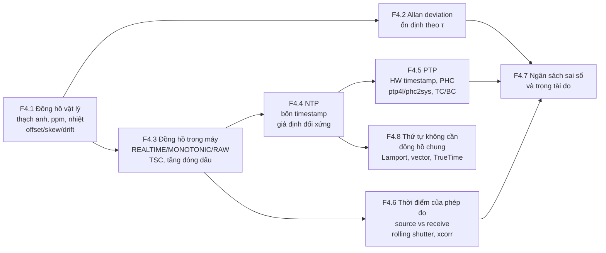
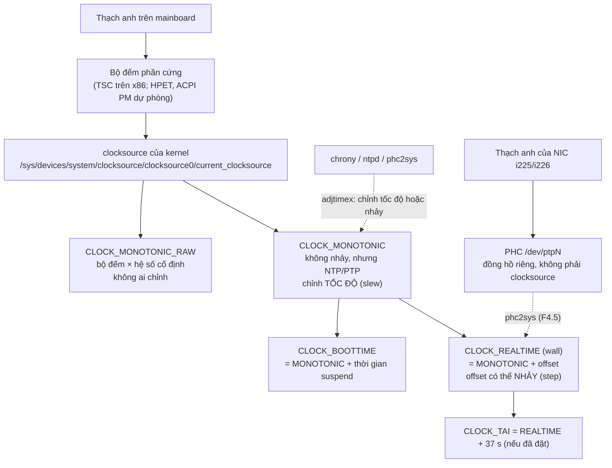

# F4 — Thời gian và đồng hồ (34h)

> Khóa nền, học **đúng lúc**: mở viên nang ngay trước bài chính cần nó (bảng dưới), không đọc một mạch. Tổng 34h = F4.1 5h · F4.2 4h · F4.3 4h · F4.4 3h · F4.5 6h · F4.6 5h · F4.7 4h · F4.8 3h. Một phần số giờ này trùng với phần "khái niệm" của K5 Module 2; phần còn lại cộng thêm vào tổng lộ trình, vốn đã vượt ngân sách 650h (xem `00-lo-trinh-tong.md` và `khoa-7/_KE-HOACH-K7.md` mục 3), không giấu.
>
> **Thuật ngữ dùng xuyên khóa (đã thống nhất ở K2 Bài 2):** *offset* = lệch pha (hai đồng hồ chỉ khác nhau bao nhiêu giây tại một thời điểm); *skew* = lệch tần số (chạy nhanh/chậm hơn nhau bao nhiêu, đơn vị ppm = µs mỗi giây); *drift* = sự thay đổi của skew (theo nhiệt độ, theo tuổi). Tài liệu đo lường tần số gọi skew là *fractional frequency offset* `y` và gọi drift là *frequency drift*; cùng một thứ.

## Vì sao khóa nền này tồn tại

Robot là một hệ phân tán nhỏ: camera, IMU, encoder, ESP32, mini PC, mỗi thứ một miếng thạch anh, không cái nào biết "giờ thật". Toàn bộ giá trị của dữ liệu robot (fusion, học từ demo, so sim với thật) dựa trên câu hỏi "hai mẫu này có thật sự cùng lúc không". Thiếu F4, bạn sẽ hụt ở đúng những chỗ này:

- **K1 Bài 3 câu 9, K1 Bài 13** — tin rằng hai thạch anh "cùng 48 kHz" thì FIFO giữa chúng không bao giờ tràn.
- **K2 Bài 2, Bài 11** — đọc `log_time − stamp` tăng dần và gọi nhầm skew là drift, hoặc nhầm hàng đợi phình với đồng hồ trôi; viết detector "timestamp không đơn điệu" mà không biết nguyên nhân nằm ở tầng nào.
- **K3 Bài 9** — chia RTT cho hai để có độ trễ một chiều mà không biết đó là giả định đối xứng của NTP.
- **K5 Bài 7–12** (Module 2, xương sống của cả lộ trình) — lập ngân sách sai số thời gian, chạy PTP, đo drift theo nhiệt, đo rolling shutter. Bản Gemini của chính module này đã sai ở ba chỗ thuộc F4 (hệ số nhiệt thạch anh, cờ `-p` của ptp4l, công thức số hàng sáng); các bài chính đã sửa, F4 cho bạn lý do để tự bắt được lỗi kiểu đó lần sau.
- **K6 Bài 15** — so quỹ đạo sim với thật mà chưa căn thời gian, rồi gọi sai lệch do căn lệch là "sim-to-real gap".
- **K7 C7.2** — đóng dấu IMU trên robot bằng đồng hồ host lúc nhận, rồi thắc mắc vì sao odometry và camera lệch nhau khi CPU bận.

Bài chính dạy *làm*; F4 dạy *timestamp này đúng tới đâu, sai vì đâu, và ai có quyền nói nó đúng*.

## Mindset cốt lõi

1. **Không có "bây giờ" trong máy tính; chỉ có một ước lượng kèm khoảng sai.** Google phải xây TrueTime cho Spanner (2012) trả về khoảng `[earliest, latest]` thay vì một con số, và Meta khi chuyển datacenter sang PTP cũng đưa ra API trả về "Window of Uncertainty" `{earliest_ns, latest_ns}` (Meta Engineering, 11/2022). Họ tin điều này vì hệ thống giả định "đồng hồ của tôi đúng" đã tạo ra lỗi nhất quán dữ liệu không ai tái tạo được.
2. **Sai số đồng hồ là hàm của thời gian kể từ lần đồng bộ cuối.** Patriot ở Dhahran (1991) không sai vì một lỗi lớn mà vì một lỗi cỡ 1 ppm tích lũy 100 giờ. Một con số "độ chính xác đồng bộ" không ghi "sau bao lâu" là vô nghĩa.
3. **Đóng dấu càng gần sự kiện vật lý càng tốt; mỗi tầng phần mềm thêm một lớp jitter không bù được.** IEEE 1588 ra đời (2002) gần như chỉ để dời chỗ đóng dấu từ phần mềm xuống phần cứng mạng; thuật toán bốn timestamp thì NTP đã có từ thập niên 1980.
4. **Con số đồng bộ do chính hệ đồng bộ tự báo không phải bằng chứng.** Bất đối xứng đường truyền là vô hình với mọi giao thức trao đổi gói; ptp4l phải có tùy chọn `delayAsymmetry` để con người khai báo thứ máy không tự thấy. Cần một trọng tài đo độc lập.
5. **Khi chỉ cần thứ tự, đừng dùng đồng hồ.** Lamport (1978) chỉ ra thứ tự nhân quả lấy được mà không cần đồng hồ chung; Cloudflare mất DNS một phần vào ngày giây nhuận 1/1/2017 vì code tính khoảng thời gian bằng đồng hồ treo tường và nhận về một số âm.

## Bản đồ viên nang



### Học đúng lúc

| Viên nang | Học trước bài chính | Giờ |
|---|---|---|
| F4.1 Đồng hồ vật lý | K1 Bài 3 (câu 9 hai thạch anh), K1 Bài 13 · K2 Bài 2 · K3 Bài 3 · K5 Bài 7, Bài 8, Bài 10 · K7 C7.2 | 5 |
| F4.2 Allan deviation | K5 Bài 10 · K2 Bài 5 (mô hình nhiễu IMU tổng hợp, mục bias instability) · K5 Bài 4 (gyro: bias vs nhiễu trắng) | 4 |
| F4.3 Đồng hồ trong máy tính | K2 Bài 2, Bài 11 · K3 Bài 14, Bài 17 (`boot_id`, monotonic qua reboot) · K5 Bài 1 (PHC, `ethtool -T`), Bài 9, Bài 13 · K6 Bài 3 (đồng hồ treo tường trong logic) · K7 C7.2 | 4 |
| F4.4 NTP | K3 Bài 8, Bài 9 (RTT/2) · K5 Bài 6, Bài 9 | 3 |
| F4.5 PTP | K5 Bài 1 (chỉ phần PHC và hardware timestamping), K5 Bài 9 | 6 |
| F4.6 Thời điểm của một phép đo cảm biến | K1 Bài 7 · K2 Bài 2 (nên đọc), Bài 11 · K3 Bài 9, Bài 13 · K5 Bài 6, Bài 11, Bài 13 · K6 Bài 15 · K7 C7.2 | 5 |
| F4.7 Ngân sách sai số và trọng tài | K1 Bài 7 · K3 Bài 8, Bài 9 · K5 Bài 1, Bài 2, Bài 7, Bài 12 | 4 |
| F4.8 Thứ tự không cần đồng hồ chung | K5 Bài 8–9 (đọc thêm) · trước khi thiết kế log sự kiện nhiều node ở K7 C7.3 | 3 |

Thứ tự tối thiểu nếu tuần crunch: F4.1 mục 2 + 6 trước K2 Bài 2; F4.4 mục 2 trước K3 Bài 9; F4.5 mục 2 + 6 và F4.7 mục 2 + 6 trước K5 Bài 9. Mục 6 (Lăng kính đánh giá) là phần đáng giữ nhất của mỗi viên nang.

## Bạn đã làm cái này rồi

| Bạn đã làm trong backend/AI-harness | Tên chuẩn | Còn thiếu | Viên nang |
|---|---|---|---|
| Dùng `time.monotonic()` để đo thời lượng, `time.time()` để ghi log | Monotonic vs wall clock (`CLOCK_MONOTONIC`, `CLOCK_REALTIME`) | Monotonic vẫn bị NTP *slew* (chỉnh tốc độ); chỉ `CLOCK_MONOTONIC_RAW` là không. Monotonic chỉ có nghĩa trong một `boot_id` | F4.3 |
| Ghép log nhiều service theo timestamp để dựng trace; thấy span con "bắt đầu trước" span cha | Clock skew trong distributed tracing; quan hệ *happens-before* | Biết cận sai của từng đồng hồ; dùng quan hệ nhân quả (gọi → trả lời) để sắp thứ tự thay vì so giờ | F4.4, F4.8 |
| Dựa vào thứ tự offset trong một partition Kafka thay vì timestamp | Total order do một sequencer (log) cấp, không do đồng hồ | Hiểu vì sao giữa các partition thì không có thứ tự, và khi nào cần vector clock | F4.8 |
| Lease / lock có TTL, timeout dựa trên giờ | Lease (Gray & Cheriton, 1989) — đúng chỉ khi skew giữa các máy có cận | Tính cận đó bằng ppm × thời lượng lease; biết điều gì xảy ra khi VM bị dừng | F4.1, F4.8 |
| Đo latency giữa hai máy bằng hiệu timestamp hai đầu | One-way delay; cần hai đồng hồ đã đồng bộ | Sai số đồng bộ cộng thẳng vào số đo; RTT/2 giả định đối xứng | F4.4, F4.7 |
| Chạy chrony/ntpd trên server mà không nhìn | NTP, clock discipline, file drift (`/var/lib/chrony/drift`, đơn vị ppm) | File đó chính là ước lượng skew của máy bạn; đọc `chronyc tracking` để biết máy tự nhận sai bao nhiêu (và vì sao không tin hẳn) | F4.1, F4.4 |

---

## F4.1 — Đồng hồ vật lý: thạch anh, ppm, nhiệt độ, lão hóa; mô hình offset/skew/drift (5h)

> **Dùng cho:** K1 Bài 3, Bài 13 · K2 Bài 2 · K3 Bài 3 · K5 Bài 7, 8, 10 · K7 C7.2 · **Cần trước:** không (F1.1 nếu muốn phần độ bất định) · **Sau viên nang này bạn đánh giá được:** một con số "ppm" trong datasheet/tài liệu nói về cái gì (dung sai lúc xuất xưởng, hệ số nhiệt, lão hóa), một hệ số nhiệt có thuộc đúng loại thạch anh đang nói tới không, và một khẳng định "sync X phút một lần là đủ" có đứng được không.

### 1. Câu chuyện

Dhahran, 25/2/1991. Khẩu đội Patriot đã chạy liên tục khoảng 100 giờ. Đồng hồ hệ thống đếm số tick 0,1 s bằng số nguyên; để đổi ra giây, phần mềm nhân với 0,1 lưu trong thanh ghi 24 bit. 0,1 không biểu diễn chính xác trong nhị phân, phần đuôi bị cắt, mỗi tick thiếu khoảng 9,5×10⁻⁸ s; sau 100 giờ, đồng hồ lệch khoảng 0,34 s [spec: R. Skeel, *Roundoff Error and the Patriot Missile*, SIAM News 25(4), 1992]. Với tốc độ của Scud, cổng theo dõi của radar dịch đi hơn nửa ki-lô-mét; hệ thống nhìn vào chỗ trống, kết luận báo động giả, và 28 lính Mỹ thiệt mạng [spec: GAO/IMTEC-92-26, 1992]. K5 Bài 7 đã kể câu chuyện này để dạy ngân sách sai số; ở đây hãy nhìn nó bằng đơn vị của viên nang: 9,5×10⁻⁸ s trên mỗi 0,1 s là sai tần số tương đối cỡ **1 ppm** [ước lượng: 9,5e−8 / 0,1]. Không có thạch anh nào hỏng. Một đồng hồ lệch 1 ppm, không ai đặt lại, và một hệ thống giả định thời gian của mình là đúng.

Câu chuyện thứ hai giải thích vì sao gần như mọi đồng hồ bạn sẽ gặp là thạch anh. Năm 1927, Warren Marrison và J. W. Horton ở Bell Labs làm đồng hồ thạch anh đầu tiên: một lát tinh thể áp điện rung ở tần số do kích thước và góc cắt quyết định, ổn định hơn mọi con lắc cơ khí [chuẩn]. Năm 1969 Seiko bán đồng hồ đeo tay thạch anh đầu tiên (Astron) [chuẩn]. Tần số 32 768 Hz của đồng hồ đeo tay và của mọi RTC là 2¹⁵: chia đôi 15 lần bằng flip-flop là ra đúng 1 Hz, và thạch anh dạng âm thoa (tuning fork) ở tần số này nhỏ, rẻ, ăn rất ít điện [chuẩn]. Cái giá của sự nhỏ và rẻ đó là độ nhạy nhiệt: một chiếc đồng hồ đeo tay chạy đúng nhất khi ở cổ tay người (~25–30 °C) chính vì đỉnh parabol của nó được đặt ở đó.

### 2. Mô hình tư duy

**Mô hình ba số hạng.** So một đồng hồ với một chuẩn, sai lệch thời gian `x(t)` (giây) gần như luôn viết được thành:

```
x(t) = x₀  +  y₀·t  +  ½·D·t²  +  ε(t)
       offset  skew     drift      nhiễu (F4.2)
       (s)     (ppm)    (ppm/s, ppm/ngày, hoặc ppm theo °C)
```

```
offset x(t)
  │                                   ╱  drift ≠ 0: đường cong (skew đổi theo nhiệt/tuổi)
  │                               ╱ ╱
  │                          ╱ ╱
  │                   ╱  ╱ ─ ─ ─ ─ ─   skew ≠ 0, drift = 0: đường thẳng, độ dốc = ppm
  │           ╱ ─ ─ ─
  │══════════════════════════════════  chỉ offset: đường ngang (bù một lần là xong)
  └──────────────────────────────────► t (từ lần sync cuối)
```

Đổi đơn vị phải thuộc: skew `y` ppm nghĩa là mỗi giây lệch `y` µs; một giờ lệch `3,6·y` ms; một ngày lệch `86,4·y` ms [chuẩn]. Bạn đo được luôn là **hiệu** skew của hai đồng hồ, không phải skew của từng cái so với "giờ thật".

**Skew đến từ đâu.** Một con số ppm trong datasheet thạch anh luôn là một trong năm thứ khác nhau, và tài liệu kém thường trộn chúng:

| Thành phần | Nghĩa | Cỡ điển hình | Đặc tính |
|---|---|---|---|
| Frequency tolerance (ở 25 °C) | Lệch lúc xuất xưởng | ±10…±50 ppm [spec: datasheet thạch anh thông dụng] | Cố định cho từng con → offset tuyến tính, đo một lần là bù được |
| Frequency stability theo nhiệt | Δf/f trên dải nhiệt làm việc | Xem bảng dưới | Thay đổi khi nhiệt đổi → **drift** |
| Aging | Lệch theo thời gian sử dụng | ±1…±5 ppm/năm đầu [spec: datasheet thông dụng] | Chậm, gần như không thấy trong một phiên đo |
| Load capacitance (pulling) | Tụ tải trên board khác tụ nhà sản xuất chỉ định | vài ppm mỗi pF [ước lượng] | Cố định theo thiết kế board — "cùng thạch anh, khác board, khác ppm" |
| Nguồn, rung, sốc | Điện áp nuôi mạch dao động, gia tốc | nhỏ, trừ sốc mạnh | Robot rung thì có (thường bỏ qua ở mức ppm) |

**Hai loại thạch anh, hai đường cong nhiệt — đây là chỗ hay sai nhất.**

| | Tuning-fork 32,768 kHz | AT-cut (MHz: 24, 25, 40 MHz…) |
|---|---|---|
| Có ở đâu | RTC, đồng hồ đeo tay, RTC slow clock tùy chọn của MCU | Clock chính của MCU (ESP32-S3: 40 MHz), NIC (PHC), USB, logic analyzer, CPU |
| Dạng đường cong | **Parabol**: Δf/f = k·(T − T₀)², T₀ ≈ 25 °C | **Bậc ba** (chữ S nằm ngang): Δf/f ≈ a₁·(T − T₀) + a₃·(T − T₀)³, điểm uốn quanh 25–30 °C |
| Hệ số | k ≈ −0,034 ± 0,006 ppm/°C² điển hình, có loại tới −0,04 [spec: datasheet Raltron RT2012, Geyer KX-327S] | a₃ ≈ 10⁻⁴ ppm/°C³ (gần như cố định theo vật lý tinh thể); a₁ phụ thuộc góc cắt, cỡ ±0,1…0,4 ppm/°C [ước lượng; xem Vig, tutorial mục 4] |
| Datasheet thường ghi | k và T₀ | "±10 ppm (−20…+70 °C)" hoặc đường cong |

Vì sao khác: tuning-fork rung uốn, độ cứng đàn hồi của lát thạch anh đổi theo nhiệt bậc hai; AT-cut rung trượt theo bề dày, và góc cắt ~35°15′ được chọn chính là để triệt tiêu số hạng bậc một và bậc hai quanh nhiệt độ phòng, chỉ còn bậc ba [chuẩn: Vig]. Muốn tốt hơn nữa: TCXO (đo nhiệt và bù, ±0,5…±2 ppm trên dải rộng), OCXO (giữ thạch anh trong lò ở nhiệt độ cố định, cỡ 10⁻⁸ trở xuống) [spec: datasheet TCXO/OCXO thông dụng]. Ngoài thạch anh còn **dao động RC** trong chip (ví dụ RTC slow clock mặc định của ESP32-S3) lệch tới phần trăm, không phải ppm [spec: ESP32-S3 Technical Reference Manual, chương Reset and Clock; tự kiểm theo bản bạn có].

Mô phỏng: một robot đồng bộ đồng hồ lúc khởi động ở 25 °C, rồi ấm dần tới ~55 °C (motor, CPU). Đồng hồ của nó lệch bao nhiêu nếu là tuning-fork, nếu là AT-cut? Và nếu lúc sync ta đã ước lượng và bù luôn skew tĩnh?

```python
# [đã chạy] F4.1 — tuning-fork 32,768 kHz (parabol) vs AT-cut MHz (bậc ba): robot nóng 25 → 55 °C
import numpy as np
import matplotlib.pyplot as plt

def tuning_fork(T, k=-0.034, T0=25.0):        # ppm; k: datasheet điển hình −0,034 ± 0,006 ppm/°C²
    return k * (T - T0) ** 2

def at_cut(T, a1=-0.2, a3=1.0e-4, T0=25.0):   # ppm; a1, a3 [ước lượng] — tra đường cong datasheet thật
    return a1 * (T - T0) + a3 * (T - T0) ** 3

OFFSET0 = 8.0                                  # ppm: sai tần số tĩnh ở 25 °C (dung sai lúc xuất xưởng)
t = np.arange(0, 1800.0, 1.0)                  # 30 phút, bước 1 s; đồng bộ lúc t = 0
T = 25 + 30 * (1 - np.exp(-t / 300))           # robot ấm dần tới ~55 °C, hằng số thời gian 5 phút

for name, f in (("tuning-fork", tuning_fork), ("AT-cut", at_cut)):
    y = OFFSET0 + f(T)                         # skew so với đồng hồ chuẩn (ppm)
    phase_ms = np.cumsum(y) * 1e-6 * 1e3       # offset tích lũy (ms) = tích phân skew theo thời gian
    # Nếu ở t=0 ta ĐÃ ước lượng và bù skew tĩnh (8 ppm), phần còn lại chỉ do nhiệt:
    resid_ms = np.cumsum(y - y[0]) * 1e-6 * 1e3
    print(f"{name:12s} skew@55°C={y[-1]:+7.2f} ppm | offset sau 10 phút: {phase_ms[599]:7.2f} ms"
          f" | sau khi bù skew lúc sync: {resid_ms[599]:+7.2f} ms (10'), {resid_ms[-1]:+7.2f} ms (30')")

Ts = np.linspace(-40, 85, 126)
plt.plot(Ts, tuning_fork(Ts), label="tuning-fork 32,768 kHz (k=−0,034)")
plt.plot(Ts, at_cut(Ts), label="AT-cut MHz (a1=−0,2; a3=1e−4)")
plt.axvspan(15, 55, alpha=0.1, label="dải phòng → robot nóng")
plt.xlabel("°C"); plt.ylabel("Δf/f (ppm)"); plt.legend(); plt.grid(alpha=.3)
plt.show()
```

Ba câu bản chất: (1) offset là tích phân của skew, nên sai số đồng hồ **lớn dần** kể từ lần sync; (2) bù skew tĩnh lúc sync xóa được số hạng tuyến tính, còn drift do nhiệt thì không, nên chu kỳ sync bị quyết định bởi drift chứ không bởi ppm trong datasheet; (3) "thạch anh" không phải một loại: hệ số nhiệt của loại này áp cho loại kia có thể sai một bậc độ lớn.

### 3. Cầu nối từ backend

| Backend bạn biết | Ở đây | Gãy ở chỗ | Nếu dùng nhầm thì |
|---|---|---|---|
| Clock skew giữa server, "chạy NTP là xong" | Mỗi thạch anh có skew riêng, đổi theo nhiệt | Trên server, NTP chạy liên tục và che skew; ESP32 trên robot thường không có ai sửa nó, skew tích lũy thẳng vào dữ liệu | Ghép IMU (đồng hồ ESP32) với camera (đồng hồ host) theo timestamp; sau 1 giờ lệch hàng chục ms, không có exception nào |
| Rate limiter / token bucket chạy theo đồng hồ máy | Producer và consumer chạy theo hai thạch anh khác nhau (I2S, UART, USB audio) | Backend xả hàng đợi khi tải giảm; ở đây chênh tốc độ do ppm là **vĩnh viễn, một chiều**, không có lúc "tải giảm" | Tăng buffer để chữa: chỉ hoãn ngày tràn/cạn; cách đúng là một bên theo clock của bên kia hoặc chuyển đổi tốc độ mẫu (ASRC) |
| TTL / lease 30 s | Lease đúng khi skew giữa hai máy có cận | Backend coi 30 s là 30 s ở mọi máy; ở đây 30 s của ESP32 có thể là 30,0015 s của host (50 ppm) — nhỏ, nhưng lease dài và nhiều node thì cộng dồn | Hai node cùng tin mình giữ lock trong khoảng chồng lấn (nhỏ nhưng khác 0) |
| Cấu hình đúng thì giá trị đúng (`sample_rate=48000`) | Tần số danh định ≠ tần số thật | Config là ý định; tần số thật = ý định × (1 + skew) | Tin rằng hai thiết bị "48 kHz" có cùng số mẫu sau 1 giờ (K1 Bài 3 câu 9) |

**Chấm mô hình:**

- *Mô hình của bạn ở K3 lượt 7:* "vì tốc độ truyền điện không thể bắt kịp... người ta nghĩ ra khái niệm tần số... mỗi thiết bị có khái niệm về clock, về thời gian của chúng... nếu không giới hạn thì thời gian ở mọi thiết bị sẽ lệch nhau... nên phải giới hạn lại, dù có thể chạy nhanh hơn 1000 lần". — **ĐÚNG MỘT PHẦN.** Đúng và quan trọng: *mỗi thiết bị có thời gian của riêng nó* — đó là tiền đề của cả khóa F4. Sai ở nguyên nhân: clock trong mạch số tồn tại để mọi flip-flop lấy mẫu cùng một nhịp sau khi tín hiệu đã ổn định (setup/hold), và tần số tối đa bị chặn bởi đường dẫn chậm nhất và công suất, không phải bị "cố tình giới hạn" (đã chấm ở K3). Và thời gian lệch nhau **không** vì chạy nhanh: hai đồng hồ chạy *chậm* vẫn lệch, vì mỗi miếng thạch anh rung ở tần số hơi khác danh định. Phản ví dụ: hai ESP32-S3 cùng thạch anh 40 MHz danh định, chạy chậm hơn trần của chip rất xa, vẫn lệch nhau vài đến vài chục ppm — K5 Bài 8 đo đúng điều này.
- *"Datasheet ghi ±10 ppm nên đồng hồ của tôi lệch tối đa 10 ppm."* — **ĐÚNG MỘT PHẦN.** ±10 ppm thường là *tolerance ở 25 °C*; stability theo nhiệt và aging là các dòng khác, cộng thêm; tụ tải trên board kéo thêm. Và bạn so hai đồng hồ, nên hiệu có thể gấp đôi. Phản ví dụ: hai thạch anh ±10 ppm, một con +9, một con −9, ở 50 °C thêm vài ppm: hiệu > 18 ppm.
- *"Đo skew một lần lúc khởi động rồi bù mãi là đủ."* — **SAI** cho robot có nhiệt độ thay đổi; **ĐÚNG** cho thiết bị trong phòng ổn nhiệt và phiên ngắn. Phản ví dụ: kết quả bài tập mục 5 (phần đã bù skew tĩnh).

**Tên chuẩn của thứ bạn đã làm:** file `/var/lib/chrony/drift` (hoặc `ntp.drift`) trên server bạn quản lý chứa đúng một con số ppm: đó là ước lượng **skew** của thạch anh máy đó mà chrony lưu lại để lần khởi động sau không phải học lại từ đầu [spec: chrony.conf(5), `driftfile`]. Cái chrony gọi "drift file" là skew theo thuật ngữ khóa này; cái tên lệch nhau giữa các cộng đồng, nên luôn hỏi "đơn vị là gì": ppm là skew, ppm/°C hay ppm/ngày là drift. Thứ còn thiếu: bạn chưa từng phải hỏi con số đó đổi bao nhiêu khi máy nóng lên.

### 4. Thuật ngữ

| Mức | Thuật ngữ | Nghĩa trong một câu | Hay bị hiểu nhầm thành |
|---|---|---|---|
| 🟢 | Offset | Hai đồng hồ chỉ khác nhau bao nhiêu tại một thời điểm (lệch pha) | Đại lượng cố định |
| 🟢 | Skew (fractional frequency offset, ppm) | Tốc độ chạy khác nhau bao nhiêu; ppm = µs mỗi giây | "Lệch cố định" (đó là offset) |
| 🟢 | Drift | Skew thay đổi theo nhiệt độ/thời gian | Đồng nghĩa với skew (nhiều tài liệu, kể cả roadmap, dùng lẫn) |
| 🟢 | ppm, ppb | 10⁻⁶, 10⁻⁹ tương đối | Đơn vị thời gian tuyệt đối |
| 🟢 | Tolerance vs stability vs aging | Lệch xuất xưởng / theo nhiệt / theo năm | Một con số ppm duy nhất |
| 🟡 | Tuning-fork vs AT-cut | 32,768 kHz parabol vs MHz bậc ba | "Thạch anh có hệ số −0,04 ppm/°C²" (chỉ đúng loại tuning-fork) |
| 🟡 | Turnover temperature T₀ | Đỉnh parabol của tuning-fork | Nhiệt độ hoạt động tốt nhất của mọi loại |
| 🟡 | TCXO / OCXO | Thạch anh có bù nhiệt / trong lò ổn nhiệt | Chỉ có trong thiết bị quân sự |
| 🟡 | Load capacitance, pulling | Tụ tải kéo tần số | Không liên quan tới phần mềm |
| 🔴 | Activity dip, hysteresis nhiệt | Điểm nhảy tần số bất thường; lên/xuống nhiệt không trùng đường | Cần ngay (biết tên để khỏi ngạc nhiên ở K5 Bài 10) |

### 5. Bài tập dự đoán

**Đề.** Chạy mô phỏng mục 2 (sau khi commit dự đoán). Trước đó, dự đoán:

1. Skew ở ~55 °C của mỗi loại (đã gồm 8 ppm tĩnh).
2. Offset sau 10 phút nếu **không** bù gì, mỗi loại. Loại nào lệch nhiều hơn? (Cẩn thận dấu: skew tĩnh dương, phần nhiệt có thể âm.)
3. Nếu lúc sync đã bù skew tĩnh, phần còn lại sau 10 phút và 30 phút, mỗi loại.
4. Muốn phần còn lại (sau bù) luôn < 1 ms, phải sync lại sau tối đa bao nhiêu giây, mỗi loại?
5. Bản Gemini K5 Bài 10 dùng −0,04 ppm/°C² cho thạch anh của ESP32. Nếu tin con số đó, bạn sẽ chọn chu kỳ sync dài hơn hay ngắn hơn mức cần thiết, và sai bao nhiêu lần?

**Tham số cần tra:** với phần cứng thật, tra datasheet thạch anh 40 MHz trên module ESP32-S3 của bạn (in trên vỏ thạch anh hoặc trong datasheet module) và mục yêu cầu thạch anh trong *ESP32-S3 Hardware Design Guidelines* (mục External Crystal Clock Source). Với bài này, dùng tham số trong code. **Phương pháp:** câu 1 thay T = 55 vào công thức; câu 2 tích phân skew theo thời gian (nhiệt độ tiến gần 55 theo hàm mũ, nên trung bình trong 10 phút thấp hơn 55); câu 4 tìm thời điểm đầu tiên |phần dư| vượt 1 ms.

```markdown
# prediction.md — F4.1
1. skew@55°C: tuning-fork ___ ppm ; AT-cut ___ ppm
2. offset 10' không bù: TF ___ ms ; AT ___ ms ; lớn hơn: ___
3. phần dư sau bù (10'/30'): TF ___/___ ms ; AT ___/___ ms
4. chu kỳ sync để < 1 ms: TF ___ s ; AT ___ s
5. Tin Gemini thì chu kỳ sync ___ (dài/ngắn) hơn cần thiết khoảng ___ lần
Độ tự tin (1–5): ___   Tôi sẽ ngạc nhiên nếu: ___
```

<details><summary>🔒 MỞ SAU KHI COMMIT prediction.md</summary>

Kết quả khi chạy (numpy 2.x, không có ngẫu nhiên):

| | Tuning-fork | AT-cut |
|---|---|---|
| Skew ở ~55 °C | −22,5 ppm (8 − 30,6) | +4,7 ppm (8 − 6 + 2,7) |
| Offset 10 phút, không bù | −2,2 ms | +3,2 ms |
| Phần dư sau bù skew tĩnh, 10 phút / 30 phút | −7,0 / −41,3 ms | −1,6 / −5,6 ms |
| Sync lại sau tối đa (phần dư < 1 ms) | ~250 s | ~420 s |

Câu 2 là bẫy: không bù gì thì tuning-fork lại có |offset| *nhỏ hơn* sau 10 phút, vì phần nhiệt âm triệt tiêu một phần skew tĩnh dương. Một phép thử ngắn có thể cho bạn kết luận "loại này tốt hơn" vì một sự tình cờ về dấu. Câu 3 mới là câu đúng hỏi: sau khi bù cái bù được, phần nhiệt của tuning-fork lớn hơn AT-cut khoảng 4–7 lần trong kịch bản này (phần drift thuần nhiệt ở 55 °C: −30,6 vs −3,3 ppm, ~9 lần).

Câu 5: dùng −0,04 ppm/°C² (tuning-fork) cho thạch anh 40 MHz AT-cut, bạn dự đoán drift do nhiệt lớn gấp khoảng 10 lần thực tế (với a₁ giả định ở đây), nên chọn chu kỳ sync **ngắn hơn** cần thiết. Hậu quả không nguy hiểm (chỉ tốn sync), nhưng ngược lại thì nguy hiểm: ai đo một board AT-cut trong phòng rồi áp kết quả cho RTC 32 kHz sẽ chọn chu kỳ sync quá dài. Và ở K5 Bài 10, nếu bạn kỳ vọng "vọt thêm 10–30 ppm khi hơ nóng" thì có thể kết luận sai rằng thí nghiệm hỏng khi chỉ thấy vài ppm.

Nhớ: a₁ của AT-cut ở đây là giả định. Với a₁ = −0,4 hoặc +0,1, số đổi; điều không đổi là AT-cut trong dải 15–55 °C lệch cỡ vài ppm còn tuning-fork lệch hàng chục ppm ở hai đầu dải.

</details>

### 6. Lăng kính đánh giá

Checklist khi đọc một khẳng định về độ chính xác đồng hồ:

1. Con số ppm là **loại nào**: tolerance ở 25 °C, stability theo nhiệt, aging, hay hiệu đo được giữa hai đồng hồ?
2. Hệ số nhiệt có thuộc **đúng loại dao động** đang nói (tuning-fork 32 kHz / AT-cut MHz / TCXO / RC trong chip) không?
3. Có ghi **sau bao lâu kể từ lần sync** không? ppm × thời gian mới ra giây.
4. Phân biệt được phần **bù được** (offset, skew tĩnh) với phần **không bù được bằng một lần đo** (drift theo nhiệt, nhiễu)?
5. Đồng hồ nào là chuẩn so sánh? "Lệch 20 ppm" so với cái gì, và cái đó lệch bao nhiêu?
6. Thuật ngữ offset/skew/drift có dùng nhất quán không? Nếu tài liệu gọi skew là drift, đọc theo đơn vị, không theo chữ.

**ĐÚNG** nếu 1–6 rõ; **SAI** nếu áp hệ số sai loại hoặc nhầm đơn vị; **CHƯA RÕ** nếu thiếu loại ppm hoặc thiếu khoảng thời gian.

**Khẳng định mẫu — tự chấm trước khi mở:**

(a) Bản Gemini K5 Bài 10, phần tự kiểm tra: *"Nếu một robot AMR chạy ngoài trời từ bóng râm (25 °C) ra mặt đường nhựa nắng nóng (55 °C), dựa trên hệ số nhiệt thông thường của thạch anh (k ≈ −0.04 ppm/°C²), điều gì sẽ xảy ra với clock offset..."* (ngữ cảnh: thạch anh của ESP32-S3).

(b) `robotics-data-infra-roadmap.md` mục 3.1: *"Clock drift / skew — Hai đồng hồ chạy lệch nhau dần. Thạch anh thường 20–50 ppm → 20–50 µs lệch mỗi giây → 72–180 ms mỗi giờ. Đây là lý do phải sync."*

(c) Bản Gemini K5 Bài 10, bảng "Số phải ra": *"Phản ứng khi hơ nóng: Drift thay đổi rõ rệt (có thể vọt lên thêm 10–30 ppm hoặc tụt dốc tùy lát cắt thạch anh)."* và *"Quan hệ Drift vs. Nhiệt độ: tạo thành đường cong rõ ràng (parabol hoặc tuyến tính), R² > 0.85."*

<details><summary>🔒 Đáp án</summary>

(a) **SAI** (lỗi đã biết, quy chuẩn mục 7). −0,034…−0,04 ppm/°C² là hệ số parabol của **tuning-fork 32,768 kHz**. Thạch anh 40 MHz của ESP32-S3 là loại MHz (AT-cut), đường cong bậc ba, trong dải 25–55 °C lệch cỡ vài ppm chứ không phải ~36 ppm. Cách đúng: tra datasheet thạch anh/TCXO thật trên board, hoặc đo (K5 Bài 10). Câu hỏi tự kiểm tra vẫn dùng được nếu đổi thành "RTC 32 kHz của robot".

(b) **ĐÚNG MỘT PHẦN.** Phép đổi đơn vị đúng (20 ppm × 3600 s = 72 ms). Ba chỗ cần sửa: (1) "drift / skew" dùng lẫn — theo khóa này đây là **skew**; (2) "thường 20–50 ppm" là *tolerance* của thạch anh rẻ nói chung; thạch anh của module có yêu cầu riêng (với ESP32 thường chặt hơn vì WiFi cần tần số chính xác [tự đo: tra Hardware Design Guidelines]), và cái đo được là **hiệu** hai đồng hồ, có thể lớn hơn hoặc nhỏ hơn nhiều; (3) "đây là lý do phải sync" thiếu nửa sau: skew tĩnh bù được bằng ước lượng một lần; lý do phải sync *định kỳ* là drift (nhiệt, aging) và nhiễu.

(c) **ĐÚNG MỘT PHẦN.** "Thay đổi rõ rệt" đúng nếu "rõ rệt" nghĩa là lớn hơn sai số ước lượng skew của bạn (cửa sổ trượt, jitter ISR — xem F4.2). "Vọt thêm 10–30 ppm" là kỳ vọng của tuning-fork, quá lớn cho AT-cut ở 25–55 °C. "Parabol hoặc tuyến tính" bỏ sót dạng đúng của AT-cut là **bậc ba**; trong dải hẹp nó trông gần tuyến tính, nên fit bậc hai có thể cho R² cao mà hệ số vô nghĩa ngoài dải đo. Ngưỡng R² > 0,85 là thêm của Gemini, không có trong bản gốc; gate của bản gốc chỉ yêu cầu drift "phải đổi rõ rệt" và ghi hysteresis nếu có.

</details>

### 7. Câu hỏi ngược

1. **[Vì sao không]** Vì sao không gắn TCXO cho mọi ESP32 trên robot cho xong chuyện?
   <details><summary>Hướng nghĩ</summary>

   Nghĩ theo ngân sách sai số (F4.7): nếu đóng dấu sai ±1 ms do USB và ISR, giảm drift từ 5 ppm xuống 0,5 ppm đổi được bao nhiêu? Và nếu đằng nào cũng sync mỗi phút thì drift giữa hai lần sync là bao nhiêu? Tiền nên tiêu vào số hạng lớn nhất.

   </details>
2. **[Quy mô]** 100 robot, mỗi con một ESP32. Phân bố skew giữa các con trông thế nào, và một hằng số bù "trung bình đội" có ích gì không?
   <details><summary>Hướng nghĩ</summary>

   Tolerance là ngẫu nhiên giữa các con, cố định trong một con. Trung bình đội có thể gần 0 trong khi từng con lệch ±10 ppm. Bù phải theo từng thiết bị (giống hiệu chuẩn bias IMU từng con, F1.1), và phải lưu theo `device_id` + phiên bản firmware.

   </details>
3. **[Failure mode]** Robot đứng sạc ở 25 °C, sync lúc khởi động, chạy 20 phút ngoài nắng, quay về. Dữ liệu ghép IMU–camera tốt ở đầu và cuối, tệ ở giữa. Một detector kiểm offset chỉ ở đầu và cuối episode sẽ thấy gì?
   <details><summary>Hướng nghĩ</summary>

   Offset là tích phân của skew; nếu skew đi ra rồi quay về, offset không quay về 0 nhưng có thể nhỏ ở cuối. Hai điểm đo không đủ để thấy một đường cong. Nghĩ về đo offset liên tục bằng một sự kiện chung định kỳ.

   </details>
4. **[Liên ngành]** Âm thanh chuyên nghiệp có "word clock" chung cho mọi thiết bị trong phòng thu. Đó là cách nào trong ba cách xử lý hai miền clock: đồng bộ, bù bằng phần mềm, hay chuyển đổi tốc độ?
   <details><summary>Hướng nghĩ</summary>

   Word clock = một nguồn tần số chung, các thiết bị khóa pha theo nó → không còn skew giữa chúng. Đó là "hardware trigger" liên tục. So với robot: tương đương camera nhận trigger từ cùng một chân GPIO.

   </details>
5. **[Phản biện]** "ppm nhỏ thế, robot chỉ chạy 30 phút một episode, bỏ qua được." Tính cho trường hợp nào thì đúng, trường hợp nào thì sai.
   <details><summary>Hướng nghĩ</summary>

   So tích skew × thời lượng với dung sai thời gian của ứng dụng: log nhiệt độ 1 Hz vs ghép IMU 200 Hz vs VIO khi robot quay 3 rad/s (sai góc = ω × Δt). Cùng một ppm, kết luận đổi theo ứng dụng.

   </details>

### 8. Liên kết ra ngoài

- **GPS.** Đồng hồ nguyên tử trên vệ tinh chạy nhanh hơn trên mặt đất khoảng 38 µs/ngày do hiệu ứng tương đối, và được chỉnh tần số trước khi phóng [chuẩn]. 38 µs/ngày ≈ 4,4×10⁻¹⁰, tức 0,00044 ppm, nhưng nhân với tốc độ ánh sáng thì thành ~11 km/ngày sai vị trí. Giống: sai tần số nhỏ × thời gian dài × hệ số khuếch đại lớn. Khác: ở GPS nguyên nhân biết trước và bù chính xác; trên robot, drift theo nhiệt phải đo.
- **Âm thanh / video streaming.** Bên phát và bên nhận chạy hai thạch anh; player phải phát hiện skew bằng mức đầy của buffer và co giãn nhẹ hoặc resample (adaptive playout). Giống K1 Bài 3 câu 9. Khác: ở đó chỉ cần không tràn; trong robot cần biết *thời điểm* chính xác.
- **Thiên văn vô tuyến (VLBI).** Mỗi trạm dùng maser hydro (ổn định cỡ 10⁻¹⁵ ở 1000 s [chuẩn]) vì dữ liệu được ghép sau, và mọi sai pha không bù được là mất dữ liệu. Giống: dữ liệu ghi riêng, ghép sau, như MCAP nhiều luồng. Khác: họ chọn đồng hồ đắt trước để khỏi phải sửa sau; robot thì ngược lại, nên cần đo và ghi lại.

### 9. Áp vào khóa chính

- **K1 Bài 3 câu 9, K1 Bài 13:** hai thạch anh "cùng tần số" luôn khác nhau; trên một link I2S thì bên nhận dùng BCLK của bên phát nên không trôi; trôi xuất hiện giữa hai miền clock độc lập.
- **K2 Bài 2:** đọc độ dốc của `log_time − stamp` ra ppm; nếu cong theo giờ trong ngày, nghĩ tới nhiệt.
- **K3 Bài 3:** sai số đo tần số bằng logic analyzer bị chặn bởi chính thạch anh 24 MHz của analyzer (vài chục ppm), nhỏ hơn tiêu chí 1% nhiều bậc — quyết định: không cần trọng tài tốt hơn cho tiêu chí đó.
- **K5 Bài 7:** dòng "drift thạch anh" trong ngân sách phải ghi rõ loại thạch anh, dải nhiệt và khoảng thời gian kể từ sync. **K5 Bài 8:** độ dốc fit là *hiệu skew* của hai ESP32. **K5 Bài 10:** kỳ vọng dạng bậc ba/gần tuyến tính quanh phòng cho clock 40 MHz; nếu thấy parabol rõ, kiểm xem bạn đang đo đồng hồ nào (RTC slow clock hay esp_timer).
- **K7 C7.2:** chọn chu kỳ sync ESP32 ↔ host theo drift đo được ở nhiệt độ làm việc thật của robot, không theo ppm datasheet.

### 10. Độ tin cậy

| Khẳng định | Nhãn | Ghi chú / cách kiểm |
|---|---|---|
| Patriot: ~0,34 s sau 100 giờ, 9,5×10⁻⁸ s/tick, 28 người chết | [spec] | Skeel 1992; GAO/IMTEC-92-26 |
| Tuning-fork k ≈ −0,034 ± 0,006 ppm/°C², T₀ = 25 ± 5 °C | [spec] | Datasheet Raltron RT2012, Geyer KX-327S; có loại −0,036, −0,04 |
| AT-cut: đường bậc ba, a₃ ≈ 10⁻⁴ ppm/°C³, a₁ phụ thuộc góc cắt | [chuẩn] / [ước lượng] cho số | Vig, tutorial; tra đường cong datasheet thạch anh của bạn |
| ESP32-S3 dùng thạch anh 40 MHz cho clock chính; RTC slow clock mặc định là RC nội | [spec] | ESP32-S3 TRM, chương clock; kiểm theo bản bạn có |
| Yêu cầu dung sai thạch anh của ESP32-S3 | [tự đo] | Hardware Design Guidelines, mục External Crystal Clock Source |
| Tolerance ±10…±50 ppm, aging ±1…±5 ppm/năm | [spec] | Datasheet thạch anh thông dụng; thay đổi theo hãng |
| GPS ~38 µs/ngày | [chuẩn] | Ashby, *Relativity in the Global Positioning System*, Living Reviews in Relativity 2003 |
| Kết quả mô phỏng mục 5 | [đã chạy] | Tham số a₁, a₃ là giả định |

Đã sửa so với bản gốc/Gemini: (Gemini K5 Bài 10) hệ số −0,04 ppm/°C² áp cho thạch anh MHz → đó là hệ số tuning-fork 32 kHz; AT-cut bậc ba, lệch nhỏ hơn nhiều trong dải phòng (quy chuẩn mục 7). (Gemini K5 Bài 10) "vọt thêm 10–30 ppm khi hơ nóng" → kỳ vọng vài ppm cho AT-cut, phải tự đo. (Roadmap mục 3.1) "drift/skew" dùng lẫn → tách theo thuật ngữ đã thống nhất.

### 11. Đọc thêm và tự kiểm tra

- **Nguồn gốc:** John R. Vig, *Quartz Crystal Resonators and Oscillators for Frequency Control and Timing Applications — A Tutorial* (U.S. Army CECOM; bản PDF miễn phí, nhiều phiên bản) — đọc phần đường cong nhiệt theo góc cắt và phần aging.
- **Giải thích:** một datasheet thạch anh tuning-fork 32,768 kHz bất kỳ (mục Frequency-temperature) và datasheet thạch anh 40 MHz trên module của bạn — đặt cạnh nhau.
- **Đào sâu (tùy chọn):** R. Skeel, *Roundoff Error and the Patriot Missile* (SIAM News, 1992) và báo cáo GAO/IMTEC-92-26.
- **Tự kiểm tra:** (1) giải thích cho một backend engineer vì sao "đã NTP" trên server không giúp gì cho IMU trên ESP32; (2) vẽ lại hình ba đường offset ở mục 2; (3) câu hỏi:

  Hai ESP32 lệch nhau 12 ppm. Ghép dữ liệu theo timestamp của từng con, không sync lại. Sau 40 phút, hai mẫu "cùng lúc" thật ra cách nhau bao lâu? IMU 200 Hz thì đó là bao nhiêu mẫu?
  <details><summary>Đáp án</summary>

  12 µs/s × 2400 s = 28,8 ms ≈ 5,8 mẫu ở 200 Hz (chu kỳ 5 ms). Đây chỉ là phần skew; nếu nhiệt đổi trong 40 phút, cộng thêm phần drift.

  </details>

---

## F4.2 — Đo độ ổn định: Allan deviation, vì sao độ lệch chuẩn không đủ (4h)

> **Dùng cho:** K5 Bài 10 · K2 Bài 5 (nhiễu IMU tổng hợp) · K5 Bài 4 (gyro đứng yên) · **Cần trước:** F4.1, F1.2 · **Sau viên nang này bạn đánh giá được:** một con số "độ ổn định" của đồng hồ hoặc IMU có ý nghĩa không (ở thang thời gian nào), một cửa sổ ước lượng skew/bias dài bao nhiêu là hợp lý, và một khẳng định kiểu "lấy trung bình lâu hơn sẽ chính xác hơn" đúng tới đâu.

### 1. Câu chuyện

Thập niên 1960, các phòng thí nghiệm so đồng hồ nguyên tử với nhau và gặp một chuyện vô lý: càng ghi dữ liệu lâu, độ lệch chuẩn của tần số đo được càng **lớn**, không hội tụ về con số nào. Lặp lại thí nghiệm với chuỗi dài gấp đôi, "độ chính xác" của cùng một đồng hồ xấu đi. Nguyên nhân: nhiễu tần số của bộ dao động không phải nhiễu trắng; nó có thành phần flicker (1/f) và random walk, mà với các loại nhiễu đó phương sai thông thường phụ thuộc vào độ dài chuỗi — nó không phải một tính chất của đồng hồ mà là của thí nghiệm. David W. Allan (NBS, nay là NIST) đề xuất năm 1966 dùng phương sai của **hiệu hai trung bình liên tiếp** thay cho phương sai quanh trung bình chung [chuẩn: D. W. Allan, *Statistics of Atomic Frequency Standards*, Proc. IEEE 54(2), 1966]. Đại lượng đó hội tụ cho mọi loại nhiễu đồng hồ thực tế, và vẽ theo thang thời gian τ thì cho biết luôn *loại* nhiễu. Nó thành chuẩn ngành (IEEE Std 1139) và được ngành con quay mượn nguyên văn để đặc tả IMU (IEEE Std 952) [chuẩn].

Câu chuyện gần bạn hơn: bạn đã có ở K2 Bài 5 một IMU tổng hợp bằng `np.random.normal` và một bias trôi tuyến tính. Dữ liệu đó có std đẹp và ổn định. IMU thật thì không: đặt một gyro MEMS đứng yên một đêm, trung bình 1 phút đầu và 1 phút cuối khác nhau nhiều hơn σ/√N dự đoán, vì bias của nó "đi dạo". Std không thấy chuyện đó; Allan deviation thấy.

### 2. Mô hình tư duy

**Định nghĩa bằng lời:** chia chuỗi tần số (hoặc tốc độ góc của gyro) thành các khối dài τ, lấy trung bình mỗi khối, rồi hỏi: **hai khối liên tiếp khác nhau bao nhiêu?** Allan variance là một nửa trung bình bình phương của hiệu đó:

```
σ_y²(τ) = ½ · ⟨ (ȳ_{k+1} − ȳ_k)² ⟩          (ȳ_k = trung bình khối thứ k, mỗi khối dài τ)
```

Viết theo phase `x` (sai lệch thời gian, F4.1): `σ_y²(τ) = ⟨(x_{k+2} − 2x_{k+1} + x_k)²⟩ / (2τ²)` — sai phân bậc hai, nên một offset hằng *và* một skew hằng đều bị triệt tiêu; chỉ phần thay đổi còn lại. Đây chính là câu hỏi người làm đồng bộ quan tâm: "nếu tôi ước lượng tần số trong τ giây rồi dùng nó cho τ giây tiếp theo, sai bao nhiêu?"

**Đọc độ dốc trên đồ thị log–log** (với y là tần số; với gyro thay y bằng tốc độ góc):

```
log σ_y(τ)
  │╲  τ^-1   white PM: jitter của timestamp (ISR, USB) — trung bình cực có lợi
  │ ╲
  │  ╲╲  τ^-1/2  white FM: nhiễu trắng trên tần số / "angle random walk" của gyro
  │    ╲╲___
  │         ‾‾‾‾───  τ^0  flicker FM: sàn — "bias instability" của gyro; trung bình thêm vô ích
  │                 ╱
  │               ╱  τ^+1/2  random walk FM / "rate random walk": trung bình lâu hơn còn HẠI
  │             ╱ ╱  τ^+1   drift tuyến tính (nhiệt, aging)
  └──────────────────────────► log τ
       điểm thấp nhất = cửa sổ ước lượng tốt nhất
```

[chuẩn: W. J. Riley, *Handbook of Frequency Stability Analysis*, NIST SP 1065, 2008, bảng các loại nhiễu]. Vì sao std không đủ: std của chuỗi là **một con số**, trộn tất cả thang thời gian; với random walk nó còn lớn dần theo độ dài chuỗi, tức là nó đo độ dài thí nghiệm của bạn chứ không đo đồng hồ.

Một hệ quả bạn dùng ngay ở K5: nếu chỉ có jitter timestamp σ_x độc lập (white PM), sai phân bậc hai có phương sai `(1 + 4 + 1)·σ_x² = 6σ_x²`, nên `σ_y(τ) = √3·σ_x/τ`. Jitter ISR 1 µs, τ = 100 s → 1,7×10⁻⁸ = 0,017 ppm [ước lượng: suy từ định nghĩa]. Jitter cỡ mili-giây (đóng dấu lúc host nhận qua USB) → lớn hơn ba bậc. Chỗ bạn đóng dấu (F4.3, F4.6) quyết định cửa sổ phải dài bao nhiêu.

Mô phỏng: ba chuỗi tần số (white FM, random walk FM, tổng), tính overlapping Allan deviation bằng tay, so với std.

```python
# [đã chạy] F4.2 — Allan deviation: white FM (τ^−1/2) vs random-walk FM (τ^+1/2); std thì không phân biệt được
import numpy as np
import matplotlib.pyplot as plt
rng = np.random.default_rng(42)
tau0, N = 1.0, 200_000                       # 1 mẫu tần số/giây, ~55 giờ

def adev(y, tau0, ms):
    """Overlapping Allan deviation từ chuỗi tần số tương đối y (đã chia đều tau0)."""
    x = np.concatenate([[0.0], np.cumsum(y) * tau0])        # phase (s) = tích phân tần số
    out = []
    for m in ms:
        d = x[2*m:] - 2*x[m:-m] + x[:-2*m]                 # sai phân bậc hai của phase
        out.append(np.sqrt(np.mean(d**2) / (2 * (m*tau0)**2)))
    return np.array(out)

wfm  = 1e-6 * rng.standard_normal(N)                       # white FM: 1 ppm mỗi mẫu, độc lập
rwfm = 1e-8 * np.cumsum(rng.standard_normal(N))            # random walk FM: tần số "đi bộ ngẫu nhiên"
mix  = wfm + rwfm

ms = np.unique(np.logspace(0, np.log10(N // 20), 30).astype(int))
for name, y in (("white FM", wfm), ("random walk FM", rwfm), ("tổng", mix)):
    a = adev(y, tau0, ms)
    slope = np.polyfit(np.log10(ms[:8]), np.log10(a[:8]), 1)[0]
    slope_hi = np.polyfit(np.log10(ms[-8:]), np.log10(a[-8:]), 1)[0]
    print(f"{name:15s} std(1 giờ đầu)={np.std(y[:3600]):.2e}  std(cả chuỗi)={np.std(y):.2e}"
          f"  dốc τ nhỏ={slope:+.2f}  dốc τ lớn={slope_hi:+.2f}  min ADEV={a.min():.1e} tại τ={ms[a.argmin()]} s")
    plt.loglog(ms * tau0, a, "o-", ms=3, label=name)
plt.xlabel("τ (s)"); plt.ylabel("σ_y(τ)"); plt.grid(which="both", alpha=.3); plt.legend()
plt.show()
```

Muốn dùng thư viện thay vì tự viết: gói `allantools` (Python) có `oadev`, `mdev`, `tdev` [tự đo: kiểm tên hàm theo phiên bản cài]. Tự viết một lần để hiểu, rồi dùng thư viện để có khoảng tin cậy.

### 3. Cầu nối từ backend

| Backend bạn biết | Ở đây | Gãy ở chỗ | Nếu dùng nhầm thì |
|---|---|---|---|
| Latency p99 / std trên dashboard 1 giờ | Allan deviation theo τ | Metric backend thường giả định quá trình dừng (stationary): đo lâu hơn thì ước lượng tốt hơn. Đồng hồ/IMU có nhiễu không dừng; std phụ thuộc độ dài cửa sổ | Báo "độ ổn định 0,2 ppm" từ 10 phút dữ liệu, rồi thấy 2 ppm sau một đêm và tưởng phần cứng hỏng |
| Moving average để làm mượt metric | Ước lượng skew/bias bằng cửa sổ trượt | Ở backend cửa sổ dài chỉ làm chậm phản ứng; ở đây cửa sổ dài hơn điểm cực tiểu Allan làm ước lượng **tệ hơn** (random walk, drift lấn vào) | Chọn cửa sổ ước lượng bias gyro 10 phút "cho chắc", ước lượng còn kém hơn cửa sổ 1 phút |
| So hai phiên benchmark bằng hiệu trung bình | Allan variance = phương sai của hiệu hai trung bình liên tiếp | Rất gần nhau! Đây chính là "A/A test" ở mọi thang thời gian. Khác: Allan quét mọi τ và đọc độ dốc để biết *loại* nhiễu | Chỉ so ở một thang, bỏ sót trôi chậm (benchmark sáng vs chiều khác nhau vì nhiệt phòng máy) |
| Log sampling với `rate()` trong Prometheus | Chuỗi tần số = đạo hàm của phase | `rate()` trên counter tương đương lấy tần số từ phase; sai phân bậc hai chính là "đạo hàm của rate" | — (cầu nối này ít gãy; dùng để nhớ công thức) |

**Chấm mô hình:**

- *"Thêm dữ liệu thì ước lượng luôn chính xác hơn."* — **ĐÚNG MỘT PHẦN.** Đúng cho nhiễu trắng (σ/√N). Sai khi nhiễu có thành phần random walk hoặc drift: sau điểm cực tiểu Allan, kéo dài cửa sổ làm ước lượng tệ đi. Phản ví dụ: chuỗi "tổng" ở mục 5 — cửa sổ ~3 phút cho Allan deviation thấp nhất; cửa sổ 1 giờ cao hơn nhiều lần.
- *"Std của gyro đứng yên là chỉ số chất lượng của gyro."* — **SAI** như một chỉ số độc lập. Std phụ thuộc băng thông (bộ lọc DLPF, ODR) và độ dài ghi. Datasheet đặc tả bằng *noise density* (°/s/√Hz) và, với IMU tốt, bằng ARW và bias instability đọc từ đồ thị Allan. Phản ví dụ: đổi DLPF từ 20 Hz sang 200 Hz, std tăng ~√10 lần, gyro vẫn là gyro đó.

**Tên chuẩn của thứ bạn đã làm:** khi bạn để một service chạy "warm" rồi mới đo, hoặc chạy benchmark ở hai thời điểm để xem nó có ổn không, bạn đang tìm thang thời gian mà nhiễu còn trắng. Allan deviation là phiên bản có hệ thống của việc đó; trong đo lường gọi là *stability analysis*. Thứ còn thiếu: đọc độ dốc để biết nhiễu nào trội và cửa sổ nào tối ưu.

### 4. Thuật ngữ

| Mức | Thuật ngữ | Nghĩa trong một câu | Hay bị hiểu nhầm thành |
|---|---|---|---|
| 🟢 | Allan deviation σ_y(τ) | Hai trung bình liên tiếp dài τ khác nhau bao nhiêu (RMS/√2) | Một con số duy nhất |
| 🟢 | τ (averaging time) | Độ dài khối trung bình | Thời lượng thí nghiệm |
| 🟡 | White PM / white FM / flicker FM / random walk FM | Bốn loại nhiễu, dốc −1, −1/2, 0, +1/2 | Mọi nhiễu đều "trắng" |
| 🟡 | ARW, bias instability, rate random walk (IMU) | Ba điểm đọc trên đồ thị Allan của gyro | Thông số tự do của nhà sản xuất |
| 🟡 | Noise density (°/s/√Hz, µg/√Hz) | Nhiễu trắng chuẩn hóa theo băng thông | Std |
| 🟡 | Overlapping ADEV | Dùng mọi khối chồng nhau, ít nhiễu ước lượng hơn | Một phương pháp khác |
| 🔴 | Modified ADEV, TDEV, MTIE | Biến thể phân biệt white/flicker PM, sai số thời gian cho viễn thông | Cần cho lộ trình này |

### 5. Bài tập dự đoán

**Đề.** Với ba chuỗi trong mô phỏng (white FM σ = 1 ppm mỗi mẫu 1 s; random walk FM bước 0,01 ppm mỗi giây; tổng), dự đoán trước khi chạy:

1. Độ dốc log–log ở τ nhỏ và τ lớn của mỗi chuỗi.
2. Std của 1 giờ đầu so với std của cả ~55 giờ: chuỗi nào hai con số gần bằng nhau, chuỗi nào khác xa? Khác bao nhiêu lần (cỡ)?
3. Với chuỗi tổng: τ tại cực tiểu và giá trị cực tiểu.
4. Áp vào K5 Bài 10: bạn ước lượng skew giữa hai ESP32 bằng fit đường thẳng trong cửa sổ W. Jitter timestamp là 1 µs (ISR) hoặc 1 ms (host nhận qua USB). Với W = 120 s, 1 điểm/giây, sai số chuẩn của độ dốc là bao nhiêu ppm trong mỗi trường hợp?

**Tham số cần tra:** không (dùng tham số trong code). Với IMU thật của bạn ở K5 Bài 4: noise density và bias instability trong datasheet (bảng Gyroscope/Accelerometer specifications). **Phương pháp:** câu 3: white FM cho `σ₁/√τ`; random walk FM với bước q mỗi giây cho `q·√(τ/3)` [chuẩn: Riley, SP 1065]; đặt hai biểu thức bằng nhau để tìm giao điểm τ*; ở giao điểm hai thành phần độc lập cộng bình phương. Câu 4: sai số chuẩn độ dốc của hồi quy tuyến tính `σ_slope = σ_x·√(12 / (N·W²))` với N điểm trải đều trên W (→ F1.6).

```markdown
# prediction.md — F4.2
1. dốc (nhỏ/lớn): white FM ___/___ ; RWFM ___/___ ; tổng ___/___
2. std 1h vs cả chuỗi: white FM ___ ; RWFM ___ (gấp ~___ lần)
3. chuỗi tổng: τ* ≈ ___ s ; ADEV min ≈ ___
4. σ_slope W=120 s: jitter 1 µs → ___ ppm ; jitter 1 ms → ___ ppm
Độ tự tin (1–5): ___   Tôi sẽ ngạc nhiên nếu: ___
```

<details><summary>🔒 MỞ SAU KHI COMMIT prediction.md</summary>

Kết quả khi chạy (seed 42):

| Chuỗi | std 1 giờ đầu | std cả chuỗi | dốc τ nhỏ | dốc τ lớn | min ADEV |
|---|---|---|---|---|---|
| white FM | 1,00e−6 | 1,00e−6 | −0,50 | −0,48 | (giảm mãi) |
| random walk FM | 1,6e−7 | 7,7e−7 | +0,44 | +0,39 | — |
| tổng | 1,02e−6 | 1,26e−6 | −0,50 | +0,38 | 1,1e−7 tại τ ≈ 160 s |

- Std của white FM không phụ thuộc độ dài chuỗi; std của random walk tăng ~5 lần từ 1 giờ lên 55 giờ (và sẽ tăng nữa nếu ghi lâu hơn). Đó là lý do Allan phải phát minh đại lượng mới.
- Dốc random walk đo được +0,4 thay vì +0,5 lý thuyết: một lần chạy random walk có phương sai ước lượng lớn ở τ lớn (ít khối độc lập). Đọc độ dốc trên vài thập kỷ τ, đừng tin hai điểm cuối.
- Giao điểm lý thuyết: σ₁/√τ = q·√(τ/3) → τ* = √3·σ₁/q = √3 × 100 ≈ 173 s; ở đó mỗi thành phần ≈ 7,6e−8, tổng (cộng bình phương) ≈ 1,07e−7. Mô phỏng: 1,1e−7 tại ~160 s.
- Câu 4: jitter 1 µs → ~0,003 ppm; jitter 1 ms → ~2,6 ppm. Cùng phương pháp, cùng cửa sổ, khác ba bậc chỉ vì chỗ đóng dấu. Với 1 ms jitter, cửa sổ 120 s **không đủ** để thấy drift vài ppm theo nhiệt của AT-cut (F4.1); với ISR timestamp thì dư sức.

</details>

### 6. Lăng kính đánh giá

Checklist khi đọc một khẳng định về độ ổn định (đồng hồ, IMU, hay metric bất kỳ có trôi):

1. Con số ổn định đi kèm **thang thời gian τ** nào? "0,1 ppm" ở τ = 1 s và ở τ = 1 giờ là hai khẳng định khác nhau.
2. Là std, Allan deviation, hay noise density? Có băng thông/ODR đi kèm không?
3. Độ dài dữ liệu đủ không? Ước lượng ở τ cần ít nhất ~10 khối τ độc lập.
4. Loại nhiễu nào trội ở τ quan tâm (đọc độ dốc)? Nhiễu trắng thì trung bình có ích; random walk/drift thì không.
5. Cửa sổ ước lượng (bias, skew) được chọn có căn cứ (gần cực tiểu Allan) hay theo cảm giác?
6. Phép đo có chứa jitter timestamp (white PM) che mất thứ đang đo ở τ nhỏ không?

**Khẳng định mẫu — tự chấm trước khi mở:**

(a) Bản Gemini K5 Bài 12, bảng ngân sách, dòng biến thiên nhiệt: *"Sai số của phép đo: Sai số cửa sổ trượt (≈ 1 – 2 ppm)"* (ngữ cảnh: skew ước lượng bằng cửa sổ trượt 120 s từ timestamp ESP32 ở Bài 10).

(b) Bản Gemini K5 Bài 10, bảng "Nếu ra khác": *"Đồ thị Drift vs. T nhảy loạn xạ: cửa sổ trượt tính đạo hàm quá ngắn (< 30 s), khiến interrupt jitter lấn át độ dốc trôi thật. → Tăng cửa sổ trượt lên để triệt tiêu nhiễu jitter ngẫu nhiên."*

(c) K2 Bài 5 (đáp án đã gập trong bài chính): *"Trung bình k mẫu nhiễu trắng có σ/√k ... Cửa sổ 1,5–2 s là đủ (nhưng cửa sổ dài làm mờ biến đổi nhanh; với gyro thật, bias instability làm phép tính này lạc quan)."*

<details><summary>🔒 Đáp án</summary>

(a) **CHƯA RÕ → thường SAI.** Sai số ước lượng skew phụ thuộc chỗ đóng dấu: với timestamp esp_timer trong ISR (jitter ~µs), cửa sổ 120 s cho sai số cỡ phần nghìn ppm, không phải 1–2 ppm; chỉ khi dùng timestamp host nhận qua USB (jitter ~ms) con số 1–2 ppm mới hợp lý. Một ngân sách phải ghi phương pháp cho ra con số, không thì không chấm được. Thiết kế của K5 Bài 8 (host chỉ để *ghép cạnh*, esp_timer để *đo*) chính là để rơi vào trường hợp tốt.

(b) **ĐÚNG MỘT PHẦN.** Ở τ nhỏ, jitter (white PM, dốc −1) thật sự trội và tăng cửa sổ có ích. Nhưng "tăng lên" không có điểm dừng là sai: cửa sổ dài hơn hằng số thời gian thay đổi nhiệt sẽ làm mờ chính drift bạn đang muốn thấy (trong thí nghiệm sốc nhiệt, drift *là* tín hiệu, không phải nhiễu). Cách chọn có căn cứ: vẽ Allan deviation của chuỗi offset lúc nhiệt ổn định để biết từ τ nào jitter hết trội, rồi chọn cửa sổ ngắn nhất vượt qua τ đó.

(c) **ĐÚNG.** Đúng cả hai nửa: σ/√k cho nhiễu trắng, và cảnh báo rằng bias instability (sàn phẳng trên đồ thị Allan) làm σ/√k lạc quan khi k lớn. Thứ có thể thêm: con số "đủ" nên kiểm bằng Allan deviation của dữ liệu gyro thật thay vì giả định trắng.

</details>

### 7. Câu hỏi ngược

1. **[Vì sao không]** Vì sao không dùng std của hiệu các mẫu liên tiếp (sai phân bậc một) thay cho Allan (sai phân bậc hai của phase)?
   <details><summary>Hướng nghĩ</summary>

   Sai phân bậc một của tần số *là* Allan ở τ = τ₀. Câu hỏi thật là: vì sao làm việc với *trung bình khối* ở nhiều τ — vì thông tin nằm ở cách con số đổi theo τ. Sai phân bậc hai của phase xóa offset và skew hằng; bậc một của phase chỉ xóa offset.

   </details>
2. **[Quy mô]** 100 robot ghi IMU đứng yên 10 phút mỗi lần khởi động để ước lượng bias. Với 1000 giờ dữ liệu, bạn có thể học được gì về đội IMU mà một datasheet không cho?
   <details><summary>Hướng nghĩ</summary>

   Phân bố bias instability theo con, theo nhiệt, theo tuổi; con nào lệch khỏi đội (dấu hiệu hỏng). Nhưng 10 phút chỉ cho τ tới ~1 phút với đủ khối — không thấy random walk dài hạn. Muốn thấy phải có vài phiên dài.

   </details>
3. **[Failure mode]** Dataset của bạn có channel `gyro_bias_estimate` tính bằng trung bình 30 s lúc robot đứng yên. Firmware mới đổi ODR từ 200 Hz lên 1 kHz và bật DLPF khác. Con số nào trong pipeline âm thầm sai?
   <details><summary>Hướng nghĩ</summary>

   Noise density giữ nguyên nhưng std mẫu đổi theo băng thông; mọi ngưỡng "std > X là hỏng" trong detector giờ sai. Bias ước lượng thì vẫn đúng nếu cửa sổ tính theo giây, sai nếu tính theo số mẫu.

   </details>
4. **[Liên ngành]** Trong tài chính, "volatility scaling" giả định biến động tăng theo √thời gian. Đó là giả định loại nhiễu nào, và khi nào nó gãy?
   <details><summary>Hướng nghĩ</summary>

   Giá là random walk → lợi nhuận là nhiễu trắng → √t. Gãy khi lợi nhuận có tương quan (mean reversion hoặc momentum) — đúng như đọc độ dốc khác ±1/2 trên đồ thị Allan.

   </details>
5. **[Nếu…thì]** Nếu đồ thị Allan của offset hai ESP32 có một "gờ" nhô lên ở τ ≈ 600 s, bạn nghi gì đầu tiên?
   <details><summary>Hướng nghĩ</summary>

   Một dao động tuần hoàn cỡ 20 phút (chu kỳ điều hòa bật/tắt, quạt) cho đỉnh Allan quanh nửa chu kỳ. Kiểm bằng nhiệt độ ghi song song.

   </details>

### 8. Liên kết ra ngoài

- **Định vị quán tính (hàng không, tàu ngầm).** IEEE Std 952 dùng Allan variance để đặc tả con quay quang học; ARW và bias instability là hai con số đầu tiên người ta nhìn khi chọn IMU [chuẩn]. Giống hệt cách đọc ở đây (thay tần số bằng tốc độ góc). Khác: họ có bàn quay và buồng nhiệt để tách từng thành phần.
- **Viễn thông.** Mạng đồng bộ (SDH, 5G fronthaul) đặc tả wander bằng TDEV và MTIE — họ hàng của Allan theo thời gian thay vì tần số (ITU-T G.810 và họ chuẩn G.82x) [chuẩn]. Giống: đặc tả theo thang thời gian. Khác: họ quan tâm sai số pha cực đại trong cửa sổ, không chỉ RMS.
- **SRE.** Một metric "ổn định" ở cửa sổ 5 phút có thể trôi ở cửa sổ tuần (rò bộ nhớ, tăng trưởng dữ liệu). Giống: mọi khẳng định ổn định cần thang thời gian. Khác: hiếm ai vẽ phổ theo τ cho metric backend, dù làm được.

### 9. Áp vào khóa chính

- **K5 Bài 10:** trước khi hơ nóng, vẽ Allan deviation của chuỗi offset trong 2 giờ baseline. Từ đó chọn cửa sổ trượt (thay cho con số 120 s cảm tính) và ghi sai số skew của cửa sổ đó vào ngân sách Bài 12.
- **K5 Bài 4:** gyro đứng yên 1 giờ (nếu được, một đêm) → Allan → đọc ARW và bias instability, so với datasheet. Quyết định: cửa sổ ước lượng bias lúc khởi động robot dài bao nhiêu.
- **K2 Bài 5:** nếu muốn IMU tổng hợp "giống thật" hơn, thêm một thành phần random walk vào bias và kiểm bằng Allan rằng đồ thị có đủ ba đoạn.
- **K7 C7.2 / C8:** tham số nhiễu IMU cho bộ lọc (covariance) lấy từ Allan của chính IMU trên robot, không từ datasheet.

### 10. Độ tin cậy

| Khẳng định | Nhãn | Ghi chú / cách kiểm |
|---|---|---|
| Allan 1966, Proc. IEEE 54(2) | [chuẩn] | — |
| Độ dốc −1, −1/2, 0, +1/2, +1 cho các loại nhiễu | [chuẩn] | Riley, NIST SP 1065, 2008 |
| White PM: σ_y(τ) = √3·σ_x/τ (σ_x jitter độc lập mỗi mẫu) | [chuẩn] | Suy trực tiếp từ định nghĩa; kiểm bằng mô phỏng thêm một chuỗi jitter |
| RWFM: σ_y = q·√(τ/3) | [chuẩn] | Riley SP 1065; kiểm bằng mô phỏng mục 5 |
| IEEE Std 952 dùng Allan cho con quay | [chuẩn] | — |
| `allantools` có `oadev` | [tự đo] | Kiểm theo phiên bản cài |
| Kết quả mô phỏng | [đã chạy] | seed 42 |

Đã sửa so với Gemini: (K5 Bài 12) "sai số cửa sổ trượt ≈ 1–2 ppm" không kèm phương pháp → phụ thuộc chỗ đóng dấu, với timestamp ISR nhỏ hơn ba bậc; (K5 Bài 10) "tăng cửa sổ trượt để triệt tiêu jitter" → chọn cửa sổ theo cực tiểu Allan, vì cửa sổ dài làm mờ chính drift theo nhiệt.

### 11. Đọc thêm và tự kiểm tra

- **Nguồn gốc:** W. J. Riley, *Handbook of Frequency Stability Analysis*, NIST Special Publication 1065 (2008), miễn phí trên trang NIST — chương 5 (các loại nhiễu, độ dốc).
- **Giải thích:** D. W. Allan, *Statistics of Atomic Frequency Standards*, Proc. IEEE 54(2), 1966 — đọc phần mở đầu để thấy vấn đề ông gặp.
- **Đào sâu (tùy chọn):** IEEE Std 952 (phụ lục về Allan variance cho con quay), hoặc một application note về Allan variance của hãng IMU bạn dùng.
- **Tự kiểm tra:** (1) giải thích cho một backend engineer vì sao std của một chuỗi random walk "không phải tính chất của đồng hồ"; (2) vẽ lại sơ đồ năm độ dốc từ trí nhớ; (3) câu hỏi:

  Đồ thị Allan của gyro: tại τ = 1 s đọc 0,005 °/s, dốc −1/2 tới τ ≈ 50 s rồi phẳng ở 0,0007 °/s. Ước lượng bias bằng trung bình 10 s và bằng trung bình 10 phút — cái nào tốt hơn?
  <details><summary>Đáp án</summary>

  Trung bình 10 s: σ ≈ 0,005/√10 ≈ 0,0016 °/s (vẫn trên dốc −1/2). Trung bình 10 phút: đã ở vùng phẳng, ≈ 0,0007 °/s — tốt hơn khoảng 2 lần nhưng không phải √60 lần như nhiễu trắng hứa. Quá vùng phẳng (nếu có dốc +1/2) thì cửa sổ dài còn tệ hơn. Cửa sổ ~1 phút đã lấy gần hết lợi ích.

  </details>

---

## F4.3 — Đồng hồ trong máy tính: wall/monotonic/raw, TSC, clocksource, timestamp ở kernel/driver/app (4h)

> **Dùng cho:** K2 Bài 2, Bài 11 · K3 Bài 14, Bài 17 · K5 Bài 1, Bài 9, Bài 13 · K6 Bài 3 · K7 C7.2 · **Cần trước:** F4.1 · **Sau viên nang này bạn đánh giá được:** một timestamp trong log/MCAP đến từ đồng hồ nào, có thể nhảy hay bị chỉnh tốc độ không, có so được với timestamp của máy khác/lần boot khác không, và mang theo trễ của tầng nào.

### 1. Câu chuyện

Nửa đêm UTC ngày 1/1/2017 có một giây nhuận. Một phần DNS của Cloudflare bắt đầu lỗi: code Go của họ lấy hai lần `time.Now()`, trừ nhau để có thời lượng, và vì đồng hồ treo tường bị kéo lùi một giây, kết quả là **âm**; con số âm đi vào một hàm sinh số ngẫu nhiên vốn chỉ nhận số dương và làm tiến trình panic [chuẩn: Cloudflare blog, *How and why the leap second affected Cloudflare DNS*, 1/2017]. Sau sự cố đó (và nhiều báo cáo tương tự), Go 1.9 (8/2017) thay đổi `time.Time` để mang thêm một số đọc **monotonic** ẩn, và phép trừ hai thời điểm dùng số đó [chuẩn: Go 1.9 release notes; thiết kế của Russ Cox]. Năm năm trước đó, giây nhuận 30/6/2012 đã làm nhiều server Linux treo CPU 100% vì một lỗi trong cách kernel xử lý timer quanh giây nhuận (Reddit, Mozilla và nhiều hệ Java/MySQL bị ảnh hưởng) [chuẩn].

Bài học không phải "giây nhuận nguy hiểm" (năm 2022 CGPM đã quyết định bỏ giây nhuận chậm nhất vào 2035 [chuẩn]). Bài học là: **trong một máy có nhiều đồng hồ, mỗi cái hứa một điều khác nhau**, và code chọn nhầm cái thì đúng 364 ngày một năm.

### 2. Mô hình tư duy

**Từ thạch anh tới `time.time()`** (Linux x86, đơn giản hóa):



Lời hứa của từng đồng hồ [spec: `man 2 clock_gettime`]:

| Đồng hồ | Có nhảy? | Bị chỉnh tốc độ? | Qua suspend | Qua reboot / sang máy khác | Dùng cho |
|---|---|---|---|---|---|
| `CLOCK_REALTIME` | Có (đặt giờ tay, NTP step, giây nhuận) | Có | Tiếp tục | **So được** (nếu đã đồng bộ) | Timestamp dữ liệu nhiều máy, giờ con người đọc |
| `CLOCK_MONOTONIC` | Không | **Có** (slew) | Dừng | Không — gốc là lúc boot | Thời lượng, timeout trong một tiến trình |
| `CLOCK_MONOTONIC_RAW` | Không | Không | Dừng | Không | Đo tần số thô của phần cứng, so sánh đồng hồ |
| `CLOCK_BOOTTIME` | Không | Có | **Tính cả** | Không | Thời lượng khi máy có thể ngủ |
| PHC `/dev/ptpN` | Có thể (ptp4l step) | Có (servo) | — | So được nếu PTP | Hardware timestamp gói mạng (F4.5) |

**Tầng đóng dấu.** Cùng một gói tin hay một dòng serial, timestamp khác nhau tùy *ai* đọc đồng hồ và *lúc nào*:

```
sự kiện ──► [phần cứng] ──► [driver/kernel] ──► [hàng đợi socket/tty] ──► [scheduler] ──► [app: time.time()]
             HW timestamp     SW timestamp          chờ                       chờ          app timestamp
             (NIC: PHC)       (SO_TIMESTAMPNS)                                              (+ USB polling ~1 ms,
             ±ns              ±µs                                                            + jitter scheduler)
```

Với USB-serial (ESP32-S3 qua USB Full Speed), kernel không đóng dấu từng byte; host poll thiết bị theo khung 1 ms [spec: USB 2.0, full speed frame 1 ms], nên timestamp phía app mang thêm 0–1 ms lượng tử cộng jitter scheduler. Đó là lý do K5 Bài 8 đóng dấu **trên ESP32** (esp_timer trong ISR) và chỉ dùng thời gian host để ghép cặp. Với Ethernet, `SO_TIMESTAMPING` cho lấy timestamp phần cứng của NIC [spec: kernel `Documentation/networking/timestamping.rst`]; `ethtool -T <iface>` cho biết NIC hỗ trợ gì và PHC nào.

**Ba con số về biểu diễn** (đo trên máy của bạn ở mục 5): đọc đồng hồ qua vDSO tốn cỡ chục ns khi clocksource là `tsc` [ước lượng; nếu rơi về `hpet` thì thành syscall, chậm hơn nhiều]; `float64` giây Unix hiện nay chỉ phân giải được bước cỡ một phần tư µs; `int64` nano-giây tràn vào năm 2262. ROS 2 và MCAP dùng số nguyên ns [spec: `builtin_interfaces/Time`, MCAP spec].

**TSC và vì sao nó đáng tin bây giờ.** Bộ đếm chu kỳ CPU từng đổi tốc độ theo tần số CPU và dừng khi CPU ngủ sâu; CPU hiện đại có *invariant TSC* (cờ `constant_tsc`, `nonstop_tsc` trong `/proc/cpuinfo`): đếm đều bất kể P-state/C-state [chuẩn]. Kernel tự kiểm tra và có thể loại TSC nếu thấy không ổn (dmesg: "clocksource tsc unstable"), rơi về HPET [chuẩn]. Trong VM, clocksource thường là `kvm-clock`.

### 3. Cầu nối từ backend

| Backend bạn biết | Ở đây | Gãy ở chỗ | Nếu dùng nhầm thì |
|---|---|---|---|
| `time.time()` cho log, `time.monotonic()` cho duration | Như vậy, cộng `boot_id` và biết monotonic bị slew | Backend hiếm khi so monotonic giữa hai lần boot hay hai máy; robot thì rút điện liên tục (K3 Bài 17) | Trừ `mono_ns` của hai boot khác nhau → thời lượng âm hoặc khổng lồ |
| `created_at` do DB server gán | Mỗi message mang timestamp của nơi sinh ra nó | Ở backend một đồng hồ (DB) gán mọi thứ nên thứ tự nhất quán; ở robot mỗi node một đồng hồ, không có "DB" trung tâm | Sắp dữ liệu nhiều node theo timestamp, tưởng đó là thứ tự thật (→ F4.8) |
| Request timestamp ở load balancer vs ở app | Tầng đóng dấu: HW / kernel / app | Backend coi hiệu vài ms là "latency của tầng"; ở đây hiệu đó **là** sai số của timestamp nếu bạn cần biết lúc sự kiện vật lý xảy ra | Dùng timestamp app làm thời điểm cảm biến lấy mẫu; sai bằng toàn bộ trễ pipeline + jitter |
| Epoch milliseconds trong JSON | Số nguyên ns, `int64` | JSON number là float64 trong nhiều parser (JavaScript) | Timestamp ns đi qua một tool JS bị làm tròn tới ~256 ns, không báo lỗi |

**Chấm mô hình:**

- *"`CLOCK_MONOTONIC` không bao giờ bị NTP đụng tới."* — **SAI.** Nó không *nhảy*, nhưng tốc độ của nó bị NTP/PTP chỉnh (slew) [spec: `man 2 clock_gettime`, mục CLOCK_MONOTONIC]. Python còn làm rối thêm: `time.get_clock_info("monotonic").adjustable` trả `False` — ý là "không thể bị đặt lại", không phải "không bị chỉnh tốc độ". Phản ví dụ: khi chrony đang kéo một offset lớn về, đo cùng một khoảng 10 s bằng `MONOTONIC` và `MONOTONIC_RAW` cho hai số khác nhau một lượng bằng tốc độ slew.
- *"Timestamp càng nhiều chữ số (ns) càng chính xác."* — **SAI.** Đơn vị ns là quyết định biểu diễn; độ chính xác do tầng đóng dấu quyết định (F1.1: resolution ≠ accuracy). Một timestamp ns đóng ở app sau USB có độ bất định cỡ ms.

**Tên chuẩn của thứ bạn đã làm:** khi bạn ghi cả `wall` và `mono_ns` cho mỗi sự kiện (K3 Bài 14 đã yêu cầu), đó là mẫu *dual timestamp* — một đồng hồ để so giữa các máy và với người, một đồng hồ để đo khoảng. Go làm đúng điều đó bên trong `time.Time` từ bản 1.9. Thứ còn thiếu: `boot_id` để biết hai `mono_ns` có cùng gốc không, và ghi **nguồn** đồng hồ (`clock_source` trong metadata MCAP theo `CONVENTIONS.md`).

### 4. Thuật ngữ

| Mức | Thuật ngữ | Nghĩa trong một câu | Hay bị hiểu nhầm thành |
|---|---|---|---|
| 🟢 | Wall clock (`CLOCK_REALTIME`) | Giờ UTC của máy, có thể nhảy | "Giờ đúng" |
| 🟢 | Monotonic | Không lùi trong một lần boot; vẫn bị slew | "Không bị chỉnh" |
| 🟢 | Step vs slew | Nhảy giá trị vs đổi tốc độ để bắt kịp dần | Một thứ |
| 🟢 | Tầng đóng dấu (HW / kernel / app) | Ai đọc đồng hồ, lúc nào | Không quan trọng nếu cùng một máy |
| 🟢 | `boot_id` | UUID của lần boot hiện tại | Không cần nếu đã có wall clock |
| 🟡 | `CLOCK_MONOTONIC_RAW`, `CLOCK_BOOTTIME`, `CLOCK_TAI` | Raw không slew / tính cả suspend / không giây nhuận | Đồ trang trí |
| 🟡 | clocksource, TSC, invariant TSC, HPET | Bộ đếm phần cứng kernel dùng | Thứ chỉ người viết kernel cần |
| 🟡 | vDSO | Đọc đồng hồ không cần syscall | Tối ưu vi mô vô nghĩa |
| 🟡 | `SO_TIMESTAMPING`, `ethtool -T` | Lấy timestamp NIC/kernel cho gói tin | Chỉ dùng cho PTP |
| 🔴 | timekeeping core, `adjtimex` chi tiết, NTP kernel PLL | Cơ chế kernel chỉnh đồng hồ | Cần cho lộ trình này |

### 5. Bài tập dự đoán

**Đề.** Chạy script dưới trên laptop (Linux; macOS chạy được phần lớn, Windows thì không có các hằng `CLOCK_*`). Trước khi chạy, dự đoán:

1. clocksource hiện tại của máy bạn.
2. `clock_getres` của các đồng hồ.
3. Bước dương nhỏ nhất giữa hai lần đọc liên tiếp và trung vị bước — con số đó đo *cái gì*: độ phân giải của đồng hồ, hay thứ khác?
4. p99,99 của bước — vì sao lớn hơn trung vị nhiều bậc?
5. Bước biểu diễn của `float64` giây ở thời điểm hiện tại; năm `int64` ns tràn.

**Tham số cần tra:** `cat /sys/devices/system/clocksource/clocksource0/{current,available}_clocksource`; `grep -o -w 'constant_tsc\|nonstop_tsc' /proc/cpuinfo | sort -u`. **Phương pháp:** câu 5: `float64` có 52 bit phần định trị; giá trị ~1,8×10⁹ nằm giữa 2³⁰ và 2³¹, nên bước = 2^(30−52) giây.

```python
# [đã chạy] F4.3 — đồng hồ trong máy của bạn: độ phân giải khai báo vs bước nhỏ nhất thật, giá một lần đọc,
# và float64 giây mất bao nhiêu độ chính xác ở thời điểm hiện tại
import time, numpy as np, platform

CLOCKS = {"realtime": time.CLOCK_REALTIME, "monotonic": time.CLOCK_MONOTONIC}
if hasattr(time, "CLOCK_MONOTONIC_RAW"):
    CLOCKS["monotonic_raw"] = time.CLOCK_MONOTONIC_RAW
if hasattr(time, "CLOCK_BOOTTIME"):
    CLOCKS["boottime"] = time.CLOCK_BOOTTIME

print(platform.system(), platform.release())
try:
    print("clocksource:", open("/sys/devices/system/clocksource/clocksource0/current_clocksource").read().strip())
except OSError:
    print("clocksource: (không đọc được — không phải Linux?)")

for name, cid in CLOCKS.items():
    N = 200_000
    t = np.empty(N, dtype=np.int64)
    for i in range(N):                       # đọc liên tiếp, không làm gì khác
        t[i] = time.clock_gettime_ns(cid)
    d = np.diff(t)
    nz = d[d > 0]
    print(f"{name:14s} getres={time.clock_getres(cid)*1e9:5.0f} ns | bước>0 nhỏ nhất={nz.min():5d} ns"
          f" | trung vị Δ={np.median(d):5.0f} ns | p99.99 Δ={np.percentile(d, 99.99):8.0f} ns | Δ<0: {(d < 0).sum()}")

now = time.time()
print(f"float64 giây ở {now:.0f}: bước biểu diễn = {np.spacing(now)*1e9:.0f} ns")
print(f"int64 ns tràn năm ≈ {1970 + (2**63 - 1) / 1e9 / 86400 / 365.2425:.0f}")
```

```markdown
# prediction.md — F4.3
1. clocksource: ___
2. getres: ___ ns
3. bước nhỏ nhất ___ ns, trung vị ___ ns; con số này đo: ___
4. p99.99 ≈ ___ ; vì: ___
5. float64 bước ≈ ___ ns ; int64 ns tràn năm ___
Độ tự tin (1–5): ___   Tôi sẽ ngạc nhiên nếu: ___
```

<details><summary>🔒 MỞ SAU KHI COMMIT prediction.md</summary>

Kết quả trên máy soạn bài (một VM Linux 6.x, clocksource `tsc`, có `constant_tsc`/`nonstop_tsc`) — máy bạn sẽ khác về số, không khác về hình dạng:

| Đồng hồ | getres | bước > 0 nhỏ nhất | trung vị Δ | p99,99 Δ | Δ < 0 |
|---|---|---|---|---|---|
| realtime | 1 ns | 158 ns | 196 ns | ~37 µs | 0 |
| monotonic | 1 ns | 165 ns | 181 ns | ~24 µs | 0 |
| monotonic_raw | 1 ns | 167 ns | 183 ns | ~24 µs | 0 |
| boottime | 1 ns | 164 ns | 180 ns | ~23 µs | 0 |

- `getres` = 1 ns là độ phân giải *khai báo*. Bước ~160–200 ns là **chi phí một vòng lặp Python** (gọi hàm, tạo số nguyên, ghi mảng), không phải độ phân giải đồng hồ: dụng cụ đo (vòng lặp) thô hơn thứ được đo. Viết bằng C bạn sẽ thấy bước cỡ chục ns. Đây là F1.1 ở dạng thuần phần mềm.
- p99,99 cỡ chục µs: tiến trình bị scheduler ngắt, ngắt cứng, hoặc (trong VM) hypervisor lấy CPU. Đó chính là jitter mà mọi timestamp đóng ở tầng app mang theo — và nó không nằm ở trung vị.
- `float64` ở ~1,79×10⁹ s: bước 2⁻²² s ≈ **238 ns**. Lưu thời gian Unix dạng `float` giây trong pandas/JSON/CSV là tự cắt độ chính xác xuống dưới mức µs; với PTP (chục ns) thì mất hết. `int64` ns tràn năm **2262**.
- Δ < 0 bằng 0 cho cả `realtime` trong lần chạy này vì không có NTP step xảy ra trong 1 giây đo; điều đó không chứng minh realtime không lùi.

</details>

### 6. Lăng kính đánh giá

Checklist khi đọc một timestamp, một trường thời gian trong schema, hoặc một khẳng định về đồng hồ:

1. **Đồng hồ nào** (REALTIME/MONOTONIC/RAW/BOOTTIME/PHC/đồng hồ MCU)? Có ghi trong metadata không?
2. **Tầng nào** đóng dấu (phần cứng cảm biến / MCU ISR / kernel / app sau hàng đợi)?
3. Có thể **nhảy** không? Có bị **slew** không? Lúc ghi có chrony/phc2sys đang chạy không?
4. Có so được **qua reboot / qua máy** không (`boot_id`, đồng bộ)?
5. **Biểu diễn**: số nguyên ns hay float giây? Đi qua tool nào có thể làm tròn?
6. Khẳng định có phân biệt "không lùi" với "không bị chỉnh" không?

**Khẳng định mẫu — tự chấm trước khi mở:**

(a) Bản Gemini K3 (Bài 14): *"`CLOCK_MONOTONIC`: Không bao giờ chạy lùi, dùng để đo chính xác thời lượng xử lý... `CLOCK_REALTIME` (Wall clock): Có thể nhảy lùi do NTP đồng bộ, nhưng bắt buộc phải có để đối chiếu với giờ thực tế."*

(b) Bản Gemini K7 (bảng "Nếu ra khác"): *"Audit tool Khóa 2 báo lỗi timestamp không đơn điệu → đang dùng `CLOCK_REALTIME` bị dịch lùi do NTP đồng bộ lại trong lúc xe đang chạy → Chuyển sang đóng dấu thời gian bằng `CLOCK_MONOTONIC` hoặc sử dụng trực tiếp timer phần cứng của vi điều khiển."*

(c) `robotics-data-infra-roadmap.md` mục 3.1: *"Robotics mặc định nanosecond từ UNIX epoch. int64 ns hết tràn năm 2262. float64 giây mất độ chính xác — chỉ còn ~µs ở thời điểm hiện tại."*

<details><summary>🔒 Đáp án</summary>

(a) **ĐÚNG MỘT PHẦN.** Hai vế đều đúng về hướng. Thiếu: "đo chính xác thời lượng" bằng MONOTONIC vẫn chịu slew của NTP (sai cỡ ppm tới hàng trăm ppm khi đang kéo offset); cần thời lượng phần cứng thật thì dùng `MONOTONIC_RAW`. Và "nhảy lùi do NTP" chỉ xảy ra khi daemon *step* (chrony mặc định chỉ step ở vài lần cập nhật đầu nếu cấu hình `makestep`; offset nhỏ thì slew) [tự đo: `man chrony.conf`, `makestep`]; nguyên nhân nhảy thường gặp hơn trên thiết bị mới boot là lúc đồng hồ được đặt lần đầu (RTC sai, máy không có pin RTC).

(b) **ĐÚNG MỘT PHẦN.** Sửa được triệu chứng "không đơn điệu", nhưng phá chỗ khác: MONOTONIC của mini PC và timer của MCU là hai trục thời gian **không so được** với nhau, với máy khác, hay qua reboot. Dữ liệu nhiều nguồn cần một trục chung: đóng dấu ở nguồn bằng đồng hồ cục bộ ổn định *và* ghi ánh xạ sang trục chung (REALTIME đã đồng bộ, hoặc trục của recorder) kèm `boot_id`; chặn NTP step khi đang ghi (chỉ slew). Ngoài ra, nguyên nhân "NTP kéo lùi" phải được kiểm (log chrony), không giả định: hàng đợi, ghép sai channel hay `header.stamp` mặc định 0 cũng gây không đơn điệu (K2 Bài 11).

(c) **ĐÚNG**, với một chỉnh độ chính xác: bước `float64` hiện nay ≈ 0,24 µs, tức "dưới µs", và sẽ thành 0,48 µs sau năm 2038 (khi vượt 2³¹ s). Cụm "mất độ chính xác" đúng tinh thần: không dùng float giây cho dữ liệu cần đồng bộ cỡ µs trở xuống.

</details>

### 7. Câu hỏi ngược

1. **[Vì sao không]** Vì sao không đóng dấu mọi thứ bằng `CLOCK_MONOTONIC_RAW` cho "sạch", rồi tính trục chung sau?
   <details><summary>Hướng nghĩ</summary>

   Làm được, và có người làm vậy. Cái giá: phải ghi kèm ánh xạ RAW → trục chung theo thời gian (offset và skew thay đổi), và mọi người đọc dữ liệu phải áp ánh xạ đó. Nghĩ về provenance (F3.8): ánh xạ là một artifact phải có phiên bản.

   </details>
2. **[Failure mode]** Robot không có pin RTC. Boot lên, mini PC nghĩ hôm nay là năm 1970 (hoặc ngày build image) cho tới khi có mạng. Dữ liệu ghi trong 40 giây đầu sẽ trông thế nào trong MCAP, và detector nào của K2 bắt được?
   <details><summary>Hướng nghĩ</summary>

   Một bước nhảy khổng lồ về phía trước khi chrony step; mọi message trước đó có timestamp năm 1970. Detector đơn điệu có thể không thấy (nhảy tới, không lùi); detector "timestamp hợp lý so với ngày ghi" thì thấy. Phòng: chờ đồng bộ trước khi ghi, hoặc ghi MONOTONIC + boot_id và hậu xử lý.

   </details>
3. **[Quy mô]** 100 robot, 1000 giờ dữ liệu. Bao nhiêu phần trăm episode có ít nhất một bước step đồng hồ, nếu mỗi robot reboot 3 lần/ngày và mỗi lần chrony step một lần trong 2 phút đầu?
   <details><summary>Hướng nghĩ</summary>

   Phụ thuộc episode có bắt đầu trong 2 phút đầu sau boot không. Tính tỉ lệ thời gian "nguy hiểm" trên tổng thời gian chạy. Quyết định thiết kế: cấm ghi trong cửa sổ đó, hay chấp nhận và gắn cờ.

   </details>
4. **[Liên ngành]** Hệ thống giao dịch tài chính dùng PTP và đóng dấu ở NIC. Vì sao họ không chấp nhận timestamp ở tầng app, dù app chỉ trễ vài µs?
   <details><summary>Hướng nghĩ</summary>

   Quy định (MiFID II, F4.7) yêu cầu truy vết về UTC với dung sai và độ phân giải cụ thể; jitter tầng app có đuôi không chặn được (p99,99 ở mục 5). Thứ không chặn được thì không cam kết được.

   </details>
5. **[Nếu…thì]** Nếu `current_clocksource` của mini PC là `hpet` thay vì `tsc`, điều gì xảy ra với một node ROS 2 đọc đồng hồ 10 000 lần/giây?
   <details><summary>Hướng nghĩ</summary>

   Mỗi lần đọc thành syscall và truy cập thiết bị chậm, tốn µs thay vì chục ns; CPU tăng, jitter tăng. Kiểm dmesg xem kernel có loại TSC không và vì sao.

   </details>

### 8. Liên kết ra ngoài

- **Cơ sở dữ liệu.** `NOW()` trong PostgreSQL trả thời điểm bắt đầu transaction, không phải lúc gọi; `clock_timestamp()` mới là lúc gọi [spec: PostgreSQL docs, Date/Time Functions]. Giống: "timestamp nào" là câu hỏi ngữ nghĩa, không chỉ kỹ thuật. Khác: ở DB đồng hồ là của một máy; ở robot thì nhiều.
- **Hàng không.** Bộ ghi dữ liệu chuyến bay đóng dấu theo đồng hồ của bộ ghi, và điều tra viên phải căn chỉnh nó với ghi âm buồng lái và radar mặt đất bằng các sự kiện chung (một cú bấm nút phát, một câu nói). Giống: dữ liệu nhiều đồng hồ, căn bằng sự kiện (F4.6). Khác: họ căn sau sự cố, một lần, bằng tay.

### 9. Áp vào khóa chính

- **K2 Bài 2, Bài 11:** khi gặp `log_time − stamp` âm hoặc không đơn điệu, liệt kê đồng hồ và tầng của *từng* trường trước khi đặt giả thuyết.
- **K3 Bài 14, 17:** `wall` + `mono_ns` + `boot_id` cho mọi sự kiện; chỉ trừ `mono_ns` trong cùng `boot_id`.
- **K5 Bài 1:** `ethtool -T` để biết PHC nào gắn với cổng nào; `current_clocksource` vào lab notebook. **K5 Bài 9:** trọng tài dùng `PTP_SYS_OFFSET_EXTENDED` với CLOCK_REALTIME làm đồng hồ trung chuyển — hiểu vì sao giá trị của nó triệt tiêu. **K5 Bài 13:** `log_time` từ REALTIME đã đồng bộ, ghi thêm MONOTONIC nếu muốn đo trễ không bị nhảy.
- **K6 Bài 3:** `time.time()` trong nhánh logic phá determinism; trong sim, đồng hồ phải là đồng hồ sim (`use_sim_time`) [tự đo: theo bản ROS 2 Jazzy].
- **K7 C7.2:** quyết định timestamp IMU được đóng ở ESP32 (nguồn) hay ở host (nhận), và ghi quyết định đó vào metadata.

### 10. Độ tin cậy

| Khẳng định | Nhãn | Ghi chú / cách kiểm |
|---|---|---|
| Ngữ nghĩa các `CLOCK_*` (MONOTONIC bị slew, RAW không) | [spec] | `man 2 clock_gettime` |
| Cloudflare 1/1/2017: thời lượng âm từ đồng hồ treo tường gây panic | [chuẩn] | Blog Cloudflare 1/2017 |
| Go 1.9 thêm monotonic reading vào `time.Time` | [spec] | Go 1.9 release notes, package `time` doc mục "Monotonic Clocks" |
| Sự cố giây nhuận 2012 trên Linux | [chuẩn] | Nhiều báo cáo công khai; chi tiết lỗi kernel không trình bày ở đây |
| CGPM 2022 quyết định bỏ giây nhuận chậm nhất 2035 | [chuẩn] | Nghị quyết 4, CGPM lần thứ 27 |
| USB Full Speed khung 1 ms | [spec] | USB 2.0 spec |
| Chi phí đọc đồng hồ qua vDSO cỡ chục ns | [ước lượng] / [tự đo] | Viết vòng lặp C để đo |
| chrony `makestep` và tốc độ slew mặc định | [tự đo] | `man chrony.conf` theo bản cài |
| Bước float64 ~238 ns, int64 ns tràn 2262 | [đã chạy] | Mục 5 |

Đã sửa so với Gemini: (K3 Bài 14) "MONOTONIC dùng để đo chính xác thời lượng" → bị slew, dùng RAW khi cần tốc độ phần cứng thật; (K7) "chuyển sang CLOCK_MONOTONIC để sửa timestamp không đơn điệu" → monotonic không so được giữa máy/boot, phải ghi ánh xạ sang trục chung và kiểm nguyên nhân trước.

### 11. Đọc thêm và tự kiểm tra

- **Nguồn gốc:** `man 2 clock_gettime`; tài liệu kernel `Documentation/networking/timestamping.rst` (phần SO_TIMESTAMPING).
- **Giải thích:** tài liệu package `time` của Go, mục "Monotonic Clocks" — một trang, giải thích rõ nhất vì sao một kiểu thời gian cần hai đồng hồ.
- **Đào sâu (tùy chọn):** bài blog Cloudflare về giây nhuận 2017 (tìm theo tiêu đề *How and why the leap second affected Cloudflare DNS*).
- **Tự kiểm tra:** (1) giải thích cho một backend engineer vì sao "đã dùng monotonic" chưa đủ cho dữ liệu nhiều máy; (2) vẽ lại sơ đồ đồng hồ ở mục 2; (3) câu hỏi:

  Log có `mono_ns` và `boot_id`. Hai sự kiện: A (`boot_id` = X, `mono_ns` = 9,0×10¹²), B (`boot_id` = Y, `mono_ns` = 2,0×10¹¹). B xảy ra trước hay sau A?
  <details><summary>Đáp án</summary>

  Không biết từ hai trường đó. Khác `boot_id` thì `mono_ns` không cùng gốc; phải dùng `wall` (và tin nó tới mức đồng hồ đã đồng bộ) hoặc thứ tự boot ghi ở nơi khác.

  </details>

---

## F4.4 — NTP: bốn timestamp, giả định đối xứng, giới hạn (3h)

> **Dùng cho:** K3 Bài 8, Bài 9 · K5 Bài 6, Bài 9 · **Cần trước:** F4.1, F4.3 · **Sau viên nang này bạn đánh giá được:** một con số "độ chính xác NTP" hay "độ trễ một chiều = RTT/2" đúng trong điều kiện nào, sai số tối đa có thể chứng minh được là bao nhiêu, và khi nào NTP đủ cho ứng dụng của bạn.

### 1. Câu chuyện

David Mills bắt đầu NTP từ đầu thập niên 1980 trên những đường mạng mà trễ một chiều thay đổi hàng trăm mili-giây; RFC 958 (1985) là bản đầu, NTPv4 là RFC 5905 (2010) [chuẩn]. Bài toán ông gặp không giải được một cách tuyệt đối: client gửi một gói, server trả lời kèm giờ của nó, nhưng giờ đó đã cũ đi một khoảng bằng trễ đường về — mà trễ đường về chưa biết. Cristian (1989) chỉ ra cái có thể làm: thời điểm server đọc đồng hồ nằm *đâu đó* trong khoảng round-trip, nên sai số bị chặn bởi một nửa round-trip; và **những lần trao đổi nhanh nhất cho cận chặt nhất** [chuẩn: F. Cristian, *Probabilistic Clock Synchronization*, Distributed Computing 3(3), 1989]. NTP biến ý đó thành một bộ lọc: trong 8 mẫu gần nhất, tin mẫu có delay nhỏ nhất [spec: RFC 5905, clock filter algorithm].

Thứ NTP không bao giờ sửa được, và chính Mills ghi rõ: nếu đường đi và đường về dài khác nhau một cách *cố định*, sai lệch đó biến thành offset và không phép đo nào trong giao thức thấy được. Bạn sẽ gặp lại nguyên văn câu này ở PTP (F4.5) và ở K3 Bài 9 (RTT/2 trên USB).

### 2. Mô hình tư duy

**Bốn timestamp** (tên theo RFC 5905):

```
 client (đồng hồ C)                         server (đồng hồ S)
   T1 ── gửi request ──────── d_up ──────────► T2   nhận
                                               │  (xử lý)
   T4 ◄─ nhận reply ───────── d_down ───────── T3   gửi

 θ (offset của server so với client, ước lượng) = [(T2 − T1) + (T3 − T4)] / 2
 δ (round-trip delay, không tính thời gian xử lý)  = (T4 − T1) − (T3 − T2)
```

Với θ_thật là offset thật: `T2 − T1 = θ_thật + d_up`, `T4 − T3 = d_down − θ_thật`. Thay vào:

```
θ = θ_thật + (d_up − d_down)/2          ← sai số = nửa bất đối xứng
δ = d_up + d_down
⇒ |θ − θ_thật| ≤ δ/2                     ← cận cứng, không cần giả định gì
```

Ba điều rút ra [chuẩn]: (1) **δ/2 là cận sai số chứng minh được** của một lần trao đổi, bất kể mạng có đối xứng không; (2) nếu đối xứng, sai số bằng 0 dù δ lớn — nên "độ chính xác" thực tế nằm giữa 0 và δ/2 tùy bất đối xứng; (3) hàng đợi thường làm trễ *một chiều* tăng (upload nặng, WiFi), nên bất đối xứng do hàng đợi lớn lên đúng khi δ lớn — bộ lọc delay nhỏ nhất khai thác điều này.

**Từ một mẫu tới đồng hồ được kỷ luật.** NTP không nhảy đồng hồ mỗi lần đo; nó đưa offset đã lọc vào một vòng điều khiển (PLL/FLL) chỉnh *tốc độ* đồng hồ (F4.3: slew) và học skew của thạch anh (F4.1) [spec: RFC 5905 mục clock discipline]. Mỗi tầng stratum cộng thêm sai số; NTP báo *root delay* và *root dispersion* để cộng dồn cận sai số về nguồn gốc (GPS, đồng hồ nguyên tử) — đây là ngân sách sai số GUM chạy trong giao thức (F1.1, F4.7).

**Cỡ số** (để đặt kỳ vọng, không phải đáp án bài tập): qua Internet, cỡ mili-giây đến chục mili-giây; trong LAN có dây với chrony và timestamp phần mềm, thường cỡ chục µs; chrony với hardware timestamping trên NIC hỗ trợ có thể xuống dưới µs [ước lượng; chrony docs mục `hwtimestamp`; tự đo trên mạng của bạn bằng `chronyc tracking` và một trọng tài].

Mô phỏng: ba điều kiện mạng, so trung bình mọi mẫu với trung bình 5% mẫu có delay nhỏ nhất.

```python
# [đã chạy] F4.4 — bốn timestamp NTP: hàng đợi làm nhiễu, bộ lọc "trễ nhỏ nhất" cứu được nhiễu,
# nhưng KHÔNG cứu được bất đối xứng cố định
import numpy as np
rng = np.random.default_rng(7)
THETA = 1500e-6                       # offset thật: client chậm hơn server 1,5 ms (s)
N = 2000                              # số lần trao đổi

def exchange(base_up, base_down, load_up, load_down):
    """Trễ một chiều = phần cố định + hàng đợi (mũ, trung bình = load)."""
    d_up   = base_up   + rng.exponential(load_up,   N)   # client → server
    d_down = base_down + rng.exponential(load_down, N)   # server → client
    t1 = np.sort(rng.uniform(0, 3600, N))                # client gửi (đồng hồ client)
    t2 = t1 + THETA + d_up                               # server nhận (đồng hồ server)
    t3 = t2 + 20e-6                                      # server xử lý 20 µs
    t4 = t3 - THETA + d_down                             # client nhận (đồng hồ client)
    off = ((t2 - t1) + (t3 - t4)) / 2                    # công thức RFC 5905
    delay = (t4 - t1) - (t3 - t2)
    return off, delay

cases = {
    "LAN yên, đối xứng":            (100e-6, 100e-6,  20e-6,  20e-6),
    "Tải một chiều (upload nặng)":  (100e-6, 100e-6, 2e-3,   20e-6),
    "Bất đối xứng cố định 400 µs":  (500e-6, 100e-6,  20e-6,  20e-6),
}
for name, args in cases.items():
    off, delay = exchange(*args)
    best = np.argsort(delay)[: N // 20]                  # giữ 5% mẫu có delay nhỏ nhất
    print(f"{name:30s} sai số TB(mọi mẫu)={(off.mean()-THETA)*1e6:+8.1f} µs"
          f" | std={off.std()*1e6:7.1f} µs | sai số TB(5% delay nhỏ nhất)={(off[best].mean()-THETA)*1e6:+7.1f} µs")
```

### 3. Cầu nối từ backend

| Backend bạn biết | Ở đây | Gãy ở chỗ | Nếu dùng nhầm thì |
|---|---|---|---|
| Ping RTT, chia đôi ra one-way latency | Công thức offset của NTP dùng đúng giả định đó | Backend dùng RTT/2 để *ước lượng latency*, sai vài chục % không ai chết; ở đây cùng giả định quyết định *timestamp của dữ liệu* và sai số không bị phát hiện | K3 Bài 9: báo "chặng USB trễ 0,8 ms" từ RTT/2 trong khi OUT và IN đi qua hai lịch poll khác nhau |
| Health check lấy p50 latency | Bộ lọc delay nhỏ nhất | Backend quan tâm trung vị/đuôi vì người dùng sống ở đó; đồng bộ đồng hồ quan tâm **mẫu tốt nhất**, vì nó có cận sai số chặt nhất | Lấy trung bình mọi mẫu khi mạng có tải một chiều → offset lệch hàng trăm µs |
| Retry với timeout | Poll interval của NTP (64–1024 s mặc định) | Poll thưa vì giữa hai lần poll đồng hồ được giữ bằng skew đã học; backend nghĩ "poll thưa = dữ liệu cũ" | Giảm poll xuống 1 s cho "chính xác hơn" — tăng tải, ít lợi nếu sai số do bất đối xứng |
| Service mesh đo latency ở sidecar | Tầng đóng dấu của NTP (app, kernel, NIC) | Sidecar thêm hàng đợi riêng; NTP phần mềm cũng vậy — mỗi tầng thêm jitter vào T1..T4 | Tin vào cận δ/2 mà quên δ đo được đã lẫn jitter của chính máy |

**Chấm mô hình:**

- *"NTP đồng bộ hai máy với sai số bằng jitter mạng."* — **ĐÚNG MỘT PHẦN.** Jitter (phần ngẫu nhiên) bị bộ lọc và vòng điều khiển làm nhỏ đi; phần **cố định** của bất đối xứng thì không giảm chút nào và không hiện trong bất kỳ thống kê nào NTP báo. Phản ví dụ: trường hợp 3 trong mô phỏng — std nhỏ, sai số lớn.
- *"Mạng nhanh thì NTP chính xác."* — **ĐÚNG MỘT PHẦN.** δ nhỏ thì cận δ/2 nhỏ, nên mạng nhanh giới hạn sai số tối đa. Nhưng mạng chậm và đối xứng có thể chính xác hơn mạng nhanh mà bất đối xứng; và tầng đóng dấu (phần mềm) đặt sàn bất kể mạng nhanh cỡ nào.

**Tên chuẩn của thứ bạn đã làm:** khi bạn so log giữa hai service và "bù" bằng cách giả định request và response đi mất thời gian như nhau, bạn đang tự chạy thuật toán của Cristian bằng tay. Các hệ tracing (Zipkin, Jaeger) có bước điều chỉnh skew dựa đúng trên ý đó: span con phải nằm trong span cha, nên dịch nó vào trong. Thứ còn thiếu: biết rằng bước dịch đó dựa trên giả định đối xứng, và cận sai số là δ/2.

### 4. Thuật ngữ

| Mức | Thuật ngữ | Nghĩa trong một câu | Hay bị hiểu nhầm thành |
|---|---|---|---|
| 🟢 | T1–T4, offset θ, delay δ | Bốn timestamp và hai đại lượng tính từ chúng | δ là trễ một chiều |
| 🟢 | Giả định đối xứng | d_up = d_down | Luôn đúng trong LAN |
| 🟢 | Cận δ/2 | Sai số tối đa chứng minh được của một lần trao đổi | Sai số điển hình |
| 🟢 | NTP vs chrony vs systemd-timesyncd | Giao thức vs hai bản cài đặt; timesyncd là client SNTP đơn giản, Ubuntu 24.04 bật nó mặc định, không có bộ lọc/thống kê như chrony [tự đo: `timedatectl show-timesync`] | Ba thứ tương đương |
| 🟡 | Stratum, root delay, root dispersion | Tầng cách nguồn chuẩn; cận sai số cộng dồn về nguồn | Stratum thấp = chính xác hơn (thường, không luôn) |
| 🟡 | Clock filter, clock discipline | Chọn mẫu delay nhỏ nhất; vòng điều khiển chỉnh tốc độ | Lấy trung bình |
| 🟡 | `chronyc tracking`, `chronyc sources -v` | Xem offset, skew, root dispersion máy tự báo | Sự thật |
| 🔴 | NTS, symmetric mode, broadcast mode | Bảo mật, chế độ ngang hàng | Cần cho lộ trình |

### 5. Bài tập dự đoán

**Đề.** Mô phỏng mục 2, offset thật 1,5 ms. Dự đoán cho ba trường hợp (đơn vị µs):

1. Sai số trung bình khi dùng mọi mẫu.
2. Sai số trung bình khi chỉ dùng 5% mẫu có delay nhỏ nhất.
3. Trường hợp nào bộ lọc delay nhỏ nhất cứu được, trường hợp nào không, và vì sao?
4. Với trường hợp "tải một chiều", tính tay sai số trung bình kỳ vọng (dùng công thức θ − θ_thật).

**Tham số cần tra:** không. Với mạng thật của bạn ở K5: `chronyc tracking` (dòng "System time", "Root dispersion", "Frequency") và `chronyc sourcestats`. **Phương pháp:** θ − θ_thật = (d_up − d_down)/2; trung bình của phần mũ bằng tham số `load`; mẫu delay nhỏ nhất là mẫu mà cả hai hàng đợi gần rỗng.

```markdown
# prediction.md — F4.4
1. sai số TB mọi mẫu (µs): đối xứng ___ ; tải một chiều ___ ; bất đối xứng ___
2. sai số TB 5% delay nhỏ nhất (µs): ___ ; ___ ; ___
3. bộ lọc cứu được: ___ ; không cứu được: ___ ; vì ___
4. tính tay "tải một chiều": ___ µs
Độ tự tin (1–5): ___   Tôi sẽ ngạc nhiên nếu: ___
```

<details><summary>🔒 MỞ SAU KHI COMMIT prediction.md</summary>

Kết quả khi chạy (seed 7):

| Trường hợp | Sai số TB mọi mẫu | std | Sai số TB 5% delay nhỏ nhất |
|---|---|---|---|
| LAN yên, đối xứng | ~0 µs | 14 µs | ~0 µs |
| Tải một chiều (upload nặng) | **+1018 µs** | 1033 µs | +22 µs |
| Bất đối xứng cố định 400 µs | **+200 µs** | 14 µs | **+200 µs** |

- Câu 4: (2000 − 20)/2 = +990 µs; mô phỏng +1018 µs (dao động do mẫu).
- Tải một chiều: trung bình mọi mẫu sai ~1 ms, *lớn hơn* jitter bạn nghĩ; bộ lọc delay nhỏ nhất kéo về ~20 µs vì mẫu nhanh nhất là mẫu hàng đợi gần rỗng ở cả hai chiều.
- Bất đối xứng cố định: sai đúng 400/2 = 200 µs, std vẫn đẹp (14 µs), bộ lọc không làm gì được. Không một con số nào client nhìn thấy (δ, std, offset) báo hiệu lỗi này. Chỉ một trọng tài độc lập (F4.7) hoặc một con người khai báo bất đối xứng mới sửa được.

</details>

### 6. Lăng kính đánh giá

Checklist khi đọc một khẳng định về NTP hoặc về độ trễ một chiều suy từ round-trip:

1. Khẳng định dựa trên offset **tự báo** (chronyc, ntpq) hay đo bằng **trọng tài** độc lập?
2. Có nêu δ (round-trip) không? Cận cứng là δ/2; mọi con số tốt hơn δ/2 dựa trên giả định đối xứng.
3. Có nguồn bất đối xứng cố định nào (WiFi, upload/download khác băng thông, hai đường code khác nhau như USB OUT/IN) không?
4. Timestamp T1..T4 đóng ở tầng nào (app, kernel, NIC)?
5. "Độ chính xác" là trung bình, p99, hay cận tối đa? Sau bao lâu từ khi khởi động (vòng điều khiển cần thời gian hội tụ)?

**Khẳng định mẫu — tự chấm trước khi mở:**

(a) `robotics-data-infra-roadmap.md` mục 3.1 (và bảng ngân sách của Gemini K5 Bài 7): *"NTP — Sync qua mạng — Độ chính xác ~1–10 ms trong LAN. Không đủ cho sensor fusion."*

(b) Bản Gemini K3 Bài 9: *"Chặng Host (Mini PC → ESP32): Host gửi gói PCM qua USB-CDC kèm timestamp monotonic, ESP32 nhận được thì phản hồi (echo) lại ngay. Đo round-trip rồi chia đôi để có ước lượng độ trễ chặng USB (kèm jitter có đuôi)."*

(c) Câu thường gặp khi đọc output (không trích từ tài liệu nào của lộ trình): *"`chronyc tracking` báo System time 0.000012 seconds fast, nên đồng hồ máy tôi đúng tới 12 µs."*

<details><summary>🔒 Đáp án</summary>

(a) **ĐÚNG MỘT PHẦN.** "1–10 ms" là cỡ của NTP qua Internet hoặc mạng tải nặng/WiFi; LAN có dây với chrony thường tốt hơn một đến hai bậc (chục µs), và với hardware timestamping còn tốt hơn nữa — con số phải tự đo. "Không đủ cho sensor fusion" phụ thuộc ứng dụng và tốc độ chuyển động (F4.7): ghép IMU 200 Hz với camera 30 fps trên robot chậm có thể chấp nhận vài trăm µs; VIO khi quay nhanh thì không. Và câu này dễ bị đọc thành "PTP mới là đáp án" trong khi với cảm biến trên MCU qua USB, cả NTP lẫn PTP đều không chạm tới đồng hồ của cảm biến.

(b) **ĐÚNG MỘT PHẦN.** RTT đo được; "chia đôi" là giả định đối xứng của NTP. Trên USB-CDC, chiều OUT (host ghi) và IN (host poll thiết bị) đi qua hai đường code và hai lịch khác nhau, nên bất đối xứng là quy luật chứ không phải ngoại lệ. Cách đúng: báo RTT kèm cận [0, RTT] cho mỗi chiều, hoặc đo một chiều bằng trọng tài (GPIO + logic analyzer), như bài chính K3 Bài 9 đã sửa.

(c) **SAI** như phát biểu. 12 µs là offset ước lượng **so với nguồn** theo giả định đối xứng, tại thời điểm cập nhật cuối. Sai số so với UTC còn gồm bất đối xứng (không thấy), sai số của chính nguồn (root dispersion), và skew tích lũy từ lần cập nhật cuối. Đọc thêm dòng "Root dispersion" và "Root delay": cận lỏng (nhưng trung thực hơn) là root dispersion + root delay/2 [spec: tài liệu chrony, mục `chronyc tracking`].

</details>

### 7. Câu hỏi ngược

1. **[Vì sao không]** Vì sao NTP không gửi một gói "đo trễ đường về" riêng để khử giả định đối xứng?
   <details><summary>Hướng nghĩ</summary>

   Đo trễ một chiều cần hai đồng hồ đã đồng bộ — chính là thứ đang muốn có. Bài toán có bốn phương trình, ba ẩn mà hai phương trình phụ thuộc nhau; không thêm thông tin từ ngoài (GPS, cáp đo được, khai báo) thì không giải được.

   </details>
2. **[Quy mô]** 100 robot đồng bộ NTP với một server trên mini PC trạm sạc qua WiFi. Cái gì gãy trước khi số robot tăng: tải server, hay độ chính xác?
   <details><summary>Hướng nghĩ</summary>

   Tải NTP rất nhẹ. Độ chính xác gãy vì WiFi: kênh chung, power save làm trễ một chiều thay đổi theo lịch beacon, càng nhiều robot càng nhiều hàng đợi. Bộ lọc delay nhỏ nhất cứu một phần; bất đối xứng hệ thống của WiFi thì không.

   </details>
3. **[Failure mode]** Router văn phòng có bufferbloat. Mỗi khi có người upload video, offset chrony tự báo của robot vẫn đẹp. Bạn có tin không? Thiết kế một thí nghiệm để bác bỏ.
   <details><summary>Hướng nghĩ</summary>

   Bộ lọc giữ được nếu vẫn có mẫu nhanh; nếu hàng đợi không bao giờ rỗng thì không. Thí nghiệm: một sự kiện vật lý chung (LED/GPIO) ghi bởi hai máy, đo offset thật trong lúc bật/tắt upload.

   </details>
4. **[Liên ngành]** Hàng hải thế kỷ 18: đồng hồ hàng hải của Harrison cho phép tính kinh độ. Đó là đồng bộ đồng hồ kiểu gì, và sai số tích lũy theo đâu?
   <details><summary>Hướng nghĩ</summary>

   Đồng bộ một lần ở cảng, rồi giữ bằng một đồng hồ có skew nhỏ và biết trước (holdover). Sai số = skew × thời gian chuyến đi; thời gian mất đi = kinh độ sai (4 phút ≈ 1°). Đúng mô hình F4.1, chỉ là tàu thay robot.

   </details>
5. **[Phản biện]** "Cứ dùng PTP cho mọi thứ, NTP lỗi thời rồi." Tìm hai tình huống trong lộ trình mà NTP/chrony là lựa chọn đúng.
   <details><summary>Hướng nghĩ</summary>

   Log nhiệt độ 1 Hz, audit log của state machine K3 (cần thứ tự và giờ con người đọc, không cần µs); máy không có NIC hỗ trợ PTP; mạng WiFi (PTP qua WiFi không có hardware timestamp thì chẳng hơn bao nhiêu).

   </details>

### 8. Liên kết ra ngoài

- **Hệ thống tài chính.** Quy định MiFID II đòi các sàn ghi timestamp truy vết về UTC với dung sai tối đa (100 µs cho giao dịch tần suất cao) [spec: RTS 25, Commission Delegated Regulation (EU) 2017/574]. NTP qua Internet không đạt; nhiều nơi chuyển sang PTP hoặc GPS tại chỗ. Giống: cần cận sai số, không chỉ "đồng bộ". Khác: ở đó cận phải chứng minh được trước kiểm toán viên.
- **Đo trễ mạng một chiều (OWAMP, RFC 4656).** IETF có hẳn giao thức đo trễ một chiều, và nó yêu cầu hai đầu đã đồng bộ (thường bằng GPS) [chuẩn]. Giống: thừa nhận RTT/2 không đủ. Khác: họ giải bằng nguồn thời gian bên ngoài, không bằng giao thức.

### 9. Áp vào khóa chính

- **K3 Bài 8–9:** mọi chặng có hai đầu ở hai đồng hồ (Google Sheet ↔ mini PC, host ↔ ESP32) ghi rõ: đã đồng bộ bằng gì, cận sai số bao nhiêu. RTT/2 chỉ được ghi kèm cận [0, RTT].
- **K5 Bài 6:** chọn USB hay mạng cho luồng ESP32 — với mạng, NTP phần mềm trên ESP32 cho offset cỡ nào [tự đo]; với USB, không có giao thức, chỉ có đóng dấu ở nguồn.
- **K5 Bài 9:** đọc offset ptp4l tự báo với tư thế của mục 6: là θ dưới giả định đối xứng, cần trọng tài.

### 10. Độ tin cậy

| Khẳng định | Nhãn | Ghi chú / cách kiểm |
|---|---|---|
| Công thức θ, δ; cận δ/2 | [spec] | RFC 5905 mục 8 |
| Clock filter chọn mẫu delay nhỏ nhất trong 8 mẫu | [spec] | RFC 5905 mục 10 |
| Cristian 1989 | [chuẩn] | Distributed Computing 3(3) |
| RFC 958 (1985) là NTP đầu tiên | [chuẩn] | — |
| Cỡ độ chính xác NTP trong LAN/Internet | [ước lượng] / [tự đo] | Phụ thuộc mạng; đo bằng trọng tài |
| MiFID II RTS 25: 100 µs cho HFT | [spec] | Regulation (EU) 2017/574, phụ lục |
| Cách đọc `chronyc tracking` | [spec] | chrony documentation, `chronyc` |
| Kết quả mô phỏng | [đã chạy] | seed 7 |

Đã sửa so với bản gốc/Gemini: (Roadmap, Gemini K5 Bài 7) "NTP ~1–10 ms trong LAN" → cỡ đó là Internet/WiFi tải nặng; LAN có dây thường tốt hơn nhiều, phải tự đo; (Gemini K3 Bài 9) RTT/2 cho chặng USB → giả định đối xứng không đứng trên USB, báo RTT kèm cận.

### 11. Đọc thêm và tự kiểm tra

- **Nguồn gốc:** RFC 5905 (*Network Time Protocol Version 4*), mục 8 (on-wire protocol) và mục 10 (clock filter).
- **Giải thích:** tài liệu chrony (trang chính thức chrony-project), phần FAQ và `chronyc tracking` — giải thích từng dòng output.
- **Đào sâu (tùy chọn):** F. Cristian, *Probabilistic Clock Synchronization* (1989).
- **Tự kiểm tra:** (1) giải thích cho một backend engineer vì sao std nhỏ không chứng minh offset đúng; (2) vẽ lại sơ đồ bốn timestamp và viết hai công thức; (3) câu hỏi:

  T1 = 100,000000 s, T2 = 100,004100 s, T3 = 100,004150 s, T4 = 100,000650 s. Tính θ, δ và khoảng chứa offset thật.
  <details><summary>Đáp án</summary>

  T2 − T1 = 4,100 ms; T3 − T4 = 3,500 ms → θ = 3,800 ms. δ = 0,650 − 0,050 = 0,600 ms. Offset thật ∈ [3,500; 4,100] ms. Nếu đối xứng, đúng 3,8 ms.

  </details>

---
