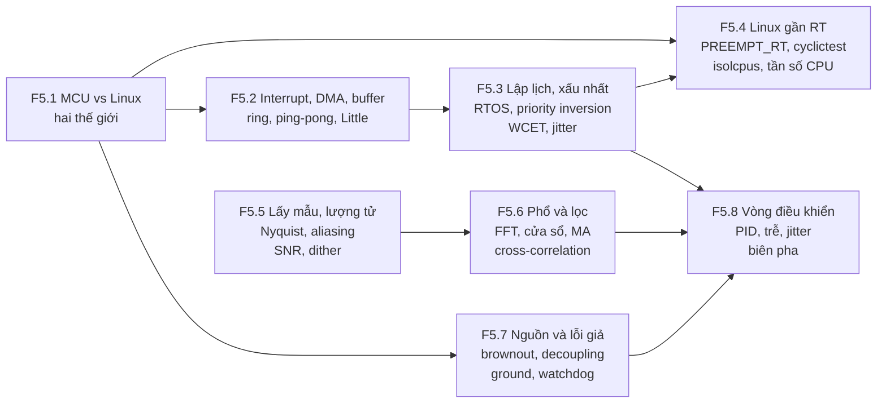
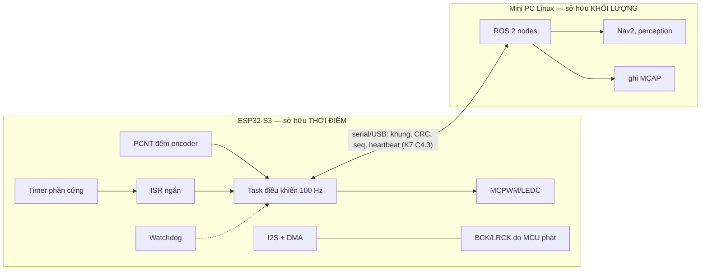
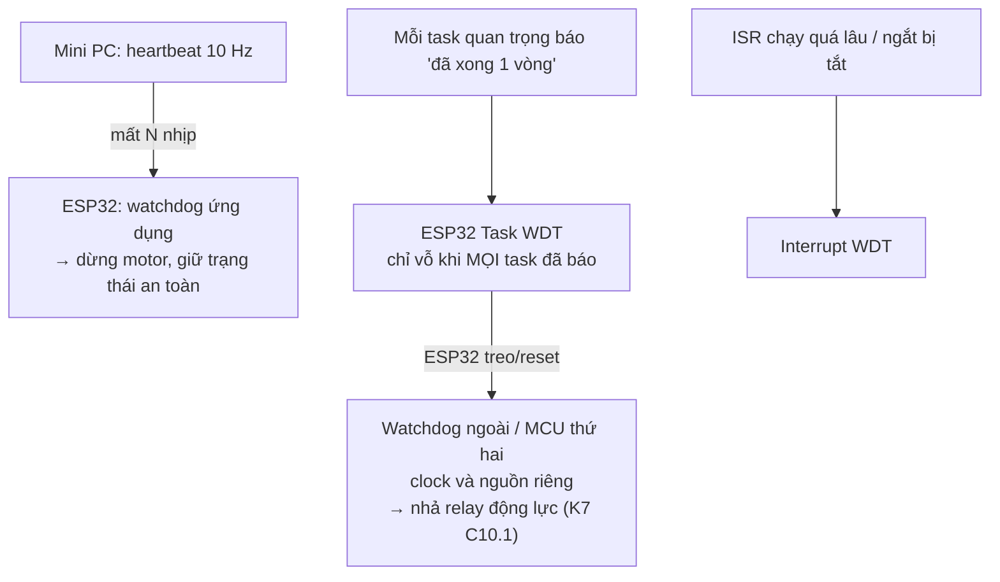

# F5 — Nhúng, thời gian thực và tín hiệu số (37h)

> Khóa nền, học **đúng lúc**: mở viên nang ngay trước bài chính cần nó (bảng dưới), không đọc một mạch. Tổng 37h = F5.1 3h · F5.2 5h · F5.3 5h · F5.4 4h · F5.5 5h · F5.6 5h · F5.7 4h · F5.8 6h. Một phần số giờ trùng với phần khái niệm của K3 Module 1 và K7 C3–C4; phần còn lại cộng thêm vào tổng lộ trình, vốn đã vượt ngân sách 650h (K1–K6 = 545h, K7 mới lõi 561h → 1.106h, xem `khoa-7/_KE-HOACH-K7.md` mục 3). Không giấu con số này.
>
> Mọi khối Python trong file đã chạy trên Python 3 + numpy 2.x/scipy 1.1x của máy soạn. Bài tập đo thời gian (F5.1, F5.4) cho số **khác nhau theo máy**; số trong khối 🔒 là của máy soạn (container ảo hóa, 4 vCPU Xeon), chỉ để so hình dạng, không để so con số.

## Vì sao khóa nền này tồn tại

Bạn sống ở phía Linux. Nhưng mọi byte dữ liệu robot của bạn được sinh ra ở một ranh giới mà Linux không kiểm soát: một bộ đếm phần cứng chốt cạnh encoder, một DMA rót mẫu âm thanh vào RAM, một ADC lượng tử hóa điện áp, một vòng điều khiển 100 Hz phải đúng nhịp. Thiếu F5, bạn sẽ hụt ở đúng những chỗ này:

- **K1 Bài 3, Bài 7, Bài 13** — chọn sample rate cho logic analyzer theo "4–10 lần" mà không biết vì sao, và không biết capture nào nói dối.
- **K3 Bài 2, Bài 4, Bài 10** — đặt `dma_desc_num`, `dma_frame_num` và kích thước ring bằng cảm tính; gọi độ trễ DMA là "một công thức" thay vì định luật Little; đọc "underrun = 0 trong 10 phút" như một bằng chứng.
- **K3 Bài 6, Bài 16** — gọi một lần reset do sụt áp là "firmware crash", và đặt watchdog ở chỗ nó không bao giờ cắn.
- **K3 Bài 7, K4 Bài 8, K5 Bài 4** — kiểm `6,02·N + 1,76` trên giọng thật qua mic (lỗi đã biết, quy chuẩn mục 7), hoặc tin rằng sai số lượng tử ±0,5 LSB là giới hạn không vượt được.
- **K2 Bài 11, K5 Bài 8, Bài 11, K6 Bài 16** — ước lượng độ lệch thời gian bằng cross-correlation mà không biết độ chính xác của nó tới đâu; đóng dấu thời gian trong ISR mà không biết độ trễ ngắt.
- **K7 C4.2** — chạy PID 100 Hz, đo jitter p99 < 100 µs, rồi không trả lời được câu "jitter này có làm robot mất ổn định không", vì không biết ngân sách trễ của vòng kín nằm ở đâu.

Bài chính dạy *làm*; F5 dạy *khi nào một con số thời gian/tín hiệu là đúng, khi nào nó chỉ đúng ở trung vị, và cái gì đang lặng lẽ ăn biên an toàn của bạn*.

## Mindset cốt lõi

1. **"Đúng giờ" là thuộc tính của trường hợp xấu nhất, không phải của trung bình.** Mars Pathfinder (1997) tự reset liên tục trên sao Hỏa vì một task ưu tiên thấp giữ mutex mà task ưu tiên cao cần; trên mặt đất, trường hợp đó gần như không xuất hiện trong test. Người làm thời gian thực tin vào cận trên chứng minh được hoặc đo được rất lâu, không tin p50.
2. **Dữ liệu nên chảy không qua CPU; CPU chỉ nên quyết định.** Máy tính dẫn đường Apollo 11 phát báo động 1202 lúc hạ cánh vì giao tiếp radar rendezvous đánh cắp khoảng 13% chu kỳ máy cho những cập nhật bộ đếm không ai cần (Don Eyles, AAS 04-064, 2004). Mỗi sự kiện dữ liệu mà CPU phải tự tay xử lý là một khoản thuế; DMA, FIFO phần cứng và bộ đếm ngoại vi tồn tại để không phải trả thuế đó.
3. **Thứ canh gác phải độc lập với thứ bị canh.** Tàu Clementine (1994) treo bộ xử lý, mở van đẩy cho tới khi gần cạn nhiên liệu; watchdog phần cứng có sẵn nhưng không được dùng, còn timeout bằng phần mềm thì treo cùng phần mềm (Jack Ganssle, *Great Watchdog Timers for Embedded Systems*). Tàu NEAR sau đó gặp sự cố tương tự và sống sót nhờ watchdog còn chạy.
4. **Lấy mẫu là một phép đo có điều kiện: thứ vượt fs/2 không biến mất, nó đổi tên.** Aliasing không báo lỗi, không làm crash, không tạo NaN; nó cho ra một tín hiệu trông hoàn toàn hợp lý ở sai tần số. Vì vậy người làm đo lường lọc **trước** khi lấy mẫu, không phải sau.
5. **Trễ trong vòng kín là ngân sách, tiêu hết thì dao động.** YF-22 rơi khi hạ cánh thử năm 1992 trong một dao động do phi công gây ra (PIO) liên quan tới giới hạn tốc độ của mặt điều khiển — giới hạn đó hoạt động như thêm trễ pha vào vòng phi công–máy bay. Vòng PID trên robot của bạn có cùng toán học: mỗi mili-giây trễ trong vòng ăn một phần biên pha.

## Bản đồ viên nang



### Học đúng lúc

| Viên nang | Học trước bài chính | Giờ |
|---|---|---|
| F5.1 MCU vs Linux | K3 Bài 2 · K5 Bài 3 · K7 C3 (trước khi bring-up), C4.1 | 3 |
| F5.2 Interrupt, DMA, buffer | **K3 Bài 4** (bắt buộc, cùng F7.1), K3 Bài 9, Bài 15 · K5 Bài 8 · K7 C3, C4.1 | 5 |
| F5.3 Lập lịch và trường hợp xấu nhất | K3 Bài 4 (phần ưu tiên task), **K3 Bài 10**, K3 Bài 16 · K5 Bài 8 · K6 Bài 1 (để phân biệt hai nghĩa "determinism") · **K7 C4**, C10 | 5 |
| F5.4 Linux gần thời gian thực | K3 Bài 10, **K3 Bài 12** (governor, tần số) · K4 Bài 11 · K7 C5.2 (nên đọc) | 4 |
| F5.5 Lấy mẫu và lượng tử | K1 Bài 3, **Bài 7**, Bài 12, Bài 13 · K2 Bài 1, Bài 11 · K3 Bài 1, Bài 3, **Bài 7**, Bài 17, Gate K3 · **K4 Bài 8** · K5 Bài 4 | 5 |
| F5.6 Phổ và lọc | K2 Bài 11 · **K3 Bài 7** · K5 Bài 11 · K6 Bài 16 | 5 |
| F5.7 Nguồn điện và lỗi "phần mềm" giả | K1 Bài 1, Bài 2, Bài 4, Bài 5 · **K3 Bài 6**, Bài 15, **Bài 16** · K5 Bài 3 · **K7 C0, C1**, C5, C10, C12 | 4 |
| F5.8 Vòng điều khiển | **K7 C4.2** (bắt buộc), C4.4, C10.1, C11.1, C11.4 | 6 |

Thứ tự tối thiểu nếu tuần crunch: F5.2 mục 2 + 6 trước K3 Bài 4; F5.5 mục 2 + 6 trước K3 Bài 7; F5.7 mục 2 + 6 trước K3 Bài 6; F5.8 mục 2 + 5 + 6 trước K7 C4.2. Mục 6 (Lăng kính đánh giá) là phần đáng giữ nhất của mỗi viên nang.

## Bạn đã làm cái này rồi

| Bạn đã làm trong backend/AI-harness | Tên chuẩn | Còn thiếu | Viên nang |
|---|---|---|---|
| Đặt timeout, đo p99 latency, cảnh báo khi p99 vượt SLO | Phân tích thời gian đáp ứng (response-time analysis), deadline mềm | Thời gian thực đòi **cận trên** (WCET, worst-case response time), không phải percentile; một lần lỡ có thể là "sai", không phải "chậm" | F5.3 |
| Đo trên host "yên tĩnh" để test không nhiễu | Cô lập nhiễu: `isolcpus`, IRQ affinity, governor `performance`, tắt C-state sâu | Biết **nguồn** nhiễu ở tầng nào (ngắt, SMI, tần số, cache), và đo nó bằng `cyclictest` thay vì cảm giác | F5.4, F1.3 |
| Hàng đợi có giới hạn giữa producer và consumer, backpressure | Ring buffer, double buffering, credit flow control | Ở đây consumer là **đồng hồ phần cứng không biết chờ**; độ trễ = mức đầy / tốc độ rút (Little) | F5.2, F7.1, F3.9 |
| NIC/kernel tự gom gói, bạn chỉ thấy `recv()` | DMA + interrupt coalescing + NAPI polling | Hiểu khi nào "một ngắt mỗi sự kiện" sụp đổ (receive livelock) và chọn kích thước khối | F5.2 |
| Health check + supervisor restart (systemd, k8s liveness probe) | Watchdog, hierarchical watchdog | Liveness probe phải đo **tiến triển thật**, và người canh phải độc lập về nguồn/clock/CPU với thứ bị canh | F5.7 |
| Autoscaler phản ứng theo metric có độ trễ, rồi dao động scale-up/scale-down | Hệ phản hồi có trễ, dao động do trễ trong vòng | Có toán để tính trước trễ bao nhiêu thì dao động (biên pha), thay vì tăng cooldown theo kinh nghiệm | F5.8 |
| Quantize model fp32 → int8/int4 | Lượng tử hóa, nhiễu lượng tử, dải động | Công thức SNR chỉ đúng dưới giả định cụ thể; dither; lượng tử hóa tín hiệu nhỏ thì sai số không còn là "nhiễu" | F5.5, K4 Bài 8 |

---

## F5.1 — MCU vs Linux: hai thế giới, vì sao robot cần cả hai (3h)

> **Dùng cho:** K3 Bài 2 · K5 Bài 3 · K7 C3, C4.1 · **Cần trước:** K1 Bài 3 (clock, bus) · **Sau viên nang này bạn đánh giá được:** một khẳng định kiểu "chạy cái này trên Linux/ESP32 là được" có đúng không, và một chức năng nên nằm ở phía nào của ranh giới.

### 1. Câu chuyện

Ở K3 lượt 3, bạn tự đặt câu hỏi: *"thực tế esp32 chỉ làm dispatcher/coordinator thôi nhỉ… nó chỉ kiểm soát các flag như khi nào bật/tắt, tăng giảm âm lượng… chứ thực sự nó không nên là nơi tạo ra âm thanh"*. Câu hỏi này chạm đúng vào quyết định kiến trúc quan trọng nhất của một robot: cái gì chạy trên vi điều khiển, cái gì chạy trên máy Linux. Bản sơ đồ hệ thống của K7 gốc vẽ ESP32-S3 làm PID bánh, đọc encoder, watchdog và failsafe; mini PC N100 làm ROS 2, perception, ghi dữ liệu. Không ai vẽ ngược lại, và lý do không phải "MCU yếu hơn".

Lịch sử ngắn: vi điều khiển một chip (Texas Instruments TMS1000, đầu thập niên 1970) sinh ra để thay mạch logic rời trong máy tính bỏ túi và đồ gia dụng — một chương trình cố định, phản ứng với nút bấm và chân I/O ngay lập tức. Hệ điều hành đa nhiệm sinh ra từ hướng ngược lại: chia một máy đắt tiền cho nhiều người dùng, tối ưu **thông lượng trung bình** và **công bằng**. Hai dòng dõi đó mang theo hai hệ giá trị khác nhau. Robot hiện đại cần cả hai vì nó vừa phải đếm từng cạnh encoder không sót (một thế giới), vừa phải chạy một mạng nơ-ron 200 MB và ghi MCAP xuống SSD (thế giới kia).

### 2. Mô hình tư duy



| Thuộc tính | MCU (ESP32-S3) | Linux (N100) |
|---|---|---|
| Tài nguyên | 2 nhân Xtensa LX7 ≤ 240 MHz, 512 KB SRAM `[spec: ESP32-S3 datasheet]` | 4 nhân Gracemont ≤ 3,4 GHz, không HT, GB RAM `[spec: Intel ARK N100]` |
| Bộ nhớ | Không có bộ nhớ ảo theo tiến trình; code chạy từ flash qua cache, hàm nóng đặt ở IRAM | Bộ nhớ ảo, page fault, swap, cache nhiều tầng |
| Lập lịch | FreeRTOS: ưu tiên cố định, preempt; bạn biết mọi task | Scheduler công bằng (EEVDF từ Linux 6.6 `[chuẩn]`), hàng trăm tiến trình bạn không viết |
| Thời gian đáp ứng ngắt | Cỡ µs, phân bố hẹp nếu code đúng `[tự đo]` | Cỡ µs–ms, đuôi dài phụ thuộc kernel/tải/firmware `[tự đo, → F5.4]` |
| Khởi động | Cỡ trăm ms `[tự đo]` | Hàng chục giây `[tự đo]` |
| Mất điện giữa chừng | Không có hệ tệp để hỏng (trừ NVS) | Hệ tệp, journal, MCAP chưa đóng |
| Thứ nó giỏi | Phản ứng **đúng lúc** với chân I/O; giữ nhịp | Tính **nhiều**; lưu trữ; mạng; thư viện |

Ba câu bản chất:
- Ranh giới không phải "mạnh/yếu" mà là **ai sở hữu thời điểm**. Một chức năng thuộc về MCU khi sai thời điểm của nó làm hỏng kết quả vật lý (cạnh PWM, đếm encoder, cắt motor khi mất heartbeat, phát clock I2S). Nó thuộc về Linux khi sai thời điểm chỉ làm chậm kết quả.
- MCU **không tự động** tất định. Nó tất định khi bạn giữ nó như vậy: không cấp phát bộ nhớ động trong vòng nóng, không gọi API chặn, không để WiFi và vòng điều khiển tranh một nhân mà không có ưu tiên rõ (F5.3).
- Đường nối hai thế giới là một **giao thức**, không phải một lệnh gọi hàm: có khung, CRC, số thứ tự, heartbeat, và quy định "khi bên kia im lặng thì làm gì" (K7 C4.3, C4.4).

**Đo thử ngay trên laptop.** Viết một vòng 1 kHz kiểu "backend" bằng `sleep`, đo chu kỳ thật khi máy yên và khi có tải:

```python
# [đã chạy] F5.1 — một vòng 1 kHz bằng sleep trên Linux: đo chu kỳ thật
import time, numpy as np, multiprocessing as mp

def busy(stop):                      # tải nền: một tiến trình đốt CPU
    while not stop.is_set():
        sum(i * i for i in range(10_000))

def run_loop(period_s=0.001, n=5000):
    t_next = time.perf_counter()
    stamps = np.empty(n)
    for k in range(n):
        t_next += period_s                       # lịch tuyệt đối, không cộng dồn sai
        delay = t_next - time.perf_counter()
        if delay > 0:
            time.sleep(delay)
        stamps[k] = time.perf_counter()          # "đầu chu kỳ" thực tế
    return np.diff(stamps) * 1e6                 # µs

def report(name, d, period_us=1000):
    print(f"{name:10s} p50={np.percentile(d,50):7.1f} p99={np.percentile(d,99):7.1f} "
          f"max={d.max():8.1f} µs | chu kỳ >1.5 ms: {np.mean(d > 1.5*period_us)*100:.2f}%")

if __name__ == "__main__":
    report("yên", run_loop())
    stop = mp.Event()
    hogs = [mp.Process(target=busy, args=(stop,)) for _ in range(mp.cpu_count())]
    for h in hogs: h.start()
    try:
        report("có tải", run_loop())
    finally:
        stop.set(); [h.join() for h in hogs]
```

### 3. Cầu nối từ backend

| Backend bạn biết | Ở đây | Gãy ở chỗ | Nếu dùng nhầm thì |
|---|---|---|---|
| Edge proxy / sidecar lo việc "gần dây", app lo nghiệp vụ | MCU lo I/O có thời hạn, Linux lo tính toán | Proxy chậm thì request chậm; MCU trễ thì **vật lý sai** (cạnh PWM lệch, encoder mất xung, motor không dừng) | Đẩy PID lên Linux "cho dễ debug" → trễ vòng tăng vài ms và có đuôi dài (F5.8) |
| Microservice gọi nhau qua RPC | Host ↔ MCU qua serial có khung | RPC có retry và timeout; motor không "retry" được một lệnh đã áp. Bên nhận phải có trạng thái an toàn mặc định khi mất liên lạc | Coi serial như socket tin cậy → robot chạy tiếp lệnh cuối khi host treo |
| Container khởi động lại trong vài giây | MCU reset trong trăm ms, Linux boot hàng chục giây | Trong lúc Linux boot lại, chỉ MCU còn giữ được an toàn | Đặt watchdog dừng motor ở phía Linux |
| Thread pool trong một service | Task FreeRTOS trên hai nhân ESP32-S3 | Ưu tiên là **tuyệt đối** (task cao hơn chạy tới khi tự nhường), không chia công bằng | Một task ưu tiên cao vòng lặp bận → mọi task thấp hơn chết đói, kể cả task vỗ watchdog |

**Chấm mô hình:**

- *"MCU thì tất định, Linux thì không."* (`robotics-data-infra-roadmap.md`, mục 2.1) — **ĐÚNG MỘT PHẦN.** Đúng về xu hướng phân bố: MCU có ít nguồn bất định hơn nhiều. Gãy ở chỗ: tất định là thuộc tính của **cách bạn viết code** trên nền tảng, không phải của con chip. *Phản ví dụ:* trên ESP32-S3, một hàm đặt trong flash bị cache miss đúng lúc ghi NVS (flash cache bị tắt khi ghi/xóa flash) sẽ chờ tới khi thao tác flash xong `[spec: ESP-IDF, mục "Concurrency Constraints for Flash on SPI1", tự đo theo phiên bản]`; một vòng điều khiển dùng `vTaskDelay(1)` ở tick 100 Hz có độ phân giải 10 ms. Ngược lại, Linux với PREEMPT_RT, CPU cô lập và cấu hình đúng đạt độ trễ đánh thức đuôi cỡ vài chục µs trên phần cứng phù hợp `[tự đo, → F5.4]`.
- *Mô hình K3 lượt 3 của bạn: "ESP32 chỉ làm dispatcher, chỉ giữ flag bật/tắt/âm lượng."* — **ĐÚNG MỘT PHẦN.** Đúng: ESP32 không nên là nơi sinh nội dung (TTS chạy trên N100). Gãy ở chỗ "chỉ giữ flag": ESP32 là **chủ đồng hồ** của đường I2S — nó phát BCK/LRCK, nó quyết định mẫu nào ra dây ở micro-giây nào, và ring buffer + DMA của nó là nơi hấp thụ jitter của Linux (K3 Bài 4). Mất vai trò đó thì "dispatcher" phải được thay bằng một thứ khác cũng giữ nhịp. *Phản ví dụ:* nếu ESP32 chỉ chuyển tiếp byte mà không có buffer và không sở hữu nhịp, một lần Linux trễ 20 ms (bạn sẽ thấy con số cỡ này trong bài tập trên) là một tiếng tách nghe được.

**Tên chuẩn của thứ bạn đã làm:** tách "hot path tất định" khỏi "control plane linh hoạt" trong backend (ví dụ data plane của proxy viết bằng C, control plane bằng Go/Python) chính là mẫu **mixed-criticality** của hệ nhúng. Thứ còn thiếu: ở robot, ranh giới đó được vẽ theo **hậu quả vật lý khi trễ**, và nó đi kèm một hợp đồng an toàn khi mất liên lạc.

### 4. Thuật ngữ

| Mức | Thuật ngữ | Nghĩa trong một câu | Hay bị hiểu nhầm thành |
|---|---|---|---|
| 🟢 | MCU vs MPU/SoC | Một chip chạy một firmware, I/O trực tiếp, vs. chip chạy hệ điều hành có bộ nhớ ảo | "MCU là máy tính yếu" |
| 🟢 | Firmware | Chương trình duy nhất chạy trên MCU, nạp vào flash | "Driver" |
| 🟢 | Timer phần cứng | Bộ đếm chạy theo clock, tạo ngắt/sự kiện đúng hạn không cần CPU | `sleep()` |
| 🟢 | Ngoại vi (peripheral) | Khối phần cứng chuyên dụng: PCNT, MCPWM, I2S, UART | "Thư viện" |
| 🟡 | IRAM / chạy từ flash qua cache | Code nóng nằm trong SRAM để không phụ thuộc cache flash | "Tối ưu tốc độ" (thật ra là tối ưu **tính đoán trước**) |
| 🟡 | micro-ROS | ROS 2 client chạy trên MCU, nói chuyện qua agent | "ROS 2 thu nhỏ, thay được serial tự viết" |
| 🔴 | MMU/MPU chi tiết, linker script | — | — |

### 5. Bài tập dự đoán

**Đề.** Chạy khối Python ở mục 2 trên máy của bạn (laptop hoặc N100, ngoài Docker nếu được). Trước khi chạy, ghi vào `prediction.md`:

1. p50, p99, max của chu kỳ (µs) khi máy yên, và khi mọi nhân bị một tiến trình đốt CPU.
2. Tỉ lệ chu kỳ dài quá 1,5 ms trong mỗi trường hợp.
3. Nếu đây là vòng PID 1 kHz điều khiển motor, với số max bạn đoán, có bao nhiêu chu kỳ liên tiếp motor chạy theo lệnh cũ?
4. Một câu: bạn sẽ đặt vòng này ở phía nào của ranh giới, dựa trên số nào.

**Tham số cần tra:** `cat /proc/self/timerslack_ns` (timer slack mặc định của tiến trình thường, đơn vị ns); số nhân `nproc`; có phải máy ảo không (`systemd-detect-virt`).

**Phương pháp:** lịch tuyệt đối (`t_next += period`) để lỗi không cộng dồn; đo chu kỳ bằng hiệu hai timestamp đầu chu kỳ; 5000 mẫu (5 s).

```markdown
# prediction.md — F5.1
máy: <CPU, ảo hóa?>  timerslack_ns: <…>
yên:    p50 = … µs  p99 = … µs  max = … µs  >1.5 ms: …%
có tải: p50 = … µs  p99 = … µs  max = … µs  >1.5 ms: …%
số chu kỳ chạy theo lệnh cũ ở max: …
phía nào: … vì …
```

<details><summary>🔒 MỞ SAU KHI COMMIT prediction.md</summary>

Hai lần chạy trên máy soạn (container, 4 vCPU Xeon 2,8 GHz, kernel `PREEMPT_DYNAMIC`, timerslack 50 000 ns):

| Lần | Trường hợp | p50 (µs) | p99 (µs) | max (µs) | > 1,5 ms |
|---|---|---|---|---|---|
| 1 | yên | 999 | 1213 | 3391 | 0,60% |
| 1 | có tải | 1000 | 1452 | 51 551 | 0,98% |
| 2 | yên | 999 | 1144 | 6423 | 0,38% |
| 2 | có tải | 1000 | 1613 | 21 892 | 1,24% |

Đọc bảng:
- **p50 hoàn hảo trong mọi trường hợp.** Nếu bạn chỉ nhìn trung vị, vòng này "chạy đúng 1 kHz". Đó chính là thứ một dashboard backend sẽ báo.
- **max dài gấp 20–50 lần chu kỳ khi có tải**: 20–50 chu kỳ liên tiếp motor chạy theo lệnh cũ. Ở 0,5 m/s, 50 ms là 2,5 cm robot đi mù — chưa kể vòng PID tích lũy sai số rồi giật khi tỉnh lại.
- **Max lệch gấp đôi giữa hai lần chạy cùng cấu hình**: đuôi của 5000 mẫu là một ước lượng rất nhiễu (→ F1.2). Đừng so hai cấu hình bằng max của một lần chạy.
- Máy của bạn có thể cho số tốt hơn (máy thật, không ảo hóa) hoặc tệ hơn (laptop tiết kiệm pin). Hình dạng (p50 đẹp, đuôi xấu, đuôi phình khi tải) mới là kết quả.

Câu 4: một vòng mà sai thời điểm làm sai vật lý thuộc về MCU. Lý do bằng số: đuôi ở đây là hàng chục ms; đuôi của timer phần cứng + ISR trên MCU là µs (bạn sẽ đo ở K7 C4.2).

</details>

### 6. Lăng kính đánh giá

Checklist để chấm một khẳng định kiểu "chạy X trên nền tảng Y là đủ nhanh / đủ đúng giờ":

1. Khẳng định nói về **trung bình/trung vị** hay **trường hợp xấu nhất**? Nếu chức năng có hậu quả vật lý khi trễ mà chỉ có trung bình → **CHƯA RÕ**.
2. Có nêu **hậu quả khi trễ** không (chậm, hay sai)? Không nêu → chưa đủ để chọn phía.
3. Số đo được lấy **ở đâu** (trong code tự đo bằng clock phần mềm, hay bằng GPIO + logic analyzer)? Tự đo bằng chính hệ đang bị đo → nghi ngờ (→ F4.7).
4. Có nói đến **tải nền** (WiFi, ghi flash, log, tiến trình khác) không? Đo khi máy yên → chỉ là cận dưới.
5. Khi kênh nối hai thế giới im lặng, bên MCU **làm gì**? Không có câu trả lời → kiến trúc **SAI** về an toàn dù số đo đẹp.
6. Khẳng định "nhanh hơn được nhưng bị giới hạn" có nêu **cái gì** giới hạn (đường găng, công suất, băng thông bus, giao thức) không?

**Khẳng định mẫu — tự chấm ĐÚNG / ĐÚNG MỘT PHẦN / SAI / CHƯA RÕ, rồi mở đáp án:**

(a) *Mô hình K3 lượt 7 của bạn:* "người ta có thể để cho mọi thứ chạy nhanh nhất có thể… dù nó có thể chạy nhanh hơn 1000 lần nhưng vẫn không cho phép, phải giới hạn nó lại."

(b) *Gemini K7 Bài 3:* "Nếu tải WiFi trên ESP32 làm jitter vòng điều khiển vọt lên vài mili-giây, điều này giải thích lý do tại sao kiến trúc robot hoàn chỉnh lại tách biệt máy tính Linux và vi điều khiển."

(c) *Roadmap mục 2.1:* "Robot thật luôn có cả hai: MCU lo control loop cứng, Linux lo perception/data."

(d) "Vòng 1 kHz bằng `sleep` trên laptop của tôi đạt p50 = 1000 µs, vậy Linux đủ cho vòng điều khiển motor."

<details><summary>🔒 Đáp án</summary>

(a) **SAI** (chấm đầy đủ ở K3 Bài 4, mục 3; quy chuẩn mục 7). Tóm tắt để tự đối chiếu: tần số tối đa của mạch đồng bộ bị chặn bởi **đường găng**: chu kỳ clock ≥ t_clk→q + t_logic(max) + t_setup (+ skew). Chạy nhanh hơn thì flip-flop chốt giá trị chưa ổn định → **tính sai**, không phải "bị cấm". Muốn nhanh hơn phải tăng điện áp, và công suất động P ∝ C·V²·f tăng nhanh hơn tần số → nhiệt. Phần F5.1 bổ sung: ESP32-S3 chạy 240 MHz chứ không phải 3 GHz không vì "bị hãm", mà vì nó được thiết kế cho công suất cỡ trăm mW và cho **I/O đúng lúc**, nơi nhịp được đặt bởi thiết bị bên ngoài (BCK 768 kHz của I2S là đúng tốc độ dữ liệu cần, không phải tốc độ bị giảm).

(b) **ĐÚNG MỘT PHẦN.** Đúng: tải nền có thể kéo jitter lên. Gãy: lời giải cho jitter do WiFi **trên chính ESP32** không phải là tách sang Linux (Linux còn tệ hơn) mà là cấu trúc firmware: vòng điều khiển kích bằng timer phần cứng, task ưu tiên cao hơn WiFi, ghim nhân khác với stack WiFi, không ghi flash trong vòng nóng (F5.3). Lý do thật của việc tách Linux/MCU là **phân công theo hậu quả trễ** (mục 2), không phải "WiFi làm jitter". Phản ví dụ: robot không dùng WiFi trên ESP32 vẫn tách như vậy.

(c) **ĐÚNG MỘT PHẦN.** Đúng cho kiến trúc robot cỡ của bạn và phần lớn robot di động. Gãy ở chữ "luôn": có robot dùng Linux PREEMPT_RT chạy vòng điều khiển 1 kHz trực tiếp (nhiều cánh tay công nghiệp dùng EtherCAT với master trên Linux RT `[chuẩn]`), và có robot chỉ có MCU. Câu đúng: "chức năng nào có hậu quả vật lý khi trễ thì nằm trên nền tảng có cận trên thời gian đã đo".

(d) **SAI** (suy luận). p50 không nói gì về đuôi; bài tập trên cho p50 = 1000 µs và max 20–50 ms trên cùng máy. Muốn kết luận cần đuôi đo đủ lâu dưới tải thật, và cần biết vòng chịu được bao nhiêu trễ (F5.8).

</details>

### 7. Câu hỏi ngược

1. **[Nếu…thì]** Nếu ESP32 reset giữa lúc robot đang chạy (brownout, watchdog), Linux thấy gì trong 200 ms đầu tiên, và log của nó có phân biệt được "MCU reset" với "cáp USB lỏng" không?
   <details><summary>Hướng nghĩ</summary>

   Nghĩ về số thứ tự khung (seq) bắt đầu lại từ 0, `boot_id` của MCU, `esp_reset_reason()` gửi lên ngay khung đầu sau boot. Nếu giao thức không có các trường này, hai sự cố trông giống hệt nhau. Đây là quyết định thiết kế cho K7 C4.3.

   </details>
2. **[Vì sao không]** Vì sao không chạy luôn mọi thứ trên một SoC có cả nhân ứng dụng và nhân thời gian thực (kiểu chip có nhân Cortex-A + Cortex-M)?
   <details><summary>Hướng nghĩ</summary>

   Được, và nhiều sản phẩm làm vậy. Cân nhắc: chung nguồn và chung reset (Linux panic có kéo nhân RT theo không?), độ khó toolchain, cộng đồng hỗ trợ cho người mới. Ranh giới "ai sở hữu thời điểm" vẫn còn, chỉ là nằm trong một con chip.

   </details>
3. **[Quy mô]** Với 100 robot, mỗi robot có một firmware ESP32 và một image Linux, cái gì gãy trước: phiên bản firmware không khớp giao thức host, hay cập nhật OTA làm hỏng một phần đội?
   <details><summary>Hướng nghĩ</summary>

   Nghĩ về version handshake trong khung đầu tiên, tương thích ngược của giao thức (giống schema evolution, → F3.2), và việc dataset phải ghi phiên bản firmware cùng mỗi episode (→ F3.8). Một con robot chạy firmware cũ cho dữ liệu odometry hơi khác — đây là lỗi dữ liệu lặng lẽ nhất.

   </details>
4. **[Failure mode]** Host gửi lệnh vận tốc 50 Hz; một ngày host bị kẹt GC/IO 300 ms. Liệt kê ba hành vi khả dĩ của MCU và hậu quả vật lý của từng cái.
   <details><summary>Hướng nghĩ</summary>

   Giữ lệnh cuối (robot đi tiếp 300 ms), về 0 ngay khi lỡ một khung (robot giật), giảm dần theo dốc sau timeout (cần chọn timeout). Chọn bằng số: quãng đường đi mù ở tốc độ tối đa so với khoảng cách an toàn. → K7 C4.4.

   </details>
5. **[Phản biện]** Một đồng nghiệp nói: "micro-ROS làm ranh giới biến mất, MCU giờ cũng là một node ROS 2". Bạn đồng ý tới đâu?
   <details><summary>Hướng nghĩ</summary>

   Ranh giới **giao diện** biến mất (cùng message type), ranh giới **thời gian** thì không: MCU vẫn phải tự bảo vệ khi agent phía Linux chậm. So sánh với gRPC trong backend: cùng IDL không làm hai dịch vụ chung SLO.

   </details>

### 8. Liên kết ra ngoài

- **Ô tô:** một chiếc xe có hàng chục ECU (bộ điều khiển phanh, động cơ, túi khí) chạy hệ điều hành thời gian thực theo AUTOSAR Classic, và một vài máy tính lớn chạy Linux/QNX cho thông tin giải trí và hỗ trợ lái. *Giống:* phân công theo hậu quả trễ. *Khác:* ô tô có chuẩn an toàn chức năng (ISO 26262) bắt buộc chứng minh, robot của bạn chỉ có kỷ luật tự đặt.
- **Mạng:** router có **data plane** (ASIC, chuyển gói ở tốc độ đường truyền) và **control plane** (CPU chạy BGP/OSPF). *Giống:* dữ liệu nóng không đi qua CPU tổng quát. *Khác:* router chấp nhận rớt gói; motor không chấp nhận "rớt" một cạnh PWM.
- **Y sinh:** máy tạo nhịp tim là một MCU công suất cực thấp, không có hệ điều hành đa nhiệm; dữ liệu được đọc định kỳ bởi thiết bị ngoài. *Giống:* chức năng sống còn nằm trên phần tử đơn giản nhất. *Khác:* ở đó không có "phía Linux" chạy thường trực.

### 9. Áp vào khóa chính

- **K3 Bài 2:** bảng chân và cấu hình I2S là hợp đồng ở ranh giới; ESP32 sở hữu clock I2S. Dùng mục 2 để viết một dòng vào `decisions.md`: "ESP32 làm gì, không làm gì, vì sao".
- **K5 Bài 3:** quét bus I2C từ ESP32 hay từ Linux — chọn theo ai cần đóng dấu thời gian gần sự kiện (→ F4.6).
- **K7 C3, C4.1:** lập pin budget và danh sách chức năng MCU; mỗi chức năng ghi "hậu quả khi trễ" và "cận trên cần đạt". Chức năng nào không có cận trên → không cần ở MCU.

### 10. Độ tin cậy

| Khẳng định | Nhãn | Ghi chú / cách kiểm |
|---|---|---|
| ESP32-S3: 2 nhân LX7 ≤ 240 MHz, 512 KB SRAM | `[spec]` | ESP32-S3 Series Datasheet, mục tổng quan |
| N100: 4 nhân, 4 luồng, ≤ 3,4 GHz | `[spec]` | Intel ARK; quy chuẩn mục 7 (không HT) |
| Ghi/xóa flash tắt cache → code chạy từ flash phải chờ | `[spec, tự đo]` | ESP-IDF Programming Guide, phần SPI flash concurrency; kiểm theo phiên bản cài |
| Tick FreeRTOS mặc định của ESP-IDF 100 Hz | `[spec, tự đo]` | `CONFIG_FREERTOS_HZ` trong `sdkconfig` của bạn |
| Linux dùng EEVDF từ 6.6 | `[chuẩn]` | Ghi chú phát hành kernel 6.6 |
| Số đo vòng `sleep` | `[tự đo]` | Bảng trong khối 🔒 là của máy soạn |

### 11. Đọc thêm và tự kiểm tra

- **Nguồn gốc:** *ESP32-S3 Technical Reference Manual* (Espressif) — chương Timer Group, PCNT, MCPWM: đọc mục tổng quan của từng khối.
- **Giải thích:** Elecia White, *Making Embedded Systems* (O'Reilly, bản 2, 2024) — chương về kiến trúc firmware và ngắt.
- **Đào sâu (tùy chọn):** tài liệu kiến trúc micro-ROS (micro.ros.org) — đọc để thấy phần nào của ROS 2 không mang xuống MCU được.
- **Tự kiểm tra:** (1) giải thích cho một backend engineer khác trong 5 câu vì sao PID nằm trên ESP32; (2) vẽ lại sơ đồ mục 2 từ trí nhớ, ghi trên mỗi mũi tên "nếu trễ thì hậu quả gì"; (3) câu hỏi:
  - *Vòng điều khiển 100 Hz trên ESP32 dùng `vTaskDelay(pdMS_TO_TICKS(10))` với tick 100 Hz. Chu kỳ thật là bao nhiêu?*
    <details><summary>Đáp án</summary>

    Lớn hơn 10 ms và trôi: `vTaskDelay` tính **từ lúc gọi**, nên chu kỳ = 10 ms (1 tick) + thời gian thân vòng lặp, cộng dồn theo thời gian. Dùng `xTaskDelayUntil` (lịch tuyệt đối) hoặc timer phần cứng/`esp_timer` thông báo task. Độ phân giải vẫn là 1 tick với cách dùng tick.

    </details>

---

## F5.2 — Interrupt, DMA, buffer: dữ liệu chảy không qua CPU, double buffering, ring buffer (5h)

> **Dùng cho:** K3 Bài 4 (bắt buộc), Bài 9, Bài 15 · K5 Bài 8 · K7 C3, C4.1 · **Cần trước:** F5.1; F7.1 (định luật Little) đọc cùng lúc · **Sau viên nang này bạn đánh giá được:** một con số "độ trễ buffer" hay "kích thước buffer an toàn" có đúng không, và một thiết kế "một ngắt mỗi sự kiện" có sụp dưới tải không.

### 1. Câu chuyện

Ngày 20/7/1969, khi module mặt trăng Apollo 11 đang hạ xuống, máy tính dẫn đường phát liên tiếp các báo động 1202 và 1201: bộ điều phối công việc (Executive) hết chỗ chứa job. Theo Don Eyles, kỹ sư phần mềm hạ cánh của MIT, nguyên nhân là giao tiếp của radar rendezvous — thiết bị không cần cho pha hạ cánh — đã chiếm khoảng 13% chu kỳ máy, bằng những yêu cầu cập nhật bộ đếm mà phần cứng phục vụ bằng cách **đánh cắp chu kỳ bộ nhớ** của CPU (D. Eyles, *Tales from the Lunar Module Guidance Computer*, AAS 04-064, 2004; MIT News 2009 ghi "tới 15%"). Phần mềm sống sót vì nó được thiết kế để khởi động lại và chỉ chạy lại các job quan trọng nhất. Bài học kỹ thuật: mỗi sự kiện dữ liệu mà CPU phải trả giá (dù chỉ một chu kỳ) là một khoản thuế tỉ lệ với **tốc độ sự kiện**, không phải với lượng việc hữu ích.

Gần ba mươi năm sau, Jeffrey Mogul và K. K. Ramakrishnan mô tả cùng hiện tượng trên máy chủ Unix: dưới lưu lượng mạng cao, máy dành gần hết thời gian xử lý **ngắt nhận gói** và không còn thời gian để thực sự xử lý gói nào — thông lượng hữu ích **giảm về 0** khi tải tăng ("Eliminating Receive Livelock in an Interrupt-Driven Kernel", USENIX 1996; bản tạp chí ACM TOCS 1997). Lời giải của họ — tắt ngắt khi đang bận và chuyển sang **polling theo lô** — là tổ tiên của NAPI trong Linux, thứ đang chạy trên card mạng i226 của mini PC bạn.

### 2. Mô hình tư duy

Ba cách đưa dữ liệu từ ngoại vi vào bộ nhớ:

| Cách | CPU trả giá mỗi… | Độ trễ phát hiện | Sụp khi |
|---|---|---|---|
| Polling (CPU hỏi liên tục) | lần hỏi, kể cả khi không có gì | ≤ chu kỳ hỏi | Không có gì để hỏi mà vẫn đốt CPU |
| Ngắt mỗi sự kiện | sự kiện (vào/ra ISR, lưu ngữ cảnh) | nhỏ | Tốc độ sự kiện × chi phí ISR → 100% CPU (livelock) |
| DMA theo khối + ngắt mỗi khối | khối B sự kiện | ≥ thời gian lấp một khối | Task xử lý không xong khối trước khi DMA quay lại ghi đè |

**Double buffering (ping-pong)** trên dây thời gian, B mẫu mỗi khối, fs mẫu/giây, T = B/fs:

```
DMA ghi:   |== khối A ==|== khối B ==|== khối A ==|== khối B ==|
ngắt:                   ^A đầy       ^B đầy       ^A đầy
task xử lý:               [xử lý A]    [xử lý B]    [xử lý A]
deadline xử lý A:        |<--- T --->|  (trước khi DMA quay lại ghi A)
                         với n khối xoay vòng: deadline = (n−1)·T
```

**Ring buffer** là tổng quát hóa: n khe, một con trỏ ghi, một con trỏ đọc; đầy thì producer phải chờ hoặc ghi đè (chính sách drop, → F3.9); rỗng thì consumer phải chờ hoặc phát "im lặng" (underrun).

**Định luật Little, nói thẳng** (→ F7.1, K3 Bài 4): với mọi hệ ổn định, số phần tử trung bình trong hệ L = λ·W (λ tốc độ đến, W thời gian lưu trung bình). Với buffer audio, λ = fs cố định bởi đồng hồ phần cứng, nên **độ trễ do buffer = mức đầy trung bình / fs**. Công thức `dma_desc_num × dma_frame_num / fs` mà bản gốc K3 đưa ra là **cận trên** khi DMA đầy hoàn toàn, không phải độ trễ thật (quy chuẩn mục 7).

**Hai miền clock** (ESP32 và PCM5102A, hoặc thạch anh mic và thạch anh ESP32) không nối được bằng "một vùng RAM". Phần cứng dùng **FIFO bất đồng bộ**: hai con trỏ ở hai miền clock, mã hóa Gray để mỗi lần đổi chỉ lật một bit, qua mạch đồng bộ hóa hai flip-flop trước khi so sánh đầy/rỗng `[chuẩn: C. Cummings, "Simulation and Synthesis Techniques for Asynchronous FIFO Design", SNUG 2002]`. Nó sâu vài chục từ, không phải megabyte. RAM của bạn là chỗ đặt buffer **phần mềm**; FIFO bất đồng bộ là chỗ hai đồng hồ gặp nhau.

Mô phỏng: (A) livelock khi ngắt mỗi gói so với polling theo lô; (B) capture ping-pong với độ trễ thức dậy của task có đuôi, đo trễ W hai cách độc lập (trực tiếp từng mẫu, và L/λ với L đếm trên lưới thời gian) để thấy Little đúng, và đo tỉ lệ lỡ deadline.

```python
# [đã chạy] F5.2 — (A) receive livelock: ngắt mỗi gói vs polling; (B) ping-pong DMA: deadline và Little
import numpy as np
rng = np.random.default_rng(1)

# (A) ISR tốn c_i mỗi gói (ưu tiên tuyệt đối); xử lý ở task tốn c_p mỗi gói
c_i, c_p, c_poll = 5e-6, 20e-6, 1e-6
print("λ (gói/s) | ngắt mỗi gói | polling theo lô")
for lam in [10e3, 30e3, 40e3, 60e3, 100e3, 150e3, 200e3]:
    thr_irq = min(lam, max(0.0, 1 - lam * c_i) / c_p)   # phần CPU ISR chừa lại / c_p
    thr_poll = min(lam, 1 / (c_p + c_poll))             # tắt ngắt khi bận, poll cả lô
    print(f"{lam:9.0f} | {thr_irq:12.0f} | {thr_poll:12.0f}")

# (B) capture: DMA lấp khối B mẫu -> ngắt -> task thức sau X -> xử lý P (một task, tuần tự)
fs, P, nblk = 48_000, 0.3e-3, 20_000
def simulate(B, nbuf):
    T = B / fs
    complete = (np.arange(nblk) + 1) * T                 # lúc khối k đầy
    x = rng.lognormal(np.log(50e-6), 0.5, nblk)          # độ trễ thức dậy thường
    x += (rng.random(nblk) < 1e-3) * rng.uniform(1e-3, 4e-3, nblk)  # 0,1% bị chặn lâu
    finish = np.empty(nblk); prev = 0.0
    for k in range(nblk):                                # task tuần tự: chờ xong khối trước
        prev = max(complete[k] + x[k], prev) + P
        finish[k] = prev
    miss = np.mean(finish - complete > (nbuf - 1) * T)   # DMA đã quay lại ghi đè khối này
    t_s = np.arange(nblk * B) / fs                       # thời điểm chụp từng mẫu
    W = (np.repeat(finish, B) - t_s).mean()              # trễ trung bình đo trực tiếp
    grid = np.arange(0, complete[-1], 1e-4)              # L đo độc lập: đếm mẫu "đang bay"
    L = (np.floor(grid * fs) + 1 - B * np.searchsorted(finish, grid, side="right")).mean()
    return W, L / fs, miss

print("\n  B nbuf | W trực tiếp | L/λ (Little) | lỡ deadline")
for nbuf in (2, 3):
    for B in (32, 64, 128, 256):
        W, WL, miss = simulate(B, nbuf)
        print(f"{B:4d} {nbuf:3d} | {W*1e3:8.3f} ms | {WL*1e3:8.3f} ms  | {miss*100:6.3f}%")
```

### 3. Cầu nối từ backend

| Backend bạn biết | Ở đây | Gãy ở chỗ | Nếu dùng nhầm thì |
|---|---|---|---|
| Kafka producer `batch.size` / `linger.ms` | Kích thước khối DMA B | Batch Kafka đổi trễ lấy thông lượng và **không có deadline cứng**; khối DMA có deadline (n−1)·T tuyệt đối | Chọn B theo thông lượng, quên deadline → lỡ khối, mất mẫu lặng lẽ |
| NIC interrupt coalescing, NAPI, busy-poll | Ngắt mỗi khối DMA, polling khi bận | Ở MCU bạn tự viết cả hai phía; không có kernel làm hộ | Viết ISR mỗi cạnh encoder ở tốc độ cao → livelock trên MCU, trong khi PCNT phần cứng đếm miễn phí |
| Hàng đợi có giới hạn + backpressure | Ring buffer giữa task nạp và DMA | Consumer cuối là **đồng hồ không biết chờ**: rỗng thì phát im lặng/tiếng tách, không "đợi thêm" | Thiết kế như queue backend (producer đẩy nhanh nhất có thể) → ring luôn đầy → trễ tối đa |
| concurrency = RPS × latency (Little) | trễ = mức đầy / fs | Không gãy: cùng một định luật. Điểm mới: λ cố định tuyệt đối | Tính trễ theo **dung lượng** thay vì **mức đầy** → báo trễ sai, chọn sai ring |
| Event handler trong Node.js phải nhanh, không chặn event loop | ISR phải ngắn, không chặn, không cấp phát | Event loop chậm thì request chờ; ISR dài thì **mọi ngắt ưu tiên thấp hơn** và mọi task đều trễ, kể cả watchdog | `printf` trong ISR → jitter, có thể deadlock trên lock UART, watchdog ngắt cắn |

**Chấm mô hình:**

- *"DMA nghĩa là CPU rảnh."* (`robotics-data-infra-roadmap.md`: "lý do I2S có thể stream audio liên tục mà CPU vẫn rảnh") — **ĐÚNG MỘT PHẦN.** Đúng: CPU không chép từng mẫu. Gãy: (1) DMA và CPU **chia chung bus/bộ nhớ**; (2) CPU vẫn phải **nạp** khối kế tiếp trước deadline — nếu task nạp trễ, DMA phát lại dữ liệu cũ hoặc im lặng tùy cấu hình (`auto_clear` ở I2S ESP-IDF `[spec, tự đo]`); (3) buffer DMA phải nằm ở vùng nhớ DMA đọc được (`MALLOC_CAP_DMA`) `[spec: ESP-IDF heap capabilities]`. *Phản ví dụ:* K3 Bài 10 — CPU "rảnh" 90% nhưng một task ưu tiên cao hơn chạy 10 ms liền vẫn gây underrun.
- *"Thêm khối DMA thì trễ tăng."* — **ĐÚNG MỘT PHẦN.** Với đường **phát** (playback), host giữ ring gần đầy nên thêm khe → mức đầy tăng → trễ tăng. Với đường **thu** xử lý ngay khi khối đầy, thêm khe chỉ nới deadline, **không** tăng trễ trung bình (trễ do B quyết định). Bài tập mục 5 cho bạn thấy điều này bằng số. *Phản ví dụ:* ghi âm 3 khối thay vì 2 khối cùng B: trễ như nhau, lỡ deadline ít hơn.

**Tên chuẩn của thứ bạn đã làm:** bạn đã dùng bounded queue, batch, và coalescing; tên trong nhúng là **ring buffer, ping-pong buffer, DMA descriptor chain, interrupt moderation**. Thứ còn thiếu: tính **deadline của consumer phần cứng** và đọc độ trễ bằng **mức đầy** (Little), không bằng dung lượng.

### 4. Thuật ngữ

| Mức | Thuật ngữ | Nghĩa trong một câu | Hay bị hiểu nhầm thành |
|---|---|---|---|
| 🟢 | Interrupt / ISR | Phần cứng dừng luồng đang chạy để gọi một hàm ngắn | "Callback" (callback không preempt ai) |
| 🟢 | DMA | Khối phần cứng chép dữ liệu giữa ngoại vi và RAM không qua lệnh CPU | "CPU không tốn gì" |
| 🟢 | Ring buffer | Mảng vòng có con trỏ đọc/ghi, đầy/rỗng có chính sách | "Queue vô hạn" |
| 🟢 | Double buffering (ping-pong) | Hai khối: phần cứng ghi một khối trong khi phần mềm xử lý khối kia | "Gấp đôi trễ" (không nhất thiết, xem mục 5) |
| 🟢 | Underrun / overrun | Consumer cạn dữ liệu / producer ghi đè dữ liệu chưa đọc | "Lỗi mạng" |
| 🟢 | Định luật Little | L = λW cho mọi hệ ổn định | "Công thức của M/M/1" |
| 🟡 | DMA descriptor | Cấu trúc mô tả một khối (địa chỉ, độ dài, khối kế) để DMA tự đi theo chuỗi | "Buffer" |
| 🟡 | Interrupt latency | Từ lúc sự kiện phần cứng tới lệnh đầu tiên của ISR | "Thời gian chạy ISR" |
| 🟡 | Receive livelock | Ngắt ăn hết CPU, không còn thời gian làm việc hữu ích | "Quá tải" chung chung |
| 🟡 | FIFO bất đồng bộ | FIFO phần cứng nối hai miền clock bằng con trỏ mã Gray đã đồng bộ hóa | "RAM làm buffer" |
| 🔴 | Cache coherence khi DMA vào PSRAM | — | — |

### 5. Bài tập dự đoán

**Đề.** Với mô phỏng ở mục 2, trước khi chạy, ghi vào `prediction.md`:

1. (A) Với ngắt mỗi gói, ở λ nào thông lượng hữu ích đạt đỉnh, giá trị đỉnh bao nhiêu, và ở λ nào nó về 0? Với polling, thông lượng trần là bao nhiêu? Tính tay từ c_i, c_p, c_poll.
2. (B) Với B = 64 và B = 256, trễ trung bình W bao nhiêu ms? (Gợi ý: một mẫu chờ trung bình nửa khối, cộng độ trễ thức dậy trung bình, cộng P.)
3. (B) Khi đổi từ 2 khối sang 3 khối (cùng B), W tăng, giảm hay giữ nguyên? Tỉ lệ lỡ deadline thay đổi thế nào?
4. (B) Ở B = 32, n = 2, tỉ lệ lỡ deadline: lớn hơn hay nhỏ hơn 0,1% (tỉ lệ cú "bị chặn lâu" trong mô hình)? Vì sao?

**Tham số:** c_i = 5 µs, c_p = 20 µs, c_poll = 1 µs; fs = 48 kHz; P = 0,3 ms; độ trễ thức dậy lognormal trung vị 50 µs (trung bình của lognormal = trung vị × e^(σ²/2), σ = 0,5); 0,1% cú chặn 1–4 ms. Công thức: thông lượng ngắt = min(λ, (1 − λ·c_i)/c_p); deadline = (n−1)·B/fs.

```markdown
# prediction.md — F5.2
(A) đỉnh ở λ = … gói/s, thông lượng đỉnh = …; về 0 ở λ = …; polling trần = …
(B) W(B=64) = … ms, W(B=256) = … ms
    2→3 khối: W …; lỡ deadline …
    B=32,n=2: lỡ deadline > / < 0,1% vì …
```

<details><summary>🔒 MỞ SAU KHI COMMIT prediction.md</summary>

Kết quả chạy:

```
λ (gói/s) | ngắt mỗi gói | polling theo lô
    10000 |        10000 |        10000
    40000 |        40000 |        40000
    60000 |        35000 |        47619
   100000 |        25000 |        47619
   150000 |        12500 |        47619
   200000 |            0 |        47619

  B nbuf | W trực tiếp | L/λ (Little) | lỡ deadline
  32   2 |    0.713 ms |    0.714 ms  |  0.795%
  64   2 |    1.038 ms |    1.040 ms  |  0.155%
 128   2 |    1.702 ms |    1.704 ms  |  0.025%
 256   2 |    3.035 ms |    3.037 ms  |  0.000%
  32   3 |    0.711 ms |    0.713 ms  |  0.455%
  64   3 |    1.041 ms |    1.042 ms  |  0.115%
 128   3 |    1.704 ms |    1.706 ms  |  0.000%
 256   3 |    3.036 ms |    3.038 ms  |  0.000%
```

1. Đỉnh khi λ = (1 − λc_i)/c_p → λ* = 1/(c_i + c_p) = 40 000 gói/s; về 0 ở λ = 1/c_i = 200 000. Polling trần 1/(c_p + c_poll) ≈ 47 619. Đường "ngắt mỗi gói" **đi xuống** khi tải tăng: đó là livelock. Polling không sụp mà bão hòa phẳng; phần dư bị drop ở hàng đợi phần cứng, nơi drop rẻ nhất.
2. W ≈ T/2 + E[X] + P (+ chút xếp hàng): B = 64 → 0,667 + 0,057 + 0,3 ≈ 1,03 ms; B = 256 → 2,67 + 0,36 ≈ 3,03 ms. Hai cột W khớp tới ~0,002 ms: Little đúng (L đếm độc lập trên lưới thời gian).
3. **W giữ nguyên**, lỡ deadline giảm. Ở đường thu xử lý-ngay, thêm khe chỉ thêm **khoảng nới**, không thêm trễ — vì mức đầy trung bình không đổi. Đường phát thì khác (host giữ ring đầy → trễ = dung lượng). Đây là lý do "thêm buffer = thêm trễ" chỉ đúng một phần.
4. **Lớn hơn** (0,8% so với 0,1%). Ở B = 32, T = 0,67 ms: một cú chặn 1–4 ms không chỉ làm lỡ khối của nó mà còn đẩy **vài khối kế tiếp** (task phải xử lý dồn, mỗi khối 0,3 ms). Lỗi đuôi lan theo hàng đợi — cùng cơ chế với coordinated omission (→ F1.3).

</details>

### 6. Lăng kính đánh giá

Checklist để chấm một khẳng định về buffer/ngắt/DMA:

1. Con số "độ trễ buffer" là **dung lượng/tốc độ** (cận trên) hay **mức đầy/tốc độ** (Little)? Có nói host giữ ring đầy bao nhiêu không?
2. Có nêu **deadline** của consumer (DMA quay vòng, đồng hồ I2S) và **phân bố** độ trễ của task nạp/xử lý không? Chỉ có trung bình → CHƯA RÕ.
3. Có tính **tốc độ sự kiện × chi phí mỗi sự kiện** cho đường ngắt không? Tốc độ tối đa (encoder ở vận tốc tối đa, gói mạng burst) chứ không phải trung bình.
4. Hai đầu buffer có **chung đồng hồ** không? Nếu không, có flow control hay bù trôi (→ F4.1, K3 Bài 4), hay chỉ có "buffer to hơn"?
5. Kết luận "không underrun" đi kèm **thời gian quan sát và khoảng tin cậy** không (→ F1.4)?
6. Có phân biệt **vai trò** (buffer, FIFO đồng bộ hóa clock, bộ nhớ làm việc) với **tài nguyên** (SRAM, flash, PSRAM) không?

**Khẳng định mẫu:**

(a) *Mô hình K3 lượt 7 của bạn:* "ngay từ những main board pc đầu tiên, người ta tạo ra flash ram… để buffer thời gian trồi sụt… các ram đời đầu bản chất là tạo ra vô số buffer giúp vô số thiết bị trên pc board có thể chạy song song theo đúng từng rule clock ở hardware mà chúng giao tiếp."

(b) *Roadmap mục 2.1:* "ISR phải cực ngắn, không được alloc, không được blocking I/O. Vi phạm → jitter."

(c) *K3 bản gốc:* "Độ trễ DMA = `dma_desc_num × dma_frame_num / sample_rate`."

(d) "Đếm encoder bằng ngắt GPIO trên mỗi cạnh là đủ, ESP32 chạy 240 MHz mà."

<details><summary>🔒 Đáp án</summary>

(a) **SAI** ở lõi (chấm từng mệnh đề ở K3 Bài 4, mục 3; quy chuẩn mục 7). Để tự đối chiếu: flash là bộ nhớ **không mất khi tắt nguồn**, không phải RAM, không sinh ra để buffer; RAM tồn tại vì máy tính chương trình lưu trữ cần **bộ nhớ làm việc** lớn hơn thanh ghi và nhanh hơn ổ đĩa; nối hai miền clock là việc của **FIFO bất đồng bộ** (vài chục từ, con trỏ mã Gray, mạch đồng bộ hóa), không phải của RAM. Phần đúng giữ lại: thiết bị lệch clock nhau và OS không đúng nhịp → cần buffer phần mềm; đó chính là nội dung viên nang này.

(b) **ĐÚNG MỘT PHẦN.** Quy tắc đúng; hậu quả nêu thiếu và nhẹ hơn thật. Vi phạm có thể gây: (1) **deadlock/crash** — gọi API chặn hoặc lấy lock trong ISR trên FreeRTOS là lỗi, không phải "jitter"; trên ESP-IDF phải dùng biến thể `...FromISR` `[spec]`; (2) **watchdog ngắt (interrupt WDT) cắn** nếu ISR chặn quá lâu `[spec: ESP-IDF Watchdogs]`; (3) **mất sự kiện** vì ngắt cùng nguồn đến lần hai khi lần một chưa xử lý; (4) trên ESP32 dòng Xtensa, dùng FPU trong ISR mặc định không được hỗ trợ `[spec: ESP-IDF FreeRTOS SMP docs cho ESP32; kiểm cho S3 theo phiên bản]`. Mẫu đúng: ISR chụp timestamp + đẩy dữ liệu thô + `xTaskNotifyFromISR` cho task ưu tiên cao.

(c) **ĐÚNG MỘT PHẦN** (quy chuẩn mục 7). Đó là **cận trên** khi mọi descriptor đều đầy; độ trễ thật là mức đầy trung bình / fs (Little), và với ring phía trước thì cộng thêm mức đầy ring / fs.

(d) **SAI** khi tốc độ cạnh cao. Tính: motor JGB37-520 có encoder trên trục motor trước hộp số; ví dụ 11 xung/vòng × 4 cạnh quadrature × ~10 000 vòng/phút trục motor ≈ 7 300 cạnh/s mỗi kênh `[ước lượng — tra PPR và tốc độ không tải thật ở K7 C3.1]`, ×2 bánh. Mỗi ngắt tốn vài µs vào/ra cộng code — chưa livelock, nhưng ăn vài phần trăm CPU, tạo jitter cho vòng điều khiển, và **sót cạnh** khi ngắt bị che bởi đoạn critical section. Bộ đếm phần cứng PCNT đếm quadrature không tốn CPU, có bộ lọc glitch `[spec: ESP32-S3 TRM, PCNT]`. Đúng tinh thần mindset 2: dữ liệu không nên qua CPU.

</details>

### 7. Câu hỏi ngược

1. **[Nếu…thì]** Nếu thạch anh của ESP32 nhanh hơn thạch anh của nguồn dữ liệu 50 ppm, ring buffer 100 ms cạn sau bao lâu, và "buffer to gấp đôi" mua được gì?
   <details><summary>Hướng nghĩ</summary>

   Chênh 50 ppm = 50 µs mỗi giây; nửa ring 50 ms cạn sau ~1000 s. Gấp đôi buffer chỉ gấp đôi thời gian trước khi hỏng, không sửa được. Cần flow control kéo producer theo consumer hoặc resample (→ F4.1, K3 Bài 4).

   </details>
2. **[Vì sao không]** Vì sao không dùng một khối DMA rất lớn (ví dụ 100 ms) để không bao giờ lỡ deadline?
   <details><summary>Hướng nghĩ</summary>

   Đường thu: trễ trung bình ≥ nửa khối, và vòng điều khiển/nhận lệnh "dừng" phải chờ cả khối. Đường phát: kill switch (K3 Bài 15) không cắt được âm thanh đã nằm trong DMA trừ khi disable kênh. Cân deadline với trễ cho từng đường riêng.

   </details>
3. **[Quy mô]** Ghi 100 robot × 8 h × IMU 1 kHz + audio 24 kHz: nếu mỗi robot mất 0,1% khối do overrun và không đánh dấu, dataset có bao nhiêu khoảng trống "vô hình"? Detector nào ở K2 Bài 11 bắt được chúng?
   <details><summary>Hướng nghĩ</summary>

   Tính số khối mỗi giờ × 0,1%. Khoảng trống không có cờ chỉ lộ ra qua bước nhảy timestamp nguồn hoặc số thứ tự. Bài học thiết kế: firmware phải **đếm và báo** overrun (→ F3.9 "đếm cái đã drop").

   </details>
4. **[Failure mode]** Task nạp ring chết (deadlock) nhưng DMA vẫn chạy với `auto_clear` tắt. Robot phát ra gì, và watchdog nào phát hiện?
   <details><summary>Hướng nghĩ</summary>

   DMA lặp lại vòng descriptor cũ: một đoạn âm lặp vô hạn. Task WDT chỉ bắt được nếu task nạp đã đăng ký và vỗ sau khi thực sự nạp (→ F5.7). Liên hệ K3 Bài 16.

   </details>

### 8. Liên kết ra ngoài

- **Mạng (NAPI, DPDK):** Linux NAPI chuyển từ ngắt sang polling khi tải cao; DPDK bỏ hẳn ngắt, ghim một nhân poll card mạng 100%. *Giống:* chi phí mỗi sự kiện quyết định kiến trúc. *Khác:* DPDK đốt nguyên một nhân — trên ESP32 2 nhân, bạn không có nhân để đốt.
- **Cơ sở dữ liệu (WAL group commit):** gom nhiều transaction vào một lần `fsync` — đổi trễ lấy thông lượng, giống khối DMA. *Khác:* không có deadline phần cứng; transaction chờ lâu hơn chứ không bị ghi đè.

### 9. Áp vào khóa chính

- **K3 Bài 4:** chọn `dma_frame_num`, `dma_desc_num`, độ sâu ring từ phân bố độ trễ của task nạp (mục 5 cho phương pháp), báo trễ bằng mức đầy (Little), không bằng dung lượng.
- **K3 Bài 9, Bài 15:** "âm thanh đang bay" khi bấm kill = mức đầy ring + DMA; quyết định cắt ở MCU (disable kênh) thay vì chờ xả.
- **K5 Bài 8:** timestamp trong ISR có độ trễ ngắt; đo nó bằng GPIO + logic analyzer rồi mới quyết định có cần capture phần cứng (timer capture) không.
- **K7 C3, C4.1:** encoder vào PCNT, không vào ngắt GPIO; ISR timer chỉ thông báo task; ghi một dòng "chi phí mỗi sự kiện × tốc độ tối đa" cho mọi nguồn ngắt trong pin budget.

### 10. Độ tin cậy

| Khẳng định | Nhãn | Ghi chú / cách kiểm |
|---|---|---|
| Apollo 11: radar rendezvous chiếm ~13% chu kỳ máy | `[chuẩn]` | Eyles, AAS 04-064 (2004); MIT News (2009) ghi "tới 15%" |
| Receive livelock, polling theo lô | `[chuẩn]` | Mogul & Ramakrishnan, USENIX 1996 / ACM TOCS 1997 |
| L = λW | `[chuẩn]` | Little 1961; mô phỏng mục 2 kiểm chéo |
| FIFO bất đồng bộ dùng con trỏ mã Gray | `[chuẩn]` | Cummings, SNUG 2002 |
| ISR ESP-IDF chỉ gọi API `...FromISR`; FPU trong ISR mặc định không hỗ trợ | `[spec, tự đo]` | ESP-IDF FreeRTOS docs; tài liệu nêu cho ESP32, kiểm cho S3 theo phiên bản cài |
| PCNT đếm quadrature, có lọc glitch | `[spec]` | ESP32-S3 TRM, chương PCNT |
| Tốc độ cạnh encoder JGB37-520 | `[ước lượng]` | Tra PPR, tỉ số truyền, tốc độ không tải thật; đo ở K7 C3.3 |
| Số trong mô phỏng | mô hình | Tham số c_i, c_p, phân bố thức dậy là giả định minh họa |

### 11. Đọc thêm và tự kiểm tra

- **Nguồn gốc:** J. Mogul, K. K. Ramakrishnan, "Eliminating Receive Livelock in an Interrupt-Driven Kernel", *ACM Transactions on Computer Systems* 15(3), 1997.
- **Giải thích:** Elecia White, *Making Embedded Systems* — chương về ngắt và chương về luồng dữ liệu/DMA.
- **Đào sâu (tùy chọn):** Clifford E. Cummings, "Simulation and Synthesis Techniques for Asynchronous FIFO Design", SNUG San Jose 2002.
- **Tự kiểm tra:** (1) giải thích livelock bằng ví dụ một service log mỗi request ra stdout đồng bộ; (2) vẽ lại timeline ping-pong, đánh dấu deadline với n = 2 và n = 3; (3) câu hỏi:
  - *Ring phát có dung lượng 4800 frame ở 24 kHz, host giữ mức đầy quanh 30%. Trễ ring là bao nhiêu? Nếu host đổi sang "đẩy nhanh nhất có thể", trễ thành bao nhiêu?*
    <details><summary>Đáp án</summary>

    Little: 0,3 × 4800 / 24 000 = 60 ms. Đẩy nhanh nhất có thể → ring luôn gần đầy → ~200 ms. Dung lượng là cận trên, chính sách của host quyết định trễ thật.

    </details>

---

## F5.3 — Lập lịch và trường hợp xấu nhất: RTOS, ưu tiên, priority inversion, WCET, jitter (5h)

> **Dùng cho:** K3 Bài 4 (ưu tiên task), Bài 10, Bài 16 · K5 Bài 8 · K6 Bài 1 · K7 C4, C10 · **Cần trước:** F5.2; F1.2 (đuôi phân bố) · **Sau viên nang này bạn đánh giá được:** một con số "jitter p99", "WCET", "task này không bao giờ trễ" có đủ căn cứ không, và một thiết kế task/mutex có lỗ hổng thời gian không.

### 1. Câu chuyện

Mars Pathfinder hạ cánh ngày 4/7/1997. Vài ngày sau, máy tính của lander bắt đầu tự reset toàn hệ thống, mỗi lần mất phần còn lại của ngày làm việc. Glenn Reeves, trưởng nhóm phần mềm tại JPL, kể lại trong thư "What really happened on Mars?" (12/1997): task phân phối dữ liệu trên bus 1553 (`bc_dist`, ưu tiên cao) cần một mutex bảo vệ "bus thông tin" chung; task thu dữ liệu khí tượng ASI/MET (ưu tiên thấp) đang giữ mutex đó thì bị vài task ưu tiên **trung bình** chiếm CPU. Task cao chờ task thấp, task thấp không được chạy vì task trung bình. Khi task lập lịch bus (`bc_sched`) thấy `bc_dist` chưa xong chu kỳ, nó coi đó là lỗi nghiêm trọng và reset máy. Nhóm JPL tái hiện được trên bản sao dưới mặt đất nhờ bật trace của VxWorks, rồi sửa bằng cách bật **priority inheritance** cho mutex đó và gửi bản vá lên tàu.

Chi tiết đáng nhớ nhất không nằm ở sao Hỏa. Theo bản tóm tắt của Mike Jones (cùng tháng), các kỹ sư thừa nhận vài lần reset như vậy đã xảy ra khi test trước khi phóng, không tái hiện được, và bị xếp vào "có lẽ là trục trặc phần cứng". Đó là một **flaky test** bị cho qua (→ F2.3). Lỗi thời gian thực sống ở đuôi phân bố, và đuôi là thứ test ngắn hiếm khi chạm tới.

### 2. Mô hình tư duy

**Lập lịch ưu tiên cố định có preempt** (FreeRTOS, VxWorks, phần lớn RTOS): luôn chạy task sẵn sàng có ưu tiên cao nhất; task cao hơn sẵn sàng là cướp CPU ngay. Thời gian đáp ứng xấu nhất của một task i, nói bằng lời:

> R_i = việc của chính nó (C_i) + mọi việc của task ưu tiên cao hơn có thể chen vào trong khoảng đó + **một lần bị chặn** bởi task thấp hơn đang giữ tài nguyên nó cần (B_i).

Công thức lặp đầy đủ (response-time analysis) và chứng minh lịch khả thi (rate-monotonic analysis) là 🔴 với bạn; trực giác "R = việc mình + chen ngang + chặn" là 🟢.

**Priority inversion** trên dây thời gian (H cao, M trung, L thấp, mutex X):

```
L: [lấy X]==|                 |=== (giữ X) ===|nhả X|
M:          |== chạy (không cần X) ==========|
H:            ^thả  [chờ X ................................][chạy]
               <-------- H bị chặn bởi L, và GIÁN TIẾP bởi M -------->
Có kế thừa ưu tiên: L chạy với ưu tiên của H khi H chờ X → M không chen được
               → H chỉ chờ phần còn lại của đoạn giữ X (có cận trên)
```

**WCET** (worst-case execution time) là cận trên của C_i trên mọi đầu vào và mọi trạng thái phần cứng (cache, pipeline, tranh chấp bus). **Giá trị lớn nhất bạn đo được không phải WCET**: nó là cận dưới của WCET. Ngành hàng không dùng phân tích tĩnh (công cụ như aiT) hoặc đo cực lâu có biên an toàn; bạn dùng: đo lâu, dưới tải xấu nhất bạn nghĩ ra, báo max kèm điều kiện, cộng biên.

**Jitter** có nhiều định nghĩa; luôn hỏi "jitter của cái gì, đo bằng gì":

| Loại | Định nghĩa | Đo bằng |
|---|---|---|
| Release/period jitter | Độ lệch của thời điểm bắt đầu chu kỳ so với lịch lý tưởng | Lật GPIO đầu vòng, logic analyzer, lấy hiệu cạnh liên tiếp |
| Response jitter | Độ biến thiên của thời gian từ sự kiện tới khi xong việc | GPIO đầu và cuối |
| Cách tóm tắt | max − min, độ lệch chuẩn, percentile của |chu kỳ − danh định| | Phải ghi rõ cách nào |

Mô phỏng một nhân, ba task, một mutex — đúng cấu hình Pathfinder, thu nhỏ:

```python
# [đã chạy] F5.3 — priority inversion: 3 task, 1 mutex, một nhân, ưu tiên cố định có preempt
import numpy as np

def run(inherit, seconds=60, dt=50e-6, seed=0):
    rng = np.random.default_rng(seed)
    n = int(seconds / dt)
    PRIO = {"H": 3, "M": 2, "L": 1}
    work = {"H": 0, "M": 0, "L": 0}          # số tick còn lại của job hiện tại
    owner, released, resp = None, None, []   # chủ mutex; lúc job H được thả; thời gian đáp ứng
    for t in range(n):
        if t % int(10e-3 / dt) == 0:          # H: chu kỳ 10 ms, cần mutex 0,5 ms
            if work["H"] == 0: work["H"], released = int(0.5e-3 / dt), t
        if t % int(20e-3 / dt) == 3:          # L: chu kỳ 20 ms, giữ mutex 2 ms
            if work["L"] == 0: work["L"] = int(2e-3 / dt)
        if rng.random() < dt / 30e-3:         # M: đến ngẫu nhiên ~33 lần/s, KHÔNG dùng mutex
            work["M"] += int(rng.exponential(4e-3) / dt) + 1
        ready = {k for k in work if work[k] > 0}
        if "H" in ready and owner not in (None, "H"):
            ready.discard("H")                # H bị chặn chờ mutex
        eff = dict(PRIO)
        if inherit and work["H"] > 0 and owner == "L":
            eff["L"] = PRIO["H"]              # kế thừa ưu tiên: L chạy với ưu tiên của H
        if not ready: continue
        k = max(ready, key=lambda r: eff[r])
        if k in ("H", "L") and owner is None: owner = k   # lấy mutex khi bắt đầu chạy
        work[k] -= 1
        if work[k] == 0 and owner == k: owner = None      # nhả mutex khi xong
        if k == "H" and work["H"] == 0: resp.append((t - released + 1) * dt)
    return np.array(resp) * 1e3

for inherit in (False, True):
    r = run(inherit)
    print(f"kế thừa={inherit!s:5} | H đáp ứng p50={np.percentile(r,50):.2f} p99={np.percentile(r,99):.2f} "
          f"max={r.max():.2f} ms | quá 5 ms: {np.mean(r > 5)*100:.2f}%")
```

### 3. Cầu nối từ backend

| Backend bạn biết | Ở đây | Gãy ở chỗ | Nếu dùng nhầm thì |
|---|---|---|---|
| `nice`, thread priority, request priority queue | Ưu tiên task FreeRTOS | Linux CFS/EEVDF chia CPU **tỉ lệ**; RTOS chạy task cao nhất **tuyệt đối** tới khi nó tự chặn | Một task ưu tiên cao vòng bận chờ cờ → các task thấp hơn chết đói hoàn toàn |
| Lock contention làm p99 tăng | Priority inversion | Trong backend, chờ lock làm chậm; ở đây task trung bình **không liên quan tới lock** cũng kéo dài thời gian chờ không cận | Đo thấy p99 ổn, bỏ qua max → lỗi kiểu Pathfinder lọt qua |
| SLO p99 < X ms, error budget | Deadline cứng, WCET | SLO cho phép 1% vi phạm; vòng điều khiển một lần lỡ có thể là va chạm. Percentile không phải cận trên | Báo "jitter p99 < 100 µs" như bằng chứng an toàn |
| Load test 10 phút trước release | Đo max chu kỳ 10 phút | Max của mẫu hữu hạn là **cận dưới** của WCET; sự kiện hiếm (ghi flash, WiFi reconnect, đổi kênh) có thể không xuất hiện | Lấy max 10 phút làm WCET để tính biên |
| Head-of-line blocking trong HTTP/1.1 | Task ưu tiên thấp giữ tài nguyên chung (bus I2C, UART log) | Giống về cơ chế; khác ở chỗ không có "mở thêm kết nối" — chỉ có một bus | Log `printf` qua UART chung trong task cao → bị chặn sau task thấp đang in dòng dài |

**Chấm mô hình:**

- *"Đặt vòng điều khiển ưu tiên cao nhất là xong."* — **ĐÚNG MỘT PHẦN.** Đúng: nó không bị task khác chen. Gãy: (1) nó vẫn bị **ngắt** chen (ngắt luôn cao hơn mọi task); (2) nó vẫn bị **chặn** nếu dùng chung mutex/bus với task thấp (inversion); (3) ưu tiên cao nhất mà chạy lâu thì chính nó làm chết đói task vỗ watchdog và task giao tiếp. *Phản ví dụ:* vòng PID ưu tiên cao nhất gọi `i2c_master_transmit` tới IMU, trong khi task thấp đang giữ bus I2C đọc INA226 — vòng PID trễ theo task thấp.
- *Mô hình K3 lượt 21 của bạn:* "càng có nhiều flag như rtf để đo đạc realtime… có sẵn các kịch bản/các mode để vận hành… nếu lúc đo chưa cover đủ flag/khóa thì lúc runtime thực tế không thể đảm bảo mọi tình huống" — **ĐÚNG MỘT PHẦN.** Đúng: phải đo dưới các chế độ vận hành thật, và đo trước khi tin. Gãy: thời gian thực không đạt được bằng **phủ đủ kịch bản đo** — số kịch bản là vô hạn và đuôi không xuất hiện theo yêu cầu. Nó đạt được bằng **thiết kế giới hạn** (cận trên cho từng thành phần: đoạn giữ mutex ngắn và có cận, không cấp phát động, ngắt có tốc độ tối đa) rồi đo để **kiểm** cận đó. *Phản ví dụ:* Pathfinder đã test và đã thấy reset — đo không thiếu, thiếu là một cận trên cho thời gian bị chặn.

**Tên chuẩn của thứ bạn đã làm:** "đo trên host yên tĩnh" + "p99 dưới ngưỡng" là **đo thời gian thực thi quan sát được (measurement-based timing analysis)**. Thứ còn thiếu: phân biệt percentile với cận trên, và thêm phần **thiết kế cho cận** (blocking có cận, ngắt có tốc độ tối đa) mà backend không cần.

### 4. Thuật ngữ

| Mức | Thuật ngữ | Nghĩa trong một câu | Hay bị hiểu nhầm thành |
|---|---|---|---|
| 🟢 | Jitter | Độ biến thiên thời điểm/thời lượng so với danh định — phải nói của cái gì, tóm tắt bằng gì | "Phương sai của latency" (một trong nhiều cách tóm tắt) |
| 🟢 | Hard vs soft real-time | Lỡ deadline = sai, vs. = giảm chất lượng | "Nhanh vs chậm" |
| 🟢 | Ưu tiên cố định, preempt | Task cao nhất sẵn sàng luôn chạy | "Ưu tiên = nhiều CPU hơn" |
| 🟡 | WCET | Cận trên thời gian thực thi trên mọi trường hợp | "Max đo được" |
| 🟡 | Priority inversion, priority inheritance | Task cao chờ task thấp bị task trung chen; sửa bằng cho task thấp mượn ưu tiên | "Lỗi của RTOS" |
| 🟡 | RTOS (FreeRTOS) | Kernel nhỏ: task, hàng đợi, semaphore, mutex, timer | "Linux thu nhỏ" |
| 🟡 | Critical section / spinlock (ESP-IDF) | Đoạn tắt ngắt/khóa giữa hai nhân — mọi ngắt chờ | "Mutex" |
| 🔴 | Rate-monotonic analysis, response-time analysis đầy đủ, priority ceiling protocol | — | — |

### 5. Bài tập dự đoán

**Đề.** Với mô phỏng ở mục 2 (H chu kỳ 10 ms cần mutex 0,5 ms; L chu kỳ 20 ms giữ mutex 2 ms; M đến ngẫu nhiên trung bình mỗi 30 ms, mỗi lần chạy trung bình 4 ms, không dùng mutex), trước khi chạy ghi:

1. Thời gian đáp ứng của H khi có kế thừa ưu tiên: **cận trên lý thuyết** là bao nhiêu? (Dùng R = C + chen + chặn; ai cao hơn H?)
2. Không kế thừa: p50 và p99 của H có khác nhiều so với có kế thừa không? max thì sao?
3. Nếu bạn chỉ chạy 10 s và chỉ báo p99, bạn có phát hiện được inversion không?
4. Tỉ lệ job của H vượt 5 ms (ngưỡng kiểu `bc_sched`) trong hai trường hợp.

```markdown
# prediction.md — F5.3
cận trên R_H có kế thừa = … ms vì …
không kế thừa: p50 … p99 … max …  | có kế thừa: p50 … p99 … max …
10 s + chỉ p99 có bắt được không: … vì …
vượt 5 ms: không kế thừa …%  có kế thừa …%
```

<details><summary>🔒 MỞ SAU KHI COMMIT prediction.md</summary>

```
kế thừa=False | H đáp ứng p50=0.50 p99=1.56 max=32.15 ms | quá 5 ms: 0.32%
kế thừa=True  | H đáp ứng p50=0.50 p99=1.15 max=2.45 ms | quá 5 ms: 0.00%
```

1. Không ai cao hơn H → chen = 0. Chặn tối đa một lần bởi L, tối đa 2 ms (cả đoạn giữ mutex). R ≤ 0,5 + 2 = 2,5 ms. Max mô phỏng 2,45 ms: đúng cận.
2. p50 **giống hệt** (0,50 ms), p99 chênh chưa tới 0,5 ms. Max chênh **13 lần** (32 ms vs 2,45 ms). Lỗi sống ở đuôi xa hơn p99.
3. Chỉ p99: **không** — p99 = 1,56 ms trông hoàn toàn khỏe. Với các seed thử ở máy soạn, 10 s vẫn có 3–7 job vượt 5 ms, nên **max** và **đếm vượt ngưỡng** bắt được; p99 thì không. Hạ tần suất M xuống thì 10 s có thể không thấy gì — đó là tình huống Pathfinder trên mặt đất.
4. 0,32% so với 0%. 0,32% của 100 job/s là ~1 lần mỗi 3 giây; trên tàu thật tần suất thấp hơn nhiều, nên reset xuất hiện sau nhiều ngày.

Bài học đo lường: với hệ thời gian thực, báo **max + số lần vượt ngưỡng + thời gian quan sát**, không báo percentile một mình.

</details>

### 6. Lăng kính đánh giá

Checklist để chấm một khẳng định về lập lịch/jitter/WCET:

1. "Jitter" ở đây là của **cái gì** (chu kỳ bắt đầu, thời gian đáp ứng, timestamp) và **tóm tắt bằng gì** (max−min, σ, p99)? Thiếu một trong hai → CHƯA RÕ.
2. Số đo đến từ **đâu**: GPIO + logic analyzer (trọng tài độc lập) hay timer trong chính code bị đo?
3. **Thời gian quan sát và điều kiện tải** là gì? Có tải xấu nhất (WiFi, ghi flash/NVS, log, ngắt encoder ở tốc độ tối đa) không?
4. "Max đo được" có bị gọi là "WCET" không? Nếu có → SAI về thuật ngữ, và biên an toàn tính từ đó thiếu căn cứ.
5. Task cao có dùng **tài nguyên chung** (mutex, bus I2C/SPI, UART log, heap) với task thấp không? Nếu có, đoạn giữ có **cận** không, mutex có kế thừa ưu tiên không?
6. Có đoạn **tắt ngắt** (critical section, ghi flash) nào dài hơn ngân sách jitter không?

**Khẳng định mẫu:**

(a) *Roadmap mục 2.4:* "Jitter: **phương sai** của latency."

(b) *Tài liệu K7 cũ (7A Bài 3) và nhiều bài viết:* "10 phút ở 100 Hz là 60 000 chu kỳ; giá trị lớn nhất đo được là WCET của vòng lặp."

(c) *Gemini K7 Bài 3, bảng "Nếu ra khác":* "Jitter p99 nhảy lên hàng mili-giây ngay từ đầu → đang gọi hàm điều khiển từ task FreeRTOS dùng `vTaskDelay` thay vì Hardware Timer Interrupt → chuyển toàn bộ logic đọc encoder và xuất PWM vào ngắt timer."

(d) "Dùng mutex của FreeRTOS (có kế thừa ưu tiên) là hết lo priority inversion."

<details><summary>🔒 Đáp án</summary>

(a) **ĐÚNG MỘT PHẦN.** Phương sai (hay độ lệch chuẩn) là **một** cách tóm tắt jitter, và là cách tệ nhất cho thời gian thực: nó bị trung bình hóa và không nói gì về cú tệ nhất. Mô phỏng ở mục 5 có σ gần như nhau giữa hai cấu hình nhưng max chênh 13 lần. Định nghĩa dùng được: jitter = độ lệch so với danh định, báo bằng max−min hoặc max |lệch| kèm thời gian quan sát, cộng phân bố. Cũng cần nói **jitter của cái gì** (chu kỳ hay latency).

(b) **SAI.** Max của mẫu hữu hạn là **cận dưới** của WCET (bản K7 cũ đã tự sửa đúng điều này). 60 000 chu kỳ chỉ chạm được sự kiện có xác suất cỡ ≥ 1/60 000 mỗi chu kỳ, và chỉ những sự kiện **có xảy ra** trong 10 phút đó (ghi NVS, WiFi reconnect có thể không). Cách nói đúng: "max quan sát được X µs trong 10 phút dưới tải Y; WCET chưa biết; biên an toàn dùng X × hệ số + cận của các đoạn tắt ngắt đã biết".

(c) **ĐÚNG MỘT PHẦN.** Chẩn đoán đúng một nửa: `vTaskDelay` tính tương đối nên chu kỳ trôi và phân giải theo tick (10 ms ở tick 100 Hz `[tự đo sdkconfig]`), nên đổi sang `xTaskDelayUntil` hoặc timer. Lời giải "chuyển **toàn bộ** logic vào ngắt" là phản mẫu: ISR dài làm trễ mọi ngắt khác, không được gọi API chặn, không nên dùng FPU trong ISR trên Xtensa (mặc định không hỗ trợ `[spec ESP-IDF, kiểm cho S3]`), và PID dùng float. Mẫu đúng: timer phần cứng (`esp_timer` hoặc GPTimer) → ISR ngắn chụp PCNT + timestamp → `xTaskNotifyFromISR` → task ưu tiên cao ghim một nhân tính PID và đặt PWM. Đo cả hai bằng GPIO trước khi tin.

(d) **ĐÚNG MỘT PHẦN.** Mutex FreeRTOS có kế thừa ưu tiên; semaphore nhị phân thì **không** `[spec: FreeRTOS docs, "Mutexes"]` — dùng nhầm semaphore làm khóa là mất bảo vệ. Kế thừa chỉ **giới hạn** thời gian bị chặn bằng đoạn giữ của task thấp, không xóa nó (mô phỏng: còn 2 ms). Vẫn còn: chuỗi chặn qua nhiều mutex, đoạn giữ không có cận (task thấp gọi I/O chậm khi giữ mutex), và ngắt/critical section không đi qua mutex.

</details>

### 7. Câu hỏi ngược

1. **[Nếu…thì]** Nếu ESP32-S3 chạy WiFi trên nhân 0 và vòng PID ghim nhân 1, jitter vòng PID có còn phụ thuộc WiFi không? Qua những đường nào?
   <details><summary>Hướng nghĩ</summary>

   Còn: tranh chấp bộ nhớ/cache flash chung, critical section giữa hai nhân (spinlock tắt ngắt), thao tác flash tạm dừng cache của **cả hai** nhân, sụt nguồn khi WiFi phát (→ F5.7). Ghim nhân giảm phần lớn chứ không xóa. Đo ở K7 C4.2 với WiFi bật/tắt.

   </details>
2. **[Vì sao không]** Vì sao không bật hết mọi task lên ưu tiên cao nhất bằng nhau và để round-robin lo?
   <details><summary>Hướng nghĩ</summary>

   Round-robin cùng mức cho thời gian đáp ứng phụ thuộc số task đang sẵn sàng — mất cận. Ưu tiên là cách bạn **mã hóa deadline** vào lịch.

   </details>
3. **[Quy mô]** Đội 100 robot, mỗi con chạy 8 h/ngày, vòng 100 Hz: một sự kiện có xác suất 10⁻⁹ mỗi chu kỳ xảy ra bao nhiêu lần mỗi tháng trên cả đội? Test 10 phút trên bàn có thấy nó không?
   <details><summary>Hướng nghĩ</summary>

   100 × 8 × 3600 × 100 × 30 ≈ 8,6 × 10⁹ chu kỳ/tháng → khoảng 9 lần. 10 phút trên bàn là 6 × 10⁴ chu kỳ. Đây là lý do cần thiết kế cho cận và telemetry đếm vượt ngưỡng trên đội (→ F7.4), không chỉ test trước release.

   </details>
4. **[Failure mode]** Task log có ưu tiên thấp giữ mutex UART để in một dòng 200 byte ở 115 200 baud. Task PID cần in một dòng cảnh báo. PID trễ tối đa bao nhiêu, và bạn đổi thiết kế thế nào?
   <details><summary>Hướng nghĩ</summary>

   200 byte × 10 bit / 115 200 ≈ 17 ms bị chặn — gấp đôi chu kỳ. Đổi: PID không bao giờ in; đẩy sự kiện vào hàng đợi không chặn (`xQueueSend` timeout 0, đếm lần rớt), task log tự in.

   </details>
5. **[Phản biện]** "Thời gian thực là chuyện của firmware engineer; data infra không cần." Bạn trả lời bằng một ví dụ trong dataset.
   <details><summary>Hướng nghĩ</summary>

   Timestamp đóng trong task bị inversion lệch theo thời gian bị chặn; khoảng trống chu kỳ làm vận tốc tính từ encoder sai; detector "jitter" của K2 Bài 11 phải biết jitter đến từ đâu để phân biệt lỗi cảm biến với lỗi lịch.

   </details>

### 8. Liên kết ra ngoài

- **Hàng không (ARINC 653):** máy tính bay chia thời gian thành các cửa sổ cố định cho từng phân vùng; một phân vùng lỗi không lấn được cửa sổ của phân vùng khác. *Giống:* thiết kế cho cận trước, đo sau. *Khác:* phân vùng thời gian cứng tốn tài nguyên mà robot nhỏ không cần.
- **Tài chính (sàn giao dịch, HFT):** hệ thống khớp lệnh quan tâm tới độ trễ đuôi và tính công bằng thứ tự; người ta ghim nhân, tắt ngắt trên nhân nóng, đo tới phần trăm nghìn. *Giống:* đuôi quan trọng hơn trung vị. *Khác:* trễ ở đó là tiền, không phải va chạm; họ chấp nhận đốt phần cứng để mua đuôi.

### 9. Áp vào khóa chính

- **K3 Bài 10:** đường cong trễ vs underrun là bài toán "task nạp có bị chặn quá khe dư không"; báo max và số lần vượt, không chỉ p99.
- **K3 Bài 16:** watchdog bắt được inversion chỉ khi task bị chặn là task phải vỗ (→ F5.7).
- **K5 Bài 8:** timestamp trong ISR vs trong task: chênh lệch chính là phần "chen + chặn" của mục 2.
- **K6 Bài 1:** "determinism" ở đây là **về thời gian** (cận trên), khác "determinism về kết quả" của K6.
- **K7 C4:** thiết kế task trước khi viết code: bảng task (ưu tiên, nhân, chu kỳ, C ước lượng, tài nguyên chung). Gate gốc "jitter p99 < 100 µs" giữ nguyên; báo thêm max, số lần vượt 100 µs và thời gian đo.
- **K7 C10:** watchdog độc lập và đường cắt relay không đi qua task nào có thể bị chặn.

### 10. Độ tin cậy

| Khẳng định | Nhãn | Ghi chú / cách kiểm |
|---|---|---|
| Pathfinder: `bc_dist`/ASI/MET/mutex/`bc_sched` reset, sửa bằng priority inheritance | `[chuẩn]` | Thư Glenn Reeves 12/1997 (bản lưu ở trang môn học CS của nhiều trường); thêm bài "Priority Inversion: How We Found It, How We Fixed It", Dr. Dobb's Journal 11/1999 |
| Reset đã thấy khi test trước phóng, bị cho là trục trặc phần cứng | `[chuẩn]` | Theo bản tóm tắt của Mike Jones (12/1997); đọc nguyên văn trước khi trích |
| Mutex FreeRTOS có kế thừa ưu tiên, semaphore nhị phân không | `[spec]` | FreeRTOS docs, mục Mutexes |
| ESP-IDF tick mặc định 100 Hz | `[spec, tự đo]` | `CONFIG_FREERTOS_HZ` |
| Ghi flash tạm dừng cache cả hai nhân | `[spec, tự đo]` | ESP-IDF SPI flash concurrency constraints, theo phiên bản |
| Số mô phỏng | mô hình | Tham số minh họa, không phải số đo ESP32 |

### 11. Đọc thêm và tự kiểm tra

- **Nguồn gốc:** Glenn Reeves, "What really happened on Mars?" (thư điện tử, 12/1997) và bản tóm tắt của Mike Jones trước đó.
- **Giải thích:** Richard Barry, *Mastering the FreeRTOS Real Time Kernel — A Hands-On Tutorial Guide* (miễn phí trên freertos.org) — các chương task, queue, resource management.
- **Đào sâu (tùy chọn):** L. Sha, R. Rajkumar, J. Lehoczky, "Priority Inheritance Protocols: An Approach to Real-Time Synchronization", *IEEE Transactions on Computers*, 1990.
- **Tự kiểm tra:** (1) giải thích priority inversion cho một backend engineer bằng ví dụ ba service và một connection pool; (2) vẽ lại timeline H/M/L từ trí nhớ, có và không có kế thừa; (3) câu hỏi:
  - *Task H chu kỳ 5 ms, C = 1 ms; task ngắt-như-task ISR cao hơn H chạy 50 µs mỗi lần, tối đa 10 lần trong 5 ms; H dùng chung mutex với L, L giữ tối đa 0,8 ms. Cận trên R_H?*
    <details><summary>Đáp án</summary>

    R ≤ 1 + 10 × 0,05 + 0,8 = 2,3 ms < 5 ms. Nhưng cận này chỉ đúng nếu "tối đa 10 lần" và "tối đa 0,8 ms" là thật — hai con số đó phải được bảo đảm bằng thiết kế (giới hạn tốc độ ngắt, đoạn giữ không I/O), rồi đo để kiểm.

    </details>

---

## F5.4 — Linux gần thời gian thực: PREEMPT_RT, cyclictest, isolcpus, IRQ affinity, tần số CPU (4h)

> **Dùng cho:** K3 Bài 10, Bài 12 · K4 Bài 11 · K7 C5.2 (nên đọc) · **Cần trước:** F5.1, F5.3; F1.3 (benchmark, cô lập nhiễu) · **Sau viên nang này bạn đánh giá được:** một khẳng định "Linux/ROS 2 của tôi chạy real-time", một con số benchmark trên N100 có kèm đủ điều kiện (tần số, nhiệt, tải) để so sánh không.

### 1. Câu chuyện

Bộ vá PREEMPT_RT, do Ingo Molnar, Thomas Gleixner và cộng sự phát triển từ giữa thập niên 2000, sống **ngoài** cây kernel chính gần hai mươi năm. Phần lớn ý tưởng của nó (ngắt chạy trong thread, khóa có kế thừa ưu tiên, timer phân giải cao) được nhập dần vào mainline qua nhiều năm; mảnh cuối cùng chặn việc hợp nhất là **printk** — hàm in log của kernel, vốn có thể giữ khóa và tắt preempt trong lúc đẩy chữ ra console chậm. Phải viết lại cơ chế console (nbcon) thì Linus Torvalds mới nhận lệnh bật PREEMPT_RT vào bản 6.12 (merge 20/9/2024, phát hành 11/2024) cho x86, ARM64 và RISC-V.

Nghĩa là: nút thắt cuối cùng của thời gian thực trên Linux là **in log trong đường nóng** — đúng lỗi bạn sẽ được dặn tránh trong ISR ở F5.2 và task PID ở F5.3, chỉ ở quy mô kernel. Và cũng nghĩa là: ngay cả với PREEMPT_RT, Linux cho bạn **độ trễ đuôi thấp và có thể đo được**, không cho bạn một cận trên chứng minh được như RTOS nhỏ.

### 2. Mô hình tư duy

Từ lúc timer hết hạn tới lúc lệnh đầu tiên của vòng lặp chạy, độ trễ đi qua nhiều tầng. Mỗi núm chỉnh gỡ một tầng, và mỗi núm có giá:

| Nguồn trễ | Núm | Gỡ được gì | Giá |
|---|---|---|---|
| Timer slack (gom các lần thức gần nhau để tiết kiệm điện; mặc định 50 µs cho tiến trình thường `[spec: man prctl, PR_SET_TIMERSLACK]`) | Lớp lập lịch RT, hoặc `prctl` | Slack không áp cho thread RT | — |
| Bị tiến trình khác chiếm CPU | `SCHED_FIFO` (`chrt -f 80`) | Tiến trình thường không chen được | Vòng bận ở FIFO làm treo cả nhân (kernel có giới hạn RT throttling mặc định `[tự đo: /proc/sys/kernel/sched_rt_runtime_us]`) |
| Đoạn kernel không preempt được, IRQ handler dài | Kernel `PREEMPT_RT` | Phần lớn ngắt chạy thành thread có ưu tiên; spinlock thành mutex có kế thừa | Thông lượng giảm một chút; driver ngoài cây có thể lỗi |
| Ngắt và việc nền trên cùng nhân | `isolcpus=`, `nohz_full=`, `rcu_nocbs=`, IRQ affinity, tắt `irqbalance` | Nhân cô lập chỉ chạy việc bạn ghim | Mất một nhân cho việc khác (N100 chỉ có 4) |
| Đổi tần số, ngủ sâu (C-state) | Governor `performance`, giữ `/dev/cpu_dma_latency` = 0 | Bỏ thời gian thức dậy từ C-state sâu và độ trễ đổi P-state | Điện, nhiệt; N100 quạt nhỏ có thể throttle |
| Page fault | `mlockall`, cấp phát trước | Không còn chờ đĩa/cấp trang giữa vòng | RAM khóa |
| SMI (ngắt quản trị hệ thống của firmware x86) | Không có núm trong OS; `hwlatdetect` chỉ **đo** được | — | Phụ thuộc BIOS/nhà sản xuất |
| Ảo hóa, hypervisor | Chạy trên máy thật | Hypervisor cướp CPU là "SMI khổng lồ" | — |
| Container | Không gỡ gì: container dùng **kernel của host** | — | Cần `--cap-add=SYS_NICE`, `--ulimit rtprio=…`, `--cpuset-cpus` để tiến trình trong container được dùng các núm trên `[tự đo]` |

**Công cụ chuẩn:** `cyclictest` (gói `rt-tests`) tạo thread RT thức dậy theo chu kỳ và đo độ trễ thức dậy, có histogram. Lệnh điển hình `[tự đo theo phiên bản rt-tests]`:

```bash
# [chưa chạy] cần quyền root trên N100; 10 phút, mỗi nhân một thread, chu kỳ 1 ms, histogram tới 400 µs
sudo cyclictest -m -S -p 90 -i 1000 -h 400 -D 10m -q > cyclictest.hist
# chạy lần hai cùng lúc với tải: stress-ng --cpu 4 --io 2 --vm 1 --timeout 10m
```

`-m` khóa bộ nhớ, `-S` một thread mỗi nhân, `-p 90` ưu tiên FIFO, `-i 1000` chu kỳ µs, `-h` histogram. Mặc định cyclictest giữ `/dev/cpu_dma_latency` ở 0 để chặn C-state sâu (tùy chọn `--laptop` tắt hành vi này) `[spec: man cyclictest, tự đo]` — nghĩa là số cyclictest có thể **đẹp hơn** ứng dụng của bạn nếu ứng dụng không làm điều tương tự.

**Không có root/N100 trong tay?** Đo bản thô bằng Python trên laptop — cùng ý tưởng, độ phân giải kém hơn:

```python
# [đã chạy] F5.4 — độ trễ thức dậy (lateness) của một vòng 1 kHz: tải, ghim CPU, SCHED_FIFO
import os, time, numpy as np, multiprocessing as mp

def hog(cpu, stop):
    os.sched_setaffinity(0, {cpu})
    while not stop.is_set():
        sum(i * i for i in range(10_000))

def lateness(n=5000, period=1e-3):
    late, t_next = np.empty(n), time.perf_counter()
    for k in range(n):
        t_next += period
        d = t_next - time.perf_counter()
        if d > 0: time.sleep(d)
        late[k] = time.perf_counter() - t_next   # đến muộn bao lâu so với lịch
    return late * 1e6

def case(name, hog_cpus, my_cpu=None, fifo=False):
    stop = mp.Event()
    hogs = [mp.Process(target=hog, args=(c, stop)) for c in hog_cpus]
    for h in hogs: h.start()
    time.sleep(0.5)
    try:
        if my_cpu is not None: os.sched_setaffinity(0, {my_cpu})
        if fifo: os.sched_setscheduler(0, os.SCHED_FIFO, os.sched_param(80))
        L = lateness()
    except PermissionError:
        print(f"{name:28s} | không có quyền (cần root/CAP_SYS_NICE)"); L = None
    finally:
        stop.set(); [h.join() for h in hogs]
        os.sched_setscheduler(0, os.SCHED_OTHER, os.sched_param(0))
        os.sched_setaffinity(0, set(range(os.cpu_count())))
    if L is not None:
        print(f"{name:28s} | p50={np.percentile(L,50):6.0f} p99={np.percentile(L,99):7.0f} "
              f"p99.9={np.percentile(L,99.9):7.0f} max={L.max():8.0f} µs")

if __name__ == "__main__":
    N, last = os.cpu_count(), os.cpu_count() - 1
    case("yên, không ghim", [])
    case("tải mọi CPU, không ghim", range(N))
    case("tải mọi CPU, ghim CPU cuối", range(N), my_cpu=last)
    case("tải CPU khác, ghim CPU cuối", range(N - 1), my_cpu=last)
    case("tải mọi CPU, ghim + FIFO 80", range(N), my_cpu=last, fifo=True)
```

### 3. Cầu nối từ backend

| Backend bạn biết | Ở đây | Gãy ở chỗ | Nếu dùng nhầm thì |
|---|---|---|---|
| "Noisy neighbor" trên cloud, chọn instance dedicated | `isolcpus`, IRQ affinity | Dedicated instance vẫn có hypervisor; `isolcpus` vẫn có SMI và ngắt bạn quên chuyển | Tin "nhân cô lập = không nhiễu" mà không đo |
| Container có CPU limit | `--cpuset-cpus`, cgroup | CPU quota (CFS bandwidth) **thắt cổ chai theo chu kỳ** 100 ms mặc định `[chuẩn]`: tiến trình chạy hết quota thì bị dừng tới chu kỳ sau | Đặt `--cpus=1.5` cho node điều khiển → trễ đuôi cỡ hàng chục ms theo nhịp cgroup |
| Benchmark trên máy dev rồi deploy | Tần số CPU, turbo, nhiệt | N100 có turbo và giới hạn công suất; RTF đo lạnh khác RTF đo sau 10 phút nóng | Kết luận "TTS chạy realtime trên N100" từ lần chạy đầu |
| GC pause làm p99 tăng | Page fault, SMI, C-state exit | Không có log nào ghi "SMI đã xảy ra" | Đổ lỗi cho code của mình khi đuôi đến từ firmware |
| Tuning kernel cho throughput (`sysctl`) | Tuning cho độ trễ đuôi | Hai mục tiêu thường ngược nhau | Áp cấu hình "hiệu năng" của server vào node điều khiển |

**Chấm mô hình:**

- *"Docker làm môi trường tái lập, nên chạy ROS 2 trong Docker thì hành vi thời gian cũng tái lập."* — **SAI.** Docker cô lập **không gian tên** (tệp, mạng, tiến trình), không cô lập **thời gian**: container dùng chung kernel, scheduler, ngắt, tần số CPU của host. Muốn RT trong container, host phải có kernel và cấu hình RT, container phải được cấp quyền và ghim nhân. *Phản ví dụ:* cùng image, chạy trên laptop có pin và trên N100 cắm điện cho phân bố trễ khác hẳn.
- *Mô hình của bạn — "đo trên host yên tĩnh để tránh test nhiễu".* — **ĐÚNG MỘT PHẦN** khi áp vào thời gian thực. Đúng cho mục tiêu A/B (giảm phương sai để thấy khác biệt, → F1.3). Gãy khi mục tiêu là **cận trên vận hành**: robot không chạy trên host yên tĩnh; số đo phải có cả cấu hình yên (để so) và cấu hình tải xấu nhất thực tế (để tin).

**Tên chuẩn của thứ bạn đã làm:** "host yên tĩnh" = **CPU isolation + frequency pinning + interrupt steering**, và trong cộng đồng benchmark gọi là "giảm nhiễu hệ thống". Thứ còn thiếu: đo **độ trễ thức dậy** như một đại lượng riêng (cyclictest), và biết nhiễu nào không gỡ được trong OS (SMI, hypervisor).

### 4. Thuật ngữ

| Mức | Thuật ngữ | Nghĩa trong một câu | Hay bị hiểu nhầm thành |
|---|---|---|---|
| 🟡 | PREEMPT_RT | Cấu hình kernel (mainline từ 6.12) làm gần như mọi đoạn kernel preempt được | "Bản vá ngoài cây", "biến Linux thành RTOS" |
| 🟢 | `SCHED_FIFO` / `chrt` | Lớp lập lịch RT ưu tiên cố định | "nice -20" |
| 🟢 | cyclictest | Đo độ trễ thức dậy của thread RT theo chu kỳ, có histogram | "Benchmark CPU" |
| 🟡 | `isolcpus`, `nohz_full`, `rcu_nocbs` | Tham số boot dành nhân cho việc ghim | "Tắt nhân" |
| 🟡 | IRQ affinity | Ngắt của thiết bị nào được phục vụ ở nhân nào | — |
| 🟢 | Governor, P-state, C-state, turbo | Chính sách đổi tần số; mức tần số; mức ngủ; vượt tần số định mức khi còn ngân sách nhiệt | "Tần số cố định" |
| 🟡 | SMI | Ngắt firmware x86 mà OS không thấy | "Ngắt bình thường" |
| 🟡 | Timer slack | Độ trễ cố ý thêm vào để gom lần thức, mặc định 50 µs cho thread thường | "Độ phân giải timer" |
| 🔴 | Viết driver cho RT, ftrace chi tiết | — | — |

### 5. Bài tập dự đoán

**Đề.** Chạy khối Python ở mục 2 trên máy của bạn (lý tưởng là N100 ngoài Docker; nếu không có quyền root, ca FIFO sẽ báo "không có quyền"). Ghi trước:

1. Thứ hạng p50 của năm ca, và ca nào có p50 thấp nhất. Vì sao (gợi ý: `cat /proc/self/timerslack_ns`)?
2. Ca nào có p99.9 và max thấp nhất?
3. Chạy toàn bộ hai lần. max của cùng một ca giữa hai lần chênh bao nhiêu lần?
4. Nếu máy là VM hoặc container trên cloud, bạn kỳ vọng max nhỏ hơn hay lớn hơn N100 chạy thật?

**Tra:** `systemd-detect-virt`, `cat /sys/devices/system/cpu/cpu0/cpufreq/scaling_governor` (không có tệp này thường nghĩa là VM), `uname -v | grep -o PREEMPT[_A-Z]*`.

```markdown
# prediction.md — F5.4
máy/ảo hóa/governor/kernel: …
thứ hạng p50: … ; p50 thấp nhất: … vì …
p99.9/max thấp nhất: …
max lần 1 vs lần 2: chênh ~…×
VM vs máy thật: …
```

<details><summary>🔒 MỞ SAU KHI COMMIT prediction.md</summary>

Máy soạn: container Docker trong VM, 4 vCPU Xeon 2,8 GHz, kernel `PREEMPT_DYNAMIC`, không có cpufreq, timerslack 50 000 ns. Ba lần chạy (µs):

| Ca | p50 | p99 | p99.9 | max |
|---|---|---|---|---|
| yên, không ghim | 102–106 | 493–1076 | 1895–8821 | 4222–13 807 |
| tải mọi CPU, không ghim | 79–81 | 995–2377 | 3704–7747 | 4858–9731 |
| tải mọi CPU, ghim CPU cuối | 81–83 | 901–1325 | 2912–3708 | 3904–4360 |
| tải CPU khác, ghim CPU cuối | 97–109 | 967–2045 | 2240–15 229 | 4193–20 210 |
| tải mọi CPU, ghim + FIFO 80 | 29–33 | 325–660 | 1878–5833 | 2251–9433 |

1. **FIFO có p50 thấp nhất (~30 µs so với ~80–100 µs)** — phần lớn khoảng chênh là **timer slack 50 µs**, thứ kernel không áp cho thread RT. Không phải "FIFO làm CPU nhanh hơn". Phần còn lại ~30 µs là chi phí Python + đánh thức trong VM.
2. FIFO thường tốt nhất ở p99, nhưng **max và p99.9 không ổn định**: có lần FIFO max 9 ms. "Tải CPU khác, ghim CPU cuối" (giả lập isolcpus) có một lần tệ nhất cả bảng (20 ms) — trong VM, nhân "cô lập" của bạn vẫn là vCPU mà hypervisor có thể lấy đi.
3. max chênh 2–4 lần giữa các lần chạy cùng cấu hình. Đuôi xa của 5000 mẫu không so sánh được giữa hai lần chạy đơn lẻ (→ F1.2, F1.5); cần chạy lâu (cyclictest 10 phút–vài giờ) và lặp.
4. Lớn hơn nhiều. Trên máy thật có PREEMPT_RT, cấu hình đúng, độ trễ thức dậy max thường được báo cỡ vài chục µs — **con số đó bạn phải tự đo trên N100** `[tự đo]`; đừng lấy số của người khác.

Bài học cho việc đánh giá: một con số "Linux đạt X µs" không có loại máy, ảo hóa, kernel, tải, thời gian đo thì không mang thông tin.

</details>

### 6. Lăng kính đánh giá

Checklist để chấm một khẳng định "Linux/ROS 2 chạy real-time" hoặc một benchmark hiệu năng trên N100:

1. Kernel gì (`uname -v`: `PREEMPT_RT`, `PREEMPT_DYNAMIC`, `PREEMPT`)? Có phải máy thật không?
2. Đo **độ trễ thức dậy** bằng gì (cyclictest, tự viết), bao lâu, dưới tải nào? Có histogram hay chỉ có max/avg?
3. Thread được đo có **cùng cấu hình** với ứng dụng thật không (ưu tiên, nhân, `mlockall`, `cpu_dma_latency`)? cyclictest đẹp không chứng minh node ROS 2 đẹp.
4. Tần số CPU khi đo: governor, turbo, nhiệt độ, có throttling không (đếm sự kiện throttle, không chỉ đọc gauge — K3 Bài 17)?
5. Có container/cgroup quota không? `--cpus` hay `--cpuset-cpus`?
6. Kết luận "real-time" có đi kèm **ngân sách** (vòng cần cận trên bao nhiêu, F5.8) không? Không có ngân sách thì không có "đạt".

**Khẳng định mẫu:**

(a) *Roadmap mục 2.4:* "PREEMPT_RT — Patch làm Linux gần real-time hơn."

(b) "Tôi bật kernel PREEMPT_RT trên N100, nên node `ros2_control` trong container Docker giờ là real-time."

(c) *Gemini K6 Bài 8* giải thích hiệu năng N100 qua hyperthreading và khuyên ghim hai luồng HT của một nhân cho một tiến trình.

(d) "cyclictest 10 phút trên N100 cho max 45 µs, vậy vòng điều khiển 1 kHz trên N100 đạt yêu cầu."

<details><summary>🔒 Đáp án</summary>

(a) **ĐÚNG MỘT PHẦN, lỗi thời.** Từ Linux 6.12 (phát hành 11/2024), PREEMPT_RT là **tùy chọn cấu hình trong mainline** cho x86, ARM64, RISC-V, không còn là bản vá ngoài cây. "Gần real-time" là cách nói đúng: độ trễ đuôi thấp và đo được, không có cận trên chứng minh. Ubuntu 24.04 mặc định dùng kernel 6.8 không bật RT; kernel real-time của Ubuntu có qua Ubuntu Pro `[tự đo: kiểm tình trạng hiện tại trước khi chọn]`.

(b) **SAI.** Kernel RT là điều kiện cần, chưa đủ: tiến trình trong container phải chạy `SCHED_FIFO` (cần `--cap-add=SYS_NICE` và `--ulimit rtprio`), được ghim vào nhân đã cô lập, khóa bộ nhớ, và chính code `ros2_control` + executor + DDS phải không cấp phát/chặn trong đường nóng. Và phải **đo** trong container, dưới tải thật.

(c) **SAI** (quy chuẩn mục 7). N100 có 4 nhân 4 luồng, **không** có hyperthreading. Mọi lời khuyên dựa trên "luồng anh em" đều không áp dụng; ghim theo nhân vật lý.

(d) **CHƯA RÕ.** Thiếu: tải lúc đo (cyclictest trên máy yên nói rất ít), ứng dụng thật có cùng cấu hình với thread của cyclictest không, 10 phút có đủ để chạm sự kiện hiếm không (→ F5.3 câu hỏi Quy mô), và ngân sách của vòng là bao nhiêu (F5.8: một vòng có tần số cắt thấp có thể chịu trễ cỡ ms, khi đó 45 µs thừa; một vòng 1 kHz băng thông cao thì cần xem cả trễ trung bình chứ không chỉ max thức dậy).

</details>

### 7. Câu hỏi ngược

1. **[Nếu…thì]** Nếu bạn ghim thread ghi MCAP vào nhân 3 đã cô lập để "nó không bị nhiễu", điều gì xảy ra với ngắt NVMe và với các node khác?
   <details><summary>Hướng nghĩ</summary>

   Thread ghi đĩa không cần RT; nó cần thông lượng. Đặt nó lên nhân cô lập lãng phí nhân đó và có thể kéo ngắt đĩa theo. Ghim cái cần **đuôi thấp**, không ghim cái cần **nhiều**.

   </details>
2. **[Vì sao không]** Vì sao không đặt mọi node ROS 2 thành `SCHED_FIFO` 99?
   <details><summary>Hướng nghĩ</summary>

   Ưu tiên chỉ có nghĩa khi có thứ tự. Mọi thứ cùng 99 → các node RT cạnh tranh nhau theo FIFO, một node vòng bận treo cả nhân, kể cả thread ngắt của kernel RT (mặc định ưu tiên 50 `[tự đo]`).

   </details>
3. **[Quy mô]** Một benchmark TTS RTF chạy trên 20 mini PC "cùng model" cho phân tán lớn. Liệt kê ba nguồn khác biệt phần cứng/firmware và cách kiểm từng cái.
   <details><summary>Hướng nghĩ</summary>

   Phiên bản BIOS và giới hạn công suất (PL1/PL2), bộ nhớ một kênh/hai kênh và tốc độ RAM, tản nhiệt/bụi/nhiệt độ phòng. Kiểm bằng ghi kèm `dmidecode`, tần số thực theo thời gian (`turbostat`), nhiệt độ. Đây là metadata phải đi kèm mọi số benchmark (→ K4 Bài 11).

   </details>
4. **[Failure mode]** Node điều khiển chạy ổn định nhiều tuần, rồi một ngày jitter tăng vọt mỗi khoảng đều đặn. Nghi gì?
   <details><summary>Hướng nghĩ</summary>

   Thứ có chu kỳ: cron job, logrotate, `fstrim` tuần, quét cập nhật, throttling nhiệt theo giờ trong ngày, SMI định kỳ của firmware. Tương quan thời điểm jitter với journal và nhiệt độ; FFT của chuỗi thời điểm jitter (→ F5.6) tìm chu kỳ.

   </details>

### 8. Liên kết ra ngoài

- **Âm thanh chuyên nghiệp trên Linux:** cộng đồng JACK/PipeWire là người dùng sớm và đông nhất của kernel low-latency và RT, vì xrun (underrun) nghe được. *Giống:* đo bằng số lần xrun theo giờ. *Khác:* họ chấp nhận soft real-time; một xrun là tiếng tách, không phải va chạm.
- **Hệ thống giao dịch tài chính:** ghim nhân, `isolcpus`, tắt C-state, kernel bypass mạng — gần như cùng danh sách núm. *Khác:* họ chạy server không quạt nhỏ và không có ràng buộc pin.

### 9. Áp vào khóa chính

- **K3 Bài 10:** nếu task host nạp ring trên Linux, phân bố độ trễ của nó (đo bằng mục 2) là đầu vào để chọn mức đầy ring.
- **K3 Bài 12, K4 Bài 11:** mọi số RTF/throughput trên N100 ghi kèm governor, tần số thực, nhiệt độ, thời gian khởi động nóng; so sánh A/B thì cố định tần số, báo vận hành thì đo ở cấu hình vận hành.
- **K7 C5.2:** `ros2_control` trong Docker: quyết định có cần kernel RT không dựa trên ngân sách trễ của vòng ở phía host (vòng vận tốc nằm trên ESP32; phía host chỉ có `diff_drive_controller` tầng trên, thường chịu được ms) — ghi quyết định vào `decisions.md` kèm số đo.

### 10. Độ tin cậy

| Khẳng định | Nhãn | Ghi chú / cách kiểm |
|---|---|---|
| PREEMPT_RT vào mainline 6.12, merge 20/9/2024, x86/ARM64/RISC-V; printk là trở ngại cuối | `[chuẩn]` | Báo chí kernel (LWN, Phoronix) và ghi chú phát hành 6.12 |
| Timer slack mặc định 50 µs, không áp cho thread RT | `[spec]` | `man 2 prctl` (PR_SET_TIMERSLACK); đo trên máy soạn: `/proc/self/timerslack_ns` = 50000 |
| cyclictest mặc định giữ `/dev/cpu_dma_latency` = 0 | `[spec, tự đo]` | `man cyclictest`, tùy chọn `--laptop` |
| CFS bandwidth chu kỳ mặc định 100 ms | `[chuẩn]` | `cpu.cfs_period_us` / `cpu.max` của cgroup |
| Kernel RT của Ubuntu qua Ubuntu Pro | `[tự đo]` | Kiểm tài liệu Canonical hiện hành |
| Số max vài chục µs trên máy thật cấu hình RT | `[tự đo]` | Chỉ là cỡ thường được báo; đo trên N100 |

### 11. Đọc thêm và tự kiểm tra

- **Nguồn gốc:** tài liệu kernel `Documentation/` về real-time và trang wiki của Linux Foundation Real-Time Linux project (rt-tests, cyclictest).
- **Giải thích:** Brendan Gregg, *Systems Performance* (bản 2, 2020) — chương CPU (lập lịch, tần số, C-state) và phương pháp đo.
- **Đào sâu (tùy chọn):** tài liệu ROS 2 "Understanding real-time programming" (docs.ros.org, mục Tutorials/Demos) `[tự đo: tên mục có thể đổi theo bản phân phối]`.
- **Tự kiểm tra:** (1) giải thích cho backend engineer vì sao Docker không làm thời gian tái lập; (2) vẽ lại bảng "nguồn trễ → núm → giá" từ trí nhớ; (3) câu hỏi:
  - *Bạn đo RTF của TTS trên N100: lần 1 RTF 0,6, lần 2 sau 15 phút chạy liên tục RTF 0,85. Hai lý do khả dĩ nhất và cách phân biệt?*
    <details><summary>Đáp án</summary>

    Throttling nhiệt/giới hạn công suất dài hạn (turbo hết ngân sách) và cache/bộ nhớ nóng khác nhau. Phân biệt: ghi tần số thực + nhiệt độ theo thời gian (`turbostat`); chạy lại với governor cố định tần số thấp hơn turbo — nếu hai lần bằng nhau thì là nhiệt/công suất.

    </details>

---

## F5.5 — Lấy mẫu và lượng tử: Nyquist, aliasing, nhiễu lượng tử, SNR, dither (5h)

> **Dùng cho:** K1 Bài 3, Bài 7, Bài 12, Bài 13 · K2 Bài 1, Bài 11 · K3 Bài 1, Bài 3, Bài 7, Bài 17, Gate K3 · K4 Bài 8 · K5 Bài 4 · **Cần trước:** F1.1 (độ bất định) · **Sau viên nang này bạn đánh giá được:** một sample rate, một bit depth, một con số SNR, một tuyên bố "độ phân giải tối đa là 1 LSB" có đúng trong điều kiện được nêu không.

### 1. Câu chuyện

Harry Nyquist (1928) chỉ ra số xung tối đa một kênh điện báo truyền được tỉ lệ với băng thông; Claude Shannon (1949, "Communication in the Presence of Noise") phát biểu gọn định lý lấy mẫu: tín hiệu **không có thành phần từ fs/2 trở lên** được xác định hoàn toàn bởi các mẫu cách nhau 1/fs. Điện thoại số chọn 8 kHz cho thoại băng 300–3400 Hz; CD chọn 44,1 kHz cho tai nghe tới ~20 kHz. Hai con số đó không phải "gấp đôi cho chắc", mà là gấp đôi **cộng chỗ cho bộ lọc chống alias** chuyển từ thông sang chặn.

Cái giá của việc quên điều kiện "không có thành phần trên fs/2" là aliasing, và nó không báo lỗi. Cộng đồng drone (ArduPilot, PX4) có cả trang tài liệu về rung: khung rung ở tần số cao hơn nửa tốc độ đọc gia tốc kế sẽ hiện ra trong dữ liệu như một chuyển động chậm có thật, bộ ước lượng trạng thái tin nó, và máy bay trôi `[chuẩn: tài liệu "Vibration" của ArduPilot/PX4]`. Ở K3 Bài 17 bạn gặp phiên bản data infra: monitor lấy mẫu nhiệt độ/tần số CPU mỗi 60 s không thấy một đợt hạ xung 5 s.

### 2. Mô hình tư duy

**Lấy mẫu** đồng nhất mọi tần số f với f ± k·fs. Tần số biểu kiến của một sin f khi lấy mẫu ở fs:

```
f_bieu_kien = | f − fs · round(f / fs) |     (nằm trong [0, fs/2])

phổ thật:     0 ────────── fs/2 ────────── fs ──── 1,5fs
                   ▲ 100 Hz         ▲ 900 Hz
lấy mẫu 1 kHz: mọi thứ trên fs/2 gập lại quanh fs/2 như gấp giấy:
              0 ── ▲100 Hz (thật) + ▲100 Hz (900 Hz gập xuống) ── fs/2
```

Không có phép xử lý nào **sau** khi lấy mẫu tách được hai đỉnh 100 Hz đó. Vì vậy bộ lọc chống alias nằm **trước** ADC (analog), hoặc ADC lấy mẫu rất nhanh, lọc số, rồi hạ tốc (decimation — INMP441 và IMU MEMS làm vậy bên trong chip `[spec: datasheet, mục digital filter/ODR]`).

Với tín hiệu số trên dây (logic analyzer), câu hỏi khác: bạn không dựng lại sóng, bạn cần **thấy mọi cạnh** và **đo thời điểm cạnh đủ chính xác** — ba câu hỏi, ba ngưỡng, xem K1 Bài 7.

**Lượng tử hóa** với bước Δ = dải / 2^N. Nếu tín hiệu đủ "bận" (đi qua nhiều mức, không đồng bộ với lưới mẫu), sai số gần như phân bố đều trên [−Δ/2, Δ/2], công suất Δ²/12 `[chuẩn]`. Với **sin full-scale**:

> SNR = 6,02·N + 1,76 dB — **chỉ** dưới hai giả định: tín hiệu là sin biên độ đầy thang, và nhiễu lượng tử đều/trắng (quy chuẩn mục 7).

Gãy khi: (1) tín hiệu nhỏ hơn full-scale — mất đúng bấy nhiêu dB; (2) tín hiệu đồng bộ với lưới mẫu hoặc quá đơn giản — sai số thành **méo hài** thay vì nhiễu; (3) tín hiệu nhỏ hơn Δ/2 — ra toàn số 0; (4) nhiễu analog (mic, phòng, nguồn) lớn hơn Δ — bit thêm không đổi gì.

**Dither:** cộng nhiễu ~1 LSB (phân bố tam giác, TPDF) **trước** khi lượng tử. Giá: SNR giảm ~4,8 dB (nhiễu tổng gấp 3). Được: sai số độc lập với tín hiệu, không còn méo, và **lấy trung bình nhiều mẫu đo được giá trị nhỏ hơn 1 LSB**. Oversampling + trung bình: mỗi lần gấp 4 số mẫu được thêm ~1 bit, chỉ khi nhiễu đủ lớn để "khuấy" qua các mức.

```python
# [đã chạy] F5.5 — aliasing, SNR lượng tử, và dither
import numpy as np
rng = np.random.default_rng(0)

# (1) aliasing: tín hiệu 900 Hz lấy mẫu 1000 Hz
fs, f0 = 1000, 900
x = np.sin(2 * np.pi * f0 * np.arange(1000) / fs)
print("đỉnh phổ ở", np.argmax(np.abs(np.fft.rfft(x))) * fs / len(x), "Hz")

# (2) SNR lượng tử của sin, đo trên số tạo bằng code (không qua mic)
def quantize(v, bits):                       # bộ lượng tử mid-tread, dải [-1, 1)
    q = 2.0 / 2**bits
    return np.clip(np.round(v / q) * q, -1, 1 - q)

def snr_db(bits, amp=1.0, f=997.0, fs=48_000, n=48_000, dither=False):
    t = np.arange(n) / fs
    s = amp * (1 - 2.0 / 2**bits) * np.sin(2 * np.pi * f * t)   # gần full-scale, không cắt
    d = (rng.random(n) - rng.random(n)) * 2.0 / 2**bits if dither else 0   # TPDF ±1 LSB
    e = quantize(s + d, bits) - s
    return 10 * np.log10(np.mean(s**2) / np.mean(e**2))

print("\nbits | 6.02N+1.76 | sin full-scale 997 Hz | sin 1 kHz (fs/48, đồng bộ) | sin -40 dBFS")
for b in (16, 12, 8, 4):
    print(f"{b:4d} | {6.02*b+1.76:9.2f}  | {snr_db(b):18.2f}    | {snr_db(b, f=1000.0):18.2f}         "
          f"| {snr_db(b, amp=0.01):8.2f}")

# (2b) lỗi lượng tử có thật là "nhiễu" không? Phần năng lượng lỗi rơi vào các hài của f
def harmonic_fraction(f, bits=8, fs=48_000, n=48_000):
    t = np.arange(n) / fs
    s = (1 - 2.0 / 2**bits) * np.sin(2 * np.pi * f * t)
    E = np.abs(np.fft.rfft(quantize(s, bits) - s))**2
    k0 = int(round(f * n / fs))                        # bin của f (n = fs nên bin = Hz)
    return E[k0::k0].sum() / E[1:].sum()
for f in (997.0, 1000.0):
    print(f"8 bit, {f:.0f} Hz: {harmonic_fraction(f)*100:5.1f}% năng lượng lỗi nằm ở hài")
print(f"8 bit có dither TPDF: SNR = {snr_db(8, dither=True):.2f} dB")

# (3) dither: đo một điện áp DC nhỏ hơn 1 LSB bằng cách lấy trung bình
bits, true_v, N = 8, 0.3 * (2.0 / 2**8), 10_000   # 0,3 LSB
plain = quantize(np.full(N, true_v), bits).mean()
dith = quantize(true_v + (rng.random(N) - rng.random(N)) * 2.0 / 2**bits, bits).mean()
lsb = 2.0 / 2**bits
print(f"\nDC thật = {true_v/lsb:.3f} LSB | TB không dither = {plain/lsb:.3f} LSB | TB có dither = {dith/lsb:.3f} LSB")
```

### 3. Cầu nối từ backend

| Backend bạn biết | Ở đây | Gãy ở chỗ | Nếu dùng nhầm thì |
|---|---|---|---|
| Prometheus scrape mỗi 15 s, gauge | Lấy mẫu một tín hiệu liên tục | Gauge không có bộ lọc chống alias; sự kiện ngắn hơn chu kỳ scrape biến mất hoặc gập thành chu kỳ giả | Báo "không throttle" từ gauge; dùng **counter** tích lũy thay vì gauge (K3 Bài 17) |
| Histogram có bucket cố định | Lượng tử hóa | Bucket thô làm percentile sai có hệ thống, không phải ngẫu nhiên, khi phân bố nằm gọn trong vài bucket | Báo p99 "đúng tới µs" từ bucket rộng ms |
| Quantize model int8/int4 (K4 Bài 8) | Lượng tử hóa trọng số/activation | Công thức 6,02N + 1,76 giả định sin đầy thang + nhiễu đều; trọng số có phân bố đuôi dài, outlier quyết định scale | Ước lượng mất mát độ chính xác bằng công thức SNR audio |
| Làm tròn số tiền, float | Δ của biểu diễn | Lỗi làm tròn có hướng tích lũy (không trắng) khi phép tính lặp có cấu trúc | Tin rằng lỗi làm tròn "triệt tiêu trung bình" |

**Chấm mô hình:**

- *"Lấy mẫu gấp đôi tần số cao nhất là đủ."* — **ĐÚNG MỘT PHẦN.** Đúng là điều kiện cần cho tín hiệu **giới hạn băng tuyệt đối** với bộ dựng lại lý tưởng. Gãy: (1) tín hiệu thật không giới hạn băng — năng lượng trên fs/2 vẫn có và gập xuống nếu không lọc trước; (2) bộ lọc thật cần dải chuyển tiếp, nên fs phải lớn hơn 2·f_max một khoảng; (3) với tín hiệu số, câu hỏi là thấy cạnh và đo thời điểm cạnh, không phải dựng sóng. *Phản ví dụ:* IMU ODR 100 Hz trên khung rung 70 Hz: 70 Hz < 100 Hz nhưng > 50 Hz → hiện ra ở 30 Hz.
- *"Thêm bit là thêm chất lượng."* (chấm đầy đủ ở K3 Bài 7) — **ĐÚNG MỘT PHẦN**: chỉ khi nhiễu lượng tử là sàn nhiễu cao nhất.

**Tên chuẩn của thứ bạn đã làm:** chọn scrape interval, chọn bucket histogram, quantize model — đều là **lấy mẫu và lượng tử hóa**. Thứ còn thiếu: bộ lọc **trước** khi lấy mẫu (với metric: counter/tích lũy thay gauge; với cảm biến: DLPF/ODR), và đọc công thức SNR như một **mệnh đề có điều kiện**.

### 4. Thuật ngữ

| Mức | Thuật ngữ | Nghĩa trong một câu | Hay bị hiểu nhầm thành |
|---|---|---|---|
| 🟢 | Sampling rate, Nyquist frequency fs/2 | Số mẫu/giây; tần số cao nhất biểu diễn được không gập | "Tần số tối đa của tín hiệu" |
| 🟢 | Aliasing | Năng lượng trên fs/2 hiện ra ở tần số thấp sai | "Nhiễu" |
| 🟢 | Anti-alias filter, decimation | Lọc trước khi lấy mẫu / lọc số rồi hạ tốc | "Lọc sau cho mượt" |
| 🟢 | LSB, Δ, full-scale, dBFS | Bước lượng tử; dải tối đa; dB so với dải tối đa | — |
| 🟢 | Nhiễu lượng tử, SNR = 6,02N + 1,76 | Sai số làm tròn coi như nhiễu đều; SNR của sin full-scale | "SNR của mọi tín hiệu N bit" |
| 🟡 | Dither (TPDF) | Nhiễu cố ý cộng trước lượng tử để sai số độc lập tín hiệu | "Làm bẩn tín hiệu" |
| 🟡 | ENOB | Số bit hiệu dụng suy từ SNR đo được: (SNR − 1,76)/6,02 | "Số bit trên datasheet" |
| 🟡 | Oversampling | Lấy mẫu nhanh hơn cần rồi trung bình để thêm bit hiệu dụng | "Luôn thêm bit miễn phí" |
| 🔴 | Sigma-delta, noise shaping chi tiết | — | — |

### 5. Bài tập dự đoán

**Đề.** Trước khi chạy khối Python ở mục 2, ghi:

1. (1) Đỉnh phổ của sin 900 Hz lấy mẫu 1000 Hz nằm ở đâu?
2. (2) Bảng SNR: cột "sin full-scale 997 Hz" lệch công thức bao nhiêu dB ở 16/12/8/4 bit? Cột −40 dBFS ở 16 bit và 4 bit ra bao nhiêu?
3. (2b) Với sin 1000 Hz ở fs = 48 kHz (đúng 48 mẫu một chu kỳ), SNR tổng có khác nhiều so với 997 Hz không? Phần năng lượng lỗi rơi vào hài thì sao?
4. (2b) SNR 8 bit có dither TPDF thấp hơn không dither khoảng bao nhiêu dB? (Gợi ý: TPDF biên ±1 LSB có phương sai Δ²/6.)
5. (3) Điện áp DC 0,3 LSB, 10 000 mẫu 8 bit: trung bình không dither và có dither ra bao nhiêu LSB?

```markdown
# prediction.md — F5.5
(1) đỉnh ở … Hz
(2) lệch công thức: 16b … 12b … 8b … 4b … dB ; -40 dBFS: 16b … dB, 4b … dB
(3) 1000 Hz vs 997 Hz: SNR …; năng lượng lỗi ở hài: 997 Hz …%, 1000 Hz …%
(4) dither làm SNR giảm ~… dB
(5) không dither … LSB, có dither … LSB
```

<details><summary>🔒 MỞ SAU KHI COMMIT prediction.md</summary>

```
đỉnh phổ ở 100.0 Hz

bits | 6.02N+1.76 | sin full-scale 997 Hz | sin 1 kHz (fs/48, đồng bộ) | sin -40 dBFS
  16 |     98.08  |              98.07    |              97.84         |    58.00
  12 |     74.00  |              74.02    |              73.75         |    33.78
   8 |     49.92  |              49.95    |              49.74         |    11.11
   4 |     25.84  |              25.09    |              24.91         |     0.00
8 bit, 997 Hz:   0.5% năng lượng lỗi nằm ở hài
8 bit, 1000 Hz:  94.3% năng lượng lỗi nằm ở hài
8 bit có dither TPDF: SNR = 45.13 dB
DC thật = 0.300 LSB | TB không dither = 0.000 LSB | TB có dither = 0.296 LSB
```

1. 100 Hz: |900 − 1000| = 100. Không có cách nào phân biệt với một sin 100 Hz thật.
2. Lệch < 0,1 dB ở 16/12/8 bit, ~0,75 dB ở 4 bit (ở 4 bit sai số bắt đầu tương quan với tín hiệu, giả định "nhiễu đều" yếu đi). Đây là cách kiểm **đúng** của K3 Bài 7: trên sin số tạo bằng code. −40 dBFS: 58 dB ở 16 bit (đúng 98 − 40), và **0 dB ở 4 bit** — biên độ nhỏ hơn nửa bước, ra toàn số 0, tín hiệu biến mất.
3. SNR tổng gần như bằng nhau, nhưng ở 1000 Hz **94% năng lượng lỗi là hài** — không còn là nhiễu mà là méo; tai và FFT thấy các vạch rõ, không phải sàn phẳng. Cùng con số SNR, hai bản chất khác nhau. Đó là vì sao "SNR khớp công thức" chưa đủ để nói "lỗi là nhiễu lượng tử đều".
4. ~4,8 dB (49,95 → 45,13). Nhiễu tổng = Δ²/12 + Δ²/6 = 3·Δ²/12 → 10·log₁₀3 ≈ 4,77 dB.
5. Không dither: **0,000** — mọi mẫu làm tròn về 0, trung bình bao nhiêu mẫu cũng vậy. Có dither: **≈ 0,30** (0,296; sai số thống kê ~ 0,41/√10 000 ≈ 0,004 LSB). "±0,5 LSB không thể nhỏ hơn" sai khi có nhiễu và lấy trung bình.

</details>

### 6. Lăng kính đánh giá

Checklist để chấm một khẳng định về sample rate, bit depth, SNR, độ phân giải:

1. Có bộ lọc **trước** khi lấy mẫu không (analog, DLPF trong chip, decimation)? Năng lượng trên fs/2 có thể tồn tại không (rung, PWM, nguồn xung, ánh sáng nhấp nháy)?
2. Với tín hiệu số: câu hỏi là thấy cạnh, đo thời điểm cạnh, hay dựng sóng? Mỗi câu một ngưỡng (K1 Bài 7).
3. Công thức SNR được áp cho tín hiệu **gì**: sin full-scale? giọng thật? tín hiệu nhỏ? Có nguồn nhiễu nào lớn hơn Δ không?
4. "Độ phân giải" là **Δ** (bước), **ENOB** (từ SNR đo), hay **độ chính xác** (sai số hệ thống, phi tuyến)? Ba thứ khác nhau (→ F1.1).
5. Có trung bình nhiều mẫu không, và nhiễu có đủ để dither tự nhiên không?
6. Một khẳng định "mô hình/AI khôi phục được thông tin" có vi phạm Nyquist (thông tin trên fs/2 đã gập) hoặc Shannon (C = B·log₂(1 + S/N)) không?

**Khẳng định mẫu:**

(a) *Roadmap mục 3.2:* "Quantization: ADC 12-bit → sai số lượng tử ±0.5 LSB. Không thể nhỏ hơn."

(b) *K3 bản gốc, Bài 7 (TN-4):* kiểm `6,02·bits + 1,76` dB trên **giọng thật qua mic** ở 16/12/8/4 bit, yêu cầu lệch < 3 dB.

(c) *Mô hình K3 lượt 12 của bạn:* "với sự xuất hiện của ai… người ta cho phép các tần số lớn hơn nhiều, băng thông rộng lên… dùng ai model kết hợp với prediction, để thay thế cho kết quả của tầng vật lý… kết quả… không bị sai lệch bởi cách time clock vật lý."

(d) *Roadmap mục 1.4:* "Sampling rate & Nyquist: muốn tái tạo tín hiệu f, phải lấy mẫu > 2f. Thực tế digital cần 4–10f."

<details><summary>🔒 Đáp án</summary>

(a) **ĐÚNG MỘT PHẦN.** Đúng cho **một mẫu đơn**, không nhiễu: sai số làm tròn nằm trong ±Δ/2. Sai ở "không thể nhỏ hơn": có nhiễu (tự nhiên hoặc dither) và trung bình N mẫu thì đo được giá trị dưới 1 LSB, sai số giảm ~1/√N (bài tập (5): 0,296 LSB từ tín hiệu 0,3 LSB). Sai theo chiều ngược lại cũng quan trọng: với ADC SAR của ESP32-S3, **sai số thật lớn hơn ±0,5 LSB nhiều** do phi tuyến, offset, độ lợi, nhiễu — ENOB thấp hơn 12 `[tự đo: đo bằng nguồn áp chuẩn + multimeter, dùng API hiệu chuẩn `esp_adc_cali` theo phiên bản]`. Giới hạn thật là độ chính xác, không phải Δ.

(b) **SAI về phương pháp** (quy chuẩn mục 7; sửa đầy đủ ở K3 Bài 7). Công thức giả định sin full-scale + nhiễu lượng tử đều. Giọng thật không full-scale, không phải sin, và nhiễu mic/phòng lớn hơn Δ ở 16 bit. Kiểm công thức trên **sin số tạo bằng code** (lệch < 0,1 dB ở 16/12/8 bit); với giọng thật chỉ kiểm **xu hướng** ở 8 và 4 bit, nơi nhiễu lượng tử lấn nhiễu mic.

(c) **ĐÚNG MỘT PHẦN, lõi SAI** (chấm đầy đủ ở K3 Bài 6, mục 3). Đối chiếu nhanh: phần đúng là dùng mô hình để **ước lượng** đại lượng không đo trực tiếp (Kalman, soft sensor, khử nhiễu bằng mạng nơ-ron) — luôn kèm phép đo để sửa. Phần sai: không mô hình nào khôi phục thông tin trên fs/2 đã gập (bài tập (1): 900 Hz và 100 Hz cho **cùng một dãy mẫu**), hay bit đã mất (bài tập (2): −40 dBFS ở 4 bit ra toàn số 0 — không còn gì để "dự đoán ngược"). Dung lượng kênh bị chặn bởi C = B·log₂(1 + S/N). "Cho phép tần số lớn hơn" trả giá P ∝ C·V²·f. Lượt 13 ("tận dụng tối đa giới hạn vật lý; có ngưỡng chỉ vật lý mới thay được") là bản sửa **ĐÚNG**.

(d) **ĐÚNG MỘT PHẦN.** "> 2f" đúng cho tín hiệu giới hạn băng; "4–10f" là quy tắc kinh nghiệm không nói **cho câu hỏi nào**. Với logic analyzer: thấy được xung hẹp nhất cần chu kỳ mẫu nhỏ hơn độ rộng xung; đo thời điểm cạnh có sai số tới 1 chu kỳ mẫu; hai thứ đó quyết định fs, không phải "f của tín hiệu" (K1 Bài 7 đã thay bằng bảng ba câu hỏi). Với I2C 100 kHz capture 4 MHz: đủ thấy cạnh, độ phân giải thời gian 250 ns.

</details>

### 7. Câu hỏi ngược

1. **[Nếu…thì]** Nếu bạn ghi encoder bằng cách lấy mẫu số đếm PCNT ở 100 Hz, có aliasing không? Với vận tốc tính từ hiệu số đếm thì sao?
   <details><summary>Hướng nghĩ</summary>

   Số đếm là **tích phân** của xung (PCNT đếm mọi cạnh), nên vị trí không bị alias — giống counter vs gauge. Vận tốc = hiệu / T là trung bình trên khoảng T (một bộ lọc), nhưng lượng tử: ở tốc độ thấp, hiệu chỉ 0, 1, 2 xung → vận tốc nhảy bậc. Đó là nhiễu lượng tử vận tốc của K7 C4.2.

   </details>
2. **[Vì sao không]** Vì sao không ghi mọi cảm biến ở tốc độ tối đa chip cho phép rồi lọc sau?
   <details><summary>Hướng nghĩ</summary>

   Được nếu chip có lọc chống alias tương ứng với ODR cao, và bạn trả nổi băng thông/lưu trữ (→ F3). Nhưng nhiều IMU có DLPF gắn với ODR; ghi ODR cao mà DLPF tắt vẫn đưa nhiễu rung vào dải. Quyết định là cấu hình DLPF + ODR cùng nhau, ghi cả hai vào metadata.

   </details>
3. **[Quy mô]** Dataset 1000 giờ, 100 robot: một nửa robot cấu hình IMU DLPF khác nửa kia (firmware khác phiên bản). Mô hình học từ dataset thấy gì, và audit nào phát hiện?
   <details><summary>Hướng nghĩ</summary>

   Hai phân bố phổ khác nhau theo robot — mô hình học "danh tính robot". Phát hiện bằng phổ công suất trung bình theo robot (F5.6) và bằng metadata cấu hình bắt buộc (K2 Bài 6, → F3.7).

   </details>
4. **[Failure mode]** Kênh cảm biến bị "đơ" (frozen channel) trả về cùng một số nguyên lặp lại. Làm sao phân biệt với một tín hiệu thật rất ổn định dưới 1 LSB?
   <details><summary>Hướng nghĩ</summary>

   Cảm biến thật có nhiễu ≥ vài phần LSB, nên mã thay đổi giữa các giá trị kề nhau; đơ thì phương sai đúng 0 hoặc mã y hệt kể cả bit thấp. Roadmap: "nếu dữ liệu không có nhiễu, hãy nghi ngờ". Ngưỡng phải dựa trên nhiễu đo được của chính cảm biến đó (K5 Bài 4).

   </details>
5. **[Liên ngành]** Ảnh số: moiré khi chụp vải sọc, và "răng cưa" khi thu nhỏ ảnh. Cùng hiện tượng nào, và bộ lọc nằm ở đâu?
   <details><summary>Hướng nghĩ</summary>

   Aliasing không gian. Máy ảnh có (hoặc bỏ) bộ lọc quang học chống alias trước cảm biến; thu nhỏ ảnh đúng cách phải lọc thông thấp trước khi bỏ pixel.

   </details>

### 8. Liên kết ra ngoài

- **Điện ảnh:** bánh xe ngựa quay ngược trong phim (wagon-wheel effect) là aliasing thời gian ở 24 khung hình/s. *Giống:* tần số quay trên fs/2 gập về tần số thấp, có thể âm. *Khác:* màn trập có thời gian phơi sáng — một bộ lọc trung bình trượt tự nhiên, giảm nhưng không xóa aliasing.
- **Thống kê khảo sát:** làm tròn câu trả lời (tuổi khai số chẵn) là lượng tử hóa có hướng — "heaping". *Giống:* sai số lượng tử không trắng khi tín hiệu tập trung gần lưới. *Khác:* ở đó nguồn là con người, không có dither.

### 9. Áp vào khóa chính

- **K1 Bài 7, Bài 12, Bài 13:** chọn sample rate logic analyzer theo ba câu hỏi, không theo "4–10×".
- **K3 Bài 1, Bài 7:** chọn 24 kHz là chấp nhận mất mọi thứ trên 12 kHz; kiểm SNR công thức trên sin số; giọng thật chỉ kiểm xu hướng.
- **K3 Bài 17, Gate K3:** dùng counter (số lần throttle, số underrun) thay gauge lấy mẫu thưa.
- **K4 Bài 8:** lượng tử trọng số: scale do outlier quyết định, như chọn dải đo; công thức SNR audio không áp được.
- **K5 Bài 4:** lưu raw + cấu hình (ODR, DLPF, dải đo) cùng mỗi mẫu; dùng nhiễu đo được làm ngưỡng phát hiện kênh đơ.

### 10. Độ tin cậy

| Khẳng định | Nhãn | Ghi chú / cách kiểm |
|---|---|---|
| Định lý lấy mẫu, f_biểu kiến, Δ²/12, SNR = 6,02N + 1,76 cho sin full-scale | `[chuẩn]` | Kiểm bằng mô phỏng mục 2 |
| Dither TPDF giảm SNR ~4,77 dB | `[chuẩn]` | 10·log₁₀3; mô phỏng ra 4,8 dB |
| INMP441, IMU MEMS có lọc số/decimation bên trong | `[spec]` | Datasheet từng chip, mục digital filter/ODR |
| ADC ESP32-S3 có ENOB thấp hơn 12 bit, phi tuyến gần mép dải | `[tự đo]` | Đo với nguồn chuẩn; tài liệu ESP-IDF ADC calibration |
| Rung gây alias trong dữ liệu IMU drone | `[chuẩn]` | Trang "Vibration" trong tài liệu ArduPilot/PX4 |

### 11. Đọc thêm và tự kiểm tra

- **Nguồn gốc:** C. E. Shannon, "Communication in the Presence of Noise", *Proceedings of the IRE*, 1949.
- **Giải thích:** Steven W. Smith, *The Scientist and Engineer's Guide to Digital Signal Processing* (miễn phí tại dspguide.com) — chương 3 (ADC và DAC).
- **Đào sâu (tùy chọn):** Analog Devices, MT-001 "Taking the Mystery out of the Infamous Formula SNR = 6.02N + 1.76dB" (tutorial).
- **Tự kiểm tra:** (1) giải thích aliasing cho backend engineer bằng ví dụ scrape interval; (2) vẽ lại hình "gấp giấy" ở mục 2; (3) câu hỏi:
  - *IMU ODR 200 Hz, motor rung mạnh ở 160 Hz, DLPF tắt. Rung hiện ra ở đâu trong dữ liệu?*
    <details><summary>Đáp án</summary>

    |160 − 200| = 40 Hz. Một dao động 40 Hz giả, biên độ có thể lớn, trông như chuyển động thật. Bật DLPF dưới 100 Hz hoặc tăng ODR có lọc tương ứng.

    </details>

---

## F5.6 — Phổ và lọc: FFT, cửa sổ, low-pass, trung bình trượt, cross-correlation (5h)

> **Dùng cho:** K2 Bài 11 · K3 Bài 7 · K5 Bài 11 · K6 Bài 16 · **Cần trước:** F5.5 · **Sau viên nang này bạn đánh giá được:** một đồ thị phổ có thể hiện thứ nó nói không (độ phân giải, rò phổ, cửa sổ), một bộ lọc có trễ bao nhiêu và có dùng được online không, một ước lượng độ lệch thời gian bằng cross-correlation chính xác tới đâu.

### 1. Câu chuyện

Năm 1963, trong một cuộc họp của Ủy ban Cố vấn Khoa học của Tổng thống Mỹ, Richard Garwin (IBM) cần một cách phân tích dữ liệu địa chấn đủ nhanh để phát hiện các vụ thử hạt nhân dưới lòng đất của Liên Xô — điều kiện để một hiệp ước cấm thử có thể kiểm chứng. Ông thúc John Tukey và James Cooley viết thuật toán; bài "An Algorithm for the Machine Calculation of Complex Fourier Series" ra năm 1965 và giảm chi phí biến đổi Fourier rời rạc từ N² xuống N·log N. Sau này Heideman, Johnson và Burrus (1984) phát hiện Gauss đã có ý tưởng gần như vậy từ khoảng 1805, trong một bản thảo không công bố khi tính quỹ đạo tiểu hành tinh.

Bài học cho bạn không phải thuật toán. Bài học là: phổ là một **phép đo** có độ phân giải, có rò rỉ và có lựa chọn của người đo (độ dài bản ghi, cửa sổ). Hai người cùng dữ liệu, khác cửa sổ, có thể "thấy" hoặc "không thấy" một vạch yếu — đúng loại tranh cãi mà phát hiện vụ nổ yếu cạnh động đất mạnh phải giải quyết.

### 2. Mô hình tư duy

**DFT/FFT của N mẫu ở fs:**

| Đại lượng | Công thức | Ý nghĩa |
|---|---|---|
| Độ rộng bin | Δf = fs / N = 1 / T_ghi | Độ phân giải tần số do **thời lượng bản ghi** quyết định, không do fs |
| Tần số cao nhất | fs / 2 | F5.5 |
| Zero-padding | thêm số 0 → nhiều điểm hơn | **Nội suy** đường cong phổ, không tách được hai vạch gần hơn 1/T |
| Rò phổ (leakage) | vạch không rơi đúng bin → năng lượng lan ra mọi bin | Một vạch mạnh che vạch yếu ở xa |
| Cửa sổ (Hann…) | nhân dữ liệu với hàm vuốt hai đầu | Đổi: búp chính rộng hơn (phân giải kém hơn) lấy búp phụ thấp hơn nhiều (dải động lớn hơn) |
| Welch / trung bình phổ | chia đoạn, lấy trung bình | Giảm phương sai ước lượng phổ nhiễu, đổi lấy độ phân giải |

**Lọc = đổi trễ lấy mượt.** Mọi bộ lọc nhân quả (chỉ dùng mẫu quá khứ) đều có trễ:

```
trung bình trượt N mẫu (FIR):  trễ nhóm = (N−1)/2 mẫu, cố định mọi tần số
                               |H(f)| = |sin(πfN/fs) / (N·sin(πf/fs))|, có các "rãnh" 0 tại k·fs/N
                               búp phụ cao → lọc thông thấp TỆ, nhưng rất tốt để xóa đúng một tần số (ví dụ 50 Hz)
EMA y += α(x − y) (IIR bậc 1): hằng số thời gian ≈ T_mẫu / α; trễ ở tần số thấp ≈ (1−α)/α mẫu
lọc hai chiều (filtfilt):       trễ 0 — vì dùng cả mẫu TƯƠNG LAI → chỉ làm được offline
```

Hệ quả cho data infra: một tín hiệu đã lọc `filtfilt` trong dataset **không tái tạo được** trên robot chạy online. Huấn luyện bằng nhãn lọc không nhân quả rồi chạy với bộ lọc nhân quả là training–serving skew.

**Cross-correlation** tìm độ lệch thời gian giữa hai tín hiệu: trượt một cái qua cái kia, chỗ khớp nhất là đỉnh. Độ chính xác: lưới 1 mẫu, cải thiện bằng nội suy parabol quanh đỉnh; độ tin cậy phụ thuộc **băng thông** tín hiệu (đỉnh nhọn) và **SNR**. Tín hiệu tuần hoàn cho nhiều đỉnh cách nhau một chu kỳ — mơ hồ.

```python
# [đã chạy] F5.6 — rò phổ và cửa sổ; trung bình trượt là bộ lọc có trễ; cross-correlation tìm độ lệch
import numpy as np
from scipy import signal
rng = np.random.default_rng(0)
fs, n = 1000, 1000                                # 1 s dữ liệu -> độ phân giải 1 Hz

# (1) hai sin: mạnh ở 50,5 Hz (lệch bin), yếu hơn 60 dB ở 80 Hz
t = np.arange(n) / fs
x = np.sin(2*np.pi*50.5*t) + 1e-3*np.sin(2*np.pi*80*t)
for name, w in [("chữ nhật", np.ones(n)), ("Hann", np.hanning(n))]:
    X = 20*np.log10(np.abs(np.fft.rfft(x*w)) / np.abs(np.fft.rfft(x*w)).max() + 1e-15)
    floor = np.median(X[75:86])                   # mức "nền" quanh 80 Hz do rò phổ
    print(f"{name:9s}: nền quanh 80 Hz = {floor:6.1f} dB, ở bin 80 Hz = {X[80]:6.1f} dB")

# (2) trung bình trượt N mẫu: đáp ứng tần số và trễ nhóm
N = 10
b = np.ones(N) / N
w, h = signal.freqz(b, worN=[5, 50, 100, 150], fs=fs)
_, gd = signal.group_delay((b, 1), w=[5], fs=fs)
print("\nMA10: |H| tại 5/50/100/150 Hz =", np.round(np.abs(h), 3), "| trễ nhóm =", gd[0], "mẫu")

# (3) cross-correlation: B là A trễ 37,4 ms cộng nhiễu
true_delay = 0.0374
fs2 = 1000
a = np.cumsum(rng.normal(size=5000)); a -= signal.savgol_filter(a, 301, 2)   # tín hiệu "có hình"
tt = np.arange(len(a)) / fs2
b2 = np.interp(tt - true_delay, tt, a) + 0.5*rng.normal(size=len(a))
c = signal.correlate(b2 - b2.mean(), a - a.mean(), mode="full")
lags = signal.correlation_lags(len(b2), len(a))
k = np.argmax(c)
y0, y1, y2 = c[k-1], c[k], c[k+1]                 # nội suy parabol quanh đỉnh
frac = 0.5*(y0 - y2) / (y0 - 2*y1 + y2)
print(f"\ntrễ thật {true_delay*1e3:.1f} ms | đỉnh nguyên = {lags[k]/fs2*1e3:.1f} ms | "
      f"nội suy parabol = {(lags[k]+frac)/fs2*1e3:.2f} ms")
```

### 3. Cầu nối từ backend

| Backend bạn biết | Ở đây | Gãy ở chỗ | Nếu dùng nhầm thì |
|---|---|---|---|
| Rolling average 5 phút trên dashboard | Trung bình trượt (FIR) | Dashboard thường **căn giữa** hoặc gán nhãn thời gian cuối cửa sổ mà không nói; trễ = nửa cửa sổ | So thời điểm "spike" trên đường đã làm mượt với log thô → lệch nửa cửa sổ, đổ lỗi sai sự kiện |
| EWMA cho load average, alert | IIR bậc 1 | EWMA có trễ và đuôi dài; alert trên EWMA phản ứng chậm hơn alert trên số thô | Dùng EMA làm "vận tốc đã lọc" trong vòng điều khiển mà không tính trễ (F5.8) |
| Tìm độ trễ giữa hai service bằng cách so đồ thị metric | Cross-correlation | Metric là gauge lấy mẫu thưa (F5.5), có xu hướng chung (tương quan giả) | Kết luận "B trễ A 30 s" từ hai đường cùng tăng theo giờ cao điểm — phải bỏ xu hướng trước |
| Training–serving skew (feature tính khác nhau offline/online) | Lọc không nhân quả offline vs nhân quả online | Không gãy: cùng một lỗi. Điểm mới: lọc `filtfilt` trông "đúng hơn" trên đồ thị | Policy học trên tín hiệu không trễ, chạy trên tín hiệu trễ |

**Chấm mô hình:**

- *"Muốn thấy rõ tần số hơn thì zero-pad cho FFT dài hơn."* — **SAI** (phần lớn). Zero-padding cho nhiều điểm hơn trên **cùng** đường cong phổ (nội suy, hữu ích để đọc vị trí đỉnh mịn hơn), không tách được hai vạch gần hơn 1/T. Muốn phân giải hơn phải **ghi lâu hơn**. *Phản ví dụ:* 50 Hz và 50,5 Hz trong 1 s dữ liệu: zero-pad lên 1 triệu điểm vẫn là một búp chung.
- *"Lọc là bước tiền xử lý vô hại."* — **SAI** cho mọi tín hiệu dùng trong vòng kín hoặc để căn thời gian: lọc nhân quả thêm trễ (bài tập: MA10 ở 1 kHz = 4,5 ms), lọc không nhân quả không làm được online.

**Tên chuẩn của thứ bạn đã làm:** rolling window, EWMA, so lag giữa hai chuỗi metric — đó là **FIR, IIR bậc 1, cross-correlation**. Thứ còn thiếu: mỗi phép đó có **đáp ứng tần số** và **trễ** tính được trước; với robot, trễ đó đi thẳng vào ngân sách vòng điều khiển và ngân sách đồng bộ thời gian.

### 4. Thuật ngữ

| Mức | Thuật ngữ | Nghĩa trong một câu | Hay bị hiểu nhầm thành |
|---|---|---|---|
| 🟢 | FFT, bin, Δf = fs/N | Thuật toán nhanh cho DFT; ô tần số; độ rộng ô | "Độ phân giải do fs quyết định" |
| 🟢 | Rò phổ, cửa sổ (Hann) | Năng lượng lan khi tín hiệu không tuần hoàn trong khung; hàm vuốt hai đầu để giảm lan | "Lỗi FFT" |
| 🟡 | Zero-padding | Thêm 0 để nội suy phổ | "Tăng độ phân giải" |
| 🟢 | Low-pass, trung bình trượt, EMA | Giữ tần số thấp; FIR hệ số bằng nhau; IIR bậc 1 | "Làm mượt không có giá" |
| 🟢 | Trễ nhóm (group delay) | Trễ mà bộ lọc gây cho đường bao tín hiệu | — |
| 🟡 | Nhân quả vs `filtfilt` | Chỉ dùng quá khứ vs dùng cả tương lai (pha 0) | "Hai cách lọc như nhau" |
| 🟢 | Cross-correlation, nội suy parabol | Trượt tìm khớp; ước lượng đỉnh dưới 1 mẫu | "Chính xác ±1 mẫu là hết mức" |
| 🟡 | PSD, Welch, spectrogram | Mật độ phổ công suất; trung bình nhiều đoạn; phổ theo thời gian | — |
| 🔴 | Thiết kế bộ lọc IIR bậc cao, GCC-PHAT, wavelet | — | — |

### 5. Bài tập dự đoán

**Đề.** Trước khi chạy khối Python ở mục 2, ghi:

1. (1) Với cửa sổ chữ nhật, vạch 80 Hz (yếu hơn 60 dB) có nổi lên trên nền rò phổ của vạch 50,5 Hz không? Với Hann thì sao? Ước lượng mức nền ở 80 Hz cho mỗi cửa sổ (gợi ý: búp phụ của cửa sổ chữ nhật giảm ~6 dB mỗi lần gấp đôi khoảng cách, Hann ~18 dB).
2. (2) Trung bình trượt 10 mẫu ở fs = 1 kHz: |H| tại 5, 50, 100, 150 Hz? Trễ nhóm bao nhiêu mẫu, bao nhiêu ms?
3. (3) Trễ thật 37,4 ms, fs = 1 kHz, nhiễu cộng: đỉnh nguyên ra bao nhiêu? Nội suy parabol ra bao nhiêu, sai bao nhiêu?

```markdown
# prediction.md — F5.6
(1) chữ nhật: nền ở 80 Hz ≈ … dB → thấy/không thấy vạch -60 dB; Hann: nền ≈ … dB → …
(2) |H|: 5 Hz … 50 Hz … 100 Hz … 150 Hz … ; trễ nhóm … mẫu = … ms
(3) đỉnh nguyên … ms; parabol … ms; sai …
```

<details><summary>🔒 MỞ SAU KHI COMMIT prediction.md</summary>

```
chữ nhật : nền quanh 80 Hz =  -37.5 dB, ở bin 80 Hz =  -37.5 dB
Hann     : nền quanh 80 Hz =  -94.0 dB, ở bin 80 Hz =  -58.6 dB
MA10: |H| tại 5/50/100/150 Hz = [0.996 0.639 0.    0.22 ] | trễ nhóm = 4.5 mẫu
trễ thật 37.4 ms | đỉnh nguyên = 37.0 ms | nội suy parabol = 37.34 ms
```

1. Chữ nhật: nền rò phổ ở 80 Hz ≈ −37,5 dB, vạch −60 dB **chìm hẳn** (bin 80 Hz đọc đúng bằng nền). Hann: nền ≈ −94 dB, vạch hiện ở −58,6 dB (gần −60 dB đúng; lệch chút do hệ số biên độ cửa sổ và búp chính). Cùng dữ liệu, đổi cửa sổ là đổi kết luận "có hay không có thành phần 80 Hz".
2. |H| ≈ 0,996 / 0,639 / 0 / 0,22. Rãnh 0 ở 100 Hz = fs/N; nhưng 150 Hz lọt 22% — trung bình trượt là bộ lọc thông thấp kém, tốt để **xóa đúng một tần số và bội của nó**. Trễ nhóm 4,5 mẫu = **4,5 ms**. Nếu đây là bộ lọc vận tốc trong vòng 1 kHz, bạn vừa thêm 4,5 ms vào ngân sách trễ (F5.8).
3. Đỉnh nguyên 37,0 ms (sai 0,4 mẫu), parabol 37,34 ms (sai 0,06 ms ≈ 0,06 mẫu). Nội suy cho độ chính xác dưới mẫu **khi** tín hiệu băng rộng và SNR khá; với tín hiệu gần tuần hoàn (giọng hát một nốt, rung một tần số) đỉnh tù và có đỉnh phụ — kiểm bằng bootstrap trên các đoạn (→ F1.4) trước khi tin.

</details>

### 6. Lăng kính đánh giá

Checklist để chấm một đồ thị phổ, một bộ lọc, một ước lượng độ lệch:

1. Phổ: **T ghi, fs, N, cửa sổ, có trung bình (Welch) không**? Thiếu → không biết vạch yếu "không có" hay "bị che".
2. Trục dB là gì (dBFS, dB tương đối, PSD dB/Hz)? Có hiệu chỉnh độ lợi cửa sổ không?
3. Bộ lọc: **nhân quả hay không**? Trễ nhóm bao nhiêu? Bộ lọc offline có giống bộ lọc trên robot không?
4. Cross-correlation: tín hiệu có **băng rộng** không (đỉnh nhọn)? Có bỏ xu hướng/trung bình không? Có nhiều đỉnh (tuần hoàn) không? Sai số ước lượng được báo bằng gì?
5. Đỉnh lớn nhất trên phổ có phải là thứ người viết gọi tên (ví dụ F0) hay là một hài?

**Khẳng định mẫu:**

(a) *Gemini K3 Bài 7, "Nếu ra khác":* "FFT không ra đỉnh nhọn F0: khi phát âm 'aaaaa', bạn đổi cao độ liên tục hoặc cửa sổ FFT quá ngắn. Giữ nguyên cao độ trong 2 giây, chọn cửa sổ phân tích FFT tối thiểu ≥ 4096 mẫu."

(b) *Gemini K3 Bài 7, bảng PASS:* "Phổ tần khi clipping: xuất hiện rõ các cột hài bậc cao ở tần số 2F0, 3F0, 4F0…"

(c) "Dữ liệu IMU trong dataset đã được làm mượt bằng `scipy.signal.filtfilt`, nên vận tốc góc sạch và không trễ — dùng trực tiếp làm đầu vào cho policy chạy trên robot."

(d) "Hai luồng có độ lệch 37 ms vì đỉnh cross-correlation nằm ở lag 37."

<details><summary>🔒 Đáp án</summary>

(a) **ĐÚNG MỘT PHẦN.** Đúng: cao độ phải ổn định trong cửa sổ, và cửa sổ dài hơn cho Δf nhỏ hơn (4096 mẫu ở 16 kHz → ~3,9 Hz; ở 48 kHz → ~11,7 Hz — nói "≥ 4096 mẫu" mà không nói fs là thiếu). Gãy: lý do phổ biến hơn khiến "đỉnh lớn nhất không phải F0" là **giọng nói có nhiều hài và hài gần formant thường mạnh hơn F0**; đỉnh lớn nhất có thể là 2F0 hoặc 3F0. Đo F0 bằng khoảng cách giữa các hài, autocorrelation, hoặc thuật toán pitch (YIN), không bằng argmax của FFT. Cửa sổ dài hơn cũng không cứu được nếu cao độ trôi.

(b) **ĐÚNG MỘT PHẦN.** Clipping tạo hài, đúng. Nhưng clipping **đối xứng** của một sin chủ yếu tạo hài **lẻ** (3F0, 5F0…); hài chẵn chỉ rõ khi clipping bất đối xứng `[chuẩn]`. Với giọng thật, mọi hài đã có sẵn trước khi clip — tiêu chí "xuất hiện cột 2F0, 3F0" không phân biệt được có clip hay không. Kiểm clipping bằng sin số qua chuỗi phát/thu, hoặc bằng đếm mẫu chạm full-scale.

(c) **SAI.** `filtfilt` lọc hai chiều: pha 0 vì dùng mẫu tương lai — **không làm được trên robot online**. Policy học trên tín hiệu không trễ sẽ gặp tín hiệu trễ (bộ lọc nhân quả) khi chạy: training–serving skew. Dataset phải lưu raw, và nếu lưu bản đã lọc thì ghi rõ bộ lọc + tính nhân quả trong metadata (→ F3.8).

(d) **ĐÚNG MỘT PHẦN.** Đỉnh ở lag 37 mẫu chỉ là 37 ms nếu fs = 1 kHz, và còn tùy **chiều** quy ước (`correlate(b, a)` vs `correlate(a, b)` đảo dấu). Độ chính xác ±0,5 mẫu ở lưới nguyên, tốt hơn với nội suy; nhưng cần nói SNR, độ rộng đỉnh và kiểm bằng nhiều đoạn. Nếu một luồng bị lấy mẫu lại hoặc có đồng hồ trôi, độ lệch đổi theo thời gian — một con số không đủ (→ F4.6).

</details>

### 7. Câu hỏi ngược

1. **[Nếu…thì]** Nếu bạn phải đo độ lệch giữa IMU và camera bằng cross-correlation (K5 Bài 11), bạn sẽ tạo chuyển động thế nào để đỉnh nhọn nhất?
   <details><summary>Hướng nghĩ</summary>

   Chuyển động băng rộng, không tuần hoàn: lắc ngẫu nhiên, giật ngắn ở các khoảng không đều. Lắc đều một tần số cho đỉnh lặp lại mỗi chu kỳ — mơ hồ.

   </details>
2. **[Vì sao không]** Vì sao không dùng bộ lọc thông thấp thật dốc (bậc rất cao) cho vận tốc encoder để vừa sạch vừa giữ được băng thông?
   <details><summary>Hướng nghĩ</summary>

   Bộ lọc dốc có trễ nhóm lớn và thay đổi gần tần số cắt (méo pha). Trong vòng kín, trễ đó ăn biên pha (F5.8). Thường đổi sang đo thời gian giữa các xung ở tốc độ thấp thay vì lọc mạnh số đếm.

   </details>
3. **[Quy mô]** Tính phổ cho 1000 giờ IMU 1 kHz của 100 robot để tìm robot có rung bất thường. Lưu gì để không phải tính lại, và chọn T, cửa sổ thế nào?
   <details><summary>Hướng nghĩ</summary>

   PSD Welch theo đoạn cố định (ví dụ 10 s, Hann, 50% chồng) lưu dạng cột theo robot/episode (→ F3.6); Δf đủ tách các tần số rung quan tâm; ghi tham số tính phổ vào metadata để so được về sau.

   </details>
4. **[Failure mode]** Một detector "rung bất thường" dựa trên năng lượng trong dải 40–60 Hz bỗng báo đỏ toàn đội sau khi đổi firmware. Phổ không đổi hình dạng, chỉ dịch. Nghi gì?
   <details><summary>Hướng nghĩ</summary>

   Đổi ODR/DLPF làm đổi chỗ gập alias (F5.5), hoặc đổi fs mà code tính phổ vẫn dùng fs cũ (trục tần số sai). Kiểm metadata cấu hình và fs thật từ timestamp.

   </details>

### 8. Liên kết ra ngoài

- **Địa chấn học:** phân biệt vụ nổ với động đất bằng phổ và tỉ lệ các loại sóng — động cơ lịch sử của FFT. *Giống:* tín hiệu yếu cạnh tín hiệu mạnh, cửa sổ và dải động quyết định. *Khác:* dữ liệu từ nhiều trạm, thêm bài toán định vị bằng chênh lệch thời gian đến (cross-correlation ở quy mô hành tinh).
- **Tài chính:** đường trung bình động trên biểu đồ giá là FIR có trễ; tín hiệu "giao cắt trung bình động" luôn đến muộn đúng bằng trễ nhóm. *Giống:* đổi trễ lấy mượt. *Khác:* giá không có định luật vật lý nên phổ không ổn định theo thời gian.

### 9. Áp vào khóa chính

- **K2 Bài 11:** lớp lỗi "lệch thời gian" ước lượng bằng cross-correlation; báo kèm độ rộng đỉnh và kiểm trên nhiều đoạn.
- **K3 Bài 7:** đo SNR và F0: báo fs, N, cửa sổ; F0 bằng hài/autocorrelation; kiểm clipping bằng sin số.
- **K5 Bài 11:** độ lệch camera–IMU: thiết kế chuyển động băng rộng, nội suy dưới mẫu, so với trigger phần cứng làm trọng tài.
- **K6 Bài 16:** chu kỳ con lắc từ FFT: Δf = 1/T nên cần ghi đủ nhiều chu kỳ, hoặc dùng zero-crossing; đừng zero-pad rồi gọi đó là độ chính xác.

### 10. Độ tin cậy

| Khẳng định | Nhãn | Ghi chú / cách kiểm |
|---|---|---|
| Cooley–Tukey 1965; động cơ phát hiện thử hạt nhân qua Garwin | `[chuẩn]` | Lịch sử FFT được kể trong nhiều tài liệu; Heideman, Johnson, Burrus, "Gauss and the history of the FFT", IEEE ASSP Magazine 1984 |
| Δf = fs/N; zero-padding chỉ nội suy | `[chuẩn]` | Mô phỏng thêm: thử 50 và 50,5 Hz trong 1 s |
| MA N mẫu: trễ (N−1)/2, rãnh tại k·fs/N | `[chuẩn]` | Mô phỏng mục 2 |
| Clipping đối xứng → hài lẻ | `[chuẩn]` | Kiểm bằng `np.clip` một sin rồi FFT |
| Độ chính xác nội suy parabol | mô hình | Phụ thuộc tín hiệu và SNR; số ở mục 5 là một trường hợp |

### 11. Đọc thêm và tự kiểm tra

- **Nguồn gốc:** J. W. Cooley, J. W. Tukey, "An Algorithm for the Machine Calculation of Complex Fourier Series", *Mathematics of Computation*, 1965.
- **Giải thích:** Steven W. Smith, *The Scientist and Engineer's Guide to Digital Signal Processing* (dspguide.com) — chương 8–9 (DFT, ứng dụng), chương 15 (moving average filters).
- **Đào sâu (tùy chọn):** F. J. Harris, "On the Use of Windows for Harmonic Analysis with the Discrete Fourier Transform", *Proceedings of the IEEE*, 1978.
- **Tự kiểm tra:** (1) giải thích rò phổ cho backend engineer bằng ví dụ histogram có bucket lệch; (2) vẽ lại bảng "lọc = đổi trễ lấy mượt"; (3) câu hỏi:
  - *Vận tốc bánh lọc bằng EMA α = 0,2 ở vòng 100 Hz. Trễ xấp xỉ ở tần số thấp?*
    <details><summary>Đáp án</summary>

    (1 − α)/α = 4 mẫu ≈ 40 ms ở 100 Hz — lớn hơn cả ngân sách trễ của vòng ví dụ ở F5.8. Lọc kiểu này trong vòng vận tốc phải được tính vào biên pha.

    </details>

---

## F5.7 — Nguồn điện và lỗi "phần mềm" giả: brownout, decoupling, ground, watchdog (4h)

> **Dùng cho:** K1 Bài 1, Bài 2, Bài 4, Bài 5 · K3 Bài 6, Bài 15, Bài 16 · K5 Bài 3 · K7 C0, C1, C5, C10, C12 · **Cần trước:** K1 Bài 1–2 (định luật Ohm, mạch kín, GND) · **Sau viên nang này bạn đánh giá được:** một lời giải thích "firmware bị crash/treo" có thật là phần mềm không, một đề xuất "thêm tụ là hết" có đúng không, và một thiết kế watchdog có bắt được hỏng hóc nó định bắt không.

### 1. Câu chuyện

Tháng 5/1994, tàu Clementine đã chụp xong Mặt Trăng và đang trên đường tới tiểu hành tinh Geographos. Bộ xử lý gặp một ngoại lệ dấu phẩy động — loại đã xảy ra và được xử lý hàng nghìn lần trước đó — nhưng lần này telemetry rối loạn rồi đứng im. Mặt đất gửi lệnh reset phần mềm suốt 20 phút, bộ xử lý không phản hồi; chỉ một lệnh reset phần cứng mới đưa nó về. Lúc đó tàu đã quay tít và gần cạn nhiên liệu: trong lúc treo, một hoặc nhiều động cơ đẩy đã mở. Theo Jack Ganssle, timeout an toàn cho động cơ đẩy được viết **bằng phần mềm** — và treo cùng phần mềm; watchdog phần cứng có sẵn trong bộ xử lý nhưng **không được dùng**. Nhiệm vụ Geographos bị hủy (Ganssle, *Great Watchdog Timers for Embedded Systems*; nguyên nhân gốc của lần treo là suy luận, không có xác nhận chính thức). Bài học được áp ngay: tàu NEAR sau đó gặp một sự cố treo máy tương tự, và sống sót vì watchdog độc lập đã cắt động cơ đẩy.

Phía nguồn điện có một phiên bản đời thường hơn mà bạn đã gặp ở K3 Bài 6: amp hoặc motor kéo dòng, rail của ESP32 tụt, chip reset — log trông như "firmware crash ngẫu nhiên". Roadmap gọi đúng tên: *"bạn tưởng code lỗi. Không phải, là nguồn."* Viên nang này cho bạn cách phân biệt bằng số thay vì bằng linh cảm.

### 2. Mô hình tư duy

**Rail không phải một hằng số; nó là nguồn trừ đi sụt áp trên mọi thứ dùng chung:**

```
V_tai(t) = V_nguon − I_chung(t)·R_chung − L_chung·dI_chung/dt
            └ sụt DC: kéo dài bao lâu cũng còn ┘   └ gai khi dòng đổi nhanh ┘
tụ decoupling/bulk tại tải cấp phần dòng thay đổi trong khoảng ≲ vài lần R·C;
xung dòng dài hơn thế → tụ cạn → rail về mức sụt DC, tụ to mấy cũng vậy
```

| Hiện tượng | Thời gian | Thứ cứu được | Thứ không cứu được |
|---|---|---|---|
| Gai do ESP32 phát WiFi, logic chuyển mạch | ns–µs | Tụ 100 nF sát chân, tụ vài–chục µF gần module | Tụ to ở xa (cảm kháng dây) |
| Amp kéo đỉnh theo nhịp nhạc, motor khởi động | ms | Tụ bulk lớn tại tải, nguồn có đáp ứng nhanh | — nếu xung dài hơn R·C |
| Motor kẹt (dòng hãm), pin yếu, dây chung dài mỏng | 100 ms–mãi | **Giảm R chung**: tách nhánh từ cực nguồn, dây to, nguồn đủ dòng, buck riêng cho logic | Tụ |
| Ground chung với dòng motor | mọi lúc motor chạy | Ground hình sao, đường về motor không đi qua GND logic | "Thêm dây GND" bất kỳ |

**Brownout detector (BOD)** reset chip khi rail dưới ngưỡng. Giữa "rail đủ" và "dưới ngưỡng BOD" có một vùng xám: flash, cảm biến, LDO có thể trục trặc trước khi BOD cắn; tắt BOD thì chip có thể treo hoặc ghi sai thay vì reset. Bằng chứng phân biệt "nguồn" với "phần mềm": **`esp_reset_reason()`** phân biệt brownout, task watchdog, interrupt watchdog, panic, reset ngoài `[spec: ESP-IDF, `esp_reset_reason_t`]` — ghi nó vào NVS và gửi lên host ở khung đầu sau boot (K3 Bài 6, Bài 16).

**Watchdog là một test liveness chạy trong production.** Thứ nó đo phải là **tiến triển thật**, và nó phải độc lập với thứ nó canh:



Mô phỏng: rail 5 V đi qua đoạn dây chung R = 0,5 Ω, L = 1 µH; tải logic 0,15 A; một tải khác chung dây kéo thêm 2,5 A trong 0,2 ms, 5 ms hoặc 200 ms; LDO 3,3 V dropout 1,1 V; BOD giả định 2,7 V. Thử ba cỡ tụ tại tải.

```python
# [đã chạy] F5.7 — rail 5 V qua dây chung khi motor/amp kéo một xung dòng: tụ cứu được gì, không cứu được gì
import numpy as np
from scipy.integrate import solve_ivp

V0, Rs, Ls = 5.0, 0.5, 1e-6       # nguồn, trở và cảm của đoạn dây CHUNG [ước lượng]
I0, I_step = 0.15, 2.5            # dòng nền logic; xung thêm do tải chung dây [ước lượng]
V_DO, V_BOD = 1.1, 2.7            # dropout LDO 5->3,3 V; ngưỡng brownout [ước lượng — tra datasheet]

def min_3v3(C, t_pulse, esr=0.05):
    def load(t): return I0 + (I_step if 1e-3 <= t < 1e-3 + t_pulse else 0.0)
    def f(t, y):                  # y = [dòng qua dây, điện áp trên tụ]
        i, vc = y
        v_node = vc + esr * (i - load(t))          # nút 5 V = tụ + sụt trên ESR
        return [(V0 - Rs * i - v_node) / Ls, (i - load(t)) / C]
    T = 1e-3 + t_pulse + 2e-3
    sol = solve_ivp(f, (0, T), [I0, V0 - Rs * I0], max_step=min(t_pulse, 1e-3) / 50,
                    method="LSODA", rtol=1e-6, atol=1e-9)
    i, vc = sol.y
    ld = np.array([load(t) for t in sol.t])
    v_node = vc + esr * (i - ld)
    return min(3.3, v_node.min() - V_DO)          # LDO ra 3,3 V nếu đủ đầu vào

print("rail 3V3 thấp nhất (V); * = dưới ngưỡng brownout")
print("tụ tại tải  | xung 0,2 ms | xung 5 ms | xung 200 ms")
for C in (10e-6, 470e-6, 2200e-6):
    row = [min_3v3(C, tp) for tp in (0.2e-3, 5e-3, 200e-3)]
    print(f"{C*1e6:7.0f} µF  | " + " | ".join(f"{v:6.2f}{'*' if v < V_BOD else ' '}  " for v in row))
print(f"sụt DC khi xung kéo dài: V_in = {V0 - Rs*(I0+I_step):.2f} V -> 3V3 = {min(3.3, V0 - Rs*(I0+I_step) - V_DO):.2f} V")
```

Mô hình đơn giản hóa có chủ ý: tải là nguồn dòng lý tưởng, LDO lý tưởng với dropout cố định, nguồn 5 V cứng. Thứ nó dạy là **hình dạng** quan hệ giữa thời lượng xung, R·C và sụt DC — không phải con số của mạch bạn.

### 3. Cầu nối từ backend

| Backend bạn biết | Ở đây | Gãy ở chỗ | Nếu dùng nhầm thì |
|---|---|---|---|
| Noisy neighbor dùng chung đĩa/mạng | Hai tải dùng chung dây/nguồn | Không phải "ai lấy trước"; cơ chế là sụt áp trên **trở kháng chung** (V = V₀ − I·R) | Tách "nguồn" nhưng vẫn chung dây GND dài → vẫn ảnh hưởng nhau |
| Liveness probe + restart (k8s) | Watchdog | Probe HTTP trả 200 trong khi worker kẹt là lỗi kinh điển; watchdog vỗ trong timer ISR cũng vậy | Watchdog không bao giờ cắn khi task điều khiển treo |
| Supervisor chạy trên cùng máy với service | Watchdog trong cùng MCU | Cùng nguồn, cùng clock, cùng chế độ hỏng | Mất nguồn logic → mọi tầng watchdog trong MCU chết cùng lúc; cần tầng ngoài |
| Crash report (exit code, stack trace) | `esp_reset_reason()` + bộ đếm trong NVS | RAM mất khi reset; không ghi vào bộ nhớ không mất thì không có bằng chứng | Gọi mọi reset là "crash", sửa code mãi không hết |
| Thêm RAM/CPU để chữa lỗi chậm | Thêm tụ để chữa sụt áp | Tụ chỉ chữa sự kiện ngắn hơn R·C | Mua tụ 4700 µF cho motor kẹt; rail vẫn sụp, thêm dòng khởi động nạp tụ |

**Chấm mô hình:**

- *"Board reset ngẫu nhiên → firmware có bug, đi đọc stack trace."* — **ĐÚNG MỘT PHẦN.** Có thể là bug. Nhưng câu hỏi đầu tiên là **lý do reset** (brownout/WDT/panic) và **tương quan với tải** (motor, amp, WiFi phát). *Phản ví dụ:* reset chỉ xảy ra khi bánh xe chạm tường (dòng hãm) — không có stack trace nào giải thích được, `esp_reset_reason()` báo brownout.
- *"Watchdog là thứ cứu hệ thống khỏi treo."* — **ĐÚNG MỘT PHẦN.** Watchdog chỉ cứu được những hỏng hóc mà **điều kiện vỗ** của nó phát hiện được, và chỉ khi nó độc lập với hỏng hóc đó. Reset cũng không phải trạng thái an toàn tự động: sau reset, chân GPIO điều khiển driver ở trạng thái mặc định nào? Nếu mặc định làm motor quay, watchdog vừa gây tai nạn.

**Tên chuẩn của thứ bạn đã làm:** health check + restart policy + crash report = **watchdog phân tầng + reset reason + post-mortem log**. Thứ còn thiếu: độc lập về **nguồn và clock**, và **trạng thái an toàn khi reset** (fail-safe default) — backend không cần vì restart không làm ai đau.

### 4. Thuật ngữ

| Mức | Thuật ngữ | Nghĩa trong một câu | Hay bị hiểu nhầm thành |
|---|---|---|---|
| 🟢 | Brownout, BOD | Rail tụt dưới ngưỡng; mạch phát hiện và reset | "Mất điện" |
| 🟢 | Decoupling / bulk capacitor | Tụ sát chân cấp dòng tức thời; tụ lớn cấp dòng ms | "Lọc nhiễu" chung chung |
| 🟢 | Common ground, star ground | GND chung làm mốc; mọi đường về gặp nhau ở một điểm | "Nối GND đâu cũng được" |
| 🟢 | Trở kháng chung (shared impedance) | Phần dây/đầu nối mà hai tải cùng đi qua | "Chung nguồn" |
| 🟡 | Back-EMF, flyback | Motor quay tạo áp ngược; cuộn cảm bị ngắt dòng tạo gai áp | — |
| 🟢 | Watchdog (TWDT, IWDT, ngoài) | Bộ đếm phải được vỗ, không vỗ thì reset/cắt | "Restart tự động" |
| 🟡 | Reset reason, NVS | Lý do reset do phần cứng ghi; vùng flash lưu bền | — |
| 🟡 | Windowed watchdog | Vỗ quá sớm cũng là lỗi | — |
| 🔴 | Thiết kế PDN, trở kháng mục tiêu, EMC chi tiết | — | — |

### 5. Bài tập dự đoán

**Đề.** Với mô phỏng ở mục 2, trước khi chạy, điền bảng 3×3 "rail 3V3 thấp nhất" và đánh dấu ô nào dưới BOD. Gợi ý:

- Sụt DC khi xung kéo dài: V_in = V0 − R·(I0 + I_step); 3V3 = min(3,3; V_in − V_DO).
- Hằng số thời gian τ = R·C cho mỗi tụ: 10 µF → ?, 470 µF → ?, 2200 µF → ?. Xung ngắn hơn nhiều so với τ: tụ gánh, ΔV ≈ I_step·t/C. Xung dài hơn vài τ: về mức DC.

Thêm hai câu:
1. Muốn xung 200 ms không gây brownout, bạn phải đổi tham số nào, tới mức nào? (Tính R tối đa.)
2. Nếu đây là động cơ khởi động (dòng khởi động ~100 ms) và robot reset mỗi lần đề-pa, ba thay đổi phần cứng nào, theo thứ tự ưu tiên?

```markdown
# prediction.md — F5.7
τ: 10 µF … ; 470 µF … ; 2200 µF …
             0,2 ms   5 ms   200 ms
10 µF        …        …      …
470 µF       …        …      …
2200 µF      …        …      …
R tối đa để 200 ms không brownout: … Ω
ba thay đổi: 1) … 2) … 3) …
```

<details><summary>🔒 MỞ SAU KHI COMMIT prediction.md</summary>

```
rail 3V3 thấp nhất (V); * = dưới ngưỡng brownout
tụ tại tải  | xung 0,2 ms | xung 5 ms | xung 200 ms
     10 µF  |   2.57*   |   2.57*   |   2.57*
    470 µF  |   3.10    |   2.58*   |   2.58*
   2200 µF  |   3.30    |   2.59*   |   2.58*
sụt DC khi xung kéo dài: V_in = 3.67 V -> 3V3 = 2.57 V
```

- τ = 5 µs, 235 µs, 1,1 ms. Tụ 10 µF không gánh nổi cả xung 0,2 ms (τ ≪ 0,2 ms). 470 µF gánh được 0,2 ms (sụt còn 3,10 V). 2200 µF gánh trọn 0,2 ms. **Không tụ nào cứu được 5 ms hay 200 ms**: sau vài τ, rail về đúng mức sụt DC 2,57 V.
- Câu 1: cần V_in − V_DO ≥ 2,7 → V_in ≥ 3,8 V → R·2,65 A ≤ 1,2 V → **R ≤ 0,45 Ω** chỉ để chạm ngưỡng BOD; để 3V3 không sụt chút nào cần V_in ≥ 4,4 V → R ≤ 0,23 Ω. Thực tế đúng hướng là đưa **R chung về gần 0**: tải lớn không đi chung dây với logic.
- Câu 2 (thứ tự): (1) **tách nhánh**: motor/amp lấy điện từ cực nguồn/pin bằng dây riêng, logic qua buck riêng (R chung ≈ 0) — K7 C1; (2) nguồn/pin đủ dòng đỉnh và dây đủ tiết diện; (3) tụ bulk tại driver cho gai ngắn, soft-start/giới hạn dòng khởi động ở firmware (dốc PWM). Tụ là bước 3, không phải bước 1.

</details>

### 6. Lăng kính đánh giá

Checklist để chấm một chẩn đoán "lỗi phần mềm" hoặc một đề xuất sửa nguồn/watchdog:

1. Có **lý do reset** (`esp_reset_reason()`, bộ đếm NVS) không, hay chỉ "nó reset"?
2. Lỗi có **tương quan với tải** (motor, amp, WiFi phát, đèn) không? Đã thử cấp nguồn logic riêng (nguồn bàn) chưa?
3. Rail được đo bằng gì? Multimeter quá chậm cho sụt ms (K1 Bài 5); cần ADC min-hold, INA226, hoặc máy hiện sóng.
4. Đề xuất "thêm tụ" có so **thời lượng sự kiện** với **R·C** không? Sự kiện dài → tụ không cứu.
5. Watchdog: **điều kiện vỗ** đo tiến triển thật của task nào? Watchdog chung nguồn/clock/CPU với thứ nó canh không? Sau reset, đầu ra ở **trạng thái an toàn** chưa?
6. "Chung nguồn" hay "chung **trở kháng**"? Đường về GND của motor có đi qua GND logic không?

**Khẳng định mẫu:**

(a) *Mô hình K3 lượt 11 của bạn:* "mọi thiết bị điện khi chung nguồn, nhất là có liên quan đến xung vật lý… thì luôn có trường hợp sụt nguồn… vì có thay đổi giữa các thành phần chung nguồn nên chiếm dụng nguồn chung là xảy ra."

(b) *Roadmap mục 1.3:* "Brownout: Servo/motor quay → sụt áp → MCU reset. Bạn tưởng code lỗi. Không phải, là nguồn."

(c) *Roadmap mục 1.3:* "Decoupling: tụ đặt sát chân nguồn IC — 100nF + 10µF" (đọc như lời giải chung cho sụt áp khi motor chạy).

(d) "Để watchdog không bao giờ reset nhầm, vỗ nó trong ISR của timer 10 ms."

<details><summary>🔒 Đáp án</summary>

(a) **ĐÚNG MỘT PHẦN** (chấm đầy đủ ở K3 Bài 6, mục 3). Đối chiếu nhanh: đúng là tải chung một nguồn có trở kháng khác 0 thì ảnh hưởng nhau và có ở mọi quy mô. Gãy ở "chiếm dụng nguồn chung": nguồn áp không phải bể tài nguyên; cơ chế là V = V₀ − I·R_chung, nên thứ cần quản lý là **trở kháng chung**. Mô phỏng ở mục 5 cho thêm một góc: với cùng nguồn, đưa R chung về ~0 (tách nhánh) giải quyết thứ mà tụ 2200 µF không giải quyết được.

(b) **ĐÚNG MỘT PHẦN.** Hướng nghi ngờ đúng và quan trọng với người mới. Gãy: (1) "→ MCU reset" chỉ là một kết cục; trong vùng xám trên ngưỡng BOD, chip có thể chạy tiếp với cảm biến/flash trục trặc → **dữ liệu sai mà không reset** — tệ hơn với data infra; (2) "Không phải, là nguồn" là kết luận cần bằng chứng (lý do reset, tương quan với tải, thử nguồn riêng), không phải mặc định thay cho mặc định cũ. Ngưỡng "~2.8V" phải tra theo chip và cấu hình (`CONFIG_ESP_BROWNOUT_DET_LVL_*` trong menuconfig, datasheet ESP32-S3) `[tự đo]`.

(c) **ĐÚNG MỘT PHẦN.** Đúng cho **gai nhanh** tại chân IC (ns–µs). Sai nếu dùng như lời giải cho sụt áp do motor: sự kiện ms–giây cần giảm trở kháng chung và nguồn đủ dòng; 10 µF có τ chỉ vài µs với dây 0,5 Ω (mô phỏng: 10 µF không gánh nổi cả 0,2 ms).

(d) **SAI.** Timer ISR vẫn chạy khi task điều khiển deadlock, khi task giao tiếp treo, khi vòng lặp chính kẹt — watchdog không bao giờ cắn đúng lúc cần. Mẫu đúng: mỗi task quan trọng đăng ký với Task WDT (hoặc báo cờ "xong vòng"), một điểm kiểm chỉ vỗ khi **mọi** task đã báo tiến triển trong cửa sổ; thêm một tầng ngoài độc lập cho đường cắt động lực. Đây là đúng lỗi Clementine ở quy mô nhỏ: thứ canh treo cùng thứ bị canh.

</details>

### 7. Câu hỏi ngược

1. **[Nếu…thì]** Nếu ESP32 và driver motor dùng chung GND qua một dây Dupont dài 20 cm, dòng motor 2 A đi qua đó. Tín hiệu PWM 3,3 V từ ESP32 tới driver "thấy" mức thấp là bao nhiêu?
   <details><summary>Hướng nghĩ</summary>

   Dây Dupont cỡ vài chục–trăm mΩ cộng tiếp xúc `[tự đo bằng multimeter mΩ hoặc sụt áp ở dòng đã biết]`. 2 A × 0,1 Ω = 0,2 V lệch mốc, dao động theo PWM — mức thấp không còn là 0 V với driver. Ground hình sao, dây về motor riêng.

   </details>
2. **[Vì sao không]** Vì sao không tắt brownout detector để chip "đỡ reset vặt"?
   <details><summary>Hướng nghĩ</summary>

   Reset là triệu chứng dễ thấy; tắt BOD đổi nó lấy treo/ghi flash hỏng/dữ liệu sai lặng lẽ. Sửa nguồn, giữ BOD, ghi lý do reset.

   </details>
3. **[Quy mô]** 100 robot, mỗi con gửi `reset_reason` và điện áp pin lúc reset lên server. Bạn thiết kế dashboard và rule nào để tách "firmware bug" khỏi "pin già/dây lỏng"?
   <details><summary>Hướng nghĩ</summary>

   Phân loại theo reason × điện áp pin × trạng thái motor lúc reset; brownout tập trung ở vài robot có pin già là phần cứng; panic phân bố đều sau một bản firmware là phần mềm. Bộ đếm (không phải gauge) cho mỗi loại (→ F7.5).

   </details>
4. **[Failure mode]** Sau brownout reset, firmware khởi động, đọc lệnh cuối từ NVS và tiếp tục chạy motor theo lệnh đó. Chuyện gì xảy ra nếu nguyên nhân brownout là motor kẹt?
   <details><summary>Hướng nghĩ</summary>

   Vòng lặp reset vô hạn: kéo dòng hãm → brownout → reset → lại kéo. Trạng thái sau reset phải là **dừng**, chờ host xác nhận; đếm số lần reset trong cửa sổ thời gian và vào chế độ an toàn khi vượt (K7 C4.4).

   </details>

### 8. Liên kết ra ngoài

- **Điện lưới:** đèn chớp khi máy nén điều hòa khởi động là sụt áp trên trở kháng đường dây; aptomat nhảy là quá tải — hai cơ chế khác nhau (K3 Bài 6). *Giống:* trở kháng chung. *Khác:* lưới có tự động điều áp; mạch robot thì không.
- **Hàng không vũ trụ:** watchdog phân tầng và "safe mode" của tàu vũ trụ (chĩa tấm pin về Mặt Trời, chờ lệnh) — trạng thái an toàn mặc định sau mọi reset. *Giống:* hành vi sau reset được thiết kế trước. *Khác:* tàu có thời gian chờ hàng giờ; robot va người trong mili-giây.

### 9. Áp vào khóa chính

- **K1 Bài 2, Bài 5:** mạch kín, GND là giả định; multimeter không thấy sụt ms.
- **K3 Bài 6:** cố tình gây brownout bằng amp; đo rail bằng ADC min-hold; dùng mục 6 để chấm chẩn đoán của chính mình.
- **K3 Bài 15, Bài 16:** watchdog hai tầng: vỗ ở đâu để bắt được daemon treo và firmware treo; trạng thái sau reset là im lặng.
- **K7 C0, C1:** bo nguồn tách nhánh (motor qua E-stop, mini PC qua DC-DC, logic qua buck riêng) chính là "đưa R chung về 0" của mục 2.
- **K7 C5, C12:** nhiễu motor lên logic và lên audio: ground hình sao, đo trước/sau.
- **K7 C10:** đường cắt relay độc lập với ESP32 (watchdog ngoài/MCU thứ hai).

### 10. Độ tin cậy

| Khẳng định | Nhãn | Ghi chú / cách kiểm |
|---|---|---|
| Clementine 1994: treo, động cơ đẩy mở, watchdog phần cứng không dùng; NEAR sống nhờ watchdog | `[chuẩn]` | Ganssle, *Great Watchdog Timers For Embedded Systems*; nguyên nhân treo là suy luận |
| `esp_reset_reason()` phân biệt brownout/WDT/panic | `[spec]` | ESP-IDF API reference, System |
| ESP-IDF có Interrupt WDT và Task WDT | `[spec]` | ESP-IDF "Watchdogs" |
| Ngưỡng BOD của ESP32-S3 | `[tự đo]` | menuconfig + datasheet; không dùng con số "~2.8V" của roadmap khi chưa kiểm |
| R, L, dòng, dropout trong mô phỏng | `[ước lượng]` | Đo R dây chung bằng sụt áp ở dòng đã biết; dropout từ datasheet LDO trên DevKit |

### 11. Đọc thêm và tự kiểm tra

- **Nguồn gốc:** Espressif, *ESP-IDF Programming Guide* — mục Watchdogs và mục Brownout/Reset reason của phiên bản bạn cài.
- **Giải thích:** Jack Ganssle, *Great Watchdog Timers For Embedded Systems* (ganssle.com).
- **Đào sâu (tùy chọn):** Henry W. Ott, *Electromagnetic Compatibility Engineering* (Wiley, 2009) — chương về grounding và decoupling (đọc chọn lọc).
- **Tự kiểm tra:** (1) giải thích cho backend engineer vì sao "liveness probe trả 200" và "watchdog vỗ trong timer ISR" là cùng một lỗi; (2) vẽ lại sơ đồ watchdog phân tầng; (3) câu hỏi:
  - *Robot reset mỗi khi phát âm thanh to, `esp_reset_reason()` báo brownout. Bạn thêm tụ 1000 µF tại amp, hết reset. Đã chứng minh xong chưa?*
    <details><summary>Đáp án</summary>

    Chưa đủ. Cần đo rail min trước/sau (ADC min-hold hoặc INA226), chạy đủ lâu với nội dung âm thanh tệ nhất (bass dài), và kiểm biên còn lại tới ngưỡng BOD. Tụ có thể chỉ đẩy vấn đề sang đoạn bass dài hơn R·C.

    </details>
