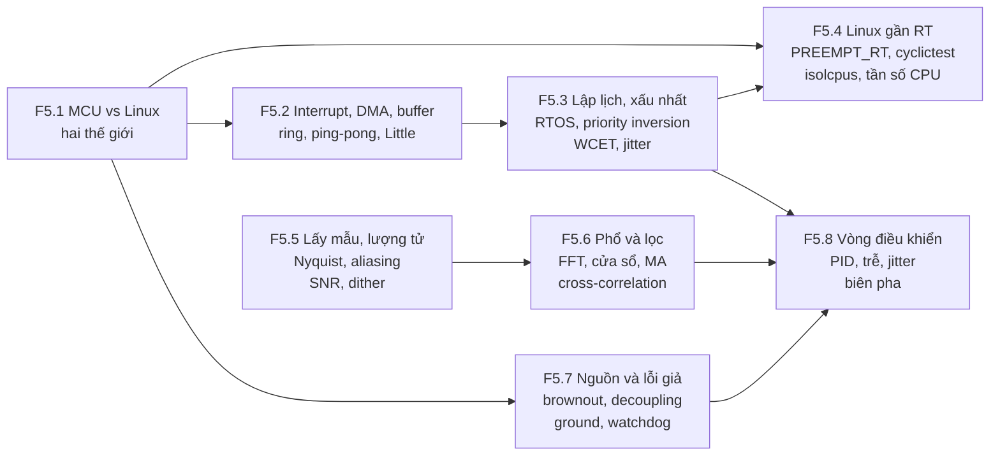
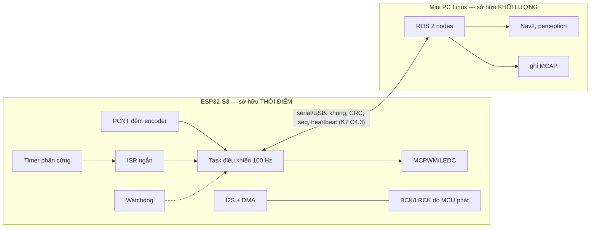

# F5 — Nhúng, thời gian thực và tín hiệu số (37h)

> Khóa nền, học **đúng lúc**: mở viên nang ngay trước bài chính cần nó (bảng dưới), không đọc một mạch. Tổng 37h = F5.1 3h · F5.2 5h · F5.3 5h · F5.4 4h · F5.5 5h · F5.6 5h · F5.7 4h · F5.8 6h. Một phần số giờ trùng với phần khái niệm của K3 Module 1 và K7 C3–C4; phần còn lại cộng thêm vào tổng lộ trình, vốn đã vượt ngân sách 650h (K1–K6 = 545h, K7 mới lõi 561h → 1.106h, xem `khoa-7/_KE-HOACH-K7.md` mục 3). Không giấu con số này.
>
> Mọi khối Python trong file đã chạy trên Python 3 + numpy 2.x/scipy 1.1x của máy soạn. Bài tập đo thời gian (F5.1, F5.4) cho số **khác nhau theo máy**; số trong khối 🔒 là của máy soạn (container ảo hóa, 4 vCPU Xeon), chỉ để so hình dạng, không để so con số.

## Vì sao khóa nền này tồn tại

Bạn sống ở phía Linux. Nhưng mọi byte dữ liệu robot của bạn được sinh ra ở một ranh giới mà Linux không kiểm soát: một bộ đếm phần cứng chốt cạnh encoder, một DMA rót mẫu âm thanh vào RAM, một ADC lượng tử hóa điện áp, một vòng điều khiển 100 Hz phải đúng nhịp. Thiếu F5, bạn sẽ hụt ở đúng những chỗ này:

- **K1 Bài 3, Bài 7, Bài 13** — chọn sample rate cho logic analyzer theo "4–10 lần" mà không biết vì sao, và không biết capture nào nói dối.
- **K3 Bài 2, Bài 4, Bài 10** — đặt `dma_desc_num`, `dma_frame_num` và kích thước ring bằng cảm tính; gọi độ trễ DMA là "một công thức" thay vì định luật Little; đọc "underrun = 0 trong 10 phút" như một bằng chứng.
- **K3 Bài 6, Bài 16** — gọi một lần reset do sụt áp là "firmware crash", và đặt watchdog ở chỗ nó không bao giờ cắn.
- **K3 Bài 7, K4 Bài 8, K5 Bài 4** — kiểm `6,02·N + 1,76` trên giọng thật qua mic (lỗi đã biết, quy chuẩn mục 7), hoặc tin rằng sai số lượng tử ±0,5 LSB là giới hạn không vượt được.
- **K2 Bài 11, K5 Bài 8, Bài 11, K6 Bài 16** — ước lượng độ lệch thời gian bằng cross-correlation mà không biết độ chính xác của nó tới đâu; đóng dấu thời gian trong ISR mà không biết độ trễ ngắt.
- **K7 C4.2** — chạy PID 100 Hz, đo jitter p99 < 100 µs, rồi không trả lời được câu "jitter này có làm robot mất ổn định không", vì không biết ngân sách trễ của vòng kín nằm ở đâu.

Bài chính dạy *làm*; F5 dạy *khi nào một con số thời gian/tín hiệu là đúng, khi nào nó chỉ đúng ở trung vị, và cái gì đang lặng lẽ ăn biên an toàn của bạn*.

## Mindset cốt lõi

1. **"Đúng giờ" là thuộc tính của trường hợp xấu nhất, không phải của trung bình.** Mars Pathfinder (1997) tự reset liên tục trên sao Hỏa vì một task ưu tiên thấp giữ mutex mà task ưu tiên cao cần; trên mặt đất, trường hợp đó gần như không xuất hiện trong test. Người làm thời gian thực tin vào cận trên chứng minh được hoặc đo được rất lâu, không tin p50.
2. **Dữ liệu nên chảy không qua CPU; CPU chỉ nên quyết định.** Máy tính dẫn đường Apollo 11 phát báo động 1202 lúc hạ cánh vì giao tiếp radar rendezvous đánh cắp khoảng 13% chu kỳ máy cho những cập nhật bộ đếm không ai cần (Don Eyles, AAS 04-064, 2004). Mỗi sự kiện dữ liệu mà CPU phải tự tay xử lý là một khoản thuế; DMA, FIFO phần cứng và bộ đếm ngoại vi tồn tại để không phải trả thuế đó.
3. **Thứ canh gác phải độc lập với thứ bị canh.** Tàu Clementine (1994) treo bộ xử lý, mở van đẩy cho tới khi gần cạn nhiên liệu; watchdog phần cứng có sẵn nhưng không được dùng, còn timeout bằng phần mềm thì treo cùng phần mềm (Jack Ganssle, *Great Watchdog Timers for Embedded Systems*). Tàu NEAR sau đó gặp sự cố tương tự và sống sót nhờ watchdog còn chạy.
4. **Lấy mẫu là một phép đo có điều kiện: thứ vượt fs/2 không biến mất, nó đổi tên.** Aliasing không báo lỗi, không làm crash, không tạo NaN; nó cho ra một tín hiệu trông hoàn toàn hợp lý ở sai tần số. Vì vậy người làm đo lường lọc **trước** khi lấy mẫu, không phải sau.
5. **Trễ trong vòng kín là ngân sách, tiêu hết thì dao động.** YF-22 rơi khi hạ cánh thử năm 1992 trong một dao động do phi công gây ra (PIO) liên quan tới giới hạn tốc độ của mặt điều khiển — giới hạn đó hoạt động như thêm trễ pha vào vòng phi công–máy bay. Vòng PID trên robot của bạn có cùng toán học: mỗi mili-giây trễ trong vòng ăn một phần biên pha.

## Bản đồ viên nang



### Học đúng lúc

| Viên nang | Học trước bài chính | Giờ |
|---|---|---|
| F5.1 MCU vs Linux | K3 Bài 2 · K5 Bài 3 · K7 C3 (trước khi bring-up), C4.1 | 3 |
| F5.2 Interrupt, DMA, buffer | **K3 Bài 4** (bắt buộc, cùng F7.1), K3 Bài 9, Bài 15 · K5 Bài 8 · K7 C3, C4.1 | 5 |
| F5.3 Lập lịch và trường hợp xấu nhất | K3 Bài 4 (phần ưu tiên task), **K3 Bài 10**, K3 Bài 16 · K5 Bài 8 · K6 Bài 1 (để phân biệt hai nghĩa "determinism") · **K7 C4**, C10 | 5 |
| F5.4 Linux gần thời gian thực | K3 Bài 10, **K3 Bài 12** (governor, tần số) · K4 Bài 11 · K7 C5.2 (nên đọc) | 4 |
| F5.5 Lấy mẫu và lượng tử | K1 Bài 3, **Bài 7**, Bài 12, Bài 13 · K2 Bài 1, Bài 11 · K3 Bài 1, Bài 3, **Bài 7**, Bài 17, Gate K3 · **K4 Bài 8** · K5 Bài 4 | 5 |
| F5.6 Phổ và lọc | K2 Bài 11 · **K3 Bài 7** · K5 Bài 11 · K6 Bài 16 | 5 |
| F5.7 Nguồn điện và lỗi "phần mềm" giả | K1 Bài 1, Bài 2, Bài 4, Bài 5 · **K3 Bài 6**, Bài 15, **Bài 16** · K5 Bài 3 · **K7 C0, C1**, C5, C10, C12 | 4 |
| F5.8 Vòng điều khiển | **K7 C4.2** (bắt buộc), C4.4, C10.1, C11.1, C11.4 | 6 |

Thứ tự tối thiểu nếu tuần crunch: F5.2 mục 2 + 6 trước K3 Bài 4; F5.5 mục 2 + 6 trước K3 Bài 7; F5.7 mục 2 + 6 trước K3 Bài 6; F5.8 mục 2 + 5 + 6 trước K7 C4.2. Mục 6 (Lăng kính đánh giá) là phần đáng giữ nhất của mỗi viên nang.

## Bạn đã làm cái này rồi

| Bạn đã làm trong backend/AI-harness | Tên chuẩn | Còn thiếu | Viên nang |
|---|---|---|---|
| Đặt timeout, đo p99 latency, cảnh báo khi p99 vượt SLO | Phân tích thời gian đáp ứng (response-time analysis), deadline mềm | Thời gian thực đòi **cận trên** (WCET, worst-case response time), không phải percentile; một lần lỡ có thể là "sai", không phải "chậm" | F5.3 |
| Đo trên host "yên tĩnh" để test không nhiễu | Cô lập nhiễu: `isolcpus`, IRQ affinity, governor `performance`, tắt C-state sâu | Biết **nguồn** nhiễu ở tầng nào (ngắt, SMI, tần số, cache), và đo nó bằng `cyclictest` thay vì cảm giác | F5.4, F1.3 |
| Hàng đợi có giới hạn giữa producer và consumer, backpressure | Ring buffer, double buffering, credit flow control | Ở đây consumer là **đồng hồ phần cứng không biết chờ**; độ trễ = mức đầy / tốc độ rút (Little) | F5.2, F7.1, F3.9 |
| NIC/kernel tự gom gói, bạn chỉ thấy `recv()` | DMA + interrupt coalescing + NAPI polling | Hiểu khi nào "một ngắt mỗi sự kiện" sụp đổ (receive livelock) và chọn kích thước khối | F5.2 |
| Health check + supervisor restart (systemd, k8s liveness probe) | Watchdog, hierarchical watchdog | Liveness probe phải đo **tiến triển thật**, và người canh phải độc lập về nguồn/clock/CPU với thứ bị canh | F5.7 |
| Autoscaler phản ứng theo metric có độ trễ, rồi dao động scale-up/scale-down | Hệ phản hồi có trễ, dao động do trễ trong vòng | Có toán để tính trước trễ bao nhiêu thì dao động (biên pha), thay vì tăng cooldown theo kinh nghiệm | F5.8 |
| Quantize model fp32 → int8/int4 | Lượng tử hóa, nhiễu lượng tử, dải động | Công thức SNR chỉ đúng dưới giả định cụ thể; dither; lượng tử hóa tín hiệu nhỏ thì sai số không còn là "nhiễu" | F5.5, K4 Bài 8 |

---

## F5.1 — MCU vs Linux: hai thế giới, vì sao robot cần cả hai (3h)

> **Dùng cho:** K3 Bài 2 · K5 Bài 3 · K7 C3, C4.1 · **Cần trước:** K1 Bài 3 (clock, bus) · **Sau viên nang này bạn đánh giá được:** một khẳng định kiểu "chạy cái này trên Linux/ESP32 là được" có đúng không, và một chức năng nên nằm ở phía nào của ranh giới.

### 1. Câu chuyện

Ở K3 lượt 3, bạn tự đặt câu hỏi: *"thực tế esp32 chỉ làm dispatcher/coordinator thôi nhỉ… nó chỉ kiểm soát các flag như khi nào bật/tắt, tăng giảm âm lượng… chứ thực sự nó không nên là nơi tạo ra âm thanh"*. Câu hỏi này chạm đúng vào quyết định kiến trúc quan trọng nhất của một robot: cái gì chạy trên vi điều khiển, cái gì chạy trên máy Linux. Bản sơ đồ hệ thống của K7 gốc vẽ ESP32-S3 làm PID bánh, đọc encoder, watchdog và failsafe; mini PC N100 làm ROS 2, perception, ghi dữ liệu. Không ai vẽ ngược lại, và lý do không phải "MCU yếu hơn".

Lịch sử ngắn: vi điều khiển một chip (Texas Instruments TMS1000, đầu thập niên 1970) sinh ra để thay mạch logic rời trong máy tính bỏ túi và đồ gia dụng — một chương trình cố định, phản ứng với nút bấm và chân I/O ngay lập tức. Hệ điều hành đa nhiệm sinh ra từ hướng ngược lại: chia một máy đắt tiền cho nhiều người dùng, tối ưu **thông lượng trung bình** và **công bằng**. Hai dòng dõi đó mang theo hai hệ giá trị khác nhau. Robot hiện đại cần cả hai vì nó vừa phải đếm từng cạnh encoder không sót (một thế giới), vừa phải chạy một mạng nơ-ron 200 MB và ghi MCAP xuống SSD (thế giới kia).

### 2. Mô hình tư duy



| Thuộc tính | MCU (ESP32-S3) | Linux (N100) |
|---|---|---|
| Tài nguyên | 2 nhân Xtensa LX7 ≤ 240 MHz, 512 KB SRAM `[spec: ESP32-S3 datasheet]` | 4 nhân Gracemont ≤ 3,4 GHz, không HT, GB RAM `[spec: Intel ARK N100]` |
| Bộ nhớ | Không có bộ nhớ ảo theo tiến trình; code chạy từ flash qua cache, hàm nóng đặt ở IRAM | Bộ nhớ ảo, page fault, swap, cache nhiều tầng |
| Lập lịch | FreeRTOS: ưu tiên cố định, preempt; bạn biết mọi task | Scheduler công bằng (EEVDF từ Linux 6.6 `[chuẩn]`), hàng trăm tiến trình bạn không viết |
| Thời gian đáp ứng ngắt | Cỡ µs, phân bố hẹp nếu code đúng `[tự đo]` | Cỡ µs–ms, đuôi dài phụ thuộc kernel/tải/firmware `[tự đo, → F5.4]` |
| Khởi động | Cỡ trăm ms `[tự đo]` | Hàng chục giây `[tự đo]` |
| Mất điện giữa chừng | Không có hệ tệp để hỏng (trừ NVS) | Hệ tệp, journal, MCAP chưa đóng |
| Thứ nó giỏi | Phản ứng **đúng lúc** với chân I/O; giữ nhịp | Tính **nhiều**; lưu trữ; mạng; thư viện |

Ba câu bản chất:
- Ranh giới không phải "mạnh/yếu" mà là **ai sở hữu thời điểm**. Một chức năng thuộc về MCU khi sai thời điểm của nó làm hỏng kết quả vật lý (cạnh PWM, đếm encoder, cắt motor khi mất heartbeat, phát clock I2S). Nó thuộc về Linux khi sai thời điểm chỉ làm chậm kết quả.
- MCU **không tự động** tất định. Nó tất định khi bạn giữ nó như vậy: không cấp phát bộ nhớ động trong vòng nóng, không gọi API chặn, không để WiFi và vòng điều khiển tranh một nhân mà không có ưu tiên rõ (F5.3).
- Đường nối hai thế giới là một **giao thức**, không phải một lệnh gọi hàm: có khung, CRC, số thứ tự, heartbeat, và quy định "khi bên kia im lặng thì làm gì" (K7 C4.3, C4.4).

**Đo thử ngay trên laptop.** Viết một vòng 1 kHz kiểu "backend" bằng `sleep`, đo chu kỳ thật khi máy yên và khi có tải:

```python
# [đã chạy] F5.1 — một vòng 1 kHz bằng sleep trên Linux: đo chu kỳ thật
import time, numpy as np, multiprocessing as mp

def busy(stop):                      # tải nền: một tiến trình đốt CPU
    while not stop.is_set():
        sum(i * i for i in range(10_000))

def run_loop(period_s=0.001, n=5000):
    t_next = time.perf_counter()
    stamps = np.empty(n)
    for k in range(n):
        t_next += period_s                       # lịch tuyệt đối, không cộng dồn sai
        delay = t_next - time.perf_counter()
        if delay > 0:
            time.sleep(delay)
        stamps[k] = time.perf_counter()          # "đầu chu kỳ" thực tế
    return np.diff(stamps) * 1e6                 # µs

def report(name, d, period_us=1000):
    print(f"{name:10s} p50={np.percentile(d,50):7.1f} p99={np.percentile(d,99):7.1f} "
          f"max={d.max():8.1f} µs | chu kỳ >1.5 ms: {np.mean(d > 1.5*period_us)*100:.2f}%")

if __name__ == "__main__":
    report("yên", run_loop())
    stop = mp.Event()
    hogs = [mp.Process(target=busy, args=(stop,)) for _ in range(mp.cpu_count())]
    for h in hogs: h.start()
    try:
        report("có tải", run_loop())
    finally:
        stop.set(); [h.join() for h in hogs]
```

### 3. Cầu nối từ backend

| Backend bạn biết | Ở đây | Gãy ở chỗ | Nếu dùng nhầm thì |
|---|---|---|---|
| Edge proxy / sidecar lo việc "gần dây", app lo nghiệp vụ | MCU lo I/O có thời hạn, Linux lo tính toán | Proxy chậm thì request chậm; MCU trễ thì **vật lý sai** (cạnh PWM lệch, encoder mất xung, motor không dừng) | Đẩy PID lên Linux "cho dễ debug" → trễ vòng tăng vài ms và có đuôi dài (F5.8) |
| Microservice gọi nhau qua RPC | Host ↔ MCU qua serial có khung | RPC có retry và timeout; motor không "retry" được một lệnh đã áp. Bên nhận phải có trạng thái an toàn mặc định khi mất liên lạc | Coi serial như socket tin cậy → robot chạy tiếp lệnh cuối khi host treo |
| Container khởi động lại trong vài giây | MCU reset trong trăm ms, Linux boot hàng chục giây | Trong lúc Linux boot lại, chỉ MCU còn giữ được an toàn | Đặt watchdog dừng motor ở phía Linux |
| Thread pool trong một service | Task FreeRTOS trên hai nhân ESP32-S3 | Ưu tiên là **tuyệt đối** (task cao hơn chạy tới khi tự nhường), không chia công bằng | Một task ưu tiên cao vòng lặp bận → mọi task thấp hơn chết đói, kể cả task vỗ watchdog |

**Chấm mô hình:**

- *"MCU thì tất định, Linux thì không."* (`robotics-data-infra-roadmap.md`, mục 2.1) — **ĐÚNG MỘT PHẦN.** Đúng về xu hướng phân bố: MCU có ít nguồn bất định hơn nhiều. Gãy ở chỗ: tất định là thuộc tính của **cách bạn viết code** trên nền tảng, không phải của con chip. *Phản ví dụ:* trên ESP32-S3, một hàm đặt trong flash bị cache miss đúng lúc ghi NVS (flash cache bị tắt khi ghi/xóa flash) sẽ chờ tới khi thao tác flash xong `[spec: ESP-IDF, mục "Concurrency Constraints for Flash on SPI1", tự đo theo phiên bản]`; một vòng điều khiển dùng `vTaskDelay(1)` ở tick 100 Hz có độ phân giải 10 ms. Ngược lại, Linux với PREEMPT_RT, CPU cô lập và cấu hình đúng đạt độ trễ đánh thức đuôi cỡ vài chục µs trên phần cứng phù hợp `[tự đo, → F5.4]`.
- *Mô hình K3 lượt 3 của bạn: "ESP32 chỉ làm dispatcher, chỉ giữ flag bật/tắt/âm lượng."* — **ĐÚNG MỘT PHẦN.** Đúng: ESP32 không nên là nơi sinh nội dung (TTS chạy trên N100). Gãy ở chỗ "chỉ giữ flag": ESP32 là **chủ đồng hồ** của đường I2S — nó phát BCK/LRCK, nó quyết định mẫu nào ra dây ở micro-giây nào, và ring buffer + DMA của nó là nơi hấp thụ jitter của Linux (K3 Bài 4). Mất vai trò đó thì "dispatcher" phải được thay bằng một thứ khác cũng giữ nhịp. *Phản ví dụ:* nếu ESP32 chỉ chuyển tiếp byte mà không có buffer và không sở hữu nhịp, một lần Linux trễ 20 ms (bạn sẽ thấy con số cỡ này trong bài tập trên) là một tiếng tách nghe được.

**Tên chuẩn của thứ bạn đã làm:** tách "hot path tất định" khỏi "control plane linh hoạt" trong backend (ví dụ data plane của proxy viết bằng C, control plane bằng Go/Python) chính là mẫu **mixed-criticality** của hệ nhúng. Thứ còn thiếu: ở robot, ranh giới đó được vẽ theo **hậu quả vật lý khi trễ**, và nó đi kèm một hợp đồng an toàn khi mất liên lạc.

### 4. Thuật ngữ

| Mức | Thuật ngữ | Nghĩa trong một câu | Hay bị hiểu nhầm thành |
|---|---|---|---|
| 🟢 | MCU vs MPU/SoC | Một chip chạy một firmware, I/O trực tiếp, vs. chip chạy hệ điều hành có bộ nhớ ảo | "MCU là máy tính yếu" |
| 🟢 | Firmware | Chương trình duy nhất chạy trên MCU, nạp vào flash | "Driver" |
| 🟢 | Timer phần cứng | Bộ đếm chạy theo clock, tạo ngắt/sự kiện đúng hạn không cần CPU | `sleep()` |
| 🟢 | Ngoại vi (peripheral) | Khối phần cứng chuyên dụng: PCNT, MCPWM, I2S, UART | "Thư viện" |
| 🟡 | IRAM / chạy từ flash qua cache | Code nóng nằm trong SRAM để không phụ thuộc cache flash | "Tối ưu tốc độ" (thật ra là tối ưu **tính đoán trước**) |
| 🟡 | micro-ROS | ROS 2 client chạy trên MCU, nói chuyện qua agent | "ROS 2 thu nhỏ, thay được serial tự viết" |
| 🔴 | MMU/MPU chi tiết, linker script | — | — |

### 5. Bài tập dự đoán

**Đề.** Chạy khối Python ở mục 2 trên máy của bạn (laptop hoặc N100, ngoài Docker nếu được). Trước khi chạy, ghi vào `prediction.md`:

1. p50, p99, max của chu kỳ (µs) khi máy yên, và khi mọi nhân bị một tiến trình đốt CPU.
2. Tỉ lệ chu kỳ dài quá 1,5 ms trong mỗi trường hợp.
3. Nếu đây là vòng PID 1 kHz điều khiển motor, với số max bạn đoán, có bao nhiêu chu kỳ liên tiếp motor chạy theo lệnh cũ?
4. Một câu: bạn sẽ đặt vòng này ở phía nào của ranh giới, dựa trên số nào.

**Tham số cần tra:** `cat /proc/self/timerslack_ns` (timer slack mặc định của tiến trình thường, đơn vị ns); số nhân `nproc`; có phải máy ảo không (`systemd-detect-virt`).

**Phương pháp:** lịch tuyệt đối (`t_next += period`) để lỗi không cộng dồn; đo chu kỳ bằng hiệu hai timestamp đầu chu kỳ; 5000 mẫu (5 s).

```markdown
# prediction.md — F5.1
máy: <CPU, ảo hóa?>  timerslack_ns: <…>
yên:    p50 = … µs  p99 = … µs  max = … µs  >1.5 ms: …%
có tải: p50 = … µs  p99 = … µs  max = … µs  >1.5 ms: …%
số chu kỳ chạy theo lệnh cũ ở max: …
phía nào: … vì …
```

<details><summary>🔒 MỞ SAU KHI COMMIT prediction.md</summary>

Hai lần chạy trên máy soạn (container, 4 vCPU Xeon 2,8 GHz, kernel `PREEMPT_DYNAMIC`, timerslack 50 000 ns):

| Lần | Trường hợp | p50 (µs) | p99 (µs) | max (µs) | > 1,5 ms |
|---|---|---|---|---|---|
| 1 | yên | 999 | 1213 | 3391 | 0,60% |
| 1 | có tải | 1000 | 1452 | 51 551 | 0,98% |
| 2 | yên | 999 | 1144 | 6423 | 0,38% |
| 2 | có tải | 1000 | 1613 | 21 892 | 1,24% |

Đọc bảng:
- **p50 hoàn hảo trong mọi trường hợp.** Nếu bạn chỉ nhìn trung vị, vòng này "chạy đúng 1 kHz". Đó chính là thứ một dashboard backend sẽ báo.
- **max dài gấp 20–50 lần chu kỳ khi có tải**: 20–50 chu kỳ liên tiếp motor chạy theo lệnh cũ. Ở 0,5 m/s, 50 ms là 2,5 cm robot đi mù — chưa kể vòng PID tích lũy sai số rồi giật khi tỉnh lại.
- **Max lệch gấp đôi giữa hai lần chạy cùng cấu hình**: đuôi của 5000 mẫu là một ước lượng rất nhiễu (→ F1.2). Đừng so hai cấu hình bằng max của một lần chạy.
- Máy của bạn có thể cho số tốt hơn (máy thật, không ảo hóa) hoặc tệ hơn (laptop tiết kiệm pin). Hình dạng (p50 đẹp, đuôi xấu, đuôi phình khi tải) mới là kết quả.

Câu 4: một vòng mà sai thời điểm làm sai vật lý thuộc về MCU. Lý do bằng số: đuôi ở đây là hàng chục ms; đuôi của timer phần cứng + ISR trên MCU là µs (bạn sẽ đo ở K7 C4.2).

</details>

### 6. Lăng kính đánh giá

Checklist để chấm một khẳng định kiểu "chạy X trên nền tảng Y là đủ nhanh / đủ đúng giờ":

1. Khẳng định nói về **trung bình/trung vị** hay **trường hợp xấu nhất**? Nếu chức năng có hậu quả vật lý khi trễ mà chỉ có trung bình → **CHƯA RÕ**.
2. Có nêu **hậu quả khi trễ** không (chậm, hay sai)? Không nêu → chưa đủ để chọn phía.
3. Số đo được lấy **ở đâu** (trong code tự đo bằng clock phần mềm, hay bằng GPIO + logic analyzer)? Tự đo bằng chính hệ đang bị đo → nghi ngờ (→ F4.7).
4. Có nói đến **tải nền** (WiFi, ghi flash, log, tiến trình khác) không? Đo khi máy yên → chỉ là cận dưới.
5. Khi kênh nối hai thế giới im lặng, bên MCU **làm gì**? Không có câu trả lời → kiến trúc **SAI** về an toàn dù số đo đẹp.
6. Khẳng định "nhanh hơn được nhưng bị giới hạn" có nêu **cái gì** giới hạn (đường găng, công suất, băng thông bus, giao thức) không?

**Khẳng định mẫu — tự chấm ĐÚNG / ĐÚNG MỘT PHẦN / SAI / CHƯA RÕ, rồi mở đáp án:**

(a) *Mô hình K3 lượt 7 của bạn:* "người ta có thể để cho mọi thứ chạy nhanh nhất có thể… dù nó có thể chạy nhanh hơn 1000 lần nhưng vẫn không cho phép, phải giới hạn nó lại."

(b) *Gemini K7 Bài 3:* "Nếu tải WiFi trên ESP32 làm jitter vòng điều khiển vọt lên vài mili-giây, điều này giải thích lý do tại sao kiến trúc robot hoàn chỉnh lại tách biệt máy tính Linux và vi điều khiển."

(c) *Roadmap mục 2.1:* "Robot thật luôn có cả hai: MCU lo control loop cứng, Linux lo perception/data."

(d) "Vòng 1 kHz bằng `sleep` trên laptop của tôi đạt p50 = 1000 µs, vậy Linux đủ cho vòng điều khiển motor."

<details><summary>🔒 Đáp án</summary>

(a) **SAI** (chấm đầy đủ ở K3 Bài 4, mục 3; quy chuẩn mục 7). Tóm tắt để tự đối chiếu: tần số tối đa của mạch đồng bộ bị chặn bởi **đường găng**: chu kỳ clock ≥ t_clk→q + t_logic(max) + t_setup (+ skew). Chạy nhanh hơn thì flip-flop chốt giá trị chưa ổn định → **tính sai**, không phải "bị cấm". Muốn nhanh hơn phải tăng điện áp, và công suất động P ∝ C·V²·f tăng nhanh hơn tần số → nhiệt. Phần F5.1 bổ sung: ESP32-S3 chạy 240 MHz chứ không phải 3 GHz không vì "bị hãm", mà vì nó được thiết kế cho công suất cỡ trăm mW và cho **I/O đúng lúc**, nơi nhịp được đặt bởi thiết bị bên ngoài (BCK 768 kHz của I2S là đúng tốc độ dữ liệu cần, không phải tốc độ bị giảm).

(b) **ĐÚNG MỘT PHẦN.** Đúng: tải nền có thể kéo jitter lên. Gãy: lời giải cho jitter do WiFi **trên chính ESP32** không phải là tách sang Linux (Linux còn tệ hơn) mà là cấu trúc firmware: vòng điều khiển kích bằng timer phần cứng, task ưu tiên cao hơn WiFi, ghim nhân khác với stack WiFi, không ghi flash trong vòng nóng (F5.3). Lý do thật của việc tách Linux/MCU là **phân công theo hậu quả trễ** (mục 2), không phải "WiFi làm jitter". Phản ví dụ: robot không dùng WiFi trên ESP32 vẫn tách như vậy.

(c) **ĐÚNG MỘT PHẦN.** Đúng cho kiến trúc robot cỡ của bạn và phần lớn robot di động. Gãy ở chữ "luôn": có robot dùng Linux PREEMPT_RT chạy vòng điều khiển 1 kHz trực tiếp (nhiều cánh tay công nghiệp dùng EtherCAT với master trên Linux RT `[chuẩn]`), và có robot chỉ có MCU. Câu đúng: "chức năng nào có hậu quả vật lý khi trễ thì nằm trên nền tảng có cận trên thời gian đã đo".

(d) **SAI** (suy luận). p50 không nói gì về đuôi; bài tập trên cho p50 = 1000 µs và max 20–50 ms trên cùng máy. Muốn kết luận cần đuôi đo đủ lâu dưới tải thật, và cần biết vòng chịu được bao nhiêu trễ (F5.8).

</details>

### 7. Câu hỏi ngược

1. **[Nếu…thì]** Nếu ESP32 reset giữa lúc robot đang chạy (brownout, watchdog), Linux thấy gì trong 200 ms đầu tiên, và log của nó có phân biệt được "MCU reset" với "cáp USB lỏng" không?
   <details><summary>Hướng nghĩ</summary>

   Nghĩ về số thứ tự khung (seq) bắt đầu lại từ 0, `boot_id` của MCU, `esp_reset_reason()` gửi lên ngay khung đầu sau boot. Nếu giao thức không có các trường này, hai sự cố trông giống hệt nhau. Đây là quyết định thiết kế cho K7 C4.3.

   </details>
2. **[Vì sao không]** Vì sao không chạy luôn mọi thứ trên một SoC có cả nhân ứng dụng và nhân thời gian thực (kiểu chip có nhân Cortex-A + Cortex-M)?
   <details><summary>Hướng nghĩ</summary>

   Được, và nhiều sản phẩm làm vậy. Cân nhắc: chung nguồn và chung reset (Linux panic có kéo nhân RT theo không?), độ khó toolchain, cộng đồng hỗ trợ cho người mới. Ranh giới "ai sở hữu thời điểm" vẫn còn, chỉ là nằm trong một con chip.

   </details>
3. **[Quy mô]** Với 100 robot, mỗi robot có một firmware ESP32 và một image Linux, cái gì gãy trước: phiên bản firmware không khớp giao thức host, hay cập nhật OTA làm hỏng một phần đội?
   <details><summary>Hướng nghĩ</summary>

   Nghĩ về version handshake trong khung đầu tiên, tương thích ngược của giao thức (giống schema evolution, → F3.2), và việc dataset phải ghi phiên bản firmware cùng mỗi episode (→ F3.8). Một con robot chạy firmware cũ cho dữ liệu odometry hơi khác — đây là lỗi dữ liệu lặng lẽ nhất.

   </details>
4. **[Failure mode]** Host gửi lệnh vận tốc 50 Hz; một ngày host bị kẹt GC/IO 300 ms. Liệt kê ba hành vi khả dĩ của MCU và hậu quả vật lý của từng cái.
   <details><summary>Hướng nghĩ</summary>

   Giữ lệnh cuối (robot đi tiếp 300 ms), về 0 ngay khi lỡ một khung (robot giật), giảm dần theo dốc sau timeout (cần chọn timeout). Chọn bằng số: quãng đường đi mù ở tốc độ tối đa so với khoảng cách an toàn. → K7 C4.4.

   </details>
5. **[Phản biện]** Một đồng nghiệp nói: "micro-ROS làm ranh giới biến mất, MCU giờ cũng là một node ROS 2". Bạn đồng ý tới đâu?
   <details><summary>Hướng nghĩ</summary>

   Ranh giới **giao diện** biến mất (cùng message type), ranh giới **thời gian** thì không: MCU vẫn phải tự bảo vệ khi agent phía Linux chậm. So sánh với gRPC trong backend: cùng IDL không làm hai dịch vụ chung SLO.

   </details>

### 8. Liên kết ra ngoài

- **Ô tô:** một chiếc xe có hàng chục ECU (bộ điều khiển phanh, động cơ, túi khí) chạy hệ điều hành thời gian thực theo AUTOSAR Classic, và một vài máy tính lớn chạy Linux/QNX cho thông tin giải trí và hỗ trợ lái. *Giống:* phân công theo hậu quả trễ. *Khác:* ô tô có chuẩn an toàn chức năng (ISO 26262) bắt buộc chứng minh, robot của bạn chỉ có kỷ luật tự đặt.
- **Mạng:** router có **data plane** (ASIC, chuyển gói ở tốc độ đường truyền) và **control plane** (CPU chạy BGP/OSPF). *Giống:* dữ liệu nóng không đi qua CPU tổng quát. *Khác:* router chấp nhận rớt gói; motor không chấp nhận "rớt" một cạnh PWM.
- **Y sinh:** máy tạo nhịp tim là một MCU công suất cực thấp, không có hệ điều hành đa nhiệm; dữ liệu được đọc định kỳ bởi thiết bị ngoài. *Giống:* chức năng sống còn nằm trên phần tử đơn giản nhất. *Khác:* ở đó không có "phía Linux" chạy thường trực.

### 9. Áp vào khóa chính

- **K3 Bài 2:** bảng chân và cấu hình I2S là hợp đồng ở ranh giới; ESP32 sở hữu clock I2S. Dùng mục 2 để viết một dòng vào `decisions.md`: "ESP32 làm gì, không làm gì, vì sao".
- **K5 Bài 3:** quét bus I2C từ ESP32 hay từ Linux — chọn theo ai cần đóng dấu thời gian gần sự kiện (→ F4.6).
- **K7 C3, C4.1:** lập pin budget và danh sách chức năng MCU; mỗi chức năng ghi "hậu quả khi trễ" và "cận trên cần đạt". Chức năng nào không có cận trên → không cần ở MCU.

### 10. Độ tin cậy

| Khẳng định | Nhãn | Ghi chú / cách kiểm |
|---|---|---|
| ESP32-S3: 2 nhân LX7 ≤ 240 MHz, 512 KB SRAM | `[spec]` | ESP32-S3 Series Datasheet, mục tổng quan |
| N100: 4 nhân, 4 luồng, ≤ 3,4 GHz | `[spec]` | Intel ARK; quy chuẩn mục 7 (không HT) |
| Ghi/xóa flash tắt cache → code chạy từ flash phải chờ | `[spec, tự đo]` | ESP-IDF Programming Guide, phần SPI flash concurrency; kiểm theo phiên bản cài |
| Tick FreeRTOS mặc định của ESP-IDF 100 Hz | `[spec, tự đo]` | `CONFIG_FREERTOS_HZ` trong `sdkconfig` của bạn |
| Linux dùng EEVDF từ 6.6 | `[chuẩn]` | Ghi chú phát hành kernel 6.6 |
| Số đo vòng `sleep` | `[tự đo]` | Bảng trong khối 🔒 là của máy soạn |

### 11. Đọc thêm và tự kiểm tra

- **Nguồn gốc:** *ESP32-S3 Technical Reference Manual* (Espressif) — chương Timer Group, PCNT, MCPWM: đọc mục tổng quan của từng khối.
- **Giải thích:** Elecia White, *Making Embedded Systems* (O'Reilly, bản 2, 2024) — chương về kiến trúc firmware và ngắt.
- **Đào sâu (tùy chọn):** tài liệu kiến trúc micro-ROS (micro.ros.org) — đọc để thấy phần nào của ROS 2 không mang xuống MCU được.
- **Tự kiểm tra:** (1) giải thích cho một backend engineer khác trong 5 câu vì sao PID nằm trên ESP32; (2) vẽ lại sơ đồ mục 2 từ trí nhớ, ghi trên mỗi mũi tên "nếu trễ thì hậu quả gì"; (3) câu hỏi:
  - *Vòng điều khiển 100 Hz trên ESP32 dùng `vTaskDelay(pdMS_TO_TICKS(10))` với tick 100 Hz. Chu kỳ thật là bao nhiêu?*
    <details><summary>Đáp án</summary>

    Lớn hơn 10 ms và trôi: `vTaskDelay` tính **từ lúc gọi**, nên chu kỳ = 10 ms (1 tick) + thời gian thân vòng lặp, cộng dồn theo thời gian. Dùng `xTaskDelayUntil` (lịch tuyệt đối) hoặc timer phần cứng/`esp_timer` thông báo task. Độ phân giải vẫn là 1 tick với cách dùng tick.

    </details>

---

## F5.2 — Interrupt, DMA, buffer: dữ liệu chảy không qua CPU, double buffering, ring buffer (5h)

> **Dùng cho:** K3 Bài 4 (bắt buộc), Bài 9, Bài 15 · K5 Bài 8 · K7 C3, C4.1 · **Cần trước:** F5.1; F7.1 (định luật Little) đọc cùng lúc · **Sau viên nang này bạn đánh giá được:** một con số "độ trễ buffer" hay "kích thước buffer an toàn" có đúng không, và một thiết kế "một ngắt mỗi sự kiện" có sụp dưới tải không.

### 1. Câu chuyện

Ngày 20/7/1969, khi module mặt trăng Apollo 11 đang hạ xuống, máy tính dẫn đường phát liên tiếp các báo động 1202 và 1201: bộ điều phối công việc (Executive) hết chỗ chứa job. Theo Don Eyles, kỹ sư phần mềm hạ cánh của MIT, nguyên nhân là giao tiếp của radar rendezvous — thiết bị không cần cho pha hạ cánh — đã chiếm khoảng 13% chu kỳ máy, bằng những yêu cầu cập nhật bộ đếm mà phần cứng phục vụ bằng cách **đánh cắp chu kỳ bộ nhớ** của CPU (D. Eyles, *Tales from the Lunar Module Guidance Computer*, AAS 04-064, 2004; MIT News 2009 ghi "tới 15%"). Phần mềm sống sót vì nó được thiết kế để khởi động lại và chỉ chạy lại các job quan trọng nhất. Bài học kỹ thuật: mỗi sự kiện dữ liệu mà CPU phải trả giá (dù chỉ một chu kỳ) là một khoản thuế tỉ lệ với **tốc độ sự kiện**, không phải với lượng việc hữu ích.

Gần ba mươi năm sau, Jeffrey Mogul và K. K. Ramakrishnan mô tả cùng hiện tượng trên máy chủ Unix: dưới lưu lượng mạng cao, máy dành gần hết thời gian xử lý **ngắt nhận gói** và không còn thời gian để thực sự xử lý gói nào — thông lượng hữu ích **giảm về 0** khi tải tăng ("Eliminating Receive Livelock in an Interrupt-Driven Kernel", USENIX 1996; bản tạp chí ACM TOCS 1997). Lời giải của họ — tắt ngắt khi đang bận và chuyển sang **polling theo lô** — là tổ tiên của NAPI trong Linux, thứ đang chạy trên card mạng i226 của mini PC bạn.

### 2. Mô hình tư duy

Ba cách đưa dữ liệu từ ngoại vi vào bộ nhớ:

| Cách | CPU trả giá mỗi… | Độ trễ phát hiện | Sụp khi |
|---|---|---|---|
| Polling (CPU hỏi liên tục) | lần hỏi, kể cả khi không có gì | ≤ chu kỳ hỏi | Không có gì để hỏi mà vẫn đốt CPU |
| Ngắt mỗi sự kiện | sự kiện (vào/ra ISR, lưu ngữ cảnh) | nhỏ | Tốc độ sự kiện × chi phí ISR → 100% CPU (livelock) |
| DMA theo khối + ngắt mỗi khối | khối B sự kiện | ≥ thời gian lấp một khối | Task xử lý không xong khối trước khi DMA quay lại ghi đè |

**Double buffering (ping-pong)** trên dây thời gian, B mẫu mỗi khối, fs mẫu/giây, T = B/fs:

```
DMA ghi:   |== khối A ==|== khối B ==|== khối A ==|== khối B ==|
ngắt:                   ^A đầy       ^B đầy       ^A đầy
task xử lý:               [xử lý A]    [xử lý B]    [xử lý A]
deadline xử lý A:        |<--- T --->|  (trước khi DMA quay lại ghi A)
                         với n khối xoay vòng: deadline = (n−1)·T
```

**Ring buffer** là tổng quát hóa: n khe, một con trỏ ghi, một con trỏ đọc; đầy thì producer phải chờ hoặc ghi đè (chính sách drop, → F3.9); rỗng thì consumer phải chờ hoặc phát "im lặng" (underrun).

**Định luật Little, nói thẳng** (→ F7.1, K3 Bài 4): với mọi hệ ổn định, số phần tử trung bình trong hệ L = λ·W (λ tốc độ đến, W thời gian lưu trung bình). Với buffer audio, λ = fs cố định bởi đồng hồ phần cứng, nên **độ trễ do buffer = mức đầy trung bình / fs**. Công thức `dma_desc_num × dma_frame_num / fs` mà bản gốc K3 đưa ra là **cận trên** khi DMA đầy hoàn toàn, không phải độ trễ thật (quy chuẩn mục 7).

**Hai miền clock** (ESP32 và PCM5102A, hoặc thạch anh mic và thạch anh ESP32) không nối được bằng "một vùng RAM". Phần cứng dùng **FIFO bất đồng bộ**: hai con trỏ ở hai miền clock, mã hóa Gray để mỗi lần đổi chỉ lật một bit, qua mạch đồng bộ hóa hai flip-flop trước khi so sánh đầy/rỗng `[chuẩn: C. Cummings, "Simulation and Synthesis Techniques for Asynchronous FIFO Design", SNUG 2002]`. Nó sâu vài chục từ, không phải megabyte. RAM của bạn là chỗ đặt buffer **phần mềm**; FIFO bất đồng bộ là chỗ hai đồng hồ gặp nhau.

Mô phỏng: (A) livelock khi ngắt mỗi gói so với polling theo lô; (B) capture ping-pong với độ trễ thức dậy của task có đuôi, đo trễ W hai cách độc lập (trực tiếp từng mẫu, và L/λ với L đếm trên lưới thời gian) để thấy Little đúng, và đo tỉ lệ lỡ deadline.

```python
# [đã chạy] F5.2 — (A) receive livelock: ngắt mỗi gói vs polling; (B) ping-pong DMA: deadline và Little
import numpy as np
rng = np.random.default_rng(1)

# (A) ISR tốn c_i mỗi gói (ưu tiên tuyệt đối); xử lý ở task tốn c_p mỗi gói
c_i, c_p, c_poll = 5e-6, 20e-6, 1e-6
print("λ (gói/s) | ngắt mỗi gói | polling theo lô")
for lam in [10e3, 30e3, 40e3, 60e3, 100e3, 150e3, 200e3]:
    thr_irq = min(lam, max(0.0, 1 - lam * c_i) / c_p)   # phần CPU ISR chừa lại / c_p
    thr_poll = min(lam, 1 / (c_p + c_poll))             # tắt ngắt khi bận, poll cả lô
    print(f"{lam:9.0f} | {thr_irq:12.0f} | {thr_poll:12.0f}")

# (B) capture: DMA lấp khối B mẫu -> ngắt -> task thức sau X -> xử lý P (một task, tuần tự)
fs, P, nblk = 48_000, 0.3e-3, 20_000
def simulate(B, nbuf):
    T = B / fs
    complete = (np.arange(nblk) + 1) * T                 # lúc khối k đầy
    x = rng.lognormal(np.log(50e-6), 0.5, nblk)          # độ trễ thức dậy thường
    x += (rng.random(nblk) < 1e-3) * rng.uniform(1e-3, 4e-3, nblk)  # 0,1% bị chặn lâu
    finish = np.empty(nblk); prev = 0.0
    for k in range(nblk):                                # task tuần tự: chờ xong khối trước
        prev = max(complete[k] + x[k], prev) + P
        finish[k] = prev
    miss = np.mean(finish - complete > (nbuf - 1) * T)   # DMA đã quay lại ghi đè khối này
    t_s = np.arange(nblk * B) / fs                       # thời điểm chụp từng mẫu
    W = (np.repeat(finish, B) - t_s).mean()              # trễ trung bình đo trực tiếp
    grid = np.arange(0, complete[-1], 1e-4)              # L đo độc lập: đếm mẫu "đang bay"
    L = (np.floor(grid * fs) + 1 - B * np.searchsorted(finish, grid, side="right")).mean()
    return W, L / fs, miss

print("\n  B nbuf | W trực tiếp | L/λ (Little) | lỡ deadline")
for nbuf in (2, 3):
    for B in (32, 64, 128, 256):
        W, WL, miss = simulate(B, nbuf)
        print(f"{B:4d} {nbuf:3d} | {W*1e3:8.3f} ms | {WL*1e3:8.3f} ms  | {miss*100:6.3f}%")
```

### 3. Cầu nối từ backend

| Backend bạn biết | Ở đây | Gãy ở chỗ | Nếu dùng nhầm thì |
|---|---|---|---|
| Kafka producer `batch.size` / `linger.ms` | Kích thước khối DMA B | Batch Kafka đổi trễ lấy thông lượng và **không có deadline cứng**; khối DMA có deadline (n−1)·T tuyệt đối | Chọn B theo thông lượng, quên deadline → lỡ khối, mất mẫu lặng lẽ |
| NIC interrupt coalescing, NAPI, busy-poll | Ngắt mỗi khối DMA, polling khi bận | Ở MCU bạn tự viết cả hai phía; không có kernel làm hộ | Viết ISR mỗi cạnh encoder ở tốc độ cao → livelock trên MCU, trong khi PCNT phần cứng đếm miễn phí |
| Hàng đợi có giới hạn + backpressure | Ring buffer giữa task nạp và DMA | Consumer cuối là **đồng hồ không biết chờ**: rỗng thì phát im lặng/tiếng tách, không "đợi thêm" | Thiết kế như queue backend (producer đẩy nhanh nhất có thể) → ring luôn đầy → trễ tối đa |
| concurrency = RPS × latency (Little) | trễ = mức đầy / fs | Không gãy: cùng một định luật. Điểm mới: λ cố định tuyệt đối | Tính trễ theo **dung lượng** thay vì **mức đầy** → báo trễ sai, chọn sai ring |
| Event handler trong Node.js phải nhanh, không chặn event loop | ISR phải ngắn, không chặn, không cấp phát | Event loop chậm thì request chờ; ISR dài thì **mọi ngắt ưu tiên thấp hơn** và mọi task đều trễ, kể cả watchdog | `printf` trong ISR → jitter, có thể deadlock trên lock UART, watchdog ngắt cắn |

**Chấm mô hình:**

- *"DMA nghĩa là CPU rảnh."* (`robotics-data-infra-roadmap.md`: "lý do I2S có thể stream audio liên tục mà CPU vẫn rảnh") — **ĐÚNG MỘT PHẦN.** Đúng: CPU không chép từng mẫu. Gãy: (1) DMA và CPU **chia chung bus/bộ nhớ**; (2) CPU vẫn phải **nạp** khối kế tiếp trước deadline — nếu task nạp trễ, DMA phát lại dữ liệu cũ hoặc im lặng tùy cấu hình (`auto_clear` ở I2S ESP-IDF `[spec, tự đo]`); (3) buffer DMA phải nằm ở vùng nhớ DMA đọc được (`MALLOC_CAP_DMA`) `[spec: ESP-IDF heap capabilities]`. *Phản ví dụ:* K3 Bài 10 — CPU "rảnh" 90% nhưng một task ưu tiên cao hơn chạy 10 ms liền vẫn gây underrun.
- *"Thêm khối DMA thì trễ tăng."* — **ĐÚNG MỘT PHẦN.** Với đường **phát** (playback), host giữ ring gần đầy nên thêm khe → mức đầy tăng → trễ tăng. Với đường **thu** xử lý ngay khi khối đầy, thêm khe chỉ nới deadline, **không** tăng trễ trung bình (trễ do B quyết định). Bài tập mục 5 cho bạn thấy điều này bằng số. *Phản ví dụ:* ghi âm 3 khối thay vì 2 khối cùng B: trễ như nhau, lỡ deadline ít hơn.

**Tên chuẩn của thứ bạn đã làm:** bạn đã dùng bounded queue, batch, và coalescing; tên trong nhúng là **ring buffer, ping-pong buffer, DMA descriptor chain, interrupt moderation**. Thứ còn thiếu: tính **deadline của consumer phần cứng** và đọc độ trễ bằng **mức đầy** (Little), không bằng dung lượng.

### 4. Thuật ngữ

| Mức | Thuật ngữ | Nghĩa trong một câu | Hay bị hiểu nhầm thành |
|---|---|---|---|
| 🟢 | Interrupt / ISR | Phần cứng dừng luồng đang chạy để gọi một hàm ngắn | "Callback" (callback không preempt ai) |
| 🟢 | DMA | Khối phần cứng chép dữ liệu giữa ngoại vi và RAM không qua lệnh CPU | "CPU không tốn gì" |
| 🟢 | Ring buffer | Mảng vòng có con trỏ đọc/ghi, đầy/rỗng có chính sách | "Queue vô hạn" |
| 🟢 | Double buffering (ping-pong) | Hai khối: phần cứng ghi một khối trong khi phần mềm xử lý khối kia | "Gấp đôi trễ" (không nhất thiết, xem mục 5) |
| 🟢 | Underrun / overrun | Consumer cạn dữ liệu / producer ghi đè dữ liệu chưa đọc | "Lỗi mạng" |
| 🟢 | Định luật Little | L = λW cho mọi hệ ổn định | "Công thức của M/M/1" |
| 🟡 | DMA descriptor | Cấu trúc mô tả một khối (địa chỉ, độ dài, khối kế) để DMA tự đi theo chuỗi | "Buffer" |
| 🟡 | Interrupt latency | Từ lúc sự kiện phần cứng tới lệnh đầu tiên của ISR | "Thời gian chạy ISR" |
| 🟡 | Receive livelock | Ngắt ăn hết CPU, không còn thời gian làm việc hữu ích | "Quá tải" chung chung |
| 🟡 | FIFO bất đồng bộ | FIFO phần cứng nối hai miền clock bằng con trỏ mã Gray đã đồng bộ hóa | "RAM làm buffer" |
| 🔴 | Cache coherence khi DMA vào PSRAM | — | — |

### 5. Bài tập dự đoán

**Đề.** Với mô phỏng ở mục 2, trước khi chạy, ghi vào `prediction.md`:

1. (A) Với ngắt mỗi gói, ở λ nào thông lượng hữu ích đạt đỉnh, giá trị đỉnh bao nhiêu, và ở λ nào nó về 0? Với polling, thông lượng trần là bao nhiêu? Tính tay từ c_i, c_p, c_poll.
2. (B) Với B = 64 và B = 256, trễ trung bình W bao nhiêu ms? (Gợi ý: một mẫu chờ trung bình nửa khối, cộng độ trễ thức dậy trung bình, cộng P.)
3. (B) Khi đổi từ 2 khối sang 3 khối (cùng B), W tăng, giảm hay giữ nguyên? Tỉ lệ lỡ deadline thay đổi thế nào?
4. (B) Ở B = 32, n = 2, tỉ lệ lỡ deadline: lớn hơn hay nhỏ hơn 0,1% (tỉ lệ cú "bị chặn lâu" trong mô hình)? Vì sao?

**Tham số:** c_i = 5 µs, c_p = 20 µs, c_poll = 1 µs; fs = 48 kHz; P = 0,3 ms; độ trễ thức dậy lognormal trung vị 50 µs (trung bình của lognormal = trung vị × e^(σ²/2), σ = 0,5); 0,1% cú chặn 1–4 ms. Công thức: thông lượng ngắt = min(λ, (1 − λ·c_i)/c_p); deadline = (n−1)·B/fs.

```markdown
# prediction.md — F5.2
(A) đỉnh ở λ = … gói/s, thông lượng đỉnh = …; về 0 ở λ = …; polling trần = …
(B) W(B=64) = … ms, W(B=256) = … ms
    2→3 khối: W …; lỡ deadline …
    B=32,n=2: lỡ deadline > / < 0,1% vì …
```

<details><summary>🔒 MỞ SAU KHI COMMIT prediction.md</summary>

Kết quả chạy:

```
λ (gói/s) | ngắt mỗi gói | polling theo lô
    10000 |        10000 |        10000
    40000 |        40000 |        40000
    60000 |        35000 |        47619
   100000 |        25000 |        47619
   150000 |        12500 |        47619
   200000 |            0 |        47619

  B nbuf | W trực tiếp | L/λ (Little) | lỡ deadline
  32   2 |    0.713 ms |    0.714 ms  |  0.795%
  64   2 |    1.038 ms |    1.040 ms  |  0.155%
 128   2 |    1.702 ms |    1.704 ms  |  0.025%
 256   2 |    3.035 ms |    3.037 ms  |  0.000%
  32   3 |    0.711 ms |    0.713 ms  |  0.455%
  64   3 |    1.041 ms |    1.042 ms  |  0.115%
 128   3 |    1.704 ms |    1.706 ms  |  0.000%
 256   3 |    3.036 ms |    3.038 ms  |  0.000%
```

1. Đỉnh khi λ = (1 − λc_i)/c_p → λ* = 1/(c_i + c_p) = 40 000 gói/s; về 0 ở λ = 1/c_i = 200 000. Polling trần 1/(c_p + c_poll) ≈ 47 619. Đường "ngắt mỗi gói" **đi xuống** khi tải tăng: đó là livelock. Polling không sụp mà bão hòa phẳng; phần dư bị drop ở hàng đợi phần cứng, nơi drop rẻ nhất.
2. W ≈ T/2 + E[X] + P (+ chút xếp hàng): B = 64 → 0,667 + 0,057 + 0,3 ≈ 1,03 ms; B = 256 → 2,67 + 0,36 ≈ 3,03 ms. Hai cột W khớp tới ~0,002 ms: Little đúng (L đếm độc lập trên lưới thời gian).
3. **W giữ nguyên**, lỡ deadline giảm. Ở đường thu xử lý-ngay, thêm khe chỉ thêm **khoảng nới**, không thêm trễ — vì mức đầy trung bình không đổi. Đường phát thì khác (host giữ ring đầy → trễ = dung lượng). Đây là lý do "thêm buffer = thêm trễ" chỉ đúng một phần.
4. **Lớn hơn** (0,8% so với 0,1%). Ở B = 32, T = 0,67 ms: một cú chặn 1–4 ms không chỉ làm lỡ khối của nó mà còn đẩy **vài khối kế tiếp** (task phải xử lý dồn, mỗi khối 0,3 ms). Lỗi đuôi lan theo hàng đợi — cùng cơ chế với coordinated omission (→ F1.3).

</details>

### 6. Lăng kính đánh giá

Checklist để chấm một khẳng định về buffer/ngắt/DMA:

1. Con số "độ trễ buffer" là **dung lượng/tốc độ** (cận trên) hay **mức đầy/tốc độ** (Little)? Có nói host giữ ring đầy bao nhiêu không?
2. Có nêu **deadline** của consumer (DMA quay vòng, đồng hồ I2S) và **phân bố** độ trễ của task nạp/xử lý không? Chỉ có trung bình → CHƯA RÕ.
3. Có tính **tốc độ sự kiện × chi phí mỗi sự kiện** cho đường ngắt không? Tốc độ tối đa (encoder ở vận tốc tối đa, gói mạng burst) chứ không phải trung bình.
4. Hai đầu buffer có **chung đồng hồ** không? Nếu không, có flow control hay bù trôi (→ F4.1, K3 Bài 4), hay chỉ có "buffer to hơn"?
5. Kết luận "không underrun" đi kèm **thời gian quan sát và khoảng tin cậy** không (→ F1.4)?
6. Có phân biệt **vai trò** (buffer, FIFO đồng bộ hóa clock, bộ nhớ làm việc) với **tài nguyên** (SRAM, flash, PSRAM) không?

**Khẳng định mẫu:**

(a) *Mô hình K3 lượt 7 của bạn:* "ngay từ những main board pc đầu tiên, người ta tạo ra flash ram… để buffer thời gian trồi sụt… các ram đời đầu bản chất là tạo ra vô số buffer giúp vô số thiết bị trên pc board có thể chạy song song theo đúng từng rule clock ở hardware mà chúng giao tiếp."

(b) *Roadmap mục 2.1:* "ISR phải cực ngắn, không được alloc, không được blocking I/O. Vi phạm → jitter."

(c) *K3 bản gốc:* "Độ trễ DMA = `dma_desc_num × dma_frame_num / sample_rate`."

(d) "Đếm encoder bằng ngắt GPIO trên mỗi cạnh là đủ, ESP32 chạy 240 MHz mà."

<details><summary>🔒 Đáp án</summary>

(a) **SAI** ở lõi (chấm từng mệnh đề ở K3 Bài 4, mục 3; quy chuẩn mục 7). Để tự đối chiếu: flash là bộ nhớ **không mất khi tắt nguồn**, không phải RAM, không sinh ra để buffer; RAM tồn tại vì máy tính chương trình lưu trữ cần **bộ nhớ làm việc** lớn hơn thanh ghi và nhanh hơn ổ đĩa; nối hai miền clock là việc của **FIFO bất đồng bộ** (vài chục từ, con trỏ mã Gray, mạch đồng bộ hóa), không phải của RAM. Phần đúng giữ lại: thiết bị lệch clock nhau và OS không đúng nhịp → cần buffer phần mềm; đó chính là nội dung viên nang này.

(b) **ĐÚNG MỘT PHẦN.** Quy tắc đúng; hậu quả nêu thiếu và nhẹ hơn thật. Vi phạm có thể gây: (1) **deadlock/crash** — gọi API chặn hoặc lấy lock trong ISR trên FreeRTOS là lỗi, không phải "jitter"; trên ESP-IDF phải dùng biến thể `...FromISR` `[spec]`; (2) **watchdog ngắt (interrupt WDT) cắn** nếu ISR chặn quá lâu `[spec: ESP-IDF Watchdogs]`; (3) **mất sự kiện** vì ngắt cùng nguồn đến lần hai khi lần một chưa xử lý; (4) trên ESP32 dòng Xtensa, dùng FPU trong ISR mặc định không được hỗ trợ `[spec: ESP-IDF FreeRTOS SMP docs cho ESP32; kiểm cho S3 theo phiên bản]`. Mẫu đúng: ISR chụp timestamp + đẩy dữ liệu thô + `xTaskNotifyFromISR` cho task ưu tiên cao.

(c) **ĐÚNG MỘT PHẦN** (quy chuẩn mục 7). Đó là **cận trên** khi mọi descriptor đều đầy; độ trễ thật là mức đầy trung bình / fs (Little), và với ring phía trước thì cộng thêm mức đầy ring / fs.

(d) **SAI** khi tốc độ cạnh cao. Tính: motor JGB37-520 có encoder trên trục motor trước hộp số; ví dụ 11 xung/vòng × 4 cạnh quadrature × ~10 000 vòng/phút trục motor ≈ 7 300 cạnh/s mỗi kênh `[ước lượng — tra PPR và tốc độ không tải thật ở K7 C3.1]`, ×2 bánh. Mỗi ngắt tốn vài µs vào/ra cộng code — chưa livelock, nhưng ăn vài phần trăm CPU, tạo jitter cho vòng điều khiển, và **sót cạnh** khi ngắt bị che bởi đoạn critical section. Bộ đếm phần cứng PCNT đếm quadrature không tốn CPU, có bộ lọc glitch `[spec: ESP32-S3 TRM, PCNT]`. Đúng tinh thần mindset 2: dữ liệu không nên qua CPU.

</details>

### 7. Câu hỏi ngược

1. **[Nếu…thì]** Nếu thạch anh của ESP32 nhanh hơn thạch anh của nguồn dữ liệu 50 ppm, ring buffer 100 ms cạn sau bao lâu, và "buffer to gấp đôi" mua được gì?
   <details><summary>Hướng nghĩ</summary>

   Chênh 50 ppm = 50 µs mỗi giây; nửa ring 50 ms cạn sau ~1000 s. Gấp đôi buffer chỉ gấp đôi thời gian trước khi hỏng, không sửa được. Cần flow control kéo producer theo consumer hoặc resample (→ F4.1, K3 Bài 4).

   </details>
2. **[Vì sao không]** Vì sao không dùng một khối DMA rất lớn (ví dụ 100 ms) để không bao giờ lỡ deadline?
   <details><summary>Hướng nghĩ</summary>

   Đường thu: trễ trung bình ≥ nửa khối, và vòng điều khiển/nhận lệnh "dừng" phải chờ cả khối. Đường phát: kill switch (K3 Bài 15) không cắt được âm thanh đã nằm trong DMA trừ khi disable kênh. Cân deadline với trễ cho từng đường riêng.

   </details>
3. **[Quy mô]** Ghi 100 robot × 8 h × IMU 1 kHz + audio 24 kHz: nếu mỗi robot mất 0,1% khối do overrun và không đánh dấu, dataset có bao nhiêu khoảng trống "vô hình"? Detector nào ở K2 Bài 11 bắt được chúng?
   <details><summary>Hướng nghĩ</summary>

   Tính số khối mỗi giờ × 0,1%. Khoảng trống không có cờ chỉ lộ ra qua bước nhảy timestamp nguồn hoặc số thứ tự. Bài học thiết kế: firmware phải **đếm và báo** overrun (→ F3.9 "đếm cái đã drop").

   </details>
4. **[Failure mode]** Task nạp ring chết (deadlock) nhưng DMA vẫn chạy với `auto_clear` tắt. Robot phát ra gì, và watchdog nào phát hiện?
   <details><summary>Hướng nghĩ</summary>

   DMA lặp lại vòng descriptor cũ: một đoạn âm lặp vô hạn. Task WDT chỉ bắt được nếu task nạp đã đăng ký và vỗ sau khi thực sự nạp (→ F5.7). Liên hệ K3 Bài 16.

   </details>

### 8. Liên kết ra ngoài

- **Mạng (NAPI, DPDK):** Linux NAPI chuyển từ ngắt sang polling khi tải cao; DPDK bỏ hẳn ngắt, ghim một nhân poll card mạng 100%. *Giống:* chi phí mỗi sự kiện quyết định kiến trúc. *Khác:* DPDK đốt nguyên một nhân — trên ESP32 2 nhân, bạn không có nhân để đốt.
- **Cơ sở dữ liệu (WAL group commit):** gom nhiều transaction vào một lần `fsync` — đổi trễ lấy thông lượng, giống khối DMA. *Khác:* không có deadline phần cứng; transaction chờ lâu hơn chứ không bị ghi đè.

### 9. Áp vào khóa chính

- **K3 Bài 4:** chọn `dma_frame_num`, `dma_desc_num`, độ sâu ring từ phân bố độ trễ của task nạp (mục 5 cho phương pháp), báo trễ bằng mức đầy (Little), không bằng dung lượng.
- **K3 Bài 9, Bài 15:** "âm thanh đang bay" khi bấm kill = mức đầy ring + DMA; quyết định cắt ở MCU (disable kênh) thay vì chờ xả.
- **K5 Bài 8:** timestamp trong ISR có độ trễ ngắt; đo nó bằng GPIO + logic analyzer rồi mới quyết định có cần capture phần cứng (timer capture) không.
- **K7 C3, C4.1:** encoder vào PCNT, không vào ngắt GPIO; ISR timer chỉ thông báo task; ghi một dòng "chi phí mỗi sự kiện × tốc độ tối đa" cho mọi nguồn ngắt trong pin budget.

### 10. Độ tin cậy

| Khẳng định | Nhãn | Ghi chú / cách kiểm |
|---|---|---|
| Apollo 11: radar rendezvous chiếm ~13% chu kỳ máy | `[chuẩn]` | Eyles, AAS 04-064 (2004); MIT News (2009) ghi "tới 15%" |
| Receive livelock, polling theo lô | `[chuẩn]` | Mogul & Ramakrishnan, USENIX 1996 / ACM TOCS 1997 |
| L = λW | `[chuẩn]` | Little 1961; mô phỏng mục 2 kiểm chéo |
| FIFO bất đồng bộ dùng con trỏ mã Gray | `[chuẩn]` | Cummings, SNUG 2002 |
| ISR ESP-IDF chỉ gọi API `...FromISR`; FPU trong ISR mặc định không hỗ trợ | `[spec, tự đo]` | ESP-IDF FreeRTOS docs; tài liệu nêu cho ESP32, kiểm cho S3 theo phiên bản cài |
| PCNT đếm quadrature, có lọc glitch | `[spec]` | ESP32-S3 TRM, chương PCNT |
| Tốc độ cạnh encoder JGB37-520 | `[ước lượng]` | Tra PPR, tỉ số truyền, tốc độ không tải thật; đo ở K7 C3.3 |
| Số trong mô phỏng | mô hình | Tham số c_i, c_p, phân bố thức dậy là giả định minh họa |

### 11. Đọc thêm và tự kiểm tra

- **Nguồn gốc:** J. Mogul, K. K. Ramakrishnan, "Eliminating Receive Livelock in an Interrupt-Driven Kernel", *ACM Transactions on Computer Systems* 15(3), 1997.
- **Giải thích:** Elecia White, *Making Embedded Systems* — chương về ngắt và chương về luồng dữ liệu/DMA.
- **Đào sâu (tùy chọn):** Clifford E. Cummings, "Simulation and Synthesis Techniques for Asynchronous FIFO Design", SNUG San Jose 2002.
- **Tự kiểm tra:** (1) giải thích livelock bằng ví dụ một service log mỗi request ra stdout đồng bộ; (2) vẽ lại timeline ping-pong, đánh dấu deadline với n = 2 và n = 3; (3) câu hỏi:
  - *Ring phát có dung lượng 4800 frame ở 24 kHz, host giữ mức đầy quanh 30%. Trễ ring là bao nhiêu? Nếu host đổi sang "đẩy nhanh nhất có thể", trễ thành bao nhiêu?*
    <details><summary>Đáp án</summary>

    Little: 0,3 × 4800 / 24 000 = 60 ms. Đẩy nhanh nhất có thể → ring luôn gần đầy → ~200 ms. Dung lượng là cận trên, chính sách của host quyết định trễ thật.

    </details>
