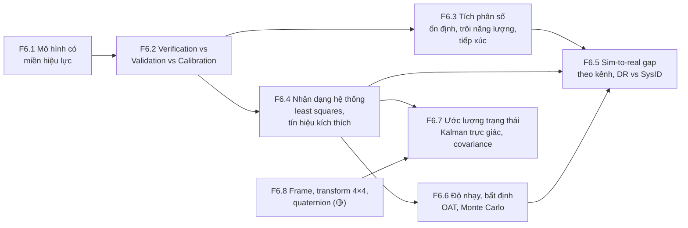

# F6 — Mô hình hóa, mô phỏng, V&V, nhận dạng hệ thống (37h)

> Khóa nền, học **đúng lúc**: mở viên nang ngay trước bài chính cần nó (bảng dưới), không đọc một mạch. Tổng 37h = F6.1 4h · F6.2 4h · F6.3 6h · F6.4 6h · F6.5 5h · F6.6 4h · F6.7 5h · F6.8 3h. Một phần trùng với phần khái niệm của K6 Module 5 và K7 C11; phần còn lại cộng thêm vào tổng lộ trình, vốn đã vượt ngân sách 650h (K1–K6 545h + K7 gốc 340h = 885h, K7 mới còn nặng hơn — `khoa-7/_KE-HOACH-K7.md` mục 3). Không giấu con số này.
>
> **Quan hệ với K6 Bài 15–17.** Ba bài đó đã dạy từ vựng V&V, bốn mức đo gap, u_val (ASME V&V 20), t_div, bảng hiệu lực theo kênh, con lắc ba đường, ba integrator trên con lắc, fit ma sát 30° → 45°. F6 **không dạy lại** những thứ đó; nó cho phần lý thuyết bên dưới: vì sao integrator hỏng theo kiểu nó hỏng (F6.3), vì sao một tín hiệu kích thích làm tham số nhận dạng được còn tín hiệu khác thì không (F6.4), vì sao "gap của từng kênh" không cộng lại thành gap tổng (F6.5), vì sao phân tích độ nhạy theo phương sai có thể chỉ sai tham số gây hỏng (F6.6). Khi gặp chỗ trùng, F6 trỏ sang bài K6 thay vì chép lại.

## Vì sao khóa nền này tồn tại

Data infra cho robot sớm muộn cũng phải trả lời một câu: **con số do mô hình sinh ra (sim, bộ lọc, công thức, policy) có đáng tin cho quyết định này không?** Backend có rất ít truyền thống cho câu hỏi đó, vì ở backend "mô hình" và "hệ thật" thường là cùng một đoạn code. Thiếu F6, bạn sẽ hụt ở những chỗ cụ thể sau:

- **K1 Bài 9–10** — gọi việc đo điện trở trong của đồng hồ là "đo", không nhận ra mình đang làm nhận dạng hệ thống; áp mô hình LED tuyến tính ra ngoài dải dòng đã đo.
- **K3 Bài 8** — cộng p99 của từng tầng để ra p99 tổng thay vì Monte Carlo; tin ngân sách độ trễ như một phép cộng tất định.
- **K4 Bài 7–8** — đọc success rate trên LIBERO như hiệu năng ngoài đời; đọc "quantization làm tụt 2 điểm" mà không hỏi tụt ở đâu, nhạy với cái gì.
- **K6 Bài 3** — thấy hai lần chạy sim tiếp xúc lệch nhau rồi kết luận "simulator lỗi", không phân biệt sai số số học, hỗn loạn và nhánh rẽ của tiếp xúc.
- **K6 Bài 5–6, Bài 14** — chọn dải randomization "cho chắc", không biết tham số nào đáng đo, tham số nào đáng randomize.
- **K6 Bài 15–17** — gọi calibration là validation; gọi miền đã đo là "Verified Domain" (đúng lỗi của bản Gemini).
- **K7 C2.4, C6.2, C8.3, C11.1, C11.3** — đo tham số hình học robot, hiệu chuẩn odometry, hợp nhất odometry + marker bằng EKF với covariance "lấy đại", dựng sim twin rồi khẳng định sim dự đoán được thực tế.

Bài chính dạy *dựng và đo*; F6 dạy *một mô hình đúng tới đâu, sai vì đâu, và ai được quyền nói nó đúng*.

## Mindset cốt lõi

1. **Mô hình nào cũng sai; câu hỏi là sai bao nhiêu, ở đâu, cho quyết định nào.** George Box viết "all models are wrong" năm 1976 và thêm "but some are useful" năm 1979 [chuẩn]. Người trong nghề tin điều này vì những thất bại lớn nhất của mô hình (Ariane 501, Columbia/Crater, Tacoma Narrows) đều không đến từ phép tính sai mà từ việc dùng một mô hình đúng **ngoài miền nó đúng**.
2. **Giải đúng phương trình, đúng phương trình, chỉnh tham số — ba việc khác nhau, ba trách nhiệm khác nhau.** Cộng đồng CFD và kết cấu học điều này qua những vụ như giàn Sleipner A (1991, sai số rời rạc hóa phần tử hữu hạn), rồi chính thức hóa thành ASME V&V 10/20 và NASA-STD-7009. Trộn ba việc làm một là cách nhanh nhất để một bug được "hiệu chỉnh" cho biến mất khỏi tầm nhìn.
3. **Integrator là một phần của mô hình, không phải chi tiết cài đặt.** Người làm động lực học phân tử và cơ học thiên thể đã khổ vì Euler/RK bơm hoặc rút năng lượng qua hàng triệu bước, và chuyển sang integrator symplectic (Verlet 1967). Robotics gặp lại đúng chuyện đó, cộng thêm tiếp xúc.
4. **Tham số chỉ đo được nếu dữ liệu buộc nó lộ ra.** Đội bay thử máy bay thiết kế thao tác kích thích riêng (doublet, sweep) vì đã học rằng dữ liệu bay bình thường không tách được các hệ số khí động. Fit khớp đẹp chưa nói gì về việc tham số có nhận dạng được không.
5. **Một ước lượng không kèm độ bất định tự khai là một ước lượng không dùng được để hợp nhất.** Kalman (1960) và đội điều hướng Apollo ở NASA Ames không chỉ đưa ra "vị trí tốt nhất" mà đưa ra covariance đi kèm; mọi bộ hợp nhất cảm biến sau đó sống hay chết theo việc covariance có trung thực không.

## Bản đồ viên nang



### Học đúng lúc

| Viên nang | Học trước bài chính | Giờ |
|---|---|---|
| F6.1 Mô hình có miền hiệu lực | K1 Bài 10 · K5 Bài 9 (đọc mục phạm vi) · K6 Bài 15, Bài 17 · K7 C6.3, C11.1, C11.3 | 4 |
| F6.2 Verification vs Validation vs Calibration | K6 Bài 15 (bắt buộc), Bài 16, Bài 17 · F2.4 (golden/differential cho sim) · K7 C11.1, C11.3 | 4 |
| F6.3 Tích phân số | K6 Bài 3 (vì sao tiếp xúc khó) · K6 Bài 16 phần A' · F2.2, F2.6 (phần sim) · K7 C11.1 | 6 |
| F6.4 Nhận dạng hệ thống | K1 Bài 9, Bài 10 (fit tùy chọn) · K6 Bài 14, Bài 16 phần F–G · K7 C2.4, C6.2, C11.1 | 6 |
| F6.5 Sim-to-real gap | K4 Bài 7 · K6 Bài 14, Bài 17 · K7 C11.3 | 5 |
| F6.6 Độ nhạy và bất định | K1 Bài 9 (lướt phần Monte Carlo) · K3 Bài 8 · K4 Bài 8 · K6 Bài 5, Bài 6, Bài 14, Bài 16 | 4 |
| F6.7 Ước lượng trạng thái | K3 Bài 6 (đọc lướt mục chấm mô hình lượt 12) · K7 C6.1, C6.3, C8.3 | 5 |
| F6.8 Hình học tối thiểu (🟡) | K2 Bài 3 · K5 Bài 13 (nội suy quaternion) · K6 Bài 2 (thứ tự quaternion trong observation) · K7 C8.2, C8.3 | 3 |

Tuần crunch: F6.2 mục 2 + 6 trước K6 Bài 15; F6.3 mục 2 trước K6 Bài 3; F6.7 mục 2 + 6 trước K7 C8.3. Mục 6 (Lăng kính đánh giá) là phần đáng giữ nhất của mỗi viên nang.

## Bạn đã làm cái này rồi

| Bạn đã làm trong backend/AI-harness | Tên chuẩn | Còn thiếu | Viên nang |
|---|---|---|---|
| Ghi "benchmark đo trên host yên tĩnh, 8 vCPU" bên cạnh con số | Khai **miền hiệu lực** (domain of applicability) của một kết quả | Miền là tập điểm đã đo, nhiều chiều; có cạnh "dốc đứng" (đổi chế độ) mà phép đo hai đầu không thấy | F6.1 |
| Unit test cho service + so mock server với service thật | **Verification** (code làm đúng điều đã viết) + **validation** của mô hình thay thế | Tách được hai việc, và biết rằng chỉnh mock cho khớp (calibration) không phải kiểm mock | F6.2 |
| Chọn số worker, timeout bằng cách thử vài giá trị trên staging | **Calibration** / tối ưu tham số trên một tập dữ liệu | Dùng dữ liệu khác để kiểm; biết khi nào tham số không nhận dạng được | F6.2, F6.4 |
| Load test với traffic profile tự chế để đo capacity | **Thiết kế tín hiệu kích thích** (một nửa) | Thiết kế tín hiệu để *tách* tham số, không chỉ để *đẩy tải*; đo độ bất định của tham số | F6.4 |
| Shadow traffic / replay để so bản mới với bản cũ | So quỹ đạo, mức 2 của K6 Bài 15 | Với hệ vật lý, sai lệch tích lũy theo thời gian và theo integrator | F6.3, F6.5 |
| Chaos/fault injection ngẫu nhiên ở staging | Monte Carlo trên tham số đầu vào | Biết phân bố đầu vào từ đâu ra; biết tham số nào gây đuôi hỏng | F6.6 |
| EMA của latency để làm dashboard mượt | Bộ lọc thông thấp; trường hợp riêng của Kalman với gain cố định | Gain tối ưu thay đổi theo độ bất định; covariance tự khai phải trung thực | F6.7 |
| Ghép span của distributed trace theo service cha–con | Cây biến đổi (TF tree) | Biến đổi có thứ tự, không giao hoán; mỗi cạnh có timestamp | F6.8 |

---

## F6.1 — Mô hình là gì: trừu tượng có miền hiệu lực (4h)

> **Dùng cho:** K1 Bài 10 · K5 Bài 9 · K6 Bài 15, Bài 17 · K7 C6.3, C11.1, C11.3 · **Cần trước:** F1.1 (độ bất định) · **Sau viên nang này bạn đánh giá được:** một khẳng định "mô hình X đúng / khớp / đã kiểm" có kèm miền không; miền đó được đo hay được giả định; và ra khỏi miền thì mô hình hỏng dần hay hỏng đột ngột.

### 1. Câu chuyện

Kourou, 4/6/1996, chuyến bay đầu tiên của Ariane 5 (chuyến 501). Khoảng 37 giây sau khi rời bệ, cả hai hệ quy chiếu quán tính (SRI, một chính, một dự phòng) ngừng hoạt động gần như cùng lúc; máy tính bay đọc dữ liệu chẩn đoán như dữ liệu bay, đánh lái hết cỡ, tên lửa vỡ và tự hủy [chuẩn: báo cáo của Inquiry Board do J.-L. Lions chủ trì, 7/1996]. Nguyên nhân: phần mềm SRI được dùng lại từ Ariane 4. Một hàm căn chỉnh đổi một giá trị thực 64 bit liên quan đến vận tốc ngang (BH, horizontal bias) sang số nguyên 16 bit có dấu. Trên quỹ đạo của Ariane 4, giá trị đó không bao giờ vượt phạm vi 16 bit, và các nhà thiết kế đã phân tích điều này nên để phép đổi không được bảo vệ. Ariane 5 tăng tốc ngang nhanh hơn nhiều; giá trị vượt phạm vi, sinh ngoại lệ, và cùng một ngoại lệ đó xảy ra ở cả hai SRI vì chúng chạy cùng một phần mềm. Báo cáo ghi thêm hai điều: hàm căn chỉnh ấy không còn tác dụng gì sau khi cất cánh, và quỹ đạo Ariane 5 không được đưa vào yêu cầu của SRI nên không ai kiểm phần mềm trên quỹ đạo đó.

Không có phép tính nào sai. Có một **giả định về dải giá trị** (một miền hiệu lực) đã được kiểm đúng cho Ariane 4, nhưng không được ghi thành điều kiện đi kèm phần mềm, nên khi bối cảnh đổi thì không ai hỏi lại. Cùng mẫu đó lặp lại ở Columbia (K6 Bài 17: mô hình Crater dùng cho mảnh bọt lớn gấp hàng trăm lần mẫu thử) và ở Tacoma Narrows (K6 Bài 15: lý thuyết tĩnh học dùng cho hiện tượng khí động đàn hồi). Viên nang này lấy bài học chung của ba vụ ra khỏi ngữ cảnh hàng không vũ trụ: **mô hình là phương trình cộng với miền của nó; ai chỉ chuyển giao phương trình là đã chuyển giao một nửa.**

### 2. Mô hình tư duy

Một mô hình có sáu thành phần. Tài liệu kém thường chỉ ghi hai thành phần đầu.

| Thành phần | Ví dụ: odometry vi sai (K7 C6.1) | Câu hỏi để moi ra nó |
|---|---|---|
| Phương trình | `Δs = (Δs_L + Δs_R)/2`, `Δθ = (Δs_R − Δs_L)/B` | Nó tính gì từ gì? |
| Giả định | bánh lăn không trượt, sàn phẳng, bánh cứng, B không đổi | Điều gì phải đúng để phương trình đúng? |
| Tham số | đường kính bánh D_L, D_R, khoảng cách bánh B | Con số nào được đo, con số nào được fit, đo ở điều kiện nào? |
| Miền | gia tốc, loại sàn, tải trọng, tốc độ mà ở đó sai số đã được đo | Đã kiểm ở đâu? Chưa kiểm ở đâu? |
| Dung sai | "lệch < 2% quãng đường" cho quyết định X | Sai bao nhiêu thì quyết định đổi? |
| Mục đích | dead-reckoning giữa hai lần thấy marker (C8.3) | Mô hình này trả lời câu hỏi nào, và không trả lời câu hỏi nào? |

**Miền hiệu lực không phải tính chất của phương trình.** Nó là quan hệ giữa ba thứ: sai số mô hình tại một điểm, dung sai của quyết định, và độ bất định của phép đo dùng để biết sai số đó. Một cách nhìn hữu ích [chuẩn]: mọi mô hình là một khai triển đã bị cắt, và miền là vùng mà phần bị cắt nhỏ hơn dung sai.

```
sai số mô hình |e(x)|
   │                                                ╱ (b) cạnh DỐC: đổi chế độ
   │                                               │      (dính → trượt, bão hòa, tràn số)
   │                                         ╱     │
   │                                   ╱  (a) cạnh THOẢI: số hạng bị bỏ lớn dần
 ε ┼ ─ ─ ─ ─ ─ ─ ─ ─ ─ ─ ─ ─ ─ ─ ╱─ ─ ─ ─ ─ ─│─ ─ ─ ─ ─   dung sai của quyết định
   │                        ╱              │
 u ┼ · · · · · · · · ╱· · · · · · · · · · ·│· · · · · ·   sàn đo: dưới mức này không thấy gì
   │_____________╱_________________________│____________► điều kiện vận hành x
   [===== đã đo =====]                     ↑
        validation domain        chưa ai đo tới đây
```

Ba ý bản chất:

1. **Có hai kiểu cạnh miền.** Cạnh thoải (a): sai số lớn dần, ví dụ `sin θ ≈ θ` ở con lắc, `T = 2π√(L/g)` lệch dần theo biên độ (K6 Bài 16). Phép đo ở vài điểm rồi nội suy là đủ để thấy nó đến. Cạnh dốc (b): mô hình đúng gần như tuyệt đối tới một ngưỡng rồi sai hẳn, vì thế giới **đổi chế độ** (ma sát tĩnh → trượt, bão hòa motor, tràn số của Ariane). Đo hai đầu của dải không thấy cạnh dốc nằm ở giữa, và gần cạnh dốc, phép đo "vẫn khớp hoàn hảo" không phải bằng chứng an toàn.
2. **Miền đo được (validation domain) khác miền dùng (application domain).** Oberkampf và Roy tách hai vùng này [chuẩn: *Verification and Validation in Scientific Computing*, 2010]. Dùng trong giao của hai vùng là nội suy; dùng ngoài miền đo là ngoại suy, và lúc đó độ tin của bạn đến từ **vật lý** (bạn có lý do tin phần bị bỏ vẫn nhỏ) chứ không từ **dữ liệu**. K6 Bài 17 biến điều này thành code (VALIDITY.yaml, ba trạng thái IN/OUT/UNTESTED); ở đây chỉ cần nhớ: ngoại suy có lý do vật lý là kỹ thuật, ngoại suy không lý do là may rủi.
3. **Tham số cũng có miền.** μ đo trên gạch sạch là tham số của mô hình "gạch sạch". D bánh đo ở tải 3 kg là D ở tải 3 kg (bánh cao su bẹp theo tải). Câu "mọi tham số phải truy được về một phép đo" (K7 gốc Bài 18) là điều kiện cần; điều kiện đủ là phép đo đó được làm **trong miền bạn sắp dùng**.

### 3. Cầu nối từ backend

| Backend bạn biết | Ở đây | Gãy ở chỗ | Nếu dùng nhầm thì |
|---|---|---|---|
| Precondition trong docstring / assert ở đầu hàm ("n ≤ 65535") | Giả định và miền của mô hình | Precondition của hàm kiểm được ở runtime bằng một phép so sánh. Miền của mô hình vật lý thường **không quan sát được lúc chạy**: không có biến nào tên "đang trượt" | Tin rằng "không có assert nào nổ" nghĩa là đang trong miền (đúng lỗi Ariane, nơi bảo vệ đã bị bỏ vì "phân tích cho thấy không vượt") |
| Model ML được train trên một phân bố, inference gặp dữ liệu OOD | Mô hình vật lý dùng ngoài validation domain | Với ML bạn quen nghĩ OOD là chuyện của **dữ liệu đầu vào**. Với mô hình vật lý, ra khỏi miền có thể do **chế độ của thế giới** đổi trong khi mọi đầu vào vẫn nằm trong dải cũ (cùng tốc độ, nhưng sàn bụi) | Chỉ kiểm range của đầu vào rồi tuyên bố "trong miền" |
| Capacity test "tới 5.000 rps" | Miền đã kiểm của throughput | Service vượt envelope thường **lộ ra** (5xx, latency). Mô hình vật lý vượt miền vẫn trả số đẹp, không lỗi | Dùng sim ở biên độ chưa đo vì "sim không báo gì" |
| Dùng lại một thư viện đã chạy ổn ở dự án cũ | Dùng lại mô hình / tham số / phần mềm sang bối cảnh mới (Ariane 4 → 5) | Thư viện backend thường có contract rõ (kiểu, lỗi). Mô hình mang theo giả định ngầm về **dải vật lý** mà không ai viết ra | Mang bảng hiệu chuẩn odometry từ robot A sang robot B "vì cùng loại bánh" |

**Tên chuẩn của thứ bạn đã làm:** câu "đo trên host yên tĩnh, không áp cho host có tải" là một dòng *domain of applicability*. Thứ còn thiếu: (1) bạn chưa phải phân biệt cạnh thoải với cạnh dốc; (2) chưa phải ghi miền theo **điểm đã đo**, nhiều chiều, thay vì một khoảng.

**Chấm mô hình:**

- *"Trong một system vật lý có số tác nhân biết trước, được thu thập dữ liệu đầy đủ trong thời gian dài, thì mọi công thức vật lý gần như là hằng số"* (mô hình của bạn ở K3 lượt 12, đã chấm ở K3 Bài 6, F1.6 và K6 Bài 14 từ các góc khác). Ở góc miền hiệu lực: **ĐÚNG MỘT PHẦN.** Định luật là hằng số; **tham số hiệu dụng** của mô hình rút gọn thì không, vì chúng gói gọn những cơ chế bị bỏ, và các cơ chế đó đổi theo chế độ. Phản ví dụ: "hệ số ma sát bánh–sàn" là hằng số chừng nào bánh còn dính; khi trượt, nó thành một số khác (μ_k < μ_s), và odometry đổi từ "gần đúng" sang "sai hẳn" mà không có tác nhân mới nào xuất hiện. Bài tập mục 5 đo đúng chỗ này.
- *"Mô hình hoặc đúng hoặc sai."* **SAI.** Đúng/sai chỉ có nghĩa khi kèm miền và dung sai. `T = 2π√(L/g)` "đúng" ở 10° với dung sai 1%, "sai" ở 30° với dung sai 0,5%. Phản ví dụ: cùng công thức, cùng con lắc, hai kết luận ngược nhau chỉ vì đổi dung sai.
- *"Thêm cơ chế vào mô hình thì miền rộng ra."* **ĐÚNG MỘT PHẦN.** Rộng ra theo chiều của cơ chế mới, nhưng mỗi cơ chế mang tham số mới, và tham số mới cần dữ liệu ở vùng nó tác động để nhận dạng được (F6.4). Phản ví dụ: K6 Bài 16 phần E, mô hình ma sát ba thành phần dự đoán tốt hơn nhưng hệ số fit ra âm, vô nghĩa vật lý, vì dữ liệu không đủ để tách ba cơ chế.

### 4. Thuật ngữ

| Mức | Thuật ngữ | Nghĩa trong một câu | Hay bị hiểu nhầm thành |
|---|---|---|---|
| 🟢 | Miền hiệu lực (domain of validity / applicability) | Vùng điều kiện mà ở đó sai số mô hình đã được biết là nhỏ hơn dung sai | Tính chất cố hữu của phương trình |
| 🟢 | Validation domain vs application domain | Vùng có dữ liệu đối chứng vs vùng mô hình được dùng để quyết định | Một thứ |
| 🟢 | Nội suy / ngoại suy | Dùng trong / ngoài vùng đã đo | Ngoại suy luôn sai (thực ra được nếu có lý do vật lý) |
| 🟢 | Chế độ (regime) | Trạng thái mà một tập giả định đứng được: dính/trượt, tuyến tính/bão hòa | Chỉ là "giá trị lớn hơn" |
| 🟢 | Tham số hiệu dụng (effective parameter) | Con số gói gọn các cơ chế bị bỏ, chỉ đúng trong chế độ đã đo | Hằng số vật lý |
| 🟡 | Mô hình rút gọn / surrogate | Mô hình rẻ thay cho mô hình đắt hoặc hệ thật | "Mô hình kém" |
| 🟡 | Envelope (flight envelope) | Miền vận hành được chứng nhận của máy bay | Giới hạn an toàn tuyệt đối |
| 🔴 | Lý thuyết nhiễu loạn, phân tích tiệm cận | Toán để ước lượng phần bị cắt | Điều kiện để dùng viên nang này |

### 5. Bài tập dự đoán

**Đề.** Mô hình odometry giả định bánh không trượt. Đoạn code dưới mô phỏng robot vi sai tăng tốc êm (0,5 m/s²) tới 0,5 m/s, chạy đều, rồi **dừng khẩn** với gia tốc hãm `a` do firmware ra lệnh. Thân xe chỉ bám bánh khi lực cần ≤ μ_s·N trên bánh chủ động; vượt ngưỡng thì trượt với μ_k·N. Odometry đếm theo bánh; sai số = quãng bánh đếm − quãng thân xe đi thật. Trước khi chạy, dự đoán:

1. Ngưỡng gia tốc hãm mà mô hình "không trượt" bắt đầu sai, cho hai loại sàn trong code. Công thức: lực ma sát tối đa = μ_s·(f·m·g), với f là tỉ lệ trọng lượng đè lên bánh chủ động.
2. Dấu của sai số khi trượt: odometry báo xa hơn hay gần hơn thật?
3. Hình dạng đường sai số theo `a`: tăng từ từ từ 0, hay bằng 0 rồi nhảy? Vì sao (gợi ý: μ_k < μ_s).
4. Nếu thêm 1 kg pin đặt lệch về phía caster (f giảm), ngưỡng dịch về đâu?
5. Một kỹ sư kiểm odometry bằng cách cho robot dừng khẩn ở `a` = 1,0 và 3,0 m/s² trên gạch sạch, thấy "sai số nhỏ ở 1,0, lớn ở 3,0", rồi nội suy tuyến tính để dự đoán ở 2,0. Dự đoán của anh ta sai thế nào?

**Tham số cần tra (với robot thật ở K7):** μ giữa bánh và sàn của bạn đo bằng mặt nghiêng (K6 Bài 17 phần B); f từ cân từng bánh (K7 C2.4); gia tốc hãm lớn nhất mà firmware và Nav2 của bạn có thể ra lệnh (kế hoạch K7 chỉ ghi kẹp **tốc độ** ở C4.4; kẹp gia tốc là thứ bạn tự thêm nếu bài tập này thuyết phục bạn).

```python
# [đã chạy] F6.1 — mô hình odometry "bánh không trượt": nó đúng tới đâu?
import numpy as np
g, h = 9.81, 0.0005
F_DRIVE = 0.55                    # tỉ lệ trọng lượng đè lên hai bánh chủ động (phần còn lại lên caster) [ước lượng]
FLOORS = {"gạch sạch": (0.45, 0.35), "gạch bụi": (0.25, 0.18)}   # (μ tĩnh, μ động) [ước lượng — tự đo ở C2/C6]

def odom_error(a_cmd, mu_s, mu_k, v_max=0.5, a_up=0.5, hold=0.5):
    """Bánh tăng tốc êm a_up tới v_max, giữ, rồi DỪNG KHẨN với gia tốc a_cmd (motor hãm bánh theo lệnh).
    Thân xe chỉ bám bánh khi lực cần ≤ μ_s·N; vượt ngưỡng thì trượt với μ_k·N. Trả lệch cuối (mm)."""
    t_ramp = v_max / a_up; T = t_ramp + hold + v_max / a_cmd + 1.0   # +1 s cho thân xe dừng hẳn
    vb = xw = xb = 0.0; slipping = False
    for k in range(int(T / h)):
        t = k * h
        vw = min(a_up * t, v_max) if t < t_ramp + hold else max(v_max - a_cmd * (t - t_ramp - hold), 0.0)
        need = (vw - vb) / h                                     # gia tốc thân xe cần để bám bánh
        if not slipping and abs(need) <= mu_s * F_DRIVE * g:
            vb = vw                                              # dính: mô hình odometry đúng
        else:
            a = np.sign(need) * mu_k * F_DRIVE * g
            vb_new = vb + a * h
            slipping = (vw - vb_new) * (vw - vb) > 0             # còn trượt nếu chưa đuổi kịp bánh
            vb = vb_new if slipping else vw
        xw += vw * h; xb += vb * h
    return (xw - xb) * 1e3

for name, (mu_s, mu_k) in FLOORS.items():
    print(f"{name}: ngưỡng trượt μs·f·g = {mu_s * F_DRIVE * g:.2f} m/s²")
    for a in (1.0, 1.3, 1.4, 1.6, 2.0, 2.4, 2.5, 3.0, 5.0):
        print(f"   a lệnh {a:3.1f} m/s² -> odometry lệch {odom_error(a, mu_s, mu_k):6.1f} mm / một lần dừng khẩn")
```

```markdown
# prediction.md — F6.1
1. ngưỡng trượt: gạch sạch ___ m/s² ; gạch bụi ___ m/s²
2. dấu sai số khi trượt: odometry báo ___ (xa hơn / gần hơn) thật, vì ___
3. hình dạng: ___ (tăng dần / bằng 0 rồi nhảy), vì ___
4. thêm pin về phía caster: ngưỡng ___ (tăng / giảm)
5. nội suy tuyến tính 1,0 → 3,0 để đoán 2,0 sẽ ___
Độ tự tin (1–5): ___   Tôi sẽ ngạc nhiên nếu: ___
```

<details><summary>🔒 MỞ SAU KHI COMMIT prediction.md</summary>

Kết quả khi chạy (numpy 2.5, không ngẫu nhiên):

| a lệnh (m/s²) | 1,0 | 1,3 | 1,4 | 1,6 | 2,0 | 2,4 | 2,5 | 3,0 | 5,0 |
|---|---|---|---|---|---|---|---|---|---|
| Gạch sạch (ngưỡng 2,43) | 0 | 0 | 0 | 0 | 0 | 0 | −16,2 | −24,5 | −41,2 |
| Gạch bụi (ngưỡng 1,35) | 0 | 0 | −39,4 | −50,6 | −66,2 | −76,6 | −78,7 | −87,0 | −103,7 |

(mm, âm = odometry báo **gần hơn** thật: bánh đã dừng, thân xe còn trượt tới.)

1. μ_s·f·g = 0,45 × 0,55 × 9,81 ≈ 2,43 m/s² và 0,25 × 0,55 × 9,81 ≈ 1,35 m/s².
2. Gần hơn: lúc hãm, bánh bị ép dừng nhanh hơn thân xe có thể dừng bằng ma sát, thân xe trượt thêm một đoạn mà encoder không đếm.
3. **Cạnh dốc.** Ngay khi vượt ngưỡng, sai số nhảy từ 0 lên hàng chục mm, vì khi đã trượt thì lực hãm rơi xuống μ_k (nhỏ hơn μ_s) và không quay lại dính cho tới khi thân xe gần dừng. Mô hình này "đúng tuyệt đối" dưới ngưỡng là do mô phỏng không có creep của lốp; lốp thật có trượt dọc nhỏ, tỉ lệ với lực, nên dưới ngưỡng sai số nhỏ chứ không bằng 0 [chuẩn: mô hình lốp, độ trượt dọc]. Cạnh vẫn dốc.
4. f giảm → ngưỡng giảm (ít lực pháp tuyến trên bánh chủ động). Vị trí đặt pin là một tham số của miền odometry, đúng tinh thần K7 C2.2.
5. Ở gạch sạch, nội suy cho 2,0 m/s² một giá trị giữa 0 và −24,5 mm (cỡ −12 mm), trong khi thật là 0: sai cả về mức lẫn về bản chất (2,0 nằm **trong** miền dính). Nếu cùng cách làm trên gạch bụi, nội suy giữa 0 (ở 1,0) và −87 mm đoán khoảng −43 mm ở 2,0; thật là −66 mm. Hai điểm đo ở hai đầu không bắt được cạnh dốc ở giữa, và không nói được cạnh nằm đâu. Muốn biết: đo dày quanh ngưỡng dự đoán từ μ đo riêng.

Hệ quả cho K7: một hồ sơ hiệu chuẩn odometry (C6.2 UMBmark) chỉ hợp lệ khi robot **không bao giờ** ra lệnh gia tốc vượt ngưỡng của sàn đang chạy. Kẹp gia tốc trong firmware (bổ sung cho kẹp tốc độ ở C4.4) vì thế không chỉ là chuyện an toàn, mà còn là chuyện giữ odometry trong miền.

</details>

### 6. Lăng kính đánh giá

Checklist khi đọc một khẳng định "mô hình X khớp / đúng / đã kiểm":

1. **Miền có được ghi không?** Điều kiện nào (tốc độ, biên độ, sàn, nhiệt độ, tải) đã được đo?
2. Miền là **tập điểm đã đo** hay một khoảng min–max suy ra từ vài điểm?
3. Khẳng định có đi **ngoài** miền đo không? Nếu có, lý do vật lý nào khiến phần bị bỏ vẫn nhỏ?
4. Có cơ chế đổi chế độ nào (dính/trượt, bão hòa, tràn, va chạm) có thể nằm giữa các điểm đã đo không?
5. Tham số dùng trong mô hình được đo **ở chế độ và điều kiện** của ứng dụng không?
6. Dung sai của quyết định là bao nhiêu? "Khớp" theo dung sai nào?

**ĐÚNG** nếu 1–6 trả lời được và khẳng định nằm trong miền; **SAI** nếu khẳng định vượt miền mà không có lý do, hoặc trộn chế độ; **CHƯA RÕ** nếu thiếu miền hay thiếu dung sai (đây là trường hợp thường gặp nhất).

**Khẳng định mẫu — tự chấm trước khi mở:**

(a) Bản Gemini K7 Bài 18: *"Sau khi đã tinh chỉnh khớp các tham số ở vận tốc 0.3 m/s, dùng chính mô hình đó để dự đoán trước hành vi của xe ở vận tốc 0.5 m/s rồi mới đo thật. Nếu kết quả dự đoán khớp, mô hình có tính khái quát cao."*

(b) Bản Gemini K7 Bài 18: *"Một bộ tham số ma sát tinh chỉnh tối ưu cho sàn gạch men bóng không bao giờ khớp được sàn thảm văn phòng."*

(c) K7 gốc Bài 18: *"Mọi tham số phải truy được về một phép đo, không có số nào bịa."* (đặt cạnh câu hỏi: như vậy sim có đúng trong mọi điều kiện văn phòng không?)

<details><summary>🔒 Đáp án</summary>

(a) **ĐÚNG MỘT PHẦN.** Phương pháp đúng (fit ở một điểm, dự đoán trước ở điểm khác, đo sau: đó là validation, F6.2). Kết luận quá tay: một điểm ngoại suy khớp chỉ mở rộng miền tới **điểm đó**, dọc **một trục** (vận tốc). Nó không nói gì về gia tốc hãm, loại sàn, tải. Và nếu ngưỡng trượt nằm giữa 0,3 và 0,5 m/s ở một gia tốc khác, khớp ở 0,5 với gia tốc êm không bảo vệ gì. "Tính khái quát cao" phải viết lại thành "miền đã kiểm gồm thêm điểm (0,5 m/s, gia tốc a, sàn S)".

(b) **ĐÚNG MỘT PHẦN.** Hướng đúng: μ là tham số hiệu dụng, đổi theo cặp bề mặt, nên tham số của gạch không có lý do để đúng trên thảm. "Không bao giờ khớp" thì sai về logic: có thể tình cờ khớp ở một số đại lượng (ví dụ đi thẳng tốc độ thấp, nơi ma sát lăn chi phối và ma sát trượt không vào cuộc). Câu đúng: "tham số đo trên gạch không được dùng cho thảm cho tới khi đo trên thảm; với những đại lượng không phụ thuộc ma sát trượt, có thể kiểm và mở rộng miền".

(c) **ĐÚNG MỘT PHẦN.** Điều kiện cần, không đủ. Mỗi phép đo có miền riêng (μ đo trên gạch sạch, D bánh đo ở một tải, đường cong PWM đo ở một mức pin). Sim dựng toàn từ số đo vẫn đúng chỉ trong giao các miền của các phép đo đó, và chỉ cho các cơ chế đã có trong mô hình. Câu hỏi đi kèm phải là "mỗi tham số đo ở điều kiện nào", và bảng hiệu lực (K6 Bài 17, K7 C11.3) phải mang thông tin đó.

</details>

### 7. Câu hỏi ngược

1. **[Vì sao không]** Vì sao không để mô hình tự báo khi nó ra khỏi miền, giống assert?
   <details><summary>Hướng nghĩ</summary>

   Những gì quan sát được (đầu vào vượt dải) thì làm được, và nên làm (K6 Bài 17 checker). Nhưng chế độ thường là trạng thái **ẩn** của thế giới: odometry không có cảm biến trượt. Muốn phát hiện phải có nguồn độc lập (IMU so với encoder, F6.7). Hỏi: tín hiệu nào trên robot của bạn phản bội việc đang trượt?

   </details>
2. **[Quy mô]** 100 robot trên 5 loại sàn, mỗi robot một bảng hiệu chuẩn. Ở quy mô đó cái gì gãy trước: việc đo, việc lưu miền, hay việc kiểm một episode có nằm trong miền?
   <details><summary>Hướng nghĩ</summary>

   Nghĩ về "miền" như metadata cấp episode (robot_id, floor_type, payload, firmware) và một phép join với bảng miền. Câu hỏi khó: ai gán nhãn loại sàn cho 1000 giờ dữ liệu? Nếu không gán được, miền không kiểm được, và dữ liệu đó phải mang cờ UNTESTED.

   </details>
3. **[Failure mode]** Một mô hình nằm sát cạnh dốc trong vận hành bình thường (ví dụ gia tốc hãm 2,3 trên sàn ngưỡng 2,43). Mọi kiểm tra đều PASS. Điều gì sẽ đẩy nó qua cạnh mà không ai đổi code?
   <details><summary>Hướng nghĩ</summary>

   Bụi, sàn ướt, pin đổi chỗ, lốp mòn, robot chở thêm đồ. Biên an toàn của một mô hình là khoảng cách tới cạnh dốc gần nhất, không phải sai số đo được hôm nay. Liên hệ với "headroom" trong capacity planning, và vì sao không ai chạy cluster ở 95% CPU.

   </details>
4. **[Liên ngành]** Thuốc được thử lâm sàng trên người lớn, rồi bác sĩ kê cho trẻ em ("off-label"). Đó là ngoại suy có lý do hay không có lý do?
   <details><summary>Hướng nghĩ</summary>

   Có lý do một phần: dược động học theo cân nặng. Không đủ: chuyển hóa gan và thận của trẻ thuộc chế độ khác. Ngành dược xử lý bằng nghiên cứu nhi khoa riêng, tức đo trong miền mới. Giống với chuyển bảng hiệu chuẩn sang robot khác.

   </details>
5. **[Phản biện]** "Mô hình đủ tốt thì không cần miền; MuJoCo mô phỏng được mọi thứ." Phản biện bằng một cơ chế cụ thể MuJoCo không có trong robot của bạn.
   <details><summary>Hướng nghĩ</summary>

   Độ bẹp lốp theo tải, khe hở hộp số (backlash), sụt áp pin làm đổi đường cong PWM→vận tốc, cáp kéo. MuJoCo giải đúng các phương trình nó có; miền là câu hỏi về các phương trình nó không có (F6.2).

   </details>

### 8. Liên kết ra ngoài

- **Flight envelope trong hàng không.** Máy bay được chứng nhận trong một miền (tốc độ, độ cao, hệ số tải, trọng tâm); ngoài miền, mô hình khí động có thể đổi chế độ (thất tốc là cạnh dốc điển hình). Giống: miền nhiều chiều, cạnh dốc, có giới hạn cứng trong phần mềm điều khiển. Khác: họ đo miền bằng bay thử có rủi ro được quản lý và tài liệu hóa nghiêm; robot hobby thường không có tài liệu nào.
- **Mô hình rủi ro tài chính và LTCM (1998).** Quỹ Long-Term Capital Management dùng mô hình được hiệu chỉnh trên giai đoạn thị trường bình thường; khi Nga vỡ nợ, tương quan giữa các tài sản đổi chế độ và mô hình mất hiệu lực đúng lúc nó cần nhất [chuẩn]. Giống: tham số hiệu dụng (tương quan) chỉ đúng trong chế độ đã thấy. Khác: thị trường phản ứng với chính mô hình (người khác cũng dùng nó); sàn nhà thì không.
- **Phần mềm Ariane 4 → 5** (mục 1): ngành phần mềm học được rằng dùng lại code là dùng lại cả giả định ngầm về dải dữ liệu, và các phân tích "không thể vượt" phải được ghi thành yêu cầu đi kèm.

### 9. Áp vào khóa chính

- **K1 Bài 10:** mô hình LED (dòng theo áp) có miền theo dòng; ghi dải dòng đã đo cạnh tham số fit, và không dùng tham số đó ở dòng 10 lần lớn hơn.
- **K5 Bài 9:** câu "PTP đạt X ns" chỉ đúng cho cấu hình, nhiệt độ, switch đã đo; viết rõ phạm vi trong báo cáo.
- **K6 Bài 15, Bài 17:** mục 2 ở đây là lý thuyết cho bảng hiệu lực; khi điền VALIDITY.yaml, ghi thêm cột "kiểu cạnh" (thoải/dốc) nếu biết, vì cạnh dốc cần đo dày quanh ngưỡng.
- **K7 C6.3:** "odometry không biết mình sai" là đúng chuyện cạnh dốc; dùng bài tập mục 5 để chọn giới hạn gia tốc firmware theo sàn thật.
- **K7 C11.1, C11.3:** mỗi tham số trong MJCF đi kèm điều kiện đo; bảng sim-vs-thật phải có cột miền.

### 10. Độ tin cậy

| Khẳng định | Nhãn | Ghi chú / cách kiểm |
|---|---|---|
| Ariane 501: tràn khi đổi 64 bit → 16 bit có dấu của giá trị BH; phần mềm SRI dùng lại từ Ariane 4; hàm căn chỉnh không cần sau cất cánh; quỹ đạo Ariane 5 không có trong yêu cầu SRI | [spec] | *ARIANE 5 Flight 501 Failure — Report by the Inquiry Board*, 19/7/1996 (ESA/CNES) |
| Box: "all models are wrong" (1976), "but some are useful" (1979) | [chuẩn] | G. E. P. Box, *Science and Statistics*, JASA 71 (1976); *Robustness in the strategy of scientific model building* (1979) |
| Validation domain vs application domain | [chuẩn] | Oberkampf & Roy 2010 |
| μ gạch/cao su 0,45/0,35, gạch bụi 0,25/0,18, f = 0,55 | [ước lượng] | Giả định cho bài tập; đo thật ở K6 Bài 17 phần B, K7 C2.4 |
| Bảng mục 5 | [đã chạy] | numpy 2.5.3; mô hình không có creep của lốp |
| LTCM 1998 sụp đổ khi tương quan đổi chế độ sau khủng hoảng Nga | [chuẩn] | Lowenstein, *When Genius Failed* (2000) |

Đã sửa so với bản gốc/Gemini: (Gemini K7 Bài 18) "dự đoán khớp ở 0,5 m/s → mô hình có tính khái quát cao" → một điểm ngoại suy mở rộng miền tới điểm đó, dọc một trục. (Gemini K7 Bài 18) "không bao giờ khớp được sàn thảm" → không được dùng cho tới khi đo; có thể khớp ở đại lượng không phụ thuộc ma sát trượt. (K7 gốc Bài 18) "mọi tham số truy được về phép đo" → bổ sung: kèm điều kiện đo.

### 11. Đọc thêm và tự kiểm tra

- **Nguồn gốc:** *ARIANE 5 Flight 501 Failure — Report by the Inquiry Board* (J.-L. Lions chủ trì, 1996), khoảng 15 trang, đọc trọn được trong một buổi.
- **Giải thích:** W. L. Oberkampf & C. J. Roy, *Verification and Validation in Scientific Computing* (Cambridge University Press, 2010), chương 1–2 (phần validation domain và application domain).
- **Đào sâu (tùy chọn):** G. E. P. Box, *Science and Statistics*, Journal of the American Statistical Association 71(356), 1976.
- **Tự kiểm tra:** (1) giải thích cho một backend engineer khác vì sao "không có assert nào nổ" không chứng minh mô hình đang trong miền; (2) vẽ lại hình cạnh thoải/cạnh dốc từ trí nhớ; (3) câu hỏi:

  Bạn đo sai số odometry ở tốc độ 0,2 và 0,5 m/s, gia tốc êm, trên gạch, đều < 1%. Đồng nghiệp viết vào README: "odometry chính xác < 1% trong dải 0,2–0,5 m/s". Sửa câu đó cho đúng.
  <details><summary>Đáp án</summary>

  "Odometry lệch < 1% quãng đường tại hai điểm 0,2 và 0,5 m/s, gia tốc ≤ (giá trị), trên gạch (sạch/bụi), tải (kg), hiệu chuẩn (ngày, phiên bản). Chưa kiểm: gia tốc hãm cao, sàn khác, tải khác." Câu gốc biến hai điểm thành một khoảng và bỏ mất ba chiều (gia tốc, sàn, tải) mà sai số phụ thuộc mạnh nhất.

  </details>

---
