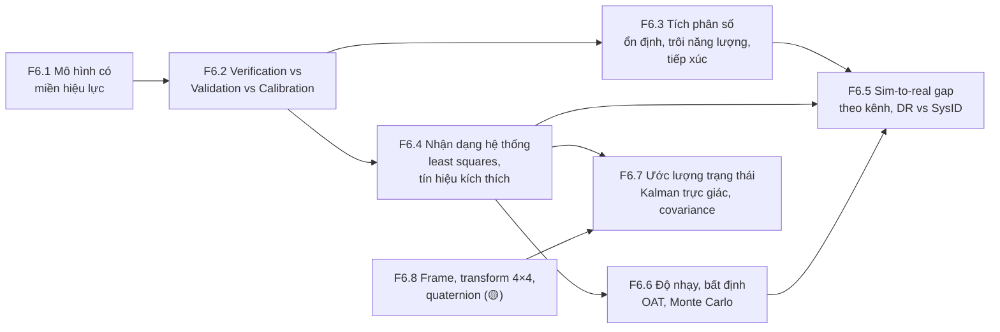
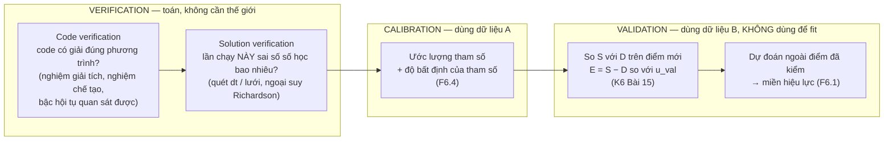
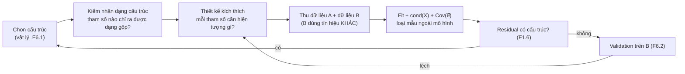
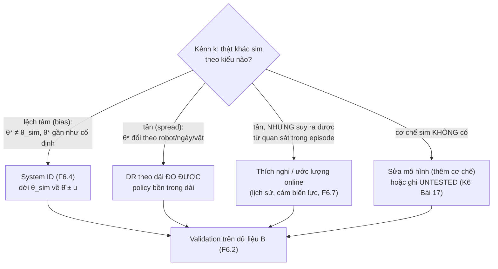

# F6 — Mô hình hóa, mô phỏng, V&V, nhận dạng hệ thống (37h)

> Khóa nền, học **đúng lúc**: mở viên nang ngay trước bài chính cần nó (bảng dưới), không đọc một mạch. Tổng 37h = F6.1 4h · F6.2 4h · F6.3 6h · F6.4 6h · F6.5 5h · F6.6 4h · F6.7 5h · F6.8 3h. Một phần trùng với phần khái niệm của K6 Module 5 và K7 C11; phần còn lại cộng thêm vào tổng lộ trình, vốn đã vượt ngân sách 650h (K1–K6 545h + K7 gốc 340h = 885h, K7 mới còn nặng hơn — `khoa-7/_KE-HOACH-K7.md` mục 3). Không giấu con số này.
>
> **Quan hệ với K6 Bài 15–17.** Ba bài đó đã dạy từ vựng V&V, bốn mức đo gap, u_val (ASME V&V 20), t_div, bảng hiệu lực theo kênh, con lắc ba đường, ba integrator trên con lắc, fit ma sát 30° → 45°. F6 **không dạy lại** những thứ đó; nó cho phần lý thuyết bên dưới: vì sao integrator hỏng theo kiểu nó hỏng (F6.3), vì sao một tín hiệu kích thích làm tham số nhận dạng được còn tín hiệu khác thì không (F6.4), vì sao "gap của từng kênh" không cộng lại thành gap tổng (F6.5), vì sao phân tích độ nhạy theo phương sai có thể chỉ sai tham số gây hỏng (F6.6). Khi gặp chỗ trùng, F6 trỏ sang bài K6 thay vì chép lại.

## Vì sao khóa nền này tồn tại

Data infra cho robot sớm muộn cũng phải trả lời một câu: **con số do mô hình sinh ra (sim, bộ lọc, công thức, policy) có đáng tin cho quyết định này không?** Backend có rất ít truyền thống cho câu hỏi đó, vì ở backend "mô hình" và "hệ thật" thường là cùng một đoạn code. Thiếu F6, bạn sẽ hụt ở những chỗ cụ thể sau:

- **K1 Bài 9–10** — gọi việc đo điện trở trong của đồng hồ là "đo", không nhận ra mình đang làm nhận dạng hệ thống; áp mô hình LED tuyến tính ra ngoài dải dòng đã đo.
- **K3 Bài 8** — cộng p99 của từng tầng để ra p99 tổng thay vì Monte Carlo; tin ngân sách độ trễ như một phép cộng tất định.
- **K4 Bài 7–8** — đọc success rate trên LIBERO như hiệu năng ngoài đời; đọc "quantization làm tụt 2 điểm" mà không hỏi tụt ở đâu, nhạy với cái gì.
- **K6 Bài 3** — thấy hai lần chạy sim tiếp xúc lệch nhau rồi kết luận "simulator lỗi", không phân biệt sai số số học, hỗn loạn và nhánh rẽ của tiếp xúc.
- **K6 Bài 5–6, Bài 14** — chọn dải randomization "cho chắc", không biết tham số nào đáng đo, tham số nào đáng randomize.
- **K6 Bài 15–17** — gọi calibration là validation; gọi miền đã đo là "Verified Domain" (đúng lỗi của bản Gemini).
- **K7 C2.4, C6.2, C8.3, C11.1, C11.3** — đo tham số hình học robot, hiệu chuẩn odometry, hợp nhất odometry + marker bằng EKF với covariance "lấy đại", dựng sim twin rồi khẳng định sim dự đoán được thực tế.

Bài chính dạy *dựng và đo*; F6 dạy *một mô hình đúng tới đâu, sai vì đâu, và ai được quyền nói nó đúng*.

## Mindset cốt lõi

1. **Mô hình nào cũng sai; câu hỏi là sai bao nhiêu, ở đâu, cho quyết định nào.** George Box viết "all models are wrong" năm 1976 và thêm "but some are useful" năm 1979 [chuẩn]. Người trong nghề tin điều này vì những thất bại lớn nhất của mô hình (Ariane 501, Columbia/Crater, Tacoma Narrows) đều không đến từ phép tính sai mà từ việc dùng một mô hình đúng **ngoài miền nó đúng**.
2. **Giải đúng phương trình, đúng phương trình, chỉnh tham số — ba việc khác nhau, ba trách nhiệm khác nhau.** Cộng đồng CFD và kết cấu học điều này qua những vụ như giàn Sleipner A (1991, sai số rời rạc hóa phần tử hữu hạn), rồi chính thức hóa thành ASME V&V 10/20 và NASA-STD-7009. Trộn ba việc làm một là cách nhanh nhất để một bug được "hiệu chỉnh" cho biến mất khỏi tầm nhìn.
3. **Integrator là một phần của mô hình, không phải chi tiết cài đặt.** Người làm động lực học phân tử và cơ học thiên thể đã khổ vì Euler/RK bơm hoặc rút năng lượng qua hàng triệu bước, và chuyển sang integrator symplectic (Verlet 1967). Robotics gặp lại đúng chuyện đó, cộng thêm tiếp xúc.
4. **Tham số chỉ đo được nếu dữ liệu buộc nó lộ ra.** Đội bay thử máy bay thiết kế thao tác kích thích riêng (doublet, sweep) vì đã học rằng dữ liệu bay bình thường không tách được các hệ số khí động. Fit khớp đẹp chưa nói gì về việc tham số có nhận dạng được không.
5. **Một ước lượng không kèm độ bất định tự khai là một ước lượng không dùng được để hợp nhất.** Kalman (1960) và đội điều hướng Apollo ở NASA Ames không chỉ đưa ra "vị trí tốt nhất" mà đưa ra covariance đi kèm; mọi bộ hợp nhất cảm biến sau đó sống hay chết theo việc covariance có trung thực không.

## Bản đồ viên nang



### Học đúng lúc

| Viên nang | Học trước bài chính | Giờ |
|---|---|---|
| F6.1 Mô hình có miền hiệu lực | K1 Bài 10 · K5 Bài 9 (đọc mục phạm vi) · K6 Bài 15, Bài 17 · K7 C6.3, C11.1, C11.3 | 4 |
| F6.2 Verification vs Validation vs Calibration | K6 Bài 15 (bắt buộc), Bài 16, Bài 17 · F2.4 (golden/differential cho sim) · K7 C11.1, C11.3 | 4 |
| F6.3 Tích phân số | K6 Bài 3 (vì sao tiếp xúc khó) · K6 Bài 16 phần A' · F2.2, F2.6 (phần sim) · K7 C11.1 | 6 |
| F6.4 Nhận dạng hệ thống | K1 Bài 9, Bài 10 (fit tùy chọn) · K6 Bài 14, Bài 16 phần F–G · K7 C2.4, C6.2, C11.1 | 6 |
| F6.5 Sim-to-real gap | K4 Bài 7 · K6 Bài 14, Bài 17 · K7 C11.3 | 5 |
| F6.6 Độ nhạy và bất định | K1 Bài 9 (lướt phần Monte Carlo) · K3 Bài 8 · K4 Bài 8 · K6 Bài 5, Bài 6, Bài 14, Bài 16 | 4 |
| F6.7 Ước lượng trạng thái | K3 Bài 6 (đọc lướt mục chấm mô hình lượt 12) · K7 C6.1, C6.3, C8.3 | 5 |
| F6.8 Hình học tối thiểu (🟡) | K2 Bài 3 · K5 Bài 13 (nội suy quaternion) · K6 Bài 2 (thứ tự quaternion trong observation) · K7 C8.2, C8.3 | 3 |

Tuần crunch: F6.2 mục 2 + 6 trước K6 Bài 15; F6.3 mục 2 trước K6 Bài 3; F6.7 mục 2 + 6 trước K7 C8.3. Mục 6 (Lăng kính đánh giá) là phần đáng giữ nhất của mỗi viên nang.

## Bạn đã làm cái này rồi

| Bạn đã làm trong backend/AI-harness | Tên chuẩn | Còn thiếu | Viên nang |
|---|---|---|---|
| Ghi "benchmark đo trên host yên tĩnh, 8 vCPU" bên cạnh con số | Khai **miền hiệu lực** (domain of applicability) của một kết quả | Miền là tập điểm đã đo, nhiều chiều; có cạnh "dốc đứng" (đổi chế độ) mà phép đo hai đầu không thấy | F6.1 |
| Unit test cho service + so mock server với service thật | **Verification** (code làm đúng điều đã viết) + **validation** của mô hình thay thế | Tách được hai việc, và biết rằng chỉnh mock cho khớp (calibration) không phải kiểm mock | F6.2 |
| Chọn số worker, timeout bằng cách thử vài giá trị trên staging | **Calibration** / tối ưu tham số trên một tập dữ liệu | Dùng dữ liệu khác để kiểm; biết khi nào tham số không nhận dạng được | F6.2, F6.4 |
| Load test với traffic profile tự chế để đo capacity | **Thiết kế tín hiệu kích thích** (một nửa) | Thiết kế tín hiệu để *tách* tham số, không chỉ để *đẩy tải*; đo độ bất định của tham số | F6.4 |
| Shadow traffic / replay để so bản mới với bản cũ | So quỹ đạo, mức 2 của K6 Bài 15 | Với hệ vật lý, sai lệch tích lũy theo thời gian và theo integrator | F6.3, F6.5 |
| Chaos/fault injection ngẫu nhiên ở staging | Monte Carlo trên tham số đầu vào | Biết phân bố đầu vào từ đâu ra; biết tham số nào gây đuôi hỏng | F6.6 |
| EMA của latency để làm dashboard mượt | Bộ lọc thông thấp; trường hợp riêng của Kalman với gain cố định | Gain tối ưu thay đổi theo độ bất định; covariance tự khai phải trung thực | F6.7 |
| Ghép span của distributed trace theo service cha–con | Cây biến đổi (TF tree) | Biến đổi có thứ tự, không giao hoán; mỗi cạnh có timestamp | F6.8 |

---

## F6.1 — Mô hình là gì: trừu tượng có miền hiệu lực (4h)

> **Dùng cho:** K1 Bài 10 · K5 Bài 9 · K6 Bài 15, Bài 17 · K7 C6.3, C11.1, C11.3 · **Cần trước:** F1.1 (độ bất định) · **Sau viên nang này bạn đánh giá được:** một khẳng định "mô hình X đúng / khớp / đã kiểm" có kèm miền không; miền đó được đo hay được giả định; và ra khỏi miền thì mô hình hỏng dần hay hỏng đột ngột.

### 1. Câu chuyện

Kourou, 4/6/1996, chuyến bay đầu tiên của Ariane 5 (chuyến 501). Khoảng 37 giây sau khi rời bệ, cả hai hệ quy chiếu quán tính (SRI, một chính, một dự phòng) ngừng hoạt động gần như cùng lúc; máy tính bay đọc dữ liệu chẩn đoán như dữ liệu bay, đánh lái hết cỡ, tên lửa vỡ và tự hủy [chuẩn: báo cáo của Inquiry Board do J.-L. Lions chủ trì, 7/1996]. Nguyên nhân: phần mềm SRI được dùng lại từ Ariane 4. Một hàm căn chỉnh đổi một giá trị thực 64 bit liên quan đến vận tốc ngang (BH, horizontal bias) sang số nguyên 16 bit có dấu. Trên quỹ đạo của Ariane 4, giá trị đó không bao giờ vượt phạm vi 16 bit, và các nhà thiết kế đã phân tích điều này nên để phép đổi không được bảo vệ. Ariane 5 tăng tốc ngang nhanh hơn nhiều; giá trị vượt phạm vi, sinh ngoại lệ, và cùng một ngoại lệ đó xảy ra ở cả hai SRI vì chúng chạy cùng một phần mềm. Báo cáo ghi thêm hai điều: hàm căn chỉnh ấy không còn tác dụng gì sau khi cất cánh, và quỹ đạo Ariane 5 không được đưa vào yêu cầu của SRI nên không ai kiểm phần mềm trên quỹ đạo đó.

Không có phép tính nào sai. Có một **giả định về dải giá trị** (một miền hiệu lực) đã được kiểm đúng cho Ariane 4, nhưng không được ghi thành điều kiện đi kèm phần mềm, nên khi bối cảnh đổi thì không ai hỏi lại. Cùng mẫu đó lặp lại ở Columbia (K6 Bài 17: mô hình Crater dùng cho mảnh bọt lớn gấp hàng trăm lần mẫu thử) và ở Tacoma Narrows (K6 Bài 15: lý thuyết tĩnh học dùng cho hiện tượng khí động đàn hồi). Viên nang này lấy bài học chung của ba vụ ra khỏi ngữ cảnh hàng không vũ trụ: **mô hình là phương trình cộng với miền của nó; ai chỉ chuyển giao phương trình là đã chuyển giao một nửa.**

### 2. Mô hình tư duy

Một mô hình có sáu thành phần. Tài liệu kém thường chỉ ghi hai thành phần đầu.

| Thành phần | Ví dụ: odometry vi sai (K7 C6.1) | Câu hỏi để moi ra nó |
|---|---|---|
| Phương trình | `Δs = (Δs_L + Δs_R)/2`, `Δθ = (Δs_R − Δs_L)/B` | Nó tính gì từ gì? |
| Giả định | bánh lăn không trượt, sàn phẳng, bánh cứng, B không đổi | Điều gì phải đúng để phương trình đúng? |
| Tham số | đường kính bánh D_L, D_R, khoảng cách bánh B | Con số nào được đo, con số nào được fit, đo ở điều kiện nào? |
| Miền | gia tốc, loại sàn, tải trọng, tốc độ mà ở đó sai số đã được đo | Đã kiểm ở đâu? Chưa kiểm ở đâu? |
| Dung sai | "lệch < 2% quãng đường" cho quyết định X | Sai bao nhiêu thì quyết định đổi? |
| Mục đích | dead-reckoning giữa hai lần thấy marker (C8.3) | Mô hình này trả lời câu hỏi nào, và không trả lời câu hỏi nào? |

**Miền hiệu lực không phải tính chất của phương trình.** Nó là quan hệ giữa ba thứ: sai số mô hình tại một điểm, dung sai của quyết định, và độ bất định của phép đo dùng để biết sai số đó. Một cách nhìn hữu ích [chuẩn]: mọi mô hình là một khai triển đã bị cắt, và miền là vùng mà phần bị cắt nhỏ hơn dung sai.

```
sai số mô hình |e(x)|
   │                                                ╱ (b) cạnh DỐC: đổi chế độ
   │                                               │      (dính → trượt, bão hòa, tràn số)
   │                                         ╱     │
   │                                   ╱  (a) cạnh THOẢI: số hạng bị bỏ lớn dần
 ε ┼ ─ ─ ─ ─ ─ ─ ─ ─ ─ ─ ─ ─ ─ ─ ╱─ ─ ─ ─ ─ ─│─ ─ ─ ─ ─   dung sai của quyết định
   │                        ╱              │
 u ┼ · · · · · · · · ╱· · · · · · · · · · ·│· · · · · ·   sàn đo: dưới mức này không thấy gì
   │_____________╱_________________________│____________► điều kiện vận hành x
   [===== đã đo =====]                     ↑
        validation domain        chưa ai đo tới đây
```

Ba ý bản chất:

1. **Có hai kiểu cạnh miền.** Cạnh thoải (a): sai số lớn dần, ví dụ `sin θ ≈ θ` ở con lắc, `T = 2π√(L/g)` lệch dần theo biên độ (K6 Bài 16). Phép đo ở vài điểm rồi nội suy là đủ để thấy nó đến. Cạnh dốc (b): mô hình đúng gần như tuyệt đối tới một ngưỡng rồi sai hẳn, vì thế giới **đổi chế độ** (ma sát tĩnh → trượt, bão hòa motor, tràn số của Ariane). Đo hai đầu của dải không thấy cạnh dốc nằm ở giữa, và gần cạnh dốc, phép đo "vẫn khớp hoàn hảo" không phải bằng chứng an toàn.
2. **Miền đo được (validation domain) khác miền dùng (application domain).** Oberkampf và Roy tách hai vùng này [chuẩn: *Verification and Validation in Scientific Computing*, 2010]. Dùng trong giao của hai vùng là nội suy; dùng ngoài miền đo là ngoại suy, và lúc đó độ tin của bạn đến từ **vật lý** (bạn có lý do tin phần bị bỏ vẫn nhỏ) chứ không từ **dữ liệu**. K6 Bài 17 biến điều này thành code (VALIDITY.yaml, ba trạng thái IN/OUT/UNTESTED); ở đây chỉ cần nhớ: ngoại suy có lý do vật lý là kỹ thuật, ngoại suy không lý do là may rủi.
3. **Tham số cũng có miền.** μ đo trên gạch sạch là tham số của mô hình "gạch sạch". D bánh đo ở tải 3 kg là D ở tải 3 kg (bánh cao su bẹp theo tải). Câu "mọi tham số phải truy được về một phép đo" (K7 gốc Bài 18) là điều kiện cần; điều kiện đủ là phép đo đó được làm **trong miền bạn sắp dùng**.

### 3. Cầu nối từ backend

| Backend bạn biết | Ở đây | Gãy ở chỗ | Nếu dùng nhầm thì |
|---|---|---|---|
| Precondition trong docstring / assert ở đầu hàm ("n ≤ 65535") | Giả định và miền của mô hình | Precondition của hàm kiểm được ở runtime bằng một phép so sánh. Miền của mô hình vật lý thường **không quan sát được lúc chạy**: không có biến nào tên "đang trượt" | Tin rằng "không có assert nào nổ" nghĩa là đang trong miền (đúng lỗi Ariane, nơi bảo vệ đã bị bỏ vì "phân tích cho thấy không vượt") |
| Model ML được train trên một phân bố, inference gặp dữ liệu OOD | Mô hình vật lý dùng ngoài validation domain | Với ML bạn quen nghĩ OOD là chuyện của **dữ liệu đầu vào**. Với mô hình vật lý, ra khỏi miền có thể do **chế độ của thế giới** đổi trong khi mọi đầu vào vẫn nằm trong dải cũ (cùng tốc độ, nhưng sàn bụi) | Chỉ kiểm range của đầu vào rồi tuyên bố "trong miền" |
| Capacity test "tới 5.000 rps" | Miền đã kiểm của throughput | Service vượt envelope thường **lộ ra** (5xx, latency). Mô hình vật lý vượt miền vẫn trả số đẹp, không lỗi | Dùng sim ở biên độ chưa đo vì "sim không báo gì" |
| Dùng lại một thư viện đã chạy ổn ở dự án cũ | Dùng lại mô hình / tham số / phần mềm sang bối cảnh mới (Ariane 4 → 5) | Thư viện backend thường có contract rõ (kiểu, lỗi). Mô hình mang theo giả định ngầm về **dải vật lý** mà không ai viết ra | Mang bảng hiệu chuẩn odometry từ robot A sang robot B "vì cùng loại bánh" |

**Tên chuẩn của thứ bạn đã làm:** câu "đo trên host yên tĩnh, không áp cho host có tải" là một dòng *domain of applicability*. Thứ còn thiếu: (1) bạn chưa phải phân biệt cạnh thoải với cạnh dốc; (2) chưa phải ghi miền theo **điểm đã đo**, nhiều chiều, thay vì một khoảng.

**Chấm mô hình:**

- *"Trong một system vật lý có số tác nhân biết trước, được thu thập dữ liệu đầy đủ trong thời gian dài, thì mọi công thức vật lý gần như là hằng số"* (mô hình của bạn ở K3 lượt 12, đã chấm ở K3 Bài 6, F1.6 và K6 Bài 14 từ các góc khác). Ở góc miền hiệu lực: **ĐÚNG MỘT PHẦN.** Định luật là hằng số; **tham số hiệu dụng** của mô hình rút gọn thì không, vì chúng gói gọn những cơ chế bị bỏ, và các cơ chế đó đổi theo chế độ. Phản ví dụ: "hệ số ma sát bánh–sàn" là hằng số chừng nào bánh còn dính; khi trượt, nó thành một số khác (μ_k < μ_s), và odometry đổi từ "gần đúng" sang "sai hẳn" mà không có tác nhân mới nào xuất hiện. Bài tập mục 5 đo đúng chỗ này.
- *"Mô hình hoặc đúng hoặc sai."* **SAI.** Đúng/sai chỉ có nghĩa khi kèm miền và dung sai. `T = 2π√(L/g)` "đúng" ở 10° với dung sai 1%, "sai" ở 30° với dung sai 0,5%. Phản ví dụ: cùng công thức, cùng con lắc, hai kết luận ngược nhau chỉ vì đổi dung sai.
- *"Thêm cơ chế vào mô hình thì miền rộng ra."* **ĐÚNG MỘT PHẦN.** Rộng ra theo chiều của cơ chế mới, nhưng mỗi cơ chế mang tham số mới, và tham số mới cần dữ liệu ở vùng nó tác động để nhận dạng được (F6.4). Phản ví dụ: K6 Bài 16 phần E, mô hình ma sát ba thành phần dự đoán tốt hơn nhưng hệ số fit ra âm, vô nghĩa vật lý, vì dữ liệu không đủ để tách ba cơ chế.

### 4. Thuật ngữ

| Mức | Thuật ngữ | Nghĩa trong một câu | Hay bị hiểu nhầm thành |
|---|---|---|---|
| 🟢 | Miền hiệu lực (domain of validity / applicability) | Vùng điều kiện mà ở đó sai số mô hình đã được biết là nhỏ hơn dung sai | Tính chất cố hữu của phương trình |
| 🟢 | Validation domain vs application domain | Vùng có dữ liệu đối chứng vs vùng mô hình được dùng để quyết định | Một thứ |
| 🟢 | Nội suy / ngoại suy | Dùng trong / ngoài vùng đã đo | Ngoại suy luôn sai (thực ra được nếu có lý do vật lý) |
| 🟢 | Chế độ (regime) | Trạng thái mà một tập giả định đứng được: dính/trượt, tuyến tính/bão hòa | Chỉ là "giá trị lớn hơn" |
| 🟢 | Tham số hiệu dụng (effective parameter) | Con số gói gọn các cơ chế bị bỏ, chỉ đúng trong chế độ đã đo | Hằng số vật lý |
| 🟡 | Mô hình rút gọn / surrogate | Mô hình rẻ thay cho mô hình đắt hoặc hệ thật | "Mô hình kém" |
| 🟡 | Envelope (flight envelope) | Miền vận hành được chứng nhận của máy bay | Giới hạn an toàn tuyệt đối |
| 🔴 | Lý thuyết nhiễu loạn, phân tích tiệm cận | Toán để ước lượng phần bị cắt | Điều kiện để dùng viên nang này |

### 5. Bài tập dự đoán

**Đề.** Mô hình odometry giả định bánh không trượt. Đoạn code dưới mô phỏng robot vi sai tăng tốc êm (0,5 m/s²) tới 0,5 m/s, chạy đều, rồi **dừng khẩn** với gia tốc hãm `a` do firmware ra lệnh. Thân xe chỉ bám bánh khi lực cần ≤ μ_s·N trên bánh chủ động; vượt ngưỡng thì trượt với μ_k·N. Odometry đếm theo bánh; sai số = quãng bánh đếm − quãng thân xe đi thật. Trước khi chạy, dự đoán:

1. Ngưỡng gia tốc hãm mà mô hình "không trượt" bắt đầu sai, cho hai loại sàn trong code. Công thức: lực ma sát tối đa = μ_s·(f·m·g), với f là tỉ lệ trọng lượng đè lên bánh chủ động.
2. Dấu của sai số khi trượt: odometry báo xa hơn hay gần hơn thật?
3. Hình dạng đường sai số theo `a`: tăng từ từ từ 0, hay bằng 0 rồi nhảy? Vì sao (gợi ý: μ_k < μ_s).
4. Nếu thêm 1 kg pin đặt lệch về phía caster (f giảm), ngưỡng dịch về đâu?
5. Một kỹ sư kiểm odometry bằng cách cho robot dừng khẩn ở `a` = 1,0 và 3,0 m/s² trên gạch sạch, thấy "sai số nhỏ ở 1,0, lớn ở 3,0", rồi nội suy tuyến tính để dự đoán ở 2,0. Dự đoán của anh ta sai thế nào?

**Tham số cần tra (với robot thật ở K7):** μ giữa bánh và sàn của bạn đo bằng mặt nghiêng (K6 Bài 17 phần B); f từ cân từng bánh (K7 C2.4); gia tốc hãm lớn nhất mà firmware và Nav2 của bạn có thể ra lệnh (kế hoạch K7 chỉ ghi kẹp **tốc độ** ở C4.4; kẹp gia tốc là thứ bạn tự thêm nếu bài tập này thuyết phục bạn).

```python
# [đã chạy] F6.1 — mô hình odometry "bánh không trượt": nó đúng tới đâu?
import numpy as np
g, h = 9.81, 0.0005
F_DRIVE = 0.55                    # tỉ lệ trọng lượng đè lên hai bánh chủ động (phần còn lại lên caster) [ước lượng]
FLOORS = {"gạch sạch": (0.45, 0.35), "gạch bụi": (0.25, 0.18)}   # (μ tĩnh, μ động) [ước lượng — tự đo ở C2/C6]

def odom_error(a_cmd, mu_s, mu_k, v_max=0.5, a_up=0.5, hold=0.5):
    """Bánh tăng tốc êm a_up tới v_max, giữ, rồi DỪNG KHẨN với gia tốc a_cmd (motor hãm bánh theo lệnh).
    Thân xe chỉ bám bánh khi lực cần ≤ μ_s·N; vượt ngưỡng thì trượt với μ_k·N. Trả lệch cuối (mm)."""
    t_ramp = v_max / a_up; T = t_ramp + hold + v_max / a_cmd + 1.0   # +1 s cho thân xe dừng hẳn
    vb = xw = xb = 0.0; slipping = False
    for k in range(int(T / h)):
        t = k * h
        vw = min(a_up * t, v_max) if t < t_ramp + hold else max(v_max - a_cmd * (t - t_ramp - hold), 0.0)
        need = (vw - vb) / h                                     # gia tốc thân xe cần để bám bánh
        if not slipping and abs(need) <= mu_s * F_DRIVE * g:
            vb = vw                                              # dính: mô hình odometry đúng
        else:
            a = np.sign(need) * mu_k * F_DRIVE * g
            vb_new = vb + a * h
            slipping = (vw - vb_new) * (vw - vb) > 0             # còn trượt nếu chưa đuổi kịp bánh
            vb = vb_new if slipping else vw
        xw += vw * h; xb += vb * h
    return (xw - xb) * 1e3

for name, (mu_s, mu_k) in FLOORS.items():
    print(f"{name}: ngưỡng trượt μs·f·g = {mu_s * F_DRIVE * g:.2f} m/s²")
    for a in (1.0, 1.3, 1.4, 1.6, 2.0, 2.4, 2.5, 3.0, 5.0):
        print(f"   a lệnh {a:3.1f} m/s² -> odometry lệch {odom_error(a, mu_s, mu_k):6.1f} mm / một lần dừng khẩn")
```

```markdown
# prediction.md — F6.1
1. ngưỡng trượt: gạch sạch ___ m/s² ; gạch bụi ___ m/s²
2. dấu sai số khi trượt: odometry báo ___ (xa hơn / gần hơn) thật, vì ___
3. hình dạng: ___ (tăng dần / bằng 0 rồi nhảy), vì ___
4. thêm pin về phía caster: ngưỡng ___ (tăng / giảm)
5. nội suy tuyến tính 1,0 → 3,0 để đoán 2,0 sẽ ___
Độ tự tin (1–5): ___   Tôi sẽ ngạc nhiên nếu: ___
```

<details><summary>🔒 MỞ SAU KHI COMMIT prediction.md</summary>

Kết quả khi chạy (numpy 2.5, không ngẫu nhiên):

| a lệnh (m/s²) | 1,0 | 1,3 | 1,4 | 1,6 | 2,0 | 2,4 | 2,5 | 3,0 | 5,0 |
|---|---|---|---|---|---|---|---|---|---|
| Gạch sạch (ngưỡng 2,43) | 0 | 0 | 0 | 0 | 0 | 0 | −16,2 | −24,5 | −41,2 |
| Gạch bụi (ngưỡng 1,35) | 0 | 0 | −39,4 | −50,6 | −66,2 | −76,6 | −78,7 | −87,0 | −103,7 |

(mm, âm = odometry báo **gần hơn** thật: bánh đã dừng, thân xe còn trượt tới.)

1. μ_s·f·g = 0,45 × 0,55 × 9,81 ≈ 2,43 m/s² và 0,25 × 0,55 × 9,81 ≈ 1,35 m/s².
2. Gần hơn: lúc hãm, bánh bị ép dừng nhanh hơn thân xe có thể dừng bằng ma sát, thân xe trượt thêm một đoạn mà encoder không đếm.
3. **Cạnh dốc.** Ngay khi vượt ngưỡng, sai số nhảy từ 0 lên hàng chục mm, vì khi đã trượt thì lực hãm rơi xuống μ_k (nhỏ hơn μ_s) và không quay lại dính cho tới khi thân xe gần dừng. Mô hình này "đúng tuyệt đối" dưới ngưỡng là do mô phỏng không có creep của lốp; lốp thật có trượt dọc nhỏ, tỉ lệ với lực, nên dưới ngưỡng sai số nhỏ chứ không bằng 0 [chuẩn: mô hình lốp, độ trượt dọc]. Cạnh vẫn dốc.
4. f giảm → ngưỡng giảm (ít lực pháp tuyến trên bánh chủ động). Vị trí đặt pin là một tham số của miền odometry, đúng tinh thần K7 C2.2.
5. Ở gạch sạch, nội suy cho 2,0 m/s² một giá trị giữa 0 và −24,5 mm (cỡ −12 mm), trong khi thật là 0: sai cả về mức lẫn về bản chất (2,0 nằm **trong** miền dính). Nếu cùng cách làm trên gạch bụi, nội suy giữa 0 (ở 1,0) và −87 mm đoán khoảng −43 mm ở 2,0; thật là −66 mm. Hai điểm đo ở hai đầu không bắt được cạnh dốc ở giữa, và không nói được cạnh nằm đâu. Muốn biết: đo dày quanh ngưỡng dự đoán từ μ đo riêng.

Hệ quả cho K7: một hồ sơ hiệu chuẩn odometry (C6.2 UMBmark) chỉ hợp lệ khi robot **không bao giờ** ra lệnh gia tốc vượt ngưỡng của sàn đang chạy. Kẹp gia tốc trong firmware (bổ sung cho kẹp tốc độ ở C4.4) vì thế không chỉ là chuyện an toàn, mà còn là chuyện giữ odometry trong miền.

</details>

### 6. Lăng kính đánh giá

Checklist khi đọc một khẳng định "mô hình X khớp / đúng / đã kiểm":

1. **Miền có được ghi không?** Điều kiện nào (tốc độ, biên độ, sàn, nhiệt độ, tải) đã được đo?
2. Miền là **tập điểm đã đo** hay một khoảng min–max suy ra từ vài điểm?
3. Khẳng định có đi **ngoài** miền đo không? Nếu có, lý do vật lý nào khiến phần bị bỏ vẫn nhỏ?
4. Có cơ chế đổi chế độ nào (dính/trượt, bão hòa, tràn, va chạm) có thể nằm giữa các điểm đã đo không?
5. Tham số dùng trong mô hình được đo **ở chế độ và điều kiện** của ứng dụng không?
6. Dung sai của quyết định là bao nhiêu? "Khớp" theo dung sai nào?

**ĐÚNG** nếu 1–6 trả lời được và khẳng định nằm trong miền; **SAI** nếu khẳng định vượt miền mà không có lý do, hoặc trộn chế độ; **CHƯA RÕ** nếu thiếu miền hay thiếu dung sai (đây là trường hợp thường gặp nhất).

**Khẳng định mẫu — tự chấm trước khi mở:**

(a) Bản Gemini K7 Bài 18: *"Sau khi đã tinh chỉnh khớp các tham số ở vận tốc 0.3 m/s, dùng chính mô hình đó để dự đoán trước hành vi của xe ở vận tốc 0.5 m/s rồi mới đo thật. Nếu kết quả dự đoán khớp, mô hình có tính khái quát cao."*

(b) Bản Gemini K7 Bài 18: *"Một bộ tham số ma sát tinh chỉnh tối ưu cho sàn gạch men bóng không bao giờ khớp được sàn thảm văn phòng."*

(c) K7 gốc Bài 18: *"Mọi tham số phải truy được về một phép đo, không có số nào bịa."* (đặt cạnh câu hỏi: như vậy sim có đúng trong mọi điều kiện văn phòng không?)

<details><summary>🔒 Đáp án</summary>

(a) **ĐÚNG MỘT PHẦN.** Phương pháp đúng (fit ở một điểm, dự đoán trước ở điểm khác, đo sau: đó là validation, F6.2). Kết luận quá tay: một điểm ngoại suy khớp chỉ mở rộng miền tới **điểm đó**, dọc **một trục** (vận tốc). Nó không nói gì về gia tốc hãm, loại sàn, tải. Và nếu ngưỡng trượt nằm giữa 0,3 và 0,5 m/s ở một gia tốc khác, khớp ở 0,5 với gia tốc êm không bảo vệ gì. "Tính khái quát cao" phải viết lại thành "miền đã kiểm gồm thêm điểm (0,5 m/s, gia tốc a, sàn S)".

(b) **ĐÚNG MỘT PHẦN.** Hướng đúng: μ là tham số hiệu dụng, đổi theo cặp bề mặt, nên tham số của gạch không có lý do để đúng trên thảm. "Không bao giờ khớp" thì sai về logic: có thể tình cờ khớp ở một số đại lượng (ví dụ đi thẳng tốc độ thấp, nơi ma sát lăn chi phối và ma sát trượt không vào cuộc). Câu đúng: "tham số đo trên gạch không được dùng cho thảm cho tới khi đo trên thảm; với những đại lượng không phụ thuộc ma sát trượt, có thể kiểm và mở rộng miền".

(c) **ĐÚNG MỘT PHẦN.** Điều kiện cần, không đủ. Mỗi phép đo có miền riêng (μ đo trên gạch sạch, D bánh đo ở một tải, đường cong PWM đo ở một mức pin). Sim dựng toàn từ số đo vẫn đúng chỉ trong giao các miền của các phép đo đó, và chỉ cho các cơ chế đã có trong mô hình. Câu hỏi đi kèm phải là "mỗi tham số đo ở điều kiện nào", và bảng hiệu lực (K6 Bài 17, K7 C11.3) phải mang thông tin đó.

</details>

### 7. Câu hỏi ngược

1. **[Vì sao không]** Vì sao không để mô hình tự báo khi nó ra khỏi miền, giống assert?
   <details><summary>Hướng nghĩ</summary>

   Những gì quan sát được (đầu vào vượt dải) thì làm được, và nên làm (K6 Bài 17 checker). Nhưng chế độ thường là trạng thái **ẩn** của thế giới: odometry không có cảm biến trượt. Muốn phát hiện phải có nguồn độc lập (IMU so với encoder, F6.7). Hỏi: tín hiệu nào trên robot của bạn phản bội việc đang trượt?

   </details>
2. **[Quy mô]** 100 robot trên 5 loại sàn, mỗi robot một bảng hiệu chuẩn. Ở quy mô đó cái gì gãy trước: việc đo, việc lưu miền, hay việc kiểm một episode có nằm trong miền?
   <details><summary>Hướng nghĩ</summary>

   Nghĩ về "miền" như metadata cấp episode (robot_id, floor_type, payload, firmware) và một phép join với bảng miền. Câu hỏi khó: ai gán nhãn loại sàn cho 1000 giờ dữ liệu? Nếu không gán được, miền không kiểm được, và dữ liệu đó phải mang cờ UNTESTED.

   </details>
3. **[Failure mode]** Một mô hình nằm sát cạnh dốc trong vận hành bình thường (ví dụ gia tốc hãm 2,3 trên sàn ngưỡng 2,43). Mọi kiểm tra đều PASS. Điều gì sẽ đẩy nó qua cạnh mà không ai đổi code?
   <details><summary>Hướng nghĩ</summary>

   Bụi, sàn ướt, pin đổi chỗ, lốp mòn, robot chở thêm đồ. Biên an toàn của một mô hình là khoảng cách tới cạnh dốc gần nhất, không phải sai số đo được hôm nay. Liên hệ với "headroom" trong capacity planning, và vì sao không ai chạy cluster ở 95% CPU.

   </details>
4. **[Liên ngành]** Thuốc được thử lâm sàng trên người lớn, rồi bác sĩ kê cho trẻ em ("off-label"). Đó là ngoại suy có lý do hay không có lý do?
   <details><summary>Hướng nghĩ</summary>

   Có lý do một phần: dược động học theo cân nặng. Không đủ: chuyển hóa gan và thận của trẻ thuộc chế độ khác. Ngành dược xử lý bằng nghiên cứu nhi khoa riêng, tức đo trong miền mới. Giống với chuyển bảng hiệu chuẩn sang robot khác.

   </details>
5. **[Phản biện]** "Mô hình đủ tốt thì không cần miền; MuJoCo mô phỏng được mọi thứ." Phản biện bằng một cơ chế cụ thể MuJoCo không có trong robot của bạn.
   <details><summary>Hướng nghĩ</summary>

   Độ bẹp lốp theo tải, khe hở hộp số (backlash), sụt áp pin làm đổi đường cong PWM→vận tốc, cáp kéo. MuJoCo giải đúng các phương trình nó có; miền là câu hỏi về các phương trình nó không có (F6.2).

   </details>

### 8. Liên kết ra ngoài

- **Flight envelope trong hàng không.** Máy bay được chứng nhận trong một miền (tốc độ, độ cao, hệ số tải, trọng tâm); ngoài miền, mô hình khí động có thể đổi chế độ (thất tốc là cạnh dốc điển hình). Giống: miền nhiều chiều, cạnh dốc, có giới hạn cứng trong phần mềm điều khiển. Khác: họ đo miền bằng bay thử có rủi ro được quản lý và tài liệu hóa nghiêm; robot hobby thường không có tài liệu nào.
- **Mô hình rủi ro tài chính và LTCM (1998).** Quỹ Long-Term Capital Management dùng mô hình được hiệu chỉnh trên giai đoạn thị trường bình thường; khi Nga vỡ nợ, tương quan giữa các tài sản đổi chế độ và mô hình mất hiệu lực đúng lúc nó cần nhất [chuẩn]. Giống: tham số hiệu dụng (tương quan) chỉ đúng trong chế độ đã thấy. Khác: thị trường phản ứng với chính mô hình (người khác cũng dùng nó); sàn nhà thì không.
- **Phần mềm Ariane 4 → 5** (mục 1): ngành phần mềm học được rằng dùng lại code là dùng lại cả giả định ngầm về dải dữ liệu, và các phân tích "không thể vượt" phải được ghi thành yêu cầu đi kèm.

### 9. Áp vào khóa chính

- **K1 Bài 10:** mô hình LED (dòng theo áp) có miền theo dòng; ghi dải dòng đã đo cạnh tham số fit, và không dùng tham số đó ở dòng 10 lần lớn hơn.
- **K5 Bài 9:** câu "PTP đạt X ns" chỉ đúng cho cấu hình, nhiệt độ, switch đã đo; viết rõ phạm vi trong báo cáo.
- **K6 Bài 15, Bài 17:** mục 2 ở đây là lý thuyết cho bảng hiệu lực; khi điền VALIDITY.yaml, ghi thêm cột "kiểu cạnh" (thoải/dốc) nếu biết, vì cạnh dốc cần đo dày quanh ngưỡng.
- **K7 C6.3:** "odometry không biết mình sai" là đúng chuyện cạnh dốc; dùng bài tập mục 5 để chọn giới hạn gia tốc firmware theo sàn thật.
- **K7 C11.1, C11.3:** mỗi tham số trong MJCF đi kèm điều kiện đo; bảng sim-vs-thật phải có cột miền.

### 10. Độ tin cậy

| Khẳng định | Nhãn | Ghi chú / cách kiểm |
|---|---|---|
| Ariane 501: tràn khi đổi 64 bit → 16 bit có dấu của giá trị BH; phần mềm SRI dùng lại từ Ariane 4; hàm căn chỉnh không cần sau cất cánh; quỹ đạo Ariane 5 không có trong yêu cầu SRI | [spec] | *ARIANE 5 Flight 501 Failure — Report by the Inquiry Board*, 19/7/1996 (ESA/CNES) |
| Box: "all models are wrong" (1976), "but some are useful" (1979) | [chuẩn] | G. E. P. Box, *Science and Statistics*, JASA 71 (1976); *Robustness in the strategy of scientific model building* (1979) |
| Validation domain vs application domain | [chuẩn] | Oberkampf & Roy 2010 |
| μ gạch/cao su 0,45/0,35, gạch bụi 0,25/0,18, f = 0,55 | [ước lượng] | Giả định cho bài tập; đo thật ở K6 Bài 17 phần B, K7 C2.4 |
| Bảng mục 5 | [đã chạy] | numpy 2.5.3; mô hình không có creep của lốp |
| LTCM 1998 sụp đổ khi tương quan đổi chế độ sau khủng hoảng Nga | [chuẩn] | Lowenstein, *When Genius Failed* (2000) |

Đã sửa so với bản gốc/Gemini: (Gemini K7 Bài 18) "dự đoán khớp ở 0,5 m/s → mô hình có tính khái quát cao" → một điểm ngoại suy mở rộng miền tới điểm đó, dọc một trục. (Gemini K7 Bài 18) "không bao giờ khớp được sàn thảm" → không được dùng cho tới khi đo; có thể khớp ở đại lượng không phụ thuộc ma sát trượt. (K7 gốc Bài 18) "mọi tham số truy được về phép đo" → bổ sung: kèm điều kiện đo.

### 11. Đọc thêm và tự kiểm tra

- **Nguồn gốc:** *ARIANE 5 Flight 501 Failure — Report by the Inquiry Board* (J.-L. Lions chủ trì, 1996), khoảng 15 trang, đọc trọn được trong một buổi.
- **Giải thích:** W. L. Oberkampf & C. J. Roy, *Verification and Validation in Scientific Computing* (Cambridge University Press, 2010), chương 1–2 (phần validation domain và application domain).
- **Đào sâu (tùy chọn):** G. E. P. Box, *Science and Statistics*, Journal of the American Statistical Association 71(356), 1976.
- **Tự kiểm tra:** (1) giải thích cho một backend engineer khác vì sao "không có assert nào nổ" không chứng minh mô hình đang trong miền; (2) vẽ lại hình cạnh thoải/cạnh dốc từ trí nhớ; (3) câu hỏi:

  Bạn đo sai số odometry ở tốc độ 0,2 và 0,5 m/s, gia tốc êm, trên gạch, đều < 1%. Đồng nghiệp viết vào README: "odometry chính xác < 1% trong dải 0,2–0,5 m/s". Sửa câu đó cho đúng.
  <details><summary>Đáp án</summary>

  "Odometry lệch < 1% quãng đường tại hai điểm 0,2 và 0,5 m/s, gia tốc ≤ (giá trị), trên gạch (sạch/bụi), tải (kg), hiệu chuẩn (ngày, phiên bản). Chưa kiểm: gia tốc hãm cao, sàn khác, tải khác." Câu gốc biến hai điểm thành một khoảng và bỏ mất ba chiều (gia tốc, sàn, tải) mà sai số phụ thuộc mạnh nhất.

  </details>

---

## F6.2 — Verification vs Validation vs Calibration (NASA-STD-7009, ASME V&V) (4h)

> **Dùng cho:** K6 Bài 15 (bắt buộc), Bài 16, Bài 17 · F2.4 · K7 C11.1, C11.3 · **Cần trước:** F6.1, F1.6 (residual, hold-out) · **Sau viên nang này bạn đánh giá được:** một bằng chứng đưa ra cho mô hình thuộc hoạt động nào trong ba; nó bắt được loại lỗi nào và mù với loại nào; và khi nào "khớp dữ liệu" đang che một bug.

### 1. Câu chuyện

Gandsfjord, Na Uy, 23/8/1991. Đế bê tông của giàn khoan Sleipner A (một cấu trúc trọng lực khổng lồ gồm 24 ô hình trụ) đang được bơm nước dằn để hạ thấp, một bước thử bình thường trước khi lắp phần trên. Một vách ngăn giữa các ô nứt; nước tràn vào nhanh hơn bơm kịp xả; cả đế chìm xuống đáy vịnh trong vài phút và vỡ vụn [chuẩn]. Không ai chết; thiệt hại cỡ 700 triệu USD theo các nguồn thường dẫn [ước lượng]. Điều tra (SINTEF) kết luận: phép phân tích phần tử hữu hạn dùng để thiết kế vách đã **đánh giá thấp ứng suất cắt khoảng 47%**, do lưới phần tử quá thô và hình dạng phần tử kém ở đúng vùng chịu lực, nên cốt thép bố trí thiếu [chuẩn: được dẫn rộng rãi trong tài liệu về lỗi tính toán số, ví dụ trang "Some disasters attributable to bad numerical computing" của D. N. Arnold].

Đặt cạnh hai câu chuyện K6 đã kể. Tacoma Narrows (K6 Bài 15): phép tính đúng, **phương trình thiếu cơ chế** (validation hỏng). Mars Climate Orbiter (K6 Bài 16): phương trình đúng, **đầu vào sai đơn vị** (input/calibration hỏng). Sleipner: phương trình đúng, vật liệu đúng, nhưng **lời giải số của phương trình sai** (verification hỏng). Ba vụ, ba tầng, và một người chỉ nói "mô hình sai" sẽ không biết phải sửa ở tầng nào. Cộng đồng tính toán kỹ thuật học từ những vụ như vậy để tách ba hoạt động thành ba trách nhiệm: AIAA G-077 (1998) cho CFD, ASME V&V 10 (2006) cho cơ học vật rắn, V&V 20 (2009) cho CFD và truyền nhiệt, V&V 40 (2018) cho thiết bị y tế, và NASA-STD-7009 (bản đầu 2008, sau Columbia; bản B phê duyệt 3/2024) cho mọi mô hình dùng để ra quyết định ở NASA [spec: standards.nasa.gov; kiểm số hiệu và năm theo bản bạn đọc].

### 2. Mô hình tư duy

K6 Bài 15 đã vẽ sơ đồ ba hoạt động và công thức u_val. Ở đây đi một tầng sâu hơn: mỗi hoạt động **tách thành hai**, và **thứ tự** giữa chúng là bắt buộc.



**Bảng ai bắt được lỗi gì** (đây là phần đáng thuộc):

| Loại lỗi | Verification | Calibration | Validation |
|---|---|---|---|
| Bug trong code (sai dấu, chia hai lần, sai đơn vị nội bộ) | **bắt** (so nghiệm giải tích) | **che**: tham số fit sẽ "hấp thụ" bug | bắt **nếu** dữ liệu B ở điều kiện khác dữ liệu A |
| dt / lưới quá thô | **bắt** (quét dt) | che một phần (tham số gánh sai số số học) | bắt nếu sai số số học > u_val |
| Thiếu cơ chế vật lý (flutter, ma sát bậc hai) | mù | che **trong** dải dữ liệu A | **bắt** khi ra khỏi dải A |
| Giá trị tham số sai (L đo tới đầu quả nặng) | mù | **sửa** | bắt |
| Sai số phép đo D | mù | lan vào tham số | lẫn vào E; chỉ tách được bằng u_D |

Ba ý bản chất:

1. **Verification là toán, không cần một phép đo nào.** Câu hỏi của nó là "code có giải đúng phương trình mình đã chọn không", nên đối chứng là một lời giải biết trước: nghiệm giải tích (con lắc góc nhỏ, lò xo không ma sát), hoặc **nghiệm chế tạo** (method of manufactured solutions, MMS): chọn trước một hàm x(t) bất kỳ, thay vào phương trình để tính ra số hạng nguồn cần thêm, chạy code với số hạng đó, và kiểm code trả lại đúng x(t) với sai số giảm theo đúng **bậc** của integrator khi giảm dt [chuẩn: Roache; Oberkampf & Roy chương 5–6]. Bậc hội tụ quan sát được (F6.3) là phép kiểm mạnh nhất: một bug thường không phá hẳn kết quả, nhưng hầu như luôn phá bậc hội tụ.
2. **Calibration không phải validation, và còn tệ hơn thế: nó có thể làm verification trông như đã xong.** Một mô hình có bug, được fit trên dữ liệu ở một điều kiện, sẽ khớp dữ liệu đó, có khi khớp hoàn hảo, vì tham số đã chỉnh để bù bug. Lỗi chỉ lộ ra khi điều kiện đổi. Ngành V&V gọi đó là **sai số bù trừ** (compensating errors) [chuẩn]. Thứ tự "verification → calibration → validation" tồn tại để chặn đúng điều này.
3. **Một chữ "validation", ba nghĩa trong cùng một lộ trình.** (i) Model validation (viên nang này): phương trình có mô tả thế giới không. (ii) Data validation (K5 Bài 16, K7 C7/C10, F3.7): bản ghi có hợp lệ theo schema và theo vật lý không. (iii) "Validation set" trong ML: tập dùng để **chọn hyperparameter**, tức là, theo từ vựng V&V, một phần của **calibration**; tập gần với validation của V&V là test set giữ kín (F2.8). Khi đọc tài liệu, đổi chữ "validation" thành câu hỏi nó trả lời, rồi mới chấm.

**NASA-STD-7009 thêm gì ngoài ba chữ V, V, C.** Bản đầu của chuẩn chấm độ tin cậy kết quả mô hình theo tám yếu tố: Verification, Validation, Input Pedigree (nguồn gốc dữ liệu đầu vào), Results Uncertainty, Results Robustness (độ nhạy, F6.6), Use History, M&S Management, People Qualifications [spec: các trình bày của NASA về NASA-STD-7009; bản 7009B (2024) tách đánh giá thành "khả năng của mô hình" và "kết quả cụ thể", kiểm chi tiết trong bản B]. Năm yếu tố cuối là thứ backend quen thuộc dưới tên khác: lineage (F3.8), độ nhạy, lịch sử chạy trong prod, quản lý cấu hình, người vận hành có đủ trình độ. Ý chính của chuẩn: độ tin cậy là một **hồ sơ nhiều chiều**, không phải một chữ PASS.

### 3. Cầu nối từ backend

| Backend bạn biết | Ở đây | Gãy ở chỗ | Nếu dùng nhầm thì |
|---|---|---|---|
| Unit test so output với giá trị mong đợi viết tay | Code verification bằng nghiệm giải tích / MMS | Unit test kiểm **một điểm**; verification của solver kiểm **bậc hội tụ** qua nhiều dt. Một bug có thể vẫn cho đúng ở dt bạn chọn (ví dụ bug chỉ lộ khi m ≠ 1) | Xanh ở một test, sai ở mọi thứ khác |
| Golden file / snapshot test của output sim | Regression test (F2.4) | Golden chứng minh **không đổi**, không chứng minh **đúng**. Sim có bug, tất định, khớp golden mãi mãi | Gọi bộ golden là "verification suite" |
| Chỉnh ngưỡng của test flaky / chỉnh mock cho tới khi CI xanh | Calibration che bug | Ở backend, chỉnh mock cho xanh thường làm mock sai, ai đó sẽ thấy khi gọi service thật. Với sim, "service thật" là thế giới, chỉ gặp khi robot chạy ngoài điều kiện đã fit | Fit tham số sim trên một robot, một sàn, một tải; sim "đúng" cho tới khi đổi một trong ba |
| Tách train / validation / test trong ML | Calibration (train + val) / validation (test giữ kín) | ML chia ngẫu nhiên từ **cùng một phân bố**; V&V đòi dữ liệu B ở **điều kiện khác** để lộ sai số bù trừ | Chia ngẫu nhiên 20% của cùng một lần chạy 0,8 kg làm "validation", thấy khớp, kết luận mô hình đúng |
| Hiệu chuẩn LLM-judge bằng kappa trên tập đã gán nhãn | Validation của một mô hình (judge) so với "thế giới" (người) | Nếu bạn sửa prompt judge trên chính tập đó cho tới khi kappa cao, đó là calibration; kappa đó không còn là bằng chứng validation | Báo kappa 0,8 đo trên tập đã dùng để tinh chỉnh prompt |

**Tên chuẩn của thứ bạn đã làm:** pipeline "agent chạy, test, sửa, deploy" của bạn có đủ ba hoạt động nhưng không tách: test (verification), sửa cho test xanh (calibration, đôi khi che bug), metric prod (validation). Khi bạn giữ một bộ test kín mà agent không thấy, bạn đã tự phát minh lại nguyên tắc "dữ liệu B không dùng để fit".

**Chấm mô hình:**

- *"Sim chạy tất định và khớp golden hash nên đã được verify."* **ĐÚNG MỘT PHẦN.** Tất định và khớp golden là điều kiện để **có thể** verify (kết quả lặp lại được), không phải verification. Phản ví dụ: code ở mục 5 tất định, khớp golden của chính nó, và chia khối lượng hai lần.
- *"Tách validation set như trong ML là đủ để validate một mô hình vật lý."* **SAI** khi tập đó lấy từ cùng điều kiện với dữ liệu fit. Phản ví dụ: mục 5, dữ liệu mới ở cùng khối lượng cho RMS bằng sàn nhiễu dù mô hình có bug.
- *"Verification cần dữ liệu thật để so."* **SAI.** Verification so code với toán; dữ liệu thật trộn sai số đo và sai số mô hình vào, làm mờ chính thứ verification cần thấy. Phản ví dụ: mục 5 bắt bug bằng một nghiệm cos, không cần cảm biến nào.

### 4. Thuật ngữ

| Mức | Thuật ngữ | Nghĩa trong một câu | Hay bị hiểu nhầm thành |
|---|---|---|---|
| 🟢 | Code verification | Kiểm code giải đúng phương trình, bằng lời giải biết trước và bậc hội tụ | Unit test một điểm |
| 🟢 | Solution verification | Ước lượng sai số số học của một lần chạy cụ thể (quét dt, lưới) | Không cần nếu code đã verify |
| 🟢 | Calibration | Chỉnh tham số cho khớp dữ liệu A | Validation |
| 🟢 | Validation | So dự đoán với dữ liệu B không dùng để fit, kèm độ bất định | "Validation set" của ML; data validation |
| 🟢 | Sai số bù trừ (compensating errors) | Hai lỗi triệt tiêu nhau trên dữ liệu đã fit | "Mô hình khớp nên đúng" |
| 🟡 | Method of manufactured solutions (MMS) | Chế ra nghiệm, tính số hạng nguồn tương ứng, kiểm code trả lại nghiệm đó | Kỹ thuật chỉ cho PDE lớn |
| 🟡 | Ngoại suy Richardson | Dùng kết quả ở hai–ba dt để ước lượng kết quả ở dt → 0 và sai số hiện tại | Bắt buộc cho mọi sim |
| 🟡 | NASA-STD-7009, ASME V&V 10/20/40 | Các chuẩn về độ tin cậy mô hình–mô phỏng | Thứ phải đọc trọn |
| 🟡 | Input pedigree | Nguồn gốc và chất lượng của tham số đầu vào | Chỉ là "có số chưa" |
| 🔴 | Bayesian calibration (Kennedy–O'Hagan) | Calibration có mô hình hóa riêng sai số cấu trúc | Cần ở lộ trình này |

### 5. Bài tập dự đoán

**Đề.** "Thế giới thật": khối m trên lò xo k = 40 N/m, giảm chấn c = 0,8 N·s/m, thả từ 5 cm, cảm biến vị trí nhiễu 0,2 mm. Một lập trình viên viết sim với **một bug**: chia lực cho m hai lần (gia tốc = F/m²). Phòng lab chỉ có quả nặng 0,8 kg. Quy trình: (1) **calibrate** k, c cho sim khớp dữ liệu 0,8 kg; (2) **validate** trên dữ liệu mới 0,8 kg, rồi 0,4 kg và 1,6 kg; (3) **verify** bằng cách so sim với nghiệm giải tích `x = x₀·cos(√(k/m)·t)` (c = 0, m = 2). Dự đoán trước khi chạy:

1. k̂, ĉ sau calibration (gợi ý: bug làm sim thấy "khối lượng hiệu dụng" là m²; với m = 0,8 kg, tham số nào phải đổi thế nào để quỹ đạo giống hệt?).
2. RMS trong mẫu: cỡ sàn nhiễu hay lớn hơn nhiều?
3. RMS validation ở 0,8 kg (dữ liệu mới), 0,4 kg, 1,6 kg: cái nào lộ bug, cái nào không?
4. Bước verification có cần dữ liệu đo không? Sai lệch cỡ bao nhiêu so với biên độ 50 mm?
5. Nếu chỉ có quả nặng 1,0 kg, cả ba bước cho kết quả gì?

```python
# [đã chạy] F6.2 — calibration che một bug verification. Hệ: khối m trên lò xo k, giảm chấn c.
import numpy as np
from scipy.integrate import solve_ivp
from scipy.optimize import least_squares
rng = np.random.default_rng(0)
t = np.linspace(0, 3, 301)

def real(m, k=40.0, c=0.8):                       # "thế giới thật": m x'' = −k x − c x'
    s = solve_ivp(lambda _, y: [y[1], (-k*y[0] - c*y[1]) / m], (0, 3), [0.05, 0], t_eval=t, rtol=1e-9)
    return s.y[0] + rng.normal(0, 2e-4, t.size)   # cảm biến vị trí σ = 0.2 mm

def sim_buggy(m, k, c):                           # BUG: lập trình viên chia cho m HAI lần (m² thay vì m)
    s = solve_ivp(lambda _, y: [y[1], (-k*y[0] - c*y[1]) / m / m], (0, 3), [0.05, 0], t_eval=t, rtol=1e-9)
    return s.y[0]

def calibrate(m, data):                           # chỉnh k, c cho sim khớp dữ liệu (đúng việc "calibration")
    r = least_squares(lambda p: sim_buggy(m, *p) - data, x0=[30.0, 0.5])
    return r.x, np.sqrt(np.mean(r.fun ** 2))

# 1) Dữ liệu calibration: cả phòng lab chỉ có quả nặng 0.8 kg
(k_hat, c_hat), rms_A = calibrate(0.8, real(0.8))
print(f"Calibration ở m=0.8 kg: k={k_hat:.2f} (thật 40), c={c_hat:.3f} (thật 0.8), RMS trong mẫu {rms_A*1e3:.2f} mm")
# 2) Validation ở cùng điều kiện (dữ liệu mới, vẫn m=0.8) và ở điều kiện khác (m=0.4, 1.6)
for m in (0.8, 0.4, 1.6):
    e = sim_buggy(m, k_hat, c_hat) - real(m)
    print(f"  validation m={m:3.1f} kg: RMS {np.sqrt(np.mean(e**2))*1e3:6.2f} mm")
# 3) Verification KHÔNG cần dữ liệu thật: so với nghiệm giải tích của chính phương trình đã chọn
m, k, c = 2.0, 40.0, 0.0
exact = 0.05 * np.cos(np.sqrt(k / m) * t)
print(f"Verification (m=2, c=0, so nghiệm giải tích): sai lệch max {np.abs(sim_buggy(m, k, c) - exact).max()*1e3:.1f} mm")
```

```markdown
# prediction.md — F6.2
1. k̂ = ___ ; ĉ = ___   (lý do: ___)
2. RMS trong mẫu ≈ ___ mm
3. RMS validation: 0,8 kg ___ ; 0,4 kg ___ ; 1,6 kg ___ ; lộ bug ở: ___
4. verification cần dữ liệu đo? ___ ; sai lệch max ≈ ___ mm
5. với quả 1,0 kg: ___
Độ tự tin (1–5): ___
```

<details><summary>🔒 MỞ SAU KHI COMMIT prediction.md</summary>

Kết quả khi chạy (numpy 2.5.3, scipy 1.18.1, seed 0):

| Bước | Kết quả |
|---|---|
| Calibration ở 0,8 kg | k̂ = 32,00, ĉ = 0,641, RMS trong mẫu 0,20 mm |
| Validation 0,8 kg, dữ liệu mới | RMS 0,19 mm |
| Validation 0,4 kg | RMS 14,48 mm |
| Validation 1,6 kg | RMS 39,10 mm |
| Verification (m = 2, c = 0, so cos) | sai lệch max 97,6 mm (gần gấp đôi biên độ: lệch pha) |

1. Sim tính gia tốc `(−k̂x − ĉẋ)/m²`; để giống thật `(−kx − cẋ)/m` phải có k̂/m² = k/m, tức k̂ = k·m = 32 và ĉ = c·m = 0,64. Calibration tìm đúng hai con số đó. Tham số "sai" một cách có hệ thống, và đẹp: không có gì báo động.
2. RMS trong mẫu bằng đúng sàn nhiễu 0,2 mm. Theo mọi tiêu chí khớp dữ liệu, đây là mô hình hoàn hảo.
3. Dữ liệu mới ở **cùng** 0,8 kg cũng ở sàn nhiễu: đây chính là kiểu "validation set" chia từ cùng điều kiện, và nó mù. Chỉ khi đổi khối lượng, điều kiện mà bug phụ thuộc, sai lệch mới lộ ra, cỡ 70–200 lần sàn nhiễu.
4. Không cần dữ liệu. So với nghiệm cos (một dòng code) là thấy sim lệch pha hoàn toàn. Verification bắt bug trong vài giây; validation chỉ bắt được nếu bạn tình cờ có quả nặng khác.
5. Với m = 1,0 kg, m² = m: calibration ra đúng k = 40, c = 0,8, validation cùng khối lượng khớp. Bug **vô hình hoàn toàn** với mọi phép thử dùng 1,0 kg, kể cả verification nếu bạn chọn m = 1 cho nghiệm giải tích. Bài học cho verification: chọn tham số kiểm "không đặc biệt" (khác 0, khác 1, không đối xứng); đây là lý do MMS chọn nghiệm chế tạo có đủ mọi số hạng khác 0.

</details>

### 6. Lăng kính đánh giá

Checklist khi đọc một khẳng định "mô hình đã được kiểm":

1. Bằng chứng đưa ra thuộc hoạt động nào: verification (so với toán), calibration (fit), hay validation (so với dữ liệu không fit)?
2. Nếu là validation: dữ liệu so sánh có dùng trong fit không? Có ở **điều kiện khác** với dữ liệu fit không?
3. Verification có làm trước calibration không? Có báo sai số số học (quét dt) không?
4. Kết quả so sánh có kèm độ bất định (u_val, K6 Bài 15) không?
5. Chữ "validation" ở đây là model validation, data validation, hay ML validation set?
6. Tham số fit được có giá trị vật lý hợp lý không? (Tham số khớp dữ liệu hoàn hảo nhưng lệch giá trị đo độc lập, ví dụ k fit khác k đo bằng cân và thước, là dấu hiệu sai số bù trừ.)

**ĐÚNG** nếu loại bằng chứng khớp với khẳng định; **SAI** nếu gọi calibration là validation, hoặc golden test là verification; **CHƯA RÕ** nếu không nói dữ liệu so sánh đến từ đâu.

**Khẳng định mẫu — tự chấm trước khi mở:**

(a) Bản Gemini K6 Bài 17: *"Miền đã kiểm chứng (Verified Domain): Các kịch bản và dải tham số mà bạn đã đo đủ ba đường (lý thuyết, thực đo, mô phỏng) và biết chính xác sai số gap là bao nhiêu."*

(b) Bản Gemini K6 Bài 16 phần F: *"Cấu hình tham số ma sát khớp `damping` trong MuJoCo sao cho đường cong suy giảm biên độ trong mô phỏng khớp hoàn toàn với đường cong thực đo ở phần C. Bạn vừa hoàn thành một quy trình System Identification — kỹ năng cốt lõi để nâng cao tính chân thực của mô phỏng."*

(c) Bản Gemini K7 Bài 10: *"Schema validation (như Protobuf hay ROS IDL) chỉ bắt được lỗi thiếu trường, sai kiểu dữ liệu hoặc sai tên khung tọa độ. Nó hoàn toàn bất lực trước dữ liệu sai về mặt vật lý."* Câu hỏi: đây có phải "validation" theo nghĩa của viên nang này không, và câu đó đúng không?

<details><summary>🔒 Đáp án</summary>

(a) **SAI tên, ĐÚNG MỘT PHẦN ý.** So mô phỏng với **thực đo** là validation, không phải verification; tên đúng là *validated domain* / *validation domain* (K6 Bài 17 đã đổi tên). Gọi nhầm không vô hại: người đọc "Verified Domain" sẽ nghĩ đó là vùng code đã được kiểm toán học, và có thể bỏ qua bước verification thật (quét dt, so nghiệm giải tích). Thêm hai chỗ: "biết chính xác sai số gap" phải là "biết gap kèm u_val"; và "đo đủ ba đường" chỉ cho miền ở các **điểm** đã đo (F6.1).

(b) **ĐÚNG MỘT PHẦN.** Đó là calibration, một bước của system identification, không phải cả quy trình. Thiếu: (1) verification trước (integrator và dt có gánh một phần damping không, F6.3); (2) dạng mô hình (damping nhớt có đúng dạng ma sát thật không, K6 Bài 16 bảng ΔA(A)); (3) validation trên dữ liệu khác (phần G). "Khớp hoàn toàn" trong mẫu là dấu hiệu cần nghi (sai số bù trừ), không phải thành tích. "Nâng cao tính chân thực" chỉ đúng sau phần G.

(c) **Đây là data validation, không phải model validation.** Câu đó **ĐÚNG MỘT PHẦN**: schema không bắt được dữ liệu sai vật lý (đúng, F3.7); "hoàn toàn bất lực" hơi quá vì một số ràng buộc vật lý có thể mã hóa vào schema mở rộng (đơn vị, dải giá trị trong data contract). Bài học từ vựng: hai hoạt động này dùng chung chữ nhưng trả lời hai câu hỏi khác nhau; một rule "|a| ≈ g khi đứng yên" là kiểm **dữ liệu** bằng một **mô hình** đã được tin là đúng.

</details>

### 7. Câu hỏi ngược

1. **[Vì sao không]** Vì sao không bỏ verification, chỉ làm validation thật kỹ, vì cuối cùng thứ ta cần là khớp thế giới?
   <details><summary>Hướng nghĩ</summary>

   Nhìn lại bảng "ai bắt được lỗi gì": validation chỉ bắt bug nếu dữ liệu B ở đúng điều kiện bug phụ thuộc. Bạn không biết trước điều kiện đó. Verification rẻ (không cần phòng lab) và không phụ thuộc may rủi về điều kiện thử. Và khi validation lệch, không có verification thì không biết lệch do code hay do vật lý.

   </details>
2. **[Quy mô]** Đội của bạn có 20 mô hình sim (mỗi robot một MJCF), mỗi tuần sửa vài cái. Ở quy mô đó, hoạt động nào phải tự động trong CI, hoạt động nào làm theo đợt?
   <details><summary>Hướng nghĩ</summary>

   Code verification (nghiệm giải tích, bậc hội tụ) rẻ và tất định: CI mỗi commit. Solution verification (quét dt cho kịch bản chuẩn): nightly. Validation cần dữ liệu thật mới: theo đợt, gắn với phiên bản phần cứng. Hỏi thêm: dữ liệu B được lưu và đánh phiên bản thế nào để không vô tình thành dữ liệu A lần sau (F3.8)?

   </details>
3. **[Failure mode]** Đồng nghiệp re-calibrate sim mỗi tuần trên dữ liệu robot mới nhất và báo "sim luôn khớp thật trong 1%". Chuyện gì có thể đang bị che?
   <details><summary>Hướng nghĩ</summary>

   Mọi thay đổi của robot (mòn, lỏng, firmware) bị hấp thụ vào tham số, và cả bug mới của sim cũng vậy. Theo dõi **tham số** theo thời gian (drift của k̂, ĉ) thay vì chỉ theo dõi sai số fit; một tham số nhảy bất thường là tín hiệu.

   </details>
4. **[Liên ngành]** Trong y học, một xét nghiệm mới được hiệu chỉnh trên một bệnh viện rồi thử ở bệnh viện khác (external validation). Vì sao ngành y bắt buộc bước đó?
   <details><summary>Hướng nghĩ</summary>

   Vì "dữ liệu mới cùng bệnh viện" chia sẻ máy móc, quy trình, dân số với dữ liệu hiệu chỉnh: đúng cấu trúc của validation cùng 0,8 kg ở mục 5. Đổi bệnh viện là đổi điều kiện mà sai số bù trừ phụ thuộc.

   </details>
5. **[Phản biện]** "Mô hình ML end-to-end học từ dữ liệu, không có phương trình, nên không cần verification." Đúng không?
   <details><summary>Hướng nghĩ</summary>

   Vẫn có thứ để verify: pipeline tiền xử lý (đơn vị, frame, thứ tự quaternion, F6.8), code train (gradient check), code eval. Bug ở đó cũng bị "học thuộc" giống sai số bù trừ. Phần không còn là "phương trình vật lý"; phần còn nguyên là "code có làm đúng điều ta định không".

   </details>

### 8. Liên kết ra ngoài

- **Thiết bị y tế (ASME V&V 40, 2018).** Chuẩn cho mô hình tính toán dùng trong hồ sơ trình FDA, với ý "mức nghiêm ngặt của V&V tỉ lệ với rủi ro của quyết định" (risk-informed credibility) [spec: ASME V&V 40-2018]. Giống: NASA-STD-7009B cũng theo hướng này. Khác: robot của bạn không có cơ quan duyệt; bạn phải tự đặt mức, và mục 6 là bộ khung để làm thế.
- **Kế toán và kiểm toán.** Kế toán viên tự đối chiếu sổ (verification: sổ khớp với quy tắc ghi sổ); kiểm toán độc lập đi kiểm kho thật (validation: sổ khớp thế giới). Giống: hai việc, hai người, vì người ghi sổ có động cơ chỉnh cho khớp. Khác: kiểm toán có chuẩn mực pháp lý; sim thì chưa.
- **Phần mềm điều khiển bay (DO-178C).** Ngành hàng không tách "verification" phần mềm (phần mềm làm đúng yêu cầu) khỏi việc yêu cầu có đúng với máy bay không, và đòi truy vết hai chiều giữa yêu cầu và test. Giống: thứ tự và trách nhiệm tách bạch. Khác: DO-178C nói về code điều khiển, không về mô hình vật lý.

### 9. Áp vào khóa chính

- **K6 Bài 15:** trước khi điền bảng gap, ghi rõ mỗi con số là verification, calibration hay validation; dùng bảng "ai bắt lỗi gì" để chọn bước tiếp theo khi E lớn.
- **K6 Bài 16:** cạnh A–S của tam giác là verification; làm nó trước phần F. Phần G là validation; dữ liệu 45° không được dùng để fit.
- **K6 Bài 17:** đặt tên đúng là validation domain; mỗi dòng VALIDITY.yaml nên ghi dữ liệu A và dữ liệu B là gì.
- **F2.4:** golden/differential test cho sim là regression, bổ sung chứ không thay verification.
- **K7 C11.1:** trước khi fit bất cứ tham số nào của robot twin, chạy một bài verification: robot trong sim đi thẳng ở tốc độ không đổi, không ma sát, so với `x = v·t`; quay tại chỗ so với `θ = ω·t` với ω tính từ B. **K7 C11.3:** câu "sim dự đoán được thực tế" chỉ được viết sau validation trên dữ liệu không dùng ở C11.1.

### 10. Độ tin cậy

| Khẳng định | Nhãn | Ghi chú / cách kiểm |
|---|---|---|
| Sleipner A chìm 23/8/1991; FEA đánh giá thấp ứng suất cắt ~47% | [chuẩn] | Báo cáo SINTEF; được dẫn trong tài liệu về lỗi tính toán số (D. N. Arnold). Kiểm con số trong nguồn bạn đọc |
| Thiệt hại ~700 triệu USD | [ước lượng] | Con số thường dẫn, nguồn khác nhau ghi khác nhau |
| ASME V&V 10-2006, V&V 20-2009, V&V 40-2018; AIAA G-077-1998 | [spec] | Kiểm năm của bản bạn có (có bản sửa đổi sau) |
| NASA-STD-7009B phê duyệt 5/3/2024, thay 7009A; tách đánh giá khả năng mô hình và kết quả | [spec] | standards.nasa.gov, trang NASA-STD-7009B |
| Tám yếu tố của thang đánh giá độ tin cậy (bản đầu 7009) | [spec] | Trình bày của NASA về 7009 (NTRS); bản B có thể đổi cách tổ chức |
| MMS, bậc hội tụ quan sát được, sai số bù trừ | [chuẩn] | Roache 1998; Oberkampf & Roy 2010 chương 5–6 |
| Kết quả mục 5 | [đã chạy] | numpy 2.5.3, scipy 1.18.1, seed 0 |

Đã sửa so với bản gốc/Gemini: (Gemini K6 Bài 17) "Verified Domain" → validation domain. (Gemini K6 Bài 16 phần F) chỉnh damping khớp = "hoàn thành System Identification" → đó là calibration; system ID cần thêm kiểm dạng, verification trước, validation sau. (Gemini K7 Bài 10) "validation theo vật lý" của dữ liệu là data validation, khác model validation; "hoàn toàn bất lực" quá tay.

### 11. Đọc thêm và tự kiểm tra

- **Nguồn gốc:** NASA-STD-7009B, *Standard for Models and Simulations* (2024, standards.nasa.gov), đọc phần định nghĩa và phần đánh giá độ tin cậy.
- **Giải thích:** W. L. Oberkampf & C. J. Roy, *Verification and Validation in Scientific Computing* (2010), chương 2 (khung V&V) và chương 5–6 (code verification, MMS).
- **Đào sâu (tùy chọn):** P. J. Roache, *Verification and Validation in Computational Science and Engineering* (Hermosa, 1998).
- **Tự kiểm tra:** (1) giải thích cho một backend engineer vì sao "fit khớp hoàn hảo" có thể là dấu hiệu xấu; (2) vẽ lại bảng "ai bắt lỗi gì" từ trí nhớ; (3) câu hỏi:

  Bạn có sim robot vi sai. Viết ba phép thử, mỗi phép đúng một loại (verification, calibration, validation), mỗi phép một câu.
  <details><summary>Đáp án mẫu</summary>

  Verification: đặt ma sát 0, vận tốc hai bánh bằng nhau v, kiểm vị trí sim = v·t tới sai số số học, ở hai dt khác nhau, sai số giảm đúng bậc. Calibration: fit đường kính bánh hiệu dụng và độ trễ actuator từ log chạy thẳng 0,3 m/s trên sàn gạch (dữ liệu A). Validation: dự đoán trước quỹ đạo quay tại chỗ và chạy 0,5 m/s (không dùng khi fit), rồi so với đo thật kèm u_val.

  </details>

---

## F6.3 — Tích phân số: timestep, ổn định, sai số tích lũy, trôi năng lượng, vì sao tiếp xúc khó (6h)

> **Dùng cho:** K6 Bài 3 (vì sao tiếp xúc khó), K6 Bài 16 phần A' · F2.2, F2.6 (phần sim) · K7 C11.1 · **Cần trước:** F6.2 · **Sau viên nang này bạn đánh giá được:** một khẳng định về timestep, integrator, "sim ổn định", "sai số tích lũy", "tiếp xúc hỗn loạn" là đúng, đúng một phần hay sai; và khi sim lệch thật, phần nào có thể là lỗi số học.

### 1. Câu chuyện

Năm 1967, Loup Verlet mô phỏng chuyển động của 864 nguyên tử argon để tính tính chất nhiệt động của chất lỏng [chuẩn: L. Verlet, *Physical Review* 159, 1967]. Ông dùng một sơ đồ bước thời gian rất đơn giản (cập nhật vị trí bằng hiệu của hai vị trí trước, cộng gia tốc), về sau mang tên ông dù Carl Størmer đã dùng nó từ đầu thế kỷ 20 để tính quỹ đạo hạt mang điện trong cực quang [chuẩn]. Sơ đồ này chỉ có bậc hai, kém xa Runge–Kutta bậc bốn về sai số mỗi bước. Nhưng các mô phỏng phân tử chạy hàng triệu bước, và điều người ta cần không phải vị trí từng nguyên tử (hệ này hỗn loạn, vị trí riêng lẻ mất nghĩa rất nhanh) mà là **thống kê đúng**: nhiệt độ, áp suất, năng lượng. Integrator bậc cao nhưng làm năng lượng trôi chậm và đều sẽ làm "nóng" hoặc "nguội" hệ qua thời gian dài; Verlet giữ năng lượng dao động quanh giá trị đúng mãi mãi. Gần 30 năm sau, toán học giải thích vì sao: các integrator **symplectic** giải đúng một hệ Hamilton "bóng" (shadow Hamiltonian) gần với hệ thật, nên năng lượng của hệ bóng được bảo toàn chính xác [chuẩn: Hairer, Lubich, Wanner, *Geometric Numerical Integration*].

Câu chuyện thứ hai không phải sự cố mà là một nghịch lý. Năm 1895, Paul Painlevé chỉ ra rằng một thanh cứng trượt trên mặt có ma sát Coulomb, ở một số cấu hình, có phương trình chuyển động **không có nghiệm** hoặc **có nhiều nghiệm** [chuẩn: nghịch lý Painlevé]. Không phải lỗi số học: chính mô hình "vật rắn tuyệt đối + ma sát Coulomb" là bài toán đặt không chỉnh. Mọi physics engine bạn sẽ dùng (MuJoCo, Bullet, PhysX, Drake) đều phải chọn một cách **làm mềm** hoặc **diễn giải lại** tiếp xúc để có câu trả lời. Cách chọn đó là một phần của mô hình, có tham số, có hiện vật (artifact) riêng, và K6 Bài 17 đã cho bạn thấy một trong số đó (creep dưới ngưỡng ma sát).

### 2. Mô hình tư duy

**Integrator là một ánh xạ trạng thái → trạng thái.** Với hệ tuyến tính như lò xo `x'' = −ω²x`, mỗi integrator một bước là phép nhân với một ma trận 2×2 `A(h)`. Toàn bộ hành vi dài hạn nằm trong ma trận đó:

- `det A` là tỉ lệ co giãn **diện tích** trong mặt phẳng pha (x, v). Bằng 1: bảo toàn diện tích (đó là ý nghĩa hình học của symplectic). Lớn hơn 1: quỹ đạo phình ra. Nhỏ hơn 1: co lại.
- Trị riêng `|λ|max` quyết định ổn định: lớn hơn 1 thì sau đủ nhiều bước, mọi sai số đều bị khuếch đại, **dù h nhỏ tới đâu**, chỉ khác tốc độ.
- **Bậc** p: sai số toàn cục sau một khoảng thời gian cố định giảm như `h^p`. Bậc là phép kiểm verification mạnh nhất (F6.2), với hai điều kiện: đo trong **vùng tiệm cận** (h đủ nhỏ để số hạng bậc cao nhất trội), và đo ở thời điểm không đặc biệt (bài tập cho bạn thấy vì sao).

Ba đại lượng đó (bảo toàn diện tích, miền ổn định, bậc) **độc lập nhau**. Một integrator có thể bậc cao mà không bảo toàn diện tích; bậc thấp mà bảo toàn. Câu hỏi "integrator nào tốt hơn" vô nghĩa nếu không nói tốt hơn về tính chất nào, cho hiện tượng nào.

**Stiffness: timestep bị chặn bởi mode nhanh nhất, không phải mode bạn quan tâm.** Một integrator hiện (explicit) chỉ ổn định khi `ω·h` nhỏ hơn một hằng số cỡ 2–3 với ω là tần số **lớn nhất** trong hệ. Robot của bạn quay bánh ở vài Hz, nhưng nếu trong mô hình có một lò xo cứng (bánh cao su mô hình hóa bằng lò xo, tiếp xúc phạt bằng lò xo), ω của nó quyết định h.

```
tần số (rad/s, thang log) ─────────────────────────────────────────────────────────►
  1            10            100            1 000          10 000         100 000
  │ con lắc     │ motor τ≈0,1 s │ khớp có lò xo │ tiếp xúc phạt   │ tiếp xúc "cứng như thép"
  │ khung xe    │               │               │ k=1e5, m=0,05   │ k=1e7, m=0,05
  │             │               │               │  ω≈1 400        │  ω≈14 000
  └─ thứ bạn muốn mô phỏng ──────┘               └─ thứ quyết định dt nếu dùng integrator hiện
                                                   dt < ~2/ω  →  ~1,4 ms     →  ~0,14 ms   [ước lượng]
```

Vật **nhẹ** trên tiếp xúc **cứng** là trường hợp xấu nhất (ω = √(k/m)). Có hai lối ra: integrator ẩn (implicit) ổn định với mọi h nhưng tốn giải hệ phương trình mỗi bước và tiêu tán năng lượng; hoặc **đặc tả tiếp xúc theo thời gian** thay vì theo độ cứng, như MuJoCo làm: tham số `solref = (timeconst, dampratio)` nói "vi phạm ràng buộc phục hồi trong khoảng timeconst giây", không phụ thuộc khối lượng. MuJoCo còn có một khóa an toàn (`refsafe`, bật mặc định) không cho timeconst nhỏ hơn 2·timestep [tự đo: mujoco 3.15.0, xem bài tập; tài liệu MuJoCo mục Modeling › Solver parameters].

**Vì sao tiếp xúc khó** — bốn lý do khác nhau, hay bị gộp làm một:

| Lý do | Bản chất | Hậu quả trong sim | Cách engine thường xử lý |
|---|---|---|---|
| Không trơn (non-smooth) | Vận tốc nhảy khi va chạm; lực ma sát đổi dấu theo chiều trượt | Bậc hội tụ sụp về 1 hoặc thấp hơn quanh sự kiện; RK4 mất ưu thế | Bước cố định, bậc thấp; hoặc phát hiện sự kiện (event detection) |
| Cứng (stiff) | Tiếp xúc như lò xo rất cứng | Phải giảm dt, hoặc nổ | Integrator ẩn, ràng buộc mềm theo thời gian |
| Đặt không chỉnh (ill-posed) | Painlevé; bàn bốn chân: phân bố lực giữa các chân không duy nhất | Kết quả phụ thuộc thứ tự giải, số vòng lặp solver, bit cuối | Chọn một nghiệm theo quy tắc (cực tiểu năng lượng, regularization) |
| Nhánh rẽ (branching) | Vật nằm sát mép: đổ trái hay phải phụ thuộc sai lệch rất nhỏ | Hai lần chạy chênh 10⁻¹⁶ cho hai kết cục khác nhau | Không xử lý được; đổi cách đo sang phân bố (K6 Bài 15 mức 3) |

Dòng cuối là chỗ "sai số tích lũy" và "hỗn loạn" gặp nhau. Một integrator ổn định trên hệ ổn định giữ sai số bị chặn; trên hệ hỗn loạn, sai số mỗi bước (dù 10⁻¹⁶) bị **động lực học** khuếch đại theo hàm mũ, không phải bị integrator khuếch đại. Tách hai nguồn đó là câu hỏi của K6 Bài 3 và Bài 15 (t_div); ở đây chỉ cần phân biệt: integrator không ổn định làm **mọi** hệ nổ; hệ hỗn loạn làm **mọi** integrator mất quỹ đạo, nhưng thống kê vẫn có thể đúng.

### 3. Cầu nối từ backend

| Backend bạn biết | Ở đây | Gãy ở chỗ | Nếu dùng nhầm thì |
|---|---|---|---|
| EMA để làm mượt metric: `s += α·(x − s)` | Đó **chính là** Euler hiện cho `ds/dt = k·(x − s)` với `α = k·h` | Giống hệt về toán: EMA ổn định khi 0 < α < 2, vọt lố khi α > 1. Khác: trong backend bạn chọn α một lần; trong sim, "α" ẩn của mỗi lò xo/tiếp xúc là `k·h/m`, đổi theo vật và theo dt | Đặt dt cho đúng với khung xe rồi thêm một vật nhẹ vào cảnh: "α" của tiếp xúc vượt 2, sim nổ ở đúng vật đó |
| Autoscaler điều chỉnh theo chu kỳ 60 s cho tải đổi trong 10 s, dao động lên xuống (thrashing) | dt quá lớn so với thang thời gian của hệ | Autoscaler còn có độ trễ đo và độ trễ khởi động; integrator thì không trễ, chỉ thô | Chữa thrashing bằng "thêm damping" (cooldown) trong khi nguyên nhân là chu kỳ lấy mẫu |
| Game loop "fix your timestep" (bước vật lý cố định, render tách riêng) | Bước tích phân cố định, tách khỏi thời gian thực | Game chỉ cần trông đúng; robotics cần **đo được**: dt và integrator phải ghi vào metadata kịch bản (K6 Bài 5) | Dùng dt biến thiên theo tốc độ máy, mất cả determinism lẫn khả năng so sánh |
| Cộng float không kết hợp, kết quả đổi theo số luồng (F2.2) | Sai số làm tròn là một nhiễu nhỏ mỗi bước | Trong backend, sai bit cuối hiếm khi quan trọng; trong hệ hỗn loạn/nhánh rẽ, nó quyết định kết cục | Đổ lỗi cho integrator khi thật ra là nhánh rẽ của tiếp xúc |

**Tên chuẩn của thứ bạn đã làm:** khi bạn đặt α cho EMA "nhỏ thôi cho an toàn", bạn đã chọn một điểm trong **miền ổn định** của Euler hiện. Khi bạn tăng tần số tick của một vòng điều khiển cho hết dao động, bạn đã giảm `ω·h`. Thứ còn thiếu: biết rằng có integrator mà giảm h không đổi được **chiều** của sai số năng lượng, và biết bậc hội tụ là phép kiểm verification.

**Chấm mô hình:**

- *"Integrator bậc cao hơn luôn tốt hơn."* **ĐÚNG MỘT PHẦN.** Đúng cho quỹ đạo ngắn, hệ trơn, sai số mỗi bước. Gãy ở ba chỗ: (1) với tiếp xúc, bậc thực tế sụp về thấp, ưu thế mất; (2) tốn nhiều lần tính lực mỗi bước (RK4: bốn lần), nên cùng ngân sách tính toán, bậc thấp với h nhỏ có thể thắng; (3) không bảo toàn cấu trúc (năng lượng, diện tích pha) qua thời gian dài. Phản ví dụ: mặc định của MuJoCo là Euler bán ẩn, bậc một [spec: MuJoCo docs, `option/integrator`; tự đo: mặc định `mjINT_EULER` ở 3.15.0].
- *"Năng lượng của sim không bảo toàn thì sim có bug."* **ĐÚNG MỘT PHẦN.** Với hệ không ma sát, năng lượng trôi **có hệ thống** là dấu hiệu integrator hoặc dt không hợp (verification). Nhưng năng lượng dao động bị chặn quanh giá trị đúng là bình thường với integrator symplectic, và với ma sát/tiếp xúc, tính chất đúng là "không tăng", không phải "không đổi" (F2.4). Phản ví dụ: Euler bán ẩn trên lò xo cho |ΔE| dao động mỗi chu kỳ mà không có bug nào.
- *"Sai số tích lũy theo số bước, nên chạy lâu thì sim càng sai."* **ĐÚNG MỘT PHẦN.** Với integrator không ổn định hoặc trôi có hệ thống: đúng. Với integrator symplectic trên hệ dao động: sai số **năng lượng** bị chặn, sai số **pha** tăng tuyến tính. Với hệ hỗn loạn: sai số quỹ đạo bão hòa ở cỡ không gian trạng thái, còn thống kê có thể vẫn đúng. "Sai" nghĩa là sai đại lượng nào phải nói rõ.

### 4. Thuật ngữ

| Mức | Thuật ngữ | Nghĩa trong một câu | Hay bị hiểu nhầm thành |
|---|---|---|---|
| 🟢 | Timestep (dt, h) | Khoảng thời gian một bước tích phân | Tần số điều khiển (có thể khác: nhiều bước sim mỗi lần gọi policy) |
| 🟢 | Hiện (explicit) / ẩn (implicit) / bán ẩn (semi-implicit) | Tính trạng thái mới chỉ từ cũ / giải phương trình có trạng thái mới / trộn: vận tốc trước, vị trí theo vận tốc mới | "Implicit" là chậm và chính xác hơn (nó ổn định hơn, không nhất thiết chính xác hơn) |
| 🟢 | Bậc (order) | Sai số toàn cục giảm như h^p | Độ chính xác tuyệt đối |
| 🟢 | Miền ổn định | Tập giá trị ω·h mà integrator không khuếch đại sai số | "Sim ổn định" theo nghĩa không crash |
| 🟢 | Stiff | Hệ có thang thời gian chênh nhau nhiều bậc | "Cứng" theo nghĩa vật liệu |
| 🟢 | Symplectic | Bảo toàn diện tích pha; năng lượng dao động bị chặn | "Bảo toàn năng lượng chính xác" |
| 🟢 | Trôi năng lượng (energy drift) | Năng lượng đổi có hệ thống do integrator | Ma sát vật lý |
| 🟡 | Bậc hội tụ quan sát được | Độ dốc log(sai số)–log(h) đo từ thí nghiệm | Bậc lý thuyết (khác nhau khi chưa vào vùng tiệm cận hoặc có không trơn) |
| 🟡 | Penalty contact vs constraint (LCP) vs soft convex (MuJoCo) | Ba cách mô hình tiếp xúc: lò xo, ràng buộc cứng giải bằng bài toán bù, ràng buộc mềm giải bằng tối ưu lồi | Chi tiết cài đặt không ảnh hưởng kết quả |
| 🟡 | `solref` / `solimp` (MuJoCo) | Thời gian phục hồi + tỉ số giảm chấn / độ "cứng" theo độ lún của ràng buộc mềm | Hệ số đàn hồi k |
| 🟡 | Nghịch lý Painlevé | Vật rắn + Coulomb có thể không có / nhiều nghiệm | Bug của engine |
| 🔴 | Shadow Hamiltonian, backward error analysis | Toán giải thích vì sao symplectic tốt | Cần để dùng |

### 5. Bài tập dự đoán

**Đề A — lò xo, ba integrator** (không cần cài gì). Lò xo–khối ω = 2π rad/s (chu kỳ 1 s), thả từ x = 1, v = 0, chạy 10 s. Ba integrator: Euler hiện, Euler bán ẩn (vận tốc trước, vị trí theo vận tốc mới), RK4. Dự đoán:

1. Chiều của sai số năng lượng sau 10 s, mỗi integrator: tăng, giảm, hay dao động quanh 0?
2. Khi giảm dt một nửa, sai số năng lượng cuối của Euler hiện giảm theo quy luật nào? Gợi ý: tính `det A(h)` cho Euler hiện (ma trận `[[1, h], [−ω²h, 1]]`), năng lượng nhân với bao nhiêu mỗi bước, sau n = T/h bước thành gì. Của RK4 giảm theo lũy thừa mấy của dt? Biên độ dao động |ΔE| của bán ẩn tỉ lệ với gì?
3. Bậc hội tụ quan sát được (độ dốc log–log của sai số trạng thái theo dt, ở dt = 5; 2,5; 1,25 ms), đo ở t = 10 s và ở t = 10,25 s, cho mỗi integrator. Lý thuyết sách giáo khoa: Euler hiện 1, bán ẩn 1, RK4 4. Có chỗ nào thí nghiệm sẽ cho số khác lý thuyết không, và vì sao?
4. Miền ổn định: giá trị ω·dt lớn nhất mà |λ|max ≤ 1, mỗi integrator. Gợi ý cho bán ẩn: tính vết (trace) và det của A(h), trị riêng nằm trên đường tròn đơn vị khi nào.

```python
# [đã chạy] F6.3 — lò xo–khối (ω = 2π rad/s, chu kỳ 1 s): ba integrator, quét dt
import numpy as np
import matplotlib
matplotlib.use("Agg")
import matplotlib.pyplot as plt

w = 2 * np.pi                                   # x'' = -w² x ; nghiệm đúng x = cos(wt)
E = lambda x, v: 0.5 * v**2 + 0.5 * w**2 * x**2

def euler(x, v, h): return x + h * v, v - h * w**2 * x            # dùng x, v CŨ
def semi(x, v, h):  v = v - h * w**2 * x; return x + h * v, v     # v MỚI rồi mới x
def rk4(x, v, h):
    f = lambda s: np.array([s[1], -w**2 * s[0]])
    s = np.array([x, v]); k1 = f(s); k2 = f(s + h/2*k1); k3 = f(s + h/2*k2); k4 = f(s + h*k3)
    s = s + h/6 * (k1 + 2*k2 + 2*k3 + k4); return s[0], s[1]
STEPS = {"Euler hiện": euler, "bán ẩn": semi, "RK4": rk4}

def run(step, h, T=10.0):
    x, v = 1.0, 0.0; n = int(round(T / h)); dEmax = 0.0
    for _ in range(n):
        x, v = step(x, v, h); dEmax = max(dEmax, abs(E(x, v) / E(1.0, 0.0) - 1))
    t = n * h
    err = np.hypot(x - np.cos(w*t), (v + w*np.sin(w*t)) / w)       # sai số trạng thái (chuẩn hóa)
    return E(x, v) / E(1.0, 0.0) - 1, err, dEmax

dts = [0.02, 0.01, 0.005, 0.0025, 0.00125]
print(f"{'dt':>8} " + "".join(f"| {k:>10}: dE cuối  |dE|max  sai số " for k in STEPS))
errs = {k: [] for k in STEPS}
for h in dts:
    row = f"{h:8.5f} "
    for k, s in STEPS.items():
        dE, e, m = run(s, h); errs[k].append(e); row += f"| {dE:+11.2e} {m:8.1e} {e:8.1e} "
    print(row)
for k, s in STEPS.items():                       # bậc hội tụ QUAN SÁT: độ dốc log(sai số)–log(dt)
    p = [np.polyfit(np.log(dts[2:]), np.log([run(s, h, T)[1] for h in dts[2:]]), 1)[0] for T in (10.0, 10.25)]
    print(f"bậc quan sát {k:10s}: đo ở t = 10 s: {p[0]:.2f}   đo ở t = 10.25 s: {p[1]:.2f}")
# Ổn định: ma trận khuếch đại A(h) của MỘT bước; |λ|max > 1 nghĩa là nổ dần, với mọi dt dài
for k, s in STEPS.items():
    lim = None
    for wh in np.arange(0.01, 3.5, 0.01):
        h = wh / w
        A = np.column_stack([s(1.0, 0.0, h), s(0.0, 1.0, h)])
        if max(abs(np.linalg.eigvals(A))) > 1 + 1e-12: lim = wh; break
    print(f"{k:10s}: |λ|max > 1 từ ω·dt ≈ {lim:.2f}" + ("  (= giá trị nhỏ nhất đã thử)" if lim < 0.02 else ""))
plt.loglog(dts, errs["Euler hiện"], "o-", label="Euler hiện")
plt.loglog(dts, errs["bán ẩn"], "s-", label="bán ẩn"); plt.loglog(dts, errs["RK4"], "^-", label="RK4")
plt.xlabel("dt (s)"); plt.ylabel("sai số trạng thái ở t = 10 s"); plt.legend(); plt.grid(alpha=.3)
plt.savefig("f63.png", dpi=110)                  # trong bài: plt.show()
```

**Đề B — tiếp xúc mềm của MuJoCo** (cần `pip install mujoco`; phiên bản trong đáp án là 3.15.0, API `mjtDisableBit` có thể đổi tên ở bản khác [tự đo]). Quả cầu r = 5 cm thả từ tâm ở 30 cm xuống sàn. Dự đoán:

5. Với `solref` mặc định, quả cầu 1 kg lún vào sàn sâu nhất bao nhiêu mm lúc chạm? Nằm yên thì lún bao nhiêu? Nảy lên được bao cao? (Tra giá trị mặc định của `solref` trong XML reference, mục `geom`; với dampratio = 1, ràng buộc mềm cư xử như lò xo–giảm chấn tới hạn có "chu kỳ" cỡ timeconst.)
6. Đổi quả cầu thành 10 g, giữ nguyên `solref`: độ lún đổi thế nào? (Nghĩ: tham số là thời gian, không phải độ cứng.)
7. Đặt timeconst = 0,001 s với timestep 0,002 s: chuyện gì xảy ra khi `refsafe` bật (mặc định) và khi tắt?

```python
# [đã chạy] F6.3 — tiếp xúc mềm của MuJoCo: quả cầu r = 5 cm rơi 25 cm xuống sàn (mujoco 3.15.0)
import mujoco, numpy as np

def drop(timeconst, mass=1.0, dt=0.002, refsafe=True, T=2.0):
    xml = f"""<mujoco><option timestep="{dt}"/><worldbody>
      <geom type="plane" size="1 1 .1" solref="{timeconst} 1"/>
      <body pos="0 0 .3"><freejoint/><geom type="sphere" size=".05" mass="{mass}" solref="{timeconst} 1"/></body>
    </worldbody></mujoco>"""
    m = mujoco.MjModel.from_xml_string(xml)
    if not refsafe:
        m.opt.disableflags |= mujoco.mjtDisableBit.mjDSBL_REFSAFE   # tắt "khóa an toàn" timeconst >= 2·dt
    d = mujoco.MjData(m); z = []
    for _ in range(int(T / dt)):
        mujoco.mj_step(m, d); z.append(d.qpos[2])
    z = np.array(z) - 0.05                     # z < 0 nghĩa là lún vào sàn
    i = int(np.argmin(z[: int(0.5 / dt)]))         # lần chạm đầu (trong 0.5 s đầu)
    return -z[i] * 1e3, -z[-1] * 1e3, z[i:].max() * 1e3

m0 = mujoco.MjModel.from_xml_string("<mujoco/>")
print("mặc định: timestep", m0.opt.timestep, "| integrator", mujoco.mjtIntegrator(m0.opt.integrator).name,
      "| solref geom mặc định", mujoco.MjModel.from_xml_string(
          '<mujoco><worldbody><geom size=".1"/></worldbody></mujoco>').geom_solref[0])
print(f"{'timeconst':>9} {'khối lượng':>10} {'refsafe':>7} | lún sâu nhất (mm) | lún khi nằm yên (mm) | nảy lên cao nhất (mm)")
for tc, mass, rs in ((0.02, 1.0, True), (0.02, 0.01, True), (0.004, 1.0, True),
                     (0.001, 1.0, True), (0.001, 1.0, False)):
    a, b, c = drop(tc, mass, refsafe=rs)
    print(f"{tc:9.3f} {mass:10.2f} {str(rs):>7} | {a:17.2f} | {b:20.3f} | {c:12.1f}")
```

```markdown
# prediction.md — F6.3
1. chiều năng lượng: Euler hiện ___ ; bán ẩn ___ ; RK4 ___
2. Euler hiện: E nhân ___ mỗi bước → sau T: ___ ; RK4 trôi ∝ dt^___ ; bán ẩn |ΔE|max ∝ ___
3. bậc quan sát (t=10 / t=10,25): Euler ___/___ ; bán ẩn ___/___ ; RK4 ___/___ ; lệch lý thuyết ở ___ vì ___
4. ω·dt tới hạn: Euler ___ ; bán ẩn ___ ; RK4 ___
5. MuJoCo 1 kg mặc định: lún max ___ mm ; nằm yên ___ mm ; nảy ___ mm
6. 10 g: lún ___ (lớn hơn / nhỏ hơn / như nhau)
7. timeconst 0,001: refsafe bật ___ ; tắt ___
Độ tự tin (1–5): ___
```

<details><summary>🔒 MỞ SAU KHI COMMIT prediction.md</summary>

**Đề A** (numpy 2.5.3, không ngẫu nhiên):

| dt (s) | Euler hiện: ΔE cuối | Bán ẩn: ΔE cuối / \|ΔE\|max | RK4: ΔE cuối | Sai số trạng thái: Euler / bán ẩn / RK4 |
|---|---|---|---|---|
| 0,02 | +2,5·10³ | −5,2·10⁻³ / 6,7·10⁻² | −2,7·10⁻⁵ | 49 / 4,2·10⁻² / 1,3·10⁻⁴ |
| 0,01 | +50 | −6,5·10⁻⁴ / 3,2·10⁻² | −8,5·10⁻⁷ | 6,2 / 1,0·10⁻² / 8,2·10⁻⁶ |
| 0,005 | +6,2 | −8,1·10⁻⁵ / 1,6·10⁻² | −2,7·10⁻⁸ | 1,7 / 2,6·10⁻³ / 5,1·10⁻⁷ |
| 0,0025 | +1,7 | −1,0·10⁻⁵ / 7,9·10⁻³ | −8,4·10⁻¹⁰ | 0,64 / 6,5·10⁻⁴ / 3,2·10⁻⁸ |
| 0,00125 | +0,64 | −1,3·10⁻⁶ / 3,9·10⁻³ | −2,6·10⁻¹¹ | 0,28 / 1,6·10⁻⁴ / 2,0·10⁻⁹ |

1. Euler hiện: **tăng** (bơm năng lượng). Bán ẩn: **dao động** quanh giá trị đúng, không trôi. RK4: **giảm** rất chậm (tiêu tán số học).
2. Euler hiện: `det A = 1 + ω²h²`, năng lượng nhân `(1 + ω²h²)` mỗi bước, sau T là `(1 + ω²h²)^(T/h) ≈ e^(ω²·h·T)`. Với h = 0,01: e^(39,5 × 0,01 × 10) ≈ e^3,95 ≈ 52, khớp +50. Đây là **hàm mũ theo h·T**: giảm h một nửa chỉ chia đôi số mũ, và với T đủ dài thì mọi h đều nổ. RK4: |λ|² = 1 − (ωh)⁶/72, trôi sau T ≈ (T/h)·(ωh)⁶/72 ∝ h⁵ (bảng: mỗi lần chia đôi dt, trôi giảm ~32 lần). Bán ẩn: |ΔE|max ≈ ωh/2, tỉ lệ **bậc một** với h, nhưng **không lớn dần theo T**. Cột "ΔE cuối" của bán ẩn rất nhỏ chỉ vì t = 10 s rơi đúng điểm quay đầu; đọc cột |ΔE|max.
3. Kết quả: Euler 1,29 / 1,30; bán ẩn **2,00 / 1,08**; RK4 4,00 / 4,00.
   - Euler cho 1,3 thay vì 1 vì chưa vào vùng tiệm cận: sai số còn bị số hạng hàm mũ e^(ω²hT) chi phối (sai số trạng thái ~0,3–1,7, không nhỏ). Bậc quan sát chỉ có nghĩa khi sai số đã nhỏ.
   - Bán ẩn cho **2** ở t = 10 s và **1** ở t = 10,25 s. Ở t = 10 s (đúng 10 chu kỳ), các thành phần sai số bậc một triệt tiêu nhau do đối xứng của bài toán; ở thời điểm "không đặc biệt", bậc thật lộ ra. Đây là bẫy verification kinh điển: một phép thử ở điểm đối xứng cho bậc cao giả. Trên con lắc phi tuyến (θ₀ = 1 rad), bán ẩn cho bậc 1,00 [đã chạy, kiểm riêng]. Cùng bài học với m = 1 ở F6.2: chọn điểm kiểm không đặc biệt.
4. Euler hiện: |λ| = √(1 + ω²h²) > 1 với **mọi** h > 0, không ổn định ở bất kỳ dt nào (trên hệ không ma sát). Bán ẩn: `trace A = 2 − ω²h²`, `det A = 1`; trị riêng nằm trên đường tròn đơn vị khi |trace| ≤ 2, tức **ω·h ≤ 2**. RK4: **ω·h ≤ 2√2 ≈ 2,83**. Vậy với dt = 2 ms (mặc định MuJoCo), mode nhanh nhất mà bán ẩn chịu được là ω ≈ 1000 rad/s (~160 Hz).

```
mặt phẳng pha (x, v/ω), 10 chu kỳ, dt = 0,02 s:
  Euler hiện: xoắn ốc RA ngoài       bán ẩn: elip hơi nghiêng, khép kín     RK4: vòng tròn, co vào cực chậm
```

**Đề B** (mujoco 3.15.0):

| timeconst | khối lượng | refsafe | lún sâu nhất (mm) | lún nằm yên (mm) | nảy lên (mm) |
|---|---|---|---|---|---|
| 0,02 (mặc định) | 1 kg | bật | 15,4 | 0,37 | không nảy (−0,4) |
| 0,02 | 10 g | bật | 15,4 | 0,37 | không nảy |
| 0,004 | 1 kg | bật | 2,7 | 0,017 | 3,6 |
| 0,001 | 1 kg | bật | 2,7 | 0,017 | 3,6 (y hệt 0,004) |
| 0,001 | 1 kg | **tắt** | — | quả cầu bị bắn đi (z ≈ 7,5 m) | nổ |

5. Mặc định `solref = (0,02; 1)`: lún ~15 mm lúc chạm ở 2,2 m/s, ~0,4 mm khi nằm yên, và **không nảy** vì dampratio = 1 là giảm chấn tới hạn. Một viên bi thép thật nảy rõ; trong MuJoCo, hệ số hồi phục không phải tham số trực tiếp mà **nổi lên** từ solref. Muốn nảy phải chỉnh solref (có cả cách đặt độ cứng và giảm chấn trực tiếp bằng giá trị âm, xem docs).
6. **Như nhau.** Tham số là thời gian phục hồi; MuJoCo tự quy ra "độ cứng" theo khối lượng hiệu dụng của tiếp xúc. Đây chính là cách nó tránh vấn đề "vật nhẹ trên tiếp xúc cứng" ở mục 2. Hệ quả cho bạn: đổi khối lượng vật không đổi độ lún, nên đừng dùng độ lún để "đo" khối lượng hay độ cứng trong sim.
7. Bật refsafe: timeconst bị thay bằng 2·timestep = 0,004, kết quả **y hệt** dòng 0,004, không có cảnh báo nào. Tắt: ràng buộc phục hồi nhanh hơn integrator theo kịp, sim nổ. Bài học cho data infra: tham số bạn ghi trong kịch bản (0,001) **không phải** tham số sim đã dùng (0,004). Metadata kịch bản (K6 Bài 5) nên ghi cả giá trị hiệu dụng, hoặc ít nhất ghi phiên bản MuJoCo và cờ refsafe.

</details>

### 6. Lăng kính đánh giá

Checklist khi đọc một khẳng định về timestep, integrator, ổn định hoặc tiếp xúc:

1. Khẳng định nói về đại lượng nào: quỹ đạo, năng lượng, pha, thống kê? "Sai số tích lũy" của cái gì?
2. Integrator là loại nào (hiện, bán ẩn, ẩn, RK4)? Tính chất được nhắc (bậc, ổn định, symplectic) có đúng là của loại đó không?
3. dt so với thang thời gian **nhanh nhất** trong hệ (tiếp xúc, lò xo cứng) là bao nhiêu? Có ai làm quét dt (solution verification) không?
4. Hiện tượng lệch là do integrator (lệch có hệ thống, đổi theo dt), do hỗn loạn/nhánh rẽ (lệch ngẫu nhiên theo nhiễu nhỏ, không đổi khi giảm dt), hay do mô hình tiếp xúc (đổi theo solref, số vòng lặp solver)?
5. Tham số ghi trong cấu hình có phải tham số sim thật sự dùng không (refsafe, giá trị mặc định ẩn)?

**ĐÚNG** nếu cơ chế được nêu khớp với loại integrator và có quét dt; **SAI** nếu gán cho integrator một tính chất nó không có, hoặc trộn hỗn loạn với bất ổn số học; **CHƯA RÕ** nếu không nói đại lượng nào hay dt nào.

**Khẳng định mẫu — tự chấm trước khi mở:**

(a) Bản Gemini K6 Bài 1: *"Hệ vật lý có va chạm và tiếp xúc (rigid contact) là một hệ thống hỗn loạn (chaotic system). Sai số làm tròn 10⁻¹⁶ từ phép cộng GPU tưởng chừng vô hại, nhưng khi đi qua ma sát và phản lực tiếp xúc, sai số đó sẽ khuếch đại theo hàm mũ sau mỗi bước tích phân thời gian (Euler/Runge-Kutta). Sau vài trăm bước, robot có thể trượt khỏi vật thể thay vì gắp trúng."*

(b) Bản Gemini K6 Bài 16: *"Đặt solver timestep nhỏ (0.001 s) để tránh sai số tích phân số học."*

(c) Bản gốc K6 Bài 3, bảng "Nếu ra khác": *"Giống nhau 1000 bước rồi phân kỳ — Tiếp xúc. Bình thường với hệ hỗn loạn."*

<details><summary>🔒 Đáp án</summary>

(a) **ĐÚNG MỘT PHẦN.** Đúng hiện tượng: trong tác vụ có tiếp xúc, sai lệch bit cuối có thể đổi kết cục (gắp trúng/trượt). Sai ở ba chỗ: (1) không phải mọi hệ tiếp xúc đều hỗn loạn; hộp nằm yên trên sàn hút mọi nhiễu về cùng một trạng thái. Cái gây khuếch đại thường là **nhánh rẽ** (vật sát mép, ngón kẹp chạm đúng góc), không phải hỗn loạn trên toàn quỹ đạo. (2) Khuếch đại do **động lực học**, không do bước tích phân: integrator ổn định không tự khuếch đại sai số; gán cho "Euler/Runge-Kutta" là nhầm nguồn (Euler hiện thì có tự khuếch đại, nhưng đó là chuyện khác, xảy ra cả khi không có tiếp xúc). (3) "Hàm mũ sau mỗi bước" chỉ đúng trong pha tăng, rồi bão hòa (F2.6). Hệ quả thực hành vẫn đúng: so phân bố, không so quỹ đạo đơn lẻ (K6 Bài 15).

(b) **ĐÚNG MỘT PHẦN.** Giảm dt **giảm** sai số số học với integrator ổn định, không "tránh" được; muốn biết còn bao nhiêu phải quét dt (solution verification, F6.2). Với Euler hiện, giảm dt không đổi chiều trôi. Với MuJoCo còn một tầng: giảm dt từ 2 ms xuống 1 ms nới khóa refsafe (2·dt), nên tiếp xúc có thể **cứng hơn** nếu solref đặt nhỏ, tức là đổi **mô hình** chứ không chỉ đổi sai số số học. Và nếu sai số số học đã nhỏ hơn gap mô hình nhiều lần, giảm dt chỉ tốn tiền (K6 Bài 16 phần D).

(c) **ĐÚNG MỘT PHẦN.** Phân kỳ sau một đoạn giống hệt là chữ ký của nhánh rẽ/khuếch đại động lực học, hay gặp ở tiếp xúc: hướng chẩn đoán đúng. Hai điều cần thêm trước khi gọi là "bình thường": (1) loại trừ nguồn phi tất định chưa khóa (thứ tự luồng, F2.2): hai lần chạy **cùng máy, cùng build** không được phân kỳ nếu sim tất định; (2) kiểm điểm phân kỳ có trùng sự kiện tiếp xúc trong log không. "Bình thường với hệ hỗn loạn" đúng khi nguồn nhiễu đã biết; nếu chưa biết, đó là một lỗi determinism chưa tìm ra.

</details>

### 7. Câu hỏi ngược

1. **[Vì sao không]** Vì sao MuJoCo không mặc định RK4, khi RK4 bậc bốn còn Euler bán ẩn bậc một?
   <details><summary>Hướng nghĩ</summary>

   Đếm chi phí (bốn lần tính động lực học mỗi bước), nhìn lại bảng "vì sao tiếp xúc khó" (bậc sụp khi không trơn), và nhớ mục tiêu thường gặp của robotics sim: chạy nhanh, ổn định, đủ đúng về thống kê, không cần vị trí chính xác tới 10⁻⁸ m.

   </details>
2. **[Quy mô]** Bạn chạy 1000 episode mỗi đêm. Một PR đổi dt từ 2 ms sang 4 ms để nhanh gấp đôi. Hỏng gì trước: tốc độ, tính ổn định, hay metric success?
   <details><summary>Hướng nghĩ</summary>

   Nhìn miền ổn định (ω·h ≤ 2 với bán ẩn): vật nhẹ nhất / tiếp xúc cứng nhất trong bộ kịch bản là cái gãy trước. Rồi refsafe: timeconst hiệu dụng tăng lên 8 ms ở các tiếp xúc đặt nhỏ hơn, tiếp xúc mềm hơn, vật lún và trượt khác. Metric success có thể đổi mà không có dòng code policy nào đổi: cổng regression (K6 Bài 13) phải coi dt là một phần của kịch bản.

   </details>
3. **[Failure mode]** Sim có một vật thỉnh thoảng "bay lên trời" (tỉ lệ 0,1% episode). Liệt kê ba nguyên nhân khác nhau trong viên nang này và cách phân biệt.
   <details><summary>Hướng nghĩ</summary>

   Bất ổn số học (ω·h vượt miền ổn định ở vật nhẹ: chạy lại với dt nhỏ hơn thì mất); vật khởi tạo lồng nhau (lực phục hồi khổng lồ ở bước đầu: kiểm khoảng cách lúc khởi tạo); tham số tiếp xúc bị tắt khóa an toàn (refsafe tắt, timeconst < 2·dt). Thêm một detector "năng lượng tăng đột ngột" là một property test rẻ (F2.4).

   </details>
4. **[Liên ngành]** Cơ học thiên thể tính quỹ đạo Hệ Mặt Trời cho hàng tỉ năm. Họ dùng loại integrator nào, và vì sao lý do của họ giống/khác lý do của MuJoCo?
   <details><summary>Hướng nghĩ</summary>

   Symplectic (Wisdom–Holman và họ hàng), vì cần năng lượng không trôi qua thời gian cực dài. Khác MuJoCo: không có tiếp xúc, hệ trơn, nên giữ được cả bậc cao lẫn cấu trúc. MuJoCo chọn bán ẩn chủ yếu vì ổn định và rẻ trong hệ có tiếp xúc, symplectic là phần thưởng phụ (mà ma sát phá đi).

   </details>
5. **[Phản biện]** "Sim chỉ cần đủ giống để policy học được; mấy chuyện bậc hội tụ là việc của nhà toán học." Phản biện bằng một cơ chế cụ thể làm policy học sai.
   <details><summary>Hướng nghĩ</summary>

   Policy tối ưu hóa mọi thứ nó khai thác được, kể cả lỗi số học: năng lượng bơm vào khi rung nhanh (Euler hiện), tiếp xúc mềm cho phép "lún" vào vật để kẹp chắc hơn. Goodhart với simulator. Verification là cách biết policy đang học vật lý hay học lỗi của sim.

   </details>

### 8. Liên kết ra ngoài

- **Động lực học phân tử** (mục 1). Giống: chạy cực dài, cần thống kê đúng, dùng symplectic. Khác: không cần bám thế giới thật ở mức quỹ đạo; robotics thì cuối cùng phải đối chiếu với robot thật (F6.5).
- **Mô phỏng mạch điện (SPICE).** Mạch có tụ nhỏ và điện trở lớn cạnh nhau là hệ stiff kinh điển; SPICE dùng integrator ẩn (trapezoidal, Gear) và điều chỉnh bước theo sai số ước lượng [chuẩn]. Giống: stiffness chặn dt; lối ra là implicit. Khác: SPICE có thể đổi bước liên tục vì không cần chạy thời gian thực hay tất định theo bước cố định như sim cho RL.
- **Dự báo thời tiết.** Mô hình khí quyển hỗn loạn; trung tâm dự báo chạy **ensemble** (nhiều lần với nhiễu ban đầu nhỏ) và dự báo xác suất thay vì một quỹ đạo [chuẩn]. Giống: tách sai số số học khỏi khuếch đại động lực học, chuyển sang phân bố. Khác: họ có dữ liệu thật đồng hóa mỗi vài giờ (data assimilation, họ hàng gần của Kalman, F6.7); sim robot thường chạy "mù" suốt episode.

### 9. Áp vào khóa chính

- **K6 Bài 3:** khi hai lần chạy phân kỳ, dùng mục 6 câu 4 để phân loại nguồn trước khi viết "bình thường với hệ hỗn loạn".
- **K6 Bài 5:** ghi `timestep`, `integrator`, phiên bản MuJoCo và cờ `refsafe` vào kịch bản; ghi chú rằng tham số tiếp xúc khai báo có thể khác tham số hiệu dụng.
- **K6 Bài 16 phần A':** bài đó cho bạn bảng dt × integrator trên con lắc; viên nang này cho lý do (det A, miền ổn định, bậc). Thêm một dòng vào phần A': đo bậc quan sát được ở thời điểm không phải bội số chu kỳ.
- **F2.4, F2.6:** "năng lượng không tăng khi không có lực ngoài" là property test rẻ cho mọi kịch bản; nó bắt Euler hiện, refsafe bị tắt, vật khởi tạo lồng nhau.
- **K7 C11.1:** trước khi fit tham số robot twin, quét dt cho ba kịch bản chuẩn (đi thẳng, quay, dừng); nếu chênh giữa dt = 2 ms và 1 ms nhỏ hơn 1/10 gap sim–thật, dt không phải nút cần vặn.

### 10. Độ tin cậy

| Khẳng định | Nhãn | Ghi chú / cách kiểm |
|---|---|---|
| Verlet 1967, 864 nguyên tử argon; Størmer dùng trước cho quỹ đạo hạt trong cực quang | [chuẩn] | L. Verlet, Phys. Rev. 159 (1967) 98 |
| Nghịch lý Painlevé (1895) | [chuẩn] | Có trong mọi tổng quan về cơ học tiếp xúc không trơn (ví dụ Stewart, SIAM Review 2000) |
| Euler hiện: det = 1 + ω²h²; bán ẩn: det = 1, ổn định khi ωh ≤ 2; RK4: ωh ≤ 2√2 | [chuẩn] + [đã chạy] | Tính từ ma trận khuếch đại; script mục 5 |
| MuJoCo 3.15.0: mặc định timestep 0,002, integrator Euler (bán ẩn), solref (0,02; 1); refsafe ép timeconst ≥ 2·timestep | [tự đo] | Đọc từ `mujoco` 3.15.0 và thí nghiệm mục 5; tài liệu MuJoCo mục *Modeling › Solver parameters* và *XML Reference › option/flag* (không truy cập được trang tài liệu khi soạn, kiểm theo bản bạn cài) |
| Ví dụ tiếp xúc phạt k = 10⁵, m = 0,05 kg → ω ≈ 1 400 rad/s | [ước lượng] | √(k/m) |
| Mô phỏng thời tiết dùng ensemble; SPICE dùng trapezoidal/Gear | [chuẩn] | |
| Kết quả mục 5 | [đã chạy] | numpy 2.5.3, mujoco 3.15.0 |

Đã sửa so với bản gốc/Gemini: (Gemini K6 Bài 1) "tiếp xúc là hệ hỗn loạn, sai số khuếch đại hàm mũ sau mỗi bước Euler/RK" → khuếch đại do động lực học/nhánh rẽ, không do integrator ổn định; không phải mọi tiếp xúc đều hỗn loạn; có bão hòa. (Gemini K6 Bài 16) "timestep 0,001 s để tránh sai số tích phân" → giảm chứ không tránh; phải quét dt; trong MuJoCo đổi dt còn đổi tiếp xúc hiệu dụng qua refsafe. (Bản gốc K6 Bài 3) "phân kỳ sau 1000 bước — bình thường với hệ hỗn loạn" → chỉ sau khi loại trừ phi tất định và đối chiếu với sự kiện tiếp xúc.

### 11. Đọc thêm và tự kiểm tra

- **Nguồn gốc:** tài liệu MuJoCo, chương *Computation* (mục integrators và mục soft contact / constraint model) và *Modeling › Solver parameters*; đọc theo phiên bản bạn cài.
- **Giải thích:** E. Hairer, C. Lubich, G. Wanner, *Geometric Numerical Integration* (Springer), chương I (các ví dụ con lắc, Kepler, động lực học phân tử) — đọc được mà không cần phần chứng minh.
- **Đào sâu (tùy chọn):** E. Todorov, *Convex and analytically-invertible dynamics with contacts and constraints: Theory and implementation in MuJoCo*, ICRA 2014.
- **Tự kiểm tra:** (1) giải thích cho một backend engineer vì sao EMA với α = 2,5 phân kỳ, bằng ngôn ngữ của viên nang này; (2) vẽ lại hình thang tần số và chỉ chỗ quyết định dt; (3) câu hỏi:

  Một kịch bản có ngón kẹp nặng 30 g, tiếp xúc mô hình bằng lò xo phạt k = 2·10⁵ N/m, integrator hiện, dt = 2 ms. Ổn định không? Nếu không, dt tối đa là bao nhiêu?
  <details><summary>Đáp án</summary>

  ω = √(k/m) = √(2·10⁵ / 0,03) ≈ 2 580 rad/s. ω·dt ≈ 5,2 > 2: không ổn định (với bán ẩn; Euler hiện thì không ổn định ở mọi dt trên hệ không giảm chấn). dt < 2/ω ≈ 0,78 ms. Lối ra khác: tiếp xúc ẩn hoặc đặc tả theo thời gian phục hồi như MuJoCo.

  </details>

---

## F6.4 — Nhận dạng hệ thống: least squares và thiết kế tín hiệu kích thích (6h)

> **Dùng cho:** K1 Bài 9, Bài 10 · K6 Bài 14, Bài 16 phần F–G · K7 C2.4, C6.2, C11.1 · **Cần trước:** F1.6 (least squares, residual, hold-out), F6.2 · **Sau viên nang này bạn đánh giá được:** một tham số "đã fit" có nhận dạng được từ dữ liệu đó không; độ bất định của nó đến từ nhiễu hay từ thiết kế thí nghiệm; và một kế hoạch đo có đủ để tách các tham số cần tách không.

### 1. Câu chuyện

Ngày 1/1/1801, Giuseppe Piazzi ở Palermo thấy một chấm sáng mới, theo dõi nó 41 đêm rồi mất dấu khi nó đi vào vùng sáng gần Mặt Trời. Đó là Ceres. Dữ liệu chỉ phủ một cung rất ngắn của quỹ đạo, và các nhà thiên văn không tìm lại được. Carl Friedrich Gauss, 24 tuổi, dùng chính các quan sát đó với một phương pháp mới (về sau là bình phương tối thiểu, Legendre công bố trước năm 1805, Gauss công bố lý thuyết năm 1809) để tính quỹ đạo; cuối năm 1801, Zach và Olbers tìm lại Ceres gần đúng chỗ Gauss chỉ [chuẩn]. Hai điều đáng giữ từ câu chuyện: (1) least squares sinh ra như một công cụ **nhận dạng tham số của một mô hình động lực học** (sáu phần tử quỹ đạo), không phải như một công cụ "vẽ đường thẳng qua điểm"; (2) bài toán khó vì cung quan sát **ngắn**: dữ liệu ít "kích thích" mô hình, nên các tham số tương quan mạnh với nhau. Gauss thành công phần lớn nhờ xử lý đúng chỗ khó đó.

Hai thế kỷ sau, đội bay thử máy bay gặp đúng vấn đề ấy ở dạng khác: dữ liệu bay bình thường (bay bằng, rẽ nhẹ) không tách được các hệ số khí động, vì các biến trạng thái đi cùng nhau. Họ thiết kế thao tác riêng (doublet, sweep tần số, chuỗi 3-2-1-1) để làm các cột của ma trận dữ liệu bớt song song (K6 Bài 16 mục 10 đã nhắc Klein & Morelli). Bạn sẽ gặp lại vấn đề này trên motor bánh xe ở K7.

### 2. Mô hình tư duy

**Dạng tuyến tính theo tham số.** Phần lớn system ID trong robotics viết được thành `y = X·θ + e`: θ là tham số chưa biết, X là ma trận **do thí nghiệm của bạn tạo ra** (mỗi hàng một thời điểm, mỗi cột một "hàm cơ sở" của tín hiệu đo). Mô hình có thể phi tuyến theo tín hiệu (sign(ω), ω², sin θ) mà vẫn tuyến tính theo tham số. Ví dụ motor bánh xe rời rạc hóa:

```
ω[k+1] − ω[k] = h·( K·u[k] − b·ω[k] − c·sign(ω[k]) )        (đã chia cho quán tính J)
   y[k]       =   [ h·u[k] ,  −h·ω[k] ,  −h·sign(ω[k]) ] · [K, b, c]ᵀ
```

**Công thức quan trọng nhất của viên nang** [chuẩn]:

```
θ̂ = (XᵀX)⁻¹ Xᵀ y            Cov(θ̂) = σ² (XᵀX)⁻¹
```

Đọc vế phải: độ bất định của tham số = **nhiễu** (σ²) × **hình học của dữ liệu** ((XᵀX)⁻¹). Phần thứ hai hoàn toàn do bạn chọn khi thiết kế thí nghiệm. Hai cột gần song song (u gần như tỉ lệ với sign(ω), vì bạn chỉ chạy một chiều) làm XᵀX gần suy biến, (XᵀX)⁻¹ khổng lồ theo hướng đó, và **không lượng dữ liệu nào cùng kiểu** cứu được. Số điều kiện `cond(X)` là thước đo nhanh: cỡ 10–100 là lành; 10⁶ trở lên là có hướng tham số dữ liệu không nhìn thấy.

**Hai loại "không nhận dạng được":**

| Loại | Nghĩa | Ví dụ | Chữa |
|---|---|---|---|
| Cấu trúc (structural) | Với **mọi** dữ liệu từ cảm biến này, hai giá trị tham số cho cùng đầu ra | Chỉ đo ω và u thì chỉ ra được K/J, b/J, c/J, không bao giờ ra J riêng | Thêm phép đo khác (lực/momen biết trước, cân khối lượng) hoặc chấp nhận tham số gộp |
| Thực tế (practical) | Cấu trúc thì được, nhưng **dữ liệu này** không kích thích đủ | Chạy một chiều thì K và c lẫn nhau; chạy ổn định thì không thấy quán tính | Thiết kế lại tín hiệu kích thích |

**Thiết kế tín hiệu kích thích** là chọn u(t) sao cho các cột của X khác nhau nhất có thể trong giới hạn an toàn (biên độ, tốc độ, thời gian). Bốn họ hay dùng: bậc (step) và chuỗi bậc nhiều mức; PRBS (pseudo-random binary sequence, nhảy giữa hai mức theo thời điểm giả ngẫu nhiên); chirp/sweep (sin quét tần số); multisine. Điều kiện lý thuyết gọi là **persistent excitation**: tín hiệu phải "giàu" đủ (đủ thành phần tần số, đủ mức, đủ đổi chiều) so với số tham số [chuẩn: Ljung, *System Identification*]. Câu hỏi thiết kế thực tế gọn hơn: **mỗi tham số cần hiện tượng gì để lộ ra, và tín hiệu của tôi có tạo ra hiện tượng đó không?** Quán tính lộ ra khi gia tốc; ma sát nhớt khi vận tốc đổi mức; Coulomb khi đổi chiều; độ trễ khi lệnh đổi đột ngột.



Ba cái bẫy kỹ thuật, ngắn: (1) **đạo hàm số của tín hiệu nhiễu** khuếch đại nhiễu theo 1/h; dùng dạng sai phân như trên (sai phân ở vế y, không phải ở cột X) hoặc lọc trước. (2) **Nhiễu nằm trong X** (ω đo có nhiễu xuất hiện ở cột −h·ω) làm hệ số kéo về 0 (errors-in-variables, F1.6); nhỏ khi nhiễu ≪ dải tín hiệu. (3) **Dữ liệu vòng kín**: khi bộ điều khiển tạo u từ ω đo, u tương quan với nhiễu, và least squares chệch; nếu được, kích thích ở vòng hở hoặc cộng tín hiệu kích thích độc lập vào lệnh.

### 3. Cầu nối từ backend

| Backend bạn biết | Ở đây | Gãy ở chỗ | Nếu dùng nhầm thì |
|---|---|---|---|
| Ước lượng capacity từ traffic prod (không bao giờ bão hòa) | Dữ liệu vận hành thường ngày không kích thích chế độ bạn cần biết | Backend còn load test để đẩy tới bão hòa; robot thì đẩy tới giới hạn (trượt, quá dòng) có giá vật lý | Fit mô hình motor từ log chạy văn phòng, rồi dùng nó để dự đoán phanh khẩn |
| A/B test **ngẫu nhiên hóa** việc gán nhóm để cắt tương quan với yếu tố khác | PRBS ngẫu nhiên hóa **thời điểm** đổi mức để cắt tương quan giữa các cột của X | Đây là cùng một ý, sâu hơn bạn nghĩ: dữ liệu vòng kín là **dữ liệu quan sát** có confounder (bộ điều khiển), kích thích độc lập là **can thiệp**. Khác: A/B cần n lớn vì nhiễu người dùng; ở đây vài giây đủ vì nhiễu nhỏ | Fit từ log vòng kín rồi tin hệ số như từ thí nghiệm |
| Đa cộng tuyến trong hồi quy feature (ML) | Cột u và sign(ω) song song khi chỉ chạy một chiều | Trong ML, bạn thường chỉ cần dự đoán tốt, mặc kệ hệ số; ở đây hệ số **là** sản phẩm (đưa vào sim, bù trong firmware) | Dự đoán trong mẫu đẹp, hệ số vô nghĩa, sim sai khi đảo chiều |
| Benchmark nhiều cấu hình để tách ảnh hưởng của CPU và I/O | Thiết kế thí nghiệm nhân tố (factorial) | Bạn tự chọn được tổ hợp; robot có ràng buộc an toàn và vật lý nối các yếu tố với nhau | Bỏ qua tổ hợp nguy hiểm, mất đúng vùng cần đo |

**Tên chuẩn của thứ bạn đã làm:** khi bạn dựng mock server và chỉnh latency của nó cho giống prod, đó là calibration của một mô hình một tham số; khi bạn cố tình bắn traffic có burst để xem queue, đó là thiết kế tín hiệu kích thích. Thứ còn thiếu: Cov(θ̂), cond(X), và câu hỏi "tham số này có nhận dạng được không" **trước** khi thu dữ liệu.

**Chấm mô hình:**

- *"Fit khớp dữ liệu thì tham số đúng."* **SAI.** Khi X gần suy biến, có cả một đường (hay mặt) tham số cho cùng độ khớp; bộ giải trả về một điểm trên đó. Phản ví dụ: bài tập mục 5, tín hiệu hằng.
- *"Chạy nhiều lần thấy tham số ít dao động, vậy là chắc chắn."* **SAI.** Độ ổn định giữa các lần chạy đo **phương sai**, không đo **chệch**. Khi một hướng tham số không nhận dạng được, bộ giải có thể trả về cùng một điểm sai mỗi lần. Phản ví dụ: mục 5, tín hiệu một bậc.
- *"Dữ liệu vận hành đủ nhiều thì không cần thí nghiệm riêng."* **ĐÚNG MỘT PHẦN.** Nhiều dữ liệu giảm σ²/n; không thêm **hạng** cho X. Đúng khi vận hành tự nhiên đã phủ đủ chế độ (robot đổi chiều, tăng giảm tốc thường xuyên). Phản ví dụ: robot tuần tra chỉ chạy một chiều ở tốc độ đều, 1000 giờ log không tách được K với c.

### 4. Thuật ngữ

| Mức | Thuật ngữ | Nghĩa trong một câu | Hay bị hiểu nhầm thành |
|---|---|---|---|
| 🟢 | System identification | Ước lượng tham số (hoặc cấu trúc) mô hình động lực học từ dữ liệu vào–ra | "Fit cho khớp" |
| 🟢 | Tuyến tính theo tham số | y = X·θ dù X chứa hàm phi tuyến của tín hiệu | Mô hình tuyến tính |
| 🟢 | Nhận dạng được (cấu trúc / thực tế) | Dữ liệu từ cảm biến này / thí nghiệm này phân biệt được các giá trị tham số | Luôn có nếu fit hội tụ |
| 🟢 | Cov(θ̂) = σ²(XᵀX)⁻¹ | Độ bất định tham số = nhiễu × hình học dữ liệu | Chỉ phụ thuộc nhiễu và n |
| 🟢 | Số điều kiện cond(X) | Tỉ số giữa hướng dữ liệu "thấy rõ" nhất và "thấy mờ" nhất | Một con số kỹ thuật bỏ qua được |
| 🟢 | Tín hiệu kích thích: bậc, PRBS, chirp | u(t) được thiết kế để các tham số lộ ra | Bất kỳ lệnh nào cho robot chạy |
| 🟡 | Persistent excitation | Điều kiện đủ "giàu" của tín hiệu để mọi tham số nhận dạng được | Biên độ lớn |
| 🟡 | Errors-in-variables | Nhiễu nằm trong biến giải thích, kéo hệ số về 0 | Nhiễu chỉ ở y |
| 🟡 | Tham số gộp (base parameters) | Tổ hợp tham số nhận dạng được khi từng cái riêng thì không | Tham số "thật" |
| 🔴 | Fisher information, D-optimal design | Lý thuyết chọn thí nghiệm tối ưu theo det(XᵀX) | Cần để làm bài này |

### 5. Bài tập dự đoán

**Đề.** Motor bánh xe: `J·ω' = K·u − b·ω − c·sign(ω)`, có ma sát tĩnh (đứng yên nếu |K·u| ≤ c). Giá trị thật (đã chia cho J): K/J = 250, b/J = 10, c/J = 30. Encoder 100 Hz, nhiễu σ = 0,2 rad/s. Bạn được 4 giây, |u| ≤ 1. Bốn tín hiệu: (1) hằng 0,6 khi motor **đã chạy đều**; (2) một bậc 0 → 0,6 từ đứng yên; (3) PRBS ±1 giữ mỗi mức 0,15 s; (4) chirp 0,2 → 8 Hz. Mỗi tín hiệu fit 200 lần với nhiễu khác nhau, rồi dự đoán một tín hiệu kiểm **khác hẳn** (sin + vuông). Dự đoán:

1. Với mỗi tín hiệu: K/J, b/J, c/J có nhận dạng được không? Lý do theo ngôn ngữ "mỗi tham số cần hiện tượng gì".
2. Xếp cond(X) từ lớn đến nhỏ.
3. Tín hiệu nào cho RMS **trong mẫu** tốt nhưng dự đoán tín hiệu kiểm tệ?
4. Với tín hiệu một bậc, độ lệch chuẩn của tham số qua 200 lần sẽ lớn hay nhỏ? Điều đó có nghĩa tham số đúng không?
5. Vì sao code bỏ các mẫu |ω đo| ≤ 1 rad/s? Nếu không bỏ thì tham số nào chệch?
6. Có cách nào lấy được J (không chia) từ dữ liệu này không?

```python
# [đã chạy] F6.4 — nhận dạng motor bánh xe: cùng 4 s dữ liệu, |u| ≤ 1, bốn tín hiệu kích thích
import numpy as np
rng = np.random.default_rng(1)
h, N = 0.01, 400                                   # 100 Hz, 4 s
TRUE = dict(b=10.0, K=250.0, c=30.0)               # b/J (1/s), K/J (rad/s² mỗi đơn vị u), c/J (rad/s²)

def plant(u, w0=0.0):                              # J·ω' = K·u − b·ω − c·sign(ω), có ma sát tĩnh
    w = np.empty(len(u) + 1); w[0] = w0
    for k, uk in enumerate(u):
        drive = TRUE["K"] * uk
        if w[k] == 0 and abs(drive) <= TRUE["c"]: w[k + 1] = 0.0; continue
        s = np.sign(w[k]) if w[k] != 0 else np.sign(drive)
        w[k + 1] = w[k] + h * (drive - TRUE["b"] * w[k] - TRUE["c"] * s)
    return w

t = np.arange(N) * h
SIGNALS = {
    "hằng 0.6 (đã chạy đều)": np.full(N, 0.6),
    "một bậc 0→0.6":          np.where(t > 0.2, 0.6, 0.0),
    "PRBS ±1, giữ 0.15 s":    np.repeat(rng.choice([-1.0, 1.0], N // 15 + 1), 15)[:N],
    "chirp 0.2→8 Hz":         np.sin(2 * np.pi * (0.2 * t + (8 - 0.2) / (2 * 4) * t**2)),
}
def fit(u, w_meas):           # ω[k+1] − ω[k] = h·(K·u − b·ω − c·sign ω): TUYẾN TÍNH theo (K, b, c)
    keep = np.abs(w_meas[:-1]) > 1.0               # bỏ mẫu gần 0: dấu của ω đo không tin được, có ma sát tĩnh
    X = h * np.column_stack([u, -w_meas[:-1], -np.sign(w_meas[:-1])])[keep]
    y = np.diff(w_meas)[keep]
    theta, *_ = np.linalg.lstsq(X, y, rcond=None)
    return theta, np.linalg.cond(X)

u_val = 0.8 * np.sin(2 * np.pi * 0.7 * t) + 0.3 * np.sign(np.sin(2 * np.pi * 0.23 * t))   # dữ liệu kiểm, khác hẳn
w_val = plant(u_val)
print(f"{'tín hiệu':24s} | cond(X) | K/J ± sd     | b/J ± sd    | c/J ± sd     | RMSE (rad/s): trong mẫu / dữ liệu kiểm")
for name, u in SIGNALS.items():
    w_true = plant(u, w0=TRUE["K"] * 0.6 / TRUE["b"] - TRUE["c"] / TRUE["b"] if "hằng" in name else 0.0)
    ests, conds = [], []
    for _ in range(200):                           # 200 lần đo, nhiễu encoder σ = 0.2 rad/s
        th, cn = fit(u, w_true + rng.normal(0, 0.2, w_true.size)); ests.append(th); conds.append(cn)
    ests = np.array(ests); m, sd = ests.mean(0), ests.std(0)
    TRUE_bak = TRUE.copy(); TRUE.update(K=m[0], b=m[1], c=m[2])
    w_in = plant(u, w0=w_true[0]); w_pred = plant(u_val); TRUE.update(TRUE_bak)
    rin, rmse = np.sqrt(np.mean((w_in - w_true) ** 2)), np.sqrt(np.mean((w_pred - w_val) ** 2))
    print(f"{name:24s} | {np.median(conds):7.1e} | {m[0]:6.0f} ± {sd[0]:<5.0f}| {m[1]:5.1f} ± {sd[1]:<5.1f}|"
          f" {m[2]:6.1f} ± {sd[2]:<5.1f}| {rin:.2f} / {rmse:.2f}")
print("thật:", TRUE)
```

```markdown
# prediction.md — F6.4
1. nhận dạng được (K/J, b/J, c/J): hằng ___ ; bậc ___ ; PRBS ___ ; chirp ___
2. cond(X) lớn → nhỏ: ___
3. trong mẫu tốt, ngoài mẫu tệ: ___
4. bậc: sd ___ (lớn/nhỏ); tham số ___ (đúng/sai) vì ___
5. bỏ |ω| ≤ 1 vì ___ ; nếu không bỏ, chệch ở ___
6. lấy J: ___
Độ tự tin (1–5): ___
```

<details><summary>🔒 MỞ SAU KHI COMMIT prediction.md</summary>

Kết quả khi chạy (numpy 2.5.3, seed 1; thật K/J = 250, b/J = 10, c/J = 30):

| Tín hiệu | cond(X) | K/J ± sd | b/J ± sd | c/J ± sd | RMS trong mẫu / dữ liệu kiểm (rad/s) |
|---|---|---|---|---|---|
| Hằng 0,6 (đã chạy đều) | 1,2·10¹⁶ | 535 ± 25 | 101 ± 4,7 | −892 ± 42 | **0,00** / 12,7 |
| Một bậc 0 → 0,6 | 3,9·10¹⁶ | 65 ± 2 | 12,3 ± 0,4 | −108 ± 3,7 | 0,18 / 12,7 |
| PRBS ±1 | 42 | 250 ± 1 | 10,1 ± 0,1 | 29,1 ± 1,7 | 0,03 / 0,08 |
| Chirp 0,2 → 8 Hz | 16 | 250 ± 1 | 10,1 ± 0,2 | 29,3 ± 1,5 | 0,04 / 0,11 |

1. **Hằng:** không tham số nào. Ở trạng thái đều, ω' = 0 và cả ba cột hằng số: dữ liệu chỉ chứa **một** phương trình `K·0,6 − b·ω_ss − c = 0` cho ba ẩn. **Bậc:** sau khi lọc |ω| > 1, mọi hàng có u = 0,6 và sign(ω) = +1, nên cột u và cột sign **song song tuyệt đối**: chỉ ra được tổ hợp `0,6·K − c`, không tách K khỏi c. Có quá độ nên thấy b. **PRBS:** đổi chiều liên tục làm sign(ω) đổi dấu độc lập với mức u, đổi mức làm có gia tốc: cả ba tách được. **Chirp:** như PRBS, ở nhiều tần số.
2. Bậc ≈ hằng (cả hai ~10¹⁶, tức suy biến tới độ chính xác máy) ≫ PRBS (42) > chirp (16).
3. Cả hằng và bậc: trong mẫu khớp (hằng **khớp hoàn hảo** vì đầu ra trong mẫu chỉ là một hằng số), ra ngoài sai ~12,7 rad/s, cỡ một nửa tốc độ tối đa. Đây là chữ ký của "không nhận dạng được": khớp trong mẫu không mang thông tin.
4. **Nhỏ** (K/J ± 2), nhưng **sai** (65 thay vì 250, c âm). Khi X suy biến, `lstsq` trả về nghiệm chuẩn nhỏ nhất trên đường nghiệm, ổn định qua các lần chạy. Độ lặp lại không phải độ đúng; cond(X) mới là cảnh báo.
5. Gần ω = 0: (a) sign(ω đo) lật ngẫu nhiên theo nhiễu, cột thứ ba thành rác; (b) motor đứng yên vì ma sát tĩnh, khi đó `c·sign(ω)` **không** mô tả lực ma sát (lực tĩnh bằng lực kéo, không bằng c). Thử xóa dòng lọc [đã chạy khi soạn]: với PRBS và chirp, c/J chỉ chệch nhẹ (28,4 và 27,8 thay vì ~29), vì rất ít mẫu nằm gần 0. Chuyện đáng sợ xảy ra ở tín hiệu **một bậc**: cond(X) tụt từ 10¹⁶ xuống ~170, và bộ fit trả về K/J = 255 ± 9, c/J = 13 ± 5, trông như "nhận dạng được". Thứ phá thế suy biến là các hàng lúc motor đứng yên trước bậc, nơi sign(ω đo) nhảy ±1 theo nhiễu: **nhiễu đóng vai tín hiệu kích thích giả**, và c/J ra sai gần một nửa. Bài học: cond(X) đẹp chỉ có nghĩa khi các hàng tạo ra nó nằm trong chế độ mô hình mô tả (F6.1).
6. Không. Nhân K, b, c, J cùng một hằng số, ω(t) không đổi: J **không nhận dạng được về cấu trúc** từ (u, ω). Muốn J riêng cần một phép đo momen đã biết (ví dụ đo dòng motor với hằng số momen từ datasheet, hoặc gắn quán tính đã biết và đo lại). Với sim (K7 C11.1), thường chỉ cần các tỉ số; nếu MJCF đòi J riêng, nó là tham số đo, không phải fit.

</details>

### 6. Lăng kính đánh giá

Checklist khi đọc một kết quả "đã nhận dạng / đã fit tham số":

1. Mô hình có tuyến tính theo tham số không? Nếu fit phi tuyến, đã thử nhiều điểm khởi đầu chưa?
2. Tham số nào **về cấu trúc** chỉ ra được dạng gộp? Báo cáo có giả vờ ra từng cái riêng không?
3. Tín hiệu kích thích có tạo ra hiện tượng mà mỗi tham số cần (gia tốc, nhiều mức vận tốc, đổi chiều, đổi lệnh đột ngột) không?
4. Có báo cond(X) hoặc Cov(θ̂), hay chỉ báo độ khớp?
5. Dữ liệu là vòng hở hay vòng kín? Có mẫu nằm ngoài chế độ mô hình (đứng yên, bão hòa) bị trộn vào không?
6. Validation dùng tín hiệu **khác** tín hiệu fit không?

**ĐÚNG** nếu 1–6 rõ và tham số ổn định trên dữ liệu B; **SAI** nếu tham số không nhận dạng được mà được báo như số đo; **CHƯA RÕ** nếu chỉ có độ khớp trong mẫu.

**Khẳng định mẫu — tự chấm trước khi mở:**

(a) Bản Gemini K7 Bài 18: *"Các thông số không thể đo trực tiếp bằng thước như hệ số ma sát trượt của bánh xe (friction), mô-men quán tính quanh trục đứng (I_z) và độ trễ chấp hành (actuator delay) sẽ được tinh chỉnh trong MuJoCo cho tới khi đường cong mô phỏng khớp với thực đo"*, với bốn phép thử: đi thẳng 5 m, quay 360°, quãng đường dừng khi "phanh ngắt điện đột ngột" từ 0,5 m/s, đáp ứng bậc 0 → 0,3 m/s.

(b) K7 gốc Bài 4: *"UMBmark... chạy một hình vuông theo chiều kim đồng hồ, đo sai lệch cuối; chạy lại ngược chiều kim đồng hồ... Sai số đường kính bánh và sai số khoảng cách bánh gây ra sai lệch theo hai kiểu khác nhau dưới hai chiều chạy, nên từ hai bộ số bạn giải ra được từng cái riêng."*

(c) K1 Bài 9 (bản giáo trình): đổi cặp điện trở 10 kΩ sang 1 MΩ để suy ra trở kháng vào của đồng hồ, *"Bạn vừa làm nhận dạng hệ thống trên chính dụng cụ đo của mình."*

<details><summary>🔒 Đáp án</summary>

(a) **ĐÚNG MỘT PHẦN.** Đúng tinh thần: tham số không đo trực tiếp thì fit. Ba vấn đề nhận dạng: (1) I_z chỉ lộ ra khi có **gia tốc góc**; nếu "quay 360°" là quay ở tốc độ đều thì I_z không nhận dạng được từ nó, cần pha tăng/giảm tốc góc. (2) Độ trễ chấp hành và I_z/khối lượng cùng làm đáp ứng bậc "chậm", dễ lẫn nhau với một phép thử bậc duy nhất; trễ lộ rõ nhất ở **thời điểm bắt đầu** phản ứng, quán tính ở **độ dốc** sau đó, nên phải fit cả dạng đường chứ không chỉ một con số như thời gian xác lập. (3) "Phanh ngắt điện đột ngột": quãng dừng phụ thuộc chế độ hãm của driver (thả trôi, hãm ngắn mạch, hãm chủ động) và hộp số, có thể nhiều hơn ma sát sàn; fit `friction` của geom từ nó có thể gán cho sàn thứ thuộc về motor. Và nếu bánh không trượt khi dừng thì ma sát trượt **không xuất hiện** trong dữ liệu (F6.1): tham số đó không nhận dạng được từ phép thử này.

(b) **ĐÚNG**, với điều kiện ghi rõ. Đây là ví dụ đẹp về **thiết kế kích thích**: chạy hai chiều làm hai nguồn sai số hệ thống có chữ ký khác dấu, nên ma trận hai ẩn không suy biến, cùng cơ chế như "đổi chiều" làm c tách khỏi K ở mục 5 [chuẩn: Borenstein & Feng, 1996]. Điều kiện: chỉ đúng khi hai sai số đó trội (các sai số hệ thống khác nhỏ), và tham số thu được thuộc miền của sàn, tải, tốc độ lúc chạy (F6.1).

(c) **ĐÚNG**, và là ví dụ sớm nhất của thiết kế kích thích trong lộ trình. Với 10 kΩ, trở kháng vào ~10 MΩ của đồng hồ gần như không đổi Vout: R_m **không nhận dạng được thực tế** (Cov khổng lồ). Đổi sang 1 MΩ làm ảnh hưởng của R_m lớn hơn sai số đo, nên tham số lộ ra. Cùng một dụng cụ, đổi điều kiện thí nghiệm, tham số từ "không thấy" thành "đo được".

</details>

### 7. Câu hỏi ngược

1. **[Vì sao không]** Vì sao không luôn dùng tín hiệu biên độ lớn nhất cho "giàu" nhất?
   <details><summary>Hướng nghĩ</summary>

   Biên độ lớn có thể đẩy hệ ra khỏi chế độ mô hình (bánh trượt, motor bão hòa dòng, F6.1), và có rủi ro vật lý. Thiết kế kích thích là tối ưu **trong** miền mô hình bạn định dùng, không phải tối đa hóa biên độ.

   </details>
2. **[Quy mô]** 100 robot, mỗi tuần nhận dạng lại motor để theo dõi mòn. Làm sao kích thích mà không dừng vận hành?
   <details><summary>Hướng nghĩ</summary>

   Chèn một chuỗi PRBS nhỏ vào lệnh lúc robot về dock (vòng hở, an toàn), hoặc cộng kích thích biên độ nhỏ vào lệnh khi chạy (dither). Theo dõi tham số theo thời gian như một metric (drift của b/J là tín hiệu mòn). Câu hỏi infra: lưu θ̂ kèm Cov, robot_id, firmware, nhiệt độ.

   </details>
3. **[Failure mode]** Bạn nhận dạng motor từ log vòng kín (PID đang chạy). Tham số ra đẹp, sim khớp log. Đổi gain PID, sim lệch hẳn. Vì sao?
   <details><summary>Hướng nghĩ</summary>

   Trong vòng kín, u được tính từ ω đo, nên u mang theo nhiễu và chính động lực học; least squares có thể nhận dạng một phần **bộ điều khiển** thay vì motor. Đổi gain là đổi cấu trúc dữ liệu. Chữa: kích thích độc lập cộng vào lệnh, hoặc phương pháp dành cho vòng kín (biến công cụ).

   </details>
4. **[Liên ngành]** Thử nghiệm lâm sàng ngẫu nhiên hóa liều thuốc thay vì để bác sĩ chọn. Liên hệ với PRBS và dữ liệu vòng kín.
   <details><summary>Hướng nghĩ</summary>

   Bác sĩ chọn liều theo tình trạng bệnh nhân = bộ điều khiển chọn u theo ω: liều tương quan với kết cục qua confounder. Ngẫu nhiên hóa cắt tương quan đó, giống PRBS cắt tương quan giữa các cột X. Khác: bệnh nhân không lặp lại được; motor thì lặp hàng nghìn lần.

   </details>

### 8. Liên kết ra ngoài

- **Hiệu chuẩn tay máy công nghiệp.** Nhận dạng tham số động lực học (khối lượng, quán tính từng khâu) dùng quỹ đạo kích thích tối ưu (chuỗi Fourier hữu hạn, tối ưu cond hoặc det) và chỉ ra được **tham số gộp**, không phải từng tham số [chuẩn: Swevers và cộng sự, 1997; Khalil & Dombre]. Giống: cấu trúc y = Y(q, q̇, q̈)·θ, tham số gộp. Khác: nhiều khớp, ràng buộc va chạm khi thiết kế quỹ đạo.
- **Pin xe điện.** Nhận dạng mô hình mạch tương đương (R nội, cặp RC) bằng xung dòng (HPPC) ở nhiều mức sạc và nhiệt độ [chuẩn]. Giống: kích thích bậc ở nhiều mức để thấy nhiều hằng số thời gian. Khác: tham số đổi mạnh theo trạng thái (SoC, nhiệt), nên "miền" của mỗi tham số rất hẹp (F6.1).

### 9. Áp vào khóa chính

- **K1 Bài 9–10:** câu (c) mục 6; khi fit LED (Bài 10), chọn các điểm dòng trải đều thang log để Rs và n tách được.
- **K6 Bài 16 phần F–G:** "mở rộng dải biên độ, gộp nhiều lần thả" trong phần E của bài đó là thiết kế kích thích; tính cond(X) cho mô hình ma sát ba thành phần trước và sau khi mở rộng dải.
- **K6 Bài 14:** khi chọn "đo hay randomize", hỏi trước: tham số này có nhận dạng được bằng một thí nghiệm rẻ không? Không được thì randomize là lựa chọn chính đáng.
- **K7 C2.4:** khối lượng, trọng tâm, đường kính là tham số **đo** (cân, thước); quán tính, ma sát, trễ là tham số **fit**: thiết kế kích thích cho từng cái.
- **K7 C6.2:** UMBmark là thiết kế kích thích hai chiều; đọc kết quả kèm điều kiện. **K7 C11.1:** dùng PRBS/chirp cho motor ở vòng hở trên giá kê bánh trước khi fit trên sàn.

### 10. Độ tin cậy

| Khẳng định | Nhãn | Ghi chú / cách kiểm |
|---|---|---|
| Ceres: Piazzi 1/1/1801, 41 đêm; Gauss tính quỹ đạo; tìm lại cuối 1801; Legendre công bố least squares 1805, Gauss 1809 | [chuẩn] | Lịch sử thống kê (Stigler, *The History of Statistics*, 1986) |
| Cov(θ̂) = σ²(XᵀX)⁻¹ khi nhiễu độc lập, cùng phương sai, chỉ ở y | [chuẩn] | Mọi giáo trình hồi quy |
| Persistent excitation, chệch khi dữ liệu vòng kín | [chuẩn] | Ljung, *System Identification: Theory for the User* (2nd ed., 1999) |
| UMBmark tách sai số đường kính và khoảng cách bánh | [chuẩn] | Borenstein & Feng, *Measurement and correction of systematic odometry errors in mobile robots*, IEEE Trans. Robotics and Automation, 1996 |
| Bảng mục 5 | [đã chạy] | numpy 2.5.3, seed 1; mô hình đồ chơi |
| Tham số motor 250/10/30, nhiễu 0,2 rad/s | [ước lượng] | Chọn cho bài tập; motor thật đo ở K7 C3, C11.1 |

Đã sửa so với bản gốc/Gemini: (Gemini K7 Bài 18) fit friction, I_z, actuator delay "cho tới khi khớp" từ bốn phép thử → I_z cần gia tốc góc, trễ và quán tính lẫn nhau trong một phép thử bậc, quãng dừng khi ngắt điện phụ thuộc chế độ hãm của driver; thêm yêu cầu thiết kế kích thích và cond(X).

### 11. Đọc thêm và tự kiểm tra

- **Nguồn gốc:** L. Ljung, *System Identification: Theory for the User* (2nd ed., Prentice Hall, 1999), chương về tín hiệu kích thích và chương về least squares.
- **Giải thích:** R. Tedrake, *Underactuated Robotics* (ghi chú bài giảng MIT, miễn phí trực tuyến tại underactuated.csail.mit.edu), chương *System Identification*.
- **Đào sâu (tùy chọn):** V. Klein & E. A. Morelli, *Aircraft System Identification: Theory and Practice* (AIAA, 2006), chương thiết kế thao tác bay thử.
- **Tự kiểm tra:** (1) giải thích cho một backend engineer vì sao 1000 giờ log chạy đều không thay được 10 giây PRBS; (2) viết lại công thức Cov(θ̂) và chỉ phần nào do bạn quyết định; (3) câu hỏi:

  Bạn muốn nhận dạng độ trễ chấp hành (cỡ 20–60 ms) của robot. Ghi log ở 50 Hz, lệnh vận tốc đổi êm (ramp 1 s). Có nhận dạng được không? Đổi gì?
  <details><summary>Đáp án</summary>

  Gần như không: lệnh êm làm "trễ d" và "hằng số thời gian τ" cho đường đáp ứng gần như giống nhau (cột tương quan mạnh), và 50 Hz cho độ phân giải 20 ms, cỡ chính độ trễ cần đo. Đổi: lệnh **bậc** (đổi đột ngột) để thời điểm bắt đầu phản ứng lộ rõ; ghi ở tần số cao hơn (≥ 200 Hz) hoặc đóng dấu thời gian lệnh và encoder trên cùng đồng hồ ESP32 (F4.6); lặp nhiều lần để trung bình.

  </details>

---

## F6.5 — Sim-to-real gap: định nghĩa đo được, gap theo kênh, domain randomization vs system ID (5h)

> **Dùng cho:** K4 Bài 7 · K6 Bài 14, Bài 17 · K7 C11.3 · **Cần trước:** F6.1, F6.2, F6.4; K6 Bài 15 (bốn mức đo gap, u_val) · **Sau viên nang này bạn đánh giá được:** một con số "gap" đo cái gì, cho policy nào; một bảng "kênh nào gây bao nhiêu gap" có cộng lại được không; một khẳng định "DR / system ID thu hẹp gap" đúng tới đâu.

### 1. Câu chuyện

Năm 1995, Nick Jakobi, Phil Husbands và Inman Harvey (Đại học Sussex) đặt tên cho một hiện tượng mà ngành robot tiến hóa đã khổ vì nó nhiều năm: **reality gap** [chuẩn: Jakobi, Husbands, Harvey, *Noise and the reality gap: The use of simulation in evolutionary robotics*, ECAL 1995]. Họ tiến hóa bộ điều khiển cho robot Khepera trong sim, và bộ điều khiển nào cũng giỏi một cách đáng ngờ: chúng khai thác đúng những chỗ sim **khác** thế giới (cảm biến hồng ngoại không nhiễu, tường hoàn hảo). Đưa lên robot thật thì hỏng. Họ thấy thêm nhiễu vào sim giúp chuyển giao tốt hơn. Hai năm sau Jakobi đi xa hơn với ý "radical envelope of noise": chỉ mô phỏng chính xác tập đặc trưng **mà hành vi cần dựa vào**, còn mọi thứ khác thì làm biến thiên mạnh tới mức bộ điều khiển **không thể** dựa vào chúng [chuẩn: Jakobi, *Evolutionary robotics and the radical envelope-of-noise hypothesis*, Adaptive Behavior 1997]. Đó là tổ tiên khái niệm của domain randomization, hai mươi năm trước khi Tobin và cộng sự đặt tên đó cho bài toán thị giác (2017).

Bài học bị quên nhiều nhất của Jakobi nằm ở nửa đầu câu: **phải biết kênh nào hành vi dựa vào, và mô phỏng kênh đó chính xác**. Nửa sau (làm nhiễu mọi thứ khác) là thứ người ta nhớ. K6 Bài 14 đã đo "DR mua được gì" trên một policy đồ chơi và đã vẽ hình bias/spread; viên nang này lo phần lý thuyết ở dưới: gap là gì một cách chính xác, vì sao nó phụ thuộc policy, và vì sao chia gap theo kênh khó hơn trông.

### 2. Mô hình tư duy

**Định nghĩa chính xác.** Một policy π chạy trong môi trường có tham số θ sinh ra phân bố quỹ đạo `P(τ | π, θ)`. Thế giới thật là một θ* (hoặc một phân bố θ* qua robot, ngày, vật) mà ta không thấy trực tiếp. Có hai đại lượng hay bị gọi chung là "gap":

```
Gap phân bố:   G_dist(π) = D( P(τ | π, θ_sim) ,  P(τ | π, θ*) )      (Wasserstein, KS... — K6 Bài 15 mức 3)
Gap hiệu năng: G_perf(π) = J_sim(π) − J_real(π)                       (success rate sim − thật — mức 4)
```

Ba hệ quả trực tiếp từ định nghĩa:

1. **Gap là của cặp (sim, policy), không phải của sim.** π đi qua vùng trạng thái nào thì gap đo ở vùng đó. Một policy chậm rãi không bao giờ làm bánh trượt thấy sim "rất giống thật"; policy hung hăng đi đúng vào vùng sim sai (F6.1). Khi policy được tối ưu **trong sim**, nó có xu hướng đi về đúng những vùng sim sai theo hướng có lợi cho nó (Jakobi 1995; Goodhart, F2.8).
2. **G_perf nhỏ không suy ra G_dist nhỏ.** Hai sai số có thể bù nhau trên một metric thô (success rate) mà quỹ đạo khác hẳn. Ngược lại, G_dist lớn ở một kênh mà task không dùng thì vô hại.
3. **Chỉ có thể đo gap ở những policy và điều kiện đã chạy thật.** Câu "sim này có gap 5%" không kèm policy, kịch bản, n và CI là câu không kiểm được.

**Gap theo kênh.** K6 Bài 17 đã định nghĩa kênh (cơ chế vật lý + đại lượng đo nó) và bảng hiệu lực theo kênh. Viên nang này thêm một câu hỏi bài đó chưa trả lời: **gap tổng chia cho các kênh thế nào?** Cách tự nhiên là sửa từng kênh trong sim về giá trị thật rồi xem gap giảm bao nhiêu. Có ít nhất ba cách làm, và chúng **không cho cùng một câu trả lời** khi các kênh tương tác:

| Cách | Làm | Trả lời câu hỏi | Bẫy |
|---|---|---|---|
| Thêm-một (add-one) | Sim danh định, sửa **chỉ** kênh k | "Nếu chỉ sửa được một thứ, sửa cái nào?" | Tổng các phần thường **khác** gap tổng |
| Bớt-một (remove-one / ablation) | Sim đã sửa mọi kênh, **trả** kênh k về danh định | "Nếu bỏ sót kênh k, mất bao nhiêu?" | Cũng không cộng lại; thường gán nhiều hơn cho kênh tương tác |
| Shapley | Trung bình đóng góp biên của k qua mọi thứ tự sửa | "Chia công bằng" — cộng đúng bằng gap tổng | Tốn 2ⁿ lần chạy; "công bằng" theo một tiên đề, không phải theo vật lý |

Lý do sâu: gap là một hàm **phi tuyến** của các tham số (RMSE, success rate có ngưỡng), nên ảnh hưởng của trễ phụ thuộc quán tính đang là bao nhiêu, ảnh hưởng của ma sát phụ thuộc trễ... Đây là cùng vấn đề với "phân bổ độ trễ p99 cho từng tầng" mà bạn từng gặp: không có cách chia duy nhất khi các phần không cộng tuyến tính.

**DR, system ID, thích nghi: ba câu trả lời cho ba câu hỏi khác nhau.**



Chỗ hay nhầm: DR tối ưu `E_{θ~p}[J(π, θ)]` (hiệu năng trung bình trên dải), một mục tiêu về **độ bền của policy**, không phải về **độ đúng của sim**. Nó không làm G_dist nhỏ đi; nó làm J_real(π) ít nhạy với chỗ sim sai, **nếu** θ* nằm trong dải. Và DR không chữa được dòng cuối: cơ chế không có trong sim thì không có tham số nào để randomize.

### 3. Cầu nối từ backend

| Backend bạn biết | Ở đây | Gãy ở chỗ | Nếu dùng nhầm thì |
|---|---|---|---|
| "Chạy được trên staging" | Policy đạt trong sim | Staging khác prod theo **kênh** (dữ liệu, tải, cấu hình, phụ thuộc ngoài) — giống. Khác: test trên staging do người viết, đi qua đường đã biết; policy học từ sim **tự tìm** đường sim sai có lợi | Dùng "staging parity" làm mô hình, không thấy policy khai thác lỗi sim |
| Bật/tắt từng feature flag để tìm cái gây regression | Thêm-một / bớt-một theo kênh | Flag thường gần độc lập; kênh vật lý tương tác mạnh (trễ × quán tính). Thêm-một và bớt-một cho thứ hạng khác nhau | Kết luận "trễ không quan trọng" từ thêm-một, trong khi bớt-một cho thấy nó quan trọng khi các kênh khác đã đúng |
| SHAP để giải thích model ML | Shapley theo kênh | Cùng toán (Shapley 1953). Khác: ở đây mỗi "feature value" là một lần chạy sim (hoặc thật), nên 2ⁿ rất đắt; và "chia công bằng" không có nghĩa là "nguyên nhân vật lý" | Báo Shapley như nhân quả |
| Retry/timeout chịu được p99.9 của mọi region | DR rộng (K6 Bài 14 đã nối) | Đã nối ở K6 Bài 14; điểm thêm: cấu hình bền **không** làm các region giống nhau hơn — cũng như DR không làm sim giống thật hơn | Gọi độ bền là độ đúng |

**Tên chuẩn của thứ bạn đã làm:** "sửa từng thứ một cho staging giống prod rồi xem lỗi còn không" là attribution theo kênh kiểu thêm-một. "Tắt một thứ trong bản đã sửa xem có hỏng lại không" là ablation. Thứ còn thiếu: biết hai cách cho câu trả lời khác nhau khi có tương tác, và chọn cách theo câu hỏi.

**Chấm mô hình:**

- *"Sim-to-real gap là một con số đặc trưng của simulator."* **SAI.** Gap là của (sim, policy, kịch bản, metric). Phản ví dụ: cùng sim xe với μ sai, policy tốc độ thấp không bao giờ trượt cho gap gần 0; policy phanh gấp cho gap lớn (F6.1 mục 5).
- *"Sửa kênh gây gap lớn nhất trước."* **ĐÚNG MỘT PHẦN.** Đúng tinh thần (Pareto). Gãy ở chữ "lớn nhất theo cách đo nào": thêm-một, bớt-một, Shapley có thể xếp hạng khác nhau. Câu hỏi đúng là "kênh nào rẻ nhất để đo và làm gap giảm nhiều nhất **cho task tôi chấm**". Phản ví dụ: bài tập mục 5.
- *"Policy chạy tốt trên dải DR rộng thì sẽ chạy tốt ngoài đời."* **ĐÚNG MỘT PHẦN.** Chỉ khi θ* nằm trong dải và mọi kênh task phụ thuộc đều có trong sim. Phản ví dụ: kênh "độ rơ hộp số" không có trong MJCF; không dải ma sát nào phủ được nó.

### 4. Thuật ngữ

| Mức | Thuật ngữ | Nghĩa trong một câu | Hay bị hiểu nhầm thành |
|---|---|---|---|
| 🟢 | Reality gap / sim-to-real gap | Khác biệt giữa hành vi (hoặc hiệu năng) của một policy trong sim và ngoài đời | Thuộc tính của simulator |
| 🟢 | Gap phân bố vs gap hiệu năng | Khác nhau về quỹ đạo vs khác nhau về metric task | Một thứ |
| 🟢 | Kênh (channel) | Một cơ chế vật lý + đại lượng đo nó (K6 Bài 17) | Một tham số |
| 🟢 | Thêm-một / bớt-một / Shapley | Ba cách chia gap cho kênh | Cho cùng kết quả |
| 🟢 | Domain randomization (DR) | Train trên phân bố tham số sim thay vì một điểm | "Làm sim giống thật hơn" |
| 🟢 | System ID cho sim | Đo / fit tham số để dời sim về thật (F6.4) | Đối thủ của DR (thường dùng cùng nhau) |
| 🟡 | Thích nghi online / system ID ngầm | Policy suy ra θ từ lịch sử quan sát | Luôn tốt hơn DR (cần quan sát được θ) |
| 🟡 | Transferability approach | Học một mô hình dự đoán "hành vi nào chuyển giao được" từ vài lần chạy thật | Phương pháp chính thống (là một hướng nghiên cứu) |
| 🔴 | Real-to-sim, BayesSim, posterior DR | Suy phân bố θ từ dữ liệu thật rồi randomize theo nó | Cần ở lộ trình này |

### 5. Bài tập dự đoán

**Đề.** Robot nhận lệnh vận tốc dạng bậc lên–xuống, vận tốc thân xe theo mô hình bậc một `τ·v' = u(t − d) − v − (ma sát khô)`. Sim danh định: d = 0, τ = 0,10 s, không ma sát khô. "Thật": d = 40 ms, τ = 0,16 s (xe nặng hơn), ma sát khô 0,12 m/s quy đổi. Gap = RMSE vận tốc sim vs thật. Dự đoán trước khi chạy:

1. Gap danh định cỡ bao nhiêu mm/s (nghĩ: ma sát khô 0,12 làm vận tốc đều thấp hơn bao nhiêu ở mức lệnh 0,15 và 0,6?).
2. Xếp hạng ba kênh theo **thêm-một** (gap giảm bao nhiêu khi chỉ sửa kênh đó).
3. Tổng ba phần thêm-một có bằng gap tổng không? Lớn hơn hay nhỏ hơn?
4. Xếp hạng theo **bớt-một** (gap còn bao nhiêu khi sửa mọi kênh trừ kênh đó). Có giống thứ hạng câu 2 không?
5. Shapley chia gap thế nào? Kênh nào được gán nhiều hơn so với thêm-một?
6. Nếu ngân sách chỉ đủ đo một kênh trên robot thật, bạn đo kênh nào, theo tiêu chí nào?

```python
# [đã chạy] F6.5 — gap theo kênh: sửa từng kênh một, gap giảm bao nhiêu? (và vì sao các phần không cộng lại)
import numpy as np
from itertools import combinations
h = 0.005; t = np.arange(0, 6, h)
u = np.where((t % 2) < 1.0, 0.6, 0.15)               # lệnh vận tốc (m/s) bậc lên/xuống, lặp 3 lần
SIM  = dict(delay=0.0,  tau=0.10, coulomb=0.00)       # sim danh định: không trễ, hằng số thời gian 0.1 s, không ma sát khô
REAL = dict(delay=0.04, tau=0.16, coulomb=0.12)       # "thật": trễ 40 ms, xe nặng hơn (τ dài), ma sát khô
CHANNELS = list(SIM)

def run(p):
    """τ·v' = u(t − delay) − v − coulomb·sign(v)·(v > 0.01): vận tốc thân xe theo lệnh."""
    d = int(round(p["delay"] / h)); v = np.zeros(t.size)
    for k in range(1, t.size):
        uk = u[k - 1 - d] if k - 1 - d >= 0 else 0.0
        fr = p["coulomb"] * np.sign(v[k-1]) if abs(v[k-1]) > 0.01 else np.clip(uk, -p["coulomb"], p["coulomb"])
        v[k] = v[k-1] + h / p["tau"] * (uk - v[k-1] - fr)
    return v

v_real = run(REAL)
gap = lambda p: np.sqrt(np.mean((run(p) - v_real) ** 2)) * 1000       # RMSE vận tốc, mm/s
G0 = gap(SIM)
print(f"gap sim danh định: {G0:.1f} mm/s")
print(f"{'kênh':8s} | thêm-một (sim + kênh này đúng) | bớt-một (thật trừ kênh này) ")
add, rem = {}, {}
for c in CHANNELS:
    add[c] = G0 - gap({**SIM, c: REAL[c]})            # gap giảm bao nhiêu khi CHỈ sửa kênh c
    rem[c] = gap({**REAL, c: SIM[c]})                 # gap còn bao nhiêu khi sửa MỌI kênh trừ c
    print(f"{c:8s} | giảm {add[c]:6.1f} mm/s ({add[c]/G0:5.1%})      | còn {rem[c]:6.1f} mm/s ({rem[c]/G0:5.1%})")
print(f"tổng 'thêm-một' = {sum(add.values()):.1f}  vs  gap {G0:.1f};  tổng 'bớt-một' = {sum(rem.values()):.1f}")
# Shapley: trung bình đóng góp biên của mỗi kênh qua mọi thứ tự sửa — phân chia "công bằng", cộng đúng bằng G0
from math import factorial
n = len(CHANNELS); sh = {}
for c in CHANNELS:
    others = [o for o in CHANNELS if o != c]; s = 0.0
    for r in range(n):
        for S in combinations(others, r):
            base = {**SIM, **{o: REAL[o] for o in S}}
            wgt = factorial(r) * factorial(n - r - 1) / factorial(n)
            s += wgt * (gap(base) - gap({**base, c: REAL[c]}))
    sh[c] = s
print("Shapley:", ", ".join(f"{c} {v:.1f}" for c, v in sh.items()), f"| tổng {sum(sh.values()):.1f}")
```

```markdown
# prediction.md — F6.5
1. gap danh định ≈ ___ mm/s
2. thêm-một: ___ > ___ > ___
3. tổng thêm-một ___ (= / < / >) gap tổng
4. bớt-một: ___ > ___ > ___ ; giống câu 2? ___
5. Shapley: delay ___ tau ___ coulomb ___ ; tăng nhiều nhất so với thêm-một: ___
6. đo kênh ___ vì ___
Độ tự tin (1–5): ___
```

<details><summary>🔒 MỞ SAU KHI COMMIT prediction.md</summary>

Kết quả khi chạy (numpy 2.5.3, không ngẫu nhiên):

| Kênh | Thêm-một: gap giảm | Bớt-một: gap còn | Shapley |
|---|---|---|---|
| delay (trễ) | 11,5 mm/s (8,5%) | 31,1 mm/s (23%) | 19,6 |
| tau (quán tính) | 14,6 mm/s (10,8%) | 38,1 mm/s (28%) | 24,7 |
| coulomb (ma sát khô) | 67,8 mm/s (50%) | 117,2 mm/s (87%) | 90,8 |
| **Tổng** | **93,9** (gap tổng 135,0) | **186,4** | **135,0** |

1. 135 mm/s. Ma sát khô 0,12 quy đổi làm vận tốc đều thấp hơn lệnh đúng 0,12 m/s ở cả hai mức, phần lớn thời gian: gap gần như bằng nó, cộng phần quá độ.
2. coulomb ≫ tau > delay. Ma sát khô là sai lệch **tĩnh**, có mặt ở mọi mẫu; trễ và quán tính chỉ có mặt ở quá độ.
3. **Nhỏ hơn** (93,9 vs 135). Sửa một kênh trong khi các kênh khác còn sai chỉ thu được một phần, vì RMSE là căn của tổng bình phương: các sai lệch không cộng tuyến tính. Đây là lý do một bảng "kênh X gây Y% gap" theo thêm-một không cộng ra 100%.
4. Thứ hạng giống (coulomb > tau > delay) nhưng **tỉ lệ khác hẳn**: trễ và quán tính, vốn "chỉ 8–11%" theo thêm-một, thành 23–28% theo bớt-một. Khi ma sát đã sửa, sai lệch quá độ là phần lớn nhất còn lại, nên bỏ sót trễ trong một sim đã gần đúng là đáng kể. Tổng bớt-một (186) lớn hơn gap tổng.
5. Shapley cộng đúng 135. Trễ và quán tính được gán gần gấp đôi phần thêm-một của chúng. Không có cách chia nào "đúng" duy nhất; chọn theo câu hỏi.
6. Theo **thêm-một**: ma sát khô (tĩnh, đo rẻ bằng lệnh vận tốc đều ở vài mức, F6.4). Nhưng nếu task là dừng chính xác hay bám quỹ đạo (phụ thuộc quá độ), bớt-một nói rằng sau khi sửa ma sát, trễ và quán tính chiếm phần lớn phần còn lại; kế hoạch đo đúng là cả ba, theo thứ tự rẻ → đắt. Câu trả lời phụ thuộc metric gap và task, đúng như định nghĩa ở mục 2.

</details>

### 6. Lăng kính đánh giá

Checklist khi đọc một khẳng định về sim-to-real gap hoặc cách thu hẹp nó:

1. Gap của **policy nào**, kịch bản nào, metric nào? Gap phân bố hay gap hiệu năng?
2. Có độ bất định (n episode thật, CI, u_val, sàn A/A) không? (K6 Bài 15, F1.4)
3. Nếu chia gap theo kênh: dùng cách nào (thêm-một, bớt-một, Shapley)? Có nói rằng các phần không cộng lại không?
4. Nếu nói DR "thu hẹp gap": thu hẹp G_dist, G_perf, hay độ nhạy của J_real? Dải DR từ đâu ra (đo hay đoán)? θ* có nằm trong dải không?
5. Có kênh nào task phụ thuộc mà sim không có (UNTESTED) không?
6. Policy được tối ưu trong sim có thể đã khai thác chỗ sim sai không? Có thử policy "ngây thơ" (không tối ưu trong sim) để so không?

**ĐÚNG** nếu 1–6 rõ; **SAI** nếu gán gap cho simulator mà không nói policy, hoặc gọi DR là làm sim đúng hơn; **CHƯA RÕ** nếu thiếu n hoặc thiếu metric.

**Khẳng định mẫu — tự chấm trước khi mở:**

(a) Bản gốc K6 Bài 14: *"Domain randomization là kỹ thuật chuẩn để thu hẹp sim-to-real gap: ngẫu nhiên hóa ma sát, khối lượng, ánh sáng, độ trễ, nhiễu cảm biến trong lúc train, để policy không bám vào một cấu hình cụ thể."* (bản Gemini nói gần y hệt: "kỹ thuật kinh điển để thu hẹp khoảng cách giữa mô phỏng và thực tế").

(b) Bản Gemini K7 Bài 20, bảng "Nếu ra khác": *"Mọi cấu hình trong sim đều đạt 100% trong khi ngoài đời chỉ đạt 60–70% — Kịch bản mô phỏng quá dễ... ma sát sàn trong sim được đặt quá lý tưởng — Tăng độ khó kịch bản sim... bổ sung nhiễu trượt bánh ngẫu nhiên vào mô hình bánh xe MuJoCo."*

(c) Bản Gemini K7 Bài 20, cùng bảng: *"Thứ hạng bị đảo lộn hoàn toàn (ρ ≤ 0) — Mô hình trễ điều khiển hoặc động học bánh xe trong simulator bị cấu hình sai dạng vật lý."* (cùng bảng đó ghi n = 20 lần chạy thật mỗi cấu hình, CI ±18%).

<details><summary>🔒 Đáp án</summary>

(a) **ĐÚNG MỘT PHẦN** (cùng kết luận với K6 Bài 14, ở đây chỉ rõ vì sao theo định nghĩa). DR thu hẹp **G_perf** (khoảng tụt hiệu năng khi chuyển) **nếu** θ* nằm trong dải; nó không thu hẹp **G_dist** chút nào, sim vẫn sai y như cũ. Vế sau ("để policy không bám vào một cấu hình cụ thể") là mô tả đúng cơ chế, và chính là ý của Jakobi; nhưng Jakobi đòi kèm điều kiện mà câu này bỏ: kênh hành vi dựa vào phải được mô phỏng **chính xác**, không phải randomize.

(b) **ĐÚNG MỘT PHẦN.** Chẩn đoán "sim quá dễ" hợp lý: khi mọi cấu hình đạt 100% trong sim, sim mất khả năng **phân biệt** cấu hình (hiệu ứng trần), nên tương quan sim–thật không đo được. Nhưng đó là vấn đề **độ phân giải của eval**, khác với gap. Cách xử lý trộn hai việc: tăng độ khó kịch bản (đúng, cho eval) và "thêm nhiễu trượt bánh ngẫu nhiên" (DR không đo, đoán dải). Thứ tự đúng: đo gap theo kênh để biết trượt bánh có thật sự là kênh gây 30–40% tụt không, rồi mới quyết định system ID hay DR.

(c) **ĐÚNG MỘT PHẦN.** Sai dạng mô hình trễ là một khả năng thật. Nhưng với n = 20 mỗi cấu hình và CI ±18% (chính bảng đó ghi), thứ hạng thật của các cấu hình chênh nhau vài điểm phần trăm là **không xác định**, và ρ ≤ 0 có thể chỉ là nhiễu. Bước đầu tiên là kiểm power và CI của ρ (bootstrap, F1.4), không phải sửa mô hình. Sửa mô hình theo một ρ nhiễu là calibration theo nhiễu (F6.2).

</details>

### 7. Câu hỏi ngược

1. **[Vì sao không]** Vì sao không đo gap bằng một policy ngẫu nhiên (không phụ thuộc tối ưu) để có một con số "của sim"?
   <details><summary>Hướng nghĩ</summary>

   Được, và hữu ích như một baseline: policy ngẫu nhiên đi qua vùng trạng thái rộng, không khai thác lỗi sim. Nhưng nó đi qua vùng **khác** vùng policy thật đi. Gap đo bằng nó trả lời "sim đúng tới đâu trên vùng ngẫu nhiên", không trả lời "policy của tôi sẽ tụt bao nhiêu". Cả hai đều cần, đừng trộn.

   </details>
2. **[Quy mô]** 50 kênh, mỗi lần chạy thật tốn 10 phút. Shapley cần bao nhiêu lần chạy? Làm gì thay?
   <details><summary>Hướng nghĩ</summary>

   2⁵⁰ là không thể. Chia ở sim–sim (dùng "sim chi tiết" làm thật thay thế cho phép thử rẻ), xấp xỉ Shapley bằng lấy mẫu thứ tự, nhóm kênh theo cơ chế, và chỉ chạy thật cho các nhóm đã sàng lọc (F6.6 Monte Carlo + độ nhạy). Đây là thiết kế thí nghiệm, không phải brute force.

   </details>
3. **[Failure mode]** Bạn train với DR rộng, success thật tăng từ 60% lên 80%, bạn ghi "DR giảm gap 20 điểm". Sáu tháng sau đổi sàn, success rơi về 50%. Câu ghi trong báo cáo sai ở đâu?
   <details><summary>Hướng nghĩ</summary>

   Thứ tăng là J_real trên sàn cũ, không phải độ đúng của sim. Câu đúng: "trong dải [μ_min, μ_max] và trên sàn S, DR tăng success thật từ 60% lên 80% (CI...)". Sàn mới có thể nằm ngoài dải, hoặc kéo theo kênh khác. Miền (F6.1) phải đi kèm mọi con số chuyển giao.

   </details>
4. **[Liên ngành]** Mô hình dịch tễ học (COVID) dự báo tốt cho một nước rồi sai cho nước khác. Phân tích bằng "gap theo kênh" và "policy-dependent".
   <details><summary>Hướng nghĩ</summary>

   Kênh: tham số lây truyền, cấu trúc tuổi, xét nghiệm, hành vi. "Policy" ở đây là chính sách của chính phủ, và nó **phản ứng với dự báo**: mô hình đổi hành vi của thế giới nó mô tả. Robot không có vòng phản hồi kiểu đó với sim, nhưng policy học trong sim thì có: nó đi về nơi sim sai có lợi.

   </details>

### 8. Liên kết ra ngoài

- **Hầm gió và CFD trong thiết kế máy bay.** Kết quả hầm gió trên mô hình thu nhỏ phải hiệu chỉnh theo hiệu ứng tỉ lệ (số Reynolds) và hiệu ứng thành hầm khi chuyển sang máy bay thật; ngành có cả một bộ hiệu chỉnh theo từng nguồn sai lệch [chuẩn]. Giống: chia gap theo nguồn (kênh) và sửa từng nguồn. Khác: họ có lý thuyết đồng dạng cho phép chuyển đổi; robot tiếp xúc gần như không có.
- **Thử nghiệm thuốc trên chuột → người.** "Translational gap": thuốc tốt trên chuột thất bại trên người phần lớn vì cơ chế bệnh trên mô hình động vật khác người, không vì liều [chuẩn]. Giống: gap do **thiếu cơ chế** (dòng cuối của sơ đồ), không chữa được bằng randomize liều. Khác: không có "system ID" để chuyển chuột thành người; ngành phải thêm bước thử trên người.

### 9. Áp vào khóa chính

- **K4 Bài 7:** success trên LIBERO là J_sim của một policy trên một bộ init state; mọi câu so sánh "A tốt hơn B" chỉ có nghĩa trong sim cho tới khi có mức 4 (K6 Bài 15).
- **K6 Bài 14:** dùng sơ đồ ở mục 2 để quyết định mỗi tham số: đo, randomize, hay thích nghi; ghi vào `decisions.md` cả câu "θ* nằm trong dải vì (phép đo nào)".
- **K6 Bài 17:** khi có bảng gap theo kênh, thêm cột "cách chia" (thêm-một/bớt-một) nếu có số gộp; không cộng các cột thành 100%.
- **K7 C11.3:** câu trả lời cho "sim có dự đoán được thực tế không" phải ghi policy, kịch bản, n, CI của ρ, và danh sách kênh UNTESTED. Trước khi kết luận từ ρ thấp, kiểm power (khẳng định (c)).

### 10. Độ tin cậy

| Khẳng định | Nhãn | Ghi chú / cách kiểm |
|---|---|---|
| Jakobi, Husbands, Harvey 1995 đặt tên "reality gap"; Jakobi 1997 "radical envelope of noise" | [chuẩn] | ECAL 1995 (LNCS 929); Adaptive Behavior 6(2), 1997 |
| Tobin và cộng sự 2017 đặt tên "domain randomization" (thị giác) | [chuẩn] | IROS 2017, *Domain Randomization for Transferring Deep Neural Networks from Simulation to the Real World* |
| Koos, Mouret, Doncieux: transferability approach | [chuẩn] | IEEE Trans. Evolutionary Computation, 2013 |
| Shapley (1953); SHAP dùng cùng toán | [chuẩn] | |
| Bảng mục 5 | [đã chạy] | numpy 2.5.3; mô hình đồ chơi, tham số [ước lượng] |

Đã sửa so với bản gốc/Gemini: (Bản gốc và Gemini K6 Bài 14) "DR thu hẹp sim-to-real gap" → thu hẹp khoảng tụt hiệu năng trong dải, không thu hẹp gap phân bố; thiếu điều kiện "mô phỏng chính xác kênh hành vi dựa vào". (Gemini K7 Bài 20) "sim 100%, thật 60–70% → thêm nhiễu trượt bánh" → tách vấn đề trần của eval khỏi gap; đo gap theo kênh trước khi randomize. (Gemini K7 Bài 20) "ρ ≤ 0 → mô hình sai dạng" → kiểm power và CI của ρ trước, với n = 20 mỗi cấu hình.

### 11. Đọc thêm và tự kiểm tra

- **Nguồn gốc:** N. Jakobi, P. Husbands, I. Harvey, *Noise and the reality gap: The use of simulation in evolutionary robotics* (ECAL 1995) — ngắn, đọc trong một buổi.
- **Giải thích:** J. Tobin và cộng sự, *Domain Randomization for Transferring Deep Neural Networks from Simulation to the Real World* (IROS 2017), đọc cùng phần thảo luận của K6 Bài 14.
- **Đào sâu (tùy chọn):** S. Koos, J.-B. Mouret, S. Doncieux, *The Transferability Approach: Crossing the Reality Gap in Evolutionary Robotics* (IEEE TEC, 2013).
- **Tự kiểm tra:** (1) giải thích cho một backend engineer vì sao "gap của sim" là một câu không đầy đủ; (2) vẽ lại sơ đồ đo / randomize / thích nghi / sửa mô hình; (3) câu hỏi:

  Bảng gap theo kênh của đồng nghiệp: "trễ 10%, ma sát 50%, quán tính 15%, khác 25%". Bạn cần hỏi gì trước khi tin cột "khác 25%"?
  <details><summary>Đáp án</summary>

  Ba phần trăm được tính bằng cách nào (thêm-một, bớt-một, Shapley)? Nếu là thêm-một, "khác 25%" chỉ là phần dư do các phần không cộng lại, **không** phải bằng chứng có kênh thứ tư. Nếu là Shapley trên ba kênh, Shapley luôn cộng đủ 100% cho các kênh đã liệt kê, nên "khác" phải là gap còn lại khi mọi kênh đã sửa (bớt-hết), cần đo riêng. Thêm: policy nào, metric nào, n và CI.

  </details>

---
