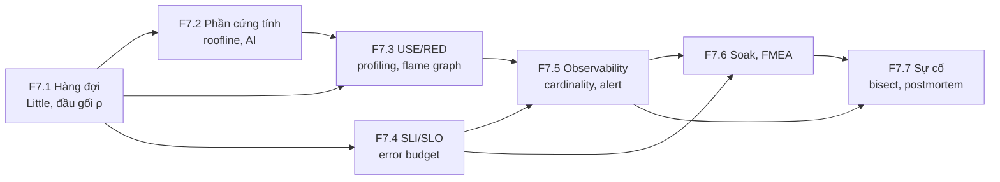
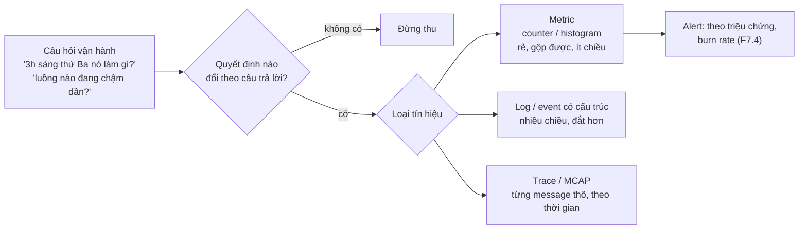
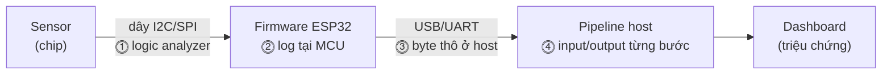

# F7 — Hiệu năng và vận hành ở quy mô (31h)

> Khóa nền, học **đúng lúc**: mở viên nang ngay trước bài chính cần nó (bảng dưới). Tổng 31h = F7.1 4h · F7.2 6h · F7.3 4h · F7.4 4h · F7.5 4h · F7.6 5h · F7.7 4h. 31h này **không** nằm trong 545h của K1–K6; nó cộng thêm vào tổng lộ trình vốn đã vượt ngân sách 650h (xem `khoa-7/_KE-HOACH-K7.md` mục 3). Một phần trùng giờ bài chính (bài kiểm tra cuối F7 làm được trong giờ K5 Bài 18–19 hoặc K7 C10.3), nên chi phí thật thấp hơn 31h `[ước lượng]`.

## Vì sao khóa nền này tồn tại

Bạn đã vận hành hệ high-load. F7 không dạy lại SLO hay Prometheus; nó chỉ ra chỗ các khái niệm đó **đổi nghĩa** khi tài nguyên là một chiếc N100 một kênh RAM, consumer là một đồng hồ I2S không biết chờ, và "người dùng" là một robot đang chạy. Thiếu F7, bạn hụt ở những chỗ sau:

- **K3 Bài 4, Bài 8, Bài 10** — đọc công thức `dma_desc_num × dma_frame_num / fs` như một hằng số cấu hình, không thấy nó là định luật Little và độ trễ thật là *mức đầy*, không phải *dung lượng*.
- **K3 Bài 11–12** — thấy RTF 0,9 là "còn dư 10%", trong khi đó là utilization 0,9, ngay trên đầu gối của hàng đợi.
- **K4 Bài 12** — chép "N100 ≈ 0,7 TFLOPS" và "VLA batch 1 là compute-bound" từ bản Gemini rồi vẽ roofline sai từ trục tung.
- **K6 Bài 8** — thấy `%CPU` 100% và tưởng máy đang tính, trong khi bốn nhân đang chờ chung một kênh RAM.
- **K5 Bài 18, K3 Bài 17, K7 C10.3** — chạy soak 7 ngày / 72h rồi báo một con số completeness mà không nói nó gộp thế nào và mẫu số lấy từ đâu — hai câu hỏi quyết định PASS hay FAIL.
- **K5 Bài 19, K7 C10** — "bisect" bốn tầng bằng cách dò tuần tự từ trên xuống, và viết postmortem kiểu "tôi quên cắm dây".

## Mindset cốt lõi

1. **Utilization cao không phải là hiệu quả, nó là độ trễ đang chờ xảy ra.** Kỹ sư tổng đài từ thời Erlang (Copenhagen, 1909) đã phải định cỡ số đường dây theo xác suất chờ chứ không theo tải trung bình; người làm hệ thống học lại bài này mỗi lần một service "chỉ 85% CPU" có p99 gấp mười lần lúc 50%.
2. **Biết nút thắt là gì trước khi tối ưu.** Wulf và McKee gọi tên "memory wall" năm 1995: tốc độ tính tăng nhanh hơn tốc độ RAM nhiều năm liền, nên phần lớn chương trình chờ dữ liệu chứ không chờ ALU. Roofline (Williams, Waterman, Patterson, CACM 2009) ra đời để hỏi một câu trước khi viết lại kernel: *trần nào đang chặn tôi?*
3. **Đo từ tài nguyên, không từ triệu chứng.** Brendan Gregg đề xuất USE method vì thấy các nhóm vận hành sa vào "streetlight anti-method": nhìn công cụ nào quen tay chứ không nhìn chỗ lỗi nằm.
4. **Độ tin cậy là một con số có ngân sách, không phải một tính từ.** Google SRE đặt error budget vì cuộc cãi "dev muốn ra nhanh, ops muốn ổn định" không có điểm dừng nếu "ổn định" không có đơn vị.
5. **Sự cố là dữ liệu về hệ thống, không phải về người.** Hàng không (báo cáo sự cố không trừng phạt, ASRS của NASA từ 1976) và sau đó John Allspaw ở Etsy (2012) chỉ ra: phạt người viết báo cáo thì báo cáo biến mất, và lỗi tiếp theo đến không báo trước.

## Bản đồ viên nang



### Học đúng lúc

| Viên nang | Học trước bài chính | Giờ |
|---|---|---|
| F7.1 Hàng đợi | K1 Bài 3 (lướt), Bài 9, Bài 12 · K2 Bài 2 · **K3 Bài 4**, Bài 8, Bài 10, Bài 11, Bài 13 · K4 Bài 1 · K5 Bài 13, Bài 14, Bài 17 · K6 Bài 8, Bài 16 · K7 C11.2 | 4 |
| F7.2 Phần cứng tính toán | K3 Bài 12 · K4 Bài 1 (lướt mục cường độ), Bài 8, Bài 11, **Bài 12** · K6 Bài 8 | 6 |
| F7.3 USE/RED, profiling | K3 Bài 4 (telemetry theo tầng) · K4 Bài 3, Bài 12 · **K6 Bài 8** · K7 C11.4 | 4 |
| F7.4 SLI/SLO/error budget | K2 Bài 6 · K3 Bài 7, Bài 10, Bài 11, **Bài 17** · K4 Bài 2 · **K5 Bài 18** · K7 C9.3, C10.3, C12 | 4 |
| F7.5 Observability | K2 Bài 2, Bài 8 · K3 Bài 7, **Bài 16** · K5 Bài 1, Bài 18 · K7 C10.3 | 4 |
| F7.6 Soak, FMEA | K1 Bài 8, Bài 11 · K3 Bài 4, **Bài 17** · K5 Bài 18 · **K7 C10.2, C10.3** | 5 |
| F7.7 Sự cố | K1 Bài 5, Bài 13 · K3 Bài 16 · K4 Bài 15 · **K5 Bài 19** · K7 C10 | 4 |

Đậm = bài phụ thuộc nặng nhất. Tuần crunch: F7.1 mục 2 + 6 trước K3 Bài 4; F7.2 mục 2 + 6 trước K4 Bài 12; F7.4 mục 2 + 6 trước K3 Bài 17. K4/K5 đang được soạn song song: bảng trên dựa vào bản gốc `khoa-4-benchmark-edge.md`, `khoa-5-sensor-timesync-platform.md` và các bài đã có trong `giao-trinh/`.

## Bạn đã làm cái này rồi

| Bạn đã làm trong backend/AI-harness | Tên chuẩn | Còn thiếu | Viên nang |
|---|---|---|---|
| Định cỡ connection pool = RPS × latency | **Định luật Little** (L = λW) | Little nói về trung bình; kích thước buffer do **đuôi** quyết định. Và đầu gối utilization: Little không cho biết W tăng thế nào khi ρ → 1 | F7.1 |
| Server mock tự tạo tải để test | Load generator; **open-loop vs closed-loop** | Mock gửi request kế tiếp sau khi nhận trả lời (closed loop) thì không bao giờ thấy đầu gối; robot và cảm biến là open loop (→ F1.3 coordinated omission) | F7.1 |
| Đo trên host "yên tĩnh" | **Active benchmarking**, USE method | Kiểm từng tài nguyên (CPU, RAM bandwidth, nhiệt, USB) theo checklist, không chỉ "không có process khác" | F7.3 |
| Hệ metrics để quan sát/eval | **Observability**, RED/USE, SLI | Mỗi metric phải có người đọc và quyết định đi kèm; **cardinality** là chi phí; gauge lấy mẫu có aliasing | F7.5 |
| Script chấm pass/fail/inconclusive | **SLO compliance** có khoảng tin cậy; burn-rate alert | SLO với mẫu số nhỏ (72h, 10 lần rút điện) phải báo cận trên, không báo "0%" (→ F1.4) | F7.4 |
| Pipeline agent tự chạy → test → sửa → deploy → báo cáo | Vòng **incident → postmortem → action item** tự động hóa một phần | Postmortem không đổ lỗi, timeline, "điều gì làm lỗi này *có thể* xảy ra" — agent không viết thay được | F7.7 |
| Dựng môi trường local tái tạo được | Điều kiện để **bisect** (→ F2.2) | Ở robot, "môi trường" gồm dây, nguồn, nhiệt; bisect qua tầng vật lý cần dụng cụ đo làm trọng tài | F7.7 |

---

## F7.1 — Hàng đợi: định luật Little, đầu gối utilization, trực giác M/M/1 (4h)

> **Dùng cho:** K3 Bài 4, 8, 10, 11, 13 · K5 Bài 13, 14, 17 · K6 Bài 8 · K4 Bài 1 · K7 C11.2 · **Cần trước:** F1.2 (phân bố, percentile) · **Sau viên nang này bạn đánh giá được:** một khẳng định về độ trễ qua buffer/hàng đợi có đúng không (dung lượng hay mức đầy, trung bình hay đuôi), một con số utilization ("RTF 0,9", "CPU 85%") nằm ở đâu so với đầu gối, và một phép ngoại suy "ở 30% tải thì ổn nên ở 80% cũng ổn" có hợp lệ không.

### 1. Câu chuyện

Năm 1909, Agner Krarup Erlang, kỹ sư của Copenhagen Telephone Company, công bố cách tính xác suất một cuộc gọi phải chờ khi tổng đài có số đường dây hữu hạn và cuộc gọi đến ngẫu nhiên `[chuẩn]`. Tổng đài bị chặn bởi một mâu thuẫn mà mọi hệ sau này lặp lại: thêm đường dây thì tốn tiền, bớt đường dây thì khách chờ, và mức chờ **không tăng tuyến tính** theo tải. Đơn vị đo lưu lượng điện thoại đến nay vẫn mang tên ông (erlang).

Năm 1961, John D. C. Little chứng minh một định lý ngắn đến khó tin: với **bất kỳ** hệ ổn định nào, số phần tử trung bình trong hệ L bằng tốc độ đến λ nhân thời gian lưu trung bình W, **L = λW**, không cần giả định phân bố đến, phân bố phục vụ, hay thứ tự phục vụ `[chuẩn: Little, Operations Research 9(3), 1961]`. Bạn đã dùng nó cả sự nghiệp khi định cỡ connection pool. K3 Bài 4 dùng nó cho DMA của ESP32: công thức độ trễ `dma_desc_num × dma_frame_num / fs` mà bản gốc và bản Gemini đưa ra như "một công thức" **chính là Little**, với λ = fs (→ K3 Bài 4 mục 2). Hội thoại Gemini ở K3 bỏ lỡ kết nối này (mục 7 quy chuẩn).

Chiều ngược lại là **bufferbloat** (Gettys và Nichols, ACM Queue 2011): router có buffer khổng lồ giữ mạng ở utilization cao, không mất gói, nhưng độ trễ hàng giây. Hàng đợi đầy là hàng đợi chậm, dù không ai "lỗi".

### 2. Mô hình tư duy

```
λ (đến)          ┌────────── hệ ──────────┐          λ (ra, khi ổn định)
──────────►      │  [hàng đợi: L_q]  [server: ρ] │  ──────────►
                 └────────────────────────┘
       L = λ·W          (mọi hệ ổn định, chỉ về TRUNG BÌNH)
       ρ = λ·S          (utilization = tốc độ đến × thời gian phục vụ)
       M/M/1:  W = S / (1 − ρ)          ← đầu gối
       Kingman (G/G/1, xấp xỉ):  W_q ≈ S · ρ/(1 − ρ) · (c_a² + c_s²)/2
```

Ba điều cốt lõi:

1. **Little là kế toán, không phải mô hình.** Nó đúng cho DMA, cho hàng đợi upload, cho số robot đang đứng chắn hành lang, cho số episode chạy song song (λ = L/W ở K6 Bài 8, K7 C11.2). Nó không nói gì về đuôi: biết L trung bình không cho biết xác suất buffer cạn.
2. **Đầu gối đến từ 1/(1 − ρ).** Chờ không do server chậm mà do *biến thiên*: job đến dồn cục khi server đang bận. Kingman cho thấy W_q tỉ lệ với (c_a² + c_s²)/2, tức là bình phương hệ số biến thiên của khoảng cách đến và thời gian phục vụ. Phục vụ đều (c_s = 0) giảm chờ một nửa so với phục vụ mũ (c_s = 1), nhưng không xóa đầu gối.
3. **Ở robot, nhiều hàng đợi là "ngược".** Consumer (I2S, vòng điều khiển 100 Hz) rút với tốc độ cố định, không biết chờ; producer (host Linux, TTS) là bên ngẫu nhiên. Câu hỏi thiết kế đổi từ "job chờ bao lâu" sang "buffer có cạn không" — bài toán đuôi của mức đầy (K3 Bài 10), và RTF của TTS chính là ρ của producer (K3 Bài 11).

### 3. Cầu nối từ backend

| Backend bạn biết | Ở đây | Gãy ở chỗ | Nếu dùng nhầm thì |
|---|---|---|---|
| Pool size = RPS × latency | `W_dma = L_dma / fs`; số episode song song = λ × W | λ ở I2S cố định tuyệt đối bởi LRCK, không có "giảm tải" hay retry; consumer rỗng là tiếng tách | Tính độ trễ theo **dung lượng** ring thay vì **mức đầy** thật; báo "trễ 200 ms" khi ring đang đầy 30% |
| Giữ CPU < 70% để có headroom | RTF của TTS, duty cycle của task nạp DMA | Ở backend headroom là quy ước; ở đây nó suy ra được từ 1/(1 − ρ) và c_s của chính model | Chấp nhận RTF 0,9 vì "còn dư 10%" (K3 Bài 11) |
| Load test bằng k client đồng thời | Cảm biến/robot đẩy dữ liệu theo nhịp riêng | Closed loop tự hãm khi hệ chậm (client chờ trả lời mới gửi tiếp) nên che đầu gối; cảm biến là open loop, không hãm | Load test PASS ở "100 client" nhưng ingest sụp khi 10 robot cùng xả backlog sau mất mạng (K5 Bài 14) |
| Autoscale khi queue dài | Trên một N100 không có máy thứ hai | Không thêm server được; chỉ còn bớt tải (drop, → F3.9) hoặc giảm S | Thiết kế "queue lớn cho chắc" → bufferbloat: trễ hàng giây, không lỗi nào |

**Chấm mô hình:**

- *Mô hình của bạn ở K3 lượt 6:* "luôn phải có buffer để ổn định input… phần cứng dùng RAM để đánh đổi… latency sẽ giảm nhưng bù lại cho phép khả năng kiểm soát." — **ĐÚNG MỘT PHẦN.** Đúng: buffer có mặt ở mọi ranh giới hai nhịp độ. Gãy ở hai chỗ. (1) Theo Little, buffer **tăng** độ trễ (W = L/λ), không giảm. (2) Buffer chỉ hấp thụ được *biến thiên* quanh một tốc độ trung bình đã khớp; nếu λ_vào > λ_ra trung bình (ρ > 1), không buffer hữu hạn nào đủ. Phản ví dụ: hai thạch anh lệch 40 ppm ở 48 kHz — FIFO 256 mẫu nào rồi cũng cạn hoặc tràn sau một khoảng hữu hạn (bài tập "Hai thạch anh", K1 Bài 3), vì đó là chênh tốc độ, không phải jitter.
- *"Little chỉ đúng cho M/M/1."* — **SAI.** Little đúng cho mọi hệ ổn định; chính M/M/1 mới là giả định mạnh (đến Poisson, phục vụ mũ). Phản ví dụ: DMA có phục vụ hoàn toàn đều và vẫn thỏa W = L/fs (K3 Bài 4 mô phỏng).
- *"Ở 30% tải p99 là 40 ms, vậy ở 80% tải p99 khoảng 40 × 80/30 ≈ 107 ms."* — **SAI.** Ngoại suy tuyến tính qua đầu gối. Với M/M/1, W tỉ lệ 1/(1 − ρ): từ 0,3 lên 0,8 là gấp 3,5 lần chứ không phải 2,7, và p99 còn dốc hơn khi c_s > 1. Đây cũng là ví dụ out-of-sample ở K6 Bài 16.

**Tên chuẩn của thứ bạn đã làm:** "pool = RPS × latency" là Little; "giữ CPU dưới 70%" là quy tắc đầu gối; mock server gửi tuần tự là closed-loop load generator.

### 4. Thuật ngữ

| Mức | Thuật ngữ | Nghĩa trong một câu | Hay bị hiểu nhầm thành |
|---|---|---|---|
| 🟢 | Định luật Little | L = λW cho mọi hệ ổn định, về trung bình | Công thức riêng của M/M/1; hoặc nói được về đuôi |
| 🟢 | Utilization ρ | Tỉ lệ thời gian server bận = λ·S | "Còn 1 − ρ dư địa dùng thoải mái" |
| 🟢 | Đầu gối (knee) | Vùng ρ mà W bắt đầu tăng dốc, thường 0,7–0,85 tùy biến thiên | Một ngưỡng cố định 80% |
| 🟡 | M/M/1, M/D/1, G/G/1 | Ký hiệu Kendall: phân bố đến / phân bố phục vụ / số server | Tên sản phẩm |
| 🟡 | Kingman | Xấp xỉ thời gian chờ G/G/1 theo ρ và hệ số biến thiên | Chính xác ở mọi ρ (chỉ tốt khi ρ gần 1) |
| 🟡 | Open vs closed loop | Tải đến độc lập với hệ / tải chờ hệ trả lời mới gửi tiếp | Hai cách cấu hình cùng một test |
| 🔴 | Lý thuyết mạng hàng đợi (Jackson, BCMP) | Ghép nhiều hàng đợi thành mạng có lời giải đóng | Cần cho robot đơn lẻ |

### 5. Bài tập dự đoán

**Đề.** Một server, FIFO, thời gian phục vụ trung bình S = 1 (đơn vị thời gian), job đến Poisson. Dự đoán trước khi chạy:

1. Thời gian trung bình trong hệ W (theo bội số của S) ở ρ = 0,5; 0,8; 0,9; 0,95 với phục vụ mũ (M/M/1).
2. p99 của thời gian trong hệ ở ρ = 0,9 (M/M/1): gấp bao nhiêu lần mean?
3. Cùng ρ = 0,9 nhưng phục vụ **đều** (M/D/1, giống DMA hoặc một kernel cố định): W bằng bao nhiêu phần W của M/M/1?
4. Đo L **độc lập** (đếm số job trong hệ tại các thời điểm ngẫu nhiên), so với λ·W: lệch bao nhiêu?
5. Ở ρ = 0,95, mô phỏng 400.000 job có khớp lý thuyết không? Nếu lệch, vì sao?

**Phương pháp:** câu 1 dùng W = S/(1 − ρ); câu 2: thời gian trong hệ M/M/1 phân bố mũ với tham số (1 − ρ)/S, nên p99 = ln(100)·W; câu 3 dùng Kingman hoặc Pollaczek–Khinchine (W_q giảm theo (1 + c_s²)/2); câu 5 nghĩ về thời gian tương quan của hàng đợi khi ρ → 1 (→ F1.3 steady state).

```markdown
# prediction.md — F7.1
1. W(0.5)=___ W(0.8)=___ W(0.9)=___ W(0.95)=___   (× S)
2. p99/mean ở ρ=0.9 ≈ ___
3. W_MD1 / W_MM1 ở ρ=0.9 ≈ ___
4. |L − λW| / L ≈ ___
5. ρ=0.95 lệch lý thuyết? ___ vì ___
Độ tự tin (1–5): ___   Tôi sẽ ngạc nhiên nếu: ___
```

```python
# [đã chạy] F7.1 — M/M/1 vs M/D/1: đầu gối utilization, và kiểm định luật Little
import numpy as np, matplotlib
import matplotlib.pyplot as plt
rng = np.random.default_rng(71)
S = 1.0                                    # thời gian phục vụ trung bình (đơn vị: 1 lần phục vụ)
N = 400_000                                # số job mỗi lần chạy

def simulate(rho, deterministic=False):
    lam = rho / S
    a = rng.exponential(1 / lam, N)        # khoảng cách giữa hai lần đến (Poisson)
    s = np.full(N, S) if deterministic else rng.exponential(S, N)
    arrive = np.cumsum(a)
    start = np.empty(N); done = np.empty(N)
    t_free = 0.0
    for i in range(N):                     # một server, FIFO (đệ quy Lindley)
        start[i] = max(arrive[i], t_free)
        done[i] = t_free = start[i] + s[i]
    W = done - arrive                      # thời gian trong hệ = chờ + phục vụ
    k = N // 10                            # bỏ 10% đầu (warmup, → F1.3)
    W, arrive, done = W[k:], arrive[k:], done[k:]
    t = rng.uniform(arrive[0], arrive[-1], 200_000)   # nhìn vào hệ ở thời điểm ngẫu nhiên
    L = (np.searchsorted(np.sort(arrive), t) - np.searchsorted(np.sort(done), t)).mean()
    lam_obs = len(W) / (arrive[-1] - arrive[0])        # đo L ĐỘC LẬP với W, rồi so λW
    return W.mean(), np.percentile(W, 99), L, lam_obs

print(" rho | W_MM1  lythuyet  p99_MM1 | W_MD1 | L     lam*W")
rhos = [0.5, 0.7, 0.8, 0.9, 0.95]
res = []
for r in rhos:
    w, p99, L, lo = simulate(r)
    wd, p99d, _, _ = simulate(r, deterministic=True)
    res.append((w, p99, wd))
    print(f"{r:4.2f} | {w:6.2f}  {S/(1-r):6.2f}   {p99:7.1f} | {wd:5.2f} | {L:5.2f} {lo*w:5.2f}")

rr = np.linspace(0.01, 0.97, 200)
plt.plot(rr, S / (1 - rr), label="M/M/1 lý thuyết: W = S/(1-ρ)")
plt.plot(rr, S + rr * S / (2 * (1 - rr)), label="M/D/1 lý thuyết (P-K)")
plt.plot(rhos, [x[0] for x in res], "o", label="M/M/1 mô phỏng (mean)")
plt.plot(rhos, [x[1] for x in res], "s", label="M/M/1 mô phỏng (p99)")
plt.ylim(0, 60); plt.xlabel("utilization ρ"); plt.ylabel("thời gian trong hệ (× S)")
plt.legend(); plt.grid(alpha=.3); plt.show()
```

<details><summary>🔒 MỞ SAU KHI COMMIT prediction.md</summary>

Kết quả khi chạy (seed 71, numpy 2.x, ~3 s):

| ρ | W M/M/1 mô phỏng | Lý thuyết S/(1−ρ) | p99 M/M/1 | W M/D/1 | L đo độc lập | λ·W |
|---|---|---|---|---|---|---|
| 0,50 | 1,98 | 2,00 | 9,0 | 1,50 | 0,99 | 0,99 |
| 0,70 | 3,34 | 3,33 | 15,3 | 2,16 | 2,34 | 2,33 |
| 0,80 | 5,07 | 5,00 | 23,6 | 3,02 | 4,06 | 4,06 |
| 0,90 | 10,39 | 10,00 | 50,5 | 5,51 | 9,35 | 9,36 |
| 0,95 | 21,11 | 20,00 | 95,0 | 10,97 | 20,05 | 20,05 |

- **Đầu gối:** từ ρ = 0,5 lên 0,9 (tải tăng 1,8 lần), W tăng 5 lần; lên 0,95 thì 10 lần.
- **p99 ≈ 4,6 × mean** (ln 100) ở M/M/1; ở ρ = 0,9 lý thuyết là 46, mô phỏng 50,5.
- **M/D/1 ≈ 0,55 × M/M/1** ở ρ = 0,9: phục vụ đều cắt nửa phần *chờ* (W_q từ 9 xuống 4,5), cộng S = 1. Vẫn có đầu gối.
- **Little khớp tới chữ số thứ hai** dù L được đo bằng cách đếm, hoàn toàn độc lập với W.
- **ρ = 0,95 lệch ~5%** so với lý thuyết: không phải lý thuyết sai mà là hàng đợi gần bão hòa có "trí nhớ" rất dài (thời gian tương quan tăng theo 1/(1 − ρ)²), nên 400.000 job chỉ là vài chục mẫu độc lập. Đổi seed sẽ thấy dao động ±10%. Đây cũng là lý do benchmark ở utilization cao cần chạy lâu hơn nhiều mới tới steady state (→ F1.3).

</details>

### 6. Lăng kính đánh giá

Checklist khi đọc một khẳng định về độ trễ qua buffer/hàng đợi:

1. Độ trễ được tính từ **dung lượng** hay **mức đầy đo được**? Chỉ mức đầy cho W thật (Little).
2. Con số là trung bình hay percentile? Little chỉ nói về trung bình; kích thước buffer chống underrun là câu hỏi về đuôi của mức đầy.
3. Utilization là bao nhiêu, và tài liệu có nói biến thiên (c_a, c_s) không? Không có ρ thì không đánh giá được "headroom".
4. Có ngoại suy qua đầu gối không (đo ở ρ thấp, kết luận ở ρ cao)?
5. Tải là open hay closed loop? Kết quả load test closed loop không áp được cho nguồn open loop.
6. Tốc độ trung bình hai đầu có khớp không (ρ < 1)? Nếu hai đồng hồ khác nhau, có cơ chế khớp tốc độ (credit, resample) không?

**ĐÚNG** nếu 1–6 thỏa; **SAI** nếu dùng dung lượng làm độ trễ thật, hoặc ngoại suy tuyến tính qua đầu gối; **CHƯA RÕ** nếu không có ρ hoặc không biết tải open/closed.

**Khẳng định mẫu — tự chấm trước khi mở:**

(a) Bản Gemini K3 Bài 4: *"Ở 24 kHz, nếu chọn 3 × 1600 = 4800 frame → Độ trễ cứng là **200 ms**."*

(b) Bản Gemini K3 Bài 4: *"`DMA buffer` cần ép nhỏ để đạt độ trễ vật lý thấp. `RingBuffer ESP32` cần đủ rộng để hấp thụ toàn bộ jitter… Hai vùng đệm giải quyết hai bài toán độc lập."*

(c) Bản gốc K3 Bài 11 (tinh thần): *"RTF < 1 thì stream được."*

<details><summary>🔒 Đáp án</summary>

(a) **ĐÚNG MỘT PHẦN.** Phép tính đúng là Little với L = 4800 frame, λ = 24.000 frame/s. Nhưng "độ trễ cứng" chỉ đúng khi DMA luôn đầy. Với `i2s_channel_write` chặn, DMA dao động giữa (desc − 1)·frame và desc·frame, nên trễ nằm giữa 133 và 200 ms; và nếu ring buffer phía trước cũng đang có dữ liệu thì trễ đầu–cuối là (L_ring + L_dma)/fs, lớn hơn. Đo mức đầy, đừng tin cấu hình.

(b) **ĐÚNG MỘT PHẦN.** Với một luồng liên tục, độ trễ đầu–cuối là **tổng** mức đầy hai vùng chia fs (Little áp cho cả chuỗi), nên "DMA nhỏ cho trễ thấp" không đúng nếu ring lớn và đầy. Hai vùng không giải hai bài toán độc lập về độ trễ; lợi ích thật của việc tách là khác (ring nằm trong RAM rẻ và điều khiển được bằng flow control, có thể xả ngay khi bấm kill; DMA nhỏ thì kill cắt nhanh). K3 Bài 4 câu hỏi ngược 4 đào chỗ này.

(c) **ĐÚNG MỘT PHẦN.** RTF < 1 là điều kiện ρ < 1, tức điều kiện cần để hàng đợi không phình vô hạn **về trung bình**. Không đủ: RTF có phân bố (câu dài, câu khó, CPU hạ xung), và với producer có biến thiên, buffer phát phải đủ lớn để chịu đuôi. RTF 0,9 với c_s lớn sẽ underrun thường xuyên dù "nhỏ hơn 1". K3 Bài 11 tính ngưỡng từ phân bố RTF, không từ trung bình.

</details>

### 7. Câu hỏi ngược

1. **[Vì sao không]** Vì sao không chạy N100 ở 95% CPU cho "tận dụng phần cứng", khi máy không có ai khác dùng?
   <details><summary>Hướng nghĩ</summary>

   Ai trả giá cho phần CPU "lãng phí"? So chi phí của 5% CPU nhàn với chi phí của một lần vòng điều khiển trễ deadline. Ở hệ thời gian thực, headroom mua *đuôi*, không mua trung bình.

   </details>
2. **[Quy mô]** 100 robot cùng xả backlog upload sau khi WiFi văn phòng phục hồi. Object store chịu được tổng băng thông trung bình. Cái gì gãy trước?
   <details><summary>Hướng nghĩ</summary>

   Tải trung bình không phải tải lúc phục hồi: 100 nguồn đồng bộ hóa bởi cùng một sự kiện là đến dồn cục (c_a rất lớn). Nghĩ về thundering herd, jitter ngẫu nhiên trước khi retry, và Little cho thời gian rút cạn backlog (K5 Bài 14).

   </details>
3. **[Failure mode]** Dashboard ingest báo độ trễ trung bình ổn định 50 ms suốt tuần. Một đêm thứ Ba, latency đầu–cuối của dữ liệu tăng lên 40 phút mà biểu đồ không nhúc nhích. Có thể không?
   <details><summary>Hướng nghĩ</summary>

   Độ trễ đo ở đâu, của job nào? Nếu chỉ đo job *đã xong*, job đang kẹt trong hàng đợi không xuất hiện. Đo **tuổi của phần tử cũ nhất** trong hàng (oldest unprocessed) hoặc mức đầy, rồi dùng Little để đổi sang thời gian.

   </details>
4. **[Liên ngành]** Một bệnh viện có phòng cấp cứu trung bình 70% giường. Vì sao giám đốc vẫn thấy hàng chờ dài vào thứ Hai?
   <details><summary>Hướng nghĩ</summary>

   ρ trung bình theo tuần che ρ theo giờ. Hàng đợi phản ứng với ρ tức thời, và đầu gối phi tuyến làm trung bình của W lớn hơn W của trung bình (bất đẳng thức Jensen).

   </details>
5. **[Phản biện]** "Little không dùng được cho robot vì hệ không bao giờ ổn định: robot chạy rồi dừng." Bạn đồng ý tới đâu?
   <details><summary>Hướng nghĩ</summary>

   Little cần trung bình dài hạn tồn tại, và có phiên bản cho khoảng hữu hạn nếu hệ rỗng ở hai đầu khoảng. Một episode bắt đầu và kết thúc với buffer rỗng là đủ.

   </details>

### 8. Liên kết ra ngoài

- **Sản xuất — Factory Physics (Hopp & Spearman).** Little ở dạng WIP = throughput × cycle time là định luật đầu tiên của quản lý nhà máy; Toyota giảm tồn kho giữa các trạm (giảm L) để lộ ra nút thắt. Giống: cùng một định lý. Khác: nhà máy chọn được giảm ρ bằng cách thêm máy; robot một N100 thì không.
- **Mạng — CoDel và bufferbloat.** CoDel (Nichols & Jacobson, 2012) không giới hạn *kích thước* hàng đợi mà giới hạn *thời gian lưu* (sojourn time) của gói, chính là W. Giống: đo W trực tiếp thay vì suy từ dung lượng. Khác: mạng được phép drop gói; DMA audio thì drop là tiếng tách.

### 9. Áp vào khóa chính

- **K3 Bài 4, 8, 10:** mọi con số độ trễ qua vùng đệm phải là *mức đầy đo được / fs*. Log mức đầy ring theo thời gian; kích thước ring chọn theo percentile thấp của mức đầy (đuôi), không theo trung bình.
- **K3 Bài 11–13:** đọc RTF như ρ của TTS worker; chọn ngưỡng stream/pre-render từ phân bố RTF và Kingman, không từ "RTF < 1".
- **K5 Bài 14, 17:** thời gian rút cạn backlog = backlog / (uplink − ingest); ρ của uplink sau mất mạng gần 1 là bình thường, và chính sách drop (F3.9) là cách duy nhất giảm ρ.
- **K6 Bài 8, K7 C11.2:** thông lượng episode = số worker / thời gian mỗi episode (Little); thêm worker chỉ tăng λ nếu W không tăng theo (tranh chấp → USL, F7.2).

### 10. Độ tin cậy

| Khẳng định | Nhãn | Ghi chú / cách kiểm |
|---|---|---|
| L = λW cho mọi hệ ổn định | [chuẩn] | Little 1961; kiểm bằng mô phỏng mục 5 |
| M/M/1: W = S/(1−ρ); thời gian trong hệ phân bố mũ | [chuẩn] | Giáo khoa hàng đợi (Harchol-Balter, phần M/M/1) |
| Xấp xỉ Kingman cho G/G/1 | [chuẩn] | Kingman 1961; tốt khi ρ gần 1 |
| Erlang công bố 1909 tại Copenhagen Telephone Co. | [chuẩn] | Lịch sử lý thuyết hàng đợi |
| Bufferbloat, CoDel | [chuẩn] | ACM Queue 2011, 2012 |
| Kết quả mô phỏng mục 5 | [đã chạy] | seed 71; ρ = 0,95 dao động theo seed |

Đã sửa so với bản gốc/Gemini: (K3 Bài 4) công thức độ trễ DMA được gọi đúng tên là định luật Little và đổi từ "độ trễ cứng" sang "mức đầy / fs"; (Gemini K3 Bài 4) "hai vùng đệm giải hai bài toán độc lập" → độ trễ là tổng mức đầy hai vùng.

### 11. Đọc thêm và tự kiểm tra

- **Nguồn gốc:** J. D. C. Little, "A Proof for the Queuing Formula: L = λW", *Operations Research* 9(3), 1961.
- **Giải thích:** Mor Harchol-Balter, *Performance Modeling and Design of Computer Systems* (Cambridge, 2013), các chương về operational laws (Little) và M/M/1.
- **Đào sâu (tùy chọn):** Jim Gettys, Kathleen Nichols, "Bufferbloat: Dark Buffers in the Internet", *ACM Queue*, 2011.
- **Tự kiểm tra:** (1) giải thích cho một backend engineer vì sao "DMA 3 × 1600 frame ở 24 kHz trễ 200 ms" vừa đúng vừa sai; (2) vẽ lại đường W(ρ) và đánh dấu đầu gối từ trí nhớ; (3) câu hỏi:

  Hàng đợi upload MCAP có trung bình 12 file đang chờ, mỗi phút 3 file mới vào. Một file nằm chờ trung bình bao lâu? Nếu uplink giảm một nửa và ρ từ 0,5 lên 1,0 thì sao?
  <details><summary>Đáp án</summary>

  W = L/λ = 12/3 = **4 phút** (Little, không cần biết phân bố). Khi ρ = 1, hàng đợi không còn ổn định: L tăng không giới hạn, Little không áp được nữa, và "trung bình bao lâu" không có đáp án hữu hạn — chỉ còn drop hoặc tăng uplink.

  </details>

---

## F7.2 — Phần cứng tính toán: phân cấp bộ nhớ, băng thông vs compute, roofline, arithmetic intensity (6h)

> **Dùng cho:** K3 Bài 12 · K4 Bài 1 (lướt), Bài 8, Bài 11, **Bài 12** · K6 Bài 8 · **Cần trước:** F7.1, F1.3 (benchmark), F5.4 (tần số CPU) nếu đã học · **Sau viên nang này bạn đánh giá được:** một con số "peak TFLOPS" có tự tính lại được không, một khẳng định "model X là compute-bound / memory-bound" đúng cho phần cứng nào và pha nào, và một đề xuất tối ưu (quantization, đổi kernel, thêm worker) có nhắm đúng trần đang chặn không.

### 1. Câu chuyện

Năm 1995, William Wulf và Sally McKee viết một bài hai trang tên "Hitting the Memory Wall" (*ACM SIGARCH Computer Architecture News*) `[chuẩn]`. Lập luận của họ là số học đơn giản: tốc độ CPU tăng khoảng 50–60%/năm trong khi độ trễ DRAM chỉ cải thiện vài phần trăm/năm, nên sớm muộn thời gian chạy của hầu hết chương trình sẽ do việc *chờ dữ liệu* quyết định chứ không do ALU. Ba thập kỷ cache, prefetch, HBM sau đó là cách ngành sống chung với bức tường này, không phải phá nó.

Năm 2009, Samuel Williams, Andrew Waterman và David Patterson (Berkeley) công bố "Roofline: An Insightful Visual Performance Model for Multicore Architectures" trên *Communications of the ACM* 52(4) `[chuẩn]`. Họ không phát minh phép đo mới; họ đưa ra **một hình** để trả lời câu hỏi đầu tiên trước mọi tối ưu: với kernel này trên chip này, trần nào đang chặn — tốc độ tính hay tốc độ nạp dữ liệu? Câu trả lời đổi hoàn toàn việc nên làm.

Gần bạn hơn: bản Gemini K4 Bài 12 ghi "Intel N100 đạt ~0,7 TFLOPS (FP32)" và lặp lại kết luận "inference VLA ở batch 1 là compute-bound" như sự thật chung. Cả hai sai theo cách mà một phép tính trên giấy năm phút bắt được (mục 6). Viên nang này dạy năm phút đó.

### 2. Mô hình tư duy

**Phân cấp bộ nhớ** — càng xa lõi tính, càng to, càng chậm, càng tốn năng lượng mỗi byte:

| Tầng | Kích thước trên N100 | Độ trễ cỡ | Ghi chú |
|---|---|---|---|
| Thanh ghi vector | 128-bit (4 × fp32) | 0 chu kỳ | Gracemont không có AVX-512 |
| L1D | 32 KB / nhân `[tự đo: lscpu -C]` | ~1 ns | |
| L2 | dùng chung cho cụm 4 nhân E-core `[tự đo: lscpu -C]` | vài ns | 4 nhân tranh nhau |
| LLC | 6 MB `[spec: Intel ARK N100]` | ~10–20 ns `[ước lượng]` | |
| DRAM | 1 kênh, DDR5-4800 trên EQ12 `[spec: ARK — Max Memory Channels 1]` | ~100 ns `[ước lượng]` | 38,4 GB/s lý thuyết; đo thực thấp hơn `[tự đo]` |

Năng lượng: ở công nghệ 45 nm, đọc 32 bit từ DRAM tốn khoảng 640 pJ trong khi một phép nhân fp32 khoảng 3,7 pJ — chênh hơn hai bậc `[chuẩn: M. Horowitz, "Computing's Energy Problem", ISSCC 2014]`. Di chuyển dữ liệu, không phải tính, là thứ đắt.

**Roofline:**

```
GFLOP/s đạt được (log)
   ▲
 π ┤                    ┌─────────────────────  trần tính (peak compute π)
   │                  ╱ ·
   │                ╱   ·   compute-bound: I > I_ridge
   │              ╱     ·
   │            ╱       ·
   │          ╱  memory-bound: P = β·I
   │        ╱           ·
   └──────╱─────────────┼──────────────────────►  arithmetic intensity I (FLOP/byte, log)
                     I_ridge = π / β

   P_max(I) = min(π, β · I)
```

- **Arithmetic intensity** I = FLOP thực hiện / byte phải chuyển từ tầng bộ nhớ bạn đang xét (thường là DRAM). Nó là tính chất của **thuật toán + kích thước dữ liệu**, không của chip.
- **Ridge point** I_ridge = π/β là tính chất của **chip**. Chip có băng thông *hẹp so với sức tính* thì ridge **thấp** (dễ compute-bound); chip tính cực mạnh thì ridge **cao** (dễ memory-bound).
- **Một lớp Linear d×d với n token, b byte/phần tử:** FLOP = 2d²n; byte ≈ b(d² + 2dn). Khi n nhỏ, I ≈ 2n/b. Decode batch 1 (n = 1) ở bf16: **I ≈ 1 FLOP/byte**; fp32: 0,5; int8: 2. Prefix ảnh n vài trăm token: I vài trăm.

**Tự tính peak N100** (đây là việc bắt buộc, không chép):

```
CPU  = 4 nhân × f × 16 FLOP fp32/chu kỳ
       (Gracemont: 2 đơn vị FMA 128-bit × 4 lane fp32 × 2 FLOP/FMA)
     = 4 × (2,9…3,4) GHz × 16 ≈ 0,19 … 0,22 TFLOPS          [ước lượng]
iGPU = 24 EU × 8 lane fp32 × 2 (FMA) × 0,75 GHz ≈ 0,29 TFLOPS  [ước lượng]
β    = 4800 MT/s × 8 byte (một kênh 64-bit) = 38,4 GB/s lý thuyết  [ước lượng từ spec]
```

f thật khi cả 4 nhân bận lâu thấp hơn 3,4 GHz (giới hạn công suất PL1/PL2 do hãng máy đặt, nhiệt) `[tự đo: turbostat]`. CPU và iGPU **chung** một kênh RAM — chạy song song thì chia nhau β.

### 3. Cầu nối từ backend

| Backend bạn biết | Ở đây | Gãy ở chỗ | Nếu dùng nhầm thì |
|---|---|---|---|
| "Service chậm → thêm CPU" | Thêm worker/nhân | Nếu kernel memory-bound, 4 nhân chung một kênh RAM: worker thứ 3–4 tranh β chứ không thêm FLOP | Mua máy nhiều nhân hơn, cùng một kênh RAM, nhanh hơn không đáng kể (K6 Bài 8) |
| `%CPU` 100% = đang làm việc | Lõi stall chờ RAM vẫn tính là "busy" | `%CPU` không phân biệt tính hữu ích với chờ bộ nhớ; cần IPC hoặc đếm byte | Tưởng đã tối ưu xong trong khi IPC thấp (→ F7.3) |
| Cache Redis trước DB | L1/L2/LLC trước DRAM | Cache CPU trong suốt với code, không có API; trúng hay trượt do *thứ tự truy cập* và kích thước working set | Tối ưu số phép tính trong khi nút thắt là layout dữ liệu |
| Batching request để tăng throughput | Tăng n (batch, số token) | Batch tăng I chỉ vì trọng số được dùng lại; với robot, batch = 1 là bắt buộc vì mỗi lần là một quan sát mới | Mượn số throughput batch 32 để hứa latency batch 1 |
| Nén payload giảm băng thông mạng | Quantization weight-only | Giảm byte, không giảm FLOP: chỉ giúp khi memory-bound (K4 Bài 8) | Lượng tử hóa INT4 ở pha prefix compute-bound rồi ngạc nhiên vì chậm hơn (overhead giải nén) |

**Chấm mô hình:**

- *Mô hình của bạn ở K3 lượt 12–13:* "người ta giảm dần các giới hạn rào cản… đẩy toàn bộ dữ liệu điện thô lên tầng ứng dụng… tận dụng tối đa giới hạn vật lý… ví dụ như nvidia." — **ĐÚNG MỘT PHẦN.** Đúng: phần cứng AI được thiết kế để chạy gần trần vật lý. Gãy: trần đang chặn hầu hết hệ không phải tốc độ transistor mà là **di chuyển dữ liệu** (bức tường bộ nhớ, năng lượng mỗi byte DRAM gấp trăm lần mỗi FLOP). Xu hướng thật là ngược với "đẩy dữ liệu thô lên": đưa tính toán lại gần dữ liệu (HBM xếp chồng sát GPU, lượng tử hóa để giảm byte, xử lý ngay trên cảm biến). Phản ví dụ: decode LLM batch 1 trên GPU cao cấp dùng một phần nhỏ sức tính vì chờ đọc trọng số.
- *"GPU mạnh hơn nên model nào cũng compute-bound trên GPU, memory-bound trên CPU yếu."* — **SAI.** Ngược chiều: GPU có ridge cao (π/β lớn), nên cùng một kernel *dễ* memory-bound trên GPU hơn. Phản ví dụ ở mục 5.
- *"Đo được 30 GFLOP/s trên N100, peak 200 → hiệu suất 15%, kernel tệ."* — **ĐÚNG MỘT PHẦN.** Chỉ kết luận được khi biết I. Với decode fp32 (I ≈ 0,5), trần thật là β·I, thấp hơn peak cả chục lần; khi đó một con số vượt β·I nghĩa là dữ liệu nằm trong cache hoặc phép đo sai — không phải kernel tệ.

**Tên chuẩn của thứ bạn đã làm:** tính "request này đọc bao nhiêu byte từ DB" rồi so với throughput đĩa là roofline một chiều (chỉ có trần β). Thiếu chiều thứ hai: sức tính, và vị trí ridge.

### 4. Thuật ngữ

| Mức | Thuật ngữ | Nghĩa trong một câu | Hay bị hiểu nhầm thành |
|---|---|---|---|
| 🟢 | Arithmetic intensity | FLOP / byte chuyển từ bộ nhớ | Tính chất của chip |
| 🟢 | Memory-bound / compute-bound | Trần đang chặn là β·I / là π | Nhãn cố định của một model (thật ra theo pha, batch, chip) |
| 🟢 | Ridge point | π/β, chỗ hai trần gặp nhau | Giống nhau giữa các chip |
| 🟢 | Peak (lý thuyết) vs sustained (đo) | Số nhân từ spec vs số micro-benchmark đạt | Số trên spec sheet là số đạt được |
| 🟡 | FMA, SIMD width | Một lệnh nhân-cộng = 2 FLOP; số lane một lệnh | "Mỗi chu kỳ một FLOP" |
| 🟡 | IPC, stall | Lệnh mỗi chu kỳ; chu kỳ chờ dữ liệu | %CPU |
| 🟡 | Prefill/prefix vs decode | Xử lý nhiều token một lần vs sinh từng token | Cùng cường độ |

### 5. Bài tập dự đoán

**Đề.** Ba phần cứng: CPU N100 fp32, iGPU N100 fp32, RTX 4090 fp32. Một lớp Linear d = 2048 ở bốn tình huống: decode n = 1 fp32; decode n = 1 int8; action chunk n = 50 fp32; prefix ảnh n = 600 fp32. Dự đoán trước khi chạy:

1. Peak và ridge của từng phần cứng (tự tính, không chép).
2. Với mỗi tình huống: I bằng bao nhiêu, và trên mỗi phần cứng là memory- hay compute-bound?
3. Có tình huống nào **compute-bound trên N100 nhưng memory-bound trên 4090** không?
4. Chạy micro-benchmark (khối thứ hai) trên laptop của bạn: GEMM 2048² đạt bao nhiêu GFLOP/s, GEMV 8192² đạt bao nhiêu, tỉ lệ giữa hai số khoảng bao nhiêu lần? Vì sao cùng phép nhân ma trận mà chênh như vậy?

**Tham số cần tra:** tần số turbo và số kênh RAM: Intel ARK trang "Intel Processor N100"; module RAM thật: `sudo dmidecode -t memory`; tần số khi tải đủ 4 nhân: `turbostat` hoặc `/proc/cpuinfo` trong lúc chạy; peak và băng thông RTX 4090: spec sheet NVIDIA. FLOP/chu kỳ của Gracemont: tài liệu vi kiến trúc (Intel Architecture Day 2021, WikiChip "Gracemont").

```markdown
# prediction.md — F7.2
1. N100 CPU: π=___ β=___ ridge=___ | iGPU: π=___ ridge=___ | 4090: ridge=___
2. I: decode fp32=___ decode int8=___ chunk50=___ prefix600=___
   bound (CPU/iGPU/4090): decode fp32 ___/___/___ ; chunk50 ___/___/___ ; prefix600 ___/___/___
3. Có/không, tình huống: ___
4. GEMM ___ GFLOP/s ; GEMV ___ GFLOP/s ; tỉ lệ ≈ ___ ; vì ___
```

```python
# [đã chạy] F7.2 — Roofline: tự tính đỉnh, tính cường độ, đặt điểm. Mọi số phần cứng là [ước lượng].
import numpy as np, matplotlib
import matplotlib.pyplot as plt

# (tên, đỉnh FLOP/s, băng thông B/s) — thay bằng số ĐO của bạn khi có (micro-benchmark bên dưới)
HW = {
    "N100 CPU fp32":  (4 * 3.0e9 * 16, 38.4e9),   # 4 nhân × ~2.9–3.4 GHz × 16 FLOP/chu kỳ
    "N100 iGPU fp32": (24 * 8 * 2 * 0.75e9, 38.4e9),  # 24 EU × 8 lane × 2 (FMA) × 750 MHz; chung RAM
    "RTX 4090 fp32":  (82.6e12, 1008e9),           # spec sheet NVIDIA
}
def attainable(I, peak, bw):           # trần roofline: min(đỉnh tính, băng thông × cường độ)
    return np.minimum(peak, bw * I)

# Cường độ số học của một lớp Linear d×d (FLOP / byte RAM), batch = n token, mỗi phần tử b byte.
def intensity(d, n, b):
    flop = 2 * d * d * n                       # nhân-cộng
    byte = b * (d * d + 2 * d * n)             # đọc trọng số 1 lần + đọc vào/ghi ra activation
    return flop / byte

d = 2048
cases = {"decode n=1 fp32": (1, 4), "decode n=1 int8": (1, 1),
         "chunk n=50 fp32": (50, 4), "prefix n=600 fp32": (600, 4)}
for name, (peak, bw) in HW.items():
    print(f"{name:15s} đỉnh={peak/1e12:5.2f} TFLOPS  BW={bw/1e9:6.1f} GB/s  ridge={peak/bw:6.1f} FLOP/B")
for c, (n, b) in cases.items():
    I = intensity(d, n, b)
    row = "  ".join(f"{attainable(I, p, w)/1e9:8.1f}" for p, w in HW.values())
    print(f"{c:18s} I={I:7.2f} FLOP/B  GFLOP/s trần [N100cpu, iGPU, 4090]: {row}")

I = np.logspace(-1, 3, 200)
for name, (p, w) in HW.items():
    plt.loglog(I, attainable(I, p, w) / 1e9, label=name)
for c, (n, b) in cases.items():
    plt.axvline(intensity(d, n, b), ls=":", c="gray"); plt.text(intensity(d, n, b), 2, c, rotation=90, fontsize=7)
plt.xlabel("arithmetic intensity (FLOP/byte)"); plt.ylabel("GFLOP/s đạt được tối đa")
plt.legend(); plt.grid(alpha=.3, which="both"); plt.show()
```

```python
# [đã chạy] F7.2 — micro-benchmark đỉnh ĐO ĐƯỢC trên máy bạn (số ra là [tự đo], đổi theo máy)
import time, numpy as np
def best(f, rep=5):
    f(); ts = []
    for _ in range(rep):
        t = time.perf_counter(); f(); ts.append(time.perf_counter() - t)
    return min(ts)                                    # min: hỏi "máy làm được bao nhiêu" (→ F1 tranh luận 2)

n = 2048
A = np.random.rand(n, n).astype(np.float32); B = np.random.rand(n, n).astype(np.float32)
t = best(lambda: A @ B)
print(f"GEMM fp32 {n}x{n}: {2*n**3/t/1e9:7.1f} GFLOP/s   (I cao → gần trần tính)")

x = np.random.rand(8192).astype(np.float32)
W = np.random.rand(8192, 8192).astype(np.float32)     # 256 MB: lớn hơn mọi cache
t = best(lambda: W @ x)
print(f"GEMV fp32 8192²:  {2*W.size/t/1e9:7.1f} GFLOP/s  ≈ {W.nbytes/t/1e9:5.1f} GB/s đọc trọng số")

src = np.ones(64 * 2**20, dtype=np.float32); dst = np.empty_like(src)   # 256 MB mỗi mảng
t = best(lambda: np.copyto(dst, src))
print(f"copy 256 MB:      {2*src.nbytes/t/1e9:7.1f} GB/s (đọc + ghi)")
```

<details><summary>🔒 MỞ SAU KHI COMMIT prediction.md</summary>

**Roofline (khối 1, f = 3,0 GHz cho CPU):**

| | π | β | ridge |
|---|---|---|---|
| N100 CPU fp32 | 0,19 TFLOPS | 38,4 GB/s | **5,0** FLOP/B |
| N100 iGPU fp32 | 0,29 TFLOPS | 38,4 GB/s (chung) | **7,5** FLOP/B |
| RTX 4090 fp32 | 82,6 TFLOPS | 1008 GB/s | **82** FLOP/B |

| Tình huống | I (FLOP/B) | Trần N100 CPU | Trần iGPU | Trần 4090 |
|---|---|---|---|---|
| decode n=1 fp32 | 0,50 | 19 GFLOP/s (mem) | 19 (mem) | 504 (mem) |
| decode n=1 int8 | 2,0 | 77 (mem) | 77 (mem) | 2014 (mem) |
| chunk n=50 fp32 | 23,8 | 192 (**compute**) | 288 (**compute**) | 24.027 (**mem**) |
| prefix n=600 fp32 | 189 | 192 (compute) | 288 (compute) | 82.600 (compute) |

- Decode batch 1 là **memory-bound trên cả ba** chip: I ≈ 2/b luôn dưới mọi ridge. Đây là lý do "VLA batch 1 là compute-bound" không thể là sự thật chung.
- **Câu 3: có.** Action chunk 50 token compute-bound trên N100 (24 > 5) nhưng memory-bound trên 4090 (24 < 82). Cùng model, cùng pha, hai kết luận ngược nhau — chiều ngược hẳn với câu trả lời của Gemini (mục 6c).
- Lượng tử hóa int8 nâng trần decode lên 4 lần (byte giảm 4 lần), đúng như dự đoán của "memory-bound thì quantization giúp" — *nếu* runtime đọc trọng số int8 thật chứ không giải nén ra fp32 trong RAM trước (K4 Bài 8).

**Micro-benchmark (khối 2) — đo trên máy chạy thử giáo trình** (Xeon 4 vCPU trên cloud, không phải N100; ba lần chạy):

| | Lần 1 | Lần 2 | Lần 3 |
|---|---|---|---|
| GEMM 2048² fp32 | 460 GFLOP/s | 449 | 425 |
| GEMV 8192² fp32 | 20 GFLOP/s (≈40 GB/s) | 25 (≈51 GB/s) | 19 (≈39 GB/s) |
| copy 256 MB | 21 GB/s | 21 | 23 |

- GEMM/GEMV ≈ **20 lần** trên cùng thư viện, cùng máy. GEMV là decode batch 1: đọc mỗi trọng số một lần, dùng một lần, nên tốc độ = băng thông × 0,5 FLOP/byte. GEMM dùng lại mỗi phần tử ~n lần từ cache.
- `copy` báo thấp hơn GEMV dù đều chạm DRAM: ghi cần đọc dòng cache trước (write-allocate), nên lưu lượng thật ≈ 3 × kích thước, không phải 2 ×. Con số "GB/s" của micro-benchmark phụ thuộc cách đếm byte — ghi rõ cách đếm.
- Trên N100 của bạn, cả ba số sẽ thấp hơn nhiều; số GEMV/copy là β *sustained* bạn dùng cho roofline thay cho 38,4 GB/s. Lần đầu và lần sau lệch 10–25% là bình thường (tần số, nhiệt, cache); báo min/median và số lần chạy (→ F1.3).

</details>

### 6. Lăng kính đánh giá

Checklist khi đọc một khẳng định về hiệu năng phần cứng/model:

1. Peak có **tự tính lại được** từ nhân × tần số × FLOP/chu kỳ không? Tần số nào (turbo một nhân hay khi cả 4 nhân bận)? fp32 hay fp16/int8?
2. Băng thông là lý thuyết (MT/s × bus) hay đo? Bao nhiêu kênh — tra ARK, kiểm `dmidecode`.
3. "Compute-bound/memory-bound" — **của pha nào** (prefix/decode/action expert), **batch bao nhiêu**, **trên chip nào**, với **dtype nào**? Thiếu một trong bốn là CHƯA RÕ.
4. I đã được tính (FLOP/byte) chưa, và so với ridge của *đúng* chip chưa?
5. Có kiểm chứng bằng thí nghiệm thứ hai không (đổi byte bằng quantization, đổi FLOP bằng num_steps, hoặc profiler)? K4 Bài 12 gốc yêu cầu "ba đường phải gặp nhau".
6. Con số đạt được có vượt trần không? Nếu vượt → phép đo sai hoặc dữ liệu nằm trong cache.

**ĐÚNG** nếu 1–6 thỏa; **SAI** nếu peak không tái tạo được, hoặc một kết luận bound được nêu không kèm pha/batch/chip; **CHƯA RÕ** nếu thiếu số đo.

**Khẳng định mẫu — tự chấm trước khi mở:**

(a) Bản Gemini K4 Bài 12: *"Intel N100 đạt ~0,7 TFLOPS (FP32)."*

(b) Bản gốc và Gemini K4 Bài 12: *"Phân tích roofline đa phần cứng của nhóm vla.cpp kết luận rằng inference VLA ở batch 1 là compute-bound, nên đòn bẩy triển khai là hiệu suất sử dụng chứ không phải băng thông."*

(c) Bản Gemini K4 Bài 12, đáp án tự kiểm 2: *"RTX 4090 có băng thông bộ nhớ cực lớn (1008 GB/s), giúp nạp dữ liệu rất nhanh khiến bộ tính toán phải làm việc liên tục (nghẽn compute). Ngược lại, mini PC N100 chỉ sử dụng RAM 1 kênh… đẩy mô hình rơi vào vùng memory-bound."*

(d) Bản Gemini K4 Bài 12, bước 5: *"Kiểm tra tỷ lệ phần trăm các Tensor Core / SM Active thực tế được sử dụng"* để xác định nút thắt.

<details><summary>🔒 Đáp án</summary>

(a) **SAI.** Tự tính: 4 × (2,9–3,4) GHz × 16 = 0,19–0,22 TFLOPS cho CPU; iGPU 24 EU ở 750 MHz ≈ 0,29 TFLOPS lý thuyết. 0,7 TFLOPS gấp 3–3,5 lần CPU, và vẫn hơn tổng CPU + iGPU — không có cách đếm nào hợp lý ra số đó. Hậu quả nếu tin: ridge của N100 bị đặt cao gấp 3 lần, và mọi kernel trung bình sẽ bị chẩn đoán nhầm là memory-bound. Đo bằng micro-benchmark GEMM.

(b) **ĐÚNG MỘT PHẦN.** Bài báo vla.cpp (arXiv 2606.08094) có tuyên bố này cho các model và phần cứng nhóm đó đo, trong đó có BitVLA với trọng số ternary (~2 bit/trọng số → I của decode tăng ~8 lần so với bf16) và các pha xử lý nhiều token cùng lúc (prefix ảnh, action chunk). Thành kết luận chung "VLA batch 1 là compute-bound" thì sai: decode batch 1 ở bf16/int8 có I ≈ 1–2 FLOP/byte, dưới ridge của mọi chip trong bảng. Kết luận đúng phải kèm pha, dtype, chip — và phải tự đo trên N100. (Chi tiết roofline trong bài báo chưa được giáo trình kiểm; đọc bản gốc trước khi trích.)

(c) **SAI về chiều.** Băng thông lớn *so với sức tính* mới làm dễ compute-bound; đại lượng quyết định là ridge π/β. 4090: 82 FLOP/B; N100 CPU: ~5 FLOP/B. Một kernel I = 24 compute-bound trên N100 và memory-bound trên 4090 (mục 5). Kết luận "N100 sẽ memory-bound" có thể đúng *cho decode* (I < 5) nhưng vì I nhỏ, không vì N100 có một kênh RAM. Bản gốc K4 Bài 12 có câu tương tự ("N100 chỉ có một kênh RAM, nên đừng giả định nó compute-bound như GPU") — lời khuyên "đo rồi mới kết luận" đúng, lý do sai.

(d) **ĐÚNG MỘT PHẦN.** Profiler là đường thứ ba cần có. Nhưng "SM Active" cao chỉ nói SM có warp đang chạy, kể cả warp đang chờ bộ nhớ — không phân biệt compute với memory stall. Cần chỉ số tách được: tỉ lệ sử dụng băng thông DRAM so với peak, throughput của pipe tính (ví dụ trong Nsight Compute "Speed of Light"/roofline của chính công cụ đó). Trên N100 CPU: `perf stat` lấy IPC và số cache miss (→ F7.3).

</details>

### 7. Câu hỏi ngược

1. **[Nếu…thì]** Nếu bạn chạy TTS (K3) trên CPU và SmolVLA trên iGPU cùng lúc trên N100, mỗi cái nhanh hơn hay chậm hơn so với chạy riêng? Dự đoán từ roofline trước khi đo.
   <details><summary>Hướng nghĩ</summary>

   Hai thiết bị tính, một kênh RAM. Pha nào của mỗi tác vụ memory-bound? Hai tác vụ memory-bound chia nhau β; tác vụ compute-bound bị ảnh hưởng ít hơn. Nghĩ thêm về giới hạn công suất chung của gói chip.

   </details>
2. **[Vì sao không]** Vì sao không tăng batch trên robot để vào vùng compute-bound, như cách server LLM làm?
   <details><summary>Hướng nghĩ</summary>

   Batch phục vụ ai? Server có nhiều người dùng độc lập cùng lúc; robot có một quan sát mỗi tick và cần hành động cho chính tick đó. Có cách nào lấy được "nhiều token" một cách hợp pháp ở robot không (action chunk, nhiều camera, nhiều robot chung một server)?

   </details>
3. **[Quy mô]** Đội 100 robot gửi quan sát về một GPU server chung. Ở 1 robot, GPU memory-bound. Ở 100 robot, cái gì đổi trên roofline, và cái gì gãy trước?
   <details><summary>Hướng nghĩ</summary>

   Gộp batch giữa các robot tăng I và đẩy về phía compute — tốt cho throughput. Nhưng giờ có một hàng đợi (F7.1): batch lớn hơn = chờ gom lâu hơn = latency đuôi. Ràng buộc nào của robot (deadline mỗi tick) đặt trần cho batch?

   </details>
4. **[Failure mode]** Benchmark của bạn báo SmolVLA trên N100 nhanh hơn trần roofline của chính bạn tính. Có những khả năng nào?
   <details><summary>Hướng nghĩ</summary>

   Đếm FLOP thừa (tính cả phần bị bỏ qua), đếm byte thừa (trọng số nằm sẵn trong 6 MB LLC — model nhỏ?), đồng hồ bấm sai (không đồng bộ GPU), hoặc runtime đã cắt bớt tính toán (sparsity, cache KV). Trần không bị phá; giả định của bạn bị phá.

   </details>

### 8. Liên kết ra ngoài

- **HPC — STREAM và LINPACK.** Hai benchmark kinh điển đo đúng hai trần: STREAM (John McCalpin) đo β sustained, LINPACK/HPL đo π gần peak. Danh sách TOP500 xếp theo LINPACK; nhiều ứng dụng khoa học thật chạy gần STREAM hơn. Giống: hai trần. Khác: HPC tối ưu cho batch lớn và thời gian dài, robot cho batch 1 và deadline.
- **Cơ sở dữ liệu — columnar và vectorized execution.** DuckDB, ClickHouse nhanh vì đọc ít byte hơn (cột, nén) và xử lý theo vector vừa cache (→ F3.6). Giống: tăng I bằng cách giảm byte. Khác: DB có thể đọc lại dữ liệu nằm trong RAM nhiều lần; decode model phải đọc lại toàn bộ trọng số mỗi token.

### 9. Áp vào khóa chính

- **K3 Bài 12:** cận dưới RTF của TTS tự hồi quy = (bước/giây audio) × (byte trọng số / β đo) — đây là roofline thu nhỏ của chính bài đó. Đo β bằng micro-benchmark trước khi chọn model.
- **K4 Bài 8:** quantization weight-only chỉ nên giúp ở pha memory-bound; dự đoán *pha nào* nhanh lên trước khi đo.
- **K4 Bài 12:** tự tính π, β, ridge cho CPU N100, iGPU N100, GPU thuê; đặt từng *pha* của model (prefix, expert × num_steps) lên hình, không đặt "model". Thay số lý thuyết bằng số micro-benchmark. Ghi `[ước lượng]` cho peak, `[tự đo]` cho số đo.
- **K6 Bài 8:** khi thêm worker không tăng throughput, kiểm băng thông RAM trước khi đổ cho Python/GIL — bốn nhân một kênh.

### 10. Độ tin cậy

| Khẳng định | Nhãn | Ghi chú / cách kiểm |
|---|---|---|
| N100: 4 nhân, 4 luồng, tối đa 3,4 GHz, 6 MB cache, 1 kênh RAM, DDR4-3200/DDR5-4800/LPDDR5-4800 | [spec] | Intel ARK "Intel Processor N100 (6M Cache, up to 3.40 GHz)" |
| Beelink EQ12 dùng một khe SO-DIMM DDR5-4800 | [spec, nguồn thứ ba] | Review CNX Software 05/2023, Liliputing; kiểm máy bạn bằng `dmidecode` |
| Gracemont 2 FMA 128-bit → 16 FLOP fp32/chu kỳ | [ước lượng] | Tài liệu vi kiến trúc; xác nhận bằng micro-benchmark GEMM |
| CPU 0,19–0,22 TFLOPS; iGPU ~0,29 TFLOPS; β 38,4 GB/s | [ước lượng] | Tính từ spec; số sustained thấp hơn `[tự đo]` |
| RTX 4090: 82,6 TFLOPS fp32, 1008 GB/s | [spec] | Spec sheet NVIDIA Ada (đã có trong bản Gemini, khớp số công bố) |
| Năng lượng DRAM 640 pJ / 32 bit vs nhân fp32 3,7 pJ (45 nm) | [chuẩn] | Horowitz, ISSCC 2014 |
| vla.cpp: "batch-1 VLA inference is compute-bound", 4,5× cho BitVLA | [chưa kiểm chi tiết] | arXiv 2606.08094 (abstract); tóm tắt bên thứ ba ghi 4,6× — đọc bản gốc |
| Kết quả mô phỏng và micro-benchmark mục 5 | [đã chạy] | Micro-benchmark chạy trên Xeon cloud, không phải N100 |

Đã sửa so với bản gốc/Gemini: (Gemini K4 Bài 12) N100 ≈ 0,7 TFLOPS → tự tính 0,19–0,22 TFLOPS CPU, ~0,29 iGPU; (gốc + Gemini K4 Bài 12) "VLA batch 1 là compute-bound" như sự thật chung → phụ thuộc pha/dtype/chip, decode batch 1 ~1–2 FLOP/byte là memory-bound; (Gemini K4 Bài 12 tự kiểm 2, và câu "một kênh RAM nên đừng giả định compute-bound" của bản gốc) chiều lập luận đảo: ridge thấp của N100 làm nó *dễ* compute-bound hơn GPU ở cùng I; (Gemini K4 Bài 12 bước 5) "SM Active" không tách compute với memory stall. Ghi chú: brief đơn vị nhắc "LPDDR5 single-channel" — N100 hỗ trợ LPDDR5 nhưng EQ12 dùng SO-DIMM DDR5; số β lý thuyết như nhau (64 bit × 4800 MT/s).

### 11. Đọc thêm và tự kiểm tra

- **Nguồn gốc:** S. Williams, A. Waterman, D. Patterson, "Roofline: An Insightful Visual Performance Model for Multicore Architectures", *Communications of the ACM* 52(4), 2009.
- **Giải thích:** W. Wulf, S. McKee, "Hitting the Memory Wall: Implications of the Obvious", *ACM SIGARCH Computer Architecture News*, 1995 (hai trang).
- **Đào sâu (tùy chọn):** J. McCalpin, STREAM benchmark (trang của University of Virginia) — chạy nó trên N100.
- **Tự kiểm tra:** (1) giải thích cho một backend engineer vì sao cùng một model có thể compute-bound trên N100 và memory-bound trên 4090; (2) vẽ lại roofline với ridge của N100 và 4090 từ trí nhớ; (3) câu hỏi:

  Một model 450 triệu tham số ở bf16, decode batch 1, trên N100 có β đo 25 GB/s. Cận dưới thời gian mỗi token? Đổi sang int8 thì sao?
  <details><summary>Đáp án</summary>

  Byte trọng số = 450·10⁶ × 2 = 0,9 GB; t ≥ 0,9 / 25 = **36 ms/token**. int8: 0,45 GB → **18 ms/token**, nếu runtime đọc int8 trực tiếp. FLOP mỗi token ≈ 2 × 450·10⁶ = 0,9 GFLOP → thời gian theo compute ở 0,2 TFLOPS ≈ 4,5 ms, nhỏ hơn nhiều: memory-bound, xác nhận bằng I ≈ 1.

  </details>

---

## F7.3 — Phương pháp USE/RED, profiling, flame graph, perf (4h)

> **Dùng cho:** K3 Bài 4 (telemetry theo tầng) · K4 Bài 3, Bài 12 · **K6 Bài 8** · K7 C11.4 · **Cần trước:** F7.1, F7.2, F1.3 · **Sau viên nang này bạn đánh giá được:** một chẩn đoán hiệu năng ("nghẽn ở I/O", "CPU đã bão hòa", "hàm X là thủ phạm") có dựa trên kiểm tra có hệ thống từng tài nguyên không, một biểu đồ profiler cho thấy và *không* cho thấy điều gì, và một con số utilization có đủ để kết luận không.

### 1. Câu chuyện

Năm 2011, Brendan Gregg (lúc đó ở Joyent) điều tra một sự cố hiệu năng MySQL và có trong tay hàng nghìn trang stack trace từ profiler — đúng dữ liệu, sai hình dạng để người đọc được. Ông gộp các stack giống nhau, vẽ mỗi khung hàm thành một hộp có độ rộng tỉ lệ số mẫu, xếp chồng theo chiều gọi: **flame graph** ra đời `[chuẩn: B. Gregg, "The Flame Graph", CACM 59(6), 2016]`. Một năm sau, ông công bố **USE method** (ACM Queue, 2012) như phản ứng với những gì ông thấy ở các nhóm vận hành: chẩn đoán bằng công cụ quen tay ("streetlight anti-method" — tìm chìa khóa dưới cột đèn vì chỗ đó sáng), hoặc đổi cấu hình ngẫu nhiên tới khi hết triệu chứng `[chuẩn]`.

Cùng thời, phía service: Google mô tả "bốn tín hiệu vàng" (latency, traffic, errors, saturation) trong *Site Reliability Engineering* (2016, chương "Monitoring Distributed Systems"), và Tom Wilkie (Weaveworks, 2015) rút gọn thành **RED** (Rate, Errors, Duration) cho microservice `[chuẩn]`. USE nhìn **tài nguyên**; RED nhìn **yêu cầu**. Một robot có cả hai: tài nguyên vật lý (nhân CPU, kênh RAM, USB, nhiệt) và luồng yêu cầu (frame audio, message cảm biến, lần gọi policy).

### 2. Mô hình tư duy

**USE:** với *mọi* tài nguyên, hỏi ba câu — **U**tilization (bận bao nhiêu % thời gian), **S**aturation (việc đang phải chờ: hàng đợi, run queue), **E**rrors (đếm lỗi). Thứ tự quan trọng: liệt kê tài nguyên trước, rồi mới chọn công cụ.

| Tài nguyên trên N100 | U | S | E | Công cụ `[tự đo: kiểm theo bản bạn cài]` |
|---|---|---|---|---|
| CPU (4 nhân) | % bận mỗi nhân | run queue > 4; thời gian chờ lập lịch | — | `mpstat -P ALL 1`, `vmstat 1` (cột r), `perf sched` |
| Tần số/nhiệt | MHz thật / max | thời gian bị throttle | sự kiện quá nhiệt | `turbostat`, `/sys/class/thermal` |
| RAM dung lượng | % dùng | swap, OOM kill | lỗi ECC (nếu có) | `free`, `vmstat` (si/so), `dmesg` |
| RAM băng thông | GB/s / β sustained | IPC thấp, stall | — | `perf stat` (IPC, cache-misses), micro-benchmark F7.2 |
| Đĩa (SSD) | %util | `aqu-sz`, `await` | lỗi I/O | `iostat -x 1` |
| USB (ESP32, camera) | byte/s / băng thông | mức đầy ring phía MCU | lỗi enumerate, reset | `dmesg -w`, telemetry ring (K3 Bài 4) |
| Mạng | Mb/s / link | drop, retrans | lỗi CRC | `ip -s link`, `ss -ti` |

**RED** cho mỗi luồng yêu cầu: rate (message/s), errors (số lỗi/s), duration (phân bố độ trễ, → F1.2).

**Profiling lấy mẫu:** `perf record -F 99 -g` ngắt CPU 99 lần/giây, ghi stack đang chạy. Gộp các stack thành dạng "folded" (`main;decode;fir_filter 712`), vẽ thành flame graph: **trục ngang không phải thời gian** (sắp theo tên), độ rộng = tỉ lệ mẫu, trục dọc = độ sâu gọi. Ba giới hạn phải thuộc:

1. **On-CPU chỉ thấy lúc chạy.** Thời gian chờ USB, chờ mutex, chờ đĩa không có mẫu. Muốn thấy phải dùng off-CPU profiling (sched switch, `offcputime` của BCC) hoặc profiler wall-clock.
2. **Mẫu là phép đo có sai số** (→ F1.4): một hàm chiếm p thời gian CPU, n mẫu, sai số chuẩn ≈ √(p(1−p)/n).
3. **99 Hz chứ không 100 Hz** để tránh lấy mẫu khóa nhịp (lockstep) với các vòng lặp chạy theo 10 ms — aliasing (→ F5.5).

### 3. Cầu nối từ backend

| Backend bạn biết | Ở đây | Gãy ở chỗ | Nếu dùng nhầm thì |
|---|---|---|---|
| APM (Datadog, New Relic) báo endpoint chậm | Flame graph của một tiến trình ROS/streamer | APM đo wall-clock theo request; perf mặc định đo on-CPU theo luồng | Tìm "hàm chậm" trong flame graph khi vấn đề là chờ USB — hàm đó không có mặt |
| `%CPU` từ `top` | U của tài nguyên CPU | Lõi stall chờ RAM tính là bận; một nhân bận 100% trong 4 nhân hiện 25% | Kết luận "CPU nhàn" khi một luồng đơn đang nghẽn ở nhân của nó |
| `nvidia-smi` GPU-Util | Tỉ lệ thời gian có ít nhất một kernel đang chạy | Không đo bao nhiêu SM bận hay đơn vị tính bận | Thấy 100% và tưởng GPU hết sức (K4 Bài 12) |
| Golden signals cho service | RED cho luồng message cảm biến | Ở robot "saturation" thường là mức đầy buffer phần cứng (DMA, FIFO cảm biến) không có trong metrics hệ điều hành | Dashboard xanh trong khi FIFO của IMU tràn ở MCU |
| Bật profiler trên production | `perf` trong Docker trên robot | Cần quyền (`perf_event_paranoid`, `--cap-add`), overhead nhỏ ở 99 Hz nhưng không bằng 0 `[tự đo]` | Profiler làm lỡ deadline của chính vòng đang đo |

**Chấm mô hình:**

- *"CPU 100% nghĩa là phần cứng đang làm việc hết sức."* — **SAI.** Utilization là tỉ lệ thời gian *có việc được lên lịch*, không phải tỉ lệ đơn vị tính được dùng. Phản ví dụ: GEMV ở F7.2 giữ một nhân 100% nhưng dùng ~5% sức tính vì chờ RAM; IPC dưới 1 là dấu hiệu.
- *"Profiler chỉ ra hàm chậm, sửa hàm đó là xong."* — **ĐÚNG MỘT PHẦN.** Đúng cho phần on-CPU. Gãy ở phần chờ (I/O, khóa, lập lịch) và ở hàm "chậm" vì bị gọi quá nhiều lần chứ không vì chậm mỗi lần. Phản ví dụ: vòng lặp ở mục 5 — cộng thời gian chờ USB và chờ mutex rồi so với FIR; flame graph on-CPU không có ô nào cho phần chờ.
- *"Metrics đủ nhiều thì không cần profiling."* — **SAI.** Metrics trả lời "tài nguyên nào, lúc nào"; profiling trả lời "code nào". USE chỉ đường, profiler đi đường.

**Tên chuẩn của thứ bạn đã làm:** "đo trên host yên tĩnh" là một nửa của **active benchmarking** (Gregg): nửa kia là *trong lúc* benchmark chạy, dùng công cụ USE để xác nhận nút thắt đúng là thứ bạn nghĩ đang đo.

### 4. Thuật ngữ

| Mức | Thuật ngữ | Nghĩa trong một câu | Hay bị hiểu nhầm thành |
|---|---|---|---|
| 🟢 | USE method | Utilization/Saturation/Errors cho từng tài nguyên | Một công cụ |
| 🟢 | RED method | Rate/Errors/Duration cho từng luồng yêu cầu | Thay được USE |
| 🟢 | Saturation | Việc phải chờ vì tài nguyên bận | Utilization 100% |
| 🟢 | Flame graph | Stack gộp, độ rộng = tỉ lệ mẫu | Biểu đồ theo thời gian |
| 🟢 | On-CPU vs off-CPU | Thời gian chạy vs thời gian chờ | Cùng một profile |
| 🟡 | `perf record/stat`, IPC | Lấy mẫu stack; đếm sự kiện phần cứng | Chỉ dùng cho C |
| 🟡 | py-spy | Profiler lấy mẫu cho Python, không sửa code | Chính xác như perf ở tầng native |
| 🟡 | Active benchmarking | Quan sát tài nguyên trong lúc benchmark để xác nhận nút thắt | Chạy benchmark nhiều lần |
| 🔴 | eBPF/bpftrace viết tay | Gắn chương trình nhỏ vào kernel để đo | Cần ở giai đoạn này |

### 5. Bài tập dự đoán

**Đề.** Vòng xử lý một frame của streamer (giả định): chờ USB 3,0 ms (off-CPU) → resample 1,2 ms → FIR filter 2,4 ms → CRC32 0,15 ms → chờ mutex 2,5 ms (off-CPU) → serialize 0,75 ms. Profiler lấy mẫu 99 Hz trong 30 s. Dự đoán trước khi chạy:

1. Flame graph on-CPU: FIR chiếm bao nhiêu phần trăm độ rộng? Ô "chờ mutex" rộng bao nhiêu?
2. Profile wall-clock (gộp cả lúc chờ): FIR chiếm bao nhiêu? Hai phần chờ chiếm bao nhiêu?
3. Số mẫu on-CPU trong 30 s khoảng bao nhiêu?
4. CRC32 chiếm thật ~3,3% CPU. Lặp lại 30 lần profile 30 s, ước lượng dao động ± bao nhiêu điểm phần trăm? Muốn sai số dưới 0,1 điểm cần profile bao lâu?

**Phương pháp:** câu 1–2 là tỉ lệ thời gian; câu 3: tần số × thời gian × tỉ lệ on-CPU; câu 4: sai số tỉ lệ nhị thức √(p(1−p)/n).

```markdown
# prediction.md — F7.3
1. on-CPU: FIR ___% ; mutex ___%
2. wall: FIR ___% ; chờ USB + mutex ___%
3. số mẫu on-CPU ≈ ___
4. crc32: ± ___ điểm % ; cần ___ s cho ±0,1
```

```python
# [đã chạy] F7.3 — profiler lấy mẫu: on-CPU thấy gì, bỏ sót gì, và sai số của chính nó
import numpy as np
from collections import Counter
rng = np.random.default_rng(73)

# Dòng thời gian (ms) của MỘT vòng xử lý frame trong streamer — giả định
#   (stack,                                     thời lượng ms, đang chạy trên CPU?)
loop = [("main;read_frame;usb_read",             3.0, False),   # chờ USB: off-CPU
        ("main;decode;resample",                 1.2, True),
        ("main;decode;resample;fir_filter",      2.4, True),
        ("main;encode;crc32",                    0.15, True),   # hàm nhỏ: ~1.5% wall, ~3% CPU
        ("main;publish;lock_wait",               2.5, False),   # chờ mutex: off-CPU
        ("main;publish;serialize",               0.75, True)]
period = sum(d for _, d, _ in loop)

def profile(hz, seconds, on_cpu_only=True):
    """Lấy mẫu stack ở tần số hz (như perf record -F hz). Trả về Counter stack→số mẫu."""
    t = np.sort(rng.uniform(0, seconds * 1000, int(hz * seconds)))   # thời điểm mẫu (ms)
    phase = t % period
    edges = np.cumsum([0] + [d for _, d, _ in loop])
    idx = np.searchsorted(edges, phase, side="right") - 1
    c = Counter()
    for i in idx:
        stack, _, oncpu = loop[i]
        if oncpu or not on_cpu_only:
            c[stack] += 1
    return c

for title, only in (("on-CPU (perf mặc định)", True), ("wall-clock / off-CPU gộp", False)):
    c = profile(99, 30, only); tot = sum(c.values())
    print(f"\n== {title}: {tot} mẫu")
    for s, n in c.most_common():
        print(f"  {n/tot:6.1%}  {s}")      # dạng 'folded stacks' → flamegraph.pl

# Sai số của chính profiler: hàm crc32 chiếm thật bao nhiêu % thời gian CPU, và 30 lần đo cho ra gì?
true = 0.15 / sum(d for _, d, on in loop if on)
est = []
for _ in range(30):
    c = profile(99, 30); est.append(c["main;encode;crc32"] / sum(c.values()))
print(f"\ncrc32 thật {true:.2%} CPU; ước lượng 30 lần: {np.mean(est):.2%} ± {np.std(est):.2%}")
```

<details><summary>🔒 MỞ SAU KHI COMMIT prediction.md</summary>

Kết quả khi chạy (seed 73):

| Stack | on-CPU | wall-clock |
|---|---|---|
| fir_filter | 52,9% | 24,3% |
| resample | 25,9% | 11,9% |
| serialize | 18,1% | 7,0% |
| crc32 | 3,1% | 1,3% |
| usb_read (chờ) | **không có** | 30,8% |
| lock_wait (chờ) | **không có** | 24,6% |

- On-CPU có ~1340 mẫu (99 Hz × 30 s × 45% thời gian on-CPU), wall-clock 2970.
- Flame graph on-CPU nói "FIR là một nửa thời gian" — đúng về CPU, sai về vòng lặp: **55% thời gian thật là chờ**, và mutex một mình lớn hơn FIR. Tối ưu FIR gấp đôi chỉ rút vòng lặp ~12%; gỡ khóa rút ~25%.
- CRC32: 3,3% thật, ước lượng 3,3% ± 0,4–0,5 điểm (khớp √(0,033 × 0,967/1340) ≈ 0,49). Muốn ±0,1 cần n gấp ~25 lần → khoảng 12–13 phút profile. Hàm dưới 1% trong một profile 30 s là nhiễu, không phải bằng chứng.

</details>

### 6. Lăng kính đánh giá

Checklist khi đọc một chẩn đoán hiệu năng:

1. Đã liệt kê **mọi** tài nguyên (gồm băng thông RAM, nhiệt/tần số, USB) và kiểm U/S/E cho từng cái chưa, hay chỉ nhìn CPU%?
2. Utilization có đi kèm saturation không? 100% U mà không có hàng đợi có thể là bình thường; 60% U với run queue dài là có vấn đề (bùng nổ ngắn, → F7.5 aliasing).
3. Profile là on-CPU hay wall-clock? Kết luận về "chậm" có tính phần chờ không?
4. Bao nhiêu mẫu? Hàm được kết luận có đủ mẫu để khác 0 không?
5. Có xác nhận chéo không (đổi thứ nghi là nút thắt và throughput đổi theo đúng dự đoán)?
6. Khuyến nghị có hợp phần cứng đích không (N100 không có HT, một kênh RAM)?

**ĐÚNG** nếu chẩn đoán đi qua 1–5; **SAI** nếu kết luận từ một chỉ số utilization hoặc từ flame graph on-CPU cho một vấn đề chờ; **CHƯA RÕ** nếu thiếu dữ liệu saturation.

**Khẳng định mẫu — tự chấm trước khi mở:**

(a) Bản Gemini K6 Bài 8, "Số phải ra": *"CPU Utilization khi bão hòa đạt gần 100% trên các core được cấp phát. Nếu CPU chỉ đạt 40–60% mà throughput đã dừng tăng, hệ thống đang bị nghẽn bởi I/O hoặc khóa đồng bộ (lock)."*

(b) Bản Gemini K6 Bài 8, "Nếu ra khác": *"Throughput tăng rồi giảm khi thêm worker — Cache thrashing hoặc nghẽn băng thông RAM bus — Giảm số worker về đúng bằng số core vật lý, không dùng hyper-threaded cores."*

(c) Bản Gemini K4 Bài 8, "Nếu ra khác": *"INT8 không hề nhanh hơn FP16 — Kernel tính toán INT8 không được gọi thực sự (runtime fallback về FP32), hoặc hệ thống bị nghẽn ở khâu tiền xử lý ảnh trên CPU — Dùng profiler (`torch.profiler`) kiểm tra xem kernel GPU thực thi là gì."*

<details><summary>🔒 Đáp án</summary>

(a) **ĐÚNG MỘT PHẦN.** Vế sau hợp lý (U thấp + throughput phẳng → nút thắt nằm ngoài CPU: I/O, khóa, hoặc một luồng tuần tự). Vế đầu ngầm định "gần 100% là tốt": khi worker memory-bound, CPU vẫn 100% và throughput đã phẳng từ worker thứ 2–3 vì chung kênh RAM. 100% không phân biệt tính hữu ích với stall; cần IPC (`perf stat`) hoặc so throughput với β.

(b) **ĐÚNG MỘT PHẦN, và vô dụng trên N100.** Giảm rồi *đi xuống* (retrograde) là dấu hiệu chi phí nhất quán/tranh chấp (κ trong USL, K6 Bài 8) — cache thrashing là một nguồn, băng thông bão hòa thường cho đường *phẳng* hơn là đi xuống. Lời khuyên "không dùng hyper-threaded cores" không áp dụng: N100 không có HT (mục 7 quy chuẩn). Chẩn đoán đưa ra không kèm phép kiểm nào; USE sẽ hỏi: IPC có giảm khi thêm worker không, LLC miss có tăng không.

(c) **ĐÚNG.** Hai giả thuyết cụ thể, kiểm được, và công cụ đúng để phân biệt (profiler cho biết kernel nào chạy và thời gian nằm ở đâu). Chỉ thêm: trên N100 CPU, `torch.profiler` hoặc `perf` + kiểm runtime có kernel int8 cho VNNI không (K4 Bài 8).

</details>

### 7. Câu hỏi ngược

1. **[Failure mode]** Streamer K3 underrun 3 lần/giờ. Flame graph on-CPU 30 phút trông bình thường. Bạn dùng gì tiếp theo, và vì sao flame graph không thể thấy lỗi này?
   <details><summary>Hướng nghĩ</summary>

   Underrun là sự kiện hiếm và là sự kiện *chờ* (host không được lập lịch đúng lúc). Profile trung bình hóa mọi thứ; sự kiện 3 lần/giờ dài vài chục ms là vài mẫu trong hàng chục nghìn. Cần đo theo sự kiện: độ trễ thức dậy (`cyclictest`, → F5.4), trace lập lịch quanh lúc underrun, mức đầy ring theo thời gian.

   </details>
2. **[Vì sao không]** Vì sao không bật profiler 99 Hz thường trực trên cả đội 100 robot để luôn có dữ liệu?
   <details><summary>Hướng nghĩ</summary>

   Chi phí overhead trên mỗi robot (nhỏ nhưng khác 0, ảnh hưởng đường thời gian thực), chi phí lưu và gửi, và ai đọc. Có công ty làm *continuous profiling* với tần số thấp và gộp toàn đội; cái gì làm việc gộp đó có nghĩa (cùng phiên bản binary, cùng phần cứng)?

   </details>
3. **[Quy mô]** Ở 100 robot, USE cho "tài nguyên" nào không còn nằm trên robot?
   <details><summary>Hướng nghĩ</summary>

   Uplink văn phòng, object store, quota API, GPU server chung. Tài nguyên chung tạo tương quan: mọi robot chậm cùng lúc, và metric của từng robot không chỉ ra nguyên nhân.

   </details>
4. **[Liên ngành]** Y khoa có "khám theo hệ cơ quan" (review of systems): hỏi lần lượt tim, phổi, thần kinh… bất kể bệnh nhân than gì. Giống USE ở đâu, khác ở đâu?
   <details><summary>Hướng nghĩ</summary>

   Cả hai chống "nhìn chỗ quen". Khác: bác sĩ có tiên nghiệm dịch tễ để sắp thứ tự; bạn cũng nên có (→ F7.7, thứ tự kiểm theo xác suất/chi phí).

   </details>

### 8. Liên kết ra ngoài

- **Hàng không — checklist.** Checklist ra đời sau vụ rơi Boeing Model 299 năm 1935, khi phi công giỏi quên mở khóa bánh lái `[chuẩn]`. USE là checklist cho chẩn đoán. Giống: không dựa vào trí nhớ của chuyên gia. Khác: checklist hàng không là quy trình cố định; USE phải bắt đầu bằng việc liệt kê tài nguyên của *hệ của bạn*.
- **Sản xuất — đi dọc dây chuyền (gemba walk).** Quản lý đi theo dòng sản phẩm để thấy chỗ hàng chờ chất đống (saturation) thay vì đọc báo cáo sản lượng (utilization). Giống: saturation lộ nút thắt rõ hơn utilization. Khác: trong máy tính hàng chờ vô hình nếu không đo.

### 9. Áp vào khóa chính

- **K3 Bài 4:** telemetry theo tầng (mức đầy ring, lỗ hổng seq, độ trễ thức dậy host) chính là S và E của USE cho đường audio.
- **K4 Bài 3, 12:** chạy active benchmarking — trong lúc benchmark, ghi `turbostat` (tần số, nhiệt) và `perf stat` (IPC); một số latency không kèm tần số thật không so được giữa hai lần chạy.
- **K6 Bài 8:** bảng USE cho N100 ở mỗi số worker: CPU U, run queue, IPC, tần số. Đường throughput phẳng + IPC giảm = băng thông; đường phẳng + U thấp = khóa/tuần tự.
- **K7 C11.4:** so controller bằng thời gian tính *và* phân bố trễ; flame graph cho biết phần nào của bước tối ưu MPC đáng tối ưu.

### 10. Độ tin cậy

| Khẳng định | Nhãn | Ghi chú / cách kiểm |
|---|---|---|
| Flame graph do Gregg phát minh 2011; bài CACM 2016 | [chuẩn] | brendangregg.com/flamegraphs.html |
| USE method, ACM Queue 2012 ("Thinking Methodically about Performance") | [chuẩn] | brendangregg.com/usemethod.html |
| RED method — Tom Wilkie, 2015 | [chuẩn] | Bài nói/blog Weaveworks |
| Four golden signals — SRE book, chương Monitoring Distributed Systems | [chuẩn] | sre.google/books |
| `nvidia-smi` GPU-Util = tỉ lệ thời gian có kernel chạy | [chuẩn] | Tài liệu NVML ("percent of time over the past sample period during which one or more kernels was executing") |
| Lệnh/cờ `perf`, `turbostat`, `py-spy`, quyền trong Docker | [tự đo] | Kiểm theo phiên bản bạn cài |
| Boeing Model 299 (1935) và nguồn gốc checklist | [chuẩn] | Lịch sử hàng không |
| Kết quả mô phỏng mục 5 | [đã chạy] | seed 73 |

Đã sửa so với Gemini: (K6 Bài 8) lời khuyên "không dùng hyper-threaded cores" không áp được cho N100 (không có HT); "CPU gần 100% khi bão hòa" không phân biệt tính với stall bộ nhớ.

### 11. Đọc thêm và tự kiểm tra

- **Nguồn gốc:** B. Gregg, "Thinking Methodically about Performance", *ACM Queue* 10(12), 2012 (USE method).
- **Giải thích:** B. Gregg, "The Flame Graph", *Communications of the ACM* 59(6), 2016.
- **Đào sâu (tùy chọn):** B. Gregg, *Systems Performance*, 2nd ed. (2020), chương Methodologies, CPUs, Memory.
- **Tự kiểm tra:** (1) giải thích cho một backend engineer vì sao flame graph không thấy được lỗi chờ khóa; (2) viết lại bảng USE cho N100 từ trí nhớ; (3) câu hỏi:

  `mpstat` cho thấy một nhân 100%, ba nhân 5%; `top` báo tiến trình 104% CPU; throughput không tăng khi thêm worker. Nút thắt có khả năng nhất là gì?
  <details><summary>Đáp án</summary>

  Một luồng tuần tự (hoặc một khóa/GIL buộc mọi việc qua một nhân): thêm worker không giúp vì phần việc chặn nằm trên một nhân. Đây là σ (phần tuần tự) của USL. Kiểm bằng profile luồng đó và xem các worker khác có đang chờ khóa không (off-CPU).

  </details>

---

## F7.4 — SLI/SLO/error budget cho pipeline dữ liệu (4h)

> **Dùng cho:** K2 Bài 6 · K3 Bài 7, 10, 11, **Bài 17** · K4 Bài 2 · **K5 Bài 18** · K7 C9.3, C10.3, C12 · **Cần trước:** F7.1, F1.4 (khoảng tin cậy cho tỉ lệ), F4.1 (ppm của thạch anh) · **Sau viên nang này bạn đánh giá được:** một tiêu chí kiểu "completeness ≥ 99%", "0 can thiệp tay", "alert bắn < 1 phút" có phải một SLO đầy đủ không (SLI đếm gì, mẫu số là gì, cửa sổ nào, gộp thế nào), và một kết quả PASS/FAIL có nói điều nó tưởng nói không.

### 1. Câu chuyện

Đầu những năm 2000 ở Google, nhóm phát triển muốn ra tính năng nhanh và nhóm vận hành muốn hệ đứng yên — cuộc cãi không có điểm dừng vì "ổn định" không có đơn vị. Cách giải mà Ben Treynor Sloss và các nhóm SRE đưa ra, được kể trong *Site Reliability Engineering* (O'Reilly, 2016, chương "Embracing Risk" và "Service Level Objectives"), là biến độ tin cậy thành con số: chọn một **SLI** (tỉ lệ sự kiện tốt), đặt một **SLO** (mục tiêu trên một cửa sổ thời gian), và phần còn lại — **error budget** — là thứ được *tiêu*: còn ngân sách thì ra tính năng, hết thì dừng lại sửa độ tin cậy `[chuẩn]`. Cuốn *The Site Reliability Workbook* (2018) bổ sung chương "Alerting on SLOs" (burn rate nhiều cửa sổ) và một chương riêng cho pipeline xử lý dữ liệu, nơi SLI không phải latency của request mà là **freshness, correctness, coverage/completeness** `[chuẩn]`.

Bản gốc K5 Bài 18 có tiêu chí PASS: chạy 7 ngày không can thiệp, **completeness ≥ 99%**, alert freshness đã bắn thật khi rút một cảm biến. Đó là một SLO — nhưng là một SLO chưa viết hết. Viên nang này viết nốt phần còn thiếu mà không đổi ngưỡng.

### 2. Mô hình tư duy

```
SLI  = sự kiện tốt / sự kiện hợp lệ             (đếm được, có định nghĩa "tốt" và "hợp lệ")
SLO  = SLI ≥ mục tiêu, trên cửa sổ W            (ví dụ: ≥ 99%, cửa sổ 7 ngày)
budget = (1 − mục tiêu) × số sự kiện hợp lệ     (ví dụ: 1% × 7 ngày ≈ 100,8 phút mất trọn MỘT luồng)
burn rate = tỉ lệ lỗi hiện tại / (1 − mục tiêu) (=1: tiêu đúng hết ngân sách vào cuối cửa sổ)
```

Viết một SLO đầy đủ cho pipeline dữ liệu robot là trả lời sáu câu:

| Câu hỏi | Ví dụ cho "completeness ≥ 99%" của K5 Bài 18 |
|---|---|
| Sự kiện là gì? | Một message cảm biến đã ghi bền vào MCAP |
| "Hợp lệ" (mẫu số) đếm thế nào? | **Không** dùng ODR danh định × thời gian nếu ODR thật lệch; dùng số thứ tự (`seq`) liên tục từ nguồn, hoặc ODR *đo được* trên một khoảng sạch |
| "Tốt" (tử số) đếm thế nào? | `seq` duy nhất (bỏ bản trùng), timestamp hợp lệ, qua kiểm schema |
| Gộp thế nào? | **Mỗi luồng một SLO**, không gộp theo số message (luồng 200 Hz sẽ nuốt luồng 1 Hz) |
| Cửa sổ? | 7 ngày cố định của lần soak; về sau là cửa sổ trượt 7 hoặc 30 ngày |
| Sự kiện cố ý (rút cảm biến ngày 4) tính không? | Quyết định **trước** và ghi vào `prediction.md`; nếu tính, thời gian rút tiêu ngân sách |

Ba SLI pipeline thường gặp và cái chúng **không** bắt:

- **Completeness** bắt mất message; không bắt dữ liệu đủ nhưng sai (cảm biến kẹt giá trị).
- **Freshness** (tuổi của message mới nhất) bắt luồng ngừng; không bắt luồng chạy chậm 2%.
- **Correctness** (qua kiểm vật lý, → F3.7) bắt giá trị phi lý; cần oracle, có tỉ lệ sai của chính nó (→ F2.1).

### 3. Cầu nối từ backend

| Backend bạn biết | Ở đây | Gãy ở chỗ | Nếu dùng nhầm thì |
|---|---|---|---|
| Availability = request thành công / tổng request | Completeness = message nhận / message kỳ vọng | Request có mẫu số tự nhiên (đã đến); message bị mất **không đến**, nên mẫu số phải *suy ra* — từ ODR hay `seq` | Mẫu số từ ODR danh định: cảm biến chậm 1,5% thì FAIL dù không mất gì |
| SLO p99 latency < 300 ms trong 30 ngày | Deadline mỗi tick điều khiển | SLO backend gộp trên cửa sổ; một tick trễ của robot là một sự kiện vật lý, không bù được bằng 999 tick đúng hạn | Báo "99,9% tick đúng hạn" cho vòng điều khiển, giấu 0,1% làm robot giật |
| Error budget theo service | Theo **luồng** cảm biến | Các luồng khác giá trị: mất 1% camera và mất 1% encoder không như nhau | Một budget chung, IMU tiêu hộ budget của camera |
| SLO trên hàng triệu request | Soak 72h, 10 lần rút điện | Mẫu số nhỏ: "0 lỗi" có cận trên lớn (→ F1.4, quy tắc ba) | "0/10 lần mất dữ liệu" → viết "bền với mất điện" |
| Alert theo ngưỡng (`error_rate > 1%`) | Burn rate | Ngưỡng cố định vừa ồn (bùng ngắn) vừa chậm (rò rỉ đều) | Bị gọi dậy vì 5 phút WiFi chập chờn, ngủ yên qua 3 ngày drop 0,5% |

**Chấm mô hình:**

- *"Completeness ≥ 99% nghĩa là pipeline được phép mất 1% dữ liệu ở đâu cũng được."* — **ĐÚNG MỘT PHẦN.** Đúng về số học của budget. Gãy: (1) gộp sai cách thì 1% có thể là *toàn bộ* một luồng ít message; (2) 1% dồn vào một lần 100 phút liên tục khác hẳn 1% rải đều về giá trị dữ liệu (một episode mất trọn camera thì vô dụng cho train). Phản ví dụ: tự tính kịch bản A ở mục 5 (một luồng 1 Hz chết trọn tuần) trước khi mở đáp án.
- *"Đặt SLO 100% cho an toàn."* — **SAI.** SLO 100% không có budget nên không có quyết định nào được ra từ nó: mọi thay đổi đều là rủi ro không đo được, và hệ vật lý (cảm biến, USB, nguồn) không bao giờ đạt 100%. An toàn (E-stop, K7 C10.1) không phải SLO; nó là ràng buộc phần cứng không có budget.
- *"SLO là để báo cáo."* — **SAI.** SLO là để **ra quyết định**: dừng thêm tính năng khi budget cạn, chọn alert, chọn ưu tiên sửa. Một SLO không thay đổi hành vi của ai là một metric trang trí (→ F7.5).

**Tên chuẩn của thứ bạn đã làm:** script chấm pass/fail/inconclusive trên một cửa sổ chạy là **SLO compliance check**; "inconclusive" là khi khoảng tin cậy của SLI chứa ngưỡng (→ F1.5).

### 4. Thuật ngữ

| Mức | Thuật ngữ | Nghĩa trong một câu | Hay bị hiểu nhầm thành |
|---|---|---|---|
| 🟢 | SLI | Tỉ lệ sự kiện tốt / hợp lệ, có định nghĩa đếm | Bất kỳ metric nào |
| 🟢 | SLO | Mục tiêu cho SLI trên một cửa sổ | SLA (hợp đồng có phạt) |
| 🟢 | Error budget | 1 − SLO, tính bằng số sự kiện/thời gian được phép hỏng | Phần lỗi "chấp nhận được" không cần quan tâm |
| 🟢 | Completeness, freshness | Đủ message; message mới nhất còn mới | Cùng một thứ |
| 🟡 | Burn rate, multiwindow alert | Tốc độ tiêu budget; alert khi cả cửa sổ dài và ngắn cùng cháy nhanh | Ngưỡng tỉ lệ lỗi |
| 🟡 | SLA | Cam kết với khách có hệ quả hợp đồng | Đồng nghĩa SLO |
| 🔴 | SLO theo hành trình người dùng nhiều bước | Ghép SLI nhiều service | Cần cho một robot |

### 5. Bài tập dự đoán

**Đề.** Soak 7 ngày, bốn luồng: IMU 200 Hz, camera 30 Hz, BME280 1 Hz, encoder 100 Hz. Drop nền ngẫu nhiên 0,1% mọi luồng. Ngày 4 rút camera 40 phút. BME280 chết suốt tuần (lỗi cấu hình không ai thấy). Hai kịch bản: (A) ODR thật của IMU đúng danh định; (B) ODR thật của IMU thấp hơn danh định 1,5% (dao động nội của cảm biến lệch). Mẫu số tính bằng ODR **danh định** × thời gian, như bản gốc. Dự đoán trước khi chạy:

1. Kịch bản A: completeness gộp theo số message — PASS hay FAIL 99%? Luồng tệ nhất bao nhiêu?
2. Kịch bản B: completeness của IMU và gộp — PASS hay FAIL? Có message nào thật sự mất thêm không?
3. Budget mỗi luồng của SLO 99% / 7 ngày là bao nhiêu phút mất trọn? Lần rút camera 40 phút cộng drop nền tiêu bao nhiêu phần trăm budget của camera?
4. Burn rate của camera trong lúc rút (cửa sổ 5 phút, cửa sổ 60 phút) lên tới bao nhiêu? Alert burn rate 14,4 (SRE Workbook) có bắn không?

**Tham số cần tra:** dung sai ODR của cảm biến bạn dùng (datasheet IMU, mục *output data rate accuracy* hoặc *internal oscillator*); nếu không có, **đo** ODR thật: đếm `seq` trên một giờ và chia. **Phương pháp:** budget = 1% × số phút; burn rate = tỉ lệ lỗi trong cửa sổ / 0,01.

```markdown
# prediction.md — F7.4
1. A: gộp ___% (PASS/FAIL) ; luồng tệ nhất ___
2. B: IMU ___% ; gộp ___% (PASS/FAIL) ; mất thật thêm? ___
3. budget = ___ phút ; camera đã tiêu ___%
4. burn rate max: 5 phút ___ ; 60 phút ___ ; alert 14,4 bắn? ___
Quyết định trước: lần rút cảm biến ngày 4 có tính vào SLI không? ___ vì ___
```

```python
# [đã chạy] F7.4 — completeness ≥99% trong 7 ngày là một SLO: cách gộp, mẫu số, ngân sách, burn rate
import numpy as np
rng = np.random.default_rng(74)
MIN = 7 * 24 * 60                                    # số phút trong cửa sổ SLO

def week(imu_real_ratio):
    """Số message nhận mỗi phút cho 4 luồng. ODR thật của IMU = danh định × ratio [giả định]."""
    nom = {"imu": 200, "cam": 30, "bme280": 1, "enc": 100}       # Hz danh định
    real = dict(nom, imu=200 * imu_real_ratio)
    r = {k: rng.poisson(v * 60 * 0.999, MIN).astype(float) for k, v in real.items()}  # 0,1% drop nền
    r["cam"][3 * 1440 + 600: 3 * 1440 + 640] = 0     # ngày 4: rút camera 40 phút
    r["bme280"][:] = 0                               # bme280 chết cả tuần (lỗi cấu hình)
    return nom, r

for label, ratio in (("A: ODR IMU đúng danh định", 1.0), ("B: IMU chạy chậm 1,5%", 0.985)):
    nom, r = week(ratio)
    per = {k: r[k].sum() / (nom[k] * 60 * MIN) for k in nom}
    agg = sum(r[k].sum() for k in nom) / sum(nom[k] * 60 * MIN for k in nom)
    print(f"\n{label}")
    print("  " + "  ".join(f"{k}={v:.2%}" for k, v in per.items()))
    print(f"  GỘP theo message: {agg:.2%}   |   luồng tệ nhất: {min(per.values()):.2%}")

budget = 0.01 * MIN                                  # ngân sách lỗi của SLO 99% cho MỘT luồng
print(f"\nngân sách mỗi luồng: {budget:.0f} phút-mất-trọn trong 7 ngày")
cam_err = 1 - r["cam"] / (30 * 60)                   # tỉ lệ lỗi theo phút của camera
for w in (5, 60):                                    # burn rate = tỉ lệ lỗi trong cửa sổ / 1%
    k = np.convolve(cam_err, np.ones(w) / w, mode="valid") / 0.01
    print(f"burn rate cam, cửa sổ {w:3d} phút: max={k.max():6.1f}  số phút vượt 14.4: {(k > 14.4).sum()}")
print(f"budget cam đã tiêu: {cam_err.sum() / budget:.0%}")
```

<details><summary>🔒 MỞ SAU KHI COMMIT prediction.md</summary>

Kết quả khi chạy (seed 74):

| | IMU | Camera | BME280 | Encoder | **Gộp theo message** | Luồng tệ nhất |
|---|---|---|---|---|---|---|
| A: ODR đúng | 99,90% | 99,48% | 0,00% | 99,90% | **99,56% → PASS** | 0% |
| B: IMU chậm 1,5% | 98,39% | 99,51% | 0,00% | 99,89% | **98,65% → FAIL** | 0% |

- **A** báo PASS trong khi một luồng chết trọn tuần: BME280 chỉ chiếm ~0,3% tổng số message kỳ vọng, nên mất 100% của nó chỉ trừ 0,3 điểm khỏi số gộp. Định nghĩa gộp theo message là định nghĩa mà một luồng chậm *không thể* làm FAIL.
- **B** báo FAIL mà không mất thêm message nào so với A: mẫu số giả định 200 Hz, cảm biến thật chạy 197 Hz. FAIL này là lỗi của *thước đo*. Sửa bằng `seq` hoặc ODR đo được.
- **Budget:** 1% × 10.080 phút ≈ **101 phút** mất trọn mỗi luồng. Camera đã tiêu **~49%**: 40 phút rút + ~10 phút tương đương từ drop nền 0,1%. Rút lâu hơn ~90 phút là tự làm FAIL tiêu chí — lý do phải quyết định trước sự kiện cố ý có tính hay không và rút bao lâu.
- **Burn rate:** cửa sổ 5 phút đạt 100 (mất trọn = 100 × tốc độ cho phép), cửa sổ 60 phút đạt ~67; cả hai vượt 14,4 → alert burn rate bắn ở cả hai cửa sổ. Một drop 0,5% kéo dài cả tuần có burn rate 0,5 — không bao giờ bắn alert nhanh, nhưng sẽ hiện ra ở báo cáo budget cuối cửa sổ: đó là lý do có hai loại alert (nhanh cho cháy lớn, chậm cho rò rỉ).

Hệ quả cho gate K5 Bài 18 (không đổi ngưỡng): báo completeness **từng luồng** và kiểm ≥ 99% cho mỗi luồng; ghi mẫu số bằng `seq`; ghi riêng thời gian rút cảm biến.

</details>

### 6. Lăng kính đánh giá

Checklist khi đọc một SLO/tiêu chí độ tin cậy:

1. Sự kiện "tốt" và "hợp lệ" có định nghĩa đếm được không? Mẫu số suy ra từ đâu (danh định, đo, `seq`)?
2. Gộp theo luồng hay theo message? Luồng nhỏ có thể chết mà SLI không đổi không?
3. Cửa sổ thời gian là gì? Sự kiện cố ý/bảo trì có tính không, quyết định khi nào?
4. Mẫu số đủ lớn để "PASS" có nghĩa không? Có cận trên/khoảng tin cậy không (→ F1.4)?
5. SLI có bắt được dạng hỏng quan trọng nhất không (dữ liệu đủ nhưng sai, luồng chậm dần)?
6. SLO dẫn tới quyết định nào khi vi phạm?

**ĐÚNG** nếu 1–6 thỏa; **SAI** nếu mẫu số hoặc cách gộp làm SLI không thể phát hiện lỗi nó định bắt; **CHƯA RÕ** nếu thiếu định nghĩa đếm.

**Khẳng định mẫu — tự chấm trước khi mở:**

(a) Bản Gemini K5 Bài 18: *"Với IMU chạy 200 Hz trong 7 ngày (604.800 giây), số message kỳ vọng là đúng 120.960.000 mẫu. Mức completeness ≥ 99% nghĩa là trong 7 ngày, tổng số mẫu rớt do nghẽn I/O, tràn buffer hay context switch không được vượt quá 1% (tối đa mất 1.209.600 mẫu)."*

(b) Bản Gemini K5 Bài 18, "Số phải ra": *"Completeness 7 ngày ≥ 99% trên toàn bộ các stream."*

(c) Bản Gemini K7 (Bài 17 gốc, tự kiểm 2): *"IMU định mức 200 Hz trong 72 giờ liên tục… nếu file MCAP chỉ thu được 50.500.000 message thì chỉ số Data Completeness có đạt chuẩn ≥ 99% không?"* (ngụ ý: tính 50,5 triệu / 51,84 triệu là đủ để trả lời).

<details><summary>🔒 Đáp án</summary>

(a) **ĐÚNG MỘT PHẦN.** Số học đúng. Hai chỗ gãy: (1) "đúng 120.960.000" giả định ODR thật bằng danh định — IMU MEMS chạy theo dao động nội có dung sai (tra datasheet; vài phần trăm là có thể) `[tự đo]`, nên mẫu số có thể sai nhiều hơn chính budget 1%; (2) "rớt do nghẽn I/O, tràn buffer, context switch" bỏ sót nguồn lớn nhất trong chính bài đó: lần rút cảm biến cố ý ở ngày 4 và mọi lần cảm biến tự reset.

(b) **CHƯA RÕ.** Nếu "trên toàn bộ các stream" nghĩa là *mỗi* stream ≥ 99% → đúng cách (và chặt hơn bản gốc). Nếu nghĩa là gộp mọi stream → sai cách (mục 5, A). Câu không nói, và hai cách đọc cho kết luận ngược nhau trên cùng dữ liệu. Phải viết định nghĩa vào README như bản gốc bước 2 yêu cầu.

(c) **ĐÚNG MỘT PHẦN.** 50,5 / 51,84 ≈ 97,4% < 99% theo danh định. Nhưng một IMU thật chạy 194,8 Hz (chậm 2,6%) sẽ cho đúng 50,5 triệu message mà **không mất message nào**. Câu trả lời đúng: "chưa kết luận được từ số đếm; kiểm `seq` có lỗ hổng không, hoặc đo ODR thật".

</details>

### 7. Câu hỏi ngược

1. **[Quy mô]** 100 robot, mỗi robot 4 luồng, SLO completeness 99%/7 ngày cho mỗi luồng. Mỗi tuần, khoảng bao nhiêu luồng sẽ vi phạm chỉ do may rủi, nếu mỗi luồng có xác suất 2% vi phạm? Bạn xử lý ra sao để không đuổi theo nhiễu?
   <details><summary>Hướng nghĩ</summary>

   400 × 0,02 = 8 vi phạm/tuần là nền. Câu hỏi đổi từ "luồng nào vi phạm" sang "có nhiều hơn nền không, và có tập trung theo phiên bản firmware/loại cảm biến không" — bội so sánh (→ F1.5).

   </details>
2. **[Failure mode]** Completeness 100%, freshness xanh, nhưng dữ liệu IMU một tuần là vô dụng. Có những cách nào?
   <details><summary>Hướng nghĩ</summary>

   Giá trị kẹt (driver lặp lại mẫu cũ), timestamp sai trục thời gian (→ F4.6), sai đơn vị/scale, cảm biến bão hòa. Completeness đếm, không đọc. Cần SLI correctness từ kiểm vật lý (→ F3.7).

   </details>
3. **[Vì sao không]** Vì sao không đặt SLO cho "0 can thiệp tay" như một tỉ lệ 99,9%?
   <details><summary>Hướng nghĩ</summary>

   Mẫu số là gì — số giờ, số nhiệm vụ? Với 72 giờ, một lần can thiệp là bao nhiêu phần trăm? Có những SLI mà mẫu số nhỏ tới mức chỉ báo được số đếm và cận trên (quy tắc ba).

   </details>
4. **[Liên ngành]** Ngân hàng trung ương đặt mục tiêu lạm phát 2% có "dải chịu đựng". Giống error budget ở đâu?
   <details><summary>Hướng nghĩ</summary>

   Mục tiêu là con số có dải, dẫn tới quyết định (tăng/giảm lãi suất) khi lệch dải, và được công bố trước. Khác: ngân hàng đo bằng chỉ số có độ trễ hàng tháng; burn rate của bạn tính từng phút.

   </details>

### 8. Liên kết ra ngoài

- **Viễn thông — "năm số chín".** Tiêu chuẩn tổng đài nhắm 99,999% (khoảng 5 phút ngừng/năm) vì gọi cấp cứu phải thông. Giống: độ tin cậy là con số có mẫu số rõ (phút/năm). Khác: không ai đặt năm số chín cho dữ liệu train — chi phí tăng theo cấp số nhân với mỗi số chín, và dữ liệu thiếu 1% vẫn train được.
- **Y tế công cộng — tính đủ của giám sát dịch bệnh.** Hệ thống báo cáo ca bệnh đo "completeness" (tỉ lệ cơ sở báo cáo đúng hạn) theo **từng cơ sở**, vì gộp toàn quốc che vùng im lặng — đúng bài học của luồng BME280.

### 9. Áp vào khóa chính

- **K3 Bài 17, K7 C10.3:** viết hợp đồng soak như một bảng SLO trước khi chạy: mỗi SLI một định nghĩa đếm, một ngưỡng (giữ của bản gốc), một cận trên khi kết quả là 0.
- **K5 Bài 18:** completeness theo từng luồng, mẫu số bằng `seq`, rút cảm biến ngày 4 ghi riêng; báo budget đã tiêu cho mỗi luồng. Ngưỡng 99% giữ nguyên.
- **K3 Bài 10, 11:** underrun có hai SLI (số lần và tổng thời lượng im lặng); RTF có SLO theo percentile chứ không theo trung bình.
- **K7 C9.3:** thời hạn xóa dữ liệu theo yêu cầu là một SLO freshness ngược: "đã xóa ở mọi bản sao trong ≤ T", đo phân bố, không đo "có lệnh xóa".
- **K7 C12:** SLO đầu–cuối của sản phẩm (từ lúc confession được duyệt tới lúc phát) ghép từ các SLI của K3.

### 10. Độ tin cậy

| Khẳng định | Nhãn | Ghi chú / cách kiểm |
|---|---|---|
| SLI/SLO/error budget; chương Embracing Risk, Service Level Objectives | [chuẩn] | *Site Reliability Engineering* (2016), miễn phí tại sre.google/books |
| Burn rate nhiều cửa sổ, ngưỡng 14,4 cho 1h/5 phút (2% budget 30 ngày) | [chuẩn] | *The Site Reliability Workbook* (2018), chương Alerting on SLOs |
| SLI pipeline: freshness, correctness, coverage | [chuẩn] | SRE Workbook, chương Data Processing Pipelines |
| ODR thật của IMU có thể lệch danh định vài phần trăm | [tự đo] | Tra datasheet cảm biến của bạn; đo bằng `seq` trên 1 giờ |
| Kết quả mô phỏng mục 5 | [đã chạy] | seed 74; tỉ lệ 1,5% là giả định |

Đã sửa so với bản gốc/Gemini: (K5 Bài 18, không đổi ngưỡng) định nghĩa completeness thêm cách gộp theo luồng và mẫu số bằng `seq`/ODR đo; (Gemini K5 Bài 18) "số kỳ vọng đúng 120.960.000" → phụ thuộc ODR thật; (Gemini K7) bài tự kiểm 50,5 triệu message không kết luận được nếu không kiểm `seq`.

### 11. Đọc thêm và tự kiểm tra

- **Nguồn gốc:** Beyer, Jones, Petoff, Murphy (eds.), *Site Reliability Engineering*, O'Reilly 2016 — chương 3 "Embracing Risk", chương 4 "Service Level Objectives" (miễn phí trên sre.google).
- **Giải thích:** *The Site Reliability Workbook*, O'Reilly 2018 — chương "Implementing SLOs", "Alerting on SLOs", "Data Processing Pipelines".
- **Tự kiểm tra:** (1) giải thích cho một backend engineer vì sao completeness gộp theo message là SLI hỏng; (2) viết lại bảng sáu câu hỏi ở mục 2; (3) câu hỏi:

  SLO freshness: "message mới nhất của mỗi luồng không cũ hơn 5 s, 99,5% thời gian, cửa sổ 72h". Budget là bao nhiêu phút? Một lần reset ESP32 làm mọi luồng ngừng 40 s, xảy ra 6 lần trong 72h — PASS không?
  <details><summary>Đáp án</summary>

  Budget = 0,5% × 4320 phút = **21,6 phút** mỗi luồng. Mỗi reset: luồng "cũ hơn 5 s" trong ~35 s; 6 lần ≈ 3,5 phút → **PASS**, tiêu ~16% budget. Nhưng 6 lần reset trong 72h là một lỗi cần điều tra riêng (→ F7.6): SLO PASS không có nghĩa là không có gì cần sửa.

  </details>

---

## F7.5 — Observability: metrics/logs/traces, cardinality, dashboard có chủ đích, alert (4h)

> **Dùng cho:** K2 Bài 2, Bài 8 · K3 Bài 7, **Bài 16** · K5 Bài 1, Bài 18 · K7 C10.3 · **Cần trước:** F7.3, F7.4, F5.5 (lấy mẫu, aliasing) nếu đã học · **Sau viên nang này bạn đánh giá được:** một metric/dashboard/alert đề xuất có trả lời được câu hỏi vận hành nào không, nó tốn bao nhiêu (cardinality), nó có thể bỏ sót loại sự kiện nào (gauge lấy mẫu), và ở quy mô đội robot nó sẽ gọi bạn dậy bao nhiêu lần vô ích.

### 1. Câu chuyện

Năm 1960, Rudolf Kálmán định nghĩa **observability** trong lý thuyết điều khiển: một hệ quan sát được nếu trạng thái bên trong suy ra được từ các đầu ra đo được `[chuẩn]` (→ F6.7). Khoảng 2016–2018, những người vận hành hệ phân tán (Charity Majors và nhóm Honeycomb là tiếng nói nổi bật) mượn chữ này để chỉ ra một giới hạn của monitoring truyền thống: Nagios và dashboard kiểm những lỗi **đã biết trước**; còn hệ phức tạp hỏng theo những cách chưa ai nghĩ ra, và để hỏi câu hỏi mới mà không deploy code mới, bạn cần dữ liệu sự kiện giàu chiều (high-dimensional events), không chỉ thêm biểu đồ `[chuẩn]`.

Phía alert, Rob Ewaschuk viết "My Philosophy on Alerting" khi làm SRE ở Google (2013, sau đó được trích trong SRE book): mỗi lần trang (page) phải *khẩn cấp, hành động được, và nói về triệu chứng người dùng thấy*; alert về nguyên nhân ("CPU 90%") gây mệt mỏi alert và bị phớt lờ `[chuẩn]`. Đây là bài học mà ngành y gọi là *alarm fatigue*: ở các khoa hồi sức, phần lớn chuông báo của máy theo dõi là không cần hành động, và nhân viên học cách không nghe — Joint Commission (Mỹ) ra cảnh báo an toàn về chuyện này năm 2013 `[chuẩn]`.

### 2. Mô hình tư duy



Bốn quy tắc nghề:

1. **Mỗi tín hiệu có một người đọc và một quyết định.** Không có thì nó là chi phí. Dashboard là một tập câu hỏi, không phải một tập biểu đồ.
2. **Cardinality = tích số giá trị của mọi label.** Mỗi tổ hợp label là một time series riêng trong Prometheus: tốn RAM, đĩa, thời gian query. Label không giới hạn (episode_id, seq, timestamp, user) biến metric thành log đắt `[chuẩn: tài liệu Prometheus, "Use labels" / "Do not use labels to store dimensions with high cardinality"]`.
3. **Counter cho sự kiện, gauge cho trạng thái.** Gauge (nhiệt độ, tần số) bị lấy mẫu mỗi lần scrape — sự kiện ngắn hơn chu kỳ scrape có thể lọt hoàn toàn (aliasing, → F5.5). Counter tích lũy (`throttle_seconds_total`, `underrun_total`) không bao giờ bỏ sót, chỉ mất độ phân giải thời gian.
4. **Alert theo triệu chứng ở SLO, không theo nguyên nhân.** Ở quy mô đội, một alert có tỉ lệ báo sai nhỏ trên một robot thành tiếng ồn thường trực trên trăm robot.

Ở robot có một sự phân vai rõ (K2 Bài 8): **MCAP + Foxglove/Rerun** là "trace" của thế giới vật lý (từng message, nhiều trục thời gian, mở offline); **metrics vận hành** (Prometheus/Grafana hoặc tương đương) là cho pipeline: độ trễ ingest, tỉ lệ drop, budget còn lại.

### 3. Cầu nối từ backend

| Backend bạn biết | Ở đây | Gãy ở chỗ | Nếu dùng nhầm thì |
|---|---|---|---|
| Label `user_id` trên metric "cho tiện" | Label `episode_id`, `seq`, `stamp` | Mỗi giá trị là một series mới; ở đội robot nhân thêm số robot × topic | Prometheus của văn phòng hết RAM sau một tuần thu dữ liệu |
| Scrape 15–60 s là đủ | Throttle 5 s, brownout 50 ms, underrun 20 ms | Sự kiện vật lý ngắn hơn chu kỳ scrape nhiều bậc | Gauge "không thấy throttle" → kết luận sai ở K3 Bài 17 |
| Distributed tracing theo request | MCAP theo message, nhiều đồng hồ | Một "request" của robot đi qua MCU, USB, ROS, model, motor — không có trace ID xuyên qua MCU trừ khi bạn mang `seq` theo | Không nối được độ trễ đầu–cuối giữa ESP32 và host (K3 Bài 9) |
| Log text tự do | Log JSON Lines có cấu trúc, hai đồng hồ (monotonic + wall) | Wall clock nhảy khi NTP chỉnh; không có monotonic thì không sắp được sự kiện | Timeline postmortem sai thứ tự (→ F7.7, F4.3) |
| Alert từng instance | Alert từng robot | 100 robot × tỉ lệ báo sai nhỏ = báo sai mỗi ngày | Alarm fatigue: alert thật bị bỏ qua |

**Chấm mô hình:**

- *Mô hình của bạn ở K3 lượt 21:* "càng có nhiều flag như RTF để đo đạc realtime… nếu lúc đo chưa cover đủ flag/khóa thì lúc runtime thực tế không thể đảm bảo mọi tình huống." — **ĐÚNG MỘT PHẦN.** Đúng: phải đo từ trước, và một chỉ số tốt (RTF) có thể quyết định kiến trúc. Gãy ở ba chỗ. (1) Nhiều flag hơn không có nghĩa là phủ nhiều tình huống hơn: lỗi chưa biết không hiện trên metric bạn chưa nghĩ ra; thứ phủ được nó là dữ liệu thô nhiều chiều (MCAP, event log) để hỏi câu hỏi mới *sau*. (2) Mỗi flag có chi phí (cardinality, CPU, sự chú ý của người đọc). (3) Quan sát không đảm bảo gì; đảm bảo đến từ thiết kế (fail-safe, watchdog, E-stop). Phản ví dụ: hệ có 200 metric, không cái nào bắt được driver lặp lại mẫu IMU cũ — freshness theo thời điểm nhận vẫn xanh.
- *"Dashboard càng nhiều panel càng tốt."* — **SAI.** Người đọc lúc 3h sáng cần một câu trả lời; mỗi panel thêm vào là một chỗ để nhìn nhầm. Phản ví dụ: panel CPU đỏ lúc sự cố là do sự cố gây ra, không phải nguyên nhân.
- *"Có log là đủ, metric thì suy từ log."* — **ĐÚNG MỘT PHẦN.** Về nguyên tắc đúng (event giàu chiều → gộp ra metric). Ở robot: ghi mọi sự kiện ở 200 Hz ra log text tốn CPU và đĩa của chính N100; counter trong bộ nhớ rẻ hơn hàng bậc.

**Tên chuẩn của thứ bạn đã làm:** "hệ metrics để quan sát/eval" là **telemetry**; khi mỗi metric gắn với một câu hỏi và một ngưỡng hành động, nó thành **SLI** (F7.4); khi bạn lưu sự kiện thô để hỏi lại sau, đó là **observability** theo nghĩa hẹp.

### 4. Thuật ngữ

| Mức | Thuật ngữ | Nghĩa trong một câu | Hay bị hiểu nhầm thành |
|---|---|---|---|
| 🟢 | Counter / gauge / histogram | Đếm tích lũy / giá trị tức thời / phân bố theo bucket | Ba cách vẽ cùng một số |
| 🟢 | Cardinality | Số time series = tích số giá trị label | Số metric |
| 🟢 | Symptom-based alert | Alert khi người dùng/robot bị ảnh hưởng (SLO) | Alert khi một tài nguyên cao |
| 🟢 | Structured logging | Log là bản ghi có trường (JSON Lines) | Log đẹp hơn |
| 🟡 | Trace, span | Chuỗi thao tác của một yêu cầu qua nhiều thành phần | Log có ID |
| 🟡 | Alert fatigue | Người nhận học cách bỏ qua alert vì quá nhiều báo sai | Vấn đề tâm lý cá nhân |
| 🟡 | Freshness theo thời điểm nguồn | Tuổi tính từ timestamp cảm biến, không từ lúc nhận | Freshness |
| 🔴 | OpenTelemetry collector pipeline | Hạ tầng thu thập chuẩn hóa | Cần cho một robot |

### 5. Bài tập dự đoán

**Đề.** Ba phép tính bạn nên làm *trước* khi thêm một metric hoặc alert. Dự đoán trước khi chạy:

1. Label: 100 robot × 25 topic × 12 metric × 3 phiên bản firmware. Bao nhiêu series? Thêm label `episode_id` (200 episode/robot/ngày, giữ 30 ngày) thì bao nhiêu?
2. CPU hạ xung 5 s, 12 lần/ngày, thời điểm ngẫu nhiên. Gauge `freq_mhz` scrape mỗi 60 s. Mỗi ngày gauge "thấy" bao nhiêu lần? Bao nhiêu phần trăm số ngày thấy 0 lần? Counter `throttle_seconds_total` báo gì?
3. 100 robot, mỗi robot một alert có tỉ lệ báo sai 1%/ngày. Xác suất có ít nhất một alert sai mỗi ngày? Một tháng bị gọi dậy vô ích bao nhiêu lần?

**Phương pháp:** câu 1 nhân; câu 2: xác suất một điểm scrape rơi vào khoảng 5 s ≈ 5/60, số lần thấy ~ nhị thức(12, 5/60); câu 3: 1 − (1 − p)ⁿ.

```markdown
# prediction.md — F7.5
1. series cơ bản ___ ; + episode_id ___
2. gauge thấy ___/12 lần/ngày ; ___% số ngày thấy 0 ; counter báo ___
3. P(≥1 alert sai/ngày) ___ ; ___ lần/tháng
```

```python
# [đã chạy] F7.5 — ba phép tính trước khi thêm một metric: cardinality, gauge vs counter, alert ở quy mô đội
import numpy as np
rng = np.random.default_rng(75)

# (1) Cardinality: số time series = TÍCH số giá trị của mọi label
labels = {"robot": 100, "topic": 25, "metric": 12, "fw_version": 3}
base = np.prod(list(labels.values()))
print(f"(1) series cơ bản: {base:,}")
print(f"    + label episode_id (200 episode/robot/ngày, giữ 30 ngày): {base * 200 * 30:,}")
print(f"    + label stamp_ns/seq: không giới hạn → mỗi mẫu một series mới")

# (2) Throttle ngắn 5 s, 12 lần/ngày. Gauge 'freq_mhz' scrape mỗi 60 s vs counter 'throttle_seconds_total'
days, spike, per_day, scrape = 30, 5, 12, 60
seen_gauge = []
for _ in range(days):
    starts = rng.uniform(0, 86400 - spike, per_day)
    # scrape ở t = k*60 nhìn thấy spike nếu một điểm scrape rơi vào [start, start+5)
    hit = np.floor((starts + spike) / scrape) > np.floor(starts / scrape)
    seen_gauge.append(hit.sum())
print(f"(2) gauge thấy trung bình {np.mean(seen_gauge):.1f}/{per_day} lần throttle mỗi ngày; "
      f"{np.mean(np.array(seen_gauge) == 0):.0%} số ngày thấy 0. Counter tăng đúng {per_day*spike} s/ngày.")

# (3) 100 robot, mỗi robot một alert có tỉ lệ báo sai 1%/ngày (tốt cho một máy!)
n, fp = 100, 0.01
p_any = 1 - (1 - fp) ** n
sim = (rng.random((10000, n)) < fp).sum(axis=1)
print(f"(3) P(ít nhất 1 alert sai/ngày) = {p_any:.0%}; trung bình {sim.mean():.1f} alert sai/ngày; "
      f"một tháng ≈ {sim.mean()*30:.0f} lần gọi dậy vô ích")
```

<details><summary>🔒 MỞ SAU KHI COMMIT prediction.md</summary>

Kết quả khi chạy (seed 75):

1. **90.000** series cơ bản — một Prometheus nhỏ chịu được. Thêm `episode_id`: **540 triệu** — không chịu được. Label `seq`/`stamp` không có trần. Thông tin theo episode thuộc về MCAP/catalog (→ F3.6), không thuộc về label metric.
2. Gauge thấy trung bình **~0,9/12** lần mỗi ngày, và **~1/3 số ngày thấy 0** lần. Một tuần soak đọc gauge sẽ kết luận "hầu như không throttle". Counter tăng đúng **60 s/ngày**, không bỏ sót lần nào; chỉ không cho biết từng lần rơi vào lúc nào trong khoảng 60 s.
3. **63%** số ngày có ít nhất một alert sai; trung bình **1 alert sai/ngày**, **~30 lần/tháng**. Một alert "tốt" trên một máy là một chuông báo cháy giả mỗi ngày ở quy mô đội. Sửa: alert theo triệu chứng ở SLO đội (→ F7.4), gộp robot theo nhóm, so với nền Poisson (K3 Bài 10 câu hỏi ngược đã dùng cách này).

</details>

### 6. Lăng kính đánh giá

Checklist khi đọc một đề xuất metric/dashboard/alert:

1. Câu hỏi vận hành nào nó trả lời? Quyết định nào đổi theo câu trả lời?
2. Loại đúng chưa (counter cho sự kiện, gauge cho trạng thái, histogram cho phân bố)? Chu kỳ lấy mẫu so với độ dài sự kiện?
3. Cardinality bao nhiêu, ở quy mô đội?
4. Timestamp lấy ở đâu (nguồn hay lúc nhận), đồng hồ nào (monotonic/wall)?
5. Alert: triệu chứng hay nguyên nhân? Hành động được không? Tỉ lệ báo sai × số robot?
6. Có dữ liệu thô để hỏi câu hỏi chưa biết không (MCAP, event log), có giữ đủ lâu không?

**ĐÚNG** nếu 1–6 thỏa; **SAI** nếu tín hiệu không thể thấy loại sự kiện nó nhắm (gauge cho sự kiện ngắn, freshness theo thời điểm nhận cho mẫu lặp); **CHƯA RÕ** nếu không nói câu hỏi/quyết định.

**Khẳng định mẫu — tự chấm trước khi mở:**

(a) Bản Gemini K5 Bài 18, "Nếu ra khác": *"Rút cáp cảm biến nhưng Freshness Alert không bắn — Driver nhận byte cuối cùng rồi lặp lại dữ liệu cũ trong RAM… — Bổ sung timestamp của dữ liệu thô vào logic watchdog; nếu Δt_mới − Δt_cũ > 5 s thì kích hoạt alert ngay."*

(b) Bản Gemini K3 (bài đo RTF trên N100): *"RTF dao động mạnh… CPU bị hạ xung (thermal/power throttling)… Kiểm tra log `dmesg` xem có cảnh báo throttle không."*

(c) Bản gốc K5 Bài 18, bước 6: *"Vẽ dashboard. Trả lời được: '3h sáng thứ Ba nó làm gì?'"*

<details><summary>🔒 Đáp án</summary>

(a) **ĐÚNG MỘT PHẦN.** Chẩn đoán đúng và quan trọng: freshness phải tính theo **timestamp nguồn** (hoặc giá trị đổi), không theo thời điểm message đến — driver lặp mẫu cũ làm message vẫn đến đều. Công thức "Δt_mới − Δt_cũ > 5 s" mơ hồ (Δt của cái gì?); dạng rõ: `now_mono − last_source_stamp_mapped > T`, hoặc "timestamp nguồn không tăng trong T". Thêm: nhiều cảm biến khi mất nguồn trả giá trị kẹt *với* timestamp mới (MCU tự đóng dấu lúc gửi) — khi đó cần thêm kiểm "giá trị không đổi bất thường" (→ F3.7).

(b) **ĐÚNG MỘT PHẦN.** Thermal throttle trên Intel có thể để lại dòng trong kernel log và có bộ đếm trong `/sys/devices/system/cpu/cpu*/thermal_throttle/` `[tự đo]`; nhưng hạ xung vì **giới hạn công suất** (PL1/PL2 do hãng máy đặt) thường không ghi gì vào `dmesg`. Không thấy cảnh báo ≠ không hạ xung. Đo trực tiếp: `turbostat` (tần số thật, PkgWatt) song song với benchmark. Thêm: "chèn nghỉ 2–3 s cho nhiệt hạ" làm benchmark đo trạng thái mát mà robot không bao giờ có khi chạy liên tục.

(c) **ĐÚNG.** Đây là đúng tinh thần dashboard có chủ đích: một câu hỏi cụ thể, trả lời được hay không. Để trả lời được cần: dữ liệu giữ đủ lâu với độ phân giải đủ (downsample 1 giờ thì không thấy gì lúc 3h05), timestamp thống nhất múi giờ, và sự kiện (state transition, reset) chứ không chỉ gauge.

</details>

### 7. Câu hỏi ngược

1. **[Quy mô]** 1000 giờ dữ liệu từ 100 robot. Bạn muốn biết "robot nào có IMU nhiễu tăng dần theo tháng". Đó là metric, log hay truy vấn trên dữ liệu thô? Cái gì gãy trước nếu chọn sai?
   <details><summary>Hướng nghĩ</summary>

   Câu hỏi biết trước và lặp lại → tính sẵn một metric/feature mỗi session (rẻ). Câu hỏi mới → truy vấn trên catalog + MCAP (đắt, cần index, → F3.6). Gắn label theo session vào metric là đường tới bùng nổ cardinality.

   </details>
2. **[Failure mode]** Hệ giám sát của bạn chạy trên chính N100 của robot. Robot treo cứng. Dashboard cho thấy gì?
   <details><summary>Hướng nghĩ</summary>

   Không gì cả — và "không có dữ liệu" trông giống "mọi thứ ổn" nếu panel không phân biệt. Ai giám sát người giám sát: heartbeat từ một nơi khác (ESP32, máy khác), alert khi *vắng* dữ liệu (dead man's switch).

   </details>
3. **[Vì sao không]** Vì sao không alert khi CPU > 90% trên robot?
   <details><summary>Hướng nghĩ</summary>

   Robot hay bị ảnh hưởng gì khi CPU 90%? Nếu không có triệu chứng (deadline vẫn đạt, underrun 0), alert là nhiễu; nếu có triệu chứng, alert trên triệu chứng bắt được cả những nguyên nhân khác ngoài CPU.

   </details>
4. **[Liên ngành]** Hộp đen máy bay (FDR) ghi hàng nghìn tham số liên tục nhưng phi công chỉ thấy vài chục đèn cảnh báo. Ánh xạ sang robot của bạn.
   <details><summary>Hướng nghĩ</summary>

   FDR = MCAP (dữ liệu thô, đọc sau sự cố); đèn cảnh báo = alert (ít, theo triệu chứng, có quy trình đi kèm). Hai thứ khác mục đích, khác người đọc, khác chi phí.

   </details>

### 8. Liên kết ra ngoài

- **Y tế — alarm fatigue.** Máy theo dõi bệnh nhân báo động rất nhiều mà phần lớn không cần hành động; nhân viên giảm âm lượng hoặc tắt, và có trường hợp tử vong liên quan đến báo động bị bỏ qua — lý do Joint Commission ra Sentinel Event Alert số 50 (2013) `[chuẩn]`. Giống: alert là một phép đo có tỉ lệ dương tính giả (→ F2.1), và giá của nó trả bằng sự chú ý. Khác: ở bệnh viện không được tắt bớt loại alert dễ dãi như ở phần mềm.
- **Thiên văn — lọc sự kiện của khảo sát bầu trời.** Đài quan sát Vera Rubin dự kiến phát hàng triệu cảnh báo mỗi đêm; các "broker" lọc theo câu hỏi khoa học trước khi tới người. Giống: thu rộng, lọc theo câu hỏi. Khác: thiên văn giữ toàn bộ dữ liệu thô; robot của bạn có đĩa giới hạn và phải chọn giữ gì (→ F3.9).

### 9. Áp vào khóa chính

- **K2 Bài 2, 8:** tách rõ hai loại công cụ: Foxglove/Rerun cho dữ liệu, Grafana (hoặc tương đương) cho vận hành pipeline; `log_time − stamp` theo luồng là một histogram metric, không phải label.
- **K3 Bài 16:** daemon xuất counter (`underrun_total`, `brownout_total`, `reset_reason`), log JSON Lines hai đồng hồ, và một heartbeat ra ngoài máy.
- **K3 Bài 17, K7 C10.3:** dùng counter cho throttle/underrun, không dùng gauge; dashboard soak trả lời một danh sách câu hỏi viết trước.
- **K5 Bài 18:** freshness tính theo timestamp nguồn; alert freshness là alert triệu chứng; đo thời gian từ rút cảm biến tới alert (giữ tiêu chí gốc).

### 10. Độ tin cậy

| Khẳng định | Nhãn | Ghi chú / cách kiểm |
|---|---|---|
| Kálmán định nghĩa observability năm 1960 | [chuẩn] | Lý thuyết điều khiển |
| Prometheus khuyên không dùng label high-cardinality | [chuẩn] | prometheus.io, Best practices — Instrumentation / Naming |
| Rob Ewaschuk, "My Philosophy on Alerting" (Google, 2013) | [chuẩn] | Tài liệu công khai; trích trong SRE book |
| Joint Commission Sentinel Event Alert 50 về alarm fatigue (2013) | [chuẩn] | jointcommission.org |
| Bộ đếm thermal_throttle trong sysfs; power-limit throttling không ghi dmesg | [tự đo] | Kiểm trên kernel/máy của bạn bằng `turbostat` |
| Kết quả mô phỏng mục 5 | [đã chạy] | seed 75 |

Đã sửa so với Gemini: (K3, bài RTF) "kiểm dmesg xem có throttle" → đo tần số thật bằng `turbostat`; power-limit throttling không để lại log; (K5 Bài 18) freshness phải theo timestamp nguồn, công thức Δt được viết lại rõ.

### 11. Đọc thêm và tự kiểm tra

- **Nguồn gốc:** *Site Reliability Engineering* (2016), chương 6 "Monitoring Distributed Systems".
- **Giải thích:** Rob Ewaschuk, "My Philosophy on Alerting" (Google SRE, 2013).
- **Đào sâu (tùy chọn):** Charity Majors, Liz Fong-Jones, George Miranda, *Observability Engineering*, O'Reilly 2022.
- **Tự kiểm tra:** (1) giải thích cho một backend engineer vì sao gauge nhiệt độ scrape 60 s không chứng minh "không throttle"; (2) vẽ lại sơ đồ câu hỏi → quyết định → loại tín hiệu; (3) câu hỏi:

  Bạn muốn biết phân bố độ trễ ingest theo topic cho 100 robot. Metric nào, label nào, và label nào tuyệt đối không?
  <details><summary>Đáp án</summary>

  Một **histogram** `ingest_latency_seconds` với label `topic` (25) và có thể `robot` (100) → vài nghìn series × số bucket, chấp nhận được. Không dùng `episode_id`, `seq`, `stamp` làm label. Nếu cần xem từng message trễ, truy vấn MCAP/catalog, không truy vấn Prometheus.

  </details>

---

## F7.6 — Soak test, chế độ hỏng, FMEA (5h)

> **Dùng cho:** K1 Bài 8, Bài 11 · K3 Bài 4, **Bài 17** · K5 Bài 18 · **K7 C10.2, C10.3** · **Cần trước:** F7.4, F7.5, F1.4 (quy tắc ba), F1.6 (fit độ dốc) · **Sau viên nang này bạn đánh giá được:** một lần soak "PASS" loại trừ được những loại lỗi nào và hoàn toàn mù với loại nào, một bảng FMEA có thật sự xếp ưu tiên đúng không, và một tuyên bố "hệ đã bền" có đủ bằng chứng không.

### 1. Câu chuyện

Ngày 25/2/1991 ở Dhahran, Ả Rập Xê Út, một khẩu đội tên lửa Patriot không đánh chặn được một tên lửa Scud; quả Scud rơi vào doanh trại, 28 lính Mỹ thiệt mạng. Báo cáo của GAO (IMTEC-92-26, 1992) chỉ ra nguyên nhân: hệ đếm thời gian bằng số thập phân 0,1 s lưu trong thanh ghi 24-bit, mỗi tick sai một chút do làm tròn; sau khoảng **100 giờ chạy liên tục**, sai số tích lũy khoảng 0,34 s, đủ để cửa sổ theo dõi lệch khỏi mục tiêu `[chuẩn]`. Hệ đã được thử nghiệm — nhưng không ai thử chạy liên tục lâu như ngoài chiến trường. Lỗi không *xảy ra ngẫu nhiên*; nó *tích lũy theo thời gian chạy*.

Cùng họ: năm 2015, FAA ra chỉ thị khẩn cho Boeing 787 vì bộ điều khiển máy phát điện (GCU) có bộ đếm tràn sau 248 ngày cấp điện liên tục, có thể làm mất toàn bộ nguồn AC `[chuẩn: FAA AD 2015-09-07]`; Windows 95/98 treo sau 49,7 ngày vì bộ đếm mili giây 32-bit tràn `[chuẩn: Microsoft KB216641]`. Nhân Linux chọn cách ngược lại: khởi tạo `jiffies` để nó **tràn khoảng 5 phút sau khi boot** (`INITIAL_JIFFIES`), cố ý để lỗi xử lý tràn lộ ra trong mọi lần test thay vì sau 49 ngày ở máy khách `[chuẩn]`.

FMEA (Failure Mode and Effects Analysis) có gốc từ quân đội Mỹ (MIL-P-1629, 1949), được NASA dùng trong chương trình Apollo và ngành ô tô chuẩn hóa sau đó `[chuẩn]`. Năm 2019, bộ sổ tay chung AIAG–VDA thay chỉ số RPN quen thuộc bằng **Action Priority**, vì RPN xếp hạng sai theo cách bạn sẽ tự thấy ở mục 5 `[chuẩn]`.

### 2. Mô hình tư duy

**Lỗi khác nhau theo cách chúng phụ thuộc thời gian — và soak chỉ bắt được một số loại:**

| Cơ chế | Ví dụ ở robot | Soak T giờ bắt được khi | Công cụ đúng |
|---|---|---|---|
| Ngẫu nhiên, tỉ lệ hằng (Poisson) | Reset ESP32 do nhiễu, USB rớt | Xác suất thấy ≥ 1 lần = 1 − e^(−T/MTBF) | Soak dài + quy tắc ba (F1.4) |
| Tích lũy (hao mòn, rò rỉ) | Rò RAM, đĩa đầy, log phình, pin chai, drift đồng hồ | Chỉ khi chạm ngưỡng trong T — **hoặc** khi bạn đo **độ dốc** | Theo dõi xu hướng + fit (F1.6) |
| Kích hoạt theo thời điểm | Tràn bộ đếm, chứng chỉ hết hạn, đổi giờ, giây nhuận | Gần như không bao giờ | Phân tích + tua nhanh đồng hồ (như `INITIAL_JIFFIES`) |
| Kích hoạt theo môi trường | Chu kỳ nhiệt ngày/đêm, giờ cao điểm WiFi, người qua lại | Khi T phủ đủ chu kỳ môi trường | Soak **trong môi trường thật** (K7 C10.3) |
| Kích hoạt theo chuỗi sự kiện | Rút điện đúng lúc đang ghi; DND giữa lúc mất WiFi | Hiếm khi, nếu không cố ý gây | FMEA + fault injection (F2.5) |

**FMEA** liệt kê theo từng **chế độ hỏng** (không theo linh kiện): nguyên nhân → hậu quả cục bộ → hậu quả hệ thống → cách phát hiện → hành vi thiết kế, và chấm ba thang 1–10: **S** (nghiêm trọng của hậu quả), **O** (khả năng xảy ra), **D** (khó phát hiện trước khi gây hại; 10 = không phát hiện được). **RPN = S × O × D**. FMEA là phân tích **từ dưới lên** (một lỗi → hậu quả); bổ sung cho nó là **FTA** (fault tree, từ trên xuống: hậu quả xấu → mọi tổ hợp lỗi gây ra nó).

```
             tỉ lệ hỏng
                │╲                                   ╱
                │ ╲  tử vong sớm                    ╱  hao mòn
                │  ╲ (lỗi lắp, mối hàn)            ╱   (pin, ổ đĩa, rò rỉ)
                │   ╲______________________________╱
                │         ngẫu nhiên (hằng)
                └──────────────────────────────────────► thời gian chạy
                   "đường cong bồn tắm" — burn-in bắt vùng trái, soak bắt một phần vùng giữa,
                   vùng phải chỉ thấy được qua xu hướng
```

### 3. Cầu nối từ backend

| Backend bạn biết | Ở đây | Gãy ở chỗ | Nếu dùng nhầm thì |
|---|---|---|---|
| Soak/endurance test trên staging | Soak 72h (K3 Bài 17, K7 C10.3), 7 ngày (K5 Bài 18) | n = 1 thiết bị, tải thấp, cộng lỗi vật lý (nhiệt, nguồn, cơ khí) | Coi 72h một máy như 72h × 50 pod |
| Chaos engineering (`kill -9`, giết instance) | Rút điện, rút cảm biến, chặn bánh | `kill -9` không chạm cache ghi của SSD, RTC, firmware; rút điện thì có | `kill -9` PASS rồi tin rút điện cũng PASS |
| Risk register với likelihood × impact | FMEA, RPN | RPN nhân ba thang **thứ bậc**; tích của số thứ bậc không có nghĩa số học | Sửa lỗi "upload chậm" trước lỗi "relay không cắt motor" |
| Memory leak phát hiện khi OOM ở prod | Rò RAM trên robot chạy tuần | OOM ở robot là robot dừng giữa hành lang, không phải pod restart | Chờ OOM thay vì đọc độ dốc RSS |
| Error budget | Budget cho sự cố an toàn | An toàn **không có budget**: S = 10 không đổi lấy O thấp | Chấp nhận "hiếm" cho một lỗi gây thương tích |

**Chấm mô hình:**

- *"Soak đủ lâu không lỗi thì hệ bền."* — **ĐÚNG MỘT PHẦN.** Đúng cho lỗi ngẫu nhiên có MTBF nhỏ so với T. Mù với lỗi theo thời điểm và lỗi tích lũy chưa chạm ngưỡng. Phản ví dụ: Patriot (100 giờ), Boeing 787 (248 ngày): mọi soak ngắn hơn đều PASS.
- *"RPN cao nhất là ưu tiên số một."* — **SAI** như một quy tắc. Phản ví dụ: tự xếp bốn dòng ở mục 5(a) trước khi mở đáp án. Vì vậy AIAG–VDA 2019 xét S trước, rồi mới O, D.
- *"FMEA phủ mọi cách hệ hỏng."* — **SAI.** FMEA xét từng lỗi đơn lẻ mà người viết nghĩ ra. Không phủ lỗi kết hợp, lỗi chung nguồn (một sụt áp làm cả ESP32 và mini PC reset cùng lúc), hay lỗi ở chính cơ chế phát hiện.

**Tên chuẩn của thứ bạn đã làm:** "chạy qua đêm xem có crash không" là **soak test**; ghi lại những gì có thể hỏng và cách xử lý trong design doc là một **FMEA không chấm điểm**; test `kill -9` là **fault injection** (F2.5).

### 4. Thuật ngữ

| Mức | Thuật ngữ | Nghĩa trong một câu | Hay bị hiểu nhầm thành |
|---|---|---|---|
| 🟢 | Soak test | Chạy liên tục dài trong điều kiện thật để lộ lỗi phụ thuộc thời gian | Load test dài |
| 🟢 | Chế độ hỏng (failure mode) | Một cách cụ thể một thành phần không làm đúng chức năng | Tên linh kiện |
| 🟢 | FMEA, S/O/D, RPN | Bảng chế độ hỏng có chấm ba thang; RPN = S×O×D | Một con số khách quan |
| 🟢 | MTBF | Thời gian trung bình giữa hai lần hỏng (giả định tỉ lệ hằng) | Thời gian hệ chắc chắn chạy được |
| 🟡 | Action Priority (AIAG–VDA 2019) | Bảng tra ưu tiên theo S trước, rồi O, D | Tên khác của RPN |
| 🟡 | FTA | Cây lỗi từ hậu quả xuống tổ hợp nguyên nhân | Giống FMEA |
| 🟡 | Đường cong bồn tắm, burn-in | Tỉ lệ hỏng theo tuổi; chạy rodage để loại hàng lỗi sớm | Đúng với phần mềm |
| 🔴 | FMECA, ISO 26262 ASIL | FMEA có phân tích criticality; mức an toàn ô tô | Cần cho robot văn phòng hobby |

### 5. Bài tập dự đoán

**Đề.** (a) Bốn dòng FMEA của robot K7 (điểm S/O/D giả định): ESP32 treo, relay không cắt motor (10, 2, 3); camera mất frame, dừng chờ (3, 6, 2); upload MCAP chậm khi WiFi yếu (2, 8, 4); encoder một bên đứt dây (7, 3, 4). Dự đoán thứ tự theo RPN. Dòng nào bị xếp sai so với trực giác an toàn?

(b) Một soak 72h. Dự đoán: (1) xác suất thấy ít nhất một lỗi ngẫu nhiên nếu MTBF thật là 300 giờ; (2) một tiến trình rò RAM 15 MB/giờ với 3 GB dư địa — soak có FAIL không; (3) bộ đếm ms 32-bit tràn sau bao lâu; (4) nếu lấy mẫu RSS mỗi 5 phút (nhiễu GC ±40 MB) và fit tuyến tính 72h, dự báo thời điểm OOM chính xác tới đâu?

**Phương pháp:** RPN = S×O×D; P(thấy) = 1 − e^(−T/MTBF); thời điểm OOM = dư địa / độ dốc; sai số độ dốc từ hồi quy tuyến tính (F1.6).

```markdown
# prediction.md — F7.6
(a) thứ tự RPN: ___ > ___ > ___ > ___ ; dòng xếp sai: ___
(b1) P(thấy lỗi) ≈ ___   (b2) soak FAIL? ___ OOM sau ___ h
(b3) tràn sau ___ h ≈ ___ ngày   (b4) dự báo OOM: ___ ± ___ h
```

```python
# [đã chạy] F7.6 — (a) RPN xếp hạng sai ở đâu; (b) soak 72h bắt được loại lỗi nào
import numpy as np
rng = np.random.default_rng(76)

# (a) FMEA: S (nghiêm trọng), O (xảy ra), D (khó phát hiện) thang 1–10 — số chấm là GIẢ ĐỊNH
rows = [("ESP32 treo, relay không cắt motor", 10, 2, 3),
        ("Camera mất frame, dừng chờ",          3, 6, 2),
        ("Upload MCAP chậm khi WiFi yếu",       2, 8, 4),
        ("Encoder một bên đứt dây",             7, 3, 4)]
print("(a) xếp theo RPN = S×O×D:")
for name, s, o, d in sorted(rows, key=lambda r: -r[1] * r[2] * r[3]):
    print(f"   RPN={s*o*d:4d}  S={s:2d}  {name}")
# cùng RPN = 60 có thể là: S=10,O=2,D=3 (người bị đâm) hoặc S=2,O=5,D=6 (log chậm) → phép nhân xóa thông tin

# (b) Ba cơ chế hỏng, một lần soak 72 h. Lỗi nào lộ ra?
T = 72.0
mtbf = 300.0                                          # lỗi ngẫu nhiên (Poisson), MTBF thật 300 h
p_rand = 1 - np.exp(-T / mtbf)
leak_mb_h, headroom_mb = 15.0, 3000.0                 # rò bộ nhớ: OOM sau 200 h
overflow_h = 2**32 / 1000 / 3600                      # bộ đếm ms 32-bit tràn sau ~1193 h
print(f"\n(b) P(soak 72h thấy ≥1 lỗi ngẫu nhiên, MTBF {mtbf:.0f} h) = {p_rand:.0%}")
print(f"    rò bộ nhớ: OOM sau {headroom_mb/leak_mb_h:.0f} h → soak PASS, trừ khi bạn nhìn ĐỘ DỐC")
print(f"    tràn bộ đếm ms 32-bit: sau {overflow_h:.0f} h ≈ {overflow_h/24:.1f} ngày → soak không bao giờ chạm")

# Nhìn độ dốc: RSS lấy mẫu mỗi 5 phút, nhiễu GC ±40 MB; fit tuyến tính → dự báo giờ OOM có khoảng
t = np.arange(0, T, 5 / 60)
rss = 800 + leak_mb_h * t + rng.normal(0, 40, t.size)
X = np.vstack([np.ones_like(t), t]).T
beta, res, *_ = np.linalg.lstsq(X, rss, rcond=None)
sigma = np.sqrt(res[0] / (t.size - 2))
se_slope = sigma / np.sqrt(((t - t.mean())**2).sum())
lo, hi = beta[1] - 2 * se_slope, beta[1] + 2 * se_slope
print(f"    độ dốc fit: {beta[1]:.2f} ± {2*se_slope:.2f} MB/h → OOM sau {(3800-beta[0])/hi:.0f}–{(3800-beta[0])/lo:.0f} h")
```

<details><summary>🔒 MỞ SAU KHI COMMIT prediction.md</summary>

Kết quả khi chạy (seed 76):

**(a)** Thứ tự RPN: encoder (84) > **upload chậm (64)** > **ESP32/relay (60)** > camera (36). Lỗi có thể làm robot chạy mù đâm người xếp **dưới** lỗi làm upload chậm. RPN = 60 cũng là tích của (S = 2, O = 5, D = 6). Phép nhân trộn "hiếm nhưng chết người" với "thường xuyên nhưng phiền" thành cùng một số. Cách sửa của AIAG–VDA: S ≥ 9 là ưu tiên cao bất kể O, D; và trong mọi trường hợp, dòng S = 10 phải có biện pháp *giảm S hoặc chặn hậu quả bằng phần cứng* (relay độc lập, K7 C10.1), không chỉ giảm O.

**(b)**
- P(soak 72h thấy ≥ 1 lỗi | MTBF 300h) ≈ **21%**. Bốn trên năm lần soak, hệ có lỗi trung bình mỗi 12,5 ngày sẽ PASS sạch.
- Rò RAM: OOM sau **200 h** → soak 72h **PASS**. Nhưng độ dốc fit được: **15,0 ± 0,13 MB/h**, dự báo OOM **198–202 h**. Cùng dữ liệu, hai kết luận: "0 lỗi" và "sẽ chết sau 8 ngày". Khoảng hẹp này giả định nhiễu độc lập và rò tuyến tính; RSS thật tăng bậc thang (allocator, cache) — nhìn residual trước khi tin khoảng (F1.6).
- Bộ đếm ms 32-bit: **~1193 h ≈ 49,7 ngày**. Không soak nào trong lộ trình chạm tới; chỉ phân tích code hoặc khởi tạo bộ đếm gần mức tràn mới bắt được.

</details>

### 6. Lăng kính đánh giá

Checklist khi đọc một kết quả soak hoặc một bảng FMEA:

1. Soak: các cơ chế hỏng nào (ngẫu nhiên, tích lũy, thời điểm, môi trường, chuỗi sự kiện) được phủ, cơ chế nào không? Có nói ra không?
2. "0 lỗi trong T giờ" có kèm cận trên của tỉ lệ (quy tắc ba: ~3/T với 95%) không?
3. Có theo dõi **xu hướng** (RSS, đĩa, nhiệt, offset PTP) và báo độ dốc không, hay chỉ báo "không crash"?
4. Soak có ở môi trường thật (nhiệt, người, WiFi) và qua đủ chu kỳ (ngày/đêm) không?
5. FMEA: liệt kê theo chế độ hỏng (không theo linh kiện)? Có cột nguyên nhân, cách phát hiện, và S/O/D? Ưu tiên có xét S trước không?
6. Mỗi dòng đã **test bằng lỗi thật** chưa (gate K7 gốc yêu cầu)? Cơ chế phát hiện có tự hỏng được không (ai giám sát watchdog)?
7. Có xét lỗi chung nguồn (một sụt áp làm nhiều thành phần cùng hỏng) không?

**ĐÚNG** nếu soak báo đúng phạm vi bằng chứng và FMEA xếp ưu tiên có lý do; **SAI** nếu "PASS" được diễn giải thành "bền" cho cơ chế soak không phủ, hoặc ưu tiên theo RPN để một dòng S = 10 đứng sau; **CHƯA RÕ** nếu thiếu dữ liệu xu hướng.

**Khẳng định mẫu — tự chấm trước khi mở:**

(a) Bản Gemini K7 (Bài 16 gốc): *"FMEA là công cụ kỹ thuật an toàn bắt buộc để loại trừ các lỗi im lặng (silent failures)."*

(b) Bản Gemini K7 (Bài 17 gốc): *"Thử nghiệm ngâm tải (soak test) kéo dài 72 giờ liên tục trong không gian làm việc thực tế là bộ lọc khắt khe nhằm phát hiện các lỗi tích lũy chậm: Rò rỉ bộ nhớ (Memory Leaks): các tiến trình ROS 2 hoặc node AI tích tụ RAM theo thời gian cho tới khi bị nhân Linux giết vì tràn bộ nhớ (OOM Killer)."*

(c) Bản gốc K7 Bài 16: bảng "FMEA" gồm các cột *Thành phần hỏng | Hậu quả nếu không xử lý | Phát hiện bằng | Hành vi thiết kế*, gate yêu cầu ≥ 8 dòng, mỗi dòng test bằng lỗi thật.

<details><summary>🔒 Đáp án</summary>

(a) **SAI.** FMEA không loại trừ gì; nó *liệt kê* những chế độ hỏng mà người viết nghĩ ra và buộc mỗi cái có cách phát hiện và hành vi thiết kế. Lỗi im lặng thật sự là lỗi *không ai nghĩ tới* hoặc cơ chế phát hiện của chính nó hỏng — đúng loại FMEA bỏ sót. Phát biểu đúng: FMEA giảm lỗi im lặng *trong phạm vi đã liệt kê*, và cột D (khó phát hiện) là chỗ nó cảnh báo bạn về lỗi im lặng.

(b) **ĐÚNG MỘT PHẦN.** Soak lộ rò rỉ **nếu** rò đủ nhanh để chạm OOM trong 72h, hoặc **nếu** bạn đo và báo độ dốc. Rò 15 MB/h với 3 GB dư địa không chạm OOM trong 72h; nói "soak phát hiện memory leak" mà không yêu cầu báo độ dốc RSS là hứa điều phép thử không làm.

(c) **ĐÚNG MỘT PHẦN.** Gate "mỗi dòng test bằng lỗi thật" là phần mạnh nhất — nhiều FMEA ngoài ngành không bao giờ được test. Thiếu: chế độ hỏng thay vì tên thành phần (ESP32 có thể treo, reset liên tục, hoặc gửi số sai — ba dòng khác nhau), cột nguyên nhân, và S/O/D để xếp thứ tự sửa. Bảng gốc giống một **bảng phản ứng sự cố** hơn là FMEA. Thêm S/O/D không đổi gate (≥ 8 dòng, mỗi dòng test thật).

</details>

### 7. Câu hỏi ngược

1. **[Nếu…thì]** Nếu bạn khởi tạo mọi bộ đếm thời gian của firmware ESP32 ở giá trị cách mức tràn 10 phút, soak 72h bắt thêm được loại lỗi nào? Cái giá là gì?
   <details><summary>Hướng nghĩ</summary>

   Đây là mẹo `INITIAL_JIFFIES`. Nó biến lỗi thời điểm thành lỗi xảy ra ngay trong mọi lần chạy. Giá: log có timestamp lạ, và phải chắc phần code so sánh thời gian dùng phép trừ an toàn với tràn.

   </details>
2. **[Quy mô]** 100 robot, mỗi robot MTBF 300 giờ, chạy 10 giờ/ngày. Mỗi ngày bao nhiêu sự cố? Soak 72h trên một robot còn ý nghĩa gì ở quy mô này?
   <details><summary>Hướng nghĩ</summary>

   100 × 10 / 300 ≈ 3,3 sự cố/ngày: đội robot *là* một soak test liên tục khổng lồ. Câu hỏi chuyển từ "có lỗi không" sang "tỉ lệ có đổi theo phiên bản không" (F1.5) và "lỗi nào chung nguồn".

   </details>
3. **[Failure mode]** FMEA của bạn có dòng "mini PC treo → watchdog ESP32 dừng motor trong 500 ms". Watchdog đó có thể hỏng theo những cách nào mà chính bảng không có dòng?
   <details><summary>Hướng nghĩ</summary>

   Watchdog được "vỗ" bởi một task vẫn chạy khi phần còn lại đã treo; ESP32 cùng nguồn với mini PC và cùng sụt; firmware cập nhật tắt watchdog. Cơ chế phát hiện cũng cần một dòng FMEA.

   </details>
4. **[Phản biện]** "Soak 72h là phí thời gian, cứ ship rồi sửa theo dữ liệu thực tế" — đúng ở đâu, sai ở đâu cho robot?
   <details><summary>Hướng nghĩ</summary>

   Với web service, rollback rẻ và lỗi ít gây hại vật lý — lập luận khá đúng. Với robot chạy giữa người, một lỗi S = 10 không được phép tìm ra ở hiện trường; và robot đơn lẻ không có lưu lượng để "dữ liệu thực tế" đến nhanh.

   </details>

### 8. Liên kết ra ngoài

- **Hàng không — ETOPS.** Máy bay hai động cơ được phép bay xa sân bay dự phòng tới 120, 180 phút chỉ sau khi đội bay chứng minh tỉ lệ tắt động cơ trên chuyến bay dưới ngưỡng bằng số giờ bay tích lũy `[chuẩn]`. Giống: độ tin cậy được chứng minh bằng thời gian chạy tích lũy và có cận. Khác: hàng không có hàng triệu giờ; bạn có 72.
- **Điện tử — burn-in và HALT.** Nhà sản xuất chạy linh kiện ở nhiệt độ cao vài chục giờ để loại hàng lỗi sớm (vùng trái đường bồn tắm), và HALT (highly accelerated life test) đẩy nhiệt/rung vượt spec để tìm giới hạn. Giống: tua nhanh thời gian để thấy lỗi tích lũy. Khác: tăng tốc đúng chỉ khi biết cơ chế hỏng phụ thuộc nhiệt (Arrhenius); không phải lỗi nào cũng tăng tốc được.

### 9. Áp vào khóa chính

- **K3 Bài 17:** hợp đồng soak liệt kê cơ chế được phủ và không phủ; báo độ dốc RSS, đĩa, nhiệt; bảng FMEA ngắn có S/O/D. Gate gốc giữ nguyên.
- **K5 Bài 18:** 7 ngày phủ được chu kỳ nhiệt ngày/đêm — dùng nó (offset PTP theo nhiệt, bản gốc đã gợi ý).
- **K7 C10.2:** FMEA theo chế độ hỏng, có S/O/D, ưu tiên S trước; mỗi dòng test bằng lỗi thật (gate gốc); thêm dòng cho chính các cơ chế phát hiện; xét lỗi chung nguồn (sụt áp chung).
- **K7 C10.3:** soak 72h trong văn phòng thật; báo cận trên cho "0 sự cố an toàn" và độ dốc cho mọi tài nguyên tích lũy.

### 10. Độ tin cậy

| Khẳng định | Nhãn | Ghi chú / cách kiểm |
|---|---|---|
| Patriot Dhahran 25/2/1991, 28 người chết, sai số ~0,34 s sau ~100 h | [chuẩn] | GAO/IMTEC-92-26 (1992) |
| Boeing 787 GCU tràn sau 248 ngày | [chuẩn] | FAA Airworthiness Directive 2015-09-07 |
| Windows 95/98 treo sau 49,7 ngày | [chuẩn] | Microsoft KB216641 |
| Linux `INITIAL_JIFFIES` cho jiffies tràn ~5 phút sau boot | [chuẩn] | `include/linux/jiffies.h` |
| FMEA từ MIL-P-1629 (1949); AIAG–VDA FMEA Handbook 2019 thay RPN bằng Action Priority | [chuẩn] | Sổ tay AIAG–VDA 2019 |
| Kết quả mô phỏng mục 5 | [đã chạy] | seed 76; điểm S/O/D là giả định |

Đã sửa so với bản gốc/Gemini: (K7 Bài 16 gốc, không đổi gate) bảng "FMEA" thêm chế độ hỏng, nguyên nhân, S/O/D; (Gemini K7) "FMEA loại trừ lỗi im lặng" → FMEA liệt kê, không loại trừ; "soak phát hiện memory leak" → chỉ khi báo độ dốc.

### 11. Đọc thêm và tự kiểm tra

- **Nguồn gốc:** GAO, *Patriot Missile Defense: Software Problem Led to System Failure at Dhahran, Saudi Arabia* (IMTEC-92-26, 1992) — 16 trang.
- **Giải thích:** AIAG & VDA, *FMEA Handbook* (2019) — phần Design FMEA và bảng Action Priority (sách trả phí; nhiều tóm tắt công khai của các hãng tư vấn chất lượng).
- **Đào sâu (tùy chọn):** Nancy Leveson, *Engineering a Safer World* (MIT Press, 2011, bản PDF miễn phí từ MIT Press) — vì sao phân tích từng lỗi đơn lẻ không đủ cho hệ phức tạp (STAMP/STPA).
- **Tự kiểm tra:** (1) giải thích cho một backend engineer vì sao "soak 72h PASS" không chứng minh không có lỗi 49,7 ngày; (2) vẽ lại bảng năm cơ chế hỏng; (3) câu hỏi:

  Soak 72h không thấy reset nào. Cận trên 95% của tỉ lệ reset là bao nhiêu? MTBF tối thiểu bạn được phép tuyên bố?
  <details><summary>Đáp án</summary>

  Quy tắc ba: λ ≤ 3/72 ≈ **0,042 lần/giờ** (95%) → chỉ được nói **MTBF ≥ ~24 giờ** với 95% tin cậy. Một con số khiêm tốn hơn nhiều so với cảm giác "3 ngày không lỗi".

  </details>

---

## F7.7 — Sự cố: bisect qua tầng, postmortem không đổ lỗi, runbook (4h)

> **Dùng cho:** K1 Bài 5, Bài 13 · K3 Bài 16 · K4 Bài 15 · **K5 Bài 19** · K7 C10 · **Cần trước:** F7.5, F2.1 (oracle), F2.3 (flaky test là một số đo) · **Sau viên nang này bạn đánh giá được:** một quy trình "bisect" có thật sự chia đôi không gian tìm kiếm không, nó còn đúng không khi lỗi chập chờn, một kết luận "lỗi ở tầng X" có phân biệt tầng *biểu hiện* với tầng *nguyên nhân* không, và một postmortem có tạo ra thay đổi hệ thống hay chỉ tạo ra người có lỗi.

### 1. Câu chuyện

Sáng 1/8/2012, Knight Capital triển khai phần mềm giao dịch mới lên 8 máy chủ; một máy không được cập nhật. Một cờ (flag) cấu hình cũ được tái sử dụng cho tính năng mới — trên máy bị sót, cờ đó kích hoạt lại đoạn code "Power Peg" đã chết từ 2003. Trong khoảng 45 phút, hệ thống gửi hàng triệu lệnh, Knight lỗ khoảng 460 triệu USD và phải bán mình `[chuẩn: SEC, Administrative Proceeding File No. 3-15570, 2013]`. Báo cáo của SEC không kể chuyện một kỹ sư quên một máy; nó kể chuyện một tổ chức không có quy trình triển khai được kiểm, không có cách nhận ra 97 email cảnh báo tự động gửi trước giờ mở cửa, và không có runbook cho việc dừng khẩn cấp. Lỗi của con người là điểm khởi đầu của điều tra, không phải điểm kết thúc.

Năm 2012, John Allspaw (Etsy) viết "Blameless PostMortems and a Just Culture": nếu người gây sự cố bị phạt, lần sau họ sẽ kể ít hơn, và tổ chức mất đúng dữ liệu nó cần nhất `[chuẩn]`. Tư tưởng này mượn từ hàng không và y tế (Sidney Dekker, "just culture") và được Google SRE book đưa thành một chương ("Postmortem Culture: Learning from Failure").

Về kỹ thuật: `git bisect` (có từ những năm đầu của Git, 2005) biến câu hỏi "commit nào gây lỗi trong 1000 commit" thành khoảng 10 lần chạy test — *nếu* test cho kết quả đúng mỗi lần. Bản gốc K5 Bài 19 mở rộng ý đó sang bốn tầng vật lý: pipeline → firmware → bus → sensor.

### 2. Mô hình tư duy



- **Bisect cần một không gian có thứ tự và một oracle ở mỗi điểm cắt.** Không gian có thể là commit, thời gian, hoặc *vị trí dọc đường dữ liệu*. Điểm quan sát ⓵–⓸ là các "điểm cắt"; mỗi cái trả lời "dữ liệu tới đây còn đúng không".
- **Bisect thật chia đôi:** kiểm ⓶ trước (giữa đường) loại một nửa ngay. Kiểm tuần tự từ dashboard xuống là dò tuyến tính — vẫn đúng, nhưng là một chiến lược khác, và đôi khi tốt hơn: khi các bước kiểm có **chi phí khác nhau** và **xác suất khác nhau**, thứ tự tối ưu cho kỳ vọng thời gian là xếp theo p/c giảm dần (p = xác suất lỗi ở đó, c = chi phí kiểm) `[chuẩn — kết quả kinh điển của lý thuyết tìm kiếm]`.
- **Oracle chập chờn phá bisect.** Nếu lỗi chỉ hiện với xác suất p mỗi lần chạy, một lần "PASS" không chứng minh commit tốt; mỗi bước sai đẩy bạn ra xa vĩnh viễn (→ F2.3).
- **Tầng biểu hiện ≠ tầng nguyên nhân.** Firmware ghi sai thanh ghi dải đo → chip trả số đúng *với cấu hình sai* → trên dây byte "đúng theo chip" nhưng một nửa giá trị kỳ vọng. Bisect tìm *điểm đầu tiên dữ liệu sai*; nguyên nhân có thể nằm ở tầng khác đã cấu hình điểm đó.

**Postmortem không đổ lỗi** — khung tối thiểu:

| Mục | Câu hỏi |
|---|---|
| Tác động | Ai/cái gì bị ảnh hưởng, bao lâu, bao nhiêu budget (F7.4) |
| Timeline | Sự kiện theo thời gian, **hai đồng hồ** (monotonic + wall), lúc phát hiện, lúc giảm nhẹ, lúc khắc phục |
| Nguyên nhân và yếu tố góp phần | Số nhiều. "Lỗi con người" không phải nguyên nhân gốc; hỏi "điều gì làm hành động đó *có vẻ hợp lý* lúc ấy" |
| Điều tốt / điều tệ / chỗ gặp may | Chỗ gặp may là sự cố tiếp theo |
| Hành động | Mỗi cái có người chịu trách nhiệm, hạn, và loại: ngăn / phát hiện / giảm nhẹ |

**Runbook** là cây quyết định viết cho người *không phải bạn*, lúc 3h sáng: triệu chứng → lệnh kiểm → kết quả mong đợi → nhánh tiếp theo. Một runbook chưa được người khác chạy thử là một bản nháp (gate K5 Bài 19 gốc đã yêu cầu điều này).

### 3. Cầu nối từ backend

| Backend bạn biết | Ở đây | Gãy ở chỗ | Nếu dùng nhầm thì |
|---|---|---|---|
| `git bisect run ./test.sh` | Bisect qua tầng vật lý | Không có "checkout" cho một dây lỏng; mỗi điểm cắt cần một dụng cụ và người cầm | Tưởng bisect phần cứng nhanh như bisect code; bỏ qua tầng bus vì không script được |
| Test xanh/đỏ ổn định | Lỗi chập chờn (dây lỏng, nhiệt, brownout) | Một lần PASS không chứng minh tốt | Bisect hội tụ về commit vô tội (mục 5) |
| Postmortem với "root cause" | Sự cố robot thường có nhiều yếu tố | Hệ vật lý có tương tác (nguồn chung, nhiệt) không quy về một dòng code | Sửa một nguyên nhân, giữ nguyên điều kiện cho lỗi tiếp theo |
| Runbook cho on-call | Runbook bisect bốn tầng | Bước "kẹp logic analyzer vào SDA" cần tay nghề và quyền mở robot | Runbook viết cho chính mình, người khác không làm theo được |
| Agent tự sửa rồi deploy | Tự động hóa phản ứng sự cố | Agent sửa triệu chứng nhanh hơn người hiểu nguyên nhân | Lỗi được "sửa" năm lần, không ai biết nó là cùng một lỗi |

**Chấm mô hình:**

- *"Bisect là chia đôi, nên luôn kiểm điểm giữa."* — **ĐÚNG MỘT PHẦN.** Tối ưu khi các bước kiểm cùng chi phí và xác suất lỗi đều. Ở robot, kiểm pipeline mất 5 phút, kẹp logic analyzer mất 30 phút; nếu lỗi pipeline có khả năng nhất, kiểm nó trước. Phản ví dụ: mục 5(b).
- *"Postmortem không đổ lỗi nghĩa là không ai chịu trách nhiệm."* — **SAI.** Không đổ lỗi về *nguyên nhân*; vẫn có người chịu trách nhiệm cho *hành động sửa*. Mục tiêu là thông tin trung thực, không phải miễn trừ.
- *"5 Whys tìm ra nguyên nhân gốc."* — **ĐÚNG MỘT PHẦN.** Hữu ích để không dừng ở triệu chứng; nhưng nó đi theo **một** chuỗi và thường dừng ở chỗ người hỏi quen thuộc. Sự cố hệ vật lý thường là nhiều điều kiện cùng lúc (Knight: triển khai sót một máy *và* cờ tái sử dụng *và* code chết không xóa *và* cảnh báo không ai đọc).

**Tên chuẩn của thứ bạn đã làm:** pipeline agent "chạy → test → sửa → báo cáo" là một vòng **incident response** tự động; phần còn thiếu là **postmortem** (học ở mức hệ thống) và **runbook** (kiến thức chuyển được cho người khác).

### 4. Thuật ngữ

| Mức | Thuật ngữ | Nghĩa trong một câu | Hay bị hiểu nhầm thành |
|---|---|---|---|
| 🟢 | Bisect | Tìm kiếm nhị phân trên một không gian có thứ tự bằng một oracle | Dò lần lượt từng tầng |
| 🟢 | Điểm quan sát / điểm cắt | Chỗ kiểm được "dữ liệu tới đây còn đúng" | Tên tầng |
| 🟢 | Blameless postmortem | Phân tích sự cố tập trung vào hệ, không phạt người kể | Không ai chịu trách nhiệm |
| 🟢 | Runbook | Cây quyết định có lệnh và kết quả mong đợi, người khác chạy được | Tài liệu kiến trúc |
| 🟡 | Contributing factor | Điều kiện làm sự cố có thể xảy ra/tệ hơn | Nguyên nhân phụ không quan trọng |
| 🟡 | MTTD / MTTR | Thời gian trung bình phát hiện / khắc phục | Chỉ số để thưởng phạt |
| 🔴 | STAMP/STPA | Phân tích an toàn dựa trên ràng buộc điều khiển (Leveson) | Cần ngay cho robot hobby |

### 5. Bài tập dự đoán

**Đề.** (a) 64 commit, lỗi vào ở một commit. Bisect với 1, 3, 8 lần chạy test mỗi bước ("xấu" nếu ≥ 1 lần FAIL). Lỗi làm test FAIL với xác suất p = 1,0; 0,7; 0,3 mỗi lần chạy. Dự đoán tỉ lệ bisect tìm đúng commit trong 9 ô.

(b) Bốn tầng, xác suất tiên nghiệm lỗi ở đó và chi phí kiểm (phút), giả định: pipeline (0,40; 5), firmware (0,25; 15), bus (0,20; 30), sensor (0,15; 20). Kiểm lần lượt từng tầng tới khi trúng. Thứ tự nào tối thiểu thời gian kỳ vọng? Thứ tự từ trên xuống của bản gốc kém tối ưu bao nhiêu? Thứ tự tệ nhất tốn bao nhiêu?

**Phương pháp:** (a) 64 commit cần 6 bước; P(một bước trên commit xấu cho kết quả "xấu") = 1 − (1 − p)^runs; bisect đúng khi mọi bước trên commit xấu đều đúng. (b) Kỳ vọng = Σ pᵢ × (chi phí tích lũy tới tầng i); thử quy tắc p/c.

```markdown
# prediction.md — F7.7
(a)          runs=1   runs=3   runs=8
   p=1.0     ___      ___      ___
   p=0.7     ___      ___      ___
   p=0.3     ___      ___      ___
(b) thứ tự tối ưu: ___ ; kỳ vọng ___ phút ; trên xuống ___ ; tệ nhất ___
```

```python
# [đã chạy] F7.7 — (a) bisect khi phép thử chập chờn; (b) thứ tự kiểm bốn tầng theo xác suất/chi phí
import numpy as np, itertools
rng = np.random.default_rng(77)

# (a) 64 commit, lỗi vào ở commit 'bad'. Commit lỗi chỉ làm test FAIL với xác suất p (lỗi chập chờn).
def bisect(bad, p, runs, n=64):
    lo, hi = 0, n - 1                        # bất biến mong muốn: lo tốt, hi xấu
    while hi - lo > 1:
        mid = (lo + hi) // 2
        is_bad = mid >= bad and (rng.random(runs) < p).any()   # 'xấu' nếu ≥1 lần FAIL trong runs lần
        lo, hi = (lo, mid) if is_bad else (mid, hi)
    return hi
for p in (1.0, 0.7, 0.3):
    for runs in (1, 3, 8):
        ok = np.mean([bisect(b, p, runs) == b for b in rng.integers(1, 64, 4000)])
        print(f"p_fail={p:.1f} runs/bước={runs}: tìm đúng commit {ok:.0%}")

# (b) Bốn tầng: xác suất tiên nghiệm lỗi nằm ở tầng đó, và chi phí (phút) để kiểm tầng đó — GIẢ ĐỊNH
layers = {"pipeline": (0.40, 5), "firmware": (0.25, 15), "bus": (0.20, 30), "sensor": (0.15, 20)}
def expected_time(order):
    t, acc = 0.0, 0.0
    for name in order:                       # kiểm lần lượt tới khi trúng
        p, c = layers[name]; acc += c; t += p * acc
    return t
orders = sorted(itertools.permutations(layers), key=expected_time)
print("\nthứ tự tốt nhất:", " → ".join(orders[0]), f"{expected_time(orders[0]):.1f} phút kỳ vọng")
print("theo p/c giảm dần:", " → ".join(sorted(layers, key=lambda k: -layers[k][0] / layers[k][1])))
print("từ trên xuống (bản gốc):", f"{expected_time(list(layers)):.1f} phút;",
      "tệ nhất:", " → ".join(orders[-1]), f"{expected_time(orders[-1]):.1f} phút")
```

<details><summary>🔒 MỞ SAU KHI COMMIT prediction.md</summary>

Kết quả khi chạy (seed 77, 4000 lần mỗi ô):

| | runs = 1 | runs = 3 | runs = 8 |
|---|---|---|---|
| p = 1,0 | 100% | 100% | 100% |
| p = 0,7 | **38%** | 93% | 100% |
| p = 0,3 | **7%** | 33% | 84% |

- Một lỗi hiện 70% số lần — "khá ổn định" theo cảm giác — làm bisect một lần chạy mỗi bước sai gần hai phần ba số lần, và bisect sai **không báo là sai**: nó trả một commit cụ thể với vẻ tự tin y như khi đúng. Muốn tin bisect, đo p trước (chạy commit xấu đã biết 10–20 lần) và chọn số lần chạy để 1 − (1 − p)^runs gần 1 cho cả 6 bước.
- **(b)** Thứ tự tối ưu: pipeline → firmware → sensor → bus, **27,0 phút** kỳ vọng — đúng thứ tự p/c giảm dần. Thứ tự từ trên xuống của bản gốc 27,5 phút: gần tối ưu với các số giả định này, vì pipeline vừa rẻ vừa khả năng cao. Thứ tự tệ nhất (bus → sensor → firmware → pipeline) **57,8 phút**, hơn gấp đôi. Quy tắc p/c quan trọng khi xác suất và chi phí *ngược chiều* nhau; cập nhật p sau mỗi sự cố thật (đó là dữ liệu runbook nên ghi).
- Mô hình (b) giả định mỗi lần kiểm chỉ trả lời "lỗi ở đúng tầng này không". Một điểm cắt giữa đường (logic analyzer trên dây) trả lời "trên hay dưới" — loại hai tầng một lúc; đó là lý do một lần kiểm đắt ở giữa có thể đáng hơn hai lần kiểm rẻ ở đầu.

</details>

### 6. Lăng kính đánh giá

Checklist khi đọc một quy trình bisect hoặc một postmortem:

1. Không gian tìm kiếm có thứ tự không? Các điểm quan sát nằm ở đâu, và mỗi điểm có oracle độc lập không?
2. Quy trình chia đôi thật hay dò tuyến tính? Thứ tự có lý do (p, c) không?
3. Lỗi có tái hiện ổn định không? Nếu chập chờn, đã đo p và chọn số lần chạy chưa?
4. Kết luận phân biệt điểm *đầu tiên dữ liệu sai* với *nguyên nhân* chưa?
5. Postmortem: có timeline hai đồng hồ, tác động định lượng, nhiều yếu tố góp phần, "chỗ gặp may", hành động có chủ và hạn?
6. Có câu nào kết luận ở "lỗi con người" / "bất cẩn" không? Nếu có, câu hỏi "vì sao hệ cho phép điều đó" đã được hỏi chưa?
7. Runbook đã được người khác chạy thử chưa?

**ĐÚNG** nếu 1–7 thỏa; **SAI** nếu gọi dò tuyến tính là bisect và tối ưu nhầm, hoặc postmortem dừng ở một người; **CHƯA RÕ** nếu lỗi chưa tái hiện được.

**Khẳng định mẫu — tự chấm trước khi mở:**

(a) Bản Gemini K5 Bài 19: *"Kỹ sư dữ liệu robot tiếp cận bằng phương pháp Bisect (chia đôi / cô lập tầng)… Bấm giờ và thực hiện bisect tuần tự theo 4 bước: kiểm tra tầng 4 (Pipeline)… tầng 3 (Firmware)… tầng 2 (Bus)… tầng 1 (Sensor)."*

(b) Bản Gemini K5 Bài 19: *"Nếu hexa trên dây đúng là `0x4000` (16384) nhưng MCU đọc ra số khác → Lỗi bus I2C (driver I2C của MCU bắt sai ACK/cạnh clock)."*

(c) Bản gốc K5 Bài 19: *"Tầng 'bus' là tầng duy nhất chỉ có thể kiểm tra bằng dụng cụ đo."*

<details><summary>🔒 Đáp án</summary>

(a) **ĐÚNG MỘT PHẦN.** Quy trình đúng và dùng được; tên sai. Kiểm tuần tự từ trên xuống là **tìm kiếm tuyến tính**, không phải chia đôi. Với bốn tầng chênh nhau không lớn; nhưng khi gọi đúng tên bạn mới hỏi được câu đúng: kiểm điểm giữa (byte trên dây) có loại được hai tầng một lúc không, và thứ tự nào tối ưu theo p/c. Lỗi Gemini còn gọi là "loại trừ nhị phân" — nhãn đó khiến người đọc tưởng số bước là log₂.

(b) **ĐÚNG MỘT PHẦN.** Nếu byte trên dây đúng mà giá trị MCU đọc sai, dữ liệu sai *sau* điểm quan sát của logic analyzer — tức là ở bộ thu I2C của MCU, driver, hoặc code ghép byte: theo chính bảng tầng của bài, đó là **firmware** (hoặc tín hiệu bị méo giữa chỗ kẹp que và chân MCU, nếu que kẹp ở phía cảm biến). Gọi nó là "lỗi bus" làm mờ ranh giới tầng. Quy tắc: định nghĩa tầng bằng *điểm quan sát*, và ghi que kẹp ở đâu.

(c) **ĐÚNG MỘT PHẦN.** Ý cốt lõi đúng: phần mềm đọc bus *chính là* firmware đang bị nghi, nên cần một trọng tài độc lập (logic analyzer) — lý do K1 tồn tại. Nhưng "duy nhất" quá mạnh: tầng sensor cũng cần dụng cụ (multimeter cho nguồn/brownout, module thứ hai làm đối chứng), và tầng firmware nhiều khi cũng cần (toggle GPIO + analyzer để đo thời gian, khi log serial làm đổi timing).

</details>

### 7. Câu hỏi ngược

1. **[Failure mode]** Lỗi biến mất mỗi khi bạn kẹp logic analyzer vào. Có những giải thích nào, và bisect tiếp thế nào?
   <details><summary>Hướng nghĩ</summary>

   Que đo thêm điện dung/đường mass, làm đổi cạnh xung hoặc ground (→ F5.7); hoặc bạn mở robot làm đổi nhiệt/rung. Đây là lỗi tầng vật lý gần như chắc chắn. Đổi điểm kẹp, đo bằng multimeter/oscilloscope, hoặc ghi thời gian xuất hiện lỗi theo nhiệt.

   </details>
2. **[Quy mô]** 100 robot, một lỗi xuất hiện ở 7 con. Bisect trên một robot hay "bisect" trên cả đội?
   <details><summary>Hướng nghĩ</summary>

   Đội cho bạn một không gian khác để chia: phiên bản firmware, lô phần cứng, vị trí trong văn phòng, ngày lắp ráp. So 7 con với 93 con theo từng chiều (cẩn thận bội so sánh, → F1.5). Đây là lý do metadata phần cứng (lô, `calibration_id`) phải nằm trong dữ liệu.

   </details>
3. **[Vì sao không]** Vì sao không để agent tự động bisect và tự sửa, khi pipeline của bạn đã làm được "chạy → test → sửa → deploy"?
   <details><summary>Hướng nghĩ</summary>

   Bisect tự động được ở tầng code với oracle ổn định. Ở tầng vật lý, oracle cần người cầm que đo. Và "sửa" tự động mà không postmortem thì hệ không học: cùng một nguyên nhân sinh ra năm triệu chứng, mỗi cái được vá riêng.

   </details>
4. **[Liên ngành]** Điều tra tai nạn hàng không (NTSB) không công bố "lỗi phi công" như kết luận cuối cùng mà liệt kê "probable cause" và "contributing factors". Vì sao ngành này chọn cách đó?
   <details><summary>Hướng nghĩ</summary>

   Nếu kết luận là một người, hành động sửa là thay người — và người tiếp theo trong cùng hệ sẽ làm y hệt. Tách nguyên nhân hệ thống ra là cách duy nhất để biện pháp sửa áp được cho mọi chuyến bay sau.

   </details>

### 8. Liên kết ra ngoài

- **Y học — chẩn đoán phân biệt.** Bác sĩ liệt kê các bệnh có thể, sắp theo xác suất *và* mức nguy hiểm, rồi chọn xét nghiệm rẻ loại được nhiều nhất trước. Giống: thứ tự p/c, và xét nghiệm "điểm giữa". Khác: bác sĩ ưu tiên loại trừ bệnh nguy hiểm dù xác suất thấp — tương đương xét S trước trong FMEA (F7.6).
- **Hàng không — ASRS.** Hệ thống báo cáo an toàn tự nguyện của NASA (từ 1976) cho phi công báo sự cố mà được bảo vệ khỏi xử phạt trong phần lớn trường hợp `[chuẩn]`. Giống: postmortem không đổ lỗi tối đa hóa thông tin. Khác: ASRS gộp báo cáo của cả ngành; postmortem của bạn là của một hệ — nhưng nếu công khai (K4 Bài 15, bài viết), nó thành dữ liệu cho người khác.

### 9. Áp vào khóa chính

- **K5 Bài 19:** định nghĩa bốn tầng bằng điểm quan sát (ghi chỗ kẹp que); trước khi bisect, kiểm lỗi có tái hiện ổn định không; ghi thời gian và thứ tự kiểm để cập nhật p cho runbook. Gate gốc (3/3 đúng tầng, ghi thời gian, runbook người khác làm theo được) giữ nguyên.
- **K3 Bài 16:** mỗi lần daemon/watchdog khởi động lại là một sự cố nhỏ: log lý do reset (hai đồng hồ), đếm, và viết postmortem ngắn cho cái lặp lại.
- **K1 Bài 5, Bài 13:** quy tắc an toàn đo điện và quy trình đọc I2S là "postmortem đã viết sẵn" của người khác; chép chúng vào runbook của bạn.
- **K4 Bài 15:** erratum công khai cho số sai là một postmortem không đổ lỗi ngoài đời thật.
- **K7 C10:** mỗi sự cố trong soak (C10.3) có một postmortem; mỗi hành động sửa là một dòng FMEA mới hoặc một test mới cho HIL (C11).

### 10. Độ tin cậy

| Khẳng định | Nhãn | Ghi chú / cách kiểm |
|---|---|---|
| Knight Capital 1/8/2012: 8 máy, 1 máy sót, cờ tái sử dụng kích hoạt Power Peg, ~460 triệu USD trong ~45 phút | [chuẩn] | SEC Administrative Proceeding File No. 3-15570 (10/2013) |
| Allspaw, "Blameless PostMortems and a Just Culture" (Etsy, 2012) | [chuẩn] | Blog Code as Craft, Etsy |
| SRE book chương "Postmortem Culture: Learning from Failure" | [chuẩn] | sre.google/books |
| Thứ tự tối ưu tìm kiếm tuần tự theo p/c giảm dần | [chuẩn] | Lý thuyết tìm kiếm (search theory); kiểm bằng vét cạn ở mục 5 |
| NASA ASRS từ 1976 | [chuẩn] | asrs.arc.nasa.gov |
| Kết quả mô phỏng mục 5 | [đã chạy] | seed 77; xác suất và chi phí tầng là giả định |

Đã sửa so với Gemini: (K5 Bài 19) "loại trừ nhị phân" cho quy trình tuần tự → gọi đúng là tìm kiếm tuyến tính, thêm thứ tự theo p/c và điểm cắt giữa đường; "byte đúng trên dây, MCU đọc sai → lỗi bus" → là firmware/bộ thu theo chính định nghĩa tầng của bài, định nghĩa tầng bằng điểm quan sát.

### 11. Đọc thêm và tự kiểm tra

- **Nguồn gốc:** *Site Reliability Engineering* (2016), chương 15 "Postmortem Culture: Learning from Failure".
- **Giải thích:** John Allspaw, "Blameless PostMortems and a Just Culture" (Etsy Code as Craft, 2012).
- **Đào sâu (tùy chọn):** SEC, *In the Matter of Knight Capital Americas LLC* (2013) — đọc như một postmortem do người ngoài viết.
- **Tự kiểm tra:** (1) giải thích cho một backend engineer vì sao `git bisect` với test flaky có thể trả về commit sai mà không báo lỗi; (2) vẽ lại sơ đồ bốn tầng với các điểm quan sát; (3) câu hỏi:

  Lỗi hiện 50% số lần chạy. Bạn bisect 128 commit (7 bước). Mỗi bước cần bao nhiêu lần chạy để xác suất bisect đúng ≥ 95%?
  <details><summary>Đáp án</summary>

  Trường hợp xấu: cả 7 bước đều rơi vào commit xấu → cần (1 − 0,5^r)^7 ≥ 0,95 → 1 − 0,5^r ≥ 0,9927 → 0,5^r ≤ 0,0073 → **r ≥ 8 lần** mỗi bước (cận bảo thủ; trung bình chỉ khoảng một nửa số bước rơi vào commit xấu). Tổng ~56 lần chạy, so với 7 khi test ổn định — chi phí thật của một test flaky.

  </details>

---

## Tranh luận đang mở trong nghề

**1. RPN, Action Priority hay bỏ FMEA cho STPA?** Ngành ô tô (AIAG–VDA 2019) bỏ RPN vì phép nhân ba thang thứ bậc xếp hạng sai, nhưng giữ khung FMEA. Nancy Leveson và trường phái STAMP/STPA lập luận sâu hơn: tai nạn ở hệ phức tạp thường không do một linh kiện hỏng mà do tương tác giữa các thành phần đều "đúng spec" và ràng buộc điều khiển không đủ — thứ FMEA từng-lỗi-một không thấy. Phía thực dụng đáp: FMEA rẻ, quen, kiểm được bằng fault injection; STPA đòi mô hình điều khiển cả hệ. Với robot của bạn: FMEA có S/O/D cho C10.2, và một câu hỏi STPA ("hành động điều khiển nào là không an toàn trong ngữ cảnh nào?") cho state machine.

**2. "Ba trụ cột" (metrics/logs/traces) hay sự kiện rộng?** Cách nói ba trụ cột phổ biến trong hệ sinh thái công cụ; Charity Majors và những người ủng hộ "wide events" cho rằng đó là cách chia theo *công cụ lưu trữ*, không theo *câu hỏi*, và đề xuất ghi sự kiện giàu chiều rồi suy ra mọi thứ khác. Phía metrics-first đáp: ở thiết bị biên tài nguyên hẹp, counter trong bộ nhớ rẻ hơn hàng bậc. Robot có sẵn một "sự kiện rộng" khổng lồ là MCAP; tranh luận thật là nên tính sẵn gì ở biên và để gì cho truy vấn sau.

**3. SLO cho hệ vật lý có ý nghĩa tới đâu?** SLO sinh ra cho dịch vụ có hàng triệu yêu cầu và người dùng chịu được thỉnh thoảng lỗi. Phía hoài nghi: deadline mỗi tick, an toàn, và mẫu số nhỏ (một robot, 72 giờ) làm khái niệm budget méo mó. Phía ủng hộ: ở cấp *pipeline dữ liệu* và *đội robot*, SLO là ngôn ngữ duy nhất để quyết định ưu tiên giữa tính năng và độ tin cậy. Viên nang F7.4 đi giữa: SLO cho dữ liệu và vận hành, ràng buộc phần cứng không có budget cho an toàn.

**4. Roofline có còn là câu hỏi đầu tiên cho inference batch 1 ở biên?** Với model nhỏ và batch 1, độ trễ thường bị chặn bởi chi phí cố định (khởi chạy kernel, overhead framework Python, đồng bộ) trước khi chạm trần nào của roofline; nhiều người làm edge đo "latency floor" trước. Phía roofline đáp: overhead cũng là một trần (đo được, như K4 Bài 3 đo overhead của chính harness), và chỉ roofline mới nói được tối ưu nào có trần cao hơn. Bài báo vla.cpp (2026) là một điểm dữ liệu cho phía "compute utilization" — trên phần cứng và model của họ.

## Bài kiểm tra cuối khóa nền (6–8h, tính vào giờ K5 Bài 18–19 hoặc làm riêng)

**Đề.** Viết **báo cáo vận hành một trang + phụ lục** cho lần soak 7 ngày của K5 Bài 18 (hoặc 72h của K3 Bài 17 / K7 C10.3). Nếu chưa có số đo thật, dùng dữ liệu tổng hợp bên dưới — bài kiểm tra chấm **phương pháp**. Để không tự lộ đáp án, nhờ người khác (hoặc một AI) chạy script và chỉ đưa bạn file CSV; đừng đọc tham số trong script trước khi nộp báo cáo.

1. **F7.4** — Trước khi mở dữ liệu, commit hợp đồng SLO: SLI completeness **từng luồng** (mẫu số từ `seq`), freshness, ngưỡng giữ của bản gốc (≥ 99%); quyết định sự kiện cố ý có tính không. Tính budget đã tiêu cho từng luồng; nêu luồng nào gần vi phạm và vì sao.
2. **F7.4** — So completeness tính theo ODR danh định với theo `seq`. Nếu khác, giải thích.
3. **F7.5** — Liệt kê 5 câu hỏi vận hành dashboard phải trả lời (gồm "3h sáng thứ Ba nó làm gì?"). Mỗi câu: một tín hiệu (counter/gauge/histogram), cardinality ở quy mô 100 robot, người đọc, quyết định.
4. **F7.3** — Bảng USE cho N100 trong lần soak: tài nguyên nào có dữ liệu U/S/E, tài nguyên nào bạn **không** quan sát được (ghi rõ).
5. **F7.6** — Báo độ dốc RSS kèm khoảng, dự báo thời điểm OOM, và kiểm residual; liên hệ throttle với nhiệt theo giờ trong ngày. Viết bảng FMEA ≥ 4 dòng cho những gì soak đã thấy, có S/O/D, ưu tiên xét S trước. Cận trên 95% cho tỉ lệ reset.
6. **F7.1, F7.2** — Từ throughput đo và độ trễ ingest, tính mức đầy trung bình của buffer ingest bằng Little; dùng β đo bằng micro-benchmark để ước lượng ingest còn bao nhiêu dư địa.
7. **F7.7** — Chọn một bất thường trong dữ liệu, viết postmortem không đổ lỗi đủ năm mục (timeline hai đồng hồ, tác động bằng budget, yếu tố góp phần, chỗ gặp may, hành động có chủ). Cập nhật `RUNBOOK.md` của K5 Bài 19 với một nhánh mới và nhờ một người khác chạy thử.

```python
# [đã chạy] Sinh telemetry soak 7 ngày tổng hợp cho bài kiểm tra cuối F7 — thay bằng số đo K5 Bài 18 khi có
import numpy as np, csv
rng = np.random.default_rng(2026)
MIN = 7 * 24 * 60
t = np.arange(MIN)                                        # phút kể từ lúc bắt đầu
day = (t / 1440) % 1
temp = 45 + 6 * np.sin(2 * np.pi * (day - 0.6)) + rng.normal(0, 0.5, MIN)   # nhiệt CPU theo ngày/đêm (°C)
odr = {"imu": 200 * 0.991, "cam": 30, "bme280": 1, "enc": 100}             # ODR THẬT (IMU lệch — giả định)
emit = {k: rng.poisson(v * 60, MIN) for k, v in odr.items()}             # nguồn phát (seq tăng theo đây)
rows = {k: rng.binomial(e, 0.9995) for k, e in emit.items()}              # nhận được sau drop nền
rows["cam"][3 * 1440 + 600: 3 * 1440 + 625] = 0           # ngày 4: rút camera 25 phút (sự kiện cố ý)
for r0 in rng.choice(MIN, 4, replace=False):              # 4 lần ESP32 reset: luồng serial mất ~2/3 phút đó
    for k in ("imu", "bme280", "enc"):
        rows[k][r0] = rows[k][r0] // 3
hot = temp > 49.5                                          # throttle ngắn khi nóng (giây/phút)
throttle_s = np.where(hot, rng.integers(0, 8, MIN), 0)
rss = 900 + 9 * t / 60 + rng.normal(0, 30, MIN)            # rò RAM ~9 MB/h (giả định)
with open("f7_soak_synthetic.csv", "w", newline="") as f:
    w = csv.writer(f)
    w.writerow(["minute", *[f"n_{k}" for k in rows], *[f"seq_last_{k}" for k in rows], "temp_c", "throttle_s", "rss_mb"])
    seq = {k: np.cumsum(e) for k, e in emit.items()}
    for i in range(MIN):
        w.writerow([i, *[rows[k][i] for k in rows], *[seq[k][i] for k in rows], round(temp[i], 2), throttle_s[i], round(rss[i], 1)])
print(MIN, "dòng;", {k: int(v.sum()) for k, v in rows.items()}, "throttle tổng", int(throttle_s.sum()), "s")
```

**Tự chấm** bằng checklist mục 6 của cả bảy viên nang. Báo cáo PASS khi một người đọc chỉ có báo cáo + hợp đồng SLO đã commit + CSV tái tạo được mọi con số, và đồng ý với mọi phán quyết — kể cả những chỗ bạn viết "không quan sát được".
