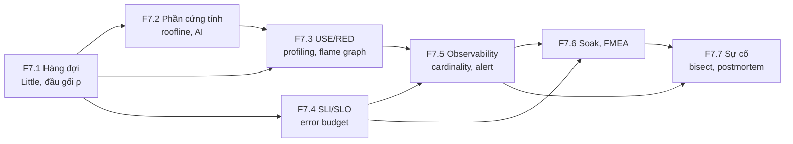

# F7 — Hiệu năng và vận hành ở quy mô (31h)

> Khóa nền, học **đúng lúc**: mở viên nang ngay trước bài chính cần nó (bảng dưới). Tổng 31h = F7.1 4h · F7.2 6h · F7.3 4h · F7.4 4h · F7.5 4h · F7.6 5h · F7.7 4h. 31h này **không** nằm trong 545h của K1–K6; nó cộng thêm vào tổng lộ trình vốn đã vượt ngân sách 650h (xem `khoa-7/_KE-HOACH-K7.md` mục 3). Một phần trùng giờ bài chính (bài kiểm tra cuối F7 làm được trong giờ K5 Bài 18–19 hoặc K7 C10.3), nên chi phí thật thấp hơn 31h `[ước lượng]`.

## Vì sao khóa nền này tồn tại

Bạn đã vận hành hệ high-load. F7 không dạy lại SLO hay Prometheus; nó chỉ ra chỗ các khái niệm đó **đổi nghĩa** khi tài nguyên là một chiếc N100 một kênh RAM, consumer là một đồng hồ I2S không biết chờ, và "người dùng" là một robot đang chạy. Thiếu F7, bạn hụt ở những chỗ sau:

- **K3 Bài 4, Bài 8, Bài 10** — đọc công thức `dma_desc_num × dma_frame_num / fs` như một hằng số cấu hình, không thấy nó là định luật Little và độ trễ thật là *mức đầy*, không phải *dung lượng*.
- **K3 Bài 11–12** — thấy RTF 0,9 là "còn dư 10%", trong khi đó là utilization 0,9, ngay trên đầu gối của hàng đợi.
- **K4 Bài 12** — chép "N100 ≈ 0,7 TFLOPS" và "VLA batch 1 là compute-bound" từ bản Gemini rồi vẽ roofline sai từ trục tung.
- **K6 Bài 8** — thấy `%CPU` 100% và tưởng máy đang tính, trong khi bốn nhân đang chờ chung một kênh RAM.
- **K5 Bài 18, K3 Bài 17, K7 C10.3** — chạy soak 7 ngày / 72h, báo "completeness 99,6%, PASS" trong khi một luồng chết trọn tuần; hoặc báo FAIL vì mẫu số tính từ ODR danh định sai 1,5%.
- **K5 Bài 19, K7 C10** — "bisect" bốn tầng bằng cách dò tuần tự từ trên xuống, và viết postmortem kiểu "tôi quên cắm dây".

## Mindset cốt lõi

1. **Utilization cao không phải là hiệu quả, nó là độ trễ đang chờ xảy ra.** Kỹ sư tổng đài từ thời Erlang (Copenhagen, 1909) đã phải định cỡ số đường dây theo xác suất chờ chứ không theo tải trung bình; người làm hệ thống học lại bài này mỗi lần một service "chỉ 85% CPU" có p99 gấp mười lần lúc 50%.
2. **Biết nút thắt là gì trước khi tối ưu.** Wulf và McKee gọi tên "memory wall" năm 1995: tốc độ tính tăng nhanh hơn tốc độ RAM nhiều năm liền, nên phần lớn chương trình chờ dữ liệu chứ không chờ ALU. Roofline (Williams, Waterman, Patterson, CACM 2009) ra đời để hỏi một câu trước khi viết lại kernel: *trần nào đang chặn tôi?*
3. **Đo từ tài nguyên, không từ triệu chứng.** Brendan Gregg đề xuất USE method vì thấy các nhóm vận hành sa vào "streetlight anti-method": nhìn công cụ nào quen tay chứ không nhìn chỗ lỗi nằm.
4. **Độ tin cậy là một con số có ngân sách, không phải một tính từ.** Google SRE đặt error budget vì cuộc cãi "dev muốn ra nhanh, ops muốn ổn định" không có điểm dừng nếu "ổn định" không có đơn vị.
5. **Sự cố là dữ liệu về hệ thống, không phải về người.** Hàng không (báo cáo sự cố không trừng phạt, ASRS của NASA từ 1976) và sau đó John Allspaw ở Etsy (2012) chỉ ra: phạt người viết báo cáo thì báo cáo biến mất, và lỗi tiếp theo đến không báo trước.

## Bản đồ viên nang



### Học đúng lúc

| Viên nang | Học trước bài chính | Giờ |
|---|---|---|
| F7.1 Hàng đợi | K1 Bài 3 (lướt), Bài 9, Bài 12 · K2 Bài 2 · **K3 Bài 4**, Bài 8, Bài 10, Bài 11, Bài 13 · K4 Bài 1 · K5 Bài 13, Bài 14, Bài 17 · K6 Bài 8, Bài 16 · K7 C11.2 | 4 |
| F7.2 Phần cứng tính toán | K3 Bài 12 · K4 Bài 1 (lướt mục cường độ), Bài 8, Bài 11, **Bài 12** · K6 Bài 8 | 6 |
| F7.3 USE/RED, profiling | K3 Bài 4 (telemetry theo tầng) · K4 Bài 3, Bài 12 · **K6 Bài 8** · K7 C11.4 | 4 |
| F7.4 SLI/SLO/error budget | K2 Bài 6 · K3 Bài 7, Bài 10, Bài 11, **Bài 17** · K4 Bài 2 · **K5 Bài 18** · K7 C9.3, C10.3, C12 | 4 |
| F7.5 Observability | K2 Bài 2, Bài 8 · K3 Bài 7, **Bài 16** · K5 Bài 1, Bài 18 · K7 C10.3 | 4 |
| F7.6 Soak, FMEA | K1 Bài 8, Bài 11 · K3 Bài 4, **Bài 17** · K5 Bài 18 · **K7 C10.2, C10.3** | 5 |
| F7.7 Sự cố | K1 Bài 5, Bài 13 · K3 Bài 16 · K4 Bài 15 · **K5 Bài 19** · K7 C10 | 4 |

Đậm = bài phụ thuộc nặng nhất. Tuần crunch: F7.1 mục 2 + 6 trước K3 Bài 4; F7.2 mục 2 + 6 trước K4 Bài 12; F7.4 mục 2 + 6 trước K3 Bài 17. K4/K5 đang được soạn song song: bảng trên dựa vào bản gốc `khoa-4-benchmark-edge.md`, `khoa-5-sensor-timesync-platform.md` và các bài đã có trong `giao-trinh/`.

## Bạn đã làm cái này rồi

| Bạn đã làm trong backend/AI-harness | Tên chuẩn | Còn thiếu | Viên nang |
|---|---|---|---|
| Định cỡ connection pool = RPS × latency | **Định luật Little** (L = λW) | Little nói về trung bình; kích thước buffer do **đuôi** quyết định. Và đầu gối utilization: Little không cho biết W tăng thế nào khi ρ → 1 | F7.1 |
| Server mock tự tạo tải để test | Load generator; **open-loop vs closed-loop** | Mock gửi request kế tiếp sau khi nhận trả lời (closed loop) thì không bao giờ thấy đầu gối; robot và cảm biến là open loop (→ F1.3 coordinated omission) | F7.1 |
| Đo trên host "yên tĩnh" | **Active benchmarking**, USE method | Kiểm từng tài nguyên (CPU, RAM bandwidth, nhiệt, USB) theo checklist, không chỉ "không có process khác" | F7.3 |
| Hệ metrics để quan sát/eval | **Observability**, RED/USE, SLI | Mỗi metric phải có người đọc và quyết định đi kèm; **cardinality** là chi phí; gauge lấy mẫu có aliasing | F7.5 |
| Script chấm pass/fail/inconclusive | **SLO compliance** có khoảng tin cậy; burn-rate alert | SLO với mẫu số nhỏ (72h, 10 lần rút điện) phải báo cận trên, không báo "0%" (→ F1.4) | F7.4 |
| Pipeline agent tự chạy → test → sửa → deploy → báo cáo | Vòng **incident → postmortem → action item** tự động hóa một phần | Postmortem không đổ lỗi, timeline, "điều gì làm lỗi này *có thể* xảy ra" — agent không viết thay được | F7.7 |
| Dựng môi trường local tái tạo được | Điều kiện để **bisect** (→ F2.2) | Ở robot, "môi trường" gồm dây, nguồn, nhiệt; bisect qua tầng vật lý cần dụng cụ đo làm trọng tài | F7.7 |

---

## F7.1 — Hàng đợi: định luật Little, đầu gối utilization, trực giác M/M/1 (4h)

> **Dùng cho:** K3 Bài 4, 8, 10, 11, 13 · K5 Bài 13, 14, 17 · K6 Bài 8 · K4 Bài 1 · K7 C11.2 · **Cần trước:** F1.2 (phân bố, percentile) · **Sau viên nang này bạn đánh giá được:** một khẳng định về độ trễ qua buffer/hàng đợi có đúng không (dung lượng hay mức đầy, trung bình hay đuôi), một con số utilization ("RTF 0,9", "CPU 85%") nằm ở đâu so với đầu gối, và một phép ngoại suy "ở 30% tải thì ổn nên ở 80% cũng ổn" có hợp lệ không.

### 1. Câu chuyện

Năm 1909, Agner Krarup Erlang, kỹ sư của Copenhagen Telephone Company, công bố cách tính xác suất một cuộc gọi phải chờ khi tổng đài có số đường dây hữu hạn và cuộc gọi đến ngẫu nhiên `[chuẩn]`. Tổng đài bị chặn bởi một mâu thuẫn mà mọi hệ sau này lặp lại: thêm đường dây thì tốn tiền, bớt đường dây thì khách chờ, và mức chờ **không tăng tuyến tính** theo tải. Đơn vị đo lưu lượng điện thoại đến nay vẫn mang tên ông (erlang).

Năm 1961, John D. C. Little chứng minh một định lý ngắn đến khó tin: với **bất kỳ** hệ ổn định nào, số phần tử trung bình trong hệ L bằng tốc độ đến λ nhân thời gian lưu trung bình W, **L = λW**, không cần giả định phân bố đến, phân bố phục vụ, hay thứ tự phục vụ `[chuẩn: Little, Operations Research 9(3), 1961]`. Bạn đã dùng nó cả sự nghiệp khi định cỡ connection pool. K3 Bài 4 dùng nó cho DMA của ESP32: công thức độ trễ `dma_desc_num × dma_frame_num / fs` mà bản gốc và bản Gemini đưa ra như "một công thức" **chính là Little**, với λ = fs (→ K3 Bài 4 mục 2). Hội thoại Gemini ở K3 bỏ lỡ kết nối này (mục 7 quy chuẩn).

Chiều ngược lại là **bufferbloat** (Gettys và Nichols, ACM Queue 2011): router có buffer khổng lồ giữ mạng ở utilization cao, không mất gói, nhưng độ trễ hàng giây. Hàng đợi đầy là hàng đợi chậm, dù không ai "lỗi".

### 2. Mô hình tư duy

```
λ (đến)          ┌────────── hệ ──────────┐          λ (ra, khi ổn định)
──────────►      │  [hàng đợi: L_q]  [server: ρ] │  ──────────►
                 └────────────────────────┘
       L = λ·W          (mọi hệ ổn định, chỉ về TRUNG BÌNH)
       ρ = λ·S          (utilization = tốc độ đến × thời gian phục vụ)
       M/M/1:  W = S / (1 − ρ)          ← đầu gối
       Kingman (G/G/1, xấp xỉ):  W_q ≈ S · ρ/(1 − ρ) · (c_a² + c_s²)/2
```

Ba điều cốt lõi:

1. **Little là kế toán, không phải mô hình.** Nó đúng cho DMA, cho hàng đợi upload, cho số robot đang đứng chắn hành lang, cho số episode chạy song song (λ = L/W ở K6 Bài 8, K7 C11.2). Nó không nói gì về đuôi: biết L trung bình không cho biết xác suất buffer cạn.
2. **Đầu gối đến từ 1/(1 − ρ).** Chờ không do server chậm mà do *biến thiên*: job đến dồn cục khi server đang bận. Kingman cho thấy W_q tỉ lệ với (c_a² + c_s²)/2, tức là bình phương hệ số biến thiên của khoảng cách đến và thời gian phục vụ. Phục vụ đều (c_s = 0) giảm chờ một nửa so với phục vụ mũ (c_s = 1), nhưng không xóa đầu gối.
3. **Ở robot, nhiều hàng đợi là "ngược".** Consumer (I2S, vòng điều khiển 100 Hz) rút với tốc độ cố định, không biết chờ; producer (host Linux, TTS) là bên ngẫu nhiên. Câu hỏi thiết kế đổi từ "job chờ bao lâu" sang "buffer có cạn không" — bài toán đuôi của mức đầy (K3 Bài 10), và RTF của TTS chính là ρ của producer (K3 Bài 11).

### 3. Cầu nối từ backend

| Backend bạn biết | Ở đây | Gãy ở chỗ | Nếu dùng nhầm thì |
|---|---|---|---|
| Pool size = RPS × latency | `W_dma = L_dma / fs`; số episode song song = λ × W | λ ở I2S cố định tuyệt đối bởi LRCK, không có "giảm tải" hay retry; consumer rỗng là tiếng tách | Tính độ trễ theo **dung lượng** ring thay vì **mức đầy** thật; báo "trễ 200 ms" khi ring đang đầy 30% |
| Giữ CPU < 70% để có headroom | RTF của TTS, duty cycle của task nạp DMA | Ở backend headroom là quy ước; ở đây nó suy ra được từ 1/(1 − ρ) và c_s của chính model | Chấp nhận RTF 0,9 vì "còn dư 10%" (K3 Bài 11) |
| Load test bằng k client đồng thời | Cảm biến/robot đẩy dữ liệu theo nhịp riêng | Closed loop tự hãm khi hệ chậm (client chờ trả lời mới gửi tiếp) nên che đầu gối; cảm biến là open loop, không hãm | Load test PASS ở "100 client" nhưng ingest sụp khi 10 robot cùng xả backlog sau mất mạng (K5 Bài 14) |
| Autoscale khi queue dài | Trên một N100 không có máy thứ hai | Không thêm server được; chỉ còn bớt tải (drop, → F3.9) hoặc giảm S | Thiết kế "queue lớn cho chắc" → bufferbloat: trễ hàng giây, không lỗi nào |

**Chấm mô hình:**

- *Mô hình của bạn ở K3 lượt 6:* "luôn phải có buffer để ổn định input… phần cứng dùng RAM để đánh đổi… latency sẽ giảm nhưng bù lại cho phép khả năng kiểm soát." — **ĐÚNG MỘT PHẦN.** Đúng: buffer có mặt ở mọi ranh giới hai nhịp độ. Gãy ở hai chỗ. (1) Theo Little, buffer **tăng** độ trễ (W = L/λ), không giảm. (2) Buffer chỉ hấp thụ được *biến thiên* quanh một tốc độ trung bình đã khớp; nếu λ_vào > λ_ra trung bình (ρ > 1), không buffer hữu hạn nào đủ. Phản ví dụ: hai thạch anh lệch 40 ppm ở 48 kHz — FIFO 256 mẫu nào rồi cũng cạn hoặc tràn sau một khoảng hữu hạn (bài tập "Hai thạch anh", K1 Bài 3), vì đó là chênh tốc độ, không phải jitter.
- *"Little chỉ đúng cho M/M/1."* — **SAI.** Little đúng cho mọi hệ ổn định; chính M/M/1 mới là giả định mạnh (đến Poisson, phục vụ mũ). Phản ví dụ: DMA có phục vụ hoàn toàn đều và vẫn thỏa W = L/fs (K3 Bài 4 mô phỏng).
- *"Ở 30% tải p99 là 40 ms, vậy ở 80% tải p99 khoảng 40 × 80/30 ≈ 107 ms."* — **SAI.** Ngoại suy tuyến tính qua đầu gối. Với M/M/1, W tỉ lệ 1/(1 − ρ): từ 0,3 lên 0,8 là gấp 3,5 lần chứ không phải 2,7, và p99 còn dốc hơn khi c_s > 1. Đây cũng là ví dụ out-of-sample ở K6 Bài 16.

**Tên chuẩn của thứ bạn đã làm:** "pool = RPS × latency" là Little; "giữ CPU dưới 70%" là quy tắc đầu gối; mock server gửi tuần tự là closed-loop load generator.

### 4. Thuật ngữ

| Mức | Thuật ngữ | Nghĩa trong một câu | Hay bị hiểu nhầm thành |
|---|---|---|---|
| 🟢 | Định luật Little | L = λW cho mọi hệ ổn định, về trung bình | Công thức riêng của M/M/1; hoặc nói được về đuôi |
| 🟢 | Utilization ρ | Tỉ lệ thời gian server bận = λ·S | "Còn 1 − ρ dư địa dùng thoải mái" |
| 🟢 | Đầu gối (knee) | Vùng ρ mà W bắt đầu tăng dốc, thường 0,7–0,85 tùy biến thiên | Một ngưỡng cố định 80% |
| 🟡 | M/M/1, M/D/1, G/G/1 | Ký hiệu Kendall: phân bố đến / phân bố phục vụ / số server | Tên sản phẩm |
| 🟡 | Kingman | Xấp xỉ thời gian chờ G/G/1 theo ρ và hệ số biến thiên | Chính xác ở mọi ρ (chỉ tốt khi ρ gần 1) |
| 🟡 | Open vs closed loop | Tải đến độc lập với hệ / tải chờ hệ trả lời mới gửi tiếp | Hai cách cấu hình cùng một test |
| 🔴 | Lý thuyết mạng hàng đợi (Jackson, BCMP) | Ghép nhiều hàng đợi thành mạng có lời giải đóng | Cần cho robot đơn lẻ |

### 5. Bài tập dự đoán

**Đề.** Một server, FIFO, thời gian phục vụ trung bình S = 1 (đơn vị thời gian), job đến Poisson. Dự đoán trước khi chạy:

1. Thời gian trung bình trong hệ W (theo bội số của S) ở ρ = 0,5; 0,8; 0,9; 0,95 với phục vụ mũ (M/M/1).
2. p99 của thời gian trong hệ ở ρ = 0,9 (M/M/1): gấp bao nhiêu lần mean?
3. Cùng ρ = 0,9 nhưng phục vụ **đều** (M/D/1, giống DMA hoặc một kernel cố định): W bằng bao nhiêu phần W của M/M/1?
4. Đo L **độc lập** (đếm số job trong hệ tại các thời điểm ngẫu nhiên), so với λ·W: lệch bao nhiêu?
5. Ở ρ = 0,95, mô phỏng 400.000 job có khớp lý thuyết không? Nếu lệch, vì sao?

**Phương pháp:** câu 1 dùng W = S/(1 − ρ); câu 2: thời gian trong hệ M/M/1 phân bố mũ với tham số (1 − ρ)/S, nên p99 = ln(100)·W; câu 3 dùng Kingman hoặc Pollaczek–Khinchine (W_q giảm theo (1 + c_s²)/2); câu 5 nghĩ về thời gian tương quan của hàng đợi khi ρ → 1 (→ F1.3 steady state).

```markdown
# prediction.md — F7.1
1. W(0.5)=___ W(0.8)=___ W(0.9)=___ W(0.95)=___   (× S)
2. p99/mean ở ρ=0.9 ≈ ___
3. W_MD1 / W_MM1 ở ρ=0.9 ≈ ___
4. |L − λW| / L ≈ ___
5. ρ=0.95 lệch lý thuyết? ___ vì ___
Độ tự tin (1–5): ___   Tôi sẽ ngạc nhiên nếu: ___
```

```python
# [đã chạy] F7.1 — M/M/1 vs M/D/1: đầu gối utilization, và kiểm định luật Little
import numpy as np, matplotlib
import matplotlib.pyplot as plt
rng = np.random.default_rng(71)
S = 1.0                                    # thời gian phục vụ trung bình (đơn vị: 1 lần phục vụ)
N = 400_000                                # số job mỗi lần chạy

def simulate(rho, deterministic=False):
    lam = rho / S
    a = rng.exponential(1 / lam, N)        # khoảng cách giữa hai lần đến (Poisson)
    s = np.full(N, S) if deterministic else rng.exponential(S, N)
    arrive = np.cumsum(a)
    start = np.empty(N); done = np.empty(N)
    t_free = 0.0
    for i in range(N):                     # một server, FIFO (đệ quy Lindley)
        start[i] = max(arrive[i], t_free)
        done[i] = t_free = start[i] + s[i]
    W = done - arrive                      # thời gian trong hệ = chờ + phục vụ
    k = N // 10                            # bỏ 10% đầu (warmup, → F1.3)
    W, arrive, done = W[k:], arrive[k:], done[k:]
    t = rng.uniform(arrive[0], arrive[-1], 200_000)   # nhìn vào hệ ở thời điểm ngẫu nhiên
    L = (np.searchsorted(np.sort(arrive), t) - np.searchsorted(np.sort(done), t)).mean()
    lam_obs = len(W) / (arrive[-1] - arrive[0])        # đo L ĐỘC LẬP với W, rồi so λW
    return W.mean(), np.percentile(W, 99), L, lam_obs

print(" rho | W_MM1  lythuyet  p99_MM1 | W_MD1 | L     lam*W")
rhos = [0.5, 0.7, 0.8, 0.9, 0.95]
res = []
for r in rhos:
    w, p99, L, lo = simulate(r)
    wd, p99d, _, _ = simulate(r, deterministic=True)
    res.append((w, p99, wd))
    print(f"{r:4.2f} | {w:6.2f}  {S/(1-r):6.2f}   {p99:7.1f} | {wd:5.2f} | {L:5.2f} {lo*w:5.2f}")

rr = np.linspace(0.01, 0.97, 200)
plt.plot(rr, S / (1 - rr), label="M/M/1 lý thuyết: W = S/(1-ρ)")
plt.plot(rr, S + rr * S / (2 * (1 - rr)), label="M/D/1 lý thuyết (P-K)")
plt.plot(rhos, [x[0] for x in res], "o", label="M/M/1 mô phỏng (mean)")
plt.plot(rhos, [x[1] for x in res], "s", label="M/M/1 mô phỏng (p99)")
plt.ylim(0, 60); plt.xlabel("utilization ρ"); plt.ylabel("thời gian trong hệ (× S)")
plt.legend(); plt.grid(alpha=.3); plt.show()
```

<details><summary>🔒 MỞ SAU KHI COMMIT prediction.md</summary>

Kết quả khi chạy (seed 71, numpy 2.x, ~3 s):

| ρ | W M/M/1 mô phỏng | Lý thuyết S/(1−ρ) | p99 M/M/1 | W M/D/1 | L đo độc lập | λ·W |
|---|---|---|---|---|---|---|
| 0,50 | 1,98 | 2,00 | 9,0 | 1,50 | 0,99 | 0,99 |
| 0,70 | 3,34 | 3,33 | 15,3 | 2,16 | 2,34 | 2,33 |
| 0,80 | 5,07 | 5,00 | 23,6 | 3,02 | 4,06 | 4,06 |
| 0,90 | 10,39 | 10,00 | 50,5 | 5,51 | 9,35 | 9,36 |
| 0,95 | 21,11 | 20,00 | 95,0 | 10,97 | 20,05 | 20,05 |

- **Đầu gối:** từ ρ = 0,5 lên 0,9 (tải tăng 1,8 lần), W tăng 5 lần; lên 0,95 thì 10 lần.
- **p99 ≈ 4,6 × mean** (ln 100) ở M/M/1; ở ρ = 0,9 lý thuyết là 46, mô phỏng 50,5.
- **M/D/1 ≈ 0,55 × M/M/1** ở ρ = 0,9: phục vụ đều cắt nửa phần *chờ* (W_q từ 9 xuống 4,5), cộng S = 1. Vẫn có đầu gối.
- **Little khớp tới chữ số thứ hai** dù L được đo bằng cách đếm, hoàn toàn độc lập với W.
- **ρ = 0,95 lệch ~5%** so với lý thuyết: không phải lý thuyết sai mà là hàng đợi gần bão hòa có "trí nhớ" rất dài (thời gian tương quan tăng theo 1/(1 − ρ)²), nên 400.000 job chỉ là vài chục mẫu độc lập. Đổi seed sẽ thấy dao động ±10%. Đây cũng là lý do benchmark ở utilization cao cần chạy lâu hơn nhiều mới tới steady state (→ F1.3).

</details>

### 6. Lăng kính đánh giá

Checklist khi đọc một khẳng định về độ trễ qua buffer/hàng đợi:

1. Độ trễ được tính từ **dung lượng** hay **mức đầy đo được**? Chỉ mức đầy cho W thật (Little).
2. Con số là trung bình hay percentile? Little chỉ nói về trung bình; kích thước buffer chống underrun là câu hỏi về đuôi của mức đầy.
3. Utilization là bao nhiêu, và tài liệu có nói biến thiên (c_a, c_s) không? Không có ρ thì không đánh giá được "headroom".
4. Có ngoại suy qua đầu gối không (đo ở ρ thấp, kết luận ở ρ cao)?
5. Tải là open hay closed loop? Kết quả load test closed loop không áp được cho nguồn open loop.
6. Tốc độ trung bình hai đầu có khớp không (ρ < 1)? Nếu hai đồng hồ khác nhau, có cơ chế khớp tốc độ (credit, resample) không?

**ĐÚNG** nếu 1–6 thỏa; **SAI** nếu dùng dung lượng làm độ trễ thật, hoặc ngoại suy tuyến tính qua đầu gối; **CHƯA RÕ** nếu không có ρ hoặc không biết tải open/closed.

**Khẳng định mẫu — tự chấm trước khi mở:**

(a) Bản Gemini K3 Bài 4: *"Ở 24 kHz, nếu chọn 3 × 1600 = 4800 frame → Độ trễ cứng là **200 ms**."*

(b) Bản Gemini K3 Bài 4: *"`DMA buffer` cần ép nhỏ để đạt độ trễ vật lý thấp. `RingBuffer ESP32` cần đủ rộng để hấp thụ toàn bộ jitter… Hai vùng đệm giải quyết hai bài toán độc lập."*

(c) Bản gốc K3 Bài 11 (tinh thần): *"RTF < 1 thì stream được."*

<details><summary>🔒 Đáp án</summary>

(a) **ĐÚNG MỘT PHẦN.** Phép tính đúng là Little với L = 4800 frame, λ = 24.000 frame/s. Nhưng "độ trễ cứng" chỉ đúng khi DMA luôn đầy. Với `i2s_channel_write` chặn, DMA dao động giữa (desc − 1)·frame và desc·frame, nên trễ nằm giữa 133 và 200 ms; và nếu ring buffer phía trước cũng đang có dữ liệu thì trễ đầu–cuối là (L_ring + L_dma)/fs, lớn hơn. Đo mức đầy, đừng tin cấu hình.

(b) **ĐÚNG MỘT PHẦN.** Với một luồng liên tục, độ trễ đầu–cuối là **tổng** mức đầy hai vùng chia fs (Little áp cho cả chuỗi), nên "DMA nhỏ cho trễ thấp" không đúng nếu ring lớn và đầy. Hai vùng không giải hai bài toán độc lập về độ trễ; lợi ích thật của việc tách là khác (ring nằm trong RAM rẻ và điều khiển được bằng flow control, có thể xả ngay khi bấm kill; DMA nhỏ thì kill cắt nhanh). K3 Bài 4 câu hỏi ngược 4 đào chỗ này.

(c) **ĐÚNG MỘT PHẦN.** RTF < 1 là điều kiện ρ < 1, tức điều kiện cần để hàng đợi không phình vô hạn **về trung bình**. Không đủ: RTF có phân bố (câu dài, câu khó, CPU hạ xung), và với producer có biến thiên, buffer phát phải đủ lớn để chịu đuôi. RTF 0,9 với c_s lớn sẽ underrun thường xuyên dù "nhỏ hơn 1". K3 Bài 11 tính ngưỡng từ phân bố RTF, không từ trung bình.

</details>

### 7. Câu hỏi ngược

1. **[Vì sao không]** Vì sao không chạy N100 ở 95% CPU cho "tận dụng phần cứng", khi máy không có ai khác dùng?
   <details><summary>Hướng nghĩ</summary>

   Ai trả giá cho phần CPU "lãng phí"? So chi phí của 5% CPU nhàn với chi phí của một lần vòng điều khiển trễ deadline. Ở hệ thời gian thực, headroom mua *đuôi*, không mua trung bình.

   </details>
2. **[Quy mô]** 100 robot cùng xả backlog upload sau khi WiFi văn phòng phục hồi. Object store chịu được tổng băng thông trung bình. Cái gì gãy trước?
   <details><summary>Hướng nghĩ</summary>

   Tải trung bình không phải tải lúc phục hồi: 100 nguồn đồng bộ hóa bởi cùng một sự kiện là đến dồn cục (c_a rất lớn). Nghĩ về thundering herd, jitter ngẫu nhiên trước khi retry, và Little cho thời gian rút cạn backlog (K5 Bài 14).

   </details>
3. **[Failure mode]** Dashboard ingest báo độ trễ trung bình ổn định 50 ms suốt tuần. Một đêm thứ Ba, latency đầu–cuối của dữ liệu tăng lên 40 phút mà biểu đồ không nhúc nhích. Có thể không?
   <details><summary>Hướng nghĩ</summary>

   Độ trễ đo ở đâu, của job nào? Nếu chỉ đo job *đã xong*, job đang kẹt trong hàng đợi không xuất hiện. Đo **tuổi của phần tử cũ nhất** trong hàng (oldest unprocessed) hoặc mức đầy, rồi dùng Little để đổi sang thời gian.

   </details>
4. **[Liên ngành]** Một bệnh viện có phòng cấp cứu trung bình 70% giường. Vì sao giám đốc vẫn thấy hàng chờ dài vào thứ Hai?
   <details><summary>Hướng nghĩ</summary>

   ρ trung bình theo tuần che ρ theo giờ. Hàng đợi phản ứng với ρ tức thời, và đầu gối phi tuyến làm trung bình của W lớn hơn W của trung bình (bất đẳng thức Jensen).

   </details>
5. **[Phản biện]** "Little không dùng được cho robot vì hệ không bao giờ ổn định: robot chạy rồi dừng." Bạn đồng ý tới đâu?
   <details><summary>Hướng nghĩ</summary>

   Little cần trung bình dài hạn tồn tại, và có phiên bản cho khoảng hữu hạn nếu hệ rỗng ở hai đầu khoảng. Một episode bắt đầu và kết thúc với buffer rỗng là đủ.

   </details>

### 8. Liên kết ra ngoài

- **Sản xuất — Factory Physics (Hopp & Spearman).** Little ở dạng WIP = throughput × cycle time là định luật đầu tiên của quản lý nhà máy; Toyota giảm tồn kho giữa các trạm (giảm L) để lộ ra nút thắt. Giống: cùng một định lý. Khác: nhà máy chọn được giảm ρ bằng cách thêm máy; robot một N100 thì không.
- **Mạng — CoDel và bufferbloat.** CoDel (Nichols & Jacobson, 2012) không giới hạn *kích thước* hàng đợi mà giới hạn *thời gian lưu* (sojourn time) của gói, chính là W. Giống: đo W trực tiếp thay vì suy từ dung lượng. Khác: mạng được phép drop gói; DMA audio thì drop là tiếng tách.

### 9. Áp vào khóa chính

- **K3 Bài 4, 8, 10:** mọi con số độ trễ qua vùng đệm phải là *mức đầy đo được / fs*. Log mức đầy ring theo thời gian; kích thước ring chọn theo percentile thấp của mức đầy (đuôi), không theo trung bình.
- **K3 Bài 11–13:** đọc RTF như ρ của TTS worker; chọn ngưỡng stream/pre-render từ phân bố RTF và Kingman, không từ "RTF < 1".
- **K5 Bài 14, 17:** thời gian rút cạn backlog = backlog / (uplink − ingest); ρ của uplink sau mất mạng gần 1 là bình thường, và chính sách drop (F3.9) là cách duy nhất giảm ρ.
- **K6 Bài 8, K7 C11.2:** thông lượng episode = số worker / thời gian mỗi episode (Little); thêm worker chỉ tăng λ nếu W không tăng theo (tranh chấp → USL, F7.2).

### 10. Độ tin cậy

| Khẳng định | Nhãn | Ghi chú / cách kiểm |
|---|---|---|
| L = λW cho mọi hệ ổn định | [chuẩn] | Little 1961; kiểm bằng mô phỏng mục 5 |
| M/M/1: W = S/(1−ρ); thời gian trong hệ phân bố mũ | [chuẩn] | Giáo khoa hàng đợi (Harchol-Balter, phần M/M/1) |
| Xấp xỉ Kingman cho G/G/1 | [chuẩn] | Kingman 1961; tốt khi ρ gần 1 |
| Erlang công bố 1909 tại Copenhagen Telephone Co. | [chuẩn] | Lịch sử lý thuyết hàng đợi |
| Bufferbloat, CoDel | [chuẩn] | ACM Queue 2011, 2012 |
| Kết quả mô phỏng mục 5 | [đã chạy] | seed 71; ρ = 0,95 dao động theo seed |

Đã sửa so với bản gốc/Gemini: (K3 Bài 4) công thức độ trễ DMA được gọi đúng tên là định luật Little và đổi từ "độ trễ cứng" sang "mức đầy / fs"; (Gemini K3 Bài 4) "hai vùng đệm giải hai bài toán độc lập" → độ trễ là tổng mức đầy hai vùng.

### 11. Đọc thêm và tự kiểm tra

- **Nguồn gốc:** J. D. C. Little, "A Proof for the Queuing Formula: L = λW", *Operations Research* 9(3), 1961.
- **Giải thích:** Mor Harchol-Balter, *Performance Modeling and Design of Computer Systems* (Cambridge, 2013), các chương về operational laws (Little) và M/M/1.
- **Đào sâu (tùy chọn):** Jim Gettys, Kathleen Nichols, "Bufferbloat: Dark Buffers in the Internet", *ACM Queue*, 2011.
- **Tự kiểm tra:** (1) giải thích cho một backend engineer vì sao "DMA 3 × 1600 frame ở 24 kHz trễ 200 ms" vừa đúng vừa sai; (2) vẽ lại đường W(ρ) và đánh dấu đầu gối từ trí nhớ; (3) câu hỏi:

  Hàng đợi upload MCAP có trung bình 12 file đang chờ, mỗi phút 3 file mới vào. Một file nằm chờ trung bình bao lâu? Nếu uplink giảm một nửa và ρ từ 0,5 lên 1,0 thì sao?
  <details><summary>Đáp án</summary>

  W = L/λ = 12/3 = **4 phút** (Little, không cần biết phân bố). Khi ρ = 1, hàng đợi không còn ổn định: L tăng không giới hạn, Little không áp được nữa, và "trung bình bao lâu" không có đáp án hữu hạn — chỉ còn drop hoặc tăng uplink.

  </details>

---
